03-Apul-RNA-summary
================
Kathleen Durkin
2024-08-20

- <a href="#001-install-and-load-packages"
  id="toc-001-install-and-load-packages">0.0.1 Install and load
  packages</a>
- <a href="#1-unnormalized-data" id="toc-1-unnormalized-data">1
  Unnormalized data</a>
  - <a href="#11-load-count-data" id="toc-11-load-count-data">1.1 Load count
    data</a>
  - <a href="#12-count-data-munging" id="toc-12-count-data-munging">1.2
    Count data munging</a>
  - <a href="#13-expression-levels" id="toc-13-expression-levels">1.3
    Expression levels</a>
  - <a href="#14-transcript-counts" id="toc-14-transcript-counts">1.4
    Transcript counts</a>
  - <a href="#15-most-common-biological-processes"
    id="toc-15-most-common-biological-processes">1.5 Most common biological
    processes</a>
- <a href="#2-normalized-counts" id="toc-2-normalized-counts">2 Normalized
  counts</a>
  - <a href="#21-normalize-counts-with-deseq2"
    id="toc-21-normalize-counts-with-deseq2">2.1 Normalize counts with
    DESeq2</a>
    - <a href="#211-plot-unnormalized-data"
      id="toc-211-plot-unnormalized-data">2.1.1 Plot unnormalized data</a>
    - <a href="#212-metadata" id="toc-212-metadata">2.1.2 Metadata</a>
    - <a href="#213-deseq-object" id="toc-213-deseq-object">2.1.3 DESeq
      object</a>
  - <a href="#22-plot-normalized-data" id="toc-22-plot-normalized-data">2.2
    Plot normalized data</a>
  - <a href="#23-plot-variance-stabilized-data"
    id="toc-23-plot-variance-stabilized-data">2.3 Plot variance stabilized
    data</a>
  - <a href="#24-normalized-expression-levels"
    id="toc-24-normalized-expression-levels">2.4 Normalized expression
    levels</a>
  - <a href="#25-normalized-transcript-counts"
    id="toc-25-normalized-transcript-counts">2.5 Normalized transcript
    counts</a>
  - <a href="#26-pca-of-variance-stabilized-data"
    id="toc-26-pca-of-variance-stabilized-data">2.6 PCA of variance
    stabilized data</a>
  - <a href="#27-sample-clustering" id="toc-27-sample-clustering">2.7 Sample
    clustering</a>
  - <a href="#28-heatmaps" id="toc-28-heatmaps">2.8 Heatmaps</a>

Gene expression summary for *Acropora pulchra* RNA-seq data.

- trimmed reads generated in `deep-dive` project, trimming and QC
  details in `01-Apul-RNA-trimming-FastQC`

- Reads aligned to *Acropora millipora* transcriptome downloaded from
  [NCBI](https://www.ncbi.nlm.nih.gov/datasets/genome/GCF_013753865.1/),
  stored
  [here](https://gannet.fish.washington.edu/acropora/E5-deep-dive/Transcripts/Apul_GCF_013753865.1_rna.fna)
  as a part of [deep-dive genomic
  resources](https://github.com/urol-e5/deep-dive/wiki/Species-Characteristics-and-Genomic-Resources#genomic-resources).

### 0.0.1 Install and load packages

``` r
library(tidyverse)
library(ggplot2)
library(reshape2)
library(magrittr)
library(DESeq2)
library(RColorBrewer)
library(pheatmap)
```

# 1 Unnormalized data

## 1.1 Load count data

Load in the count matrix we generated after kallisto pseudoalignment
using the Trinity abundance_estimates_to_matrix.pl script. We also need
to slightly reformat the count matrix

``` r
# Read in counts data. This is a gene-level counts matrix generated from kallisto transcript abundances using Trinity
Apul_counts_RNA_OG <- read_delim("../../../deep-dive/D-Apul/output/14-Apul-RNAseq-kallisto/kallisto/kallisto.isoform.counts.matrix") 
head(Apul_counts_RNA_OG)
```

    # A tibble: 6 × 6
      ...1      kallisto_quant_sampl…¹ kallisto_quant_sampl…² kallisto_quant_sampl…³
      <chr>                      <dbl>                  <dbl>                  <dbl>
    1 XM_04431…                  108                     46                    63   
    2 XR_00639…                    0                      0                     0   
    3 XM_02934…                  467.                   337.                  362.  
    4 XM_04432…                   43.5                   20.7                   5.14
    5 XR_00639…                  108.                     0                     0   
    6 XM_04431…                   20.4                    0                    21.3 
    # ℹ abbreviated names: ¹​kallisto_quant_sample140, ²​kallisto_quant_sample145,
    #   ³​kallisto_quant_sample150
    # ℹ 2 more variables: kallisto_quant_sample173 <dbl>,
    #   kallisto_quant_sample178 <dbl>

``` r
# Read in ID mapping of transcripts and associated GO terms etc.
Apul_IDmapping <- read_delim("..//output/02-Apul-reference-annotation/Apul_GCF_013753865.1_rna-IDmapping-2024_08_21.tab") %>%
  select(-...1)
head(Apul_IDmapping)
```

    # A tibble: 6 × 7
      V1             V3           V13 Protein.names  Organism Gene.Ontology..biolo…¹
      <chr>          <chr>      <dbl> <chr>          <chr>    <chr>                 
    1 XM_029323402.2 Q9XTR8 3.59e- 25 Lipase ZK262.… Caenorh… lipid catabolic proce…
    2 XM_029323410.2 Q9NUQ6 7.10e- 39 SPATS2-like p… Homo sa… <NA>                  
    3 XM_029323412.2 Q96EZ8 2.78e-134 Microspherule… Homo sa… chromatin remodeling …
    4 XM_029323419.2 P35991 2.61e-177 Tyrosine-prot… Mus mus… apoptotic process [GO…
    5 XM_029323420.2 P35991 1.57e-175 Tyrosine-prot… Mus mus… apoptotic process [GO…
    6 XM_029323421.2 Q3ZCL5 1.27e- 87 Arfaptin-2 (A… Bos tau… intracellular protein…
    # ℹ abbreviated name: ¹​Gene.Ontology..biological.process.
    # ℹ 1 more variable: Gene.Ontology.IDs <chr>

## 1.2 Count data munging

``` r
# We need to modify this data frame so that the row names are actually row names, instead of comprising the first column
Apul_counts_RNA <- Apul_counts_RNA_OG %>%
  column_to_rownames(var = "...1")

# Additional formatting
# Round all estimated counts to integers
Apul_counts_RNA <- round(Apul_counts_RNA, digits = 0)

# Remove all transcripts with 5 or fewer counts in all samples
Apul_counts_RNA <- Apul_counts_RNA[!apply(Apul_counts_RNA, 1, function(row) all(row < 6)), ]

# Remove the "kallisto_quant_" portion of the column names, to leave just the sample names
colnames(Apul_counts_RNA) <- sub("kallisto_quant_", "", colnames(Apul_counts_RNA))

# Reorder the columns into alphabetical order (to make it easier to create an associated metadata spreadsheet)
Apul_counts_RNA <- Apul_counts_RNA[, order(colnames(Apul_counts_RNA))]

write.table(Apul_counts_RNA, file = "../output/03-Apul-RNA-summary/Apul_RNA_kallisto_counts_formatted.txt", row.names = TRUE, col.names = TRUE)

Apul_sample_names <- names(Apul_counts_RNA)

head(Apul_counts_RNA)
```

                   sample140 sample145 sample150 sample173 sample178
    XM_044313592.1       108        46        63       105       131
    XR_006395886.1         0         0         0         6       139
    XM_029343024.2       467       337       362       570      1234
    XM_044327972.1        43        21         5        12        41
    XR_006392795.1       108         0         0         0         0
    XM_044315346.1        20         0        21        18       232

``` r
Apul_sample_names
```

    [1] "sample140" "sample145" "sample150" "sample173" "sample178"

``` r
Apul_counts_GO <- Apul_counts_RNA %>%
  rownames_to_column(var = "transcript") %>%
  left_join(Apul_IDmapping, by = c("transcript" = "V1"))

write.table(Apul_counts_GO, "../output/03-Apul-RNA-summary/Apul_RNA_kallisto_counts_annotated.txt", sep = '\t', row.names = TRUE, col.names = TRUE, quote = FALSE)

head(Apul_counts_GO)
```

          transcript sample140 sample145 sample150 sample173 sample178     V3 V13
    1 XM_044313592.1       108        46        63       105       131   <NA>  NA
    2 XR_006395886.1         0         0         0         6       139 Q8WZA2   0
    3 XM_029343024.2       467       337       362       570      1234 P16331   0
    4 XM_044327972.1        43        21         5        12        41   <NA>  NA
    5 XR_006392795.1       108         0         0         0         0   <NA>  NA
    6 XM_044315346.1        20         0        21        18       232   <NA>  NA
                                                                                                                                                                                                             Protein.names
    1                                                                                                                                                                                                                 <NA>
    2 Rap guanine nucleotide exchange factor 4 (Exchange factor directly activated by cAMP 2) (Exchange protein directly activated by cAMP 2) (EPAC 2) (cAMP-regulated guanine nucleotide exchange factor II) (cAMP-GEFII)
    3                                                                                                                                               Phenylalanine-4-hydroxylase (PAH) (EC 1.14.16.1) (Phe-4-monooxygenase)
    4                                                                                                                                                                                                                 <NA>
    5                                                                                                                                                                                                                 <NA>
    6                                                                                                                                                                                                                 <NA>
                  Organism
    1                 <NA>
    2 Homo sapiens (Human)
    3 Mus musculus (Mouse)
    4                 <NA>
    5                 <NA>
    6                 <NA>
                                                                                                                                                                                                                                                                                                                                                                                                                                                                                               Gene.Ontology..biological.process.
    1                                                                                                                                                                                                                                                                                                                                                                                                                                                                                                                        <NA>
    2 adaptive immune response [GO:0002250]; adenylate cyclase-activating G protein-coupled receptor signaling pathway [GO:0007189]; calcium-ion regulated exocytosis [GO:0017156]; G protein-coupled receptor signaling pathway [GO:0007186]; insulin secretion [GO:0030073]; positive regulation of GTPase activity [GO:0043547]; positive regulation of insulin secretion [GO:0032024]; Ras protein signal transduction [GO:0007265]; regulation of exocytosis [GO:0017157]; regulation of synaptic vesicle cycle [GO:0098693]
    3                                                                                                                                                                                                                                                                   L-phenylalanine catabolic process [GO:0006559]; L-phenylalanine metabolic process [GO:0006558]; protein hydroxylation [GO:0018126]; tyrosine biosynthetic process [GO:0006571]; tyrosine biosynthetic process, by oxidation of phenylalanine [GO:0019293]
    4                                                                                                                                                                                                                                                                                                                                                                                                                                                                                                                        <NA>
    5                                                                                                                                                                                                                                                                                                                                                                                                                                                                                                                        <NA>
    6                                                                                                                                                                                                                                                                                                                                                                                                                                                                                                                        <NA>
                                                                                                                                                                                                                       Gene.Ontology.IDs
    1                                                                                                                                                                                                                               <NA>
    2 GO:0002250; GO:0005085; GO:0005096; GO:0005829; GO:0005886; GO:0007186; GO:0007189; GO:0007265; GO:0016020; GO:0017156; GO:0017157; GO:0030073; GO:0030552; GO:0030674; GO:0031267; GO:0032024; GO:0043547; GO:0098686; GO:0098693
    3                                                                                                                         GO:0004505; GO:0005506; GO:0006558; GO:0006559; GO:0006571; GO:0016597; GO:0018126; GO:0019293; GO:0042802
    4                                                                                                                                                                                                                               <NA>
    5                                                                                                                                                                                                                               <NA>
    6                                                                                                                                                                                                                               <NA>

## 1.3 Expression levels

Plot histograms of the expression levels in each sample

``` r
# Melt the count matrix into long format
Apul_counts_melted <- melt(Apul_counts_RNA, variable.name = "sample", value.name = "counts")

# Plot the expression level histograms for each sample
ggplot(Apul_counts_melted, aes(x = counts)) +
  geom_histogram(binwidth = 1, fill = "#408EC6", color = "black") +
  scale_x_log10() +  # Optional: Log-transform the x-axis for better visualization
  facet_wrap(~sample, scales = "free_y") +
  labs(title = "Gene Expression Level Histogram for Each Sample",
       x = "Expression Level (Counts)",
       y = "Frequency") +
  theme_minimal()
```

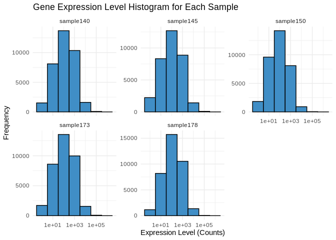<!-- -->

## 1.4 Transcript counts

First let’s check the total number of transcripts in each sample – keep
in mind this expression data has *not* been normalized yet, so there may
be different totals for each sample

``` r
# Calculate the total number of transcripts for each sample
total_transcripts <- colSums(Apul_counts_RNA)

# Create a data frame for plotting
total_transcripts_df <- data.frame(sample = names(total_transcripts),
                                   totals = total_transcripts)

# Plot the total number of transcripts for each sample
ggplot(total_transcripts_df, aes(x = sample, y = totals)) +
  geom_bar(stat = "identity", fill = "#408EC6", color = "black") +
  labs(title = "Total Number of Transcripts per Sample",
       x = "Sample",
       y = "Total Transcripts") +
  theme_minimal() +
  theme(axis.text.x = element_text(angle = 45, hjust = 1))  # Rotate x-axis labels for readability
```

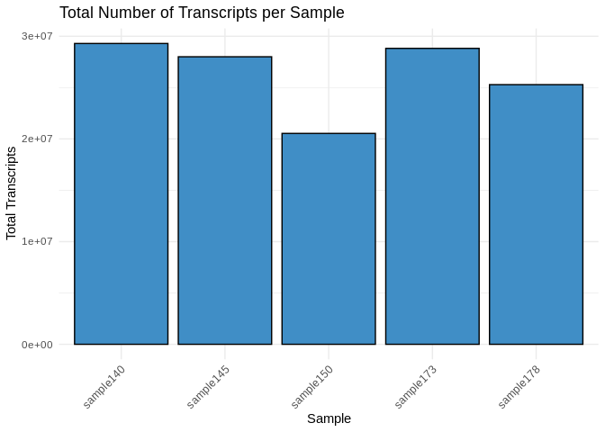<!-- -->

Now let’s check the number of unique transcripts in each sample – that
is, how many genes are expressed in each sample? This should be pretty
much the same across samples, even without normalization.

``` r
# Calculate the number of unique transcripts (non-zero counts) for each sample
unique_transcripts <- colSums(Apul_counts_RNA > 0)

# Create a data frame for plotting
unique_transcripts_df <- data.frame(sample = names(unique_transcripts),
                                    uniques = unique_transcripts)

# Plot the total number of unique transcripts for each sample
ggplot(unique_transcripts_df, aes(x = sample, y = uniques)) +
  geom_bar(stat = "identity", fill = "#408EC6", color = "black") +
  labs(title = "Total Number of Unique Expressed Transcripts per Sample",
       x = "Sample",
       y = "Unique Transcripts") +
  theme_minimal() +
  theme(axis.text.x = element_text(angle = 45, hjust = 1))  # Rotate x-axis labels for readability
```

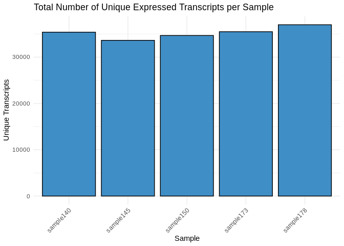<!-- -->

## 1.5 Most common biological processes

Similar to the plot generated in `02-Apul-reference-annotation`, let’s
plot the biological processes most represented in these samples’
expression

``` r
# Rename the `Gene.Ontology..biological.process.` column to `Biological_Process`
colnames(Apul_counts_GO)[colnames(Apul_counts_GO) == "Gene.Ontology..biological.process."] <- "Biological_Process"

# Separate the `Biological_Process` column into individual biological processes
data_separated <- unlist(strsplit(Apul_counts_GO$Biological_Process, split = ";"))

# Trim whitespace from the biological processes
data_separated <- gsub("^\\s+|\\s+$", "", data_separated)

# Count the occurrences of each biological process
process_counts <- table(data_separated)
process_counts <- data.frame(Biological_Process = names(process_counts), Count = as.integer(process_counts))
process_counts <- process_counts[order(-process_counts$Count), ]

# Select the 20 most predominant biological processes
top_20_processes <- process_counts[1:20, ]

# Create a color palette for the bars
bar_colors <- rainbow(nrow(top_20_processes))

# Create a staggered vertical bar plot with different colors for each bar
barplot(top_20_processes$Count, names.arg = rep("", nrow(top_20_processes)), col = bar_colors,
        ylim = c(0, max(top_20_processes$Count) * 1.25),
        main = "Occurrences of the 20 Most Predominant Biological Processes", xlab = "Biological Process", ylab = "Count")
```

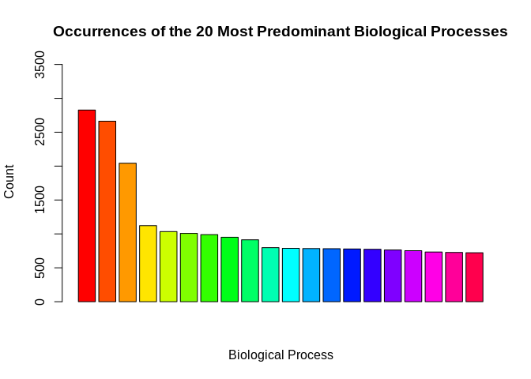<!-- -->

``` r
# Create a separate plot for the legend
png("../output/03-Apul-RNA-summary/GOlegend.png", width = 800, height = 600)
par(mar = c(0, 0, 0, 0))
plot.new()
legend("center", legend = top_20_processes$Biological_Process, fill = bar_colors, cex = 1, title = "Biological Processes")
dev.off()
```

    png 
      2 

``` r
knitr::include_graphics("../output/03-Apul-RNA-summary/GOlegend.png")
```


``` bash
rm ../output/03-Apul-RNA-summary/GOlegend.png
```

# 2 Normalized counts

## 2.1 Normalize counts with DESeq2

### 2.1.1 Plot unnormalized data

``` r
Apul_counts_RNA %>%
  pivot_longer( cols = everything(), names_to = "sample", values_to = "count") %>%
  ggplot(., aes(x = sample, y = count)) +
  geom_violin() + 
  geom_point(alpha = 0.2) +
  theme_minimal() +
  labs(title = "Unnormalized transcript counts",
       x = "Sample",
       y = "count")
```

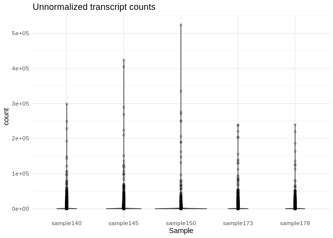<!-- -->

We definitely need to normalize this data!

### 2.1.2 Metadata

DESeq2 requires a metadata data frame as input. I don’t have sample
metadata though so, since we’re just doing DESeq2 for normalization
purposes (not analysis purposes), I’m just going to create a dummy sheet

``` r
Apul_sample_names <- colnames(Apul_counts_RNA)

Apul_metadata_RNA <- data.frame(Sample = Apul_sample_names,
                            Species = rep("A.pulchra", 5))
rownames(Apul_metadata_RNA) <- Apul_sample_names

head(Apul_metadata_RNA)
```

                 Sample   Species
    sample140 sample140 A.pulchra
    sample145 sample145 A.pulchra
    sample150 sample150 A.pulchra
    sample173 sample173 A.pulchra
    sample178 sample178 A.pulchra

### 2.1.3 DESeq object

``` r
# Calculate DESeq object
dds_Apul_RNA <- DESeqDataSetFromMatrix(countData = Apul_counts_RNA,
                              colData = Apul_metadata_RNA,
                              design = ~ 1) 

# Run differential expression analysis 
# (Note that this DESeq() function runs all necessary steps, including data normalization, 
# estimating size factors, estimating dispersions, gene-wise dispersion estimates, mean-dispersion 
# relationship, final dispersion estimates, fitting model, and testing)
# Using design = ~1 because we don't have treatment groups

dds_Apul_RNA <- DESeq(dds_Apul_RNA)
```

It’s worth noting here that I’m actually going to be doing two different
types of transformation on the counts data, which serve different
purposes.

- First is **normalizing** the transcript counts, which adjusts for
  differences in library size or sequencing depth, but retains
  count-like properties. Normalized counts are most useful for things
  like visualizing expression levels and differential expression
  analysis.

- Second is **variance stabilizing** the counts data, which aims to make
  the variance of the transformed data approximately independent of the
  mean, reducing heteroscedasticity (the relationship between variance
  and mean) and “smoothing” out the variance at low counts. Notably, the
  transformed data is *no longer on the original count scale*. The
  transformation makes the variance roughly constant across the range of
  counts, which makes it easier to interpret patterns in the data
  visually. Variance stabilized data is most useful for exploratory data
  analysis, like PCA, clustering, and heatmaps, and is also the
  transformation we’ll want to use before WGCNA.

``` r
# extract normalized counts
# (normalization is automatically performed by deseq2)
Apul_counts_RNA_norm <- counts(dds_Apul_RNA, normalized=TRUE) %>% data.frame()

write.table(Apul_counts_RNA_norm, file = "../output/03-Apul-RNA-summary/Apul_counts_RNA_normalized.txt", sep = "\t", row.names = TRUE, col.names = TRUE, quote = FALSE)


# variance stabilized data
vsd_Apul_RNA <- varianceStabilizingTransformation(dds_Apul_RNA, blind=TRUE)
wpn_vsd_Apul_RNA <- getVarianceStabilizedData(dds_Apul_RNA)
rv_wpn_Apul_RNA <- rowVars(wpn_vsd_Apul_RNA, useNames=TRUE)

Apul_counts_RNA_vsd <- data.frame(wpn_vsd_Apul_RNA)
write.table(Apul_counts_RNA_vsd, file = "../output/03-Apul-RNA-summary/Apul_counts_RNA_variancestabilized.txt", sep = "\t", row.names = TRUE, col.names = TRUE,quote = FALSE)

q75_wpn_Apul_RNA <- quantile(rowVars(wpn_vsd_Apul_RNA, useNames=TRUE), .75)  # 75th quantile variability
Apul_counts_RNA_vsd_q75 <- wpn_vsd_Apul_RNA[ rv_wpn_Apul_RNA > q75_wpn_Apul_RNA, ] %>% data.frame # filter to retain only the most variable genes
write.table(Apul_counts_RNA_vsd_q75, file = "../output/03-Apul-RNA-summary/Apul_counts_RNA_variancestabilized_q75.txt", sep = "\t", row.names = TRUE, col.names = TRUE,quote = FALSE)

q95_wpn_Apul_RNA <- quantile(rowVars(wpn_vsd_Apul_RNA, useNames=TRUE), .95)  # 95th quantile variability
Apul_counts_RNA_vsd_q95 <- wpn_vsd_Apul_RNA[ rv_wpn_Apul_RNA > q95_wpn_Apul_RNA, ] %>% data.frame # filter to retain only the most variable genes
write.table(Apul_counts_RNA_vsd_q95, file = "../output/03-Apul-RNA-summary/Apul_counts_RNA_variancestabilized_q95.txt", sep = "\t", row.names = TRUE, col.names = TRUE,quote = FALSE)
```

## 2.2 Plot normalized data

``` r
Apul_counts_RNA_norm_long <- Apul_counts_RNA_norm %>%
  mutate(
    Gene_id = row.names(Apul_counts_RNA_norm)
  ) %>%
  pivot_longer(-Gene_id)

Apul_counts_RNA_norm_long %>%
  ggplot(., aes(x = name, y = value)) +
  geom_violin() +
  geom_point() +
  theme_bw() +
  theme(
    axis.text.x = element_text( angle = 90)
  ) +
  ylim(0, NA) +
  labs(
    title = "Normalized Expression",
    x = "Sample",
    y = "Normalized counts"
  )
```

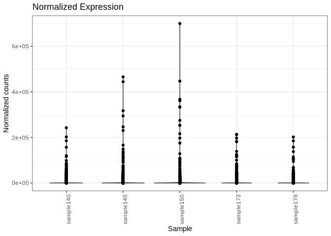<!-- -->

## 2.3 Plot variance stabilized data

``` r
Apul_counts_RNA_vsd_long <- Apul_counts_RNA_vsd %>%
  mutate(
    Gene_id = row.names(Apul_counts_RNA_vsd)
  ) %>%
  pivot_longer(-Gene_id)

Apul_counts_RNA_vsd_long %>%
  ggplot(., aes(x = name, y = value)) +
  geom_violin() +
  geom_point() +
  theme_bw() +
  theme(
    axis.text.x = element_text( angle = 90)
  ) +
  ylim(0, NA) +
  labs(
    title = "Variance Stabilized Expression",
    x = "Sample",
    y = "Variance stabilized data"
  )
```

<!-- -->

## 2.4 Normalized expression levels

Plot histograms of the normalized expression levels in each sample

``` r
# Melt the count matrix into long format
Apul_counts_norm_melted <- melt(Apul_counts_RNA_norm, variable.name = "sample", value.name = "counts")

# Plot the expression level histograms for each sample
ggplot(Apul_counts_norm_melted, aes(x = counts)) +
  geom_histogram(binwidth = 1, fill = "#408EC6", color = "black") +
  scale_x_log10() +  # Optional: Log-transform the x-axis for better visualization
  facet_wrap(~sample, scales = "free_y") +
  labs(title = "Gene Expression Level Histogram for Each Sample",
       x = "Expression Level (Counts)",
       y = "Frequency") +
  theme_minimal()
```

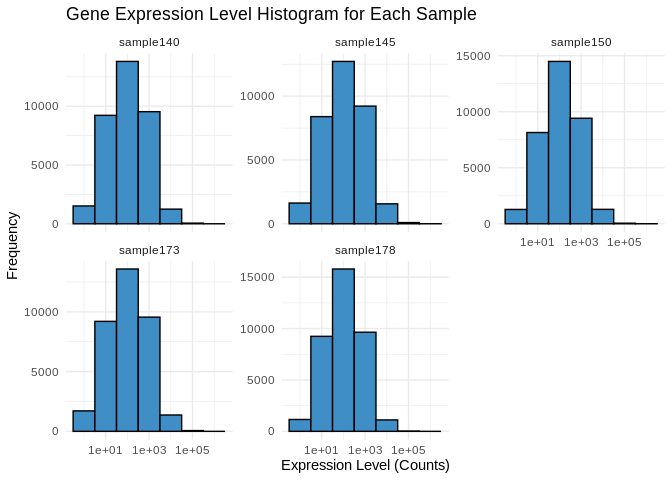<!-- -->

## 2.5 Normalized transcript counts

Check the total number of transcripts in each sample – now that we’ve
normalized the data these totals should be similar

``` r
# Calculate the total number of transcripts for each sample
total_transcripts_norm <- colSums(Apul_counts_RNA_norm)

# Create a data frame for plotting
total_transcripts_norm_df <- data.frame(sample = names(total_transcripts_norm),
                                   totals = total_transcripts_norm)

# Plot the total number of transcripts for each sample
ggplot(total_transcripts_norm_df, aes(x = sample, y = totals)) +
  geom_bar(stat = "identity", fill = "#408EC6", color = "black") +
  labs(title = "Total Number of Transcripts per Sample",
       x = "Sample",
       y = "Total Transcripts") +
  theme_minimal() +
  theme(axis.text.x = element_text(angle = 45, hjust = 1))  # Rotate x-axis labels for readability
```

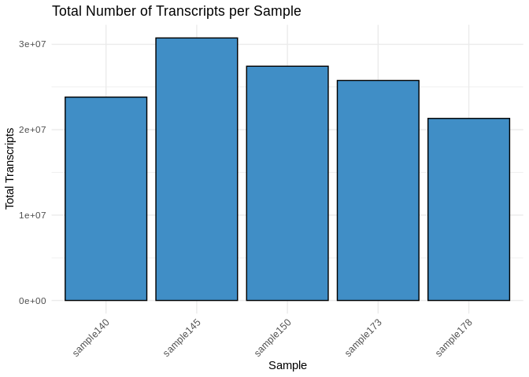<!-- -->

## 2.6 PCA of variance stabilized data

``` r
plotPCA(vsd_Apul_RNA, intgroup="Sample")
```

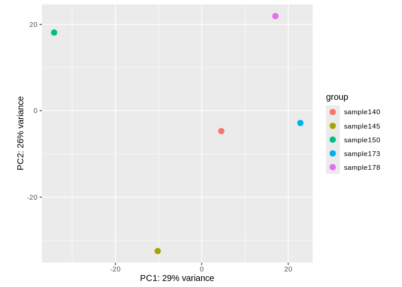<!-- -->

## 2.7 Sample clustering

``` r
sample_dists <- dist(t(assay(vsd_Apul_RNA)))
pheatmap(as.matrix(sample_dists), clustering_distance_rows = "euclidean", 
         clustering_distance_cols = "euclidean", main="Sample Clustering")
```

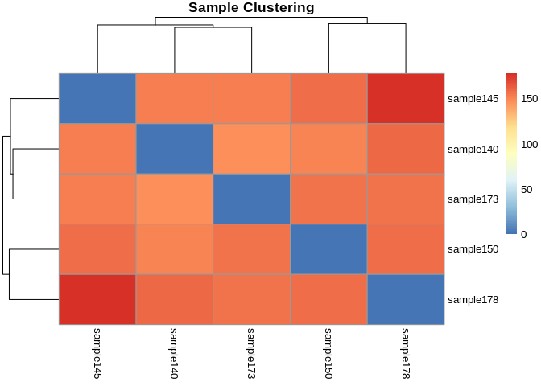<!-- -->

## 2.8 Heatmaps

Of most variable variance stabilized genes

``` r
# 75th quantile
heat_colors <- rev(brewer.pal(12, "RdYlBu"))
pheatmap(Apul_counts_RNA_vsd_q75, 
         cluster_rows = TRUE,
         cluster_cols = TRUE,
         show_rownames = TRUE,
         show_colnames = TRUE,
         color = heat_colors,
         scale="row")
```

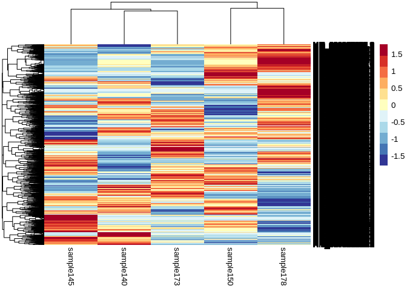<!-- -->

``` r
# 95th quantile
pheatmap(Apul_counts_RNA_vsd_q95, 
         cluster_rows = TRUE,
         cluster_cols = TRUE,
         show_rownames = TRUE,
         show_colnames = TRUE,
         color = heat_colors,
         scale="row")
```

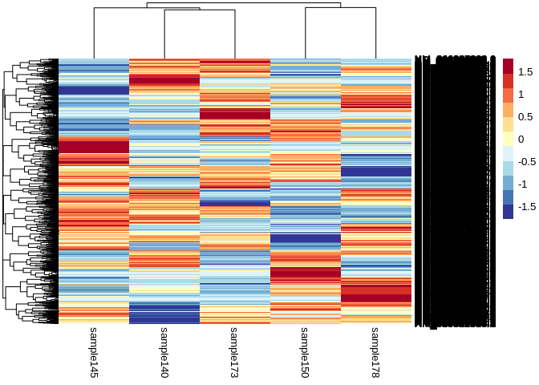<!-- -->
