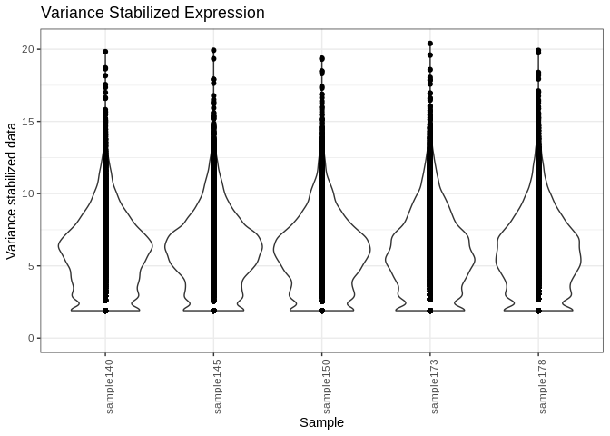
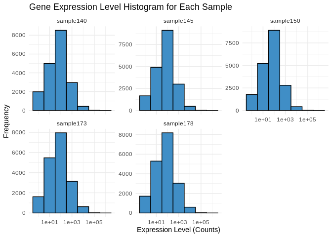
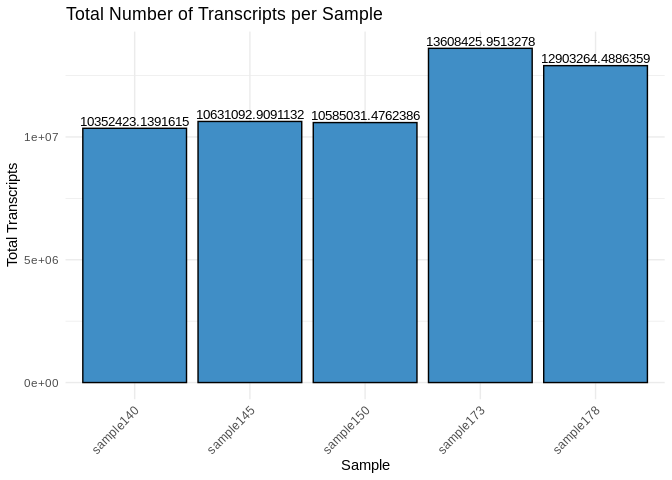
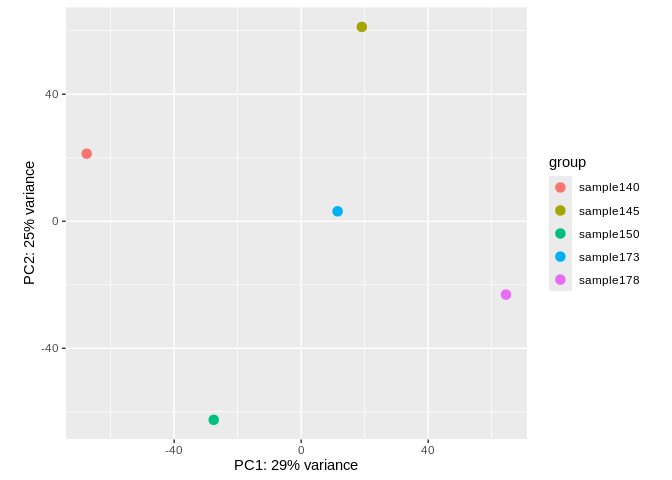
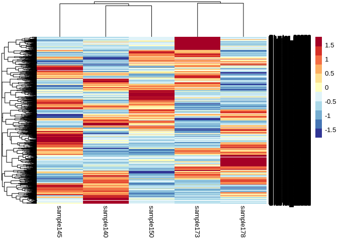
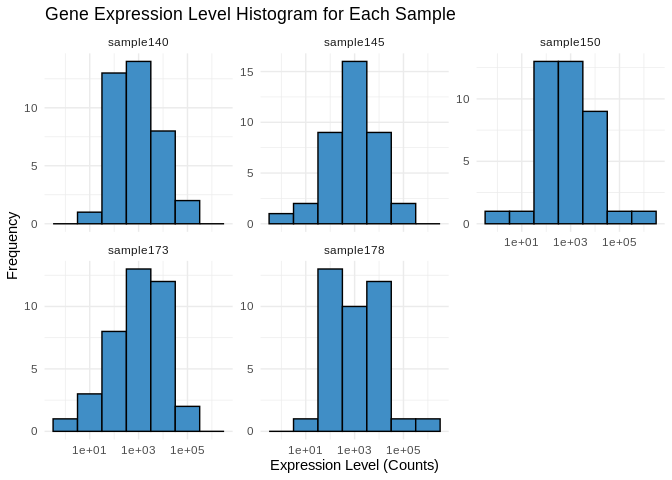
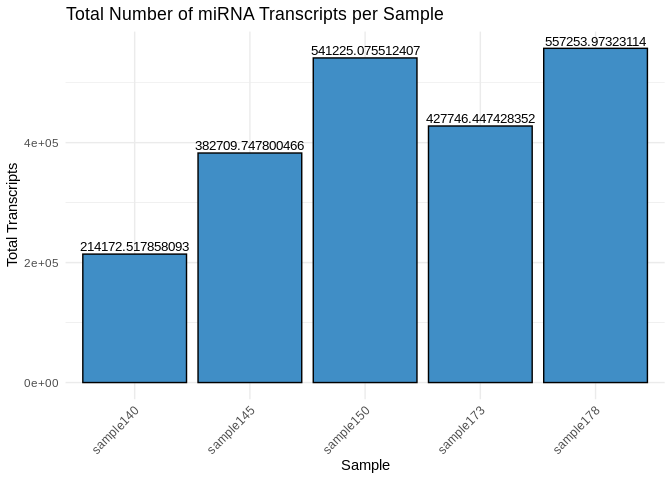

03.1-Apul-sRNA-summary
================
Kathleen Durkin
2024-09-05

- [0.0.1 Install and load packages](#001-install-and-load-packages)
- [1 sRNA](#1-srna)
  - [1.1 Load count data](#11-load-count-data)
  - [1.2 Count data munging](#12-count-data-munging)
  - [1.3 Expression levels](#13-expression-levels)
  - [1.4 Transcript counts](#14-transcript-counts)
- [2 miRNA](#2-mirna)
  - [2.1 Load miRNA metadata](#21-load-mirna-metadata)
  - [2.2 Expression levels](#22-expression-levels)
  - [2.3 miRNA counts](#23-mirna-counts)
  - [2.4 Heatmap](#24-heatmap)
- [3 Normalized sRNA counts](#3-normalized-srna-counts)
  - [3.1 Normalize counts with DESeq2](#31-normalize-counts-with-deseq2)
    - [3.1.1 Plot unnormalized sRNA
      data](#311-plot-unnormalized-srna-data)
    - [3.1.2 Metadata](#312-metadata)
    - [3.1.3 DESeq object](#313-deseq-object)
  - [3.2 Plot normalized data](#32-plot-normalized-data)
  - [3.3 Plot variance stabilized
    data](#33-plot-variance-stabilized-data)
  - [3.4 Normalized expression levels](#34-normalized-expression-levels)
  - [3.5 Normalized transcript counts](#35-normalized-transcript-counts)
  - [3.6 PCA of variance stabilized
    data](#36-pca-of-variance-stabilized-data)
  - [3.7 Sample clustering](#37-sample-clustering)
  - [3.8 Heatmaps](#38-heatmaps)
- [4 Normalized miRNA counts](#4-normalized-mirna-counts)
  - [4.1 Isolate normalized/vsd miRNA](#41-isolate-normalizedvsd-mirna)
  - [4.2 Normalized expression levels](#42-normalized-expression-levels)
  - [4.3 Normalized transcript counts](#43-normalized-transcript-counts)
  - [4.4 Heatmap](#44-heatmap)

Gene expression summary for *Acropora pulchra* sRNA-seq data.

- trimmed reads generated in `deep-dive` project

- Reads aligned to *Acropora meandrina* genome

### 0.0.1 Install and load packages

``` r
library(tidyverse)
library(ggplot2)
library(reshape2)
library(pheatmap)
library(RColorBrewer)
library(DESeq2)
```

# 1 sRNA

## 1.1 Load count data

Load in the sRNA count matrix generated using ShortStack 4.1.0. Keep in
mind this data includes counts of all sRNAs, not just miRNAs

``` r
# Read in sRNA counts data
Apul_counts_sRNA_data_OG <- read_delim("../../../deep-dive/D-Apul/output/13.2.1-Apul-sRNAseq-ShortStack-31bp-fastp-merged-cnidarian_miRBase/ShortStack_out/Counts.txt", delim="\t") 
head(Apul_counts_sRNA_data_OG)
```

    # A tibble: 6 × 8
      Coords               Name  MIRNA sRNA-ACR-140-S1-TP2-…¹ sRNA-ACR-145-S1-TP2-…²
      <chr>                <chr> <chr>                  <dbl>                  <dbl>
    1 NC_058066.1:152483-… Clus… N                          2                    131
    2 NC_058066.1:161064-… Clus… N                         57                     48
    3 NC_058066.1:172073-… Clus… N                         36                     31
    4 NC_058066.1:203242-… Clus… N                         14                     28
    5 NC_058066.1:204535-… Clus… N                          3                    234
    6 NC_058066.1:205745-… Clus… N                        914                    432
    # ℹ abbreviated names: ¹​`sRNA-ACR-140-S1-TP2-fastp-adapters-polyG-31bp-merged`,
    #   ²​`sRNA-ACR-145-S1-TP2-fastp-adapters-polyG-31bp-merged`
    # ℹ 3 more variables:
    #   `sRNA-ACR-150-S1-TP2-fastp-adapters-polyG-31bp-merged` <dbl>,
    #   `sRNA-ACR-173-S1-TP2-fastp-adapters-polyG-31bp-merged` <dbl>,
    #   `sRNA-ACR-178-S1-TP2-fastp-adapters-polyG-31bp-merged` <dbl>

## 1.2 Count data munging

``` r
Apul_counts_sRNA <- Apul_counts_sRNA_data_OG

# Remove excess portions of sample column names to just "sample###"
colnames(Apul_counts_sRNA) <- sub("-S1-TP2-fastp-adapters-polyG-31bp-merged", "", colnames(Apul_counts_sRNA))
colnames(Apul_counts_sRNA) <- sub("sRNA-ACR-", "sample", colnames(Apul_counts_sRNA))

# Keep just the counts and cluster names
Apul_counts_sRNA <- Apul_counts_sRNA %>% select("sample140", "sample145", "sample150", "sample173", "sample178", "Name")

# I'm not going to be doing any removal of low-count sRNAs for now

# Make the cluster names our new row names
Apul_counts_sRNA <- Apul_counts_sRNA %>% column_to_rownames(var = "Name")

write.table(Apul_counts_sRNA, file = "../output/03.1-Apul-sRNA-summary/Apul_sRNA_ShortStack_counts_formatted.txt", sep = "\t", row.names = TRUE, col.names = TRUE, quote = FALSE)

head(Apul_counts_sRNA)
```

              sample140 sample145 sample150 sample173 sample178
    Cluster_1         2       131         2         1         4
    Cluster_2        57        48       219        32       193
    Cluster_3        36        31         0        36         2
    Cluster_4        14        28         3        17        38
    Cluster_5         3       234        17        13        46
    Cluster_6       914       432        78       247       259

## 1.3 Expression levels

Plot histograms of the expression levels in each sample

``` r
# Melt the count matrix into long format
Apul_counts_sRNA_melted <- melt(Apul_counts_sRNA, variable.name = "sample", value.name = "counts")

# Plot the expression level histograms for each sample
ggplot(Apul_counts_sRNA_melted, aes(x = counts)) +
  geom_histogram(binwidth = 1, fill = "#408EC6", color = "black") +
  scale_x_log10() +  # Optional: Log-transform the x-axis for better visualization
  facet_wrap(~sample, scales = "free_y") +
  labs(title = "Gene Expression Level Histogram for Each Sample",
       x = "Expression Level (Counts)",
       y = "Frequency") +
  theme_minimal()
```

<!-- -->

## 1.4 Transcript counts

First let’s check the total number of transcripts in each sample – keep
in mind this expression data has *not* been normalized yet, so there may
be different totals for each sample

``` r
# Calculate the total number of transcripts for each sample
total_transcripts <- colSums(Apul_counts_sRNA)

# Create a data frame for plotting
total_transcripts_df <- data.frame(sample = names(total_transcripts),
                                   totals = total_transcripts)

# Plot the total number of transcripts for each sample
ggplot(total_transcripts_df, aes(x = sample, y = totals)) +
  geom_bar(stat = "identity", fill = "#408EC6", color = "black") +
  labs(title = "Total Number of Transcripts per Sample",
       x = "Sample",
       y = "Total Transcripts") +
  theme_minimal() +
  theme(axis.text.x = element_text(angle = 45, hjust = 1))  # Rotate x-axis labels for readability
```

<!-- -->

Now let’s check the number of unique transcripts in each sample – that
is, how many unique sRNAs are expressed in each sample? This should be
pretty much the same across samples, even without normalization.

``` r
# Calculate the number of unique transcripts (non-zero counts) for each sample
unique_transcripts <- colSums(Apul_counts_sRNA > 0)

# Create a data frame for plotting
unique_transcripts_df <- data.frame(sample = names(unique_transcripts),
                                    uniques = unique_transcripts)

# Plot the total number of unique transcripts for each sample
ggplot(unique_transcripts_df, aes(x = sample, y = uniques)) +
  geom_bar(stat = "identity", fill = "#408EC6", color = "black") +
  labs(title = "Total Number of Unique Expressed Transcripts per Sample",
       x = "Sample",
       y = "Unique Transcripts") +
  theme_minimal() +
  theme(axis.text.x = element_text(angle = 45, hjust = 1))  # Rotate x-axis labels for readability
```

<!-- -->

# 2 miRNA

## 2.1 Load miRNA metadata

The ShortStack output Results.txt includes all clusters of sRNA reads,
including those not annotated as valid miRNAs. Now that we’ve looked at
all the sRNAs a bit, let’s focus in on those classified as miRNAs.

``` r
# Join with full metadata sheet, which only contains valid miRNAs
Apul_metadata_miRNA <- read_csv("../../../deep-dive/DEF-cross-species/output/10-shortRNA-ShortStack-comparison/Apul_results_mature_named.csv") 

Apul_counts_sRNA <- rownames_to_column(Apul_counts_sRNA, var = "Name")

Apul_counts_miRNA <- left_join(Apul_metadata_miRNA, Apul_counts_sRNA, by = c("Name" = "Name"))

# Keep just the counts and given miRNA names (e.g., based on match to previously described miRNA)
Apul_counts_miRNA <- Apul_counts_miRNA %>% select("sample140", "sample145", "sample150", "sample173", "sample178", "given_miRNA_name")

# Make the miRNA names our new row names
Apul_counts_miRNA <- Apul_counts_miRNA %>% column_to_rownames(var = "given_miRNA_name")

head(Apul_counts_miRNA)
```

                     sample140 sample145 sample150 sample173 sample178
    apul-mir-novel-2     36432     47768     80222     30730     54060
    apul-mir-novel-1         1       971      1511         0      5810
    apul-mir-novel-7        42        33        20        39        14
    apul-mir-novel-4      1825      5864      8452      4322      8646
    apul-mir-novel-6       997      2148      2577      3403      2807
    apul-mir-novel-3      1485      1651      1728      1945      1726

## 2.2 Expression levels

Plot histograms of the expression levels in each sample

``` r
# Melt the count matrix into long format
Apul_counts_miRNA_melted <- melt(Apul_counts_miRNA, variable.name = "sample", value.name = "counts")

# Plot the expression level histograms for each sample
ggplot(Apul_counts_miRNA_melted, aes(x = counts)) +
  geom_histogram(binwidth = 1, fill = "#408EC6", color = "black") +
  scale_x_log10() +  # Optional: Log-transform the x-axis for better visualization
  facet_wrap(~sample, scales = "free_y") +
  labs(title = "Gene Expression Level Histogram for Each Sample",
       x = "Expression Level (Counts)",
       y = "Frequency") +
  theme_minimal()
```

<!-- -->

## 2.3 miRNA counts

First let’s check the total number of miRNAs in each sample – keep in
mind this expression data has *not* been normalized yet, so there may be
different totals for each sample

``` r
# Calculate the total number of transcripts for each sample
total_miRNA <- colSums(Apul_counts_miRNA)

# Create a data frame for plotting
total_miRNA_df <- data.frame(sample = names(total_miRNA),
                                   totals = total_miRNA)

# Plot the total number of transcripts for each sample
ggplot(total_miRNA_df, aes(x = sample, y = totals)) +
  geom_bar(stat = "identity", fill = "#408EC6", color = "black") +
  labs(title = "Total Number of miRNAs per Sample",
       x = "Sample",
       y = "Total miRNAs") +
  theme_minimal() +
  theme(axis.text.x = element_text(angle = 45, hjust = 1))  # Rotate x-axis labels for readability
```

<!-- -->

Now let’s check the number of unique miRNAs in each sample – This should
be pretty much the same across samples, even without normalization.

``` r
# Calculate the number of unique transcripts (non-zero counts) for each sample
unique_miRNA <- colSums(Apul_counts_miRNA > 0)

# Create a data frame for plotting
unique_miRNA_df <- data.frame(sample = names(unique_miRNA),
                                    uniques = unique_miRNA)

# Plot the total number of unique transcripts for each sample
ggplot(unique_miRNA_df, aes(x = sample, y = uniques)) +
  geom_bar(stat = "identity", fill = "#408EC6", color = "black") +
  labs(title = "Total Number of Unique Expressed miRNAs per Sample",
       x = "Sample",
       y = "Unique miRNA") +
  theme_minimal() +
  theme(axis.text.x = element_text(angle = 45, hjust = 1))  # Rotate x-axis labels for readability
```

<!-- -->

## 2.4 Heatmap

``` r
pheatmap(Apul_counts_miRNA,
         cluster_rows = TRUE,
         cluster_cols = TRUE,
         show_rownames = TRUE,
         show_colnames = TRUE,
         color = colorRampPalette(c("blue", "white", "red"))(50),
         fontsize_row = 8,
         fontsize_col = 8)
```

<!-- -->
Well… there’s like 2 miRNAs with much higher expression than the others,
which is making visualizing relative differences difficult. Let’s redo
the heatmap, normalizing each row to view relative difference in
expression between samples (`scale='row'`)

``` r
pheatmap(Apul_counts_miRNA,
         cluster_rows = TRUE,
         cluster_cols = TRUE,
         show_rownames = TRUE,
         show_colnames = TRUE,
         scale = 'row',
         color = colorRampPalette(c("blue", "white", "red"))(50),
         fontsize_row = 8,
         fontsize_col = 8)
```

<!-- -->

# 3 Normalized sRNA counts

## 3.1 Normalize counts with DESeq2

### 3.1.1 Plot unnormalized sRNA data

``` r
Apul_counts_sRNA %>% 
  select(-Name) %>%
  pivot_longer( cols = everything(), names_to = "sample", values_to = "count") %>%
  ggplot(., aes(x = sample, y = count)) +
  geom_violin() + 
  geom_point(alpha = 0.2) +
  theme_minimal() +
  labs(title = "Unnormalized sRNA counts",
       x = "Sample",
       y = "count")
```

<!-- -->

### 3.1.2 Metadata

DESeq2 requires a metadata data frame as input. I don’t have sample
metadata though so, since we’re just doing DESeq2 for normalization
purposes (not analysis purposes), I’m just going to create a dummy sheet

``` r
Apul_sample_names <- Apul_counts_sRNA %>%
  select(-Name) %>%
  colnames()

Apul_metadata_sRNA <- data.frame(Sample = Apul_sample_names,
                            Species = rep("A.pulchra", 5))
rownames(Apul_metadata_sRNA) <- Apul_sample_names

head(Apul_metadata_sRNA)
```

                 Sample   Species
    sample140 sample140 A.pulchra
    sample145 sample145 A.pulchra
    sample150 sample150 A.pulchra
    sample173 sample173 A.pulchra
    sample178 sample178 A.pulchra

### 3.1.3 DESeq object

``` r
# Calculate DESeq object
Apul_counts_sRNA_rowNames <- Apul_counts_sRNA %>% column_to_rownames(var = "Name")

dds_Apul_sRNA <- DESeqDataSetFromMatrix(countData = Apul_counts_sRNA_rowNames,
                              colData = Apul_metadata_sRNA,
                              design = ~ 1) 

# Run differential expression analysis 
# (Note that this DESeq() function runs all necessary steps, including data normalization, 
# estimating size factors, estimating dispersions, gene-wise dispersion estimates, mean-dispersion 
# relationship, final dispersion estimates, fitting model, and testing)
# Using design = ~1 because we don't have treatment groups

dds_Apul_sRNA <- DESeq(dds_Apul_sRNA)
```

It’s worth noting here that I’m actually going to be doing two different
types of transformation on the counts data, which serve different
purposes.

- First is **normalizing** the transcript counts, which adjusts for
  differences in library size or sequencing depth, but retains
  count-like properties. Normalized counts are most useful for things
  like visualizing expression levels and differential expression
  analysis.

- Second is **variance stabilizing** the counts data, which aims to make
  the variance of the transformed data approximately independent of the
  mean, reducing heteroscedasticity (the relationship between variance
  and mean) and “smoothing” out the variance at low counts. Notably, the
  transformed data is *no longer on the original count scale*. The
  transformation makes the variance roughly constant across the range of
  counts, which makes it easier to interpret patterns in the data
  visually. Variance stabilized data is most useful for exploratory data
  analysis, like PCA, clustering, and heatmaps, and is also the
  transformation we’ll want to use before WGCNA.

``` r
# extract normalized counts
# (normalization is automatically performed by deseq2)
Apul_counts_sRNA_norm <- counts(dds_Apul_sRNA, normalized=TRUE) %>% data.frame()

write.table(Apul_counts_sRNA_norm, file = "../output/03.1-Apul-sRNA-summary/Apul_counts_sRNA_normalized.txt", sep = "\t", row.names = TRUE, col.names = TRUE, quote = FALSE)


# variance stabilized data
vsd_Apul_sRNA <- varianceStabilizingTransformation(dds_Apul_sRNA, blind=TRUE)
wpn_vsd_Apul_sRNA <- getVarianceStabilizedData(dds_Apul_sRNA)
rv_wpn_Apul_sRNA <- rowVars(wpn_vsd_Apul_sRNA, useNames=TRUE)

Apul_counts_sRNA_vsd <- data.frame(wpn_vsd_Apul_sRNA)
write.table(Apul_counts_sRNA_vsd, file = "../output/03.1-Apul-sRNA-summary/Apul_counts_sRNA_variancestabilized.txt", sep = "\t", row.names = TRUE, col.names = TRUE,quote = FALSE)

q75_wpn_Apul_sRNA <- quantile(rowVars(wpn_vsd_Apul_sRNA, useNames=TRUE), .75)  # 75th quantile variability
Apul_counts_sRNA_vsd_q75 <- wpn_vsd_Apul_sRNA[ rv_wpn_Apul_sRNA > q75_wpn_Apul_sRNA, ] %>% data.frame # filter to retain only the most variable genes
write.table(Apul_counts_sRNA_vsd_q75, file = "../output/03.1-Apul-sRNA-summary/Apul_counts_sRNA_variancestabilized_q75.txt", sep = "\t", row.names = TRUE, col.names = TRUE,quote = FALSE)

q95_wpn_Apul_sRNA <- quantile(rowVars(wpn_vsd_Apul_sRNA, useNames=TRUE), .95)  # 95th quantile variability
Apul_counts_sRNA_vsd_q95 <- wpn_vsd_Apul_sRNA[ rv_wpn_Apul_sRNA > q95_wpn_Apul_sRNA, ] %>% data.frame # filter to retain only the most variable genes
write.table(Apul_counts_sRNA_vsd_q95, file = "../output/03.1-Apul-sRNA-summary/Apul_counts_sRNA_variancestabilized_q95.txt", sep = "\t", row.names = TRUE, col.names = TRUE,quote = FALSE)
```

## 3.2 Plot normalized data

``` r
Apul_counts_sRNA_norm_long <- Apul_counts_sRNA_norm %>%
  mutate(
    Gene_id = row.names(Apul_counts_sRNA_norm)
  ) %>%
  pivot_longer(-Gene_id)

Apul_counts_sRNA_norm_long %>%
  ggplot(., aes(x = name, y = value)) +
  geom_violin() +
  geom_point() +
  theme_bw() +
  theme(
    axis.text.x = element_text( angle = 90)
  ) +
  ylim(0, NA) +
  labs(
    title = "Normalized Expression",
    x = "Sample",
    y = "Normalized counts"
  )
```

<!-- -->

## 3.3 Plot variance stabilized data

``` r
Apul_counts_sRNA_vsd_long <- Apul_counts_sRNA_vsd %>%
  mutate(
    Gene_id = row.names(Apul_counts_sRNA_vsd)
  ) %>%
  pivot_longer(-Gene_id)

Apul_counts_sRNA_vsd_long %>%
  ggplot(., aes(x = name, y = value)) +
  geom_violin() +
  geom_point() +
  theme_bw() +
  theme(
    axis.text.x = element_text( angle = 90)
  ) +
  ylim(0, NA) +
  labs(
    title = "Variance Stabilized Expression",
    x = "Sample",
    y = "Variance stabilized data"
  )
```

<!-- -->

## 3.4 Normalized expression levels

Plot histograms of the normalized expression levels in each sample

``` r
# Melt the count matrix into long format
Apul_counts_norm_melted <- melt(Apul_counts_sRNA_norm, variable.name = "sample", value.name = "counts")

# Plot the expression level histograms for each sample
ggplot(Apul_counts_norm_melted, aes(x = counts)) +
  geom_histogram(binwidth = 1, fill = "#408EC6", color = "black") +
  scale_x_log10() +  # Optional: Log-transform the x-axis for better visualization
  facet_wrap(~sample, scales = "free_y") +
  labs(title = "Gene Expression Level Histogram for Each Sample",
       x = "Expression Level (Counts)",
       y = "Frequency") +
  theme_minimal()
```

<!-- -->

## 3.5 Normalized transcript counts

Check the total number of transcripts in each sample – now that we’ve
normalized the data these totals should be similar

``` r
# Calculate the total number of transcripts for each sample
total_transcripts_norm <- colSums(Apul_counts_sRNA_norm)

# Create a data frame for plotting
total_transcripts_norm_df <- data.frame(sample = names(total_transcripts_norm),
                                   totals = total_transcripts_norm)

# Plot the total number of transcripts for each sample
ggplot(total_transcripts_norm_df, aes(x = sample, y = totals)) +
  geom_bar(stat = "identity", fill = "#408EC6", color = "black") +
  labs(title = "Total Number of Transcripts per Sample",
       x = "Sample",
       y = "Total Transcripts") +
  theme_minimal() +
  theme(axis.text.x = element_text(angle = 45, hjust = 1))  # Rotate x-axis labels for readability
```

<!-- -->

## 3.6 PCA of variance stabilized data

``` r
plotPCA(vsd_Apul_sRNA, intgroup="Sample")
```

<!-- -->

## 3.7 Sample clustering

``` r
sample_dists <- dist(t(assay(vsd_Apul_sRNA)))
pheatmap(as.matrix(sample_dists), clustering_distance_rows = "euclidean", 
         clustering_distance_cols = "euclidean", main="Sample Clustering")
```

<!-- -->

## 3.8 Heatmaps

Of most variable variance stabilized sRNA transcripts

``` r
# 75th quantile
heat_colors <- rev(brewer.pal(12, "RdYlBu"))
pheatmap(Apul_counts_sRNA_vsd_q75, 
         cluster_rows = TRUE,
         cluster_cols = TRUE,
         show_rownames = TRUE,
         show_colnames = TRUE,
         color = heat_colors,
         scale="row")
```

<!-- -->

``` r
# 95th quantile
pheatmap(Apul_counts_sRNA_vsd_q95, 
         cluster_rows = TRUE,
         cluster_cols = TRUE,
         show_rownames = TRUE,
         show_colnames = TRUE,
         color = heat_colors,
         scale="row")
```

<!-- -->

# 4 Normalized miRNA counts

## 4.1 Isolate normalized/vsd miRNA

``` r
Apul_counts_sRNA_norm$Name <- rownames(Apul_counts_sRNA_norm)
Apul_counts_miRNA_norm <- left_join(Apul_metadata_miRNA, Apul_counts_sRNA_norm, by = c("Name" = "Name")) %>%
  column_to_rownames(var="given_miRNA_name") %>%
  select(starts_with("sample"))
write.table(Apul_counts_miRNA_norm, file = "../output/03.1-Apul-sRNA-summary/Apul_counts_miRNA_normalized.txt", sep = "\t", row.names = TRUE, col.names = TRUE,quote = FALSE)

Apul_counts_sRNA_vsd$Name <- rownames(Apul_counts_sRNA_vsd)
Apul_counts_miRNA_vsd <- left_join(Apul_metadata_miRNA, Apul_counts_sRNA_vsd, by = c("Name" = "Name")) %>%
  column_to_rownames(var="given_miRNA_name") %>%
  select(starts_with("sample"))
write.table(Apul_counts_miRNA_vsd, file = "../output/03.1-Apul-sRNA-summary/Apul_counts_miRNA_variancestabilized.txt", sep = "\t", row.names = TRUE, col.names = TRUE,quote = FALSE)
```

## 4.2 Normalized expression levels

Plot histograms of the normalized expression levels in each sample

``` r
# Melt the count matrix into long format
Apul_counts_miRNA_norm_melted <- melt(Apul_counts_miRNA_norm, variable.name = "sample", value.name = "counts")

# Plot the expression level histograms for each sample
ggplot(Apul_counts_miRNA_norm_melted, aes(x = counts)) +
  geom_histogram(binwidth = 1, fill = "#408EC6", color = "black") +
  scale_x_log10() +  # Optional: Log-transform the x-axis for better visualization
  facet_wrap(~sample, scales = "free_y") +
  labs(title = "Gene Expression Level Histogram for Each Sample",
       x = "Expression Level (Counts)",
       y = "Frequency") +
  theme_minimal()
```

<!-- -->

## 4.3 Normalized transcript counts

Check the total number of transcripts in each sample – now that we’ve
normalized the data these totals should be similar

``` r
# Calculate the total number of transcripts for each sample
total_transcripts_miRNA_norm <- colSums(Apul_counts_miRNA_norm)

# Create a data frame for plotting
total_transcripts_miRNA_norm_df <- data.frame(sample = names(total_transcripts_miRNA_norm),
                                   totals = total_transcripts_miRNA_norm)

# Plot the total number of transcripts for each sample
ggplot(total_transcripts_miRNA_norm_df, aes(x = sample, y = totals)) +
  geom_bar(stat = "identity", fill = "#408EC6", color = "black") +
  labs(title = "Total Number of miRNA Transcripts per Sample",
       x = "Sample",
       y = "Total Transcripts") +
  theme_minimal() +
  theme(axis.text.x = element_text(angle = 45, hjust = 1))  # Rotate x-axis labels for readability
```

<!-- -->

## 4.4 Heatmap

Of all miRNAs

``` r
heat_colors <- rev(brewer.pal(12, "RdYlBu"))
pheatmap(Apul_counts_miRNA_vsd, 
         cluster_rows = TRUE,
         cluster_cols = TRUE,
         show_rownames = TRUE,
         show_colnames = TRUE,
         color = heat_colors,
         scale="row")
```

<!-- -->
