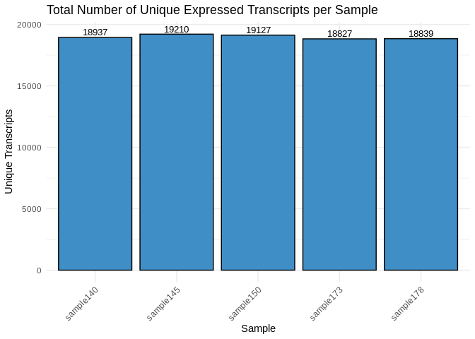
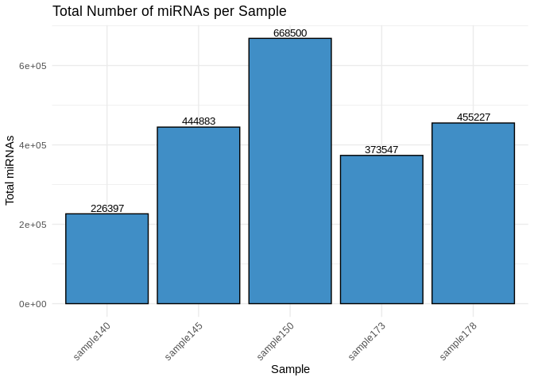

03.1-Apul-sRNA-summary
================
Kathleen Durkin
2024-09-05

- <a href="#001-install-and-load-packages"
  id="toc-001-install-and-load-packages">0.0.1 Install and load
  packages</a>
- <a href="#1-srna" id="toc-1-srna">1 sRNA</a>
  - <a href="#11-load-count-data" id="toc-11-load-count-data">1.1 Load count
    data</a>
  - <a href="#12-count-data-munging" id="toc-12-count-data-munging">1.2
    Count data munging</a>
  - <a href="#13-expression-levels" id="toc-13-expression-levels">1.3
    Expression levels</a>
  - <a href="#14-transcript-counts" id="toc-14-transcript-counts">1.4
    Transcript counts</a>
- <a href="#2-mirna" id="toc-2-mirna">2 miRNA</a>
  - <a href="#21-load-mirna-metadata" id="toc-21-load-mirna-metadata">2.1
    Load miRNA metadata</a>
  - <a href="#22-expression-levels" id="toc-22-expression-levels">2.2
    Expression levels</a>
  - <a href="#23-mirna-counts" id="toc-23-mirna-counts">2.3 miRNA counts</a>
  - <a href="#24-heatmap" id="toc-24-heatmap">2.4 Heatmap</a>

Gene expression summary for *Acropora pulchra* sRNA-seq data.

- trimmed reads generated in `deep-dive` project, trimming and QC
  details in `01-Apul-RNA-trimming-FastQC`

- Reads aligned to *Acropora millipora* transcriptome downloaded from
  [NCBI](https://www.ncbi.nlm.nih.gov/datasets/genome/GCF_013753865.1/),
  stored
  [here](https://gannet.fish.washington.edu/acropora/E5-deep-dive/Transcripts/Apul_GCF_013753865.1_rna.fna)
  as a part of [deep-dive genomic
  resources](https://github.com/urol-e5/deep-dive/wiki/Species-Characteristics-and-Genomic-Resources#genomic-resources).

### 0.0.1 Install and load packages

``` r
library(tidyverse)
library(ggplot2)
library(reshape2)
library(pheatmap)
```

# 1 sRNA

## 1.1 Load count data

Load in the sRNA count matrix generated using ShortStack. Keep in mind
this data includes counts of all sRNAs, not just miRNAs

``` r
# Read in sRNA counts data
Apul_counts_sRNA_data_OG <- read_delim("../../../deep-dive/D-Apul/output/13.2.1-Apul-sRNAseq-ShortStack-31bp-fastp-merged-cnidarian_miRBase/ShortStack_out/Counts.txt", delim="\t") 
head(Apul_counts_sRNA_data_OG)
```

    # A tibble: 6 × 8
      Coords               Name  MIRNA sRNA-ACR-140-S1-TP2-…¹ sRNA-ACR-145-S1-TP2-…²
      <chr>                <chr> <chr>                  <dbl>                  <dbl>
    1 NC_058066.1:152483-… Clus… N                          2                    131
    2 NC_058066.1:161064-… Clus… N                         57                     48
    3 NC_058066.1:172073-… Clus… N                         36                     31
    4 NC_058066.1:203242-… Clus… N                         14                     28
    5 NC_058066.1:204535-… Clus… N                          3                    234
    6 NC_058066.1:205745-… Clus… N                        914                    432
    # ℹ abbreviated names: ¹​`sRNA-ACR-140-S1-TP2-fastp-adapters-polyG-31bp-merged`,
    #   ²​`sRNA-ACR-145-S1-TP2-fastp-adapters-polyG-31bp-merged`
    # ℹ 3 more variables:
    #   `sRNA-ACR-150-S1-TP2-fastp-adapters-polyG-31bp-merged` <dbl>,
    #   `sRNA-ACR-173-S1-TP2-fastp-adapters-polyG-31bp-merged` <dbl>,
    #   `sRNA-ACR-178-S1-TP2-fastp-adapters-polyG-31bp-merged` <dbl>

## 1.2 Count data munging

``` r
Apul_counts_sRNA <- Apul_counts_sRNA_data_OG

# Remove excess portions of sample column names to just "sample###"
colnames(Apul_counts_sRNA) <- sub("-S1-TP2-fastp-adapters-polyG-31bp-merged", "", colnames(Apul_counts_sRNA))
colnames(Apul_counts_sRNA) <- sub("sRNA-ACR-", "sample", colnames(Apul_counts_sRNA))

# Keep just the counts and cluster names
Apul_counts_sRNA <- Apul_counts_sRNA %>% select("sample140", "sample145", "sample150", "sample173", "sample178", "Name")

# I'm not going to be doing any removal of low-count sRNAs for now

# Make the cluster names our new row names
Apul_counts_sRNA <- Apul_counts_sRNA %>% column_to_rownames(var = "Name")

head(Apul_counts_sRNA)
```

              sample140 sample145 sample150 sample173 sample178
    Cluster_1         2       131         2         1         4
    Cluster_2        57        48       219        32       193
    Cluster_3        36        31         0        36         2
    Cluster_4        14        28         3        17        38
    Cluster_5         3       234        17        13        46
    Cluster_6       914       432        78       247       259

## 1.3 Expression levels

Plot histograms of the expression levels in each sample

``` r
# Melt the count matrix into long format
Apul_counts_sRNA_melted <- melt(Apul_counts_sRNA, variable.name = "sample", value.name = "counts")

# Plot the expression level histograms for each sample
ggplot(Apul_counts_sRNA_melted, aes(x = counts)) +
  geom_histogram(binwidth = 1, fill = "#408EC6", color = "black") +
  scale_x_log10() +  # Optional: Log-transform the x-axis for better visualization
  facet_wrap(~sample, scales = "free_y") +
  labs(title = "Gene Expression Level Histogram for Each Sample",
       x = "Expression Level (Counts)",
       y = "Frequency") +
  theme_minimal()
```

<!-- -->

## 1.4 Transcript counts

First let’s check the total number of transcripts in each sample – keep
in mind this expression data has *not* been normalized yet, so there may
be different totals for each sample

``` r
# Calculate the total number of transcripts for each sample
total_transcripts <- colSums(Apul_counts_sRNA)

# Create a data frame for plotting
total_transcripts_df <- data.frame(sample = names(total_transcripts),
                                   totals = total_transcripts)

# Plot the total number of transcripts for each sample
ggplot(total_transcripts_df, aes(x = sample, y = totals)) +
  geom_bar(stat = "identity", fill = "#408EC6", color = "black") +
  labs(title = "Total Number of Transcripts per Sample",
       x = "Sample",
       y = "Total Transcripts") +
  theme_minimal() +
  theme(axis.text.x = element_text(angle = 45, hjust = 1))  # Rotate x-axis labels for readability
```

<!-- -->

Now let’s check the number of unique transcripts in each sample – that
is, how many unique sRNAs are expressed in each sample? This should be
pretty much the same across samples, even without normalization.

``` r
# Calculate the number of unique transcripts (non-zero counts) for each sample
unique_transcripts <- colSums(Apul_counts_sRNA > 0)

# Create a data frame for plotting
unique_transcripts_df <- data.frame(sample = names(unique_transcripts),
                                    uniques = unique_transcripts)

# Plot the total number of unique transcripts for each sample
ggplot(unique_transcripts_df, aes(x = sample, y = uniques)) +
  geom_bar(stat = "identity", fill = "#408EC6", color = "black") +
  labs(title = "Total Number of Unique Expressed Transcripts per Sample",
       x = "Sample",
       y = "Unique Transcripts") +
  theme_minimal() +
  theme(axis.text.x = element_text(angle = 45, hjust = 1))  # Rotate x-axis labels for readability
```

<!-- -->

# 2 miRNA

## 2.1 Load miRNA metadata

The ShortStack output Results.txt includes all clusters of sRNA reads,
including those not annotated as valid miRNAs. Now that we’ve looked at
all the sRNAs a bit, let’s focus in on those classified as miRNAs.

``` r
# Join with full metadata sheet, which only contains valid miRNAs
Apul_metadata_miRNA <- read_csv("../../../deep-dive/DEF-cross-species/output/10-shortRNA-ShortStack-comparison/Apul_results_mature_named.csv") 

Apul_counts_sRNA <- rownames_to_column(Apul_counts_sRNA, var = "Name")

Apul_counts_miRNA <- left_join(Apul_metadata_miRNA, Apul_counts_sRNA, by = c("Name" = "Name"))

# Keep just the counts and given miRNA names (e.g., based on match to previously described miRNA)
Apul_counts_miRNA <- Apul_counts_miRNA %>% select("sample140", "sample145", "sample150", "sample173", "sample178", "given_miRNA_name")

# Make the miRNA names our new row names
Apul_counts_miRNA <- Apul_counts_miRNA %>% column_to_rownames(var = "given_miRNA_name")

head(Apul_counts_miRNA)
```

                     sample140 sample145 sample150 sample173 sample178
    apul-mir-novel-2     36432     47768     80222     30730     54060
    apul-mir-novel-1         1       971      1511         0      5810
    apul-mir-novel-7        42        33        20        39        14
    apul-mir-novel-4      1825      5864      8452      4322      8646
    apul-mir-novel-6       997      2148      2577      3403      2807
    apul-mir-novel-3      1485      1651      1728      1945      1726

## 2.2 Expression levels

Plot histograms of the expression levels in each sample

``` r
# Melt the count matrix into long format
Apul_counts_miRNA_melted <- melt(Apul_counts_miRNA, variable.name = "sample", value.name = "counts")

# Plot the expression level histograms for each sample
ggplot(Apul_counts_miRNA_melted, aes(x = counts)) +
  geom_histogram(binwidth = 1, fill = "#408EC6", color = "black") +
  scale_x_log10() +  # Optional: Log-transform the x-axis for better visualization
  facet_wrap(~sample, scales = "free_y") +
  labs(title = "Gene Expression Level Histogram for Each Sample",
       x = "Expression Level (Counts)",
       y = "Frequency") +
  theme_minimal()
```

<!-- -->

## 2.3 miRNA counts

First let’s check the total number of miRNAs in each sample – keep in
mind this expression data has *not* been normalized yet, so there may be
different totals for each sample

``` r
# Calculate the total number of transcripts for each sample
total_miRNA <- colSums(Apul_counts_miRNA)

# Create a data frame for plotting
total_miRNA_df <- data.frame(sample = names(total_miRNA),
                                   totals = total_miRNA)

# Plot the total number of transcripts for each sample
ggplot(total_miRNA_df, aes(x = sample, y = totals)) +
  geom_bar(stat = "identity", fill = "#408EC6", color = "black") +
  labs(title = "Total Number of miRNAs per Sample",
       x = "Sample",
       y = "Total miRNAs") +
  theme_minimal() +
  theme(axis.text.x = element_text(angle = 45, hjust = 1))  # Rotate x-axis labels for readability
```

<!-- -->

Now let’s check the number of unique miRNAs in each sample – This should
be pretty much the same across samples, even without normalization.

``` r
# Calculate the number of unique transcripts (non-zero counts) for each sample
unique_miRNA <- colSums(Apul_counts_miRNA > 0)

# Create a data frame for plotting
unique_miRNA_df <- data.frame(sample = names(unique_miRNA),
                                    uniques = unique_miRNA)

# Plot the total number of unique transcripts for each sample
ggplot(unique_miRNA_df, aes(x = sample, y = uniques)) +
  geom_bar(stat = "identity", fill = "#408EC6", color = "black") +
  labs(title = "Total Number of Unique Expressed miRNAs per Sample",
       x = "Sample",
       y = "Unique miRNA") +
  theme_minimal() +
  theme(axis.text.x = element_text(angle = 45, hjust = 1))  # Rotate x-axis labels for readability
```

<!-- -->

## 2.4 Heatmap

``` r
pheatmap(Apul_counts_miRNA,
         cluster_rows = TRUE,
         cluster_cols = TRUE,
         show_rownames = TRUE,
         show_colnames = TRUE,
         color = colorRampPalette(c("blue", "white", "red"))(50),
         fontsize_row = 8,
         fontsize_col = 8)
```

<!-- -->
Well… there’s like 2 miRNAs with much higher expression than the others,
which is making visualizing relative differences difficult. Let’s redo
the heatmap, normalizing each row to view relative difference in
expression between samples (`scale='row'`)

``` r
pheatmap(Apul_counts_miRNA,
         cluster_rows = TRUE,
         cluster_cols = TRUE,
         show_rownames = TRUE,
         show_colnames = TRUE,
         scale = 'row',
         color = colorRampPalette(c("blue", "white", "red"))(50),
         fontsize_row = 8,
         fontsize_col = 8)
```

<!-- -->
