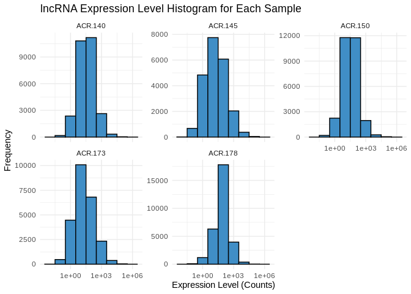
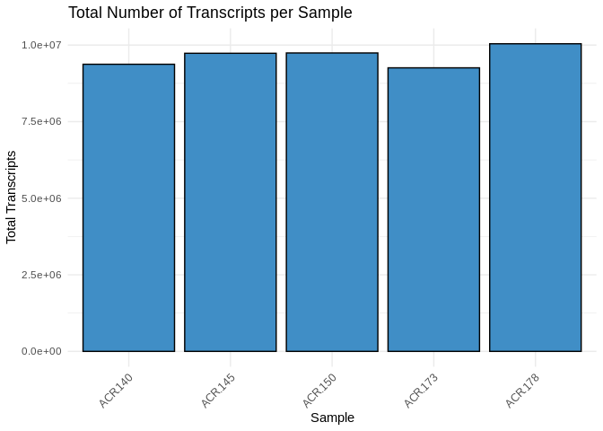
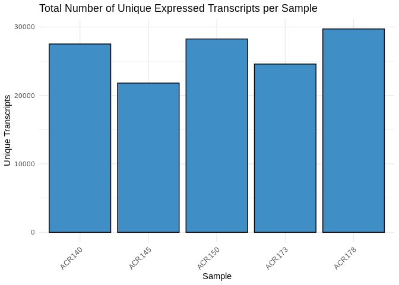
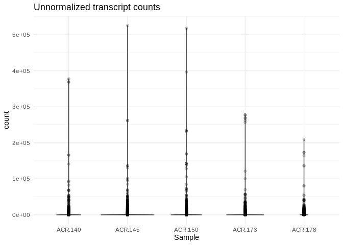
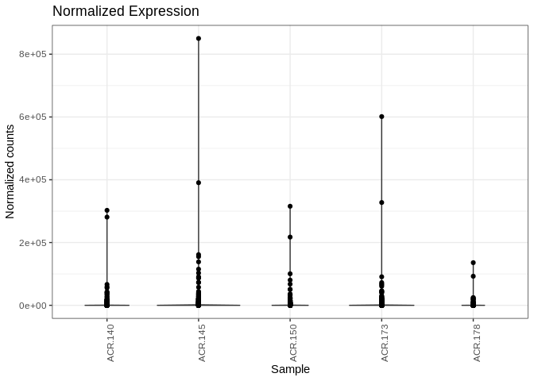
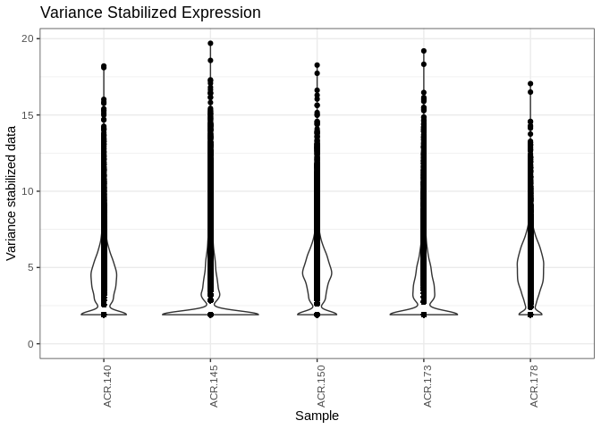

03.2-Apul-lncRNA-summary
================
Kathleen Durkin
2025-05-05

- <a href="#001-install-and-load-packages"
  id="toc-001-install-and-load-packages">0.0.1 Install and load
  packages</a>
- <a href="#1-unnormalized-data" id="toc-1-unnormalized-data">1
  Unnormalized data</a>
  - <a href="#11-load-count-data" id="toc-11-load-count-data">1.1 Load count
    data</a>
  - <a href="#12-count-data-munging" id="toc-12-count-data-munging">1.2
    Count data munging</a>
  - <a href="#13-expression-levels" id="toc-13-expression-levels">1.3
    Expression levels</a>
  - <a href="#14-transcript-counts" id="toc-14-transcript-counts">1.4
    Transcript counts</a>
- <a href="#2-normalized-counts" id="toc-2-normalized-counts">2 Normalized
  counts</a>
  - <a href="#21-normalize-counts-with-deseq2"
    id="toc-21-normalize-counts-with-deseq2">2.1 Normalize counts with
    DESeq2</a>
    - <a href="#211-plot-unnormalized-data"
      id="toc-211-plot-unnormalized-data">2.1.1 Plot unnormalized data</a>
    - <a href="#212-metadata" id="toc-212-metadata">2.1.2 Metadata</a>
    - <a href="#213-deseq-object" id="toc-213-deseq-object">2.1.3 DESeq
      object</a>
  - <a href="#22-plot-normalized-data" id="toc-22-plot-normalized-data">2.2
    Plot normalized data</a>
  - <a href="#23-plot-variance-stabilized-data"
    id="toc-23-plot-variance-stabilized-data">2.3 Plot variance stabilized
    data</a>
  - <a href="#24-normalized-expression-levels"
    id="toc-24-normalized-expression-levels">2.4 Normalized expression
    levels</a>
  - <a href="#25-normalized-transcript-counts"
    id="toc-25-normalized-transcript-counts">2.5 Normalized transcript
    counts</a>
  - <a href="#26-pca-of-variance-stabilized-data"
    id="toc-26-pca-of-variance-stabilized-data">2.6 PCA of variance
    stabilized data</a>
  - <a href="#27-sample-clustering" id="toc-27-sample-clustering">2.7 Sample
    clustering</a>
  - <a href="#28-heatmaps" id="toc-28-heatmaps">2.8 Heatmaps</a>
  - <a href="#29-general-summary-stats"
    id="toc-29-general-summary-stats">2.9 General summary stats</a>

Re-run 8/6/25 with updated lncRNA counts matrix

lncRNA expression summary for *Acropora pulchra* lncRNA, isolated in
`deep-dive-expression/M-multi-species/code/01.6-lncRNA-pipeline.Rmd`

### 0.0.1 Install and load packages

``` r
library(tidyverse)
library(ggplot2)
library(reshape2)
library(magrittr)
library(DESeq2)
library(RColorBrewer)
library(pheatmap)
```

# 1 Unnormalized data

## 1.1 Load count data

``` r
# Read in counts data.
Apul_counts_lncRNA_OG <- read.table("../../M-multi-species/output/01.6-lncRNA-pipeline/Apul-lncRNA-counts-filtered.txt", header=TRUE) 
head(Apul_counts_lncRNA_OG)
```

          Geneid      Chr Start   End Strand Length
    1 lncRNA_001 ntLink_0 25262 29713      +   4452
    2 lncRNA_002 ntLink_0 25263 30830      +   5568
    3 lncRNA_003 ntLink_0 84577 93547      +   8971
    4 lncRNA_004 ntLink_0 23405 24922      +   1518
    5 lncRNA_005 ntLink_1  7486  8513      +   1028
    6 lncRNA_006 ntLink_1 14013 18684      +   4672
      X.home.shared.8TB_HDD_02.zbengt.github.deep.dive.expression.M.multi.species.data.01.6.Apul.lncRNA.pipeline.RNA.ACR.140.sorted.bam
    1                                                                                                                              3.16
    2                                                                                                                              5.16
    3                                                                                                                              4.80
    4                                                                                                                             17.90
    5                                                                                                                             90.00
    6                                                                                                                            276.66
      X.home.shared.8TB_HDD_02.zbengt.github.deep.dive.expression.M.multi.species.data.01.6.Apul.lncRNA.pipeline.RNA.ACR.145.sorted.bam
    1                                                                                                                              0.50
    2                                                                                                                              1.10
    3                                                                                                                             22.60
    4                                                                                                                              3.70
    5                                                                                                                              3.00
    6                                                                                                                             61.67
      X.home.shared.8TB_HDD_02.zbengt.github.deep.dive.expression.M.multi.species.data.01.6.Apul.lncRNA.pipeline.RNA.ACR.150.sorted.bam
    1                                                                                                                             13.79
    2                                                                                                                             23.29
    3                                                                                                                             19.31
    4                                                                                                                             62.49
    5                                                                                                                              3.00
    6                                                                                                                             85.33
      X.home.shared.8TB_HDD_02.zbengt.github.deep.dive.expression.M.multi.species.data.01.6.Apul.lncRNA.pipeline.RNA.ACR.173.sorted.bam
    1                                                                                                                              0.50
    2                                                                                                                              0.71
    3                                                                                                                             45.71
    4                                                                                                                              5.70
    5                                                                                                                              0.67
    6                                                                                                                            263.58
      X.home.shared.8TB_HDD_02.zbengt.github.deep.dive.expression.M.multi.species.data.01.6.Apul.lncRNA.pipeline.RNA.ACR.178.sorted.bam
    1                                                                                                                             59.02
    2                                                                                                                             82.72
    3                                                                                                                            102.93
    4                                                                                                                            224.59
    5                                                                                                                              3.50
    6                                                                                                                            537.00

## 1.2 Count data munging

``` r
# We need to modify this data frame so that the row names are actually row names, instead of comprising the first column
Apul_counts_lncRNA <- Apul_counts_lncRNA_OG %>%
  column_to_rownames(var = "Geneid")

# Additional formatting
# Remove genomic coordinate info
Apul_counts_lncRNA <- Apul_counts_lncRNA %>% select(-Chr, -Start, -End, -Strand, -Length)

# Remove all transcripts with 5 or fewer counts in all samples
Apul_counts_lncRNA <- Apul_counts_lncRNA[!apply(Apul_counts_lncRNA, 1, function(row) all(row < 6)), ]

# Remove the superfluous portions of the column names, to leave just the sample names
colnames(Apul_counts_lncRNA) <- sub("X.home.shared.8TB_HDD_02.zbengt.github.deep.dive.expression.M.multi.species.data.01.6.Apul.lncRNA.pipeline.RNA.", "", colnames(Apul_counts_lncRNA))
colnames(Apul_counts_lncRNA) <- sub(".sorted.bam", "", colnames(Apul_counts_lncRNA))

# Reorder the columns into alphabetical order (to make it easier to create an associated metadata spreadsheet)
Apul_counts_lncRNA <- Apul_counts_lncRNA[, order(colnames(Apul_counts_lncRNA))]

write.table(Apul_counts_lncRNA, file = "../output/03.2-Apul-lncRNA-summary/Apul_lncRNA_counts_formatted.txt", row.names = TRUE, col.names = TRUE)

Apul_sample_names <- names(Apul_counts_lncRNA)

head(Apul_counts_lncRNA)
```

               ACR.140 ACR.145 ACR.150 ACR.173 ACR.178
    lncRNA_001    3.16    0.50   13.79    0.50   59.02
    lncRNA_002    5.16    1.10   23.29    0.71   82.72
    lncRNA_003    4.80   22.60   19.31   45.71  102.93
    lncRNA_004   17.90    3.70   62.49    5.70  224.59
    lncRNA_005   90.00    3.00    3.00    0.67    3.50
    lncRNA_006  276.66   61.67   85.33  263.58  537.00

``` r
Apul_sample_names
```

    [1] "ACR.140" "ACR.145" "ACR.150" "ACR.173" "ACR.178"

## 1.3 Expression levels

Plot histograms of the expression levels in each sample

``` r
# Melt the count matrix into long format
Apul_counts_melted <- melt(Apul_counts_lncRNA, variable.name = "sample", value.name = "counts")

# Plot the expression level histograms for each sample
ggplot(Apul_counts_melted, aes(x = counts)) +
  geom_histogram(binwidth = 1, fill = "#408EC6", color = "black") +
  scale_x_log10() +  # Optional: Log-transform the x-axis for better visualization
  facet_wrap(~sample, scales = "free_y") +
  labs(title = "lncRNA Expression Level Histogram for Each Sample",
       x = "Expression Level (Counts)",
       y = "Frequency") +
  theme_minimal()
```

<!-- -->

## 1.4 Transcript counts

First let’s check the total number of transcripts in each sample – keep
in mind this expression data has *not* been normalized yet, so there may
be different totals for each sample

``` r
# Calculate the total number of transcripts for each sample
total_transcripts <- colSums(Apul_counts_lncRNA)

# Create a data frame for plotting
total_transcripts_df <- data.frame(sample = names(total_transcripts),
                                   totals = total_transcripts)

# Plot the total number of transcripts for each sample
ggplot(total_transcripts_df, aes(x = sample, y = totals)) +
  geom_bar(stat = "identity", fill = "#408EC6", color = "black") +
  labs(title = "Total Number of Transcripts per Sample",
       x = "Sample",
       y = "Total Transcripts") +
  theme_minimal() +
  theme(axis.text.x = element_text(angle = 45, hjust = 1))  # Rotate x-axis labels for readability
```

<!-- -->

Now let’s check the number of unique transcripts in each sample – that
is, how many lncRNAs are expressed in each sample? This should be pretty
much the same across samples, even without normalization.

``` r
# Calculate the number of unique transcripts (non-zero counts) for each sample
unique_transcripts <- colSums(Apul_counts_lncRNA > 0)

# Create a data frame for plotting
unique_transcripts_df <- data.frame(sample = names(unique_transcripts),
                                    uniques = unique_transcripts)

# Plot the total number of unique transcripts for each sample
ggplot(unique_transcripts_df, aes(x = sample, y = uniques)) +
  geom_bar(stat = "identity", fill = "#408EC6", color = "black") +
  labs(title = "Total Number of Unique Expressed Transcripts per Sample",
       x = "Sample",
       y = "Unique Transcripts") +
  theme_minimal() +
  theme(axis.text.x = element_text(angle = 45, hjust = 1))  # Rotate x-axis labels for readability
```

<!-- -->

Interesting! Theres actually notable intraspecific variation in the
number of unique lncRNA present, ranging from \~22000 to \~30000.

# 2 Normalized counts

## 2.1 Normalize counts with DESeq2

### 2.1.1 Plot unnormalized data

``` r
Apul_counts_lncRNA %>%
  pivot_longer( cols = everything(), names_to = "sample", values_to = "count") %>%
  ggplot(., aes(x = sample, y = count)) +
  geom_violin() + 
  geom_point(alpha = 0.2) +
  theme_minimal() +
  labs(title = "Unnormalized transcript counts",
       x = "Sample",
       y = "count")
```

<!-- -->

### 2.1.2 Metadata

DESeq2 requires a metadata data frame as input. I don’t have sample
metadata though so, since we’re just doing DESeq2 for normalization
purposes (not analysis purposes), I’m just going to create a dummy sheet

``` r
Apul_sample_names <- colnames(Apul_counts_lncRNA)

Apul_metadata_lncRNA <- data.frame(Sample = Apul_sample_names,
                            Species = rep("A.pulchra", 5))
rownames(Apul_metadata_lncRNA) <- Apul_sample_names

head(Apul_metadata_lncRNA)
```

             Sample   Species
    ACR.140 ACR.140 A.pulchra
    ACR.145 ACR.145 A.pulchra
    ACR.150 ACR.150 A.pulchra
    ACR.173 ACR.173 A.pulchra
    ACR.178 ACR.178 A.pulchra

DESeq2 also requires that input counts be integers

``` r
Apul_counts_lncRNA_round <- round(Apul_counts_lncRNA)
```

### 2.1.3 DESeq object

``` r
# Calculate DESeq object
dds_Apul_lncRNA <- DESeqDataSetFromMatrix(countData = Apul_counts_lncRNA_round,
                              colData = Apul_metadata_lncRNA,
                              design = ~ 1) 

# Run differential expression analysis 
# (Note that this DESeq() function runs all necessary steps, including data normalization, 
# estimating size factors, estimating dispersions, gene-wise dispersion estimates, mean-dispersion 
# relationship, final dispersion estimates, fitting model, and testing)
# Using design = ~1 because we don't have treatment groups

dds_Apul_lncRNA <- DESeq(dds_Apul_lncRNA)
```

It’s worth noting here that I’m actually going to be doing two different
types of transformation on the counts data, which serve different
purposes.

- First is **normalizing** the transcript counts, which adjusts for
  differences in library size or sequencing depth, but retains
  count-like properties. Normalized counts are most useful for things
  like visualizing expression levels and differential expression
  analysis.

- Second is **variance stabilizing** the counts data, which aims to make
  the variance of the transformed data approximately independent of the
  mean, reducing heteroscedasticity (the relationship between variance
  and mean) and “smoothing” out the variance at low counts. Notably, the
  transformed data is *no longer on the original count scale*. The
  transformation makes the variance roughly constant across the range of
  counts, which makes it easier to interpret patterns in the data
  visually. Variance stabilized data is most useful for exploratory data
  analysis, like PCA, clustering, and heatmaps, and is also the
  transformation we’ll want to use before WGCNA.

``` r
# extract normalized counts
# (normalization is automatically performed by deseq2)
Apul_counts_lncRNA_norm <- counts(dds_Apul_lncRNA, normalized=TRUE) %>% data.frame()

write.table(Apul_counts_lncRNA_norm, file = "../output/03.2-Apul-lncRNA-summary/Apul_counts_lncRNA_normalized.txt", sep = "\t", row.names = TRUE, col.names = TRUE, quote = FALSE)


# variance stabilized data
vsd_Apul_lncRNA <- varianceStabilizingTransformation(dds_Apul_lncRNA, blind=TRUE)
wpn_vsd_Apul_lncRNA <- getVarianceStabilizedData(dds_Apul_lncRNA)
rv_wpn_Apul_lncRNA <- rowVars(wpn_vsd_Apul_lncRNA, useNames=TRUE)

Apul_counts_lncRNA_vsd <- data.frame(wpn_vsd_Apul_lncRNA)
write.table(Apul_counts_lncRNA_vsd, file = "../output/03.2-Apul-lncRNA-summary/Apul_counts_lncRNA_variancestabilized.txt", sep = "\t", row.names = TRUE, col.names = TRUE,quote = FALSE)

q75_wpn_Apul_lncRNA <- quantile(rowVars(wpn_vsd_Apul_lncRNA, useNames=TRUE), .75)  # 75th quantile variability
Apul_counts_lncRNA_vsd_q75 <- wpn_vsd_Apul_lncRNA[ rv_wpn_Apul_lncRNA > q75_wpn_Apul_lncRNA, ] %>% data.frame # filter to retain only the most variable lncRNAs
write.table(Apul_counts_lncRNA_vsd_q75, file = "../output/03.2-Apul-lncRNA-summary/Apul_counts_lncRNA_variancestabilized_q75.txt", sep = "\t", row.names = TRUE, col.names = TRUE,quote = FALSE)

q95_wpn_Apul_lncRNA <- quantile(rowVars(wpn_vsd_Apul_lncRNA, useNames=TRUE), .95)  # 95th quantile variability
Apul_counts_lncRNA_vsd_q95 <- wpn_vsd_Apul_lncRNA[ rv_wpn_Apul_lncRNA > q95_wpn_Apul_lncRNA, ] %>% data.frame # filter to retain only the most variable lncRNAs
write.table(Apul_counts_lncRNA_vsd_q95, file = "../output/03.2-Apul-lncRNA-summary/Apul_counts_lncRNA_variancestabilized_q95.txt", sep = "\t", row.names = TRUE, col.names = TRUE,quote = FALSE)
```

## 2.2 Plot normalized data

``` r
Apul_counts_lncRNA_norm_long <- Apul_counts_lncRNA_norm %>%
  mutate(
    Gene_id = row.names(Apul_counts_lncRNA_norm)
  ) %>%
  pivot_longer(-Gene_id)

Apul_counts_lncRNA_norm_long %>%
  ggplot(., aes(x = name, y = value)) +
  geom_violin() +
  geom_point() +
  theme_bw() +
  theme(
    axis.text.x = element_text( angle = 90)
  ) +
  ylim(0, NA) +
  labs(
    title = "Normalized Expression",
    x = "Sample",
    y = "Normalized counts"
  )
```

<!-- -->

## 2.3 Plot variance stabilized data

``` r
Apul_counts_lncRNA_vsd_long <- Apul_counts_lncRNA_vsd %>%
  mutate(
    Gene_id = row.names(Apul_counts_lncRNA_vsd)
  ) %>%
  pivot_longer(-Gene_id)

Apul_counts_lncRNA_vsd_long %>%
  ggplot(., aes(x = name, y = value)) +
  geom_violin() +
  geom_point() +
  theme_bw() +
  theme(
    axis.text.x = element_text( angle = 90)
  ) +
  ylim(0, NA) +
  labs(
    title = "Variance Stabilized Expression",
    x = "Sample",
    y = "Variance stabilized data"
  )
```

<!-- -->

## 2.4 Normalized expression levels

Plot histograms of the normalized expression levels in each sample

``` r
# Melt the count matrix into long format
Apul_counts_norm_melted <- melt(Apul_counts_lncRNA_norm, variable.name = "sample", value.name = "counts")

# Plot the expression level histograms for each sample
ggplot(Apul_counts_norm_melted, aes(x = counts)) +
  geom_histogram(binwidth = 1, fill = "#408EC6", color = "black") +
  scale_x_log10() +  # Optional: Log-transform the x-axis for better visualization
  facet_wrap(~sample, scales = "free_y") +
  labs(title = "lncRNA Expression Level Histogram for Each Sample",
       x = "Expression Level (Counts)",
       y = "Frequency") +
  theme_minimal()
```

<!-- -->

## 2.5 Normalized transcript counts

Check the total number of transcripts in each sample – now that we’ve
normalized the data these totals should be similar

``` r
# Calculate the total number of transcripts for each sample
total_transcripts_norm <- colSums(Apul_counts_lncRNA_norm)

# Create a data frame for plotting
total_transcripts_norm_df <- data.frame(sample = names(total_transcripts_norm),
                                   totals = total_transcripts_norm)

# Plot the total number of transcripts for each sample
ggplot(total_transcripts_norm_df, aes(x = sample, y = totals)) +
  geom_bar(stat = "identity", fill = "#408EC6", color = "black") +
  labs(title = "Total Number of Transcripts per Sample",
       x = "Sample",
       y = "Total Transcripts") +
  theme_minimal() +
  theme(axis.text.x = element_text(angle = 45, hjust = 1))  # Rotate x-axis labels for readability
```

<!-- -->

## 2.6 PCA of variance stabilized data

``` r
plotPCA(vsd_Apul_lncRNA, intgroup="Sample")
```

<!-- -->

Samples ACR-145 and ACR-173 are notably divergent from the other samples
(and each other). They also have higher normalized transcript counts
than the other 3 samples.

## 2.7 Sample clustering

``` r
sample_dists <- dist(t(assay(vsd_Apul_lncRNA)))
pheatmap(as.matrix(sample_dists), clustering_distance_rows = "euclidean", 
         clustering_distance_cols = "euclidean", main="Sample Clustering")
```

<!-- -->

## 2.8 Heatmaps

Of most variable variance stabilized lncRNAs

``` r
# 75th quantile
heat_colors <- rev(brewer.pal(12, "RdYlBu"))
pheatmap(Apul_counts_lncRNA_vsd_q75, 
         cluster_rows = TRUE,
         cluster_cols = TRUE,
         show_rownames = TRUE,
         show_colnames = TRUE,
         color = heat_colors,
         scale="row")
```

<!-- -->

``` r
# 95th quantile
pheatmap(Apul_counts_lncRNA_vsd_q95, 
         cluster_rows = TRUE,
         cluster_cols = TRUE,
         show_rownames = TRUE,
         show_colnames = TRUE,
         color = heat_colors,
         scale="row")
```

<!-- -->

## 2.9 General summary stats

\# unique lncRNA avg transcript length mean and median expression level

``` r
# Note: the Apul_counts_lncRNA df has already been filtered to onl retain lncRNA present in at least one sample with at least 5 counts (to exclude spurious transcripts)
num_unique <- nrow(Apul_counts_lncRNA)

mean_expression <- 
median_expression <- 
```
