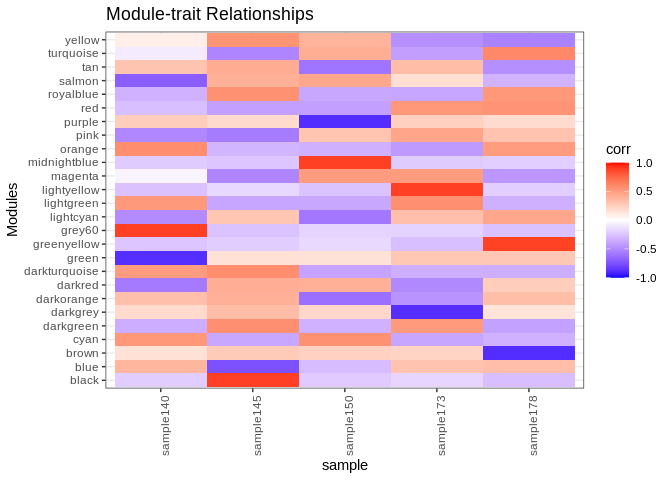

04-Apul-RNA-sRNA-WGCNA
================
Kathleen Durkin
2024-08-26

- <a href="#001-install-and-load-packages"
  id="toc-001-install-and-load-packages">0.0.1 Install and load
  packages</a>
- <a href="#1-prep-rna-data" id="toc-1-prep-rna-data">1 Prep RNA data</a>
  - <a href="#11-load-count-data" id="toc-11-load-count-data">1.1 Load count
    data</a>
  - <a href="#12-count-data-munging" id="toc-12-count-data-munging">1.2
    Count data munging</a>
  - <a href="#13-normalize-counts-with-deseq2"
    id="toc-13-normalize-counts-with-deseq2">1.3 Normalize counts with
    DESeq2</a>
    - <a href="#131-plot-unnormalized-data"
      id="toc-131-plot-unnormalized-data">1.3.1 Plot unnormalized data</a>
    - <a href="#132-metadata" id="toc-132-metadata">1.3.2 Metadata</a>
    - <a href="#133-deseq-object" id="toc-133-deseq-object">1.3.3 DESeq
      object</a>
  - <a href="#14-plot-normalized-data" id="toc-14-plot-normalized-data">1.4
    Plot normalized data</a>
- <a href="#2-prep-mirna-data" id="toc-2-prep-mirna-data">2 Prep miRNA
  data</a>
  - <a href="#21-load-count-data" id="toc-21-load-count-data">2.1 Load count
    data</a>
  - <a href="#22-count-data-munging" id="toc-22-count-data-munging">2.2
    Count data munging</a>
  - <a href="#23-normalize-counts-with-deseq2"
    id="toc-23-normalize-counts-with-deseq2">2.3 Normalize counts with
    DESeq2</a>
    - <a href="#231-plot-unnormalized-data"
      id="toc-231-plot-unnormalized-data">2.3.1 Plot unnormalized data</a>
    - <a href="#232-metadata" id="toc-232-metadata">2.3.2 Metadata</a>
    - <a href="#233-deseq-object" id="toc-233-deseq-object">2.3.3 DESeq
      object</a>
  - <a href="#24-plot-normalized-data" id="toc-24-plot-normalized-data">2.4
    Plot normalized data</a>
  - <a href="#25-normalized-count-data-munging"
    id="toc-25-normalized-count-data-munging">2.5 Normalized count data
    munging</a>
- <a href="#3-merge-rna-and-mirna-normalized-counts"
  id="toc-3-merge-rna-and-mirna-normalized-counts">3 Merge RNA and miRNA
  normalized counts</a>
- <a href="#4-wgcna" id="toc-4-wgcna">4 WGCNA</a>

### 0.0.1 Install and load packages

``` r
library(tidyverse)
library(ggplot2)
library(WGCNA)
library(magrittr)
library(DESeq2)
library(genefilter)
```

Used Jennifer Chang’s Bioinformatic Workflow [post on WGCNA
analysis](https://bioinformaticsworkbook.org/tutorials/wgcna.html#gsc.tab=0)
as a very helpful guide.

**NOTE: WGCNA is recommended for use with at *least* 15 samples to draw
meaningful conclusions. We only have 5 samples from each species in our
deep-dive dataset, so this code is primarily intended to be a trial run,
developing an RNA-sRNA WGCNA coexpression pipeline in preparation for
our *time series data*.**

# 1 Prep RNA data

## 1.1 Load count data

Load in the count matrix we generated after kallisto pseudoalignment
using the Trinity abundance_estimates_to_matrix.pl script. We also need
to slightly reformat the count matrix, as required for DESeq2.

``` r
# Read in counts data. This is a gene-level counts matrix generated from kallisto transcript abundances using Trinity
Apul_counts_RNA_data_OG <- read_delim("../../../deep-dive/D-Apul/output/14-Apul-RNAseq-kallisto/kallisto/kallisto.isoform.counts.matrix") 
head(Apul_counts_RNA_data_OG)
```

    # A tibble: 6 × 6
      ...1      kallisto_quant_sampl…¹ kallisto_quant_sampl…² kallisto_quant_sampl…³
      <chr>                      <dbl>                  <dbl>                  <dbl>
    1 XM_04431…                  108                     46                    63   
    2 XR_00639…                    0                      0                     0   
    3 XM_02934…                  467.                   337.                  362.  
    4 XM_04432…                   43.5                   20.7                   5.14
    5 XR_00639…                  108.                     0                     0   
    6 XM_04431…                   20.4                    0                    21.3 
    # ℹ abbreviated names: ¹​kallisto_quant_sample140, ²​kallisto_quant_sample145,
    #   ³​kallisto_quant_sample150
    # ℹ 2 more variables: kallisto_quant_sample173 <dbl>,
    #   kallisto_quant_sample178 <dbl>

## 1.2 Count data munging

``` r
# We need to modify this data frame so that the row names are actually row names, instead of comprising the first column
Apul_counts_RNA <- Apul_counts_RNA_data_OG %>%
  column_to_rownames(var = "...1")

# Additional formatting
# Round all estimated counts to integers
Apul_counts_RNA <- round(Apul_counts_RNA, digits = 0)

# Remove all transcripts with 5 or fewer counts in all samples
Apul_counts_RNA <- Apul_counts_RNA[!apply(Apul_counts_RNA, 1, function(row) all(row < 6)), ]

# Remove the "kallisto_quant_" portion of the column names, to leave just the sample names
colnames(Apul_counts_RNA) <- sub("kallisto_quant_", "", colnames(Apul_counts_RNA))

Apul_sample_names <- names(Apul_counts_RNA)

head(Apul_counts_RNA)
```

                   sample140 sample145 sample150 sample173 sample178
    XM_044313592.1       108        46        63       105       131
    XR_006395886.1         0         0         0         6       139
    XM_029343024.2       467       337       362       570      1234
    XM_044327972.1        43        21         5        12        41
    XR_006392795.1       108         0         0         0         0
    XM_044315346.1        20         0        21        18       232

``` r
Apul_sample_names
```

    [1] "sample140" "sample145" "sample150" "sample173" "sample178"

## 1.3 Normalize counts with DESeq2

### 1.3.1 Plot unnormalized data

``` r
Apul_counts_RNA %>%
  pivot_longer( cols = everything(), names_to = "sample", values_to = "count") %>%
  ggplot(., aes(x = sample, y = count)) +
  geom_violin() + 
  geom_point(alpha = 0.2) +
  theme_minimal() +
  labs(title = "Unnormalized transcript counts",
       x = "Sample",
       y = "count")
```

<!-- -->

We definitely need to normalize this data!

### 1.3.2 Metadata

DESeq2 requires a metadata data frame as input. I don’t have sample
metadata though so, since we’re just doing DESeq2 for normalization
purposes (not analysis purposes), I’m just going to create a dummy sheet

``` r
Apul_metadata_RNA <- data.frame(Sample = Apul_sample_names,
                            Species = rep("A.pulchra", 5))
rownames(Apul_metadata_RNA) <- Apul_sample_names

head(Apul_metadata_RNA)
```

                 Sample   Species
    sample140 sample140 A.pulchra
    sample145 sample145 A.pulchra
    sample150 sample150 A.pulchra
    sample173 sample173 A.pulchra
    sample178 sample178 A.pulchra

### 1.3.3 DESeq object

``` r
# Calculate DESeq object
dds_Apul_RNA <- DESeqDataSetFromMatrix(countData = Apul_counts_RNA,
                              colData = Apul_metadata_RNA,
                              design = ~ 1) 

# Run differential expression analysis 
# (Note that this DESeq() function runs all necessary steps, including data normalization, 
# estimating size factors, estimating dispersions, gene-wise dispersion estimates, mean-dispersion 
# relationship, final dispersion estimates, fitting model, and testing)
# Using design = ~1 because we don't have treatment groups

dds_Apul_RNA <- DESeq(dds_Apul_RNA)
```

``` r
vsd_Apul_RNA <- varianceStabilizingTransformation(dds_Apul_RNA, blind=TRUE)
wpn_vsd_Apul_RNA <- getVarianceStabilizedData(dds_Apul_RNA)
rv_wpn_Apul_RNA <- rowVars(wpn_vsd_Apul_RNA)

q75_wpn_Apul_RNA <- quantile( rowVars(wpn_vsd_Apul_RNA), .75)  # <= original
q95_wpn_Apul_RNA <- quantile( rowVars(wpn_vsd_Apul_RNA), .95)  # <= changed to 95 quantile to reduce dataset
Apul_counts_RNA_norm <- wpn_vsd_Apul_RNA[ rv_wpn_Apul_RNA > q95_wpn_Apul_RNA, ] # filter to retain only the most variable genes

Apul_counts_RNA_norm <- data.frame(Apul_counts_RNA_norm) 

write.table(Apul_counts_RNA_norm, file = "../output/04-Apul-RNA-sRNA-WGCNA/Apul_counts_RNA_normalized_q95.txt", sep = "\t", row.names = TRUE, quote = FALSE)
```

## 1.4 Plot normalized data

``` r
Apul_counts_RNA_norm_long <- Apul_counts_RNA_norm %>%
  mutate(
    Gene_id = row.names(Apul_counts_RNA_norm)
  ) %>%
  pivot_longer(-Gene_id)

Apul_counts_RNA_norm_long %>%
  ggplot(., aes(x = name, y = value)) +
  geom_violin() +
  geom_point() +
  theme_bw() +
  theme(
    axis.text.x = element_text( angle = 90)
  ) +
  ylim(0, NA) +
  labs(
    title = "Normalized and 95 quantile Expression",
    x = "Sample",
    y = "Normalized counts"
  )
```

<!-- -->

# 2 Prep miRNA data

## 2.1 Load count data

Load in the miRNA count matrix generated by ShortStack during miRNA
identification

``` r
# Read in sRNA counts data
Apul_counts_sRNA_data_OG <- read_delim("../../../deep-dive/D-Apul/output/13.2.1-Apul-sRNAseq-ShortStack-31bp-fastp-merged-cnidarian_miRBase/ShortStack_out/Counts.txt", delim="\t") 
head(Apul_counts_sRNA_data_OG)
```

    # A tibble: 6 × 8
      Coords               Name  MIRNA sRNA-ACR-140-S1-TP2-…¹ sRNA-ACR-145-S1-TP2-…²
      <chr>                <chr> <chr>                  <dbl>                  <dbl>
    1 NC_058066.1:152483-… Clus… N                          2                    131
    2 NC_058066.1:161064-… Clus… N                         57                     48
    3 NC_058066.1:172073-… Clus… N                         36                     31
    4 NC_058066.1:203242-… Clus… N                         14                     28
    5 NC_058066.1:204535-… Clus… N                          3                    234
    6 NC_058066.1:205745-… Clus… N                        914                    432
    # ℹ abbreviated names: ¹​`sRNA-ACR-140-S1-TP2-fastp-adapters-polyG-31bp-merged`,
    #   ²​`sRNA-ACR-145-S1-TP2-fastp-adapters-polyG-31bp-merged`
    # ℹ 3 more variables:
    #   `sRNA-ACR-150-S1-TP2-fastp-adapters-polyG-31bp-merged` <dbl>,
    #   `sRNA-ACR-173-S1-TP2-fastp-adapters-polyG-31bp-merged` <dbl>,
    #   `sRNA-ACR-178-S1-TP2-fastp-adapters-polyG-31bp-merged` <dbl>

## 2.2 Count data munging

``` r
Apul_counts_sRNA <- Apul_counts_sRNA_data_OG

# Remove excess portions of sample column names to just "sample###"
colnames(Apul_counts_sRNA) <- sub("-S1-TP2-fastp-adapters-polyG-31bp-merged", "", colnames(Apul_counts_sRNA))
colnames(Apul_counts_sRNA) <- sub("sRNA-ACR-", "sample", colnames(Apul_counts_sRNA))

# Keep just the counts and cluster names
Apul_counts_sRNA <- Apul_counts_sRNA %>% select("sample140", "sample145", "sample150", "sample173", "sample178", "Name")

# Make the cluster names our new row names
Apul_counts_sRNA <- Apul_counts_sRNA %>% column_to_rownames(var = "Name")

head(Apul_counts_sRNA)
```

              sample140 sample145 sample150 sample173 sample178
    Cluster_1         2       131         2         1         4
    Cluster_2        57        48       219        32       193
    Cluster_3        36        31         0        36         2
    Cluster_4        14        28         3        17        38
    Cluster_5         3       234        17        13        46
    Cluster_6       914       432        78       247       259

## 2.3 Normalize counts with DESeq2

### 2.3.1 Plot unnormalized data

``` r
Apul_counts_sRNA %>%
  pivot_longer( cols = everything(), names_to = "sample", values_to = "count") %>%
  ggplot(., aes(x = sample, y = count)) +
  geom_violin() + 
  geom_point(alpha = 0.2) +
  theme_minimal() +
  labs(title = "Unnormalized transcript counts",
       x = "Sample",
       y = "count")
```

<!-- -->

We definitely need to normalize this data!

### 2.3.2 Metadata

DESeq2 requires a metadata data frame as input. I don’t have sample
metadata though so, since we’re just doing DESeq2 for normalization
purposes (not analysis purposes), I’m just going to create a dummy sheet

``` r
Apul_metadata_RNA <- data.frame(Sample = Apul_sample_names,
                            Species = rep("A.pulchra", 5))
rownames(Apul_metadata_RNA) <- Apul_sample_names

head(Apul_metadata_RNA)
```

                 Sample   Species
    sample140 sample140 A.pulchra
    sample145 sample145 A.pulchra
    sample150 sample150 A.pulchra
    sample173 sample173 A.pulchra
    sample178 sample178 A.pulchra

### 2.3.3 DESeq object

``` r
# Calculate DESeq object
dds_Apul_sRNA <- DESeqDataSetFromMatrix(countData = Apul_counts_sRNA,
                              colData = Apul_metadata_RNA,
                              design = ~ 1) 

# Run differential expression analysis 
# (Note that this DESeq() function runs all necessary steps, including data normalization, 
# estimating size factors, estimating dispersions, gene-wise dispersion estimates, mean-dispersion 
# relationship, final dispersion estimates, fitting model, and testing)
# Using design = ~1 because we don't have treatment groups

dds_Apul_sRNA <- DESeq(dds_Apul_sRNA)
```

``` r
vsd_Apul_sRNA <- varianceStabilizingTransformation(dds_Apul_sRNA, blind=TRUE)
wpn_vsd_Apul_sRNA <- getVarianceStabilizedData(dds_Apul_sRNA)
rv_wpn_Apul_sRNA <- rowVars(wpn_vsd_Apul_sRNA)

# For now let's retain all sRNAs, regardless of expression level
# q75_wpn_Apul_sRNA <- quantile( rowVars(wpn_vsd_Apul_sRNA), .75)  
# q90_wpn_Apul_sRNA <- quantile( rowVars(wpn_vsd_Apul_sRNA), .9)  
# Apul_counts_sRNA_norm <- wpn_vsd_Apul_RNA[ rv_wpn_Apul_sRNA > q50_wpn_Apul_sRNA, ] # filter to retain only the more variable genes
Apul_counts_sRNA_norm <- wpn_vsd_Apul_sRNA

Apul_counts_sRNA_norm <- data.frame(Apul_counts_sRNA_norm)

write.table(Apul_counts_sRNA_norm, file = "../output/04-Apul-RNA-sRNA-WGCNA/Apul_counts_sRNA_normalized.txt", sep = "\t", row.names = TRUE, quote = FALSE)
```

## 2.4 Plot normalized data

``` r
Apul_counts_sRNA_norm_df_long <- Apul_counts_sRNA_norm %>%
  mutate(
    Gene_id = row.names(Apul_counts_sRNA_norm)
  ) %>%
  pivot_longer(-Gene_id)

Apul_counts_sRNA_norm_df_long %>%
  ggplot(., aes(x = name, y = value)) +
  geom_violin() +
  geom_point() +
  theme_bw() +
  theme(
    axis.text.x = element_text( angle = 90)
  ) +
  ylim(0, NA) +
  labs(
    title = "Normalized and 95 quantile Expression",
    x = "Sample",
    y = "Normalized counts"
  )
```

<!-- -->

## 2.5 Normalized count data munging

``` r
# The ShortStack output Results.txt includes all clusters of sRNA reads, including those not annotated as valid miRNAs. Now that we've normalized the counts,we need to filter out all the clusters that are not miRNAs.

# Join with full metadata sheet, which only contains valid miRNAs
Apul_metadata_miRNA <- read_csv("../../../deep-dive/DEF-cross-species/output/10-shortRNA-ShortStack-comparison/Apul_results_mature_named.csv") 

Apul_counts_sRNA_norm <- rownames_to_column(Apul_counts_sRNA_norm, var = "Name")

Apul_counts_miRNA_norm <- left_join(Apul_metadata_miRNA, Apul_counts_sRNA_norm, by = c("Name" = "Name"))

# Keep just the counts and given miRNA names (e.g., based on match to previously described miRNA)
Apul_counts_miRNA_norm <- Apul_counts_miRNA_norm %>% select("sample140", "sample145", "sample150", "sample173", "sample178", "given_miRNA_name")

# Make the miRNA names our new row names
Apul_counts_miRNA_norm <- Apul_counts_miRNA_norm %>% column_to_rownames(var = "given_miRNA_name")

head(Apul_counts_miRNA_norm)
```

                     sample140 sample145 sample150 sample173 sample178
    apul-mir-novel-2 15.017520 15.316693 16.004786 15.163512  16.04577
    apul-mir-novel-1  2.812493  9.711462 10.284587  2.168756  12.82941
    apul-mir-novel-7  5.548060  5.194907  4.618254  5.786394   4.68501
    apul-mir-novel-4 10.705670 12.292874 12.759827 12.335792  13.40232
    apul-mir-novel-6  9.839852 10.848441 11.050479 11.991578  11.78180
    apul-mir-novel-3 10.410008 10.470898 10.476884 11.186923  11.08251

# 3 Merge RNA and miRNA normalized counts

Now that we have normalized counts of RNA and miRNA for all of our
samples, let’s combine them into one dataset to feed into WGCNA

``` r
# Merge
Apul_counts_WGCNA <- bind_rows(Apul_counts_miRNA_norm, Apul_counts_RNA_norm)

# Convert from data frame to matrix
Apul_counts_WGCNA <- as.matrix(Apul_counts_WGCNA)

# Transpose the normalized count data to meet WGCNA required input format
Apul_counts_WGCNA = t(Apul_counts_WGCNA)
```

# 4 WGCNA

Now we’re ready to run WGCNA!

``` r
allowWGCNAThreads()          # allow multi-threading (optional)
```

    Allowing multi-threading with up to 48 threads.

``` r
# Choose a set of soft-thresholding powers
powers = c(c(1:10), seq(from = 12, to = 20, by = 2))

# Call the network topology analysis function
sft_Apul = pickSoftThreshold(
  Apul_counts_WGCNA,             # <= Input data
  #blockSize = 30,
  powerVector = powers,
  verbose = 5
  )
```

    pickSoftThreshold: will use block size 2129.
     pickSoftThreshold: calculating connectivity for given powers...
       ..working on genes 1 through 2129 of 2129
       Power SFT.R.sq   slope truncated.R.sq mean.k. median.k. max.k.
    1      1 1.13e-01  3.4000          0.832   914.0     913.0  996.0
    2      2 2.75e-02 -1.1000          0.909   540.0     537.0  632.0
    3      3 1.05e-01 -1.5300          0.951   368.0     365.0  453.0
    4      4 1.37e-01 -1.5600          0.930   273.0     269.0  351.0
    5      5 8.03e-02 -1.1800          0.879   214.0     210.0  286.0
    6      6 1.73e-02 -0.5880          0.793   175.0     171.0  242.0
    7      7 1.07e-02 -0.4420          0.848   147.0     145.0  210.0
    8      8 3.96e-03 -0.2540          0.899   126.0     124.0  186.0
    9      9 2.13e-05  0.0173          0.930   110.0     108.0  167.0
    10    10 4.37e-03  0.2340          0.951    97.9      95.5  152.0
    11    12 1.05e-02  0.3010          0.965    79.6      76.8  129.0
    12    14 1.64e-02  0.3050          0.954    66.9      64.8  112.0
    13    16 5.37e-02  0.4400          0.938    57.5      55.5   98.4
    14    18 6.11e-02  0.3980          0.915    50.3      48.6   88.3
    15    20 3.59e-02  0.2610          0.867    44.7      42.9   81.2

``` r
par(mfrow = c(1,2));
cex1 = 0.9;

plot(sft_Apul$fitIndices[, 1],
     -sign(sft_Apul$fitIndices[, 3]) * sft_Apul$fitIndices[, 2],
     xlab = "Soft Threshold (power)",
     ylab = "Scale Free Topology Model Fit, signed R^2",
     main = paste("Scale independence")
)
text(sft_Apul$fitIndices[, 1],
     -sign(sft_Apul$fitIndices[, 3]) * sft_Apul$fitIndices[, 2],
     labels = powers, cex = cex1, col = "red"
)
abline(h = 0.90, col = "red")
plot(sft_Apul$fitIndices[, 1],
     sft_Apul$fitIndices[, 5],
     xlab = "Soft Threshold (power)",
     ylab = "Mean Connectivity",
     type = "n",
     main = paste("Mean connectivity")
)
text(sft_Apul$fitIndices[, 1],
     sft_Apul$fitIndices[, 5],
     labels = powers,
     cex = cex1, col = "red")
```

<!-- -->

I’m a little weirded out by the double curve in the Scale Independence
plot, but this is a prelim test so I’m not going to worry about it right
now. We want to pick a soft threshold power near the curve of the plot,
so maybe 6, 7, 8, or 9? Let’s pick 9 for now, but maybe experiment with
other powers later.

``` r
picked_power = 9
temp_cor <- cor       
cor <- WGCNA::cor         # Force it to use WGCNA cor function (fix a namespace conflict issue)
netwk_Apul <- blockwiseModules(Apul_counts_WGCNA,                # <= input here

                          # == Adjacency Function ==
                          power = picked_power,                # <= power here
                          networkType = "signed",

                          # == Tree and Block Options ==
                          deepSplit = 2,
                          pamRespectsDendro = F,
                          # detectCutHeight = 0.75,
                          minModuleSize = 30,
                          maxBlockSize = 4000,

                          # == Module Adjustments ==
                          reassignThreshold = 0,
                          mergeCutHeight = 0.25,

                          # == TOM == Archive the run results in TOM file (saves time)
                          saveTOMs = T,
                          saveTOMFileBase = "ER",

                          # == Output Options
                          numericLabels = T,
                          verbose = 3)
```

     Calculating module eigengenes block-wise from all genes
       Flagging genes and samples with too many missing values...
        ..step 1
     ..Working on block 1 .
        TOM calculation: adjacency..
        ..will use 48 parallel threads.
         Fraction of slow calculations: 0.000000
        ..connectivity..
        ..matrix multiplication (system BLAS)..
        ..normalization..
        ..done.
       ..saving TOM for block 1 into file ER-block.1.RData
     ....clustering..
     ....detecting modules..
     ....calculating module eigengenes..
     ....checking kME in modules..
     ..merging modules that are too close..
         mergeCloseModules: Merging modules whose distance is less than 0.25
           Calculating new MEs...

``` r
cor <- temp_cor     # Return cor function to original namespace
```

``` bash
# Check if there are any files starting with "ER" in the current directory
if ls ER-block* 1> /dev/null 2>&1; then
    # Move the files if they exist
    mv ER-block* ../output/04-Apul-RNA-sRNA-WGCNA
else
    echo "No files starting with 'ER' found."
fi
```

    No files starting with 'ER' found.

Take a look

``` r
# Convert labels to colors for plotting
mergedColors = labels2colors(netwk_Apul$colors)
# Plot the dendrogram and the module colors underneath
plotDendroAndColors(
  netwk_Apul$dendrograms[[1]],
  mergedColors[netwk_Apul$blockGenes[[1]]],
  "Module colors",
  dendroLabels = FALSE,
  hang = 0.03,
  addGuide = TRUE,
  guideHang = 0.05 )
```

<!-- -->

``` r
module_df_Apul <- data.frame(
  gene_id = names(netwk_Apul$colors),
  colors = labels2colors(netwk_Apul$colors)
)

module_df_Apul[1:5,]
```

               gene_id    colors
    1 apul-mir-novel-2 turquoise
    2 apul-mir-novel-1   darkred
    3 apul-mir-novel-7       tan
    4 apul-mir-novel-4     green
    5 apul-mir-novel-6     green

``` r
# Get Module Eigengenes per cluster
MEs0_Apul <- moduleEigengenes(Apul_counts_WGCNA, mergedColors)$eigengenes

# # Reorder modules so similar modules are next to each other
# MEs0_Apul <- orderMEs(MEs0_Apul)
# module_order_Apul = names(MEs0_Apul) %>% gsub("ME","", .)

# Add treatment names
MEs0_Apul$sample = row.names(MEs0_Apul)

# tidy & plot data
mME_Apul = MEs0_Apul %>%
  pivot_longer(-sample) %>%
  mutate(
    name = gsub("ME", "", name),
    # name = factor(name, levels = module_order)
  )

mME_Apul %>% ggplot(., aes(x=sample, y=name, fill=value)) +
  geom_tile() +
  theme_bw() +
  scale_fill_gradient2(
    low = "blue",
    high = "red",
    mid = "white",
    midpoint = 0,
    limit = c(-1,1)) +
  theme(axis.text.x = element_text(angle=90)) +
  labs(title = "Module-trait Relationships", y = "Modules", fill="corr")
```

<!-- -->

``` r
# Check which modules include miRNAs
module_df_Apul %>%
  filter(grepl("mir",gene_id)) %>%
  pull(colors) %>%
  unique()
```

     [1] "turquoise"   "darkred"     "tan"         "green"       "red"        
     [6] "grey60"      "darkgreen"   "blue"        "greenyellow" "royalblue"  
    [11] "pink"        "magenta"     "yellow"      "lightcyan"   "lightgreen" 
    [16] "lightyellow"

``` r
module_df_Apul %>%
  filter(grepl("mir",gene_id)) %>%
  arrange(colors) %>%
  head(n=38)
```

                  gene_id      colors
    1    apul-mir-novel-9        blue
    2   apul-mir-novel-19        blue
    3   apul-mir-novel-21        blue
    4       apul-mir-2022   darkgreen
    5   apul-mir-novel-16   darkgreen
    6    apul-mir-novel-1     darkred
    7   apul-mir-novel-10     darkred
    8       apul-mir-2030     darkred
    9    apul-mir-novel-4       green
    10   apul-mir-novel-6       green
    11  apul-mir-novel-8a       green
    12  apul-mir-novel-13       green
    13       apul-mir-100       green
    14  apul-mir-novel-17       green
    15  apul-mir-novel-20       green
    16  apul-mir-novel-11 greenyellow
    17  apul-mir-novel-15 greenyellow
    18   apul-mir-novel-5      grey60
    19  apul-mir-novel-22   lightcyan
    20 apul-mir-novel-24b  lightgreen
    21  apul-mir-novel-26 lightyellow
    22  apul-mir-novel-14     magenta
    23 apul-mir-novel-24a     magenta
    24      apul-mir-9425        pink
    25      apul-mir-2028        pink
    26  apul-mir-novel-18        pink
    27      apul-mir-2050        pink
    28   apul-mir-novel-3         red
    29  apul-mir-novel-8b         red
    30      apul-mir-2025         red
    31      apul-mir-2023         red
    32 apul-mir-novel-25a         red
    33 apul-mir-novel-25b         red
    34  apul-mir-novel-12   royalblue
    35   apul-mir-novel-7         tan
    36   apul-mir-novel-2   turquoise
    37  apul-mir-novel-23   turquoise
    38      apul-mir-2036      yellow

``` r
# pick out a few modules of interest. Let's do some of the modules that contain previously described miRNAs, since we have the best idea of their function
modules_of_interest = c("green", "pink", "red")
# Define the colors corresponding to the modules of interest
module_colors <- c("green" = "green", "pink" = "pink", "red" = "red")

# Pull out list of genes in that module
submod_Apul = module_df_Apul %>%
  subset(colors %in% modules_of_interest)

row.names(module_df_Apul) = module_df_Apul$gene_id

subexpr_Apul = t(Apul_counts_WGCNA)[submod_Apul$gene_id,]

submod_df_Apul = data.frame(subexpr_Apul) %>%
  mutate(
    gene_id = row.names(.)
  ) %>%
  pivot_longer(-gene_id) %>%
  mutate(
    module = module_df_Apul[gene_id,]$colors
  )

submod_df_Apul %>% ggplot(., aes(x=name, y=value, group=gene_id)) +
  geom_line(aes(color = module),
            alpha = 0.2) +
  scale_color_manual(values = module_colors) +
  theme_bw() +
  theme(
    axis.text.x = element_text(angle = 90)
  ) +
  facet_grid(rows = vars(module)) +
  labs(x = "treatment",
       y = "normalized expression")
```

<!-- -->
