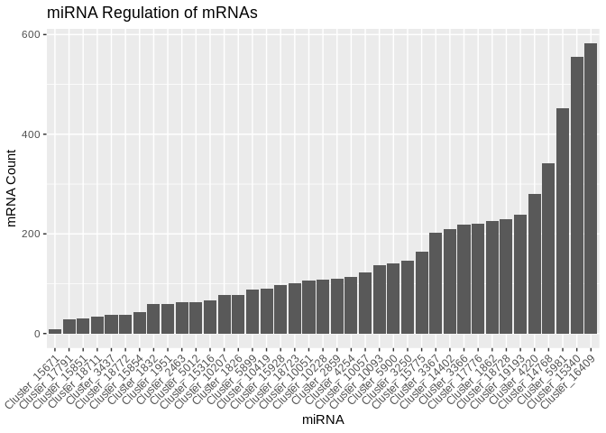
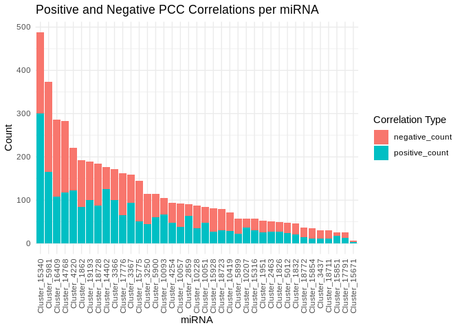
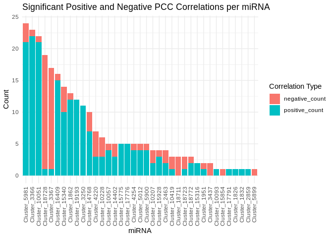
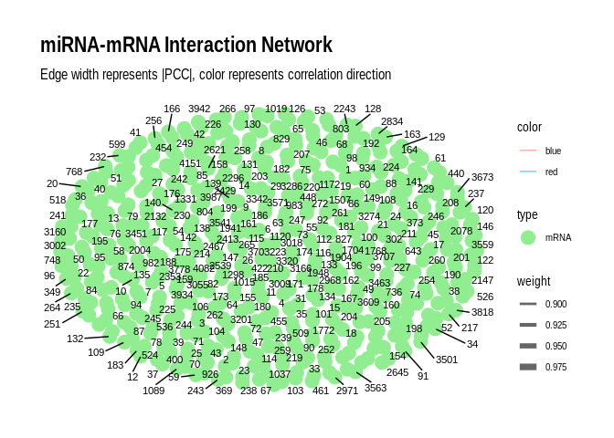

mRNA-miRNA interactions
================
Jill Ashey
2024-10-01

I attempted to use Part 1 of the R package
[mirTarRnaSeq](https://bioconductor.org/packages/3.13/bioc/html/mirTarRnaSeq.html),
which an be used for interactive mRNA miRNA sequencing statistical
analysis, to assess coexpression between mRNAs and miRNAs but ran into a
lot of issues getting my data to run properly. After meeting with the e5
group, we decided to examine correlations based on expression levels
instead.

Read in mRNA data

``` r
mRNA_counts <- read_csv("../../D-Apul/output/07-Apul-Hisat/gene_count_matrix.csv")
```

    ## Rows: 44371 Columns: 6
    ## ── Column specification ────────────────────────────────────────────────────────
    ## Delimiter: ","
    ## chr (1): gene_id
    ## dbl (5): RNA-ACR-140, RNA-ACR-145, RNA-ACR-150, RNA-ACR-173, RNA-ACR-178
    ## 
    ## ℹ Use `spec()` to retrieve the full column specification for this data.
    ## ℹ Specify the column types or set `show_col_types = FALSE` to quiet this message.

``` r
mRNA_counts <- as.data.frame(mRNA_counts)
rownames(mRNA_counts) <- mRNA_counts[,1] #set first column that contains gene names as rownames
mRNA_counts <- mRNA_counts[,-1] # remove column w/ gene names 

# Remove any genes with 0 counts across samples 
mRNA_counts<-mRNA_counts %>%
     mutate(Total = rowSums(.[, 1:5]))%>%
    filter(!Total==0)%>%
    dplyr::select(!Total)
```

Read in miRNA data

``` r
miRNA_counts <- read.delim("../../D-Apul/output/03.1-Apul-sRNA-summary/Apul_miRNA_ShortStack_counts_formatted.txt")
head(miRNA_counts)
```

    ##              sample140 sample145 sample150 sample173 sample178
    ## Cluster_1826      1099      2236      2579      3599      3135
    ## Cluster_1832      1060      1886      3843      2550      1864
    ## Cluster_1862      3575      1317       962       817       799
    ## Cluster_1951      2503      2847      2788      3169      2800
    ## Cluster_2463      5271     14671     28809      9634     21691
    ## Cluster_2859       563       895      1066       901      1128

``` r
# Remove sample150 column from mirna counts and remove any miRNAs with 0 for all samples 
miRNA_counts <- miRNA_counts %>%
  #select(-sample150) %>%
     mutate(Total = rowSums(.[, 1:5]))%>%
    filter(!Total==0)%>%
    dplyr::select(!Total)

# Rename gene count cols to match miRNA count cols
colnames(mRNA_counts) <- c("sample140", "sample145", "sample150", "sample173", "sample178")
```

Read in miranda data

``` r
miranda_apul <- read.delim("../../D-Apul/output/09-Apul-mRNA-miRNA-interactions/miranda_strict_all_1kb_parsed_apul_updated.txt", header = F)
colnames(miranda_apul) <- c("miRNA", "mRNA", "score", "energy", "query_start_end", "subject_start_end", "total_bp_shared", "query_similar", "subject_similar")

# Format miranda df 
miranda_apul$miRNA <- sub("^>", "", miranda_apul$miRNA)  # Remove leading ">"
miranda_apul$miRNA <- sub("\\..*", "", miranda_apul$miRNA)  # Remove everything from the first period onwards
miranda_apul$mRNA <- sub("::.*", "", miranda_apul$mRNA)  # Remove everything from "::" onwards

length(unique(miranda_apul$miRNA))
```

    ## [1] 39

``` r
length(unique(miranda_apul$mRNA))
```

    ## [1] 5436

``` r
dim(miranda_apul)
```

    ## [1] 6109    9

Summarize how many mRNAs each miRNA are predicted to interact with.
Summarize how many miRNAs each mRNA are predicted to interact with.

``` r
sum_mirna <- miranda_apul %>%
  group_by(miRNA) %>%
  summarise(mRNA_count = n_distinct(mRNA)) %>% 
  arrange(desc(mRNA_count))

ggplot(sum_mirna %>% arrange(desc(mRNA_count)), 
       aes(x = forcats::fct_reorder(miRNA, mRNA_count), y = mRNA_count)) +
  geom_col() +
  theme(axis.text.x = element_text(angle = 45, hjust = 1)) +
  labs(x = "miRNA", y = "mRNA Count", title = "miRNA Regulation of mRNAs") #+
```

<!-- -->

``` r
  #coord_flip()  # Optional: horizontal bar plot for better readability
#ggsave("../../D-Apul/output/09-Apul-mRNA-miRNA-interactions/Apul-miRNA_number_of_targets.png", last_plot(), width = 12, height = 10, dpi = 300)
#ggsave("../../D-Apul/output/09-Apul-mRNA-miRNA-interactions/Apul-miRNA_number_of_targets.pdf", last_plot(), width = 12, height = 10, dpi = 300)

# mRNA
sum_mrna <- miranda_apul %>%
  group_by(mRNA) %>%
  summarise(miRNA_count = n_distinct(miRNA))
```

Normalize counts

``` r
# Function to normalize counts (simple RPM normalization)
normalize_counts <- function(counts) {
  rpm <- t(t(counts) / colSums(counts)) * 1e6
  return(rpm)
}

# Normalize miRNA and mRNA counts
miRNA_norm <- normalize_counts(miRNA_counts)
#miRNA_norm <- as.matrix(miRNA_counts_filt)

mRNA_norm <- normalize_counts(mRNA_counts)
#mRNA_norm <- as.matrix(mRNA_counts_filt)
```

Run distance correlation using the [energy package in
R](https://cran.r-project.org/web/packages/energy/index.html) with rows
as features (ie mRNA or miRNA) and columns as samples.

``` r
# Initialize a matrix to store the results
dcor_matrix <- matrix(0, nrow = nrow(miRNA_norm), ncol = nrow(mRNA_norm))
rownames(dcor_matrix) <- rownames(miRNA_norm)
colnames(dcor_matrix) <- rownames(mRNA_norm)

# Calculate distance correlation for each miRNA-mRNA pair
for (i in 1:nrow(miRNA_norm)) {
  for (j in 1:nrow(mRNA_norm)) {
    dcor_matrix[i, j] <- dcor(miRNA_norm[i,], mRNA_norm[j,])
  }
}

# Melt data
dcor_melted <- melt(dcor_matrix)
colnames(dcor_melted) <- c("miRNA", "mRNA", "Distance_Correlation")
head(dcor_melted)
```

The `dcor` function calculates distance correlation between each mRNA
and miRNA. The output value ranges from 0 to 1, where 0 indicates
independence and 1 indicates perfect dependence. Unlike Pearson’s
correlation, this calculation can detect non-linear relationships
between mRNA and miRNAs. However, it does not calculate directionality
of the relationship.

I will use the signed distance correlation to indicate overall linear
trend in the data using Pearson’s correlation. I will also use several
methods to obtain pvalues for distance correlation: permutation test,
chi-square test, and student’s t-distribution. I wrote functions to
calculate these things below.

``` r
# Function to calculate signed distance correlation
signed_dcor <- function(x, y) {
  dc <- dcor(x, y)
  sign <- sign(cor(x, y, method = "pearson"))
  return(sign * dc)
}

# Function to calculate p-value using permutation test
dcor_pvalue_perm <- function(x, y, R = 1000) { # can change R value to make less computationally intense 
  observed_dcor <- dcor(x, y)
  n <- length(x)
  
  permuted_dcors <- replicate(R, {
    perm_y <- sample(y)
    dcor(x, perm_y)
  })
  
  pvalue <- mean(permuted_dcors >= observed_dcor)
  return(pvalue)
}

# Function to calculate p-value using chi-square approximation
dcor_pvalue_chisq <- function(x, y) {
  n <- length(x)
  dc <- dcor(x, y)
  statistic <- n * dc^2
  pvalue <- pchisq(statistic, df = 1, lower.tail = FALSE)
  return(pvalue)
}

# Initialize matrices to store results
signed_dcor_matrix <- matrix(0, nrow = nrow(miRNA_norm), ncol = nrow(mRNA_norm))
pvalue_perm_matrix <- matrix(1, nrow = nrow(miRNA_norm), ncol = nrow(mRNA_norm))
pvalue_chisq_matrix <- matrix(1, nrow = nrow(miRNA_norm), ncol = nrow(mRNA_norm))
pvalue_t_matrix <- matrix(1, nrow = nrow(miRNA_norm), ncol = nrow(mRNA_norm))

rownames(signed_dcor_matrix) <- rownames(miRNA_norm)
colnames(signed_dcor_matrix) <- rownames(mRNA_norm)
rownames(pvalue_perm_matrix) <- rownames(miRNA_norm)
colnames(pvalue_perm_matrix) <- rownames(mRNA_norm)
rownames(pvalue_chisq_matrix) <- rownames(miRNA_norm)
colnames(pvalue_chisq_matrix) <- rownames(mRNA_norm)
rownames(pvalue_t_matrix) <- rownames(miRNA_norm)
colnames(pvalue_t_matrix) <- rownames(mRNA_norm)

# Calculate signed distance correlation and p-values for each miRNA-mRNA pair
for (i in 1:nrow(miRNA_norm)) {
  for (j in 1:nrow(mRNA_norm)) {
    signed_dcor_matrix[i, j] <- signed_dcor(miRNA_norm[i,], mRNA_norm[j,])
    pvalue_perm_matrix[i, j] <- dcor_pvalue_perm(miRNA_norm[i,], mRNA_norm[j,])
    pvalue_chisq_matrix[i, j] <- dcor_pvalue_chisq(miRNA_norm[i,], mRNA_norm[j,])
    pvalue_t_matrix[i, j] <- dcor_pvalue_t(miRNA_norm[i,], mRNA_norm[j,])
  }
}

# Melt 
signed_dcor_matrix_melt <- melt(signed_dcor_matrix)
colnames(signed_dcor_matrix_melt) <- c("miRNA", "mRNA", "dcor_corr_direction")

pvalue_perm_matrix_melt <- melt(pvalue_perm_matrix)
colnames(pvalue_perm_matrix_melt) <- c("miRNA", "mRNA", "pvalue_perm")

pvalue_chisq_matrix_melt <- melt(pvalue_chisq_matrix)
colnames(pvalue_chisq_matrix_melt) <- c("miRNA", "mRNA", "pvalue_chisq")

pvalue_t_matrix_melt <- melt(pvalue_t_matrix)
colnames(pvalue_t_matrix_melt) <- c("miRNA", "mRNA", "pvalue_t")
```

The for loop will take a while to run, as it is computationally
intensive.

Join all dfs so that there is one df with mRNA, miRNA, distance
correlation, directionality, and various pvalue information.

``` r
all_dcor <- cbind(dcor_melted, signed_dcor_matrix_melt[,3], pvalue_perm_matrix_melt[,3], pvalue_chisq_matrix_melt[,3], pvalue_t_matrix_melt[,3])
colnames(all_dcor) <- c("miRNA", "mRNA", "Distance_Correlation", "dcor_corr_direction", "pvalue_perm", "pvalue_chisq", "pvalue_t")
head(all_dcor)
```

Merge with miranda data

``` r
combined_data <- all_dcor %>%
  inner_join(miranda_apul, by = c("miRNA", "mRNA")) #%>%
  #filter(dcor_corr_direction != 0)
head(combined_data)
```

Investigate data

``` r
# How many p-values are < 0.05 or < 0.1?
pvalue_summary <- combined_data %>%
  summarise(
    pvalue_perm_gt_0.05 = sum(pvalue_perm < 0.05),
    pvalue_perm_gt_0.1 = sum(pvalue_perm < 0.1),
    pvalue_chisq_gt_0.05 = sum(pvalue_chisq < 0.05),
    pvalue_chisq_gt_0.1 = sum(pvalue_chisq < 0.1),
    pvalue_t_gt_0.05 = sum(pvalue_t < 0.05),
    pvalue_t_gt_0.1 = sum(pvalue_t < 0.1)
  )
print(pvalue_summary)

# How many pairs have a distance correlation > 0.5?
dc_gt_0.5 <- sum(combined_data$Distance_Correlation > 0.5)
cat("\nPairs with Distance Correlation > 0.5:", dc_gt_0.5, "\n")

# How many have a dcor_corr_direction that does not equal 0?
dcor_dir_not_0 <- sum(combined_data$dcor_corr_direction != 0)
cat("Pairs with dcor_corr_direction != 0:", dcor_dir_not_0, "\n")

# Are there any pairs that have a dcor_corr_direction that does not equal 0 and a p-value < 0.05?
pairs_of_interest <- combined_data %>%
  filter(dcor_corr_direction != 0 & 
         (pvalue_perm < 0.05 | pvalue_chisq < 0.05 | pvalue_t < 0.05))
cat("Pairs with dcor_corr_direction != 0 and any p-value < 0.05:", nrow(pairs_of_interest), "\n")

# Are there any pairs that have a Distance correlation > 0.5 and a p-value < 0.05?
pairs_of_interest_dist <- combined_data %>%
  filter(Distance_Correlation > 0.5 & 
         (pvalue_perm < 0.05 | pvalue_chisq < 0.05 | pvalue_t < 0.05))
cat("Pairs with Distance correlation > 0.5 and any p-value < 0.05:", nrow(pairs_of_interest_dist), "\n")
```

miRNA Cluster_1826 and mRNA FUN_019563 were identified as a pair of
interest.

Visualize

``` r
ggplot(combined_data, aes(x = Distance_Correlation, y = dcor_corr_direction)) +
  geom_point(alpha = 0.5) +
  theme_minimal() +
  labs(title = "Distance Correlation vs Correlation Direction",
       x = "Distance Correlation",
       y = "Correlation Direction")

# Create an edge list from the miRNA and mRNA columns
edges <- pairs_of_interest_dist[, c("miRNA", "mRNA")]

# Create the graph
g <- graph_from_data_frame(edges, directed = FALSE)

# Add edge attributes
E(g)$weight <- pairs_of_interest_dist$Distance_Correlation
E(g)$direction <- pairs_of_interest_dist$dcor_corr_direction
E(g)$score <- pairs_of_interest_dist$score
E(g)$energy <- pairs_of_interest_dist$energy

# Plot the graph
plot(g,
     edge.width = E(g)$weight * 5,  # Adjust edge width based on correlation
     edge.color = ifelse(E(g)$direction > 0, "blue", "red"),  # Color based on direction
     vertex.size = 10,
     vertex.label.cex = 0.8,
     layout = layout_with_fr(g))
```

Instead of distance correlation, calculate PCC instead

``` r
# Function to calculate PCC and p-value for a pair of vectors
calc_pcc <- function(x, y) {
  result <- cor.test(x, y, method = "pearson")
  return(c(PCC = result$estimate, p_value = result$p.value))
}

# Create a data frame of all miRNA-mRNA pairs
pairs <- expand.grid(miRNA = rownames(miRNA_norm), mRNA = rownames(mRNA_norm))

# Calculate PCC and p-value for each pair
pcc_results <- pairs %>%
  rowwise() %>%
  mutate(
    pcc_stats = list(calc_pcc(miRNA_norm[miRNA,], mRNA_norm[mRNA,]))
  ) %>%
  unnest_wider(pcc_stats)

# Adjust p-values for FDR
pcc_results <- pcc_results %>%
  mutate(adjusted_p_value = p.adjust(p_value, method = "fdr"))

# Save as csv
write.csv(pcc_results, "../../D-Apul/output/09-Apul-mRNA-miRNA-interactions/Apul-PCC_miRNA_mRNA.csv")
```

Merge with miranda data

``` r
#pcc_results <- read.csv("../../D-Apul/output/09-Apul-mRNA-miRNA-interactions/Apul-PCC_miRNA_mRNA.csv")
pcc_results <- read.csv("https://gannet.fish.washington.edu/kdurkin1/ravenbackups/deep-dive-expression/D-Apul/output/09-Apul-mRNA-miRNA-interactions/Apul-PCC_miRNA_mRNA.csv")

combined_data_pcc <- pcc_results %>%
  inner_join(miranda_apul, by = c("miRNA", "mRNA"))
head(combined_data_pcc)
```

    ##      X         miRNA       mRNA    PCC.cor   p_value adjusted_p_value score
    ## 1  562  Cluster_5981 FUN_028147  0.6825537 0.2041707        0.9986496   146
    ## 2  767 Cluster_15340 FUN_013332  0.6371070 0.2476393        0.9986496   158
    ## 3  796  Cluster_5981 FUN_041253 -0.2250869 0.7158492        0.9986496   153
    ## 4 1100  Cluster_3366 FUN_010827  0.3671005 0.5433145        0.9986496   163
    ## 5 1101  Cluster_3367 FUN_010827  0.5369304 0.3507987        0.9986496   163
    ## 6 2093 Cluster_15340 FUN_003342  0.1096213 0.8607058        0.9986496   154
    ##   energy query_start_end subject_start_end total_bp_shared query_similar
    ## 1 -22.19            2 21           185 209              21        66.67%
    ## 2 -23.15            2 20           198 220              19        68.42%
    ## 3 -20.50            2 21           699 719              19        73.68%
    ## 4 -22.14            2 18           346 368              16        81.25%
    ## 5 -22.14            2 18           346 368              16        81.25%
    ## 6 -20.65            2 20           562 585              20        65.00%
    ##   subject_similar
    ## 1          71.43%
    ## 2          84.21%
    ## 3          73.68%
    ## 4          93.75%
    ## 5          93.75%
    ## 6          80.00%

``` r
length(unique(combined_data_pcc$miRNA))
```

    ## [1] 39

``` r
length(unique(combined_data_pcc$mRNA))
```

    ## [1] 4142

``` r
# Save as csv
write.csv(combined_data_pcc, "../../D-Apul/output/09-Apul-mRNA-miRNA-interactions/miranda_PCC_miRNA_mRNA.csv")
```

Read data back in so PCC does not have to be run again

``` r
combined_data_pcc <- read.csv("../output/09-Apul-mRNA-miRNA-interactions/miranda_PCC_miRNA_mRNA.csv")
```

Plot number of positive and negative interactions for each miRNA

``` r
# Summarize the data
summary_data <- combined_data_pcc %>%
  group_by(miRNA) %>%
  summarise(
    positive_count = sum(PCC.cor > 0),
    negative_count = sum(PCC.cor < 0)
  ) %>%
  mutate(total_count = positive_count + negative_count) %>%
  arrange(desc(total_count))
sum(summary_data$positive_count)
```

    ## [1] 2315

``` r
sum(summary_data$negative_count)
```

    ## [1] 2342

``` r
# Assess how many miRNAs have more positive correlations vs more negative ones 
positive_dominant <- sum(summary_data$positive_count > summary_data$negative_count)
negative_dominant <- sum(summary_data$negative_count > summary_data$positive_count)
equal <- sum(summary_data$positive_count == summary_data$negative_count)

cat("miRNAs with more positive correlations:", positive_dominant, "\n")
```

    ## miRNAs with more positive correlations: 17

``` r
cat("miRNAs with more negative correlations:", negative_dominant, "\n")
```

    ## miRNAs with more negative correlations: 21

``` r
cat("miRNAs with equal positive and negative correlations:", equal, "\n")
```

    ## miRNAs with equal positive and negative correlations: 1

``` r
# Reshape the data for plotting
plot_data <- summary_data %>%
  tidyr::pivot_longer(cols = c(positive_count, negative_count),
                      names_to = "correlation_type",
                      values_to = "count")

# Create the stacked bar plot
ggplot(plot_data, aes(x = reorder(miRNA, -total_count), y = count, fill = correlation_type)) +
  geom_bar(stat = "identity") +
  theme_minimal() +
  theme(axis.text.x = element_text(angle = 90, hjust = 1, vjust = 0.5)) +
  labs(x = "miRNA", y = "Count", fill = "Correlation Type",
       title = "Positive and Negative PCC Correlations per miRNA")
```

<!-- -->

``` r
ggsave("../../D-Apul/output/09-Apul-mRNA-miRNA-interactions/Apul-miRNA_positive_negative_correlations.png", last_plot(), width = 12, height = 10, dpi = 300)
ggsave("../../D-Apul/output/09-Apul-mRNA-miRNA-interactions/Apul-miRNA_positive_negative_correlations.pdf", last_plot(), width = 12, height = 10, dpi = 300)
```

Investigate data

``` r
# How many p-values are < 0.05 or < 0.1?
pvalue_summary_pcc <- combined_data_pcc %>%
  summarise(
    pvalue_0.05 = sum(p_value < 0.05),
    pvalue_0.1 = sum(p_value < 0.1),
  )
print(pvalue_summary_pcc)
```

    ##   pvalue_0.05 pvalue_0.1
    ## 1         266        473

``` r
# How many pairs have a PCC correlation > |0.5|?
corr_0.5 <- sum(abs(combined_data_pcc$PCC.cor) > 0.5)
cat("\nPairs with Pearson Correlation > 0.5:", corr_0.5, "\n")
```

    ## 
    ## Pairs with Pearson Correlation > 0.5: 1621

``` r
# Are there any pairs that have a PCC correlation > |0.5| and a p-value < 0.05?
pairs_of_interest_pcc <- combined_data_pcc %>%
  filter(abs(PCC.cor) > 0.5 & p_value < 0.05 )
cat("PCC correlation > |0.5| and a p-value < 0.05:", nrow(pairs_of_interest_pcc), "\n")
```

    ## PCC correlation > |0.5| and a p-value < 0.05: 266

``` r
# How many unique miRNAs and mRNAs have a PCC correlation > |0.5| and a p-value < 0.05?
length(unique(pairs_of_interest_pcc$miRNA))
```

    ## [1] 37

``` r
length(unique(pairs_of_interest_pcc$mRNA))
```

    ## [1] 258

``` r
# Save pairs of interest df as csv 
write.csv(pairs_of_interest_pcc, "../../D-Apul/output/09-Apul-mRNA-miRNA-interactions/Apul-miranda_PCC_sig_miRNA_mRNA.csv")
```

I noticed that the significant pvalues correspond to high correlation
values, whereas low correlation values are typically not significant (if
using the p\<0.05).

Read data back in so PCC does not have to be run again

``` r
pairs_of_interest_pcc <- read.csv("../../D-Apul/output/09-Apul-mRNA-miRNA-interactions/Apul-miranda_PCC_sig_miRNA_mRNA.csv")
```

Plot number of SIGNIFICANT positive and negative interactions for each
miRNA

``` r
# Summarize the data
summary_data <- pairs_of_interest_pcc %>%
  group_by(miRNA) %>%
  summarise(
    positive_count = sum(PCC.cor > 0),
    negative_count = sum(PCC.cor < 0)
  ) %>%
  mutate(total_count = positive_count + negative_count) %>%
  arrange(desc(total_count))
sum(summary_data$positive_count)
```

    ## [1] 187

``` r
sum(summary_data$negative_count)
```

    ## [1] 79

``` r
# Assess how many miRNAs have more positive correlations vs more negative ones 
positive_dominant <- sum(summary_data$positive_count > summary_data$negative_count)
negative_dominant <- sum(summary_data$negative_count > summary_data$positive_count)
equal <- sum(summary_data$positive_count == summary_data$negative_count)

cat("miRNAs with more positive correlations:", positive_dominant, "\n")
```

    ## miRNAs with more positive correlations: 24

``` r
cat("miRNAs with more negative correlations:", negative_dominant, "\n")
```

    ## miRNAs with more negative correlations: 9

``` r
cat("miRNAs with equal positive and negative correlations:", equal, "\n")
```

    ## miRNAs with equal positive and negative correlations: 4

``` r
# Reshape the data for plotting
plot_data <- summary_data %>%
  tidyr::pivot_longer(cols = c(positive_count, negative_count),
                      names_to = "correlation_type",
                      values_to = "count")

# Create the stacked bar plot
ggplot(plot_data, aes(x = reorder(miRNA, -total_count), y = count, fill = correlation_type)) +
  geom_bar(stat = "identity") +
  theme_minimal() +
  theme(axis.text.x = element_text(angle = 90, hjust = 1, vjust = 0.5)) +
  labs(x = "miRNA", y = "Count", fill = "Correlation Type",
       title = "Significant Positive and Negative PCC Correlations per miRNA")
```

<!-- -->

``` r
ggsave("../../D-Apul/output/09-Apul-mRNA-miRNA-interactions/Apul-miRNA_significant_positive_negative_correlations.png", last_plot(), width = 12, height = 10, dpi = 300)
ggsave("../../D-Apul/output/09-Apul-mRNA-miRNA-interactions/Apul-miRNA_significant_positive_negative_correlations.pdf", last_plot(), width = 12, height = 10, dpi = 300)
```

Plot using igraph

``` r
# Create the graph
g <- graph_from_data_frame(pairs_of_interest_pcc, directed = FALSE)

# Add edge attributes
E(g)$weight <- abs(E(g)$PCC.cor)  # Use absolute PCC for edge weight
E(g)$color <- ifelse(E(g)$PCC.cor > 0, "blue", "red")  # Blue for positive, red for negative correlations

# Add node attributes
V(g)$type <- ifelse(V(g)$name %in% pairs_of_interest_pcc$miRNA, "miRNA", "mRNA")

# Convert to tbl_graph for ggraph
g_tbl <- as_tbl_graph(g)

# Create the plot
p <- ggraph(g_tbl, layout = "fr") +
  geom_edge_link(aes(edge_width = weight, color = color), alpha = 0.6) +
  geom_node_point(aes(color = type), size = 5) +
  geom_node_text(aes(label = name), repel = TRUE, size = 3) +
  scale_edge_width(range = c(0.5, 3)) +
  scale_color_manual(values = c("miRNA" = "lightblue", "mRNA" = "lightgreen", "Positive correlation" = "blue", "Negative correlation" = "red")) +
  theme_graph() +
  labs(title = "miRNA-mRNA Interaction Network",
       subtitle = "Edge width represents |PCC|, color represents correlation direction");p
```

    ## Warning: ggrepel: 232 unlabeled data points (too many overlaps). Consider
    ## increasing max.overlaps

<!-- -->

``` r
ggsave("../../D-Apul/output/09-Apul-mRNA-miRNA-interactions/Apul-significant_miRNA_mRNA_network.png", p, width = 12, height = 10, dpi = 300)
```

Super cool!

``` r
# Function to create a scatter plot for a miRNA-mRNA pair
plot_correlation <- function(miRNA, mRNA, miRNA_data, mRNA_data, cor_value, p_value) {
  # Extract data for the specific miRNA and mRNA
  miRNA_counts <- as.numeric(miRNA_data[miRNA,])
  mRNA_counts <- as.numeric(mRNA_data[mRNA,])
  
  # Combine into a data frame
  plot_data <- data.frame(
    miRNA_counts = miRNA_counts,
    mRNA_counts = mRNA_counts,
    sample = colnames(miRNA_data)
  )
  
  # Create the plot
  p <- ggplot(plot_data, aes(x = miRNA_counts, y = mRNA_counts)) +
    geom_point(aes(color = sample), size = 3) +
    geom_smooth(method = "lm", se = TRUE, color = "red") +
    scale_x_log10() +
    scale_y_log10() +
    labs(title = paste(miRNA, "vs", mRNA),
         subtitle = paste("Correlation:", round(cor_value, 3), 
                          "| p-value:", format.pval(p_value, digits = 3)),
         x = paste(miRNA, "counts"),
         y = paste(mRNA, "counts")) +
    theme_minimal()
  
  return(p)
}

# Create plots for pairs in pairs_of_interest_pcc
plots <- lapply(1:nrow(pairs_of_interest_pcc), function(i) {
  miRNA <- pairs_of_interest_pcc$miRNA[i]
  mRNA <- pairs_of_interest_pcc$mRNA[i]
  cor_value <- pairs_of_interest_pcc$PCC.cor[i]
  p_value <- pairs_of_interest_pcc$p_value[i]
  plot_correlation(miRNA, mRNA, miRNA_norm, mRNA_norm, cor_value, p_value)
})

# Arrange and display the plots
# If you have many plots, you might want to adjust the layout
n_plots <- length(plots)
n_cols <- min(3, n_plots)  # Adjust the number of columns as needed
n_rows <- ceiling(n_plots / n_cols)

#grid.arrange(grobs = plots, ncol = n_cols, nrow = n_rows)

# Save plots to a PDF
pdf("../../D-Apul/output/09-Apul-mRNA-miRNA-interactions/Apul-correlation_plots.pdf", width = 5 * n_cols, height = 5 * n_rows)
grid.arrange(grobs = plots, ncol = n_cols, nrow = n_rows)
```

    ## `geom_smooth()` using formula = 'y ~ x'

    ## Warning in scale_y_log10(): log-10 transformation introduced infinite values.
    ## log-10 transformation introduced infinite values.

    ## `geom_smooth()` using formula = 'y ~ x'

    ## Warning: Removed 4 rows containing non-finite outside the scale range (`stat_smooth()`).
    ## log-10 transformation introduced infinite values.
    ## log-10 transformation introduced infinite values.

    ## `geom_smooth()` using formula = 'y ~ x'

    ## Warning: Removed 4 rows containing non-finite outside the scale range (`stat_smooth()`).
    ## log-10 transformation introduced infinite values.
    ## log-10 transformation introduced infinite values.

    ## `geom_smooth()` using formula = 'y ~ x'

    ## Warning: Removed 4 rows containing non-finite outside the scale range (`stat_smooth()`).
    ## log-10 transformation introduced infinite values.
    ## log-10 transformation introduced infinite values.

    ## `geom_smooth()` using formula = 'y ~ x'

    ## Warning: Removed 3 rows containing non-finite outside the scale range
    ## (`stat_smooth()`).

    ## Warning in qt((1 - level)/2, df): NaNs produced

    ## Warning in max(ids, na.rm = TRUE): no non-missing arguments to max; returning
    ## -Inf

    ## Warning in scale_y_log10(): log-10 transformation introduced infinite values.
    ## log-10 transformation introduced infinite values.

    ## `geom_smooth()` using formula = 'y ~ x'

    ## Warning: Removed 2 rows containing non-finite outside the scale range (`stat_smooth()`).
    ## log-10 transformation introduced infinite values.
    ## log-10 transformation introduced infinite values.

    ## `geom_smooth()` using formula = 'y ~ x'

    ## Warning: Removed 4 rows containing non-finite outside the scale range
    ## (`stat_smooth()`).

    ## `geom_smooth()` using formula = 'y ~ x'
    ## `geom_smooth()` using formula = 'y ~ x'

    ## Warning in scale_y_log10(): log-10 transformation introduced infinite values.
    ## log-10 transformation introduced infinite values.

    ## `geom_smooth()` using formula = 'y ~ x'

    ## Warning: Removed 1 row containing non-finite outside the scale range
    ## (`stat_smooth()`).

    ## `geom_smooth()` using formula = 'y ~ x'

    ## Warning in scale_y_log10(): log-10 transformation introduced infinite values.
    ## log-10 transformation introduced infinite values.

    ## `geom_smooth()` using formula = 'y ~ x'

    ## Warning: Removed 4 rows containing non-finite outside the scale range
    ## (`stat_smooth()`).

    ## `geom_smooth()` using formula = 'y ~ x'

    ## Warning in scale_y_log10(): log-10 transformation introduced infinite values.
    ## log-10 transformation introduced infinite values.

    ## `geom_smooth()` using formula = 'y ~ x'

    ## Warning: Removed 3 rows containing non-finite outside the scale range
    ## (`stat_smooth()`).

    ## Warning in qt((1 - level)/2, df): NaNs produced

    ## Warning in max(ids, na.rm = TRUE): no non-missing arguments to max; returning
    ## -Inf

    ## Warning in scale_y_log10(): log-10 transformation introduced infinite values.
    ## log-10 transformation introduced infinite values.

    ## `geom_smooth()` using formula = 'y ~ x'

    ## Warning: Removed 3 rows containing non-finite outside the scale range
    ## (`stat_smooth()`).

    ## Warning in qt((1 - level)/2, df): NaNs produced

    ## Warning in max(ids, na.rm = TRUE): no non-missing arguments to max; returning
    ## -Inf

    ## `geom_smooth()` using formula = 'y ~ x'
    ## `geom_smooth()` using formula = 'y ~ x'

    ## Warning in scale_y_log10(): log-10 transformation introduced infinite values.

    ## Warning in scale_y_log10(): log-10 transformation introduced infinite values.

    ## `geom_smooth()` using formula = 'y ~ x'

    ## Warning: Removed 1 row containing non-finite outside the scale range
    ## (`stat_smooth()`).

    ## `geom_smooth()` using formula = 'y ~ x'

    ## Warning in scale_y_log10(): log-10 transformation introduced infinite values.
    ## log-10 transformation introduced infinite values.

    ## `geom_smooth()` using formula = 'y ~ x'

    ## Warning: Removed 1 row containing non-finite outside the scale range (`stat_smooth()`).
    ## log-10 transformation introduced infinite values.
    ## log-10 transformation introduced infinite values.

    ## `geom_smooth()` using formula = 'y ~ x'

    ## Warning: Removed 1 row containing non-finite outside the scale range
    ## (`stat_smooth()`).

    ## `geom_smooth()` using formula = 'y ~ x'
    ## `geom_smooth()` using formula = 'y ~ x'
    ## `geom_smooth()` using formula = 'y ~ x'

    ## Warning in scale_y_log10(): log-10 transformation introduced infinite values.
    ## log-10 transformation introduced infinite values.

    ## `geom_smooth()` using formula = 'y ~ x'

    ## Warning: Removed 1 row containing non-finite outside the scale range
    ## (`stat_smooth()`).

    ## `geom_smooth()` using formula = 'y ~ x'
    ## `geom_smooth()` using formula = 'y ~ x'

    ## Warning in scale_y_log10(): log-10 transformation introduced infinite values.
    ## log-10 transformation introduced infinite values.

    ## `geom_smooth()` using formula = 'y ~ x'

    ## Warning: Removed 1 row containing non-finite outside the scale range (`stat_smooth()`).
    ## log-10 transformation introduced infinite values.
    ## log-10 transformation introduced infinite values.

    ## `geom_smooth()` using formula = 'y ~ x'

    ## Warning: Removed 1 row containing non-finite outside the scale range
    ## (`stat_smooth()`).

    ## `geom_smooth()` using formula = 'y ~ x'

    ## Warning in scale_y_log10(): log-10 transformation introduced infinite values.
    ## log-10 transformation introduced infinite values.

    ## `geom_smooth()` using formula = 'y ~ x'

    ## Warning: Removed 4 rows containing non-finite outside the scale range (`stat_smooth()`).
    ## log-10 transformation introduced infinite values.
    ## log-10 transformation introduced infinite values.

    ## `geom_smooth()` using formula = 'y ~ x'

    ## Warning: Removed 4 rows containing non-finite outside the scale range (`stat_smooth()`).
    ## log-10 transformation introduced infinite values.
    ## log-10 transformation introduced infinite values.

    ## `geom_smooth()` using formula = 'y ~ x'

    ## Warning: Removed 3 rows containing non-finite outside the scale range
    ## (`stat_smooth()`).

    ## Warning in qt((1 - level)/2, df): NaNs produced

    ## Warning in max(ids, na.rm = TRUE): no non-missing arguments to max; returning
    ## -Inf

    ## `geom_smooth()` using formula = 'y ~ x'

    ## Warning in scale_x_log10(): log-10 transformation introduced infinite values.

    ## Warning in scale_y_log10(): log-10 transformation introduced infinite values.

    ## Warning in scale_x_log10(): log-10 transformation introduced infinite values.

    ## Warning in scale_y_log10(): log-10 transformation introduced infinite values.

    ## `geom_smooth()` using formula = 'y ~ x'

    ## Warning: Removed 3 rows containing non-finite outside the scale range
    ## (`stat_smooth()`).

    ## Warning in qt((1 - level)/2, df): NaNs produced

    ## Warning in max(ids, na.rm = TRUE): no non-missing arguments to max; returning
    ## -Inf

    ## Warning in scale_y_log10(): log-10 transformation introduced infinite values.
    ## log-10 transformation introduced infinite values.

    ## `geom_smooth()` using formula = 'y ~ x'

    ## Warning: Removed 4 rows containing non-finite outside the scale range (`stat_smooth()`).
    ## log-10 transformation introduced infinite values.
    ## log-10 transformation introduced infinite values.

    ## `geom_smooth()` using formula = 'y ~ x'

    ## Warning: Removed 3 rows containing non-finite outside the scale range
    ## (`stat_smooth()`).

    ## Warning in qt((1 - level)/2, df): NaNs produced

    ## Warning in max(ids, na.rm = TRUE): no non-missing arguments to max; returning
    ## -Inf

    ## Warning in scale_y_log10(): log-10 transformation introduced infinite values.
    ## log-10 transformation introduced infinite values.

    ## `geom_smooth()` using formula = 'y ~ x'

    ## Warning: Removed 4 rows containing non-finite outside the scale range
    ## (`stat_smooth()`).

    ## `geom_smooth()` using formula = 'y ~ x'
    ## `geom_smooth()` using formula = 'y ~ x'
    ## `geom_smooth()` using formula = 'y ~ x'

    ## Warning in scale_y_log10(): log-10 transformation introduced infinite values.
    ## log-10 transformation introduced infinite values.

    ## `geom_smooth()` using formula = 'y ~ x'

    ## Warning: Removed 4 rows containing non-finite outside the scale range
    ## (`stat_smooth()`).

    ## Warning in scale_x_log10(): log-10 transformation introduced infinite values.
    ## log-10 transformation introduced infinite values.

    ## `geom_smooth()` using formula = 'y ~ x'

    ## Warning: Removed 2 rows containing non-finite outside the scale range
    ## (`stat_smooth()`).

    ## `geom_smooth()` using formula = 'y ~ x'
    ## `geom_smooth()` using formula = 'y ~ x'
    ## `geom_smooth()` using formula = 'y ~ x'
    ## `geom_smooth()` using formula = 'y ~ x'

    ## Warning in scale_y_log10(): log-10 transformation introduced infinite values.

    ## Warning in scale_y_log10(): log-10 transformation introduced infinite values.

    ## `geom_smooth()` using formula = 'y ~ x'

    ## Warning: Removed 4 rows containing non-finite outside the scale range (`stat_smooth()`).
    ## log-10 transformation introduced infinite values.
    ## log-10 transformation introduced infinite values.

    ## `geom_smooth()` using formula = 'y ~ x'

    ## Warning: Removed 4 rows containing non-finite outside the scale range
    ## (`stat_smooth()`).

    ## `geom_smooth()` using formula = 'y ~ x'

    ## Warning in scale_y_log10(): log-10 transformation introduced infinite values.
    ## log-10 transformation introduced infinite values.

    ## `geom_smooth()` using formula = 'y ~ x'

    ## Warning: Removed 4 rows containing non-finite outside the scale range
    ## (`stat_smooth()`).

    ## `geom_smooth()` using formula = 'y ~ x'

    ## Warning in scale_y_log10(): log-10 transformation introduced infinite values.
    ## log-10 transformation introduced infinite values.

    ## `geom_smooth()` using formula = 'y ~ x'

    ## Warning: Removed 4 rows containing non-finite outside the scale range (`stat_smooth()`).
    ## log-10 transformation introduced infinite values.
    ## log-10 transformation introduced infinite values.

    ## `geom_smooth()` using formula = 'y ~ x'

    ## Warning: Removed 1 row containing non-finite outside the scale range (`stat_smooth()`).
    ## log-10 transformation introduced infinite values.
    ## log-10 transformation introduced infinite values.

    ## `geom_smooth()` using formula = 'y ~ x'

    ## Warning: Removed 4 rows containing non-finite outside the scale range
    ## (`stat_smooth()`).

    ## `geom_smooth()` using formula = 'y ~ x'
    ## `geom_smooth()` using formula = 'y ~ x'
    ## `geom_smooth()` using formula = 'y ~ x'

    ## Warning in scale_y_log10(): log-10 transformation introduced infinite values.
    ## log-10 transformation introduced infinite values.

    ## `geom_smooth()` using formula = 'y ~ x'

    ## Warning: Removed 4 rows containing non-finite outside the scale range
    ## (`stat_smooth()`).

    ## `geom_smooth()` using formula = 'y ~ x'
    ## `geom_smooth()` using formula = 'y ~ x'
    ## `geom_smooth()` using formula = 'y ~ x'
    ## `geom_smooth()` using formula = 'y ~ x'
    ## `geom_smooth()` using formula = 'y ~ x'
    ## `geom_smooth()` using formula = 'y ~ x'
    ## `geom_smooth()` using formula = 'y ~ x'
    ## `geom_smooth()` using formula = 'y ~ x'
    ## `geom_smooth()` using formula = 'y ~ x'

    ## Warning in scale_y_log10(): log-10 transformation introduced infinite values.
    ## log-10 transformation introduced infinite values.

    ## `geom_smooth()` using formula = 'y ~ x'

    ## Warning: Removed 4 rows containing non-finite outside the scale range
    ## (`stat_smooth()`).

    ## Warning in scale_x_log10(): log-10 transformation introduced infinite values.

    ## Warning in scale_y_log10(): log-10 transformation introduced infinite values.

    ## Warning in scale_x_log10(): log-10 transformation introduced infinite values.

    ## Warning in scale_y_log10(): log-10 transformation introduced infinite values.

    ## `geom_smooth()` using formula = 'y ~ x'

    ## Warning: Removed 3 rows containing non-finite outside the scale range
    ## (`stat_smooth()`).

    ## Warning in qt((1 - level)/2, df): NaNs produced

    ## Warning in max(ids, na.rm = TRUE): no non-missing arguments to max; returning
    ## -Inf

    ## Warning in scale_x_log10(): log-10 transformation introduced infinite values.

    ## Warning in scale_y_log10(): log-10 transformation introduced infinite values.

    ## Warning in scale_x_log10(): log-10 transformation introduced infinite values.

    ## Warning in scale_y_log10(): log-10 transformation introduced infinite values.

    ## `geom_smooth()` using formula = 'y ~ x'

    ## Warning: Removed 3 rows containing non-finite outside the scale range
    ## (`stat_smooth()`).

    ## Warning in qt((1 - level)/2, df): NaNs produced

    ## Warning in max(ids, na.rm = TRUE): no non-missing arguments to max; returning
    ## -Inf

    ## Warning in scale_y_log10(): log-10 transformation introduced infinite values.
    ## log-10 transformation introduced infinite values.

    ## `geom_smooth()` using formula = 'y ~ x'

    ## Warning: Removed 4 rows containing non-finite outside the scale range (`stat_smooth()`).
    ## log-10 transformation introduced infinite values.
    ## log-10 transformation introduced infinite values.

    ## `geom_smooth()` using formula = 'y ~ x'

    ## Warning: Removed 4 rows containing non-finite outside the scale range (`stat_smooth()`).
    ## log-10 transformation introduced infinite values.
    ## log-10 transformation introduced infinite values.

    ## `geom_smooth()` using formula = 'y ~ x'

    ## Warning: Removed 2 rows containing non-finite outside the scale range
    ## (`stat_smooth()`).

    ## Warning in scale_x_log10(): log-10 transformation introduced infinite values.

    ## Warning in scale_y_log10(): log-10 transformation introduced infinite values.

    ## Warning in scale_x_log10(): log-10 transformation introduced infinite values.

    ## Warning in scale_y_log10(): log-10 transformation introduced infinite values.

    ## `geom_smooth()` using formula = 'y ~ x'

    ## Warning: Removed 3 rows containing non-finite outside the scale range
    ## (`stat_smooth()`).

    ## Warning in qt((1 - level)/2, df): NaNs produced

    ## Warning in max(ids, na.rm = TRUE): no non-missing arguments to max; returning
    ## -Inf

    ## `geom_smooth()` using formula = 'y ~ x'
    ## `geom_smooth()` using formula = 'y ~ x'

    ## Warning in scale_y_log10(): log-10 transformation introduced infinite values.

    ## Warning in scale_y_log10(): log-10 transformation introduced infinite values.

    ## `geom_smooth()` using formula = 'y ~ x'

    ## Warning: Removed 2 rows containing non-finite outside the scale range
    ## (`stat_smooth()`).

    ## `geom_smooth()` using formula = 'y ~ x'

    ## Warning in scale_y_log10(): log-10 transformation introduced infinite values.
    ## log-10 transformation introduced infinite values.

    ## `geom_smooth()` using formula = 'y ~ x'

    ## Warning: Removed 4 rows containing non-finite outside the scale range (`stat_smooth()`).
    ## log-10 transformation introduced infinite values.
    ## log-10 transformation introduced infinite values.

    ## `geom_smooth()` using formula = 'y ~ x'

    ## Warning: Removed 1 row containing non-finite outside the scale range
    ## (`stat_smooth()`).

    ## `geom_smooth()` using formula = 'y ~ x'

    ## Warning in scale_y_log10(): log-10 transformation introduced infinite values.
    ## log-10 transformation introduced infinite values.

    ## `geom_smooth()` using formula = 'y ~ x'

    ## Warning: Removed 2 rows containing non-finite outside the scale range (`stat_smooth()`).
    ## log-10 transformation introduced infinite values.
    ## log-10 transformation introduced infinite values.

    ## `geom_smooth()` using formula = 'y ~ x'

    ## Warning: Removed 3 rows containing non-finite outside the scale range
    ## (`stat_smooth()`).

    ## Warning in qt((1 - level)/2, df): NaNs produced

    ## Warning in max(ids, na.rm = TRUE): no non-missing arguments to max; returning
    ## -Inf

    ## Warning in scale_y_log10(): log-10 transformation introduced infinite values.
    ## log-10 transformation introduced infinite values.

    ## `geom_smooth()` using formula = 'y ~ x'

    ## Warning: Removed 4 rows containing non-finite outside the scale range
    ## (`stat_smooth()`).

    ## `geom_smooth()` using formula = 'y ~ x'

    ## Warning in scale_y_log10(): log-10 transformation introduced infinite values.
    ## log-10 transformation introduced infinite values.

    ## `geom_smooth()` using formula = 'y ~ x'

    ## Warning: Removed 4 rows containing non-finite outside the scale range
    ## (`stat_smooth()`).

    ## `geom_smooth()` using formula = 'y ~ x'

    ## Warning in scale_y_log10(): log-10 transformation introduced infinite values.
    ## log-10 transformation introduced infinite values.

    ## `geom_smooth()` using formula = 'y ~ x'

    ## Warning: Removed 4 rows containing non-finite outside the scale range (`stat_smooth()`).
    ## log-10 transformation introduced infinite values.
    ## log-10 transformation introduced infinite values.

    ## `geom_smooth()` using formula = 'y ~ x'

    ## Warning: Removed 4 rows containing non-finite outside the scale range
    ## (`stat_smooth()`).

    ## `geom_smooth()` using formula = 'y ~ x'
    ## `geom_smooth()` using formula = 'y ~ x'
    ## `geom_smooth()` using formula = 'y ~ x'
    ## `geom_smooth()` using formula = 'y ~ x'

    ## Warning in scale_y_log10(): log-10 transformation introduced infinite values.
    ## log-10 transformation introduced infinite values.

    ## `geom_smooth()` using formula = 'y ~ x'

    ## Warning: Removed 4 rows containing non-finite outside the scale range
    ## (`stat_smooth()`).

    ## `geom_smooth()` using formula = 'y ~ x'
    ## `geom_smooth()` using formula = 'y ~ x'

    ## Warning in scale_y_log10(): log-10 transformation introduced infinite values.
    ## log-10 transformation introduced infinite values.

    ## `geom_smooth()` using formula = 'y ~ x'

    ## Warning: Removed 4 rows containing non-finite outside the scale range (`stat_smooth()`).
    ## log-10 transformation introduced infinite values.
    ## log-10 transformation introduced infinite values.

    ## `geom_smooth()` using formula = 'y ~ x'

    ## Warning: Removed 2 rows containing non-finite outside the scale range
    ## (`stat_smooth()`).

    ## `geom_smooth()` using formula = 'y ~ x'

    ## Warning in scale_y_log10(): log-10 transformation introduced infinite values.
    ## log-10 transformation introduced infinite values.

    ## `geom_smooth()` using formula = 'y ~ x'

    ## Warning: Removed 4 rows containing non-finite outside the scale range (`stat_smooth()`).
    ## log-10 transformation introduced infinite values.
    ## log-10 transformation introduced infinite values.

    ## `geom_smooth()` using formula = 'y ~ x'

    ## Warning: Removed 4 rows containing non-finite outside the scale range (`stat_smooth()`).
    ## log-10 transformation introduced infinite values.
    ## log-10 transformation introduced infinite values.

    ## `geom_smooth()` using formula = 'y ~ x'

    ## Warning: Removed 4 rows containing non-finite outside the scale range
    ## (`stat_smooth()`).

    ## `geom_smooth()` using formula = 'y ~ x'
    ## `geom_smooth()` using formula = 'y ~ x'

    ## Warning in scale_y_log10(): log-10 transformation introduced infinite values.
    ## log-10 transformation introduced infinite values.

    ## `geom_smooth()` using formula = 'y ~ x'

    ## Warning: Removed 2 rows containing non-finite outside the scale range
    ## (`stat_smooth()`).

    ## `geom_smooth()` using formula = 'y ~ x'
    ## `geom_smooth()` using formula = 'y ~ x'

    ## Warning in scale_y_log10(): log-10 transformation introduced infinite values.
    ## log-10 transformation introduced infinite values.

    ## `geom_smooth()` using formula = 'y ~ x'

    ## Warning: Removed 4 rows containing non-finite outside the scale range (`stat_smooth()`).
    ## log-10 transformation introduced infinite values.
    ## log-10 transformation introduced infinite values.

    ## `geom_smooth()` using formula = 'y ~ x'

    ## Warning: Removed 1 row containing non-finite outside the scale range
    ## (`stat_smooth()`).

    ## `geom_smooth()` using formula = 'y ~ x'

    ## Warning in scale_y_log10(): log-10 transformation introduced infinite values.
    ## log-10 transformation introduced infinite values.

    ## `geom_smooth()` using formula = 'y ~ x'

    ## Warning: Removed 1 row containing non-finite outside the scale range
    ## (`stat_smooth()`).

    ## `geom_smooth()` using formula = 'y ~ x'
    ## `geom_smooth()` using formula = 'y ~ x'

    ## Warning in scale_y_log10(): log-10 transformation introduced infinite values.
    ## log-10 transformation introduced infinite values.

    ## `geom_smooth()` using formula = 'y ~ x'

    ## Warning: Removed 2 rows containing non-finite outside the scale range (`stat_smooth()`).
    ## log-10 transformation introduced infinite values.
    ## log-10 transformation introduced infinite values.

    ## `geom_smooth()` using formula = 'y ~ x'

    ## Warning: Removed 4 rows containing non-finite outside the scale range (`stat_smooth()`).
    ## log-10 transformation introduced infinite values.
    ## log-10 transformation introduced infinite values.

    ## `geom_smooth()` using formula = 'y ~ x'

    ## Warning: Removed 3 rows containing non-finite outside the scale range
    ## (`stat_smooth()`).

    ## Warning in qt((1 - level)/2, df): NaNs produced

    ## Warning in max(ids, na.rm = TRUE): no non-missing arguments to max; returning
    ## -Inf

    ## Warning in scale_y_log10(): log-10 transformation introduced infinite values.
    ## log-10 transformation introduced infinite values.

    ## `geom_smooth()` using formula = 'y ~ x'

    ## Warning: Removed 4 rows containing non-finite outside the scale range (`stat_smooth()`).
    ## log-10 transformation introduced infinite values.
    ## log-10 transformation introduced infinite values.

    ## `geom_smooth()` using formula = 'y ~ x'

    ## Warning: Removed 4 rows containing non-finite outside the scale range
    ## (`stat_smooth()`).

    ## `geom_smooth()` using formula = 'y ~ x'
    ## `geom_smooth()` using formula = 'y ~ x'

    ## Warning in scale_y_log10(): log-10 transformation introduced infinite values.
    ## log-10 transformation introduced infinite values.

    ## `geom_smooth()` using formula = 'y ~ x'

    ## Warning: Removed 1 row containing non-finite outside the scale range (`stat_smooth()`).
    ## log-10 transformation introduced infinite values.
    ## log-10 transformation introduced infinite values.

    ## `geom_smooth()` using formula = 'y ~ x'

    ## Warning: Removed 3 rows containing non-finite outside the scale range
    ## (`stat_smooth()`).

    ## Warning in qt((1 - level)/2, df): NaNs produced

    ## Warning in max(ids, na.rm = TRUE): no non-missing arguments to max; returning
    ## -Inf

    ## Warning in scale_y_log10(): log-10 transformation introduced infinite values.
    ## log-10 transformation introduced infinite values.

    ## `geom_smooth()` using formula = 'y ~ x'

    ## Warning: Removed 3 rows containing non-finite outside the scale range
    ## (`stat_smooth()`).

    ## Warning in qt((1 - level)/2, df): NaNs produced

    ## Warning in max(ids, na.rm = TRUE): no non-missing arguments to max; returning
    ## -Inf

    ## Warning in scale_x_log10(): log-10 transformation introduced infinite values.

    ## Warning in scale_y_log10(): log-10 transformation introduced infinite values.

    ## Warning in scale_x_log10(): log-10 transformation introduced infinite values.

    ## Warning in scale_y_log10(): log-10 transformation introduced infinite values.

    ## `geom_smooth()` using formula = 'y ~ x'

    ## Warning: Removed 3 rows containing non-finite outside the scale range
    ## (`stat_smooth()`).

    ## Warning in qt((1 - level)/2, df): NaNs produced

    ## Warning in max(ids, na.rm = TRUE): no non-missing arguments to max; returning
    ## -Inf

    ## Warning in scale_x_log10(): log-10 transformation introduced infinite values.

    ## Warning in scale_y_log10(): log-10 transformation introduced infinite values.

    ## Warning in scale_x_log10(): log-10 transformation introduced infinite values.

    ## Warning in scale_y_log10(): log-10 transformation introduced infinite values.

    ## `geom_smooth()` using formula = 'y ~ x'

    ## Warning: Removed 3 rows containing non-finite outside the scale range
    ## (`stat_smooth()`).

    ## Warning in qt((1 - level)/2, df): NaNs produced

    ## Warning in max(ids, na.rm = TRUE): no non-missing arguments to max; returning
    ## -Inf

    ## `geom_smooth()` using formula = 'y ~ x'

    ## Warning in scale_y_log10(): log-10 transformation introduced infinite values.

    ## Warning in scale_y_log10(): log-10 transformation introduced infinite values.

    ## `geom_smooth()` using formula = 'y ~ x'

    ## Warning: Removed 4 rows containing non-finite outside the scale range
    ## (`stat_smooth()`).

    ## `geom_smooth()` using formula = 'y ~ x'
    ## `geom_smooth()` using formula = 'y ~ x'

    ## Warning in scale_y_log10(): log-10 transformation introduced infinite values.
    ## log-10 transformation introduced infinite values.

    ## `geom_smooth()` using formula = 'y ~ x'

    ## Warning: Removed 4 rows containing non-finite outside the scale range
    ## (`stat_smooth()`).

    ## `geom_smooth()` using formula = 'y ~ x'

    ## Warning in scale_y_log10(): log-10 transformation introduced infinite values.
    ## log-10 transformation introduced infinite values.

    ## `geom_smooth()` using formula = 'y ~ x'

    ## Warning: Removed 4 rows containing non-finite outside the scale range
    ## (`stat_smooth()`).

    ## `geom_smooth()` using formula = 'y ~ x'

    ## Warning in scale_y_log10(): log-10 transformation introduced infinite values.
    ## log-10 transformation introduced infinite values.

    ## `geom_smooth()` using formula = 'y ~ x'

    ## Warning: Removed 1 row containing non-finite outside the scale range (`stat_smooth()`).
    ## log-10 transformation introduced infinite values.
    ## log-10 transformation introduced infinite values.

    ## `geom_smooth()` using formula = 'y ~ x'

    ## Warning: Removed 4 rows containing non-finite outside the scale range
    ## (`stat_smooth()`).

    ## `geom_smooth()` using formula = 'y ~ x'

    ## Warning in scale_y_log10(): log-10 transformation introduced infinite values.
    ## log-10 transformation introduced infinite values.

    ## `geom_smooth()` using formula = 'y ~ x'

    ## Warning: Removed 2 rows containing non-finite outside the scale range
    ## (`stat_smooth()`).

    ## `geom_smooth()` using formula = 'y ~ x'
    ## `geom_smooth()` using formula = 'y ~ x'

    ## Warning in scale_y_log10(): log-10 transformation introduced infinite values.
    ## log-10 transformation introduced infinite values.

    ## `geom_smooth()` using formula = 'y ~ x'

    ## Warning: Removed 2 rows containing non-finite outside the scale range (`stat_smooth()`).
    ## log-10 transformation introduced infinite values.
    ## log-10 transformation introduced infinite values.

    ## `geom_smooth()` using formula = 'y ~ x'

    ## Warning: Removed 4 rows containing non-finite outside the scale range
    ## (`stat_smooth()`).

    ## `geom_smooth()` using formula = 'y ~ x'

    ## Warning in scale_y_log10(): log-10 transformation introduced infinite values.
    ## log-10 transformation introduced infinite values.

    ## `geom_smooth()` using formula = 'y ~ x'

    ## Warning: Removed 3 rows containing non-finite outside the scale range
    ## (`stat_smooth()`).

    ## Warning in qt((1 - level)/2, df): NaNs produced

    ## Warning in max(ids, na.rm = TRUE): no non-missing arguments to max; returning
    ## -Inf

    ## `geom_smooth()` using formula = 'y ~ x'

    ## Warning in scale_y_log10(): log-10 transformation introduced infinite values.

    ## Warning in scale_y_log10(): log-10 transformation introduced infinite values.

    ## `geom_smooth()` using formula = 'y ~ x'

    ## Warning: Removed 4 rows containing non-finite outside the scale range
    ## (`stat_smooth()`).

    ## `geom_smooth()` using formula = 'y ~ x'

    ## Warning in scale_y_log10(): log-10 transformation introduced infinite values.
    ## log-10 transformation introduced infinite values.

    ## `geom_smooth()` using formula = 'y ~ x'

    ## Warning: Removed 3 rows containing non-finite outside the scale range
    ## (`stat_smooth()`).

    ## Warning in qt((1 - level)/2, df): NaNs produced

    ## Warning in max(ids, na.rm = TRUE): no non-missing arguments to max; returning
    ## -Inf

    ## Warning in scale_y_log10(): log-10 transformation introduced infinite values.
    ## log-10 transformation introduced infinite values.

    ## `geom_smooth()` using formula = 'y ~ x'

    ## Warning: Removed 4 rows containing non-finite outside the scale range
    ## (`stat_smooth()`).

    ## `geom_smooth()` using formula = 'y ~ x'

    ## Warning in scale_y_log10(): log-10 transformation introduced infinite values.
    ## log-10 transformation introduced infinite values.

    ## `geom_smooth()` using formula = 'y ~ x'

    ## Warning: Removed 4 rows containing non-finite outside the scale range (`stat_smooth()`).
    ## log-10 transformation introduced infinite values.
    ## log-10 transformation introduced infinite values.

    ## `geom_smooth()` using formula = 'y ~ x'

    ## Warning: Removed 3 rows containing non-finite outside the scale range
    ## (`stat_smooth()`).

    ## Warning in qt((1 - level)/2, df): NaNs produced

    ## Warning in max(ids, na.rm = TRUE): no non-missing arguments to max; returning
    ## -Inf

    ## Warning in scale_y_log10(): log-10 transformation introduced infinite values.
    ## log-10 transformation introduced infinite values.

    ## `geom_smooth()` using formula = 'y ~ x'

    ## Warning: Removed 4 rows containing non-finite outside the scale range (`stat_smooth()`).
    ## log-10 transformation introduced infinite values.
    ## log-10 transformation introduced infinite values.

    ## `geom_smooth()` using formula = 'y ~ x'

    ## Warning: Removed 4 rows containing non-finite outside the scale range (`stat_smooth()`).
    ## log-10 transformation introduced infinite values.
    ## log-10 transformation introduced infinite values.

    ## `geom_smooth()` using formula = 'y ~ x'

    ## Warning: Removed 1 row containing non-finite outside the scale range
    ## (`stat_smooth()`).

    ## `geom_smooth()` using formula = 'y ~ x'

    ## Warning in scale_y_log10(): log-10 transformation introduced infinite values.
    ## log-10 transformation introduced infinite values.

    ## `geom_smooth()` using formula = 'y ~ x'

    ## Warning: Removed 4 rows containing non-finite outside the scale range (`stat_smooth()`).
    ## log-10 transformation introduced infinite values.
    ## log-10 transformation introduced infinite values.

    ## `geom_smooth()` using formula = 'y ~ x'

    ## Warning: Removed 1 row containing non-finite outside the scale range (`stat_smooth()`).
    ## log-10 transformation introduced infinite values.
    ## log-10 transformation introduced infinite values.

    ## `geom_smooth()` using formula = 'y ~ x'

    ## Warning: Removed 2 rows containing non-finite outside the scale range (`stat_smooth()`).
    ## log-10 transformation introduced infinite values.
    ## log-10 transformation introduced infinite values.

    ## `geom_smooth()` using formula = 'y ~ x'

    ## Warning: Removed 1 row containing non-finite outside the scale range (`stat_smooth()`).
    ## log-10 transformation introduced infinite values.
    ## log-10 transformation introduced infinite values.

    ## `geom_smooth()` using formula = 'y ~ x'

    ## Warning: Removed 1 row containing non-finite outside the scale range
    ## (`stat_smooth()`).

    ## `geom_smooth()` using formula = 'y ~ x'

    ## Warning in scale_y_log10(): log-10 transformation introduced infinite values.
    ## log-10 transformation introduced infinite values.

    ## `geom_smooth()` using formula = 'y ~ x'

    ## Warning: Removed 3 rows containing non-finite outside the scale range
    ## (`stat_smooth()`).

    ## Warning in qt((1 - level)/2, df): NaNs produced

    ## Warning in max(ids, na.rm = TRUE): no non-missing arguments to max; returning
    ## -Inf

    ## Warning in scale_y_log10(): log-10 transformation introduced infinite values.
    ## log-10 transformation introduced infinite values.

    ## `geom_smooth()` using formula = 'y ~ x'

    ## Warning: Removed 4 rows containing non-finite outside the scale range
    ## (`stat_smooth()`).

    ## `geom_smooth()` using formula = 'y ~ x'
    ## `geom_smooth()` using formula = 'y ~ x'

    ## Warning in scale_y_log10(): log-10 transformation introduced infinite values.
    ## log-10 transformation introduced infinite values.

    ## `geom_smooth()` using formula = 'y ~ x'

    ## Warning: Removed 4 rows containing non-finite outside the scale range
    ## (`stat_smooth()`).

    ## `geom_smooth()` using formula = 'y ~ x'

    ## Warning in scale_y_log10(): log-10 transformation introduced infinite values.
    ## log-10 transformation introduced infinite values.

    ## `geom_smooth()` using formula = 'y ~ x'

    ## Warning: Removed 3 rows containing non-finite outside the scale range
    ## (`stat_smooth()`).

    ## Warning in qt((1 - level)/2, df): NaNs produced

    ## Warning in max(ids, na.rm = TRUE): no non-missing arguments to max; returning
    ## -Inf

    ## `geom_smooth()` using formula = 'y ~ x'
    ## `geom_smooth()` using formula = 'y ~ x'

    ## Warning in scale_y_log10(): log-10 transformation introduced infinite values.

    ## Warning in scale_y_log10(): log-10 transformation introduced infinite values.

    ## `geom_smooth()` using formula = 'y ~ x'

    ## Warning: Removed 4 rows containing non-finite outside the scale range
    ## (`stat_smooth()`).

    ## `geom_smooth()` using formula = 'y ~ x'
    ## `geom_smooth()` using formula = 'y ~ x'

    ## Warning in scale_y_log10(): log-10 transformation introduced infinite values.
    ## log-10 transformation introduced infinite values.

    ## `geom_smooth()` using formula = 'y ~ x'

    ## Warning: Removed 4 rows containing non-finite outside the scale range
    ## (`stat_smooth()`).

    ## `geom_smooth()` using formula = 'y ~ x'

    ## Warning in scale_y_log10(): log-10 transformation introduced infinite values.
    ## log-10 transformation introduced infinite values.

    ## `geom_smooth()` using formula = 'y ~ x'

    ## Warning: Removed 4 rows containing non-finite outside the scale range
    ## (`stat_smooth()`).

    ## `geom_smooth()` using formula = 'y ~ x'
    ## `geom_smooth()` using formula = 'y ~ x'
    ## `geom_smooth()` using formula = 'y ~ x'

    ## Warning in scale_y_log10(): log-10 transformation introduced infinite values.
    ## log-10 transformation introduced infinite values.

    ## `geom_smooth()` using formula = 'y ~ x'

    ## Warning: Removed 4 rows containing non-finite outside the scale range (`stat_smooth()`).
    ## log-10 transformation introduced infinite values.
    ## log-10 transformation introduced infinite values.

    ## `geom_smooth()` using formula = 'y ~ x'

    ## Warning: Removed 1 row containing non-finite outside the scale range (`stat_smooth()`).
    ## log-10 transformation introduced infinite values.
    ## log-10 transformation introduced infinite values.

    ## `geom_smooth()` using formula = 'y ~ x'

    ## Warning: Removed 4 rows containing non-finite outside the scale range
    ## (`stat_smooth()`).

    ## `geom_smooth()` using formula = 'y ~ x'
    ## `geom_smooth()` using formula = 'y ~ x'
    ## `geom_smooth()` using formula = 'y ~ x'

    ## Warning in scale_y_log10(): log-10 transformation introduced infinite values.
    ## log-10 transformation introduced infinite values.

    ## `geom_smooth()` using formula = 'y ~ x'

    ## Warning: Removed 1 row containing non-finite outside the scale range
    ## (`stat_smooth()`).

    ## `geom_smooth()` using formula = 'y ~ x'

    ## Warning in scale_y_log10(): log-10 transformation introduced infinite values.
    ## log-10 transformation introduced infinite values.

    ## `geom_smooth()` using formula = 'y ~ x'

    ## Warning: Removed 2 rows containing non-finite outside the scale range (`stat_smooth()`).
    ## log-10 transformation introduced infinite values.
    ## log-10 transformation introduced infinite values.

    ## `geom_smooth()` using formula = 'y ~ x'

    ## Warning: Removed 2 rows containing non-finite outside the scale range
    ## (`stat_smooth()`).

    ## `geom_smooth()` using formula = 'y ~ x'

    ## Warning in scale_y_log10(): log-10 transformation introduced infinite values.
    ## log-10 transformation introduced infinite values.

    ## `geom_smooth()` using formula = 'y ~ x'

    ## Warning: Removed 2 rows containing non-finite outside the scale range (`stat_smooth()`).
    ## log-10 transformation introduced infinite values.
    ## log-10 transformation introduced infinite values.

    ## `geom_smooth()` using formula = 'y ~ x'

    ## Warning: Removed 2 rows containing non-finite outside the scale range
    ## (`stat_smooth()`).

    ## `geom_smooth()` using formula = 'y ~ x'
    ## `geom_smooth()` using formula = 'y ~ x'
    ## `geom_smooth()` using formula = 'y ~ x'

    ## Warning in scale_y_log10(): log-10 transformation introduced infinite values.
    ## log-10 transformation introduced infinite values.

    ## `geom_smooth()` using formula = 'y ~ x'

    ## Warning: Removed 4 rows containing non-finite outside the scale range
    ## (`stat_smooth()`).

    ## `geom_smooth()` using formula = 'y ~ x'
    ## `geom_smooth()` using formula = 'y ~ x'
    ## `geom_smooth()` using formula = 'y ~ x'

    ## Warning in scale_y_log10(): log-10 transformation introduced infinite values.
    ## log-10 transformation introduced infinite values.

    ## `geom_smooth()` using formula = 'y ~ x'

    ## Warning: Removed 3 rows containing non-finite outside the scale range
    ## (`stat_smooth()`).

    ## Warning in qt((1 - level)/2, df): NaNs produced

    ## Warning in max(ids, na.rm = TRUE): no non-missing arguments to max; returning
    ## -Inf

    ## Warning in scale_y_log10(): log-10 transformation introduced infinite values.
    ## log-10 transformation introduced infinite values.

    ## `geom_smooth()` using formula = 'y ~ x'

    ## Warning: Removed 4 rows containing non-finite outside the scale range
    ## (`stat_smooth()`).

    ## `geom_smooth()` using formula = 'y ~ x'

    ## Warning in scale_y_log10(): log-10 transformation introduced infinite values.
    ## log-10 transformation introduced infinite values.

    ## `geom_smooth()` using formula = 'y ~ x'

    ## Warning: Removed 4 rows containing non-finite outside the scale range (`stat_smooth()`).
    ## log-10 transformation introduced infinite values.
    ## log-10 transformation introduced infinite values.

    ## `geom_smooth()` using formula = 'y ~ x'

    ## Warning: Removed 1 row containing non-finite outside the scale range
    ## (`stat_smooth()`).

    ## `geom_smooth()` using formula = 'y ~ x'
    ## `geom_smooth()` using formula = 'y ~ x'

    ## Warning in scale_y_log10(): log-10 transformation introduced infinite values.
    ## log-10 transformation introduced infinite values.

    ## `geom_smooth()` using formula = 'y ~ x'

    ## Warning: Removed 2 rows containing non-finite outside the scale range
    ## (`stat_smooth()`).

    ## `geom_smooth()` using formula = 'y ~ x'

    ## Warning in scale_y_log10(): log-10 transformation introduced infinite values.
    ## log-10 transformation introduced infinite values.

    ## `geom_smooth()` using formula = 'y ~ x'

    ## Warning: Removed 1 row containing non-finite outside the scale range (`stat_smooth()`).
    ## log-10 transformation introduced infinite values.
    ## log-10 transformation introduced infinite values.

    ## `geom_smooth()` using formula = 'y ~ x'

    ## Warning: Removed 4 rows containing non-finite outside the scale range (`stat_smooth()`).
    ## log-10 transformation introduced infinite values.
    ## log-10 transformation introduced infinite values.

    ## `geom_smooth()` using formula = 'y ~ x'

    ## Warning: Removed 4 rows containing non-finite outside the scale range (`stat_smooth()`).
    ## log-10 transformation introduced infinite values.
    ## log-10 transformation introduced infinite values.

    ## `geom_smooth()` using formula = 'y ~ x'

    ## Warning: Removed 1 row containing non-finite outside the scale range
    ## (`stat_smooth()`).

    ## `geom_smooth()` using formula = 'y ~ x'
    ## `geom_smooth()` using formula = 'y ~ x'

    ## Warning in scale_y_log10(): log-10 transformation introduced infinite values.
    ## log-10 transformation introduced infinite values.

    ## `geom_smooth()` using formula = 'y ~ x'

    ## Warning: Removed 2 rows containing non-finite outside the scale range (`stat_smooth()`).
    ## log-10 transformation introduced infinite values.
    ## log-10 transformation introduced infinite values.

    ## `geom_smooth()` using formula = 'y ~ x'

    ## Warning: Removed 1 row containing non-finite outside the scale range
    ## (`stat_smooth()`).

    ## `geom_smooth()` using formula = 'y ~ x'

    ## Warning in scale_y_log10(): log-10 transformation introduced infinite values.
    ## log-10 transformation introduced infinite values.

    ## `geom_smooth()` using formula = 'y ~ x'

    ## Warning: Removed 4 rows containing non-finite outside the scale range
    ## (`stat_smooth()`).

    ## `geom_smooth()` using formula = 'y ~ x'
    ## `geom_smooth()` using formula = 'y ~ x'

    ## Warning in scale_x_log10(): log-10 transformation introduced infinite values.
    ## log-10 transformation introduced infinite values.

    ## Warning in scale_x_log10(): log-10 transformation introduced infinite values.

    ## Warning in scale_y_log10(): log-10 transformation introduced infinite values.

    ## `geom_smooth()` using formula = 'y ~ x'

    ## Warning: Removed 3 rows containing non-finite outside the scale range
    ## (`stat_smooth()`).

    ## Warning in qt((1 - level)/2, df): NaNs produced

    ## Warning in max(ids, na.rm = TRUE): no non-missing arguments to max; returning
    ## -Inf

    ## `geom_smooth()` using formula = 'y ~ x'

    ## Warning in scale_y_log10(): log-10 transformation introduced infinite values.

    ## Warning in scale_y_log10(): log-10 transformation introduced infinite values.

    ## `geom_smooth()` using formula = 'y ~ x'

    ## Warning: Removed 4 rows containing non-finite outside the scale range (`stat_smooth()`).
    ## log-10 transformation introduced infinite values.
    ## log-10 transformation introduced infinite values.

    ## `geom_smooth()` using formula = 'y ~ x'

    ## Warning: Removed 2 rows containing non-finite outside the scale range
    ## (`stat_smooth()`).

    ## `geom_smooth()` using formula = 'y ~ x'

    ## Warning in scale_x_log10(): log-10 transformation introduced infinite values.

    ## Warning in scale_x_log10(): log-10 transformation introduced infinite values.

    ## `geom_smooth()` using formula = 'y ~ x'

    ## Warning: Removed 2 rows containing non-finite outside the scale range
    ## (`stat_smooth()`).

    ## `geom_smooth()` using formula = 'y ~ x'
    ## `geom_smooth()` using formula = 'y ~ x'
    ## `geom_smooth()` using formula = 'y ~ x'
    ## `geom_smooth()` using formula = 'y ~ x'

    ## Warning in scale_y_log10(): log-10 transformation introduced infinite values.

    ## Warning in scale_y_log10(): log-10 transformation introduced infinite values.

    ## `geom_smooth()` using formula = 'y ~ x'

    ## Warning: Removed 3 rows containing non-finite outside the scale range
    ## (`stat_smooth()`).

    ## Warning in qt((1 - level)/2, df): NaNs produced

    ## Warning in max(ids, na.rm = TRUE): no non-missing arguments to max; returning
    ## -Inf

    ## Warning in scale_y_log10(): log-10 transformation introduced infinite values.
    ## log-10 transformation introduced infinite values.

    ## `geom_smooth()` using formula = 'y ~ x'

    ## Warning: Removed 4 rows containing non-finite outside the scale range
    ## (`stat_smooth()`).

    ## `geom_smooth()` using formula = 'y ~ x'
    ## `geom_smooth()` using formula = 'y ~ x'
    ## `geom_smooth()` using formula = 'y ~ x'

    ## Warning in scale_y_log10(): log-10 transformation introduced infinite values.
    ## log-10 transformation introduced infinite values.

    ## `geom_smooth()` using formula = 'y ~ x'

    ## Warning: Removed 4 rows containing non-finite outside the scale range
    ## (`stat_smooth()`).

    ## Warning in scale_x_log10(): log-10 transformation introduced infinite values.

    ## Warning in scale_y_log10(): log-10 transformation introduced infinite values.

    ## Warning in scale_x_log10(): log-10 transformation introduced infinite values.

    ## Warning in scale_y_log10(): log-10 transformation introduced infinite values.

    ## `geom_smooth()` using formula = 'y ~ x'

    ## Warning: Removed 3 rows containing non-finite outside the scale range
    ## (`stat_smooth()`).

    ## Warning in qt((1 - level)/2, df): NaNs produced

    ## Warning in max(ids, na.rm = TRUE): no non-missing arguments to max; returning
    ## -Inf

    ## `geom_smooth()` using formula = 'y ~ x'

    ## Warning in scale_y_log10(): log-10 transformation introduced infinite values.

    ## Warning in scale_y_log10(): log-10 transformation introduced infinite values.

    ## `geom_smooth()` using formula = 'y ~ x'

    ## Warning: Removed 2 rows containing non-finite outside the scale range
    ## (`stat_smooth()`).

    ## `geom_smooth()` using formula = 'y ~ x'

    ## Warning in scale_y_log10(): log-10 transformation introduced infinite values.
    ## log-10 transformation introduced infinite values.

    ## `geom_smooth()` using formula = 'y ~ x'

    ## Warning: Removed 2 rows containing non-finite outside the scale range
    ## (`stat_smooth()`).

    ## `geom_smooth()` using formula = 'y ~ x'

    ## Warning in scale_y_log10(): log-10 transformation introduced infinite values.
    ## log-10 transformation introduced infinite values.

    ## `geom_smooth()` using formula = 'y ~ x'

    ## Warning: Removed 4 rows containing non-finite outside the scale range
    ## (`stat_smooth()`).

    ## `geom_smooth()` using formula = 'y ~ x'

    ## Warning in scale_y_log10(): log-10 transformation introduced infinite values.
    ## log-10 transformation introduced infinite values.

    ## `geom_smooth()` using formula = 'y ~ x'

    ## Warning: Removed 4 rows containing non-finite outside the scale range (`stat_smooth()`).
    ## log-10 transformation introduced infinite values.
    ## log-10 transformation introduced infinite values.

    ## `geom_smooth()` using formula = 'y ~ x'

    ## Warning: Removed 4 rows containing non-finite outside the scale range (`stat_smooth()`).
    ## log-10 transformation introduced infinite values.
    ## log-10 transformation introduced infinite values.

    ## `geom_smooth()` using formula = 'y ~ x'

    ## Warning: Removed 4 rows containing non-finite outside the scale range (`stat_smooth()`).
    ## log-10 transformation introduced infinite values.
    ## log-10 transformation introduced infinite values.

    ## `geom_smooth()` using formula = 'y ~ x'

    ## Warning: Removed 4 rows containing non-finite outside the scale range
    ## (`stat_smooth()`).

    ## `geom_smooth()` using formula = 'y ~ x'
    ## `geom_smooth()` using formula = 'y ~ x'
    ## `geom_smooth()` using formula = 'y ~ x'
    ## `geom_smooth()` using formula = 'y ~ x'
    ## `geom_smooth()` using formula = 'y ~ x'
    ## `geom_smooth()` using formula = 'y ~ x'

    ## Warning in scale_y_log10(): log-10 transformation introduced infinite values.
    ## log-10 transformation introduced infinite values.

    ## `geom_smooth()` using formula = 'y ~ x'

    ## Warning: Removed 4 rows containing non-finite outside the scale range (`stat_smooth()`).
    ## log-10 transformation introduced infinite values.
    ## log-10 transformation introduced infinite values.

    ## `geom_smooth()` using formula = 'y ~ x'

    ## Warning: Removed 1 row containing non-finite outside the scale range
    ## (`stat_smooth()`).

    ## `geom_smooth()` using formula = 'y ~ x'
    ## `geom_smooth()` using formula = 'y ~ x'

    ## Warning in scale_y_log10(): log-10 transformation introduced infinite values.
    ## log-10 transformation introduced infinite values.

    ## `geom_smooth()` using formula = 'y ~ x'

    ## Warning: Removed 2 rows containing non-finite outside the scale range (`stat_smooth()`).
    ## log-10 transformation introduced infinite values.
    ## log-10 transformation introduced infinite values.

    ## `geom_smooth()` using formula = 'y ~ x'

    ## Warning: Removed 4 rows containing non-finite outside the scale range (`stat_smooth()`).
    ## log-10 transformation introduced infinite values.
    ## log-10 transformation introduced infinite values.

    ## `geom_smooth()` using formula = 'y ~ x'

    ## Warning: Removed 4 rows containing non-finite outside the scale range (`stat_smooth()`).
    ## log-10 transformation introduced infinite values.
    ## log-10 transformation introduced infinite values.

    ## `geom_smooth()` using formula = 'y ~ x'

    ## Warning: Removed 4 rows containing non-finite outside the scale range
    ## (`stat_smooth()`).

    ## `geom_smooth()` using formula = 'y ~ x'

    ## Warning in scale_y_log10(): log-10 transformation introduced infinite values.
    ## log-10 transformation introduced infinite values.

    ## `geom_smooth()` using formula = 'y ~ x'

    ## Warning: Removed 4 rows containing non-finite outside the scale range
    ## (`stat_smooth()`).

    ## `geom_smooth()` using formula = 'y ~ x'

``` r
dev.off()
```

    ## png 
    ##   2

Need to discuss outliers with group, as there are some correlations that
are being driven by outliers. Sample 140 looks like it is very different
from the others though in the correlation plots.

Next steps:

- Think more about counts normalization
- Distance vs pearson’s correlation
