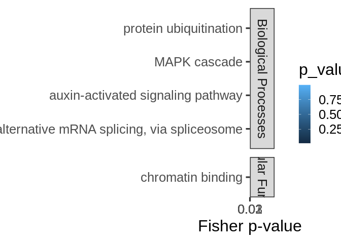
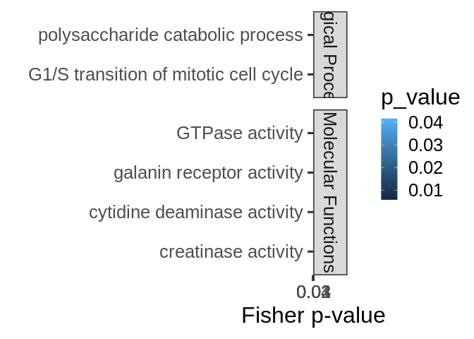
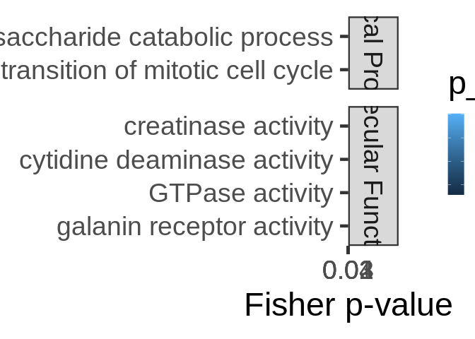
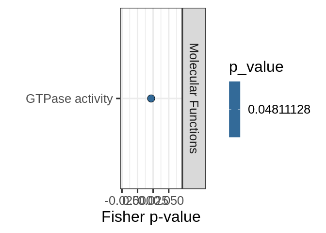
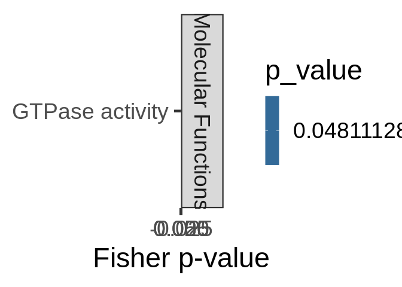

mRNA-miRNA interactions functional enrichment
================
Jill Ashey
2025-02-09

- <a href="#1-format-topgo-files" id="toc-1-format-topgo-files">1 Format
  topGO files</a>
  - <a href="#11-read-in-and-format-annotation-files"
    id="toc-11-read-in-and-format-annotation-files">1.1 Read in and format
    annotation files</a>
  - <a href="#12-set-up-gene2go-object"
    id="toc-12-set-up-gene2go-object">1.2 Set up gene2GO object</a>
  - <a href="#13-define-reference-set" id="toc-13-define-reference-set">1.3
    Define reference set</a>
  - <a href="#14-read-in-pccmiranda-data"
    id="toc-14-read-in-pccmiranda-data">1.4 Read in PCC/miranda data</a>
- <a href="#2-fa-of-all-mirna-targets"
  id="toc-2-fa-of-all-mirna-targets">2 FA of all miRNA targets</a>
- <a href="#3-fe-of-specific-mirnas-targets-all-targets"
  id="toc-3-fe-of-specific-mirnas-targets-all-targets">3 FE of specific
  miRNA’s targets (all targets)</a>
- <a href="#4-fe-of-specific-mirnas-targets-significant-cor-targets"
  id="toc-4-fe-of-specific-mirnas-targets-significant-cor-targets">4 FE of
  specific miRNA’s targets (significant cor targets)</a>
- <a
  href="#5-fe-of-all-targets-negatively-correlated-with-mirnas-regardless-of-correlation-significance"
  id="toc-5-fe-of-all-targets-negatively-correlated-with-mirnas-regardless-of-correlation-significance">5
  FE of all targets negatively correlated with miRNAs (regardless of
  correlation significance)</a>
  - <a href="#501-biological-processes"
    id="toc-501-biological-processes">5.0.1 Biological Processes</a>
  - <a href="#502-cellular-components"
    id="toc-502-cellular-components">5.0.2 Cellular Components</a>
  - <a href="#503-molecular-functions"
    id="toc-503-molecular-functions">5.0.3 Molecular Functions</a>
  - <a href="#504-join-ontologies" id="toc-504-join-ontologies">5.0.4 Join
    ontologies</a>
- <a
  href="#6-fe-of-all-targets-positively-correlated-with-mirnas-regardless-of-correlation-significance"
  id="toc-6-fe-of-all-targets-positively-correlated-with-mirnas-regardless-of-correlation-significance">6
  FE of all targets positively correlated with miRNAs (regardless of
  correlation significance)</a>
  - <a href="#601-biological-processes"
    id="toc-601-biological-processes">6.0.1 Biological Processes</a>
  - <a href="#602-cellular-components"
    id="toc-602-cellular-components">6.0.2 Cellular Components</a>
  - <a href="#603-molecular-functions"
    id="toc-603-molecular-functions">6.0.3 Molecular Functions</a>
  - <a href="#604-join-ontologies" id="toc-604-join-ontologies">6.0.4 Join
    ontologies</a>
- <a
  href="#7-fe-of-all-targets-significantly-negatively-correlated-with-mirnas"
  id="toc-7-fe-of-all-targets-significantly-negatively-correlated-with-mirnas">7
  FE of all targets significantly negatively correlated with miRNAs</a>
  - <a href="#701-biological-processes"
    id="toc-701-biological-processes">7.0.1 Biological Processes</a>
  - <a href="#702-cellular-components"
    id="toc-702-cellular-components">7.0.2 Cellular Components</a>
  - <a href="#703-molecular-functions"
    id="toc-703-molecular-functions">7.0.3 Molecular Functions</a>
  - <a href="#704-join-ontologies" id="toc-704-join-ontologies">7.0.4 Join
    ontologies</a>
- <a
  href="#8-fe-of-all-targets-significantly-positively-correlated-with-mirnas"
  id="toc-8-fe-of-all-targets-significantly-positively-correlated-with-mirnas">8
  FE of all targets significantly positively correlated with miRNAs</a>
  - <a href="#801-biological-processes"
    id="toc-801-biological-processes">8.0.1 Biological Processes</a>
  - <a href="#802-cellular-components"
    id="toc-802-cellular-components">8.0.2 Cellular Components</a>
  - <a href="#803-molecular-functions"
    id="toc-803-molecular-functions">8.0.3 Molecular Functions</a>
  - <a href="#804-join-ontologies" id="toc-804-join-ontologies">8.0.4 Join
    ontologies</a>

This script will use topGO to analyze functional enrichment of miRNA
targets for Apul

Code used below was created by `Jill Ashey`, modified for use with
A.pulchra datasets by `Kathleen Durkin`

# 1 Format topGO files

## 1.1 Read in and format annotation files

``` r
# Read in Apul annotations
annot_locations <- read.delim("../output/02-Apul-reference-annotation/Apulcra-genome-mRNA-IDmapping-2024_12_12.tab")
# Remove unneeded columns 
annot_locations <- annot_locations %>% dplyr::select(-X, -V13)
# Ensure there are no duplicate rows
annot_locations <- annot_locations %>% distinct()

head(annot_locations)
```

    ##                     V1     V3 Protein.names
    ## 1   ntLink_4:1155-1537 P35061   Histone H2A
    ## 2   ntLink_4:2660-3441 P84239    Histone H3
    ## 3   ntLink_4:4515-6830 P35061   Histone H2A
    ## 4   ntLink_4:7096-7859 P84239    Histone H3
    ## 5   ntLink_4:8474-9669 P35061   Histone H2A
    ## 6 ntLink_4:11162-11925 P84239    Histone H3
    ##                                     Organism Gene.Ontology..biological.process.
    ## 1          Acropora formosa (Staghorn coral)                                   
    ## 2 Urechis caupo (Innkeeper worm) (Spoonworm)                                   
    ## 3          Acropora formosa (Staghorn coral)                                   
    ## 4 Urechis caupo (Innkeeper worm) (Spoonworm)                                   
    ## 5          Acropora formosa (Staghorn coral)                                   
    ## 6 Urechis caupo (Innkeeper worm) (Spoonworm)                                   
    ##                                            Gene.Ontology.IDs
    ## 1 GO:0000786; GO:0003677; GO:0005634; GO:0030527; GO:0046982
    ## 2 GO:0000786; GO:0003677; GO:0005634; GO:0030527; GO:0046982
    ## 3 GO:0000786; GO:0003677; GO:0005634; GO:0030527; GO:0046982
    ## 4 GO:0000786; GO:0003677; GO:0005634; GO:0030527; GO:0046982
    ## 5 GO:0000786; GO:0003677; GO:0005634; GO:0030527; GO:0046982
    ## 6 GO:0000786; GO:0003677; GO:0005634; GO:0030527; GO:0046982

``` r
# Looks good!
```

This file shows each gene as it’s genomic location. We want to use gene
IDs to associate genes, so add gene IDs to this annotation table

Read in file that associates each mRNA genomic location with
corresponding gene ID

``` r
mRNA_FUNids <- read.table("../output/15-Apul-annotate-UTRs/Apul-mRNA-FUNids.txt", header=FALSE, col.names=c("location", "type", "mRNA_ID", "gene_ID", "product"), sep="\t")

# Remove unwanted text from parent column
mRNA_FUNids$gene_ID <- gsub("Parent=", "", mRNA_FUNids$gene_ID)
# Only need to keep mRNA location and gene ID
mRNA_FUNids <- mRNA_FUNids %>% dplyr::select(location, gene_ID)
```

join with annotation file

``` r
# join
annot <- left_join(annot_locations, mRNA_FUNids, by = c("V1" = "location"))

# ensure there are no duplicate rows
annot <- annot %>% distinct()
```

## 1.2 Set up gene2GO object

Want to isolate a list of GO terms per gene

``` r
gene2go <- annot %>% filter(!is.na(Gene.Ontology.IDs)) %>% dplyr::select(gene_ID, Gene.Ontology.IDs)
gene2go <- gene2go %>% dplyr::rename(GO.ID = Gene.Ontology.IDs)

gene2go_list <- setNames(
  strsplit(as.character(gene2go$GO.ID), ";"), 
  gene2go$gene_ID
)
```

Note: I think this means genes that had a Uniprot ID but no GO terms are
excluded from this analysis

## 1.3 Define reference set

Define reference set of genes. This should be all genes *found in our
samples*, NOT all genes in the A.pulchra genome. Some genes (e.g.,
reproduction pathways) may not be found/expected in our samples for
valid biological reasons.

``` r
# Read in counts matrix
Apul_counts <- read.csv("../output/07-Apul-Hisat/Apul-gene_count_matrix.csv")
# Exclude genes with all 0 counts
Apul_counts <- Apul_counts[rowSums(Apul_counts[, 2:6]) != 0, ]

# Select gene IDs of the genes present in our samples
all_genes <- Apul_counts$gene_id
length(all_genes)
```

    ## [1] 33624

So we have a reference set of 33624 genes present in our samples.

## 1.4 Read in PCC/miranda data

This is a table of all putative miRNA-mRNA binding predicted by miRanda,
plus Pearsons correlation coefficients for coexpression of each putative
binding pair.

``` r
data <- read.csv("../output/09-Apul-mRNA-miRNA-interactions/miranda_PCC_miRNA_mRNA.csv")
head(data)
```

    ##   X         miRNA       mRNA    PCC.cor   p_value adjusted_p_value score energy
    ## 1 1  Cluster_5981 FUN_028147  0.6825537 0.2041707        0.9986496   146 -22.19
    ## 2 2 Cluster_15340 FUN_013332  0.6371070 0.2476393        0.9986496   158 -23.15
    ## 3 3  Cluster_5981 FUN_041253 -0.2250869 0.7158492        0.9986496   153 -20.50
    ## 4 4  Cluster_3366 FUN_010827  0.3671005 0.5433145        0.9986496   163 -22.14
    ## 5 5  Cluster_3367 FUN_010827  0.5369304 0.3507987        0.9986496   163 -22.14
    ## 6 6 Cluster_15340 FUN_003342  0.1096213 0.8607058        0.9986496   154 -20.65
    ##   query_start_end subject_start_end total_bp_shared query_similar
    ## 1            2 21           185 209              21        66.67%
    ## 2            2 20           198 220              19        68.42%
    ## 3            2 21           699 719              19        73.68%
    ## 4            2 18           346 368              16        81.25%
    ## 5            2 18           346 368              16        81.25%
    ## 6            2 20           562 585              20        65.00%
    ##   subject_similar
    ## 1          71.43%
    ## 2          84.21%
    ## 3          73.68%
    ## 4          93.75%
    ## 5          93.75%
    ## 6          80.00%

Set function to select genes of interest (ie those that have pvalue \<
0.05)

``` r
topDiffGenes <- function(allScore) {
return(allScore < 0.05)}
```

# 2 FA of all miRNA targets

Functional annotation of all putative miRNA targets

``` r
cor_bind_FA <- left_join(data, annot, by = c("mRNA" = "gene_ID")) %>% distinct()

nrow(cor_bind_FA)
```

    ## [1] 4657

``` r
nrow(cor_bind_FA[!is.na(cor_bind_FA$Gene.Ontology.IDs),])
```

    ## [1] 923

Of the 4657 putative miRNA targets predicted by miRanda, 923 have
available annotations

``` r
sig_cor_bind_FA <- cor_bind_FA[cor_bind_FA$p_value < 0.05,]

nrow(sig_cor_bind_FA)
```

    ## [1] 266

``` r
nrow(sig_cor_bind_FA[!is.na(sig_cor_bind_FA$Gene.Ontology.IDs),])
```

    ## [1] 52

Of the 266 putative miRNA targets predicted by miRanda that are also
have significantly correlated expression, only 52 have available
annotations. This is an average of 1-2 annotated targets per miRNA. This
unfortunately means **functional enrichment analysis will likely be
uninformative for most groups of significantly coexpressed targets.**

Save

``` r
write.csv(cor_bind_FA, "../output/09.1-Apul-mRNA-miRNA-interactions-functional-enrichment/miRNA_targets_FA.csv")
write.csv(sig_cor_bind_FA, "../output/09.1-Apul-mRNA-miRNA-interactions-functional-enrichment/miRNA_sig_cor_targets_FA.csv")
```

# 3 FE of specific miRNA’s targets (all targets)

Create topGO function for use with miRNA names

``` r
miRNA_topGO_FE <- function(miRNA.name, input_interactions) {
  
  #Isolate genes in our input module of interest
  interacting_genes <- input_interactions %>%
    filter(miRNA == miRNA.name) %>%
    pull(mRNA)
  
  if (length(interacting_genes) > 0) {
    # Create factor for all reference genes, where 1 represents module membership and 0 means the gene is not in module of interest
    gene_list <- factor(as.integer(all_genes %in% interacting_genes))
    names(gene_list) <- all_genes
    str(gene_list)
    
    ## Biological Process ##
    # Create topGO object
    GO_BP <- new("topGOdata", 
                ontology = "BP", # Biological Process
                allGenes = gene_list,
                annot = annFUN.gene2GO, 
                gene2GO = gene2go_list,
                geneSel=topDiffGenes)
    
    # Run GO enrichment test
    GO_BP_FE <- runTest(GO_BP, algorithm = "weight01", statistic = "fisher")
    # View the results
    GO_BP_results <- GenTable(GO_BP, Fisher = GO_BP_FE, orderBy = "Fisher",  topNodes = 100, numChar = 51)
    # Filter by significant results
    GO_BP_results$Fisher<-as.numeric(GO_BP_results$Fisher)
    GO_BP_results_sig<-GO_BP_results[GO_BP_results$Fisher<0.05,]
    
    
    ## Molecular Function ##
    # Create topGO object
    GO_MF <- new("topGOdata", 
                ontology = "MF", # Molecular Function
                allGenes = gene_list,
                annot = annFUN.gene2GO, 
                gene2GO = gene2go_list,
                geneSel=topDiffGenes)
    
    # Run GO enrichment test
    GO_MF_FE <- runTest(GO_MF, algorithm = "weight01", statistic = "fisher")
    # View the results
    GO_MF_results <- GenTable(GO_MF, Fisher = GO_MF_FE, orderBy = "Fisher",  topNodes = 100, numChar = 51)
    # Filter by significant results
    GO_MF_results$Fisher<-as.numeric(GO_MF_results$Fisher)
    GO_MF_results_sig<-GO_MF_results[GO_MF_results$Fisher<0.05,]
  
    # Return
    # Add type column only if results exist
    if (nrow(GO_BP_results_sig) > 0) {
      GO_BP_results_sig$type <- "Biological.Process"
    }
    if (nrow(GO_MF_results_sig) > 0) {
      GO_MF_results_sig$type <- "Molecular.Function"
    }
    GO_results <- rbind(GO_BP_results_sig, GO_MF_results_sig)
    print(GO_results)
  }
}

miRNA_topGO_FE("Cluster_10093", cor_bind_FA)
```

    ##  Factor w/ 2 levels "0","1": 1 1 1 1 1 1 1 1 1 1 ...
    ##  - attr(*, "names")= chr [1:33624] "FUN_035039" "FUN_035038" "FUN_035031" "FUN_035030" ...

    ## 
    ## Building most specific GOs .....

    ##  ( 273 GO terms found. )

    ## 
    ## Build GO DAG topology ..........

    ##  ( 1231 GO terms and 2377 relations. )

    ## 
    ## Annotating nodes ...............

    ##  ( 1427 genes annotated to the GO terms. )

    ## 
    ##           -- Weight01 Algorithm -- 
    ## 
    ##       the algorithm is scoring 52 nontrivial nodes
    ##       parameters: 
    ##           test statistic: fisher

    ## 
    ##   Level 12:  1 nodes to be scored    (0 eliminated genes)

    ## 
    ##   Level 11:  1 nodes to be scored    (0 eliminated genes)

    ## 
    ##   Level 10:  2 nodes to be scored    (63 eliminated genes)

    ## 
    ##   Level 9:   4 nodes to be scored    (63 eliminated genes)

    ## 
    ##   Level 8:   5 nodes to be scored    (65 eliminated genes)

    ## 
    ##   Level 7:   4 nodes to be scored    (69 eliminated genes)

    ## 
    ##   Level 6:   5 nodes to be scored    (118 eliminated genes)

    ## 
    ##   Level 5:   8 nodes to be scored    (270 eliminated genes)

    ## 
    ##   Level 4:   10 nodes to be scored   (279 eliminated genes)

    ## 
    ##   Level 3:   8 nodes to be scored    (456 eliminated genes)

    ## 
    ##   Level 2:   3 nodes to be scored    (736 eliminated genes)

    ## 
    ##   Level 1:   1 nodes to be scored    (894 eliminated genes)

    ## 
    ## Building most specific GOs .....

    ##  ( 461 GO terms found. )

    ## 
    ## Build GO DAG topology ..........

    ##  ( 910 GO terms and 1191 relations. )

    ## 
    ## Annotating nodes ...............

    ##  ( 2843 genes annotated to the GO terms. )

    ## 
    ##           -- Weight01 Algorithm -- 
    ## 
    ##       the algorithm is scoring 34 nontrivial nodes
    ##       parameters: 
    ##           test statistic: fisher

    ## 
    ##   Level 9:   1 nodes to be scored    (0 eliminated genes)

    ## 
    ##   Level 8:   1 nodes to be scored    (0 eliminated genes)

    ## 
    ##   Level 7:   4 nodes to be scored    (269 eliminated genes)

    ## 
    ##   Level 6:   4 nodes to be scored    (273 eliminated genes)

    ## 
    ##   Level 5:   6 nodes to be scored    (347 eliminated genes)

    ## 
    ##   Level 4:   7 nodes to be scored    (373 eliminated genes)

    ## 
    ##   Level 3:   7 nodes to be scored    (723 eliminated genes)

    ## 
    ##   Level 2:   3 nodes to be scored    (770 eliminated genes)

    ## 
    ##   Level 1:   1 nodes to be scored    (1465 eliminated genes)

    ##        GO.ID                                                   Term Annotated
    ## 1 GO:0000722                 telomere maintenance via recombination         1
    ## 2 GO:0001755                            neural crest cell migration         2
    ## 3 GO:0000822                      inositol hexakisphosphate binding         1
    ## 4 GO:0001409 guanine nucleotide transmembrane transporter activi...        35
    ##   Significant Expected Fisher               type
    ## 1           1     0.00 0.0021 Biological.Process
    ## 2           1     0.00 0.0042 Biological.Process
    ## 3           1     0.00 0.0021 Molecular.Function
    ## 4           2     0.07 0.0021 Molecular.Function

Loop through all miRNA and run functional enrichment on the miRNA’s
targets (all predicted targets)

``` r
interacting_miRNAs <- unique(cor_bind_FA$miRNA) %>% na.omit
results_all_targets <- NULL  # initialize empty df

for(miRNA in interacting_miRNAs) {
  
  # Run topGO enrichment function
  miRNA_results <- miRNA_topGO_FE(miRNA, cor_bind_FA)
  
  # Only keep results if not empty
  if (nrow(miRNA_results) > 0) {
    
    # Add the miRNA source column
    miRNA_results$miRNA <- miRNA

    # Bind to the accumulating results data frame
    results_all_targets <- rbind(results_all_targets, miRNA_results)
  }
}
```

    ##  Factor w/ 2 levels "0","1": 1 1 1 1 1 1 1 1 1 1 ...
    ##  - attr(*, "names")= chr [1:33624] "FUN_035039" "FUN_035038" "FUN_035031" "FUN_035030" ...

    ## 
    ## Building most specific GOs .....

    ##  ( 273 GO terms found. )

    ## 
    ## Build GO DAG topology ..........

    ##  ( 1231 GO terms and 2377 relations. )

    ## 
    ## Annotating nodes ...............

    ##  ( 1427 genes annotated to the GO terms. )

    ## 
    ##           -- Weight01 Algorithm -- 
    ## 
    ##       the algorithm is scoring 169 nontrivial nodes
    ##       parameters: 
    ##           test statistic: fisher

    ## 
    ##   Level 14:  1 nodes to be scored    (0 eliminated genes)

    ## 
    ##   Level 13:  3 nodes to be scored    (0 eliminated genes)

    ## 
    ##   Level 12:  3 nodes to be scored    (11 eliminated genes)

    ## 
    ##   Level 11:  4 nodes to be scored    (155 eliminated genes)

    ## 
    ##   Level 10:  8 nodes to be scored    (203 eliminated genes)

    ## 
    ##   Level 9:   11 nodes to be scored   (205 eliminated genes)

    ## 
    ##   Level 8:   11 nodes to be scored   (214 eliminated genes)

    ## 
    ##   Level 7:   17 nodes to be scored   (243 eliminated genes)

    ## 
    ##   Level 6:   25 nodes to be scored   (326 eliminated genes)

    ## 
    ##   Level 5:   31 nodes to be scored   (463 eliminated genes)

    ## 
    ##   Level 4:   27 nodes to be scored   (619 eliminated genes)

    ## 
    ##   Level 3:   18 nodes to be scored   (891 eliminated genes)

    ## 
    ##   Level 2:   9 nodes to be scored    (1024 eliminated genes)

    ## 
    ##   Level 1:   1 nodes to be scored    (1188 eliminated genes)

    ## 
    ## Building most specific GOs .....

    ##  ( 461 GO terms found. )

    ## 
    ## Build GO DAG topology ..........

    ##  ( 910 GO terms and 1191 relations. )

    ## 
    ## Annotating nodes ...............

    ##  ( 2843 genes annotated to the GO terms. )

    ## 
    ##           -- Weight01 Algorithm -- 
    ## 
    ##       the algorithm is scoring 90 nontrivial nodes
    ##       parameters: 
    ##           test statistic: fisher

    ## 
    ##   Level 9:   1 nodes to be scored    (0 eliminated genes)

    ## 
    ##   Level 8:   3 nodes to be scored    (0 eliminated genes)

    ## 
    ##   Level 7:   8 nodes to be scored    (269 eliminated genes)

    ## 
    ##   Level 6:   19 nodes to be scored   (341 eliminated genes)

    ## 
    ##   Level 5:   22 nodes to be scored   (521 eliminated genes)

    ## 
    ##   Level 4:   18 nodes to be scored   (798 eliminated genes)

    ## 
    ##   Level 3:   13 nodes to be scored   (1629 eliminated genes)

    ## 
    ##   Level 2:   5 nodes to be scored    (1994 eliminated genes)

    ## 
    ##   Level 1:   1 nodes to be scored    (2289 eliminated genes)

    ##        GO.ID                                                   Term Annotated
    ## 1 GO:0001745                             compound eye morphogenesis         3
    ## 2 GO:0001933         negative regulation of protein phosphorylation         5
    ## 3 GO:0009734                      auxin-activated signaling pathway         5
    ## 4 GO:0004459                       L-lactate dehydrogenase activity         1
    ## 5 GO:0004760                  serine-pyruvate transaminase activity         1
    ## 6 GO:0004742 dihydrolipoyllysine-residue acetyltransferase activ...         1
    ## 7 GO:0003779                                          actin binding        18
    ##   Significant Expected Fisher               type
    ## 1           1     0.03  0.027 Biological.Process
    ## 2           1     0.05  0.045 Biological.Process
    ## 3           1     0.05  0.045 Biological.Process
    ## 4           1     0.01  0.012 Molecular.Function
    ## 5           1     0.01  0.012 Molecular.Function
    ## 6           1     0.01  0.012 Molecular.Function
    ## 7           2     0.22  0.019 Molecular.Function
    ##  Factor w/ 2 levels "0","1": 1 1 1 1 1 1 1 1 1 1 ...
    ##  - attr(*, "names")= chr [1:33624] "FUN_035039" "FUN_035038" "FUN_035031" "FUN_035030" ...

    ## 
    ## Building most specific GOs .....

    ##  ( 273 GO terms found. )

    ## 
    ## Build GO DAG topology ..........

    ##  ( 1231 GO terms and 2377 relations. )

    ## 
    ## Annotating nodes ...............

    ##  ( 1427 genes annotated to the GO terms. )

    ## 
    ##           -- Weight01 Algorithm -- 
    ## 
    ##       the algorithm is scoring 180 nontrivial nodes
    ##       parameters: 
    ##           test statistic: fisher

    ## 
    ##   Level 13:  1 nodes to be scored    (0 eliminated genes)

    ## 
    ##   Level 12:  4 nodes to be scored    (0 eliminated genes)

    ## 
    ##   Level 11:  5 nodes to be scored    (140 eliminated genes)

    ## 
    ##   Level 10:  7 nodes to be scored    (210 eliminated genes)

    ## 
    ##   Level 9:   9 nodes to be scored    (217 eliminated genes)

    ## 
    ##   Level 8:   11 nodes to be scored   (288 eliminated genes)

    ## 
    ##   Level 7:   19 nodes to be scored   (322 eliminated genes)

    ## 
    ##   Level 6:   31 nodes to be scored   (372 eliminated genes)

    ## 
    ##   Level 5:   38 nodes to be scored   (602 eliminated genes)

    ## 
    ##   Level 4:   26 nodes to be scored   (729 eliminated genes)

    ## 
    ##   Level 3:   19 nodes to be scored   (1000 eliminated genes)

    ## 
    ##   Level 2:   9 nodes to be scored    (1095 eliminated genes)

    ## 
    ##   Level 1:   1 nodes to be scored    (1292 eliminated genes)

    ## 
    ## Building most specific GOs .....

    ##  ( 461 GO terms found. )

    ## 
    ## Build GO DAG topology ..........

    ##  ( 910 GO terms and 1191 relations. )

    ## 
    ## Annotating nodes ...............

    ##  ( 2843 genes annotated to the GO terms. )

    ## 
    ##           -- Weight01 Algorithm -- 
    ## 
    ##       the algorithm is scoring 100 nontrivial nodes
    ##       parameters: 
    ##           test statistic: fisher

    ## 
    ##   Level 10:  1 nodes to be scored    (0 eliminated genes)

    ## 
    ##   Level 9:   5 nodes to be scored    (0 eliminated genes)

    ## 
    ##   Level 8:   5 nodes to be scored    (101 eliminated genes)

    ## 
    ##   Level 7:   10 nodes to be scored   (448 eliminated genes)

    ## 
    ##   Level 6:   15 nodes to be scored   (532 eliminated genes)

    ## 
    ##   Level 5:   17 nodes to be scored   (731 eliminated genes)

    ## 
    ##   Level 4:   22 nodes to be scored   (898 eliminated genes)

    ## 
    ##   Level 3:   19 nodes to be scored   (1411 eliminated genes)

    ## 
    ##   Level 2:   5 nodes to be scored    (2009 eliminated genes)

    ## 
    ##   Level 1:   1 nodes to be scored    (2470 eliminated genes)

    ##        GO.ID                                        Term Annotated Significant
    ## 1 GO:0016567                      protein ubiquitination        37           3
    ## 2 GO:0001701              in utero embryonic development        15           2
    ## 3 GO:0001756                               somitogenesis         2           1
    ## 4 GO:0007605                 sensory perception of sound         2           1
    ## 5 GO:0004407                histone deacetylase activity         1           1
    ## 6 GO:0004637 phosphoribosylamine-glycine ligase activity         1           1
    ## 7 GO:0004615                 phosphomannomutase activity         1           1
    ## 8 GO:0003714          transcription corepressor activity         4           1
    ##   Expected Fisher               type
    ## 1     0.47 0.0028 Biological.Process
    ## 2     0.19 0.0143 Biological.Process
    ## 3     0.03 0.0251 Biological.Process
    ## 4     0.03 0.0251 Biological.Process
    ## 5     0.01 0.0110 Molecular.Function
    ## 6     0.01 0.0110 Molecular.Function
    ## 7     0.01 0.0110 Molecular.Function
    ## 8     0.05 0.0440 Molecular.Function
    ##  Factor w/ 2 levels "0","1": 1 1 1 1 1 1 1 1 1 1 ...
    ##  - attr(*, "names")= chr [1:33624] "FUN_035039" "FUN_035038" "FUN_035031" "FUN_035030" ...

    ## 
    ## Building most specific GOs .....

    ##  ( 273 GO terms found. )

    ## 
    ## Build GO DAG topology ..........

    ##  ( 1231 GO terms and 2377 relations. )

    ## 
    ## Annotating nodes ...............

    ##  ( 1427 genes annotated to the GO terms. )

    ## 
    ##           -- Weight01 Algorithm -- 
    ## 
    ##       the algorithm is scoring 59 nontrivial nodes
    ##       parameters: 
    ##           test statistic: fisher

    ## 
    ##   Level 10:  2 nodes to be scored    (0 eliminated genes)

    ## 
    ##   Level 9:   3 nodes to be scored    (0 eliminated genes)

    ## 
    ##   Level 8:   3 nodes to be scored    (67 eliminated genes)

    ## 
    ##   Level 7:   3 nodes to be scored    (98 eliminated genes)

    ## 
    ##   Level 6:   8 nodes to be scored    (103 eliminated genes)

    ## 
    ##   Level 5:   13 nodes to be scored   (111 eliminated genes)

    ## 
    ##   Level 4:   11 nodes to be scored   (187 eliminated genes)

    ## 
    ##   Level 3:   9 nodes to be scored    (636 eliminated genes)

    ## 
    ##   Level 2:   6 nodes to be scored    (869 eliminated genes)

    ## 
    ##   Level 1:   1 nodes to be scored    (991 eliminated genes)

    ## 
    ## Building most specific GOs .....

    ##  ( 461 GO terms found. )

    ## 
    ## Build GO DAG topology ..........

    ##  ( 910 GO terms and 1191 relations. )

    ## 
    ## Annotating nodes ...............

    ##  ( 2843 genes annotated to the GO terms. )

    ## 
    ##           -- Weight01 Algorithm -- 
    ## 
    ##       the algorithm is scoring 48 nontrivial nodes
    ##       parameters: 
    ##           test statistic: fisher

    ## 
    ##   Level 8:   1 nodes to be scored    (0 eliminated genes)

    ## 
    ##   Level 7:   2 nodes to be scored    (0 eliminated genes)

    ## 
    ##   Level 6:   6 nodes to be scored    (2 eliminated genes)

    ## 
    ##   Level 5:   10 nodes to be scored   (2 eliminated genes)

    ## 
    ##   Level 4:   14 nodes to be scored   (145 eliminated genes)

    ## 
    ##   Level 3:   10 nodes to be scored   (458 eliminated genes)

    ## 
    ##   Level 2:   4 nodes to be scored    (638 eliminated genes)

    ## 
    ##   Level 1:   1 nodes to be scored    (1722 eliminated genes)

    ##        GO.ID                                   Term Annotated Significant
    ## 1 GO:0016311                      dephosphorylation         1           1
    ## 2 GO:0001558              regulation of cell growth         3           1
    ## 3 GO:0004334           fumarylacetoacetase activity         1           1
    ## 4 GO:0005347 ATP transmembrane transporter activity         2           1
    ## 5 GO:0004126            cytidine deaminase activity         5           1
    ## 6 GO:0005539              glycosaminoglycan binding         5           1
    ## 7 GO:0004601                    peroxidase activity         7           1
    ##   Expected Fisher               type
    ## 1     0.00 0.0035 Biological.Process
    ## 2     0.01 0.0105 Biological.Process
    ## 3     0.00 0.0046 Molecular.Function
    ## 4     0.01 0.0091 Molecular.Function
    ## 5     0.02 0.0227 Molecular.Function
    ## 6     0.02 0.0227 Molecular.Function
    ## 7     0.03 0.0316 Molecular.Function
    ##  Factor w/ 2 levels "0","1": 1 1 1 1 1 1 1 1 1 1 ...
    ##  - attr(*, "names")= chr [1:33624] "FUN_035039" "FUN_035038" "FUN_035031" "FUN_035030" ...

    ## 
    ## Building most specific GOs .....

    ##  ( 273 GO terms found. )

    ## 
    ## Build GO DAG topology ..........

    ##  ( 1231 GO terms and 2377 relations. )

    ## 
    ## Annotating nodes ...............

    ##  ( 1427 genes annotated to the GO terms. )

    ## 
    ##           -- Weight01 Algorithm -- 
    ## 
    ##       the algorithm is scoring 56 nontrivial nodes
    ##       parameters: 
    ##           test statistic: fisher

    ## 
    ##   Level 10:  1 nodes to be scored    (0 eliminated genes)

    ## 
    ##   Level 9:   3 nodes to be scored    (0 eliminated genes)

    ## 
    ##   Level 8:   3 nodes to be scored    (30 eliminated genes)

    ## 
    ##   Level 7:   3 nodes to be scored    (62 eliminated genes)

    ## 
    ##   Level 6:   7 nodes to be scored    (65 eliminated genes)

    ## 
    ##   Level 5:   11 nodes to be scored   (75 eliminated genes)

    ## 
    ##   Level 4:   12 nodes to be scored   (175 eliminated genes)

    ## 
    ##   Level 3:   9 nodes to be scored    (627 eliminated genes)

    ## 
    ##   Level 2:   6 nodes to be scored    (872 eliminated genes)

    ## 
    ##   Level 1:   1 nodes to be scored    (991 eliminated genes)

    ## 
    ## Building most specific GOs .....

    ##  ( 461 GO terms found. )

    ## 
    ## Build GO DAG topology ..........

    ##  ( 910 GO terms and 1191 relations. )

    ## 
    ## Annotating nodes ...............

    ##  ( 2843 genes annotated to the GO terms. )

    ## 
    ##           -- Weight01 Algorithm -- 
    ## 
    ##       the algorithm is scoring 41 nontrivial nodes
    ##       parameters: 
    ##           test statistic: fisher

    ## 
    ##   Level 8:   1 nodes to be scored    (0 eliminated genes)

    ## 
    ##   Level 7:   2 nodes to be scored    (0 eliminated genes)

    ## 
    ##   Level 6:   5 nodes to be scored    (2 eliminated genes)

    ## 
    ##   Level 5:   8 nodes to be scored    (2 eliminated genes)

    ## 
    ##   Level 4:   12 nodes to be scored   (133 eliminated genes)

    ## 
    ##   Level 3:   8 nodes to be scored    (398 eliminated genes)

    ## 
    ##   Level 2:   4 nodes to be scored    (569 eliminated genes)

    ## 
    ##   Level 1:   1 nodes to be scored    (1434 eliminated genes)

    ##        GO.ID                                   Term Annotated Significant
    ## 1 GO:0016311                      dephosphorylation         1           1
    ## 2 GO:0001558              regulation of cell growth         3           1
    ## 3 GO:0003179              heart valve morphogenesis         4           1
    ## 4 GO:0004334           fumarylacetoacetase activity         1           1
    ## 5 GO:0005347 ATP transmembrane transporter activity         2           1
    ## 6 GO:0004126            cytidine deaminase activity         5           1
    ## 7 GO:0005539              glycosaminoglycan binding         5           1
    ## 8 GO:0004601                    peroxidase activity         7           1
    ##   Expected Fisher               type
    ## 1     0.00 0.0035 Biological.Process
    ## 2     0.01 0.0105 Biological.Process
    ## 3     0.01 0.0140 Biological.Process
    ## 4     0.00 0.0039 Molecular.Function
    ## 5     0.01 0.0077 Molecular.Function
    ## 6     0.02 0.0192 Molecular.Function
    ## 7     0.02 0.0192 Molecular.Function
    ## 8     0.03 0.0268 Molecular.Function
    ##  Factor w/ 2 levels "0","1": 1 1 1 1 1 1 1 1 1 1 ...
    ##  - attr(*, "names")= chr [1:33624] "FUN_035039" "FUN_035038" "FUN_035031" "FUN_035030" ...

    ## 
    ## Building most specific GOs .....

    ##  ( 273 GO terms found. )

    ## 
    ## Build GO DAG topology ..........

    ##  ( 1231 GO terms and 2377 relations. )

    ## 
    ## Annotating nodes ...............

    ##  ( 1427 genes annotated to the GO terms. )

    ## 
    ##           -- Weight01 Algorithm -- 
    ## 
    ##       the algorithm is scoring 62 nontrivial nodes
    ##       parameters: 
    ##           test statistic: fisher

    ## 
    ##   Level 13:  1 nodes to be scored    (0 eliminated genes)

    ## 
    ##   Level 12:  2 nodes to be scored    (0 eliminated genes)

    ## 
    ##   Level 11:  3 nodes to be scored    (140 eliminated genes)

    ## 
    ##   Level 10:  3 nodes to be scored    (140 eliminated genes)

    ## 
    ##   Level 9:   3 nodes to be scored    (142 eliminated genes)

    ## 
    ##   Level 8:   2 nodes to be scored    (142 eliminated genes)

    ## 
    ##   Level 7:   4 nodes to be scored    (143 eliminated genes)

    ## 
    ##   Level 6:   10 nodes to be scored   (157 eliminated genes)

    ## 
    ##   Level 5:   14 nodes to be scored   (243 eliminated genes)

    ## 
    ##   Level 4:   10 nodes to be scored   (298 eliminated genes)

    ## 
    ##   Level 3:   6 nodes to be scored    (380 eliminated genes)

    ## 
    ##   Level 2:   3 nodes to be scored    (539 eliminated genes)

    ## 
    ##   Level 1:   1 nodes to be scored    (666 eliminated genes)

    ## 
    ## Building most specific GOs .....

    ##  ( 461 GO terms found. )

    ## 
    ## Build GO DAG topology ..........

    ##  ( 910 GO terms and 1191 relations. )

    ## 
    ## Annotating nodes ...............

    ##  ( 2843 genes annotated to the GO terms. )

    ## 
    ##           -- Weight01 Algorithm -- 
    ## 
    ##       the algorithm is scoring 22 nontrivial nodes
    ##       parameters: 
    ##           test statistic: fisher

    ## 
    ##   Level 9:   1 nodes to be scored    (0 eliminated genes)

    ## 
    ##   Level 8:   2 nodes to be scored    (0 eliminated genes)

    ## 
    ##   Level 7:   3 nodes to be scored    (4 eliminated genes)

    ## 
    ##   Level 6:   2 nodes to be scored    (30 eliminated genes)

    ## 
    ##   Level 5:   4 nodes to be scored    (90 eliminated genes)

    ## 
    ##   Level 4:   4 nodes to be scored    (102 eliminated genes)

    ## 
    ##   Level 3:   2 nodes to be scored    (137 eliminated genes)

    ## 
    ##   Level 2:   3 nodes to be scored    (153 eliminated genes)

    ## 
    ##   Level 1:   1 nodes to be scored    (211 eliminated genes)

    ##        GO.ID                                Term Annotated Significant Expected
    ## 1 GO:0004736       pyruvate carboxylase activity         1           1        0
    ## 2 GO:0005388 P-type calcium transporter activity         4           1        0
    ##   Fisher               type
    ## 1 0.0007 Molecular.Function
    ## 2 0.0028 Molecular.Function
    ##  Factor w/ 2 levels "0","1": 1 1 1 1 1 1 1 1 1 1 ...
    ##  - attr(*, "names")= chr [1:33624] "FUN_035039" "FUN_035038" "FUN_035031" "FUN_035030" ...

    ## 
    ## Building most specific GOs .....

    ##  ( 273 GO terms found. )

    ## 
    ## Build GO DAG topology ..........

    ##  ( 1231 GO terms and 2377 relations. )

    ## 
    ## Annotating nodes ...............

    ##  ( 1427 genes annotated to the GO terms. )

    ## 
    ##           -- Weight01 Algorithm -- 
    ## 
    ##       the algorithm is scoring 10 nontrivial nodes
    ##       parameters: 
    ##           test statistic: fisher

    ## 
    ##   Level 7:   1 nodes to be scored    (0 eliminated genes)

    ## 
    ##   Level 6:   2 nodes to be scored    (0 eliminated genes)

    ## 
    ##   Level 5:   2 nodes to be scored    (105 eliminated genes)

    ## 
    ##   Level 4:   2 nodes to be scored    (113 eliminated genes)

    ## 
    ##   Level 3:   1 nodes to be scored    (155 eliminated genes)

    ## 
    ##   Level 2:   1 nodes to be scored    (173 eliminated genes)

    ## 
    ##   Level 1:   1 nodes to be scored    (175 eliminated genes)

    ## 
    ## Building most specific GOs .....

    ##  ( 461 GO terms found. )

    ## 
    ## Build GO DAG topology ..........

    ##  ( 910 GO terms and 1191 relations. )

    ## 
    ## Annotating nodes ...............

    ##  ( 2843 genes annotated to the GO terms. )

    ## 
    ##           -- Weight01 Algorithm -- 
    ## 
    ##       the algorithm is scoring 57 nontrivial nodes
    ##       parameters: 
    ##           test statistic: fisher

    ## 
    ##   Level 10:  1 nodes to be scored    (0 eliminated genes)

    ## 
    ##   Level 9:   3 nodes to be scored    (0 eliminated genes)

    ## 
    ##   Level 8:   2 nodes to be scored    (101 eliminated genes)

    ## 
    ##   Level 7:   5 nodes to be scored    (390 eliminated genes)

    ## 
    ##   Level 6:   7 nodes to be scored    (404 eliminated genes)

    ## 
    ##   Level 5:   10 nodes to be scored   (568 eliminated genes)

    ## 
    ##   Level 4:   12 nodes to be scored   (609 eliminated genes)

    ## 
    ##   Level 3:   13 nodes to be scored   (1013 eliminated genes)

    ## 
    ##   Level 2:   3 nodes to be scored    (1485 eliminated genes)

    ## 
    ##   Level 1:   1 nodes to be scored    (1923 eliminated genes)

    ##        GO.ID                                  Term Annotated Significant
    ## 1 GO:0000082 G1/S transition of mitotic cell cycle       105           2
    ## 2 GO:0008170          N-methyltransferase activity         1           1
    ## 3 GO:0003913               DNA photolyase activity         1           1
    ## 4 GO:0004016            adenylate cyclase activity         2           1
    ## 5 GO:0005496                       steroid binding         8           1
    ##   Expected Fisher               type
    ## 1     0.15 0.0054 Biological.Process
    ## 2     0.00 0.0035 Molecular.Function
    ## 3     0.00 0.0035 Molecular.Function
    ## 4     0.01 0.0070 Molecular.Function
    ## 5     0.03 0.0278 Molecular.Function
    ##  Factor w/ 2 levels "0","1": 1 1 1 1 1 1 1 1 1 1 ...
    ##  - attr(*, "names")= chr [1:33624] "FUN_035039" "FUN_035038" "FUN_035031" "FUN_035030" ...

    ## 
    ## Building most specific GOs .....

    ##  ( 273 GO terms found. )

    ## 
    ## Build GO DAG topology ..........

    ##  ( 1231 GO terms and 2377 relations. )

    ## 
    ## Annotating nodes ...............

    ##  ( 1427 genes annotated to the GO terms. )

    ## 
    ##           -- Weight01 Algorithm -- 
    ## 
    ##       the algorithm is scoring 82 nontrivial nodes
    ##       parameters: 
    ##           test statistic: fisher

    ## 
    ##   Level 13:  1 nodes to be scored    (0 eliminated genes)

    ## 
    ##   Level 12:  3 nodes to be scored    (0 eliminated genes)

    ## 
    ##   Level 11:  4 nodes to be scored    (140 eliminated genes)

    ## 
    ##   Level 10:  4 nodes to be scored    (203 eliminated genes)

    ## 
    ##   Level 9:   5 nodes to be scored    (205 eliminated genes)

    ## 
    ##   Level 8:   4 nodes to be scored    (206 eliminated genes)

    ## 
    ##   Level 7:   6 nodes to be scored    (209 eliminated genes)

    ## 
    ##   Level 6:   13 nodes to be scored   (240 eliminated genes)

    ## 
    ##   Level 5:   17 nodes to be scored   (350 eliminated genes)

    ## 
    ##   Level 4:   14 nodes to be scored   (413 eliminated genes)

    ## 
    ##   Level 3:   7 nodes to be scored    (557 eliminated genes)

    ## 
    ##   Level 2:   3 nodes to be scored    (734 eliminated genes)

    ## 
    ##   Level 1:   1 nodes to be scored    (829 eliminated genes)

    ## 
    ## Building most specific GOs .....

    ##  ( 461 GO terms found. )

    ## 
    ## Build GO DAG topology ..........

    ##  ( 910 GO terms and 1191 relations. )

    ## 
    ## Annotating nodes ...............

    ##  ( 2843 genes annotated to the GO terms. )

    ## 
    ##           -- Weight01 Algorithm -- 
    ## 
    ##       the algorithm is scoring 25 nontrivial nodes
    ##       parameters: 
    ##           test statistic: fisher

    ## 
    ##   Level 7:   1 nodes to be scored    (0 eliminated genes)

    ## 
    ##   Level 6:   4 nodes to be scored    (0 eliminated genes)

    ## 
    ##   Level 5:   5 nodes to be scored    (135 eliminated genes)

    ## 
    ##   Level 4:   6 nodes to be scored    (163 eliminated genes)

    ## 
    ##   Level 3:   6 nodes to be scored    (599 eliminated genes)

    ## 
    ##   Level 2:   2 nodes to be scored    (849 eliminated genes)

    ## 
    ##   Level 1:   1 nodes to be scored    (1732 eliminated genes)

    ##        GO.ID                                    Term Annotated Significant
    ## 1 GO:0006665          sphingolipid metabolic process         2           1
    ## 2 GO:0004566             beta-glucuronidase activity         2           1
    ## 3 GO:0003697             single-stranded DNA binding         9           1
    ## 4 GO:0004508 steroid 17-alpha-monooxygenase activity        17           1
    ##   Expected Fisher               type
    ## 1     0.01 0.0056 Biological.Process
    ## 2     0.00 0.0035 Molecular.Function
    ## 3     0.02 0.0157 Molecular.Function
    ## 4     0.03 0.0296 Molecular.Function
    ##  Factor w/ 2 levels "0","1": 1 1 1 1 1 1 1 1 1 1 ...
    ##  - attr(*, "names")= chr [1:33624] "FUN_035039" "FUN_035038" "FUN_035031" "FUN_035030" ...

    ## 
    ## Building most specific GOs .....

    ##  ( 273 GO terms found. )

    ## 
    ## Build GO DAG topology ..........

    ##  ( 1231 GO terms and 2377 relations. )

    ## 
    ## Annotating nodes ...............

    ##  ( 1427 genes annotated to the GO terms. )

    ## 
    ##           -- Weight01 Algorithm -- 
    ## 
    ##       the algorithm is scoring 180 nontrivial nodes
    ##       parameters: 
    ##           test statistic: fisher

    ## 
    ##   Level 13:  1 nodes to be scored    (0 eliminated genes)

    ## 
    ##   Level 12:  3 nodes to be scored    (0 eliminated genes)

    ## 
    ##   Level 11:  4 nodes to be scored    (140 eliminated genes)

    ## 
    ##   Level 10:  5 nodes to be scored    (203 eliminated genes)

    ## 
    ##   Level 9:   10 nodes to be scored   (205 eliminated genes)

    ## 
    ##   Level 8:   13 nodes to be scored   (221 eliminated genes)

    ## 
    ##   Level 7:   17 nodes to be scored   (265 eliminated genes)

    ## 
    ##   Level 6:   29 nodes to be scored   (308 eliminated genes)

    ## 
    ##   Level 5:   39 nodes to be scored   (545 eliminated genes)

    ## 
    ##   Level 4:   27 nodes to be scored   (707 eliminated genes)

    ## 
    ##   Level 3:   22 nodes to be scored   (971 eliminated genes)

    ## 
    ##   Level 2:   9 nodes to be scored    (1081 eliminated genes)

    ## 
    ##   Level 1:   1 nodes to be scored    (1297 eliminated genes)

    ## 
    ## Building most specific GOs .....

    ##  ( 461 GO terms found. )

    ## 
    ## Build GO DAG topology ..........

    ##  ( 910 GO terms and 1191 relations. )

    ## 
    ## Annotating nodes ...............

    ##  ( 2843 genes annotated to the GO terms. )

    ## 
    ##           -- Weight01 Algorithm -- 
    ## 
    ##       the algorithm is scoring 85 nontrivial nodes
    ##       parameters: 
    ##           test statistic: fisher

    ## 
    ##   Level 10:  1 nodes to be scored    (0 eliminated genes)

    ## 
    ##   Level 9:   4 nodes to be scored    (0 eliminated genes)

    ## 
    ##   Level 8:   5 nodes to be scored    (101 eliminated genes)

    ## 
    ##   Level 7:   10 nodes to be scored   (135 eliminated genes)

    ## 
    ##   Level 6:   11 nodes to be scored   (149 eliminated genes)

    ## 
    ##   Level 5:   17 nodes to be scored   (342 eliminated genes)

    ## 
    ##   Level 4:   18 nodes to be scored   (449 eliminated genes)

    ## 
    ##   Level 3:   12 nodes to be scored   (1318 eliminated genes)

    ## 
    ##   Level 2:   6 nodes to be scored    (1666 eliminated genes)

    ## 
    ##   Level 1:   1 nodes to be scored    (2233 eliminated genes)

    ##        GO.ID                                                   Term Annotated
    ## 1 GO:0002224                   toll-like receptor signaling pathway         1
    ## 2 GO:0006598                            polyamine catabolic process         2
    ## 3 GO:0001578                           microtubule bundle formation         2
    ## 4 GO:0006699                         bile acid biosynthetic process         4
    ## 5 GO:0005471                            ATP:ADP antiporter activity         1
    ## 6 GO:0003960                       NADPH:quinone reductase activity         1
    ## 7 GO:0004675 transmembrane receptor protein serine/threonine kin...         3
    ## 8 GO:0004860                      protein kinase inhibitor activity         3
    ## 9 GO:0004857                              enzyme inhibitor activity        11
    ##   Significant Expected Fisher               type
    ## 1           1     0.01  0.011 Biological.Process
    ## 2           1     0.02  0.022 Biological.Process
    ## 3           1     0.02  0.022 Biological.Process
    ## 4           1     0.04  0.044 Biological.Process
    ## 5           1     0.01  0.006 Molecular.Function
    ## 6           1     0.01  0.006 Molecular.Function
    ## 7           1     0.02  0.018 Molecular.Function
    ## 8           1     0.02  0.018 Molecular.Function
    ## 9           2     0.07  0.044 Molecular.Function
    ##  Factor w/ 2 levels "0","1": 1 1 1 1 1 1 1 1 1 1 ...
    ##  - attr(*, "names")= chr [1:33624] "FUN_035039" "FUN_035038" "FUN_035031" "FUN_035030" ...

    ## 
    ## Building most specific GOs .....

    ##  ( 273 GO terms found. )

    ## 
    ## Build GO DAG topology ..........

    ##  ( 1231 GO terms and 2377 relations. )

    ## 
    ## Annotating nodes ...............

    ##  ( 1427 genes annotated to the GO terms. )

    ## 
    ##           -- Weight01 Algorithm -- 
    ## 
    ##       the algorithm is scoring 122 nontrivial nodes
    ##       parameters: 
    ##           test statistic: fisher

    ## 
    ##   Level 13:  2 nodes to be scored    (0 eliminated genes)

    ## 
    ##   Level 12:  3 nodes to be scored    (0 eliminated genes)

    ## 
    ##   Level 11:  5 nodes to be scored    (155 eliminated genes)

    ## 
    ##   Level 10:  6 nodes to be scored    (203 eliminated genes)

    ## 
    ##   Level 9:   10 nodes to be scored   (214 eliminated genes)

    ## 
    ##   Level 8:   8 nodes to be scored    (215 eliminated genes)

    ## 
    ##   Level 7:   9 nodes to be scored    (227 eliminated genes)

    ## 
    ##   Level 6:   18 nodes to be scored   (331 eliminated genes)

    ## 
    ##   Level 5:   23 nodes to be scored   (480 eliminated genes)

    ## 
    ##   Level 4:   19 nodes to be scored   (573 eliminated genes)

    ## 
    ##   Level 3:   11 nodes to be scored   (830 eliminated genes)

    ## 
    ##   Level 2:   7 nodes to be scored    (969 eliminated genes)

    ## 
    ##   Level 1:   1 nodes to be scored    (1079 eliminated genes)

    ## 
    ## Building most specific GOs .....

    ##  ( 461 GO terms found. )

    ## 
    ## Build GO DAG topology ..........

    ##  ( 910 GO terms and 1191 relations. )

    ## 
    ## Annotating nodes ...............

    ##  ( 2843 genes annotated to the GO terms. )

    ## 
    ##           -- Weight01 Algorithm -- 
    ## 
    ##       the algorithm is scoring 63 nontrivial nodes
    ##       parameters: 
    ##           test statistic: fisher

    ## 
    ##   Level 10:  1 nodes to be scored    (0 eliminated genes)

    ## 
    ##   Level 9:   3 nodes to be scored    (0 eliminated genes)

    ## 
    ##   Level 8:   5 nodes to be scored    (2 eliminated genes)

    ## 
    ##   Level 7:   8 nodes to be scored    (319 eliminated genes)

    ## 
    ##   Level 6:   10 nodes to be scored   (413 eliminated genes)

    ## 
    ##   Level 5:   9 nodes to be scored    (493 eliminated genes)

    ## 
    ##   Level 4:   12 nodes to be scored   (604 eliminated genes)

    ## 
    ##   Level 3:   9 nodes to be scored    (957 eliminated genes)

    ## 
    ##   Level 2:   5 nodes to be scored    (1625 eliminated genes)

    ## 
    ##   Level 1:   1 nodes to be scored    (1988 eliminated genes)

    ##        GO.ID                                                   Term Annotated
    ## 1 GO:0004995                           tachykinin receptor activity        16
    ## 2 GO:0005231 excitatory extracellular ligand-gated ion channel a...         2
    ## 3 GO:0008061                                         chitin binding         6
    ##   Significant Expected Fisher               type
    ## 1           2     0.10 0.0038 Molecular.Function
    ## 2           1     0.01 0.0119 Molecular.Function
    ## 3           1     0.04 0.0354 Molecular.Function
    ##  Factor w/ 2 levels "0","1": 1 1 1 1 1 1 1 1 1 1 ...
    ##  - attr(*, "names")= chr [1:33624] "FUN_035039" "FUN_035038" "FUN_035031" "FUN_035030" ...

    ## 
    ## Building most specific GOs .....

    ##  ( 273 GO terms found. )

    ## 
    ## Build GO DAG topology ..........

    ##  ( 1231 GO terms and 2377 relations. )

    ## 
    ## Annotating nodes ...............

    ##  ( 1427 genes annotated to the GO terms. )

    ## 
    ##           -- Weight01 Algorithm -- 
    ## 
    ##       the algorithm is scoring 65 nontrivial nodes
    ##       parameters: 
    ##           test statistic: fisher

    ## 
    ##   Level 13:  1 nodes to be scored    (0 eliminated genes)

    ## 
    ##   Level 12:  1 nodes to be scored    (0 eliminated genes)

    ## 
    ##   Level 11:  1 nodes to be scored    (15 eliminated genes)

    ## 
    ##   Level 10:  1 nodes to be scored    (63 eliminated genes)

    ## 
    ##   Level 9:   3 nodes to be scored    (63 eliminated genes)

    ## 
    ##   Level 8:   4 nodes to be scored    (64 eliminated genes)

    ## 
    ##   Level 7:   5 nodes to be scored    (75 eliminated genes)

    ## 
    ##   Level 6:   7 nodes to be scored    (116 eliminated genes)

    ## 
    ##   Level 5:   9 nodes to be scored    (277 eliminated genes)

    ## 
    ##   Level 4:   13 nodes to be scored   (397 eliminated genes)

    ## 
    ##   Level 3:   12 nodes to be scored   (616 eliminated genes)

    ## 
    ##   Level 2:   7 nodes to be scored    (674 eliminated genes)

    ## 
    ##   Level 1:   1 nodes to be scored    (1055 eliminated genes)

    ## 
    ## Building most specific GOs .....

    ##  ( 461 GO terms found. )

    ## 
    ## Build GO DAG topology ..........

    ##  ( 910 GO terms and 1191 relations. )

    ## 
    ## Annotating nodes ...............

    ##  ( 2843 genes annotated to the GO terms. )

    ## 
    ##           -- Weight01 Algorithm -- 
    ## 
    ##       the algorithm is scoring 84 nontrivial nodes
    ##       parameters: 
    ##           test statistic: fisher

    ## 
    ##   Level 10:  3 nodes to be scored    (0 eliminated genes)

    ## 
    ##   Level 9:   5 nodes to be scored    (0 eliminated genes)

    ## 
    ##   Level 8:   6 nodes to be scored    (50 eliminated genes)

    ## 
    ##   Level 7:   9 nodes to be scored    (342 eliminated genes)

    ## 
    ##   Level 6:   14 nodes to be scored   (360 eliminated genes)

    ## 
    ##   Level 5:   14 nodes to be scored   (458 eliminated genes)

    ## 
    ##   Level 4:   15 nodes to be scored   (558 eliminated genes)

    ## 
    ##   Level 3:   12 nodes to be scored   (1406 eliminated genes)

    ## 
    ##   Level 2:   5 nodes to be scored    (1642 eliminated genes)

    ## 
    ##   Level 1:   1 nodes to be scored    (2352 eliminated genes)

    ##         GO.ID                                                   Term Annotated
    ## 1  GO:0000266                                  mitochondrial fission         4
    ## 2  GO:0003360                                  brainstem development         5
    ## 3  GO:0000413                  protein peptidyl-prolyl isomerization         9
    ## 4  GO:0002291 T cell activation via T cell receptor contact with ...        10
    ## 5  GO:0002221         pattern recognition receptor signaling pathway        11
    ## 6  GO:0004013                        adenosylhomocysteinase activity         1
    ## 7  GO:0004402                     histone acetyltransferase activity         1
    ## 8  GO:0005200                 structural constituent of cytoskeleton         4
    ## 9  GO:0005109                                       frizzled binding         5
    ## 10 GO:0004758                 serine C-palmitoyltransferase activity         6
    ## 11 GO:0005245                 voltage-gated calcium channel activity         7
    ##    Significant Expected Fisher               type
    ## 1            1     0.02 0.0170 Biological.Process
    ## 2            1     0.02 0.0210 Biological.Process
    ## 3            1     0.04 0.0370 Biological.Process
    ## 4            1     0.04 0.0410 Biological.Process
    ## 5            1     0.05 0.0450 Biological.Process
    ## 6            1     0.01 0.0053 Molecular.Function
    ## 7            1     0.01 0.0053 Molecular.Function
    ## 8            1     0.02 0.0209 Molecular.Function
    ## 9            1     0.03 0.0261 Molecular.Function
    ## 10           1     0.03 0.0313 Molecular.Function
    ## 11           1     0.04 0.0364 Molecular.Function
    ##  Factor w/ 2 levels "0","1": 1 1 1 1 1 1 1 1 1 1 ...
    ##  - attr(*, "names")= chr [1:33624] "FUN_035039" "FUN_035038" "FUN_035031" "FUN_035030" ...

    ## 
    ## Building most specific GOs .....

    ##  ( 273 GO terms found. )

    ## 
    ## Build GO DAG topology ..........

    ##  ( 1231 GO terms and 2377 relations. )

    ## 
    ## Annotating nodes ...............

    ##  ( 1427 genes annotated to the GO terms. )

    ## 
    ##           -- Weight01 Algorithm -- 
    ## 
    ##       the algorithm is scoring 46 nontrivial nodes
    ##       parameters: 
    ##           test statistic: fisher

    ## 
    ##   Level 9:   1 nodes to be scored    (0 eliminated genes)

    ## 
    ##   Level 8:   2 nodes to be scored    (0 eliminated genes)

    ## 
    ##   Level 7:   4 nodes to be scored    (4 eliminated genes)

    ## 
    ##   Level 6:   7 nodes to be scored    (4 eliminated genes)

    ## 
    ##   Level 5:   9 nodes to be scored    (63 eliminated genes)

    ## 
    ##   Level 4:   9 nodes to be scored    (259 eliminated genes)

    ## 
    ##   Level 3:   7 nodes to be scored    (403 eliminated genes)

    ## 
    ##   Level 2:   6 nodes to be scored    (564 eliminated genes)

    ## 
    ##   Level 1:   1 nodes to be scored    (693 eliminated genes)

    ## 
    ## Building most specific GOs .....

    ##  ( 461 GO terms found. )

    ## 
    ## Build GO DAG topology ..........

    ##  ( 910 GO terms and 1191 relations. )

    ## 
    ## Annotating nodes ...............

    ##  ( 2843 genes annotated to the GO terms. )

    ## 
    ##           -- Weight01 Algorithm -- 
    ## 
    ##       the algorithm is scoring 39 nontrivial nodes
    ##       parameters: 
    ##           test statistic: fisher

    ## 
    ##   Level 10:  1 nodes to be scored    (0 eliminated genes)

    ## 
    ##   Level 9:   2 nodes to be scored    (0 eliminated genes)

    ## 
    ##   Level 8:   2 nodes to be scored    (101 eliminated genes)

    ## 
    ##   Level 7:   3 nodes to be scored    (121 eliminated genes)

    ## 
    ##   Level 6:   4 nodes to be scored    (134 eliminated genes)

    ## 
    ##   Level 5:   8 nodes to be scored    (189 eliminated genes)

    ## 
    ##   Level 4:   7 nodes to be scored    (224 eliminated genes)

    ## 
    ##   Level 3:   8 nodes to be scored    (828 eliminated genes)

    ## 
    ##   Level 2:   3 nodes to be scored    (1338 eliminated genes)

    ## 
    ##   Level 1:   1 nodes to be scored    (1841 eliminated genes)

    ##        GO.ID                                                   Term Annotated
    ## 1 GO:0002021                             response to dietary excess         1
    ## 2 GO:0002674     negative regulation of acute inflammatory response         4
    ## 3 GO:0001508                                       action potential         4
    ## 4 GO:0003958                   NADPH-hemoprotein reductase activity         1
    ## 5 GO:0004693 cyclin-dependent protein serine/threonine kinase ac...         3
    ## 6 GO:0001965                        G-protein alpha-subunit binding        16
    ## 7 GO:0003779                                          actin binding        18
    ##   Significant Expected Fisher               type
    ## 1           1     0.00 0.0035 Biological.Process
    ## 2           1     0.01 0.0140 Biological.Process
    ## 3           1     0.01 0.0140 Biological.Process
    ## 4           1     0.00 0.0028 Molecular.Function
    ## 5           1     0.01 0.0084 Molecular.Function
    ## 6           1     0.05 0.0442 Molecular.Function
    ## 7           1     0.05 0.0496 Molecular.Function
    ##  Factor w/ 2 levels "0","1": 1 1 1 1 1 1 1 1 1 1 ...
    ##  - attr(*, "names")= chr [1:33624] "FUN_035039" "FUN_035038" "FUN_035031" "FUN_035030" ...

    ## 
    ## Building most specific GOs .....

    ##  ( 273 GO terms found. )

    ## 
    ## Build GO DAG topology ..........

    ##  ( 1231 GO terms and 2377 relations. )

    ## 
    ## Annotating nodes ...............

    ##  ( 1427 genes annotated to the GO terms. )

    ## 
    ##           -- Weight01 Algorithm -- 
    ## 
    ##       the algorithm is scoring 115 nontrivial nodes
    ##       parameters: 
    ##           test statistic: fisher

    ## 
    ##   Level 13:  1 nodes to be scored    (0 eliminated genes)

    ## 
    ##   Level 12:  2 nodes to be scored    (0 eliminated genes)

    ## 
    ##   Level 11:  3 nodes to be scored    (140 eliminated genes)

    ## 
    ##   Level 10:  4 nodes to be scored    (140 eliminated genes)

    ## 
    ##   Level 9:   6 nodes to be scored    (142 eliminated genes)

    ## 
    ##   Level 8:   6 nodes to be scored    (147 eliminated genes)

    ## 
    ##   Level 7:   11 nodes to be scored   (171 eliminated genes)

    ## 
    ##   Level 6:   17 nodes to be scored   (185 eliminated genes)

    ## 
    ##   Level 5:   24 nodes to be scored   (287 eliminated genes)

    ## 
    ##   Level 4:   20 nodes to be scored   (411 eliminated genes)

    ## 
    ##   Level 3:   13 nodes to be scored   (511 eliminated genes)

    ## 
    ##   Level 2:   7 nodes to be scored    (730 eliminated genes)

    ## 
    ##   Level 1:   1 nodes to be scored    (888 eliminated genes)

    ## 
    ## Building most specific GOs .....

    ##  ( 461 GO terms found. )

    ## 
    ## Build GO DAG topology ..........

    ##  ( 910 GO terms and 1191 relations. )

    ## 
    ## Annotating nodes ...............

    ##  ( 2843 genes annotated to the GO terms. )

    ## 
    ##           -- Weight01 Algorithm -- 
    ## 
    ##       the algorithm is scoring 76 nontrivial nodes
    ##       parameters: 
    ##           test statistic: fisher

    ## 
    ##   Level 13:  1 nodes to be scored    (0 eliminated genes)

    ## 
    ##   Level 12:  1 nodes to be scored    (0 eliminated genes)

    ## 
    ##   Level 11:  1 nodes to be scored    (2 eliminated genes)

    ## 
    ##   Level 10:  2 nodes to be scored    (2 eliminated genes)

    ## 
    ##   Level 9:   4 nodes to be scored    (4 eliminated genes)

    ## 
    ##   Level 8:   5 nodes to be scored    (105 eliminated genes)

    ## 
    ##   Level 7:   9 nodes to be scored    (396 eliminated genes)

    ## 
    ##   Level 6:   13 nodes to be scored   (415 eliminated genes)

    ## 
    ##   Level 5:   14 nodes to be scored   (728 eliminated genes)

    ## 
    ##   Level 4:   11 nodes to be scored   (793 eliminated genes)

    ## 
    ##   Level 3:   11 nodes to be scored   (973 eliminated genes)

    ## 
    ##   Level 2:   3 nodes to be scored    (1248 eliminated genes)

    ## 
    ##   Level 1:   1 nodes to be scored    (1841 eliminated genes)

    ##        GO.ID                                                   Term Annotated
    ## 1 GO:0003351 epithelial cilium movement involved in extracellula...         1
    ## 2 GO:0001933         negative regulation of protein phosphorylation         5
    ## 3 GO:0001867                  complement activation, lectin pathway        16
    ## 4 GO:0004615                            phosphomannomutase activity         1
    ## 5 GO:0008641     ubiquitin-like modifier activating enzyme activity         1
    ## 6 GO:0005314 high-affinity L-glutamate transmembrane transporter...         2
    ## 7 GO:0003684                                    damaged DNA binding         4
    ## 8 GO:0003697                            single-stranded DNA binding         9
    ##   Significant Expected Fisher               type
    ## 1           1     0.00 0.0028 Biological.Process
    ## 2           1     0.01 0.0140 Biological.Process
    ## 3           1     0.04 0.0441 Biological.Process
    ## 4           1     0.00 0.0032 Molecular.Function
    ## 5           1     0.00 0.0032 Molecular.Function
    ## 6           1     0.01 0.0063 Molecular.Function
    ## 7           1     0.01 0.0126 Molecular.Function
    ## 8           1     0.03 0.0282 Molecular.Function
    ##  Factor w/ 2 levels "0","1": 1 1 1 1 1 1 1 1 1 1 ...
    ##  - attr(*, "names")= chr [1:33624] "FUN_035039" "FUN_035038" "FUN_035031" "FUN_035030" ...

    ## 
    ## Building most specific GOs .....

    ##  ( 273 GO terms found. )

    ## 
    ## Build GO DAG topology ..........

    ##  ( 1231 GO terms and 2377 relations. )

    ## 
    ## Annotating nodes ...............

    ##  ( 1427 genes annotated to the GO terms. )

    ## 
    ##           -- Weight01 Algorithm -- 
    ## 
    ##       the algorithm is scoring 107 nontrivial nodes
    ##       parameters: 
    ##           test statistic: fisher

    ## 
    ##   Level 13:  1 nodes to be scored    (0 eliminated genes)

    ## 
    ##   Level 12:  2 nodes to be scored    (0 eliminated genes)

    ## 
    ##   Level 11:  3 nodes to be scored    (140 eliminated genes)

    ## 
    ##   Level 10:  3 nodes to be scored    (140 eliminated genes)

    ## 
    ##   Level 9:   3 nodes to be scored    (142 eliminated genes)

    ## 
    ##   Level 8:   4 nodes to be scored    (142 eliminated genes)

    ## 
    ##   Level 7:   10 nodes to be scored   (143 eliminated genes)

    ## 
    ##   Level 6:   17 nodes to be scored   (182 eliminated genes)

    ## 
    ##   Level 5:   23 nodes to be scored   (435 eliminated genes)

    ## 
    ##   Level 4:   20 nodes to be scored   (535 eliminated genes)

    ## 
    ##   Level 3:   14 nodes to be scored   (821 eliminated genes)

    ## 
    ##   Level 2:   6 nodes to be scored    (1077 eliminated genes)

    ## 
    ##   Level 1:   1 nodes to be scored    (1231 eliminated genes)

    ## 
    ## Building most specific GOs .....

    ##  ( 461 GO terms found. )

    ## 
    ## Build GO DAG topology ..........

    ##  ( 910 GO terms and 1191 relations. )

    ## 
    ## Annotating nodes ...............

    ##  ( 2843 genes annotated to the GO terms. )

    ## 
    ##           -- Weight01 Algorithm -- 
    ## 
    ##       the algorithm is scoring 103 nontrivial nodes
    ##       parameters: 
    ##           test statistic: fisher

    ## 
    ##   Level 10:  2 nodes to be scored    (0 eliminated genes)

    ## 
    ##   Level 9:   6 nodes to be scored    (0 eliminated genes)

    ## 
    ##   Level 8:   9 nodes to be scored    (143 eliminated genes)

    ## 
    ##   Level 7:   14 nodes to be scored   (193 eliminated genes)

    ## 
    ##   Level 6:   17 nodes to be scored   (300 eliminated genes)

    ## 
    ##   Level 5:   17 nodes to be scored   (522 eliminated genes)

    ## 
    ##   Level 4:   20 nodes to be scored   (618 eliminated genes)

    ## 
    ##   Level 3:   12 nodes to be scored   (1248 eliminated genes)

    ## 
    ##   Level 2:   5 nodes to be scored    (1620 eliminated genes)

    ## 
    ##   Level 1:   1 nodes to be scored    (2431 eliminated genes)

    ##        GO.ID                                       Term Annotated Significant
    ## 1 GO:0003682                          chromatin binding        14           2
    ## 2 GO:0004995               tachykinin receptor activity        16           2
    ## 3 GO:0004129              cytochrome-c oxidase activity         1           1
    ## 4 GO:0001626               nociceptin receptor activity         1           1
    ## 5 GO:0004499 N,N-dimethylaniline monooxygenase activity         2           1
    ## 6 GO:0003987                acetate-CoA ligase activity         2           1
    ## 7 GO:0005506                           iron ion binding        31           2
    ## 8 GO:0003925                         G protein activity         4           1
    ## 9 GO:0004560                alpha-L-fucosidase activity         6           1
    ##   Expected Fisher               type
    ## 1     0.09 0.0037 Molecular.Function
    ## 2     0.11 0.0048 Molecular.Function
    ## 3     0.01 0.0067 Molecular.Function
    ## 4     0.01 0.0067 Molecular.Function
    ## 5     0.01 0.0133 Molecular.Function
    ## 6     0.01 0.0133 Molecular.Function
    ## 7     0.21 0.0175 Molecular.Function
    ## 8     0.03 0.0265 Molecular.Function
    ## 9     0.04 0.0395 Molecular.Function
    ##  Factor w/ 2 levels "0","1": 1 1 1 1 1 1 1 1 1 1 ...
    ##  - attr(*, "names")= chr [1:33624] "FUN_035039" "FUN_035038" "FUN_035031" "FUN_035030" ...

    ## 
    ## Building most specific GOs .....

    ##  ( 273 GO terms found. )

    ## 
    ## Build GO DAG topology ..........

    ##  ( 1231 GO terms and 2377 relations. )

    ## 
    ## Annotating nodes ...............

    ##  ( 1427 genes annotated to the GO terms. )

    ## 
    ##           -- Weight01 Algorithm -- 
    ## 
    ##       the algorithm is scoring 52 nontrivial nodes
    ##       parameters: 
    ##           test statistic: fisher

    ## 
    ##   Level 12:  1 nodes to be scored    (0 eliminated genes)

    ## 
    ##   Level 11:  1 nodes to be scored    (0 eliminated genes)

    ## 
    ##   Level 10:  2 nodes to be scored    (63 eliminated genes)

    ## 
    ##   Level 9:   4 nodes to be scored    (63 eliminated genes)

    ## 
    ##   Level 8:   5 nodes to be scored    (65 eliminated genes)

    ## 
    ##   Level 7:   4 nodes to be scored    (69 eliminated genes)

    ## 
    ##   Level 6:   5 nodes to be scored    (118 eliminated genes)

    ## 
    ##   Level 5:   8 nodes to be scored    (270 eliminated genes)

    ## 
    ##   Level 4:   10 nodes to be scored   (279 eliminated genes)

    ## 
    ##   Level 3:   8 nodes to be scored    (456 eliminated genes)

    ## 
    ##   Level 2:   3 nodes to be scored    (736 eliminated genes)

    ## 
    ##   Level 1:   1 nodes to be scored    (894 eliminated genes)

    ## 
    ## Building most specific GOs .....

    ##  ( 461 GO terms found. )

    ## 
    ## Build GO DAG topology ..........

    ##  ( 910 GO terms and 1191 relations. )

    ## 
    ## Annotating nodes ...............

    ##  ( 2843 genes annotated to the GO terms. )

    ## 
    ##           -- Weight01 Algorithm -- 
    ## 
    ##       the algorithm is scoring 34 nontrivial nodes
    ##       parameters: 
    ##           test statistic: fisher

    ## 
    ##   Level 9:   1 nodes to be scored    (0 eliminated genes)

    ## 
    ##   Level 8:   1 nodes to be scored    (0 eliminated genes)

    ## 
    ##   Level 7:   4 nodes to be scored    (269 eliminated genes)

    ## 
    ##   Level 6:   4 nodes to be scored    (273 eliminated genes)

    ## 
    ##   Level 5:   6 nodes to be scored    (347 eliminated genes)

    ## 
    ##   Level 4:   7 nodes to be scored    (373 eliminated genes)

    ## 
    ##   Level 3:   7 nodes to be scored    (723 eliminated genes)

    ## 
    ##   Level 2:   3 nodes to be scored    (770 eliminated genes)

    ## 
    ##   Level 1:   1 nodes to be scored    (1465 eliminated genes)

    ##        GO.ID                                                   Term Annotated
    ## 1 GO:0000722                 telomere maintenance via recombination         1
    ## 2 GO:0001755                            neural crest cell migration         2
    ## 3 GO:0000822                      inositol hexakisphosphate binding         1
    ## 4 GO:0001409 guanine nucleotide transmembrane transporter activi...        35
    ##   Significant Expected Fisher               type
    ## 1           1     0.00 0.0021 Biological.Process
    ## 2           1     0.00 0.0042 Biological.Process
    ## 3           1     0.00 0.0021 Molecular.Function
    ## 4           2     0.07 0.0021 Molecular.Function
    ##  Factor w/ 2 levels "0","1": 1 1 1 1 1 1 1 1 1 1 ...
    ##  - attr(*, "names")= chr [1:33624] "FUN_035039" "FUN_035038" "FUN_035031" "FUN_035030" ...

    ## 
    ## Building most specific GOs .....

    ##  ( 273 GO terms found. )

    ## 
    ## Build GO DAG topology ..........

    ##  ( 1231 GO terms and 2377 relations. )

    ## 
    ## Annotating nodes ...............

    ##  ( 1427 genes annotated to the GO terms. )

    ## 
    ##           -- Weight01 Algorithm -- 
    ## 
    ##       the algorithm is scoring 12 nontrivial nodes
    ##       parameters: 
    ##           test statistic: fisher

    ## 
    ##   Level 6:   1 nodes to be scored    (0 eliminated genes)

    ## 
    ##   Level 5:   3 nodes to be scored    (0 eliminated genes)

    ## 
    ##   Level 4:   3 nodes to be scored    (11 eliminated genes)

    ## 
    ##   Level 3:   3 nodes to be scored    (36 eliminated genes)

    ## 
    ##   Level 2:   1 nodes to be scored    (447 eliminated genes)

    ## 
    ##   Level 1:   1 nodes to be scored    (508 eliminated genes)

    ## 
    ## Building most specific GOs .....

    ##  ( 461 GO terms found. )

    ## 
    ## Build GO DAG topology ..........

    ##  ( 910 GO terms and 1191 relations. )

    ## 
    ## Annotating nodes ...............

    ##  ( 2843 genes annotated to the GO terms. )

    ## 
    ##           -- Weight01 Algorithm -- 
    ## 
    ##       the algorithm is scoring 9 nontrivial nodes
    ##       parameters: 
    ##           test statistic: fisher

    ## 
    ##   Level 6:   1 nodes to be scored    (0 eliminated genes)

    ## 
    ##   Level 5:   2 nodes to be scored    (0 eliminated genes)

    ## 
    ##   Level 4:   2 nodes to be scored    (57 eliminated genes)

    ## 
    ##   Level 3:   2 nodes to be scored    (204 eliminated genes)

    ## 
    ##   Level 2:   1 nodes to be scored    (205 eliminated genes)

    ## 
    ##   Level 1:   1 nodes to be scored    (572 eliminated genes)

    ##        GO.ID                             Term Annotated Significant Expected
    ## 1 GO:0000272 polysaccharide catabolic process        11           1     0.01
    ## 2 GO:0003779                    actin binding        18           1     0.01
    ## 3 GO:0000287            magnesium ion binding        57           1     0.04
    ##   Fisher               type
    ## 1 0.0077 Biological.Process
    ## 2 0.0130 Molecular.Function
    ## 3 0.0400 Molecular.Function
    ##  Factor w/ 2 levels "0","1": 1 1 1 1 1 1 1 1 1 1 ...
    ##  - attr(*, "names")= chr [1:33624] "FUN_035039" "FUN_035038" "FUN_035031" "FUN_035030" ...

    ## 
    ## Building most specific GOs .....

    ##  ( 273 GO terms found. )

    ## 
    ## Build GO DAG topology ..........

    ##  ( 1231 GO terms and 2377 relations. )

    ## 
    ## Annotating nodes ...............

    ##  ( 1427 genes annotated to the GO terms. )

    ## 
    ##           -- Weight01 Algorithm -- 
    ## 
    ##       the algorithm is scoring 20 nontrivial nodes
    ##       parameters: 
    ##           test statistic: fisher

    ## 
    ##   Level 9:   1 nodes to be scored    (0 eliminated genes)

    ## 
    ##   Level 8:   1 nodes to be scored    (0 eliminated genes)

    ## 
    ##   Level 7:   2 nodes to be scored    (9 eliminated genes)

    ## 
    ##   Level 6:   3 nodes to be scored    (9 eliminated genes)

    ## 
    ##   Level 5:   3 nodes to be scored    (114 eliminated genes)

    ## 
    ##   Level 4:   3 nodes to be scored    (122 eliminated genes)

    ## 
    ##   Level 3:   4 nodes to be scored    (187 eliminated genes)

    ## 
    ##   Level 2:   2 nodes to be scored    (210 eliminated genes)

    ## 
    ##   Level 1:   1 nodes to be scored    (704 eliminated genes)

    ## 
    ## Building most specific GOs .....

    ##  ( 461 GO terms found. )

    ## 
    ## Build GO DAG topology ..........

    ##  ( 910 GO terms and 1191 relations. )

    ## 
    ## Annotating nodes ...............

    ##  ( 2843 genes annotated to the GO terms. )

    ## 
    ##           -- Weight01 Algorithm -- 
    ## 
    ##       the algorithm is scoring 46 nontrivial nodes
    ##       parameters: 
    ##           test statistic: fisher

    ## 
    ##   Level 10:  1 nodes to be scored    (0 eliminated genes)

    ## 
    ##   Level 9:   3 nodes to be scored    (0 eliminated genes)

    ## 
    ##   Level 8:   2 nodes to be scored    (101 eliminated genes)

    ## 
    ##   Level 7:   4 nodes to be scored    (390 eliminated genes)

    ## 
    ##   Level 6:   6 nodes to be scored    (404 eliminated genes)

    ## 
    ##   Level 5:   7 nodes to be scored    (450 eliminated genes)

    ## 
    ##   Level 4:   9 nodes to be scored    (458 eliminated genes)

    ## 
    ##   Level 3:   9 nodes to be scored    (761 eliminated genes)

    ## 
    ##   Level 2:   4 nodes to be scored    (1080 eliminated genes)

    ## 
    ##   Level 1:   1 nodes to be scored    (1388 eliminated genes)

    ##        GO.ID                                              Term Annotated
    ## 1 GO:0000082             G1/S transition of mitotic cell cycle       105
    ## 2 GO:0001523                        retinoid metabolic process         9
    ## 3 GO:0015101 organic cation transmembrane transporter activity         1
    ##   Significant Expected  Fisher               type
    ## 1           5     0.44 1.1e-05 Biological.Process
    ## 2           1     0.04 3.7e-02 Biological.Process
    ## 3           1     0.00 2.5e-03 Molecular.Function
    ##  Factor w/ 2 levels "0","1": 1 1 1 1 1 1 1 1 1 1 ...
    ##  - attr(*, "names")= chr [1:33624] "FUN_035039" "FUN_035038" "FUN_035031" "FUN_035030" ...

    ## 
    ## Building most specific GOs .....

    ##  ( 273 GO terms found. )

    ## 
    ## Build GO DAG topology ..........

    ##  ( 1231 GO terms and 2377 relations. )

    ## 
    ## Annotating nodes ...............

    ##  ( 1427 genes annotated to the GO terms. )

    ## 
    ##           -- Weight01 Algorithm -- 
    ## 
    ##       the algorithm is scoring 85 nontrivial nodes
    ##       parameters: 
    ##           test statistic: fisher

    ## 
    ##   Level 13:  1 nodes to be scored    (0 eliminated genes)

    ## 
    ##   Level 12:  2 nodes to be scored    (0 eliminated genes)

    ## 
    ##   Level 11:  3 nodes to be scored    (140 eliminated genes)

    ## 
    ##   Level 10:  3 nodes to be scored    (140 eliminated genes)

    ## 
    ##   Level 9:   3 nodes to be scored    (142 eliminated genes)

    ## 
    ##   Level 8:   2 nodes to be scored    (142 eliminated genes)

    ## 
    ##   Level 7:   6 nodes to be scored    (143 eliminated genes)

    ## 
    ##   Level 6:   12 nodes to be scored   (157 eliminated genes)

    ## 
    ##   Level 5:   19 nodes to be scored   (323 eliminated genes)

    ## 
    ##   Level 4:   14 nodes to be scored   (387 eliminated genes)

    ## 
    ##   Level 3:   12 nodes to be scored   (571 eliminated genes)

    ## 
    ##   Level 2:   7 nodes to be scored    (762 eliminated genes)

    ## 
    ##   Level 1:   1 nodes to be scored    (1058 eliminated genes)

    ## 
    ## Building most specific GOs .....

    ##  ( 461 GO terms found. )

    ## 
    ## Build GO DAG topology ..........

    ##  ( 910 GO terms and 1191 relations. )

    ## 
    ## Annotating nodes ...............

    ##  ( 2843 genes annotated to the GO terms. )

    ## 
    ##           -- Weight01 Algorithm -- 
    ## 
    ##       the algorithm is scoring 53 nontrivial nodes
    ##       parameters: 
    ##           test statistic: fisher

    ## 
    ##   Level 9:   1 nodes to be scored    (0 eliminated genes)

    ## 
    ##   Level 8:   1 nodes to be scored    (0 eliminated genes)

    ## 
    ##   Level 7:   5 nodes to be scored    (269 eliminated genes)

    ## 
    ##   Level 6:   8 nodes to be scored    (273 eliminated genes)

    ## 
    ##   Level 5:   10 nodes to be scored   (451 eliminated genes)

    ## 
    ##   Level 4:   11 nodes to be scored   (485 eliminated genes)

    ## 
    ##   Level 3:   13 nodes to be scored   (1005 eliminated genes)

    ## 
    ##   Level 2:   3 nodes to be scored    (1669 eliminated genes)

    ## 
    ##   Level 1:   1 nodes to be scored    (2294 eliminated genes)

    ##        GO.ID                                                   Term Annotated
    ## 1 GO:0000902                                     cell morphogenesis         8
    ## 2 GO:0003863 3-methyl-2-oxobutanoate dehydrogenase (2-methylprop...         1
    ## 3 GO:0046982                    protein heterodimerization activity         1
    ## 4 GO:0004485               methylcrotonoyl-CoA carboxylase activity         1
    ## 5 GO:0000340                      RNA 7-methylguanosine cap binding         4
    ## 6 GO:0004177                                aminopeptidase activity         7
    ##   Significant Expected Fisher               type
    ## 1           1     0.03 0.0330 Biological.Process
    ## 2           1     0.00 0.0046 Molecular.Function
    ## 3           1     0.00 0.0046 Molecular.Function
    ## 4           1     0.00 0.0046 Molecular.Function
    ## 5           1     0.02 0.0182 Molecular.Function
    ## 6           1     0.03 0.0316 Molecular.Function
    ##  Factor w/ 2 levels "0","1": 1 1 1 1 1 1 1 1 1 1 ...
    ##  - attr(*, "names")= chr [1:33624] "FUN_035039" "FUN_035038" "FUN_035031" "FUN_035030" ...

    ## 
    ## Building most specific GOs .....

    ##  ( 273 GO terms found. )

    ## 
    ## Build GO DAG topology ..........

    ##  ( 1231 GO terms and 2377 relations. )

    ## 
    ## Annotating nodes ...............

    ##  ( 1427 genes annotated to the GO terms. )

    ## 
    ##           -- Weight01 Algorithm -- 
    ## 
    ##       the algorithm is scoring 35 nontrivial nodes
    ##       parameters: 
    ##           test statistic: fisher

    ## 
    ##   Level 9:   1 nodes to be scored    (0 eliminated genes)

    ## 
    ##   Level 8:   1 nodes to be scored    (0 eliminated genes)

    ## 
    ##   Level 7:   2 nodes to be scored    (19 eliminated genes)

    ## 
    ##   Level 6:   6 nodes to be scored    (20 eliminated genes)

    ## 
    ##   Level 5:   8 nodes to be scored    (126 eliminated genes)

    ## 
    ##   Level 4:   7 nodes to be scored    (223 eliminated genes)

    ## 
    ##   Level 3:   7 nodes to be scored    (469 eliminated genes)

    ## 
    ##   Level 2:   2 nodes to be scored    (628 eliminated genes)

    ## 
    ##   Level 1:   1 nodes to be scored    (705 eliminated genes)

    ## 
    ## Building most specific GOs .....

    ##  ( 461 GO terms found. )

    ## 
    ## Build GO DAG topology ..........

    ##  ( 910 GO terms and 1191 relations. )

    ## 
    ## Annotating nodes ...............

    ##  ( 2843 genes annotated to the GO terms. )

    ## 
    ##           -- Weight01 Algorithm -- 
    ## 
    ##       the algorithm is scoring 22 nontrivial nodes
    ##       parameters: 
    ##           test statistic: fisher

    ## 
    ##   Level 6:   2 nodes to be scored    (0 eliminated genes)

    ## 
    ##   Level 5:   5 nodes to be scored    (0 eliminated genes)

    ## 
    ##   Level 4:   5 nodes to be scored    (55 eliminated genes)

    ## 
    ##   Level 3:   6 nodes to be scored    (449 eliminated genes)

    ## 
    ##   Level 2:   3 nodes to be scored    (906 eliminated genes)

    ## 
    ##   Level 1:   1 nodes to be scored    (1706 eliminated genes)

    ##        GO.ID                                       Term Annotated Significant
    ## 1 GO:0000278                         mitotic cell cycle       162           3
    ## 2 GO:0004345 glucose-6-phosphate dehydrogenase activity         2           1
    ##   Expected  Fisher               type
    ## 1     0.45 0.00038 Biological.Process
    ## 2     0.00 0.00280 Molecular.Function
    ##  Factor w/ 2 levels "0","1": 1 1 1 1 1 1 1 1 1 1 ...
    ##  - attr(*, "names")= chr [1:33624] "FUN_035039" "FUN_035038" "FUN_035031" "FUN_035030" ...

    ## 
    ## Building most specific GOs .....

    ##  ( 273 GO terms found. )

    ## 
    ## Build GO DAG topology ..........

    ##  ( 1231 GO terms and 2377 relations. )

    ## 
    ## Annotating nodes ...............

    ##  ( 1427 genes annotated to the GO terms. )

    ## 
    ##           -- Weight01 Algorithm -- 
    ## 
    ##       the algorithm is scoring 9 nontrivial nodes
    ##       parameters: 
    ##           test statistic: fisher

    ## 
    ##   Level 7:   1 nodes to be scored    (0 eliminated genes)

    ## 
    ##   Level 6:   1 nodes to be scored    (0 eliminated genes)

    ## 
    ##   Level 5:   2 nodes to be scored    (6 eliminated genes)

    ## 
    ##   Level 4:   2 nodes to be scored    (26 eliminated genes)

    ## 
    ##   Level 3:   1 nodes to be scored    (36 eliminated genes)

    ## 
    ##   Level 2:   1 nodes to be scored    (105 eliminated genes)

    ## 
    ##   Level 1:   1 nodes to be scored    (248 eliminated genes)

    ## 
    ## Building most specific GOs .....

    ##  ( 461 GO terms found. )

    ## 
    ## Build GO DAG topology ..........

    ##  ( 910 GO terms and 1191 relations. )

    ## 
    ## Annotating nodes ...............

    ##  ( 2843 genes annotated to the GO terms. )

    ## 
    ##           -- Weight01 Algorithm -- 
    ## 
    ##       the algorithm is scoring 32 nontrivial nodes
    ##       parameters: 
    ##           test statistic: fisher

    ## 
    ##   Level 9:   1 nodes to be scored    (0 eliminated genes)

    ## 
    ##   Level 8:   1 nodes to be scored    (0 eliminated genes)

    ## 
    ##   Level 7:   3 nodes to be scored    (269 eliminated genes)

    ## 
    ##   Level 6:   4 nodes to be scored    (273 eliminated genes)

    ## 
    ##   Level 5:   5 nodes to be scored    (416 eliminated genes)

    ## 
    ##   Level 4:   6 nodes to be scored    (433 eliminated genes)

    ## 
    ##   Level 3:   9 nodes to be scored    (559 eliminated genes)

    ## 
    ##   Level 2:   2 nodes to be scored    (1236 eliminated genes)

    ## 
    ##   Level 1:   1 nodes to be scored    (1833 eliminated genes)

    ##        GO.ID                                    Term Annotated Significant
    ## 1 GO:0001738 morphogenesis of a polarized epithelium         6           1
    ## 2 GO:0004222           metalloendopeptidase activity        15           1
    ##   Expected Fisher               type
    ## 1     0.00 0.0042 Biological.Process
    ## 2     0.02 0.0210 Molecular.Function
    ##  Factor w/ 2 levels "0","1": 1 1 1 1 1 1 1 1 1 1 ...
    ##  - attr(*, "names")= chr [1:33624] "FUN_035039" "FUN_035038" "FUN_035031" "FUN_035030" ...

    ## 
    ## Building most specific GOs .....

    ##  ( 273 GO terms found. )

    ## 
    ## Build GO DAG topology ..........

    ##  ( 1231 GO terms and 2377 relations. )

    ## 
    ## Annotating nodes ...............

    ##  ( 1427 genes annotated to the GO terms. )

    ## 
    ##           -- Weight01 Algorithm -- 
    ## 
    ##       the algorithm is scoring 135 nontrivial nodes
    ##       parameters: 
    ##           test statistic: fisher

    ## 
    ##   Level 13:  1 nodes to be scored    (0 eliminated genes)

    ## 
    ##   Level 12:  2 nodes to be scored    (0 eliminated genes)

    ## 
    ##   Level 11:  3 nodes to be scored    (140 eliminated genes)

    ## 
    ##   Level 10:  5 nodes to be scored    (140 eliminated genes)

    ## 
    ##   Level 9:   7 nodes to be scored    (142 eliminated genes)

    ## 
    ##   Level 8:   8 nodes to be scored    (185 eliminated genes)

    ## 
    ##   Level 7:   10 nodes to be scored   (202 eliminated genes)

    ## 
    ##   Level 6:   16 nodes to be scored   (294 eliminated genes)

    ## 
    ##   Level 5:   27 nodes to be scored   (419 eliminated genes)

    ## 
    ##   Level 4:   26 nodes to be scored   (518 eliminated genes)

    ## 
    ##   Level 3:   21 nodes to be scored   (985 eliminated genes)

    ## 
    ##   Level 2:   8 nodes to be scored    (1086 eliminated genes)

    ## 
    ##   Level 1:   1 nodes to be scored    (1337 eliminated genes)

    ## 
    ## Building most specific GOs .....

    ##  ( 461 GO terms found. )

    ## 
    ## Build GO DAG topology ..........

    ##  ( 910 GO terms and 1191 relations. )

    ## 
    ## Annotating nodes ...............

    ##  ( 2843 genes annotated to the GO terms. )

    ## 
    ##           -- Weight01 Algorithm -- 
    ## 
    ##       the algorithm is scoring 83 nontrivial nodes
    ##       parameters: 
    ##           test statistic: fisher

    ## 
    ##   Level 10:  1 nodes to be scored    (0 eliminated genes)

    ## 
    ##   Level 9:   3 nodes to be scored    (0 eliminated genes)

    ## 
    ##   Level 8:   3 nodes to be scored    (101 eliminated genes)

    ## 
    ##   Level 7:   9 nodes to be scored    (145 eliminated genes)

    ## 
    ##   Level 6:   13 nodes to be scored   (226 eliminated genes)

    ## 
    ##   Level 5:   16 nodes to be scored   (447 eliminated genes)

    ## 
    ##   Level 4:   16 nodes to be scored   (525 eliminated genes)

    ## 
    ##   Level 3:   15 nodes to be scored   (1167 eliminated genes)

    ## 
    ##   Level 2:   6 nodes to be scored    (1566 eliminated genes)

    ## 
    ##   Level 1:   1 nodes to be scored    (2366 eliminated genes)

    ##         GO.ID                                                   Term Annotated
    ## 1  GO:0009734                      auxin-activated signaling pathway         5
    ## 2  GO:0003924                                        GTPase activity        67
    ## 3  GO:0001965                        G-protein alpha-subunit binding        16
    ## 4  GO:0003923                       GPI-anchor transamidase activity         1
    ## 5  GO:0003858               3-hydroxybutyrate dehydrogenase activity         1
    ## 6  GO:0003730                                    mRNA 3'-UTR binding         2
    ## 7  GO:0004611             phosphoenolpyruvate carboxykinase activity         2
    ## 8  GO:0004198 calcium-dependent cysteine-type endopeptidase activ...         3
    ## 9  GO:0000900 mRNA regulatory element binding translation repress...         3
    ## 10 GO:0001530                             lipopolysaccharide binding         4
    ## 11 GO:0004993          G protein-coupled serotonin receptor activity         4
    ##    Significant Expected  Fisher               type
    ## 1            2     0.04 0.00053 Biological.Process
    ## 2            4     0.52 0.00150 Molecular.Function
    ## 3            2     0.12 0.00640 Molecular.Function
    ## 4            1     0.01 0.00770 Molecular.Function
    ## 5            1     0.01 0.00770 Molecular.Function
    ## 6            1     0.02 0.01540 Molecular.Function
    ## 7            1     0.02 0.01540 Molecular.Function
    ## 8            1     0.02 0.02300 Molecular.Function
    ## 9            1     0.02 0.02300 Molecular.Function
    ## 10           1     0.03 0.03060 Molecular.Function
    ## 11           1     0.03 0.03060 Molecular.Function
    ##  Factor w/ 2 levels "0","1": 1 1 1 1 1 1 1 1 1 1 ...
    ##  - attr(*, "names")= chr [1:33624] "FUN_035039" "FUN_035038" "FUN_035031" "FUN_035030" ...

    ## 
    ## Building most specific GOs .....

    ##  ( 273 GO terms found. )

    ## 
    ## Build GO DAG topology ..........

    ##  ( 1231 GO terms and 2377 relations. )

    ## 
    ## Annotating nodes ...............

    ##  ( 1427 genes annotated to the GO terms. )

    ## 
    ##           -- Weight01 Algorithm -- 
    ## 
    ##       the algorithm is scoring 111 nontrivial nodes
    ##       parameters: 
    ##           test statistic: fisher

    ## 
    ##   Level 13:  1 nodes to be scored    (0 eliminated genes)

    ## 
    ##   Level 12:  2 nodes to be scored    (0 eliminated genes)

    ## 
    ##   Level 11:  2 nodes to be scored    (1 eliminated genes)

    ## 
    ##   Level 10:  3 nodes to be scored    (70 eliminated genes)

    ## 
    ##   Level 9:   7 nodes to be scored    (75 eliminated genes)

    ## 
    ##   Level 8:   10 nodes to be scored   (106 eliminated genes)

    ## 
    ##   Level 7:   12 nodes to be scored   (142 eliminated genes)

    ## 
    ##   Level 6:   18 nodes to be scored   (240 eliminated genes)

    ## 
    ##   Level 5:   22 nodes to be scored   (428 eliminated genes)

    ## 
    ##   Level 4:   18 nodes to be scored   (541 eliminated genes)

    ## 
    ##   Level 3:   10 nodes to be scored   (657 eliminated genes)

    ## 
    ##   Level 2:   5 nodes to be scored    (876 eliminated genes)

    ## 
    ##   Level 1:   1 nodes to be scored    (991 eliminated genes)

    ## 
    ## Building most specific GOs .....

    ##  ( 461 GO terms found. )

    ## 
    ## Build GO DAG topology ..........

    ##  ( 910 GO terms and 1191 relations. )

    ## 
    ## Annotating nodes ...............

    ##  ( 2843 genes annotated to the GO terms. )

    ## 
    ##           -- Weight01 Algorithm -- 
    ## 
    ##       the algorithm is scoring 57 nontrivial nodes
    ##       parameters: 
    ##           test statistic: fisher

    ## 
    ##   Level 10:  2 nodes to be scored    (0 eliminated genes)

    ## 
    ##   Level 9:   5 nodes to be scored    (0 eliminated genes)

    ## 
    ##   Level 8:   4 nodes to be scored    (143 eliminated genes)

    ## 
    ##   Level 7:   7 nodes to be scored    (177 eliminated genes)

    ## 
    ##   Level 6:   10 nodes to be scored   (192 eliminated genes)

    ## 
    ##   Level 5:   9 nodes to be scored    (383 eliminated genes)

    ## 
    ##   Level 4:   9 nodes to be scored    (427 eliminated genes)

    ## 
    ##   Level 3:   7 nodes to be scored    (644 eliminated genes)

    ## 
    ##   Level 2:   3 nodes to be scored    (1139 eliminated genes)

    ## 
    ##   Level 1:   1 nodes to be scored    (1818 eliminated genes)

    ##        GO.ID                                                   Term Annotated
    ## 1 GO:0000390                       spliceosomal complex disassembly         1
    ## 2 GO:0000338                                  protein deneddylation         3
    ## 3 GO:0001933         negative regulation of protein phosphorylation         5
    ## 4 GO:0002042      cell migration involved in sprouting angiogenesis         7
    ## 5 GO:0001054                              RNA polymerase I activity         1
    ## 6 GO:0004181                       metallocarboxypeptidase activity        10
    ## 7 GO:0000978 RNA polymerase II cis-regulatory region sequence-sp...       101
    ## 8 GO:0008376               acetylgalactosaminyltransferase activity        14
    ##   Significant Expected Fisher               type
    ## 1           1     0.00 0.0042 Biological.Process
    ## 2           1     0.01 0.0126 Biological.Process
    ## 3           1     0.02 0.0209 Biological.Process
    ## 4           1     0.03 0.0291 Biological.Process
    ## 5           1     0.00 0.0032 Molecular.Function
    ## 6           1     0.03 0.0313 Molecular.Function
    ## 7           2     0.32 0.0382 Molecular.Function
    ## 8           1     0.04 0.0435 Molecular.Function
    ##  Factor w/ 2 levels "0","1": 1 1 1 1 1 1 1 1 1 1 ...
    ##  - attr(*, "names")= chr [1:33624] "FUN_035039" "FUN_035038" "FUN_035031" "FUN_035030" ...

    ## 
    ## Building most specific GOs .....

    ##  ( 273 GO terms found. )

    ## 
    ## Build GO DAG topology ..........

    ##  ( 1231 GO terms and 2377 relations. )

    ## 
    ## Annotating nodes ...............

    ##  ( 1427 genes annotated to the GO terms. )

    ## 
    ##           -- Weight01 Algorithm -- 
    ## 
    ##       the algorithm is scoring 5 nontrivial nodes
    ##       parameters: 
    ##           test statistic: fisher

    ## 
    ##   Level 5:   1 nodes to be scored    (0 eliminated genes)

    ## 
    ##   Level 4:   1 nodes to be scored    (0 eliminated genes)

    ## 
    ##   Level 3:   1 nodes to be scored    (21 eliminated genes)

    ## 
    ##   Level 2:   1 nodes to be scored    (24 eliminated genes)

    ## 
    ##   Level 1:   1 nodes to be scored    (59 eliminated genes)

    ## 
    ## Building most specific GOs .....

    ##  ( 461 GO terms found. )

    ## 
    ## Build GO DAG topology ..........

    ##  ( 910 GO terms and 1191 relations. )

    ## 
    ## Annotating nodes ...............

    ##  ( 2843 genes annotated to the GO terms. )

    ## 
    ##           -- Weight01 Algorithm -- 
    ## 
    ##       the algorithm is scoring 12 nontrivial nodes
    ##       parameters: 
    ##           test statistic: fisher

    ## 
    ##   Level 8:   1 nodes to be scored    (0 eliminated genes)

    ## 
    ##   Level 7:   1 nodes to be scored    (0 eliminated genes)

    ## 
    ##   Level 6:   2 nodes to be scored    (131 eliminated genes)

    ## 
    ##   Level 5:   3 nodes to be scored    (134 eliminated genes)

    ## 
    ##   Level 4:   1 nodes to be scored    (137 eliminated genes)

    ## 
    ##   Level 3:   2 nodes to be scored    (399 eliminated genes)

    ## 
    ##   Level 2:   1 nodes to be scored    (510 eliminated genes)

    ## 
    ##   Level 1:   1 nodes to be scored    (828 eliminated genes)

    ##        GO.ID          Term Annotated Significant Expected Fisher
    ## 1 GO:0003015 heart process        21           1     0.01  0.015
    ##                 type
    ## 1 Biological.Process
    ##  Factor w/ 2 levels "0","1": 1 1 1 1 1 1 1 1 1 1 ...
    ##  - attr(*, "names")= chr [1:33624] "FUN_035039" "FUN_035038" "FUN_035031" "FUN_035030" ...

    ## 
    ## Building most specific GOs .....

    ##  ( 273 GO terms found. )

    ## 
    ## Build GO DAG topology ..........

    ##  ( 1231 GO terms and 2377 relations. )

    ## 
    ## Annotating nodes ...............

    ##  ( 1427 genes annotated to the GO terms. )

    ## 
    ##           -- Weight01 Algorithm -- 
    ## 
    ##       the algorithm is scoring 0 nontrivial nodes
    ##       parameters: 
    ##           test statistic: fisher

    ## Warning in getSigGroups(object, test.stat): No enrichment can pe performed -
    ## there are no feasible GO terms!

    ## 
    ## Building most specific GOs .....

    ##  ( 461 GO terms found. )

    ## 
    ## Build GO DAG topology ..........

    ##  ( 910 GO terms and 1191 relations. )

    ## 
    ## Annotating nodes ...............

    ##  ( 2843 genes annotated to the GO terms. )

    ## 
    ##           -- Weight01 Algorithm -- 
    ## 
    ##       the algorithm is scoring 16 nontrivial nodes
    ##       parameters: 
    ##           test statistic: fisher

    ## 
    ##   Level 8:   1 nodes to be scored    (0 eliminated genes)

    ## 
    ##   Level 7:   1 nodes to be scored    (0 eliminated genes)

    ## 
    ##   Level 6:   1 nodes to be scored    (67 eliminated genes)

    ## 
    ##   Level 5:   3 nodes to be scored    (67 eliminated genes)

    ## 
    ##   Level 4:   2 nodes to be scored    (80 eliminated genes)

    ## 
    ##   Level 3:   4 nodes to be scored    (479 eliminated genes)

    ## 
    ##   Level 2:   3 nodes to be scored    (590 eliminated genes)

    ## 
    ##   Level 1:   1 nodes to be scored    (1227 eliminated genes)

    ##        GO.ID                        Term Annotated Significant Expected Fisher
    ## 1 GO:0005044 scavenger receptor activity        13           1     0.02  0.018
    ##                 type
    ## 1 Molecular.Function
    ##  Factor w/ 2 levels "0","1": 1 1 1 1 1 1 1 1 1 1 ...
    ##  - attr(*, "names")= chr [1:33624] "FUN_035039" "FUN_035038" "FUN_035031" "FUN_035030" ...

    ## 
    ## Building most specific GOs .....

    ##  ( 273 GO terms found. )

    ## 
    ## Build GO DAG topology ..........

    ##  ( 1231 GO terms and 2377 relations. )

    ## 
    ## Annotating nodes ...............

    ##  ( 1427 genes annotated to the GO terms. )

    ## 
    ##           -- Weight01 Algorithm -- 
    ## 
    ##       the algorithm is scoring 58 nontrivial nodes
    ##       parameters: 
    ##           test statistic: fisher

    ## 
    ##   Level 10:  1 nodes to be scored    (0 eliminated genes)

    ## 
    ##   Level 9:   2 nodes to be scored    (0 eliminated genes)

    ## 
    ##   Level 8:   3 nodes to be scored    (15 eliminated genes)

    ## 
    ##   Level 7:   5 nodes to be scored    (52 eliminated genes)

    ## 
    ##   Level 6:   8 nodes to be scored    (117 eliminated genes)

    ## 
    ##   Level 5:   11 nodes to be scored   (137 eliminated genes)

    ## 
    ##   Level 4:   10 nodes to be scored   (193 eliminated genes)

    ## 
    ##   Level 3:   10 nodes to be scored   (380 eliminated genes)

    ## 
    ##   Level 2:   7 nodes to be scored    (766 eliminated genes)

    ## 
    ##   Level 1:   1 nodes to be scored    (1017 eliminated genes)

    ## 
    ## Building most specific GOs .....

    ##  ( 461 GO terms found. )

    ## 
    ## Build GO DAG topology ..........

    ##  ( 910 GO terms and 1191 relations. )

    ## 
    ## Annotating nodes ...............

    ##  ( 2843 genes annotated to the GO terms. )

    ## 
    ##           -- Weight01 Algorithm -- 
    ## 
    ##       the algorithm is scoring 40 nontrivial nodes
    ##       parameters: 
    ##           test statistic: fisher

    ## 
    ##   Level 9:   1 nodes to be scored    (0 eliminated genes)

    ## 
    ##   Level 8:   2 nodes to be scored    (0 eliminated genes)

    ## 
    ##   Level 7:   3 nodes to be scored    (269 eliminated genes)

    ## 
    ##   Level 6:   4 nodes to be scored    (289 eliminated genes)

    ## 
    ##   Level 5:   6 nodes to be scored    (313 eliminated genes)

    ## 
    ##   Level 4:   8 nodes to be scored    (402 eliminated genes)

    ## 
    ##   Level 3:   11 nodes to be scored   (640 eliminated genes)

    ## 
    ##   Level 2:   4 nodes to be scored    (929 eliminated genes)

    ## 
    ##   Level 1:   1 nodes to be scored    (2097 eliminated genes)

    ##        GO.ID                                 Term Annotated Significant
    ## 1 GO:0001964                     startle response         6           1
    ## 2 GO:0002218 activation of innate immune response        15           1
    ## 3 GO:0005496                      steroid binding         8           1
    ## 4 GO:0004995         tachykinin receptor activity        16           1
    ##   Expected Fisher               type
    ## 1     0.02  0.017 Biological.Process
    ## 2     0.04  0.041 Biological.Process
    ## 3     0.02  0.020 Molecular.Function
    ## 4     0.04  0.039 Molecular.Function
    ##  Factor w/ 2 levels "0","1": 1 1 1 1 1 1 1 1 1 1 ...
    ##  - attr(*, "names")= chr [1:33624] "FUN_035039" "FUN_035038" "FUN_035031" "FUN_035030" ...

    ## 
    ## Building most specific GOs .....

    ##  ( 273 GO terms found. )

    ## 
    ## Build GO DAG topology ..........

    ##  ( 1231 GO terms and 2377 relations. )

    ## 
    ## Annotating nodes ...............

    ##  ( 1427 genes annotated to the GO terms. )

    ## 
    ##           -- Weight01 Algorithm -- 
    ## 
    ##       the algorithm is scoring 147 nontrivial nodes
    ##       parameters: 
    ##           test statistic: fisher

    ## 
    ##   Level 13:  1 nodes to be scored    (0 eliminated genes)

    ## 
    ##   Level 12:  3 nodes to be scored    (0 eliminated genes)

    ## 
    ##   Level 11:  5 nodes to be scored    (140 eliminated genes)

    ## 
    ##   Level 10:  6 nodes to be scored    (141 eliminated genes)

    ## 
    ##   Level 9:   9 nodes to be scored    (153 eliminated genes)

    ## 
    ##   Level 8:   9 nodes to be scored    (157 eliminated genes)

    ## 
    ##   Level 7:   13 nodes to be scored   (196 eliminated genes)

    ## 
    ##   Level 6:   23 nodes to be scored   (275 eliminated genes)

    ## 
    ##   Level 5:   34 nodes to be scored   (486 eliminated genes)

    ## 
    ##   Level 4:   20 nodes to be scored   (547 eliminated genes)

    ## 
    ##   Level 3:   15 nodes to be scored   (791 eliminated genes)

    ## 
    ##   Level 2:   8 nodes to be scored    (916 eliminated genes)

    ## 
    ##   Level 1:   1 nodes to be scored    (1011 eliminated genes)

    ## 
    ## Building most specific GOs .....

    ##  ( 461 GO terms found. )

    ## 
    ## Build GO DAG topology ..........

    ##  ( 910 GO terms and 1191 relations. )

    ## 
    ## Annotating nodes ...............

    ##  ( 2843 genes annotated to the GO terms. )

    ## 
    ##           -- Weight01 Algorithm -- 
    ## 
    ##       the algorithm is scoring 61 nontrivial nodes
    ##       parameters: 
    ##           test statistic: fisher

    ## 
    ##   Level 10:  2 nodes to be scored    (0 eliminated genes)

    ## 
    ##   Level 9:   4 nodes to be scored    (0 eliminated genes)

    ## 
    ##   Level 8:   5 nodes to be scored    (102 eliminated genes)

    ## 
    ##   Level 7:   7 nodes to be scored    (131 eliminated genes)

    ## 
    ##   Level 6:   10 nodes to be scored   (164 eliminated genes)

    ## 
    ##   Level 5:   11 nodes to be scored   (276 eliminated genes)

    ## 
    ##   Level 4:   8 nodes to be scored    (331 eliminated genes)

    ## 
    ##   Level 3:   8 nodes to be scored    (775 eliminated genes)

    ## 
    ##   Level 2:   5 nodes to be scored    (1332 eliminated genes)

    ## 
    ##   Level 1:   1 nodes to be scored    (2050 eliminated genes)

    ##        GO.ID                                              Term Annotated
    ## 1 GO:0000712 resolution of meiotic recombination intermediates         1
    ## 2 GO:0004402                histone acetyltransferase activity         1
    ## 3 GO:0005200            structural constituent of cytoskeleton         4
    ## 4 GO:0004843             cysteine-type deubiquitinase activity         6
    ## 5 GO:0004940                beta1-adrenergic receptor activity         9
    ## 6 GO:0000064    L-ornithine transmembrane transporter activity        11
    ## 7 GO:0004966                         galanin receptor activity        12
    ##   Significant Expected Fisher               type
    ## 1           1     0.01 0.0056 Biological.Process
    ## 2           1     0.00 0.0042 Molecular.Function
    ## 3           1     0.02 0.0168 Molecular.Function
    ## 4           1     0.03 0.0251 Molecular.Function
    ## 5           1     0.04 0.0374 Molecular.Function
    ## 6           1     0.05 0.0455 Molecular.Function
    ## 7           1     0.05 0.0496 Molecular.Function
    ##  Factor w/ 2 levels "0","1": 1 1 1 1 1 1 1 1 1 1 ...
    ##  - attr(*, "names")= chr [1:33624] "FUN_035039" "FUN_035038" "FUN_035031" "FUN_035030" ...

    ## 
    ## Building most specific GOs .....

    ##  ( 273 GO terms found. )

    ## 
    ## Build GO DAG topology ..........

    ##  ( 1231 GO terms and 2377 relations. )

    ## 
    ## Annotating nodes ...............

    ##  ( 1427 genes annotated to the GO terms. )

    ## 
    ##           -- Weight01 Algorithm -- 
    ## 
    ##       the algorithm is scoring 81 nontrivial nodes
    ##       parameters: 
    ##           test statistic: fisher

    ## 
    ##   Level 12:  1 nodes to be scored    (0 eliminated genes)

    ## 
    ##   Level 11:  2 nodes to be scored    (0 eliminated genes)

    ## 
    ##   Level 10:  3 nodes to be scored    (7 eliminated genes)

    ## 
    ##   Level 9:   6 nodes to be scored    (16 eliminated genes)

    ## 
    ##   Level 8:   6 nodes to be scored    (17 eliminated genes)

    ## 
    ##   Level 7:   7 nodes to be scored    (26 eliminated genes)

    ## 
    ##   Level 6:   9 nodes to be scored    (26 eliminated genes)

    ## 
    ##   Level 5:   16 nodes to be scored   (70 eliminated genes)

    ## 
    ##   Level 4:   15 nodes to be scored   (208 eliminated genes)

    ## 
    ##   Level 3:   10 nodes to be scored   (813 eliminated genes)

    ## 
    ##   Level 2:   5 nodes to be scored    (1001 eliminated genes)

    ## 
    ##   Level 1:   1 nodes to be scored    (1102 eliminated genes)

    ## 
    ## Building most specific GOs .....

    ##  ( 461 GO terms found. )

    ## 
    ## Build GO DAG topology ..........

    ##  ( 910 GO terms and 1191 relations. )

    ## 
    ## Annotating nodes ...............

    ##  ( 2843 genes annotated to the GO terms. )

    ## 
    ##           -- Weight01 Algorithm -- 
    ## 
    ##       the algorithm is scoring 65 nontrivial nodes
    ##       parameters: 
    ##           test statistic: fisher

    ## 
    ##   Level 10:  1 nodes to be scored    (0 eliminated genes)

    ## 
    ##   Level 9:   3 nodes to be scored    (0 eliminated genes)

    ## 
    ##   Level 8:   2 nodes to be scored    (101 eliminated genes)

    ## 
    ##   Level 7:   6 nodes to be scored    (145 eliminated genes)

    ## 
    ##   Level 6:   12 nodes to be scored   (159 eliminated genes)

    ## 
    ##   Level 5:   15 nodes to be scored   (261 eliminated genes)

    ## 
    ##   Level 4:   12 nodes to be scored   (438 eliminated genes)

    ## 
    ##   Level 3:   9 nodes to be scored    (1172 eliminated genes)

    ## 
    ##   Level 2:   4 nodes to be scored    (1643 eliminated genes)

    ## 
    ##   Level 1:   1 nodes to be scored    (2249 eliminated genes)

    ##         GO.ID                                                   Term Annotated
    ## 1  GO:0006836                             neurotransmitter transport         6
    ## 2  GO:0001843                                    neural tube closure         7
    ## 3  GO:0015969             guanosine tetraphosphate metabolic process         9
    ## 4  GO:0000413                  protein peptidyl-prolyl isomerization         9
    ## 5  GO:0004064                                  arylesterase activity         1
    ## 6  GO:0005262                               calcium channel activity        24
    ## 7  GO:0004312                           fatty acid synthase activity         3
    ## 8  GO:0005539                              glycosaminoglycan binding         5
    ## 9  GO:0004560                            alpha-L-fucosidase activity         6
    ## 10 GO:0000977 RNA polymerase II transcription regulatory region s...       109
    ##    Significant Expected Fisher               type
    ## 1            1     0.03 0.0250 Biological.Process
    ## 2            1     0.03 0.0290 Biological.Process
    ## 3            1     0.04 0.0370 Biological.Process
    ## 4            1     0.04 0.0370 Biological.Process
    ## 5            1     0.01 0.0056 Molecular.Function
    ## 6            2     0.14 0.0076 Molecular.Function
    ## 7            1     0.02 0.0168 Molecular.Function
    ## 8            1     0.03 0.0278 Molecular.Function
    ## 9            1     0.03 0.0333 Molecular.Function
    ## 10           3     0.61 0.0402 Molecular.Function
    ##  Factor w/ 2 levels "0","1": 1 1 1 1 1 1 1 1 1 1 ...
    ##  - attr(*, "names")= chr [1:33624] "FUN_035039" "FUN_035038" "FUN_035031" "FUN_035030" ...

    ## 
    ## Building most specific GOs .....

    ##  ( 273 GO terms found. )

    ## 
    ## Build GO DAG topology ..........

    ##  ( 1231 GO terms and 2377 relations. )

    ## 
    ## Annotating nodes ...............

    ##  ( 1427 genes annotated to the GO terms. )

    ## 
    ##           -- Weight01 Algorithm -- 
    ## 
    ##       the algorithm is scoring 95 nontrivial nodes
    ##       parameters: 
    ##           test statistic: fisher

    ## 
    ##   Level 10:  3 nodes to be scored    (0 eliminated genes)

    ## 
    ##   Level 9:   4 nodes to be scored    (0 eliminated genes)

    ## 
    ##   Level 8:   6 nodes to be scored    (49 eliminated genes)

    ## 
    ##   Level 7:   11 nodes to be scored   (57 eliminated genes)

    ## 
    ##   Level 6:   16 nodes to be scored   (78 eliminated genes)

    ## 
    ##   Level 5:   21 nodes to be scored   (137 eliminated genes)

    ## 
    ##   Level 4:   15 nodes to be scored   (398 eliminated genes)

    ## 
    ##   Level 3:   10 nodes to be scored   (689 eliminated genes)

    ## 
    ##   Level 2:   8 nodes to be scored    (799 eliminated genes)

    ## 
    ##   Level 1:   1 nodes to be scored    (1044 eliminated genes)

    ## 
    ## Building most specific GOs .....

    ##  ( 461 GO terms found. )

    ## 
    ## Build GO DAG topology ..........

    ##  ( 910 GO terms and 1191 relations. )

    ## 
    ## Annotating nodes ...............

    ##  ( 2843 genes annotated to the GO terms. )

    ## 
    ##           -- Weight01 Algorithm -- 
    ## 
    ##       the algorithm is scoring 60 nontrivial nodes
    ##       parameters: 
    ##           test statistic: fisher

    ## 
    ##   Level 9:   1 nodes to be scored    (0 eliminated genes)

    ## 
    ##   Level 8:   2 nodes to be scored    (0 eliminated genes)

    ## 
    ##   Level 7:   5 nodes to be scored    (269 eliminated genes)

    ## 
    ##   Level 6:   10 nodes to be scored   (340 eliminated genes)

    ## 
    ##   Level 5:   12 nodes to be scored   (492 eliminated genes)

    ## 
    ##   Level 4:   14 nodes to be scored   (638 eliminated genes)

    ## 
    ##   Level 3:   12 nodes to be scored   (989 eliminated genes)

    ## 
    ##   Level 2:   3 nodes to be scored    (1649 eliminated genes)

    ## 
    ##   Level 1:   1 nodes to be scored    (2058 eliminated genes)

    ##        GO.ID                                       Term Annotated Significant
    ## 1 GO:0001878                          response to yeast         1           1
    ## 2 GO:0001947                              heart looping         4           1
    ## 3 GO:0001758             retinal dehydrogenase activity         1           1
    ## 4 GO:0004802                     transketolase activity         1           1
    ## 5 GO:0004735 pyrroline-5-carboxylate reductase activity         2           1
    ## 6 GO:0000287                      magnesium ion binding        57           2
    ## 7 GO:0003729                               mRNA binding         7           1
    ## 8 GO:0004721        phosphoprotein phosphatase activity         9           1
    ##   Expected Fisher               type
    ## 1     0.00 0.0042 Biological.Process
    ## 2     0.02 0.0167 Biological.Process
    ## 3     0.01 0.0053 Molecular.Function
    ## 4     0.01 0.0053 Molecular.Function
    ## 5     0.01 0.0105 Molecular.Function
    ## 6     0.30 0.0351 Molecular.Function
    ## 7     0.04 0.0364 Molecular.Function
    ## 8     0.05 0.0466 Molecular.Function
    ##  Factor w/ 2 levels "0","1": 1 1 1 1 1 1 1 1 1 1 ...
    ##  - attr(*, "names")= chr [1:33624] "FUN_035039" "FUN_035038" "FUN_035031" "FUN_035030" ...

    ## 
    ## Building most specific GOs .....

    ##  ( 273 GO terms found. )

    ## 
    ## Build GO DAG topology ..........

    ##  ( 1231 GO terms and 2377 relations. )

    ## 
    ## Annotating nodes ...............

    ##  ( 1427 genes annotated to the GO terms. )

    ## 
    ##           -- Weight01 Algorithm -- 
    ## 
    ##       the algorithm is scoring 16 nontrivial nodes
    ##       parameters: 
    ##           test statistic: fisher

    ## 
    ##   Level 7:   1 nodes to be scored    (0 eliminated genes)

    ## 
    ##   Level 6:   2 nodes to be scored    (0 eliminated genes)

    ## 
    ##   Level 5:   3 nodes to be scored    (105 eliminated genes)

    ## 
    ##   Level 4:   4 nodes to be scored    (113 eliminated genes)

    ## 
    ##   Level 3:   3 nodes to be scored    (177 eliminated genes)

    ## 
    ##   Level 2:   2 nodes to be scored    (207 eliminated genes)

    ## 
    ##   Level 1:   1 nodes to be scored    (665 eliminated genes)

    ## 
    ## Building most specific GOs .....

    ##  ( 461 GO terms found. )

    ## 
    ## Build GO DAG topology ..........

    ##  ( 910 GO terms and 1191 relations. )

    ## 
    ## Annotating nodes ...............

    ##  ( 2843 genes annotated to the GO terms. )

    ## 
    ##           -- Weight01 Algorithm -- 
    ## 
    ##       the algorithm is scoring 64 nontrivial nodes
    ##       parameters: 
    ##           test statistic: fisher

    ## 
    ##   Level 10:  2 nodes to be scored    (0 eliminated genes)

    ## 
    ##   Level 9:   5 nodes to be scored    (0 eliminated genes)

    ## 
    ##   Level 8:   5 nodes to be scored    (143 eliminated genes)

    ## 
    ##   Level 7:   8 nodes to be scored    (445 eliminated genes)

    ## 
    ##   Level 6:   10 nodes to be scored   (530 eliminated genes)

    ## 
    ##   Level 5:   10 nodes to be scored   (619 eliminated genes)

    ## 
    ##   Level 4:   11 nodes to be scored   (717 eliminated genes)

    ## 
    ##   Level 3:   9 nodes to be scored    (1047 eliminated genes)

    ## 
    ##   Level 2:   3 nodes to be scored    (1306 eliminated genes)

    ## 
    ##   Level 1:   1 nodes to be scored    (2017 eliminated genes)

    ##        GO.ID                                           Term Annotated
    ## 1 GO:0006091 generation of precursor metabolites and energy        12
    ## 2 GO:0003341                                cilium movement        22
    ##   Significant Expected Fisher               type
    ## 1           1     0.03  0.025 Biological.Process
    ## 2           1     0.05  0.046 Biological.Process
    ##  Factor w/ 2 levels "0","1": 1 1 1 1 1 1 1 1 1 1 ...
    ##  - attr(*, "names")= chr [1:33624] "FUN_035039" "FUN_035038" "FUN_035031" "FUN_035030" ...

    ## 
    ## Building most specific GOs .....

    ##  ( 273 GO terms found. )

    ## 
    ## Build GO DAG topology ..........

    ##  ( 1231 GO terms and 2377 relations. )

    ## 
    ## Annotating nodes ...............

    ##  ( 1427 genes annotated to the GO terms. )

    ## 
    ##           -- Weight01 Algorithm -- 
    ## 
    ##       the algorithm is scoring 149 nontrivial nodes
    ##       parameters: 
    ##           test statistic: fisher

    ## 
    ##   Level 13:  2 nodes to be scored    (0 eliminated genes)

    ## 
    ##   Level 12:  5 nodes to be scored    (0 eliminated genes)

    ## 
    ##   Level 11:  7 nodes to be scored    (2 eliminated genes)

    ## 
    ##   Level 10:  9 nodes to be scored    (65 eliminated genes)

    ## 
    ##   Level 9:   12 nodes to be scored   (68 eliminated genes)

    ## 
    ##   Level 8:   13 nodes to be scored   (77 eliminated genes)

    ## 
    ##   Level 7:   15 nodes to be scored   (137 eliminated genes)

    ## 
    ##   Level 6:   19 nodes to be scored   (155 eliminated genes)

    ## 
    ##   Level 5:   26 nodes to be scored   (437 eliminated genes)

    ## 
    ##   Level 4:   21 nodes to be scored   (576 eliminated genes)

    ## 
    ##   Level 3:   12 nodes to be scored   (901 eliminated genes)

    ## 
    ##   Level 2:   7 nodes to be scored    (1022 eliminated genes)

    ## 
    ##   Level 1:   1 nodes to be scored    (1125 eliminated genes)

    ## 
    ## Building most specific GOs .....

    ##  ( 461 GO terms found. )

    ## 
    ## Build GO DAG topology ..........

    ##  ( 910 GO terms and 1191 relations. )

    ## 
    ## Annotating nodes ...............

    ##  ( 2843 genes annotated to the GO terms. )

    ## 
    ##           -- Weight01 Algorithm -- 
    ## 
    ##       the algorithm is scoring 44 nontrivial nodes
    ##       parameters: 
    ##           test statistic: fisher

    ## 
    ##   Level 9:   1 nodes to be scored    (0 eliminated genes)

    ## 
    ##   Level 8:   1 nodes to be scored    (0 eliminated genes)

    ## 
    ##   Level 7:   3 nodes to be scored    (269 eliminated genes)

    ## 
    ##   Level 6:   7 nodes to be scored    (273 eliminated genes)

    ## 
    ##   Level 5:   8 nodes to be scored    (316 eliminated genes)

    ## 
    ##   Level 4:   10 nodes to be scored   (500 eliminated genes)

    ## 
    ##   Level 3:   9 nodes to be scored    (759 eliminated genes)

    ## 
    ##   Level 2:   4 nodes to be scored    (1446 eliminated genes)

    ## 
    ##   Level 1:   1 nodes to be scored    (1988 eliminated genes)

    ##        GO.ID                                                   Term Annotated
    ## 1 GO:0007175 negative regulation of epidermal growth factor-acti...         1
    ## 2 GO:0002100               tRNA wobble adenosine to inosine editing         1
    ## 3 GO:0003143                     embryonic heart tube morphogenesis         5
    ## 4 GO:0016980                                    creatinase activity         1
    ##   Significant Expected Fisher               type
    ## 1           1     0.00 0.0049 Biological.Process
    ## 2           1     0.00 0.0049 Biological.Process
    ## 3           1     0.02 0.0243 Biological.Process
    ## 4           1     0.00 0.0028 Molecular.Function
    ##  Factor w/ 2 levels "0","1": 1 1 1 1 1 1 1 1 1 1 ...
    ##  - attr(*, "names")= chr [1:33624] "FUN_035039" "FUN_035038" "FUN_035031" "FUN_035030" ...

    ## 
    ## Building most specific GOs .....

    ##  ( 273 GO terms found. )

    ## 
    ## Build GO DAG topology ..........

    ##  ( 1231 GO terms and 2377 relations. )

    ## 
    ## Annotating nodes ...............

    ##  ( 1427 genes annotated to the GO terms. )

    ## 
    ##           -- Weight01 Algorithm -- 
    ## 
    ##       the algorithm is scoring 105 nontrivial nodes
    ##       parameters: 
    ##           test statistic: fisher

    ## 
    ##   Level 12:  1 nodes to be scored    (0 eliminated genes)

    ## 
    ##   Level 11:  1 nodes to be scored    (0 eliminated genes)

    ## 
    ##   Level 10:  2 nodes to be scored    (7 eliminated genes)

    ## 
    ##   Level 9:   4 nodes to be scored    (7 eliminated genes)

    ## 
    ##   Level 8:   8 nodes to be scored    (21 eliminated genes)

    ## 
    ##   Level 7:   12 nodes to be scored   (31 eliminated genes)

    ## 
    ##   Level 6:   15 nodes to be scored   (43 eliminated genes)

    ## 
    ##   Level 5:   18 nodes to be scored   (203 eliminated genes)

    ## 
    ##   Level 4:   18 nodes to be scored   (528 eliminated genes)

    ## 
    ##   Level 3:   18 nodes to be scored   (881 eliminated genes)

    ## 
    ##   Level 2:   7 nodes to be scored    (1046 eliminated genes)

    ## 
    ##   Level 1:   1 nodes to be scored    (1277 eliminated genes)

    ## 
    ## Building most specific GOs .....

    ##  ( 461 GO terms found. )

    ## 
    ## Build GO DAG topology ..........

    ##  ( 910 GO terms and 1191 relations. )

    ## 
    ## Annotating nodes ...............

    ##  ( 2843 genes annotated to the GO terms. )

    ## 
    ##           -- Weight01 Algorithm -- 
    ## 
    ##       the algorithm is scoring 39 nontrivial nodes
    ##       parameters: 
    ##           test statistic: fisher

    ## 
    ##   Level 10:  1 nodes to be scored    (0 eliminated genes)

    ## 
    ##   Level 9:   2 nodes to be scored    (0 eliminated genes)

    ## 
    ##   Level 8:   3 nodes to be scored    (101 eliminated genes)

    ## 
    ##   Level 7:   5 nodes to be scored    (121 eliminated genes)

    ## 
    ##   Level 6:   5 nodes to be scored    (152 eliminated genes)

    ## 
    ##   Level 5:   7 nodes to be scored    (201 eliminated genes)

    ## 
    ##   Level 4:   7 nodes to be scored    (210 eliminated genes)

    ## 
    ##   Level 3:   5 nodes to be scored    (637 eliminated genes)

    ## 
    ##   Level 2:   3 nodes to be scored    (922 eliminated genes)

    ## 
    ##   Level 1:   1 nodes to be scored    (1283 eliminated genes)

    ##        GO.ID                                           Term Annotated
    ## 1 GO:0001878                              response to yeast         1
    ## 2 GO:0060271                                cilium assembly         3
    ## 3 GO:0001843                            neural tube closure         7
    ## 4 GO:0005290 L-histidine transmembrane transporter activity         9
    ## 5 GO:0004966                      galanin receptor activity        12
    ## 6 GO:0001540                           amyloid-beta binding        24
    ##   Significant Expected Fisher               type
    ## 1           1     0.01 0.0056 Biological.Process
    ## 2           1     0.02 0.0167 Biological.Process
    ## 3           1     0.04 0.0387 Biological.Process
    ## 4           1     0.01 0.0130 Molecular.Function
    ## 5           1     0.02 0.0170 Molecular.Function
    ## 6           1     0.03 0.0330 Molecular.Function
    ##  Factor w/ 2 levels "0","1": 1 1 1 1 1 1 1 1 1 1 ...
    ##  - attr(*, "names")= chr [1:33624] "FUN_035039" "FUN_035038" "FUN_035031" "FUN_035030" ...

    ## 
    ## Building most specific GOs .....

    ##  ( 273 GO terms found. )

    ## 
    ## Build GO DAG topology ..........

    ##  ( 1231 GO terms and 2377 relations. )

    ## 
    ## Annotating nodes ...............

    ##  ( 1427 genes annotated to the GO terms. )

    ## 
    ##           -- Weight01 Algorithm -- 
    ## 
    ##       the algorithm is scoring 26 nontrivial nodes
    ##       parameters: 
    ##           test statistic: fisher

    ## 
    ##   Level 9:   1 nodes to be scored    (0 eliminated genes)

    ## 
    ##   Level 8:   2 nodes to be scored    (0 eliminated genes)

    ## 
    ##   Level 7:   2 nodes to be scored    (9 eliminated genes)

    ## 
    ##   Level 6:   3 nodes to be scored    (52 eliminated genes)

    ## 
    ##   Level 5:   3 nodes to be scored    (52 eliminated genes)

    ## 
    ##   Level 4:   3 nodes to be scored    (52 eliminated genes)

    ## 
    ##   Level 3:   5 nodes to be scored    (77 eliminated genes)

    ## 
    ##   Level 2:   6 nodes to be scored    (137 eliminated genes)

    ## 
    ##   Level 1:   1 nodes to be scored    (706 eliminated genes)

    ## 
    ## Building most specific GOs .....

    ##  ( 461 GO terms found. )

    ## 
    ## Build GO DAG topology ..........

    ##  ( 910 GO terms and 1191 relations. )

    ## 
    ## Annotating nodes ...............

    ##  ( 2843 genes annotated to the GO terms. )

    ## 
    ##           -- Weight01 Algorithm -- 
    ## 
    ##       the algorithm is scoring 31 nontrivial nodes
    ##       parameters: 
    ##           test statistic: fisher

    ## 
    ##   Level 9:   2 nodes to be scored    (0 eliminated genes)

    ## 
    ##   Level 8:   2 nodes to be scored    (0 eliminated genes)

    ## 
    ##   Level 7:   3 nodes to be scored    (270 eliminated genes)

    ## 
    ##   Level 6:   3 nodes to be scored    (279 eliminated genes)

    ## 
    ##   Level 5:   3 nodes to be scored    (371 eliminated genes)

    ## 
    ##   Level 4:   5 nodes to be scored    (385 eliminated genes)

    ## 
    ##   Level 3:   8 nodes to be scored    (432 eliminated genes)

    ## 
    ##   Level 2:   4 nodes to be scored    (462 eliminated genes)

    ## 
    ##   Level 1:   1 nodes to be scored    (1337 eliminated genes)

    ##        GO.ID                                                   Term Annotated
    ## 1 GO:0002412 antigen transcytosis by M cells in mucosal-associat...        43
    ## 2 GO:0001523                             retinoid metabolic process         9
    ## 3 GO:0005384       manganese ion transmembrane transporter activity         1
    ## 4 GO:0000149                                          SNARE binding         4
    ## 5 GO:0003777                             microtubule motor activity        16
    ##   Significant Expected   Fisher               type
    ## 1           6     0.21 3.60e-09 Biological.Process
    ## 2           1     0.04 4.30e-02 Biological.Process
    ## 3           1     0.00 1.40e-03 Molecular.Function
    ## 4           1     0.01 5.60e-03 Molecular.Function
    ## 5           1     0.02 2.23e-02 Molecular.Function
    ##  Factor w/ 2 levels "0","1": 1 1 1 1 1 1 1 1 1 1 ...
    ##  - attr(*, "names")= chr [1:33624] "FUN_035039" "FUN_035038" "FUN_035031" "FUN_035030" ...

    ## 
    ## Building most specific GOs .....

    ##  ( 273 GO terms found. )

    ## 
    ## Build GO DAG topology ..........

    ##  ( 1231 GO terms and 2377 relations. )

    ## 
    ## Annotating nodes ...............

    ##  ( 1427 genes annotated to the GO terms. )

    ## 
    ##           -- Weight01 Algorithm -- 
    ## 
    ##       the algorithm is scoring 23 nontrivial nodes
    ##       parameters: 
    ##           test statistic: fisher

    ## 
    ##   Level 9:   1 nodes to be scored    (0 eliminated genes)

    ## 
    ##   Level 8:   2 nodes to be scored    (0 eliminated genes)

    ## 
    ##   Level 7:   3 nodes to be scored    (17 eliminated genes)

    ## 
    ##   Level 6:   4 nodes to be scored    (17 eliminated genes)

    ## 
    ##   Level 5:   5 nodes to be scored    (124 eliminated genes)

    ## 
    ##   Level 4:   3 nodes to be scored    (132 eliminated genes)

    ## 
    ##   Level 3:   2 nodes to be scored    (188 eliminated genes)

    ## 
    ##   Level 2:   2 nodes to be scored    (273 eliminated genes)

    ## 
    ##   Level 1:   1 nodes to be scored    (275 eliminated genes)

    ## 
    ## Building most specific GOs .....

    ##  ( 461 GO terms found. )

    ## 
    ## Build GO DAG topology ..........

    ##  ( 910 GO terms and 1191 relations. )

    ## 
    ## Annotating nodes ...............

    ##  ( 2843 genes annotated to the GO terms. )

    ## 
    ##           -- Weight01 Algorithm -- 
    ## 
    ##       the algorithm is scoring 6 nontrivial nodes
    ##       parameters: 
    ##           test statistic: fisher

    ## 
    ##   Level 6:   1 nodes to be scored    (0 eliminated genes)

    ## 
    ##   Level 5:   1 nodes to be scored    (0 eliminated genes)

    ## 
    ##   Level 4:   1 nodes to be scored    (1 eliminated genes)

    ## 
    ##   Level 3:   1 nodes to be scored    (3 eliminated genes)

    ## 
    ##   Level 2:   1 nodes to be scored    (3 eliminated genes)

    ## 
    ##   Level 1:   1 nodes to be scored    (15 eliminated genes)

    ##        GO.ID                        Term Annotated Significant Expected  Fisher
    ## 1 GO:0001762      beta-alanine transport        17           1     0.02 0.02400
    ## 2 GO:0004034 aldose 1-epimerase activity         1           1     0.00 0.00035
    ##                 type
    ## 1 Biological.Process
    ## 2 Molecular.Function
    ##  Factor w/ 2 levels "0","1": 1 1 1 1 1 1 1 1 1 1 ...
    ##  - attr(*, "names")= chr [1:33624] "FUN_035039" "FUN_035038" "FUN_035031" "FUN_035030" ...

    ## 
    ## Building most specific GOs .....

    ##  ( 273 GO terms found. )

    ## 
    ## Build GO DAG topology ..........

    ##  ( 1231 GO terms and 2377 relations. )

    ## 
    ## Annotating nodes ...............

    ##  ( 1427 genes annotated to the GO terms. )

    ## 
    ##           -- Weight01 Algorithm -- 
    ## 
    ##       the algorithm is scoring 0 nontrivial nodes
    ##       parameters: 
    ##           test statistic: fisher

    ## Warning in getSigGroups(object, test.stat): No enrichment can pe performed -
    ## there are no feasible GO terms!

    ## 
    ## Building most specific GOs .....

    ##  ( 461 GO terms found. )

    ## 
    ## Build GO DAG topology ..........

    ##  ( 910 GO terms and 1191 relations. )

    ## 
    ## Annotating nodes ...............

    ##  ( 2843 genes annotated to the GO terms. )

    ## 
    ##           -- Weight01 Algorithm -- 
    ## 
    ##       the algorithm is scoring 26 nontrivial nodes
    ##       parameters: 
    ##           test statistic: fisher

    ## 
    ##   Level 9:   1 nodes to be scored    (0 eliminated genes)

    ## 
    ##   Level 8:   1 nodes to be scored    (0 eliminated genes)

    ## 
    ##   Level 7:   2 nodes to be scored    (269 eliminated genes)

    ## 
    ##   Level 6:   5 nodes to be scored    (273 eliminated genes)

    ## 
    ##   Level 5:   4 nodes to be scored    (281 eliminated genes)

    ## 
    ##   Level 4:   4 nodes to be scored    (417 eliminated genes)

    ## 
    ##   Level 3:   6 nodes to be scored    (496 eliminated genes)

    ## 
    ##   Level 2:   2 nodes to be scored    (588 eliminated genes)

    ## 
    ##   Level 1:   1 nodes to be scored    (1420 eliminated genes)

    ##        GO.ID                                       Term Annotated Significant
    ## 1 GO:0003943 N-acetylgalactosamine-4-sulfatase activity         8           1
    ##   Expected Fisher               type
    ## 1     0.01  0.011 Molecular.Function
    ##  Factor w/ 2 levels "0","1": 1 1 1 1 1 1 1 1 1 1 ...
    ##  - attr(*, "names")= chr [1:33624] "FUN_035039" "FUN_035038" "FUN_035031" "FUN_035030" ...

    ## 
    ## Building most specific GOs .....

    ##  ( 273 GO terms found. )

    ## 
    ## Build GO DAG topology ..........

    ##  ( 1231 GO terms and 2377 relations. )

    ## 
    ## Annotating nodes ...............

    ##  ( 1427 genes annotated to the GO terms. )

    ## 
    ##           -- Weight01 Algorithm -- 
    ## 
    ##       the algorithm is scoring 74 nontrivial nodes
    ##       parameters: 
    ##           test statistic: fisher

    ## 
    ##   Level 10:  1 nodes to be scored    (0 eliminated genes)

    ## 
    ##   Level 9:   3 nodes to be scored    (0 eliminated genes)

    ## 
    ##   Level 8:   4 nodes to be scored    (13 eliminated genes)

    ## 
    ##   Level 7:   5 nodes to be scored    (15 eliminated genes)

    ## 
    ##   Level 6:   6 nodes to be scored    (17 eliminated genes)

    ## 
    ##   Level 5:   14 nodes to be scored   (86 eliminated genes)

    ## 
    ##   Level 4:   15 nodes to be scored   (106 eliminated genes)

    ## 
    ##   Level 3:   17 nodes to be scored   (418 eliminated genes)

    ## 
    ##   Level 2:   8 nodes to be scored    (953 eliminated genes)

    ## 
    ##   Level 1:   1 nodes to be scored    (1103 eliminated genes)

    ## 
    ## Building most specific GOs .....

    ##  ( 461 GO terms found. )

    ## 
    ## Build GO DAG topology ..........

    ##  ( 910 GO terms and 1191 relations. )

    ## 
    ## Annotating nodes ...............

    ##  ( 2843 genes annotated to the GO terms. )

    ## 
    ##           -- Weight01 Algorithm -- 
    ## 
    ##       the algorithm is scoring 60 nontrivial nodes
    ##       parameters: 
    ##           test statistic: fisher

    ## 
    ##   Level 8:   1 nodes to be scored    (0 eliminated genes)

    ## 
    ##   Level 7:   6 nodes to be scored    (0 eliminated genes)

    ## 
    ##   Level 6:   10 nodes to be scored   (67 eliminated genes)

    ## 
    ##   Level 5:   14 nodes to be scored   (291 eliminated genes)

    ## 
    ##   Level 4:   12 nodes to be scored   (509 eliminated genes)

    ## 
    ##   Level 3:   12 nodes to be scored   (1174 eliminated genes)

    ## 
    ##   Level 2:   4 nodes to be scored    (1503 eliminated genes)

    ## 
    ##   Level 1:   1 nodes to be scored    (2298 eliminated genes)

    ##        GO.ID                                  Term Annotated Significant
    ## 1 GO:0000226 microtubule cytoskeleton organization        44           3
    ## 2 GO:0006598           polyamine catabolic process         2           1
    ## 3 GO:0002790                     peptide secretion         2           1
    ## 4 GO:0004720     protein-lysine 6-oxidase activity         2           1
    ## 5 GO:0004559            alpha-mannosidase activity         6           1
    ##   Expected Fisher               type
    ## 1     0.28  0.012 Biological.Process
    ## 2     0.01  0.013 Biological.Process
    ## 3     0.01  0.013 Biological.Process
    ## 4     0.01  0.012 Molecular.Function
    ## 5     0.04  0.035 Molecular.Function
    ##  Factor w/ 2 levels "0","1": 1 1 1 1 1 1 1 1 1 1 ...
    ##  - attr(*, "names")= chr [1:33624] "FUN_035039" "FUN_035038" "FUN_035031" "FUN_035030" ...

    ## 
    ## Building most specific GOs .....

    ##  ( 273 GO terms found. )

    ## 
    ## Build GO DAG topology ..........

    ##  ( 1231 GO terms and 2377 relations. )

    ## 
    ## Annotating nodes ...............

    ##  ( 1427 genes annotated to the GO terms. )

    ## 
    ##           -- Weight01 Algorithm -- 
    ## 
    ##       the algorithm is scoring 36 nontrivial nodes
    ##       parameters: 
    ##           test statistic: fisher

    ## 
    ##   Level 12:  1 nodes to be scored    (0 eliminated genes)

    ## 
    ##   Level 11:  1 nodes to be scored    (0 eliminated genes)

    ## 
    ##   Level 10:  1 nodes to be scored    (63 eliminated genes)

    ## 
    ##   Level 9:   2 nodes to be scored    (63 eliminated genes)

    ## 
    ##   Level 8:   2 nodes to be scored    (64 eliminated genes)

    ## 
    ##   Level 7:   2 nodes to be scored    (66 eliminated genes)

    ## 
    ##   Level 6:   2 nodes to be scored    (97 eliminated genes)

    ## 
    ##   Level 5:   4 nodes to be scored    (264 eliminated genes)

    ## 
    ##   Level 4:   7 nodes to be scored    (290 eliminated genes)

    ## 
    ##   Level 3:   8 nodes to be scored    (380 eliminated genes)

    ## 
    ##   Level 2:   5 nodes to be scored    (536 eliminated genes)

    ## 
    ##   Level 1:   1 nodes to be scored    (653 eliminated genes)

    ## 
    ## Building most specific GOs .....

    ##  ( 461 GO terms found. )

    ## 
    ## Build GO DAG topology ..........

    ##  ( 910 GO terms and 1191 relations. )

    ## 
    ## Annotating nodes ...............

    ##  ( 2843 genes annotated to the GO terms. )

    ## 
    ##           -- Weight01 Algorithm -- 
    ## 
    ##       the algorithm is scoring 15 nontrivial nodes
    ##       parameters: 
    ##           test statistic: fisher

    ## 
    ##   Level 10:  1 nodes to be scored    (0 eliminated genes)

    ## 
    ##   Level 9:   2 nodes to be scored    (0 eliminated genes)

    ## 
    ##   Level 8:   1 nodes to be scored    (101 eliminated genes)

    ## 
    ##   Level 7:   1 nodes to be scored    (121 eliminated genes)

    ## 
    ##   Level 6:   2 nodes to be scored    (131 eliminated genes)

    ## 
    ##   Level 5:   2 nodes to be scored    (134 eliminated genes)

    ## 
    ##   Level 4:   1 nodes to be scored    (137 eliminated genes)

    ## 
    ##   Level 3:   2 nodes to be scored    (268 eliminated genes)

    ## 
    ##   Level 2:   2 nodes to be scored    (510 eliminated genes)

    ## 
    ##   Level 1:   1 nodes to be scored    (828 eliminated genes)

    ##        GO.ID                       Term Annotated Significant Expected Fisher
    ## 1 GO:0001649 osteoblast differentiation        27           2     0.08  0.002
    ##                 type
    ## 1 Biological.Process
    ##  Factor w/ 2 levels "0","1": 1 1 1 1 1 1 1 1 1 1 ...
    ##  - attr(*, "names")= chr [1:33624] "FUN_035039" "FUN_035038" "FUN_035031" "FUN_035030" ...

    ## 
    ## Building most specific GOs .....

    ##  ( 273 GO terms found. )

    ## 
    ## Build GO DAG topology ..........

    ##  ( 1231 GO terms and 2377 relations. )

    ## 
    ## Annotating nodes ...............

    ##  ( 1427 genes annotated to the GO terms. )

    ## 
    ##           -- Weight01 Algorithm -- 
    ## 
    ##       the algorithm is scoring 8 nontrivial nodes
    ##       parameters: 
    ##           test statistic: fisher

    ## 
    ##   Level 7:   1 nodes to be scored    (0 eliminated genes)

    ## 
    ##   Level 6:   1 nodes to be scored    (0 eliminated genes)

    ## 
    ##   Level 5:   1 nodes to be scored    (44 eliminated genes)

    ## 
    ##   Level 4:   1 nodes to be scored    (44 eliminated genes)

    ## 
    ##   Level 3:   2 nodes to be scored    (87 eliminated genes)

    ## 
    ##   Level 2:   1 nodes to be scored    (117 eliminated genes)

    ## 
    ##   Level 1:   1 nodes to be scored    (154 eliminated genes)

    ## 
    ## Building most specific GOs .....

    ##  ( 461 GO terms found. )

    ## 
    ## Build GO DAG topology ..........

    ##  ( 910 GO terms and 1191 relations. )

    ## 
    ## Annotating nodes ...............

    ##  ( 2843 genes annotated to the GO terms. )

    ## 
    ##           -- Weight01 Algorithm -- 
    ## 
    ##       the algorithm is scoring 0 nontrivial nodes
    ##       parameters: 
    ##           test statistic: fisher

    ## Warning in getSigGroups(object, test.stat): No enrichment can pe performed -
    ## there are no feasible GO terms!

    ##        GO.ID                                  Term Annotated Significant
    ## 1 GO:0000226 microtubule cytoskeleton organization        44           1
    ##   Expected Fisher               type
    ## 1     0.03  0.031 Biological.Process
    ##  Factor w/ 2 levels "0","1": 1 1 1 1 1 1 1 1 1 1 ...
    ##  - attr(*, "names")= chr [1:33624] "FUN_035039" "FUN_035038" "FUN_035031" "FUN_035030" ...

    ## 
    ## Building most specific GOs .....

    ##  ( 273 GO terms found. )

    ## 
    ## Build GO DAG topology ..........

    ##  ( 1231 GO terms and 2377 relations. )

    ## 
    ## Annotating nodes ...............

    ##  ( 1427 genes annotated to the GO terms. )

    ## 
    ##           -- Weight01 Algorithm -- 
    ## 
    ##       the algorithm is scoring 12 nontrivial nodes
    ##       parameters: 
    ##           test statistic: fisher

    ## 
    ##   Level 7:   1 nodes to be scored    (0 eliminated genes)

    ## 
    ##   Level 6:   1 nodes to be scored    (0 eliminated genes)

    ## 
    ##   Level 5:   1 nodes to be scored    (36 eliminated genes)

    ## 
    ##   Level 4:   1 nodes to be scored    (45 eliminated genes)

    ## 
    ##   Level 3:   3 nodes to be scored    (73 eliminated genes)

    ## 
    ##   Level 2:   4 nodes to be scored    (249 eliminated genes)

    ## 
    ##   Level 1:   1 nodes to be scored    (358 eliminated genes)

    ## 
    ## Building most specific GOs .....

    ##  ( 461 GO terms found. )

    ## 
    ## Build GO DAG topology ..........

    ##  ( 910 GO terms and 1191 relations. )

    ## 
    ## Annotating nodes ...............

    ##  ( 2843 genes annotated to the GO terms. )

    ## 
    ##           -- Weight01 Algorithm -- 
    ## 
    ##       the algorithm is scoring 48 nontrivial nodes
    ##       parameters: 
    ##           test statistic: fisher

    ## 
    ##   Level 10:  1 nodes to be scored    (0 eliminated genes)

    ## 
    ##   Level 9:   2 nodes to be scored    (0 eliminated genes)

    ## 
    ##   Level 8:   2 nodes to be scored    (42 eliminated genes)

    ## 
    ##   Level 7:   4 nodes to be scored    (55 eliminated genes)

    ## 
    ##   Level 6:   7 nodes to be scored    (59 eliminated genes)

    ## 
    ##   Level 5:   10 nodes to be scored   (137 eliminated genes)

    ## 
    ##   Level 4:   11 nodes to be scored   (168 eliminated genes)

    ## 
    ##   Level 3:   6 nodes to be scored    (778 eliminated genes)

    ## 
    ##   Level 2:   4 nodes to be scored    (1222 eliminated genes)

    ## 
    ##   Level 1:   1 nodes to be scored    (1763 eliminated genes)

    ##        GO.ID                                                   Term Annotated
    ## 1 GO:0000165                                           MAPK cascade        36
    ## 2 GO:0004729 oxygen-dependent protoporphyrinogen oxidase activit...         1
    ## 3 GO:0000827 inositol-1,3,4,5,6-pentakisphosphate kinase activit...         2
    ## 4 GO:0004508                steroid 17-alpha-monooxygenase activity        17
    ##   Significant Expected  Fisher               type
    ## 1           2     0.05 0.00062 Biological.Process
    ## 2           1     0.00 0.00250 Molecular.Function
    ## 3           1     0.00 0.00490 Molecular.Function
    ## 4           1     0.04 0.04120 Molecular.Function
    ##  Factor w/ 2 levels "0","1": 1 1 1 1 1 1 1 1 1 1 ...
    ##  - attr(*, "names")= chr [1:33624] "FUN_035039" "FUN_035038" "FUN_035031" "FUN_035030" ...

    ## 
    ## Building most specific GOs .....

    ##  ( 273 GO terms found. )

    ## 
    ## Build GO DAG topology ..........

    ##  ( 1231 GO terms and 2377 relations. )

    ## 
    ## Annotating nodes ...............

    ##  ( 1427 genes annotated to the GO terms. )

    ## 
    ##           -- Weight01 Algorithm -- 
    ## 
    ##       the algorithm is scoring 14 nontrivial nodes
    ##       parameters: 
    ##           test statistic: fisher

    ## 
    ##   Level 10:  1 nodes to be scored    (0 eliminated genes)

    ## 
    ##   Level 9:   1 nodes to be scored    (0 eliminated genes)

    ## 
    ##   Level 8:   1 nodes to be scored    (30 eliminated genes)

    ## 
    ##   Level 7:   1 nodes to be scored    (37 eliminated genes)

    ## 
    ##   Level 6:   1 nodes to be scored    (37 eliminated genes)

    ## 
    ##   Level 5:   2 nodes to be scored    (40 eliminated genes)

    ## 
    ##   Level 4:   2 nodes to be scored    (85 eliminated genes)

    ## 
    ##   Level 3:   3 nodes to be scored    (128 eliminated genes)

    ## 
    ##   Level 2:   1 nodes to be scored    (447 eliminated genes)

    ## 
    ##   Level 1:   1 nodes to be scored    (499 eliminated genes)

    ## 
    ## Building most specific GOs .....

    ##  ( 461 GO terms found. )

    ## 
    ## Build GO DAG topology ..........

    ##  ( 910 GO terms and 1191 relations. )

    ## 
    ## Annotating nodes ...............

    ##  ( 2843 genes annotated to the GO terms. )

    ## 
    ##           -- Weight01 Algorithm -- 
    ## 
    ##       the algorithm is scoring 6 nontrivial nodes
    ##       parameters: 
    ##           test statistic: fisher

    ## 
    ##   Level 6:   1 nodes to be scored    (0 eliminated genes)

    ## 
    ##   Level 5:   1 nodes to be scored    (0 eliminated genes)

    ## 
    ##   Level 4:   1 nodes to be scored    (1 eliminated genes)

    ## 
    ##   Level 3:   1 nodes to be scored    (2 eliminated genes)

    ## 
    ##   Level 2:   1 nodes to be scored    (12 eliminated genes)

    ## 
    ##   Level 1:   1 nodes to be scored    (115 eliminated genes)

    ##        GO.ID                                                   Term Annotated
    ## 1 GO:0000209                             protein polyubiquitination        30
    ## 2 GO:0004591 oxoglutarate dehydrogenase (succinyl-transferring) ...         1
    ##   Significant Expected  Fisher               type
    ## 1           1     0.02 0.02100 Biological.Process
    ## 2           1     0.00 0.00035 Molecular.Function
    ##  Factor w/ 2 levels "0","1": 1 1 1 1 1 1 1 1 1 1 ...
    ##  - attr(*, "names")= chr [1:33624] "FUN_035039" "FUN_035038" "FUN_035031" "FUN_035030" ...

    ## 
    ## Building most specific GOs .....

    ##  ( 273 GO terms found. )

    ## 
    ## Build GO DAG topology ..........

    ##  ( 1231 GO terms and 2377 relations. )

    ## 
    ## Annotating nodes ...............

    ##  ( 1427 genes annotated to the GO terms. )

    ## 
    ##           -- Weight01 Algorithm -- 
    ## 
    ##       the algorithm is scoring 0 nontrivial nodes
    ##       parameters: 
    ##           test statistic: fisher

    ## Warning in getSigGroups(object, test.stat): No enrichment can pe performed -
    ## there are no feasible GO terms!

    ## 
    ## Building most specific GOs .....

    ##  ( 461 GO terms found. )

    ## 
    ## Build GO DAG topology ..........

    ##  ( 910 GO terms and 1191 relations. )

    ## 
    ## Annotating nodes ...............

    ##  ( 2843 genes annotated to the GO terms. )

    ## 
    ##           -- Weight01 Algorithm -- 
    ## 
    ##       the algorithm is scoring 13 nontrivial nodes
    ##       parameters: 
    ##           test statistic: fisher

    ## 
    ##   Level 6:   1 nodes to be scored    (0 eliminated genes)

    ## 
    ##   Level 5:   1 nodes to be scored    (0 eliminated genes)

    ## 
    ##   Level 4:   3 nodes to be scored    (10 eliminated genes)

    ## 
    ##   Level 3:   6 nodes to be scored    (11 eliminated genes)

    ## 
    ##   Level 2:   1 nodes to be scored    (292 eliminated genes)

    ## 
    ##   Level 1:   1 nodes to be scored    (1047 eliminated genes)

    ##        GO.ID               Term Annotated Significant Expected Fisher
    ## 1 GO:0005542 folic acid binding        10           1        0 0.0035
    ##                 type
    ## 1 Molecular.Function

``` r
head(results_all_targets)
```

    ##        GO.ID                                                   Term Annotated
    ## 1 GO:0001745                             compound eye morphogenesis         3
    ## 2 GO:0001933         negative regulation of protein phosphorylation         5
    ## 3 GO:0009734                      auxin-activated signaling pathway         5
    ## 4 GO:0004459                       L-lactate dehydrogenase activity         1
    ## 5 GO:0004760                  serine-pyruvate transaminase activity         1
    ## 6 GO:0004742 dihydrolipoyllysine-residue acetyltransferase activ...         1
    ##   Significant Expected Fisher               type        miRNA
    ## 1           1     0.03  0.027 Biological.Process Cluster_5981
    ## 2           1     0.05  0.045 Biological.Process Cluster_5981
    ## 3           1     0.05  0.045 Biological.Process Cluster_5981
    ## 4           1     0.01  0.012 Molecular.Function Cluster_5981
    ## 5           1     0.01  0.012 Molecular.Function Cluster_5981
    ## 6           1     0.01  0.012 Molecular.Function Cluster_5981

Save results

``` r
write.csv(results_all_targets, "../output/09.1-Apul-mRNA-miRNA-interactions-functional-enrichment/miRNA_all_targets_topGO_FE.csv")
```

# 4 FE of specific miRNA’s targets (significant cor targets)

Loop through all miRNA and run functional enrichment on the miRNA’s
significantly correlated targets

``` r
interacting_miRNAs_sig <- unique(sig_cor_bind_FA$miRNA) %>% na.omit
results_sig_cor_targets <- NULL  # initialize empty df

for(miRNA in interacting_miRNAs_sig) {
  
  # Run topGO enrichment function
  miRNA_results <- miRNA_topGO_FE(miRNA, sig_cor_bind_FA)
  
  # Only keep results if not empty
  if (nrow(miRNA_results) > 0) {
    
    # Add the miRNA source column
    miRNA_results$miRNA <- miRNA

    # Bind to the accumulating results data frame
    results_sig_cor_targets <- rbind(results_sig_cor_targets, miRNA_results)
  }
}
```

    ##  Factor w/ 2 levels "0","1": 1 1 1 1 1 1 1 1 1 1 ...
    ##  - attr(*, "names")= chr [1:33624] "FUN_035039" "FUN_035038" "FUN_035031" "FUN_035030" ...

    ## 
    ## Building most specific GOs .....

    ##  ( 273 GO terms found. )

    ## 
    ## Build GO DAG topology ..........

    ##  ( 1231 GO terms and 2377 relations. )

    ## 
    ## Annotating nodes ...............

    ##  ( 1427 genes annotated to the GO terms. )

    ## 
    ##           -- Weight01 Algorithm -- 
    ## 
    ##       the algorithm is scoring 31 nontrivial nodes
    ##       parameters: 
    ##           test statistic: fisher

    ## 
    ##   Level 10:  1 nodes to be scored    (0 eliminated genes)

    ## 
    ##   Level 9:   2 nodes to be scored    (0 eliminated genes)

    ## 
    ##   Level 8:   3 nodes to be scored    (4 eliminated genes)

    ## 
    ##   Level 7:   4 nodes to be scored    (5 eliminated genes)

    ## 
    ##   Level 6:   6 nodes to be scored    (8 eliminated genes)

    ## 
    ##   Level 5:   7 nodes to be scored    (26 eliminated genes)

    ## 
    ##   Level 4:   4 nodes to be scored    (85 eliminated genes)

    ## 
    ##   Level 3:   1 nodes to be scored    (230 eliminated genes)

    ## 
    ##   Level 2:   2 nodes to be scored    (241 eliminated genes)

    ## 
    ##   Level 1:   1 nodes to be scored    (248 eliminated genes)

    ## 
    ## Building most specific GOs .....

    ##  ( 461 GO terms found. )

    ## 
    ## Build GO DAG topology ..........

    ##  ( 910 GO terms and 1191 relations. )

    ## 
    ## Annotating nodes ...............

    ##  ( 2843 genes annotated to the GO terms. )

    ## 
    ##           -- Weight01 Algorithm -- 
    ## 
    ##       the algorithm is scoring 0 nontrivial nodes
    ##       parameters: 
    ##           test statistic: fisher

    ## Warning in getSigGroups(object, test.stat): No enrichment can pe performed -
    ## there are no feasible GO terms!

    ##        GO.ID          Term Annotated Significant Expected Fisher
    ## 1 GO:0001947 heart looping         4           1        0 0.0028
    ##                 type
    ## 1 Biological.Process
    ##  Factor w/ 2 levels "0","1": 1 1 1 1 1 1 1 1 1 1 ...
    ##  - attr(*, "names")= chr [1:33624] "FUN_035039" "FUN_035038" "FUN_035031" "FUN_035030" ...

    ## 
    ## Building most specific GOs .....

    ##  ( 273 GO terms found. )

    ## 
    ## Build GO DAG topology ..........

    ##  ( 1231 GO terms and 2377 relations. )

    ## 
    ## Annotating nodes ...............

    ##  ( 1427 genes annotated to the GO terms. )

    ## 
    ##           -- Weight01 Algorithm -- 
    ## 
    ##       the algorithm is scoring 5 nontrivial nodes
    ##       parameters: 
    ##           test statistic: fisher

    ## 
    ##   Level 5:   1 nodes to be scored    (0 eliminated genes)

    ## 
    ##   Level 4:   1 nodes to be scored    (0 eliminated genes)

    ## 
    ##   Level 3:   1 nodes to be scored    (22 eliminated genes)

    ## 
    ##   Level 2:   1 nodes to be scored    (22 eliminated genes)

    ## 
    ##   Level 1:   1 nodes to be scored    (66 eliminated genes)

    ## 
    ## Building most specific GOs .....

    ##  ( 461 GO terms found. )

    ## 
    ## Build GO DAG topology ..........

    ##  ( 910 GO terms and 1191 relations. )

    ## 
    ## Annotating nodes ...............

    ##  ( 2843 genes annotated to the GO terms. )

    ## 
    ##           -- Weight01 Algorithm -- 
    ## 
    ##       the algorithm is scoring 22 nontrivial nodes
    ##       parameters: 
    ##           test statistic: fisher

    ## 
    ##   Level 9:   1 nodes to be scored    (0 eliminated genes)

    ## 
    ##   Level 8:   1 nodes to be scored    (0 eliminated genes)

    ## 
    ##   Level 7:   2 nodes to be scored    (269 eliminated genes)

    ## 
    ##   Level 6:   2 nodes to be scored    (273 eliminated genes)

    ## 
    ##   Level 5:   3 nodes to be scored    (281 eliminated genes)

    ## 
    ##   Level 4:   3 nodes to be scored    (283 eliminated genes)

    ## 
    ##   Level 3:   7 nodes to be scored    (334 eliminated genes)

    ## 
    ##   Level 2:   2 nodes to be scored    (346 eliminated genes)

    ## 
    ##   Level 1:   1 nodes to be scored    (1596 eliminated genes)

    ##        GO.ID                                   Term Annotated Significant
    ## 1 GO:0003341                        cilium movement        22           1
    ## 2 GO:0004842 ubiquitin-protein transferase activity        35           1
    ##   Expected Fisher               type
    ## 1     0.02  0.015 Biological.Process
    ## 2     0.02  0.024 Molecular.Function
    ##  Factor w/ 2 levels "0","1": 1 1 1 1 1 1 1 1 1 1 ...
    ##  - attr(*, "names")= chr [1:33624] "FUN_035039" "FUN_035038" "FUN_035031" "FUN_035030" ...

    ## 
    ## Building most specific GOs .....

    ##  ( 273 GO terms found. )

    ## 
    ## Build GO DAG topology ..........

    ##  ( 1231 GO terms and 2377 relations. )

    ## 
    ## Annotating nodes ...............

    ##  ( 1427 genes annotated to the GO terms. )

    ## 
    ##           -- Weight01 Algorithm -- 
    ## 
    ##       the algorithm is scoring 17 nontrivial nodes
    ##       parameters: 
    ##           test statistic: fisher

    ## 
    ##   Level 7:   1 nodes to be scored    (0 eliminated genes)

    ## 
    ##   Level 6:   1 nodes to be scored    (0 eliminated genes)

    ## 
    ##   Level 5:   2 nodes to be scored    (11 eliminated genes)

    ## 
    ##   Level 4:   3 nodes to be scored    (11 eliminated genes)

    ## 
    ##   Level 3:   4 nodes to be scored    (105 eliminated genes)

    ## 
    ##   Level 2:   5 nodes to be scored    (288 eliminated genes)

    ## 
    ##   Level 1:   1 nodes to be scored    (420 eliminated genes)

    ## 
    ## Building most specific GOs .....

    ##  ( 461 GO terms found. )

    ## 
    ## Build GO DAG topology ..........

    ##  ( 910 GO terms and 1191 relations. )

    ## 
    ## Annotating nodes ...............

    ##  ( 2843 genes annotated to the GO terms. )

    ## 
    ##           -- Weight01 Algorithm -- 
    ## 
    ##       the algorithm is scoring 13 nontrivial nodes
    ##       parameters: 
    ##           test statistic: fisher

    ## 
    ##   Level 6:   1 nodes to be scored    (0 eliminated genes)

    ## 
    ##   Level 5:   3 nodes to be scored    (0 eliminated genes)

    ## 
    ##   Level 4:   3 nodes to be scored    (53 eliminated genes)

    ## 
    ##   Level 3:   3 nodes to be scored    (305 eliminated genes)

    ## 
    ##   Level 2:   2 nodes to be scored    (380 eliminated genes)

    ## 
    ##   Level 1:   1 nodes to be scored    (766 eliminated genes)

    ##        GO.ID                                           Term Annotated
    ## 1 GO:0002221 pattern recognition receptor signaling pathway        11
    ## 2 GO:0004252             serine-type endopeptidase activity        53
    ##   Significant Expected Fisher               type
    ## 1           1     0.01 0.0077 Biological.Process
    ## 2           1     0.04 0.0370 Molecular.Function
    ##  Factor w/ 2 levels "0","1": 1 1 1 1 1 1 1 1 1 1 ...
    ##  - attr(*, "names")= chr [1:33624] "FUN_035039" "FUN_035038" "FUN_035031" "FUN_035030" ...

    ## 
    ## Building most specific GOs .....

    ##  ( 273 GO terms found. )

    ## 
    ## Build GO DAG topology ..........

    ##  ( 1231 GO terms and 2377 relations. )

    ## 
    ## Annotating nodes ...............

    ##  ( 1427 genes annotated to the GO terms. )

    ## 
    ##           -- Weight01 Algorithm -- 
    ## 
    ##       the algorithm is scoring 42 nontrivial nodes
    ##       parameters: 
    ##           test statistic: fisher

    ## 
    ##   Level 10:  1 nodes to be scored    (0 eliminated genes)

    ## 
    ##   Level 9:   2 nodes to be scored    (0 eliminated genes)

    ## 
    ##   Level 8:   3 nodes to be scored    (5 eliminated genes)

    ## 
    ##   Level 7:   5 nodes to be scored    (12 eliminated genes)

    ## 
    ##   Level 6:   7 nodes to be scored    (12 eliminated genes)

    ## 
    ##   Level 5:   9 nodes to be scored    (16 eliminated genes)

    ## 
    ##   Level 4:   6 nodes to be scored    (259 eliminated genes)

    ## 
    ##   Level 3:   5 nodes to be scored    (340 eliminated genes)

    ## 
    ##   Level 2:   3 nodes to be scored    (546 eliminated genes)

    ## 
    ##   Level 1:   1 nodes to be scored    (665 eliminated genes)

    ## 
    ## Building most specific GOs .....

    ##  ( 461 GO terms found. )

    ## 
    ## Build GO DAG topology ..........

    ##  ( 910 GO terms and 1191 relations. )

    ## 
    ## Annotating nodes ...............

    ##  ( 2843 genes annotated to the GO terms. )

    ## 
    ##           -- Weight01 Algorithm -- 
    ## 
    ##       the algorithm is scoring 0 nontrivial nodes
    ##       parameters: 
    ##           test statistic: fisher

    ## Warning in getSigGroups(object, test.stat): No enrichment can pe performed -
    ## there are no feasible GO terms!

    ##        GO.ID                                           Term Annotated
    ## 1 GO:0001933 negative regulation of protein phosphorylation         5
    ##   Significant Expected Fisher               type
    ## 1           1        0 0.0035 Biological.Process
    ##  Factor w/ 2 levels "0","1": 1 1 1 1 1 1 1 1 1 1 ...
    ##  - attr(*, "names")= chr [1:33624] "FUN_035039" "FUN_035038" "FUN_035031" "FUN_035030" ...

    ## 
    ## Building most specific GOs .....

    ##  ( 273 GO terms found. )

    ## 
    ## Build GO DAG topology ..........

    ##  ( 1231 GO terms and 2377 relations. )

    ## 
    ## Annotating nodes ...............

    ##  ( 1427 genes annotated to the GO terms. )

    ## 
    ##           -- Weight01 Algorithm -- 
    ## 
    ##       the algorithm is scoring 0 nontrivial nodes
    ##       parameters: 
    ##           test statistic: fisher

    ## Warning in getSigGroups(object, test.stat): No enrichment can pe performed -
    ## there are no feasible GO terms!

    ## 
    ## Building most specific GOs .....

    ##  ( 461 GO terms found. )

    ## 
    ## Build GO DAG topology ..........

    ##  ( 910 GO terms and 1191 relations. )

    ## 
    ## Annotating nodes ...............

    ##  ( 2843 genes annotated to the GO terms. )

    ## 
    ##           -- Weight01 Algorithm -- 
    ## 
    ##       the algorithm is scoring 0 nontrivial nodes
    ##       parameters: 
    ##           test statistic: fisher

    ## Warning in getSigGroups(object, test.stat): No enrichment can pe performed -
    ## there are no feasible GO terms!

    ## [1] GO.ID       Term        Annotated   Significant Expected    Fisher     
    ## <0 rows> (or 0-length row.names)
    ##  Factor w/ 2 levels "0","1": 1 1 1 1 1 1 1 1 1 1 ...
    ##  - attr(*, "names")= chr [1:33624] "FUN_035039" "FUN_035038" "FUN_035031" "FUN_035030" ...

    ## 
    ## Building most specific GOs .....

    ##  ( 273 GO terms found. )

    ## 
    ## Build GO DAG topology ..........

    ##  ( 1231 GO terms and 2377 relations. )

    ## 
    ## Annotating nodes ...............

    ##  ( 1427 genes annotated to the GO terms. )

    ## 
    ##           -- Weight01 Algorithm -- 
    ## 
    ##       the algorithm is scoring 0 nontrivial nodes
    ##       parameters: 
    ##           test statistic: fisher

    ## Warning in getSigGroups(object, test.stat): No enrichment can pe performed -
    ## there are no feasible GO terms!

    ## 
    ## Building most specific GOs .....

    ##  ( 461 GO terms found. )

    ## 
    ## Build GO DAG topology ..........

    ##  ( 910 GO terms and 1191 relations. )

    ## 
    ## Annotating nodes ...............

    ##  ( 2843 genes annotated to the GO terms. )

    ## 
    ##           -- Weight01 Algorithm -- 
    ## 
    ##       the algorithm is scoring 7 nontrivial nodes
    ##       parameters: 
    ##           test statistic: fisher

    ## 
    ##   Level 6:   1 nodes to be scored    (0 eliminated genes)

    ## 
    ##   Level 5:   1 nodes to be scored    (0 eliminated genes)

    ## 
    ##   Level 4:   2 nodes to be scored    (17 eliminated genes)

    ## 
    ##   Level 3:   1 nodes to be scored    (17 eliminated genes)

    ## 
    ##   Level 2:   1 nodes to be scored    (34 eliminated genes)

    ## 
    ##   Level 1:   1 nodes to be scored    (115 eliminated genes)

    ##        GO.ID                                    Term Annotated Significant
    ## 1 GO:0004508 steroid 17-alpha-monooxygenase activity        17           1
    ##   Expected Fisher               type
    ## 1     0.01  0.006 Molecular.Function
    ##  Factor w/ 2 levels "0","1": 1 1 1 1 1 1 1 1 1 1 ...
    ##  - attr(*, "names")= chr [1:33624] "FUN_035039" "FUN_035038" "FUN_035031" "FUN_035030" ...

    ## 
    ## Building most specific GOs .....

    ##  ( 273 GO terms found. )

    ## 
    ## Build GO DAG topology ..........

    ##  ( 1231 GO terms and 2377 relations. )

    ## 
    ## Annotating nodes ...............

    ##  ( 1427 genes annotated to the GO terms. )

    ## 
    ##           -- Weight01 Algorithm -- 
    ## 
    ##       the algorithm is scoring 0 nontrivial nodes
    ##       parameters: 
    ##           test statistic: fisher

    ## Warning in getSigGroups(object, test.stat): No enrichment can pe performed -
    ## there are no feasible GO terms!

    ## 
    ## Building most specific GOs .....

    ##  ( 461 GO terms found. )

    ## 
    ## Build GO DAG topology ..........

    ##  ( 910 GO terms and 1191 relations. )

    ## 
    ## Annotating nodes ...............

    ##  ( 2843 genes annotated to the GO terms. )

    ## 
    ##           -- Weight01 Algorithm -- 
    ## 
    ##       the algorithm is scoring 0 nontrivial nodes
    ##       parameters: 
    ##           test statistic: fisher

    ## Warning in getSigGroups(object, test.stat): No enrichment can pe performed -
    ## there are no feasible GO terms!

    ## [1] GO.ID       Term        Annotated   Significant Expected    Fisher     
    ## <0 rows> (or 0-length row.names)
    ##  Factor w/ 2 levels "0","1": 1 1 1 1 1 1 1 1 1 1 ...
    ##  - attr(*, "names")= chr [1:33624] "FUN_035039" "FUN_035038" "FUN_035031" "FUN_035030" ...

    ## 
    ## Building most specific GOs .....

    ##  ( 273 GO terms found. )

    ## 
    ## Build GO DAG topology ..........

    ##  ( 1231 GO terms and 2377 relations. )

    ## 
    ## Annotating nodes ...............

    ##  ( 1427 genes annotated to the GO terms. )

    ## 
    ##           -- Weight01 Algorithm -- 
    ## 
    ##       the algorithm is scoring 0 nontrivial nodes
    ##       parameters: 
    ##           test statistic: fisher

    ## Warning in getSigGroups(object, test.stat): No enrichment can pe performed -
    ## there are no feasible GO terms!

    ## 
    ## Building most specific GOs .....

    ##  ( 461 GO terms found. )

    ## 
    ## Build GO DAG topology ..........

    ##  ( 910 GO terms and 1191 relations. )

    ## 
    ## Annotating nodes ...............

    ##  ( 2843 genes annotated to the GO terms. )

    ## 
    ##           -- Weight01 Algorithm -- 
    ## 
    ##       the algorithm is scoring 29 nontrivial nodes
    ##       parameters: 
    ##           test statistic: fisher

    ## 
    ##   Level 9:   1 nodes to be scored    (0 eliminated genes)

    ## 
    ##   Level 8:   2 nodes to be scored    (0 eliminated genes)

    ## 
    ##   Level 7:   3 nodes to be scored    (269 eliminated genes)

    ## 
    ##   Level 6:   4 nodes to be scored    (340 eliminated genes)

    ## 
    ##   Level 5:   5 nodes to be scored    (348 eliminated genes)

    ## 
    ##   Level 4:   4 nodes to be scored    (364 eliminated genes)

    ## 
    ##   Level 3:   7 nodes to be scored    (393 eliminated genes)

    ## 
    ##   Level 2:   2 nodes to be scored    (407 eliminated genes)

    ## 
    ##   Level 1:   1 nodes to be scored    (1535 eliminated genes)

    ##        GO.ID                             Term Annotated Significant Expected
    ## 1 GO:0004459 L-lactate dehydrogenase activity         1           1        0
    ##   Fisher               type
    ## 1 0.0011 Molecular.Function
    ##  Factor w/ 2 levels "0","1": 1 1 1 1 1 1 1 1 1 1 ...
    ##  - attr(*, "names")= chr [1:33624] "FUN_035039" "FUN_035038" "FUN_035031" "FUN_035030" ...

    ## 
    ## Building most specific GOs .....

    ##  ( 273 GO terms found. )

    ## 
    ## Build GO DAG topology ..........

    ##  ( 1231 GO terms and 2377 relations. )

    ## 
    ## Annotating nodes ...............

    ##  ( 1427 genes annotated to the GO terms. )

    ## 
    ##           -- Weight01 Algorithm -- 
    ## 
    ##       the algorithm is scoring 36 nontrivial nodes
    ##       parameters: 
    ##           test statistic: fisher

    ## 
    ##   Level 9:   1 nodes to be scored    (0 eliminated genes)

    ## 
    ##   Level 8:   2 nodes to be scored    (0 eliminated genes)

    ## 
    ##   Level 7:   3 nodes to be scored    (4 eliminated genes)

    ## 
    ##   Level 6:   4 nodes to be scored    (7 eliminated genes)

    ## 
    ##   Level 5:   8 nodes to be scored    (128 eliminated genes)

    ## 
    ##   Level 4:   9 nodes to be scored    (139 eliminated genes)

    ## 
    ##   Level 3:   6 nodes to be scored    (330 eliminated genes)

    ## 
    ##   Level 2:   2 nodes to be scored    (545 eliminated genes)

    ## 
    ##   Level 1:   1 nodes to be scored    (705 eliminated genes)

    ## 
    ## Building most specific GOs .....

    ##  ( 461 GO terms found. )

    ## 
    ## Build GO DAG topology ..........

    ##  ( 910 GO terms and 1191 relations. )

    ## 
    ## Annotating nodes ...............

    ##  ( 2843 genes annotated to the GO terms. )

    ## 
    ##           -- Weight01 Algorithm -- 
    ## 
    ##       the algorithm is scoring 9 nontrivial nodes
    ##       parameters: 
    ##           test statistic: fisher

    ## 
    ##   Level 7:   1 nodes to be scored    (0 eliminated genes)

    ## 
    ##   Level 6:   1 nodes to be scored    (0 eliminated genes)

    ## 
    ##   Level 5:   1 nodes to be scored    (135 eliminated genes)

    ## 
    ##   Level 4:   2 nodes to be scored    (135 eliminated genes)

    ## 
    ##   Level 3:   2 nodes to be scored    (147 eliminated genes)

    ## 
    ##   Level 2:   1 nodes to be scored    (269 eliminated genes)

    ## 
    ##   Level 1:   1 nodes to be scored    (425 eliminated genes)

    ##        GO.ID                                  Term Annotated Significant
    ## 1 GO:0006699        bile acid biosynthetic process         4           1
    ## 2 GO:0000082 G1/S transition of mitotic cell cycle       105           2
    ## 3 GO:0003964  RNA-directed DNA polymerase activity       135           1
    ##   Expected Fisher               type
    ## 1     0.01 0.0084 Biological.Process
    ## 2     0.22 0.0153 Biological.Process
    ## 3     0.05 0.0470 Molecular.Function
    ##  Factor w/ 2 levels "0","1": 1 1 1 1 1 1 1 1 1 1 ...
    ##  - attr(*, "names")= chr [1:33624] "FUN_035039" "FUN_035038" "FUN_035031" "FUN_035030" ...

    ## 
    ## Building most specific GOs .....

    ##  ( 273 GO terms found. )

    ## 
    ## Build GO DAG topology ..........

    ##  ( 1231 GO terms and 2377 relations. )

    ## 
    ## Annotating nodes ...............

    ##  ( 1427 genes annotated to the GO terms. )

    ## 
    ##           -- Weight01 Algorithm -- 
    ## 
    ##       the algorithm is scoring 62 nontrivial nodes
    ##       parameters: 
    ##           test statistic: fisher

    ## 
    ##   Level 13:  1 nodes to be scored    (0 eliminated genes)

    ## 
    ##   Level 12:  2 nodes to be scored    (0 eliminated genes)

    ## 
    ##   Level 11:  3 nodes to be scored    (140 eliminated genes)

    ## 
    ##   Level 10:  3 nodes to be scored    (140 eliminated genes)

    ## 
    ##   Level 9:   3 nodes to be scored    (142 eliminated genes)

    ## 
    ##   Level 8:   2 nodes to be scored    (142 eliminated genes)

    ## 
    ##   Level 7:   4 nodes to be scored    (143 eliminated genes)

    ## 
    ##   Level 6:   10 nodes to be scored   (157 eliminated genes)

    ## 
    ##   Level 5:   14 nodes to be scored   (243 eliminated genes)

    ## 
    ##   Level 4:   10 nodes to be scored   (298 eliminated genes)

    ## 
    ##   Level 3:   6 nodes to be scored    (380 eliminated genes)

    ## 
    ##   Level 2:   3 nodes to be scored    (539 eliminated genes)

    ## 
    ##   Level 1:   1 nodes to be scored    (666 eliminated genes)

    ## 
    ## Building most specific GOs .....

    ##  ( 461 GO terms found. )

    ## 
    ## Build GO DAG topology ..........

    ##  ( 910 GO terms and 1191 relations. )

    ## 
    ## Annotating nodes ...............

    ##  ( 2843 genes annotated to the GO terms. )

    ## 
    ##           -- Weight01 Algorithm -- 
    ## 
    ##       the algorithm is scoring 0 nontrivial nodes
    ##       parameters: 
    ##           test statistic: fisher

    ## Warning in getSigGroups(object, test.stat): No enrichment can pe performed -
    ## there are no feasible GO terms!

    ## [1] GO.ID       Term        Annotated   Significant Expected    Fisher     
    ## <0 rows> (or 0-length row.names)
    ##  Factor w/ 2 levels "0","1": 1 1 1 1 1 1 1 1 1 1 ...
    ##  - attr(*, "names")= chr [1:33624] "FUN_035039" "FUN_035038" "FUN_035031" "FUN_035030" ...

    ## 
    ## Building most specific GOs .....

    ##  ( 273 GO terms found. )

    ## 
    ## Build GO DAG topology ..........

    ##  ( 1231 GO terms and 2377 relations. )

    ## 
    ## Annotating nodes ...............

    ##  ( 1427 genes annotated to the GO terms. )

    ## 
    ##           -- Weight01 Algorithm -- 
    ## 
    ##       the algorithm is scoring 0 nontrivial nodes
    ##       parameters: 
    ##           test statistic: fisher

    ## Warning in getSigGroups(object, test.stat): No enrichment can pe performed -
    ## there are no feasible GO terms!

    ## 
    ## Building most specific GOs .....

    ##  ( 461 GO terms found. )

    ## 
    ## Build GO DAG topology ..........

    ##  ( 910 GO terms and 1191 relations. )

    ## 
    ## Annotating nodes ...............

    ##  ( 2843 genes annotated to the GO terms. )

    ## 
    ##           -- Weight01 Algorithm -- 
    ## 
    ##       the algorithm is scoring 5 nontrivial nodes
    ##       parameters: 
    ##           test statistic: fisher

    ## 
    ##   Level 4:   1 nodes to be scored    (0 eliminated genes)

    ## 
    ##   Level 3:   1 nodes to be scored    (0 eliminated genes)

    ## 
    ##   Level 2:   2 nodes to be scored    (5 eliminated genes)

    ## 
    ##   Level 1:   1 nodes to be scored    (297 eliminated genes)

    ##        GO.ID                      Term Annotated Significant Expected Fisher
    ## 1 GO:0005539 glycosaminoglycan binding         5           1        0 0.0035
    ##                 type
    ## 1 Molecular.Function
    ##  Factor w/ 2 levels "0","1": 1 1 1 1 1 1 1 1 1 1 ...
    ##  - attr(*, "names")= chr [1:33624] "FUN_035039" "FUN_035038" "FUN_035031" "FUN_035030" ...

    ## 
    ## Building most specific GOs .....

    ##  ( 273 GO terms found. )

    ## 
    ## Build GO DAG topology ..........

    ##  ( 1231 GO terms and 2377 relations. )

    ## 
    ## Annotating nodes ...............

    ##  ( 1427 genes annotated to the GO terms. )

    ## 
    ##           -- Weight01 Algorithm -- 
    ## 
    ##       the algorithm is scoring 0 nontrivial nodes
    ##       parameters: 
    ##           test statistic: fisher

    ## Warning in getSigGroups(object, test.stat): No enrichment can pe performed -
    ## there are no feasible GO terms!

    ## 
    ## Building most specific GOs .....

    ##  ( 461 GO terms found. )

    ## 
    ## Build GO DAG topology ..........

    ##  ( 910 GO terms and 1191 relations. )

    ## 
    ## Annotating nodes ...............

    ##  ( 2843 genes annotated to the GO terms. )

    ## 
    ##           -- Weight01 Algorithm -- 
    ## 
    ##       the algorithm is scoring 21 nontrivial nodes
    ##       parameters: 
    ##           test statistic: fisher

    ## 
    ##   Level 9:   1 nodes to be scored    (0 eliminated genes)

    ## 
    ##   Level 8:   2 nodes to be scored    (0 eliminated genes)

    ## 
    ##   Level 7:   3 nodes to be scored    (24 eliminated genes)

    ## 
    ##   Level 6:   3 nodes to be scored    (95 eliminated genes)

    ## 
    ##   Level 5:   3 nodes to be scored    (168 eliminated genes)

    ## 
    ##   Level 4:   4 nodes to be scored    (190 eliminated genes)

    ## 
    ##   Level 3:   2 nodes to be scored    (222 eliminated genes)

    ## 
    ##   Level 2:   2 nodes to be scored    (227 eliminated genes)

    ## 
    ##   Level 1:   1 nodes to be scored    (577 eliminated genes)

    ##        GO.ID                     Term Annotated Significant Expected Fisher
    ## 1 GO:0005262 calcium channel activity        24           1     0.02  0.017
    ## 2 GO:0003924          GTPase activity        67           1     0.05  0.047
    ##                 type
    ## 1 Molecular.Function
    ## 2 Molecular.Function
    ##  Factor w/ 2 levels "0","1": 1 1 1 1 1 1 1 1 1 1 ...
    ##  - attr(*, "names")= chr [1:33624] "FUN_035039" "FUN_035038" "FUN_035031" "FUN_035030" ...

    ## 
    ## Building most specific GOs .....

    ##  ( 273 GO terms found. )

    ## 
    ## Build GO DAG topology ..........

    ##  ( 1231 GO terms and 2377 relations. )

    ## 
    ## Annotating nodes ...............

    ##  ( 1427 genes annotated to the GO terms. )

    ## 
    ##           -- Weight01 Algorithm -- 
    ## 
    ##       the algorithm is scoring 0 nontrivial nodes
    ##       parameters: 
    ##           test statistic: fisher

    ## Warning in getSigGroups(object, test.stat): No enrichment can pe performed -
    ## there are no feasible GO terms!

    ## 
    ## Building most specific GOs .....

    ##  ( 461 GO terms found. )

    ## 
    ## Build GO DAG topology ..........

    ##  ( 910 GO terms and 1191 relations. )

    ## 
    ## Annotating nodes ...............

    ##  ( 2843 genes annotated to the GO terms. )

    ## 
    ##           -- Weight01 Algorithm -- 
    ## 
    ##       the algorithm is scoring 0 nontrivial nodes
    ##       parameters: 
    ##           test statistic: fisher

    ## Warning in getSigGroups(object, test.stat): No enrichment can pe performed -
    ## there are no feasible GO terms!

    ## [1] GO.ID       Term        Annotated   Significant Expected    Fisher     
    ## <0 rows> (or 0-length row.names)
    ##  Factor w/ 2 levels "0","1": 1 1 1 1 1 1 1 1 1 1 ...
    ##  - attr(*, "names")= chr [1:33624] "FUN_035039" "FUN_035038" "FUN_035031" "FUN_035030" ...

    ## 
    ## Building most specific GOs .....

    ##  ( 273 GO terms found. )

    ## 
    ## Build GO DAG topology ..........

    ##  ( 1231 GO terms and 2377 relations. )

    ## 
    ## Annotating nodes ...............

    ##  ( 1427 genes annotated to the GO terms. )

    ## 
    ##           -- Weight01 Algorithm -- 
    ## 
    ##       the algorithm is scoring 0 nontrivial nodes
    ##       parameters: 
    ##           test statistic: fisher

    ## Warning in getSigGroups(object, test.stat): No enrichment can pe performed -
    ## there are no feasible GO terms!

    ## 
    ## Building most specific GOs .....

    ##  ( 461 GO terms found. )

    ## 
    ## Build GO DAG topology ..........

    ##  ( 910 GO terms and 1191 relations. )

    ## 
    ## Annotating nodes ...............

    ##  ( 2843 genes annotated to the GO terms. )

    ## 
    ##           -- Weight01 Algorithm -- 
    ## 
    ##       the algorithm is scoring 8 nontrivial nodes
    ##       parameters: 
    ##           test statistic: fisher

    ## 
    ##   Level 7:   1 nodes to be scored    (0 eliminated genes)

    ## 
    ##   Level 6:   1 nodes to be scored    (0 eliminated genes)

    ## 
    ##   Level 5:   2 nodes to be scored    (10 eliminated genes)

    ## 
    ##   Level 4:   1 nodes to be scored    (10 eliminated genes)

    ## 
    ##   Level 3:   1 nodes to be scored    (203 eliminated genes)

    ## 
    ##   Level 2:   1 nodes to be scored    (234 eliminated genes)

    ## 
    ##   Level 1:   1 nodes to be scored    (243 eliminated genes)

    ##        GO.ID                                                   Term Annotated
    ## 1 GO:0001640 adenylate cyclase inhibiting G protein-coupled glut...        10
    ##   Significant Expected Fisher               type
    ## 1           1        0 0.0035 Molecular.Function
    ##  Factor w/ 2 levels "0","1": 1 1 1 1 1 1 1 1 1 1 ...
    ##  - attr(*, "names")= chr [1:33624] "FUN_035039" "FUN_035038" "FUN_035031" "FUN_035030" ...

    ## 
    ## Building most specific GOs .....

    ##  ( 273 GO terms found. )

    ## 
    ## Build GO DAG topology ..........

    ##  ( 1231 GO terms and 2377 relations. )

    ## 
    ## Annotating nodes ...............

    ##  ( 1427 genes annotated to the GO terms. )

    ## 
    ##           -- Weight01 Algorithm -- 
    ## 
    ##       the algorithm is scoring 0 nontrivial nodes
    ##       parameters: 
    ##           test statistic: fisher

    ## Warning in getSigGroups(object, test.stat): No enrichment can pe performed -
    ## there are no feasible GO terms!

    ## 
    ## Building most specific GOs .....

    ##  ( 461 GO terms found. )

    ## 
    ## Build GO DAG topology ..........

    ##  ( 910 GO terms and 1191 relations. )

    ## 
    ## Annotating nodes ...............

    ##  ( 2843 genes annotated to the GO terms. )

    ## 
    ##           -- Weight01 Algorithm -- 
    ## 
    ##       the algorithm is scoring 3 nontrivial nodes
    ##       parameters: 
    ##           test statistic: fisher

    ## 
    ##   Level 3:   1 nodes to be scored    (0 eliminated genes)

    ## 
    ##   Level 2:   1 nodes to be scored    (0 eliminated genes)

    ## 
    ##   Level 1:   1 nodes to be scored    (11 eliminated genes)

    ##        GO.ID                               Term Annotated Significant Expected
    ## 1 GO:0003712 transcription coregulator activity        11           1        0
    ##   Fisher               type
    ## 1 0.0039 Molecular.Function
    ##  Factor w/ 2 levels "0","1": 1 1 1 1 1 1 1 1 1 1 ...
    ##  - attr(*, "names")= chr [1:33624] "FUN_035039" "FUN_035038" "FUN_035031" "FUN_035030" ...

    ## 
    ## Building most specific GOs .....

    ##  ( 273 GO terms found. )

    ## 
    ## Build GO DAG topology ..........

    ##  ( 1231 GO terms and 2377 relations. )

    ## 
    ## Annotating nodes ...............

    ##  ( 1427 genes annotated to the GO terms. )

    ## 
    ##           -- Weight01 Algorithm -- 
    ## 
    ##       the algorithm is scoring 0 nontrivial nodes
    ##       parameters: 
    ##           test statistic: fisher

    ## Warning in getSigGroups(object, test.stat): No enrichment can pe performed -
    ## there are no feasible GO terms!

    ## 
    ## Building most specific GOs .....

    ##  ( 461 GO terms found. )

    ## 
    ## Build GO DAG topology ..........

    ##  ( 910 GO terms and 1191 relations. )

    ## 
    ## Annotating nodes ...............

    ##  ( 2843 genes annotated to the GO terms. )

    ## 
    ##           -- Weight01 Algorithm -- 
    ## 
    ##       the algorithm is scoring 0 nontrivial nodes
    ##       parameters: 
    ##           test statistic: fisher

    ## Warning in getSigGroups(object, test.stat): No enrichment can pe performed -
    ## there are no feasible GO terms!

    ## [1] GO.ID       Term        Annotated   Significant Expected    Fisher     
    ## <0 rows> (or 0-length row.names)
    ##  Factor w/ 2 levels "0","1": 1 1 1 1 1 1 1 1 1 1 ...
    ##  - attr(*, "names")= chr [1:33624] "FUN_035039" "FUN_035038" "FUN_035031" "FUN_035030" ...

    ## 
    ## Building most specific GOs .....

    ##  ( 273 GO terms found. )

    ## 
    ## Build GO DAG topology ..........

    ##  ( 1231 GO terms and 2377 relations. )

    ## 
    ## Annotating nodes ...............

    ##  ( 1427 genes annotated to the GO terms. )

    ## 
    ##           -- Weight01 Algorithm -- 
    ## 
    ##       the algorithm is scoring 4 nontrivial nodes
    ##       parameters: 
    ##           test statistic: fisher

    ## 
    ##   Level 4:   1 nodes to be scored    (0 eliminated genes)

    ## 
    ##   Level 3:   1 nodes to be scored    (0 eliminated genes)

    ## 
    ##   Level 2:   1 nodes to be scored    (162 eliminated genes)

    ## 
    ##   Level 1:   1 nodes to be scored    (175 eliminated genes)

    ## 
    ## Building most specific GOs .....

    ##  ( 461 GO terms found. )

    ## 
    ## Build GO DAG topology ..........

    ##  ( 910 GO terms and 1191 relations. )

    ## 
    ## Annotating nodes ...............

    ##  ( 2843 genes annotated to the GO terms. )

    ## 
    ##           -- Weight01 Algorithm -- 
    ## 
    ##       the algorithm is scoring 0 nontrivial nodes
    ##       parameters: 
    ##           test statistic: fisher

    ## Warning in getSigGroups(object, test.stat): No enrichment can pe performed -
    ## there are no feasible GO terms!

    ## [1] GO.ID       Term        Annotated   Significant Expected    Fisher     
    ## <0 rows> (or 0-length row.names)
    ##  Factor w/ 2 levels "0","1": 1 1 1 1 1 1 1 1 1 1 ...
    ##  - attr(*, "names")= chr [1:33624] "FUN_035039" "FUN_035038" "FUN_035031" "FUN_035030" ...

    ## 
    ## Building most specific GOs .....

    ##  ( 273 GO terms found. )

    ## 
    ## Build GO DAG topology ..........

    ##  ( 1231 GO terms and 2377 relations. )

    ## 
    ## Annotating nodes ...............

    ##  ( 1427 genes annotated to the GO terms. )

    ## 
    ##           -- Weight01 Algorithm -- 
    ## 
    ##       the algorithm is scoring 0 nontrivial nodes
    ##       parameters: 
    ##           test statistic: fisher

    ## Warning in getSigGroups(object, test.stat): No enrichment can pe performed -
    ## there are no feasible GO terms!

    ## 
    ## Building most specific GOs .....

    ##  ( 461 GO terms found. )

    ## 
    ## Build GO DAG topology ..........

    ##  ( 910 GO terms and 1191 relations. )

    ## 
    ## Annotating nodes ...............

    ##  ( 2843 genes annotated to the GO terms. )

    ## 
    ##           -- Weight01 Algorithm -- 
    ## 
    ##       the algorithm is scoring 0 nontrivial nodes
    ##       parameters: 
    ##           test statistic: fisher

    ## Warning in getSigGroups(object, test.stat): No enrichment can pe performed -
    ## there are no feasible GO terms!

    ## [1] GO.ID       Term        Annotated   Significant Expected    Fisher     
    ## <0 rows> (or 0-length row.names)
    ##  Factor w/ 2 levels "0","1": 1 1 1 1 1 1 1 1 1 1 ...
    ##  - attr(*, "names")= chr [1:33624] "FUN_035039" "FUN_035038" "FUN_035031" "FUN_035030" ...

    ## 
    ## Building most specific GOs .....

    ##  ( 273 GO terms found. )

    ## 
    ## Build GO DAG topology ..........

    ##  ( 1231 GO terms and 2377 relations. )

    ## 
    ## Annotating nodes ...............

    ##  ( 1427 genes annotated to the GO terms. )

    ## 
    ##           -- Weight01 Algorithm -- 
    ## 
    ##       the algorithm is scoring 68 nontrivial nodes
    ##       parameters: 
    ##           test statistic: fisher

    ## 
    ##   Level 13:  1 nodes to be scored    (0 eliminated genes)

    ## 
    ##   Level 12:  2 nodes to be scored    (0 eliminated genes)

    ## 
    ##   Level 11:  3 nodes to be scored    (140 eliminated genes)

    ## 
    ##   Level 10:  3 nodes to be scored    (140 eliminated genes)

    ## 
    ##   Level 9:   3 nodes to be scored    (142 eliminated genes)

    ## 
    ##   Level 8:   2 nodes to be scored    (142 eliminated genes)

    ## 
    ##   Level 7:   4 nodes to be scored    (143 eliminated genes)

    ## 
    ##   Level 6:   10 nodes to be scored   (157 eliminated genes)

    ## 
    ##   Level 5:   15 nodes to be scored   (243 eliminated genes)

    ## 
    ##   Level 4:   11 nodes to be scored   (298 eliminated genes)

    ## 
    ##   Level 3:   8 nodes to be scored    (407 eliminated genes)

    ## 
    ##   Level 2:   5 nodes to be scored    (601 eliminated genes)

    ## 
    ##   Level 1:   1 nodes to be scored    (744 eliminated genes)

    ## 
    ## Building most specific GOs .....

    ##  ( 461 GO terms found. )

    ## 
    ## Build GO DAG topology ..........

    ##  ( 910 GO terms and 1191 relations. )

    ## 
    ## Annotating nodes ...............

    ##  ( 2843 genes annotated to the GO terms. )

    ## 
    ##           -- Weight01 Algorithm -- 
    ## 
    ##       the algorithm is scoring 14 nontrivial nodes
    ##       parameters: 
    ##           test statistic: fisher

    ## 
    ##   Level 10:  1 nodes to be scored    (0 eliminated genes)

    ## 
    ##   Level 9:   2 nodes to be scored    (0 eliminated genes)

    ## 
    ##   Level 8:   1 nodes to be scored    (101 eliminated genes)

    ## 
    ##   Level 7:   1 nodes to be scored    (121 eliminated genes)

    ## 
    ##   Level 6:   2 nodes to be scored    (131 eliminated genes)

    ## 
    ##   Level 5:   2 nodes to be scored    (134 eliminated genes)

    ## 
    ##   Level 4:   1 nodes to be scored    (137 eliminated genes)

    ## 
    ##   Level 3:   2 nodes to be scored    (268 eliminated genes)

    ## 
    ##   Level 2:   1 nodes to be scored    (510 eliminated genes)

    ## 
    ##   Level 1:   1 nodes to be scored    (828 eliminated genes)

    ##        GO.ID                                                   Term Annotated
    ## 1 GO:0001649                             osteoblast differentiation        27
    ## 2 GO:0000978 RNA polymerase II cis-regulatory region sequence-sp...       101
    ##   Significant Expected Fisher               type
    ## 1           1     0.04  0.037 Biological.Process
    ## 2           1     0.04  0.036 Molecular.Function
    ##  Factor w/ 2 levels "0","1": 1 1 1 1 1 1 1 1 1 1 ...
    ##  - attr(*, "names")= chr [1:33624] "FUN_035039" "FUN_035038" "FUN_035031" "FUN_035030" ...

    ## 
    ## Building most specific GOs .....

    ##  ( 273 GO terms found. )

    ## 
    ## Build GO DAG topology ..........

    ##  ( 1231 GO terms and 2377 relations. )

    ## 
    ## Annotating nodes ...............

    ##  ( 1427 genes annotated to the GO terms. )

    ## 
    ##           -- Weight01 Algorithm -- 
    ## 
    ##       the algorithm is scoring 0 nontrivial nodes
    ##       parameters: 
    ##           test statistic: fisher

    ## Warning in getSigGroups(object, test.stat): No enrichment can pe performed -
    ## there are no feasible GO terms!

    ## 
    ## Building most specific GOs .....

    ##  ( 461 GO terms found. )

    ## 
    ## Build GO DAG topology ..........

    ##  ( 910 GO terms and 1191 relations. )

    ## 
    ## Annotating nodes ...............

    ##  ( 2843 genes annotated to the GO terms. )

    ## 
    ##           -- Weight01 Algorithm -- 
    ## 
    ##       the algorithm is scoring 23 nontrivial nodes
    ##       parameters: 
    ##           test statistic: fisher

    ## 
    ##   Level 10:  1 nodes to be scored    (0 eliminated genes)

    ## 
    ##   Level 9:   2 nodes to be scored    (0 eliminated genes)

    ## 
    ##   Level 8:   1 nodes to be scored    (101 eliminated genes)

    ## 
    ##   Level 7:   2 nodes to be scored    (121 eliminated genes)

    ## 
    ##   Level 6:   4 nodes to be scored    (131 eliminated genes)

    ## 
    ##   Level 5:   4 nodes to be scored    (144 eliminated genes)

    ## 
    ##   Level 4:   2 nodes to be scored    (165 eliminated genes)

    ## 
    ##   Level 3:   4 nodes to be scored    (318 eliminated genes)

    ## 
    ##   Level 2:   2 nodes to be scored    (656 eliminated genes)

    ## 
    ##   Level 1:   1 nodes to be scored    (1356 eliminated genes)

    ##        GO.ID                             Term Annotated Significant Expected
    ## 1 GO:0004181 metallocarboxypeptidase activity        10           1     0.01
    ##   Fisher               type
    ## 1  0.007 Molecular.Function
    ##  Factor w/ 2 levels "0","1": 1 1 1 1 1 1 1 1 1 1 ...
    ##  - attr(*, "names")= chr [1:33624] "FUN_035039" "FUN_035038" "FUN_035031" "FUN_035030" ...

    ## 
    ## Building most specific GOs .....

    ##  ( 273 GO terms found. )

    ## 
    ## Build GO DAG topology ..........

    ##  ( 1231 GO terms and 2377 relations. )

    ## 
    ## Annotating nodes ...............

    ##  ( 1427 genes annotated to the GO terms. )

    ## 
    ##           -- Weight01 Algorithm -- 
    ## 
    ##       the algorithm is scoring 14 nontrivial nodes
    ##       parameters: 
    ##           test statistic: fisher

    ## 
    ##   Level 10:  1 nodes to be scored    (0 eliminated genes)

    ## 
    ##   Level 9:   1 nodes to be scored    (0 eliminated genes)

    ## 
    ##   Level 8:   1 nodes to be scored    (30 eliminated genes)

    ## 
    ##   Level 7:   1 nodes to be scored    (37 eliminated genes)

    ## 
    ##   Level 6:   1 nodes to be scored    (37 eliminated genes)

    ## 
    ##   Level 5:   2 nodes to be scored    (40 eliminated genes)

    ## 
    ##   Level 4:   2 nodes to be scored    (85 eliminated genes)

    ## 
    ##   Level 3:   3 nodes to be scored    (128 eliminated genes)

    ## 
    ##   Level 2:   1 nodes to be scored    (447 eliminated genes)

    ## 
    ##   Level 1:   1 nodes to be scored    (499 eliminated genes)

    ## 
    ## Building most specific GOs .....

    ##  ( 461 GO terms found. )

    ## 
    ## Build GO DAG topology ..........

    ##  ( 910 GO terms and 1191 relations. )

    ## 
    ## Annotating nodes ...............

    ##  ( 2843 genes annotated to the GO terms. )

    ## 
    ##           -- Weight01 Algorithm -- 
    ## 
    ##       the algorithm is scoring 7 nontrivial nodes
    ##       parameters: 
    ##           test statistic: fisher

    ## 
    ##   Level 6:   1 nodes to be scored    (0 eliminated genes)

    ## 
    ##   Level 5:   1 nodes to be scored    (0 eliminated genes)

    ## 
    ##   Level 4:   2 nodes to be scored    (5 eliminated genes)

    ## 
    ##   Level 3:   1 nodes to be scored    (7 eliminated genes)

    ## 
    ##   Level 2:   1 nodes to be scored    (22 eliminated genes)

    ## 
    ##   Level 1:   1 nodes to be scored    (386 eliminated genes)

    ##        GO.ID                        Term Annotated Significant Expected Fisher
    ## 1 GO:0000209  protein polyubiquitination        30           1     0.02 0.0210
    ## 2 GO:0004126 cytidine deaminase activity         5           1     0.00 0.0018
    ##                 type
    ## 1 Biological.Process
    ## 2 Molecular.Function
    ##  Factor w/ 2 levels "0","1": 1 1 1 1 1 1 1 1 1 1 ...
    ##  - attr(*, "names")= chr [1:33624] "FUN_035039" "FUN_035038" "FUN_035031" "FUN_035030" ...

    ## 
    ## Building most specific GOs .....

    ##  ( 273 GO terms found. )

    ## 
    ## Build GO DAG topology ..........

    ##  ( 1231 GO terms and 2377 relations. )

    ## 
    ## Annotating nodes ...............

    ##  ( 1427 genes annotated to the GO terms. )

    ## 
    ##           -- Weight01 Algorithm -- 
    ## 
    ##       the algorithm is scoring 0 nontrivial nodes
    ##       parameters: 
    ##           test statistic: fisher

    ## Warning in getSigGroups(object, test.stat): No enrichment can pe performed -
    ## there are no feasible GO terms!

    ## 
    ## Building most specific GOs .....

    ##  ( 461 GO terms found. )

    ## 
    ## Build GO DAG topology ..........

    ##  ( 910 GO terms and 1191 relations. )

    ## 
    ## Annotating nodes ...............

    ##  ( 2843 genes annotated to the GO terms. )

    ## 
    ##           -- Weight01 Algorithm -- 
    ## 
    ##       the algorithm is scoring 8 nontrivial nodes
    ##       parameters: 
    ##           test statistic: fisher

    ## 
    ##   Level 8:   1 nodes to be scored    (0 eliminated genes)

    ## 
    ##   Level 7:   1 nodes to be scored    (0 eliminated genes)

    ## 
    ##   Level 6:   1 nodes to be scored    (67 eliminated genes)

    ## 
    ##   Level 5:   1 nodes to be scored    (67 eliminated genes)

    ## 
    ##   Level 4:   1 nodes to be scored    (80 eliminated genes)

    ## 
    ##   Level 3:   1 nodes to be scored    (80 eliminated genes)

    ## 
    ##   Level 2:   1 nodes to be scored    (80 eliminated genes)

    ## 
    ##   Level 1:   1 nodes to be scored    (386 eliminated genes)

    ##        GO.ID            Term Annotated Significant Expected Fisher
    ## 1 GO:0003924 GTPase activity        67           1     0.02  0.024
    ##                 type
    ## 1 Molecular.Function
    ##  Factor w/ 2 levels "0","1": 1 1 1 1 1 1 1 1 1 1 ...
    ##  - attr(*, "names")= chr [1:33624] "FUN_035039" "FUN_035038" "FUN_035031" "FUN_035030" ...

    ## 
    ## Building most specific GOs .....

    ##  ( 273 GO terms found. )

    ## 
    ## Build GO DAG topology ..........

    ##  ( 1231 GO terms and 2377 relations. )

    ## 
    ## Annotating nodes ...............

    ##  ( 1427 genes annotated to the GO terms. )

    ## 
    ##           -- Weight01 Algorithm -- 
    ## 
    ##       the algorithm is scoring 12 nontrivial nodes
    ##       parameters: 
    ##           test statistic: fisher

    ## 
    ##   Level 6:   1 nodes to be scored    (0 eliminated genes)

    ## 
    ##   Level 5:   3 nodes to be scored    (0 eliminated genes)

    ## 
    ##   Level 4:   3 nodes to be scored    (11 eliminated genes)

    ## 
    ##   Level 3:   3 nodes to be scored    (36 eliminated genes)

    ## 
    ##   Level 2:   1 nodes to be scored    (447 eliminated genes)

    ## 
    ##   Level 1:   1 nodes to be scored    (508 eliminated genes)

    ## 
    ## Building most specific GOs .....

    ##  ( 461 GO terms found. )

    ## 
    ## Build GO DAG topology ..........

    ##  ( 910 GO terms and 1191 relations. )

    ## 
    ## Annotating nodes ...............

    ##  ( 2843 genes annotated to the GO terms. )

    ## 
    ##           -- Weight01 Algorithm -- 
    ## 
    ##       the algorithm is scoring 0 nontrivial nodes
    ##       parameters: 
    ##           test statistic: fisher

    ## Warning in getSigGroups(object, test.stat): No enrichment can pe performed -
    ## there are no feasible GO terms!

    ##        GO.ID                             Term Annotated Significant Expected
    ## 1 GO:0000272 polysaccharide catabolic process        11           1     0.01
    ##   Fisher               type
    ## 1 0.0077 Biological.Process
    ##  Factor w/ 2 levels "0","1": 1 1 1 1 1 1 1 1 1 1 ...
    ##  - attr(*, "names")= chr [1:33624] "FUN_035039" "FUN_035038" "FUN_035031" "FUN_035030" ...

    ## 
    ## Building most specific GOs .....

    ##  ( 273 GO terms found. )

    ## 
    ## Build GO DAG topology ..........

    ##  ( 1231 GO terms and 2377 relations. )

    ## 
    ## Annotating nodes ...............

    ##  ( 1427 genes annotated to the GO terms. )

    ## 
    ##           -- Weight01 Algorithm -- 
    ## 
    ##       the algorithm is scoring 0 nontrivial nodes
    ##       parameters: 
    ##           test statistic: fisher

    ## Warning in getSigGroups(object, test.stat): No enrichment can pe performed -
    ## there are no feasible GO terms!

    ## 
    ## Building most specific GOs .....

    ##  ( 461 GO terms found. )

    ## 
    ## Build GO DAG topology ..........

    ##  ( 910 GO terms and 1191 relations. )

    ## 
    ## Annotating nodes ...............

    ##  ( 2843 genes annotated to the GO terms. )

    ## 
    ##           -- Weight01 Algorithm -- 
    ## 
    ##       the algorithm is scoring 4 nontrivial nodes
    ##       parameters: 
    ##           test statistic: fisher

    ## 
    ##   Level 4:   1 nodes to be scored    (0 eliminated genes)

    ## 
    ##   Level 3:   1 nodes to be scored    (0 eliminated genes)

    ## 
    ##   Level 2:   1 nodes to be scored    (22 eliminated genes)

    ## 
    ##   Level 1:   1 nodes to be scored    (26 eliminated genes)

    ##        GO.ID                                                   Term Annotated
    ## 1 GO:0000981 DNA-binding transcription factor activity, RNA poly...        22
    ##   Significant Expected Fisher               type
    ## 1           1     0.01 0.0077 Molecular.Function
    ##  Factor w/ 2 levels "0","1": 1 1 1 1 1 1 1 1 1 1 ...
    ##  - attr(*, "names")= chr [1:33624] "FUN_035039" "FUN_035038" "FUN_035031" "FUN_035030" ...

    ## 
    ## Building most specific GOs .....

    ##  ( 273 GO terms found. )

    ## 
    ## Build GO DAG topology ..........

    ##  ( 1231 GO terms and 2377 relations. )

    ## 
    ## Annotating nodes ...............

    ##  ( 1427 genes annotated to the GO terms. )

    ## 
    ##           -- Weight01 Algorithm -- 
    ## 
    ##       the algorithm is scoring 0 nontrivial nodes
    ##       parameters: 
    ##           test statistic: fisher

    ## Warning in getSigGroups(object, test.stat): No enrichment can pe performed -
    ## there are no feasible GO terms!

    ## 
    ## Building most specific GOs .....

    ##  ( 461 GO terms found. )

    ## 
    ## Build GO DAG topology ..........

    ##  ( 910 GO terms and 1191 relations. )

    ## 
    ## Annotating nodes ...............

    ##  ( 2843 genes annotated to the GO terms. )

    ## 
    ##           -- Weight01 Algorithm -- 
    ## 
    ##       the algorithm is scoring 0 nontrivial nodes
    ##       parameters: 
    ##           test statistic: fisher

    ## Warning in getSigGroups(object, test.stat): No enrichment can pe performed -
    ## there are no feasible GO terms!

    ## [1] GO.ID       Term        Annotated   Significant Expected    Fisher     
    ## <0 rows> (or 0-length row.names)
    ##  Factor w/ 2 levels "0","1": 1 1 1 1 1 1 1 1 1 1 ...
    ##  - attr(*, "names")= chr [1:33624] "FUN_035039" "FUN_035038" "FUN_035031" "FUN_035030" ...

    ## 
    ## Building most specific GOs .....

    ##  ( 273 GO terms found. )

    ## 
    ## Build GO DAG topology ..........

    ##  ( 1231 GO terms and 2377 relations. )

    ## 
    ## Annotating nodes ...............

    ##  ( 1427 genes annotated to the GO terms. )

    ## 
    ##           -- Weight01 Algorithm -- 
    ## 
    ##       the algorithm is scoring 62 nontrivial nodes
    ##       parameters: 
    ##           test statistic: fisher

    ## 
    ##   Level 13:  1 nodes to be scored    (0 eliminated genes)

    ## 
    ##   Level 12:  2 nodes to be scored    (0 eliminated genes)

    ## 
    ##   Level 11:  3 nodes to be scored    (140 eliminated genes)

    ## 
    ##   Level 10:  3 nodes to be scored    (140 eliminated genes)

    ## 
    ##   Level 9:   3 nodes to be scored    (142 eliminated genes)

    ## 
    ##   Level 8:   2 nodes to be scored    (142 eliminated genes)

    ## 
    ##   Level 7:   4 nodes to be scored    (143 eliminated genes)

    ## 
    ##   Level 6:   10 nodes to be scored   (157 eliminated genes)

    ## 
    ##   Level 5:   14 nodes to be scored   (243 eliminated genes)

    ## 
    ##   Level 4:   10 nodes to be scored   (298 eliminated genes)

    ## 
    ##   Level 3:   6 nodes to be scored    (380 eliminated genes)

    ## 
    ##   Level 2:   3 nodes to be scored    (539 eliminated genes)

    ## 
    ##   Level 1:   1 nodes to be scored    (666 eliminated genes)

    ## 
    ## Building most specific GOs .....

    ##  ( 461 GO terms found. )

    ## 
    ## Build GO DAG topology ..........

    ##  ( 910 GO terms and 1191 relations. )

    ## 
    ## Annotating nodes ...............

    ##  ( 2843 genes annotated to the GO terms. )

    ## 
    ##           -- Weight01 Algorithm -- 
    ## 
    ##       the algorithm is scoring 5 nontrivial nodes
    ##       parameters: 
    ##           test statistic: fisher

    ## 
    ##   Level 5:   1 nodes to be scored    (0 eliminated genes)

    ## 
    ##   Level 4:   1 nodes to be scored    (0 eliminated genes)

    ## 
    ##   Level 3:   1 nodes to be scored    (200 eliminated genes)

    ## 
    ##   Level 2:   1 nodes to be scored    (234 eliminated genes)

    ## 
    ##   Level 1:   1 nodes to be scored    (243 eliminated genes)

    ## [1] GO.ID       Term        Annotated   Significant Expected    Fisher     
    ## <0 rows> (or 0-length row.names)
    ##  Factor w/ 2 levels "0","1": 1 1 1 1 1 1 1 1 1 1 ...
    ##  - attr(*, "names")= chr [1:33624] "FUN_035039" "FUN_035038" "FUN_035031" "FUN_035030" ...

    ## 
    ## Building most specific GOs .....

    ##  ( 273 GO terms found. )

    ## 
    ## Build GO DAG topology ..........

    ##  ( 1231 GO terms and 2377 relations. )

    ## 
    ## Annotating nodes ...............

    ##  ( 1427 genes annotated to the GO terms. )

    ## 
    ##           -- Weight01 Algorithm -- 
    ## 
    ##       the algorithm is scoring 0 nontrivial nodes
    ##       parameters: 
    ##           test statistic: fisher

    ## Warning in getSigGroups(object, test.stat): No enrichment can pe performed -
    ## there are no feasible GO terms!

    ## 
    ## Building most specific GOs .....

    ##  ( 461 GO terms found. )

    ## 
    ## Build GO DAG topology ..........

    ##  ( 910 GO terms and 1191 relations. )

    ## 
    ## Annotating nodes ...............

    ##  ( 2843 genes annotated to the GO terms. )

    ## 
    ##           -- Weight01 Algorithm -- 
    ## 
    ##       the algorithm is scoring 0 nontrivial nodes
    ##       parameters: 
    ##           test statistic: fisher

    ## Warning in getSigGroups(object, test.stat): No enrichment can pe performed -
    ## there are no feasible GO terms!

    ## [1] GO.ID       Term        Annotated   Significant Expected    Fisher     
    ## <0 rows> (or 0-length row.names)
    ##  Factor w/ 2 levels "0","1": 1 1 1 1 1 1 1 1 1 1 ...
    ##  - attr(*, "names")= chr [1:33624] "FUN_035039" "FUN_035038" "FUN_035031" "FUN_035030" ...

    ## 
    ## Building most specific GOs .....

    ##  ( 273 GO terms found. )

    ## 
    ## Build GO DAG topology ..........

    ##  ( 1231 GO terms and 2377 relations. )

    ## 
    ## Annotating nodes ...............

    ##  ( 1427 genes annotated to the GO terms. )

    ## 
    ##           -- Weight01 Algorithm -- 
    ## 
    ##       the algorithm is scoring 0 nontrivial nodes
    ##       parameters: 
    ##           test statistic: fisher

    ## Warning in getSigGroups(object, test.stat): No enrichment can pe performed -
    ## there are no feasible GO terms!

    ## 
    ## Building most specific GOs .....

    ##  ( 461 GO terms found. )

    ## 
    ## Build GO DAG topology ..........

    ##  ( 910 GO terms and 1191 relations. )

    ## 
    ## Annotating nodes ...............

    ##  ( 2843 genes annotated to the GO terms. )

    ## 
    ##           -- Weight01 Algorithm -- 
    ## 
    ##       the algorithm is scoring 9 nontrivial nodes
    ##       parameters: 
    ##           test statistic: fisher

    ## 
    ##   Level 8:   1 nodes to be scored    (0 eliminated genes)

    ## 
    ##   Level 7:   1 nodes to be scored    (0 eliminated genes)

    ## 
    ##   Level 6:   1 nodes to be scored    (12 eliminated genes)

    ## 
    ##   Level 5:   1 nodes to be scored    (32 eliminated genes)

    ## 
    ##   Level 4:   2 nodes to be scored    (33 eliminated genes)

    ## 
    ##   Level 3:   1 nodes to be scored    (200 eliminated genes)

    ## 
    ##   Level 2:   1 nodes to be scored    (242 eliminated genes)

    ## 
    ##   Level 1:   1 nodes to be scored    (243 eliminated genes)

    ##        GO.ID                      Term Annotated Significant Expected Fisher
    ## 1 GO:0004966 galanin receptor activity        12           1        0 0.0042
    ##                 type
    ## 1 Molecular.Function
    ##  Factor w/ 2 levels "0","1": 1 1 1 1 1 1 1 1 1 1 ...
    ##  - attr(*, "names")= chr [1:33624] "FUN_035039" "FUN_035038" "FUN_035031" "FUN_035030" ...

    ## 
    ## Building most specific GOs .....

    ##  ( 273 GO terms found. )

    ## 
    ## Build GO DAG topology ..........

    ##  ( 1231 GO terms and 2377 relations. )

    ## 
    ## Annotating nodes ...............

    ##  ( 1427 genes annotated to the GO terms. )

    ## 
    ##           -- Weight01 Algorithm -- 
    ## 
    ##       the algorithm is scoring 0 nontrivial nodes
    ##       parameters: 
    ##           test statistic: fisher

    ## Warning in getSigGroups(object, test.stat): No enrichment can pe performed -
    ## there are no feasible GO terms!

    ## 
    ## Building most specific GOs .....

    ##  ( 461 GO terms found. )

    ## 
    ## Build GO DAG topology ..........

    ##  ( 910 GO terms and 1191 relations. )

    ## 
    ## Annotating nodes ...............

    ##  ( 2843 genes annotated to the GO terms. )

    ## 
    ##           -- Weight01 Algorithm -- 
    ## 
    ##       the algorithm is scoring 6 nontrivial nodes
    ##       parameters: 
    ##           test statistic: fisher

    ## 
    ##   Level 6:   1 nodes to be scored    (0 eliminated genes)

    ## 
    ##   Level 5:   1 nodes to be scored    (0 eliminated genes)

    ## 
    ##   Level 4:   1 nodes to be scored    (1 eliminated genes)

    ## 
    ##   Level 3:   1 nodes to be scored    (1 eliminated genes)

    ## 
    ##   Level 2:   1 nodes to be scored    (20 eliminated genes)

    ## 
    ##   Level 1:   1 nodes to be scored    (386 eliminated genes)

    ##        GO.ID                Term Annotated Significant Expected  Fisher
    ## 1 GO:0016980 creatinase activity         1           1        0 0.00035
    ##                 type
    ## 1 Molecular.Function
    ##  Factor w/ 2 levels "0","1": 1 1 1 1 1 1 1 1 1 1 ...
    ##  - attr(*, "names")= chr [1:33624] "FUN_035039" "FUN_035038" "FUN_035031" "FUN_035030" ...

    ## 
    ## Building most specific GOs .....

    ##  ( 273 GO terms found. )

    ## 
    ## Build GO DAG topology ..........

    ##  ( 1231 GO terms and 2377 relations. )

    ## 
    ## Annotating nodes ...............

    ##  ( 1427 genes annotated to the GO terms. )

    ## 
    ##           -- Weight01 Algorithm -- 
    ## 
    ##       the algorithm is scoring 0 nontrivial nodes
    ##       parameters: 
    ##           test statistic: fisher

    ## Warning in getSigGroups(object, test.stat): No enrichment can pe performed -
    ## there are no feasible GO terms!

    ## 
    ## Building most specific GOs .....

    ##  ( 461 GO terms found. )

    ## 
    ## Build GO DAG topology ..........

    ##  ( 910 GO terms and 1191 relations. )

    ## 
    ## Annotating nodes ...............

    ##  ( 2843 genes annotated to the GO terms. )

    ## 
    ##           -- Weight01 Algorithm -- 
    ## 
    ##       the algorithm is scoring 0 nontrivial nodes
    ##       parameters: 
    ##           test statistic: fisher

    ## Warning in getSigGroups(object, test.stat): No enrichment can pe performed -
    ## there are no feasible GO terms!

    ## [1] GO.ID       Term        Annotated   Significant Expected    Fisher     
    ## <0 rows> (or 0-length row.names)
    ##  Factor w/ 2 levels "0","1": 1 1 1 1 1 1 1 1 1 1 ...
    ##  - attr(*, "names")= chr [1:33624] "FUN_035039" "FUN_035038" "FUN_035031" "FUN_035030" ...

    ## 
    ## Building most specific GOs .....

    ##  ( 273 GO terms found. )

    ## 
    ## Build GO DAG topology ..........

    ##  ( 1231 GO terms and 2377 relations. )

    ## 
    ## Annotating nodes ...............

    ##  ( 1427 genes annotated to the GO terms. )

    ## 
    ##           -- Weight01 Algorithm -- 
    ## 
    ##       the algorithm is scoring 0 nontrivial nodes
    ##       parameters: 
    ##           test statistic: fisher

    ## Warning in getSigGroups(object, test.stat): No enrichment can pe performed -
    ## there are no feasible GO terms!

    ## 
    ## Building most specific GOs .....

    ##  ( 461 GO terms found. )

    ## 
    ## Build GO DAG topology ..........

    ##  ( 910 GO terms and 1191 relations. )

    ## 
    ## Annotating nodes ...............

    ##  ( 2843 genes annotated to the GO terms. )

    ## 
    ##           -- Weight01 Algorithm -- 
    ## 
    ##       the algorithm is scoring 0 nontrivial nodes
    ##       parameters: 
    ##           test statistic: fisher

    ## Warning in getSigGroups(object, test.stat): No enrichment can pe performed -
    ## there are no feasible GO terms!

    ## [1] GO.ID       Term        Annotated   Significant Expected    Fisher     
    ## <0 rows> (or 0-length row.names)
    ##  Factor w/ 2 levels "0","1": 1 1 1 1 1 1 1 1 1 1 ...
    ##  - attr(*, "names")= chr [1:33624] "FUN_035039" "FUN_035038" "FUN_035031" "FUN_035030" ...

    ## 
    ## Building most specific GOs .....

    ##  ( 273 GO terms found. )

    ## 
    ## Build GO DAG topology ..........

    ##  ( 1231 GO terms and 2377 relations. )

    ## 
    ## Annotating nodes ...............

    ##  ( 1427 genes annotated to the GO terms. )

    ## 
    ##           -- Weight01 Algorithm -- 
    ## 
    ##       the algorithm is scoring 0 nontrivial nodes
    ##       parameters: 
    ##           test statistic: fisher

    ## Warning in getSigGroups(object, test.stat): No enrichment can pe performed -
    ## there are no feasible GO terms!

    ## 
    ## Building most specific GOs .....

    ##  ( 461 GO terms found. )

    ## 
    ## Build GO DAG topology ..........

    ##  ( 910 GO terms and 1191 relations. )

    ## 
    ## Annotating nodes ...............

    ##  ( 2843 genes annotated to the GO terms. )

    ## 
    ##           -- Weight01 Algorithm -- 
    ## 
    ##       the algorithm is scoring 0 nontrivial nodes
    ##       parameters: 
    ##           test statistic: fisher

    ## Warning in getSigGroups(object, test.stat): No enrichment can pe performed -
    ## there are no feasible GO terms!

    ## [1] GO.ID       Term        Annotated   Significant Expected    Fisher     
    ## <0 rows> (or 0-length row.names)
    ##  Factor w/ 2 levels "0","1": 1 1 1 1 1 1 1 1 1 1 ...
    ##  - attr(*, "names")= chr [1:33624] "FUN_035039" "FUN_035038" "FUN_035031" "FUN_035030" ...

    ## 
    ## Building most specific GOs .....

    ##  ( 273 GO terms found. )

    ## 
    ## Build GO DAG topology ..........

    ##  ( 1231 GO terms and 2377 relations. )

    ## 
    ## Annotating nodes ...............

    ##  ( 1427 genes annotated to the GO terms. )

    ## 
    ##           -- Weight01 Algorithm -- 
    ## 
    ##       the algorithm is scoring 12 nontrivial nodes
    ##       parameters: 
    ##           test statistic: fisher

    ## 
    ##   Level 7:   1 nodes to be scored    (0 eliminated genes)

    ## 
    ##   Level 6:   1 nodes to be scored    (0 eliminated genes)

    ## 
    ##   Level 5:   1 nodes to be scored    (36 eliminated genes)

    ## 
    ##   Level 4:   1 nodes to be scored    (45 eliminated genes)

    ## 
    ##   Level 3:   3 nodes to be scored    (73 eliminated genes)

    ## 
    ##   Level 2:   4 nodes to be scored    (249 eliminated genes)

    ## 
    ##   Level 1:   1 nodes to be scored    (358 eliminated genes)

    ## 
    ## Building most specific GOs .....

    ##  ( 461 GO terms found. )

    ## 
    ## Build GO DAG topology ..........

    ##  ( 910 GO terms and 1191 relations. )

    ## 
    ## Annotating nodes ...............

    ##  ( 2843 genes annotated to the GO terms. )

    ## 
    ##           -- Weight01 Algorithm -- 
    ## 
    ##       the algorithm is scoring 0 nontrivial nodes
    ##       parameters: 
    ##           test statistic: fisher

    ## Warning in getSigGroups(object, test.stat): No enrichment can pe performed -
    ## there are no feasible GO terms!

    ##        GO.ID         Term Annotated Significant Expected Fisher
    ## 1 GO:0000165 MAPK cascade        36           1     0.03  0.025
    ##                 type
    ## 1 Biological.Process
    ##  Factor w/ 2 levels "0","1": 1 1 1 1 1 1 1 1 1 1 ...
    ##  - attr(*, "names")= chr [1:33624] "FUN_035039" "FUN_035038" "FUN_035031" "FUN_035030" ...

    ## 
    ## Building most specific GOs .....

    ##  ( 273 GO terms found. )

    ## 
    ## Build GO DAG topology ..........

    ##  ( 1231 GO terms and 2377 relations. )

    ## 
    ## Annotating nodes ...............

    ##  ( 1427 genes annotated to the GO terms. )

    ## 
    ##           -- Weight01 Algorithm -- 
    ## 
    ##       the algorithm is scoring 0 nontrivial nodes
    ##       parameters: 
    ##           test statistic: fisher

    ## Warning in getSigGroups(object, test.stat): No enrichment can pe performed -
    ## there are no feasible GO terms!

    ## 
    ## Building most specific GOs .....

    ##  ( 461 GO terms found. )

    ## 
    ## Build GO DAG topology ..........

    ##  ( 910 GO terms and 1191 relations. )

    ## 
    ## Annotating nodes ...............

    ##  ( 2843 genes annotated to the GO terms. )

    ## 
    ##           -- Weight01 Algorithm -- 
    ## 
    ##       the algorithm is scoring 0 nontrivial nodes
    ##       parameters: 
    ##           test statistic: fisher

    ## Warning in getSigGroups(object, test.stat): No enrichment can pe performed -
    ## there are no feasible GO terms!

    ## [1] GO.ID       Term        Annotated   Significant Expected    Fisher     
    ## <0 rows> (or 0-length row.names)
    ##  Factor w/ 2 levels "0","1": 1 1 1 1 1 1 1 1 1 1 ...
    ##  - attr(*, "names")= chr [1:33624] "FUN_035039" "FUN_035038" "FUN_035031" "FUN_035030" ...

    ## 
    ## Building most specific GOs .....

    ##  ( 273 GO terms found. )

    ## 
    ## Build GO DAG topology ..........

    ##  ( 1231 GO terms and 2377 relations. )

    ## 
    ## Annotating nodes ...............

    ##  ( 1427 genes annotated to the GO terms. )

    ## 
    ##           -- Weight01 Algorithm -- 
    ## 
    ##       the algorithm is scoring 0 nontrivial nodes
    ##       parameters: 
    ##           test statistic: fisher

    ## Warning in getSigGroups(object, test.stat): No enrichment can pe performed -
    ## there are no feasible GO terms!

    ## 
    ## Building most specific GOs .....

    ##  ( 461 GO terms found. )

    ## 
    ## Build GO DAG topology ..........

    ##  ( 910 GO terms and 1191 relations. )

    ## 
    ## Annotating nodes ...............

    ##  ( 2843 genes annotated to the GO terms. )

    ## 
    ##           -- Weight01 Algorithm -- 
    ## 
    ##       the algorithm is scoring 0 nontrivial nodes
    ##       parameters: 
    ##           test statistic: fisher

    ## Warning in getSigGroups(object, test.stat): No enrichment can pe performed -
    ## there are no feasible GO terms!

    ## [1] GO.ID       Term        Annotated   Significant Expected    Fisher     
    ## <0 rows> (or 0-length row.names)
    ##  Factor w/ 2 levels "0","1": 1 1 1 1 1 1 1 1 1 1 ...
    ##  - attr(*, "names")= chr [1:33624] "FUN_035039" "FUN_035038" "FUN_035031" "FUN_035030" ...

    ## 
    ## Building most specific GOs .....

    ##  ( 273 GO terms found. )

    ## 
    ## Build GO DAG topology ..........

    ##  ( 1231 GO terms and 2377 relations. )

    ## 
    ## Annotating nodes ...............

    ##  ( 1427 genes annotated to the GO terms. )

    ## 
    ##           -- Weight01 Algorithm -- 
    ## 
    ##       the algorithm is scoring 12 nontrivial nodes
    ##       parameters: 
    ##           test statistic: fisher

    ## 
    ##   Level 9:   1 nodes to be scored    (0 eliminated genes)

    ## 
    ##   Level 8:   1 nodes to be scored    (0 eliminated genes)

    ## 
    ##   Level 7:   1 nodes to be scored    (9 eliminated genes)

    ## 
    ##   Level 6:   1 nodes to be scored    (9 eliminated genes)

    ## 
    ##   Level 5:   1 nodes to be scored    (9 eliminated genes)

    ## 
    ##   Level 4:   1 nodes to be scored    (9 eliminated genes)

    ## 
    ##   Level 3:   3 nodes to be scored    (32 eliminated genes)

    ## 
    ##   Level 2:   2 nodes to be scored    (37 eliminated genes)

    ## 
    ##   Level 1:   1 nodes to be scored    (532 eliminated genes)

    ## 
    ## Building most specific GOs .....

    ##  ( 461 GO terms found. )

    ## 
    ## Build GO DAG topology ..........

    ##  ( 910 GO terms and 1191 relations. )

    ## 
    ## Annotating nodes ...............

    ##  ( 2843 genes annotated to the GO terms. )

    ## 
    ##           -- Weight01 Algorithm -- 
    ## 
    ##       the algorithm is scoring 0 nontrivial nodes
    ##       parameters: 
    ##           test statistic: fisher

    ## Warning in getSigGroups(object, test.stat): No enrichment can pe performed -
    ## there are no feasible GO terms!

    ##        GO.ID                       Term Annotated Significant Expected Fisher
    ## 1 GO:0001523 retinoid metabolic process         9           1     0.01 0.0063
    ##                 type
    ## 1 Biological.Process
    ##  Factor w/ 2 levels "0","1": 1 1 1 1 1 1 1 1 1 1 ...
    ##  - attr(*, "names")= chr [1:33624] "FUN_035039" "FUN_035038" "FUN_035031" "FUN_035030" ...

    ## 
    ## Building most specific GOs .....

    ##  ( 273 GO terms found. )

    ## 
    ## Build GO DAG topology ..........

    ##  ( 1231 GO terms and 2377 relations. )

    ## 
    ## Annotating nodes ...............

    ##  ( 1427 genes annotated to the GO terms. )

    ## 
    ##           -- Weight01 Algorithm -- 
    ## 
    ##       the algorithm is scoring 0 nontrivial nodes
    ##       parameters: 
    ##           test statistic: fisher

    ## Warning in getSigGroups(object, test.stat): No enrichment can pe performed -
    ## there are no feasible GO terms!

    ## 
    ## Building most specific GOs .....

    ##  ( 461 GO terms found. )

    ## 
    ## Build GO DAG topology ..........

    ##  ( 910 GO terms and 1191 relations. )

    ## 
    ## Annotating nodes ...............

    ##  ( 2843 genes annotated to the GO terms. )

    ## 
    ##           -- Weight01 Algorithm -- 
    ## 
    ##       the algorithm is scoring 0 nontrivial nodes
    ##       parameters: 
    ##           test statistic: fisher

    ## Warning in getSigGroups(object, test.stat): No enrichment can pe performed -
    ## there are no feasible GO terms!

    ## [1] GO.ID       Term        Annotated   Significant Expected    Fisher     
    ## <0 rows> (or 0-length row.names)

``` r
head(results_sig_cor_targets)
```

    ##        GO.ID                                           Term Annotated
    ## 1 GO:0001947                                  heart looping         4
    ## 2 GO:0003341                                cilium movement        22
    ## 3 GO:0004842         ubiquitin-protein transferase activity        35
    ## 4 GO:0002221 pattern recognition receptor signaling pathway        11
    ## 5 GO:0004252             serine-type endopeptidase activity        53
    ## 6 GO:0001933 negative regulation of protein phosphorylation         5
    ##   Significant Expected Fisher               type         miRNA
    ## 1           1     0.00 0.0028 Biological.Process Cluster_19193
    ## 2           1     0.02 0.0150 Biological.Process Cluster_10051
    ## 3           1     0.02 0.0240 Molecular.Function Cluster_10051
    ## 4           1     0.01 0.0077 Biological.Process Cluster_16409
    ## 5           1     0.04 0.0370 Molecular.Function Cluster_16409
    ## 6           1     0.00 0.0035 Biological.Process  Cluster_3250

Save results

``` r
write.csv(results_sig_cor_targets, "../output/09.1-Apul-mRNA-miRNA-interactions-functional-enrichment/miRNA_sig_cor_targets_topGO_FE.csv")
```

# 5 FE of all targets negatively correlated with miRNAs (regardless of correlation significance)

Filter PCC miranda data

``` r
# Filter so that only negative correlations remain 
neg_corr_data <- data %>%
  filter(PCC.cor < 0)
```

Make list of target genes for input to topGO

``` r
# Genes of interest - ie those targeted by miRNAs
target_genes <- as.character(unique(neg_corr_data$mRNA))
```

``` r
# Apply 1 or 0 if gene is gene of interest 
GeneList <- factor(as.integer(all_genes %in% target_genes))
names(GeneList) <- all_genes
```

The following code will perform GO enrichment using the weighted
Fisher’s exact test to assess whether specific GO terms are
overrepresented in the genes targeted by miRNAs, regardless of
correlation significance.

### 5.0.1 Biological Processes

Create `topGOdata` object, which is required for topGO analysis

``` r
GO_BP <-new("topGOdata", 
            ontology="BP", 
            gene2GO=gene2go_list, 
            allGenes=GeneList, 
            annot = annFUN.gene2GO, 
            geneSel=topDiffGenes)
```

    ## 
    ## Building most specific GOs .....

    ##  ( 273 GO terms found. )

    ## 
    ## Build GO DAG topology ..........

    ##  ( 1231 GO terms and 2377 relations. )

    ## 
    ## Annotating nodes ...............

    ##  ( 1427 genes annotated to the GO terms. )

Run GO enrichment test

``` r
GO_BP_FE <- runTest(GO_BP, algorithm="weight01", statistic="fisher")
```

    ## 
    ##           -- Weight01 Algorithm -- 
    ## 
    ##       the algorithm is scoring 373 nontrivial nodes
    ##       parameters: 
    ##           test statistic: fisher

    ## 
    ##   Level 14:  1 nodes to be scored    (0 eliminated genes)

    ## 
    ##   Level 13:  5 nodes to be scored    (0 eliminated genes)

    ## 
    ##   Level 12:  5 nodes to be scored    (11 eliminated genes)

    ## 
    ##   Level 11:  7 nodes to be scored    (157 eliminated genes)

    ## 
    ##   Level 10:  16 nodes to be scored   (211 eliminated genes)

    ## 
    ##   Level 9:   27 nodes to be scored   (226 eliminated genes)

    ## 
    ##   Level 8:   34 nodes to be scored   (337 eliminated genes)

    ## 
    ##   Level 7:   47 nodes to be scored   (451 eliminated genes)

    ## 
    ##   Level 6:   65 nodes to be scored   (627 eliminated genes)

    ## 
    ##   Level 5:   72 nodes to be scored   (908 eliminated genes)

    ## 
    ##   Level 4:   50 nodes to be scored   (1025 eliminated genes)

    ## 
    ##   Level 3:   32 nodes to be scored   (1219 eliminated genes)

    ## 
    ##   Level 2:   11 nodes to be scored   (1343 eliminated genes)

    ## 
    ##   Level 1:   1 nodes to be scored    (1417 eliminated genes)

Generate results table

``` r
GO_BP_En <- GenTable(GO_BP, Fisher = GO_BP_FE, orderBy = "Fisher",  topNodes = 100, numChar = 51)
```

Only taking the top 100 GO terms

Filter by significant results

``` r
GO_BP_En$Fisher<-as.numeric(GO_BP_En$Fisher)
GO_BP_En_sig<-GO_BP_En[GO_BP_En$Fisher<0.05,]
```

Merge `GO_BP_En_sig` with GO and gene info.

``` r
# Separate GO terms 
neg_cor_gene2go <- gene2go %>%
  separate_rows(GO.ID, sep = ";")

# Ensure GO terms in both datasets are formatted similarly (trim whitespaces)
neg_cor_gene2go$GO.ID <- trimws(neg_cor_gene2go$GO.ID)
GO_BP_En_sig$GO.ID <- trimws(GO_BP_En_sig$GO.ID)

# Join the datasets based on GO term
GO_BP_En_sig_gene <- neg_cor_gene2go %>%
  left_join(GO_BP_En_sig, by = "GO.ID") %>%
  na.omit()

# Add ontology column 
GO_BP_En_sig_gene$ontology <- "Biological Processes"

# Keep only unique rows 
GO_BP_En_sig_gene <- GO_BP_En_sig_gene %>% distinct()
```

### 5.0.2 Cellular Components

### 5.0.3 Molecular Functions

Create `topGOdata` object, which is required for topGO analysis

``` r
GO_MF <-new("topGOdata", 
            ontology="MF", 
            gene2GO=gene2go_list, 
            allGenes=GeneList, 
            annot = annFUN.gene2GO, 
            geneSel=topDiffGenes)
```

    ## 
    ## Building most specific GOs .....

    ##  ( 461 GO terms found. )

    ## 
    ## Build GO DAG topology ..........

    ##  ( 910 GO terms and 1191 relations. )

    ## 
    ## Annotating nodes ...............

    ##  ( 2843 genes annotated to the GO terms. )

Run GO enrichment test

``` r
GO_MF_FE <- runTest(GO_MF, algorithm="weight01", statistic="fisher")
```

    ## 
    ##           -- Weight01 Algorithm -- 
    ## 
    ##       the algorithm is scoring 243 nontrivial nodes
    ##       parameters: 
    ##           test statistic: fisher

    ## 
    ##   Level 10:  4 nodes to be scored    (0 eliminated genes)

    ## 
    ##   Level 9:   12 nodes to be scored   (0 eliminated genes)

    ## 
    ##   Level 8:   19 nodes to be scored   (146 eliminated genes)

    ## 
    ##   Level 7:   30 nodes to be scored   (481 eliminated genes)

    ## 
    ##   Level 6:   47 nodes to be scored   (621 eliminated genes)

    ## 
    ##   Level 5:   47 nodes to be scored   (930 eliminated genes)

    ## 
    ##   Level 4:   50 nodes to be scored   (1352 eliminated genes)

    ## 
    ##   Level 3:   24 nodes to be scored   (2004 eliminated genes)

    ## 
    ##   Level 2:   9 nodes to be scored    (2371 eliminated genes)

    ## 
    ##   Level 1:   1 nodes to be scored    (2681 eliminated genes)

Generate results table

``` r
GO_MF_En <- GenTable(GO_MF, Fisher = GO_MF_FE, orderBy = "Fisher",  topNodes = 100, numChar = 51)
```

Only taking the top 100 GO terms

Filter by significant results

``` r
GO_MF_En$Fisher<-as.numeric(GO_MF_En$Fisher)
GO_MF_En_sig<-GO_MF_En[GO_MF_En$Fisher<0.05,]
```

Merge `GO_MF_En_sig` with GO and gene info.

``` r
# Separate GO terms 
neg_cor_gene2go <- gene2go %>%
  separate_rows(GO.ID, sep = ";")

# Ensure GO terms in both datasets are formatted similarly (trim whitespaces)
neg_cor_gene2go$GO.ID <- trimws(neg_cor_gene2go$GO.ID)
GO_MF_En_sig$GO.ID <- trimws(GO_MF_En_sig$GO.ID)

# Join the datasets based on GO term
GO_MF_En_sig_gene <- neg_cor_gene2go %>%
  left_join(GO_MF_En_sig, by = "GO.ID") %>%
  na.omit()

# Add ontology column 
GO_MF_En_sig_gene$ontology <- "Molecular Functions"

# Keep only unique rows 
GO_MF_En_sig_gene <- unique(GO_MF_En_sig_gene)
```

### 5.0.4 Join ontologies

Bind so there is a df that has significantly enriched GO terms for all
ontologies

``` r
GO_neg_corr_df <- rbind(GO_BP_En_sig_gene, GO_MF_En_sig_gene)
```

Merge with `GO_neg_corr_df`

``` r
test <- GO_neg_corr_df %>%
  inner_join(neg_corr_data, by = c("gene_ID" = "mRNA")) #%>%
  #mutate(direction = ifelse(PCC.cor > 0, "Positive", "Negative")) #%>%
  #filter(ontology != "Cellular Components") #%>%
  #filter(p_value < 0.1)

# Save as csv 
write.csv(test, "../output/09.1-Apul-mRNA-miRNA-interactions-functional-enrichment/topGO_neg_corr_target_enrichment.csv")
```

Plot!

``` r
plot<-ggplot(test, aes(x = Term, y = Fisher, fill = p_value)) +
  #ylim(0, 1) +
  #geom_hline(yintercept = 0.05, linetype = "solid", color = "black", linewidth = 1)+
  #geom_hline(yintercept = 0.05, color = "black", linetype = "solid", linewidth = 0.5) +  # Add line at 0.05 
  geom_point(shape = 21, size = 5) + 
  #scale_size(range = c(2, 20)) + 
  xlab('') + 
  ylab("Fisher p-value") +
  theme_bw(base_size = 24) +
  facet_grid(vars(ontology), scales = "free", space = "free_y") +
  coord_flip(); plot
```

<!-- -->

``` r
# Save plot 
ggsave("../output/09.1-Apul-mRNA-miRNA-interactions-functional-enrichment/topGO_neg_corr_target_enrichment.pdf", plot, width = 20, height = 35, dpi = 300)
ggsave("../output/09.1-Apul-mRNA-miRNA-interactions-functional-enrichment/topGO_neg_corr_target_enrichment.png", plot, width = 20, height = 35, dpi = 300)
```

Examine the top 10 most significant GO terms for BP and MF

``` r
# Function to get top 5 unique terms
get_top_10_unique <- function(data, ontology_type) {
  data %>%
    filter(ontology == ontology_type) %>%
    arrange(Fisher) %>%
    distinct(Term, .keep_all = TRUE) %>%
    slice_head(n = 10)
}

# Get top 5 unique Biological Processes
top_10_BP <- get_top_10_unique(test, "Biological Processes")

# Get top 5 unique Molecular Functions
top_10_MF <- get_top_10_unique(test, "Molecular Functions")

# Combine results
top_10_combined <- bind_rows(top_10_BP, top_10_MF)
unique(top_10_combined$Term)
```

    ## [1] "auxin-activated signaling pathway"         
    ## [2] "protein ubiquitination"                    
    ## [3] "MAPK cascade"                              
    ## [4] "alternative mRNA splicing, via spliceosome"
    ## [5] "chromatin binding"

``` r
# Plot 
top_10_combined <- top_10_combined %>%
  arrange(desc(Fisher)) %>%
  mutate(Term = factor(Term, levels = unique(Term)))

plot<-ggplot(top_10_combined, aes(x = Term, y = Fisher, fill = p_value)) +
  #ylim(0, 1) +
  #geom_hline(yintercept = 0.05, linetype = "solid", color = "black", linewidth = 1)+
  #geom_hline(yintercept = 0.05, color = "black", linetype = "solid", linewidth = 0.5) +  # Add line at 0.05 
  geom_point(size = 10, color = "black") + 
  scale_size(range = c(2, 20)) + 
  xlab('') + 
  ylab("Fisher p-value") +
  theme_bw(base_size = 35) +
  facet_grid(vars(ontology), scales = "free", space = "free_y") +
  coord_flip(); plot
```

<!-- -->

``` r
# Save plot 
ggsave("../output/09.1-Apul-mRNA-miRNA-interactions-functional-enrichment/top10GO_neg_corr_target_enrichment.pdf", plot, width = 20, height = 25, dpi = 300)
ggsave("../output/09.1-Apul-mRNA-miRNA-interactions-functional-enrichment/top10GO_neg_corr_target_enrichment.png", plot, width = 20, height = 25, dpi = 300)
```

# 6 FE of all targets positively correlated with miRNAs (regardless of correlation significance)

Filter PCC miranda data

``` r
# Filter so that only positive correlations remain 
pos_corr_data <- data %>%
  filter(PCC.cor > 0)

# Make list of target genes for input to topGO
# Genes of interest - ie those targeted by miRNAs
target_genes <- as.character(unique(pos_corr_data$mRNA))

# Apply 1 or 0 if gene is gene of interest 
GeneList <- factor(as.integer(all_genes %in% target_genes))
names(GeneList) <- all_genes
```

The following code will perform GO enrichment using the weighted
Fisher’s exact test to assess whether specific GO terms are
overrepresented in the genes targeted by miRNAs with positively
correlated expression, regardless of correlation significance.

### 6.0.1 Biological Processes

Create `topGOdata` object, which is required for topGO analysis

``` r
GO_BP <-new("topGOdata", 
            ontology="BP", 
            gene2GO=gene2go_list, 
            allGenes=GeneList, 
            annot = annFUN.gene2GO, 
            geneSel=topDiffGenes)
```

    ## 
    ## Building most specific GOs .....

    ##  ( 273 GO terms found. )

    ## 
    ## Build GO DAG topology ..........

    ##  ( 1231 GO terms and 2377 relations. )

    ## 
    ## Annotating nodes ...............

    ##  ( 1427 genes annotated to the GO terms. )

Run GO enrichment test

``` r
GO_BP_FE <- runTest(GO_BP, algorithm="weight01", statistic="fisher")
```

    ## 
    ##           -- Weight01 Algorithm -- 
    ## 
    ##       the algorithm is scoring 456 nontrivial nodes
    ##       parameters: 
    ##           test statistic: fisher

    ## 
    ##   Level 13:  2 nodes to be scored    (0 eliminated genes)

    ## 
    ##   Level 12:  9 nodes to be scored    (0 eliminated genes)

    ## 
    ##   Level 11:  13 nodes to be scored   (141 eliminated genes)

    ## 
    ##   Level 10:  21 nodes to be scored   (219 eliminated genes)

    ## 
    ##   Level 9:   38 nodes to be scored   (235 eliminated genes)

    ## 
    ##   Level 8:   50 nodes to be scored   (331 eliminated genes)

    ## 
    ##   Level 7:   58 nodes to be scored   (466 eliminated genes)

    ## 
    ##   Level 6:   78 nodes to be scored   (664 eliminated genes)

    ## 
    ##   Level 5:   85 nodes to be scored   (939 eliminated genes)

    ## 
    ##   Level 4:   53 nodes to be scored   (1067 eliminated genes)

    ## 
    ##   Level 3:   37 nodes to be scored   (1276 eliminated genes)

    ## 
    ##   Level 2:   11 nodes to be scored   (1342 eliminated genes)

    ## 
    ##   Level 1:   1 nodes to be scored    (1402 eliminated genes)

Generate results table

``` r
GO_BP_En <- GenTable(GO_BP, Fisher = GO_BP_FE, orderBy = "Fisher",  topNodes = 100, numChar = 51)
```

Only taking the top 100 GO terms

Filter by significant results

``` r
GO_BP_En$Fisher<-as.numeric(GO_BP_En$Fisher)
GO_BP_En_sig<-GO_BP_En[GO_BP_En$Fisher<0.05,]
```

Merge `GO_BP_En_sig` with GO and gene info.

``` r
# Separate GO terms 
pos_cor_gene2go <- gene2go %>%
  separate_rows(GO.ID, sep = ";")

# Ensure GO terms in both datasets are formatted similarly (trim whitespaces)
pos_cor_gene2go$GO.ID <- trimws(pos_cor_gene2go$GO.ID)
GO_BP_En_sig$GO.ID <- trimws(GO_BP_En_sig$GO.ID)

# Join the datasets based on GO term
GO_BP_En_sig_gene <- pos_cor_gene2go %>%
  left_join(GO_BP_En_sig, by = "GO.ID") %>%
  na.omit()

# Add ontology column 
GO_BP_En_sig_gene$ontology <- "Biological Processes"

# Keep only unique rows 
GO_BP_En_sig_gene <- unique(GO_BP_En_sig_gene)
```

### 6.0.2 Cellular Components

### 6.0.3 Molecular Functions

Create `topGOdata` object, which is required for topGO analysis

``` r
GO_MF <-new("topGOdata", 
            ontology="MF", 
            gene2GO=gene2go_list, 
            allGenes=GeneList, 
            annot = annFUN.gene2GO, 
            geneSel=topDiffGenes)
```

    ## 
    ## Building most specific GOs .....

    ##  ( 461 GO terms found. )

    ## 
    ## Build GO DAG topology ..........

    ##  ( 910 GO terms and 1191 relations. )

    ## 
    ## Annotating nodes ...............

    ##  ( 2843 genes annotated to the GO terms. )

Run GO enrichment test

``` r
GO_MF_FE <- runTest(GO_MF, algorithm="weight01", statistic="fisher")
```

    ## 
    ##           -- Weight01 Algorithm -- 
    ## 
    ##       the algorithm is scoring 320 nontrivial nodes
    ##       parameters: 
    ##           test statistic: fisher

    ## 
    ##   Level 13:  1 nodes to be scored    (0 eliminated genes)

    ## 
    ##   Level 12:  1 nodes to be scored    (0 eliminated genes)

    ## 
    ##   Level 11:  1 nodes to be scored    (2 eliminated genes)

    ## 
    ##   Level 10:  5 nodes to be scored    (2 eliminated genes)

    ## 
    ##   Level 9:   12 nodes to be scored   (4 eliminated genes)

    ## 
    ##   Level 8:   20 nodes to be scored   (155 eliminated genes)

    ## 
    ##   Level 7:   38 nodes to be scored   (499 eliminated genes)

    ## 
    ##   Level 6:   71 nodes to be scored   (635 eliminated genes)

    ## 
    ##   Level 5:   69 nodes to be scored   (1005 eliminated genes)

    ## 
    ##   Level 4:   63 nodes to be scored   (1501 eliminated genes)

    ## 
    ##   Level 3:   27 nodes to be scored   (2192 eliminated genes)

    ## 
    ##   Level 2:   11 nodes to be scored   (2507 eliminated genes)

    ## 
    ##   Level 1:   1 nodes to be scored    (2692 eliminated genes)

Generate results table

``` r
GO_MF_En <- GenTable(GO_MF, Fisher = GO_MF_FE, orderBy = "Fisher",  topNodes = 100, numChar = 51)
```

Only taking the top 100 GO terms

Filter by significant results

``` r
GO_MF_En$Fisher<-as.numeric(GO_MF_En$Fisher)
GO_MF_En_sig<-GO_MF_En[GO_MF_En$Fisher<0.05,]
```

Merge `GO_MF_En_sig` with GO and gene info.

``` r
# Separate GO terms 
pos_cor_gene2go <- gene2go %>%
  separate_rows(GO.ID, sep = ";")

# Ensure GO terms in both datasets are formatted similarly (trim whitespaces)
pos_cor_gene2go$GO.ID <- trimws(pos_cor_gene2go$GO.ID)
GO_MF_En_sig$GO.ID <- trimws(GO_MF_En_sig$GO.ID)

# Join the datasets based on GO term
GO_MF_En_sig_gene <- pos_cor_gene2go %>%
  left_join(GO_MF_En_sig, by = "GO.ID") %>%
  na.omit()

# Add ontology column 
GO_MF_En_sig_gene$ontology <- "Molecular Functions"

# Keep only unique rows 
GO_MF_En_sig_gene <- unique(GO_MF_En_sig_gene)
```

### 6.0.4 Join ontologies

Bind so there is a df that has significantly enriched GO terms for all
ontologies

``` r
GO_pos_corr_df <- rbind(GO_BP_En_sig_gene, GO_MF_En_sig_gene)
```

Merge with `GO_pos_corr_df`

``` r
test <- GO_pos_corr_df %>%
  inner_join(pos_corr_data, by = c("gene_ID" = "mRNA")) #%>%
  #mutate(direction = ifelse(PCC.cor > 0, "Positive", "Negative")) #%>%
  #filter(ontology != "Cellular Components") #%>%
  #filter(p_value < 0.1)

# Save as csv 
write.csv(test, "../output/09.1-Apul-mRNA-miRNA-interactions-functional-enrichment/topGO_pos_corr_target_enrichment.csv")
```

Plot!

``` r
plot<-ggplot(test, aes(x = Term, y = Fisher, fill = p_value)) +
  #ylim(0, 1) +
  #geom_hline(yintercept = 0.05, linetype = "solid", color = "black", linewidth = 1)+
  #geom_hline(yintercept = 0.05, color = "black", linetype = "solid", linewidth = 0.5) +  # Add line at 0.05 
  geom_point(shape = 21, size = 5) + 
  #scale_size(range = c(2, 20)) + 
  xlab('') + 
  ylab("Fisher p-value") +
  theme_bw(base_size = 24) +
  facet_grid(vars(ontology), scales = "free", space = "free_y") +
  coord_flip(); plot
```

<!-- -->

``` r
# Save plot 
ggsave("../output/09.1-Apul-mRNA-miRNA-interactions-functional-enrichment/topGO_pos_corr_target_enrichment.pdf", plot, width = 20, height = 35, dpi = 300)
ggsave("../output/09.1-Apul-mRNA-miRNA-interactions-functional-enrichment/topGO_pos_corr_target_enrichment.png", plot, width = 20, height = 35, dpi = 300)
```

Examine the top 10 most significant GO terms for BP and MF

``` r
# Function to get top 5 unique terms
get_top_10_unique <- function(data, ontology_type) {
  data %>%
    filter(ontology == ontology_type) %>%
    arrange(Fisher) %>%
    distinct(Term, .keep_all = TRUE) %>%
    slice_head(n = 10)
}

# Get top 5 unique Biological Processes
top_10_BP <- get_top_10_unique(test, "Biological Processes")

# Get top 5 unique Molecular Functions
top_10_MF <- get_top_10_unique(test, "Molecular Functions")

# Combine results
top_10_combined <- bind_rows(top_10_BP, top_10_MF)
unique(top_10_combined$Term)
```

    ## [1] "polyamine catabolic process"                           
    ## [2] "negative regulation of protein phosphorylation"        
    ## [3] "RNA polymerase II cis-regulatory region sequence-sp..."
    ## [4] "cytidine deaminase activity"                           
    ## [5] "glycosaminoglycan binding"

``` r
# Plot 
top_10_combined <- top_10_combined %>%
  arrange(desc(Fisher)) %>%
  mutate(Term = factor(Term, levels = unique(Term)))

plot<-ggplot(top_10_combined, aes(x = Term, y = Fisher, fill = p_value)) +
  #ylim(0, 1) +
  #geom_hline(yintercept = 0.05, linetype = "solid", color = "black", linewidth = 1)+
  #geom_hline(yintercept = 0.05, color = "black", linetype = "solid", linewidth = 0.5) +  # Add line at 0.05 
  geom_point(size = 10, color = "black") + 
  scale_size(range = c(2, 20)) + 
  xlab('') + 
  ylab("Fisher p-value") +
  theme_bw(base_size = 35) +
  facet_grid(vars(ontology), scales = "free", space = "free_y") +
  coord_flip(); plot
```

<!-- -->

``` r
# Save plot 
ggsave("../output/09.1-Apul-mRNA-miRNA-interactions-functional-enrichment/top10GO_pos_corr_target_enrichment.pdf", plot, width = 20, height = 25, dpi = 300)
ggsave("../output/09.1-Apul-mRNA-miRNA-interactions-functional-enrichment/top10GO_pos_corr_target_enrichment.png", plot, width = 20, height = 25, dpi = 300)
```

# 7 FE of all targets significantly negatively correlated with miRNAs

Filter PCC miranda data

``` r
# Filter so that only significant negative correlations remain 
sig_neg_corr_data <- data %>%
  filter(PCC.cor < 0) %>%
  filter(p_value < 0.05)

# Make list of target genes for input to topGO
# Genes of interest - ie those targeted by miRNAs
target_genes <- as.character(unique(sig_neg_corr_data$mRNA))

# Apply 1 or 0 if gene is gene of interest 
GeneList <- factor(as.integer(all_genes %in% target_genes))
names(GeneList) <- all_genes
```

The following code will perform GO enrichment using the weighted
Fisher’s exact test to assess whether specific GO terms are
overrepresented in the genes targeted by miRNAs with significantly
negatively correlated expression.

### 7.0.1 Biological Processes

Create `topGOdata` object, which is required for topGO analysis

``` r
GO_BP <-new("topGOdata", 
            ontology="BP", 
            gene2GO=gene2go_list, 
            allGenes=GeneList, 
            annot = annFUN.gene2GO, 
            geneSel=topDiffGenes)
```

    ## 
    ## Building most specific GOs .....

    ##  ( 273 GO terms found. )

    ## 
    ## Build GO DAG topology ..........

    ##  ( 1231 GO terms and 2377 relations. )

    ## 
    ## Annotating nodes ...............

    ##  ( 1427 genes annotated to the GO terms. )

Run GO enrichment test

``` r
GO_BP_FE <- runTest(GO_BP, algorithm="weight01", statistic="fisher")
```

    ## 
    ##           -- Weight01 Algorithm -- 
    ## 
    ##       the algorithm is scoring 40 nontrivial nodes
    ##       parameters: 
    ##           test statistic: fisher

    ## 
    ##   Level 10:  1 nodes to be scored    (0 eliminated genes)

    ## 
    ##   Level 9:   1 nodes to be scored    (0 eliminated genes)

    ## 
    ##   Level 8:   1 nodes to be scored    (30 eliminated genes)

    ## 
    ##   Level 7:   3 nodes to be scored    (37 eliminated genes)

    ## 
    ##   Level 6:   5 nodes to be scored    (37 eliminated genes)

    ## 
    ##   Level 5:   8 nodes to be scored    (181 eliminated genes)

    ## 
    ##   Level 4:   7 nodes to be scored    (253 eliminated genes)

    ## 
    ##   Level 3:   8 nodes to be scored    (369 eliminated genes)

    ## 
    ##   Level 2:   5 nodes to be scored    (708 eliminated genes)

    ## 
    ##   Level 1:   1 nodes to be scored    (806 eliminated genes)

Generate results table

``` r
GO_BP_En <- GenTable(GO_BP, Fisher = GO_BP_FE, orderBy = "Fisher",  topNodes = 100, numChar = 51)
```

Only taking the top 100 GO terms

Filter by significant results

``` r
GO_BP_En$Fisher<-as.numeric(GO_BP_En$Fisher)
GO_BP_En_sig<-GO_BP_En[GO_BP_En$Fisher<0.05,]
```

Merge `GO_BP_En_sig` with GO and gene info.

``` r
# Separate GO terms 
sig_neg_cor_gene2go <- gene2go %>%
  separate_rows(GO.ID, sep = ";")

# Ensure GO terms in both datasets are formatted similarly (trim whitespaces)
sig_neg_cor_gene2go$GO.ID <- trimws(sig_neg_cor_gene2go$GO.ID)
GO_BP_En_sig$GO.ID <- trimws(GO_BP_En_sig$GO.ID)

# Join the datasets based on GO term
GO_BP_En_sig_gene <- sig_neg_cor_gene2go %>%
  left_join(GO_BP_En_sig, by = "GO.ID") %>%
  na.omit()

# Add ontology column 
GO_BP_En_sig_gene$ontology <- "Biological Processes"

# Keep only unique rows 
GO_BP_En_sig_gene <- unique(GO_BP_En_sig_gene)
```

### 7.0.2 Cellular Components

### 7.0.3 Molecular Functions

Create `topGOdata` object, which is required for topGO analysis

``` r
GO_MF <-new("topGOdata", 
            ontology="MF", 
            gene2GO=gene2go_list, 
            allGenes=GeneList, 
            annot = annFUN.gene2GO, 
            geneSel=topDiffGenes)
```

    ## 
    ## Building most specific GOs .....

    ##  ( 461 GO terms found. )

    ## 
    ## Build GO DAG topology ..........

    ##  ( 910 GO terms and 1191 relations. )

    ## 
    ## Annotating nodes ...............

    ##  ( 2843 genes annotated to the GO terms. )

Run GO enrichment test

``` r
GO_MF_FE <- runTest(GO_MF, algorithm="weight01", statistic="fisher")
```

    ## 
    ##           -- Weight01 Algorithm -- 
    ## 
    ##       the algorithm is scoring 60 nontrivial nodes
    ##       parameters: 
    ##           test statistic: fisher

    ## 
    ##   Level 10:  1 nodes to be scored    (0 eliminated genes)

    ## 
    ##   Level 9:   3 nodes to be scored    (0 eliminated genes)

    ## 
    ##   Level 8:   4 nodes to be scored    (101 eliminated genes)

    ## 
    ##   Level 7:   6 nodes to be scored    (145 eliminated genes)

    ## 
    ##   Level 6:   10 nodes to be scored   (238 eliminated genes)

    ## 
    ##   Level 5:   10 nodes to be scored   (469 eliminated genes)

    ## 
    ##   Level 4:   13 nodes to be scored   (518 eliminated genes)

    ## 
    ##   Level 3:   8 nodes to be scored    (862 eliminated genes)

    ## 
    ##   Level 2:   4 nodes to be scored    (1296 eliminated genes)

    ## 
    ##   Level 1:   1 nodes to be scored    (2156 eliminated genes)

Generate results table

``` r
GO_MF_En <- GenTable(GO_MF, Fisher = GO_MF_FE, orderBy = "Fisher",  topNodes = 100, numChar = 51)
```

Only taking the top 100 GO terms

Filter by significant results

``` r
GO_MF_En$Fisher<-as.numeric(GO_MF_En$Fisher)
GO_MF_En_sig<-GO_MF_En[GO_MF_En$Fisher<0.05,]
```

Merge `GO_MF_En_sig` with GO and gene info.

``` r
# Separate GO terms 
sig_neg_cor_gene2go <- gene2go %>%
  separate_rows(GO.ID, sep = ";")

# Ensure GO terms in both datasets are formatted similarly (trim whitespaces)
sig_neg_cor_gene2go$GO.ID <- trimws(sig_neg_cor_gene2go$GO.ID)
GO_MF_En_sig$GO.ID <- trimws(GO_MF_En_sig$GO.ID)

# Join the datasets based on GO term
GO_MF_En_sig_gene <- sig_neg_cor_gene2go %>%
  left_join(GO_MF_En_sig, by = "GO.ID") %>%
  na.omit()

# Add ontology column 
GO_MF_En_sig_gene$ontology <- "Molecular Functions"

# Keep only unique rows 
GO_MF_En_sig_gene <- unique(GO_MF_En_sig_gene)
```

### 7.0.4 Join ontologies

Bind so there is a df that has significantly enriched GO terms for all
ontologies

``` r
GO_sig_neg_corr_df <- rbind(GO_BP_En_sig_gene, GO_MF_En_sig_gene)
```

Merge with `GO_sig_neg_corr_df`

``` r
test <- GO_sig_neg_corr_df %>%
  inner_join(sig_neg_corr_data, by = c("gene_ID" = "mRNA")) #%>%
  #mutate(direction = ifelse(PCC.cor > 0, "Positive", "Negative")) #%>%
  #filter(ontology != "Cellular Components") #%>%
  #filter(p_value < 0.1)

# Save as csv 
write.csv(test, "../output/09.1-Apul-mRNA-miRNA-interactions-functional-enrichment/topGO_sig_neg_corr_target_enrichment.csv")
```

Plot!

``` r
plot<-ggplot(test, aes(x = Term, y = Fisher, fill = p_value)) +
  #ylim(0, 1) +
  #geom_hline(yintercept = 0.05, linetype = "solid", color = "black", linewidth = 1)+
  #geom_hline(yintercept = 0.05, color = "black", linetype = "solid", linewidth = 0.5) +  # Add line at 0.05 
  geom_point(shape = 21, size = 5) + 
  #scale_size(range = c(2, 20)) + 
  xlab('') + 
  ylab("Fisher p-value") +
  theme_bw(base_size = 24) +
  facet_grid(vars(ontology), scales = "free", space = "free_y") +
  coord_flip(); plot
```

<!-- -->

``` r
# Save plot 
ggsave("../output/09.1-Apul-mRNA-miRNA-interactions-functional-enrichment/topGO_sig_neg_corr_target_enrichment.pdf", plot, width = 20, height = 35, dpi = 300)
ggsave("../output/09.1-Apul-mRNA-miRNA-interactions-functional-enrichment/topGO_sig_neg_corr_target_enrichment.png", plot, width = 20, height = 35, dpi = 300)
```

Examine the top 10 most significant GO terms for BP and MF

``` r
# Function to get top 5 unique terms
get_top_10_unique <- function(data, ontology_type) {
  data %>%
    filter(ontology == ontology_type) %>%
    arrange(Fisher) %>%
    distinct(Term, .keep_all = TRUE) %>%
    slice_head(n = 10)
}

# Get top 5 unique Biological Processes
top_10_BP <- get_top_10_unique(test, "Biological Processes")

# Get top 5 unique Molecular Functions
top_10_MF <- get_top_10_unique(test, "Molecular Functions")

# Combine results
top_10_combined <- bind_rows(top_10_BP, top_10_MF)
unique(top_10_combined$Term)
```

    ## [1] "polysaccharide catabolic process"     
    ## [2] "G1/S transition of mitotic cell cycle"
    ## [3] "creatinase activity"                  
    ## [4] "cytidine deaminase activity"          
    ## [5] "GTPase activity"                      
    ## [6] "galanin receptor activity"

``` r
# Plot 
top_10_combined <- top_10_combined %>%
  arrange(desc(Fisher)) %>%
  mutate(Term = factor(Term, levels = unique(Term)))

plot<-ggplot(top_10_combined, aes(x = Term, y = Fisher, fill = p_value)) +
  #ylim(0, 1) +
  #geom_hline(yintercept = 0.05, linetype = "solid", color = "black", linewidth = 1)+
  #geom_hline(yintercept = 0.05, color = "black", linetype = "solid", linewidth = 0.5) +  # Add line at 0.05 
  geom_point(size = 10, color = "black") + 
  scale_size(range = c(2, 20)) + 
  xlab('') + 
  ylab("Fisher p-value") +
  theme_bw(base_size = 35) +
  facet_grid(vars(ontology), scales = "free", space = "free_y") +
  coord_flip(); plot
```

<!-- -->

``` r
# Save plot 
ggsave("../output/09.1-Apul-mRNA-miRNA-interactions-functional-enrichment/top10GO_sig_neg_corr_target_enrichment.pdf", plot, width = 20, height = 25, dpi = 300)
ggsave("../output/09.1-Apul-mRNA-miRNA-interactions-functional-enrichment/top10GO_sig_neg_corr_target_enrichment.png", plot, width = 20, height = 25, dpi = 300)
```

# 8 FE of all targets significantly positively correlated with miRNAs

Filter PCC miranda data

``` r
# Filter so that only significant negative correlations remain 
sig_pos_corr_data <- data %>%
  filter(PCC.cor > 0) %>%
  filter(p_value < 0.05)

# Make list of target genes for input to topGO
# Genes of interest - ie those targeted by miRNAs
target_genes <- as.character(unique(sig_neg_corr_data$mRNA))

# Apply 1 or 0 if gene is gene of interest 
GeneList <- factor(as.integer(all_genes %in% target_genes))
names(GeneList) <- all_genes
```

The following code will perform GO enrichment using the weighted
Fisher’s exact test to assess whether specific GO terms are
overrepresented in the genes targeted by miRNAs with significantly
positively correlated expression.

### 8.0.1 Biological Processes

Create `topGOdata` object, which is required for topGO analysis

``` r
GO_BP <-new("topGOdata", 
            ontology="BP", 
            gene2GO=gene2go_list, 
            allGenes=GeneList, 
            annot = annFUN.gene2GO, 
            geneSel=topDiffGenes)
```

    ## 
    ## Building most specific GOs .....

    ##  ( 273 GO terms found. )

    ## 
    ## Build GO DAG topology ..........

    ##  ( 1231 GO terms and 2377 relations. )

    ## 
    ## Annotating nodes ...............

    ##  ( 1427 genes annotated to the GO terms. )

Run GO enrichment test

``` r
GO_BP_FE <- runTest(GO_BP, algorithm="weight01", statistic="fisher")
```

    ## 
    ##           -- Weight01 Algorithm -- 
    ## 
    ##       the algorithm is scoring 40 nontrivial nodes
    ##       parameters: 
    ##           test statistic: fisher

    ## 
    ##   Level 10:  1 nodes to be scored    (0 eliminated genes)

    ## 
    ##   Level 9:   1 nodes to be scored    (0 eliminated genes)

    ## 
    ##   Level 8:   1 nodes to be scored    (30 eliminated genes)

    ## 
    ##   Level 7:   3 nodes to be scored    (37 eliminated genes)

    ## 
    ##   Level 6:   5 nodes to be scored    (37 eliminated genes)

    ## 
    ##   Level 5:   8 nodes to be scored    (181 eliminated genes)

    ## 
    ##   Level 4:   7 nodes to be scored    (253 eliminated genes)

    ## 
    ##   Level 3:   8 nodes to be scored    (369 eliminated genes)

    ## 
    ##   Level 2:   5 nodes to be scored    (708 eliminated genes)

    ## 
    ##   Level 1:   1 nodes to be scored    (806 eliminated genes)

Generate results table

``` r
GO_BP_En <- GenTable(GO_BP, Fisher = GO_BP_FE, orderBy = "Fisher",  topNodes = 100, numChar = 51)
```

Only taking the top 100 GO terms

Filter by significant results

``` r
GO_BP_En$Fisher<-as.numeric(GO_BP_En$Fisher)
GO_BP_En_sig<-GO_BP_En[GO_BP_En$Fisher<0.05,]
```

Merge `GO_BP_En_sig` with GO and gene info.

``` r
# Separate GO terms 
sig_pos_cor_gene2go <- gene2go %>%
  separate_rows(GO.ID, sep = ";")

# Ensure GO terms in both datasets are formatted similarly (trim whitespaces)
sig_pos_cor_gene2go$GO.ID <- trimws(sig_pos_cor_gene2go$GO.ID)
GO_BP_En_sig$GO.ID <- trimws(GO_BP_En_sig$GO.ID)

# Join the datasets based on GO term
GO_BP_En_sig_gene <- sig_pos_cor_gene2go %>%
  left_join(GO_BP_En_sig, by = "GO.ID") %>%
  na.omit()

# Add ontology column 
GO_BP_En_sig_gene$ontology <- "Biological Processes"

# Keep only unique rows 
GO_BP_En_sig_gene <- unique(GO_BP_En_sig_gene)
```

### 8.0.2 Cellular Components

### 8.0.3 Molecular Functions

Create `topGOdata` object, which is required for topGO analysis

``` r
GO_MF <-new("topGOdata", 
            ontology="MF", 
            gene2GO=gene2go_list, 
            allGenes=GeneList, 
            annot = annFUN.gene2GO, 
            geneSel=topDiffGenes)
```

    ## 
    ## Building most specific GOs .....

    ##  ( 461 GO terms found. )

    ## 
    ## Build GO DAG topology ..........

    ##  ( 910 GO terms and 1191 relations. )

    ## 
    ## Annotating nodes ...............

    ##  ( 2843 genes annotated to the GO terms. )

Run GO enrichment test

``` r
GO_MF_FE <- runTest(GO_MF, algorithm="weight01", statistic="fisher")
```

    ## 
    ##           -- Weight01 Algorithm -- 
    ## 
    ##       the algorithm is scoring 60 nontrivial nodes
    ##       parameters: 
    ##           test statistic: fisher

    ## 
    ##   Level 10:  1 nodes to be scored    (0 eliminated genes)

    ## 
    ##   Level 9:   3 nodes to be scored    (0 eliminated genes)

    ## 
    ##   Level 8:   4 nodes to be scored    (101 eliminated genes)

    ## 
    ##   Level 7:   6 nodes to be scored    (145 eliminated genes)

    ## 
    ##   Level 6:   10 nodes to be scored   (238 eliminated genes)

    ## 
    ##   Level 5:   10 nodes to be scored   (469 eliminated genes)

    ## 
    ##   Level 4:   13 nodes to be scored   (518 eliminated genes)

    ## 
    ##   Level 3:   8 nodes to be scored    (862 eliminated genes)

    ## 
    ##   Level 2:   4 nodes to be scored    (1296 eliminated genes)

    ## 
    ##   Level 1:   1 nodes to be scored    (2156 eliminated genes)

Generate results table

``` r
GO_MF_En <- GenTable(GO_MF, Fisher = GO_MF_FE, orderBy = "Fisher",  topNodes = 100, numChar = 51)
```

Only taking the top 100 GO terms

Filter by significant results

``` r
GO_MF_En$Fisher<-as.numeric(GO_MF_En$Fisher)
GO_MF_En_sig<-GO_MF_En[GO_MF_En$Fisher<0.05,]
```

Merge `GO_MF_En_sig` with GO and gene info.

``` r
# Separate GO terms 
sig_pos_cor_gene2go <- gene2go %>%
  separate_rows(GO.ID, sep = ";")

# Ensure GO terms in both datasets are formatted similarly (trim whitespaces)
sig_pos_cor_gene2go$GO.ID <- trimws(sig_pos_cor_gene2go$GO.ID)
GO_MF_En_sig$GO.ID <- trimws(GO_MF_En_sig$GO.ID)

# Join the datasets based on GO term
GO_MF_En_sig_gene <- sig_pos_cor_gene2go %>%
  left_join(GO_MF_En_sig, by = "GO.ID") %>%
  na.omit()

# Add ontology column 
GO_MF_En_sig_gene$ontology <- "Molecular Functions"

# Keep only unique rows 
GO_MF_En_sig_gene <- unique(GO_MF_En_sig_gene)
```

### 8.0.4 Join ontologies

Bind so there is a df that has significantly enriched GO terms for all
ontologies

``` r
GO_sig_pos_corr_df <- rbind(GO_BP_En_sig_gene, GO_MF_En_sig_gene)
```

Merge with `GO_pos_corr_df`

``` r
test <- GO_sig_pos_corr_df %>%
  inner_join(sig_pos_corr_data, by = c("gene_ID" = "mRNA")) #%>%
  #mutate(direction = ifelse(PCC.cor > 0, "Positive", "Negative")) #%>%
  #filter(ontology != "Cellular Components") #%>%
  #filter(p_value < 0.1)

# Save as csv 
write.csv(test, "../output/09.1-Apul-mRNA-miRNA-interactions-functional-enrichment/topGO_sig_pos_corr_target_enrichment.csv")
```

Plot!

``` r
plot<-ggplot(test, aes(x = Term, y = Fisher, fill = p_value)) +
  #ylim(0, 1) +
  #geom_hline(yintercept = 0.05, linetype = "solid", color = "black", linewidth = 1)+
  #geom_hline(yintercept = 0.05, color = "black", linetype = "solid", linewidth = 0.5) +  # Add line at 0.05 
  geom_point(shape = 21, size = 5) + 
  #scale_size(range = c(2, 20)) + 
  xlab('') + 
  ylab("Fisher p-value") +
  theme_bw(base_size = 24) +
  facet_grid(vars(ontology), scales = "free", space = "free_y") +
  coord_flip(); plot
```

<!-- -->

``` r
# Save plot 
ggsave("../output/09.1-Apul-mRNA-miRNA-interactions-functional-enrichment/topGO_sig_pos_corr_target_enrichment.pdf", plot, width = 20, height = 35, dpi = 300)
ggsave("../output/09.1-Apul-mRNA-miRNA-interactions-functional-enrichment/topGO_sig_pos_corr_target_enrichment.png", plot, width = 20, height = 35, dpi = 300)
```

Examine the top 10 most significant GO terms for BP and MF

``` r
# Function to get top 5 unique terms
get_top_10_unique <- function(data, ontology_type) {
  data %>%
    filter(ontology == ontology_type) %>%
    arrange(Fisher) %>%
    distinct(Term, .keep_all = TRUE) %>%
    slice_head(n = 10)
}

# Get top 5 unique Biological Processes
top_10_BP <- get_top_10_unique(test, "Biological Processes")

# Get top 5 unique Molecular Functions
top_10_MF <- get_top_10_unique(test, "Molecular Functions")

# Combine results
top_10_combined <- bind_rows(top_10_BP, top_10_MF)
unique(top_10_combined$Term)
```

    ## [1] "GTPase activity"

``` r
# Plot 
top_10_combined <- top_10_combined %>%
  arrange(desc(Fisher)) %>%
  mutate(Term = factor(Term, levels = unique(Term)))

plot<-ggplot(top_10_combined, aes(x = Term, y = Fisher, fill = p_value)) +
  #ylim(0, 1) +
  #geom_hline(yintercept = 0.05, linetype = "solid", color = "black", linewidth = 1)+
  #geom_hline(yintercept = 0.05, color = "black", linetype = "solid", linewidth = 0.5) +  # Add line at 0.05 
  geom_point(size = 10, color = "black") + 
  scale_size(range = c(2, 20)) + 
  xlab('') + 
  ylab("Fisher p-value") +
  theme_bw(base_size = 35) +
  facet_grid(vars(ontology), scales = "free", space = "free_y") +
  coord_flip(); plot
```

<!-- -->

``` r
# Save plot 
ggsave("../output/09.1-Apul-mRNA-miRNA-interactions-functional-enrichment/top10GO_sig_pos_corr_target_enrichment.pdf", last_plot(), width = 20, height = 25, dpi = 300)
ggsave("../output/09.1-Apul-mRNA-miRNA-interactions-functional-enrichment/top10GO_sig_pos_corr_target_enrichment.png", last_plot(), width = 20, height = 25, dpi = 300)
```
