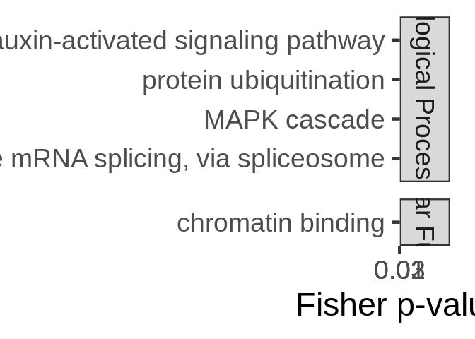
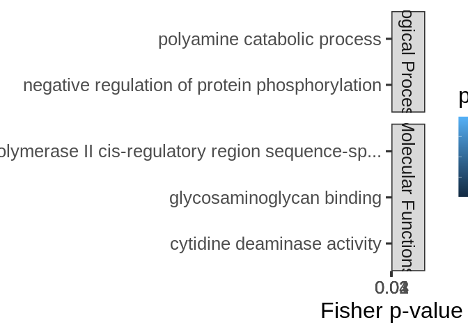
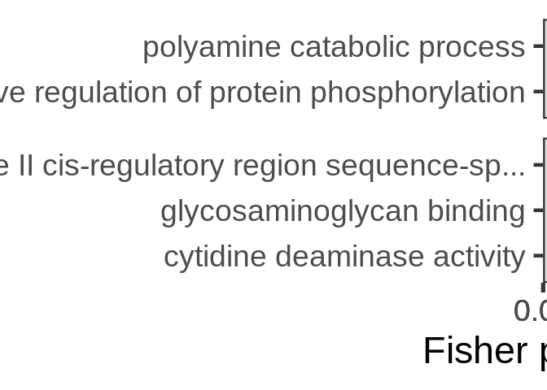

mRNA-miRNA interactions functional enrichment
================
Jill Ashey
2025-02-09

- <a href="#1-format-topgo-files" id="toc-1-format-topgo-files">1 Format
  topGO files</a>
  - <a href="#11-read-in-and-format-annotation-files"
    id="toc-11-read-in-and-format-annotation-files">1.1 Read in and format
    annotation files</a>
  - <a href="#12-set-up-gene2go-object"
    id="toc-12-set-up-gene2go-object">1.2 Set up gene2GO object</a>
  - <a href="#13-define-reference-set" id="toc-13-define-reference-set">1.3
    Define reference set</a>
  - <a href="#14-read-in-pccmiranda-data"
    id="toc-14-read-in-pccmiranda-data">1.4 Read in PCC/miranda data</a>
- <a href="#2-fe-of-all-targets-as-predicted-by-miranda"
  id="toc-2-fe-of-all-targets-as-predicted-by-miranda">2 FE of all
  targets, as predicted by miranda</a>
- <a
  href="#3-fe-of-targets-negatively-correlated-with-mirnas-regardless-of-correlation-significance"
  id="toc-3-fe-of-targets-negatively-correlated-with-mirnas-regardless-of-correlation-significance">3
  FE of targets negatively correlated with miRNAs (regardless of
  correlation significance)</a>
  - <a href="#301-biological-processes"
    id="toc-301-biological-processes">3.0.1 Biological Processes</a>
  - <a href="#302-cellular-components"
    id="toc-302-cellular-components">3.0.2 Cellular Components</a>
  - <a href="#303-molecular-functions"
    id="toc-303-molecular-functions">3.0.3 Molecular Functions</a>
  - <a href="#304-join-ontologies" id="toc-304-join-ontologies">3.0.4 Join
    ontologies</a>
- <a
  href="#4-fe-of-targets-positively-correlated-with-mirnas-regardless-of-correlation-significance"
  id="toc-4-fe-of-targets-positively-correlated-with-mirnas-regardless-of-correlation-significance">4
  FE of targets positively correlated with miRNAs (regardless of
  correlation significance)</a>
  - <a href="#401-biological-processes"
    id="toc-401-biological-processes">4.0.1 Biological Processes</a>
  - <a href="#402-cellular-components"
    id="toc-402-cellular-components">4.0.2 Cellular Components</a>
  - <a href="#403-molecular-functions"
    id="toc-403-molecular-functions">4.0.3 Molecular Functions</a>
  - <a href="#404-join-ontologies" id="toc-404-join-ontologies">4.0.4 Join
    ontologies</a>
- <a
  href="#5-fe-of-targets-significantly-negatively-correlated-with-mirnas"
  id="toc-5-fe-of-targets-significantly-negatively-correlated-with-mirnas">5
  FE of targets significantly negatively correlated with miRNAs</a>
  - <a href="#501-biological-processes"
    id="toc-501-biological-processes">5.0.1 Biological Processes</a>
  - <a href="#502-cellular-components"
    id="toc-502-cellular-components">5.0.2 Cellular Components</a>
  - <a href="#503-molecular-functions"
    id="toc-503-molecular-functions">5.0.3 Molecular Functions</a>
  - <a href="#504-join-ontologies" id="toc-504-join-ontologies">5.0.4 Join
    ontologies</a>
- <a
  href="#6-fe-of-targets-significantly-positively-correlated-with-mirnas"
  id="toc-6-fe-of-targets-significantly-positively-correlated-with-mirnas">6
  FE of targets significantly positively correlated with miRNAs</a>
  - <a href="#601-biological-processes"
    id="toc-601-biological-processes">6.0.1 Biological Processes</a>
  - <a href="#602-cellular-components"
    id="toc-602-cellular-components">6.0.2 Cellular Components</a>
  - <a href="#603-molecular-functions"
    id="toc-603-molecular-functions">6.0.3 Molecular Functions</a>
  - <a href="#604-join-ontologies" id="toc-604-join-ontologies">6.0.4 Join
    ontologies</a>

This script will use topGO to analyze functional enrichment of miRNA
targets for Apul

Code used below was created by `Jill Ashey`, modified for use with
A.pulchra datasets by `Kathleen Durkin`

# 1 Format topGO files

## 1.1 Read in and format annotation files

``` r
# Read in Apul annotations
annot_locations <- read.delim("../output/02-Apul-reference-annotation/Apulcra-genome-mRNA-IDmapping-2024_12_12.tab")
# Remove unneeded columns 
annot_locations <- annot_locations %>% dplyr::select(-X, -V13)
# Ensure there are no duplicate rows
annot_locations <- annot_locations %>% distinct()

head(annot_locations)
```

    ##                     V1     V3 Protein.names
    ## 1   ntLink_4:1155-1537 P35061   Histone H2A
    ## 2   ntLink_4:2660-3441 P84239    Histone H3
    ## 3   ntLink_4:4515-6830 P35061   Histone H2A
    ## 4   ntLink_4:7096-7859 P84239    Histone H3
    ## 5   ntLink_4:8474-9669 P35061   Histone H2A
    ## 6 ntLink_4:11162-11925 P84239    Histone H3
    ##                                     Organism Gene.Ontology..biological.process.
    ## 1          Acropora formosa (Staghorn coral)                                   
    ## 2 Urechis caupo (Innkeeper worm) (Spoonworm)                                   
    ## 3          Acropora formosa (Staghorn coral)                                   
    ## 4 Urechis caupo (Innkeeper worm) (Spoonworm)                                   
    ## 5          Acropora formosa (Staghorn coral)                                   
    ## 6 Urechis caupo (Innkeeper worm) (Spoonworm)                                   
    ##                                            Gene.Ontology.IDs
    ## 1 GO:0000786; GO:0003677; GO:0005634; GO:0030527; GO:0046982
    ## 2 GO:0000786; GO:0003677; GO:0005634; GO:0030527; GO:0046982
    ## 3 GO:0000786; GO:0003677; GO:0005634; GO:0030527; GO:0046982
    ## 4 GO:0000786; GO:0003677; GO:0005634; GO:0030527; GO:0046982
    ## 5 GO:0000786; GO:0003677; GO:0005634; GO:0030527; GO:0046982
    ## 6 GO:0000786; GO:0003677; GO:0005634; GO:0030527; GO:0046982

``` r
# Looks good!
```

This file shows each gene as it’s genomic location. We want to use gene
IDs to associate genes, so add gene IDs to this annotation table

Read in file that associates each mRNA genomic location with
corresponding gene ID

``` r
mRNA_FUNids <- read.table("../output/15-Apul-annotate-UTRs/Apul-mRNA-FUNids.txt", header=FALSE, col.names=c("location", "type", "mRNA_ID", "gene_ID", "product"), sep="\t")

# Remove unwanted text from parent column
mRNA_FUNids$gene_ID <- gsub("Parent=", "", mRNA_FUNids$gene_ID)
# Only need to keep mRNA location and gene ID
mRNA_FUNids <- mRNA_FUNids %>% dplyr::select(location, gene_ID)
```

join with annotation file

``` r
# join
annot <- left_join(annot_locations, mRNA_FUNids, by = c("V1" = "location"))

# ensure there are no duplicate rows
annot <- annot %>% distinct()
```

## 1.2 Set up gene2GO object

Want to isolate a list of GO terms per gene

``` r
gene2go <- annot %>% filter(!is.na(Gene.Ontology.IDs)) %>% dplyr::select(gene_ID, Gene.Ontology.IDs)
gene2go <- gene2go %>% dplyr::rename(GO.ID = Gene.Ontology.IDs)

gene2go_list <- setNames(
  strsplit(as.character(gene2go$GO.ID), ";"), 
  gene2go$gene_ID
)
```

Note: I think this means genes that had a Uniprot ID but no GO terms are
excluded from this analysis

## 1.3 Define reference set

Define reference set of genes. This should be all genes *found in our
samples*, NOT all genes in the A.pulchra genome. Some genes (e.g.,
reproduction pathways) may not be found/expected in our samples for
valid biological reasons.

``` r
# Read in counts matrix
Apul_counts <- read.csv("../output/07-Apul-Hisat/Apul-gene_count_matrix.csv")
# Exclude genes with all 0 counts
Apul_counts <- Apul_counts[rowSums(Apul_counts[, 2:6]) != 0, ]

# Select gene IDs of the genes present in our samples
all_genes <- Apul_counts$gene_id
length(all_genes)
```

    ## [1] 33624

So we have a reference set of 33624 genes present in our samples.

## 1.4 Read in PCC/miranda data

This is a table of all putative miRNA-mRNA binding predicted by miRanda,
plus Pearsons correlation coefficients for coexpression of each putative
binding pair.

``` r
data <- read.csv("../output/09-Apul-mRNA-miRNA-interactions/miranda_PCC_miRNA_mRNA.csv")
head(data)
```

    ##   X         miRNA       mRNA    PCC.cor   p_value adjusted_p_value score energy
    ## 1 1  Cluster_5981 FUN_028147  0.6825537 0.2041707        0.9986496   146 -22.19
    ## 2 2 Cluster_15340 FUN_013332  0.6371070 0.2476393        0.9986496   158 -23.15
    ## 3 3  Cluster_5981 FUN_041253 -0.2250869 0.7158492        0.9986496   153 -20.50
    ## 4 4  Cluster_3366 FUN_010827  0.3671005 0.5433145        0.9986496   163 -22.14
    ## 5 5  Cluster_3367 FUN_010827  0.5369304 0.3507987        0.9986496   163 -22.14
    ## 6 6 Cluster_15340 FUN_003342  0.1096213 0.8607058        0.9986496   154 -20.65
    ##   query_start_end subject_start_end total_bp_shared query_similar
    ## 1            2 21           185 209              21        66.67%
    ## 2            2 20           198 220              19        68.42%
    ## 3            2 21           699 719              19        73.68%
    ## 4            2 18           346 368              16        81.25%
    ## 5            2 18           346 368              16        81.25%
    ## 6            2 20           562 585              20        65.00%
    ##   subject_similar
    ## 1          71.43%
    ## 2          84.21%
    ## 3          73.68%
    ## 4          93.75%
    ## 5          93.75%
    ## 6          80.00%

Set function to select genes of interest (ie those that have pvalue \<
0.05)

``` r
topDiffGenes <- function(allScore) {
return(allScore < 0.05)}
```

# 2 FE of all targets, as predicted by miranda

TO DO

# 3 FE of targets negatively correlated with miRNAs (regardless of correlation significance)

Filter PCC miranda data

``` r
# Filter so that only negative correlations remain 
neg_corr_data <- data %>%
  filter(PCC.cor < 0)
```

Make list of target genes for input to topGO

``` r
# Genes of interest - ie those targeted by miRNAs
target_genes <- as.character(unique(neg_corr_data$mRNA))
```

``` r
# Apply 1 or 0 if gene is gene of interest 
GeneList <- factor(as.integer(all_genes %in% target_genes))
names(GeneList) <- all_genes
```

The following code will perform GO enrichment using the weighted
Fisher’s exact test to assess whether specific GO terms are
overrepresented in the genes targeted by miRNAs, regardless of
correlation significance.

### 3.0.1 Biological Processes

Create `topGOdata` object, which is required for topGO analysis

``` r
GO_BP <-new("topGOdata", 
            ontology="BP", 
            gene2GO=gene2go_list, 
            allGenes=GeneList, 
            annot = annFUN.gene2GO, 
            geneSel=topDiffGenes)
```

    ## 
    ## Building most specific GOs .....

    ##  ( 273 GO terms found. )

    ## 
    ## Build GO DAG topology ..........

    ##  ( 1231 GO terms and 2377 relations. )

    ## 
    ## Annotating nodes ...............

    ##  ( 1427 genes annotated to the GO terms. )

Run GO enrichment test

``` r
GO_BP_FE <- runTest(GO_BP, algorithm="weight01", statistic="fisher")
```

    ## 
    ##           -- Weight01 Algorithm -- 
    ## 
    ##       the algorithm is scoring 373 nontrivial nodes
    ##       parameters: 
    ##           test statistic: fisher

    ## 
    ##   Level 14:  1 nodes to be scored    (0 eliminated genes)

    ## 
    ##   Level 13:  5 nodes to be scored    (0 eliminated genes)

    ## 
    ##   Level 12:  5 nodes to be scored    (11 eliminated genes)

    ## 
    ##   Level 11:  7 nodes to be scored    (157 eliminated genes)

    ## 
    ##   Level 10:  16 nodes to be scored   (211 eliminated genes)

    ## 
    ##   Level 9:   27 nodes to be scored   (226 eliminated genes)

    ## 
    ##   Level 8:   34 nodes to be scored   (337 eliminated genes)

    ## 
    ##   Level 7:   47 nodes to be scored   (451 eliminated genes)

    ## 
    ##   Level 6:   65 nodes to be scored   (627 eliminated genes)

    ## 
    ##   Level 5:   72 nodes to be scored   (908 eliminated genes)

    ## 
    ##   Level 4:   50 nodes to be scored   (1025 eliminated genes)

    ## 
    ##   Level 3:   32 nodes to be scored   (1219 eliminated genes)

    ## 
    ##   Level 2:   11 nodes to be scored   (1343 eliminated genes)

    ## 
    ##   Level 1:   1 nodes to be scored    (1417 eliminated genes)

Generate results table

``` r
GO_BP_En <- GenTable(GO_BP, Fisher = GO_BP_FE, orderBy = "Fisher",  topNodes = 100, numChar = 51)
```

Only taking the top 100 GO terms

Filter by significant results

``` r
GO_BP_En$Fisher<-as.numeric(GO_BP_En$Fisher)
GO_BP_En_sig<-GO_BP_En[GO_BP_En$Fisher<0.05,]
```

Merge `GO_BP_En_sig` with GO and gene info.

``` r
# Separate GO terms 
neg_cor_gene2go <- gene2go %>%
  separate_rows(GO.ID, sep = ";")

# Ensure GO terms in both datasets are formatted similarly (trim whitespaces)
neg_cor_gene2go$GO.ID <- trimws(neg_cor_gene2go$GO.ID)
GO_BP_En_sig$GO.ID <- trimws(GO_BP_En_sig$GO.ID)

# Join the datasets based on GO term
GO_BP_En_sig_gene <- neg_cor_gene2go %>%
  left_join(GO_BP_En_sig, by = "GO.ID") %>%
  na.omit()

# Add ontology column 
GO_BP_En_sig_gene$ontology <- "Biological Processes"

# Keep only unique rows 
GO_BP_En_sig_gene <- GO_BP_En_sig_gene %>% distinct()
```

### 3.0.2 Cellular Components

### 3.0.3 Molecular Functions

Create `topGOdata` object, which is required for topGO analysis

``` r
GO_MF <-new("topGOdata", 
            ontology="MF", 
            gene2GO=gene2go_list, 
            allGenes=GeneList, 
            annot = annFUN.gene2GO, 
            geneSel=topDiffGenes)
```

    ## 
    ## Building most specific GOs .....

    ##  ( 461 GO terms found. )

    ## 
    ## Build GO DAG topology ..........

    ##  ( 910 GO terms and 1191 relations. )

    ## 
    ## Annotating nodes ...............

    ##  ( 2843 genes annotated to the GO terms. )

Run GO enrichment test

``` r
GO_MF_FE <- runTest(GO_MF, algorithm="weight01", statistic="fisher")
```

    ## 
    ##           -- Weight01 Algorithm -- 
    ## 
    ##       the algorithm is scoring 243 nontrivial nodes
    ##       parameters: 
    ##           test statistic: fisher

    ## 
    ##   Level 10:  4 nodes to be scored    (0 eliminated genes)

    ## 
    ##   Level 9:   12 nodes to be scored   (0 eliminated genes)

    ## 
    ##   Level 8:   19 nodes to be scored   (146 eliminated genes)

    ## 
    ##   Level 7:   30 nodes to be scored   (481 eliminated genes)

    ## 
    ##   Level 6:   47 nodes to be scored   (621 eliminated genes)

    ## 
    ##   Level 5:   47 nodes to be scored   (930 eliminated genes)

    ## 
    ##   Level 4:   50 nodes to be scored   (1352 eliminated genes)

    ## 
    ##   Level 3:   24 nodes to be scored   (2004 eliminated genes)

    ## 
    ##   Level 2:   9 nodes to be scored    (2371 eliminated genes)

    ## 
    ##   Level 1:   1 nodes to be scored    (2681 eliminated genes)

Generate results table

``` r
GO_MF_En <- GenTable(GO_MF, Fisher = GO_MF_FE, orderBy = "Fisher",  topNodes = 100, numChar = 51)
```

Only taking the top 100 GO terms

Filter by significant results

``` r
GO_MF_En$Fisher<-as.numeric(GO_MF_En$Fisher)
GO_MF_En_sig<-GO_MF_En[GO_MF_En$Fisher<0.05,]
```

Merge `GO_MF_En_sig` with GO and gene info.

``` r
# Separate GO terms 
neg_cor_gene2go <- gene2go %>%
  separate_rows(GO.ID, sep = ";")

# Ensure GO terms in both datasets are formatted similarly (trim whitespaces)
neg_cor_gene2go$GO.ID <- trimws(neg_cor_gene2go$GO.ID)
GO_MF_En_sig$GO.ID <- trimws(GO_MF_En_sig$GO.ID)

# Join the datasets based on GO term
GO_MF_En_sig_gene <- neg_cor_gene2go %>%
  left_join(GO_MF_En_sig, by = "GO.ID") %>%
  na.omit()

# Add ontology column 
GO_MF_En_sig_gene$ontology <- "Molecular Functions"

# Keep only unique rows 
GO_MF_En_sig_gene <- unique(GO_MF_En_sig_gene)
```

### 3.0.4 Join ontologies

Bind so there is a df that has significantly enriched GO terms for all
ontologies

``` r
GO_neg_corr_df <- rbind(GO_BP_En_sig_gene, GO_MF_En_sig_gene)
```

Merge with `GO_neg_corr_df`

``` r
test <- GO_neg_corr_df %>%
  inner_join(neg_corr_data, by = c("gene_ID" = "mRNA")) #%>%
  #mutate(direction = ifelse(PCC.cor > 0, "Positive", "Negative")) #%>%
  #filter(ontology != "Cellular Components") #%>%
  #filter(p_value < 0.1)

# Save as csv 
write.csv(test, "../output/09.1-Apul-mRNA-miRNA-interactions-functional-enrichment/topGO_neg_corr_target_enrichment.csv")
```

Plot!

``` r
plot<-ggplot(test, aes(x = Term, y = Fisher, fill = p_value)) +
  #ylim(0, 1) +
  #geom_hline(yintercept = 0.05, linetype = "solid", color = "black", linewidth = 1)+
  #geom_hline(yintercept = 0.05, color = "black", linetype = "solid", linewidth = 0.5) +  # Add line at 0.05 
  geom_point(shape = 21, size = 5) + 
  #scale_size(range = c(2, 20)) + 
  xlab('') + 
  ylab("Fisher p-value") +
  theme_bw(base_size = 24) +
  facet_grid(vars(ontology), scales = "free", space = "free_y") +
  coord_flip(); plot
```

<!-- -->

``` r
# Save plot 
ggsave("../output/09.1-Apul-mRNA-miRNA-interactions-functional-enrichment/topGO_neg_corr_target_enrichment.pdf", plot, width = 20, height = 35, dpi = 300)
ggsave("../output/09.1-Apul-mRNA-miRNA-interactions-functional-enrichment/topGO_neg_corr_target_enrichment.png", plot, width = 20, height = 35, dpi = 300)
```

Examine the top 10 most significant GO terms for BP and MF

``` r
# Function to get top 5 unique terms
get_top_10_unique <- function(data, ontology_type) {
  data %>%
    filter(ontology == ontology_type) %>%
    arrange(Fisher) %>%
    distinct(Term, .keep_all = TRUE) %>%
    slice_head(n = 10)
}

# Get top 5 unique Biological Processes
top_10_BP <- get_top_10_unique(test, "Biological Processes")

# Get top 5 unique Molecular Functions
top_10_MF <- get_top_10_unique(test, "Molecular Functions")

# Combine results
top_10_combined <- bind_rows(top_10_BP, top_10_MF)
unique(top_10_combined$Term)
```

    ## [1] "auxin-activated signaling pathway"         
    ## [2] "protein ubiquitination"                    
    ## [3] "MAPK cascade"                              
    ## [4] "alternative mRNA splicing, via spliceosome"
    ## [5] "chromatin binding"

``` r
# Plot 
top_10_combined <- top_10_combined %>%
  arrange(desc(Fisher)) %>%
  mutate(Term = factor(Term, levels = unique(Term)))

plot<-ggplot(top_10_combined, aes(x = Term, y = Fisher, fill = p_value)) +
  #ylim(0, 1) +
  #geom_hline(yintercept = 0.05, linetype = "solid", color = "black", linewidth = 1)+
  #geom_hline(yintercept = 0.05, color = "black", linetype = "solid", linewidth = 0.5) +  # Add line at 0.05 
  geom_point(size = 10, color = "black") + 
  scale_size(range = c(2, 20)) + 
  xlab('') + 
  ylab("Fisher p-value") +
  theme_bw(base_size = 35) +
  facet_grid(vars(ontology), scales = "free", space = "free_y") +
  coord_flip(); plot
```

<!-- -->

``` r
# Save plot 
ggsave("../output/09.1-Apul-mRNA-miRNA-interactions-functional-enrichment/top10GO_neg_corr_target_enrichment.pdf", plot, width = 20, height = 25, dpi = 300)
ggsave("../output/09.1-Apul-mRNA-miRNA-interactions-functional-enrichment/top10GO_neg_corr_target_enrichment.png", plot, width = 20, height = 25, dpi = 300)
```

# 4 FE of targets positively correlated with miRNAs (regardless of correlation significance)

Filter PCC miranda data

``` r
# Filter so that only positive correlations remain 
pos_corr_data <- data %>%
  filter(PCC.cor > 0)

# Make list of target genes for input to topGO
# Genes of interest - ie those targeted by miRNAs
target_genes <- as.character(unique(pos_corr_data$mRNA))

# Apply 1 or 0 if gene is gene of interest 
GeneList <- factor(as.integer(all_genes %in% target_genes))
names(GeneList) <- all_genes
```

The following code will perform GO enrichment using the weighted
Fisher’s exact test to assess whether specific GO terms are
overrepresented in the genes targeted by miRNAs with positively
correlated expression, regardless of correlation significance.

### 4.0.1 Biological Processes

Create `topGOdata` object, which is required for topGO analysis

``` r
GO_BP <-new("topGOdata", 
            ontology="BP", 
            gene2GO=gene2go_list, 
            allGenes=GeneList, 
            annot = annFUN.gene2GO, 
            geneSel=topDiffGenes)
```

    ## 
    ## Building most specific GOs .....

    ##  ( 273 GO terms found. )

    ## 
    ## Build GO DAG topology ..........

    ##  ( 1231 GO terms and 2377 relations. )

    ## 
    ## Annotating nodes ...............

    ##  ( 1427 genes annotated to the GO terms. )

Run GO enrichment test

``` r
GO_BP_FE <- runTest(GO_BP, algorithm="weight01", statistic="fisher")
```

    ## 
    ##           -- Weight01 Algorithm -- 
    ## 
    ##       the algorithm is scoring 456 nontrivial nodes
    ##       parameters: 
    ##           test statistic: fisher

    ## 
    ##   Level 13:  2 nodes to be scored    (0 eliminated genes)

    ## 
    ##   Level 12:  9 nodes to be scored    (0 eliminated genes)

    ## 
    ##   Level 11:  13 nodes to be scored   (141 eliminated genes)

    ## 
    ##   Level 10:  21 nodes to be scored   (219 eliminated genes)

    ## 
    ##   Level 9:   38 nodes to be scored   (235 eliminated genes)

    ## 
    ##   Level 8:   50 nodes to be scored   (331 eliminated genes)

    ## 
    ##   Level 7:   58 nodes to be scored   (466 eliminated genes)

    ## 
    ##   Level 6:   78 nodes to be scored   (664 eliminated genes)

    ## 
    ##   Level 5:   85 nodes to be scored   (939 eliminated genes)

    ## 
    ##   Level 4:   53 nodes to be scored   (1067 eliminated genes)

    ## 
    ##   Level 3:   37 nodes to be scored   (1276 eliminated genes)

    ## 
    ##   Level 2:   11 nodes to be scored   (1342 eliminated genes)

    ## 
    ##   Level 1:   1 nodes to be scored    (1402 eliminated genes)

Generate results table

``` r
GO_BP_En <- GenTable(GO_BP, Fisher = GO_BP_FE, orderBy = "Fisher",  topNodes = 100, numChar = 51)
```

Only taking the top 100 GO terms

Filter by significant results

``` r
GO_BP_En$Fisher<-as.numeric(GO_BP_En$Fisher)
GO_BP_En_sig<-GO_BP_En[GO_BP_En$Fisher<0.05,]
```

Merge `GO_BP_En_sig` with GO and gene info.

``` r
# Separate GO terms 
pos_cor_gene2go <- gene2go %>%
  separate_rows(GO.ID, sep = ";")

# Ensure GO terms in both datasets are formatted similarly (trim whitespaces)
pos_cor_gene2go$GO.ID <- trimws(pos_cor_gene2go$GO.ID)
GO_BP_En_sig$GO.ID <- trimws(GO_BP_En_sig$GO.ID)

# Join the datasets based on GO term
GO_BP_En_sig_gene <- pos_cor_gene2go %>%
  left_join(GO_BP_En_sig, by = "GO.ID") %>%
  na.omit()

# Add ontology column 
GO_BP_En_sig_gene$ontology <- "Biological Processes"

# Keep only unique rows 
GO_BP_En_sig_gene <- unique(GO_BP_En_sig_gene)
```

### 4.0.2 Cellular Components

### 4.0.3 Molecular Functions

Create `topGOdata` object, which is required for topGO analysis

``` r
GO_MF <-new("topGOdata", 
            ontology="MF", 
            gene2GO=gene2go_list, 
            allGenes=GeneList, 
            annot = annFUN.gene2GO, 
            geneSel=topDiffGenes)
```

    ## 
    ## Building most specific GOs .....

    ##  ( 461 GO terms found. )

    ## 
    ## Build GO DAG topology ..........

    ##  ( 910 GO terms and 1191 relations. )

    ## 
    ## Annotating nodes ...............

    ##  ( 2843 genes annotated to the GO terms. )

Run GO enrichment test

``` r
GO_MF_FE <- runTest(GO_MF, algorithm="weight01", statistic="fisher")
```

    ## 
    ##           -- Weight01 Algorithm -- 
    ## 
    ##       the algorithm is scoring 320 nontrivial nodes
    ##       parameters: 
    ##           test statistic: fisher

    ## 
    ##   Level 13:  1 nodes to be scored    (0 eliminated genes)

    ## 
    ##   Level 12:  1 nodes to be scored    (0 eliminated genes)

    ## 
    ##   Level 11:  1 nodes to be scored    (2 eliminated genes)

    ## 
    ##   Level 10:  5 nodes to be scored    (2 eliminated genes)

    ## 
    ##   Level 9:   12 nodes to be scored   (4 eliminated genes)

    ## 
    ##   Level 8:   20 nodes to be scored   (155 eliminated genes)

    ## 
    ##   Level 7:   38 nodes to be scored   (499 eliminated genes)

    ## 
    ##   Level 6:   71 nodes to be scored   (635 eliminated genes)

    ## 
    ##   Level 5:   69 nodes to be scored   (1005 eliminated genes)

    ## 
    ##   Level 4:   63 nodes to be scored   (1501 eliminated genes)

    ## 
    ##   Level 3:   27 nodes to be scored   (2192 eliminated genes)

    ## 
    ##   Level 2:   11 nodes to be scored   (2507 eliminated genes)

    ## 
    ##   Level 1:   1 nodes to be scored    (2692 eliminated genes)

Generate results table

``` r
GO_MF_En <- GenTable(GO_MF, Fisher = GO_MF_FE, orderBy = "Fisher",  topNodes = 100, numChar = 51)
```

Only taking the top 100 GO terms

Filter by significant results

``` r
GO_MF_En$Fisher<-as.numeric(GO_MF_En$Fisher)
GO_MF_En_sig<-GO_MF_En[GO_MF_En$Fisher<0.05,]
```

Merge `GO_MF_En_sig` with GO and gene info.

``` r
# Separate GO terms 
pos_cor_gene2go <- gene2go %>%
  separate_rows(GO.ID, sep = ";")

# Ensure GO terms in both datasets are formatted similarly (trim whitespaces)
pos_cor_gene2go$GO.ID <- trimws(pos_cor_gene2go$GO.ID)
GO_MF_En_sig$GO.ID <- trimws(GO_MF_En_sig$GO.ID)

# Join the datasets based on GO term
GO_MF_En_sig_gene <- pos_cor_gene2go %>%
  left_join(GO_MF_En_sig, by = "GO.ID") %>%
  na.omit()

# Add ontology column 
GO_MF_En_sig_gene$ontology <- "Molecular Functions"

# Keep only unique rows 
GO_MF_En_sig_gene <- unique(GO_MF_En_sig_gene)
```

### 4.0.4 Join ontologies

Bind so there is a df that has significantly enriched GO terms for all
ontologies

``` r
GO_pos_corr_df <- rbind(GO_BP_En_sig_gene, GO_MF_En_sig_gene)
```

Merge with `GO_pos_corr_df`

``` r
test <- GO_pos_corr_df %>%
  inner_join(pos_corr_data, by = c("gene_ID" = "mRNA")) #%>%
  #mutate(direction = ifelse(PCC.cor > 0, "Positive", "Negative")) #%>%
  #filter(ontology != "Cellular Components") #%>%
  #filter(p_value < 0.1)

# Save as csv 
write.csv(test, "../output/09.1-Apul-mRNA-miRNA-interactions-functional-enrichment/topGO_pos_corr_target_enrichment.csv")
```

Plot!

``` r
plot<-ggplot(test, aes(x = Term, y = Fisher, fill = p_value)) +
  #ylim(0, 1) +
  #geom_hline(yintercept = 0.05, linetype = "solid", color = "black", linewidth = 1)+
  #geom_hline(yintercept = 0.05, color = "black", linetype = "solid", linewidth = 0.5) +  # Add line at 0.05 
  geom_point(shape = 21, size = 5) + 
  #scale_size(range = c(2, 20)) + 
  xlab('') + 
  ylab("Fisher p-value") +
  theme_bw(base_size = 24) +
  facet_grid(vars(ontology), scales = "free", space = "free_y") +
  coord_flip(); plot
```

<!-- -->

``` r
# Save plot 
ggsave("../output/09.1-Apul-mRNA-miRNA-interactions-functional-enrichment/topGO_pos_corr_target_enrichment.pdf", plot, width = 20, height = 35, dpi = 300)
ggsave("../output/09.1-Apul-mRNA-miRNA-interactions-functional-enrichment/topGO_pos_corr_target_enrichment.png", plot, width = 20, height = 35, dpi = 300)
```

Examine the top 10 most significant GO terms for BP and MF

``` r
# Function to get top 5 unique terms
get_top_10_unique <- function(data, ontology_type) {
  data %>%
    filter(ontology == ontology_type) %>%
    arrange(Fisher) %>%
    distinct(Term, .keep_all = TRUE) %>%
    slice_head(n = 10)
}

# Get top 5 unique Biological Processes
top_10_BP <- get_top_10_unique(test, "Biological Processes")

# Get top 5 unique Molecular Functions
top_10_MF <- get_top_10_unique(test, "Molecular Functions")

# Combine results
top_10_combined <- bind_rows(top_10_BP, top_10_MF)
unique(top_10_combined$Term)
```

    ## [1] "polyamine catabolic process"                           
    ## [2] "negative regulation of protein phosphorylation"        
    ## [3] "RNA polymerase II cis-regulatory region sequence-sp..."
    ## [4] "cytidine deaminase activity"                           
    ## [5] "glycosaminoglycan binding"

``` r
# Plot 
top_10_combined <- top_10_combined %>%
  arrange(desc(Fisher)) %>%
  mutate(Term = factor(Term, levels = unique(Term)))

plot<-ggplot(top_10_combined, aes(x = Term, y = Fisher, fill = p_value)) +
  #ylim(0, 1) +
  #geom_hline(yintercept = 0.05, linetype = "solid", color = "black", linewidth = 1)+
  #geom_hline(yintercept = 0.05, color = "black", linetype = "solid", linewidth = 0.5) +  # Add line at 0.05 
  geom_point(size = 10, color = "black") + 
  scale_size(range = c(2, 20)) + 
  xlab('') + 
  ylab("Fisher p-value") +
  theme_bw(base_size = 35) +
  facet_grid(vars(ontology), scales = "free", space = "free_y") +
  coord_flip(); plot
```

<!-- -->

``` r
# Save plot 
ggsave("../output/09.1-Apul-mRNA-miRNA-interactions-functional-enrichment/top10GO_pos_corr_target_enrichment.pdf", plot, width = 20, height = 25, dpi = 300)
ggsave("../output/09.1-Apul-mRNA-miRNA-interactions-functional-enrichment/top10GO_pos_corr_target_enrichment.png", plot, width = 20, height = 25, dpi = 300)
```

# 5 FE of targets significantly negatively correlated with miRNAs

Filter PCC miranda data

``` r
# Filter so that only significant negative correlations remain 
sig_neg_corr_data <- data %>%
  filter(PCC.cor < 0) %>%
  filter(p_value < 0.05)

# Make list of target genes for input to topGO
# Genes of interest - ie those targeted by miRNAs
target_genes <- as.character(unique(sig_neg_corr_data$mRNA))

# Apply 1 or 0 if gene is gene of interest 
GeneList <- factor(as.integer(all_genes %in% target_genes))
names(GeneList) <- all_genes
```

The following code will perform GO enrichment using the weighted
Fisher’s exact test to assess whether specific GO terms are
overrepresented in the genes targeted by miRNAs with significantly
negatively correlated expression.

### 5.0.1 Biological Processes

Create `topGOdata` object, which is required for topGO analysis

``` r
GO_BP <-new("topGOdata", 
            ontology="BP", 
            gene2GO=gene2go_list, 
            allGenes=GeneList, 
            annot = annFUN.gene2GO, 
            geneSel=topDiffGenes)
```

    ## 
    ## Building most specific GOs .....

    ##  ( 273 GO terms found. )

    ## 
    ## Build GO DAG topology ..........

    ##  ( 1231 GO terms and 2377 relations. )

    ## 
    ## Annotating nodes ...............

    ##  ( 1427 genes annotated to the GO terms. )

Run GO enrichment test

``` r
GO_BP_FE <- runTest(GO_BP, algorithm="weight01", statistic="fisher")
```

    ## 
    ##           -- Weight01 Algorithm -- 
    ## 
    ##       the algorithm is scoring 40 nontrivial nodes
    ##       parameters: 
    ##           test statistic: fisher

    ## 
    ##   Level 10:  1 nodes to be scored    (0 eliminated genes)

    ## 
    ##   Level 9:   1 nodes to be scored    (0 eliminated genes)

    ## 
    ##   Level 8:   1 nodes to be scored    (30 eliminated genes)

    ## 
    ##   Level 7:   3 nodes to be scored    (37 eliminated genes)

    ## 
    ##   Level 6:   5 nodes to be scored    (37 eliminated genes)

    ## 
    ##   Level 5:   8 nodes to be scored    (181 eliminated genes)

    ## 
    ##   Level 4:   7 nodes to be scored    (253 eliminated genes)

    ## 
    ##   Level 3:   8 nodes to be scored    (369 eliminated genes)

    ## 
    ##   Level 2:   5 nodes to be scored    (708 eliminated genes)

    ## 
    ##   Level 1:   1 nodes to be scored    (806 eliminated genes)

Generate results table

``` r
GO_BP_En <- GenTable(GO_BP, Fisher = GO_BP_FE, orderBy = "Fisher",  topNodes = 100, numChar = 51)
```

Only taking the top 100 GO terms

Filter by significant results

``` r
GO_BP_En$Fisher<-as.numeric(GO_BP_En$Fisher)
GO_BP_En_sig<-GO_BP_En[GO_BP_En$Fisher<0.05,]
```

Merge `GO_BP_En_sig` with GO and gene info.

``` r
# Separate GO terms 
sig_neg_cor_gene2go <- gene2go %>%
  separate_rows(GO.ID, sep = ";")

# Ensure GO terms in both datasets are formatted similarly (trim whitespaces)
sig_neg_cor_gene2go$GO.ID <- trimws(sig_neg_cor_gene2go$GO.ID)
GO_BP_En_sig$GO.ID <- trimws(GO_BP_En_sig$GO.ID)

# Join the datasets based on GO term
GO_BP_En_sig_gene <- sig_neg_cor_gene2go %>%
  left_join(GO_BP_En_sig, by = "GO.ID") %>%
  na.omit()

# Add ontology column 
GO_BP_En_sig_gene$ontology <- "Biological Processes"

# Keep only unique rows 
GO_BP_En_sig_gene <- unique(GO_BP_En_sig_gene)
```

### 5.0.2 Cellular Components

### 5.0.3 Molecular Functions

Create `topGOdata` object, which is required for topGO analysis

``` r
GO_MF <-new("topGOdata", 
            ontology="MF", 
            gene2GO=gene2go_list, 
            allGenes=GeneList, 
            annot = annFUN.gene2GO, 
            geneSel=topDiffGenes)
```

    ## 
    ## Building most specific GOs .....

    ##  ( 461 GO terms found. )

    ## 
    ## Build GO DAG topology ..........

    ##  ( 910 GO terms and 1191 relations. )

    ## 
    ## Annotating nodes ...............

    ##  ( 2843 genes annotated to the GO terms. )

Run GO enrichment test

``` r
GO_MF_FE <- runTest(GO_MF, algorithm="weight01", statistic="fisher")
```

    ## 
    ##           -- Weight01 Algorithm -- 
    ## 
    ##       the algorithm is scoring 60 nontrivial nodes
    ##       parameters: 
    ##           test statistic: fisher

    ## 
    ##   Level 10:  1 nodes to be scored    (0 eliminated genes)

    ## 
    ##   Level 9:   3 nodes to be scored    (0 eliminated genes)

    ## 
    ##   Level 8:   4 nodes to be scored    (101 eliminated genes)

    ## 
    ##   Level 7:   6 nodes to be scored    (145 eliminated genes)

    ## 
    ##   Level 6:   10 nodes to be scored   (238 eliminated genes)

    ## 
    ##   Level 5:   10 nodes to be scored   (469 eliminated genes)

    ## 
    ##   Level 4:   13 nodes to be scored   (518 eliminated genes)

    ## 
    ##   Level 3:   8 nodes to be scored    (862 eliminated genes)

    ## 
    ##   Level 2:   4 nodes to be scored    (1296 eliminated genes)

    ## 
    ##   Level 1:   1 nodes to be scored    (2156 eliminated genes)

Generate results table

``` r
GO_MF_En <- GenTable(GO_MF, Fisher = GO_MF_FE, orderBy = "Fisher",  topNodes = 100, numChar = 51)
```

Only taking the top 100 GO terms

Filter by significant results

``` r
GO_MF_En$Fisher<-as.numeric(GO_MF_En$Fisher)
GO_MF_En_sig<-GO_MF_En[GO_MF_En$Fisher<0.05,]
```

Merge `GO_MF_En_sig` with GO and gene info.

``` r
# Separate GO terms 
sig_neg_cor_gene2go <- gene2go %>%
  separate_rows(GO.ID, sep = ";")

# Ensure GO terms in both datasets are formatted similarly (trim whitespaces)
sig_neg_cor_gene2go$GO.ID <- trimws(sig_neg_cor_gene2go$GO.ID)
GO_MF_En_sig$GO.ID <- trimws(GO_MF_En_sig$GO.ID)

# Join the datasets based on GO term
GO_MF_En_sig_gene <- sig_neg_cor_gene2go %>%
  left_join(GO_MF_En_sig, by = "GO.ID") %>%
  na.omit()

# Add ontology column 
GO_MF_En_sig_gene$ontology <- "Molecular Functions"

# Keep only unique rows 
GO_MF_En_sig_gene <- unique(GO_MF_En_sig_gene)
```

### 5.0.4 Join ontologies

Bind so there is a df that has significantly enriched GO terms for all
ontologies

``` r
GO_sig_neg_corr_df <- rbind(GO_BP_En_sig_gene, GO_MF_En_sig_gene)
```

Merge with `GO_sig_neg_corr_df`

``` r
test <- GO_sig_neg_corr_df %>%
  inner_join(sig_neg_corr_data, by = c("gene_ID" = "mRNA")) #%>%
  #mutate(direction = ifelse(PCC.cor > 0, "Positive", "Negative")) #%>%
  #filter(ontology != "Cellular Components") #%>%
  #filter(p_value < 0.1)

# Save as csv 
write.csv(test, "../output/09.1-Apul-mRNA-miRNA-interactions-functional-enrichment/topGO_sig_neg_corr_target_enrichment.csv")
```

Plot!

``` r
plot<-ggplot(test, aes(x = Term, y = Fisher, fill = p_value)) +
  #ylim(0, 1) +
  #geom_hline(yintercept = 0.05, linetype = "solid", color = "black", linewidth = 1)+
  #geom_hline(yintercept = 0.05, color = "black", linetype = "solid", linewidth = 0.5) +  # Add line at 0.05 
  geom_point(shape = 21, size = 5) + 
  #scale_size(range = c(2, 20)) + 
  xlab('') + 
  ylab("Fisher p-value") +
  theme_bw(base_size = 24) +
  facet_grid(vars(ontology), scales = "free", space = "free_y") +
  coord_flip(); plot
```

<!-- -->

``` r
# Save plot 
ggsave("../output/09.1-Apul-mRNA-miRNA-interactions-functional-enrichment/topGO_sig_neg_corr_target_enrichment.pdf", plot, width = 20, height = 35, dpi = 300)
ggsave("../output/09.1-Apul-mRNA-miRNA-interactions-functional-enrichment/topGO_sig_neg_corr_target_enrichment.png", plot, width = 20, height = 35, dpi = 300)
```

Examine the top 10 most significant GO terms for BP and MF

``` r
# Function to get top 5 unique terms
get_top_10_unique <- function(data, ontology_type) {
  data %>%
    filter(ontology == ontology_type) %>%
    arrange(Fisher) %>%
    distinct(Term, .keep_all = TRUE) %>%
    slice_head(n = 10)
}

# Get top 5 unique Biological Processes
top_10_BP <- get_top_10_unique(test, "Biological Processes")

# Get top 5 unique Molecular Functions
top_10_MF <- get_top_10_unique(test, "Molecular Functions")

# Combine results
top_10_combined <- bind_rows(top_10_BP, top_10_MF)
unique(top_10_combined$Term)
```

    ## [1] "polysaccharide catabolic process"     
    ## [2] "G1/S transition of mitotic cell cycle"
    ## [3] "creatinase activity"                  
    ## [4] "cytidine deaminase activity"          
    ## [5] "GTPase activity"                      
    ## [6] "galanin receptor activity"

``` r
# Plot 
top_10_combined <- top_10_combined %>%
  arrange(desc(Fisher)) %>%
  mutate(Term = factor(Term, levels = unique(Term)))

plot<-ggplot(top_10_combined, aes(x = Term, y = Fisher, fill = p_value)) +
  #ylim(0, 1) +
  #geom_hline(yintercept = 0.05, linetype = "solid", color = "black", linewidth = 1)+
  #geom_hline(yintercept = 0.05, color = "black", linetype = "solid", linewidth = 0.5) +  # Add line at 0.05 
  geom_point(size = 10, color = "black") + 
  scale_size(range = c(2, 20)) + 
  xlab('') + 
  ylab("Fisher p-value") +
  theme_bw(base_size = 35) +
  facet_grid(vars(ontology), scales = "free", space = "free_y") +
  coord_flip(); plot
```

<!-- -->

``` r
# Save plot 
ggsave("../output/09.1-Apul-mRNA-miRNA-interactions-functional-enrichment/top10GO_sig_neg_corr_target_enrichment.pdf", plot, width = 20, height = 25, dpi = 300)
ggsave("../output/09.1-Apul-mRNA-miRNA-interactions-functional-enrichment/top10GO_sig_neg_corr_target_enrichment.png", plot, width = 20, height = 25, dpi = 300)
```

# 6 FE of targets significantly positively correlated with miRNAs

Filter PCC miranda data

``` r
# Filter so that only significant negative correlations remain 
sig_pos_corr_data <- data %>%
  filter(PCC.cor > 0) %>%
  filter(p_value < 0.05)

# Make list of target genes for input to topGO
# Genes of interest - ie those targeted by miRNAs
target_genes <- as.character(unique(sig_neg_corr_data$mRNA))

# Apply 1 or 0 if gene is gene of interest 
GeneList <- factor(as.integer(all_genes %in% target_genes))
names(GeneList) <- all_genes
```

The following code will perform GO enrichment using the weighted
Fisher’s exact test to assess whether specific GO terms are
overrepresented in the genes targeted by miRNAs with significantly
positively correlated expression.

### 6.0.1 Biological Processes

Create `topGOdata` object, which is required for topGO analysis

``` r
GO_BP <-new("topGOdata", 
            ontology="BP", 
            gene2GO=gene2go_list, 
            allGenes=GeneList, 
            annot = annFUN.gene2GO, 
            geneSel=topDiffGenes)
```

    ## 
    ## Building most specific GOs .....

    ##  ( 273 GO terms found. )

    ## 
    ## Build GO DAG topology ..........

    ##  ( 1231 GO terms and 2377 relations. )

    ## 
    ## Annotating nodes ...............

    ##  ( 1427 genes annotated to the GO terms. )

Run GO enrichment test

``` r
GO_BP_FE <- runTest(GO_BP, algorithm="weight01", statistic="fisher")
```

    ## 
    ##           -- Weight01 Algorithm -- 
    ## 
    ##       the algorithm is scoring 40 nontrivial nodes
    ##       parameters: 
    ##           test statistic: fisher

    ## 
    ##   Level 10:  1 nodes to be scored    (0 eliminated genes)

    ## 
    ##   Level 9:   1 nodes to be scored    (0 eliminated genes)

    ## 
    ##   Level 8:   1 nodes to be scored    (30 eliminated genes)

    ## 
    ##   Level 7:   3 nodes to be scored    (37 eliminated genes)

    ## 
    ##   Level 6:   5 nodes to be scored    (37 eliminated genes)

    ## 
    ##   Level 5:   8 nodes to be scored    (181 eliminated genes)

    ## 
    ##   Level 4:   7 nodes to be scored    (253 eliminated genes)

    ## 
    ##   Level 3:   8 nodes to be scored    (369 eliminated genes)

    ## 
    ##   Level 2:   5 nodes to be scored    (708 eliminated genes)

    ## 
    ##   Level 1:   1 nodes to be scored    (806 eliminated genes)

Generate results table

``` r
GO_BP_En <- GenTable(GO_BP, Fisher = GO_BP_FE, orderBy = "Fisher",  topNodes = 100, numChar = 51)
```

Only taking the top 100 GO terms

Filter by significant results

``` r
GO_BP_En$Fisher<-as.numeric(GO_BP_En$Fisher)
GO_BP_En_sig<-GO_BP_En[GO_BP_En$Fisher<0.05,]
```

Merge `GO_BP_En_sig` with GO and gene info.

``` r
# Separate GO terms 
sig_pos_cor_gene2go <- gene2go %>%
  separate_rows(GO.ID, sep = ";")

# Ensure GO terms in both datasets are formatted similarly (trim whitespaces)
sig_pos_cor_gene2go$GO.ID <- trimws(sig_pos_cor_gene2go$GO.ID)
GO_BP_En_sig$GO.ID <- trimws(GO_BP_En_sig$GO.ID)

# Join the datasets based on GO term
GO_BP_En_sig_gene <- sig_pos_cor_gene2go %>%
  left_join(GO_BP_En_sig, by = "GO.ID") %>%
  na.omit()

# Add ontology column 
GO_BP_En_sig_gene$ontology <- "Biological Processes"

# Keep only unique rows 
GO_BP_En_sig_gene <- unique(GO_BP_En_sig_gene)
```

### 6.0.2 Cellular Components

### 6.0.3 Molecular Functions

Create `topGOdata` object, which is required for topGO analysis

``` r
GO_MF <-new("topGOdata", 
            ontology="MF", 
            gene2GO=gene2go_list, 
            allGenes=GeneList, 
            annot = annFUN.gene2GO, 
            geneSel=topDiffGenes)
```

    ## 
    ## Building most specific GOs .....

    ##  ( 461 GO terms found. )

    ## 
    ## Build GO DAG topology ..........

    ##  ( 910 GO terms and 1191 relations. )

    ## 
    ## Annotating nodes ...............

    ##  ( 2843 genes annotated to the GO terms. )

Run GO enrichment test

``` r
GO_MF_FE <- runTest(GO_MF, algorithm="weight01", statistic="fisher")
```

    ## 
    ##           -- Weight01 Algorithm -- 
    ## 
    ##       the algorithm is scoring 60 nontrivial nodes
    ##       parameters: 
    ##           test statistic: fisher

    ## 
    ##   Level 10:  1 nodes to be scored    (0 eliminated genes)

    ## 
    ##   Level 9:   3 nodes to be scored    (0 eliminated genes)

    ## 
    ##   Level 8:   4 nodes to be scored    (101 eliminated genes)

    ## 
    ##   Level 7:   6 nodes to be scored    (145 eliminated genes)

    ## 
    ##   Level 6:   10 nodes to be scored   (238 eliminated genes)

    ## 
    ##   Level 5:   10 nodes to be scored   (469 eliminated genes)

    ## 
    ##   Level 4:   13 nodes to be scored   (518 eliminated genes)

    ## 
    ##   Level 3:   8 nodes to be scored    (862 eliminated genes)

    ## 
    ##   Level 2:   4 nodes to be scored    (1296 eliminated genes)

    ## 
    ##   Level 1:   1 nodes to be scored    (2156 eliminated genes)

Generate results table

``` r
GO_MF_En <- GenTable(GO_MF, Fisher = GO_MF_FE, orderBy = "Fisher",  topNodes = 100, numChar = 51)
```

Only taking the top 100 GO terms

Filter by significant results

``` r
GO_MF_En$Fisher<-as.numeric(GO_MF_En$Fisher)
GO_MF_En_sig<-GO_MF_En[GO_MF_En$Fisher<0.05,]
```

Merge `GO_MF_En_sig` with GO and gene info.

``` r
# Separate GO terms 
sig_pos_cor_gene2go <- gene2go %>%
  separate_rows(GO.ID, sep = ";")

# Ensure GO terms in both datasets are formatted similarly (trim whitespaces)
sig_pos_cor_gene2go$GO.ID <- trimws(sig_pos_cor_gene2go$GO.ID)
GO_MF_En_sig$GO.ID <- trimws(GO_MF_En_sig$GO.ID)

# Join the datasets based on GO term
GO_MF_En_sig_gene <- sig_pos_cor_gene2go %>%
  left_join(GO_MF_En_sig, by = "GO.ID") %>%
  na.omit()

# Add ontology column 
GO_MF_En_sig_gene$ontology <- "Molecular Functions"

# Keep only unique rows 
GO_MF_En_sig_gene <- unique(GO_MF_En_sig_gene)
```

### 6.0.4 Join ontologies

Bind so there is a df that has significantly enriched GO terms for all
ontologies

``` r
GO_sig_pos_corr_df <- rbind(GO_BP_En_sig_gene, GO_MF_En_sig_gene)
```

Merge with `GO_pos_corr_df`

``` r
test <- GO_sig_pos_corr_df %>%
  inner_join(sig_pos_corr_data, by = c("gene_ID" = "mRNA")) #%>%
  #mutate(direction = ifelse(PCC.cor > 0, "Positive", "Negative")) #%>%
  #filter(ontology != "Cellular Components") #%>%
  #filter(p_value < 0.1)

# Save as csv 
write.csv(test, "../output/09.1-Apul-mRNA-miRNA-interactions-functional-enrichment/topGO_sig_pos_corr_target_enrichment.csv")
```

Plot!

``` r
plot<-ggplot(test, aes(x = Term, y = Fisher, fill = p_value)) +
  #ylim(0, 1) +
  #geom_hline(yintercept = 0.05, linetype = "solid", color = "black", linewidth = 1)+
  #geom_hline(yintercept = 0.05, color = "black", linetype = "solid", linewidth = 0.5) +  # Add line at 0.05 
  geom_point(shape = 21, size = 5) + 
  #scale_size(range = c(2, 20)) + 
  xlab('') + 
  ylab("Fisher p-value") +
  theme_bw(base_size = 24) +
  facet_grid(vars(ontology), scales = "free", space = "free_y") +
  coord_flip(); plot
```

<!-- -->

``` r
# Save plot 
ggsave("../output/09.1-Apul-mRNA-miRNA-interactions-functional-enrichment/topGO_sig_pos_corr_target_enrichment.pdf", plot, width = 20, height = 35, dpi = 300)
ggsave("../output/09.1-Apul-mRNA-miRNA-interactions-functional-enrichment/topGO_sig_pos_corr_target_enrichment.png", plot, width = 20, height = 35, dpi = 300)
```

Examine the top 10 most significant GO terms for BP and MF

``` r
# Function to get top 5 unique terms
get_top_10_unique <- function(data, ontology_type) {
  data %>%
    filter(ontology == ontology_type) %>%
    arrange(Fisher) %>%
    distinct(Term, .keep_all = TRUE) %>%
    slice_head(n = 10)
}

# Get top 5 unique Biological Processes
top_10_BP <- get_top_10_unique(test, "Biological Processes")

# Get top 5 unique Molecular Functions
top_10_MF <- get_top_10_unique(test, "Molecular Functions")

# Combine results
top_10_combined <- bind_rows(top_10_BP, top_10_MF)
unique(top_10_combined$Term)
```

    ## [1] "GTPase activity"

``` r
# Plot 
top_10_combined <- top_10_combined %>%
  arrange(desc(Fisher)) %>%
  mutate(Term = factor(Term, levels = unique(Term)))

plot<-ggplot(top_10_combined, aes(x = Term, y = Fisher, fill = p_value)) +
  #ylim(0, 1) +
  #geom_hline(yintercept = 0.05, linetype = "solid", color = "black", linewidth = 1)+
  #geom_hline(yintercept = 0.05, color = "black", linetype = "solid", linewidth = 0.5) +  # Add line at 0.05 
  geom_point(size = 10, color = "black") + 
  scale_size(range = c(2, 20)) + 
  xlab('') + 
  ylab("Fisher p-value") +
  theme_bw(base_size = 35) +
  facet_grid(vars(ontology), scales = "free", space = "free_y") +
  coord_flip(); plot
```

<!-- -->

``` r
# Save plot 
ggsave("../output/09.1-Apul-mRNA-miRNA-interactions-functional-enrichment/top10GO_sig_pos_corr_target_enrichment.pdf", last_plot(), width = 20, height = 25, dpi = 300)
ggsave("../output/09.1-Apul-mRNA-miRNA-interactions-functional-enrichment/top10GO_sig_pos_corr_target_enrichment.png", last_plot(), width = 20, height = 25, dpi = 300)
```
