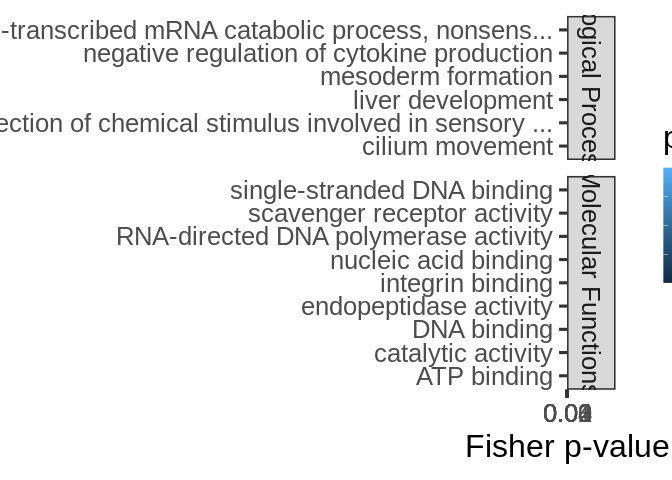
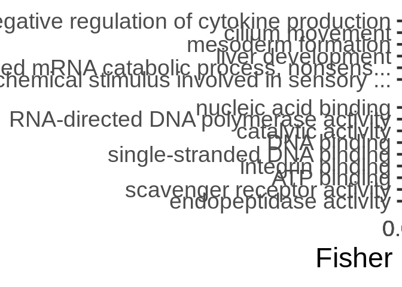
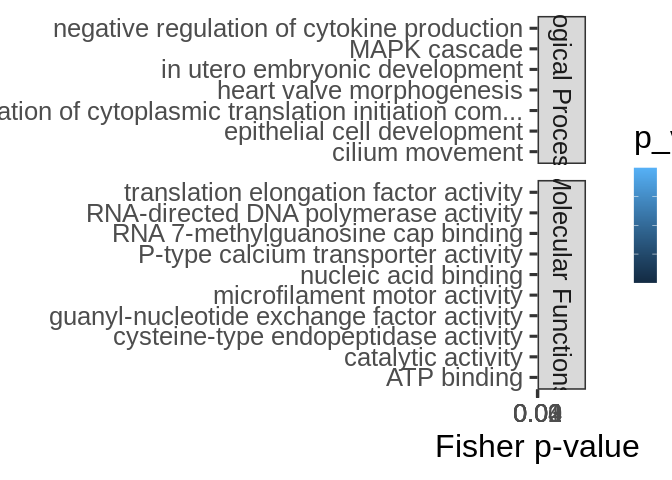
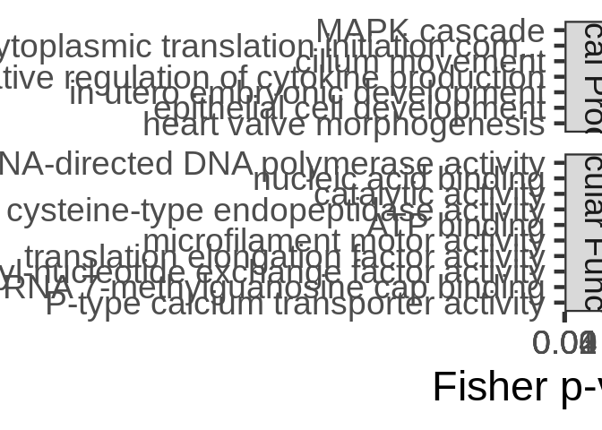
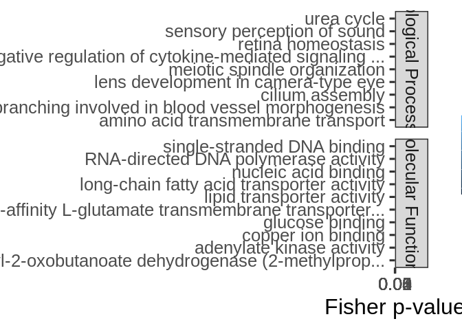
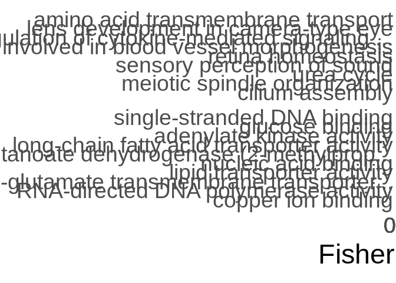
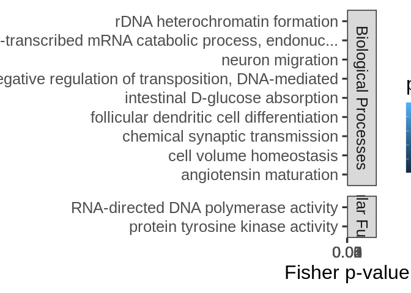
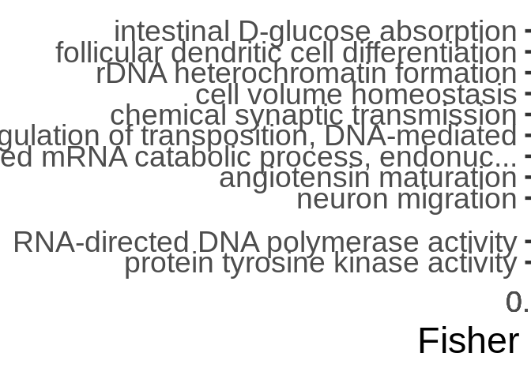

mRNA-miRNA interactions functional enrichment
================
Kathleen Durkin
2025-07-09

- <a href="#1-format-topgo-files" id="toc-1-format-topgo-files">1 Format
  topGO files</a>
  - <a href="#11-read-in-and-format-annotation-files"
    id="toc-11-read-in-and-format-annotation-files">1.1 Read in and format
    annotation files</a>
  - <a href="#12-set-up-gene2go-object"
    id="toc-12-set-up-gene2go-object">1.2 Set up gene2GO object</a>
  - <a href="#13-define-reference-set" id="toc-13-define-reference-set">1.3
    Define reference set</a>
- <a href="#2-cds" id="toc-2-cds">2 CDS</a>
  - <a href="#21-read-in-pccmiranda-data"
    id="toc-21-read-in-pccmiranda-data">2.1 Read in PCC/miranda data</a>
- <a href="#3-fa-of-all-mirna-targets"
  id="toc-3-fa-of-all-mirna-targets">3 FA of all miRNA targets</a>
- <a href="#4-fe-of-specific-mirnas-targets-all-targets"
  id="toc-4-fe-of-specific-mirnas-targets-all-targets">4 FE of specific
  miRNA’s targets (all targets)</a>
- <a href="#5-fe-of-specific-mirnas-targets-significant-cor-targets"
  id="toc-5-fe-of-specific-mirnas-targets-significant-cor-targets">5 FE of
  specific miRNA’s targets (significant cor targets)</a>
- <a
  href="#6-fe-of-all-targets-negatively-correlated-with-mirnas-regardless-of-correlation-significance"
  id="toc-6-fe-of-all-targets-negatively-correlated-with-mirnas-regardless-of-correlation-significance">6
  FE of all targets negatively correlated with miRNAs (regardless of
  correlation significance)</a>
  - <a href="#601-biological-processes"
    id="toc-601-biological-processes">6.0.1 Biological Processes</a>
  - <a href="#602-cellular-components"
    id="toc-602-cellular-components">6.0.2 Cellular Components</a>
  - <a href="#603-molecular-functions"
    id="toc-603-molecular-functions">6.0.3 Molecular Functions</a>
  - <a href="#604-join-ontologies" id="toc-604-join-ontologies">6.0.4 Join
    ontologies</a>
- <a
  href="#7-fe-of-all-targets-positively-correlated-with-mirnas-regardless-of-correlation-significance"
  id="toc-7-fe-of-all-targets-positively-correlated-with-mirnas-regardless-of-correlation-significance">7
  FE of all targets positively correlated with miRNAs (regardless of
  correlation significance)</a>
  - <a href="#701-biological-processes"
    id="toc-701-biological-processes">7.0.1 Biological Processes</a>
  - <a href="#702-cellular-components"
    id="toc-702-cellular-components">7.0.2 Cellular Components</a>
  - <a href="#703-molecular-functions"
    id="toc-703-molecular-functions">7.0.3 Molecular Functions</a>
  - <a href="#704-join-ontologies" id="toc-704-join-ontologies">7.0.4 Join
    ontologies</a>
- <a
  href="#8-fe-of-all-targets-significantly-negatively-correlated-with-mirnas"
  id="toc-8-fe-of-all-targets-significantly-negatively-correlated-with-mirnas">8
  FE of all targets significantly negatively correlated with miRNAs</a>
  - <a href="#801-biological-processes"
    id="toc-801-biological-processes">8.0.1 Biological Processes</a>
  - <a href="#802-cellular-components"
    id="toc-802-cellular-components">8.0.2 Cellular Components</a>
  - <a href="#803-molecular-functions"
    id="toc-803-molecular-functions">8.0.3 Molecular Functions</a>
  - <a href="#804-join-ontologies" id="toc-804-join-ontologies">8.0.4 Join
    ontologies</a>
- <a
  href="#9-fe-of-all-targets-significantly-positively-correlated-with-mirnas"
  id="toc-9-fe-of-all-targets-significantly-positively-correlated-with-mirnas">9
  FE of all targets significantly positively correlated with miRNAs</a>
  - <a href="#901-biological-processes"
    id="toc-901-biological-processes">9.0.1 Biological Processes</a>
  - <a href="#902-cellular-components"
    id="toc-902-cellular-components">9.0.2 Cellular Components</a>
  - <a href="#903-molecular-functions"
    id="toc-903-molecular-functions">9.0.3 Molecular Functions</a>
  - <a href="#904-join-ontologies" id="toc-904-join-ontologies">9.0.4 Join
    ontologies</a>

This script will use topGO to analyze functional enrichment of miRNA
targets for Apul in the 5UTR and CDS regions

Code used below was created by `Jill Ashey`, modified for use with
A.pulchra datasets by `Kathleen Durkin`

# 1 Format topGO files

## 1.1 Read in and format annotation files

``` r
# Read in Apul annotations
annot_locations <- read.delim("../output/02-Apul-reference-annotation/Apulcra-genome-mRNA-IDmapping-2024_12_12.tab")
# Remove unneeded columns 
annot_locations <- annot_locations %>% dplyr::select(-X, -V13)
# Ensure there are no duplicate rows
annot_locations <- annot_locations %>% distinct()

head(annot_locations)
```

    ##                     V1     V3 Protein.names
    ## 1   ntLink_4:1155-1537 P35061   Histone H2A
    ## 2   ntLink_4:2660-3441 P84239    Histone H3
    ## 3   ntLink_4:4515-6830 P35061   Histone H2A
    ## 4   ntLink_4:7096-7859 P84239    Histone H3
    ## 5   ntLink_4:8474-9669 P35061   Histone H2A
    ## 6 ntLink_4:11162-11925 P84239    Histone H3
    ##                                     Organism Gene.Ontology..biological.process.
    ## 1          Acropora formosa (Staghorn coral)                                   
    ## 2 Urechis caupo (Innkeeper worm) (Spoonworm)                                   
    ## 3          Acropora formosa (Staghorn coral)                                   
    ## 4 Urechis caupo (Innkeeper worm) (Spoonworm)                                   
    ## 5          Acropora formosa (Staghorn coral)                                   
    ## 6 Urechis caupo (Innkeeper worm) (Spoonworm)                                   
    ##                                            Gene.Ontology.IDs
    ## 1 GO:0000786; GO:0003677; GO:0005634; GO:0030527; GO:0046982
    ## 2 GO:0000786; GO:0003677; GO:0005634; GO:0030527; GO:0046982
    ## 3 GO:0000786; GO:0003677; GO:0005634; GO:0030527; GO:0046982
    ## 4 GO:0000786; GO:0003677; GO:0005634; GO:0030527; GO:0046982
    ## 5 GO:0000786; GO:0003677; GO:0005634; GO:0030527; GO:0046982
    ## 6 GO:0000786; GO:0003677; GO:0005634; GO:0030527; GO:0046982

``` r
# Looks good!
```

This file shows each gene as it’s genomic location. We want to use gene
IDs to associate genes, so add gene IDs to this annotation table

Read in file that associates each mRNA genomic location with
corresponding gene ID

``` r
mRNA_FUNids <- read.table("../output/15-Apul-annotate-UTRs/Apul-mRNA-FUNids.txt", header=FALSE, col.names=c("location", "type", "mRNA_ID", "gene_ID", "product"), sep="\t")

# Remove unwanted text from parent column
mRNA_FUNids$gene_ID <- gsub("Parent=", "", mRNA_FUNids$gene_ID)
# Only need to keep mRNA location and gene ID
mRNA_FUNids <- mRNA_FUNids %>% dplyr::select(location, gene_ID)
```

join with annotation file

``` r
# join
annot <- left_join(annot_locations, mRNA_FUNids, by = c("V1" = "location"))

# ensure there are no duplicate rows
annot <- annot %>% distinct()
```

## 1.2 Set up gene2GO object

Want to isolate a list of GO terms per gene

``` r
gene2go <- annot %>% filter(!is.na(Gene.Ontology.IDs)) %>% dplyr::select(gene_ID, Gene.Ontology.IDs)
gene2go <- gene2go %>% dplyr::rename(GO.ID = Gene.Ontology.IDs)

gene2go_list <- setNames(
  strsplit(as.character(gene2go$GO.ID), ";"), 
  gene2go$gene_ID
)
```

Note: I think this means genes that had a Uniprot ID but no GO terms are
excluded from this analysis

## 1.3 Define reference set

Define reference set of genes. This should be all genes *found in our
samples*, NOT all genes in the A.pulchra genome. Some genes (e.g.,
reproduction pathways) may not be found/expected in our samples for
valid biological reasons.

``` r
# Read in counts matrix
Apul_counts <- read.csv("../output/07-Apul-Hisat/Apul-gene_count_matrix.csv")
# Exclude genes with all 0 counts
Apul_counts <- Apul_counts[rowSums(Apul_counts[, 2:6]) != 0, ]

# Select gene IDs of the genes present in our samples
all_genes <- Apul_counts$gene_id
length(all_genes)
```

    ## [1] 33624

So we have a reference set of 33624 genes present in our samples.

# 2 CDS

## 2.1 Read in PCC/miranda data

This is a table of all putative miRNA-mRNA binding predicted by miRanda,
plus Pearsons correlation coefficients for coexpression of each putative
binding pair.

``` r
data <- read.csv("../output/09.01-Apul-mRNA-miRNA-interactions-CDS_5UTR/miRanda_PCC_miRNA_CDS.csv")
data <- dplyr::rename(data,
               miRNA = V1,
               mRNA = V4.y)
head(data)
```

    ##   X         miRNA                         V2  V3   V4.x V5 V6    V7    V8 V9
    ## 1 1 Cluster_10051 ntLink_6:10104556-10114024 155 -21.12  2 21  8084  8107 21
    ## 2 2 Cluster_10051 ntLink_6:10392093-10402892 157 -20.28  2 21  4608  4632 22
    ## 3 3 Cluster_10051   ntLink_6:1048768-1051507 165 -20.93  2 19  2096  2118 18
    ## 4 4 Cluster_10051 ntLink_6:11414771-11436218 163 -20.28  2 21  3703  3727 22
    ## 5 5 Cluster_10051 ntLink_6:12141578-12169241 166 -22.52  2 21 16841 16861 19
    ## 6 6 Cluster_10051   ntLink_6:1272939-1276267 160 -20.61  2 21    51    72 19
    ##      V10    V11       mRNA    PCC.cor    p_value adjusted_p_value
    ## 1 66.67% 76.19% FUN_001235  0.8610260 0.06087898        0.9659894
    ## 2 77.27% 77.27% FUN_001258  0.6042831 0.28040301        0.9986496
    ## 3 77.78% 88.89% FUN_000284 -0.1116523 0.85813577        0.9986496
    ## 4 72.73% 77.27% FUN_001354  0.1305391 0.83426570        0.9986496
    ## 5 78.95% 84.21% FUN_001418  0.3307899 0.58663745        0.9986496
    ## 6 63.16% 84.21% FUN_000303 -0.1007245 0.87197073        0.9986496

Set function to select genes of interest (ie those that have pvalue \<
0.05)

``` r
topDiffGenes <- function(allScore) {
return(allScore < 0.05)}
```

# 3 FA of all miRNA targets

Functional annotation of all putative miRNA targets

``` r
cor_bind_FA <- left_join(data, annot, by = c("mRNA" = "gene_ID")) %>% distinct()

nrow(cor_bind_FA)
```

    ## [1] 38152

``` r
nrow(cor_bind_FA[!is.na(cor_bind_FA$Gene.Ontology.IDs),])
```

    ## [1] 12181

Of the 38152 putative miRNA targets (CDS region) predicted by miRanda,
12181 have available annotations

``` r
sig_cor_bind_FA <- cor_bind_FA[cor_bind_FA$p_value < 0.05,]

# Remove rows where all values are NA
sig_cor_bind_FA <- sig_cor_bind_FA[!apply(is.na(sig_cor_bind_FA), 1, all), ]


nrow(sig_cor_bind_FA)
```

    ## [1] 1739

``` r
nrow(sig_cor_bind_FA[!is.na(sig_cor_bind_FA$Gene.Ontology.IDs),])
```

    ## [1] 540

Of the 1739 putative CDS miRNA targets predicted by miRanda that are
also have significantly correlated expression, only 540 have available
annotations.

Save

``` r
write.csv(cor_bind_FA, "../output/09.11-Apul-mRNA-miRNA-interactions-FE-CDS/miRNA_CDS_targets_FA.csv")
write.csv(sig_cor_bind_FA, "../output/09.11-Apul-mRNA-miRNA-interactions-FE-CDS/miRNA_CDS_sig_cor_targets_FA.csv")
```

# 4 FE of specific miRNA’s targets (all targets)

Create topGO function for use with miRNA names

``` r
miRNA_topGO_FE <- function(miRNA.name, input_interactions) {
  
  #Isolate genes in our input module of interest
  interacting_genes <- input_interactions %>%
    filter(miRNA == miRNA.name) %>%
    pull(mRNA)
  
  if (length(interacting_genes) > 0) {
    # Create factor for all reference genes, where 1 represents module membership and 0 means the gene is not in module of interest
    gene_list <- factor(as.integer(all_genes %in% interacting_genes))
    names(gene_list) <- all_genes
    str(gene_list)
    
    ## Biological Process ##
    # Create topGO object
    GO_BP <- new("topGOdata", 
                ontology = "BP", # Biological Process
                allGenes = gene_list,
                annot = annFUN.gene2GO, 
                gene2GO = gene2go_list,
                geneSel=topDiffGenes)
    
    # Run GO enrichment test
    GO_BP_FE <- runTest(GO_BP, algorithm = "weight01", statistic = "fisher")
    # View the results
    GO_BP_results <- GenTable(GO_BP, Fisher = GO_BP_FE, orderBy = "Fisher",  topNodes = 100, numChar = 51)
    # Filter by significant results
    GO_BP_results$Fisher<-as.numeric(GO_BP_results$Fisher)
    GO_BP_results_sig<-GO_BP_results[GO_BP_results$Fisher<0.05,]
    
    
    ## Molecular Function ##
    # Create topGO object
    GO_MF <- new("topGOdata", 
                ontology = "MF", # Molecular Function
                allGenes = gene_list,
                annot = annFUN.gene2GO, 
                gene2GO = gene2go_list,
                geneSel=topDiffGenes)
    
    # Run GO enrichment test
    GO_MF_FE <- runTest(GO_MF, algorithm = "weight01", statistic = "fisher")
    # View the results
    GO_MF_results <- GenTable(GO_MF, Fisher = GO_MF_FE, orderBy = "Fisher",  topNodes = 100, numChar = 51)
    # Filter by significant results
    GO_MF_results$Fisher<-as.numeric(GO_MF_results$Fisher)
    GO_MF_results_sig<-GO_MF_results[GO_MF_results$Fisher<0.05,]
  
    # Return
    # Add type column only if results exist
    if (nrow(GO_BP_results_sig) > 0) {
      GO_BP_results_sig$type <- "Biological.Process"
    }
    if (nrow(GO_MF_results_sig) > 0) {
      GO_MF_results_sig$type <- "Molecular.Function"
    }
    GO_results <- rbind(GO_BP_results_sig, GO_MF_results_sig)
    print(GO_results)
  }
}

miRNA_topGO_FE("Cluster_10051", cor_bind_FA)
```

    ##  Factor w/ 2 levels "0","1": 1 1 1 1 1 1 1 1 1 1 ...
    ##  - attr(*, "names")= chr [1:33624] "FUN_035039" "FUN_035038" "FUN_035031" "FUN_035030" ...

    ## 
    ## Building most specific GOs .....

    ##  ( 273 GO terms found. )

    ## 
    ## Build GO DAG topology ..........

    ##  ( 1231 GO terms and 2377 relations. )

    ## 
    ## Annotating nodes ...............

    ##  ( 1427 genes annotated to the GO terms. )

    ## 
    ##           -- Weight01 Algorithm -- 
    ## 
    ##       the algorithm is scoring 262 nontrivial nodes
    ##       parameters: 
    ##           test statistic: fisher

    ## 
    ##   Level 14:  1 nodes to be scored    (0 eliminated genes)

    ## 
    ##   Level 13:  4 nodes to be scored    (0 eliminated genes)

    ## 
    ##   Level 12:  5 nodes to be scored    (11 eliminated genes)

    ## 
    ##   Level 11:  10 nodes to be scored   (156 eliminated genes)

    ## 
    ##   Level 10:  13 nodes to be scored   (211 eliminated genes)

    ## 
    ##   Level 9:   15 nodes to be scored   (241 eliminated genes)

    ## 
    ##   Level 8:   16 nodes to be scored   (279 eliminated genes)

    ## 
    ##   Level 7:   25 nodes to be scored   (327 eliminated genes)

    ## 
    ##   Level 6:   42 nodes to be scored   (407 eliminated genes)

    ## 
    ##   Level 5:   53 nodes to be scored   (698 eliminated genes)

    ## 
    ##   Level 4:   40 nodes to be scored   (848 eliminated genes)

    ## 
    ##   Level 3:   27 nodes to be scored   (1152 eliminated genes)

    ## 
    ##   Level 2:   10 nodes to be scored   (1321 eliminated genes)

    ## 
    ##   Level 1:   1 nodes to be scored    (1417 eliminated genes)

    ## 
    ## Building most specific GOs .....

    ##  ( 461 GO terms found. )

    ## 
    ## Build GO DAG topology ..........

    ##  ( 910 GO terms and 1191 relations. )

    ## 
    ## Annotating nodes ...............

    ##  ( 2843 genes annotated to the GO terms. )

    ## 
    ##           -- Weight01 Algorithm -- 
    ## 
    ##       the algorithm is scoring 189 nontrivial nodes
    ##       parameters: 
    ##           test statistic: fisher

    ## 
    ##   Level 10:  1 nodes to be scored    (0 eliminated genes)

    ## 
    ##   Level 9:   7 nodes to be scored    (0 eliminated genes)

    ## 
    ##   Level 8:   13 nodes to be scored   (101 eliminated genes)

    ## 
    ##   Level 7:   24 nodes to be scored   (404 eliminated genes)

    ## 
    ##   Level 6:   36 nodes to be scored   (526 eliminated genes)

    ## 
    ##   Level 5:   41 nodes to be scored   (863 eliminated genes)

    ## 
    ##   Level 4:   37 nodes to be scored   (1217 eliminated genes)

    ## 
    ##   Level 3:   21 nodes to be scored   (2039 eliminated genes)

    ## 
    ##   Level 2:   8 nodes to be scored    (2309 eliminated genes)

    ## 
    ##   Level 1:   1 nodes to be scored    (2623 eliminated genes)

    ##         GO.ID                                                   Term Annotated
    ## 1  GO:0006091         generation of precursor metabolites and energy        12
    ## 2  GO:0000971 tRNA exon ligation utilizing 2',3' cyclic phosphate...         1
    ## 3  GO:0001504                                neurotransmitter uptake         1
    ## 4  GO:0006623                           protein targeting to vacuole         1
    ## 5  GO:0003676                                   nucleic acid binding       510
    ## 6  GO:0008061                                         chitin binding         6
    ## 7  GO:0003964                   RNA-directed DNA polymerase activity       135
    ## 8  GO:0000104                       succinate dehydrogenase activity         1
    ## 9  GO:0004748 ribonucleoside-diphosphate reductase activity, thio...         1
    ## 10 GO:0004470                                  malic enzyme activity         1
    ## 11 GO:0004095              carnitine O-palmitoyltransferase activity         1
    ## 12 GO:0005536                                        glucose binding         1
    ## 13 GO:0008424     glycoprotein 6-alpha-L-fucosyltransferase activity         1
    ## 14 GO:0004371                              glycerone kinase activity         1
    ##    Significant Expected   Fisher               type
    ## 1            3     0.36 4.60e-03 Biological.Process
    ## 2            1     0.03 3.01e-02 Biological.Process
    ## 3            1     0.03 3.01e-02 Biological.Process
    ## 4            1     0.03 3.01e-02 Biological.Process
    ## 5           35    20.27 5.90e-07 Molecular.Function
    ## 6            2     0.24 2.10e-02 Molecular.Function
    ## 7           10     5.37 4.00e-02 Molecular.Function
    ## 8            1     0.04 4.00e-02 Molecular.Function
    ## 9            1     0.04 4.00e-02 Molecular.Function
    ## 10           1     0.04 4.00e-02 Molecular.Function
    ## 11           1     0.04 4.00e-02 Molecular.Function
    ## 12           1     0.04 4.00e-02 Molecular.Function
    ## 13           1     0.04 4.00e-02 Molecular.Function
    ## 14           1     0.04 4.00e-02 Molecular.Function

Loop through all miRNA and run functional enrichment on the miRNA’s
targets (all predicted targets)

``` r
interacting_miRNAs <- unique(cor_bind_FA$miRNA) %>% na.omit
results_all_targets <- NULL  # initialize empty df

for(miRNA in interacting_miRNAs) {
  
  # Run topGO enrichment function
  miRNA_results <- miRNA_topGO_FE(miRNA, cor_bind_FA)
  
  # Only keep results if not empty
  if (nrow(miRNA_results) > 0) {
    
    # Add the miRNA source column
    miRNA_results$miRNA <- miRNA

    # Bind to the accumulating results data frame
    results_all_targets <- rbind(results_all_targets, miRNA_results)
  }
}
```

    ##  Factor w/ 2 levels "0","1": 1 1 1 1 1 1 1 1 1 1 ...
    ##  - attr(*, "names")= chr [1:33624] "FUN_035039" "FUN_035038" "FUN_035031" "FUN_035030" ...

    ## 
    ## Building most specific GOs .....

    ##  ( 273 GO terms found. )

    ## 
    ## Build GO DAG topology ..........

    ##  ( 1231 GO terms and 2377 relations. )

    ## 
    ## Annotating nodes ...............

    ##  ( 1427 genes annotated to the GO terms. )

    ## 
    ##           -- Weight01 Algorithm -- 
    ## 
    ##       the algorithm is scoring 262 nontrivial nodes
    ##       parameters: 
    ##           test statistic: fisher

    ## 
    ##   Level 14:  1 nodes to be scored    (0 eliminated genes)

    ## 
    ##   Level 13:  4 nodes to be scored    (0 eliminated genes)

    ## 
    ##   Level 12:  5 nodes to be scored    (11 eliminated genes)

    ## 
    ##   Level 11:  10 nodes to be scored   (156 eliminated genes)

    ## 
    ##   Level 10:  13 nodes to be scored   (211 eliminated genes)

    ## 
    ##   Level 9:   15 nodes to be scored   (241 eliminated genes)

    ## 
    ##   Level 8:   16 nodes to be scored   (279 eliminated genes)

    ## 
    ##   Level 7:   25 nodes to be scored   (327 eliminated genes)

    ## 
    ##   Level 6:   42 nodes to be scored   (407 eliminated genes)

    ## 
    ##   Level 5:   53 nodes to be scored   (698 eliminated genes)

    ## 
    ##   Level 4:   40 nodes to be scored   (848 eliminated genes)

    ## 
    ##   Level 3:   27 nodes to be scored   (1152 eliminated genes)

    ## 
    ##   Level 2:   10 nodes to be scored   (1321 eliminated genes)

    ## 
    ##   Level 1:   1 nodes to be scored    (1417 eliminated genes)

    ## 
    ## Building most specific GOs .....

    ##  ( 461 GO terms found. )

    ## 
    ## Build GO DAG topology ..........

    ##  ( 910 GO terms and 1191 relations. )

    ## 
    ## Annotating nodes ...............

    ##  ( 2843 genes annotated to the GO terms. )

    ## 
    ##           -- Weight01 Algorithm -- 
    ## 
    ##       the algorithm is scoring 189 nontrivial nodes
    ##       parameters: 
    ##           test statistic: fisher

    ## 
    ##   Level 10:  1 nodes to be scored    (0 eliminated genes)

    ## 
    ##   Level 9:   7 nodes to be scored    (0 eliminated genes)

    ## 
    ##   Level 8:   13 nodes to be scored   (101 eliminated genes)

    ## 
    ##   Level 7:   24 nodes to be scored   (404 eliminated genes)

    ## 
    ##   Level 6:   36 nodes to be scored   (526 eliminated genes)

    ## 
    ##   Level 5:   41 nodes to be scored   (863 eliminated genes)

    ## 
    ##   Level 4:   37 nodes to be scored   (1217 eliminated genes)

    ## 
    ##   Level 3:   21 nodes to be scored   (2039 eliminated genes)

    ## 
    ##   Level 2:   8 nodes to be scored    (2309 eliminated genes)

    ## 
    ##   Level 1:   1 nodes to be scored    (2623 eliminated genes)

    ##         GO.ID                                                   Term Annotated
    ## 1  GO:0006091         generation of precursor metabolites and energy        12
    ## 2  GO:0000971 tRNA exon ligation utilizing 2',3' cyclic phosphate...         1
    ## 3  GO:0001504                                neurotransmitter uptake         1
    ## 4  GO:0006623                           protein targeting to vacuole         1
    ## 5  GO:0003676                                   nucleic acid binding       510
    ## 6  GO:0008061                                         chitin binding         6
    ## 7  GO:0003964                   RNA-directed DNA polymerase activity       135
    ## 8  GO:0000104                       succinate dehydrogenase activity         1
    ## 9  GO:0004748 ribonucleoside-diphosphate reductase activity, thio...         1
    ## 10 GO:0004470                                  malic enzyme activity         1
    ## 11 GO:0004095              carnitine O-palmitoyltransferase activity         1
    ## 12 GO:0005536                                        glucose binding         1
    ## 13 GO:0008424     glycoprotein 6-alpha-L-fucosyltransferase activity         1
    ## 14 GO:0004371                              glycerone kinase activity         1
    ##    Significant Expected   Fisher               type
    ## 1            3     0.36 4.60e-03 Biological.Process
    ## 2            1     0.03 3.01e-02 Biological.Process
    ## 3            1     0.03 3.01e-02 Biological.Process
    ## 4            1     0.03 3.01e-02 Biological.Process
    ## 5           35    20.27 5.90e-07 Molecular.Function
    ## 6            2     0.24 2.10e-02 Molecular.Function
    ## 7           10     5.37 4.00e-02 Molecular.Function
    ## 8            1     0.04 4.00e-02 Molecular.Function
    ## 9            1     0.04 4.00e-02 Molecular.Function
    ## 10           1     0.04 4.00e-02 Molecular.Function
    ## 11           1     0.04 4.00e-02 Molecular.Function
    ## 12           1     0.04 4.00e-02 Molecular.Function
    ## 13           1     0.04 4.00e-02 Molecular.Function
    ## 14           1     0.04 4.00e-02 Molecular.Function
    ##  Factor w/ 2 levels "0","1": 1 1 1 1 1 1 1 1 1 1 ...
    ##  - attr(*, "names")= chr [1:33624] "FUN_035039" "FUN_035038" "FUN_035031" "FUN_035030" ...

    ## 
    ## Building most specific GOs .....

    ##  ( 273 GO terms found. )

    ## 
    ## Build GO DAG topology ..........

    ##  ( 1231 GO terms and 2377 relations. )

    ## 
    ## Annotating nodes ...............

    ##  ( 1427 genes annotated to the GO terms. )

    ## 
    ##           -- Weight01 Algorithm -- 
    ## 
    ##       the algorithm is scoring 433 nontrivial nodes
    ##       parameters: 
    ##           test statistic: fisher

    ## 
    ##   Level 14:  3 nodes to be scored    (0 eliminated genes)

    ## 
    ##   Level 13:  6 nodes to be scored    (0 eliminated genes)

    ## 
    ##   Level 12:  5 nodes to be scored    (17 eliminated genes)

    ## 
    ##   Level 11:  9 nodes to be scored    (170 eliminated genes)

    ## 
    ##   Level 10:  22 nodes to be scored   (211 eliminated genes)

    ## 
    ##   Level 9:   32 nodes to be scored   (216 eliminated genes)

    ## 
    ##   Level 8:   40 nodes to be scored   (340 eliminated genes)

    ## 
    ##   Level 7:   60 nodes to be scored   (416 eliminated genes)

    ## 
    ##   Level 6:   76 nodes to be scored   (634 eliminated genes)

    ## 
    ##   Level 5:   84 nodes to be scored   (912 eliminated genes)

    ## 
    ##   Level 4:   50 nodes to be scored   (1021 eliminated genes)

    ## 
    ##   Level 3:   32 nodes to be scored   (1190 eliminated genes)

    ## 
    ##   Level 2:   13 nodes to be scored   (1264 eliminated genes)

    ## 
    ##   Level 1:   1 nodes to be scored    (1369 eliminated genes)

    ## 
    ## Building most specific GOs .....

    ##  ( 461 GO terms found. )

    ## 
    ## Build GO DAG topology ..........

    ##  ( 910 GO terms and 1191 relations. )

    ## 
    ## Annotating nodes ...............

    ##  ( 2843 genes annotated to the GO terms. )

    ## 
    ##           -- Weight01 Algorithm -- 
    ## 
    ##       the algorithm is scoring 213 nontrivial nodes
    ##       parameters: 
    ##           test statistic: fisher

    ## 
    ##   Level 10:  2 nodes to be scored    (0 eliminated genes)

    ## 
    ##   Level 9:   6 nodes to be scored    (0 eliminated genes)

    ## 
    ##   Level 8:   15 nodes to be scored   (143 eliminated genes)

    ## 
    ##   Level 7:   28 nodes to be scored   (449 eliminated genes)

    ## 
    ##   Level 6:   43 nodes to be scored   (589 eliminated genes)

    ## 
    ##   Level 5:   43 nodes to be scored   (899 eliminated genes)

    ## 
    ##   Level 4:   41 nodes to be scored   (1309 eliminated genes)

    ## 
    ##   Level 3:   23 nodes to be scored   (1953 eliminated genes)

    ## 
    ##   Level 2:   11 nodes to be scored   (2240 eliminated genes)

    ## 
    ##   Level 1:   1 nodes to be scored    (2648 eliminated genes)

    ##        GO.ID                                                   Term Annotated
    ## 1 GO:0000082                  G1/S transition of mitotic cell cycle       105
    ## 2 GO:0000289       nuclear-transcribed mRNA poly(A) tail shortening         2
    ## 3 GO:0001817                      regulation of cytokine production        23
    ## 4 GO:0001409 guanine nucleotide transmembrane transporter activi...        35
    ## 5 GO:0003676                                   nucleic acid binding       510
    ## 6 GO:0003964                   RNA-directed DNA polymerase activity       135
    ##   Significant Expected   Fisher               type
    ## 1          15     6.70 0.001800 Biological.Process
    ## 2           2     0.13 0.004000 Biological.Process
    ## 3           4     1.47 0.034800 Biological.Process
    ## 4          10     2.01 0.000015 Molecular.Function
    ## 5          38    29.24 0.000041 Molecular.Function
    ## 6          15     7.74 0.009100 Molecular.Function
    ##  Factor w/ 2 levels "0","1": 1 1 1 1 1 1 1 1 1 1 ...
    ##  - attr(*, "names")= chr [1:33624] "FUN_035039" "FUN_035038" "FUN_035031" "FUN_035030" ...

    ## 
    ## Building most specific GOs .....

    ##  ( 273 GO terms found. )

    ## 
    ## Build GO DAG topology ..........

    ##  ( 1231 GO terms and 2377 relations. )

    ## 
    ## Annotating nodes ...............

    ##  ( 1427 genes annotated to the GO terms. )

    ## 
    ##           -- Weight01 Algorithm -- 
    ## 
    ##       the algorithm is scoring 320 nontrivial nodes
    ##       parameters: 
    ##           test statistic: fisher

    ## 
    ##   Level 14:  1 nodes to be scored    (0 eliminated genes)

    ## 
    ##   Level 13:  4 nodes to be scored    (0 eliminated genes)

    ## 
    ##   Level 12:  3 nodes to be scored    (11 eliminated genes)

    ## 
    ##   Level 11:  8 nodes to be scored    (156 eliminated genes)

    ## 
    ##   Level 10:  14 nodes to be scored   (203 eliminated genes)

    ## 
    ##   Level 9:   25 nodes to be scored   (223 eliminated genes)

    ## 
    ##   Level 8:   30 nodes to be scored   (312 eliminated genes)

    ## 
    ##   Level 7:   39 nodes to be scored   (422 eliminated genes)

    ## 
    ##   Level 6:   56 nodes to be scored   (609 eliminated genes)

    ## 
    ##   Level 5:   58 nodes to be scored   (820 eliminated genes)

    ## 
    ##   Level 4:   41 nodes to be scored   (887 eliminated genes)

    ## 
    ##   Level 3:   29 nodes to be scored   (1084 eliminated genes)

    ## 
    ##   Level 2:   11 nodes to be scored   (1273 eliminated genes)

    ## 
    ##   Level 1:   1 nodes to be scored    (1396 eliminated genes)

    ## 
    ## Building most specific GOs .....

    ##  ( 461 GO terms found. )

    ## 
    ## Build GO DAG topology ..........

    ##  ( 910 GO terms and 1191 relations. )

    ## 
    ## Annotating nodes ...............

    ##  ( 2843 genes annotated to the GO terms. )

    ## 
    ##           -- Weight01 Algorithm -- 
    ## 
    ##       the algorithm is scoring 204 nontrivial nodes
    ##       parameters: 
    ##           test statistic: fisher

    ## 
    ##   Level 12:  1 nodes to be scored    (0 eliminated genes)

    ## 
    ##   Level 11:  2 nodes to be scored    (0 eliminated genes)

    ## 
    ##   Level 10:  4 nodes to be scored    (3 eliminated genes)

    ## 
    ##   Level 9:   11 nodes to be scored   (6 eliminated genes)

    ## 
    ##   Level 8:   12 nodes to be scored   (149 eliminated genes)

    ## 
    ##   Level 7:   21 nodes to be scored   (473 eliminated genes)

    ## 
    ##   Level 6:   36 nodes to be scored   (572 eliminated genes)

    ## 
    ##   Level 5:   35 nodes to be scored   (912 eliminated genes)

    ## 
    ##   Level 4:   40 nodes to be scored   (1331 eliminated genes)

    ## 
    ##   Level 3:   28 nodes to be scored   (1965 eliminated genes)

    ## 
    ##   Level 2:   13 nodes to be scored   (2298 eliminated genes)

    ## 
    ##   Level 1:   1 nodes to be scored    (2692 eliminated genes)

    ##        GO.ID                                 Term Annotated Significant
    ## 1 GO:0001707                   mesoderm formation         4           2
    ## 2 GO:0002088  lens development in camera-type eye         1           1
    ## 3 GO:0000390     spliceosomal complex disassembly         1           1
    ## 4 GO:0006884              cell volume homeostasis         1           1
    ## 5 GO:0000183       rDNA heterochromatin formation         1           1
    ## 6 GO:0003676                 nucleic acid binding       510          42
    ## 7 GO:0003964 RNA-directed DNA polymerase activity       135          17
    ## 8 GO:0005506                     iron ion binding        31           5
    ## 9 GO:0004126          cytidine deaminase activity         5           2
    ##   Expected   Fisher               type
    ## 1     0.15 0.008300 Biological.Process
    ## 2     0.04 0.038500 Biological.Process
    ## 3     0.04 0.038500 Biological.Process
    ## 4     0.04 0.038500 Biological.Process
    ## 5     0.04 0.038500 Biological.Process
    ## 6    27.98 0.000014 Molecular.Function
    ## 7     7.41 0.000880 Molecular.Function
    ## 8     1.70 0.024880 Molecular.Function
    ## 9     0.27 0.026810 Molecular.Function
    ##  Factor w/ 2 levels "0","1": 1 1 1 1 1 1 1 1 1 1 ...
    ##  - attr(*, "names")= chr [1:33624] "FUN_035039" "FUN_035038" "FUN_035031" "FUN_035030" ...

    ## 
    ## Building most specific GOs .....

    ##  ( 273 GO terms found. )

    ## 
    ## Build GO DAG topology ..........

    ##  ( 1231 GO terms and 2377 relations. )

    ## 
    ## Annotating nodes ...............

    ##  ( 1427 genes annotated to the GO terms. )

    ## 
    ##           -- Weight01 Algorithm -- 
    ## 
    ##       the algorithm is scoring 207 nontrivial nodes
    ##       parameters: 
    ##           test statistic: fisher

    ## 
    ##   Level 14:  1 nodes to be scored    (0 eliminated genes)

    ## 
    ##   Level 13:  2 nodes to be scored    (0 eliminated genes)

    ## 
    ##   Level 12:  6 nodes to be scored    (2 eliminated genes)

    ## 
    ##   Level 11:  9 nodes to be scored    (143 eliminated genes)

    ## 
    ##   Level 10:  11 nodes to be scored   (216 eliminated genes)

    ## 
    ##   Level 9:   14 nodes to be scored   (228 eliminated genes)

    ## 
    ##   Level 8:   14 nodes to be scored   (240 eliminated genes)

    ## 
    ##   Level 7:   21 nodes to be scored   (252 eliminated genes)

    ## 
    ##   Level 6:   35 nodes to be scored   (306 eliminated genes)

    ## 
    ##   Level 5:   41 nodes to be scored   (457 eliminated genes)

    ## 
    ##   Level 4:   28 nodes to be scored   (615 eliminated genes)

    ## 
    ##   Level 3:   17 nodes to be scored   (907 eliminated genes)

    ## 
    ##   Level 2:   7 nodes to be scored    (1145 eliminated genes)

    ## 
    ##   Level 1:   1 nodes to be scored    (1249 eliminated genes)

    ## 
    ## Building most specific GOs .....

    ##  ( 461 GO terms found. )

    ## 
    ## Build GO DAG topology ..........

    ##  ( 910 GO terms and 1191 relations. )

    ## 
    ## Annotating nodes ...............

    ##  ( 2843 genes annotated to the GO terms. )

    ## 
    ##           -- Weight01 Algorithm -- 
    ## 
    ##       the algorithm is scoring 151 nontrivial nodes
    ##       parameters: 
    ##           test statistic: fisher

    ## 
    ##   Level 12:  2 nodes to be scored    (0 eliminated genes)

    ## 
    ##   Level 11:  2 nodes to be scored    (0 eliminated genes)

    ## 
    ##   Level 10:  3 nodes to be scored    (4 eliminated genes)

    ## 
    ##   Level 9:   7 nodes to be scored    (4 eliminated genes)

    ## 
    ##   Level 8:   12 nodes to be scored   (5 eliminated genes)

    ## 
    ##   Level 7:   19 nodes to be scored   (349 eliminated genes)

    ## 
    ##   Level 6:   21 nodes to be scored   (449 eliminated genes)

    ## 
    ##   Level 5:   28 nodes to be scored   (758 eliminated genes)

    ## 
    ##   Level 4:   26 nodes to be scored   (979 eliminated genes)

    ## 
    ##   Level 3:   20 nodes to be scored   (1863 eliminated genes)

    ## 
    ##   Level 2:   10 nodes to be scored   (2083 eliminated genes)

    ## 
    ##   Level 1:   1 nodes to be scored    (2474 eliminated genes)

    ##         GO.ID                                                   Term Annotated
    ## 1  GO:0001818             negative regulation of cytokine production        18
    ## 2  GO:0001503                                           ossification        43
    ## 3  GO:0000289       nuclear-transcribed mRNA poly(A) tail shortening         2
    ## 4  GO:0000463 maturation of LSU-rRNA from tricistronic rRNA trans...         3
    ## 5  GO:0001558                              regulation of cell growth         3
    ## 6  GO:0003682                                      chromatin binding        14
    ## 7  GO:0003964                   RNA-directed DNA polymerase activity       135
    ## 8  GO:0005290         L-histidine transmembrane transporter activity         9
    ## 9  GO:0005436                    sodium:phosphate symporter activity         1
    ## 10 GO:0004707                                    MAP kinase activity         1
    ## 11 GO:0005220 inositol 1,4,5-trisphosphate-sensitive calcium-rele...         1
    ## 12 GO:0003980 UDP-glucose:glycoprotein glucosyltransferase activi...         1
    ## 13 GO:0005044                            scavenger receptor activity        13
    ## 14 GO:0004573 Glc3Man9GlcNAc2 oligosaccharide glucosidase activit...         2
    ## 15 GO:0004315     3-oxoacyl-[acyl-carrier-protein] synthase activity         2
    ##    Significant Expected Fisher               type
    ## 1            3     0.26 0.0019 Biological.Process
    ## 2            3     0.63 0.0206 Biological.Process
    ## 3            1     0.03 0.0292 Biological.Process
    ## 4            1     0.04 0.0435 Biological.Process
    ## 5            1     0.04 0.0435 Biological.Process
    ## 6            3     0.33 0.0036 Molecular.Function
    ## 7            8     3.13 0.0117 Molecular.Function
    ## 8            2     0.21 0.0172 Molecular.Function
    ## 9            1     0.02 0.0232 Molecular.Function
    ## 10           1     0.02 0.0232 Molecular.Function
    ## 11           1     0.02 0.0232 Molecular.Function
    ## 12           1     0.02 0.0232 Molecular.Function
    ## 13           2     0.30 0.0351 Molecular.Function
    ## 14           1     0.05 0.0459 Molecular.Function
    ## 15           1     0.05 0.0459 Molecular.Function
    ##  Factor w/ 2 levels "0","1": 1 1 1 1 1 2 1 1 1 1 ...
    ##  - attr(*, "names")= chr [1:33624] "FUN_035039" "FUN_035038" "FUN_035031" "FUN_035030" ...

    ## 
    ## Building most specific GOs .....

    ##  ( 273 GO terms found. )

    ## 
    ## Build GO DAG topology ..........

    ##  ( 1231 GO terms and 2377 relations. )

    ## 
    ## Annotating nodes ...............

    ##  ( 1427 genes annotated to the GO terms. )

    ## 
    ##           -- Weight01 Algorithm -- 
    ## 
    ##       the algorithm is scoring 384 nontrivial nodes
    ##       parameters: 
    ##           test statistic: fisher

    ## 
    ##   Level 15:  1 nodes to be scored    (0 eliminated genes)

    ## 
    ##   Level 14:  3 nodes to be scored    (0 eliminated genes)

    ## 
    ##   Level 13:  5 nodes to be scored    (4 eliminated genes)

    ## 
    ##   Level 12:  9 nodes to be scored    (7 eliminated genes)

    ## 
    ##   Level 11:  14 nodes to be scored   (163 eliminated genes)

    ## 
    ##   Level 10:  22 nodes to be scored   (214 eliminated genes)

    ## 
    ##   Level 9:   35 nodes to be scored   (228 eliminated genes)

    ## 
    ##   Level 8:   38 nodes to be scored   (317 eliminated genes)

    ## 
    ##   Level 7:   46 nodes to be scored   (364 eliminated genes)

    ## 
    ##   Level 6:   61 nodes to be scored   (583 eliminated genes)

    ## 
    ##   Level 5:   71 nodes to be scored   (816 eliminated genes)

    ## 
    ##   Level 4:   41 nodes to be scored   (962 eliminated genes)

    ## 
    ##   Level 3:   27 nodes to be scored   (1187 eliminated genes)

    ## 
    ##   Level 2:   10 nodes to be scored   (1300 eliminated genes)

    ## 
    ##   Level 1:   1 nodes to be scored    (1368 eliminated genes)

    ## 
    ## Building most specific GOs .....

    ##  ( 461 GO terms found. )

    ## 
    ## Build GO DAG topology ..........

    ##  ( 910 GO terms and 1191 relations. )

    ## 
    ## Annotating nodes ...............

    ##  ( 2843 genes annotated to the GO terms. )

    ## 
    ##           -- Weight01 Algorithm -- 
    ## 
    ##       the algorithm is scoring 154 nontrivial nodes
    ##       parameters: 
    ##           test statistic: fisher

    ## 
    ##   Level 10:  3 nodes to be scored    (0 eliminated genes)

    ## 
    ##   Level 9:   8 nodes to be scored    (0 eliminated genes)

    ## 
    ##   Level 8:   11 nodes to be scored   (150 eliminated genes)

    ## 
    ##   Level 7:   17 nodes to be scored   (472 eliminated genes)

    ## 
    ##   Level 6:   29 nodes to be scored   (579 eliminated genes)

    ## 
    ##   Level 5:   29 nodes to be scored   (825 eliminated genes)

    ## 
    ##   Level 4:   29 nodes to be scored   (1189 eliminated genes)

    ## 
    ##   Level 3:   20 nodes to be scored   (1866 eliminated genes)

    ## 
    ##   Level 2:   7 nodes to be scored    (2192 eliminated genes)

    ## 
    ##   Level 1:   1 nodes to be scored    (2578 eliminated genes)

    ##         GO.ID                                                   Term Annotated
    ## 1  GO:0000165                                           MAPK cascade        36
    ## 2  GO:0001818             negative regulation of cytokine production        18
    ## 3  GO:0001945                               lymph vessel development         5
    ## 4  GO:0000712      resolution of meiotic recombination intermediates         1
    ## 5  GO:0007035                                 vacuolar acidification         1
    ## 6  GO:0002026           regulation of the force of heart contraction         1
    ## 7  GO:0000290 deadenylation-dependent decapping of nuclear-transc...         1
    ## 8  GO:0003676                                   nucleic acid binding       510
    ## 9  GO:0001640 adenylate cyclase inhibiting G protein-coupled glut...        10
    ## 10 GO:0003964                   RNA-directed DNA polymerase activity       135
    ## 11 GO:0005245                 voltage-gated calcium channel activity         7
    ## 12 GO:0005507                                     copper ion binding        18
    ## 13 GO:0004017                              adenylate kinase activity         1
    ## 14 GO:0004305                           ethanolamine kinase activity         1
    ## 15 GO:0004736                          pyruvate carboxylase activity         1
    ##    Significant Expected   Fisher               type
    ## 1            8     1.24 0.000016 Biological.Process
    ## 2            5     0.62 0.000240 Biological.Process
    ## 3            2     0.17 0.010810 Biological.Process
    ## 4            1     0.03 0.034340 Biological.Process
    ## 5            1     0.03 0.034340 Biological.Process
    ## 6            1     0.03 0.034340 Biological.Process
    ## 7            1     0.03 0.034340 Biological.Process
    ## 8           24    17.94 0.000470 Molecular.Function
    ## 9            3     0.35 0.004230 Molecular.Function
    ## 10          11     4.75 0.006900 Molecular.Function
    ## 11           2     0.25 0.022920 Molecular.Function
    ## 12           3     0.63 0.023470 Molecular.Function
    ## 13           1     0.04 0.035170 Molecular.Function
    ## 14           1     0.04 0.035170 Molecular.Function
    ## 15           1     0.04 0.035170 Molecular.Function
    ##  Factor w/ 2 levels "0","1": 1 1 1 1 1 1 1 1 1 1 ...
    ##  - attr(*, "names")= chr [1:33624] "FUN_035039" "FUN_035038" "FUN_035031" "FUN_035030" ...

    ## 
    ## Building most specific GOs .....

    ##  ( 273 GO terms found. )

    ## 
    ## Build GO DAG topology ..........

    ##  ( 1231 GO terms and 2377 relations. )

    ## 
    ## Annotating nodes ...............

    ##  ( 1427 genes annotated to the GO terms. )

    ## 
    ##           -- Weight01 Algorithm -- 
    ## 
    ##       the algorithm is scoring 209 nontrivial nodes
    ##       parameters: 
    ##           test statistic: fisher

    ## 
    ##   Level 13:  1 nodes to be scored    (0 eliminated genes)

    ## 
    ##   Level 12:  4 nodes to be scored    (0 eliminated genes)

    ## 
    ##   Level 11:  5 nodes to be scored    (140 eliminated genes)

    ## 
    ##   Level 10:  8 nodes to be scored    (208 eliminated genes)

    ## 
    ##   Level 9:   13 nodes to be scored   (210 eliminated genes)

    ## 
    ##   Level 8:   14 nodes to be scored   (264 eliminated genes)

    ## 
    ##   Level 7:   21 nodes to be scored   (303 eliminated genes)

    ## 
    ##   Level 6:   30 nodes to be scored   (407 eliminated genes)

    ## 
    ##   Level 5:   44 nodes to be scored   (667 eliminated genes)

    ## 
    ##   Level 4:   32 nodes to be scored   (778 eliminated genes)

    ## 
    ##   Level 3:   25 nodes to be scored   (932 eliminated genes)

    ## 
    ##   Level 2:   11 nodes to be scored   (1258 eliminated genes)

    ## 
    ##   Level 1:   1 nodes to be scored    (1378 eliminated genes)

    ## 
    ## Building most specific GOs .....

    ##  ( 461 GO terms found. )

    ## 
    ## Build GO DAG topology ..........

    ##  ( 910 GO terms and 1191 relations. )

    ## 
    ## Annotating nodes ...............

    ##  ( 2843 genes annotated to the GO terms. )

    ## 
    ##           -- Weight01 Algorithm -- 
    ## 
    ##       the algorithm is scoring 128 nontrivial nodes
    ##       parameters: 
    ##           test statistic: fisher

    ## 
    ##   Level 9:   3 nodes to be scored    (0 eliminated genes)

    ## 
    ##   Level 8:   5 nodes to be scored    (0 eliminated genes)

    ## 
    ##   Level 7:   12 nodes to be scored   (383 eliminated genes)

    ## 
    ##   Level 6:   23 nodes to be scored   (427 eliminated genes)

    ## 
    ##   Level 5:   27 nodes to be scored   (724 eliminated genes)

    ## 
    ##   Level 4:   25 nodes to be scored   (1048 eliminated genes)

    ## 
    ##   Level 3:   22 nodes to be scored   (1802 eliminated genes)

    ## 
    ##   Level 2:   10 nodes to be scored   (2135 eliminated genes)

    ## 
    ##   Level 1:   1 nodes to be scored    (2600 eliminated genes)

    ##        GO.ID                                             Term Annotated
    ## 1 GO:0002064                      epithelial cell development         4
    ## 2 GO:0001738          morphogenesis of a polarized epithelium         6
    ## 3 GO:0001832                                blastocyst growth         1
    ## 4 GO:0001895                               retina homeostasis         2
    ## 5 GO:0003964             RNA-directed DNA polymerase activity       135
    ## 6 GO:0003676                             nucleic acid binding       510
    ## 7 GO:0004441 inositol-1,4-bisphosphate 1-phosphatase activity         1
    ## 8 GO:0004371                        glycerone kinase activity         1
    ## 9 GO:0005096                        GTPase activator activity        12
    ##   Significant Expected   Fisher               type
    ## 1           2     0.10 3.40e-03 Biological.Process
    ## 2           2     0.15 2.39e-02 Biological.Process
    ## 3           1     0.02 2.45e-02 Biological.Process
    ## 4           1     0.05 4.85e-02 Biological.Process
    ## 5          15     3.47 8.90e-07 Molecular.Function
    ## 6          15    13.10 1.60e-02 Molecular.Function
    ## 7           1     0.03 2.60e-02 Molecular.Function
    ## 8           1     0.03 2.60e-02 Molecular.Function
    ## 9           2     0.31 3.60e-02 Molecular.Function
    ##  Factor w/ 2 levels "0","1": 1 1 1 1 1 1 1 1 1 2 ...
    ##  - attr(*, "names")= chr [1:33624] "FUN_035039" "FUN_035038" "FUN_035031" "FUN_035030" ...

    ## 
    ## Building most specific GOs .....

    ##  ( 273 GO terms found. )

    ## 
    ## Build GO DAG topology ..........

    ##  ( 1231 GO terms and 2377 relations. )

    ## 
    ## Annotating nodes ...............

    ##  ( 1427 genes annotated to the GO terms. )

    ## 
    ##           -- Weight01 Algorithm -- 
    ## 
    ##       the algorithm is scoring 417 nontrivial nodes
    ##       parameters: 
    ##           test statistic: fisher

    ## 
    ##   Level 15:  1 nodes to be scored    (0 eliminated genes)

    ## 
    ##   Level 14:  2 nodes to be scored    (0 eliminated genes)

    ## 
    ##   Level 13:  6 nodes to be scored    (4 eliminated genes)

    ## 
    ##   Level 12:  5 nodes to be scored    (15 eliminated genes)

    ## 
    ##   Level 11:  12 nodes to be scored   (168 eliminated genes)

    ## 
    ##   Level 10:  20 nodes to be scored   (207 eliminated genes)

    ## 
    ##   Level 9:   34 nodes to be scored   (253 eliminated genes)

    ## 
    ##   Level 8:   37 nodes to be scored   (335 eliminated genes)

    ## 
    ##   Level 7:   52 nodes to be scored   (424 eliminated genes)

    ## 
    ##   Level 6:   70 nodes to be scored   (588 eliminated genes)

    ## 
    ##   Level 5:   79 nodes to be scored   (846 eliminated genes)

    ## 
    ##   Level 4:   52 nodes to be scored   (1003 eliminated genes)

    ## 
    ##   Level 3:   35 nodes to be scored   (1187 eliminated genes)

    ## 
    ##   Level 2:   11 nodes to be scored   (1282 eliminated genes)

    ## 
    ##   Level 1:   1 nodes to be scored    (1402 eliminated genes)

    ## 
    ## Building most specific GOs .....

    ##  ( 461 GO terms found. )

    ## 
    ## Build GO DAG topology ..........

    ##  ( 910 GO terms and 1191 relations. )

    ## 
    ## Annotating nodes ...............

    ##  ( 2843 genes annotated to the GO terms. )

    ## 
    ##           -- Weight01 Algorithm -- 
    ## 
    ##       the algorithm is scoring 280 nontrivial nodes
    ##       parameters: 
    ##           test statistic: fisher

    ## 
    ##   Level 12:  1 nodes to be scored    (0 eliminated genes)

    ## 
    ##   Level 11:  2 nodes to be scored    (0 eliminated genes)

    ## 
    ##   Level 10:  6 nodes to be scored    (1 eliminated genes)

    ## 
    ##   Level 9:   11 nodes to be scored   (13 eliminated genes)

    ## 
    ##   Level 8:   23 nodes to be scored   (161 eliminated genes)

    ## 
    ##   Level 7:   39 nodes to be scored   (491 eliminated genes)

    ## 
    ##   Level 6:   59 nodes to be scored   (650 eliminated genes)

    ## 
    ##   Level 5:   55 nodes to be scored   (959 eliminated genes)

    ## 
    ##   Level 4:   45 nodes to be scored   (1413 eliminated genes)

    ## 
    ##   Level 3:   28 nodes to be scored   (2048 eliminated genes)

    ## 
    ##   Level 2:   10 nodes to be scored   (2364 eliminated genes)

    ## 
    ##   Level 1:   1 nodes to be scored    (2671 eliminated genes)

    ##        GO.ID                                                   Term Annotated
    ## 1 GO:0000184 nuclear-transcribed mRNA catabolic process, nonsens...        10
    ## 2 GO:0003824                                     catalytic activity      1062
    ## 3 GO:0003964                   RNA-directed DNA polymerase activity       135
    ## 4 GO:0005044                            scavenger receptor activity        13
    ## 5 GO:0004315     3-oxoacyl-[acyl-carrier-protein] synthase activity         2
    ## 6 GO:0005302          L-tyrosine transmembrane transporter activity         9
    ## 7 GO:0000146                           microfilament motor activity        10
    ##   Significant Expected   Fisher               type
    ## 1           3     0.50 0.011000 Biological.Process
    ## 2          93    75.08 0.000071 Molecular.Function
    ## 3          21     9.54 0.000380 Molecular.Function
    ## 4           5     0.92 0.001350 Molecular.Function
    ## 5           2     0.14 0.004980 Molecular.Function
    ## 6           3     0.64 0.021270 Molecular.Function
    ## 7           3     0.71 0.028830 Molecular.Function
    ##  Factor w/ 2 levels "0","1": 1 1 1 1 1 1 1 1 1 1 ...
    ##  - attr(*, "names")= chr [1:33624] "FUN_035039" "FUN_035038" "FUN_035031" "FUN_035030" ...

    ## 
    ## Building most specific GOs .....

    ##  ( 273 GO terms found. )

    ## 
    ## Build GO DAG topology ..........

    ##  ( 1231 GO terms and 2377 relations. )

    ## 
    ## Annotating nodes ...............

    ##  ( 1427 genes annotated to the GO terms. )

    ## 
    ##           -- Weight01 Algorithm -- 
    ## 
    ##       the algorithm is scoring 326 nontrivial nodes
    ##       parameters: 
    ##           test statistic: fisher

    ## 
    ##   Level 13:  2 nodes to be scored    (0 eliminated genes)

    ## 
    ##   Level 12:  5 nodes to be scored    (0 eliminated genes)

    ## 
    ##   Level 11:  8 nodes to be scored    (141 eliminated genes)

    ## 
    ##   Level 10:  14 nodes to be scored   (211 eliminated genes)

    ## 
    ##   Level 9:   22 nodes to be scored   (229 eliminated genes)

    ## 
    ##   Level 8:   29 nodes to be scored   (335 eliminated genes)

    ## 
    ##   Level 7:   38 nodes to be scored   (409 eliminated genes)

    ## 
    ##   Level 6:   52 nodes to be scored   (570 eliminated genes)

    ## 
    ##   Level 5:   66 nodes to be scored   (839 eliminated genes)

    ## 
    ##   Level 4:   47 nodes to be scored   (932 eliminated genes)

    ## 
    ##   Level 3:   33 nodes to be scored   (1190 eliminated genes)

    ## 
    ##   Level 2:   9 nodes to be scored    (1342 eliminated genes)

    ## 
    ##   Level 1:   1 nodes to be scored    (1420 eliminated genes)

    ## 
    ## Building most specific GOs .....

    ##  ( 461 GO terms found. )

    ## 
    ## Build GO DAG topology ..........

    ##  ( 910 GO terms and 1191 relations. )

    ## 
    ## Annotating nodes ...............

    ##  ( 2843 genes annotated to the GO terms. )

    ## 
    ##           -- Weight01 Algorithm -- 
    ## 
    ##       the algorithm is scoring 180 nontrivial nodes
    ##       parameters: 
    ##           test statistic: fisher

    ## 
    ##   Level 10:  2 nodes to be scored    (0 eliminated genes)

    ## 
    ##   Level 9:   8 nodes to be scored    (0 eliminated genes)

    ## 
    ##   Level 8:   12 nodes to be scored   (108 eliminated genes)

    ## 
    ##   Level 7:   18 nodes to be scored   (466 eliminated genes)

    ## 
    ##   Level 6:   38 nodes to be scored   (574 eliminated genes)

    ## 
    ##   Level 5:   37 nodes to be scored   (858 eliminated genes)

    ## 
    ##   Level 4:   32 nodes to be scored   (1282 eliminated genes)

    ## 
    ##   Level 3:   21 nodes to be scored   (1971 eliminated genes)

    ## 
    ##   Level 2:   11 nodes to be scored   (2226 eliminated genes)

    ## 
    ##   Level 1:   1 nodes to be scored    (2601 eliminated genes)

    ##         GO.ID                                                   Term Annotated
    ## 1  GO:0002218                   activation of innate immune response        15
    ## 2  GO:0002931                                   response to ischemia         3
    ## 3  GO:0003179                              heart valve morphogenesis         4
    ## 4  GO:0001732 formation of cytoplasmic translation initiation com...         6
    ## 5  GO:0007035                                 vacuolar acidification         1
    ## 6  GO:0002268              follicular dendritic cell differentiation         1
    ## 7  GO:0001662                               behavioral fear response         1
    ## 8  GO:0006513                             protein monoubiquitination         1
    ## 9  GO:0003964                   RNA-directed DNA polymerase activity       135
    ## 10 GO:0003824                                     catalytic activity      1062
    ## 11 GO:0003676                                   nucleic acid binding       510
    ## 12 GO:0001409 guanine nucleotide transmembrane transporter activi...        35
    ## 13 GO:0005044                            scavenger receptor activity        13
    ##    Significant Expected    Fisher               type
    ## 1            6     0.70 0.0000310 Biological.Process
    ## 2            2     0.14 0.0063000 Biological.Process
    ## 3            2     0.19 0.0123000 Biological.Process
    ## 4            2     0.28 0.0288000 Biological.Process
    ## 5            1     0.05 0.0470000 Biological.Process
    ## 6            1     0.05 0.0470000 Biological.Process
    ## 7            1     0.05 0.0470000 Biological.Process
    ## 8            1     0.05 0.0470000 Biological.Process
    ## 9           22     7.88 0.0000064 Molecular.Function
    ## 10          76    62.01 0.0000830 Molecular.Function
    ## 11          35    29.78 0.0006900 Molecular.Function
    ## 12           7     2.04 0.0034100 Molecular.Function
    ## 13           3     0.76 0.0362500 Molecular.Function
    ##  Factor w/ 2 levels "0","1": 1 1 2 1 1 1 1 1 1 1 ...
    ##  - attr(*, "names")= chr [1:33624] "FUN_035039" "FUN_035038" "FUN_035031" "FUN_035030" ...

    ## 
    ## Building most specific GOs .....

    ##  ( 273 GO terms found. )

    ## 
    ## Build GO DAG topology ..........

    ##  ( 1231 GO terms and 2377 relations. )

    ## 
    ## Annotating nodes ...............

    ##  ( 1427 genes annotated to the GO terms. )

    ## 
    ##           -- Weight01 Algorithm -- 
    ## 
    ##       the algorithm is scoring 232 nontrivial nodes
    ##       parameters: 
    ##           test statistic: fisher

    ## 
    ##   Level 13:  1 nodes to be scored    (0 eliminated genes)

    ## 
    ##   Level 12:  4 nodes to be scored    (0 eliminated genes)

    ## 
    ##   Level 11:  5 nodes to be scored    (140 eliminated genes)

    ## 
    ##   Level 10:  9 nodes to be scored    (204 eliminated genes)

    ## 
    ##   Level 9:   14 nodes to be scored   (206 eliminated genes)

    ## 
    ##   Level 8:   21 nodes to be scored   (279 eliminated genes)

    ## 
    ##   Level 7:   30 nodes to be scored   (307 eliminated genes)

    ## 
    ##   Level 6:   37 nodes to be scored   (477 eliminated genes)

    ## 
    ##   Level 5:   44 nodes to be scored   (617 eliminated genes)

    ## 
    ##   Level 4:   32 nodes to be scored   (803 eliminated genes)

    ## 
    ##   Level 3:   24 nodes to be scored   (1035 eliminated genes)

    ## 
    ##   Level 2:   10 nodes to be scored   (1196 eliminated genes)

    ## 
    ##   Level 1:   1 nodes to be scored    (1323 eliminated genes)

    ## 
    ## Building most specific GOs .....

    ##  ( 461 GO terms found. )

    ## 
    ## Build GO DAG topology ..........

    ##  ( 910 GO terms and 1191 relations. )

    ## 
    ## Annotating nodes ...............

    ##  ( 2843 genes annotated to the GO terms. )

    ## 
    ##           -- Weight01 Algorithm -- 
    ## 
    ##       the algorithm is scoring 105 nontrivial nodes
    ##       parameters: 
    ##           test statistic: fisher

    ## 
    ##   Level 11:  1 nodes to be scored    (0 eliminated genes)

    ## 
    ##   Level 10:  2 nodes to be scored    (0 eliminated genes)

    ## 
    ##   Level 9:   5 nodes to be scored    (1 eliminated genes)

    ## 
    ##   Level 8:   5 nodes to be scored    (102 eliminated genes)

    ## 
    ##   Level 7:   11 nodes to be scored   (390 eliminated genes)

    ## 
    ##   Level 6:   20 nodes to be scored   (419 eliminated genes)

    ## 
    ##   Level 5:   17 nodes to be scored   (652 eliminated genes)

    ## 
    ##   Level 4:   16 nodes to be scored   (907 eliminated genes)

    ## 
    ##   Level 3:   18 nodes to be scored   (1237 eliminated genes)

    ## 
    ##   Level 2:   9 nodes to be scored    (1666 eliminated genes)

    ## 
    ##   Level 1:   1 nodes to be scored    (2317 eliminated genes)

    ##         GO.ID                                                   Term Annotated
    ## 1  GO:0001818             negative regulation of cytokine production        18
    ## 2  GO:0000712      resolution of meiotic recombination intermediates         1
    ## 3  GO:0002224                   toll-like receptor signaling pathway         1
    ## 4  GO:0001666                                    response to hypoxia        14
    ## 5  GO:0000987    cis-regulatory region sequence-specific DNA binding       113
    ## 6  GO:0003824                                     catalytic activity      1062
    ## 7  GO:0005506                                       iron ion binding        31
    ## 8  GO:0003923                       GPI-anchor transamidase activity         1
    ## 9  GO:0002134                                            UTP binding         1
    ## 10 GO:0001002 RNA polymerase III type 1 promoter sequence-specifi...         1
    ## 11 GO:0004447                             iodide peroxidase activity         1
    ## 12 GO:0004222                          metalloendopeptidase activity        15
    ## 13 GO:0001965                        G-protein alpha-subunit binding        16
    ## 14 GO:0003777                             microtubule motor activity        16
    ##    Significant Expected Fisher               type
    ## 1            3     0.38 0.0055 Biological.Process
    ## 2            1     0.02 0.0210 Biological.Process
    ## 3            1     0.02 0.0210 Biological.Process
    ## 4            2     0.29 0.0332 Biological.Process
    ## 5            5     2.03 0.0008 Molecular.Function
    ## 6           22    19.05 0.0145 Molecular.Function
    ## 7            3     0.56 0.0172 Molecular.Function
    ## 8            1     0.02 0.0179 Molecular.Function
    ## 9            1     0.02 0.0179 Molecular.Function
    ## 10           1     0.02 0.0179 Molecular.Function
    ## 11           1     0.02 0.0179 Molecular.Function
    ## 12           2     0.27 0.0285 Molecular.Function
    ## 13           2     0.29 0.0323 Molecular.Function
    ## 14           2     0.29 0.0323 Molecular.Function
    ##  Factor w/ 2 levels "0","1": 1 1 1 1 1 1 2 1 1 1 ...
    ##  - attr(*, "names")= chr [1:33624] "FUN_035039" "FUN_035038" "FUN_035031" "FUN_035030" ...

    ## 
    ## Building most specific GOs .....

    ##  ( 273 GO terms found. )

    ## 
    ## Build GO DAG topology ..........

    ##  ( 1231 GO terms and 2377 relations. )

    ## 
    ## Annotating nodes ...............

    ##  ( 1427 genes annotated to the GO terms. )

    ## 
    ##           -- Weight01 Algorithm -- 
    ## 
    ##       the algorithm is scoring 592 nontrivial nodes
    ##       parameters: 
    ##           test statistic: fisher

    ## 
    ##   Level 15:  1 nodes to be scored    (0 eliminated genes)

    ## 
    ##   Level 14:  3 nodes to be scored    (0 eliminated genes)

    ## 
    ##   Level 13:  10 nodes to be scored   (4 eliminated genes)

    ## 
    ##   Level 12:  11 nodes to be scored   (17 eliminated genes)

    ## 
    ##   Level 11:  22 nodes to be scored   (177 eliminated genes)

    ## 
    ##   Level 10:  30 nodes to be scored   (231 eliminated genes)

    ## 
    ##   Level 9:   49 nodes to be scored   (270 eliminated genes)

    ## 
    ##   Level 8:   61 nodes to be scored   (375 eliminated genes)

    ## 
    ##   Level 7:   82 nodes to be scored   (510 eliminated genes)

    ## 
    ##   Level 6:   100 nodes to be scored  (704 eliminated genes)

    ## 
    ##   Level 5:   102 nodes to be scored  (1025 eliminated genes)

    ## 
    ##   Level 4:   66 nodes to be scored   (1124 eliminated genes)

    ## 
    ##   Level 3:   41 nodes to be scored   (1294 eliminated genes)

    ## 
    ##   Level 2:   13 nodes to be scored   (1377 eliminated genes)

    ## 
    ##   Level 1:   1 nodes to be scored    (1418 eliminated genes)

    ## 
    ## Building most specific GOs .....

    ##  ( 461 GO terms found. )

    ## 
    ## Build GO DAG topology ..........

    ##  ( 910 GO terms and 1191 relations. )

    ## 
    ## Annotating nodes ...............

    ##  ( 2843 genes annotated to the GO terms. )

    ## 
    ##           -- Weight01 Algorithm -- 
    ## 
    ##       the algorithm is scoring 329 nontrivial nodes
    ##       parameters: 
    ##           test statistic: fisher

    ## 
    ##   Level 10:  3 nodes to be scored    (0 eliminated genes)

    ## 
    ##   Level 9:   10 nodes to be scored   (0 eliminated genes)

    ## 
    ##   Level 8:   23 nodes to be scored   (150 eliminated genes)

    ## 
    ##   Level 7:   48 nodes to be scored   (472 eliminated genes)

    ## 
    ##   Level 6:   76 nodes to be scored   (601 eliminated genes)

    ## 
    ##   Level 5:   68 nodes to be scored   (1001 eliminated genes)

    ## 
    ##   Level 4:   58 nodes to be scored   (1460 eliminated genes)

    ## 
    ##   Level 3:   29 nodes to be scored   (2155 eliminated genes)

    ## 
    ##   Level 2:   13 nodes to be scored   (2494 eliminated genes)

    ## 
    ##   Level 1:   1 nodes to be scored    (2715 eliminated genes)

    ##        GO.ID                                 Term Annotated Significant
    ## 1 GO:0003341                      cilium movement        22           6
    ## 2 GO:0002931                 response to ischemia         3           2
    ## 3 GO:0003964 RNA-directed DNA polymerase activity       135          45
    ## 4 GO:0003824                   catalytic activity      1062         169
    ## 5 GO:0005388  P-type calcium transporter activity         4           4
    ## 6 GO:0005044          scavenger receptor activity        13           6
    ## 7 GO:0003676                 nucleic acid binding       510          77
    ##   Expected    Fisher               type
    ## 1     2.50 3.100e-02 Biological.Process
    ## 2     0.34 3.600e-02 Biological.Process
    ## 3    18.85 3.400e-09 Molecular.Function
    ## 4   148.30 2.800e-04 Molecular.Function
    ## 5     0.56 3.800e-04 Molecular.Function
    ## 6     1.82 5.150e-03 Molecular.Function
    ## 7    71.22 1.831e-02 Molecular.Function
    ##  Factor w/ 2 levels "0","1": 1 1 1 1 1 1 1 1 1 1 ...
    ##  - attr(*, "names")= chr [1:33624] "FUN_035039" "FUN_035038" "FUN_035031" "FUN_035030" ...

    ## 
    ## Building most specific GOs .....

    ##  ( 273 GO terms found. )

    ## 
    ## Build GO DAG topology ..........

    ##  ( 1231 GO terms and 2377 relations. )

    ## 
    ## Annotating nodes ...............

    ##  ( 1427 genes annotated to the GO terms. )

    ## 
    ##           -- Weight01 Algorithm -- 
    ## 
    ##       the algorithm is scoring 76 nontrivial nodes
    ##       parameters: 
    ##           test statistic: fisher

    ## 
    ##   Level 13:  1 nodes to be scored    (0 eliminated genes)

    ## 
    ##   Level 12:  2 nodes to be scored    (0 eliminated genes)

    ## 
    ##   Level 11:  3 nodes to be scored    (140 eliminated genes)

    ## 
    ##   Level 10:  3 nodes to be scored    (140 eliminated genes)

    ## 
    ##   Level 9:   3 nodes to be scored    (142 eliminated genes)

    ## 
    ##   Level 8:   2 nodes to be scored    (142 eliminated genes)

    ## 
    ##   Level 7:   5 nodes to be scored    (143 eliminated genes)

    ## 
    ##   Level 6:   11 nodes to be scored   (157 eliminated genes)

    ## 
    ##   Level 5:   16 nodes to be scored   (255 eliminated genes)

    ## 
    ##   Level 4:   13 nodes to be scored   (310 eliminated genes)

    ## 
    ##   Level 3:   10 nodes to be scored   (402 eliminated genes)

    ## 
    ##   Level 2:   6 nodes to be scored    (734 eliminated genes)

    ## 
    ##   Level 1:   1 nodes to be scored    (1057 eliminated genes)

    ## 
    ## Building most specific GOs .....

    ##  ( 461 GO terms found. )

    ## 
    ## Build GO DAG topology ..........

    ##  ( 910 GO terms and 1191 relations. )

    ## 
    ## Annotating nodes ...............

    ##  ( 2843 genes annotated to the GO terms. )

    ## 
    ##           -- Weight01 Algorithm -- 
    ## 
    ##       the algorithm is scoring 20 nontrivial nodes
    ##       parameters: 
    ##           test statistic: fisher

    ## 
    ##   Level 7:   1 nodes to be scored    (0 eliminated genes)

    ## 
    ##   Level 6:   2 nodes to be scored    (0 eliminated genes)

    ## 
    ##   Level 5:   4 nodes to be scored    (135 eliminated genes)

    ## 
    ##   Level 4:   4 nodes to be scored    (149 eliminated genes)

    ## 
    ##   Level 3:   5 nodes to be scored    (287 eliminated genes)

    ## 
    ##   Level 2:   3 nodes to be scored    (460 eliminated genes)

    ## 
    ##   Level 1:   1 nodes to be scored    (809 eliminated genes)

    ##        GO.ID                                     Term Annotated Significant
    ## 1 GO:0000902                       cell morphogenesis         8           1
    ## 2 GO:0001696                   gastric acid secretion        12           1
    ## 3 GO:0000146             microfilament motor activity        10           1
    ## 4 GO:0008376 acetylgalactosaminyltransferase activity        14           1
    ##   Expected Fisher               type
    ## 1     0.02  0.017 Biological.Process
    ## 2     0.03  0.025 Biological.Process
    ## 3     0.01  0.014 Molecular.Function
    ## 4     0.02  0.020 Molecular.Function
    ##  Factor w/ 2 levels "0","1": 1 1 1 1 1 1 1 1 1 1 ...
    ##  - attr(*, "names")= chr [1:33624] "FUN_035039" "FUN_035038" "FUN_035031" "FUN_035030" ...

    ## 
    ## Building most specific GOs .....

    ##  ( 273 GO terms found. )

    ## 
    ## Build GO DAG topology ..........

    ##  ( 1231 GO terms and 2377 relations. )

    ## 
    ## Annotating nodes ...............

    ##  ( 1427 genes annotated to the GO terms. )

    ## 
    ##           -- Weight01 Algorithm -- 
    ## 
    ##       the algorithm is scoring 313 nontrivial nodes
    ##       parameters: 
    ##           test statistic: fisher

    ## 
    ##   Level 15:  1 nodes to be scored    (0 eliminated genes)

    ## 
    ##   Level 14:  1 nodes to be scored    (0 eliminated genes)

    ## 
    ##   Level 13:  2 nodes to be scored    (4 eliminated genes)

    ## 
    ##   Level 12:  5 nodes to be scored    (4 eliminated genes)

    ## 
    ##   Level 11:  9 nodes to be scored    (144 eliminated genes)

    ## 
    ##   Level 10:  16 nodes to be scored   (207 eliminated genes)

    ## 
    ##   Level 9:   23 nodes to be scored   (220 eliminated genes)

    ## 
    ##   Level 8:   30 nodes to be scored   (327 eliminated genes)

    ## 
    ##   Level 7:   39 nodes to be scored   (367 eliminated genes)

    ## 
    ##   Level 6:   47 nodes to be scored   (498 eliminated genes)

    ## 
    ##   Level 5:   60 nodes to be scored   (692 eliminated genes)

    ## 
    ##   Level 4:   40 nodes to be scored   (793 eliminated genes)

    ## 
    ##   Level 3:   28 nodes to be scored   (1159 eliminated genes)

    ## 
    ##   Level 2:   11 nodes to be scored   (1312 eliminated genes)

    ## 
    ##   Level 1:   1 nodes to be scored    (1401 eliminated genes)

    ## 
    ## Building most specific GOs .....

    ##  ( 461 GO terms found. )

    ## 
    ## Build GO DAG topology ..........

    ##  ( 910 GO terms and 1191 relations. )

    ## 
    ## Annotating nodes ...............

    ##  ( 2843 genes annotated to the GO terms. )

    ## 
    ##           -- Weight01 Algorithm -- 
    ## 
    ##       the algorithm is scoring 213 nontrivial nodes
    ##       parameters: 
    ##           test statistic: fisher

    ## 
    ##   Level 12:  1 nodes to be scored    (0 eliminated genes)

    ## 
    ##   Level 11:  4 nodes to be scored    (0 eliminated genes)

    ## 
    ##   Level 10:  6 nodes to be scored    (1 eliminated genes)

    ## 
    ##   Level 9:   14 nodes to be scored   (9 eliminated genes)

    ## 
    ##   Level 8:   17 nodes to be scored   (152 eliminated genes)

    ## 
    ##   Level 7:   27 nodes to be scored   (457 eliminated genes)

    ## 
    ##   Level 6:   37 nodes to be scored   (585 eliminated genes)

    ## 
    ##   Level 5:   37 nodes to be scored   (948 eliminated genes)

    ## 
    ##   Level 4:   34 nodes to be scored   (1299 eliminated genes)

    ## 
    ##   Level 3:   26 nodes to be scored   (1940 eliminated genes)

    ## 
    ##   Level 2:   9 nodes to be scored    (2255 eliminated genes)

    ## 
    ##   Level 1:   1 nodes to be scored    (2644 eliminated genes)

    ##         GO.ID                                             Term Annotated
    ## 1  GO:0002064                      epithelial cell development         4
    ## 2  GO:0001658 branching involved in ureteric bud morphogenesis         4
    ## 3  GO:0000413            protein peptidyl-prolyl isomerization         9
    ## 4  GO:0032923         organic phosphonate biosynthetic process         1
    ## 5  GO:0006623                     protein targeting to vacuole         1
    ## 6  GO:0000183                   rDNA heterochromatin formation         1
    ## 7  GO:0006513                       protein monoubiquitination         1
    ## 8  GO:0001573                    ganglioside metabolic process         1
    ## 9  GO:0003824                               catalytic activity      1062
    ## 10 GO:0003964             RNA-directed DNA polymerase activity       135
    ## 11 GO:0003676                             nucleic acid binding       510
    ## 12 GO:0003682                                chromatin binding        14
    ##    Significant Expected  Fisher               type
    ## 1            2     0.11 0.00470 Biological.Process
    ## 2            2     0.11 0.00470 Biological.Process
    ## 3            2     0.26 0.02550 Biological.Process
    ## 4            1     0.03 0.02870 Biological.Process
    ## 5            1     0.03 0.02870 Biological.Process
    ## 6            1     0.03 0.02870 Biological.Process
    ## 7            1     0.03 0.02870 Biological.Process
    ## 8            1     0.03 0.02870 Biological.Process
    ## 9           57    56.41 0.00015 Molecular.Function
    ## 10          17     7.17 0.00060 Molecular.Function
    ## 11          34    27.09 0.01421 Molecular.Function
    ## 12           3     0.74 0.03471 Molecular.Function
    ##  Factor w/ 2 levels "0","1": 1 1 1 1 1 1 1 1 1 1 ...
    ##  - attr(*, "names")= chr [1:33624] "FUN_035039" "FUN_035038" "FUN_035031" "FUN_035030" ...

    ## 
    ## Building most specific GOs .....

    ##  ( 273 GO terms found. )

    ## 
    ## Build GO DAG topology ..........

    ##  ( 1231 GO terms and 2377 relations. )

    ## 
    ## Annotating nodes ...............

    ##  ( 1427 genes annotated to the GO terms. )

    ## 
    ##           -- Weight01 Algorithm -- 
    ## 
    ##       the algorithm is scoring 133 nontrivial nodes
    ##       parameters: 
    ##           test statistic: fisher

    ## 
    ##   Level 14:  1 nodes to be scored    (0 eliminated genes)

    ## 
    ##   Level 13:  1 nodes to be scored    (0 eliminated genes)

    ## 
    ##   Level 12:  1 nodes to be scored    (4 eliminated genes)

    ## 
    ##   Level 11:  3 nodes to be scored    (8 eliminated genes)

    ## 
    ##   Level 10:  5 nodes to be scored    (63 eliminated genes)

    ## 
    ##   Level 9:   9 nodes to be scored    (74 eliminated genes)

    ## 
    ##   Level 8:   9 nodes to be scored    (90 eliminated genes)

    ## 
    ##   Level 7:   12 nodes to be scored   (93 eliminated genes)

    ## 
    ##   Level 6:   16 nodes to be scored   (178 eliminated genes)

    ## 
    ##   Level 5:   24 nodes to be scored   (462 eliminated genes)

    ## 
    ##   Level 4:   25 nodes to be scored   (513 eliminated genes)

    ## 
    ##   Level 3:   16 nodes to be scored   (840 eliminated genes)

    ## 
    ##   Level 2:   10 nodes to be scored   (1142 eliminated genes)

    ## 
    ##   Level 1:   1 nodes to be scored    (1304 eliminated genes)

    ## Warning in miRNA_topGO_FE(miRNA, cor_bind_FA): NAs introduced by coercion

    ## 
    ## Building most specific GOs .....

    ##  ( 461 GO terms found. )

    ## 
    ## Build GO DAG topology ..........

    ##  ( 910 GO terms and 1191 relations. )

    ## 
    ## Annotating nodes ...............

    ##  ( 2843 genes annotated to the GO terms. )

    ## 
    ##           -- Weight01 Algorithm -- 
    ## 
    ##       the algorithm is scoring 74 nontrivial nodes
    ##       parameters: 
    ##           test statistic: fisher

    ## 
    ##   Level 10:  1 nodes to be scored    (0 eliminated genes)

    ## 
    ##   Level 9:   3 nodes to be scored    (0 eliminated genes)

    ## 
    ##   Level 8:   3 nodes to be scored    (101 eliminated genes)

    ## 
    ##   Level 7:   10 nodes to be scored   (390 eliminated genes)

    ## 
    ##   Level 6:   12 nodes to be scored   (407 eliminated genes)

    ## 
    ##   Level 5:   15 nodes to be scored   (663 eliminated genes)

    ## 
    ##   Level 4:   12 nodes to be scored   (716 eliminated genes)

    ## 
    ##   Level 3:   13 nodes to be scored   (1193 eliminated genes)

    ## 
    ##   Level 2:   4 nodes to be scored    (1526 eliminated genes)

    ## 
    ##   Level 1:   1 nodes to be scored    (2114 eliminated genes)

    ##         GO.ID                                               Term Annotated
    ## NA       <NA>                                               <NA>        NA
    ## 2  GO:0003417                 growth plate cartilage development         2
    ## 1  GO:0003824                                 catalytic activity      1062
    ## 21 GO:0097602                      cullin family protein binding         1
    ## 3  GO:0004315 3-oxoacyl-[acyl-carrier-protein] synthase activity         2
    ## 4  GO:0004190               aspartic-type endopeptidase activity         2
    ## 5  GO:0009034                             tryptophanase activity         2
    ## 6  GO:0004031                          aldehyde oxidase activity         3
    ## 7  GO:0004709                  MAP kinase kinase kinase activity         3
    ##    Significant Expected  Fisher               type
    ## NA          NA       NA      NA Biological.Process
    ## 2            1     0.04 0.04000 Biological.Process
    ## 1           14     9.71 0.00016 Molecular.Function
    ## 21           1     0.01 0.00915 Molecular.Function
    ## 3            1     0.02 0.01821 Molecular.Function
    ## 4            1     0.02 0.01821 Molecular.Function
    ## 5            1     0.02 0.01821 Molecular.Function
    ## 6            1     0.03 0.02720 Molecular.Function
    ## 7            1     0.03 0.02720 Molecular.Function
    ##  Factor w/ 2 levels "0","1": 1 1 1 1 1 1 1 1 1 1 ...
    ##  - attr(*, "names")= chr [1:33624] "FUN_035039" "FUN_035038" "FUN_035031" "FUN_035030" ...

    ## 
    ## Building most specific GOs .....

    ##  ( 273 GO terms found. )

    ## 
    ## Build GO DAG topology ..........

    ##  ( 1231 GO terms and 2377 relations. )

    ## 
    ## Annotating nodes ...............

    ##  ( 1427 genes annotated to the GO terms. )

    ## 
    ##           -- Weight01 Algorithm -- 
    ## 
    ##       the algorithm is scoring 155 nontrivial nodes
    ##       parameters: 
    ##           test statistic: fisher

    ## 
    ##   Level 13:  1 nodes to be scored    (0 eliminated genes)

    ## 
    ##   Level 12:  2 nodes to be scored    (0 eliminated genes)

    ## 
    ##   Level 11:  3 nodes to be scored    (15 eliminated genes)

    ## 
    ##   Level 10:  8 nodes to be scored    (64 eliminated genes)

    ## 
    ##   Level 9:   11 nodes to be scored   (65 eliminated genes)

    ## 
    ##   Level 8:   12 nodes to be scored   (149 eliminated genes)

    ## 
    ##   Level 7:   12 nodes to be scored   (180 eliminated genes)

    ## 
    ##   Level 6:   18 nodes to be scored   (279 eliminated genes)

    ## 
    ##   Level 5:   31 nodes to be scored   (447 eliminated genes)

    ## 
    ##   Level 4:   26 nodes to be scored   (525 eliminated genes)

    ## 
    ##   Level 3:   20 nodes to be scored   (861 eliminated genes)

    ## 
    ##   Level 2:   10 nodes to be scored   (1134 eliminated genes)

    ## 
    ##   Level 1:   1 nodes to be scored    (1325 eliminated genes)

    ## 
    ## Building most specific GOs .....

    ##  ( 461 GO terms found. )

    ## 
    ## Build GO DAG topology ..........

    ##  ( 910 GO terms and 1191 relations. )

    ## 
    ## Annotating nodes ...............

    ##  ( 2843 genes annotated to the GO terms. )

    ## 
    ##           -- Weight01 Algorithm -- 
    ## 
    ##       the algorithm is scoring 70 nontrivial nodes
    ##       parameters: 
    ##           test statistic: fisher

    ## 
    ##   Level 10:  1 nodes to be scored    (0 eliminated genes)

    ## 
    ##   Level 9:   3 nodes to be scored    (0 eliminated genes)

    ## 
    ##   Level 8:   4 nodes to be scored    (2 eliminated genes)

    ## 
    ##   Level 7:   8 nodes to be scored    (275 eliminated genes)

    ## 
    ##   Level 6:   13 nodes to be scored   (298 eliminated genes)

    ## 
    ##   Level 5:   12 nodes to be scored   (517 eliminated genes)

    ## 
    ##   Level 4:   13 nodes to be scored   (729 eliminated genes)

    ## 
    ##   Level 3:   11 nodes to be scored   (1211 eliminated genes)

    ## 
    ##   Level 2:   4 nodes to be scored    (1647 eliminated genes)

    ## 
    ##   Level 1:   1 nodes to be scored    (2041 eliminated genes)

    ##         GO.ID                                                   Term Annotated
    ## 1  GO:0002230 positive regulation of defense response to virus by...         1
    ## 2  GO:0000712      resolution of meiotic recombination intermediates         1
    ## 3  GO:0006513                             protein monoubiquitination         1
    ## 4  GO:0001895                                     retina homeostasis         2
    ## 5  GO:0002456                               T cell mediated immunity         2
    ## 6  GO:0002121                         inter-male aggressive behavior         2
    ## 7  GO:0001707                                     mesoderm formation         4
    ## 8  GO:0003964                   RNA-directed DNA polymerase activity       135
    ## 9  GO:0004095              carnitine O-palmitoyltransferase activity         1
    ## 10 GO:0005381            iron ion transmembrane transporter activity         1
    ## 11 GO:0004252                     serine-type endopeptidase activity        53
    ## 12 GO:0004100                               chitin synthase activity         2
    ## 13 GO:0005231 excitatory extracellular ligand-gated ion channel a...         2
    ## 14 GO:0003684                                    damaged DNA binding         4
    ##    Significant Expected  Fisher               type
    ## 1            1     0.01 1.1e-02 Biological.Process
    ## 2            1     0.01 1.1e-02 Biological.Process
    ## 3            1     0.01 1.1e-02 Biological.Process
    ## 4            1     0.02 2.2e-02 Biological.Process
    ## 5            1     0.02 2.2e-02 Biological.Process
    ## 6            1     0.02 2.2e-02 Biological.Process
    ## 7            1     0.04 4.4e-02 Biological.Process
    ## 8            9     1.47 7.8e-06 Molecular.Function
    ## 9            1     0.01 1.1e-02 Molecular.Function
    ## 10           1     0.01 1.1e-02 Molecular.Function
    ## 11           3     0.58 1.9e-02 Molecular.Function
    ## 12           1     0.02 2.2e-02 Molecular.Function
    ## 13           1     0.02 2.2e-02 Molecular.Function
    ## 14           1     0.04 4.3e-02 Molecular.Function
    ##  Factor w/ 2 levels "0","1": 1 1 1 1 1 1 1 1 1 2 ...
    ##  - attr(*, "names")= chr [1:33624] "FUN_035039" "FUN_035038" "FUN_035031" "FUN_035030" ...

    ## 
    ## Building most specific GOs .....

    ##  ( 273 GO terms found. )

    ## 
    ## Build GO DAG topology ..........

    ##  ( 1231 GO terms and 2377 relations. )

    ## 
    ## Annotating nodes ...............

    ##  ( 1427 genes annotated to the GO terms. )

    ## 
    ##           -- Weight01 Algorithm -- 
    ## 
    ##       the algorithm is scoring 358 nontrivial nodes
    ##       parameters: 
    ##           test statistic: fisher

    ## 
    ##   Level 15:  1 nodes to be scored    (0 eliminated genes)

    ## 
    ##   Level 14:  1 nodes to be scored    (0 eliminated genes)

    ## 
    ##   Level 13:  3 nodes to be scored    (4 eliminated genes)

    ## 
    ##   Level 12:  6 nodes to be scored    (4 eliminated genes)

    ## 
    ##   Level 11:  12 nodes to be scored   (159 eliminated genes)

    ## 
    ##   Level 10:  17 nodes to be scored   (214 eliminated genes)

    ## 
    ##   Level 9:   26 nodes to be scored   (242 eliminated genes)

    ## 
    ##   Level 8:   34 nodes to be scored   (319 eliminated genes)

    ## 
    ##   Level 7:   47 nodes to be scored   (343 eliminated genes)

    ## 
    ##   Level 6:   55 nodes to be scored   (501 eliminated genes)

    ## 
    ##   Level 5:   71 nodes to be scored   (805 eliminated genes)

    ## 
    ##   Level 4:   43 nodes to be scored   (945 eliminated genes)

    ## 
    ##   Level 3:   30 nodes to be scored   (1192 eliminated genes)

    ## 
    ##   Level 2:   11 nodes to be scored   (1329 eliminated genes)

    ## 
    ##   Level 1:   1 nodes to be scored    (1413 eliminated genes)

    ## 
    ## Building most specific GOs .....

    ##  ( 461 GO terms found. )

    ## 
    ## Build GO DAG topology ..........

    ##  ( 910 GO terms and 1191 relations. )

    ## 
    ## Annotating nodes ...............

    ##  ( 2843 genes annotated to the GO terms. )

    ## 
    ##           -- Weight01 Algorithm -- 
    ## 
    ##       the algorithm is scoring 202 nontrivial nodes
    ##       parameters: 
    ##           test statistic: fisher

    ## 
    ##   Level 10:  5 nodes to be scored    (0 eliminated genes)

    ## 
    ##   Level 9:   11 nodes to be scored   (0 eliminated genes)

    ## 
    ##   Level 8:   14 nodes to be scored   (155 eliminated genes)

    ## 
    ##   Level 7:   23 nodes to be scored   (474 eliminated genes)

    ## 
    ##   Level 6:   36 nodes to be scored   (513 eliminated genes)

    ## 
    ##   Level 5:   41 nodes to be scored   (824 eliminated genes)

    ## 
    ##   Level 4:   37 nodes to be scored   (1243 eliminated genes)

    ## 
    ##   Level 3:   25 nodes to be scored   (2021 eliminated genes)

    ## 
    ##   Level 2:   9 nodes to be scored    (2281 eliminated genes)

    ## 
    ##   Level 1:   1 nodes to be scored    (2681 eliminated genes)

    ##         GO.ID                                                   Term Annotated
    ## 1  GO:0003417                     growth plate cartilage development         2
    ## 2  GO:0001945                               lymph vessel development         5
    ## 3  GO:0001843                                    neural tube closure         7
    ## 4  GO:0002224                   toll-like receptor signaling pathway         1
    ## 5  GO:0006623                           protein targeting to vacuole         1
    ## 6  GO:0001573                          ganglioside metabolic process         1
    ## 7  GO:0001172                            RNA-templated transcription         1
    ## 8  GO:0000012                             single strand break repair         1
    ## 9  GO:0002088                    lens development in camera-type eye         1
    ## 10 GO:0003351 epithelial cilium movement involved in extracellula...         1
    ## 11 GO:0000340                      RNA 7-methylguanosine cap binding         4
    ## 12 GO:0001786                             phosphatidylserine binding         4
    ## 13 GO:0000987    cis-regulatory region sequence-specific DNA binding       113
    ## 14 GO:0004748 ribonucleoside-diphosphate reductase activity, thio...         1
    ## 15 GO:0003980 UDP-glucose:glycoprotein glucosyltransferase activi...         1
    ## 16 GO:0001228 DNA-binding transcription activator activity, RNA p...         1
    ## 17 GO:0004441       inositol-1,4-bisphosphate 1-phosphatase activity         1
    ## 18 GO:0004494                      methylmalonyl-CoA mutase activity         1
    ## 19 GO:0003878                          ATP citrate synthase activity         1
    ## 20 GO:0003824                                     catalytic activity      1062
    ##    Significant Expected Fisher               type
    ## 1            2     0.10 0.0022 Biological.Process
    ## 2            2     0.24 0.0204 Biological.Process
    ## 3            2     0.33 0.0402 Biological.Process
    ## 4            1     0.05 0.0477 Biological.Process
    ## 5            1     0.05 0.0477 Biological.Process
    ## 6            1     0.05 0.0477 Biological.Process
    ## 7            1     0.05 0.0477 Biological.Process
    ## 8            1     0.05 0.0477 Biological.Process
    ## 9            1     0.05 0.0477 Biological.Process
    ## 10           1     0.05 0.0477 Biological.Process
    ## 11           2     0.17 0.0097 Molecular.Function
    ## 12           2     0.17 0.0097 Molecular.Function
    ## 13          11     4.69 0.0106 Molecular.Function
    ## 14           1     0.04 0.0415 Molecular.Function
    ## 15           1     0.04 0.0415 Molecular.Function
    ## 16           1     0.04 0.0415 Molecular.Function
    ## 17           1     0.04 0.0415 Molecular.Function
    ## 18           1     0.04 0.0415 Molecular.Function
    ## 19           1     0.04 0.0415 Molecular.Function
    ## 20          40    44.08 0.0436 Molecular.Function
    ##  Factor w/ 2 levels "0","1": 1 1 1 1 1 1 1 1 1 1 ...
    ##  - attr(*, "names")= chr [1:33624] "FUN_035039" "FUN_035038" "FUN_035031" "FUN_035030" ...

    ## 
    ## Building most specific GOs .....

    ##  ( 273 GO terms found. )

    ## 
    ## Build GO DAG topology ..........

    ##  ( 1231 GO terms and 2377 relations. )

    ## 
    ## Annotating nodes ...............

    ##  ( 1427 genes annotated to the GO terms. )

    ## 
    ##           -- Weight01 Algorithm -- 
    ## 
    ##       the algorithm is scoring 379 nontrivial nodes
    ##       parameters: 
    ##           test statistic: fisher

    ## 
    ##   Level 13:  3 nodes to be scored    (0 eliminated genes)

    ## 
    ##   Level 12:  5 nodes to be scored    (0 eliminated genes)

    ## 
    ##   Level 11:  10 nodes to be scored   (149 eliminated genes)

    ## 
    ##   Level 10:  15 nodes to be scored   (207 eliminated genes)

    ## 
    ##   Level 9:   30 nodes to be scored   (227 eliminated genes)

    ## 
    ##   Level 8:   39 nodes to be scored   (311 eliminated genes)

    ## 
    ##   Level 7:   52 nodes to be scored   (415 eliminated genes)

    ## 
    ##   Level 6:   63 nodes to be scored   (550 eliminated genes)

    ## 
    ##   Level 5:   72 nodes to be scored   (807 eliminated genes)

    ## 
    ##   Level 4:   47 nodes to be scored   (907 eliminated genes)

    ## 
    ##   Level 3:   30 nodes to be scored   (1169 eliminated genes)

    ## 
    ##   Level 2:   12 nodes to be scored   (1300 eliminated genes)

    ## 
    ##   Level 1:   1 nodes to be scored    (1394 eliminated genes)

    ## 
    ## Building most specific GOs .....

    ##  ( 461 GO terms found. )

    ## 
    ## Build GO DAG topology ..........

    ##  ( 910 GO terms and 1191 relations. )

    ## 
    ## Annotating nodes ...............

    ##  ( 2843 genes annotated to the GO terms. )

    ## 
    ##           -- Weight01 Algorithm -- 
    ## 
    ##       the algorithm is scoring 235 nontrivial nodes
    ##       parameters: 
    ##           test statistic: fisher

    ## 
    ##   Level 11:  1 nodes to be scored    (0 eliminated genes)

    ## 
    ##   Level 10:  4 nodes to be scored    (0 eliminated genes)

    ## 
    ##   Level 9:   11 nodes to be scored   (3 eliminated genes)

    ## 
    ##   Level 8:   13 nodes to be scored   (112 eliminated genes)

    ## 
    ##   Level 7:   32 nodes to be scored   (480 eliminated genes)

    ## 
    ##   Level 6:   43 nodes to be scored   (603 eliminated genes)

    ## 
    ##   Level 5:   47 nodes to be scored   (961 eliminated genes)

    ## 
    ##   Level 4:   47 nodes to be scored   (1350 eliminated genes)

    ## 
    ##   Level 3:   26 nodes to be scored   (2046 eliminated genes)

    ## 
    ##   Level 2:   10 nodes to be scored   (2439 eliminated genes)

    ## 
    ##   Level 1:   1 nodes to be scored    (2708 eliminated genes)

    ##         GO.ID                                               Term Annotated
    ## 1  GO:0001707                                 mesoderm formation         4
    ## 2  GO:0001867              complement activation, lectin pathway        16
    ## 3  GO:0001525                                       angiogenesis        37
    ## 4  GO:0002218               activation of innate immune response        15
    ## 5  GO:0001782                                 B cell homeostasis         7
    ## 6  GO:0000146                       microfilament motor activity        10
    ## 7  GO:0004315 3-oxoacyl-[acyl-carrier-protein] synthase activity         2
    ## 8  GO:0004517                     nitric-oxide synthase activity         2
    ## 9  GO:0003676                               nucleic acid binding       510
    ## 10 GO:0003964               RNA-directed DNA polymerase activity       135
    ## 11 GO:0004126                        cytidine deaminase activity         5
    ## 12 GO:0005044                        scavenger receptor activity        13
    ##    Significant Expected  Fisher               type
    ## 1            3     0.20 0.00048 Biological.Process
    ## 2            5     0.81 0.00080 Biological.Process
    ## 3            5     1.87 0.03507 Biological.Process
    ## 4            3     0.76 0.03619 Biological.Process
    ## 5            2     0.35 0.04472 Biological.Process
    ## 6            4     0.59 0.00190 Molecular.Function
    ## 7            2     0.12 0.00350 Molecular.Function
    ## 8            2     0.12 0.00350 Molecular.Function
    ## 9           32    30.32 0.01640 Molecular.Function
    ## 10          14     8.02 0.02720 Molecular.Function
    ## 11           2     0.30 0.03120 Molecular.Function
    ## 12           3     0.77 0.03800 Molecular.Function
    ##  Factor w/ 2 levels "0","1": 1 1 1 1 1 2 1 1 1 1 ...
    ##  - attr(*, "names")= chr [1:33624] "FUN_035039" "FUN_035038" "FUN_035031" "FUN_035030" ...

    ## 
    ## Building most specific GOs .....

    ##  ( 273 GO terms found. )

    ## 
    ## Build GO DAG topology ..........

    ##  ( 1231 GO terms and 2377 relations. )

    ## 
    ## Annotating nodes ...............

    ##  ( 1427 genes annotated to the GO terms. )

    ## 
    ##           -- Weight01 Algorithm -- 
    ## 
    ##       the algorithm is scoring 416 nontrivial nodes
    ##       parameters: 
    ##           test statistic: fisher

    ## 
    ##   Level 14:  1 nodes to be scored    (0 eliminated genes)

    ## 
    ##   Level 13:  5 nodes to be scored    (0 eliminated genes)

    ## 
    ##   Level 12:  7 nodes to be scored    (11 eliminated genes)

    ## 
    ##   Level 11:  14 nodes to be scored   (157 eliminated genes)

    ## 
    ##   Level 10:  20 nodes to be scored   (214 eliminated genes)

    ## 
    ##   Level 9:   31 nodes to be scored   (258 eliminated genes)

    ## 
    ##   Level 8:   40 nodes to be scored   (351 eliminated genes)

    ## 
    ##   Level 7:   50 nodes to be scored   (441 eliminated genes)

    ## 
    ##   Level 6:   69 nodes to be scored   (606 eliminated genes)

    ## 
    ##   Level 5:   78 nodes to be scored   (854 eliminated genes)

    ## 
    ##   Level 4:   52 nodes to be scored   (968 eliminated genes)

    ## 
    ##   Level 3:   37 nodes to be scored   (1211 eliminated genes)

    ## 
    ##   Level 2:   11 nodes to be scored   (1338 eliminated genes)

    ## 
    ##   Level 1:   1 nodes to be scored    (1418 eliminated genes)

    ## 
    ## Building most specific GOs .....

    ##  ( 461 GO terms found. )

    ## 
    ## Build GO DAG topology ..........

    ##  ( 910 GO terms and 1191 relations. )

    ## 
    ## Annotating nodes ...............

    ##  ( 2843 genes annotated to the GO terms. )

    ## 
    ##           -- Weight01 Algorithm -- 
    ## 
    ##       the algorithm is scoring 236 nontrivial nodes
    ##       parameters: 
    ##           test statistic: fisher

    ## 
    ##   Level 12:  1 nodes to be scored    (0 eliminated genes)

    ## 
    ##   Level 11:  3 nodes to be scored    (0 eliminated genes)

    ## 
    ##   Level 10:  5 nodes to be scored    (1 eliminated genes)

    ## 
    ##   Level 9:   11 nodes to be scored   (14 eliminated genes)

    ## 
    ##   Level 8:   17 nodes to be scored   (155 eliminated genes)

    ## 
    ##   Level 7:   31 nodes to be scored   (490 eliminated genes)

    ## 
    ##   Level 6:   42 nodes to be scored   (618 eliminated genes)

    ## 
    ##   Level 5:   43 nodes to be scored   (946 eliminated genes)

    ## 
    ##   Level 4:   45 nodes to be scored   (1277 eliminated genes)

    ## 
    ##   Level 3:   27 nodes to be scored   (2016 eliminated genes)

    ## 
    ##   Level 2:   10 nodes to be scored   (2372 eliminated genes)

    ## 
    ##   Level 1:   1 nodes to be scored    (2637 eliminated genes)

    ##         GO.ID                                                   Term Annotated
    ## 1  GO:0000045                                 autophagosome assembly         7
    ## 2  GO:0003341                                        cilium movement        22
    ## 3  GO:0000184 nuclear-transcribed mRNA catabolic process, nonsens...        10
    ## 4  GO:0000731                   DNA synthesis involved in DNA repair         4
    ## 5  GO:0003179                              heart valve morphogenesis         4
    ## 6  GO:0002064                            epithelial cell development         4
    ## 7  GO:0003676                                   nucleic acid binding       510
    ## 8  GO:0000987    cis-regulatory region sequence-specific DNA binding       113
    ## 9  GO:0003777                             microtubule motor activity        16
    ## 10 GO:0005044                            scavenger receptor activity        13
    ##    Significant Expected  Fisher               type
    ## 1            3     0.41 0.00560 Biological.Process
    ## 2            5     1.28 0.00710 Biological.Process
    ## 3            3     0.58 0.01690 Biological.Process
    ## 4            2     0.23 0.01860 Biological.Process
    ## 5            2     0.23 0.01860 Biological.Process
    ## 6            2     0.23 0.01860 Biological.Process
    ## 7           45    31.57 0.00073 Molecular.Function
    ## 8            7     7.00 0.00508 Molecular.Function
    ## 9            4     0.99 0.01435 Molecular.Function
    ## 10           3     0.80 0.04210 Molecular.Function
    ##  Factor w/ 2 levels "0","1": 1 1 1 1 1 1 1 1 1 1 ...
    ##  - attr(*, "names")= chr [1:33624] "FUN_035039" "FUN_035038" "FUN_035031" "FUN_035030" ...

    ## 
    ## Building most specific GOs .....

    ##  ( 273 GO terms found. )

    ## 
    ## Build GO DAG topology ..........

    ##  ( 1231 GO terms and 2377 relations. )

    ## 
    ## Annotating nodes ...............

    ##  ( 1427 genes annotated to the GO terms. )

    ## 
    ##           -- Weight01 Algorithm -- 
    ## 
    ##       the algorithm is scoring 123 nontrivial nodes
    ##       parameters: 
    ##           test statistic: fisher

    ## 
    ##   Level 13:  1 nodes to be scored    (0 eliminated genes)

    ## 
    ##   Level 12:  2 nodes to be scored    (0 eliminated genes)

    ## 
    ##   Level 11:  3 nodes to be scored    (140 eliminated genes)

    ## 
    ##   Level 10:  3 nodes to be scored    (140 eliminated genes)

    ## 
    ##   Level 9:   5 nodes to be scored    (142 eliminated genes)

    ## 
    ##   Level 8:   7 nodes to be scored    (142 eliminated genes)

    ## 
    ##   Level 7:   10 nodes to be scored   (156 eliminated genes)

    ## 
    ##   Level 6:   21 nodes to be scored   (226 eliminated genes)

    ## 
    ##   Level 5:   28 nodes to be scored   (425 eliminated genes)

    ## 
    ##   Level 4:   21 nodes to be scored   (628 eliminated genes)

    ## 
    ##   Level 3:   13 nodes to be scored   (890 eliminated genes)

    ## 
    ##   Level 2:   8 nodes to be scored    (1103 eliminated genes)

    ## 
    ##   Level 1:   1 nodes to be scored    (1275 eliminated genes)

    ## 
    ## Building most specific GOs .....

    ##  ( 461 GO terms found. )

    ## 
    ## Build GO DAG topology ..........

    ##  ( 910 GO terms and 1191 relations. )

    ## 
    ## Annotating nodes ...............

    ##  ( 2843 genes annotated to the GO terms. )

    ## 
    ##           -- Weight01 Algorithm -- 
    ## 
    ##       the algorithm is scoring 64 nontrivial nodes
    ##       parameters: 
    ##           test statistic: fisher

    ## 
    ##   Level 10:  1 nodes to be scored    (0 eliminated genes)

    ## 
    ##   Level 9:   3 nodes to be scored    (0 eliminated genes)

    ## 
    ##   Level 8:   2 nodes to be scored    (101 eliminated genes)

    ## 
    ##   Level 7:   5 nodes to be scored    (390 eliminated genes)

    ## 
    ##   Level 6:   9 nodes to be scored    (404 eliminated genes)

    ## 
    ##   Level 5:   14 nodes to be scored   (605 eliminated genes)

    ## 
    ##   Level 4:   13 nodes to be scored   (770 eliminated genes)

    ## 
    ##   Level 3:   13 nodes to be scored   (1316 eliminated genes)

    ## 
    ##   Level 2:   3 nodes to be scored    (1490 eliminated genes)

    ## 
    ##   Level 1:   1 nodes to be scored    (2108 eliminated genes)

    ##        GO.ID                                 Term Annotated Significant
    ## 1 GO:0002446         neutrophil mediated immunity         1           1
    ## 2 GO:0002790                    peptide secretion         2           1
    ## 3 GO:0001708              cell fate specification         4           1
    ## 4 GO:0003179            heart valve morphogenesis         4           1
    ## 5 GO:0003964 RNA-directed DNA polymerase activity       135           5
    ## 6 GO:0003913              DNA photolyase activity         1           1
    ## 7 GO:0042802            identical protein binding         1           1
    ## 8 GO:0003676                 nucleic acid binding       510           8
    ## 9 GO:0003714   transcription corepressor activity         4           1
    ##   Expected Fisher               type
    ## 1     0.01 0.0084 Biological.Process
    ## 2     0.02 0.0168 Biological.Process
    ## 3     0.03 0.0332 Biological.Process
    ## 4     0.03 0.0332 Biological.Process
    ## 5     1.33 0.0091 Molecular.Function
    ## 6     0.01 0.0098 Molecular.Function
    ## 7     0.01 0.0098 Molecular.Function
    ## 8     5.02 0.0212 Molecular.Function
    ## 9     0.04 0.0388 Molecular.Function
    ##  Factor w/ 2 levels "0","1": 1 1 1 1 1 1 1 1 1 1 ...
    ##  - attr(*, "names")= chr [1:33624] "FUN_035039" "FUN_035038" "FUN_035031" "FUN_035030" ...

    ## 
    ## Building most specific GOs .....

    ##  ( 273 GO terms found. )

    ## 
    ## Build GO DAG topology ..........

    ##  ( 1231 GO terms and 2377 relations. )

    ## 
    ## Annotating nodes ...............

    ##  ( 1427 genes annotated to the GO terms. )

    ## 
    ##           -- Weight01 Algorithm -- 
    ## 
    ##       the algorithm is scoring 245 nontrivial nodes
    ##       parameters: 
    ##           test statistic: fisher

    ## 
    ##   Level 13:  2 nodes to be scored    (0 eliminated genes)

    ## 
    ##   Level 12:  3 nodes to be scored    (0 eliminated genes)

    ## 
    ##   Level 11:  5 nodes to be scored    (144 eliminated genes)

    ## 
    ##   Level 10:  10 nodes to be scored   (203 eliminated genes)

    ## 
    ##   Level 9:   16 nodes to be scored   (212 eliminated genes)

    ## 
    ##   Level 8:   20 nodes to be scored   (250 eliminated genes)

    ## 
    ##   Level 7:   31 nodes to be scored   (268 eliminated genes)

    ## 
    ##   Level 6:   43 nodes to be scored   (410 eliminated genes)

    ## 
    ##   Level 5:   51 nodes to be scored   (671 eliminated genes)

    ## 
    ##   Level 4:   31 nodes to be scored   (755 eliminated genes)

    ## 
    ##   Level 3:   22 nodes to be scored   (1036 eliminated genes)

    ## 
    ##   Level 2:   10 nodes to be scored   (1237 eliminated genes)

    ## 
    ##   Level 1:   1 nodes to be scored    (1360 eliminated genes)

    ## 
    ## Building most specific GOs .....

    ##  ( 461 GO terms found. )

    ## 
    ## Build GO DAG topology ..........

    ##  ( 910 GO terms and 1191 relations. )

    ## 
    ## Annotating nodes ...............

    ##  ( 2843 genes annotated to the GO terms. )

    ## 
    ##           -- Weight01 Algorithm -- 
    ## 
    ##       the algorithm is scoring 132 nontrivial nodes
    ##       parameters: 
    ##           test statistic: fisher

    ## 
    ##   Level 10:  1 nodes to be scored    (0 eliminated genes)

    ## 
    ##   Level 9:   4 nodes to be scored    (0 eliminated genes)

    ## 
    ##   Level 8:   10 nodes to be scored   (42 eliminated genes)

    ## 
    ##   Level 7:   17 nodes to be scored   (328 eliminated genes)

    ## 
    ##   Level 6:   21 nodes to be scored   (379 eliminated genes)

    ## 
    ##   Level 5:   25 nodes to be scored   (600 eliminated genes)

    ## 
    ##   Level 4:   27 nodes to be scored   (852 eliminated genes)

    ## 
    ##   Level 3:   18 nodes to be scored   (1690 eliminated genes)

    ## 
    ##   Level 2:   8 nodes to be scored    (2088 eliminated genes)

    ## 
    ##   Level 1:   1 nodes to be scored    (2506 eliminated genes)

    ##         GO.ID                                                   Term Annotated
    ## 1  GO:0001708                                cell fate specification         4
    ## 2  GO:0003341                                        cilium movement        22
    ## 3  GO:0006813                                potassium ion transport         1
    ## 4  GO:0006623                           protein targeting to vacuole         1
    ## 5  GO:0000904         cell morphogenesis involved in differentiation         1
    ## 6  GO:0002790                                      peptide secretion         2
    ## 7  GO:0005507                                     copper ion binding        18
    ## 8  GO:0004518                                      nuclease activity        30
    ## 9  GO:0015175 neutral amino acid transmembrane transporter activi...         1
    ## 10 GO:0004017                              adenylate kinase activity         1
    ## 11 GO:0004114     3',5'-cyclic-nucleotide phosphodiesterase activity         1
    ## 12 GO:0001965                        G-protein alpha-subunit binding        16
    ## 13 GO:0003964                   RNA-directed DNA polymerase activity       135
    ## 14 GO:0000224 peptide-N4-(N-acetyl-beta-glucosaminyl)asparagine a...         2
    ## 15 GO:0004714 transmembrane receptor protein tyrosine kinase acti...         2
    ## 16 GO:0047869          dimethylpropiothetin dethiomethylase activity        19
    ##    Significant Expected Fisher               type
    ## 1            2     0.08 0.0025 Biological.Process
    ## 2            3     0.46 0.0099 Biological.Process
    ## 3            1     0.02 0.0210 Biological.Process
    ## 4            1     0.02 0.0210 Biological.Process
    ## 5            1     0.02 0.0210 Biological.Process
    ## 6            1     0.04 0.0416 Biological.Process
    ## 7            3     0.33 0.0039 Molecular.Function
    ## 8            3     0.55 0.0165 Molecular.Function
    ## 9            1     0.02 0.0183 Molecular.Function
    ## 10           1     0.02 0.0183 Molecular.Function
    ## 11           1     0.02 0.0183 Molecular.Function
    ## 12           2     0.29 0.0334 Molecular.Function
    ## 13           6     2.47 0.0346 Molecular.Function
    ## 14           1     0.04 0.0363 Molecular.Function
    ## 15           1     0.04 0.0363 Molecular.Function
    ## 16           2     0.35 0.0460 Molecular.Function
    ##  Factor w/ 2 levels "0","1": 1 1 1 1 2 1 1 1 1 1 ...
    ##  - attr(*, "names")= chr [1:33624] "FUN_035039" "FUN_035038" "FUN_035031" "FUN_035030" ...

    ## 
    ## Building most specific GOs .....

    ##  ( 273 GO terms found. )

    ## 
    ## Build GO DAG topology ..........

    ##  ( 1231 GO terms and 2377 relations. )

    ## 
    ## Annotating nodes ...............

    ##  ( 1427 genes annotated to the GO terms. )

    ## 
    ##           -- Weight01 Algorithm -- 
    ## 
    ##       the algorithm is scoring 206 nontrivial nodes
    ##       parameters: 
    ##           test statistic: fisher

    ## 
    ##   Level 13:  1 nodes to be scored    (0 eliminated genes)

    ## 
    ##   Level 12:  3 nodes to be scored    (0 eliminated genes)

    ## 
    ##   Level 11:  6 nodes to be scored    (140 eliminated genes)

    ## 
    ##   Level 10:  7 nodes to be scored    (141 eliminated genes)

    ## 
    ##   Level 9:   11 nodes to be scored   (157 eliminated genes)

    ## 
    ##   Level 8:   16 nodes to be scored   (178 eliminated genes)

    ## 
    ##   Level 7:   20 nodes to be scored   (215 eliminated genes)

    ## 
    ##   Level 6:   32 nodes to be scored   (374 eliminated genes)

    ## 
    ##   Level 5:   46 nodes to be scored   (583 eliminated genes)

    ## 
    ##   Level 4:   32 nodes to be scored   (645 eliminated genes)

    ## 
    ##   Level 3:   22 nodes to be scored   (1013 eliminated genes)

    ## 
    ##   Level 2:   9 nodes to be scored    (1263 eliminated genes)

    ## 
    ##   Level 1:   1 nodes to be scored    (1377 eliminated genes)

    ## 
    ## Building most specific GOs .....

    ##  ( 461 GO terms found. )

    ## 
    ## Build GO DAG topology ..........

    ##  ( 910 GO terms and 1191 relations. )

    ## 
    ## Annotating nodes ...............

    ##  ( 2843 genes annotated to the GO terms. )

    ## 
    ##           -- Weight01 Algorithm -- 
    ## 
    ##       the algorithm is scoring 105 nontrivial nodes
    ##       parameters: 
    ##           test statistic: fisher

    ## 
    ##   Level 11:  1 nodes to be scored    (0 eliminated genes)

    ## 
    ##   Level 10:  2 nodes to be scored    (0 eliminated genes)

    ## 
    ##   Level 9:   6 nodes to be scored    (9 eliminated genes)

    ## 
    ##   Level 8:   8 nodes to be scored    (143 eliminated genes)

    ## 
    ##   Level 7:   14 nodes to be scored   (449 eliminated genes)

    ## 
    ##   Level 6:   17 nodes to be scored   (549 eliminated genes)

    ## 
    ##   Level 5:   18 nodes to be scored   (861 eliminated genes)

    ## 
    ##   Level 4:   17 nodes to be scored   (1011 eliminated genes)

    ## 
    ##   Level 3:   15 nodes to be scored   (1582 eliminated genes)

    ## 
    ##   Level 2:   6 nodes to be scored    (1946 eliminated genes)

    ## 
    ##   Level 1:   1 nodes to be scored    (2434 eliminated genes)

    ##         GO.ID                                                   Term Annotated
    ## 1  GO:0001707                                     mesoderm formation         4
    ## 2  GO:0002943                          tRNA dihydrouridine synthesis         1
    ## 3  GO:0036158                              outer dynein arm assembly         1
    ## 4  GO:0000972 transcription-dependent tethering of RNA polymerase...         1
    ## 5  GO:0001704                        formation of primary germ layer         6
    ## 6  GO:0003341                                        cilium movement        22
    ## 7  GO:0003964                   RNA-directed DNA polymerase activity       135
    ## 8  GO:0005085             guanyl-nucleotide exchange factor activity        12
    ## 9  GO:0000774             adenyl-nucleotide exchange factor activity         2
    ## 10 GO:0004029                 aldehyde dehydrogenase (NAD+) activity         3
    ##    Significant Expected  Fisher               type
    ## 1            2     0.06 0.00110 Biological.Process
    ## 2            1     0.01 0.01400 Biological.Process
    ## 3            1     0.01 0.01400 Biological.Process
    ## 4            1     0.01 0.01400 Biological.Process
    ## 5            3     0.08 0.02510 Biological.Process
    ## 6            2     0.31 0.03650 Biological.Process
    ## 7            8     1.95 0.00053 Molecular.Function
    ## 8            2     0.17 0.01222 Molecular.Function
    ## 9            1     0.03 0.02864 Molecular.Function
    ## 10           1     0.04 0.04266 Molecular.Function
    ##  Factor w/ 2 levels "0","1": 1 1 1 1 1 1 1 1 1 1 ...
    ##  - attr(*, "names")= chr [1:33624] "FUN_035039" "FUN_035038" "FUN_035031" "FUN_035030" ...

    ## 
    ## Building most specific GOs .....

    ##  ( 273 GO terms found. )

    ## 
    ## Build GO DAG topology ..........

    ##  ( 1231 GO terms and 2377 relations. )

    ## 
    ## Annotating nodes ...............

    ##  ( 1427 genes annotated to the GO terms. )

    ## 
    ##           -- Weight01 Algorithm -- 
    ## 
    ##       the algorithm is scoring 380 nontrivial nodes
    ##       parameters: 
    ##           test statistic: fisher

    ## 
    ##   Level 15:  1 nodes to be scored    (0 eliminated genes)

    ## 
    ##   Level 14:  1 nodes to be scored    (0 eliminated genes)

    ## 
    ##   Level 13:  3 nodes to be scored    (4 eliminated genes)

    ## 
    ##   Level 12:  6 nodes to be scored    (4 eliminated genes)

    ## 
    ##   Level 11:  14 nodes to be scored   (152 eliminated genes)

    ## 
    ##   Level 10:  23 nodes to be scored   (214 eliminated genes)

    ## 
    ##   Level 9:   38 nodes to be scored   (252 eliminated genes)

    ## 
    ##   Level 8:   34 nodes to be scored   (360 eliminated genes)

    ## 
    ##   Level 7:   43 nodes to be scored   (421 eliminated genes)

    ## 
    ##   Level 6:   60 nodes to be scored   (554 eliminated genes)

    ## 
    ##   Level 5:   71 nodes to be scored   (803 eliminated genes)

    ## 
    ##   Level 4:   45 nodes to be scored   (958 eliminated genes)

    ## 
    ##   Level 3:   30 nodes to be scored   (1162 eliminated genes)

    ## 
    ##   Level 2:   10 nodes to be scored   (1343 eliminated genes)

    ## 
    ##   Level 1:   1 nodes to be scored    (1401 eliminated genes)

    ## 
    ## Building most specific GOs .....

    ##  ( 461 GO terms found. )

    ## 
    ## Build GO DAG topology ..........

    ##  ( 910 GO terms and 1191 relations. )

    ## 
    ## Annotating nodes ...............

    ##  ( 2843 genes annotated to the GO terms. )

    ## 
    ##           -- Weight01 Algorithm -- 
    ## 
    ##       the algorithm is scoring 231 nontrivial nodes
    ##       parameters: 
    ##           test statistic: fisher

    ## 
    ##   Level 10:  1 nodes to be scored    (0 eliminated genes)

    ## 
    ##   Level 9:   8 nodes to be scored    (0 eliminated genes)

    ## 
    ##   Level 8:   14 nodes to be scored   (101 eliminated genes)

    ## 
    ##   Level 7:   33 nodes to be scored   (438 eliminated genes)

    ## 
    ##   Level 6:   49 nodes to be scored   (536 eliminated genes)

    ## 
    ##   Level 5:   47 nodes to be scored   (934 eliminated genes)

    ## 
    ##   Level 4:   40 nodes to be scored   (1366 eliminated genes)

    ## 
    ##   Level 3:   27 nodes to be scored   (2054 eliminated genes)

    ## 
    ##   Level 2:   11 nodes to be scored   (2328 eliminated genes)

    ## 
    ##   Level 1:   1 nodes to be scored    (2691 eliminated genes)

    ##         GO.ID                                               Term Annotated
    ## 1  GO:0001666                                response to hypoxia        14
    ## 2  GO:0006886                    intracellular protein transport         5
    ## 3  GO:0001843                                neural tube closure         7
    ## 4  GO:0000335 negative regulation of transposition, DNA-mediated         1
    ## 5  GO:0006777     Mo-molybdopterin cofactor biosynthetic process         1
    ## 6  GO:0002268          follicular dendritic cell differentiation         1
    ## 7  GO:0006623                       protein targeting to vacuole         1
    ## 8  GO:0002115                       store-operated calcium entry         1
    ## 9  GO:0002088                lens development in camera-type eye         1
    ## 10 GO:0003964               RNA-directed DNA polymerase activity       135
    ## 11 GO:0003676                               nucleic acid binding       510
    ## 12 GO:0005044                        scavenger receptor activity        13
    ## 13 GO:0003824                                 catalytic activity      1062
    ## 14 GO:0005319                         lipid transporter activity         3
    ## 15 GO:0003756               protein disulfide isomerase activity         5
    ## 16 GO:0005085         guanyl-nucleotide exchange factor activity        12
    ##    Significant Expected   Fisher               type
    ## 1            4     0.69 0.003700 Biological.Process
    ## 2            3     0.25 0.006700 Biological.Process
    ## 3            2     0.34 0.042500 Biological.Process
    ## 4            1     0.05 0.049100 Biological.Process
    ## 5            1     0.05 0.049100 Biological.Process
    ## 6            1     0.05 0.049100 Biological.Process
    ## 7            1     0.05 0.049100 Biological.Process
    ## 8            1     0.05 0.049100 Biological.Process
    ## 9            1     0.05 0.049100 Biological.Process
    ## 10          24     9.64 0.000017 Molecular.Function
    ## 11          50    36.42 0.000140 Molecular.Function
    ## 12           5     0.93 0.001420 Molecular.Function
    ## 13          81    75.83 0.001540 Molecular.Function
    ## 14           2     0.21 0.014510 Molecular.Function
    ## 15           2     0.36 0.043940 Molecular.Function
    ## 16           3     0.86 0.048820 Molecular.Function
    ##  Factor w/ 2 levels "0","1": 1 1 1 1 1 1 1 1 1 1 ...
    ##  - attr(*, "names")= chr [1:33624] "FUN_035039" "FUN_035038" "FUN_035031" "FUN_035030" ...

    ## 
    ## Building most specific GOs .....

    ##  ( 273 GO terms found. )

    ## 
    ## Build GO DAG topology ..........

    ##  ( 1231 GO terms and 2377 relations. )

    ## 
    ## Annotating nodes ...............

    ##  ( 1427 genes annotated to the GO terms. )

    ## 
    ##           -- Weight01 Algorithm -- 
    ## 
    ##       the algorithm is scoring 213 nontrivial nodes
    ##       parameters: 
    ##           test statistic: fisher

    ## 
    ##   Level 14:  1 nodes to be scored    (0 eliminated genes)

    ## 
    ##   Level 13:  2 nodes to be scored    (0 eliminated genes)

    ## 
    ##   Level 12:  3 nodes to be scored    (4 eliminated genes)

    ## 
    ##   Level 11:  6 nodes to be scored    (148 eliminated genes)

    ## 
    ##   Level 10:  7 nodes to be scored    (203 eliminated genes)

    ## 
    ##   Level 9:   13 nodes to be scored   (221 eliminated genes)

    ## 
    ##   Level 8:   14 nodes to be scored   (264 eliminated genes)

    ## 
    ##   Level 7:   19 nodes to be scored   (300 eliminated genes)

    ## 
    ##   Level 6:   36 nodes to be scored   (408 eliminated genes)

    ## 
    ##   Level 5:   50 nodes to be scored   (561 eliminated genes)

    ## 
    ##   Level 4:   33 nodes to be scored   (654 eliminated genes)

    ## 
    ##   Level 3:   20 nodes to be scored   (978 eliminated genes)

    ## 
    ##   Level 2:   8 nodes to be scored    (1157 eliminated genes)

    ## 
    ##   Level 1:   1 nodes to be scored    (1247 eliminated genes)

    ## 
    ## Building most specific GOs .....

    ##  ( 461 GO terms found. )

    ## 
    ## Build GO DAG topology ..........

    ##  ( 910 GO terms and 1191 relations. )

    ## 
    ## Annotating nodes ...............

    ##  ( 2843 genes annotated to the GO terms. )

    ## 
    ##           -- Weight01 Algorithm -- 
    ## 
    ##       the algorithm is scoring 92 nontrivial nodes
    ##       parameters: 
    ##           test statistic: fisher

    ## 
    ##   Level 12:  1 nodes to be scored    (0 eliminated genes)

    ## 
    ##   Level 11:  1 nodes to be scored    (0 eliminated genes)

    ## 
    ##   Level 10:  2 nodes to be scored    (1 eliminated genes)

    ## 
    ##   Level 9:   4 nodes to be scored    (4 eliminated genes)

    ## 
    ##   Level 8:   5 nodes to be scored    (6 eliminated genes)

    ## 
    ##   Level 7:   9 nodes to be scored    (277 eliminated genes)

    ## 
    ##   Level 6:   13 nodes to be scored   (333 eliminated genes)

    ## 
    ##   Level 5:   14 nodes to be scored   (525 eliminated genes)

    ## 
    ##   Level 4:   18 nodes to be scored   (748 eliminated genes)

    ## 
    ##   Level 3:   16 nodes to be scored   (910 eliminated genes)

    ## 
    ##   Level 2:   8 nodes to be scored    (1934 eliminated genes)

    ## 
    ##   Level 1:   1 nodes to be scored    (2364 eliminated genes)

    ##         GO.ID                                                   Term Annotated
    ## 1  GO:0002446                           neutrophil mediated immunity         1
    ## 2  GO:0001960 negative regulation of cytokine-mediated signaling ...         1
    ## 3  GO:0001822                                     kidney development        65
    ## 4  GO:0001755                            neural crest cell migration         2
    ## 5  GO:0007605                            sensory perception of sound         2
    ## 6  GO:0005044                            scavenger receptor activity        13
    ## 7  GO:0005507                                     copper ion binding        18
    ## 8  GO:0004408                     holocytochrome-c synthase activity         1
    ## 9  GO:0004521                              endoribonuclease activity         1
    ## 10 GO:0005324             long-chain fatty acid transporter activity         1
    ## 11 GO:0016980                                    creatinase activity         1
    ## 12 GO:0005298                      proline:sodium symporter activity         1
    ## 13 GO:0005391 P-type sodium:potassium-exchanging transporter acti...         2
    ##    Significant Expected  Fisher               type
    ## 1            1     0.02 0.01800 Biological.Process
    ## 2            1     0.02 0.01800 Biological.Process
    ## 3            4     1.18 0.02800 Biological.Process
    ## 4            1     0.04 0.03600 Biological.Process
    ## 5            1     0.04 0.03600 Biological.Process
    ## 6            3     0.14 0.00028 Molecular.Function
    ## 7            3     0.19 0.00078 Molecular.Function
    ## 8            1     0.01 0.01055 Molecular.Function
    ## 9            1     0.01 0.01055 Molecular.Function
    ## 10           1     0.01 0.01055 Molecular.Function
    ## 11           1     0.01 0.01055 Molecular.Function
    ## 12           1     0.01 0.01055 Molecular.Function
    ## 13           1     0.02 0.02100 Molecular.Function
    ##  Factor w/ 2 levels "0","1": 1 1 1 1 2 1 1 1 1 1 ...
    ##  - attr(*, "names")= chr [1:33624] "FUN_035039" "FUN_035038" "FUN_035031" "FUN_035030" ...

    ## 
    ## Building most specific GOs .....

    ##  ( 273 GO terms found. )

    ## 
    ## Build GO DAG topology ..........

    ##  ( 1231 GO terms and 2377 relations. )

    ## 
    ## Annotating nodes ...............

    ##  ( 1427 genes annotated to the GO terms. )

    ## 
    ##           -- Weight01 Algorithm -- 
    ## 
    ##       the algorithm is scoring 364 nontrivial nodes
    ##       parameters: 
    ##           test statistic: fisher

    ## 
    ##   Level 14:  2 nodes to be scored    (0 eliminated genes)

    ## 
    ##   Level 13:  4 nodes to be scored    (0 eliminated genes)

    ## 
    ##   Level 12:  5 nodes to be scored    (2 eliminated genes)

    ## 
    ##   Level 11:  12 nodes to be scored   (144 eliminated genes)

    ## 
    ##   Level 10:  15 nodes to be scored   (208 eliminated genes)

    ## 
    ##   Level 9:   27 nodes to be scored   (242 eliminated genes)

    ## 
    ##   Level 8:   33 nodes to be scored   (323 eliminated genes)

    ## 
    ##   Level 7:   44 nodes to be scored   (408 eliminated genes)

    ## 
    ##   Level 6:   58 nodes to be scored   (532 eliminated genes)

    ## 
    ##   Level 5:   74 nodes to be scored   (807 eliminated genes)

    ## 
    ##   Level 4:   47 nodes to be scored   (878 eliminated genes)

    ## 
    ##   Level 3:   31 nodes to be scored   (1140 eliminated genes)

    ## 
    ##   Level 2:   11 nodes to be scored   (1292 eliminated genes)

    ## 
    ##   Level 1:   1 nodes to be scored    (1404 eliminated genes)

    ## 
    ## Building most specific GOs .....

    ##  ( 461 GO terms found. )

    ## 
    ## Build GO DAG topology ..........

    ##  ( 910 GO terms and 1191 relations. )

    ## 
    ## Annotating nodes ...............

    ##  ( 2843 genes annotated to the GO terms. )

    ## 
    ##           -- Weight01 Algorithm -- 
    ## 
    ##       the algorithm is scoring 162 nontrivial nodes
    ##       parameters: 
    ##           test statistic: fisher

    ## 
    ##   Level 10:  1 nodes to be scored    (0 eliminated genes)

    ## 
    ##   Level 9:   6 nodes to be scored    (0 eliminated genes)

    ## 
    ##   Level 8:   10 nodes to be scored   (101 eliminated genes)

    ## 
    ##   Level 7:   21 nodes to be scored   (461 eliminated genes)

    ## 
    ##   Level 6:   32 nodes to be scored   (515 eliminated genes)

    ## 
    ##   Level 5:   33 nodes to be scored   (844 eliminated genes)

    ## 
    ##   Level 4:   30 nodes to be scored   (1171 eliminated genes)

    ## 
    ##   Level 3:   20 nodes to be scored   (1823 eliminated genes)

    ## 
    ##   Level 2:   8 nodes to be scored    (2042 eliminated genes)

    ## 
    ##   Level 1:   1 nodes to be scored    (2640 eliminated genes)

    ##         GO.ID                                                   Term Annotated
    ## 1  GO:0002268              follicular dendritic cell differentiation         1
    ## 2  GO:0002224                   toll-like receptor signaling pathway         1
    ## 3  GO:0006623                           protein targeting to vacuole         1
    ## 4  GO:0000390                       spliceosomal complex disassembly         1
    ## 5  GO:0000472 endonucleolytic cleavage to generate mature 5'-end ...         1
    ## 6  GO:0000294 nuclear-transcribed mRNA catabolic process, endonuc...         1
    ## 7  GO:0000388 spliceosome conformational change to release U4 (or...         1
    ## 8  GO:0003676                                   nucleic acid binding       510
    ## 9  GO:0003964                   RNA-directed DNA polymerase activity       135
    ## 10 GO:0004559                             alpha-mannosidase activity         6
    ## 11 GO:0000987    cis-regulatory region sequence-specific DNA binding       113
    ## 12 GO:0003746                 translation elongation factor activity         7
    ## 13 GO:0004802                                 transketolase activity         1
    ## 14 GO:0008424     glycoprotein 6-alpha-L-fucosyltransferase activity         1
    ## 15 GO:0042802                              identical protein binding         1
    ## 16 GO:0004458          D-lactate dehydrogenase (cytochrome) activity         1
    ## 17 GO:0036381 pyridoxal 5'-phosphate synthase (glutamine hydrolys...         1
    ## 18 GO:0004095              carnitine O-palmitoyltransferase activity         1
    ## 19 GO:0003989                        acetyl-CoA carboxylase activity         1
    ##    Significant Expected  Fisher               type
    ## 1            1     0.04 0.03600 Biological.Process
    ## 2            1     0.04 0.03600 Biological.Process
    ## 3            1     0.04 0.03600 Biological.Process
    ## 4            1     0.04 0.03600 Biological.Process
    ## 5            1     0.04 0.03600 Biological.Process
    ## 6            1     0.04 0.03600 Biological.Process
    ## 7            1     0.04 0.03600 Biological.Process
    ## 8           35    19.55 0.00015 Molecular.Function
    ## 9           13     5.18 0.00161 Molecular.Function
    ## 10           3     0.23 0.00817 Molecular.Function
    ## 11           6     4.33 0.00958 Molecular.Function
    ## 12           2     0.27 0.02696 Molecular.Function
    ## 13           1     0.04 0.03834 Molecular.Function
    ## 14           1     0.04 0.03834 Molecular.Function
    ## 15           1     0.04 0.03834 Molecular.Function
    ## 16           1     0.04 0.03834 Molecular.Function
    ## 17           1     0.04 0.03834 Molecular.Function
    ## 18           1     0.04 0.03834 Molecular.Function
    ## 19           1     0.04 0.03834 Molecular.Function
    ##  Factor w/ 2 levels "0","1": 1 1 1 1 1 1 1 1 1 1 ...
    ##  - attr(*, "names")= chr [1:33624] "FUN_035039" "FUN_035038" "FUN_035031" "FUN_035030" ...

    ## 
    ## Building most specific GOs .....

    ##  ( 273 GO terms found. )

    ## 
    ## Build GO DAG topology ..........

    ##  ( 1231 GO terms and 2377 relations. )

    ## 
    ## Annotating nodes ...............

    ##  ( 1427 genes annotated to the GO terms. )

    ## 
    ##           -- Weight01 Algorithm -- 
    ## 
    ##       the algorithm is scoring 409 nontrivial nodes
    ##       parameters: 
    ##           test statistic: fisher

    ## 
    ##   Level 14:  3 nodes to be scored    (0 eliminated genes)

    ## 
    ##   Level 13:  5 nodes to be scored    (0 eliminated genes)

    ## 
    ##   Level 12:  6 nodes to be scored    (16 eliminated genes)

    ## 
    ##   Level 11:  12 nodes to be scored   (165 eliminated genes)

    ## 
    ##   Level 10:  20 nodes to be scored   (216 eliminated genes)

    ## 
    ##   Level 9:   35 nodes to be scored   (248 eliminated genes)

    ## 
    ##   Level 8:   41 nodes to be scored   (315 eliminated genes)

    ## 
    ##   Level 7:   50 nodes to be scored   (372 eliminated genes)

    ## 
    ##   Level 6:   62 nodes to be scored   (540 eliminated genes)

    ## 
    ##   Level 5:   80 nodes to be scored   (848 eliminated genes)

    ## 
    ##   Level 4:   48 nodes to be scored   (1004 eliminated genes)

    ## 
    ##   Level 3:   35 nodes to be scored   (1225 eliminated genes)

    ## 
    ##   Level 2:   11 nodes to be scored   (1301 eliminated genes)

    ## 
    ##   Level 1:   1 nodes to be scored    (1415 eliminated genes)

    ## 
    ## Building most specific GOs .....

    ##  ( 461 GO terms found. )

    ## 
    ## Build GO DAG topology ..........

    ##  ( 910 GO terms and 1191 relations. )

    ## 
    ## Annotating nodes ...............

    ##  ( 2843 genes annotated to the GO terms. )

    ## 
    ##           -- Weight01 Algorithm -- 
    ## 
    ##       the algorithm is scoring 236 nontrivial nodes
    ##       parameters: 
    ##           test statistic: fisher

    ## 
    ##   Level 13:  1 nodes to be scored    (0 eliminated genes)

    ## 
    ##   Level 12:  1 nodes to be scored    (0 eliminated genes)

    ## 
    ##   Level 11:  2 nodes to be scored    (2 eliminated genes)

    ## 
    ##   Level 10:  6 nodes to be scored    (2 eliminated genes)

    ## 
    ##   Level 9:   11 nodes to be scored   (5 eliminated genes)

    ## 
    ##   Level 8:   20 nodes to be scored   (156 eliminated genes)

    ## 
    ##   Level 7:   30 nodes to be scored   (476 eliminated genes)

    ## 
    ##   Level 6:   44 nodes to be scored   (590 eliminated genes)

    ## 
    ##   Level 5:   45 nodes to be scored   (896 eliminated genes)

    ## 
    ##   Level 4:   36 nodes to be scored   (1300 eliminated genes)

    ## 
    ##   Level 3:   27 nodes to be scored   (2007 eliminated genes)

    ## 
    ##   Level 2:   12 nodes to be scored   (2331 eliminated genes)

    ## 
    ##   Level 1:   1 nodes to be scored    (2662 eliminated genes)

    ##        GO.ID                                                   Term Annotated
    ## 1 GO:0001649                             osteoblast differentiation        27
    ## 2 GO:0001503                                           ossification        43
    ## 3 GO:0003676                                   nucleic acid binding       510
    ## 4 GO:0003964                   RNA-directed DNA polymerase activity       135
    ## 5 GO:0005201            extracellular matrix structural constituent        17
    ## 6 GO:0001640 adenylate cyclase inhibiting G protein-coupled glut...        10
    ##   Significant Expected   Fisher               type
    ## 1           6     1.85 8.20e-03 Biological.Process
    ## 2          10     2.95 1.73e-02 Biological.Process
    ## 3          53    36.42 2.00e-07 Molecular.Function
    ## 4          26     9.64 1.60e-06 Molecular.Function
    ## 5           4     1.21 2.90e-02 Molecular.Function
    ## 6           3     0.71 3.00e-02 Molecular.Function
    ##  Factor w/ 2 levels "0","1": 1 1 1 1 1 1 1 1 1 1 ...
    ##  - attr(*, "names")= chr [1:33624] "FUN_035039" "FUN_035038" "FUN_035031" "FUN_035030" ...

    ## 
    ## Building most specific GOs .....

    ##  ( 273 GO terms found. )

    ## 
    ## Build GO DAG topology ..........

    ##  ( 1231 GO terms and 2377 relations. )

    ## 
    ## Annotating nodes ...............

    ##  ( 1427 genes annotated to the GO terms. )

    ## 
    ##           -- Weight01 Algorithm -- 
    ## 
    ##       the algorithm is scoring 79 nontrivial nodes
    ##       parameters: 
    ##           test statistic: fisher

    ## 
    ##   Level 12:  1 nodes to be scored    (0 eliminated genes)

    ## 
    ##   Level 11:  1 nodes to be scored    (0 eliminated genes)

    ## 
    ##   Level 10:  2 nodes to be scored    (5 eliminated genes)

    ## 
    ##   Level 9:   3 nodes to be scored    (5 eliminated genes)

    ## 
    ##   Level 8:   6 nodes to be scored    (17 eliminated genes)

    ## 
    ##   Level 7:   9 nodes to be scored    (25 eliminated genes)

    ## 
    ##   Level 6:   12 nodes to be scored   (163 eliminated genes)

    ## 
    ##   Level 5:   14 nodes to be scored   (349 eliminated genes)

    ## 
    ##   Level 4:   15 nodes to be scored   (400 eliminated genes)

    ## 
    ##   Level 3:   10 nodes to be scored   (611 eliminated genes)

    ## 
    ##   Level 2:   5 nodes to be scored    (783 eliminated genes)

    ## 
    ##   Level 1:   1 nodes to be scored    (952 eliminated genes)

    ## 
    ## Building most specific GOs .....

    ##  ( 461 GO terms found. )

    ## 
    ## Build GO DAG topology ..........

    ##  ( 910 GO terms and 1191 relations. )

    ## 
    ## Annotating nodes ...............

    ##  ( 2843 genes annotated to the GO terms. )

    ## 
    ##           -- Weight01 Algorithm -- 
    ## 
    ##       the algorithm is scoring 94 nontrivial nodes
    ##       parameters: 
    ##           test statistic: fisher

    ## 
    ##   Level 12:  1 nodes to be scored    (0 eliminated genes)

    ## 
    ##   Level 11:  1 nodes to be scored    (0 eliminated genes)

    ## 
    ##   Level 10:  2 nodes to be scored    (1 eliminated genes)

    ## 
    ##   Level 9:   9 nodes to be scored    (1 eliminated genes)

    ## 
    ##   Level 8:   9 nodes to be scored    (102 eliminated genes)

    ## 
    ##   Level 7:   12 nodes to be scored   (468 eliminated genes)

    ## 
    ##   Level 6:   13 nodes to be scored   (495 eliminated genes)

    ## 
    ##   Level 5:   15 nodes to be scored   (720 eliminated genes)

    ## 
    ##   Level 4:   14 nodes to be scored   (794 eliminated genes)

    ## 
    ##   Level 3:   13 nodes to be scored   (1289 eliminated genes)

    ## 
    ##   Level 2:   4 nodes to be scored    (1622 eliminated genes)

    ## 
    ##   Level 1:   1 nodes to be scored    (2379 eliminated genes)

    ##         GO.ID                                                   Term Annotated
    ## 1  GO:0001756                                          somitogenesis         2
    ## 2  GO:0001708                                cell fate specification         4
    ## 3  GO:0001541                           ovarian follicle development         5
    ## 4  GO:0000462 maturation of SSU-rRNA from tricistronic rRNA trans...         5
    ## 5  GO:0001704                        formation of primary germ layer         6
    ## 6  GO:0005261                                cation channel activity        82
    ## 7  GO:0005220 inositol 1,4,5-trisphosphate-sensitive calcium-rele...         1
    ## 8  GO:0004335                                 galactokinase activity         1
    ## 9  GO:0001054                              RNA polymerase I activity         1
    ## 10 GO:0004698            calcium-dependent protein kinase C activity         2
    ## 11 GO:0004725                  protein tyrosine phosphatase activity         3
    ## 12 GO:0002020                                       protease binding         4
    ##    Significant Expected Fisher               type
    ## 1            1     0.01 0.0110 Biological.Process
    ## 2            1     0.02 0.0220 Biological.Process
    ## 3            1     0.03 0.0280 Biological.Process
    ## 4            1     0.03 0.0280 Biological.Process
    ## 5            1     0.03 0.0330 Biological.Process
    ## 6            4     0.72 0.0014 Molecular.Function
    ## 7            1     0.01 0.0088 Molecular.Function
    ## 8            1     0.01 0.0088 Molecular.Function
    ## 9            1     0.01 0.0088 Molecular.Function
    ## 10           1     0.02 0.0175 Molecular.Function
    ## 11           1     0.03 0.0262 Molecular.Function
    ## 12           1     0.04 0.0347 Molecular.Function
    ##  Factor w/ 2 levels "0","1": 1 1 1 1 1 1 1 1 1 1 ...
    ##  - attr(*, "names")= chr [1:33624] "FUN_035039" "FUN_035038" "FUN_035031" "FUN_035030" ...

    ## 
    ## Building most specific GOs .....

    ##  ( 273 GO terms found. )

    ## 
    ## Build GO DAG topology ..........

    ##  ( 1231 GO terms and 2377 relations. )

    ## 
    ## Annotating nodes ...............

    ##  ( 1427 genes annotated to the GO terms. )

    ## 
    ##           -- Weight01 Algorithm -- 
    ## 
    ##       the algorithm is scoring 450 nontrivial nodes
    ##       parameters: 
    ##           test statistic: fisher

    ## 
    ##   Level 14:  1 nodes to be scored    (0 eliminated genes)

    ## 
    ##   Level 13:  5 nodes to be scored    (0 eliminated genes)

    ## 
    ##   Level 12:  6 nodes to be scored    (11 eliminated genes)

    ## 
    ##   Level 11:  13 nodes to be scored   (167 eliminated genes)

    ## 
    ##   Level 10:  22 nodes to be scored   (219 eliminated genes)

    ## 
    ##   Level 9:   38 nodes to be scored   (253 eliminated genes)

    ## 
    ##   Level 8:   46 nodes to be scored   (318 eliminated genes)

    ## 
    ##   Level 7:   53 nodes to be scored   (433 eliminated genes)

    ## 
    ##   Level 6:   76 nodes to be scored   (629 eliminated genes)

    ## 
    ##   Level 5:   87 nodes to be scored   (902 eliminated genes)

    ## 
    ##   Level 4:   55 nodes to be scored   (1009 eliminated genes)

    ## 
    ##   Level 3:   37 nodes to be scored   (1233 eliminated genes)

    ## 
    ##   Level 2:   10 nodes to be scored   (1348 eliminated genes)

    ## 
    ##   Level 1:   1 nodes to be scored    (1421 eliminated genes)

    ## 
    ## Building most specific GOs .....

    ##  ( 461 GO terms found. )

    ## 
    ## Build GO DAG topology ..........

    ##  ( 910 GO terms and 1191 relations. )

    ## 
    ## Annotating nodes ...............

    ##  ( 2843 genes annotated to the GO terms. )

    ## 
    ##           -- Weight01 Algorithm -- 
    ## 
    ##       the algorithm is scoring 290 nontrivial nodes
    ##       parameters: 
    ##           test statistic: fisher

    ## 
    ##   Level 11:  3 nodes to be scored    (0 eliminated genes)

    ## 
    ##   Level 10:  6 nodes to be scored    (0 eliminated genes)

    ## 
    ##   Level 9:   16 nodes to be scored   (8 eliminated genes)

    ## 
    ##   Level 8:   19 nodes to be scored   (158 eliminated genes)

    ## 
    ##   Level 7:   39 nodes to be scored   (501 eliminated genes)

    ## 
    ##   Level 6:   58 nodes to be scored   (609 eliminated genes)

    ## 
    ##   Level 5:   60 nodes to be scored   (977 eliminated genes)

    ## 
    ##   Level 4:   49 nodes to be scored   (1398 eliminated genes)

    ## 
    ##   Level 3:   29 nodes to be scored   (2172 eliminated genes)

    ## 
    ##   Level 2:   10 nodes to be scored   (2420 eliminated genes)

    ## 
    ##   Level 1:   1 nodes to be scored    (2684 eliminated genes)

    ##        GO.ID                                                   Term Annotated
    ## 1 GO:0001707                                     mesoderm formation         4
    ## 2 GO:0003676                                   nucleic acid binding       510
    ## 3 GO:0003964                   RNA-directed DNA polymerase activity       135
    ## 4 GO:0003824                                     catalytic activity      1062
    ## 5 GO:0001409 guanine nucleotide transmembrane transporter activi...        35
    ##   Significant Expected    Fisher               type
    ## 1           3     0.25 9.000e-04 Biological.Process
    ## 2          57    44.67 8.900e-07 Molecular.Function
    ## 3          24    11.82 4.700e-04 Molecular.Function
    ## 4         100    93.01 1.220e-03 Molecular.Function
    ## 5           7     3.07 2.901e-02 Molecular.Function
    ##  Factor w/ 2 levels "0","1": 1 1 1 1 1 1 1 1 1 1 ...
    ##  - attr(*, "names")= chr [1:33624] "FUN_035039" "FUN_035038" "FUN_035031" "FUN_035030" ...

    ## 
    ## Building most specific GOs .....

    ##  ( 273 GO terms found. )

    ## 
    ## Build GO DAG topology ..........

    ##  ( 1231 GO terms and 2377 relations. )

    ## 
    ## Annotating nodes ...............

    ##  ( 1427 genes annotated to the GO terms. )

    ## 
    ##           -- Weight01 Algorithm -- 
    ## 
    ##       the algorithm is scoring 268 nontrivial nodes
    ##       parameters: 
    ##           test statistic: fisher

    ## 
    ##   Level 14:  1 nodes to be scored    (0 eliminated genes)

    ## 
    ##   Level 13:  2 nodes to be scored    (0 eliminated genes)

    ## 
    ##   Level 12:  4 nodes to be scored    (1 eliminated genes)

    ## 
    ##   Level 11:  6 nodes to be scored    (2 eliminated genes)

    ## 
    ##   Level 10:  7 nodes to be scored    (75 eliminated genes)

    ## 
    ##   Level 9:   18 nodes to be scored   (87 eliminated genes)

    ## 
    ##   Level 8:   24 nodes to be scored   (126 eliminated genes)

    ## 
    ##   Level 7:   35 nodes to be scored   (179 eliminated genes)

    ## 
    ##   Level 6:   41 nodes to be scored   (312 eliminated genes)

    ## 
    ##   Level 5:   54 nodes to be scored   (752 eliminated genes)

    ## 
    ##   Level 4:   39 nodes to be scored   (883 eliminated genes)

    ## 
    ##   Level 3:   26 nodes to be scored   (1076 eliminated genes)

    ## 
    ##   Level 2:   10 nodes to be scored   (1266 eliminated genes)

    ## 
    ##   Level 1:   1 nodes to be scored    (1401 eliminated genes)

    ## 
    ## Building most specific GOs .....

    ##  ( 461 GO terms found. )

    ## 
    ## Build GO DAG topology ..........

    ##  ( 910 GO terms and 1191 relations. )

    ## 
    ## Annotating nodes ...............

    ##  ( 2843 genes annotated to the GO terms. )

    ## 
    ##           -- Weight01 Algorithm -- 
    ## 
    ##       the algorithm is scoring 126 nontrivial nodes
    ##       parameters: 
    ##           test statistic: fisher

    ## 
    ##   Level 11:  2 nodes to be scored    (0 eliminated genes)

    ## 
    ##   Level 10:  3 nodes to be scored    (0 eliminated genes)

    ## 
    ##   Level 9:   6 nodes to be scored    (10 eliminated genes)

    ## 
    ##   Level 8:   10 nodes to be scored   (44 eliminated genes)

    ## 
    ##   Level 7:   14 nodes to be scored   (335 eliminated genes)

    ## 
    ##   Level 6:   19 nodes to be scored   (416 eliminated genes)

    ## 
    ##   Level 5:   22 nodes to be scored   (597 eliminated genes)

    ## 
    ##   Level 4:   24 nodes to be scored   (790 eliminated genes)

    ## 
    ##   Level 3:   18 nodes to be scored   (1657 eliminated genes)

    ## 
    ##   Level 2:   7 nodes to be scored    (2175 eliminated genes)

    ## 
    ##   Level 1:   1 nodes to be scored    (2564 eliminated genes)

    ##         GO.ID                                                   Term Annotated
    ## 1  GO:0002221         pattern recognition receptor signaling pathway        11
    ## 2  GO:0006468                                protein phosphorylation        13
    ## 3  GO:0000472 endonucleolytic cleavage to generate mature 5'-end ...         1
    ## 4  GO:0006623                           protein targeting to vacuole         1
    ## 5  GO:0000390                       spliceosomal complex disassembly         1
    ## 6  GO:0002684           positive regulation of immune system process        34
    ## 7  GO:0001755                            neural crest cell migration         2
    ## 8  GO:0005509                                    calcium ion binding        69
    ## 9  GO:0004402                     histone acetyltransferase activity         1
    ## 10 GO:0000400                          four-way junction DNA binding         1
    ## 11 GO:0005362         low-affinity glucose:sodium symporter activity         1
    ## 12 GO:0003989                        acetyl-CoA carboxylase activity         1
    ## 13 GO:0003878                          ATP citrate synthase activity         1
    ## 14 GO:0005044                            scavenger receptor activity        13
    ## 15 GO:0004081 bis(5'-nucleosyl)-tetraphosphatase (asymmetrical) a...         2
    ## 16 GO:0004573 Glc3Man9GlcNAc2 oligosaccharide glucosidase activit...         2
    ## 17 GO:0005112                                          Notch binding         2
    ##    Significant Expected Fisher               type
    ## 1            3     0.24 0.0014 Biological.Process
    ## 2            2     0.28 0.0212 Biological.Process
    ## 3            1     0.02 0.0217 Biological.Process
    ## 4            1     0.02 0.0217 Biological.Process
    ## 5            1     0.02 0.0217 Biological.Process
    ## 6            2     0.74 0.0426 Biological.Process
    ## 7            1     0.04 0.0430 Biological.Process
    ## 8            6     1.50 0.0035 Molecular.Function
    ## 9            1     0.02 0.0218 Molecular.Function
    ## 10           1     0.02 0.0218 Molecular.Function
    ## 11           1     0.02 0.0218 Molecular.Function
    ## 12           1     0.02 0.0218 Molecular.Function
    ## 13           1     0.02 0.0218 Molecular.Function
    ## 14           2     0.28 0.0313 Molecular.Function
    ## 15           1     0.04 0.0431 Molecular.Function
    ## 16           1     0.04 0.0431 Molecular.Function
    ## 17           1     0.04 0.0431 Molecular.Function
    ##  Factor w/ 2 levels "0","1": 1 1 1 1 1 1 1 1 1 1 ...
    ##  - attr(*, "names")= chr [1:33624] "FUN_035039" "FUN_035038" "FUN_035031" "FUN_035030" ...

    ## 
    ## Building most specific GOs .....

    ##  ( 273 GO terms found. )

    ## 
    ## Build GO DAG topology ..........

    ##  ( 1231 GO terms and 2377 relations. )

    ## 
    ## Annotating nodes ...............

    ##  ( 1427 genes annotated to the GO terms. )

    ## 
    ##           -- Weight01 Algorithm -- 
    ## 
    ##       the algorithm is scoring 225 nontrivial nodes
    ##       parameters: 
    ##           test statistic: fisher

    ## 
    ##   Level 13:  1 nodes to be scored    (0 eliminated genes)

    ## 
    ##   Level 12:  2 nodes to be scored    (0 eliminated genes)

    ## 
    ##   Level 11:  4 nodes to be scored    (140 eliminated genes)

    ## 
    ##   Level 10:  9 nodes to be scored    (140 eliminated genes)

    ## 
    ##   Level 9:   15 nodes to be scored   (143 eliminated genes)

    ## 
    ##   Level 8:   16 nodes to be scored   (238 eliminated genes)

    ## 
    ##   Level 7:   23 nodes to be scored   (285 eliminated genes)

    ## 
    ##   Level 6:   37 nodes to be scored   (391 eliminated genes)

    ## 
    ##   Level 5:   48 nodes to be scored   (589 eliminated genes)

    ## 
    ##   Level 4:   35 nodes to be scored   (703 eliminated genes)

    ## 
    ##   Level 3:   25 nodes to be scored   (974 eliminated genes)

    ## 
    ##   Level 2:   9 nodes to be scored    (1212 eliminated genes)

    ## 
    ##   Level 1:   1 nodes to be scored    (1387 eliminated genes)

    ## 
    ## Building most specific GOs .....

    ##  ( 461 GO terms found. )

    ## 
    ## Build GO DAG topology ..........

    ##  ( 910 GO terms and 1191 relations. )

    ## 
    ## Annotating nodes ...............

    ##  ( 2843 genes annotated to the GO terms. )

    ## 
    ##           -- Weight01 Algorithm -- 
    ## 
    ##       the algorithm is scoring 155 nontrivial nodes
    ##       parameters: 
    ##           test statistic: fisher

    ## 
    ##   Level 12:  1 nodes to be scored    (0 eliminated genes)

    ## 
    ##   Level 11:  1 nodes to be scored    (0 eliminated genes)

    ## 
    ##   Level 10:  3 nodes to be scored    (1 eliminated genes)

    ## 
    ##   Level 9:   7 nodes to be scored    (4 eliminated genes)

    ## 
    ##   Level 8:   9 nodes to be scored    (47 eliminated genes)

    ## 
    ##   Level 7:   19 nodes to be scored   (460 eliminated genes)

    ## 
    ##   Level 6:   25 nodes to be scored   (505 eliminated genes)

    ## 
    ##   Level 5:   30 nodes to be scored   (771 eliminated genes)

    ## 
    ##   Level 4:   29 nodes to be scored   (1022 eliminated genes)

    ## 
    ##   Level 3:   20 nodes to be scored   (1684 eliminated genes)

    ## 
    ##   Level 2:   10 nodes to be scored   (2101 eliminated genes)

    ## 
    ##   Level 1:   1 nodes to be scored    (2617 eliminated genes)

    ##         GO.ID                                               Term Annotated
    ## 1  GO:0000335 negative regulation of transposition, DNA-mediated         1
    ## 2  GO:0001895                                 retina homeostasis         2
    ## 3  GO:0001503                                       ossification        43
    ## 4  GO:0003824                                 catalytic activity      1062
    ## 5  GO:0003964               RNA-directed DNA polymerase activity       135
    ## 6  GO:0004802                             transketolase activity         1
    ## 7  GO:0005436                sodium:phosphate symporter activity         1
    ## 8  GO:0008641 ubiquitin-like modifier activating enzyme activity         1
    ## 9  GO:0004637        phosphoribosylamine-glycine ligase activity         1
    ## 10 GO:0005298                  proline:sodium symporter activity         1
    ## 11 GO:0004540                              ribonuclease activity        15
    ## 12 GO:0004315 3-oxoacyl-[acyl-carrier-protein] synthase activity         2
    ## 13 GO:0004016                         adenylate cyclase activity         2
    ##    Significant Expected Fisher               type
    ## 1            1     0.02 0.0180 Biological.Process
    ## 2            1     0.04 0.0350 Biological.Process
    ## 3            3     0.75 0.0370 Biological.Process
    ## 4           29    26.15 0.0037 Molecular.Function
    ## 5            9     3.32 0.0052 Molecular.Function
    ## 6            1     0.02 0.0246 Molecular.Function
    ## 7            1     0.02 0.0246 Molecular.Function
    ## 8            1     0.02 0.0246 Molecular.Function
    ## 9            1     0.02 0.0246 Molecular.Function
    ## 10           1     0.02 0.0246 Molecular.Function
    ## 11           2     0.37 0.0482 Molecular.Function
    ## 12           1     0.05 0.0486 Molecular.Function
    ## 13           1     0.05 0.0486 Molecular.Function
    ##  Factor w/ 2 levels "0","1": 1 2 1 1 1 1 2 1 1 1 ...
    ##  - attr(*, "names")= chr [1:33624] "FUN_035039" "FUN_035038" "FUN_035031" "FUN_035030" ...

    ## 
    ## Building most specific GOs .....

    ##  ( 273 GO terms found. )

    ## 
    ## Build GO DAG topology ..........

    ##  ( 1231 GO terms and 2377 relations. )

    ## 
    ## Annotating nodes ...............

    ##  ( 1427 genes annotated to the GO terms. )

    ## 
    ##           -- Weight01 Algorithm -- 
    ## 
    ##       the algorithm is scoring 367 nontrivial nodes
    ##       parameters: 
    ##           test statistic: fisher

    ## 
    ##   Level 13:  1 nodes to be scored    (0 eliminated genes)

    ## 
    ##   Level 12:  3 nodes to be scored    (0 eliminated genes)

    ## 
    ##   Level 11:  9 nodes to be scored    (140 eliminated genes)

    ## 
    ##   Level 10:  14 nodes to be scored   (147 eliminated genes)

    ## 
    ##   Level 9:   22 nodes to be scored   (187 eliminated genes)

    ## 
    ##   Level 8:   36 nodes to be scored   (237 eliminated genes)

    ## 
    ##   Level 7:   54 nodes to be scored   (324 eliminated genes)

    ## 
    ##   Level 6:   72 nodes to be scored   (534 eliminated genes)

    ## 
    ##   Level 5:   74 nodes to be scored   (866 eliminated genes)

    ## 
    ##   Level 4:   44 nodes to be scored   (979 eliminated genes)

    ## 
    ##   Level 3:   27 nodes to be scored   (1194 eliminated genes)

    ## 
    ##   Level 2:   10 nodes to be scored   (1311 eliminated genes)

    ## 
    ##   Level 1:   1 nodes to be scored    (1394 eliminated genes)

    ## 
    ## Building most specific GOs .....

    ##  ( 461 GO terms found. )

    ## 
    ## Build GO DAG topology ..........

    ##  ( 910 GO terms and 1191 relations. )

    ## 
    ## Annotating nodes ...............

    ##  ( 2843 genes annotated to the GO terms. )

    ## 
    ##           -- Weight01 Algorithm -- 
    ## 
    ##       the algorithm is scoring 161 nontrivial nodes
    ##       parameters: 
    ##           test statistic: fisher

    ## 
    ##   Level 12:  1 nodes to be scored    (0 eliminated genes)

    ## 
    ##   Level 11:  1 nodes to be scored    (0 eliminated genes)

    ## 
    ##   Level 10:  1 nodes to be scored    (1 eliminated genes)

    ## 
    ##   Level 9:   3 nodes to be scored    (4 eliminated genes)

    ## 
    ##   Level 8:   9 nodes to be scored    (4 eliminated genes)

    ## 
    ##   Level 7:   22 nodes to be scored   (279 eliminated genes)

    ## 
    ##   Level 6:   30 nodes to be scored   (402 eliminated genes)

    ## 
    ##   Level 5:   37 nodes to be scored   (749 eliminated genes)

    ## 
    ##   Level 4:   30 nodes to be scored   (1007 eliminated genes)

    ## 
    ##   Level 3:   18 nodes to be scored   (1978 eliminated genes)

    ## 
    ##   Level 2:   8 nodes to be scored    (2234 eliminated genes)

    ## 
    ##   Level 1:   1 nodes to be scored    (2564 eliminated genes)

    ##         GO.ID                                                   Term Annotated
    ## 1  GO:0000165                                           MAPK cascade        36
    ## 2  GO:0001895                                     retina homeostasis         2
    ## 3  GO:0001934         positive regulation of protein phosphorylation         4
    ## 4  GO:0001843                                    neural tube closure         7
    ## 5  GO:0001782                                     B cell homeostasis         7
    ## 6  GO:0000077                        DNA damage checkpoint signaling         7
    ## 7  GO:0006813                                potassium ion transport         1
    ## 8  GO:0001771                        immunological synapse formation         1
    ## 9  GO:0002224                   toll-like receptor signaling pathway         1
    ## 10 GO:0001960 negative regulation of cytokine-mediated signaling ...         1
    ## 11 GO:0002230 positive regulation of defense response to virus by...         1
    ## 12 GO:0002092        positive regulation of receptor internalization         1
    ## 13 GO:0006513                             protein monoubiquitination         1
    ## 14 GO:0000722                 telomere maintenance via recombination         1
    ## 15 GO:0001818             negative regulation of cytokine production        18
    ## 16 GO:0004365 glyceraldehyde-3-phosphate dehydrogenase (NAD+) (ph...         2
    ## 17 GO:0003676                                   nucleic acid binding       510
    ## 18 GO:0003964                   RNA-directed DNA polymerase activity       135
    ## 19 GO:0003824                                     catalytic activity      1062
    ## 20 GO:0005044                            scavenger receptor activity        13
    ## 21 GO:0015175 neutral amino acid transmembrane transporter activi...         1
    ## 22 GO:0005080                               protein kinase C binding         1
    ## 23 GO:0003923                       GPI-anchor transamidase activity         1
    ## 24 GO:0002134                                            UTP binding         1
    ## 25 GO:0002161                        aminoacyl-tRNA editing activity         1
    ## 26 GO:0004777 succinate-semialdehyde dehydrogenase (NAD+) activit...         1
    ## 27 GO:0005298                      proline:sodium symporter activity         1
    ## 28 GO:0004013                        adenosylhomocysteinase activity         1
    ## 29 GO:0003878                          ATP citrate synthase activity         1
    ##    Significant Expected Fisher               type
    ## 1            7     1.69 0.0010 Biological.Process
    ## 2            2     0.09 0.0022 Biological.Process
    ## 3            2     0.19 0.0123 Biological.Process
    ## 4            2     0.33 0.0391 Biological.Process
    ## 5            2     0.33 0.0391 Biological.Process
    ## 6            2     0.33 0.0391 Biological.Process
    ## 7            1     0.05 0.0470 Biological.Process
    ## 8            1     0.05 0.0470 Biological.Process
    ## 9            1     0.05 0.0470 Biological.Process
    ## 10           1     0.05 0.0470 Biological.Process
    ## 11           1     0.05 0.0470 Biological.Process
    ## 12           1     0.05 0.0470 Biological.Process
    ## 13           1     0.05 0.0470 Biological.Process
    ## 14           1     0.05 0.0470 Biological.Process
    ## 15           3     0.85 0.0487 Biological.Process
    ## 16           2     0.08 0.0015 Molecular.Function
    ## 17          21    19.91 0.0052 Molecular.Function
    ## 18          12     5.27 0.0056 Molecular.Function
    ## 19          46    41.46 0.0067 Molecular.Function
    ## 20           3     0.51 0.0124 Molecular.Function
    ## 21           1     0.04 0.0390 Molecular.Function
    ## 22           1     0.04 0.0390 Molecular.Function
    ## 23           1     0.04 0.0390 Molecular.Function
    ## 24           1     0.04 0.0390 Molecular.Function
    ## 25           1     0.04 0.0390 Molecular.Function
    ## 26           1     0.04 0.0390 Molecular.Function
    ## 27           1     0.04 0.0390 Molecular.Function
    ## 28           1     0.04 0.0390 Molecular.Function
    ## 29           1     0.04 0.0390 Molecular.Function
    ##  Factor w/ 2 levels "0","1": 1 1 1 1 1 1 1 1 1 1 ...
    ##  - attr(*, "names")= chr [1:33624] "FUN_035039" "FUN_035038" "FUN_035031" "FUN_035030" ...

    ## 
    ## Building most specific GOs .....

    ##  ( 273 GO terms found. )

    ## 
    ## Build GO DAG topology ..........

    ##  ( 1231 GO terms and 2377 relations. )

    ## 
    ## Annotating nodes ...............

    ##  ( 1427 genes annotated to the GO terms. )

    ## 
    ##           -- Weight01 Algorithm -- 
    ## 
    ##       the algorithm is scoring 338 nontrivial nodes
    ##       parameters: 
    ##           test statistic: fisher

    ## 
    ##   Level 13:  3 nodes to be scored    (0 eliminated genes)

    ## 
    ##   Level 12:  3 nodes to be scored    (0 eliminated genes)

    ## 
    ##   Level 11:  8 nodes to be scored    (156 eliminated genes)

    ## 
    ##   Level 10:  13 nodes to be scored   (203 eliminated genes)

    ## 
    ##   Level 9:   23 nodes to be scored   (218 eliminated genes)

    ## 
    ##   Level 8:   33 nodes to be scored   (279 eliminated genes)

    ## 
    ##   Level 7:   46 nodes to be scored   (333 eliminated genes)

    ## 
    ##   Level 6:   55 nodes to be scored   (554 eliminated genes)

    ## 
    ##   Level 5:   64 nodes to be scored   (838 eliminated genes)

    ## 
    ##   Level 4:   46 nodes to be scored   (949 eliminated genes)

    ## 
    ##   Level 3:   32 nodes to be scored   (1162 eliminated genes)

    ## 
    ##   Level 2:   11 nodes to be scored   (1302 eliminated genes)

    ## 
    ##   Level 1:   1 nodes to be scored    (1394 eliminated genes)

    ## 
    ## Building most specific GOs .....

    ##  ( 461 GO terms found. )

    ## 
    ## Build GO DAG topology ..........

    ##  ( 910 GO terms and 1191 relations. )

    ## 
    ## Annotating nodes ...............

    ##  ( 2843 genes annotated to the GO terms. )

    ## 
    ##           -- Weight01 Algorithm -- 
    ## 
    ##       the algorithm is scoring 197 nontrivial nodes
    ##       parameters: 
    ##           test statistic: fisher

    ## 
    ##   Level 11:  1 nodes to be scored    (0 eliminated genes)

    ## 
    ##   Level 10:  2 nodes to be scored    (0 eliminated genes)

    ## 
    ##   Level 9:   7 nodes to be scored    (3 eliminated genes)

    ## 
    ##   Level 8:   13 nodes to be scored   (104 eliminated genes)

    ## 
    ##   Level 7:   23 nodes to be scored   (429 eliminated genes)

    ## 
    ##   Level 6:   41 nodes to be scored   (482 eliminated genes)

    ## 
    ##   Level 5:   41 nodes to be scored   (784 eliminated genes)

    ## 
    ##   Level 4:   39 nodes to be scored   (1163 eliminated genes)

    ## 
    ##   Level 3:   19 nodes to be scored   (1886 eliminated genes)

    ## 
    ##   Level 2:   10 nodes to be scored   (2214 eliminated genes)

    ## 
    ##   Level 1:   1 nodes to be scored    (2574 eliminated genes)

    ##         GO.ID                                                   Term Annotated
    ## 1  GO:0003417                     growth plate cartilage development         2
    ## 2  GO:0003341                                        cilium movement        22
    ## 3  GO:0001933         negative regulation of protein phosphorylation         5
    ## 4  GO:0003351 epithelial cilium movement involved in extracellula...         1
    ## 5  GO:0007268                         chemical synaptic transmission         1
    ## 6  GO:0000492                                box C/D snoRNP assembly         1
    ## 7  GO:0000390                       spliceosomal complex disassembly         1
    ## 8  GO:0016311                                      dephosphorylation         1
    ## 9  GO:0006527                             arginine catabolic process         1
    ## 10 GO:0005198                           structural molecule activity        54
    ## 11 GO:0003677                                            DNA binding       268
    ## 12 GO:0003676                                   nucleic acid binding       510
    ## 13 GO:0004715 non-membrane spanning protein tyrosine kinase activ...         6
    ## 14 GO:0003964                   RNA-directed DNA polymerase activity       135
    ## 15 GO:0004013                        adenosylhomocysteinase activity         1
    ## 16 GO:0004017                              adenylate kinase activity         1
    ## 17 GO:0016980                                    creatinase activity         1
    ## 18 GO:0008137               NADH dehydrogenase (ubiquinone) activity         1
    ## 19 GO:0015175 neutral amino acid transmembrane transporter activi...         1
    ## 20 GO:0004829                         threonine-tRNA ligase activity         1
    ## 21 GO:0004435          phosphatidylinositol phospholipase C activity         1
    ## 22 GO:0004568                                     chitinase activity         1
    ## 23 GO:0004377 GDP-Man:Man3GlcNAc2-PP-Dol alpha-1,2-mannosyltransf...         1
    ## 24 GO:0004064                                  arylesterase activity         1
    ##    Significant Expected Fisher               type
    ## 1            2     0.07 0.0013 Biological.Process
    ## 2            5     0.79 0.0052 Biological.Process
    ## 3            2     0.18 0.0117 Biological.Process
    ## 4            1     0.04 0.0357 Biological.Process
    ## 5            1     0.04 0.0357 Biological.Process
    ## 6            1     0.04 0.0357 Biological.Process
    ## 7            1     0.04 0.0357 Biological.Process
    ## 8            1     0.04 0.0357 Biological.Process
    ## 9            1     0.04 0.0357 Biological.Process
    ## 10           7     2.39 0.0050 Molecular.Function
    ## 11          16    11.88 0.0079 Molecular.Function
    ## 12          30    22.60 0.0080 Molecular.Function
    ## 13           2     0.27 0.0260 Molecular.Function
    ## 14          11     5.98 0.0345 Molecular.Function
    ## 15           1     0.04 0.0443 Molecular.Function
    ## 16           1     0.04 0.0443 Molecular.Function
    ## 17           1     0.04 0.0443 Molecular.Function
    ## 18           1     0.04 0.0443 Molecular.Function
    ## 19           1     0.04 0.0443 Molecular.Function
    ## 20           1     0.04 0.0443 Molecular.Function
    ## 21           1     0.04 0.0443 Molecular.Function
    ## 22           1     0.04 0.0443 Molecular.Function
    ## 23           1     0.04 0.0443 Molecular.Function
    ## 24           1     0.04 0.0443 Molecular.Function
    ##  Factor w/ 2 levels "0","1": 1 1 1 1 1 2 1 1 1 1 ...
    ##  - attr(*, "names")= chr [1:33624] "FUN_035039" "FUN_035038" "FUN_035031" "FUN_035030" ...

    ## 
    ## Building most specific GOs .....

    ##  ( 273 GO terms found. )

    ## 
    ## Build GO DAG topology ..........

    ##  ( 1231 GO terms and 2377 relations. )

    ## 
    ## Annotating nodes ...............

    ##  ( 1427 genes annotated to the GO terms. )

    ## 
    ##           -- Weight01 Algorithm -- 
    ## 
    ##       the algorithm is scoring 516 nontrivial nodes
    ##       parameters: 
    ##           test statistic: fisher

    ## 
    ##   Level 14:  2 nodes to be scored    (0 eliminated genes)

    ## 
    ##   Level 13:  8 nodes to be scored    (0 eliminated genes)

    ## 
    ##   Level 12:  9 nodes to be scored    (12 eliminated genes)

    ## 
    ##   Level 11:  14 nodes to be scored   (169 eliminated genes)

    ## 
    ##   Level 10:  27 nodes to be scored   (222 eliminated genes)

    ## 
    ##   Level 9:   38 nodes to be scored   (262 eliminated genes)

    ## 
    ##   Level 8:   50 nodes to be scored   (365 eliminated genes)

    ## 
    ##   Level 7:   69 nodes to be scored   (437 eliminated genes)

    ## 
    ##   Level 6:   89 nodes to be scored   (677 eliminated genes)

    ## 
    ##   Level 5:   95 nodes to be scored   (992 eliminated genes)

    ## 
    ##   Level 4:   59 nodes to be scored   (1107 eliminated genes)

    ## 
    ##   Level 3:   43 nodes to be scored   (1269 eliminated genes)

    ## 
    ##   Level 2:   12 nodes to be scored   (1360 eliminated genes)

    ## 
    ##   Level 1:   1 nodes to be scored    (1407 eliminated genes)

    ## 
    ## Building most specific GOs .....

    ##  ( 461 GO terms found. )

    ## 
    ## Build GO DAG topology ..........

    ##  ( 910 GO terms and 1191 relations. )

    ## 
    ## Annotating nodes ...............

    ##  ( 2843 genes annotated to the GO terms. )

    ## 
    ##           -- Weight01 Algorithm -- 
    ## 
    ##       the algorithm is scoring 336 nontrivial nodes
    ##       parameters: 
    ##           test statistic: fisher

    ## 
    ##   Level 12:  2 nodes to be scored    (0 eliminated genes)

    ## 
    ##   Level 11:  2 nodes to be scored    (0 eliminated genes)

    ## 
    ##   Level 10:  5 nodes to be scored    (4 eliminated genes)

    ## 
    ##   Level 9:   16 nodes to be scored   (4 eliminated genes)

    ## 
    ##   Level 8:   23 nodes to be scored   (114 eliminated genes)

    ## 
    ##   Level 7:   44 nodes to be scored   (496 eliminated genes)

    ## 
    ##   Level 6:   70 nodes to be scored   (630 eliminated genes)

    ## 
    ##   Level 5:   73 nodes to be scored   (1006 eliminated genes)

    ## 
    ##   Level 4:   59 nodes to be scored   (1436 eliminated genes)

    ## 
    ##   Level 3:   30 nodes to be scored   (2127 eliminated genes)

    ## 
    ##   Level 2:   11 nodes to be scored   (2461 eliminated genes)

    ## 
    ##   Level 1:   1 nodes to be scored    (2695 eliminated genes)

    ##         GO.ID                                              Term Annotated
    ## 1  GO:0001818        negative regulation of cytokine production        18
    ## 2  GO:0002042 cell migration involved in sprouting angiogenesis         7
    ## 3  GO:0001843                               neural tube closure         7
    ## 4  GO:0001708                           cell fate specification         4
    ## 5  GO:0002064                       epithelial cell development         4
    ## 6  GO:0003676                              nucleic acid binding       510
    ## 7  GO:0003964              RNA-directed DNA polymerase activity       135
    ## 8  GO:0003824                                catalytic activity      1062
    ## 9  GO:0005201       extracellular matrix structural constituent        17
    ## 10 GO:0004252                serine-type endopeptidase activity        53
    ## 11 GO:0004842            ubiquitin-protein transferase activity        35
    ## 12 GO:0000016                                  lactase activity         4
    ## 13 GO:0005178                                  integrin binding         4
    ##    Significant Expected  Fisher               type
    ## 1            5     1.55 0.01500 Biological.Process
    ## 2            3     0.60 0.01700 Biological.Process
    ## 3            3     0.60 0.01700 Biological.Process
    ## 4            2     0.34 0.03900 Biological.Process
    ## 5            2     0.34 0.03900 Biological.Process
    ## 6           51    48.43 0.00019 Molecular.Function
    ## 7           26    12.82 0.00027 Molecular.Function
    ## 8          113   100.86 0.01198 Molecular.Function
    ## 9            5     1.61 0.01771 Molecular.Function
    ## 10          10     5.03 0.02480 Molecular.Function
    ## 11           7     3.32 0.04265 Molecular.Function
    ## 12           2     0.38 0.04739 Molecular.Function
    ## 13           2     0.38 0.04739 Molecular.Function
    ##  Factor w/ 2 levels "0","1": 1 1 1 1 1 1 1 1 1 1 ...
    ##  - attr(*, "names")= chr [1:33624] "FUN_035039" "FUN_035038" "FUN_035031" "FUN_035030" ...

    ## 
    ## Building most specific GOs .....

    ##  ( 273 GO terms found. )

    ## 
    ## Build GO DAG topology ..........

    ##  ( 1231 GO terms and 2377 relations. )

    ## 
    ## Annotating nodes ...............

    ##  ( 1427 genes annotated to the GO terms. )

    ## 
    ##           -- Weight01 Algorithm -- 
    ## 
    ##       the algorithm is scoring 565 nontrivial nodes
    ##       parameters: 
    ##           test statistic: fisher

    ## 
    ##   Level 15:  1 nodes to be scored    (0 eliminated genes)

    ## 
    ##   Level 14:  4 nodes to be scored    (0 eliminated genes)

    ## 
    ##   Level 13:  9 nodes to be scored    (4 eliminated genes)

    ## 
    ##   Level 12:  11 nodes to be scored   (18 eliminated genes)

    ## 
    ##   Level 11:  18 nodes to be scored   (173 eliminated genes)

    ## 
    ##   Level 10:  31 nodes to be scored   (226 eliminated genes)

    ## 
    ##   Level 9:   47 nodes to be scored   (273 eliminated genes)

    ## 
    ##   Level 8:   56 nodes to be scored   (379 eliminated genes)

    ## 
    ##   Level 7:   77 nodes to be scored   (462 eliminated genes)

    ## 
    ##   Level 6:   94 nodes to be scored   (698 eliminated genes)

    ## 
    ##   Level 5:   99 nodes to be scored   (1007 eliminated genes)

    ## 
    ##   Level 4:   61 nodes to be scored   (1124 eliminated genes)

    ## 
    ##   Level 3:   44 nodes to be scored   (1269 eliminated genes)

    ## 
    ##   Level 2:   12 nodes to be scored   (1348 eliminated genes)

    ## 
    ##   Level 1:   1 nodes to be scored    (1407 eliminated genes)

    ## 
    ## Building most specific GOs .....

    ##  ( 461 GO terms found. )

    ## 
    ## Build GO DAG topology ..........

    ##  ( 910 GO terms and 1191 relations. )

    ## 
    ## Annotating nodes ...............

    ##  ( 2843 genes annotated to the GO terms. )

    ## 
    ##           -- Weight01 Algorithm -- 
    ## 
    ##       the algorithm is scoring 319 nontrivial nodes
    ##       parameters: 
    ##           test statistic: fisher

    ## 
    ##   Level 12:  2 nodes to be scored    (0 eliminated genes)

    ## 
    ##   Level 11:  2 nodes to be scored    (0 eliminated genes)

    ## 
    ##   Level 10:  6 nodes to be scored    (4 eliminated genes)

    ## 
    ##   Level 9:   16 nodes to be scored   (4 eliminated genes)

    ## 
    ##   Level 8:   23 nodes to be scored   (156 eliminated genes)

    ## 
    ##   Level 7:   40 nodes to be scored   (497 eliminated genes)

    ## 
    ##   Level 6:   63 nodes to be scored   (637 eliminated genes)

    ## 
    ##   Level 5:   69 nodes to be scored   (997 eliminated genes)

    ## 
    ##   Level 4:   56 nodes to be scored   (1398 eliminated genes)

    ## 
    ##   Level 3:   30 nodes to be scored   (2115 eliminated genes)

    ## 
    ##   Level 2:   11 nodes to be scored   (2440 eliminated genes)

    ## 
    ##   Level 1:   1 nodes to be scored    (2695 eliminated genes)

    ##         GO.ID                                              Term Annotated
    ## 1  GO:0001818        negative regulation of cytokine production        18
    ## 2  GO:0002042 cell migration involved in sprouting angiogenesis         7
    ## 3  GO:0001843                               neural tube closure         7
    ## 4  GO:0001708                           cell fate specification         4
    ## 5  GO:0002064                       epithelial cell development         4
    ## 6  GO:0003676                              nucleic acid binding       510
    ## 7  GO:0003964              RNA-directed DNA polymerase activity       135
    ## 8  GO:0004252                serine-type endopeptidase activity        53
    ## 9  GO:0000016                                  lactase activity         4
    ## 10 GO:0005178                                  integrin binding         4
    ##    Significant Expected  Fisher               type
    ## 1            5     1.58 0.01600 Biological.Process
    ## 2            3     0.61 0.01800 Biological.Process
    ## 3            3     0.61 0.01800 Biological.Process
    ## 4            2     0.35 0.04100 Biological.Process
    ## 5            2     0.35 0.04100 Biological.Process
    ## 6           51    46.82 0.00011 Molecular.Function
    ## 7           25    12.39 0.00039 Molecular.Function
    ## 8           10     4.87 0.02000 Molecular.Function
    ## 9            2     0.37 0.04448 Molecular.Function
    ## 10           2     0.37 0.04448 Molecular.Function
    ##  Factor w/ 2 levels "0","1": 1 1 1 1 1 1 1 1 1 1 ...
    ##  - attr(*, "names")= chr [1:33624] "FUN_035039" "FUN_035038" "FUN_035031" "FUN_035030" ...

    ## 
    ## Building most specific GOs .....

    ##  ( 273 GO terms found. )

    ## 
    ## Build GO DAG topology ..........

    ##  ( 1231 GO terms and 2377 relations. )

    ## 
    ## Annotating nodes ...............

    ##  ( 1427 genes annotated to the GO terms. )

    ## 
    ##           -- Weight01 Algorithm -- 
    ## 
    ##       the algorithm is scoring 165 nontrivial nodes
    ##       parameters: 
    ##           test statistic: fisher

    ## 
    ##   Level 13:  1 nodes to be scored    (0 eliminated genes)

    ## 
    ##   Level 12:  2 nodes to be scored    (0 eliminated genes)

    ## 
    ##   Level 11:  4 nodes to be scored    (140 eliminated genes)

    ## 
    ##   Level 10:  6 nodes to be scored    (140 eliminated genes)

    ## 
    ##   Level 9:   7 nodes to be scored    (149 eliminated genes)

    ## 
    ##   Level 8:   9 nodes to be scored    (217 eliminated genes)

    ## 
    ##   Level 7:   18 nodes to be scored   (230 eliminated genes)

    ## 
    ##   Level 6:   29 nodes to be scored   (323 eliminated genes)

    ## 
    ##   Level 5:   37 nodes to be scored   (572 eliminated genes)

    ## 
    ##   Level 4:   27 nodes to be scored   (754 eliminated genes)

    ## 
    ##   Level 3:   16 nodes to be scored   (960 eliminated genes)

    ## 
    ##   Level 2:   8 nodes to be scored    (1079 eliminated genes)

    ## 
    ##   Level 1:   1 nodes to be scored    (1213 eliminated genes)

    ## 
    ## Building most specific GOs .....

    ##  ( 461 GO terms found. )

    ## 
    ## Build GO DAG topology ..........

    ##  ( 910 GO terms and 1191 relations. )

    ## 
    ## Annotating nodes ...............

    ##  ( 2843 genes annotated to the GO terms. )

    ## 
    ##           -- Weight01 Algorithm -- 
    ## 
    ##       the algorithm is scoring 99 nontrivial nodes
    ##       parameters: 
    ##           test statistic: fisher

    ## 
    ##   Level 10:  2 nodes to be scored    (0 eliminated genes)

    ## 
    ##   Level 9:   5 nodes to be scored    (0 eliminated genes)

    ## 
    ##   Level 8:   4 nodes to be scored    (108 eliminated genes)

    ## 
    ##   Level 7:   8 nodes to be scored    (459 eliminated genes)

    ## 
    ##   Level 6:   14 nodes to be scored   (478 eliminated genes)

    ## 
    ##   Level 5:   19 nodes to be scored   (707 eliminated genes)

    ## 
    ##   Level 4:   19 nodes to be scored   (926 eliminated genes)

    ## 
    ##   Level 3:   18 nodes to be scored   (1638 eliminated genes)

    ## 
    ##   Level 2:   9 nodes to be scored    (1840 eliminated genes)

    ## 
    ##   Level 1:   1 nodes to be scored    (2459 eliminated genes)

    ##        GO.ID                                                   Term Annotated
    ## 1 GO:0001822                                     kidney development        65
    ## 2 GO:0001960 negative regulation of cytokine-mediated signaling ...         1
    ## 3 GO:0000050                                             urea cycle         2
    ## 4 GO:0000122 negative regulation of transcription by RNA polymer...       140
    ## 5 GO:0003676                                   nucleic acid binding       510
    ## 6 GO:0000150                           DNA strand exchange activity         1
    ## 7 GO:0005049                nuclear export signal receptor activity         2
    ## 8 GO:0003677                                            DNA binding       268
    ##   Significant Expected   Fisher               type
    ## 1           5     0.96 1.90e-03 Biological.Process
    ## 2           1     0.01 1.47e-02 Biological.Process
    ## 3           1     0.03 2.92e-02 Biological.Process
    ## 4           5     2.06 4.74e-02 Biological.Process
    ## 5          19     7.00 2.80e-06 Molecular.Function
    ## 6           1     0.01 1.40e-02 Molecular.Function
    ## 7           1     0.03 2.70e-02 Molecular.Function
    ## 8           8     3.68 2.80e-02 Molecular.Function
    ##  Factor w/ 2 levels "0","1": 1 1 1 1 1 1 1 1 1 1 ...
    ##  - attr(*, "names")= chr [1:33624] "FUN_035039" "FUN_035038" "FUN_035031" "FUN_035030" ...

    ## 
    ## Building most specific GOs .....

    ##  ( 273 GO terms found. )

    ## 
    ## Build GO DAG topology ..........

    ##  ( 1231 GO terms and 2377 relations. )

    ## 
    ## Annotating nodes ...............

    ##  ( 1427 genes annotated to the GO terms. )

    ## 
    ##           -- Weight01 Algorithm -- 
    ## 
    ##       the algorithm is scoring 486 nontrivial nodes
    ##       parameters: 
    ##           test statistic: fisher

    ## 
    ##   Level 14:  3 nodes to be scored    (0 eliminated genes)

    ## 
    ##   Level 13:  7 nodes to be scored    (0 eliminated genes)

    ## 
    ##   Level 12:  8 nodes to be scored    (16 eliminated genes)

    ## 
    ##   Level 11:  12 nodes to be scored   (170 eliminated genes)

    ## 
    ##   Level 10:  21 nodes to be scored   (216 eliminated genes)

    ## 
    ##   Level 9:   40 nodes to be scored   (245 eliminated genes)

    ## 
    ##   Level 8:   56 nodes to be scored   (341 eliminated genes)

    ## 
    ##   Level 7:   68 nodes to be scored   (464 eliminated genes)

    ## 
    ##   Level 6:   80 nodes to be scored   (654 eliminated genes)

    ## 
    ##   Level 5:   90 nodes to be scored   (947 eliminated genes)

    ## 
    ##   Level 4:   52 nodes to be scored   (1052 eliminated genes)

    ## 
    ##   Level 3:   36 nodes to be scored   (1239 eliminated genes)

    ## 
    ##   Level 2:   12 nodes to be scored   (1323 eliminated genes)

    ## 
    ##   Level 1:   1 nodes to be scored    (1420 eliminated genes)

    ## 
    ## Building most specific GOs .....

    ##  ( 461 GO terms found. )

    ## 
    ## Build GO DAG topology ..........

    ##  ( 910 GO terms and 1191 relations. )

    ## 
    ## Annotating nodes ...............

    ##  ( 2843 genes annotated to the GO terms. )

    ## 
    ##           -- Weight01 Algorithm -- 
    ## 
    ##       the algorithm is scoring 281 nontrivial nodes
    ##       parameters: 
    ##           test statistic: fisher

    ## 
    ##   Level 12:  2 nodes to be scored    (0 eliminated genes)

    ## 
    ##   Level 11:  3 nodes to be scored    (0 eliminated genes)

    ## 
    ##   Level 10:  5 nodes to be scored    (4 eliminated genes)

    ## 
    ##   Level 9:   14 nodes to be scored   (13 eliminated genes)

    ## 
    ##   Level 8:   23 nodes to be scored   (154 eliminated genes)

    ## 
    ##   Level 7:   32 nodes to be scored   (480 eliminated genes)

    ## 
    ##   Level 6:   58 nodes to be scored   (613 eliminated genes)

    ## 
    ##   Level 5:   53 nodes to be scored   (953 eliminated genes)

    ## 
    ##   Level 4:   47 nodes to be scored   (1468 eliminated genes)

    ## 
    ##   Level 3:   31 nodes to be scored   (2122 eliminated genes)

    ## 
    ##   Level 2:   12 nodes to be scored   (2412 eliminated genes)

    ## 
    ##   Level 1:   1 nodes to be scored    (2738 eliminated genes)

    ##         GO.ID                                                   Term Annotated
    ## 1  GO:0002790                                      peptide secretion         2
    ## 2  GO:0000122 negative regulation of transcription by RNA polymer...       140
    ## 3  GO:0001822                                     kidney development        65
    ## 4  GO:0000184 nuclear-transcribed mRNA catabolic process, nonsens...        10
    ## 5  GO:0001581 detection of chemical stimulus involved in sensory ...        10
    ## 6  GO:0003676                                   nucleic acid binding       510
    ## 7  GO:0003964                   RNA-directed DNA polymerase activity       135
    ## 8  GO:0003824                                     catalytic activity      1062
    ## 9  GO:0004609              phosphatidylserine decarboxylase activity        13
    ## 10 GO:0004176                       ATP-dependent peptidase activity         2
    ## 11 GO:0004972                       NMDA glutamate receptor activity         3
    ## 12 GO:0004725                  protein tyrosine phosphatase activity         3
    ## 13 GO:0003697                            single-stranded DNA binding         9
    ##    Significant Expected    Fisher               type
    ## 1            2     0.16 6.700e-03 Biological.Process
    ## 2           18    11.48 3.060e-02 Biological.Process
    ## 3           10     5.33 3.470e-02 Biological.Process
    ## 4            3     0.82 4.210e-02 Biological.Process
    ## 5            3     0.82 4.210e-02 Biological.Process
    ## 6           67    47.18 9.800e-08 Molecular.Function
    ## 7           26    12.49 1.700e-04 Molecular.Function
    ## 8          106    98.24 2.100e-04 Molecular.Function
    ## 9            5     1.20 4.510e-03 Molecular.Function
    ## 10           2     0.19 8.530e-03 Molecular.Function
    ## 11           2     0.28 2.402e-02 Molecular.Function
    ## 12           2     0.28 2.402e-02 Molecular.Function
    ## 13           3     0.83 4.317e-02 Molecular.Function
    ##  Factor w/ 2 levels "0","1": 1 1 1 1 1 1 1 1 1 1 ...
    ##  - attr(*, "names")= chr [1:33624] "FUN_035039" "FUN_035038" "FUN_035031" "FUN_035030" ...

    ## 
    ## Building most specific GOs .....

    ##  ( 273 GO terms found. )

    ## 
    ## Build GO DAG topology ..........

    ##  ( 1231 GO terms and 2377 relations. )

    ## 
    ## Annotating nodes ...............

    ##  ( 1427 genes annotated to the GO terms. )

    ## 
    ##           -- Weight01 Algorithm -- 
    ## 
    ##       the algorithm is scoring 262 nontrivial nodes
    ##       parameters: 
    ##           test statistic: fisher

    ## 
    ##   Level 14:  1 nodes to be scored    (0 eliminated genes)

    ## 
    ##   Level 13:  3 nodes to be scored    (0 eliminated genes)

    ## 
    ##   Level 12:  5 nodes to be scored    (1 eliminated genes)

    ## 
    ##   Level 11:  8 nodes to be scored    (145 eliminated genes)

    ## 
    ##   Level 10:  8 nodes to be scored    (208 eliminated genes)

    ## 
    ##   Level 9:   18 nodes to be scored   (213 eliminated genes)

    ## 
    ##   Level 8:   21 nodes to be scored   (261 eliminated genes)

    ## 
    ##   Level 7:   30 nodes to be scored   (320 eliminated genes)

    ## 
    ##   Level 6:   42 nodes to be scored   (496 eliminated genes)

    ## 
    ##   Level 5:   51 nodes to be scored   (654 eliminated genes)

    ## 
    ##   Level 4:   37 nodes to be scored   (768 eliminated genes)

    ## 
    ##   Level 3:   28 nodes to be scored   (1166 eliminated genes)

    ## 
    ##   Level 2:   9 nodes to be scored    (1281 eliminated genes)

    ## 
    ##   Level 1:   1 nodes to be scored    (1393 eliminated genes)

    ## 
    ## Building most specific GOs .....

    ##  ( 461 GO terms found. )

    ## 
    ## Build GO DAG topology ..........

    ##  ( 910 GO terms and 1191 relations. )

    ## 
    ## Annotating nodes ...............

    ##  ( 2843 genes annotated to the GO terms. )

    ## 
    ##           -- Weight01 Algorithm -- 
    ## 
    ##       the algorithm is scoring 214 nontrivial nodes
    ##       parameters: 
    ##           test statistic: fisher

    ## 
    ##   Level 11:  3 nodes to be scored    (0 eliminated genes)

    ## 
    ##   Level 10:  4 nodes to be scored    (0 eliminated genes)

    ## 
    ##   Level 9:   13 nodes to be scored   (5 eliminated genes)

    ## 
    ##   Level 8:   20 nodes to be scored   (106 eliminated genes)

    ## 
    ##   Level 7:   32 nodes to be scored   (448 eliminated genes)

    ## 
    ##   Level 6:   40 nodes to be scored   (587 eliminated genes)

    ## 
    ##   Level 5:   37 nodes to be scored   (949 eliminated genes)

    ## 
    ##   Level 4:   34 nodes to be scored   (1257 eliminated genes)

    ## 
    ##   Level 3:   20 nodes to be scored   (1893 eliminated genes)

    ## 
    ##   Level 2:   10 nodes to be scored   (2258 eliminated genes)

    ## 
    ##   Level 1:   1 nodes to be scored    (2552 eliminated genes)

    ##         GO.ID                                                   Term Annotated
    ## 1  GO:0001818             negative regulation of cytokine production        18
    ## 2  GO:0003341                                        cilium movement        22
    ## 3  GO:0000472 endonucleolytic cleavage to generate mature 5'-end ...         1
    ## 4  GO:0006397                                        mRNA processing        64
    ## 5  GO:0004672                                protein kinase activity        86
    ## 6  GO:0005524                                            ATP binding       269
    ## 7  GO:0005502                                 11-cis retinal binding         2
    ## 8  GO:0005388                    P-type calcium transporter activity         4
    ## 9  GO:0004252                     serine-type endopeptidase activity        53
    ## 10 GO:0003964                   RNA-directed DNA polymerase activity       135
    ## 11 GO:0008376               acetylgalactosaminyltransferase activity        14
    ##    Significant Expected   Fisher               type
    ## 1            6     0.63 0.000018 Biological.Process
    ## 2            5     0.77 0.000720 Biological.Process
    ## 3            1     0.04 0.035040 Biological.Process
    ## 4            3     2.24 0.035190 Biological.Process
    ## 5           14     4.60 0.000270 Molecular.Function
    ## 6           26    14.38 0.001670 Molecular.Function
    ## 7            2     0.11 0.002840 Molecular.Function
    ## 8            2     0.21 0.015870 Molecular.Function
    ## 9            7     2.83 0.021080 Molecular.Function
    ## 10          13     7.22 0.026040 Molecular.Function
    ## 11           3     0.75 0.035310 Molecular.Function
    ##  Factor w/ 2 levels "0","1": 1 1 1 1 1 1 1 1 1 1 ...
    ##  - attr(*, "names")= chr [1:33624] "FUN_035039" "FUN_035038" "FUN_035031" "FUN_035030" ...

    ## 
    ## Building most specific GOs .....

    ##  ( 273 GO terms found. )

    ## 
    ## Build GO DAG topology ..........

    ##  ( 1231 GO terms and 2377 relations. )

    ## 
    ## Annotating nodes ...............

    ##  ( 1427 genes annotated to the GO terms. )

    ## 
    ##           -- Weight01 Algorithm -- 
    ## 
    ##       the algorithm is scoring 287 nontrivial nodes
    ##       parameters: 
    ##           test statistic: fisher

    ## 
    ##   Level 13:  1 nodes to be scored    (0 eliminated genes)

    ## 
    ##   Level 12:  2 nodes to be scored    (0 eliminated genes)

    ## 
    ##   Level 11:  7 nodes to be scored    (140 eliminated genes)

    ## 
    ##   Level 10:  12 nodes to be scored   (140 eliminated genes)

    ## 
    ##   Level 9:   20 nodes to be scored   (168 eliminated genes)

    ## 
    ##   Level 8:   24 nodes to be scored   (215 eliminated genes)

    ## 
    ##   Level 7:   35 nodes to be scored   (300 eliminated genes)

    ## 
    ##   Level 6:   51 nodes to be scored   (463 eliminated genes)

    ## 
    ##   Level 5:   60 nodes to be scored   (701 eliminated genes)

    ## 
    ##   Level 4:   40 nodes to be scored   (836 eliminated genes)

    ## 
    ##   Level 3:   25 nodes to be scored   (1113 eliminated genes)

    ## 
    ##   Level 2:   9 nodes to be scored    (1328 eliminated genes)

    ## 
    ##   Level 1:   1 nodes to be scored    (1380 eliminated genes)

    ## 
    ## Building most specific GOs .....

    ##  ( 461 GO terms found. )

    ## 
    ## Build GO DAG topology ..........

    ##  ( 910 GO terms and 1191 relations. )

    ## 
    ## Annotating nodes ...............

    ##  ( 2843 genes annotated to the GO terms. )

    ## 
    ##           -- Weight01 Algorithm -- 
    ## 
    ##       the algorithm is scoring 167 nontrivial nodes
    ##       parameters: 
    ##           test statistic: fisher

    ## 
    ##   Level 11:  1 nodes to be scored    (0 eliminated genes)

    ## 
    ##   Level 10:  3 nodes to be scored    (0 eliminated genes)

    ## 
    ##   Level 9:   9 nodes to be scored    (3 eliminated genes)

    ## 
    ##   Level 8:   8 nodes to be scored    (14 eliminated genes)

    ## 
    ##   Level 7:   19 nodes to be scored   (458 eliminated genes)

    ## 
    ##   Level 6:   29 nodes to be scored   (497 eliminated genes)

    ## 
    ##   Level 5:   34 nodes to be scored   (810 eliminated genes)

    ## 
    ##   Level 4:   32 nodes to be scored   (1177 eliminated genes)

    ## 
    ##   Level 3:   22 nodes to be scored   (1695 eliminated genes)

    ## 
    ##   Level 2:   9 nodes to be scored    (1991 eliminated genes)

    ## 
    ##   Level 1:   1 nodes to be scored    (2408 eliminated genes)

    ##         GO.ID                                          Term Annotated
    ## 1  GO:0015969    guanosine tetraphosphate metabolic process         9
    ## 2  GO:0001706                            endoderm formation         1
    ## 3  GO:0006527                    arginine catabolic process         1
    ## 4  GO:0006623                  protein targeting to vacuole         1
    ## 5  GO:0004674      protein serine/threonine kinase activity        55
    ## 6  GO:0005524                                   ATP binding       269
    ## 7  GO:0004197          cysteine-type endopeptidase activity        18
    ## 8  GO:0004321              fatty-acyl-CoA synthase activity         1
    ## 9  GO:0004325                       ferrochelatase activity         1
    ## 10 GO:0004494             methylmalonyl-CoA mutase activity         1
    ## 11 GO:0000254             C-4 methylsterol oxidase activity         1
    ## 12 GO:0004818                glutamate-tRNA ligase activity         1
    ## 13 GO:0004458 D-lactate dehydrogenase (cytochrome) activity         1
    ## 14 GO:0000033        alpha-1,3-mannosyltransferase activity         1
    ##    Significant Expected Fisher               type
    ## 1            3     0.25 0.0015 Biological.Process
    ## 2            1     0.03 0.0280 Biological.Process
    ## 3            1     0.03 0.0280 Biological.Process
    ## 4            1     0.03 0.0280 Biological.Process
    ## 5            6     1.82 0.0087 Molecular.Function
    ## 6           16     8.89 0.0135 Molecular.Function
    ## 7            3     0.60 0.0199 Molecular.Function
    ## 8            1     0.03 0.0331 Molecular.Function
    ## 9            1     0.03 0.0331 Molecular.Function
    ## 10           1     0.03 0.0331 Molecular.Function
    ## 11           1     0.03 0.0331 Molecular.Function
    ## 12           1     0.03 0.0331 Molecular.Function
    ## 13           1     0.03 0.0331 Molecular.Function
    ## 14           1     0.03 0.0331 Molecular.Function
    ##  Factor w/ 2 levels "0","1": 1 1 1 1 1 1 1 1 1 1 ...
    ##  - attr(*, "names")= chr [1:33624] "FUN_035039" "FUN_035038" "FUN_035031" "FUN_035030" ...

    ## 
    ## Building most specific GOs .....

    ##  ( 273 GO terms found. )

    ## 
    ## Build GO DAG topology ..........

    ##  ( 1231 GO terms and 2377 relations. )

    ## 
    ## Annotating nodes ...............

    ##  ( 1427 genes annotated to the GO terms. )

    ## 
    ##           -- Weight01 Algorithm -- 
    ## 
    ##       the algorithm is scoring 220 nontrivial nodes
    ##       parameters: 
    ##           test statistic: fisher

    ## 
    ##   Level 14:  1 nodes to be scored    (0 eliminated genes)

    ## 
    ##   Level 13:  2 nodes to be scored    (0 eliminated genes)

    ## 
    ##   Level 12:  4 nodes to be scored    (4 eliminated genes)

    ## 
    ##   Level 11:  6 nodes to be scored    (148 eliminated genes)

    ## 
    ##   Level 10:  8 nodes to be scored    (210 eliminated genes)

    ## 
    ##   Level 9:   15 nodes to be scored   (227 eliminated genes)

    ## 
    ##   Level 8:   17 nodes to be scored   (274 eliminated genes)

    ## 
    ##   Level 7:   23 nodes to be scored   (314 eliminated genes)

    ## 
    ##   Level 6:   38 nodes to be scored   (354 eliminated genes)

    ## 
    ##   Level 5:   47 nodes to be scored   (540 eliminated genes)

    ## 
    ##   Level 4:   30 nodes to be scored   (638 eliminated genes)

    ## 
    ##   Level 3:   22 nodes to be scored   (916 eliminated genes)

    ## 
    ##   Level 2:   6 nodes to be scored    (1082 eliminated genes)

    ## 
    ##   Level 1:   1 nodes to be scored    (1309 eliminated genes)

    ## 
    ## Building most specific GOs .....

    ##  ( 461 GO terms found. )

    ## 
    ## Build GO DAG topology ..........

    ##  ( 910 GO terms and 1191 relations. )

    ## 
    ## Annotating nodes ...............

    ##  ( 2843 genes annotated to the GO terms. )

    ## 
    ##           -- Weight01 Algorithm -- 
    ## 
    ##       the algorithm is scoring 150 nontrivial nodes
    ##       parameters: 
    ##           test statistic: fisher

    ## 
    ##   Level 11:  1 nodes to be scored    (0 eliminated genes)

    ## 
    ##   Level 10:  3 nodes to be scored    (0 eliminated genes)

    ## 
    ##   Level 9:   8 nodes to be scored    (9 eliminated genes)

    ## 
    ##   Level 8:   9 nodes to be scored    (150 eliminated genes)

    ## 
    ##   Level 7:   15 nodes to be scored   (466 eliminated genes)

    ## 
    ##   Level 6:   26 nodes to be scored   (495 eliminated genes)

    ## 
    ##   Level 5:   28 nodes to be scored   (709 eliminated genes)

    ## 
    ##   Level 4:   29 nodes to be scored   (1020 eliminated genes)

    ## 
    ##   Level 3:   22 nodes to be scored   (1769 eliminated genes)

    ## 
    ##   Level 2:   8 nodes to be scored    (2233 eliminated genes)

    ## 
    ##   Level 1:   1 nodes to be scored    (2611 eliminated genes)

    ##         GO.ID                                                   Term Annotated
    ## 1  GO:0001755                            neural crest cell migration         2
    ## 2  GO:0000050                                             urea cycle         2
    ## 3  GO:0002121                         inter-male aggressive behavior         2
    ## 4  GO:0000423                                              mitophagy         2
    ## 5  GO:0003756                   protein disulfide isomerase activity         5
    ## 6  GO:0005242            inward rectifier potassium channel activity         9
    ## 7  GO:0050218                         propionate-CoA ligase activity         1
    ## 8  GO:0008768                       UDP-sugar diphosphatase activity         1
    ## 9  GO:0003980 UDP-glucose:glycoprotein glucosyltransferase activi...         1
    ## 10 GO:0015101      organic cation transmembrane transporter activity         1
    ## 11 GO:0001054                              RNA polymerase I activity         1
    ## 12 GO:0005085             guanyl-nucleotide exchange factor activity        12
    ## 13 GO:0003676                                   nucleic acid binding       510
    ## 14 GO:0004660                   protein farnesyltransferase activity         2
    ## 15 GO:0004176                       ATP-dependent peptidase activity         2
    ##    Significant Expected Fisher               type
    ## 1            1     0.03 0.0280 Biological.Process
    ## 2            1     0.03 0.0280 Biological.Process
    ## 3            1     0.03 0.0280 Biological.Process
    ## 4            1     0.03 0.0280 Biological.Process
    ## 5            2     0.10 0.0038 Molecular.Function
    ## 6            2     0.18 0.0130 Molecular.Function
    ## 7            1     0.02 0.0200 Molecular.Function
    ## 8            1     0.02 0.0200 Molecular.Function
    ## 9            1     0.02 0.0200 Molecular.Function
    ## 10           1     0.02 0.0200 Molecular.Function
    ## 11           1     0.02 0.0200 Molecular.Function
    ## 12           2     0.24 0.0229 Molecular.Function
    ## 13          11    10.23 0.0284 Molecular.Function
    ## 14           1     0.04 0.0397 Molecular.Function
    ## 15           1     0.04 0.0397 Molecular.Function
    ##  Factor w/ 2 levels "0","1": 1 1 1 1 1 1 1 1 1 1 ...
    ##  - attr(*, "names")= chr [1:33624] "FUN_035039" "FUN_035038" "FUN_035031" "FUN_035030" ...

    ## 
    ## Building most specific GOs .....

    ##  ( 273 GO terms found. )

    ## 
    ## Build GO DAG topology ..........

    ##  ( 1231 GO terms and 2377 relations. )

    ## 
    ## Annotating nodes ...............

    ##  ( 1427 genes annotated to the GO terms. )

    ## 
    ##           -- Weight01 Algorithm -- 
    ## 
    ##       the algorithm is scoring 292 nontrivial nodes
    ##       parameters: 
    ##           test statistic: fisher

    ## 
    ##   Level 13:  1 nodes to be scored    (0 eliminated genes)

    ## 
    ##   Level 12:  3 nodes to be scored    (0 eliminated genes)

    ## 
    ##   Level 11:  8 nodes to be scored    (140 eliminated genes)

    ## 
    ##   Level 10:  9 nodes to be scored    (145 eliminated genes)

    ## 
    ##   Level 9:   19 nodes to be scored   (182 eliminated genes)

    ## 
    ##   Level 8:   23 nodes to be scored   (223 eliminated genes)

    ## 
    ##   Level 7:   35 nodes to be scored   (284 eliminated genes)

    ## 
    ##   Level 6:   52 nodes to be scored   (460 eliminated genes)

    ## 
    ##   Level 5:   62 nodes to be scored   (700 eliminated genes)

    ## 
    ##   Level 4:   42 nodes to be scored   (853 eliminated genes)

    ## 
    ##   Level 3:   28 nodes to be scored   (1086 eliminated genes)

    ## 
    ##   Level 2:   9 nodes to be scored    (1304 eliminated genes)

    ## 
    ##   Level 1:   1 nodes to be scored    (1378 eliminated genes)

    ## 
    ## Building most specific GOs .....

    ##  ( 461 GO terms found. )

    ## 
    ## Build GO DAG topology ..........

    ##  ( 910 GO terms and 1191 relations. )

    ## 
    ## Annotating nodes ...............

    ##  ( 2843 genes annotated to the GO terms. )

    ## 
    ##           -- Weight01 Algorithm -- 
    ## 
    ##       the algorithm is scoring 205 nontrivial nodes
    ##       parameters: 
    ##           test statistic: fisher

    ## 
    ##   Level 11:  1 nodes to be scored    (0 eliminated genes)

    ## 
    ##   Level 10:  4 nodes to be scored    (0 eliminated genes)

    ## 
    ##   Level 9:   11 nodes to be scored   (3 eliminated genes)

    ## 
    ##   Level 8:   14 nodes to be scored   (115 eliminated genes)

    ## 
    ##   Level 7:   28 nodes to be scored   (472 eliminated genes)

    ## 
    ##   Level 6:   38 nodes to be scored   (573 eliminated genes)

    ## 
    ##   Level 5:   40 nodes to be scored   (885 eliminated genes)

    ## 
    ##   Level 4:   38 nodes to be scored   (1209 eliminated genes)

    ## 
    ##   Level 3:   21 nodes to be scored   (1989 eliminated genes)

    ## 
    ##   Level 2:   9 nodes to be scored    (2315 eliminated genes)

    ## 
    ##   Level 1:   1 nodes to be scored    (2578 eliminated genes)

    ##         GO.ID                                               Term Annotated
    ## 1  GO:0001818         negative regulation of cytokine production        18
    ## 2  GO:0002221     pattern recognition receptor signaling pathway        11
    ## 3  GO:0001666                                response to hypoxia        14
    ## 4  GO:0000165                                       MAPK cascade        36
    ## 5  GO:0003179                          heart valve morphogenesis         4
    ## 6  GO:0006813                            potassium ion transport         1
    ## 7  GO:0005524                                        ATP binding       269
    ## 8  GO:0003676                               nucleic acid binding       510
    ## 9  GO:0003964               RNA-directed DNA polymerase activity       135
    ## 10 GO:0004315 3-oxoacyl-[acyl-carrier-protein] synthase activity         2
    ##    Significant Expected    Fisher               type
    ## 1            8     0.71 1.100e-07 Biological.Process
    ## 2            4     0.43 5.700e-04 Biological.Process
    ## 3            4     0.55 1.590e-03 Biological.Process
    ## 4            6     1.41 2.180e-03 Biological.Process
    ## 5            2     0.16 8.630e-03 Biological.Process
    ## 6            1     0.04 3.924e-02 Biological.Process
    ## 7           30    15.14 1.400e-04 Molecular.Function
    ## 8           36    28.70 1.190e-03 Molecular.Function
    ## 9           16     7.60 3.120e-03 Molecular.Function
    ## 10           2     0.11 3.150e-03 Molecular.Function
    ##  Factor w/ 2 levels "0","1": 1 1 1 1 1 1 1 1 1 2 ...
    ##  - attr(*, "names")= chr [1:33624] "FUN_035039" "FUN_035038" "FUN_035031" "FUN_035030" ...

    ## 
    ## Building most specific GOs .....

    ##  ( 273 GO terms found. )

    ## 
    ## Build GO DAG topology ..........

    ##  ( 1231 GO terms and 2377 relations. )

    ## 
    ## Annotating nodes ...............

    ##  ( 1427 genes annotated to the GO terms. )

    ## 
    ##           -- Weight01 Algorithm -- 
    ## 
    ##       the algorithm is scoring 547 nontrivial nodes
    ##       parameters: 
    ##           test statistic: fisher

    ## 
    ##   Level 15:  1 nodes to be scored    (0 eliminated genes)

    ## 
    ##   Level 14:  3 nodes to be scored    (0 eliminated genes)

    ## 
    ##   Level 13:  8 nodes to be scored    (4 eliminated genes)

    ## 
    ##   Level 12:  8 nodes to be scored    (19 eliminated genes)

    ## 
    ##   Level 11:  18 nodes to be scored   (173 eliminated genes)

    ## 
    ##   Level 10:  28 nodes to be scored   (218 eliminated genes)

    ## 
    ##   Level 9:   49 nodes to be scored   (267 eliminated genes)

    ## 
    ##   Level 8:   58 nodes to be scored   (394 eliminated genes)

    ## 
    ##   Level 7:   75 nodes to be scored   (502 eliminated genes)

    ## 
    ##   Level 6:   90 nodes to be scored   (696 eliminated genes)

    ## 
    ##   Level 5:   98 nodes to be scored   (974 eliminated genes)

    ## 
    ##   Level 4:   59 nodes to be scored   (1135 eliminated genes)

    ## 
    ##   Level 3:   40 nodes to be scored   (1303 eliminated genes)

    ## 
    ##   Level 2:   11 nodes to be scored   (1365 eliminated genes)

    ## 
    ##   Level 1:   1 nodes to be scored    (1424 eliminated genes)

    ## 
    ## Building most specific GOs .....

    ##  ( 461 GO terms found. )

    ## 
    ## Build GO DAG topology ..........

    ##  ( 910 GO terms and 1191 relations. )

    ## 
    ## Annotating nodes ...............

    ##  ( 2843 genes annotated to the GO terms. )

    ## 
    ##           -- Weight01 Algorithm -- 
    ## 
    ##       the algorithm is scoring 294 nontrivial nodes
    ##       parameters: 
    ##           test statistic: fisher

    ## 
    ##   Level 10:  2 nodes to be scored    (0 eliminated genes)

    ## 
    ##   Level 9:   9 nodes to be scored    (0 eliminated genes)

    ## 
    ##   Level 8:   22 nodes to be scored   (108 eliminated genes)

    ## 
    ##   Level 7:   42 nodes to be scored   (477 eliminated genes)

    ## 
    ##   Level 6:   68 nodes to be scored   (631 eliminated genes)

    ## 
    ##   Level 5:   57 nodes to be scored   (1018 eliminated genes)

    ## 
    ##   Level 4:   54 nodes to be scored   (1473 eliminated genes)

    ## 
    ##   Level 3:   27 nodes to be scored   (2151 eliminated genes)

    ## 
    ##   Level 2:   12 nodes to be scored   (2463 eliminated genes)

    ## 
    ##   Level 1:   1 nodes to be scored    (2707 eliminated genes)

    ##         GO.ID                                   Term Annotated Significant
    ## 1  GO:0019700  organic phosphonate catabolic process        12          10
    ## 2  GO:0003341                        cilium movement        22           7
    ## 3  GO:0003417     growth plate cartilage development         2           2
    ## 4  GO:0002121         inter-male aggressive behavior         2           2
    ## 5  GO:0006886        intracellular protein transport         5           3
    ## 6  GO:0001745             compound eye morphogenesis         3           2
    ## 7  GO:0003676                   nucleic acid binding       510          76
    ## 8  GO:0003964   RNA-directed DNA polymerase activity       135          30
    ## 9  GO:0005509                    calcium ion binding        69          15
    ## 10 GO:0003677                            DNA binding       268          34
    ## 11 GO:0004252     serine-type endopeptidase activity        53          12
    ## 12 GO:0003746 translation elongation factor activity         7           3
    ##    Expected   Fisher               type
    ## 1      1.35 1.40e-08 Biological.Process
    ## 2      2.48 8.00e-03 Biological.Process
    ## 3      0.23 1.30e-02 Biological.Process
    ## 4      0.23 1.30e-02 Biological.Process
    ## 5      0.56 3.50e-02 Biological.Process
    ## 6      0.34 3.50e-02 Biological.Process
    ## 7     58.66 7.20e-05 Molecular.Function
    ## 8     15.53 2.00e-04 Molecular.Function
    ## 9      7.94 9.90e-03 Molecular.Function
    ## 10    30.83 1.13e-02 Molecular.Function
    ## 11     6.10 1.47e-02 Molecular.Function
    ## 12     0.81 3.71e-02 Molecular.Function

``` r
head(results_all_targets)
```

    ##        GO.ID                                                   Term Annotated
    ## 1 GO:0006091         generation of precursor metabolites and energy        12
    ## 2 GO:0000971 tRNA exon ligation utilizing 2',3' cyclic phosphate...         1
    ## 3 GO:0001504                                neurotransmitter uptake         1
    ## 4 GO:0006623                           protein targeting to vacuole         1
    ## 5 GO:0003676                                   nucleic acid binding       510
    ## 6 GO:0008061                                         chitin binding         6
    ##   Significant Expected   Fisher               type         miRNA
    ## 1           3     0.36 4.60e-03 Biological.Process Cluster_10051
    ## 2           1     0.03 3.01e-02 Biological.Process Cluster_10051
    ## 3           1     0.03 3.01e-02 Biological.Process Cluster_10051
    ## 4           1     0.03 3.01e-02 Biological.Process Cluster_10051
    ## 5          35    20.27 5.90e-07 Molecular.Function Cluster_10051
    ## 6           2     0.24 2.10e-02 Molecular.Function Cluster_10051

Save results

``` r
write.csv(results_all_targets, "../output/09.11-Apul-mRNA-miRNA-interactions-FE-CDS/miRNA_CDS_all_targets_topGO_FE.csv")
```

# 5 FE of specific miRNA’s targets (significant cor targets)

Loop through all miRNA and run functional enrichment on the miRNA’s
significantly correlated targets

``` r
interacting_miRNAs_sig <- unique(sig_cor_bind_FA$miRNA) %>% na.omit
results_sig_cor_targets <- NULL  # initialize empty df

for(miRNA in interacting_miRNAs_sig) {
  
  # Run topGO enrichment function
  miRNA_results <- miRNA_topGO_FE(miRNA, sig_cor_bind_FA)
  
  # Only keep results if not empty
  if (nrow(miRNA_results) > 0) {
    
    # Add the miRNA source column
    miRNA_results$miRNA <- miRNA

    # Bind to the accumulating results data frame
    results_sig_cor_targets <- rbind(results_sig_cor_targets, miRNA_results)
  }
}
```

    ##  Factor w/ 2 levels "0","1": 1 1 1 1 1 1 1 1 1 1 ...
    ##  - attr(*, "names")= chr [1:33624] "FUN_035039" "FUN_035038" "FUN_035031" "FUN_035030" ...

    ## 
    ## Building most specific GOs .....

    ##  ( 273 GO terms found. )

    ## 
    ## Build GO DAG topology ..........

    ##  ( 1231 GO terms and 2377 relations. )

    ## 
    ## Annotating nodes ...............

    ##  ( 1427 genes annotated to the GO terms. )

    ## 
    ##           -- Weight01 Algorithm -- 
    ## 
    ##       the algorithm is scoring 68 nontrivial nodes
    ##       parameters: 
    ##           test statistic: fisher

    ## 
    ##   Level 11:  2 nodes to be scored    (0 eliminated genes)

    ## 
    ##   Level 10:  2 nodes to be scored    (0 eliminated genes)

    ## 
    ##   Level 9:   3 nodes to be scored    (18 eliminated genes)

    ## 
    ##   Level 8:   3 nodes to be scored    (44 eliminated genes)

    ## 
    ##   Level 7:   5 nodes to be scored    (61 eliminated genes)

    ## 
    ##   Level 6:   10 nodes to be scored   (131 eliminated genes)

    ## 
    ##   Level 5:   15 nodes to be scored   (158 eliminated genes)

    ## 
    ##   Level 4:   13 nodes to be scored   (221 eliminated genes)

    ## 
    ##   Level 3:   10 nodes to be scored   (680 eliminated genes)

    ## 
    ##   Level 2:   4 nodes to be scored    (856 eliminated genes)

    ## 
    ##   Level 1:   1 nodes to be scored    (968 eliminated genes)

    ## 
    ## Building most specific GOs .....

    ##  ( 461 GO terms found. )

    ## 
    ## Build GO DAG topology ..........

    ##  ( 910 GO terms and 1191 relations. )

    ## 
    ## Annotating nodes ...............

    ##  ( 2843 genes annotated to the GO terms. )

    ## 
    ##           -- Weight01 Algorithm -- 
    ## 
    ##       the algorithm is scoring 52 nontrivial nodes
    ##       parameters: 
    ##           test statistic: fisher

    ## 
    ##   Level 8:   1 nodes to be scored    (0 eliminated genes)

    ## 
    ##   Level 7:   3 nodes to be scored    (0 eliminated genes)

    ## 
    ##   Level 6:   6 nodes to be scored    (131 eliminated genes)

    ## 
    ##   Level 5:   11 nodes to be scored   (271 eliminated genes)

    ## 
    ##   Level 4:   12 nodes to be scored   (329 eliminated genes)

    ## 
    ##   Level 3:   14 nodes to be scored   (684 eliminated genes)

    ## 
    ##   Level 2:   4 nodes to be scored    (1093 eliminated genes)

    ## 
    ##   Level 1:   1 nodes to be scored    (1837 eliminated genes)

    ##        GO.ID                                                   Term Annotated
    ## 1 GO:0007605                            sensory perception of sound         2
    ## 2 GO:0001732 formation of cytoplasmic translation initiation com...         6
    ## 3 GO:0005536                                        glucose binding         1
    ## 4 GO:0000827 inositol-1,3,4,5,6-pentakisphosphate kinase activit...         2
    ## 5 GO:0005502                                 11-cis retinal binding         2
    ## 6 GO:0008061                                         chitin binding         6
    ## 7 GO:0004252                     serine-type endopeptidase activity        53
    ##   Significant Expected Fisher               type
    ## 1           1     0.01 0.0098 Biological.Process
    ## 2           1     0.03 0.0291 Biological.Process
    ## 3           1     0.01 0.0067 Molecular.Function
    ## 4           1     0.01 0.0133 Molecular.Function
    ## 5           1     0.01 0.0133 Molecular.Function
    ## 6           1     0.04 0.0395 Molecular.Function
    ## 7           2     0.35 0.0476 Molecular.Function
    ##  Factor w/ 2 levels "0","1": 1 1 1 1 1 1 1 1 1 1 ...
    ##  - attr(*, "names")= chr [1:33624] "FUN_035039" "FUN_035038" "FUN_035031" "FUN_035030" ...

    ## 
    ## Building most specific GOs .....

    ##  ( 273 GO terms found. )

    ## 
    ## Build GO DAG topology ..........

    ##  ( 1231 GO terms and 2377 relations. )

    ## 
    ## Annotating nodes ...............

    ##  ( 1427 genes annotated to the GO terms. )

    ## 
    ##           -- Weight01 Algorithm -- 
    ## 
    ##       the algorithm is scoring 114 nontrivial nodes
    ##       parameters: 
    ##           test statistic: fisher

    ## 
    ##   Level 13:  1 nodes to be scored    (0 eliminated genes)

    ## 
    ##   Level 12:  2 nodes to be scored    (0 eliminated genes)

    ## 
    ##   Level 11:  3 nodes to be scored    (140 eliminated genes)

    ## 
    ##   Level 10:  5 nodes to be scored    (140 eliminated genes)

    ## 
    ##   Level 9:   6 nodes to be scored    (142 eliminated genes)

    ## 
    ##   Level 8:   8 nodes to be scored    (177 eliminated genes)

    ## 
    ##   Level 7:   13 nodes to be scored   (192 eliminated genes)

    ## 
    ##   Level 6:   17 nodes to be scored   (272 eliminated genes)

    ## 
    ##   Level 5:   22 nodes to be scored   (364 eliminated genes)

    ## 
    ##   Level 4:   16 nodes to be scored   (447 eliminated genes)

    ## 
    ##   Level 3:   12 nodes to be scored   (727 eliminated genes)

    ## 
    ##   Level 2:   8 nodes to be scored    (877 eliminated genes)

    ## 
    ##   Level 1:   1 nodes to be scored    (1059 eliminated genes)

    ## 
    ## Building most specific GOs .....

    ##  ( 461 GO terms found. )

    ## 
    ## Build GO DAG topology ..........

    ##  ( 910 GO terms and 1191 relations. )

    ## 
    ## Annotating nodes ...............

    ##  ( 2843 genes annotated to the GO terms. )

    ## 
    ##           -- Weight01 Algorithm -- 
    ## 
    ##       the algorithm is scoring 18 nontrivial nodes
    ##       parameters: 
    ##           test statistic: fisher

    ## 
    ##   Level 6:   2 nodes to be scored    (0 eliminated genes)

    ## 
    ##   Level 5:   4 nodes to be scored    (0 eliminated genes)

    ## 
    ##   Level 4:   4 nodes to be scored    (54 eliminated genes)

    ## 
    ##   Level 3:   4 nodes to be scored    (312 eliminated genes)

    ## 
    ##   Level 2:   3 nodes to be scored    (387 eliminated genes)

    ## 
    ##   Level 1:   1 nodes to be scored    (878 eliminated genes)

    ##        GO.ID                                           Term Annotated
    ## 1 GO:0001951                intestinal D-glucose absorption         1
    ## 2 GO:0007224                   smoothened signaling pathway         2
    ## 3 GO:0001933 negative regulation of protein phosphorylation         5
    ## 4 GO:0006836                     neurotransmitter transport         6
    ## 5 GO:0004447                     iodide peroxidase activity         1
    ##   Significant Expected Fisher               type
    ## 1           1     0.00 0.0049 Biological.Process
    ## 2           1     0.01 0.0098 Biological.Process
    ## 3           1     0.02 0.0243 Biological.Process
    ## 4           1     0.03 0.0291 Biological.Process
    ## 5           1     0.00 0.0011 Molecular.Function
    ##  Factor w/ 2 levels "0","1": 1 1 1 1 1 1 1 1 1 1 ...
    ##  - attr(*, "names")= chr [1:33624] "FUN_035039" "FUN_035038" "FUN_035031" "FUN_035030" ...

    ## 
    ## Building most specific GOs .....

    ##  ( 273 GO terms found. )

    ## 
    ## Build GO DAG topology ..........

    ##  ( 1231 GO terms and 2377 relations. )

    ## 
    ## Annotating nodes ...............

    ##  ( 1427 genes annotated to the GO terms. )

    ## 
    ##           -- Weight01 Algorithm -- 
    ## 
    ##       the algorithm is scoring 33 nontrivial nodes
    ##       parameters: 
    ##           test statistic: fisher

    ## 
    ##   Level 11:  1 nodes to be scored    (0 eliminated genes)

    ## 
    ##   Level 10:  1 nodes to be scored    (0 eliminated genes)

    ## 
    ##   Level 9:   1 nodes to be scored    (12 eliminated genes)

    ## 
    ##   Level 8:   2 nodes to be scored    (37 eliminated genes)

    ## 
    ##   Level 7:   2 nodes to be scored    (40 eliminated genes)

    ## 
    ##   Level 6:   5 nodes to be scored    (49 eliminated genes)

    ## 
    ##   Level 5:   6 nodes to be scored    (54 eliminated genes)

    ## 
    ##   Level 4:   5 nodes to be scored    (87 eliminated genes)

    ## 
    ##   Level 3:   5 nodes to be scored    (311 eliminated genes)

    ## 
    ##   Level 2:   4 nodes to be scored    (397 eliminated genes)

    ## 
    ##   Level 1:   1 nodes to be scored    (787 eliminated genes)

    ## 
    ## Building most specific GOs .....

    ##  ( 461 GO terms found. )

    ## 
    ## Build GO DAG topology ..........

    ##  ( 910 GO terms and 1191 relations. )

    ## 
    ## Annotating nodes ...............

    ##  ( 2843 genes annotated to the GO terms. )

    ## 
    ##           -- Weight01 Algorithm -- 
    ## 
    ##       the algorithm is scoring 43 nontrivial nodes
    ##       parameters: 
    ##           test statistic: fisher

    ## 
    ##   Level 9:   1 nodes to be scored    (0 eliminated genes)

    ## 
    ##   Level 8:   1 nodes to be scored    (0 eliminated genes)

    ## 
    ##   Level 7:   4 nodes to be scored    (269 eliminated genes)

    ## 
    ##   Level 6:   7 nodes to be scored    (273 eliminated genes)

    ## 
    ##   Level 5:   8 nodes to be scored    (451 eliminated genes)

    ## 
    ##   Level 4:   7 nodes to be scored    (620 eliminated genes)

    ## 
    ##   Level 3:   10 nodes to be scored   (1049 eliminated genes)

    ## 
    ##   Level 2:   4 nodes to be scored    (1314 eliminated genes)

    ## 
    ##   Level 1:   1 nodes to be scored    (1833 eliminated genes)

    ##        GO.ID                        Term Annotated Significant Expected  Fisher
    ## 1 GO:0000045      autophagosome assembly         7           1     0.01 0.00980
    ## 2 GO:0002040      sprouting angiogenesis        12           1     0.02 0.01680
    ## 3 GO:0003697 single-stranded DNA binding         9           2     0.04 0.00058
    ## 4 GO:0005509         calcium ion binding        69           2     0.29 0.03275
    ##                 type
    ## 1 Biological.Process
    ## 2 Biological.Process
    ## 3 Molecular.Function
    ## 4 Molecular.Function
    ##  Factor w/ 2 levels "0","1": 1 1 1 1 1 1 1 1 1 1 ...
    ##  - attr(*, "names")= chr [1:33624] "FUN_035039" "FUN_035038" "FUN_035031" "FUN_035030" ...

    ## 
    ## Building most specific GOs .....

    ##  ( 273 GO terms found. )

    ## 
    ## Build GO DAG topology ..........

    ##  ( 1231 GO terms and 2377 relations. )

    ## 
    ## Annotating nodes ...............

    ##  ( 1427 genes annotated to the GO terms. )

    ## 
    ##           -- Weight01 Algorithm -- 
    ## 
    ##       the algorithm is scoring 0 nontrivial nodes
    ##       parameters: 
    ##           test statistic: fisher

    ## Warning in getSigGroups(object, test.stat): No enrichment can pe performed -
    ## there are no feasible GO terms!

    ## 
    ## Building most specific GOs .....

    ##  ( 461 GO terms found. )

    ## 
    ## Build GO DAG topology ..........

    ##  ( 910 GO terms and 1191 relations. )

    ## 
    ## Annotating nodes ...............

    ##  ( 2843 genes annotated to the GO terms. )

    ## 
    ##           -- Weight01 Algorithm -- 
    ## 
    ##       the algorithm is scoring 11 nontrivial nodes
    ##       parameters: 
    ##           test statistic: fisher

    ## 
    ##   Level 7:   1 nodes to be scored    (0 eliminated genes)

    ## 
    ##   Level 6:   1 nodes to be scored    (0 eliminated genes)

    ## 
    ##   Level 5:   1 nodes to be scored    (135 eliminated genes)

    ## 
    ##   Level 4:   2 nodes to be scored    (135 eliminated genes)

    ## 
    ##   Level 3:   3 nodes to be scored    (147 eliminated genes)

    ## 
    ##   Level 2:   2 nodes to be scored    (269 eliminated genes)

    ## 
    ##   Level 1:   1 nodes to be scored    (439 eliminated genes)

    ##        GO.ID              Term Annotated Significant Expected Fisher
    ## 1 GO:0003682 chromatin binding        14           1     0.01 0.0098
    ##                 type
    ## 1 Molecular.Function
    ##  Factor w/ 2 levels "0","1": 1 1 1 1 1 1 1 1 1 1 ...
    ##  - attr(*, "names")= chr [1:33624] "FUN_035039" "FUN_035038" "FUN_035031" "FUN_035030" ...

    ## 
    ## Building most specific GOs .....

    ##  ( 273 GO terms found. )

    ## 
    ## Build GO DAG topology ..........

    ##  ( 1231 GO terms and 2377 relations. )

    ## 
    ## Annotating nodes ...............

    ##  ( 1427 genes annotated to the GO terms. )

    ## 
    ##           -- Weight01 Algorithm -- 
    ## 
    ##       the algorithm is scoring 37 nontrivial nodes
    ##       parameters: 
    ##           test statistic: fisher

    ## 
    ##   Level 8:   2 nodes to be scored    (0 eliminated genes)

    ## 
    ##   Level 7:   4 nodes to be scored    (0 eliminated genes)

    ## 
    ##   Level 6:   5 nodes to be scored    (29 eliminated genes)

    ## 
    ##   Level 5:   7 nodes to be scored    (71 eliminated genes)

    ## 
    ##   Level 4:   7 nodes to be scored    (229 eliminated genes)

    ## 
    ##   Level 3:   5 nodes to be scored    (521 eliminated genes)

    ## 
    ##   Level 2:   6 nodes to be scored    (702 eliminated genes)

    ## 
    ##   Level 1:   1 nodes to be scored    (923 eliminated genes)

    ## 
    ## Building most specific GOs .....

    ##  ( 461 GO terms found. )

    ## 
    ## Build GO DAG topology ..........

    ##  ( 910 GO terms and 1191 relations. )

    ## 
    ## Annotating nodes ...............

    ##  ( 2843 genes annotated to the GO terms. )

    ## 
    ##           -- Weight01 Algorithm -- 
    ## 
    ##       the algorithm is scoring 8 nontrivial nodes
    ##       parameters: 
    ##           test statistic: fisher

    ## 
    ##   Level 7:   1 nodes to be scored    (0 eliminated genes)

    ## 
    ##   Level 6:   1 nodes to be scored    (0 eliminated genes)

    ## 
    ##   Level 5:   2 nodes to be scored    (10 eliminated genes)

    ## 
    ##   Level 4:   1 nodes to be scored    (10 eliminated genes)

    ## 
    ##   Level 3:   1 nodes to be scored    (203 eliminated genes)

    ## 
    ##   Level 2:   1 nodes to be scored    (234 eliminated genes)

    ## 
    ##   Level 1:   1 nodes to be scored    (243 eliminated genes)

    ##        GO.ID                                                   Term Annotated
    ## 1 GO:0001654                                        eye development        11
    ## 2 GO:0001818             negative regulation of cytokine production        18
    ## 3 GO:0002175        protein localization to paranode region of axon        22
    ## 4 GO:0001640 adenylate cyclase inhibiting G protein-coupled glut...        10
    ##   Significant Expected Fisher               type
    ## 1           1     0.02 0.0230 Biological.Process
    ## 2           1     0.04 0.0370 Biological.Process
    ## 3           1     0.05 0.0460 Biological.Process
    ## 4           1     0.00 0.0035 Molecular.Function
    ##  Factor w/ 2 levels "0","1": 1 1 1 1 1 1 1 1 1 1 ...
    ##  - attr(*, "names")= chr [1:33624] "FUN_035039" "FUN_035038" "FUN_035031" "FUN_035030" ...

    ## 
    ## Building most specific GOs .....

    ##  ( 273 GO terms found. )

    ## 
    ## Build GO DAG topology ..........

    ##  ( 1231 GO terms and 2377 relations. )

    ## 
    ## Annotating nodes ...............

    ##  ( 1427 genes annotated to the GO terms. )

    ## 
    ##           -- Weight01 Algorithm -- 
    ## 
    ##       the algorithm is scoring 10 nontrivial nodes
    ##       parameters: 
    ##           test statistic: fisher

    ## 
    ##   Level 7:   1 nodes to be scored    (0 eliminated genes)

    ## 
    ##   Level 6:   2 nodes to be scored    (0 eliminated genes)

    ## 
    ##   Level 5:   2 nodes to be scored    (105 eliminated genes)

    ## 
    ##   Level 4:   2 nodes to be scored    (113 eliminated genes)

    ## 
    ##   Level 3:   1 nodes to be scored    (155 eliminated genes)

    ## 
    ##   Level 2:   1 nodes to be scored    (173 eliminated genes)

    ## 
    ##   Level 1:   1 nodes to be scored    (175 eliminated genes)

    ## 
    ## Building most specific GOs .....

    ##  ( 461 GO terms found. )

    ## 
    ## Build GO DAG topology ..........

    ##  ( 910 GO terms and 1191 relations. )

    ## 
    ## Annotating nodes ...............

    ##  ( 2843 genes annotated to the GO terms. )

    ## 
    ##           -- Weight01 Algorithm -- 
    ## 
    ##       the algorithm is scoring 0 nontrivial nodes
    ##       parameters: 
    ##           test statistic: fisher

    ## Warning in getSigGroups(object, test.stat): No enrichment can pe performed -
    ## there are no feasible GO terms!

    ## [1] GO.ID       Term        Annotated   Significant Expected    Fisher     
    ## <0 rows> (or 0-length row.names)
    ##  Factor w/ 2 levels "0","1": 1 1 1 1 1 1 1 1 1 1 ...
    ##  - attr(*, "names")= chr [1:33624] "FUN_035039" "FUN_035038" "FUN_035031" "FUN_035030" ...

    ## 
    ## Building most specific GOs .....

    ##  ( 273 GO terms found. )

    ## 
    ## Build GO DAG topology ..........

    ##  ( 1231 GO terms and 2377 relations. )

    ## 
    ## Annotating nodes ...............

    ##  ( 1427 genes annotated to the GO terms. )

    ## 
    ##           -- Weight01 Algorithm -- 
    ## 
    ##       the algorithm is scoring 0 nontrivial nodes
    ##       parameters: 
    ##           test statistic: fisher

    ## Warning in getSigGroups(object, test.stat): No enrichment can pe performed -
    ## there are no feasible GO terms!

    ## 
    ## Building most specific GOs .....

    ##  ( 461 GO terms found. )

    ## 
    ## Build GO DAG topology ..........

    ##  ( 910 GO terms and 1191 relations. )

    ## 
    ## Annotating nodes ...............

    ##  ( 2843 genes annotated to the GO terms. )

    ## 
    ##           -- Weight01 Algorithm -- 
    ## 
    ##       the algorithm is scoring 59 nontrivial nodes
    ##       parameters: 
    ##           test statistic: fisher

    ## 
    ##   Level 10:  1 nodes to be scored    (0 eliminated genes)

    ## 
    ##   Level 9:   3 nodes to be scored    (0 eliminated genes)

    ## 
    ##   Level 8:   3 nodes to be scored    (42 eliminated genes)

    ## 
    ##   Level 7:   7 nodes to be scored    (324 eliminated genes)

    ## 
    ##   Level 6:   8 nodes to be scored    (332 eliminated genes)

    ## 
    ##   Level 5:   11 nodes to be scored   (397 eliminated genes)

    ## 
    ##   Level 4:   10 nodes to be scored   (409 eliminated genes)

    ## 
    ##   Level 3:   10 nodes to be scored   (699 eliminated genes)

    ## 
    ##   Level 2:   5 nodes to be scored    (799 eliminated genes)

    ## 
    ##   Level 1:   1 nodes to be scored    (2037 eliminated genes)

    ##        GO.ID                                                   Term Annotated
    ## 1 GO:0002161                        aminoacyl-tRNA editing activity         1
    ## 2 GO:0005249               voltage-gated potassium channel activity        42
    ## 3 GO:0004867           serine-type endopeptidase inhibitor activity         4
    ## 4 GO:0001640 adenylate cyclase inhibiting G protein-coupled glut...        10
    ##   Significant Expected Fisher               type
    ## 1           1     0.00 0.0032 Molecular.Function
    ## 2           2     0.13 0.0072 Molecular.Function
    ## 3           1     0.01 0.0126 Molecular.Function
    ## 4           1     0.03 0.0313 Molecular.Function
    ##  Factor w/ 2 levels "0","1": 1 1 1 1 1 1 1 1 1 1 ...
    ##  - attr(*, "names")= chr [1:33624] "FUN_035039" "FUN_035038" "FUN_035031" "FUN_035030" ...

    ## 
    ## Building most specific GOs .....

    ##  ( 273 GO terms found. )

    ## 
    ## Build GO DAG topology ..........

    ##  ( 1231 GO terms and 2377 relations. )

    ## 
    ## Annotating nodes ...............

    ##  ( 1427 genes annotated to the GO terms. )

    ## 
    ##           -- Weight01 Algorithm -- 
    ## 
    ##       the algorithm is scoring 5 nontrivial nodes
    ##       parameters: 
    ##           test statistic: fisher

    ## 
    ##   Level 5:   1 nodes to be scored    (0 eliminated genes)

    ## 
    ##   Level 4:   1 nodes to be scored    (0 eliminated genes)

    ## 
    ##   Level 3:   1 nodes to be scored    (2 eliminated genes)

    ## 
    ##   Level 2:   1 nodes to be scored    (2 eliminated genes)

    ## 
    ##   Level 1:   1 nodes to be scored    (4 eliminated genes)

    ## 
    ## Building most specific GOs .....

    ##  ( 461 GO terms found. )

    ## 
    ## Build GO DAG topology ..........

    ##  ( 910 GO terms and 1191 relations. )

    ## 
    ## Annotating nodes ...............

    ##  ( 2843 genes annotated to the GO terms. )

    ## 
    ##           -- Weight01 Algorithm -- 
    ## 
    ##       the algorithm is scoring 27 nontrivial nodes
    ##       parameters: 
    ##           test statistic: fisher

    ## 
    ##   Level 9:   1 nodes to be scored    (0 eliminated genes)

    ## 
    ##   Level 8:   1 nodes to be scored    (0 eliminated genes)

    ## 
    ##   Level 7:   2 nodes to be scored    (269 eliminated genes)

    ## 
    ##   Level 6:   3 nodes to be scored    (273 eliminated genes)

    ## 
    ##   Level 5:   4 nodes to be scored    (281 eliminated genes)

    ## 
    ##   Level 4:   5 nodes to be scored    (298 eliminated genes)

    ## 
    ##   Level 3:   8 nodes to be scored    (347 eliminated genes)

    ## 
    ##   Level 2:   2 nodes to be scored    (429 eliminated genes)

    ## 
    ##   Level 1:   1 nodes to be scored    (1662 eliminated genes)

    ##        GO.ID                           Term Annotated Significant Expected
    ## 1 GO:0002121 inter-male aggressive behavior         2           1     0.00
    ## 2 GO:0004540          ribonuclease activity        15           1     0.03
    ## 3 GO:0003779                  actin binding        18           1     0.03
    ##   Fisher               type
    ## 1 0.0014 Biological.Process
    ## 2 0.0260 Molecular.Function
    ## 3 0.0310 Molecular.Function
    ##  Factor w/ 2 levels "0","1": 1 1 1 1 1 1 1 1 1 1 ...
    ##  - attr(*, "names")= chr [1:33624] "FUN_035039" "FUN_035038" "FUN_035031" "FUN_035030" ...

    ## 
    ## Building most specific GOs .....

    ##  ( 273 GO terms found. )

    ## 
    ## Build GO DAG topology ..........

    ##  ( 1231 GO terms and 2377 relations. )

    ## 
    ## Annotating nodes ...............

    ##  ( 1427 genes annotated to the GO terms. )

    ## 
    ##           -- Weight01 Algorithm -- 
    ## 
    ##       the algorithm is scoring 37 nontrivial nodes
    ##       parameters: 
    ##           test statistic: fisher

    ## 
    ##   Level 10:  1 nodes to be scored    (0 eliminated genes)

    ## 
    ##   Level 9:   1 nodes to be scored    (0 eliminated genes)

    ## 
    ##   Level 8:   3 nodes to be scored    (30 eliminated genes)

    ## 
    ##   Level 7:   4 nodes to be scored    (37 eliminated genes)

    ## 
    ##   Level 6:   5 nodes to be scored    (45 eliminated genes)

    ## 
    ##   Level 5:   8 nodes to be scored    (49 eliminated genes)

    ## 
    ##   Level 4:   6 nodes to be scored    (126 eliminated genes)

    ## 
    ##   Level 3:   5 nodes to be scored    (266 eliminated genes)

    ## 
    ##   Level 2:   3 nodes to be scored    (643 eliminated genes)

    ## 
    ##   Level 1:   1 nodes to be scored    (838 eliminated genes)

    ## 
    ## Building most specific GOs .....

    ##  ( 461 GO terms found. )

    ## 
    ## Build GO DAG topology ..........

    ##  ( 910 GO terms and 1191 relations. )

    ## 
    ## Annotating nodes ...............

    ##  ( 2843 genes annotated to the GO terms. )

    ## 
    ##           -- Weight01 Algorithm -- 
    ## 
    ##       the algorithm is scoring 12 nontrivial nodes
    ##       parameters: 
    ##           test statistic: fisher

    ## 
    ##   Level 6:   1 nodes to be scored    (0 eliminated genes)

    ## 
    ##   Level 5:   2 nodes to be scored    (0 eliminated genes)

    ## 
    ##   Level 4:   2 nodes to be scored    (1 eliminated genes)

    ## 
    ##   Level 3:   3 nodes to be scored    (275 eliminated genes)

    ## 
    ##   Level 2:   3 nodes to be scored    (517 eliminated genes)

    ## 
    ##   Level 1:   1 nodes to be scored    (943 eliminated genes)

    ##        GO.ID                             Term Annotated Significant Expected
    ## 1 GO:0060271                  cilium assembly         3           1     0.01
    ## 2 GO:0001736 establishment of planar polarity         5           1     0.01
    ## 3 GO:0004447       iodide peroxidase activity         1           1     0.00
    ##   Fisher               type
    ## 1 0.0063 Biological.Process
    ## 2 0.0105 Biological.Process
    ## 3 0.0007 Molecular.Function
    ##  Factor w/ 2 levels "0","1": 1 1 1 1 1 1 1 1 1 1 ...
    ##  - attr(*, "names")= chr [1:33624] "FUN_035039" "FUN_035038" "FUN_035031" "FUN_035030" ...

    ## 
    ## Building most specific GOs .....

    ##  ( 273 GO terms found. )

    ## 
    ## Build GO DAG topology ..........

    ##  ( 1231 GO terms and 2377 relations. )

    ## 
    ## Annotating nodes ...............

    ##  ( 1427 genes annotated to the GO terms. )

    ## 
    ##           -- Weight01 Algorithm -- 
    ## 
    ##       the algorithm is scoring 153 nontrivial nodes
    ##       parameters: 
    ##           test statistic: fisher

    ## 
    ##   Level 13:  1 nodes to be scored    (0 eliminated genes)

    ## 
    ##   Level 12:  3 nodes to be scored    (0 eliminated genes)

    ## 
    ##   Level 11:  6 nodes to be scored    (140 eliminated genes)

    ## 
    ##   Level 10:  6 nodes to be scored    (203 eliminated genes)

    ## 
    ##   Level 9:   8 nodes to be scored    (213 eliminated genes)

    ## 
    ##   Level 8:   11 nodes to be scored   (215 eliminated genes)

    ## 
    ##   Level 7:   15 nodes to be scored   (238 eliminated genes)

    ## 
    ##   Level 6:   24 nodes to be scored   (337 eliminated genes)

    ## 
    ##   Level 5:   30 nodes to be scored   (359 eliminated genes)

    ## 
    ##   Level 4:   22 nodes to be scored   (533 eliminated genes)

    ## 
    ##   Level 3:   17 nodes to be scored   (922 eliminated genes)

    ## 
    ##   Level 2:   9 nodes to be scored    (1091 eliminated genes)

    ## 
    ##   Level 1:   1 nodes to be scored    (1291 eliminated genes)

    ## 
    ## Building most specific GOs .....

    ##  ( 461 GO terms found. )

    ## 
    ## Build GO DAG topology ..........

    ##  ( 910 GO terms and 1191 relations. )

    ## 
    ## Annotating nodes ...............

    ##  ( 2843 genes annotated to the GO terms. )

    ## 
    ##           -- Weight01 Algorithm -- 
    ## 
    ##       the algorithm is scoring 73 nontrivial nodes
    ##       parameters: 
    ##           test statistic: fisher

    ## 
    ##   Level 9:   1 nodes to be scored    (0 eliminated genes)

    ## 
    ##   Level 8:   4 nodes to be scored    (0 eliminated genes)

    ## 
    ##   Level 7:   6 nodes to be scored    (4 eliminated genes)

    ## 
    ##   Level 6:   9 nodes to be scored    (38 eliminated genes)

    ## 
    ##   Level 5:   15 nodes to be scored   (286 eliminated genes)

    ## 
    ##   Level 4:   13 nodes to be scored   (540 eliminated genes)

    ## 
    ##   Level 3:   15 nodes to be scored   (1219 eliminated genes)

    ## 
    ##   Level 2:   9 nodes to be scored    (1389 eliminated genes)

    ## 
    ##   Level 1:   1 nodes to be scored    (2196 eliminated genes)

    ##         GO.ID                                                   Term Annotated
    ## 1  GO:0000183                         rDNA heterochromatin formation         1
    ## 2  GO:0001951                        intestinal D-glucose absorption         1
    ## 3  GO:0007268                         chemical synaptic transmission         1
    ## 4  GO:0006487                         protein N-linked glycosylation        19
    ## 5  GO:0001558                              regulation of cell growth         3
    ## 6  GO:0003777                             microtubule motor activity        16
    ## 7  GO:0004709                      MAP kinase kinase kinase activity         3
    ## 8  GO:0000900 mRNA regulatory element binding translation repress...         3
    ## 9  GO:0005388                    P-type calcium transporter activity         4
    ## 10 GO:0005539                              glycosaminoglycan binding         5
    ## 11 GO:0000210                            NAD+ diphosphatase activity         5
    ##    Significant Expected Fisher               type
    ## 1            1     0.01 0.0084 Biological.Process
    ## 2            1     0.01 0.0084 Biological.Process
    ## 3            1     0.01 0.0084 Biological.Process
    ## 4            2     0.16 0.0102 Biological.Process
    ## 5            1     0.03 0.0250 Biological.Process
    ## 6            2     0.13 0.0070 Molecular.Function
    ## 7            1     0.02 0.0240 Molecular.Function
    ## 8            1     0.02 0.0240 Molecular.Function
    ## 9            1     0.03 0.0320 Molecular.Function
    ## 10           1     0.04 0.0400 Molecular.Function
    ## 11           1     0.04 0.0400 Molecular.Function
    ##  Factor w/ 2 levels "0","1": 1 1 1 1 1 1 1 1 1 1 ...
    ##  - attr(*, "names")= chr [1:33624] "FUN_035039" "FUN_035038" "FUN_035031" "FUN_035030" ...

    ## 
    ## Building most specific GOs .....

    ##  ( 273 GO terms found. )

    ## 
    ## Build GO DAG topology ..........

    ##  ( 1231 GO terms and 2377 relations. )

    ## 
    ## Annotating nodes ...............

    ##  ( 1427 genes annotated to the GO terms. )

    ## 
    ##           -- Weight01 Algorithm -- 
    ## 
    ##       the algorithm is scoring 0 nontrivial nodes
    ##       parameters: 
    ##           test statistic: fisher

    ## Warning in getSigGroups(object, test.stat): No enrichment can pe performed -
    ## there are no feasible GO terms!

    ## 
    ## Building most specific GOs .....

    ##  ( 461 GO terms found. )

    ## 
    ## Build GO DAG topology ..........

    ##  ( 910 GO terms and 1191 relations. )

    ## 
    ## Annotating nodes ...............

    ##  ( 2843 genes annotated to the GO terms. )

    ## 
    ##           -- Weight01 Algorithm -- 
    ## 
    ##       the algorithm is scoring 0 nontrivial nodes
    ##       parameters: 
    ##           test statistic: fisher

    ## Warning in getSigGroups(object, test.stat): No enrichment can pe performed -
    ## there are no feasible GO terms!

    ## [1] GO.ID       Term        Annotated   Significant Expected    Fisher     
    ## <0 rows> (or 0-length row.names)
    ##  Factor w/ 2 levels "0","1": 1 1 1 1 1 1 1 1 1 1 ...
    ##  - attr(*, "names")= chr [1:33624] "FUN_035039" "FUN_035038" "FUN_035031" "FUN_035030" ...

    ## 
    ## Building most specific GOs .....

    ##  ( 273 GO terms found. )

    ## 
    ## Build GO DAG topology ..........

    ##  ( 1231 GO terms and 2377 relations. )

    ## 
    ## Annotating nodes ...............

    ##  ( 1427 genes annotated to the GO terms. )

    ## 
    ##           -- Weight01 Algorithm -- 
    ## 
    ##       the algorithm is scoring 0 nontrivial nodes
    ##       parameters: 
    ##           test statistic: fisher

    ## Warning in getSigGroups(object, test.stat): No enrichment can pe performed -
    ## there are no feasible GO terms!

    ## 
    ## Building most specific GOs .....

    ##  ( 461 GO terms found. )

    ## 
    ## Build GO DAG topology ..........

    ##  ( 910 GO terms and 1191 relations. )

    ## 
    ## Annotating nodes ...............

    ##  ( 2843 genes annotated to the GO terms. )

    ## 
    ##           -- Weight01 Algorithm -- 
    ## 
    ##       the algorithm is scoring 36 nontrivial nodes
    ##       parameters: 
    ##           test statistic: fisher

    ## 
    ##   Level 11:  1 nodes to be scored    (0 eliminated genes)

    ## 
    ##   Level 10:  1 nodes to be scored    (0 eliminated genes)

    ## 
    ##   Level 9:   2 nodes to be scored    (1 eliminated genes)

    ## 
    ##   Level 8:   3 nodes to be scored    (1 eliminated genes)

    ## 
    ##   Level 7:   4 nodes to be scored    (1 eliminated genes)

    ## 
    ##   Level 6:   3 nodes to be scored    (48 eliminated genes)

    ## 
    ##   Level 5:   6 nodes to be scored    (126 eliminated genes)

    ## 
    ##   Level 4:   7 nodes to be scored    (140 eliminated genes)

    ## 
    ##   Level 3:   5 nodes to be scored    (338 eliminated genes)

    ## 
    ##   Level 2:   3 nodes to be scored    (730 eliminated genes)

    ## 
    ##   Level 1:   1 nodes to be scored    (1581 eliminated genes)

    ##        GO.ID                                 Term Annotated Significant
    ## 1 GO:0015386 potassium:proton antiporter activity         1           1
    ## 2 GO:0003723                          RNA binding       131           2
    ##   Expected Fisher               type
    ## 1     0.00 0.0018 Molecular.Function
    ## 2     0.23 0.0192 Molecular.Function
    ##  Factor w/ 2 levels "0","1": 1 1 1 1 1 1 1 1 1 1 ...
    ##  - attr(*, "names")= chr [1:33624] "FUN_035039" "FUN_035038" "FUN_035031" "FUN_035030" ...

    ## 
    ## Building most specific GOs .....

    ##  ( 273 GO terms found. )

    ## 
    ## Build GO DAG topology ..........

    ##  ( 1231 GO terms and 2377 relations. )

    ## 
    ## Annotating nodes ...............

    ##  ( 1427 genes annotated to the GO terms. )

    ## 
    ##           -- Weight01 Algorithm -- 
    ## 
    ##       the algorithm is scoring 0 nontrivial nodes
    ##       parameters: 
    ##           test statistic: fisher

    ## Warning in getSigGroups(object, test.stat): No enrichment can pe performed -
    ## there are no feasible GO terms!

    ## 
    ## Building most specific GOs .....

    ##  ( 461 GO terms found. )

    ## 
    ## Build GO DAG topology ..........

    ##  ( 910 GO terms and 1191 relations. )

    ## 
    ## Annotating nodes ...............

    ##  ( 2843 genes annotated to the GO terms. )

    ## 
    ##           -- Weight01 Algorithm -- 
    ## 
    ##       the algorithm is scoring 9 nontrivial nodes
    ##       parameters: 
    ##           test statistic: fisher

    ## 
    ##   Level 7:   1 nodes to be scored    (0 eliminated genes)

    ## 
    ##   Level 6:   1 nodes to be scored    (0 eliminated genes)

    ## 
    ##   Level 5:   1 nodes to be scored    (135 eliminated genes)

    ## 
    ##   Level 4:   2 nodes to be scored    (135 eliminated genes)

    ## 
    ##   Level 3:   2 nodes to be scored    (147 eliminated genes)

    ## 
    ##   Level 2:   1 nodes to be scored    (269 eliminated genes)

    ## 
    ##   Level 1:   1 nodes to be scored    (425 eliminated genes)

    ##        GO.ID                                 Term Annotated Significant
    ## 1 GO:0003964 RNA-directed DNA polymerase activity       135           1
    ##   Expected Fisher               type
    ## 1     0.05  0.047 Molecular.Function
    ##  Factor w/ 2 levels "0","1": 1 1 1 1 1 1 1 1 1 1 ...
    ##  - attr(*, "names")= chr [1:33624] "FUN_035039" "FUN_035038" "FUN_035031" "FUN_035030" ...

    ## 
    ## Building most specific GOs .....

    ##  ( 273 GO terms found. )

    ## 
    ## Build GO DAG topology ..........

    ##  ( 1231 GO terms and 2377 relations. )

    ## 
    ## Annotating nodes ...............

    ##  ( 1427 genes annotated to the GO terms. )

    ## 
    ##           -- Weight01 Algorithm -- 
    ## 
    ##       the algorithm is scoring 0 nontrivial nodes
    ##       parameters: 
    ##           test statistic: fisher

    ## Warning in getSigGroups(object, test.stat): No enrichment can pe performed -
    ## there are no feasible GO terms!

    ## 
    ## Building most specific GOs .....

    ##  ( 461 GO terms found. )

    ## 
    ## Build GO DAG topology ..........

    ##  ( 910 GO terms and 1191 relations. )

    ## 
    ## Annotating nodes ...............

    ##  ( 2843 genes annotated to the GO terms. )

    ## 
    ##           -- Weight01 Algorithm -- 
    ## 
    ##       the algorithm is scoring 18 nontrivial nodes
    ##       parameters: 
    ##           test statistic: fisher

    ## 
    ##   Level 9:   1 nodes to be scored    (0 eliminated genes)

    ## 
    ##   Level 8:   1 nodes to be scored    (0 eliminated genes)

    ## 
    ##   Level 7:   2 nodes to be scored    (1 eliminated genes)

    ## 
    ##   Level 6:   2 nodes to be scored    (6 eliminated genes)

    ## 
    ##   Level 5:   2 nodes to be scored    (225 eliminated genes)

    ## 
    ##   Level 4:   4 nodes to be scored    (237 eliminated genes)

    ## 
    ##   Level 3:   3 nodes to be scored    (280 eliminated genes)

    ## 
    ##   Level 2:   2 nodes to be scored    (416 eliminated genes)

    ## 
    ##   Level 1:   1 nodes to be scored    (616 eliminated genes)

    ##        GO.ID                                        Term Annotated Significant
    ## 1 GO:0005381 iron ion transmembrane transporter activity         1           1
    ##   Expected Fisher               type
    ## 1        0  7e-04 Molecular.Function
    ##  Factor w/ 2 levels "0","1": 1 1 1 1 1 1 1 1 1 1 ...
    ##  - attr(*, "names")= chr [1:33624] "FUN_035039" "FUN_035038" "FUN_035031" "FUN_035030" ...

    ## 
    ## Building most specific GOs .....

    ##  ( 273 GO terms found. )

    ## 
    ## Build GO DAG topology ..........

    ##  ( 1231 GO terms and 2377 relations. )

    ## 
    ## Annotating nodes ...............

    ##  ( 1427 genes annotated to the GO terms. )

    ## 
    ##           -- Weight01 Algorithm -- 
    ## 
    ##       the algorithm is scoring 64 nontrivial nodes
    ##       parameters: 
    ##           test statistic: fisher

    ## 
    ##   Level 11:  1 nodes to be scored    (0 eliminated genes)

    ## 
    ##   Level 10:  2 nodes to be scored    (0 eliminated genes)

    ## 
    ##   Level 9:   3 nodes to be scored    (2 eliminated genes)

    ## 
    ##   Level 8:   4 nodes to be scored    (38 eliminated genes)

    ## 
    ##   Level 7:   8 nodes to be scored    (43 eliminated genes)

    ## 
    ##   Level 6:   9 nodes to be scored    (59 eliminated genes)

    ## 
    ##   Level 5:   14 nodes to be scored   (130 eliminated genes)

    ## 
    ##   Level 4:   10 nodes to be scored   (249 eliminated genes)

    ## 
    ##   Level 3:   7 nodes to be scored    (450 eliminated genes)

    ## 
    ##   Level 2:   5 nodes to be scored    (539 eliminated genes)

    ## 
    ##   Level 1:   1 nodes to be scored    (635 eliminated genes)

    ## 
    ## Building most specific GOs .....

    ##  ( 461 GO terms found. )

    ## 
    ## Build GO DAG topology ..........

    ##  ( 910 GO terms and 1191 relations. )

    ## 
    ## Annotating nodes ...............

    ##  ( 2843 genes annotated to the GO terms. )

    ## 
    ##           -- Weight01 Algorithm -- 
    ## 
    ##       the algorithm is scoring 37 nontrivial nodes
    ##       parameters: 
    ##           test statistic: fisher

    ## 
    ##   Level 9:   1 nodes to be scored    (0 eliminated genes)

    ## 
    ##   Level 8:   1 nodes to be scored    (0 eliminated genes)

    ## 
    ##   Level 7:   3 nodes to be scored    (24 eliminated genes)

    ## 
    ##   Level 6:   6 nodes to be scored    (28 eliminated genes)

    ## 
    ##   Level 5:   7 nodes to be scored    (119 eliminated genes)

    ## 
    ##   Level 4:   8 nodes to be scored    (296 eliminated genes)

    ## 
    ##   Level 3:   7 nodes to be scored    (587 eliminated genes)

    ## 
    ##   Level 2:   3 nodes to be scored    (1137 eliminated genes)

    ## 
    ##   Level 1:   1 nodes to be scored    (1879 eliminated genes)

    ##        GO.ID                                             Term Annotated
    ## 1 GO:0002088              lens development in camera-type eye         1
    ## 2 GO:0007605                      sensory perception of sound         2
    ## 3 GO:0001895                               retina homeostasis         2
    ## 4 GO:0000212                     meiotic spindle organization         2
    ## 5 GO:0001569 branching involved in blood vessel morphogenesis         2
    ## 6 GO:0000086            G2/M transition of mitotic cell cycle         7
    ## 7 GO:0005507                               copper ion binding        18
    ## 8 GO:0004508          steroid 17-alpha-monooxygenase activity        17
    ##   Significant Expected  Fisher               type
    ## 1           1     0.00 0.00420 Biological.Process
    ## 2           1     0.01 0.00840 Biological.Process
    ## 3           1     0.01 0.00840 Biological.Process
    ## 4           1     0.01 0.00840 Biological.Process
    ## 5           1     0.01 0.00840 Biological.Process
    ## 6           1     0.03 0.02910 Biological.Process
    ## 7           2     0.04 0.00078 Molecular.Function
    ## 8           1     0.04 0.04116 Molecular.Function
    ##  Factor w/ 2 levels "0","1": 1 1 1 1 1 1 1 1 1 1 ...
    ##  - attr(*, "names")= chr [1:33624] "FUN_035039" "FUN_035038" "FUN_035031" "FUN_035030" ...

    ## 
    ## Building most specific GOs .....

    ##  ( 273 GO terms found. )

    ## 
    ## Build GO DAG topology ..........

    ##  ( 1231 GO terms and 2377 relations. )

    ## 
    ## Annotating nodes ...............

    ##  ( 1427 genes annotated to the GO terms. )

    ## 
    ##           -- Weight01 Algorithm -- 
    ## 
    ##       the algorithm is scoring 103 nontrivial nodes
    ##       parameters: 
    ##           test statistic: fisher

    ## 
    ##   Level 13:  1 nodes to be scored    (0 eliminated genes)

    ## 
    ##   Level 12:  2 nodes to be scored    (0 eliminated genes)

    ## 
    ##   Level 11:  4 nodes to be scored    (140 eliminated genes)

    ## 
    ##   Level 10:  4 nodes to be scored    (140 eliminated genes)

    ## 
    ##   Level 9:   5 nodes to be scored    (143 eliminated genes)

    ## 
    ##   Level 8:   5 nodes to be scored    (156 eliminated genes)

    ## 
    ##   Level 7:   7 nodes to be scored    (173 eliminated genes)

    ## 
    ##   Level 6:   14 nodes to be scored   (237 eliminated genes)

    ## 
    ##   Level 5:   24 nodes to be scored   (293 eliminated genes)

    ## 
    ##   Level 4:   18 nodes to be scored   (337 eliminated genes)

    ## 
    ##   Level 3:   12 nodes to be scored   (454 eliminated genes)

    ## 
    ##   Level 2:   6 nodes to be scored    (620 eliminated genes)

    ## 
    ##   Level 1:   1 nodes to be scored    (768 eliminated genes)

    ## 
    ## Building most specific GOs .....

    ##  ( 461 GO terms found. )

    ## 
    ## Build GO DAG topology ..........

    ##  ( 910 GO terms and 1191 relations. )

    ## 
    ## Annotating nodes ...............

    ##  ( 2843 genes annotated to the GO terms. )

    ## 
    ##           -- Weight01 Algorithm -- 
    ## 
    ##       the algorithm is scoring 46 nontrivial nodes
    ##       parameters: 
    ##           test statistic: fisher

    ## 
    ##   Level 9:   1 nodes to be scored    (0 eliminated genes)

    ## 
    ##   Level 8:   2 nodes to be scored    (0 eliminated genes)

    ## 
    ##   Level 7:   6 nodes to be scored    (269 eliminated genes)

    ## 
    ##   Level 6:   7 nodes to be scored    (282 eliminated genes)

    ## 
    ##   Level 5:   10 nodes to be scored   (334 eliminated genes)

    ## 
    ##   Level 4:   7 nodes to be scored    (433 eliminated genes)

    ## 
    ##   Level 3:   9 nodes to be scored    (700 eliminated genes)

    ## 
    ##   Level 2:   3 nodes to be scored    (905 eliminated genes)

    ## 
    ##   Level 1:   1 nodes to be scored    (2017 eliminated genes)

    ##        GO.ID                                                   Term Annotated
    ## 1 GO:0000294 nuclear-transcribed mRNA catabolic process, endonuc...         1
    ## 2 GO:0001867                  complement activation, lectin pathway        16
    ## 3 GO:0004560                            alpha-L-fucosidase activity         6
    ## 4 GO:0005302          L-tyrosine transmembrane transporter activity         9
    ## 5 GO:0004713                       protein tyrosine kinase activity        12
    ## 6 GO:0004197                   cysteine-type endopeptidase activity        18
    ##   Significant Expected Fisher               type
    ## 1           1     0.00 0.0021 Biological.Process
    ## 2           1     0.03 0.0333 Biological.Process
    ## 3           1     0.01 0.0110 Molecular.Function
    ## 4           1     0.02 0.0160 Molecular.Function
    ## 5           1     0.02 0.0210 Molecular.Function
    ## 6           1     0.03 0.0310 Molecular.Function
    ##  Factor w/ 2 levels "0","1": 1 1 1 1 1 1 1 1 1 1 ...
    ##  - attr(*, "names")= chr [1:33624] "FUN_035039" "FUN_035038" "FUN_035031" "FUN_035030" ...

    ## 
    ## Building most specific GOs .....

    ##  ( 273 GO terms found. )

    ## 
    ## Build GO DAG topology ..........

    ##  ( 1231 GO terms and 2377 relations. )

    ## 
    ## Annotating nodes ...............

    ##  ( 1427 genes annotated to the GO terms. )

    ## 
    ##           -- Weight01 Algorithm -- 
    ## 
    ##       the algorithm is scoring 38 nontrivial nodes
    ##       parameters: 
    ##           test statistic: fisher

    ## 
    ##   Level 13:  1 nodes to be scored    (0 eliminated genes)

    ## 
    ##   Level 12:  1 nodes to be scored    (0 eliminated genes)

    ## 
    ##   Level 11:  1 nodes to be scored    (1 eliminated genes)

    ## 
    ##   Level 10:  1 nodes to be scored    (1 eliminated genes)

    ## 
    ##   Level 9:   2 nodes to be scored    (1 eliminated genes)

    ## 
    ##   Level 8:   2 nodes to be scored    (1 eliminated genes)

    ## 
    ##   Level 7:   2 nodes to be scored    (1 eliminated genes)

    ## 
    ##   Level 6:   4 nodes to be scored    (14 eliminated genes)

    ## 
    ##   Level 5:   5 nodes to be scored    (15 eliminated genes)

    ## 
    ##   Level 4:   7 nodes to be scored    (49 eliminated genes)

    ## 
    ##   Level 3:   7 nodes to be scored    (403 eliminated genes)

    ## 
    ##   Level 2:   4 nodes to be scored    (634 eliminated genes)

    ## 
    ##   Level 1:   1 nodes to be scored    (780 eliminated genes)

    ## 
    ## Building most specific GOs .....

    ##  ( 461 GO terms found. )

    ## 
    ## Build GO DAG topology ..........

    ##  ( 910 GO terms and 1191 relations. )

    ## 
    ## Annotating nodes ...............

    ##  ( 2843 genes annotated to the GO terms. )

    ## 
    ##           -- Weight01 Algorithm -- 
    ## 
    ##       the algorithm is scoring 6 nontrivial nodes
    ##       parameters: 
    ##           test statistic: fisher

    ## 
    ##   Level 5:   1 nodes to be scored    (0 eliminated genes)

    ## 
    ##   Level 4:   1 nodes to be scored    (0 eliminated genes)

    ## 
    ##   Level 3:   2 nodes to be scored    (268 eliminated genes)

    ## 
    ##   Level 2:   1 nodes to be scored    (510 eliminated genes)

    ## 
    ##   Level 1:   1 nodes to be scored    (828 eliminated genes)

    ##        GO.ID                   Term Annotated Significant Expected Fisher
    ## 1 GO:0002003 angiotensin maturation         1           1     0.00 0.0014
    ## 2 GO:0003677            DNA binding       268           2     0.19 0.0089
    ##                 type
    ## 1 Biological.Process
    ## 2 Molecular.Function
    ##  Factor w/ 2 levels "0","1": 1 1 1 1 1 1 1 1 1 1 ...
    ##  - attr(*, "names")= chr [1:33624] "FUN_035039" "FUN_035038" "FUN_035031" "FUN_035030" ...

    ## 
    ## Building most specific GOs .....

    ##  ( 273 GO terms found. )

    ## 
    ## Build GO DAG topology ..........

    ##  ( 1231 GO terms and 2377 relations. )

    ## 
    ## Annotating nodes ...............

    ##  ( 1427 genes annotated to the GO terms. )

    ## 
    ##           -- Weight01 Algorithm -- 
    ## 
    ##       the algorithm is scoring 0 nontrivial nodes
    ##       parameters: 
    ##           test statistic: fisher

    ## Warning in getSigGroups(object, test.stat): No enrichment can pe performed -
    ## there are no feasible GO terms!

    ## 
    ## Building most specific GOs .....

    ##  ( 461 GO terms found. )

    ## 
    ## Build GO DAG topology ..........

    ##  ( 910 GO terms and 1191 relations. )

    ## 
    ## Annotating nodes ...............

    ##  ( 2843 genes annotated to the GO terms. )

    ## 
    ##           -- Weight01 Algorithm -- 
    ## 
    ##       the algorithm is scoring 0 nontrivial nodes
    ##       parameters: 
    ##           test statistic: fisher

    ## Warning in getSigGroups(object, test.stat): No enrichment can pe performed -
    ## there are no feasible GO terms!

    ## [1] GO.ID       Term        Annotated   Significant Expected    Fisher     
    ## <0 rows> (or 0-length row.names)
    ##  Factor w/ 2 levels "0","1": 1 1 1 1 1 1 1 1 1 1 ...
    ##  - attr(*, "names")= chr [1:33624] "FUN_035039" "FUN_035038" "FUN_035031" "FUN_035030" ...

    ## 
    ## Building most specific GOs .....

    ##  ( 273 GO terms found. )

    ## 
    ## Build GO DAG topology ..........

    ##  ( 1231 GO terms and 2377 relations. )

    ## 
    ## Annotating nodes ...............

    ##  ( 1427 genes annotated to the GO terms. )

    ## 
    ##           -- Weight01 Algorithm -- 
    ## 
    ##       the algorithm is scoring 0 nontrivial nodes
    ##       parameters: 
    ##           test statistic: fisher

    ## Warning in getSigGroups(object, test.stat): No enrichment can pe performed -
    ## there are no feasible GO terms!

    ## 
    ## Building most specific GOs .....

    ##  ( 461 GO terms found. )

    ## 
    ## Build GO DAG topology ..........

    ##  ( 910 GO terms and 1191 relations. )

    ## 
    ## Annotating nodes ...............

    ##  ( 2843 genes annotated to the GO terms. )

    ## 
    ##           -- Weight01 Algorithm -- 
    ## 
    ##       the algorithm is scoring 9 nontrivial nodes
    ##       parameters: 
    ##           test statistic: fisher

    ## 
    ##   Level 8:   1 nodes to be scored    (0 eliminated genes)

    ## 
    ##   Level 7:   1 nodes to be scored    (0 eliminated genes)

    ## 
    ##   Level 6:   1 nodes to be scored    (1 eliminated genes)

    ## 
    ##   Level 5:   2 nodes to be scored    (1 eliminated genes)

    ## 
    ##   Level 4:   1 nodes to be scored    (2 eliminated genes)

    ## 
    ##   Level 3:   1 nodes to be scored    (111 eliminated genes)

    ## 
    ##   Level 2:   1 nodes to be scored    (260 eliminated genes)

    ## 
    ##   Level 1:   1 nodes to be scored    (396 eliminated genes)

    ##        GO.ID                      Term Annotated Significant Expected Fisher
    ## 1 GO:0004017 adenylate kinase activity         1           1        0  7e-04
    ##                 type
    ## 1 Molecular.Function
    ##  Factor w/ 2 levels "0","1": 1 1 1 1 1 1 1 1 1 1 ...
    ##  - attr(*, "names")= chr [1:33624] "FUN_035039" "FUN_035038" "FUN_035031" "FUN_035030" ...

    ## 
    ## Building most specific GOs .....

    ##  ( 273 GO terms found. )

    ## 
    ## Build GO DAG topology ..........

    ##  ( 1231 GO terms and 2377 relations. )

    ## 
    ## Annotating nodes ...............

    ##  ( 1427 genes annotated to the GO terms. )

    ## 
    ##           -- Weight01 Algorithm -- 
    ## 
    ##       the algorithm is scoring 37 nontrivial nodes
    ##       parameters: 
    ##           test statistic: fisher

    ## 
    ##   Level 10:  1 nodes to be scored    (0 eliminated genes)

    ## 
    ##   Level 9:   1 nodes to be scored    (0 eliminated genes)

    ## 
    ##   Level 8:   1 nodes to be scored    (15 eliminated genes)

    ## 
    ##   Level 7:   3 nodes to be scored    (15 eliminated genes)

    ## 
    ##   Level 6:   5 nodes to be scored    (15 eliminated genes)

    ## 
    ##   Level 5:   8 nodes to be scored    (32 eliminated genes)

    ## 
    ##   Level 4:   6 nodes to be scored    (37 eliminated genes)

    ## 
    ##   Level 3:   6 nodes to be scored    (75 eliminated genes)

    ## 
    ##   Level 2:   5 nodes to be scored    (109 eliminated genes)

    ## 
    ##   Level 1:   1 nodes to be scored    (522 eliminated genes)

    ## 
    ## Building most specific GOs .....

    ##  ( 461 GO terms found. )

    ## 
    ## Build GO DAG topology ..........

    ##  ( 910 GO terms and 1191 relations. )

    ## 
    ## Annotating nodes ...............

    ##  ( 2843 genes annotated to the GO terms. )

    ## 
    ##           -- Weight01 Algorithm -- 
    ## 
    ##       the algorithm is scoring 2 nontrivial nodes
    ##       parameters: 
    ##           test statistic: fisher

    ## 
    ##   Level 2:   1 nodes to be scored    (0 eliminated genes)

    ## 
    ##   Level 1:   1 nodes to be scored    (0 eliminated genes)

    ##        GO.ID                                 Term Annotated Significant
    ## 1 GO:0002218 activation of innate immune response        15           1
    ## 2 GO:0003341                      cilium movement        22           1
    ##   Expected Fisher               type
    ## 1     0.02  0.021 Biological.Process
    ## 2     0.03  0.031 Biological.Process
    ##  Factor w/ 2 levels "0","1": 1 1 1 1 1 1 1 1 1 1 ...
    ##  - attr(*, "names")= chr [1:33624] "FUN_035039" "FUN_035038" "FUN_035031" "FUN_035030" ...

    ## 
    ## Building most specific GOs .....

    ##  ( 273 GO terms found. )

    ## 
    ## Build GO DAG topology ..........

    ##  ( 1231 GO terms and 2377 relations. )

    ## 
    ## Annotating nodes ...............

    ##  ( 1427 genes annotated to the GO terms. )

    ## 
    ##           -- Weight01 Algorithm -- 
    ## 
    ##       the algorithm is scoring 7 nontrivial nodes
    ##       parameters: 
    ##           test statistic: fisher

    ## 
    ##   Level 5:   1 nodes to be scored    (0 eliminated genes)

    ## 
    ##   Level 4:   2 nodes to be scored    (0 eliminated genes)

    ## 
    ##   Level 3:   2 nodes to be scored    (6 eliminated genes)

    ## 
    ##   Level 2:   1 nodes to be scored    (6 eliminated genes)

    ## 
    ##   Level 1:   1 nodes to be scored    (110 eliminated genes)

    ## 
    ## Building most specific GOs .....

    ##  ( 461 GO terms found. )

    ## 
    ## Build GO DAG topology ..........

    ##  ( 910 GO terms and 1191 relations. )

    ## 
    ## Annotating nodes ...............

    ##  ( 2843 genes annotated to the GO terms. )

    ## 
    ##           -- Weight01 Algorithm -- 
    ## 
    ##       the algorithm is scoring 31 nontrivial nodes
    ##       parameters: 
    ##           test statistic: fisher

    ## 
    ##   Level 7:   1 nodes to be scored    (0 eliminated genes)

    ## 
    ##   Level 6:   2 nodes to be scored    (0 eliminated genes)

    ## 
    ##   Level 5:   5 nodes to be scored    (135 eliminated genes)

    ## 
    ##   Level 4:   7 nodes to be scored    (153 eliminated genes)

    ## 
    ##   Level 3:   10 nodes to be scored   (724 eliminated genes)

    ## 
    ##   Level 2:   5 nodes to be scored    (1184 eliminated genes)

    ## 
    ##   Level 1:   1 nodes to be scored    (1918 eliminated genes)

    ##        GO.ID                                Term Annotated Significant Expected
    ## 1 GO:0000302 response to reactive oxygen species         6           1     0.00
    ## 2 GO:0005496                     steroid binding         8           1     0.03
    ## 3 GO:0005044         scavenger receptor activity        13           1     0.04
    ##   Fisher               type
    ## 1 0.0042 Biological.Process
    ## 2 0.0250 Molecular.Function
    ## 3 0.0400 Molecular.Function
    ##  Factor w/ 2 levels "0","1": 1 1 1 1 1 1 1 1 1 1 ...
    ##  - attr(*, "names")= chr [1:33624] "FUN_035039" "FUN_035038" "FUN_035031" "FUN_035030" ...

    ## 
    ## Building most specific GOs .....

    ##  ( 273 GO terms found. )

    ## 
    ## Build GO DAG topology ..........

    ##  ( 1231 GO terms and 2377 relations. )

    ## 
    ## Annotating nodes ...............

    ##  ( 1427 genes annotated to the GO terms. )

    ## 
    ##           -- Weight01 Algorithm -- 
    ## 
    ##       the algorithm is scoring 0 nontrivial nodes
    ##       parameters: 
    ##           test statistic: fisher

    ## Warning in getSigGroups(object, test.stat): No enrichment can pe performed -
    ## there are no feasible GO terms!

    ## 
    ## Building most specific GOs .....

    ##  ( 461 GO terms found. )

    ## 
    ## Build GO DAG topology ..........

    ##  ( 910 GO terms and 1191 relations. )

    ## 
    ## Annotating nodes ...............

    ##  ( 2843 genes annotated to the GO terms. )

    ## 
    ##           -- Weight01 Algorithm -- 
    ## 
    ##       the algorithm is scoring 9 nontrivial nodes
    ##       parameters: 
    ##           test statistic: fisher

    ## 
    ##   Level 7:   1 nodes to be scored    (0 eliminated genes)

    ## 
    ##   Level 6:   1 nodes to be scored    (0 eliminated genes)

    ## 
    ##   Level 5:   1 nodes to be scored    (135 eliminated genes)

    ## 
    ##   Level 4:   2 nodes to be scored    (135 eliminated genes)

    ## 
    ##   Level 3:   2 nodes to be scored    (147 eliminated genes)

    ## 
    ##   Level 2:   1 nodes to be scored    (269 eliminated genes)

    ## 
    ##   Level 1:   1 nodes to be scored    (425 eliminated genes)

    ##        GO.ID                                 Term Annotated Significant
    ## 1 GO:0003964 RNA-directed DNA polymerase activity       135           1
    ##   Expected Fisher               type
    ## 1     0.05  0.047 Molecular.Function
    ##  Factor w/ 2 levels "0","1": 1 1 1 1 1 1 1 1 1 1 ...
    ##  - attr(*, "names")= chr [1:33624] "FUN_035039" "FUN_035038" "FUN_035031" "FUN_035030" ...

    ## 
    ## Building most specific GOs .....

    ##  ( 273 GO terms found. )

    ## 
    ## Build GO DAG topology ..........

    ##  ( 1231 GO terms and 2377 relations. )

    ## 
    ## Annotating nodes ...............

    ##  ( 1427 genes annotated to the GO terms. )

    ## 
    ##           -- Weight01 Algorithm -- 
    ## 
    ##       the algorithm is scoring 5 nontrivial nodes
    ##       parameters: 
    ##           test statistic: fisher

    ## 
    ##   Level 5:   1 nodes to be scored    (0 eliminated genes)

    ## 
    ##   Level 4:   1 nodes to be scored    (0 eliminated genes)

    ## 
    ##   Level 3:   1 nodes to be scored    (2 eliminated genes)

    ## 
    ##   Level 2:   1 nodes to be scored    (2 eliminated genes)

    ## 
    ##   Level 1:   1 nodes to be scored    (4 eliminated genes)

    ## 
    ## Building most specific GOs .....

    ##  ( 461 GO terms found. )

    ## 
    ## Build GO DAG topology ..........

    ##  ( 910 GO terms and 1191 relations. )

    ## 
    ## Annotating nodes ...............

    ##  ( 2843 genes annotated to the GO terms. )

    ## 
    ##           -- Weight01 Algorithm -- 
    ## 
    ##       the algorithm is scoring 33 nontrivial nodes
    ##       parameters: 
    ##           test statistic: fisher

    ## 
    ##   Level 9:   2 nodes to be scored    (0 eliminated genes)

    ## 
    ##   Level 8:   3 nodes to be scored    (0 eliminated genes)

    ## 
    ##   Level 7:   4 nodes to be scored    (382 eliminated genes)

    ## 
    ##   Level 6:   5 nodes to be scored    (420 eliminated genes)

    ## 
    ##   Level 5:   5 nodes to be scored    (447 eliminated genes)

    ## 
    ##   Level 4:   5 nodes to be scored    (453 eliminated genes)

    ## 
    ##   Level 3:   6 nodes to be scored    (767 eliminated genes)

    ## 
    ##   Level 2:   2 nodes to be scored    (1063 eliminated genes)

    ## 
    ##   Level 1:   1 nodes to be scored    (1277 eliminated genes)

    ##        GO.ID                           Term Annotated Significant Expected
    ## 1 GO:0002121 inter-male aggressive behavior         2           1     0.00
    ## 2 GO:0004995   tachykinin receptor activity        16           1     0.02
    ##   Fisher               type
    ## 1 0.0014 Biological.Process
    ## 2 0.0170 Molecular.Function
    ##  Factor w/ 2 levels "0","1": 1 1 1 1 1 1 1 1 1 1 ...
    ##  - attr(*, "names")= chr [1:33624] "FUN_035039" "FUN_035038" "FUN_035031" "FUN_035030" ...

    ## 
    ## Building most specific GOs .....

    ##  ( 273 GO terms found. )

    ## 
    ## Build GO DAG topology ..........

    ##  ( 1231 GO terms and 2377 relations. )

    ## 
    ## Annotating nodes ...............

    ##  ( 1427 genes annotated to the GO terms. )

    ## 
    ##           -- Weight01 Algorithm -- 
    ## 
    ##       the algorithm is scoring 65 nontrivial nodes
    ##       parameters: 
    ##           test statistic: fisher

    ## 
    ##   Level 11:  1 nodes to be scored    (0 eliminated genes)

    ## 
    ##   Level 10:  2 nodes to be scored    (0 eliminated genes)

    ## 
    ##   Level 9:   6 nodes to be scored    (9 eliminated genes)

    ## 
    ##   Level 8:   4 nodes to be scored    (9 eliminated genes)

    ## 
    ##   Level 7:   4 nodes to be scored    (19 eliminated genes)

    ## 
    ##   Level 6:   5 nodes to be scored    (19 eliminated genes)

    ## 
    ##   Level 5:   12 nodes to be scored   (37 eliminated genes)

    ## 
    ##   Level 4:   14 nodes to be scored   (58 eliminated genes)

    ## 
    ##   Level 3:   11 nodes to be scored   (575 eliminated genes)

    ## 
    ##   Level 2:   5 nodes to be scored    (833 eliminated genes)

    ## 
    ##   Level 1:   1 nodes to be scored    (940 eliminated genes)

    ## 
    ## Building most specific GOs .....

    ##  ( 461 GO terms found. )

    ## 
    ## Build GO DAG topology ..........

    ##  ( 910 GO terms and 1191 relations. )

    ## 
    ## Annotating nodes ...............

    ##  ( 2843 genes annotated to the GO terms. )

    ## 
    ##           -- Weight01 Algorithm -- 
    ## 
    ##       the algorithm is scoring 71 nontrivial nodes
    ##       parameters: 
    ##           test statistic: fisher

    ## 
    ##   Level 13:  1 nodes to be scored    (0 eliminated genes)

    ## 
    ##   Level 12:  1 nodes to be scored    (0 eliminated genes)

    ## 
    ##   Level 11:  1 nodes to be scored    (2 eliminated genes)

    ## 
    ##   Level 10:  1 nodes to be scored    (2 eliminated genes)

    ## 
    ##   Level 9:   2 nodes to be scored    (4 eliminated genes)

    ## 
    ##   Level 8:   4 nodes to be scored    (4 eliminated genes)

    ## 
    ##   Level 7:   8 nodes to be scored    (275 eliminated genes)

    ## 
    ##   Level 6:   10 nodes to be scored   (284 eliminated genes)

    ## 
    ##   Level 5:   14 nodes to be scored   (545 eliminated genes)

    ## 
    ##   Level 4:   12 nodes to be scored   (595 eliminated genes)

    ## 
    ##   Level 3:   12 nodes to be scored   (1061 eliminated genes)

    ## 
    ##   Level 2:   4 nodes to be scored    (1423 eliminated genes)

    ## 
    ##   Level 1:   1 nodes to be scored    (2027 eliminated genes)

    ##         GO.ID                                                   Term Annotated
    ## 1  GO:0003333                     amino acid transmembrane transport         2
    ## 2  GO:0001764                                       neuron migration         8
    ## 3  GO:0015969             guanosine tetraphosphate metabolic process         9
    ## 4  GO:0000272                       polysaccharide catabolic process        11
    ## 5  GO:0005324             long-chain fatty acid transporter activity         1
    ## 6  GO:0005319                             lipid transporter activity         3
    ## 7  GO:0005314 high-affinity L-glutamate transmembrane transporter...         2
    ## 8  GO:0000900 mRNA regulatory element binding translation repress...         3
    ## 9  GO:0003964                   RNA-directed DNA polymerase activity       135
    ## 10 GO:0004843                  cysteine-type deubiquitinase activity         6
    ##    Significant Expected Fisher               type
    ## 1            1     0.01 0.0084 Biological.Process
    ## 2            1     0.03 0.0332 Biological.Process
    ## 3            1     0.04 0.0373 Biological.Process
    ## 4            1     0.05 0.0454 Biological.Process
    ## 5            1     0.00 0.0046 Molecular.Function
    ## 6            2     0.01 0.0084 Molecular.Function
    ## 7            1     0.01 0.0091 Molecular.Function
    ## 8            1     0.01 0.0137 Molecular.Function
    ## 9            3     0.62 0.0211 Molecular.Function
    ## 10           1     0.03 0.0271 Molecular.Function
    ##  Factor w/ 2 levels "0","1": 1 1 1 1 1 1 1 1 1 1 ...
    ##  - attr(*, "names")= chr [1:33624] "FUN_035039" "FUN_035038" "FUN_035031" "FUN_035030" ...

    ## 
    ## Building most specific GOs .....

    ##  ( 273 GO terms found. )

    ## 
    ## Build GO DAG topology ..........

    ##  ( 1231 GO terms and 2377 relations. )

    ## 
    ## Annotating nodes ...............

    ##  ( 1427 genes annotated to the GO terms. )

    ## 
    ##           -- Weight01 Algorithm -- 
    ## 
    ##       the algorithm is scoring 0 nontrivial nodes
    ##       parameters: 
    ##           test statistic: fisher

    ## Warning in getSigGroups(object, test.stat): No enrichment can pe performed -
    ## there are no feasible GO terms!

    ## 
    ## Building most specific GOs .....

    ##  ( 461 GO terms found. )

    ## 
    ## Build GO DAG topology ..........

    ##  ( 910 GO terms and 1191 relations. )

    ## 
    ## Annotating nodes ...............

    ##  ( 2843 genes annotated to the GO terms. )

    ## 
    ##           -- Weight01 Algorithm -- 
    ## 
    ##       the algorithm is scoring 0 nontrivial nodes
    ##       parameters: 
    ##           test statistic: fisher

    ## Warning in getSigGroups(object, test.stat): No enrichment can pe performed -
    ## there are no feasible GO terms!

    ## [1] GO.ID       Term        Annotated   Significant Expected    Fisher     
    ## <0 rows> (or 0-length row.names)
    ##  Factor w/ 2 levels "0","1": 1 1 1 1 1 1 1 1 1 1 ...
    ##  - attr(*, "names")= chr [1:33624] "FUN_035039" "FUN_035038" "FUN_035031" "FUN_035030" ...

    ## 
    ## Building most specific GOs .....

    ##  ( 273 GO terms found. )

    ## 
    ## Build GO DAG topology ..........

    ##  ( 1231 GO terms and 2377 relations. )

    ## 
    ## Annotating nodes ...............

    ##  ( 1427 genes annotated to the GO terms. )

    ## 
    ##           -- Weight01 Algorithm -- 
    ## 
    ##       the algorithm is scoring 70 nontrivial nodes
    ##       parameters: 
    ##           test statistic: fisher

    ## 
    ##   Level 11:  1 nodes to be scored    (0 eliminated genes)

    ## 
    ##   Level 10:  2 nodes to be scored    (0 eliminated genes)

    ## 
    ##   Level 9:   4 nodes to be scored    (1 eliminated genes)

    ## 
    ##   Level 8:   4 nodes to be scored    (1 eliminated genes)

    ## 
    ##   Level 7:   5 nodes to be scored    (9 eliminated genes)

    ## 
    ##   Level 6:   9 nodes to be scored    (31 eliminated genes)

    ## 
    ##   Level 5:   12 nodes to be scored   (218 eliminated genes)

    ## 
    ##   Level 4:   12 nodes to be scored   (363 eliminated genes)

    ## 
    ##   Level 3:   12 nodes to be scored   (640 eliminated genes)

    ## 
    ##   Level 2:   8 nodes to be scored    (805 eliminated genes)

    ## 
    ##   Level 1:   1 nodes to be scored    (966 eliminated genes)

    ## 
    ## Building most specific GOs .....

    ##  ( 461 GO terms found. )

    ## 
    ## Build GO DAG topology ..........

    ##  ( 910 GO terms and 1191 relations. )

    ## 
    ## Annotating nodes ...............

    ##  ( 2843 genes annotated to the GO terms. )

    ## 
    ##           -- Weight01 Algorithm -- 
    ## 
    ##       the algorithm is scoring 74 nontrivial nodes
    ##       parameters: 
    ##           test statistic: fisher

    ## 
    ##   Level 10:  1 nodes to be scored    (0 eliminated genes)

    ## 
    ##   Level 9:   3 nodes to be scored    (0 eliminated genes)

    ## 
    ##   Level 8:   3 nodes to be scored    (7 eliminated genes)

    ## 
    ##   Level 7:   8 nodes to be scored    (338 eliminated genes)

    ## 
    ##   Level 6:   12 nodes to be scored   (347 eliminated genes)

    ## 
    ##   Level 5:   12 nodes to be scored   (554 eliminated genes)

    ## 
    ##   Level 4:   17 nodes to be scored   (628 eliminated genes)

    ## 
    ##   Level 3:   13 nodes to be scored   (737 eliminated genes)

    ## 
    ##   Level 2:   4 nodes to be scored    (1580 eliminated genes)

    ## 
    ##   Level 1:   1 nodes to be scored    (2177 eliminated genes)

    ##        GO.ID                                                   Term Annotated
    ## 1 GO:0000335     negative regulation of transposition, DNA-mediated         1
    ## 2 GO:0001782                                     B cell homeostasis         7
    ## 3 GO:0001764                                       neuron migration         8
    ## 4 GO:0005245                 voltage-gated calcium channel activity         7
    ## 5 GO:0004777 succinate-semialdehyde dehydrogenase (NAD+) activit...         1
    ## 6 GO:0005319                             lipid transporter activity         3
    ## 7 GO:0004806                           triglyceride lipase activity         4
    ##   Significant Expected  Fisher               type
    ## 1           1     0.00 0.00280 Biological.Process
    ## 2           1     0.02 0.01950 Biological.Process
    ## 3           1     0.02 0.02230 Biological.Process
    ## 4           2     0.03 0.00047 Molecular.Function
    ## 5           1     0.00 0.00492 Molecular.Function
    ## 6           1     0.01 0.01471 Molecular.Function
    ## 7           1     0.02 0.01956 Molecular.Function
    ##  Factor w/ 2 levels "0","1": 1 1 1 1 1 1 1 1 1 1 ...
    ##  - attr(*, "names")= chr [1:33624] "FUN_035039" "FUN_035038" "FUN_035031" "FUN_035030" ...

    ## 
    ## Building most specific GOs .....

    ##  ( 273 GO terms found. )

    ## 
    ## Build GO DAG topology ..........

    ##  ( 1231 GO terms and 2377 relations. )

    ## 
    ## Annotating nodes ...............

    ##  ( 1427 genes annotated to the GO terms. )

    ## 
    ##           -- Weight01 Algorithm -- 
    ## 
    ##       the algorithm is scoring 27 nontrivial nodes
    ##       parameters: 
    ##           test statistic: fisher

    ## 
    ##   Level 9:   1 nodes to be scored    (0 eliminated genes)

    ## 
    ##   Level 8:   1 nodes to be scored    (0 eliminated genes)

    ## 
    ##   Level 7:   2 nodes to be scored    (16 eliminated genes)

    ## 
    ##   Level 6:   2 nodes to be scored    (16 eliminated genes)

    ## 
    ##   Level 5:   4 nodes to be scored    (31 eliminated genes)

    ## 
    ##   Level 4:   6 nodes to be scored    (33 eliminated genes)

    ## 
    ##   Level 3:   6 nodes to be scored    (49 eliminated genes)

    ## 
    ##   Level 2:   4 nodes to be scored    (87 eliminated genes)

    ## 
    ##   Level 1:   1 nodes to be scored    (458 eliminated genes)

    ## 
    ## Building most specific GOs .....

    ##  ( 461 GO terms found. )

    ## 
    ## Build GO DAG topology ..........

    ##  ( 910 GO terms and 1191 relations. )

    ## 
    ## Annotating nodes ...............

    ##  ( 2843 genes annotated to the GO terms. )

    ## 
    ##           -- Weight01 Algorithm -- 
    ## 
    ##       the algorithm is scoring 12 nontrivial nodes
    ##       parameters: 
    ##           test statistic: fisher

    ## 
    ##   Level 6:   2 nodes to be scored    (0 eliminated genes)

    ## 
    ##   Level 5:   2 nodes to be scored    (0 eliminated genes)

    ## 
    ##   Level 4:   2 nodes to be scored    (85 eliminated genes)

    ## 
    ##   Level 3:   3 nodes to be scored    (221 eliminated genes)

    ## 
    ##   Level 2:   2 nodes to be scored    (332 eliminated genes)

    ## 
    ##   Level 1:   1 nodes to be scored    (1004 eliminated genes)

    ##        GO.ID                                  Term Annotated Significant
    ## 1 GO:0001867 complement activation, lectin pathway        16           1
    ## 2 GO:0004180             carboxypeptidase activity        28           1
    ## 3 GO:0000287                 magnesium ion binding        57           1
    ##   Expected Fisher               type
    ## 1     0.01  0.011 Biological.Process
    ## 2     0.02  0.020 Molecular.Function
    ## 3     0.04  0.040 Molecular.Function
    ##  Factor w/ 2 levels "0","1": 1 1 1 1 1 1 1 1 1 1 ...
    ##  - attr(*, "names")= chr [1:33624] "FUN_035039" "FUN_035038" "FUN_035031" "FUN_035030" ...

    ## 
    ## Building most specific GOs .....

    ##  ( 273 GO terms found. )

    ## 
    ## Build GO DAG topology ..........

    ##  ( 1231 GO terms and 2377 relations. )

    ## 
    ## Annotating nodes ...............

    ##  ( 1427 genes annotated to the GO terms. )

    ## 
    ##           -- Weight01 Algorithm -- 
    ## 
    ##       the algorithm is scoring 10 nontrivial nodes
    ##       parameters: 
    ##           test statistic: fisher

    ## 
    ##   Level 7:   1 nodes to be scored    (0 eliminated genes)

    ## 
    ##   Level 6:   1 nodes to be scored    (0 eliminated genes)

    ## 
    ##   Level 5:   1 nodes to be scored    (3 eliminated genes)

    ## 
    ##   Level 4:   1 nodes to be scored    (6 eliminated genes)

    ## 
    ##   Level 3:   3 nodes to be scored    (32 eliminated genes)

    ## 
    ##   Level 2:   2 nodes to be scored    (37 eliminated genes)

    ## 
    ##   Level 1:   1 nodes to be scored    (532 eliminated genes)

    ## 
    ## Building most specific GOs .....

    ##  ( 461 GO terms found. )

    ## 
    ## Build GO DAG topology ..........

    ##  ( 910 GO terms and 1191 relations. )

    ## 
    ## Annotating nodes ...............

    ##  ( 2843 genes annotated to the GO terms. )

    ## 
    ##           -- Weight01 Algorithm -- 
    ## 
    ##       the algorithm is scoring 32 nontrivial nodes
    ##       parameters: 
    ##           test statistic: fisher

    ## 
    ##   Level 9:   1 nodes to be scored    (0 eliminated genes)

    ## 
    ##   Level 8:   1 nodes to be scored    (0 eliminated genes)

    ## 
    ##   Level 7:   4 nodes to be scored    (13 eliminated genes)

    ## 
    ##   Level 6:   4 nodes to be scored    (13 eliminated genes)

    ## 
    ##   Level 5:   4 nodes to be scored    (148 eliminated genes)

    ## 
    ##   Level 4:   7 nodes to be scored    (219 eliminated genes)

    ## 
    ##   Level 3:   6 nodes to be scored    (563 eliminated genes)

    ## 
    ##   Level 2:   4 nodes to be scored    (782 eliminated genes)

    ## 
    ##   Level 1:   1 nodes to be scored    (1514 eliminated genes)

    ##        GO.ID                               Term Annotated Significant Expected
    ## 1 GO:0002933                lipid hydroxylation         3           1     0.00
    ## 2 GO:0005509                calcium ion binding        69           2     0.15
    ## 3 GO:0003714 transcription corepressor activity         4           1     0.01
    ## 4 GO:0000175     3'-5'-exoribonuclease activity        13           1     0.03
    ##   Fisher               type
    ## 1 0.0021 Biological.Process
    ## 2 0.0082 Molecular.Function
    ## 3 0.0084 Molecular.Function
    ## 4 0.0271 Molecular.Function
    ##  Factor w/ 2 levels "0","1": 1 1 1 1 1 1 1 1 1 1 ...
    ##  - attr(*, "names")= chr [1:33624] "FUN_035039" "FUN_035038" "FUN_035031" "FUN_035030" ...

    ## 
    ## Building most specific GOs .....

    ##  ( 273 GO terms found. )

    ## 
    ## Build GO DAG topology ..........

    ##  ( 1231 GO terms and 2377 relations. )

    ## 
    ## Annotating nodes ...............

    ##  ( 1427 genes annotated to the GO terms. )

    ## 
    ##           -- Weight01 Algorithm -- 
    ## 
    ##       the algorithm is scoring 0 nontrivial nodes
    ##       parameters: 
    ##           test statistic: fisher

    ## Warning in getSigGroups(object, test.stat): No enrichment can pe performed -
    ## there are no feasible GO terms!

    ## 
    ## Building most specific GOs .....

    ##  ( 461 GO terms found. )

    ## 
    ## Build GO DAG topology ..........

    ##  ( 910 GO terms and 1191 relations. )

    ## 
    ## Annotating nodes ...............

    ##  ( 2843 genes annotated to the GO terms. )

    ## 
    ##           -- Weight01 Algorithm -- 
    ## 
    ##       the algorithm is scoring 20 nontrivial nodes
    ##       parameters: 
    ##           test statistic: fisher

    ## 
    ##   Level 7:   2 nodes to be scored    (0 eliminated genes)

    ## 
    ##   Level 6:   3 nodes to be scored    (0 eliminated genes)

    ## 
    ##   Level 5:   3 nodes to be scored    (4 eliminated genes)

    ## 
    ##   Level 4:   3 nodes to be scored    (23 eliminated genes)

    ## 
    ##   Level 3:   4 nodes to be scored    (54 eliminated genes)

    ## 
    ##   Level 2:   4 nodes to be scored    (65 eliminated genes)

    ## 
    ##   Level 1:   1 nodes to be scored    (549 eliminated genes)

    ##        GO.ID                                        Term Annotated Significant
    ## 1 GO:0005080                    protein kinase C binding         1           1
    ## 2 GO:0003988       acetyl-CoA C-acyltransferase activity         3           1
    ## 3 GO:0005085  guanyl-nucleotide exchange factor activity        12           1
    ## 4 GO:0005201 extracellular matrix structural constituent        17           1
    ##   Expected Fisher               type
    ## 1     0.00 0.0018 Molecular.Function
    ## 2     0.01 0.0053 Molecular.Function
    ## 3     0.02 0.0209 Molecular.Function
    ## 4     0.03 0.0296 Molecular.Function
    ##  Factor w/ 2 levels "0","1": 1 1 1 1 1 1 1 1 1 1 ...
    ##  - attr(*, "names")= chr [1:33624] "FUN_035039" "FUN_035038" "FUN_035031" "FUN_035030" ...

    ## 
    ## Building most specific GOs .....

    ##  ( 273 GO terms found. )

    ## 
    ## Build GO DAG topology ..........

    ##  ( 1231 GO terms and 2377 relations. )

    ## 
    ## Annotating nodes ...............

    ##  ( 1427 genes annotated to the GO terms. )

    ## 
    ##           -- Weight01 Algorithm -- 
    ## 
    ##       the algorithm is scoring 14 nontrivial nodes
    ##       parameters: 
    ##           test statistic: fisher

    ## 
    ##   Level 7:   1 nodes to be scored    (0 eliminated genes)

    ## 
    ##   Level 6:   2 nodes to be scored    (0 eliminated genes)

    ## 
    ##   Level 5:   2 nodes to be scored    (23 eliminated genes)

    ## 
    ##   Level 4:   3 nodes to be scored    (190 eliminated genes)

    ## 
    ##   Level 3:   2 nodes to be scored    (301 eliminated genes)

    ## 
    ##   Level 2:   3 nodes to be scored    (436 eliminated genes)

    ## 
    ##   Level 1:   1 nodes to be scored    (632 eliminated genes)

    ## 
    ## Building most specific GOs .....

    ##  ( 461 GO terms found. )

    ## 
    ## Build GO DAG topology ..........

    ##  ( 910 GO terms and 1191 relations. )

    ## 
    ## Annotating nodes ...............

    ##  ( 2843 genes annotated to the GO terms. )

    ## 
    ##           -- Weight01 Algorithm -- 
    ## 
    ##       the algorithm is scoring 35 nontrivial nodes
    ##       parameters: 
    ##           test statistic: fisher

    ## 
    ##   Level 9:   1 nodes to be scored    (0 eliminated genes)

    ## 
    ##   Level 8:   2 nodes to be scored    (0 eliminated genes)

    ## 
    ##   Level 7:   3 nodes to be scored    (269 eliminated genes)

    ## 
    ##   Level 6:   3 nodes to be scored    (279 eliminated genes)

    ## 
    ##   Level 5:   6 nodes to be scored    (293 eliminated genes)

    ## 
    ##   Level 4:   6 nodes to be scored    (369 eliminated genes)

    ## 
    ##   Level 3:   9 nodes to be scored    (449 eliminated genes)

    ## 
    ##   Level 2:   4 nodes to be scored    (1122 eliminated genes)

    ## 
    ##   Level 1:   1 nodes to be scored    (1705 eliminated genes)

    ##        GO.ID                                                   Term Annotated
    ## 1 GO:0001817                      regulation of cytokine production        23
    ## 2 GO:0002020                                       protease binding         4
    ## 3 GO:0004715 non-membrane spanning protein tyrosine kinase activ...         6
    ## 4 GO:0005044                            scavenger receptor activity        13
    ##   Significant Expected Fisher               type
    ## 1           1     0.02 0.0160 Biological.Process
    ## 2           1     0.01 0.0098 Molecular.Function
    ## 3           1     0.01 0.0147 Molecular.Function
    ## 4           1     0.03 0.0316 Molecular.Function
    ##  Factor w/ 2 levels "0","1": 1 1 1 1 1 1 1 1 1 1 ...
    ##  - attr(*, "names")= chr [1:33624] "FUN_035039" "FUN_035038" "FUN_035031" "FUN_035030" ...

    ## 
    ## Building most specific GOs .....

    ##  ( 273 GO terms found. )

    ## 
    ## Build GO DAG topology ..........

    ##  ( 1231 GO terms and 2377 relations. )

    ## 
    ## Annotating nodes ...............

    ##  ( 1427 genes annotated to the GO terms. )

    ## 
    ##           -- Weight01 Algorithm -- 
    ## 
    ##       the algorithm is scoring 12 nontrivial nodes
    ##       parameters: 
    ##           test statistic: fisher

    ## 
    ##   Level 7:   1 nodes to be scored    (0 eliminated genes)

    ## 
    ##   Level 6:   1 nodes to be scored    (0 eliminated genes)

    ## 
    ##   Level 5:   2 nodes to be scored    (1 eliminated genes)

    ## 
    ##   Level 4:   3 nodes to be scored    (1 eliminated genes)

    ## 
    ##   Level 3:   2 nodes to be scored    (3 eliminated genes)

    ## 
    ##   Level 2:   2 nodes to be scored    (129 eliminated genes)

    ## 
    ##   Level 1:   1 nodes to be scored    (171 eliminated genes)

    ## 
    ## Building most specific GOs .....

    ##  ( 461 GO terms found. )

    ## 
    ## Build GO DAG topology ..........

    ##  ( 910 GO terms and 1191 relations. )

    ## 
    ## Annotating nodes ...............

    ##  ( 2843 genes annotated to the GO terms. )

    ## 
    ##           -- Weight01 Algorithm -- 
    ## 
    ##       the algorithm is scoring 33 nontrivial nodes
    ##       parameters: 
    ##           test statistic: fisher

    ## 
    ##   Level 8:   1 nodes to be scored    (0 eliminated genes)

    ## 
    ##   Level 7:   2 nodes to be scored    (0 eliminated genes)

    ## 
    ##   Level 6:   6 nodes to be scored    (4 eliminated genes)

    ## 
    ##   Level 5:   7 nodes to be scored    (169 eliminated genes)

    ## 
    ##   Level 4:   7 nodes to be scored    (286 eliminated genes)

    ## 
    ##   Level 3:   6 nodes to be scored    (763 eliminated genes)

    ## 
    ##   Level 2:   3 nodes to be scored    (920 eliminated genes)

    ## 
    ##   Level 1:   1 nodes to be scored    (1735 eliminated genes)

    ##        GO.ID                        Term Annotated Significant Expected Fisher
    ## 1 GO:0006884     cell volume homeostasis         1           1     0.00 0.0007
    ## 2 GO:0004566 beta-glucuronidase activity         2           1     0.01 0.0063
    ## 3 GO:0000182                rDNA binding         4           1     0.01 0.0126
    ## 4 GO:0003676        nucleic acid binding       510           5     1.61 0.0272
    ##                 type
    ## 1 Biological.Process
    ## 2 Molecular.Function
    ## 3 Molecular.Function
    ## 4 Molecular.Function
    ##  Factor w/ 2 levels "0","1": 1 1 1 1 1 1 1 1 1 1 ...
    ##  - attr(*, "names")= chr [1:33624] "FUN_035039" "FUN_035038" "FUN_035031" "FUN_035030" ...

    ## 
    ## Building most specific GOs .....

    ##  ( 273 GO terms found. )

    ## 
    ## Build GO DAG topology ..........

    ##  ( 1231 GO terms and 2377 relations. )

    ## 
    ## Annotating nodes ...............

    ##  ( 1427 genes annotated to the GO terms. )

    ## 
    ##           -- Weight01 Algorithm -- 
    ## 
    ##       the algorithm is scoring 53 nontrivial nodes
    ##       parameters: 
    ##           test statistic: fisher

    ## 
    ##   Level 10:  1 nodes to be scored    (0 eliminated genes)

    ## 
    ##   Level 9:   3 nodes to be scored    (0 eliminated genes)

    ## 
    ##   Level 8:   5 nodes to be scored    (13 eliminated genes)

    ## 
    ##   Level 7:   5 nodes to be scored    (21 eliminated genes)

    ## 
    ##   Level 6:   5 nodes to be scored    (38 eliminated genes)

    ## 
    ##   Level 5:   8 nodes to be scored    (78 eliminated genes)

    ## 
    ##   Level 4:   11 nodes to be scored   (80 eliminated genes)

    ## 
    ##   Level 3:   10 nodes to be scored   (444 eliminated genes)

    ## 
    ##   Level 2:   4 nodes to be scored    (550 eliminated genes)

    ## 
    ##   Level 1:   1 nodes to be scored    (704 eliminated genes)

    ## 
    ## Building most specific GOs .....

    ##  ( 461 GO terms found. )

    ## 
    ## Build GO DAG topology ..........

    ##  ( 910 GO terms and 1191 relations. )

    ## 
    ## Annotating nodes ...............

    ##  ( 2843 genes annotated to the GO terms. )

    ## 
    ##           -- Weight01 Algorithm -- 
    ## 
    ##       the algorithm is scoring 57 nontrivial nodes
    ##       parameters: 
    ##           test statistic: fisher

    ## 
    ##   Level 12:  1 nodes to be scored    (0 eliminated genes)

    ## 
    ##   Level 11:  1 nodes to be scored    (0 eliminated genes)

    ## 
    ##   Level 10:  1 nodes to be scored    (1 eliminated genes)

    ## 
    ##   Level 9:   3 nodes to be scored    (1 eliminated genes)

    ## 
    ##   Level 8:   2 nodes to be scored    (1 eliminated genes)

    ## 
    ##   Level 7:   6 nodes to be scored    (39 eliminated genes)

    ## 
    ##   Level 6:   7 nodes to be scored    (45 eliminated genes)

    ## 
    ##   Level 5:   10 nodes to be scored   (305 eliminated genes)

    ## 
    ##   Level 4:   10 nodes to be scored   (345 eliminated genes)

    ## 
    ##   Level 3:   10 nodes to be scored   (1011 eliminated genes)

    ## 
    ##   Level 2:   5 nodes to be scored    (1348 eliminated genes)

    ## 
    ##   Level 1:   1 nodes to be scored    (2081 eliminated genes)

    ##        GO.ID                                                   Term Annotated
    ## 1 GO:0001756                                          somitogenesis         2
    ## 2 GO:0001764                                       neuron migration         8
    ## 3 GO:0000132           establishment of mitotic spindle orientation        13
    ## 4 GO:0001701                         in utero embryonic development        15
    ## 5 GO:0003989                        acetyl-CoA carboxylase activity         1
    ## 6 GO:0005220 inositol 1,4,5-trisphosphate-sensitive calcium-rele...         1
    ## 7 GO:0000030                           mannosyltransferase activity        12
    ## 8 GO:0004713                       protein tyrosine kinase activity        12
    ##   Significant Expected Fisher               type
    ## 1           1     0.01 0.0056 Biological.Process
    ## 2           1     0.02 0.0223 Biological.Process
    ## 3           1     0.04 0.0360 Biological.Process
    ## 4           1     0.04 0.0414 Biological.Process
    ## 5           1     0.00 0.0042 Molecular.Function
    ## 6           1     0.00 0.0042 Molecular.Function
    ## 7           1     0.05 0.0496 Molecular.Function
    ## 8           1     0.05 0.0496 Molecular.Function
    ##  Factor w/ 2 levels "0","1": 1 1 1 1 1 1 1 1 1 1 ...
    ##  - attr(*, "names")= chr [1:33624] "FUN_035039" "FUN_035038" "FUN_035031" "FUN_035030" ...

    ## 
    ## Building most specific GOs .....

    ##  ( 273 GO terms found. )

    ## 
    ## Build GO DAG topology ..........

    ##  ( 1231 GO terms and 2377 relations. )

    ## 
    ## Annotating nodes ...............

    ##  ( 1427 genes annotated to the GO terms. )

    ## 
    ##           -- Weight01 Algorithm -- 
    ## 
    ##       the algorithm is scoring 63 nontrivial nodes
    ##       parameters: 
    ##           test statistic: fisher

    ## 
    ##   Level 10:  1 nodes to be scored    (0 eliminated genes)

    ## 
    ##   Level 9:   2 nodes to be scored    (0 eliminated genes)

    ## 
    ##   Level 8:   2 nodes to be scored    (37 eliminated genes)

    ## 
    ##   Level 7:   5 nodes to be scored    (41 eliminated genes)

    ## 
    ##   Level 6:   9 nodes to be scored    (43 eliminated genes)

    ## 
    ##   Level 5:   13 nodes to be scored   (53 eliminated genes)

    ## 
    ##   Level 4:   13 nodes to be scored   (104 eliminated genes)

    ## 
    ##   Level 3:   10 nodes to be scored   (487 eliminated genes)

    ## 
    ##   Level 2:   7 nodes to be scored    (792 eliminated genes)

    ## 
    ##   Level 1:   1 nodes to be scored    (932 eliminated genes)

    ## 
    ## Building most specific GOs .....

    ##  ( 461 GO terms found. )

    ## 
    ## Build GO DAG topology ..........

    ##  ( 910 GO terms and 1191 relations. )

    ## 
    ## Annotating nodes ...............

    ##  ( 2843 genes annotated to the GO terms. )

    ## 
    ##           -- Weight01 Algorithm -- 
    ## 
    ##       the algorithm is scoring 20 nontrivial nodes
    ##       parameters: 
    ##           test statistic: fisher

    ## 
    ##   Level 7:   1 nodes to be scored    (0 eliminated genes)

    ## 
    ##   Level 6:   2 nodes to be scored    (0 eliminated genes)

    ## 
    ##   Level 5:   5 nodes to be scored    (55 eliminated genes)

    ## 
    ##   Level 4:   4 nodes to be scored    (139 eliminated genes)

    ## 
    ##   Level 3:   5 nodes to be scored    (484 eliminated genes)

    ## 
    ##   Level 2:   2 nodes to be scored    (916 eliminated genes)

    ## 
    ##   Level 1:   1 nodes to be scored    (1620 eliminated genes)

    ##        GO.ID                                                   Term Annotated
    ## 1 GO:0001960 negative regulation of cytokine-mediated signaling ...         1
    ## 2 GO:0000050                                             urea cycle         2
    ## 3 GO:0003677                                            DNA binding       268
    ##   Significant Expected Fisher               type
    ## 1           1     0.00 0.0021 Biological.Process
    ## 2           1     0.00 0.0042 Biological.Process
    ## 3           3     0.57 0.0130 Molecular.Function
    ##  Factor w/ 2 levels "0","1": 1 1 1 1 1 1 1 1 1 1 ...
    ##  - attr(*, "names")= chr [1:33624] "FUN_035039" "FUN_035038" "FUN_035031" "FUN_035030" ...

    ## 
    ## Building most specific GOs .....

    ##  ( 273 GO terms found. )

    ## 
    ## Build GO DAG topology ..........

    ##  ( 1231 GO terms and 2377 relations. )

    ## 
    ## Annotating nodes ...............

    ##  ( 1427 genes annotated to the GO terms. )

    ## 
    ##           -- Weight01 Algorithm -- 
    ## 
    ##       the algorithm is scoring 86 nontrivial nodes
    ##       parameters: 
    ##           test statistic: fisher

    ## 
    ##   Level 13:  1 nodes to be scored    (0 eliminated genes)

    ## 
    ##   Level 12:  2 nodes to be scored    (0 eliminated genes)

    ## 
    ##   Level 11:  3 nodes to be scored    (140 eliminated genes)

    ## 
    ##   Level 10:  3 nodes to be scored    (140 eliminated genes)

    ## 
    ##   Level 9:   4 nodes to be scored    (142 eliminated genes)

    ## 
    ##   Level 8:   4 nodes to be scored    (142 eliminated genes)

    ## 
    ##   Level 7:   7 nodes to be scored    (145 eliminated genes)

    ## 
    ##   Level 6:   12 nodes to be scored   (174 eliminated genes)

    ## 
    ##   Level 5:   19 nodes to be scored   (287 eliminated genes)

    ## 
    ##   Level 4:   14 nodes to be scored   (342 eliminated genes)

    ## 
    ##   Level 3:   10 nodes to be scored   (446 eliminated genes)

    ## 
    ##   Level 2:   6 nodes to be scored    (899 eliminated genes)

    ## 
    ##   Level 1:   1 nodes to be scored    (1069 eliminated genes)

    ## 
    ## Building most specific GOs .....

    ##  ( 461 GO terms found. )

    ## 
    ## Build GO DAG topology ..........

    ##  ( 910 GO terms and 1191 relations. )

    ## 
    ## Annotating nodes ...............

    ##  ( 2843 genes annotated to the GO terms. )

    ## 
    ##           -- Weight01 Algorithm -- 
    ## 
    ##       the algorithm is scoring 25 nontrivial nodes
    ##       parameters: 
    ##           test statistic: fisher

    ## 
    ##   Level 9:   1 nodes to be scored    (0 eliminated genes)

    ## 
    ##   Level 8:   1 nodes to be scored    (0 eliminated genes)

    ## 
    ##   Level 7:   2 nodes to be scored    (269 eliminated genes)

    ## 
    ##   Level 6:   4 nodes to be scored    (273 eliminated genes)

    ## 
    ##   Level 5:   4 nodes to be scored    (281 eliminated genes)

    ## 
    ##   Level 4:   4 nodes to be scored    (325 eliminated genes)

    ## 
    ##   Level 3:   6 nodes to be scored    (466 eliminated genes)

    ## 
    ##   Level 2:   2 nodes to be scored    (866 eliminated genes)

    ## 
    ##   Level 1:   1 nodes to be scored    (1430 eliminated genes)

    ##        GO.ID                                      Term Annotated Significant
    ## 1 GO:0002268 follicular dendritic cell differentiation         1           1
    ## 2 GO:0003333        amino acid transmembrane transport         2           1
    ## 3 GO:0001701            in utero embryonic development        15           1
    ## 4 GO:0000030              mannosyltransferase activity        12           1
    ##   Expected Fisher               type
    ## 1     0.00 0.0028 Biological.Process
    ## 2     0.01 0.0056 Biological.Process
    ## 3     0.04 0.0414 Biological.Process
    ## 4     0.03 0.0250 Molecular.Function
    ##  Factor w/ 2 levels "0","1": 1 1 1 1 1 1 1 1 1 1 ...
    ##  - attr(*, "names")= chr [1:33624] "FUN_035039" "FUN_035038" "FUN_035031" "FUN_035030" ...

    ## 
    ## Building most specific GOs .....

    ##  ( 273 GO terms found. )

    ## 
    ## Build GO DAG topology ..........

    ##  ( 1231 GO terms and 2377 relations. )

    ## 
    ## Annotating nodes ...............

    ##  ( 1427 genes annotated to the GO terms. )

    ## 
    ##           -- Weight01 Algorithm -- 
    ## 
    ##       the algorithm is scoring 30 nontrivial nodes
    ##       parameters: 
    ##           test statistic: fisher

    ## 
    ##   Level 8:   2 nodes to be scored    (0 eliminated genes)

    ## 
    ##   Level 7:   3 nodes to be scored    (0 eliminated genes)

    ## 
    ##   Level 6:   4 nodes to be scored    (108 eliminated genes)

    ## 
    ##   Level 5:   4 nodes to be scored    (152 eliminated genes)

    ## 
    ##   Level 4:   5 nodes to be scored    (152 eliminated genes)

    ## 
    ##   Level 3:   5 nodes to be scored    (325 eliminated genes)

    ## 
    ##   Level 2:   6 nodes to be scored    (438 eliminated genes)

    ## 
    ##   Level 1:   1 nodes to be scored    (557 eliminated genes)

    ## 
    ## Building most specific GOs .....

    ##  ( 461 GO terms found. )

    ## 
    ## Build GO DAG topology ..........

    ##  ( 910 GO terms and 1191 relations. )

    ## 
    ## Annotating nodes ...............

    ##  ( 2843 genes annotated to the GO terms. )

    ## 
    ##           -- Weight01 Algorithm -- 
    ## 
    ##       the algorithm is scoring 43 nontrivial nodes
    ##       parameters: 
    ##           test statistic: fisher

    ## 
    ##   Level 9:   1 nodes to be scored    (0 eliminated genes)

    ## 
    ##   Level 8:   1 nodes to be scored    (0 eliminated genes)

    ## 
    ##   Level 7:   3 nodes to be scored    (269 eliminated genes)

    ## 
    ##   Level 6:   6 nodes to be scored    (273 eliminated genes)

    ## 
    ##   Level 5:   8 nodes to be scored    (416 eliminated genes)

    ## 
    ##   Level 4:   8 nodes to be scored    (558 eliminated genes)

    ## 
    ##   Level 3:   11 nodes to be scored   (664 eliminated genes)

    ## 
    ##   Level 2:   4 nodes to be scored    (1248 eliminated genes)

    ## 
    ##   Level 1:   1 nodes to be scored    (1955 eliminated genes)

    ##        GO.ID                                                   Term Annotated
    ## 1 GO:0003863 3-methyl-2-oxobutanoate dehydrogenase (2-methylprop...         1
    ## 2 GO:0000146                           microfilament motor activity        10
    ## 3 GO:0004672                                protein kinase activity        86
    ##   Significant Expected Fisher               type
    ## 1           1     0.00 0.0039 Molecular.Function
    ## 2           1     0.04 0.0381 Molecular.Function
    ## 3           2     0.33 0.0417 Molecular.Function
    ##  Factor w/ 2 levels "0","1": 1 1 1 1 1 1 1 1 1 1 ...
    ##  - attr(*, "names")= chr [1:33624] "FUN_035039" "FUN_035038" "FUN_035031" "FUN_035030" ...

    ## 
    ## Building most specific GOs .....

    ##  ( 273 GO terms found. )

    ## 
    ## Build GO DAG topology ..........

    ##  ( 1231 GO terms and 2377 relations. )

    ## 
    ## Annotating nodes ...............

    ##  ( 1427 genes annotated to the GO terms. )

    ## 
    ##           -- Weight01 Algorithm -- 
    ## 
    ##       the algorithm is scoring 90 nontrivial nodes
    ##       parameters: 
    ##           test statistic: fisher

    ## 
    ##   Level 13:  1 nodes to be scored    (0 eliminated genes)

    ## 
    ##   Level 12:  2 nodes to be scored    (0 eliminated genes)

    ## 
    ##   Level 11:  3 nodes to be scored    (140 eliminated genes)

    ## 
    ##   Level 10:  4 nodes to be scored    (140 eliminated genes)

    ## 
    ##   Level 9:   4 nodes to be scored    (142 eliminated genes)

    ## 
    ##   Level 8:   4 nodes to be scored    (179 eliminated genes)

    ## 
    ##   Level 7:   6 nodes to be scored    (183 eliminated genes)

    ## 
    ##   Level 6:   13 nodes to be scored   (204 eliminated genes)

    ## 
    ##   Level 5:   21 nodes to be scored   (295 eliminated genes)

    ## 
    ##   Level 4:   15 nodes to be scored   (373 eliminated genes)

    ## 
    ##   Level 3:   10 nodes to be scored   (634 eliminated genes)

    ## 
    ##   Level 2:   6 nodes to be scored    (907 eliminated genes)

    ## 
    ##   Level 1:   1 nodes to be scored    (1048 eliminated genes)

    ## 
    ## Building most specific GOs .....

    ##  ( 461 GO terms found. )

    ## 
    ## Build GO DAG topology ..........

    ##  ( 910 GO terms and 1191 relations. )

    ## 
    ## Annotating nodes ...............

    ##  ( 2843 genes annotated to the GO terms. )

    ## 
    ##           -- Weight01 Algorithm -- 
    ## 
    ##       the algorithm is scoring 21 nontrivial nodes
    ##       parameters: 
    ##           test statistic: fisher

    ## 
    ##   Level 9:   1 nodes to be scored    (0 eliminated genes)

    ## 
    ##   Level 8:   1 nodes to be scored    (0 eliminated genes)

    ## 
    ##   Level 7:   2 nodes to be scored    (269 eliminated genes)

    ## 
    ##   Level 6:   2 nodes to be scored    (273 eliminated genes)

    ## 
    ##   Level 5:   2 nodes to be scored    (281 eliminated genes)

    ## 
    ##   Level 4:   4 nodes to be scored    (283 eliminated genes)

    ## 
    ##   Level 3:   6 nodes to be scored    (299 eliminated genes)

    ## 
    ##   Level 2:   2 nodes to be scored    (822 eliminated genes)

    ## 
    ##   Level 1:   1 nodes to be scored    (1092 eliminated genes)

    ##        GO.ID                            Term Annotated Significant Expected
    ## 1 GO:0006886 intracellular protein transport         5           1     0.01
    ## 2 GO:0004325         ferrochelatase activity         1           1     0.00
    ##   Fisher               type
    ## 1 0.0100 Biological.Process
    ## 2 0.0011 Molecular.Function
    ##  Factor w/ 2 levels "0","1": 1 1 1 1 1 1 1 1 1 1 ...
    ##  - attr(*, "names")= chr [1:33624] "FUN_035039" "FUN_035038" "FUN_035031" "FUN_035030" ...

    ## 
    ## Building most specific GOs .....

    ##  ( 273 GO terms found. )

    ## 
    ## Build GO DAG topology ..........

    ##  ( 1231 GO terms and 2377 relations. )

    ## 
    ## Annotating nodes ...............

    ##  ( 1427 genes annotated to the GO terms. )

    ## 
    ##           -- Weight01 Algorithm -- 
    ## 
    ##       the algorithm is scoring 11 nontrivial nodes
    ##       parameters: 
    ##           test statistic: fisher

    ## 
    ##   Level 7:   1 nodes to be scored    (0 eliminated genes)

    ## 
    ##   Level 6:   1 nodes to be scored    (0 eliminated genes)

    ## 
    ##   Level 5:   2 nodes to be scored    (4 eliminated genes)

    ## 
    ##   Level 4:   2 nodes to be scored    (4 eliminated genes)

    ## 
    ##   Level 3:   2 nodes to be scored    (39 eliminated genes)

    ## 
    ##   Level 2:   2 nodes to be scored    (99 eliminated genes)

    ## 
    ##   Level 1:   1 nodes to be scored    (280 eliminated genes)

    ## 
    ## Building most specific GOs .....

    ##  ( 461 GO terms found. )

    ## 
    ## Build GO DAG topology ..........

    ##  ( 910 GO terms and 1191 relations. )

    ## 
    ## Annotating nodes ...............

    ##  ( 2843 genes annotated to the GO terms. )

    ## 
    ##           -- Weight01 Algorithm -- 
    ## 
    ##       the algorithm is scoring 6 nontrivial nodes
    ##       parameters: 
    ##           test statistic: fisher

    ## 
    ##   Level 6:   1 nodes to be scored    (0 eliminated genes)

    ## 
    ##   Level 5:   1 nodes to be scored    (0 eliminated genes)

    ## 
    ##   Level 4:   1 nodes to be scored    (69 eliminated genes)

    ## 
    ##   Level 3:   1 nodes to be scored    (186 eliminated genes)

    ## 
    ##   Level 2:   1 nodes to be scored    (186 eliminated genes)

    ## 
    ##   Level 1:   1 nodes to be scored    (476 eliminated genes)

    ##        GO.ID                        Term Annotated Significant Expected Fisher
    ## 1 GO:0002064 epithelial cell development         4           1     0.00 0.0028
    ## 2 GO:0005509         calcium ion binding        69           1     0.02 0.0240
    ##                 type
    ## 1 Biological.Process
    ## 2 Molecular.Function
    ##  Factor w/ 2 levels "0","1": 1 1 1 1 1 1 1 1 1 1 ...
    ##  - attr(*, "names")= chr [1:33624] "FUN_035039" "FUN_035038" "FUN_035031" "FUN_035030" ...

    ## 
    ## Building most specific GOs .....

    ##  ( 273 GO terms found. )

    ## 
    ## Build GO DAG topology ..........

    ##  ( 1231 GO terms and 2377 relations. )

    ## 
    ## Annotating nodes ...............

    ##  ( 1427 genes annotated to the GO terms. )

    ## 
    ##           -- Weight01 Algorithm -- 
    ## 
    ##       the algorithm is scoring 20 nontrivial nodes
    ##       parameters: 
    ##           test statistic: fisher

    ## 
    ##   Level 8:   1 nodes to be scored    (0 eliminated genes)

    ## 
    ##   Level 7:   2 nodes to be scored    (0 eliminated genes)

    ## 
    ##   Level 6:   3 nodes to be scored    (18 eliminated genes)

    ## 
    ##   Level 5:   4 nodes to be scored    (38 eliminated genes)

    ## 
    ##   Level 4:   4 nodes to be scored    (196 eliminated genes)

    ## 
    ##   Level 3:   2 nodes to be scored    (301 eliminated genes)

    ## 
    ##   Level 2:   3 nodes to be scored    (453 eliminated genes)

    ## 
    ##   Level 1:   1 nodes to be scored    (632 eliminated genes)

    ## 
    ## Building most specific GOs .....

    ##  ( 461 GO terms found. )

    ## 
    ## Build GO DAG topology ..........

    ##  ( 910 GO terms and 1191 relations. )

    ## 
    ## Annotating nodes ...............

    ##  ( 2843 genes annotated to the GO terms. )

    ## 
    ##           -- Weight01 Algorithm -- 
    ## 
    ##       the algorithm is scoring 41 nontrivial nodes
    ##       parameters: 
    ##           test statistic: fisher

    ## 
    ##   Level 9:   1 nodes to be scored    (0 eliminated genes)

    ## 
    ##   Level 8:   2 nodes to be scored    (0 eliminated genes)

    ## 
    ##   Level 7:   5 nodes to be scored    (269 eliminated genes)

    ## 
    ##   Level 6:   6 nodes to be scored    (274 eliminated genes)

    ## 
    ##   Level 5:   6 nodes to be scored    (421 eliminated genes)

    ## 
    ##   Level 4:   8 nodes to be scored    (424 eliminated genes)

    ## 
    ##   Level 3:   9 nodes to be scored    (477 eliminated genes)

    ## 
    ##   Level 2:   3 nodes to be scored    (1134 eliminated genes)

    ## 
    ##   Level 1:   1 nodes to be scored    (1665 eliminated genes)

    ##        GO.ID                                                   Term Annotated
    ## 1 GO:0001818             negative regulation of cytokine production        18
    ## 2 GO:0004149 dihydrolipoyllysine-residue succinyltransferase act...         1
    ## 3 GO:0004867           serine-type endopeptidase inhibitor activity         4
    ##   Significant Expected Fisher               type
    ## 1           1     0.01 0.0130 Biological.Process
    ## 2           1     0.00 0.0018 Molecular.Function
    ## 3           1     0.01 0.0070 Molecular.Function
    ##  Factor w/ 2 levels "0","1": 1 1 1 1 1 1 1 1 1 1 ...
    ##  - attr(*, "names")= chr [1:33624] "FUN_035039" "FUN_035038" "FUN_035031" "FUN_035030" ...

    ## 
    ## Building most specific GOs .....

    ##  ( 273 GO terms found. )

    ## 
    ## Build GO DAG topology ..........

    ##  ( 1231 GO terms and 2377 relations. )

    ## 
    ## Annotating nodes ...............

    ##  ( 1427 genes annotated to the GO terms. )

    ## 
    ##           -- Weight01 Algorithm -- 
    ## 
    ##       the algorithm is scoring 140 nontrivial nodes
    ##       parameters: 
    ##           test statistic: fisher

    ## 
    ##   Level 13:  1 nodes to be scored    (0 eliminated genes)

    ## 
    ##   Level 12:  2 nodes to be scored    (0 eliminated genes)

    ## 
    ##   Level 11:  4 nodes to be scored    (140 eliminated genes)

    ## 
    ##   Level 10:  5 nodes to be scored    (140 eliminated genes)

    ## 
    ##   Level 9:   7 nodes to be scored    (154 eliminated genes)

    ## 
    ##   Level 8:   9 nodes to be scored    (159 eliminated genes)

    ## 
    ##   Level 7:   17 nodes to be scored   (168 eliminated genes)

    ## 
    ##   Level 6:   23 nodes to be scored   (249 eliminated genes)

    ## 
    ##   Level 5:   27 nodes to be scored   (466 eliminated genes)

    ## 
    ##   Level 4:   22 nodes to be scored   (597 eliminated genes)

    ## 
    ##   Level 3:   14 nodes to be scored   (907 eliminated genes)

    ## 
    ##   Level 2:   8 nodes to be scored    (1001 eliminated genes)

    ## 
    ##   Level 1:   1 nodes to be scored    (1200 eliminated genes)

    ## 
    ## Building most specific GOs .....

    ##  ( 461 GO terms found. )

    ## 
    ## Build GO DAG topology ..........

    ##  ( 910 GO terms and 1191 relations. )

    ## 
    ## Annotating nodes ...............

    ##  ( 2843 genes annotated to the GO terms. )

    ## 
    ##           -- Weight01 Algorithm -- 
    ## 
    ##       the algorithm is scoring 47 nontrivial nodes
    ##       parameters: 
    ##           test statistic: fisher

    ## 
    ##   Level 9:   1 nodes to be scored    (0 eliminated genes)

    ## 
    ##   Level 8:   1 nodes to be scored    (0 eliminated genes)

    ## 
    ##   Level 7:   4 nodes to be scored    (269 eliminated genes)

    ## 
    ##   Level 6:   9 nodes to be scored    (273 eliminated genes)

    ## 
    ##   Level 5:   9 nodes to be scored    (447 eliminated genes)

    ## 
    ##   Level 4:   9 nodes to be scored    (606 eliminated genes)

    ## 
    ##   Level 3:   10 nodes to be scored   (1093 eliminated genes)

    ## 
    ##   Level 2:   3 nodes to be scored    (1339 eliminated genes)

    ## 
    ##   Level 1:   1 nodes to be scored    (1995 eliminated genes)

    ##        GO.ID                                           Term Annotated
    ## 1 GO:0019700          organic phosphonate catabolic process        12
    ## 2 GO:0001933 negative regulation of protein phosphorylation         5
    ## 3 GO:0004447                     iodide peroxidase activity         1
    ## 4 GO:0003964           RNA-directed DNA polymerase activity       135
    ## 5 GO:0000016                               lactase activity         4
    ## 6 GO:0070569                   uridylyltransferase activity         4
    ## 7 GO:0000287                          magnesium ion binding        57
    ##   Significant Expected Fisher               type
    ## 1           2     0.08 0.0023 Biological.Process
    ## 2           1     0.03 0.0312 Biological.Process
    ## 3           1     0.01 0.0060 Molecular.Function
    ## 4           4     0.81 0.0071 Molecular.Function
    ## 5           1     0.02 0.0237 Molecular.Function
    ## 6           1     0.02 0.0237 Molecular.Function
    ## 7           2     0.34 0.0443 Molecular.Function

``` r
head(results_sig_cor_targets)
```

    ##        GO.ID                                                   Term Annotated
    ## 1 GO:0007605                            sensory perception of sound         2
    ## 2 GO:0001732 formation of cytoplasmic translation initiation com...         6
    ## 3 GO:0005536                                        glucose binding         1
    ## 4 GO:0000827 inositol-1,3,4,5,6-pentakisphosphate kinase activit...         2
    ## 5 GO:0005502                                 11-cis retinal binding         2
    ## 6 GO:0008061                                         chitin binding         6
    ##   Significant Expected Fisher               type         miRNA
    ## 1           1     0.01 0.0098 Biological.Process Cluster_10051
    ## 2           1     0.03 0.0291 Biological.Process Cluster_10051
    ## 3           1     0.01 0.0067 Molecular.Function Cluster_10051
    ## 4           1     0.01 0.0133 Molecular.Function Cluster_10051
    ## 5           1     0.01 0.0133 Molecular.Function Cluster_10051
    ## 6           1     0.04 0.0395 Molecular.Function Cluster_10051

Save results

``` r
write.csv(results_sig_cor_targets, "../output/09.11-Apul-mRNA-miRNA-interactions-FE-CDS/miRNA_CDS_sig_cor_targets_topGO_FE.csv")
```

# 6 FE of all targets negatively correlated with miRNAs (regardless of correlation significance)

Filter PCC miranda data

``` r
# Filter so that only negative correlations remain 
neg_corr_data <- data %>%
  filter(PCC.cor < 0)
```

Make list of target genes for input to topGO

``` r
# Genes of interest - ie those targeted by miRNAs
target_genes <- as.character(unique(neg_corr_data$mRNA))
```

``` r
# Apply 1 or 0 if gene is gene of interest 
GeneList <- factor(as.integer(all_genes %in% target_genes))
names(GeneList) <- all_genes
```

The following code will perform GO enrichment using the weighted
Fisher’s exact test to assess whether specific GO terms are
overrepresented in the genes targeted by miRNAs, regardless of
correlation significance.

### 6.0.1 Biological Processes

Create `topGOdata` object, which is required for topGO analysis

``` r
GO_BP <-new("topGOdata", 
            ontology="BP", 
            gene2GO=gene2go_list, 
            allGenes=GeneList, 
            annot = annFUN.gene2GO, 
            geneSel=topDiffGenes)
```

    ## 
    ## Building most specific GOs .....

    ##  ( 273 GO terms found. )

    ## 
    ## Build GO DAG topology ..........

    ##  ( 1231 GO terms and 2377 relations. )

    ## 
    ## Annotating nodes ...............

    ##  ( 1427 genes annotated to the GO terms. )

Run GO enrichment test

``` r
GO_BP_FE <- runTest(GO_BP, algorithm="weight01", statistic="fisher")
```

    ## 
    ##           -- Weight01 Algorithm -- 
    ## 
    ##       the algorithm is scoring 912 nontrivial nodes
    ##       parameters: 
    ##           test statistic: fisher

    ## 
    ##   Level 15:  1 nodes to be scored    (0 eliminated genes)

    ## 
    ##   Level 14:  7 nodes to be scored    (0 eliminated genes)

    ## 
    ##   Level 13:  13 nodes to be scored   (4 eliminated genes)

    ## 
    ##   Level 12:  17 nodes to be scored   (24 eliminated genes)

    ## 
    ##   Level 11:  35 nodes to be scored   (181 eliminated genes)

    ## 
    ##   Level 10:  59 nodes to be scored   (240 eliminated genes)

    ## 
    ##   Level 9:   100 nodes to be scored  (307 eliminated genes)

    ## 
    ##   Level 8:   109 nodes to be scored  (441 eliminated genes)

    ## 
    ##   Level 7:   132 nodes to be scored  (617 eliminated genes)

    ## 
    ##   Level 6:   150 nodes to be scored  (836 eliminated genes)

    ## 
    ##   Level 5:   139 nodes to be scored  (1150 eliminated genes)

    ## 
    ##   Level 4:   84 nodes to be scored   (1223 eliminated genes)

    ## 
    ##   Level 3:   53 nodes to be scored   (1343 eliminated genes)

    ## 
    ##   Level 2:   12 nodes to be scored   (1395 eliminated genes)

    ## 
    ##   Level 1:   1 nodes to be scored    (1425 eliminated genes)

Generate results table

``` r
GO_BP_En <- GenTable(GO_BP, Fisher = GO_BP_FE, orderBy = "Fisher",  topNodes = 100, numChar = 51)
```

Only taking the top 100 GO terms

Filter by significant results

``` r
GO_BP_En$Fisher<-as.numeric(GO_BP_En$Fisher)
GO_BP_En_sig<-GO_BP_En[GO_BP_En$Fisher<0.05,]
```

Merge `GO_BP_En_sig` with GO and gene info.

``` r
# Separate GO terms 
neg_cor_gene2go <- gene2go %>%
  separate_rows(GO.ID, sep = ";")

# Ensure GO terms in both datasets are formatted similarly (trim whitespaces)
neg_cor_gene2go$GO.ID <- trimws(neg_cor_gene2go$GO.ID)
GO_BP_En_sig$GO.ID <- trimws(GO_BP_En_sig$GO.ID)

# Join the datasets based on GO term
GO_BP_En_sig_gene <- neg_cor_gene2go %>%
  left_join(GO_BP_En_sig, by = "GO.ID") %>%
  na.omit()

# Add ontology column 
GO_BP_En_sig_gene$ontology <- "Biological Processes"

# Keep only unique rows 
GO_BP_En_sig_gene <- GO_BP_En_sig_gene %>% distinct()
```

### 6.0.2 Cellular Components

### 6.0.3 Molecular Functions

Create `topGOdata` object, which is required for topGO analysis

``` r
GO_MF <-new("topGOdata", 
            ontology="MF", 
            gene2GO=gene2go_list, 
            allGenes=GeneList, 
            annot = annFUN.gene2GO, 
            geneSel=topDiffGenes)
```

    ## 
    ## Building most specific GOs .....

    ##  ( 461 GO terms found. )

    ## 
    ## Build GO DAG topology ..........

    ##  ( 910 GO terms and 1191 relations. )

    ## 
    ## Annotating nodes ...............

    ##  ( 2843 genes annotated to the GO terms. )

Run GO enrichment test

``` r
GO_MF_FE <- runTest(GO_MF, algorithm="weight01", statistic="fisher")
```

    ## 
    ##           -- Weight01 Algorithm -- 
    ## 
    ##       the algorithm is scoring 634 nontrivial nodes
    ##       parameters: 
    ##           test statistic: fisher

    ## 
    ##   Level 13:  1 nodes to be scored    (0 eliminated genes)

    ## 
    ##   Level 12:  4 nodes to be scored    (0 eliminated genes)

    ## 
    ##   Level 11:  7 nodes to be scored    (2 eliminated genes)

    ## 
    ##   Level 10:  14 nodes to be scored   (7 eliminated genes)

    ## 
    ##   Level 9:   33 nodes to be scored   (22 eliminated genes)

    ## 
    ##   Level 8:   62 nodes to be scored   (174 eliminated genes)

    ## 
    ##   Level 7:   103 nodes to be scored  (538 eliminated genes)

    ## 
    ##   Level 6:   146 nodes to be scored  (735 eliminated genes)

    ## 
    ##   Level 5:   117 nodes to be scored  (1152 eliminated genes)

    ## 
    ##   Level 4:   95 nodes to be scored   (1700 eliminated genes)

    ## 
    ##   Level 3:   38 nodes to be scored   (2324 eliminated genes)

    ## 
    ##   Level 2:   13 nodes to be scored   (2614 eliminated genes)

    ## 
    ##   Level 1:   1 nodes to be scored    (2747 eliminated genes)

Generate results table

``` r
GO_MF_En <- GenTable(GO_MF, Fisher = GO_MF_FE, orderBy = "Fisher",  topNodes = 100, numChar = 51)
```

Only taking the top 100 GO terms

Filter by significant results

``` r
GO_MF_En$Fisher<-as.numeric(GO_MF_En$Fisher)
GO_MF_En_sig<-GO_MF_En[GO_MF_En$Fisher<0.05,]
```

Merge `GO_MF_En_sig` with GO and gene info.

``` r
# Separate GO terms 
neg_cor_gene2go <- gene2go %>%
  separate_rows(GO.ID, sep = ";")

# Ensure GO terms in both datasets are formatted similarly (trim whitespaces)
neg_cor_gene2go$GO.ID <- trimws(neg_cor_gene2go$GO.ID)
GO_MF_En_sig$GO.ID <- trimws(GO_MF_En_sig$GO.ID)

# Join the datasets based on GO term
GO_MF_En_sig_gene <- neg_cor_gene2go %>%
  left_join(GO_MF_En_sig, by = "GO.ID") %>%
  na.omit()

# Add ontology column 
GO_MF_En_sig_gene$ontology <- "Molecular Functions"

# Keep only unique rows 
GO_MF_En_sig_gene <- unique(GO_MF_En_sig_gene)
```

### 6.0.4 Join ontologies

Bind so there is a df that has significantly enriched GO terms for all
ontologies

``` r
GO_neg_corr_df <- rbind(GO_BP_En_sig_gene, GO_MF_En_sig_gene)
```

Merge with `GO_neg_corr_df`

``` r
test <- GO_neg_corr_df %>%
  inner_join(neg_corr_data, by = c("gene_ID" = "mRNA")) #%>%
```

    ## Warning in inner_join(., neg_corr_data, by = c(gene_ID = "mRNA")): Detected an unexpected many-to-many relationship between `x` and `y`.
    ## ℹ Row 6 of `x` matches multiple rows in `y`.
    ## ℹ Row 1916 of `y` matches multiple rows in `x`.
    ## ℹ If a many-to-many relationship is expected, set `relationship =
    ##   "many-to-many"` to silence this warning.

``` r
  #mutate(direction = ifelse(PCC.cor > 0, "Positive", "Negative")) #%>%
  #filter(ontology != "Cellular Components") #%>%
  #filter(p_value < 0.1)

# Save as csv 
write.csv(test, "../output/09.11-Apul-mRNA-miRNA-interactions-FE-CDS/miRNA_CDS_topGO_neg_corr_target_enrichment.csv")
```

Plot!

``` r
plot<-ggplot(test, aes(x = Term, y = Fisher, fill = p_value)) +
  #ylim(0, 1) +
  #geom_hline(yintercept = 0.05, linetype = "solid", color = "black", linewidth = 1)+
  #geom_hline(yintercept = 0.05, color = "black", linetype = "solid", linewidth = 0.5) +  # Add line at 0.05 
  geom_point(shape = 21, size = 5) + 
  #scale_size(range = c(2, 20)) + 
  xlab('') + 
  ylab("Fisher p-value") +
  theme_bw(base_size = 24) +
  facet_grid(vars(ontology), scales = "free", space = "free_y") +
  coord_flip(); plot
```

<!-- -->

``` r
# Save plot 
ggsave("../output/09.11-Apul-mRNA-miRNA-interactions-FE-CDS/miRNA_CDS_topGO_neg_corr_target_enrichment.pdf", plot, width = 20, height = 35, dpi = 300)
ggsave("../output/09.11-Apul-mRNA-miRNA-interactions-FE-CDS/miRNA_CDS_topGO_neg_corr_target_enrichment.png", plot, width = 20, height = 35, dpi = 300)
```

Examine the top 10 most significant GO terms for BP and MF

``` r
# Function to get top 5 unique terms
get_top_10_unique <- function(data, ontology_type) {
  data %>%
    filter(ontology == ontology_type) %>%
    arrange(Fisher) %>%
    distinct(Term, .keep_all = TRUE) %>%
    slice_head(n = 10)
}

# Get top 5 unique Biological Processes
top_10_BP <- get_top_10_unique(test, "Biological Processes")

# Get top 5 unique Molecular Functions
top_10_MF <- get_top_10_unique(test, "Molecular Functions")

# Combine results
top_10_combined <- bind_rows(top_10_BP, top_10_MF)
unique(top_10_combined$Term)
```

    ##  [1] "negative regulation of cytokine production"            
    ##  [2] "cilium movement"                                       
    ##  [3] "mesoderm formation"                                    
    ##  [4] "liver development"                                     
    ##  [5] "detection of chemical stimulus involved in sensory ..."
    ##  [6] "nuclear-transcribed mRNA catabolic process, nonsens..."
    ##  [7] "nucleic acid binding"                                  
    ##  [8] "RNA-directed DNA polymerase activity"                  
    ##  [9] "catalytic activity"                                    
    ## [10] "DNA binding"                                           
    ## [11] "single-stranded DNA binding"                           
    ## [12] "integrin binding"                                      
    ## [13] "ATP binding"                                           
    ## [14] "scavenger receptor activity"                           
    ## [15] "endopeptidase activity"

``` r
# Plot 
top_10_combined <- top_10_combined %>%
  arrange(desc(Fisher)) %>%
  mutate(Term = factor(Term, levels = unique(Term)))

plot<-ggplot(top_10_combined, aes(x = Term, y = Fisher, fill = p_value)) +
  #ylim(0, 1) +
  #geom_hline(yintercept = 0.05, linetype = "solid", color = "black", linewidth = 1)+
  #geom_hline(yintercept = 0.05, color = "black", linetype = "solid", linewidth = 0.5) +  # Add line at 0.05 
  geom_point(size = 10, color = "black") + 
  scale_size(range = c(2, 20)) + 
  xlab('') + 
  ylab("Fisher p-value") +
  theme_bw(base_size = 35) +
  facet_grid(vars(ontology), scales = "free", space = "free_y") +
  coord_flip(); plot
```

<!-- -->

``` r
# Save plot 
ggsave("../output/09.11-Apul-mRNA-miRNA-interactions-FE-CDS/miRNA_CDS_top10GO_neg_corr_target_enrichment.pdf", plot, width = 20, height = 25, dpi = 300)
ggsave("../output/09.11-Apul-mRNA-miRNA-interactions-FE-CDS/miRNA_CDS_top10GO_neg_corr_target_enrichment.png", plot, width = 20, height = 25, dpi = 300)
```

# 7 FE of all targets positively correlated with miRNAs (regardless of correlation significance)

Filter PCC miranda data

``` r
# Filter so that only positive correlations remain 
pos_corr_data <- data %>%
  filter(PCC.cor > 0)

# Make list of target genes for input to topGO
# Genes of interest - ie those targeted by miRNAs
target_genes <- as.character(unique(pos_corr_data$mRNA))

# Apply 1 or 0 if gene is gene of interest 
GeneList <- factor(as.integer(all_genes %in% target_genes))
names(GeneList) <- all_genes
```

The following code will perform GO enrichment using the weighted
Fisher’s exact test to assess whether specific GO terms are
overrepresented in the genes targeted by miRNAs with positively
correlated expression, regardless of correlation significance.

### 7.0.1 Biological Processes

Create `topGOdata` object, which is required for topGO analysis

``` r
GO_BP <-new("topGOdata", 
            ontology="BP", 
            gene2GO=gene2go_list, 
            allGenes=GeneList, 
            annot = annFUN.gene2GO, 
            geneSel=topDiffGenes)
```

    ## 
    ## Building most specific GOs .....

    ##  ( 273 GO terms found. )

    ## 
    ## Build GO DAG topology ..........

    ##  ( 1231 GO terms and 2377 relations. )

    ## 
    ## Annotating nodes ...............

    ##  ( 1427 genes annotated to the GO terms. )

Run GO enrichment test

``` r
GO_BP_FE <- runTest(GO_BP, algorithm="weight01", statistic="fisher")
```

    ## 
    ##           -- Weight01 Algorithm -- 
    ## 
    ##       the algorithm is scoring 956 nontrivial nodes
    ##       parameters: 
    ##           test statistic: fisher

    ## 
    ##   Level 15:  1 nodes to be scored    (0 eliminated genes)

    ## 
    ##   Level 14:  5 nodes to be scored    (0 eliminated genes)

    ## 
    ##   Level 13:  13 nodes to be scored   (4 eliminated genes)

    ## 
    ##   Level 12:  19 nodes to be scored   (22 eliminated genes)

    ## 
    ##   Level 11:  37 nodes to be scored   (180 eliminated genes)

    ## 
    ##   Level 10:  58 nodes to be scored   (241 eliminated genes)

    ## 
    ##   Level 9:   104 nodes to be scored  (308 eliminated genes)

    ## 
    ##   Level 8:   115 nodes to be scored  (441 eliminated genes)

    ## 
    ##   Level 7:   141 nodes to be scored  (635 eliminated genes)

    ## 
    ##   Level 6:   164 nodes to be scored  (854 eliminated genes)

    ## 
    ##   Level 5:   146 nodes to be scored  (1162 eliminated genes)

    ## 
    ##   Level 4:   87 nodes to be scored   (1239 eliminated genes)

    ## 
    ##   Level 3:   52 nodes to be scored   (1344 eliminated genes)

    ## 
    ##   Level 2:   13 nodes to be scored   (1397 eliminated genes)

    ## 
    ##   Level 1:   1 nodes to be scored    (1425 eliminated genes)

Generate results table

``` r
GO_BP_En <- GenTable(GO_BP, Fisher = GO_BP_FE, orderBy = "Fisher",  topNodes = 100, numChar = 51)
```

Only taking the top 100 GO terms

Filter by significant results

``` r
GO_BP_En$Fisher<-as.numeric(GO_BP_En$Fisher)
GO_BP_En_sig<-GO_BP_En[GO_BP_En$Fisher<0.05,]
```

Merge `GO_BP_En_sig` with GO and gene info.

``` r
# Separate GO terms 
pos_cor_gene2go <- gene2go %>%
  separate_rows(GO.ID, sep = ";")

# Ensure GO terms in both datasets are formatted similarly (trim whitespaces)
pos_cor_gene2go$GO.ID <- trimws(pos_cor_gene2go$GO.ID)
GO_BP_En_sig$GO.ID <- trimws(GO_BP_En_sig$GO.ID)

# Join the datasets based on GO term
GO_BP_En_sig_gene <- pos_cor_gene2go %>%
  left_join(GO_BP_En_sig, by = "GO.ID") %>%
  na.omit()

# Add ontology column 
GO_BP_En_sig_gene$ontology <- "Biological Processes"

# Keep only unique rows 
GO_BP_En_sig_gene <- unique(GO_BP_En_sig_gene)
```

### 7.0.2 Cellular Components

### 7.0.3 Molecular Functions

Create `topGOdata` object, which is required for topGO analysis

``` r
GO_MF <-new("topGOdata", 
            ontology="MF", 
            gene2GO=gene2go_list, 
            allGenes=GeneList, 
            annot = annFUN.gene2GO, 
            geneSel=topDiffGenes)
```

    ## 
    ## Building most specific GOs .....

    ##  ( 461 GO terms found. )

    ## 
    ## Build GO DAG topology ..........

    ##  ( 910 GO terms and 1191 relations. )

    ## 
    ## Annotating nodes ...............

    ##  ( 2843 genes annotated to the GO terms. )

Run GO enrichment test

``` r
GO_MF_FE <- runTest(GO_MF, algorithm="weight01", statistic="fisher")
```

    ## 
    ##           -- Weight01 Algorithm -- 
    ## 
    ##       the algorithm is scoring 652 nontrivial nodes
    ##       parameters: 
    ##           test statistic: fisher

    ## 
    ##   Level 12:  3 nodes to be scored    (0 eliminated genes)

    ## 
    ##   Level 11:  8 nodes to be scored    (0 eliminated genes)

    ## 
    ##   Level 10:  15 nodes to be scored   (5 eliminated genes)

    ## 
    ##   Level 9:   31 nodes to be scored   (23 eliminated genes)

    ## 
    ##   Level 8:   58 nodes to be scored   (174 eliminated genes)

    ## 
    ##   Level 7:   104 nodes to be scored  (524 eliminated genes)

    ## 
    ##   Level 6:   164 nodes to be scored  (718 eliminated genes)

    ## 
    ##   Level 5:   118 nodes to be scored  (1151 eliminated genes)

    ## 
    ##   Level 4:   98 nodes to be scored   (1722 eliminated genes)

    ## 
    ##   Level 3:   39 nodes to be scored   (2326 eliminated genes)

    ## 
    ##   Level 2:   13 nodes to be scored   (2622 eliminated genes)

    ## 
    ##   Level 1:   1 nodes to be scored    (2750 eliminated genes)

Generate results table

``` r
GO_MF_En <- GenTable(GO_MF, Fisher = GO_MF_FE, orderBy = "Fisher",  topNodes = 100, numChar = 51)
```

Only taking the top 100 GO terms

Filter by significant results

``` r
GO_MF_En$Fisher<-as.numeric(GO_MF_En$Fisher)
GO_MF_En_sig<-GO_MF_En[GO_MF_En$Fisher<0.05,]
```

Merge `GO_MF_En_sig` with GO and gene info.

``` r
# Separate GO terms 
pos_cor_gene2go <- gene2go %>%
  separate_rows(GO.ID, sep = ";")

# Ensure GO terms in both datasets are formatted similarly (trim whitespaces)
pos_cor_gene2go$GO.ID <- trimws(pos_cor_gene2go$GO.ID)
GO_MF_En_sig$GO.ID <- trimws(GO_MF_En_sig$GO.ID)

# Join the datasets based on GO term
GO_MF_En_sig_gene <- pos_cor_gene2go %>%
  left_join(GO_MF_En_sig, by = "GO.ID") %>%
  na.omit()

# Add ontology column 
GO_MF_En_sig_gene$ontology <- "Molecular Functions"

# Keep only unique rows 
GO_MF_En_sig_gene <- unique(GO_MF_En_sig_gene)
```

### 7.0.4 Join ontologies

Bind so there is a df that has significantly enriched GO terms for all
ontologies

``` r
GO_pos_corr_df <- rbind(GO_BP_En_sig_gene, GO_MF_En_sig_gene)
```

Merge with `GO_pos_corr_df`

``` r
test <- GO_pos_corr_df %>%
  inner_join(pos_corr_data, by = c("gene_ID" = "mRNA")) #%>%
```

    ## Warning in inner_join(., pos_corr_data, by = c(gene_ID = "mRNA")): Detected an unexpected many-to-many relationship between `x` and `y`.
    ## ℹ Row 2 of `x` matches multiple rows in `y`.
    ## ℹ Row 3419 of `y` matches multiple rows in `x`.
    ## ℹ If a many-to-many relationship is expected, set `relationship =
    ##   "many-to-many"` to silence this warning.

``` r
  #mutate(direction = ifelse(PCC.cor > 0, "Positive", "Negative")) #%>%
  #filter(ontology != "Cellular Components") #%>%
  #filter(p_value < 0.1)

# Save as csv 
write.csv(test, "../output/09.11-Apul-mRNA-miRNA-interactions-FE-CDS/miRNA_CDS_topGO_pos_corr_target_enrichment.csv")
```

Plot!

``` r
plot<-ggplot(test, aes(x = Term, y = Fisher, fill = p_value)) +
  #ylim(0, 1) +
  #geom_hline(yintercept = 0.05, linetype = "solid", color = "black", linewidth = 1)+
  #geom_hline(yintercept = 0.05, color = "black", linetype = "solid", linewidth = 0.5) +  # Add line at 0.05 
  geom_point(shape = 21, size = 5) + 
  #scale_size(range = c(2, 20)) + 
  xlab('') + 
  ylab("Fisher p-value") +
  theme_bw(base_size = 24) +
  facet_grid(vars(ontology), scales = "free", space = "free_y") +
  coord_flip(); plot
```

<!-- -->

``` r
# Save plot 
ggsave("../output/09.11-Apul-mRNA-miRNA-interactions-FE-CDS/miRNA_CDS_topGO_pos_corr_target_enrichment.pdf", plot, width = 20, height = 35, dpi = 300)
ggsave("../output/09.11-Apul-mRNA-miRNA-interactions-FE-CDS/miRNA_CDS_topGO_pos_corr_target_enrichment.png", plot, width = 20, height = 35, dpi = 300)
```

Examine the top 10 most significant GO terms for BP and MF

``` r
# Function to get top 5 unique terms
get_top_10_unique <- function(data, ontology_type) {
  data %>%
    filter(ontology == ontology_type) %>%
    arrange(Fisher) %>%
    distinct(Term, .keep_all = TRUE) %>%
    slice_head(n = 10)
}

# Get top 5 unique Biological Processes
top_10_BP <- get_top_10_unique(test, "Biological Processes")

# Get top 5 unique Molecular Functions
top_10_MF <- get_top_10_unique(test, "Molecular Functions")

# Combine results
top_10_combined <- bind_rows(top_10_BP, top_10_MF)
unique(top_10_combined$Term)
```

    ##  [1] "MAPK cascade"                                          
    ##  [2] "formation of cytoplasmic translation initiation com..."
    ##  [3] "cilium movement"                                       
    ##  [4] "negative regulation of cytokine production"            
    ##  [5] "in utero embryonic development"                        
    ##  [6] "heart valve morphogenesis"                             
    ##  [7] "epithelial cell development"                           
    ##  [8] "RNA-directed DNA polymerase activity"                  
    ##  [9] "nucleic acid binding"                                  
    ## [10] "catalytic activity"                                    
    ## [11] "cysteine-type endopeptidase activity"                  
    ## [12] "ATP binding"                                           
    ## [13] "microfilament motor activity"                          
    ## [14] "translation elongation factor activity"                
    ## [15] "guanyl-nucleotide exchange factor activity"            
    ## [16] "P-type calcium transporter activity"                   
    ## [17] "RNA 7-methylguanosine cap binding"

``` r
# Plot 
top_10_combined <- top_10_combined %>%
  arrange(desc(Fisher)) %>%
  mutate(Term = factor(Term, levels = unique(Term)))

plot<-ggplot(top_10_combined, aes(x = Term, y = Fisher, fill = p_value)) +
  #ylim(0, 1) +
  #geom_hline(yintercept = 0.05, linetype = "solid", color = "black", linewidth = 1)+
  #geom_hline(yintercept = 0.05, color = "black", linetype = "solid", linewidth = 0.5) +  # Add line at 0.05 
  geom_point(size = 10, color = "black") + 
  scale_size(range = c(2, 20)) + 
  xlab('') + 
  ylab("Fisher p-value") +
  theme_bw(base_size = 35) +
  facet_grid(vars(ontology), scales = "free", space = "free_y") +
  coord_flip(); plot
```

<!-- -->

``` r
# Save plot 
ggsave("../output/09.11-Apul-mRNA-miRNA-interactions-FE-CDS/miRNA_CDS_top10GO_pos_corr_target_enrichment.pdf", plot, width = 20, height = 25, dpi = 300)
ggsave("../output/09.11-Apul-mRNA-miRNA-interactions-FE-CDS/miRNA_CDS_top10GO_pos_corr_target_enrichment.png", plot, width = 20, height = 25, dpi = 300)
```

# 8 FE of all targets significantly negatively correlated with miRNAs

Filter PCC miranda data

``` r
# Filter so that only significant negative correlations remain 
sig_neg_corr_data <- data %>%
  filter(PCC.cor < 0) %>%
  filter(p_value < 0.05)

# Make list of target genes for input to topGO
# Genes of interest - ie those targeted by miRNAs
target_genes <- as.character(unique(sig_neg_corr_data$mRNA))

# Apply 1 or 0 if gene is gene of interest 
GeneList <- factor(as.integer(all_genes %in% target_genes))
names(GeneList) <- all_genes
```

The following code will perform GO enrichment using the weighted
Fisher’s exact test to assess whether specific GO terms are
overrepresented in the genes targeted by miRNAs with significantly
negatively correlated expression.

### 8.0.1 Biological Processes

Create `topGOdata` object, which is required for topGO analysis

``` r
GO_BP <-new("topGOdata", 
            ontology="BP", 
            gene2GO=gene2go_list, 
            allGenes=GeneList, 
            annot = annFUN.gene2GO, 
            geneSel=topDiffGenes)
```

    ## 
    ## Building most specific GOs .....

    ##  ( 273 GO terms found. )

    ## 
    ## Build GO DAG topology ..........

    ##  ( 1231 GO terms and 2377 relations. )

    ## 
    ## Annotating nodes ...............

    ##  ( 1427 genes annotated to the GO terms. )

Run GO enrichment test

``` r
GO_BP_FE <- runTest(GO_BP, algorithm="weight01", statistic="fisher")
```

    ## 
    ##           -- Weight01 Algorithm -- 
    ## 
    ##       the algorithm is scoring 232 nontrivial nodes
    ##       parameters: 
    ##           test statistic: fisher

    ## 
    ##   Level 13:  1 nodes to be scored    (0 eliminated genes)

    ## 
    ##   Level 12:  2 nodes to be scored    (0 eliminated genes)

    ## 
    ##   Level 11:  5 nodes to be scored    (140 eliminated genes)

    ## 
    ##   Level 10:  8 nodes to be scored    (140 eliminated genes)

    ## 
    ##   Level 9:   15 nodes to be scored   (153 eliminated genes)

    ## 
    ##   Level 8:   16 nodes to be scored   (202 eliminated genes)

    ## 
    ##   Level 7:   25 nodes to be scored   (219 eliminated genes)

    ## 
    ##   Level 6:   36 nodes to be scored   (285 eliminated genes)

    ## 
    ##   Level 5:   51 nodes to be scored   (557 eliminated genes)

    ## 
    ##   Level 4:   38 nodes to be scored   (658 eliminated genes)

    ## 
    ##   Level 3:   25 nodes to be scored   (992 eliminated genes)

    ## 
    ##   Level 2:   9 nodes to be scored    (1236 eliminated genes)

    ## 
    ##   Level 1:   1 nodes to be scored    (1373 eliminated genes)

Generate results table

``` r
GO_BP_En <- GenTable(GO_BP, Fisher = GO_BP_FE, orderBy = "Fisher",  topNodes = 100, numChar = 51)
```

Only taking the top 100 GO terms

Filter by significant results

``` r
GO_BP_En$Fisher<-as.numeric(GO_BP_En$Fisher)
GO_BP_En_sig<-GO_BP_En[GO_BP_En$Fisher<0.05,]
```

Merge `GO_BP_En_sig` with GO and gene info.

``` r
# Separate GO terms 
sig_neg_cor_gene2go <- gene2go %>%
  separate_rows(GO.ID, sep = ";")

# Ensure GO terms in both datasets are formatted similarly (trim whitespaces)
sig_neg_cor_gene2go$GO.ID <- trimws(sig_neg_cor_gene2go$GO.ID)
GO_BP_En_sig$GO.ID <- trimws(GO_BP_En_sig$GO.ID)

# Join the datasets based on GO term
GO_BP_En_sig_gene <- sig_neg_cor_gene2go %>%
  left_join(GO_BP_En_sig, by = "GO.ID") %>%
  na.omit()

# Add ontology column 
GO_BP_En_sig_gene$ontology <- "Biological Processes"

# Keep only unique rows 
GO_BP_En_sig_gene <- unique(GO_BP_En_sig_gene)
```

### 8.0.2 Cellular Components

### 8.0.3 Molecular Functions

Create `topGOdata` object, which is required for topGO analysis

``` r
GO_MF <-new("topGOdata", 
            ontology="MF", 
            gene2GO=gene2go_list, 
            allGenes=GeneList, 
            annot = annFUN.gene2GO, 
            geneSel=topDiffGenes)
```

    ## 
    ## Building most specific GOs .....

    ##  ( 461 GO terms found. )

    ## 
    ## Build GO DAG topology ..........

    ##  ( 910 GO terms and 1191 relations. )

    ## 
    ## Annotating nodes ...............

    ##  ( 2843 genes annotated to the GO terms. )

Run GO enrichment test

``` r
GO_MF_FE <- runTest(GO_MF, algorithm="weight01", statistic="fisher")
```

    ## 
    ##           -- Weight01 Algorithm -- 
    ## 
    ##       the algorithm is scoring 127 nontrivial nodes
    ##       parameters: 
    ##           test statistic: fisher

    ## 
    ##   Level 13:  1 nodes to be scored    (0 eliminated genes)

    ## 
    ##   Level 12:  1 nodes to be scored    (0 eliminated genes)

    ## 
    ##   Level 11:  1 nodes to be scored    (2 eliminated genes)

    ## 
    ##   Level 10:  1 nodes to be scored    (2 eliminated genes)

    ## 
    ##   Level 9:   3 nodes to be scored    (4 eliminated genes)

    ## 
    ##   Level 8:   7 nodes to be scored    (4 eliminated genes)

    ## 
    ##   Level 7:   13 nodes to be scored   (299 eliminated genes)

    ## 
    ##   Level 6:   22 nodes to be scored   (316 eliminated genes)

    ## 
    ##   Level 5:   30 nodes to be scored   (640 eliminated genes)

    ## 
    ##   Level 4:   25 nodes to be scored   (930 eliminated genes)

    ## 
    ##   Level 3:   17 nodes to be scored   (1772 eliminated genes)

    ## 
    ##   Level 2:   5 nodes to be scored    (2060 eliminated genes)

    ## 
    ##   Level 1:   1 nodes to be scored    (2524 eliminated genes)

Generate results table

``` r
GO_MF_En <- GenTable(GO_MF, Fisher = GO_MF_FE, orderBy = "Fisher",  topNodes = 100, numChar = 51)
```

Only taking the top 100 GO terms

Filter by significant results

``` r
GO_MF_En$Fisher<-as.numeric(GO_MF_En$Fisher)
GO_MF_En_sig<-GO_MF_En[GO_MF_En$Fisher<0.05,]
```

Merge `GO_MF_En_sig` with GO and gene info.

``` r
# Separate GO terms 
sig_neg_cor_gene2go <- gene2go %>%
  separate_rows(GO.ID, sep = ";")

# Ensure GO terms in both datasets are formatted similarly (trim whitespaces)
sig_neg_cor_gene2go$GO.ID <- trimws(sig_neg_cor_gene2go$GO.ID)
GO_MF_En_sig$GO.ID <- trimws(GO_MF_En_sig$GO.ID)

# Join the datasets based on GO term
GO_MF_En_sig_gene <- sig_neg_cor_gene2go %>%
  left_join(GO_MF_En_sig, by = "GO.ID") %>%
  na.omit()

# Add ontology column 
GO_MF_En_sig_gene$ontology <- "Molecular Functions"

# Keep only unique rows 
GO_MF_En_sig_gene <- unique(GO_MF_En_sig_gene)
```

### 8.0.4 Join ontologies

Bind so there is a df that has significantly enriched GO terms for all
ontologies

``` r
GO_sig_neg_corr_df <- rbind(GO_BP_En_sig_gene, GO_MF_En_sig_gene)
```

Merge with `GO_sig_neg_corr_df`

``` r
test <- GO_sig_neg_corr_df %>%
  inner_join(sig_neg_corr_data, by = c("gene_ID" = "mRNA")) #%>%
```

    ## Warning in inner_join(., sig_neg_corr_data, by = c(gene_ID = "mRNA")): Detected an unexpected many-to-many relationship between `x` and `y`.
    ## ℹ Row 260 of `x` matches multiple rows in `y`.
    ## ℹ Row 195 of `y` matches multiple rows in `x`.
    ## ℹ If a many-to-many relationship is expected, set `relationship =
    ##   "many-to-many"` to silence this warning.

``` r
  #mutate(direction = ifelse(PCC.cor > 0, "Positive", "Negative")) #%>%
  #filter(ontology != "Cellular Components") #%>%
  #filter(p_value < 0.1)

# Save as csv 
write.csv(test, "../output/09.11-Apul-mRNA-miRNA-interactions-FE-CDS/miRNA_CDS_topGO_sig_neg_corr_target_enrichment.csv")
```

Plot!

``` r
plot<-ggplot(test, aes(x = Term, y = Fisher, fill = p_value)) +
  #ylim(0, 1) +
  #geom_hline(yintercept = 0.05, linetype = "solid", color = "black", linewidth = 1)+
  #geom_hline(yintercept = 0.05, color = "black", linetype = "solid", linewidth = 0.5) +  # Add line at 0.05 
  geom_point(shape = 21, size = 5) + 
  #scale_size(range = c(2, 20)) + 
  xlab('') + 
  ylab("Fisher p-value") +
  theme_bw(base_size = 24) +
  facet_grid(vars(ontology), scales = "free", space = "free_y") +
  coord_flip(); plot
```

<!-- -->

``` r
# Save plot 
ggsave("../output/09.11-Apul-mRNA-miRNA-interactions-FE-CDS/miRNA_CDS_topGO_sig_neg_corr_target_enrichment.png", plot, width = 20, height = 35, dpi = 300)
```

Examine the top 10 most significant GO terms for BP and MF

``` r
# Function to get top 5 unique terms
get_top_10_unique <- function(data, ontology_type) {
  data %>%
    filter(ontology == ontology_type) %>%
    arrange(Fisher) %>%
    distinct(Term, .keep_all = TRUE) %>%
    slice_head(n = 10)
}

# Get top 5 unique Biological Processes
top_10_BP <- get_top_10_unique(test, "Biological Processes")

# Get top 5 unique Molecular Functions
top_10_MF <- get_top_10_unique(test, "Molecular Functions")

# Combine results
top_10_combined <- bind_rows(top_10_BP, top_10_MF)
unique(top_10_combined$Term)
```

    ##  [1] "amino acid transmembrane transport"                    
    ##  [2] "negative regulation of cytokine-mediated signaling ..."
    ##  [3] "lens development in camera-type eye"                   
    ##  [4] "meiotic spindle organization"                          
    ##  [5] "urea cycle"                                            
    ##  [6] "sensory perception of sound"                           
    ##  [7] "retina homeostasis"                                    
    ##  [8] "branching involved in blood vessel morphogenesis"      
    ##  [9] "cilium assembly"                                       
    ## [10] "single-stranded DNA binding"                           
    ## [11] "3-methyl-2-oxobutanoate dehydrogenase (2-methylprop..."
    ## [12] "long-chain fatty acid transporter activity"            
    ## [13] "adenylate kinase activity"                             
    ## [14] "glucose binding"                                       
    ## [15] "nucleic acid binding"                                  
    ## [16] "lipid transporter activity"                            
    ## [17] "high-affinity L-glutamate transmembrane transporter..."
    ## [18] "RNA-directed DNA polymerase activity"                  
    ## [19] "copper ion binding"

``` r
# Plot 
top_10_combined <- top_10_combined %>%
  arrange(desc(Fisher)) %>%
  mutate(Term = factor(Term, levels = unique(Term)))

plot<-ggplot(top_10_combined, aes(x = Term, y = Fisher, fill = p_value)) +
  #ylim(0, 1) +
  #geom_hline(yintercept = 0.05, linetype = "solid", color = "black", linewidth = 1)+
  #geom_hline(yintercept = 0.05, color = "black", linetype = "solid", linewidth = 0.5) +  # Add line at 0.05 
  geom_point(size = 10, color = "black") + 
  scale_size(range = c(2, 20)) + 
  xlab('') + 
  ylab("Fisher p-value") +
  theme_bw(base_size = 35) +
  facet_grid(vars(ontology), scales = "free", space = "free_y") +
  coord_flip(); plot
```

<!-- -->

``` r
# Save plot 
ggsave("../output/09.11-Apul-mRNA-miRNA-interactions-FE-CDS/miRNA_CDS_top10GO_sig_neg_corr_target_enrichment.pdf", plot, width = 20, height = 25, dpi = 300)
ggsave("../output/09.11-Apul-mRNA-miRNA-interactions-FE-CDS/miRNA_CDS_top10GO_sig_neg_corr_target_enrichment.png", plot, width = 20, height = 25, dpi = 300)
```

# 9 FE of all targets significantly positively correlated with miRNAs

Filter PCC miranda data

``` r
# Filter so that only significant negative correlations remain 
sig_pos_corr_data <- data %>%
  filter(PCC.cor > 0) %>%
  filter(p_value < 0.05)

# Make list of target genes for input to topGO
# Genes of interest - ie those targeted by miRNAs
target_genes <- as.character(unique(sig_pos_corr_data$mRNA))

# Apply 1 or 0 if gene is gene of interest 
GeneList <- factor(as.integer(all_genes %in% target_genes))
names(GeneList) <- all_genes
```

The following code will perform GO enrichment using the weighted
Fisher’s exact test to assess whether specific GO terms are
overrepresented in the genes targeted by miRNAs with significantly
positively correlated expression.

### 9.0.1 Biological Processes

Create `topGOdata` object, which is required for topGO analysis

``` r
GO_BP <-new("topGOdata", 
            ontology="BP", 
            gene2GO=gene2go_list, 
            allGenes=GeneList, 
            annot = annFUN.gene2GO, 
            geneSel=topDiffGenes)
```

    ## 
    ## Building most specific GOs .....

    ##  ( 273 GO terms found. )

    ## 
    ## Build GO DAG topology ..........

    ##  ( 1231 GO terms and 2377 relations. )

    ## 
    ## Annotating nodes ...............

    ##  ( 1427 genes annotated to the GO terms. )

Run GO enrichment test

``` r
GO_BP_FE <- runTest(GO_BP, algorithm="weight01", statistic="fisher")
```

    ## 
    ##           -- Weight01 Algorithm -- 
    ## 
    ##       the algorithm is scoring 401 nontrivial nodes
    ##       parameters: 
    ##           test statistic: fisher

    ## 
    ##   Level 13:  2 nodes to be scored    (0 eliminated genes)

    ## 
    ##   Level 12:  4 nodes to be scored    (0 eliminated genes)

    ## 
    ##   Level 11:  12 nodes to be scored   (141 eliminated genes)

    ## 
    ##   Level 10:  16 nodes to be scored   (204 eliminated genes)

    ## 
    ##   Level 9:   25 nodes to be scored   (246 eliminated genes)

    ## 
    ##   Level 8:   35 nodes to be scored   (337 eliminated genes)

    ## 
    ##   Level 7:   55 nodes to be scored   (416 eliminated genes)

    ## 
    ##   Level 6:   72 nodes to be scored   (621 eliminated genes)

    ## 
    ##   Level 5:   81 nodes to be scored   (916 eliminated genes)

    ## 
    ##   Level 4:   53 nodes to be scored   (986 eliminated genes)

    ## 
    ##   Level 3:   34 nodes to be scored   (1261 eliminated genes)

    ## 
    ##   Level 2:   11 nodes to be scored   (1342 eliminated genes)

    ## 
    ##   Level 1:   1 nodes to be scored    (1420 eliminated genes)

Generate results table

``` r
GO_BP_En <- GenTable(GO_BP, Fisher = GO_BP_FE, orderBy = "Fisher",  topNodes = 100, numChar = 51)
```

Only taking the top 100 GO terms

Filter by significant results

``` r
GO_BP_En$Fisher<-as.numeric(GO_BP_En$Fisher)
GO_BP_En_sig<-GO_BP_En[GO_BP_En$Fisher<0.05,]
```

Merge `GO_BP_En_sig` with GO and gene info.

``` r
# Separate GO terms 
sig_pos_cor_gene2go <- gene2go %>%
  separate_rows(GO.ID, sep = ";")

# Ensure GO terms in both datasets are formatted similarly (trim whitespaces)
sig_pos_cor_gene2go$GO.ID <- trimws(sig_pos_cor_gene2go$GO.ID)
GO_BP_En_sig$GO.ID <- trimws(GO_BP_En_sig$GO.ID)

# Join the datasets based on GO term
GO_BP_En_sig_gene <- sig_pos_cor_gene2go %>%
  left_join(GO_BP_En_sig, by = "GO.ID") %>%
  na.omit()

# Add ontology column 
GO_BP_En_sig_gene$ontology <- "Biological Processes"

# Keep only unique rows 
GO_BP_En_sig_gene <- unique(GO_BP_En_sig_gene)
```

### 9.0.2 Cellular Components

### 9.0.3 Molecular Functions

Create `topGOdata` object, which is required for topGO analysis

``` r
GO_MF <-new("topGOdata", 
            ontology="MF", 
            gene2GO=gene2go_list, 
            allGenes=GeneList, 
            annot = annFUN.gene2GO, 
            geneSel=topDiffGenes)
```

    ## 
    ## Building most specific GOs .....

    ##  ( 461 GO terms found. )

    ## 
    ## Build GO DAG topology ..........

    ##  ( 910 GO terms and 1191 relations. )

    ## 
    ## Annotating nodes ...............

    ##  ( 2843 genes annotated to the GO terms. )

Run GO enrichment test

``` r
GO_MF_FE <- runTest(GO_MF, algorithm="weight01", statistic="fisher")
```

    ## 
    ##           -- Weight01 Algorithm -- 
    ## 
    ##       the algorithm is scoring 244 nontrivial nodes
    ##       parameters: 
    ##           test statistic: fisher

    ## 
    ##   Level 12:  1 nodes to be scored    (0 eliminated genes)

    ## 
    ##   Level 11:  2 nodes to be scored    (0 eliminated genes)

    ## 
    ##   Level 10:  4 nodes to be scored    (1 eliminated genes)

    ## 
    ##   Level 9:   12 nodes to be scored   (2 eliminated genes)

    ## 
    ##   Level 8:   17 nodes to be scored   (51 eliminated genes)

    ## 
    ##   Level 7:   31 nodes to be scored   (476 eliminated genes)

    ## 
    ##   Level 6:   47 nodes to be scored   (548 eliminated genes)

    ## 
    ##   Level 5:   46 nodes to be scored   (900 eliminated genes)

    ## 
    ##   Level 4:   45 nodes to be scored   (1371 eliminated genes)

    ## 
    ##   Level 3:   26 nodes to be scored   (2067 eliminated genes)

    ## 
    ##   Level 2:   12 nodes to be scored   (2395 eliminated genes)

    ## 
    ##   Level 1:   1 nodes to be scored    (2693 eliminated genes)

Generate results table

``` r
GO_MF_En <- GenTable(GO_MF, Fisher = GO_MF_FE, orderBy = "Fisher",  topNodes = 100, numChar = 51)
```

Only taking the top 100 GO terms

Filter by significant results

``` r
GO_MF_En$Fisher<-as.numeric(GO_MF_En$Fisher)
GO_MF_En_sig<-GO_MF_En[GO_MF_En$Fisher<0.05,]
```

Merge `GO_MF_En_sig` with GO and gene info.

``` r
# Separate GO terms 
sig_pos_cor_gene2go <- gene2go %>%
  separate_rows(GO.ID, sep = ";")

# Ensure GO terms in both datasets are formatted similarly (trim whitespaces)
sig_pos_cor_gene2go$GO.ID <- trimws(sig_pos_cor_gene2go$GO.ID)
GO_MF_En_sig$GO.ID <- trimws(GO_MF_En_sig$GO.ID)

# Join the datasets based on GO term
GO_MF_En_sig_gene <- sig_pos_cor_gene2go %>%
  left_join(GO_MF_En_sig, by = "GO.ID") %>%
  na.omit()

# Add ontology column 
GO_MF_En_sig_gene$ontology <- "Molecular Functions"

# Keep only unique rows 
GO_MF_En_sig_gene <- unique(GO_MF_En_sig_gene)
```

### 9.0.4 Join ontologies

Bind so there is a df that has significantly enriched GO terms for all
ontologies

``` r
GO_sig_pos_corr_df <- rbind(GO_BP_En_sig_gene, GO_MF_En_sig_gene)
```

Merge with `GO_pos_corr_df`

``` r
test <- GO_sig_pos_corr_df %>%
  inner_join(sig_pos_corr_data, by = c("gene_ID" = "mRNA")) #%>%
  #mutate(direction = ifelse(PCC.cor > 0, "Positive", "Negative")) #%>%
  #filter(ontology != "Cellular Components") #%>%
  #filter(p_value < 0.1)

# Save as csv 
write.csv(test, "../output/09.11-Apul-mRNA-miRNA-interactions-FE-CDS/miRNA_CDS_topGO_sig_pos_corr_target_enrichment.csv")
```

Plot!

``` r
plot<-ggplot(test, aes(x = Term, y = Fisher, fill = p_value)) +
  #ylim(0, 1) +
  #geom_hline(yintercept = 0.05, linetype = "solid", color = "black", linewidth = 1)+
  #geom_hline(yintercept = 0.05, color = "black", linetype = "solid", linewidth = 0.5) +  # Add line at 0.05 
  geom_point(shape = 21, size = 5) + 
  #scale_size(range = c(2, 20)) + 
  xlab('') + 
  ylab("Fisher p-value") +
  theme_bw(base_size = 24) +
  facet_grid(vars(ontology), scales = "free", space = "free_y") +
  coord_flip(); plot
```

<!-- -->

``` r
# Save plot 
ggsave("../output/09.11-Apul-mRNA-miRNA-interactions-FE-CDS/miRNA_CDS_topGO_sig_pos_corr_target_enrichment.pdf", plot, width = 20, height = 35, dpi = 300)
ggsave("../output/09.11-Apul-mRNA-miRNA-interactions-FE-CDS/miRNA_CDS_topGO_sig_pos_corr_target_enrichment.png", plot, width = 20, height = 35, dpi = 300)
```

Examine the top 10 most significant GO terms for BP and MF

``` r
# Function to get top 5 unique terms
get_top_10_unique <- function(data, ontology_type) {
  data %>%
    filter(ontology == ontology_type) %>%
    arrange(Fisher) %>%
    distinct(Term, .keep_all = TRUE) %>%
    slice_head(n = 10)
}

# Get top 5 unique Biological Processes
top_10_BP <- get_top_10_unique(test, "Biological Processes")

# Get top 5 unique Molecular Functions
top_10_MF <- get_top_10_unique(test, "Molecular Functions")

# Combine results
top_10_combined <- bind_rows(top_10_BP, top_10_MF)
unique(top_10_combined$Term)
```

    ##  [1] "angiotensin maturation"                                
    ##  [2] "nuclear-transcribed mRNA catabolic process, endonuc..."
    ##  [3] "negative regulation of transposition, DNA-mediated"    
    ##  [4] "chemical synaptic transmission"                        
    ##  [5] "cell volume homeostasis"                               
    ##  [6] "rDNA heterochromatin formation"                        
    ##  [7] "follicular dendritic cell differentiation"             
    ##  [8] "intestinal D-glucose absorption"                       
    ##  [9] "neuron migration"                                      
    ## [10] "RNA-directed DNA polymerase activity"                  
    ## [11] "protein tyrosine kinase activity"

``` r
# Plot 
top_10_combined <- top_10_combined %>%
  arrange(desc(Fisher)) %>%
  mutate(Term = factor(Term, levels = unique(Term)))

plot<-ggplot(top_10_combined, aes(x = Term, y = Fisher, fill = p_value)) +
  #ylim(0, 1) +
  #geom_hline(yintercept = 0.05, linetype = "solid", color = "black", linewidth = 1)+
  #geom_hline(yintercept = 0.05, color = "black", linetype = "solid", linewidth = 0.5) +  # Add line at 0.05 
  geom_point(size = 10, color = "black") + 
  scale_size(range = c(2, 20)) + 
  xlab('') + 
  ylab("Fisher p-value") +
  theme_bw(base_size = 35) +
  facet_grid(vars(ontology), scales = "free", space = "free_y") +
  coord_flip(); plot
```

<!-- -->

``` r
# Save plot 
ggsave("../output/09.11-Apul-mRNA-miRNA-interactions-FE-CDS/top10GO_sig_pos_corr_target_enrichment.pdf", last_plot(), width = 20, height = 25, dpi = 300)
ggsave("../output/09.11-Apul-mRNA-miRNA-interactions-FE-CDS/top10GO_sig_pos_corr_target_enrichment.png", last_plot(), width = 20, height = 25, dpi = 300)
```
