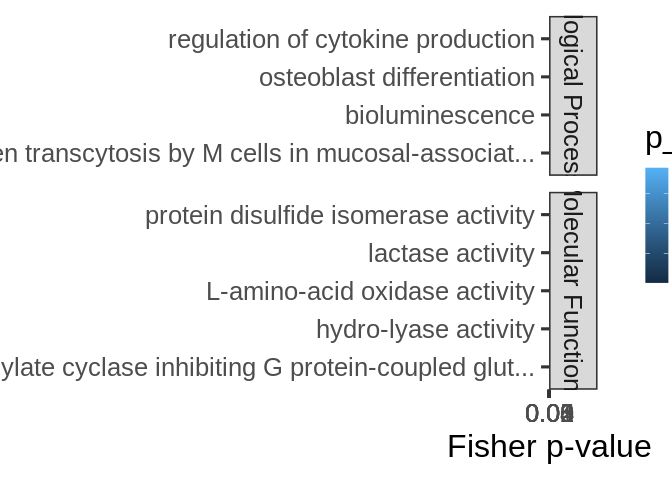
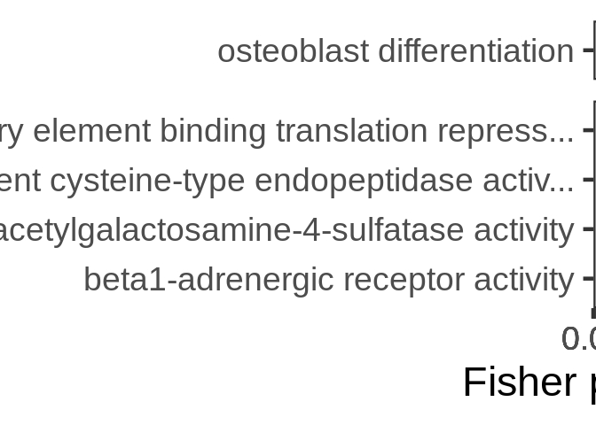

mRNA-miRNA interactions functional enrichment – 5UTR
================
Kathleen Durkin
2025-07-09

- <a href="#1-format-topgo-files" id="toc-1-format-topgo-files">1 Format
  topGO files</a>
  - <a href="#11-read-in-and-format-annotation-files"
    id="toc-11-read-in-and-format-annotation-files">1.1 Read in and format
    annotation files</a>
  - <a href="#12-set-up-gene2go-object"
    id="toc-12-set-up-gene2go-object">1.2 Set up gene2GO object</a>
  - <a href="#13-define-reference-set" id="toc-13-define-reference-set">1.3
    Define reference set</a>
- <a href="#2-5utr" id="toc-2-5utr">2 5UTR</a>
  - <a href="#21-read-in-pccmiranda-data"
    id="toc-21-read-in-pccmiranda-data">2.1 Read in PCC/miranda data</a>
- <a href="#3-fa-of-all-mirna-targets"
  id="toc-3-fa-of-all-mirna-targets">3 FA of all miRNA targets</a>
- <a href="#4-fe-of-specific-mirnas-targets-all-targets"
  id="toc-4-fe-of-specific-mirnas-targets-all-targets">4 FE of specific
  miRNA’s targets (all targets)</a>
- <a href="#5-fe-of-specific-mirnas-targets-significant-cor-targets"
  id="toc-5-fe-of-specific-mirnas-targets-significant-cor-targets">5 FE of
  specific miRNA’s targets (significant cor targets)</a>
- <a
  href="#6-fe-of-all-targets-negatively-correlated-with-mirnas-regardless-of-correlation-significance"
  id="toc-6-fe-of-all-targets-negatively-correlated-with-mirnas-regardless-of-correlation-significance">6
  FE of all targets negatively correlated with miRNAs (regardless of
  correlation significance)</a>
  - <a href="#601-biological-processes"
    id="toc-601-biological-processes">6.0.1 Biological Processes</a>
  - <a href="#602-cellular-components"
    id="toc-602-cellular-components">6.0.2 Cellular Components</a>
  - <a href="#603-molecular-functions"
    id="toc-603-molecular-functions">6.0.3 Molecular Functions</a>
  - <a href="#604-join-ontologies" id="toc-604-join-ontologies">6.0.4 Join
    ontologies</a>
- <a
  href="#7-fe-of-all-targets-positively-correlated-with-mirnas-regardless-of-correlation-significance"
  id="toc-7-fe-of-all-targets-positively-correlated-with-mirnas-regardless-of-correlation-significance">7
  FE of all targets positively correlated with miRNAs (regardless of
  correlation significance)</a>
  - <a href="#701-biological-processes"
    id="toc-701-biological-processes">7.0.1 Biological Processes</a>
  - <a href="#702-cellular-components"
    id="toc-702-cellular-components">7.0.2 Cellular Components</a>
  - <a href="#703-molecular-functions"
    id="toc-703-molecular-functions">7.0.3 Molecular Functions</a>
  - <a href="#704-join-ontologies" id="toc-704-join-ontologies">7.0.4 Join
    ontologies</a>
- <a
  href="#8-fe-of-all-targets-significantly-negatively-correlated-with-mirnas"
  id="toc-8-fe-of-all-targets-significantly-negatively-correlated-with-mirnas">8
  FE of all targets significantly negatively correlated with miRNAs</a>
  - <a href="#801-biological-processes"
    id="toc-801-biological-processes">8.0.1 Biological Processes</a>
  - <a href="#802-cellular-components"
    id="toc-802-cellular-components">8.0.2 Cellular Components</a>
  - <a href="#803-molecular-functions"
    id="toc-803-molecular-functions">8.0.3 Molecular Functions</a>
  - <a href="#804-join-ontologies" id="toc-804-join-ontologies">8.0.4 Join
    ontologies</a>
- <a
  href="#9-fe-of-all-targets-significantly-positively-correlated-with-mirnas"
  id="toc-9-fe-of-all-targets-significantly-positively-correlated-with-mirnas">9
  FE of all targets significantly positively correlated with miRNAs</a>
  - <a href="#901-biological-processes"
    id="toc-901-biological-processes">9.0.1 Biological Processes</a>
  - <a href="#902-cellular-components"
    id="toc-902-cellular-components">9.0.2 Cellular Components</a>
  - <a href="#903-molecular-functions"
    id="toc-903-molecular-functions">9.0.3 Molecular Functions</a>
  - <a href="#904-join-ontologies" id="toc-904-join-ontologies">9.0.4 Join
    ontologies</a>

This script will use topGO to analyze functional enrichment of miRNA
targets for Apul in the 5UTR regions

Code used below was created by `Jill Ashey`, modified for use with
A.pulchra datasets by `Kathleen Durkin`

# 1 Format topGO files

## 1.1 Read in and format annotation files

``` r
# Read in Apul annotations
annot_locations <- read.delim("../output/02-Apul-reference-annotation/Apulcra-genome-mRNA-IDmapping-2024_12_12.tab")
# Remove unneeded columns 
annot_locations <- annot_locations %>% dplyr::select(-X, -V13)
# Ensure there are no duplicate rows
annot_locations <- annot_locations %>% distinct()

head(annot_locations)
```

    ##                     V1     V3 Protein.names
    ## 1   ntLink_4:1155-1537 P35061   Histone H2A
    ## 2   ntLink_4:2660-3441 P84239    Histone H3
    ## 3   ntLink_4:4515-6830 P35061   Histone H2A
    ## 4   ntLink_4:7096-7859 P84239    Histone H3
    ## 5   ntLink_4:8474-9669 P35061   Histone H2A
    ## 6 ntLink_4:11162-11925 P84239    Histone H3
    ##                                     Organism Gene.Ontology..biological.process.
    ## 1          Acropora formosa (Staghorn coral)                                   
    ## 2 Urechis caupo (Innkeeper worm) (Spoonworm)                                   
    ## 3          Acropora formosa (Staghorn coral)                                   
    ## 4 Urechis caupo (Innkeeper worm) (Spoonworm)                                   
    ## 5          Acropora formosa (Staghorn coral)                                   
    ## 6 Urechis caupo (Innkeeper worm) (Spoonworm)                                   
    ##                                            Gene.Ontology.IDs
    ## 1 GO:0000786; GO:0003677; GO:0005634; GO:0030527; GO:0046982
    ## 2 GO:0000786; GO:0003677; GO:0005634; GO:0030527; GO:0046982
    ## 3 GO:0000786; GO:0003677; GO:0005634; GO:0030527; GO:0046982
    ## 4 GO:0000786; GO:0003677; GO:0005634; GO:0030527; GO:0046982
    ## 5 GO:0000786; GO:0003677; GO:0005634; GO:0030527; GO:0046982
    ## 6 GO:0000786; GO:0003677; GO:0005634; GO:0030527; GO:0046982

``` r
# Looks good!
```

This file shows each gene as it’s genomic location. We want to use gene
IDs to associate genes, so add gene IDs to this annotation table

Read in file that associates each mRNA genomic location with
corresponding gene ID

``` r
mRNA_FUNids <- read.table("../output/15-Apul-annotate-UTRs/Apul-mRNA-FUNids.txt", header=FALSE, col.names=c("location", "type", "mRNA_ID", "gene_ID", "product"), sep="\t")

# Remove unwanted text from parent column
mRNA_FUNids$gene_ID <- gsub("Parent=", "", mRNA_FUNids$gene_ID)
# Only need to keep mRNA location and gene ID
mRNA_FUNids <- mRNA_FUNids %>% dplyr::select(location, gene_ID)
```

join with annotation file

``` r
# join
annot <- left_join(annot_locations, mRNA_FUNids, by = c("V1" = "location"))

# ensure there are no duplicate rows
annot <- annot %>% distinct()
```

## 1.2 Set up gene2GO object

Want to isolate a list of GO terms per gene

``` r
gene2go <- annot %>% filter(!is.na(Gene.Ontology.IDs)) %>% dplyr::select(gene_ID, Gene.Ontology.IDs)
gene2go <- gene2go %>% dplyr::rename(GO.ID = Gene.Ontology.IDs)

gene2go_list <- setNames(
  strsplit(as.character(gene2go$GO.ID), ";"), 
  gene2go$gene_ID
)
```

Note: I think this means genes that had a Uniprot ID but no GO terms are
excluded from this analysis

## 1.3 Define reference set

Define reference set of genes. This should be all genes *found in our
samples*, NOT all genes in the A.pulchra genome. Some genes (e.g.,
reproduction pathways) may not be found/expected in our samples for
valid biological reasons.

``` r
# Read in counts matrix
Apul_counts <- read.csv("../output/07-Apul-Hisat/Apul-gene_count_matrix.csv")
# Exclude genes with all 0 counts
Apul_counts <- Apul_counts[rowSums(Apul_counts[, 2:6]) != 0, ]

# Select gene IDs of the genes present in our samples
all_genes <- Apul_counts$gene_id
length(all_genes)
```

    ## [1] 33624

So we have a reference set of 33624 genes present in our samples.

# 2 5UTR

## 2.1 Read in PCC/miranda data

This is a table of all putative miRNA-mRNA binding predicted by miRanda,
plus Pearsons correlation coefficients for coexpression of each putative
binding pair.

``` r
data <- read.csv("../output/09.01-Apul-mRNA-miRNA-interactions-CDS_5UTR/miRanda_PCC_miRNA_5UTR.csv")
data <- dplyr::rename(data,
               miRNA = V1,
               mRNA = V4.y)
head(data)
```

    ##   X         miRNA                         V2  V3   V4.x V5 V6  V7  V8 V9
    ## 1 1 Cluster_10051 ntLink_6:10930332-10931332 162 -20.74  2 16 228 250 15
    ## 2 2 Cluster_10051 ntLink_6:18056608-18057608 156 -23.09  2 13 164 185 11
    ## 3 3 Cluster_10051 ntLink_6:20379023-20380023 156 -23.87  2 13 235 256 11
    ## 4 4 Cluster_10051 ntLink_8:13885789-13886789 162 -21.42  2 21  70  90 19
    ## 5 5 Cluster_10051 ntLink_8:21438604-21439604 176 -24.65  2 21 616 637 19
    ## 6 6 Cluster_10051 ntLink_8:23351209-23352209 145 -22.56  2 10  16  37  8
    ##       V10     V11       mRNA    PCC.cor    p_value adjusted_p_value
    ## 1  86.67%  93.33% FUN_001302  0.5566183 0.32981090        0.9986496
    ## 2  90.91% 100.00% FUN_001940 -0.6069318 0.27771935        0.9986496
    ## 3  90.91% 100.00% FUN_002141         NA         NA               NA
    ## 4  73.68%  84.21% FUN_003641         NA         NA               NA
    ## 5  78.95%  89.47% FUN_004272  0.8565040 0.06382891        0.9765790
    ## 6 100.00% 100.00% FUN_004448  0.8743813 0.05242733        0.9654692

Set function to select genes of interest (ie those that have pvalue \<
0.05)

``` r
topDiffGenes <- function(allScore) {
return(allScore < 0.05)}
```

# 3 FA of all miRNA targets

Functional annotation of all putative miRNA targets

``` r
cor_bind_FA <- left_join(data, annot, by = c("mRNA" = "gene_ID")) %>% distinct()

nrow(cor_bind_FA)
```

    ## [1] 4959

``` r
nrow(cor_bind_FA[!is.na(cor_bind_FA$Gene.Ontology.IDs),])
```

    ## [1] 963

Of the 4959 putative miRNA targets (5UTR region) predicted by miRanda,
963 have available annotations

``` r
sig_cor_bind_FA <- cor_bind_FA[cor_bind_FA$p_value < 0.05,]

nrow(sig_cor_bind_FA)
```

    ## [1] 1005

``` r
nrow(sig_cor_bind_FA[!is.na(sig_cor_bind_FA$Gene.Ontology.IDs),])
```

    ## [1] 52

Of the 1005 putative 5UTR miRNA targets predicted by miRanda that are
also have significantly correlated expression, only 52 have available
annotations. This is an average of \~19 annotated targets per miRNA.

Save

``` r
write.csv(cor_bind_FA, "../output/09.12-Apul-mRNA-miRNA-interactions-FE-5UTR/miRNA_5UTR_targets_FA.csv")
write.csv(sig_cor_bind_FA, "../output/09.12-Apul-mRNA-miRNA-interactions-FE-5UTR/miRNA_5UTR_sig_cor_targets_FA.csv")
```

# 4 FE of specific miRNA’s targets (all targets)

Create topGO function for use with miRNA names

``` r
miRNA_topGO_FE <- function(miRNA.name, input_interactions) {
  
  #Isolate genes in our input module of interest
  interacting_genes <- input_interactions %>%
    filter(miRNA == miRNA.name) %>%
    pull(mRNA)
  
  if (length(interacting_genes) > 0) {
    # Create factor for all reference genes, where 1 represents module membership and 0 means the gene is not in module of interest
    gene_list <- factor(as.integer(all_genes %in% interacting_genes))
    names(gene_list) <- all_genes
    str(gene_list)
    
    ## Biological Process ##
    # Create topGO object
    GO_BP <- new("topGOdata", 
                ontology = "BP", # Biological Process
                allGenes = gene_list,
                annot = annFUN.gene2GO, 
                gene2GO = gene2go_list,
                geneSel=topDiffGenes)
    
    # Run GO enrichment test
    GO_BP_FE <- runTest(GO_BP, algorithm = "weight01", statistic = "fisher")
    # View the results
    GO_BP_results <- GenTable(GO_BP, Fisher = GO_BP_FE, orderBy = "Fisher",  topNodes = 100, numChar = 51)
    # Filter by significant results
    GO_BP_results$Fisher<-as.numeric(GO_BP_results$Fisher)
    GO_BP_results_sig<-GO_BP_results[GO_BP_results$Fisher<0.05,]
    
    
    ## Molecular Function ##
    # Create topGO object
    GO_MF <- new("topGOdata", 
                ontology = "MF", # Molecular Function
                allGenes = gene_list,
                annot = annFUN.gene2GO, 
                gene2GO = gene2go_list,
                geneSel=topDiffGenes)
    
    # Run GO enrichment test
    GO_MF_FE <- runTest(GO_MF, algorithm = "weight01", statistic = "fisher")
    # View the results
    GO_MF_results <- GenTable(GO_MF, Fisher = GO_MF_FE, orderBy = "Fisher",  topNodes = 100, numChar = 51)
    # Filter by significant results
    GO_MF_results$Fisher<-as.numeric(GO_MF_results$Fisher)
    GO_MF_results_sig<-GO_MF_results[GO_MF_results$Fisher<0.05,]
  
    # Return
    # Add type column only if results exist
    if (nrow(GO_BP_results_sig) > 0) {
      GO_BP_results_sig$type <- "Biological.Process"
    }
    if (nrow(GO_MF_results_sig) > 0) {
      GO_MF_results_sig$type <- "Molecular.Function"
    }
    GO_results <- rbind(GO_BP_results_sig, GO_MF_results_sig)
    print(GO_results)
  }
}

miRNA_topGO_FE("Cluster_10051", cor_bind_FA)
```

    ##  Factor w/ 2 levels "0","1": 1 1 1 1 1 1 1 1 1 1 ...
    ##  - attr(*, "names")= chr [1:33624] "FUN_035039" "FUN_035038" "FUN_035031" "FUN_035030" ...

    ## 
    ## Building most specific GOs .....

    ##  ( 273 GO terms found. )

    ## 
    ## Build GO DAG topology ..........

    ##  ( 1231 GO terms and 2377 relations. )

    ## 
    ## Annotating nodes ...............

    ##  ( 1427 genes annotated to the GO terms. )

    ## 
    ##           -- Weight01 Algorithm -- 
    ## 
    ##       the algorithm is scoring 92 nontrivial nodes
    ##       parameters: 
    ##           test statistic: fisher

    ## 
    ##   Level 13:  1 nodes to be scored    (0 eliminated genes)

    ## 
    ##   Level 12:  2 nodes to be scored    (0 eliminated genes)

    ## 
    ##   Level 11:  3 nodes to be scored    (140 eliminated genes)

    ## 
    ##   Level 10:  3 nodes to be scored    (140 eliminated genes)

    ## 
    ##   Level 9:   4 nodes to be scored    (142 eliminated genes)

    ## 
    ##   Level 8:   4 nodes to be scored    (142 eliminated genes)

    ## 
    ##   Level 7:   7 nodes to be scored    (162 eliminated genes)

    ## 
    ##   Level 6:   17 nodes to be scored   (184 eliminated genes)

    ## 
    ##   Level 5:   22 nodes to be scored   (376 eliminated genes)

    ## 
    ##   Level 4:   15 nodes to be scored   (520 eliminated genes)

    ## 
    ##   Level 3:   9 nodes to be scored    (596 eliminated genes)

    ## 
    ##   Level 2:   4 nodes to be scored    (718 eliminated genes)

    ## 
    ##   Level 1:   1 nodes to be scored    (848 eliminated genes)

    ## 
    ## Building most specific GOs .....

    ##  ( 461 GO terms found. )

    ## 
    ## Build GO DAG topology ..........

    ##  ( 910 GO terms and 1191 relations. )

    ## 
    ## Annotating nodes ...............

    ##  ( 2843 genes annotated to the GO terms. )

    ## 
    ##           -- Weight01 Algorithm -- 
    ## 
    ##       the algorithm is scoring 29 nontrivial nodes
    ##       parameters: 
    ##           test statistic: fisher

    ## 
    ##   Level 7:   2 nodes to be scored    (0 eliminated genes)

    ## 
    ##   Level 6:   4 nodes to be scored    (0 eliminated genes)

    ## 
    ##   Level 5:   5 nodes to be scored    (37 eliminated genes)

    ## 
    ##   Level 4:   6 nodes to be scored    (72 eliminated genes)

    ## 
    ##   Level 3:   6 nodes to be scored    (263 eliminated genes)

    ## 
    ##   Level 2:   5 nodes to be scored    (929 eliminated genes)

    ## 
    ##   Level 1:   1 nodes to be scored    (1782 eliminated genes)

    ##        GO.ID                                  Term Annotated Significant
    ## 1 GO:0001782                    B cell homeostasis         7           1
    ## 2 GO:0004185 serine-type carboxypeptidase activity         2           1
    ## 3 GO:0004890              GABA-A receptor activity         7           1
    ## 4 GO:0003723                           RNA binding       131           2
    ##   Expected Fisher               type
    ## 1     0.02 0.0190 Biological.Process
    ## 2     0.00 0.0042 Molecular.Function
    ## 3     0.01 0.0147 Molecular.Function
    ## 4     0.28 0.0280 Molecular.Function

Loop through all miRNA and run functional enrichment on the miRNA’s
targets (all predicted targets)

``` r
interacting_miRNAs <- unique(cor_bind_FA$miRNA) %>% na.omit
results_all_targets <- NULL  # initialize empty df

for(miRNA in interacting_miRNAs) {
  
  # Run topGO enrichment function
  miRNA_results <- miRNA_topGO_FE(miRNA, cor_bind_FA)
  
  # Only keep results if not empty
  if (nrow(miRNA_results) > 0) {
    
    # Add the miRNA source column
    miRNA_results$miRNA <- miRNA

    # Bind to the accumulating results data frame
    results_all_targets <- rbind(results_all_targets, miRNA_results)
  }
}
```

    ##  Factor w/ 2 levels "0","1": 1 1 1 1 1 1 1 1 1 1 ...
    ##  - attr(*, "names")= chr [1:33624] "FUN_035039" "FUN_035038" "FUN_035031" "FUN_035030" ...

    ## 
    ## Building most specific GOs .....

    ##  ( 273 GO terms found. )

    ## 
    ## Build GO DAG topology ..........

    ##  ( 1231 GO terms and 2377 relations. )

    ## 
    ## Annotating nodes ...............

    ##  ( 1427 genes annotated to the GO terms. )

    ## 
    ##           -- Weight01 Algorithm -- 
    ## 
    ##       the algorithm is scoring 92 nontrivial nodes
    ##       parameters: 
    ##           test statistic: fisher

    ## 
    ##   Level 13:  1 nodes to be scored    (0 eliminated genes)

    ## 
    ##   Level 12:  2 nodes to be scored    (0 eliminated genes)

    ## 
    ##   Level 11:  3 nodes to be scored    (140 eliminated genes)

    ## 
    ##   Level 10:  3 nodes to be scored    (140 eliminated genes)

    ## 
    ##   Level 9:   4 nodes to be scored    (142 eliminated genes)

    ## 
    ##   Level 8:   4 nodes to be scored    (142 eliminated genes)

    ## 
    ##   Level 7:   7 nodes to be scored    (162 eliminated genes)

    ## 
    ##   Level 6:   17 nodes to be scored   (184 eliminated genes)

    ## 
    ##   Level 5:   22 nodes to be scored   (376 eliminated genes)

    ## 
    ##   Level 4:   15 nodes to be scored   (520 eliminated genes)

    ## 
    ##   Level 3:   9 nodes to be scored    (596 eliminated genes)

    ## 
    ##   Level 2:   4 nodes to be scored    (718 eliminated genes)

    ## 
    ##   Level 1:   1 nodes to be scored    (848 eliminated genes)

    ## 
    ## Building most specific GOs .....

    ##  ( 461 GO terms found. )

    ## 
    ## Build GO DAG topology ..........

    ##  ( 910 GO terms and 1191 relations. )

    ## 
    ## Annotating nodes ...............

    ##  ( 2843 genes annotated to the GO terms. )

    ## 
    ##           -- Weight01 Algorithm -- 
    ## 
    ##       the algorithm is scoring 29 nontrivial nodes
    ##       parameters: 
    ##           test statistic: fisher

    ## 
    ##   Level 7:   2 nodes to be scored    (0 eliminated genes)

    ## 
    ##   Level 6:   4 nodes to be scored    (0 eliminated genes)

    ## 
    ##   Level 5:   5 nodes to be scored    (37 eliminated genes)

    ## 
    ##   Level 4:   6 nodes to be scored    (72 eliminated genes)

    ## 
    ##   Level 3:   6 nodes to be scored    (263 eliminated genes)

    ## 
    ##   Level 2:   5 nodes to be scored    (929 eliminated genes)

    ## 
    ##   Level 1:   1 nodes to be scored    (1782 eliminated genes)

    ##        GO.ID                                  Term Annotated Significant
    ## 1 GO:0001782                    B cell homeostasis         7           1
    ## 2 GO:0004185 serine-type carboxypeptidase activity         2           1
    ## 3 GO:0004890              GABA-A receptor activity         7           1
    ## 4 GO:0003723                           RNA binding       131           2
    ##   Expected Fisher               type
    ## 1     0.02 0.0190 Biological.Process
    ## 2     0.00 0.0042 Molecular.Function
    ## 3     0.01 0.0147 Molecular.Function
    ## 4     0.28 0.0280 Molecular.Function
    ##  Factor w/ 2 levels "0","1": 1 1 1 1 1 1 1 1 1 1 ...
    ##  - attr(*, "names")= chr [1:33624] "FUN_035039" "FUN_035038" "FUN_035031" "FUN_035030" ...

    ## 
    ## Building most specific GOs .....

    ##  ( 273 GO terms found. )

    ## 
    ## Build GO DAG topology ..........

    ##  ( 1231 GO terms and 2377 relations. )

    ## 
    ## Annotating nodes ...............

    ##  ( 1427 genes annotated to the GO terms. )

    ## 
    ##           -- Weight01 Algorithm -- 
    ## 
    ##       the algorithm is scoring 57 nontrivial nodes
    ##       parameters: 
    ##           test statistic: fisher

    ## 
    ##   Level 15:  1 nodes to be scored    (0 eliminated genes)

    ## 
    ##   Level 14:  1 nodes to be scored    (0 eliminated genes)

    ## 
    ##   Level 13:  1 nodes to be scored    (4 eliminated genes)

    ## 
    ##   Level 12:  2 nodes to be scored    (4 eliminated genes)

    ## 
    ##   Level 11:  3 nodes to be scored    (4 eliminated genes)

    ## 
    ##   Level 10:  3 nodes to be scored    (4 eliminated genes)

    ## 
    ##   Level 9:   6 nodes to be scored    (4 eliminated genes)

    ## 
    ##   Level 8:   4 nodes to be scored    (4 eliminated genes)

    ## 
    ##   Level 7:   4 nodes to be scored    (13 eliminated genes)

    ## 
    ##   Level 6:   5 nodes to be scored    (76 eliminated genes)

    ## 
    ##   Level 5:   9 nodes to be scored    (90 eliminated genes)

    ## 
    ##   Level 4:   7 nodes to be scored    (224 eliminated genes)

    ## 
    ##   Level 3:   6 nodes to be scored    (352 eliminated genes)

    ## 
    ##   Level 2:   4 nodes to be scored    (702 eliminated genes)

    ## 
    ##   Level 1:   1 nodes to be scored    (820 eliminated genes)

    ## 
    ## Building most specific GOs .....

    ##  ( 461 GO terms found. )

    ## 
    ## Build GO DAG topology ..........

    ##  ( 910 GO terms and 1191 relations. )

    ## 
    ## Annotating nodes ...............

    ##  ( 2843 genes annotated to the GO terms. )

    ## 
    ##           -- Weight01 Algorithm -- 
    ## 
    ##       the algorithm is scoring 25 nontrivial nodes
    ##       parameters: 
    ##           test statistic: fisher

    ## 
    ##   Level 8:   1 nodes to be scored    (0 eliminated genes)

    ## 
    ##   Level 7:   2 nodes to be scored    (0 eliminated genes)

    ## 
    ##   Level 6:   4 nodes to be scored    (67 eliminated genes)

    ## 
    ##   Level 5:   4 nodes to be scored    (74 eliminated genes)

    ## 
    ##   Level 4:   4 nodes to be scored    (233 eliminated genes)

    ## 
    ##   Level 3:   5 nodes to be scored    (370 eliminated genes)

    ## 
    ##   Level 2:   4 nodes to be scored    (697 eliminated genes)

    ## 
    ##   Level 1:   1 nodes to be scored    (1314 eliminated genes)

    ##        GO.ID                                             Term Annotated
    ## 1 GO:0001658 branching involved in ureteric bud morphogenesis         4
    ## 2 GO:0000413            protein peptidyl-prolyl isomerization         9
    ## 3 GO:0001666                              response to hypoxia        14
    ## 4 GO:0003746           translation elongation factor activity         7
    ## 5 GO:0005200           structural constituent of cytoskeleton         4
    ## 6 GO:0003943       N-acetylgalactosamine-4-sulfatase activity         8
    ## 7 GO:0001965                  G-protein alpha-subunit binding        16
    ##   Significant Expected  Fisher               type
    ## 1           1     0.01 0.00840 Biological.Process
    ## 2           1     0.02 0.01880 Biological.Process
    ## 3           1     0.03 0.02920 Biological.Process
    ## 4           2     0.02 0.00019 Molecular.Function
    ## 5           1     0.01 0.01261 Molecular.Function
    ## 6           1     0.03 0.02508 Molecular.Function
    ## 7           1     0.05 0.04959 Molecular.Function
    ##  Factor w/ 2 levels "0","1": 1 1 1 1 1 1 1 1 1 1 ...
    ##  - attr(*, "names")= chr [1:33624] "FUN_035039" "FUN_035038" "FUN_035031" "FUN_035030" ...

    ## 
    ## Building most specific GOs .....

    ##  ( 273 GO terms found. )

    ## 
    ## Build GO DAG topology ..........

    ##  ( 1231 GO terms and 2377 relations. )

    ## 
    ## Annotating nodes ...............

    ##  ( 1427 genes annotated to the GO terms. )

    ## 
    ##           -- Weight01 Algorithm -- 
    ## 
    ##       the algorithm is scoring 52 nontrivial nodes
    ##       parameters: 
    ##           test statistic: fisher

    ## 
    ##   Level 9:   2 nodes to be scored    (0 eliminated genes)

    ## 
    ##   Level 8:   2 nodes to be scored    (0 eliminated genes)

    ## 
    ##   Level 7:   2 nodes to be scored    (4 eliminated genes)

    ## 
    ##   Level 6:   5 nodes to be scored    (4 eliminated genes)

    ## 
    ##   Level 5:   10 nodes to be scored   (29 eliminated genes)

    ## 
    ##   Level 4:   14 nodes to be scored   (283 eliminated genes)

    ## 
    ##   Level 3:   11 nodes to be scored   (396 eliminated genes)

    ## 
    ##   Level 2:   5 nodes to be scored    (653 eliminated genes)

    ## 
    ##   Level 1:   1 nodes to be scored    (861 eliminated genes)

    ## 
    ## Building most specific GOs .....

    ##  ( 461 GO terms found. )

    ## 
    ## Build GO DAG topology ..........

    ##  ( 910 GO terms and 1191 relations. )

    ## 
    ## Annotating nodes ...............

    ##  ( 2843 genes annotated to the GO terms. )

    ## 
    ##           -- Weight01 Algorithm -- 
    ## 
    ##       the algorithm is scoring 50 nontrivial nodes
    ##       parameters: 
    ##           test statistic: fisher

    ## 
    ##   Level 9:   2 nodes to be scored    (0 eliminated genes)

    ## 
    ##   Level 8:   3 nodes to be scored    (0 eliminated genes)

    ## 
    ##   Level 7:   6 nodes to be scored    (273 eliminated genes)

    ## 
    ##   Level 6:   5 nodes to be scored    (303 eliminated genes)

    ## 
    ##   Level 5:   8 nodes to be scored    (402 eliminated genes)

    ## 
    ##   Level 4:   9 nodes to be scored    (438 eliminated genes)

    ## 
    ##   Level 3:   10 nodes to be scored   (856 eliminated genes)

    ## 
    ##   Level 2:   6 nodes to be scored    (1421 eliminated genes)

    ## 
    ##   Level 1:   1 nodes to be scored    (2038 eliminated genes)

    ##        GO.ID                                   Term Annotated Significant
    ## 1 GO:0000737 DNA catabolic process, endonucleolytic         1           1
    ## 2 GO:0000054  ribosomal subunit export from nucleus         3           1
    ## 3 GO:0005388    P-type calcium transporter activity         4           1
    ## 4 GO:0003777             microtubule motor activity        16           1
    ##   Expected Fisher               type
    ## 1     0.00 0.0021 Biological.Process
    ## 2     0.01 0.0063 Biological.Process
    ## 3     0.01 0.0098 Molecular.Function
    ## 4     0.04 0.0388 Molecular.Function
    ##  Factor w/ 2 levels "0","1": 1 1 1 1 1 1 1 1 1 1 ...
    ##  - attr(*, "names")= chr [1:33624] "FUN_035039" "FUN_035038" "FUN_035031" "FUN_035030" ...

    ## 
    ## Building most specific GOs .....

    ##  ( 273 GO terms found. )

    ## 
    ## Build GO DAG topology ..........

    ##  ( 1231 GO terms and 2377 relations. )

    ## 
    ## Annotating nodes ...............

    ##  ( 1427 genes annotated to the GO terms. )

    ## 
    ##           -- Weight01 Algorithm -- 
    ## 
    ##       the algorithm is scoring 62 nontrivial nodes
    ##       parameters: 
    ##           test statistic: fisher

    ## 
    ##   Level 13:  1 nodes to be scored    (0 eliminated genes)

    ## 
    ##   Level 12:  2 nodes to be scored    (0 eliminated genes)

    ## 
    ##   Level 11:  3 nodes to be scored    (140 eliminated genes)

    ## 
    ##   Level 10:  3 nodes to be scored    (140 eliminated genes)

    ## 
    ##   Level 9:   3 nodes to be scored    (142 eliminated genes)

    ## 
    ##   Level 8:   2 nodes to be scored    (142 eliminated genes)

    ## 
    ##   Level 7:   4 nodes to be scored    (143 eliminated genes)

    ## 
    ##   Level 6:   10 nodes to be scored   (157 eliminated genes)

    ## 
    ##   Level 5:   14 nodes to be scored   (243 eliminated genes)

    ## 
    ##   Level 4:   10 nodes to be scored   (298 eliminated genes)

    ## 
    ##   Level 3:   6 nodes to be scored    (380 eliminated genes)

    ## 
    ##   Level 2:   3 nodes to be scored    (539 eliminated genes)

    ## 
    ##   Level 1:   1 nodes to be scored    (666 eliminated genes)

    ## 
    ## Building most specific GOs .....

    ##  ( 461 GO terms found. )

    ## 
    ## Build GO DAG topology ..........

    ##  ( 910 GO terms and 1191 relations. )

    ## 
    ## Annotating nodes ...............

    ##  ( 2843 genes annotated to the GO terms. )

    ## 
    ##           -- Weight01 Algorithm -- 
    ## 
    ##       the algorithm is scoring 30 nontrivial nodes
    ##       parameters: 
    ##           test statistic: fisher

    ## 
    ##   Level 9:   1 nodes to be scored    (0 eliminated genes)

    ## 
    ##   Level 8:   1 nodes to be scored    (0 eliminated genes)

    ## 
    ##   Level 7:   2 nodes to be scored    (269 eliminated genes)

    ## 
    ##   Level 6:   4 nodes to be scored    (273 eliminated genes)

    ## 
    ##   Level 5:   5 nodes to be scored    (281 eliminated genes)

    ## 
    ##   Level 4:   5 nodes to be scored    (371 eliminated genes)

    ## 
    ##   Level 3:   9 nodes to be scored    (414 eliminated genes)

    ## 
    ##   Level 2:   2 nodes to be scored    (605 eliminated genes)

    ## 
    ##   Level 1:   1 nodes to be scored    (1765 eliminated genes)

    ##        GO.ID                           Term Annotated Significant Expected
    ## 1 GO:0004517 nitric-oxide synthase activity         2           1        0
    ##   Fisher               type
    ## 1 0.0028 Molecular.Function
    ##  Factor w/ 2 levels "0","1": 1 1 1 1 1 1 1 1 1 1 ...
    ##  - attr(*, "names")= chr [1:33624] "FUN_035039" "FUN_035038" "FUN_035031" "FUN_035030" ...

    ## 
    ## Building most specific GOs .....

    ##  ( 273 GO terms found. )

    ## 
    ## Build GO DAG topology ..........

    ##  ( 1231 GO terms and 2377 relations. )

    ## 
    ## Annotating nodes ...............

    ##  ( 1427 genes annotated to the GO terms. )

    ## 
    ##           -- Weight01 Algorithm -- 
    ## 
    ##       the algorithm is scoring 113 nontrivial nodes
    ##       parameters: 
    ##           test statistic: fisher

    ## 
    ##   Level 14:  1 nodes to be scored    (0 eliminated genes)

    ## 
    ##   Level 13:  2 nodes to be scored    (0 eliminated genes)

    ## 
    ##   Level 12:  3 nodes to be scored    (4 eliminated genes)

    ## 
    ##   Level 11:  4 nodes to be scored    (148 eliminated genes)

    ## 
    ##   Level 10:  4 nodes to be scored    (203 eliminated genes)

    ## 
    ##   Level 9:   6 nodes to be scored    (205 eliminated genes)

    ## 
    ##   Level 8:   5 nodes to be scored    (206 eliminated genes)

    ## 
    ##   Level 7:   8 nodes to be scored    (225 eliminated genes)

    ## 
    ##   Level 6:   16 nodes to be scored   (256 eliminated genes)

    ## 
    ##   Level 5:   23 nodes to be scored   (392 eliminated genes)

    ## 
    ##   Level 4:   21 nodes to be scored   (457 eliminated genes)

    ## 
    ##   Level 3:   13 nodes to be scored   (593 eliminated genes)

    ## 
    ##   Level 2:   6 nodes to be scored    (832 eliminated genes)

    ## 
    ##   Level 1:   1 nodes to be scored    (987 eliminated genes)

    ## 
    ## Building most specific GOs .....

    ##  ( 461 GO terms found. )

    ## 
    ## Build GO DAG topology ..........

    ##  ( 910 GO terms and 1191 relations. )

    ## 
    ## Annotating nodes ...............

    ##  ( 2843 genes annotated to the GO terms. )

    ## 
    ##           -- Weight01 Algorithm -- 
    ## 
    ##       the algorithm is scoring 48 nontrivial nodes
    ##       parameters: 
    ##           test statistic: fisher

    ## 
    ##   Level 10:  1 nodes to be scored    (0 eliminated genes)

    ## 
    ##   Level 9:   2 nodes to be scored    (0 eliminated genes)

    ## 
    ##   Level 8:   1 nodes to be scored    (101 eliminated genes)

    ## 
    ##   Level 7:   4 nodes to be scored    (121 eliminated genes)

    ## 
    ##   Level 6:   8 nodes to be scored    (131 eliminated genes)

    ## 
    ##   Level 5:   11 nodes to be scored   (141 eliminated genes)

    ## 
    ##   Level 4:   9 nodes to be scored    (259 eliminated genes)

    ## 
    ##   Level 3:   8 nodes to be scored    (714 eliminated genes)

    ## 
    ##   Level 2:   3 nodes to be scored    (1163 eliminated genes)

    ## 
    ##   Level 1:   1 nodes to be scored    (1867 eliminated genes)

    ##        GO.ID                                                   Term Annotated
    ## 1 GO:0000244                spliceosomal tri-snRNP complex assembly         4
    ## 2 GO:0008218                                        bioluminescence        10
    ## 3 GO:0004335                                 galactokinase activity         1
    ## 4 GO:0004485               methylcrotonoyl-CoA carboxylase activity         1
    ## 5 GO:0004579 dolichyl-diphosphooligosaccharide-protein glycotran...         2
    ## 6 GO:0004867           serine-type endopeptidase inhibitor activity         4
    ##   Significant Expected Fisher               type
    ## 1           1     0.02 0.0170 Biological.Process
    ## 2           1     0.04 0.0410 Biological.Process
    ## 3           1     0.00 0.0032 Molecular.Function
    ## 4           1     0.00 0.0032 Molecular.Function
    ## 5           1     0.01 0.0063 Molecular.Function
    ## 6           1     0.01 0.0126 Molecular.Function
    ##  Factor w/ 2 levels "0","1": 1 1 1 1 1 1 1 1 1 1 ...
    ##  - attr(*, "names")= chr [1:33624] "FUN_035039" "FUN_035038" "FUN_035031" "FUN_035030" ...

    ## 
    ## Building most specific GOs .....

    ##  ( 273 GO terms found. )

    ## 
    ## Build GO DAG topology ..........

    ##  ( 1231 GO terms and 2377 relations. )

    ## 
    ## Annotating nodes ...............

    ##  ( 1427 genes annotated to the GO terms. )

    ## 
    ##           -- Weight01 Algorithm -- 
    ## 
    ##       the algorithm is scoring 74 nontrivial nodes
    ##       parameters: 
    ##           test statistic: fisher

    ## 
    ##   Level 13:  1 nodes to be scored    (0 eliminated genes)

    ## 
    ##   Level 12:  2 nodes to be scored    (0 eliminated genes)

    ## 
    ##   Level 11:  3 nodes to be scored    (140 eliminated genes)

    ## 
    ##   Level 10:  3 nodes to be scored    (140 eliminated genes)

    ## 
    ##   Level 9:   3 nodes to be scored    (142 eliminated genes)

    ## 
    ##   Level 8:   2 nodes to be scored    (142 eliminated genes)

    ## 
    ##   Level 7:   6 nodes to be scored    (143 eliminated genes)

    ## 
    ##   Level 6:   12 nodes to be scored   (157 eliminated genes)

    ## 
    ##   Level 5:   16 nodes to be scored   (281 eliminated genes)

    ## 
    ##   Level 4:   13 nodes to be scored   (313 eliminated genes)

    ## 
    ##   Level 3:   8 nodes to be scored    (526 eliminated genes)

    ## 
    ##   Level 2:   4 nodes to be scored    (716 eliminated genes)

    ## 
    ##   Level 1:   1 nodes to be scored    (829 eliminated genes)

    ## 
    ## Building most specific GOs .....

    ##  ( 461 GO terms found. )

    ## 
    ## Build GO DAG topology ..........

    ##  ( 910 GO terms and 1191 relations. )

    ## 
    ## Annotating nodes ...............

    ##  ( 2843 genes annotated to the GO terms. )

    ## 
    ##           -- Weight01 Algorithm -- 
    ## 
    ##       the algorithm is scoring 52 nontrivial nodes
    ##       parameters: 
    ##           test statistic: fisher

    ## 
    ##   Level 11:  1 nodes to be scored    (0 eliminated genes)

    ## 
    ##   Level 10:  2 nodes to be scored    (0 eliminated genes)

    ## 
    ##   Level 9:   6 nodes to be scored    (9 eliminated genes)

    ## 
    ##   Level 8:   5 nodes to be scored    (143 eliminated genes)

    ## 
    ##   Level 7:   6 nodes to be scored    (196 eliminated genes)

    ## 
    ##   Level 6:   6 nodes to be scored    (216 eliminated genes)

    ## 
    ##   Level 5:   8 nodes to be scored    (293 eliminated genes)

    ## 
    ##   Level 4:   7 nodes to be scored    (334 eliminated genes)

    ## 
    ##   Level 3:   6 nodes to be scored    (756 eliminated genes)

    ## 
    ##   Level 2:   4 nodes to be scored    (1178 eliminated genes)

    ## 
    ##   Level 1:   1 nodes to be scored    (1816 eliminated genes)

    ##        GO.ID                                                   Term Annotated
    ## 1 GO:0000281                                    mitotic cytokinesis        15
    ## 2 GO:0001817                      regulation of cytokine production        23
    ## 3 GO:0000977 RNA polymerase II transcription regulatory region s...       109
    ## 4 GO:0005242            inward rectifier potassium channel activity         9
    ## 5 GO:0000978 RNA polymerase II cis-regulatory region sequence-sp...       101
    ##   Significant Expected Fisher               type
    ## 1           1     0.03  0.031 Biological.Process
    ## 2           1     0.05  0.048 Biological.Process
    ## 3           3     0.38  0.023 Molecular.Function
    ## 4           1     0.03  0.031 Molecular.Function
    ## 5           2     0.36  0.047 Molecular.Function
    ##  Factor w/ 2 levels "0","1": 1 1 1 1 1 1 1 1 1 1 ...
    ##  - attr(*, "names")= chr [1:33624] "FUN_035039" "FUN_035038" "FUN_035031" "FUN_035030" ...

    ## 
    ## Building most specific GOs .....

    ##  ( 273 GO terms found. )

    ## 
    ## Build GO DAG topology ..........

    ##  ( 1231 GO terms and 2377 relations. )

    ## 
    ## Annotating nodes ...............

    ##  ( 1427 genes annotated to the GO terms. )

    ## 
    ##           -- Weight01 Algorithm -- 
    ## 
    ##       the algorithm is scoring 100 nontrivial nodes
    ##       parameters: 
    ##           test statistic: fisher

    ## 
    ##   Level 13:  1 nodes to be scored    (0 eliminated genes)

    ## 
    ##   Level 12:  1 nodes to be scored    (0 eliminated genes)

    ## 
    ##   Level 11:  1 nodes to be scored    (1 eliminated genes)

    ## 
    ##   Level 10:  2 nodes to be scored    (2 eliminated genes)

    ## 
    ##   Level 9:   6 nodes to be scored    (3 eliminated genes)

    ## 
    ##   Level 8:   7 nodes to be scored    (13 eliminated genes)

    ## 
    ##   Level 7:   8 nodes to be scored    (40 eliminated genes)

    ## 
    ##   Level 6:   10 nodes to be scored   (185 eliminated genes)

    ## 
    ##   Level 5:   16 nodes to be scored   (515 eliminated genes)

    ## 
    ##   Level 4:   20 nodes to be scored   (614 eliminated genes)

    ## 
    ##   Level 3:   18 nodes to be scored   (942 eliminated genes)

    ## 
    ##   Level 2:   9 nodes to be scored    (1064 eliminated genes)

    ## 
    ##   Level 1:   1 nodes to be scored    (1301 eliminated genes)

    ## 
    ## Building most specific GOs .....

    ##  ( 461 GO terms found. )

    ## 
    ## Build GO DAG topology ..........

    ##  ( 910 GO terms and 1191 relations. )

    ## 
    ## Annotating nodes ...............

    ##  ( 2843 genes annotated to the GO terms. )

    ## 
    ##           -- Weight01 Algorithm -- 
    ## 
    ##       the algorithm is scoring 68 nontrivial nodes
    ##       parameters: 
    ##           test statistic: fisher

    ## 
    ##   Level 9:   1 nodes to be scored    (0 eliminated genes)

    ## 
    ##   Level 8:   4 nodes to be scored    (0 eliminated genes)

    ## 
    ##   Level 7:   9 nodes to be scored    (269 eliminated genes)

    ## 
    ##   Level 6:   11 nodes to be scored   (420 eliminated genes)

    ## 
    ##   Level 5:   14 nodes to be scored   (609 eliminated genes)

    ## 
    ##   Level 4:   14 nodes to be scored   (740 eliminated genes)

    ## 
    ##   Level 3:   10 nodes to be scored   (1407 eliminated genes)

    ## 
    ##   Level 2:   4 nodes to be scored    (1719 eliminated genes)

    ## 
    ##   Level 1:   1 nodes to be scored    (2249 eliminated genes)

    ##        GO.ID                                       Term Annotated Significant
    ## 1 GO:0000454 snoRNA guided rRNA pseudouridine synthesis         1           1
    ## 2 GO:0001825                       blastocyst formation         1           1
    ## 3 GO:0001649                 osteoblast differentiation        27           2
    ## 4 GO:0003179                  heart valve morphogenesis         4           1
    ## 5 GO:0003876                     AMP deaminase activity         1           1
    ## 6 GO:0005254                  chloride channel activity         5           1
    ##   Expected Fisher               type
    ## 1     0.01 0.0077 Biological.Process
    ## 2     0.01 0.0077 Biological.Process
    ## 3     0.21 0.0171 Biological.Process
    ## 4     0.03 0.0305 Biological.Process
    ## 5     0.01 0.0053 Molecular.Function
    ## 6     0.03 0.0261 Molecular.Function
    ##  Factor w/ 2 levels "0","1": 1 1 1 1 1 1 1 1 1 1 ...
    ##  - attr(*, "names")= chr [1:33624] "FUN_035039" "FUN_035038" "FUN_035031" "FUN_035030" ...

    ## 
    ## Building most specific GOs .....

    ##  ( 273 GO terms found. )

    ## 
    ## Build GO DAG topology ..........

    ##  ( 1231 GO terms and 2377 relations. )

    ## 
    ## Annotating nodes ...............

    ##  ( 1427 genes annotated to the GO terms. )

    ## 
    ##           -- Weight01 Algorithm -- 
    ## 
    ##       the algorithm is scoring 0 nontrivial nodes
    ##       parameters: 
    ##           test statistic: fisher

    ## Warning in getSigGroups(object, test.stat): No enrichment can pe performed -
    ## there are no feasible GO terms!

    ## 
    ## Building most specific GOs .....

    ##  ( 461 GO terms found. )

    ## 
    ## Build GO DAG topology ..........

    ##  ( 910 GO terms and 1191 relations. )

    ## 
    ## Annotating nodes ...............

    ##  ( 2843 genes annotated to the GO terms. )

    ## 
    ##           -- Weight01 Algorithm -- 
    ## 
    ##       the algorithm is scoring 52 nontrivial nodes
    ##       parameters: 
    ##           test statistic: fisher

    ## 
    ##   Level 10:  1 nodes to be scored    (0 eliminated genes)

    ## 
    ##   Level 9:   1 nodes to be scored    (0 eliminated genes)

    ## 
    ##   Level 8:   2 nodes to be scored    (4 eliminated genes)

    ## 
    ##   Level 7:   5 nodes to be scored    (4 eliminated genes)

    ## 
    ##   Level 6:   8 nodes to be scored    (9 eliminated genes)

    ## 
    ##   Level 5:   7 nodes to be scored    (274 eliminated genes)

    ## 
    ##   Level 4:   10 nodes to be scored   (446 eliminated genes)

    ## 
    ##   Level 3:   10 nodes to be scored   (945 eliminated genes)

    ## 
    ##   Level 2:   7 nodes to be scored    (1361 eliminated genes)

    ## 
    ##   Level 1:   1 nodes to be scored    (2030 eliminated genes)

    ##        GO.ID                                                   Term Annotated
    ## 1 GO:0004609              phosphatidylserine decarboxylase activity        13
    ## 2 GO:0097602                          cullin family protein binding         1
    ## 3 GO:0000182                                           rDNA binding         4
    ## 4 GO:0005229 intracellular calcium activated chloride channel ac...         4
    ## 5 GO:0000146                           microfilament motor activity        10
    ##   Significant Expected  Fisher               type
    ## 1           2     0.05 0.00085 Molecular.Function
    ## 2           1     0.00 0.00352 Molecular.Function
    ## 3           1     0.01 0.01400 Molecular.Function
    ## 4           1     0.01 0.01400 Molecular.Function
    ## 5           1     0.04 0.03468 Molecular.Function
    ##  Factor w/ 2 levels "0","1": 1 1 1 1 1 1 1 1 1 1 ...
    ##  - attr(*, "names")= chr [1:33624] "FUN_035039" "FUN_035038" "FUN_035031" "FUN_035030" ...

    ## 
    ## Building most specific GOs .....

    ##  ( 273 GO terms found. )

    ## 
    ## Build GO DAG topology ..........

    ##  ( 1231 GO terms and 2377 relations. )

    ## 
    ## Annotating nodes ...............

    ##  ( 1427 genes annotated to the GO terms. )

    ## 
    ##           -- Weight01 Algorithm -- 
    ## 
    ##       the algorithm is scoring 54 nontrivial nodes
    ##       parameters: 
    ##           test statistic: fisher

    ## 
    ##   Level 9:   1 nodes to be scored    (0 eliminated genes)

    ## 
    ##   Level 8:   3 nodes to be scored    (0 eliminated genes)

    ## 
    ##   Level 7:   6 nodes to be scored    (4 eliminated genes)

    ## 
    ##   Level 6:   8 nodes to be scored    (22 eliminated genes)

    ## 
    ##   Level 5:   10 nodes to be scored   (90 eliminated genes)

    ## 
    ##   Level 4:   9 nodes to be scored    (276 eliminated genes)

    ## 
    ##   Level 3:   9 nodes to be scored    (412 eliminated genes)

    ## 
    ##   Level 2:   7 nodes to be scored    (658 eliminated genes)

    ## 
    ##   Level 1:   1 nodes to be scored    (811 eliminated genes)

    ## 
    ## Building most specific GOs .....

    ##  ( 461 GO terms found. )

    ## 
    ## Build GO DAG topology ..........

    ##  ( 910 GO terms and 1191 relations. )

    ## 
    ## Annotating nodes ...............

    ##  ( 2843 genes annotated to the GO terms. )

    ## 
    ##           -- Weight01 Algorithm -- 
    ## 
    ##       the algorithm is scoring 33 nontrivial nodes
    ##       parameters: 
    ##           test statistic: fisher

    ## 
    ##   Level 10:  1 nodes to be scored    (0 eliminated genes)

    ## 
    ##   Level 9:   2 nodes to be scored    (0 eliminated genes)

    ## 
    ##   Level 8:   2 nodes to be scored    (42 eliminated genes)

    ## 
    ##   Level 7:   4 nodes to be scored    (55 eliminated genes)

    ## 
    ##   Level 6:   5 nodes to be scored    (59 eliminated genes)

    ## 
    ##   Level 5:   4 nodes to be scored    (108 eliminated genes)

    ## 
    ##   Level 4:   6 nodes to be scored    (186 eliminated genes)

    ## 
    ##   Level 3:   5 nodes to be scored    (364 eliminated genes)

    ## 
    ##   Level 2:   3 nodes to be scored    (882 eliminated genes)

    ## 
    ##   Level 1:   1 nodes to be scored    (1593 eliminated genes)

    ##        GO.ID                                               Term Annotated
    ## 1 GO:0002674 negative regulation of acute inflammatory response         4
    ## 2 GO:0001696                             gastric acid secretion        12
    ## 3 GO:0004560                        alpha-L-fucosidase activity         6
    ##   Significant Expected Fisher               type
    ## 1           1     0.01 0.0110 Biological.Process
    ## 2           1     0.03 0.0330 Biological.Process
    ## 3           1     0.01 0.0084 Molecular.Function
    ##  Factor w/ 2 levels "0","1": 1 1 1 1 1 1 1 1 1 1 ...
    ##  - attr(*, "names")= chr [1:33624] "FUN_035039" "FUN_035038" "FUN_035031" "FUN_035030" ...

    ## 
    ## Building most specific GOs .....

    ##  ( 273 GO terms found. )

    ## 
    ## Build GO DAG topology ..........

    ##  ( 1231 GO terms and 2377 relations. )

    ## 
    ## Annotating nodes ...............

    ##  ( 1427 genes annotated to the GO terms. )

    ## 
    ##           -- Weight01 Algorithm -- 
    ## 
    ##       the algorithm is scoring 174 nontrivial nodes
    ##       parameters: 
    ##           test statistic: fisher

    ## 
    ##   Level 13:  1 nodes to be scored    (0 eliminated genes)

    ## 
    ##   Level 12:  3 nodes to be scored    (0 eliminated genes)

    ## 
    ##   Level 11:  4 nodes to be scored    (140 eliminated genes)

    ## 
    ##   Level 10:  6 nodes to be scored    (203 eliminated genes)

    ## 
    ##   Level 9:   11 nodes to be scored   (205 eliminated genes)

    ## 
    ##   Level 8:   15 nodes to be scored   (256 eliminated genes)

    ## 
    ##   Level 7:   16 nodes to be scored   (288 eliminated genes)

    ## 
    ##   Level 6:   25 nodes to be scored   (438 eliminated genes)

    ## 
    ##   Level 5:   34 nodes to be scored   (504 eliminated genes)

    ## 
    ##   Level 4:   30 nodes to be scored   (601 eliminated genes)

    ## 
    ##   Level 3:   20 nodes to be scored   (934 eliminated genes)

    ## 
    ##   Level 2:   8 nodes to be scored    (1201 eliminated genes)

    ## 
    ##   Level 1:   1 nodes to be scored    (1381 eliminated genes)

    ## 
    ## Building most specific GOs .....

    ##  ( 461 GO terms found. )

    ## 
    ## Build GO DAG topology ..........

    ##  ( 910 GO terms and 1191 relations. )

    ## 
    ## Annotating nodes ...............

    ##  ( 2843 genes annotated to the GO terms. )

    ## 
    ##           -- Weight01 Algorithm -- 
    ## 
    ##       the algorithm is scoring 78 nontrivial nodes
    ##       parameters: 
    ##           test statistic: fisher

    ## 
    ##   Level 10:  1 nodes to be scored    (0 eliminated genes)

    ## 
    ##   Level 9:   3 nodes to be scored    (0 eliminated genes)

    ## 
    ##   Level 8:   3 nodes to be scored    (101 eliminated genes)

    ## 
    ##   Level 7:   5 nodes to be scored    (390 eliminated genes)

    ## 
    ##   Level 6:   15 nodes to be scored   (407 eliminated genes)

    ## 
    ##   Level 5:   18 nodes to be scored   (605 eliminated genes)

    ## 
    ##   Level 4:   15 nodes to be scored   (866 eliminated genes)

    ## 
    ##   Level 3:   13 nodes to be scored   (1539 eliminated genes)

    ## 
    ##   Level 2:   4 nodes to be scored    (1756 eliminated genes)

    ## 
    ##   Level 1:   1 nodes to be scored    (2279 eliminated genes)

    ##        GO.ID                              Term Annotated Significant Expected
    ## 1 GO:0042060                     wound healing         1           1     0.01
    ## 2 GO:0006601     creatine biosynthetic process         1           1     0.01
    ## 3 GO:0060271                   cilium assembly         3           1     0.04
    ## 4 GO:0001822                kidney development        65           3     0.77
    ## 5 GO:0003727       single-stranded RNA binding         2           1     0.02
    ## 6 GO:0004709 MAP kinase kinase kinase activity         3           1     0.03
    ## 7 GO:0016836              hydro-lyase activity         4           1     0.04
    ## 8 GO:0004061          arylformamidase activity         5           1     0.05
    ##   Fisher               type
    ## 1  0.012 Biological.Process
    ## 2  0.012 Biological.Process
    ## 3  0.035 Biological.Process
    ## 4  0.039 Biological.Process
    ## 5  0.020 Molecular.Function
    ## 6  0.029 Molecular.Function
    ## 7  0.039 Molecular.Function
    ## 8  0.048 Molecular.Function
    ##  Factor w/ 2 levels "0","1": 1 1 1 1 1 1 1 1 1 1 ...
    ##  - attr(*, "names")= chr [1:33624] "FUN_035039" "FUN_035038" "FUN_035031" "FUN_035030" ...

    ## 
    ## Building most specific GOs .....

    ##  ( 273 GO terms found. )

    ## 
    ## Build GO DAG topology ..........

    ##  ( 1231 GO terms and 2377 relations. )

    ## 
    ## Annotating nodes ...............

    ##  ( 1427 genes annotated to the GO terms. )

    ## 
    ##           -- Weight01 Algorithm -- 
    ## 
    ##       the algorithm is scoring 0 nontrivial nodes
    ##       parameters: 
    ##           test statistic: fisher

    ## Warning in getSigGroups(object, test.stat): No enrichment can pe performed -
    ## there are no feasible GO terms!

    ## 
    ## Building most specific GOs .....

    ##  ( 461 GO terms found. )

    ## 
    ## Build GO DAG topology ..........

    ##  ( 910 GO terms and 1191 relations. )

    ## 
    ## Annotating nodes ...............

    ##  ( 2843 genes annotated to the GO terms. )

    ## 
    ##           -- Weight01 Algorithm -- 
    ## 
    ##       the algorithm is scoring 0 nontrivial nodes
    ##       parameters: 
    ##           test statistic: fisher

    ## Warning in getSigGroups(object, test.stat): No enrichment can pe performed -
    ## there are no feasible GO terms!

    ## [1] GO.ID       Term        Annotated   Significant Expected    Fisher     
    ## <0 rows> (or 0-length row.names)
    ##  Factor w/ 2 levels "0","1": 1 1 1 1 1 1 1 1 1 1 ...
    ##  - attr(*, "names")= chr [1:33624] "FUN_035039" "FUN_035038" "FUN_035031" "FUN_035030" ...

    ## 
    ## Building most specific GOs .....

    ##  ( 273 GO terms found. )

    ## 
    ## Build GO DAG topology ..........

    ##  ( 1231 GO terms and 2377 relations. )

    ## 
    ## Annotating nodes ...............

    ##  ( 1427 genes annotated to the GO terms. )

    ## 
    ##           -- Weight01 Algorithm -- 
    ## 
    ##       the algorithm is scoring 103 nontrivial nodes
    ##       parameters: 
    ##           test statistic: fisher

    ## 
    ##   Level 13:  1 nodes to be scored    (0 eliminated genes)

    ## 
    ##   Level 12:  3 nodes to be scored    (0 eliminated genes)

    ## 
    ##   Level 11:  4 nodes to be scored    (140 eliminated genes)

    ## 
    ##   Level 10:  4 nodes to be scored    (203 eliminated genes)

    ## 
    ##   Level 9:   7 nodes to be scored    (205 eliminated genes)

    ## 
    ##   Level 8:   6 nodes to be scored    (206 eliminated genes)

    ## 
    ##   Level 7:   6 nodes to be scored    (216 eliminated genes)

    ## 
    ##   Level 6:   13 nodes to be scored   (249 eliminated genes)

    ## 
    ##   Level 5:   18 nodes to be scored   (252 eliminated genes)

    ## 
    ##   Level 4:   19 nodes to be scored   (313 eliminated genes)

    ## 
    ##   Level 3:   14 nodes to be scored   (609 eliminated genes)

    ## 
    ##   Level 2:   7 nodes to be scored    (948 eliminated genes)

    ## 
    ##   Level 1:   1 nodes to be scored    (1162 eliminated genes)

    ## 
    ## Building most specific GOs .....

    ##  ( 461 GO terms found. )

    ## 
    ## Build GO DAG topology ..........

    ##  ( 910 GO terms and 1191 relations. )

    ## 
    ## Annotating nodes ...............

    ##  ( 2843 genes annotated to the GO terms. )

    ## 
    ##           -- Weight01 Algorithm -- 
    ## 
    ##       the algorithm is scoring 59 nontrivial nodes
    ##       parameters: 
    ##           test statistic: fisher

    ## 
    ##   Level 10:  1 nodes to be scored    (0 eliminated genes)

    ## 
    ##   Level 9:   2 nodes to be scored    (0 eliminated genes)

    ## 
    ##   Level 8:   3 nodes to be scored    (4 eliminated genes)

    ## 
    ##   Level 7:   10 nodes to be scored   (28 eliminated genes)

    ## 
    ##   Level 6:   9 nodes to be scored    (42 eliminated genes)

    ## 
    ##   Level 5:   10 nodes to be scored   (305 eliminated genes)

    ## 
    ##   Level 4:   11 nodes to be scored   (337 eliminated genes)

    ## 
    ##   Level 3:   8 nodes to be scored    (906 eliminated genes)

    ## 
    ##   Level 2:   4 nodes to be scored    (1144 eliminated genes)

    ## 
    ##   Level 1:   1 nodes to be scored    (1713 eliminated genes)

    ##        GO.ID                                                   Term Annotated
    ## 1 GO:0000054                  ribosomal subunit export from nucleus         3
    ## 2 GO:0002244          hematopoietic progenitor cell differentiation         4
    ## 3 GO:0003874           6-pyruvoyltetrahydropterin synthase activity         1
    ## 4 GO:0005229 intracellular calcium activated chloride channel ac...         4
    ## 5 GO:0005290         L-histidine transmembrane transporter activity         9
    ##   Significant Expected Fisher               type
    ## 1           1     0.01 0.0100 Biological.Process
    ## 2           1     0.01 0.0140 Biological.Process
    ## 3           1     0.00 0.0039 Molecular.Function
    ## 4           1     0.02 0.0154 Molecular.Function
    ## 5           1     0.03 0.0343 Molecular.Function
    ##  Factor w/ 2 levels "0","1": 1 1 1 1 1 1 1 1 1 1 ...
    ##  - attr(*, "names")= chr [1:33624] "FUN_035039" "FUN_035038" "FUN_035031" "FUN_035030" ...

    ## 
    ## Building most specific GOs .....

    ##  ( 273 GO terms found. )

    ## 
    ## Build GO DAG topology ..........

    ##  ( 1231 GO terms and 2377 relations. )

    ## 
    ## Annotating nodes ...............

    ##  ( 1427 genes annotated to the GO terms. )

    ## 
    ##           -- Weight01 Algorithm -- 
    ## 
    ##       the algorithm is scoring 40 nontrivial nodes
    ##       parameters: 
    ##           test statistic: fisher

    ## 
    ##   Level 11:  1 nodes to be scored    (0 eliminated genes)

    ## 
    ##   Level 10:  1 nodes to be scored    (0 eliminated genes)

    ## 
    ##   Level 9:   2 nodes to be scored    (12 eliminated genes)

    ## 
    ##   Level 8:   4 nodes to be scored    (12 eliminated genes)

    ## 
    ##   Level 7:   5 nodes to be scored    (13 eliminated genes)

    ## 
    ##   Level 6:   5 nodes to be scored    (58 eliminated genes)

    ## 
    ##   Level 5:   6 nodes to be scored    (60 eliminated genes)

    ## 
    ##   Level 4:   5 nodes to be scored    (60 eliminated genes)

    ## 
    ##   Level 3:   5 nodes to be scored    (69 eliminated genes)

    ## 
    ##   Level 2:   5 nodes to be scored    (190 eliminated genes)

    ## 
    ##   Level 1:   1 nodes to be scored    (518 eliminated genes)

    ## 
    ## Building most specific GOs .....

    ##  ( 461 GO terms found. )

    ## 
    ## Build GO DAG topology ..........

    ##  ( 910 GO terms and 1191 relations. )

    ## 
    ## Annotating nodes ...............

    ##  ( 2843 genes annotated to the GO terms. )

    ## 
    ##           -- Weight01 Algorithm -- 
    ## 
    ##       the algorithm is scoring 5 nontrivial nodes
    ##       parameters: 
    ##           test statistic: fisher

    ## 
    ##   Level 4:   1 nodes to be scored    (0 eliminated genes)

    ## 
    ##   Level 3:   2 nodes to be scored    (0 eliminated genes)

    ## 
    ##   Level 2:   1 nodes to be scored    (510 eliminated genes)

    ## 
    ##   Level 1:   1 nodes to be scored    (828 eliminated genes)

    ##        GO.ID                                                   Term Annotated
    ## 1 GO:0002412 antigen transcytosis by M cells in mucosal-associat...        43
    ##   Significant Expected  Fisher               type
    ## 1          10     0.33 2.2e-15 Biological.Process
    ##  Factor w/ 2 levels "0","1": 1 1 1 1 1 1 1 1 1 1 ...
    ##  - attr(*, "names")= chr [1:33624] "FUN_035039" "FUN_035038" "FUN_035031" "FUN_035030" ...

    ## 
    ## Building most specific GOs .....

    ##  ( 273 GO terms found. )

    ## 
    ## Build GO DAG topology ..........

    ##  ( 1231 GO terms and 2377 relations. )

    ## 
    ## Annotating nodes ...............

    ##  ( 1427 genes annotated to the GO terms. )

    ## 
    ##           -- Weight01 Algorithm -- 
    ## 
    ##       the algorithm is scoring 0 nontrivial nodes
    ##       parameters: 
    ##           test statistic: fisher

    ## Warning in getSigGroups(object, test.stat): No enrichment can pe performed -
    ## there are no feasible GO terms!

    ## 
    ## Building most specific GOs .....

    ##  ( 461 GO terms found. )

    ## 
    ## Build GO DAG topology ..........

    ##  ( 910 GO terms and 1191 relations. )

    ## 
    ## Annotating nodes ...............

    ##  ( 2843 genes annotated to the GO terms. )

    ## 
    ##           -- Weight01 Algorithm -- 
    ## 
    ##       the algorithm is scoring 13 nontrivial nodes
    ##       parameters: 
    ##           test statistic: fisher

    ## 
    ##   Level 8:   1 nodes to be scored    (0 eliminated genes)

    ## 
    ##   Level 7:   2 nodes to be scored    (0 eliminated genes)

    ## 
    ##   Level 6:   2 nodes to be scored    (9 eliminated genes)

    ## 
    ##   Level 5:   3 nodes to be scored    (35 eliminated genes)

    ## 
    ##   Level 4:   2 nodes to be scored    (40 eliminated genes)

    ## 
    ##   Level 3:   1 nodes to be scored    (145 eliminated genes)

    ## 
    ##   Level 2:   1 nodes to be scored    (149 eliminated genes)

    ## 
    ##   Level 1:   1 nodes to be scored    (191 eliminated genes)

    ##        GO.ID                                          Term Annotated
    ## 1 GO:0005302 L-tyrosine transmembrane transporter activity         9
    ##   Significant Expected Fisher               type
    ## 1           1        0 0.0032 Molecular.Function
    ##  Factor w/ 2 levels "0","1": 1 1 1 1 1 1 1 1 1 1 ...
    ##  - attr(*, "names")= chr [1:33624] "FUN_035039" "FUN_035038" "FUN_035031" "FUN_035030" ...

    ## 
    ## Building most specific GOs .....

    ##  ( 273 GO terms found. )

    ## 
    ## Build GO DAG topology ..........

    ##  ( 1231 GO terms and 2377 relations. )

    ## 
    ## Annotating nodes ...............

    ##  ( 1427 genes annotated to the GO terms. )

    ## 
    ##           -- Weight01 Algorithm -- 
    ## 
    ##       the algorithm is scoring 47 nontrivial nodes
    ##       parameters: 
    ##           test statistic: fisher

    ## 
    ##   Level 10:  1 nodes to be scored    (0 eliminated genes)

    ## 
    ##   Level 9:   2 nodes to be scored    (0 eliminated genes)

    ## 
    ##   Level 8:   3 nodes to be scored    (1 eliminated genes)

    ## 
    ##   Level 7:   3 nodes to be scored    (2 eliminated genes)

    ## 
    ##   Level 6:   5 nodes to be scored    (56 eliminated genes)

    ## 
    ##   Level 5:   7 nodes to be scored    (57 eliminated genes)

    ## 
    ##   Level 4:   9 nodes to be scored    (80 eliminated genes)

    ## 
    ##   Level 3:   10 nodes to be scored   (100 eliminated genes)

    ## 
    ##   Level 2:   6 nodes to be scored    (323 eliminated genes)

    ## 
    ##   Level 1:   1 nodes to be scored    (710 eliminated genes)

    ## 
    ## Building most specific GOs .....

    ##  ( 461 GO terms found. )

    ## 
    ## Build GO DAG topology ..........

    ##  ( 910 GO terms and 1191 relations. )

    ## 
    ## Annotating nodes ...............

    ##  ( 2843 genes annotated to the GO terms. )

    ## 
    ##           -- Weight01 Algorithm -- 
    ## 
    ##       the algorithm is scoring 40 nontrivial nodes
    ##       parameters: 
    ##           test statistic: fisher

    ## 
    ##   Level 9:   2 nodes to be scored    (0 eliminated genes)

    ## 
    ##   Level 8:   2 nodes to be scored    (0 eliminated genes)

    ## 
    ##   Level 7:   4 nodes to be scored    (278 eliminated genes)

    ## 
    ##   Level 6:   5 nodes to be scored    (282 eliminated genes)

    ## 
    ##   Level 5:   6 nodes to be scored    (427 eliminated genes)

    ## 
    ##   Level 4:   5 nodes to be scored    (527 eliminated genes)

    ## 
    ##   Level 3:   10 nodes to be scored   (757 eliminated genes)

    ## 
    ##   Level 2:   5 nodes to be scored    (809 eliminated genes)

    ## 
    ##   Level 1:   1 nodes to be scored    (1873 eliminated genes)

    ##        GO.ID                                                   Term Annotated
    ## 1 GO:0009071             serine family amino acid catabolic process         1
    ## 2 GO:0002291 T cell activation via T cell receptor contact with ...        10
    ## 3 GO:0004940                     beta1-adrenergic receptor activity         9
    ## 4 GO:0000146                           microfilament motor activity        10
    ##   Significant Expected Fisher               type
    ## 1           1     0.00 0.0021 Biological.Process
    ## 2           1     0.02 0.0209 Biological.Process
    ## 3           1     0.02 0.0190 Molecular.Function
    ## 4           1     0.02 0.0210 Molecular.Function
    ##  Factor w/ 2 levels "0","1": 1 1 1 1 1 1 1 1 1 1 ...
    ##  - attr(*, "names")= chr [1:33624] "FUN_035039" "FUN_035038" "FUN_035031" "FUN_035030" ...

    ## 
    ## Building most specific GOs .....

    ##  ( 273 GO terms found. )

    ## 
    ## Build GO DAG topology ..........

    ##  ( 1231 GO terms and 2377 relations. )

    ## 
    ## Annotating nodes ...............

    ##  ( 1427 genes annotated to the GO terms. )

    ## 
    ##           -- Weight01 Algorithm -- 
    ## 
    ##       the algorithm is scoring 116 nontrivial nodes
    ##       parameters: 
    ##           test statistic: fisher

    ## 
    ##   Level 13:  1 nodes to be scored    (0 eliminated genes)

    ## 
    ##   Level 12:  2 nodes to be scored    (0 eliminated genes)

    ## 
    ##   Level 11:  3 nodes to be scored    (140 eliminated genes)

    ## 
    ##   Level 10:  4 nodes to be scored    (140 eliminated genes)

    ## 
    ##   Level 9:   5 nodes to be scored    (142 eliminated genes)

    ## 
    ##   Level 8:   5 nodes to be scored    (145 eliminated genes)

    ## 
    ##   Level 7:   12 nodes to be scored   (146 eliminated genes)

    ## 
    ##   Level 6:   20 nodes to be scored   (177 eliminated genes)

    ## 
    ##   Level 5:   25 nodes to be scored   (386 eliminated genes)

    ## 
    ##   Level 4:   20 nodes to be scored   (539 eliminated genes)

    ## 
    ##   Level 3:   13 nodes to be scored   (653 eliminated genes)

    ## 
    ##   Level 2:   5 nodes to be scored    (854 eliminated genes)

    ## 
    ##   Level 1:   1 nodes to be scored    (1002 eliminated genes)

    ## 
    ## Building most specific GOs .....

    ##  ( 461 GO terms found. )

    ## 
    ## Build GO DAG topology ..........

    ##  ( 910 GO terms and 1191 relations. )

    ## 
    ## Annotating nodes ...............

    ##  ( 2843 genes annotated to the GO terms. )

    ## 
    ##           -- Weight01 Algorithm -- 
    ## 
    ##       the algorithm is scoring 58 nontrivial nodes
    ##       parameters: 
    ##           test statistic: fisher

    ## 
    ##   Level 8:   3 nodes to be scored    (0 eliminated genes)

    ## 
    ##   Level 7:   6 nodes to be scored    (0 eliminated genes)

    ## 
    ##   Level 6:   10 nodes to be scored   (87 eliminated genes)

    ## 
    ##   Level 5:   12 nodes to be scored   (219 eliminated genes)

    ## 
    ##   Level 4:   16 nodes to be scored   (329 eliminated genes)

    ## 
    ##   Level 3:   6 nodes to be scored    (600 eliminated genes)

    ## 
    ##   Level 2:   4 nodes to be scored    (681 eliminated genes)

    ## 
    ##   Level 1:   1 nodes to be scored    (1104 eliminated genes)

    ##        GO.ID                                           Term Annotated
    ## 1 GO:0002084                       protein depalmitoylation         3
    ## 2 GO:0001561                     fatty acid alpha-oxidation         3
    ## 3 GO:0001696                         gastric acid secretion        12
    ## 4 GO:0003834      beta-carotene 15,15'-dioxygenase activity         1
    ## 5 GO:0001716                  L-amino-acid oxidase activity         2
    ## 6 GO:0009055                     electron transfer activity         4
    ## 7 GO:0005290 L-histidine transmembrane transporter activity         9
    ## 8 GO:0000064 L-ornithine transmembrane transporter activity        11
    ## 9 GO:0005085     guanyl-nucleotide exchange factor activity        12
    ##   Significant Expected Fisher               type
    ## 1           1     0.01 0.0130 Biological.Process
    ## 2           1     0.01 0.0130 Biological.Process
    ## 3           1     0.05 0.0490 Biological.Process
    ## 4           1     0.00 0.0039 Molecular.Function
    ## 5           1     0.01 0.0077 Molecular.Function
    ## 6           1     0.02 0.0154 Molecular.Function
    ## 7           1     0.03 0.0343 Molecular.Function
    ## 8           1     0.04 0.0418 Molecular.Function
    ## 9           1     0.05 0.0455 Molecular.Function
    ##  Factor w/ 2 levels "0","1": 1 1 1 1 1 1 1 1 1 1 ...
    ##  - attr(*, "names")= chr [1:33624] "FUN_035039" "FUN_035038" "FUN_035031" "FUN_035030" ...

    ## 
    ## Building most specific GOs .....

    ##  ( 273 GO terms found. )

    ## 
    ## Build GO DAG topology ..........

    ##  ( 1231 GO terms and 2377 relations. )

    ## 
    ## Annotating nodes ...............

    ##  ( 1427 genes annotated to the GO terms. )

    ## 
    ##           -- Weight01 Algorithm -- 
    ## 
    ##       the algorithm is scoring 98 nontrivial nodes
    ##       parameters: 
    ##           test statistic: fisher

    ## 
    ##   Level 10:  4 nodes to be scored    (0 eliminated genes)

    ## 
    ##   Level 9:   6 nodes to be scored    (0 eliminated genes)

    ## 
    ##   Level 8:   9 nodes to be scored    (40 eliminated genes)

    ## 
    ##   Level 7:   13 nodes to be scored   (57 eliminated genes)

    ## 
    ##   Level 6:   17 nodes to be scored   (122 eliminated genes)

    ## 
    ##   Level 5:   17 nodes to be scored   (172 eliminated genes)

    ## 
    ##   Level 4:   13 nodes to be scored   (208 eliminated genes)

    ## 
    ##   Level 3:   11 nodes to be scored   (658 eliminated genes)

    ## 
    ##   Level 2:   7 nodes to be scored    (1004 eliminated genes)

    ## 
    ##   Level 1:   1 nodes to be scored    (1123 eliminated genes)

    ## 
    ## Building most specific GOs .....

    ##  ( 461 GO terms found. )

    ## 
    ## Build GO DAG topology ..........

    ##  ( 910 GO terms and 1191 relations. )

    ## 
    ## Annotating nodes ...............

    ##  ( 2843 genes annotated to the GO terms. )

    ## 
    ##           -- Weight01 Algorithm -- 
    ## 
    ##       the algorithm is scoring 69 nontrivial nodes
    ##       parameters: 
    ##           test statistic: fisher

    ## 
    ##   Level 9:   1 nodes to be scored    (0 eliminated genes)

    ## 
    ##   Level 8:   2 nodes to be scored    (0 eliminated genes)

    ## 
    ##   Level 7:   5 nodes to be scored    (269 eliminated genes)

    ## 
    ##   Level 6:   11 nodes to be scored   (285 eliminated genes)

    ## 
    ##   Level 5:   13 nodes to be scored   (479 eliminated genes)

    ## 
    ##   Level 4:   14 nodes to be scored   (645 eliminated genes)

    ## 
    ##   Level 3:   15 nodes to be scored   (1034 eliminated genes)

    ## 
    ##   Level 2:   7 nodes to be scored    (1795 eliminated genes)

    ## 
    ##   Level 1:   1 nodes to be scored    (2312 eliminated genes)

    ##        GO.ID                                                   Term Annotated
    ## 1 GO:0002092        positive regulation of receptor internalization         1
    ## 2 GO:0001895                                     retina homeostasis         2
    ## 3 GO:0001934         positive regulation of protein phosphorylation         4
    ## 4 GO:0001541                           ovarian follicle development         5
    ## 5 GO:0004745                     NAD-retinol dehydrogenase activity         1
    ## 6 GO:0004470                                  malic enzyme activity         1
    ## 7 GO:0000900 mRNA regulatory element binding translation repress...         3
    ##   Significant Expected Fisher               type
    ## 1           1     0.00 0.0049 Biological.Process
    ## 2           1     0.01 0.0098 Biological.Process
    ## 3           1     0.02 0.0195 Biological.Process
    ## 4           1     0.02 0.0243 Biological.Process
    ## 5           1     0.01 0.0060 Molecular.Function
    ## 6           1     0.01 0.0060 Molecular.Function
    ## 7           1     0.02 0.0180 Molecular.Function
    ##  Factor w/ 2 levels "0","1": 1 1 1 1 1 1 1 1 1 1 ...
    ##  - attr(*, "names")= chr [1:33624] "FUN_035039" "FUN_035038" "FUN_035031" "FUN_035030" ...

    ## 
    ## Building most specific GOs .....

    ##  ( 273 GO terms found. )

    ## 
    ## Build GO DAG topology ..........

    ##  ( 1231 GO terms and 2377 relations. )

    ## 
    ## Annotating nodes ...............

    ##  ( 1427 genes annotated to the GO terms. )

    ## 
    ##           -- Weight01 Algorithm -- 
    ## 
    ##       the algorithm is scoring 8 nontrivial nodes
    ##       parameters: 
    ##           test statistic: fisher

    ## 
    ##   Level 6:   1 nodes to be scored    (0 eliminated genes)

    ## 
    ##   Level 5:   1 nodes to be scored    (0 eliminated genes)

    ## 
    ##   Level 4:   1 nodes to be scored    (7 eliminated genes)

    ## 
    ##   Level 3:   1 nodes to be scored    (193 eliminated genes)

    ## 
    ##   Level 2:   3 nodes to be scored    (219 eliminated genes)

    ## 
    ##   Level 1:   1 nodes to be scored    (248 eliminated genes)

    ## 
    ## Building most specific GOs .....

    ##  ( 461 GO terms found. )

    ## 
    ## Build GO DAG topology ..........

    ##  ( 910 GO terms and 1191 relations. )

    ## 
    ## Annotating nodes ...............

    ##  ( 2843 genes annotated to the GO terms. )

    ## 
    ##           -- Weight01 Algorithm -- 
    ## 
    ##       the algorithm is scoring 64 nontrivial nodes
    ##       parameters: 
    ##           test statistic: fisher

    ## 
    ##   Level 11:  1 nodes to be scored    (0 eliminated genes)

    ## 
    ##   Level 10:  2 nodes to be scored    (0 eliminated genes)

    ## 
    ##   Level 9:   3 nodes to be scored    (1 eliminated genes)

    ## 
    ##   Level 8:   5 nodes to be scored    (102 eliminated genes)

    ## 
    ##   Level 7:   7 nodes to be scored    (127 eliminated genes)

    ## 
    ##   Level 6:   10 nodes to be scored   (143 eliminated genes)

    ## 
    ##   Level 5:   13 nodes to be scored   (243 eliminated genes)

    ## 
    ##   Level 4:   10 nodes to be scored   (415 eliminated genes)

    ## 
    ##   Level 3:   8 nodes to be scored    (775 eliminated genes)

    ## 
    ##   Level 2:   4 nodes to be scored    (1523 eliminated genes)

    ## 
    ##   Level 1:   1 nodes to be scored    (2234 eliminated genes)

    ##        GO.ID                                                   Term Annotated
    ## 1 GO:0002520                              immune system development         7
    ## 2 GO:0005362         low-affinity glucose:sodium symporter activity         1
    ## 3 GO:0004756                      selenide, water dikinase activity         1
    ## 4 GO:0004100                               chitin synthase activity         2
    ## 5 GO:0004714 transmembrane receptor protein tyrosine kinase acti...         2
    ##   Significant Expected Fisher               type
    ## 1           1        0 0.0049 Biological.Process
    ## 2           1        0 0.0025 Molecular.Function
    ## 3           1        0 0.0025 Molecular.Function
    ## 4           1        0 0.0049 Molecular.Function
    ## 5           1        0 0.0049 Molecular.Function
    ##  Factor w/ 2 levels "0","1": 1 1 1 1 1 1 1 1 1 1 ...
    ##  - attr(*, "names")= chr [1:33624] "FUN_035039" "FUN_035038" "FUN_035031" "FUN_035030" ...

    ## 
    ## Building most specific GOs .....

    ##  ( 273 GO terms found. )

    ## 
    ## Build GO DAG topology ..........

    ##  ( 1231 GO terms and 2377 relations. )

    ## 
    ## Annotating nodes ...............

    ##  ( 1427 genes annotated to the GO terms. )

    ## 
    ##           -- Weight01 Algorithm -- 
    ## 
    ##       the algorithm is scoring 77 nontrivial nodes
    ##       parameters: 
    ##           test statistic: fisher

    ## 
    ##   Level 13:  1 nodes to be scored    (0 eliminated genes)

    ## 
    ##   Level 12:  2 nodes to be scored    (0 eliminated genes)

    ## 
    ##   Level 11:  3 nodes to be scored    (140 eliminated genes)

    ## 
    ##   Level 10:  3 nodes to be scored    (140 eliminated genes)

    ## 
    ##   Level 9:   4 nodes to be scored    (142 eliminated genes)

    ## 
    ##   Level 8:   3 nodes to be scored    (142 eliminated genes)

    ## 
    ##   Level 7:   5 nodes to be scored    (162 eliminated genes)

    ## 
    ##   Level 6:   14 nodes to be scored   (177 eliminated genes)

    ## 
    ##   Level 5:   19 nodes to be scored   (264 eliminated genes)

    ## 
    ##   Level 4:   12 nodes to be scored   (400 eliminated genes)

    ## 
    ##   Level 3:   7 nodes to be scored    (443 eliminated genes)

    ## 
    ##   Level 2:   3 nodes to be scored    (543 eliminated genes)

    ## 
    ##   Level 1:   1 nodes to be scored    (666 eliminated genes)

    ## 
    ## Building most specific GOs .....

    ##  ( 461 GO terms found. )

    ## 
    ## Build GO DAG topology ..........

    ##  ( 910 GO terms and 1191 relations. )

    ## 
    ## Annotating nodes ...............

    ##  ( 2843 genes annotated to the GO terms. )

    ## 
    ##           -- Weight01 Algorithm -- 
    ## 
    ##       the algorithm is scoring 14 nontrivial nodes
    ##       parameters: 
    ##           test statistic: fisher

    ## 
    ##   Level 7:   1 nodes to be scored    (0 eliminated genes)

    ## 
    ##   Level 6:   1 nodes to be scored    (0 eliminated genes)

    ## 
    ##   Level 5:   2 nodes to be scored    (135 eliminated genes)

    ## 
    ##   Level 4:   4 nodes to be scored    (135 eliminated genes)

    ## 
    ##   Level 3:   3 nodes to be scored    (148 eliminated genes)

    ## 
    ##   Level 2:   2 nodes to be scored    (291 eliminated genes)

    ## 
    ##   Level 1:   1 nodes to be scored    (451 eliminated genes)

    ##        GO.ID                                                   Term Annotated
    ## 1 GO:0006487                         protein N-linked glycosylation        19
    ## 2 GO:0001228 DNA-binding transcription activator activity, RNA p...         1
    ##   Significant Expected Fisher               type
    ## 1           1     0.03 0.0260 Biological.Process
    ## 2           1     0.00 0.0007 Molecular.Function
    ##  Factor w/ 2 levels "0","1": 1 1 1 1 1 1 1 1 1 1 ...
    ##  - attr(*, "names")= chr [1:33624] "FUN_035039" "FUN_035038" "FUN_035031" "FUN_035030" ...

    ## 
    ## Building most specific GOs .....

    ##  ( 273 GO terms found. )

    ## 
    ## Build GO DAG topology ..........

    ##  ( 1231 GO terms and 2377 relations. )

    ## 
    ## Annotating nodes ...............

    ##  ( 1427 genes annotated to the GO terms. )

    ## 
    ##           -- Weight01 Algorithm -- 
    ## 
    ##       the algorithm is scoring 12 nontrivial nodes
    ##       parameters: 
    ##           test statistic: fisher

    ## 
    ##   Level 9:   1 nodes to be scored    (0 eliminated genes)

    ## 
    ##   Level 8:   1 nodes to be scored    (0 eliminated genes)

    ## 
    ##   Level 7:   1 nodes to be scored    (9 eliminated genes)

    ## 
    ##   Level 6:   1 nodes to be scored    (9 eliminated genes)

    ## 
    ##   Level 5:   1 nodes to be scored    (9 eliminated genes)

    ## 
    ##   Level 4:   1 nodes to be scored    (9 eliminated genes)

    ## 
    ##   Level 3:   3 nodes to be scored    (32 eliminated genes)

    ## 
    ##   Level 2:   2 nodes to be scored    (37 eliminated genes)

    ## 
    ##   Level 1:   1 nodes to be scored    (532 eliminated genes)

    ## 
    ## Building most specific GOs .....

    ##  ( 461 GO terms found. )

    ## 
    ## Build GO DAG topology ..........

    ##  ( 910 GO terms and 1191 relations. )

    ## 
    ## Annotating nodes ...............

    ##  ( 2843 genes annotated to the GO terms. )

    ## 
    ##           -- Weight01 Algorithm -- 
    ## 
    ##       the algorithm is scoring 6 nontrivial nodes
    ##       parameters: 
    ##           test statistic: fisher

    ## 
    ##   Level 5:   1 nodes to be scored    (0 eliminated genes)

    ## 
    ##   Level 4:   1 nodes to be scored    (0 eliminated genes)

    ## 
    ##   Level 3:   2 nodes to be scored    (103 eliminated genes)

    ## 
    ##   Level 2:   1 nodes to be scored    (146 eliminated genes)

    ## 
    ##   Level 1:   1 nodes to be scored    (528 eliminated genes)

    ##        GO.ID                       Term Annotated Significant Expected Fisher
    ## 1 GO:0001523 retinoid metabolic process         9           1     0.01 0.0063
    ## 2 GO:0004175     endopeptidase activity       103           1     0.04 0.0360
    ##                 type
    ## 1 Biological.Process
    ## 2 Molecular.Function
    ##  Factor w/ 2 levels "0","1": 1 1 1 1 1 1 1 1 1 1 ...
    ##  - attr(*, "names")= chr [1:33624] "FUN_035039" "FUN_035038" "FUN_035031" "FUN_035030" ...

    ## 
    ## Building most specific GOs .....

    ##  ( 273 GO terms found. )

    ## 
    ## Build GO DAG topology ..........

    ##  ( 1231 GO terms and 2377 relations. )

    ## 
    ## Annotating nodes ...............

    ##  ( 1427 genes annotated to the GO terms. )

    ## 
    ##           -- Weight01 Algorithm -- 
    ## 
    ##       the algorithm is scoring 113 nontrivial nodes
    ##       parameters: 
    ##           test statistic: fisher

    ## 
    ##   Level 13:  1 nodes to be scored    (0 eliminated genes)

    ## 
    ##   Level 12:  2 nodes to be scored    (0 eliminated genes)

    ## 
    ##   Level 11:  3 nodes to be scored    (140 eliminated genes)

    ## 
    ##   Level 10:  4 nodes to be scored    (140 eliminated genes)

    ## 
    ##   Level 9:   5 nodes to be scored    (142 eliminated genes)

    ## 
    ##   Level 8:   5 nodes to be scored    (172 eliminated genes)

    ## 
    ##   Level 7:   10 nodes to be scored   (181 eliminated genes)

    ## 
    ##   Level 6:   16 nodes to be scored   (195 eliminated genes)

    ## 
    ##   Level 5:   26 nodes to be scored   (389 eliminated genes)

    ## 
    ##   Level 4:   19 nodes to be scored   (519 eliminated genes)

    ## 
    ##   Level 3:   15 nodes to be scored   (740 eliminated genes)

    ## 
    ##   Level 2:   6 nodes to be scored    (801 eliminated genes)

    ## 
    ##   Level 1:   1 nodes to be scored    (1156 eliminated genes)

    ## 
    ## Building most specific GOs .....

    ##  ( 461 GO terms found. )

    ## 
    ## Build GO DAG topology ..........

    ##  ( 910 GO terms and 1191 relations. )

    ## 
    ## Annotating nodes ...............

    ##  ( 2843 genes annotated to the GO terms. )

    ## 
    ##           -- Weight01 Algorithm -- 
    ## 
    ##       the algorithm is scoring 70 nontrivial nodes
    ##       parameters: 
    ##           test statistic: fisher

    ## 
    ##   Level 10:  1 nodes to be scored    (0 eliminated genes)

    ## 
    ##   Level 9:   3 nodes to be scored    (0 eliminated genes)

    ## 
    ##   Level 8:   2 nodes to be scored    (101 eliminated genes)

    ## 
    ##   Level 7:   6 nodes to be scored    (390 eliminated genes)

    ## 
    ##   Level 6:   9 nodes to be scored    (404 eliminated genes)

    ## 
    ##   Level 5:   16 nodes to be scored   (512 eliminated genes)

    ## 
    ##   Level 4:   14 nodes to be scored   (577 eliminated genes)

    ## 
    ##   Level 3:   13 nodes to be scored   (1022 eliminated genes)

    ## 
    ##   Level 2:   5 nodes to be scored    (1547 eliminated genes)

    ## 
    ##   Level 1:   1 nodes to be scored    (2430 eliminated genes)

    ##        GO.ID                                                   Term Annotated
    ## 1 GO:0000105                         histidine biosynthetic process         1
    ## 2 GO:0003360                                  brainstem development         5
    ## 3 GO:0004879                              nuclear receptor activity         1
    ## 4 GO:0001409 guanine nucleotide transmembrane transporter activi...        35
    ## 5 GO:0016836                                   hydro-lyase activity         4
    ## 6 GO:0005539                              glycosaminoglycan binding         5
    ## 7 GO:0004111                               creatine kinase activity         5
    ## 8 GO:0004771                               sterol esterase activity         6
    ##   Significant Expected Fisher               type
    ## 1           1     0.01 0.0056 Biological.Process
    ## 2           1     0.03 0.0278 Biological.Process
    ## 3           1     0.01 0.0074 Molecular.Function
    ## 4           2     0.26 0.0267 Molecular.Function
    ## 5           1     0.03 0.0292 Molecular.Function
    ## 6           1     0.04 0.0364 Molecular.Function
    ## 7           1     0.04 0.0364 Molecular.Function
    ## 8           1     0.04 0.0435 Molecular.Function
    ##  Factor w/ 2 levels "0","1": 1 1 1 1 1 1 1 1 1 1 ...
    ##  - attr(*, "names")= chr [1:33624] "FUN_035039" "FUN_035038" "FUN_035031" "FUN_035030" ...

    ## 
    ## Building most specific GOs .....

    ##  ( 273 GO terms found. )

    ## 
    ## Build GO DAG topology ..........

    ##  ( 1231 GO terms and 2377 relations. )

    ## 
    ## Annotating nodes ...............

    ##  ( 1427 genes annotated to the GO terms. )

    ## 
    ##           -- Weight01 Algorithm -- 
    ## 
    ##       the algorithm is scoring 28 nontrivial nodes
    ##       parameters: 
    ##           test statistic: fisher

    ## 
    ##   Level 9:   2 nodes to be scored    (0 eliminated genes)

    ## 
    ##   Level 8:   3 nodes to be scored    (0 eliminated genes)

    ## 
    ##   Level 7:   3 nodes to be scored    (26 eliminated genes)

    ## 
    ##   Level 6:   3 nodes to be scored    (34 eliminated genes)

    ## 
    ##   Level 5:   5 nodes to be scored    (41 eliminated genes)

    ## 
    ##   Level 4:   3 nodes to be scored    (45 eliminated genes)

    ## 
    ##   Level 3:   5 nodes to be scored    (74 eliminated genes)

    ## 
    ##   Level 2:   3 nodes to be scored    (142 eliminated genes)

    ## 
    ##   Level 1:   1 nodes to be scored    (645 eliminated genes)

    ## 
    ## Building most specific GOs .....

    ##  ( 461 GO terms found. )

    ## 
    ## Build GO DAG topology ..........

    ##  ( 910 GO terms and 1191 relations. )

    ## 
    ## Annotating nodes ...............

    ##  ( 2843 genes annotated to the GO terms. )

    ## 
    ##           -- Weight01 Algorithm -- 
    ## 
    ##       the algorithm is scoring 19 nontrivial nodes
    ##       parameters: 
    ##           test statistic: fisher

    ## 
    ##   Level 10:  1 nodes to be scored    (0 eliminated genes)

    ## 
    ##   Level 9:   2 nodes to be scored    (0 eliminated genes)

    ## 
    ##   Level 8:   2 nodes to be scored    (7 eliminated genes)

    ## 
    ##   Level 7:   3 nodes to be scored    (69 eliminated genes)

    ## 
    ##   Level 6:   3 nodes to be scored    (74 eliminated genes)

    ## 
    ##   Level 5:   2 nodes to be scored    (102 eliminated genes)

    ## 
    ##   Level 4:   3 nodes to be scored    (111 eliminated genes)

    ## 
    ##   Level 3:   1 nodes to be scored    (142 eliminated genes)

    ## 
    ##   Level 2:   1 nodes to be scored    (147 eliminated genes)

    ## 
    ##   Level 1:   1 nodes to be scored    (191 eliminated genes)

    ##        GO.ID                                         Term Annotated Significant
    ## 1 GO:0000038 very long-chain fatty acid metabolic process         9           1
    ## 2 GO:0001762                       beta-alanine transport        17           1
    ## 3 GO:0005245       voltage-gated calcium channel activity         7           1
    ##   Expected Fisher               type
    ## 1     0.01 0.0130 Biological.Process
    ## 2     0.02 0.0240 Biological.Process
    ## 3     0.00 0.0025 Molecular.Function
    ##  Factor w/ 2 levels "0","1": 1 1 1 1 1 1 1 1 1 1 ...
    ##  - attr(*, "names")= chr [1:33624] "FUN_035039" "FUN_035038" "FUN_035031" "FUN_035030" ...

    ## 
    ## Building most specific GOs .....

    ##  ( 273 GO terms found. )

    ## 
    ## Build GO DAG topology ..........

    ##  ( 1231 GO terms and 2377 relations. )

    ## 
    ## Annotating nodes ...............

    ##  ( 1427 genes annotated to the GO terms. )

    ## 
    ##           -- Weight01 Algorithm -- 
    ## 
    ##       the algorithm is scoring 71 nontrivial nodes
    ##       parameters: 
    ##           test statistic: fisher

    ## 
    ##   Level 14:  1 nodes to be scored    (0 eliminated genes)

    ## 
    ##   Level 13:  2 nodes to be scored    (0 eliminated genes)

    ## 
    ##   Level 12:  1 nodes to be scored    (11 eliminated genes)

    ## 
    ##   Level 11:  1 nodes to be scored    (15 eliminated genes)

    ## 
    ##   Level 10:  3 nodes to be scored    (63 eliminated genes)

    ## 
    ##   Level 9:   4 nodes to be scored    (63 eliminated genes)

    ## 
    ##   Level 8:   4 nodes to be scored    (64 eliminated genes)

    ## 
    ##   Level 7:   3 nodes to be scored    (88 eliminated genes)

    ## 
    ##   Level 6:   8 nodes to be scored    (257 eliminated genes)

    ## 
    ##   Level 5:   14 nodes to be scored   (285 eliminated genes)

    ## 
    ##   Level 4:   13 nodes to be scored   (422 eliminated genes)

    ## 
    ##   Level 3:   11 nodes to be scored   (461 eliminated genes)

    ## 
    ##   Level 2:   5 nodes to be scored    (567 eliminated genes)

    ## 
    ##   Level 1:   1 nodes to be scored    (740 eliminated genes)

    ## 
    ## Building most specific GOs .....

    ##  ( 461 GO terms found. )

    ## 
    ## Build GO DAG topology ..........

    ##  ( 910 GO terms and 1191 relations. )

    ## 
    ## Annotating nodes ...............

    ##  ( 2843 genes annotated to the GO terms. )

    ## 
    ##           -- Weight01 Algorithm -- 
    ## 
    ##       the algorithm is scoring 37 nontrivial nodes
    ##       parameters: 
    ##           test statistic: fisher

    ## 
    ##   Level 10:  1 nodes to be scored    (0 eliminated genes)

    ## 
    ##   Level 9:   2 nodes to be scored    (0 eliminated genes)

    ## 
    ##   Level 8:   1 nodes to be scored    (101 eliminated genes)

    ## 
    ##   Level 7:   1 nodes to be scored    (121 eliminated genes)

    ## 
    ##   Level 6:   5 nodes to be scored    (131 eliminated genes)

    ## 
    ##   Level 5:   5 nodes to be scored    (134 eliminated genes)

    ## 
    ##   Level 4:   7 nodes to be scored    (206 eliminated genes)

    ## 
    ##   Level 3:   11 nodes to be scored   (469 eliminated genes)

    ## 
    ##   Level 2:   3 nodes to be scored    (1003 eliminated genes)

    ## 
    ##   Level 1:   1 nodes to be scored    (1587 eliminated genes)

    ##        GO.ID                                                   Term Annotated
    ## 1 GO:0000381 regulation of alternative mRNA splicing, via splice...        11
    ## 2 GO:0001716                          L-amino-acid oxidase activity         2
    ## 3 GO:0005496                                        steroid binding         8
    ## 4 GO:0005542                                     folic acid binding        10
    ## 5 GO:0003682                                      chromatin binding        14
    ## 6 GO:0005201            extracellular matrix structural constituent        17
    ##   Significant Expected Fisher               type
    ## 1           1     0.03 0.0310 Biological.Process
    ## 2           1     0.01 0.0056 Molecular.Function
    ## 3           1     0.02 0.0223 Molecular.Function
    ## 4           1     0.03 0.0278 Molecular.Function
    ## 5           1     0.04 0.0388 Molecular.Function
    ## 6           1     0.05 0.0469 Molecular.Function
    ##  Factor w/ 2 levels "0","1": 1 1 1 1 1 1 1 1 1 1 ...
    ##  - attr(*, "names")= chr [1:33624] "FUN_035039" "FUN_035038" "FUN_035031" "FUN_035030" ...

    ## 
    ## Building most specific GOs .....

    ##  ( 273 GO terms found. )

    ## 
    ## Build GO DAG topology ..........

    ##  ( 1231 GO terms and 2377 relations. )

    ## 
    ## Annotating nodes ...............

    ##  ( 1427 genes annotated to the GO terms. )

    ## 
    ##           -- Weight01 Algorithm -- 
    ## 
    ##       the algorithm is scoring 140 nontrivial nodes
    ##       parameters: 
    ##           test statistic: fisher

    ## 
    ##   Level 13:  1 nodes to be scored    (0 eliminated genes)

    ## 
    ##   Level 12:  3 nodes to be scored    (0 eliminated genes)

    ## 
    ##   Level 11:  4 nodes to be scored    (140 eliminated genes)

    ## 
    ##   Level 10:  5 nodes to be scored    (147 eliminated genes)

    ## 
    ##   Level 9:   7 nodes to be scored    (154 eliminated genes)

    ## 
    ##   Level 8:   8 nodes to be scored    (209 eliminated genes)

    ## 
    ##   Level 7:   14 nodes to be scored   (231 eliminated genes)

    ## 
    ##   Level 6:   21 nodes to be scored   (262 eliminated genes)

    ## 
    ##   Level 5:   28 nodes to be scored   (524 eliminated genes)

    ## 
    ##   Level 4:   22 nodes to be scored   (639 eliminated genes)

    ## 
    ##   Level 3:   18 nodes to be scored   (927 eliminated genes)

    ## 
    ##   Level 2:   8 nodes to be scored    (1114 eliminated genes)

    ## 
    ##   Level 1:   1 nodes to be scored    (1291 eliminated genes)

    ## 
    ## Building most specific GOs .....

    ##  ( 461 GO terms found. )

    ## 
    ## Build GO DAG topology ..........

    ##  ( 910 GO terms and 1191 relations. )

    ## 
    ## Annotating nodes ...............

    ##  ( 2843 genes annotated to the GO terms. )

    ## 
    ##           -- Weight01 Algorithm -- 
    ## 
    ##       the algorithm is scoring 58 nontrivial nodes
    ##       parameters: 
    ##           test statistic: fisher

    ## 
    ##   Level 10:  1 nodes to be scored    (0 eliminated genes)

    ## 
    ##   Level 9:   1 nodes to be scored    (0 eliminated genes)

    ## 
    ##   Level 8:   3 nodes to be scored    (4 eliminated genes)

    ## 
    ##   Level 7:   6 nodes to be scored    (4 eliminated genes)

    ## 
    ##   Level 6:   8 nodes to be scored    (7 eliminated genes)

    ## 
    ##   Level 5:   12 nodes to be scored   (9 eliminated genes)

    ## 
    ##   Level 4:   12 nodes to be scored   (111 eliminated genes)

    ## 
    ##   Level 3:   10 nodes to be scored   (687 eliminated genes)

    ## 
    ##   Level 2:   4 nodes to be scored    (1055 eliminated genes)

    ## 
    ##   Level 1:   1 nodes to be scored    (2212 eliminated genes)

    ##        GO.ID                                                   Term Annotated
    ## 1 GO:0008218                                        bioluminescence        10
    ## 2 GO:0000731                   DNA synthesis involved in DNA repair         4
    ## 3 GO:0004492               methylmalonyl-CoA decarboxylase activity         1
    ## 4 GO:0008137               NADH dehydrogenase (ubiquinone) activity         1
    ## 5 GO:0005536                                        glucose binding         1
    ## 6 GO:0004377 GDP-Man:Man3GlcNAc2-PP-Dol alpha-1,2-mannosyltransf...         1
    ## 7 GO:0004806                           triglyceride lipase activity         4
    ## 8 GO:0005229 intracellular calcium activated chloride channel ac...         4
    ##   Significant Expected Fisher               type
    ## 1           2     0.08 0.0028 Biological.Process
    ## 2           1     0.03 0.0332 Biological.Process
    ## 3           1     0.00 0.0035 Molecular.Function
    ## 4           1     0.00 0.0035 Molecular.Function
    ## 5           1     0.00 0.0035 Molecular.Function
    ## 6           1     0.00 0.0035 Molecular.Function
    ## 7           1     0.01 0.0140 Molecular.Function
    ## 8           1     0.01 0.0140 Molecular.Function
    ##  Factor w/ 2 levels "0","1": 1 1 1 1 1 1 1 1 1 1 ...
    ##  - attr(*, "names")= chr [1:33624] "FUN_035039" "FUN_035038" "FUN_035031" "FUN_035030" ...

    ## 
    ## Building most specific GOs .....

    ##  ( 273 GO terms found. )

    ## 
    ## Build GO DAG topology ..........

    ##  ( 1231 GO terms and 2377 relations. )

    ## 
    ## Annotating nodes ...............

    ##  ( 1427 genes annotated to the GO terms. )

    ## 
    ##           -- Weight01 Algorithm -- 
    ## 
    ##       the algorithm is scoring 19 nontrivial nodes
    ##       parameters: 
    ##           test statistic: fisher

    ## 
    ##   Level 8:   1 nodes to be scored    (0 eliminated genes)

    ## 
    ##   Level 7:   2 nodes to be scored    (0 eliminated genes)

    ## 
    ##   Level 6:   3 nodes to be scored    (65 eliminated genes)

    ## 
    ##   Level 5:   3 nodes to be scored    (170 eliminated genes)

    ## 
    ##   Level 4:   4 nodes to be scored    (178 eliminated genes)

    ## 
    ##   Level 3:   2 nodes to be scored    (348 eliminated genes)

    ## 
    ##   Level 2:   3 nodes to be scored    (395 eliminated genes)

    ## 
    ##   Level 1:   1 nodes to be scored    (423 eliminated genes)

    ## 
    ## Building most specific GOs .....

    ##  ( 461 GO terms found. )

    ## 
    ## Build GO DAG topology ..........

    ##  ( 910 GO terms and 1191 relations. )

    ## 
    ## Annotating nodes ...............

    ##  ( 2843 genes annotated to the GO terms. )

    ## 
    ##           -- Weight01 Algorithm -- 
    ## 
    ##       the algorithm is scoring 15 nontrivial nodes
    ##       parameters: 
    ##           test statistic: fisher

    ## 
    ##   Level 6:   2 nodes to be scored    (0 eliminated genes)

    ## 
    ##   Level 5:   3 nodes to be scored    (0 eliminated genes)

    ## 
    ##   Level 4:   3 nodes to be scored    (70 eliminated genes)

    ## 
    ##   Level 3:   3 nodes to be scored    (387 eliminated genes)

    ## 
    ##   Level 2:   3 nodes to be scored    (421 eliminated genes)

    ## 
    ##   Level 1:   1 nodes to be scored    (1105 eliminated genes)

    ##        GO.ID                         Term Annotated Significant Expected Fisher
    ## 1 GO:0004334 fumarylacetoacetase activity         1           1        0 0.0011
    ##                 type
    ## 1 Molecular.Function
    ##  Factor w/ 2 levels "0","1": 1 1 1 1 1 1 1 1 1 1 ...
    ##  - attr(*, "names")= chr [1:33624] "FUN_035039" "FUN_035038" "FUN_035031" "FUN_035030" ...

    ## 
    ## Building most specific GOs .....

    ##  ( 273 GO terms found. )

    ## 
    ## Build GO DAG topology ..........

    ##  ( 1231 GO terms and 2377 relations. )

    ## 
    ## Annotating nodes ...............

    ##  ( 1427 genes annotated to the GO terms. )

    ## 
    ##           -- Weight01 Algorithm -- 
    ## 
    ##       the algorithm is scoring 61 nontrivial nodes
    ##       parameters: 
    ##           test statistic: fisher

    ## 
    ##   Level 9:   2 nodes to be scored    (0 eliminated genes)

    ## 
    ##   Level 8:   5 nodes to be scored    (0 eliminated genes)

    ## 
    ##   Level 7:   6 nodes to be scored    (16 eliminated genes)

    ## 
    ##   Level 6:   8 nodes to be scored    (71 eliminated genes)

    ## 
    ##   Level 5:   10 nodes to be scored   (113 eliminated genes)

    ## 
    ##   Level 4:   10 nodes to be scored   (146 eliminated genes)

    ## 
    ##   Level 3:   11 nodes to be scored   (484 eliminated genes)

    ## 
    ##   Level 2:   8 nodes to be scored    (875 eliminated genes)

    ## 
    ##   Level 1:   1 nodes to be scored    (1032 eliminated genes)

    ## 
    ## Building most specific GOs .....

    ##  ( 461 GO terms found. )

    ## 
    ## Build GO DAG topology ..........

    ##  ( 910 GO terms and 1191 relations. )

    ## 
    ## Annotating nodes ...............

    ##  ( 2843 genes annotated to the GO terms. )

    ## 
    ##           -- Weight01 Algorithm -- 
    ## 
    ##       the algorithm is scoring 74 nontrivial nodes
    ##       parameters: 
    ##           test statistic: fisher

    ## 
    ##   Level 10:  1 nodes to be scored    (0 eliminated genes)

    ## 
    ##   Level 9:   4 nodes to be scored    (0 eliminated genes)

    ## 
    ##   Level 8:   3 nodes to be scored    (101 eliminated genes)

    ## 
    ##   Level 7:   9 nodes to be scored    (403 eliminated genes)

    ## 
    ##   Level 6:   13 nodes to be scored   (417 eliminated genes)

    ## 
    ##   Level 5:   13 nodes to be scored   (629 eliminated genes)

    ## 
    ##   Level 4:   14 nodes to be scored   (890 eliminated genes)

    ## 
    ##   Level 3:   12 nodes to be scored   (1188 eliminated genes)

    ## 
    ##   Level 2:   4 nodes to be scored    (1581 eliminated genes)

    ## 
    ##   Level 1:   1 nodes to be scored    (2061 eliminated genes)

    ##        GO.ID                                                   Term Annotated
    ## 1 GO:0001945                               lymph vessel development         5
    ## 2 GO:0006511          ubiquitin-dependent protein catabolic process         7
    ## 3 GO:0001782                                     B cell homeostasis         7
    ## 4 GO:0001523                             retinoid metabolic process         9
    ## 5 GO:0001228 DNA-binding transcription activator activity, RNA p...         1
    ## 6 GO:0003713                     transcription coactivator activity         4
    ## 7 GO:0003712                     transcription coregulator activity        11
    ##   Significant Expected Fisher               type
    ## 1           1     0.02 0.0210 Biological.Process
    ## 2           1     0.03 0.0290 Biological.Process
    ## 3           1     0.03 0.0290 Biological.Process
    ## 4           1     0.04 0.0370 Biological.Process
    ## 5           1     0.01 0.0067 Molecular.Function
    ## 6           1     0.03 0.0265 Molecular.Function
    ## 7           2     0.07 0.0436 Molecular.Function
    ##  Factor w/ 2 levels "0","1": 1 1 1 1 1 1 1 1 1 1 ...
    ##  - attr(*, "names")= chr [1:33624] "FUN_035039" "FUN_035038" "FUN_035031" "FUN_035030" ...

    ## 
    ## Building most specific GOs .....

    ##  ( 273 GO terms found. )

    ## 
    ## Build GO DAG topology ..........

    ##  ( 1231 GO terms and 2377 relations. )

    ## 
    ## Annotating nodes ...............

    ##  ( 1427 genes annotated to the GO terms. )

    ## 
    ##           -- Weight01 Algorithm -- 
    ## 
    ##       the algorithm is scoring 38 nontrivial nodes
    ##       parameters: 
    ##           test statistic: fisher

    ## 
    ##   Level 14:  1 nodes to be scored    (0 eliminated genes)

    ## 
    ##   Level 13:  2 nodes to be scored    (0 eliminated genes)

    ## 
    ##   Level 12:  1 nodes to be scored    (4 eliminated genes)

    ## 
    ##   Level 11:  1 nodes to be scored    (12 eliminated genes)

    ## 
    ##   Level 10:  1 nodes to be scored    (63 eliminated genes)

    ## 
    ##   Level 9:   2 nodes to be scored    (63 eliminated genes)

    ## 
    ##   Level 8:   2 nodes to be scored    (64 eliminated genes)

    ## 
    ##   Level 7:   2 nodes to be scored    (66 eliminated genes)

    ## 
    ##   Level 6:   3 nodes to be scored    (97 eliminated genes)

    ## 
    ##   Level 5:   6 nodes to be scored    (255 eliminated genes)

    ## 
    ##   Level 4:   8 nodes to be scored    (282 eliminated genes)

    ## 
    ##   Level 3:   6 nodes to be scored    (367 eliminated genes)

    ## 
    ##   Level 2:   2 nodes to be scored    (560 eliminated genes)

    ## 
    ##   Level 1:   1 nodes to be scored    (636 eliminated genes)

    ## 
    ## Building most specific GOs .....

    ##  ( 461 GO terms found. )

    ## 
    ## Build GO DAG topology ..........

    ##  ( 910 GO terms and 1191 relations. )

    ## 
    ## Annotating nodes ...............

    ##  ( 2843 genes annotated to the GO terms. )

    ## 
    ##           -- Weight01 Algorithm -- 
    ## 
    ##       the algorithm is scoring 33 nontrivial nodes
    ##       parameters: 
    ##           test statistic: fisher

    ## 
    ##   Level 7:   2 nodes to be scored    (0 eliminated genes)

    ## 
    ##   Level 6:   4 nodes to be scored    (0 eliminated genes)

    ## 
    ##   Level 5:   6 nodes to be scored    (166 eliminated genes)

    ## 
    ##   Level 4:   8 nodes to be scored    (216 eliminated genes)

    ## 
    ##   Level 3:   10 nodes to be scored   (721 eliminated genes)

    ## 
    ##   Level 2:   2 nodes to be scored    (1403 eliminated genes)

    ## 
    ##   Level 1:   1 nodes to be scored    (1846 eliminated genes)

    ##        GO.ID                                    Term Annotated Significant
    ## 1 GO:0000244 spliceosomal tri-snRNP complex assembly         4           1
    ## 2 GO:0000245           spliceosomal complex assembly         4           1
    ## 3 GO:0003341                         cilium movement        22           1
    ## 4 GO:0005542                      folic acid binding        10           1
    ## 5 GO:0004197    cysteine-type endopeptidase activity        18           1
    ##   Expected Fisher               type
    ## 1     0.01 0.0084 Biological.Process
    ## 2     0.01 0.0084 Biological.Process
    ## 3     0.05 0.0456 Biological.Process
    ## 4     0.02 0.0170 Molecular.Function
    ## 5     0.03 0.0310 Molecular.Function
    ##  Factor w/ 2 levels "0","1": 1 1 1 1 1 1 1 1 1 1 ...
    ##  - attr(*, "names")= chr [1:33624] "FUN_035039" "FUN_035038" "FUN_035031" "FUN_035030" ...

    ## 
    ## Building most specific GOs .....

    ##  ( 273 GO terms found. )

    ## 
    ## Build GO DAG topology ..........

    ##  ( 1231 GO terms and 2377 relations. )

    ## 
    ## Annotating nodes ...............

    ##  ( 1427 genes annotated to the GO terms. )

    ## 
    ##           -- Weight01 Algorithm -- 
    ## 
    ##       the algorithm is scoring 62 nontrivial nodes
    ##       parameters: 
    ##           test statistic: fisher

    ## 
    ##   Level 13:  1 nodes to be scored    (0 eliminated genes)

    ## 
    ##   Level 12:  2 nodes to be scored    (0 eliminated genes)

    ## 
    ##   Level 11:  3 nodes to be scored    (140 eliminated genes)

    ## 
    ##   Level 10:  3 nodes to be scored    (140 eliminated genes)

    ## 
    ##   Level 9:   3 nodes to be scored    (142 eliminated genes)

    ## 
    ##   Level 8:   2 nodes to be scored    (142 eliminated genes)

    ## 
    ##   Level 7:   4 nodes to be scored    (143 eliminated genes)

    ## 
    ##   Level 6:   10 nodes to be scored   (157 eliminated genes)

    ## 
    ##   Level 5:   14 nodes to be scored   (243 eliminated genes)

    ## 
    ##   Level 4:   10 nodes to be scored   (298 eliminated genes)

    ## 
    ##   Level 3:   6 nodes to be scored    (380 eliminated genes)

    ## 
    ##   Level 2:   3 nodes to be scored    (539 eliminated genes)

    ## 
    ##   Level 1:   1 nodes to be scored    (666 eliminated genes)

    ## 
    ## Building most specific GOs .....

    ##  ( 461 GO terms found. )

    ## 
    ## Build GO DAG topology ..........

    ##  ( 910 GO terms and 1191 relations. )

    ## 
    ## Annotating nodes ...............

    ##  ( 2843 genes annotated to the GO terms. )

    ## 
    ##           -- Weight01 Algorithm -- 
    ## 
    ##       the algorithm is scoring 7 nontrivial nodes
    ##       parameters: 
    ##           test statistic: fisher

    ## 
    ##   Level 6:   1 nodes to be scored    (0 eliminated genes)

    ## 
    ##   Level 5:   1 nodes to be scored    (0 eliminated genes)

    ## 
    ##   Level 4:   1 nodes to be scored    (12 eliminated genes)

    ## 
    ##   Level 3:   1 nodes to be scored    (36 eliminated genes)

    ## 
    ##   Level 2:   2 nodes to be scored    (45 eliminated genes)

    ## 
    ##   Level 1:   1 nodes to be scored    (396 eliminated genes)

    ##        GO.ID                         Term Annotated Significant Expected Fisher
    ## 1 GO:0000030 mannosyltransferase activity        12           1     0.01 0.0084
    ## 2 GO:0005198 structural molecule activity        54           1     0.04 0.0376
    ##                 type
    ## 1 Molecular.Function
    ## 2 Molecular.Function
    ##  Factor w/ 2 levels "0","1": 1 1 1 1 1 1 1 1 1 1 ...
    ##  - attr(*, "names")= chr [1:33624] "FUN_035039" "FUN_035038" "FUN_035031" "FUN_035030" ...

    ## 
    ## Building most specific GOs .....

    ##  ( 273 GO terms found. )

    ## 
    ## Build GO DAG topology ..........

    ##  ( 1231 GO terms and 2377 relations. )

    ## 
    ## Annotating nodes ...............

    ##  ( 1427 genes annotated to the GO terms. )

    ## 
    ##           -- Weight01 Algorithm -- 
    ## 
    ##       the algorithm is scoring 84 nontrivial nodes
    ##       parameters: 
    ##           test statistic: fisher

    ## 
    ##   Level 13:  1 nodes to be scored    (0 eliminated genes)

    ## 
    ##   Level 12:  2 nodes to be scored    (0 eliminated genes)

    ## 
    ##   Level 11:  3 nodes to be scored    (140 eliminated genes)

    ## 
    ##   Level 10:  4 nodes to be scored    (140 eliminated genes)

    ## 
    ##   Level 9:   5 nodes to be scored    (142 eliminated genes)

    ## 
    ##   Level 8:   4 nodes to be scored    (179 eliminated genes)

    ## 
    ##   Level 7:   6 nodes to be scored    (184 eliminated genes)

    ## 
    ##   Level 6:   13 nodes to be scored   (206 eliminated genes)

    ## 
    ##   Level 5:   18 nodes to be scored   (297 eliminated genes)

    ## 
    ##   Level 4:   13 nodes to be scored   (375 eliminated genes)

    ## 
    ##   Level 3:   8 nodes to be scored    (589 eliminated genes)

    ## 
    ##   Level 2:   6 nodes to be scored    (785 eliminated genes)

    ## 
    ##   Level 1:   1 nodes to be scored    (933 eliminated genes)

    ## 
    ## Building most specific GOs .....

    ##  ( 461 GO terms found. )

    ## 
    ## Build GO DAG topology ..........

    ##  ( 910 GO terms and 1191 relations. )

    ## 
    ## Annotating nodes ...............

    ##  ( 2843 genes annotated to the GO terms. )

    ## 
    ##           -- Weight01 Algorithm -- 
    ## 
    ##       the algorithm is scoring 70 nontrivial nodes
    ##       parameters: 
    ##           test statistic: fisher

    ## 
    ##   Level 12:  1 nodes to be scored    (0 eliminated genes)

    ## 
    ##   Level 11:  1 nodes to be scored    (0 eliminated genes)

    ## 
    ##   Level 10:  1 nodes to be scored    (3 eliminated genes)

    ## 
    ##   Level 9:   3 nodes to be scored    (3 eliminated genes)

    ## 
    ##   Level 8:   5 nodes to be scored    (3 eliminated genes)

    ## 
    ##   Level 7:   6 nodes to be scored    (58 eliminated genes)

    ## 
    ##   Level 6:   10 nodes to be scored   (129 eliminated genes)

    ## 
    ##   Level 5:   13 nodes to be scored   (159 eliminated genes)

    ## 
    ##   Level 4:   14 nodes to be scored   (213 eliminated genes)

    ## 
    ##   Level 3:   11 nodes to be scored   (587 eliminated genes)

    ## 
    ##   Level 2:   4 nodes to be scored    (1270 eliminated genes)

    ## 
    ##   Level 1:   1 nodes to be scored    (2234 eliminated genes)

    ##        GO.ID                                               Term Annotated
    ## 1 GO:0001922                             B-1 B cell homeostasis         1
    ## 2 GO:0004109                coproporphyrinogen oxidase activity         1
    ## 3 GO:0050218                     propionate-CoA ligase activity         1
    ## 4 GO:0004720                  protein-lysine 6-oxidase activity         2
    ## 5 GO:0004972                   NMDA glutamate receptor activity         3
    ## 6 GO:0000014 single-stranded DNA endodeoxyribonuclease activity         3
    ## 7 GO:0004623                          phospholipase A2 activity         4
    ##   Significant Expected Fisher               type
    ## 1           1     0.00 0.0021 Biological.Process
    ## 2           1     0.00 0.0042 Molecular.Function
    ## 3           1     0.00 0.0042 Molecular.Function
    ## 4           1     0.01 0.0084 Molecular.Function
    ## 5           1     0.01 0.0126 Molecular.Function
    ## 6           1     0.01 0.0126 Molecular.Function
    ## 7           1     0.02 0.0168 Molecular.Function
    ##  Factor w/ 2 levels "0","1": 1 1 1 1 1 1 1 1 1 1 ...
    ##  - attr(*, "names")= chr [1:33624] "FUN_035039" "FUN_035038" "FUN_035031" "FUN_035030" ...

    ## 
    ## Building most specific GOs .....

    ##  ( 273 GO terms found. )

    ## 
    ## Build GO DAG topology ..........

    ##  ( 1231 GO terms and 2377 relations. )

    ## 
    ## Annotating nodes ...............

    ##  ( 1427 genes annotated to the GO terms. )

    ## 
    ##           -- Weight01 Algorithm -- 
    ## 
    ##       the algorithm is scoring 81 nontrivial nodes
    ##       parameters: 
    ##           test statistic: fisher

    ## 
    ##   Level 13:  1 nodes to be scored    (0 eliminated genes)

    ## 
    ##   Level 12:  2 nodes to be scored    (0 eliminated genes)

    ## 
    ##   Level 11:  3 nodes to be scored    (140 eliminated genes)

    ## 
    ##   Level 10:  3 nodes to be scored    (140 eliminated genes)

    ## 
    ##   Level 9:   4 nodes to be scored    (142 eliminated genes)

    ## 
    ##   Level 8:   4 nodes to be scored    (142 eliminated genes)

    ## 
    ##   Level 7:   6 nodes to be scored    (160 eliminated genes)

    ## 
    ##   Level 6:   12 nodes to be scored   (174 eliminated genes)

    ## 
    ##   Level 5:   18 nodes to be scored   (262 eliminated genes)

    ## 
    ##   Level 4:   12 nodes to be scored   (317 eliminated genes)

    ## 
    ##   Level 3:   9 nodes to be scored    (440 eliminated genes)

    ## 
    ##   Level 2:   6 nodes to be scored    (700 eliminated genes)

    ## 
    ##   Level 1:   1 nodes to be scored    (856 eliminated genes)

    ## 
    ## Building most specific GOs .....

    ##  ( 461 GO terms found. )

    ## 
    ## Build GO DAG topology ..........

    ##  ( 910 GO terms and 1191 relations. )

    ## 
    ## Annotating nodes ...............

    ##  ( 2843 genes annotated to the GO terms. )

    ## 
    ##           -- Weight01 Algorithm -- 
    ## 
    ##       the algorithm is scoring 73 nontrivial nodes
    ##       parameters: 
    ##           test statistic: fisher

    ## 
    ##   Level 10:  1 nodes to be scored    (0 eliminated genes)

    ## 
    ##   Level 9:   4 nodes to be scored    (0 eliminated genes)

    ## 
    ##   Level 8:   4 nodes to be scored    (42 eliminated genes)

    ## 
    ##   Level 7:   8 nodes to be scored    (433 eliminated genes)

    ## 
    ##   Level 6:   12 nodes to be scored   (463 eliminated genes)

    ## 
    ##   Level 5:   15 nodes to be scored   (531 eliminated genes)

    ## 
    ##   Level 4:   12 nodes to be scored   (641 eliminated genes)

    ## 
    ##   Level 3:   11 nodes to be scored   (1296 eliminated genes)

    ## 
    ##   Level 2:   5 nodes to be scored    (1543 eliminated genes)

    ## 
    ##   Level 1:   1 nodes to be scored    (2378 eliminated genes)

    ##        GO.ID                                                   Term Annotated
    ## 1 GO:0001649                             osteoblast differentiation        27
    ## 2 GO:0016538 cyclin-dependent protein serine/threonine kinase re...         3
    ## 3 GO:0004623                              phospholipase A2 activity         4
    ## 4 GO:0001640 adenylate cyclase inhibiting G protein-coupled glut...        10
    ##   Significant Expected Fisher               type
    ## 1           2     0.09 0.0033 Biological.Process
    ## 2           1     0.01 0.0120 Molecular.Function
    ## 3           1     0.02 0.0150 Molecular.Function
    ## 4           1     0.04 0.0380 Molecular.Function
    ##  Factor w/ 2 levels "0","1": 1 1 1 1 1 1 1 1 1 1 ...
    ##  - attr(*, "names")= chr [1:33624] "FUN_035039" "FUN_035038" "FUN_035031" "FUN_035030" ...

    ## 
    ## Building most specific GOs .....

    ##  ( 273 GO terms found. )

    ## 
    ## Build GO DAG topology ..........

    ##  ( 1231 GO terms and 2377 relations. )

    ## 
    ## Annotating nodes ...............

    ##  ( 1427 genes annotated to the GO terms. )

    ## 
    ##           -- Weight01 Algorithm -- 
    ## 
    ##       the algorithm is scoring 176 nontrivial nodes
    ##       parameters: 
    ##           test statistic: fisher

    ## 
    ##   Level 13:  1 nodes to be scored    (0 eliminated genes)

    ## 
    ##   Level 12:  3 nodes to be scored    (0 eliminated genes)

    ## 
    ##   Level 11:  5 nodes to be scored    (140 eliminated genes)

    ## 
    ##   Level 10:  9 nodes to be scored    (145 eliminated genes)

    ## 
    ##   Level 9:   11 nodes to be scored   (157 eliminated genes)

    ## 
    ##   Level 8:   11 nodes to be scored   (221 eliminated genes)

    ## 
    ##   Level 7:   16 nodes to be scored   (237 eliminated genes)

    ## 
    ##   Level 6:   28 nodes to be scored   (316 eliminated genes)

    ## 
    ##   Level 5:   39 nodes to be scored   (472 eliminated genes)

    ## 
    ##   Level 4:   27 nodes to be scored   (581 eliminated genes)

    ## 
    ##   Level 3:   16 nodes to be scored   (893 eliminated genes)

    ## 
    ##   Level 2:   9 nodes to be scored    (1045 eliminated genes)

    ## 
    ##   Level 1:   1 nodes to be scored    (1232 eliminated genes)

    ## 
    ## Building most specific GOs .....

    ##  ( 461 GO terms found. )

    ## 
    ## Build GO DAG topology ..........

    ##  ( 910 GO terms and 1191 relations. )

    ## 
    ## Annotating nodes ...............

    ##  ( 2843 genes annotated to the GO terms. )

    ## 
    ##           -- Weight01 Algorithm -- 
    ## 
    ##       the algorithm is scoring 93 nontrivial nodes
    ##       parameters: 
    ##           test statistic: fisher

    ## 
    ##   Level 10:  2 nodes to be scored    (0 eliminated genes)

    ## 
    ##   Level 9:   5 nodes to be scored    (0 eliminated genes)

    ## 
    ##   Level 8:   5 nodes to be scored    (108 eliminated genes)

    ## 
    ##   Level 7:   10 nodes to be scored   (459 eliminated genes)

    ## 
    ##   Level 6:   17 nodes to be scored   (545 eliminated genes)

    ## 
    ##   Level 5:   17 nodes to be scored   (755 eliminated genes)

    ## 
    ##   Level 4:   20 nodes to be scored   (865 eliminated genes)

    ## 
    ##   Level 3:   13 nodes to be scored   (1247 eliminated genes)

    ## 
    ##   Level 2:   3 nodes to be scored    (1718 eliminated genes)

    ## 
    ##   Level 1:   1 nodes to be scored    (2247 eliminated genes)

    ##         GO.ID                                                   Term Annotated
    ## 1  GO:0000209                             protein polyubiquitination        30
    ## 2  GO:0001561                             fatty acid alpha-oxidation         3
    ## 3  GO:0000255                            allantoin metabolic process         3
    ## 4  GO:0001541                           ovarian follicle development         5
    ## 5  GO:0000462 maturation of SSU-rRNA from tricistronic rRNA trans...         5
    ## 6  GO:0000016                                       lactase activity         4
    ## 7  GO:0002161                        aminoacyl-tRNA editing activity         1
    ## 8  GO:0015101      organic cation transmembrane transporter activity         1
    ## 9  GO:0003921                                  GMP synthase activity         1
    ## 10 GO:0001222                      transcription corepressor binding         3
    ## 11 GO:0004031                              aldehyde oxidase activity         3
    ##    Significant Expected  Fisher               type
    ## 1            2     0.21 0.01700 Biological.Process
    ## 2            1     0.02 0.02100 Biological.Process
    ## 3            1     0.02 0.02100 Biological.Process
    ## 4            1     0.04 0.03500 Biological.Process
    ## 5            1     0.04 0.03500 Biological.Process
    ## 6            2     0.03 0.00031 Molecular.Function
    ## 7            1     0.01 0.00739 Molecular.Function
    ## 8            1     0.01 0.00739 Molecular.Function
    ## 9            1     0.01 0.00739 Molecular.Function
    ## 10           1     0.02 0.02200 Molecular.Function
    ## 11           1     0.02 0.02200 Molecular.Function
    ##  Factor w/ 2 levels "0","1": 1 1 1 1 1 1 1 1 1 1 ...
    ##  - attr(*, "names")= chr [1:33624] "FUN_035039" "FUN_035038" "FUN_035031" "FUN_035030" ...

    ## 
    ## Building most specific GOs .....

    ##  ( 273 GO terms found. )

    ## 
    ## Build GO DAG topology ..........

    ##  ( 1231 GO terms and 2377 relations. )

    ## 
    ## Annotating nodes ...............

    ##  ( 1427 genes annotated to the GO terms. )

    ## 
    ##           -- Weight01 Algorithm -- 
    ## 
    ##       the algorithm is scoring 157 nontrivial nodes
    ##       parameters: 
    ##           test statistic: fisher

    ## 
    ##   Level 13:  1 nodes to be scored    (0 eliminated genes)

    ## 
    ##   Level 12:  3 nodes to be scored    (0 eliminated genes)

    ## 
    ##   Level 11:  5 nodes to be scored    (140 eliminated genes)

    ## 
    ##   Level 10:  8 nodes to be scored    (145 eliminated genes)

    ## 
    ##   Level 9:   9 nodes to be scored    (157 eliminated genes)

    ## 
    ##   Level 8:   9 nodes to be scored    (218 eliminated genes)

    ## 
    ##   Level 7:   13 nodes to be scored   (234 eliminated genes)

    ## 
    ##   Level 6:   25 nodes to be scored   (299 eliminated genes)

    ## 
    ##   Level 5:   35 nodes to be scored   (449 eliminated genes)

    ## 
    ##   Level 4:   24 nodes to be scored   (552 eliminated genes)

    ## 
    ##   Level 3:   15 nodes to be scored   (858 eliminated genes)

    ## 
    ##   Level 2:   9 nodes to be scored    (1020 eliminated genes)

    ## 
    ##   Level 1:   1 nodes to be scored    (1232 eliminated genes)

    ## 
    ## Building most specific GOs .....

    ##  ( 461 GO terms found. )

    ## 
    ## Build GO DAG topology ..........

    ##  ( 910 GO terms and 1191 relations. )

    ## 
    ## Annotating nodes ...............

    ##  ( 2843 genes annotated to the GO terms. )

    ## 
    ##           -- Weight01 Algorithm -- 
    ## 
    ##       the algorithm is scoring 94 nontrivial nodes
    ##       parameters: 
    ##           test statistic: fisher

    ## 
    ##   Level 10:  2 nodes to be scored    (0 eliminated genes)

    ## 
    ##   Level 9:   5 nodes to be scored    (0 eliminated genes)

    ## 
    ##   Level 8:   5 nodes to be scored    (108 eliminated genes)

    ## 
    ##   Level 7:   11 nodes to be scored   (459 eliminated genes)

    ## 
    ##   Level 6:   17 nodes to be scored   (545 eliminated genes)

    ## 
    ##   Level 5:   18 nodes to be scored   (765 eliminated genes)

    ## 
    ##   Level 4:   19 nodes to be scored   (872 eliminated genes)

    ## 
    ##   Level 3:   12 nodes to be scored   (1444 eliminated genes)

    ## 
    ##   Level 2:   4 nodes to be scored    (1924 eliminated genes)

    ## 
    ##   Level 1:   1 nodes to be scored    (2361 eliminated genes)

    ##         GO.ID                                                   Term Annotated
    ## 1  GO:0000209                             protein polyubiquitination        30
    ## 2  GO:0000255                            allantoin metabolic process         3
    ## 3  GO:0001541                           ovarian follicle development         5
    ## 4  GO:0000462 maturation of SSU-rRNA from tricistronic rRNA trans...         5
    ## 5  GO:0000016                                       lactase activity         4
    ## 6  GO:0002161                        aminoacyl-tRNA editing activity         1
    ## 7  GO:0015101      organic cation transmembrane transporter activity         1
    ## 8  GO:0003921                                  GMP synthase activity         1
    ## 9  GO:0001222                      transcription corepressor binding         3
    ## 10 GO:0005245                 voltage-gated calcium channel activity         7
    ##    Significant Expected  Fisher               type
    ## 1            2     0.19 0.01400 Biological.Process
    ## 2            1     0.02 0.01900 Biological.Process
    ## 3            1     0.03 0.03100 Biological.Process
    ## 4            1     0.03 0.03100 Biological.Process
    ## 5            2     0.03 0.00028 Molecular.Function
    ## 6            1     0.01 0.00703 Molecular.Function
    ## 7            1     0.01 0.00703 Molecular.Function
    ## 8            1     0.01 0.00703 Molecular.Function
    ## 9            1     0.02 0.02096 Molecular.Function
    ## 10           1     0.05 0.04827 Molecular.Function
    ##  Factor w/ 2 levels "0","1": 1 1 1 1 1 1 1 1 1 1 ...
    ##  - attr(*, "names")= chr [1:33624] "FUN_035039" "FUN_035038" "FUN_035031" "FUN_035030" ...

    ## 
    ## Building most specific GOs .....

    ##  ( 273 GO terms found. )

    ## 
    ## Build GO DAG topology ..........

    ##  ( 1231 GO terms and 2377 relations. )

    ## 
    ## Annotating nodes ...............

    ##  ( 1427 genes annotated to the GO terms. )

    ## 
    ##           -- Weight01 Algorithm -- 
    ## 
    ##       the algorithm is scoring 0 nontrivial nodes
    ##       parameters: 
    ##           test statistic: fisher

    ## Warning in getSigGroups(object, test.stat): No enrichment can pe performed -
    ## there are no feasible GO terms!

    ## 
    ## Building most specific GOs .....

    ##  ( 461 GO terms found. )

    ## 
    ## Build GO DAG topology ..........

    ##  ( 910 GO terms and 1191 relations. )

    ## 
    ## Annotating nodes ...............

    ##  ( 2843 genes annotated to the GO terms. )

    ## 
    ##           -- Weight01 Algorithm -- 
    ## 
    ##       the algorithm is scoring 8 nontrivial nodes
    ##       parameters: 
    ##           test statistic: fisher

    ## 
    ##   Level 6:   1 nodes to be scored    (0 eliminated genes)

    ## 
    ##   Level 5:   2 nodes to be scored    (0 eliminated genes)

    ## 
    ##   Level 4:   1 nodes to be scored    (15 eliminated genes)

    ## 
    ##   Level 3:   2 nodes to be scored    (113 eliminated genes)

    ## 
    ##   Level 2:   1 nodes to be scored    (146 eliminated genes)

    ## 
    ##   Level 1:   1 nodes to be scored    (528 eliminated genes)

    ##        GO.ID                          Term Annotated Significant Expected
    ## 1 GO:0004222 metalloendopeptidase activity        15           1     0.01
    ##   Fisher               type
    ## 1 0.0053 Molecular.Function
    ##  Factor w/ 2 levels "0","1": 1 1 1 1 1 1 1 1 1 1 ...
    ##  - attr(*, "names")= chr [1:33624] "FUN_035039" "FUN_035038" "FUN_035031" "FUN_035030" ...

    ## 
    ## Building most specific GOs .....

    ##  ( 273 GO terms found. )

    ## 
    ## Build GO DAG topology ..........

    ##  ( 1231 GO terms and 2377 relations. )

    ## 
    ## Annotating nodes ...............

    ##  ( 1427 genes annotated to the GO terms. )

    ## 
    ##           -- Weight01 Algorithm -- 
    ## 
    ##       the algorithm is scoring 169 nontrivial nodes
    ##       parameters: 
    ##           test statistic: fisher

    ## 
    ##   Level 13:  1 nodes to be scored    (0 eliminated genes)

    ## 
    ##   Level 12:  2 nodes to be scored    (0 eliminated genes)

    ## 
    ##   Level 11:  4 nodes to be scored    (140 eliminated genes)

    ## 
    ##   Level 10:  4 nodes to be scored    (140 eliminated genes)

    ## 
    ##   Level 9:   7 nodes to be scored    (143 eliminated genes)

    ## 
    ##   Level 8:   9 nodes to be scored    (149 eliminated genes)

    ## 
    ##   Level 7:   16 nodes to be scored   (176 eliminated genes)

    ## 
    ##   Level 6:   30 nodes to be scored   (305 eliminated genes)

    ## 
    ##   Level 5:   35 nodes to be scored   (599 eliminated genes)

    ## 
    ##   Level 4:   26 nodes to be scored   (701 eliminated genes)

    ## 
    ##   Level 3:   23 nodes to be scored   (990 eliminated genes)

    ## 
    ##   Level 2:   11 nodes to be scored   (1158 eliminated genes)

    ## 
    ##   Level 1:   1 nodes to be scored    (1337 eliminated genes)

    ## 
    ## Building most specific GOs .....

    ##  ( 461 GO terms found. )

    ## 
    ## Build GO DAG topology ..........

    ##  ( 910 GO terms and 1191 relations. )

    ## 
    ## Annotating nodes ...............

    ##  ( 2843 genes annotated to the GO terms. )

    ## 
    ##           -- Weight01 Algorithm -- 
    ## 
    ##       the algorithm is scoring 85 nontrivial nodes
    ##       parameters: 
    ##           test statistic: fisher

    ## 
    ##   Level 10:  2 nodes to be scored    (0 eliminated genes)

    ## 
    ##   Level 9:   5 nodes to be scored    (0 eliminated genes)

    ## 
    ##   Level 8:   5 nodes to be scored    (108 eliminated genes)

    ## 
    ##   Level 7:   8 nodes to be scored    (459 eliminated genes)

    ## 
    ##   Level 6:   15 nodes to be scored   (480 eliminated genes)

    ## 
    ##   Level 5:   19 nodes to be scored   (521 eliminated genes)

    ## 
    ##   Level 4:   14 nodes to be scored   (658 eliminated genes)

    ## 
    ##   Level 3:   13 nodes to be scored   (1120 eliminated genes)

    ## 
    ##   Level 2:   3 nodes to be scored    (1441 eliminated genes)

    ## 
    ##   Level 1:   1 nodes to be scored    (2174 eliminated genes)

    ##         GO.ID                                                   Term Annotated
    ## 1  GO:0001731         formation of translation preinitiation complex         1
    ## 2  GO:0000212                           meiotic spindle organization         2
    ## 3  GO:0001822                                     kidney development        65
    ## 4  GO:0001558                              regulation of cell growth         3
    ## 5  GO:0002064                            epithelial cell development         4
    ## 6  GO:0005245                 voltage-gated calcium channel activity         7
    ## 7  GO:0047830                      D-octopine dehydrogenase activity         1
    ## 8  GO:0050218                         propionate-CoA ligase activity         1
    ## 9  GO:0003831 beta-N-acetylglucosaminylglycopeptide beta-1,4-gala...         2
    ## 10 GO:0003730                                    mRNA 3'-UTR binding         2
    ## 11 GO:0000827 inositol-1,3,4,5,6-pentakisphosphate kinase activit...         2
    ## 12 GO:0004364                       glutathione transferase activity         4
    ##    Significant Expected  Fisher               type
    ## 1            1     0.01 0.01100 Biological.Process
    ## 2            1     0.02 0.02100 Biological.Process
    ## 3            3     0.68 0.02800 Biological.Process
    ## 4            1     0.03 0.03100 Biological.Process
    ## 5            1     0.04 0.04100 Biological.Process
    ## 6            2     0.05 0.00087 Molecular.Function
    ## 7            1     0.01 0.00668 Molecular.Function
    ## 8            1     0.01 0.00668 Molecular.Function
    ## 9            1     0.01 0.01332 Molecular.Function
    ## 10           1     0.01 0.01332 Molecular.Function
    ## 11           1     0.01 0.01332 Molecular.Function
    ## 12           1     0.03 0.02648 Molecular.Function
    ##  Factor w/ 2 levels "0","1": 1 1 1 1 1 1 1 1 1 1 ...
    ##  - attr(*, "names")= chr [1:33624] "FUN_035039" "FUN_035038" "FUN_035031" "FUN_035030" ...

    ## 
    ## Building most specific GOs .....

    ##  ( 273 GO terms found. )

    ## 
    ## Build GO DAG topology ..........

    ##  ( 1231 GO terms and 2377 relations. )

    ## 
    ## Annotating nodes ...............

    ##  ( 1427 genes annotated to the GO terms. )

    ## 
    ##           -- Weight01 Algorithm -- 
    ## 
    ##       the algorithm is scoring 23 nontrivial nodes
    ##       parameters: 
    ##           test statistic: fisher

    ## 
    ##   Level 7:   2 nodes to be scored    (0 eliminated genes)

    ## 
    ##   Level 6:   3 nodes to be scored    (0 eliminated genes)

    ## 
    ##   Level 5:   3 nodes to be scored    (15 eliminated genes)

    ## 
    ##   Level 4:   4 nodes to be scored    (34 eliminated genes)

    ## 
    ##   Level 3:   5 nodes to be scored    (191 eliminated genes)

    ## 
    ##   Level 2:   5 nodes to be scored    (400 eliminated genes)

    ## 
    ##   Level 1:   1 nodes to be scored    (546 eliminated genes)

    ## 
    ## Building most specific GOs .....

    ##  ( 461 GO terms found. )

    ## 
    ## Build GO DAG topology ..........

    ##  ( 910 GO terms and 1191 relations. )

    ## 
    ## Annotating nodes ...............

    ##  ( 2843 genes annotated to the GO terms. )

    ## 
    ##           -- Weight01 Algorithm -- 
    ## 
    ##       the algorithm is scoring 35 nontrivial nodes
    ##       parameters: 
    ##           test statistic: fisher

    ## 
    ##   Level 7:   3 nodes to be scored    (0 eliminated genes)

    ## 
    ##   Level 6:   4 nodes to be scored    (0 eliminated genes)

    ## 
    ##   Level 5:   10 nodes to be scored   (39 eliminated genes)

    ## 
    ##   Level 4:   8 nodes to be scored    (114 eliminated genes)

    ## 
    ##   Level 3:   7 nodes to be scored    (1092 eliminated genes)

    ## 
    ##   Level 2:   2 nodes to be scored    (1316 eliminated genes)

    ## 
    ##   Level 1:   1 nodes to be scored    (1811 eliminated genes)

    ##        GO.ID                                           Term Annotated
    ## 1 GO:0000266                          mitochondrial fission         4
    ## 2 GO:0002221 pattern recognition receptor signaling pathway        11
    ## 3 GO:0004100                       chitin synthase activity         2
    ## 4 GO:0004559                     alpha-mannosidase activity         6
    ##   Significant Expected Fisher               type
    ## 1           1     0.01 0.0056 Biological.Process
    ## 2           1     0.02 0.0154 Biological.Process
    ## 3           1     0.01 0.0056 Molecular.Function
    ## 4           1     0.02 0.0168 Molecular.Function
    ##  Factor w/ 2 levels "0","1": 1 1 1 1 1 1 1 1 1 2 ...
    ##  - attr(*, "names")= chr [1:33624] "FUN_035039" "FUN_035038" "FUN_035031" "FUN_035030" ...

    ## 
    ## Building most specific GOs .....

    ##  ( 273 GO terms found. )

    ## 
    ## Build GO DAG topology ..........

    ##  ( 1231 GO terms and 2377 relations. )

    ## 
    ## Annotating nodes ...............

    ##  ( 1427 genes annotated to the GO terms. )

    ## 
    ##           -- Weight01 Algorithm -- 
    ## 
    ##       the algorithm is scoring 34 nontrivial nodes
    ##       parameters: 
    ##           test statistic: fisher

    ## 
    ##   Level 11:  1 nodes to be scored    (0 eliminated genes)

    ## 
    ##   Level 10:  1 nodes to be scored    (0 eliminated genes)

    ## 
    ##   Level 9:   1 nodes to be scored    (7 eliminated genes)

    ## 
    ##   Level 8:   1 nodes to be scored    (8 eliminated genes)

    ## 
    ##   Level 7:   4 nodes to be scored    (9 eliminated genes)

    ## 
    ##   Level 6:   5 nodes to be scored    (9 eliminated genes)

    ## 
    ##   Level 5:   6 nodes to be scored    (114 eliminated genes)

    ## 
    ##   Level 4:   5 nodes to be scored    (157 eliminated genes)

    ## 
    ##   Level 3:   5 nodes to be scored    (390 eliminated genes)

    ## 
    ##   Level 2:   4 nodes to be scored    (467 eliminated genes)

    ## 
    ##   Level 1:   1 nodes to be scored    (552 eliminated genes)

    ## 
    ## Building most specific GOs .....

    ##  ( 461 GO terms found. )

    ## 
    ## Build GO DAG topology ..........

    ##  ( 910 GO terms and 1191 relations. )

    ## 
    ## Annotating nodes ...............

    ##  ( 2843 genes annotated to the GO terms. )

    ## 
    ##           -- Weight01 Algorithm -- 
    ## 
    ##       the algorithm is scoring 18 nontrivial nodes
    ##       parameters: 
    ##           test statistic: fisher

    ## 
    ##   Level 7:   2 nodes to be scored    (0 eliminated genes)

    ## 
    ##   Level 6:   2 nodes to be scored    (0 eliminated genes)

    ## 
    ##   Level 5:   4 nodes to be scored    (190 eliminated genes)

    ## 
    ##   Level 4:   3 nodes to be scored    (221 eliminated genes)

    ## 
    ##   Level 3:   4 nodes to be scored    (458 eliminated genes)

    ## 
    ##   Level 2:   2 nodes to be scored    (498 eliminated genes)

    ## 
    ##   Level 1:   1 nodes to be scored    (829 eliminated genes)

    ##        GO.ID                                Term Annotated Significant Expected
    ## 1 GO:0000077     DNA damage checkpoint signaling         7           1     0.01
    ## 2 GO:0004930 G protein-coupled receptor activity       200           3     0.35
    ##   Fisher               type
    ## 1 0.0098 Biological.Process
    ## 2 0.0031 Molecular.Function
    ##  Factor w/ 2 levels "0","1": 1 1 1 1 1 1 1 1 1 1 ...
    ##  - attr(*, "names")= chr [1:33624] "FUN_035039" "FUN_035038" "FUN_035031" "FUN_035030" ...

    ## 
    ## Building most specific GOs .....

    ##  ( 273 GO terms found. )

    ## 
    ## Build GO DAG topology ..........

    ##  ( 1231 GO terms and 2377 relations. )

    ## 
    ## Annotating nodes ...............

    ##  ( 1427 genes annotated to the GO terms. )

    ## 
    ##           -- Weight01 Algorithm -- 
    ## 
    ##       the algorithm is scoring 50 nontrivial nodes
    ##       parameters: 
    ##           test statistic: fisher

    ## 
    ##   Level 9:   2 nodes to be scored    (0 eliminated genes)

    ## 
    ##   Level 8:   4 nodes to be scored    (0 eliminated genes)

    ## 
    ##   Level 7:   4 nodes to be scored    (36 eliminated genes)

    ## 
    ##   Level 6:   7 nodes to be scored    (48 eliminated genes)

    ## 
    ##   Level 5:   11 nodes to be scored   (51 eliminated genes)

    ## 
    ##   Level 4:   8 nodes to be scored    (140 eliminated genes)

    ## 
    ##   Level 3:   8 nodes to be scored    (540 eliminated genes)

    ## 
    ##   Level 2:   5 nodes to be scored    (778 eliminated genes)

    ## 
    ##   Level 1:   1 nodes to be scored    (894 eliminated genes)

    ## 
    ## Building most specific GOs .....

    ##  ( 461 GO terms found. )

    ## 
    ## Build GO DAG topology ..........

    ##  ( 910 GO terms and 1191 relations. )

    ## 
    ## Annotating nodes ...............

    ##  ( 2843 genes annotated to the GO terms. )

    ## 
    ##           -- Weight01 Algorithm -- 
    ## 
    ##       the algorithm is scoring 38 nontrivial nodes
    ##       parameters: 
    ##           test statistic: fisher

    ## 
    ##   Level 9:   1 nodes to be scored    (0 eliminated genes)

    ## 
    ##   Level 8:   2 nodes to be scored    (0 eliminated genes)

    ## 
    ##   Level 7:   3 nodes to be scored    (4 eliminated genes)

    ## 
    ##   Level 6:   5 nodes to be scored    (69 eliminated genes)

    ## 
    ##   Level 5:   7 nodes to be scored    (80 eliminated genes)

    ## 
    ##   Level 4:   6 nodes to be scored    (111 eliminated genes)

    ## 
    ##   Level 3:   8 nodes to be scored    (576 eliminated genes)

    ## 
    ##   Level 2:   5 nodes to be scored    (860 eliminated genes)

    ## 
    ##   Level 1:   1 nodes to be scored    (1847 eliminated genes)

    ##        GO.ID                                                   Term Annotated
    ## 1 GO:0001654                                        eye development        11
    ## 2 GO:0001762                                 beta-alanine transport        17
    ## 3 GO:0006487                         protein N-linked glycosylation        19
    ## 4 GO:0003756                   protein disulfide isomerase activity         5
    ## 5 GO:0005353            fructose transmembrane transporter activity         2
    ## 6 GO:0003925                                     G protein activity         4
    ## 7 GO:0001640 adenylate cyclase inhibiting G protein-coupled glut...        10
    ## 8 GO:0004609              phosphatidylserine decarboxylase activity        13
    ##   Significant Expected   Fisher               type
    ## 1           1     0.02 0.023000 Biological.Process
    ## 2           1     0.04 0.035000 Biological.Process
    ## 3           1     0.04 0.039000 Biological.Process
    ## 4           2     0.02 0.000089 Molecular.Function
    ## 5           1     0.01 0.006300 Molecular.Function
    ## 6           1     0.01 0.012600 Molecular.Function
    ## 7           1     0.03 0.031300 Molecular.Function
    ## 8           1     0.04 0.040500 Molecular.Function
    ##  Factor w/ 2 levels "0","1": 1 1 1 1 1 1 1 1 1 1 ...
    ##  - attr(*, "names")= chr [1:33624] "FUN_035039" "FUN_035038" "FUN_035031" "FUN_035030" ...

    ## 
    ## Building most specific GOs .....

    ##  ( 273 GO terms found. )

    ## 
    ## Build GO DAG topology ..........

    ##  ( 1231 GO terms and 2377 relations. )

    ## 
    ## Annotating nodes ...............

    ##  ( 1427 genes annotated to the GO terms. )

    ## 
    ##           -- Weight01 Algorithm -- 
    ## 
    ##       the algorithm is scoring 49 nontrivial nodes
    ##       parameters: 
    ##           test statistic: fisher

    ## 
    ##   Level 11:  1 nodes to be scored    (0 eliminated genes)

    ## 
    ##   Level 10:  2 nodes to be scored    (0 eliminated genes)

    ## 
    ##   Level 9:   4 nodes to be scored    (9 eliminated genes)

    ## 
    ##   Level 8:   2 nodes to be scored    (9 eliminated genes)

    ## 
    ##   Level 7:   2 nodes to be scored    (9 eliminated genes)

    ## 
    ##   Level 6:   5 nodes to be scored    (9 eliminated genes)

    ## 
    ##   Level 5:   9 nodes to be scored    (32 eliminated genes)

    ## 
    ##   Level 4:   12 nodes to be scored   (210 eliminated genes)

    ## 
    ##   Level 3:   7 nodes to be scored    (376 eliminated genes)

    ## 
    ##   Level 2:   4 nodes to be scored    (486 eliminated genes)

    ## 
    ##   Level 1:   1 nodes to be scored    (665 eliminated genes)

    ## 
    ## Building most specific GOs .....

    ##  ( 461 GO terms found. )

    ## 
    ## Build GO DAG topology ..........

    ##  ( 910 GO terms and 1191 relations. )

    ## 
    ## Annotating nodes ...............

    ##  ( 2843 genes annotated to the GO terms. )

    ## 
    ##           -- Weight01 Algorithm -- 
    ## 
    ##       the algorithm is scoring 74 nontrivial nodes
    ##       parameters: 
    ##           test statistic: fisher

    ## 
    ##   Level 9:   2 nodes to be scored    (0 eliminated genes)

    ## 
    ##   Level 8:   2 nodes to be scored    (0 eliminated genes)

    ## 
    ##   Level 7:   7 nodes to be scored    (382 eliminated genes)

    ## 
    ##   Level 6:   13 nodes to be scored   (404 eliminated genes)

    ## 
    ##   Level 5:   17 nodes to be scored   (432 eliminated genes)

    ## 
    ##   Level 4:   13 nodes to be scored   (638 eliminated genes)

    ## 
    ##   Level 3:   14 nodes to be scored   (1061 eliminated genes)

    ## 
    ##   Level 2:   5 nodes to be scored    (1595 eliminated genes)

    ## 
    ##   Level 1:   1 nodes to be scored    (2346 eliminated genes)

    ##         GO.ID                                                   Term Annotated
    ## 1  GO:0015969             guanosine tetraphosphate metabolic process         9
    ## 2  GO:0000272                       polysaccharide catabolic process        11
    ## 3  GO:0001817                      regulation of cytokine production        23
    ## 4  GO:0004843                  cysteine-type deubiquitinase activity         6
    ## 5  GO:0008376               acetylgalactosaminyltransferase activity        14
    ## 6  GO:0000009                 alpha-1,6-mannosyltransferase activity         1
    ## 7  GO:0004499             N,N-dimethylaniline monooxygenase activity         2
    ## 8  GO:0004198 calcium-dependent cysteine-type endopeptidase activ...         3
    ## 9  GO:0005178                                       integrin binding         4
    ## 10 GO:0003950                   NAD+ ADP-ribosyltransferase activity         4
    ##    Significant Expected  Fisher               type
    ## 1            1     0.02 0.01900 Biological.Process
    ## 2            1     0.02 0.02300 Biological.Process
    ## 3            1     0.05 0.04800 Biological.Process
    ## 4            2     0.05 0.00084 Molecular.Function
    ## 5            2     0.11 0.00492 Molecular.Function
    ## 6            1     0.01 0.00774 Molecular.Function
    ## 7            1     0.02 0.01542 Molecular.Function
    ## 8            1     0.02 0.02304 Molecular.Function
    ## 9            1     0.03 0.03061 Molecular.Function
    ## 10           1     0.03 0.03061 Molecular.Function
    ##  Factor w/ 2 levels "0","1": 1 1 1 1 1 1 1 1 1 1 ...
    ##  - attr(*, "names")= chr [1:33624] "FUN_035039" "FUN_035038" "FUN_035031" "FUN_035030" ...

    ## 
    ## Building most specific GOs .....

    ##  ( 273 GO terms found. )

    ## 
    ## Build GO DAG topology ..........

    ##  ( 1231 GO terms and 2377 relations. )

    ## 
    ## Annotating nodes ...............

    ##  ( 1427 genes annotated to the GO terms. )

    ## 
    ##           -- Weight01 Algorithm -- 
    ## 
    ##       the algorithm is scoring 133 nontrivial nodes
    ##       parameters: 
    ##           test statistic: fisher

    ## 
    ##   Level 13:  1 nodes to be scored    (0 eliminated genes)

    ## 
    ##   Level 12:  2 nodes to be scored    (0 eliminated genes)

    ## 
    ##   Level 11:  3 nodes to be scored    (140 eliminated genes)

    ## 
    ##   Level 10:  5 nodes to be scored    (140 eliminated genes)

    ## 
    ##   Level 9:   7 nodes to be scored    (142 eliminated genes)

    ## 
    ##   Level 8:   8 nodes to be scored    (176 eliminated genes)

    ## 
    ##   Level 7:   14 nodes to be scored   (194 eliminated genes)

    ## 
    ##   Level 6:   22 nodes to be scored   (276 eliminated genes)

    ## 
    ##   Level 5:   28 nodes to be scored   (437 eliminated genes)

    ## 
    ##   Level 4:   21 nodes to be scored   (559 eliminated genes)

    ## 
    ##   Level 3:   15 nodes to be scored   (744 eliminated genes)

    ## 
    ##   Level 2:   6 nodes to be scored    (953 eliminated genes)

    ## 
    ##   Level 1:   1 nodes to be scored    (1142 eliminated genes)

    ## 
    ## Building most specific GOs .....

    ##  ( 461 GO terms found. )

    ## 
    ## Build GO DAG topology ..........

    ##  ( 910 GO terms and 1191 relations. )

    ## 
    ## Annotating nodes ...............

    ##  ( 2843 genes annotated to the GO terms. )

    ## 
    ##           -- Weight01 Algorithm -- 
    ## 
    ##       the algorithm is scoring 71 nontrivial nodes
    ##       parameters: 
    ##           test statistic: fisher

    ## 
    ##   Level 10:  1 nodes to be scored    (0 eliminated genes)

    ## 
    ##   Level 9:   3 nodes to be scored    (0 eliminated genes)

    ## 
    ##   Level 8:   3 nodes to be scored    (101 eliminated genes)

    ## 
    ##   Level 7:   6 nodes to be scored    (390 eliminated genes)

    ## 
    ##   Level 6:   12 nodes to be scored   (471 eliminated genes)

    ## 
    ##   Level 5:   14 nodes to be scored   (623 eliminated genes)

    ## 
    ##   Level 4:   13 nodes to be scored   (849 eliminated genes)

    ## 
    ##   Level 3:   13 nodes to be scored   (1463 eliminated genes)

    ## 
    ##   Level 2:   5 nodes to be scored    (1861 eliminated genes)

    ## 
    ##   Level 1:   1 nodes to be scored    (2220 eliminated genes)

    ##        GO.ID                               Term Annotated Significant Expected
    ## 1 GO:0001504            neurotransmitter uptake         1           1     0.01
    ## 2 GO:0001649         osteoblast differentiation        27           2     0.26
    ## 3 GO:0001947                      heart looping         4           1     0.04
    ## 4 GO:0005509                calcium ion binding        69           6     0.83
    ## 5 GO:0004252 serine-type endopeptidase activity        53           3     0.63
    ## 6 GO:0003924                    GTPase activity        67           3     0.80
    ##    Fisher               type
    ## 1 0.00980 Biological.Process
    ## 2 0.02730 Biological.Process
    ## 3 0.03870 Biological.Process
    ## 4 0.00013 Molecular.Function
    ## 5 0.02436 Molecular.Function
    ## 6 0.04450 Molecular.Function

``` r
head(results_all_targets)
```

    ##        GO.ID                                             Term Annotated
    ## 1 GO:0001782                               B cell homeostasis         7
    ## 2 GO:0004185            serine-type carboxypeptidase activity         2
    ## 3 GO:0004890                         GABA-A receptor activity         7
    ## 4 GO:0003723                                      RNA binding       131
    ## 5 GO:0001658 branching involved in ureteric bud morphogenesis         4
    ## 6 GO:0000413            protein peptidyl-prolyl isomerization         9
    ##   Significant Expected Fisher               type         miRNA
    ## 1           1     0.02 0.0190 Biological.Process Cluster_10051
    ## 2           1     0.00 0.0042 Molecular.Function Cluster_10051
    ## 3           1     0.01 0.0147 Molecular.Function Cluster_10051
    ## 4           2     0.28 0.0280 Molecular.Function Cluster_10051
    ## 5           1     0.01 0.0084 Biological.Process Cluster_10057
    ## 6           1     0.02 0.0188 Biological.Process Cluster_10057

Save results

``` r
write.csv(results_all_targets, "../output/09.12-Apul-mRNA-miRNA-interactions-FE-5UTR/miRNA_5UTR_all_targets_topGO_FE.csv")
```

# 5 FE of specific miRNA’s targets (significant cor targets)

Loop through all miRNA and run functional enrichment on the miRNA’s
significantly correlated targets

``` r
interacting_miRNAs_sig <- unique(sig_cor_bind_FA$miRNA) %>% na.omit
results_sig_cor_targets <- NULL  # initialize empty df

for(miRNA in interacting_miRNAs_sig) {
  
  # Run topGO enrichment function
  miRNA_results <- miRNA_topGO_FE(miRNA, sig_cor_bind_FA)
  
  # Only keep results if not empty
  if (nrow(miRNA_results) > 0) {
    
    # Add the miRNA source column
    miRNA_results$miRNA <- miRNA

    # Bind to the accumulating results data frame
    results_sig_cor_targets <- rbind(results_sig_cor_targets, miRNA_results)
  }
}
```

    ##  Factor w/ 2 levels "0","1": 1 1 1 1 1 1 1 1 1 1 ...
    ##  - attr(*, "names")= chr [1:33624] "FUN_035039" "FUN_035038" "FUN_035031" "FUN_035030" ...

    ## 
    ## Building most specific GOs .....

    ##  ( 273 GO terms found. )

    ## 
    ## Build GO DAG topology ..........

    ##  ( 1231 GO terms and 2377 relations. )

    ## 
    ## Annotating nodes ...............

    ##  ( 1427 genes annotated to the GO terms. )

    ## 
    ##           -- Weight01 Algorithm -- 
    ## 
    ##       the algorithm is scoring 0 nontrivial nodes
    ##       parameters: 
    ##           test statistic: fisher

    ## Warning in getSigGroups(object, test.stat): No enrichment can pe performed -
    ## there are no feasible GO terms!

    ## 
    ## Building most specific GOs .....

    ##  ( 461 GO terms found. )

    ## 
    ## Build GO DAG topology ..........

    ##  ( 910 GO terms and 1191 relations. )

    ## 
    ## Annotating nodes ...............

    ##  ( 2843 genes annotated to the GO terms. )

    ## 
    ##           -- Weight01 Algorithm -- 
    ## 
    ##       the algorithm is scoring 2 nontrivial nodes
    ##       parameters: 
    ##           test statistic: fisher

    ## 
    ##   Level 2:   1 nodes to be scored    (0 eliminated genes)

    ## 
    ##   Level 1:   1 nodes to be scored    (0 eliminated genes)

    ##        GO.ID                         Term Annotated Significant Expected Fisher
    ## 1 GO:0005198 structural molecule activity        54           1     0.02  0.019
    ##                 type
    ## 1 Molecular.Function
    ##  Factor w/ 2 levels "0","1": 1 1 1 1 1 1 1 1 1 1 ...
    ##  - attr(*, "names")= chr [1:33624] "FUN_035039" "FUN_035038" "FUN_035031" "FUN_035030" ...

    ## 
    ## Building most specific GOs .....

    ##  ( 273 GO terms found. )

    ## 
    ## Build GO DAG topology ..........

    ##  ( 1231 GO terms and 2377 relations. )

    ## 
    ## Annotating nodes ...............

    ##  ( 1427 genes annotated to the GO terms. )

    ## 
    ##           -- Weight01 Algorithm -- 
    ## 
    ##       the algorithm is scoring 0 nontrivial nodes
    ##       parameters: 
    ##           test statistic: fisher

    ## Warning in getSigGroups(object, test.stat): No enrichment can pe performed -
    ## there are no feasible GO terms!

    ## 
    ## Building most specific GOs .....

    ##  ( 461 GO terms found. )

    ## 
    ## Build GO DAG topology ..........

    ##  ( 910 GO terms and 1191 relations. )

    ## 
    ## Annotating nodes ...............

    ##  ( 2843 genes annotated to the GO terms. )

    ## 
    ##           -- Weight01 Algorithm -- 
    ## 
    ##       the algorithm is scoring 0 nontrivial nodes
    ##       parameters: 
    ##           test statistic: fisher

    ## Warning in getSigGroups(object, test.stat): No enrichment can pe performed -
    ## there are no feasible GO terms!

    ## [1] GO.ID       Term        Annotated   Significant Expected    Fisher     
    ## <0 rows> (or 0-length row.names)
    ##  Factor w/ 2 levels "0","1": 1 1 1 1 1 1 1 1 1 1 ...
    ##  - attr(*, "names")= chr [1:33624] "FUN_035039" "FUN_035038" "FUN_035031" "FUN_035030" ...

    ## 
    ## Building most specific GOs .....

    ##  ( 273 GO terms found. )

    ## 
    ## Build GO DAG topology ..........

    ##  ( 1231 GO terms and 2377 relations. )

    ## 
    ## Annotating nodes ...............

    ##  ( 1427 genes annotated to the GO terms. )

    ## 
    ##           -- Weight01 Algorithm -- 
    ## 
    ##       the algorithm is scoring 0 nontrivial nodes
    ##       parameters: 
    ##           test statistic: fisher

    ## Warning in getSigGroups(object, test.stat): No enrichment can pe performed -
    ## there are no feasible GO terms!

    ## 
    ## Building most specific GOs .....

    ##  ( 461 GO terms found. )

    ## 
    ## Build GO DAG topology ..........

    ##  ( 910 GO terms and 1191 relations. )

    ## 
    ## Annotating nodes ...............

    ##  ( 2843 genes annotated to the GO terms. )

    ## 
    ##           -- Weight01 Algorithm -- 
    ## 
    ##       the algorithm is scoring 17 nontrivial nodes
    ##       parameters: 
    ##           test statistic: fisher

    ## 
    ##   Level 9:   1 nodes to be scored    (0 eliminated genes)

    ## 
    ##   Level 8:   1 nodes to be scored    (0 eliminated genes)

    ## 
    ##   Level 7:   2 nodes to be scored    (269 eliminated genes)

    ## 
    ##   Level 6:   2 nodes to be scored    (273 eliminated genes)

    ## 
    ##   Level 5:   2 nodes to be scored    (281 eliminated genes)

    ## 
    ##   Level 4:   2 nodes to be scored    (283 eliminated genes)

    ## 
    ##   Level 3:   5 nodes to be scored    (299 eliminated genes)

    ## 
    ##   Level 2:   1 nodes to be scored    (311 eliminated genes)

    ## 
    ##   Level 1:   1 nodes to be scored    (1034 eliminated genes)

    ## [1] GO.ID       Term        Annotated   Significant Expected    Fisher     
    ## <0 rows> (or 0-length row.names)
    ##  Factor w/ 2 levels "0","1": 1 1 1 1 1 1 1 1 1 1 ...
    ##  - attr(*, "names")= chr [1:33624] "FUN_035039" "FUN_035038" "FUN_035031" "FUN_035030" ...

    ## 
    ## Building most specific GOs .....

    ##  ( 273 GO terms found. )

    ## 
    ## Build GO DAG topology ..........

    ##  ( 1231 GO terms and 2377 relations. )

    ## 
    ## Annotating nodes ...............

    ##  ( 1427 genes annotated to the GO terms. )

    ## 
    ##           -- Weight01 Algorithm -- 
    ## 
    ##       the algorithm is scoring 0 nontrivial nodes
    ##       parameters: 
    ##           test statistic: fisher

    ## Warning in getSigGroups(object, test.stat): No enrichment can pe performed -
    ## there are no feasible GO terms!

    ## 
    ## Building most specific GOs .....

    ##  ( 461 GO terms found. )

    ## 
    ## Build GO DAG topology ..........

    ##  ( 910 GO terms and 1191 relations. )

    ## 
    ## Annotating nodes ...............

    ##  ( 2843 genes annotated to the GO terms. )

    ## 
    ##           -- Weight01 Algorithm -- 
    ## 
    ##       the algorithm is scoring 17 nontrivial nodes
    ##       parameters: 
    ##           test statistic: fisher

    ## 
    ##   Level 9:   1 nodes to be scored    (0 eliminated genes)

    ## 
    ##   Level 8:   1 nodes to be scored    (0 eliminated genes)

    ## 
    ##   Level 7:   2 nodes to be scored    (269 eliminated genes)

    ## 
    ##   Level 6:   2 nodes to be scored    (273 eliminated genes)

    ## 
    ##   Level 5:   2 nodes to be scored    (281 eliminated genes)

    ## 
    ##   Level 4:   2 nodes to be scored    (283 eliminated genes)

    ## 
    ##   Level 3:   5 nodes to be scored    (299 eliminated genes)

    ## 
    ##   Level 2:   1 nodes to be scored    (311 eliminated genes)

    ## 
    ##   Level 1:   1 nodes to be scored    (1034 eliminated genes)

    ## [1] GO.ID       Term        Annotated   Significant Expected    Fisher     
    ## <0 rows> (or 0-length row.names)
    ##  Factor w/ 2 levels "0","1": 1 1 1 1 1 1 1 1 1 1 ...
    ##  - attr(*, "names")= chr [1:33624] "FUN_035039" "FUN_035038" "FUN_035031" "FUN_035030" ...

    ## 
    ## Building most specific GOs .....

    ##  ( 273 GO terms found. )

    ## 
    ## Build GO DAG topology ..........

    ##  ( 1231 GO terms and 2377 relations. )

    ## 
    ## Annotating nodes ...............

    ##  ( 1427 genes annotated to the GO terms. )

    ## 
    ##           -- Weight01 Algorithm -- 
    ## 
    ##       the algorithm is scoring 0 nontrivial nodes
    ##       parameters: 
    ##           test statistic: fisher

    ## Warning in getSigGroups(object, test.stat): No enrichment can pe performed -
    ## there are no feasible GO terms!

    ## 
    ## Building most specific GOs .....

    ##  ( 461 GO terms found. )

    ## 
    ## Build GO DAG topology ..........

    ##  ( 910 GO terms and 1191 relations. )

    ## 
    ## Annotating nodes ...............

    ##  ( 2843 genes annotated to the GO terms. )

    ## 
    ##           -- Weight01 Algorithm -- 
    ## 
    ##       the algorithm is scoring 0 nontrivial nodes
    ##       parameters: 
    ##           test statistic: fisher

    ## Warning in getSigGroups(object, test.stat): No enrichment can pe performed -
    ## there are no feasible GO terms!

    ## [1] GO.ID       Term        Annotated   Significant Expected    Fisher     
    ## <0 rows> (or 0-length row.names)
    ##  Factor w/ 2 levels "0","1": 1 1 1 1 1 1 1 1 1 1 ...
    ##  - attr(*, "names")= chr [1:33624] "FUN_035039" "FUN_035038" "FUN_035031" "FUN_035030" ...

    ## 
    ## Building most specific GOs .....

    ##  ( 273 GO terms found. )

    ## 
    ## Build GO DAG topology ..........

    ##  ( 1231 GO terms and 2377 relations. )

    ## 
    ## Annotating nodes ...............

    ##  ( 1427 genes annotated to the GO terms. )

    ## 
    ##           -- Weight01 Algorithm -- 
    ## 
    ##       the algorithm is scoring 0 nontrivial nodes
    ##       parameters: 
    ##           test statistic: fisher

    ## Warning in getSigGroups(object, test.stat): No enrichment can pe performed -
    ## there are no feasible GO terms!

    ## 
    ## Building most specific GOs .....

    ##  ( 461 GO terms found. )

    ## 
    ## Build GO DAG topology ..........

    ##  ( 910 GO terms and 1191 relations. )

    ## 
    ## Annotating nodes ...............

    ##  ( 2843 genes annotated to the GO terms. )

    ## 
    ##           -- Weight01 Algorithm -- 
    ## 
    ##       the algorithm is scoring 0 nontrivial nodes
    ##       parameters: 
    ##           test statistic: fisher

    ## Warning in getSigGroups(object, test.stat): No enrichment can pe performed -
    ## there are no feasible GO terms!

    ## [1] GO.ID       Term        Annotated   Significant Expected    Fisher     
    ## <0 rows> (or 0-length row.names)
    ##  Factor w/ 2 levels "0","1": 1 1 1 1 1 1 1 1 1 1 ...
    ##  - attr(*, "names")= chr [1:33624] "FUN_035039" "FUN_035038" "FUN_035031" "FUN_035030" ...

    ## 
    ## Building most specific GOs .....

    ##  ( 273 GO terms found. )

    ## 
    ## Build GO DAG topology ..........

    ##  ( 1231 GO terms and 2377 relations. )

    ## 
    ## Annotating nodes ...............

    ##  ( 1427 genes annotated to the GO terms. )

    ## 
    ##           -- Weight01 Algorithm -- 
    ## 
    ##       the algorithm is scoring 0 nontrivial nodes
    ##       parameters: 
    ##           test statistic: fisher

    ## Warning in getSigGroups(object, test.stat): No enrichment can pe performed -
    ## there are no feasible GO terms!

    ## 
    ## Building most specific GOs .....

    ##  ( 461 GO terms found. )

    ## 
    ## Build GO DAG topology ..........

    ##  ( 910 GO terms and 1191 relations. )

    ## 
    ## Annotating nodes ...............

    ##  ( 2843 genes annotated to the GO terms. )

    ## 
    ##           -- Weight01 Algorithm -- 
    ## 
    ##       the algorithm is scoring 0 nontrivial nodes
    ##       parameters: 
    ##           test statistic: fisher

    ## Warning in getSigGroups(object, test.stat): No enrichment can pe performed -
    ## there are no feasible GO terms!

    ## [1] GO.ID       Term        Annotated   Significant Expected    Fisher     
    ## <0 rows> (or 0-length row.names)
    ##  Factor w/ 2 levels "0","1": 1 1 1 1 1 1 1 1 1 1 ...
    ##  - attr(*, "names")= chr [1:33624] "FUN_035039" "FUN_035038" "FUN_035031" "FUN_035030" ...

    ## 
    ## Building most specific GOs .....

    ##  ( 273 GO terms found. )

    ## 
    ## Build GO DAG topology ..........

    ##  ( 1231 GO terms and 2377 relations. )

    ## 
    ## Annotating nodes ...............

    ##  ( 1427 genes annotated to the GO terms. )

    ## 
    ##           -- Weight01 Algorithm -- 
    ## 
    ##       the algorithm is scoring 0 nontrivial nodes
    ##       parameters: 
    ##           test statistic: fisher

    ## Warning in getSigGroups(object, test.stat): No enrichment can pe performed -
    ## there are no feasible GO terms!

    ## 
    ## Building most specific GOs .....

    ##  ( 461 GO terms found. )

    ## 
    ## Build GO DAG topology ..........

    ##  ( 910 GO terms and 1191 relations. )

    ## 
    ## Annotating nodes ...............

    ##  ( 2843 genes annotated to the GO terms. )

    ## 
    ##           -- Weight01 Algorithm -- 
    ## 
    ##       the algorithm is scoring 0 nontrivial nodes
    ##       parameters: 
    ##           test statistic: fisher

    ## Warning in getSigGroups(object, test.stat): No enrichment can pe performed -
    ## there are no feasible GO terms!

    ## [1] GO.ID       Term        Annotated   Significant Expected    Fisher     
    ## <0 rows> (or 0-length row.names)
    ##  Factor w/ 2 levels "0","1": 1 1 1 1 1 1 1 1 1 1 ...
    ##  - attr(*, "names")= chr [1:33624] "FUN_035039" "FUN_035038" "FUN_035031" "FUN_035030" ...

    ## 
    ## Building most specific GOs .....

    ##  ( 273 GO terms found. )

    ## 
    ## Build GO DAG topology ..........

    ##  ( 1231 GO terms and 2377 relations. )

    ## 
    ## Annotating nodes ...............

    ##  ( 1427 genes annotated to the GO terms. )

    ## 
    ##           -- Weight01 Algorithm -- 
    ## 
    ##       the algorithm is scoring 14 nontrivial nodes
    ##       parameters: 
    ##           test statistic: fisher

    ## 
    ##   Level 9:   1 nodes to be scored    (0 eliminated genes)

    ## 
    ##   Level 8:   2 nodes to be scored    (0 eliminated genes)

    ## 
    ##   Level 7:   2 nodes to be scored    (17 eliminated genes)

    ## 
    ##   Level 6:   2 nodes to be scored    (17 eliminated genes)

    ## 
    ##   Level 5:   3 nodes to be scored    (19 eliminated genes)

    ## 
    ##   Level 4:   1 nodes to be scored    (19 eliminated genes)

    ## 
    ##   Level 3:   1 nodes to be scored    (33 eliminated genes)

    ## 
    ##   Level 2:   1 nodes to be scored    (100 eliminated genes)

    ## 
    ##   Level 1:   1 nodes to be scored    (113 eliminated genes)

    ## 
    ## Building most specific GOs .....

    ##  ( 461 GO terms found. )

    ## 
    ## Build GO DAG topology ..........

    ##  ( 910 GO terms and 1191 relations. )

    ## 
    ## Annotating nodes ...............

    ##  ( 2843 genes annotated to the GO terms. )

    ## 
    ##           -- Weight01 Algorithm -- 
    ## 
    ##       the algorithm is scoring 7 nontrivial nodes
    ##       parameters: 
    ##           test statistic: fisher

    ## 
    ##   Level 6:   1 nodes to be scored    (0 eliminated genes)

    ## 
    ##   Level 5:   1 nodes to be scored    (0 eliminated genes)

    ## 
    ##   Level 4:   2 nodes to be scored    (12 eliminated genes)

    ## 
    ##   Level 3:   1 nodes to be scored    (26 eliminated genes)

    ## 
    ##   Level 2:   1 nodes to be scored    (26 eliminated genes)

    ## 
    ##   Level 1:   1 nodes to be scored    (40 eliminated genes)

    ##        GO.ID                      Term Annotated Significant Expected Fisher
    ## 1 GO:0001762    beta-alanine transport        17           1     0.01 0.0120
    ## 2 GO:0005096 GTPase activator activity        12           1     0.00 0.0042
    ##                 type
    ## 1 Biological.Process
    ## 2 Molecular.Function
    ##  Factor w/ 2 levels "0","1": 1 1 1 1 1 1 1 1 1 1 ...
    ##  - attr(*, "names")= chr [1:33624] "FUN_035039" "FUN_035038" "FUN_035031" "FUN_035030" ...

    ## 
    ## Building most specific GOs .....

    ##  ( 273 GO terms found. )

    ## 
    ## Build GO DAG topology ..........

    ##  ( 1231 GO terms and 2377 relations. )

    ## 
    ## Annotating nodes ...............

    ##  ( 1427 genes annotated to the GO terms. )

    ## 
    ##           -- Weight01 Algorithm -- 
    ## 
    ##       the algorithm is scoring 0 nontrivial nodes
    ##       parameters: 
    ##           test statistic: fisher

    ## Warning in getSigGroups(object, test.stat): No enrichment can pe performed -
    ## there are no feasible GO terms!

    ## 
    ## Building most specific GOs .....

    ##  ( 461 GO terms found. )

    ## 
    ## Build GO DAG topology ..........

    ##  ( 910 GO terms and 1191 relations. )

    ## 
    ## Annotating nodes ...............

    ##  ( 2843 genes annotated to the GO terms. )

    ## 
    ##           -- Weight01 Algorithm -- 
    ## 
    ##       the algorithm is scoring 13 nontrivial nodes
    ##       parameters: 
    ##           test statistic: fisher

    ## 
    ##   Level 7:   1 nodes to be scored    (0 eliminated genes)

    ## 
    ##   Level 6:   1 nodes to be scored    (0 eliminated genes)

    ## 
    ##   Level 5:   1 nodes to be scored    (135 eliminated genes)

    ## 
    ##   Level 4:   3 nodes to be scored    (135 eliminated genes)

    ## 
    ##   Level 3:   4 nodes to be scored    (147 eliminated genes)

    ## 
    ##   Level 2:   2 nodes to be scored    (779 eliminated genes)

    ## 
    ##   Level 1:   1 nodes to be scored    (1253 eliminated genes)

    ## [1] GO.ID       Term        Annotated   Significant Expected    Fisher     
    ## <0 rows> (or 0-length row.names)
    ##  Factor w/ 2 levels "0","1": 1 1 1 1 1 1 1 1 1 1 ...
    ##  - attr(*, "names")= chr [1:33624] "FUN_035039" "FUN_035038" "FUN_035031" "FUN_035030" ...

    ## 
    ## Building most specific GOs .....

    ##  ( 273 GO terms found. )

    ## 
    ## Build GO DAG topology ..........

    ##  ( 1231 GO terms and 2377 relations. )

    ## 
    ## Annotating nodes ...............

    ##  ( 1427 genes annotated to the GO terms. )

    ## 
    ##           -- Weight01 Algorithm -- 
    ## 
    ##       the algorithm is scoring 0 nontrivial nodes
    ##       parameters: 
    ##           test statistic: fisher

    ## Warning in getSigGroups(object, test.stat): No enrichment can pe performed -
    ## there are no feasible GO terms!

    ## 
    ## Building most specific GOs .....

    ##  ( 461 GO terms found. )

    ## 
    ## Build GO DAG topology ..........

    ##  ( 910 GO terms and 1191 relations. )

    ## 
    ## Annotating nodes ...............

    ##  ( 2843 genes annotated to the GO terms. )

    ## 
    ##           -- Weight01 Algorithm -- 
    ## 
    ##       the algorithm is scoring 0 nontrivial nodes
    ##       parameters: 
    ##           test statistic: fisher

    ## Warning in getSigGroups(object, test.stat): No enrichment can pe performed -
    ## there are no feasible GO terms!

    ## [1] GO.ID       Term        Annotated   Significant Expected    Fisher     
    ## <0 rows> (or 0-length row.names)
    ##  Factor w/ 2 levels "0","1": 1 1 1 1 1 1 1 1 1 1 ...
    ##  - attr(*, "names")= chr [1:33624] "FUN_035039" "FUN_035038" "FUN_035031" "FUN_035030" ...

    ## 
    ## Building most specific GOs .....

    ##  ( 273 GO terms found. )

    ## 
    ## Build GO DAG topology ..........

    ##  ( 1231 GO terms and 2377 relations. )

    ## 
    ## Annotating nodes ...............

    ##  ( 1427 genes annotated to the GO terms. )

    ## 
    ##           -- Weight01 Algorithm -- 
    ## 
    ##       the algorithm is scoring 15 nontrivial nodes
    ##       parameters: 
    ##           test statistic: fisher

    ## 
    ##   Level 8:   1 nodes to be scored    (0 eliminated genes)

    ## 
    ##   Level 7:   1 nodes to be scored    (0 eliminated genes)

    ## 
    ##   Level 6:   2 nodes to be scored    (10 eliminated genes)

    ## 
    ##   Level 5:   2 nodes to be scored    (10 eliminated genes)

    ## 
    ##   Level 4:   2 nodes to be scored    (11 eliminated genes)

    ## 
    ##   Level 3:   3 nodes to be scored    (13 eliminated genes)

    ## 
    ##   Level 2:   3 nodes to be scored    (14 eliminated genes)

    ## 
    ##   Level 1:   1 nodes to be scored    (109 eliminated genes)

    ## 
    ## Building most specific GOs .....

    ##  ( 461 GO terms found. )

    ## 
    ## Build GO DAG topology ..........

    ##  ( 910 GO terms and 1191 relations. )

    ## 
    ## Annotating nodes ...............

    ##  ( 2843 genes annotated to the GO terms. )

    ## 
    ##           -- Weight01 Algorithm -- 
    ## 
    ##       the algorithm is scoring 9 nontrivial nodes
    ##       parameters: 
    ##           test statistic: fisher

    ## 
    ##   Level 9:   1 nodes to be scored    (0 eliminated genes)

    ## 
    ##   Level 8:   1 nodes to be scored    (0 eliminated genes)

    ## 
    ##   Level 7:   1 nodes to be scored    (9 eliminated genes)

    ## 
    ##   Level 6:   1 nodes to be scored    (9 eliminated genes)

    ## 
    ##   Level 5:   1 nodes to be scored    (11 eliminated genes)

    ## 
    ##   Level 4:   1 nodes to be scored    (23 eliminated genes)

    ## 
    ##   Level 3:   1 nodes to be scored    (200 eliminated genes)

    ## 
    ##   Level 2:   1 nodes to be scored    (234 eliminated genes)

    ## 
    ##   Level 1:   1 nodes to be scored    (243 eliminated genes)

    ##        GO.ID                                                   Term Annotated
    ## 1 GO:0002291 T cell activation via T cell receptor contact with ...        10
    ## 2 GO:0004940                     beta1-adrenergic receptor activity         9
    ##   Significant Expected Fisher               type
    ## 1           1     0.01 0.0070 Biological.Process
    ## 2           1     0.00 0.0032 Molecular.Function
    ##  Factor w/ 2 levels "0","1": 1 1 1 1 1 1 1 1 1 1 ...
    ##  - attr(*, "names")= chr [1:33624] "FUN_035039" "FUN_035038" "FUN_035031" "FUN_035030" ...

    ## 
    ## Building most specific GOs .....

    ##  ( 273 GO terms found. )

    ## 
    ## Build GO DAG topology ..........

    ##  ( 1231 GO terms and 2377 relations. )

    ## 
    ## Annotating nodes ...............

    ##  ( 1427 genes annotated to the GO terms. )

    ## 
    ##           -- Weight01 Algorithm -- 
    ## 
    ##       the algorithm is scoring 0 nontrivial nodes
    ##       parameters: 
    ##           test statistic: fisher

    ## Warning in getSigGroups(object, test.stat): No enrichment can pe performed -
    ## there are no feasible GO terms!

    ## 
    ## Building most specific GOs .....

    ##  ( 461 GO terms found. )

    ## 
    ## Build GO DAG topology ..........

    ##  ( 910 GO terms and 1191 relations. )

    ## 
    ## Annotating nodes ...............

    ##  ( 2843 genes annotated to the GO terms. )

    ## 
    ##           -- Weight01 Algorithm -- 
    ## 
    ##       the algorithm is scoring 0 nontrivial nodes
    ##       parameters: 
    ##           test statistic: fisher

    ## Warning in getSigGroups(object, test.stat): No enrichment can pe performed -
    ## there are no feasible GO terms!

    ## [1] GO.ID       Term        Annotated   Significant Expected    Fisher     
    ## <0 rows> (or 0-length row.names)
    ##  Factor w/ 2 levels "0","1": 1 1 1 1 1 1 1 1 1 1 ...
    ##  - attr(*, "names")= chr [1:33624] "FUN_035039" "FUN_035038" "FUN_035031" "FUN_035030" ...

    ## 
    ## Building most specific GOs .....

    ##  ( 273 GO terms found. )

    ## 
    ## Build GO DAG topology ..........

    ##  ( 1231 GO terms and 2377 relations. )

    ## 
    ## Annotating nodes ...............

    ##  ( 1427 genes annotated to the GO terms. )

    ## 
    ##           -- Weight01 Algorithm -- 
    ## 
    ##       the algorithm is scoring 0 nontrivial nodes
    ##       parameters: 
    ##           test statistic: fisher

    ## Warning in getSigGroups(object, test.stat): No enrichment can pe performed -
    ## there are no feasible GO terms!

    ## 
    ## Building most specific GOs .....

    ##  ( 461 GO terms found. )

    ## 
    ## Build GO DAG topology ..........

    ##  ( 910 GO terms and 1191 relations. )

    ## 
    ## Annotating nodes ...............

    ##  ( 2843 genes annotated to the GO terms. )

    ## 
    ##           -- Weight01 Algorithm -- 
    ## 
    ##       the algorithm is scoring 9 nontrivial nodes
    ##       parameters: 
    ##           test statistic: fisher

    ## 
    ##   Level 6:   1 nodes to be scored    (0 eliminated genes)

    ## 
    ##   Level 5:   1 nodes to be scored    (0 eliminated genes)

    ## 
    ##   Level 4:   1 nodes to be scored    (3 eliminated genes)

    ## 
    ##   Level 3:   3 nodes to be scored    (11 eliminated genes)

    ## 
    ##   Level 2:   2 nodes to be scored    (510 eliminated genes)

    ## 
    ##   Level 1:   1 nodes to be scored    (828 eliminated genes)

    ##        GO.ID                                                   Term Annotated
    ## 1 GO:0000900 mRNA regulatory element binding translation repress...         3
    ##   Significant Expected Fisher               type
    ## 1           1        0 0.0011 Molecular.Function
    ##  Factor w/ 2 levels "0","1": 1 1 1 1 1 1 1 1 1 1 ...
    ##  - attr(*, "names")= chr [1:33624] "FUN_035039" "FUN_035038" "FUN_035031" "FUN_035030" ...

    ## 
    ## Building most specific GOs .....

    ##  ( 273 GO terms found. )

    ## 
    ## Build GO DAG topology ..........

    ##  ( 1231 GO terms and 2377 relations. )

    ## 
    ## Annotating nodes ...............

    ##  ( 1427 genes annotated to the GO terms. )

    ## 
    ##           -- Weight01 Algorithm -- 
    ## 
    ##       the algorithm is scoring 0 nontrivial nodes
    ##       parameters: 
    ##           test statistic: fisher

    ## Warning in getSigGroups(object, test.stat): No enrichment can pe performed -
    ## there are no feasible GO terms!

    ## 
    ## Building most specific GOs .....

    ##  ( 461 GO terms found. )

    ## 
    ## Build GO DAG topology ..........

    ##  ( 910 GO terms and 1191 relations. )

    ## 
    ## Annotating nodes ...............

    ##  ( 2843 genes annotated to the GO terms. )

    ## 
    ##           -- Weight01 Algorithm -- 
    ## 
    ##       the algorithm is scoring 0 nontrivial nodes
    ##       parameters: 
    ##           test statistic: fisher

    ## Warning in getSigGroups(object, test.stat): No enrichment can pe performed -
    ## there are no feasible GO terms!

    ## [1] GO.ID       Term        Annotated   Significant Expected    Fisher     
    ## <0 rows> (or 0-length row.names)
    ##  Factor w/ 2 levels "0","1": 1 1 1 1 1 1 1 1 1 1 ...
    ##  - attr(*, "names")= chr [1:33624] "FUN_035039" "FUN_035038" "FUN_035031" "FUN_035030" ...

    ## 
    ## Building most specific GOs .....

    ##  ( 273 GO terms found. )

    ## 
    ## Build GO DAG topology ..........

    ##  ( 1231 GO terms and 2377 relations. )

    ## 
    ## Annotating nodes ...............

    ##  ( 1427 genes annotated to the GO terms. )

    ## 
    ##           -- Weight01 Algorithm -- 
    ## 
    ##       the algorithm is scoring 0 nontrivial nodes
    ##       parameters: 
    ##           test statistic: fisher

    ## Warning in getSigGroups(object, test.stat): No enrichment can pe performed -
    ## there are no feasible GO terms!

    ## 
    ## Building most specific GOs .....

    ##  ( 461 GO terms found. )

    ## 
    ## Build GO DAG topology ..........

    ##  ( 910 GO terms and 1191 relations. )

    ## 
    ## Annotating nodes ...............

    ##  ( 2843 genes annotated to the GO terms. )

    ## 
    ##           -- Weight01 Algorithm -- 
    ## 
    ##       the algorithm is scoring 0 nontrivial nodes
    ##       parameters: 
    ##           test statistic: fisher

    ## Warning in getSigGroups(object, test.stat): No enrichment can pe performed -
    ## there are no feasible GO terms!

    ## [1] GO.ID       Term        Annotated   Significant Expected    Fisher     
    ## <0 rows> (or 0-length row.names)
    ##  Factor w/ 2 levels "0","1": 1 1 1 1 1 1 1 1 1 1 ...
    ##  - attr(*, "names")= chr [1:33624] "FUN_035039" "FUN_035038" "FUN_035031" "FUN_035030" ...

    ## 
    ## Building most specific GOs .....

    ##  ( 273 GO terms found. )

    ## 
    ## Build GO DAG topology ..........

    ##  ( 1231 GO terms and 2377 relations. )

    ## 
    ## Annotating nodes ...............

    ##  ( 1427 genes annotated to the GO terms. )

    ## 
    ##           -- Weight01 Algorithm -- 
    ## 
    ##       the algorithm is scoring 0 nontrivial nodes
    ##       parameters: 
    ##           test statistic: fisher

    ## Warning in getSigGroups(object, test.stat): No enrichment can pe performed -
    ## there are no feasible GO terms!

    ## 
    ## Building most specific GOs .....

    ##  ( 461 GO terms found. )

    ## 
    ## Build GO DAG topology ..........

    ##  ( 910 GO terms and 1191 relations. )

    ## 
    ## Annotating nodes ...............

    ##  ( 2843 genes annotated to the GO terms. )

    ## 
    ##           -- Weight01 Algorithm -- 
    ## 
    ##       the algorithm is scoring 25 nontrivial nodes
    ##       parameters: 
    ##           test statistic: fisher

    ## 
    ##   Level 7:   2 nodes to be scored    (0 eliminated genes)

    ## 
    ##   Level 6:   2 nodes to be scored    (0 eliminated genes)

    ## 
    ##   Level 5:   5 nodes to be scored    (90 eliminated genes)

    ## 
    ##   Level 4:   5 nodes to be scored    (123 eliminated genes)

    ## 
    ##   Level 3:   6 nodes to be scored    (616 eliminated genes)

    ## 
    ##   Level 2:   4 nodes to be scored    (1038 eliminated genes)

    ## 
    ##   Level 1:   1 nodes to be scored    (1816 eliminated genes)

    ##        GO.ID                                                   Term Annotated
    ## 1 GO:0001409 guanine nucleotide transmembrane transporter activi...        35
    ##   Significant Expected Fisher               type
    ## 1           1     0.05  0.048 Molecular.Function
    ##  Factor w/ 2 levels "0","1": 1 1 1 1 1 1 1 1 1 1 ...
    ##  - attr(*, "names")= chr [1:33624] "FUN_035039" "FUN_035038" "FUN_035031" "FUN_035030" ...

    ## 
    ## Building most specific GOs .....

    ##  ( 273 GO terms found. )

    ## 
    ## Build GO DAG topology ..........

    ##  ( 1231 GO terms and 2377 relations. )

    ## 
    ## Annotating nodes ...............

    ##  ( 1427 genes annotated to the GO terms. )

    ## 
    ##           -- Weight01 Algorithm -- 
    ## 
    ##       the algorithm is scoring 0 nontrivial nodes
    ##       parameters: 
    ##           test statistic: fisher

    ## Warning in getSigGroups(object, test.stat): No enrichment can pe performed -
    ## there are no feasible GO terms!

    ## 
    ## Building most specific GOs .....

    ##  ( 461 GO terms found. )

    ## 
    ## Build GO DAG topology ..........

    ##  ( 910 GO terms and 1191 relations. )

    ## 
    ## Annotating nodes ...............

    ##  ( 2843 genes annotated to the GO terms. )

    ## 
    ##           -- Weight01 Algorithm -- 
    ## 
    ##       the algorithm is scoring 0 nontrivial nodes
    ##       parameters: 
    ##           test statistic: fisher

    ## Warning in getSigGroups(object, test.stat): No enrichment can pe performed -
    ## there are no feasible GO terms!

    ## [1] GO.ID       Term        Annotated   Significant Expected    Fisher     
    ## <0 rows> (or 0-length row.names)
    ##  Factor w/ 2 levels "0","1": 1 1 1 1 1 1 1 1 1 1 ...
    ##  - attr(*, "names")= chr [1:33624] "FUN_035039" "FUN_035038" "FUN_035031" "FUN_035030" ...

    ## 
    ## Building most specific GOs .....

    ##  ( 273 GO terms found. )

    ## 
    ## Build GO DAG topology ..........

    ##  ( 1231 GO terms and 2377 relations. )

    ## 
    ## Annotating nodes ...............

    ##  ( 1427 genes annotated to the GO terms. )

    ## 
    ##           -- Weight01 Algorithm -- 
    ## 
    ##       the algorithm is scoring 0 nontrivial nodes
    ##       parameters: 
    ##           test statistic: fisher

    ## Warning in getSigGroups(object, test.stat): No enrichment can pe performed -
    ## there are no feasible GO terms!

    ## 
    ## Building most specific GOs .....

    ##  ( 461 GO terms found. )

    ## 
    ## Build GO DAG topology ..........

    ##  ( 910 GO terms and 1191 relations. )

    ## 
    ## Annotating nodes ...............

    ##  ( 2843 genes annotated to the GO terms. )

    ## 
    ##           -- Weight01 Algorithm -- 
    ## 
    ##       the algorithm is scoring 5 nontrivial nodes
    ##       parameters: 
    ##           test statistic: fisher

    ## 
    ##   Level 5:   1 nodes to be scored    (0 eliminated genes)

    ## 
    ##   Level 4:   1 nodes to be scored    (0 eliminated genes)

    ## 
    ##   Level 3:   1 nodes to be scored    (200 eliminated genes)

    ## 
    ##   Level 2:   1 nodes to be scored    (234 eliminated genes)

    ## 
    ##   Level 1:   1 nodes to be scored    (243 eliminated genes)

    ## [1] GO.ID       Term        Annotated   Significant Expected    Fisher     
    ## <0 rows> (or 0-length row.names)
    ##  Factor w/ 2 levels "0","1": 1 1 1 1 1 1 1 1 1 1 ...
    ##  - attr(*, "names")= chr [1:33624] "FUN_035039" "FUN_035038" "FUN_035031" "FUN_035030" ...

    ## 
    ## Building most specific GOs .....

    ##  ( 273 GO terms found. )

    ## 
    ## Build GO DAG topology ..........

    ##  ( 1231 GO terms and 2377 relations. )

    ## 
    ## Annotating nodes ...............

    ##  ( 1427 genes annotated to the GO terms. )

    ## 
    ##           -- Weight01 Algorithm -- 
    ## 
    ##       the algorithm is scoring 0 nontrivial nodes
    ##       parameters: 
    ##           test statistic: fisher

    ## Warning in getSigGroups(object, test.stat): No enrichment can pe performed -
    ## there are no feasible GO terms!

    ## 
    ## Building most specific GOs .....

    ##  ( 461 GO terms found. )

    ## 
    ## Build GO DAG topology ..........

    ##  ( 910 GO terms and 1191 relations. )

    ## 
    ## Annotating nodes ...............

    ##  ( 2843 genes annotated to the GO terms. )

    ## 
    ##           -- Weight01 Algorithm -- 
    ## 
    ##       the algorithm is scoring 0 nontrivial nodes
    ##       parameters: 
    ##           test statistic: fisher

    ## Warning in getSigGroups(object, test.stat): No enrichment can pe performed -
    ## there are no feasible GO terms!

    ## [1] GO.ID       Term        Annotated   Significant Expected    Fisher     
    ## <0 rows> (or 0-length row.names)
    ##  Factor w/ 2 levels "0","1": 1 1 1 1 1 1 1 1 1 1 ...
    ##  - attr(*, "names")= chr [1:33624] "FUN_035039" "FUN_035038" "FUN_035031" "FUN_035030" ...

    ## 
    ## Building most specific GOs .....

    ##  ( 273 GO terms found. )

    ## 
    ## Build GO DAG topology ..........

    ##  ( 1231 GO terms and 2377 relations. )

    ## 
    ## Annotating nodes ...............

    ##  ( 1427 genes annotated to the GO terms. )

    ## 
    ##           -- Weight01 Algorithm -- 
    ## 
    ##       the algorithm is scoring 0 nontrivial nodes
    ##       parameters: 
    ##           test statistic: fisher

    ## Warning in getSigGroups(object, test.stat): No enrichment can pe performed -
    ## there are no feasible GO terms!

    ## 
    ## Building most specific GOs .....

    ##  ( 461 GO terms found. )

    ## 
    ## Build GO DAG topology ..........

    ##  ( 910 GO terms and 1191 relations. )

    ## 
    ## Annotating nodes ...............

    ##  ( 2843 genes annotated to the GO terms. )

    ## 
    ##           -- Weight01 Algorithm -- 
    ## 
    ##       the algorithm is scoring 0 nontrivial nodes
    ##       parameters: 
    ##           test statistic: fisher

    ## Warning in getSigGroups(object, test.stat): No enrichment can pe performed -
    ## there are no feasible GO terms!

    ## [1] GO.ID       Term        Annotated   Significant Expected    Fisher     
    ## <0 rows> (or 0-length row.names)
    ##  Factor w/ 2 levels "0","1": 1 1 1 1 1 1 1 1 1 1 ...
    ##  - attr(*, "names")= chr [1:33624] "FUN_035039" "FUN_035038" "FUN_035031" "FUN_035030" ...

    ## 
    ## Building most specific GOs .....

    ##  ( 273 GO terms found. )

    ## 
    ## Build GO DAG topology ..........

    ##  ( 1231 GO terms and 2377 relations. )

    ## 
    ## Annotating nodes ...............

    ##  ( 1427 genes annotated to the GO terms. )

    ## 
    ##           -- Weight01 Algorithm -- 
    ## 
    ##       the algorithm is scoring 0 nontrivial nodes
    ##       parameters: 
    ##           test statistic: fisher

    ## Warning in getSigGroups(object, test.stat): No enrichment can pe performed -
    ## there are no feasible GO terms!

    ## 
    ## Building most specific GOs .....

    ##  ( 461 GO terms found. )

    ## 
    ## Build GO DAG topology ..........

    ##  ( 910 GO terms and 1191 relations. )

    ## 
    ## Annotating nodes ...............

    ##  ( 2843 genes annotated to the GO terms. )

    ## 
    ##           -- Weight01 Algorithm -- 
    ## 
    ##       the algorithm is scoring 0 nontrivial nodes
    ##       parameters: 
    ##           test statistic: fisher

    ## Warning in getSigGroups(object, test.stat): No enrichment can pe performed -
    ## there are no feasible GO terms!

    ## [1] GO.ID       Term        Annotated   Significant Expected    Fisher     
    ## <0 rows> (or 0-length row.names)
    ##  Factor w/ 2 levels "0","1": 1 1 1 1 1 1 1 1 1 1 ...
    ##  - attr(*, "names")= chr [1:33624] "FUN_035039" "FUN_035038" "FUN_035031" "FUN_035030" ...

    ## 
    ## Building most specific GOs .....

    ##  ( 273 GO terms found. )

    ## 
    ## Build GO DAG topology ..........

    ##  ( 1231 GO terms and 2377 relations. )

    ## 
    ## Annotating nodes ...............

    ##  ( 1427 genes annotated to the GO terms. )

    ## 
    ##           -- Weight01 Algorithm -- 
    ## 
    ##       the algorithm is scoring 62 nontrivial nodes
    ##       parameters: 
    ##           test statistic: fisher

    ## 
    ##   Level 13:  1 nodes to be scored    (0 eliminated genes)

    ## 
    ##   Level 12:  2 nodes to be scored    (0 eliminated genes)

    ## 
    ##   Level 11:  3 nodes to be scored    (140 eliminated genes)

    ## 
    ##   Level 10:  3 nodes to be scored    (140 eliminated genes)

    ## 
    ##   Level 9:   3 nodes to be scored    (142 eliminated genes)

    ## 
    ##   Level 8:   2 nodes to be scored    (142 eliminated genes)

    ## 
    ##   Level 7:   4 nodes to be scored    (143 eliminated genes)

    ## 
    ##   Level 6:   10 nodes to be scored   (157 eliminated genes)

    ## 
    ##   Level 5:   14 nodes to be scored   (243 eliminated genes)

    ## 
    ##   Level 4:   10 nodes to be scored   (298 eliminated genes)

    ## 
    ##   Level 3:   6 nodes to be scored    (380 eliminated genes)

    ## 
    ##   Level 2:   3 nodes to be scored    (539 eliminated genes)

    ## 
    ##   Level 1:   1 nodes to be scored    (666 eliminated genes)

    ## 
    ## Building most specific GOs .....

    ##  ( 461 GO terms found. )

    ## 
    ## Build GO DAG topology ..........

    ##  ( 910 GO terms and 1191 relations. )

    ## 
    ## Annotating nodes ...............

    ##  ( 2843 genes annotated to the GO terms. )

    ## 
    ##           -- Weight01 Algorithm -- 
    ## 
    ##       the algorithm is scoring 0 nontrivial nodes
    ##       parameters: 
    ##           test statistic: fisher

    ## Warning in getSigGroups(object, test.stat): No enrichment can pe performed -
    ## there are no feasible GO terms!

    ## [1] GO.ID       Term        Annotated   Significant Expected    Fisher     
    ## <0 rows> (or 0-length row.names)
    ##  Factor w/ 2 levels "0","1": 1 1 1 1 1 1 1 1 1 1 ...
    ##  - attr(*, "names")= chr [1:33624] "FUN_035039" "FUN_035038" "FUN_035031" "FUN_035030" ...

    ## 
    ## Building most specific GOs .....

    ##  ( 273 GO terms found. )

    ## 
    ## Build GO DAG topology ..........

    ##  ( 1231 GO terms and 2377 relations. )

    ## 
    ## Annotating nodes ...............

    ##  ( 1427 genes annotated to the GO terms. )

    ## 
    ##           -- Weight01 Algorithm -- 
    ## 
    ##       the algorithm is scoring 0 nontrivial nodes
    ##       parameters: 
    ##           test statistic: fisher

    ## Warning in getSigGroups(object, test.stat): No enrichment can pe performed -
    ## there are no feasible GO terms!

    ## 
    ## Building most specific GOs .....

    ##  ( 461 GO terms found. )

    ## 
    ## Build GO DAG topology ..........

    ##  ( 910 GO terms and 1191 relations. )

    ## 
    ## Annotating nodes ...............

    ##  ( 2843 genes annotated to the GO terms. )

    ## 
    ##           -- Weight01 Algorithm -- 
    ## 
    ##       the algorithm is scoring 8 nontrivial nodes
    ##       parameters: 
    ##           test statistic: fisher

    ## 
    ##   Level 8:   1 nodes to be scored    (0 eliminated genes)

    ## 
    ##   Level 7:   1 nodes to be scored    (0 eliminated genes)

    ## 
    ##   Level 6:   1 nodes to be scored    (67 eliminated genes)

    ## 
    ##   Level 5:   1 nodes to be scored    (67 eliminated genes)

    ## 
    ##   Level 4:   1 nodes to be scored    (80 eliminated genes)

    ## 
    ##   Level 3:   1 nodes to be scored    (80 eliminated genes)

    ## 
    ##   Level 2:   1 nodes to be scored    (80 eliminated genes)

    ## 
    ##   Level 1:   1 nodes to be scored    (386 eliminated genes)

    ##        GO.ID            Term Annotated Significant Expected Fisher
    ## 1 GO:0003924 GTPase activity        67           1     0.02  0.024
    ##                 type
    ## 1 Molecular.Function
    ##  Factor w/ 2 levels "0","1": 1 1 1 1 1 1 1 1 1 1 ...
    ##  - attr(*, "names")= chr [1:33624] "FUN_035039" "FUN_035038" "FUN_035031" "FUN_035030" ...

    ## 
    ## Building most specific GOs .....

    ##  ( 273 GO terms found. )

    ## 
    ## Build GO DAG topology ..........

    ##  ( 1231 GO terms and 2377 relations. )

    ## 
    ## Annotating nodes ...............

    ##  ( 1427 genes annotated to the GO terms. )

    ## 
    ##           -- Weight01 Algorithm -- 
    ## 
    ##       the algorithm is scoring 68 nontrivial nodes
    ##       parameters: 
    ##           test statistic: fisher

    ## 
    ##   Level 13:  1 nodes to be scored    (0 eliminated genes)

    ## 
    ##   Level 12:  2 nodes to be scored    (0 eliminated genes)

    ## 
    ##   Level 11:  3 nodes to be scored    (140 eliminated genes)

    ## 
    ##   Level 10:  3 nodes to be scored    (140 eliminated genes)

    ## 
    ##   Level 9:   3 nodes to be scored    (142 eliminated genes)

    ## 
    ##   Level 8:   2 nodes to be scored    (142 eliminated genes)

    ## 
    ##   Level 7:   4 nodes to be scored    (143 eliminated genes)

    ## 
    ##   Level 6:   10 nodes to be scored   (157 eliminated genes)

    ## 
    ##   Level 5:   15 nodes to be scored   (243 eliminated genes)

    ## 
    ##   Level 4:   11 nodes to be scored   (298 eliminated genes)

    ## 
    ##   Level 3:   8 nodes to be scored    (407 eliminated genes)

    ## 
    ##   Level 2:   5 nodes to be scored    (601 eliminated genes)

    ## 
    ##   Level 1:   1 nodes to be scored    (744 eliminated genes)

    ## 
    ## Building most specific GOs .....

    ##  ( 461 GO terms found. )

    ## 
    ## Build GO DAG topology ..........

    ##  ( 910 GO terms and 1191 relations. )

    ## 
    ## Annotating nodes ...............

    ##  ( 2843 genes annotated to the GO terms. )

    ## 
    ##           -- Weight01 Algorithm -- 
    ## 
    ##       the algorithm is scoring 0 nontrivial nodes
    ##       parameters: 
    ##           test statistic: fisher

    ## Warning in getSigGroups(object, test.stat): No enrichment can pe performed -
    ## there are no feasible GO terms!

    ##        GO.ID                       Term Annotated Significant Expected Fisher
    ## 1 GO:0001649 osteoblast differentiation        27           2     0.06  0.001
    ##                 type
    ## 1 Biological.Process
    ##  Factor w/ 2 levels "0","1": 1 1 1 1 1 1 1 1 1 1 ...
    ##  - attr(*, "names")= chr [1:33624] "FUN_035039" "FUN_035038" "FUN_035031" "FUN_035030" ...

    ## 
    ## Building most specific GOs .....

    ##  ( 273 GO terms found. )

    ## 
    ## Build GO DAG topology ..........

    ##  ( 1231 GO terms and 2377 relations. )

    ## 
    ## Annotating nodes ...............

    ##  ( 1427 genes annotated to the GO terms. )

    ## 
    ##           -- Weight01 Algorithm -- 
    ## 
    ##       the algorithm is scoring 0 nontrivial nodes
    ##       parameters: 
    ##           test statistic: fisher

    ## Warning in getSigGroups(object, test.stat): No enrichment can pe performed -
    ## there are no feasible GO terms!

    ## 
    ## Building most specific GOs .....

    ##  ( 461 GO terms found. )

    ## 
    ## Build GO DAG topology ..........

    ##  ( 910 GO terms and 1191 relations. )

    ## 
    ## Annotating nodes ...............

    ##  ( 2843 genes annotated to the GO terms. )

    ## 
    ##           -- Weight01 Algorithm -- 
    ## 
    ##       the algorithm is scoring 9 nontrivial nodes
    ##       parameters: 
    ##           test statistic: fisher

    ## 
    ##   Level 7:   1 nodes to be scored    (0 eliminated genes)

    ## 
    ##   Level 6:   1 nodes to be scored    (0 eliminated genes)

    ## 
    ##   Level 5:   1 nodes to be scored    (135 eliminated genes)

    ## 
    ##   Level 4:   2 nodes to be scored    (135 eliminated genes)

    ## 
    ##   Level 3:   2 nodes to be scored    (147 eliminated genes)

    ## 
    ##   Level 2:   1 nodes to be scored    (269 eliminated genes)

    ## 
    ##   Level 1:   1 nodes to be scored    (425 eliminated genes)

    ##        GO.ID                                 Term Annotated Significant
    ## 1 GO:0003964 RNA-directed DNA polymerase activity       135           1
    ##   Expected Fisher               type
    ## 1     0.05  0.047 Molecular.Function
    ##  Factor w/ 2 levels "0","1": 1 1 1 1 1 1 1 1 1 1 ...
    ##  - attr(*, "names")= chr [1:33624] "FUN_035039" "FUN_035038" "FUN_035031" "FUN_035030" ...

    ## 
    ## Building most specific GOs .....

    ##  ( 273 GO terms found. )

    ## 
    ## Build GO DAG topology ..........

    ##  ( 1231 GO terms and 2377 relations. )

    ## 
    ## Annotating nodes ...............

    ##  ( 1427 genes annotated to the GO terms. )

    ## 
    ##           -- Weight01 Algorithm -- 
    ## 
    ##       the algorithm is scoring 0 nontrivial nodes
    ##       parameters: 
    ##           test statistic: fisher

    ## Warning in getSigGroups(object, test.stat): No enrichment can pe performed -
    ## there are no feasible GO terms!

    ## 
    ## Building most specific GOs .....

    ##  ( 461 GO terms found. )

    ## 
    ## Build GO DAG topology ..........

    ##  ( 910 GO terms and 1191 relations. )

    ## 
    ## Annotating nodes ...............

    ##  ( 2843 genes annotated to the GO terms. )

    ## 
    ##           -- Weight01 Algorithm -- 
    ## 
    ##       the algorithm is scoring 0 nontrivial nodes
    ##       parameters: 
    ##           test statistic: fisher

    ## Warning in getSigGroups(object, test.stat): No enrichment can pe performed -
    ## there are no feasible GO terms!

    ## [1] GO.ID       Term        Annotated   Significant Expected    Fisher     
    ## <0 rows> (or 0-length row.names)
    ##  Factor w/ 2 levels "0","1": 1 1 1 1 1 1 1 1 1 1 ...
    ##  - attr(*, "names")= chr [1:33624] "FUN_035039" "FUN_035038" "FUN_035031" "FUN_035030" ...

    ## 
    ## Building most specific GOs .....

    ##  ( 273 GO terms found. )

    ## 
    ## Build GO DAG topology ..........

    ##  ( 1231 GO terms and 2377 relations. )

    ## 
    ## Annotating nodes ...............

    ##  ( 1427 genes annotated to the GO terms. )

    ## 
    ##           -- Weight01 Algorithm -- 
    ## 
    ##       the algorithm is scoring 0 nontrivial nodes
    ##       parameters: 
    ##           test statistic: fisher

    ## Warning in getSigGroups(object, test.stat): No enrichment can pe performed -
    ## there are no feasible GO terms!

    ## 
    ## Building most specific GOs .....

    ##  ( 461 GO terms found. )

    ## 
    ## Build GO DAG topology ..........

    ##  ( 910 GO terms and 1191 relations. )

    ## 
    ## Annotating nodes ...............

    ##  ( 2843 genes annotated to the GO terms. )

    ## 
    ##           -- Weight01 Algorithm -- 
    ## 
    ##       the algorithm is scoring 0 nontrivial nodes
    ##       parameters: 
    ##           test statistic: fisher

    ## Warning in getSigGroups(object, test.stat): No enrichment can pe performed -
    ## there are no feasible GO terms!

    ## [1] GO.ID       Term        Annotated   Significant Expected    Fisher     
    ## <0 rows> (or 0-length row.names)
    ##  Factor w/ 2 levels "0","1": 1 1 1 1 1 1 1 1 1 1 ...
    ##  - attr(*, "names")= chr [1:33624] "FUN_035039" "FUN_035038" "FUN_035031" "FUN_035030" ...

    ## 
    ## Building most specific GOs .....

    ##  ( 273 GO terms found. )

    ## 
    ## Build GO DAG topology ..........

    ##  ( 1231 GO terms and 2377 relations. )

    ## 
    ## Annotating nodes ...............

    ##  ( 1427 genes annotated to the GO terms. )

    ## 
    ##           -- Weight01 Algorithm -- 
    ## 
    ##       the algorithm is scoring 0 nontrivial nodes
    ##       parameters: 
    ##           test statistic: fisher

    ## Warning in getSigGroups(object, test.stat): No enrichment can pe performed -
    ## there are no feasible GO terms!

    ## 
    ## Building most specific GOs .....

    ##  ( 461 GO terms found. )

    ## 
    ## Build GO DAG topology ..........

    ##  ( 910 GO terms and 1191 relations. )

    ## 
    ## Annotating nodes ...............

    ##  ( 2843 genes annotated to the GO terms. )

    ## 
    ##           -- Weight01 Algorithm -- 
    ## 
    ##       the algorithm is scoring 8 nontrivial nodes
    ##       parameters: 
    ##           test statistic: fisher

    ## 
    ##   Level 6:   1 nodes to be scored    (0 eliminated genes)

    ## 
    ##   Level 5:   2 nodes to be scored    (0 eliminated genes)

    ## 
    ##   Level 4:   1 nodes to be scored    (86 eliminated genes)

    ## 
    ##   Level 3:   2 nodes to be scored    (111 eliminated genes)

    ## 
    ##   Level 2:   1 nodes to be scored    (260 eliminated genes)

    ## 
    ##   Level 1:   1 nodes to be scored    (562 eliminated genes)

    ##        GO.ID                    Term Annotated Significant Expected Fisher
    ## 1 GO:0004672 protein kinase activity        86           1     0.03   0.03
    ##                 type
    ## 1 Molecular.Function
    ##  Factor w/ 2 levels "0","1": 1 1 1 1 1 1 1 1 1 1 ...
    ##  - attr(*, "names")= chr [1:33624] "FUN_035039" "FUN_035038" "FUN_035031" "FUN_035030" ...

    ## 
    ## Building most specific GOs .....

    ##  ( 273 GO terms found. )

    ## 
    ## Build GO DAG topology ..........

    ##  ( 1231 GO terms and 2377 relations. )

    ## 
    ## Annotating nodes ...............

    ##  ( 1427 genes annotated to the GO terms. )

    ## 
    ##           -- Weight01 Algorithm -- 
    ## 
    ##       the algorithm is scoring 0 nontrivial nodes
    ##       parameters: 
    ##           test statistic: fisher

    ## Warning in getSigGroups(object, test.stat): No enrichment can pe performed -
    ## there are no feasible GO terms!

    ## 
    ## Building most specific GOs .....

    ##  ( 461 GO terms found. )

    ## 
    ## Build GO DAG topology ..........

    ##  ( 910 GO terms and 1191 relations. )

    ## 
    ## Annotating nodes ...............

    ##  ( 2843 genes annotated to the GO terms. )

    ## 
    ##           -- Weight01 Algorithm -- 
    ## 
    ##       the algorithm is scoring 0 nontrivial nodes
    ##       parameters: 
    ##           test statistic: fisher

    ## Warning in getSigGroups(object, test.stat): No enrichment can pe performed -
    ## there are no feasible GO terms!

    ## [1] GO.ID       Term        Annotated   Significant Expected    Fisher     
    ## <0 rows> (or 0-length row.names)
    ##  Factor w/ 2 levels "0","1": 1 1 1 1 1 1 1 1 1 1 ...
    ##  - attr(*, "names")= chr [1:33624] "FUN_035039" "FUN_035038" "FUN_035031" "FUN_035030" ...

    ## 
    ## Building most specific GOs .....

    ##  ( 273 GO terms found. )

    ## 
    ## Build GO DAG topology ..........

    ##  ( 1231 GO terms and 2377 relations. )

    ## 
    ## Annotating nodes ...............

    ##  ( 1427 genes annotated to the GO terms. )

    ## 
    ##           -- Weight01 Algorithm -- 
    ## 
    ##       the algorithm is scoring 0 nontrivial nodes
    ##       parameters: 
    ##           test statistic: fisher

    ## Warning in getSigGroups(object, test.stat): No enrichment can pe performed -
    ## there are no feasible GO terms!

    ## 
    ## Building most specific GOs .....

    ##  ( 461 GO terms found. )

    ## 
    ## Build GO DAG topology ..........

    ##  ( 910 GO terms and 1191 relations. )

    ## 
    ## Annotating nodes ...............

    ##  ( 2843 genes annotated to the GO terms. )

    ## 
    ##           -- Weight01 Algorithm -- 
    ## 
    ##       the algorithm is scoring 0 nontrivial nodes
    ##       parameters: 
    ##           test statistic: fisher

    ## Warning in getSigGroups(object, test.stat): No enrichment can pe performed -
    ## there are no feasible GO terms!

    ## [1] GO.ID       Term        Annotated   Significant Expected    Fisher     
    ## <0 rows> (or 0-length row.names)
    ##  Factor w/ 2 levels "0","1": 1 1 1 1 1 1 1 1 1 1 ...
    ##  - attr(*, "names")= chr [1:33624] "FUN_035039" "FUN_035038" "FUN_035031" "FUN_035030" ...

    ## 
    ## Building most specific GOs .....

    ##  ( 273 GO terms found. )

    ## 
    ## Build GO DAG topology ..........

    ##  ( 1231 GO terms and 2377 relations. )

    ## 
    ## Annotating nodes ...............

    ##  ( 1427 genes annotated to the GO terms. )

    ## 
    ##           -- Weight01 Algorithm -- 
    ## 
    ##       the algorithm is scoring 0 nontrivial nodes
    ##       parameters: 
    ##           test statistic: fisher

    ## Warning in getSigGroups(object, test.stat): No enrichment can pe performed -
    ## there are no feasible GO terms!

    ## 
    ## Building most specific GOs .....

    ##  ( 461 GO terms found. )

    ## 
    ## Build GO DAG topology ..........

    ##  ( 910 GO terms and 1191 relations. )

    ## 
    ## Annotating nodes ...............

    ##  ( 2843 genes annotated to the GO terms. )

    ## 
    ##           -- Weight01 Algorithm -- 
    ## 
    ##       the algorithm is scoring 0 nontrivial nodes
    ##       parameters: 
    ##           test statistic: fisher

    ## Warning in getSigGroups(object, test.stat): No enrichment can pe performed -
    ## there are no feasible GO terms!

    ## [1] GO.ID       Term        Annotated   Significant Expected    Fisher     
    ## <0 rows> (or 0-length row.names)
    ##  Factor w/ 2 levels "0","1": 1 1 1 1 1 1 1 1 1 1 ...
    ##  - attr(*, "names")= chr [1:33624] "FUN_035039" "FUN_035038" "FUN_035031" "FUN_035030" ...

    ## 
    ## Building most specific GOs .....

    ##  ( 273 GO terms found. )

    ## 
    ## Build GO DAG topology ..........

    ##  ( 1231 GO terms and 2377 relations. )

    ## 
    ## Annotating nodes ...............

    ##  ( 1427 genes annotated to the GO terms. )

    ## 
    ##           -- Weight01 Algorithm -- 
    ## 
    ##       the algorithm is scoring 0 nontrivial nodes
    ##       parameters: 
    ##           test statistic: fisher

    ## Warning in getSigGroups(object, test.stat): No enrichment can pe performed -
    ## there are no feasible GO terms!

    ## 
    ## Building most specific GOs .....

    ##  ( 461 GO terms found. )

    ## 
    ## Build GO DAG topology ..........

    ##  ( 910 GO terms and 1191 relations. )

    ## 
    ## Annotating nodes ...............

    ##  ( 2843 genes annotated to the GO terms. )

    ## 
    ##           -- Weight01 Algorithm -- 
    ## 
    ##       the algorithm is scoring 12 nontrivial nodes
    ##       parameters: 
    ##           test statistic: fisher

    ## 
    ##   Level 7:   2 nodes to be scored    (0 eliminated genes)

    ## 
    ##   Level 6:   2 nodes to be scored    (0 eliminated genes)

    ## 
    ##   Level 5:   3 nodes to be scored    (9 eliminated genes)

    ## 
    ##   Level 4:   1 nodes to be scored    (24 eliminated genes)

    ## 
    ##   Level 3:   2 nodes to be scored    (109 eliminated genes)

    ## 
    ##   Level 2:   1 nodes to be scored    (146 eliminated genes)

    ## 
    ##   Level 1:   1 nodes to be scored    (528 eliminated genes)

    ##        GO.ID                                                   Term Annotated
    ## 1 GO:0004198 calcium-dependent cysteine-type endopeptidase activ...         3
    ## 2 GO:0004843                  cysteine-type deubiquitinase activity         6
    ##   Significant Expected Fisher               type
    ## 1           1        0 0.0021 Molecular.Function
    ## 2           1        0 0.0042 Molecular.Function
    ##  Factor w/ 2 levels "0","1": 1 1 1 1 1 1 1 1 1 1 ...
    ##  - attr(*, "names")= chr [1:33624] "FUN_035039" "FUN_035038" "FUN_035031" "FUN_035030" ...

    ## 
    ## Building most specific GOs .....

    ##  ( 273 GO terms found. )

    ## 
    ## Build GO DAG topology ..........

    ##  ( 1231 GO terms and 2377 relations. )

    ## 
    ## Annotating nodes ...............

    ##  ( 1427 genes annotated to the GO terms. )

    ## 
    ##           -- Weight01 Algorithm -- 
    ## 
    ##       the algorithm is scoring 8 nontrivial nodes
    ##       parameters: 
    ##           test statistic: fisher

    ## 
    ##   Level 5:   1 nodes to be scored    (0 eliminated genes)

    ## 
    ##   Level 4:   1 nodes to be scored    (0 eliminated genes)

    ## 
    ##   Level 3:   2 nodes to be scored    (27 eliminated genes)

    ## 
    ##   Level 2:   3 nodes to be scored    (62 eliminated genes)

    ## 
    ##   Level 1:   1 nodes to be scored    (78 eliminated genes)

    ## 
    ## Building most specific GOs .....

    ##  ( 461 GO terms found. )

    ## 
    ## Build GO DAG topology ..........

    ##  ( 910 GO terms and 1191 relations. )

    ## 
    ## Annotating nodes ...............

    ##  ( 2843 genes annotated to the GO terms. )

    ## 
    ##           -- Weight01 Algorithm -- 
    ## 
    ##       the algorithm is scoring 13 nontrivial nodes
    ##       parameters: 
    ##           test statistic: fisher

    ## 
    ##   Level 7:   1 nodes to be scored    (0 eliminated genes)

    ## 
    ##   Level 6:   2 nodes to be scored    (0 eliminated genes)

    ## 
    ##   Level 5:   2 nodes to be scored    (135 eliminated genes)

    ## 
    ##   Level 4:   3 nodes to be scored    (143 eliminated genes)

    ## 
    ##   Level 3:   3 nodes to be scored    (158 eliminated genes)

    ## 
    ##   Level 2:   1 nodes to be scored    (357 eliminated genes)

    ## 
    ##   Level 1:   1 nodes to be scored    (789 eliminated genes)

    ##        GO.ID                                       Term Annotated Significant
    ## 1 GO:0001649                 osteoblast differentiation        27           1
    ## 2 GO:0003943 N-acetylgalactosamine-4-sulfatase activity         8           1
    ##   Expected Fisher               type
    ## 1     0.02 0.0190 Biological.Process
    ## 2     0.01 0.0056 Molecular.Function

``` r
head(results_sig_cor_targets)
```

    ##        GO.ID                                                   Term Annotated
    ## 1 GO:0005198                           structural molecule activity        54
    ## 2 GO:0001762                                 beta-alanine transport        17
    ## 3 GO:0005096                              GTPase activator activity        12
    ## 4 GO:0002291 T cell activation via T cell receptor contact with ...        10
    ## 5 GO:0004940                     beta1-adrenergic receptor activity         9
    ## 6 GO:0000900 mRNA regulatory element binding translation repress...         3
    ##   Significant Expected Fisher               type         miRNA
    ## 1           1     0.02 0.0190 Molecular.Function Cluster_10051
    ## 2           1     0.01 0.0120 Biological.Process Cluster_15340
    ## 3           1     0.00 0.0042 Molecular.Function Cluster_15340
    ## 4           1     0.01 0.0070 Biological.Process Cluster_15928
    ## 5           1     0.00 0.0032 Molecular.Function Cluster_15928
    ## 6           1     0.00 0.0011 Molecular.Function Cluster_17776

Save results

``` r
write.csv(results_sig_cor_targets, "../output/09.12-Apul-mRNA-miRNA-interactions-FE-5UTR/miRNA_5UTR_sig_cor_targets_topGO_FE.csv")
```

# 6 FE of all targets negatively correlated with miRNAs (regardless of correlation significance)

Filter PCC miranda data

``` r
# Filter so that only negative correlations remain 
neg_corr_data <- data %>%
  filter(PCC.cor < 0)
```

Make list of target genes for input to topGO

``` r
# Genes of interest - ie those targeted by miRNAs
target_genes <- as.character(unique(neg_corr_data$mRNA))
```

``` r
# Apply 1 or 0 if gene is gene of interest 
GeneList <- factor(as.integer(all_genes %in% target_genes))
names(GeneList) <- all_genes
```

The following code will perform GO enrichment using the weighted
Fisher’s exact test to assess whether specific GO terms are
overrepresented in the genes targeted by miRNAs, regardless of
correlation significance.

### 6.0.1 Biological Processes

Create `topGOdata` object, which is required for topGO analysis

``` r
GO_BP <-new("topGOdata", 
            ontology="BP", 
            gene2GO=gene2go_list, 
            allGenes=GeneList, 
            annot = annFUN.gene2GO, 
            geneSel=topDiffGenes)
```

    ## 
    ## Building most specific GOs .....

    ##  ( 273 GO terms found. )

    ## 
    ## Build GO DAG topology ..........

    ##  ( 1231 GO terms and 2377 relations. )

    ## 
    ## Annotating nodes ...............

    ##  ( 1427 genes annotated to the GO terms. )

Run GO enrichment test

``` r
GO_BP_FE <- runTest(GO_BP, algorithm="weight01", statistic="fisher")
```

    ## 
    ##           -- Weight01 Algorithm -- 
    ## 
    ##       the algorithm is scoring 387 nontrivial nodes
    ##       parameters: 
    ##           test statistic: fisher

    ## 
    ##   Level 14:  2 nodes to be scored    (0 eliminated genes)

    ## 
    ##   Level 13:  4 nodes to be scored    (0 eliminated genes)

    ## 
    ##   Level 12:  5 nodes to be scored    (15 eliminated genes)

    ## 
    ##   Level 11:  8 nodes to be scored    (163 eliminated genes)

    ## 
    ##   Level 10:  15 nodes to be scored   (215 eliminated genes)

    ## 
    ##   Level 9:   27 nodes to be scored   (241 eliminated genes)

    ## 
    ##   Level 8:   34 nodes to be scored   (327 eliminated genes)

    ## 
    ##   Level 7:   55 nodes to be scored   (440 eliminated genes)

    ## 
    ##   Level 6:   71 nodes to be scored   (588 eliminated genes)

    ## 
    ##   Level 5:   72 nodes to be scored   (885 eliminated genes)

    ## 
    ##   Level 4:   48 nodes to be scored   (1005 eliminated genes)

    ## 
    ##   Level 3:   33 nodes to be scored   (1216 eliminated genes)

    ## 
    ##   Level 2:   12 nodes to be scored   (1295 eliminated genes)

    ## 
    ##   Level 1:   1 nodes to be scored    (1395 eliminated genes)

Generate results table

``` r
GO_BP_En <- GenTable(GO_BP, Fisher = GO_BP_FE, orderBy = "Fisher",  topNodes = 100, numChar = 51)
```

Only taking the top 100 GO terms

Filter by significant results

``` r
GO_BP_En$Fisher<-as.numeric(GO_BP_En$Fisher)
GO_BP_En_sig<-GO_BP_En[GO_BP_En$Fisher<0.05,]
```

Merge `GO_BP_En_sig` with GO and gene info.

``` r
# Separate GO terms 
neg_cor_gene2go <- gene2go %>%
  separate_rows(GO.ID, sep = ";")

# Ensure GO terms in both datasets are formatted similarly (trim whitespaces)
neg_cor_gene2go$GO.ID <- trimws(neg_cor_gene2go$GO.ID)
GO_BP_En_sig$GO.ID <- trimws(GO_BP_En_sig$GO.ID)

# Join the datasets based on GO term
GO_BP_En_sig_gene <- neg_cor_gene2go %>%
  left_join(GO_BP_En_sig, by = "GO.ID") %>%
  na.omit()

# Add ontology column 
GO_BP_En_sig_gene$ontology <- "Biological Processes"

# Keep only unique rows 
GO_BP_En_sig_gene <- GO_BP_En_sig_gene %>% distinct()
```

### 6.0.2 Cellular Components

### 6.0.3 Molecular Functions

Create `topGOdata` object, which is required for topGO analysis

``` r
GO_MF <-new("topGOdata", 
            ontology="MF", 
            gene2GO=gene2go_list, 
            allGenes=GeneList, 
            annot = annFUN.gene2GO, 
            geneSel=topDiffGenes)
```

    ## 
    ## Building most specific GOs .....

    ##  ( 461 GO terms found. )

    ## 
    ## Build GO DAG topology ..........

    ##  ( 910 GO terms and 1191 relations. )

    ## 
    ## Annotating nodes ...............

    ##  ( 2843 genes annotated to the GO terms. )

Run GO enrichment test

``` r
GO_MF_FE <- runTest(GO_MF, algorithm="weight01", statistic="fisher")
```

    ## 
    ##           -- Weight01 Algorithm -- 
    ## 
    ##       the algorithm is scoring 244 nontrivial nodes
    ##       parameters: 
    ##           test statistic: fisher

    ## 
    ##   Level 11:  1 nodes to be scored    (0 eliminated genes)

    ## 
    ##   Level 10:  4 nodes to be scored    (0 eliminated genes)

    ## 
    ##   Level 9:   9 nodes to be scored    (1 eliminated genes)

    ## 
    ##   Level 8:   15 nodes to be scored   (113 eliminated genes)

    ## 
    ##   Level 7:   35 nodes to be scored   (486 eliminated genes)

    ## 
    ##   Level 6:   47 nodes to be scored   (597 eliminated genes)

    ## 
    ##   Level 5:   49 nodes to be scored   (931 eliminated genes)

    ## 
    ##   Level 4:   50 nodes to be scored   (1332 eliminated genes)

    ## 
    ##   Level 3:   25 nodes to be scored   (2064 eliminated genes)

    ## 
    ##   Level 2:   8 nodes to be scored    (2415 eliminated genes)

    ## 
    ##   Level 1:   1 nodes to be scored    (2649 eliminated genes)

Generate results table

``` r
GO_MF_En <- GenTable(GO_MF, Fisher = GO_MF_FE, orderBy = "Fisher",  topNodes = 100, numChar = 51)
```

Only taking the top 100 GO terms

Filter by significant results

``` r
GO_MF_En$Fisher<-as.numeric(GO_MF_En$Fisher)
GO_MF_En_sig<-GO_MF_En[GO_MF_En$Fisher<0.05,]
```

Merge `GO_MF_En_sig` with GO and gene info.

``` r
# Separate GO terms 
neg_cor_gene2go <- gene2go %>%
  separate_rows(GO.ID, sep = ";")

# Ensure GO terms in both datasets are formatted similarly (trim whitespaces)
neg_cor_gene2go$GO.ID <- trimws(neg_cor_gene2go$GO.ID)
GO_MF_En_sig$GO.ID <- trimws(GO_MF_En_sig$GO.ID)

# Join the datasets based on GO term
GO_MF_En_sig_gene <- neg_cor_gene2go %>%
  left_join(GO_MF_En_sig, by = "GO.ID") %>%
  na.omit()

# Add ontology column 
GO_MF_En_sig_gene$ontology <- "Molecular Functions"

# Keep only unique rows 
GO_MF_En_sig_gene <- unique(GO_MF_En_sig_gene)
```

### 6.0.4 Join ontologies

Bind so there is a df that has significantly enriched GO terms for all
ontologies

``` r
GO_neg_corr_df <- rbind(GO_BP_En_sig_gene, GO_MF_En_sig_gene)
```

Merge with `GO_neg_corr_df`

``` r
test <- GO_neg_corr_df %>%
  inner_join(neg_corr_data, by = c("gene_ID" = "mRNA")) #%>%
  #mutate(direction = ifelse(PCC.cor > 0, "Positive", "Negative")) #%>%
  #filter(ontology != "Cellular Components") #%>%
  #filter(p_value < 0.1)

# Save as csv 
write.csv(test, "../output/09.12-Apul-mRNA-miRNA-interactions-FE-5UTR/miRNA_5UTR_topGO_neg_corr_target_enrichment.csv")
```

Plot!

``` r
plot<-ggplot(test, aes(x = Term, y = Fisher, fill = p_value)) +
  #ylim(0, 1) +
  #geom_hline(yintercept = 0.05, linetype = "solid", color = "black", linewidth = 1)+
  #geom_hline(yintercept = 0.05, color = "black", linetype = "solid", linewidth = 0.5) +  # Add line at 0.05 
  geom_point(shape = 21, size = 5) + 
  #scale_size(range = c(2, 20)) + 
  xlab('') + 
  ylab("Fisher p-value") +
  theme_bw(base_size = 24) +
  facet_grid(vars(ontology), scales = "free", space = "free_y") +
  coord_flip(); plot
```

<!-- -->

``` r
# Save plot 
ggsave("../output/09.12-Apul-mRNA-miRNA-interactions-FE-5UTR/miRNA_5UTR_topGO_neg_corr_target_enrichment.pdf", plot, width = 20, height = 35, dpi = 300)
ggsave("../output/09.12-Apul-mRNA-miRNA-interactions-FE-5UTR/miRNA_5UTR_topGO_neg_corr_target_enrichment.png", plot, width = 20, height = 35, dpi = 300)
```

Examine the top 10 most significant GO terms for BP and MF

``` r
# Function to get top 5 unique terms
get_top_10_unique <- function(data, ontology_type) {
  data %>%
    filter(ontology == ontology_type) %>%
    arrange(Fisher) %>%
    distinct(Term, .keep_all = TRUE) %>%
    slice_head(n = 10)
}

# Get top 5 unique Biological Processes
top_10_BP <- get_top_10_unique(test, "Biological Processes")

# Get top 5 unique Molecular Functions
top_10_MF <- get_top_10_unique(test, "Molecular Functions")

# Combine results
top_10_combined <- bind_rows(top_10_BP, top_10_MF)
unique(top_10_combined$Term)
```

    ## [1] "protein polyubiquitination"                            
    ## [2] "mitotic cytokinesis"                                   
    ## [3] "phospholipase A2 activity"                             
    ## [4] "intracellular calcium activated chloride channel ac..."

``` r
# Plot 
top_10_combined <- top_10_combined %>%
  arrange(desc(Fisher)) %>%
  mutate(Term = factor(Term, levels = unique(Term)))

plot<-ggplot(top_10_combined, aes(x = Term, y = Fisher, fill = p_value)) +
  #ylim(0, 1) +
  #geom_hline(yintercept = 0.05, linetype = "solid", color = "black", linewidth = 1)+
  #geom_hline(yintercept = 0.05, color = "black", linetype = "solid", linewidth = 0.5) +  # Add line at 0.05 
  geom_point(size = 10, color = "black") + 
  scale_size(range = c(2, 20)) + 
  xlab('') + 
  ylab("Fisher p-value") +
  theme_bw(base_size = 35) +
  facet_grid(vars(ontology), scales = "free", space = "free_y") +
  coord_flip(); plot
```

<!-- -->

``` r
# Save plot 
ggsave("../output/09.12-Apul-mRNA-miRNA-interactions-FE-5UTR/miRNA_5UTR_top10GO_neg_corr_target_enrichment.pdf", plot, width = 20, height = 25, dpi = 300)
ggsave("../output/09.12-Apul-mRNA-miRNA-interactions-FE-5UTR/miRNA_5UTR_top10GO_neg_corr_target_enrichment.png", plot, width = 20, height = 25, dpi = 300)
```

# 7 FE of all targets positively correlated with miRNAs (regardless of correlation significance)

Filter PCC miranda data

``` r
# Filter so that only positive correlations remain 
pos_corr_data <- data %>%
  filter(PCC.cor > 0)

# Make list of target genes for input to topGO
# Genes of interest - ie those targeted by miRNAs
target_genes <- as.character(unique(pos_corr_data$mRNA))

# Apply 1 or 0 if gene is gene of interest 
GeneList <- factor(as.integer(all_genes %in% target_genes))
names(GeneList) <- all_genes
```

The following code will perform GO enrichment using the weighted
Fisher’s exact test to assess whether specific GO terms are
overrepresented in the genes targeted by miRNAs with positively
correlated expression, regardless of correlation significance.

### 7.0.1 Biological Processes

Create `topGOdata` object, which is required for topGO analysis

``` r
GO_BP <-new("topGOdata", 
            ontology="BP", 
            gene2GO=gene2go_list, 
            allGenes=GeneList, 
            annot = annFUN.gene2GO, 
            geneSel=topDiffGenes)
```

    ## 
    ## Building most specific GOs .....

    ##  ( 273 GO terms found. )

    ## 
    ## Build GO DAG topology ..........

    ##  ( 1231 GO terms and 2377 relations. )

    ## 
    ## Annotating nodes ...............

    ##  ( 1427 genes annotated to the GO terms. )

Run GO enrichment test

``` r
GO_BP_FE <- runTest(GO_BP, algorithm="weight01", statistic="fisher")
```

    ## 
    ##           -- Weight01 Algorithm -- 
    ## 
    ##       the algorithm is scoring 467 nontrivial nodes
    ##       parameters: 
    ##           test statistic: fisher

    ## 
    ##   Level 15:  1 nodes to be scored    (0 eliminated genes)

    ## 
    ##   Level 14:  1 nodes to be scored    (0 eliminated genes)

    ## 
    ##   Level 13:  4 nodes to be scored    (4 eliminated genes)

    ## 
    ##   Level 12:  7 nodes to be scored    (4 eliminated genes)

    ## 
    ##   Level 11:  12 nodes to be scored   (149 eliminated genes)

    ## 
    ##   Level 10:  21 nodes to be scored   (214 eliminated genes)

    ## 
    ##   Level 9:   49 nodes to be scored   (237 eliminated genes)

    ## 
    ##   Level 8:   53 nodes to be scored   (364 eliminated genes)

    ## 
    ##   Level 7:   54 nodes to be scored   (517 eliminated genes)

    ## 
    ##   Level 6:   76 nodes to be scored   (715 eliminated genes)

    ## 
    ##   Level 5:   84 nodes to be scored   (968 eliminated genes)

    ## 
    ##   Level 4:   56 nodes to be scored   (1068 eliminated genes)

    ## 
    ##   Level 3:   37 nodes to be scored   (1254 eliminated genes)

    ## 
    ##   Level 2:   11 nodes to be scored   (1339 eliminated genes)

    ## 
    ##   Level 1:   1 nodes to be scored    (1417 eliminated genes)

Generate results table

``` r
GO_BP_En <- GenTable(GO_BP, Fisher = GO_BP_FE, orderBy = "Fisher",  topNodes = 100, numChar = 51)
```

Only taking the top 100 GO terms

Filter by significant results

``` r
GO_BP_En$Fisher<-as.numeric(GO_BP_En$Fisher)
GO_BP_En_sig<-GO_BP_En[GO_BP_En$Fisher<0.05,]
```

Merge `GO_BP_En_sig` with GO and gene info.

``` r
# Separate GO terms 
pos_cor_gene2go <- gene2go %>%
  separate_rows(GO.ID, sep = ";")

# Ensure GO terms in both datasets are formatted similarly (trim whitespaces)
pos_cor_gene2go$GO.ID <- trimws(pos_cor_gene2go$GO.ID)
GO_BP_En_sig$GO.ID <- trimws(GO_BP_En_sig$GO.ID)

# Join the datasets based on GO term
GO_BP_En_sig_gene <- pos_cor_gene2go %>%
  left_join(GO_BP_En_sig, by = "GO.ID") %>%
  na.omit()

# Add ontology column 
GO_BP_En_sig_gene$ontology <- "Biological Processes"

# Keep only unique rows 
GO_BP_En_sig_gene <- unique(GO_BP_En_sig_gene)
```

### 7.0.2 Cellular Components

### 7.0.3 Molecular Functions

Create `topGOdata` object, which is required for topGO analysis

``` r
GO_MF <-new("topGOdata", 
            ontology="MF", 
            gene2GO=gene2go_list, 
            allGenes=GeneList, 
            annot = annFUN.gene2GO, 
            geneSel=topDiffGenes)
```

    ## 
    ## Building most specific GOs .....

    ##  ( 461 GO terms found. )

    ## 
    ## Build GO DAG topology ..........

    ##  ( 910 GO terms and 1191 relations. )

    ## 
    ## Annotating nodes ...............

    ##  ( 2843 genes annotated to the GO terms. )

Run GO enrichment test

``` r
GO_MF_FE <- runTest(GO_MF, algorithm="weight01", statistic="fisher")
```

    ## 
    ##           -- Weight01 Algorithm -- 
    ## 
    ##       the algorithm is scoring 302 nontrivial nodes
    ##       parameters: 
    ##           test statistic: fisher

    ## 
    ##   Level 12:  1 nodes to be scored    (0 eliminated genes)

    ## 
    ##   Level 11:  2 nodes to be scored    (0 eliminated genes)

    ## 
    ##   Level 10:  4 nodes to be scored    (3 eliminated genes)

    ## 
    ##   Level 9:   10 nodes to be scored   (12 eliminated genes)

    ## 
    ##   Level 8:   20 nodes to be scored   (153 eliminated genes)

    ## 
    ##   Level 7:   36 nodes to be scored   (480 eliminated genes)

    ## 
    ##   Level 6:   68 nodes to be scored   (624 eliminated genes)

    ## 
    ##   Level 5:   65 nodes to be scored   (1002 eliminated genes)

    ## 
    ##   Level 4:   58 nodes to be scored   (1462 eliminated genes)

    ## 
    ##   Level 3:   27 nodes to be scored   (2091 eliminated genes)

    ## 
    ##   Level 2:   10 nodes to be scored   (2435 eliminated genes)

    ## 
    ##   Level 1:   1 nodes to be scored    (2705 eliminated genes)

Generate results table

``` r
GO_MF_En <- GenTable(GO_MF, Fisher = GO_MF_FE, orderBy = "Fisher",  topNodes = 100, numChar = 51)
```

Only taking the top 100 GO terms

Filter by significant results

``` r
GO_MF_En$Fisher<-as.numeric(GO_MF_En$Fisher)
GO_MF_En_sig<-GO_MF_En[GO_MF_En$Fisher<0.05,]
```

Merge `GO_MF_En_sig` with GO and gene info.

``` r
# Separate GO terms 
pos_cor_gene2go <- gene2go %>%
  separate_rows(GO.ID, sep = ";")

# Ensure GO terms in both datasets are formatted similarly (trim whitespaces)
pos_cor_gene2go$GO.ID <- trimws(pos_cor_gene2go$GO.ID)
GO_MF_En_sig$GO.ID <- trimws(GO_MF_En_sig$GO.ID)

# Join the datasets based on GO term
GO_MF_En_sig_gene <- pos_cor_gene2go %>%
  left_join(GO_MF_En_sig, by = "GO.ID") %>%
  na.omit()

# Add ontology column 
GO_MF_En_sig_gene$ontology <- "Molecular Functions"

# Keep only unique rows 
GO_MF_En_sig_gene <- unique(GO_MF_En_sig_gene)
```

### 7.0.4 Join ontologies

Bind so there is a df that has significantly enriched GO terms for all
ontologies

``` r
GO_pos_corr_df <- rbind(GO_BP_En_sig_gene, GO_MF_En_sig_gene)
```

Merge with `GO_pos_corr_df`

``` r
test <- GO_pos_corr_df %>%
  inner_join(pos_corr_data, by = c("gene_ID" = "mRNA")) #%>%
  #mutate(direction = ifelse(PCC.cor > 0, "Positive", "Negative")) #%>%
  #filter(ontology != "Cellular Components") #%>%
  #filter(p_value < 0.1)

# Save as csv 
write.csv(test, "../output/09.12-Apul-mRNA-miRNA-interactions-FE-5UTR/miRNA_5UTR_topGO_pos_corr_target_enrichment.csv")
```

Plot!

``` r
plot<-ggplot(test, aes(x = Term, y = Fisher, fill = p_value)) +
  #ylim(0, 1) +
  #geom_hline(yintercept = 0.05, linetype = "solid", color = "black", linewidth = 1)+
  #geom_hline(yintercept = 0.05, color = "black", linetype = "solid", linewidth = 0.5) +  # Add line at 0.05 
  geom_point(shape = 21, size = 5) + 
  #scale_size(range = c(2, 20)) + 
  xlab('') + 
  ylab("Fisher p-value") +
  theme_bw(base_size = 24) +
  facet_grid(vars(ontology), scales = "free", space = "free_y") +
  coord_flip(); plot
```

<!-- -->

``` r
# Save plot 
ggsave("../output/09.12-Apul-mRNA-miRNA-interactions-FE-5UTR/miRNA_5UTR_topGO_pos_corr_target_enrichment.pdf", plot, width = 20, height = 35, dpi = 300)
ggsave("../output/09.12-Apul-mRNA-miRNA-interactions-FE-5UTR/miRNA_5UTR_topGO_pos_corr_target_enrichment.png", plot, width = 20, height = 35, dpi = 300)
```

Examine the top 10 most significant GO terms for BP and MF

``` r
# Function to get top 5 unique terms
get_top_10_unique <- function(data, ontology_type) {
  data %>%
    filter(ontology == ontology_type) %>%
    arrange(Fisher) %>%
    distinct(Term, .keep_all = TRUE) %>%
    slice_head(n = 10)
}

# Get top 5 unique Biological Processes
top_10_BP <- get_top_10_unique(test, "Biological Processes")

# Get top 5 unique Molecular Functions
top_10_MF <- get_top_10_unique(test, "Molecular Functions")

# Combine results
top_10_combined <- bind_rows(top_10_BP, top_10_MF)
unique(top_10_combined$Term)
```

    ## [1] "antigen transcytosis by M cells in mucosal-associat..."
    ## [2] "bioluminescence"                                       
    ## [3] "osteoblast differentiation"                            
    ## [4] "regulation of cytokine production"                     
    ## [5] "L-amino-acid oxidase activity"                         
    ## [6] "lactase activity"                                      
    ## [7] "hydro-lyase activity"                                  
    ## [8] "adenylate cyclase inhibiting G protein-coupled glut..."
    ## [9] "protein disulfide isomerase activity"

``` r
# Plot 
top_10_combined <- top_10_combined %>%
  arrange(desc(Fisher)) %>%
  mutate(Term = factor(Term, levels = unique(Term)))

plot<-ggplot(top_10_combined, aes(x = Term, y = Fisher, fill = p_value)) +
  #ylim(0, 1) +
  #geom_hline(yintercept = 0.05, linetype = "solid", color = "black", linewidth = 1)+
  #geom_hline(yintercept = 0.05, color = "black", linetype = "solid", linewidth = 0.5) +  # Add line at 0.05 
  geom_point(size = 10, color = "black") + 
  scale_size(range = c(2, 20)) + 
  xlab('') + 
  ylab("Fisher p-value") +
  theme_bw(base_size = 35) +
  facet_grid(vars(ontology), scales = "free", space = "free_y") +
  coord_flip(); plot
```

<!-- -->

``` r
# Save plot 
ggsave("../output/09.12-Apul-mRNA-miRNA-interactions-FE-5UTR/miRNA_5UTR_top10GO_pos_corr_target_enrichment.pdf", plot, width = 20, height = 25, dpi = 300)
ggsave("../output/09.12-Apul-mRNA-miRNA-interactions-FE-5UTR/miRNA_5UTR_top10GO_pos_corr_target_enrichment.png", plot, width = 20, height = 25, dpi = 300)
```

# 8 FE of all targets significantly negatively correlated with miRNAs

Filter PCC miranda data

``` r
# Filter so that only significant negative correlations remain 
sig_neg_corr_data <- data %>%
  filter(PCC.cor < 0) %>%
  filter(p_value < 0.05)

# Make list of target genes for input to topGO
# Genes of interest - ie those targeted by miRNAs
target_genes <- as.character(unique(sig_neg_corr_data$mRNA))

# Apply 1 or 0 if gene is gene of interest 
GeneList <- factor(as.integer(all_genes %in% target_genes))
names(GeneList) <- all_genes
```

The following code will perform GO enrichment using the weighted
Fisher’s exact test to assess whether specific GO terms are
overrepresented in the genes targeted by miRNAs with significantly
negatively correlated expression.

### 8.0.1 Biological Processes

Create `topGOdata` object, which is required for topGO analysis

``` r
GO_BP <-new("topGOdata", 
            ontology="BP", 
            gene2GO=gene2go_list, 
            allGenes=GeneList, 
            annot = annFUN.gene2GO, 
            geneSel=topDiffGenes)
```

    ## 
    ## Building most specific GOs .....

    ##  ( 273 GO terms found. )

    ## 
    ## Build GO DAG topology ..........

    ##  ( 1231 GO terms and 2377 relations. )

    ## 
    ## Annotating nodes ...............

    ##  ( 1427 genes annotated to the GO terms. )

Run GO enrichment test

``` r
GO_BP_FE <- runTest(GO_BP, algorithm="weight01", statistic="fisher")
```

    ## 
    ##           -- Weight01 Algorithm -- 
    ## 
    ##       the algorithm is scoring 88 nontrivial nodes
    ##       parameters: 
    ##           test statistic: fisher

    ## 
    ##   Level 13:  1 nodes to be scored    (0 eliminated genes)

    ## 
    ##   Level 12:  2 nodes to be scored    (0 eliminated genes)

    ## 
    ##   Level 11:  3 nodes to be scored    (140 eliminated genes)

    ## 
    ##   Level 10:  3 nodes to be scored    (140 eliminated genes)

    ## 
    ##   Level 9:   4 nodes to be scored    (142 eliminated genes)

    ## 
    ##   Level 8:   5 nodes to be scored    (142 eliminated genes)

    ## 
    ##   Level 7:   7 nodes to be scored    (160 eliminated genes)

    ## 
    ##   Level 6:   14 nodes to be scored   (184 eliminated genes)

    ## 
    ##   Level 5:   19 nodes to be scored   (272 eliminated genes)

    ## 
    ##   Level 4:   13 nodes to be scored   (328 eliminated genes)

    ## 
    ##   Level 3:   10 nodes to be scored   (426 eliminated genes)

    ## 
    ##   Level 2:   6 nodes to be scored    (652 eliminated genes)

    ## 
    ##   Level 1:   1 nodes to be scored    (801 eliminated genes)

Generate results table

``` r
GO_BP_En <- GenTable(GO_BP, Fisher = GO_BP_FE, orderBy = "Fisher",  topNodes = 100, numChar = 51)
```

Only taking the top 100 GO terms

Filter by significant results

``` r
GO_BP_En$Fisher<-as.numeric(GO_BP_En$Fisher)
GO_BP_En_sig<-GO_BP_En[GO_BP_En$Fisher<0.05,]
```

Merge `GO_BP_En_sig` with GO and gene info.

``` r
# Separate GO terms 
sig_neg_cor_gene2go <- gene2go %>%
  separate_rows(GO.ID, sep = ";")

# Ensure GO terms in both datasets are formatted similarly (trim whitespaces)
sig_neg_cor_gene2go$GO.ID <- trimws(sig_neg_cor_gene2go$GO.ID)
GO_BP_En_sig$GO.ID <- trimws(GO_BP_En_sig$GO.ID)

# Join the datasets based on GO term
GO_BP_En_sig_gene <- sig_neg_cor_gene2go %>%
  left_join(GO_BP_En_sig, by = "GO.ID") %>%
  na.omit()

# Add ontology column 
GO_BP_En_sig_gene$ontology <- "Biological Processes"

# Keep only unique rows 
GO_BP_En_sig_gene <- unique(GO_BP_En_sig_gene)
```

### 8.0.2 Cellular Components

### 8.0.3 Molecular Functions

Create `topGOdata` object, which is required for topGO analysis

``` r
GO_MF <-new("topGOdata", 
            ontology="MF", 
            gene2GO=gene2go_list, 
            allGenes=GeneList, 
            annot = annFUN.gene2GO, 
            geneSel=topDiffGenes)
```

    ## 
    ## Building most specific GOs .....

    ##  ( 461 GO terms found. )

    ## 
    ## Build GO DAG topology ..........

    ##  ( 910 GO terms and 1191 relations. )

    ## 
    ## Annotating nodes ...............

    ##  ( 2843 genes annotated to the GO terms. )

Run GO enrichment test

``` r
GO_MF_FE <- runTest(GO_MF, algorithm="weight01", statistic="fisher")
```

    ## 
    ##           -- Weight01 Algorithm -- 
    ## 
    ##       the algorithm is scoring 28 nontrivial nodes
    ##       parameters: 
    ##           test statistic: fisher

    ## 
    ##   Level 8:   1 nodes to be scored    (0 eliminated genes)

    ## 
    ##   Level 7:   3 nodes to be scored    (0 eliminated genes)

    ## 
    ##   Level 6:   4 nodes to be scored    (67 eliminated genes)

    ## 
    ##   Level 5:   7 nodes to be scored    (208 eliminated genes)

    ## 
    ##   Level 4:   5 nodes to be scored    (307 eliminated genes)

    ## 
    ##   Level 3:   5 nodes to be scored    (562 eliminated genes)

    ## 
    ##   Level 2:   2 nodes to be scored    (724 eliminated genes)

    ## 
    ##   Level 1:   1 nodes to be scored    (1037 eliminated genes)

Generate results table

``` r
GO_MF_En <- GenTable(GO_MF, Fisher = GO_MF_FE, orderBy = "Fisher",  topNodes = 100, numChar = 51)
```

Only taking the top 100 GO terms

Filter by significant results

``` r
GO_MF_En$Fisher<-as.numeric(GO_MF_En$Fisher)
GO_MF_En_sig<-GO_MF_En[GO_MF_En$Fisher<0.05,]
```

Merge `GO_MF_En_sig` with GO and gene info.

``` r
# Separate GO terms 
sig_neg_cor_gene2go <- gene2go %>%
  separate_rows(GO.ID, sep = ";")

# Ensure GO terms in both datasets are formatted similarly (trim whitespaces)
sig_neg_cor_gene2go$GO.ID <- trimws(sig_neg_cor_gene2go$GO.ID)
GO_MF_En_sig$GO.ID <- trimws(GO_MF_En_sig$GO.ID)

# Join the datasets based on GO term
GO_MF_En_sig_gene <- sig_neg_cor_gene2go %>%
  left_join(GO_MF_En_sig, by = "GO.ID") %>%
  na.omit()

# Add ontology column 
GO_MF_En_sig_gene$ontology <- "Molecular Functions"

# Keep only unique rows 
GO_MF_En_sig_gene <- unique(GO_MF_En_sig_gene)
```

### 8.0.4 Join ontologies

Bind so there is a df that has significantly enriched GO terms for all
ontologies

``` r
GO_sig_neg_corr_df <- rbind(GO_BP_En_sig_gene, GO_MF_En_sig_gene)
```

Merge with `GO_sig_neg_corr_df`

``` r
test <- GO_sig_neg_corr_df %>%
  inner_join(sig_neg_corr_data, by = c("gene_ID" = "mRNA")) #%>%
  #mutate(direction = ifelse(PCC.cor > 0, "Positive", "Negative")) #%>%
  #filter(ontology != "Cellular Components") #%>%
  #filter(p_value < 0.1)

# Save as csv 
write.csv(test, "../output/09.12-Apul-mRNA-miRNA-interactions-FE-5UTR/miRNA_5UTR_topGO_sig_neg_corr_target_enrichment.csv")
```

Plot!

``` r
plot<-ggplot(test, aes(x = Term, y = Fisher, fill = p_value)) +
  #ylim(0, 1) +
  #geom_hline(yintercept = 0.05, linetype = "solid", color = "black", linewidth = 1)+
  #geom_hline(yintercept = 0.05, color = "black", linetype = "solid", linewidth = 0.5) +  # Add line at 0.05 
  geom_point(shape = 21, size = 5) + 
  #scale_size(range = c(2, 20)) + 
  xlab('') + 
  ylab("Fisher p-value") +
  theme_bw(base_size = 24) +
  facet_grid(vars(ontology), scales = "free", space = "free_y") +
  coord_flip(); plot
```

<!-- -->

``` r
# Save plot 
ggsave("../output/09.12-Apul-mRNA-miRNA-interactions-FE-5UTR/miRNA_5UTR_topGO_sig_neg_corr_target_enrichment.png", plot, width = 20, height = 35, dpi = 300)
```

Examine the top 10 most significant GO terms for BP and MF

``` r
# Function to get top 5 unique terms
get_top_10_unique <- function(data, ontology_type) {
  data %>%
    filter(ontology == ontology_type) %>%
    arrange(Fisher) %>%
    distinct(Term, .keep_all = TRUE) %>%
    slice_head(n = 10)
}

# Get top 5 unique Biological Processes
top_10_BP <- get_top_10_unique(test, "Biological Processes")

# Get top 5 unique Molecular Functions
top_10_MF <- get_top_10_unique(test, "Molecular Functions")

# Combine results
top_10_combined <- bind_rows(top_10_BP, top_10_MF)
unique(top_10_combined$Term)
```

    ## [1] "T cell activation via T cell receptor contact with ..."
    ## [2] "beta-alanine transport"                                
    ## [3] "cysteine-type deubiquitinase activity"

``` r
# Plot 
top_10_combined <- top_10_combined %>%
  arrange(desc(Fisher)) %>%
  mutate(Term = factor(Term, levels = unique(Term)))

plot<-ggplot(top_10_combined, aes(x = Term, y = Fisher, fill = p_value)) +
  #ylim(0, 1) +
  #geom_hline(yintercept = 0.05, linetype = "solid", color = "black", linewidth = 1)+
  #geom_hline(yintercept = 0.05, color = "black", linetype = "solid", linewidth = 0.5) +  # Add line at 0.05 
  geom_point(size = 10, color = "black") + 
  scale_size(range = c(2, 20)) + 
  xlab('') + 
  ylab("Fisher p-value") +
  theme_bw(base_size = 35) +
  facet_grid(vars(ontology), scales = "free", space = "free_y") +
  coord_flip(); plot
```

<!-- -->

``` r
# Save plot 
ggsave("../output/09.12-Apul-mRNA-miRNA-interactions-FE-5UTR/miRNA_5UTR_top10GO_sig_neg_corr_target_enrichment.pdf", plot, width = 20, height = 25, dpi = 300)
ggsave("../output/09.12-Apul-mRNA-miRNA-interactions-FE-5UTR/miRNA_5UTR_top10GO_sig_neg_corr_target_enrichment.png", plot, width = 20, height = 25, dpi = 300)
```

# 9 FE of all targets significantly positively correlated with miRNAs

Filter PCC miranda data

``` r
# Filter so that only significant positive correlations remain 
sig_pos_corr_data <- data %>%
  filter(PCC.cor > 0) %>%
  filter(p_value < 0.05)

# Make list of target genes for input to topGO
# Genes of interest - ie those targeted by miRNAs
target_genes <- as.character(unique(sig_pos_corr_data$mRNA))

# Apply 1 or 0 if gene is gene of interest 
GeneList <- factor(as.integer(all_genes %in% target_genes))
names(GeneList) <- all_genes
```

The following code will perform GO enrichment using the weighted
Fisher’s exact test to assess whether specific GO terms are
overrepresented in the genes targeted by miRNAs with significantly
positively correlated expression.

### 9.0.1 Biological Processes

Create `topGOdata` object, which is required for topGO analysis

``` r
GO_BP <-new("topGOdata", 
            ontology="BP", 
            gene2GO=gene2go_list, 
            allGenes=GeneList, 
            annot = annFUN.gene2GO, 
            geneSel=topDiffGenes)
```

    ## 
    ## Building most specific GOs .....

    ##  ( 273 GO terms found. )

    ## 
    ## Build GO DAG topology ..........

    ##  ( 1231 GO terms and 2377 relations. )

    ## 
    ## Annotating nodes ...............

    ##  ( 1427 genes annotated to the GO terms. )

Run GO enrichment test

``` r
GO_BP_FE <- runTest(GO_BP, algorithm="weight01", statistic="fisher")
```

    ## 
    ##           -- Weight01 Algorithm -- 
    ## 
    ##       the algorithm is scoring 68 nontrivial nodes
    ##       parameters: 
    ##           test statistic: fisher

    ## 
    ##   Level 13:  1 nodes to be scored    (0 eliminated genes)

    ## 
    ##   Level 12:  2 nodes to be scored    (0 eliminated genes)

    ## 
    ##   Level 11:  3 nodes to be scored    (140 eliminated genes)

    ## 
    ##   Level 10:  3 nodes to be scored    (140 eliminated genes)

    ## 
    ##   Level 9:   3 nodes to be scored    (142 eliminated genes)

    ## 
    ##   Level 8:   2 nodes to be scored    (142 eliminated genes)

    ## 
    ##   Level 7:   4 nodes to be scored    (143 eliminated genes)

    ## 
    ##   Level 6:   10 nodes to be scored   (157 eliminated genes)

    ## 
    ##   Level 5:   15 nodes to be scored   (243 eliminated genes)

    ## 
    ##   Level 4:   11 nodes to be scored   (298 eliminated genes)

    ## 
    ##   Level 3:   8 nodes to be scored    (407 eliminated genes)

    ## 
    ##   Level 2:   5 nodes to be scored    (601 eliminated genes)

    ## 
    ##   Level 1:   1 nodes to be scored    (744 eliminated genes)

Generate results table

``` r
GO_BP_En <- GenTable(GO_BP, Fisher = GO_BP_FE, orderBy = "Fisher",  topNodes = 100, numChar = 51)
```

Only taking the top 100 GO terms

Filter by significant results

``` r
GO_BP_En$Fisher<-as.numeric(GO_BP_En$Fisher)
GO_BP_En_sig<-GO_BP_En[GO_BP_En$Fisher<0.05,]
```

Merge `GO_BP_En_sig` with GO and gene info.

``` r
# Separate GO terms 
sig_pos_cor_gene2go <- gene2go %>%
  separate_rows(GO.ID, sep = ";")

# Ensure GO terms in both datasets are formatted similarly (trim whitespaces)
sig_pos_cor_gene2go$GO.ID <- trimws(sig_pos_cor_gene2go$GO.ID)
GO_BP_En_sig$GO.ID <- trimws(GO_BP_En_sig$GO.ID)

# Join the datasets based on GO term
GO_BP_En_sig_gene <- sig_pos_cor_gene2go %>%
  left_join(GO_BP_En_sig, by = "GO.ID") %>%
  na.omit()

# Add ontology column 
GO_BP_En_sig_gene$ontology <- "Biological Processes"

# Keep only unique rows 
GO_BP_En_sig_gene <- unique(GO_BP_En_sig_gene)
```

### 9.0.2 Cellular Components

### 9.0.3 Molecular Functions

Create `topGOdata` object, which is required for topGO analysis

``` r
GO_MF <-new("topGOdata", 
            ontology="MF", 
            gene2GO=gene2go_list, 
            allGenes=GeneList, 
            annot = annFUN.gene2GO, 
            geneSel=topDiffGenes)
```

    ## 
    ## Building most specific GOs .....

    ##  ( 461 GO terms found. )

    ## 
    ## Build GO DAG topology ..........

    ##  ( 910 GO terms and 1191 relations. )

    ## 
    ## Annotating nodes ...............

    ##  ( 2843 genes annotated to the GO terms. )

Run GO enrichment test

``` r
GO_MF_FE <- runTest(GO_MF, algorithm="weight01", statistic="fisher")
```

    ## 
    ##           -- Weight01 Algorithm -- 
    ## 
    ##       the algorithm is scoring 67 nontrivial nodes
    ##       parameters: 
    ##           test statistic: fisher

    ## 
    ##   Level 9:   2 nodes to be scored    (0 eliminated genes)

    ## 
    ##   Level 8:   2 nodes to be scored    (0 eliminated genes)

    ## 
    ##   Level 7:   7 nodes to be scored    (278 eliminated genes)

    ## 
    ##   Level 6:   10 nodes to be scored   (282 eliminated genes)

    ## 
    ##   Level 5:   13 nodes to be scored   (520 eliminated genes)

    ## 
    ##   Level 4:   12 nodes to be scored   (605 eliminated genes)

    ## 
    ##   Level 3:   13 nodes to be scored   (1219 eliminated genes)

    ## 
    ##   Level 2:   7 nodes to be scored    (1618 eliminated genes)

    ## 
    ##   Level 1:   1 nodes to be scored    (2299 eliminated genes)

Generate results table

``` r
GO_MF_En <- GenTable(GO_MF, Fisher = GO_MF_FE, orderBy = "Fisher",  topNodes = 100, numChar = 51)
```

Only taking the top 100 GO terms

Filter by significant results

``` r
GO_MF_En$Fisher<-as.numeric(GO_MF_En$Fisher)
GO_MF_En_sig<-GO_MF_En[GO_MF_En$Fisher<0.05,]
```

Merge `GO_MF_En_sig` with GO and gene info.

``` r
# Separate GO terms 
sig_pos_cor_gene2go <- gene2go %>%
  separate_rows(GO.ID, sep = ";")

# Ensure GO terms in both datasets are formatted similarly (trim whitespaces)
sig_pos_cor_gene2go$GO.ID <- trimws(sig_pos_cor_gene2go$GO.ID)
GO_MF_En_sig$GO.ID <- trimws(GO_MF_En_sig$GO.ID)

# Join the datasets based on GO term
GO_MF_En_sig_gene <- sig_pos_cor_gene2go %>%
  left_join(GO_MF_En_sig, by = "GO.ID") %>%
  na.omit()

# Add ontology column 
GO_MF_En_sig_gene$ontology <- "Molecular Functions"

# Keep only unique rows 
GO_MF_En_sig_gene <- unique(GO_MF_En_sig_gene)
```

### 9.0.4 Join ontologies

Bind so there is a df that has significantly enriched GO terms for all
ontologies

``` r
GO_sig_pos_corr_df <- rbind(GO_BP_En_sig_gene, GO_MF_En_sig_gene)
```

Merge with `GO_pos_corr_df`

``` r
test <- GO_sig_pos_corr_df %>%
  inner_join(sig_pos_corr_data, by = c("gene_ID" = "mRNA")) #%>%
  #mutate(direction = ifelse(PCC.cor > 0, "Positive", "Negative")) #%>%
  #filter(ontology != "Cellular Components") #%>%
  #filter(p_value < 0.1)

# Save as csv 
write.csv(test, "../output/09.12-Apul-mRNA-miRNA-interactions-FE-5UTR/miRNA_5UTR_topGO_sig_pos_corr_target_enrichment.csv")
```

Plot!

``` r
plot<-ggplot(test, aes(x = Term, y = Fisher, fill = p_value)) +
  #ylim(0, 1) +
  #geom_hline(yintercept = 0.05, linetype = "solid", color = "black", linewidth = 1)+
  #geom_hline(yintercept = 0.05, color = "black", linetype = "solid", linewidth = 0.5) +  # Add line at 0.05 
  geom_point(shape = 21, size = 5) + 
  #scale_size(range = c(2, 20)) + 
  xlab('') + 
  ylab("Fisher p-value") +
  theme_bw(base_size = 24) +
  facet_grid(vars(ontology), scales = "free", space = "free_y") +
  coord_flip(); plot
```

<!-- -->

``` r
# Save plot 
ggsave("../output/09.12-Apul-mRNA-miRNA-interactions-FE-5UTR/miRNA_5UTR_topGO_sig_pos_corr_target_enrichment.pdf", plot, width = 20, height = 35, dpi = 300)
ggsave("../output/09.12-Apul-mRNA-miRNA-interactions-FE-5UTR/miRNA_5UTR_topGO_sig_pos_corr_target_enrichment.png", plot, width = 20, height = 35, dpi = 300)
```

Examine the top 10 most significant GO terms for BP and MF

``` r
# Function to get top 5 unique terms
get_top_10_unique <- function(data, ontology_type) {
  data %>%
    filter(ontology == ontology_type) %>%
    arrange(Fisher) %>%
    distinct(Term, .keep_all = TRUE) %>%
    slice_head(n = 10)
}

# Get top 5 unique Biological Processes
top_10_BP <- get_top_10_unique(test, "Biological Processes")

# Get top 5 unique Molecular Functions
top_10_MF <- get_top_10_unique(test, "Molecular Functions")

# Combine results
top_10_combined <- bind_rows(top_10_BP, top_10_MF)
unique(top_10_combined$Term)
```

    ## [1] "osteoblast differentiation"                            
    ## [2] "calcium-dependent cysteine-type endopeptidase activ..."
    ## [3] "mRNA regulatory element binding translation repress..."
    ## [4] "N-acetylgalactosamine-4-sulfatase activity"            
    ## [5] "beta1-adrenergic receptor activity"

``` r
# Plot 
top_10_combined <- top_10_combined %>%
  arrange(desc(Fisher)) %>%
  mutate(Term = factor(Term, levels = unique(Term)))

plot<-ggplot(top_10_combined, aes(x = Term, y = Fisher, fill = p_value)) +
  #ylim(0, 1) +
  #geom_hline(yintercept = 0.05, linetype = "solid", color = "black", linewidth = 1)+
  #geom_hline(yintercept = 0.05, color = "black", linetype = "solid", linewidth = 0.5) +  # Add line at 0.05 
  geom_point(size = 10, color = "black") + 
  scale_size(range = c(2, 20)) + 
  xlab('') + 
  ylab("Fisher p-value") +
  theme_bw(base_size = 35) +
  facet_grid(vars(ontology), scales = "free", space = "free_y") +
  coord_flip(); plot
```

<!-- -->

``` r
# Save plot 
ggsave("../output/09.12-Apul-mRNA-miRNA-interactions-FE-5UTR/top10GO_sig_pos_corr_target_enrichment.pdf", last_plot(), width = 20, height = 25, dpi = 300)
ggsave("../output/09.12-Apul-mRNA-miRNA-interactions-FE-5UTR/top10GO_sig_pos_corr_target_enrichment.png", last_plot(), width = 20, height = 25, dpi = 300)
```
