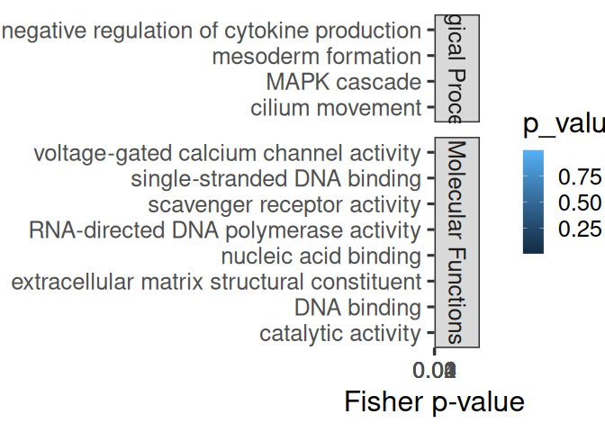
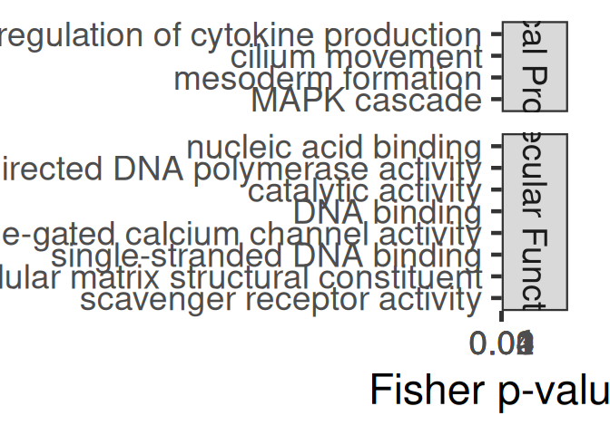
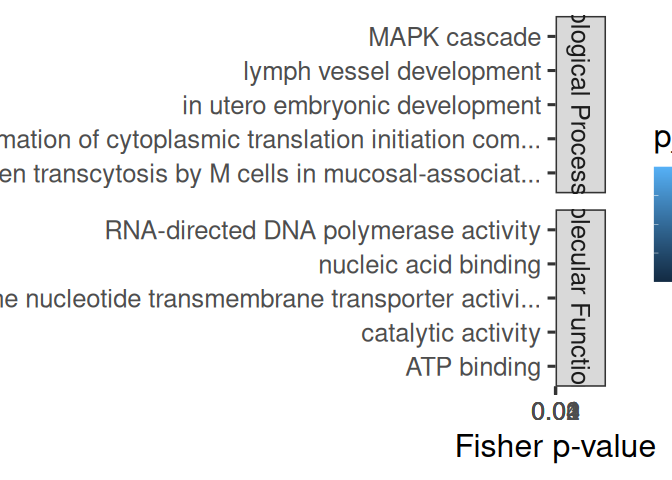
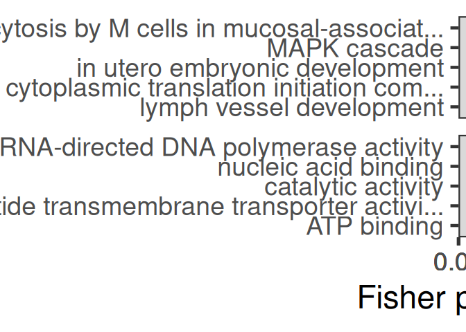
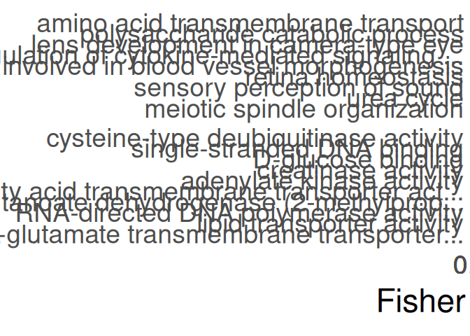
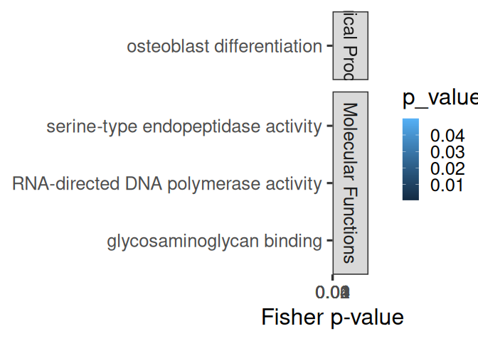
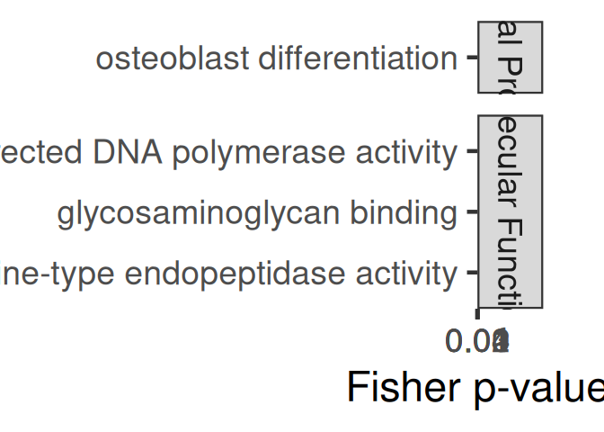

09.13-Apul-mRNA-miRNA-interactions-FE-pooled
================
Kathleen Durkin
2025-08-05

- [1 Format topGO files](#1-format-topgo-files)
  - [1.1 Read in and format annotation
    files](#11-read-in-and-format-annotation-files)
  - [1.2 Set up gene2GO object](#12-set-up-gene2go-object)
  - [1.3 Define reference set](#13-define-reference-set)
- [2 Pool 3UTR, CDS, and 5UTR](#2-pool-3utr-cds-and-5utr)
  - [2.1 Read in PCC/miranda data](#21-read-in-pccmiranda-data)
- [3 FA of all miRNA targets](#3-fa-of-all-mirna-targets)
- [4 FE of specific miRNA’s targets (all
  targets)](#4-fe-of-specific-mirnas-targets-all-targets)
- [5 FE of specific miRNA’s targets (significant cor
  targets)](#5-fe-of-specific-mirnas-targets-significant-cor-targets)
- [6 FE of all targets negatively correlated with miRNAs (regardless of
  correlation
  significance)](#6-fe-of-all-targets-negatively-correlated-with-mirnas-regardless-of-correlation-significance)
  - [6.0.1 Biological Processes](#601-biological-processes)
  - [6.0.2 Molecular Functions](#602-molecular-functions)
  - [6.0.3 Join ontologies](#603-join-ontologies)
- [7 FE of all targets positively correlated with miRNAs (regardless of
  correlation
  significance)](#7-fe-of-all-targets-positively-correlated-with-mirnas-regardless-of-correlation-significance)
  - [7.0.1 Biological Processes](#701-biological-processes)
  - [7.0.2 Molecular Functions](#702-molecular-functions)
  - [7.0.3 Join ontologies](#703-join-ontologies)
- [8 FE of all targets significantly negatively correlated with
  miRNAs](#8-fe-of-all-targets-significantly-negatively-correlated-with-mirnas)
  - [8.0.1 Biological Processes](#801-biological-processes)
  - [8.0.2 Molecular Functions](#802-molecular-functions)
  - [8.0.3 Join ontologies](#803-join-ontologies)
- [9 FE of all targets significantly positively correlated with
  miRNAs](#9-fe-of-all-targets-significantly-positively-correlated-with-mirnas)
  - [9.0.1 Biological Processes](#901-biological-processes)
  - [9.0.2 Molecular Functions](#902-molecular-functions)
  - [9.0.3 Join ontologies](#903-join-ontologies)
- [10 Notes](#10-notes)

This script will use topGO to analyze functional enrichment of miRNA
targets for Apul, *pooling all target sites* (3UTR, 5UTR, and CDS)

Code used below was created by `Jill Ashey`, modified for use with
A.pulchra datasets by `Kathleen Durkin`

# 1 Format topGO files

## 1.1 Read in and format annotation files

``` r
# Read in Apul annotations
annot_locations <- read.delim("../output/02-Apul-reference-annotation/Apulcra-genome-mRNA-IDmapping-2024_12_12.tab")
# Remove unneeded columns 
annot_locations <- annot_locations %>% dplyr::select(-X, -V13)
# Ensure there are no duplicate rows
annot_locations <- annot_locations %>% distinct()

head(annot_locations)
```

    ##                     V1     V3 Protein.names
    ## 1   ntLink_4:1155-1537 P35061   Histone H2A
    ## 2   ntLink_4:2660-3441 P84239    Histone H3
    ## 3   ntLink_4:4515-6830 P35061   Histone H2A
    ## 4   ntLink_4:7096-7859 P84239    Histone H3
    ## 5   ntLink_4:8474-9669 P35061   Histone H2A
    ## 6 ntLink_4:11162-11925 P84239    Histone H3
    ##                                     Organism Gene.Ontology..biological.process.
    ## 1          Acropora formosa (Staghorn coral)                                   
    ## 2 Urechis caupo (Innkeeper worm) (Spoonworm)                                   
    ## 3          Acropora formosa (Staghorn coral)                                   
    ## 4 Urechis caupo (Innkeeper worm) (Spoonworm)                                   
    ## 5          Acropora formosa (Staghorn coral)                                   
    ## 6 Urechis caupo (Innkeeper worm) (Spoonworm)                                   
    ##                                            Gene.Ontology.IDs
    ## 1 GO:0000786; GO:0003677; GO:0005634; GO:0030527; GO:0046982
    ## 2 GO:0000786; GO:0003677; GO:0005634; GO:0030527; GO:0046982
    ## 3 GO:0000786; GO:0003677; GO:0005634; GO:0030527; GO:0046982
    ## 4 GO:0000786; GO:0003677; GO:0005634; GO:0030527; GO:0046982
    ## 5 GO:0000786; GO:0003677; GO:0005634; GO:0030527; GO:0046982
    ## 6 GO:0000786; GO:0003677; GO:0005634; GO:0030527; GO:0046982

``` r
# Looks good!
```

This file shows each gene as it’s genomic location. We want to use gene
IDs to associate genes, so add gene IDs to this annotation table

Read in file that associates each mRNA genomic location with
corresponding gene ID

``` r
mRNA_FUNids <- read.table("../output/15-Apul-annotate-UTRs/Apul-mRNA-FUNids.txt", header=FALSE, col.names=c("location", "type", "mRNA_ID", "gene_ID", "product"), sep="\t")

# Remove unwanted text from parent column
mRNA_FUNids$gene_ID <- gsub("Parent=", "", mRNA_FUNids$gene_ID)
# Only need to keep mRNA location and gene ID
mRNA_FUNids <- mRNA_FUNids %>% dplyr::select(location, gene_ID)
```

join with annotation file

``` r
# join
annot <- left_join(annot_locations, mRNA_FUNids, by = c("V1" = "location"))

# ensure there are no duplicate rows
annot <- annot %>% distinct()
```

## 1.2 Set up gene2GO object

Want to isolate a list of GO terms per gene

``` r
gene2go <- annot %>% filter(!is.na(Gene.Ontology.IDs)) %>% dplyr::select(gene_ID, Gene.Ontology.IDs)
gene2go <- gene2go %>% dplyr::rename(GO.ID = Gene.Ontology.IDs)

gene2go_list <- setNames(
  strsplit(as.character(gene2go$GO.ID), ";"), 
  gene2go$gene_ID
)
```

Note: I think this means genes that had a Uniprot ID but no GO terms are
excluded from this analysis

## 1.3 Define reference set

Define reference set of genes. This should be all genes *found in our
samples*, NOT all genes in the A.pulchra genome. Some genes (e.g.,
reproduction pathways) may not be found/expected in our samples for
valid biological reasons.

``` r
# Read in counts matrix
Apul_counts <- read.csv("../output/07-Apul-Hisat/Apul-gene_count_matrix.csv")
# Exclude genes with all 0 counts
Apul_counts <- Apul_counts[rowSums(Apul_counts[, 2:6]) != 0, ]

# Select gene IDs of the genes present in our samples
all_genes <- Apul_counts$gene_id
length(all_genes)
```

    ## [1] 33624

So we have a reference set of 33624 genes present in our samples.

# 2 Pool 3UTR, CDS, and 5UTR

## 2.1 Read in PCC/miranda data

These are tables of all putative miRNA-mRNA binding predicted by
miRanda, plus Pearson’s correlation coefficients for coexpression of
each putative binding pair.

``` r
# Load for each region
data_3UTR <- read.csv("../output/09-Apul-mRNA-miRNA-interactions/miranda_PCC_miRNA_mRNA.csv") %>% dplyr::select(-X, -X.1)
data_CDS <- read.csv("../output/09.01-Apul-mRNA-miRNA-interactions-CDS_5UTR/miRanda_PCC_miRNA_CDS.csv") %>% dplyr::select(-X)
data_5UTR <- read.csv("../output/09.01-Apul-mRNA-miRNA-interactions-CDS_5UTR/miRanda_PCC_miRNA_5UTR.csv") %>% dplyr::select(-X)

# Format and combine into pooled targets
data_3UTR$region <- "3UTR"

colnames(data_CDS) <- c("miRNA", "mRNA_coord", "score", "energy", "query_start", "query_end", "subject_start", "subject_end", "total_bp_shared", "query_similar", "subject_similar", "mRNA", "PCC.cor", "p_value", "adjusted_p_value")
data_CDS$query_start_end <- paste0(data_CDS$query_start, " ", data_CDS$query_end)
data_CDS$subject_start_end <- paste0(data_CDS$subject_start, " ", data_CDS$subject_end)
data_CDS$region <- "CDS"
data_CDS <- data_CDS %>% dplyr::select(colnames(data_3UTR))

colnames(data_5UTR) <- c("miRNA", "mRNA_coord", "score", "energy", "query_start", "query_end", "subject_start", "subject_end", "total_bp_shared", "query_similar", "subject_similar", "mRNA", "PCC.cor", "p_value", "adjusted_p_value")
data_5UTR$query_start_end <- paste0(data_5UTR$query_start, " ", data_5UTR$query_end)
data_5UTR$subject_start_end <- paste0(data_5UTR$subject_start, " ", data_5UTR$subject_end)
data_5UTR$region <- "5UTR"
data_5UTR <- data_5UTR %>% dplyr::select(colnames(data_3UTR))

data <- rbind(data_3UTR, data_CDS, data_5UTR)

head(data)
```

    ##           miRNA       mRNA    PCC.cor   p_value adjusted_p_value score energy
    ## 1  Cluster_5981 FUN_028147  0.6825537 0.2041707        0.9986496   146 -22.19
    ## 2 Cluster_15340 FUN_013332  0.6371070 0.2476393        0.9986496   158 -23.15
    ## 3  Cluster_5981 FUN_041253 -0.2250869 0.7158492        0.9986496   153 -20.50
    ## 4  Cluster_3366 FUN_010827  0.3671005 0.5433145        0.9986496   163 -22.14
    ## 5  Cluster_3367 FUN_010827  0.5369304 0.3507987        0.9986496   163 -22.14
    ## 6 Cluster_15340 FUN_003342  0.1096213 0.8607058        0.9986496   154 -20.65
    ##   query_start_end subject_start_end total_bp_shared query_similar
    ## 1            2 21           185 209              21        66.67%
    ## 2            2 20           198 220              19        68.42%
    ## 3            2 21           699 719              19        73.68%
    ## 4            2 18           346 368              16        81.25%
    ## 5            2 18           346 368              16        81.25%
    ## 6            2 20           562 585              20        65.00%
    ##   subject_similar region
    ## 1          71.43%   3UTR
    ## 2          84.21%   3UTR
    ## 3          73.68%   3UTR
    ## 4          93.75%   3UTR
    ## 5          93.75%   3UTR
    ## 6          80.00%   3UTR

# 3 FA of all miRNA targets

Functional annotation of all putative miRNA targets

``` r
cor_bind_FA <- left_join(data, annot, by = c("mRNA" = "gene_ID")) %>% distinct()

nrow(cor_bind_FA)
```

    ## [1] 47732

``` r
nrow(cor_bind_FA[!is.na(cor_bind_FA$Gene.Ontology.IDs),])
```

    ## [1] 14067

Of the 47,732 putative miRNA targets (all regions) predicted by miRanda,
14,067 (29.4%) have available annotations

``` r
sig_cor_bind_FA <- cor_bind_FA[cor_bind_FA$p_value < 0.05,]

# Remove rows where all values are NA
sig_cor_bind_FA <- sig_cor_bind_FA[!apply(is.na(sig_cor_bind_FA), 1, all), ]

nrow(sig_cor_bind_FA)
```

    ## [1] 2220

``` r
nrow(sig_cor_bind_FA[!is.na(sig_cor_bind_FA$Gene.Ontology.IDs),])
```

    ## [1] 644

Of the 2220 putative miRNA targets predicted by miRanda that also have
significantly correlated expression, 644 have available annotations.

Save

``` r
write.csv(cor_bind_FA, "../output/09.13-Apul-mRNA-miRNA-interactions-FE-pooled/miRNA_pooled_targets_FA.csv")
write.csv(sig_cor_bind_FA, "../output/09.13-Apul-mRNA-miRNA-interactions-FE-pooled/miRNA_pooled_sig_cor_targets_FA.csv")
```

# 4 FE of specific miRNA’s targets (all targets)

Create topGO function for use with miRNA names

``` r
miRNA_topGO_FE <- function(miRNA.name, input_interactions) {
  
  #Isolate genes in our input module of interest
  interacting_genes <- input_interactions %>%
    filter(miRNA == miRNA.name) %>%
    pull(mRNA)
  
  if (length(interacting_genes) > 0) {
    # Create factor for all reference genes, where 1 represents module membership and 0 means the gene is not in module of interest
    gene_list <- factor(as.integer(all_genes %in% interacting_genes))
    names(gene_list) <- all_genes
    str(gene_list)
    
    ## Biological Process ##
    # Create topGO object
    GO_BP <- new("topGOdata", 
                ontology = "BP", # Biological Process
                allGenes = gene_list,
                annot = annFUN.gene2GO, 
                gene2GO = gene2go_list,
                geneSel=topDiffGenes)
    
    # Run GO enrichment test
    GO_BP_FE <- runTest(GO_BP, algorithm = "weight01", statistic = "fisher")
    # View the results
    GO_BP_results <- GenTable(GO_BP, Fisher = GO_BP_FE, orderBy = "Fisher",  topNodes = 100, numChar = 51)
    # Filter by significant results
    GO_BP_results$Fisher<-as.numeric(GO_BP_results$Fisher)
    GO_BP_results_sig<-GO_BP_results[GO_BP_results$Fisher<0.05,]
    
    
    ## Molecular Function ##
    # Create topGO object
    GO_MF <- new("topGOdata", 
                ontology = "MF", # Molecular Function
                allGenes = gene_list,
                annot = annFUN.gene2GO, 
                gene2GO = gene2go_list,
                geneSel=topDiffGenes)
    
    # Run GO enrichment test
    GO_MF_FE <- runTest(GO_MF, algorithm = "weight01", statistic = "fisher")
    # View the results
    GO_MF_results <- GenTable(GO_MF, Fisher = GO_MF_FE, orderBy = "Fisher",  topNodes = 100, numChar = 51)
    # Filter by significant results
    GO_MF_results$Fisher<-as.numeric(GO_MF_results$Fisher)
    GO_MF_results_sig<-GO_MF_results[GO_MF_results$Fisher<0.05,]
  
    # Return
    # Add type column only if results exist
    if (nrow(GO_BP_results_sig) > 0) {
      GO_BP_results_sig$type <- "Biological.Process"
    }
    if (nrow(GO_MF_results_sig) > 0) {
      GO_MF_results_sig$type <- "Molecular.Function"
    }
    GO_results <- rbind(GO_BP_results_sig, GO_MF_results_sig)
    print(GO_results)
  }
}

miRNA_topGO_FE("Cluster_10051", cor_bind_FA)
```

    ##  Factor w/ 2 levels "0","1": 1 1 1 1 1 1 1 1 1 1 ...
    ##  - attr(*, "names")= chr [1:33624] "FUN_035039" "FUN_035038" "FUN_035031" "FUN_035030" ...

    ## 
    ## Building most specific GOs .....

    ##  ( 267 GO terms found. )

    ## 
    ## Build GO DAG topology ..........

    ##  ( 1151 GO terms and 2130 relations. )

    ## 
    ## Annotating nodes ...............

    ##  ( 1420 genes annotated to the GO terms. )

    ## 
    ##           -- Weight01 Algorithm -- 
    ## 
    ##       the algorithm is scoring 239 nontrivial nodes
    ##       parameters: 
    ##           test statistic: fisher

    ## 
    ##   Level 14:  1 nodes to be scored    (0 eliminated genes)

    ## 
    ##   Level 13:  2 nodes to be scored    (0 eliminated genes)

    ## 
    ##   Level 12:  3 nodes to be scored    (11 eliminated genes)

    ## 
    ##   Level 11:  5 nodes to be scored    (15 eliminated genes)

    ## 
    ##   Level 10:  9 nodes to be scored    (80 eliminated genes)

    ## 
    ##   Level 9:   11 nodes to be scored   (236 eliminated genes)

    ## 
    ##   Level 8:   20 nodes to be scored   (269 eliminated genes)

    ## 
    ##   Level 7:   30 nodes to be scored   (312 eliminated genes)

    ## 
    ##   Level 6:   37 nodes to be scored   (445 eliminated genes)

    ## 
    ##   Level 5:   43 nodes to be scored   (739 eliminated genes)

    ## 
    ##   Level 4:   38 nodes to be scored   (834 eliminated genes)

    ## 
    ##   Level 3:   29 nodes to be scored   (1127 eliminated genes)

    ## 
    ##   Level 2:   10 nodes to be scored   (1320 eliminated genes)

    ## 
    ##   Level 1:   1 nodes to be scored    (1405 eliminated genes)

    ## 
    ## Building most specific GOs .....

    ##  ( 459 GO terms found. )

    ## 
    ## Build GO DAG topology ..........

    ##  ( 913 GO terms and 1200 relations. )

    ## 
    ## Annotating nodes ...............

    ##  ( 2840 genes annotated to the GO terms. )

    ## 
    ##           -- Weight01 Algorithm -- 
    ## 
    ##       the algorithm is scoring 206 nontrivial nodes
    ##       parameters: 
    ##           test statistic: fisher

    ## 
    ##   Level 10:  2 nodes to be scored    (0 eliminated genes)

    ## 
    ##   Level 9:   8 nodes to be scored    (0 eliminated genes)

    ## 
    ##   Level 8:   13 nodes to be scored   (143 eliminated genes)

    ## 
    ##   Level 7:   32 nodes to be scored   (453 eliminated genes)

    ## 
    ##   Level 6:   41 nodes to be scored   (544 eliminated genes)

    ## 
    ##   Level 5:   41 nodes to be scored   (958 eliminated genes)

    ## 
    ##   Level 4:   40 nodes to be scored   (1399 eliminated genes)

    ## 
    ##   Level 3:   20 nodes to be scored   (2047 eliminated genes)

    ## 
    ##   Level 2:   8 nodes to be scored    (2308 eliminated genes)

    ## 
    ##   Level 1:   1 nodes to be scored    (2621 eliminated genes)

    ##         GO.ID                                                   Term Annotated
    ## 1  GO:0006091         generation of precursor metabolites and energy        12
    ## 2  GO:0006623                           protein targeting to vacuole         1
    ## 3  GO:0001504                                neurotransmitter uptake         1
    ## 4  GO:0003341                                        cilium movement        22
    ## 5  GO:0003676                                   nucleic acid binding       510
    ## 6  GO:0008061                                         chitin binding         6
    ## 7  GO:0000104                       succinate dehydrogenase activity         1
    ## 8  GO:0008424     glycoprotein 6-alpha-L-fucosyltransferase activity         1
    ## 9  GO:0004371                              glycerone kinase activity         1
    ## 10 GO:0004470                                  malic enzyme activity         1
    ## 11 GO:0005536                                      D-glucose binding         1
    ## 12 GO:0004748 ribonucleoside-diphosphate reductase activity, thio...         1
    ## 13 GO:0004095              carnitine O-palmitoyltransferase activity         1
    ##    Significant Expected   Fisher               type
    ## 1            3     0.41 0.006400 Biological.Process
    ## 2            1     0.03 0.033800 Biological.Process
    ## 3            1     0.03 0.033800 Biological.Process
    ## 4            3     0.74 0.035500 Biological.Process
    ## 5           38    22.81 0.000003 Molecular.Function
    ## 6            2     0.27 0.026000 Molecular.Function
    ## 7            1     0.04 0.045000 Molecular.Function
    ## 8            1     0.04 0.045000 Molecular.Function
    ## 9            1     0.04 0.045000 Molecular.Function
    ## 10           1     0.04 0.045000 Molecular.Function
    ## 11           1     0.04 0.045000 Molecular.Function
    ## 12           1     0.04 0.045000 Molecular.Function
    ## 13           1     0.04 0.045000 Molecular.Function

Loop through all miRNA and run functional enrichment on the miRNA’s
targets (all predicted targets)

``` r
interacting_miRNAs <- unique(cor_bind_FA$miRNA) %>% na.omit
results_all_targets <- NULL  # initialize empty df

for(miRNA in interacting_miRNAs) {
  
  # Run topGO enrichment function
  miRNA_results <- miRNA_topGO_FE(miRNA, cor_bind_FA)
  
  # Only keep results if not empty
  if (nrow(miRNA_results) > 0) {
    
    # Add the miRNA source column
    miRNA_results$miRNA <- miRNA

    # Bind to the accumulating results data frame
    results_all_targets <- rbind(results_all_targets, miRNA_results)
  }
}
```

    ##  Factor w/ 2 levels "0","1": 1 1 1 1 1 1 1 1 1 2 ...
    ##  - attr(*, "names")= chr [1:33624] "FUN_035039" "FUN_035038" "FUN_035031" "FUN_035030" ...

    ## 
    ## Building most specific GOs .....

    ##  ( 267 GO terms found. )

    ## 
    ## Build GO DAG topology ..........

    ##  ( 1151 GO terms and 2130 relations. )

    ## 
    ## Annotating nodes ...............

    ##  ( 1420 genes annotated to the GO terms. )

    ## 
    ##           -- Weight01 Algorithm -- 
    ## 
    ##       the algorithm is scoring 539 nontrivial nodes
    ##       parameters: 
    ##           test statistic: fisher

    ## 
    ##   Level 14:  4 nodes to be scored    (0 eliminated genes)

    ## 
    ##   Level 13:  7 nodes to be scored    (0 eliminated genes)

    ## 
    ##   Level 12:  5 nodes to be scored    (20 eliminated genes)

    ## 
    ##   Level 11:  13 nodes to be scored   (43 eliminated genes)

    ## 
    ##   Level 10:  27 nodes to be scored   (95 eliminated genes)

    ## 
    ##   Level 9:   42 nodes to be scored   (285 eliminated genes)

    ## 
    ##   Level 8:   64 nodes to be scored   (403 eliminated genes)

    ## 
    ##   Level 7:   84 nodes to be scored   (510 eliminated genes)

    ## 
    ##   Level 6:   89 nodes to be scored   (650 eliminated genes)

    ## 
    ##   Level 5:   89 nodes to be scored   (984 eliminated genes)

    ## 
    ##   Level 4:   60 nodes to be scored   (1102 eliminated genes)

    ## 
    ##   Level 3:   43 nodes to be scored   (1281 eliminated genes)

    ## 
    ##   Level 2:   11 nodes to be scored   (1346 eliminated genes)

    ## 
    ##   Level 1:   1 nodes to be scored    (1418 eliminated genes)

    ## 
    ## Building most specific GOs .....

    ##  ( 459 GO terms found. )

    ## 
    ## Build GO DAG topology ..........

    ##  ( 913 GO terms and 1200 relations. )

    ## 
    ## Annotating nodes ...............

    ##  ( 2840 genes annotated to the GO terms. )

    ## 
    ##           -- Weight01 Algorithm -- 
    ## 
    ##       the algorithm is scoring 319 nontrivial nodes
    ##       parameters: 
    ##           test statistic: fisher

    ## 
    ##   Level 10:  2 nodes to be scored    (0 eliminated genes)

    ## 
    ##   Level 9:   9 nodes to be scored    (0 eliminated genes)

    ## 
    ##   Level 8:   23 nodes to be scored   (108 eliminated genes)

    ## 
    ##   Level 7:   50 nodes to be scored   (458 eliminated genes)

    ## 
    ##   Level 6:   75 nodes to be scored   (646 eliminated genes)

    ## 
    ##   Level 5:   62 nodes to be scored   (1184 eliminated genes)

    ## 
    ##   Level 4:   57 nodes to be scored   (1557 eliminated genes)

    ## 
    ##   Level 3:   28 nodes to be scored   (2169 eliminated genes)

    ## 
    ##   Level 2:   12 nodes to be scored   (2466 eliminated genes)

    ## 
    ##   Level 1:   1 nodes to be scored    (2717 eliminated genes)

    ##         GO.ID                                           Term Annotated
    ## 1  GO:0019700          organic phosphonate catabolic process        12
    ## 2  GO:0003341                                cilium movement        22
    ## 3  GO:0003417             growth plate cartilage development         2
    ## 4  GO:0002121                 inter-male aggressive behavior         2
    ## 5  GO:0001933 negative regulation of protein phosphorylation         5
    ## 6  GO:0006886                intracellular protein transport         4
    ## 7  GO:0001745                     compound eye morphogenesis         3
    ## 8  GO:0003676                           nucleic acid binding       510
    ## 9  GO:0003964           RNA-directed DNA polymerase activity       135
    ## 10 GO:0005509                            calcium ion binding        69
    ## 11 GO:0004252             serine-type endopeptidase activity        53
    ## 12 GO:0003677                                    DNA binding       268
    ## 13 GO:0005506                               iron ion binding        31
    ##    Significant Expected    Fisher               type
    ## 1           10     1.53 4.700e-08 Biological.Process
    ## 2            7     2.80 1.600e-02 Biological.Process
    ## 3            2     0.25 1.600e-02 Biological.Process
    ## 4            2     0.25 1.600e-02 Biological.Process
    ## 5            3     0.64 1.700e-02 Biological.Process
    ## 6            3     0.51 4.400e-02 Biological.Process
    ## 7            2     0.38 4.400e-02 Biological.Process
    ## 8           88    68.78 1.400e-04 Molecular.Function
    ## 9           33    18.21 3.100e-04 Molecular.Function
    ## 10          20     9.31 4.900e-04 Molecular.Function
    ## 11          15     7.15 3.200e-03 Molecular.Function
    ## 12          39    36.14 5.990e-03 Molecular.Function
    ## 13           8     4.18 4.805e-02 Molecular.Function
    ##  Factor w/ 2 levels "0","1": 1 1 1 1 1 1 2 1 1 1 ...
    ##  - attr(*, "names")= chr [1:33624] "FUN_035039" "FUN_035038" "FUN_035031" "FUN_035030" ...

    ## 
    ## Building most specific GOs .....

    ##  ( 267 GO terms found. )

    ## 
    ## Build GO DAG topology ..........

    ##  ( 1151 GO terms and 2130 relations. )

    ## 
    ## Annotating nodes ...............

    ##  ( 1420 genes annotated to the GO terms. )

    ## 
    ##           -- Weight01 Algorithm -- 
    ## 
    ##       the algorithm is scoring 549 nontrivial nodes
    ##       parameters: 
    ##           test statistic: fisher

    ## 
    ##   Level 15:  1 nodes to be scored    (0 eliminated genes)

    ## 
    ##   Level 14:  4 nodes to be scored    (0 eliminated genes)

    ## 
    ##   Level 13:  9 nodes to be scored    (2 eliminated genes)

    ## 
    ##   Level 12:  9 nodes to be scored    (19 eliminated genes)

    ## 
    ##   Level 11:  16 nodes to be scored   (47 eliminated genes)

    ## 
    ##   Level 10:  24 nodes to be scored   (106 eliminated genes)

    ## 
    ##   Level 9:   37 nodes to be scored   (284 eliminated genes)

    ## 
    ##   Level 8:   61 nodes to be scored   (389 eliminated genes)

    ## 
    ##   Level 7:   77 nodes to be scored   (470 eliminated genes)

    ## 
    ##   Level 6:   88 nodes to be scored   (663 eliminated genes)

    ## 
    ##   Level 5:   99 nodes to be scored   (1020 eliminated genes)

    ## 
    ##   Level 4:   64 nodes to be scored   (1102 eliminated genes)

    ## 
    ##   Level 3:   46 nodes to be scored   (1269 eliminated genes)

    ## 
    ##   Level 2:   13 nodes to be scored   (1355 eliminated genes)

    ## 
    ##   Level 1:   1 nodes to be scored    (1403 eliminated genes)

    ## 
    ## Building most specific GOs .....

    ##  ( 459 GO terms found. )

    ## 
    ## Build GO DAG topology ..........

    ##  ( 913 GO terms and 1200 relations. )

    ## 
    ## Annotating nodes ...............

    ##  ( 2840 genes annotated to the GO terms. )

    ## 
    ##           -- Weight01 Algorithm -- 
    ## 
    ##       the algorithm is scoring 361 nontrivial nodes
    ##       parameters: 
    ##           test statistic: fisher

    ## 
    ##   Level 10:  3 nodes to be scored    (0 eliminated genes)

    ## 
    ##   Level 9:   8 nodes to be scored    (0 eliminated genes)

    ## 
    ##   Level 8:   28 nodes to be scored   (150 eliminated genes)

    ## 
    ##   Level 7:   56 nodes to be scored   (461 eliminated genes)

    ## 
    ##   Level 6:   83 nodes to be scored   (654 eliminated genes)

    ## 
    ##   Level 5:   72 nodes to be scored   (1166 eliminated genes)

    ## 
    ##   Level 4:   66 nodes to be scored   (1537 eliminated genes)

    ## 
    ##   Level 3:   30 nodes to be scored   (2164 eliminated genes)

    ## 
    ##   Level 2:   14 nodes to be scored   (2525 eliminated genes)

    ## 
    ##   Level 1:   1 nodes to be scored    (2724 eliminated genes)

    ##        GO.ID                                                Term Annotated
    ## 1 GO:0003341                                     cilium movement        22
    ## 2 GO:0002931                                response to ischemia         3
    ## 3 GO:0003964                RNA-directed DNA polymerase activity       135
    ## 4 GO:0003824                                  catalytic activity      1058
    ## 5 GO:0005388                 P-type calcium transporter activity         4
    ## 6 GO:0005044                         scavenger receptor activity        13
    ## 7 GO:0003676                                nucleic acid binding       510
    ## 8 GO:0000987 cis-regulatory region sequence-specific DNA binding       113
    ## 9 GO:0004197                cysteine-type endopeptidase activity        18
    ##   Significant Expected    Fisher               type
    ## 1           7     2.87 1.700e-02 Biological.Process
    ## 2           2     0.39 4.600e-02 Biological.Process
    ## 3          47    21.11 1.400e-08 Molecular.Function
    ## 4         185   165.41 5.600e-04 Molecular.Function
    ## 5           4     0.63 5.900e-04 Molecular.Function
    ## 6           6     2.03 9.090e-03 Molecular.Function
    ## 7          91    79.73 1.554e-02 Molecular.Function
    ## 8          13    17.67 3.002e-02 Molecular.Function
    ## 9           6     2.81 4.943e-02 Molecular.Function
    ##  Factor w/ 2 levels "0","1": 1 1 1 1 1 2 1 1 1 1 ...
    ##  - attr(*, "names")= chr [1:33624] "FUN_035039" "FUN_035038" "FUN_035031" "FUN_035030" ...

    ## 
    ## Building most specific GOs .....

    ##  ( 267 GO terms found. )

    ## 
    ## Build GO DAG topology ..........

    ##  ( 1151 GO terms and 2130 relations. )

    ## 
    ## Annotating nodes ...............

    ##  ( 1420 genes annotated to the GO terms. )

    ## 
    ##           -- Weight01 Algorithm -- 
    ## 
    ##       the algorithm is scoring 508 nontrivial nodes
    ##       parameters: 
    ##           test statistic: fisher

    ## 
    ##   Level 15:  1 nodes to be scored    (0 eliminated genes)

    ## 
    ##   Level 14:  2 nodes to be scored    (0 eliminated genes)

    ## 
    ##   Level 13:  7 nodes to be scored    (1 eliminated genes)

    ## 
    ##   Level 12:  8 nodes to be scored    (14 eliminated genes)

    ## 
    ##   Level 11:  12 nodes to be scored   (39 eliminated genes)

    ## 
    ##   Level 10:  28 nodes to be scored   (102 eliminated genes)

    ## 
    ##   Level 9:   36 nodes to be scored   (281 eliminated genes)

    ## 
    ##   Level 8:   54 nodes to be scored   (396 eliminated genes)

    ## 
    ##   Level 7:   72 nodes to be scored   (466 eliminated genes)

    ## 
    ##   Level 6:   85 nodes to be scored   (655 eliminated genes)

    ## 
    ##   Level 5:   86 nodes to be scored   (986 eliminated genes)

    ## 
    ##   Level 4:   57 nodes to be scored   (1084 eliminated genes)

    ## 
    ##   Level 3:   47 nodes to be scored   (1232 eliminated genes)

    ## 
    ##   Level 2:   12 nodes to be scored   (1344 eliminated genes)

    ## 
    ##   Level 1:   1 nodes to be scored    (1402 eliminated genes)

    ## 
    ## Building most specific GOs .....

    ##  ( 459 GO terms found. )

    ## 
    ## Build GO DAG topology ..........

    ##  ( 913 GO terms and 1200 relations. )

    ## 
    ## Annotating nodes ...............

    ##  ( 2840 genes annotated to the GO terms. )

    ## 
    ##           -- Weight01 Algorithm -- 
    ## 
    ##       the algorithm is scoring 364 nontrivial nodes
    ##       parameters: 
    ##           test statistic: fisher

    ## 
    ##   Level 12:  2 nodes to be scored    (0 eliminated genes)

    ## 
    ##   Level 11:  2 nodes to be scored    (0 eliminated genes)

    ## 
    ##   Level 10:  5 nodes to be scored    (4 eliminated genes)

    ## 
    ##   Level 9:   13 nodes to be scored   (4 eliminated genes)

    ## 
    ##   Level 8:   23 nodes to be scored   (114 eliminated genes)

    ## 
    ##   Level 7:   53 nodes to be scored   (474 eliminated genes)

    ## 
    ##   Level 6:   77 nodes to be scored   (660 eliminated genes)

    ## 
    ##   Level 5:   78 nodes to be scored   (1159 eliminated genes)

    ## 
    ##   Level 4:   65 nodes to be scored   (1508 eliminated genes)

    ## 
    ##   Level 3:   31 nodes to be scored   (2139 eliminated genes)

    ## 
    ##   Level 2:   14 nodes to be scored   (2482 eliminated genes)

    ## 
    ##   Level 1:   1 nodes to be scored    (2692 eliminated genes)

    ##         GO.ID                                              Term Annotated
    ## 1  GO:0001843                               neural tube closure         7
    ## 2  GO:0002042 cell migration involved in sprouting angiogenesis         7
    ## 3  GO:0001818        negative regulation of cytokine production        18
    ## 4  GO:0002064                       epithelial cell development         4
    ## 5  GO:0001708                           cell fate specification         4
    ## 6  GO:0003964              RNA-directed DNA polymerase activity       135
    ## 7  GO:0003676                              nucleic acid binding       510
    ## 8  GO:0000016                                  lactase activity         4
    ## 9  GO:0003824                                catalytic activity      1058
    ## 10 GO:0005201       extracellular matrix structural constituent        17
    ## 11 GO:0001540                              amyloid-beta binding        24
    ## 12 GO:0004252                serine-type endopeptidase activity        53
    ##    Significant Expected  Fisher               type
    ## 1            3     0.68 0.02300 Biological.Process
    ## 2            3     0.68 0.02300 Biological.Process
    ## 3            5     1.74 0.02400 Biological.Process
    ## 4            2     0.39 0.04900 Biological.Process
    ## 5            2     0.39 0.04900 Biological.Process
    ## 6           27    14.21 0.00059 Molecular.Function
    ## 7           53    53.69 0.00090 Molecular.Function
    ## 8            3     0.42 0.00426 Molecular.Function
    ## 9          125   111.39 0.00536 Molecular.Function
    ## 10           5     1.79 0.02668 Molecular.Function
    ## 11           6     2.53 0.03394 Molecular.Function
    ## 12          10     5.58 0.04624 Molecular.Function
    ##  Factor w/ 2 levels "0","1": 1 1 1 1 1 1 1 1 1 1 ...
    ##  - attr(*, "names")= chr [1:33624] "FUN_035039" "FUN_035038" "FUN_035031" "FUN_035030" ...

    ## 
    ## Building most specific GOs .....

    ##  ( 267 GO terms found. )

    ## 
    ## Build GO DAG topology ..........

    ##  ( 1151 GO terms and 2130 relations. )

    ## 
    ## Annotating nodes ...............

    ##  ( 1420 genes annotated to the GO terms. )

    ## 
    ##           -- Weight01 Algorithm -- 
    ## 
    ##       the algorithm is scoring 546 nontrivial nodes
    ##       parameters: 
    ##           test statistic: fisher

    ## 
    ##   Level 15:  2 nodes to be scored    (0 eliminated genes)

    ## 
    ##   Level 14:  3 nodes to be scored    (0 eliminated genes)

    ## 
    ##   Level 13:  8 nodes to be scored    (3 eliminated genes)

    ## 
    ##   Level 12:  9 nodes to be scored    (18 eliminated genes)

    ## 
    ##   Level 11:  15 nodes to be scored   (43 eliminated genes)

    ## 
    ##   Level 10:  31 nodes to be scored   (106 eliminated genes)

    ## 
    ##   Level 9:   41 nodes to be scored   (292 eliminated genes)

    ## 
    ##   Level 8:   62 nodes to be scored   (407 eliminated genes)

    ## 
    ##   Level 7:   78 nodes to be scored   (488 eliminated genes)

    ## 
    ##   Level 6:   88 nodes to be scored   (675 eliminated genes)

    ## 
    ##   Level 5:   89 nodes to be scored   (1001 eliminated genes)

    ## 
    ##   Level 4:   59 nodes to be scored   (1098 eliminated genes)

    ## 
    ##   Level 3:   48 nodes to be scored   (1232 eliminated genes)

    ## 
    ##   Level 2:   12 nodes to be scored   (1332 eliminated genes)

    ## 
    ##   Level 1:   1 nodes to be scored    (1402 eliminated genes)

    ## 
    ## Building most specific GOs .....

    ##  ( 459 GO terms found. )

    ## 
    ## Build GO DAG topology ..........

    ##  ( 913 GO terms and 1200 relations. )

    ## 
    ## Annotating nodes ...............

    ##  ( 2840 genes annotated to the GO terms. )

    ## 
    ##           -- Weight01 Algorithm -- 
    ## 
    ##       the algorithm is scoring 348 nontrivial nodes
    ##       parameters: 
    ##           test statistic: fisher

    ## 
    ##   Level 12:  2 nodes to be scored    (0 eliminated genes)

    ## 
    ##   Level 11:  2 nodes to be scored    (0 eliminated genes)

    ## 
    ##   Level 10:  6 nodes to be scored    (4 eliminated genes)

    ## 
    ##   Level 9:   12 nodes to be scored   (4 eliminated genes)

    ## 
    ##   Level 8:   23 nodes to be scored   (156 eliminated genes)

    ## 
    ##   Level 7:   50 nodes to be scored   (472 eliminated genes)

    ## 
    ##   Level 6:   70 nodes to be scored   (661 eliminated genes)

    ## 
    ##   Level 5:   74 nodes to be scored   (1168 eliminated genes)

    ## 
    ##   Level 4:   63 nodes to be scored   (1477 eliminated genes)

    ## 
    ##   Level 3:   31 nodes to be scored   (2128 eliminated genes)

    ## 
    ##   Level 2:   14 nodes to be scored   (2481 eliminated genes)

    ## 
    ##   Level 1:   1 nodes to be scored    (2692 eliminated genes)

    ##         GO.ID                                              Term Annotated
    ## 1  GO:0001843                               neural tube closure         7
    ## 2  GO:0002042 cell migration involved in sprouting angiogenesis         7
    ## 3  GO:0001818        negative regulation of cytokine production        18
    ## 4  GO:0002064                       epithelial cell development         4
    ## 5  GO:0001708                           cell fate specification         4
    ## 6  GO:0003964              RNA-directed DNA polymerase activity       135
    ## 7  GO:0003676                              nucleic acid binding       510
    ## 8  GO:0000016                                  lactase activity         4
    ## 9  GO:0003824                                catalytic activity      1058
    ## 10 GO:0004252                serine-type endopeptidase activity        53
    ##    Significant Expected  Fisher               type
    ## 1            3     0.68 0.02300 Biological.Process
    ## 2            3     0.68 0.02300 Biological.Process
    ## 3            5     1.74 0.02400 Biological.Process
    ## 4            2     0.39 0.04900 Biological.Process
    ## 5            2     0.39 0.04900 Biological.Process
    ## 6           27    13.69 0.00032 Molecular.Function
    ## 7           53    51.72 0.00050 Molecular.Function
    ## 8            3     0.41 0.00382 Molecular.Function
    ## 9          117   107.29 0.02280 Molecular.Function
    ## 10          10     5.37 0.03706 Molecular.Function
    ##  Factor w/ 2 levels "0","1": 1 1 1 1 1 1 1 1 1 2 ...
    ##  - attr(*, "names")= chr [1:33624] "FUN_035039" "FUN_035038" "FUN_035031" "FUN_035030" ...

    ## 
    ## Building most specific GOs .....

    ##  ( 267 GO terms found. )

    ## 
    ## Build GO DAG topology ..........

    ##  ( 1151 GO terms and 2130 relations. )

    ## 
    ## Annotating nodes ...............

    ##  ( 1420 genes annotated to the GO terms. )

    ## 
    ##           -- Weight01 Algorithm -- 
    ## 
    ##       the algorithm is scoring 271 nontrivial nodes
    ##       parameters: 
    ##           test statistic: fisher

    ## 
    ##   Level 12:  1 nodes to be scored    (0 eliminated genes)

    ## 
    ##   Level 11:  4 nodes to be scored    (0 eliminated genes)

    ## 
    ##   Level 10:  10 nodes to be scored   (10 eliminated genes)

    ## 
    ##   Level 9:   19 nodes to be scored   (162 eliminated genes)

    ## 
    ##   Level 8:   30 nodes to be scored   (237 eliminated genes)

    ## 
    ##   Level 7:   42 nodes to be scored   (317 eliminated genes)

    ## 
    ##   Level 6:   44 nodes to be scored   (396 eliminated genes)

    ## 
    ##   Level 5:   47 nodes to be scored   (706 eliminated genes)

    ## 
    ##   Level 4:   38 nodes to be scored   (772 eliminated genes)

    ## 
    ##   Level 3:   26 nodes to be scored   (1076 eliminated genes)

    ## 
    ##   Level 2:   9 nodes to be scored    (1304 eliminated genes)

    ## 
    ##   Level 1:   1 nodes to be scored    (1369 eliminated genes)

    ## 
    ## Building most specific GOs .....

    ##  ( 459 GO terms found. )

    ## 
    ## Build GO DAG topology ..........

    ##  ( 913 GO terms and 1200 relations. )

    ## 
    ## Annotating nodes ...............

    ##  ( 2840 genes annotated to the GO terms. )

    ## 
    ##           -- Weight01 Algorithm -- 
    ## 
    ##       the algorithm is scoring 183 nontrivial nodes
    ##       parameters: 
    ##           test statistic: fisher

    ## 
    ##   Level 11:  1 nodes to be scored    (0 eliminated genes)

    ## 
    ##   Level 10:  3 nodes to be scored    (0 eliminated genes)

    ## 
    ##   Level 9:   8 nodes to be scored    (3 eliminated genes)

    ## 
    ##   Level 8:   12 nodes to be scored   (14 eliminated genes)

    ## 
    ##   Level 7:   22 nodes to be scored   (439 eliminated genes)

    ## 
    ##   Level 6:   30 nodes to be scored   (543 eliminated genes)

    ## 
    ##   Level 5:   40 nodes to be scored   (963 eliminated genes)

    ## 
    ##   Level 4:   34 nodes to be scored   (1212 eliminated genes)

    ## 
    ##   Level 3:   21 nodes to be scored   (1878 eliminated genes)

    ## 
    ##   Level 2:   11 nodes to be scored   (2191 eliminated genes)

    ## 
    ##   Level 1:   1 nodes to be scored    (2638 eliminated genes)

    ##         GO.ID                                          Term Annotated
    ## 1  GO:0015969    guanosine tetraphosphate metabolic process         9
    ## 2  GO:0006623                  protein targeting to vacuole         1
    ## 3  GO:0001706                            endoderm formation         1
    ## 4  GO:0006527                    arginine catabolic process         1
    ## 5  GO:0004674      protein serine/threonine kinase activity        55
    ## 6  GO:0004197          cysteine-type endopeptidase activity        18
    ## 7  GO:0005524                                   ATP binding       269
    ## 8  GO:0004321              fatty-acyl-CoA synthase activity         1
    ## 9  GO:0004325                       ferrochelatase activity         1
    ## 10 GO:0004818                glutamate-tRNA ligase activity         1
    ## 11 GO:0000254             C-4 methylsterol oxidase activity         1
    ## 12 GO:0000033        alpha-1,3-mannosyltransferase activity         1
    ## 13 GO:0004458 D-lactate dehydrogenase (cytochrome) activity         1
    ## 14 GO:0004736                 pyruvate carboxylase activity         1
    ## 15 GO:0004494             methylmalonyl-CoA mutase activity         1
    ##    Significant Expected Fisher               type
    ## 1            3     0.27 0.0019 Biological.Process
    ## 2            1     0.03 0.0303 Biological.Process
    ## 3            1     0.03 0.0303 Biological.Process
    ## 4            1     0.03 0.0303 Biological.Process
    ## 5            7     1.96 0.0029 Molecular.Function
    ## 6            3     0.64 0.0242 Molecular.Function
    ## 7           16     9.57 0.0258 Molecular.Function
    ## 8            1     0.04 0.0356 Molecular.Function
    ## 9            1     0.04 0.0356 Molecular.Function
    ## 10           1     0.04 0.0356 Molecular.Function
    ## 11           1     0.04 0.0356 Molecular.Function
    ## 12           1     0.04 0.0356 Molecular.Function
    ## 13           1     0.04 0.0356 Molecular.Function
    ## 14           1     0.04 0.0356 Molecular.Function
    ## 15           1     0.04 0.0356 Molecular.Function
    ##  Factor w/ 2 levels "0","1": 1 1 1 1 2 1 1 1 1 1 ...
    ##  - attr(*, "names")= chr [1:33624] "FUN_035039" "FUN_035038" "FUN_035031" "FUN_035030" ...

    ## 
    ## Building most specific GOs .....

    ##  ( 267 GO terms found. )

    ## 
    ## Build GO DAG topology ..........

    ##  ( 1151 GO terms and 2130 relations. )

    ## 
    ## Annotating nodes ...............

    ##  ( 1420 genes annotated to the GO terms. )

    ## 
    ##           -- Weight01 Algorithm -- 
    ## 
    ##       the algorithm is scoring 188 nontrivial nodes
    ##       parameters: 
    ##           test statistic: fisher

    ## 
    ##   Level 12:  1 nodes to be scored    (0 eliminated genes)

    ## 
    ##   Level 11:  5 nodes to be scored    (0 eliminated genes)

    ## 
    ##   Level 10:  6 nodes to be scored    (10 eliminated genes)

    ## 
    ##   Level 9:   10 nodes to be scored   (182 eliminated genes)

    ## 
    ##   Level 8:   13 nodes to be scored   (185 eliminated genes)

    ## 
    ##   Level 7:   26 nodes to be scored   (236 eliminated genes)

    ## 
    ##   Level 6:   31 nodes to be scored   (328 eliminated genes)

    ## 
    ##   Level 5:   36 nodes to be scored   (601 eliminated genes)

    ## 
    ##   Level 4:   28 nodes to be scored   (670 eliminated genes)

    ## 
    ##   Level 3:   21 nodes to be scored   (942 eliminated genes)

    ## 
    ##   Level 2:   10 nodes to be scored   (1251 eliminated genes)

    ## 
    ##   Level 1:   1 nodes to be scored    (1363 eliminated genes)

    ## 
    ## Building most specific GOs .....

    ##  ( 459 GO terms found. )

    ## 
    ## Build GO DAG topology ..........

    ##  ( 913 GO terms and 1200 relations. )

    ## 
    ## Annotating nodes ...............

    ##  ( 2840 genes annotated to the GO terms. )

    ## 
    ##           -- Weight01 Algorithm -- 
    ## 
    ##       the algorithm is scoring 116 nontrivial nodes
    ##       parameters: 
    ##           test statistic: fisher

    ## 
    ##   Level 11:  1 nodes to be scored    (0 eliminated genes)

    ## 
    ##   Level 10:  2 nodes to be scored    (0 eliminated genes)

    ## 
    ##   Level 9:   5 nodes to be scored    (9 eliminated genes)

    ## 
    ##   Level 8:   8 nodes to be scored    (143 eliminated genes)

    ## 
    ##   Level 7:   14 nodes to be scored   (443 eliminated genes)

    ## 
    ##   Level 6:   17 nodes to be scored   (583 eliminated genes)

    ## 
    ##   Level 5:   21 nodes to be scored   (883 eliminated genes)

    ## 
    ##   Level 4:   25 nodes to be scored   (1079 eliminated genes)

    ## 
    ##   Level 3:   16 nodes to be scored   (1599 eliminated genes)

    ## 
    ##   Level 2:   6 nodes to be scored    (1990 eliminated genes)

    ## 
    ##   Level 1:   1 nodes to be scored    (2497 eliminated genes)

    ##         GO.ID                                                   Term Annotated
    ## 1  GO:0001707                                     mesoderm formation         4
    ## 2  GO:0036158                              outer dynein arm assembly         1
    ## 3  GO:0002943                          tRNA dihydrouridine synthesis         1
    ## 4  GO:0000972 transcription-dependent tethering of RNA polymerase...         1
    ## 5  GO:0001704                        formation of primary germ layer         6
    ## 6  GO:0003341                                        cilium movement        22
    ## 7  GO:0003964                   RNA-directed DNA polymerase activity       135
    ## 8  GO:0008170                           N-methyltransferase activity         1
    ## 9  GO:0003913                                DNA photolyase activity         1
    ## 10 GO:0005085             guanyl-nucleotide exchange factor activity        12
    ## 11 GO:0000774             adenyl-nucleotide exchange factor activity         2
    ## 12 GO:0004016                             adenylate cyclase activity         2
    ## 13 GO:0005507                                     copper ion binding        18
    ##    Significant Expected Fisher               type
    ## 1            2     0.06 0.0015 Biological.Process
    ## 2            1     0.02 0.0162 Biological.Process
    ## 3            1     0.02 0.0162 Biological.Process
    ## 4            1     0.02 0.0162 Biological.Process
    ## 5            3     0.10 0.0295 Biological.Process
    ## 6            2     0.36 0.0476 Biological.Process
    ## 7            8     2.38 0.0021 Molecular.Function
    ## 8            1     0.02 0.0176 Molecular.Function
    ## 9            1     0.02 0.0176 Molecular.Function
    ## 10           2     0.21 0.0179 Molecular.Function
    ## 11           1     0.04 0.0349 Molecular.Function
    ## 12           1     0.04 0.0349 Molecular.Function
    ## 13           2     0.32 0.0388 Molecular.Function
    ##  Factor w/ 2 levels "0","1": 1 1 1 1 1 1 1 1 1 2 ...
    ##  - attr(*, "names")= chr [1:33624] "FUN_035039" "FUN_035038" "FUN_035031" "FUN_035030" ...

    ## 
    ## Building most specific GOs .....

    ##  ( 267 GO terms found. )

    ## 
    ## Build GO DAG topology ..........

    ##  ( 1151 GO terms and 2130 relations. )

    ## 
    ## Annotating nodes ...............

    ##  ( 1420 genes annotated to the GO terms. )

    ## 
    ##           -- Weight01 Algorithm -- 
    ## 
    ##       the algorithm is scoring 363 nontrivial nodes
    ##       parameters: 
    ##           test statistic: fisher

    ## 
    ##   Level 14:  2 nodes to be scored    (0 eliminated genes)

    ## 
    ##   Level 13:  3 nodes to be scored    (0 eliminated genes)

    ## 
    ##   Level 12:  5 nodes to be scored    (5 eliminated genes)

    ## 
    ##   Level 11:  10 nodes to be scored   (30 eliminated genes)

    ## 
    ##   Level 10:  15 nodes to be scored   (95 eliminated genes)

    ## 
    ##   Level 9:   25 nodes to be scored   (270 eliminated genes)

    ## 
    ##   Level 8:   43 nodes to be scored   (345 eliminated genes)

    ## 
    ##   Level 7:   53 nodes to be scored   (389 eliminated genes)

    ## 
    ##   Level 6:   54 nodes to be scored   (558 eliminated genes)

    ## 
    ##   Level 5:   63 nodes to be scored   (870 eliminated genes)

    ## 
    ##   Level 4:   44 nodes to be scored   (992 eliminated genes)

    ## 
    ##   Level 3:   33 nodes to be scored   (1209 eliminated genes)

    ## 
    ##   Level 2:   12 nodes to be scored   (1314 eliminated genes)

    ## 
    ##   Level 1:   1 nodes to be scored    (1406 eliminated genes)

    ## 
    ## Building most specific GOs .....

    ##  ( 459 GO terms found. )

    ## 
    ## Build GO DAG topology ..........

    ##  ( 913 GO terms and 1200 relations. )

    ## 
    ## Annotating nodes ...............

    ##  ( 2840 genes annotated to the GO terms. )

    ## 
    ##           -- Weight01 Algorithm -- 
    ## 
    ##       the algorithm is scoring 209 nontrivial nodes
    ##       parameters: 
    ##           test statistic: fisher

    ## 
    ##   Level 10:  4 nodes to be scored    (0 eliminated genes)

    ## 
    ##   Level 9:   9 nodes to be scored    (0 eliminated genes)

    ## 
    ##   Level 8:   16 nodes to be scored   (152 eliminated genes)

    ## 
    ##   Level 7:   30 nodes to be scored   (457 eliminated genes)

    ## 
    ##   Level 6:   39 nodes to be scored   (559 eliminated genes)

    ## 
    ##   Level 5:   41 nodes to be scored   (1002 eliminated genes)

    ## 
    ##   Level 4:   36 nodes to be scored   (1315 eliminated genes)

    ## 
    ##   Level 3:   24 nodes to be scored   (1988 eliminated genes)

    ## 
    ##   Level 2:   9 nodes to be scored    (2246 eliminated genes)

    ## 
    ##   Level 1:   1 nodes to be scored    (2679 eliminated genes)

    ##         GO.ID                                                   Term Annotated
    ## 1  GO:0003417                     growth plate cartilage development         2
    ## 2  GO:0001945                               lymph vessel development         5
    ## 3  GO:0001843                                    neural tube closure         7
    ## 4  GO:0004566                            beta-glucuronidase activity         2
    ## 5  GO:0000146                           microfilament motor activity        10
    ## 6  GO:0000340                      RNA 7-methylguanosine cap binding         4
    ## 7  GO:0001786                             phosphatidylserine binding         4
    ## 8  GO:0000987    cis-regulatory region sequence-specific DNA binding       113
    ## 9  GO:0003964                   RNA-directed DNA polymerase activity       135
    ## 10 GO:0001228 DNA-binding transcription activator activity, RNA p...         1
    ## 11 GO:0004494                      methylmalonyl-CoA mutase activity         1
    ## 12 GO:0003980 UDP-glucose:glycoprotein glucosyltransferase activi...         1
    ## 13 GO:0003878                          ATP citrate synthase activity         1
    ## 14 GO:0004748 ribonucleoside-diphosphate reductase activity, thio...         1
    ## 15 GO:0004441       inositol-1,4-bisphosphate 1-phosphatase activity         1
    ##    Significant Expected Fisher               type
    ## 1            2     0.10 0.0026 Biological.Process
    ## 2            2     0.26 0.0236 Biological.Process
    ## 3            2     0.36 0.0463 Biological.Process
    ## 4            2     0.09 0.0020 Molecular.Function
    ## 5            3     0.45 0.0085 Molecular.Function
    ## 6            2     0.18 0.0114 Molecular.Function
    ## 7            2     0.18 0.0114 Molecular.Function
    ## 8           11     5.09 0.0135 Molecular.Function
    ## 9           11     6.08 0.0384 Molecular.Function
    ## 10           1     0.05 0.0451 Molecular.Function
    ## 11           1     0.05 0.0451 Molecular.Function
    ## 12           1     0.05 0.0451 Molecular.Function
    ## 13           1     0.05 0.0451 Molecular.Function
    ## 14           1     0.05 0.0451 Molecular.Function
    ## 15           1     0.05 0.0451 Molecular.Function
    ##  Factor w/ 2 levels "0","1": 1 1 1 1 1 1 1 1 1 1 ...
    ##  - attr(*, "names")= chr [1:33624] "FUN_035039" "FUN_035038" "FUN_035031" "FUN_035030" ...

    ## 
    ## Building most specific GOs .....

    ##  ( 267 GO terms found. )

    ## 
    ## Build GO DAG topology ..........

    ##  ( 1151 GO terms and 2130 relations. )

    ## 
    ## Annotating nodes ...............

    ##  ( 1420 genes annotated to the GO terms. )

    ## 
    ##           -- Weight01 Algorithm -- 
    ## 
    ##       the algorithm is scoring 450 nontrivial nodes
    ##       parameters: 
    ##           test statistic: fisher

    ## 
    ##   Level 14:  4 nodes to be scored    (0 eliminated genes)

    ## 
    ##   Level 13:  5 nodes to be scored    (0 eliminated genes)

    ## 
    ##   Level 12:  5 nodes to be scored    (17 eliminated genes)

    ## 
    ##   Level 11:  11 nodes to be scored   (36 eliminated genes)

    ## 
    ##   Level 10:  18 nodes to be scored   (98 eliminated genes)

    ## 
    ##   Level 9:   32 nodes to be scored   (279 eliminated genes)

    ## 
    ##   Level 8:   51 nodes to be scored   (361 eliminated genes)

    ## 
    ##   Level 7:   61 nodes to be scored   (459 eliminated genes)

    ## 
    ##   Level 6:   73 nodes to be scored   (633 eliminated genes)

    ## 
    ##   Level 5:   80 nodes to be scored   (957 eliminated genes)

    ## 
    ##   Level 4:   55 nodes to be scored   (1065 eliminated genes)

    ## 
    ##   Level 3:   42 nodes to be scored   (1233 eliminated genes)

    ## 
    ##   Level 2:   12 nodes to be scored   (1327 eliminated genes)

    ## 
    ##   Level 1:   1 nodes to be scored    (1408 eliminated genes)

    ## 
    ## Building most specific GOs .....

    ##  ( 459 GO terms found. )

    ## 
    ## Build GO DAG topology ..........

    ##  ( 913 GO terms and 1200 relations. )

    ## 
    ## Annotating nodes ...............

    ##  ( 2840 genes annotated to the GO terms. )

    ## 
    ##           -- Weight01 Algorithm -- 
    ## 
    ##       the algorithm is scoring 294 nontrivial nodes
    ##       parameters: 
    ##           test statistic: fisher

    ## 
    ##   Level 11:  2 nodes to be scored    (0 eliminated genes)

    ## 
    ##   Level 10:  6 nodes to be scored    (0 eliminated genes)

    ## 
    ##   Level 9:   14 nodes to be scored   (3 eliminated genes)

    ## 
    ##   Level 8:   28 nodes to be scored   (157 eliminated genes)

    ## 
    ##   Level 7:   46 nodes to be scored   (470 eliminated genes)

    ## 
    ##   Level 6:   56 nodes to be scored   (606 eliminated genes)

    ## 
    ##   Level 5:   53 nodes to be scored   (1047 eliminated genes)

    ## 
    ##   Level 4:   45 nodes to be scored   (1432 eliminated genes)

    ## 
    ##   Level 3:   29 nodes to be scored   (2028 eliminated genes)

    ## 
    ##   Level 2:   14 nodes to be scored   (2371 eliminated genes)

    ## 
    ##   Level 1:   1 nodes to be scored    (2701 eliminated genes)

    ##        GO.ID                                                   Term Annotated
    ## 1 GO:0006598                            polyamine catabolic process         2
    ## 2 GO:0001503                                           ossification        43
    ## 3 GO:0001649                             osteoblast differentiation        27
    ## 4 GO:0003676                                   nucleic acid binding       510
    ## 5 GO:0003964                   RNA-directed DNA polymerase activity       135
    ## 6 GO:0003677                                            DNA binding       268
    ## 7 GO:0001640 adenylate cyclase inhibiting G protein-coupled glut...        10
    ## 8 GO:0005201            extracellular matrix structural constituent        17
    ##   Significant Expected   Fisher               type
    ## 1           2     0.17 7.40e-03 Biological.Process
    ## 2          11     3.72 7.90e-03 Biological.Process
    ## 3           6     2.34 2.43e-02 Biological.Process
    ## 4          59    41.12 4.10e-07 Molecular.Function
    ## 5          27    10.89 5.00e-06 Molecular.Function
    ## 6          29    21.61 1.20e-02 Molecular.Function
    ## 7           3     0.81 4.10e-02 Molecular.Function
    ## 8           4     1.37 4.20e-02 Molecular.Function
    ##  Factor w/ 2 levels "0","1": 1 1 1 1 1 2 1 1 1 1 ...
    ##  - attr(*, "names")= chr [1:33624] "FUN_035039" "FUN_035038" "FUN_035031" "FUN_035030" ...

    ## 
    ## Building most specific GOs .....

    ##  ( 267 GO terms found. )

    ## 
    ## Build GO DAG topology ..........

    ##  ( 1151 GO terms and 2130 relations. )

    ## 
    ## Annotating nodes ...............

    ##  ( 1420 genes annotated to the GO terms. )

    ## 
    ##           -- Weight01 Algorithm -- 
    ## 
    ##       the algorithm is scoring 433 nontrivial nodes
    ##       parameters: 
    ##           test statistic: fisher

    ## 
    ##   Level 14:  1 nodes to be scored    (0 eliminated genes)

    ## 
    ##   Level 13:  4 nodes to be scored    (0 eliminated genes)

    ## 
    ##   Level 12:  6 nodes to be scored    (11 eliminated genes)

    ## 
    ##   Level 11:  12 nodes to be scored   (17 eliminated genes)

    ## 
    ##   Level 10:  24 nodes to be scored   (83 eliminated genes)

    ## 
    ##   Level 9:   33 nodes to be scored   (276 eliminated genes)

    ## 
    ##   Level 8:   46 nodes to be scored   (383 eliminated genes)

    ## 
    ##   Level 7:   61 nodes to be scored   (474 eliminated genes)

    ## 
    ##   Level 6:   72 nodes to be scored   (589 eliminated genes)

    ## 
    ##   Level 5:   72 nodes to be scored   (924 eliminated genes)

    ## 
    ##   Level 4:   49 nodes to be scored   (1008 eliminated genes)

    ## 
    ##   Level 3:   40 nodes to be scored   (1229 eliminated genes)

    ## 
    ##   Level 2:   12 nodes to be scored   (1325 eliminated genes)

    ## 
    ##   Level 1:   1 nodes to be scored    (1412 eliminated genes)

    ## 
    ## Building most specific GOs .....

    ##  ( 459 GO terms found. )

    ## 
    ## Build GO DAG topology ..........

    ##  ( 913 GO terms and 1200 relations. )

    ## 
    ## Annotating nodes ...............

    ##  ( 2840 genes annotated to the GO terms. )

    ## 
    ##           -- Weight01 Algorithm -- 
    ## 
    ##       the algorithm is scoring 261 nontrivial nodes
    ##       parameters: 
    ##           test statistic: fisher

    ## 
    ##   Level 12:  1 nodes to be scored    (0 eliminated genes)

    ## 
    ##   Level 11:  2 nodes to be scored    (0 eliminated genes)

    ## 
    ##   Level 10:  5 nodes to be scored    (1 eliminated genes)

    ## 
    ##   Level 9:   10 nodes to be scored   (10 eliminated genes)

    ## 
    ##   Level 8:   20 nodes to be scored   (153 eliminated genes)

    ## 
    ##   Level 7:   39 nodes to be scored   (471 eliminated genes)

    ## 
    ##   Level 6:   50 nodes to be scored   (660 eliminated genes)

    ## 
    ##   Level 5:   48 nodes to be scored   (1154 eliminated genes)

    ## 
    ##   Level 4:   48 nodes to be scored   (1382 eliminated genes)

    ## 
    ##   Level 3:   26 nodes to be scored   (2061 eliminated genes)

    ## 
    ##   Level 2:   11 nodes to be scored   (2377 eliminated genes)

    ## 
    ##   Level 1:   1 nodes to be scored    (2632 eliminated genes)

    ##         GO.ID                                                   Term Annotated
    ## 1  GO:0000045                                 autophagosome assembly         7
    ## 2  GO:0003341                                        cilium movement        22
    ## 3  GO:0002064                            epithelial cell development         4
    ## 4  GO:0000731                   DNA synthesis involved in DNA repair         4
    ## 5  GO:0003179                              heart valve morphogenesis         4
    ## 6  GO:0000184 nuclear-transcribed mRNA catabolic process, nonsens...        10
    ## 7  GO:0003676                                   nucleic acid binding       510
    ## 8  GO:0003777                             microtubule motor activity        16
    ## 9  GO:0000987    cis-regulatory region sequence-specific DNA binding       113
    ## 10 GO:0005509                                    calcium ion binding        69
    ##    Significant Expected Fisher               type
    ## 1            3     0.48 0.0091 Biological.Process
    ## 2            5     1.52 0.0145 Biological.Process
    ## 3            2     0.28 0.0258 Biological.Process
    ## 4            2     0.28 0.0258 Biological.Process
    ## 5            2     0.28 0.0258 Biological.Process
    ## 6            3     0.69 0.0268 Biological.Process
    ## 7           47    37.71 0.0008 Molecular.Function
    ## 8            5     1.18 0.0047 Molecular.Function
    ## 9            7     8.36 0.0097 Molecular.Function
    ## 10          10     5.10 0.0283 Molecular.Function
    ##  Factor w/ 2 levels "0","1": 1 1 1 1 1 1 1 1 1 1 ...
    ##  - attr(*, "names")= chr [1:33624] "FUN_035039" "FUN_035038" "FUN_035031" "FUN_035030" ...

    ## 
    ## Building most specific GOs .....

    ##  ( 267 GO terms found. )

    ## 
    ## Build GO DAG topology ..........

    ##  ( 1151 GO terms and 2130 relations. )

    ## 
    ## Annotating nodes ...............

    ##  ( 1420 genes annotated to the GO terms. )

    ## 
    ##           -- Weight01 Algorithm -- 
    ## 
    ##       the algorithm is scoring 382 nontrivial nodes
    ##       parameters: 
    ##           test statistic: fisher

    ## 
    ##   Level 14:  1 nodes to be scored    (0 eliminated genes)

    ## 
    ##   Level 13:  4 nodes to be scored    (0 eliminated genes)

    ## 
    ##   Level 12:  5 nodes to be scored    (1 eliminated genes)

    ## 
    ##   Level 11:  6 nodes to be scored    (35 eliminated genes)

    ## 
    ##   Level 10:  16 nodes to be scored   (86 eliminated genes)

    ## 
    ##   Level 9:   28 nodes to be scored   (247 eliminated genes)

    ## 
    ##   Level 8:   35 nodes to be scored   (331 eliminated genes)

    ## 
    ##   Level 7:   55 nodes to be scored   (405 eliminated genes)

    ## 
    ##   Level 6:   67 nodes to be scored   (483 eliminated genes)

    ## 
    ##   Level 5:   68 nodes to be scored   (831 eliminated genes)

    ## 
    ##   Level 4:   50 nodes to be scored   (907 eliminated genes)

    ## 
    ##   Level 3:   34 nodes to be scored   (1185 eliminated genes)

    ## 
    ##   Level 2:   12 nodes to be scored   (1323 eliminated genes)

    ## 
    ##   Level 1:   1 nodes to be scored    (1389 eliminated genes)

    ## 
    ## Building most specific GOs .....

    ##  ( 459 GO terms found. )

    ## 
    ## Build GO DAG topology ..........

    ##  ( 913 GO terms and 1200 relations. )

    ## 
    ## Annotating nodes ...............

    ##  ( 2840 genes annotated to the GO terms. )

    ## 
    ##           -- Weight01 Algorithm -- 
    ## 
    ##       the algorithm is scoring 267 nontrivial nodes
    ##       parameters: 
    ##           test statistic: fisher

    ## 
    ##   Level 11:  1 nodes to be scored    (0 eliminated genes)

    ## 
    ##   Level 10:  6 nodes to be scored    (0 eliminated genes)

    ## 
    ##   Level 9:   11 nodes to be scored   (3 eliminated genes)

    ## 
    ##   Level 8:   16 nodes to be scored   (155 eliminated genes)

    ## 
    ##   Level 7:   39 nodes to be scored   (462 eliminated genes)

    ## 
    ##   Level 6:   52 nodes to be scored   (628 eliminated genes)

    ## 
    ##   Level 5:   52 nodes to be scored   (1139 eliminated genes)

    ## 
    ##   Level 4:   52 nodes to be scored   (1421 eliminated genes)

    ## 
    ##   Level 3:   26 nodes to be scored   (2048 eliminated genes)

    ## 
    ##   Level 2:   11 nodes to be scored   (2446 eliminated genes)

    ## 
    ##   Level 1:   1 nodes to be scored    (2706 eliminated genes)

    ##        GO.ID                                               Term Annotated
    ## 1 GO:0001707                                 mesoderm formation         4
    ## 2 GO:0001867              complement activation, lectin pathway        16
    ## 3 GO:0000266                              mitochondrial fission         4
    ## 4 GO:0000146                       microfilament motor activity        10
    ## 5 GO:0004517                     nitric-oxide synthase activity         2
    ## 6 GO:0004315 3-oxoacyl-[acyl-carrier-protein] synthase activity         2
    ## 7 GO:0005200             structural constituent of cytoskeleton         4
    ## 8 GO:0004126                        cytidine deaminase activity         5
    ## 9 GO:0003676                               nucleic acid binding       510
    ##   Significant Expected  Fisher               type
    ## 1           3     0.23 0.00074 Biological.Process
    ## 2           5     0.94 0.00159 Biological.Process
    ## 3           2     0.23 0.01876 Biological.Process
    ## 4           4     0.68 0.00310 Molecular.Function
    ## 5           2     0.14 0.00450 Molecular.Function
    ## 6           2     0.14 0.00450 Molecular.Function
    ## 7           2     0.27 0.02490 Molecular.Function
    ## 8           2     0.34 0.03970 Molecular.Function
    ## 9          35    34.48 0.04150 Molecular.Function
    ##  Factor w/ 2 levels "0","1": 1 1 1 1 1 1 1 1 1 1 ...
    ##  - attr(*, "names")= chr [1:33624] "FUN_035039" "FUN_035038" "FUN_035031" "FUN_035030" ...

    ## 
    ## Building most specific GOs .....

    ##  ( 267 GO terms found. )

    ## 
    ## Build GO DAG topology ..........

    ##  ( 1151 GO terms and 2130 relations. )

    ## 
    ## Annotating nodes ...............

    ##  ( 1420 genes annotated to the GO terms. )

    ## 
    ##           -- Weight01 Algorithm -- 
    ## 
    ##       the algorithm is scoring 288 nontrivial nodes
    ##       parameters: 
    ##           test statistic: fisher

    ## 
    ##   Level 14:  1 nodes to be scored    (0 eliminated genes)

    ## 
    ##   Level 13:  4 nodes to be scored    (0 eliminated genes)

    ## 
    ##   Level 12:  4 nodes to be scored    (4 eliminated genes)

    ## 
    ##   Level 11:  5 nodes to be scored    (24 eliminated genes)

    ## 
    ##   Level 10:  9 nodes to be scored    (82 eliminated genes)

    ## 
    ##   Level 9:   18 nodes to be scored   (113 eliminated genes)

    ## 
    ##   Level 8:   25 nodes to be scored   (162 eliminated genes)

    ## 
    ##   Level 7:   42 nodes to be scored   (237 eliminated genes)

    ## 
    ##   Level 6:   48 nodes to be scored   (443 eliminated genes)

    ## 
    ##   Level 5:   55 nodes to be scored   (758 eliminated genes)

    ## 
    ##   Level 4:   38 nodes to be scored   (828 eliminated genes)

    ## 
    ##   Level 3:   28 nodes to be scored   (1098 eliminated genes)

    ## 
    ##   Level 2:   10 nodes to be scored   (1260 eliminated genes)

    ## 
    ##   Level 1:   1 nodes to be scored    (1388 eliminated genes)

    ## 
    ## Building most specific GOs .....

    ##  ( 459 GO terms found. )

    ## 
    ## Build GO DAG topology ..........

    ##  ( 913 GO terms and 1200 relations. )

    ## 
    ## Annotating nodes ...............

    ##  ( 2840 genes annotated to the GO terms. )

    ## 
    ##           -- Weight01 Algorithm -- 
    ## 
    ##       the algorithm is scoring 161 nontrivial nodes
    ##       parameters: 
    ##           test statistic: fisher

    ## 
    ##   Level 11:  1 nodes to be scored    (0 eliminated genes)

    ## 
    ##   Level 10:  4 nodes to be scored    (0 eliminated genes)

    ## 
    ##   Level 9:   7 nodes to be scored    (9 eliminated genes)

    ## 
    ##   Level 8:   14 nodes to be scored   (145 eliminated genes)

    ## 
    ##   Level 7:   23 nodes to be scored   (445 eliminated genes)

    ## 
    ##   Level 6:   26 nodes to be scored   (579 eliminated genes)

    ## 
    ##   Level 5:   30 nodes to be scored   (999 eliminated genes)

    ## 
    ##   Level 4:   29 nodes to be scored   (1130 eliminated genes)

    ## 
    ##   Level 3:   19 nodes to be scored   (1876 eliminated genes)

    ## 
    ##   Level 2:   7 nodes to be scored    (2181 eliminated genes)

    ## 
    ##   Level 1:   1 nodes to be scored    (2590 eliminated genes)

    ##         GO.ID                                                   Term Annotated
    ## 1  GO:0002221         pattern recognition receptor signaling pathway        11
    ## 2  GO:0006468                                protein phosphorylation        13
    ## 3  GO:0002021                             response to dietary excess         1
    ## 4  GO:0000390                       spliceosomal complex disassembly         1
    ## 5  GO:0000472 endonucleolytic cleavage to generate mature 5'-end ...         1
    ## 6  GO:0006623                           protein targeting to vacuole         1
    ## 7  GO:0002684           positive regulation of immune system process        45
    ## 8  GO:0005509                                    calcium ion binding        69
    ## 9  GO:0000400                          four-way junction DNA binding         1
    ## 10 GO:0003878                          ATP citrate synthase activity         1
    ## 11 GO:0003958                   NADPH-hemoprotein reductase activity         1
    ## 12 GO:0003989                        acetyl-CoA carboxylase activity         1
    ## 13 GO:0005362       low-affinity D-glucose:sodium symporter activity         1
    ## 14 GO:0004402                     histone acetyltransferase activity         1
    ## 15 GO:0005044                            scavenger receptor activity        13
    ##    Significant Expected Fisher               type
    ## 1            3     0.29 0.0025 Biological.Process
    ## 2            2     0.35 0.0263 Biological.Process
    ## 3            1     0.03 0.0268 Biological.Process
    ## 4            1     0.03 0.0268 Biological.Process
    ## 5            1     0.03 0.0268 Biological.Process
    ## 6            1     0.03 0.0268 Biological.Process
    ## 7            5     1.20 0.0488 Biological.Process
    ## 8            6     1.82 0.0089 Molecular.Function
    ## 9            1     0.03 0.0264 Molecular.Function
    ## 10           1     0.03 0.0264 Molecular.Function
    ## 11           1     0.03 0.0264 Molecular.Function
    ## 12           1     0.03 0.0264 Molecular.Function
    ## 13           1     0.03 0.0264 Molecular.Function
    ## 14           1     0.03 0.0264 Molecular.Function
    ## 15           2     0.34 0.0445 Molecular.Function
    ##  Factor w/ 2 levels "0","1": 1 1 1 1 1 1 1 1 1 1 ...
    ##  - attr(*, "names")= chr [1:33624] "FUN_035039" "FUN_035038" "FUN_035031" "FUN_035030" ...

    ## 
    ## Building most specific GOs .....

    ##  ( 267 GO terms found. )

    ## 
    ## Build GO DAG topology ..........

    ##  ( 1151 GO terms and 2130 relations. )

    ## 
    ## Annotating nodes ...............

    ##  ( 1420 genes annotated to the GO terms. )

    ## 
    ##           -- Weight01 Algorithm -- 
    ## 
    ##       the algorithm is scoring 333 nontrivial nodes
    ##       parameters: 
    ##           test statistic: fisher

    ## 
    ##   Level 13:  2 nodes to be scored    (0 eliminated genes)

    ## 
    ##   Level 12:  1 nodes to be scored    (0 eliminated genes)

    ## 
    ##   Level 11:  5 nodes to be scored    (16 eliminated genes)

    ## 
    ##   Level 10:  12 nodes to be scored   (63 eliminated genes)

    ## 
    ##   Level 9:   25 nodes to be scored   (213 eliminated genes)

    ## 
    ##   Level 8:   36 nodes to be scored   (285 eliminated genes)

    ## 
    ##   Level 7:   51 nodes to be scored   (370 eliminated genes)

    ## 
    ##   Level 6:   55 nodes to be scored   (540 eliminated genes)

    ## 
    ##   Level 5:   61 nodes to be scored   (860 eliminated genes)

    ## 
    ##   Level 4:   42 nodes to be scored   (917 eliminated genes)

    ## 
    ##   Level 3:   31 nodes to be scored   (1175 eliminated genes)

    ## 
    ##   Level 2:   11 nodes to be scored   (1270 eliminated genes)

    ## 
    ##   Level 1:   1 nodes to be scored    (1382 eliminated genes)

    ## 
    ## Building most specific GOs .....

    ##  ( 459 GO terms found. )

    ## 
    ## Build GO DAG topology ..........

    ##  ( 913 GO terms and 1200 relations. )

    ## 
    ## Annotating nodes ...............

    ##  ( 2840 genes annotated to the GO terms. )

    ## 
    ##           -- Weight01 Algorithm -- 
    ## 
    ##       the algorithm is scoring 233 nontrivial nodes
    ##       parameters: 
    ##           test statistic: fisher

    ## 
    ##   Level 11:  2 nodes to be scored    (0 eliminated genes)

    ## 
    ##   Level 10:  4 nodes to be scored    (0 eliminated genes)

    ## 
    ##   Level 9:   10 nodes to be scored   (5 eliminated genes)

    ## 
    ##   Level 8:   17 nodes to be scored   (148 eliminated genes)

    ## 
    ##   Level 7:   32 nodes to be scored   (448 eliminated genes)

    ## 
    ##   Level 6:   46 nodes to be scored   (525 eliminated genes)

    ## 
    ##   Level 5:   49 nodes to be scored   (968 eliminated genes)

    ## 
    ##   Level 4:   42 nodes to be scored   (1352 eliminated genes)

    ## 
    ##   Level 3:   19 nodes to be scored   (1906 eliminated genes)

    ## 
    ##   Level 2:   11 nodes to be scored   (2251 eliminated genes)

    ## 
    ##   Level 1:   1 nodes to be scored    (2580 eliminated genes)

    ##         GO.ID                                                   Term Annotated
    ## 1  GO:0001933         negative regulation of protein phosphorylation         5
    ## 2  GO:0003417                     growth plate cartilage development         2
    ## 3  GO:0003341                                        cilium movement        22
    ## 4  GO:0001649                             osteoblast differentiation        27
    ## 5  GO:0000492                                box C/D snoRNP assembly         1
    ## 6  GO:0000390                       spliceosomal complex disassembly         1
    ## 7  GO:0003351 epithelial cilium movement involved in extracellula...         1
    ## 8  GO:0007268                         chemical synaptic transmission         1
    ## 9  GO:0006527                             arginine catabolic process         1
    ## 10 GO:0016311                                      dephosphorylation         1
    ## 11 GO:0005198                           structural molecule activity        54
    ## 12 GO:0003677                                            DNA binding       268
    ## 13 GO:0003676                                   nucleic acid binding       510
    ## 14 GO:0004715 non-membrane spanning protein tyrosine kinase activ...         6
    ##    Significant Expected  Fisher               type
    ## 1            3     0.21 0.00064 Biological.Process
    ## 2            2     0.08 0.00170 Biological.Process
    ## 3            5     0.91 0.00894 Biological.Process
    ## 4            4     1.12 0.02307 Biological.Process
    ## 5            1     0.04 0.04155 Biological.Process
    ## 6            1     0.04 0.04155 Biological.Process
    ## 7            1     0.04 0.04155 Biological.Process
    ## 8            1     0.04 0.04155 Biological.Process
    ## 9            1     0.04 0.04155 Biological.Process
    ## 10           1     0.04 0.04155 Biological.Process
    ## 11           7     2.70 0.00900 Molecular.Function
    ## 12          20    13.40 0.01300 Molecular.Function
    ## 13          35    25.50 0.01600 Molecular.Function
    ## 14           2     0.30 0.03300 Molecular.Function
    ##  Factor w/ 2 levels "0","1": 1 1 1 1 1 1 1 1 1 1 ...
    ##  - attr(*, "names")= chr [1:33624] "FUN_035039" "FUN_035038" "FUN_035031" "FUN_035030" ...

    ## 
    ## Building most specific GOs .....

    ##  ( 267 GO terms found. )

    ## 
    ## Build GO DAG topology ..........

    ##  ( 1151 GO terms and 2130 relations. )

    ## 
    ## Annotating nodes ...............

    ##  ( 1420 genes annotated to the GO terms. )

    ## 
    ##           -- Weight01 Algorithm -- 
    ## 
    ##       the algorithm is scoring 373 nontrivial nodes
    ##       parameters: 
    ##           test statistic: fisher

    ## 
    ##   Level 14:  1 nodes to be scored    (0 eliminated genes)

    ## 
    ##   Level 13:  3 nodes to be scored    (0 eliminated genes)

    ## 
    ##   Level 12:  5 nodes to be scored    (4 eliminated genes)

    ## 
    ##   Level 11:  8 nodes to be scored    (23 eliminated genes)

    ## 
    ##   Level 10:  20 nodes to be scored   (95 eliminated genes)

    ## 
    ##   Level 9:   30 nodes to be scored   (261 eliminated genes)

    ## 
    ##   Level 8:   45 nodes to be scored   (375 eliminated genes)

    ## 
    ##   Level 7:   55 nodes to be scored   (434 eliminated genes)

    ## 
    ##   Level 6:   56 nodes to be scored   (556 eliminated genes)

    ## 
    ##   Level 5:   63 nodes to be scored   (854 eliminated genes)

    ## 
    ##   Level 4:   44 nodes to be scored   (928 eliminated genes)

    ## 
    ##   Level 3:   32 nodes to be scored   (1167 eliminated genes)

    ## 
    ##   Level 2:   10 nodes to be scored   (1323 eliminated genes)

    ## 
    ##   Level 1:   1 nodes to be scored    (1404 eliminated genes)

    ## 
    ## Building most specific GOs .....

    ##  ( 459 GO terms found. )

    ## 
    ## Build GO DAG topology ..........

    ##  ( 913 GO terms and 1200 relations. )

    ## 
    ## Annotating nodes ...............

    ##  ( 2840 genes annotated to the GO terms. )

    ## 
    ##           -- Weight01 Algorithm -- 
    ## 
    ##       the algorithm is scoring 280 nontrivial nodes
    ##       parameters: 
    ##           test statistic: fisher

    ## 
    ##   Level 10:  2 nodes to be scored    (0 eliminated genes)

    ## 
    ##   Level 9:   8 nodes to be scored    (0 eliminated genes)

    ## 
    ##   Level 8:   21 nodes to be scored   (143 eliminated genes)

    ## 
    ##   Level 7:   43 nodes to be scored   (463 eliminated genes)

    ## 
    ##   Level 6:   61 nodes to be scored   (659 eliminated genes)

    ## 
    ##   Level 5:   56 nodes to be scored   (1149 eliminated genes)

    ## 
    ##   Level 4:   50 nodes to be scored   (1535 eliminated genes)

    ## 
    ##   Level 3:   26 nodes to be scored   (2126 eliminated genes)

    ## 
    ##   Level 2:   12 nodes to be scored   (2399 eliminated genes)

    ## 
    ##   Level 1:   1 nodes to be scored    (2688 eliminated genes)

    ##         GO.ID                                                   Term Annotated
    ## 1  GO:0001666                                    response to hypoxia        14
    ## 2  GO:0001889                                      liver development         8
    ## 3  GO:0006886                        intracellular protein transport         4
    ## 4  GO:0000122 negative regulation of transcription by RNA polymer...       140
    ## 5  GO:0003964                   RNA-directed DNA polymerase activity       135
    ## 6  GO:0003676                                   nucleic acid binding       510
    ## 7  GO:0005044                            scavenger receptor activity        13
    ## 8  GO:0003824                                     catalytic activity      1058
    ## 9  GO:0005506                                       iron ion binding        31
    ## 10 GO:0005319                             lipid transporter activity         3
    ## 11 GO:0003925                                     G protein activity         4
    ##    Significant Expected  Fisher               type
    ## 1            5     0.87 0.00100 Biological.Process
    ## 2            3     0.50 0.01000 Biological.Process
    ## 3            3     0.25 0.01100 Biological.Process
    ## 4           15     8.68 0.02100 Biological.Process
    ## 5           25    11.46 0.00011 Molecular.Function
    ## 6           55    43.28 0.00125 Molecular.Function
    ## 7            5     1.10 0.00308 Molecular.Function
    ## 8           95    89.78 0.00666 Molecular.Function
    ## 9            7     2.63 0.01300 Molecular.Function
    ## 10           2     0.25 0.02031 Molecular.Function
    ## 11           2     0.34 0.03836 Molecular.Function
    ##  Factor w/ 2 levels "0","1": 1 1 1 1 1 1 1 1 1 1 ...
    ##  - attr(*, "names")= chr [1:33624] "FUN_035039" "FUN_035038" "FUN_035031" "FUN_035030" ...

    ## 
    ## Building most specific GOs .....

    ##  ( 267 GO terms found. )

    ## 
    ## Build GO DAG topology ..........

    ##  ( 1151 GO terms and 2130 relations. )

    ## 
    ## Annotating nodes ...............

    ##  ( 1420 genes annotated to the GO terms. )

    ## 
    ##           -- Weight01 Algorithm -- 
    ## 
    ##       the algorithm is scoring 319 nontrivial nodes
    ##       parameters: 
    ##           test statistic: fisher

    ## 
    ##   Level 14:  1 nodes to be scored    (0 eliminated genes)

    ## 
    ##   Level 13:  4 nodes to be scored    (0 eliminated genes)

    ## 
    ##   Level 12:  2 nodes to be scored    (11 eliminated genes)

    ## 
    ##   Level 11:  6 nodes to be scored    (17 eliminated genes)

    ## 
    ##   Level 10:  13 nodes to be scored   (64 eliminated genes)

    ## 
    ##   Level 9:   23 nodes to be scored   (244 eliminated genes)

    ## 
    ##   Level 8:   33 nodes to be scored   (311 eliminated genes)

    ## 
    ##   Level 7:   41 nodes to be scored   (418 eliminated genes)

    ## 
    ##   Level 6:   53 nodes to be scored   (571 eliminated genes)

    ## 
    ##   Level 5:   56 nodes to be scored   (834 eliminated genes)

    ## 
    ##   Level 4:   40 nodes to be scored   (886 eliminated genes)

    ## 
    ##   Level 3:   34 nodes to be scored   (1092 eliminated genes)

    ## 
    ##   Level 2:   12 nodes to be scored   (1234 eliminated genes)

    ## 
    ##   Level 1:   1 nodes to be scored    (1404 eliminated genes)

    ## 
    ## Building most specific GOs .....

    ##  ( 459 GO terms found. )

    ## 
    ## Build GO DAG topology ..........

    ##  ( 913 GO terms and 1200 relations. )

    ## 
    ## Annotating nodes ...............

    ##  ( 2840 genes annotated to the GO terms. )

    ## 
    ##           -- Weight01 Algorithm -- 
    ## 
    ##       the algorithm is scoring 219 nontrivial nodes
    ##       parameters: 
    ##           test statistic: fisher

    ## 
    ##   Level 12:  1 nodes to be scored    (0 eliminated genes)

    ## 
    ##   Level 11:  2 nodes to be scored    (0 eliminated genes)

    ## 
    ##   Level 10:  4 nodes to be scored    (3 eliminated genes)

    ## 
    ##   Level 9:   10 nodes to be scored   (6 eliminated genes)

    ## 
    ##   Level 8:   15 nodes to be scored   (149 eliminated genes)

    ## 
    ##   Level 7:   26 nodes to be scored   (458 eliminated genes)

    ## 
    ##   Level 6:   38 nodes to be scored   (621 eliminated genes)

    ## 
    ##   Level 5:   39 nodes to be scored   (1041 eliminated genes)

    ## 
    ##   Level 4:   42 nodes to be scored   (1368 eliminated genes)

    ## 
    ##   Level 3:   27 nodes to be scored   (2010 eliminated genes)

    ## 
    ##   Level 2:   14 nodes to be scored   (2338 eliminated genes)

    ## 
    ##   Level 1:   1 nodes to be scored    (2689 eliminated genes)

    ##         GO.ID                                   Term Annotated Significant
    ## 1  GO:0001707                     mesoderm formation         4           2
    ## 2  GO:0000390       spliceosomal complex disassembly         1           1
    ## 3  GO:0000722 telomere maintenance via recombination         1           1
    ## 4  GO:0000183         rDNA heterochromatin formation         1           1
    ## 5  GO:0006884                cell volume homeostasis         1           1
    ## 6  GO:0002088    lens development in camera-type eye         1           1
    ## 7  GO:0003676                   nucleic acid binding       510          43
    ## 8  GO:0005506                       iron ion binding        31           7
    ## 9  GO:0003964   RNA-directed DNA polymerase activity       135          17
    ## 10 GO:0004126            cytidine deaminase activity         5           2
    ##    Expected   Fisher               type
    ## 1      0.17 0.010000 Biological.Process
    ## 2      0.04 0.042000 Biological.Process
    ## 3      0.04 0.042000 Biological.Process
    ## 4      0.04 0.042000 Biological.Process
    ## 5      0.04 0.042000 Biological.Process
    ## 6      0.04 0.042000 Biological.Process
    ## 7     30.17 0.000012 Molecular.Function
    ## 8      1.83 0.001800 Molecular.Function
    ## 9      7.99 0.002100 Molecular.Function
    ## 10     0.30 0.030900 Molecular.Function
    ##  Factor w/ 2 levels "0","1": 1 1 1 1 1 1 1 1 1 1 ...
    ##  - attr(*, "names")= chr [1:33624] "FUN_035039" "FUN_035038" "FUN_035031" "FUN_035030" ...

    ## 
    ## Building most specific GOs .....

    ##  ( 267 GO terms found. )

    ## 
    ## Build GO DAG topology ..........

    ##  ( 1151 GO terms and 2130 relations. )

    ## 
    ## Annotating nodes ...............

    ##  ( 1420 genes annotated to the GO terms. )

    ## 
    ##           -- Weight01 Algorithm -- 
    ## 
    ##       the algorithm is scoring 191 nontrivial nodes
    ##       parameters: 
    ##           test statistic: fisher

    ## 
    ##   Level 11:  2 nodes to be scored    (0 eliminated genes)

    ## 
    ##   Level 10:  6 nodes to be scored    (0 eliminated genes)

    ## 
    ##   Level 9:   10 nodes to be scored   (166 eliminated genes)

    ## 
    ##   Level 8:   16 nodes to be scored   (246 eliminated genes)

    ## 
    ##   Level 7:   21 nodes to be scored   (266 eliminated genes)

    ## 
    ##   Level 6:   30 nodes to be scored   (372 eliminated genes)

    ## 
    ##   Level 5:   39 nodes to be scored   (594 eliminated genes)

    ## 
    ##   Level 4:   32 nodes to be scored   (660 eliminated genes)

    ## 
    ##   Level 3:   24 nodes to be scored   (952 eliminated genes)

    ## 
    ##   Level 2:   10 nodes to be scored   (1181 eliminated genes)

    ## 
    ##   Level 1:   1 nodes to be scored    (1373 eliminated genes)

    ## 
    ## Building most specific GOs .....

    ##  ( 459 GO terms found. )

    ## 
    ## Build GO DAG topology ..........

    ##  ( 913 GO terms and 1200 relations. )

    ## 
    ## Annotating nodes ...............

    ##  ( 2840 genes annotated to the GO terms. )

    ## 
    ##           -- Weight01 Algorithm -- 
    ## 
    ##       the algorithm is scoring 166 nontrivial nodes
    ##       parameters: 
    ##           test statistic: fisher

    ## 
    ##   Level 10:  2 nodes to be scored    (0 eliminated genes)

    ## 
    ##   Level 9:   8 nodes to be scored    (0 eliminated genes)

    ## 
    ##   Level 8:   8 nodes to be scored    (43 eliminated genes)

    ## 
    ##   Level 7:   23 nodes to be scored   (453 eliminated genes)

    ## 
    ##   Level 6:   27 nodes to be scored   (482 eliminated genes)

    ## 
    ##   Level 5:   35 nodes to be scored   (919 eliminated genes)

    ## 
    ##   Level 4:   32 nodes to be scored   (1089 eliminated genes)

    ## 
    ##   Level 3:   19 nodes to be scored   (1753 eliminated genes)

    ## 
    ##   Level 2:   11 nodes to be scored   (2171 eliminated genes)

    ## 
    ##   Level 1:   1 nodes to be scored    (2615 eliminated genes)

    ##        GO.ID                                               Term Annotated
    ## 1 GO:0001895                                 retina homeostasis         2
    ## 2 GO:0001503                                       ossification        43
    ## 3 GO:0003824                                 catalytic activity      1058
    ## 4 GO:0003964               RNA-directed DNA polymerase activity       135
    ## 5 GO:0005298                  proline:sodium symporter activity         1
    ## 6 GO:0004637        phosphoribosylamine-glycine ligase activity         1
    ## 7 GO:0004802                             transketolase activity         1
    ## 8 GO:0008641 ubiquitin-like modifier activating enzyme activity         1
    ## 9 GO:0005436                sodium:phosphate symporter activity         1
    ##   Significant Expected Fisher               type
    ## 1           1     0.04 0.0360 Biological.Process
    ## 2           3     0.79 0.0410 Biological.Process
    ## 3          30    27.57 0.0052 Molecular.Function
    ## 4           9     3.52 0.0075 Molecular.Function
    ## 5           1     0.03 0.0261 Molecular.Function
    ## 6           1     0.03 0.0261 Molecular.Function
    ## 7           1     0.03 0.0261 Molecular.Function
    ## 8           1     0.03 0.0261 Molecular.Function
    ## 9           1     0.03 0.0261 Molecular.Function
    ##  Factor w/ 2 levels "0","1": 1 2 1 1 1 1 2 1 1 1 ...
    ##  - attr(*, "names")= chr [1:33624] "FUN_035039" "FUN_035038" "FUN_035031" "FUN_035030" ...

    ## 
    ## Building most specific GOs .....

    ##  ( 267 GO terms found. )

    ## 
    ## Build GO DAG topology ..........

    ##  ( 1151 GO terms and 2130 relations. )

    ## 
    ## Annotating nodes ...............

    ##  ( 1420 genes annotated to the GO terms. )

    ## 
    ##           -- Weight01 Algorithm -- 
    ## 
    ##       the algorithm is scoring 350 nontrivial nodes
    ##       parameters: 
    ##           test statistic: fisher

    ## 
    ##   Level 14:  1 nodes to be scored    (0 eliminated genes)

    ## 
    ##   Level 13:  1 nodes to be scored    (0 eliminated genes)

    ## 
    ##   Level 12:  2 nodes to be scored    (1 eliminated genes)

    ## 
    ##   Level 11:  7 nodes to be scored    (11 eliminated genes)

    ## 
    ##   Level 10:  13 nodes to be scored   (18 eliminated genes)

    ## 
    ##   Level 9:   23 nodes to be scored   (205 eliminated genes)

    ## 
    ##   Level 8:   40 nodes to be scored   (262 eliminated genes)

    ## 
    ##   Level 7:   52 nodes to be scored   (358 eliminated genes)

    ## 
    ##   Level 6:   69 nodes to be scored   (536 eliminated genes)

    ## 
    ##   Level 5:   64 nodes to be scored   (860 eliminated genes)

    ## 
    ##   Level 4:   40 nodes to be scored   (957 eliminated genes)

    ## 
    ##   Level 3:   27 nodes to be scored   (1169 eliminated genes)

    ## 
    ##   Level 2:   10 nodes to be scored   (1279 eliminated genes)

    ## 
    ##   Level 1:   1 nodes to be scored    (1381 eliminated genes)

    ## 
    ## Building most specific GOs .....

    ##  ( 459 GO terms found. )

    ## 
    ## Build GO DAG topology ..........

    ##  ( 913 GO terms and 1200 relations. )

    ## 
    ## Annotating nodes ...............

    ##  ( 2840 genes annotated to the GO terms. )

    ## 
    ##           -- Weight01 Algorithm -- 
    ## 
    ##       the algorithm is scoring 215 nontrivial nodes
    ##       parameters: 
    ##           test statistic: fisher

    ## 
    ##   Level 12:  1 nodes to be scored    (0 eliminated genes)

    ## 
    ##   Level 11:  1 nodes to be scored    (0 eliminated genes)

    ## 
    ##   Level 10:  3 nodes to be scored    (3 eliminated genes)

    ## 
    ##   Level 9:   8 nodes to be scored    (3 eliminated genes)

    ## 
    ##   Level 8:   15 nodes to be scored   (105 eliminated genes)

    ## 
    ##   Level 7:   31 nodes to be scored   (404 eliminated genes)

    ## 
    ##   Level 6:   38 nodes to be scored   (568 eliminated genes)

    ## 
    ##   Level 5:   46 nodes to be scored   (1036 eliminated genes)

    ## 
    ##   Level 4:   42 nodes to be scored   (1259 eliminated genes)

    ## 
    ##   Level 3:   20 nodes to be scored   (2054 eliminated genes)

    ## 
    ##   Level 2:   9 nodes to be scored    (2352 eliminated genes)

    ## 
    ##   Level 1:   1 nodes to be scored    (2665 eliminated genes)

    ##         GO.ID                                                   Term Annotated
    ## 1  GO:0000165                                           MAPK cascade        36
    ## 2  GO:0001895                                     retina homeostasis         2
    ## 3  GO:0001934         positive regulation of protein phosphorylation         4
    ## 4  GO:0001782                                     B cell homeostasis         7
    ## 5  GO:0001525                                           angiogenesis        37
    ## 6  GO:0000077                        DNA damage checkpoint signaling         7
    ## 7  GO:0001843                                    neural tube closure         7
    ## 8  GO:0003824                                     catalytic activity      1058
    ## 9  GO:0004365 glyceraldehyde-3-phosphate dehydrogenase (NAD+) (ph...         2
    ## 10 GO:0003676                                   nucleic acid binding       510
    ## 11 GO:0003964                   RNA-directed DNA polymerase activity       135
    ## 12 GO:0005044                            scavenger receptor activity        13
    ## 13 GO:0050218                         propionate-CoA ligase activity         1
    ## 14 GO:0005298                      proline:sodium symporter activity         1
    ## 15 GO:0002134                                            UTP binding         1
    ## 16 GO:0005080                               protein kinase C binding         1
    ## 17 GO:0002161                        aminoacyl-tRNA editing activity         1
    ## 18 GO:0015175 neutral L-amino acid transmembrane transporter acti...         1
    ## 19 GO:0003923                       GPI-anchor transamidase activity         1
    ## 20 GO:0004013                        adenosylhomocysteinase activity         1
    ## 21 GO:0004109                    coproporphyrinogen oxidase activity         1
    ## 22 GO:0004777 succinate-semialdehyde dehydrogenase (NAD+) activit...         1
    ## 23 GO:0003878                          ATP citrate synthase activity         1
    ##    Significant Expected Fisher               type
    ## 1            7     1.93 0.0023 Biological.Process
    ## 2            2     0.11 0.0028 Biological.Process
    ## 3            2     0.21 0.0158 Biological.Process
    ## 4            3     0.37 0.0360 Biological.Process
    ## 5            5     1.98 0.0401 Biological.Process
    ## 6            2     0.37 0.0498 Biological.Process
    ## 7            2     0.37 0.0498 Biological.Process
    ## 8           56    48.43 0.0002 Molecular.Function
    ## 9            2     0.09 0.0021 Molecular.Function
    ## 10          24    23.35 0.0154 Molecular.Function
    ## 11          12     6.18 0.0188 Molecular.Function
    ## 12           3     0.60 0.0191 Molecular.Function
    ## 13           1     0.05 0.0458 Molecular.Function
    ## 14           1     0.05 0.0458 Molecular.Function
    ## 15           1     0.05 0.0458 Molecular.Function
    ## 16           1     0.05 0.0458 Molecular.Function
    ## 17           1     0.05 0.0458 Molecular.Function
    ## 18           1     0.05 0.0458 Molecular.Function
    ## 19           1     0.05 0.0458 Molecular.Function
    ## 20           1     0.05 0.0458 Molecular.Function
    ## 21           1     0.05 0.0458 Molecular.Function
    ## 22           1     0.05 0.0458 Molecular.Function
    ## 23           1     0.05 0.0458 Molecular.Function
    ##  Factor w/ 2 levels "0","1": 1 1 1 1 1 1 1 1 1 1 ...
    ##  - attr(*, "names")= chr [1:33624] "FUN_035039" "FUN_035038" "FUN_035031" "FUN_035030" ...

    ## 
    ## Building most specific GOs .....

    ##  ( 267 GO terms found. )

    ## 
    ## Build GO DAG topology ..........

    ##  ( 1151 GO terms and 2130 relations. )

    ## 
    ## Annotating nodes ...............

    ##  ( 1420 genes annotated to the GO terms. )

    ## 
    ##           -- Weight01 Algorithm -- 
    ## 
    ##       the algorithm is scoring 307 nontrivial nodes
    ##       parameters: 
    ##           test statistic: fisher

    ## 
    ##   Level 14:  1 nodes to be scored    (0 eliminated genes)

    ## 
    ##   Level 13:  2 nodes to be scored    (0 eliminated genes)

    ## 
    ##   Level 12:  4 nodes to be scored    (4 eliminated genes)

    ## 
    ##   Level 11:  7 nodes to be scored    (5 eliminated genes)

    ## 
    ##   Level 10:  15 nodes to be scored   (78 eliminated genes)

    ## 
    ##   Level 9:   22 nodes to be scored   (248 eliminated genes)

    ## 
    ##   Level 8:   33 nodes to be scored   (353 eliminated genes)

    ## 
    ##   Level 7:   44 nodes to be scored   (392 eliminated genes)

    ## 
    ##   Level 6:   47 nodes to be scored   (499 eliminated genes)

    ## 
    ##   Level 5:   50 nodes to be scored   (743 eliminated genes)

    ## 
    ##   Level 4:   39 nodes to be scored   (830 eliminated genes)

    ## 
    ##   Level 3:   31 nodes to be scored   (1155 eliminated genes)

    ## 
    ##   Level 2:   11 nodes to be scored   (1298 eliminated genes)

    ## 
    ##   Level 1:   1 nodes to be scored    (1390 eliminated genes)

    ## 
    ## Building most specific GOs .....

    ##  ( 459 GO terms found. )

    ## 
    ## Build GO DAG topology ..........

    ##  ( 913 GO terms and 1200 relations. )

    ## 
    ## Annotating nodes ...............

    ##  ( 2840 genes annotated to the GO terms. )

    ## 
    ##           -- Weight01 Algorithm -- 
    ## 
    ##       the algorithm is scoring 237 nontrivial nodes
    ##       parameters: 
    ##           test statistic: fisher

    ## 
    ##   Level 11:  2 nodes to be scored    (0 eliminated genes)

    ## 
    ##   Level 10:  6 nodes to be scored    (0 eliminated genes)

    ## 
    ##   Level 9:   14 nodes to be scored   (4 eliminated genes)

    ## 
    ##   Level 8:   20 nodes to be scored   (152 eliminated genes)

    ## 
    ##   Level 7:   33 nodes to be scored   (453 eliminated genes)

    ## 
    ##   Level 6:   43 nodes to be scored   (630 eliminated genes)

    ## 
    ##   Level 5:   42 nodes to be scored   (1105 eliminated genes)

    ## 
    ##   Level 4:   41 nodes to be scored   (1352 eliminated genes)

    ## 
    ##   Level 3:   25 nodes to be scored   (1948 eliminated genes)

    ## 
    ##   Level 2:   10 nodes to be scored   (2307 eliminated genes)

    ## 
    ##   Level 1:   1 nodes to be scored    (2639 eliminated genes)

    ##         GO.ID                                             Term Annotated
    ## 1  GO:0001658 branching involved in ureteric bud morphogenesis         4
    ## 2  GO:0002064                      epithelial cell development         4
    ## 3  GO:0000183                   rDNA heterochromatin formation         1
    ## 4  GO:0001573                    ganglioside metabolic process         1
    ## 5  GO:0032923         organic phosphonate biosynthetic process         1
    ## 6  GO:0006623                     protein targeting to vacuole         1
    ## 7  GO:0006513                       protein monoubiquitination         1
    ## 8  GO:0000413            protein peptidyl-prolyl isomerization         9
    ## 9  GO:0003341                                  cilium movement        22
    ## 10 GO:0003824                               catalytic activity      1058
    ## 11 GO:0003964             RNA-directed DNA polymerase activity       135
    ## 12 GO:0003676                             nucleic acid binding       510
    ## 13 GO:0003682                                chromatin binding        14
    ##    Significant Expected  Fisher               type
    ## 1            2     0.14 0.00720 Biological.Process
    ## 2            2     0.14 0.00720 Biological.Process
    ## 3            1     0.04 0.03590 Biological.Process
    ## 4            1     0.04 0.03590 Biological.Process
    ## 5            1     0.04 0.03590 Biological.Process
    ## 6            1     0.04 0.03590 Biological.Process
    ## 7            1     0.04 0.03590 Biological.Process
    ## 8            2     0.32 0.03870 Biological.Process
    ## 9            3     0.79 0.04150 Biological.Process
    ## 10          64    64.82 0.00005 Molecular.Function
    ## 11          19     8.27 0.00042 Molecular.Function
    ## 12          40    31.25 0.00618 Molecular.Function
    ## 13           3     0.86 0.04990 Molecular.Function
    ##  Factor w/ 2 levels "0","1": 1 1 1 1 1 1 1 1 1 1 ...
    ##  - attr(*, "names")= chr [1:33624] "FUN_035039" "FUN_035038" "FUN_035031" "FUN_035030" ...

    ## 
    ## Building most specific GOs .....

    ##  ( 267 GO terms found. )

    ## 
    ## Build GO DAG topology ..........

    ##  ( 1151 GO terms and 2130 relations. )

    ## 
    ## Annotating nodes ...............

    ##  ( 1420 genes annotated to the GO terms. )

    ## 
    ##           -- Weight01 Algorithm -- 
    ## 
    ##       the algorithm is scoring 420 nontrivial nodes
    ##       parameters: 
    ##           test statistic: fisher

    ## 
    ##   Level 15:  1 nodes to be scored    (0 eliminated genes)

    ## 
    ##   Level 14:  4 nodes to be scored    (0 eliminated genes)

    ## 
    ##   Level 13:  6 nodes to be scored    (2 eliminated genes)

    ## 
    ##   Level 12:  4 nodes to be scored    (22 eliminated genes)

    ## 
    ##   Level 11:  11 nodes to be scored   (34 eliminated genes)

    ## 
    ##   Level 10:  20 nodes to be scored   (70 eliminated genes)

    ## 
    ##   Level 9:   31 nodes to be scored   (255 eliminated genes)

    ## 
    ##   Level 8:   44 nodes to be scored   (363 eliminated genes)

    ## 
    ##   Level 7:   59 nodes to be scored   (429 eliminated genes)

    ## 
    ##   Level 6:   67 nodes to be scored   (606 eliminated genes)

    ## 
    ##   Level 5:   75 nodes to be scored   (920 eliminated genes)

    ## 
    ##   Level 4:   49 nodes to be scored   (1009 eliminated genes)

    ## 
    ##   Level 3:   35 nodes to be scored   (1159 eliminated genes)

    ## 
    ##   Level 2:   13 nodes to be scored   (1240 eliminated genes)

    ## 
    ##   Level 1:   1 nodes to be scored    (1363 eliminated genes)

    ## 
    ## Building most specific GOs .....

    ##  ( 459 GO terms found. )

    ## 
    ## Build GO DAG topology ..........

    ##  ( 913 GO terms and 1200 relations. )

    ## 
    ## Annotating nodes ...............

    ##  ( 2840 genes annotated to the GO terms. )

    ## 
    ##           -- Weight01 Algorithm -- 
    ## 
    ##       the algorithm is scoring 222 nontrivial nodes
    ##       parameters: 
    ##           test statistic: fisher

    ## 
    ##   Level 10:  2 nodes to be scored    (0 eliminated genes)

    ## 
    ##   Level 9:   5 nodes to be scored    (0 eliminated genes)

    ## 
    ##   Level 8:   11 nodes to be scored   (143 eliminated genes)

    ## 
    ##   Level 7:   34 nodes to be scored   (443 eliminated genes)

    ## 
    ##   Level 6:   45 nodes to be scored   (556 eliminated genes)

    ## 
    ##   Level 5:   46 nodes to be scored   (1076 eliminated genes)

    ## 
    ##   Level 4:   43 nodes to be scored   (1355 eliminated genes)

    ## 
    ##   Level 3:   22 nodes to be scored   (1976 eliminated genes)

    ## 
    ##   Level 2:   13 nodes to be scored   (2317 eliminated genes)

    ## 
    ##   Level 1:   1 nodes to be scored    (2644 eliminated genes)

    ##        GO.ID                                                   Term Annotated
    ## 1 GO:0000082                  G1/S transition of mitotic cell cycle       105
    ## 2 GO:0000289       nuclear-transcribed mRNA poly(A) tail shortening         2
    ## 3 GO:0001817                      regulation of cytokine production        23
    ## 4 GO:0003676                                   nucleic acid binding       510
    ## 5 GO:0001409 guanine nucleotide transmembrane transporter activi...        35
    ## 6 GO:0003746                 translation elongation factor activity         7
    ## 7 GO:0003964                   RNA-directed DNA polymerase activity       135
    ## 8 GO:0005200                 structural constituent of cytoskeleton         4
    ##   Significant Expected   Fisher               type
    ## 1          16     7.17 0.001300 Biological.Process
    ## 2           2     0.14 0.004600 Biological.Process
    ## 3           4     1.57 0.039700 Biological.Process
    ## 4          42    31.25 0.000023 Molecular.Function
    ## 5          10     2.14 0.000028 Molecular.Function
    ## 6           3     0.43 0.006600 Molecular.Function
    ## 7          15     8.27 0.016300 Molecular.Function
    ## 8           2     0.25 0.020600 Molecular.Function
    ##  Factor w/ 2 levels "0","1": 1 1 1 1 1 1 1 1 1 1 ...
    ##  - attr(*, "names")= chr [1:33624] "FUN_035039" "FUN_035038" "FUN_035031" "FUN_035030" ...

    ## 
    ## Building most specific GOs .....

    ##  ( 267 GO terms found. )

    ## 
    ## Build GO DAG topology ..........

    ##  ( 1151 GO terms and 2130 relations. )

    ## 
    ## Annotating nodes ...............

    ##  ( 1420 genes annotated to the GO terms. )

    ## 
    ##           -- Weight01 Algorithm -- 
    ## 
    ##       the algorithm is scoring 211 nontrivial nodes
    ##       parameters: 
    ##           test statistic: fisher

    ## 
    ##   Level 14:  1 nodes to be scored    (0 eliminated genes)

    ## 
    ##   Level 13:  1 nodes to be scored    (0 eliminated genes)

    ## 
    ##   Level 12:  3 nodes to be scored    (4 eliminated genes)

    ## 
    ##   Level 11:  4 nodes to be scored    (8 eliminated genes)

    ## 
    ##   Level 10:  8 nodes to be scored    (80 eliminated genes)

    ## 
    ##   Level 9:   14 nodes to be scored   (229 eliminated genes)

    ## 
    ##   Level 8:   17 nodes to be scored   (290 eliminated genes)

    ## 
    ##   Level 7:   27 nodes to be scored   (313 eliminated genes)

    ## 
    ##   Level 6:   34 nodes to be scored   (387 eliminated genes)

    ## 
    ##   Level 5:   43 nodes to be scored   (589 eliminated genes)

    ## 
    ##   Level 4:   28 nodes to be scored   (623 eliminated genes)

    ## 
    ##   Level 3:   24 nodes to be scored   (892 eliminated genes)

    ## 
    ##   Level 2:   6 nodes to be scored    (1142 eliminated genes)

    ## 
    ##   Level 1:   1 nodes to be scored    (1304 eliminated genes)

    ## 
    ## Building most specific GOs .....

    ##  ( 459 GO terms found. )

    ## 
    ## Build GO DAG topology ..........

    ##  ( 913 GO terms and 1200 relations. )

    ## 
    ## Annotating nodes ...............

    ##  ( 2840 genes annotated to the GO terms. )

    ## 
    ##           -- Weight01 Algorithm -- 
    ## 
    ##       the algorithm is scoring 172 nontrivial nodes
    ##       parameters: 
    ##           test statistic: fisher

    ## 
    ##   Level 11:  1 nodes to be scored    (0 eliminated genes)

    ## 
    ##   Level 10:  3 nodes to be scored    (0 eliminated genes)

    ## 
    ##   Level 9:   8 nodes to be scored    (9 eliminated genes)

    ## 
    ##   Level 8:   12 nodes to be scored   (150 eliminated genes)

    ## 
    ##   Level 7:   25 nodes to be scored   (449 eliminated genes)

    ## 
    ##   Level 6:   30 nodes to be scored   (559 eliminated genes)

    ## 
    ##   Level 5:   29 nodes to be scored   (955 eliminated genes)

    ## 
    ##   Level 4:   32 nodes to be scored   (1168 eliminated genes)

    ## 
    ##   Level 3:   23 nodes to be scored   (1734 eliminated genes)

    ## 
    ##   Level 2:   8 nodes to be scored    (2284 eliminated genes)

    ## 
    ##   Level 1:   1 nodes to be scored    (2665 eliminated genes)

    ##         GO.ID                                                   Term Annotated
    ## 1  GO:0001755                            neural crest cell migration         2
    ## 2  GO:0000423                                              mitophagy         2
    ## 3  GO:0000050                                             urea cycle         2
    ## 4  GO:0002121                         inter-male aggressive behavior         2
    ## 5  GO:0003756                   protein disulfide isomerase activity         5
    ## 6  GO:0005242            inward rectifier potassium channel activity         9
    ## 7  GO:0008768                       UDP-sugar diphosphatase activity         1
    ## 8  GO:0003980 UDP-glucose:glycoprotein glucosyltransferase activi...         1
    ## 9  GO:0001054                              RNA polymerase I activity         1
    ## 10 GO:0050218                         propionate-CoA ligase activity         1
    ## 11 GO:0005085             guanyl-nucleotide exchange factor activity        12
    ## 12 GO:0003964                   RNA-directed DNA polymerase activity       135
    ## 13 GO:0004176                       ATP-dependent peptidase activity         2
    ## 14 GO:0005353            fructose transmembrane transporter activity         2
    ## 15 GO:0004660                   protein farnesyltransferase activity         2
    ##    Significant Expected Fisher               type
    ## 1            1     0.03 0.0340 Biological.Process
    ## 2            1     0.03 0.0340 Biological.Process
    ## 3            1     0.03 0.0340 Biological.Process
    ## 4            1     0.03 0.0340 Biological.Process
    ## 5            2     0.12 0.0052 Molecular.Function
    ## 6            2     0.21 0.0177 Molecular.Function
    ## 7            1     0.02 0.0236 Molecular.Function
    ## 8            1     0.02 0.0236 Molecular.Function
    ## 9            1     0.02 0.0236 Molecular.Function
    ## 10           1     0.02 0.0236 Molecular.Function
    ## 11           2     0.28 0.0311 Molecular.Function
    ## 12           7     3.18 0.0377 Molecular.Function
    ## 13           1     0.05 0.0466 Molecular.Function
    ## 14           1     0.05 0.0466 Molecular.Function
    ## 15           1     0.05 0.0466 Molecular.Function
    ##  Factor w/ 2 levels "0","1": 1 1 1 1 1 1 1 1 1 1 ...
    ##  - attr(*, "names")= chr [1:33624] "FUN_035039" "FUN_035038" "FUN_035031" "FUN_035030" ...

    ## 
    ## Building most specific GOs .....

    ##  ( 267 GO terms found. )

    ## 
    ## Build GO DAG topology ..........

    ##  ( 1151 GO terms and 2130 relations. )

    ## 
    ## Annotating nodes ...............

    ##  ( 1420 genes annotated to the GO terms. )

    ## 
    ##           -- Weight01 Algorithm -- 
    ## 
    ##       the algorithm is scoring 484 nontrivial nodes
    ##       parameters: 
    ##           test statistic: fisher

    ## 
    ##   Level 14:  4 nodes to be scored    (0 eliminated genes)

    ## 
    ##   Level 13:  6 nodes to be scored    (0 eliminated genes)

    ## 
    ##   Level 12:  4 nodes to be scored    (17 eliminated genes)

    ## 
    ##   Level 11:  10 nodes to be scored   (40 eliminated genes)

    ## 
    ##   Level 10:  20 nodes to be scored   (91 eliminated genes)

    ## 
    ##   Level 9:   35 nodes to be scored   (269 eliminated genes)

    ## 
    ##   Level 8:   56 nodes to be scored   (374 eliminated genes)

    ## 
    ##   Level 7:   75 nodes to be scored   (475 eliminated genes)

    ## 
    ##   Level 6:   82 nodes to be scored   (669 eliminated genes)

    ## 
    ##   Level 5:   84 nodes to be scored   (985 eliminated genes)

    ## 
    ##   Level 4:   53 nodes to be scored   (1046 eliminated genes)

    ## 
    ##   Level 3:   42 nodes to be scored   (1234 eliminated genes)

    ## 
    ##   Level 2:   12 nodes to be scored   (1305 eliminated genes)

    ## 
    ##   Level 1:   1 nodes to be scored    (1415 eliminated genes)

    ## 
    ## Building most specific GOs .....

    ##  ( 459 GO terms found. )

    ## 
    ## Build GO DAG topology ..........

    ##  ( 913 GO terms and 1200 relations. )

    ## 
    ## Annotating nodes ...............

    ##  ( 2840 genes annotated to the GO terms. )

    ## 
    ##           -- Weight01 Algorithm -- 
    ## 
    ##       the algorithm is scoring 312 nontrivial nodes
    ##       parameters: 
    ##           test statistic: fisher

    ## 
    ##   Level 12:  2 nodes to be scored    (0 eliminated genes)

    ## 
    ##   Level 11:  3 nodes to be scored    (0 eliminated genes)

    ## 
    ##   Level 10:  5 nodes to be scored    (4 eliminated genes)

    ## 
    ##   Level 9:   11 nodes to be scored   (13 eliminated genes)

    ## 
    ##   Level 8:   24 nodes to be scored   (154 eliminated genes)

    ## 
    ##   Level 7:   44 nodes to be scored   (458 eliminated genes)

    ## 
    ##   Level 6:   63 nodes to be scored   (609 eliminated genes)

    ## 
    ##   Level 5:   59 nodes to be scored   (1148 eliminated genes)

    ## 
    ##   Level 4:   57 nodes to be scored   (1533 eliminated genes)

    ## 
    ##   Level 3:   30 nodes to be scored   (2143 eliminated genes)

    ## 
    ##   Level 2:   13 nodes to be scored   (2513 eliminated genes)

    ## 
    ##   Level 1:   1 nodes to be scored    (2734 eliminated genes)

    ##         GO.ID                                                   Term Annotated
    ## 1  GO:0001822                                     kidney development        65
    ## 2  GO:0002790                                      peptide secretion         2
    ## 3  GO:0000122 negative regulation of transcription by RNA polymer...       140
    ## 4  GO:0001558                              regulation of cell growth         3
    ## 5  GO:0000281                                    mitotic cytokinesis        15
    ## 6  GO:0003676                                   nucleic acid binding       510
    ## 7  GO:0003964                   RNA-directed DNA polymerase activity       135
    ## 8  GO:0003824                                     catalytic activity      1058
    ## 9  GO:0004609              phosphatidylserine decarboxylase activity        13
    ## 10 GO:0004176                       ATP-dependent peptidase activity         2
    ## 11 GO:0005245                 voltage-gated calcium channel activity         7
    ## 12 GO:0000900 mRNA regulatory element binding translation repress...         3
    ## 13 GO:0004972                       NMDA glutamate receptor activity         3
    ## 14 GO:0004725                  protein tyrosine phosphatase activity         3
    ##    Significant Expected    Fisher               type
    ## 1           13     6.32 7.500e-03 Biological.Process
    ## 2            2     0.19 9.400e-03 Biological.Process
    ## 3           21    13.61 2.350e-02 Biological.Process
    ## 4            2     0.29 2.630e-02 Biological.Process
    ## 5            4     1.46 4.990e-02 Biological.Process
    ## 6           76    53.69 3.300e-07 Molecular.Function
    ## 7           27    14.21 5.900e-04 Molecular.Function
    ## 8          123   111.39 7.400e-04 Molecular.Function
    ## 9            5     1.37 7.890e-03 Molecular.Function
    ## 10           2     0.21 1.105e-02 Molecular.Function
    ## 11           3     0.74 2.930e-02 Molecular.Function
    ## 12           2     0.32 3.084e-02 Molecular.Function
    ## 13           2     0.32 3.084e-02 Molecular.Function
    ## 14           2     0.32 3.084e-02 Molecular.Function
    ##  Factor w/ 2 levels "0","1": 1 1 1 1 1 1 1 1 1 1 ...
    ##  - attr(*, "names")= chr [1:33624] "FUN_035039" "FUN_035038" "FUN_035031" "FUN_035030" ...

    ## 
    ## Building most specific GOs .....

    ##  ( 267 GO terms found. )

    ## 
    ## Build GO DAG topology ..........

    ##  ( 1151 GO terms and 2130 relations. )

    ## 
    ## Annotating nodes ...............

    ##  ( 1420 genes annotated to the GO terms. )

    ## 
    ##           -- Weight01 Algorithm -- 
    ## 
    ##       the algorithm is scoring 321 nontrivial nodes
    ##       parameters: 
    ##           test statistic: fisher

    ## 
    ##   Level 13:  1 nodes to be scored    (0 eliminated genes)

    ## 
    ##   Level 12:  4 nodes to be scored    (0 eliminated genes)

    ## 
    ##   Level 11:  6 nodes to be scored    (1 eliminated genes)

    ## 
    ##   Level 10:  13 nodes to be scored   (87 eliminated genes)

    ## 
    ##   Level 9:   23 nodes to be scored   (262 eliminated genes)

    ## 
    ##   Level 8:   33 nodes to be scored   (335 eliminated genes)

    ## 
    ##   Level 7:   45 nodes to be scored   (443 eliminated genes)

    ## 
    ##   Level 6:   51 nodes to be scored   (545 eliminated genes)

    ## 
    ##   Level 5:   56 nodes to be scored   (856 eliminated genes)

    ## 
    ##   Level 4:   44 nodes to be scored   (897 eliminated genes)

    ## 
    ##   Level 3:   34 nodes to be scored   (1128 eliminated genes)

    ## 
    ##   Level 2:   10 nodes to be scored   (1313 eliminated genes)

    ## 
    ##   Level 1:   1 nodes to be scored    (1405 eliminated genes)

    ## 
    ## Building most specific GOs .....

    ##  ( 459 GO terms found. )

    ## 
    ## Build GO DAG topology ..........

    ##  ( 913 GO terms and 1200 relations. )

    ## 
    ## Annotating nodes ...............

    ##  ( 2840 genes annotated to the GO terms. )

    ## 
    ##           -- Weight01 Algorithm -- 
    ## 
    ##       the algorithm is scoring 208 nontrivial nodes
    ##       parameters: 
    ##           test statistic: fisher

    ## 
    ##   Level 10:  4 nodes to be scored    (0 eliminated genes)

    ## 
    ##   Level 9:   6 nodes to be scored    (0 eliminated genes)

    ## 
    ##   Level 8:   18 nodes to be scored   (154 eliminated genes)

    ## 
    ##   Level 7:   29 nodes to be scored   (444 eliminated genes)

    ## 
    ##   Level 6:   43 nodes to be scored   (591 eliminated genes)

    ## 
    ##   Level 5:   42 nodes to be scored   (1069 eliminated genes)

    ## 
    ##   Level 4:   34 nodes to be scored   (1374 eliminated genes)

    ## 
    ##   Level 3:   19 nodes to be scored   (1976 eliminated genes)

    ## 
    ##   Level 2:   12 nodes to be scored   (2257 eliminated genes)

    ## 
    ##   Level 1:   1 nodes to be scored    (2597 eliminated genes)

    ##        GO.ID                                                   Term Annotated
    ## 1 GO:0002218                   activation of innate immune response        26
    ## 2 GO:0002931                                   response to ischemia         3
    ## 3 GO:0003179                              heart valve morphogenesis         4
    ## 4 GO:0001732 formation of cytoplasmic translation initiation com...         6
    ## 5 GO:0003964                   RNA-directed DNA polymerase activity       135
    ## 6 GO:0003824                                     catalytic activity      1058
    ## 7 GO:0003676                                   nucleic acid binding       510
    ## 8 GO:0001409 guanine nucleotide transmembrane transporter activi...        35
    ## 9 GO:0005044                            scavenger receptor activity        13
    ##   Significant Expected   Fisher               type
    ## 1           6     1.34 0.001500 Biological.Process
    ## 2           2     0.15 0.007600 Biological.Process
    ## 3           2     0.21 0.014600 Biological.Process
    ## 4           2     0.31 0.034200 Biological.Process
    ## 5          23     8.60 0.000008 Molecular.Function
    ## 6          81    67.43 0.000230 Molecular.Function
    ## 7          39    32.50 0.000530 Molecular.Function
    ## 8           7     2.23 0.005560 Molecular.Function
    ## 9           3     0.83 0.045330 Molecular.Function
    ##  Factor w/ 2 levels "0","1": 1 1 1 1 1 1 1 1 1 1 ...
    ##  - attr(*, "names")= chr [1:33624] "FUN_035039" "FUN_035038" "FUN_035031" "FUN_035030" ...

    ## 
    ## Building most specific GOs .....

    ##  ( 267 GO terms found. )

    ## 
    ## Build GO DAG topology ..........

    ##  ( 1151 GO terms and 2130 relations. )

    ## 
    ## Annotating nodes ...............

    ##  ( 1420 genes annotated to the GO terms. )

    ## 
    ##           -- Weight01 Algorithm -- 
    ## 
    ##       the algorithm is scoring 241 nontrivial nodes
    ##       parameters: 
    ##           test statistic: fisher

    ## 
    ##   Level 13:  1 nodes to be scored    (0 eliminated genes)

    ## 
    ##   Level 12:  1 nodes to be scored    (0 eliminated genes)

    ## 
    ##   Level 11:  4 nodes to be scored    (4 eliminated genes)

    ## 
    ##   Level 10:  8 nodes to be scored    (63 eliminated genes)

    ## 
    ##   Level 9:   16 nodes to be scored   (236 eliminated genes)

    ## 
    ##   Level 8:   21 nodes to be scored   (263 eliminated genes)

    ## 
    ##   Level 7:   36 nodes to be scored   (310 eliminated genes)

    ## 
    ##   Level 6:   42 nodes to be scored   (416 eliminated genes)

    ## 
    ##   Level 5:   47 nodes to be scored   (693 eliminated genes)

    ## 
    ##   Level 4:   31 nodes to be scored   (799 eliminated genes)

    ## 
    ##   Level 3:   24 nodes to be scored   (1066 eliminated genes)

    ## 
    ##   Level 2:   9 nodes to be scored    (1216 eliminated genes)

    ## 
    ##   Level 1:   1 nodes to be scored    (1372 eliminated genes)

    ## 
    ## Building most specific GOs .....

    ##  ( 459 GO terms found. )

    ## 
    ## Build GO DAG topology ..........

    ##  ( 913 GO terms and 1200 relations. )

    ## 
    ## Annotating nodes ...............

    ##  ( 2840 genes annotated to the GO terms. )

    ## 
    ##           -- Weight01 Algorithm -- 
    ## 
    ##       the algorithm is scoring 143 nontrivial nodes
    ##       parameters: 
    ##           test statistic: fisher

    ## 
    ##   Level 10:  1 nodes to be scored    (0 eliminated genes)

    ## 
    ##   Level 9:   3 nodes to be scored    (0 eliminated genes)

    ## 
    ##   Level 8:   11 nodes to be scored   (42 eliminated genes)

    ## 
    ##   Level 7:   20 nodes to be scored   (322 eliminated genes)

    ## 
    ##   Level 6:   24 nodes to be scored   (507 eliminated genes)

    ## 
    ##   Level 5:   28 nodes to be scored   (796 eliminated genes)

    ## 
    ##   Level 4:   28 nodes to be scored   (1118 eliminated genes)

    ## 
    ##   Level 3:   18 nodes to be scored   (1785 eliminated genes)

    ## 
    ##   Level 2:   9 nodes to be scored    (2107 eliminated genes)

    ## 
    ##   Level 1:   1 nodes to be scored    (2530 eliminated genes)

    ##         GO.ID                                                   Term Annotated
    ## 1  GO:0001708                                cell fate specification         4
    ## 2  GO:0003341                                        cilium movement        22
    ## 3  GO:0006623                           protein targeting to vacuole         1
    ## 4  GO:0006813                                potassium ion transport         1
    ## 5  GO:0002790                                      peptide secretion         2
    ## 6  GO:0005507                                     copper ion binding        18
    ## 7  GO:0003964                   RNA-directed DNA polymerase activity       135
    ## 8  GO:0004114     3',5'-cyclic-nucleotide phosphodiesterase activity         1
    ## 9  GO:0001228 DNA-binding transcription activator activity, RNA p...         1
    ## 10 GO:0015175 neutral L-amino acid transmembrane transporter acti...         1
    ## 11 GO:0004017                              adenylate kinase activity         1
    ## 12 GO:0004518                                      nuclease activity        30
    ## 13 GO:0003676                                   nucleic acid binding       510
    ## 14 GO:0001965                        G-protein alpha-subunit binding        16
    ## 15 GO:0004714 transmembrane receptor protein tyrosine kinase acti...         2
    ## 16 GO:0000224 peptide-N4-(N-acetyl-beta-glucosaminyl)asparagine a...         2
    ##    Significant Expected Fisher               type
    ## 1            2     0.09 0.0029 Biological.Process
    ## 2            3     0.50 0.0120 Biological.Process
    ## 3            1     0.02 0.0225 Biological.Process
    ## 4            1     0.02 0.0225 Biological.Process
    ## 5            1     0.05 0.0446 Biological.Process
    ## 6            3     0.36 0.0051 Molecular.Function
    ## 7            7     2.71 0.0170 Molecular.Function
    ## 8            1     0.02 0.0201 Molecular.Function
    ## 9            1     0.02 0.0201 Molecular.Function
    ## 10           1     0.02 0.0201 Molecular.Function
    ## 11           1     0.02 0.0201 Molecular.Function
    ## 12           3     0.60 0.0212 Molecular.Function
    ## 13          11    10.24 0.0285 Molecular.Function
    ## 14           2     0.32 0.0397 Molecular.Function
    ## 15           1     0.04 0.0397 Molecular.Function
    ## 16           1     0.04 0.0397 Molecular.Function
    ##  Factor w/ 2 levels "0","1": 1 1 1 1 1 1 1 1 1 1 ...
    ##  - attr(*, "names")= chr [1:33624] "FUN_035039" "FUN_035038" "FUN_035031" "FUN_035030" ...

    ## 
    ## Building most specific GOs .....

    ##  ( 267 GO terms found. )

    ## 
    ## Build GO DAG topology ..........

    ##  ( 1151 GO terms and 2130 relations. )

    ## 
    ## Annotating nodes ...............

    ##  ( 1420 genes annotated to the GO terms. )

    ## 
    ##           -- Weight01 Algorithm -- 
    ## 
    ##       the algorithm is scoring 148 nontrivial nodes
    ##       parameters: 
    ##           test statistic: fisher

    ## 
    ##   Level 13:  1 nodes to be scored    (0 eliminated genes)

    ## 
    ##   Level 12:  1 nodes to be scored    (0 eliminated genes)

    ## 
    ##   Level 11:  4 nodes to be scored    (15 eliminated genes)

    ## 
    ##   Level 10:  7 nodes to be scored    (63 eliminated genes)

    ## 
    ##   Level 9:   10 nodes to be scored   (91 eliminated genes)

    ## 
    ##   Level 8:   10 nodes to be scored   (160 eliminated genes)

    ## 
    ##   Level 7:   12 nodes to be scored   (190 eliminated genes)

    ## 
    ##   Level 6:   21 nodes to be scored   (254 eliminated genes)

    ## 
    ##   Level 5:   27 nodes to be scored   (448 eliminated genes)

    ## 
    ##   Level 4:   24 nodes to be scored   (534 eliminated genes)

    ## 
    ##   Level 3:   19 nodes to be scored   (829 eliminated genes)

    ## 
    ##   Level 2:   11 nodes to be scored   (1087 eliminated genes)

    ## 
    ##   Level 1:   1 nodes to be scored    (1306 eliminated genes)

    ## 
    ## Building most specific GOs .....

    ##  ( 459 GO terms found. )

    ## 
    ## Build GO DAG topology ..........

    ##  ( 913 GO terms and 1200 relations. )

    ## 
    ## Annotating nodes ...............

    ##  ( 2840 genes annotated to the GO terms. )

    ## 
    ##           -- Weight01 Algorithm -- 
    ## 
    ##       the algorithm is scoring 86 nontrivial nodes
    ##       parameters: 
    ##           test statistic: fisher

    ## 
    ##   Level 10:  1 nodes to be scored    (0 eliminated genes)

    ## 
    ##   Level 9:   2 nodes to be scored    (0 eliminated genes)

    ## 
    ##   Level 8:   5 nodes to be scored    (2 eliminated genes)

    ## 
    ##   Level 7:   12 nodes to be scored   (274 eliminated genes)

    ## 
    ##   Level 6:   16 nodes to be scored   (361 eliminated genes)

    ## 
    ##   Level 5:   16 nodes to be scored   (644 eliminated genes)

    ## 
    ##   Level 4:   18 nodes to be scored   (896 eliminated genes)

    ## 
    ##   Level 3:   10 nodes to be scored   (1436 eliminated genes)

    ## 
    ##   Level 2:   5 nodes to be scored    (1766 eliminated genes)

    ## 
    ##   Level 1:   1 nodes to be scored    (2050 eliminated genes)

    ##         GO.ID                                                   Term Annotated
    ## 1  GO:0002230 positive regulation of defense response to virus by...         1
    ## 2  GO:0000712      resolution of meiotic recombination intermediates         1
    ## 3  GO:0006513                             protein monoubiquitination         1
    ## 4  GO:0001895                                     retina homeostasis         2
    ## 5  GO:0002456                               T cell mediated immunity         2
    ## 6  GO:0002121                         inter-male aggressive behavior         2
    ## 7  GO:0001707                                     mesoderm formation         4
    ## 8  GO:0003964                   RNA-directed DNA polymerase activity       135
    ## 9  GO:0005381            iron ion transmembrane transporter activity         1
    ## 10 GO:0004095              carnitine O-palmitoyltransferase activity         1
    ## 11 GO:0005231 excitatory extracellular ligand-gated monoatomic io...         2
    ## 12 GO:0004100                               chitin synthase activity         2
    ## 13 GO:0004252                     serine-type endopeptidase activity        53
    ##    Significant Expected  Fisher               type
    ## 1            1     0.01 0.01100 Biological.Process
    ## 2            1     0.01 0.01100 Biological.Process
    ## 3            1     0.01 0.01100 Biological.Process
    ## 4            1     0.02 0.02200 Biological.Process
    ## 5            1     0.02 0.02200 Biological.Process
    ## 6            1     0.02 0.02200 Biological.Process
    ## 7            1     0.05 0.04400 Biological.Process
    ## 8            9     1.71 0.00003 Molecular.Function
    ## 9            1     0.01 0.01300 Molecular.Function
    ## 10           1     0.01 0.01300 Molecular.Function
    ## 11           1     0.03 0.02500 Molecular.Function
    ## 12           1     0.03 0.02500 Molecular.Function
    ## 13           3     0.67 0.02800 Molecular.Function
    ##  Factor w/ 2 levels "0","1": 1 1 1 1 1 2 1 1 1 1 ...
    ##  - attr(*, "names")= chr [1:33624] "FUN_035039" "FUN_035038" "FUN_035031" "FUN_035030" ...

    ## 
    ## Building most specific GOs .....

    ##  ( 267 GO terms found. )

    ## 
    ## Build GO DAG topology ..........

    ##  ( 1151 GO terms and 2130 relations. )

    ## 
    ## Annotating nodes ...............

    ##  ( 1420 genes annotated to the GO terms. )

    ## 
    ##           -- Weight01 Algorithm -- 
    ## 
    ##       the algorithm is scoring 373 nontrivial nodes
    ##       parameters: 
    ##           test statistic: fisher

    ## 
    ##   Level 15:  2 nodes to be scored    (0 eliminated genes)

    ## 
    ##   Level 14:  3 nodes to be scored    (0 eliminated genes)

    ## 
    ##   Level 13:  5 nodes to be scored    (3 eliminated genes)

    ## 
    ##   Level 12:  6 nodes to be scored    (11 eliminated genes)

    ## 
    ##   Level 11:  12 nodes to be scored   (41 eliminated genes)

    ## 
    ##   Level 10:  18 nodes to be scored   (83 eliminated genes)

    ## 
    ##   Level 9:   30 nodes to be scored   (262 eliminated genes)

    ## 
    ##   Level 8:   44 nodes to be scored   (346 eliminated genes)

    ## 
    ##   Level 7:   46 nodes to be scored   (428 eliminated genes)

    ## 
    ##   Level 6:   57 nodes to be scored   (569 eliminated genes)

    ## 
    ##   Level 5:   64 nodes to be scored   (828 eliminated genes)

    ## 
    ##   Level 4:   43 nodes to be scored   (941 eliminated genes)

    ## 
    ##   Level 3:   31 nodes to be scored   (1171 eliminated genes)

    ## 
    ##   Level 2:   11 nodes to be scored   (1286 eliminated genes)

    ## 
    ##   Level 1:   1 nodes to be scored    (1363 eliminated genes)

    ## 
    ## Building most specific GOs .....

    ##  ( 459 GO terms found. )

    ## 
    ## Build GO DAG topology ..........

    ##  ( 913 GO terms and 1200 relations. )

    ## 
    ## Annotating nodes ...............

    ##  ( 2840 genes annotated to the GO terms. )

    ## 
    ##           -- Weight01 Algorithm -- 
    ## 
    ##       the algorithm is scoring 176 nontrivial nodes
    ##       parameters: 
    ##           test statistic: fisher

    ## 
    ##   Level 10:  3 nodes to be scored    (0 eliminated genes)

    ## 
    ##   Level 9:   5 nodes to be scored    (0 eliminated genes)

    ## 
    ##   Level 8:   13 nodes to be scored   (150 eliminated genes)

    ## 
    ##   Level 7:   26 nodes to be scored   (445 eliminated genes)

    ## 
    ##   Level 6:   33 nodes to be scored   (601 eliminated genes)

    ## 
    ##   Level 5:   33 nodes to be scored   (996 eliminated genes)

    ## 
    ##   Level 4:   33 nodes to be scored   (1256 eliminated genes)

    ## 
    ##   Level 3:   21 nodes to be scored   (1845 eliminated genes)

    ## 
    ##   Level 2:   8 nodes to be scored    (2194 eliminated genes)

    ## 
    ##   Level 1:   1 nodes to be scored    (2601 eliminated genes)

    ##         GO.ID                                                   Term Annotated
    ## 1  GO:0000165                                           MAPK cascade        36
    ## 2  GO:0001818             negative regulation of cytokine production        18
    ## 3  GO:0001945                               lymph vessel development         5
    ## 4  GO:0007035                                 vacuolar acidification         1
    ## 5  GO:0002026           regulation of the force of heart contraction         1
    ## 6  GO:0000290 deadenylation-dependent decapping of nuclear-transc...         1
    ## 7  GO:0000712      resolution of meiotic recombination intermediates         1
    ## 8  GO:0003676                                   nucleic acid binding       510
    ## 9  GO:0001640 adenylate cyclase inhibiting G protein-coupled glut...        10
    ## 10 GO:0003964                   RNA-directed DNA polymerase activity       135
    ## 11 GO:0005245                 voltage-gated calcium channel activity         7
    ## 12 GO:0005507                                     copper ion binding        18
    ## 13 GO:0005496                                        steroid binding         8
    ## 14 GO:0004335                                 galactokinase activity         1
    ## 15 GO:0004017                              adenylate kinase activity         1
    ## 16 GO:0004485               methylcrotonoyl-CoA carboxylase activity         1
    ## 17 GO:0004305                           ethanolamine kinase activity         1
    ## 18 GO:0004736                          pyruvate carboxylase activity         1
    ##    Significant Expected   Fisher               type
    ## 1            8     1.50 0.000067 Biological.Process
    ## 2            5     0.75 0.000590 Biological.Process
    ## 3            2     0.21 0.015660 Biological.Process
    ## 4            1     0.04 0.041550 Biological.Process
    ## 5            1     0.04 0.041550 Biological.Process
    ## 6            1     0.04 0.041550 Biological.Process
    ## 7            1     0.04 0.041550 Biological.Process
    ## 8           26    20.83 0.001800 Molecular.Function
    ## 9            3     0.41 0.006500 Molecular.Function
    ## 10          11     5.51 0.020200 Molecular.Function
    ## 11           2     0.29 0.030400 Molecular.Function
    ## 12           3     0.74 0.034600 Molecular.Function
    ## 13           2     0.33 0.039400 Molecular.Function
    ## 14           1     0.04 0.040800 Molecular.Function
    ## 15           1     0.04 0.040800 Molecular.Function
    ## 16           1     0.04 0.040800 Molecular.Function
    ## 17           1     0.04 0.040800 Molecular.Function
    ## 18           1     0.04 0.040800 Molecular.Function
    ##  Factor w/ 2 levels "0","1": 1 1 1 1 1 1 1 1 1 1 ...
    ##  - attr(*, "names")= chr [1:33624] "FUN_035039" "FUN_035038" "FUN_035031" "FUN_035030" ...

    ## 
    ## Building most specific GOs .....

    ##  ( 267 GO terms found. )

    ## 
    ## Build GO DAG topology ..........

    ##  ( 1151 GO terms and 2130 relations. )

    ## 
    ## Annotating nodes ...............

    ##  ( 1420 genes annotated to the GO terms. )

    ## 
    ##           -- Weight01 Algorithm -- 
    ## 
    ##       the algorithm is scoring 320 nontrivial nodes
    ##       parameters: 
    ##           test statistic: fisher

    ## 
    ##   Level 13:  1 nodes to be scored    (0 eliminated genes)

    ## 
    ##   Level 12:  2 nodes to be scored    (0 eliminated genes)

    ## 
    ##   Level 11:  7 nodes to be scored    (11 eliminated genes)

    ## 
    ##   Level 10:  12 nodes to be scored   (21 eliminated genes)

    ## 
    ##   Level 9:   22 nodes to be scored   (205 eliminated genes)

    ## 
    ##   Level 8:   29 nodes to be scored   (267 eliminated genes)

    ## 
    ##   Level 7:   44 nodes to be scored   (319 eliminated genes)

    ## 
    ##   Level 6:   56 nodes to be scored   (476 eliminated genes)

    ## 
    ##   Level 5:   62 nodes to be scored   (774 eliminated genes)

    ## 
    ##   Level 4:   42 nodes to be scored   (872 eliminated genes)

    ## 
    ##   Level 3:   31 nodes to be scored   (1088 eliminated genes)

    ## 
    ##   Level 2:   11 nodes to be scored   (1290 eliminated genes)

    ## 
    ##   Level 1:   1 nodes to be scored    (1363 eliminated genes)

    ## 
    ## Building most specific GOs .....

    ##  ( 459 GO terms found. )

    ## 
    ## Build GO DAG topology ..........

    ##  ( 913 GO terms and 1200 relations. )

    ## 
    ## Annotating nodes ...............

    ##  ( 2840 genes annotated to the GO terms. )

    ## 
    ##           -- Weight01 Algorithm -- 
    ## 
    ##       the algorithm is scoring 245 nontrivial nodes
    ##       parameters: 
    ##           test statistic: fisher

    ## 
    ##   Level 11:  1 nodes to be scored    (0 eliminated genes)

    ## 
    ##   Level 10:  5 nodes to be scored    (0 eliminated genes)

    ## 
    ##   Level 9:   13 nodes to be scored   (3 eliminated genes)

    ## 
    ##   Level 8:   20 nodes to be scored   (116 eliminated genes)

    ## 
    ##   Level 7:   34 nodes to be scored   (464 eliminated genes)

    ## 
    ##   Level 6:   47 nodes to be scored   (633 eliminated genes)

    ## 
    ##   Level 5:   47 nodes to be scored   (1031 eliminated genes)

    ## 
    ##   Level 4:   43 nodes to be scored   (1383 eliminated genes)

    ## 
    ##   Level 3:   24 nodes to be scored   (2028 eliminated genes)

    ## 
    ##   Level 2:   10 nodes to be scored   (2335 eliminated genes)

    ## 
    ##   Level 1:   1 nodes to be scored    (2649 eliminated genes)

    ##         GO.ID                                               Term Annotated
    ## 1  GO:0001818         negative regulation of cytokine production        18
    ## 2  GO:0000165                                       MAPK cascade        36
    ## 3  GO:0002221     pattern recognition receptor signaling pathway        11
    ## 4  GO:0001666                                response to hypoxia        14
    ## 5  GO:0003179                          heart valve morphogenesis         4
    ## 6  GO:0000712  resolution of meiotic recombination intermediates         1
    ## 7  GO:0006813                            potassium ion transport         1
    ## 8  GO:0003676                               nucleic acid binding       510
    ## 9  GO:0005524                                        ATP binding       269
    ## 10 GO:0004315 3-oxoacyl-[acyl-carrier-protein] synthase activity         2
    ## 11 GO:0004843              cysteine-type deubiquitinase activity         6
    ## 12 GO:0003964               RNA-directed DNA polymerase activity       135
    ## 13 GO:0003824                                 catalytic activity      1058
    ##    Significant Expected    Fisher               type
    ## 1            8     0.84 4.300e-07 Biological.Process
    ## 2            7     1.67 9.700e-04 Biological.Process
    ## 3            4     0.51 1.100e-03 Biological.Process
    ## 4            4     0.65 3.000e-03 Biological.Process
    ## 5            2     0.19 1.202e-02 Biological.Process
    ## 6            1     0.05 4.648e-02 Biological.Process
    ## 7            1     0.05 4.648e-02 Biological.Process
    ## 8           43    34.30 3.500e-04 Molecular.Function
    ## 9           31    18.09 1.510e-03 Molecular.Function
    ## 10           2     0.13 4.500e-03 Molecular.Function
    ## 11           3     0.40 5.150e-03 Molecular.Function
    ## 12          16     9.08 1.705e-02 Molecular.Function
    ## 13          73    71.15 1.944e-02 Molecular.Function
    ##  Factor w/ 2 levels "0","1": 1 1 1 1 1 1 1 1 1 1 ...
    ##  - attr(*, "names")= chr [1:33624] "FUN_035039" "FUN_035038" "FUN_035031" "FUN_035030" ...

    ## 
    ## Building most specific GOs .....

    ##  ( 267 GO terms found. )

    ## 
    ## Build GO DAG topology ..........

    ##  ( 1151 GO terms and 2130 relations. )

    ## 
    ## Annotating nodes ...............

    ##  ( 1420 genes annotated to the GO terms. )

    ## 
    ##           -- Weight01 Algorithm -- 
    ## 
    ##       the algorithm is scoring 293 nontrivial nodes
    ##       parameters: 
    ##           test statistic: fisher

    ## 
    ##   Level 13:  2 nodes to be scored    (0 eliminated genes)

    ## 
    ##   Level 12:  4 nodes to be scored    (0 eliminated genes)

    ## 
    ##   Level 11:  5 nodes to be scored    (15 eliminated genes)

    ## 
    ##   Level 10:  12 nodes to be scored   (82 eliminated genes)

    ## 
    ##   Level 9:   18 nodes to be scored   (241 eliminated genes)

    ## 
    ##   Level 8:   29 nodes to be scored   (303 eliminated genes)

    ## 
    ##   Level 7:   38 nodes to be scored   (374 eliminated genes)

    ## 
    ##   Level 6:   48 nodes to be scored   (529 eliminated genes)

    ## 
    ##   Level 5:   54 nodes to be scored   (704 eliminated genes)

    ## 
    ##   Level 4:   40 nodes to be scored   (855 eliminated genes)

    ## 
    ##   Level 3:   32 nodes to be scored   (1162 eliminated genes)

    ## 
    ##   Level 2:   10 nodes to be scored   (1276 eliminated genes)

    ## 
    ##   Level 1:   1 nodes to be scored    (1382 eliminated genes)

    ## 
    ## Building most specific GOs .....

    ##  ( 459 GO terms found. )

    ## 
    ## Build GO DAG topology ..........

    ##  ( 913 GO terms and 1200 relations. )

    ## 
    ## Annotating nodes ...............

    ##  ( 2840 genes annotated to the GO terms. )

    ## 
    ##           -- Weight01 Algorithm -- 
    ## 
    ##       the algorithm is scoring 235 nontrivial nodes
    ##       parameters: 
    ##           test statistic: fisher

    ## 
    ##   Level 11:  2 nodes to be scored    (0 eliminated genes)

    ## 
    ##   Level 10:  4 nodes to be scored    (0 eliminated genes)

    ## 
    ##   Level 9:   12 nodes to be scored   (4 eliminated genes)

    ## 
    ##   Level 8:   20 nodes to be scored   (106 eliminated genes)

    ## 
    ##   Level 7:   39 nodes to be scored   (417 eliminated genes)

    ## 
    ##   Level 6:   47 nodes to be scored   (617 eliminated genes)

    ## 
    ##   Level 5:   44 nodes to be scored   (1121 eliminated genes)

    ## 
    ##   Level 4:   37 nodes to be scored   (1338 eliminated genes)

    ## 
    ##   Level 3:   19 nodes to be scored   (2011 eliminated genes)

    ## 
    ##   Level 2:   10 nodes to be scored   (2261 eliminated genes)

    ## 
    ##   Level 1:   1 nodes to be scored    (2550 eliminated genes)

    ##         GO.ID                                                   Term Annotated
    ## 1  GO:0001818             negative regulation of cytokine production        18
    ## 2  GO:0003341                                        cilium movement        22
    ## 3  GO:0000472 endonucleolytic cleavage to generate mature 5'-end ...         1
    ## 4  GO:0006397                                        mRNA processing        64
    ## 5  GO:0004672                                protein kinase activity        86
    ## 6  GO:0005502                                 11-cis retinal binding         2
    ## 7  GO:0005524                                            ATP binding       269
    ## 8  GO:0004252                     serine-type endopeptidase activity        53
    ## 9  GO:0005388                    P-type calcium transporter activity         4
    ## 10 GO:0004560                            alpha-L-fucosidase activity         6
    ##    Significant Expected   Fisher               type
    ## 1            6     0.72 0.000041 Biological.Process
    ## 2            5     0.88 0.001400 Biological.Process
    ## 3            1     0.04 0.040100 Biological.Process
    ## 4            3     2.57 0.040500 Biological.Process
    ## 5           15     5.30 0.000069 Molecular.Function
    ## 6            2     0.12 0.003800 Molecular.Function
    ## 7           26    16.58 0.011900 Molecular.Function
    ## 8            8     3.27 0.014400 Molecular.Function
    ## 9            2     0.25 0.020900 Molecular.Function
    ## 10           2     0.37 0.048000 Molecular.Function
    ##  Factor w/ 2 levels "0","1": 1 1 1 1 1 1 1 1 1 1 ...
    ##  - attr(*, "names")= chr [1:33624] "FUN_035039" "FUN_035038" "FUN_035031" "FUN_035030" ...

    ## 
    ## Building most specific GOs .....

    ##  ( 267 GO terms found. )

    ## 
    ## Build GO DAG topology ..........

    ##  ( 1151 GO terms and 2130 relations. )

    ## 
    ## Annotating nodes ...............

    ##  ( 1420 genes annotated to the GO terms. )

    ## 
    ##           -- Weight01 Algorithm -- 
    ## 
    ##       the algorithm is scoring 440 nontrivial nodes
    ##       parameters: 
    ##           test statistic: fisher

    ## 
    ##   Level 14:  2 nodes to be scored    (0 eliminated genes)

    ## 
    ##   Level 13:  5 nodes to be scored    (0 eliminated genes)

    ## 
    ##   Level 12:  7 nodes to be scored    (12 eliminated genes)

    ## 
    ##   Level 11:  8 nodes to be scored    (38 eliminated genes)

    ## 
    ##   Level 10:  19 nodes to be scored   (101 eliminated genes)

    ## 
    ##   Level 9:   32 nodes to be scored   (264 eliminated genes)

    ## 
    ##   Level 8:   50 nodes to be scored   (375 eliminated genes)

    ## 
    ##   Level 7:   62 nodes to be scored   (450 eliminated genes)

    ## 
    ##   Level 6:   77 nodes to be scored   (649 eliminated genes)

    ## 
    ##   Level 5:   80 nodes to be scored   (909 eliminated genes)

    ## 
    ##   Level 4:   51 nodes to be scored   (1006 eliminated genes)

    ## 
    ##   Level 3:   36 nodes to be scored   (1251 eliminated genes)

    ## 
    ##   Level 2:   10 nodes to be scored   (1330 eliminated genes)

    ## 
    ##   Level 1:   1 nodes to be scored    (1409 eliminated genes)

    ## 
    ## Building most specific GOs .....

    ##  ( 459 GO terms found. )

    ## 
    ## Build GO DAG topology ..........

    ##  ( 913 GO terms and 1200 relations. )

    ## 
    ## Annotating nodes ...............

    ##  ( 2840 genes annotated to the GO terms. )

    ## 
    ##           -- Weight01 Algorithm -- 
    ## 
    ##       the algorithm is scoring 311 nontrivial nodes
    ##       parameters: 
    ##           test statistic: fisher

    ## 
    ##   Level 11:  2 nodes to be scored    (0 eliminated genes)

    ## 
    ##   Level 10:  5 nodes to be scored    (0 eliminated genes)

    ## 
    ##   Level 9:   15 nodes to be scored   (4 eliminated genes)

    ## 
    ##   Level 8:   23 nodes to be scored   (154 eliminated genes)

    ## 
    ##   Level 7:   43 nodes to be scored   (478 eliminated genes)

    ## 
    ##   Level 6:   60 nodes to be scored   (648 eliminated genes)

    ## 
    ##   Level 5:   63 nodes to be scored   (1148 eliminated genes)

    ## 
    ##   Level 4:   55 nodes to be scored   (1463 eliminated genes)

    ## 
    ##   Level 3:   32 nodes to be scored   (2158 eliminated genes)

    ## 
    ##   Level 2:   12 nodes to be scored   (2459 eliminated genes)

    ## 
    ##   Level 1:   1 nodes to be scored    (2717 eliminated genes)

    ##        GO.ID                                                   Term Annotated
    ## 1 GO:0001707                                     mesoderm formation         4
    ## 2 GO:0002218                   activation of innate immune response        26
    ## 3 GO:0003676                                   nucleic acid binding       510
    ## 4 GO:0003964                   RNA-directed DNA polymerase activity       135
    ## 5 GO:0003824                                     catalytic activity      1058
    ## 6 GO:0001409 guanine nucleotide transmembrane transporter activi...        35
    ##   Significant Expected   Fisher               type
    ## 1           3     0.28 1.30e-03 Biological.Process
    ## 2           5     1.81 1.66e-02 Biological.Process
    ## 3          61    49.92 6.70e-07 Molecular.Function
    ## 4          29    13.21 2.50e-05 Molecular.Function
    ## 5         113   103.56 3.30e-03 Molecular.Function
    ## 6           8     3.43 1.71e-02 Molecular.Function
    ##  Factor w/ 2 levels "0","1": 1 1 1 1 1 1 1 1 1 1 ...
    ##  - attr(*, "names")= chr [1:33624] "FUN_035039" "FUN_035038" "FUN_035031" "FUN_035030" ...

    ## 
    ## Building most specific GOs .....

    ##  ( 267 GO terms found. )

    ## 
    ## Build GO DAG topology ..........

    ##  ( 1151 GO terms and 2130 relations. )

    ## 
    ## Annotating nodes ...............

    ##  ( 1420 genes annotated to the GO terms. )

    ## 
    ##           -- Weight01 Algorithm -- 
    ## 
    ##       the algorithm is scoring 239 nontrivial nodes
    ##       parameters: 
    ##           test statistic: fisher

    ## 
    ##   Level 14:  1 nodes to be scored    (0 eliminated genes)

    ## 
    ##   Level 13:  2 nodes to be scored    (0 eliminated genes)

    ## 
    ##   Level 12:  3 nodes to be scored    (11 eliminated genes)

    ## 
    ##   Level 11:  5 nodes to be scored    (15 eliminated genes)

    ## 
    ##   Level 10:  9 nodes to be scored    (80 eliminated genes)

    ## 
    ##   Level 9:   11 nodes to be scored   (236 eliminated genes)

    ## 
    ##   Level 8:   20 nodes to be scored   (269 eliminated genes)

    ## 
    ##   Level 7:   30 nodes to be scored   (312 eliminated genes)

    ## 
    ##   Level 6:   37 nodes to be scored   (445 eliminated genes)

    ## 
    ##   Level 5:   43 nodes to be scored   (739 eliminated genes)

    ## 
    ##   Level 4:   38 nodes to be scored   (834 eliminated genes)

    ## 
    ##   Level 3:   29 nodes to be scored   (1127 eliminated genes)

    ## 
    ##   Level 2:   10 nodes to be scored   (1320 eliminated genes)

    ## 
    ##   Level 1:   1 nodes to be scored    (1405 eliminated genes)

    ## 
    ## Building most specific GOs .....

    ##  ( 459 GO terms found. )

    ## 
    ## Build GO DAG topology ..........

    ##  ( 913 GO terms and 1200 relations. )

    ## 
    ## Annotating nodes ...............

    ##  ( 2840 genes annotated to the GO terms. )

    ## 
    ##           -- Weight01 Algorithm -- 
    ## 
    ##       the algorithm is scoring 206 nontrivial nodes
    ##       parameters: 
    ##           test statistic: fisher

    ## 
    ##   Level 10:  2 nodes to be scored    (0 eliminated genes)

    ## 
    ##   Level 9:   8 nodes to be scored    (0 eliminated genes)

    ## 
    ##   Level 8:   13 nodes to be scored   (143 eliminated genes)

    ## 
    ##   Level 7:   32 nodes to be scored   (453 eliminated genes)

    ## 
    ##   Level 6:   41 nodes to be scored   (544 eliminated genes)

    ## 
    ##   Level 5:   41 nodes to be scored   (958 eliminated genes)

    ## 
    ##   Level 4:   40 nodes to be scored   (1399 eliminated genes)

    ## 
    ##   Level 3:   20 nodes to be scored   (2047 eliminated genes)

    ## 
    ##   Level 2:   8 nodes to be scored    (2308 eliminated genes)

    ## 
    ##   Level 1:   1 nodes to be scored    (2621 eliminated genes)

    ##         GO.ID                                                   Term Annotated
    ## 1  GO:0006091         generation of precursor metabolites and energy        12
    ## 2  GO:0006623                           protein targeting to vacuole         1
    ## 3  GO:0001504                                neurotransmitter uptake         1
    ## 4  GO:0003341                                        cilium movement        22
    ## 5  GO:0003676                                   nucleic acid binding       510
    ## 6  GO:0008061                                         chitin binding         6
    ## 7  GO:0000104                       succinate dehydrogenase activity         1
    ## 8  GO:0008424     glycoprotein 6-alpha-L-fucosyltransferase activity         1
    ## 9  GO:0004371                              glycerone kinase activity         1
    ## 10 GO:0004470                                  malic enzyme activity         1
    ## 11 GO:0005536                                      D-glucose binding         1
    ## 12 GO:0004748 ribonucleoside-diphosphate reductase activity, thio...         1
    ## 13 GO:0004095              carnitine O-palmitoyltransferase activity         1
    ##    Significant Expected   Fisher               type
    ## 1            3     0.41 0.006400 Biological.Process
    ## 2            1     0.03 0.033800 Biological.Process
    ## 3            1     0.03 0.033800 Biological.Process
    ## 4            3     0.74 0.035500 Biological.Process
    ## 5           38    22.81 0.000003 Molecular.Function
    ## 6            2     0.27 0.026000 Molecular.Function
    ## 7            1     0.04 0.045000 Molecular.Function
    ## 8            1     0.04 0.045000 Molecular.Function
    ## 9            1     0.04 0.045000 Molecular.Function
    ## 10           1     0.04 0.045000 Molecular.Function
    ## 11           1     0.04 0.045000 Molecular.Function
    ## 12           1     0.04 0.045000 Molecular.Function
    ## 13           1     0.04 0.045000 Molecular.Function
    ##  Factor w/ 2 levels "0","1": 1 1 1 1 1 1 1 1 1 1 ...
    ##  - attr(*, "names")= chr [1:33624] "FUN_035039" "FUN_035038" "FUN_035031" "FUN_035030" ...

    ## 
    ## Building most specific GOs .....

    ##  ( 267 GO terms found. )

    ## 
    ## Build GO DAG topology ..........

    ##  ( 1151 GO terms and 2130 relations. )

    ## 
    ## Annotating nodes ...............

    ##  ( 1420 genes annotated to the GO terms. )

    ## 
    ##           -- Weight01 Algorithm -- 
    ## 
    ##       the algorithm is scoring 272 nontrivial nodes
    ##       parameters: 
    ##           test statistic: fisher

    ## 
    ##   Level 13:  1 nodes to be scored    (0 eliminated genes)

    ## 
    ##   Level 12:  5 nodes to be scored    (0 eliminated genes)

    ## 
    ##   Level 11:  10 nodes to be scored   (1 eliminated genes)

    ## 
    ##   Level 10:  14 nodes to be scored   (65 eliminated genes)

    ## 
    ##   Level 9:   19 nodes to be scored   (236 eliminated genes)

    ## 
    ##   Level 8:   24 nodes to be scored   (277 eliminated genes)

    ## 
    ##   Level 7:   39 nodes to be scored   (348 eliminated genes)

    ## 
    ##   Level 6:   42 nodes to be scored   (481 eliminated genes)

    ## 
    ##   Level 5:   46 nodes to be scored   (724 eliminated genes)

    ## 
    ##   Level 4:   34 nodes to be scored   (848 eliminated genes)

    ## 
    ##   Level 3:   26 nodes to be scored   (1126 eliminated genes)

    ## 
    ##   Level 2:   11 nodes to be scored   (1235 eliminated genes)

    ## 
    ##   Level 1:   1 nodes to be scored    (1372 eliminated genes)

    ## 
    ## Building most specific GOs .....

    ##  ( 459 GO terms found. )

    ## 
    ## Build GO DAG topology ..........

    ##  ( 913 GO terms and 1200 relations. )

    ## 
    ## Annotating nodes ...............

    ##  ( 2840 genes annotated to the GO terms. )

    ## 
    ##           -- Weight01 Algorithm -- 
    ## 
    ##       the algorithm is scoring 157 nontrivial nodes
    ##       parameters: 
    ##           test statistic: fisher

    ## 
    ##   Level 11:  1 nodes to be scored    (0 eliminated genes)

    ## 
    ##   Level 10:  2 nodes to be scored    (0 eliminated genes)

    ## 
    ##   Level 9:   6 nodes to be scored    (9 eliminated genes)

    ## 
    ##   Level 8:   10 nodes to be scored   (143 eliminated genes)

    ## 
    ##   Level 7:   21 nodes to be scored   (444 eliminated genes)

    ## 
    ##   Level 6:   27 nodes to be scored   (537 eliminated genes)

    ## 
    ##   Level 5:   29 nodes to be scored   (1006 eliminated genes)

    ## 
    ##   Level 4:   27 nodes to be scored   (1180 eliminated genes)

    ## 
    ##   Level 3:   23 nodes to be scored   (1798 eliminated genes)

    ## 
    ##   Level 2:   10 nodes to be scored   (2162 eliminated genes)

    ## 
    ##   Level 1:   1 nodes to be scored    (2598 eliminated genes)

    ##         GO.ID                                                   Term Annotated
    ## 1  GO:0002064                            epithelial cell development         4
    ## 2  GO:0000281                                    mitotic cytokinesis        15
    ## 3  GO:0001738                morphogenesis of a polarized epithelium         6
    ## 4  GO:0007175 negative regulation of epidermal growth factor-acti...         1
    ## 5  GO:0002100               tRNA wobble adenosine to inosine editing         1
    ## 6  GO:0001832                                      blastocyst growth         1
    ## 7  GO:0003964                   RNA-directed DNA polymerase activity       135
    ## 8  GO:0004672                                protein kinase activity        86
    ## 9  GO:0004371                              glycerone kinase activity         1
    ## 10 GO:0016980                                    creatinase activity         1
    ## 11 GO:0004441       inositol-1,4-bisphosphate 1-phosphatase activity         1
    ## 12 GO:0003676                                   nucleic acid binding       510
    ##    Significant Expected   Fisher               type
    ## 1            2     0.13 0.005700 Biological.Process
    ## 2            3     0.48 0.010400 Biological.Process
    ## 3            2     0.19 0.031100 Biological.Process
    ## 4            1     0.03 0.031700 Biological.Process
    ## 5            1     0.03 0.031700 Biological.Process
    ## 6            1     0.03 0.031700 Biological.Process
    ## 7           15     4.33 0.000016 Molecular.Function
    ## 8            5     2.76 0.021000 Molecular.Function
    ## 9            1     0.03 0.032000 Molecular.Function
    ## 10           1     0.03 0.032000 Molecular.Function
    ## 11           1     0.03 0.032000 Molecular.Function
    ## 12          19    16.34 0.041000 Molecular.Function
    ##  Factor w/ 2 levels "0","1": 1 1 1 1 2 1 1 1 1 1 ...
    ##  - attr(*, "names")= chr [1:33624] "FUN_035039" "FUN_035038" "FUN_035031" "FUN_035030" ...

    ## 
    ## Building most specific GOs .....

    ##  ( 267 GO terms found. )

    ## 
    ## Build GO DAG topology ..........

    ##  ( 1151 GO terms and 2130 relations. )

    ## 
    ## Annotating nodes ...............

    ##  ( 1420 genes annotated to the GO terms. )

    ## 
    ##           -- Weight01 Algorithm -- 
    ## 
    ##       the algorithm is scoring 395 nontrivial nodes
    ##       parameters: 
    ##           test statistic: fisher

    ## 
    ##   Level 14:  3 nodes to be scored    (0 eliminated genes)

    ## 
    ##   Level 13:  5 nodes to be scored    (0 eliminated genes)

    ## 
    ##   Level 12:  6 nodes to be scored    (13 eliminated genes)

    ## 
    ##   Level 11:  9 nodes to be scored    (29 eliminated genes)

    ## 
    ##   Level 10:  18 nodes to be scored   (93 eliminated genes)

    ## 
    ##   Level 9:   26 nodes to be scored   (276 eliminated genes)

    ## 
    ##   Level 8:   39 nodes to be scored   (352 eliminated genes)

    ## 
    ##   Level 7:   57 nodes to be scored   (450 eliminated genes)

    ## 
    ##   Level 6:   62 nodes to be scored   (563 eliminated genes)

    ## 
    ##   Level 5:   70 nodes to be scored   (859 eliminated genes)

    ## 
    ##   Level 4:   49 nodes to be scored   (929 eliminated genes)

    ## 
    ##   Level 3:   39 nodes to be scored   (1167 eliminated genes)

    ## 
    ##   Level 2:   11 nodes to be scored   (1306 eliminated genes)

    ## 
    ##   Level 1:   1 nodes to be scored    (1407 eliminated genes)

    ## 
    ## Building most specific GOs .....

    ##  ( 459 GO terms found. )

    ## 
    ## Build GO DAG topology ..........

    ##  ( 913 GO terms and 1200 relations. )

    ## 
    ## Annotating nodes ...............

    ##  ( 2840 genes annotated to the GO terms. )

    ## 
    ##           -- Weight01 Algorithm -- 
    ## 
    ##       the algorithm is scoring 178 nontrivial nodes
    ##       parameters: 
    ##           test statistic: fisher

    ## 
    ##   Level 10:  1 nodes to be scored    (0 eliminated genes)

    ## 
    ##   Level 9:   4 nodes to be scored    (0 eliminated genes)

    ## 
    ##   Level 8:   11 nodes to be scored   (101 eliminated genes)

    ## 
    ##   Level 7:   25 nodes to be scored   (392 eliminated genes)

    ## 
    ##   Level 6:   34 nodes to be scored   (539 eliminated genes)

    ## 
    ##   Level 5:   35 nodes to be scored   (995 eliminated genes)

    ## 
    ##   Level 4:   37 nodes to be scored   (1218 eliminated genes)

    ## 
    ##   Level 3:   22 nodes to be scored   (1834 eliminated genes)

    ## 
    ##   Level 2:   8 nodes to be scored    (2080 eliminated genes)

    ## 
    ##   Level 1:   1 nodes to be scored    (2668 eliminated genes)

    ##         GO.ID                                                   Term Annotated
    ## 1  GO:0006974                                    DNA damage response        27
    ## 2  GO:0000390                       spliceosomal complex disassembly         1
    ## 3  GO:0001878                                      response to yeast         1
    ## 4  GO:0000472 endonucleolytic cleavage to generate mature 5'-end ...         1
    ## 5  GO:0006623                           protein targeting to vacuole         1
    ## 6  GO:0000388 spliceosome conformational change to release U4 (or...         1
    ## 7  GO:0000294 nuclear-transcribed mRNA catabolic process, RNase M...         1
    ## 8  GO:0002268              follicular dendritic cell differentiation         1
    ## 9  GO:0002224                   toll-like receptor signaling pathway         1
    ## 10 GO:0003676                                   nucleic acid binding       510
    ## 11 GO:0003964                   RNA-directed DNA polymerase activity       135
    ## 12 GO:0004559                             alpha-mannosidase activity         6
    ## 13 GO:0000987    cis-regulatory region sequence-specific DNA binding       113
    ## 14 GO:0003746                 translation elongation factor activity         7
    ## 15 GO:0003989                        acetyl-CoA carboxylase activity         1
    ## 16 GO:0004458          D-lactate dehydrogenase (cytochrome) activity         1
    ## 17 GO:0042802                              identical protein binding         1
    ## 18 GO:0004802                                 transketolase activity         1
    ## 19 GO:0004095              carnitine O-palmitoyltransferase activity         1
    ## 20 GO:0008424     glycoprotein 6-alpha-L-fucosyltransferase activity         1
    ## 21 GO:0036381 pyridoxal 5'-phosphate synthase (glutamine hydrolys...         1
    ##    Significant Expected  Fisher               type
    ## 1            4     1.18 0.04200 Biological.Process
    ## 2            1     0.04 0.04400 Biological.Process
    ## 3            1     0.04 0.04400 Biological.Process
    ## 4            1     0.04 0.04400 Biological.Process
    ## 5            1     0.04 0.04400 Biological.Process
    ## 6            1     0.04 0.04400 Biological.Process
    ## 7            1     0.04 0.04400 Biological.Process
    ## 8            1     0.04 0.04400 Biological.Process
    ## 9            1     0.04 0.04400 Biological.Process
    ## 10          37    21.73 0.00042 Molecular.Function
    ## 11          13     5.75 0.00418 Molecular.Function
    ## 12           3     0.26 0.01006 Molecular.Function
    ## 13           8     4.81 0.01231 Molecular.Function
    ## 14           2     0.30 0.03285 Molecular.Function
    ## 15           1     0.04 0.04261 Molecular.Function
    ## 16           1     0.04 0.04261 Molecular.Function
    ## 17           1     0.04 0.04261 Molecular.Function
    ## 18           1     0.04 0.04261 Molecular.Function
    ## 19           1     0.04 0.04261 Molecular.Function
    ## 20           1     0.04 0.04261 Molecular.Function
    ## 21           1     0.04 0.04261 Molecular.Function
    ##  Factor w/ 2 levels "0","1": 1 1 1 1 1 1 1 1 1 1 ...
    ##  - attr(*, "names")= chr [1:33624] "FUN_035039" "FUN_035038" "FUN_035031" "FUN_035030" ...

    ## 
    ## Building most specific GOs .....

    ##  ( 267 GO terms found. )

    ## 
    ## Build GO DAG topology ..........

    ##  ( 1151 GO terms and 2130 relations. )

    ## 
    ## Annotating nodes ...............

    ##  ( 1420 genes annotated to the GO terms. )

    ## 
    ##           -- Weight01 Algorithm -- 
    ## 
    ##       the algorithm is scoring 161 nontrivial nodes
    ##       parameters: 
    ##           test statistic: fisher

    ## 
    ##   Level 14:  1 nodes to be scored    (0 eliminated genes)

    ## 
    ##   Level 13:  1 nodes to be scored    (0 eliminated genes)

    ## 
    ##   Level 12:  1 nodes to be scored    (4 eliminated genes)

    ## 
    ##   Level 11:  4 nodes to be scored    (8 eliminated genes)

    ## 
    ##   Level 10:  5 nodes to be scored    (63 eliminated genes)

    ## 
    ##   Level 9:   10 nodes to be scored   (103 eliminated genes)

    ## 
    ##   Level 8:   14 nodes to be scored   (113 eliminated genes)

    ## 
    ##   Level 7:   19 nodes to be scored   (125 eliminated genes)

    ## 
    ##   Level 6:   22 nodes to be scored   (215 eliminated genes)

    ## 
    ##   Level 5:   30 nodes to be scored   (498 eliminated genes)

    ## 
    ##   Level 4:   23 nodes to be scored   (566 eliminated genes)

    ## 
    ##   Level 3:   20 nodes to be scored   (892 eliminated genes)

    ## 
    ##   Level 2:   10 nodes to be scored   (1085 eliminated genes)

    ## 
    ##   Level 1:   1 nodes to be scored    (1323 eliminated genes)

    ## Warning in miRNA_topGO_FE(miRNA, cor_bind_FA): NAs introduced by coercion

    ## 
    ## Building most specific GOs .....

    ##  ( 459 GO terms found. )

    ## 
    ## Build GO DAG topology ..........

    ##  ( 913 GO terms and 1200 relations. )

    ## 
    ## Annotating nodes ...............

    ##  ( 2840 genes annotated to the GO terms. )

    ## 
    ##           -- Weight01 Algorithm -- 
    ## 
    ##       the algorithm is scoring 86 nontrivial nodes
    ##       parameters: 
    ##           test statistic: fisher

    ## 
    ##   Level 10:  1 nodes to be scored    (0 eliminated genes)

    ## 
    ##   Level 9:   3 nodes to be scored    (0 eliminated genes)

    ## 
    ##   Level 8:   5 nodes to be scored    (101 eliminated genes)

    ## 
    ##   Level 7:   10 nodes to be scored   (390 eliminated genes)

    ## 
    ##   Level 6:   14 nodes to be scored   (436 eliminated genes)

    ## 
    ##   Level 5:   17 nodes to be scored   (684 eliminated genes)

    ## 
    ##   Level 4:   15 nodes to be scored   (933 eliminated genes)

    ## 
    ##   Level 3:   13 nodes to be scored   (1304 eliminated genes)

    ## 
    ##   Level 2:   7 nodes to be scored    (1676 eliminated genes)

    ## 
    ##   Level 1:   1 nodes to be scored    (2315 eliminated genes)

    ##         GO.ID                                               Term Annotated
    ## NA       <NA>                                               <NA>        NA
    ## 1  GO:0003824                                 catalytic activity      1058
    ## 2  GO:0005384   manganese ion transmembrane transporter activity         1
    ## 3  GO:0097602                      cullin family protein binding         1
    ## 4  GO:0004190               aspartic-type endopeptidase activity         2
    ## 5  GO:0004315 3-oxoacyl-[acyl-carrier-protein] synthase activity         2
    ## 6  GO:0009034                             tryptophanase activity         2
    ## 7  GO:0004031                          aldehyde oxidase activity         3
    ## 8  GO:0004709                  MAP kinase kinase kinase activity         3
    ## 9  GO:0000149                                      SNARE binding         4
    ##    Significant Expected  Fisher               type
    ## NA          NA       NA      NA Biological.Process
    ## 1           14    11.55 0.00072 Molecular.Function
    ## 2            1     0.01 0.01092 Molecular.Function
    ## 3            1     0.01 0.01092 Molecular.Function
    ## 4            1     0.02 0.02172 Molecular.Function
    ## 5            1     0.02 0.02172 Molecular.Function
    ## 6            1     0.02 0.02172 Molecular.Function
    ## 7            1     0.03 0.03240 Molecular.Function
    ## 8            1     0.03 0.03240 Molecular.Function
    ## 9            1     0.04 0.04297 Molecular.Function
    ##  Factor w/ 2 levels "0","1": 1 1 1 1 1 1 1 1 1 1 ...
    ##  - attr(*, "names")= chr [1:33624] "FUN_035039" "FUN_035038" "FUN_035031" "FUN_035030" ...

    ## 
    ## Building most specific GOs .....

    ##  ( 267 GO terms found. )

    ## 
    ## Build GO DAG topology ..........

    ##  ( 1151 GO terms and 2130 relations. )

    ## 
    ## Annotating nodes ...............

    ##  ( 1420 genes annotated to the GO terms. )

    ## 
    ##           -- Weight01 Algorithm -- 
    ## 
    ##       the algorithm is scoring 191 nontrivial nodes
    ##       parameters: 
    ##           test statistic: fisher

    ## 
    ##   Level 14:  1 nodes to be scored    (0 eliminated genes)

    ## 
    ##   Level 13:  1 nodes to be scored    (0 eliminated genes)

    ## 
    ##   Level 12:  2 nodes to be scored    (4 eliminated genes)

    ## 
    ##   Level 11:  3 nodes to be scored    (8 eliminated genes)

    ## 
    ##   Level 10:  6 nodes to be scored    (73 eliminated genes)

    ## 
    ##   Level 9:   12 nodes to be scored   (217 eliminated genes)

    ## 
    ##   Level 8:   14 nodes to be scored   (261 eliminated genes)

    ## 
    ##   Level 7:   22 nodes to be scored   (303 eliminated genes)

    ## 
    ##   Level 6:   33 nodes to be scored   (359 eliminated genes)

    ## 
    ##   Level 5:   40 nodes to be scored   (578 eliminated genes)

    ## 
    ##   Level 4:   27 nodes to be scored   (616 eliminated genes)

    ## 
    ##   Level 3:   20 nodes to be scored   (919 eliminated genes)

    ## 
    ##   Level 2:   9 nodes to be scored    (1230 eliminated genes)

    ## 
    ##   Level 1:   1 nodes to be scored    (1318 eliminated genes)

    ## 
    ## Building most specific GOs .....

    ##  ( 459 GO terms found. )

    ## 
    ## Build GO DAG topology ..........

    ##  ( 913 GO terms and 1200 relations. )

    ## 
    ## Annotating nodes ...............

    ##  ( 2840 genes annotated to the GO terms. )

    ## 
    ##           -- Weight01 Algorithm -- 
    ## 
    ##       the algorithm is scoring 111 nontrivial nodes
    ##       parameters: 
    ##           test statistic: fisher

    ## 
    ##   Level 10:  3 nodes to be scored    (0 eliminated genes)

    ## 
    ##   Level 9:   6 nodes to be scored    (0 eliminated genes)

    ## 
    ##   Level 8:   8 nodes to be scored    (10 eliminated genes)

    ## 
    ##   Level 7:   15 nodes to be scored   (324 eliminated genes)

    ## 
    ##   Level 6:   16 nodes to be scored   (371 eliminated genes)

    ## 
    ##   Level 5:   17 nodes to be scored   (631 eliminated genes)

    ## 
    ##   Level 4:   22 nodes to be scored   (783 eliminated genes)

    ## 
    ##   Level 3:   15 nodes to be scored   (931 eliminated genes)

    ## 
    ##   Level 2:   8 nodes to be scored    (1938 eliminated genes)

    ## 
    ##   Level 1:   1 nodes to be scored    (2367 eliminated genes)

    ##         GO.ID                                                   Term Annotated
    ## 1  GO:0000038           very long-chain fatty acid metabolic process         9
    ## 2  GO:0001960 negative regulation of cytokine-mediated signaling ...         1
    ## 3  GO:0002446                           neutrophil mediated immunity         1
    ## 4  GO:0001822                                     kidney development        65
    ## 5  GO:0007605                            sensory perception of sound         2
    ## 6  GO:0001755                            neural crest cell migration         2
    ## 7  GO:0001762                                 beta-alanine transport        17
    ## 8  GO:0005044                            scavenger receptor activity        13
    ## 9  GO:0005507                                     copper ion binding        18
    ## 10 GO:0005298                      proline:sodium symporter activity         1
    ## 11 GO:0005324 long-chain fatty acid transmembrane transporter act...         1
    ## 12 GO:0004521                              RNA endonuclease activity         1
    ## 13 GO:0004408                     holocytochrome-c synthase activity         1
    ## 14 GO:0016980                                    creatinase activity         1
    ## 15 GO:0004034                            aldose 1-epimerase activity         1
    ## 16 GO:0005391 P-type sodium:potassium-exchanging transporter acti...         2
    ##    Significant Expected  Fisher               type
    ## 1            2     0.18 0.01300 Biological.Process
    ## 2            1     0.02 0.02000 Biological.Process
    ## 3            1     0.02 0.02000 Biological.Process
    ## 4            4     1.33 0.04000 Biological.Process
    ## 5            1     0.04 0.04000 Biological.Process
    ## 6            1     0.04 0.04000 Biological.Process
    ## 7            2     0.35 0.04500 Biological.Process
    ## 8            3     0.15 0.00034 Molecular.Function
    ## 9            3     0.20 0.00095 Molecular.Function
    ## 10           1     0.01 0.01127 Molecular.Function
    ## 11           1     0.01 0.01127 Molecular.Function
    ## 12           1     0.01 0.01127 Molecular.Function
    ## 13           1     0.01 0.01127 Molecular.Function
    ## 14           1     0.01 0.01127 Molecular.Function
    ## 15           1     0.01 0.01127 Molecular.Function
    ## 16           1     0.02 0.02241 Molecular.Function
    ##  Factor w/ 2 levels "0","1": 1 1 1 1 1 1 1 1 1 1 ...
    ##  - attr(*, "names")= chr [1:33624] "FUN_035039" "FUN_035038" "FUN_035031" "FUN_035030" ...

    ## 
    ## Building most specific GOs .....

    ##  ( 267 GO terms found. )

    ## 
    ## Build GO DAG topology ..........

    ##  ( 1151 GO terms and 2130 relations. )

    ## 
    ## Annotating nodes ...............

    ##  ( 1420 genes annotated to the GO terms. )

    ## 
    ##           -- Weight01 Algorithm -- 
    ## 
    ##       the algorithm is scoring 107 nontrivial nodes
    ##       parameters: 
    ##           test statistic: fisher

    ## 
    ##   Level 11:  1 nodes to be scored    (0 eliminated genes)

    ## 
    ##   Level 10:  2 nodes to be scored    (0 eliminated genes)

    ## 
    ##   Level 9:   4 nodes to be scored    (140 eliminated genes)

    ## 
    ##   Level 8:   10 nodes to be scored   (140 eliminated genes)

    ## 
    ##   Level 7:   11 nodes to be scored   (146 eliminated genes)

    ## 
    ##   Level 6:   20 nodes to be scored   (261 eliminated genes)

    ## 
    ##   Level 5:   21 nodes to be scored   (445 eliminated genes)

    ## 
    ##   Level 4:   17 nodes to be scored   (557 eliminated genes)

    ## 
    ##   Level 3:   12 nodes to be scored   (850 eliminated genes)

    ## 
    ##   Level 2:   8 nodes to be scored    (1069 eliminated genes)

    ## 
    ##   Level 1:   1 nodes to be scored    (1263 eliminated genes)

    ## 
    ## Building most specific GOs .....

    ##  ( 459 GO terms found. )

    ## 
    ## Build GO DAG topology ..........

    ##  ( 913 GO terms and 1200 relations. )

    ## 
    ## Annotating nodes ...............

    ##  ( 2840 genes annotated to the GO terms. )

    ## 
    ##           -- Weight01 Algorithm -- 
    ## 
    ##       the algorithm is scoring 108 nontrivial nodes
    ##       parameters: 
    ##           test statistic: fisher

    ## 
    ##   Level 10:  2 nodes to be scored    (0 eliminated genes)

    ## 
    ##   Level 9:   4 nodes to be scored    (0 eliminated genes)

    ## 
    ##   Level 8:   6 nodes to be scored    (102 eliminated genes)

    ## 
    ##   Level 7:   14 nodes to be scored   (391 eliminated genes)

    ## 
    ##   Level 6:   18 nodes to be scored   (409 eliminated genes)

    ## 
    ##   Level 5:   24 nodes to be scored   (787 eliminated genes)

    ## 
    ##   Level 4:   20 nodes to be scored   (1048 eliminated genes)

    ## 
    ##   Level 3:   13 nodes to be scored   (1488 eliminated genes)

    ## 
    ##   Level 2:   6 nodes to be scored    (2005 eliminated genes)

    ## 
    ##   Level 1:   1 nodes to be scored    (2528 eliminated genes)

    ##         GO.ID                                                   Term Annotated
    ## 1  GO:0002446                           neutrophil mediated immunity         1
    ## 2  GO:0002520                              immune system development         1
    ## 3  GO:0002790                                      peptide secretion         2
    ## 4  GO:0003179                              heart valve morphogenesis         4
    ## 5  GO:0001708                                cell fate specification         4
    ## 6  GO:0003913                                DNA photolyase activity         1
    ## 7  GO:0042802                              identical protein binding         1
    ## 8  GO:0004756                      selenide, water dikinase activity         1
    ## 9  GO:0005362       low-affinity D-glucose:sodium symporter activity         1
    ## 10 GO:0004100                               chitin synthase activity         2
    ## 11 GO:0004714 transmembrane receptor protein tyrosine kinase acti...         2
    ## 12 GO:0003964                   RNA-directed DNA polymerase activity       135
    ##    Significant Expected Fisher               type
    ## 1            1     0.01 0.0092 Biological.Process
    ## 2            1     0.01 0.0092 Biological.Process
    ## 3            1     0.02 0.0182 Biological.Process
    ## 4            1     0.04 0.0362 Biological.Process
    ## 5            1     0.04 0.0362 Biological.Process
    ## 6            1     0.01 0.0140 Molecular.Function
    ## 7            1     0.01 0.0140 Molecular.Function
    ## 8            1     0.01 0.0140 Molecular.Function
    ## 9            1     0.01 0.0140 Molecular.Function
    ## 10           1     0.03 0.0270 Molecular.Function
    ## 11           1     0.03 0.0270 Molecular.Function
    ## 12           5     1.85 0.0350 Molecular.Function
    ##  Factor w/ 2 levels "0","1": 1 1 1 1 1 1 1 1 1 2 ...
    ##  - attr(*, "names")= chr [1:33624] "FUN_035039" "FUN_035038" "FUN_035031" "FUN_035030" ...

    ## 
    ## Building most specific GOs .....

    ##  ( 267 GO terms found. )

    ## 
    ## Build GO DAG topology ..........

    ##  ( 1151 GO terms and 2130 relations. )

    ## 
    ## Annotating nodes ...............

    ##  ( 1420 genes annotated to the GO terms. )

    ## 
    ##           -- Weight01 Algorithm -- 
    ## 
    ##       the algorithm is scoring 421 nontrivial nodes
    ##       parameters: 
    ##           test statistic: fisher

    ## 
    ##   Level 14:  3 nodes to be scored    (0 eliminated genes)

    ## 
    ##   Level 13:  6 nodes to be scored    (0 eliminated genes)

    ## 
    ##   Level 12:  5 nodes to be scored    (16 eliminated genes)

    ## 
    ##   Level 11:  9 nodes to be scored    (39 eliminated genes)

    ## 
    ##   Level 10:  21 nodes to be scored   (89 eliminated genes)

    ## 
    ##   Level 9:   31 nodes to be scored   (268 eliminated genes)

    ## 
    ##   Level 8:   45 nodes to be scored   (379 eliminated genes)

    ## 
    ##   Level 7:   60 nodes to be scored   (455 eliminated genes)

    ## 
    ##   Level 6:   69 nodes to be scored   (587 eliminated genes)

    ## 
    ##   Level 5:   72 nodes to be scored   (878 eliminated genes)

    ## 
    ##   Level 4:   48 nodes to be scored   (984 eliminated genes)

    ## 
    ##   Level 3:   40 nodes to be scored   (1165 eliminated genes)

    ## 
    ##   Level 2:   11 nodes to be scored   (1257 eliminated genes)

    ## 
    ##   Level 1:   1 nodes to be scored    (1411 eliminated genes)

    ## 
    ## Building most specific GOs .....

    ##  ( 459 GO terms found. )

    ## 
    ## Build GO DAG topology ..........

    ##  ( 913 GO terms and 1200 relations. )

    ## 
    ## Annotating nodes ...............

    ##  ( 2840 genes annotated to the GO terms. )

    ## 
    ##           -- Weight01 Algorithm -- 
    ## 
    ##       the algorithm is scoring 299 nontrivial nodes
    ##       parameters: 
    ##           test statistic: fisher

    ## 
    ##   Level 11:  1 nodes to be scored    (0 eliminated genes)

    ## 
    ##   Level 10:  5 nodes to be scored    (0 eliminated genes)

    ## 
    ##   Level 9:   10 nodes to be scored   (9 eliminated genes)

    ## 
    ##   Level 8:   22 nodes to be scored   (155 eliminated genes)

    ## 
    ##   Level 7:   48 nodes to be scored   (465 eliminated genes)

    ## 
    ##   Level 6:   63 nodes to be scored   (627 eliminated genes)

    ## 
    ##   Level 5:   61 nodes to be scored   (1175 eliminated genes)

    ## 
    ##   Level 4:   49 nodes to be scored   (1461 eliminated genes)

    ## 
    ##   Level 3:   29 nodes to be scored   (2072 eliminated genes)

    ## 
    ##   Level 2:   10 nodes to be scored   (2394 eliminated genes)

    ## 
    ##   Level 1:   1 nodes to be scored    (2669 eliminated genes)

    ##        GO.ID                                                   Term Annotated
    ## 1 GO:0000184 nuclear-transcribed mRNA catabolic process, nonsens...        10
    ## 2 GO:0003179                              heart valve morphogenesis         4
    ## 3 GO:0003964                   RNA-directed DNA polymerase activity       135
    ## 4 GO:0003824                                     catalytic activity      1058
    ## 5 GO:0005044                            scavenger receptor activity        13
    ## 6 GO:0004315     3-oxoacyl-[acyl-carrier-protein] synthase activity         2
    ## 7 GO:0005302          L-tyrosine transmembrane transporter activity         9
    ## 8 GO:0000146                           microfilament motor activity        10
    ##   Significant Expected   Fisher               type
    ## 1           3     0.63 0.021000 Biological.Process
    ## 2           2     0.25 0.022000 Biological.Process
    ## 3          25    10.89 0.000046 Molecular.Function
    ## 4         106    85.31 0.000140 Molecular.Function
    ## 5           5     1.05 0.002450 Molecular.Function
    ## 6           2     0.16 0.006480 Molecular.Function
    ## 7           3     0.73 0.030180 Molecular.Function
    ## 8           3     0.81 0.040600 Molecular.Function
    ##  Factor w/ 2 levels "0","1": 1 1 2 1 1 1 1 1 1 1 ...
    ##  - attr(*, "names")= chr [1:33624] "FUN_035039" "FUN_035038" "FUN_035031" "FUN_035030" ...

    ## 
    ## Building most specific GOs .....

    ##  ( 267 GO terms found. )

    ## 
    ## Build GO DAG topology ..........

    ##  ( 1151 GO terms and 2130 relations. )

    ## 
    ## Annotating nodes ...............

    ##  ( 1420 genes annotated to the GO terms. )

    ## 
    ##           -- Weight01 Algorithm -- 
    ## 
    ##       the algorithm is scoring 255 nontrivial nodes
    ##       parameters: 
    ##           test statistic: fisher

    ## 
    ##   Level 14:  1 nodes to be scored    (0 eliminated genes)

    ## 
    ##   Level 13:  1 nodes to be scored    (0 eliminated genes)

    ## 
    ##   Level 12:  2 nodes to be scored    (1 eliminated genes)

    ## 
    ##   Level 11:  4 nodes to be scored    (11 eliminated genes)

    ## 
    ##   Level 10:  9 nodes to be scored    (74 eliminated genes)

    ## 
    ##   Level 9:   16 nodes to be scored   (230 eliminated genes)

    ## 
    ##   Level 8:   23 nodes to be scored   (321 eliminated genes)

    ## 
    ##   Level 7:   36 nodes to be scored   (369 eliminated genes)

    ## 
    ##   Level 6:   43 nodes to be scored   (470 eliminated genes)

    ## 
    ##   Level 5:   46 nodes to be scored   (650 eliminated genes)

    ## 
    ##   Level 4:   34 nodes to be scored   (840 eliminated genes)

    ## 
    ##   Level 3:   28 nodes to be scored   (1072 eliminated genes)

    ## 
    ##   Level 2:   11 nodes to be scored   (1257 eliminated genes)

    ## 
    ##   Level 1:   1 nodes to be scored    (1399 eliminated genes)

    ## 
    ## Building most specific GOs .....

    ##  ( 459 GO terms found. )

    ## 
    ## Build GO DAG topology ..........

    ##  ( 913 GO terms and 1200 relations. )

    ## 
    ## Annotating nodes ...............

    ##  ( 2840 genes annotated to the GO terms. )

    ## 
    ##           -- Weight01 Algorithm -- 
    ## 
    ##       the algorithm is scoring 125 nontrivial nodes
    ##       parameters: 
    ##           test statistic: fisher

    ## 
    ##   Level 11:  1 nodes to be scored    (0 eliminated genes)

    ## 
    ##   Level 10:  3 nodes to be scored    (0 eliminated genes)

    ## 
    ##   Level 9:   6 nodes to be scored    (1 eliminated genes)

    ## 
    ##   Level 8:   8 nodes to be scored    (144 eliminated genes)

    ## 
    ##   Level 7:   16 nodes to be scored   (439 eliminated genes)

    ## 
    ##   Level 6:   21 nodes to be scored   (510 eliminated genes)

    ## 
    ##   Level 5:   20 nodes to be scored   (840 eliminated genes)

    ## 
    ##   Level 4:   23 nodes to be scored   (1012 eliminated genes)

    ## 
    ##   Level 3:   16 nodes to be scored   (1250 eliminated genes)

    ## 
    ##   Level 2:   10 nodes to be scored   (1703 eliminated genes)

    ## 
    ##   Level 1:   1 nodes to be scored    (2313 eliminated genes)

    ##         GO.ID                                                   Term Annotated
    ## 1  GO:0001818             negative regulation of cytokine production        18
    ## 2  GO:0002224                   toll-like receptor signaling pathway         1
    ## 3  GO:0000712      resolution of meiotic recombination intermediates         1
    ## 4  GO:0001666                                    response to hypoxia        14
    ## 5  GO:0000987    cis-regulatory region sequence-specific DNA binding       113
    ## 6  GO:0004560                            alpha-L-fucosidase activity         6
    ## 7  GO:0003824                                     catalytic activity      1058
    ## 8  GO:0004447                             iodide peroxidase activity         1
    ## 9  GO:0003923                       GPI-anchor transamidase activity         1
    ## 10 GO:0001002 RNA polymerase III type 1 promoter sequence-specifi...         1
    ## 11 GO:0002134                                            UTP binding         1
    ## 12 GO:0005506                                       iron ion binding        31
    ## 13 GO:0004222                          metalloendopeptidase activity        15
    ## 14 GO:0001965                        G-protein alpha-subunit binding        16
    ## 15 GO:0003777                             microtubule motor activity        16
    ##    Significant Expected  Fisher               type
    ## 1            4     0.47 0.00092 Biological.Process
    ## 2            1     0.03 0.02606 Biological.Process
    ## 3            1     0.03 0.02606 Biological.Process
    ## 4            2     0.36 0.04938 Biological.Process
    ## 5            6     2.27 0.00110 Molecular.Function
    ## 6            2     0.12 0.00560 Molecular.Function
    ## 7           24    21.23 0.00890 Molecular.Function
    ## 8            1     0.02 0.02010 Molecular.Function
    ## 9            1     0.02 0.02010 Molecular.Function
    ## 10           1     0.02 0.02010 Molecular.Function
    ## 11           1     0.02 0.02010 Molecular.Function
    ## 12           3     0.62 0.02310 Molecular.Function
    ## 13           2     0.30 0.03520 Molecular.Function
    ## 14           2     0.32 0.03970 Molecular.Function
    ## 15           2     0.32 0.03970 Molecular.Function
    ##  Factor w/ 2 levels "0","1": 1 1 1 1 1 1 1 1 1 1 ...
    ##  - attr(*, "names")= chr [1:33624] "FUN_035039" "FUN_035038" "FUN_035031" "FUN_035030" ...

    ## 
    ## Building most specific GOs .....

    ##  ( 267 GO terms found. )

    ## 
    ## Build GO DAG topology ..........

    ##  ( 1151 GO terms and 2130 relations. )

    ## 
    ## Annotating nodes ...............

    ##  ( 1420 genes annotated to the GO terms. )

    ## 
    ##           -- Weight01 Algorithm -- 
    ## 
    ##       the algorithm is scoring 146 nontrivial nodes
    ##       parameters: 
    ##           test statistic: fisher

    ## 
    ##   Level 11:  2 nodes to be scored    (0 eliminated genes)

    ## 
    ##   Level 10:  5 nodes to be scored    (0 eliminated genes)

    ## 
    ##   Level 9:   7 nodes to be scored    (147 eliminated genes)

    ## 
    ##   Level 8:   10 nodes to be scored   (215 eliminated genes)

    ## 
    ##   Level 7:   18 nodes to be scored   (229 eliminated genes)

    ## 
    ##   Level 6:   26 nodes to be scored   (286 eliminated genes)

    ## 
    ##   Level 5:   29 nodes to be scored   (589 eliminated genes)

    ## 
    ##   Level 4:   23 nodes to be scored   (688 eliminated genes)

    ## 
    ##   Level 3:   17 nodes to be scored   (918 eliminated genes)

    ## 
    ##   Level 2:   8 nodes to be scored    (1038 eliminated genes)

    ## 
    ##   Level 1:   1 nodes to be scored    (1196 eliminated genes)

    ## 
    ## Building most specific GOs .....

    ##  ( 459 GO terms found. )

    ## 
    ## Build GO DAG topology ..........

    ##  ( 913 GO terms and 1200 relations. )

    ## 
    ## Annotating nodes ...............

    ##  ( 2840 genes annotated to the GO terms. )

    ## 
    ##           -- Weight01 Algorithm -- 
    ## 
    ##       the algorithm is scoring 102 nontrivial nodes
    ##       parameters: 
    ##           test statistic: fisher

    ## 
    ##   Level 10:  2 nodes to be scored    (0 eliminated genes)

    ## 
    ##   Level 9:   4 nodes to be scored    (0 eliminated genes)

    ## 
    ##   Level 8:   4 nodes to be scored    (108 eliminated genes)

    ## 
    ##   Level 7:   10 nodes to be scored   (439 eliminated genes)

    ## 
    ##   Level 6:   16 nodes to be scored   (471 eliminated genes)

    ## 
    ##   Level 5:   20 nodes to be scored   (766 eliminated genes)

    ## 
    ##   Level 4:   19 nodes to be scored   (1053 eliminated genes)

    ## 
    ##   Level 3:   17 nodes to be scored   (1617 eliminated genes)

    ## 
    ##   Level 2:   9 nodes to be scored    (1806 eliminated genes)

    ## 
    ##   Level 1:   1 nodes to be scored    (2460 eliminated genes)

    ##        GO.ID                                                   Term Annotated
    ## 1 GO:0001822                                     kidney development        65
    ## 2 GO:0001960 negative regulation of cytokine-mediated signaling ...         1
    ## 3 GO:0000050                                             urea cycle         2
    ## 4 GO:0003676                                   nucleic acid binding       510
    ## 5 GO:0000150                           DNA strand exchange activity         1
    ## 6 GO:0005049                nuclear export signal receptor activity         2
    ## 7 GO:0003677                                            DNA binding       268
    ##   Significant Expected   Fisher               type
    ## 1           5     1.01 2.50e-03 Biological.Process
    ## 2           1     0.02 1.55e-02 Biological.Process
    ## 3           1     0.03 3.08e-02 Biological.Process
    ## 4          19     7.18 3.90e-06 Molecular.Function
    ## 5           1     0.01 1.40e-02 Molecular.Function
    ## 6           1     0.03 2.80e-02 Molecular.Function
    ## 7           8     3.77 3.10e-02 Molecular.Function
    ##  Factor w/ 2 levels "0","1": 1 1 1 1 1 1 1 1 1 1 ...
    ##  - attr(*, "names")= chr [1:33624] "FUN_035039" "FUN_035038" "FUN_035031" "FUN_035030" ...

    ## 
    ## Building most specific GOs .....

    ##  ( 267 GO terms found. )

    ## 
    ## Build GO DAG topology ..........

    ##  ( 1151 GO terms and 2130 relations. )

    ## 
    ## Annotating nodes ...............

    ##  ( 1420 genes annotated to the GO terms. )

    ## 
    ##           -- Weight01 Algorithm -- 
    ## 
    ##       the algorithm is scoring 168 nontrivial nodes
    ##       parameters: 
    ##           test statistic: fisher

    ## 
    ##   Level 15:  1 nodes to be scored    (0 eliminated genes)

    ## 
    ##   Level 14:  1 nodes to be scored    (0 eliminated genes)

    ## 
    ##   Level 13:  1 nodes to be scored    (2 eliminated genes)

    ## 
    ##   Level 12:  5 nodes to be scored    (3 eliminated genes)

    ## 
    ##   Level 11:  7 nodes to be scored    (3 eliminated genes)

    ## 
    ##   Level 10:  8 nodes to be scored    (83 eliminated genes)

    ## 
    ##   Level 9:   12 nodes to be scored   (227 eliminated genes)

    ## 
    ##   Level 8:   14 nodes to be scored   (247 eliminated genes)

    ## 
    ##   Level 7:   19 nodes to be scored   (269 eliminated genes)

    ## 
    ##   Level 6:   24 nodes to be scored   (326 eliminated genes)

    ## 
    ##   Level 5:   28 nodes to be scored   (464 eliminated genes)

    ## 
    ##   Level 4:   22 nodes to be scored   (603 eliminated genes)

    ## 
    ##   Level 3:   18 nodes to be scored   (856 eliminated genes)

    ## 
    ##   Level 2:   7 nodes to be scored    (1057 eliminated genes)

    ## 
    ##   Level 1:   1 nodes to be scored    (1233 eliminated genes)

    ## 
    ## Building most specific GOs .....

    ##  ( 459 GO terms found. )

    ## 
    ## Build GO DAG topology ..........

    ##  ( 913 GO terms and 1200 relations. )

    ## 
    ## Annotating nodes ...............

    ##  ( 2840 genes annotated to the GO terms. )

    ## 
    ##           -- Weight01 Algorithm -- 
    ## 
    ##       the algorithm is scoring 173 nontrivial nodes
    ##       parameters: 
    ##           test statistic: fisher

    ## 
    ##   Level 12:  2 nodes to be scored    (0 eliminated genes)

    ## 
    ##   Level 11:  2 nodes to be scored    (0 eliminated genes)

    ## 
    ##   Level 10:  3 nodes to be scored    (4 eliminated genes)

    ## 
    ##   Level 9:   6 nodes to be scored    (4 eliminated genes)

    ## 
    ##   Level 8:   14 nodes to be scored   (46 eliminated genes)

    ## 
    ##   Level 7:   21 nodes to be scored   (328 eliminated genes)

    ## 
    ##   Level 6:   27 nodes to be scored   (469 eliminated genes)

    ## 
    ##   Level 5:   36 nodes to be scored   (853 eliminated genes)

    ## 
    ##   Level 4:   31 nodes to be scored   (1091 eliminated genes)

    ## 
    ##   Level 3:   19 nodes to be scored   (1901 eliminated genes)

    ## 
    ##   Level 2:   11 nodes to be scored   (2131 eliminated genes)

    ## 
    ##   Level 1:   1 nodes to be scored    (2524 eliminated genes)

    ##         GO.ID                                                   Term Annotated
    ## 1  GO:0001818             negative regulation of cytokine production        18
    ## 2  GO:0001503                                           ossification        43
    ## 3  GO:0000289       nuclear-transcribed mRNA poly(A) tail shortening         2
    ## 4  GO:0001558                              regulation of cell growth         3
    ## 5  GO:0000463 maturation of LSU-rRNA from tricistronic rRNA trans...         3
    ## 6  GO:0003682                                      chromatin binding        14
    ## 7  GO:0003824                                     catalytic activity      1058
    ## 8  GO:0005290         L-histidine transmembrane transporter activity         9
    ## 9  GO:0003964                   RNA-directed DNA polymerase activity       135
    ## 10 GO:0004707                                    MAP kinase activity         1
    ## 11 GO:0003980 UDP-glucose:glycoprotein glucosyltransferase activi...         1
    ## 12 GO:0004729 oxygen-dependent protoporphyrinogen oxidase activit...         1
    ## 13 GO:0005220 inositol 1,4,5-trisphosphate-gated calcium channel ...         1
    ## 14 GO:0005436                    sodium:phosphate symporter activity         1
    ## 15 GO:0005044                            scavenger receptor activity        13
    ##    Significant Expected Fisher               type
    ## 1            3     0.30 0.0029 Biological.Process
    ## 2            3     0.73 0.0272 Biological.Process
    ## 3            1     0.03 0.0335 Biological.Process
    ## 4            1     0.05 0.0499 Biological.Process
    ## 5            1     0.05 0.0499 Biological.Process
    ## 6            3     0.37 0.0054 Molecular.Function
    ## 7           33    28.31 0.0114 Molecular.Function
    ## 8            2     0.24 0.0225 Molecular.Function
    ## 9            8     3.61 0.0260 Molecular.Function
    ## 10           1     0.03 0.0268 Molecular.Function
    ## 11           1     0.03 0.0268 Molecular.Function
    ## 12           1     0.03 0.0268 Molecular.Function
    ## 13           1     0.03 0.0268 Molecular.Function
    ## 14           1     0.03 0.0268 Molecular.Function
    ## 15           2     0.35 0.0456 Molecular.Function
    ##  Factor w/ 2 levels "0","1": 1 1 1 1 1 1 1 1 1 1 ...
    ##  - attr(*, "names")= chr [1:33624] "FUN_035039" "FUN_035038" "FUN_035031" "FUN_035030" ...

    ## 
    ## Building most specific GOs .....

    ##  ( 267 GO terms found. )

    ## 
    ## Build GO DAG topology ..........

    ##  ( 1151 GO terms and 2130 relations. )

    ## 
    ## Annotating nodes ...............

    ##  ( 1420 genes annotated to the GO terms. )

    ## 
    ##           -- Weight01 Algorithm -- 
    ## 
    ##       the algorithm is scoring 90 nontrivial nodes
    ##       parameters: 
    ##           test statistic: fisher

    ## 
    ##   Level 11:  1 nodes to be scored    (0 eliminated genes)

    ## 
    ##   Level 10:  3 nodes to be scored    (0 eliminated genes)

    ## 
    ##   Level 9:   3 nodes to be scored    (5 eliminated genes)

    ## 
    ##   Level 8:   5 nodes to be scored    (40 eliminated genes)

    ## 
    ##   Level 7:   11 nodes to be scored   (56 eliminated genes)

    ## 
    ##   Level 6:   16 nodes to be scored   (134 eliminated genes)

    ## 
    ##   Level 5:   18 nodes to be scored   (477 eliminated genes)

    ## 
    ##   Level 4:   16 nodes to be scored   (578 eliminated genes)

    ## 
    ##   Level 3:   11 nodes to be scored   (822 eliminated genes)

    ## 
    ##   Level 2:   5 nodes to be scored    (928 eliminated genes)

    ## 
    ##   Level 1:   1 nodes to be scored    (1099 eliminated genes)

    ## 
    ## Building most specific GOs .....

    ##  ( 459 GO terms found. )

    ## 
    ## Build GO DAG topology ..........

    ##  ( 913 GO terms and 1200 relations. )

    ## 
    ## Annotating nodes ...............

    ##  ( 2840 genes annotated to the GO terms. )

    ## 
    ##           -- Weight01 Algorithm -- 
    ## 
    ##       the algorithm is scoring 105 nontrivial nodes
    ##       parameters: 
    ##           test statistic: fisher

    ## 
    ##   Level 12:  1 nodes to be scored    (0 eliminated genes)

    ## 
    ##   Level 11:  1 nodes to be scored    (0 eliminated genes)

    ## 
    ##   Level 10:  2 nodes to be scored    (1 eliminated genes)

    ## 
    ##   Level 9:   7 nodes to be scored    (1 eliminated genes)

    ## 
    ##   Level 8:   9 nodes to be scored    (102 eliminated genes)

    ## 
    ##   Level 7:   14 nodes to be scored   (406 eliminated genes)

    ## 
    ##   Level 6:   18 nodes to be scored   (489 eliminated genes)

    ## 
    ##   Level 5:   18 nodes to be scored   (811 eliminated genes)

    ## 
    ##   Level 4:   17 nodes to be scored   (1011 eliminated genes)

    ## 
    ##   Level 3:   13 nodes to be scored   (1436 eliminated genes)

    ## 
    ##   Level 2:   4 nodes to be scored    (1820 eliminated genes)

    ## 
    ##   Level 1:   1 nodes to be scored    (2485 eliminated genes)

    ##         GO.ID                                                   Term Annotated
    ## 1  GO:0001756                                          somitogenesis         2
    ## 2  GO:0001708                                cell fate specification         4
    ## 3  GO:0000462 maturation of SSU-rRNA from tricistronic rRNA trans...         5
    ## 4  GO:0001541                           ovarian follicle development         5
    ## 5  GO:0001704                        formation of primary germ layer         6
    ## 6  GO:0005261                     monoatomic cation channel activity        79
    ## 7  GO:0004591 oxoglutarate dehydrogenase (succinyl-transferring) ...         1
    ## 8  GO:0004334                           fumarylacetoacetase activity         1
    ## 9  GO:0004335                                 galactokinase activity         1
    ## 10 GO:0001054                              RNA polymerase I activity         1
    ## 11 GO:0005220 inositol 1,4,5-trisphosphate-gated calcium channel ...         1
    ## 12 GO:0004698 calcium,diacylglycerol-dependent serine/threonine k...         2
    ## 13 GO:0004725                  protein tyrosine phosphatase activity         3
    ## 14 GO:0002020                                       protease binding         4
    ##    Significant Expected Fisher               type
    ## 1            1     0.02 0.0150 Biological.Process
    ## 2            1     0.03 0.0310 Biological.Process
    ## 3            1     0.04 0.0380 Biological.Process
    ## 4            1     0.04 0.0380 Biological.Process
    ## 5            1     0.05 0.0460 Biological.Process
    ## 6            4     0.81 0.0019 Molecular.Function
    ## 7            1     0.01 0.0102 Molecular.Function
    ## 8            1     0.01 0.0102 Molecular.Function
    ## 9            1     0.01 0.0102 Molecular.Function
    ## 10           1     0.01 0.0102 Molecular.Function
    ## 11           1     0.01 0.0102 Molecular.Function
    ## 12           1     0.02 0.0203 Molecular.Function
    ## 13           1     0.03 0.0303 Molecular.Function
    ## 14           1     0.04 0.0402 Molecular.Function
    ##  Factor w/ 2 levels "0","1": 1 1 1 1 1 1 1 1 1 1 ...
    ##  - attr(*, "names")= chr [1:33624] "FUN_035039" "FUN_035038" "FUN_035031" "FUN_035030" ...

    ## 
    ## Building most specific GOs .....

    ##  ( 267 GO terms found. )

    ## 
    ## Build GO DAG topology ..........

    ##  ( 1151 GO terms and 2130 relations. )

    ## 
    ## Annotating nodes ...............

    ##  ( 1420 genes annotated to the GO terms. )

    ## 
    ##           -- Weight01 Algorithm -- 
    ## 
    ##       the algorithm is scoring 61 nontrivial nodes
    ##       parameters: 
    ##           test statistic: fisher

    ## 
    ##   Level 11:  1 nodes to be scored    (0 eliminated genes)

    ## 
    ##   Level 10:  2 nodes to be scored    (0 eliminated genes)

    ## 
    ##   Level 9:   3 nodes to be scored    (140 eliminated genes)

    ## 
    ##   Level 8:   5 nodes to be scored    (140 eliminated genes)

    ## 
    ##   Level 7:   6 nodes to be scored    (142 eliminated genes)

    ## 
    ##   Level 6:   9 nodes to be scored    (192 eliminated genes)

    ## 
    ##   Level 5:   11 nodes to be scored   (276 eliminated genes)

    ## 
    ##   Level 4:   8 nodes to be scored    (309 eliminated genes)

    ## 
    ##   Level 3:   9 nodes to be scored    (378 eliminated genes)

    ## 
    ##   Level 2:   6 nodes to be scored    (644 eliminated genes)

    ## 
    ##   Level 1:   1 nodes to be scored    (1046 eliminated genes)

    ## 
    ## Building most specific GOs .....

    ##  ( 459 GO terms found. )

    ## 
    ## Build GO DAG topology ..........

    ##  ( 913 GO terms and 1200 relations. )

    ## 
    ## Annotating nodes ...............

    ##  ( 2840 genes annotated to the GO terms. )

    ## 
    ##           -- Weight01 Algorithm -- 
    ## 
    ##       the algorithm is scoring 32 nontrivial nodes
    ##       parameters: 
    ##           test statistic: fisher

    ## 
    ##   Level 7:   2 nodes to be scored    (0 eliminated genes)

    ## 
    ##   Level 6:   3 nodes to be scored    (0 eliminated genes)

    ## 
    ##   Level 5:   5 nodes to be scored    (145 eliminated genes)

    ## 
    ##   Level 4:   8 nodes to be scored    (160 eliminated genes)

    ## 
    ##   Level 3:   9 nodes to be scored    (580 eliminated genes)

    ## 
    ##   Level 2:   4 nodes to be scored    (958 eliminated genes)

    ## 
    ##   Level 1:   1 nodes to be scored    (1851 eliminated genes)

    ##        GO.ID                                     Term Annotated Significant
    ## 1 GO:0000902                       cell morphogenesis         7           1
    ## 2 GO:0001696                   gastric acid secretion        12           1
    ## 3 GO:0005542                       folic acid binding        10           1
    ## 4 GO:0000146             microfilament motor activity        10           1
    ## 5 GO:0008376 acetylgalactosaminyltransferase activity        14           1
    ##   Expected Fisher               type
    ## 1     0.01  0.015 Biological.Process
    ## 2     0.03  0.025 Biological.Process
    ## 3     0.02  0.017 Molecular.Function
    ## 4     0.02  0.017 Molecular.Function
    ## 5     0.02  0.024 Molecular.Function

``` r
head(results_all_targets)
```

    ##        GO.ID                                           Term Annotated
    ## 1 GO:0019700          organic phosphonate catabolic process        12
    ## 2 GO:0003341                                cilium movement        22
    ## 3 GO:0003417             growth plate cartilage development         2
    ## 4 GO:0002121                 inter-male aggressive behavior         2
    ## 5 GO:0001933 negative regulation of protein phosphorylation         5
    ## 6 GO:0006886                intracellular protein transport         4
    ##   Significant Expected  Fisher               type        miRNA
    ## 1          10     1.53 4.7e-08 Biological.Process Cluster_5981
    ## 2           7     2.80 1.6e-02 Biological.Process Cluster_5981
    ## 3           2     0.25 1.6e-02 Biological.Process Cluster_5981
    ## 4           2     0.25 1.6e-02 Biological.Process Cluster_5981
    ## 5           3     0.64 1.7e-02 Biological.Process Cluster_5981
    ## 6           3     0.51 4.4e-02 Biological.Process Cluster_5981

Save results

``` r
write.csv(results_all_targets, "../output/09.13-Apul-mRNA-miRNA-interactions-FE-pooled/miRNA_pooled_all_targets_topGO_FE.csv")
```

# 5 FE of specific miRNA’s targets (significant cor targets)

Loop through all miRNA and run functional enrichment on the miRNA’s
significantly correlated targets

``` r
interacting_miRNAs_sig <- unique(sig_cor_bind_FA$miRNA) %>% na.omit
results_sig_cor_targets <- NULL  # initialize empty df

for(miRNA in interacting_miRNAs_sig) {
  
  # Run topGO enrichment function
  miRNA_results <- miRNA_topGO_FE(miRNA, sig_cor_bind_FA)
  
  # Only keep results if not empty
  if (nrow(miRNA_results) > 0) {
    
    # Add the miRNA source column
    miRNA_results$miRNA <- miRNA

    # Bind to the accumulating results data frame
    results_sig_cor_targets <- rbind(results_sig_cor_targets, miRNA_results)
  }
}
```

    ##  Factor w/ 2 levels "0","1": 1 1 1 1 1 1 1 1 1 1 ...
    ##  - attr(*, "names")= chr [1:33624] "FUN_035039" "FUN_035038" "FUN_035031" "FUN_035030" ...

    ## 
    ## Building most specific GOs .....

    ##  ( 267 GO terms found. )

    ## 
    ## Build GO DAG topology ..........

    ##  ( 1151 GO terms and 2130 relations. )

    ## 
    ## Annotating nodes ...............

    ##  ( 1420 genes annotated to the GO terms. )

    ## 
    ##           -- Weight01 Algorithm -- 
    ## 
    ##       the algorithm is scoring 60 nontrivial nodes
    ##       parameters: 
    ##           test statistic: fisher

    ## 
    ##   Level 10:  1 nodes to be scored    (0 eliminated genes)

    ## 
    ##   Level 9:   3 nodes to be scored    (0 eliminated genes)

    ## 
    ##   Level 8:   5 nodes to be scored    (4 eliminated genes)

    ## 
    ##   Level 7:   8 nodes to be scored    (13 eliminated genes)

    ## 
    ##   Level 6:   10 nodes to be scored   (52 eliminated genes)

    ## 
    ##   Level 5:   9 nodes to be scored    (78 eliminated genes)

    ## 
    ##   Level 4:   9 nodes to be scored    (150 eliminated genes)

    ## 
    ##   Level 3:   7 nodes to be scored    (302 eliminated genes)

    ## 
    ##   Level 2:   7 nodes to be scored    (564 eliminated genes)

    ## 
    ##   Level 1:   1 nodes to be scored    (644 eliminated genes)

    ## 
    ## Building most specific GOs .....

    ##  ( 459 GO terms found. )

    ## 
    ## Build GO DAG topology ..........

    ##  ( 913 GO terms and 1200 relations. )

    ## 
    ## Annotating nodes ...............

    ##  ( 2840 genes annotated to the GO terms. )

    ## 
    ##           -- Weight01 Algorithm -- 
    ## 
    ##       the algorithm is scoring 75 nontrivial nodes
    ##       parameters: 
    ##           test statistic: fisher

    ## 
    ##   Level 10:  1 nodes to be scored    (0 eliminated genes)

    ## 
    ##   Level 9:   2 nodes to be scored    (0 eliminated genes)

    ## 
    ##   Level 8:   3 nodes to be scored    (7 eliminated genes)

    ## 
    ##   Level 7:   9 nodes to be scored    (318 eliminated genes)

    ## 
    ##   Level 6:   13 nodes to be scored   (340 eliminated genes)

    ## 
    ##   Level 5:   12 nodes to be scored   (538 eliminated genes)

    ## 
    ##   Level 4:   18 nodes to be scored   (642 eliminated genes)

    ## 
    ##   Level 3:   12 nodes to be scored   (717 eliminated genes)

    ## 
    ##   Level 2:   4 nodes to be scored    (1735 eliminated genes)

    ## 
    ##   Level 1:   1 nodes to be scored    (2177 eliminated genes)

    ##        GO.ID                                                   Term Annotated
    ## 1 GO:0001947                                          heart looping         4
    ## 2 GO:0001782                                     B cell homeostasis         7
    ## 3 GO:0001764                                       neuron migration         8
    ## 4 GO:0005245                 voltage-gated calcium channel activity         7
    ## 5 GO:0004777 succinate-semialdehyde dehydrogenase (NAD+) activit...         1
    ## 6 GO:0005319                             lipid transporter activity         3
    ## 7 GO:0004806                        triacylglycerol lipase activity         4
    ##   Significant Expected  Fisher               type
    ## 1           1     0.01 0.01100 Biological.Process
    ## 2           1     0.02 0.02000 Biological.Process
    ## 3           1     0.02 0.02200 Biological.Process
    ## 4           2     0.03 0.00047 Molecular.Function
    ## 5           1     0.00 0.00493 Molecular.Function
    ## 6           1     0.01 0.01472 Molecular.Function
    ## 7           1     0.02 0.01958 Molecular.Function
    ##  Factor w/ 2 levels "0","1": 1 1 1 1 1 1 1 1 1 1 ...
    ##  - attr(*, "names")= chr [1:33624] "FUN_035039" "FUN_035038" "FUN_035031" "FUN_035030" ...

    ## 
    ## Building most specific GOs .....

    ##  ( 267 GO terms found. )

    ## 
    ## Build GO DAG topology ..........

    ##  ( 1151 GO terms and 2130 relations. )

    ## 
    ## Annotating nodes ...............

    ##  ( 1420 genes annotated to the GO terms. )

    ## 
    ##           -- Weight01 Algorithm -- 
    ## 
    ##       the algorithm is scoring 57 nontrivial nodes
    ##       parameters: 
    ##           test statistic: fisher

    ## 
    ##   Level 11:  1 nodes to be scored    (0 eliminated genes)

    ## 
    ##   Level 10:  2 nodes to be scored    (0 eliminated genes)

    ## 
    ##   Level 9:   2 nodes to be scored    (12 eliminated genes)

    ## 
    ##   Level 8:   3 nodes to be scored    (43 eliminated genes)

    ## 
    ##   Level 7:   5 nodes to be scored    (47 eliminated genes)

    ## 
    ##   Level 6:   8 nodes to be scored    (63 eliminated genes)

    ## 
    ##   Level 5:   10 nodes to be scored   (155 eliminated genes)

    ## 
    ##   Level 4:   11 nodes to be scored   (444 eliminated genes)

    ## 
    ##   Level 3:   10 nodes to be scored   (588 eliminated genes)

    ## 
    ##   Level 2:   4 nodes to be scored    (816 eliminated genes)

    ## 
    ##   Level 1:   1 nodes to be scored    (980 eliminated genes)

    ## 
    ## Building most specific GOs .....

    ##  ( 459 GO terms found. )

    ## 
    ## Build GO DAG topology ..........

    ##  ( 913 GO terms and 1200 relations. )

    ## 
    ## Annotating nodes ...............

    ##  ( 2840 genes annotated to the GO terms. )

    ## 
    ##           -- Weight01 Algorithm -- 
    ## 
    ##       the algorithm is scoring 69 nontrivial nodes
    ##       parameters: 
    ##           test statistic: fisher

    ## 
    ##   Level 9:   1 nodes to be scored    (0 eliminated genes)

    ## 
    ##   Level 8:   2 nodes to be scored    (0 eliminated genes)

    ## 
    ##   Level 7:   7 nodes to be scored    (269 eliminated genes)

    ## 
    ##   Level 6:   10 nodes to be scored   (401 eliminated genes)

    ## 
    ##   Level 5:   14 nodes to be scored   (584 eliminated genes)

    ## 
    ##   Level 4:   16 nodes to be scored   (642 eliminated genes)

    ## 
    ##   Level 3:   13 nodes to be scored   (1029 eliminated genes)

    ## 
    ##   Level 2:   5 nodes to be scored    (1646 eliminated genes)

    ## 
    ##   Level 1:   1 nodes to be scored    (2019 eliminated genes)

    ##        GO.ID                                                   Term Annotated
    ## 1 GO:0007605                            sensory perception of sound         2
    ## 2 GO:0001732 formation of cytoplasmic translation initiation com...         6
    ## 3 GO:0005536                                      D-glucose binding         1
    ## 4 GO:0005502                                 11-cis retinal binding         2
    ## 5 GO:0000827 inositol-1,3,4,5,6-pentakisphosphate kinase activit...         2
    ## 6 GO:0008061                                         chitin binding         6
    ##   Significant Expected Fisher               type
    ## 1           1     0.01 0.0110 Biological.Process
    ## 2           1     0.03 0.0330 Biological.Process
    ## 3           1     0.01 0.0077 Molecular.Function
    ## 4           1     0.02 0.0154 Molecular.Function
    ## 5           1     0.02 0.0154 Molecular.Function
    ## 6           1     0.05 0.0456 Molecular.Function
    ##  Factor w/ 2 levels "0","1": 1 1 1 1 1 1 1 1 1 1 ...
    ##  - attr(*, "names")= chr [1:33624] "FUN_035039" "FUN_035038" "FUN_035031" "FUN_035030" ...

    ## 
    ## Building most specific GOs .....

    ##  ( 267 GO terms found. )

    ## 
    ## Build GO DAG topology ..........

    ##  ( 1151 GO terms and 2130 relations. )

    ## 
    ## Annotating nodes ...............

    ##  ( 1420 genes annotated to the GO terms. )

    ## 
    ##           -- Weight01 Algorithm -- 
    ## 
    ##       the algorithm is scoring 100 nontrivial nodes
    ##       parameters: 
    ##           test statistic: fisher

    ## 
    ##   Level 13:  1 nodes to be scored    (0 eliminated genes)

    ## 
    ##   Level 12:  2 nodes to be scored    (0 eliminated genes)

    ## 
    ##   Level 11:  3 nodes to be scored    (11 eliminated genes)

    ## 
    ##   Level 10:  4 nodes to be scored    (12 eliminated genes)

    ## 
    ##   Level 9:   6 nodes to be scored    (180 eliminated genes)

    ## 
    ##   Level 8:   8 nodes to be scored    (180 eliminated genes)

    ## 
    ##   Level 7:   10 nodes to be scored   (217 eliminated genes)

    ## 
    ##   Level 6:   15 nodes to be scored   (234 eliminated genes)

    ## 
    ##   Level 5:   18 nodes to be scored   (307 eliminated genes)

    ## 
    ##   Level 4:   13 nodes to be scored   (344 eliminated genes)

    ## 
    ##   Level 3:   13 nodes to be scored   (458 eliminated genes)

    ## 
    ##   Level 2:   6 nodes to be scored    (528 eliminated genes)

    ## 
    ##   Level 1:   1 nodes to be scored    (763 eliminated genes)

    ## 
    ## Building most specific GOs .....

    ##  ( 459 GO terms found. )

    ## 
    ## Build GO DAG topology ..........

    ##  ( 913 GO terms and 1200 relations. )

    ## 
    ## Annotating nodes ...............

    ##  ( 2840 genes annotated to the GO terms. )

    ## 
    ##           -- Weight01 Algorithm -- 
    ## 
    ##       the algorithm is scoring 51 nontrivial nodes
    ##       parameters: 
    ##           test statistic: fisher

    ## 
    ##   Level 9:   1 nodes to be scored    (0 eliminated genes)

    ## 
    ##   Level 8:   1 nodes to be scored    (0 eliminated genes)

    ## 
    ##   Level 7:   5 nodes to be scored    (269 eliminated genes)

    ## 
    ##   Level 6:   9 nodes to be scored    (270 eliminated genes)

    ## 
    ##   Level 5:   10 nodes to be scored   (303 eliminated genes)

    ## 
    ##   Level 4:   12 nodes to be scored   (476 eliminated genes)

    ## 
    ##   Level 3:   8 nodes to be scored    (805 eliminated genes)

    ## 
    ##   Level 2:   4 nodes to be scored    (1210 eliminated genes)

    ## 
    ##   Level 1:   1 nodes to be scored    (2248 eliminated genes)

    ##        GO.ID                                                   Term Annotated
    ## 1 GO:0000294 nuclear-transcribed mRNA catabolic process, RNase M...         1
    ## 2 GO:0002221         pattern recognition receptor signaling pathway        11
    ## 3 GO:0001867                  complement activation, lectin pathway        16
    ## 4 GO:0004560                            alpha-L-fucosidase activity         6
    ## 5 GO:0005302          L-tyrosine transmembrane transporter activity         9
    ## 6 GO:0004713                       protein tyrosine kinase activity        12
    ## 7 GO:0004197                   cysteine-type endopeptidase activity        18
    ##   Significant Expected Fisher               type
    ## 1           1     0.00 0.0028 Biological.Process
    ## 2           1     0.03 0.0307 Biological.Process
    ## 3           1     0.05 0.0444 Biological.Process
    ## 4           1     0.01 0.0150 Molecular.Function
    ## 5           1     0.02 0.0220 Molecular.Function
    ## 6           1     0.03 0.0290 Molecular.Function
    ## 7           1     0.04 0.0440 Molecular.Function
    ##  Factor w/ 2 levels "0","1": 1 1 1 1 1 1 1 1 1 1 ...
    ##  - attr(*, "names")= chr [1:33624] "FUN_035039" "FUN_035038" "FUN_035031" "FUN_035030" ...

    ## 
    ## Building most specific GOs .....

    ##  ( 267 GO terms found. )

    ## 
    ## Build GO DAG topology ..........

    ##  ( 1151 GO terms and 2130 relations. )

    ## 
    ## Annotating nodes ...............

    ##  ( 1420 genes annotated to the GO terms. )

    ## 
    ##           -- Weight01 Algorithm -- 
    ## 
    ##       the algorithm is scoring 75 nontrivial nodes
    ##       parameters: 
    ##           test statistic: fisher

    ## 
    ##   Level 11:  1 nodes to be scored    (0 eliminated genes)

    ## 
    ##   Level 10:  3 nodes to be scored    (0 eliminated genes)

    ## 
    ##   Level 9:   6 nodes to be scored    (140 eliminated genes)

    ## 
    ##   Level 8:   8 nodes to be scored    (145 eliminated genes)

    ## 
    ##   Level 7:   11 nodes to be scored   (177 eliminated genes)

    ## 
    ##   Level 6:   11 nodes to be scored   (204 eliminated genes)

    ## 
    ##   Level 5:   12 nodes to be scored   (277 eliminated genes)

    ## 
    ##   Level 4:   10 nodes to be scored   (305 eliminated genes)

    ## 
    ##   Level 3:   7 nodes to be scored    (449 eliminated genes)

    ## 
    ##   Level 2:   5 nodes to be scored    (600 eliminated genes)

    ## 
    ##   Level 1:   1 nodes to be scored    (733 eliminated genes)

    ## 
    ## Building most specific GOs .....

    ##  ( 459 GO terms found. )

    ## 
    ## Build GO DAG topology ..........

    ##  ( 913 GO terms and 1200 relations. )

    ## 
    ## Annotating nodes ...............

    ##  ( 2840 genes annotated to the GO terms. )

    ## 
    ##           -- Weight01 Algorithm -- 
    ## 
    ##       the algorithm is scoring 37 nontrivial nodes
    ##       parameters: 
    ##           test statistic: fisher

    ## 
    ##   Level 9:   1 nodes to be scored    (0 eliminated genes)

    ## 
    ##   Level 8:   2 nodes to be scored    (0 eliminated genes)

    ## 
    ##   Level 7:   4 nodes to be scored    (269 eliminated genes)

    ## 
    ##   Level 6:   5 nodes to be scored    (276 eliminated genes)

    ## 
    ##   Level 5:   6 nodes to be scored    (323 eliminated genes)

    ## 
    ##   Level 4:   7 nodes to be scored    (399 eliminated genes)

    ## 
    ##   Level 3:   7 nodes to be scored    (461 eliminated genes)

    ## 
    ##   Level 2:   4 nodes to be scored    (1340 eliminated genes)

    ## 
    ##   Level 1:   1 nodes to be scored    (1703 eliminated genes)

    ##        GO.ID                                                   Term Annotated
    ## 1 GO:0001649                             osteoblast differentiation        27
    ## 2 GO:0001933         negative regulation of protein phosphorylation         5
    ## 3 GO:0002020                                       protease binding         4
    ## 4 GO:0004715 non-membrane spanning protein tyrosine kinase activ...         6
    ## 5 GO:0005044                            scavenger receptor activity        13
    ##   Significant Expected Fisher               type
    ## 1           2     0.10 0.0034 Biological.Process
    ## 2           1     0.02 0.0175 Biological.Process
    ## 3           1     0.01 0.0098 Molecular.Function
    ## 4           1     0.01 0.0147 Molecular.Function
    ## 5           1     0.03 0.0316 Molecular.Function
    ##  Factor w/ 2 levels "0","1": 1 1 1 1 1 1 1 1 1 1 ...
    ##  - attr(*, "names")= chr [1:33624] "FUN_035039" "FUN_035038" "FUN_035031" "FUN_035030" ...

    ## 
    ## Building most specific GOs .....

    ##  ( 267 GO terms found. )

    ## 
    ## Build GO DAG topology ..........

    ##  ( 1151 GO terms and 2130 relations. )

    ## 
    ## Annotating nodes ...............

    ##  ( 1420 genes annotated to the GO terms. )

    ## 
    ##           -- Weight01 Algorithm -- 
    ## 
    ##       the algorithm is scoring 0 nontrivial nodes
    ##       parameters: 
    ##           test statistic: fisher

    ## Warning in getSigGroups(object, test.stat): No enrichment can pe performed -
    ## there are no feasible GO terms!

    ## 
    ## Building most specific GOs .....

    ##  ( 459 GO terms found. )

    ## 
    ## Build GO DAG topology ..........

    ##  ( 913 GO terms and 1200 relations. )

    ## 
    ## Annotating nodes ...............

    ##  ( 2840 genes annotated to the GO terms. )

    ## 
    ##           -- Weight01 Algorithm -- 
    ## 
    ##       the algorithm is scoring 40 nontrivial nodes
    ##       parameters: 
    ##           test statistic: fisher

    ## 
    ##   Level 9:   1 nodes to be scored    (0 eliminated genes)

    ## 
    ##   Level 8:   2 nodes to be scored    (0 eliminated genes)

    ## 
    ##   Level 7:   5 nodes to be scored    (1 eliminated genes)

    ## 
    ##   Level 6:   6 nodes to be scored    (1 eliminated genes)

    ## 
    ##   Level 5:   8 nodes to be scored    (253 eliminated genes)

    ## 
    ##   Level 4:   9 nodes to be scored    (300 eliminated genes)

    ## 
    ##   Level 3:   5 nodes to be scored    (457 eliminated genes)

    ## 
    ##   Level 2:   3 nodes to be scored    (1000 eliminated genes)

    ## 
    ##   Level 1:   1 nodes to be scored    (1608 eliminated genes)

    ##        GO.ID                                 Term Annotated Significant
    ## 1 GO:0015386 potassium:proton antiporter activity         1           1
    ## 2 GO:0003723                          RNA binding       131           2
    ##   Expected Fisher               type
    ## 1     0.00 0.0025 Molecular.Function
    ## 2     0.32 0.0381 Molecular.Function
    ##  Factor w/ 2 levels "0","1": 1 1 1 1 1 1 1 1 1 1 ...
    ##  - attr(*, "names")= chr [1:33624] "FUN_035039" "FUN_035038" "FUN_035031" "FUN_035030" ...

    ## 
    ## Building most specific GOs .....

    ##  ( 267 GO terms found. )

    ## 
    ## Build GO DAG topology ..........

    ##  ( 1151 GO terms and 2130 relations. )

    ## 
    ## Annotating nodes ...............

    ##  ( 1420 genes annotated to the GO terms. )

    ## 
    ##           -- Weight01 Algorithm -- 
    ## 
    ##       the algorithm is scoring 75 nontrivial nodes
    ##       parameters: 
    ##           test statistic: fisher

    ## 
    ##   Level 11:  1 nodes to be scored    (0 eliminated genes)

    ## 
    ##   Level 10:  2 nodes to be scored    (0 eliminated genes)

    ## 
    ##   Level 9:   3 nodes to be scored    (2 eliminated genes)

    ## 
    ##   Level 8:   5 nodes to be scored    (38 eliminated genes)

    ## 
    ##   Level 7:   8 nodes to be scored    (43 eliminated genes)

    ## 
    ##   Level 6:   11 nodes to be scored   (69 eliminated genes)

    ## 
    ##   Level 5:   15 nodes to be scored   (138 eliminated genes)

    ## 
    ##   Level 4:   12 nodes to be scored   (260 eliminated genes)

    ## 
    ##   Level 3:   10 nodes to be scored   (455 eliminated genes)

    ## 
    ##   Level 2:   7 nodes to be scored    (534 eliminated genes)

    ## 
    ##   Level 1:   1 nodes to be scored    (726 eliminated genes)

    ## 
    ## Building most specific GOs .....

    ##  ( 459 GO terms found. )

    ## 
    ## Build GO DAG topology ..........

    ##  ( 913 GO terms and 1200 relations. )

    ## 
    ## Annotating nodes ...............

    ##  ( 2840 genes annotated to the GO terms. )

    ## 
    ##           -- Weight01 Algorithm -- 
    ## 
    ##       the algorithm is scoring 45 nontrivial nodes
    ##       parameters: 
    ##           test statistic: fisher

    ## 
    ##   Level 9:   1 nodes to be scored    (0 eliminated genes)

    ## 
    ##   Level 8:   3 nodes to be scored    (0 eliminated genes)

    ## 
    ##   Level 7:   4 nodes to be scored    (9 eliminated genes)

    ## 
    ##   Level 6:   7 nodes to be scored    (51 eliminated genes)

    ## 
    ##   Level 5:   9 nodes to be scored    (147 eliminated genes)

    ## 
    ##   Level 4:   9 nodes to be scored    (452 eliminated genes)

    ## 
    ##   Level 3:   7 nodes to be scored    (757 eliminated genes)

    ## 
    ##   Level 2:   4 nodes to be scored    (1624 eliminated genes)

    ## 
    ##   Level 1:   1 nodes to be scored    (2114 eliminated genes)

    ##         GO.ID                                                   Term Annotated
    ## 1  GO:0002088                    lens development in camera-type eye         1
    ## 2  GO:0007605                            sensory perception of sound         2
    ## 3  GO:0001895                                     retina homeostasis         2
    ## 4  GO:0001569       branching involved in blood vessel morphogenesis         2
    ## 5  GO:0000212                           meiotic spindle organization         2
    ## 6  GO:0000086                  G2/M transition of mitotic cell cycle         7
    ## 7  GO:0002291 T cell activation via T cell receptor contact with ...        10
    ## 8  GO:0005507                                     copper ion binding        18
    ## 9  GO:0004940                     beta1-adrenergic receptor activity         9
    ## 10 GO:0004508                steroid 17-alpha-monooxygenase activity        17
    ##    Significant Expected Fisher               type
    ## 1            1     0.00 0.0049 Biological.Process
    ## 2            1     0.01 0.0098 Biological.Process
    ## 3            1     0.01 0.0098 Biological.Process
    ## 4            1     0.01 0.0098 Biological.Process
    ## 5            1     0.01 0.0098 Biological.Process
    ## 6            1     0.03 0.0341 Biological.Process
    ## 7            1     0.05 0.0484 Biological.Process
    ## 8            2     0.05 0.0010 Molecular.Function
    ## 9            1     0.03 0.0250 Molecular.Function
    ## 10           1     0.05 0.0470 Molecular.Function
    ##  Factor w/ 2 levels "0","1": 1 1 1 1 1 1 1 1 1 1 ...
    ##  - attr(*, "names")= chr [1:33624] "FUN_035039" "FUN_035038" "FUN_035031" "FUN_035030" ...

    ## 
    ## Building most specific GOs .....

    ##  ( 267 GO terms found. )

    ## 
    ## Build GO DAG topology ..........

    ##  ( 1151 GO terms and 2130 relations. )

    ## 
    ## Annotating nodes ...............

    ##  ( 1420 genes annotated to the GO terms. )

    ## 
    ##           -- Weight01 Algorithm -- 
    ## 
    ##       the algorithm is scoring 29 nontrivial nodes
    ##       parameters: 
    ##           test statistic: fisher

    ## 
    ##   Level 8:   1 nodes to be scored    (0 eliminated genes)

    ## 
    ##   Level 7:   3 nodes to be scored    (0 eliminated genes)

    ## 
    ##   Level 6:   4 nodes to be scored    (43 eliminated genes)

    ## 
    ##   Level 5:   4 nodes to be scored    (152 eliminated genes)

    ## 
    ##   Level 4:   5 nodes to be scored    (152 eliminated genes)

    ## 
    ##   Level 3:   5 nodes to be scored    (317 eliminated genes)

    ## 
    ##   Level 2:   6 nodes to be scored    (428 eliminated genes)

    ## 
    ##   Level 1:   1 nodes to be scored    (553 eliminated genes)

    ## 
    ## Building most specific GOs .....

    ##  ( 459 GO terms found. )

    ## 
    ## Build GO DAG topology ..........

    ##  ( 913 GO terms and 1200 relations. )

    ## 
    ## Annotating nodes ...............

    ##  ( 2840 genes annotated to the GO terms. )

    ## 
    ##           -- Weight01 Algorithm -- 
    ## 
    ##       the algorithm is scoring 43 nontrivial nodes
    ##       parameters: 
    ##           test statistic: fisher

    ## 
    ##   Level 9:   1 nodes to be scored    (0 eliminated genes)

    ## 
    ##   Level 8:   1 nodes to be scored    (0 eliminated genes)

    ## 
    ##   Level 7:   3 nodes to be scored    (269 eliminated genes)

    ## 
    ##   Level 6:   7 nodes to be scored    (270 eliminated genes)

    ## 
    ##   Level 5:   8 nodes to be scored    (411 eliminated genes)

    ## 
    ##   Level 4:   9 nodes to be scored    (553 eliminated genes)

    ## 
    ##   Level 3:   9 nodes to be scored    (674 eliminated genes)

    ## 
    ##   Level 2:   4 nodes to be scored    (1433 eliminated genes)

    ## 
    ##   Level 1:   1 nodes to be scored    (1949 eliminated genes)

    ##        GO.ID                                                   Term Annotated
    ## 1 GO:0003863 3-methyl-2-oxobutanoate dehydrogenase (2-methylprop...         1
    ## 2 GO:0000146                           microfilament motor activity        10
    ## 3 GO:0004672                                protein kinase activity        86
    ##   Significant Expected Fisher               type
    ## 1           1     0.00 0.0039 Molecular.Function
    ## 2           1     0.04 0.0381 Molecular.Function
    ## 3           2     0.33 0.0417 Molecular.Function
    ##  Factor w/ 2 levels "0","1": 1 1 1 1 1 1 1 1 1 1 ...
    ##  - attr(*, "names")= chr [1:33624] "FUN_035039" "FUN_035038" "FUN_035031" "FUN_035030" ...

    ## 
    ## Building most specific GOs .....

    ##  ( 267 GO terms found. )

    ## 
    ## Build GO DAG topology ..........

    ##  ( 1151 GO terms and 2130 relations. )

    ## 
    ## Annotating nodes ...............

    ##  ( 1420 genes annotated to the GO terms. )

    ## 
    ##           -- Weight01 Algorithm -- 
    ## 
    ##       the algorithm is scoring 153 nontrivial nodes
    ##       parameters: 
    ##           test statistic: fisher

    ## 
    ##   Level 13:  1 nodes to be scored    (0 eliminated genes)

    ## 
    ##   Level 12:  1 nodes to be scored    (0 eliminated genes)

    ## 
    ##   Level 11:  3 nodes to be scored    (11 eliminated genes)

    ## 
    ##   Level 10:  5 nodes to be scored    (11 eliminated genes)

    ## 
    ##   Level 9:   8 nodes to be scored    (178 eliminated genes)

    ## 
    ##   Level 8:   13 nodes to be scored   (183 eliminated genes)

    ## 
    ##   Level 7:   20 nodes to be scored   (193 eliminated genes)

    ## 
    ##   Level 6:   24 nodes to be scored   (261 eliminated genes)

    ## 
    ##   Level 5:   28 nodes to be scored   (519 eliminated genes)

    ## 
    ##   Level 4:   22 nodes to be scored   (559 eliminated genes)

    ## 
    ##   Level 3:   19 nodes to be scored   (945 eliminated genes)

    ## 
    ##   Level 2:   8 nodes to be scored    (1032 eliminated genes)

    ## 
    ##   Level 1:   1 nodes to be scored    (1261 eliminated genes)

    ## 
    ## Building most specific GOs .....

    ##  ( 459 GO terms found. )

    ## 
    ## Build GO DAG topology ..........

    ##  ( 913 GO terms and 1200 relations. )

    ## 
    ## Annotating nodes ...............

    ##  ( 2840 genes annotated to the GO terms. )

    ## 
    ##           -- Weight01 Algorithm -- 
    ## 
    ##       the algorithm is scoring 62 nontrivial nodes
    ##       parameters: 
    ##           test statistic: fisher

    ## 
    ##   Level 9:   1 nodes to be scored    (0 eliminated genes)

    ## 
    ##   Level 8:   3 nodes to be scored    (0 eliminated genes)

    ## 
    ##   Level 7:   8 nodes to be scored    (269 eliminated genes)

    ## 
    ##   Level 6:   11 nodes to be scored   (368 eliminated genes)

    ## 
    ##   Level 5:   14 nodes to be scored   (658 eliminated genes)

    ## 
    ##   Level 4:   13 nodes to be scored   (697 eliminated genes)

    ## 
    ##   Level 3:   8 nodes to be scored    (1206 eliminated genes)

    ## 
    ##   Level 2:   3 nodes to be scored    (1548 eliminated genes)

    ## 
    ##   Level 1:   1 nodes to be scored    (1989 eliminated genes)

    ##        GO.ID                                           Term Annotated
    ## 1 GO:0019700          organic phosphonate catabolic process        12
    ## 2 GO:0001933 negative regulation of protein phosphorylation         5
    ## 3 GO:0004447                     iodide peroxidase activity         1
    ## 4 GO:0004459               L-lactate dehydrogenase activity         1
    ## 5 GO:0003964           RNA-directed DNA polymerase activity       135
    ## 6 GO:0000016                               lactase activity         4
    ## 7 GO:0070569                   uridylyltransferase activity         4
    ##   Significant Expected Fisher               type
    ## 1           2     0.08 0.0028 Biological.Process
    ## 2           1     0.04 0.0348 Biological.Process
    ## 3           1     0.01 0.0074 Molecular.Function
    ## 4           1     0.01 0.0074 Molecular.Function
    ## 5           4     1.00 0.0155 Molecular.Function
    ## 6           1     0.03 0.0293 Molecular.Function
    ## 7           1     0.03 0.0293 Molecular.Function
    ##  Factor w/ 2 levels "0","1": 1 1 1 1 1 1 1 1 1 1 ...
    ##  - attr(*, "names")= chr [1:33624] "FUN_035039" "FUN_035038" "FUN_035031" "FUN_035030" ...

    ## 
    ## Building most specific GOs .....

    ##  ( 267 GO terms found. )

    ## 
    ## Build GO DAG topology ..........

    ##  ( 1151 GO terms and 2130 relations. )

    ## 
    ## Annotating nodes ...............

    ##  ( 1420 genes annotated to the GO terms. )

    ## 
    ##           -- Weight01 Algorithm -- 
    ## 
    ##       the algorithm is scoring 78 nontrivial nodes
    ##       parameters: 
    ##           test statistic: fisher

    ## 
    ##   Level 10:  1 nodes to be scored    (0 eliminated genes)

    ## 
    ##   Level 9:   4 nodes to be scored    (0 eliminated genes)

    ## 
    ##   Level 8:   7 nodes to be scored    (9 eliminated genes)

    ## 
    ##   Level 7:   6 nodes to be scored    (21 eliminated genes)

    ## 
    ##   Level 6:   9 nodes to be scored    (25 eliminated genes)

    ## 
    ##   Level 5:   15 nodes to be scored   (147 eliminated genes)

    ## 
    ##   Level 4:   15 nodes to be scored   (181 eliminated genes)

    ## 
    ##   Level 3:   15 nodes to be scored   (463 eliminated genes)

    ## 
    ##   Level 2:   5 nodes to be scored    (968 eliminated genes)

    ## 
    ##   Level 1:   1 nodes to be scored    (1095 eliminated genes)

    ## 
    ## Building most specific GOs .....

    ##  ( 459 GO terms found. )

    ## 
    ## Build GO DAG topology ..........

    ##  ( 913 GO terms and 1200 relations. )

    ## 
    ## Annotating nodes ...............

    ##  ( 2840 genes annotated to the GO terms. )

    ## 
    ##           -- Weight01 Algorithm -- 
    ## 
    ##       the algorithm is scoring 79 nontrivial nodes
    ##       parameters: 
    ##           test statistic: fisher

    ## 
    ##   Level 11:  1 nodes to be scored    (0 eliminated genes)

    ## 
    ##   Level 10:  1 nodes to be scored    (0 eliminated genes)

    ## 
    ##   Level 9:   3 nodes to be scored    (2 eliminated genes)

    ## 
    ##   Level 8:   4 nodes to be scored    (2 eliminated genes)

    ## 
    ##   Level 7:   9 nodes to be scored    (273 eliminated genes)

    ## 
    ##   Level 6:   12 nodes to be scored   (277 eliminated genes)

    ## 
    ##   Level 5:   16 nodes to be scored   (464 eliminated genes)

    ## 
    ##   Level 4:   16 nodes to be scored   (611 eliminated genes)

    ## 
    ##   Level 3:   11 nodes to be scored   (1267 eliminated genes)

    ## 
    ##   Level 2:   5 nodes to be scored    (1866 eliminated genes)

    ## 
    ##   Level 1:   1 nodes to be scored    (2257 eliminated genes)

    ##        GO.ID                                                   Term Annotated
    ## 1 GO:0003333                     amino acid transmembrane transport         2
    ## 2 GO:0006699                         bile acid biosynthetic process         4
    ## 3 GO:0003964                   RNA-directed DNA polymerase activity       135
    ## 4 GO:0005324 long-chain fatty acid transmembrane transporter act...         1
    ## 5 GO:0005319                             lipid transporter activity         3
    ## 6 GO:0005314 high-affinity L-glutamate transmembrane transporter...         2
    ## 7 GO:0000900 mRNA regulatory element binding translation repress...         3
    ## 8 GO:0004843                  cysteine-type deubiquitinase activity         6
    ##   Significant Expected Fisher               type
    ## 1           1     0.01 0.0130 Biological.Process
    ## 2           1     0.03 0.0250 Biological.Process
    ## 3           4     0.71 0.0044 Molecular.Function
    ## 4           1     0.01 0.0053 Molecular.Function
    ## 5           2     0.02 0.0098 Molecular.Function
    ## 6           1     0.01 0.0105 Molecular.Function
    ## 7           1     0.02 0.0158 Molecular.Function
    ## 8           1     0.03 0.0313 Molecular.Function
    ##  Factor w/ 2 levels "0","1": 1 1 1 1 1 1 1 1 1 1 ...
    ##  - attr(*, "names")= chr [1:33624] "FUN_035039" "FUN_035038" "FUN_035031" "FUN_035030" ...

    ## 
    ## Building most specific GOs .....

    ##  ( 267 GO terms found. )

    ## 
    ## Build GO DAG topology ..........

    ##  ( 1151 GO terms and 2130 relations. )

    ## 
    ## Annotating nodes ...............

    ##  ( 1420 genes annotated to the GO terms. )

    ## 
    ##           -- Weight01 Algorithm -- 
    ## 
    ##       the algorithm is scoring 72 nontrivial nodes
    ##       parameters: 
    ##           test statistic: fisher

    ## 
    ##   Level 13:  1 nodes to be scored    (0 eliminated genes)

    ## 
    ##   Level 12:  1 nodes to be scored    (0 eliminated genes)

    ## 
    ##   Level 11:  2 nodes to be scored    (1 eliminated genes)

    ## 
    ##   Level 10:  4 nodes to be scored    (1 eliminated genes)

    ## 
    ##   Level 9:   5 nodes to be scored    (141 eliminated genes)

    ## 
    ##   Level 8:   7 nodes to be scored    (141 eliminated genes)

    ## 
    ##   Level 7:   7 nodes to be scored    (143 eliminated genes)

    ## 
    ##   Level 6:   9 nodes to be scored    (206 eliminated genes)

    ## 
    ##   Level 5:   12 nodes to be scored   (279 eliminated genes)

    ## 
    ##   Level 4:   10 nodes to be scored   (311 eliminated genes)

    ## 
    ##   Level 3:   9 nodes to be scored    (380 eliminated genes)

    ## 
    ##   Level 2:   4 nodes to be scored    (696 eliminated genes)

    ## 
    ##   Level 1:   1 nodes to be scored    (872 eliminated genes)

    ## 
    ## Building most specific GOs .....

    ##  ( 459 GO terms found. )

    ## 
    ## Build GO DAG topology ..........

    ##  ( 913 GO terms and 1200 relations. )

    ## 
    ## Annotating nodes ...............

    ##  ( 2840 genes annotated to the GO terms. )

    ## 
    ##           -- Weight01 Algorithm -- 
    ## 
    ##       the algorithm is scoring 9 nontrivial nodes
    ##       parameters: 
    ##           test statistic: fisher

    ## 
    ##   Level 6:   1 nodes to be scored    (0 eliminated genes)

    ## 
    ##   Level 5:   2 nodes to be scored    (0 eliminated genes)

    ## 
    ##   Level 4:   1 nodes to be scored    (3 eliminated genes)

    ## 
    ##   Level 3:   2 nodes to be scored    (279 eliminated genes)

    ## 
    ##   Level 2:   2 nodes to be scored    (510 eliminated genes)

    ## 
    ##   Level 1:   1 nodes to be scored    (826 eliminated genes)

    ##        GO.ID                                                   Term Annotated
    ## 1 GO:0002003                                 angiotensin maturation         1
    ## 2 GO:0000900 mRNA regulatory element binding translation repress...         3
    ## 3 GO:0003677                                            DNA binding       268
    ##   Significant Expected Fisher               type
    ## 1           1     0.00 0.0021 Biological.Process
    ## 2           1     0.00 0.0032 Molecular.Function
    ## 3           2     0.28 0.0250 Molecular.Function
    ##  Factor w/ 2 levels "0","1": 1 1 1 1 1 1 1 1 1 1 ...
    ##  - attr(*, "names")= chr [1:33624] "FUN_035039" "FUN_035038" "FUN_035031" "FUN_035030" ...

    ## 
    ## Building most specific GOs .....

    ##  ( 267 GO terms found. )

    ## 
    ## Build GO DAG topology ..........

    ##  ( 1151 GO terms and 2130 relations. )

    ## 
    ## Annotating nodes ...............

    ##  ( 1420 genes annotated to the GO terms. )

    ## 
    ##           -- Weight01 Algorithm -- 
    ## 
    ##       the algorithm is scoring 12 nontrivial nodes
    ##       parameters: 
    ##           test statistic: fisher

    ## 
    ##   Level 7:   1 nodes to be scored    (0 eliminated genes)

    ## 
    ##   Level 6:   1 nodes to be scored    (0 eliminated genes)

    ## 
    ##   Level 5:   1 nodes to be scored    (1 eliminated genes)

    ## 
    ##   Level 4:   2 nodes to be scored    (1 eliminated genes)

    ## 
    ##   Level 3:   3 nodes to be scored    (1 eliminated genes)

    ## 
    ##   Level 2:   3 nodes to be scored    (116 eliminated genes)

    ## 
    ##   Level 1:   1 nodes to be scored    (157 eliminated genes)

    ## 
    ## Building most specific GOs .....

    ##  ( 459 GO terms found. )

    ## 
    ## Build GO DAG topology ..........

    ##  ( 913 GO terms and 1200 relations. )

    ## 
    ## Annotating nodes ...............

    ##  ( 2840 genes annotated to the GO terms. )

    ## 
    ##           -- Weight01 Algorithm -- 
    ## 
    ##       the algorithm is scoring 42 nontrivial nodes
    ##       parameters: 
    ##           test statistic: fisher

    ## 
    ##   Level 8:   1 nodes to be scored    (0 eliminated genes)

    ## 
    ##   Level 7:   4 nodes to be scored    (0 eliminated genes)

    ## 
    ##   Level 6:   7 nodes to be scored    (4 eliminated genes)

    ## 
    ##   Level 5:   8 nodes to be scored    (361 eliminated genes)

    ## 
    ##   Level 4:   10 nodes to be scored   (550 eliminated genes)

    ## 
    ##   Level 3:   8 nodes to be scored    (908 eliminated genes)

    ## 
    ##   Level 2:   3 nodes to be scored    (1482 eliminated genes)

    ## 
    ##   Level 1:   1 nodes to be scored    (2020 eliminated genes)

    ##        GO.ID                        Term Annotated Significant Expected Fisher
    ## 1 GO:0006884     cell volume homeostasis         1           1     0.00 0.0007
    ## 2 GO:0004566 beta-glucuronidase activity         2           1     0.01 0.0084
    ## 3 GO:0000182                rDNA binding         4           1     0.02 0.0168
    ## 4 GO:0005539   glycosaminoglycan binding         5           1     0.02 0.0210
    ##                 type
    ## 1 Biological.Process
    ## 2 Molecular.Function
    ## 3 Molecular.Function
    ## 4 Molecular.Function
    ##  Factor w/ 2 levels "0","1": 1 1 1 1 1 1 1 1 1 1 ...
    ##  - attr(*, "names")= chr [1:33624] "FUN_035039" "FUN_035038" "FUN_035031" "FUN_035030" ...

    ## 
    ## Building most specific GOs .....

    ##  ( 267 GO terms found. )

    ## 
    ## Build GO DAG topology ..........

    ##  ( 1151 GO terms and 2130 relations. )

    ## 
    ## Annotating nodes ...............

    ##  ( 1420 genes annotated to the GO terms. )

    ## 
    ##           -- Weight01 Algorithm -- 
    ## 
    ##       the algorithm is scoring 66 nontrivial nodes
    ##       parameters: 
    ##           test statistic: fisher

    ## 
    ##   Level 11:  1 nodes to be scored    (0 eliminated genes)

    ## 
    ##   Level 10:  2 nodes to be scored    (0 eliminated genes)

    ## 
    ##   Level 9:   3 nodes to be scored    (140 eliminated genes)

    ## 
    ##   Level 8:   6 nodes to be scored    (140 eliminated genes)

    ## 
    ##   Level 7:   6 nodes to be scored    (142 eliminated genes)

    ## 
    ##   Level 6:   10 nodes to be scored   (207 eliminated genes)

    ## 
    ##   Level 5:   13 nodes to be scored   (289 eliminated genes)

    ## 
    ##   Level 4:   9 nodes to be scored    (324 eliminated genes)

    ## 
    ##   Level 3:   9 nodes to be scored    (415 eliminated genes)

    ## 
    ##   Level 2:   6 nodes to be scored    (808 eliminated genes)

    ## 
    ##   Level 1:   1 nodes to be scored    (1057 eliminated genes)

    ## 
    ## Building most specific GOs .....

    ##  ( 459 GO terms found. )

    ## 
    ## Build GO DAG topology ..........

    ##  ( 913 GO terms and 1200 relations. )

    ## 
    ## Annotating nodes ...............

    ##  ( 2840 genes annotated to the GO terms. )

    ## 
    ##           -- Weight01 Algorithm -- 
    ## 
    ##       the algorithm is scoring 49 nontrivial nodes
    ##       parameters: 
    ##           test statistic: fisher

    ## 
    ##   Level 9:   1 nodes to be scored    (0 eliminated genes)

    ## 
    ##   Level 8:   3 nodes to be scored    (0 eliminated genes)

    ## 
    ##   Level 7:   5 nodes to be scored    (269 eliminated genes)

    ## 
    ##   Level 6:   9 nodes to be scored    (361 eliminated genes)

    ## 
    ##   Level 5:   10 nodes to be scored   (426 eliminated genes)

    ## 
    ##   Level 4:   10 nodes to be scored   (596 eliminated genes)

    ## 
    ##   Level 3:   7 nodes to be scored    (779 eliminated genes)

    ## 
    ##   Level 2:   3 nodes to be scored    (1505 eliminated genes)

    ## 
    ##   Level 1:   1 nodes to be scored    (2013 eliminated genes)

    ##        GO.ID                                      Term Annotated Significant
    ## 1 GO:0002268 follicular dendritic cell differentiation         1           1
    ## 2 GO:0003333        amino acid transmembrane transport         2           1
    ## 3 GO:0001701            in utero embryonic development        15           1
    ## 4 GO:0000030              mannosyltransferase activity        12           1
    ##   Expected Fisher               type
    ## 1     0.00 0.0028 Biological.Process
    ## 2     0.01 0.0056 Biological.Process
    ## 3     0.04 0.0416 Biological.Process
    ## 4     0.04 0.0370 Molecular.Function
    ##  Factor w/ 2 levels "0","1": 1 1 1 1 1 1 1 1 1 1 ...
    ##  - attr(*, "names")= chr [1:33624] "FUN_035039" "FUN_035038" "FUN_035031" "FUN_035030" ...

    ## 
    ## Building most specific GOs .....

    ##  ( 267 GO terms found. )

    ## 
    ## Build GO DAG topology ..........

    ##  ( 1151 GO terms and 2130 relations. )

    ## 
    ## Annotating nodes ...............

    ##  ( 1420 genes annotated to the GO terms. )

    ## 
    ##           -- Weight01 Algorithm -- 
    ## 
    ##       the algorithm is scoring 35 nontrivial nodes
    ##       parameters: 
    ##           test statistic: fisher

    ## 
    ##   Level 10:  1 nodes to be scored    (0 eliminated genes)

    ## 
    ##   Level 9:   1 nodes to be scored    (0 eliminated genes)

    ## 
    ##   Level 8:   3 nodes to be scored    (30 eliminated genes)

    ## 
    ##   Level 7:   4 nodes to be scored    (37 eliminated genes)

    ## 
    ##   Level 6:   5 nodes to be scored    (45 eliminated genes)

    ## 
    ##   Level 5:   7 nodes to be scored    (49 eliminated genes)

    ## 
    ##   Level 4:   6 nodes to be scored    (81 eliminated genes)

    ## 
    ##   Level 3:   4 nodes to be scored    (228 eliminated genes)

    ## 
    ##   Level 2:   3 nodes to be scored    (349 eliminated genes)

    ## 
    ##   Level 1:   1 nodes to be scored    (808 eliminated genes)

    ## 
    ## Building most specific GOs .....

    ##  ( 459 GO terms found. )

    ## 
    ## Build GO DAG topology ..........

    ##  ( 913 GO terms and 1200 relations. )

    ## 
    ## Annotating nodes ...............

    ##  ( 2840 genes annotated to the GO terms. )

    ## 
    ##           -- Weight01 Algorithm -- 
    ## 
    ##       the algorithm is scoring 14 nontrivial nodes
    ##       parameters: 
    ##           test statistic: fisher

    ## 
    ##   Level 7:   1 nodes to be scored    (0 eliminated genes)

    ## 
    ##   Level 6:   1 nodes to be scored    (0 eliminated genes)

    ## 
    ##   Level 5:   3 nodes to be scored    (1 eliminated genes)

    ## 
    ##   Level 4:   3 nodes to be scored    (1 eliminated genes)

    ## 
    ##   Level 3:   2 nodes to be scored    (275 eliminated genes)

    ## 
    ##   Level 2:   3 nodes to be scored    (545 eliminated genes)

    ## 
    ##   Level 1:   1 nodes to be scored    (940 eliminated genes)

    ##        GO.ID                             Term Annotated Significant Expected
    ## 1 GO:0060271                  cilium assembly         3           1     0.01
    ## 2 GO:0001736 establishment of planar polarity         5           1     0.01
    ## 3 GO:0004447       iodide peroxidase activity         1           1     0.00
    ##   Fisher               type
    ## 1 0.0063 Biological.Process
    ## 2 0.0105 Biological.Process
    ## 3 0.0007 Molecular.Function
    ##  Factor w/ 2 levels "0","1": 1 1 1 1 1 1 1 1 1 1 ...
    ##  - attr(*, "names")= chr [1:33624] "FUN_035039" "FUN_035038" "FUN_035031" "FUN_035030" ...

    ## 
    ## Building most specific GOs .....

    ##  ( 267 GO terms found. )

    ## 
    ## Build GO DAG topology ..........

    ##  ( 1151 GO terms and 2130 relations. )

    ## 
    ## Annotating nodes ...............

    ##  ( 1420 genes annotated to the GO terms. )

    ## 
    ##           -- Weight01 Algorithm -- 
    ## 
    ##       the algorithm is scoring 0 nontrivial nodes
    ##       parameters: 
    ##           test statistic: fisher

    ## Warning in getSigGroups(object, test.stat): No enrichment can pe performed -
    ## there are no feasible GO terms!

    ## 
    ## Building most specific GOs .....

    ##  ( 459 GO terms found. )

    ## 
    ## Build GO DAG topology ..........

    ##  ( 913 GO terms and 1200 relations. )

    ## 
    ## Annotating nodes ...............

    ##  ( 2840 genes annotated to the GO terms. )

    ## 
    ##           -- Weight01 Algorithm -- 
    ## 
    ##       the algorithm is scoring 60 nontrivial nodes
    ##       parameters: 
    ##           test statistic: fisher

    ## 
    ##   Level 10:  1 nodes to be scored    (0 eliminated genes)

    ## 
    ##   Level 9:   2 nodes to be scored    (0 eliminated genes)

    ## 
    ##   Level 8:   3 nodes to be scored    (42 eliminated genes)

    ## 
    ##   Level 7:   7 nodes to be scored    (318 eliminated genes)

    ## 
    ##   Level 6:   9 nodes to be scored    (326 eliminated genes)

    ## 
    ##   Level 5:   12 nodes to be scored   (376 eliminated genes)

    ## 
    ##   Level 4:   11 nodes to be scored   (403 eliminated genes)

    ## 
    ##   Level 3:   9 nodes to be scored    (686 eliminated genes)

    ## 
    ##   Level 2:   5 nodes to be scored    (952 eliminated genes)

    ## 
    ##   Level 1:   1 nodes to be scored    (2035 eliminated genes)

    ##        GO.ID                                                   Term Annotated
    ## 1 GO:0002161                        aminoacyl-tRNA editing activity         1
    ## 2 GO:0005249               voltage-gated potassium channel activity        42
    ## 3 GO:0004867           serine-type endopeptidase inhibitor activity         4
    ## 4 GO:0001640 adenylate cyclase inhibiting G protein-coupled glut...        10
    ##   Significant Expected Fisher               type
    ## 1           1     0.00 0.0032 Molecular.Function
    ## 2           2     0.13 0.0072 Molecular.Function
    ## 3           1     0.01 0.0126 Molecular.Function
    ## 4           1     0.03 0.0313 Molecular.Function
    ##  Factor w/ 2 levels "0","1": 1 1 1 1 1 1 1 1 1 1 ...
    ##  - attr(*, "names")= chr [1:33624] "FUN_035039" "FUN_035038" "FUN_035031" "FUN_035030" ...

    ## 
    ## Building most specific GOs .....

    ##  ( 267 GO terms found. )

    ## 
    ## Build GO DAG topology ..........

    ##  ( 1151 GO terms and 2130 relations. )

    ## 
    ## Annotating nodes ...............

    ##  ( 1420 genes annotated to the GO terms. )

    ## 
    ##           -- Weight01 Algorithm -- 
    ## 
    ##       the algorithm is scoring 137 nontrivial nodes
    ##       parameters: 
    ##           test statistic: fisher

    ## 
    ##   Level 13:  1 nodes to be scored    (0 eliminated genes)

    ## 
    ##   Level 12:  2 nodes to be scored    (0 eliminated genes)

    ## 
    ##   Level 11:  4 nodes to be scored    (1 eliminated genes)

    ## 
    ##   Level 10:  5 nodes to be scored    (64 eliminated genes)

    ## 
    ##   Level 9:   9 nodes to be scored    (211 eliminated genes)

    ## 
    ##   Level 8:   10 nodes to be scored   (213 eliminated genes)

    ## 
    ##   Level 7:   15 nodes to be scored   (250 eliminated genes)

    ## 
    ##   Level 6:   21 nodes to be scored   (292 eliminated genes)

    ## 
    ##   Level 5:   26 nodes to be scored   (377 eliminated genes)

    ## 
    ##   Level 4:   18 nodes to be scored   (468 eliminated genes)

    ## 
    ##   Level 3:   17 nodes to be scored   (880 eliminated genes)

    ## 
    ##   Level 2:   8 nodes to be scored    (1051 eliminated genes)

    ## 
    ##   Level 1:   1 nodes to be scored    (1279 eliminated genes)

    ## 
    ## Building most specific GOs .....

    ##  ( 459 GO terms found. )

    ## 
    ## Build GO DAG topology ..........

    ##  ( 913 GO terms and 1200 relations. )

    ## 
    ## Annotating nodes ...............

    ##  ( 2840 genes annotated to the GO terms. )

    ## 
    ##           -- Weight01 Algorithm -- 
    ## 
    ##       the algorithm is scoring 80 nontrivial nodes
    ##       parameters: 
    ##           test statistic: fisher

    ## 
    ##   Level 9:   1 nodes to be scored    (0 eliminated genes)

    ## 
    ##   Level 8:   3 nodes to be scored    (0 eliminated genes)

    ## 
    ##   Level 7:   7 nodes to be scored    (4 eliminated genes)

    ## 
    ##   Level 6:   10 nodes to be scored   (14 eliminated genes)

    ## 
    ##   Level 5:   16 nodes to be scored   (295 eliminated genes)

    ## 
    ##   Level 4:   15 nodes to be scored   (657 eliminated genes)

    ## 
    ##   Level 3:   16 nodes to be scored   (1186 eliminated genes)

    ## 
    ##   Level 2:   11 nodes to be scored   (1660 eliminated genes)

    ## 
    ##   Level 1:   1 nodes to be scored    (2209 eliminated genes)

    ##         GO.ID                                                   Term Annotated
    ## 1  GO:0000183                         rDNA heterochromatin formation         1
    ## 2  GO:0001951                        intestinal D-glucose absorption         1
    ## 3  GO:0007268                         chemical synaptic transmission         1
    ## 4  GO:0006487                         protein N-linked glycosylation        19
    ## 5  GO:0001558                              regulation of cell growth         3
    ## 6  GO:0003777                             microtubule motor activity        16
    ## 7  GO:0000900 mRNA regulatory element binding translation repress...         3
    ## 8  GO:0004709                      MAP kinase kinase kinase activity         3
    ## 9  GO:0005388                    P-type calcium transporter activity         4
    ## 10 GO:0005539                              glycosaminoglycan binding         5
    ## 11 GO:0000210                            NAD+ diphosphatase activity         5
    ##    Significant Expected Fisher               type
    ## 1            1     0.01 0.0092 Biological.Process
    ## 2            1     0.01 0.0092 Biological.Process
    ## 3            1     0.01 0.0092 Biological.Process
    ## 4            2     0.17 0.0121 Biological.Process
    ## 5            1     0.03 0.0272 Biological.Process
    ## 6            2     0.14 0.0083 Molecular.Function
    ## 7            1     0.03 0.0262 Molecular.Function
    ## 8            1     0.03 0.0262 Molecular.Function
    ## 9            1     0.04 0.0348 Molecular.Function
    ## 10           1     0.04 0.0433 Molecular.Function
    ## 11           1     0.04 0.0433 Molecular.Function
    ##  Factor w/ 2 levels "0","1": 1 1 1 1 1 1 1 1 1 1 ...
    ##  - attr(*, "names")= chr [1:33624] "FUN_035039" "FUN_035038" "FUN_035031" "FUN_035030" ...

    ## 
    ## Building most specific GOs .....

    ##  ( 267 GO terms found. )

    ## 
    ## Build GO DAG topology ..........

    ##  ( 1151 GO terms and 2130 relations. )

    ## 
    ## Annotating nodes ...............

    ##  ( 1420 genes annotated to the GO terms. )

    ## 
    ##           -- Weight01 Algorithm -- 
    ## 
    ##       the algorithm is scoring 0 nontrivial nodes
    ##       parameters: 
    ##           test statistic: fisher

    ## Warning in getSigGroups(object, test.stat): No enrichment can pe performed -
    ## there are no feasible GO terms!

    ## 
    ## Building most specific GOs .....

    ##  ( 459 GO terms found. )

    ## 
    ## Build GO DAG topology ..........

    ##  ( 913 GO terms and 1200 relations. )

    ## 
    ## Annotating nodes ...............

    ##  ( 2840 genes annotated to the GO terms. )

    ## 
    ##           -- Weight01 Algorithm -- 
    ## 
    ##       the algorithm is scoring 9 nontrivial nodes
    ##       parameters: 
    ##           test statistic: fisher

    ## 
    ##   Level 7:   1 nodes to be scored    (0 eliminated genes)

    ## 
    ##   Level 6:   1 nodes to be scored    (0 eliminated genes)

    ## 
    ##   Level 5:   1 nodes to be scored    (135 eliminated genes)

    ## 
    ##   Level 4:   2 nodes to be scored    (135 eliminated genes)

    ## 
    ##   Level 3:   2 nodes to be scored    (147 eliminated genes)

    ## 
    ##   Level 2:   1 nodes to be scored    (269 eliminated genes)

    ## 
    ##   Level 1:   1 nodes to be scored    (425 eliminated genes)

    ##        GO.ID                                 Term Annotated Significant
    ## 1 GO:0003964 RNA-directed DNA polymerase activity       135           1
    ##   Expected Fisher               type
    ## 1     0.05  0.048 Molecular.Function
    ##  Factor w/ 2 levels "0","1": 1 1 1 1 1 1 1 1 1 1 ...
    ##  - attr(*, "names")= chr [1:33624] "FUN_035039" "FUN_035038" "FUN_035031" "FUN_035030" ...

    ## 
    ## Building most specific GOs .....

    ##  ( 267 GO terms found. )

    ## 
    ## Build GO DAG topology ..........

    ##  ( 1151 GO terms and 2130 relations. )

    ## 
    ## Annotating nodes ...............

    ##  ( 1420 genes annotated to the GO terms. )

    ## 
    ##           -- Weight01 Algorithm -- 
    ## 
    ##       the algorithm is scoring 98 nontrivial nodes
    ##       parameters: 
    ##           test statistic: fisher

    ## 
    ##   Level 11:  1 nodes to be scored    (0 eliminated genes)

    ## 
    ##   Level 10:  4 nodes to be scored    (0 eliminated genes)

    ## 
    ##   Level 9:   6 nodes to be scored    (140 eliminated genes)

    ## 
    ##   Level 8:   9 nodes to be scored    (175 eliminated genes)

    ## 
    ##   Level 7:   14 nodes to be scored   (191 eliminated genes)

    ## 
    ##   Level 6:   15 nodes to be scored   (241 eliminated genes)

    ## 
    ##   Level 5:   15 nodes to be scored   (385 eliminated genes)

    ## 
    ##   Level 4:   14 nodes to be scored   (414 eliminated genes)

    ## 
    ##   Level 3:   12 nodes to be scored   (676 eliminated genes)

    ## 
    ##   Level 2:   7 nodes to be scored    (1001 eliminated genes)

    ## 
    ##   Level 1:   1 nodes to be scored    (1197 eliminated genes)

    ## 
    ## Building most specific GOs .....

    ##  ( 459 GO terms found. )

    ## 
    ## Build GO DAG topology ..........

    ##  ( 913 GO terms and 1200 relations. )

    ## 
    ## Annotating nodes ...............

    ##  ( 2840 genes annotated to the GO terms. )

    ## 
    ##           -- Weight01 Algorithm -- 
    ## 
    ##       the algorithm is scoring 21 nontrivial nodes
    ##       parameters: 
    ##           test statistic: fisher

    ## 
    ##   Level 7:   1 nodes to be scored    (0 eliminated genes)

    ## 
    ##   Level 6:   2 nodes to be scored    (0 eliminated genes)

    ## 
    ##   Level 5:   5 nodes to be scored    (1 eliminated genes)

    ## 
    ##   Level 4:   5 nodes to be scored    (54 eliminated genes)

    ## 
    ##   Level 3:   4 nodes to be scored    (312 eliminated genes)

    ## 
    ##   Level 2:   3 nodes to be scored    (415 eliminated genes)

    ## 
    ##   Level 1:   1 nodes to be scored    (879 eliminated genes)

    ##        GO.ID                                           Term Annotated
    ## 1 GO:0001951                intestinal D-glucose absorption         1
    ## 2 GO:0007224                   smoothened signaling pathway         2
    ## 3 GO:0001933 negative regulation of protein phosphorylation         5
    ## 4 GO:0006836                     neurotransmitter transport         6
    ## 5 GO:0004447                     iodide peroxidase activity         1
    ##   Significant Expected Fisher               type
    ## 1           1     0.01 0.0056 Biological.Process
    ## 2           1     0.01 0.0112 Biological.Process
    ## 3           1     0.03 0.0279 Biological.Process
    ## 4           1     0.03 0.0334 Biological.Process
    ## 5           1     0.00 0.0011 Molecular.Function
    ##  Factor w/ 2 levels "0","1": 1 1 1 1 1 1 1 1 1 1 ...
    ##  - attr(*, "names")= chr [1:33624] "FUN_035039" "FUN_035038" "FUN_035031" "FUN_035030" ...

    ## 
    ## Building most specific GOs .....

    ##  ( 267 GO terms found. )

    ## 
    ## Build GO DAG topology ..........

    ##  ( 1151 GO terms and 2130 relations. )

    ## 
    ## Annotating nodes ...............

    ##  ( 1420 genes annotated to the GO terms. )

    ## 
    ##           -- Weight01 Algorithm -- 
    ## 
    ##       the algorithm is scoring 74 nontrivial nodes
    ##       parameters: 
    ##           test statistic: fisher

    ## 
    ##   Level 11:  1 nodes to be scored    (0 eliminated genes)

    ## 
    ##   Level 10:  3 nodes to be scored    (0 eliminated genes)

    ## 
    ##   Level 9:   4 nodes to be scored    (140 eliminated genes)

    ## 
    ##   Level 8:   7 nodes to be scored    (177 eliminated genes)

    ## 
    ##   Level 7:   7 nodes to be scored    (182 eliminated genes)

    ## 
    ##   Level 6:   11 nodes to be scored   (238 eliminated genes)

    ## 
    ##   Level 5:   15 nodes to be scored   (315 eliminated genes)

    ## 
    ##   Level 4:   10 nodes to be scored   (372 eliminated genes)

    ## 
    ##   Level 3:   9 nodes to be scored    (602 eliminated genes)

    ## 
    ##   Level 2:   6 nodes to be scored    (811 eliminated genes)

    ## 
    ##   Level 1:   1 nodes to be scored    (1036 eliminated genes)

    ## 
    ## Building most specific GOs .....

    ##  ( 459 GO terms found. )

    ## 
    ## Build GO DAG topology ..........

    ##  ( 913 GO terms and 1200 relations. )

    ## 
    ## Annotating nodes ...............

    ##  ( 2840 genes annotated to the GO terms. )

    ## 
    ##           -- Weight01 Algorithm -- 
    ## 
    ##       the algorithm is scoring 21 nontrivial nodes
    ##       parameters: 
    ##           test statistic: fisher

    ## 
    ##   Level 9:   1 nodes to be scored    (0 eliminated genes)

    ## 
    ##   Level 8:   1 nodes to be scored    (0 eliminated genes)

    ## 
    ##   Level 7:   2 nodes to be scored    (269 eliminated genes)

    ## 
    ##   Level 6:   3 nodes to be scored    (270 eliminated genes)

    ## 
    ##   Level 5:   2 nodes to be scored    (276 eliminated genes)

    ## 
    ##   Level 4:   5 nodes to be scored    (278 eliminated genes)

    ## 
    ##   Level 3:   4 nodes to be scored    (309 eliminated genes)

    ## 
    ##   Level 2:   2 nodes to be scored    (1007 eliminated genes)

    ## 
    ##   Level 1:   1 nodes to be scored    (1090 eliminated genes)

    ##        GO.ID                            Term Annotated Significant Expected
    ## 1 GO:0006886 intracellular protein transport         4           1     0.01
    ## 2 GO:0004325         ferrochelatase activity         1           1     0.00
    ##   Fisher               type
    ## 1 0.0084 Biological.Process
    ## 2 0.0011 Molecular.Function
    ##  Factor w/ 2 levels "0","1": 1 1 1 1 1 1 1 1 1 1 ...
    ##  - attr(*, "names")= chr [1:33624] "FUN_035039" "FUN_035038" "FUN_035031" "FUN_035030" ...

    ## 
    ## Building most specific GOs .....

    ##  ( 267 GO terms found. )

    ## 
    ## Build GO DAG topology ..........

    ##  ( 1151 GO terms and 2130 relations. )

    ## 
    ## Annotating nodes ...............

    ##  ( 1420 genes annotated to the GO terms. )

    ## 
    ##           -- Weight01 Algorithm -- 
    ## 
    ##       the algorithm is scoring 59 nontrivial nodes
    ##       parameters: 
    ##           test statistic: fisher

    ## 
    ##   Level 11:  1 nodes to be scored    (0 eliminated genes)

    ## 
    ##   Level 10:  2 nodes to be scored    (0 eliminated genes)

    ## 
    ##   Level 9:   3 nodes to be scored    (140 eliminated genes)

    ## 
    ##   Level 8:   5 nodes to be scored    (140 eliminated genes)

    ## 
    ##   Level 7:   5 nodes to be scored    (142 eliminated genes)

    ## 
    ##   Level 6:   8 nodes to be scored    (192 eliminated genes)

    ## 
    ##   Level 5:   11 nodes to be scored   (264 eliminated genes)

    ## 
    ##   Level 4:   8 nodes to be scored    (297 eliminated genes)

    ## 
    ##   Level 3:   9 nodes to be scored    (390 eliminated genes)

    ## 
    ##   Level 2:   6 nodes to be scored    (518 eliminated genes)

    ## 
    ##   Level 1:   1 nodes to be scored    (773 eliminated genes)

    ## 
    ## Building most specific GOs .....

    ##  ( 459 GO terms found. )

    ## 
    ## Build GO DAG topology ..........

    ##  ( 913 GO terms and 1200 relations. )

    ## 
    ## Annotating nodes ...............

    ##  ( 2840 genes annotated to the GO terms. )

    ## 
    ##           -- Weight01 Algorithm -- 
    ## 
    ##       the algorithm is scoring 49 nontrivial nodes
    ##       parameters: 
    ##           test statistic: fisher

    ## 
    ##   Level 10:  1 nodes to be scored    (0 eliminated genes)

    ## 
    ##   Level 9:   2 nodes to be scored    (0 eliminated genes)

    ## 
    ##   Level 8:   1 nodes to be scored    (101 eliminated genes)

    ## 
    ##   Level 7:   4 nodes to be scored    (121 eliminated genes)

    ## 
    ##   Level 6:   6 nodes to be scored    (131 eliminated genes)

    ## 
    ##   Level 5:   9 nodes to be scored    (359 eliminated genes)

    ## 
    ##   Level 4:   9 nodes to be scored    (413 eliminated genes)

    ## 
    ##   Level 3:   10 nodes to be scored   (872 eliminated genes)

    ## 
    ##   Level 2:   6 nodes to be scored    (1223 eliminated genes)

    ## 
    ##   Level 1:   1 nodes to be scored    (2102 eliminated genes)

    ##        GO.ID                                Term Annotated Significant Expected
    ## 1 GO:0000302 response to reactive oxygen species         6           1     0.01
    ## 2 GO:0005496                     steroid binding         8           1     0.04
    ##   Fisher               type
    ## 1  0.013 Biological.Process
    ## 2  0.039 Molecular.Function
    ##  Factor w/ 2 levels "0","1": 1 1 1 1 1 1 1 1 1 1 ...
    ##  - attr(*, "names")= chr [1:33624] "FUN_035039" "FUN_035038" "FUN_035031" "FUN_035030" ...

    ## 
    ## Building most specific GOs .....

    ##  ( 267 GO terms found. )

    ## 
    ## Build GO DAG topology ..........

    ##  ( 1151 GO terms and 2130 relations. )

    ## 
    ## Annotating nodes ...............

    ##  ( 1420 genes annotated to the GO terms. )

    ## 
    ##           -- Weight01 Algorithm -- 
    ## 
    ##       the algorithm is scoring 5 nontrivial nodes
    ##       parameters: 
    ##           test statistic: fisher

    ## 
    ##   Level 5:   1 nodes to be scored    (0 eliminated genes)

    ## 
    ##   Level 4:   1 nodes to be scored    (0 eliminated genes)

    ## 
    ##   Level 3:   1 nodes to be scored    (2 eliminated genes)

    ## 
    ##   Level 2:   1 nodes to be scored    (2 eliminated genes)

    ## 
    ##   Level 1:   1 nodes to be scored    (4 eliminated genes)

    ## 
    ## Building most specific GOs .....

    ##  ( 459 GO terms found. )

    ## 
    ## Build GO DAG topology ..........

    ##  ( 913 GO terms and 1200 relations. )

    ## 
    ## Annotating nodes ...............

    ##  ( 2840 genes annotated to the GO terms. )

    ## 
    ##           -- Weight01 Algorithm -- 
    ## 
    ##       the algorithm is scoring 44 nontrivial nodes
    ##       parameters: 
    ##           test statistic: fisher

    ## 
    ##   Level 10:  1 nodes to be scored    (0 eliminated genes)

    ## 
    ##   Level 9:   3 nodes to be scored    (0 eliminated genes)

    ## 
    ##   Level 8:   2 nodes to be scored    (101 eliminated genes)

    ## 
    ##   Level 7:   4 nodes to be scored    (390 eliminated genes)

    ## 
    ##   Level 6:   8 nodes to be scored    (401 eliminated genes)

    ## 
    ##   Level 5:   8 nodes to be scored    (420 eliminated genes)

    ## 
    ##   Level 4:   8 nodes to be scored    (458 eliminated genes)

    ## 
    ##   Level 3:   7 nodes to be scored    (675 eliminated genes)

    ## 
    ##   Level 2:   2 nodes to be scored    (1271 eliminated genes)

    ## 
    ##   Level 1:   1 nodes to be scored    (1805 eliminated genes)

    ##        GO.ID                             Term Annotated Significant Expected
    ## 1 GO:0002121   inter-male aggressive behavior         2           1     0.00
    ## 2 GO:0004181 metallocarboxypeptidase activity        10           1     0.02
    ## 3 GO:0004540            RNA nuclease activity        15           1     0.04
    ## 4 GO:0003779                    actin binding        18           1     0.04
    ##   Fisher               type
    ## 1 0.0014 Biological.Process
    ## 2 0.0240 Molecular.Function
    ## 3 0.0360 Molecular.Function
    ## 4 0.0440 Molecular.Function
    ##  Factor w/ 2 levels "0","1": 1 1 1 1 1 1 1 1 1 1 ...
    ##  - attr(*, "names")= chr [1:33624] "FUN_035039" "FUN_035038" "FUN_035031" "FUN_035030" ...

    ## 
    ## Building most specific GOs .....

    ##  ( 267 GO terms found. )

    ## 
    ## Build GO DAG topology ..........

    ##  ( 1151 GO terms and 2130 relations. )

    ## 
    ## Annotating nodes ...............

    ##  ( 1420 genes annotated to the GO terms. )

    ## 
    ##           -- Weight01 Algorithm -- 
    ## 
    ##       the algorithm is scoring 64 nontrivial nodes
    ##       parameters: 
    ##           test statistic: fisher

    ## 
    ##   Level 10:  2 nodes to be scored    (0 eliminated genes)

    ## 
    ##   Level 9:   4 nodes to be scored    (0 eliminated genes)

    ## 
    ##   Level 8:   6 nodes to be scored    (43 eliminated genes)

    ## 
    ##   Level 7:   6 nodes to be scored    (58 eliminated genes)

    ## 
    ##   Level 6:   6 nodes to be scored    (75 eliminated genes)

    ## 
    ##   Level 5:   9 nodes to be scored    (118 eliminated genes)

    ## 
    ##   Level 4:   13 nodes to be scored   (125 eliminated genes)

    ## 
    ##   Level 3:   12 nodes to be scored   (521 eliminated genes)

    ## 
    ##   Level 2:   5 nodes to be scored    (664 eliminated genes)

    ## 
    ##   Level 1:   1 nodes to be scored    (1129 eliminated genes)

    ## 
    ## Building most specific GOs .....

    ##  ( 459 GO terms found. )

    ## 
    ## Build GO DAG topology ..........

    ##  ( 913 GO terms and 1200 relations. )

    ## 
    ## Annotating nodes ...............

    ##  ( 2840 genes annotated to the GO terms. )

    ## 
    ##           -- Weight01 Algorithm -- 
    ## 
    ##       the algorithm is scoring 60 nontrivial nodes
    ##       parameters: 
    ##           test statistic: fisher

    ## 
    ##   Level 12:  1 nodes to be scored    (0 eliminated genes)

    ## 
    ##   Level 11:  1 nodes to be scored    (0 eliminated genes)

    ## 
    ##   Level 10:  1 nodes to be scored    (1 eliminated genes)

    ## 
    ##   Level 9:   2 nodes to be scored    (1 eliminated genes)

    ## 
    ##   Level 8:   2 nodes to be scored    (1 eliminated genes)

    ## 
    ##   Level 7:   6 nodes to be scored    (13 eliminated genes)

    ## 
    ##   Level 6:   8 nodes to be scored    (45 eliminated genes)

    ## 
    ##   Level 5:   13 nodes to be scored   (294 eliminated genes)

    ## 
    ##   Level 4:   11 nodes to be scored   (349 eliminated genes)

    ## 
    ##   Level 3:   9 nodes to be scored    (990 eliminated genes)

    ## 
    ##   Level 2:   5 nodes to be scored    (1337 eliminated genes)

    ## 
    ##   Level 1:   1 nodes to be scored    (2077 eliminated genes)

    ##        GO.ID                                                   Term Annotated
    ## 1 GO:0001756                                          somitogenesis         2
    ## 2 GO:0001764                                       neuron migration         8
    ## 3 GO:0000132           establishment of mitotic spindle orientation        13
    ## 4 GO:0005220 inositol 1,4,5-trisphosphate-gated calcium channel ...         1
    ## 5 GO:0003989                        acetyl-CoA carboxylase activity         1
    ## 6 GO:0004126                            cytidine deaminase activity         5
    ##   Significant Expected Fisher               type
    ## 1           1     0.01 0.0070 Biological.Process
    ## 2           1     0.03 0.0280 Biological.Process
    ## 3           1     0.05 0.0450 Biological.Process
    ## 4           1     0.00 0.0046 Molecular.Function
    ## 5           1     0.00 0.0046 Molecular.Function
    ## 6           1     0.02 0.0227 Molecular.Function
    ##  Factor w/ 2 levels "0","1": 1 1 1 1 1 1 1 1 1 1 ...
    ##  - attr(*, "names")= chr [1:33624] "FUN_035039" "FUN_035038" "FUN_035031" "FUN_035030" ...

    ## 
    ## Building most specific GOs .....

    ##  ( 267 GO terms found. )

    ## 
    ## Build GO DAG topology ..........

    ##  ( 1151 GO terms and 2130 relations. )

    ## 
    ## Annotating nodes ...............

    ##  ( 1420 genes annotated to the GO terms. )

    ## 
    ##           -- Weight01 Algorithm -- 
    ## 
    ##       the algorithm is scoring 0 nontrivial nodes
    ##       parameters: 
    ##           test statistic: fisher

    ## Warning in getSigGroups(object, test.stat): No enrichment can pe performed -
    ## there are no feasible GO terms!

    ## 
    ## Building most specific GOs .....

    ##  ( 459 GO terms found. )

    ## 
    ## Build GO DAG topology ..........

    ##  ( 913 GO terms and 1200 relations. )

    ## 
    ## Annotating nodes ...............

    ##  ( 2840 genes annotated to the GO terms. )

    ## 
    ##           -- Weight01 Algorithm -- 
    ## 
    ##       the algorithm is scoring 24 nontrivial nodes
    ##       parameters: 
    ##           test statistic: fisher

    ## 
    ##   Level 8:   2 nodes to be scored    (0 eliminated genes)

    ## 
    ##   Level 7:   3 nodes to be scored    (0 eliminated genes)

    ## 
    ##   Level 6:   3 nodes to be scored    (68 eliminated genes)

    ## 
    ##   Level 5:   4 nodes to be scored    (208 eliminated genes)

    ## 
    ##   Level 4:   5 nodes to be scored    (305 eliminated genes)

    ## 
    ##   Level 3:   4 nodes to be scored    (330 eliminated genes)

    ## 
    ##   Level 2:   2 nodes to be scored    (463 eliminated genes)

    ## 
    ##   Level 1:   1 nodes to be scored    (978 eliminated genes)

    ##        GO.ID                                        Term Annotated Significant
    ## 1 GO:0005381 iron ion transmembrane transporter activity         1           1
    ##   Expected Fisher               type
    ## 1        0 0.0011 Molecular.Function
    ##  Factor w/ 2 levels "0","1": 1 1 1 1 1 1 1 1 1 1 ...
    ##  - attr(*, "names")= chr [1:33624] "FUN_035039" "FUN_035038" "FUN_035031" "FUN_035030" ...

    ## 
    ## Building most specific GOs .....

    ##  ( 267 GO terms found. )

    ## 
    ## Build GO DAG topology ..........

    ##  ( 1151 GO terms and 2130 relations. )

    ## 
    ## Annotating nodes ...............

    ##  ( 1420 genes annotated to the GO terms. )

    ## 
    ##           -- Weight01 Algorithm -- 
    ## 
    ##       the algorithm is scoring 57 nontrivial nodes
    ##       parameters: 
    ##           test statistic: fisher

    ## 
    ##   Level 11:  1 nodes to be scored    (0 eliminated genes)

    ## 
    ##   Level 10:  2 nodes to be scored    (0 eliminated genes)

    ## 
    ##   Level 9:   3 nodes to be scored    (140 eliminated genes)

    ## 
    ##   Level 8:   5 nodes to be scored    (140 eliminated genes)

    ## 
    ##   Level 7:   6 nodes to be scored    (142 eliminated genes)

    ## 
    ##   Level 6:   10 nodes to be scored   (192 eliminated genes)

    ## 
    ##   Level 5:   12 nodes to be scored   (267 eliminated genes)

    ## 
    ##   Level 4:   8 nodes to be scored    (314 eliminated genes)

    ## 
    ##   Level 3:   6 nodes to be scored    (399 eliminated genes)

    ## 
    ##   Level 2:   3 nodes to be scored    (503 eliminated genes)

    ## 
    ##   Level 1:   1 nodes to be scored    (662 eliminated genes)

    ## 
    ## Building most specific GOs .....

    ##  ( 459 GO terms found. )

    ## 
    ## Build GO DAG topology ..........

    ##  ( 913 GO terms and 1200 relations. )

    ## 
    ## Annotating nodes ...............

    ##  ( 2840 genes annotated to the GO terms. )

    ## 
    ##           -- Weight01 Algorithm -- 
    ## 
    ##       the algorithm is scoring 35 nontrivial nodes
    ##       parameters: 
    ##           test statistic: fisher

    ## 
    ##   Level 9:   1 nodes to be scored    (0 eliminated genes)

    ## 
    ##   Level 8:   1 nodes to be scored    (0 eliminated genes)

    ## 
    ##   Level 7:   5 nodes to be scored    (13 eliminated genes)

    ## 
    ##   Level 6:   4 nodes to be scored    (13 eliminated genes)

    ## 
    ##   Level 5:   5 nodes to be scored    (217 eliminated genes)

    ## 
    ##   Level 4:   7 nodes to be scored    (336 eliminated genes)

    ## 
    ##   Level 3:   6 nodes to be scored    (567 eliminated genes)

    ## 
    ##   Level 2:   5 nodes to be scored    (1083 eliminated genes)

    ## 
    ##   Level 1:   1 nodes to be scored    (1534 eliminated genes)

    ##        GO.ID                               Term Annotated Significant Expected
    ## 1 GO:0002933                lipid hydroxylation         3           1     0.01
    ## 2 GO:0000272   polysaccharide catabolic process        11           1     0.02
    ## 3 GO:0005509                calcium ion binding        69           2     0.15
    ## 4 GO:0003714 transcription corepressor activity         4           1     0.01
    ## 5 GO:0000175     3'-5'-RNA exonuclease activity        13           1     0.03
    ##   Fisher               type
    ## 1 0.0063 Biological.Process
    ## 2 0.0231 Biological.Process
    ## 3 0.0082 Molecular.Function
    ## 4 0.0084 Molecular.Function
    ## 5 0.0272 Molecular.Function
    ##  Factor w/ 2 levels "0","1": 1 1 1 1 1 1 1 1 1 1 ...
    ##  - attr(*, "names")= chr [1:33624] "FUN_035039" "FUN_035038" "FUN_035031" "FUN_035030" ...

    ## 
    ## Building most specific GOs .....

    ##  ( 267 GO terms found. )

    ## 
    ## Build GO DAG topology ..........

    ##  ( 1151 GO terms and 2130 relations. )

    ## 
    ## Annotating nodes ...............

    ##  ( 1420 genes annotated to the GO terms. )

    ## 
    ##           -- Weight01 Algorithm -- 
    ## 
    ##       the algorithm is scoring 50 nontrivial nodes
    ##       parameters: 
    ##           test statistic: fisher

    ## 
    ##   Level 10:  1 nodes to be scored    (0 eliminated genes)

    ## 
    ##   Level 9:   2 nodes to be scored    (0 eliminated genes)

    ## 
    ##   Level 8:   3 nodes to be scored    (18 eliminated genes)

    ## 
    ##   Level 7:   5 nodes to be scored    (38 eliminated genes)

    ## 
    ##   Level 6:   7 nodes to be scored    (201 eliminated genes)

    ## 
    ##   Level 5:   10 nodes to be scored   (223 eliminated genes)

    ## 
    ##   Level 4:   8 nodes to be scored    (324 eliminated genes)

    ## 
    ##   Level 3:   7 nodes to be scored    (549 eliminated genes)

    ## 
    ##   Level 2:   6 nodes to be scored    (674 eliminated genes)

    ## 
    ##   Level 1:   1 nodes to be scored    (942 eliminated genes)

    ## 
    ## Building most specific GOs .....

    ##  ( 459 GO terms found. )

    ## 
    ## Build GO DAG topology ..........

    ##  ( 913 GO terms and 1200 relations. )

    ## 
    ## Annotating nodes ...............

    ##  ( 2840 genes annotated to the GO terms. )

    ## 
    ##           -- Weight01 Algorithm -- 
    ## 
    ##       the algorithm is scoring 11 nontrivial nodes
    ##       parameters: 
    ##           test statistic: fisher

    ## 
    ##   Level 7:   1 nodes to be scored    (0 eliminated genes)

    ## 
    ##   Level 6:   1 nodes to be scored    (0 eliminated genes)

    ## 
    ##   Level 5:   2 nodes to be scored    (10 eliminated genes)

    ## 
    ##   Level 4:   2 nodes to be scored    (10 eliminated genes)

    ## 
    ##   Level 3:   2 nodes to be scored    (203 eliminated genes)

    ## 
    ##   Level 2:   2 nodes to be scored    (256 eliminated genes)

    ## 
    ##   Level 1:   1 nodes to be scored    (268 eliminated genes)

    ##        GO.ID                                                   Term Annotated
    ## 1 GO:0001654                                        eye development        11
    ## 2 GO:0001818             negative regulation of cytokine production        18
    ## 3 GO:0002175        protein localization to paranode region of axon        22
    ## 4 GO:0001640 adenylate cyclase inhibiting G protein-coupled glut...        10
    ## 5 GO:0000981 DNA-binding transcription factor activity, RNA poly...        22
    ##   Significant Expected Fisher               type
    ## 1           1     0.02  0.023 Biological.Process
    ## 2           1     0.04  0.038 Biological.Process
    ## 3           1     0.05  0.046 Biological.Process
    ## 4           1     0.01  0.007 Molecular.Function
    ## 5           1     0.02  0.015 Molecular.Function
    ##  Factor w/ 2 levels "0","1": 1 1 1 1 1 1 1 1 1 1 ...
    ##  - attr(*, "names")= chr [1:33624] "FUN_035039" "FUN_035038" "FUN_035031" "FUN_035030" ...

    ## 
    ## Building most specific GOs .....

    ##  ( 267 GO terms found. )

    ## 
    ## Build GO DAG topology ..........

    ##  ( 1151 GO terms and 2130 relations. )

    ## 
    ## Annotating nodes ...............

    ##  ( 1420 genes annotated to the GO terms. )

    ## 
    ##           -- Weight01 Algorithm -- 
    ## 
    ##       the algorithm is scoring 0 nontrivial nodes
    ##       parameters: 
    ##           test statistic: fisher

    ## Warning in getSigGroups(object, test.stat): No enrichment can pe performed -
    ## there are no feasible GO terms!

    ## 
    ## Building most specific GOs .....

    ##  ( 459 GO terms found. )

    ## 
    ## Build GO DAG topology ..........

    ##  ( 913 GO terms and 1200 relations. )

    ## 
    ## Annotating nodes ...............

    ##  ( 2840 genes annotated to the GO terms. )

    ## 
    ##           -- Weight01 Algorithm -- 
    ## 
    ##       the algorithm is scoring 0 nontrivial nodes
    ##       parameters: 
    ##           test statistic: fisher

    ## Warning in getSigGroups(object, test.stat): No enrichment can pe performed -
    ## there are no feasible GO terms!

    ## [1] GO.ID       Term        Annotated   Significant Expected    Fisher     
    ## <0 rows> (or 0-length row.names)
    ##  Factor w/ 2 levels "0","1": 1 1 1 1 1 1 1 1 1 1 ...
    ##  - attr(*, "names")= chr [1:33624] "FUN_035039" "FUN_035038" "FUN_035031" "FUN_035030" ...

    ## 
    ## Building most specific GOs .....

    ##  ( 267 GO terms found. )

    ## 
    ## Build GO DAG topology ..........

    ##  ( 1151 GO terms and 2130 relations. )

    ## 
    ## Annotating nodes ...............

    ##  ( 1420 genes annotated to the GO terms. )

    ## 
    ##           -- Weight01 Algorithm -- 
    ## 
    ##       the algorithm is scoring 54 nontrivial nodes
    ##       parameters: 
    ##           test statistic: fisher

    ## 
    ##   Level 11:  1 nodes to be scored    (0 eliminated genes)

    ## 
    ##   Level 10:  3 nodes to be scored    (0 eliminated genes)

    ## 
    ##   Level 9:   5 nodes to be scored    (140 eliminated genes)

    ## 
    ##   Level 8:   5 nodes to be scored    (158 eliminated genes)

    ## 
    ##   Level 7:   6 nodes to be scored    (180 eliminated genes)

    ## 
    ##   Level 6:   8 nodes to be scored    (192 eliminated genes)

    ## 
    ##   Level 5:   10 nodes to be scored   (264 eliminated genes)

    ## 
    ##   Level 4:   6 nodes to be scored    (297 eliminated genes)

    ## 
    ##   Level 3:   5 nodes to be scored    (357 eliminated genes)

    ## 
    ##   Level 2:   4 nodes to be scored    (465 eliminated genes)

    ## 
    ##   Level 1:   1 nodes to be scored    (656 eliminated genes)

    ## 
    ## Building most specific GOs .....

    ##  ( 459 GO terms found. )

    ## 
    ## Build GO DAG topology ..........

    ##  ( 913 GO terms and 1200 relations. )

    ## 
    ## Annotating nodes ...............

    ##  ( 2840 genes annotated to the GO terms. )

    ## 
    ##           -- Weight01 Algorithm -- 
    ## 
    ##       the algorithm is scoring 55 nontrivial nodes
    ##       parameters: 
    ##           test statistic: fisher

    ## 
    ##   Level 9:   1 nodes to be scored    (0 eliminated genes)

    ## 
    ##   Level 8:   2 nodes to be scored    (0 eliminated genes)

    ## 
    ##   Level 7:   7 nodes to be scored    (269 eliminated genes)

    ## 
    ##   Level 6:   9 nodes to be scored    (271 eliminated genes)

    ## 
    ##   Level 5:   10 nodes to be scored   (425 eliminated genes)

    ## 
    ##   Level 4:   11 nodes to be scored   (443 eliminated genes)

    ## 
    ##   Level 3:   10 nodes to be scored   (796 eliminated genes)

    ## 
    ##   Level 2:   4 nodes to be scored    (1729 eliminated genes)

    ## 
    ##   Level 1:   1 nodes to be scored    (2106 eliminated genes)

    ##        GO.ID                                                   Term Annotated
    ## 1 GO:0001818             negative regulation of cytokine production        18
    ## 2 GO:0004149 dihydrolipoyllysine-residue succinyltransferase act...         1
    ## 3 GO:0004198 calcium-dependent cysteine-type endopeptidase activ...         3
    ## 4 GO:0004867           serine-type endopeptidase inhibitor activity         4
    ## 5 GO:0004843                  cysteine-type deubiquitinase activity         6
    ##   Significant Expected Fisher               type
    ## 1           1     0.03 0.0250 Biological.Process
    ## 2           1     0.00 0.0028 Molecular.Function
    ## 3           1     0.01 0.0084 Molecular.Function
    ## 4           1     0.01 0.0112 Molecular.Function
    ## 5           1     0.02 0.0168 Molecular.Function
    ##  Factor w/ 2 levels "0","1": 1 1 1 1 1 1 1 1 1 1 ...
    ##  - attr(*, "names")= chr [1:33624] "FUN_035039" "FUN_035038" "FUN_035031" "FUN_035030" ...

    ## 
    ## Building most specific GOs .....

    ##  ( 267 GO terms found. )

    ## 
    ## Build GO DAG topology ..........

    ##  ( 1151 GO terms and 2130 relations. )

    ## 
    ## Annotating nodes ...............

    ##  ( 1420 genes annotated to the GO terms. )

    ## 
    ##           -- Weight01 Algorithm -- 
    ## 
    ##       the algorithm is scoring 0 nontrivial nodes
    ##       parameters: 
    ##           test statistic: fisher

    ## Warning in getSigGroups(object, test.stat): No enrichment can pe performed -
    ## there are no feasible GO terms!

    ## 
    ## Building most specific GOs .....

    ##  ( 459 GO terms found. )

    ## 
    ## Build GO DAG topology ..........

    ##  ( 913 GO terms and 1200 relations. )

    ## 
    ## Annotating nodes ...............

    ##  ( 2840 genes annotated to the GO terms. )

    ## 
    ##           -- Weight01 Algorithm -- 
    ## 
    ##       the algorithm is scoring 0 nontrivial nodes
    ##       parameters: 
    ##           test statistic: fisher

    ## Warning in getSigGroups(object, test.stat): No enrichment can pe performed -
    ## there are no feasible GO terms!

    ## [1] GO.ID       Term        Annotated   Significant Expected    Fisher     
    ## <0 rows> (or 0-length row.names)
    ##  Factor w/ 2 levels "0","1": 1 1 1 1 1 1 1 1 1 1 ...
    ##  - attr(*, "names")= chr [1:33624] "FUN_035039" "FUN_035038" "FUN_035031" "FUN_035030" ...

    ## 
    ## Building most specific GOs .....

    ##  ( 267 GO terms found. )

    ## 
    ## Build GO DAG topology ..........

    ##  ( 1151 GO terms and 2130 relations. )

    ## 
    ## Annotating nodes ...............

    ##  ( 1420 genes annotated to the GO terms. )

    ## 
    ##           -- Weight01 Algorithm -- 
    ## 
    ##       the algorithm is scoring 5 nontrivial nodes
    ##       parameters: 
    ##           test statistic: fisher

    ## 
    ##   Level 5:   1 nodes to be scored    (0 eliminated genes)

    ## 
    ##   Level 4:   1 nodes to be scored    (0 eliminated genes)

    ## 
    ##   Level 3:   1 nodes to be scored    (2 eliminated genes)

    ## 
    ##   Level 2:   1 nodes to be scored    (2 eliminated genes)

    ## 
    ##   Level 1:   1 nodes to be scored    (4 eliminated genes)

    ## 
    ## Building most specific GOs .....

    ##  ( 459 GO terms found. )

    ## 
    ## Build GO DAG topology ..........

    ##  ( 913 GO terms and 1200 relations. )

    ## 
    ## Annotating nodes ...............

    ##  ( 2840 genes annotated to the GO terms. )

    ## 
    ##           -- Weight01 Algorithm -- 
    ## 
    ##       the algorithm is scoring 34 nontrivial nodes
    ##       parameters: 
    ##           test statistic: fisher

    ## 
    ##   Level 9:   2 nodes to be scored    (0 eliminated genes)

    ## 
    ##   Level 8:   4 nodes to be scored    (0 eliminated genes)

    ## 
    ##   Level 7:   4 nodes to be scored    (382 eliminated genes)

    ## 
    ##   Level 6:   6 nodes to be scored    (429 eliminated genes)

    ## 
    ##   Level 5:   5 nodes to be scored    (442 eliminated genes)

    ## 
    ##   Level 4:   6 nodes to be scored    (448 eliminated genes)

    ## 
    ##   Level 3:   4 nodes to be scored    (777 eliminated genes)

    ## 
    ##   Level 2:   2 nodes to be scored    (1248 eliminated genes)

    ## 
    ##   Level 1:   1 nodes to be scored    (1275 eliminated genes)

    ##        GO.ID                           Term Annotated Significant Expected
    ## 1 GO:0002121 inter-male aggressive behavior         2           1     0.00
    ## 2 GO:0004966      galanin receptor activity        12           1     0.02
    ## 3 GO:0004995   tachykinin receptor activity        16           1     0.02
    ##   Fisher               type
    ## 1 0.0014 Biological.Process
    ## 2 0.0170 Molecular.Function
    ## 3 0.0220 Molecular.Function
    ##  Factor w/ 2 levels "0","1": 1 1 1 1 1 1 1 1 1 1 ...
    ##  - attr(*, "names")= chr [1:33624] "FUN_035039" "FUN_035038" "FUN_035031" "FUN_035030" ...

    ## 
    ## Building most specific GOs .....

    ##  ( 267 GO terms found. )

    ## 
    ## Build GO DAG topology ..........

    ##  ( 1151 GO terms and 2130 relations. )

    ## 
    ## Annotating nodes ...............

    ##  ( 1420 genes annotated to the GO terms. )

    ## 
    ##           -- Weight01 Algorithm -- 
    ## 
    ##       the algorithm is scoring 10 nontrivial nodes
    ##       parameters: 
    ##           test statistic: fisher

    ## 
    ##   Level 7:   1 nodes to be scored    (0 eliminated genes)

    ## 
    ##   Level 6:   2 nodes to be scored    (0 eliminated genes)

    ## 
    ##   Level 5:   2 nodes to be scored    (105 eliminated genes)

    ## 
    ##   Level 4:   2 nodes to be scored    (113 eliminated genes)

    ## 
    ##   Level 3:   1 nodes to be scored    (155 eliminated genes)

    ## 
    ##   Level 2:   1 nodes to be scored    (173 eliminated genes)

    ## 
    ##   Level 1:   1 nodes to be scored    (175 eliminated genes)

    ## 
    ## Building most specific GOs .....

    ##  ( 459 GO terms found. )

    ## 
    ## Build GO DAG topology ..........

    ##  ( 913 GO terms and 1200 relations. )

    ## 
    ## Annotating nodes ...............

    ##  ( 2840 genes annotated to the GO terms. )

    ## 
    ##           -- Weight01 Algorithm -- 
    ## 
    ##       the algorithm is scoring 6 nontrivial nodes
    ##       parameters: 
    ##           test statistic: fisher

    ## 
    ##   Level 6:   1 nodes to be scored    (0 eliminated genes)

    ## 
    ##   Level 5:   1 nodes to be scored    (0 eliminated genes)

    ## 
    ##   Level 4:   1 nodes to be scored    (1 eliminated genes)

    ## 
    ##   Level 3:   1 nodes to be scored    (1 eliminated genes)

    ## 
    ##   Level 2:   1 nodes to be scored    (22 eliminated genes)

    ## 
    ##   Level 1:   1 nodes to be scored    (384 eliminated genes)

    ##        GO.ID                Term Annotated Significant Expected  Fisher
    ## 1 GO:0016980 creatinase activity         1           1        0 0.00035
    ##                 type
    ## 1 Molecular.Function
    ##  Factor w/ 2 levels "0","1": 1 1 1 1 1 1 1 1 1 1 ...
    ##  - attr(*, "names")= chr [1:33624] "FUN_035039" "FUN_035038" "FUN_035031" "FUN_035030" ...

    ## 
    ## Building most specific GOs .....

    ##  ( 267 GO terms found. )

    ## 
    ## Build GO DAG topology ..........

    ##  ( 1151 GO terms and 2130 relations. )

    ## 
    ## Annotating nodes ...............

    ##  ( 1420 genes annotated to the GO terms. )

    ## 
    ##           -- Weight01 Algorithm -- 
    ## 
    ##       the algorithm is scoring 38 nontrivial nodes
    ##       parameters: 
    ##           test statistic: fisher

    ## 
    ##   Level 11:  1 nodes to be scored    (0 eliminated genes)

    ## 
    ##   Level 10:  1 nodes to be scored    (0 eliminated genes)

    ## 
    ##   Level 9:   1 nodes to be scored    (26 eliminated genes)

    ## 
    ##   Level 8:   1 nodes to be scored    (26 eliminated genes)

    ## 
    ##   Level 7:   3 nodes to be scored    (26 eliminated genes)

    ## 
    ##   Level 6:   5 nodes to be scored    (42 eliminated genes)

    ## 
    ##   Level 5:   8 nodes to be scored    (44 eliminated genes)

    ## 
    ##   Level 4:   6 nodes to be scored    (48 eliminated genes)

    ## 
    ##   Level 3:   6 nodes to be scored    (75 eliminated genes)

    ## 
    ##   Level 2:   5 nodes to be scored    (107 eliminated genes)

    ## 
    ##   Level 1:   1 nodes to be scored    (519 eliminated genes)

    ## 
    ## Building most specific GOs .....

    ##  ( 459 GO terms found. )

    ## 
    ## Build GO DAG topology ..........

    ##  ( 913 GO terms and 1200 relations. )

    ## 
    ## Annotating nodes ...............

    ##  ( 2840 genes annotated to the GO terms. )

    ## 
    ##           -- Weight01 Algorithm -- 
    ## 
    ##       the algorithm is scoring 2 nontrivial nodes
    ##       parameters: 
    ##           test statistic: fisher

    ## 
    ##   Level 2:   1 nodes to be scored    (0 eliminated genes)

    ## 
    ##   Level 1:   1 nodes to be scored    (0 eliminated genes)

    ##        GO.ID                                 Term Annotated Significant
    ## 1 GO:0003341                      cilium movement        22           1
    ## 2 GO:0002218 activation of innate immune response        26           1
    ##   Expected Fisher               type
    ## 1     0.03  0.031 Biological.Process
    ## 2     0.04  0.036 Biological.Process
    ##  Factor w/ 2 levels "0","1": 1 1 1 1 1 1 1 1 1 1 ...
    ##  - attr(*, "names")= chr [1:33624] "FUN_035039" "FUN_035038" "FUN_035031" "FUN_035030" ...

    ## 
    ## Building most specific GOs .....

    ##  ( 267 GO terms found. )

    ## 
    ## Build GO DAG topology ..........

    ##  ( 1151 GO terms and 2130 relations. )

    ## 
    ## Annotating nodes ...............

    ##  ( 1420 genes annotated to the GO terms. )

    ## 
    ##           -- Weight01 Algorithm -- 
    ## 
    ##       the algorithm is scoring 52 nontrivial nodes
    ##       parameters: 
    ##           test statistic: fisher

    ## 
    ##   Level 10:  1 nodes to be scored    (0 eliminated genes)

    ## 
    ##   Level 9:   2 nodes to be scored    (0 eliminated genes)

    ## 
    ##   Level 8:   2 nodes to be scored    (37 eliminated genes)

    ## 
    ##   Level 7:   4 nodes to be scored    (41 eliminated genes)

    ## 
    ##   Level 6:   8 nodes to be scored    (43 eliminated genes)

    ## 
    ##   Level 5:   10 nodes to be scored   (49 eliminated genes)

    ## 
    ##   Level 4:   9 nodes to be scored    (76 eliminated genes)

    ## 
    ##   Level 3:   9 nodes to be scored    (452 eliminated genes)

    ## 
    ##   Level 2:   6 nodes to be scored    (548 eliminated genes)

    ## 
    ##   Level 1:   1 nodes to be scored    (794 eliminated genes)

    ## 
    ## Building most specific GOs .....

    ##  ( 459 GO terms found. )

    ## 
    ## Build GO DAG topology ..........

    ##  ( 913 GO terms and 1200 relations. )

    ## 
    ## Annotating nodes ...............

    ##  ( 2840 genes annotated to the GO terms. )

    ## 
    ##           -- Weight01 Algorithm -- 
    ## 
    ##       the algorithm is scoring 19 nontrivial nodes
    ##       parameters: 
    ##           test statistic: fisher

    ## 
    ##   Level 7:   1 nodes to be scored    (0 eliminated genes)

    ## 
    ##   Level 6:   2 nodes to be scored    (0 eliminated genes)

    ## 
    ##   Level 5:   5 nodes to be scored    (55 eliminated genes)

    ## 
    ##   Level 4:   4 nodes to be scored    (139 eliminated genes)

    ## 
    ##   Level 3:   4 nodes to be scored    (484 eliminated genes)

    ## 
    ##   Level 2:   2 nodes to be scored    (916 eliminated genes)

    ## 
    ##   Level 1:   1 nodes to be scored    (1615 eliminated genes)

    ##        GO.ID                                                   Term Annotated
    ## 1 GO:0001960 negative regulation of cytokine-mediated signaling ...         1
    ## 2 GO:0000050                                             urea cycle         2
    ## 3 GO:0003677                                            DNA binding       268
    ##   Significant Expected Fisher               type
    ## 1           1     0.00 0.0021 Biological.Process
    ## 2           1     0.00 0.0042 Biological.Process
    ## 3           3     0.57 0.0130 Molecular.Function
    ##  Factor w/ 2 levels "0","1": 1 1 1 1 1 1 1 1 1 1 ...
    ##  - attr(*, "names")= chr [1:33624] "FUN_035039" "FUN_035038" "FUN_035031" "FUN_035030" ...

    ## 
    ## Building most specific GOs .....

    ##  ( 267 GO terms found. )

    ## 
    ## Build GO DAG topology ..........

    ##  ( 1151 GO terms and 2130 relations. )

    ## 
    ## Annotating nodes ...............

    ##  ( 1420 genes annotated to the GO terms. )

    ## 
    ##           -- Weight01 Algorithm -- 
    ## 
    ##       the algorithm is scoring 33 nontrivial nodes
    ##       parameters: 
    ##           test statistic: fisher

    ## 
    ##   Level 11:  1 nodes to be scored    (0 eliminated genes)

    ## 
    ##   Level 10:  1 nodes to be scored    (0 eliminated genes)

    ## 
    ##   Level 9:   1 nodes to be scored    (12 eliminated genes)

    ## 
    ##   Level 8:   2 nodes to be scored    (37 eliminated genes)

    ## 
    ##   Level 7:   2 nodes to be scored    (40 eliminated genes)

    ## 
    ##   Level 6:   5 nodes to be scored    (49 eliminated genes)

    ## 
    ##   Level 5:   6 nodes to be scored    (54 eliminated genes)

    ## 
    ##   Level 4:   5 nodes to be scored    (87 eliminated genes)

    ## 
    ##   Level 3:   5 nodes to be scored    (305 eliminated genes)

    ## 
    ##   Level 2:   4 nodes to be scored    (364 eliminated genes)

    ## 
    ##   Level 1:   1 nodes to be scored    (783 eliminated genes)

    ## 
    ## Building most specific GOs .....

    ##  ( 459 GO terms found. )

    ## 
    ## Build GO DAG topology ..........

    ##  ( 913 GO terms and 1200 relations. )

    ## 
    ## Annotating nodes ...............

    ##  ( 2840 genes annotated to the GO terms. )

    ## 
    ##           -- Weight01 Algorithm -- 
    ## 
    ##       the algorithm is scoring 44 nontrivial nodes
    ##       parameters: 
    ##           test statistic: fisher

    ## 
    ##   Level 9:   1 nodes to be scored    (0 eliminated genes)

    ## 
    ##   Level 8:   1 nodes to be scored    (0 eliminated genes)

    ## 
    ##   Level 7:   4 nodes to be scored    (269 eliminated genes)

    ## 
    ##   Level 6:   8 nodes to be scored    (270 eliminated genes)

    ## 
    ##   Level 5:   8 nodes to be scored    (480 eliminated genes)

    ## 
    ##   Level 4:   9 nodes to be scored    (729 eliminated genes)

    ## 
    ##   Level 3:   8 nodes to be scored    (1061 eliminated genes)

    ## 
    ##   Level 2:   4 nodes to be scored    (1319 eliminated genes)

    ## 
    ##   Level 1:   1 nodes to be scored    (1831 eliminated genes)

    ##        GO.ID                        Term Annotated Significant Expected  Fisher
    ## 1 GO:0000045      autophagosome assembly         7           1     0.01 0.00980
    ## 2 GO:0002040      sprouting angiogenesis        12           1     0.02 0.01680
    ## 3 GO:0003697 single-stranded DNA binding         9           2     0.04 0.00068
    ## 4 GO:0005524                 ATP binding       269           4     1.23 0.02829
    ## 5 GO:0005509         calcium ion binding        69           2     0.32 0.03818
    ##                 type
    ## 1 Biological.Process
    ## 2 Biological.Process
    ## 3 Molecular.Function
    ## 4 Molecular.Function
    ## 5 Molecular.Function
    ##  Factor w/ 2 levels "0","1": 1 1 1 1 1 1 1 1 1 1 ...
    ##  - attr(*, "names")= chr [1:33624] "FUN_035039" "FUN_035038" "FUN_035031" "FUN_035030" ...

    ## 
    ## Building most specific GOs .....

    ##  ( 267 GO terms found. )

    ## 
    ## Build GO DAG topology ..........

    ##  ( 1151 GO terms and 2130 relations. )

    ## 
    ## Annotating nodes ...............

    ##  ( 1420 genes annotated to the GO terms. )

    ## 
    ##           -- Weight01 Algorithm -- 
    ## 
    ##       the algorithm is scoring 13 nontrivial nodes
    ##       parameters: 
    ##           test statistic: fisher

    ## 
    ##   Level 8:   1 nodes to be scored    (0 eliminated genes)

    ## 
    ##   Level 7:   1 nodes to be scored    (0 eliminated genes)

    ## 
    ##   Level 6:   1 nodes to be scored    (36 eliminated genes)

    ## 
    ##   Level 5:   1 nodes to be scored    (36 eliminated genes)

    ## 
    ##   Level 4:   2 nodes to be scored    (45 eliminated genes)

    ## 
    ##   Level 3:   3 nodes to be scored    (71 eliminated genes)

    ## 
    ##   Level 2:   3 nodes to be scored    (283 eliminated genes)

    ## 
    ##   Level 1:   1 nodes to be scored    (355 eliminated genes)

    ## 
    ## Building most specific GOs .....

    ##  ( 459 GO terms found. )

    ## 
    ## Build GO DAG topology ..........

    ##  ( 913 GO terms and 1200 relations. )

    ## 
    ## Annotating nodes ...............

    ##  ( 2840 genes annotated to the GO terms. )

    ## 
    ##           -- Weight01 Algorithm -- 
    ## 
    ##       the algorithm is scoring 26 nontrivial nodes
    ##       parameters: 
    ##           test statistic: fisher

    ## 
    ##   Level 9:   1 nodes to be scored    (0 eliminated genes)

    ## 
    ##   Level 8:   1 nodes to be scored    (0 eliminated genes)

    ## 
    ##   Level 7:   3 nodes to be scored    (269 eliminated genes)

    ## 
    ##   Level 6:   4 nodes to be scored    (270 eliminated genes)

    ## 
    ##   Level 5:   3 nodes to be scored    (411 eliminated genes)

    ## 
    ##   Level 4:   5 nodes to be scored    (413 eliminated genes)

    ## 
    ##   Level 3:   6 nodes to be scored    (456 eliminated genes)

    ## 
    ##   Level 2:   2 nodes to be scored    (765 eliminated genes)

    ## 
    ##   Level 1:   1 nodes to be scored    (1471 eliminated genes)

    ##        GO.ID              Term Annotated Significant Expected Fisher
    ## 1 GO:0000165      MAPK cascade        36           1     0.03  0.025
    ## 2 GO:0003682 chromatin binding        14           1     0.01  0.015
    ##                 type
    ## 1 Biological.Process
    ## 2 Molecular.Function
    ##  Factor w/ 2 levels "0","1": 1 1 1 1 1 1 1 1 1 1 ...
    ##  - attr(*, "names")= chr [1:33624] "FUN_035039" "FUN_035038" "FUN_035031" "FUN_035030" ...

    ## 
    ## Building most specific GOs .....

    ##  ( 267 GO terms found. )

    ## 
    ## Build GO DAG topology ..........

    ##  ( 1151 GO terms and 2130 relations. )

    ## 
    ## Annotating nodes ...............

    ##  ( 1420 genes annotated to the GO terms. )

    ## 
    ##           -- Weight01 Algorithm -- 
    ## 
    ##       the algorithm is scoring 28 nontrivial nodes
    ##       parameters: 
    ##           test statistic: fisher

    ## 
    ##   Level 9:   1 nodes to be scored    (0 eliminated genes)

    ## 
    ##   Level 8:   2 nodes to be scored    (0 eliminated genes)

    ## 
    ##   Level 7:   2 nodes to be scored    (16 eliminated genes)

    ## 
    ##   Level 6:   2 nodes to be scored    (42 eliminated genes)

    ## 
    ##   Level 5:   4 nodes to be scored    (44 eliminated genes)

    ## 
    ##   Level 4:   6 nodes to be scored    (44 eliminated genes)

    ## 
    ##   Level 3:   6 nodes to be scored    (49 eliminated genes)

    ## 
    ##   Level 2:   4 nodes to be scored    (85 eliminated genes)

    ## 
    ##   Level 1:   1 nodes to be scored    (455 eliminated genes)

    ## 
    ## Building most specific GOs .....

    ##  ( 459 GO terms found. )

    ## 
    ## Build GO DAG topology ..........

    ##  ( 913 GO terms and 1200 relations. )

    ## 
    ## Annotating nodes ...............

    ##  ( 2840 genes annotated to the GO terms. )

    ## 
    ##           -- Weight01 Algorithm -- 
    ## 
    ##       the algorithm is scoring 13 nontrivial nodes
    ##       parameters: 
    ##           test statistic: fisher

    ## 
    ##   Level 7:   1 nodes to be scored    (0 eliminated genes)

    ## 
    ##   Level 6:   2 nodes to be scored    (0 eliminated genes)

    ## 
    ##   Level 5:   2 nodes to be scored    (57 eliminated genes)

    ## 
    ##   Level 4:   2 nodes to be scored    (214 eliminated genes)

    ## 
    ##   Level 3:   3 nodes to be scored    (221 eliminated genes)

    ## 
    ##   Level 2:   2 nodes to be scored    (625 eliminated genes)

    ## 
    ##   Level 1:   1 nodes to be scored    (1029 eliminated genes)

    ##        GO.ID                                  Term Annotated Significant
    ## 1 GO:0001867 complement activation, lectin pathway        16           1
    ## 2 GO:0004180             carboxypeptidase activity        28           1
    ## 3 GO:0000287                 magnesium ion binding        57           1
    ##   Expected Fisher               type
    ## 1     0.01  0.011 Biological.Process
    ## 2     0.02  0.020 Molecular.Function
    ## 3     0.04  0.040 Molecular.Function
    ##  Factor w/ 2 levels "0","1": 1 1 1 1 1 1 1 1 1 1 ...
    ##  - attr(*, "names")= chr [1:33624] "FUN_035039" "FUN_035038" "FUN_035031" "FUN_035030" ...

    ## 
    ## Building most specific GOs .....

    ##  ( 267 GO terms found. )

    ## 
    ## Build GO DAG topology ..........

    ##  ( 1151 GO terms and 2130 relations. )

    ## 
    ## Annotating nodes ...............

    ##  ( 1420 genes annotated to the GO terms. )

    ## 
    ##           -- Weight01 Algorithm -- 
    ## 
    ##       the algorithm is scoring 0 nontrivial nodes
    ##       parameters: 
    ##           test statistic: fisher

    ## Warning in getSigGroups(object, test.stat): No enrichment can pe performed -
    ## there are no feasible GO terms!

    ## 
    ## Building most specific GOs .....

    ##  ( 459 GO terms found. )

    ## 
    ## Build GO DAG topology ..........

    ##  ( 913 GO terms and 1200 relations. )

    ## 
    ## Annotating nodes ...............

    ##  ( 2840 genes annotated to the GO terms. )

    ## 
    ##           -- Weight01 Algorithm -- 
    ## 
    ##       the algorithm is scoring 9 nontrivial nodes
    ##       parameters: 
    ##           test statistic: fisher

    ## 
    ##   Level 8:   1 nodes to be scored    (0 eliminated genes)

    ## 
    ##   Level 7:   1 nodes to be scored    (0 eliminated genes)

    ## 
    ##   Level 6:   1 nodes to be scored    (1 eliminated genes)

    ## 
    ##   Level 5:   2 nodes to be scored    (1 eliminated genes)

    ## 
    ##   Level 4:   1 nodes to be scored    (2 eliminated genes)

    ## 
    ##   Level 3:   1 nodes to be scored    (111 eliminated genes)

    ## 
    ##   Level 2:   1 nodes to be scored    (260 eliminated genes)

    ## 
    ##   Level 1:   1 nodes to be scored    (396 eliminated genes)

    ##        GO.ID                      Term Annotated Significant Expected Fisher
    ## 1 GO:0004017 adenylate kinase activity         1           1        0  7e-04
    ##                 type
    ## 1 Molecular.Function
    ##  Factor w/ 2 levels "0","1": 1 1 1 1 1 1 1 1 1 1 ...
    ##  - attr(*, "names")= chr [1:33624] "FUN_035039" "FUN_035038" "FUN_035031" "FUN_035030" ...

    ## 
    ## Building most specific GOs .....

    ##  ( 267 GO terms found. )

    ## 
    ## Build GO DAG topology ..........

    ##  ( 1151 GO terms and 2130 relations. )

    ## 
    ## Annotating nodes ...............

    ##  ( 1420 genes annotated to the GO terms. )

    ## 
    ##           -- Weight01 Algorithm -- 
    ## 
    ##       the algorithm is scoring 11 nontrivial nodes
    ##       parameters: 
    ##           test statistic: fisher

    ## 
    ##   Level 9:   1 nodes to be scored    (0 eliminated genes)

    ## 
    ##   Level 8:   1 nodes to be scored    (0 eliminated genes)

    ## 
    ##   Level 7:   1 nodes to be scored    (9 eliminated genes)

    ## 
    ##   Level 6:   1 nodes to be scored    (9 eliminated genes)

    ## 
    ##   Level 5:   1 nodes to be scored    (9 eliminated genes)

    ## 
    ##   Level 4:   1 nodes to be scored    (9 eliminated genes)

    ## 
    ##   Level 3:   2 nodes to be scored    (31 eliminated genes)

    ## 
    ##   Level 2:   2 nodes to be scored    (36 eliminated genes)

    ## 
    ##   Level 1:   1 nodes to be scored    (518 eliminated genes)

    ## 
    ## Building most specific GOs .....

    ##  ( 459 GO terms found. )

    ## 
    ## Build GO DAG topology ..........

    ##  ( 913 GO terms and 1200 relations. )

    ## 
    ## Annotating nodes ...............

    ##  ( 2840 genes annotated to the GO terms. )

    ## 
    ##           -- Weight01 Algorithm -- 
    ## 
    ##       the algorithm is scoring 26 nontrivial nodes
    ##       parameters: 
    ##           test statistic: fisher

    ## 
    ##   Level 8:   1 nodes to be scored    (0 eliminated genes)

    ## 
    ##   Level 7:   3 nodes to be scored    (0 eliminated genes)

    ## 
    ##   Level 6:   4 nodes to be scored    (67 eliminated genes)

    ## 
    ##   Level 5:   4 nodes to be scored    (71 eliminated genes)

    ## 
    ##   Level 4:   4 nodes to be scored    (103 eliminated genes)

    ## 
    ##   Level 3:   5 nodes to be scored    (134 eliminated genes)

    ## 
    ##   Level 2:   4 nodes to be scored    (180 eliminated genes)

    ## 
    ##   Level 1:   1 nodes to be scored    (933 eliminated genes)

    ##        GO.ID                                        Term Annotated Significant
    ## 1 GO:0001523                  retinoid metabolic process         9           1
    ## 2 GO:0005080                    protein kinase C binding         1           1
    ## 3 GO:0003988       acetyl-CoA C-acyltransferase activity         3           1
    ## 4 GO:0005085  guanyl-nucleotide exchange factor activity        12           1
    ## 5 GO:0005201 extracellular matrix structural constituent        17           1
    ##   Expected Fisher               type
    ## 1     0.01 0.0063 Biological.Process
    ## 2     0.00 0.0021 Molecular.Function
    ## 3     0.01 0.0063 Molecular.Function
    ## 4     0.03 0.0251 Molecular.Function
    ## 5     0.04 0.0354 Molecular.Function
    ##  Factor w/ 2 levels "0","1": 1 1 1 1 1 1 1 1 1 1 ...
    ##  - attr(*, "names")= chr [1:33624] "FUN_035039" "FUN_035038" "FUN_035031" "FUN_035030" ...

    ## 
    ## Building most specific GOs .....

    ##  ( 267 GO terms found. )

    ## 
    ## Build GO DAG topology ..........

    ##  ( 1151 GO terms and 2130 relations. )

    ## 
    ## Annotating nodes ...............

    ##  ( 1420 genes annotated to the GO terms. )

    ## 
    ##           -- Weight01 Algorithm -- 
    ## 
    ##       the algorithm is scoring 11 nontrivial nodes
    ##       parameters: 
    ##           test statistic: fisher

    ## 
    ##   Level 7:   1 nodes to be scored    (0 eliminated genes)

    ## 
    ##   Level 6:   1 nodes to be scored    (0 eliminated genes)

    ## 
    ##   Level 5:   2 nodes to be scored    (4 eliminated genes)

    ## 
    ##   Level 4:   2 nodes to be scored    (4 eliminated genes)

    ## 
    ##   Level 3:   2 nodes to be scored    (44 eliminated genes)

    ## 
    ##   Level 2:   2 nodes to be scored    (98 eliminated genes)

    ## 
    ##   Level 1:   1 nodes to be scored    (279 eliminated genes)

    ## 
    ## Building most specific GOs .....

    ##  ( 459 GO terms found. )

    ## 
    ## Build GO DAG topology ..........

    ##  ( 913 GO terms and 1200 relations. )

    ## 
    ## Annotating nodes ...............

    ##  ( 2840 genes annotated to the GO terms. )

    ## 
    ##           -- Weight01 Algorithm -- 
    ## 
    ##       the algorithm is scoring 7 nontrivial nodes
    ##       parameters: 
    ##           test statistic: fisher

    ## 
    ##   Level 7:   1 nodes to be scored    (0 eliminated genes)

    ## 
    ##   Level 6:   1 nodes to be scored    (0 eliminated genes)

    ## 
    ##   Level 5:   1 nodes to be scored    (69 eliminated genes)

    ## 
    ##   Level 4:   1 nodes to be scored    (186 eliminated genes)

    ## 
    ##   Level 3:   1 nodes to be scored    (186 eliminated genes)

    ## 
    ##   Level 2:   1 nodes to be scored    (479 eliminated genes)

    ## 
    ##   Level 1:   1 nodes to be scored    (499 eliminated genes)

    ##        GO.ID                        Term Annotated Significant Expected Fisher
    ## 1 GO:0002064 epithelial cell development         4           1     0.00 0.0028
    ## 2 GO:0005509         calcium ion binding        69           1     0.02 0.0240
    ##                 type
    ## 1 Biological.Process
    ## 2 Molecular.Function
    ##  Factor w/ 2 levels "0","1": 1 1 1 1 1 1 1 1 1 1 ...
    ##  - attr(*, "names")= chr [1:33624] "FUN_035039" "FUN_035038" "FUN_035031" "FUN_035030" ...

    ## 
    ## Building most specific GOs .....

    ##  ( 267 GO terms found. )

    ## 
    ## Build GO DAG topology ..........

    ##  ( 1151 GO terms and 2130 relations. )

    ## 
    ## Annotating nodes ...............

    ##  ( 1420 genes annotated to the GO terms. )

    ## 
    ##           -- Weight01 Algorithm -- 
    ## 
    ##       the algorithm is scoring 0 nontrivial nodes
    ##       parameters: 
    ##           test statistic: fisher

    ## Warning in getSigGroups(object, test.stat): No enrichment can pe performed -
    ## there are no feasible GO terms!

    ## 
    ## Building most specific GOs .....

    ##  ( 459 GO terms found. )

    ## 
    ## Build GO DAG topology ..........

    ##  ( 913 GO terms and 1200 relations. )

    ## 
    ## Annotating nodes ...............

    ##  ( 2840 genes annotated to the GO terms. )

    ## 
    ##           -- Weight01 Algorithm -- 
    ## 
    ##       the algorithm is scoring 0 nontrivial nodes
    ##       parameters: 
    ##           test statistic: fisher

    ## Warning in getSigGroups(object, test.stat): No enrichment can pe performed -
    ## there are no feasible GO terms!

    ## [1] GO.ID       Term        Annotated   Significant Expected    Fisher     
    ## <0 rows> (or 0-length row.names)
    ##  Factor w/ 2 levels "0","1": 1 1 1 1 1 1 1 1 1 1 ...
    ##  - attr(*, "names")= chr [1:33624] "FUN_035039" "FUN_035038" "FUN_035031" "FUN_035030" ...

    ## 
    ## Building most specific GOs .....

    ##  ( 267 GO terms found. )

    ## 
    ## Build GO DAG topology ..........

    ##  ( 1151 GO terms and 2130 relations. )

    ## 
    ## Annotating nodes ...............

    ##  ( 1420 genes annotated to the GO terms. )

    ## 
    ##           -- Weight01 Algorithm -- 
    ## 
    ##       the algorithm is scoring 0 nontrivial nodes
    ##       parameters: 
    ##           test statistic: fisher

    ## Warning in getSigGroups(object, test.stat): No enrichment can pe performed -
    ## there are no feasible GO terms!

    ## 
    ## Building most specific GOs .....

    ##  ( 459 GO terms found. )

    ## 
    ## Build GO DAG topology ..........

    ##  ( 913 GO terms and 1200 relations. )

    ## 
    ## Annotating nodes ...............

    ##  ( 2840 genes annotated to the GO terms. )

    ## 
    ##           -- Weight01 Algorithm -- 
    ## 
    ##       the algorithm is scoring 9 nontrivial nodes
    ##       parameters: 
    ##           test statistic: fisher

    ## 
    ##   Level 7:   1 nodes to be scored    (0 eliminated genes)

    ## 
    ##   Level 6:   1 nodes to be scored    (0 eliminated genes)

    ## 
    ##   Level 5:   1 nodes to be scored    (135 eliminated genes)

    ## 
    ##   Level 4:   2 nodes to be scored    (135 eliminated genes)

    ## 
    ##   Level 3:   2 nodes to be scored    (147 eliminated genes)

    ## 
    ##   Level 2:   1 nodes to be scored    (269 eliminated genes)

    ## 
    ##   Level 1:   1 nodes to be scored    (425 eliminated genes)

    ##        GO.ID                                 Term Annotated Significant
    ## 1 GO:0003964 RNA-directed DNA polymerase activity       135           1
    ##   Expected Fisher               type
    ## 1     0.05  0.048 Molecular.Function

``` r
head(results_sig_cor_targets)
```

    ##        GO.ID                                                   Term Annotated
    ## 1 GO:0001947                                          heart looping         4
    ## 2 GO:0001782                                     B cell homeostasis         7
    ## 3 GO:0001764                                       neuron migration         8
    ## 4 GO:0005245                 voltage-gated calcium channel activity         7
    ## 5 GO:0004777 succinate-semialdehyde dehydrogenase (NAD+) activit...         1
    ## 6 GO:0005319                             lipid transporter activity         3
    ##   Significant Expected  Fisher               type         miRNA
    ## 1           1     0.01 0.01100 Biological.Process Cluster_19193
    ## 2           1     0.02 0.02000 Biological.Process Cluster_19193
    ## 3           1     0.02 0.02200 Biological.Process Cluster_19193
    ## 4           2     0.03 0.00047 Molecular.Function Cluster_19193
    ## 5           1     0.00 0.00493 Molecular.Function Cluster_19193
    ## 6           1     0.01 0.01472 Molecular.Function Cluster_19193

Save results

``` r
write.csv(results_sig_cor_targets, "../output/09.13-Apul-mRNA-miRNA-interactions-FE-pooled/miRNA_pooled_sig_cor_targets_topGO_FE.csv")
```

# 6 FE of all targets negatively correlated with miRNAs (regardless of correlation significance)

Filter PCC miranda data

``` r
# Filter so that only negative correlations remain 
neg_corr_data <- data %>%
  filter(PCC.cor < 0)
```

Make list of target genes for input to topGO

``` r
# Genes of interest - ie those targeted by miRNAs
target_genes <- as.character(unique(neg_corr_data$mRNA))
```

``` r
# Apply 1 or 0 if gene is gene of interest 
GeneList <- factor(as.integer(all_genes %in% target_genes))
names(GeneList) <- all_genes
```

The following code will perform GO enrichment using the weighted
Fisher’s exact test to assess whether specific GO terms are
overrepresented in the genes targeted by miRNAs, regardless of
correlation significance.

### 6.0.1 Biological Processes

Create `topGOdata` object, which is required for topGO analysis

``` r
GO_BP <-new("topGOdata", 
            ontology="BP", 
            gene2GO=gene2go_list, 
            allGenes=GeneList, 
            annot = annFUN.gene2GO, 
            geneSel=topDiffGenes)
```

    ## 
    ## Building most specific GOs .....

    ##  ( 267 GO terms found. )

    ## 
    ## Build GO DAG topology ..........

    ##  ( 1151 GO terms and 2130 relations. )

    ## 
    ## Annotating nodes ...............

    ##  ( 1420 genes annotated to the GO terms. )

Run GO enrichment test

``` r
GO_BP_FE <- runTest(GO_BP, algorithm="weight01", statistic="fisher")
```

    ## 
    ##           -- Weight01 Algorithm -- 
    ## 
    ##       the algorithm is scoring 860 nontrivial nodes
    ##       parameters: 
    ##           test statistic: fisher

    ## 
    ##   Level 15:  2 nodes to be scored    (0 eliminated genes)

    ## 
    ##   Level 14:  6 nodes to be scored    (0 eliminated genes)

    ## 
    ##   Level 13:  10 nodes to be scored   (3 eliminated genes)

    ## 
    ##   Level 12:  14 nodes to be scored   (24 eliminated genes)

    ## 
    ##   Level 11:  26 nodes to be scored   (49 eliminated genes)

    ## 
    ##   Level 10:  49 nodes to be scored   (112 eliminated genes)

    ## 
    ##   Level 9:   76 nodes to be scored   (308 eliminated genes)

    ## 
    ##   Level 8:   111 nodes to be scored  (447 eliminated genes)

    ## 
    ##   Level 7:   130 nodes to be scored  (577 eliminated genes)

    ## 
    ##   Level 6:   141 nodes to be scored  (797 eliminated genes)

    ## 
    ##   Level 5:   136 nodes to be scored  (1145 eliminated genes)

    ## 
    ##   Level 4:   88 nodes to be scored   (1218 eliminated genes)

    ## 
    ##   Level 3:   58 nodes to be scored   (1331 eliminated genes)

    ## 
    ##   Level 2:   12 nodes to be scored   (1389 eliminated genes)

    ## 
    ##   Level 1:   1 nodes to be scored    (1420 eliminated genes)

Generate results table

``` r
GO_BP_En <- GenTable(GO_BP, Fisher = GO_BP_FE, orderBy = "Fisher",  topNodes = 100, numChar = 51)
```

Only taking the top 100 GO terms

Filter by significant results

``` r
GO_BP_En$Fisher<-as.numeric(GO_BP_En$Fisher)
GO_BP_En_sig<-GO_BP_En[GO_BP_En$Fisher<0.05,]
```

Merge `GO_BP_En_sig` with GO and gene info.

``` r
# Separate GO terms 
neg_cor_gene2go <- gene2go %>%
  separate_rows(GO.ID, sep = ";")

# Ensure GO terms in both datasets are formatted similarly (trim whitespaces)
neg_cor_gene2go$GO.ID <- trimws(neg_cor_gene2go$GO.ID)
GO_BP_En_sig$GO.ID <- trimws(GO_BP_En_sig$GO.ID)

# Join the datasets based on GO term
GO_BP_En_sig_gene <- neg_cor_gene2go %>%
  left_join(GO_BP_En_sig, by = "GO.ID") %>%
  na.omit()

# Add ontology column 
GO_BP_En_sig_gene$ontology <- "Biological Processes"

# Keep only unique rows 
GO_BP_En_sig_gene <- GO_BP_En_sig_gene %>% distinct()
```

### 6.0.2 Molecular Functions

Create `topGOdata` object, which is required for topGO analysis

``` r
GO_MF <-new("topGOdata", 
            ontology="MF", 
            gene2GO=gene2go_list, 
            allGenes=GeneList, 
            annot = annFUN.gene2GO, 
            geneSel=topDiffGenes)
```

    ## 
    ## Building most specific GOs .....

    ##  ( 459 GO terms found. )

    ## 
    ## Build GO DAG topology ..........

    ##  ( 913 GO terms and 1200 relations. )

    ## 
    ## Annotating nodes ...............

    ##  ( 2840 genes annotated to the GO terms. )

Run GO enrichment test

``` r
GO_MF_FE <- runTest(GO_MF, algorithm="weight01", statistic="fisher")
```

    ## 
    ##           -- Weight01 Algorithm -- 
    ## 
    ##       the algorithm is scoring 688 nontrivial nodes
    ##       parameters: 
    ##           test statistic: fisher

    ## 
    ##   Level 12:  2 nodes to be scored    (0 eliminated genes)

    ## 
    ##   Level 11:  6 nodes to be scored    (0 eliminated genes)

    ## 
    ##   Level 10:  15 nodes to be scored   (4 eliminated genes)

    ## 
    ##   Level 9:   34 nodes to be scored   (19 eliminated genes)

    ## 
    ##   Level 8:   71 nodes to be scored   (172 eliminated genes)

    ## 
    ##   Level 7:   119 nodes to be scored  (512 eliminated genes)

    ## 
    ##   Level 6:   160 nodes to be scored  (765 eliminated genes)

    ## 
    ##   Level 5:   124 nodes to be scored  (1354 eliminated genes)

    ## 
    ##   Level 4:   102 nodes to be scored  (1768 eliminated genes)

    ## 
    ##   Level 3:   39 nodes to be scored   (2315 eliminated genes)

    ## 
    ##   Level 2:   15 nodes to be scored   (2621 eliminated genes)

    ## 
    ##   Level 1:   1 nodes to be scored    (2744 eliminated genes)

Generate results table

``` r
GO_MF_En <- GenTable(GO_MF, Fisher = GO_MF_FE, orderBy = "Fisher",  topNodes = 100, numChar = 51)
```

Only taking the top 100 GO terms

Filter by significant results

``` r
GO_MF_En$Fisher<-as.numeric(GO_MF_En$Fisher)
GO_MF_En_sig<-GO_MF_En[GO_MF_En$Fisher<0.05,]
```

Merge `GO_MF_En_sig` with GO and gene info.

``` r
# Separate GO terms 
neg_cor_gene2go <- gene2go %>%
  separate_rows(GO.ID, sep = ";")

# Ensure GO terms in both datasets are formatted similarly (trim whitespaces)
neg_cor_gene2go$GO.ID <- trimws(neg_cor_gene2go$GO.ID)
GO_MF_En_sig$GO.ID <- trimws(GO_MF_En_sig$GO.ID)

# Join the datasets based on GO term
GO_MF_En_sig_gene <- neg_cor_gene2go %>%
  left_join(GO_MF_En_sig, by = "GO.ID") %>%
  na.omit()

# Add ontology column 
GO_MF_En_sig_gene$ontology <- "Molecular Functions"

# Keep only unique rows 
GO_MF_En_sig_gene <- unique(GO_MF_En_sig_gene)
```

### 6.0.3 Join ontologies

Bind so there is a df that has significantly enriched GO terms for all
ontologies

``` r
GO_neg_corr_df <- rbind(GO_BP_En_sig_gene, GO_MF_En_sig_gene)
```

Merge with `GO_neg_corr_df`

``` r
test <- GO_neg_corr_df %>%
  inner_join(neg_corr_data, by = c("gene_ID" = "mRNA")) #%>%
```

    ## Warning in inner_join(., neg_corr_data, by = c(gene_ID = "mRNA")): Detected an unexpected many-to-many relationship between `x` and `y`.
    ## ℹ Row 8 of `x` matches multiple rows in `y`.
    ## ℹ Row 6060 of `y` matches multiple rows in `x`.
    ## ℹ If a many-to-many relationship is expected, set `relationship =
    ##   "many-to-many"` to silence this warning.

``` r
  #mutate(direction = ifelse(PCC.cor > 0, "Positive", "Negative")) #%>%
  #filter(ontology != "Cellular Components") #%>%
  #filter(p_value < 0.1)

# Save as csv 
write.csv(test, "../output/09.13-Apul-mRNA-miRNA-interactions-FE-pooled/miRNA_pooled_topGO_neg_corr_target_enrichment.csv")
```

Plot!

``` r
plot<-ggplot(test, aes(x = Term, y = Fisher, fill = p_value)) +
  #ylim(0, 1) +
  #geom_hline(yintercept = 0.05, linetype = "solid", color = "black", linewidth = 1)+
  #geom_hline(yintercept = 0.05, color = "black", linetype = "solid", linewidth = 0.5) +  # Add line at 0.05 
  geom_point(shape = 21, size = 5) + 
  #scale_size(range = c(2, 20)) + 
  xlab('') + 
  ylab("Fisher p-value") +
  theme_bw(base_size = 24) +
  facet_grid(vars(ontology), scales = "free", space = "free_y") +
  coord_flip(); plot
```

<!-- -->

``` r
# Save plot 
ggsave("../output/09.13-Apul-mRNA-miRNA-interactions-FE-pooled/miRNA_pooled_topGO_neg_corr_target_enrichment.pdf", plot, width = 20, height = 35, dpi = 300)
ggsave("../output/09.13-Apul-mRNA-miRNA-interactions-FE-pooled/miRNA_pooled_topGO_neg_corr_target_enrichment.png", plot, width = 20, height = 35, dpi = 300)
```

Examine the top 10 most significant GO terms for BP and MF

``` r
# Function to get top 5 unique terms
get_top_10_unique <- function(data, ontology_type) {
  data %>%
    filter(ontology == ontology_type) %>%
    arrange(Fisher) %>%
    distinct(Term, .keep_all = TRUE) %>%
    slice_head(n = 10)
}

# Get top 5 unique Biological Processes
top_10_BP <- get_top_10_unique(test, "Biological Processes")

# Get top 5 unique Molecular Functions
top_10_MF <- get_top_10_unique(test, "Molecular Functions")

# Combine results
top_10_combined <- bind_rows(top_10_BP, top_10_MF)
unique(top_10_combined$Term)
```

    ##  [1] "negative regulation of cytokine production" 
    ##  [2] "cilium movement"                            
    ##  [3] "mesoderm formation"                         
    ##  [4] "MAPK cascade"                               
    ##  [5] "nucleic acid binding"                       
    ##  [6] "RNA-directed DNA polymerase activity"       
    ##  [7] "catalytic activity"                         
    ##  [8] "DNA binding"                                
    ##  [9] "voltage-gated calcium channel activity"     
    ## [10] "single-stranded DNA binding"                
    ## [11] "extracellular matrix structural constituent"
    ## [12] "scavenger receptor activity"

``` r
# Plot 
top_10_combined <- top_10_combined %>%
  arrange(desc(Fisher)) %>%
  mutate(Term = factor(Term, levels = unique(Term)))

plot<-ggplot(top_10_combined, aes(x = Term, y = Fisher, fill = p_value)) +
  #ylim(0, 1) +
  #geom_hline(yintercept = 0.05, linetype = "solid", color = "black", linewidth = 1)+
  #geom_hline(yintercept = 0.05, color = "black", linetype = "solid", linewidth = 0.5) +  # Add line at 0.05 
  geom_point(size = 10, color = "black") + 
  scale_size(range = c(2, 20)) + 
  xlab('') + 
  ylab("Fisher p-value") +
  theme_bw(base_size = 35) +
  facet_grid(vars(ontology), scales = "free", space = "free_y") +
  coord_flip(); plot
```

<!-- -->

``` r
# Save plot 
ggsave("../output/09.13-Apul-mRNA-miRNA-interactions-FE-pooled/miRNA_pooled_top10GO_neg_corr_target_enrichment.pdf", plot, width = 20, height = 25, dpi = 300)
ggsave("../output/09.13-Apul-mRNA-miRNA-interactions-FE-pooled/miRNA_pooled_top10GO_neg_corr_target_enrichment.png", plot, width = 20, height = 25, dpi = 300)
```

# 7 FE of all targets positively correlated with miRNAs (regardless of correlation significance)

Filter PCC miranda data

``` r
# Filter so that only positive correlations remain 
pos_corr_data <- data %>%
  filter(PCC.cor > 0)

# Make list of target genes for input to topGO
# Genes of interest - ie those targeted by miRNAs
target_genes <- as.character(unique(pos_corr_data$mRNA))

# Apply 1 or 0 if gene is gene of interest 
GeneList <- factor(as.integer(all_genes %in% target_genes))
names(GeneList) <- all_genes
```

The following code will perform GO enrichment using the weighted
Fisher’s exact test to assess whether specific GO terms are
overrepresented in the genes targeted by miRNAs with positively
correlated expression, regardless of correlation significance.

### 7.0.1 Biological Processes

Create `topGOdata` object, which is required for topGO analysis

``` r
GO_BP <-new("topGOdata", 
            ontology="BP", 
            gene2GO=gene2go_list, 
            allGenes=GeneList, 
            annot = annFUN.gene2GO, 
            geneSel=topDiffGenes)
```

    ## 
    ## Building most specific GOs .....

    ##  ( 267 GO terms found. )

    ## 
    ## Build GO DAG topology ..........

    ##  ( 1151 GO terms and 2130 relations. )

    ## 
    ## Annotating nodes ...............

    ##  ( 1420 genes annotated to the GO terms. )

Run GO enrichment test

``` r
GO_BP_FE <- runTest(GO_BP, algorithm="weight01", statistic="fisher")
```

    ## 
    ##           -- Weight01 Algorithm -- 
    ## 
    ##       the algorithm is scoring 948 nontrivial nodes
    ##       parameters: 
    ##           test statistic: fisher

    ## 
    ##   Level 15:  2 nodes to be scored    (0 eliminated genes)

    ## 
    ##   Level 14:  5 nodes to be scored    (0 eliminated genes)

    ## 
    ##   Level 13:  12 nodes to be scored   (3 eliminated genes)

    ## 
    ##   Level 12:  17 nodes to be scored   (23 eliminated genes)

    ## 
    ##   Level 11:  33 nodes to be scored   (50 eliminated genes)

    ## 
    ##   Level 10:  59 nodes to be scored   (113 eliminated genes)

    ## 
    ##   Level 9:   87 nodes to be scored   (312 eliminated genes)

    ## 
    ##   Level 8:   122 nodes to be scored  (456 eliminated genes)

    ## 
    ##   Level 7:   142 nodes to be scored  (589 eliminated genes)

    ## 
    ##   Level 6:   150 nodes to be scored  (802 eliminated genes)

    ## 
    ##   Level 5:   148 nodes to be scored  (1150 eliminated genes)

    ## 
    ##   Level 4:   96 nodes to be scored   (1224 eliminated genes)

    ## 
    ##   Level 3:   61 nodes to be scored   (1334 eliminated genes)

    ## 
    ##   Level 2:   13 nodes to be scored   (1393 eliminated genes)

    ## 
    ##   Level 1:   1 nodes to be scored    (1420 eliminated genes)

Generate results table

``` r
GO_BP_En <- GenTable(GO_BP, Fisher = GO_BP_FE, orderBy = "Fisher",  topNodes = 100, numChar = 51)
```

Only taking the top 100 GO terms

Filter by significant results

``` r
GO_BP_En$Fisher<-as.numeric(GO_BP_En$Fisher)
GO_BP_En_sig<-GO_BP_En[GO_BP_En$Fisher<0.05,]
```

Merge `GO_BP_En_sig` with GO and gene info.

``` r
# Separate GO terms 
pos_cor_gene2go <- gene2go %>%
  separate_rows(GO.ID, sep = ";")

# Ensure GO terms in both datasets are formatted similarly (trim whitespaces)
pos_cor_gene2go$GO.ID <- trimws(pos_cor_gene2go$GO.ID)
GO_BP_En_sig$GO.ID <- trimws(GO_BP_En_sig$GO.ID)

# Join the datasets based on GO term
GO_BP_En_sig_gene <- pos_cor_gene2go %>%
  left_join(GO_BP_En_sig, by = "GO.ID") %>%
  na.omit()

# Add ontology column 
GO_BP_En_sig_gene$ontology <- "Biological Processes"

# Keep only unique rows 
GO_BP_En_sig_gene <- unique(GO_BP_En_sig_gene)
```

### 7.0.2 Molecular Functions

Create `topGOdata` object, which is required for topGO analysis

``` r
GO_MF <-new("topGOdata", 
            ontology="MF", 
            gene2GO=gene2go_list, 
            allGenes=GeneList, 
            annot = annFUN.gene2GO, 
            geneSel=topDiffGenes)
```

    ## 
    ## Building most specific GOs .....

    ##  ( 459 GO terms found. )

    ## 
    ## Build GO DAG topology ..........

    ##  ( 913 GO terms and 1200 relations. )

    ## 
    ## Annotating nodes ...............

    ##  ( 2840 genes annotated to the GO terms. )

Run GO enrichment test

``` r
GO_MF_FE <- runTest(GO_MF, algorithm="weight01", statistic="fisher")
```

    ## 
    ##           -- Weight01 Algorithm -- 
    ## 
    ##       the algorithm is scoring 711 nontrivial nodes
    ##       parameters: 
    ##           test statistic: fisher

    ## 
    ##   Level 12:  2 nodes to be scored    (0 eliminated genes)

    ## 
    ##   Level 11:  6 nodes to be scored    (0 eliminated genes)

    ## 
    ##   Level 10:  14 nodes to be scored   (4 eliminated genes)

    ## 
    ##   Level 9:   31 nodes to be scored   (19 eliminated genes)

    ## 
    ##   Level 8:   69 nodes to be scored   (171 eliminated genes)

    ## 
    ##   Level 7:   118 nodes to be scored  (509 eliminated genes)

    ## 
    ##   Level 6:   180 nodes to be scored  (760 eliminated genes)

    ## 
    ##   Level 5:   131 nodes to be scored  (1350 eliminated genes)

    ## 
    ##   Level 4:   105 nodes to be scored  (1788 eliminated genes)

    ## 
    ##   Level 3:   39 nodes to be scored   (2325 eliminated genes)

    ## 
    ##   Level 2:   15 nodes to be scored   (2628 eliminated genes)

    ## 
    ##   Level 1:   1 nodes to be scored    (2747 eliminated genes)

Generate results table

``` r
GO_MF_En <- GenTable(GO_MF, Fisher = GO_MF_FE, orderBy = "Fisher",  topNodes = 100, numChar = 51)
```

Only taking the top 100 GO terms

Filter by significant results

``` r
GO_MF_En$Fisher<-as.numeric(GO_MF_En$Fisher)
GO_MF_En_sig<-GO_MF_En[GO_MF_En$Fisher<0.05,]
```

Merge `GO_MF_En_sig` with GO and gene info.

``` r
# Separate GO terms 
pos_cor_gene2go <- gene2go %>%
  separate_rows(GO.ID, sep = ";")

# Ensure GO terms in both datasets are formatted similarly (trim whitespaces)
pos_cor_gene2go$GO.ID <- trimws(pos_cor_gene2go$GO.ID)
GO_MF_En_sig$GO.ID <- trimws(GO_MF_En_sig$GO.ID)

# Join the datasets based on GO term
GO_MF_En_sig_gene <- pos_cor_gene2go %>%
  left_join(GO_MF_En_sig, by = "GO.ID") %>%
  na.omit()

# Add ontology column 
GO_MF_En_sig_gene$ontology <- "Molecular Functions"

# Keep only unique rows 
GO_MF_En_sig_gene <- unique(GO_MF_En_sig_gene)
```

### 7.0.3 Join ontologies

Bind so there is a df that has significantly enriched GO terms for all
ontologies

``` r
GO_pos_corr_df <- rbind(GO_BP_En_sig_gene, GO_MF_En_sig_gene)
```

Merge with `GO_pos_corr_df`

``` r
test <- GO_pos_corr_df %>%
  inner_join(pos_corr_data, by = c("gene_ID" = "mRNA")) #%>%
```

    ## Warning in inner_join(., pos_corr_data, by = c(gene_ID = "mRNA")): Detected an unexpected many-to-many relationship between `x` and `y`.
    ## ℹ Row 2 of `x` matches multiple rows in `y`.
    ## ℹ Row 2334 of `y` matches multiple rows in `x`.
    ## ℹ If a many-to-many relationship is expected, set `relationship =
    ##   "many-to-many"` to silence this warning.

``` r
  #mutate(direction = ifelse(PCC.cor > 0, "Positive", "Negative")) #%>%
  #filter(ontology != "Cellular Components") #%>%
  #filter(p_value < 0.1)

# Save as csv 
write.csv(test, "../output/09.13-Apul-mRNA-miRNA-interactions-FE-pooled/miRNA_pooled_topGO_pos_corr_target_enrichment.csv")
```

Plot!

``` r
plot<-ggplot(test, aes(x = Term, y = Fisher, fill = p_value)) +
  #ylim(0, 1) +
  #geom_hline(yintercept = 0.05, linetype = "solid", color = "black", linewidth = 1)+
  #geom_hline(yintercept = 0.05, color = "black", linetype = "solid", linewidth = 0.5) +  # Add line at 0.05 
  geom_point(shape = 21, size = 5) + 
  #scale_size(range = c(2, 20)) + 
  xlab('') + 
  ylab("Fisher p-value") +
  theme_bw(base_size = 24) +
  facet_grid(vars(ontology), scales = "free", space = "free_y") +
  coord_flip(); plot
```

<!-- -->

``` r
# Save plot 
ggsave("../output/09.13-Apul-mRNA-miRNA-interactions-FE-pooled/miRNA_pooled_topGO_pos_corr_target_enrichment.pdf", plot, width = 20, height = 35, dpi = 300)
ggsave("../output/09.13-Apul-mRNA-miRNA-interactions-FE-pooled/miRNA_pooled_topGO_pos_corr_target_enrichment.png", plot, width = 20, height = 35, dpi = 300)
```

Examine the top 10 most significant GO terms for BP and MF

``` r
# Function to get top 5 unique terms
get_top_10_unique <- function(data, ontology_type) {
  data %>%
    filter(ontology == ontology_type) %>%
    arrange(Fisher) %>%
    distinct(Term, .keep_all = TRUE) %>%
    slice_head(n = 10)
}

# Get top 5 unique Biological Processes
top_10_BP <- get_top_10_unique(test, "Biological Processes")

# Get top 5 unique Molecular Functions
top_10_MF <- get_top_10_unique(test, "Molecular Functions")

# Combine results
top_10_combined <- bind_rows(top_10_BP, top_10_MF)
unique(top_10_combined$Term)
```

    ##  [1] "antigen transcytosis by M cells in mucosal-associat..."
    ##  [2] "MAPK cascade"                                          
    ##  [3] "in utero embryonic development"                        
    ##  [4] "formation of cytoplasmic translation initiation com..."
    ##  [5] "lymph vessel development"                              
    ##  [6] "RNA-directed DNA polymerase activity"                  
    ##  [7] "nucleic acid binding"                                  
    ##  [8] "catalytic activity"                                    
    ##  [9] "guanine nucleotide transmembrane transporter activi..."
    ## [10] "ATP binding"

``` r
# Plot 
top_10_combined <- top_10_combined %>%
  arrange(desc(Fisher)) %>%
  mutate(Term = factor(Term, levels = unique(Term)))

plot<-ggplot(top_10_combined, aes(x = Term, y = Fisher, fill = p_value)) +
  #ylim(0, 1) +
  #geom_hline(yintercept = 0.05, linetype = "solid", color = "black", linewidth = 1)+
  #geom_hline(yintercept = 0.05, color = "black", linetype = "solid", linewidth = 0.5) +  # Add line at 0.05 
  geom_point(size = 10, color = "black") + 
  scale_size(range = c(2, 20)) + 
  xlab('') + 
  ylab("Fisher p-value") +
  theme_bw(base_size = 35) +
  facet_grid(vars(ontology), scales = "free", space = "free_y") +
  coord_flip(); plot
```

<!-- -->

``` r
# Save plot 
ggsave("../output/09.13-Apul-mRNA-miRNA-interactions-FE-pooled/miRNA_pooled_top10GO_pos_corr_target_enrichment.pdf", plot, width = 20, height = 25, dpi = 300)
ggsave("../output/09.13-Apul-mRNA-miRNA-interactions-FE-pooled/miRNA_pooled_top10GO_pos_corr_target_enrichment.png", plot, width = 20, height = 25, dpi = 300)
```

# 8 FE of all targets significantly negatively correlated with miRNAs

Filter PCC miranda data

``` r
# Filter so that only significant negative correlations remain 
sig_neg_corr_data <- data %>%
  filter(PCC.cor < 0) %>%
  filter(p_value < 0.05)

# Make list of target genes for input to topGO
# Genes of interest - ie those targeted by miRNAs
target_genes <- as.character(unique(sig_neg_corr_data$mRNA))

# Apply 1 or 0 if gene is gene of interest 
GeneList <- factor(as.integer(all_genes %in% target_genes))
names(GeneList) <- all_genes
```

The following code will perform GO enrichment using the weighted
Fisher’s exact test to assess whether specific GO terms are
overrepresented in the genes targeted by miRNAs with significantly
negatively correlated expression.

### 8.0.1 Biological Processes

Create `topGOdata` object, which is required for topGO analysis

``` r
GO_BP <-new("topGOdata", 
            ontology="BP", 
            gene2GO=gene2go_list, 
            allGenes=GeneList, 
            annot = annFUN.gene2GO, 
            geneSel=topDiffGenes)
```

    ## 
    ## Building most specific GOs .....

    ##  ( 267 GO terms found. )

    ## 
    ## Build GO DAG topology ..........

    ##  ( 1151 GO terms and 2130 relations. )

    ## 
    ## Annotating nodes ...............

    ##  ( 1420 genes annotated to the GO terms. )

Run GO enrichment test

``` r
GO_BP_FE <- runTest(GO_BP, algorithm="weight01", statistic="fisher")
```

    ## 
    ##           -- Weight01 Algorithm -- 
    ## 
    ##       the algorithm is scoring 235 nontrivial nodes
    ##       parameters: 
    ##           test statistic: fisher

    ## 
    ##   Level 11:  2 nodes to be scored    (0 eliminated genes)

    ## 
    ##   Level 10:  8 nodes to be scored    (0 eliminated genes)

    ## 
    ##   Level 9:   15 nodes to be scored   (142 eliminated genes)

    ## 
    ##   Level 8:   22 nodes to be scored   (248 eliminated genes)

    ## 
    ##   Level 7:   26 nodes to be scored   (291 eliminated genes)

    ## 
    ##   Level 6:   38 nodes to be scored   (384 eliminated genes)

    ## 
    ##   Level 5:   47 nodes to be scored   (633 eliminated genes)

    ## 
    ##   Level 4:   35 nodes to be scored   (728 eliminated genes)

    ## 
    ##   Level 3:   31 nodes to be scored   (1008 eliminated genes)

    ## 
    ##   Level 2:   10 nodes to be scored   (1213 eliminated genes)

    ## 
    ##   Level 1:   1 nodes to be scored    (1382 eliminated genes)

Generate results table

``` r
GO_BP_En <- GenTable(GO_BP, Fisher = GO_BP_FE, orderBy = "Fisher",  topNodes = 100, numChar = 51)
```

Only taking the top 100 GO terms

Filter by significant results

``` r
GO_BP_En$Fisher<-as.numeric(GO_BP_En$Fisher)
GO_BP_En_sig<-GO_BP_En[GO_BP_En$Fisher<0.05,]
```

Merge `GO_BP_En_sig` with GO and gene info.

``` r
# Separate GO terms 
sig_neg_cor_gene2go <- gene2go %>%
  separate_rows(GO.ID, sep = ";")

# Ensure GO terms in both datasets are formatted similarly (trim whitespaces)
sig_neg_cor_gene2go$GO.ID <- trimws(sig_neg_cor_gene2go$GO.ID)
GO_BP_En_sig$GO.ID <- trimws(GO_BP_En_sig$GO.ID)

# Join the datasets based on GO term
GO_BP_En_sig_gene <- sig_neg_cor_gene2go %>%
  left_join(GO_BP_En_sig, by = "GO.ID") %>%
  na.omit()

# Add ontology column 
GO_BP_En_sig_gene$ontology <- "Biological Processes"

# Keep only unique rows 
GO_BP_En_sig_gene <- unique(GO_BP_En_sig_gene)
```

### 8.0.2 Molecular Functions

Create `topGOdata` object, which is required for topGO analysis

``` r
GO_MF <-new("topGOdata", 
            ontology="MF", 
            gene2GO=gene2go_list, 
            allGenes=GeneList, 
            annot = annFUN.gene2GO, 
            geneSel=topDiffGenes)
```

    ## 
    ## Building most specific GOs .....

    ##  ( 459 GO terms found. )

    ## 
    ## Build GO DAG topology ..........

    ##  ( 913 GO terms and 1200 relations. )

    ## 
    ## Annotating nodes ...............

    ##  ( 2840 genes annotated to the GO terms. )

Run GO enrichment test

``` r
GO_MF_FE <- runTest(GO_MF, algorithm="weight01", statistic="fisher")
```

    ## 
    ##           -- Weight01 Algorithm -- 
    ## 
    ##       the algorithm is scoring 154 nontrivial nodes
    ##       parameters: 
    ##           test statistic: fisher

    ## 
    ##   Level 11:  1 nodes to be scored    (0 eliminated genes)

    ## 
    ##   Level 10:  2 nodes to be scored    (0 eliminated genes)

    ## 
    ##   Level 9:   5 nodes to be scored    (2 eliminated genes)

    ## 
    ##   Level 8:   11 nodes to be scored   (103 eliminated genes)

    ## 
    ##   Level 7:   19 nodes to be scored   (394 eliminated genes)

    ## 
    ##   Level 6:   29 nodes to be scored   (533 eliminated genes)

    ## 
    ##   Level 5:   36 nodes to be scored   (966 eliminated genes)

    ## 
    ##   Level 4:   30 nodes to be scored   (1278 eliminated genes)

    ## 
    ##   Level 3:   15 nodes to be scored   (1873 eliminated genes)

    ## 
    ##   Level 2:   5 nodes to be scored    (2202 eliminated genes)

    ## 
    ##   Level 1:   1 nodes to be scored    (2519 eliminated genes)

Generate results table

``` r
GO_MF_En <- GenTable(GO_MF, Fisher = GO_MF_FE, orderBy = "Fisher",  topNodes = 100, numChar = 51)
```

Only taking the top 100 GO terms

Filter by significant results

``` r
GO_MF_En$Fisher<-as.numeric(GO_MF_En$Fisher)
GO_MF_En_sig<-GO_MF_En[GO_MF_En$Fisher<0.05,]
```

Merge `GO_MF_En_sig` with GO and gene info.

``` r
# Separate GO terms 
sig_neg_cor_gene2go <- gene2go %>%
  separate_rows(GO.ID, sep = ";")

# Ensure GO terms in both datasets are formatted similarly (trim whitespaces)
sig_neg_cor_gene2go$GO.ID <- trimws(sig_neg_cor_gene2go$GO.ID)
GO_MF_En_sig$GO.ID <- trimws(GO_MF_En_sig$GO.ID)

# Join the datasets based on GO term
GO_MF_En_sig_gene <- sig_neg_cor_gene2go %>%
  left_join(GO_MF_En_sig, by = "GO.ID") %>%
  na.omit()

# Add ontology column 
GO_MF_En_sig_gene$ontology <- "Molecular Functions"

# Keep only unique rows 
GO_MF_En_sig_gene <- unique(GO_MF_En_sig_gene)
```

### 8.0.3 Join ontologies

Bind so there is a df that has significantly enriched GO terms for all
ontologies

``` r
GO_sig_neg_corr_df <- rbind(GO_BP_En_sig_gene, GO_MF_En_sig_gene)
```

Merge with `GO_sig_neg_corr_df`

``` r
test <- GO_sig_neg_corr_df %>%
  inner_join(sig_neg_corr_data, by = c("gene_ID" = "mRNA")) #%>%
  #mutate(direction = ifelse(PCC.cor > 0, "Positive", "Negative")) #%>%
  #filter(ontology != "Cellular Components") #%>%
  #filter(p_value < 0.1)

# Save as csv 
write.csv(test, "../output/09.13-Apul-mRNA-miRNA-interactions-FE-pooled/miRNA_pooled_topGO_sig_neg_corr_target_enrichment.csv")
```

Plot!

``` r
plot<-ggplot(test, aes(x = Term, y = Fisher, fill = p_value)) +
  #ylim(0, 1) +
  #geom_hline(yintercept = 0.05, linetype = "solid", color = "black", linewidth = 1)+
  #geom_hline(yintercept = 0.05, color = "black", linetype = "solid", linewidth = 0.5) +  # Add line at 0.05 
  geom_point(shape = 21, size = 5) + 
  #scale_size(range = c(2, 20)) + 
  xlab('') + 
  ylab("Fisher p-value") +
  theme_bw(base_size = 24) +
  facet_grid(vars(ontology), scales = "free", space = "free_y") +
  coord_flip(); plot
```

<!-- -->

``` r
# Save plot 
ggsave("../output/09.13-Apul-mRNA-miRNA-interactions-FE-pooled/miRNA_pooled_topGO_sig_neg_corr_target_enrichment.png", plot, width = 20, height = 35, dpi = 300)
```

Examine the top 10 most significant GO terms for BP and MF

``` r
# Function to get top 5 unique terms
get_top_10_unique <- function(data, ontology_type) {
  data %>%
    filter(ontology == ontology_type) %>%
    arrange(Fisher) %>%
    distinct(Term, .keep_all = TRUE) %>%
    slice_head(n = 10)
}

# Get top 5 unique Biological Processes
top_10_BP <- get_top_10_unique(test, "Biological Processes")

# Get top 5 unique Molecular Functions
top_10_MF <- get_top_10_unique(test, "Molecular Functions")

# Combine results
top_10_combined <- bind_rows(top_10_BP, top_10_MF)
unique(top_10_combined$Term)
```

    ##  [1] "amino acid transmembrane transport"                    
    ##  [2] "polysaccharide catabolic process"                      
    ##  [3] "negative regulation of cytokine-mediated signaling ..."
    ##  [4] "lens development in camera-type eye"                   
    ##  [5] "meiotic spindle organization"                          
    ##  [6] "urea cycle"                                            
    ##  [7] "sensory perception of sound"                           
    ##  [8] "retina homeostasis"                                    
    ##  [9] "branching involved in blood vessel morphogenesis"      
    ## [10] "cysteine-type deubiquitinase activity"                 
    ## [11] "single-stranded DNA binding"                           
    ## [12] "3-methyl-2-oxobutanoate dehydrogenase (2-methylprop..."
    ## [13] "long-chain fatty acid transmembrane transporter act..."
    ## [14] "adenylate kinase activity"                             
    ## [15] "creatinase activity"                                   
    ## [16] "D-glucose binding"                                     
    ## [17] "RNA-directed DNA polymerase activity"                  
    ## [18] "lipid transporter activity"                            
    ## [19] "high-affinity L-glutamate transmembrane transporter..."

``` r
# Plot 
top_10_combined <- top_10_combined %>%
  arrange(desc(Fisher)) %>%
  mutate(Term = factor(Term, levels = unique(Term)))

plot<-ggplot(top_10_combined, aes(x = Term, y = Fisher, fill = p_value)) +
  #ylim(0, 1) +
  #geom_hline(yintercept = 0.05, linetype = "solid", color = "black", linewidth = 1)+
  #geom_hline(yintercept = 0.05, color = "black", linetype = "solid", linewidth = 0.5) +  # Add line at 0.05 
  geom_point(size = 10, color = "black") + 
  scale_size(range = c(2, 20)) + 
  xlab('') + 
  ylab("Fisher p-value") +
  theme_bw(base_size = 35) +
  facet_grid(vars(ontology), scales = "free", space = "free_y") +
  coord_flip(); plot
```

<!-- -->

``` r
# Save plot 
ggsave("../output/09.13-Apul-mRNA-miRNA-interactions-FE-pooled/miRNA_pooled_top10GO_sig_neg_corr_target_enrichment.pdf", plot, width = 20, height = 25, dpi = 300)
ggsave("../output/09.13-Apul-mRNA-miRNA-interactions-FE-pooled/miRNA_pooled_top10GO_sig_neg_corr_target_enrichment.png", plot, width = 20, height = 25, dpi = 300)
```

# 9 FE of all targets significantly positively correlated with miRNAs

Filter PCC miranda data

``` r
# Filter so that only significant positive correlations remain 
sig_pos_corr_data <- data %>%
  filter(PCC.cor > 0) %>%
  filter(p_value < 0.05)

# Make list of target genes for input to topGO
# Genes of interest - ie those targeted by miRNAs
target_genes <- as.character(unique(sig_pos_corr_data$mRNA))

# Apply 1 or 0 if gene is gene of interest 
GeneList <- factor(as.integer(all_genes %in% target_genes))
names(GeneList) <- all_genes
```

The following code will perform GO enrichment using the weighted
Fisher’s exact test to assess whether specific GO terms are
overrepresented in the genes targeted by miRNAs with significantly
positively correlated expression.

### 9.0.1 Biological Processes

Create `topGOdata` object, which is required for topGO analysis

``` r
GO_BP <-new("topGOdata", 
            ontology="BP", 
            gene2GO=gene2go_list, 
            allGenes=GeneList, 
            annot = annFUN.gene2GO, 
            geneSel=topDiffGenes)
```

    ## 
    ## Building most specific GOs .....

    ##  ( 267 GO terms found. )

    ## 
    ## Build GO DAG topology ..........

    ##  ( 1151 GO terms and 2130 relations. )

    ## 
    ## Annotating nodes ...............

    ##  ( 1420 genes annotated to the GO terms. )

Run GO enrichment test

``` r
GO_BP_FE <- runTest(GO_BP, algorithm="weight01", statistic="fisher")
```

    ## 
    ##           -- Weight01 Algorithm -- 
    ## 
    ##       the algorithm is scoring 397 nontrivial nodes
    ##       parameters: 
    ##           test statistic: fisher

    ## 
    ##   Level 13:  3 nodes to be scored    (0 eliminated genes)

    ## 
    ##   Level 12:  5 nodes to be scored    (0 eliminated genes)

    ## 
    ##   Level 11:  9 nodes to be scored    (13 eliminated genes)

    ## 
    ##   Level 10:  16 nodes to be scored   (77 eliminated genes)

    ## 
    ##   Level 9:   26 nodes to be scored   (276 eliminated genes)

    ## 
    ##   Level 8:   38 nodes to be scored   (366 eliminated genes)

    ## 
    ##   Level 7:   61 nodes to be scored   (433 eliminated genes)

    ## 
    ##   Level 6:   66 nodes to be scored   (605 eliminated genes)

    ## 
    ##   Level 5:   71 nodes to be scored   (930 eliminated genes)

    ## 
    ##   Level 4:   52 nodes to be scored   (982 eliminated genes)

    ## 
    ##   Level 3:   38 nodes to be scored   (1234 eliminated genes)

    ## 
    ##   Level 2:   11 nodes to be scored   (1323 eliminated genes)

    ## 
    ##   Level 1:   1 nodes to be scored    (1415 eliminated genes)

Generate results table

``` r
GO_BP_En <- GenTable(GO_BP, Fisher = GO_BP_FE, orderBy = "Fisher",  topNodes = 100, numChar = 51)
```

Only taking the top 100 GO terms

Filter by significant results

``` r
GO_BP_En$Fisher<-as.numeric(GO_BP_En$Fisher)
GO_BP_En_sig<-GO_BP_En[GO_BP_En$Fisher<0.05,]
```

Merge `GO_BP_En_sig` with GO and gene info.

``` r
# Separate GO terms 
sig_pos_cor_gene2go <- gene2go %>%
  separate_rows(GO.ID, sep = ";")

# Ensure GO terms in both datasets are formatted similarly (trim whitespaces)
sig_pos_cor_gene2go$GO.ID <- trimws(sig_pos_cor_gene2go$GO.ID)
GO_BP_En_sig$GO.ID <- trimws(GO_BP_En_sig$GO.ID)

# Join the datasets based on GO term
GO_BP_En_sig_gene <- sig_pos_cor_gene2go %>%
  left_join(GO_BP_En_sig, by = "GO.ID") %>%
  na.omit()

# Add ontology column 
GO_BP_En_sig_gene$ontology <- "Biological Processes"

# Keep only unique rows 
GO_BP_En_sig_gene <- unique(GO_BP_En_sig_gene)
```

### 9.0.2 Molecular Functions

Create `topGOdata` object, which is required for topGO analysis

``` r
GO_MF <-new("topGOdata", 
            ontology="MF", 
            gene2GO=gene2go_list, 
            allGenes=GeneList, 
            annot = annFUN.gene2GO, 
            geneSel=topDiffGenes)
```

    ## 
    ## Building most specific GOs .....

    ##  ( 459 GO terms found. )

    ## 
    ## Build GO DAG topology ..........

    ##  ( 913 GO terms and 1200 relations. )

    ## 
    ## Annotating nodes ...............

    ##  ( 2840 genes annotated to the GO terms. )

Run GO enrichment test

``` r
GO_MF_FE <- runTest(GO_MF, algorithm="weight01", statistic="fisher")
```

    ## 
    ##           -- Weight01 Algorithm -- 
    ## 
    ##       the algorithm is scoring 267 nontrivial nodes
    ##       parameters: 
    ##           test statistic: fisher

    ## 
    ##   Level 12:  1 nodes to be scored    (0 eliminated genes)

    ## 
    ##   Level 11:  1 nodes to be scored    (0 eliminated genes)

    ## 
    ##   Level 10:  4 nodes to be scored    (1 eliminated genes)

    ## 
    ##   Level 9:   10 nodes to be scored   (1 eliminated genes)

    ## 
    ##   Level 8:   19 nodes to be scored   (151 eliminated genes)

    ## 
    ##   Level 7:   41 nodes to be scored   (470 eliminated genes)

    ## 
    ##   Level 6:   52 nodes to be scored   (642 eliminated genes)

    ## 
    ##   Level 5:   51 nodes to be scored   (1149 eliminated genes)

    ## 
    ##   Level 4:   48 nodes to be scored   (1460 eliminated genes)

    ## 
    ##   Level 3:   26 nodes to be scored   (2104 eliminated genes)

    ## 
    ##   Level 2:   13 nodes to be scored   (2416 eliminated genes)

    ## 
    ##   Level 1:   1 nodes to be scored    (2690 eliminated genes)

Generate results table

``` r
GO_MF_En <- GenTable(GO_MF, Fisher = GO_MF_FE, orderBy = "Fisher",  topNodes = 100, numChar = 51)
```

Only taking the top 100 GO terms

Filter by significant results

``` r
GO_MF_En$Fisher<-as.numeric(GO_MF_En$Fisher)
GO_MF_En_sig<-GO_MF_En[GO_MF_En$Fisher<0.05,]
```

Merge `GO_MF_En_sig` with GO and gene info.

``` r
# Separate GO terms 
sig_pos_cor_gene2go <- gene2go %>%
  separate_rows(GO.ID, sep = ";")

# Ensure GO terms in both datasets are formatted similarly (trim whitespaces)
sig_pos_cor_gene2go$GO.ID <- trimws(sig_pos_cor_gene2go$GO.ID)
GO_MF_En_sig$GO.ID <- trimws(GO_MF_En_sig$GO.ID)

# Join the datasets based on GO term
GO_MF_En_sig_gene <- sig_pos_cor_gene2go %>%
  left_join(GO_MF_En_sig, by = "GO.ID") %>%
  na.omit()

# Add ontology column 
GO_MF_En_sig_gene$ontology <- "Molecular Functions"

# Keep only unique rows 
GO_MF_En_sig_gene <- unique(GO_MF_En_sig_gene)
```

### 9.0.3 Join ontologies

Bind so there is a df that has significantly enriched GO terms for all
ontologies

``` r
GO_sig_pos_corr_df <- rbind(GO_BP_En_sig_gene, GO_MF_En_sig_gene)
```

Merge with `GO_pos_corr_df`

``` r
test <- GO_sig_pos_corr_df %>%
  inner_join(sig_pos_corr_data, by = c("gene_ID" = "mRNA")) #%>%
  #mutate(direction = ifelse(PCC.cor > 0, "Positive", "Negative")) #%>%
  #filter(ontology != "Cellular Components") #%>%
  #filter(p_value < 0.1)

# Save as csv 
write.csv(test, "../output/09.13-Apul-mRNA-miRNA-interactions-FE-pooled/miRNA_pooled_topGO_sig_pos_corr_target_enrichment.csv")
```

Plot!

``` r
plot<-ggplot(test, aes(x = Term, y = Fisher, fill = p_value)) +
  #ylim(0, 1) +
  #geom_hline(yintercept = 0.05, linetype = "solid", color = "black", linewidth = 1)+
  #geom_hline(yintercept = 0.05, color = "black", linetype = "solid", linewidth = 0.5) +  # Add line at 0.05 
  geom_point(shape = 21, size = 5) + 
  #scale_size(range = c(2, 20)) + 
  xlab('') + 
  ylab("Fisher p-value") +
  theme_bw(base_size = 24) +
  facet_grid(vars(ontology), scales = "free", space = "free_y") +
  coord_flip(); plot
```

<!-- -->

``` r
# Save plot 
ggsave("../output/09.13-Apul-mRNA-miRNA-interactions-FE-pooled/miRNA_pooled_topGO_sig_pos_corr_target_enrichment.pdf", plot, width = 20, height = 35, dpi = 300)
ggsave("../output/09.13-Apul-mRNA-miRNA-interactions-FE-pooled/miRNA_pooled_topGO_sig_pos_corr_target_enrichment.png", plot, width = 20, height = 35, dpi = 300)
```

Examine the top 10 most significant GO terms for BP and MF

``` r
# Function to get top 5 unique terms
get_top_10_unique <- function(data, ontology_type) {
  data %>%
    filter(ontology == ontology_type) %>%
    arrange(Fisher) %>%
    distinct(Term, .keep_all = TRUE) %>%
    slice_head(n = 10)
}

# Get top 5 unique Biological Processes
top_10_BP <- get_top_10_unique(test, "Biological Processes")

# Get top 5 unique Molecular Functions
top_10_MF <- get_top_10_unique(test, "Molecular Functions")

# Combine results
top_10_combined <- bind_rows(top_10_BP, top_10_MF)
unique(top_10_combined$Term)
```

    ## [1] "osteoblast differentiation"          
    ## [2] "RNA-directed DNA polymerase activity"
    ## [3] "glycosaminoglycan binding"           
    ## [4] "serine-type endopeptidase activity"

``` r
# Plot 
top_10_combined <- top_10_combined %>%
  arrange(desc(Fisher)) %>%
  mutate(Term = factor(Term, levels = unique(Term)))

plot<-ggplot(top_10_combined, aes(x = Term, y = Fisher, fill = p_value)) +
  #ylim(0, 1) +
  #geom_hline(yintercept = 0.05, linetype = "solid", color = "black", linewidth = 1)+
  #geom_hline(yintercept = 0.05, color = "black", linetype = "solid", linewidth = 0.5) +  # Add line at 0.05 
  geom_point(size = 10, color = "black") + 
  scale_size(range = c(2, 20)) + 
  xlab('') + 
  ylab("Fisher p-value") +
  theme_bw(base_size = 35) +
  facet_grid(vars(ontology), scales = "free", space = "free_y") +
  coord_flip(); plot
```

<!-- -->

``` r
# Save plot 
ggsave("../output/09.13-Apul-mRNA-miRNA-interactions-FE-pooled/top10GO_sig_pos_corr_target_enrichment.pdf", last_plot(), width = 20, height = 25, dpi = 300)
ggsave("../output/09.13-Apul-mRNA-miRNA-interactions-FE-pooled/top10GO_sig_pos_corr_target_enrichment.png", last_plot(), width = 20, height = 25, dpi = 300)
```

# 10 Notes

Interestingly, there’s a pretty big difference between the functionally
enriched terms that are significantly *positively* coexpressed, and
those that are significantly *negatively* coexpressed. Only four terms
(1 Biological Process and 3 Molecular Functions) are functionally
enriched in significantly positively coexpressed targets. However, 19
terms are enriched in significantly negatively coexpressed terms (9
Biological processes, 10 Molecular Functions).

<figure>

<figcaption aria-hidden="true">Functional enrichment of significantly
<strong>positively</strong> coexpressed terms</figcaption>
</figure>

<figure>

<figcaption aria-hidden="true">Functional enrichment of significantly
<strong>negatively</strong> coexpressed terms</figcaption>
</figure>

This is despite there being more than twice as many significantly
positively coexpressed terms as significantly negatively coexpressed
terms.

``` r
# Number of significantly positively correlated targets with annotations
sig_cor_bind_FA %>% filter(!is.na(V3)) %>% filter(PCC.cor > 0) %>% nrow()
```

    ## [1] 468

``` r
# Number of significantly negatively correlated targets with annotations
sig_cor_bind_FA %>% filter(!is.na(V3)) %>% filter(PCC.cor < 0) %>% nrow()
```

    ## [1] 180

If two sets of different size were equally likely to contain any given
gene/function, we might expect the larger set to have more enriched
terms, since the increased input size would increase the likelihood that
functional categories contain enough genes to reach statistical
significance, and we’d have better coverage of rare terms.

Instead, we observe the opposite. There are more positively coexpressed
genes, but fewer enriched terms in this set. There are a couple of
possibilities here.

1.  Sig. positively coexpressed genes are functionally diverse,
    “diluting the signal” and leading to few enriched terms. Meanwhile,
    the sig. negatively coexpressed genes are functionally
    specific/homogenous, leading to stronger enrichment for those terms.

2.  The positive coexpression represents general, correlative
    activation, resulting in low enrichment, while the negative
    coexpression represents active repression of specific functions,
    resulting in high enrichment.
