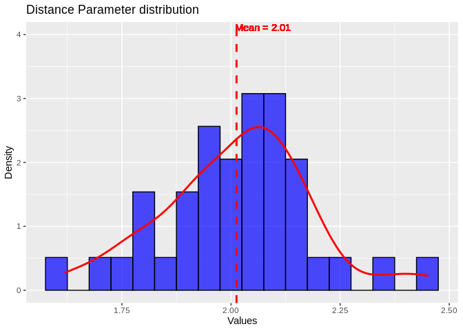
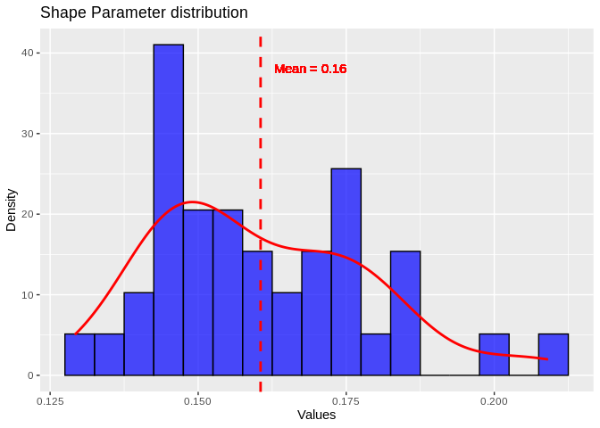
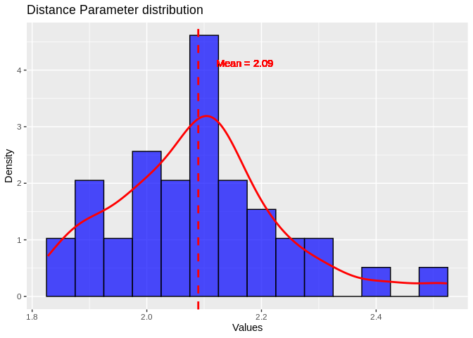
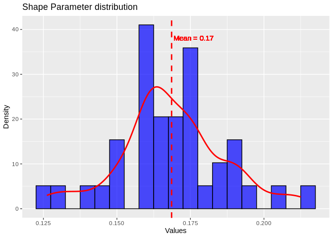
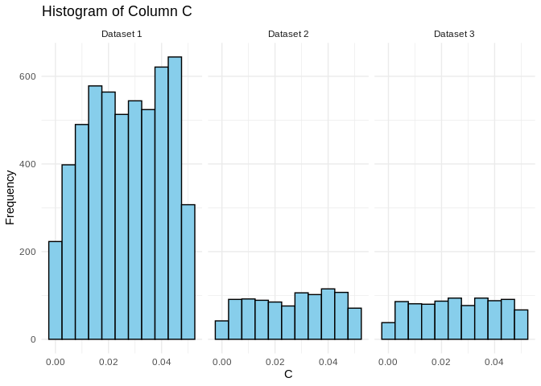

16-Apul-RNAhybrid
================
Kathleen Durkin
2024-11-20

- <a href="#1-format-mirna-fasta" id="toc-1-format-mirna-fasta">1 format
  miRNa fasta</a>
- <a href="#2-target-prediction-for-full-mrna"
  id="toc-2-target-prediction-for-full-mrna">2 target prediction for full
  mRNA</a>
- <a href="#3-formate-mrna-fasta" id="toc-3-formate-mrna-fasta">3 formate
  mRNA fasta</a>
- <a href="#4-rnahybrid-mrna-file" id="toc-4-rnahybrid-mrna-file">4
  RNAhybrid: mRNA file</a>
- <a href="#5-rnahybrid-3utr" id="toc-5-rnahybrid-3utr">5 RNAhybrid:
  3’UTR</a>
- <a href="#6-rnahybrid-5utr" id="toc-6-rnahybrid-5utr">6 RNAhybrid:
  5’UTR</a>
- <a href="#7-summarize-results" id="toc-7-summarize-results">7 Summarize
  results</a>

``` r
library(ggplot2)
```

RNAhybrid is a miRNA-mRNA target prediction tool, which bases its
predictions primarily on thermodynamic binding stability.

Inputs: - miRNA “query” FASTA file – I believe this is simply the mature
miRNA sequences, since the mature miRNA molecule is what will presumably
bind to an mRNA

- mRNA “target” FASTA file – the *A. pulchra* genome fasta

# 1 format miRNa fasta

ShortStack outputs a fasta containing all annotated miRNAs, but it
includes the full precursor sequence and star sequence, in addition to
the mature miRNA. Since mature miRNAs are the “final forms” that are
generally much more highly expressed, we’ll just look at binding of
mature miRNAs for now.

``` bash
# look at miRNA fasta file
head -5 ../output/11-Apul-sRNA-ShortStack_4.1.0-pulchra_genome/ShortStack_out/mir.fasta

echo ""

# check the naming convention for sequences
grep "^>" ../output/11-Apul-sRNA-ShortStack_4.1.0-pulchra_genome/ShortStack_out/mir.fasta | head -10

# isolate just the mature miRNA sequences
awk '/^>/ {header=$0} /mature/ {print header; found=1; next} found {print; found=0}' ../output/11-Apul-sRNA-ShortStack_4.1.0-pulchra_genome/ShortStack_out/mir.fasta > ../data/16-Apul-RNAhybrid/miRNA_mature-Apul-ShortStack_4.1.0-pulchra_genome.fasta

echo ""

# check filtered file
head -6 ../data/16-Apul-RNAhybrid/miRNA_mature-Apul-ShortStack_4.1.0-pulchra_genome.fasta
```

    ## >Cluster_1826::ntLink_6:4847443-4847535(-)
    ## TTCAATAATCTGTTACCAACAAAGAAAGTGCTCTAATCATATTATTGTTA
    ## TGATCATAGCACTTTCTTTGTTGGCAACAGATGCAGAGCCACT
    ## >Cluster_1826.mature::ntLink_6:4847465-4847486(-)
    ## ATGATCATAGCACTTTCTTTGT
    ## 
    ## >Cluster_1826::ntLink_6:4847443-4847535(-)
    ## >Cluster_1826.mature::ntLink_6:4847465-4847486(-)
    ## >Cluster_1826.star::ntLink_6:4847494-4847515(-)
    ## >Cluster_1832::ntLink_6:5157537-5157626(+)
    ## >Cluster_1832.mature::ntLink_6:5157559-5157579(+)
    ## >Cluster_1832.star::ntLink_6:5157586-5157606(+)
    ## >Cluster_1862::ntLink_6:7263486-7263580(-)
    ## >Cluster_1862.mature::ntLink_6:7263537-7263560(-)
    ## >Cluster_1862.star::ntLink_6:7263506-7263528(-)
    ## >Cluster_1951::ntLink_6:13351746-13351842(-)
    ## 
    ## >Cluster_1826.mature::ntLink_6:4847465-4847486(-)
    ## ATGATCATAGCACTTTCTTTGT
    ## >Cluster_1832.mature::ntLink_6:5157559-5157579(+)
    ## AAATGTTTCGGCTTGTTCCCG
    ## >Cluster_1862.mature::ntLink_6:7263537-7263560(-)
    ## TTTCAAATTAGGAAGGGAGGTGTT

# 2 target prediction for full mRNA

While miRNas are primarily observed binding to the 3’ UTR region of
mRNAs, they are also believed to functionally bind to CDS regions,
though effects on translation are weaker.

# 3 formate mRNA fasta

get a gff file of only CDS sequences

Notably, RNAhybrid only accepts FASTA sequences of 1000 characters or
fewer. We’ll need to ensure the CDS file only contains sequences of
\<1000bp, and break up the sequences that are too long.

``` bash

# mRNA-only genome gff
# Count total sequences in genome gff
wc -l ../data/Apulcra-genome-mRNA_only.gff

# Count the number of sequences that contain >1000 bp
awk '{if ($5 - $4 > 1000) count++} END {print count}' ../data/Apulcra-genome-mRNA_only.gff

# Check how the sequence names are formatted
head -2 ../data/Apulcra-genome-mRNA_only.gff
```

    ## 36447 ../data/Apulcra-genome-mRNA_only.gff
    ## 28668
    ## ntLink_0 funannotate mRNA    1105    7056    .   +   .   ID=FUN_000001-T1;Parent=FUN_000001;product=hypothetical protein;
    ## ntLink_0 funannotate mRNA    10215   15286   .   +   .   ID=FUN_000002-T1;Parent=FUN_000002;product=hypothetical protein;

Welp, looks like the genome-based mRNA gff largely contains long,
\>1000bp sequences (28668/36447, or 78.7%)

First let’s deal with the long sequences while we’re in the compact gff
form. I want to break up any sequence \>1000bp into 1000bp chunks,
adding a line to the gff for each chunk.

(I also want there to be overlap among the chunks, in case the break
between two chunks falls in the middle of an miRNA binding site. Let’s
say a 25bp overlap, since that is just over the maximum expected miRNA
length.)

for now let’s not worry about the overlap.

``` bash
awk -v chunk_size=1000 '
BEGIN {OFS="\t"}
{
    seq_length = $5 - $4
    if (seq_length > chunk_size) {
        start = $4
        ogend = $5
        while (start < ogend) {
            end = start + chunk_size 
            if (end > ogend) end = ogend
            $4 = start
            $5 = end
            print
            start = end
        }
    } else {
        print
    }
}' "../data/Apulcra-genome-mRNA_only.gff" > "../data/16-Apul-RNAhybrid/Apulcra-genome-mRNA_only_MAX1000.gff"
```

``` bash

# mRNA-only genome gff
# Count total sequences in genome gff
wc -l ../data/16-Apul-RNAhybrid/Apulcra-genome-mRNA_only_MAX1000.gff

# Count the number of sequences that contain >1000 bp
awk '{if ($5 - $4 > 1000) count++} END {print count}' ../data/16-Apul-RNAhybrid/Apulcra-genome-mRNA_only_MAX1000.gff

# Check how the sequence names are formatted
head -50 ../data/16-Apul-RNAhybrid/Apulcra-genome-mRNA_only_MAX1000.gff | tail -5

echo ""
echo ""

# I'm getting an error in getfasta related to some lines of the gff having a different number of columns.
# Each line should contain 9 columns. Count number of lines with more than 9
awk -F'\t' 'NF > 9 {count++} END {print count}' ../data/16-Apul-RNAhybrid/Apulcra-genome-mRNA_only_MAX1000.gff

# For some lines, the final column is being interpreted as two columns
head -50 ../data/16-Apul-RNAhybrid/Apulcra-genome-mRNA_only_MAX1000.gff | tail -5 | awk -F'\t' '{print $9}'
head -50 ../data/16-Apul-RNAhybrid/Apulcra-genome-mRNA_only_MAX1000.gff | tail -5 | awk -F'\t' '{print $10}'
```

Fix \# columns issue. Replace any instances of “hypothetical $$tab$$
protein” with “hypothetical $$space$$ protein”

``` bash
# Replace any instances of "hypothetical -tab- protein" with "hypothetical -space- protein"
sed 's/hypothetical\tprotein/hypothetical protein/g'  ../data/16-Apul-RNAhybrid/Apulcra-genome-mRNA_only_MAX1000.gff > ../data/16-Apul-RNAhybrid/Apulcra-genome-mRNA_only_MAX1000_formatted.gff
```

Check

``` bash
# Count number of entries with >9 columns (should be nothing now)
awk -F'\t' 'NF > 9 {count++} END {print count}' ../data/16-Apul-RNAhybrid/Apulcra-genome-mRNA_only_MAX1000_formatted.gff
```

get an mRNA fasta file

``` bash

# Use mRNA gff and genome fasta to extract mRNA fastas
/home/shared/bedtools2/bin/bedtools getfasta -fi "../data/Apulchra-genome.fa" -bed "../data/16-Apul-RNAhybrid/Apulcra-genome-mRNA_only_MAX1000_formatted.gff" -fo "../data/16-Apul-RNAhybrid/Apulcra-genome-mRNA_only_MAX1000.fa"
```

Ok, we now have a fasta file of mRNA sequences, broken up so that no
sequence exceeds 1000bp. We should now be able to run RNAhybrid!

I have RNAhybrid installed on a miniconda environment

    # Check path to the conda environment I'm using
    which conda

    # Install RNAhybrid if neccessary
    conda install -y -c genomedk rnahybrid

    # Check installation
    conda list rnahybrid

``` bash
# RNAhybrid only has built-in support for humans, worms, and flies.
# We can use RNAcalibrate to derive Extreme Value Distribution parameters for our data.

# USe 3'UTR as input, since we expect majority binding there
RNAcalibrate \
-t ../output/15-Apul-annotate-UTRs/Apul_3UTR_1kb.fasta \
-q ../data/16-Apul-RNAhybrid/miRNA_mature-Apul-ShortStack_4.1.0-pulchra_genome.fasta \
> ../output/16-Apul-RNAhybrid/Apul-RNAcalibrate-3UTR.txt
```

``` r
# Now we need to pick a distance parameter and shape parameter
RNAcalibrate_out <- read.table("../output/16-Apul-RNAhybrid/Apul-RNAcalibrate-3UTR.txt", sep = " ")

ggplot(RNAcalibrate_out, aes(x = V3)) +
  geom_histogram(aes(y = after_stat(density)), binwidth = 0.05, fill = "blue", color = "black", alpha = 0.7) +
  geom_density(color = "red", size = 1) +
  geom_vline(aes(xintercept = mean(V3)), color = "red", linetype = "dashed", size = 1) +
  geom_text(aes(x = mean(V3) + 0.15, y = 4, label = paste("Mean =", round(mean(V3), 2))), 
            color = "red", vjust = -0.5, hjust = 1.2) +
  labs(title = "Distance Parameter distribution", x = "Values", y = "Density")
```

    ## Warning: Using `size` aesthetic for lines was deprecated in ggplot2 3.4.0.
    ## ℹ Please use `linewidth` instead.
    ## This warning is displayed once every 8 hours.
    ## Call `lifecycle::last_lifecycle_warnings()` to see where this warning was
    ## generated.

    ## Warning in geom_text(aes(x = mean(V3) + 0.15, y = 4, label = paste("Mean =", : All aesthetics have length 1, but the data has 39 rows.
    ## ℹ Please consider using `annotate()` or provide this layer with data containing
    ##   a single row.

<!-- -->

``` r
ggplot(RNAcalibrate_out, aes(x = V4)) +
  geom_histogram(aes(y = after_stat(density)), binwidth = 0.005, fill = "blue", color = "black", alpha = 0.7) +
  geom_density(color = "red", size = 1) +
  geom_vline(aes(xintercept = mean(V4)), color = "red", linetype = "dashed", size = 1) +
  geom_text(aes(x = mean(V4) + 0.017, y = 37, label = paste("Mean =", round(mean(V4), 2))), 
            color = "red", vjust = -0.5, hjust = 1.2) +
  labs(title = "Shape Parameter distribution", x = "Values", y = "Density")
```

    ## Warning in geom_text(aes(x = mean(V4) + 0.017, y = 37, label = paste("Mean =", : All aesthetics have length 1, but the data has 39 rows.
    ## ℹ Please consider using `annotate()` or provide this layer with data containing
    ##   a single row.

<!-- -->

``` bash

# Also try with the full mRNA sequences
RNAcalibrate \
-t ../data/16-Apul-RNAhybrid/Apulcra-genome-mRNA_only_MAX1000.fa \
-q ../data/16-Apul-RNAhybrid/miRNA_mature-Apul-ShortStack_4.1.0-pulchra_genome.fasta \
> ../output/16-Apul-RNAhybrid/Apul-RNAcalibrate-mRNA.txt
```

``` r
# Now we need to pick a distance parameter and shape parameter
RNAcalibrate_out <- read.table("../output/16-Apul-RNAhybrid/Apul-RNAcalibrate-mRNA.txt", sep = " ")

ggplot(RNAcalibrate_out, aes(x = V3)) +
  geom_histogram(aes(y = after_stat(density)), binwidth = 0.05, fill = "blue", color = "black", alpha = 0.7) +
  geom_density(color = "red", size = 1) +
  geom_vline(aes(xintercept = mean(V3)), color = "red", linetype = "dashed", size = 1) +
  geom_text(aes(x = mean(V3) + 0.15, y = 4, label = paste("Mean =", round(mean(V3), 2))), 
            color = "red", vjust = -0.5, hjust = 1.2) +
  labs(title = "Distance Parameter distribution", x = "Values", y = "Density")
```

    ## Warning in geom_text(aes(x = mean(V3) + 0.15, y = 4, label = paste("Mean =", : All aesthetics have length 1, but the data has 39 rows.
    ## ℹ Please consider using `annotate()` or provide this layer with data containing
    ##   a single row.

<!-- -->

``` r
ggplot(RNAcalibrate_out, aes(x = V4)) +
  geom_histogram(aes(y = after_stat(density)), binwidth = 0.005, fill = "blue", color = "black", alpha = 0.7) +
  geom_density(color = "red", size = 1) +
  geom_vline(aes(xintercept = mean(V4)), color = "red", linetype = "dashed", size = 1) +
  geom_text(aes(x = mean(V4) + 0.017, y = 37, label = paste("Mean =", round(mean(V4), 2))), 
            color = "red", vjust = -0.5, hjust = 1.2) +
  labs(title = "Shape Parameter distribution", x = "Values", y = "Density")
```

    ## Warning in geom_text(aes(x = mean(V4) + 0.017, y = 37, label = paste("Mean =", : All aesthetics have length 1, but the data has 39 rows.
    ## ℹ Please consider using `annotate()` or provide this layer with data containing
    ##   a single row.

<!-- -->

Distributions looks roughly normal, so I’ll use the mean distance and
shape parameters calculated by RNAcalibrate as input in RNAhybrid.

# 4 RNAhybrid: mRNA file

I’m having problems using the RNAcalibrate estimated parameters, where
every output hybridization has a p-value of 0. This still happens if I
remove the `-e` energy cutoff and the `-p` pvalue cutoff, so the `-d`
parameter specification must be causing it.

I’ll use a built-in estimation for now, since those result in reasonable
pvalues. Options are 3utr_human, 3utr_fly, and 3utr-worm. Not sure if
fly or worm is most closely related to corals (they’re both quite
distant), but I’ll just arbitrarily pick worm for now.

``` bash
# Started at 11/15/2024 13:32
# Finished at 11/15/2024 15:30
#-d 2.09, 0.17 \

RNAhybrid \
-s 3utr_worm \
-e -20 \
-p 0.05 \
-c \
-t ../data/16-Apul-RNAhybrid/Apulcra-genome-mRNA_only_MAX1000.fa \
-q ../data/16-Apul-RNAhybrid/miRNA_mature-Apul-ShortStack_4.1.0-pulchra_genome.fasta \
> ../output/16-Apul-RNAhybrid/Apul-RNAhybrid-mRNA-compact_3utrworm.txt
```

# 5 RNAhybrid: 3’UTR

``` bash
# Started at 11/20/2024 18:53
# Finished at 
#-d 2.09, 0.17 \

RNAhybrid \
-s 3utr_worm \
-e -20 \
-p 0.05 \
-c \
-t ../output/15-Apul-annotate-UTRs/Apul_3UTR_1kb.fasta \
-q ../data/16-Apul-RNAhybrid/miRNA_mature-Apul-ShortStack_4.1.0-pulchra_genome.fasta \
> ../output/16-Apul-RNAhybrid/Apul-RNAhybrid-3UTR-compact_3utrworm.txt
```

# 6 RNAhybrid: 5’UTR

``` bash
# Started at 11/20/2024 17:50
# Finished at 
#-d 2.09, 0.17 \

RNAhybrid \
-s 3utr_worm \
-e -20 \
-p 0.05 \
-c \
-t ../output/15-Apul-annotate-UTRs/Apul_5UTR_1kb.fasta \
-q ../data/16-Apul-RNAhybrid/miRNA_mature-Apul-ShortStack_4.1.0-pulchra_genome.fasta \
> ../output/16-Apul-RNAhybrid/Apul-RNAhybrid-5UTR-compact_3utrworm.txt
```

# 7 Summarize results

``` bash
# How many significant hybridizations predicted for each input?
wc -l ../output/16-Apul-RNAhybrid/Apul-RNAhybrid-mRNA-compact_3utrworm.txt
wc -l ../output/16-Apul-RNAhybrid/Apul-RNAhybrid-5UTR-compact_3utrworm.txt
wc -l ../output/16-Apul-RNAhybrid/Apul-RNAhybrid-3UTR-compact_3utrworm.txt
```

    ## 5406 ../output/16-Apul-RNAhybrid/Apul-RNAhybrid-mRNA-compact_3utrworm.txt
    ## 976 ../output/16-Apul-RNAhybrid/Apul-RNAhybrid-5UTR-compact_3utrworm.txt
    ## 883 ../output/16-Apul-RNAhybrid/Apul-RNAhybrid-3UTR-compact_3utrworm.txt

``` bash
head -5 ../output/16-Apul-RNAhybrid/Apul-RNAhybrid-3UTR-compact_3utrworm.txt
```

    ## ntLink_8:32704327-32705327:999:Cluster_1826.mature::ntLink_6:4847465-4847486(-):22:-27.8:0.036639:710:A                A     : ACAAGGAGAGUGCUGU      : UGUUUCUUUCACGAUA      :                 CUAGUA
    ## ntLink_3:84074-84461:387:Cluster_1826.mature::ntLink_6:4847465-4847486(-):22:-26.7:0.014807:51:    C               U :     GAGAGUGCUGUGGUU  :     CUUUCACGAUACUAG  :UGUUU               UA
    ## ntLink_6:2139830-2140830:999:Cluster_1826.mature::ntLink_6:4847465-4847486(-):22:-27.7:0.038633:949: G                 G  :  GGGGGGGGUGCUAUGAU   :  UUUCUUUCACGAUACUA   :UG                 GUA
    ## ptg000001l:20692198-20693198:999:Cluster_1826.mature::ntLink_6:4847465-4847486(-):22:-30.0:0.011310:399: A                  U :  GAGGAAGGUGUUAUGAUC  :  UUUCUUUCACGAUACUAG  :UG                  UA
    ## ptg000018l:9119047-9120047:999:Cluster_1826.mature::ntLink_6:4847465-4847486(-):22:-28.0:0.032950:773:U                A     : GCAAGGAGAGUGCUAU      : UGUUUCUUUCACGAUA      :                 CUAGUA

Now let’s read our RNAhybrid results into R for visualization. Note this
is going to be slightly more complicated than it sounds because the
RNAhybrid compact output is colon-delimited and our target- and
query-IDs contain intentional colons than could get confused with column
delimiters.

mRNA output:

``` r
options(scipen=999)
options(digits = 10)
RNAhybrid_mRNA <- read.table("../output/16-Apul-RNAhybrid/Apul-RNAhybrid-mRNA-compact_3utrworm.txt", sep=":")

# Recombine Columns 1 and 2 (fix incorrect separation of target ID components)
RNAhybrid_mRNA$V1 <- paste(RNAhybrid_mRNA$V1, RNAhybrid_mRNA$V2, sep = ":")
RNAhybrid_mRNA$V2 <- NULL

# Do the same for Columns 4-7 (query ID components)
RNAhybrid_mRNA$V4 <- paste(RNAhybrid_mRNA$V4, RNAhybrid_mRNA$V5, RNAhybrid_mRNA$V6, RNAhybrid_mRNA$V7 , sep = ":")
RNAhybrid_mRNA$V4 <- gsub(":NA:", "::", RNAhybrid_mRNA$V4)
RNAhybrid_mRNA$V5 <- NULL
RNAhybrid_mRNA$V6 <- NULL
RNAhybrid_mRNA$V7 <- NULL

# Rename all columns for readability/accessibility 
colnames(RNAhybrid_mRNA) <- c("target_name", "target_length", "query_name", "query_length",
                              "mfe", "pval", "position",
                              "noncomp_target_seq", "comp_target_seq", "comp_query_seq", "noncomp_query_seq")
```

5’UTR output:

``` r
RNAhybrid_5UTR <- read.table("../output/16-Apul-RNAhybrid/Apul-RNAhybrid-5UTR-compact_3utrworm.txt", sep=":")

# Recombine Columns 1 and 2 (fix incorrect separation of target ID components)
RNAhybrid_5UTR$V1 <- paste(RNAhybrid_5UTR$V1, RNAhybrid_5UTR$V2, sep = ":")
RNAhybrid_5UTR$V2 <- NULL

# Do the same for Columns 4-7 (query ID components)
RNAhybrid_5UTR$V4 <- paste(RNAhybrid_5UTR$V4, RNAhybrid_5UTR$V5, RNAhybrid_5UTR$V6, RNAhybrid_5UTR$V7 , sep = ":")
RNAhybrid_5UTR$V4 <- gsub(":NA:", "::", RNAhybrid_5UTR$V4)
RNAhybrid_5UTR$V5 <- NULL
RNAhybrid_5UTR$V6 <- NULL
RNAhybrid_5UTR$V7 <- NULL

# Rename all columns for readability/accessibility 
colnames(RNAhybrid_5UTR) <- c("target_name", "target_length", "query_name", "query_length",
                              "mfe", "pval", "position",
                              "noncomp_target_seq", "comp_target_seq", "comp_query_seq", "noncomp_query_seq")
```

3’UTR output:

``` r
RNAhybrid_3UTR <- read.table("../output/16-Apul-RNAhybrid/Apul-RNAhybrid-3UTR-compact_3utrworm.txt", sep=":")

# Recombine Columns 1 and 2 (fix incorrect separation of target ID components)
RNAhybrid_3UTR$V1 <- paste(RNAhybrid_3UTR$V1, RNAhybrid_3UTR$V2, sep = ":")
RNAhybrid_3UTR$V2 <- NULL

# Do the same for Columns 4-7 (query ID components)
RNAhybrid_3UTR$V4 <- paste(RNAhybrid_3UTR$V4, RNAhybrid_3UTR$V5, RNAhybrid_3UTR$V6, RNAhybrid_3UTR$V7 , sep = ":")
RNAhybrid_3UTR$V4 <- gsub(":NA:", "::", RNAhybrid_3UTR$V4)
RNAhybrid_3UTR$V5 <- NULL
RNAhybrid_3UTR$V6 <- NULL
RNAhybrid_3UTR$V7 <- NULL

# Rename all columns for readability/accessibility 
colnames(RNAhybrid_3UTR) <- c("target_name", "target_length", "query_name", "query_length",
                              "mfe", "pval", "position",
                              "noncomp_target_seq", "comp_target_seq", "comp_query_seq", "noncomp_query_seq")
```

``` r
RNAhybrid_mRNA$Dataset <- "Dataset 1"
RNAhybrid_5UTR$Dataset <- "Dataset 2"
RNAhybrid_3UTR$Dataset <- "Dataset 3"

# Combine the datasets into a single data frame
combined_data <- rbind(RNAhybrid_mRNA, RNAhybrid_5UTR, RNAhybrid_3UTR)

# Create the faceted histogram
ggplot(combined_data, aes(x = pval)) +
  geom_histogram(binwidth = 0.005, color = "black", fill = "skyblue") +
  facet_wrap(~Dataset) +
  theme_minimal() +
  labs(title = "Histogram of Column C", x = "C", y = "Frequency")
```

<!-- -->

I’d also like to get the RNAhybrid results in a gff form for IGV
visualization

Save outputs as tab-delimited files

``` r
write.table(RNAhybrid_mRNA, file="../output/16-Apul-RNAhybrid/Apul-RNAhybrid-mRNA-compact_3utr_worm-formatted.txt", sep="\t", row.names = FALSE, col.names=TRUE, quote = FALSE)
write.table(RNAhybrid_5UTR, file="../output/16-Apul-RNAhybrid/Apul-RNAhybrid-5UTR-compact_3utr_worm-formatted.txt", sep="\t", row.names = FALSE, quote = FALSE)
write.table(RNAhybrid_3UTR, file="../output/16-Apul-RNAhybrid/Apul-RNAhybrid-3UTR-compact_3utr_worm-formatted.txt", sep="\t", row.names = FALSE, quote = FALSE)
```

Now convert these formatted RNAhybrid output into a gff-formatted file

mRNA:

``` bash
#!/bin/bash

# Input and output file paths
INPUT_FILE="../output/16-Apul-RNAhybrid/Apul-RNAhybrid-mRNA-compact_3utr_worm-formatted.txt"  # Replace with the path to your input file
OUTPUT_FILE="../output/16-Apul-RNAhybrid/Apul-RNAhybrid-mRNA-compact_3utr_worm.gff"

# Write GFF3 header to the output file
echo "##gff-version 3" > "$OUTPUT_FILE"

# Process the input file, skipping the header line
tail -n +2 "$INPUT_FILE" | while IFS=$'\t' read -r target_name target_length query_name query_length mfe pval position noncomp_target_seq comp_target_seq comp_query_seq noncomp_query_seq
do
  # Extract locus name and coordinates from target_name
  locus=$(echo "$target_name" | cut -d':' -f1)
  start_coord=$(echo "$target_name" | cut -d':' -f2 | cut -d'-' -f1)
  start_gff=$((start_coord + position))
  end_gff=$((start_gff + query_length))

  # Extract strandedness from query_name
  strand=$(echo "$query_name" | grep -o '(-\|+)' | tr -d '()')

  # Write the GFF3 line
  echo -e "$locus\tRNAhybrid\tmiRNA_binding\t$start_gff\t$end_gff\t.\t$strand\t.\tID=$query_name;MFE=$mfe;Pval=$pval" >> "$OUTPUT_FILE"
done
```

5’UTR:

``` bash
#!/bin/bash

# Input and output file paths
INPUT_FILE="../output/16-Apul-RNAhybrid/Apul-RNAhybrid-5UTR-compact_3utr_worm-formatted.txt"  # Replace with the path to your input file
OUTPUT_FILE="../output/16-Apul-RNAhybrid/Apul-RNAhybrid-5UTR-compact_3utr_worm.gff"

# Write GFF3 header to the output file
echo "##gff-version 3" > "$OUTPUT_FILE"

# Process the input file, skipping the header line
tail -n +2 "$INPUT_FILE" | while IFS=$'\t' read -r target_name target_length query_name query_length mfe pval position noncomp_target_seq comp_target_seq comp_query_seq noncomp_query_seq
do
  # Extract locus name and coordinates from target_name
  locus=$(echo "$target_name" | cut -d':' -f1)
  start_coord=$(echo "$target_name" | cut -d':' -f2 | cut -d'-' -f1)
  start_gff=$((start_coord + position))
  end_gff=$((start_gff + query_length))

  # Extract strandedness from query_name
  strand=$(echo "$query_name" | grep -o '(-\|+)' | tr -d '()')

  # Write the GFF3 line
  echo -e "$locus\tRNAhybrid\tmiRNA_binding\t$start_gff\t$end_gff\t.\t$strand\t.\tID=$query_name;MFE=$mfe;Pval=$pval" >> "$OUTPUT_FILE"
done
```

3’UTR:

``` bash
#!/bin/bash

# Input and output file paths
INPUT_FILE="../output/16-Apul-RNAhybrid/Apul-RNAhybrid-3UTR-compact_3utr_worm-formatted.txt"  # Replace with the path to your input file
OUTPUT_FILE="../output/16-Apul-RNAhybrid/Apul-RNAhybrid-3UTR-compact_3utr_worm.gff"

# Write GFF3 header to the output file
echo "##gff-version 3" > "$OUTPUT_FILE"

# Process the input file, skipping the header line
tail -n +2 "$INPUT_FILE" | while IFS=$'\t' read -r target_name target_length query_name query_length mfe pval position noncomp_target_seq comp_target_seq comp_query_seq noncomp_query_seq
do
  # Extract locus name and coordinates from target_name
  locus=$(echo "$target_name" | cut -d':' -f1)
  start_coord=$(echo "$target_name" | cut -d':' -f2 | cut -d'-' -f1)
  start_gff=$((start_coord + position))
  end_gff=$((start_gff + query_length))

  # Extract strandedness from query_name
  strand=$(echo "$query_name" | grep -o '(-\|+)' | tr -d '()')

  # Write the GFF3 line
  echo -e "$locus\tRNAhybrid\tmiRNA_binding\t$start_gff\t$end_gff\t.\t$strand\t.\tID=$query_name;MFE=$mfe;Pval=$pval" >> "$OUTPUT_FILE"
done
```
