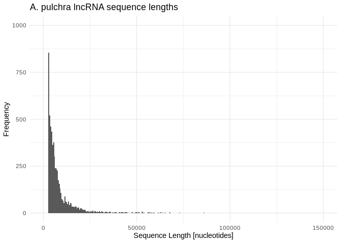

17-Apul-miRNA-lncRNA-BLASTs-RNAhybrid
================
Kathleen Durkin
2024-12-11

- <a href="#1-prep-for-blasts" id="toc-1-prep-for-blasts">1 Prep for
  BLASTs</a>
  - <a href="#11-isolate-the-pre-mirna-and-mature-mirna-sequences"
    id="toc-11-isolate-the-pre-mirna-and-mature-mirna-sequences">1.1 Isolate
    the pre-mirna and mature mirna sequences</a>
  - <a href="#12-check-mirna-lengths" id="toc-12-check-mirna-lengths">1.2
    Check miRNA lengths</a>
  - <a href="#13-check-lncrnas" id="toc-13-check-lncrnas">1.3 check
    lncRNAs</a>
- <a href="#2-blasts" id="toc-2-blasts">2 BLASTs</a>
  - <a href="#21-make-databases" id="toc-21-make-databases">2.1 Make
    databases</a>
  - <a href="#22-run-blastn" id="toc-22-run-blastn">2.2 Run BLASTn</a>
- <a href="#3-examine-blast-tables" id="toc-3-examine-blast-tables">3
  Examine BLAST tables</a>
  - <a href="#31-lncrnas-as-mirna-precursors"
    id="toc-31-lncrnas-as-mirna-precursors">3.1 LncRNAs as miRNA
    precursors</a>
  - <a href="#32-lncrnas-as-mirna-sponges"
    id="toc-32-lncrnas-as-mirna-sponges">3.2 LncRNAs as miRNA sponges</a>
- <a href="#4-miranda" id="toc-4-miranda">4 miRanda</a>
  - <a href="#41-run-miranda" id="toc-41-run-miranda">4.1 Run miRanda</a>
- <a href="#5-summarize-results" id="toc-5-summarize-results">5 Summarize
  results</a>
- <a href="#6-rnahybrid" id="toc-6-rnahybrid">6 RNAhybrid</a>
  - <a href="#61-get-lncrna-gtf" id="toc-61-get-lncrna-gtf">6.1 Get lncRNA
    gtf</a>
  - <a href="#62-break-up-100bp-sequences"
    id="toc-62-break-up-100bp-sequences">6.2 Break up &gt;100bp
    sequences</a>
  - <a href="#63-get-fasta-of-broken-up-lncrna-gtf"
    id="toc-63-get-fasta-of-broken-up-lncrna-gtf">6.3 Get fasta of broken-up
    lncRNA gtf</a>
  - <a href="#64-run-rnahybrid" id="toc-64-run-rnahybrid">6.4 Run
    RNAhybrid</a>
  - <a href="#65-summarize-rnahybrid-results"
    id="toc-65-summarize-rnahybrid-results">6.5 Summarize RNAhybrid
    results</a>
- <a href="#7-summarize-final-results"
  id="toc-7-summarize-final-results">7 Summarize final results</a>
- <a href="#8-references" id="toc-8-references">8 References</a>

``` r
library(dplyr)
```

    ## 
    ## Attaching package: 'dplyr'

    ## The following objects are masked from 'package:stats':
    ## 
    ##     filter, lag

    ## The following objects are masked from 'package:base':
    ## 
    ##     intersect, setdiff, setequal, union

``` r
library(ggplot2)
knitr::opts_chunk$set(
  echo = TRUE,         # Display code chunks
  eval = FALSE         # Evaluate code chunks
)
```

Two possible interactions between miRNA and lncRNA are:

1)  lncRNA acting as a precursor molecule for miRNA(s), so that the
    lncRNA contains one or many pre-miRNA sequences and will be broken
    down into pre-miRNAs molecules, which will then be processed into
    mature miRNAs.

2)  lncRNA acting as a “sponge” for miRNAs, so that an miRNA will bind
    to the lncRNA instead of being incorporated into an RISC complex to
    alter gene expression.

In situation 1 we would expect one or several **pre-miRNA sequences to
appear inside of a lncRNA**. This should be identifiable via BLASTn.

In situation 2 we would expect the **mature miRNA sequence to appear
inside a lncRNA**. Note that situation 2 is a bit more complicated,
because we can’t say for certain what sequence similarity is required
for binding. In cnidarians, miRNAs seem to act, like plants, through
complementarity of the full mature miRNA (this is in contrast to
e.g. mammals, where only binding of a short seed region is required)
(Moran et al. ([2014](#ref-moran_cnidarian_2014)), Admoni et al.
([2023](#ref-admoni_target_2023))). However, for lncRNA acting as
sponges, I don’t know whether to expect complementarity of the full
mature miRNA or only a section, and I don’t know what degree of
complementarity is required. **Work to identify lncRNA sponges could use
BLASTn, but will likely need to include additional methods like miranda
or RNAhybrid to identify potential binding.**

# 1 Prep for BLASTs

## 1.1 Isolate the pre-mirna and mature mirna sequences

``` bash
full_mirna_fasta="../output/11-Apul-sRNA-ShortStack_4.1.0-pulchra_genome/ShortStack_out/mir.fasta"
premirna_fasta="../output/17-Apul-miRNA-lncRNA-BLASTs-RNAhybrid/Apul_ShortStack_4.1.0_precursor.fasta"
mature_mirna_fasta="../output/17-Apul-miRNA-lncRNA-BLASTs-RNAhybrid/Apul_ShortStack_4.1.0_mature.fasta"
star_mirna_fasta="../output/17-Apul-miRNA-lncRNA-BLASTs-RNAhybrid/Apul_ShortStack_4.1.0_star.fasta"

# Pull out all sequences that DON'T contain "mature" or "star" in sequence name
# Note the pre-miRNAs have sequences for both strands
awk '
    # If the line starts with ">", check the header
    /^>/ {
        if ($0 ~ /mature/ || $0 ~ /star/) {
            print_seq = 0  # Skip sequences with "mature" or "star" in the header
        } else {
            print_seq = 1  # Mark sequences for printing
        }
    }
    # Print the header and the next two lines if marked for printing
    print_seq {
        print
        if (!/^>/) { getline; print }  # Capture second sequence line
    }
' "$full_mirna_fasta" > "$premirna_fasta"

# Pull out all sequences that contain "mature" in sequence name
grep -A 1 "mature" $full_mirna_fasta | grep -v "^--$" > $mature_mirna_fasta

# Pull out all sequences that contain "star" in sequence name
grep -A 1 "star" $full_mirna_fasta | grep -v "^--$" > $star_mirna_fasta
```

``` bash
premirna_fasta="../output/17-Apul-miRNA-lncRNA-BLASTs-RNAhybrid/Apul_ShortStack_4.1.0_precursor.fasta"
mature_mirna_fasta="../output/17-Apul-miRNA-lncRNA-BLASTs-RNAhybrid/Apul_ShortStack_4.1.0_mature.fasta"
star_mirna_fasta="../output/17-Apul-miRNA-lncRNA-BLASTs-RNAhybrid/Apul_ShortStack_4.1.0_star.fasta"

# Check we have appropriate headers, same number of sequences in each
grep "^>" $premirna_fasta | head -2
echo ""
grep "^>" $mature_mirna_fasta | head -2
echo ""
grep "^>" $star_mirna_fasta | head -2
echo ""
grep "^>" $premirna_fasta | wc -l
echo ""
grep "^>" $mature_mirna_fasta | wc -l
echo ""
grep "^>" $star_mirna_fasta | wc -l
echo ""
```

    ## >Cluster_1826::ntLink_6:4847443-4847535(-)
    ## >Cluster_1832::ntLink_6:5157537-5157626(+)
    ## 
    ## >Cluster_1826.mature::ntLink_6:4847465-4847486(-)
    ## >Cluster_1832.mature::ntLink_6:5157559-5157579(+)
    ## 
    ## >Cluster_1826.star::ntLink_6:4847494-4847515(-)
    ## >Cluster_1832.star::ntLink_6:5157586-5157606(+)
    ## 
    ## 39
    ## 
    ## 39
    ## 
    ## 39

## 1.2 Check miRNA lengths

``` bash
# Extract sequence lengths for precursors
awk '/^>/ {if (seqlen){print seqlen}; printf $0" " ;seqlen=0;next; } { seqlen += length($0)}END{print seqlen}' ../output/17-Apul-miRNA-lncRNA-BLASTs-RNAhybrid/Apul_ShortStack_4.1.0_precursor.fasta > ../output/17-Apul-miRNA-lncRNA-BLASTs-RNAhybrid/Apul_ShortStack_4.1.0_precursor_lengths.txt

# Sequence lengths for matures
awk '/^>/ {if (seqlen){print seqlen}; printf $0" " ;seqlen=0;next; } { seqlen += length($0)}END{print seqlen}' ../output/17-Apul-miRNA-lncRNA-BLASTs-RNAhybrid/Apul_ShortStack_4.1.0_mature.fasta > ../output/17-Apul-miRNA-lncRNA-BLASTs-RNAhybrid/Apul_ShortStack_4.1.0_mature_lengths.txt
```

``` r
# Summary stats of precursor and mature lengths

precursor_lengths <- read.table("../output/17-Apul-miRNA-lncRNA-BLASTs-RNAhybrid/Apul_ShortStack_4.1.0_precursor_lengths.txt", sep = " ", header = FALSE, col.names = c("seqID", "length"))
mature_lengths <- read.table("../output/17-Apul-miRNA-lncRNA-BLASTs-RNAhybrid/Apul_ShortStack_4.1.0_mature_lengths.txt", sep = " ", header = FALSE, col.names = c("seqID", "length"))

cat("Average pre-miRNA length: ", mean(precursor_lengths$length))
```

    ## Average pre-miRNA length:  94.20513

``` r
cat("\n")
```

``` r
cat("Range of pre-miRNA lengths: ", range(precursor_lengths$length))
```

    ## Range of pre-miRNA lengths:  90 98

``` r
cat("\n")
```

``` r
cat("Average mature miRNA length: ", mean(mature_lengths$length))
```

    ## Average mature miRNA length:  22.25641

``` r
cat("\n")
```

``` r
cat("Range of mature miRNA lengths: ", range(mature_lengths$length))
```

    ## Range of mature miRNA lengths:  21 24

## 1.3 check lncRNAs

LncRNAs were identified from Apul RNA-seq data in
`deep-dive-expression/D-Apul/code/10-Apul-lncRNA` – see details there.
Fasta of Apul lncRNAs stored at
`deep-dive-expression/D-Apul/output/10-Apul-lncRNA/Apul_lncRNA.fasta`

``` bash
echo "Number of lncRNAs:"
grep "^>" ../output/10-Apul-lncRNA/Apul_lncRNA.fasta | wc -l
```

    ## Number of lncRNAs:
    ## 24183

``` bash
# Extract sequence lengths for precursors
awk '/^>/ {if (seqlen){print seqlen}; printf $0" " ;seqlen=0;next; } { seqlen += length($0)}END{print seqlen}' ../output/10-Apul-lncRNA/Apul_lncRNA.fasta > ../output/17-Apul-miRNA-lncRNA-BLASTs-RNAhybrid/Apul_lncRNA_lengths.txt
```

``` r
# Summary stats of lncRNA lengths

lncRNA_lengths <- read.table("../output/17-Apul-miRNA-lncRNA-BLASTs-RNAhybrid/Apul_lncRNA_lengths.txt", sep = " ", header = FALSE, col.names = c("seqID", "length"))

cat("Average lncRNA length: ", mean(lncRNA_lengths$length))
```

    ## Average lncRNA length:  2166.153

``` r
cat("\n")
```

``` r
cat("Range of lncRNA lengths: ", range(lncRNA_lengths$length))
```

    ## Range of lncRNA lengths:  201 199571

``` r
ggplot(lncRNA_lengths, aes(x = length)) +
  geom_histogram(binwidth = 500) +
  labs(title = "A. pulchra lncRNA sequence lengths",
       x = "Sequence Length [nucleotides]",
       y = "Frequency") +
  xlim(200, 50000) +
  ylim(0, 800) +
  theme_minimal()
```

    ## Warning: Removed 71 rows containing non-finite outside the scale range
    ## (`stat_bin()`).

    ## Warning: Removed 6 rows containing missing values or values outside the scale range
    ## (`geom_bar()`).

<!-- -->

# 2 BLASTs

## 2.1 Make databases

Database of pre-miRNAs:

``` bash
/home/shared/ncbi-blast-2.11.0+/bin/makeblastdb \
-in ../output/17-Apul-miRNA-lncRNA-BLASTs-RNAhybrid/Apul_ShortStack_4.1.0_precursor.fasta \
-dbtype nucl \
-out ../output/17-Apul-miRNA-lncRNA-BLASTs-RNAhybrid/blasts/Apul-db/Apul_ShortStack_4.1.0_precursor
```

Database of mature miRNAs:

``` bash
/home/shared/ncbi-blast-2.11.0+/bin/makeblastdb \
-in ../output/17-Apul-miRNA-lncRNA-BLASTs-RNAhybrid/Apul_ShortStack_4.1.0_mature.fasta \
-dbtype nucl \
-out ../output/17-Apul-miRNA-lncRNA-BLASTs-RNAhybrid/blasts/Apul-db/Apul_ShortStack_4.1.0_mature
```

## 2.2 Run BLASTn

Generate a list of blast results. It seems plausible that a single
lncRNA, which would be hundreds or thousands of nucleotides long, could
interact with multiple miRNAs, so I will allow up to 10 hits (\~25% of
Apul miRNAs) for each lncRNA. I want to see the top hits no matter how
poor the match is, so I will not filter by e-value at this stage. I’ll
also include the “-word_size 4” option, which reduces the required
length of the initial match.

Full pre-miRNAs:

``` bash
/home/shared/ncbi-blast-2.11.0+/bin/blastn \
-task blastn \
-query ../output/10-Apul-lncRNA/Apul_lncRNA.fasta \
-db ../output/17-Apul-miRNA-lncRNA-BLASTs-RNAhybrid/blasts/Apul-db/Apul_ShortStack_4.1.0_precursor \
-out ../output/17-Apul-miRNA-lncRNA-BLASTs-RNAhybrid/blasts/lncRNA_to_precursor_blastn.tab \
-num_threads 40 \
-word_size 4 \
-max_target_seqs 10 \
-max_hsps 1 \
-outfmt 6

wc -l ../output/17-Apul-miRNA-lncRNA-BLASTs-RNAhybrid/blasts/lncRNA_to_precursor_blastn.tab
```

Note we have less than 241830 (10 \* $$# of lncRNAs$$) output alignments
because, while I did not set an evalue threshold, the default evalue
threshold of evalue=10 is still in place. That means extremely poor
matches were still excluded by default.

Mature miRNAs:

Note that I’m using the blastn-short option here because all of our
mature miRNAs are less than 30 nucleotides long (recommended by [BLAST
user
manual](https://www.ncbi.nlm.nih.gov/books/NBK279684/table/appendices.T.blastn_application_options/))

``` bash
/home/shared/ncbi-blast-2.11.0+/bin/blastn \
-task blastn \
-query ../output/10-Apul-lncRNA/Apul_lncRNA.fasta \
-db ../output/17-Apul-miRNA-lncRNA-BLASTs-RNAhybrid/blasts/Apul-db/Apul_ShortStack_4.1.0_mature \
-out ../output/17-Apul-miRNA-lncRNA-BLASTs-RNAhybrid/blasts/lncRNA_to_mature_blastn.tab \
-num_threads 40 \
-word_size 4 \
-max_target_seqs 10 \
-max_hsps 1 \
-outfmt 6

wc -l ../output/17-Apul-miRNA-lncRNA-BLASTs-RNAhybrid/blasts/lncRNA_to_mature_blastn.tab
```

# 3 Examine BLAST tables

Read into R and assign informative column labels

``` r
precursor_lncRNA_BLASTn <- read.table("../output/17-Apul-miRNA-lncRNA-BLASTs-RNAhybrid/blasts/lncRNA_to_precursor_blastn.tab", sep="\t", header=FALSE)
mature_lncRNA_BLASTn <- read.table("../output/17-Apul-miRNA-lncRNA-BLASTs-RNAhybrid/blasts/lncRNA_to_mature_blastn.tab", sep="\t", header=FALSE)

colnames(precursor_lncRNA_BLASTn) <- c("qseqid", "sseqid", "pident", "length", "mismatch", "gapopen", "qstart", "qend", "sstart", "send", "evalue", "bitscore")
colnames(mature_lncRNA_BLASTn) <- c("qseqid", "sseqid", "pident", "length", "mismatch", "gapopen", "qstart", "qend", "sstart", "send", "evalue", "bitscore")
```

## 3.1 LncRNAs as miRNA precursors

Are there any alignments of the full precursor miRNA to a lncRNA? Our
precursor sequences are 90-98 nucleotides long, so let’s look for any
alignments of at least 90 nucleotides with 0 mismatches.

``` r
precursor_lncRNA_BLASTn %>% 
  filter(length >= 90) %>%
  filter(mismatch == 0)
```

    ##                                     qseqid
    ## 1 transcript::ptg000023l:37964178-37968910
    ## 2 transcript::ptg000023l:38035142-38040884
    ## 3   transcript::ptg000035l:5335161-5347816
    ## 4   transcript::ptg000035l:5335634-5347816
    ## 5   transcript::ptg000035l:5336170-5347816
    ## 6   transcript::ptg000035l:5336225-5347816
    ## 7   transcript::ptg000035l:5336231-5347816
    ##                                           sseqid pident length mismatch gapopen
    ## 1 Cluster_14768::ptg000023l:37965243-37965338(+)    100     96        0       0
    ## 2 Cluster_14768::ptg000023l:37965243-37965338(+)    100     96        0       0
    ## 3   Cluster_18728::ptg000035l:5346032-5346127(+)    100     96        0       0
    ## 4   Cluster_18728::ptg000035l:5346032-5346127(+)    100     96        0       0
    ## 5   Cluster_18728::ptg000035l:5346032-5346127(+)    100     96        0       0
    ## 6   Cluster_18728::ptg000035l:5346032-5346127(+)    100     96        0       0
    ## 7   Cluster_18728::ptg000035l:5346032-5346127(+)    100     96        0       0
    ##   qstart  qend sstart send   evalue bitscore
    ## 1   1065  1160      1   96 4.46e-46      174
    ## 2   1191  1286      1   96 5.35e-46      174
    ## 3  10871 10966      1   96 1.17e-45      174
    ## 4  10398 10493      1   96 1.12e-45      174
    ## 5   9862  9957      1   96 1.07e-45      174
    ## 6   9807  9902      1   96 1.07e-45      174
    ## 7   9801  9896      1   96 1.07e-45      174

We have 7 alignments of a full pre-miRNA to a lncRNA with no mismatches.

The first two are two different lncRNAs that both contain the same
pre-miRNA. Note that the first lncRNA-miRNA pair lie in the same genomic
region, but the second lncRNA, which also contains Cluster_14768 is in a
slightly different genomic location.

The remaining five lncRNAs are all located within the same reference
scaffold (ptg0000351) and have the same end nucleotide (5347816), so
these lncRNAs match overlapping portions of the reference genome. This
suggests to me they are different isoforms of the same gene. Moreover,
if you find the reference starting location of the alignment for each of
these five pairs (add qstart to the reference starting location of the
qseqid, e.g. 5335161 + 10871), all reference starting locations for the
alignments are the same. That means there aren’t multiple instances of
the same pre-miRNA occuring inside these lncRNA isoforms.

So there are 3 instances of a unique lncRNA containing a full pre-miRNA
sequence (and one of those instances occurs in 5 lncRNA isoforms) That
means there are **3 instances of a lncRNA that may be processed down
into a pre-miRNA**, which may then be processed into a mature miRNA

It is also possible that a lncRNA may be directly processed into a
mature miRNA, without first being processed into pre-miRNA. Let’s look
for those by searching for alignments of mature miRNAs to lncRNAs. Our
mature miRNAs range 21-24 nucleotides in length. Let’s look for
alignments of at least 21 nucleotides in length with 0 mismatches and 0
gaps.

``` r
mature_lncRNA_BLASTn %>%
  filter(length >= 21) %>%
  filter(mismatch == 0) %>%
  filter(gapopen == 0)
```

    ##                                     qseqid
    ## 1 transcript::ptg000023l:37964178-37968910
    ## 2 transcript::ptg000023l:38035142-38040884
    ## 3   transcript::ptg000035l:5335161-5347816
    ## 4   transcript::ptg000035l:5335634-5347816
    ## 5   transcript::ptg000035l:5336170-5347816
    ## 6   transcript::ptg000035l:5336225-5347816
    ## 7   transcript::ptg000035l:5336231-5347816
    ##                                                  sseqid pident length mismatch
    ## 1 Cluster_14768.mature::ptg000023l:37965298-37965318(+)    100     21        0
    ## 2 Cluster_14768.mature::ptg000023l:37965298-37965318(+)    100     21        0
    ## 3   Cluster_18728.mature::ptg000035l:5346054-5346075(+)    100     22        0
    ## 4   Cluster_18728.mature::ptg000035l:5346054-5346075(+)    100     22        0
    ## 5   Cluster_18728.mature::ptg000035l:5346054-5346075(+)    100     22        0
    ## 6   Cluster_18728.mature::ptg000035l:5346054-5346075(+)    100     22        0
    ## 7   Cluster_18728.mature::ptg000035l:5346054-5346075(+)    100     22        0
    ##   gapopen qstart  qend sstart send   evalue bitscore
    ## 1       0   1120  1140      1   21 2.48e-06     39.2
    ## 2       0   1246  1266      1   21 2.64e-06     39.2
    ## 3       0  10893 10914      1   22 1.67e-06     41.0
    ## 4       0  10420 10441      1   22 1.61e-06     41.0
    ## 5       0   9884  9905      1   22 1.54e-06     41.0
    ## 6       0   9829  9850      1   22 1.53e-06     41.0
    ## 7       0   9823  9844      1   22 1.53e-06     41.0

These are the exact same matches as found above for pre-miRNAs contained
within lncRNAs. That means these are just matching to the mature miRNA
sequences contained within those pre-miRNAs, and we haven’t found any
more possible lncRNAs acting as miRNA precursors.

Save these results

``` bash
precursor_lncRNAs <- precursor_lncRNA_BLASTn %>% 
  filter(length >= 90) %>%
  filter(mismatch == 0)

write.table(precursor_lncRNAs, "../output/17apul-miRNA-lncRNA-BLASTs-RNAhybrid/lncRNAs_as_miRNA_precursors.txt")
```

## 3.2 LncRNAs as miRNA sponges

I’m not sure whether to expect lncRNAs to bind miRNAs in the same way
cnidarian miRNA-mRNA binding occurs (nearly perfect complementarity of
mature sequence), or whether the mechanism could differ (e.g., requires
only a complementary seed region, as in vertebrate miRNA-mRNA binding).
that means I don’t know what alignment parameters to require for our
BLAST results.

For now let’s say the aligned region must be at least 8 nucleotides (the
expected length of an miRNA seed region), and let’s require a low evalue
of 1e-3, to generally restrict results to those with high
complementarity.

``` r
mature_lncRNA_BLASTn %>%
  filter(length >= 8) %>%
  filter(evalue <= 0.001)
```

    ##                                      qseqid
    ## 1        transcript::ntLink_8:486960-488023
    ## 2      transcript::ntLink_8:3186326-3196541
    ## 3    transcript::ntLink_8:22685928-22707807
    ## 4      transcript::ntLink_8:2019087-2019406
    ## 5      transcript::ntLink_8:7710817-7712117
    ## 6  transcript::ptg000001l:10644411-10649603
    ## 7  transcript::ptg000001l:17411559-17412717
    ## 8    transcript::ptg000002l:8694852-8699329
    ## 9    transcript::ptg000002l:8695179-8699329
    ## 10   transcript::ptg000002l:1383381-1383717
    ## 11 transcript::ptg000002l:13000471-13000718
    ## 12   transcript::ptg000004l:1098398-1099254
    ## 13   transcript::ptg000004l:8683386-8683937
    ## 14   transcript::ptg000004l:9747807-9748017
    ## 15 transcript::ptg000004l:13769536-13770031
    ## 16   transcript::ptg000007l:9586839-9587490
    ## 17   transcript::ptg000008l:1574209-1575066
    ## 18 transcript::ptg000008l:25572824-25573194
    ## 19 transcript::ptg000008l:29764952-29765232
    ## 20   transcript::ptg000009l:6485786-6486105
    ## 21   transcript::ptg000011l:6306487-6306773
    ## 22   transcript::ptg000011l:4332065-4332324
    ## 23 transcript::ptg000012l:11943933-11944356
    ## 24 transcript::ptg000015l:10500419-10505388
    ## 25   transcript::ptg000015l:1837134-1837430
    ## 26   transcript::ptg000015l:6035836-6036085
    ## 27   transcript::ptg000015l:6877278-6878452
    ## 28   transcript::ptg000017l:8069280-8069537
    ## 29   transcript::ptg000018l:3773601-3773923
    ## 30   transcript::ptg000018l:5706186-5706414
    ## 31     transcript::ptg000019l:454985-456434
    ## 32   transcript::ptg000020l:2373777-2375564
    ## 33   transcript::ptg000020l:3110932-3117029
    ## 34   transcript::ptg000020l:4098333-4098592
    ## 35 transcript::ptg000021l:13842902-13873009
    ## 36 transcript::ptg000021l:13843241-13866689
    ## 37   transcript::ptg000023l:2712745-2718896
    ## 38   transcript::ptg000023l:2712745-2720465
    ## 39 transcript::ptg000023l:37964178-37968910
    ## 40 transcript::ptg000023l:38035142-38040884
    ## 41   transcript::ptg000023l:3633190-3636532
    ## 42   transcript::ptg000023l:3633462-3636532
    ## 43   transcript::ptg000023l:1197924-1198645
    ## 44   transcript::ptg000023l:5792311-5792526
    ## 45   transcript::ptg000023l:7881897-7882272
    ## 46 transcript::ptg000025l:15012969-15013245
    ## 47 transcript::ptg000025l:14999548-15000203
    ## 48   transcript::ptg000025l:7437716-7438377
    ## 49 transcript::ptg000025l:13688600-13688807
    ## 50 transcript::ptg000025l:15784341-15784905
    ## 51 transcript::ptg000025l:15805797-15806833
    ## 52 transcript::ptg000025l:18567820-18568066
    ## 53 transcript::ptg000027l:12369353-12370324
    ## 54 transcript::ptg000027l:14957936-14959033
    ## 55 transcript::ptg000027l:15899910-15900948
    ## 56       transcript::ptg000029c:30378-30679
    ## 57   transcript::ptg000030l:2571998-2573130
    ## 58   transcript::ptg000030l:2983299-2984288
    ## 59   transcript::ptg000030l:3114544-3114851
    ## 60   transcript::ptg000031l:6673205-6674498
    ## 61   transcript::ptg000035l:5335161-5347816
    ## 62   transcript::ptg000035l:5335634-5347816
    ## 63   transcript::ptg000035l:5336170-5347816
    ## 64   transcript::ptg000035l:5336225-5347816
    ## 65   transcript::ptg000035l:5336231-5347816
    ## 66   transcript::ptg000035l:3568395-3588450
    ## 67   transcript::ptg000035l:4735337-4735895
    ## 68   transcript::ptg000035l:4745735-4746320
    ## 69   transcript::ptg000035l:4758662-4759387
    ## 70   transcript::ptg000036l:1647657-1649308
    ## 71   transcript::ptg000036l:1647657-1649308
    ## 72   transcript::ptg000036l:3107888-3108320
    ## 73   transcript::ptg000036l:3107888-3108320
    ## 74   transcript::ptg000047l:8057344-8058484
    ## 75   transcript::ptg000047l:6228838-6229808
    ## 76   transcript::ptg000047l:1248153-1248367
    ## 77   transcript::ptg000047l:9202194-9203168
    ##                                                   sseqid  pident length
    ## 1    Cluster_10228.mature::ptg000017l:7471168-7471190(+)  90.909     22
    ## 2    Cluster_18723.mature::ptg000035l:4808391-4808412(+)  95.238     21
    ## 3    Cluster_15775.mature::ptg000025l:7472581-7472603(-)  90.909     22
    ## 4   Cluster_5012.mature::ptg000008l:10754789-10754809(-)  94.444     18
    ## 5    Cluster_18723.mature::ptg000035l:4808391-4808412(+)  90.909     22
    ## 6        Cluster_19193.mature::ptg000039l:35786-35807(-)  94.737     19
    ## 7     Cluster_2463.mature::ptg000001l:5548893-5548914(-)  90.000     20
    ## 8  Cluster_14768.mature::ptg000023l:37965298-37965318(+) 100.000     19
    ## 9  Cluster_14768.mature::ptg000023l:37965298-37965318(+) 100.000     19
    ## 10   Cluster_15775.mature::ptg000025l:7472581-7472603(-)  86.364     22
    ## 11 Cluster_14768.mature::ptg000023l:37965298-37965318(+) 100.000     15
    ## 12   Cluster_10419.mature::ptg000018l:2286829-2286850(+)  94.444     18
    ## 13    Cluster_1951.mature::ntLink_6:13351801-13351822(-)  90.476     21
    ## 14    Cluster_3437.mature::ptg000004l:1859911-1859933(-)  94.118     17
    ## 15   Cluster_17791.mature::ptg000031l:6751957-6751979(-) 100.000     15
    ## 16   Cluster_10419.mature::ptg000018l:2286829-2286850(+)  94.444     18
    ## 17 Cluster_15854.mature::ptg000025l:10668923-10668945(-) 100.000     15
    ## 18   Cluster_17791.mature::ptg000031l:6751957-6751979(-) 100.000     14
    ## 19   Cluster_15775.mature::ptg000025l:7472581-7472603(-) 100.000     14
    ## 20    Cluster_3437.mature::ptg000004l:1859911-1859933(-) 100.000     14
    ## 21  Cluster_2859.mature::ptg000001l:20063094-20063116(+) 100.000     15
    ## 22 Cluster_15854.mature::ptg000025l:10668923-10668945(-) 100.000     16
    ## 23      Cluster_5900.mature::ptg000009l:616601-616622(-) 100.000     15
    ## 24 Cluster_14768.mature::ptg000023l:37965298-37965318(+) 100.000     19
    ## 25   Cluster_10419.mature::ptg000018l:2286829-2286850(+)  94.444     18
    ## 26    Cluster_3437.mature::ptg000004l:1859911-1859933(-)  94.118     17
    ## 27      Cluster_4220.mature::ptg000007l:915927-915948(-)  94.444     18
    ## 28   Cluster_10057.mature::ptg000016l:8599884-8599905(-)  89.474     19
    ## 29   Cluster_15775.mature::ptg000025l:7472581-7472603(-)  86.364     22
    ## 30  Cluster_2859.mature::ptg000001l:20063094-20063116(+) 100.000     15
    ## 31  Cluster_3366.mature::ptg000002l:14046285-14046308(+)  91.304     23
    ## 32 Cluster_14768.mature::ptg000023l:37965298-37965318(+)  95.238     21
    ## 33      Cluster_5900.mature::ptg000009l:616601-616622(-)  90.476     21
    ## 34   Cluster_15316.mature::ptg000024l:4086254-4086275(+) 100.000     14
    ## 35    Cluster_1951.mature::ntLink_6:13351801-13351822(-)  95.238     21
    ## 36    Cluster_1951.mature::ntLink_6:13351801-13351822(-)  95.238     21
    ## 37 Cluster_14768.mature::ptg000023l:37965298-37965318(+) 100.000     19
    ## 38 Cluster_14768.mature::ptg000023l:37965298-37965318(+) 100.000     19
    ## 39 Cluster_14768.mature::ptg000023l:37965298-37965318(+) 100.000     21
    ## 40 Cluster_14768.mature::ptg000023l:37965298-37965318(+) 100.000     21
    ## 41    Cluster_3250.mature::ptg000002l:7337560-7337581(+)  95.000     20
    ## 42    Cluster_3250.mature::ptg000002l:7337560-7337581(+)  95.000     20
    ## 43   Cluster_10419.mature::ptg000018l:2286829-2286850(+)  94.444     18
    ## 44      Cluster_4220.mature::ptg000007l:915927-915948(-)  90.476     21
    ## 45   Cluster_15775.mature::ptg000025l:7472581-7472603(-)  94.444     18
    ## 46    Cluster_2463.mature::ptg000001l:5548893-5548914(-) 100.000     16
    ## 47    Cluster_2463.mature::ptg000001l:5548893-5548914(-) 100.000     16
    ## 48   Cluster_10419.mature::ptg000018l:2286829-2286850(+)  94.444     18
    ## 49      Cluster_1832.mature::ntLink_6:5157559-5157579(+) 100.000     14
    ## 50   Cluster_10051.mature::ptg000016l:7795530-7795551(+)  94.444     18
    ## 51    Cluster_4254.mature::ptg000007l:3377335-3377356(+)  90.000     20
    ## 52   Cluster_10419.mature::ptg000018l:2286829-2286850(+)  94.118     17
    ## 53   Cluster_10419.mature::ptg000018l:2286829-2286850(+)  94.444     18
    ## 54   Cluster_10419.mature::ptg000018l:2286829-2286850(+)  94.444     18
    ## 55   Cluster_10419.mature::ptg000018l:2286829-2286850(+)  94.444     18
    ## 56    Cluster_3437.mature::ptg000004l:1859911-1859933(-)  94.118     17
    ## 57   Cluster_10419.mature::ptg000018l:2286829-2286850(+)  94.444     18
    ## 58   Cluster_10057.mature::ptg000016l:8599884-8599905(-) 100.000     15
    ## 59    Cluster_5981.mature::ptg000009l:4940537-4940559(-) 100.000     14
    ## 60 Cluster_15854.mature::ptg000025l:10668923-10668945(-) 100.000     15
    ## 61   Cluster_18728.mature::ptg000035l:5346054-5346075(+) 100.000     22
    ## 62   Cluster_18728.mature::ptg000035l:5346054-5346075(+) 100.000     22
    ## 63   Cluster_18728.mature::ptg000035l:5346054-5346075(+) 100.000     22
    ## 64   Cluster_18728.mature::ptg000035l:5346054-5346075(+) 100.000     22
    ## 65   Cluster_18728.mature::ptg000035l:5346054-5346075(+) 100.000     22
    ## 66   Cluster_10419.mature::ptg000018l:2286829-2286850(+) 100.000     18
    ## 67  Cluster_2859.mature::ptg000001l:20063094-20063116(+) 100.000     15
    ## 68  Cluster_2859.mature::ptg000001l:20063094-20063116(+) 100.000     15
    ## 69  Cluster_2859.mature::ptg000001l:20063094-20063116(+) 100.000     15
    ## 70  Cluster_3367.mature::ptg000002l:14046591-14046614(+) 100.000     16
    ## 71  Cluster_3366.mature::ptg000002l:14046285-14046308(+) 100.000     16
    ## 72  Cluster_3367.mature::ptg000002l:14046591-14046614(+) 100.000     16
    ## 73  Cluster_3366.mature::ptg000002l:14046285-14046308(+) 100.000     16
    ## 74  Cluster_2859.mature::ptg000001l:20063094-20063116(+) 100.000     15
    ## 75  Cluster_3366.mature::ptg000002l:14046285-14046308(+) 100.000     16
    ## 76 Cluster_14768.mature::ptg000023l:37965298-37965318(+)  94.737     19
    ## 77   Cluster_10419.mature::ptg000018l:2286829-2286850(+)  94.444     18
    ##    mismatch gapopen qstart  qend sstart send   evalue bitscore
    ## 1         1       1    853   873     22    1 1.00e-03     28.3
    ## 2         1       0   9861  9881     22    2 2.00e-04     34.6
    ## 3         2       0    658   679     23    2 1.00e-03     31.9
    ## 4         1       0     78    95      2   19 3.99e-04     29.2
    ## 5         1       1    240   261      2   22 1.00e-03     28.3
    ## 6         1       0   2071  2089     21    3 1.00e-03     31.0
    ## 7         2       0   1087  1106     22    3 1.00e-03     28.3
    ## 8         0       0   3366  3384     19    1 2.86e-05     35.6
    ## 9         0       0   3039  3057     19    1 2.65e-05     35.6
    ## 10        3       0    250   271     23    2 1.00e-03     27.4
    ## 11        0       0    223   237     15    1 3.06e-04     28.3
    ## 12        1       0    188   205     18    1 8.98e-04     29.2
    ## 13        2       0    128   148     22    2 1.82e-04     30.1
    ## 14        1       0      6    22     17    1 8.99e-04     27.4
    ## 15        0       0    156   170      3   17 5.70e-04     28.3
    ## 16        1       0     33    50     18    1 7.54e-04     29.2
    ## 17        0       0    585   599     16    2 8.99e-04     28.3
    ## 18        0       0    308   321     14    1 1.00e-03     26.5
    ## 19        0       0     19    32     17    4 1.00e-03     26.5
    ## 20        0       0     85    98      1   14 1.00e-03     26.5
    ## 21        0       0    235   249     15    1 3.56e-04     28.3
    ## 22        0       0     56    71     22    7 9.20e-05     30.1
    ## 23        0       0    150   164     22    8 4.85e-04     28.3
    ## 24        0       0    824   842      1   19 3.17e-05     35.6
    ## 25        1       0    217   234     18    1 3.69e-04     29.2
    ## 26        1       0    202   218     17    1 1.00e-03     27.4
    ## 27        1       0    115   132      3   20 1.00e-03     29.2
    ## 28        2       0    214   232      4   22 1.00e-03     26.5
    ## 29        3       0     29    50      2   23 1.00e-03     27.4
    ## 30        0       0     48    62      1   15 2.81e-04     28.3
    ## 31        1       1    248   270      2   23 4.38e-04     30.1
    ## 32        1       0   1267  1287      1   21 4.44e-05     34.6
    ## 33        2       0   3613  3633     22    2 1.00e-03     30.1
    ## 34        0       0     56    69     16    3 1.00e-03     26.5
    ## 35        1       0  10332 10352     22    2 5.09e-04     34.6
    ## 36        1       0   9993 10013     22    2 3.97e-04     34.6
    ## 37        0       0   4726  4744      3   21 3.45e-05     35.6
    ## 38        0       0   4726  4744      3   21 4.33e-05     35.6
    ## 39        0       0   1120  1140      1   21 2.48e-06     39.2
    ## 40        0       0   1246  1266      1   21 2.64e-06     39.2
    ## 41        1       0   2913  2932      1   20 2.59e-04     32.8
    ## 42        1       0   2641  2660      1   20 2.38e-04     32.8
    ## 43        1       0    223   240     18    1 8.37e-04     29.2
    ## 44        1       1     64    84      1   20 1.00e-03     26.5
    ## 45        1       0     95   112     21    4 4.28e-04     29.2
    ## 46        0       0    188   203     16    1 9.83e-05     30.1
    ## 47        0       0    363   378     16    1 2.17e-04     30.1
    ## 48        1       0    418   435      1   18 7.66e-04     29.2
    ## 49        0       0     56    69     17    4 8.86e-04     26.5
    ## 50        1       0    258   275      4   21 6.51e-04     29.2
    ## 51        2       0    794   813      1   20 1.00e-03     28.3
    ## 52        1       0     83    99     17    1 1.00e-03     27.4
    ## 53        1       0    793   810     18    1 1.00e-03     29.2
    ## 54        1       0    609   626      1   18 1.00e-03     29.2
    ## 55        1       0    572   589      1   18 1.00e-03     29.2
    ## 56        1       0    124   140      1   17 1.00e-03     27.4
    ## 57        1       0    612   629      1   18 1.00e-03     29.2
    ## 58        0       0    566   580      3   17 1.00e-03     28.3
    ## 59        0       0    271   284     21    8 1.00e-03     26.5
    ## 60        0       0    822   836     21    7 1.00e-03     28.3
    ## 61        0       0  10893 10914      1   22 1.67e-06     41.0
    ## 62        0       0  10420 10441      1   22 1.61e-06     41.0
    ## 63        0       0   9884  9905      1   22 1.54e-06     41.0
    ## 64        0       0   9829  9850      1   22 1.53e-06     41.0
    ## 65        0       0   9823  9844      1   22 1.53e-06     41.0
    ## 66        0       0  16964 16981     18    1 3.39e-04     33.7
    ## 67        0       0    130   144     15    1 6.44e-04     28.3
    ## 68        0       0    144   158     15    1 6.76e-04     28.3
    ## 69        0       0    262   276     15    1 8.41e-04     28.3
    ## 70        0       0   1111  1126     21    6 5.00e-04     30.1
    ## 71        0       0   1111  1126     21    6 5.00e-04     30.1
    ## 72        0       0    130   145     21    6 1.42e-04     30.1
    ## 73        0       0    130   145     21    6 1.42e-04     30.1
    ## 74        0       0   1060  1074     15    1 1.00e-03     28.3
    ## 75        0       0    366   381     24    9 2.92e-04     30.1
    ## 76        1       0    114   132      1   19 7.53e-05     31.0
    ## 77        1       0    357   374      1   18 1.00e-03     29.2

77 putative lncRNA sponges with these parameters.

Ultimately though these results are insufficient to determine lncRNA
sponging. We need to evaluate miRNA-lncRNA binding.

# 4 miRanda

miRanda is a target prediction software, used to identify likely
miRNA-mRNA interactions.

Inputs:

- FASTA of A.pulchra lncRNAs

- FASTA of A.pulchra mature miRNAs

## 4.1 Run miRanda

``` bash

# score cutoff >100
# energy cutoff <-10
# strict binding

/home/shared/miRanda-3.3a/src/miranda \
../output/17-Apul-miRNA-lncRNA-BLASTs-RNAhybrid/Apul_ShortStack_4.1.0_mature.fasta \
../output/10-Apul-lncRNA/Apul_lncRNA.fasta \
-sc 100 \
-en -10 \
-strict \
-out ../output/17-Apul-miRNA-lncRNA-BLASTs-RNAhybrid/Apul-miRanda-lncRNA-strict_all.tab
```

# 5 Summarize results

Let’s look at the output

``` bash

echo "miranda run finished!"
echo "Counting number of interacting miRNA-lncRNA pairs"

zgrep -c "Performing Scan" ../output/17-Apul-miRNA-lncRNA-BLASTs-RNAhybrid/Apul-miRanda-lncRNA-strict_all.tab

echo "Parsing output"
grep -A 1 "Scores for this hit:" ../output/17-Apul-miRNA-lncRNA-BLASTs-RNAhybrid/Apul-miRanda-lncRNA-strict_all.tab | sort | grep '>' > ../output/17-Apul-miRNA-lncRNA-BLASTs-RNAhybrid/Apul-miRanda-lncRNA-strict-parsed.txt

echo "counting number of putative interactions predicted (can include multiple interactions between single miRNA-lncRNA pair)"
wc -l ../output/17-Apul-miRNA-lncRNA-BLASTs-RNAhybrid/Apul-miRanda-lncRNA-strict_all.tab
```

This is a lot of putative interactions! We can probably narrow it down
though. In vertebrates, miRNA-mRNA binding only requires complementarity
of an miRNA seed region of \~8 nucleotides. This requirement is built in
to miRanda target prediction. In cnidarians, however, miRNA-mRNA binding
is believed to require near-complete complementarity of the full mature
miRNA, similarly to plants ( Admoni et al.
([2023](#ref-admoni_target_2023)) , Admoni et al.
([2025](#ref-admoni_mirna-target_2025)) ). While I couldn’t find any
information on expected requirements for miRNA-lncRNA sponges, its
possible the binding will function similarly to miRNA-mRNA binding.
Let’s look at how many putative interactions are predicted for a binding
length of at least 21 nucleotides (the length of our smallest mature
miRNA).

``` bash
echo "number of putative interactions of at least 21 nucleotides"
awk -F'\t' '$7 >= 21' ../output/17-Apul-miRNA-lncRNA-BLASTs-RNAhybrid/Apul-miRanda-lncRNA-strict-parsed.txt | wc -l
echo ""
echo "check some:"
awk -F'\t' '$7 >= 21' ../output/17-Apul-miRNA-lncRNA-BLASTs-RNAhybrid/Apul-miRanda-lncRNA-strict-parsed.txt | head -5
```

The header for this output is formatted as:

mirna Target Score Energy-Kcal/Mol Query-Aln(start-end)
Subjetct-Al(Start-End) Al-Len Subject-Identity Query-Identity

We can see from the percent identities (last 2 entries) that this number
includes alignments with multiple mismatches. Let’s filter again to
reduce the number of permissible mismatches. Let’s say we want no more
than 3 mismatches (a gap is counted as a mismatch). For an alignment of
21 nucleotides, this would be an percent identity of (21-3)/21 = 85.7%.
The miRNA is our “subject”, so we will filter by column 8.

``` bash
echo "number of putative interactions of at least 21 nucleotides, with at most 3 mismatches"
awk -F'\t' '$7 >= 21' ../output/17-Apul-miRNA-lncRNA-BLASTs-RNAhybrid/Apul-miRanda-lncRNA-strict-parsed.txt | awk -F'\t' '$8 >= 85' | wc -l
echo ""
echo "check some:"
awk -F'\t' '$7 >= 21' ../output/17-Apul-miRNA-lncRNA-BLASTs-RNAhybrid/Apul-miRanda-lncRNA-strict-parsed.txt | awk -F'\t' '$8 >= 85' | head -5
```

This is a dramatically smaller number – only 19 interactions are at
least 21 nucleotides with \<=3 mismatches

# 6 RNAhybrid

RNAhybrid is another miRNA-mRNA target prediction tool, which bases its
predictions primarily on thermodynamic binding stability (unlike
miRanda, which considers sequence features expected of miRNA targets).
While the tool is normally used to predict miRNA-mRNA binding, it should
also work for miRNA-lncRNA binding

First we need to format our lncRNA and mature miRNA data. RNAhybrid
requires a query fasta file of mature miRNAs, and a target fasta file
(in this case, of lncRNAs). The problem is that RNAhybrid can only
handle fastas that contain sequences of 1000 nucleotides or fewer. Some
of our lncRNAs are thousands of nucleotides long, so we’ll need to
reformat this file.

I need to:

1.  Get a gff/gtf/bed file of our lncRNAs

2.  Use a bash script to modify the gff so that any sequences of \>1000
    nucleotides are broken up into multiple sub-sequences (and
    appropriately annotated as such)

3.  Convert this modified gff back into a fasta file.

## 6.1 Get lncRNA gtf

We have a *candidate* lncRNA gtf that then underwent some filtering and
was converted to our final Apul_lncRNA.fasta. Let’s filter the gtf to
retain only the lncRNAs that made it into our final Apul_lncRNA.fasta.

``` bash
lncRNAfasta=../output/10-Apul-lncRNA/Apul_lncRNA.fasta
lncRNAcoordinates=../output/17-Apul-miRNA-lncRNA-BLASTs-RNAhybrid/Apul_lncRNA_coordinates.txt
candidategtf=../output/10-Apul-lncRNA/Apul_lncRNA_candidates.gtf
lncRNAgtf=../data/17-Apul-miRNA-lncRNA-BLASTs-RNAhybrid/Apul_lncRNA_unformatted.gtf

# Step 1: Extract coordinates from FASTA headers
grep "^>" $lncRNAfasta | \
sed 's/>//' | \
awk -F'[:\\-]' '{print $3, $4+1, $5}' OFS="\t" \
> $lncRNAcoordinates

# Step 2: Keep only the candidate gtf entries whose coordinates
# exactly match those included in the lncRNAfasta coordinates
awk 'NR==FNR {ref[$1,$2,$3]; next} ($1,$4,$5) in ref' \
$lncRNAcoordinates \
$candidategtf \
> $lncRNAgtf
```

``` bash
lncRNAfasta=../output/10-Apul-lncRNA/Apul_lncRNA.fasta
lncRNAgtf=../data/17-Apul-miRNA-lncRNA-BLASTs-RNAhybrid/Apul_lncRNA_unformatted.gtf

# Check
echo "some lncRNA fasta sequences: "
grep "^>" $lncRNAfasta | head -100 |tail -3
echo ""
echo "same index of filtered lncRNA gtf sequences: "
head -100 $lncRNAgtf | tail -3
echo ""
echo "number of lncRNA fasta sequences: "
grep "^>" $lncRNAfasta | wc -l
echo "number of filtered lncRNA gtf sequences: "
wc -l $lncRNAgtf
```

    ## some lncRNA fasta sequences: 
    ## >transcript::ntLink_6:12654168-12654858
    ## >transcript::ntLink_6:13210102-13212000
    ## >transcript::ntLink_6:13210122-13212000
    ## 
    ## same index of filtered lncRNA gtf sequences: 
    ## ntLink_6 StringTie   transcript  12654169    12654858    .   +   .   transcript_id "MSTRG.1611.1"; gene_id "MSTRG.1611"; xloc "XLOC_000892"; class_code "u"; tss_id "TSS1327";
    ## ntLink_6 StringTie   transcript  13210103    13212000    .   +   .   transcript_id "MSTRG.1688.1"; gene_id "MSTRG.1688"; xloc "XLOC_000920"; class_code "u"; tss_id "TSS1373";
    ## ntLink_6 StringTie   transcript  13210123    13212000    .   +   .   transcript_id "MSTRG.1688.2"; gene_id "MSTRG.1688"; xloc "XLOC_000920"; class_code "u"; tss_id "TSS1373";
    ## 
    ## number of lncRNA fasta sequences: 
    ## 24183
    ## number of filtered lncRNA gtf sequences: 
    ## 24183 ../data/17-Apul-miRNA-lncRNA-BLASTs-RNAhybrid/Apul_lncRNA_unformatted.gtf

Looks like we’re good!

Before we proceed I also just want to fix the gtf formatting. Right now
it looks like, instead of being contained as single column 9, all the
extra info (transcript ID, gene ID, etc.) is in separate tab-delimited
columns. Let’s get it all correctly formatted inside of the 9th column.

``` bash
unformatted=../data/17-Apul-miRNA-lncRNA-BLASTs-RNAhybrid/Apul_lncRNA_unformatted.gtf
formatted=../data/17-Apul-miRNA-lncRNA-BLASTs-RNAhybrid/Apul_lncRNA.gtf
awk -F'\t' '{
    combined = $9
    for (i = 10; i <= 18; i++) {
        combined = combined $i
    }
    gsub(/ /, "", combined)  # Remove spaces from the combined column
    $9 = combined
    for (i = 10; i <= 18; i++) {
        $i = ""
    }
    $0 = $1 OFS $2 OFS $3 OFS $4 OFS $5 OFS $6 OFS $7 OFS $8 OFS $9
    print $0
}' OFS='\t' $unformatted > $formatted

# Check
head -3 $formatted | awk -F'\t' '{print $9}'
```

## 6.2 Break up \>100bp sequences

``` bash

# mRNA-only genome gff
# Count total sequences in lncRNA gtf
wc -l ../data/17-Apul-miRNA-lncRNA-BLASTs-RNAhybrid/Apul_lncRNA.gtf

# Count the number of sequences that contain >1000 bp
awk '{if ($5 - $4 > 1000) count++} END {print count}' ../data/17-Apul-miRNA-lncRNA-BLASTs-RNAhybrid/Apul_lncRNA.gtf

# Check how the sequence names are formatted
head -2 ../data/17-Apul-miRNA-lncRNA-BLASTs-RNAhybrid/Apul_lncRNA.gtf
```

    ## 24183 ../data/17-Apul-miRNA-lncRNA-BLASTs-RNAhybrid/Apul_lncRNA.gtf
    ## 9601
    ## ntLink_0 StringTie   transcript  84516   93551   .   +   .   transcript_id"MSTRG.10.1";gene_id"MSTRG.10";xloc"XLOC_000009";class_code"u";tss_id"TSS16";
    ## ntLink_0 StringTie   transcript  15629   19151   .   -   .   transcript_id"MSTRG.3.1";gene_id"MSTRG.3";xloc"XLOC_000010";class_code"u";tss_id"TSS17";

about 40% of our lncRNAs are too long, so we’ll need to break them up

I want to break up any sequence \>1000bp into 1000bp chunks, adding a
line to the gff for each chunk.

(I also want there to be overlap among the chunks, in case the break
between two chunks falls in the middle of an miRNA binding site. Let’s
say a 25bp overlap, since that is just over the maximum expected miRNA
length.)

for now though let’s not worry about the overlap.

The below code checks every sequence in the gtf and, for sequences over
1000 nucleotides long, breaks them up iteratively into 1000bp chunks.
When it breaks up a sequence, it also appends to the final column of the
line a “parent ID” showing the original lncRNA ID.

``` bash

awk -v chunk_size=1000 '
BEGIN {OFS="\t"}
{
    seq_length = $5 - $4
    parent_id = $1 ":" $4 "-" $5
    if (seq_length > chunk_size) {
        start = $4
        ogend = $5
        while (start < ogend) {
            end = start + chunk_size
            if (end > ogend) end = ogend
            $4 = start
            $5 = end
            temp_col9 = $9 "parent_id\"" parent_id "\""  # Preserve the existing content and append parent_id
            print $1, $2, $3, $4, $5, $6, $7, $8, temp_col9
            start = end
        }
    } else {
        $9 = $9 "parent_id\"" parent_id "\""  # Append parent_id to the existing content in $9
        print
    }
}' "../data/17-Apul-miRNA-lncRNA-BLASTs-RNAhybrid/Apul_lncRNA.gtf" > "../data/17-Apul-miRNA-lncRNA-BLASTs-RNAhybrid/Apul_lncRNA_MAX1000.gtf"
```

``` bash
MAX1000gtf=../data/17-Apul-miRNA-lncRNA-BLASTs-RNAhybrid/Apul_lncRNA_MAX1000.gtf
# mRNA-only genome gff
# Count total sequences in genome gff
wc -l $MAX1000gtf

# Count the number of sequences that contain >1000 bp
awk '{if ($5 - $4 > 1000) count++} END {print count}' $MAX1000gtf

# Check how the sequence names are formatted
head -5 $MAX1000gtf
```

    ## 65494 ../data/17-Apul-miRNA-lncRNA-BLASTs-RNAhybrid/Apul_lncRNA_MAX1000.gtf
    ## 
    ## ntLink_0 StringTie   transcript  84516   85516   .   +   .   transcript_id"MSTRG.10.1";gene_id"MSTRG.10";xloc"XLOC_000009";class_code"u";tss_id"TSS16";parent_id"ntLink_0:84516-93551"
    ## ntLink_0 StringTie   transcript  85516   86516   .   +   .   transcript_id"MSTRG.10.1";gene_id"MSTRG.10";xloc"XLOC_000009";class_code"u";tss_id"TSS16";parent_id"ntLink_0:84516-93551"
    ## ntLink_0 StringTie   transcript  86516   87516   .   +   .   transcript_id"MSTRG.10.1";gene_id"MSTRG.10";xloc"XLOC_000009";class_code"u";tss_id"TSS16";parent_id"ntLink_0:84516-93551"
    ## ntLink_0 StringTie   transcript  87516   88516   .   +   .   transcript_id"MSTRG.10.1";gene_id"MSTRG.10";xloc"XLOC_000009";class_code"u";tss_id"TSS16";parent_id"ntLink_0:84516-93551"
    ## ntLink_0 StringTie   transcript  88516   89516   .   +   .   transcript_id"MSTRG.10.1";gene_id"MSTRG.10";xloc"XLOC_000009";class_code"u";tss_id"TSS16";parent_id"ntLink_0:84516-93551"

Looks good!

## 6.3 Get fasta of broken-up lncRNA gtf

``` bash

# Use lncRNA gtf and genome fasta to extract lncRNA fastas

/home/shared/bedtools2/bin/bedtools getfasta \
-fi "../data/Apulchra-genome.fa" \
-bed "../data/17-Apul-miRNA-lncRNA-BLASTs-RNAhybrid/Apul_lncRNA_MAX1000.gtf" \
-fo "../data/17-Apul-miRNA-lncRNA-BLASTs-RNAhybrid/Apul_lncRNA_MAX1000.fa"
```

## 6.4 Run RNAhybrid

Now we can run RNAhybrid! I was getting a weird issue with all-zero
pvalues when I used RNAcalibrate-generated shape distribution parameters
in `16-Apul-RNAhybrid`, so I’ll just use the built-in 3utr_worm
parameter again.

I have RNAhybrid installed on a miniconda environment

    # Check path to the conda environment I'm using
    which conda

    # Install RNAhybrid if neccessary
    conda install -y -c genomedk rnahybrid

    # Check installation
    conda list rnahybrid

``` bash
#Start time: 12/12/2024 15:36
#

RNAhybrid \
-s 3utr_worm \
-e -20 \
-p 0.05 \
-c \
-t ../data/17-Apul-miRNA-lncRNA-BLASTs-RNAhybrid/Apul_lncRNA_MAX1000.fa \
-q ../data/16-Apul-RNAhybrid/miRNA_mature-Apul-ShortStack_4.1.0-pulchra_genome.fasta \
> ../output/17-Apul-miRNA-lncRNA-BLASTs-RNAhybrid/Apul-RNAhybrid-lncRNA-compact_3utrworm.txt
```

## 6.5 Summarize RNAhybrid results

``` bash

# How many significant hybridizations predicted for each input?
wc -l ../output/17-Apul-miRNA-lncRNA-BLASTs-RNAhybrid/Apul-RNAhybrid-lncRNA-compact_3utrworm.txt
echo ""
head -3 ../output/17-Apul-miRNA-lncRNA-BLASTs-RNAhybrid/Apul-RNAhybrid-lncRNA-compact_3utrworm.txt
```

    ## 1566 ../output/17-Apul-miRNA-lncRNA-BLASTs-RNAhybrid/Apul-RNAhybrid-lncRNA-compact_3utrworm.txt
    ## 
    ## ntLink_6:15566281-15566670:389:Cluster_1826.mature::ntLink_6:4847465-4847486(-):22:-26.2:0.020079:150:   U              C   :    GGAAAGUGCUAUGA    :    UCUUUCACGAUACU    :UGUU              AGUA
    ## ntLink_8:10040388-10040616:228:Cluster_1826.mature::ntLink_6:4847465-4847486(-):22:-27.2:0.004032:123:G               A      : ACAAAGAGAGUGCUA       : UGUUUCUUUCACGAU       :                ACUAGUA
    ## ptg000001l:25192-26193:1000:Cluster_1826.mature::ntLink_6:4847465-4847486(-):22:-29.5:0.014814:926: G                A   :  GAAGAAAGUGCUAUGA    :  UUUCUUUCACGAUACU    :UG                AGUA

Now let’s read our RNAhybrid results into R for visualization. Note this
is going to be slightly more complicated than it sounds because the
RNAhybrid compact output is colon-delimited and our target- and
query-IDs contain intentional colons than could get confused with column
delimiters.

``` r
RNAhybrid_lncRNA <- read.table("../output/17-Apul-miRNA-lncRNA-BLASTs-RNAhybrid/Apul-RNAhybrid-lncRNA-compact_3utrworm.txt", sep=":")

# Recombine Columns 1 and 2 (fix incorrect separation of target ID components)
RNAhybrid_lncRNA$V1 <- paste(RNAhybrid_lncRNA$V1, RNAhybrid_lncRNA$V2, sep = ":")
RNAhybrid_lncRNA$V2 <- NULL

# Do the same for Columns 4-7 (query ID components)
RNAhybrid_lncRNA$V4 <- paste(RNAhybrid_lncRNA$V4, RNAhybrid_lncRNA$V5, RNAhybrid_lncRNA$V6, RNAhybrid_lncRNA$V7 , sep = ":")
RNAhybrid_lncRNA$V4 <- gsub(":NA:", "::", RNAhybrid_lncRNA$V4)
RNAhybrid_lncRNA$V5 <- NULL
RNAhybrid_lncRNA$V6 <- NULL
RNAhybrid_lncRNA$V7 <- NULL

# Rename all columns for readability/accessibility 
colnames(RNAhybrid_lncRNA) <- c("target_name", "target_length", "query_name", "query_length",
                              "mfe", "pval", "position",
                              "noncomp_target_seq", "comp_target_seq", "comp_query_seq", "noncomp_query_seq")
```

Right now the “target” names are, for many lncRNAs, the broken-up
“chunks” of 1000bp. Let’s associate all of these chunks back to their
original “parent” lncRNAs.

``` r
# Read in current gtf
MAX1000gtf <- read.table("../data/17-Apul-miRNA-lncRNA-BLASTs-RNAhybrid/Apul_lncRNA_MAX1000.gtf", sep="\t", head=FALSE)

# make new column for the full sequence ID (scaffold:beginning location-end location)
MAX1000gtf$target_name <- paste(MAX1000gtf$V1, paste(MAX1000gtf$V4-1, MAX1000gtf$V5, sep = "-"), sep = ":")


# separate out all of the extra info contained in column 9

# Define the ID types
id_types <- c("transcript_id", "gene_id", "xloc", "class_code", "cmp_ref_gene", "tss_id", "parent_id")

# Function to extract values for all ID types
extract_ids <- function(row, id_types) {
  # Split the row by ';'
  entries <- strsplit(row, ";")[[1]]
  
  # Initialize a named list with NA for all fields
  result <- setNames(rep(NA, length(id_types)), id_types)
  
  # Populate the list with actual values from the row
  for (entry in entries) {
    for (id_type in id_types) {
      if (startsWith(entry, id_type)) {
        result[[id_type]] <- sub(paste0("^", id_type), "", entry)
      }
    }
  }
  
  # Return the result as a named vector
  return(result)
}

# Apply the function to each row in column V9
parsed_data <- t(sapply(MAX1000gtf$V9, extract_ids, id_types = id_types))

# Convert the result into a data frame
parsed_df <- as.data.frame(parsed_data, stringsAsFactors = FALSE)
rownames(parsed_df) <- NULL  # Reset row names

# Combine the parsed data back into the original data frame
MAX1000gtf <- cbind(MAX1000gtf, parsed_df)

# Keep only the columns we may want to use
MAX1000gtf_reduced <- MAX1000gtf %>%
  select(target_name, parent_id, gene_id, cmp_ref_gene)
# remove duplicate rows (I believe stemming from isoforms)
MAX1000gtf_reduced <- MAX1000gtf_reduced[!duplicated(MAX1000gtf_reduced$target_name), ]

# Save these for later use
write.table(MAX1000gtf, "../output/17-Apul-miRNA-lncRNA-BLASTs-RNAhybrid/Apul_lncRNA_MAX1000_expandedgtf_large.txt", sep="\t")
write.table(MAX1000gtf_reduced, "../output/17-Apul-miRNA-lncRNA-BLASTs-RNAhybrid/Apul_lncRNA_MAX1000_expandedgtf.txt", sep="\t")
```

Now we can merge this gtf-based association table with the RNAhybrid
outputs

``` r
# merge and keep only columns of interest
RNAhybrid_lncRNA_annot <- left_join(RNAhybrid_lncRNA, MAX1000gtf_reduced, by = c("target_name" = "target_name")) %>%
  select(target_name, query_name, mfe, pval, parent_id, gene_id, cmp_ref_gene)

# Also, grab just the miRNA cluster name, for simplicity
RNAhybrid_lncRNA_annot$miRNA_cluster <- sub("\\..*", "", RNAhybrid_lncRNA_annot$query_name)

# move lncRNA parent ID and miRNA cluster name to first two columns
RNAhybrid_lncRNA_annot <- RNAhybrid_lncRNA_annot %>% select(parent_id, miRNA_cluster, everything())

# take a look
head(RNAhybrid_lncRNA_annot)
```

    ##                      parent_id miRNA_cluster                  target_name
    ## 1   ntLink_6:15566282-15566670  Cluster_1826   ntLink_6:15566281-15566670
    ## 2   ntLink_8:10040389-10040616  Cluster_1826   ntLink_8:10040388-10040616
    ## 3       ptg000001l:25193-27088  Cluster_1826       ptg000001l:25192-26193
    ## 4 ptg000001l:10926731-10928207  Cluster_1826 ptg000001l:10927730-10928207
    ## 5   ptg000002l:5112686-5113594  Cluster_1826   ptg000002l:5112685-5113594
    ## 6   ptg000007l:7556635-7557971  Cluster_1826   ptg000007l:7557634-7557971
    ##                                         query_name   mfe     pval     gene_id
    ## 1 Cluster_1826.mature::ntLink_6:4847465-4847486(-) -26.2 0.020079  MSTRG.1961
    ## 2 Cluster_1826.mature::ntLink_6:4847465-4847486(-) -27.2 0.004032  MSTRG.4113
    ## 3 Cluster_1826.mature::ntLink_6:4847465-4847486(-) -29.5 0.014814  MSTRG.7321
    ## 4 Cluster_1826.mature::ntLink_6:4847465-4847486(-) -29.1 0.005259  MSTRG.8409
    ## 5 Cluster_1826.mature::ntLink_6:4847465-4847486(-) -27.5 0.037381 MSTRG.10224
    ## 6 Cluster_1826.mature::ntLink_6:4847465-4847486(-) -25.8 0.019897 MSTRG.14688
    ##   cmp_ref_gene
    ## 1         <NA>
    ## 2         <NA>
    ## 3         <NA>
    ## 4         <NA>
    ## 5         <NA>
    ## 6         <NA>

``` r
# save
write.table(RNAhybrid_lncRNA_annot, "../output/17-Apul-miRNA-lncRNA-BLASTs-RNAhybrid/Apul-RNAhybrid-lncRNA-compact_3utrworm-annot.txt", sep = "\t")
```

# 7 Summarize final results

LncRNA as miRNA precursors:

``` r
cat("Number of putative lncRNA precursors: ", length(filter(filter(precursor_lncRNA_BLASTn, length >= 90), mismatch == 0)$qseqid), "\n",
    "Number of miRNA whose precursors are lncRNA: ", length(unique(filter(filter(precursor_lncRNA_BLASTn, length >= 90), mismatch == 0)$sseqid)))
```

    ## Number of putative lncRNA precursors:  7 
    ##  Number of miRNA whose precursors are lncRNA:  2

Note: So there are 3 instances of a *unique* lncRNA containing a full
pre-miRNA sequence (and one of those instances occurs in 5 lncRNA
isoforms)

LncRNA as miRNA sponges:

``` bash

echo "miRanda Results:"
echo ""
echo "Number of putative interactions:"
wc -l  ../output/17-Apul-miRNA-lncRNA-BLASTs-RNAhybrid/Apul-miRanda-lncRNA-strict_all.tab
echo ""
echo "Number of putative interactions of at least 21 nucleotides"
awk -F'\t' '$7 >= 21' ../output/17-Apul-miRNA-lncRNA-BLASTs-RNAhybrid/Apul-miRanda-lncRNA-strict-parsed.txt | wc -l
echo ""
echo "Number of putative interactions of at least 21 nucleotides, with at most 3 mismatches"
awk -F'\t' '$7 >= 21' ../output/17-Apul-miRNA-lncRNA-BLASTs-RNAhybrid/Apul-miRanda-lncRNA-strict-parsed.txt | awk -F'\t' '$8 >= 85' | wc -l
```

    ``` r
    cat("RNAhybrid Results: ", "\n", "\n",
        "(as a reminder)", "\n",
        "Number of A.pulchra lncRNAs: ", length(lncRNA_lengths$seqID), "\n",
        "Number of A.pulchra miRNAs: ", length(mature_lengths$seqID), "\n",
        "~~~~~~~~~~~~~~~~~~~~~~", "\n",
        "for p < 0.05: ", "\n",
        "Number of significant lncRNA-miRNA hybridizations: ", length(RNAhybrid_lncRNA_annot$parent_id), "\n",
        "Number of putative lncRNA sponges: ", length(unique(RNAhybrid_lncRNA_annot$parent_id)), "\n",
        "Number of miRNA putatively sequestered by lncRNA: ", length(unique(RNAhybrid_lncRNA_annot$miRNA_cluster)), "\n",
        "~~~~~~~~~~~~~~~~~~~~~~", "\n",
        "for p < 0.01: ", "\n",
        "Number of lncRNA-miRNA hybridizations: ", length(filter(RNAhybrid_lncRNA_annot, pval < 0.01)$parent_id), "\n",
        "Number of putative lncRNA sponges: ", length(unique(filter(RNAhybrid_lncRNA_annot, pval < 0.01)$parent_id)), "\n",
        "Number of miRNA putatively sequestered by lncRNA sponges: ", length(unique(filter(RNAhybrid_lncRNA_annot, pval < 0.01)$miRNA_cluster)))

    ## RNAhybrid Results:  
    ##  
    ##  (as a reminder) 
    ##  Number of A.pulchra lncRNAs:  24183 
    ##  Number of A.pulchra miRNAs:  39 
    ##  ~~~~~~~~~~~~~~~~~~~~~~ 
    ##  for p < 0.05:  
    ##  Number of significant lncRNA-miRNA hybridizations:  1566 
    ##  Number of putative lncRNA sponges:  1265 
    ##  Number of miRNA putatively sequestered by lncRNA:  39 
    ##  ~~~~~~~~~~~~~~~~~~~~~~ 
    ##  for p < 0.01:  
    ##  Number of lncRNA-miRNA hybridizations:  313 
    ##  Number of putative lncRNA sponges:  259 
    ##  Number of miRNA putatively sequestered by lncRNA sponges:  35

# 8 References

<div id="refs" class="references csl-bib-body hanging-indent">

<div id="ref-admoni_target_2023" class="csl-entry">

Admoni, Yael, Arie Fridrich, Talya Razin, Miguel Salinas-Saavedra,
Michal Rabani, Uri Frank, and Yehu Moran. 2023. “Target Complementarity
in Cnidarians Supports a Common Origin for Animal and Plant <span
class="nocase">microRNAs</span>.” bioRxiv.
<https://doi.org/10.1101/2023.01.08.523153>.

</div>

<div id="ref-admoni_mirna-target_2025" class="csl-entry">

Admoni, Yael, Arie Fridrich, Paris K Weavers, Reuven Aharoni, Talya
Razin, Miguel Salinas-Saavedra, Michal Rabani, Uri Frank, and Yehu
Moran. 2025. “<span class="nocase">miRNA</span>-Target Complementarity
in Cnidarians Resembles Its Counterpart in Plants.” *EMBO Reports*,
January, 1–24. <https://doi.org/10.1038/s44319-024-00350-z>.

</div>

<div id="ref-moran_cnidarian_2014" class="csl-entry">

Moran, Yehu, David Fredman, Daniela Praher, Xin Li, Liang Wee, Fabian
Rentzsch, Phillip Zamore, Ulrich Technau, and Hervé Seitz. 2014.
“Cnidarian <span class="nocase">microRNAs</span> Frequently Regulate
Targets by Cleavage.” *Genome Research* 24 (March).
<https://doi.org/10.1101/gr.162503.113>.

</div>

</div>
