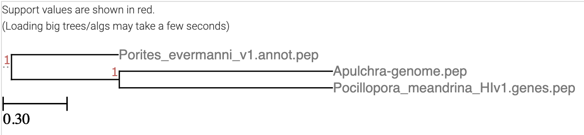

20-Apul-Orthofinder
================
Zoe Dellaert
2024-12-20

- [0.1 E5 Deep Dive Expression Orthofinder for all 3
  genomes](#01-e5-deep-dive-expression-orthofinder-for-all-3-genomes)
- [0.2 Gather genomic resources](#02-gather-genomic-resources)
- [0.3 Install Orthofinder on unity](#03-install-orthofinder-on-unity)
- [0.4 Run orthofinder](#04-run-orthofinder)
- [0.5 View output summary:](#05-view-output-summary)
  - [0.5.1 Note: this is pretty odd because Porites and Acropora are in
    the same clade (complex corals) - worth looking into reasons why the
    genomes are grouping like
    this.](#051-note-this-is-pretty-odd-because-porites-and-acropora-are-in-the-same-clade-complex-corals---worth-looking-into-reasons-why-the-genomes-are-grouping-like-this)
- [0.6 Analyze data:](#06-analyze-data)
  - [0.6.1 *Step 1*: Load Orthogroup
    data](#061-step-1-load-orthogroup-data)
  - [0.6.2 *Step 2*: Expand table to show each gene as a row and the
    gene ID and orthogroup ID as the 2
    columns](#062-step-2-expand-table-to-show-each-gene-as-a-row-and-the-gene-id-and-orthogroup-id-as-the-2-columns)
  - [0.6.3 *Step 3*: Merge all orthogroups tables for all 3 species into
    one table that will be used to generate the Upset
    Plot](#063-step-3-merge-all-orthogroups-tables-for-all-3-species-into-one-table-that-will-be-used-to-generate-the-upset-plot)
  - [0.6.4 Make upset plot](#064-make-upset-plot)

## 0.1 E5 Deep Dive Expression Orthofinder for all 3 genomes

## 0.2 Gather genomic resources

For orthofinder, we need a protein fasta for each genome. I found each
of these on our wiki,
<https://github.com/urol-e5/deep-dive-expression/wiki/00%E2%80%90Genomic-Resources>.

- `Apulchra-genome.pep.faa` -
  <https://raw.githubusercontent.com/urol-e5/deep-dive-expression/main/D-Apul/data/Apulchra-genome.pep.faa>
- `Porites_evermanni_v1.annot.pep.fa`:
  <https://gannet.fish.washington.edu/seashell/snaps/Porites_evermanni_v1.annot.pep.fa>
- `Pocillopora_meandrina_HIv1.genes.pep.faa` -
  <https://gannet.fish.washington.edu/seashell/snaps/Pocillopora_meandrina_HIv1.genes.pep.faa>

``` bash
cd ../data
mkdir -p 20-Apul-Orthofinder/proteins
cd 20-Apul-Orthofinder/proteins

wget https://raw.githubusercontent.com/urol-e5/deep-dive-expression/main/D-Apul/data/Apulchra-genome.pep.faa
wget https://gannet.fish.washington.edu/seashell/snaps/Porites_evermanni_v1.annot.pep.fa
wget https://gannet.fish.washington.edu/seashell/snaps/Pocillopora_meandrina_HIv1.genes.pep.faa
```

## 0.3 Install Orthofinder on unity

``` bash
cd /work/pi_hputnam_uri_edu/pgrams

wget https://github.com/davidemms/OrthoFinder/releases/latest/download/OrthoFinder.tar.gz

tar xzvf OrthoFinder.tar.gz
cd OrthoFinder/

#print help 
./orthofinder -h
```

## 0.4 Run orthofinder

``` bash
mkdir scripts
nano scripts/orthofinder.sh
```

``` bash
#!/usr/bin/env bash
#SBATCH --export=NONE
#SBATCH --nodes=1 --ntasks-per-node=24
#SBATCH --signal=2
#SBATCH --no-requeue
#SBATCH --mem=200GB
#SBATCH --error=scripts/"%x_error.%j"
#SBATCH --output=scripts/"%x_output.%j"
#SBATCH -t 48:00:00
#SBATCH --mail-type=BEGIN,END,FAIL

# run orthofinder with 20 threads
/work/pi_hputnam_uri_edu/pgrams/OrthoFinder/orthofinder -f ../data/20-Apul-Orthofinder/proteins/ -t 20 -o ../output/20-Apul-Orthofinder/
```

## 0.5 View output summary:

``` bash
cd ../output/20-Apul-Orthofinder/Results_Dec20
cat Comparative_Genomics_Statistics/Statistics_Overall.tsv
```

    Number of species   3
    Number of genes 112750
    Number of genes in orthogroups  97235
    Number of unassigned genes  15515
    Percentage of genes in orthogroups  86.2
    Percentage of unassigned genes  13.8
    Number of orthogroups   23124
    Number of species-specific orthogroups  5160
    Number of genes in species-specific orthogroups 24458
    Percentage of genes in species-specific orthogroups 21.7
    Mean orthogroup size    4.2
    Median orthogroup size  3.0
    G50 (assigned genes)    4
    G50 (all genes) 4
    O50 (assigned genes)    5985
    O50 (all genes) 7924
    Number of orthogroups with all species present  12864
    Number of single-copy orthogroups   8082
    Date    2024-12-20
    Orthogroups file    Orthogroups.tsv
    Unassigned genes file   Orthogroups_UnassignedGenes.tsv
    Per-species statistics  Statistics_PerSpecies.tsv
    Overall statistics  Statistics_Overall.tsv
    Orthogroups shared between species  Orthogroups_SpeciesOverlaps.tsv

    Average number of genes per-species in orthogroup   Number of orthogroups   Percentage of orthogroups   Number of genes Percentage of genes
    <1  4980    21.5    9960    10.2
    '1  14966   64.7    51441   52.9
    '2  1709    7.4 11512   11.8
    '3  615 2.7 6060    6.2
    '4  318 1.4 4081    4.2
    '5  171 0.7 2709    2.8
    '6  85  0.4 1613    1.7
    '7  58  0.3 1279    1.3
    '8  44  0.2 1099    1.1
    '9  37  0.2 1035    1.1
    '10 35  0.2 1084    1.1
    11-15   67  0.3 2554    2.6
    16-20   18  0.1 999 1.0
    21-50   21  0.1 1809    1.9
    51-100  0   0.0 0   0.0
    101-150 0   0.0 0   0.0
    151-200 0   0.0 0   0.0
    201-500 0   0.0 0   0.0
    501-1000    0   0.0 0   0.0
    '1001+  0   0.0 0   0.0

    Number of species in orthogroup Number of orthogroups
    1   5160
    2   5100
    3   12864

``` bash
cat Species_Tree/SpeciesTree_rooted.txt
```

`(Porites_evermanni_v1.annot.pep:0.5,(Apulchra-genome.pep:1,Pocillopora_meandrina_HIv1.genes.pep:1)1:0.5);`

Put this info^^ into the [ETE Toolkit tree
viewer](http://etetoolkit.org/treeview/) in web browser

<figure>

<figcaption aria-hidden="true">OrthofinderTree</figcaption>
</figure>

### 0.5.1 Note: this is pretty odd because Porites and Acropora are in the same clade (complex corals) - worth looking into reasons why the genomes are grouping like this.

## 0.6 Analyze data:

This is based off of Jill Ashey’s script here:
<https://github.com/JillAshey/SedimentStress/blob/master/RAnalysis/Orthogroups.Rmd>

``` r
#install.packages("ComplexUpset")
require(ComplexUpset)
```

    Loading required package: ComplexUpset

``` r
require(tidyverse)
```

    Loading required package: tidyverse

    ── Attaching core tidyverse packages ──────────────────────── tidyverse 2.0.0 ──
    ✔ dplyr     1.1.4     ✔ readr     2.1.5
    ✔ forcats   1.0.0     ✔ stringr   1.5.1
    ✔ ggplot2   3.5.1     ✔ tibble    3.2.1
    ✔ lubridate 1.9.3     ✔ tidyr     1.3.1
    ✔ purrr     1.0.2     
    ── Conflicts ────────────────────────────────────────── tidyverse_conflicts() ──
    ✖ dplyr::filter() masks stats::filter()
    ✖ dplyr::lag()    masks stats::lag()
    ℹ Use the conflicted package (<http://conflicted.r-lib.org/>) to force all conflicts to become errors

### 0.6.1 *Step 1*: Load Orthogroup data

``` r
# Read in orthofinder data 
ortho <- read.table(file = "../output/20-Apul-Orthofinder/Results_Dec20/Phylogenetic_Hierarchical_Orthogroups/N0.tsv", sep = '\t', header = TRUE, na.strings=c(""," ","NA")) %>% select(-c(HOG, Gene.Tree.Parent.Clade)) %>% rename(Orthogroup = OG)

genus_list <- c("Acropora", "Pocillopora", "Porites")

species_list_abbrv <- c("apul", "pmea", "peve")

colnames(ortho) <- c("Orthogroup", genus_list)
length(unique(ortho$Orthogroup)) # 23124 total orthogroups
```

    [1] 23124

### 0.6.2 *Step 2*: Expand table to show each gene as a row and the gene ID and orthogroup ID as the 2 columns

``` r
# Split by species
for (i in 1:length(genus_list)) {
  assign(paste0(species_list_abbrv[i], "_ortho"), select(ortho, c("Orthogroup", genus_list[i])))
}
```

``` r
# Now split strings of gene names into cols w/ corresponding orthogroup

for (i in 1:length(genus_list)) {
  df_name <- paste0(species_list_abbrv[i], "_ortho")
  
  # Extract the species column and perform operations
  assign(df_name, get(df_name) %>%
           mutate(!!genus_list[i] := strsplit(as.character(!!as.symbol(genus_list[i])), ",")) %>%
           unnest(!!as.symbol(genus_list[i])) %>%
           na.omit() %>%
           mutate(!!as.symbol(genus_list[i]) := gsub(" ", "", !!as.symbol(genus_list[i])))
  )
}
```

### 0.6.3 *Step 3*: Merge all orthogroups tables for all 3 species into one table that will be used to generate the Upset Plot

``` r
apul_ortho_collapsed <- unique(apul_ortho %>% select(Orthogroup))

#add in column to show that all these orthogroups are in Apul because they come from Apul
apul_ortho_collapsed$Acropora <-1

peve_ortho_collapsed <- unique(peve_ortho %>% select(Orthogroup))

#add in column to show that all these orthogroups are in Apul because they come from Apul
peve_ortho_collapsed$Porites <-1

pmea_ortho_collapsed <- unique(pmea_ortho %>% select(Orthogroup))

#add in column to show that all these orthogroups are in Apul because they come from Apul
pmea_ortho_collapsed$Pocillopora <-1
```

#### 0.6.3.1 Join using full joins to capture orthogroups that aren’t shared. This is more accurate.

``` r
full1 <- full_join(apul_ortho_collapsed, peve_ortho_collapsed, by = "Orthogroup")
full <- full_join(full1, pmea_ortho_collapsed, by = "Orthogroup")

full <- full %>% replace(is.na(.), 0)
```

### 0.6.4 Make upset plot

Trying the code from this stackover flow post:
<https://stackoverflow.com/questions/67094573/upsetr-sets-bar-interacting-different-color-and-its-sets-intersections>

Vignette for ComplexUpset
[here](https://krassowski.github.io/complex-upset/articles/Examples_R.html)
PDF:
<https://cran.r-project.org/web/packages/ComplexUpset/ComplexUpset.pdf>

``` r
# plot
upset_ortho <- upset(
  full,
  genus_list,
  queries=list(
    upset_query(set='Acropora', fill='gray'),
    upset_query(set='Pocillopora', fill='gray'),
    upset_query(set='Porites', fill='gray')
  ),
  base_annotations=list(
    'Intersection size'=(     # this creates the bar plot showing intersection size (top right corner)
        intersection_size(
        bar_number_threshold=0.85,  # show all numbers on top of bars
        width=0.9,   # reduce width of the bars
        text = list(size=10), # change text size over bars
        text_colors = c(on_background = "black", on_bar = "white"), # change text color for text over bars
      ) +
      scale_y_continuous(expand=expansion(mult=c(0, 0.05))) + # add some space on the top of the bars
      theme(
          panel.grid.major=element_blank(), # hide grid lines
          panel.grid.minor=element_blank(), # hide grid lines
          axis.line=element_line(colour='black', size = 2), # show axis lines
          axis.title.y = element_text(size = 20, colour = "black"), 
          axis.text.y = element_text(size = 20, colour = "black")
      )
    )
  ),
  stripes=upset_stripes(    # this changes the color of the stripes in the matrix (underneath the bar plot, bottom right corner)
    geom=geom_segment(size=30),  
    colors=c("lightgreen", "lightblue", "lightpink") 
  ),
  matrix=intersection_matrix( # this changes the circles and connecting lines in the matrix
      geom=geom_point(
        shape='circle filled', # to prevent connectors from getting the color, use `fill` instead of `color`, together with `shape='circle filled'
        size=10,
        stroke=0.6
      ), 
      segment=geom_segment(size=2)
  ),
  set_sizes=(
    upset_set_size(geom=geom_bar(width=.25, colour = "black")) +
    theme(
      axis.line.x=element_line(colour='black', size = 1),
      axis.line.y = element_line(colour = 'black'),
      axis.ticks.x=element_line(),
      axis.text.x = element_text(size = 15, colour = "black"),
      axis.title.x = element_text(size = 20, colour = "black"),
    )
  ),
  themes = upset_modify_themes(
       list(
           'intersections_matrix' = theme(text = element_text(size = 30, face = "italic", colour = "black")), # text to the left of the matrix
          'overall_sizes' = theme(axis.text.x = element_text(angle = 0)) # text underneath set size plot
       )),
  sort_sets = 'descending', # sort sets in descending order
  sort_intersections = 'descending' # sort intersections in descending order
)
```

    Warning: The `size` argument of `element_line()` is deprecated as of ggplot2 3.4.0.
    ℹ Please use the `linewidth` argument instead.
    This warning is displayed once every 8 hours.
    Call `lifecycle::last_lifecycle_warnings()` to see where this warning was
    generated.

    Warning: Using `size` aesthetic for lines was deprecated in ggplot2 3.4.0.
    ℹ Please use `linewidth` instead.
    This warning is displayed once every 8 hours.
    Call `lifecycle::last_lifecycle_warnings()` to see where this warning was
    generated.

``` r
ggsave("../output/20-Apul-Orthofinder/Results_Dec20/upset_ortho.pdf", upset_ortho, width = 40, height = 20, units = c("in"))
ggsave("../output/20-Apul-Orthofinder/Results_Dec20/upset_ortho.png", upset_ortho, width = 40, height = 20, units = c("in"))
```

<figure>

<figcaption aria-hidden="true">OrthofinderUpset</figcaption>
</figure>
