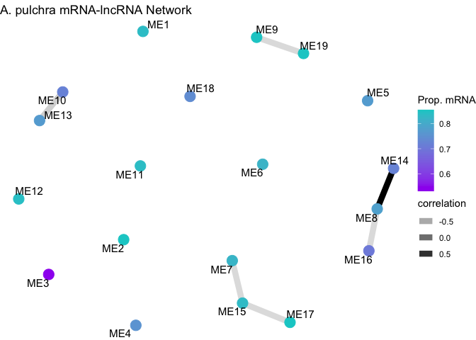
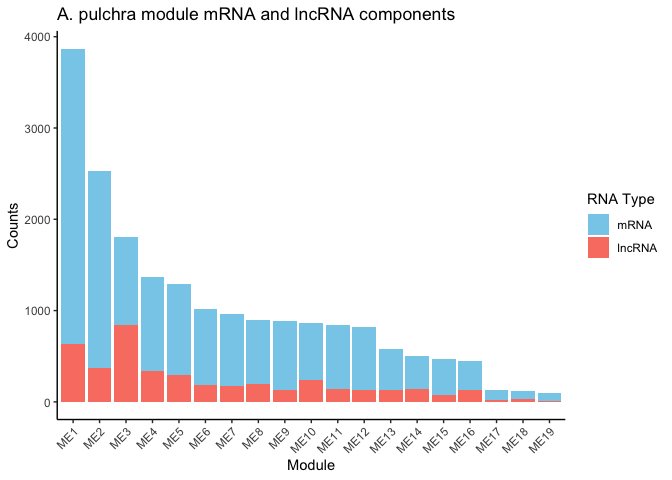
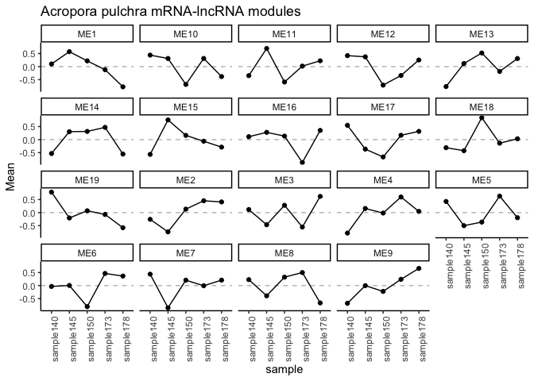
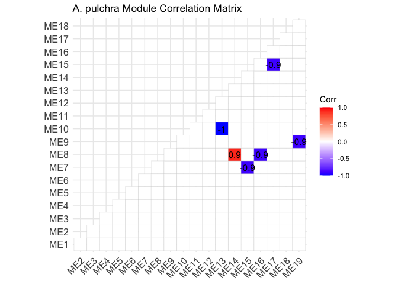

Apul Gene expression lncRNA correlations
================
2025-02-04

This script conducts correlation network analyses for gene expression
and lncRNA.

# Set up

Load libraries

``` r
library(tidyverse)
library(ggplot2)
library(DESeq2)
library(igraph)
library(psych)
library(tidygraph)
library(ggraph)
library(WGCNA)
library(edgeR)
library(reshape2)
library(ggcorrplot)
library(corrplot)
```

# Acropora pulchra

## Load and format data

``` r
apul_mrna<-read_csv(file="D-Apul/output/07-Apul-Hisat/Apul-gene_count_matrix.csv")%>%
  rename("mrna_id"=gene_id, "sample140"=`RNA-ACR-140`, "sample145"=`RNA-ACR-145`, "sample173"=`RNA-ACR-173`, "sample178"=`RNA-ACR-178`, "sample150"=`RNA-ACR-150`)
```

    ## Rows: 44371 Columns: 6
    ## ── Column specification ────────────────────────────────────────────────────────
    ## Delimiter: ","
    ## chr (1): gene_id
    ## dbl (5): RNA-ACR-140, RNA-ACR-145, RNA-ACR-150, RNA-ACR-173, RNA-ACR-178
    ## 
    ## ℹ Use `spec()` to retrieve the full column specification for this data.
    ## ℹ Specify the column types or set `show_col_types = FALSE` to quiet this message.

``` r
apul_lncrna<-read_table(file="D-Apul/output/19-Apul-lncRNA-matrix/Apul-lncRNA-counts.txt", skip=1)%>%
  select(!c("Chr", "Start", "End", "Strand", "Length"))%>%
  rename("lncrna_id"=Geneid, 
         "sample140"=`../output/07-Apul-Hisat/RNA-ACR-140.sorted.bam`, 
         "sample145"=`../output/07-Apul-Hisat/RNA-ACR-145.sorted.bam`, 
         "sample150"=`../output/07-Apul-Hisat/RNA-ACR-150.sorted.bam`, 
         "sample173"=`../output/07-Apul-Hisat/RNA-ACR-173.sorted.bam`, 
         "sample178"=`../output/07-Apul-Hisat/RNA-ACR-178.sorted.bam`)
```

    ## 
    ## ── Column specification ────────────────────────────────────────────────────────
    ## cols(
    ##   Geneid = col_character(),
    ##   Chr = col_character(),
    ##   Start = col_double(),
    ##   End = col_double(),
    ##   Strand = col_character(),
    ##   Length = col_double(),
    ##   `../output/07-Apul-Hisat/RNA-ACR-140.sorted.bam` = col_double(),
    ##   `../output/07-Apul-Hisat/RNA-ACR-145.sorted.bam` = col_double(),
    ##   `../output/07-Apul-Hisat/RNA-ACR-150.sorted.bam` = col_double(),
    ##   `../output/07-Apul-Hisat/RNA-ACR-173.sorted.bam` = col_double(),
    ##   `../output/07-Apul-Hisat/RNA-ACR-178.sorted.bam` = col_double()
    ## )

``` r
apul_mrna<-as.data.frame(apul_mrna)
apul_lncrna<-as.data.frame(apul_lncrna)

str(apul_mrna)
```

    ## 'data.frame':    44371 obs. of  6 variables:
    ##  $ mrna_id  : chr  "FUN_035039" "FUN_035038" "FUN_035031" "FUN_035030" ...
    ##  $ sample140: num  553 2486 46 183 1519 ...
    ##  $ sample145: num  340 775 6 252 311 ...
    ##  $ sample150: num  256 743 25 48 555 ...
    ##  $ sample173: num  485 1250 41 78 990 ...
    ##  $ sample178: num  510 1092 29 73 370 ...

``` r
str(apul_lncrna)
```

    ## 'data.frame':    24183 obs. of  6 variables:
    ##  $ lncrna_id: chr  "lncRNA_001" "lncRNA_002" "lncRNA_003" "lncRNA_004" ...
    ##  $ sample140: num  1 0 0 1 20 16 12 3 0 1 ...
    ##  $ sample145: num  22 3 0 0 0 4 53 0 0 0 ...
    ##  $ sample150: num  4 5 0 0 4 13 0 5 3 2 ...
    ##  $ sample173: num  7 6 0 0 0 6 6 2 0 0 ...
    ##  $ sample178: num  18 25 0 0 147 28 17 8 1 1 ...

Remove mRNA and lncRNA with 0 in all samples.

``` r
# Remove any genes with 0 counts across samples 
apul_mrna<-apul_mrna %>%
     mutate(Total = rowSums(.[, 2:6]))%>%
    filter(!Total==0)%>%
    dplyr::select(!Total)

apul_lncrna<-apul_lncrna %>%
     mutate(Total = rowSums(.[, 2:6]))%>%
    filter(!Total==0)%>%
    dplyr::select(!Total)
```

We now have 20690 lncRNAs and 33624 mRNAs.

Set row names.

``` r
rownames(apul_mrna)<-apul_mrna$mrna_id
apul_mrna<-apul_mrna%>%select(!mrna_id)
```

``` r
rownames(apul_lncrna)<-apul_lncrna$lncrna_id
apul_lncrna<-apul_lncrna%>%select(!lncrna_id)
```

Make sample metadata.

``` r
apul_sample_info <- data.frame(
  species = c("Acropora pulchra"),
  sample = colnames(apul_mrna)
)

rownames(apul_sample_info)<-apul_sample_info$sample
```

## Filter data

Filter data to only keep those expressed in all samples.

``` r
dge_mRNA <- DGEList(counts = apul_mrna)
dge_lncRNA <- DGEList(counts = apul_lncrna)

# Calculate CPM
cpm_mRNA <- cpm(dge_mRNA)
cpm_lncRNA <- cpm(dge_lncRNA)

# Filtering criteria: CPM > 1 in all samples (100%)
min_samples <- ncol(apul_mrna) * 1

# Apply the filter
keep_mRNA <- rowSums(cpm_mRNA > 1) >= min_samples
keep_lncRNA <- rowSums(cpm_lncRNA > 1) >= min_samples

# Filtered count matrices
filtered_mRNA_counts <- apul_mrna[keep_mRNA, ]
filtered_lncRNA_counts <- apul_lncrna[keep_lncRNA, ]

# Check the number of features retained
cat("mRNAs retained:", sum(keep_mRNA), "\n")
```

    ## mRNAs retained: 15280

``` r
cat("lncRNAs retained:", sum(keep_lncRNA), "\n")
```

    ## lncRNAs retained: 4218

This reduced mRNAs to 15,280 and lncRNAs to 4,218

## Normalize data

``` r
dds_mrna <- DESeqDataSetFromMatrix(countData = filtered_mRNA_counts, 
                              colData = apul_sample_info, 
                              design = ~ 1)
```

    ## converting counts to integer mode

``` r
# Variance Stabilizing Transformation
vsd_mrna <- assay(vst(dds_mrna, blind = TRUE))
```

``` r
dds_lncrna <- DESeqDataSetFromMatrix(countData = filtered_lncRNA_counts, 
                              colData = apul_sample_info, 
                              design = ~ 1)
```

    ## converting counts to integer mode

``` r
# Variance Stabilizing Transformation
vsd_lncrna <- assay(vst(dds_lncrna, blind = TRUE))
```

    ## -- note: fitType='parametric', but the dispersion trend was not well captured by the
    ##    function: y = a/x + b, and a local regression fit was automatically substituted.
    ##    specify fitType='local' or 'mean' to avoid this message next time.

## Conduct module correlations with WGCNA

Set soft threshold.

``` r
options(stringsAsFactors = FALSE)
enableWGCNAThreads()  # Enable multi-threading
```

    ## Allowing parallel execution with up to 7 working processes.

``` r
allowWGCNAThreads(nThreads = 2)
```

    ## Allowing multi-threading with up to 2 threads.

``` r
# Combine mRNA and lncRNA datasets
datExpr <- t(rbind(vsd_mrna, vsd_lncrna))

sum(is.na(datExpr))  # Should be 0
```

    ## [1] 0

``` r
sum(!is.finite(as.matrix(datExpr)))  # Should be 0
```

    ## [1] 0

``` r
# Remove genes/samples with missing or infinite values
datExpr <- datExpr[complete.cases(datExpr), ]
datExpr <- datExpr[, colSums(is.na(datExpr)) == 0]

# # Choose a set of soft-thresholding powers
powers <- c(seq(from = 1, to=19, by=2), c(21:30)) #Create a string of numbers from 1 through 10, and even numbers from 10 through 20
# 
# # Call the network topology analysis function
sft <-pickSoftThreshold(datExpr, powerVector = powers, verbose = 5)
```

    ## pickSoftThreshold: will use block size 2294.
    ##  pickSoftThreshold: calculating connectivity for given powers...
    ##    ..working on genes 1 through 2294 of 19498
    ##    ..working on genes 2295 through 4588 of 19498
    ##    ..working on genes 4589 through 6882 of 19498
    ##    ..working on genes 6883 through 9176 of 19498
    ##    ..working on genes 9177 through 11470 of 19498
    ##    ..working on genes 11471 through 13764 of 19498
    ##    ..working on genes 13765 through 16058 of 19498
    ##    ..working on genes 16059 through 18352 of 19498
    ##    ..working on genes 18353 through 19498 of 19498
    ##    Power SFT.R.sq slope truncated.R.sq mean.k. median.k. max.k.
    ## 1      1   0.0963 -1.09          0.245    8590      8480  10300
    ## 2      3   0.5370 -1.52          0.621    3580      3440   5240
    ## 3      5   0.7230 -1.65          0.776    2100      1960   3430
    ## 4      7   0.8130 -1.73          0.845    1420      1300   2490
    ## 5      9   0.8660 -1.79          0.889    1040       943   1930
    ## 6     11   0.8940 -1.81          0.912     810       723   1550
    ## 7     13   0.9060 -1.81          0.922     653       576   1290
    ## 8     15   0.9160 -1.81          0.930     540       473   1090
    ## 9     17   0.9240 -1.80          0.935     457       397    935
    ## 10    19   0.9290 -1.77          0.938     393       340    816
    ## 11    21   0.9320 -1.75          0.940     343       295    719
    ## 12    22   0.9340 -1.74          0.941     322       276    678
    ## 13    23   0.9350 -1.73          0.942     302       259    641
    ## 14    24   0.9340 -1.72          0.940     285       244    606
    ## 15    25   0.9320 -1.70          0.938     269       230    575
    ## 16    26   0.9300 -1.69          0.936     255       217    547
    ## 17    27   0.9280 -1.68          0.934     242       206    521
    ## 18    28   0.9260 -1.67          0.932     230       195    497
    ## 19    29   0.9240 -1.66          0.930     219       185    474
    ## 20    30   0.9220 -1.65          0.928     209       177    454

Plot the results.

``` r
sizeGrWindow(9, 5)
par(mfrow = c(1,2));
cex1 = 0.9;
# # # Scale-free topology fit index as a function of the soft-thresholding power
plot(sft$fitIndices[,1], -sign(sft$fitIndices[,3])*sft$fitIndices[,2],
      xlab="Soft Threshold (power)",ylab="Scale Free Topology Model Fit,signed R^2",type="n",
     main = paste("Scale independence"));
 text(sft$fitIndices[,1], -sign(sft$fitIndices[,3])*sft$fitIndices[,2],
     labels=powers,cex=cex1,col="red");
# # # this line corresponds to using an R^2 cut-off
 abline(h=0.9,col="red")
# # # Mean connectivity as a function of the soft-thresholding power
 plot(sft$fitIndices[,1], sft$fitIndices[,5],
     xlab="Soft Threshold (power)",ylab="Mean Connectivity", type="n",
     main = paste("Mean connectivity"))
 text(sft$fitIndices[,1], sft$fitIndices[,5], labels=powers, cex=cex1,col="red")
```

Selected power will be 15 (the first value to cross 0.9 threshold).

### Generate network

``` r
selected_power<-15 

# Network construction (adjust power based on sft output)
net = blockwiseModules(datExpr, power = selected_power,
                       TOMType = "unsigned", minModuleSize = 30,
                       reassignThreshold = 0, mergeCutHeight = 0.25,
                       numericLabels = TRUE, pamRespectsDendro = FALSE,
                       saveTOMs = FALSE, verbose = 3)
```

    ##  Calculating module eigengenes block-wise from all genes
    ##    Flagging genes and samples with too many missing values...
    ##     ..step 1
    ##  ....pre-clustering genes to determine blocks..
    ##    Projective K-means:
    ##    ..k-means clustering..
    ##    ..merging smaller clusters...
    ## Block sizes:
    ## gBlocks
    ##    1    2    3    4    5 
    ## 4862 4012 3783 3618 3223 
    ##  ..Working on block 1 .
    ##     TOM calculation: adjacency..
    ##     ..will use 2 parallel threads.
    ##      Fraction of slow calculations: 0.000000
    ##     ..connectivity..
    ##     ..matrix multiplication (system BLAS)..
    ##     ..normalization..
    ##     ..done.
    ##  ....clustering..
    ##  ....detecting modules..
    ##  ....calculating module eigengenes..
    ##  ....checking kME in modules..
    ##  ..Working on block 2 .
    ##     TOM calculation: adjacency..
    ##     ..will use 2 parallel threads.
    ##      Fraction of slow calculations: 0.000000
    ##     ..connectivity..
    ##     ..matrix multiplication (system BLAS)..
    ##     ..normalization..
    ##     ..done.
    ##  ....clustering..
    ##  ....detecting modules..
    ##  ....calculating module eigengenes..
    ##  ....checking kME in modules..
    ##  ..Working on block 3 .
    ##     TOM calculation: adjacency..
    ##     ..will use 2 parallel threads.
    ##      Fraction of slow calculations: 0.000000
    ##     ..connectivity..
    ##     ..matrix multiplication (system BLAS)..
    ##     ..normalization..
    ##     ..done.
    ##  ....clustering..
    ##  ....detecting modules..
    ##  ....calculating module eigengenes..
    ##  ....checking kME in modules..
    ##  ..Working on block 4 .
    ##     TOM calculation: adjacency..
    ##     ..will use 2 parallel threads.
    ##      Fraction of slow calculations: 0.000000
    ##     ..connectivity..
    ##     ..matrix multiplication (system BLAS)..
    ##     ..normalization..
    ##     ..done.
    ##  ....clustering..
    ##  ....detecting modules..
    ##  ....calculating module eigengenes..
    ##  ....checking kME in modules..
    ##  ..Working on block 5 .
    ##     TOM calculation: adjacency..
    ##     ..will use 2 parallel threads.
    ##      Fraction of slow calculations: 0.000000
    ##     ..connectivity..
    ##     ..matrix multiplication (system BLAS)..
    ##     ..normalization..
    ##     ..done.
    ##  ....clustering..
    ##  ....detecting modules..
    ##  ....calculating module eigengenes..
    ##  ....checking kME in modules..
    ##  ..merging modules that are too close..
    ##      mergeCloseModules: Merging modules whose distance is less than 0.25
    ##        Calculating new MEs...

View modules.

``` r
moduleEigengenes = moduleEigengenes(datExpr, colors = net$colors)$eigengenes

length(table(net$unmergedColors))
```

    ## [1] 261

``` r
length(table(net$colors))
```

    ## [1] 19

``` r
MEs<-net$MEs
moduleLabels<-net$colors
```

There are 19 modules after merging similar modules from original 261
modules.

Determine whether mRNA and or lncRNA are present in each module.

``` r
# Get gene names and corresponding module colors
gene_module_info <- data.frame(
  Gene = colnames(datExpr),
  Module = moduleLabels
)

# Check structure
head(gene_module_info)
```

    ##                  Gene Module
    ## FUN_035039 FUN_035039      1
    ## FUN_035038 FUN_035038      7
    ## FUN_035030 FUN_035030      2
    ## FUN_035033 FUN_035033     11
    ## FUN_035032 FUN_035032      2
    ## FUN_035035 FUN_035035      8

``` r
#Add ME to all the names
gene_module_info$Module <- paste0("ME", gene_module_info$Module)
```

Classify modules based on the proportion of the module comprised by
mRNAs.

``` r
# Function to calculate the proportion of mRNAs (genes with "FUN" in ID)
calculate_mRNA_proportion <- function(genes) {
  total_genes <- length(genes)
  mRNA_count <- sum(grepl("FUN", genes))
  
  # Proportion of mRNAs
  proportion_mRNA <- mRNA_count / total_genes
  return(proportion_mRNA)
}

# Apply the function to each module
module_mRNA_proportion <- tapply(gene_module_info$Gene, 
                                 gene_module_info$Module, 
                                 calculate_mRNA_proportion)

# View the proportions
module_mRNA_proportion
```

    ##       ME1      ME10      ME11      ME12      ME13      ME14      ME15      ME16 
    ## 0.8366925 0.7211982 0.8374852 0.8414634 0.7705479 0.7220000 0.8326180 0.7019868 
    ##      ME17      ME18      ME19       ME2       ME3       ME4       ME5       ME6 
    ## 0.8538462 0.7413793 0.8526316 0.8526733 0.5323741 0.7554905 0.7729730 0.8180039 
    ##       ME7       ME8       ME9 
    ## 0.8212058 0.7829978 0.8514739

### Run correlation between modules.

``` r
cor_matrix = cor(moduleEigengenes)
```

Compute correlations with Spearman correlation and BH p-value
adjustment.

``` r
# Compute Spearman correlation between mRNA and lncRNA
apul_cor_results <- corr.test(moduleEigengenes, method = "spearman", adjust = "BH")

# Extract correlation values and p-values
apul_cor_matrix <- apul_cor_results$r  # Correlation coefficients
apul_p_matrix <- apul_cor_results$p  # Adjusted p-values
```

Construct network.

``` r
# Set correlation and significance thresholds
cor_threshold <- 0.6  # Adjust based on desired stringency
p_threshold <- 0.05

# Convert correlation matrix into an edge list
apul_significant_edges <- which(abs(apul_cor_matrix) > cor_threshold & apul_p_matrix < p_threshold, arr.ind = TRUE)

apul_edge_list <- data.frame(
  mRNA = rownames(apul_cor_matrix)[apul_significant_edges[,1]],
  lncRNA = colnames(apul_cor_matrix)[apul_significant_edges[,2]],
  correlation = apul_cor_matrix[apul_significant_edges]
)

# Construct network graph
apul_network <- graph_from_data_frame(apul_edge_list, directed = FALSE)

module_mRNA_proportion<-as.data.frame(module_mRNA_proportion)

V(apul_network)$prop_mrna <- module_mRNA_proportion$module_mRNA_proportion[match(V(apul_network)$name, rownames(module_mRNA_proportion))]
```

Plot network.

``` r
# Visualize network
ggraph(apul_network, layout = "fr") +  # Force-directed layout
  geom_edge_link(aes(edge_alpha = correlation), show.legend = TRUE, width=3) +
  geom_node_point(aes(colour=prop_mrna), size = 5) +
  scale_colour_gradient(name="Prop. mRNA", low = "purple", high = "cyan3")+
  geom_node_text(aes(label = name), repel = TRUE, size = 4) +
  theme_void() +
  labs(title = "A. pulchra mRNA-lncRNA Network")
```

<!-- -->

### Plot eigengene patterns and proportions of mRNA and lncRNAs

``` r
module_mRNA_proportion$module_lncRNA_proportion<-1-module_mRNA_proportion$module_mRNA_proportion
```

View total size of modules

``` r
module_sizes <- table(moduleLabels)
module_sizes<-as.data.frame(module_sizes)
module_sizes$module<-paste0("ME", module_sizes$moduleLabels)
```

Plot a stacked bar plot.

``` r
stack_data<-module_mRNA_proportion
stack_data$module<-rownames(stack_data)
stack_data$size<-module_sizes$Freq[match(stack_data$module, module_sizes$module)]

stack_data$module <- factor(stack_data$module, 
                             levels = rev(stack_data$module[order(stack_data$size)]))

stack_data<-stack_data%>%
  mutate(mRNAs=module_mRNA_proportion*size)%>%
  mutate(lncRNAs=module_lncRNA_proportion*size)%>%
  select(!c(module_mRNA_proportion, module_lncRNA_proportion, size))


# Reshape the data for ggplot (long format)

stack_long <- melt(stack_data[, c("module", "mRNAs", "lncRNAs")], 
                    id.vars = "module",
                    variable.name = "RNA_Type", 
                    value.name = "Count")

ggplot(stack_long, aes(x = module, y = Count, fill = RNA_Type)) +
  geom_bar(stat = "identity") +
  scale_fill_manual(values = c("mRNAs" = "skyblue", 
                               "lncRNAs" = "salmon"), 
                    labels = c("mRNA", "lncRNA"))+
  theme_classic() +
  labs(title = "A. pulchra module mRNA and lncRNA components",
       x = "Module",
       y = "Counts",
       fill = "RNA Type") +
  theme(axis.text.x = element_text(angle = 45, hjust = 1))
```

<!-- -->

Next plot eigengene expression of each module across samples.

``` r
#convert wide format to long format for plotting  
head(moduleEigengenes)
```

    ##                  ME1        ME2        ME3         ME4        ME5          ME6
    ## sample140  0.1012830 -0.2573341  0.1170330 -0.78429857  0.4266931 -0.031252795
    ## sample145  0.5717452 -0.7374683 -0.4648326  0.15754040 -0.4997481  0.005718162
    ## sample150  0.2195855  0.1332251  0.2801109 -0.01738596 -0.3624138 -0.805418024
    ## sample173 -0.1174819  0.4532953 -0.5533017  0.59801923  0.6312707  0.465731744
    ## sample178 -0.7751318  0.4082819  0.6209904  0.04612490 -0.1958019  0.365220913
    ##                    ME7        ME8           ME9       ME10        ME11
    ## sample140  0.437858174  0.2291821 -0.6773586329  0.4397356 -0.34582841
    ## sample145 -0.849335607 -0.3905557 -0.0002943274  0.3114643  0.69421214
    ## sample150  0.207711642  0.3238453 -0.2220070551 -0.6830178 -0.59022214
    ## sample173 -0.005366512  0.5005147  0.2410190986  0.3128850  0.01877439
    ## sample178  0.209132303 -0.6629865  0.6586409168 -0.3810671  0.22306402
    ##                 ME12       ME13       ME14        ME15       ME16       ME17
    ## sample140  0.4203659 -0.7640048 -0.5334486 -0.56543646  0.1118435  0.5477431
    ## sample145  0.3753817  0.1173920  0.3039010  0.75353266  0.2774297 -0.3641193
    ## sample150 -0.7089109  0.5215289  0.3128876  0.16136638  0.1350824 -0.6639930
    ## sample173 -0.3401135 -0.1851478  0.4690674 -0.06210584 -0.8765076  0.1655830
    ## sample178  0.2532768  0.3102317 -0.5524074 -0.28735674  0.3521520  0.3147861
    ##                  ME18        ME19
    ## sample140 -0.31003073  0.78340319
    ## sample145 -0.42352589 -0.20478184
    ## sample150  0.83948175  0.07017763
    ## sample173 -0.13712638 -0.07048131
    ## sample178  0.03120125 -0.57831767

``` r
plot_MEs <- moduleEigengenes 

plot_MEs$sample<-rownames(plot_MEs)

plot_MEs<-plot_MEs%>%
  pivot_longer(
    cols = where(is.numeric),  # Select only numeric columns
    names_to = "Module",       # Name for the new column containing the column names
    values_to = "Mean"         # Name for the new column containing the values
  )

expression_plots<-plot_MEs%>%
  group_by(Module) %>%
  
  ggplot(aes(x=sample, y=Mean)) +
  facet_wrap(~ Module)+
    geom_hline(yintercept = 0, linetype="dashed", color = "grey")+
  geom_point()+
  geom_line(aes(group=1))+
  ggtitle("Acropora pulchra mRNA-lncRNA modules")+
  theme_classic()+ 
  theme(axis.text.x=element_text(angle = 90, hjust=1)); expression_plots
```

<!-- -->

### Plot correlations of specific modules

Which modules were significantly correlated? Show correlation matrix.

``` r
# Compute Spearman correlation between mRNA and lncRNA
apul_cor_results 
```

    ## Call:corr.test(x = moduleEigengenes, method = "spearman", adjust = "BH")
    ## Correlation matrix 
    ##       ME1  ME2  ME3  ME4  ME5  ME6  ME7  ME8  ME9 ME10 ME11 ME12 ME13 ME14 ME15
    ## ME1   1.0 -0.8 -0.3 -0.1 -0.7 -0.6 -0.5  0.1 -0.6 -0.1  0.0  0.1  0.1  0.3  0.7
    ## ME2  -0.8  1.0  0.0  0.4  0.7  0.6  0.1  0.4  0.6 -0.1 -0.2 -0.6  0.1  0.3 -0.3
    ## ME3  -0.3  0.0  1.0 -0.6 -0.3 -0.4  0.6 -0.6  0.1 -0.6 -0.2 -0.1  0.6 -0.7 -0.3
    ## ME4  -0.1  0.4 -0.6  1.0  0.1  0.8 -0.8  0.2  0.7  0.0  0.6 -0.3  0.0  0.5  0.5
    ## ME5  -0.7  0.7 -0.3  0.1  1.0  0.5  0.4  0.5  0.1  0.6 -0.3  0.0 -0.6  0.2 -0.7
    ## ME6  -0.6  0.6 -0.4  0.8  0.5  1.0 -0.3  0.0  0.8  0.3  0.6  0.0 -0.3  0.1 -0.1
    ## ME7  -0.5  0.1  0.6 -0.8  0.4 -0.3  1.0 -0.2 -0.3  0.2 -0.5  0.3 -0.2 -0.6 -0.9
    ## ME8   0.1  0.4 -0.6  0.2  0.5  0.0 -0.2  1.0 -0.3  0.2 -0.6 -0.5 -0.2  0.9  0.1
    ## ME9  -0.6  0.6  0.1  0.7  0.1  0.8 -0.3 -0.3  1.0 -0.3  0.6 -0.3  0.3 -0.1  0.1
    ## ME10 -0.1 -0.1 -0.6  0.0  0.6  0.3  0.2  0.2 -0.3  1.0  0.1  0.7 -1.0  0.0 -0.5
    ## ME11  0.0 -0.2 -0.2  0.6 -0.3  0.6 -0.5 -0.6  0.6  0.1  1.0  0.4 -0.1 -0.3  0.3
    ## ME12  0.1 -0.6 -0.1 -0.3  0.0  0.0  0.3 -0.5 -0.3  0.7  0.4  1.0 -0.7 -0.6 -0.4
    ## ME13  0.1  0.1  0.6  0.0 -0.6 -0.3 -0.2 -0.2  0.3 -1.0 -0.1 -0.7  1.0  0.0  0.5
    ## ME14  0.3  0.3 -0.7  0.5  0.2  0.1 -0.6  0.9 -0.1  0.0 -0.3 -0.6  0.0  1.0  0.5
    ## ME15  0.7 -0.3 -0.3  0.5 -0.7 -0.1 -0.9  0.1  0.1 -0.5  0.3 -0.4  0.5  0.5  1.0
    ## ME16  0.0 -0.3  0.7 -0.1 -0.7 -0.1  0.0 -0.9  0.4 -0.6  0.5  0.1  0.6 -0.7  0.2
    ## ME17 -0.6  0.1  0.1 -0.3  0.6  0.3  0.7 -0.3  0.0  0.7  0.1  0.7 -0.7 -0.6 -0.9
    ## ME18 -0.4  0.6  0.6 -0.2  0.1 -0.2  0.3  0.2  0.2 -0.7 -0.6 -0.8  0.7  0.1 -0.1
    ## ME19  0.3 -0.2 -0.2 -0.6  0.3 -0.6  0.4  0.6 -0.9  0.4 -0.8  0.1 -0.4  0.3 -0.3
    ##      ME16 ME17 ME18 ME19
    ## ME1   0.0 -0.6 -0.4  0.3
    ## ME2  -0.3  0.1  0.6 -0.2
    ## ME3   0.7  0.1  0.6 -0.2
    ## ME4  -0.1 -0.3 -0.2 -0.6
    ## ME5  -0.7  0.6  0.1  0.3
    ## ME6  -0.1  0.3 -0.2 -0.6
    ## ME7   0.0  0.7  0.3  0.4
    ## ME8  -0.9 -0.3  0.2  0.6
    ## ME9   0.4  0.0  0.2 -0.9
    ## ME10 -0.6  0.7 -0.7  0.4
    ## ME11  0.5  0.1 -0.6 -0.8
    ## ME12  0.1  0.7 -0.8  0.1
    ## ME13  0.6 -0.7  0.7 -0.4
    ## ME14 -0.7 -0.6  0.1  0.3
    ## ME15  0.2 -0.9 -0.1 -0.3
    ## ME16  1.0 -0.1  0.1 -0.7
    ## ME17 -0.1  1.0 -0.3  0.1
    ## ME18  0.1 -0.3  1.0  0.0
    ## ME19 -0.7  0.1  0.0  1.0
    ## Sample Size 
    ## [1] 5
    ## Probability values (Entries above the diagonal are adjusted for multiple tests.) 
    ##       ME1  ME2  ME3  ME4  ME5  ME6  ME7  ME8  ME9 ME10 ME11 ME12 ME13 ME14 ME15
    ## ME1  0.00 0.83 0.94 0.94 0.83 0.83 0.94 0.94 0.83 0.94 1.00 0.94 0.94 0.94 0.83
    ## ME2  0.10 0.00 1.00 0.94 0.83 0.83 0.94 0.94 0.83 0.94 0.94 0.83 0.94 0.94 0.94
    ## ME3  0.62 1.00 0.00 0.83 0.94 0.94 0.83 0.83 0.94 0.83 0.94 0.94 0.83 0.83 0.94
    ## ME4  0.87 0.50 0.28 0.00 0.94 0.83 0.83 0.94 0.83 1.00 0.83 0.94 1.00 0.94 0.94
    ## ME5  0.19 0.19 0.62 0.87 0.00 0.94 0.94 0.94 0.94 0.83 0.94 1.00 0.83 0.94 0.83
    ## ME6  0.28 0.28 0.50 0.10 0.39 0.00 0.94 1.00 0.83 0.94 0.83 1.00 0.94 0.94 0.94
    ## ME7  0.39 0.87 0.28 0.10 0.50 0.62 0.00 0.94 0.94 0.94 0.94 0.94 0.94 0.83 0.83
    ## ME8  0.87 0.50 0.28 0.75 0.39 1.00 0.75 0.00 0.94 0.94 0.83 0.94 0.94 0.83 0.94
    ## ME9  0.28 0.28 0.87 0.19 0.87 0.10 0.62 0.62 0.00 0.94 0.83 0.94 0.94 0.94 0.94
    ## ME10 0.87 0.87 0.28 1.00 0.28 0.62 0.75 0.75 0.62 0.00 0.94 0.83 0.00 1.00 0.94
    ## ME11 1.00 0.75 0.75 0.28 0.62 0.28 0.39 0.28 0.28 0.87 0.00 0.94 0.94 0.94 0.94
    ## ME12 0.87 0.28 0.87 0.62 1.00 1.00 0.62 0.39 0.62 0.19 0.50 0.00 0.83 0.83 0.94
    ## ME13 0.87 0.87 0.28 1.00 0.28 0.62 0.75 0.75 0.62 0.00 0.87 0.19 0.00 1.00 0.94
    ## ME14 0.62 0.62 0.19 0.39 0.75 0.87 0.28 0.04 0.87 1.00 0.62 0.28 1.00 0.00 0.94
    ## ME15 0.19 0.62 0.62 0.39 0.19 0.87 0.04 0.87 0.87 0.39 0.62 0.50 0.39 0.39 0.00
    ## ME16 1.00 0.62 0.19 0.87 0.19 0.87 1.00 0.04 0.50 0.28 0.39 0.87 0.28 0.19 0.75
    ## ME17 0.28 0.87 0.87 0.62 0.28 0.62 0.19 0.62 1.00 0.19 0.87 0.19 0.19 0.28 0.04
    ## ME18 0.50 0.28 0.28 0.75 0.87 0.75 0.62 0.75 0.75 0.19 0.28 0.10 0.19 0.87 0.87
    ## ME19 0.62 0.75 0.75 0.28 0.62 0.28 0.50 0.28 0.04 0.50 0.10 0.87 0.50 0.62 0.62
    ##      ME16 ME17 ME18 ME19
    ## ME1  1.00 0.83 0.94 0.94
    ## ME2  0.94 0.94 0.83 0.94
    ## ME3  0.83 0.94 0.83 0.94
    ## ME4  0.94 0.94 0.94 0.83
    ## ME5  0.83 0.83 0.94 0.94
    ## ME6  0.94 0.94 0.94 0.83
    ## ME7  1.00 0.83 0.94 0.94
    ## ME8  0.83 0.94 0.94 0.83
    ## ME9  0.94 1.00 0.94 0.83
    ## ME10 0.83 0.83 0.83 0.94
    ## ME11 0.94 0.94 0.83 0.83
    ## ME12 0.94 0.83 0.83 0.94
    ## ME13 0.83 0.83 0.83 0.94
    ## ME14 0.83 0.83 0.94 0.94
    ## ME15 0.94 0.83 0.94 0.94
    ## ME16 0.00 0.94 0.94 0.83
    ## ME17 0.87 0.00 0.94 0.94
    ## ME18 0.87 0.62 0.00 1.00
    ## ME19 0.19 0.87 1.00 0.00
    ## 
    ##  To see confidence intervals of the correlations, print with the short=FALSE option

``` r
# Extract correlation values and p-values
apul_cor_matrix  # Correlation coefficients
```

    ##       ME1  ME2  ME3  ME4  ME5  ME6  ME7  ME8  ME9 ME10 ME11 ME12 ME13 ME14 ME15
    ## ME1   1.0 -0.8 -0.3 -0.1 -0.7 -0.6 -0.5  0.1 -0.6 -0.1  0.0  0.1  0.1  0.3  0.7
    ## ME2  -0.8  1.0  0.0  0.4  0.7  0.6  0.1  0.4  0.6 -0.1 -0.2 -0.6  0.1  0.3 -0.3
    ## ME3  -0.3  0.0  1.0 -0.6 -0.3 -0.4  0.6 -0.6  0.1 -0.6 -0.2 -0.1  0.6 -0.7 -0.3
    ## ME4  -0.1  0.4 -0.6  1.0  0.1  0.8 -0.8  0.2  0.7  0.0  0.6 -0.3  0.0  0.5  0.5
    ## ME5  -0.7  0.7 -0.3  0.1  1.0  0.5  0.4  0.5  0.1  0.6 -0.3  0.0 -0.6  0.2 -0.7
    ## ME6  -0.6  0.6 -0.4  0.8  0.5  1.0 -0.3  0.0  0.8  0.3  0.6  0.0 -0.3  0.1 -0.1
    ## ME7  -0.5  0.1  0.6 -0.8  0.4 -0.3  1.0 -0.2 -0.3  0.2 -0.5  0.3 -0.2 -0.6 -0.9
    ## ME8   0.1  0.4 -0.6  0.2  0.5  0.0 -0.2  1.0 -0.3  0.2 -0.6 -0.5 -0.2  0.9  0.1
    ## ME9  -0.6  0.6  0.1  0.7  0.1  0.8 -0.3 -0.3  1.0 -0.3  0.6 -0.3  0.3 -0.1  0.1
    ## ME10 -0.1 -0.1 -0.6  0.0  0.6  0.3  0.2  0.2 -0.3  1.0  0.1  0.7 -1.0  0.0 -0.5
    ## ME11  0.0 -0.2 -0.2  0.6 -0.3  0.6 -0.5 -0.6  0.6  0.1  1.0  0.4 -0.1 -0.3  0.3
    ## ME12  0.1 -0.6 -0.1 -0.3  0.0  0.0  0.3 -0.5 -0.3  0.7  0.4  1.0 -0.7 -0.6 -0.4
    ## ME13  0.1  0.1  0.6  0.0 -0.6 -0.3 -0.2 -0.2  0.3 -1.0 -0.1 -0.7  1.0  0.0  0.5
    ## ME14  0.3  0.3 -0.7  0.5  0.2  0.1 -0.6  0.9 -0.1  0.0 -0.3 -0.6  0.0  1.0  0.5
    ## ME15  0.7 -0.3 -0.3  0.5 -0.7 -0.1 -0.9  0.1  0.1 -0.5  0.3 -0.4  0.5  0.5  1.0
    ## ME16  0.0 -0.3  0.7 -0.1 -0.7 -0.1  0.0 -0.9  0.4 -0.6  0.5  0.1  0.6 -0.7  0.2
    ## ME17 -0.6  0.1  0.1 -0.3  0.6  0.3  0.7 -0.3  0.0  0.7  0.1  0.7 -0.7 -0.6 -0.9
    ## ME18 -0.4  0.6  0.6 -0.2  0.1 -0.2  0.3  0.2  0.2 -0.7 -0.6 -0.8  0.7  0.1 -0.1
    ## ME19  0.3 -0.2 -0.2 -0.6  0.3 -0.6  0.4  0.6 -0.9  0.4 -0.8  0.1 -0.4  0.3 -0.3
    ##      ME16 ME17 ME18 ME19
    ## ME1   0.0 -0.6 -0.4  0.3
    ## ME2  -0.3  0.1  0.6 -0.2
    ## ME3   0.7  0.1  0.6 -0.2
    ## ME4  -0.1 -0.3 -0.2 -0.6
    ## ME5  -0.7  0.6  0.1  0.3
    ## ME6  -0.1  0.3 -0.2 -0.6
    ## ME7   0.0  0.7  0.3  0.4
    ## ME8  -0.9 -0.3  0.2  0.6
    ## ME9   0.4  0.0  0.2 -0.9
    ## ME10 -0.6  0.7 -0.7  0.4
    ## ME11  0.5  0.1 -0.6 -0.8
    ## ME12  0.1  0.7 -0.8  0.1
    ## ME13  0.6 -0.7  0.7 -0.4
    ## ME14 -0.7 -0.6  0.1  0.3
    ## ME15  0.2 -0.9 -0.1 -0.3
    ## ME16  1.0 -0.1  0.1 -0.7
    ## ME17 -0.1  1.0 -0.3  0.1
    ## ME18  0.1 -0.3  1.0  0.0
    ## ME19 -0.7  0.1  0.0  1.0

``` r
apul_p_matrix  # Adjusted p-values
```

    ##               ME1          ME2          ME3          ME4          ME5
    ## ME1  3.971862e-24 8.253126e-01 9.447085e-01 9.447085e-01 8.253126e-01
    ## ME2  1.040880e-01 3.971862e-24 1.000000e+00 9.447085e-01 8.253126e-01
    ## ME3  6.238377e-01 1.000000e+00 3.971862e-24 8.253126e-01 9.447085e-01
    ## ME4  8.728886e-01 5.046316e-01 2.847570e-01 3.971862e-24 9.447085e-01
    ## ME5  1.881204e-01 1.881204e-01 6.238377e-01 8.728886e-01 3.971862e-24
    ## ME6  2.847570e-01 2.847570e-01 5.046316e-01 1.040880e-01 3.910022e-01
    ## ME7  3.910022e-01 8.728886e-01 2.847570e-01 1.040880e-01 5.046316e-01
    ## ME8  8.728886e-01 5.046316e-01 2.847570e-01 7.470601e-01 3.910022e-01
    ## ME9  2.847570e-01 2.847570e-01 8.728886e-01 1.881204e-01 8.728886e-01
    ## ME10 8.728886e-01 8.728886e-01 2.847570e-01 1.000000e+00 2.847570e-01
    ## ME11 1.000000e+00 7.470601e-01 7.470601e-01 2.847570e-01 6.238377e-01
    ## ME12 8.728886e-01 2.847570e-01 8.728886e-01 6.238377e-01 1.000000e+00
    ## ME13 8.728886e-01 8.728886e-01 2.847570e-01 1.000000e+00 2.847570e-01
    ## ME14 6.238377e-01 6.238377e-01 1.881204e-01 3.910022e-01 7.470601e-01
    ## ME15 1.881204e-01 6.238377e-01 6.238377e-01 3.910022e-01 1.881204e-01
    ## ME16 1.000000e+00 6.238377e-01 1.881204e-01 8.728886e-01 1.881204e-01
    ## ME17 2.847570e-01 8.728886e-01 8.728886e-01 6.238377e-01 2.847570e-01
    ## ME18 5.046316e-01 2.847570e-01 2.847570e-01 7.470601e-01 8.728886e-01
    ## ME19 6.238377e-01 7.470601e-01 7.470601e-01 2.847570e-01 6.238377e-01
    ##               ME6          ME7          ME8          ME9         ME10
    ## ME1  8.253126e-01 9.447085e-01 9.447085e-01 8.253126e-01 9.447085e-01
    ## ME2  8.253126e-01 9.447085e-01 9.447085e-01 8.253126e-01 9.447085e-01
    ## ME3  9.447085e-01 8.253126e-01 8.253126e-01 9.447085e-01 8.253126e-01
    ## ME4  8.253126e-01 8.253126e-01 9.447085e-01 8.253126e-01 1.000000e+00
    ## ME5  9.447085e-01 9.447085e-01 9.447085e-01 9.447085e-01 8.253126e-01
    ## ME6  3.971862e-24 9.447085e-01 1.000000e+00 8.253126e-01 9.447085e-01
    ## ME7  6.238377e-01 3.971862e-24 9.447085e-01 9.447085e-01 9.447085e-01
    ## ME8  1.000000e+00 7.470601e-01 3.971862e-24 9.447085e-01 9.447085e-01
    ## ME9  1.040880e-01 6.238377e-01 6.238377e-01 3.971862e-24 9.447085e-01
    ## ME10 6.238377e-01 7.470601e-01 7.470601e-01 6.238377e-01 3.971862e-24
    ## ME11 2.847570e-01 3.910022e-01 2.847570e-01 2.847570e-01 8.728886e-01
    ## ME12 1.000000e+00 6.238377e-01 3.910022e-01 6.238377e-01 1.881204e-01
    ## ME13 6.238377e-01 7.470601e-01 7.470601e-01 6.238377e-01 3.971862e-24
    ## ME14 8.728886e-01 2.847570e-01 3.738607e-02 8.728886e-01 1.000000e+00
    ## ME15 8.728886e-01 3.738607e-02 8.728886e-01 8.728886e-01 3.910022e-01
    ## ME16 8.728886e-01 1.000000e+00 3.738607e-02 5.046316e-01 2.847570e-01
    ## ME17 6.238377e-01 1.881204e-01 6.238377e-01 1.000000e+00 1.881204e-01
    ## ME18 7.470601e-01 6.238377e-01 7.470601e-01 7.470601e-01 1.881204e-01
    ## ME19 2.847570e-01 5.046316e-01 2.847570e-01 3.738607e-02 5.046316e-01
    ##              ME11         ME12         ME13         ME14         ME15
    ## ME1  1.000000e+00 9.447085e-01 9.447085e-01 9.447085e-01 8.253126e-01
    ## ME2  9.447085e-01 8.253126e-01 9.447085e-01 9.447085e-01 9.447085e-01
    ## ME3  9.447085e-01 9.447085e-01 8.253126e-01 8.253126e-01 9.447085e-01
    ## ME4  8.253126e-01 9.447085e-01 1.000000e+00 9.447085e-01 9.447085e-01
    ## ME5  9.447085e-01 1.000000e+00 8.253126e-01 9.447085e-01 8.253126e-01
    ## ME6  8.253126e-01 1.000000e+00 9.447085e-01 9.447085e-01 9.447085e-01
    ## ME7  9.447085e-01 9.447085e-01 9.447085e-01 8.253126e-01 8.253126e-01
    ## ME8  8.253126e-01 9.447085e-01 9.447085e-01 8.253126e-01 9.447085e-01
    ## ME9  8.253126e-01 9.447085e-01 9.447085e-01 9.447085e-01 9.447085e-01
    ## ME10 9.447085e-01 8.253126e-01 6.791885e-22 1.000000e+00 9.447085e-01
    ## ME11 3.971862e-24 9.447085e-01 9.447085e-01 9.447085e-01 9.447085e-01
    ## ME12 5.046316e-01 3.971862e-24 8.253126e-01 8.253126e-01 9.447085e-01
    ## ME13 8.728886e-01 1.881204e-01 3.971862e-24 1.000000e+00 9.447085e-01
    ## ME14 6.238377e-01 2.847570e-01 1.000000e+00 3.971862e-24 9.447085e-01
    ## ME15 6.238377e-01 5.046316e-01 3.910022e-01 3.910022e-01 3.971862e-24
    ## ME16 3.910022e-01 8.728886e-01 2.847570e-01 1.881204e-01 7.470601e-01
    ## ME17 8.728886e-01 1.881204e-01 1.881204e-01 2.847570e-01 3.738607e-02
    ## ME18 2.847570e-01 1.040880e-01 1.881204e-01 8.728886e-01 8.728886e-01
    ## ME19 1.040880e-01 8.728886e-01 5.046316e-01 6.238377e-01 6.238377e-01
    ##              ME16         ME17         ME18         ME19
    ## ME1  1.000000e+00 8.253126e-01 9.447085e-01 9.447085e-01
    ## ME2  9.447085e-01 9.447085e-01 8.253126e-01 9.447085e-01
    ## ME3  8.253126e-01 9.447085e-01 8.253126e-01 9.447085e-01
    ## ME4  9.447085e-01 9.447085e-01 9.447085e-01 8.253126e-01
    ## ME5  8.253126e-01 8.253126e-01 9.447085e-01 9.447085e-01
    ## ME6  9.447085e-01 9.447085e-01 9.447085e-01 8.253126e-01
    ## ME7  1.000000e+00 8.253126e-01 9.447085e-01 9.447085e-01
    ## ME8  8.253126e-01 9.447085e-01 9.447085e-01 8.253126e-01
    ## ME9  9.447085e-01 1.000000e+00 9.447085e-01 8.253126e-01
    ## ME10 8.253126e-01 8.253126e-01 8.253126e-01 9.447085e-01
    ## ME11 9.447085e-01 9.447085e-01 8.253126e-01 8.253126e-01
    ## ME12 9.447085e-01 8.253126e-01 8.253126e-01 9.447085e-01
    ## ME13 8.253126e-01 8.253126e-01 8.253126e-01 9.447085e-01
    ## ME14 8.253126e-01 8.253126e-01 9.447085e-01 9.447085e-01
    ## ME15 9.447085e-01 8.253126e-01 9.447085e-01 9.447085e-01
    ## ME16 3.971862e-24 9.447085e-01 9.447085e-01 8.253126e-01
    ## ME17 8.728886e-01 3.971862e-24 9.447085e-01 9.447085e-01
    ## ME18 8.728886e-01 6.238377e-01 3.971862e-24 1.000000e+00
    ## ME19 1.881204e-01 8.728886e-01 1.000000e+00 3.971862e-24

``` r
ggcorrplot(apul_cor_results$r, 
           type = "lower", # Only plot lower triangle
           p.mat = apul_p_matrix, 
           sig.level = 0.05,  # Show significant correlations
           insig = "blank",  # Remove insignificant correlations
           lab = TRUE,  # Show correlation coefficients
           lab_size = 4,  # Label size
           colors = c("blue", "white", "red"),  # Color gradient
           title = "A. pulchra Module Correlation Matrix")
```

<!-- -->

## Next steps

Examine lncRNAs and mRNAs in co regulated networks

We could also do functional enrichment on each individual module to look
at these different groups of coexpression.
