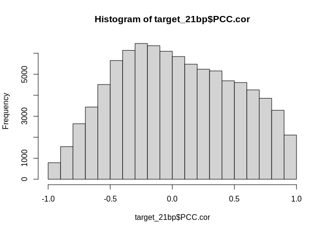
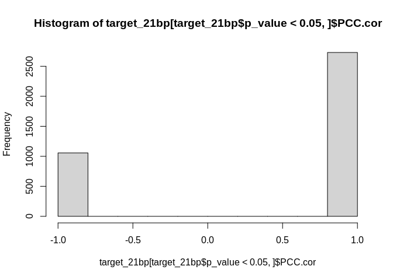
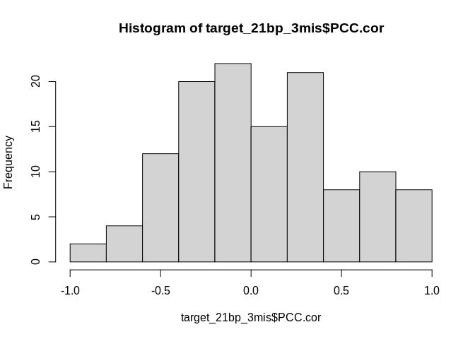
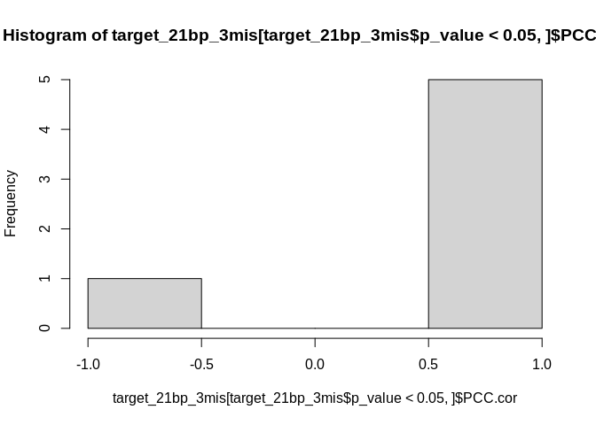
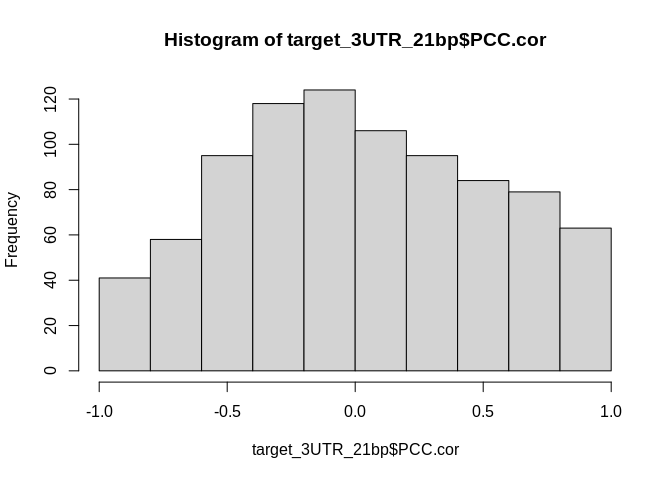
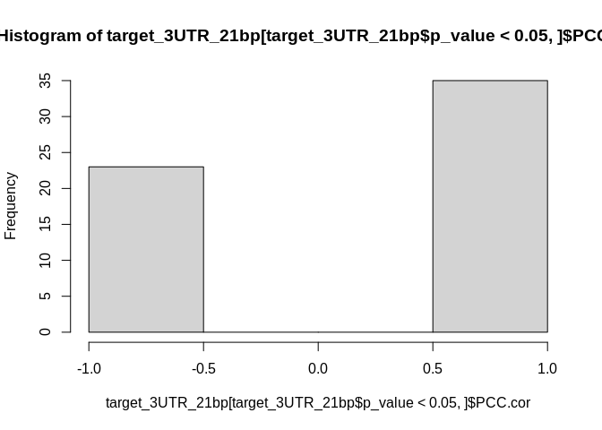

24-Apul-miRanda-input-comparisons
================
Kathleen Durkin
2024-02-12

- <a href="#1-mirna-and-full-mrna-coding-sequences"
  id="toc-1-mirna-and-full-mrna-coding-sequences">1 miRNA and full mRNA
  coding sequences</a>
  - <a href="#11-get-mrna-fasta" id="toc-11-get-mrna-fasta">1.1 Get mRNA
    fasta</a>
  - <a href="#12-run-miranda" id="toc-12-run-miranda">1.2 Run miRanda</a>
  - <a href="#13-summarize-results" id="toc-13-summarize-results">1.3
    Summarize results</a>
- <a href="#2-mirna-and-mrna-3utrs" id="toc-2-mirna-and-mrna-3utrs">2
  miRNA and mRNA 3’UTRs</a>
- <a href="#3-examine-coexpression" id="toc-3-examine-coexpression">3
  Examine coexpression</a>
  - <a href="#31-full-mrna" id="toc-31-full-mrna">3.1 full mRNA</a>
  - <a href="#32-3utr" id="toc-32-3utr">3.2 3’UTR</a>
- <a href="#4-mirna-and-mrna" id="toc-4-mirna-and-mrna">4 miRNA and
  mRNA</a>
- <a href="#5-summary" id="toc-5-summary">5 Summary</a>

Up to this point, our miRNA target prediction has been primarily
performed using the tool miRanda, which requires only seed binding, with
3’UTR regions as input. However, there is growing evidence that
cnidarian miRNA binding functions similarly to plants, requiring
near-full complementarity and to act primarily through target cleavage,
which can occur at any location in the mRNA sequence (not just the
3’UTR). This would mean our current miRanda target predictions are both
a) not sufficiently restricted to fll complementarity, and b)
incorrectly limited to the 3’UTR.

Let’s see what happens when we adjust those parameters

# 1 miRNA and full mRNA coding sequences

Inputs:

- FASTA of A.pulchra mRNA coding sequences

- FASTA of A.pulchra mature miRNAs

## 1.1 Get mRNA fasta

``` bash
/home/shared/bedtools2/bin/bedtools getfasta \
-fi "../data/Apulchra-genome.fa" \
-bed "../data/Apulcra-genome-mRNA_only.gff" \
-fo "../data/24-Apul-miRanda-input-comparisons/Apul_mRNA_full.fa"
```

## 1.2 Run miRanda

``` bash

# Same settings we've been using: 
# score cutoff >100
# energy cutoff <-10
# strict binding

/home/shared/miRanda-3.3a/src/miranda \
../output/17-Apul-miRNA-lncRNA-BLASTs-RNAhybrid/Apul_ShortStack_4.1.0_mature.fasta \
../data/24-Apul-miRanda-input-comparisons/Apul_mRNA_full.fa \
-sc 100 \
-en -10 \
-strict \
-out ../output/24-Apul-miRanda-input-comparisons/Apul-miRanda-mRNA_full-strict_all.tab
```

## 1.3 Summarize results

Let’s look at the output

``` bash

echo "miranda run finished!"
echo "Counting number of interacting miRNA-lncRNA pairs"

zgrep -c "Performing Scan" ../output/24-Apul-miRanda-input-comparisons/Apul-miRanda-mRNA_full-strict_all.tab

echo "Parsing output"
grep -A 1 "Scores for this hit:" ../output/24-Apul-miRanda-input-comparisons/Apul-miRanda-mRNA_full-strict_all.tab | sort | grep '>' > ../output/24-Apul-miRanda-input-comparisons/Apul-miRanda-mRNA_full-strict-parsed.txt

echo "counting number of putative interactions predicted (can include multiple interactions between single miRNA-lncRNA pair)"
wc -l ../output/24-Apul-miRanda-input-comparisons/Apul-miRanda-mRNA_full-strict_all.tab
```

    ## miranda run finished!
    ## Counting number of interacting miRNA-lncRNA pairs
    ## 1421433
    ## Parsing output
    ## counting number of putative interactions predicted (can include multiple interactions between single miRNA-lncRNA pair)
    ## 19133057 ../output/24-Apul-miRanda-input-comparisons/Apul-miRanda-mRNA_full-strict_all.tab

This is a lot of putative interactions! Note though, that miRanda only
requires complementarity of a 8bp seed region of the miRNA. We instead
want to look for binding with full or near-full complementarity. Let’s
look at how many putative interactions are predicted for a binding
length of at least 21 nucleotides (the length of our smallest mature
miRNA).

``` bash
echo "number of putative interactions of at least 21 nucleotides"
awk -F'\t' '$7 >= 21' ../output/24-Apul-miRanda-input-comparisons/Apul-miRanda-mRNA_full-strict-parsed.txt | wc -l
echo ""
echo "check some:"
awk -F'\t' '$7 >= 21' ../output/24-Apul-miRanda-input-comparisons/Apul-miRanda-mRNA_full-strict-parsed.txt | head -5
```

    ## number of putative interactions of at least 21 nucleotides
    ## 101744
    ## 
    ## check some:
    ## >Cluster_10051.mature::ptg000016l:7795530-7795551(+) ntLink_6:10104556-10114024  154.00  -19.94  2 21    1466 1493   25  68.00%  72.00%
    ## >Cluster_10051.mature::ptg000016l:7795530-7795551(+) ntLink_6:10104556-10114024  155.00  -21.12  2 21    8084 8107   21  66.67%  76.19%
    ## >Cluster_10051.mature::ptg000016l:7795530-7795551(+) ntLink_6:10351674-10369781  147.00  -17.81  2 21    2265 2289   22  59.09%  72.73%
    ## >Cluster_10051.mature::ptg000016l:7795530-7795551(+) ntLink_6:10392093-10402892  157.00  -20.28  2 21    4608 4632   22  77.27%  77.27%
    ## >Cluster_10051.mature::ptg000016l:7795530-7795551(+) ntLink_6:10597160-10611657  159.00  -19.58  2 21    7110 7133   21  71.43%  76.19%

The header for this output is formatted as:

mirna Target Score Energy-Kcal/Mol Query-Aln(start-end)
Subject-Al(Start-End) Al-Len Subject-Identity Query-Identity

We can see from the percent identities (last 2 entries) that this number
includes alignments with multiple mismatches. Let’s filter again to
reduce the number of permissible mismatches. Let’s say we want no more
than 3 mismatches (a gap is counted as a mismatch). For an alignment of
21 nucleotides, this would be an percent identity of (21-3)/21 = 85.7%.
The miRNA is our “subject”, so we will filter by column 8.

``` bash
echo "number of putative interactions of at least 21 nucleotides, with at most 3 mismatches"
awk -F'\t' '$7 >= 21' ../output/24-Apul-miRanda-input-comparisons/Apul-miRanda-mRNA_full-strict-parsed.txt | awk -F'\t' '$8 >= 85' | wc -l
echo ""
echo "check some:"
awk -F'\t' '$7 >= 21' ../output/24-Apul-miRanda-input-comparisons/Apul-miRanda-mRNA_full-strict-parsed.txt | awk -F'\t' '$8 >= 85' | head -5
```

    ## number of putative interactions of at least 21 nucleotides, with at most 3 mismatches
    ## 143
    ## 
    ## check some:
    ## >Cluster_10057.mature::ptg000016l:8599884-8599905(-) ptg000017l:7171736-7192592  174.00  -21.36  2 21    13035 13058 21  85.71%  85.71%
    ## >Cluster_10093.mature::ptg000016l:11751407-11751428(-)   ptg000007l:5326404-5332924  179.00  -25.97  2 21    658 681 21  85.71%  85.71%
    ## >Cluster_10228.mature::ptg000017l:7471168-7471190(+) ntLink_8:9921794-9928534    179.00  -26.55  2 22    872 896 22  86.36%  86.36%
    ## >Cluster_10228.mature::ptg000017l:7471168-7471190(+) ptg000019l:1503591-1507594  188.00  -31.70  2 22    3554 3577   21  85.71%  95.24%
    ## >Cluster_10228.mature::ptg000017l:7471168-7471190(+) ptg000039l:790628-797014    188.00  -25.92  2 22    5693 5716   21  90.48%  90.48%

So filtering for full or near-full complementarity reduced the number of
putative interactions between miRNA and full mRNA sequences from
19133057 to 143.

# 2 miRNA and mRNA 3’UTRs

Now let’s see how filtering changes the outputs of miRanda run with only
the 3’UTR mRNA region (the input we have been using up till now)

Unfiltered:

``` bash
wc -l ../output/09-Apul-mRNA-miRNA-interactions/miranda_strict_all_1kb_parsed_apul_updated.txt
```

    ## 6109 ../output/09-Apul-mRNA-miRNA-interactions/miranda_strict_all_1kb_parsed_apul_updated.txt

Filter for alignment \>=21 nucleotides:

``` bash
echo "number of putative interactions of at least 21 nucleotides"
awk -F'\t' '$7 >= 21' ../output/09-Apul-mRNA-miRNA-interactions/miranda_strict_all_1kb_parsed_apul_updated.txt | wc -l
echo ""
echo "check some:"
awk -F'\t' '$7 >= 21' ../output/09-Apul-mRNA-miRNA-interactions/miranda_strict_all_1kb_parsed_apul_updated.txt | head -5
```

    ## number of putative interactions of at least 21 nucleotides
    ## 1699
    ## 
    ## check some:
    ## >Cluster_10051.mature::ptg000016l:7795530-7795551(+) FUN_002849::ntLink_8:6882212-6883212    158.00  -21.97  2 21    278 301 21  66.67%  85.71%
    ## >Cluster_10051.mature::ptg000016l:7795530-7795551(+) FUN_018974::ptg000012l:15854445-15855445    155.00  -23.11  2 21    894 920 24  62.50%  75.00%
    ## >Cluster_10051.mature::ptg000016l:7795530-7795551(+) FUN_019124::ptg000012l:17452953-17453953    147.00  -22.09  2 21    783 810 25  60.00%  68.00%
    ## >Cluster_10051.mature::ptg000016l:7795530-7795551(+) FUN_023335::ptg000017l:6446983-6447355  150.00  -22.25  2 21    171 197 24  62.50%  75.00%
    ## >Cluster_10051.mature::ptg000016l:7795530-7795551(+) FUN_024352::ptg000018l:5339775-5340775  162.00  -20.97  2 21    96 122  24  75.00%  75.00%

Filter again for \<=3 mismatches:

``` bash
echo "number of putative interactions of at least 21 nucleotides, with at most 3 mismatches"
awk -F'\t' '$7 >= 21' ../output/09-Apul-mRNA-miRNA-interactions/miranda_strict_all_1kb_parsed_apul_updated.txt | awk -F'\t' '$8 >= 85' | wc -l
echo ""
echo "check some:"
awk -F'\t' '$7 >= 21' ../output/09-Apul-mRNA-miRNA-interactions/miranda_strict_all_1kb_parsed_apul_updated.txt | awk -F'\t' '$8 >= 85' | head -5
```

    ## number of putative interactions of at least 21 nucleotides, with at most 3 mismatches
    ## 13
    ## 
    ## check some:
    ## >Cluster_10228.mature::ptg000017l:7471168-7471190(+) FUN_022919::ptg000017l:1483036-1484036  183.00  -28.35  2 22    69 94   23  86.96%  86.96%
    ## >Cluster_10228.mature::ptg000017l:7471168-7471190(+) FUN_027647::ptg000021l:8285525-8286525  174.00  -25.86  2 21    101 125 21  85.71%  85.71%
    ## >Cluster_10228.mature::ptg000017l:7471168-7471190(+) FUN_040282::ptg000031l:6265207-6266207  183.00  -30.15  2 21    525 550 22  86.36%  86.36%
    ## >Cluster_10419.mature::ptg000018l:2286829-2286850(+) FUN_016674::ptg000011l:6193740-6194740  174.00  -21.33  2 21    904 927 21  85.71%  85.71%
    ## >Cluster_15775.mature::ptg000025l:7472581-7472603(-) FUN_022318::ptg000016l:7511874-7512874  180.00  -21.41  2 22    573 596 21  85.71%  85.71%

When only mRNA 3’UTR regions are used as input, filtering for
full/near-full complementarity reduces the number of putative
interactions from 6109 to 13.

# 3 Examine coexpression

Now that we’ve found putative interactions with high complementarity, we
need to validate miRNA function by examining patterns of coexpression.
We’d expect a putatively-interacting miRNA-mRNA pair to be highly
coexpressed, and we’d expect a negative relationship to indicate target
cleavage.

## 3.1 full mRNA

``` r
library(readr)
library(dplyr)
```

    ## 
    ## Attaching package: 'dplyr'

    ## The following objects are masked from 'package:stats':
    ## 
    ##     filter, lag

    ## The following objects are masked from 'package:base':
    ## 
    ##     intersect, setdiff, setequal, union

``` r
# Read in data

# miRNA-mRNA Pearsons correlation coefficients
miRNA_mRNA_PCC <- read.csv("../output/09-Apul-mRNA-miRNA-interactions/Apul-PCC_miRNA_mRNA.csv")

# miRNA-mRNA_full miRanda output
miRNA_mRNA_miRanda <- read_delim("../output/24-Apul-miRanda-input-comparisons/Apul-miRanda-mRNA_full-strict-parsed.txt", col_names=FALSE)
```

    ## Rows: 617982 Columns: 9

    ## ── Column specification ────────────────────────────────────────────────────────
    ## Delimiter: "\t"
    ## chr (6): X1, X2, X5, X6, X8, X9
    ## dbl (3): X3, X4, X7
    ## 
    ## ℹ Use `spec()` to retrieve the full column specification for this data.
    ## ℹ Specify the column types or set `show_col_types = FALSE` to quiet this message.

``` r
colnames(miRNA_mRNA_miRanda) <- c("mirna", "Target", "Score", "Energy_Kcal_Mol", "Query_Aln", "Subject_Aln", "Al_Len", "Subject_Identity", "Query_Identity")

# format miRNA and mRNA names
geneIDs <- read_delim("../output/15-Apul-annotate-UTRs/Apul-mRNA-FUNids.txt", col_names=FALSE)
```

    ## Rows: 36447 Columns: 5
    ## ── Column specification ────────────────────────────────────────────────────────
    ## Delimiter: "\t"
    ## chr (5): X1, X2, X3, X4, X5
    ## 
    ## ℹ Use `spec()` to retrieve the full column specification for this data.
    ## ℹ Specify the column types or set `show_col_types = FALSE` to quiet this message.

``` r
geneIDs$X4 <- gsub("Parent=", "", geneIDs$X4)

miRNA_mRNA_miRanda$mirna <- gsub(">", "", miRNA_mRNA_miRanda$mirna)
miRNA_mRNA_miRanda$mirna <- gsub("\\..*", "", miRNA_mRNA_miRanda$mirna)

miRNA_mRNA_miRanda <- left_join(miRNA_mRNA_miRanda, geneIDs, by=c("Target" = "X1"))
miRNA_mRNA_miRanda <- select(miRNA_mRNA_miRanda, -X2,-X3,-X5)

# Finally, create a column that conatins both the miRNA and interacting mRNA
miRNA_mRNA_PCC$interaction <- paste(miRNA_mRNA_PCC$miRNA, "_", miRNA_mRNA_PCC$mRNA)
miRNA_mRNA_miRanda$interaction <- paste(miRNA_mRNA_miRanda$mirna, "_", miRNA_mRNA_miRanda$X4)

# Annotate w PCC info 
miRNA_mRNA_miRanda <- left_join(miRNA_mRNA_miRanda, miRNA_mRNA_PCC, by="interaction")
```

``` r
# Filter to high complementarity putative targets
target_21bp <- miRNA_mRNA_miRanda[miRNA_mRNA_miRanda$Al_Len > 20,]
target_21bp_3mis <- target_21bp[target_21bp$Subject_Identity>85,]

# How many w significant correlation?
nrow(target_21bp %>% filter(p_value < 0.05))
```

    ## [1] 3787

``` r
nrow(target_21bp %>% filter(p_value < 0.05))/nrow(target_21bp)
```

    ## [1] 0.03722087

``` r
nrow(target_21bp_3mis %>% filter(p_value < 0.05))
```

    ## [1] 6

``` r
nrow(target_21bp_3mis %>% filter(p_value < 0.05))/nrow(target_21bp_3mis)
```

    ## [1] 0.04195804

``` r
# Plot correlation values
hist(target_21bp$PCC.cor)
```

<!-- -->

``` r
hist(target_21bp[target_21bp$p_value < 0.05,]$PCC.cor)
```

<!-- -->

``` r
hist(target_21bp_3mis$PCC.cor)
```

<!-- -->

``` r
hist(target_21bp_3mis[target_21bp_3mis$p_value < 0.05,]$PCC.cor)
```

<!-- -->

## 3.2 3’UTR

``` r
# Read in data

# miRNA-mRNA_full miRanda output
miRNA_3UTR_miRanda <- read_delim("../output/09-Apul-mRNA-miRNA-interactions/miranda_strict_all_1kb_parsed_apul_updated.txt", col_names=FALSE)
```

    ## Rows: 6109 Columns: 9
    ## ── Column specification ────────────────────────────────────────────────────────
    ## Delimiter: "\t"
    ## chr (6): X1, X2, X5, X6, X8, X9
    ## dbl (3): X3, X4, X7
    ## 
    ## ℹ Use `spec()` to retrieve the full column specification for this data.
    ## ℹ Specify the column types or set `show_col_types = FALSE` to quiet this message.

``` r
colnames(miRNA_3UTR_miRanda) <- c("mirna", "Target", "Score", "Energy_Kcal_Mol", "Query_Aln", "Subject_Aln", "Al_Len", "Subject_Identity", "Query_Identity")

miRNA_3UTR_miRanda$mirna <- gsub(">", "", miRNA_3UTR_miRanda$mirna)
miRNA_3UTR_miRanda$mirna <- gsub("\\..*", "", miRNA_3UTR_miRanda$mirna)
miRNA_3UTR_miRanda$Target <- gsub("::.*", "", miRNA_3UTR_miRanda$Target)

# Finally, create a column that conatins both the miRNA and interacting mRNA
miRNA_3UTR_miRanda$interaction <- paste(miRNA_3UTR_miRanda$mirna, "_", miRNA_3UTR_miRanda$Target)

# Annotate w PCC info 
miRNA_3UTR_miRanda <- left_join(miRNA_3UTR_miRanda, miRNA_mRNA_PCC, by="interaction")
```

``` r
# Filter to high complementarity putative targets
target_3UTR_21bp <- miRNA_3UTR_miRanda[miRNA_3UTR_miRanda$Al_Len > 20,]
target_3UTR_21bp_3mis <- target_3UTR_21bp[target_3UTR_21bp$Subject_Identity>85,]

# How many w significant correlation?
nrow(target_3UTR_21bp %>% filter(p_value < 0.05))
```

    ## [1] 58

``` r
nrow(target_3UTR_21bp %>% filter(p_value < 0.05))/nrow(target_3UTR_21bp)
```

    ## [1] 0.03413773

``` r
nrow(target_3UTR_21bp_3mis %>% filter(p_value < 0.05))
```

    ## [1] 0

``` r
nrow(target_3UTR_21bp_3mis %>% filter(p_value < 0.05))/nrow(target_3UTR_21bp_3mis)
```

    ## [1] 0

``` r
# Plot correlation values
hist(target_3UTR_21bp$PCC.cor)
```

<!-- -->

``` r
hist(target_3UTR_21bp[target_3UTR_21bp$p_value < 0.05,]$PCC.cor)
```

<!-- -->

``` r
# hist(target_3UTR_21bp_3mis$PCC.cor)
# hist(target_3UTR_21bp_3mis[target_3UTR_21bp_3mis$p_value < 0.05,]$PCC.cor)
```

# 4 miRNA and mRNA

# 5 Summary

How does different input and/or complementarity filtering affect \#
putative interactions:

| Input     | unfiltered | filtered for complementarity | % retained |
|:----------|:-----------|:-----------------------------|:-----------|
| 3’UTR     | 6109       | 13                           | 0.213 %    |
| full mRNA | 19133057   | 143                          | 0.000747 % |

For different filters, how many putative interactions *also show
significant coexpression*?

| Input     | 21bp                    | 21bp, \>=3 mismatch          |
|:----------|:------------------------|:-----------------------------|
| 3’UTR     | 58 (3.4% of all 21bp)   | 0                            |
| full mRNA | 3767 (3.7% of all 21bp) | 6 (4.2% of all 21bp,\>=3mis) |

Note that, in general, only \~1/3 of significant coexpressions have a
*negative* relationship (which would support functional target cleavage)

Note also that some putative interactions examined above weren’t
included in the PCC table

Next steps:

- discuss w team – should we look for both miRNAs that function through
  target cleavage (full complementary, full coding sequence) *and*
  miRNAs that function through “canonical” translational silencing (seed
  complementarity, 3’UTR)?

- Run same comparison using BLAST and/or RNAhybrid as the tool. I’m
  still not 100% clear on what sequence features miRanda takes into
  consideration, and any that *are* included will have been based on
  mammalian miRNAs. It may be more appropriate to use a different tool

- if we decide to shift target prediction requirements, need to rerun
  all target prediction done thus far :(
