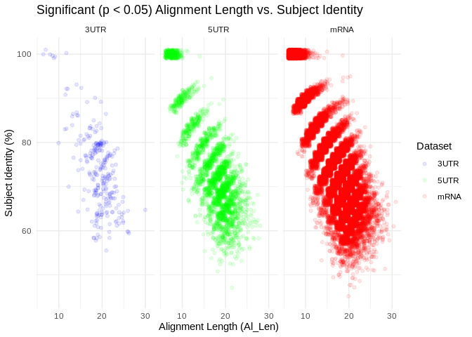

24-Apul-miRanda-input-comparisons
================
Kathleen Durkin
2024-02-12

- <a href="#1-mirna-and-full-mrna-coding-sequences"
  id="toc-1-mirna-and-full-mrna-coding-sequences">1 miRNA and full mRNA
  coding sequences</a>
  - <a href="#11-get-mrna-fasta" id="toc-11-get-mrna-fasta">1.1 Get mRNA
    fasta</a>
  - <a href="#12-run-miranda" id="toc-12-run-miranda">1.2 Run miRanda</a>
  - <a href="#13-summarize-results" id="toc-13-summarize-results">1.3
    Summarize results</a>
- <a href="#2-mirna-and-mrna-5utrs" id="toc-2-mirna-and-mrna-5utrs">2
  miRNA and mRNA 5’UTRs</a>
  - <a href="#21-get-5utr-fasta" id="toc-21-get-5utr-fasta">2.1 Get 5’UTR
    fasta</a>
  - <a href="#22-run-miranda" id="toc-22-run-miranda">2.2 Run miRanda</a>
  - <a href="#23-summarize-results" id="toc-23-summarize-results">2.3
    Summarize results</a>
- <a href="#3-mirna-and-mrna-3utrs" id="toc-3-mirna-and-mrna-3utrs">3
  miRNA and mRNA 3’UTRs</a>
- <a href="#4-examine-coexpression" id="toc-4-examine-coexpression">4
  Examine coexpression</a>
  - <a href="#41-obtain-pearsons-coefficient-correlation-values"
    id="toc-41-obtain-pearsons-coefficient-correlation-values">4.1 Obtain
    Pearson’s coefficient correlation values</a>
  - <a href="#42-full-mrna" id="toc-42-full-mrna">4.2 full mRNA</a>
  - <a href="#43-3utr" id="toc-43-3utr">4.3 3’UTR</a>
  - <a href="#44-5utr" id="toc-44-5utr">4.4 5’UTR</a>
- <a href="#5-summary" id="toc-5-summary">5 Summary</a>

``` r
library(readr)
library(dplyr)
```

    ## 
    ## Attaching package: 'dplyr'

    ## The following objects are masked from 'package:stats':
    ## 
    ##     filter, lag

    ## The following objects are masked from 'package:base':
    ## 
    ##     intersect, setdiff, setequal, union

``` r
library(ggplot2)
```

Up to this point, our miRNA target prediction has been primarily
performed using the tool miRanda, which requires only seed binding, with
3’UTR regions as input. However, there is growing evidence that
cnidarian miRNA binding functions similarly to plants, requiring
near-full complementarity and to act primarily through target cleavage,
which can occur at any location in the mRNA sequence (not just the
3’UTR). This would mean our current miRanda target predictions are both
a) not sufficiently restricted to fll complementarity, and b)
incorrectly limited to the 3’UTR.

Let’s see what happens when we adjust those parameters

# 1 miRNA and full mRNA coding sequences

Inputs:

- FASTA of A.pulchra mRNA coding sequences

- FASTA of A.pulchra mature miRNAs

## 1.1 Get mRNA fasta

``` bash
/home/shared/bedtools2/bin/bedtools getfasta \
-fi "../data/Apulchra-genome.fa" \
-bed "../data/Apulcra-genome-mRNA_only.gff" \
-fo "../data/24-Apul-miRanda-input-comparisons/Apul_mRNA_full.fa"
```

## 1.2 Run miRanda

``` bash

# Same settings we've been using: 
# score cutoff >100
# energy cutoff <-10
# strict binding

/home/shared/miRanda-3.3a/src/miranda \
../output/17-Apul-miRNA-lncRNA-BLASTs-RNAhybrid/Apul_ShortStack_4.1.0_mature.fasta \
../data/24-Apul-miRanda-input-comparisons/Apul_mRNA_full.fa \
-sc 100 \
-en -10 \
-strict \
-out ../output/24-Apul-miRanda-input-comparisons/Apul-miRanda-mRNA_full-strict_all.tab
```

## 1.3 Summarize results

Let’s look at the output

``` bash

echo "miranda run finished!"
echo "Counting number of interacting miRNA-lncRNA pairs"

zgrep -c "Performing Scan" ../output/24-Apul-miRanda-input-comparisons/Apul-miRanda-mRNA_full-strict_all.tab

echo "Parsing output"
grep -A 1 "Scores for this hit:" ../output/24-Apul-miRanda-input-comparisons/Apul-miRanda-mRNA_full-strict_all.tab | sort | grep '>' > ../output/24-Apul-miRanda-input-comparisons/Apul-miRanda-mRNA_full-strict-parsed.txt

echo "counting number of putative interactions predicted (can include multiple interactions between single miRNA-lncRNA pair)"
wc -l ../output/24-Apul-miRanda-input-comparisons/Apul-miRanda-mRNA_full-strict_all.tab
```

``` bash
echo "number of putative interactions:"
wc -l ../output/24-Apul-miRanda-input-comparisons/Apul-miRanda-mRNA_full-strict-parsed.txt
```

    ## number of putative interactions:
    ## 617982 ../output/24-Apul-miRanda-input-comparisons/Apul-miRanda-mRNA_full-strict-parsed.txt

This is a lot of putative interactions! Note though, that miRanda only
requires complementarity of a 8bp seed region of the miRNA. We instead
want to look for binding with full or near-full complementarity. Let’s
look at how many putative interactions are predicted for a binding
length of at least 21 nucleotides (the length of our smallest mature
miRNA).

``` bash
echo "number of putative interactions of at least 21 nucleotides"
awk -F'\t' '$7 >= 21' ../output/24-Apul-miRanda-input-comparisons/Apul-miRanda-mRNA_full-strict-parsed.txt | wc -l
echo ""
echo "check some:"
awk -F'\t' '$7 >= 21' ../output/24-Apul-miRanda-input-comparisons/Apul-miRanda-mRNA_full-strict-parsed.txt | head -5
```

    ## number of putative interactions of at least 21 nucleotides
    ## 101744
    ## 
    ## check some:
    ## >Cluster_10051.mature::ptg000016l:7795530-7795551(+) ntLink_6:10104556-10114024  154.00  -19.94  2 21    1466 1493   25  68.00%  72.00%
    ## >Cluster_10051.mature::ptg000016l:7795530-7795551(+) ntLink_6:10104556-10114024  155.00  -21.12  2 21    8084 8107   21  66.67%  76.19%
    ## >Cluster_10051.mature::ptg000016l:7795530-7795551(+) ntLink_6:10351674-10369781  147.00  -17.81  2 21    2265 2289   22  59.09%  72.73%
    ## >Cluster_10051.mature::ptg000016l:7795530-7795551(+) ntLink_6:10392093-10402892  157.00  -20.28  2 21    4608 4632   22  77.27%  77.27%
    ## >Cluster_10051.mature::ptg000016l:7795530-7795551(+) ntLink_6:10597160-10611657  159.00  -19.58  2 21    7110 7133   21  71.43%  76.19%

The header for this output is formatted as:

mirna Target Score Energy-Kcal/Mol Query-Aln(start-end)
Subject-Al(Start-End) Al-Len Subject-Identity Query-Identity

We can see from the percent identities (last 2 entries) that this number
includes alignments with multiple mismatches. Let’s filter again to
reduce the number of permissible mismatches. Let’s say we want no more
than 3 mismatches (a gap is counted as a mismatch). For an alignment of
21 nucleotides, this would be an percent identity of (21-3)/21 = 85.7%.
The miRNA is our “subject”, so we will filter by column 8.

``` bash
echo "number of putative interactions of at least 21 nucleotides, with at most 3 mismatches"
awk -F'\t' '$7 >= 21' ../output/24-Apul-miRanda-input-comparisons/Apul-miRanda-mRNA_full-strict-parsed.txt | awk -F'\t' '$8 >= 85' | wc -l
echo ""
echo "check some:"
awk -F'\t' '$7 >= 21' ../output/24-Apul-miRanda-input-comparisons/Apul-miRanda-mRNA_full-strict-parsed.txt | awk -F'\t' '$8 >= 85' | head -5
```

    ## number of putative interactions of at least 21 nucleotides, with at most 3 mismatches
    ## 143
    ## 
    ## check some:
    ## >Cluster_10057.mature::ptg000016l:8599884-8599905(-) ptg000017l:7171736-7192592  174.00  -21.36  2 21    13035 13058 21  85.71%  85.71%
    ## >Cluster_10093.mature::ptg000016l:11751407-11751428(-)   ptg000007l:5326404-5332924  179.00  -25.97  2 21    658 681 21  85.71%  85.71%
    ## >Cluster_10228.mature::ptg000017l:7471168-7471190(+) ntLink_8:9921794-9928534    179.00  -26.55  2 22    872 896 22  86.36%  86.36%
    ## >Cluster_10228.mature::ptg000017l:7471168-7471190(+) ptg000019l:1503591-1507594  188.00  -31.70  2 22    3554 3577   21  85.71%  95.24%
    ## >Cluster_10228.mature::ptg000017l:7471168-7471190(+) ptg000039l:790628-797014    188.00  -25.92  2 22    5693 5716   21  90.48%  90.48%

So filtering for full or near-full complementarity reduced the number of
putative interactions between miRNA and full mRNA sequences from 617982
to 143.

# 2 miRNA and mRNA 5’UTRs

We’ve also created a gff of 1kb 5’UTR regions (using the same method
used to define 1kb 3’UTRs, in `15-Apul-annotate-UTRs`). Let’s try
running this through miRanda as well, since it’s possible (though not
necessarily expected) that miRNAs will bind here

## 2.1 Get 5’UTR fasta

``` bash
/home/shared/bedtools2/bin/bedtools getfasta \
-fi "../data/Apulchra-genome.fa" \
-bed "../output/15-Apul-annotate-UTRs/Apul.GFFannotation.5UTR_1kb_corrected.gff" \
-fo "../data/24-Apul-miRanda-input-comparisons/Apul_5UTR_1kb_corrected.fa"
```

## 2.2 Run miRanda

``` bash

# Same settings we've been using: 
# score cutoff >100
# energy cutoff <-10
# strict binding

/home/shared/miRanda-3.3a/src/miranda \
../output/17-Apul-miRNA-lncRNA-BLASTs-RNAhybrid/Apul_ShortStack_4.1.0_mature.fasta \
../data/24-Apul-miRanda-input-comparisons/Apul_5UTR_1kb_corrected.fa \
-sc 100 \
-en -10 \
-strict \
-out ../output/24-Apul-miRanda-input-comparisons/Apul-miRanda-5UTR_1kb-strict_all.tab
```

## 2.3 Summarize results

Let’s look at the output

``` bash

echo "Number of interacting miRNA-lncRNA pairs"
zgrep -c "Performing Scan" ../output/24-Apul-miRanda-input-comparisons/Apul-miRanda-5UTR_1kb-strict_all.tab

echo "Parsing output"
grep -A 1 "Scores for this hit:" ../output/24-Apul-miRanda-input-comparisons/Apul-miRanda-5UTR_1kb-strict_all.tab | sort | grep '>' > ../output/24-Apul-miRanda-input-comparisons/Apul-miRanda-5UTR_1kb-strict-parsed.txt

echo "Number of putative interactions predicted (can include multiple interactions between single miRNA-lncRNA pair)"
wc -l ../output/24-Apul-miRanda-input-comparisons/Apul-miRanda-5UTR_1kb-strict_all.tab
```

How many putative interactions are predicted for a binding length of at
least 21 nucleotides (the length of our smallest mature miRNA)?

``` bash
echo "number of putative interactions:"
wc -l ../output/24-Apul-miRanda-input-comparisons/Apul-miRanda-5UTR_1kb-strict-parsed.txt
echo ""
echo "number of putative interactions of at least 21 nucleotides"
awk -F'\t' '$7 >= 21' ../output/24-Apul-miRanda-input-comparisons/Apul-miRanda-5UTR_1kb-strict-parsed.txt | wc -l
echo ""
echo "number of putative interactions of at least 21 nucleotides, with at most 3 mismatches"
awk -F'\t' '$7 >= 21' ../output/24-Apul-miRanda-input-comparisons/Apul-miRanda-5UTR_1kb-strict-parsed.txt | awk -F'\t' '$8 >= 85' | wc -l
```

    ## number of putative interactions:
    ## 87830 ../output/24-Apul-miRanda-input-comparisons/Apul-miRanda-5UTR_1kb-strict-parsed.txt
    ## 
    ## number of putative interactions of at least 21 nucleotides
    ## 14088
    ## 
    ## number of putative interactions of at least 21 nucleotides, with at most 3 mismatches
    ## 12

So filtering for full or near-full complementarity reduced the number of
putative interactions between miRNA and 5’UTR sequences from 87830 to 12

# 3 miRNA and mRNA 3’UTRs

Now let’s see how filtering changes the outputs of miRanda run with only
the 3’UTR mRNA region (the input we have been using up till now)

``` bash
echo "total number of putative interactions:"
wc -l ../output/09-Apul-mRNA-miRNA-interactions/miranda_strict_all_1kb_parsed_apul_updated.txt

echo "number of putative interactions of at least 21 nucleotides"
awk -F'\t' '$7 >= 21' ../output/09-Apul-mRNA-miRNA-interactions/miranda_strict_all_1kb_parsed_apul_updated.txt | wc -l

echo "number of putative interactions of at least 21 nucleotides, with at most 3 mismatches"
awk -F'\t' '$7 >= 21' ../output/09-Apul-mRNA-miRNA-interactions/miranda_strict_all_1kb_parsed_apul_updated.txt | awk -F'\t' '$8 >= 85' | wc -l
```

    ## total number of putative interactions:
    ## 6109 ../output/09-Apul-mRNA-miRNA-interactions/miranda_strict_all_1kb_parsed_apul_updated.txt
    ## number of putative interactions of at least 21 nucleotides
    ## 1699
    ## number of putative interactions of at least 21 nucleotides, with at most 3 mismatches
    ## 13

When only mRNA 3’UTR regions are used as input, filtering for
full/near-full complementarity reduces the number of putative
interactions from 6109 to 13.

# 4 Examine coexpression

Now that we’ve found putative interactions with high complementarity, we
need to validate miRNA function by examining patterns of coexpression.
We’d expect a putatively-interacting miRNA-mRNA pair to be highly
coexpressed, and we’d expect a negative relationship to indicate target
cleavage.

## 4.1 Obtain Pearson’s coefficient correlation values

This has already been run by Jill in `09-Apul-mRNA-miRNA-interactions`,
but I think the csv stored in this repo has been filtered in some way,
because it contains fewer entries than expected:

``` bash
wc -l ../output/09-Apul-mRNA-miRNA-interactions/Apul-PCC_miRNA_mRNA.csv
```

    ## 916384 ../output/09-Apul-mRNA-miRNA-interactions/Apul-PCC_miRNA_mRNA.csv

Read in, format, and normalize data

``` r
mRNA_counts <- read_csv("../../D-Apul/output/07-Apul-Hisat/gene_count_matrix.csv")
```

    ## Rows: 44371 Columns: 6
    ## ── Column specification ────────────────────────────────────────────────────────
    ## Delimiter: ","
    ## chr (1): gene_id
    ## dbl (5): RNA-ACR-140, RNA-ACR-145, RNA-ACR-150, RNA-ACR-173, RNA-ACR-178
    ## 
    ## ℹ Use `spec()` to retrieve the full column specification for this data.
    ## ℹ Specify the column types or set `show_col_types = FALSE` to quiet this message.

``` r
mRNA_counts <- as.data.frame(mRNA_counts)
rownames(mRNA_counts) <- mRNA_counts[,1] #set first column that contains gene names as rownames
mRNA_counts <- mRNA_counts[,-1] # remove column w/ gene names 

# Remove any genes with 0 counts across samples 
mRNA_counts<-mRNA_counts %>%
    mutate(Total = rowSums(.[, 1:5]))%>%
    filter(!Total==0)%>%
    dplyr::select(!Total)

miRNA_counts <- read.delim("../output/03.1-Apul-sRNA-summary/Apul_miRNA_ShortStack_counts_formatted.txt")

# Remove any miRNAs with 0 for all samples 
miRNA_counts <- miRNA_counts %>%
    mutate(Total = rowSums(.[, 1:5]))%>%
    filter(!Total==0)%>%
    dplyr::select(!Total)

# Rename gene count cols to match miRNA count cols
colnames(mRNA_counts) <- c("sample140", "sample145", "sample150", "sample173", "sample178")

# Function to normalize counts (simple RPM normalization)
normalize_counts <- function(counts) {
  rpm <- t(t(counts) / colSums(counts)) * 1e6
  return(rpm)
}

miRNA_norm <- normalize_counts(miRNA_counts)
mRNA_norm <- normalize_counts(mRNA_counts)
```

``` r
nrow(miRNA_norm)*nrow(mRNA_norm)
```

    ## [1] 1311336

We’d expect 1311336 PCC values (after filtering out genes/miRNAs with 0
counts), but there are only 916384 in Jill’s PCC csv. I’ll rerun the PCC
just to make sure I have correlation values for all miRNA-mRNA pairs of
interest

``` r
library(energy)

# Function to calculate PCC and p-value for a pair of vectors
calc_pcc <- function(x, y) {
  result <- cor.test(x, y, method = "pearson")
  return(c(PCC = result$estimate, p_value = result$p.value))
}

# Create a data frame of all miRNA-mRNA pairs
pairs <- expand.grid(miRNA = rownames(miRNA_norm), mRNA = rownames(mRNA_norm))

# Calculate PCC and p-value for each pair
pcc_results <- pairs %>%
  rowwise() %>%
  mutate(
    pcc_stats = list(calc_pcc(miRNA_norm[miRNA,], mRNA_norm[mRNA,]))
  ) %>%
  unnest_wider(pcc_stats)

# Adjust p-values for FDR
pcc_results <- pcc_results %>%
  mutate(adjusted_p_value = p.adjust(p_value, method = "fdr"))

# Save as csv
write.csv(pcc_results, "../output/24-Apul-miRanda-input-comparisons/Apul-PCC_miRNA_mRNA-full.csv")
```

Check

``` r
# Read in results 
# pcc_results <- read.csv("../output/24-Apul-miRanda-input-comparisons/Apul-PCC_miRNA_mRNA-full.csv")

# Use this code to download the PCC results if needed 
pcc_results <- read.csv("https://gannet.fish.washington.edu/kdurkin1/ravenbackups/deep-dive-expression/D-Apul/output/24-Apul-miRanda-input-comparisons/Apul-PCC_miRNA_mRNA-full.csv")

nrow(pcc_results)
```

    ## [1] 1311336

``` r
nrow(pcc_results%>% filter(PCC.cor > 0.90))
```

    ## [1] 35445

``` r
nrow(pcc_results %>% filter(p_value < 0.05))
```

    ## [1] 66154

``` r
nrow(pcc_results %>% filter(p_value < 0.05 & PCC.cor > 0.90))
```

    ## [1] 35445

of the 1,311,336 possible miRNA-mRNA interactions, 35,445 have a
Pearson’s correlation coefficient of above 0.9, and 66,154 have a
significant correlation (pval\<0.05). All of the coefficients \>0.9 are
significant.

## 4.2 full mRNA

``` r
# miRNA-mRNA_full miRanda output
miRNA_mRNA_miRanda <- read_delim("../output/24-Apul-miRanda-input-comparisons/Apul-miRanda-mRNA_full-strict-parsed.txt", col_names=FALSE)
```

    ## Rows: 617982 Columns: 9
    ## ── Column specification ────────────────────────────────────────────────────────
    ## Delimiter: "\t"
    ## chr (6): X1, X2, X5, X6, X8, X9
    ## dbl (3): X3, X4, X7
    ## 
    ## ℹ Use `spec()` to retrieve the full column specification for this data.
    ## ℹ Specify the column types or set `show_col_types = FALSE` to quiet this message.

``` r
colnames(miRNA_mRNA_miRanda) <- c("mirna", "Target", "Score", "Energy_Kcal_Mol", "Query_Aln", "Subject_Aln", "Al_Len", "Subject_Identity", "Query_Identity")

# format miRNA and mRNA names
geneIDs <- read_delim("../output/15-Apul-annotate-UTRs/Apul-mRNA-FUNids.txt", col_names=FALSE)
```

    ## Rows: 36447 Columns: 5
    ## ── Column specification ────────────────────────────────────────────────────────
    ## Delimiter: "\t"
    ## chr (5): X1, X2, X3, X4, X5
    ## 
    ## ℹ Use `spec()` to retrieve the full column specification for this data.
    ## ℹ Specify the column types or set `show_col_types = FALSE` to quiet this message.

``` r
geneIDs$X4 <- gsub("Parent=", "", geneIDs$X4)

miRNA_mRNA_miRanda$mirna <- gsub(">", "", miRNA_mRNA_miRanda$mirna)
miRNA_mRNA_miRanda$mirna <- gsub("\\..*", "", miRNA_mRNA_miRanda$mirna)

miRNA_mRNA_miRanda <- left_join(miRNA_mRNA_miRanda, geneIDs, by=c("Target" = "X1"))
miRNA_mRNA_miRanda <- select(miRNA_mRNA_miRanda, -X2,-X3,-X5)

# Finally, create a column that conatins both the miRNA and interacting mRNA
pcc_results$interaction <- paste(pcc_results$miRNA, "_", pcc_results$mRNA)
miRNA_mRNA_miRanda$interaction <- paste(miRNA_mRNA_miRanda$mirna, "_", miRNA_mRNA_miRanda$X4)

# Annotate w PCC info 
miRNA_mRNA_miRanda <- left_join(miRNA_mRNA_miRanda, pcc_results, by="interaction")
```

``` r
# Filter to high complementarity putative targets
target_21bp <- miRNA_mRNA_miRanda[miRNA_mRNA_miRanda$Al_Len > 20,]
target_21bp_3mis <- target_21bp[target_21bp$Subject_Identity>85,]

# How many w significant correlation?
nrow(miRNA_mRNA_miRanda)
```

    ## [1] 617982

``` r
nrow(miRNA_mRNA_miRanda %>% filter(p_value < 0.05))
```

    ## [1] 24936

``` r
nrow(target_21bp %>% filter(p_value < 0.05))
```

    ## [1] 4300

``` r
nrow(target_21bp_3mis %>% filter(p_value < 0.05))
```

    ## [1] 7

For miRNA binding to the mRNA CDS, miRanda predicts 617,982 putative
interactions. Of these, 24,936 have significant PCCs; 4,300 are \>21bp
and have signficant PCCs; and 7 are \>21bp with \<=3 mismatches and have
significant PCCs.

## 4.3 3’UTR

``` r
# Read in data

# miRNA-mRNA_full miRanda output
miRNA_3UTR_miRanda <- read_delim("../output/09-Apul-mRNA-miRNA-interactions/miranda_strict_all_1kb_parsed_apul_updated.txt", col_names=FALSE)
```

    ## Rows: 6109 Columns: 9
    ## ── Column specification ────────────────────────────────────────────────────────
    ## Delimiter: "\t"
    ## chr (6): X1, X2, X5, X6, X8, X9
    ## dbl (3): X3, X4, X7
    ## 
    ## ℹ Use `spec()` to retrieve the full column specification for this data.
    ## ℹ Specify the column types or set `show_col_types = FALSE` to quiet this message.

``` r
colnames(miRNA_3UTR_miRanda) <- c("mirna", "Target", "Score", "Energy_Kcal_Mol", "Query_Aln", "Subject_Aln", "Al_Len", "Subject_Identity", "Query_Identity")

miRNA_3UTR_miRanda$mirna <- gsub(">", "", miRNA_3UTR_miRanda$mirna)
miRNA_3UTR_miRanda$mirna <- gsub("\\..*", "", miRNA_3UTR_miRanda$mirna)
miRNA_3UTR_miRanda$Target <- gsub("::.*", "", miRNA_3UTR_miRanda$Target)

# Finally, create a column that conatins both the miRNA and interacting mRNA
miRNA_3UTR_miRanda$interaction <- paste(miRNA_3UTR_miRanda$mirna, "_", miRNA_3UTR_miRanda$Target)

# Annotate w PCC info 
miRNA_3UTR_miRanda <- left_join(miRNA_3UTR_miRanda, pcc_results, by="interaction")
```

``` r
# Filter to high complementarity putative targets
target_3UTR_21bp <- miRNA_3UTR_miRanda[miRNA_3UTR_miRanda$Al_Len > 20,]
target_3UTR_21bp_3mis <- target_3UTR_21bp[target_3UTR_21bp$Subject_Identity>85,]

# How many w significant correlation?
nrow(miRNA_3UTR_miRanda)
```

    ## [1] 6109

``` r
nrow(miRNA_3UTR_miRanda %>% filter(p_value < 0.05))
```

    ## [1] 266

``` r
nrow(target_3UTR_21bp %>% filter(p_value < 0.05))
```

    ## [1] 86

``` r
nrow(target_3UTR_21bp_3mis %>% filter(p_value < 0.05))
```

    ## [1] 1

For miRNA binding to the 3’UTR, miRanda predicts 6,109 putative
interactions. Of these, 266 have significant PCCs; 86 are \>21bp and
have signficant PCCs; and 1 is \>21bp with \<=3 mismatches and has a
significant PCC.

## 4.4 5’UTR

``` r
# miRNA-5'UTR miRanda output
miRNA_5UTR_miRanda <- read_delim("../output/24-Apul-miRanda-input-comparisons/Apul-miRanda-5UTR_1kb-strict-parsed.txt", col_names=FALSE)
```

    ## Rows: 87830 Columns: 9
    ## ── Column specification ────────────────────────────────────────────────────────
    ## Delimiter: "\t"
    ## chr (6): X1, X2, X5, X6, X8, X9
    ## dbl (3): X3, X4, X7
    ## 
    ## ℹ Use `spec()` to retrieve the full column specification for this data.
    ## ℹ Specify the column types or set `show_col_types = FALSE` to quiet this message.

``` r
colnames(miRNA_5UTR_miRanda) <- c("mirna", "Target", "Score", "Energy_Kcal_Mol", "Query_Aln", "Subject_Aln", "Al_Len", "Subject_Identity", "Query_Identity")

# format miRNA and mRNA names
geneIDs <- read_delim("../output/15-Apul-annotate-UTRs/Apul-5UTR-FUNids.txt", col_names=FALSE)
```

    ## Rows: 37158 Columns: 5
    ## ── Column specification ────────────────────────────────────────────────────────
    ## Delimiter: "\t"
    ## chr (5): X1, X2, X3, X4, X5
    ## 
    ## ℹ Use `spec()` to retrieve the full column specification for this data.
    ## ℹ Specify the column types or set `show_col_types = FALSE` to quiet this message.

``` r
geneIDs$X4 <- gsub("Parent=", "", geneIDs$X4)

miRNA_5UTR_miRanda$mirna <- gsub(">", "", miRNA_5UTR_miRanda$mirna)
miRNA_5UTR_miRanda$mirna <- gsub("\\..*", "", miRNA_5UTR_miRanda$mirna)

miRNA_5UTR_miRanda <- left_join(miRNA_5UTR_miRanda, geneIDs, by=c("Target" = "X1"))
```

    ## Warning in left_join(miRNA_5UTR_miRanda, geneIDs, by = c(Target = "X1")): Detected an unexpected many-to-many relationship between `x` and `y`.
    ## ℹ Row 10 of `x` matches multiple rows in `y`.
    ## ℹ Row 4285 of `y` matches multiple rows in `x`.
    ## ℹ If a many-to-many relationship is expected, set `relationship =
    ##   "many-to-many"` to silence this warning.

``` r
miRNA_5UTR_miRanda <- select(miRNA_5UTR_miRanda, -X2,-X3,-X5)

# Somehow ended up with a many-to-many relationship, so remove duplicate rows
miRNA_5UTR_miRanda <- miRNA_5UTR_miRanda[!duplicated(miRNA_5UTR_miRanda), ]

# Finally, create a column that contains both the miRNA and interacting mRNA
pcc_results$interaction <- paste(pcc_results$miRNA, "_", pcc_results$mRNA)
miRNA_5UTR_miRanda$interaction <- paste(miRNA_5UTR_miRanda$mirna, "_", miRNA_5UTR_miRanda$X4)

# Annotate w PCC info 
miRNA_5UTR_miRanda <- left_join(miRNA_5UTR_miRanda, pcc_results, by="interaction")
```

``` r
# Filter to high complementarity putative targets
target_5UTR_21bp <- miRNA_5UTR_miRanda[miRNA_5UTR_miRanda$Al_Len > 20,]
target_5UTR_21bp_3mis <- target_5UTR_21bp[target_5UTR_21bp$Subject_Identity>85,]

# How many w significant correlation?
nrow(miRNA_5UTR_miRanda)
```

    ## [1] 87830

``` r
nrow(miRNA_5UTR_miRanda %>% filter(p_value < 0.05))
```

    ## [1] 3426

``` r
nrow(target_5UTR_21bp %>% filter(p_value < 0.05))
```

    ## [1] 596

``` r
nrow(target_5UTR_21bp_3mis %>% filter(p_value < 0.05))
```

    ## [1] 0

For miRNA binding to the 5’UTR, miRanda predicts 87,830 putative
interactions. Of these, 3,426 have significant PCCs; 596 are \>21bp and
have signficant PCCs; and 0 are \>21bp with \<=3 mismatches and have
significant PCCs.

# 5 Summary

How does different input and/or complementarity filtering affect \#
putative interactions:

| Input     | unfiltered | filtered for complementarity | % retained |
|:----------|:-----------|:-----------------------------|:-----------|
| 3’UTR     | 6109       | 13                           | 0.213 %    |
| full mRNA | 617982     | 143                          | 0.0231 %   |
| 5’UTR     | 87830      | 12                           | 0.0137 %   |

For different filters, how many putative interactions ***also show
significant coexpression*** (PCC pval \< 0.05)?

| Input     | All   | 21bp | 21bp, \>=3 mismatch |
|:----------|:------|:-----|:--------------------|
| 3’UTR     | 266   | 86   | 1                   |
| full mRNA | 24936 | 4300 | 7                   |
| 5’UTR     | 3426  | 596  | 0                   |

Note that, in general, only \~1/3 of significant coexpressions have a
*negative* relationship (which would support functional target cleavage
or translational repression)

Note also that some putative interactions indicated by miRanda are not
present in the counts data (i.e. the miRNA and/or mRNA had 0 counts in
our RNAseq data), and are thus excluded from the PCC-filtered data

Is there a clear “cutoff” for what complementarity parameters are most
associated with significant coexpression?

``` r
miRNA_mRNA_miRanda <- miRNA_mRNA_miRanda %>% mutate(Source = "mRNA")
miRNA_3UTR_miRanda <- miRNA_3UTR_miRanda %>% mutate(Source = "3UTR")
miRNA_5UTR_miRanda <- miRNA_5UTR_miRanda %>% mutate(Source = "5UTR")

# Combine
combined_df <- bind_rows(miRNA_mRNA_miRanda, miRNA_3UTR_miRanda, miRNA_5UTR_miRanda)

# Convert Source to a factor for discrete shapes
combined_df$Source <- factor(combined_df$Source)

# Convert p-value condition into a categorical variable for coloring
combined_df$Significance <- ifelse(combined_df$p_value < 0.05, "p < 0.05", "p ≥ 0.05")
significant_df <- combined_df %>% filter(p_value < 0.05)

# Plot with jitter (significant coexpression only)
ggplot(significant_df, aes(x = Al_Len, 
                           y = as.numeric(gsub("%", "", Subject_Identity)), 
                           color = Source)) +
  geom_jitter(size = 1.5, width = 1, height = 1, alpha = 0.1) +
  scale_color_manual(values = c("mRNA" = "red", "3UTR" = "blue", "5UTR" = "green")) +
  facet_wrap(~ Source) +
  labs(x = "Alignment Length (Al_Len)", 
       y = "Subject Identity (%)", 
       color = "Dataset", 
       title = "Significant (p < 0.05) Alignment Length vs. Subject Identity") +
  theme_minimal()
```

<!-- -->

Interesting… there are signifcant coexpressions happening across both
metrics of complementarity. Also interesting, there are notably more
significant coexpressions from using 5’UTR inputs than using 3’UTRs – we
were expecting more in the 3UTr because that would be the binding
location for translational repression.

Next steps:

- discuss w team – should we look for both miRNAs that function through
  target cleavage (full complementary, full coding sequence) *and*
  miRNAs that function through “canonical” translational silencing (seed
  complementarity, 3’UTR)?

- Run same comparison using BLAST and/or RNAhybrid as the tool. I’m
  still not 100% clear on what sequence features miRanda takes into
  consideration, and any that *are* included will have been based on
  mammalian miRNAs. It may be more appropriate to use a different tool

- if we decide to shift target prediction requirements, need to rerun
  all target prediction done thus far :(
