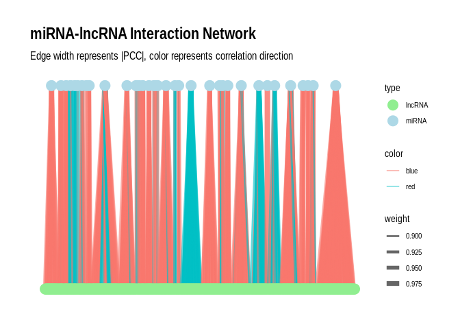

Apul miRNA lncRNA interactions
================
Jill Ashey
2025-05-08

This code will use Pearson’s correlation coefficient to examine possible
correlations between miRNA and lncRNA expression. This will then be
compared to the miRanda interaction results of the miRNAs and lncRNAs.

Read in miRNA data

``` r
miRNA_counts <- read.delim("../../D-Apul/output/03.1-Apul-sRNA-summary/Apul_miRNA_ShortStack_counts_formatted.txt")
head(miRNA_counts)
```

    ##              sample140 sample145 sample150 sample173 sample178
    ## Cluster_1826      1099      2236      2579      3599      3135
    ## Cluster_1832      1060      1886      3843      2550      1864
    ## Cluster_1862      3575      1317       962       817       799
    ## Cluster_1951      2503      2847      2788      3169      2800
    ## Cluster_2463      5271     14671     28809      9634     21691
    ## Cluster_2859       563       895      1066       901      1128

``` r
# Remove any miRNAs with 0 for all samples 
miRNA_counts <- miRNA_counts %>%
     mutate(Total = rowSums(.[, 1:5]))%>%
    filter(!Total==0)%>%
    dplyr::select(!Total)

# Rename gene count cols to match miRNA count cols
colnames(miRNA_counts) <- c("sample140", "sample145", "sample150", "sample173", "sample178")
```

Read in lncRNA data

``` r
lncRNA_counts<-read_table(file="../../M-multi-species/output/08-lncRNA-features/Apul_counts_dedup.txt", skip=1)%>%
  select(!c("Chr", "Start", "End", "Strand", "Length")) %>%
  rename("lncrna_id"=Geneid,
         "sample140"=`../data/RNA-ACR-140.sorted.bam`,
         "sample145"=`../data/RNA-ACR-145.sorted.bam`,
         "sample150"=`../data/RNA-ACR-150.sorted.bam`,
         "sample173"=`../data/RNA-ACR-173.sorted.bam`,
         "sample178"=`../data/RNA-ACR-178.sorted.bam`)
```

    ## 
    ## ── Column specification ────────────────────────────────────────────────────────
    ## cols(
    ##   Geneid = col_character(),
    ##   Chr = col_character(),
    ##   Start = col_double(),
    ##   End = col_double(),
    ##   Strand = col_character(),
    ##   Length = col_double(),
    ##   `../data/RNA-ACR-140.sorted.bam` = col_double(),
    ##   `../data/RNA-ACR-145.sorted.bam` = col_double(),
    ##   `../data/RNA-ACR-150.sorted.bam` = col_double(),
    ##   `../data/RNA-ACR-173.sorted.bam` = col_double(),
    ##   `../data/RNA-ACR-178.sorted.bam` = col_double()
    ## )

``` r
# Change to df 
lncRNA_counts_df <- as.data.frame(lncRNA_counts)
row.names(lncRNA_counts_df) <- lncRNA_counts_df[,1]
lncRNA_counts_df <- lncRNA_counts_df[,-1]  # remove the first column (gene names) if needed

# Remove any lncRNAs with 0 for all samples 
lncRNA_counts_df <- lncRNA_counts_df %>%
     mutate(Total = rowSums(.[, 1:5]))%>%
    filter(!Total==0)%>%
    dplyr::select(!Total)
```

Normalize counts

``` r
# Function to normalize counts (simple RPM normalization)
normalize_counts <- function(counts) {
  rpm <- t(t(counts) / colSums(counts)) * 1e6
  return(rpm)
}

# Normalize miRNA and mRNA counts
miRNA_norm <- normalize_counts(miRNA_counts)
#miRNA_norm <- as.matrix(miRNA_counts_filt)

lncRNA_norm <- normalize_counts(lncRNA_counts_df)
#mRNA_norm <- as.matrix(mRNA_counts_filt)
```

Calculate PCC

``` r
# Function to calculate PCC and p-value for a pair of vectors
calc_pcc <- function(x, y) {
  result <- cor.test(x, y, method = "pearson")
  return(c(PCC = result$estimate, p_value = result$p.value))
}

# Create a data frame of all miRNA-lncRNA pairs
pairs <- expand.grid(miRNA = rownames(miRNA_norm), lncRNA = rownames(lncRNA_norm))

# Calculate PCC and p-value for each pair
pcc_results <- pairs %>%
  rowwise() %>%
  mutate(
    pcc_stats = list(calc_pcc(miRNA_norm[miRNA,], lncRNA_norm[lncRNA,]))
  ) %>%
  unnest_wider(pcc_stats)

# Adjust p-values for FDR
pcc_results <- pcc_results %>%
  mutate(adjusted_p_value = p.adjust(p_value, method = "fdr"))

# Save
write.csv(pcc_results, "../output/28-Apul-miRNA-lncRNA-interactions/Apul-PCC_miRNA_lncRNA.csv")
```

Read back in PCC results (available in large-file storage at
`https://gannet.fish.washington.edu/kdurkin1/ravenbackups/deep-dive-expression/D-Apul/output/28-Apul-miRNA-lncRNA-interactions/Apul-PCC_miRNA_lncRNA.csv`)

``` r
pcc_results <- read.csv("https://gannet.fish.washington.edu/kdurkin1/ravenbackups/deep-dive-expression/D-Apul/output/28-Apul-miRNA-lncRNA-interactions/Apul-PCC_miRNA_lncRNA.csv")
```

Read in miranda data

``` r
miranda_apul <- read.delim("../output/17-Apul-miRNA-lncRNA-BLASTs-RNAhybrid/Apul-miRanda-lncRNA-strict-parsed.txt", header = F)
colnames(miranda_apul) <- c("miRNA", "lncRNA", "score", "energy", "query_start_end", "subject_start_end", "total_bp_shared", "query_similar", "subject_similar")
```

Format miranda miRNA and lncRNA names

``` r
# miRNA
miranda_apul$miRNA <- sub("^>", "", miranda_apul$miRNA)  # Remove leading ">"
miranda_apul$miRNA <- sub("\\..*", "", miranda_apul$miRNA)  # Remove everything from the first period onwards
miranda_apul$lncRNA <- sub(".*::", "", miranda_apul$lncRNA)  # Remove everything before and including "::"
```

To join the miranda results with the correlation results, I need the
chromosome, start and end information, which can be found in the count
matrix

``` r
lncRNA_names<-read_table(file="../../D-Apul/output/19-Apul-lncRNA-matrix/Apul-lncRNA-counts.txt", skip=1)%>%
  #select(c("Geneid", "Chr", "Start", "End")) %>%
    rename("lncrna_id"=Geneid, 
         "sample140"=`../output/07-Apul-Hisat/RNA-ACR-140.sorted.bam`, 
         "sample145"=`../output/07-Apul-Hisat/RNA-ACR-145.sorted.bam`, 
         "sample150"=`../output/07-Apul-Hisat/RNA-ACR-150.sorted.bam`, 
         "sample173"=`../output/07-Apul-Hisat/RNA-ACR-173.sorted.bam`, 
         "sample178"=`../output/07-Apul-Hisat/RNA-ACR-178.sorted.bam`) %>%
  mutate(Name = paste0(Chr, ":", Start, "-", End)) %>%
  mutate(Name = paste0(Chr, ":", Start + 1, "-", End)) %>% # off by one
  mutate(Total = rowSums(.[, 7:11])) %>%
  filter(!Total==0 )%>% # Filter by lncRNAs expressed (ie those included in the PCC calculation)
  dplyr::select(!Total)
```

    ## 
    ## ── Column specification ────────────────────────────────────────────────────────
    ## cols(
    ##   Geneid = col_character(),
    ##   Chr = col_character(),
    ##   Start = col_double(),
    ##   End = col_double(),
    ##   Strand = col_character(),
    ##   Length = col_double(),
    ##   `../output/07-Apul-Hisat/RNA-ACR-140.sorted.bam` = col_double(),
    ##   `../output/07-Apul-Hisat/RNA-ACR-145.sorted.bam` = col_double(),
    ##   `../output/07-Apul-Hisat/RNA-ACR-150.sorted.bam` = col_double(),
    ##   `../output/07-Apul-Hisat/RNA-ACR-173.sorted.bam` = col_double(),
    ##   `../output/07-Apul-Hisat/RNA-ACR-178.sorted.bam` = col_double()
    ## )

Merge the miranda results with `lncRNA_names` to get the associated
lncRNA ids with the transcript info

``` r
miranda_apul_names <- miranda_apul %>%
  inner_join(lncRNA_names, by = c("lncRNA" = "Name")) %>%
  select(c(miRNA, lncRNA, score, energy, query_start_end, subject_start_end, total_bp_shared, query_similar, subject_similar, lncrna_id))
```

Now we can merge with the PCC results!

``` r
pcc_miranda_apul <- pcc_results %>%
  inner_join(miranda_apul_names, by = c("miRNA", "lncRNA" = "lncrna_id"))

# Write as csv 
write.csv(pcc_miranda_apul, "../../D-Apul/output/28-Apul-miRNA-lncRNA-interactions/miranda_PCC_miRNA_lncRNA.csv")
```

Inspect the data

``` r
# Read in data again if needed
pcc_miranda_apul <- read.csv("../../D-Apul/output/28-Apul-miRNA-lncRNA-interactions/miranda_PCC_miRNA_lncRNA.csv")
length(unique(pcc_miranda_apul$miRNA))
```

    ## [1] 39

``` r
length(unique(pcc_miranda_apul$lncRNA))
```

    ## [1] 970

``` r
# Are there any pairs that have a PCC correlation > |0.5| and a p-value < 0.05?
sig_pairs <- pcc_miranda_apul %>%
  filter(abs(PCC.cor) > 0.5 & p_value < 0.05) %>% 
  select(-X, -X.1)
cat("PCC correlation > |0.5| and a p-value < 0.05:", nrow(sig_pairs), "\n")
```

    ## PCC correlation > |0.5| and a p-value < 0.05: 70

``` r
# Are there any pairs that have a PCC correlation > |0.5|, a p-value < 0.05, and a query similarity >75%?
sig_pairs_similar <- pcc_miranda_apul %>%
  filter(abs(PCC.cor) > 0.5 & p_value < 0.05 & query_similar > 75.00) %>% 
  select(-X, -X.1)
cat("PCC correlation > |0.5| and a p-value < 0.05 and query similarity >75%:", nrow(sig_pairs_similar), "\n")
```

    ## PCC correlation > |0.5| and a p-value < 0.05 and query similarity >75%: 29

``` r
length(unique(sig_pairs_similar$miRNA))
```

    ## [1] 18

``` r
length(unique(sig_pairs_similar$lncRNA))
```

    ## [1] 28

``` r
## Count positive and negative PCC.cor values
positive_count <- sum(sig_pairs_similar$PCC.cor > 0)
negative_count <- sum(sig_pairs_similar$PCC.cor < 0)
cat("Number of rows with positive PCC.cor:", positive_count, "\n")
```

    ## Number of rows with positive PCC.cor: 22

``` r
cat("Number of rows with negative PCC.cor:", negative_count, "\n")
```

    ## Number of rows with negative PCC.cor: 7

How many miRNAs per lncRNA and vice versa for the sig pairs? For sig
pairs similar?

``` r
## sig pairs 
miRNAs_per_lncRNA <- sig_pairs %>%
  group_by(lncRNA) %>%
  summarize(n_miRNAs = n_distinct(miRNA)) %>%
  arrange(desc(n_miRNAs))

lncRNAs_per_miRNA <- sig_pairs %>%
  group_by(miRNA) %>%
  summarize(n_lncRNAs = n_distinct(lncRNA)) %>%
  arrange(desc(n_lncRNAs))

## sig pairs similar 
miRNAs_per_lncRNA_sim <- sig_pairs_similar %>%
  group_by(lncRNA) %>%
  summarize(n_miRNAs = n_distinct(miRNA)) %>%
  arrange(desc(n_miRNAs))

lncRNAs_per_miRNA_sim <- sig_pairs_similar %>%
  group_by(miRNA) %>%
  summarize(n_lncRNAs = n_distinct(lncRNA)) %>%
  arrange(desc(n_lncRNAs))
```

For the significant pairs, the miRNAs can interact with 10-171 unique
lncRNAs, while the lncRNAs can interact with with 1-8 unique miRNAs. For
the significant pairs that have high query similarity, the miRNAs can
interact with 2-50 unique lncRNAs, while the lncRNAs can interact with
1-7 unique miRNAs. Interesting!

Plot as a network plot with the miRNAs as the primary nodes for
`sig_pairs`

``` r
# Create the graph
g <- graph_from_data_frame(sig_pairs, directed = FALSE)

# Add edge attributes
E(g)$weight <- abs(E(g)$PCC.cor)  # Use absolute PCC for edge weight
E(g)$color <- ifelse(E(g)$PCC.cor > 0, "blue", "red")  # Blue for positive, red for negative correlations

# Add node attributes
V(g)$type <- ifelse(V(g)$name %in% sig_pairs$miRNA, "miRNA", "lncRNA")

# Convert to tbl_graph for ggraph
g_tbl <- as_tbl_graph(g)

# Create the plot
p <- ggraph(g_tbl, layout = "auto") +
  geom_edge_link(aes(edge_width = weight, color = color), alpha = 0.6) +
  geom_node_point(aes(color = type), size = 5) +
  #geom_node_text(aes(label = name), repel = TRUE, size = 3) +
  scale_edge_width(range = c(0.5, 3)) +
  scale_color_manual(values = c("miRNA" = "lightblue", "lncRNA" = "lightgreen", "Positive correlation" = "blue", "Negative correlation" = "red")) +
  theme_graph() +
  labs(title = "miRNA-lncRNA Interaction Network",
       subtitle = "Edge width represents |PCC|, color represents correlation direction");p
```

    ## Using "stress" as default layout

<!-- -->

``` r
ggsave("../../D-Apul/output/28-Apul-miRNA-lncRNA-interactions/Apul-significant_miRNA_lncRNA_network.png", p, width = 20, height = 15, dpi = 300)
```

Plot as a network plot with the miRNAs as the primary nodes for
`sig_pairs_similar`

``` r
# Create the graph
g <- graph_from_data_frame(sig_pairs_similar, directed = FALSE)

# Add edge attributes
E(g)$weight <- abs(E(g)$PCC.cor)  # Use absolute PCC for edge weight
E(g)$color <- ifelse(E(g)$PCC.cor > 0, "blue", "red")  # Blue for positive, red for negative correlations

# Add node attributes
V(g)$type <- ifelse(V(g)$name %in% sig_pairs_similar$miRNA, "miRNA", "lncRNA")

# Convert to tbl_graph for ggraph
g_tbl <- as_tbl_graph(g)

# Create the plot
p <- ggraph(g_tbl, layout = "fr") +
  geom_edge_link(aes(edge_width = weight, color = color), alpha = 0.6) +
  geom_node_point(aes(color = type), size = 5) +
  #geom_node_text(aes(label = name), repel = TRUE, size = 3) +
  scale_edge_width(range = c(0.5, 3)) +
  scale_color_manual(values = c("miRNA" = "lightblue", "lncRNA" = "lightgreen", "Positive correlation" = "blue", "Negative correlation" = "red")) +
  theme_graph() +
  labs(title = "miRNA-lncRNA Interaction Network",
       subtitle = "Edge width represents |PCC|, color represents correlation direction");p
```

<!-- -->

``` r
ggsave("../../D-Apul/output/28-Apul-miRNA-lncRNA-interactions/Apul-similar_significant_miRNA_lncRNA_network.png", p, width = 20, height = 15, dpi = 300)
```
