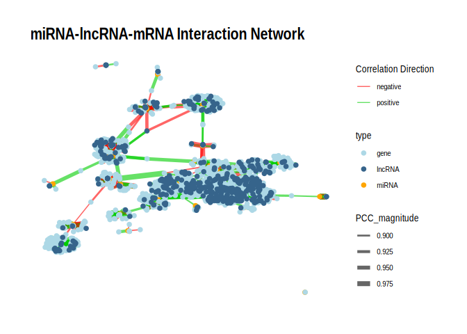

33-Apul-miRNA-mRNA-lncRNA-network
================
Kathleen Durkin
2025-07-16

- <a href="#1-all-interactions" id="toc-1-all-interactions">1 All
  interactions</a>
- <a href="#2-pval--005" id="toc-2-pval--005">2 pval &lt; 0.05</a>
- <a href="#3-pval--001" id="toc-3-pval--001">3 pval &lt; 0.01</a>
- <a href="#4-save" id="toc-4-save">4 Save</a>
- <a href="#5-using-cytoscape" id="toc-5-using-cytoscape">5 Using
  Cytoscape</a>
- <a href="#6-plotting-with-igraph" id="toc-6-plotting-with-igraph">6
  Plotting with igraph</a>

Reran 08/06/2025 to incorporate changes due to updated lncRNA counts
matrix

``` r
library(dplyr)
```

    ## 
    ## Attaching package: 'dplyr'

    ## The following objects are masked from 'package:stats':
    ## 
    ##     filter, lag

    ## The following objects are masked from 'package:base':
    ## 
    ##     intersect, setdiff, setequal, union

``` r
library(ggplot2)
library(tidyr)
library(igraph)
```

    ## 
    ## Attaching package: 'igraph'

    ## The following object is masked from 'package:tidyr':
    ## 
    ##     crossing

    ## The following objects are masked from 'package:dplyr':
    ## 
    ##     as_data_frame, groups, union

    ## The following objects are masked from 'package:stats':
    ## 
    ##     decompose, spectrum

    ## The following object is masked from 'package:base':
    ## 
    ##     union

``` r
library(ggraph)
library(tidygraph)
```

    ## 
    ## Attaching package: 'tidygraph'

    ## The following object is masked from 'package:igraph':
    ## 
    ##     groups

    ## The following object is masked from 'package:stats':
    ## 
    ##     filter

``` r
knitr::opts_chunk$set(
  echo = TRUE,         # Display code chunks
  eval = TRUE         # Evaluate code chunks
)
```

I want to generate an interaction network plot showing the sum of
miRNA-mRNA-lncRNA interactions.

This will include all putative miRNA-mRNA interactions (miRanda +
significant PCC) and all putative miRNA-lncRNA interactions (miRanda +
significant PCC). However, it will *NOT* include mRNA-lncRNA links. This
is for two reasons:

1.  First, that dataset is simply too large – there were tens of
    millions of mRNA-lncRNA pairs with significantly correlated
    expression.

2.  Second, the only method we have to investigate potential mRNA-lncRNA
    links is expression correlation, which doesn’t provide any
    indication of the direction of action and is generally inappropriate
    to use as a sole predictor of causative relationships. In contrast,
    the miRNA-mRNA and miRNA-lncRNA putative interactions are primarily
    supported by binding predictions (through miRanda), and only use
    expression correlation as a method of validating interactions and
    evaluating their “polarity” (positive or negative relationship).
    When making a summary plot, I think it’s only appropriate to include
    putative interactions which we can predict with similar degrees of
    confidence. Including mRNA-lncRNA interactions in the final plot may
    imply we are as confident in those interactions truly existing as we
    are in the miRNA-mRNA and miRNA-lncRNA interactions.

Because I’m excluding the mRNA-lncRNA links, I think this will
functionally end up being a putative ceRNA (competative endogenous)
network.

For both `igraph` and `Cytoscape` I need two inputs, an “Edges”
dataframe and a “Nodes” dataframe (both should be saved as `.csv` files
for export to `Cytoscape`.

The “Edges” file should associate each node with all other nodes it
connects to. It should also contain edge-specific metadata. For example:

| source   | target | correlation | correlation magnitude | correlation direction | correlation pval | binding pval |
|:---------|:-------|:------------|:----------------------|:----------------------|:-----------------|:-------------|
| miR-100  | FUN001 | -0.9        | 0.9                   | -1                    | 0.001            | 0.02         |
| miR-100  | FUN002 | 0.85        | 0.85                  | 1                     | 0.02             | 0.03         |
| lncRNA01 | FUN001 | -0.95       | 0.95                  | -1                    | 0.01             | 0.01         |

Note that there may be duplicates in both the “source” and “target”
columns, and there may be duplicate source-target combinations if they
have different attributes (e.g. representing different predicted binding
sites of the same pair).However, the rows should be unique.

The “Nodes” file contains metadata for every node included in the plot.
Importantly, the set of nodes listed in the “Nodes” file should match
exactly the set of nodes included in the “Edges” document. For example:

| id       | type   |
|:---------|:-------|
| FUN001   | gene   |
| FUN002   | gene   |
| miR-100  | miRNA  |
| lncRNA01 | lncRNA |

I’ll need the following files to compile the Cytoscape inputs:

- miRNA-mRNA interaction files (contains binding and coexpression
  information for miRNA-gene pairs):

- miRNA-3UTR:
  `deep-dive-expression/D-Apul/output/09-Apul-mRNA-miRNA-interactions/miranda_PCC_miRNA_mRNA.csv`

- miRNA-CDS:
  `deep-dive-expression/D-Apul/output/09.01-Apul-mRNA-miRNA-interactions-CDS_5UTR/miRanda_PCC_miRNA_CDS.csv`

- miRNA-5UTR:
  `deep-dive-expression/D-Apul/output/09.01-Apul-mRNA-miRNA-interactions-CDS_5UTR/miRanda_PCC_miRNA_5UTR.csv`

- miRNA-lncRNA interaction file (contains binding and coexpression
  information for miRNA-lncRNA pairs):

- `deep-dive-expression/D-Apul/output/28-Apul-miRNA-lncRNA-interactions/miranda_PCC_miRNA-lncRNA.csv`

Load and format files:

``` r
# Load the three miRNA-mRNA files, and format so they have the same column contents and names

miRNA_3UTR <- read.csv("../output/09-Apul-mRNA-miRNA-interactions/miranda_PCC_miRNA_mRNA.csv") %>% dplyr::select(-X.1, -X)
# Add label for binding region
miRNA_3UTR$region <- "3UTR"


miRNA_CDS <- read.csv("../output/09.01-Apul-mRNA-miRNA-interactions-CDS_5UTR/miRanda_PCC_miRNA_CDS.csv") %>% dplyr::select(-X)
colnames(miRNA_CDS) <- c("miRNA", "mRNA_coord", "score", "energy", "query_start", "query_end", "subject_start", "subject_end", "total_bp_shared", "query_similar", "subject_similar", "mRNA", "PCC.cor", "p_value", "adjusted_p_value")
miRNA_CDS$query_start_end <- paste0(miRNA_CDS$query_start, " ", miRNA_CDS$query_end)
miRNA_CDS$subject_start_end <- paste0(miRNA_CDS$subject_start, " ", miRNA_CDS$subject_end)
# Add label for binding region
miRNA_CDS$region <- "CDS"
# Match column order of miRNA_3UTR
miRNA_CDS <- miRNA_CDS %>% dplyr::select(colnames(miRNA_3UTR))


miRNA_5UTR <- read.csv("../output/09.01-Apul-mRNA-miRNA-interactions-CDS_5UTR/miRanda_PCC_miRNA_5UTR.csv") %>% dplyr::select(-X)
colnames(miRNA_5UTR) <- c("miRNA", "mRNA_coord", "score", "energy", "query_start", "query_end", "subject_start", "subject_end", "total_bp_shared", "query_similar", "subject_similar", "mRNA", "PCC.cor", "p_value", "adjusted_p_value")
miRNA_5UTR$query_start_end <- paste0(miRNA_5UTR$query_start, " ", miRNA_5UTR$query_end)
miRNA_5UTR$subject_start_end <- paste0(miRNA_5UTR$subject_start, " ", miRNA_5UTR$subject_end)
# Add label for binding region
miRNA_5UTR$region <- "5UTR"
# Match column order of miRNA_3UTR
miRNA_5UTR <- miRNA_5UTR %>% dplyr::select(colnames(miRNA_3UTR))


miRNA_gene <- rbind(miRNA_3UTR, miRNA_CDS, miRNA_5UTR)
# Remove NA rows
miRNA_gene <- miRNA_gene %>% filter(!is.na(miRNA))

# Load and format the miRNA-lncRNA file
miRNA_lncRNA <- read.csv("../output/28-Apul-miRNA-lncRNA-interactions/miranda_PCC_miRNA_lncRNA.csv") %>% dplyr::select(-X.1, -X)
# Add label for binding region
miRNA_lncRNA$region <- "lncRNA"
```

For miRNA, annotate with assigned names (e.g., apul-miR-100,
apul-novel-7)

``` r
Apul_names <- read.csv("../../D-Apul/output/11-Apul-sRNA-ShortStack_4.1.0-pulchra_genome/ShortStack_out/Apul_Results_mature_named_miRNAs.csv") %>% dplyr::select(Name, given_miRNA_name)

miRNA_gene <- left_join(miRNA_gene, Apul_names, by = c("miRNA" = "Name"))
miRNA_lncRNA <- left_join(miRNA_lncRNA, Apul_names, by = c("miRNA" = "Name"))
```

# 1 All interactions

Format “Edges” file:

``` r
# Add correlation magnitude and direction columns
miRNA_gene$PCC_magnitude <- abs(miRNA_gene$PCC.cor)
miRNA_gene$PCC_direction <- sign(miRNA_gene$PCC.cor)
miRNA_gene$Alignment <- paste0(miRNA_gene$mRNA, ";", miRNA_gene$query_start_end, ";", miRNA_gene$subject_start_end)
# Select columns I want to keep in Edges file
miRNA_gene_edges <- miRNA_gene %>% dplyr::select(given_miRNA_name, mRNA, region, Alignment, energy, total_bp_shared, query_similar, subject_similar, PCC.cor, PCC_magnitude, PCC_direction, p_value)
# rename columns
miRNA_gene_edges <- miRNA_gene_edges %>% rename(source = given_miRNA_name, target = mRNA)

# Add correlation magnitude and direction columns
miRNA_lncRNA$PCC_magnitude <- abs(miRNA_lncRNA$PCC.cor)
miRNA_lncRNA$PCC_direction <- sign(miRNA_lncRNA$PCC.cor)
miRNA_lncRNA$Alignment <- paste0(miRNA_lncRNA$lncRNA, ";", miRNA_lncRNA$query_start_end, ";", miRNA_lncRNA$subject_start_end)
# Select columns I want to keep in Edges file (ensure in same order as in the miRNA_gene_edges file)
miRNA_lncRNA_edges <- miRNA_lncRNA %>% dplyr::select(given_miRNA_name, lncRNA, region, Alignment, energy, total_bp_shared, query_similar, subject_similar, PCC.cor, PCC_magnitude, PCC_direction, p_value)
# rename columns
miRNA_lncRNA_edges <- miRNA_lncRNA_edges %>% rename(source = given_miRNA_name, target = lncRNA)

# Combine miRNA-gene edges and miRNA-lncRNA edges
edges <- rbind(miRNA_gene_edges, miRNA_lncRNA_edges)

# Ensure we have no duplicate rows
nrow(edges)
```

    ## [1] 60158

``` r
nrow(edges %>% distinct())
```

    ## [1] 60122

``` r
# Check formatting/contents
head(edges)
```

    ##              source     target region               Alignment energy
    ## 1  apul-mir-novel-9 FUN_028147   3UTR FUN_028147;2 21;185 209 -22.19
    ## 2 apul-mir-novel-19 FUN_013332   3UTR FUN_013332;2 20;198 220 -23.15
    ## 3  apul-mir-novel-9 FUN_041253   3UTR FUN_041253;2 21;699 719 -20.50
    ## 4 apul-mir-novel-28 FUN_010827   3UTR FUN_010827;2 18;346 368 -22.14
    ## 5 apul-mir-novel-29 FUN_010827   3UTR FUN_010827;2 18;346 368 -22.14
    ## 6 apul-mir-novel-19 FUN_003342   3UTR FUN_003342;2 20;562 585 -20.65
    ##   total_bp_shared query_similar subject_similar    PCC.cor PCC_magnitude
    ## 1              21        66.67%          71.43%  0.6825537     0.6825537
    ## 2              19        68.42%          84.21%  0.6371070     0.6371070
    ## 3              19        73.68%          73.68% -0.2250869     0.2250869
    ## 4              16        81.25%          93.75%  0.3671005     0.3671005
    ## 5              16        81.25%          93.75%  0.5369304     0.5369304
    ## 6              20        65.00%          80.00%  0.1096213     0.1096213
    ##   PCC_direction   p_value
    ## 1             1 0.2041707
    ## 2             1 0.2476393
    ## 3            -1 0.7158492
    ## 4             1 0.5433145
    ## 5             1 0.3507987
    ## 6             1 0.8607058

Format Nodes file:

``` r
# Make a df that contains all miRNA, genes, and lncRNA listed in the `source` and `target` columns of `edges`
nodes <- data.frame(
  # The `unique` argument ensures we remove duplicates
  id = unique(unname(unlist(edges[, c("source", "target")])))
)

# Add column identifying the type of each node (miRNA, lncRNA, or gene)
nodes <- nodes %>%
  mutate(type = case_when(
    grepl("mir", id) ~ "miRNA",
    grepl("FUN", id) ~ "gene",
    grepl("lncRNA", id) ~ "lncRNA",
    TRUE ~ "other"
  ))

# Check formatting/contents
head(nodes)
```

    ##                  id  type
    ## 1  apul-mir-novel-9 miRNA
    ## 2 apul-mir-novel-19 miRNA
    ## 3 apul-mir-novel-28 miRNA
    ## 4 apul-mir-novel-29 miRNA
    ## 5     apul-mir-2023 miRNA
    ## 6 apul-mir-novel-27 miRNA

# 2 pval \< 0.05

Edges:

``` r
edges_pval_0.05 <- edges %>% filter(p_value < 0.05)
nrow(edges_pval_0.05)
```

    ## [1] 2786

Nodes:

``` r
# Make a df that contains all miRNA, genes, and lncRNA listed in the `source` and `target` columns of `edges`
nodes_pval_0.05 <- data.frame(
  # The `unique` argument ensures we remove duplicates
  id = unique(unname(unlist(edges_pval_0.05[, c("source", "target")])))
)

# Add column identifying the type of each node (miRNA, lncRNA, or gene)
nodes_pval_0.05 <- nodes_pval_0.05 %>%
  mutate(type = case_when(
    grepl("mir", id) ~ "miRNA",
    grepl("FUN", id) ~ "gene",
    grepl("lncRNA", id) ~ "lncRNA",
    TRUE ~ "other"
  ))
```

# 3 pval \< 0.01

Edges:

``` r
edges_pval_0.01 <- edges %>% filter(p_value < 0.01)
nrow(edges_pval_0.01)
```

    ## [1] 660

Nodes:

``` r
# Make a df that contains all miRNA, genes, and lncRNA listed in the `source` and `target` columns of `edges`
nodes_pval_0.01 <- data.frame(
  # The `unique` argument ensures we remove duplicates
  id = unique(unname(unlist(edges_pval_0.01[, c("source", "target")])))
)

# Add column identifying the type of each node (miRNA, lncRNA, or gene)
nodes_pval_0.01 <- nodes_pval_0.01 %>%
  mutate(type = case_when(
    grepl("mir", id) ~ "miRNA",
    grepl("FUN", id) ~ "gene",
    grepl("lncRNA", id) ~ "lncRNA",
    TRUE ~ "other"
  ))
```

# 4 Save

Save files

``` r
write.csv(edges_pval_0.05, "../output/33-Apul-miRNA-mRNA-lncRNA-network/edges_miRNA_mRNA_lncRNA_network_p0.05.csv", quote = FALSE)
write.csv(nodes_pval_0.05, "../output/33-Apul-miRNA-mRNA-lncRNA-network/nodes_miRNA_mRNA_lncRNA_network_p0.05.csv", quote = FALSE)
write.csv(edges_pval_0.01, "../output/33-Apul-miRNA-mRNA-lncRNA-network/edges_miRNA_mRNA_lncRNA_network_p0.01.csv", quote = FALSE)
write.csv(nodes_pval_0.01, "../output/33-Apul-miRNA-mRNA-lncRNA-network/nodes_miRNA_mRNA_lncRNA_network_p0.01.csv", quote = FALSE)
```

# 5 Using Cytoscape

To load a network into Cytoscape:

1.  Open Cytoscape and select File \> Import \> Network from File…

2.  Select “Edges” file. Ensure The source and target columns are
    appropriately identified before loading the file.

3.  To load “Nodes” file, select File \> Import \> Table from File…

# 6 Plotting with igraph

``` r
# Rename columns for igraph
colnames(edges_pval_0.01)[1:2] <- c("from", "to")         # For igraph edge input
colnames(nodes_pval_0.01)[1] <- "name"                    # For igraph vertex input; must match nodes in edges

# Build graph
g <- graph_from_data_frame(d = edges_pval_0.01, vertices = nodes_pval_0.01, directed = FALSE)

# Edge attributes
E(g)$edge_color <- ifelse(E(g)$PCC_direction > 0, "positive", "negative")

# Convert to tbl_graph
g_tbl <- as_tbl_graph(g)


p <- ggraph(g_tbl, layout = "fr") +
  geom_edge_link(aes(edge_width = PCC_magnitude, color = edge_color), alpha = 0.6) +
  geom_node_point(aes(color = type), size = 2) +
  scale_edge_width(range = c(0.5, 3)) +
  
  # Split color scales
  scale_edge_color_manual(
    values = c("positive" = "green3", "negative" = "red"),
    name = "Correlation Direction"
  ) +
  scale_color_manual(
    values = c("miRNA" = "orange", "gene" = "lightblue", "lncRNA" = "steelblue4"),
    name = "type"
  ) +

  theme_graph() +
  labs(title = "miRNA-lncRNA-mRNA Interaction Network")

print(p)
```

<!-- -->
