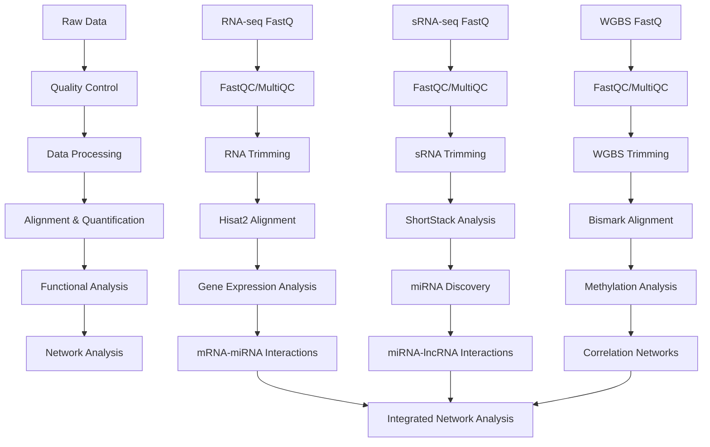

# D-Apul Code Directory

## Overview

This directory contains the complete bioinformatics pipeline for analyzing *Acropora pulchra* multi-omics data, including RNA-seq, small RNA-seq, and whole genome bisulfite sequencing (WGBS) data. The analysis focuses on understanding gene expression regulation through miRNA-mRNA-lncRNA interactions, DNA methylation patterns, and functional annotation.

## Workflow Schematic

## Key Results

- **Gene Expression**: Identified differentially expressed genes across samples
- **miRNA Discovery**: Discovered and annotated miRNAs using ShortStack 4.1.0
- **DNA Methylation**: Analyzed genome-wide methylation patterns using Bismark
- **Regulatory Networks**: Constructed miRNA-mRNA-lncRNA interaction networks
- **Functional Annotation**: Performed GO enrichment analysis and functional annotation

## File Descriptions

### Data Quality Control and Processing

- **`00.00-D-Apul-WGBS-reads-FastQC-MultiQC.Rmd`**: Downloads and performs quality control on WGBS sequencing reads using FastQC and MultiQC
- **`01-Apul-RNA-trimming-FastQC.Rmd`**: Trims RNA-seq reads and performs quality control on both raw and trimmed reads
- **`01.00-D-Apul-WGBS-trimming-cutadapt-FastQC-MultiQC.Rmd`**: Trims WGBS reads using cutadapt and performs quality control
- **`01.00-D-Apul-WGBS-trimming-fastp-FastQC-MultiQC.Rmd`**: Alternative WGBS trimming using fastp

### Reference and Annotation

- **`02-Apul-reference-annotation.Rmd`**: Annotates the *A. pulchra* reference genome with functional information and GO terms
- **`12-Apul-genome-explore.Rmd`**: Explores and analyzes the *A. pulchra* genome characteristics
- **`13-Apul-miRNA-naming.Rmd`**: Standardizes miRNA naming conventions
- **`14-Apul-RepeatMasker.Rmd`**: Identifies and masks repetitive elements in the genome
- **`15-Apul-annotate-UTRs.Rmd`**: Annotates 5' and 3' UTR regions in the genome

### RNA-seq Analysis

- **`03-Apul-RNA-summary.Rmd`**: Summarizes RNA-seq gene expression data and performs differential expression analysis
- **`03.01-Apul-RNA-summary-Hisat.Rmd`**: RNA-seq analysis using Hisat2 alignment
- **`03.1-Apul-sRNA-summary.Rmd`**: Summarizes small RNA-seq data and identifies different RNA classes
- **`03.2-Apul-lncRNA-summary.Rmd`**: Identifies and summarizes long non-coding RNAs
- **`07-Apul-Hisat.qmd`**: RNA-seq alignment using Hisat2
- **`7.2-Apul-Hisat.qmd`**: Additional Hisat2 analysis

### Small RNA Analysis

- **`11-Apul-sRNA-ShortStack_4.1.0-pulchra_genome.Rmd`**: Discovers and annotates small RNAs using ShortStack 4.1.0
- **`11.1-Apul-sRNA-ShortStack-rename.Rmd`**: Renames ShortStack output files for consistency

### DNA Methylation Analysis

- **`08-Apul-WGBS.Rmd`**: Performs whole genome bisulfite sequencing analysis using Bismark
- **`22-Apul-methylation.qmd`**: Analyzes DNA methylation patterns and differential methylation
- **`22.2-Apul-methylation.qmd`**: Additional methylation analysis
- **`22.3-Apul-methylation.qmd`**: Extended methylation analysis
- **`23-Apul-miRNA-methylation-machinery.Rmd`**: Analyzes methylation machinery genes

### Interaction Analysis

- **`09-Apul-mRNA-miRNA-interactions.Rmd`**: Identifies and analyzes miRNA-mRNA interactions
- **`09.01-Apul-mRNA-miRNA-interactions-CDS_5UTR.Rmd`**: Analyzes miRNA interactions with CDS and 5' UTR regions
- **`09.1-Apul-mRNA-miRNA-interactions-functional-enrichment.Rmd`**: Performs functional enrichment analysis on miRNA-mRNA interactions
- **`09.11-Apul-mRNA-miRNA-interactions-FE-CDS.Rmd`**: Functional enrichment analysis for CDS regions
- **`09.12-Apul-mRNA-miRNA-interactions-FE-5UTR.Rmd`**: Functional enrichment analysis for 5' UTR regions
- **`09.13-Apul-mRNA-miRNA-interactions-FE-pooled.Rmd`**: Pooled functional enrichment analysis
- **`16-Apul-RNAhybrid.Rmd`**: Predicts miRNA-mRNA interactions using RNAhybrid
- **`17-Apul-miRNA-lncRNA-BLASTs-RNAhybrid.Rmd`**: Analyzes miRNA-lncRNA interactions using BLAST and RNAhybrid
- **`18-Apul-interactions-functional-anotation.Rmd`**: Functional annotation of interaction results
- **`24-Apul-miRanda-input-comparisons.Rmd`**: Compares different miRanda input parameters
- **`26-Apul-siRNA-mRNA-interactions.Rmd`**: Analyzes siRNA-mRNA interactions
- **`28-Apul-miRNA-lncRNA-interactions.Rmd`**: Comprehensive analysis of miRNA-lncRNA interactions

### Network Analysis

- **`04-Apul-RNA-sRNA-WGCNA.Rmd`**: Performs weighted gene co-expression network analysis (WGCNA)
- **`21-Apul-mRNA-lncRNA-correlation-networks.Rmd`**: Constructs correlation networks between mRNAs and lncRNAs
- **`21.1-Apul-mRNA-lncRNA-correlation-PCC.Rmd`**: Calculates Pearson correlation coefficients between mRNAs and lncRNAs
- **`33-Apul-miRNA-mRNA-lncRNA-network.Rmd`**: Integrates all interaction data into a comprehensive network

### Functional Analysis

- **`05-Apul-mixOmics.Rmd`**: Performs multi-omics integration analysis using mixOmics
- **`20-Apul-Orthofinder.Rmd`**: Performs orthology analysis using OrthoFinder
- **`27-Apul-pheno-annot.qmd`**: Phenotypic annotation of genes
- **`29-Apul-mRNA-GO-enrichment.Rmd`**: GO enrichment analysis for mRNAs
- **`30.00-Apul-transcriptome-GOslims.Rmd`**: GO-slim analysis of the transcriptome

### Data Management

- **`10-Apul-lncRNA.qmd`**: lncRNA identification and analysis
- **`10.1-Apul-lncRNA.qmd`**: Additional lncRNA analysis
- **`19-Apul-lncRNA-matrix.qmd`**: Creates lncRNA count matrix
- **`25-lncRNA-pipeline.qmd`**: Complete lncRNA analysis pipeline
- **`31-Apul-lncRNA.Rmd`**: Comprehensive lncRNA analysis
- **`32-Apul-lncRNA-matrix.qmd`**: Updated lncRNA matrix creation

### Utility Scripts

- **`genome-stats.sh`**: Bash script for calculating genome statistics
- **`references.bib`**: Bibliography file for citations

## Data Flow

1. **Raw Data Processing**: Quality control and trimming of sequencing reads
2. **Alignment**: Mapping reads to reference genome using appropriate tools
3. **Quantification**: Counting reads and estimating expression levels
4. **Discovery**: Identifying novel RNAs (miRNAs, lncRNAs) and methylation sites
5. **Interaction Analysis**: Predicting and validating molecular interactions
6. **Network Construction**: Building regulatory networks from interaction data
7. **Functional Analysis**: Enrichment analysis and functional annotation
8. **Integration**: Combining all analyses into comprehensive networks

## Key Software Tools

- **FastQC/MultiQC**: Quality control
- **Hisat2**: RNA-seq alignment
- **ShortStack**: Small RNA analysis
- **Bismark**: DNA methylation analysis
- **miRanda/RNAhybrid**: miRNA target prediction
- **WGCNA**: Co-expression network analysis
- **DESeq2**: Differential expression analysis
- **R/Bioconductor**: Statistical analysis and visualization

## Output Structure

All outputs are organized in the `../output/` directory with subdirectories corresponding to each analysis step. Key outputs include:

- Quality control reports (FastQC, MultiQC)
- Alignment files (BAM, SAM)
- Count matrices (gene, miRNA, lncRNA)
- Interaction predictions (miRNA-mRNA, miRNA-lncRNA)
- Network files (CSV, GML)
- Functional enrichment results
- Visualization plots (PDF, PNG)

## Citation

Please cite the original papers for the software tools used in this analysis, as well as any relevant publications from the E5 coral research group.
