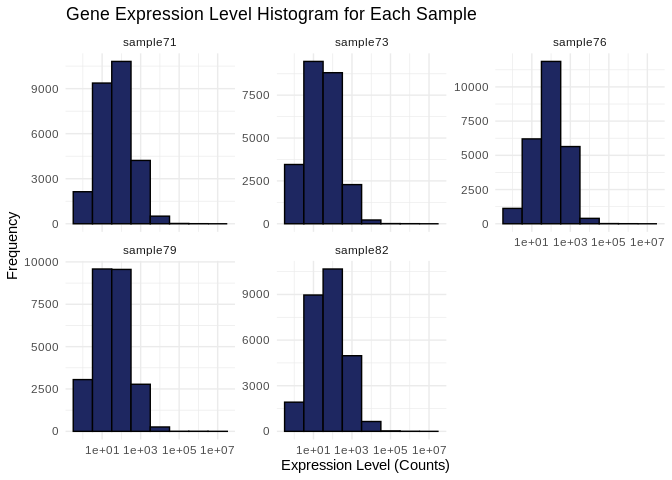
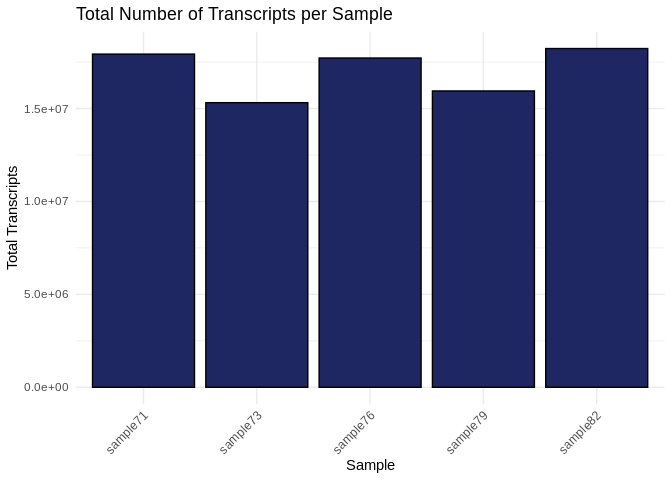
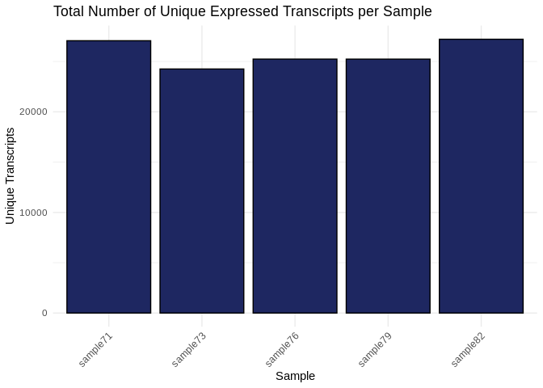
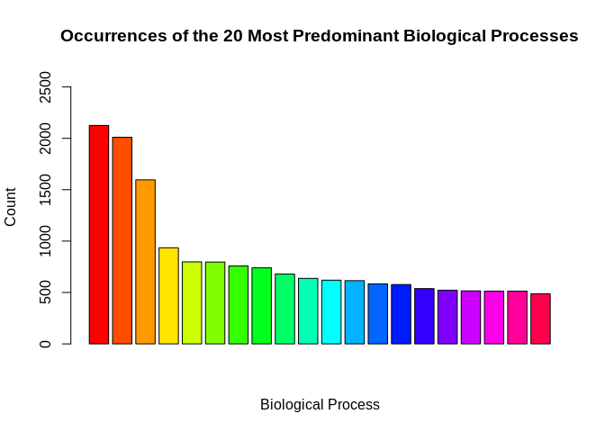

03-Peve-RNA-summary
================
Kathleen Durkin
2024-09-04

- <a href="#001-install-and-load-packages"
  id="toc-001-install-and-load-packages">0.0.1 Install and load
  packages</a>
- <a href="#1-load-data" id="toc-1-load-data">1 Load data</a>
  - <a href="#11-load-count-data" id="toc-11-load-count-data">1.1 Load count
    data</a>
  - <a href="#12-count-data-munging" id="toc-12-count-data-munging">1.2
    Count data munging</a>
- <a href="#2-summary-stats-and-visualizations"
  id="toc-2-summary-stats-and-visualizations">2 Summary stats and
  visualizations</a>
  - <a href="#21-expression-levels" id="toc-21-expression-levels">2.1
    Expression levels</a>
  - <a href="#22-transcript-counts" id="toc-22-transcript-counts">2.2
    Transcript counts</a>
  - <a href="#23-most-common-biological-processes"
    id="toc-23-most-common-biological-processes">2.3 Most common biological
    processes</a>

Gene expression summary for *Porites evermanni* RNA-seq data.

- trimmed reads generated in `deep-dive` project, trimming and QC
  details in `01-Peve-RNA-trimming-FastQC`

- Reads aligned to *Porites evermanni* transcriptome, details
  [here](https://github.com/urol-e5/deep-dive/blob/main/E-Peve/code/12-Peve-RNAseq-kallisto.md)

### 0.0.1 Install and load packages

``` r
library(tidyverse)
library(ggplot2)
library(reshape2)
```

# 1 Load data

## 1.1 Load count data

Load in the count matrix we generated after kallisto pseudoalignment
using the Trinity abundance_estimates_to_matrix.pl script. We also need
to slightly reformat the count matrix

``` r
# Read in counts data. This is a gene-level counts matrix generated from kallisto transcript abundances using Trinity
Peve_counts_data_OG <- read_delim("../../../deep-dive/E-Peve/output/12-Peve-RNAseq-kallisto/kallisto/kallisto.isoform.counts.matrix") 
head(Peve_counts_data_OG)
```

    # A tibble: 6 × 6
      ...1      kallisto_quant_sampl…¹ kallisto_quant_sampl…² kallisto_quant_sampl…³
      <chr>                      <dbl>                  <dbl>                  <dbl>
    1 Parent=P…                    0                      0                      0  
    2 Parent=P…                   42                      3                    122  
    3 Parent=P…                   56.5                   46.5                   15.4
    4 Parent=P…                  873                    403                   2305  
    5 Parent=P…                   78.9                   86.6                  252. 
    6 Parent=P…                   83                     59                     93  
    # ℹ abbreviated names: ¹​kallisto_quant_sample71, ²​kallisto_quant_sample73,
    #   ³​kallisto_quant_sample76
    # ℹ 2 more variables: kallisto_quant_sample79 <dbl>,
    #   kallisto_quant_sample82 <dbl>

``` r
# Read in ID mapping of transcripts and associated GO terms etc.
Peve_IDmapping <- read_delim("../output/02-Peve-reference-annotation/Porites_evermanni_CDS-IDmapping-2024_09_04.tab") %>%
  select(-...1)
head(Peve_IDmapping)
```

    # A tibble: 6 × 7
      V1               V3          V13 Protein.names Organism Gene.Ontology..biolo…¹
      <chr>            <chr>     <dbl> <chr>         <chr>    <chr>                 
    1 Parent=Peve_000… P619… 2.22e- 58 DELTA-actito… Actinia… cation transport [GO:…
    2 Parent=Peve_000… Q569… 1.43e- 45 Ubiquitin ca… Rattus … DNA repair [GO:000628…
    3 Parent=Peve_000… O356… 1.55e-159 DNA polymera… Mus mus… DNA biosynthetic proc…
    4 Parent=Peve_000… Q96P… 1.93e-174 Kelch-like p… Homo sa… <NA>                  
    5 Parent=Peve_000… P525… 5.43e-132 Dual specifi… Homo sa… apoptotic process [GO…
    6 Parent=Peve_000… Q616… 0         Probable ATP… Mus mus… alternative mRNA spli…
    # ℹ abbreviated name: ¹​Gene.Ontology..biological.process.
    # ℹ 1 more variable: Gene.Ontology.IDs <chr>

## 1.2 Count data munging

``` r
# We need to modify this data frame so that the row names are actually row names, instead of comprising the first column
Peve_counts_data <- Peve_counts_data_OG %>%
  column_to_rownames(var = "...1")

# Additional formatting
# Round all estimated counts to integers
Peve_counts_data <- round(Peve_counts_data, digits = 0)

# Remove all transcripts with 5 or fewer counts in all samples
Peve_counts_data <- Peve_counts_data[!apply(Peve_counts_data, 1, function(row) all(row < 6)), ]

# Remove the "kallisto_quant_" portion of the column names, to leave just the sample names
colnames(Peve_counts_data) <- sub("kallisto_quant_", "", colnames(Peve_counts_data))

# Reorder the columns into alphabetical order (to make it easier to create an associated metadata spreadsheet)
Peve_counts_data <- Peve_counts_data[, order(colnames(Peve_counts_data))]

Peve_sample_names <- names(Peve_counts_data)

head(Peve_counts_data)
```

                         sample71 sample73 sample76 sample79 sample82
    Parent=Peve_00028719       42        3      122       61      143
    Parent=Peve_00034830       57       47       15       24       43
    Parent=Peve_00003312      873      403     2305      282      864
    Parent=Peve_00036754       79       87      252       71      159
    Parent=Peve_00033536       83       59       93       42      175
    Parent=Peve_00015150       14       34      272       16       49

``` r
Peve_sample_names
```

    [1] "sample71" "sample73" "sample76" "sample79" "sample82"

``` r
Peve_counts_GO <- Peve_counts_data %>%
  rownames_to_column(var = "transcript") %>%
  left_join(Peve_IDmapping, by = c("transcript" = "V1"))

head(Peve_counts_GO)
```

                transcript sample71 sample73 sample76 sample79 sample82     V3
    1 Parent=Peve_00028719       42        3      122       61      143 E7FAM5
    2 Parent=Peve_00034830       57       47       15       24       43 P21127
    3 Parent=Peve_00003312      873      403     2305      282      864 O13166
    4 Parent=Peve_00003312      873      403     2305      282      864 O13166
    5 Parent=Peve_00036754       79       87      252       71      159 Q14161
    6 Parent=Peve_00036754       79       87      252       71      159 Q14161
            V13
    1 1.42e-124
    2 4.25e-176
    3  0.00e+00
    4  1.53e-55
    5 2.59e-130
    6  4.33e-41
                                                                                                                                                                                                                                                   Protein.names
    1                                                                                             E3 ubiquitin-protein ligase TRIM71 (EC 2.3.2.27) (Protein lin-41 homolog) (RING-type E3 ubiquitin transferase TRIM71) (Tripartite motif-containing protein 71)
    2 Cyclin-dependent kinase 11B (EC 2.7.11.22) (Cell division cycle 2-like protein kinase 1) (CLK-1) (Cell division protein kinase 11B) (Galactosyltransferase-associated protein kinase p58/GTA) (PITSLRE serine/threonine-protein kinase CDC2L1) (p58 CLK-1)
    3                                                                                                                                                                    Transducin-like enhancer protein 3-A (Groucho-related protein grg2) (Protein groucho-2)
    4                                                                                                                                                                    Transducin-like enhancer protein 3-A (Groucho-related protein grg2) (Protein groucho-2)
    5                                                         ARF GTPase-activating protein GIT2 (ARF GAP GIT2) (Cool-interacting tyrosine-phosphorylated protein 2) (CAT-2) (CAT2) (G protein-coupled receptor kinase-interactor 2) (GRK-interacting protein 2)
    6                                                         ARF GTPase-activating protein GIT2 (ARF GAP GIT2) (Cool-interacting tyrosine-phosphorylated protein 2) (CAT-2) (CAT2) (G protein-coupled receptor kinase-interactor 2) (GRK-interacting protein 2)
                                         Organism
    1 Danio rerio (Zebrafish) (Brachydanio rerio)
    2                        Homo sapiens (Human)
    3 Danio rerio (Zebrafish) (Brachydanio rerio)
    4 Danio rerio (Zebrafish) (Brachydanio rerio)
    5                        Homo sapiens (Human)
    6                        Homo sapiens (Human)
                                                                                                                                                                                                                                                                                                                                                                                                                                                                                                                                                                                                                                                                           Gene.Ontology..biological.process.
    1 embryonic body morphogenesis [GO:0010172]; fibroblast growth factor receptor signaling pathway [GO:0008543]; G1/S transition of mitotic cell cycle [GO:0000082]; miRNA metabolic process [GO:0010586]; miRNA-mediated gene silencing by inhibition of translation [GO:0035278]; negative regulation of translation [GO:0017148]; neural tube development [GO:0021915]; proteasome-mediated ubiquitin-dependent protein catabolic process [GO:0043161]; protein autoubiquitination [GO:0051865]; protein polyubiquitination [GO:0000209]; regulation of miRNA-mediated gene silencing [GO:0060964]; regulation of neural precursor cell proliferation [GO:2000177]; stem cell proliferation [GO:0072089]
    2                                                                                                                                                                                                                             apoptotic process [GO:0006915]; mitotic cell cycle [GO:0000278]; protein phosphorylation [GO:0006468]; regulation of apoptotic process [GO:0042981]; regulation of cell cycle [GO:0051726]; regulation of cell growth [GO:0001558]; regulation of centrosome cycle [GO:0046605]; regulation of DNA-templated transcription [GO:0006355]; regulation of mitotic cell cycle [GO:0007346]; regulation of mRNA processing [GO:0050684]; regulation of RNA splicing [GO:0043484]
    3                                                                                                                                                                                                                                                                                                                                                                                                                                                                                                                                 negative regulation of canonical Wnt signaling pathway [GO:0090090]; regulation of retinoic acid biosynthetic process [GO:1900052]; sclerotome development [GO:0061056]
    4                                                                                                                                                                                                                                                                                                                                                                                                                                                                                                                                 negative regulation of canonical Wnt signaling pathway [GO:0090090]; regulation of retinoic acid biosynthetic process [GO:1900052]; sclerotome development [GO:0061056]
    5                                                                                                                                                                                                                                                                                                                                                                                                                                                                                            brain development [GO:0007420]; regulation of ARF protein signal transduction [GO:0032012]; regulation of G protein-coupled receptor signaling pathway [GO:0008277]; synaptic vesicle recycling [GO:0036465]
    6                                                                                                                                                                                                                                                                                                                                                                                                                                                                                            brain development [GO:0007420]; regulation of ARF protein signal transduction [GO:0032012]; regulation of G protein-coupled receptor signaling pathway [GO:0008277]; synaptic vesicle recycling [GO:0036465]
                                                                                                                                                                                                                                   Gene.Ontology.IDs
    1             GO:0000082; GO:0000209; GO:0000932; GO:0004842; GO:0008270; GO:0008543; GO:0010172; GO:0010586; GO:0017148; GO:0021915; GO:0030371; GO:0035198; GO:0035278; GO:0043161; GO:0051865; GO:0060964; GO:0061630; GO:0072089; GO:2000177
    2 GO:0000278; GO:0000307; GO:0001558; GO:0003723; GO:0004672; GO:0004674; GO:0004693; GO:0005524; GO:0005634; GO:0005737; GO:0006355; GO:0006468; GO:0006915; GO:0007346; GO:0042981; GO:0043484; GO:0046605; GO:0050684; GO:0051726; GO:0106310
    3                                                                                                                                                                         GO:0003714; GO:0005634; GO:0005667; GO:0061056; GO:0090090; GO:1900052
    4                                                                                                                                                                         GO:0003714; GO:0005634; GO:0005667; GO:0061056; GO:0090090; GO:1900052
    5                                                                                                             GO:0005096; GO:0005654; GO:0005925; GO:0007420; GO:0008277; GO:0031267; GO:0032012; GO:0036465; GO:0045202; GO:0046872; GO:0098793
    6                                                                                                             GO:0005096; GO:0005654; GO:0005925; GO:0007420; GO:0008277; GO:0031267; GO:0032012; GO:0036465; GO:0045202; GO:0046872; GO:0098793

# 2 Summary stats and visualizations

## 2.1 Expression levels

Plot histograms of the expression levels in each sample

``` r
# Melt the count matrix into long format
Peve_counts_melted <- melt(Peve_counts_data, variable.name = "sample", value.name = "counts")

# Plot the expression level histograms for each sample
ggplot(Peve_counts_melted, aes(x = counts)) +
  geom_histogram(binwidth = 1, fill = "#1E2761", color = "black") +
  scale_x_log10() +  # Optional: Log-transform the x-axis for better visualization
  facet_wrap(~sample, scales = "free_y") +
  labs(title = "Gene Expression Level Histogram for Each Sample",
       x = "Expression Level (Counts)",
       y = "Frequency") +
  theme_minimal()
```

<!-- -->

## 2.2 Transcript counts

First let’s check the total number of transcripts in each sample – keep
in mind this expression data has *not* been normalized yet, so there may
be different totals for each sample

``` r
# Calculate the total number of transcripts for each sample
total_transcripts <- colSums(Peve_counts_data)

# Create a data frame for plotting
total_transcripts_df <- data.frame(sample = names(total_transcripts),
                                   totals = total_transcripts)

# Plot the total number of transcripts for each sample
ggplot(total_transcripts_df, aes(x = sample, y = totals)) +
  geom_bar(stat = "identity", fill = "#1E2761", color = "black") +
  labs(title = "Total Number of Transcripts per Sample",
       x = "Sample",
       y = "Total Transcripts") +
  theme_minimal() +
  theme(axis.text.x = element_text(angle = 45, hjust = 1))  # Rotate x-axis labels for readability
```

<!-- -->

Now let’s check the number of unique transcripts in each sample – that
is, how many genes are expressed in each sample? This should be pretty
much the same across samples, even without normalization.

``` r
# Calculate the number of unique transcripts (non-zero counts) for each sample
unique_transcripts <- colSums(Peve_counts_data > 0)

# Create a data frame for plotting
unique_transcripts_df <- data.frame(sample = names(unique_transcripts),
                                    uniques = unique_transcripts)

# Plot the total number of unique transcripts for each sample
ggplot(unique_transcripts_df, aes(x = sample, y = uniques)) +
  geom_bar(stat = "identity", fill = "#1E2761", color = "black") +
  labs(title = "Total Number of Unique Expressed Transcripts per Sample",
       x = "Sample",
       y = "Unique Transcripts") +
  theme_minimal() +
  theme(axis.text.x = element_text(angle = 45, hjust = 1))  # Rotate x-axis labels for readability
```

<!-- -->

## 2.3 Most common biological processes

Similar to the plot generated in `02-Peve-reference-annotation`, let’s
plot the biological processes most represented in these samples’
expression

``` r
# Rename the `Gene.Ontology..biological.process.` column to `Biological_Process`
colnames(Peve_counts_GO)[colnames(Peve_counts_GO) == "Gene.Ontology..biological.process."] <- "Biological_Process"

# Separate the `Biological_Process` column into individual biological processes
data_separated <- unlist(strsplit(Peve_counts_GO$Biological_Process, split = ";"))

# Trim whitespace from the biological processes
data_separated <- gsub("^\\s+|\\s+$", "", data_separated)

# Count the occurrences of each biological process
process_counts <- table(data_separated)
process_counts <- data.frame(Biological_Process = names(process_counts), Count = as.integer(process_counts))
process_counts <- process_counts[order(-process_counts$Count), ]

# Select the 20 most predominant biological processes
top_20_processes <- process_counts[1:20, ]

# Create a color palette for the bars
bar_colors <- rainbow(nrow(top_20_processes))

# Create a staggered vertical bar plot with different colors for each bar
barplot(top_20_processes$Count, names.arg = rep("", nrow(top_20_processes)), col = bar_colors,
        ylim = c(0, max(top_20_processes$Count) * 1.25),
        main = "Occurrences of the 20 Most Predominant Biological Processes", xlab = "Biological Process", ylab = "Count")
```

<!-- -->

``` r
# Create a separate plot for the legend
png("../output/03-Peve-RNA-summary/GOlegend.png", width = 800, height = 600)
par(mar = c(0, 0, 0, 0))
plot.new()
legend("center", legend = top_20_processes$Biological_Process, fill = bar_colors, cex = 1, title = "Biological Processes")
dev.off()
```

    png 
      2 

``` r
knitr::include_graphics("../output/03-Peve-RNA-summary/GOlegend.png")
```


``` bash
rm ../output/03-Peve-RNA-summary/GOlegend.png
```
