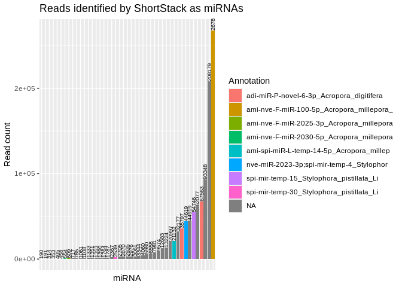
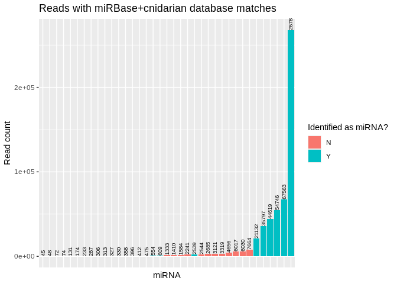
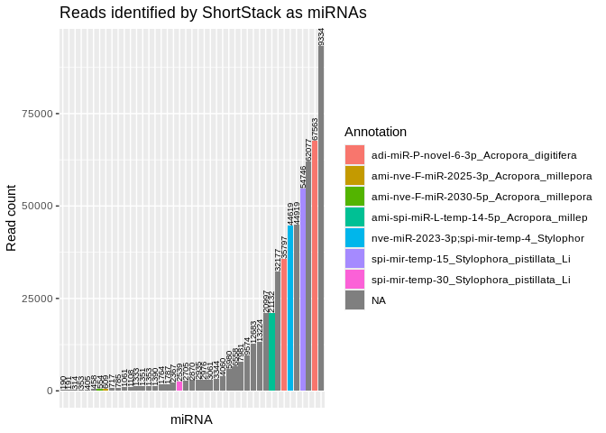
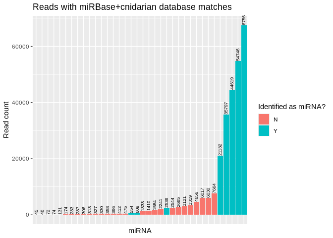
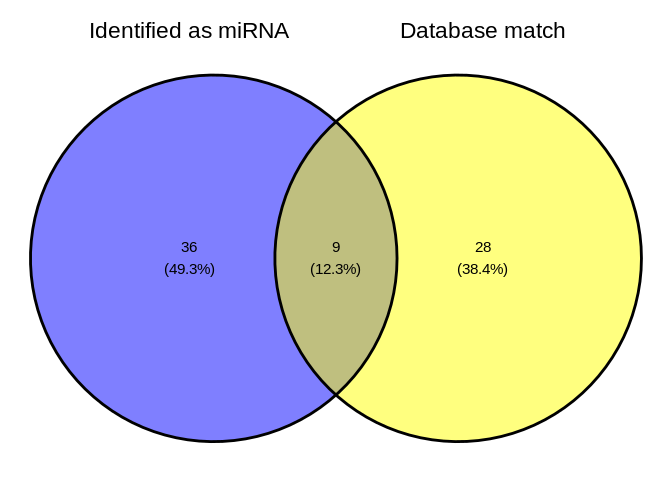

05-Peve-sRNA-ShortStack_4.1.0
================
Kathleen Durkin
2024-10-22

- [1 Set R variables](#1-set-r-variables)
- [2 Create a Bash variables file](#2-create-a-bash-variables-file)
- [3 Load ShortStack conda
  environment](#3-load-shortstack-conda-environment)
  - [3.1 P.evermanni genome](#31-pevermanni-genome)
  - [3.2 Cnidarian+miRBase database](#32-cnidarianmirbase-database)
  - [3.3 Trimmed sRNA-seq reads](#33-trimmed-srna-seq-reads)
- [4 Run ShortStack](#4-run-shortstack)
  - [4.1 Modify genome filename for ShortStack
    compatability](#41-modify-genome-filename-for-shortstack-compatability)
  - [4.2 Excecute ShortStack command](#42-excecute-shortstack-command)
  - [4.3 Check runtime](#43-check-runtime)
- [5 Results](#5-results)
  - [5.1 ShortStack synopsis](#51-shortstack-synopsis)
  - [5.2 Inspect `Results.txt`](#52-inspect-resultstxt)
    - [5.2.1 Directory tree of all ShortStack
      outputs](#521-directory-tree-of-all-shortstack-outputs)
  - [5.3 Visualize](#53-visualize)
- [6 Citations](#6-citations)

Use [ShortStack](https://github.com/MikeAxtell/ShortStack) ([Axtell
2013](#ref-axtell2013a); [Shahid and Axtell 2014](#ref-shahid2014);
[Johnson et al. 2016](#ref-johnson2016a))to perform alignment of sRNAseq
data and annotation of sRNA-producing genes.

This is the same ShortStack analysis as performed in the `deeep-dive`
project. However, ShortStack has an updated version, [ShortStack
4.1.0](https://github.com/MikeAxtell/ShortStack?tab=readme-ov-file#shortstack-version-4-major-changes),
which provides much faster analysis times *and* additional functionality
for visualizing miRNA hairpin structures and generating
genome-browser-ready quantitative coverage tracks of aligned small RNAs.

As in `deep-dive`, we will also include a customized miRBase database,
utilizing cnidarian miRNAs curated by Jill Ashley, which includes
published cnidarian miRNAs:

- [`cnidarian-mirbase-mature-v22.1.fasta`](../../data/cnidarian-mirbase-mature-v22.1.fasta)

------------------------------------------------------------------------

Inputs:

- Requires trimmed sRNAseq files generated by
  [06.2-Peve-sRNAseq-trimming-31bp-fastp-merged.Rmd](https://github.com/urol-e5/deep-dive/blob/main/E-Peve/code/06.2-Peve-sRNAseq-trimming-31bp-fastp-merged.Rmd)

  - Filenames formatted: `*fastp-R1-31bp-auto_adapters-polyG.fq.gz`

- Genome FastA. Stored on `deep-dive` wiki

- Modified MiRBase v22.1 FastA. Includes cnidarian miRNAs provided by
  Jill Ashley.

Outputs:

- See [ShortStack outputs
  documentation](https://github.com/MikeAxtell/ShortStack#outputs) for
  full list and detailed descriptions.

Software requirements:

- Utilizes a
  [ShortStack](https://github.com/MikeAxtell/ShortStack#installation)
  Conda/Mamba environment, per the installation instructions.

Replace with name of your ShortStack environment and the path to the
corresponding conda installation (find this *after* you’ve activated the
environment).

E.g.

``` bash
# Activate environment
conda activate ShortStack4_env

# Find conda path
which conda
```

------------------------------------------------------------------------

# 1 Set R variables

``` r
shortstack_conda_env_name <- c("ShortStack-4.1.0_env")
shortstack_cond_path <- c("/home/sam/programs/mambaforge/condabin/conda")
```

# 2 Create a Bash variables file

This allows usage of Bash variables across R Markdown chunks.

``` bash
{
echo "#### Assign Variables ####"
echo ""

echo "# Trimmed FastQ naming pattern"
echo "export trimmed_fastqs_pattern='*fastp-adapters-polyG-31bp-merged.fq.gz'"

echo "# Data directories"
echo 'export expression_dir=/home/shared/8TB_HDD_02/shedurkin/deep-dive-expression'
echo 'export expression_data_dir="${expression_dir}/data"'
echo 'export output_dir_top=${expression_dir}/E-Peve/output/05-Peve-sRNA-ShortStack_4.1.0'
echo ""

echo "# Input/Output files"
echo 'export genome_fasta_dir=${expression_dir}/E-Peve/data'
echo 'export genome_fasta_name="Porites_evermanni_v1.fa"'
echo 'export shortstack_genome_fasta_name="Porites_evermanni_v1.fa"'
echo 'export trimmed_fastqs_dir="${genome_fasta_dir}/sRNA-trimmed-reads"'

echo 'export mirbase_mature_fasta_version=cnidarian-mirbase-mature-v22.1.fasta'
echo 'export genome_fasta="${genome_fasta_dir}/${shortstack_genome_fasta_name}"'
echo ""

echo "# Set number of CPUs to use"
echo 'export threads=40'
echo ""

echo "# Initialize arrays"
echo 'export trimmed_fastqs_array=()'


} > .bashvars

cat .bashvars
```

    #### Assign Variables ####

    # Trimmed FastQ naming pattern
    export trimmed_fastqs_pattern='*fastp-adapters-polyG-31bp-merged.fq.gz'
    # Data directories
    export expression_dir=/home/shared/8TB_HDD_02/shedurkin/deep-dive-expression
    export expression_data_dir="${expression_dir}/data"
    export output_dir_top=${expression_dir}/E-Peve/output/05-Peve-sRNA-ShortStack_4.1.0

    # Input/Output files
    export genome_fasta_dir=${expression_dir}/E-Peve/data
    export genome_fasta_name="Porites_evermanni_v1.fa"
    export shortstack_genome_fasta_name="Porites_evermanni_v1.fa"
    export trimmed_fastqs_dir="${genome_fasta_dir}/sRNA-trimmed-reads"
    export mirbase_mature_fasta_version=cnidarian-mirbase-mature-v22.1.fasta
    export genome_fasta="${genome_fasta_dir}/${shortstack_genome_fasta_name}"

    # Set number of CPUs to use
    export threads=40

    # Initialize arrays
    export trimmed_fastqs_array=()

# 3 Load [ShortStack](https://github.com/MikeAxtell/ShortStack) conda environment

If this is successful, the first line of output should show that the
Python being used is the one in your
$$ShortStack$$(<https://github.com/MikeAxtell/ShortStack> conda
environment path.

E.g.

`python:         /home/sam/programs/mambaforge/envs/mirmachine_env/bin/python`

``` r
use_condaenv(condaenv = shortstack_conda_env_name, conda = shortstack_cond_path)
py_config()
```

    python:         /home/sam/programs/mambaforge/envs/ShortStack-4.1.0_env/bin/python
    libpython:      /home/sam/programs/mambaforge/envs/ShortStack-4.1.0_env/lib/libpython3.12.so
    pythonhome:     /home/sam/programs/mambaforge/envs/ShortStack-4.1.0_env:/home/sam/programs/mambaforge/envs/ShortStack-4.1.0_env
    version:        3.12.7 | packaged by conda-forge | (main, Oct  4 2024, 16:05:46) [GCC 13.3.0]
    numpy:          /home/sam/programs/mambaforge/envs/ShortStack-4.1.0_env/lib/python3.12/site-packages/numpy
    numpy_version:  2.1.1

    NOTE: Python version was forced by use_python() function

Note: I sometimes get an error “failed to initialize requested version
of Python,” which seems to stem from the `reticulate` package default
loading a python environment. I’ve been able to fix this by manually
uninstalling the `reticulate` package, then restarting R and
reinstalling `reticulate` before rerunning this code document. \#
Download reference files

## 3.1 P.evermanni genome

``` bash
# Load bash variables into memory
source .bashvars

wget -O ${genome_fasta_dir}/${shortstack_genome_fasta_name} "https://gannet.fish.washington.edu/seashell/snaps/Porites_evermanni_v1.fa"
```

``` bash
# Load bash vairables into memory
source .bashvars

head ${genome_fasta_dir}/${shortstack_genome_fasta_name}
```

    >Porites_evermani_scaffold_1
    GGCGGGGGGGGGGGGGGGGGGGGTACTCCCATACATTACCTATACGGGTATGTGCCGCCC
    AAAAGGGGCCGTGATTTTGAAGCTCCTGATTTAGAACGGGGTATCCATTTCAGAGGCGTT
    TTCTAGAACGGGGTGTAATATTTCGAACGCACGAAAGCTCCACTTTTGTGTAAGCAGCCA
    TTTGAAATTATTCAAGGACAGATTGCTTTTAAAAATACGGTTCAGCGCGTTAACAAGCAA
    ACCGTTGTACTCTTGTTGCACCCTAGAACGGTGTATAAAAAATTGGCCCATTTCTAGAAC
    GGGGTATCAGTTTTAGGGAGAATTCTAGAACGGGGTATAAAAAATTGGCCCTTTTCTGAA
    CGGGGCATCAATGTTAGGGGAAATTTTTTCCAGAACGGGGTGCCAATTTGGAGTCCCGGG
    CGGCACATACCCACCCAAAAAATACCCAAGTGCCCCCCCGGGGTCTAAACCCACATATTC
    TTCACACTGTTCACAATTTACCTCTTTTGGCTCTTCTAAGGAGAGCTCATCTAAATATTG

## 3.2 Cnidarian+miRBase database

Available n `deep-dive` repo,
[here](https://github.com/urol-e5/deep-dive/blob/main/data/cnidarian-mirbase-mature-v22.1.fasta)

``` bash
# Load bash variables into memory
source .bashvars

wget -O ${expression_data_dir}/"${mirbase_mature_fasta_version}" "https://raw.githubusercontent.com/urol-e5/deep-dive/refs/heads/main/data/cnidarian-mirbase-mature-v22.1.fasta"
```

``` bash
# Load bash variables into memory
source .bashvars

head -5 ${expression_data_dir}/"${mirbase_mature_fasta_version}"
```

    >cel-let-7-5p MIMAT0000001 Caenorhabditis elegans let-7-5p
    UGAGGUAGUAGGUUGUAUAGUU
    >cel-let-7-3p MIMAT0015091 Caenorhabditis elegans let-7-3p
    CUAUGCAAUUUUCUACCUUACC
    >cel-lin-4-5p MIMAT0000002 Caenorhabditis elegans lin-4-5p

## 3.3 Trimmed sRNA-seq reads

Trimmed in `deep-dive`,
[06.2-Peve-sRNAseq-trimming-31bp-fastp-merged](https://github.com/urol-e5/deep-dive/blob/main/E-Peve/code/06.2-Peve-sRNAseq-trimming-31bp-fastp-merged.Rmd)

``` bash
# Load bash variables into memory
source .bashvars

wget \
--directory-prefix ${trimmed_fastqs_dir} \
--recursive \
--no-check-certificate \
--continue \
--cut-dirs 7 \
--no-host-directories \
--no-parent \
--quiet \
--accept ${trimmed_fastqs_pattern} \
"https://gannet.fish.washington.edu/Atumefaciens/gitrepos/deep-dive/E-Peve/output/06.2-Peve-sRNAseq-trimming-31bp-fastp-merged/trimmed-reads/"
```

# 4 Run ShortStack

## 4.1 Modify genome filename for ShortStack compatability

``` bash
# Load bash variables into memory
source .bashvars

# Check for FastA file first
# Then create rename file if doesn't exist
if [ -f "${genome_fasta_dir}/${shortstack_genome_fasta_name}" ]; then
  echo "${genome_fasta_dir}/${shortstack_genome_fasta_name}"
  echo ""
  echo "Already exists. Nothing to do."
  echo ""
else

  # Copy genome FastA to ShortStack-compatible filename (ending with .fa)
  cp ${genome_fasta_dir}/${genome_fasta_name} ${genome_fasta_dir}/${shortstack_genome_fasta_name}
fi

# Confirm
ls -lh ${genome_fasta_dir}/${shortstack_genome_fasta_name}
```

    /home/shared/8TB_HDD_02/shedurkin/deep-dive-expression/E-Peve/data/Porites_evermanni_v1.fa

    Already exists. Nothing to do.

    -rw-r--r-- 1 shedurkin labmembers 586M Jun 30  2023 /home/shared/8TB_HDD_02/shedurkin/deep-dive-expression/E-Peve/data/Porites_evermanni_v1.fa

## 4.2 Excecute ShortStack command

Uses the `--dn_mirna` option to identify miRNAs in the genome, without
relying on the `--known_miRNAs`.

This part of the code redirects the output of `time` to the end of
`shortstack.log` file.

- `; } \ 2>> ${output_dir_top}/shortstack.log`

``` bash
# Load bash variables into memory
source .bashvars

# Make output directory, if it doesn't exist
mkdir --parents "${output_dir_top}"

# Create array of trimmed FastQs
trimmed_fastqs_array=(${trimmed_fastqs_dir}/${trimmed_fastqs_pattern})


# Pass array contents to new variable as space-delimited list
trimmed_fastqs_list=$(echo "${trimmed_fastqs_array[*]}")


###### Run ShortStack ######
{ time \
ShortStack \
--genomefile "${genome_fasta}" \
--readfile ${trimmed_fastqs_list} \
--known_miRNAs ${expression_data_dir}/${mirbase_mature_fasta_version} \
--dn_mirna \
--threads ${threads} \
--outdir ${output_dir_top}/ShortStack_out \
&> ${output_dir_top}/shortstack.log ; } \
2>> ${output_dir_top}/shortstack.log
```

## 4.3 Check runtime

``` bash
# Load bash variables into memory
source .bashvars

tail -n 3 ${output_dir_top}/shortstack.log \
| grep "real" \
| awk '{print "ShortStack runtime:" "\t" $2}'
```

    ShortStack runtime: 11m17.143s

# 5 Results

## 5.1 ShortStack synopsis

``` bash
# Load bash variables into memory
source .bashvars

tail -n 25 ${output_dir_top}/shortstack.log
```

    Writing final files

    Found a total of 45 MIRNA loci


    Non-MIRNA loci by DicerCall:
    N 16673
    22 60
    23 53
    21 36
    24 26

    Creating visualizations of microRNA loci with strucVis
    <<< WARNING >>>
    Do not rely on these results alone to annotate new MIRNA loci!
    The false positive rate for de novo MIRNA identification is low, but NOT ZERO
    Insepct each mirna locus, especially the strucVis output, and see
    https://doi.org/10.1105/tpc.17.00851 , https://doi.org/10.1093/nar/gky1141

    Tue 22 Oct 2024 16:33:44 -0700 PDT
    Run Completed!

    real    11m17.143s
    user    241m43.184s
    sys 18m24.229s

ShortStack identified 45 miRNAs

## 5.2 Inspect `Results.txt`

``` bash
# Load bash variables into memory
source .bashvars

head ${output_dir_top}/ShortStack_out/Results.txt

echo ""
echo "----------------------------------------------------------"
echo ""

echo "Nummber of potential loci:"
awk '(NR>1)' ${output_dir_top}/ShortStack_out/Results.txt | wc -l
```

    Locus   Name    Chrom   Start   End Length  Reads   DistinctSequences   FracTop Strand  MajorRNA    MajorRNAReads   Short   Long    21  22  23  24  DicerCall   MIRNA   known_miRNAs
    Porites_evermani_scaffold_1:1671-2096   Cluster_1   Porites_evermani_scaffold_1 1671    2096    426 61  8   0.984   +   AGGACAACAACAAUUAACUGCAGAGU  52  3   56  0   0   1   1   N   N   NA
    Porites_evermani_scaffold_1:45711-46131 Cluster_2   Porites_evermani_scaffold_1 45711   46131   421 88  38  1.0 +   CAGUAGAGGUGGCCAAGAAUCAGU    8   24  27  9   8   9   11  N   N   NA
    Porites_evermani_scaffold_1:313446-313846   Cluster_3   Porites_evermani_scaffold_1 313446  313846  401 50  27  0.0 -   CUGACGUUUUAAGCUCAAUAGU  13  10  15  1   17  3   4   N   N   NA
    Porites_evermani_scaffold_1:406133-406734   Cluster_4   Porites_evermani_scaffold_1 406133  406734  602 251 128 0.036   -   UGAGUGUAUUCUUGAACUGUUUUCCAAC    37  2   225 3   3   8   10  N   N   NA
    Porites_evermani_scaffold_1:409836-410269   Cluster_5   Porites_evermani_scaffold_1 409836  410269  434 190 63  0.0 -   UGGAACUCCGAUUUAGAACUUGCAAACUUU  54  0   184 2   0   1   3   N   N   NA
    Porites_evermani_scaffold_1:465244-465668   Cluster_6   Porites_evermani_scaffold_1 465244  465668  425 169 49  0.0 -   AAGUUGCUCUGAAGAUUAUGU   39  34  52  48  8   20  7   N   N   NA
    Porites_evermani_scaffold_1:468473-468950   Cluster_7   Porites_evermani_scaffold_1 468473  468950  478 91900   807 0.0 -   AGCACUGAUGACUGUUCAGUUUUUCUGAAUU 68534   2227    88188   115 138 153 1079    N   N   NA
    Porites_evermani_scaffold_1:476827-477250   Cluster_8   Porites_evermani_scaffold_1 476827  477250  424 116 37  0.0 -   CGUGUCUUCGUAAUCGUCUCGUAC    14  33  38  0   12  15  18  N   N   NA
    Porites_evermani_scaffold_1:486441-486868   Cluster_9   Porites_evermani_scaffold_1 486441  486868  428 57  11  0.07    -   AUAUUGACGAAUCCUGGCCUAGUGAACC    26  0   53  0   0   4   0   N   N   NA

    ----------------------------------------------------------

    Nummber of potential loci:
    16893

Column 20 of the `Results.txt` file identifies if a cluster is a miRNA
or not (`Y` or `N`).

``` bash
# Load bash variables into memory
source .bashvars

echo "Number of loci characterized as miRNA:"
awk '$20=="Y" {print $0}' ${output_dir_top}/ShortStack_out/Results.txt \
| wc -l
echo ""

echo "----------------------------------------------------------"

echo ""
echo "Number of loci _not_ characterized as miRNA:"
awk '$20=="N" {print $0}' ${output_dir_top}/ShortStack_out/Results.txt \
| wc -l
```

    Number of loci characterized as miRNA:
    45

    ----------------------------------------------------------

    Number of loci _not_ characterized as miRNA:
    16848

Column 21 of the `Results.txt` file identifies if a cluster aligned to a
known miRNA (miRBase) or not (`Y` or `NA`).

Since there are no miRNAs, the following code will *not* print any
output.

The `echo` command after the `awk` command is simply there to prove that
the chunk executed.

``` bash
# Load bash variables into memory
source .bashvars

echo "Number of loci matching miRBase miRNAs:"
awk '$21!="NA" {print $0}' ${output_dir_top}/ShortStack_out/Results.txt \
| wc -l
echo ""

echo "----------------------------------------------------------"

echo ""
echo "Number of loci _not_ matching miRBase miRNAs:"
awk '$21=="NA" {print $0}' ${output_dir_top}/ShortStack_out/Results.txt \
| wc -l
```

    Number of loci matching miRBase miRNAs:
    38

    ----------------------------------------------------------

    Number of loci _not_ matching miRBase miRNAs:
    16856

Although there are loci with matches to miRBase miRNAs, ShortStack did
*not* annotate these clusters as miRNAs likely [because they do not
*also* match secondary structure
criteria](https://github.com/MikeAxtell/ShortStack#mirna-annotation).

### 5.2.1 Directory tree of all ShortStack outputs

Many of these are large (by GitHub standards) BAM files, so will not be
added to the repo.

Additionally, it’s unlikely we’ll utilize most of the other files
(bigwig) generated by ShortStack.

``` bash
# Load bash variables into memory
source .bashvars

tree -h ${output_dir_top}/
```

    /home/shared/8TB_HDD_02/shedurkin/deep-dive-expression/E-Peve/output/05-Peve-sRNA-ShortStack_4.1.0/
    ├── [4.0K]  figures
    │   ├── [117K]  Peve_ShortStack_dbmatch_histogram.png
    │   ├── [120K]  Peve_ShortStack_dbmatch_histogram_reduced.png
    │   ├── [207K]  Peve_ShortStack_miRNA_histogram.png
    │   ├── [199K]  Peve_ShortStack_miRNA_histogram_reduced.png
    │   └── [201K]  Peve_ShortStack_venn.png
    ├── [6.6K]  shortstack.log
    └── [244K]  ShortStack_out
        ├── [ 17K]  alignment_details.tsv
        ├── [1.1M]  Counts.txt
        ├── [212K]  known_miRNAs.gff3
        ├── [1.8M]  known_miRNAs_unaligned.fasta
        ├── [133M]  merged_alignments.bam
        ├── [315K]  merged_alignments.bam.csi
        ├── [ 15K]  mir.fasta
        ├── [ 32M]  POR-73-S1-TP2-fastp-adapters-polyG-31bp-merged_condensed.bam
        ├── [278K]  POR-73-S1-TP2-fastp-adapters-polyG-31bp-merged_condensed.bam.csi
        ├── [ 98M]  POR-73-S1-TP2-fastp-adapters-polyG-31bp-merged_condensed.fa
        ├── [ 45M]  POR-79-S1-TP2-fastp-adapters-polyG-31bp-merged_condensed.bam
        ├── [287K]  POR-79-S1-TP2-fastp-adapters-polyG-31bp-merged_condensed.bam.csi
        ├── [153M]  POR-79-S1-TP2-fastp-adapters-polyG-31bp-merged_condensed.fa
        ├── [ 54M]  POR-82-S1-TP2-fastp-adapters-polyG-31bp-merged_condensed.bam
        ├── [293K]  POR-82-S1-TP2-fastp-adapters-polyG-31bp-merged_condensed.bam.csi
        ├── [183M]  POR-82-S1-TP2-fastp-adapters-polyG-31bp-merged_condensed.fa
        ├── [1.9M]  Results.gff3
        ├── [2.8M]  Results.txt
        └── [4.0K]  strucVis
            ├── [9.4K]  Cluster_10060.ps.pdf
            ├── [ 25K]  Cluster_10060.txt
            ├── [9.3K]  Cluster_10061.ps.pdf
            ├── [ 27K]  Cluster_10061.txt
            ├── [10.0K]  Cluster_10934.ps.pdf
            ├── [8.3K]  Cluster_10934.txt
            ├── [ 11K]  Cluster_10965.ps.pdf
            ├── [ 22K]  Cluster_10965.txt
            ├── [ 10K]  Cluster_11134.ps.pdf
            ├── [ 25K]  Cluster_11134.txt
            ├── [ 10K]  Cluster_11135.ps.pdf
            ├── [ 43K]  Cluster_11135.txt
            ├── [10.0K]  Cluster_1140.ps.pdf
            ├── [ 15K]  Cluster_1140.txt
            ├── [ 12K]  Cluster_1167.ps.pdf
            ├── [ 51K]  Cluster_1167.txt
            ├── [9.8K]  Cluster_11997.ps.pdf
            ├── [ 13K]  Cluster_11997.txt
            ├── [8.0K]  Cluster_13502.ps.pdf
            ├── [2.4K]  Cluster_13502.txt
            ├── [8.8K]  Cluster_14500.ps.pdf
            ├── [4.0K]  Cluster_14500.txt
            ├── [9.3K]  Cluster_14999.ps.pdf
            ├── [4.9K]  Cluster_14999.txt
            ├── [9.8K]  Cluster_15726.ps.pdf
            ├── [ 10K]  Cluster_15726.txt
            ├── [9.6K]  Cluster_15890.ps.pdf
            ├── [ 13K]  Cluster_15890.txt
            ├── [8.2K]  Cluster_16498.ps.pdf
            ├── [ 14K]  Cluster_16498.txt
            ├── [8.3K]  Cluster_16738.ps.pdf
            ├── [8.9K]  Cluster_16738.txt
            ├── [9.7K]  Cluster_2787.ps.pdf
            ├── [ 14K]  Cluster_2787.txt
            ├── [7.6K]  Cluster_2854.ps.pdf
            ├── [3.0K]  Cluster_2854.txt
            ├── [8.8K]  Cluster_2882.ps.pdf
            ├── [ 17K]  Cluster_2882.txt
            ├── [8.8K]  Cluster_29.ps.pdf
            ├── [ 32K]  Cluster_29.txt
            ├── [9.9K]  Cluster_4079.ps.pdf
            ├── [ 66K]  Cluster_4079.txt
            ├── [ 10K]  Cluster_4080.ps.pdf
            ├── [ 57K]  Cluster_4080.txt
            ├── [ 10K]  Cluster_4115.ps.pdf
            ├── [ 55K]  Cluster_4115.txt
            ├── [ 10K]  Cluster_4629.ps.pdf
            ├── [5.6K]  Cluster_4629.txt
            ├── [8.7K]  Cluster_4735.ps.pdf
            ├── [ 12K]  Cluster_4735.txt
            ├── [8.8K]  Cluster_5563.ps.pdf
            ├── [ 15K]  Cluster_5563.txt
            ├── [ 10K]  Cluster_5882.ps.pdf
            ├── [8.6K]  Cluster_5882.txt
            ├── [ 11K]  Cluster_589.ps.pdf
            ├── [ 20K]  Cluster_589.txt
            ├── [9.7K]  Cluster_6255.ps.pdf
            ├── [4.1K]  Cluster_6255.txt
            ├── [ 11K]  Cluster_6904.ps.pdf
            ├── [ 13K]  Cluster_6904.txt
            ├── [9.0K]  Cluster_6905.ps.pdf
            ├── [8.1K]  Cluster_6905.txt
            ├── [9.7K]  Cluster_6906.ps.pdf
            ├── [ 14K]  Cluster_6906.txt
            ├── [8.3K]  Cluster_6914.ps.pdf
            ├── [ 39K]  Cluster_6914.txt
            ├── [ 11K]  Cluster_7053.ps.pdf
            ├── [9.7K]  Cluster_7053.txt
            ├── [9.9K]  Cluster_7657.ps.pdf
            ├── [ 20K]  Cluster_7657.txt
            ├── [10.0K]  Cluster_7658.ps.pdf
            ├── [ 13K]  Cluster_7658.txt
            ├── [8.3K]  Cluster_7855.ps.pdf
            ├── [5.7K]  Cluster_7855.txt
            ├── [ 10K]  Cluster_796.ps.pdf
            ├── [ 58K]  Cluster_796.txt
            ├── [9.2K]  Cluster_8634.ps.pdf
            ├── [5.4K]  Cluster_8634.txt
            ├── [10.0K]  Cluster_8884.ps.pdf
            ├── [ 30K]  Cluster_8884.txt
            ├── [8.7K]  Cluster_8887.ps.pdf
            ├── [ 13K]  Cluster_8887.txt
            ├── [8.9K]  Cluster_8888.ps.pdf
            ├── [ 21K]  Cluster_8888.txt
            ├── [8.8K]  Cluster_8988.ps.pdf
            ├── [ 52K]  Cluster_8988.txt
            ├── [ 10K]  Cluster_9149.ps.pdf
            ├── [3.2K]  Cluster_9149.txt
            ├── [9.4K]  Cluster_9983.ps.pdf
            └── [ 11K]  Cluster_9983.txt

    3 directories, 114 files

## 5.3 Visualize

We noticed that a) not all of the identified miRNAs have database
matches, and b) some reads have a match in the database but are *not*
classified as miRNAs. Let’s look at this in more depth.

``` r
Peve_shortstack_results <- read.csv("../output/05-Peve-sRNA-ShortStack_4.1.0/ShortStack_out/Results.txt", sep="\t")
```

``` r
# Reads identified as miRNAs (but not necessarily known)
Peve_shortstack_results %>% 
  filter(MIRNA == "Y") %>%
  mutate(known_miRNAs = str_sub(known_miRNAs, 1, 40)) %>%
  mutate(Locus = str_sub(Locus, 20, 40)) %>%
  ggplot(aes(x = reorder(Locus, Reads), y = Reads, fill = known_miRNAs)) +
  geom_bar(stat = "identity") +
   geom_text(aes(label = Reads), vjust = 0.5, hjust = 0, color = "black", size = 2.5, angle = 90) +
  labs(x = "miRNA", y = "Read count", 
       title = "Reads identified by ShortStack as miRNAs",
       fill = "Annotation") +
  theme(axis.text.x = element_blank(),
        axis.ticks.x = element_blank())
```

<!-- -->

``` r
ggsave("../output/05-Peve-sRNA-ShortStack_4.1.0/figures/Peve_ShortStack_miRNA_histogram.png", width = 12, height = 7, units = "in")


# Reads matched in the reference db (but not necessarily identified as miRNA)
Peve_shortstack_results %>% 
  filter(!is.na(known_miRNAs)) %>%
  mutate(known_miRNAs = str_sub(known_miRNAs, 1, 40)) %>%
  mutate(Locus = str_sub(Locus, 20, 40)) %>%
  ggplot(aes(x = reorder(Locus, Reads), y = Reads, fill = MIRNA)) +
  geom_bar(stat = "identity") +
  geom_text(aes(label = Reads), vjust = 0.5, hjust = 0, color = "black", size = 2.5, angle = 90) +
  labs(x = "miRNA", y = "Read count", 
       title = "Reads with miRBase+cnidarian database matches",
       fill = "Identified as miRNA?") +
  theme(axis.text.x = element_blank(),
        axis.ticks.x = element_blank())
```

<!-- -->

``` r
ggsave("../output/05-Peve-sRNA-ShortStack_4.1.0/figures/Peve_ShortStack_dbmatch_histogram.png", width = 12, height = 7, units = "in")
```

There’s two miRNAs with very high read counts, and it’s making
visualization of the rest difficult. Let’s remove them and retry
visualizing the rest.

``` r
# Reads identified as miRNAs (but not necessarily known)
Peve_shortstack_results %>% 
  filter(MIRNA == "Y") %>%
  filter(Reads < 200000) %>%
  mutate(known_miRNAs = str_sub(known_miRNAs, 1, 40)) %>%
  mutate(Locus = str_sub(Locus, 20, 40)) %>%
  ggplot(aes(x = reorder(Locus, Reads), y = Reads, fill = known_miRNAs)) +
  geom_bar(stat = "identity") +
   geom_text(aes(label = Reads), vjust = 0.5, hjust = 0, color = "black", size = 2.5, angle = 90) +
  labs(x = "miRNA", y = "Read count", 
       title = "Reads identified by ShortStack as miRNAs",
       fill = "Annotation") +
  theme(axis.text.x = element_blank(),
        axis.ticks.x = element_blank())
```

<!-- -->

``` r
ggsave("../output/05-Peve-sRNA-ShortStack_4.1.0/figures/Peve_ShortStack_miRNA_histogram_reduced.png", width = 12, height = 7, units = "in")


# Reads matched in the reference db (but not necessarily identified as miRNA)
Peve_shortstack_results %>% 
  filter(!is.na(known_miRNAs)) %>%
  filter(Reads < 200000) %>%
  mutate(known_miRNAs = str_sub(known_miRNAs, 1, 40)) %>%
  mutate(Locus = str_sub(Locus, 20, 40)) %>%
  ggplot(aes(x = reorder(Locus, Reads), y = Reads, fill = MIRNA)) +
  geom_bar(stat = "identity") +
  geom_text(aes(label = Reads), vjust = 0.5, hjust = 0, color = "black", size = 2.5, angle = 90) +
  labs(x = "miRNA", y = "Read count", 
       title = "Reads with miRBase+cnidarian database matches",
       fill = "Identified as miRNA?") +
  theme(axis.text.x = element_blank(),
        axis.ticks.x = element_blank())
```

<!-- -->

``` r
ggsave("../output/05-Peve-sRNA-ShortStack_4.1.0/figures/Peve_ShortStack_dbmatch_histogram_reduced.png", width = 12, height = 7, units = "in")
```

``` r
# Make list
mirnas <- Peve_shortstack_results %>% filter(MIRNA == "Y") %>% pull(Locus)
matches <- Peve_shortstack_results %>% filter(!is.na(known_miRNAs)) %>% pull(Locus)

Peve_shortstack_vennlist <- list(
  "Identified as miRNA" = mirnas,
  "Database match" = matches
)

# Make venn diagrams
ggvenn(Peve_shortstack_vennlist)
```

<!-- -->

``` r
ggsave("../output/05-Peve-sRNA-ShortStack_4.1.0/figures/Peve_ShortStack_venn.png", width = 12, height = 7, units = "in")
```

------------------------------------------------------------------------

# 6 Citations

<div id="refs" class="references csl-bib-body hanging-indent">

<div id="ref-axtell2013a" class="csl-entry">

Axtell, Michael J. 2013. “ShortStack: Comprehensive Annotation and
Quantification of Small RNA Genes.” *RNA* 19 (6): 740–51.
<https://doi.org/10.1261/rna.035279.112>.

</div>

<div id="ref-johnson2016a" class="csl-entry">

Johnson, Nathan R, Jonathan M Yeoh, Ceyda Coruh, and Michael J Axtell.
2016. “Improved Placement of Multi-Mapping Small RNAs.” *G3
Genes\|Genomes\|Genetics* 6 (7): 2103–11.
<https://doi.org/10.1534/g3.116.030452>.

</div>

<div id="ref-shahid2014" class="csl-entry">

Shahid, Saima, and Michael J. Axtell. 2014. “Identification and
Annotation of Small RNA Genes Using ShortStack.” *Methods* 67 (1):
20–27. <https://doi.org/10.1016/j.ymeth.2013.10.004>.

</div>

</div>
