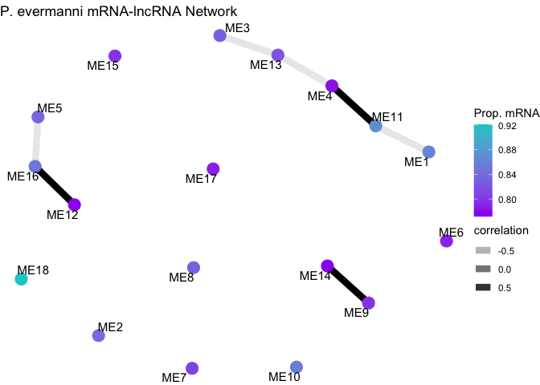
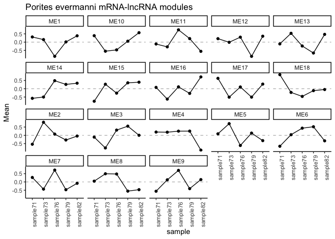
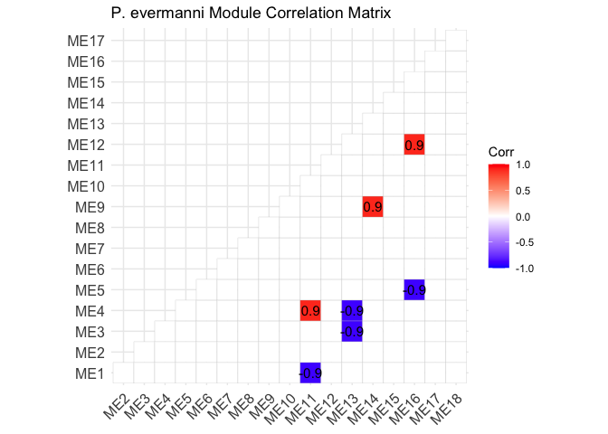
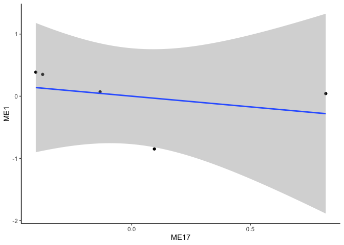
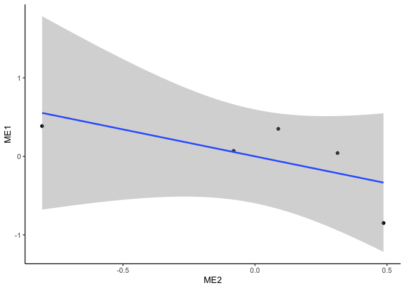

Peve Gene expression lncRNA correlations
================
2025-02-04

This script conducts correlation network analyses for gene expression
and lncRNA.

# Set up

Load libraries

``` r
library(tidyverse)
library(ggplot2)
library(DESeq2)
library(igraph)
library(psych)
library(tidygraph)
library(ggraph)
library(WGCNA)
library(edgeR)
library(reshape2)
library(ggcorrplot)
library(corrplot)
```

# Porites evermanni

## Load and format data

``` r
peve_mrna<-read_csv(file="E-Peve/output/06-Peve-Hisat/Peve-gene_count_matrix.csv")%>%
  rename("mrna_id"=gene_id, "sample71"=`RNA-POR-71`, "sample73"=`RNA-POR-73`, "sample76"=`RNA-POR-76`, "sample79"=`RNA-POR-79`, "sample82"=`RNA-POR-82`)
```

    ## Rows: 40389 Columns: 6
    ## ── Column specification ────────────────────────────────────────────────────────
    ## Delimiter: ","
    ## chr (1): gene_id
    ## dbl (5): RNA-POR-71, RNA-POR-73, RNA-POR-76, RNA-POR-79, RNA-POR-82
    ## 
    ## ℹ Use `spec()` to retrieve the full column specification for this data.
    ## ℹ Specify the column types or set `show_col_types = FALSE` to quiet this message.

``` r
peve_lncrna<-read_table(file="E-Peve/output/07-Peve-lncRNA-matrix/Peve-lncRNA-counts.txt", skip=1)%>%
  select(!c("Chr", "Start", "End", "Strand", "Length"))%>%
  rename("lncrna_id"=Geneid, 
         "sample71"=`../output/06-Peve-Hisat/RNA-POR-71.sorted.bam`, 
         "sample73"=`../output/06-Peve-Hisat/RNA-POR-73.sorted.bam`, 
         "sample76"=`../output/06-Peve-Hisat/RNA-POR-76.sorted.bam`, 
         "sample79"=`../output/06-Peve-Hisat/RNA-POR-79.sorted.bam`, 
         "sample82"=`../output/06-Peve-Hisat/RNA-POR-82.sorted.bam`)
```

    ## 
    ## ── Column specification ────────────────────────────────────────────────────────
    ## cols(
    ##   Geneid = col_character(),
    ##   Chr = col_character(),
    ##   Start = col_double(),
    ##   End = col_double(),
    ##   Strand = col_character(),
    ##   Length = col_double(),
    ##   `../output/06-Peve-Hisat/RNA-POR-71.sorted.bam` = col_double(),
    ##   `../output/06-Peve-Hisat/RNA-POR-73.sorted.bam` = col_double(),
    ##   `../output/06-Peve-Hisat/RNA-POR-76.sorted.bam` = col_double(),
    ##   `../output/06-Peve-Hisat/RNA-POR-79.sorted.bam` = col_double(),
    ##   `../output/06-Peve-Hisat/RNA-POR-82.sorted.bam` = col_double()
    ## )

``` r
peve_mrna<-as.data.frame(peve_mrna)
peve_lncrna<-as.data.frame(peve_lncrna)

str(peve_mrna)
```

    ## 'data.frame':    40389 obs. of  6 variables:
    ##  $ mrna_id : chr  "STRG.24381" "STRG.24380" "Peve_00040982" "STRG.15042" ...
    ##  $ sample71: num  465 793 0 2585 18355 ...
    ##  $ sample73: num  45 134 0 618 7643 ...
    ##  $ sample76: num  347 91 0 2726 1196 ...
    ##  $ sample79: num  158 656 0 1129 8101 ...
    ##  $ sample82: num  291 337 0 2266 17864 ...

``` r
str(peve_lncrna)
```

    ## 'data.frame':    7372 obs. of  6 variables:
    ##  $ lncrna_id: chr  "lncRNA_001" "lncRNA_002" "lncRNA_003" "lncRNA_004" ...
    ##  $ sample71 : num  206 334 9 18 4 ...
    ##  $ sample73 : num  135 112 0 16 0 0 0 0 983 0 ...
    ##  $ sample76 : num  237 0 26 23 28 ...
    ##  $ sample79 : num  99 147 8 2 0 ...
    ##  $ sample82 : num  207 431 18 24 3 ...

Remove mRNA and lncRNA with 0 in all samples.

``` r
# Remove any genes with 0 counts across samples 
peve_mrna<-peve_mrna %>%
     mutate(Total = rowSums(.[, 2:6]))%>%
    filter(!Total==0)%>%
    dplyr::select(!Total)

peve_lncrna<-peve_lncrna %>%
     mutate(Total = rowSums(.[, 2:6]))%>%
    filter(!Total==0)%>%
    dplyr::select(!Total)
```

We now have 6372 lncRNAs and 31501 mRNAs.

Set row names.

``` r
rownames(peve_mrna)<-peve_mrna$mrna_id
peve_mrna<-peve_mrna%>%select(!mrna_id)
```

``` r
rownames(peve_lncrna)<-peve_lncrna$lncrna_id
peve_lncrna<-peve_lncrna%>%select(!lncrna_id)
```

Make sample metadata.

``` r
peve_sample_info <- data.frame(
  species = c("Porites evermanni"),
  sample = colnames(peve_mrna)
)

rownames(peve_sample_info)<-peve_sample_info$sample
```

## Filter data

Filter data to only keep those expressed in all samples.

``` r
dge_mRNA <- DGEList(counts = peve_mrna)
dge_lncRNA <- DGEList(counts = peve_lncrna)

# Calculate CPM
cpm_mRNA <- cpm(dge_mRNA)
cpm_lncRNA <- cpm(dge_lncRNA)

# Filtering criteria: CPM > 1 in all samples (100%)
min_samples <- ncol(peve_mrna) * 1

# Apply the filter
keep_mRNA <- rowSums(cpm_mRNA > 1) >= min_samples
keep_lncRNA <- rowSums(cpm_lncRNA > 1) >= min_samples

# Filtered count matrices
filtered_mRNA_counts <- peve_mrna[keep_mRNA, ]
filtered_lncRNA_counts <- peve_lncrna[keep_lncRNA, ]

# Check the number of features retained
cat("mRNAs retained:", sum(keep_mRNA), "\n")
```

    ## mRNAs retained: 11923

``` r
cat("lncRNAs retained:", sum(keep_lncRNA), "\n")
```

    ## lncRNAs retained: 2486

This reduced mRNAs to 11923 and lncRNAs to 2486

## Normalize data

``` r
dds_mrna <- DESeqDataSetFromMatrix(countData = filtered_mRNA_counts, 
                              colData = peve_sample_info, 
                              design = ~ 1)
```

    ## converting counts to integer mode

``` r
# Variance Stabilizing Transformation
vsd_mrna <- assay(vst(dds_mrna, blind = TRUE))
```

    ## -- note: fitType='parametric', but the dispersion trend was not well captured by the
    ##    function: y = a/x + b, and a local regression fit was automatically substituted.
    ##    specify fitType='local' or 'mean' to avoid this message next time.

``` r
dds_lncrna <- DESeqDataSetFromMatrix(countData = filtered_lncRNA_counts, 
                              colData = peve_sample_info, 
                              design = ~ 1)
```

    ## converting counts to integer mode

``` r
# Variance Stabilizing Transformation
vsd_lncrna <- assay(vst(dds_lncrna, blind = TRUE))
```

    ## -- note: fitType='parametric', but the dispersion trend was not well captured by the
    ##    function: y = a/x + b, and a local regression fit was automatically substituted.
    ##    specify fitType='local' or 'mean' to avoid this message next time.

## Conduct module correlations with WGCNA

Set soft threshold.

``` r
options(stringsAsFactors = FALSE)
enableWGCNAThreads()  # Enable multi-threading
```

    ## Allowing parallel execution with up to 7 working processes.

``` r
allowWGCNAThreads(nThreads = 2)
```

    ## Allowing multi-threading with up to 2 threads.

``` r
# Combine mRNA and lncRNA datasets
datExpr <- t(rbind(vsd_mrna, vsd_lncrna))

sum(is.na(datExpr))  # Should be 0
```

    ## [1] 0

``` r
sum(!is.finite(as.matrix(datExpr)))  # Should be 0
```

    ## [1] 0

``` r
# Remove genes/samples with missing or infinite values
datExpr <- datExpr[complete.cases(datExpr), ]
datExpr <- datExpr[, colSums(is.na(datExpr)) == 0]

# # Choose a set of soft-thresholding powers
powers <- c(seq(from = 1, to=19, by=2), c(21:50)) #Create a string of numbers from 1 through 10, and even numbers from 10 through 20
# 
# # Call the network topology analysis function
sft <-pickSoftThreshold(datExpr, powerVector = powers, verbose = 5)
```

    ## pickSoftThreshold: will use block size 3104.
    ##  pickSoftThreshold: calculating connectivity for given powers...
    ##    ..working on genes 1 through 3104 of 14409
    ##    ..working on genes 3105 through 6208 of 14409
    ##    ..working on genes 6209 through 9312 of 14409
    ##    ..working on genes 9313 through 12416 of 14409
    ##    ..working on genes 12417 through 14409 of 14409
    ##    Power SFT.R.sq   slope truncated.R.sq mean.k. median.k. max.k.
    ## 1      1  0.72100  4.7200          0.984  6570.0    6580.0   7890
    ## 2      3  0.33300  0.8870          0.968  2860.0    2830.0   4240
    ## 3      5  0.00443  0.0654          0.930  1720.0    1680.0   2910
    ## 4      7  0.14700 -0.3570          0.954  1190.0    1140.0   2210
    ## 5      9  0.35700 -0.6040          0.966   886.0     840.0   1780
    ## 6     11  0.49700 -0.7760          0.969   695.0     650.0   1480
    ## 7     13  0.59200 -0.9000          0.979   565.0     520.0   1270
    ## 8     15  0.63900 -0.9870          0.977   471.0     429.0   1100
    ## 9     17  0.67300 -1.0500          0.978   401.0     360.0    974
    ## 10    19  0.69900 -1.1200          0.980   347.0     308.0    871
    ## 11    21  0.72300 -1.1600          0.984   304.0     267.0    787
    ## 12    22  0.73200 -1.1900          0.983   285.0     250.0    750
    ## 13    23  0.73700 -1.2100          0.983   269.0     235.0    716
    ## 14    24  0.74500 -1.2300          0.983   254.0     221.0    685
    ## 15    25  0.75100 -1.2500          0.983   241.0     209.0    656
    ## 16    26  0.75600 -1.2600          0.983   228.0     197.0    629
    ## 17    27  0.76100 -1.2800          0.982   217.0     187.0    604
    ## 18    28  0.76600 -1.2900          0.983   206.0     177.0    581
    ## 19    29  0.77100 -1.3100          0.983   197.0     168.0    560
    ## 20    30  0.77500 -1.3200          0.983   188.0     160.0    539
    ## 21    31  0.77600 -1.3300          0.981   180.0     153.0    521
    ## 22    32  0.77800 -1.3500          0.981   172.0     146.0    503
    ## 23    33  0.78200 -1.3600          0.982   165.0     139.0    487
    ## 24    34  0.78500 -1.3700          0.981   158.0     133.0    471
    ## 25    35  0.78800 -1.3800          0.980   152.0     128.0    456
    ## 26    36  0.78900 -1.3900          0.980   146.0     123.0    442
    ## 27    37  0.78900 -1.4000          0.978   141.0     118.0    429
    ## 28    38  0.79200 -1.4100          0.980   136.0     113.0    417
    ## 29    39  0.79300 -1.4200          0.980   131.0     109.0    405
    ## 30    40  0.79600 -1.4300          0.981   126.0     105.0    394
    ## 31    41  0.79800 -1.4300          0.980   122.0     101.0    383
    ## 32    42  0.80000 -1.4400          0.981   118.0      97.8    373
    ## 33    43  0.80100 -1.4500          0.981   114.0      94.6    363
    ## 34    44  0.80200 -1.4600          0.981   111.0      91.4    354
    ## 35    45  0.80300 -1.4600          0.980   107.0      88.5    345
    ## 36    46  0.80400 -1.4700          0.980   104.0      85.7    336
    ## 37    47  0.80500 -1.4700          0.981   101.0      83.0    328
    ## 38    48  0.80700 -1.4800          0.981    97.9      80.4    321
    ## 39    49  0.80900 -1.4800          0.981    95.1      78.0    313
    ## 40    50  0.80900 -1.4900          0.981    92.4      75.7    306

``` r
sft$powerEstimate
```

    ## [1] NA

Plot the results.

``` r
sizeGrWindow(9, 5)
par(mfrow = c(1,2));
cex1 = 0.9;
# # # Scale-free topology fit index as a function of the soft-thresholding power
plot(sft$fitIndices[,1], -sign(sft$fitIndices[,3])*sft$fitIndices[,2],
      xlab="Soft Threshold (power)",ylab="Scale Free Topology Model Fit,signed R^2",type="n",
     main = paste("Scale independence"));
 text(sft$fitIndices[,1], -sign(sft$fitIndices[,3])*sft$fitIndices[,2],
     labels=powers,cex=cex1,col="red");
# # # this line corresponds to using an R^2 cut-off
 abline(h=0.9,col="red")
# # # Mean connectivity as a function of the soft-thresholding power
 plot(sft$fitIndices[,1], sft$fitIndices[,5],
     xlab="Soft Threshold (power)",ylab="Mean Connectivity", type="n",
     main = paste("Mean connectivity"))
 text(sft$fitIndices[,1], sft$fitIndices[,5], labels=powers, cex=cex1,col="red")
```

Selected power will be 30 - no value crossed threshold, selecting limit
of tested values.

### Generate network

``` r
selected_power<-30

# Network construction (adjust power based on sft output)
net = blockwiseModules(datExpr, power = selected_power,
                       TOMType = "unsigned", minModuleSize = 30,
                       reassignThreshold = 0, mergeCutHeight = 0.25,
                       numericLabels = TRUE, pamRespectsDendro = FALSE,
                       saveTOMs = FALSE, verbose = 3)
```

    ##  Calculating module eigengenes block-wise from all genes
    ##    Flagging genes and samples with too many missing values...
    ##     ..step 1
    ##  ....pre-clustering genes to determine blocks..
    ##    Projective K-means:
    ##    ..k-means clustering..
    ##    ..merging smaller clusters...
    ## Block sizes:
    ## gBlocks
    ##    1    2    3 
    ## 4858 4831 4720 
    ##  ..Working on block 1 .
    ##     TOM calculation: adjacency..
    ##     ..will use 2 parallel threads.
    ##      Fraction of slow calculations: 0.000000
    ##     ..connectivity..
    ##     ..matrix multiplication (system BLAS)..
    ##     ..normalization..
    ##     ..done.
    ##  ....clustering..
    ##  ....detecting modules..
    ##  ....calculating module eigengenes..
    ##  ....checking kME in modules..
    ##  ..Working on block 2 .
    ##     TOM calculation: adjacency..
    ##     ..will use 2 parallel threads.
    ##      Fraction of slow calculations: 0.000000
    ##     ..connectivity..
    ##     ..matrix multiplication (system BLAS)..
    ##     ..normalization..
    ##     ..done.
    ##  ....clustering..
    ##  ....detecting modules..
    ##  ....calculating module eigengenes..
    ##  ....checking kME in modules..
    ##  ..Working on block 3 .
    ##     TOM calculation: adjacency..
    ##     ..will use 2 parallel threads.
    ##      Fraction of slow calculations: 0.000000
    ##     ..connectivity..
    ##     ..matrix multiplication (system BLAS)..
    ##     ..normalization..
    ##     ..done.
    ##  ....clustering..
    ##  ....detecting modules..
    ##  ....calculating module eigengenes..
    ##  ....checking kME in modules..
    ##  ..merging modules that are too close..
    ##      mergeCloseModules: Merging modules whose distance is less than 0.25
    ##        Calculating new MEs...

View modules.

``` r
moduleEigengenes = moduleEigengenes(datExpr, colors = net$colors)$eigengenes

length(table(net$unmergedColors))
```

    ## [1] 251

``` r
length(table(net$colors))
```

    ## [1] 23

``` r
MEs<-net$MEs
moduleLabels<-net$colors
```

There are 23 modules after merging similar modules from original 251
modules.

Determine whether mRNA and or lncRNA are present in each module.

``` r
# Get gene names and corresponding module colors
gene_module_info <- data.frame(
  Gene = colnames(datExpr),
  Module = moduleLabels
)

# Check structure
head(gene_module_info)
```

    ##                  Gene Module
    ## STRG.24381 STRG.24381     23
    ## STRG.24380 STRG.24380     12
    ## STRG.15042 STRG.15042     23
    ## STRG.8662   STRG.8662      1
    ## STRG.15040 STRG.15040     16
    ## STRG.15046 STRG.15046     15

``` r
#Add ME to all the names
gene_module_info$Module <- paste0("ME", gene_module_info$Module)
```

Classify modules based on the proportion of the module comprised by
mRNAs.

For now I am using any Peve or STRG mRNA id (we will revisit the
stringtie calls later).

``` r
# Function to calculate the proportion of mRNAs (genes with "FUN" in ID)
calculate_mRNA_proportion <- function(genes) {
  total_genes <- length(genes)
  mRNA_count <- sum(grepl("Peve|STRG", genes))
  
  # Proportion of mRNAs
  proportion_mRNA <- mRNA_count / total_genes
  return(proportion_mRNA)
}

# Apply the function to each module
module_mRNA_proportion <- tapply(gene_module_info$Gene, 
                                 gene_module_info$Module, 
                                 calculate_mRNA_proportion)

# View the proportions
module_mRNA_proportion
```

    ##       ME1      ME10      ME11      ME12      ME13      ME14      ME15      ME16 
    ## 0.8570962 0.8200972 0.8514190 0.8011583 0.8376623 0.7926829 0.8034188 0.8243243 
    ##      ME17      ME18      ME19       ME2      ME20      ME21      ME22      ME23 
    ## 0.8046512 0.7761194 0.7875648 0.8255722 0.7604790 0.7814570 0.7326733 0.8253968 
    ##       ME3       ME4       ME5       ME6       ME7       ME8       ME9 
    ## 0.8161034 0.8296296 0.8718232 0.8016432 0.7902844 0.8597222 0.7990798

### Run correlation between modules.

``` r
cor_matrix = cor(moduleEigengenes)
```

Compute correlations with Spearman correlation and BH p-value
adjustment.

``` r
# Compute Spearman correlation between mRNA and lncRNA
peve_cor_results <- corr.test(moduleEigengenes, method = "spearman", adjust = "BH")

# Extract correlation values and p-values
peve_cor_matrix <- peve_cor_results$r  # Correlation coefficients
peve_p_matrix <- peve_cor_results$p  # Adjusted p-values
```

Construct network.

``` r
# Set correlation and significance thresholds
cor_threshold <- 0.6  # Adjust based on desired stringency
p_threshold <- 0.05

# Convert correlation matrix into an edge list
peve_significant_edges <- which(abs(peve_cor_matrix) > cor_threshold & peve_p_matrix < p_threshold, arr.ind = TRUE)

peve_edge_list <- data.frame(
  mRNA = rownames(peve_cor_matrix)[peve_significant_edges[,1]],
  lncRNA = colnames(peve_cor_matrix)[peve_significant_edges[,2]],
  correlation = peve_cor_matrix[peve_significant_edges]
)

# Construct network graph
peve_network <- graph_from_data_frame(peve_edge_list, directed = FALSE)

module_mRNA_proportion<-as.data.frame(module_mRNA_proportion)

V(peve_network)$prop_mrna <- module_mRNA_proportion$module_mRNA_proportion[match(V(peve_network)$name, rownames(module_mRNA_proportion))]
```

Plot network.

``` r
# Visualize network
ggraph(peve_network, layout = "fr") +  # Force-directed layout
  geom_edge_link(aes(edge_alpha = correlation), show.legend = TRUE, width=3) +
  geom_node_point(aes(colour=prop_mrna), size = 5) +
  scale_colour_gradient(name="Prop. mRNA", low = "purple", high = "cyan3")+
  geom_node_text(aes(label = name), repel = TRUE, size = 4) +
  theme_void() +
  labs(title = "P. evermanni mRNA-lncRNA Network")
```

<!-- -->

### Plot eigengene patterns and proportions of mRNA and lncRNAs

``` r
module_mRNA_proportion$module_lncRNA_proportion<-1-module_mRNA_proportion$module_mRNA_proportion
```

View total size of modules

``` r
module_sizes <- table(moduleLabels)
module_sizes<-as.data.frame(module_sizes)
module_sizes$module<-paste0("ME", module_sizes$moduleLabels)
```

Plot a stacked bar plot.

``` r
stack_data<-module_mRNA_proportion
stack_data$module<-rownames(stack_data)
stack_data$size<-module_sizes$Freq[match(stack_data$module, module_sizes$module)]

stack_data$module <- factor(stack_data$module, 
                             levels = rev(stack_data$module[order(stack_data$size)]))

stack_data<-stack_data%>%
  mutate(mRNAs=module_mRNA_proportion*size)%>%
  mutate(lncRNAs=module_lncRNA_proportion*size)%>%
  select(!c(module_mRNA_proportion, module_lncRNA_proportion, size))


# Reshape the data for ggplot (long format)

stack_long <- melt(stack_data[, c("module", "mRNAs", "lncRNAs")], 
                    id.vars = "module",
                    variable.name = "RNA_Type", 
                    value.name = "Count")

ggplot(stack_long, aes(x = module, y = Count, fill = RNA_Type)) +
  geom_bar(stat = "identity") +
  scale_fill_manual(values = c("mRNAs" = "skyblue", 
                               "lncRNAs" = "salmon"), 
                    labels = c("mRNA", "lncRNA"))+
  theme_classic() +
  labs(title = "P. evermanni module mRNA and lncRNA components",
       x = "Module",
       y = "Counts",
       fill = "RNA Type") +
  theme(axis.text.x = element_text(angle = 45, hjust = 1))
```

<!-- -->

Next plot eigengene expression of each module across samples.

``` r
#convert wide format to long format for plotting  
head(moduleEigengenes)
```

    ##                  ME1         ME2         ME3         ME4        ME5        ME6
    ## sample71  0.35094107  0.08807939 -0.35084795  0.01107026  0.1479164 -0.7800797
    ## sample73  0.06988218 -0.08104609 -0.58952501  0.38796181 -0.8726854  0.1896179
    ## sample76 -0.84921302  0.48689829  0.55047894  0.59558623  0.1070894  0.4879998
    ## sample79  0.04238802  0.31277494  0.46910959 -0.49539437  0.3934235  0.2880090
    ## sample82  0.38600174 -0.80670654 -0.07921557 -0.49922393  0.2242560 -0.1855469
    ##                   ME7         ME8        ME9        ME10        ME11       ME12
    ## sample71  0.305290325 -0.03747779  0.3678276 -0.11465480 -0.54081213 -0.4710045
    ## sample73 -0.493261662  0.80329187  0.3793644  0.61163228  0.81196238  0.2356771
    ## sample76  0.664652662 -0.57951333 -0.6514795  0.09561686  0.01888101  0.6296947
    ## sample79 -0.470843401 -0.10114747  0.3340989 -0.75891668 -0.09105369 -0.5495562
    ## sample82 -0.005837923 -0.08515328 -0.4298114  0.16632233 -0.19897757  0.1551889
    ##                ME13        ME14        ME15       ME16        ME17        ME18
    ## sample71  0.3819484  0.18215668 -0.72294107 -0.4471944 -0.37542252 -0.58791882
    ## sample73 -0.5133014  0.02061105  0.39663662  0.5117921 -0.13326339 -0.42633062
    ## sample76 -0.2739859  0.37773534  0.05089498 -0.5897213  0.09537637  0.04915888
    ## sample79 -0.2628512 -0.86262302 -0.23614022  0.1006398  0.81771522  0.52985895
    ## sample82  0.6681901  0.28211995  0.51154969  0.4244837 -0.40440569  0.43523162
    ##                ME19        ME20        ME21        ME22        ME23
    ## sample71 -0.3026180  0.70690453 -0.58252725  0.66691253  0.68117215
    ## sample73  0.5654902 -0.03029752 -0.37563425 -0.20938678 -0.71670261
    ## sample76 -0.1122154  0.25226626  0.62019571 -0.09357448  0.12758972
    ## sample79  0.4560388 -0.41792325 -0.02825776 -0.64909361 -0.01581973
    ## sample82 -0.6066956 -0.51095003  0.36622355  0.28514234 -0.07623954

``` r
plot_MEs <- moduleEigengenes 

plot_MEs$sample<-rownames(plot_MEs)

plot_MEs<-plot_MEs%>%
  pivot_longer(
    cols = where(is.numeric),  # Select only numeric columns
    names_to = "Module",       # Name for the new column containing the column names
    values_to = "Mean"         # Name for the new column containing the values
  )

expression_plots<-plot_MEs%>%
  group_by(Module) %>%
  
  ggplot(aes(x=sample, y=Mean)) +
  facet_wrap(~ Module)+
    geom_hline(yintercept = 0, linetype="dashed", color = "grey")+
  geom_point()+
  ggtitle("Porites evermanni mRNA-lncRNA modules")+
  geom_line(aes(group=1))+
  theme_classic()+ 
  theme(axis.text.x=element_text(angle = 90, hjust=1)); expression_plots
```

<!-- -->

### Plot correlations of specific modules

Which modules were significantly correlated? Show correlation matrix.

``` r
# Compute Spearman correlation between mRNA and lncRNA
peve_cor_results 
```

    ## Call:corr.test(x = moduleEigengenes, method = "spearman", adjust = "BH")
    ## Correlation matrix 
    ##       ME1  ME2  ME3  ME4  ME5  ME6  ME7  ME8  ME9 ME10 ME11 ME12 ME13 ME14 ME15
    ## ME1   1.0 -0.9 -0.6 -0.7  0.2 -0.9 -0.2  0.6  0.3  0.3 -0.6 -0.3  0.7  0.0  0.3
    ## ME2  -0.9  1.0  0.7  0.6  0.0  0.7  0.5 -0.7 -0.4 -0.6  0.2  0.1 -0.4  0.1 -0.6
    ## ME3  -0.6  0.7  1.0  0.1  0.4  0.7  0.6 -1.0 -0.9 -0.5  0.0  0.1  0.1  0.4 -0.1
    ## ME4  -0.7  0.6  0.1  1.0 -0.8  0.5  0.3 -0.1  0.0  0.2  0.6  0.7 -0.8  0.3 -0.2
    ## ME5   0.2  0.0  0.4 -0.8  1.0 -0.1  0.0 -0.4 -0.3 -0.7 -0.6 -0.8  0.7 -0.3 -0.2
    ## ME6  -0.9  0.7  0.7  0.5 -0.1  1.0  0.1 -0.7 -0.5 -0.1  0.7  0.4 -0.6  0.1  0.1
    ## ME7  -0.2  0.5  0.6  0.3  0.0  0.1  1.0 -0.6 -0.7 -0.3 -0.4  0.3  0.3  0.8 -0.3
    ## ME8   0.6 -0.7 -1.0 -0.1 -0.4 -0.7 -0.6  1.0  0.9  0.5  0.0 -0.1 -0.1 -0.4  0.1
    ## ME9   0.3 -0.4 -0.9  0.0 -0.3 -0.5 -0.7  0.9  1.0  0.2  0.1 -0.3 -0.3 -0.7 -0.2
    ## ME10  0.3 -0.6 -0.5  0.2 -0.7 -0.1 -0.3  0.5  0.2  1.0  0.5  0.7 -0.3  0.3  0.8
    ## ME11 -0.6  0.2  0.0  0.6 -0.6  0.7 -0.4  0.0  0.1  0.5  1.0  0.6 -0.9 -0.1  0.4
    ## ME12 -0.3  0.1  0.1  0.7 -0.8  0.4  0.3 -0.1 -0.3  0.7  0.6  1.0 -0.5  0.7  0.5
    ## ME13  0.7 -0.4  0.1 -0.8  0.7 -0.6  0.3 -0.1 -0.3 -0.3 -0.9 -0.5  1.0  0.2  0.0
    ## ME14  0.0  0.1  0.4  0.3 -0.3  0.1  0.8 -0.4 -0.7  0.3 -0.1  0.7  0.2  1.0  0.3
    ## ME15  0.3 -0.6 -0.1 -0.2 -0.2  0.1 -0.3  0.1 -0.2  0.8  0.4  0.5  0.0  0.3  1.0
    ## ME16  0.5 -0.8 -0.7 -0.4 -0.1 -0.3 -0.9  0.7  0.6  0.6  0.3 -0.1 -0.1 -0.5  0.6
    ## ME17 -0.9  0.8  0.5  0.4  0.1  0.8 -0.1 -0.5 -0.1 -0.5  0.5 -0.1 -0.6 -0.4 -0.4
    ## ME18 -0.2  0.1  0.6 -0.5  0.7  0.5 -0.2 -0.6 -0.5 -0.3  0.1 -0.3  0.2 -0.2  0.3
    ## ME19 -0.6  0.3 -0.2  0.5 -0.4  0.5 -0.6  0.2  0.5  0.1  0.8  0.1 -0.9 -0.6 -0.1
    ## ME20 -0.3  0.5 -0.1  0.7 -0.5 -0.1  0.5  0.1  0.2 -0.2 -0.1  0.2 -0.3  0.2 -0.7
    ## ME21 -0.4  0.3  0.8  0.1  0.1  0.7  0.4 -0.8 -0.9  0.1  0.3  0.5  0.0  0.6  0.5
    ## ME22  0.6 -0.3 -0.2 -0.1 -0.1 -0.7  0.6  0.2 -0.1  0.1 -0.7  0.1  0.6  0.6 -0.1
    ## ME23 -0.2  0.6  0.4  0.2  0.2 -0.1  0.8 -0.4 -0.3 -0.7 -0.6 -0.2  0.3  0.3 -0.8
    ##      ME16 ME17 ME18 ME19 ME20 ME21 ME22 ME23
    ## ME1   0.5 -0.9 -0.2 -0.6 -0.3 -0.4  0.6 -0.2
    ## ME2  -0.8  0.8  0.1  0.3  0.5  0.3 -0.3  0.6
    ## ME3  -0.7  0.5  0.6 -0.2 -0.1  0.8 -0.2  0.4
    ## ME4  -0.4  0.4 -0.5  0.5  0.7  0.1 -0.1  0.2
    ## ME5  -0.1  0.1  0.7 -0.4 -0.5  0.1 -0.1  0.2
    ## ME6  -0.3  0.8  0.5  0.5 -0.1  0.7 -0.7 -0.1
    ## ME7  -0.9 -0.1 -0.2 -0.6  0.5  0.4  0.6  0.8
    ## ME8   0.7 -0.5 -0.6  0.2  0.1 -0.8  0.2 -0.4
    ## ME9   0.6 -0.1 -0.5  0.5  0.2 -0.9 -0.1 -0.3
    ## ME10  0.6 -0.5 -0.3  0.1 -0.2  0.1  0.1 -0.7
    ## ME11  0.3  0.5  0.1  0.8 -0.1  0.3 -0.7 -0.6
    ## ME12 -0.1 -0.1 -0.3  0.1  0.2  0.5  0.1 -0.2
    ## ME13 -0.1 -0.6  0.2 -0.9 -0.3  0.0  0.6  0.3
    ## ME14 -0.5 -0.4 -0.2 -0.6  0.2  0.6  0.6  0.3
    ## ME15  0.6 -0.4  0.3 -0.1 -0.7  0.5 -0.1 -0.8
    ## ME16  1.0 -0.3  0.1  0.3 -0.6 -0.3 -0.3 -0.9
    ## ME17 -0.3  1.0  0.4  0.7  0.1  0.2 -0.8  0.1
    ## ME18  0.1  0.4  1.0  0.0 -0.8  0.6 -0.6 -0.3
    ## ME19  0.3  0.7  0.0  1.0  0.1 -0.2 -0.8 -0.4
    ## ME20 -0.6  0.1 -0.8  0.1  1.0 -0.4  0.4  0.7
    ## ME21 -0.3  0.2  0.6 -0.2 -0.4  1.0 -0.2 -0.1
    ## ME22 -0.3 -0.8 -0.6 -0.8  0.4 -0.2  1.0  0.5
    ## ME23 -0.9  0.1 -0.3 -0.4  0.7 -0.1  0.5  1.0
    ## Sample Size 
    ## [1] 5
    ## Probability values (Entries above the diagonal are adjusted for multiple tests.) 
    ##       ME1  ME2  ME3  ME4  ME5  ME6  ME7  ME8  ME9 ME10 ME11 ME12 ME13 ME14 ME15
    ## ME1  0.00 0.86 0.86 0.86 0.91 0.86 0.91 0.86 0.91 0.91 0.86 0.91 0.86 1.00 0.91
    ## ME2  0.04 0.00 0.86 0.86 1.00 0.86 0.90 0.86 0.91 0.86 0.91 0.91 0.91 0.91 0.86
    ## ME3  0.28 0.19 0.00 0.91 0.91 0.86 0.86 0.00 0.86 0.90 1.00 0.91 0.91 0.91 0.91
    ## ME4  0.19 0.28 0.87 0.00 0.86 0.90 0.91 0.91 1.00 0.91 0.86 0.86 0.86 0.91 0.91
    ## ME5  0.75 1.00 0.50 0.10 0.00 0.91 1.00 0.91 0.91 0.86 0.86 0.86 0.86 0.91 0.91
    ## ME6  0.04 0.19 0.19 0.39 0.87 0.00 0.91 0.86 0.90 0.91 0.86 0.91 0.86 0.91 0.91
    ## ME7  0.75 0.39 0.28 0.62 1.00 0.87 0.00 0.86 0.86 0.91 0.91 0.91 0.91 0.86 0.91
    ## ME8  0.28 0.19 0.00 0.87 0.50 0.19 0.28 0.00 0.86 0.90 1.00 0.91 0.91 0.91 0.91
    ## ME9  0.62 0.50 0.04 1.00 0.62 0.39 0.19 0.04 0.00 0.91 0.91 0.91 0.91 0.86 0.91
    ## ME10 0.62 0.28 0.39 0.75 0.19 0.87 0.62 0.39 0.75 0.00 0.90 0.86 0.91 0.91 0.86
    ## ME11 0.28 0.75 1.00 0.28 0.28 0.19 0.50 1.00 0.87 0.39 0.00 0.86 0.86 0.91 0.91
    ## ME12 0.62 0.87 0.87 0.19 0.10 0.50 0.62 0.87 0.62 0.19 0.28 0.00 0.90 0.86 0.90
    ## ME13 0.19 0.50 0.87 0.10 0.19 0.28 0.62 0.87 0.62 0.62 0.04 0.39 0.00 0.91 1.00
    ## ME14 1.00 0.87 0.50 0.62 0.62 0.87 0.10 0.50 0.19 0.62 0.87 0.19 0.75 0.00 0.91
    ## ME15 0.62 0.28 0.87 0.75 0.75 0.87 0.62 0.87 0.75 0.10 0.50 0.39 1.00 0.62 0.00
    ## ME16 0.39 0.10 0.19 0.50 0.87 0.62 0.04 0.19 0.28 0.28 0.62 0.87 0.87 0.39 0.28
    ## ME17 0.04 0.10 0.39 0.50 0.87 0.10 0.87 0.39 0.87 0.39 0.39 0.87 0.28 0.50 0.50
    ## ME18 0.75 0.87 0.28 0.39 0.19 0.39 0.75 0.28 0.39 0.62 0.87 0.62 0.75 0.75 0.62
    ## ME19 0.28 0.62 0.75 0.39 0.50 0.39 0.28 0.75 0.39 0.87 0.10 0.87 0.04 0.28 0.87
    ## ME20 0.62 0.39 0.87 0.19 0.39 0.87 0.39 0.87 0.75 0.75 0.87 0.75 0.62 0.75 0.19
    ## ME21 0.50 0.62 0.10 0.87 0.87 0.19 0.50 0.10 0.04 0.87 0.62 0.39 1.00 0.28 0.39
    ## ME22 0.28 0.62 0.75 0.87 0.87 0.19 0.28 0.75 0.87 0.87 0.19 0.87 0.28 0.28 0.87
    ## ME23 0.75 0.28 0.50 0.75 0.75 0.87 0.10 0.50 0.62 0.19 0.28 0.75 0.62 0.62 0.10
    ##      ME16 ME17 ME18 ME19 ME20 ME21 ME22 ME23
    ## ME1  0.90 0.86 0.91 0.86 0.91 0.91 0.86 0.91
    ## ME2  0.86 0.86 0.91 0.91 0.90 0.91 0.91 0.86
    ## ME3  0.86 0.90 0.86 0.91 0.91 0.86 0.91 0.91
    ## ME4  0.91 0.91 0.90 0.90 0.86 0.91 0.91 0.91
    ## ME5  0.91 0.91 0.86 0.91 0.90 0.91 0.91 0.91
    ## ME6  0.91 0.86 0.90 0.90 0.91 0.86 0.86 0.91
    ## ME7  0.86 0.91 0.91 0.86 0.90 0.91 0.86 0.86
    ## ME8  0.86 0.90 0.86 0.91 0.91 0.86 0.91 0.91
    ## ME9  0.86 0.91 0.90 0.90 0.91 0.86 0.91 0.91
    ## ME10 0.86 0.90 0.91 0.91 0.91 0.91 0.91 0.86
    ## ME11 0.91 0.90 0.91 0.86 0.91 0.91 0.86 0.86
    ## ME12 0.91 0.91 0.91 0.91 0.91 0.90 0.91 0.91
    ## ME13 0.91 0.86 0.91 0.86 0.91 1.00 0.86 0.91
    ## ME14 0.90 0.91 0.91 0.86 0.91 0.86 0.86 0.91
    ## ME15 0.86 0.91 0.91 0.91 0.86 0.90 0.91 0.86
    ## ME16 0.00 0.91 0.91 0.91 0.86 0.91 0.91 0.86
    ## ME17 0.62 0.00 0.91 0.86 0.91 0.91 0.86 0.91
    ## ME18 0.87 0.50 0.00 1.00 0.86 0.86 0.86 0.91
    ## ME19 0.62 0.19 1.00 0.00 0.91 0.91 0.86 0.91
    ## ME20 0.28 0.87 0.10 0.87 0.00 0.91 0.91 0.86
    ## ME21 0.62 0.75 0.28 0.75 0.50 0.00 0.91 0.91
    ## ME22 0.62 0.10 0.28 0.10 0.50 0.75 0.00 0.90
    ## ME23 0.04 0.87 0.62 0.50 0.19 0.87 0.39 0.00
    ## 
    ##  To see confidence intervals of the correlations, print with the short=FALSE option

``` r
# Extract correlation values and p-values
peve_cor_matrix  # Correlation coefficients
```

    ##       ME1  ME2  ME3  ME4  ME5  ME6  ME7  ME8  ME9 ME10 ME11 ME12 ME13 ME14 ME15
    ## ME1   1.0 -0.9 -0.6 -0.7  0.2 -0.9 -0.2  0.6  0.3  0.3 -0.6 -0.3  0.7  0.0  0.3
    ## ME2  -0.9  1.0  0.7  0.6  0.0  0.7  0.5 -0.7 -0.4 -0.6  0.2  0.1 -0.4  0.1 -0.6
    ## ME3  -0.6  0.7  1.0  0.1  0.4  0.7  0.6 -1.0 -0.9 -0.5  0.0  0.1  0.1  0.4 -0.1
    ## ME4  -0.7  0.6  0.1  1.0 -0.8  0.5  0.3 -0.1  0.0  0.2  0.6  0.7 -0.8  0.3 -0.2
    ## ME5   0.2  0.0  0.4 -0.8  1.0 -0.1  0.0 -0.4 -0.3 -0.7 -0.6 -0.8  0.7 -0.3 -0.2
    ## ME6  -0.9  0.7  0.7  0.5 -0.1  1.0  0.1 -0.7 -0.5 -0.1  0.7  0.4 -0.6  0.1  0.1
    ## ME7  -0.2  0.5  0.6  0.3  0.0  0.1  1.0 -0.6 -0.7 -0.3 -0.4  0.3  0.3  0.8 -0.3
    ## ME8   0.6 -0.7 -1.0 -0.1 -0.4 -0.7 -0.6  1.0  0.9  0.5  0.0 -0.1 -0.1 -0.4  0.1
    ## ME9   0.3 -0.4 -0.9  0.0 -0.3 -0.5 -0.7  0.9  1.0  0.2  0.1 -0.3 -0.3 -0.7 -0.2
    ## ME10  0.3 -0.6 -0.5  0.2 -0.7 -0.1 -0.3  0.5  0.2  1.0  0.5  0.7 -0.3  0.3  0.8
    ## ME11 -0.6  0.2  0.0  0.6 -0.6  0.7 -0.4  0.0  0.1  0.5  1.0  0.6 -0.9 -0.1  0.4
    ## ME12 -0.3  0.1  0.1  0.7 -0.8  0.4  0.3 -0.1 -0.3  0.7  0.6  1.0 -0.5  0.7  0.5
    ## ME13  0.7 -0.4  0.1 -0.8  0.7 -0.6  0.3 -0.1 -0.3 -0.3 -0.9 -0.5  1.0  0.2  0.0
    ## ME14  0.0  0.1  0.4  0.3 -0.3  0.1  0.8 -0.4 -0.7  0.3 -0.1  0.7  0.2  1.0  0.3
    ## ME15  0.3 -0.6 -0.1 -0.2 -0.2  0.1 -0.3  0.1 -0.2  0.8  0.4  0.5  0.0  0.3  1.0
    ## ME16  0.5 -0.8 -0.7 -0.4 -0.1 -0.3 -0.9  0.7  0.6  0.6  0.3 -0.1 -0.1 -0.5  0.6
    ## ME17 -0.9  0.8  0.5  0.4  0.1  0.8 -0.1 -0.5 -0.1 -0.5  0.5 -0.1 -0.6 -0.4 -0.4
    ## ME18 -0.2  0.1  0.6 -0.5  0.7  0.5 -0.2 -0.6 -0.5 -0.3  0.1 -0.3  0.2 -0.2  0.3
    ## ME19 -0.6  0.3 -0.2  0.5 -0.4  0.5 -0.6  0.2  0.5  0.1  0.8  0.1 -0.9 -0.6 -0.1
    ## ME20 -0.3  0.5 -0.1  0.7 -0.5 -0.1  0.5  0.1  0.2 -0.2 -0.1  0.2 -0.3  0.2 -0.7
    ## ME21 -0.4  0.3  0.8  0.1  0.1  0.7  0.4 -0.8 -0.9  0.1  0.3  0.5  0.0  0.6  0.5
    ## ME22  0.6 -0.3 -0.2 -0.1 -0.1 -0.7  0.6  0.2 -0.1  0.1 -0.7  0.1  0.6  0.6 -0.1
    ## ME23 -0.2  0.6  0.4  0.2  0.2 -0.1  0.8 -0.4 -0.3 -0.7 -0.6 -0.2  0.3  0.3 -0.8
    ##      ME16 ME17 ME18 ME19 ME20 ME21 ME22 ME23
    ## ME1   0.5 -0.9 -0.2 -0.6 -0.3 -0.4  0.6 -0.2
    ## ME2  -0.8  0.8  0.1  0.3  0.5  0.3 -0.3  0.6
    ## ME3  -0.7  0.5  0.6 -0.2 -0.1  0.8 -0.2  0.4
    ## ME4  -0.4  0.4 -0.5  0.5  0.7  0.1 -0.1  0.2
    ## ME5  -0.1  0.1  0.7 -0.4 -0.5  0.1 -0.1  0.2
    ## ME6  -0.3  0.8  0.5  0.5 -0.1  0.7 -0.7 -0.1
    ## ME7  -0.9 -0.1 -0.2 -0.6  0.5  0.4  0.6  0.8
    ## ME8   0.7 -0.5 -0.6  0.2  0.1 -0.8  0.2 -0.4
    ## ME9   0.6 -0.1 -0.5  0.5  0.2 -0.9 -0.1 -0.3
    ## ME10  0.6 -0.5 -0.3  0.1 -0.2  0.1  0.1 -0.7
    ## ME11  0.3  0.5  0.1  0.8 -0.1  0.3 -0.7 -0.6
    ## ME12 -0.1 -0.1 -0.3  0.1  0.2  0.5  0.1 -0.2
    ## ME13 -0.1 -0.6  0.2 -0.9 -0.3  0.0  0.6  0.3
    ## ME14 -0.5 -0.4 -0.2 -0.6  0.2  0.6  0.6  0.3
    ## ME15  0.6 -0.4  0.3 -0.1 -0.7  0.5 -0.1 -0.8
    ## ME16  1.0 -0.3  0.1  0.3 -0.6 -0.3 -0.3 -0.9
    ## ME17 -0.3  1.0  0.4  0.7  0.1  0.2 -0.8  0.1
    ## ME18  0.1  0.4  1.0  0.0 -0.8  0.6 -0.6 -0.3
    ## ME19  0.3  0.7  0.0  1.0  0.1 -0.2 -0.8 -0.4
    ## ME20 -0.6  0.1 -0.8  0.1  1.0 -0.4  0.4  0.7
    ## ME21 -0.3  0.2  0.6 -0.2 -0.4  1.0 -0.2 -0.1
    ## ME22 -0.3 -0.8 -0.6 -0.8  0.4 -0.2  1.0  0.5
    ## ME23 -0.9  0.1 -0.3 -0.4  0.7 -0.1  0.5  1.0

``` r
peve_p_matrix  # Adjusted p-values
```

    ##               ME1          ME2          ME3          ME4          ME5
    ## ME1  3.971862e-24 8.576609e-01 8.576609e-01 8.576609e-01 9.050853e-01
    ## ME2  3.738607e-02 3.971862e-24 8.576609e-01 8.576609e-01 1.000000e+00
    ## ME3  2.847570e-01 1.881204e-01 3.971862e-24 9.050853e-01 9.050853e-01
    ## ME4  1.881204e-01 2.847570e-01 8.728886e-01 3.971862e-24 8.576609e-01
    ## ME5  7.470601e-01 1.000000e+00 5.046316e-01 1.040880e-01 3.971862e-24
    ## ME6  3.738607e-02 1.881204e-01 1.881204e-01 3.910022e-01 8.728886e-01
    ## ME7  7.470601e-01 3.910022e-01 2.847570e-01 6.238377e-01 1.000000e+00
    ## ME8  2.847570e-01 1.881204e-01 3.971862e-24 8.728886e-01 5.046316e-01
    ## ME9  6.238377e-01 5.046316e-01 3.738607e-02 1.000000e+00 6.238377e-01
    ## ME10 6.238377e-01 2.847570e-01 3.910022e-01 7.470601e-01 1.881204e-01
    ## ME11 2.847570e-01 7.470601e-01 1.000000e+00 2.847570e-01 2.847570e-01
    ## ME12 6.238377e-01 8.728886e-01 8.728886e-01 1.881204e-01 1.040880e-01
    ## ME13 1.881204e-01 5.046316e-01 8.728886e-01 1.040880e-01 1.881204e-01
    ## ME14 1.000000e+00 8.728886e-01 5.046316e-01 6.238377e-01 6.238377e-01
    ## ME15 6.238377e-01 2.847570e-01 8.728886e-01 7.470601e-01 7.470601e-01
    ## ME16 3.910022e-01 1.040880e-01 1.881204e-01 5.046316e-01 8.728886e-01
    ## ME17 3.738607e-02 1.040880e-01 3.910022e-01 5.046316e-01 8.728886e-01
    ## ME18 7.470601e-01 8.728886e-01 2.847570e-01 3.910022e-01 1.881204e-01
    ## ME19 2.847570e-01 6.238377e-01 7.470601e-01 3.910022e-01 5.046316e-01
    ## ME20 6.238377e-01 3.910022e-01 8.728886e-01 1.881204e-01 3.910022e-01
    ## ME21 5.046316e-01 6.238377e-01 1.040880e-01 8.728886e-01 8.728886e-01
    ## ME22 2.847570e-01 6.238377e-01 7.470601e-01 8.728886e-01 8.728886e-01
    ## ME23 7.470601e-01 2.847570e-01 5.046316e-01 7.470601e-01 7.470601e-01
    ##               ME6          ME7          ME8          ME9         ME10
    ## ME1  8.576609e-01 9.050853e-01 8.576609e-01 9.050853e-01 9.050853e-01
    ## ME2  8.576609e-01 8.993051e-01 8.576609e-01 9.050853e-01 8.576609e-01
    ## ME3  8.576609e-01 8.576609e-01 1.004881e-21 8.576609e-01 8.993051e-01
    ## ME4  8.993051e-01 9.050853e-01 9.050853e-01 1.000000e+00 9.050853e-01
    ## ME5  9.050853e-01 1.000000e+00 9.050853e-01 9.050853e-01 8.576609e-01
    ## ME6  3.971862e-24 9.050853e-01 8.576609e-01 8.993051e-01 9.050853e-01
    ## ME7  8.728886e-01 3.971862e-24 8.576609e-01 8.576609e-01 9.050853e-01
    ## ME8  1.881204e-01 2.847570e-01 3.971862e-24 8.576609e-01 8.993051e-01
    ## ME9  3.910022e-01 1.881204e-01 3.738607e-02 3.971862e-24 9.050853e-01
    ## ME10 8.728886e-01 6.238377e-01 3.910022e-01 7.470601e-01 3.971862e-24
    ## ME11 1.881204e-01 5.046316e-01 1.000000e+00 8.728886e-01 3.910022e-01
    ## ME12 5.046316e-01 6.238377e-01 8.728886e-01 6.238377e-01 1.881204e-01
    ## ME13 2.847570e-01 6.238377e-01 8.728886e-01 6.238377e-01 6.238377e-01
    ## ME14 8.728886e-01 1.040880e-01 5.046316e-01 1.881204e-01 6.238377e-01
    ## ME15 8.728886e-01 6.238377e-01 8.728886e-01 7.470601e-01 1.040880e-01
    ## ME16 6.238377e-01 3.738607e-02 1.881204e-01 2.847570e-01 2.847570e-01
    ## ME17 1.040880e-01 8.728886e-01 3.910022e-01 8.728886e-01 3.910022e-01
    ## ME18 3.910022e-01 7.470601e-01 2.847570e-01 3.910022e-01 6.238377e-01
    ## ME19 3.910022e-01 2.847570e-01 7.470601e-01 3.910022e-01 8.728886e-01
    ## ME20 8.728886e-01 3.910022e-01 8.728886e-01 7.470601e-01 7.470601e-01
    ## ME21 1.881204e-01 5.046316e-01 1.040880e-01 3.738607e-02 8.728886e-01
    ## ME22 1.881204e-01 2.847570e-01 7.470601e-01 8.728886e-01 8.728886e-01
    ## ME23 8.728886e-01 1.040880e-01 5.046316e-01 6.238377e-01 1.881204e-01
    ##              ME11         ME12         ME13         ME14         ME15
    ## ME1  8.576609e-01 9.050853e-01 8.576609e-01 1.000000e+00 9.050853e-01
    ## ME2  9.050853e-01 9.050853e-01 9.050853e-01 9.050853e-01 8.576609e-01
    ## ME3  1.000000e+00 9.050853e-01 9.050853e-01 9.050853e-01 9.050853e-01
    ## ME4  8.576609e-01 8.576609e-01 8.576609e-01 9.050853e-01 9.050853e-01
    ## ME5  8.576609e-01 8.576609e-01 8.576609e-01 9.050853e-01 9.050853e-01
    ## ME6  8.576609e-01 9.050853e-01 8.576609e-01 9.050853e-01 9.050853e-01
    ## ME7  9.050853e-01 9.050853e-01 9.050853e-01 8.576609e-01 9.050853e-01
    ## ME8  1.000000e+00 9.050853e-01 9.050853e-01 9.050853e-01 9.050853e-01
    ## ME9  9.050853e-01 9.050853e-01 9.050853e-01 8.576609e-01 9.050853e-01
    ## ME10 8.993051e-01 8.576609e-01 9.050853e-01 9.050853e-01 8.576609e-01
    ## ME11 3.971862e-24 8.576609e-01 8.576609e-01 9.050853e-01 9.050853e-01
    ## ME12 2.847570e-01 3.971862e-24 8.993051e-01 8.576609e-01 8.993051e-01
    ## ME13 3.738607e-02 3.910022e-01 3.971862e-24 9.050853e-01 1.000000e+00
    ## ME14 8.728886e-01 1.881204e-01 7.470601e-01 3.971862e-24 9.050853e-01
    ## ME15 5.046316e-01 3.910022e-01 1.000000e+00 6.238377e-01 3.971862e-24
    ## ME16 6.238377e-01 8.728886e-01 8.728886e-01 3.910022e-01 2.847570e-01
    ## ME17 3.910022e-01 8.728886e-01 2.847570e-01 5.046316e-01 5.046316e-01
    ## ME18 8.728886e-01 6.238377e-01 7.470601e-01 7.470601e-01 6.238377e-01
    ## ME19 1.040880e-01 8.728886e-01 3.738607e-02 2.847570e-01 8.728886e-01
    ## ME20 8.728886e-01 7.470601e-01 6.238377e-01 7.470601e-01 1.881204e-01
    ## ME21 6.238377e-01 3.910022e-01 1.000000e+00 2.847570e-01 3.910022e-01
    ## ME22 1.881204e-01 8.728886e-01 2.847570e-01 2.847570e-01 8.728886e-01
    ## ME23 2.847570e-01 7.470601e-01 6.238377e-01 6.238377e-01 1.040880e-01
    ##              ME16         ME17         ME18         ME19         ME20
    ## ME1  8.993051e-01 8.576609e-01 9.050853e-01 8.576609e-01 9.050853e-01
    ## ME2  8.576609e-01 8.576609e-01 9.050853e-01 9.050853e-01 8.993051e-01
    ## ME3  8.576609e-01 8.993051e-01 8.576609e-01 9.050853e-01 9.050853e-01
    ## ME4  9.050853e-01 9.050853e-01 8.993051e-01 8.993051e-01 8.576609e-01
    ## ME5  9.050853e-01 9.050853e-01 8.576609e-01 9.050853e-01 8.993051e-01
    ## ME6  9.050853e-01 8.576609e-01 8.993051e-01 8.993051e-01 9.050853e-01
    ## ME7  8.576609e-01 9.050853e-01 9.050853e-01 8.576609e-01 8.993051e-01
    ## ME8  8.576609e-01 8.993051e-01 8.576609e-01 9.050853e-01 9.050853e-01
    ## ME9  8.576609e-01 9.050853e-01 8.993051e-01 8.993051e-01 9.050853e-01
    ## ME10 8.576609e-01 8.993051e-01 9.050853e-01 9.050853e-01 9.050853e-01
    ## ME11 9.050853e-01 8.993051e-01 9.050853e-01 8.576609e-01 9.050853e-01
    ## ME12 9.050853e-01 9.050853e-01 9.050853e-01 9.050853e-01 9.050853e-01
    ## ME13 9.050853e-01 8.576609e-01 9.050853e-01 8.576609e-01 9.050853e-01
    ## ME14 8.993051e-01 9.050853e-01 9.050853e-01 8.576609e-01 9.050853e-01
    ## ME15 8.576609e-01 9.050853e-01 9.050853e-01 9.050853e-01 8.576609e-01
    ## ME16 3.971862e-24 9.050853e-01 9.050853e-01 9.050853e-01 8.576609e-01
    ## ME17 6.238377e-01 3.971862e-24 9.050853e-01 8.576609e-01 9.050853e-01
    ## ME18 8.728886e-01 5.046316e-01 3.971862e-24 1.000000e+00 8.576609e-01
    ## ME19 6.238377e-01 1.881204e-01 1.000000e+00 3.971862e-24 9.050853e-01
    ## ME20 2.847570e-01 8.728886e-01 1.040880e-01 8.728886e-01 3.971862e-24
    ## ME21 6.238377e-01 7.470601e-01 2.847570e-01 7.470601e-01 5.046316e-01
    ## ME22 6.238377e-01 1.040880e-01 2.847570e-01 1.040880e-01 5.046316e-01
    ## ME23 3.738607e-02 8.728886e-01 6.238377e-01 5.046316e-01 1.881204e-01
    ##              ME21         ME22         ME23
    ## ME1  9.050853e-01 8.576609e-01 9.050853e-01
    ## ME2  9.050853e-01 9.050853e-01 8.576609e-01
    ## ME3  8.576609e-01 9.050853e-01 9.050853e-01
    ## ME4  9.050853e-01 9.050853e-01 9.050853e-01
    ## ME5  9.050853e-01 9.050853e-01 9.050853e-01
    ## ME6  8.576609e-01 8.576609e-01 9.050853e-01
    ## ME7  9.050853e-01 8.576609e-01 8.576609e-01
    ## ME8  8.576609e-01 9.050853e-01 9.050853e-01
    ## ME9  8.576609e-01 9.050853e-01 9.050853e-01
    ## ME10 9.050853e-01 9.050853e-01 8.576609e-01
    ## ME11 9.050853e-01 8.576609e-01 8.576609e-01
    ## ME12 8.993051e-01 9.050853e-01 9.050853e-01
    ## ME13 1.000000e+00 8.576609e-01 9.050853e-01
    ## ME14 8.576609e-01 8.576609e-01 9.050853e-01
    ## ME15 8.993051e-01 9.050853e-01 8.576609e-01
    ## ME16 9.050853e-01 9.050853e-01 8.576609e-01
    ## ME17 9.050853e-01 8.576609e-01 9.050853e-01
    ## ME18 8.576609e-01 8.576609e-01 9.050853e-01
    ## ME19 9.050853e-01 8.576609e-01 9.050853e-01
    ## ME20 9.050853e-01 9.050853e-01 8.576609e-01
    ## ME21 3.971862e-24 9.050853e-01 9.050853e-01
    ## ME22 7.470601e-01 3.971862e-24 8.993051e-01
    ## ME23 8.728886e-01 3.910022e-01 3.971862e-24

``` r
ggcorrplot(peve_cor_results$r, 
           type = "lower", # Only plot lower triangle
           p.mat = peve_p_matrix, 
           sig.level = 0.05,  # Show significant correlations
           insig = "blank",  # Remove insignificant correlations
           lab = TRUE,  # Show correlation coefficients
           lab_size = 4,  # Label size
           colors = c("blue", "white", "red"),  # Color gradient
           title = "P. evermanni Module Correlation Matrix")
```

<!-- -->

There is a significant positive correlation between modules - 8 and 9

There is a significant negative correlation between modules - 16 and
23 - 21 and 9 - 19 and 13 - 17 and 1 - 16 and 7 - 13 and 11 - 9 and 3 -
8 and 3 - 6 and 1 - 2 and 1

Plot specific modules of interest.

Modules 8 and 9

``` r
moduleEigengenes%>%
  
  ggplot(aes(x=ME8, y=ME9))+
  geom_point()+
  geom_smooth(method="lm", se=TRUE)+
  theme_classic()
```

    ## `geom_smooth()` using formula = 'y ~ x'

<!-- -->

Modules 16 and 23

``` r
moduleEigengenes%>%
  
  ggplot(aes(x=ME16, y=ME23))+
  geom_point()+
  geom_smooth(method="lm", se=TRUE)+
  theme_classic()
```

    ## `geom_smooth()` using formula = 'y ~ x'

<!-- -->

Modules 21 and 9

``` r
moduleEigengenes%>%
  
  ggplot(aes(x=ME21, y=ME9))+
  geom_point()+
  geom_smooth(method="lm", se=TRUE)+
  theme_classic()
```

    ## `geom_smooth()` using formula = 'y ~ x'

<!-- -->

Modules 19 and 13

``` r
moduleEigengenes%>%
  
  ggplot(aes(x=ME19, y=ME13))+
  geom_point()+
  geom_smooth(method="lm", se=TRUE)+
  theme_classic()
```

    ## `geom_smooth()` using formula = 'y ~ x'

<!-- -->

Modules 17 and 1

``` r
moduleEigengenes%>%

  ggplot(aes(x=ME17, y=ME1))+
  geom_point()+
  geom_smooth(method="lm", se=TRUE)+
  theme_classic()
```

    ## `geom_smooth()` using formula = 'y ~ x'

<!-- -->

Modules 16 and 7

``` r
moduleEigengenes%>%
  
  ggplot(aes(x=ME16, y=ME7))+
  geom_point()+
  geom_smooth(method="lm", se=TRUE)+
  theme_classic()
```

    ## `geom_smooth()` using formula = 'y ~ x'

<!-- -->

Modules 13 and 11

``` r
moduleEigengenes%>%
  
  ggplot(aes(x=ME13, y=ME11))+
  geom_point()+
  geom_smooth(method="lm", se=TRUE)+
  theme_classic()
```

    ## `geom_smooth()` using formula = 'y ~ x'

<!-- -->

Modules 9 and 3

``` r
moduleEigengenes%>%
  
  ggplot(aes(x=ME9, y=ME3))+
  geom_point()+
  geom_smooth(method="lm", se=TRUE)+
  theme_classic()
```

    ## `geom_smooth()` using formula = 'y ~ x'

<!-- -->

Modules 8 and 3

``` r
moduleEigengenes%>%
  
  ggplot(aes(x=ME8, y=ME3))+
  geom_point()+
  geom_smooth(method="lm", se=TRUE)+
  theme_classic()
```

    ## `geom_smooth()` using formula = 'y ~ x'

<!-- -->

Modules 6 and 1

``` r
moduleEigengenes%>%
  
  ggplot(aes(x=ME6, y=ME1))+
  geom_point()+
  geom_smooth(method="lm", se=TRUE)+
  theme_classic()
```

    ## `geom_smooth()` using formula = 'y ~ x'

<!-- -->

Modules 2 and 1

``` r
moduleEigengenes%>%
  
  ggplot(aes(x=ME2, y=ME1))+
  geom_point()+
  geom_smooth(method="lm", se=TRUE)+
  theme_classic()
```

    ## `geom_smooth()` using formula = 'y ~ x'

<!-- -->

## Next steps

Examine lncRNAs and mRNAs in co regulated networks MEs 7, 16, 23 MEs 21,
9, 8, 3 MEs 19, 13, 11 MEs 17, 1, 2, 6

We could also do functional enrichment on each individual module to look
at these different groups of coexpression.
