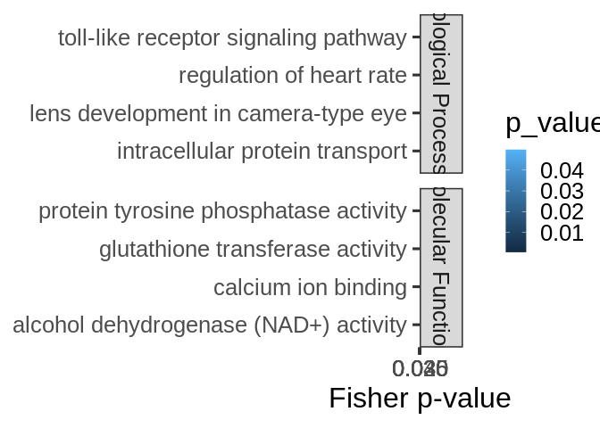

mRNA-miRNA interactions functional enrichment – CDS
================
Kathleen Durkin
2025-07-09

- <a href="#1-format-topgo-files" id="toc-1-format-topgo-files">1 Format
  topGO files</a>
  - <a href="#11-read-in-and-format-annotation-files"
    id="toc-11-read-in-and-format-annotation-files">1.1 Read in and format
    annotation files</a>
  - <a href="#12-set-up-gene2go-object"
    id="toc-12-set-up-gene2go-object">1.2 Set up gene2GO object</a>
  - <a href="#13-define-reference-set" id="toc-13-define-reference-set">1.3
    Define reference set</a>
- <a href="#2-cds" id="toc-2-cds">2 CDS</a>
  - <a href="#21-read-in-pccmiranda-data"
    id="toc-21-read-in-pccmiranda-data">2.1 Read in PCC/miranda data</a>
- <a href="#3-fa-of-all-mirna-targets"
  id="toc-3-fa-of-all-mirna-targets">3 FA of all miRNA targets</a>
- <a href="#4-fe-of-specific-mirnas-targets-all-targets"
  id="toc-4-fe-of-specific-mirnas-targets-all-targets">4 FE of specific
  miRNA’s targets (all targets)</a>
- <a href="#5-fe-of-specific-mirnas-targets-significant-cor-targets"
  id="toc-5-fe-of-specific-mirnas-targets-significant-cor-targets">5 FE of
  specific miRNA’s targets (significant cor targets)</a>
- <a
  href="#6-fe-of-all-targets-negatively-correlated-with-mirnas-regardless-of-correlation-significance"
  id="toc-6-fe-of-all-targets-negatively-correlated-with-mirnas-regardless-of-correlation-significance">6
  FE of all targets negatively correlated with miRNAs (regardless of
  correlation significance)</a>
  - <a href="#601-biological-processes"
    id="toc-601-biological-processes">6.0.1 Biological Processes</a>
  - <a href="#602-cellular-components"
    id="toc-602-cellular-components">6.0.2 Cellular Components</a>
  - <a href="#603-molecular-functions"
    id="toc-603-molecular-functions">6.0.3 Molecular Functions</a>
  - <a href="#604-join-ontologies" id="toc-604-join-ontologies">6.0.4 Join
    ontologies</a>
- <a
  href="#7-fe-of-all-targets-positively-correlated-with-mirnas-regardless-of-correlation-significance"
  id="toc-7-fe-of-all-targets-positively-correlated-with-mirnas-regardless-of-correlation-significance">7
  FE of all targets positively correlated with miRNAs (regardless of
  correlation significance)</a>
  - <a href="#701-biological-processes"
    id="toc-701-biological-processes">7.0.1 Biological Processes</a>
  - <a href="#702-cellular-components"
    id="toc-702-cellular-components">7.0.2 Cellular Components</a>
  - <a href="#703-molecular-functions"
    id="toc-703-molecular-functions">7.0.3 Molecular Functions</a>
  - <a href="#704-join-ontologies" id="toc-704-join-ontologies">7.0.4 Join
    ontologies</a>
- <a
  href="#8-fe-of-all-targets-significantly-negatively-correlated-with-mirnas"
  id="toc-8-fe-of-all-targets-significantly-negatively-correlated-with-mirnas">8
  FE of all targets significantly negatively correlated with miRNAs</a>
  - <a href="#801-biological-processes"
    id="toc-801-biological-processes">8.0.1 Biological Processes</a>
  - <a href="#802-cellular-components"
    id="toc-802-cellular-components">8.0.2 Cellular Components</a>
  - <a href="#803-molecular-functions"
    id="toc-803-molecular-functions">8.0.3 Molecular Functions</a>
  - <a href="#804-join-ontologies" id="toc-804-join-ontologies">8.0.4 Join
    ontologies</a>
- <a
  href="#9-fe-of-all-targets-significantly-positively-correlated-with-mirnas"
  id="toc-9-fe-of-all-targets-significantly-positively-correlated-with-mirnas">9
  FE of all targets significantly positively correlated with miRNAs</a>
  - <a href="#901-biological-processes"
    id="toc-901-biological-processes">9.0.1 Biological Processes</a>
  - <a href="#902-cellular-components"
    id="toc-902-cellular-components">9.0.2 Cellular Components</a>
  - <a href="#903-molecular-functions"
    id="toc-903-molecular-functions">9.0.3 Molecular Functions</a>
  - <a href="#904-join-ontologies" id="toc-904-join-ontologies">9.0.4 Join
    ontologies</a>

This script will use topGO to analyze functional enrichment of miRNA
targets for Apul in the CDS regions

Code used below was created by `Jill Ashey`, modified for use with
P.evermanni datasets by `Kathleen Durkin`

# 1 Format topGO files

## 1.1 Read in and format annotation files

``` r
# Read in Apul annotations
annot <- read.delim("../output/02-Peve-reference-annotation/Porites_evermanni_CDS-IDmapping-2024_09_04.tab")
# Remove unneeded columns 
annot <- annot %>% dplyr::select(-X, -V13)
# Ensure there are no duplicate rows
annot <- annot %>% distinct()
# Rename gene Id column
annot <- dplyr::rename(annot, 
                gene_ID = V1)

# Remove unwanted text from parent column
annot$gene_ID <- gsub("Parent=", "", annot$gene_ID)

head(annot)
```

    ##         gene_ID     V3
    ## 1 Peve_00000001 P61915
    ## 2 Peve_00000002 Q569C3
    ## 3 Peve_00000003 O35654
    ## 4 Peve_00000004 Q96PQ7
    ## 5 Peve_00000005 P52564
    ## 6 Peve_00000006 Q61656
    ##                                                                                                                                                                                                                           Protein.names
    ## 1                                                                                                                                                                     DELTA-actitoxin-Ate1a (DELTA-AITX-Ate1a) (Cytolysin tenebrosin-C)
    ## 2 Ubiquitin carboxyl-terminal hydrolase 1 (EC 3.4.19.12) (Deubiquitinating enzyme 1) (Ubiquitin thioesterase 1) (Ubiquitin-specific-processing protease 1) [Cleaved into: Ubiquitin carboxyl-terminal hydrolase 1, N-terminal fragment]
    ## 3                                                                                                                                                                     DNA polymerase delta subunit 2 (DNA polymerase delta subunit p50)
    ## 4                                                                                                                                                                                                                  Kelch-like protein 5
    ## 5                    Dual specificity mitogen-activated protein kinase kinase 6 (MAP kinase kinase 6) (MAPKK 6) (EC 2.7.12.2) (MAPK/ERK kinase 6) (MEK 6) (Stress-activated protein kinase kinase 3) (SAPK kinase 3) (SAPKK-3) (SAPKK3)
    ## 6                                                                                                 Probable ATP-dependent RNA helicase DDX5 (EC 3.6.4.13) (DEAD box RNA helicase DEAD1) (mDEAD1) (DEAD box protein 5) (RNA helicase p68)
    ##                                                 Organism
    ## 1 Actinia tenebrosa (Australian red waratah sea anemone)
    ## 2                                Rattus norvegicus (Rat)
    ## 3                                   Mus musculus (Mouse)
    ## 4                                   Homo sapiens (Human)
    ## 5                                   Homo sapiens (Human)
    ## 6                                   Mus musculus (Mouse)
    ##                                                                                                                                                                                                                                                                                                                                                                                                                                                                                                                                                                                                                                                                                                                                                                                                                                                                                                                                                                                                                                                                                                                                                                                                                              Gene.Ontology..biological.process.
    ## 1                                                                                                                                                                                                                                                                                                                                                                                                                                                                                                                                                                                                                                                                                                                                                                                                                                                                                                                                                                                                                                                                                                                                                 cation transport [GO:0006812]; cytolysis in another organism [GO:0051715]; pore complex assembly [GO:0046931]
    ## 2                                                                                                                                                                                                                                                                                                                                                                                                                                                                                                                                                                                                                                                                                                                                                                                                                                                                                                                                                             DNA repair [GO:0006281]; monoubiquitinated protein deubiquitination [GO:0035520]; protein deubiquitination [GO:0016579]; regulation of DNA repair [GO:0006282]; response to UV [GO:0009411]; skeletal system development [GO:0001501]; ubiquitin-dependent protein catabolic process [GO:0006511]
    ## 3                                                                                                                                                                                                                                                                                                                                                                                                                                                                                                                                                                                                                                                                                                                                                                                                                                                                                                                                                                                                                               DNA biosynthetic process [GO:0071897]; DNA replication [GO:0006260]; DNA strand elongation involved in DNA replication [GO:0006271]; DNA-templated DNA replication [GO:0006261]; error-prone translesion synthesis [GO:0042276]
    ## 4                                                                                                                                                                                                                                                                                                                                                                                                                                                                                                                                                                                                                                                                                                                                                                                                                                                                                                                                                                                                                                                                                                                                                                                                                                                              
    ## 5                                                                                                                                                                        apoptotic process [GO:0006915]; bone development [GO:0060348]; cardiac muscle contraction [GO:0060048]; cellular response to sorbitol [GO:0072709]; cellular senescence [GO:0090398]; MAPK cascade [GO:0000165]; negative regulation of cold-induced thermogenesis [GO:0120163]; nucleotide-binding oligomerization domain containing signaling pathway [GO:0070423]; osteoblast differentiation [GO:0001649]; ovulation cycle process [GO:0022602]; p38MAPK cascade [GO:0038066]; positive regulation of apoptotic process [GO:0043065]; positive regulation of MAP kinase activity [GO:0043406]; positive regulation of nitric-oxide synthase biosynthetic process [GO:0051770]; positive regulation of prostaglandin secretion [GO:0032308]; regulation of cell cycle [GO:0051726]; regulation of signal transduction by p53 class mediator [GO:1901796]; response to ischemia [GO:0002931]; response to xenobiotic stimulus [GO:0009410]; signal transduction [GO:0007165]; signal transduction in response to DNA damage [GO:0042770]; stress-activated MAPK cascade [GO:0051403]
    ## 6 alternative mRNA splicing, via spliceosome [GO:0000380]; androgen receptor signaling pathway [GO:0030521]; BMP signaling pathway [GO:0030509]; circadian rhythm [GO:0007623]; epithelial to mesenchymal transition [GO:0001837]; intracellular estrogen receptor signaling pathway [GO:0030520]; intrinsic apoptotic signaling pathway by p53 class mediator [GO:0072332]; miRNA transcription [GO:0061614]; mRNA transcription [GO:0009299]; myoblast differentiation [GO:0045445]; negative regulation of transcription by RNA polymerase II [GO:0000122]; nuclear-transcribed mRNA catabolic process [GO:0000956]; positive regulation of DNA damage response, signal transduction by p53 class mediator [GO:0043517]; positive regulation of DNA-templated transcription [GO:0045893]; primary miRNA processing [GO:0031053]; protein import into nucleus [GO:0006606]; regulation of alternative mRNA splicing, via spliceosome [GO:0000381]; regulation of androgen receptor signaling pathway [GO:0060765]; regulation of osteoblast differentiation [GO:0045667]; regulation of skeletal muscle cell differentiation [GO:2001014]; regulation of transcription by RNA polymerase II [GO:0006357]; regulation of viral genome replication [GO:0045069]
    ##                                                                                                                                                                                                                                                                                                                                                                                                                                                                                                                                                        Gene.Ontology.IDs
    ## 1                                                                                                                                                                                                                                                                                                                                                                                                                                                             GO:0005576; GO:0006812; GO:0015267; GO:0042151; GO:0044218; GO:0046930; GO:0046931; GO:0051715; GO:0090729
    ## 2                                                                                                                                                                                                                                                                                                                                                                                                             GO:0001501; GO:0004197; GO:0004843; GO:0005634; GO:0005654; GO:0005829; GO:0006281; GO:0006282; GO:0006511; GO:0008233; GO:0009411; GO:0016579; GO:0035520
    ## 3                                                                                                                                                                                                                                                                                                                                                                                                                                                 GO:0003677; GO:0005654; GO:0006260; GO:0006261; GO:0006271; GO:0016035; GO:0042276; GO:0042575; GO:0043625; GO:0071897
    ## 4                                                                                                                                                                                                                                                                                                                                                                                                                                                                                                                         GO:0003779; GO:0005737; GO:0005829; GO:0005856
    ## 5                                                                                                                                     GO:0000165; GO:0001649; GO:0002931; GO:0004674; GO:0004708; GO:0004713; GO:0005524; GO:0005654; GO:0005829; GO:0005856; GO:0006915; GO:0007165; GO:0009410; GO:0019211; GO:0019901; GO:0022602; GO:0032308; GO:0038066; GO:0042770; GO:0042802; GO:0043065; GO:0043406; GO:0043539; GO:0051403; GO:0051726; GO:0051770; GO:0060048; GO:0060348; GO:0070423; GO:0072709; GO:0090398; GO:0106310; GO:0120163; GO:0140537; GO:1901796
    ## 6 GO:0000122; GO:0000380; GO:0000381; GO:0000956; GO:0001837; GO:0003712; GO:0003723; GO:0003724; GO:0003730; GO:0005516; GO:0005524; GO:0005634; GO:0005654; GO:0005730; GO:0005737; GO:0006357; GO:0006606; GO:0007623; GO:0009299; GO:0016607; GO:0016887; GO:0019899; GO:0030509; GO:0030520; GO:0030521; GO:0031053; GO:0035500; GO:0036002; GO:0043021; GO:0043517; GO:0045069; GO:0045445; GO:0045667; GO:0045893; GO:0046332; GO:0048306; GO:0050681; GO:0060765; GO:0061614; GO:0070412; GO:0070878; GO:0071013; GO:0072332; GO:1990841; GO:1990904; GO:2001014

``` r
# Looks good!
```

## 1.2 Set up gene2GO object

Want to isolate a list of GO terms per gene

``` r
gene2go <- annot %>% filter(!is.na(Gene.Ontology.IDs)) %>% dplyr::select(gene_ID, Gene.Ontology.IDs)
gene2go <- gene2go %>% dplyr::rename(GO.ID = Gene.Ontology.IDs)

gene2go_list <- setNames(
  strsplit(as.character(gene2go$GO.ID), ";"), 
  gene2go$gene_ID
)
```

Note: I think this means genes that had a Uniprot ID but no GO terms are
excluded from this analysis

## 1.3 Define reference set

Define reference set of genes. This should be all genes *found in our
samples*, NOT all genes in the P.evermanni genome. Some genes (e.g.,
reproduction pathways) may not be found/expected in our samples for
valid biological reasons.

``` r
# Read in counts matrix
Peve_counts <- read.csv("../output/06-Peve-Hisat/Peve-gene_count_matrix.csv")
# Exclude genes with all 0 counts
Peve_counts <- Peve_counts[rowSums(Peve_counts[, 2:6]) != 0, ]

# Select gene IDs of the genes present in our samples
all_genes <- Peve_counts$gene_id
length(all_genes)
```

    ## [1] 31501

So we have a reference set of 31501 genes present in our samples.

# 2 CDS

## 2.1 Read in PCC/miranda data

This is a table of all putative miRNA-mRNA binding predicted by miRanda,
plus Pearsons correlation coefficients for coexpression of each putative
binding pair.

``` r
data <- read.csv("../output/10.01-Peve-mRNA-miRNA-interactions-CDS_5UTR/miRanda_PCC_miRNA_CDS.csv")
data <- dplyr::rename(data,
               miRNA = V1,
               mRNA = V4.y)
head(data)
```

    ##   X        miRNA                                           V2  V3   V4.x V5 V6
    ## 1 1 Cluster_1140  Porites_evermani_scaffold_1106:66548-127626 178 -22.20  2 21
    ## 2 2 Cluster_1140   Porites_evermani_scaffold_1158:40952-51791 170 -20.37  2 20
    ## 3 3 Cluster_1140 Porites_evermani_scaffold_1161:135902-148682 169 -20.20  2 19
    ## 4 4 Cluster_1140    Porites_evermani_scaffold_1:220724-266805 175 -20.39  2 21
    ## 5 5 Cluster_1140   Porites_evermani_scaffold_123:90709-121509 177 -22.69  2 20
    ## 6 6 Cluster_1140  Porites_evermani_scaffold_128:200708-217003 184 -22.26  2 21
    ##      V7    V8 V9    V10    V11          mRNA    PCC.cor    p_value
    ## 1 28589 28609 19 89.47% 89.47% Peve_00001942 -0.9872708 0.10168524
    ## 2  6821  6845 21 76.19% 85.71% Peve_00002662 -0.6640534 0.53766953
    ## 3  1009  1031 18 83.33% 88.89% Peve_00002765  0.8603302 0.34051469
    ## 4  2909  2932 21 80.95% 85.71% Peve_00000108 -0.9987818 0.03142663
    ## 5 26764 26787 20 90.00% 90.00% Peve_00003798 -0.9643046 0.17060883
    ## 6 10475 10496 19 84.21% 94.74% Peve_00004495         NA         NA
    ##   adjusted_p_value
    ## 1        0.9782621
    ## 2        0.9782621
    ## 3        0.9782621
    ## 4        0.9039294
    ## 5        0.9782621
    ## 6               NA

Set function to select genes of interest (ie those that have pvalue \<
0.05)

``` r
topDiffGenes <- function(allScore) {
return(allScore < 0.05)}
```

# 3 FA of all miRNA targets

Functional annotation of all putative miRNA targets

``` r
cor_bind_FA <- left_join(data, annot, by = c("mRNA" = "gene_ID")) %>% distinct()

nrow(cor_bind_FA)
```

    ## [1] 13934

``` r
nrow(cor_bind_FA[!is.na(cor_bind_FA$Gene.Ontology.IDs),])
```

    ## [1] 9441

Of the 13934 putative miRNA targets (CDS region) predicted by miRanda,
9441 have available annotations

``` r
sig_cor_bind_FA <- cor_bind_FA[cor_bind_FA$p_value < 0.05,]

# Remove rows where all values are NA
sig_cor_bind_FA <- sig_cor_bind_FA[!apply(is.na(sig_cor_bind_FA), 1, all), ]

nrow(sig_cor_bind_FA)
```

    ## [1] 835

``` r
nrow(sig_cor_bind_FA[!is.na(sig_cor_bind_FA$Gene.Ontology.IDs),])
```

    ## [1] 604

Of the 835 putative CDS miRNA targets predicted by miRanda that are also
have significantly correlated expression, 604 have available
annotations.

Save

``` r
write.csv(cor_bind_FA, "../output/10.11-Peve-mRNA-miRNA-interactions-FE-CDS/miRNA_CDS_targets_FA.csv")
write.csv(sig_cor_bind_FA, "../output/10.11-Peve-mRNA-miRNA-interactions-FE-CDS/miRNA_CDS_sig_cor_targets_FA.csv")
```

# 4 FE of specific miRNA’s targets (all targets)

Create topGO function for use with miRNA names

``` r
miRNA_topGO_FE <- function(miRNA.name, input_interactions) {
  
  #Isolate genes in our input module of interest
  interacting_genes <- input_interactions %>%
    filter(miRNA == miRNA.name) %>%
    pull(mRNA)
  
  if (length(interacting_genes) > 0 && any(all_genes %in% interacting_genes)) {
    # Create factor for all reference genes, where 1 represents module membership and 0 means the gene is not in module of interest
    gene_list <- factor(as.integer(all_genes %in% interacting_genes))
    names(gene_list) <- all_genes
    str(gene_list)
    
    ## Biological Process ##
    # Create topGO object
    GO_BP <- new("topGOdata", 
                ontology = "BP", # Biological Process
                allGenes = gene_list,
                annot = annFUN.gene2GO, 
                gene2GO = gene2go_list,
                geneSel=topDiffGenes)
    
    # Run GO enrichment test
    GO_BP_FE <- runTest(GO_BP, algorithm = "weight01", statistic = "fisher")
    # View the results
    GO_BP_results <- GenTable(GO_BP, Fisher = GO_BP_FE, orderBy = "Fisher",  topNodes = 100, numChar = 51)
    # Filter by significant results
    GO_BP_results$Fisher<-as.numeric(GO_BP_results$Fisher)
    GO_BP_results_sig<-GO_BP_results[GO_BP_results$Fisher<0.05,]
    
    
    ## Molecular Function ##
    # Create topGO object
    GO_MF <- new("topGOdata", 
                ontology = "MF", # Molecular Function
                allGenes = gene_list,
                annot = annFUN.gene2GO, 
                gene2GO = gene2go_list,
                geneSel=topDiffGenes)
    
    # Run GO enrichment test
    GO_MF_FE <- runTest(GO_MF, algorithm = "weight01", statistic = "fisher")
    # View the results
    GO_MF_results <- GenTable(GO_MF, Fisher = GO_MF_FE, orderBy = "Fisher",  topNodes = 100, numChar = 51)
    # Filter by significant results
    GO_MF_results$Fisher<-as.numeric(GO_MF_results$Fisher)
    GO_MF_results_sig<-GO_MF_results[GO_MF_results$Fisher<0.05,]
  
    # Return
    # Add type column only if results exist
    if (nrow(GO_BP_results_sig) > 0) {
      GO_BP_results_sig$type <- "Biological.Process"
    }
    if (nrow(GO_MF_results_sig) > 0) {
      GO_MF_results_sig$type <- "Molecular.Function"
    }
    GO_results <- rbind(GO_BP_results_sig, GO_MF_results_sig)
    print(GO_results)
  }
}

miRNA_topGO_FE("Cluster_10051", cor_bind_FA)
```

Loop through all miRNA and run functional enrichment on the miRNA’s
targets (all predicted targets)

``` r
interacting_miRNAs <- unique(cor_bind_FA$miRNA) %>% na.omit
results_all_targets <- NULL  # initialize empty df

for(miRNA in interacting_miRNAs) {
  
  # Run topGO enrichment function
  miRNA_results <- miRNA_topGO_FE(miRNA, cor_bind_FA)
  
  # Only keep results if not empty
  if (nrow(miRNA_results) > 0) {
    
    # Add the miRNA source column
    miRNA_results$miRNA <- miRNA

    # Bind to the accumulating results data frame
    results_all_targets <- rbind(results_all_targets, miRNA_results)
  }
}
```

    ##  Factor w/ 2 levels "0","1": 1 1 1 1 1 1 1 1 1 1 ...
    ##  - attr(*, "names")= chr [1:31501] "STRG.24381" "STRG.24380" "STRG.15042" "STRG.8662" ...

    ## 
    ## Building most specific GOs .....

    ##  ( 115 GO terms found. )

    ## 
    ## Build GO DAG topology ..........

    ##  ( 747 GO terms and 1413 relations. )

    ## 
    ## Annotating nodes ...............

    ##  ( 353 genes annotated to the GO terms. )

    ## 
    ##           -- Weight01 Algorithm -- 
    ## 
    ##       the algorithm is scoring 5 nontrivial nodes
    ##       parameters: 
    ##           test statistic: fisher

    ## 
    ##   Level 5:   1 nodes to be scored    (0 eliminated genes)

    ## 
    ##   Level 4:   1 nodes to be scored    (0 eliminated genes)

    ## 
    ##   Level 3:   1 nodes to be scored    (5 eliminated genes)

    ## 
    ##   Level 2:   1 nodes to be scored    (13 eliminated genes)

    ## 
    ##   Level 1:   1 nodes to be scored    (22 eliminated genes)

    ## 
    ## Building most specific GOs .....

    ##  ( 183 GO terms found. )

    ## 
    ## Build GO DAG topology ..........

    ##  ( 467 GO terms and 589 relations. )

    ## 
    ## Annotating nodes ...............

    ##  ( 611 genes annotated to the GO terms. )

    ## 
    ##           -- Weight01 Algorithm -- 
    ## 
    ##       the algorithm is scoring 7 nontrivial nodes
    ##       parameters: 
    ##           test statistic: fisher

    ## 
    ##   Level 4:   2 nodes to be scored    (0 eliminated genes)

    ## 
    ##   Level 3:   2 nodes to be scored    (0 eliminated genes)

    ## 
    ##   Level 2:   2 nodes to be scored    (35 eliminated genes)

    ## 
    ##   Level 1:   1 nodes to be scored    (146 eliminated genes)

    ##        GO.ID           Term Annotated Significant Expected Fisher
    ## 1 GO:0003015  heart process         5           1     0.01  0.014
    ## 2 GO:0008061 chitin binding         8           1     0.03  0.026
    ##                 type
    ## 1 Biological.Process
    ## 2 Molecular.Function
    ##  Factor w/ 2 levels "0","1": 1 1 1 1 1 1 1 1 1 1 ...
    ##  - attr(*, "names")= chr [1:31501] "STRG.24381" "STRG.24380" "STRG.15042" "STRG.8662" ...

    ## 
    ## Building most specific GOs .....

    ##  ( 115 GO terms found. )

    ## 
    ## Build GO DAG topology ..........

    ##  ( 747 GO terms and 1413 relations. )

    ## 
    ## Annotating nodes ...............

    ##  ( 353 genes annotated to the GO terms. )

    ## 
    ##           -- Weight01 Algorithm -- 
    ## 
    ##       the algorithm is scoring 115 nontrivial nodes
    ##       parameters: 
    ##           test statistic: fisher

    ## 
    ##   Level 10:  2 nodes to be scored    (0 eliminated genes)

    ## 
    ##   Level 9:   4 nodes to be scored    (0 eliminated genes)

    ## 
    ##   Level 8:   8 nodes to be scored    (34 eliminated genes)

    ## 
    ##   Level 7:   12 nodes to be scored   (40 eliminated genes)

    ## 
    ##   Level 6:   15 nodes to be scored   (47 eliminated genes)

    ## 
    ##   Level 5:   23 nodes to be scored   (71 eliminated genes)

    ## 
    ##   Level 4:   21 nodes to be scored   (76 eliminated genes)

    ## 
    ##   Level 3:   21 nodes to be scored   (234 eliminated genes)

    ## 
    ##   Level 2:   8 nodes to be scored    (273 eliminated genes)

    ## 
    ##   Level 1:   1 nodes to be scored    (296 eliminated genes)

    ## 
    ## Building most specific GOs .....

    ##  ( 183 GO terms found. )

    ## 
    ## Build GO DAG topology ..........

    ##  ( 467 GO terms and 589 relations. )

    ## 
    ## Annotating nodes ...............

    ##  ( 611 genes annotated to the GO terms. )

    ## 
    ##           -- Weight01 Algorithm -- 
    ## 
    ##       the algorithm is scoring 113 nontrivial nodes
    ##       parameters: 
    ##           test statistic: fisher

    ## 
    ##   Level 11:  1 nodes to be scored    (0 eliminated genes)

    ## 
    ##   Level 10:  2 nodes to be scored    (0 eliminated genes)

    ## 
    ##   Level 9:   4 nodes to be scored    (3 eliminated genes)

    ## 
    ##   Level 8:   7 nodes to be scored    (14 eliminated genes)

    ## 
    ##   Level 7:   13 nodes to be scored   (25 eliminated genes)

    ## 
    ##   Level 6:   16 nodes to be scored   (41 eliminated genes)

    ## 
    ##   Level 5:   23 nodes to be scored   (86 eliminated genes)

    ## 
    ##   Level 4:   23 nodes to be scored   (197 eliminated genes)

    ## 
    ##   Level 3:   18 nodes to be scored   (344 eliminated genes)

    ## 
    ##   Level 2:   5 nodes to be scored    (434 eliminated genes)

    ## 
    ##   Level 1:   1 nodes to be scored    (544 eliminated genes)

    ##        GO.ID                                               Term Annotated
    ## 1 GO:0001654                                    eye development         3
    ## 2 GO:0002224               toll-like receptor signaling pathway         1
    ## 3 GO:0006886                    intracellular protein transport         1
    ## 4 GO:0000302                response to reactive oxygen species         1
    ## 5 GO:0004993      G protein-coupled serotonin receptor activity         5
    ## 6 GO:0004656         procollagen-proline 4-dioxygenase activity         5
    ## 7 GO:0000014 single-stranded DNA endodeoxyribonuclease activity         1
    ## 8 GO:0004364                   glutathione transferase activity         1
    ## 9 GO:0004383                         guanylate cyclase activity         1
    ##   Significant Expected Fisher               type
    ## 1           2     0.13  0.040 Biological.Process
    ## 2           1     0.04  0.042 Biological.Process
    ## 3           1     0.04  0.042 Biological.Process
    ## 4           1     0.04  0.042 Biological.Process
    ## 5           2     0.24  0.020 Molecular.Function
    ## 6           2     0.24  0.020 Molecular.Function
    ## 7           1     0.05  0.047 Molecular.Function
    ## 8           1     0.05  0.047 Molecular.Function
    ## 9           1     0.05  0.047 Molecular.Function
    ##  Factor w/ 2 levels "0","1": 1 1 1 1 1 1 1 1 1 1 ...
    ##  - attr(*, "names")= chr [1:31501] "STRG.24381" "STRG.24380" "STRG.15042" "STRG.8662" ...

    ## 
    ## Building most specific GOs .....

    ##  ( 115 GO terms found. )

    ## 
    ## Build GO DAG topology ..........

    ##  ( 747 GO terms and 1413 relations. )

    ## 
    ## Annotating nodes ...............

    ##  ( 353 genes annotated to the GO terms. )

    ## 
    ##           -- Weight01 Algorithm -- 
    ## 
    ##       the algorithm is scoring 196 nontrivial nodes
    ##       parameters: 
    ##           test statistic: fisher

    ## 
    ##   Level 13:  1 nodes to be scored    (0 eliminated genes)

    ## 
    ##   Level 12:  3 nodes to be scored    (0 eliminated genes)

    ## 
    ##   Level 11:  5 nodes to be scored    (21 eliminated genes)

    ## 
    ##   Level 10:  8 nodes to be scored    (23 eliminated genes)

    ## 
    ##   Level 9:   12 nodes to be scored   (24 eliminated genes)

    ## 
    ##   Level 8:   12 nodes to be scored   (58 eliminated genes)

    ## 
    ##   Level 7:   23 nodes to be scored   (83 eliminated genes)

    ## 
    ##   Level 6:   32 nodes to be scored   (93 eliminated genes)

    ## 
    ##   Level 5:   42 nodes to be scored   (136 eliminated genes)

    ## 
    ##   Level 4:   28 nodes to be scored   (154 eliminated genes)

    ## 
    ##   Level 3:   20 nodes to be scored   (221 eliminated genes)

    ## 
    ##   Level 2:   9 nodes to be scored    (271 eliminated genes)

    ## 
    ##   Level 1:   1 nodes to be scored    (311 eliminated genes)

    ## 
    ## Building most specific GOs .....

    ##  ( 183 GO terms found. )

    ## 
    ## Build GO DAG topology ..........

    ##  ( 467 GO terms and 589 relations. )

    ## 
    ## Annotating nodes ...............

    ##  ( 611 genes annotated to the GO terms. )

    ## 
    ##           -- Weight01 Algorithm -- 
    ## 
    ##       the algorithm is scoring 142 nontrivial nodes
    ##       parameters: 
    ##           test statistic: fisher

    ## 
    ##   Level 12:  1 nodes to be scored    (0 eliminated genes)

    ## 
    ##   Level 11:  1 nodes to be scored    (0 eliminated genes)

    ## 
    ##   Level 10:  2 nodes to be scored    (2 eliminated genes)

    ## 
    ##   Level 9:   7 nodes to be scored    (3 eliminated genes)

    ## 
    ##   Level 8:   11 nodes to be scored   (14 eliminated genes)

    ## 
    ##   Level 7:   17 nodes to be scored   (54 eliminated genes)

    ## 
    ##   Level 6:   23 nodes to be scored   (82 eliminated genes)

    ## 
    ##   Level 5:   27 nodes to be scored   (110 eliminated genes)

    ## 
    ##   Level 4:   30 nodes to be scored   (193 eliminated genes)

    ## 
    ##   Level 3:   16 nodes to be scored   (362 eliminated genes)

    ## 
    ##   Level 2:   6 nodes to be scored    (468 eliminated genes)

    ## 
    ##   Level 1:   1 nodes to be scored    (568 eliminated genes)

    ##        GO.ID                                          Term Annotated
    ## 1 GO:0000281                           mitotic cytokinesis         6
    ## 2 GO:0005302 L-tyrosine transmembrane transporter activity         6
    ##   Significant Expected Fisher               type
    ## 1           2     0.31 0.0330 Biological.Process
    ## 2           3     0.37 0.0039 Molecular.Function
    ##  Factor w/ 2 levels "0","1": 1 1 1 1 1 1 1 1 1 1 ...
    ##  - attr(*, "names")= chr [1:31501] "STRG.24381" "STRG.24380" "STRG.15042" "STRG.8662" ...

    ## 
    ## Building most specific GOs .....

    ##  ( 115 GO terms found. )

    ## 
    ## Build GO DAG topology ..........

    ##  ( 747 GO terms and 1413 relations. )

    ## 
    ## Annotating nodes ...............

    ##  ( 353 genes annotated to the GO terms. )

    ## 
    ##           -- Weight01 Algorithm -- 
    ## 
    ##       the algorithm is scoring 219 nontrivial nodes
    ##       parameters: 
    ##           test statistic: fisher

    ## 
    ##   Level 15:  1 nodes to be scored    (0 eliminated genes)

    ## 
    ##   Level 14:  1 nodes to be scored    (0 eliminated genes)

    ## 
    ##   Level 13:  2 nodes to be scored    (1 eliminated genes)

    ## 
    ##   Level 12:  5 nodes to be scored    (1 eliminated genes)

    ## 
    ##   Level 11:  9 nodes to be scored    (22 eliminated genes)

    ## 
    ##   Level 10:  13 nodes to be scored   (24 eliminated genes)

    ## 
    ##   Level 9:   19 nodes to be scored   (28 eliminated genes)

    ## 
    ##   Level 8:   16 nodes to be scored   (62 eliminated genes)

    ## 
    ##   Level 7:   20 nodes to be scored   (70 eliminated genes)

    ## 
    ##   Level 6:   30 nodes to be scored   (88 eliminated genes)

    ## 
    ##   Level 5:   41 nodes to be scored   (156 eliminated genes)

    ## 
    ##   Level 4:   29 nodes to be scored   (172 eliminated genes)

    ## 
    ##   Level 3:   23 nodes to be scored   (256 eliminated genes)

    ## 
    ##   Level 2:   9 nodes to be scored    (309 eliminated genes)

    ## 
    ##   Level 1:   1 nodes to be scored    (343 eliminated genes)

    ## 
    ## Building most specific GOs .....

    ##  ( 183 GO terms found. )

    ## 
    ## Build GO DAG topology ..........

    ##  ( 467 GO terms and 589 relations. )

    ## 
    ## Annotating nodes ...............

    ##  ( 611 genes annotated to the GO terms. )

    ## 
    ##           -- Weight01 Algorithm -- 
    ## 
    ##       the algorithm is scoring 46 nontrivial nodes
    ##       parameters: 
    ##           test statistic: fisher

    ## 
    ##   Level 8:   1 nodes to be scored    (0 eliminated genes)

    ## 
    ##   Level 7:   4 nodes to be scored    (0 eliminated genes)

    ## 
    ##   Level 6:   8 nodes to be scored    (1 eliminated genes)

    ## 
    ##   Level 5:   10 nodes to be scored   (35 eliminated genes)

    ## 
    ##   Level 4:   8 nodes to be scored    (115 eliminated genes)

    ## 
    ##   Level 3:   9 nodes to be scored    (190 eliminated genes)

    ## 
    ##   Level 2:   5 nodes to be scored    (234 eliminated genes)

    ## 
    ##   Level 1:   1 nodes to be scored    (355 eliminated genes)

    ##        GO.ID                                                   Term Annotated
    ## 1 GO:0001666                                    response to hypoxia         4
    ## 2 GO:0003779                                          actin binding        10
    ## 3 GO:0004605            phosphatidate cytidylyltransferase activity         1
    ## 4 GO:0004715 non-membrane spanning protein tyrosine kinase activ...         1
    ## 5 GO:0000030                           mannosyltransferase activity         2
    ## 6 GO:0004370                               glycerol kinase activity         2
    ##   Significant Expected Fisher               type
    ## 1           2     0.23  0.017 Biological.Process
    ## 2           2     0.25  0.023 Molecular.Function
    ## 3           1     0.02  0.025 Molecular.Function
    ## 4           1     0.02  0.025 Molecular.Function
    ## 5           1     0.05  0.049 Molecular.Function
    ## 6           1     0.05  0.049 Molecular.Function
    ##  Factor w/ 2 levels "0","1": 1 1 1 1 1 1 1 1 1 1 ...
    ##  - attr(*, "names")= chr [1:31501] "STRG.24381" "STRG.24380" "STRG.15042" "STRG.8662" ...

    ## 
    ## Building most specific GOs .....

    ##  ( 115 GO terms found. )

    ## 
    ## Build GO DAG topology ..........

    ##  ( 747 GO terms and 1413 relations. )

    ## 
    ## Annotating nodes ...............

    ##  ( 353 genes annotated to the GO terms. )

    ## 
    ##           -- Weight01 Algorithm -- 
    ## 
    ##       the algorithm is scoring 139 nontrivial nodes
    ##       parameters: 
    ##           test statistic: fisher

    ## 
    ##   Level 13:  1 nodes to be scored    (0 eliminated genes)

    ## 
    ##   Level 12:  2 nodes to be scored    (0 eliminated genes)

    ## 
    ##   Level 11:  3 nodes to be scored    (21 eliminated genes)

    ## 
    ##   Level 10:  5 nodes to be scored    (21 eliminated genes)

    ## 
    ##   Level 9:   6 nodes to be scored    (21 eliminated genes)

    ## 
    ##   Level 8:   5 nodes to be scored    (55 eliminated genes)

    ## 
    ##   Level 7:   13 nodes to be scored   (71 eliminated genes)

    ## 
    ##   Level 6:   23 nodes to be scored   (73 eliminated genes)

    ## 
    ##   Level 5:   33 nodes to be scored   (150 eliminated genes)

    ## 
    ##   Level 4:   22 nodes to be scored   (166 eliminated genes)

    ## 
    ##   Level 3:   16 nodes to be scored   (211 eliminated genes)

    ## 
    ##   Level 2:   9 nodes to be scored    (237 eliminated genes)

    ## 
    ##   Level 1:   1 nodes to be scored    (274 eliminated genes)

    ## 
    ## Building most specific GOs .....

    ##  ( 183 GO terms found. )

    ## 
    ## Build GO DAG topology ..........

    ##  ( 467 GO terms and 589 relations. )

    ## 
    ## Annotating nodes ...............

    ##  ( 611 genes annotated to the GO terms. )

    ## 
    ##           -- Weight01 Algorithm -- 
    ## 
    ##       the algorithm is scoring 56 nontrivial nodes
    ##       parameters: 
    ##           test statistic: fisher

    ## 
    ##   Level 9:   1 nodes to be scored    (0 eliminated genes)

    ## 
    ##   Level 8:   3 nodes to be scored    (0 eliminated genes)

    ## 
    ##   Level 7:   6 nodes to be scored    (4 eliminated genes)

    ## 
    ##   Level 6:   9 nodes to be scored    (35 eliminated genes)

    ## 
    ##   Level 5:   13 nodes to be scored   (59 eliminated genes)

    ## 
    ##   Level 4:   9 nodes to be scored    (91 eliminated genes)

    ## 
    ##   Level 3:   9 nodes to be scored    (253 eliminated genes)

    ## 
    ##   Level 2:   5 nodes to be scored    (299 eliminated genes)

    ## 
    ##   Level 1:   1 nodes to be scored    (451 eliminated genes)

    ##        GO.ID                                       Term Annotated Significant
    ## 1 GO:0000278                         mitotic cell cycle        36           3
    ## 2 GO:0001778                     plasma membrane repair         1           1
    ## 3 GO:0005007 fibroblast growth factor receptor activity         4           2
    ## 4 GO:0003884              D-amino-acid oxidase activity         1           1
    ## 5 GO:0004046                      aminoacylase activity         1           1
    ## 6 GO:0003697                single-stranded DNA binding         1           1
    ##   Expected Fisher               type
    ## 1     1.02 0.0250 Biological.Process
    ## 2     0.03 0.0280 Biological.Process
    ## 3     0.11 0.0042 Molecular.Function
    ## 4     0.03 0.0278 Molecular.Function
    ## 5     0.03 0.0278 Molecular.Function
    ## 6     0.03 0.0278 Molecular.Function
    ##  Factor w/ 2 levels "0","1": 1 1 1 1 1 1 1 1 1 1 ...
    ##  - attr(*, "names")= chr [1:31501] "STRG.24381" "STRG.24380" "STRG.15042" "STRG.8662" ...

    ## 
    ## Building most specific GOs .....

    ##  ( 115 GO terms found. )

    ## 
    ## Build GO DAG topology ..........

    ##  ( 747 GO terms and 1413 relations. )

    ## 
    ## Annotating nodes ...............

    ##  ( 353 genes annotated to the GO terms. )

    ## 
    ##           -- Weight01 Algorithm -- 
    ## 
    ##       the algorithm is scoring 38 nontrivial nodes
    ##       parameters: 
    ##           test statistic: fisher

    ## 
    ##   Level 12:  1 nodes to be scored    (0 eliminated genes)

    ## 
    ##   Level 11:  1 nodes to be scored    (0 eliminated genes)

    ## 
    ##   Level 10:  1 nodes to be scored    (2 eliminated genes)

    ## 
    ##   Level 9:   2 nodes to be scored    (2 eliminated genes)

    ## 
    ##   Level 8:   2 nodes to be scored    (2 eliminated genes)

    ## 
    ##   Level 7:   3 nodes to be scored    (7 eliminated genes)

    ## 
    ##   Level 6:   3 nodes to be scored    (13 eliminated genes)

    ## 
    ##   Level 5:   4 nodes to be scored    (60 eliminated genes)

    ## 
    ##   Level 4:   7 nodes to be scored    (68 eliminated genes)

    ## 
    ##   Level 3:   8 nodes to be scored    (83 eliminated genes)

    ## 
    ##   Level 2:   5 nodes to be scored    (113 eliminated genes)

    ## 
    ##   Level 1:   1 nodes to be scored    (143 eliminated genes)

    ## 
    ## Building most specific GOs .....

    ##  ( 183 GO terms found. )

    ## 
    ## Build GO DAG topology ..........

    ##  ( 467 GO terms and 589 relations. )

    ## 
    ## Annotating nodes ...............

    ##  ( 611 genes annotated to the GO terms. )

    ## 
    ##           -- Weight01 Algorithm -- 
    ## 
    ##       the algorithm is scoring 40 nontrivial nodes
    ##       parameters: 
    ##           test statistic: fisher

    ## 
    ##   Level 8:   2 nodes to be scored    (0 eliminated genes)

    ## 
    ##   Level 7:   4 nodes to be scored    (0 eliminated genes)

    ## 
    ##   Level 6:   6 nodes to be scored    (29 eliminated genes)

    ## 
    ##   Level 5:   8 nodes to be scored    (47 eliminated genes)

    ## 
    ##   Level 4:   6 nodes to be scored    (87 eliminated genes)

    ## 
    ##   Level 3:   9 nodes to be scored    (168 eliminated genes)

    ## 
    ##   Level 2:   4 nodes to be scored    (299 eliminated genes)

    ## 
    ##   Level 1:   1 nodes to be scored    (458 eliminated genes)

    ##        GO.ID                                                   Term Annotated
    ## 1 GO:0000462 maturation of SSU-rRNA from tricistronic rRNA trans...         2
    ## 2 GO:0007165                                    signal transduction        34
    ## 3 GO:0003997                              acyl-CoA oxidase activity         1
    ##   Significant Expected Fisher               type
    ## 1           1     0.02  0.017 Biological.Process
    ## 2           2     0.29  0.043 Biological.Process
    ## 3           1     0.01  0.011 Molecular.Function
    ##  Factor w/ 2 levels "0","1": 1 1 1 1 1 1 1 1 1 1 ...
    ##  - attr(*, "names")= chr [1:31501] "STRG.24381" "STRG.24380" "STRG.15042" "STRG.8662" ...

    ## 
    ## Building most specific GOs .....

    ##  ( 115 GO terms found. )

    ## 
    ## Build GO DAG topology ..........

    ##  ( 747 GO terms and 1413 relations. )

    ## 
    ## Annotating nodes ...............

    ##  ( 353 genes annotated to the GO terms. )

    ## 
    ##           -- Weight01 Algorithm -- 
    ## 
    ##       the algorithm is scoring 89 nontrivial nodes
    ##       parameters: 
    ##           test statistic: fisher

    ## 
    ##   Level 13:  1 nodes to be scored    (0 eliminated genes)

    ## 
    ##   Level 12:  3 nodes to be scored    (0 eliminated genes)

    ## 
    ##   Level 11:  4 nodes to be scored    (21 eliminated genes)

    ## 
    ##   Level 10:  5 nodes to be scored    (23 eliminated genes)

    ## 
    ##   Level 9:   5 nodes to be scored    (23 eliminated genes)

    ## 
    ##   Level 8:   4 nodes to be scored    (56 eliminated genes)

    ## 
    ##   Level 7:   6 nodes to be scored    (57 eliminated genes)

    ## 
    ##   Level 6:   13 nodes to be scored   (60 eliminated genes)

    ## 
    ##   Level 5:   18 nodes to be scored   (81 eliminated genes)

    ## 
    ##   Level 4:   15 nodes to be scored   (87 eliminated genes)

    ## 
    ##   Level 3:   9 nodes to be scored    (130 eliminated genes)

    ## 
    ##   Level 2:   5 nodes to be scored    (195 eliminated genes)

    ## 
    ##   Level 1:   1 nodes to be scored    (231 eliminated genes)

    ## 
    ## Building most specific GOs .....

    ##  ( 183 GO terms found. )

    ## 
    ## Build GO DAG topology ..........

    ##  ( 467 GO terms and 589 relations. )

    ## 
    ## Annotating nodes ...............

    ##  ( 611 genes annotated to the GO terms. )

    ## 
    ##           -- Weight01 Algorithm -- 
    ## 
    ##       the algorithm is scoring 60 nontrivial nodes
    ##       parameters: 
    ##           test statistic: fisher

    ## 
    ##   Level 10:  1 nodes to be scored    (0 eliminated genes)

    ## 
    ##   Level 9:   3 nodes to be scored    (0 eliminated genes)

    ## 
    ##   Level 8:   4 nodes to be scored    (4 eliminated genes)

    ## 
    ##   Level 7:   8 nodes to be scored    (33 eliminated genes)

    ## 
    ##   Level 6:   10 nodes to be scored   (36 eliminated genes)

    ## 
    ##   Level 5:   10 nodes to be scored   (62 eliminated genes)

    ## 
    ##   Level 4:   9 nodes to be scored    (145 eliminated genes)

    ## 
    ##   Level 3:   10 nodes to be scored   (264 eliminated genes)

    ## 
    ##   Level 2:   4 nodes to be scored    (304 eliminated genes)

    ## 
    ##   Level 1:   1 nodes to be scored    (442 eliminated genes)

    ##        GO.ID                                                   Term Annotated
    ## 1 GO:0000122 negative regulation of transcription by RNA polymer...        21
    ## 2 GO:0002002              regulation of angiotensin levels in blood         2
    ## 3 GO:0003682                                      chromatin binding         1
    ## 4 GO:0004725                  protein tyrosine phosphatase activity         2
    ##   Significant Expected Fisher               type
    ## 1           2     0.24  0.019 Biological.Process
    ## 2           1     0.02  0.023 Biological.Process
    ## 3           1     0.02  0.016 Molecular.Function
    ## 4           1     0.03  0.032 Molecular.Function
    ##  Factor w/ 2 levels "0","1": 1 1 1 1 1 1 1 1 1 1 ...
    ##  - attr(*, "names")= chr [1:31501] "STRG.24381" "STRG.24380" "STRG.15042" "STRG.8662" ...

    ## 
    ## Building most specific GOs .....

    ##  ( 115 GO terms found. )

    ## 
    ## Build GO DAG topology ..........

    ##  ( 747 GO terms and 1413 relations. )

    ## 
    ## Annotating nodes ...............

    ##  ( 353 genes annotated to the GO terms. )

    ## 
    ##           -- Weight01 Algorithm -- 
    ## 
    ##       the algorithm is scoring 106 nontrivial nodes
    ##       parameters: 
    ##           test statistic: fisher

    ## 
    ##   Level 13:  1 nodes to be scored    (0 eliminated genes)

    ## 
    ##   Level 12:  2 nodes to be scored    (0 eliminated genes)

    ## 
    ##   Level 11:  3 nodes to be scored    (21 eliminated genes)

    ## 
    ##   Level 10:  3 nodes to be scored    (21 eliminated genes)

    ## 
    ##   Level 9:   4 nodes to be scored    (21 eliminated genes)

    ## 
    ##   Level 8:   3 nodes to be scored    (21 eliminated genes)

    ## 
    ##   Level 7:   9 nodes to be scored    (24 eliminated genes)

    ## 
    ##   Level 6:   16 nodes to be scored   (25 eliminated genes)

    ## 
    ##   Level 5:   22 nodes to be scored   (103 eliminated genes)

    ## 
    ##   Level 4:   18 nodes to be scored   (112 eliminated genes)

    ## 
    ##   Level 3:   16 nodes to be scored   (201 eliminated genes)

    ## 
    ##   Level 2:   8 nodes to be scored    (272 eliminated genes)

    ## 
    ##   Level 1:   1 nodes to be scored    (306 eliminated genes)

    ## 
    ## Building most specific GOs .....

    ##  ( 183 GO terms found. )

    ## 
    ## Build GO DAG topology ..........

    ##  ( 467 GO terms and 589 relations. )

    ## 
    ## Annotating nodes ...............

    ##  ( 611 genes annotated to the GO terms. )

    ## 
    ##           -- Weight01 Algorithm -- 
    ## 
    ##       the algorithm is scoring 67 nontrivial nodes
    ##       parameters: 
    ##           test statistic: fisher

    ## 
    ##   Level 12:  1 nodes to be scored    (0 eliminated genes)

    ## 
    ##   Level 11:  1 nodes to be scored    (0 eliminated genes)

    ## 
    ##   Level 10:  1 nodes to be scored    (2 eliminated genes)

    ## 
    ##   Level 9:   4 nodes to be scored    (3 eliminated genes)

    ## 
    ##   Level 8:   4 nodes to be scored    (3 eliminated genes)

    ## 
    ##   Level 7:   6 nodes to be scored    (16 eliminated genes)

    ## 
    ##   Level 6:   7 nodes to be scored    (21 eliminated genes)

    ## 
    ##   Level 5:   12 nodes to be scored   (54 eliminated genes)

    ## 
    ##   Level 4:   13 nodes to be scored   (83 eliminated genes)

    ## 
    ##   Level 3:   12 nodes to be scored   (171 eliminated genes)

    ## 
    ##   Level 2:   5 nodes to be scored    (313 eliminated genes)

    ## 
    ##   Level 1:   1 nodes to be scored    (497 eliminated genes)

    ##        GO.ID                               Term Annotated Significant Expected
    ## 1 GO:0001778             plasma membrane repair         1           1     0.02
    ## 2 GO:0005244 voltage-gated ion channel activity        10           2     0.21
    ## 3 GO:0005178                   integrin binding         1           1     0.02
    ## 4 GO:0003884      D-amino-acid oxidase activity         1           1     0.02
    ## 5 GO:0004252 serine-type endopeptidase activity        14           2     0.30
    ## 6 GO:0004972   NMDA glutamate receptor activity         2           1     0.04
    ## 7 GO:0004111           creatine kinase activity         2           1     0.04
    ##   Fisher               type
    ## 1  0.023 Biological.Process
    ## 2  0.020 Molecular.Function
    ## 3  0.021 Molecular.Function
    ## 4  0.021 Molecular.Function
    ## 5  0.033 Molecular.Function
    ## 6  0.042 Molecular.Function
    ## 7  0.042 Molecular.Function
    ##  Factor w/ 2 levels "0","1": 1 1 1 1 1 1 1 1 1 1 ...
    ##  - attr(*, "names")= chr [1:31501] "STRG.24381" "STRG.24380" "STRG.15042" "STRG.8662" ...

    ## 
    ## Building most specific GOs .....

    ##  ( 115 GO terms found. )

    ## 
    ## Build GO DAG topology ..........

    ##  ( 747 GO terms and 1413 relations. )

    ## 
    ## Annotating nodes ...............

    ##  ( 353 genes annotated to the GO terms. )

    ## 
    ##           -- Weight01 Algorithm -- 
    ## 
    ##       the algorithm is scoring 49 nontrivial nodes
    ##       parameters: 
    ##           test statistic: fisher

    ## 
    ##   Level 11:  1 nodes to be scored    (0 eliminated genes)

    ## 
    ##   Level 10:  1 nodes to be scored    (0 eliminated genes)

    ## 
    ##   Level 9:   1 nodes to be scored    (2 eliminated genes)

    ## 
    ##   Level 8:   2 nodes to be scored    (3 eliminated genes)

    ## 
    ##   Level 7:   3 nodes to be scored    (3 eliminated genes)

    ## 
    ##   Level 6:   6 nodes to be scored    (9 eliminated genes)

    ## 
    ##   Level 5:   11 nodes to be scored   (60 eliminated genes)

    ## 
    ##   Level 4:   10 nodes to be scored   (69 eliminated genes)

    ## 
    ##   Level 3:   8 nodes to be scored    (87 eliminated genes)

    ## 
    ##   Level 2:   5 nodes to be scored    (112 eliminated genes)

    ## 
    ##   Level 1:   1 nodes to be scored    (132 eliminated genes)

    ## 
    ## Building most specific GOs .....

    ##  ( 183 GO terms found. )

    ## 
    ## Build GO DAG topology ..........

    ##  ( 467 GO terms and 589 relations. )

    ## 
    ## Annotating nodes ...............

    ##  ( 611 genes annotated to the GO terms. )

    ## 
    ##           -- Weight01 Algorithm -- 
    ## 
    ##       the algorithm is scoring 30 nontrivial nodes
    ##       parameters: 
    ##           test statistic: fisher

    ## 
    ##   Level 10:  1 nodes to be scored    (0 eliminated genes)

    ## 
    ##   Level 9:   2 nodes to be scored    (0 eliminated genes)

    ## 
    ##   Level 8:   2 nodes to be scored    (4 eliminated genes)

    ## 
    ##   Level 7:   3 nodes to be scored    (11 eliminated genes)

    ## 
    ##   Level 6:   4 nodes to be scored    (12 eliminated genes)

    ## 
    ##   Level 5:   4 nodes to be scored    (25 eliminated genes)

    ## 
    ##   Level 4:   6 nodes to be scored    (45 eliminated genes)

    ## 
    ##   Level 3:   4 nodes to be scored    (73 eliminated genes)

    ## 
    ##   Level 2:   3 nodes to be scored    (87 eliminated genes)

    ## 
    ##   Level 1:   1 nodes to be scored    (179 eliminated genes)

    ##        GO.ID                                                   Term Annotated
    ## 1 GO:0000184 nuclear-transcribed mRNA catabolic process, nonsens...         2
    ## 2 GO:0005245                 voltage-gated calcium channel activity         4
    ## 3 GO:0003714                     transcription corepressor activity         5
    ##   Significant Expected Fisher               type
    ## 1           1     0.01  0.011 Biological.Process
    ## 2           1     0.02  0.020 Molecular.Function
    ## 3           1     0.02  0.024 Molecular.Function
    ##  Factor w/ 2 levels "0","1": 1 1 1 1 1 1 1 1 1 1 ...
    ##  - attr(*, "names")= chr [1:31501] "STRG.24381" "STRG.24380" "STRG.15042" "STRG.8662" ...

    ## 
    ## Building most specific GOs .....

    ##  ( 115 GO terms found. )

    ## 
    ## Build GO DAG topology ..........

    ##  ( 747 GO terms and 1413 relations. )

    ## 
    ## Annotating nodes ...............

    ##  ( 353 genes annotated to the GO terms. )

    ## 
    ##           -- Weight01 Algorithm -- 
    ## 
    ##       the algorithm is scoring 157 nontrivial nodes
    ##       parameters: 
    ##           test statistic: fisher

    ## 
    ##   Level 13:  2 nodes to be scored    (0 eliminated genes)

    ## 
    ##   Level 12:  3 nodes to be scored    (0 eliminated genes)

    ## 
    ##   Level 11:  4 nodes to be scored    (25 eliminated genes)

    ## 
    ##   Level 10:  5 nodes to be scored    (25 eliminated genes)

    ## 
    ##   Level 9:   8 nodes to be scored    (25 eliminated genes)

    ## 
    ##   Level 8:   9 nodes to be scored    (32 eliminated genes)

    ## 
    ##   Level 7:   13 nodes to be scored   (45 eliminated genes)

    ## 
    ##   Level 6:   22 nodes to be scored   (52 eliminated genes)

    ## 
    ##   Level 5:   37 nodes to be scored   (82 eliminated genes)

    ## 
    ##   Level 4:   25 nodes to be scored   (104 eliminated genes)

    ## 
    ##   Level 3:   19 nodes to be scored   (227 eliminated genes)

    ## 
    ##   Level 2:   9 nodes to be scored    (267 eliminated genes)

    ## 
    ##   Level 1:   1 nodes to be scored    (301 eliminated genes)

    ## 
    ## Building most specific GOs .....

    ##  ( 183 GO terms found. )

    ## 
    ## Build GO DAG topology ..........

    ##  ( 467 GO terms and 589 relations. )

    ## 
    ## Annotating nodes ...............

    ##  ( 611 genes annotated to the GO terms. )

    ## 
    ##           -- Weight01 Algorithm -- 
    ## 
    ##       the algorithm is scoring 125 nontrivial nodes
    ##       parameters: 
    ##           test statistic: fisher

    ## 
    ##   Level 11:  1 nodes to be scored    (0 eliminated genes)

    ## 
    ##   Level 10:  1 nodes to be scored    (0 eliminated genes)

    ## 
    ##   Level 9:   4 nodes to be scored    (3 eliminated genes)

    ## 
    ##   Level 8:   10 nodes to be scored   (3 eliminated genes)

    ## 
    ##   Level 7:   17 nodes to be scored   (30 eliminated genes)

    ## 
    ##   Level 6:   22 nodes to be scored   (45 eliminated genes)

    ## 
    ##   Level 5:   26 nodes to be scored   (107 eliminated genes)

    ## 
    ##   Level 4:   24 nodes to be scored   (204 eliminated genes)

    ## 
    ##   Level 3:   14 nodes to be scored   (367 eliminated genes)

    ## 
    ##   Level 2:   5 nodes to be scored    (442 eliminated genes)

    ## 
    ##   Level 1:   1 nodes to be scored    (553 eliminated genes)

    ##        GO.ID                                       Term Annotated Significant
    ## 1 GO:0000165                               MAPK cascade        23           7
    ## 2 GO:0005283       amino acid:sodium symporter activity         3           2
    ## 3 GO:0004656 procollagen-proline 4-dioxygenase activity         5           2
    ##   Expected  Fisher               type
    ## 1     1.37 0.00012 Biological.Process
    ## 2     0.19 0.01100 Molecular.Function
    ## 3     0.31 0.03300 Molecular.Function
    ##  Factor w/ 2 levels "0","1": 1 1 1 1 1 1 1 1 1 1 ...
    ##  - attr(*, "names")= chr [1:31501] "STRG.24381" "STRG.24380" "STRG.15042" "STRG.8662" ...

    ## 
    ## Building most specific GOs .....

    ##  ( 115 GO terms found. )

    ## 
    ## Build GO DAG topology ..........

    ##  ( 747 GO terms and 1413 relations. )

    ## 
    ## Annotating nodes ...............

    ##  ( 353 genes annotated to the GO terms. )

    ## 
    ##           -- Weight01 Algorithm -- 
    ## 
    ##       the algorithm is scoring 146 nontrivial nodes
    ##       parameters: 
    ##           test statistic: fisher

    ## 
    ##   Level 13:  1 nodes to be scored    (0 eliminated genes)

    ## 
    ##   Level 12:  2 nodes to be scored    (0 eliminated genes)

    ## 
    ##   Level 11:  3 nodes to be scored    (21 eliminated genes)

    ## 
    ##   Level 10:  6 nodes to be scored    (21 eliminated genes)

    ## 
    ##   Level 9:   6 nodes to be scored    (21 eliminated genes)

    ## 
    ##   Level 8:   7 nodes to be scored    (55 eliminated genes)

    ## 
    ##   Level 7:   13 nodes to be scored   (58 eliminated genes)

    ## 
    ##   Level 6:   23 nodes to be scored   (72 eliminated genes)

    ## 
    ##   Level 5:   31 nodes to be scored   (153 eliminated genes)

    ## 
    ##   Level 4:   24 nodes to be scored   (162 eliminated genes)

    ## 
    ##   Level 3:   19 nodes to be scored   (207 eliminated genes)

    ## 
    ##   Level 2:   10 nodes to be scored   (275 eliminated genes)

    ## 
    ##   Level 1:   1 nodes to be scored    (313 eliminated genes)

    ## 
    ## Building most specific GOs .....

    ##  ( 183 GO terms found. )

    ## 
    ## Build GO DAG topology ..........

    ##  ( 467 GO terms and 589 relations. )

    ## 
    ## Annotating nodes ...............

    ##  ( 611 genes annotated to the GO terms. )

    ## 
    ##           -- Weight01 Algorithm -- 
    ## 
    ##       the algorithm is scoring 67 nontrivial nodes
    ##       parameters: 
    ##           test statistic: fisher

    ## 
    ##   Level 10:  1 nodes to be scored    (0 eliminated genes)

    ## 
    ##   Level 9:   3 nodes to be scored    (0 eliminated genes)

    ## 
    ##   Level 8:   3 nodes to be scored    (11 eliminated genes)

    ## 
    ##   Level 7:   5 nodes to be scored    (40 eliminated genes)

    ## 
    ##   Level 6:   13 nodes to be scored   (45 eliminated genes)

    ## 
    ##   Level 5:   14 nodes to be scored   (49 eliminated genes)

    ## 
    ##   Level 4:   12 nodes to be scored   (115 eliminated genes)

    ## 
    ##   Level 3:   12 nodes to be scored   (302 eliminated genes)

    ## 
    ##   Level 2:   3 nodes to be scored    (364 eliminated genes)

    ## 
    ##   Level 1:   1 nodes to be scored    (496 eliminated genes)

    ##        GO.ID                                                Term Annotated
    ## 1 GO:0001868 regulation of complement activation, lectin pathway         1
    ## 2 GO:0001570                                      vasculogenesis         1
    ## 3 GO:0004222                       metalloendopeptidase activity        16
    ## 4 GO:0003697                         single-stranded DNA binding         1
    ## 5 GO:0005178                                    integrin binding         1
    ##   Significant Expected Fisher               type
    ## 1           1     0.03 0.0310 Biological.Process
    ## 2           1     0.03 0.0310 Biological.Process
    ## 3           3     0.47 0.0095 Molecular.Function
    ## 4           1     0.03 0.0295 Molecular.Function
    ## 5           1     0.03 0.0295 Molecular.Function

``` r
head(results_all_targets)
```

    ##        GO.ID                                 Term Annotated Significant
    ## 1 GO:0003015                        heart process         5           1
    ## 2 GO:0008061                       chitin binding         8           1
    ## 3 GO:0001654                      eye development         3           2
    ## 4 GO:0002224 toll-like receptor signaling pathway         1           1
    ## 5 GO:0006886      intracellular protein transport         1           1
    ## 6 GO:0000302  response to reactive oxygen species         1           1
    ##   Expected Fisher               type        miRNA
    ## 1     0.01  0.014 Biological.Process Cluster_1140
    ## 2     0.03  0.026 Molecular.Function Cluster_1140
    ## 3     0.13  0.040 Biological.Process Cluster_1167
    ## 4     0.04  0.042 Biological.Process Cluster_1167
    ## 5     0.04  0.042 Biological.Process Cluster_1167
    ## 6     0.04  0.042 Biological.Process Cluster_1167

Save results

``` r
write.csv(results_all_targets, "../output/10.11-Peve-mRNA-miRNA-interactions-FE-CDS/miRNA_CDS_all_targets_topGO_FE.csv")
```

# 5 FE of specific miRNA’s targets (significant cor targets)

Loop through all miRNA and run functional enrichment on the miRNA’s
significantly correlated targets

``` r
interacting_miRNAs_sig <- unique(sig_cor_bind_FA$miRNA) %>% na.omit
results_sig_cor_targets <- NULL  # initialize empty df

for(miRNA in interacting_miRNAs_sig) {
  
  # Run topGO enrichment function
  miRNA_results <- miRNA_topGO_FE(miRNA, sig_cor_bind_FA)
  
  # Only keep results if not empty
  if (!is.null(miRNA_results) && nrow(miRNA_results) > 0) {
    
    # Add the miRNA source column
    miRNA_results$miRNA <- miRNA

    # Bind to the accumulating results data frame
    results_sig_cor_targets <- rbind(results_sig_cor_targets, miRNA_results)
  }
}
```

    ##  Factor w/ 2 levels "0","1": 1 1 1 1 1 1 1 1 1 1 ...
    ##  - attr(*, "names")= chr [1:31501] "STRG.24381" "STRG.24380" "STRG.15042" "STRG.8662" ...

    ## 
    ## Building most specific GOs .....

    ##  ( 115 GO terms found. )

    ## 
    ## Build GO DAG topology ..........

    ##  ( 747 GO terms and 1413 relations. )

    ## 
    ## Annotating nodes ...............

    ##  ( 353 genes annotated to the GO terms. )

    ## 
    ##           -- Weight01 Algorithm -- 
    ## 
    ##       the algorithm is scoring 68 nontrivial nodes
    ##       parameters: 
    ##           test statistic: fisher

    ## 
    ##   Level 10:  1 nodes to be scored    (0 eliminated genes)

    ## 
    ##   Level 9:   1 nodes to be scored    (0 eliminated genes)

    ## 
    ##   Level 8:   4 nodes to be scored    (2 eliminated genes)

    ## 
    ##   Level 7:   5 nodes to be scored    (2 eliminated genes)

    ## 
    ##   Level 6:   7 nodes to be scored    (7 eliminated genes)

    ## 
    ##   Level 5:   14 nodes to be scored   (13 eliminated genes)

    ## 
    ##   Level 4:   13 nodes to be scored   (17 eliminated genes)

    ## 
    ##   Level 3:   14 nodes to be scored   (171 eliminated genes)

    ## 
    ##   Level 2:   8 nodes to be scored    (223 eliminated genes)

    ## 
    ##   Level 1:   1 nodes to be scored    (252 eliminated genes)

    ## 
    ## Building most specific GOs .....

    ##  ( 183 GO terms found. )

    ## 
    ## Build GO DAG topology ..........

    ##  ( 467 GO terms and 589 relations. )

    ## 
    ## Annotating nodes ...............

    ##  ( 611 genes annotated to the GO terms. )

    ## 
    ##           -- Weight01 Algorithm -- 
    ## 
    ##       the algorithm is scoring 45 nontrivial nodes
    ##       parameters: 
    ##           test statistic: fisher

    ## 
    ##   Level 9:   1 nodes to be scored    (0 eliminated genes)

    ## 
    ##   Level 8:   3 nodes to be scored    (0 eliminated genes)

    ## 
    ##   Level 7:   5 nodes to be scored    (4 eliminated genes)

    ## 
    ##   Level 6:   6 nodes to be scored    (15 eliminated genes)

    ## 
    ##   Level 5:   9 nodes to be scored    (27 eliminated genes)

    ## 
    ##   Level 4:   9 nodes to be scored    (118 eliminated genes)

    ## 
    ##   Level 3:   8 nodes to be scored    (180 eliminated genes)

    ## 
    ##   Level 2:   3 nodes to be scored    (330 eliminated genes)

    ## 
    ##   Level 1:   1 nodes to be scored    (449 eliminated genes)

    ##        GO.ID                                  Term Annotated Significant
    ## 1 GO:0002224  toll-like receptor signaling pathway         1           1
    ## 2 GO:0006886       intracellular protein transport         1           1
    ## 3 GO:0002027              regulation of heart rate         2           1
    ## 4 GO:0002088   lens development in camera-type eye         2           1
    ## 5 GO:0005509                   calcium ion binding        33           3
    ## 6 GO:0004364      glutathione transferase activity         1           1
    ## 7 GO:0004725 protein tyrosine phosphatase activity         2           1
    ##   Expected Fisher               type
    ## 1     0.02  0.017 Biological.Process
    ## 2     0.02  0.017 Biological.Process
    ## 3     0.03  0.034 Biological.Process
    ## 4     0.03  0.034 Biological.Process
    ## 5     0.54  0.013 Molecular.Function
    ## 6     0.02  0.016 Molecular.Function
    ## 7     0.03  0.032 Molecular.Function
    ##  Factor w/ 2 levels "0","1": 1 1 1 1 1 1 1 1 1 1 ...
    ##  - attr(*, "names")= chr [1:31501] "STRG.24381" "STRG.24380" "STRG.15042" "STRG.8662" ...

    ## 
    ## Building most specific GOs .....

    ##  ( 115 GO terms found. )

    ## 
    ## Build GO DAG topology ..........

    ##  ( 747 GO terms and 1413 relations. )

    ## 
    ## Annotating nodes ...............

    ##  ( 353 genes annotated to the GO terms. )

    ## 
    ##           -- Weight01 Algorithm -- 
    ## 
    ##       the algorithm is scoring 0 nontrivial nodes
    ##       parameters: 
    ##           test statistic: fisher

    ## Warning in getSigGroups(object, test.stat): No enrichment can pe performed -
    ## there are no feasible GO terms!

    ## 
    ## Building most specific GOs .....

    ##  ( 183 GO terms found. )

    ## 
    ## Build GO DAG topology ..........

    ##  ( 467 GO terms and 589 relations. )

    ## 
    ## Annotating nodes ...............

    ##  ( 611 genes annotated to the GO terms. )

    ## 
    ##           -- Weight01 Algorithm -- 
    ## 
    ##       the algorithm is scoring 7 nontrivial nodes
    ##       parameters: 
    ##           test statistic: fisher

    ## 
    ##   Level 7:   1 nodes to be scored    (0 eliminated genes)

    ## 
    ##   Level 6:   1 nodes to be scored    (0 eliminated genes)

    ## 
    ##   Level 5:   1 nodes to be scored    (1 eliminated genes)

    ## 
    ##   Level 4:   1 nodes to be scored    (1 eliminated genes)

    ## 
    ##   Level 3:   1 nodes to be scored    (8 eliminated genes)

    ## 
    ##   Level 2:   1 nodes to be scored    (9 eliminated genes)

    ## 
    ##   Level 1:   1 nodes to be scored    (39 eliminated genes)

    ##        GO.ID                                  Term Annotated Significant
    ## 1 GO:0004022 alcohol dehydrogenase (NAD+) activity         1           1
    ##   Expected Fisher               type
    ## 1        0 0.0016 Molecular.Function
    ##  Factor w/ 2 levels "0","1": 1 1 1 1 1 1 1 1 1 1 ...
    ##  - attr(*, "names")= chr [1:31501] "STRG.24381" "STRG.24380" "STRG.15042" "STRG.8662" ...

    ## 
    ## Building most specific GOs .....

    ##  ( 115 GO terms found. )

    ## 
    ## Build GO DAG topology ..........

    ##  ( 747 GO terms and 1413 relations. )

    ## 
    ## Annotating nodes ...............

    ##  ( 353 genes annotated to the GO terms. )

    ## 
    ##           -- Weight01 Algorithm -- 
    ## 
    ##       the algorithm is scoring 53 nontrivial nodes
    ##       parameters: 
    ##           test statistic: fisher

    ## 
    ##   Level 11:  1 nodes to be scored    (0 eliminated genes)

    ## 
    ##   Level 10:  3 nodes to be scored    (0 eliminated genes)

    ## 
    ##   Level 9:   5 nodes to be scored    (3 eliminated genes)

    ## 
    ##   Level 8:   3 nodes to be scored    (5 eliminated genes)

    ## 
    ##   Level 7:   3 nodes to be scored    (5 eliminated genes)

    ## 
    ##   Level 6:   4 nodes to be scored    (6 eliminated genes)

    ## 
    ##   Level 5:   7 nodes to be scored    (29 eliminated genes)

    ## 
    ##   Level 4:   10 nodes to be scored   (33 eliminated genes)

    ## 
    ##   Level 3:   9 nodes to be scored    (142 eliminated genes)

    ## 
    ##   Level 2:   7 nodes to be scored    (175 eliminated genes)

    ## 
    ##   Level 1:   1 nodes to be scored    (210 eliminated genes)

    ## 
    ## Building most specific GOs .....

    ##  ( 183 GO terms found. )

    ## 
    ## Build GO DAG topology ..........

    ##  ( 467 GO terms and 589 relations. )

    ## 
    ## Annotating nodes ...............

    ##  ( 611 genes annotated to the GO terms. )

    ## 
    ##           -- Weight01 Algorithm -- 
    ## 
    ##       the algorithm is scoring 0 nontrivial nodes
    ##       parameters: 
    ##           test statistic: fisher

    ## Warning in getSigGroups(object, test.stat): No enrichment can pe performed -
    ## there are no feasible GO terms!

    ##        GO.ID                                       Term Annotated Significant
    ## 1 GO:0002088        lens development in camera-type eye         2           1
    ## 2 GO:0015969 guanosine tetraphosphate metabolic process         3           1
    ##   Expected Fisher               type
    ## 1     0.02  0.017 Biological.Process
    ## 2     0.03  0.025 Biological.Process
    ##  Factor w/ 2 levels "0","1": 1 1 1 1 1 1 1 1 1 1 ...
    ##  - attr(*, "names")= chr [1:31501] "STRG.24381" "STRG.24380" "STRG.15042" "STRG.8662" ...

    ## 
    ## Building most specific GOs .....

    ##  ( 115 GO terms found. )

    ## 
    ## Build GO DAG topology ..........

    ##  ( 747 GO terms and 1413 relations. )

    ## 
    ## Annotating nodes ...............

    ##  ( 353 genes annotated to the GO terms. )

    ## 
    ##           -- Weight01 Algorithm -- 
    ## 
    ##       the algorithm is scoring 0 nontrivial nodes
    ##       parameters: 
    ##           test statistic: fisher

    ## Warning in getSigGroups(object, test.stat): No enrichment can pe performed -
    ## there are no feasible GO terms!

    ## 
    ## Building most specific GOs .....

    ##  ( 183 GO terms found. )

    ## 
    ## Build GO DAG topology ..........

    ##  ( 467 GO terms and 589 relations. )

    ## 
    ## Annotating nodes ...............

    ##  ( 611 genes annotated to the GO terms. )

    ## 
    ##           -- Weight01 Algorithm -- 
    ## 
    ##       the algorithm is scoring 6 nontrivial nodes
    ##       parameters: 
    ##           test statistic: fisher

    ## 
    ##   Level 6:   1 nodes to be scored    (0 eliminated genes)

    ## 
    ##   Level 5:   1 nodes to be scored    (0 eliminated genes)

    ## 
    ##   Level 4:   1 nodes to be scored    (1 eliminated genes)

    ## 
    ##   Level 3:   1 nodes to be scored    (1 eliminated genes)

    ## 
    ##   Level 2:   1 nodes to be scored    (1 eliminated genes)

    ## 
    ##   Level 1:   1 nodes to be scored    (39 eliminated genes)

    ##        GO.ID                          Term Annotated Significant Expected
    ## 1 GO:0003884 D-amino-acid oxidase activity         1           1        0
    ##   Fisher               type
    ## 1 0.0016 Molecular.Function
    ##  Factor w/ 2 levels "0","1": 1 1 1 1 1 1 1 1 1 1 ...
    ##  - attr(*, "names")= chr [1:31501] "STRG.24381" "STRG.24380" "STRG.15042" "STRG.8662" ...

    ## 
    ## Building most specific GOs .....

    ##  ( 115 GO terms found. )

    ## 
    ## Build GO DAG topology ..........

    ##  ( 747 GO terms and 1413 relations. )

    ## 
    ## Annotating nodes ...............

    ##  ( 353 genes annotated to the GO terms. )

    ## 
    ##           -- Weight01 Algorithm -- 
    ## 
    ##       the algorithm is scoring 0 nontrivial nodes
    ##       parameters: 
    ##           test statistic: fisher

    ## Warning in getSigGroups(object, test.stat): No enrichment can pe performed -
    ## there are no feasible GO terms!

    ## 
    ## Building most specific GOs .....

    ##  ( 183 GO terms found. )

    ## 
    ## Build GO DAG topology ..........

    ##  ( 467 GO terms and 589 relations. )

    ## 
    ## Annotating nodes ...............

    ##  ( 611 genes annotated to the GO terms. )

    ## 
    ##           -- Weight01 Algorithm -- 
    ## 
    ##       the algorithm is scoring 0 nontrivial nodes
    ##       parameters: 
    ##           test statistic: fisher

    ## Warning in getSigGroups(object, test.stat): No enrichment can pe performed -
    ## there are no feasible GO terms!

    ## [1] GO.ID       Term        Annotated   Significant Expected    Fisher     
    ## <0 rows> (or 0-length row.names)
    ##  Factor w/ 2 levels "0","1": 1 1 1 1 1 1 1 1 1 1 ...
    ##  - attr(*, "names")= chr [1:31501] "STRG.24381" "STRG.24380" "STRG.15042" "STRG.8662" ...

    ## 
    ## Building most specific GOs .....

    ##  ( 115 GO terms found. )

    ## 
    ## Build GO DAG topology ..........

    ##  ( 747 GO terms and 1413 relations. )

    ## 
    ## Annotating nodes ...............

    ##  ( 353 genes annotated to the GO terms. )

    ## 
    ##           -- Weight01 Algorithm -- 
    ## 
    ##       the algorithm is scoring 0 nontrivial nodes
    ##       parameters: 
    ##           test statistic: fisher

    ## Warning in getSigGroups(object, test.stat): No enrichment can pe performed -
    ## there are no feasible GO terms!

    ## 
    ## Building most specific GOs .....

    ##  ( 183 GO terms found. )

    ## 
    ## Build GO DAG topology ..........

    ##  ( 467 GO terms and 589 relations. )

    ## 
    ## Annotating nodes ...............

    ##  ( 611 genes annotated to the GO terms. )

    ## 
    ##           -- Weight01 Algorithm -- 
    ## 
    ##       the algorithm is scoring 0 nontrivial nodes
    ##       parameters: 
    ##           test statistic: fisher

    ## Warning in getSigGroups(object, test.stat): No enrichment can pe performed -
    ## there are no feasible GO terms!

    ## [1] GO.ID       Term        Annotated   Significant Expected    Fisher     
    ## <0 rows> (or 0-length row.names)

``` r
head(results_sig_cor_targets)
```

    ##        GO.ID                                 Term Annotated Significant
    ## 1 GO:0002224 toll-like receptor signaling pathway         1           1
    ## 2 GO:0006886      intracellular protein transport         1           1
    ## 3 GO:0002027             regulation of heart rate         2           1
    ## 4 GO:0002088  lens development in camera-type eye         2           1
    ## 5 GO:0005509                  calcium ion binding        33           3
    ## 6 GO:0004364     glutathione transferase activity         1           1
    ##   Expected Fisher               type        miRNA
    ## 1     0.02  0.017 Biological.Process Cluster_1167
    ## 2     0.02  0.017 Biological.Process Cluster_1167
    ## 3     0.03  0.034 Biological.Process Cluster_1167
    ## 4     0.03  0.034 Biological.Process Cluster_1167
    ## 5     0.54  0.013 Molecular.Function Cluster_1167
    ## 6     0.02  0.016 Molecular.Function Cluster_1167

Save results

``` r
write.csv(results_sig_cor_targets, "../output/10.11-Peve-mRNA-miRNA-interactions-FE-CDS/miRNA_CDS_sig_cor_targets_topGO_FE.csv")
```

# 6 FE of all targets negatively correlated with miRNAs (regardless of correlation significance)

Filter PCC miranda data

``` r
# Filter so that only negative correlations remain 
neg_corr_data <- data %>%
  filter(PCC.cor < 0)
```

Make list of target genes for input to topGO

``` r
# Genes of interest - ie those targeted by miRNAs
target_genes <- as.character(unique(neg_corr_data$mRNA))
```

``` r
# Apply 1 or 0 if gene is gene of interest 
GeneList <- factor(as.integer(all_genes %in% target_genes))
names(GeneList) <- all_genes
```

The following code will perform GO enrichment using the weighted
Fisher’s exact test to assess whether specific GO terms are
overrepresented in the genes targeted by miRNAs, regardless of
correlation significance.

### 6.0.1 Biological Processes

Create `topGOdata` object, which is required for topGO analysis

``` r
GO_BP <-new("topGOdata", 
            ontology="BP", 
            gene2GO=gene2go_list, 
            allGenes=GeneList, 
            annot = annFUN.gene2GO, 
            geneSel=topDiffGenes)
```

    ## 
    ## Building most specific GOs .....

    ##  ( 115 GO terms found. )

    ## 
    ## Build GO DAG topology ..........

    ##  ( 747 GO terms and 1413 relations. )

    ## 
    ## Annotating nodes ...............

    ##  ( 353 genes annotated to the GO terms. )

Run GO enrichment test

``` r
GO_BP_FE <- runTest(GO_BP, algorithm="weight01", statistic="fisher")
```

    ## 
    ##           -- Weight01 Algorithm -- 
    ## 
    ##       the algorithm is scoring 304 nontrivial nodes
    ##       parameters: 
    ##           test statistic: fisher

    ## 
    ##   Level 13:  2 nodes to be scored    (0 eliminated genes)

    ## 
    ##   Level 12:  4 nodes to be scored    (0 eliminated genes)

    ## 
    ##   Level 11:  8 nodes to be scored    (25 eliminated genes)

    ## 
    ##   Level 10:  15 nodes to be scored   (27 eliminated genes)

    ## 
    ##   Level 9:   22 nodes to be scored   (33 eliminated genes)

    ## 
    ##   Level 8:   23 nodes to be scored   (78 eliminated genes)

    ## 
    ##   Level 7:   32 nodes to be scored   (97 eliminated genes)

    ## 
    ##   Level 6:   48 nodes to be scored   (117 eliminated genes)

    ## 
    ##   Level 5:   66 nodes to be scored   (194 eliminated genes)

    ## 
    ##   Level 4:   41 nodes to be scored   (217 eliminated genes)

    ## 
    ##   Level 3:   32 nodes to be scored   (284 eliminated genes)

    ## 
    ##   Level 2:   10 nodes to be scored   (323 eliminated genes)

    ## 
    ##   Level 1:   1 nodes to be scored    (349 eliminated genes)

Generate results table

``` r
GO_BP_En <- GenTable(GO_BP, Fisher = GO_BP_FE, orderBy = "Fisher",  topNodes = 100, numChar = 51)
```

Only taking the top 100 GO terms

Filter by significant results

``` r
GO_BP_En$Fisher<-as.numeric(GO_BP_En$Fisher)
GO_BP_En_sig<-GO_BP_En[GO_BP_En$Fisher<0.05,]
```

Merge `GO_BP_En_sig` with GO and gene info.

``` r
# Separate GO terms 
neg_cor_gene2go <- gene2go %>%
  separate_rows(GO.ID, sep = ";")

# Ensure GO terms in both datasets are formatted similarly (trim whitespaces)
neg_cor_gene2go$GO.ID <- trimws(neg_cor_gene2go$GO.ID)
GO_BP_En_sig$GO.ID <- trimws(GO_BP_En_sig$GO.ID)

# Join the datasets based on GO term
GO_BP_En_sig_gene <- neg_cor_gene2go %>%
  left_join(GO_BP_En_sig, by = "GO.ID") %>%
  na.omit()

# Add ontology column 
GO_BP_En_sig_gene$ontology <- "Biological Processes"

# Keep only unique rows 
GO_BP_En_sig_gene <- GO_BP_En_sig_gene %>% distinct()
```

### 6.0.2 Cellular Components

### 6.0.3 Molecular Functions

Create `topGOdata` object, which is required for topGO analysis

``` r
GO_MF <-new("topGOdata", 
            ontology="MF", 
            gene2GO=gene2go_list, 
            allGenes=GeneList, 
            annot = annFUN.gene2GO, 
            geneSel=topDiffGenes)
```

    ## 
    ## Building most specific GOs .....

    ##  ( 183 GO terms found. )

    ## 
    ## Build GO DAG topology ..........

    ##  ( 467 GO terms and 589 relations. )

    ## 
    ## Annotating nodes ...............

    ##  ( 611 genes annotated to the GO terms. )

Run GO enrichment test

``` r
GO_MF_FE <- runTest(GO_MF, algorithm="weight01", statistic="fisher")
```

    ## 
    ##           -- Weight01 Algorithm -- 
    ## 
    ##       the algorithm is scoring 169 nontrivial nodes
    ##       parameters: 
    ##           test statistic: fisher

    ## 
    ##   Level 12:  1 nodes to be scored    (0 eliminated genes)

    ## 
    ##   Level 11:  2 nodes to be scored    (0 eliminated genes)

    ## 
    ##   Level 10:  3 nodes to be scored    (2 eliminated genes)

    ## 
    ##   Level 9:   7 nodes to be scored    (6 eliminated genes)

    ## 
    ##   Level 8:   13 nodes to be scored   (10 eliminated genes)

    ## 
    ##   Level 7:   20 nodes to be scored   (43 eliminated genes)

    ## 
    ##   Level 6:   31 nodes to be scored   (88 eliminated genes)

    ## 
    ##   Level 5:   35 nodes to be scored   (140 eliminated genes)

    ## 
    ##   Level 4:   35 nodes to be scored   (275 eliminated genes)

    ## 
    ##   Level 3:   16 nodes to be scored   (427 eliminated genes)

    ## 
    ##   Level 2:   5 nodes to be scored    (523 eliminated genes)

    ## 
    ##   Level 1:   1 nodes to be scored    (568 eliminated genes)

Generate results table

``` r
GO_MF_En <- GenTable(GO_MF, Fisher = GO_MF_FE, orderBy = "Fisher",  topNodes = 100, numChar = 51)
```

Only taking the top 100 GO terms

Filter by significant results

``` r
GO_MF_En$Fisher<-as.numeric(GO_MF_En$Fisher)
GO_MF_En_sig<-GO_MF_En[GO_MF_En$Fisher<0.05,]
```

Merge `GO_MF_En_sig` with GO and gene info.

``` r
# Separate GO terms 
neg_cor_gene2go <- gene2go %>%
  separate_rows(GO.ID, sep = ";")

# Ensure GO terms in both datasets are formatted similarly (trim whitespaces)
neg_cor_gene2go$GO.ID <- trimws(neg_cor_gene2go$GO.ID)
GO_MF_En_sig$GO.ID <- trimws(GO_MF_En_sig$GO.ID)

# Join the datasets based on GO term
GO_MF_En_sig_gene <- neg_cor_gene2go %>%
  left_join(GO_MF_En_sig, by = "GO.ID") %>%
  na.omit()

# Add ontology column 
GO_MF_En_sig_gene$ontology <- "Molecular Functions"

# Keep only unique rows 
GO_MF_En_sig_gene <- unique(GO_MF_En_sig_gene)
```

### 6.0.4 Join ontologies

Bind so there is a df that has significantly enriched GO terms for all
ontologies

``` r
GO_neg_corr_df <- rbind(GO_BP_En_sig_gene, GO_MF_En_sig_gene)
```

Merge with `GO_neg_corr_df`

``` r
test <- GO_neg_corr_df %>%
  inner_join(neg_corr_data, by = c("gene_ID" = "mRNA")) #%>%
  #mutate(direction = ifelse(PCC.cor > 0, "Positive", "Negative")) #%>%
  #filter(ontology != "Cellular Components") #%>%
  #filter(p_value < 0.1)

# Save as csv 
write.csv(test, "../output/10.11-Peve-mRNA-miRNA-interactions-FE-CDS/miRNA_CDS_topGO_neg_corr_target_enrichment.csv")
```

Plot!

``` r
plot<-ggplot(test, aes(x = Term, y = Fisher, fill = p_value)) +
  #ylim(0, 1) +
  #geom_hline(yintercept = 0.05, linetype = "solid", color = "black", linewidth = 1)+
  #geom_hline(yintercept = 0.05, color = "black", linetype = "solid", linewidth = 0.5) +  # Add line at 0.05 
  geom_point(shape = 21, size = 5) + 
  #scale_size(range = c(2, 20)) + 
  xlab('') + 
  ylab("Fisher p-value") +
  theme_bw(base_size = 24) +
  facet_grid(vars(ontology), scales = "free", space = "free_y") +
  coord_flip(); plot
```

<!-- -->

``` r
# Save plot 
ggsave("../output/10.11-Peve-mRNA-miRNA-interactions-FE-CDS/miRNA_CDS_topGO_neg_corr_target_enrichment.pdf", plot, width = 20, height = 35, dpi = 300)
ggsave("../output/10.11-Peve-mRNA-miRNA-interactions-FE-CDS/miRNA_CDS_topGO_neg_corr_target_enrichment.png", plot, width = 20, height = 35, dpi = 300)
```

Examine the top 10 most significant GO terms for BP and MF

``` r
# Function to get top 5 unique terms
get_top_10_unique <- function(data, ontology_type) {
  data %>%
    filter(ontology == ontology_type) %>%
    arrange(Fisher) %>%
    distinct(Term, .keep_all = TRUE) %>%
    slice_head(n = 10)
}

# Get top 5 unique Biological Processes
top_10_BP <- get_top_10_unique(test, "Biological Processes")

# Get top 5 unique Molecular Functions
top_10_MF <- get_top_10_unique(test, "Molecular Functions")

# Combine results
top_10_combined <- bind_rows(top_10_BP, top_10_MF)
unique(top_10_combined$Term)
```

    ## [1] "fibroblast growth factor receptor activity"
    ## [2] "NMDA glutamate receptor activity"          
    ## [3] "transcription corepressor activity"        
    ## [4] "amino acid:sodium symporter activity"

``` r
# Plot 
top_10_combined <- top_10_combined %>%
  arrange(desc(Fisher)) %>%
  mutate(Term = factor(Term, levels = unique(Term)))

plot<-ggplot(top_10_combined, aes(x = Term, y = Fisher, fill = p_value)) +
  #ylim(0, 1) +
  #geom_hline(yintercept = 0.05, linetype = "solid", color = "black", linewidth = 1)+
  #geom_hline(yintercept = 0.05, color = "black", linetype = "solid", linewidth = 0.5) +  # Add line at 0.05 
  geom_point(size = 10, color = "black") + 
  scale_size(range = c(2, 20)) + 
  xlab('') + 
  ylab("Fisher p-value") +
  theme_bw(base_size = 35) +
  facet_grid(vars(ontology), scales = "free", space = "free_y") +
  coord_flip(); plot
```

<!-- -->

``` r
# Save plot 
ggsave("../output/10.11-Peve-mRNA-miRNA-interactions-FE-CDS/miRNA_CDS_top10GO_neg_corr_target_enrichment.pdf", plot, width = 20, height = 25, dpi = 300)
ggsave("../output/10.11-Peve-mRNA-miRNA-interactions-FE-CDS/miRNA_CDS_top10GO_neg_corr_target_enrichment.png", plot, width = 20, height = 25, dpi = 300)
```

# 7 FE of all targets positively correlated with miRNAs (regardless of correlation significance)

Filter PCC miranda data

``` r
# Filter so that only positive correlations remain 
pos_corr_data <- data %>%
  filter(PCC.cor > 0)

# Make list of target genes for input to topGO
# Genes of interest - ie those targeted by miRNAs
target_genes <- as.character(unique(pos_corr_data$mRNA))

# Apply 1 or 0 if gene is gene of interest 
GeneList <- factor(as.integer(all_genes %in% target_genes))
names(GeneList) <- all_genes
```

The following code will perform GO enrichment using the weighted
Fisher’s exact test to assess whether specific GO terms are
overrepresented in the genes targeted by miRNAs with positively
correlated expression, regardless of correlation significance.

### 7.0.1 Biological Processes

Create `topGOdata` object, which is required for topGO analysis

``` r
GO_BP <-new("topGOdata", 
            ontology="BP", 
            gene2GO=gene2go_list, 
            allGenes=GeneList, 
            annot = annFUN.gene2GO, 
            geneSel=topDiffGenes)
```

    ## 
    ## Building most specific GOs .....

    ##  ( 115 GO terms found. )

    ## 
    ## Build GO DAG topology ..........

    ##  ( 747 GO terms and 1413 relations. )

    ## 
    ## Annotating nodes ...............

    ##  ( 353 genes annotated to the GO terms. )

Run GO enrichment test

``` r
GO_BP_FE <- runTest(GO_BP, algorithm="weight01", statistic="fisher")
```

    ## 
    ##           -- Weight01 Algorithm -- 
    ## 
    ##       the algorithm is scoring 286 nontrivial nodes
    ##       parameters: 
    ##           test statistic: fisher

    ## 
    ##   Level 15:  1 nodes to be scored    (0 eliminated genes)

    ## 
    ##   Level 14:  1 nodes to be scored    (0 eliminated genes)

    ## 
    ##   Level 13:  2 nodes to be scored    (1 eliminated genes)

    ## 
    ##   Level 12:  6 nodes to be scored    (1 eliminated genes)

    ## 
    ##   Level 11:  8 nodes to be scored    (22 eliminated genes)

    ## 
    ##   Level 10:  12 nodes to be scored   (26 eliminated genes)

    ## 
    ##   Level 9:   19 nodes to be scored   (26 eliminated genes)

    ## 
    ##   Level 8:   21 nodes to be scored   (64 eliminated genes)

    ## 
    ##   Level 7:   34 nodes to be scored   (91 eliminated genes)

    ## 
    ##   Level 6:   45 nodes to be scored   (115 eliminated genes)

    ## 
    ##   Level 5:   59 nodes to be scored   (199 eliminated genes)

    ## 
    ##   Level 4:   40 nodes to be scored   (220 eliminated genes)

    ## 
    ##   Level 3:   27 nodes to be scored   (259 eliminated genes)

    ## 
    ##   Level 2:   10 nodes to be scored   (320 eliminated genes)

    ## 
    ##   Level 1:   1 nodes to be scored    (343 eliminated genes)

Generate results table

``` r
GO_BP_En <- GenTable(GO_BP, Fisher = GO_BP_FE, orderBy = "Fisher",  topNodes = 100, numChar = 51)
```

Only taking the top 100 GO terms

Filter by significant results

``` r
GO_BP_En$Fisher<-as.numeric(GO_BP_En$Fisher)
GO_BP_En_sig<-GO_BP_En[GO_BP_En$Fisher<0.05,]
```

Merge `GO_BP_En_sig` with GO and gene info.

``` r
# Separate GO terms 
pos_cor_gene2go <- gene2go %>%
  separate_rows(GO.ID, sep = ";")

# Ensure GO terms in both datasets are formatted similarly (trim whitespaces)
pos_cor_gene2go$GO.ID <- trimws(pos_cor_gene2go$GO.ID)
GO_BP_En_sig$GO.ID <- trimws(GO_BP_En_sig$GO.ID)

# Join the datasets based on GO term
GO_BP_En_sig_gene <- pos_cor_gene2go %>%
  left_join(GO_BP_En_sig, by = "GO.ID") %>%
  na.omit()

# Add ontology column 
GO_BP_En_sig_gene$ontology <- "Biological Processes"

# Keep only unique rows 
GO_BP_En_sig_gene <- unique(GO_BP_En_sig_gene)
```

### 7.0.2 Cellular Components

### 7.0.3 Molecular Functions

Create `topGOdata` object, which is required for topGO analysis

``` r
GO_MF <-new("topGOdata", 
            ontology="MF", 
            gene2GO=gene2go_list, 
            allGenes=GeneList, 
            annot = annFUN.gene2GO, 
            geneSel=topDiffGenes)
```

    ## 
    ## Building most specific GOs .....

    ##  ( 183 GO terms found. )

    ## 
    ## Build GO DAG topology ..........

    ##  ( 467 GO terms and 589 relations. )

    ## 
    ## Annotating nodes ...............

    ##  ( 611 genes annotated to the GO terms. )

Run GO enrichment test

``` r
GO_MF_FE <- runTest(GO_MF, algorithm="weight01", statistic="fisher")
```

    ## 
    ##           -- Weight01 Algorithm -- 
    ## 
    ##       the algorithm is scoring 203 nontrivial nodes
    ##       parameters: 
    ##           test statistic: fisher

    ## 
    ##   Level 11:  1 nodes to be scored    (0 eliminated genes)

    ## 
    ##   Level 10:  3 nodes to be scored    (0 eliminated genes)

    ## 
    ##   Level 9:   8 nodes to be scored    (3 eliminated genes)

    ## 
    ##   Level 8:   16 nodes to be scored   (18 eliminated genes)

    ## 
    ##   Level 7:   26 nodes to be scored   (59 eliminated genes)

    ## 
    ##   Level 6:   38 nodes to be scored   (87 eliminated genes)

    ## 
    ##   Level 5:   40 nodes to be scored   (144 eliminated genes)

    ## 
    ##   Level 4:   38 nodes to be scored   (254 eliminated genes)

    ## 
    ##   Level 3:   23 nodes to be scored   (429 eliminated genes)

    ## 
    ##   Level 2:   9 nodes to be scored    (522 eliminated genes)

    ## 
    ##   Level 1:   1 nodes to be scored    (589 eliminated genes)

Generate results table

``` r
GO_MF_En <- GenTable(GO_MF, Fisher = GO_MF_FE, orderBy = "Fisher",  topNodes = 100, numChar = 51)
```

Only taking the top 100 GO terms

Filter by significant results

``` r
GO_MF_En$Fisher<-as.numeric(GO_MF_En$Fisher)
GO_MF_En_sig<-GO_MF_En[GO_MF_En$Fisher<0.05,]
```

Merge `GO_MF_En_sig` with GO and gene info.

``` r
# Separate GO terms 
pos_cor_gene2go <- gene2go %>%
  separate_rows(GO.ID, sep = ";")

# Ensure GO terms in both datasets are formatted similarly (trim whitespaces)
pos_cor_gene2go$GO.ID <- trimws(pos_cor_gene2go$GO.ID)
GO_MF_En_sig$GO.ID <- trimws(GO_MF_En_sig$GO.ID)

# Join the datasets based on GO term
GO_MF_En_sig_gene <- pos_cor_gene2go %>%
  left_join(GO_MF_En_sig, by = "GO.ID") %>%
  na.omit()

# Add ontology column 
GO_MF_En_sig_gene$ontology <- "Molecular Functions"

# Keep only unique rows 
GO_MF_En_sig_gene <- unique(GO_MF_En_sig_gene)
```

### 7.0.4 Join ontologies

Bind so there is a df that has significantly enriched GO terms for all
ontologies

``` r
GO_pos_corr_df <- rbind(GO_BP_En_sig_gene, GO_MF_En_sig_gene)
```

Merge with `GO_pos_corr_df`

``` r
test <- GO_pos_corr_df %>%
  inner_join(pos_corr_data, by = c("gene_ID" = "mRNA")) #%>%
```

    ## Warning in inner_join(., pos_corr_data, by = c(gene_ID = "mRNA")): Detected an unexpected many-to-many relationship between `x` and `y`.
    ## ℹ Row 13 of `x` matches multiple rows in `y`.
    ## ℹ Row 4592 of `y` matches multiple rows in `x`.
    ## ℹ If a many-to-many relationship is expected, set `relationship =
    ##   "many-to-many"` to silence this warning.

``` r
  #mutate(direction = ifelse(PCC.cor > 0, "Positive", "Negative")) #%>%
  #filter(ontology != "Cellular Components") #%>%
  #filter(p_value < 0.1)

# Save as csv 
write.csv(test, "../output/10.11-Peve-mRNA-miRNA-interactions-FE-CDS/miRNA_CDS_topGO_pos_corr_target_enrichment.csv")
```

Plot!

``` r
plot<-ggplot(test, aes(x = Term, y = Fisher, fill = p_value)) +
  #ylim(0, 1) +
  #geom_hline(yintercept = 0.05, linetype = "solid", color = "black", linewidth = 1)+
  #geom_hline(yintercept = 0.05, color = "black", linetype = "solid", linewidth = 0.5) +  # Add line at 0.05 
  geom_point(shape = 21, size = 5) + 
  #scale_size(range = c(2, 20)) + 
  xlab('') + 
  ylab("Fisher p-value") +
  theme_bw(base_size = 24) +
  facet_grid(vars(ontology), scales = "free", space = "free_y") +
  coord_flip(); plot
```

<!-- -->

``` r
# Save plot 
ggsave("../output/10.11-Peve-mRNA-miRNA-interactions-FE-CDS/miRNA_CDS_topGO_pos_corr_target_enrichment.pdf", plot, width = 20, height = 35, dpi = 300)
ggsave("../output/10.11-Peve-mRNA-miRNA-interactions-FE-CDS/miRNA_CDS_topGO_pos_corr_target_enrichment.png", plot, width = 20, height = 35, dpi = 300)
```

Examine the top 10 most significant GO terms for BP and MF

``` r
# Function to get top 5 unique terms
get_top_10_unique <- function(data, ontology_type) {
  data %>%
    filter(ontology == ontology_type) %>%
    arrange(Fisher) %>%
    distinct(Term, .keep_all = TRUE) %>%
    slice_head(n = 10)
}

# Get top 5 unique Biological Processes
top_10_BP <- get_top_10_unique(test, "Biological Processes")

# Get top 5 unique Molecular Functions
top_10_MF <- get_top_10_unique(test, "Molecular Functions")

# Combine results
top_10_combined <- bind_rows(top_10_BP, top_10_MF)
unique(top_10_combined$Term)
```

    ## [1] "mitotic cytokinesis"                       
    ## [2] "MAPK cascade"                              
    ## [3] "iron ion binding"                          
    ## [4] "procollagen-proline 4-dioxygenase activity"

``` r
# Plot 
top_10_combined <- top_10_combined %>%
  arrange(desc(Fisher)) %>%
  mutate(Term = factor(Term, levels = unique(Term)))

plot<-ggplot(top_10_combined, aes(x = Term, y = Fisher, fill = p_value)) +
  #ylim(0, 1) +
  #geom_hline(yintercept = 0.05, linetype = "solid", color = "black", linewidth = 1)+
  #geom_hline(yintercept = 0.05, color = "black", linetype = "solid", linewidth = 0.5) +  # Add line at 0.05 
  geom_point(size = 10, color = "black") + 
  scale_size(range = c(2, 20)) + 
  xlab('') + 
  ylab("Fisher p-value") +
  theme_bw(base_size = 35) +
  facet_grid(vars(ontology), scales = "free", space = "free_y") +
  coord_flip(); plot
```

<!-- -->

``` r
# Save plot 
ggsave("../output/10.11-Peve-mRNA-miRNA-interactions-FE-CDS/miRNA_CDS_top10GO_pos_corr_target_enrichment.pdf", plot, width = 20, height = 25, dpi = 300)
ggsave("../output/10.11-Peve-mRNA-miRNA-interactions-FE-CDS/miRNA_CDS_top10GO_pos_corr_target_enrichment.png", plot, width = 20, height = 25, dpi = 300)
```

# 8 FE of all targets significantly negatively correlated with miRNAs

Filter PCC miranda data

``` r
# Filter so that only significant negative correlations remain 
sig_neg_corr_data <- data %>%
  filter(PCC.cor < 0) %>%
  filter(p_value < 0.05)

# Make list of target genes for input to topGO
# Genes of interest - ie those targeted by miRNAs
target_genes <- as.character(unique(sig_neg_corr_data$mRNA))

# Apply 1 or 0 if gene is gene of interest 
GeneList <- factor(as.integer(all_genes %in% target_genes))
names(GeneList) <- all_genes
```

The following code will perform GO enrichment using the weighted
Fisher’s exact test to assess whether specific GO terms are
overrepresented in the genes targeted by miRNAs with significantly
negatively correlated expression.

### 8.0.1 Biological Processes

Create `topGOdata` object, which is required for topGO analysis

``` r
GO_BP <-new("topGOdata", 
            ontology="BP", 
            gene2GO=gene2go_list, 
            allGenes=GeneList, 
            annot = annFUN.gene2GO, 
            geneSel=topDiffGenes)
```

    ## 
    ## Building most specific GOs .....

    ##  ( 115 GO terms found. )

    ## 
    ## Build GO DAG topology ..........

    ##  ( 747 GO terms and 1413 relations. )

    ## 
    ## Annotating nodes ...............

    ##  ( 353 genes annotated to the GO terms. )

Run GO enrichment test

``` r
GO_BP_FE <- runTest(GO_BP, algorithm="weight01", statistic="fisher")
```

    ## 
    ##           -- Weight01 Algorithm -- 
    ## 
    ##       the algorithm is scoring 43 nontrivial nodes
    ##       parameters: 
    ##           test statistic: fisher

    ## 
    ##   Level 11:  1 nodes to be scored    (0 eliminated genes)

    ## 
    ##   Level 10:  3 nodes to be scored    (0 eliminated genes)

    ## 
    ##   Level 9:   5 nodes to be scored    (3 eliminated genes)

    ## 
    ##   Level 8:   3 nodes to be scored    (5 eliminated genes)

    ## 
    ##   Level 7:   2 nodes to be scored    (5 eliminated genes)

    ## 
    ##   Level 6:   3 nodes to be scored    (6 eliminated genes)

    ## 
    ##   Level 5:   6 nodes to be scored    (6 eliminated genes)

    ## 
    ##   Level 4:   9 nodes to be scored    (6 eliminated genes)

    ## 
    ##   Level 3:   6 nodes to be scored    (108 eliminated genes)

    ## 
    ##   Level 2:   4 nodes to be scored    (138 eliminated genes)

    ## 
    ##   Level 1:   1 nodes to be scored    (165 eliminated genes)

Generate results table

``` r
GO_BP_En <- GenTable(GO_BP, Fisher = GO_BP_FE, orderBy = "Fisher",  topNodes = 100, numChar = 51)
```

Only taking the top 100 GO terms

Filter by significant results

``` r
GO_BP_En$Fisher<-as.numeric(GO_BP_En$Fisher)
GO_BP_En_sig<-GO_BP_En[GO_BP_En$Fisher<0.05,]
```

Merge `GO_BP_En_sig` with GO and gene info.

``` r
# Separate GO terms 
sig_neg_cor_gene2go <- gene2go %>%
  separate_rows(GO.ID, sep = ";")

# Ensure GO terms in both datasets are formatted similarly (trim whitespaces)
sig_neg_cor_gene2go$GO.ID <- trimws(sig_neg_cor_gene2go$GO.ID)
GO_BP_En_sig$GO.ID <- trimws(GO_BP_En_sig$GO.ID)

# Join the datasets based on GO term
GO_BP_En_sig_gene <- sig_neg_cor_gene2go %>%
  left_join(GO_BP_En_sig, by = "GO.ID") %>%
  na.omit()

# Add ontology column 
GO_BP_En_sig_gene$ontology <- "Biological Processes"

# Keep only unique rows 
GO_BP_En_sig_gene <- unique(GO_BP_En_sig_gene)
```

### 8.0.2 Cellular Components

### 8.0.3 Molecular Functions

Create `topGOdata` object, which is required for topGO analysis

``` r
GO_MF <-new("topGOdata", 
            ontology="MF", 
            gene2GO=gene2go_list, 
            allGenes=GeneList, 
            annot = annFUN.gene2GO, 
            geneSel=topDiffGenes)
```

    ## 
    ## Building most specific GOs .....

    ##  ( 183 GO terms found. )

    ## 
    ## Build GO DAG topology ..........

    ##  ( 467 GO terms and 589 relations. )

    ## 
    ## Annotating nodes ...............

    ##  ( 611 genes annotated to the GO terms. )

Run GO enrichment test

``` r
GO_MF_FE <- runTest(GO_MF, algorithm="weight01", statistic="fisher")
```

    ## 
    ##           -- Weight01 Algorithm -- 
    ## 
    ##       the algorithm is scoring 6 nontrivial nodes
    ##       parameters: 
    ##           test statistic: fisher

    ## 
    ##   Level 6:   1 nodes to be scored    (0 eliminated genes)

    ## 
    ##   Level 5:   1 nodes to be scored    (0 eliminated genes)

    ## 
    ##   Level 4:   1 nodes to be scored    (1 eliminated genes)

    ## 
    ##   Level 3:   1 nodes to be scored    (1 eliminated genes)

    ## 
    ##   Level 2:   1 nodes to be scored    (1 eliminated genes)

    ## 
    ##   Level 1:   1 nodes to be scored    (39 eliminated genes)

Generate results table

``` r
GO_MF_En <- GenTable(GO_MF, Fisher = GO_MF_FE, orderBy = "Fisher",  topNodes = 100, numChar = 51)
```

Only taking the top 100 GO terms

Filter by significant results

``` r
GO_MF_En$Fisher<-as.numeric(GO_MF_En$Fisher)
GO_MF_En_sig<-GO_MF_En[GO_MF_En$Fisher<0.05,]
```

Merge `GO_MF_En_sig` with GO and gene info.

``` r
# Separate GO terms 
sig_neg_cor_gene2go <- gene2go %>%
  separate_rows(GO.ID, sep = ";")

# Ensure GO terms in both datasets are formatted similarly (trim whitespaces)
sig_neg_cor_gene2go$GO.ID <- trimws(sig_neg_cor_gene2go$GO.ID)
GO_MF_En_sig$GO.ID <- trimws(GO_MF_En_sig$GO.ID)

# Join the datasets based on GO term
GO_MF_En_sig_gene <- sig_neg_cor_gene2go %>%
  left_join(GO_MF_En_sig, by = "GO.ID") %>%
  na.omit()

# Add ontology column 
GO_MF_En_sig_gene$ontology <- "Molecular Functions"

# Keep only unique rows 
GO_MF_En_sig_gene <- unique(GO_MF_En_sig_gene)
```

### 8.0.4 Join ontologies

Bind so there is a df that has significantly enriched GO terms for all
ontologies

``` r
GO_sig_neg_corr_df <- rbind(GO_BP_En_sig_gene, GO_MF_En_sig_gene)
```

Merge with `GO_sig_neg_corr_df`

``` r
test <- GO_sig_neg_corr_df %>%
  inner_join(sig_neg_corr_data, by = c("gene_ID" = "mRNA")) #%>%
  #mutate(direction = ifelse(PCC.cor > 0, "Positive", "Negative")) #%>%
  #filter(ontology != "Cellular Components") #%>%
  #filter(p_value < 0.1)

# Save as csv 
write.csv(test, "../output/10.11-Peve-mRNA-miRNA-interactions-FE-CDS/miRNA_CDS_topGO_sig_neg_corr_target_enrichment.csv")
```

Plot!

``` r
plot<-ggplot(test, aes(x = Term, y = Fisher, fill = p_value)) +
  #ylim(0, 1) +
  #geom_hline(yintercept = 0.05, linetype = "solid", color = "black", linewidth = 1)+
  #geom_hline(yintercept = 0.05, color = "black", linetype = "solid", linewidth = 0.5) +  # Add line at 0.05 
  geom_point(shape = 21, size = 5) + 
  #scale_size(range = c(2, 20)) + 
  xlab('') + 
  ylab("Fisher p-value") +
  theme_bw(base_size = 24) +
  facet_grid(vars(ontology), scales = "free", space = "free_y") +
  coord_flip(); plot
```

<!-- -->

``` r
# Save plot 
ggsave("../output/10.11-Peve-mRNA-miRNA-interactions-FE-CDS/miRNA_CDS_topGO_sig_neg_corr_target_enrichment.png", plot, width = 20, height = 35, dpi = 300)
```

Examine the top 10 most significant GO terms for BP and MF

``` r
# Function to get top 5 unique terms
get_top_10_unique <- function(data, ontology_type) {
  data %>%
    filter(ontology == ontology_type) %>%
    arrange(Fisher) %>%
    distinct(Term, .keep_all = TRUE) %>%
    slice_head(n = 10)
}

# Get top 5 unique Biological Processes
top_10_BP <- get_top_10_unique(test, "Biological Processes")

# Get top 5 unique Molecular Functions
top_10_MF <- get_top_10_unique(test, "Molecular Functions")

# Combine results
top_10_combined <- bind_rows(top_10_BP, top_10_MF)
unique(top_10_combined$Term)
```

    ## [1] "lens development in camera-type eye"       
    ## [2] "guanosine tetraphosphate metabolic process"
    ## [3] "D-amino-acid oxidase activity"

``` r
# Plot 
top_10_combined <- top_10_combined %>%
  arrange(desc(Fisher)) %>%
  mutate(Term = factor(Term, levels = unique(Term)))

plot<-ggplot(top_10_combined, aes(x = Term, y = Fisher, fill = p_value)) +
  #ylim(0, 1) +
  #geom_hline(yintercept = 0.05, linetype = "solid", color = "black", linewidth = 1)+
  #geom_hline(yintercept = 0.05, color = "black", linetype = "solid", linewidth = 0.5) +  # Add line at 0.05 
  geom_point(size = 10, color = "black") + 
  scale_size(range = c(2, 20)) + 
  xlab('') + 
  ylab("Fisher p-value") +
  theme_bw(base_size = 35) +
  facet_grid(vars(ontology), scales = "free", space = "free_y") +
  coord_flip(); plot
```

<!-- -->

``` r
# Save plot 
ggsave("../output/10.11-Peve-mRNA-miRNA-interactions-FE-CDS/miRNA_CDS_top10GO_sig_neg_corr_target_enrichment.pdf", plot, width = 20, height = 25, dpi = 300)
ggsave("../output/10.11-Peve-mRNA-miRNA-interactions-FE-CDS/miRNA_CDS_top10GO_sig_neg_corr_target_enrichment.png", plot, width = 20, height = 25, dpi = 300)
```

# 9 FE of all targets significantly positively correlated with miRNAs

Filter PCC miranda data

``` r
# Filter so that only significant negative correlations remain 
sig_pos_corr_data <- data %>%
  filter(PCC.cor > 0) %>%
  filter(p_value < 0.05)

# Make list of target genes for input to topGO
# Genes of interest - ie those targeted by miRNAs
target_genes <- as.character(unique(sig_pos_corr_data$mRNA))

# Apply 1 or 0 if gene is gene of interest 
GeneList <- factor(as.integer(all_genes %in% target_genes))
names(GeneList) <- all_genes
```

The following code will perform GO enrichment using the weighted
Fisher’s exact test to assess whether specific GO terms are
overrepresented in the genes targeted by miRNAs with significantly
positively correlated expression.

### 9.0.1 Biological Processes

Create `topGOdata` object, which is required for topGO analysis

``` r
GO_BP <-new("topGOdata", 
            ontology="BP", 
            gene2GO=gene2go_list, 
            allGenes=GeneList, 
            annot = annFUN.gene2GO, 
            geneSel=topDiffGenes)
```

    ## 
    ## Building most specific GOs .....

    ##  ( 115 GO terms found. )

    ## 
    ## Build GO DAG topology ..........

    ##  ( 747 GO terms and 1413 relations. )

    ## 
    ## Annotating nodes ...............

    ##  ( 353 genes annotated to the GO terms. )

Run GO enrichment test

``` r
GO_BP_FE <- runTest(GO_BP, algorithm="weight01", statistic="fisher")
```

    ## 
    ##           -- Weight01 Algorithm -- 
    ## 
    ##       the algorithm is scoring 70 nontrivial nodes
    ##       parameters: 
    ##           test statistic: fisher

    ## 
    ##   Level 10:  1 nodes to be scored    (0 eliminated genes)

    ## 
    ##   Level 9:   1 nodes to be scored    (0 eliminated genes)

    ## 
    ##   Level 8:   4 nodes to be scored    (2 eliminated genes)

    ## 
    ##   Level 7:   6 nodes to be scored    (2 eliminated genes)

    ## 
    ##   Level 6:   8 nodes to be scored    (7 eliminated genes)

    ## 
    ##   Level 5:   14 nodes to be scored   (36 eliminated genes)

    ## 
    ##   Level 4:   13 nodes to be scored   (44 eliminated genes)

    ## 
    ##   Level 3:   14 nodes to be scored   (171 eliminated genes)

    ## 
    ##   Level 2:   8 nodes to be scored    (223 eliminated genes)

    ## 
    ##   Level 1:   1 nodes to be scored    (252 eliminated genes)

Generate results table

``` r
GO_BP_En <- GenTable(GO_BP, Fisher = GO_BP_FE, orderBy = "Fisher",  topNodes = 100, numChar = 51)
```

Only taking the top 100 GO terms

Filter by significant results

``` r
GO_BP_En$Fisher<-as.numeric(GO_BP_En$Fisher)
GO_BP_En_sig<-GO_BP_En[GO_BP_En$Fisher<0.05,]
```

Merge `GO_BP_En_sig` with GO and gene info.

``` r
# Separate GO terms 
sig_pos_cor_gene2go <- gene2go %>%
  separate_rows(GO.ID, sep = ";")

# Ensure GO terms in both datasets are formatted similarly (trim whitespaces)
sig_pos_cor_gene2go$GO.ID <- trimws(sig_pos_cor_gene2go$GO.ID)
GO_BP_En_sig$GO.ID <- trimws(GO_BP_En_sig$GO.ID)

# Join the datasets based on GO term
GO_BP_En_sig_gene <- sig_pos_cor_gene2go %>%
  left_join(GO_BP_En_sig, by = "GO.ID") %>%
  na.omit()

# Add ontology column 
GO_BP_En_sig_gene$ontology <- "Biological Processes"

# Keep only unique rows 
GO_BP_En_sig_gene <- unique(GO_BP_En_sig_gene)
```

### 9.0.2 Cellular Components

### 9.0.3 Molecular Functions

Create `topGOdata` object, which is required for topGO analysis

``` r
GO_MF <-new("topGOdata", 
            ontology="MF", 
            gene2GO=gene2go_list, 
            allGenes=GeneList, 
            annot = annFUN.gene2GO, 
            geneSel=topDiffGenes)
```

    ## 
    ## Building most specific GOs .....

    ##  ( 183 GO terms found. )

    ## 
    ## Build GO DAG topology ..........

    ##  ( 467 GO terms and 589 relations. )

    ## 
    ## Annotating nodes ...............

    ##  ( 611 genes annotated to the GO terms. )

Run GO enrichment test

``` r
GO_MF_FE <- runTest(GO_MF, algorithm="weight01", statistic="fisher")
```

    ## 
    ##           -- Weight01 Algorithm -- 
    ## 
    ##       the algorithm is scoring 49 nontrivial nodes
    ##       parameters: 
    ##           test statistic: fisher

    ## 
    ##   Level 9:   1 nodes to be scored    (0 eliminated genes)

    ## 
    ##   Level 8:   3 nodes to be scored    (0 eliminated genes)

    ## 
    ##   Level 7:   6 nodes to be scored    (4 eliminated genes)

    ## 
    ##   Level 6:   7 nodes to be scored    (15 eliminated genes)

    ## 
    ##   Level 5:   10 nodes to be scored   (28 eliminated genes)

    ## 
    ##   Level 4:   10 nodes to be scored   (119 eliminated genes)

    ## 
    ##   Level 3:   8 nodes to be scored    (188 eliminated genes)

    ## 
    ##   Level 2:   3 nodes to be scored    (339 eliminated genes)

    ## 
    ##   Level 1:   1 nodes to be scored    (449 eliminated genes)

Generate results table

``` r
GO_MF_En <- GenTable(GO_MF, Fisher = GO_MF_FE, orderBy = "Fisher",  topNodes = 100, numChar = 51)
```

Only taking the top 100 GO terms

Filter by significant results

``` r
GO_MF_En$Fisher<-as.numeric(GO_MF_En$Fisher)
GO_MF_En_sig<-GO_MF_En[GO_MF_En$Fisher<0.05,]
```

Merge `GO_MF_En_sig` with GO and gene info.

``` r
# Separate GO terms 
sig_pos_cor_gene2go <- gene2go %>%
  separate_rows(GO.ID, sep = ";")

# Ensure GO terms in both datasets are formatted similarly (trim whitespaces)
sig_pos_cor_gene2go$GO.ID <- trimws(sig_pos_cor_gene2go$GO.ID)
GO_MF_En_sig$GO.ID <- trimws(GO_MF_En_sig$GO.ID)

# Join the datasets based on GO term
GO_MF_En_sig_gene <- sig_pos_cor_gene2go %>%
  left_join(GO_MF_En_sig, by = "GO.ID") %>%
  na.omit()

# Add ontology column 
GO_MF_En_sig_gene$ontology <- "Molecular Functions"

# Keep only unique rows 
GO_MF_En_sig_gene <- unique(GO_MF_En_sig_gene)
```

### 9.0.4 Join ontologies

Bind so there is a df that has significantly enriched GO terms for all
ontologies

``` r
GO_sig_pos_corr_df <- rbind(GO_BP_En_sig_gene, GO_MF_En_sig_gene)
```

Merge with `GO_pos_corr_df`

``` r
test <- GO_sig_pos_corr_df %>%
  inner_join(sig_pos_corr_data, by = c("gene_ID" = "mRNA")) #%>%
```

    ## Warning in inner_join(., sig_pos_corr_data, by = c(gene_ID = "mRNA")): Detected an unexpected many-to-many relationship between `x` and `y`.
    ## ℹ Row 551 of `x` matches multiple rows in `y`.
    ## ℹ Row 118 of `y` matches multiple rows in `x`.
    ## ℹ If a many-to-many relationship is expected, set `relationship =
    ##   "many-to-many"` to silence this warning.

``` r
  #mutate(direction = ifelse(PCC.cor > 0, "Positive", "Negative")) #%>%
  #filter(ontology != "Cellular Components") #%>%
  #filter(p_value < 0.1)

# Save as csv 
write.csv(test, "../output/10.11-Peve-mRNA-miRNA-interactions-FE-CDS/miRNA_CDS_topGO_sig_pos_corr_target_enrichment.csv")
```

Plot!

``` r
plot<-ggplot(test, aes(x = Term, y = Fisher, fill = p_value)) +
  #ylim(0, 1) +
  #geom_hline(yintercept = 0.05, linetype = "solid", color = "black", linewidth = 1)+
  #geom_hline(yintercept = 0.05, color = "black", linetype = "solid", linewidth = 0.5) +  # Add line at 0.05 
  geom_point(shape = 21, size = 5) + 
  #scale_size(range = c(2, 20)) + 
  xlab('') + 
  ylab("Fisher p-value") +
  theme_bw(base_size = 24) +
  facet_grid(vars(ontology), scales = "free", space = "free_y") +
  coord_flip(); plot
```

<!-- -->

``` r
# Save plot 
ggsave("../output/10.11-Peve-mRNA-miRNA-interactions-FE-CDS/miRNA_CDS_topGO_sig_pos_corr_target_enrichment.pdf", plot, width = 20, height = 35, dpi = 300)
ggsave("../output/10.11-Peve-mRNA-miRNA-interactions-FE-CDS/miRNA_CDS_topGO_sig_pos_corr_target_enrichment.png", plot, width = 20, height = 35, dpi = 300)
```

Examine the top 10 most significant GO terms for BP and MF

``` r
# Function to get top 5 unique terms
get_top_10_unique <- function(data, ontology_type) {
  data %>%
    filter(ontology == ontology_type) %>%
    arrange(Fisher) %>%
    distinct(Term, .keep_all = TRUE) %>%
    slice_head(n = 10)
}

# Get top 5 unique Biological Processes
top_10_BP <- get_top_10_unique(test, "Biological Processes")

# Get top 5 unique Molecular Functions
top_10_MF <- get_top_10_unique(test, "Molecular Functions")

# Combine results
top_10_combined <- bind_rows(top_10_BP, top_10_MF)
unique(top_10_combined$Term)
```

    ## [1] "intracellular protein transport"      
    ## [2] "toll-like receptor signaling pathway" 
    ## [3] "regulation of heart rate"             
    ## [4] "lens development in camera-type eye"  
    ## [5] "calcium ion binding"                  
    ## [6] "alcohol dehydrogenase (NAD+) activity"
    ## [7] "glutathione transferase activity"     
    ## [8] "protein tyrosine phosphatase activity"

``` r
# Plot 
top_10_combined <- top_10_combined %>%
  arrange(desc(Fisher)) %>%
  mutate(Term = factor(Term, levels = unique(Term)))

plot<-ggplot(top_10_combined, aes(x = Term, y = Fisher, fill = p_value)) +
  #ylim(0, 1) +
  #geom_hline(yintercept = 0.05, linetype = "solid", color = "black", linewidth = 1)+
  #geom_hline(yintercept = 0.05, color = "black", linetype = "solid", linewidth = 0.5) +  # Add line at 0.05 
  geom_point(size = 10, color = "black") + 
  scale_size(range = c(2, 20)) + 
  xlab('') + 
  ylab("Fisher p-value") +
  theme_bw(base_size = 35) +
  facet_grid(vars(ontology), scales = "free", space = "free_y") +
  coord_flip(); plot
```

<!-- -->

``` r
# Save plot 
ggsave("../output/10.11-Peve-mRNA-miRNA-interactions-FE-CDS/top10GO_sig_pos_corr_target_enrichment.pdf", last_plot(), width = 20, height = 25, dpi = 300)
ggsave("../output/10.11-Peve-mRNA-miRNA-interactions-FE-CDS/top10GO_sig_pos_corr_target_enrichment.png", last_plot(), width = 20, height = 25, dpi = 300)
```
