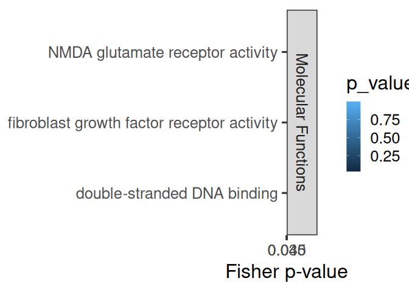
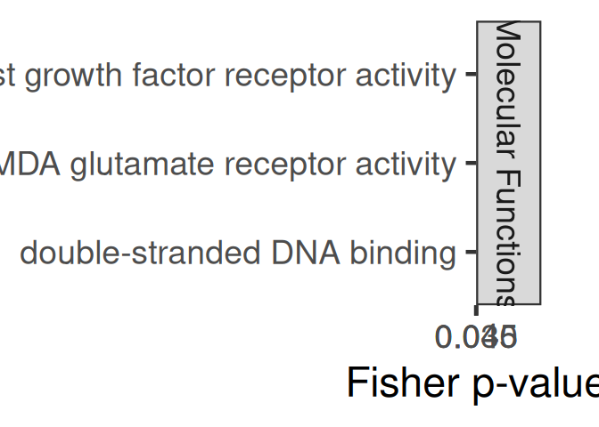
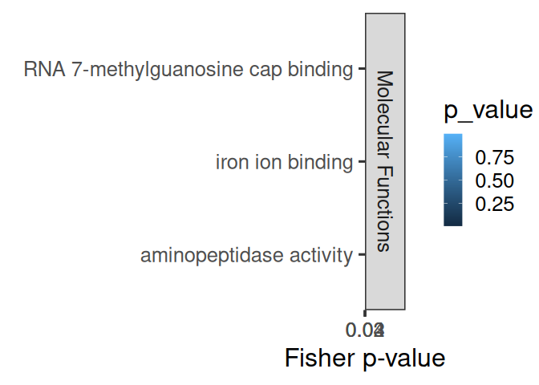
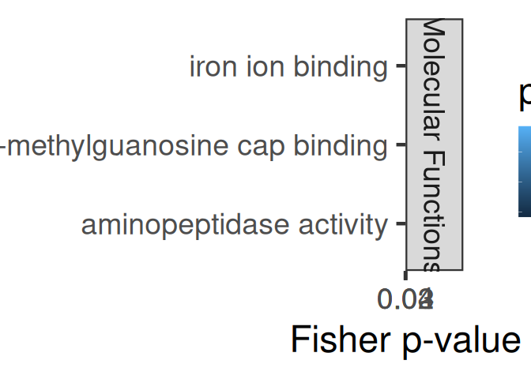
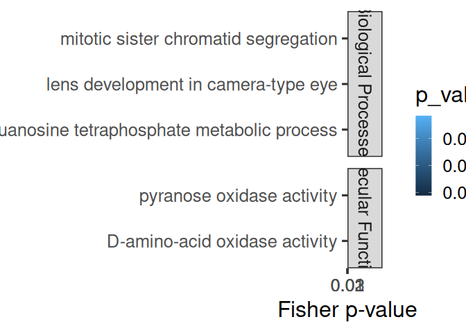
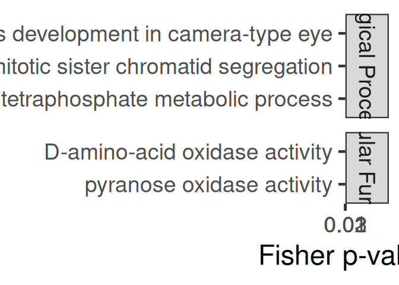
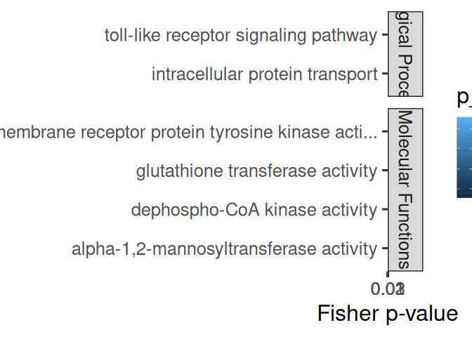
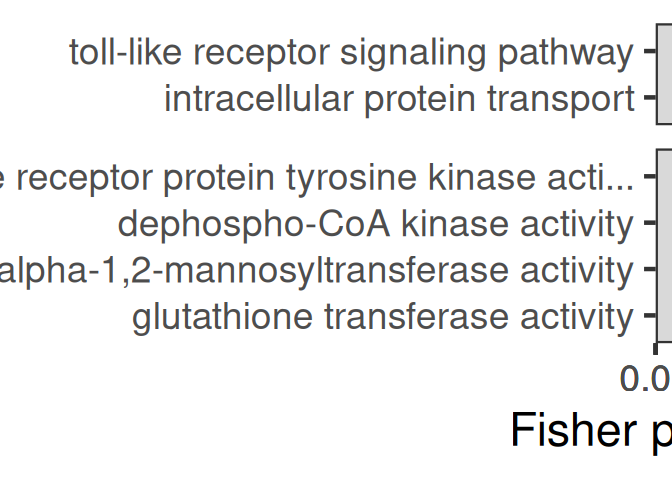

10.14-Peve-mRNA-miRNA-interactions-FE-pooled
================
Kathleen Durkin
2025-08-05

- [1 Format topGO files](#1-format-topgo-files)
  - [1.1 Read in and format annotation
    files](#11-read-in-and-format-annotation-files)
  - [1.2 Set up gene2GO object](#12-set-up-gene2go-object)
  - [1.3 Define reference set](#13-define-reference-set)
- [2 Pool 3UTR, CDS, and 5UTR](#2-pool-3utr-cds-and-5utr)
  - [2.1 Read in PCC/miranda data](#21-read-in-pccmiranda-data)
- [3 FA of all miRNA targets](#3-fa-of-all-mirna-targets)
- [4 FE of specific miRNA’s targets (all
  targets)](#4-fe-of-specific-mirnas-targets-all-targets)
- [5 FE of specific miRNA’s targets (significant cor
  targets)](#5-fe-of-specific-mirnas-targets-significant-cor-targets)
- [6 FE of all targets negatively correlated with miRNAs (regardless of
  correlation
  significance)](#6-fe-of-all-targets-negatively-correlated-with-mirnas-regardless-of-correlation-significance)
  - [6.0.1 Biological Processes](#601-biological-processes)
  - [6.0.2 Cellular Components](#602-cellular-components)
  - [6.0.3 Molecular Functions](#603-molecular-functions)
  - [6.0.4 Join ontologies](#604-join-ontologies)
- [7 FE of all targets positively correlated with miRNAs (regardless of
  correlation
  significance)](#7-fe-of-all-targets-positively-correlated-with-mirnas-regardless-of-correlation-significance)
  - [7.0.1 Biological Processes](#701-biological-processes)
  - [7.0.2 Cellular Components](#702-cellular-components)
  - [7.0.3 Molecular Functions](#703-molecular-functions)
  - [7.0.4 Join ontologies](#704-join-ontologies)
- [8 FE of all targets significantly negatively correlated with
  miRNAs](#8-fe-of-all-targets-significantly-negatively-correlated-with-mirnas)
  - [8.0.1 Biological Processes](#801-biological-processes)
  - [8.0.2 Cellular Components](#802-cellular-components)
  - [8.0.3 Molecular Functions](#803-molecular-functions)
  - [8.0.4 Join ontologies](#804-join-ontologies)
- [9 FE of all targets significantly positively correlated with
  miRNAs](#9-fe-of-all-targets-significantly-positively-correlated-with-mirnas)
  - [9.0.1 Biological Processes](#901-biological-processes)
  - [9.0.2 Cellular Components](#902-cellular-components)
  - [9.0.3 Molecular Functions](#903-molecular-functions)
  - [9.0.4 Join ontologies](#904-join-ontologies)

This script will use topGO to analyze functional enrichment of miRNA
targets for Peve, *pooling all target sites* (3UTR, 5UTR, and CDS)

Code used below was created by `Jill Ashey`, modified for use with
P.evermanni datasets by `Kathleen Durkin`

# 1 Format topGO files

## 1.1 Read in and format annotation files

``` r
# Read in Apul annotations
annot <- read.delim("../output/02-Peve-reference-annotation/Porites_evermanni_CDS-IDmapping-2024_09_04.tab")
# Remove unneeded columns 
annot <- annot %>% dplyr::select(-X, -V13)
# Ensure there are no duplicate rows
annot <- annot %>% distinct()
# Rename gene Id column
annot <- dplyr::rename(annot, 
                gene_ID = V1)

# Remove unwanted text from parent column
annot$gene_ID <- gsub("Parent=", "", annot$gene_ID)

head(annot)
```

    ##         gene_ID     V3
    ## 1 Peve_00000001 P61915
    ## 2 Peve_00000002 Q569C3
    ## 3 Peve_00000003 O35654
    ## 4 Peve_00000004 Q96PQ7
    ## 5 Peve_00000005 P52564
    ## 6 Peve_00000006 Q61656
    ##                                                                                                                                                                                                                           Protein.names
    ## 1                                                                                                                                                                     DELTA-actitoxin-Ate1a (DELTA-AITX-Ate1a) (Cytolysin tenebrosin-C)
    ## 2 Ubiquitin carboxyl-terminal hydrolase 1 (EC 3.4.19.12) (Deubiquitinating enzyme 1) (Ubiquitin thioesterase 1) (Ubiquitin-specific-processing protease 1) [Cleaved into: Ubiquitin carboxyl-terminal hydrolase 1, N-terminal fragment]
    ## 3                                                                                                                                                                     DNA polymerase delta subunit 2 (DNA polymerase delta subunit p50)
    ## 4                                                                                                                                                                                                                  Kelch-like protein 5
    ## 5                    Dual specificity mitogen-activated protein kinase kinase 6 (MAP kinase kinase 6) (MAPKK 6) (EC 2.7.12.2) (MAPK/ERK kinase 6) (MEK 6) (Stress-activated protein kinase kinase 3) (SAPK kinase 3) (SAPKK-3) (SAPKK3)
    ## 6                                                                                                 Probable ATP-dependent RNA helicase DDX5 (EC 3.6.4.13) (DEAD box RNA helicase DEAD1) (mDEAD1) (DEAD box protein 5) (RNA helicase p68)
    ##                                                 Organism
    ## 1 Actinia tenebrosa (Australian red waratah sea anemone)
    ## 2                                Rattus norvegicus (Rat)
    ## 3                                   Mus musculus (Mouse)
    ## 4                                   Homo sapiens (Human)
    ## 5                                   Homo sapiens (Human)
    ## 6                                   Mus musculus (Mouse)
    ##                                                                                                                                                                                                                                                                                                                                                                                                                                                                                                                                                                                                                                                                                                                                                                                                                                                                                                                                                                                                                                                                                                                                                                                                                              Gene.Ontology..biological.process.
    ## 1                                                                                                                                                                                                                                                                                                                                                                                                                                                                                                                                                                                                                                                                                                                                                                                                                                                                                                                                                                                                                                                                                                                                                 cation transport [GO:0006812]; cytolysis in another organism [GO:0051715]; pore complex assembly [GO:0046931]
    ## 2                                                                                                                                                                                                                                                                                                                                                                                                                                                                                                                                                                                                                                                                                                                                                                                                                                                                                                                                                             DNA repair [GO:0006281]; monoubiquitinated protein deubiquitination [GO:0035520]; protein deubiquitination [GO:0016579]; regulation of DNA repair [GO:0006282]; response to UV [GO:0009411]; skeletal system development [GO:0001501]; ubiquitin-dependent protein catabolic process [GO:0006511]
    ## 3                                                                                                                                                                                                                                                                                                                                                                                                                                                                                                                                                                                                                                                                                                                                                                                                                                                                                                                                                                                                                               DNA biosynthetic process [GO:0071897]; DNA replication [GO:0006260]; DNA strand elongation involved in DNA replication [GO:0006271]; DNA-templated DNA replication [GO:0006261]; error-prone translesion synthesis [GO:0042276]
    ## 4                                                                                                                                                                                                                                                                                                                                                                                                                                                                                                                                                                                                                                                                                                                                                                                                                                                                                                                                                                                                                                                                                                                                                                                                                                                              
    ## 5                                                                                                                                                                        apoptotic process [GO:0006915]; bone development [GO:0060348]; cardiac muscle contraction [GO:0060048]; cellular response to sorbitol [GO:0072709]; cellular senescence [GO:0090398]; MAPK cascade [GO:0000165]; negative regulation of cold-induced thermogenesis [GO:0120163]; nucleotide-binding oligomerization domain containing signaling pathway [GO:0070423]; osteoblast differentiation [GO:0001649]; ovulation cycle process [GO:0022602]; p38MAPK cascade [GO:0038066]; positive regulation of apoptotic process [GO:0043065]; positive regulation of MAP kinase activity [GO:0043406]; positive regulation of nitric-oxide synthase biosynthetic process [GO:0051770]; positive regulation of prostaglandin secretion [GO:0032308]; regulation of cell cycle [GO:0051726]; regulation of signal transduction by p53 class mediator [GO:1901796]; response to ischemia [GO:0002931]; response to xenobiotic stimulus [GO:0009410]; signal transduction [GO:0007165]; signal transduction in response to DNA damage [GO:0042770]; stress-activated MAPK cascade [GO:0051403]
    ## 6 alternative mRNA splicing, via spliceosome [GO:0000380]; androgen receptor signaling pathway [GO:0030521]; BMP signaling pathway [GO:0030509]; circadian rhythm [GO:0007623]; epithelial to mesenchymal transition [GO:0001837]; intracellular estrogen receptor signaling pathway [GO:0030520]; intrinsic apoptotic signaling pathway by p53 class mediator [GO:0072332]; miRNA transcription [GO:0061614]; mRNA transcription [GO:0009299]; myoblast differentiation [GO:0045445]; negative regulation of transcription by RNA polymerase II [GO:0000122]; nuclear-transcribed mRNA catabolic process [GO:0000956]; positive regulation of DNA damage response, signal transduction by p53 class mediator [GO:0043517]; positive regulation of DNA-templated transcription [GO:0045893]; primary miRNA processing [GO:0031053]; protein import into nucleus [GO:0006606]; regulation of alternative mRNA splicing, via spliceosome [GO:0000381]; regulation of androgen receptor signaling pathway [GO:0060765]; regulation of osteoblast differentiation [GO:0045667]; regulation of skeletal muscle cell differentiation [GO:2001014]; regulation of transcription by RNA polymerase II [GO:0006357]; regulation of viral genome replication [GO:0045069]
    ##                                                                                                                                                                                                                                                                                                                                                                                                                                                                                                                                                        Gene.Ontology.IDs
    ## 1                                                                                                                                                                                                                                                                                                                                                                                                                                                             GO:0005576; GO:0006812; GO:0015267; GO:0042151; GO:0044218; GO:0046930; GO:0046931; GO:0051715; GO:0090729
    ## 2                                                                                                                                                                                                                                                                                                                                                                                                             GO:0001501; GO:0004197; GO:0004843; GO:0005634; GO:0005654; GO:0005829; GO:0006281; GO:0006282; GO:0006511; GO:0008233; GO:0009411; GO:0016579; GO:0035520
    ## 3                                                                                                                                                                                                                                                                                                                                                                                                                                                 GO:0003677; GO:0005654; GO:0006260; GO:0006261; GO:0006271; GO:0016035; GO:0042276; GO:0042575; GO:0043625; GO:0071897
    ## 4                                                                                                                                                                                                                                                                                                                                                                                                                                                                                                                         GO:0003779; GO:0005737; GO:0005829; GO:0005856
    ## 5                                                                                                                                     GO:0000165; GO:0001649; GO:0002931; GO:0004674; GO:0004708; GO:0004713; GO:0005524; GO:0005654; GO:0005829; GO:0005856; GO:0006915; GO:0007165; GO:0009410; GO:0019211; GO:0019901; GO:0022602; GO:0032308; GO:0038066; GO:0042770; GO:0042802; GO:0043065; GO:0043406; GO:0043539; GO:0051403; GO:0051726; GO:0051770; GO:0060048; GO:0060348; GO:0070423; GO:0072709; GO:0090398; GO:0106310; GO:0120163; GO:0140537; GO:1901796
    ## 6 GO:0000122; GO:0000380; GO:0000381; GO:0000956; GO:0001837; GO:0003712; GO:0003723; GO:0003724; GO:0003730; GO:0005516; GO:0005524; GO:0005634; GO:0005654; GO:0005730; GO:0005737; GO:0006357; GO:0006606; GO:0007623; GO:0009299; GO:0016607; GO:0016887; GO:0019899; GO:0030509; GO:0030520; GO:0030521; GO:0031053; GO:0035500; GO:0036002; GO:0043021; GO:0043517; GO:0045069; GO:0045445; GO:0045667; GO:0045893; GO:0046332; GO:0048306; GO:0050681; GO:0060765; GO:0061614; GO:0070412; GO:0070878; GO:0071013; GO:0072332; GO:1990841; GO:1990904; GO:2001014

``` r
# Looks good!
```

## 1.2 Set up gene2GO object

Want to isolate a list of GO terms per gene

``` r
gene2go <- annot %>% filter(!is.na(Gene.Ontology.IDs)) %>% dplyr::select(gene_ID, Gene.Ontology.IDs)
gene2go <- gene2go %>% dplyr::rename(GO.ID = Gene.Ontology.IDs)

gene2go_list <- setNames(
  strsplit(as.character(gene2go$GO.ID), ";"), 
  gene2go$gene_ID
)
```

Note: I think this means genes that had a Uniprot ID but no GO terms are
excluded from this analysis

## 1.3 Define reference set

Define reference set of genes. This should be all genes *found in our
samples*, NOT all genes in the P.evermanni genome. Some genes (e.g.,
reproduction pathways) may not be found/expected in our samples for
valid biological reasons.

``` r
# Read in counts matrix
Peve_counts <- read.csv("../output/06-Peve-Hisat/Peve-gene_count_matrix.csv")
# Exclude genes with all 0 counts
Peve_counts <- Peve_counts[rowSums(Peve_counts[, 2:6]) != 0, ]

# Select gene IDs of the genes present in our samples
all_genes <- Peve_counts$gene_id
length(all_genes)
```

    ## [1] 31501

So we have a reference set of 31501 genes present in our samples.

# 2 Pool 3UTR, CDS, and 5UTR

## 2.1 Read in PCC/miranda data

These are tables of all putative miRNA-mRNA binding predicted by
miRanda, plus Pearson’s correlation coefficients for coexpression of
each putative binding pair.

``` r
# Load for each region
data_3UTR <- read.csv("../output/10-Peve-mRNA-miRNA-interactions/Peve-miranda_PCC_miRNA_mRNA.csv") %>% dplyr::select(-X, -X.1)
data_CDS <- read.csv("../output/10.01-Peve-mRNA-miRNA-interactions-CDS_5UTR/miRanda_PCC_miRNA_CDS.csv") %>% dplyr::select(-X)
data_5UTR <- read.csv("../output/10.01-Peve-mRNA-miRNA-interactions-CDS_5UTR/miRanda_PCC_miRNA_5UTR.csv") %>% dplyr::select(-X)

# Format and combine into pooled targets
data_3UTR$region <- "3UTR"

colnames(data_CDS) <- c("miRNA", "mRNA_coord", "score", "energy", "query_start", "query_end", "subject_start", "subject_end", "total_bp_shared", "query_similar", "subject_similar", "mRNA", "PCC.cor", "p_value", "adjusted_p_value")
data_CDS$query_start_end <- paste0(data_CDS$query_start, " ", data_CDS$query_end)
data_CDS$subject_start_end <- paste0(data_CDS$subject_start, " ", data_CDS$subject_end)
data_CDS$region <- "CDS"
data_CDS <- data_CDS %>% dplyr::select(colnames(data_3UTR))

colnames(data_5UTR) <- c("miRNA", "mRNA_coord", "score", "energy", "query_start", "query_end", "subject_start", "subject_end", "total_bp_shared", "query_similar", "subject_similar", "mRNA", "PCC.cor", "p_value", "adjusted_p_value")
data_5UTR$query_start_end <- paste0(data_5UTR$query_start, " ", data_5UTR$query_end)
data_5UTR$subject_start_end <- paste0(data_5UTR$subject_start, " ", data_5UTR$subject_end)
data_5UTR$region <- "5UTR"
data_5UTR <- data_5UTR %>% dplyr::select(colnames(data_3UTR))

data <- rbind(data_3UTR, data_CDS, data_5UTR)

head(data)
```

    ##          miRNA          mRNA    PCC.cor   p_value adjusted_p_value score energy
    ## 1 Cluster_9149 Peve_00009100 -0.4772517 0.6832660        0.9782621   168 -20.39
    ## 2 Cluster_9149 Peve_00009100 -0.4772517 0.6832660        0.9782621   168 -20.39
    ## 3 Cluster_6914 Peve_00009103  0.4539645 0.7000186        0.9782621   169 -21.38
    ## 4 Cluster_6906 Peve_00018268 -0.6860633 0.5186746        0.9782621   150 -22.14
    ## 5  Cluster_589 Peve_00028953 -0.9581593 0.1848079        0.9782621   152 -23.43
    ## 6 Cluster_2787 Peve_00018488  0.8679339 0.3308953        0.9782621   163 -22.50
    ##   query_start_end subject_start_end total_bp_shared query_similar
    ## 1            2 21           322 343              19        73.68%
    ## 2            2 21           661 682              19        73.68%
    ## 3            2 20           302 321              18        83.33%
    ## 4            2 16             36 60              17        76.47%
    ## 5            2 13           168 189              11        90.91%
    ## 6            2 21           241 264              21        71.43%
    ##   subject_similar region
    ## 1          84.21%   3UTR
    ## 2          84.21%   3UTR
    ## 3          88.89%   3UTR
    ## 4          76.47%   3UTR
    ## 5          90.91%   3UTR
    ## 6          80.95%   3UTR

# 3 FA of all miRNA targets

Functional annotation of all putative miRNA targets

``` r
cor_bind_FA <- left_join(data, annot, by = c("mRNA" = "gene_ID")) %>% distinct()

nrow(cor_bind_FA)
```

    ## [1] 22598

``` r
nrow(cor_bind_FA[!is.na(cor_bind_FA$Gene.Ontology.IDs),])
```

    ## [1] 13453

Of the 22,598 putative miRNA targets (pooled 3UTR, CDS, and 5UTR
regions) predicted by miRanda, 13,453 have available annotations (59.5%)

``` r
sig_cor_bind_FA <- cor_bind_FA[cor_bind_FA$p_value < 0.05,]

# Remove rows where all values are NA
sig_cor_bind_FA <- sig_cor_bind_FA[!apply(is.na(sig_cor_bind_FA), 1, all), ]

nrow(sig_cor_bind_FA)
```

    ## [1] 1267

``` r
nrow(sig_cor_bind_FA[!is.na(sig_cor_bind_FA$Gene.Ontology.IDs),])
```

    ## [1] 802

Of the 1,267 putative miRNA targets predicted by miRanda that are also
have significantly correlated expression, 802 have available annotations
(63.2%).

Save

``` r
write.csv(cor_bind_FA, "../output/10.14-Peve-mRNA-miRNA-interactions-FE-pooled/miRNA_pooled_targets_FA.csv")
write.csv(sig_cor_bind_FA, "../output/10.14-Peve-mRNA-miRNA-interactions-FE-pooled/miRNA_pooled_sig_cor_targets_FA.csv")
```

# 4 FE of specific miRNA’s targets (all targets)

Create topGO function for use with miRNA names

``` r
miRNA_topGO_FE <- function(miRNA.name, input_interactions) {
  
  #Isolate genes in our input module of interest
  interacting_genes <- input_interactions %>%
    filter(miRNA == miRNA.name) %>%
    pull(mRNA)
  
  if (length(interacting_genes) > 0 && any(all_genes %in% interacting_genes)) {
    # Create factor for all reference genes, where 1 represents module membership and 0 means the gene is not in module of interest
    gene_list <- factor(as.integer(all_genes %in% interacting_genes))
    names(gene_list) <- all_genes
    str(gene_list)
    
    ## Biological Process ##
    # Create topGO object
    GO_BP <- new("topGOdata", 
                ontology = "BP", # Biological Process
                allGenes = gene_list,
                annot = annFUN.gene2GO, 
                gene2GO = gene2go_list,
                geneSel=topDiffGenes)
    
    # Run GO enrichment test
    GO_BP_FE <- runTest(GO_BP, algorithm = "weight01", statistic = "fisher")
    # View the results
    GO_BP_results <- GenTable(GO_BP, Fisher = GO_BP_FE, orderBy = "Fisher",  topNodes = 100, numChar = 51)
    # Filter by significant results
    GO_BP_results$Fisher<-as.numeric(GO_BP_results$Fisher)
    GO_BP_results_sig<-GO_BP_results[GO_BP_results$Fisher<0.05,]
    
    
    ## Molecular Function ##
    # Create topGO object
    GO_MF <- new("topGOdata", 
                ontology = "MF", # Molecular Function
                allGenes = gene_list,
                annot = annFUN.gene2GO, 
                gene2GO = gene2go_list,
                geneSel=topDiffGenes)
    
    # Run GO enrichment test
    GO_MF_FE <- runTest(GO_MF, algorithm = "weight01", statistic = "fisher")
    # View the results
    GO_MF_results <- GenTable(GO_MF, Fisher = GO_MF_FE, orderBy = "Fisher",  topNodes = 100, numChar = 51)
    # Filter by significant results
    GO_MF_results$Fisher<-as.numeric(GO_MF_results$Fisher)
    GO_MF_results_sig<-GO_MF_results[GO_MF_results$Fisher<0.05,]
  
    # Return
    # Add type column only if results exist
    if (nrow(GO_BP_results_sig) > 0) {
      GO_BP_results_sig$type <- "Biological.Process"
    }
    if (nrow(GO_MF_results_sig) > 0) {
      GO_MF_results_sig$type <- "Molecular.Function"
    }
    GO_results <- rbind(GO_BP_results_sig, GO_MF_results_sig)
    print(GO_results)
  }
}

miRNA_topGO_FE("Cluster_10051", cor_bind_FA)
```

Loop through all miRNA and run functional enrichment on the miRNA’s
targets (all predicted targets)

``` r
interacting_miRNAs <- unique(cor_bind_FA$miRNA) %>% na.omit
results_all_targets <- NULL  # initialize empty df

for(miRNA in interacting_miRNAs) {
  
  # Run topGO enrichment function
  miRNA_results <- miRNA_topGO_FE(miRNA, cor_bind_FA)
  
  # Only keep results if not empty
  if (!is.null(miRNA_results) && nrow(miRNA_results) > 0)  {
    
    # Add the miRNA source column
    miRNA_results$miRNA <- miRNA

    # Bind to the accumulating results data frame
    results_all_targets <- rbind(results_all_targets, miRNA_results)
  }
}
```

    ##  Factor w/ 2 levels "0","1": 1 1 1 1 1 1 1 1 1 1 ...
    ##  - attr(*, "names")= chr [1:31501] "STRG.24381" "STRG.24380" "STRG.15042" "STRG.8662" ...

    ## 
    ## Building most specific GOs .....

    ##  ( 112 GO terms found. )

    ## 
    ## Build GO DAG topology ..........

    ##  ( 660 GO terms and 1181 relations. )

    ## 
    ## Annotating nodes ...............

    ##  ( 349 genes annotated to the GO terms. )

    ## 
    ##           -- Weight01 Algorithm -- 
    ## 
    ##       the algorithm is scoring 89 nontrivial nodes
    ##       parameters: 
    ##           test statistic: fisher

    ## 
    ##   Level 12:  1 nodes to be scored    (0 eliminated genes)

    ## 
    ##   Level 11:  2 nodes to be scored    (0 eliminated genes)

    ## 
    ##   Level 10:  4 nodes to be scored    (6 eliminated genes)

    ## 
    ##   Level 9:   7 nodes to be scored    (27 eliminated genes)

    ## 
    ##   Level 8:   9 nodes to be scored    (59 eliminated genes)

    ## 
    ##   Level 7:   10 nodes to be scored   (62 eliminated genes)

    ## 
    ##   Level 6:   13 nodes to be scored   (95 eliminated genes)

    ## 
    ##   Level 5:   15 nodes to be scored   (108 eliminated genes)

    ## 
    ##   Level 4:   11 nodes to be scored   (115 eliminated genes)

    ## 
    ##   Level 3:   10 nodes to be scored   (175 eliminated genes)

    ## 
    ##   Level 2:   6 nodes to be scored    (192 eliminated genes)

    ## 
    ##   Level 1:   1 nodes to be scored    (238 eliminated genes)

    ## 
    ## Building most specific GOs .....

    ##  ( 182 GO terms found. )

    ## 
    ## Build GO DAG topology ..........

    ##  ( 465 GO terms and 594 relations. )

    ## 
    ## Annotating nodes ...............

    ##  ( 610 genes annotated to the GO terms. )

    ## 
    ##           -- Weight01 Algorithm -- 
    ## 
    ##       the algorithm is scoring 70 nontrivial nodes
    ##       parameters: 
    ##           test statistic: fisher

    ## 
    ##   Level 9:   3 nodes to be scored    (0 eliminated genes)

    ## 
    ##   Level 8:   5 nodes to be scored    (0 eliminated genes)

    ## 
    ##   Level 7:   9 nodes to be scored    (25 eliminated genes)

    ## 
    ##   Level 6:   13 nodes to be scored   (37 eliminated genes)

    ## 
    ##   Level 5:   13 nodes to be scored   (108 eliminated genes)

    ## 
    ##   Level 4:   14 nodes to be scored   (139 eliminated genes)

    ## 
    ##   Level 3:   8 nodes to be scored    (235 eliminated genes)

    ## 
    ##   Level 2:   4 nodes to be scored    (325 eliminated genes)

    ## 
    ##   Level 1:   1 nodes to be scored    (466 eliminated genes)

    ##        GO.ID                                                   Term Annotated
    ## 1 GO:0001523                             retinoid metabolic process         2
    ## 2 GO:0005109                                       frizzled binding         1
    ## 3 GO:0005248                  voltage-gated sodium channel activity         1
    ## 4 GO:0001601                           peptide YY receptor activity         2
    ## 5 GO:0003831 beta-N-acetylglucosaminylglycopeptide beta-1,4-gala...         2
    ## 6 GO:0003729                                           mRNA binding         2
    ##   Significant Expected Fisher               type
    ## 1           1     0.05  0.045 Biological.Process
    ## 2           1     0.02  0.020 Molecular.Function
    ## 3           1     0.02  0.020 Molecular.Function
    ## 4           1     0.04  0.039 Molecular.Function
    ## 5           1     0.04  0.039 Molecular.Function
    ## 6           1     0.04  0.039 Molecular.Function
    ##  Factor w/ 2 levels "0","1": 1 1 1 1 1 1 1 1 1 1 ...
    ##  - attr(*, "names")= chr [1:31501] "STRG.24381" "STRG.24380" "STRG.15042" "STRG.8662" ...

    ## 
    ## Building most specific GOs .....

    ##  ( 112 GO terms found. )

    ## 
    ## Build GO DAG topology ..........

    ##  ( 660 GO terms and 1181 relations. )

    ## 
    ## Annotating nodes ...............

    ##  ( 349 genes annotated to the GO terms. )

    ## 
    ##           -- Weight01 Algorithm -- 
    ## 
    ##       the algorithm is scoring 8 nontrivial nodes
    ##       parameters: 
    ##           test statistic: fisher

    ## 
    ##   Level 5:   1 nodes to be scored    (0 eliminated genes)

    ## 
    ##   Level 4:   1 nodes to be scored    (0 eliminated genes)

    ## 
    ##   Level 3:   2 nodes to be scored    (30 eliminated genes)

    ## 
    ##   Level 2:   3 nodes to be scored    (38 eliminated genes)

    ## 
    ##   Level 1:   1 nodes to be scored    (40 eliminated genes)

    ## 
    ## Building most specific GOs .....

    ##  ( 182 GO terms found. )

    ## 
    ## Build GO DAG topology ..........

    ##  ( 465 GO terms and 594 relations. )

    ## 
    ## Annotating nodes ...............

    ##  ( 610 genes annotated to the GO terms. )

    ## 
    ##           -- Weight01 Algorithm -- 
    ## 
    ##       the algorithm is scoring 20 nontrivial nodes
    ##       parameters: 
    ##           test statistic: fisher

    ## 
    ##   Level 7:   2 nodes to be scored    (0 eliminated genes)

    ## 
    ##   Level 6:   2 nodes to be scored    (0 eliminated genes)

    ## 
    ##   Level 5:   3 nodes to be scored    (39 eliminated genes)

    ## 
    ##   Level 4:   5 nodes to be scored    (58 eliminated genes)

    ## 
    ##   Level 3:   4 nodes to be scored    (97 eliminated genes)

    ## 
    ##   Level 2:   3 nodes to be scored    (250 eliminated genes)

    ## 
    ##   Level 1:   1 nodes to be scored    (314 eliminated genes)

    ##        GO.ID                                                   Term Annotated
    ## 1 GO:0001409 guanine nucleotide transmembrane transporter activi...         6
    ##   Significant Expected Fisher               type
    ## 1           1     0.04  0.039 Molecular.Function
    ##  Factor w/ 2 levels "0","1": 1 1 1 1 1 1 1 1 1 1 ...
    ##  - attr(*, "names")= chr [1:31501] "STRG.24381" "STRG.24380" "STRG.15042" "STRG.8662" ...

    ## 
    ## Building most specific GOs .....

    ##  ( 112 GO terms found. )

    ## 
    ## Build GO DAG topology ..........

    ##  ( 660 GO terms and 1181 relations. )

    ## 
    ## Annotating nodes ...............

    ##  ( 349 genes annotated to the GO terms. )

    ## 
    ##           -- Weight01 Algorithm -- 
    ## 
    ##       the algorithm is scoring 86 nontrivial nodes
    ##       parameters: 
    ##           test statistic: fisher

    ## 
    ##   Level 12:  1 nodes to be scored    (0 eliminated genes)

    ## 
    ##   Level 11:  2 nodes to be scored    (0 eliminated genes)

    ## 
    ##   Level 10:  4 nodes to be scored    (6 eliminated genes)

    ## 
    ##   Level 9:   6 nodes to be scored    (27 eliminated genes)

    ## 
    ##   Level 8:   8 nodes to be scored    (59 eliminated genes)

    ## 
    ##   Level 7:   10 nodes to be scored   (60 eliminated genes)

    ## 
    ##   Level 6:   13 nodes to be scored   (72 eliminated genes)

    ## 
    ##   Level 5:   15 nodes to be scored   (78 eliminated genes)

    ## 
    ##   Level 4:   10 nodes to be scored   (82 eliminated genes)

    ## 
    ##   Level 3:   10 nodes to be scored   (116 eliminated genes)

    ## 
    ##   Level 2:   6 nodes to be scored    (172 eliminated genes)

    ## 
    ##   Level 1:   1 nodes to be scored    (242 eliminated genes)

    ## 
    ## Building most specific GOs .....

    ##  ( 182 GO terms found. )

    ## 
    ## Build GO DAG topology ..........

    ##  ( 465 GO terms and 594 relations. )

    ## 
    ## Annotating nodes ...............

    ##  ( 610 genes annotated to the GO terms. )

    ## 
    ##           -- Weight01 Algorithm -- 
    ## 
    ##       the algorithm is scoring 32 nontrivial nodes
    ##       parameters: 
    ##           test statistic: fisher

    ## 
    ##   Level 9:   1 nodes to be scored    (0 eliminated genes)

    ## 
    ##   Level 8:   1 nodes to be scored    (0 eliminated genes)

    ## 
    ##   Level 7:   3 nodes to be scored    (18 eliminated genes)

    ## 
    ##   Level 6:   6 nodes to be scored    (21 eliminated genes)

    ## 
    ##   Level 5:   6 nodes to be scored    (55 eliminated genes)

    ## 
    ##   Level 4:   5 nodes to be scored    (81 eliminated genes)

    ## 
    ##   Level 3:   6 nodes to be scored    (101 eliminated genes)

    ## 
    ##   Level 2:   3 nodes to be scored    (174 eliminated genes)

    ## 
    ##   Level 1:   1 nodes to be scored    (281 eliminated genes)

    ##        GO.ID                                                   Term Annotated
    ## 1 GO:0001696                                 gastric acid secretion         2
    ## 2 GO:0001937 negative regulation of endothelial cell proliferati...         2
    ## 3 GO:0000026                 alpha-1,2-mannosyltransferase activity         1
    ## 4 GO:0008376               acetylgalactosaminyltransferase activity         2
    ## 5 GO:0004089                         carbonate dehydratase activity         2
    ##   Significant Expected Fisher               type
    ## 1           1     0.03  0.028 Biological.Process
    ## 2           1     0.03  0.028 Biological.Process
    ## 3           1     0.01  0.011 Molecular.Function
    ## 4           1     0.02  0.023 Molecular.Function
    ## 5           1     0.02  0.023 Molecular.Function
    ##  Factor w/ 2 levels "0","1": 1 1 1 1 1 1 1 1 1 1 ...
    ##  - attr(*, "names")= chr [1:31501] "STRG.24381" "STRG.24380" "STRG.15042" "STRG.8662" ...

    ## 
    ## Building most specific GOs .....

    ##  ( 112 GO terms found. )

    ## 
    ## Build GO DAG topology ..........

    ##  ( 660 GO terms and 1181 relations. )

    ## 
    ## Annotating nodes ...............

    ##  ( 349 genes annotated to the GO terms. )

    ## 
    ##           -- Weight01 Algorithm -- 
    ## 
    ##       the algorithm is scoring 160 nontrivial nodes
    ##       parameters: 
    ##           test statistic: fisher

    ## 
    ##   Level 12:  1 nodes to be scored    (0 eliminated genes)

    ## 
    ##   Level 11:  2 nodes to be scored    (0 eliminated genes)

    ## 
    ##   Level 10:  4 nodes to be scored    (4 eliminated genes)

    ## 
    ##   Level 9:   8 nodes to be scored    (25 eliminated genes)

    ## 
    ##   Level 8:   12 nodes to be scored   (31 eliminated genes)

    ## 
    ##   Level 7:   20 nodes to be scored   (44 eliminated genes)

    ## 
    ##   Level 6:   24 nodes to be scored   (79 eliminated genes)

    ## 
    ##   Level 5:   34 nodes to be scored   (95 eliminated genes)

    ## 
    ##   Level 4:   25 nodes to be scored   (107 eliminated genes)

    ## 
    ##   Level 3:   20 nodes to be scored   (251 eliminated genes)

    ## 
    ##   Level 2:   9 nodes to be scored    (291 eliminated genes)

    ## 
    ##   Level 1:   1 nodes to be scored    (328 eliminated genes)

    ## 
    ## Building most specific GOs .....

    ##  ( 182 GO terms found. )

    ## 
    ## Build GO DAG topology ..........

    ##  ( 465 GO terms and 594 relations. )

    ## 
    ## Annotating nodes ...............

    ##  ( 610 genes annotated to the GO terms. )

    ## 
    ##           -- Weight01 Algorithm -- 
    ## 
    ##       the algorithm is scoring 138 nontrivial nodes
    ##       parameters: 
    ##           test statistic: fisher

    ## 
    ##   Level 10:  1 nodes to be scored    (0 eliminated genes)

    ## 
    ##   Level 9:   5 nodes to be scored    (0 eliminated genes)

    ## 
    ##   Level 8:   12 nodes to be scored   (2 eliminated genes)

    ## 
    ##   Level 7:   18 nodes to be scored   (35 eliminated genes)

    ## 
    ##   Level 6:   23 nodes to be scored   (61 eliminated genes)

    ## 
    ##   Level 5:   28 nodes to be scored   (125 eliminated genes)

    ## 
    ##   Level 4:   29 nodes to be scored   (213 eliminated genes)

    ## 
    ##   Level 3:   13 nodes to be scored   (380 eliminated genes)

    ## 
    ##   Level 2:   8 nodes to be scored    (457 eliminated genes)

    ## 
    ##   Level 1:   1 nodes to be scored    (557 eliminated genes)

    ##        GO.ID                                       Term Annotated Significant
    ## 1 GO:0000165                               MAPK cascade        23           7
    ## 2 GO:0005283       amino acid:sodium symporter activity         3           2
    ## 3 GO:0004656 procollagen-proline 4-dioxygenase activity         5           2
    ##   Expected  Fisher               type
    ## 1     1.65 0.00047 Biological.Process
    ## 2     0.21 0.01400 Molecular.Function
    ## 3     0.35 0.04200 Molecular.Function
    ##  Factor w/ 2 levels "0","1": 1 1 1 1 1 1 1 1 1 1 ...
    ##  - attr(*, "names")= chr [1:31501] "STRG.24381" "STRG.24380" "STRG.15042" "STRG.8662" ...

    ## 
    ## Building most specific GOs .....

    ##  ( 112 GO terms found. )

    ## 
    ## Build GO DAG topology ..........

    ##  ( 660 GO terms and 1181 relations. )

    ## 
    ## Annotating nodes ...............

    ##  ( 349 genes annotated to the GO terms. )

    ## 
    ##           -- Weight01 Algorithm -- 
    ## 
    ##       the algorithm is scoring 193 nontrivial nodes
    ##       parameters: 
    ##           test statistic: fisher

    ## 
    ##   Level 12:  1 nodes to be scored    (0 eliminated genes)

    ## 
    ##   Level 11:  4 nodes to be scored    (0 eliminated genes)

    ## 
    ##   Level 10:  6 nodes to be scored    (2 eliminated genes)

    ## 
    ##   Level 9:   11 nodes to be scored   (28 eliminated genes)

    ## 
    ##   Level 8:   15 nodes to be scored   (61 eliminated genes)

    ## 
    ##   Level 7:   24 nodes to be scored   (85 eliminated genes)

    ## 
    ##   Level 6:   29 nodes to be scored   (126 eliminated genes)

    ## 
    ##   Level 5:   37 nodes to be scored   (144 eliminated genes)

    ## 
    ##   Level 4:   32 nodes to be scored   (151 eliminated genes)

    ## 
    ##   Level 3:   24 nodes to be scored   (218 eliminated genes)

    ## 
    ##   Level 2:   9 nodes to be scored    (274 eliminated genes)

    ## 
    ##   Level 1:   1 nodes to be scored    (316 eliminated genes)

    ## 
    ## Building most specific GOs .....

    ##  ( 182 GO terms found. )

    ## 
    ## Build GO DAG topology ..........

    ##  ( 465 GO terms and 594 relations. )

    ## 
    ## Annotating nodes ...............

    ##  ( 610 genes annotated to the GO terms. )

    ## 
    ##           -- Weight01 Algorithm -- 
    ## 
    ##       the algorithm is scoring 152 nontrivial nodes
    ##       parameters: 
    ##           test statistic: fisher

    ## 
    ##   Level 12:  1 nodes to be scored    (0 eliminated genes)

    ## 
    ##   Level 11:  1 nodes to be scored    (0 eliminated genes)

    ## 
    ##   Level 10:  2 nodes to be scored    (2 eliminated genes)

    ## 
    ##   Level 9:   4 nodes to be scored    (3 eliminated genes)

    ## 
    ##   Level 8:   11 nodes to be scored   (14 eliminated genes)

    ## 
    ##   Level 7:   19 nodes to be scored   (45 eliminated genes)

    ## 
    ##   Level 6:   26 nodes to be scored   (81 eliminated genes)

    ## 
    ##   Level 5:   30 nodes to be scored   (164 eliminated genes)

    ## 
    ##   Level 4:   34 nodes to be scored   (242 eliminated genes)

    ## 
    ##   Level 3:   16 nodes to be scored   (423 eliminated genes)

    ## 
    ##   Level 2:   7 nodes to be scored    (512 eliminated genes)

    ## 
    ##   Level 1:   1 nodes to be scored    (568 eliminated genes)

    ##        GO.ID                                                   Term Annotated
    ## 1 GO:0000281                                    mitotic cytokinesis         6
    ## 2 GO:0000978 RNA polymerase II cis-regulatory region sequence-sp...        11
    ## 3 GO:0005302          L-tyrosine transmembrane transporter activity         6
    ##   Significant Expected Fisher               type
    ## 1           3     0.40 0.0044 Biological.Process
    ## 2           4     0.85 0.0069 Molecular.Function
    ## 3           3     0.46 0.0073 Molecular.Function
    ##  Factor w/ 2 levels "0","1": 1 1 1 1 1 1 1 1 1 1 ...
    ##  - attr(*, "names")= chr [1:31501] "STRG.24381" "STRG.24380" "STRG.15042" "STRG.8662" ...

    ## 
    ## Building most specific GOs .....

    ##  ( 112 GO terms found. )

    ## 
    ## Build GO DAG topology ..........

    ##  ( 660 GO terms and 1181 relations. )

    ## 
    ## Annotating nodes ...............

    ##  ( 349 genes annotated to the GO terms. )

    ## 
    ##           -- Weight01 Algorithm -- 
    ## 
    ##       the algorithm is scoring 192 nontrivial nodes
    ##       parameters: 
    ##           test statistic: fisher

    ## 
    ##   Level 14:  1 nodes to be scored    (0 eliminated genes)

    ## 
    ##   Level 13:  1 nodes to be scored    (0 eliminated genes)

    ## 
    ##   Level 12:  1 nodes to be scored    (1 eliminated genes)

    ## 
    ##   Level 11:  4 nodes to be scored    (1 eliminated genes)

    ## 
    ##   Level 10:  9 nodes to be scored    (1 eliminated genes)

    ## 
    ##   Level 9:   11 nodes to be scored   (24 eliminated genes)

    ## 
    ##   Level 8:   21 nodes to be scored   (61 eliminated genes)

    ## 
    ##   Level 7:   22 nodes to be scored   (62 eliminated genes)

    ## 
    ##   Level 6:   27 nodes to be scored   (102 eliminated genes)

    ## 
    ##   Level 5:   36 nodes to be scored   (156 eliminated genes)

    ## 
    ##   Level 4:   25 nodes to be scored   (169 eliminated genes)

    ## 
    ##   Level 3:   25 nodes to be scored   (251 eliminated genes)

    ## 
    ##   Level 2:   8 nodes to be scored    (283 eliminated genes)

    ## 
    ##   Level 1:   1 nodes to be scored    (339 eliminated genes)

    ## 
    ## Building most specific GOs .....

    ##  ( 182 GO terms found. )

    ## 
    ## Build GO DAG topology ..........

    ##  ( 465 GO terms and 594 relations. )

    ## 
    ## Annotating nodes ...............

    ##  ( 610 genes annotated to the GO terms. )

    ## 
    ##           -- Weight01 Algorithm -- 
    ## 
    ##       the algorithm is scoring 51 nontrivial nodes
    ##       parameters: 
    ##           test statistic: fisher

    ## 
    ##   Level 8:   2 nodes to be scored    (0 eliminated genes)

    ## 
    ##   Level 7:   6 nodes to be scored    (0 eliminated genes)

    ## 
    ##   Level 6:   8 nodes to be scored    (5 eliminated genes)

    ## 
    ##   Level 5:   12 nodes to be scored   (78 eliminated genes)

    ## 
    ##   Level 4:   8 nodes to be scored    (124 eliminated genes)

    ## 
    ##   Level 3:   8 nodes to be scored    (197 eliminated genes)

    ## 
    ##   Level 2:   6 nodes to be scored    (261 eliminated genes)

    ## 
    ##   Level 1:   1 nodes to be scored    (359 eliminated genes)

    ##        GO.ID                                                   Term Annotated
    ## 1 GO:0001666                                    response to hypoxia         4
    ## 2 GO:0004605            phosphatidate cytidylyltransferase activity         1
    ## 3 GO:0004715 non-membrane spanning protein tyrosine kinase activ...         1
    ## 4 GO:0003779                                          actin binding        10
    ##   Significant Expected Fisher               type
    ## 1           2     0.23  0.017 Biological.Process
    ## 2           1     0.03  0.028 Molecular.Function
    ## 3           1     0.03  0.028 Molecular.Function
    ## 4           2     0.28  0.029 Molecular.Function
    ##  Factor w/ 2 levels "0","1": 1 1 1 1 1 1 1 1 1 1 ...
    ##  - attr(*, "names")= chr [1:31501] "STRG.24381" "STRG.24380" "STRG.15042" "STRG.8662" ...

    ## 
    ## Building most specific GOs .....

    ##  ( 112 GO terms found. )

    ## 
    ## Build GO DAG topology ..........

    ##  ( 660 GO terms and 1181 relations. )

    ## 
    ## Annotating nodes ...............

    ##  ( 349 genes annotated to the GO terms. )

    ## 
    ##           -- Weight01 Algorithm -- 
    ## 
    ##       the algorithm is scoring 79 nontrivial nodes
    ##       parameters: 
    ##           test statistic: fisher

    ## 
    ##   Level 11:  1 nodes to be scored    (0 eliminated genes)

    ## 
    ##   Level 10:  3 nodes to be scored    (0 eliminated genes)

    ## 
    ##   Level 9:   4 nodes to be scored    (21 eliminated genes)

    ## 
    ##   Level 8:   7 nodes to be scored    (53 eliminated genes)

    ## 
    ##   Level 7:   9 nodes to be scored    (54 eliminated genes)

    ## 
    ##   Level 6:   13 nodes to be scored   (60 eliminated genes)

    ## 
    ##   Level 5:   15 nodes to be scored   (78 eliminated genes)

    ## 
    ##   Level 4:   10 nodes to be scored   (82 eliminated genes)

    ## 
    ##   Level 3:   10 nodes to be scored   (116 eliminated genes)

    ## 
    ##   Level 2:   6 nodes to be scored    (172 eliminated genes)

    ## 
    ##   Level 1:   1 nodes to be scored    (242 eliminated genes)

    ## 
    ## Building most specific GOs .....

    ##  ( 182 GO terms found. )

    ## 
    ## Build GO DAG topology ..........

    ##  ( 465 GO terms and 594 relations. )

    ## 
    ## Annotating nodes ...............

    ##  ( 610 genes annotated to the GO terms. )

    ## 
    ##           -- Weight01 Algorithm -- 
    ## 
    ##       the algorithm is scoring 14 nontrivial nodes
    ##       parameters: 
    ##           test statistic: fisher

    ## 
    ##   Level 6:   1 nodes to be scored    (0 eliminated genes)

    ## 
    ##   Level 5:   3 nodes to be scored    (0 eliminated genes)

    ## 
    ##   Level 4:   3 nodes to be scored    (2 eliminated genes)

    ## 
    ##   Level 3:   3 nodes to be scored    (81 eliminated genes)

    ## 
    ##   Level 2:   3 nodes to be scored    (118 eliminated genes)

    ## 
    ##   Level 1:   1 nodes to be scored    (212 eliminated genes)

    ##        GO.ID                                                   Term Annotated
    ## 1 GO:0001696                                 gastric acid secretion         2
    ## 2 GO:0001937 negative regulation of endothelial cell proliferati...         2
    ## 3 GO:0008376               acetylgalactosaminyltransferase activity         2
    ##   Significant Expected Fisher               type
    ## 1           1     0.02 0.0230 Biological.Process
    ## 2           1     0.02 0.0230 Biological.Process
    ## 3           1     0.01 0.0098 Molecular.Function
    ##  Factor w/ 2 levels "0","1": 1 1 1 1 1 1 1 1 1 1 ...
    ##  - attr(*, "names")= chr [1:31501] "STRG.24381" "STRG.24380" "STRG.15042" "STRG.8662" ...

    ## 
    ## Building most specific GOs .....

    ##  ( 112 GO terms found. )

    ## 
    ## Build GO DAG topology ..........

    ##  ( 660 GO terms and 1181 relations. )

    ## 
    ## Annotating nodes ...............

    ##  ( 349 genes annotated to the GO terms. )

    ## 
    ##           -- Weight01 Algorithm -- 
    ## 
    ##       the algorithm is scoring 8 nontrivial nodes
    ##       parameters: 
    ##           test statistic: fisher

    ## 
    ##   Level 5:   1 nodes to be scored    (0 eliminated genes)

    ## 
    ##   Level 4:   1 nodes to be scored    (0 eliminated genes)

    ## 
    ##   Level 3:   2 nodes to be scored    (30 eliminated genes)

    ## 
    ##   Level 2:   3 nodes to be scored    (38 eliminated genes)

    ## 
    ##   Level 1:   1 nodes to be scored    (40 eliminated genes)

    ## 
    ## Building most specific GOs .....

    ##  ( 182 GO terms found. )

    ## 
    ## Build GO DAG topology ..........

    ##  ( 465 GO terms and 594 relations. )

    ## 
    ## Annotating nodes ...............

    ##  ( 610 genes annotated to the GO terms. )

    ## 
    ##           -- Weight01 Algorithm -- 
    ## 
    ##       the algorithm is scoring 22 nontrivial nodes
    ##       parameters: 
    ##           test statistic: fisher

    ## 
    ##   Level 6:   1 nodes to be scored    (0 eliminated genes)

    ## 
    ##   Level 5:   4 nodes to be scored    (0 eliminated genes)

    ## 
    ##   Level 4:   6 nodes to be scored    (4 eliminated genes)

    ## 
    ##   Level 3:   6 nodes to be scored    (83 eliminated genes)

    ## 
    ##   Level 2:   4 nodes to be scored    (140 eliminated genes)

    ## 
    ##   Level 1:   1 nodes to be scored    (267 eliminated genes)

    ##        GO.ID                                                   Term Annotated
    ## 1 GO:0000981 DNA-binding transcription factor activity, RNA poly...         4
    ## 2 GO:0004508                steroid 17-alpha-monooxygenase activity         4
    ## 3 GO:0003714                     transcription corepressor activity         5
    ##   Significant Expected Fisher               type
    ## 1           1     0.04  0.039 Molecular.Function
    ## 2           1     0.04  0.039 Molecular.Function
    ## 3           1     0.05  0.048 Molecular.Function
    ##  Factor w/ 2 levels "0","1": 1 1 1 1 1 1 1 1 1 1 ...
    ##  - attr(*, "names")= chr [1:31501] "STRG.24381" "STRG.24380" "STRG.15042" "STRG.8662" ...

    ## 
    ## Building most specific GOs .....

    ##  ( 112 GO terms found. )

    ## 
    ## Build GO DAG topology ..........

    ##  ( 660 GO terms and 1181 relations. )

    ## 
    ## Annotating nodes ...............

    ##  ( 349 genes annotated to the GO terms. )

    ## 
    ##           -- Weight01 Algorithm -- 
    ## 
    ##       the algorithm is scoring 21 nontrivial nodes
    ##       parameters: 
    ##           test statistic: fisher

    ## 
    ##   Level 8:   1 nodes to be scored    (0 eliminated genes)

    ## 
    ##   Level 7:   2 nodes to be scored    (0 eliminated genes)

    ## 
    ##   Level 6:   3 nodes to be scored    (23 eliminated genes)

    ## 
    ##   Level 5:   3 nodes to be scored    (48 eliminated genes)

    ## 
    ##   Level 4:   4 nodes to be scored    (52 eliminated genes)

    ## 
    ##   Level 3:   4 nodes to be scored    (67 eliminated genes)

    ## 
    ##   Level 2:   3 nodes to be scored    (99 eliminated genes)

    ## 
    ##   Level 1:   1 nodes to be scored    (109 eliminated genes)

    ## 
    ## Building most specific GOs .....

    ##  ( 182 GO terms found. )

    ## 
    ## Build GO DAG topology ..........

    ##  ( 465 GO terms and 594 relations. )

    ## 
    ## Annotating nodes ...............

    ##  ( 610 genes annotated to the GO terms. )

    ## 
    ##           -- Weight01 Algorithm -- 
    ## 
    ##       the algorithm is scoring 15 nontrivial nodes
    ##       parameters: 
    ##           test statistic: fisher

    ## 
    ##   Level 6:   3 nodes to be scored    (0 eliminated genes)

    ## 
    ##   Level 5:   3 nodes to be scored    (0 eliminated genes)

    ## 
    ##   Level 4:   3 nodes to be scored    (5 eliminated genes)

    ## 
    ##   Level 3:   3 nodes to be scored    (76 eliminated genes)

    ## 
    ##   Level 2:   2 nodes to be scored    (106 eliminated genes)

    ## 
    ##   Level 1:   1 nodes to be scored    (151 eliminated genes)

    ##        GO.ID                                          Term Annotated
    ## 1 GO:0050233                     pyranose oxidase activity         1
    ## 2 GO:0003978              UDP-glucose 4-epimerase activity         1
    ## 3 GO:0001609 G protein-coupled adenosine receptor activity         3
    ##   Significant Expected Fisher               type
    ## 1           1     0.00 0.0049 Molecular.Function
    ## 2           1     0.00 0.0049 Molecular.Function
    ## 3           1     0.01 0.0147 Molecular.Function
    ##  Factor w/ 2 levels "0","1": 1 1 1 1 1 1 1 1 1 1 ...
    ##  - attr(*, "names")= chr [1:31501] "STRG.24381" "STRG.24380" "STRG.15042" "STRG.8662" ...

    ## 
    ## Building most specific GOs .....

    ##  ( 112 GO terms found. )

    ## 
    ## Build GO DAG topology ..........

    ##  ( 660 GO terms and 1181 relations. )

    ## 
    ## Annotating nodes ...............

    ##  ( 349 genes annotated to the GO terms. )

    ## 
    ##           -- Weight01 Algorithm -- 
    ## 
    ##       the algorithm is scoring 126 nontrivial nodes
    ##       parameters: 
    ##           test statistic: fisher

    ## 
    ##   Level 11:  2 nodes to be scored    (0 eliminated genes)

    ## 
    ##   Level 10:  4 nodes to be scored    (0 eliminated genes)

    ## 
    ##   Level 9:   6 nodes to be scored    (24 eliminated genes)

    ## 
    ##   Level 8:   9 nodes to be scored    (56 eliminated genes)

    ## 
    ##   Level 7:   14 nodes to be scored   (73 eliminated genes)

    ## 
    ##   Level 6:   21 nodes to be scored   (103 eliminated genes)

    ## 
    ##   Level 5:   27 nodes to be scored   (151 eliminated genes)

    ## 
    ##   Level 4:   19 nodes to be scored   (159 eliminated genes)

    ## 
    ##   Level 3:   15 nodes to be scored   (202 eliminated genes)

    ## 
    ##   Level 2:   8 nodes to be scored    (227 eliminated genes)

    ## 
    ##   Level 1:   1 nodes to be scored    (270 eliminated genes)

    ## 
    ## Building most specific GOs .....

    ##  ( 182 GO terms found. )

    ## 
    ## Build GO DAG topology ..........

    ##  ( 465 GO terms and 594 relations. )

    ## 
    ## Annotating nodes ...............

    ##  ( 610 genes annotated to the GO terms. )

    ## 
    ##           -- Weight01 Algorithm -- 
    ## 
    ##       the algorithm is scoring 70 nontrivial nodes
    ##       parameters: 
    ##           test statistic: fisher

    ## 
    ##   Level 9:   1 nodes to be scored    (0 eliminated genes)

    ## 
    ##   Level 8:   4 nodes to be scored    (0 eliminated genes)

    ## 
    ##   Level 7:   9 nodes to be scored    (4 eliminated genes)

    ## 
    ##   Level 6:   12 nodes to be scored   (37 eliminated genes)

    ## 
    ##   Level 5:   15 nodes to be scored   (80 eliminated genes)

    ## 
    ##   Level 4:   15 nodes to be scored   (121 eliminated genes)

    ## 
    ##   Level 3:   8 nodes to be scored    (268 eliminated genes)

    ## 
    ##   Level 2:   5 nodes to be scored    (318 eliminated genes)

    ## 
    ##   Level 1:   1 nodes to be scored    (450 eliminated genes)

    ##        GO.ID                                       Term Annotated Significant
    ## 1 GO:0000278                         mitotic cell cycle        36           3
    ## 2 GO:0001778                     plasma membrane repair         1           1
    ## 3 GO:0005007 fibroblast growth factor receptor activity         4           2
    ## 4 GO:0003697                single-stranded DNA binding         1           1
    ## 5 GO:0003884              D-amino-acid oxidase activity         1           1
    ## 6 GO:0004046                      aminoacylase activity         1           1
    ##   Expected Fisher               type
    ## 1     1.03 0.0250 Biological.Process
    ## 2     0.03 0.0290 Biological.Process
    ## 3     0.14 0.0065 Molecular.Function
    ## 4     0.03 0.0344 Molecular.Function
    ## 5     0.03 0.0344 Molecular.Function
    ## 6     0.03 0.0344 Molecular.Function
    ##  Factor w/ 2 levels "0","1": 1 1 1 1 1 1 1 1 1 1 ...
    ##  - attr(*, "names")= chr [1:31501] "STRG.24381" "STRG.24380" "STRG.15042" "STRG.8662" ...

    ## 
    ## Building most specific GOs .....

    ##  ( 112 GO terms found. )

    ## 
    ## Build GO DAG topology ..........

    ##  ( 660 GO terms and 1181 relations. )

    ## 
    ## Annotating nodes ...............

    ##  ( 349 genes annotated to the GO terms. )

    ## 
    ##           -- Weight01 Algorithm -- 
    ## 
    ##       the algorithm is scoring 22 nontrivial nodes
    ##       parameters: 
    ##           test statistic: fisher

    ## 
    ##   Level 10:  1 nodes to be scored    (0 eliminated genes)

    ## 
    ##   Level 9:   1 nodes to be scored    (0 eliminated genes)

    ## 
    ##   Level 8:   2 nodes to be scored    (32 eliminated genes)

    ## 
    ##   Level 7:   2 nodes to be scored    (33 eliminated genes)

    ## 
    ##   Level 6:   3 nodes to be scored    (34 eliminated genes)

    ## 
    ##   Level 5:   4 nodes to be scored    (38 eliminated genes)

    ## 
    ##   Level 4:   3 nodes to be scored    (39 eliminated genes)

    ## 
    ##   Level 3:   2 nodes to be scored    (62 eliminated genes)

    ## 
    ##   Level 2:   3 nodes to be scored    (88 eliminated genes)

    ## 
    ##   Level 1:   1 nodes to be scored    (98 eliminated genes)

    ## 
    ## Building most specific GOs .....

    ##  ( 182 GO terms found. )

    ## 
    ## Build GO DAG topology ..........

    ##  ( 465 GO terms and 594 relations. )

    ## 
    ## Annotating nodes ...............

    ##  ( 610 genes annotated to the GO terms. )

    ## 
    ##           -- Weight01 Algorithm -- 
    ## 
    ##       the algorithm is scoring 32 nontrivial nodes
    ##       parameters: 
    ##           test statistic: fisher

    ## 
    ##   Level 9:   1 nodes to be scored    (0 eliminated genes)

    ## 
    ##   Level 8:   2 nodes to be scored    (0 eliminated genes)

    ## 
    ##   Level 7:   3 nodes to be scored    (22 eliminated genes)

    ## 
    ##   Level 6:   4 nodes to be scored    (27 eliminated genes)

    ## 
    ##   Level 5:   5 nodes to be scored    (36 eliminated genes)

    ## 
    ##   Level 4:   7 nodes to be scored    (37 eliminated genes)

    ## 
    ##   Level 3:   6 nodes to be scored    (176 eliminated genes)

    ## 
    ##   Level 2:   3 nodes to be scored    (301 eliminated genes)

    ## 
    ##   Level 1:   1 nodes to be scored    (394 eliminated genes)

    ##        GO.ID                      Term Annotated Significant Expected Fisher
    ## 1 GO:0006814      sodium ion transport         1           1     0.01 0.0057
    ## 2 GO:0004966 galanin receptor activity         5           1     0.04 0.0400
    ##                 type
    ## 1 Biological.Process
    ## 2 Molecular.Function
    ##  Factor w/ 2 levels "0","1": 1 1 1 1 1 1 1 1 1 1 ...
    ##  - attr(*, "names")= chr [1:31501] "STRG.24381" "STRG.24380" "STRG.15042" "STRG.8662" ...

    ## 
    ## Building most specific GOs .....

    ##  ( 112 GO terms found. )

    ## 
    ## Build GO DAG topology ..........

    ##  ( 660 GO terms and 1181 relations. )

    ## 
    ## Annotating nodes ...............

    ##  ( 349 genes annotated to the GO terms. )

    ## 
    ##           -- Weight01 Algorithm -- 
    ## 
    ##       the algorithm is scoring 106 nontrivial nodes
    ##       parameters: 
    ##           test statistic: fisher

    ## 
    ##   Level 11:  2 nodes to be scored    (0 eliminated genes)

    ## 
    ##   Level 10:  3 nodes to be scored    (0 eliminated genes)

    ## 
    ##   Level 9:   5 nodes to be scored    (25 eliminated genes)

    ## 
    ##   Level 8:   8 nodes to be scored    (25 eliminated genes)

    ## 
    ##   Level 7:   13 nodes to be scored   (28 eliminated genes)

    ## 
    ##   Level 6:   16 nodes to be scored   (55 eliminated genes)

    ## 
    ##   Level 5:   20 nodes to be scored   (107 eliminated genes)

    ## 
    ##   Level 4:   15 nodes to be scored   (110 eliminated genes)

    ## 
    ##   Level 3:   16 nodes to be scored   (221 eliminated genes)

    ## 
    ##   Level 2:   7 nodes to be scored    (245 eliminated genes)

    ## 
    ##   Level 1:   1 nodes to be scored    (304 eliminated genes)

    ## 
    ## Building most specific GOs .....

    ##  ( 182 GO terms found. )

    ## 
    ## Build GO DAG topology ..........

    ##  ( 465 GO terms and 594 relations. )

    ## 
    ## Annotating nodes ...............

    ##  ( 610 genes annotated to the GO terms. )

    ## 
    ##           -- Weight01 Algorithm -- 
    ## 
    ##       the algorithm is scoring 79 nontrivial nodes
    ##       parameters: 
    ##           test statistic: fisher

    ## 
    ##   Level 12:  1 nodes to be scored    (0 eliminated genes)

    ## 
    ##   Level 11:  1 nodes to be scored    (0 eliminated genes)

    ## 
    ##   Level 10:  1 nodes to be scored    (2 eliminated genes)

    ## 
    ##   Level 9:   2 nodes to be scored    (3 eliminated genes)

    ## 
    ##   Level 8:   5 nodes to be scored    (3 eliminated genes)

    ## 
    ##   Level 7:   7 nodes to be scored    (9 eliminated genes)

    ## 
    ##   Level 6:   8 nodes to be scored    (24 eliminated genes)

    ## 
    ##   Level 5:   15 nodes to be scored   (48 eliminated genes)

    ## 
    ##   Level 4:   20 nodes to be scored   (85 eliminated genes)

    ## 
    ##   Level 3:   13 nodes to be scored   (174 eliminated genes)

    ## 
    ##   Level 2:   5 nodes to be scored    (352 eliminated genes)

    ## 
    ##   Level 1:   1 nodes to be scored    (508 eliminated genes)

    ##        GO.ID                               Term Annotated Significant Expected
    ## 1 GO:0001778             plasma membrane repair         1           1     0.03
    ## 2 GO:0004252 serine-type endopeptidase activity        14           3     0.39
    ## 3 GO:0005178                   integrin binding         1           1     0.03
    ## 4 GO:0003884      D-amino-acid oxidase activity         1           1     0.03
    ##   Fisher               type
    ## 1 0.0290 Biological.Process
    ## 2 0.0054 Molecular.Function
    ## 3 0.0279 Molecular.Function
    ## 4 0.0279 Molecular.Function
    ##  Factor w/ 2 levels "0","1": 1 1 1 1 1 1 1 1 1 1 ...
    ##  - attr(*, "names")= chr [1:31501] "STRG.24381" "STRG.24380" "STRG.15042" "STRG.8662" ...

    ## 
    ## Building most specific GOs .....

    ##  ( 112 GO terms found. )

    ## 
    ## Build GO DAG topology ..........

    ##  ( 660 GO terms and 1181 relations. )

    ## 
    ## Annotating nodes ...............

    ##  ( 349 genes annotated to the GO terms. )

    ## 
    ##           -- Weight01 Algorithm -- 
    ## 
    ##       the algorithm is scoring 31 nontrivial nodes
    ##       parameters: 
    ##           test statistic: fisher

    ## 
    ##   Level 7:   2 nodes to be scored    (0 eliminated genes)

    ## 
    ##   Level 6:   4 nodes to be scored    (0 eliminated genes)

    ## 
    ##   Level 5:   6 nodes to be scored    (39 eliminated genes)

    ## 
    ##   Level 4:   6 nodes to be scored    (40 eliminated genes)

    ## 
    ##   Level 3:   7 nodes to be scored    (85 eliminated genes)

    ## 
    ##   Level 2:   5 nodes to be scored    (95 eliminated genes)

    ## 
    ##   Level 1:   1 nodes to be scored    (105 eliminated genes)

    ## 
    ## Building most specific GOs .....

    ##  ( 182 GO terms found. )

    ## 
    ## Build GO DAG topology ..........

    ##  ( 465 GO terms and 594 relations. )

    ## 
    ## Annotating nodes ...............

    ##  ( 610 genes annotated to the GO terms. )

    ## 
    ##           -- Weight01 Algorithm -- 
    ## 
    ##       the algorithm is scoring 37 nontrivial nodes
    ##       parameters: 
    ##           test statistic: fisher

    ## 
    ##   Level 8:   1 nodes to be scored    (0 eliminated genes)

    ## 
    ##   Level 7:   4 nodes to be scored    (0 eliminated genes)

    ## 
    ##   Level 6:   5 nodes to be scored    (6 eliminated genes)

    ## 
    ##   Level 5:   8 nodes to be scored    (54 eliminated genes)

    ## 
    ##   Level 4:   8 nodes to be scored    (101 eliminated genes)

    ## 
    ##   Level 3:   6 nodes to be scored    (200 eliminated genes)

    ## 
    ##   Level 2:   4 nodes to be scored    (251 eliminated genes)

    ## 
    ##   Level 1:   1 nodes to be scored    (392 eliminated genes)

    ##        GO.ID                                               Term Annotated
    ## 1 GO:0006598                        polyamine catabolic process         1
    ## 2 GO:0004303 estradiol 17-beta-dehydrogenase [NAD(P)+] activity         3
    ## 3 GO:0005267                         potassium channel activity         6
    ##   Significant Expected Fisher               type
    ## 1           1     0.01  0.011 Biological.Process
    ## 2           1     0.02  0.024 Molecular.Function
    ## 3           1     0.05  0.048 Molecular.Function
    ##  Factor w/ 2 levels "0","1": 1 1 1 1 1 1 1 1 1 1 ...
    ##  - attr(*, "names")= chr [1:31501] "STRG.24381" "STRG.24380" "STRG.15042" "STRG.8662" ...

    ## 
    ## Building most specific GOs .....

    ##  ( 112 GO terms found. )

    ## 
    ## Build GO DAG topology ..........

    ##  ( 660 GO terms and 1181 relations. )

    ## 
    ## Annotating nodes ...............

    ##  ( 349 genes annotated to the GO terms. )

    ## 
    ##           -- Weight01 Algorithm -- 
    ## 
    ##       the algorithm is scoring 67 nontrivial nodes
    ##       parameters: 
    ##           test statistic: fisher

    ## 
    ##   Level 11:  1 nodes to be scored    (0 eliminated genes)

    ## 
    ##   Level 10:  3 nodes to be scored    (0 eliminated genes)

    ## 
    ##   Level 9:   4 nodes to be scored    (21 eliminated genes)

    ## 
    ##   Level 8:   6 nodes to be scored    (53 eliminated genes)

    ## 
    ##   Level 7:   6 nodes to be scored    (54 eliminated genes)

    ## 
    ##   Level 6:   11 nodes to be scored   (58 eliminated genes)

    ## 
    ##   Level 5:   13 nodes to be scored   (74 eliminated genes)

    ## 
    ##   Level 4:   8 nodes to be scored    (82 eliminated genes)

    ## 
    ##   Level 3:   8 nodes to be scored    (117 eliminated genes)

    ## 
    ##   Level 2:   6 nodes to be scored    (159 eliminated genes)

    ## 
    ##   Level 1:   1 nodes to be scored    (215 eliminated genes)

    ## 
    ## Building most specific GOs .....

    ##  ( 182 GO terms found. )

    ## 
    ## Build GO DAG topology ..........

    ##  ( 465 GO terms and 594 relations. )

    ## 
    ## Annotating nodes ...............

    ##  ( 610 genes annotated to the GO terms. )

    ## 
    ##           -- Weight01 Algorithm -- 
    ## 
    ##       the algorithm is scoring 19 nontrivial nodes
    ##       parameters: 
    ##           test statistic: fisher

    ## 
    ##   Level 8:   1 nodes to be scored    (0 eliminated genes)

    ## 
    ##   Level 7:   1 nodes to be scored    (0 eliminated genes)

    ## 
    ##   Level 6:   2 nodes to be scored    (8 eliminated genes)

    ## 
    ##   Level 5:   5 nodes to be scored    (12 eliminated genes)

    ## 
    ##   Level 4:   4 nodes to be scored    (53 eliminated genes)

    ## 
    ##   Level 3:   3 nodes to be scored    (104 eliminated genes)

    ## 
    ##   Level 2:   2 nodes to be scored    (136 eliminated genes)

    ## 
    ##   Level 1:   1 nodes to be scored    (196 eliminated genes)

    ##        GO.ID                             Term Annotated Significant Expected
    ## 1 GO:0001666              response to hypoxia         4           1     0.03
    ## 2 GO:0004140    dephospho-CoA kinase activity         1           1     0.01
    ## 3 GO:0004364 glutathione transferase activity         1           1     0.01
    ##   Fisher               type
    ## 1 0.0340 Biological.Process
    ## 2 0.0066 Molecular.Function
    ## 3 0.0066 Molecular.Function
    ##  Factor w/ 2 levels "0","1": 1 1 1 1 1 1 1 1 1 1 ...
    ##  - attr(*, "names")= chr [1:31501] "STRG.24381" "STRG.24380" "STRG.15042" "STRG.8662" ...

    ## 
    ## Building most specific GOs .....

    ##  ( 112 GO terms found. )

    ## 
    ## Build GO DAG topology ..........

    ##  ( 660 GO terms and 1181 relations. )

    ## 
    ## Annotating nodes ...............

    ##  ( 349 genes annotated to the GO terms. )

    ## 
    ##           -- Weight01 Algorithm -- 
    ## 
    ##       the algorithm is scoring 0 nontrivial nodes
    ##       parameters: 
    ##           test statistic: fisher

    ## Warning in getSigGroups(object, test.stat): No enrichment can pe performed -
    ## there are no feasible GO terms!

    ## 
    ## Building most specific GOs .....

    ##  ( 182 GO terms found. )

    ## 
    ## Build GO DAG topology ..........

    ##  ( 465 GO terms and 594 relations. )

    ## 
    ## Annotating nodes ...............

    ##  ( 610 genes annotated to the GO terms. )

    ## 
    ##           -- Weight01 Algorithm -- 
    ## 
    ##       the algorithm is scoring 5 nontrivial nodes
    ##       parameters: 
    ##           test statistic: fisher

    ## 
    ##   Level 5:   1 nodes to be scored    (0 eliminated genes)

    ## 
    ##   Level 4:   1 nodes to be scored    (0 eliminated genes)

    ## 
    ##   Level 3:   1 nodes to be scored    (73 eliminated genes)

    ## 
    ##   Level 2:   1 nodes to be scored    (95 eliminated genes)

    ## 
    ##   Level 1:   1 nodes to be scored    (110 eliminated genes)

    ## [1] GO.ID       Term        Annotated   Significant Expected    Fisher     
    ## <0 rows> (or 0-length row.names)
    ##  Factor w/ 2 levels "0","1": 1 1 1 1 1 1 1 1 1 1 ...
    ##  - attr(*, "names")= chr [1:31501] "STRG.24381" "STRG.24380" "STRG.15042" "STRG.8662" ...

    ## 
    ## Building most specific GOs .....

    ##  ( 112 GO terms found. )

    ## 
    ## Build GO DAG topology ..........

    ##  ( 660 GO terms and 1181 relations. )

    ## 
    ## Annotating nodes ...............

    ##  ( 349 genes annotated to the GO terms. )

    ## 
    ##           -- Weight01 Algorithm -- 
    ## 
    ##       the algorithm is scoring 77 nontrivial nodes
    ##       parameters: 
    ##           test statistic: fisher

    ## 
    ##   Level 12:  1 nodes to be scored    (0 eliminated genes)

    ## 
    ##   Level 11:  2 nodes to be scored    (0 eliminated genes)

    ## 
    ##   Level 10:  4 nodes to be scored    (2 eliminated genes)

    ## 
    ##   Level 9:   5 nodes to be scored    (23 eliminated genes)

    ## 
    ##   Level 8:   7 nodes to be scored    (56 eliminated genes)

    ## 
    ##   Level 7:   8 nodes to be scored    (57 eliminated genes)

    ## 
    ##   Level 6:   12 nodes to be scored   (63 eliminated genes)

    ## 
    ##   Level 5:   13 nodes to be scored   (90 eliminated genes)

    ## 
    ##   Level 4:   11 nodes to be scored   (92 eliminated genes)

    ## 
    ##   Level 3:   8 nodes to be scored    (120 eliminated genes)

    ## 
    ##   Level 2:   5 nodes to be scored    (167 eliminated genes)

    ## 
    ##   Level 1:   1 nodes to be scored    (225 eliminated genes)

    ## 
    ## Building most specific GOs .....

    ##  ( 182 GO terms found. )

    ## 
    ## Build GO DAG topology ..........

    ##  ( 465 GO terms and 594 relations. )

    ## 
    ## Annotating nodes ...............

    ##  ( 610 genes annotated to the GO terms. )

    ## 
    ##           -- Weight01 Algorithm -- 
    ## 
    ##       the algorithm is scoring 67 nontrivial nodes
    ##       parameters: 
    ##           test statistic: fisher

    ## 
    ##   Level 10:  1 nodes to be scored    (0 eliminated genes)

    ## 
    ##   Level 9:   2 nodes to be scored    (0 eliminated genes)

    ## 
    ##   Level 8:   5 nodes to be scored    (4 eliminated genes)

    ## 
    ##   Level 7:   10 nodes to be scored   (29 eliminated genes)

    ## 
    ##   Level 6:   11 nodes to be scored   (40 eliminated genes)

    ## 
    ##   Level 5:   12 nodes to be scored   (101 eliminated genes)

    ## 
    ##   Level 4:   12 nodes to be scored   (153 eliminated genes)

    ## 
    ##   Level 3:   9 nodes to be scored    (302 eliminated genes)

    ## 
    ##   Level 2:   4 nodes to be scored    (342 eliminated genes)

    ## 
    ##   Level 1:   1 nodes to be scored    (476 eliminated genes)

    ##        GO.ID                                                   Term Annotated
    ## 1 GO:0002002              regulation of angiotensin levels in blood         2
    ## 2 GO:0000122 negative regulation of transcription by RNA polymer...        21
    ## 3 GO:0003682                                      chromatin binding         1
    ## 4 GO:0004725                  protein tyrosine phosphatase activity         2
    ##   Significant Expected Fisher               type
    ## 1           1     0.03  0.028 Biological.Process
    ## 2           2     0.30  0.031 Biological.Process
    ## 3           1     0.02  0.020 Molecular.Function
    ## 4           1     0.04  0.039 Molecular.Function
    ##  Factor w/ 2 levels "0","1": 1 1 1 1 1 1 1 1 1 1 ...
    ##  - attr(*, "names")= chr [1:31501] "STRG.24381" "STRG.24380" "STRG.15042" "STRG.8662" ...

    ## 
    ## Building most specific GOs .....

    ##  ( 112 GO terms found. )

    ## 
    ## Build GO DAG topology ..........

    ##  ( 660 GO terms and 1181 relations. )

    ## 
    ## Annotating nodes ...............

    ##  ( 349 genes annotated to the GO terms. )

    ## 
    ##           -- Weight01 Algorithm -- 
    ## 
    ##       the algorithm is scoring 0 nontrivial nodes
    ##       parameters: 
    ##           test statistic: fisher

    ## Warning in getSigGroups(object, test.stat): No enrichment can pe performed -
    ## there are no feasible GO terms!

    ## 
    ## Building most specific GOs .....

    ##  ( 182 GO terms found. )

    ## 
    ## Build GO DAG topology ..........

    ##  ( 465 GO terms and 594 relations. )

    ## 
    ## Annotating nodes ...............

    ##  ( 610 genes annotated to the GO terms. )

    ## 
    ##           -- Weight01 Algorithm -- 
    ## 
    ##       the algorithm is scoring 0 nontrivial nodes
    ##       parameters: 
    ##           test statistic: fisher

    ## Warning in getSigGroups(object, test.stat): No enrichment can pe performed -
    ## there are no feasible GO terms!

    ## [1] GO.ID       Term        Annotated   Significant Expected    Fisher     
    ## <0 rows> (or 0-length row.names)
    ##  Factor w/ 2 levels "0","1": 1 1 1 1 1 1 1 1 1 1 ...
    ##  - attr(*, "names")= chr [1:31501] "STRG.24381" "STRG.24380" "STRG.15042" "STRG.8662" ...

    ## 
    ## Building most specific GOs .....

    ##  ( 112 GO terms found. )

    ## 
    ## Build GO DAG topology ..........

    ##  ( 660 GO terms and 1181 relations. )

    ## 
    ## Annotating nodes ...............

    ##  ( 349 genes annotated to the GO terms. )

    ## 
    ##           -- Weight01 Algorithm -- 
    ## 
    ##       the algorithm is scoring 23 nontrivial nodes
    ##       parameters: 
    ##           test statistic: fisher

    ## 
    ##   Level 12:  1 nodes to be scored    (0 eliminated genes)

    ## 
    ##   Level 11:  1 nodes to be scored    (0 eliminated genes)

    ## 
    ##   Level 10:  1 nodes to be scored    (6 eliminated genes)

    ## 
    ##   Level 9:   2 nodes to be scored    (6 eliminated genes)

    ## 
    ##   Level 8:   1 nodes to be scored    (6 eliminated genes)

    ## 
    ##   Level 7:   2 nodes to be scored    (6 eliminated genes)

    ## 
    ##   Level 6:   3 nodes to be scored    (12 eliminated genes)

    ## 
    ##   Level 5:   3 nodes to be scored    (36 eliminated genes)

    ## 
    ##   Level 4:   2 nodes to be scored    (40 eliminated genes)

    ## 
    ##   Level 3:   4 nodes to be scored    (44 eliminated genes)

    ## 
    ##   Level 2:   2 nodes to be scored    (48 eliminated genes)

    ## 
    ##   Level 1:   1 nodes to be scored    (85 eliminated genes)

    ## 
    ## Building most specific GOs .....

    ##  ( 182 GO terms found. )

    ## 
    ## Build GO DAG topology ..........

    ##  ( 465 GO terms and 594 relations. )

    ## 
    ## Annotating nodes ...............

    ##  ( 610 genes annotated to the GO terms. )

    ## 
    ##           -- Weight01 Algorithm -- 
    ## 
    ##       the algorithm is scoring 7 nontrivial nodes
    ##       parameters: 
    ##           test statistic: fisher

    ## 
    ##   Level 7:   1 nodes to be scored    (0 eliminated genes)

    ## 
    ##   Level 6:   1 nodes to be scored    (0 eliminated genes)

    ## 
    ##   Level 5:   1 nodes to be scored    (33 eliminated genes)

    ## 
    ##   Level 4:   1 nodes to be scored    (52 eliminated genes)

    ## 
    ##   Level 3:   1 nodes to be scored    (52 eliminated genes)

    ## 
    ##   Level 2:   1 nodes to be scored    (78 eliminated genes)

    ## 
    ##   Level 1:   1 nodes to be scored    (85 eliminated genes)

    ##        GO.ID                           Term Annotated Significant Expected
    ## 1 GO:0000398 mRNA splicing, via spliceosome         6           1     0.02
    ##   Fisher               type
    ## 1  0.017 Biological.Process
    ##  Factor w/ 2 levels "0","1": 1 1 1 1 1 1 1 1 1 1 ...
    ##  - attr(*, "names")= chr [1:31501] "STRG.24381" "STRG.24380" "STRG.15042" "STRG.8662" ...

    ## 
    ## Building most specific GOs .....

    ##  ( 112 GO terms found. )

    ## 
    ## Build GO DAG topology ..........

    ##  ( 660 GO terms and 1181 relations. )

    ## 
    ## Annotating nodes ...............

    ##  ( 349 genes annotated to the GO terms. )

    ## 
    ##           -- Weight01 Algorithm -- 
    ## 
    ##       the algorithm is scoring 48 nontrivial nodes
    ##       parameters: 
    ##           test statistic: fisher

    ## 
    ##   Level 10:  1 nodes to be scored    (0 eliminated genes)

    ## 
    ##   Level 9:   2 nodes to be scored    (0 eliminated genes)

    ## 
    ##   Level 8:   3 nodes to be scored    (32 eliminated genes)

    ## 
    ##   Level 7:   5 nodes to be scored    (35 eliminated genes)

    ## 
    ##   Level 6:   8 nodes to be scored    (41 eliminated genes)

    ## 
    ##   Level 5:   9 nodes to be scored    (47 eliminated genes)

    ## 
    ##   Level 4:   8 nodes to be scored    (48 eliminated genes)

    ## 
    ##   Level 3:   5 nodes to be scored    (110 eliminated genes)

    ## 
    ##   Level 2:   6 nodes to be scored    (139 eliminated genes)

    ## 
    ##   Level 1:   1 nodes to be scored    (159 eliminated genes)

    ## 
    ## Building most specific GOs .....

    ##  ( 182 GO terms found. )

    ## 
    ## Build GO DAG topology ..........

    ##  ( 465 GO terms and 594 relations. )

    ## 
    ## Annotating nodes ...............

    ##  ( 610 genes annotated to the GO terms. )

    ## 
    ##           -- Weight01 Algorithm -- 
    ## 
    ##       the algorithm is scoring 35 nontrivial nodes
    ##       parameters: 
    ##           test statistic: fisher

    ## 
    ##   Level 8:   1 nodes to be scored    (0 eliminated genes)

    ## 
    ##   Level 7:   1 nodes to be scored    (0 eliminated genes)

    ## 
    ##   Level 6:   4 nodes to be scored    (8 eliminated genes)

    ## 
    ##   Level 5:   7 nodes to be scored    (12 eliminated genes)

    ## 
    ##   Level 4:   6 nodes to be scored    (126 eliminated genes)

    ## 
    ##   Level 3:   9 nodes to be scored    (240 eliminated genes)

    ## 
    ##   Level 2:   6 nodes to be scored    (337 eliminated genes)

    ## 
    ##   Level 1:   1 nodes to be scored    (435 eliminated genes)

    ##        GO.ID                                      Term Annotated Significant
    ## 1 GO:0001889                         liver development         2           1
    ## 2 GO:0000070      mitotic sister chromatid segregation         2           1
    ## 3 GO:0000146              microfilament motor activity         2           1
    ## 4 GO:0004888 transmembrane signaling receptor activity        95           4
    ##   Expected Fisher               type
    ## 1     0.02  0.023 Biological.Process
    ## 2     0.02  0.023 Biological.Process
    ## 3     0.04  0.036 Molecular.Function
    ## 4     1.71  0.048 Molecular.Function
    ##  Factor w/ 2 levels "0","1": 1 1 1 1 1 1 1 1 1 1 ...
    ##  - attr(*, "names")= chr [1:31501] "STRG.24381" "STRG.24380" "STRG.15042" "STRG.8662" ...

    ## 
    ## Building most specific GOs .....

    ##  ( 112 GO terms found. )

    ## 
    ## Build GO DAG topology ..........

    ##  ( 660 GO terms and 1181 relations. )

    ## 
    ## Annotating nodes ...............

    ##  ( 349 genes annotated to the GO terms. )

    ## 
    ##           -- Weight01 Algorithm -- 
    ## 
    ##       the algorithm is scoring 11 nontrivial nodes
    ##       parameters: 
    ##           test statistic: fisher

    ## 
    ##   Level 5:   2 nodes to be scored    (0 eliminated genes)

    ## 
    ##   Level 4:   2 nodes to be scored    (0 eliminated genes)

    ## 
    ##   Level 3:   3 nodes to be scored    (33 eliminated genes)

    ## 
    ##   Level 2:   3 nodes to be scored    (76 eliminated genes)

    ## 
    ##   Level 1:   1 nodes to be scored    (110 eliminated genes)

    ## 
    ## Building most specific GOs .....

    ##  ( 182 GO terms found. )

    ## 
    ## Build GO DAG topology ..........

    ##  ( 465 GO terms and 594 relations. )

    ## 
    ## Annotating nodes ...............

    ##  ( 610 genes annotated to the GO terms. )

    ## 
    ##           -- Weight01 Algorithm -- 
    ## 
    ##       the algorithm is scoring 13 nontrivial nodes
    ##       parameters: 
    ##           test statistic: fisher

    ## 
    ##   Level 7:   2 nodes to be scored    (0 eliminated genes)

    ## 
    ##   Level 6:   2 nodes to be scored    (0 eliminated genes)

    ## 
    ##   Level 5:   2 nodes to be scored    (39 eliminated genes)

    ## 
    ##   Level 4:   2 nodes to be scored    (67 eliminated genes)

    ## 
    ##   Level 3:   2 nodes to be scored    (125 eliminated genes)

    ## 
    ##   Level 2:   2 nodes to be scored    (173 eliminated genes)

    ## 
    ##   Level 1:   1 nodes to be scored    (195 eliminated genes)

    ##        GO.ID                         Term Annotated Significant Expected Fisher
    ## 1 GO:0000902           cell morphogenesis         3           1     0.02  0.017
    ## 2 GO:0004989 octopamine receptor activity         6           1     0.03  0.029
    ##                 type
    ## 1 Biological.Process
    ## 2 Molecular.Function
    ##  Factor w/ 2 levels "0","1": 1 1 1 1 1 1 1 1 1 1 ...
    ##  - attr(*, "names")= chr [1:31501] "STRG.24381" "STRG.24380" "STRG.15042" "STRG.8662" ...

    ## 
    ## Building most specific GOs .....

    ##  ( 112 GO terms found. )

    ## 
    ## Build GO DAG topology ..........

    ##  ( 660 GO terms and 1181 relations. )

    ## 
    ## Annotating nodes ...............

    ##  ( 349 genes annotated to the GO terms. )

    ## 
    ##           -- Weight01 Algorithm -- 
    ## 
    ##       the algorithm is scoring 47 nontrivial nodes
    ##       parameters: 
    ##           test statistic: fisher

    ## 
    ##   Level 11:  1 nodes to be scored    (0 eliminated genes)

    ## 
    ##   Level 10:  2 nodes to be scored    (0 eliminated genes)

    ## 
    ##   Level 9:   3 nodes to be scored    (21 eliminated genes)

    ## 
    ##   Level 8:   5 nodes to be scored    (21 eliminated genes)

    ## 
    ##   Level 7:   5 nodes to be scored    (21 eliminated genes)

    ## 
    ##   Level 6:   8 nodes to be scored    (25 eliminated genes)

    ## 
    ##   Level 5:   9 nodes to be scored    (37 eliminated genes)

    ## 
    ##   Level 4:   5 nodes to be scored    (40 eliminated genes)

    ## 
    ##   Level 3:   5 nodes to be scored    (52 eliminated genes)

    ## 
    ##   Level 2:   3 nodes to be scored    (85 eliminated genes)

    ## 
    ##   Level 1:   1 nodes to be scored    (128 eliminated genes)

    ## 
    ## Building most specific GOs .....

    ##  ( 182 GO terms found. )

    ## 
    ## Build GO DAG topology ..........

    ##  ( 465 GO terms and 594 relations. )

    ## 
    ## Annotating nodes ...............

    ##  ( 610 genes annotated to the GO terms. )

    ## 
    ##           -- Weight01 Algorithm -- 
    ## 
    ##       the algorithm is scoring 9 nontrivial nodes
    ##       parameters: 
    ##           test statistic: fisher

    ## 
    ##   Level 8:   1 nodes to be scored    (0 eliminated genes)

    ## 
    ##   Level 7:   1 nodes to be scored    (0 eliminated genes)

    ## 
    ##   Level 6:   1 nodes to be scored    (5 eliminated genes)

    ## 
    ##   Level 5:   1 nodes to be scored    (13 eliminated genes)

    ## 
    ##   Level 4:   2 nodes to be scored    (13 eliminated genes)

    ## 
    ##   Level 3:   1 nodes to be scored    (73 eliminated genes)

    ## 
    ##   Level 2:   1 nodes to be scored    (109 eliminated genes)

    ## 
    ##   Level 1:   1 nodes to be scored    (110 eliminated genes)

    ##        GO.ID                      Term Annotated Significant Expected Fisher
    ## 1 GO:0004966 galanin receptor activity         5           1     0.01 0.0082
    ##                 type
    ## 1 Molecular.Function
    ##  Factor w/ 2 levels "0","1": 1 1 1 1 1 1 1 1 1 1 ...
    ##  - attr(*, "names")= chr [1:31501] "STRG.24381" "STRG.24380" "STRG.15042" "STRG.8662" ...

    ## 
    ## Building most specific GOs .....

    ##  ( 112 GO terms found. )

    ## 
    ## Build GO DAG topology ..........

    ##  ( 660 GO terms and 1181 relations. )

    ## 
    ## Annotating nodes ...............

    ##  ( 349 genes annotated to the GO terms. )

    ## 
    ##           -- Weight01 Algorithm -- 
    ## 
    ##       the algorithm is scoring 11 nontrivial nodes
    ##       parameters: 
    ##           test statistic: fisher

    ## 
    ##   Level 9:   1 nodes to be scored    (0 eliminated genes)

    ## 
    ##   Level 8:   1 nodes to be scored    (0 eliminated genes)

    ## 
    ##   Level 7:   1 nodes to be scored    (2 eliminated genes)

    ## 
    ##   Level 6:   1 nodes to be scored    (2 eliminated genes)

    ## 
    ##   Level 5:   1 nodes to be scored    (2 eliminated genes)

    ## 
    ##   Level 4:   1 nodes to be scored    (2 eliminated genes)

    ## 
    ##   Level 3:   2 nodes to be scored    (4 eliminated genes)

    ## 
    ##   Level 2:   2 nodes to be scored    (4 eliminated genes)

    ## 
    ##   Level 1:   1 nodes to be scored    (84 eliminated genes)

    ## 
    ## Building most specific GOs .....

    ##  ( 182 GO terms found. )

    ## 
    ## Build GO DAG topology ..........

    ##  ( 465 GO terms and 594 relations. )

    ## 
    ## Annotating nodes ...............

    ##  ( 610 genes annotated to the GO terms. )

    ## 
    ##           -- Weight01 Algorithm -- 
    ## 
    ##       the algorithm is scoring 13 nontrivial nodes
    ##       parameters: 
    ##           test statistic: fisher

    ## 
    ##   Level 6:   1 nodes to be scored    (0 eliminated genes)

    ## 
    ##   Level 5:   3 nodes to be scored    (0 eliminated genes)

    ## 
    ##   Level 4:   3 nodes to be scored    (14 eliminated genes)

    ## 
    ##   Level 3:   3 nodes to be scored    (108 eliminated genes)

    ## 
    ##   Level 2:   2 nodes to be scored    (135 eliminated genes)

    ## 
    ##   Level 1:   1 nodes to be scored    (226 eliminated genes)

    ##        GO.ID                               Term Annotated Significant Expected
    ## 1 GO:0001523         retinoid metabolic process         2           1     0.01
    ## 2 GO:0004252 serine-type endopeptidase activity        14           1     0.05
    ##   Fisher               type
    ## 1 0.0057 Biological.Process
    ## 2 0.0450 Molecular.Function
    ##  Factor w/ 2 levels "0","1": 1 1 1 1 1 1 1 1 1 1 ...
    ##  - attr(*, "names")= chr [1:31501] "STRG.24381" "STRG.24380" "STRG.15042" "STRG.8662" ...

    ## 
    ## Building most specific GOs .....

    ##  ( 112 GO terms found. )

    ## 
    ## Build GO DAG topology ..........

    ##  ( 660 GO terms and 1181 relations. )

    ## 
    ## Annotating nodes ...............

    ##  ( 349 genes annotated to the GO terms. )

    ## 
    ##           -- Weight01 Algorithm -- 
    ## 
    ##       the algorithm is scoring 11 nontrivial nodes
    ##       parameters: 
    ##           test statistic: fisher

    ## 
    ##   Level 9:   1 nodes to be scored    (0 eliminated genes)

    ## 
    ##   Level 8:   1 nodes to be scored    (0 eliminated genes)

    ## 
    ##   Level 7:   1 nodes to be scored    (2 eliminated genes)

    ## 
    ##   Level 6:   1 nodes to be scored    (2 eliminated genes)

    ## 
    ##   Level 5:   1 nodes to be scored    (2 eliminated genes)

    ## 
    ##   Level 4:   1 nodes to be scored    (2 eliminated genes)

    ## 
    ##   Level 3:   2 nodes to be scored    (4 eliminated genes)

    ## 
    ##   Level 2:   2 nodes to be scored    (4 eliminated genes)

    ## 
    ##   Level 1:   1 nodes to be scored    (84 eliminated genes)

    ## 
    ## Building most specific GOs .....

    ##  ( 182 GO terms found. )

    ## 
    ## Build GO DAG topology ..........

    ##  ( 465 GO terms and 594 relations. )

    ## 
    ## Annotating nodes ...............

    ##  ( 610 genes annotated to the GO terms. )

    ## 
    ##           -- Weight01 Algorithm -- 
    ## 
    ##       the algorithm is scoring 17 nontrivial nodes
    ##       parameters: 
    ##           test statistic: fisher

    ## 
    ##   Level 7:   1 nodes to be scored    (0 eliminated genes)

    ## 
    ##   Level 6:   3 nodes to be scored    (0 eliminated genes)

    ## 
    ##   Level 5:   4 nodes to be scored    (5 eliminated genes)

    ## 
    ##   Level 4:   3 nodes to be scored    (31 eliminated genes)

    ## 
    ##   Level 3:   3 nodes to be scored    (111 eliminated genes)

    ## 
    ##   Level 2:   2 nodes to be scored    (135 eliminated genes)

    ## 
    ##   Level 1:   1 nodes to be scored    (226 eliminated genes)

    ##        GO.ID                                          Term Annotated
    ## 1 GO:0001523                    retinoid metabolic process         2
    ## 2 GO:0004177                       aminopeptidase activity         2
    ## 3 GO:0004993 G protein-coupled serotonin receptor activity         5
    ##   Significant Expected Fisher               type
    ## 1           1     0.01 0.0057 Biological.Process
    ## 2           1     0.01 0.0130 Molecular.Function
    ## 3           1     0.03 0.0320 Molecular.Function
    ##  Factor w/ 2 levels "0","1": 1 1 1 1 1 1 1 1 1 1 ...
    ##  - attr(*, "names")= chr [1:31501] "STRG.24381" "STRG.24380" "STRG.15042" "STRG.8662" ...

    ## 
    ## Building most specific GOs .....

    ##  ( 112 GO terms found. )

    ## 
    ## Build GO DAG topology ..........

    ##  ( 660 GO terms and 1181 relations. )

    ## 
    ## Annotating nodes ...............

    ##  ( 349 genes annotated to the GO terms. )

    ## 
    ##           -- Weight01 Algorithm -- 
    ## 
    ##       the algorithm is scoring 11 nontrivial nodes
    ##       parameters: 
    ##           test statistic: fisher

    ## 
    ##   Level 9:   1 nodes to be scored    (0 eliminated genes)

    ## 
    ##   Level 8:   1 nodes to be scored    (0 eliminated genes)

    ## 
    ##   Level 7:   1 nodes to be scored    (2 eliminated genes)

    ## 
    ##   Level 6:   1 nodes to be scored    (2 eliminated genes)

    ## 
    ##   Level 5:   1 nodes to be scored    (2 eliminated genes)

    ## 
    ##   Level 4:   1 nodes to be scored    (2 eliminated genes)

    ## 
    ##   Level 3:   2 nodes to be scored    (4 eliminated genes)

    ## 
    ##   Level 2:   2 nodes to be scored    (4 eliminated genes)

    ## 
    ##   Level 1:   1 nodes to be scored    (84 eliminated genes)

    ## 
    ## Building most specific GOs .....

    ##  ( 182 GO terms found. )

    ## 
    ## Build GO DAG topology ..........

    ##  ( 465 GO terms and 594 relations. )

    ## 
    ## Annotating nodes ...............

    ##  ( 610 genes annotated to the GO terms. )

    ## 
    ##           -- Weight01 Algorithm -- 
    ## 
    ##       the algorithm is scoring 13 nontrivial nodes
    ##       parameters: 
    ##           test statistic: fisher

    ## 
    ##   Level 7:   1 nodes to be scored    (0 eliminated genes)

    ## 
    ##   Level 6:   2 nodes to be scored    (0 eliminated genes)

    ## 
    ##   Level 5:   2 nodes to be scored    (33 eliminated genes)

    ## 
    ##   Level 4:   2 nodes to be scored    (54 eliminated genes)

    ## 
    ##   Level 3:   3 nodes to be scored    (55 eliminated genes)

    ## 
    ##   Level 2:   2 nodes to be scored    (118 eliminated genes)

    ## 
    ##   Level 1:   1 nodes to be scored    (209 eliminated genes)

    ##        GO.ID                       Term Annotated Significant Expected Fisher
    ## 1 GO:0001523 retinoid metabolic process         2           1     0.01 0.0057
    ## 2 GO:0004177    aminopeptidase activity         2           1     0.01 0.0066
    ##                 type
    ## 1 Biological.Process
    ## 2 Molecular.Function
    ##  Factor w/ 2 levels "0","1": 1 1 1 1 1 1 1 1 1 1 ...
    ##  - attr(*, "names")= chr [1:31501] "STRG.24381" "STRG.24380" "STRG.15042" "STRG.8662" ...

    ## 
    ## Building most specific GOs .....

    ##  ( 112 GO terms found. )

    ## 
    ## Build GO DAG topology ..........

    ##  ( 660 GO terms and 1181 relations. )

    ## 
    ## Annotating nodes ...............

    ##  ( 349 genes annotated to the GO terms. )

    ## 
    ##           -- Weight01 Algorithm -- 
    ## 
    ##       the algorithm is scoring 57 nontrivial nodes
    ##       parameters: 
    ##           test statistic: fisher

    ## 
    ##   Level 12:  1 nodes to be scored    (0 eliminated genes)

    ## 
    ##   Level 11:  1 nodes to be scored    (0 eliminated genes)

    ## 
    ##   Level 10:  1 nodes to be scored    (2 eliminated genes)

    ## 
    ##   Level 9:   1 nodes to be scored    (3 eliminated genes)

    ## 
    ##   Level 8:   3 nodes to be scored    (3 eliminated genes)

    ## 
    ##   Level 7:   6 nodes to be scored    (3 eliminated genes)

    ## 
    ##   Level 6:   10 nodes to be scored   (48 eliminated genes)

    ## 
    ##   Level 5:   11 nodes to be scored   (79 eliminated genes)

    ## 
    ##   Level 4:   9 nodes to be scored    (91 eliminated genes)

    ## 
    ##   Level 3:   9 nodes to be scored    (115 eliminated genes)

    ## 
    ##   Level 2:   4 nodes to be scored    (123 eliminated genes)

    ## 
    ##   Level 1:   1 nodes to be scored    (165 eliminated genes)

    ## 
    ## Building most specific GOs .....

    ##  ( 182 GO terms found. )

    ## 
    ## Build GO DAG topology ..........

    ##  ( 465 GO terms and 594 relations. )

    ## 
    ## Annotating nodes ...............

    ##  ( 610 genes annotated to the GO terms. )

    ## 
    ##           -- Weight01 Algorithm -- 
    ## 
    ##       the algorithm is scoring 37 nontrivial nodes
    ##       parameters: 
    ##           test statistic: fisher

    ## 
    ##   Level 10:  1 nodes to be scored    (0 eliminated genes)

    ## 
    ##   Level 9:   1 nodes to be scored    (0 eliminated genes)

    ## 
    ##   Level 8:   2 nodes to be scored    (4 eliminated genes)

    ## 
    ##   Level 7:   3 nodes to be scored    (7 eliminated genes)

    ## 
    ##   Level 6:   5 nodes to be scored    (12 eliminated genes)

    ## 
    ##   Level 5:   7 nodes to be scored    (21 eliminated genes)

    ## 
    ##   Level 4:   8 nodes to be scored    (48 eliminated genes)

    ## 
    ##   Level 3:   5 nodes to be scored    (76 eliminated genes)

    ## 
    ##   Level 2:   4 nodes to be scored    (97 eliminated genes)

    ## 
    ##   Level 1:   1 nodes to be scored    (215 eliminated genes)

    ##        GO.ID                                                   Term Annotated
    ## 1 GO:0000184 nuclear-transcribed mRNA catabolic process, nonsens...         2
    ## 2 GO:0005245                 voltage-gated calcium channel activity         4
    ## 3 GO:0004508                steroid 17-alpha-monooxygenase activity         4
    ## 4 GO:0003714                     transcription corepressor activity         5
    ##   Significant Expected Fisher               type
    ## 1           1     0.02  0.017 Biological.Process
    ## 2           1     0.03  0.026 Molecular.Function
    ## 3           1     0.03  0.026 Molecular.Function
    ## 4           1     0.03  0.032 Molecular.Function
    ##  Factor w/ 2 levels "0","1": 1 1 1 1 1 1 1 1 1 1 ...
    ##  - attr(*, "names")= chr [1:31501] "STRG.24381" "STRG.24380" "STRG.15042" "STRG.8662" ...

    ## 
    ## Building most specific GOs .....

    ##  ( 112 GO terms found. )

    ## 
    ## Build GO DAG topology ..........

    ##  ( 660 GO terms and 1181 relations. )

    ## 
    ## Annotating nodes ...............

    ##  ( 349 genes annotated to the GO terms. )

    ## 
    ##           -- Weight01 Algorithm -- 
    ## 
    ##       the algorithm is scoring 140 nontrivial nodes
    ##       parameters: 
    ##           test statistic: fisher

    ## 
    ##   Level 14:  1 nodes to be scored    (0 eliminated genes)

    ## 
    ##   Level 13:  1 nodes to be scored    (0 eliminated genes)

    ## 
    ##   Level 12:  1 nodes to be scored    (1 eliminated genes)

    ## 
    ##   Level 11:  1 nodes to be scored    (1 eliminated genes)

    ## 
    ##   Level 10:  3 nodes to be scored    (1 eliminated genes)

    ## 
    ##   Level 9:   5 nodes to be scored    (3 eliminated genes)

    ## 
    ##   Level 8:   9 nodes to be scored    (37 eliminated genes)

    ## 
    ##   Level 7:   14 nodes to be scored   (44 eliminated genes)

    ## 
    ##   Level 6:   21 nodes to be scored   (53 eliminated genes)

    ## 
    ##   Level 5:   28 nodes to be scored   (77 eliminated genes)

    ## 
    ##   Level 4:   25 nodes to be scored   (82 eliminated genes)

    ## 
    ##   Level 3:   22 nodes to be scored   (231 eliminated genes)

    ## 
    ##   Level 2:   8 nodes to be scored    (271 eliminated genes)

    ## 
    ##   Level 1:   1 nodes to be scored    (290 eliminated genes)

    ## 
    ## Building most specific GOs .....

    ##  ( 182 GO terms found. )

    ## 
    ## Build GO DAG topology ..........

    ##  ( 465 GO terms and 594 relations. )

    ## 
    ## Annotating nodes ...............

    ##  ( 610 genes annotated to the GO terms. )

    ## 
    ##           -- Weight01 Algorithm -- 
    ## 
    ##       the algorithm is scoring 130 nontrivial nodes
    ##       parameters: 
    ##           test statistic: fisher

    ## 
    ##   Level 10:  1 nodes to be scored    (0 eliminated genes)

    ## 
    ##   Level 9:   4 nodes to be scored    (0 eliminated genes)

    ## 
    ##   Level 8:   12 nodes to be scored   (11 eliminated genes)

    ## 
    ##   Level 7:   17 nodes to be scored   (25 eliminated genes)

    ## 
    ##   Level 6:   18 nodes to be scored   (59 eliminated genes)

    ## 
    ##   Level 5:   26 nodes to be scored   (140 eliminated genes)

    ## 
    ##   Level 4:   27 nodes to be scored   (222 eliminated genes)

    ## 
    ##   Level 3:   18 nodes to be scored   (377 eliminated genes)

    ## 
    ##   Level 2:   6 nodes to be scored    (479 eliminated genes)

    ## 
    ##   Level 1:   1 nodes to be scored    (575 eliminated genes)

    ##        GO.ID                                                   Term Annotated
    ## 1 GO:0001654                                        eye development         3
    ## 2 GO:0006886                        intracellular protein transport         1
    ## 3 GO:0002224                   toll-like receptor signaling pathway         1
    ## 4 GO:0000302                    response to reactive oxygen species         1
    ## 5 GO:0004714 transmembrane receptor protein tyrosine kinase acti...         8
    ## 6 GO:0004656             procollagen-proline 4-dioxygenase activity         5
    ## 7 GO:0004993          G protein-coupled serotonin receptor activity         5
    ##   Significant Expected Fisher               type
    ## 1           2     0.15  0.046 Biological.Process
    ## 2           1     0.05  0.049 Biological.Process
    ## 3           1     0.05  0.049 Biological.Process
    ## 4           1     0.05  0.049 Biological.Process
    ## 5           3     0.50  0.020 Molecular.Function
    ## 6           2     0.31  0.034 Molecular.Function
    ## 7           2     0.31  0.034 Molecular.Function
    ##  Factor w/ 2 levels "0","1": 1 1 1 1 1 1 1 1 1 1 ...
    ##  - attr(*, "names")= chr [1:31501] "STRG.24381" "STRG.24380" "STRG.15042" "STRG.8662" ...

    ## 
    ## Building most specific GOs .....

    ##  ( 112 GO terms found. )

    ## 
    ## Build GO DAG topology ..........

    ##  ( 660 GO terms and 1181 relations. )

    ## 
    ## Annotating nodes ...............

    ##  ( 349 genes annotated to the GO terms. )

    ## 
    ##           -- Weight01 Algorithm -- 
    ## 
    ##       the algorithm is scoring 51 nontrivial nodes
    ##       parameters: 
    ##           test statistic: fisher

    ## 
    ##   Level 11:  1 nodes to be scored    (0 eliminated genes)

    ## 
    ##   Level 10:  1 nodes to be scored    (0 eliminated genes)

    ## 
    ##   Level 9:   2 nodes to be scored    (2 eliminated genes)

    ## 
    ##   Level 8:   4 nodes to be scored    (2 eliminated genes)

    ## 
    ##   Level 7:   6 nodes to be scored    (3 eliminated genes)

    ## 
    ##   Level 6:   7 nodes to be scored    (37 eliminated genes)

    ## 
    ##   Level 5:   6 nodes to be scored    (58 eliminated genes)

    ## 
    ##   Level 4:   7 nodes to be scored    (70 eliminated genes)

    ## 
    ##   Level 3:   11 nodes to be scored   (80 eliminated genes)

    ## 
    ##   Level 2:   5 nodes to be scored    (97 eliminated genes)

    ## 
    ##   Level 1:   1 nodes to be scored    (159 eliminated genes)

    ## 
    ## Building most specific GOs .....

    ##  ( 182 GO terms found. )

    ## 
    ## Build GO DAG topology ..........

    ##  ( 465 GO terms and 594 relations. )

    ## 
    ## Annotating nodes ...............

    ##  ( 610 genes annotated to the GO terms. )

    ## 
    ##           -- Weight01 Algorithm -- 
    ## 
    ##       the algorithm is scoring 40 nontrivial nodes
    ##       parameters: 
    ##           test statistic: fisher

    ## 
    ##   Level 8:   3 nodes to be scored    (0 eliminated genes)

    ## 
    ##   Level 7:   4 nodes to be scored    (0 eliminated genes)

    ## 
    ##   Level 6:   6 nodes to be scored    (37 eliminated genes)

    ## 
    ##   Level 5:   8 nodes to be scored    (51 eliminated genes)

    ## 
    ##   Level 4:   6 nodes to be scored    (127 eliminated genes)

    ## 
    ##   Level 3:   8 nodes to be scored    (168 eliminated genes)

    ## 
    ##   Level 2:   4 nodes to be scored    (325 eliminated genes)

    ## 
    ##   Level 1:   1 nodes to be scored    (461 eliminated genes)

    ##        GO.ID                                                   Term Annotated
    ## 1 GO:0001580 detection of chemical stimulus involved in sensory ...         1
    ## 2 GO:0000462 maturation of SSU-rRNA from tricistronic rRNA trans...         2
    ## 3 GO:0007165                                    signal transduction        32
    ## 4 GO:0003997                              acyl-CoA oxidase activity         1
    ##   Significant Expected Fisher               type
    ## 1           1     0.01  0.011 Biological.Process
    ## 2           1     0.02  0.023 Biological.Process
    ## 3           2     0.37  0.046 Biological.Process
    ## 4           1     0.01  0.011 Molecular.Function
    ##  Factor w/ 2 levels "0","1": 1 1 1 1 1 1 1 1 1 1 ...
    ##  - attr(*, "names")= chr [1:31501] "STRG.24381" "STRG.24380" "STRG.15042" "STRG.8662" ...

    ## 
    ## Building most specific GOs .....

    ##  ( 112 GO terms found. )

    ## 
    ## Build GO DAG topology ..........

    ##  ( 660 GO terms and 1181 relations. )

    ## 
    ## Annotating nodes ...............

    ##  ( 349 genes annotated to the GO terms. )

    ## 
    ##           -- Weight01 Algorithm -- 
    ## 
    ##       the algorithm is scoring 15 nontrivial nodes
    ##       parameters: 
    ##           test statistic: fisher

    ## 
    ##   Level 9:   1 nodes to be scored    (0 eliminated genes)

    ## 
    ##   Level 8:   1 nodes to be scored    (0 eliminated genes)

    ## 
    ##   Level 7:   1 nodes to be scored    (3 eliminated genes)

    ## 
    ##   Level 6:   1 nodes to be scored    (3 eliminated genes)

    ## 
    ##   Level 5:   1 nodes to be scored    (3 eliminated genes)

    ## 
    ##   Level 4:   3 nodes to be scored    (3 eliminated genes)

    ## 
    ##   Level 3:   3 nodes to be scored    (60 eliminated genes)

    ## 
    ##   Level 2:   3 nodes to be scored    (101 eliminated genes)

    ## 
    ##   Level 1:   1 nodes to be scored    (108 eliminated genes)

    ## 
    ## Building most specific GOs .....

    ##  ( 182 GO terms found. )

    ## 
    ## Build GO DAG topology ..........

    ##  ( 465 GO terms and 594 relations. )

    ## 
    ## Annotating nodes ...............

    ##  ( 610 genes annotated to the GO terms. )

    ## 
    ##           -- Weight01 Algorithm -- 
    ## 
    ##       the algorithm is scoring 0 nontrivial nodes
    ##       parameters: 
    ##           test statistic: fisher

    ## Warning in getSigGroups(object, test.stat): No enrichment can pe performed -
    ## there are no feasible GO terms!

    ##        GO.ID             Term Annotated Significant Expected Fisher
    ## 1 GO:0001764 neuron migration         3           1     0.01 0.0086
    ##                 type
    ## 1 Biological.Process
    ##  Factor w/ 2 levels "0","1": 1 1 1 1 1 1 1 1 1 1 ...
    ##  - attr(*, "names")= chr [1:31501] "STRG.24381" "STRG.24380" "STRG.15042" "STRG.8662" ...

    ## 
    ## Building most specific GOs .....

    ##  ( 112 GO terms found. )

    ## 
    ## Build GO DAG topology ..........

    ##  ( 660 GO terms and 1181 relations. )

    ## 
    ## Annotating nodes ...............

    ##  ( 349 genes annotated to the GO terms. )

    ## 
    ##           -- Weight01 Algorithm -- 
    ## 
    ##       the algorithm is scoring 0 nontrivial nodes
    ##       parameters: 
    ##           test statistic: fisher

    ## Warning in getSigGroups(object, test.stat): No enrichment can pe performed -
    ## there are no feasible GO terms!

    ## 
    ## Building most specific GOs .....

    ##  ( 182 GO terms found. )

    ## 
    ## Build GO DAG topology ..........

    ##  ( 465 GO terms and 594 relations. )

    ## 
    ## Annotating nodes ...............

    ##  ( 610 genes annotated to the GO terms. )

    ## 
    ##           -- Weight01 Algorithm -- 
    ## 
    ##       the algorithm is scoring 8 nontrivial nodes
    ##       parameters: 
    ##           test statistic: fisher

    ## 
    ##   Level 6:   1 nodes to be scored    (0 eliminated genes)

    ## 
    ##   Level 5:   2 nodes to be scored    (0 eliminated genes)

    ## 
    ##   Level 4:   1 nodes to be scored    (16 eliminated genes)

    ## 
    ##   Level 3:   2 nodes to be scored    (35 eliminated genes)

    ## 
    ##   Level 2:   1 nodes to be scored    (40 eliminated genes)

    ## 
    ##   Level 1:   1 nodes to be scored    (124 eliminated genes)

    ##        GO.ID                          Term Annotated Significant Expected
    ## 1 GO:0004222 metalloendopeptidase activity        16           1     0.03
    ##   Fisher               type
    ## 1  0.026 Molecular.Function
    ##  Factor w/ 2 levels "0","1": 1 1 1 1 1 1 1 1 1 1 ...
    ##  - attr(*, "names")= chr [1:31501] "STRG.24381" "STRG.24380" "STRG.15042" "STRG.8662" ...

    ## 
    ## Building most specific GOs .....

    ##  ( 112 GO terms found. )

    ## 
    ## Build GO DAG topology ..........

    ##  ( 660 GO terms and 1181 relations. )

    ## 
    ## Annotating nodes ...............

    ##  ( 349 genes annotated to the GO terms. )

    ## 
    ##           -- Weight01 Algorithm -- 
    ## 
    ##       the algorithm is scoring 24 nontrivial nodes
    ##       parameters: 
    ##           test statistic: fisher

    ## 
    ##   Level 10:  1 nodes to be scored    (0 eliminated genes)

    ## 
    ##   Level 9:   2 nodes to be scored    (0 eliminated genes)

    ## 
    ##   Level 8:   4 nodes to be scored    (3 eliminated genes)

    ## 
    ##   Level 7:   2 nodes to be scored    (3 eliminated genes)

    ## 
    ##   Level 6:   2 nodes to be scored    (3 eliminated genes)

    ## 
    ##   Level 5:   3 nodes to be scored    (3 eliminated genes)

    ## 
    ##   Level 4:   2 nodes to be scored    (3 eliminated genes)

    ## 
    ##   Level 3:   5 nodes to be scored    (6 eliminated genes)

    ## 
    ##   Level 2:   2 nodes to be scored    (45 eliminated genes)

    ## 
    ##   Level 1:   1 nodes to be scored    (85 eliminated genes)

    ## 
    ## Building most specific GOs .....

    ##  ( 182 GO terms found. )

    ## 
    ## Build GO DAG topology ..........

    ##  ( 465 GO terms and 594 relations. )

    ## 
    ## Annotating nodes ...............

    ##  ( 610 genes annotated to the GO terms. )

    ## 
    ##           -- Weight01 Algorithm -- 
    ## 
    ##       the algorithm is scoring 15 nontrivial nodes
    ##       parameters: 
    ##           test statistic: fisher

    ## 
    ##   Level 8:   1 nodes to be scored    (0 eliminated genes)

    ## 
    ##   Level 7:   2 nodes to be scored    (0 eliminated genes)

    ## 
    ##   Level 6:   1 nodes to be scored    (1 eliminated genes)

    ## 
    ##   Level 5:   3 nodes to be scored    (12 eliminated genes)

    ## 
    ##   Level 4:   2 nodes to be scored    (35 eliminated genes)

    ## 
    ##   Level 3:   3 nodes to be scored    (114 eliminated genes)

    ## 
    ##   Level 2:   2 nodes to be scored    (133 eliminated genes)

    ## 
    ##   Level 1:   1 nodes to be scored    (230 eliminated genes)

    ##        GO.ID                                                   Term Annotated
    ## 1 GO:0015969             guanosine tetraphosphate metabolic process         3
    ## 2 GO:0004693 cyclin-dependent protein serine/threonine kinase ac...         1
    ##   Significant Expected Fisher               type
    ## 1           1     0.01 0.0086 Biological.Process
    ## 2           1     0.00 0.0033 Molecular.Function
    ##  Factor w/ 2 levels "0","1": 1 1 1 1 1 1 1 1 1 1 ...
    ##  - attr(*, "names")= chr [1:31501] "STRG.24381" "STRG.24380" "STRG.15042" "STRG.8662" ...

    ## 
    ## Building most specific GOs .....

    ##  ( 112 GO terms found. )

    ## 
    ## Build GO DAG topology ..........

    ##  ( 660 GO terms and 1181 relations. )

    ## 
    ## Annotating nodes ...............

    ##  ( 349 genes annotated to the GO terms. )

    ## 
    ##           -- Weight01 Algorithm -- 
    ## 
    ##       the algorithm is scoring 141 nontrivial nodes
    ##       parameters: 
    ##           test statistic: fisher

    ## 
    ##   Level 11:  1 nodes to be scored    (0 eliminated genes)

    ## 
    ##   Level 10:  5 nodes to be scored    (0 eliminated genes)

    ## 
    ##   Level 9:   8 nodes to be scored    (21 eliminated genes)

    ## 
    ##   Level 8:   11 nodes to be scored   (55 eliminated genes)

    ## 
    ##   Level 7:   15 nodes to be scored   (76 eliminated genes)

    ## 
    ##   Level 6:   22 nodes to be scored   (105 eliminated genes)

    ## 
    ##   Level 5:   28 nodes to be scored   (169 eliminated genes)

    ## 
    ##   Level 4:   22 nodes to be scored   (176 eliminated genes)

    ## 
    ##   Level 3:   19 nodes to be scored   (246 eliminated genes)

    ## 
    ##   Level 2:   9 nodes to be scored    (268 eliminated genes)

    ## 
    ##   Level 1:   1 nodes to be scored    (311 eliminated genes)

    ## 
    ## Building most specific GOs .....

    ##  ( 182 GO terms found. )

    ## 
    ## Build GO DAG topology ..........

    ##  ( 465 GO terms and 594 relations. )

    ## 
    ## Annotating nodes ...............

    ##  ( 610 genes annotated to the GO terms. )

    ## 
    ##           -- Weight01 Algorithm -- 
    ## 
    ##       the algorithm is scoring 104 nontrivial nodes
    ##       parameters: 
    ##           test statistic: fisher

    ## 
    ##   Level 11:  1 nodes to be scored    (0 eliminated genes)

    ## 
    ##   Level 10:  2 nodes to be scored    (0 eliminated genes)

    ## 
    ##   Level 9:   5 nodes to be scored    (3 eliminated genes)

    ## 
    ##   Level 8:   6 nodes to be scored    (14 eliminated genes)

    ## 
    ##   Level 7:   11 nodes to be scored   (46 eliminated genes)

    ## 
    ##   Level 6:   19 nodes to be scored   (52 eliminated genes)

    ## 
    ##   Level 5:   20 nodes to be scored   (112 eliminated genes)

    ## 
    ##   Level 4:   21 nodes to be scored   (201 eliminated genes)

    ## 
    ##   Level 3:   14 nodes to be scored   (353 eliminated genes)

    ## 
    ##   Level 2:   4 nodes to be scored    (443 eliminated genes)

    ## 
    ##   Level 1:   1 nodes to be scored    (559 eliminated genes)

    ##        GO.ID                                                Term Annotated
    ## 1 GO:0000082               G1/S transition of mitotic cell cycle        25
    ## 2 GO:0001868 regulation of complement activation, lectin pathway         1
    ## 3 GO:0001570                                      vasculogenesis         1
    ## 4 GO:0004222                       metalloendopeptidase activity        16
    ## 5 GO:0001054                           RNA polymerase I activity         1
    ## 6 GO:0003697                         single-stranded DNA binding         1
    ## 7 GO:0005178                                    integrin binding         1
    ## 8 GO:0003993                           acid phosphatase activity         1
    ##   Significant Expected Fisher               type
    ## 1           4     1.15  0.021 Biological.Process
    ## 2           1     0.05  0.046 Biological.Process
    ## 3           1     0.05  0.046 Biological.Process
    ## 4           3     0.66  0.024 Molecular.Function
    ## 5           1     0.04  0.041 Molecular.Function
    ## 6           1     0.04  0.041 Molecular.Function
    ## 7           1     0.04  0.041 Molecular.Function
    ## 8           1     0.04  0.041 Molecular.Function
    ##  Factor w/ 2 levels "0","1": 1 1 1 1 1 1 1 1 1 1 ...
    ##  - attr(*, "names")= chr [1:31501] "STRG.24381" "STRG.24380" "STRG.15042" "STRG.8662" ...

    ## 
    ## Building most specific GOs .....

    ##  ( 112 GO terms found. )

    ## 
    ## Build GO DAG topology ..........

    ##  ( 660 GO terms and 1181 relations. )

    ## 
    ## Annotating nodes ...............

    ##  ( 349 genes annotated to the GO terms. )

    ## 
    ##           -- Weight01 Algorithm -- 
    ## 
    ##       the algorithm is scoring 3 nontrivial nodes
    ##       parameters: 
    ##           test statistic: fisher

    ## 
    ##   Level 3:   1 nodes to be scored    (0 eliminated genes)

    ## 
    ##   Level 2:   1 nodes to be scored    (0 eliminated genes)

    ## 
    ##   Level 1:   1 nodes to be scored    (32 eliminated genes)

    ## 
    ## Building most specific GOs .....

    ##  ( 182 GO terms found. )

    ## 
    ## Build GO DAG topology ..........

    ##  ( 465 GO terms and 594 relations. )

    ## 
    ## Annotating nodes ...............

    ##  ( 610 genes annotated to the GO terms. )

    ## 
    ##           -- Weight01 Algorithm -- 
    ## 
    ##       the algorithm is scoring 0 nontrivial nodes
    ##       parameters: 
    ##           test statistic: fisher

    ## Warning in getSigGroups(object, test.stat): No enrichment can pe performed -
    ## there are no feasible GO terms!

    ## [1] GO.ID       Term        Annotated   Significant Expected    Fisher     
    ## <0 rows> (or 0-length row.names)
    ##  Factor w/ 2 levels "0","1": 1 1 1 1 1 1 1 1 1 1 ...
    ##  - attr(*, "names")= chr [1:31501] "STRG.24381" "STRG.24380" "STRG.15042" "STRG.8662" ...

    ## 
    ## Building most specific GOs .....

    ##  ( 112 GO terms found. )

    ## 
    ## Build GO DAG topology ..........

    ##  ( 660 GO terms and 1181 relations. )

    ## 
    ## Annotating nodes ...............

    ##  ( 349 genes annotated to the GO terms. )

    ## 
    ##           -- Weight01 Algorithm -- 
    ## 
    ##       the algorithm is scoring 12 nontrivial nodes
    ##       parameters: 
    ##           test statistic: fisher

    ## 
    ##   Level 7:   1 nodes to be scored    (0 eliminated genes)

    ## 
    ##   Level 6:   1 nodes to be scored    (0 eliminated genes)

    ## 
    ##   Level 5:   2 nodes to be scored    (2 eliminated genes)

    ## 
    ##   Level 4:   1 nodes to be scored    (2 eliminated genes)

    ## 
    ##   Level 3:   3 nodes to be scored    (34 eliminated genes)

    ## 
    ##   Level 2:   3 nodes to be scored    (38 eliminated genes)

    ## 
    ##   Level 1:   1 nodes to be scored    (110 eliminated genes)

    ## 
    ## Building most specific GOs .....

    ##  ( 182 GO terms found. )

    ## 
    ## Build GO DAG topology ..........

    ##  ( 465 GO terms and 594 relations. )

    ## 
    ## Annotating nodes ...............

    ##  ( 610 genes annotated to the GO terms. )

    ## 
    ##           -- Weight01 Algorithm -- 
    ## 
    ##       the algorithm is scoring 0 nontrivial nodes
    ##       parameters: 
    ##           test statistic: fisher

    ## Warning in getSigGroups(object, test.stat): No enrichment can pe performed -
    ## there are no feasible GO terms!

    ##        GO.ID                                          Term Annotated
    ## 1 GO:0002244 hematopoietic progenitor cell differentiation         2
    ##   Significant Expected Fisher               type
    ## 1           1     0.01  0.011 Biological.Process
    ##  Factor w/ 2 levels "0","1": 1 1 1 1 1 1 1 1 1 1 ...
    ##  - attr(*, "names")= chr [1:31501] "STRG.24381" "STRG.24380" "STRG.15042" "STRG.8662" ...

    ## 
    ## Building most specific GOs .....

    ##  ( 112 GO terms found. )

    ## 
    ## Build GO DAG topology ..........

    ##  ( 660 GO terms and 1181 relations. )

    ## 
    ## Annotating nodes ...............

    ##  ( 349 genes annotated to the GO terms. )

    ## 
    ##           -- Weight01 Algorithm -- 
    ## 
    ##       the algorithm is scoring 0 nontrivial nodes
    ##       parameters: 
    ##           test statistic: fisher

    ## Warning in getSigGroups(object, test.stat): No enrichment can pe performed -
    ## there are no feasible GO terms!

    ## 
    ## Building most specific GOs .....

    ##  ( 182 GO terms found. )

    ## 
    ## Build GO DAG topology ..........

    ##  ( 465 GO terms and 594 relations. )

    ## 
    ## Annotating nodes ...............

    ##  ( 610 genes annotated to the GO terms. )

    ## 
    ##           -- Weight01 Algorithm -- 
    ## 
    ##       the algorithm is scoring 13 nontrivial nodes
    ##       parameters: 
    ##           test statistic: fisher

    ## 
    ##   Level 7:   1 nodes to be scored    (0 eliminated genes)

    ## 
    ##   Level 6:   1 nodes to be scored    (0 eliminated genes)

    ## 
    ##   Level 5:   3 nodes to be scored    (18 eliminated genes)

    ## 
    ##   Level 4:   3 nodes to be scored    (26 eliminated genes)

    ## 
    ##   Level 3:   2 nodes to be scored    (59 eliminated genes)

    ## 
    ##   Level 2:   2 nodes to be scored    (103 eliminated genes)

    ## 
    ##   Level 1:   1 nodes to be scored    (149 eliminated genes)

    ## [1] GO.ID       Term        Annotated   Significant Expected    Fisher     
    ## <0 rows> (or 0-length row.names)
    ##  Factor w/ 2 levels "0","1": 1 1 1 1 1 1 1 1 1 1 ...
    ##  - attr(*, "names")= chr [1:31501] "STRG.24381" "STRG.24380" "STRG.15042" "STRG.8662" ...

    ## 
    ## Building most specific GOs .....

    ##  ( 112 GO terms found. )

    ## 
    ## Build GO DAG topology ..........

    ##  ( 660 GO terms and 1181 relations. )

    ## 
    ## Annotating nodes ...............

    ##  ( 349 genes annotated to the GO terms. )

    ## 
    ##           -- Weight01 Algorithm -- 
    ## 
    ##       the algorithm is scoring 0 nontrivial nodes
    ##       parameters: 
    ##           test statistic: fisher

    ## Warning in getSigGroups(object, test.stat): No enrichment can pe performed -
    ## there are no feasible GO terms!

    ## 
    ## Building most specific GOs .....

    ##  ( 182 GO terms found. )

    ## 
    ## Build GO DAG topology ..........

    ##  ( 465 GO terms and 594 relations. )

    ## 
    ## Annotating nodes ...............

    ##  ( 610 genes annotated to the GO terms. )

    ## 
    ##           -- Weight01 Algorithm -- 
    ## 
    ##       the algorithm is scoring 0 nontrivial nodes
    ##       parameters: 
    ##           test statistic: fisher

    ## Warning in getSigGroups(object, test.stat): No enrichment can pe performed -
    ## there are no feasible GO terms!

    ## [1] GO.ID       Term        Annotated   Significant Expected    Fisher     
    ## <0 rows> (or 0-length row.names)
    ##  Factor w/ 2 levels "0","1": 1 1 1 1 1 1 1 1 1 1 ...
    ##  - attr(*, "names")= chr [1:31501] "STRG.24381" "STRG.24380" "STRG.15042" "STRG.8662" ...

    ## 
    ## Building most specific GOs .....

    ##  ( 112 GO terms found. )

    ## 
    ## Build GO DAG topology ..........

    ##  ( 660 GO terms and 1181 relations. )

    ## 
    ## Annotating nodes ...............

    ##  ( 349 genes annotated to the GO terms. )

    ## 
    ##           -- Weight01 Algorithm -- 
    ## 
    ##       the algorithm is scoring 4 nontrivial nodes
    ##       parameters: 
    ##           test statistic: fisher

    ## 
    ##   Level 4:   1 nodes to be scored    (0 eliminated genes)

    ## 
    ##   Level 3:   1 nodes to be scored    (0 eliminated genes)

    ## 
    ##   Level 2:   1 nodes to be scored    (4 eliminated genes)

    ## 
    ##   Level 1:   1 nodes to be scored    (78 eliminated genes)

    ## 
    ## Building most specific GOs .....

    ##  ( 182 GO terms found. )

    ## 
    ## Build GO DAG topology ..........

    ##  ( 465 GO terms and 594 relations. )

    ## 
    ## Annotating nodes ...............

    ##  ( 610 genes annotated to the GO terms. )

    ## 
    ##           -- Weight01 Algorithm -- 
    ## 
    ##       the algorithm is scoring 22 nontrivial nodes
    ##       parameters: 
    ##           test statistic: fisher

    ## 
    ##   Level 9:   1 nodes to be scored    (0 eliminated genes)

    ## 
    ##   Level 8:   1 nodes to be scored    (0 eliminated genes)

    ## 
    ##   Level 7:   2 nodes to be scored    (22 eliminated genes)

    ## 
    ##   Level 6:   4 nodes to be scored    (22 eliminated genes)

    ## 
    ##   Level 5:   3 nodes to be scored    (23 eliminated genes)

    ## 
    ##   Level 4:   4 nodes to be scored    (25 eliminated genes)

    ## 
    ##   Level 3:   4 nodes to be scored    (31 eliminated genes)

    ## 
    ##   Level 2:   2 nodes to be scored    (83 eliminated genes)

    ## 
    ##   Level 1:   1 nodes to be scored    (171 eliminated genes)

    ##        GO.ID                               Term Annotated Significant Expected
    ## 1 GO:0003360              brainstem development         4           1     0.01
    ## 2 GO:0004658 propionyl-CoA carboxylase activity         1           1     0.00
    ##   Fisher               type
    ## 1 0.0110 Biological.Process
    ## 2 0.0033 Molecular.Function
    ##  Factor w/ 2 levels "0","1": 1 1 1 1 1 1 1 1 1 1 ...
    ##  - attr(*, "names")= chr [1:31501] "STRG.24381" "STRG.24380" "STRG.15042" "STRG.8662" ...

    ## 
    ## Building most specific GOs .....

    ##  ( 112 GO terms found. )

    ## 
    ## Build GO DAG topology ..........

    ##  ( 660 GO terms and 1181 relations. )

    ## 
    ## Annotating nodes ...............

    ##  ( 349 genes annotated to the GO terms. )

    ## 
    ##           -- Weight01 Algorithm -- 
    ## 
    ##       the algorithm is scoring 0 nontrivial nodes
    ##       parameters: 
    ##           test statistic: fisher

    ## Warning in getSigGroups(object, test.stat): No enrichment can pe performed -
    ## there are no feasible GO terms!

    ## 
    ## Building most specific GOs .....

    ##  ( 182 GO terms found. )

    ## 
    ## Build GO DAG topology ..........

    ##  ( 465 GO terms and 594 relations. )

    ## 
    ## Annotating nodes ...............

    ##  ( 610 genes annotated to the GO terms. )

    ## 
    ##           -- Weight01 Algorithm -- 
    ## 
    ##       the algorithm is scoring 24 nontrivial nodes
    ##       parameters: 
    ##           test statistic: fisher

    ## 
    ##   Level 10:  1 nodes to be scored    (0 eliminated genes)

    ## 
    ##   Level 9:   1 nodes to be scored    (0 eliminated genes)

    ## 
    ##   Level 8:   2 nodes to be scored    (4 eliminated genes)

    ## 
    ##   Level 7:   4 nodes to be scored    (7 eliminated genes)

    ## 
    ##   Level 6:   4 nodes to be scored    (12 eliminated genes)

    ## 
    ##   Level 5:   4 nodes to be scored    (27 eliminated genes)

    ## 
    ##   Level 4:   5 nodes to be scored    (36 eliminated genes)

    ## 
    ##   Level 3:   1 nodes to be scored    (38 eliminated genes)

    ## 
    ##   Level 2:   1 nodes to be scored    (38 eliminated genes)

    ## 
    ##   Level 1:   1 nodes to be scored    (51 eliminated genes)

    ##        GO.ID                                                   Term Annotated
    ## 1 GO:0005245                 voltage-gated calcium channel activity         4
    ## 2 GO:0001409 guanine nucleotide transmembrane transporter activi...         6
    ##   Significant Expected Fisher               type
    ## 1           1     0.01  0.013 Molecular.Function
    ## 2           1     0.02  0.020 Molecular.Function
    ##  Factor w/ 2 levels "0","1": 1 1 1 1 1 1 1 1 1 1 ...
    ##  - attr(*, "names")= chr [1:31501] "STRG.24381" "STRG.24380" "STRG.15042" "STRG.8662" ...

    ## 
    ## Building most specific GOs .....

    ##  ( 112 GO terms found. )

    ## 
    ## Build GO DAG topology ..........

    ##  ( 660 GO terms and 1181 relations. )

    ## 
    ## Annotating nodes ...............

    ##  ( 349 genes annotated to the GO terms. )

    ## 
    ##           -- Weight01 Algorithm -- 
    ## 
    ##       the algorithm is scoring 8 nontrivial nodes
    ##       parameters: 
    ##           test statistic: fisher

    ## 
    ##   Level 5:   1 nodes to be scored    (0 eliminated genes)

    ## 
    ##   Level 4:   1 nodes to be scored    (0 eliminated genes)

    ## 
    ##   Level 3:   2 nodes to be scored    (30 eliminated genes)

    ## 
    ##   Level 2:   3 nodes to be scored    (38 eliminated genes)

    ## 
    ##   Level 1:   1 nodes to be scored    (40 eliminated genes)

    ## 
    ## Building most specific GOs .....

    ##  ( 182 GO terms found. )

    ## 
    ## Build GO DAG topology ..........

    ##  ( 465 GO terms and 594 relations. )

    ## 
    ## Annotating nodes ...............

    ##  ( 610 genes annotated to the GO terms. )

    ## 
    ##           -- Weight01 Algorithm -- 
    ## 
    ##       the algorithm is scoring 14 nontrivial nodes
    ##       parameters: 
    ##           test statistic: fisher

    ## 
    ##   Level 7:   1 nodes to be scored    (0 eliminated genes)

    ## 
    ##   Level 6:   1 nodes to be scored    (0 eliminated genes)

    ## 
    ##   Level 5:   2 nodes to be scored    (33 eliminated genes)

    ## 
    ##   Level 4:   3 nodes to be scored    (52 eliminated genes)

    ## 
    ##   Level 3:   4 nodes to be scored    (60 eliminated genes)

    ## 
    ##   Level 2:   2 nodes to be scored    (110 eliminated genes)

    ## 
    ##   Level 1:   1 nodes to be scored    (176 eliminated genes)

    ##        GO.ID              Term Annotated Significant Expected Fisher
    ## 1 GO:0004518 nuclease activity         8           1     0.04  0.039
    ##                 type
    ## 1 Molecular.Function
    ##  Factor w/ 2 levels "0","1": 1 1 1 1 1 1 1 1 1 1 ...
    ##  - attr(*, "names")= chr [1:31501] "STRG.24381" "STRG.24380" "STRG.15042" "STRG.8662" ...

    ## 
    ## Building most specific GOs .....

    ##  ( 112 GO terms found. )

    ## 
    ## Build GO DAG topology ..........

    ##  ( 660 GO terms and 1181 relations. )

    ## 
    ## Annotating nodes ...............

    ##  ( 349 genes annotated to the GO terms. )

    ## 
    ##           -- Weight01 Algorithm -- 
    ## 
    ##       the algorithm is scoring 59 nontrivial nodes
    ##       parameters: 
    ##           test statistic: fisher

    ## 
    ##   Level 12:  1 nodes to be scored    (0 eliminated genes)

    ## 
    ##   Level 11:  1 nodes to be scored    (0 eliminated genes)

    ## 
    ##   Level 10:  1 nodes to be scored    (4 eliminated genes)

    ## 
    ##   Level 9:   3 nodes to be scored    (4 eliminated genes)

    ## 
    ##   Level 8:   3 nodes to be scored    (4 eliminated genes)

    ## 
    ##   Level 7:   7 nodes to be scored    (8 eliminated genes)

    ## 
    ##   Level 6:   8 nodes to be scored    (40 eliminated genes)

    ## 
    ##   Level 5:   9 nodes to be scored    (65 eliminated genes)

    ## 
    ##   Level 4:   11 nodes to be scored   (72 eliminated genes)

    ## 
    ##   Level 3:   9 nodes to be scored    (145 eliminated genes)

    ## 
    ##   Level 2:   5 nodes to be scored    (243 eliminated genes)

    ## 
    ##   Level 1:   1 nodes to be scored    (272 eliminated genes)

    ## 
    ## Building most specific GOs .....

    ##  ( 182 GO terms found. )

    ## 
    ## Build GO DAG topology ..........

    ##  ( 465 GO terms and 594 relations. )

    ## 
    ## Annotating nodes ...............

    ##  ( 610 genes annotated to the GO terms. )

    ## 
    ##           -- Weight01 Algorithm -- 
    ## 
    ##       the algorithm is scoring 0 nontrivial nodes
    ##       parameters: 
    ##           test statistic: fisher

    ## Warning in getSigGroups(object, test.stat): No enrichment can pe performed -
    ## there are no feasible GO terms!

    ##        GO.ID                              Term Annotated Significant Expected
    ## 1 GO:0001817 regulation of cytokine production         1           1     0.01
    ## 2 GO:0001764                  neuron migration         3           1     0.04
    ##   Fisher               type
    ## 1  0.014 Biological.Process
    ## 2  0.042 Biological.Process
    ##  Factor w/ 2 levels "0","1": 1 1 1 1 1 1 1 1 1 1 ...
    ##  - attr(*, "names")= chr [1:31501] "STRG.24381" "STRG.24380" "STRG.15042" "STRG.8662" ...

    ## 
    ## Building most specific GOs .....

    ##  ( 112 GO terms found. )

    ## 
    ## Build GO DAG topology ..........

    ##  ( 660 GO terms and 1181 relations. )

    ## 
    ## Annotating nodes ...............

    ##  ( 349 genes annotated to the GO terms. )

    ## 
    ##           -- Weight01 Algorithm -- 
    ## 
    ##       the algorithm is scoring 0 nontrivial nodes
    ##       parameters: 
    ##           test statistic: fisher

    ## Warning in getSigGroups(object, test.stat): No enrichment can pe performed -
    ## there are no feasible GO terms!

    ## 
    ## Building most specific GOs .....

    ##  ( 182 GO terms found. )

    ## 
    ## Build GO DAG topology ..........

    ##  ( 465 GO terms and 594 relations. )

    ## 
    ## Annotating nodes ...............

    ##  ( 610 genes annotated to the GO terms. )

    ## 
    ##           -- Weight01 Algorithm -- 
    ## 
    ##       the algorithm is scoring 0 nontrivial nodes
    ##       parameters: 
    ##           test statistic: fisher

    ## Warning in getSigGroups(object, test.stat): No enrichment can pe performed -
    ## there are no feasible GO terms!

    ## [1] GO.ID       Term        Annotated   Significant Expected    Fisher     
    ## <0 rows> (or 0-length row.names)
    ##  Factor w/ 2 levels "0","1": 1 1 1 1 1 1 1 1 1 1 ...
    ##  - attr(*, "names")= chr [1:31501] "STRG.24381" "STRG.24380" "STRG.15042" "STRG.8662" ...

    ## 
    ## Building most specific GOs .....

    ##  ( 112 GO terms found. )

    ## 
    ## Build GO DAG topology ..........

    ##  ( 660 GO terms and 1181 relations. )

    ## 
    ## Annotating nodes ...............

    ##  ( 349 genes annotated to the GO terms. )

    ## 
    ##           -- Weight01 Algorithm -- 
    ## 
    ##       the algorithm is scoring 0 nontrivial nodes
    ##       parameters: 
    ##           test statistic: fisher

    ## Warning in getSigGroups(object, test.stat): No enrichment can pe performed -
    ## there are no feasible GO terms!

    ## 
    ## Building most specific GOs .....

    ##  ( 182 GO terms found. )

    ## 
    ## Build GO DAG topology ..........

    ##  ( 465 GO terms and 594 relations. )

    ## 
    ## Annotating nodes ...............

    ##  ( 610 genes annotated to the GO terms. )

    ## 
    ##           -- Weight01 Algorithm -- 
    ## 
    ##       the algorithm is scoring 0 nontrivial nodes
    ##       parameters: 
    ##           test statistic: fisher

    ## Warning in getSigGroups(object, test.stat): No enrichment can pe performed -
    ## there are no feasible GO terms!

    ## [1] GO.ID       Term        Annotated   Significant Expected    Fisher     
    ## <0 rows> (or 0-length row.names)
    ##  Factor w/ 2 levels "0","1": 1 1 1 1 1 1 1 1 1 1 ...
    ##  - attr(*, "names")= chr [1:31501] "STRG.24381" "STRG.24380" "STRG.15042" "STRG.8662" ...

    ## 
    ## Building most specific GOs .....

    ##  ( 112 GO terms found. )

    ## 
    ## Build GO DAG topology ..........

    ##  ( 660 GO terms and 1181 relations. )

    ## 
    ## Annotating nodes ...............

    ##  ( 349 genes annotated to the GO terms. )

    ## 
    ##           -- Weight01 Algorithm -- 
    ## 
    ##       the algorithm is scoring 0 nontrivial nodes
    ##       parameters: 
    ##           test statistic: fisher

    ## Warning in getSigGroups(object, test.stat): No enrichment can pe performed -
    ## there are no feasible GO terms!

    ## 
    ## Building most specific GOs .....

    ##  ( 182 GO terms found. )

    ## 
    ## Build GO DAG topology ..........

    ##  ( 465 GO terms and 594 relations. )

    ## 
    ## Annotating nodes ...............

    ##  ( 610 genes annotated to the GO terms. )

    ## 
    ##           -- Weight01 Algorithm -- 
    ## 
    ##       the algorithm is scoring 0 nontrivial nodes
    ##       parameters: 
    ##           test statistic: fisher

    ## Warning in getSigGroups(object, test.stat): No enrichment can pe performed -
    ## there are no feasible GO terms!

    ## [1] GO.ID       Term        Annotated   Significant Expected    Fisher     
    ## <0 rows> (or 0-length row.names)
    ##  Factor w/ 2 levels "0","1": 1 1 1 1 1 1 1 1 1 1 ...
    ##  - attr(*, "names")= chr [1:31501] "STRG.24381" "STRG.24380" "STRG.15042" "STRG.8662" ...

    ## 
    ## Building most specific GOs .....

    ##  ( 112 GO terms found. )

    ## 
    ## Build GO DAG topology ..........

    ##  ( 660 GO terms and 1181 relations. )

    ## 
    ## Annotating nodes ...............

    ##  ( 349 genes annotated to the GO terms. )

    ## 
    ##           -- Weight01 Algorithm -- 
    ## 
    ##       the algorithm is scoring 18 nontrivial nodes
    ##       parameters: 
    ##           test statistic: fisher

    ## 
    ##   Level 10:  1 nodes to be scored    (0 eliminated genes)

    ## 
    ##   Level 9:   1 nodes to be scored    (0 eliminated genes)

    ## 
    ##   Level 8:   1 nodes to be scored    (32 eliminated genes)

    ## 
    ##   Level 7:   1 nodes to be scored    (33 eliminated genes)

    ## 
    ##   Level 6:   2 nodes to be scored    (33 eliminated genes)

    ## 
    ##   Level 5:   4 nodes to be scored    (37 eliminated genes)

    ## 
    ##   Level 4:   3 nodes to be scored    (38 eliminated genes)

    ## 
    ##   Level 3:   2 nodes to be scored    (66 eliminated genes)

    ## 
    ##   Level 2:   2 nodes to be scored    (83 eliminated genes)

    ## 
    ##   Level 1:   1 nodes to be scored    (100 eliminated genes)

    ## 
    ## Building most specific GOs .....

    ##  ( 182 GO terms found. )

    ## 
    ## Build GO DAG topology ..........

    ##  ( 465 GO terms and 594 relations. )

    ## 
    ## Annotating nodes ...............

    ##  ( 610 genes annotated to the GO terms. )

    ## 
    ##           -- Weight01 Algorithm -- 
    ## 
    ##       the algorithm is scoring 7 nontrivial nodes
    ##       parameters: 
    ##           test statistic: fisher

    ## 
    ##   Level 4:   2 nodes to be scored    (0 eliminated genes)

    ## 
    ##   Level 3:   2 nodes to be scored    (0 eliminated genes)

    ## 
    ##   Level 2:   2 nodes to be scored    (35 eliminated genes)

    ## 
    ##   Level 1:   1 nodes to be scored    (146 eliminated genes)

    ##        GO.ID           Term Annotated Significant Expected Fisher
    ## 1 GO:0003015  heart process         5           1     0.03  0.028
    ## 2 GO:0008061 chitin binding         8           1     0.03  0.026
    ##                 type
    ## 1 Biological.Process
    ## 2 Molecular.Function
    ##  Factor w/ 2 levels "0","1": 1 1 1 1 1 1 1 1 1 1 ...
    ##  - attr(*, "names")= chr [1:31501] "STRG.24381" "STRG.24380" "STRG.15042" "STRG.8662" ...

    ## 
    ## Building most specific GOs .....

    ##  ( 112 GO terms found. )

    ## 
    ## Build GO DAG topology ..........

    ##  ( 660 GO terms and 1181 relations. )

    ## 
    ## Annotating nodes ...............

    ##  ( 349 genes annotated to the GO terms. )

    ## 
    ##           -- Weight01 Algorithm -- 
    ## 
    ##       the algorithm is scoring 0 nontrivial nodes
    ##       parameters: 
    ##           test statistic: fisher

    ## Warning in getSigGroups(object, test.stat): No enrichment can pe performed -
    ## there are no feasible GO terms!

    ## 
    ## Building most specific GOs .....

    ##  ( 182 GO terms found. )

    ## 
    ## Build GO DAG topology ..........

    ##  ( 465 GO terms and 594 relations. )

    ## 
    ## Annotating nodes ...............

    ##  ( 610 genes annotated to the GO terms. )

    ## 
    ##           -- Weight01 Algorithm -- 
    ## 
    ##       the algorithm is scoring 25 nontrivial nodes
    ##       parameters: 
    ##           test statistic: fisher

    ## 
    ##   Level 9:   1 nodes to be scored    (0 eliminated genes)

    ## 
    ##   Level 8:   1 nodes to be scored    (0 eliminated genes)

    ## 
    ##   Level 7:   2 nodes to be scored    (22 eliminated genes)

    ## 
    ##   Level 6:   4 nodes to be scored    (22 eliminated genes)

    ## 
    ##   Level 5:   4 nodes to be scored    (23 eliminated genes)

    ## 
    ##   Level 4:   5 nodes to be scored    (38 eliminated genes)

    ## 
    ##   Level 3:   5 nodes to be scored    (64 eliminated genes)

    ## 
    ##   Level 2:   2 nodes to be scored    (121 eliminated genes)

    ## 
    ##   Level 1:   1 nodes to be scored    (292 eliminated genes)

    ##        GO.ID                               Term Annotated Significant Expected
    ## 1 GO:0004252 serine-type endopeptidase activity        14           1     0.05
    ##   Fisher               type
    ## 1  0.045 Molecular.Function
    ##  Factor w/ 2 levels "0","1": 1 1 1 1 1 1 1 1 1 1 ...
    ##  - attr(*, "names")= chr [1:31501] "STRG.24381" "STRG.24380" "STRG.15042" "STRG.8662" ...

    ## 
    ## Building most specific GOs .....

    ##  ( 112 GO terms found. )

    ## 
    ## Build GO DAG topology ..........

    ##  ( 660 GO terms and 1181 relations. )

    ## 
    ## Annotating nodes ...............

    ##  ( 349 genes annotated to the GO terms. )

    ## 
    ##           -- Weight01 Algorithm -- 
    ## 
    ##       the algorithm is scoring 0 nontrivial nodes
    ##       parameters: 
    ##           test statistic: fisher

    ## Warning in getSigGroups(object, test.stat): No enrichment can pe performed -
    ## there are no feasible GO terms!

    ## 
    ## Building most specific GOs .....

    ##  ( 182 GO terms found. )

    ## 
    ## Build GO DAG topology ..........

    ##  ( 465 GO terms and 594 relations. )

    ## 
    ## Annotating nodes ...............

    ##  ( 610 genes annotated to the GO terms. )

    ## 
    ##           -- Weight01 Algorithm -- 
    ## 
    ##       the algorithm is scoring 0 nontrivial nodes
    ##       parameters: 
    ##           test statistic: fisher

    ## Warning in getSigGroups(object, test.stat): No enrichment can pe performed -
    ## there are no feasible GO terms!

    ## [1] GO.ID       Term        Annotated   Significant Expected    Fisher     
    ## <0 rows> (or 0-length row.names)

``` r
head(results_all_targets)
```

    ##        GO.ID                                                   Term Annotated
    ## 1 GO:0001523                             retinoid metabolic process         2
    ## 2 GO:0005109                                       frizzled binding         1
    ## 3 GO:0005248                  voltage-gated sodium channel activity         1
    ## 4 GO:0001601                           peptide YY receptor activity         2
    ## 5 GO:0003831 beta-N-acetylglucosaminylglycopeptide beta-1,4-gala...         2
    ## 6 GO:0003729                                           mRNA binding         2
    ##   Significant Expected Fisher               type        miRNA
    ## 1           1     0.05  0.045 Biological.Process Cluster_9149
    ## 2           1     0.02  0.020 Molecular.Function Cluster_9149
    ## 3           1     0.02  0.020 Molecular.Function Cluster_9149
    ## 4           1     0.04  0.039 Molecular.Function Cluster_9149
    ## 5           1     0.04  0.039 Molecular.Function Cluster_9149
    ## 6           1     0.04  0.039 Molecular.Function Cluster_9149

Save results

``` r
write.csv(results_all_targets, "../output/10.14-Peve-mRNA-miRNA-interactions-FE-pooled/miRNA_pooled_all_targets_topGO_FE.csv")
```

# 5 FE of specific miRNA’s targets (significant cor targets)

Loop through all miRNA and run functional enrichment on the miRNA’s
significantly correlated targets

``` r
interacting_miRNAs_sig <- unique(sig_cor_bind_FA$miRNA) %>% na.omit
results_sig_cor_targets <- NULL  # initialize empty df

for(miRNA in interacting_miRNAs_sig) {
  
  # Run topGO enrichment function
  miRNA_results <- miRNA_topGO_FE(miRNA, sig_cor_bind_FA)
  
  # Only keep results if not empty
  if (!is.null(miRNA_results) && nrow(miRNA_results) > 0) {
    
    # Add the miRNA source column
    miRNA_results$miRNA <- miRNA

    # Bind to the accumulating results data frame
    results_sig_cor_targets <- rbind(results_sig_cor_targets, miRNA_results)
  }
}
```

    ##  Factor w/ 2 levels "0","1": 1 1 1 1 1 1 1 1 1 1 ...
    ##  - attr(*, "names")= chr [1:31501] "STRG.24381" "STRG.24380" "STRG.15042" "STRG.8662" ...

    ## 
    ## Building most specific GOs .....

    ##  ( 112 GO terms found. )

    ## 
    ## Build GO DAG topology ..........

    ##  ( 660 GO terms and 1181 relations. )

    ## 
    ## Annotating nodes ...............

    ##  ( 349 genes annotated to the GO terms. )

    ## 
    ##           -- Weight01 Algorithm -- 
    ## 
    ##       the algorithm is scoring 9 nontrivial nodes
    ##       parameters: 
    ##           test statistic: fisher

    ## 
    ##   Level 7:   1 nodes to be scored    (0 eliminated genes)

    ## 
    ##   Level 6:   1 nodes to be scored    (0 eliminated genes)

    ## 
    ##   Level 5:   1 nodes to be scored    (14 eliminated genes)

    ## 
    ##   Level 4:   1 nodes to be scored    (14 eliminated genes)

    ## 
    ##   Level 3:   2 nodes to be scored    (15 eliminated genes)

    ## 
    ##   Level 2:   2 nodes to be scored    (15 eliminated genes)

    ## 
    ##   Level 1:   1 nodes to be scored    (17 eliminated genes)

    ## 
    ## Building most specific GOs .....

    ##  ( 182 GO terms found. )

    ## 
    ## Build GO DAG topology ..........

    ##  ( 465 GO terms and 594 relations. )

    ## 
    ## Annotating nodes ...............

    ##  ( 610 genes annotated to the GO terms. )

    ## 
    ##           -- Weight01 Algorithm -- 
    ## 
    ##       the algorithm is scoring 0 nontrivial nodes
    ##       parameters: 
    ##           test statistic: fisher

    ## Warning in getSigGroups(object, test.stat): No enrichment can pe performed -
    ## there are no feasible GO terms!

    ##        GO.ID                                            Term Annotated
    ## 1 GO:0002175 protein localization to paranode region of axon        14
    ##   Significant Expected Fisher               type
    ## 1           1     0.04   0.04 Biological.Process
    ##  Factor w/ 2 levels "0","1": 1 1 1 1 1 1 1 1 1 1 ...
    ##  - attr(*, "names")= chr [1:31501] "STRG.24381" "STRG.24380" "STRG.15042" "STRG.8662" ...

    ## 
    ## Building most specific GOs .....

    ##  ( 112 GO terms found. )

    ## 
    ## Build GO DAG topology ..........

    ##  ( 660 GO terms and 1181 relations. )

    ## 
    ## Annotating nodes ...............

    ##  ( 349 genes annotated to the GO terms. )

    ## 
    ##           -- Weight01 Algorithm -- 
    ## 
    ##       the algorithm is scoring 15 nontrivial nodes
    ##       parameters: 
    ##           test statistic: fisher

    ## 
    ##   Level 10:  1 nodes to be scored    (0 eliminated genes)

    ## 
    ##   Level 9:   1 nodes to be scored    (0 eliminated genes)

    ## 
    ##   Level 8:   1 nodes to be scored    (32 eliminated genes)

    ## 
    ##   Level 7:   1 nodes to be scored    (33 eliminated genes)

    ## 
    ##   Level 6:   2 nodes to be scored    (33 eliminated genes)

    ## 
    ##   Level 5:   3 nodes to be scored    (37 eliminated genes)

    ## 
    ##   Level 4:   2 nodes to be scored    (38 eliminated genes)

    ## 
    ##   Level 3:   1 nodes to be scored    (61 eliminated genes)

    ## 
    ##   Level 2:   2 nodes to be scored    (70 eliminated genes)

    ## 
    ##   Level 1:   1 nodes to be scored    (78 eliminated genes)

    ## 
    ## Building most specific GOs .....

    ##  ( 182 GO terms found. )

    ## 
    ## Build GO DAG topology ..........

    ##  ( 465 GO terms and 594 relations. )

    ## 
    ## Annotating nodes ...............

    ##  ( 610 genes annotated to the GO terms. )

    ## 
    ##           -- Weight01 Algorithm -- 
    ## 
    ##       the algorithm is scoring 7 nontrivial nodes
    ##       parameters: 
    ##           test statistic: fisher

    ## 
    ##   Level 4:   1 nodes to be scored    (0 eliminated genes)

    ## 
    ##   Level 3:   2 nodes to be scored    (0 eliminated genes)

    ## 
    ##   Level 2:   3 nodes to be scored    (95 eliminated genes)

    ## 
    ##   Level 1:   1 nodes to be scored    (112 eliminated genes)

    ##        GO.ID                         Term Annotated Significant Expected Fisher
    ## 1 GO:0000146 microfilament motor activity         2           1     0.01 0.0066
    ##                 type
    ## 1 Molecular.Function
    ##  Factor w/ 2 levels "0","1": 1 1 1 1 1 1 1 1 1 1 ...
    ##  - attr(*, "names")= chr [1:31501] "STRG.24381" "STRG.24380" "STRG.15042" "STRG.8662" ...

    ## 
    ## Building most specific GOs .....

    ##  ( 112 GO terms found. )

    ## 
    ## Build GO DAG topology ..........

    ##  ( 660 GO terms and 1181 relations. )

    ## 
    ## Annotating nodes ...............

    ##  ( 349 genes annotated to the GO terms. )

    ## 
    ##           -- Weight01 Algorithm -- 
    ## 
    ##       the algorithm is scoring 93 nontrivial nodes
    ##       parameters: 
    ##           test statistic: fisher

    ## 
    ##   Level 14:  1 nodes to be scored    (0 eliminated genes)

    ## 
    ##   Level 13:  1 nodes to be scored    (0 eliminated genes)

    ## 
    ##   Level 12:  1 nodes to be scored    (1 eliminated genes)

    ## 
    ##   Level 11:  1 nodes to be scored    (1 eliminated genes)

    ## 
    ##   Level 10:  2 nodes to be scored    (1 eliminated genes)

    ## 
    ##   Level 9:   2 nodes to be scored    (3 eliminated genes)

    ## 
    ##   Level 8:   5 nodes to be scored    (5 eliminated genes)

    ## 
    ##   Level 7:   7 nodes to be scored    (6 eliminated genes)

    ## 
    ##   Level 6:   12 nodes to be scored   (13 eliminated genes)

    ## 
    ##   Level 5:   19 nodes to be scored   (19 eliminated genes)

    ## 
    ##   Level 4:   17 nodes to be scored   (23 eliminated genes)

    ## 
    ##   Level 3:   16 nodes to be scored   (167 eliminated genes)

    ## 
    ##   Level 2:   8 nodes to be scored    (222 eliminated genes)

    ## 
    ##   Level 1:   1 nodes to be scored    (247 eliminated genes)

    ## 
    ## Building most specific GOs .....

    ##  ( 182 GO terms found. )

    ## 
    ## Build GO DAG topology ..........

    ##  ( 465 GO terms and 594 relations. )

    ## 
    ## Annotating nodes ...............

    ##  ( 610 genes annotated to the GO terms. )

    ## 
    ##           -- Weight01 Algorithm -- 
    ## 
    ##       the algorithm is scoring 63 nontrivial nodes
    ##       parameters: 
    ##           test statistic: fisher

    ## 
    ##   Level 9:   2 nodes to be scored    (0 eliminated genes)

    ## 
    ##   Level 8:   5 nodes to be scored    (0 eliminated genes)

    ## 
    ##   Level 7:   9 nodes to be scored    (22 eliminated genes)

    ## 
    ##   Level 6:   9 nodes to be scored    (40 eliminated genes)

    ## 
    ##   Level 5:   13 nodes to be scored   (112 eliminated genes)

    ## 
    ##   Level 4:   12 nodes to be scored   (176 eliminated genes)

    ## 
    ##   Level 3:   8 nodes to be scored    (285 eliminated genes)

    ## 
    ##   Level 2:   4 nodes to be scored    (400 eliminated genes)

    ## 
    ##   Level 1:   1 nodes to be scored    (499 eliminated genes)

    ##        GO.ID                                                   Term Annotated
    ## 1 GO:0006886                        intracellular protein transport         1
    ## 2 GO:0002224                   toll-like receptor signaling pathway         1
    ## 3 GO:0002027                               regulation of heart rate         2
    ## 4 GO:0002088                    lens development in camera-type eye         2
    ## 5 GO:0004714 transmembrane receptor protein tyrosine kinase acti...         8
    ## 6 GO:0004364                       glutathione transferase activity         1
    ## 7 GO:0005509                                    calcium ion binding        33
    ## 8 GO:0003690                            double-stranded DNA binding        23
    ## 9 GO:0004725                  protein tyrosine phosphatase activity         2
    ##   Significant Expected Fisher               type
    ## 1           1     0.02 0.0170 Biological.Process
    ## 2           1     0.02 0.0170 Biological.Process
    ## 3           1     0.03 0.0340 Biological.Process
    ## 4           1     0.03 0.0340 Biological.Process
    ## 5           3     0.18 0.0025 Molecular.Function
    ## 6           1     0.02 0.0230 Molecular.Function
    ## 7           3     0.76 0.0349 Molecular.Function
    ## 8           2     0.53 0.0437 Molecular.Function
    ## 9           1     0.05 0.0454 Molecular.Function
    ##  Factor w/ 2 levels "0","1": 1 1 1 1 1 1 1 1 1 1 ...
    ##  - attr(*, "names")= chr [1:31501] "STRG.24381" "STRG.24380" "STRG.15042" "STRG.8662" ...

    ## 
    ## Building most specific GOs .....

    ##  ( 112 GO terms found. )

    ## 
    ## Build GO DAG topology ..........

    ##  ( 660 GO terms and 1181 relations. )

    ## 
    ## Annotating nodes ...............

    ##  ( 349 genes annotated to the GO terms. )

    ## 
    ##           -- Weight01 Algorithm -- 
    ## 
    ##       the algorithm is scoring 0 nontrivial nodes
    ##       parameters: 
    ##           test statistic: fisher

    ## Warning in getSigGroups(object, test.stat): No enrichment can pe performed -
    ## there are no feasible GO terms!

    ## 
    ## Building most specific GOs .....

    ##  ( 182 GO terms found. )

    ## 
    ## Build GO DAG topology ..........

    ##  ( 465 GO terms and 594 relations. )

    ## 
    ## Annotating nodes ...............

    ##  ( 610 genes annotated to the GO terms. )

    ## 
    ##           -- Weight01 Algorithm -- 
    ## 
    ##       the algorithm is scoring 0 nontrivial nodes
    ##       parameters: 
    ##           test statistic: fisher

    ## Warning in getSigGroups(object, test.stat): No enrichment can pe performed -
    ## there are no feasible GO terms!

    ## [1] GO.ID       Term        Annotated   Significant Expected    Fisher     
    ## <0 rows> (or 0-length row.names)
    ##  Factor w/ 2 levels "0","1": 1 1 1 1 1 1 1 1 1 1 ...
    ##  - attr(*, "names")= chr [1:31501] "STRG.24381" "STRG.24380" "STRG.15042" "STRG.8662" ...

    ## 
    ## Building most specific GOs .....

    ##  ( 112 GO terms found. )

    ## 
    ## Build GO DAG topology ..........

    ##  ( 660 GO terms and 1181 relations. )

    ## 
    ## Annotating nodes ...............

    ##  ( 349 genes annotated to the GO terms. )

    ## 
    ##           -- Weight01 Algorithm -- 
    ## 
    ##       the algorithm is scoring 0 nontrivial nodes
    ##       parameters: 
    ##           test statistic: fisher

    ## Warning in getSigGroups(object, test.stat): No enrichment can pe performed -
    ## there are no feasible GO terms!

    ## 
    ## Building most specific GOs .....

    ##  ( 182 GO terms found. )

    ## 
    ## Build GO DAG topology ..........

    ##  ( 465 GO terms and 594 relations. )

    ## 
    ## Annotating nodes ...............

    ##  ( 610 genes annotated to the GO terms. )

    ## 
    ##           -- Weight01 Algorithm -- 
    ## 
    ##       the algorithm is scoring 0 nontrivial nodes
    ##       parameters: 
    ##           test statistic: fisher

    ## Warning in getSigGroups(object, test.stat): No enrichment can pe performed -
    ## there are no feasible GO terms!

    ## [1] GO.ID       Term        Annotated   Significant Expected    Fisher     
    ## <0 rows> (or 0-length row.names)
    ##  Factor w/ 2 levels "0","1": 1 1 1 1 1 1 1 1 1 1 ...
    ##  - attr(*, "names")= chr [1:31501] "STRG.24381" "STRG.24380" "STRG.15042" "STRG.8662" ...

    ## 
    ## Building most specific GOs .....

    ##  ( 112 GO terms found. )

    ## 
    ## Build GO DAG topology ..........

    ##  ( 660 GO terms and 1181 relations. )

    ## 
    ## Annotating nodes ...............

    ##  ( 349 genes annotated to the GO terms. )

    ## 
    ##           -- Weight01 Algorithm -- 
    ## 
    ##       the algorithm is scoring 0 nontrivial nodes
    ##       parameters: 
    ##           test statistic: fisher

    ## Warning in getSigGroups(object, test.stat): No enrichment can pe performed -
    ## there are no feasible GO terms!

    ## 
    ## Building most specific GOs .....

    ##  ( 182 GO terms found. )

    ## 
    ## Build GO DAG topology ..........

    ##  ( 465 GO terms and 594 relations. )

    ## 
    ## Annotating nodes ...............

    ##  ( 610 genes annotated to the GO terms. )

    ## 
    ##           -- Weight01 Algorithm -- 
    ## 
    ##       the algorithm is scoring 0 nontrivial nodes
    ##       parameters: 
    ##           test statistic: fisher

    ## Warning in getSigGroups(object, test.stat): No enrichment can pe performed -
    ## there are no feasible GO terms!

    ## [1] GO.ID       Term        Annotated   Significant Expected    Fisher     
    ## <0 rows> (or 0-length row.names)
    ##  Factor w/ 2 levels "0","1": 1 1 1 1 1 1 1 1 1 1 ...
    ##  - attr(*, "names")= chr [1:31501] "STRG.24381" "STRG.24380" "STRG.15042" "STRG.8662" ...

    ## 
    ## Building most specific GOs .....

    ##  ( 112 GO terms found. )

    ## 
    ## Build GO DAG topology ..........

    ##  ( 660 GO terms and 1181 relations. )

    ## 
    ## Annotating nodes ...............

    ##  ( 349 genes annotated to the GO terms. )

    ## 
    ##           -- Weight01 Algorithm -- 
    ## 
    ##       the algorithm is scoring 0 nontrivial nodes
    ##       parameters: 
    ##           test statistic: fisher

    ## Warning in getSigGroups(object, test.stat): No enrichment can pe performed -
    ## there are no feasible GO terms!

    ## 
    ## Building most specific GOs .....

    ##  ( 182 GO terms found. )

    ## 
    ## Build GO DAG topology ..........

    ##  ( 465 GO terms and 594 relations. )

    ## 
    ## Annotating nodes ...............

    ##  ( 610 genes annotated to the GO terms. )

    ## 
    ##           -- Weight01 Algorithm -- 
    ## 
    ##       the algorithm is scoring 0 nontrivial nodes
    ##       parameters: 
    ##           test statistic: fisher

    ## Warning in getSigGroups(object, test.stat): No enrichment can pe performed -
    ## there are no feasible GO terms!

    ## [1] GO.ID       Term        Annotated   Significant Expected    Fisher     
    ## <0 rows> (or 0-length row.names)
    ##  Factor w/ 2 levels "0","1": 1 1 1 1 1 1 1 1 1 1 ...
    ##  - attr(*, "names")= chr [1:31501] "STRG.24381" "STRG.24380" "STRG.15042" "STRG.8662" ...

    ## 
    ## Building most specific GOs .....

    ##  ( 112 GO terms found. )

    ## 
    ## Build GO DAG topology ..........

    ##  ( 660 GO terms and 1181 relations. )

    ## 
    ## Annotating nodes ...............

    ##  ( 349 genes annotated to the GO terms. )

    ## 
    ##           -- Weight01 Algorithm -- 
    ## 
    ##       the algorithm is scoring 0 nontrivial nodes
    ##       parameters: 
    ##           test statistic: fisher

    ## Warning in getSigGroups(object, test.stat): No enrichment can pe performed -
    ## there are no feasible GO terms!

    ## 
    ## Building most specific GOs .....

    ##  ( 182 GO terms found. )

    ## 
    ## Build GO DAG topology ..........

    ##  ( 465 GO terms and 594 relations. )

    ## 
    ## Annotating nodes ...............

    ##  ( 610 genes annotated to the GO terms. )

    ## 
    ##           -- Weight01 Algorithm -- 
    ## 
    ##       the algorithm is scoring 7 nontrivial nodes
    ##       parameters: 
    ##           test statistic: fisher

    ## 
    ##   Level 7:   1 nodes to be scored    (0 eliminated genes)

    ## 
    ##   Level 6:   1 nodes to be scored    (0 eliminated genes)

    ## 
    ##   Level 5:   1 nodes to be scored    (1 eliminated genes)

    ## 
    ##   Level 4:   1 nodes to be scored    (2 eliminated genes)

    ## 
    ##   Level 3:   1 nodes to be scored    (8 eliminated genes)

    ## 
    ##   Level 2:   1 nodes to be scored    (10 eliminated genes)

    ## 
    ##   Level 1:   1 nodes to be scored    (79 eliminated genes)

    ##        GO.ID                                   Term Annotated Significant
    ## 1 GO:0000026 alpha-1,2-mannosyltransferase activity         1           1
    ##   Expected Fisher               type
    ## 1        0 0.0016 Molecular.Function
    ##  Factor w/ 2 levels "0","1": 1 1 1 1 1 1 1 1 1 1 ...
    ##  - attr(*, "names")= chr [1:31501] "STRG.24381" "STRG.24380" "STRG.15042" "STRG.8662" ...

    ## 
    ## Building most specific GOs .....

    ##  ( 112 GO terms found. )

    ## 
    ## Build GO DAG topology ..........

    ##  ( 660 GO terms and 1181 relations. )

    ## 
    ## Annotating nodes ...............

    ##  ( 349 genes annotated to the GO terms. )

    ## 
    ##           -- Weight01 Algorithm -- 
    ## 
    ##       the algorithm is scoring 47 nontrivial nodes
    ##       parameters: 
    ##           test statistic: fisher

    ## 
    ##   Level 10:  2 nodes to be scored    (0 eliminated genes)

    ## 
    ##   Level 9:   3 nodes to be scored    (0 eliminated genes)

    ## 
    ##   Level 8:   6 nodes to be scored    (5 eliminated genes)

    ## 
    ##   Level 7:   4 nodes to be scored    (5 eliminated genes)

    ## 
    ##   Level 6:   4 nodes to be scored    (29 eliminated genes)

    ## 
    ##   Level 5:   6 nodes to be scored    (29 eliminated genes)

    ## 
    ##   Level 4:   6 nodes to be scored    (33 eliminated genes)

    ## 
    ##   Level 3:   9 nodes to be scored    (98 eliminated genes)

    ## 
    ##   Level 2:   6 nodes to be scored    (148 eliminated genes)

    ## 
    ##   Level 1:   1 nodes to be scored    (206 eliminated genes)

    ## 
    ## Building most specific GOs .....

    ##  ( 182 GO terms found. )

    ## 
    ## Build GO DAG topology ..........

    ##  ( 465 GO terms and 594 relations. )

    ## 
    ## Annotating nodes ...............

    ##  ( 610 genes annotated to the GO terms. )

    ## 
    ##           -- Weight01 Algorithm -- 
    ## 
    ##       the algorithm is scoring 9 nontrivial nodes
    ##       parameters: 
    ##           test statistic: fisher

    ## 
    ##   Level 7:   1 nodes to be scored    (0 eliminated genes)

    ## 
    ##   Level 6:   1 nodes to be scored    (0 eliminated genes)

    ## 
    ##   Level 5:   2 nodes to be scored    (18 eliminated genes)

    ## 
    ##   Level 4:   1 nodes to be scored    (35 eliminated genes)

    ## 
    ##   Level 3:   2 nodes to be scored    (41 eliminated genes)

    ## 
    ##   Level 2:   1 nodes to be scored    (46 eliminated genes)

    ## 
    ##   Level 1:   1 nodes to be scored    (128 eliminated genes)

    ##        GO.ID                                       Term Annotated Significant
    ## 1 GO:0002088        lens development in camera-type eye         2           1
    ## 2 GO:0015969 guanosine tetraphosphate metabolic process         3           1
    ## 3 GO:0004713           protein tyrosine kinase activity        18           1
    ##   Expected Fisher               type
    ## 1     0.02  0.017 Biological.Process
    ## 2     0.03  0.026 Biological.Process
    ## 3     0.03  0.030 Molecular.Function
    ##  Factor w/ 2 levels "0","1": 1 1 1 1 1 1 1 1 1 1 ...
    ##  - attr(*, "names")= chr [1:31501] "STRG.24381" "STRG.24380" "STRG.15042" "STRG.8662" ...

    ## 
    ## Building most specific GOs .....

    ##  ( 112 GO terms found. )

    ## 
    ## Build GO DAG topology ..........

    ##  ( 660 GO terms and 1181 relations. )

    ## 
    ## Annotating nodes ...............

    ##  ( 349 genes annotated to the GO terms. )

    ## 
    ##           -- Weight01 Algorithm -- 
    ## 
    ##       the algorithm is scoring 0 nontrivial nodes
    ##       parameters: 
    ##           test statistic: fisher

    ## Warning in getSigGroups(object, test.stat): No enrichment can pe performed -
    ## there are no feasible GO terms!

    ## 
    ## Building most specific GOs .....

    ##  ( 182 GO terms found. )

    ## 
    ## Build GO DAG topology ..........

    ##  ( 465 GO terms and 594 relations. )

    ## 
    ## Annotating nodes ...............

    ##  ( 610 genes annotated to the GO terms. )

    ## 
    ##           -- Weight01 Algorithm -- 
    ## 
    ##       the algorithm is scoring 0 nontrivial nodes
    ##       parameters: 
    ##           test statistic: fisher

    ## Warning in getSigGroups(object, test.stat): No enrichment can pe performed -
    ## there are no feasible GO terms!

    ## [1] GO.ID       Term        Annotated   Significant Expected    Fisher     
    ## <0 rows> (or 0-length row.names)
    ##  Factor w/ 2 levels "0","1": 1 1 1 1 1 1 1 1 1 1 ...
    ##  - attr(*, "names")= chr [1:31501] "STRG.24381" "STRG.24380" "STRG.15042" "STRG.8662" ...

    ## 
    ## Building most specific GOs .....

    ##  ( 112 GO terms found. )

    ## 
    ## Build GO DAG topology ..........

    ##  ( 660 GO terms and 1181 relations. )

    ## 
    ## Annotating nodes ...............

    ##  ( 349 genes annotated to the GO terms. )

    ## 
    ##           -- Weight01 Algorithm -- 
    ## 
    ##       the algorithm is scoring 0 nontrivial nodes
    ##       parameters: 
    ##           test statistic: fisher

    ## Warning in getSigGroups(object, test.stat): No enrichment can pe performed -
    ## there are no feasible GO terms!

    ## 
    ## Building most specific GOs .....

    ##  ( 182 GO terms found. )

    ## 
    ## Build GO DAG topology ..........

    ##  ( 465 GO terms and 594 relations. )

    ## 
    ## Annotating nodes ...............

    ##  ( 610 genes annotated to the GO terms. )

    ## 
    ##           -- Weight01 Algorithm -- 
    ## 
    ##       the algorithm is scoring 7 nontrivial nodes
    ##       parameters: 
    ##           test statistic: fisher

    ## 
    ##   Level 7:   1 nodes to be scored    (0 eliminated genes)

    ## 
    ##   Level 6:   1 nodes to be scored    (0 eliminated genes)

    ## 
    ##   Level 5:   1 nodes to be scored    (2 eliminated genes)

    ## 
    ##   Level 4:   1 nodes to be scored    (4 eliminated genes)

    ## 
    ##   Level 3:   1 nodes to be scored    (8 eliminated genes)

    ## 
    ##   Level 2:   1 nodes to be scored    (9 eliminated genes)

    ## 
    ##   Level 1:   1 nodes to be scored    (39 eliminated genes)

    ##        GO.ID                                  Term Annotated Significant
    ## 1 GO:0004022 alcohol dehydrogenase (NAD+) activity         2           1
    ##   Expected Fisher               type
    ## 1        0 0.0033 Molecular.Function
    ##  Factor w/ 2 levels "0","1": 1 1 1 1 1 1 1 1 1 1 ...
    ##  - attr(*, "names")= chr [1:31501] "STRG.24381" "STRG.24380" "STRG.15042" "STRG.8662" ...

    ## 
    ## Building most specific GOs .....

    ##  ( 112 GO terms found. )

    ## 
    ## Build GO DAG topology ..........

    ##  ( 660 GO terms and 1181 relations. )

    ## 
    ## Annotating nodes ...............

    ##  ( 349 genes annotated to the GO terms. )

    ## 
    ##           -- Weight01 Algorithm -- 
    ## 
    ##       the algorithm is scoring 0 nontrivial nodes
    ##       parameters: 
    ##           test statistic: fisher

    ## Warning in getSigGroups(object, test.stat): No enrichment can pe performed -
    ## there are no feasible GO terms!

    ## 
    ## Building most specific GOs .....

    ##  ( 182 GO terms found. )

    ## 
    ## Build GO DAG topology ..........

    ##  ( 465 GO terms and 594 relations. )

    ## 
    ## Annotating nodes ...............

    ##  ( 610 genes annotated to the GO terms. )

    ## 
    ##           -- Weight01 Algorithm -- 
    ## 
    ##       the algorithm is scoring 6 nontrivial nodes
    ##       parameters: 
    ##           test statistic: fisher

    ## 
    ##   Level 6:   1 nodes to be scored    (0 eliminated genes)

    ## 
    ##   Level 5:   1 nodes to be scored    (0 eliminated genes)

    ## 
    ##   Level 4:   1 nodes to be scored    (1 eliminated genes)

    ## 
    ##   Level 3:   1 nodes to be scored    (1 eliminated genes)

    ## 
    ##   Level 2:   1 nodes to be scored    (9 eliminated genes)

    ## 
    ##   Level 1:   1 nodes to be scored    (39 eliminated genes)

    ##        GO.ID                      Term Annotated Significant Expected Fisher
    ## 1 GO:0050233 pyranose oxidase activity         1           1        0 0.0016
    ##                 type
    ## 1 Molecular.Function
    ##  Factor w/ 2 levels "0","1": 1 1 1 1 1 1 1 1 1 1 ...
    ##  - attr(*, "names")= chr [1:31501] "STRG.24381" "STRG.24380" "STRG.15042" "STRG.8662" ...

    ## 
    ## Building most specific GOs .....

    ##  ( 112 GO terms found. )

    ## 
    ## Build GO DAG topology ..........

    ##  ( 660 GO terms and 1181 relations. )

    ## 
    ## Annotating nodes ...............

    ##  ( 349 genes annotated to the GO terms. )

    ## 
    ##           -- Weight01 Algorithm -- 
    ## 
    ##       the algorithm is scoring 17 nontrivial nodes
    ##       parameters: 
    ##           test statistic: fisher

    ## 
    ##   Level 9:   1 nodes to be scored    (0 eliminated genes)

    ## 
    ##   Level 8:   1 nodes to be scored    (0 eliminated genes)

    ## 
    ##   Level 7:   2 nodes to be scored    (2 eliminated genes)

    ## 
    ##   Level 6:   3 nodes to be scored    (2 eliminated genes)

    ## 
    ##   Level 5:   3 nodes to be scored    (2 eliminated genes)

    ## 
    ##   Level 4:   3 nodes to be scored    (2 eliminated genes)

    ## 
    ##   Level 3:   2 nodes to be scored    (41 eliminated genes)

    ## 
    ##   Level 2:   1 nodes to be scored    (52 eliminated genes)

    ## 
    ##   Level 1:   1 nodes to be scored    (55 eliminated genes)

    ## 
    ## Building most specific GOs .....

    ##  ( 182 GO terms found. )

    ## 
    ## Build GO DAG topology ..........

    ##  ( 465 GO terms and 594 relations. )

    ## 
    ## Annotating nodes ...............

    ##  ( 610 genes annotated to the GO terms. )

    ## 
    ##           -- Weight01 Algorithm -- 
    ## 
    ##       the algorithm is scoring 0 nontrivial nodes
    ##       parameters: 
    ##           test statistic: fisher

    ## Warning in getSigGroups(object, test.stat): No enrichment can pe performed -
    ## there are no feasible GO terms!

    ##        GO.ID                                 Term Annotated Significant
    ## 1 GO:0000070 mitotic sister chromatid segregation         2           1
    ##   Expected Fisher               type
    ## 1     0.01 0.0057 Biological.Process
    ##  Factor w/ 2 levels "0","1": 1 1 1 1 1 1 1 1 1 1 ...
    ##  - attr(*, "names")= chr [1:31501] "STRG.24381" "STRG.24380" "STRG.15042" "STRG.8662" ...

    ## 
    ## Building most specific GOs .....

    ##  ( 112 GO terms found. )

    ## 
    ## Build GO DAG topology ..........

    ##  ( 660 GO terms and 1181 relations. )

    ## 
    ## Annotating nodes ...............

    ##  ( 349 genes annotated to the GO terms. )

    ## 
    ##           -- Weight01 Algorithm -- 
    ## 
    ##       the algorithm is scoring 0 nontrivial nodes
    ##       parameters: 
    ##           test statistic: fisher

    ## Warning in getSigGroups(object, test.stat): No enrichment can pe performed -
    ## there are no feasible GO terms!

    ## 
    ## Building most specific GOs .....

    ##  ( 182 GO terms found. )

    ## 
    ## Build GO DAG topology ..........

    ##  ( 465 GO terms and 594 relations. )

    ## 
    ## Annotating nodes ...............

    ##  ( 610 genes annotated to the GO terms. )

    ## 
    ##           -- Weight01 Algorithm -- 
    ## 
    ##       the algorithm is scoring 0 nontrivial nodes
    ##       parameters: 
    ##           test statistic: fisher

    ## Warning in getSigGroups(object, test.stat): No enrichment can pe performed -
    ## there are no feasible GO terms!

    ## [1] GO.ID       Term        Annotated   Significant Expected    Fisher     
    ## <0 rows> (or 0-length row.names)
    ##  Factor w/ 2 levels "0","1": 1 1 1 1 1 1 1 1 1 1 ...
    ##  - attr(*, "names")= chr [1:31501] "STRG.24381" "STRG.24380" "STRG.15042" "STRG.8662" ...

    ## 
    ## Building most specific GOs .....

    ##  ( 112 GO terms found. )

    ## 
    ## Build GO DAG topology ..........

    ##  ( 660 GO terms and 1181 relations. )

    ## 
    ## Annotating nodes ...............

    ##  ( 349 genes annotated to the GO terms. )

    ## 
    ##           -- Weight01 Algorithm -- 
    ## 
    ##       the algorithm is scoring 9 nontrivial nodes
    ##       parameters: 
    ##           test statistic: fisher

    ## 
    ##   Level 7:   1 nodes to be scored    (0 eliminated genes)

    ## 
    ##   Level 6:   1 nodes to be scored    (0 eliminated genes)

    ## 
    ##   Level 5:   1 nodes to be scored    (9 eliminated genes)

    ## 
    ##   Level 4:   2 nodes to be scored    (9 eliminated genes)

    ## 
    ##   Level 3:   1 nodes to be scored    (60 eliminated genes)

    ## 
    ##   Level 2:   2 nodes to be scored    (67 eliminated genes)

    ## 
    ##   Level 1:   1 nodes to be scored    (78 eliminated genes)

    ## 
    ## Building most specific GOs .....

    ##  ( 182 GO terms found. )

    ## 
    ## Build GO DAG topology ..........

    ##  ( 465 GO terms and 594 relations. )

    ## 
    ## Annotating nodes ...............

    ##  ( 610 genes annotated to the GO terms. )

    ## 
    ##           -- Weight01 Algorithm -- 
    ## 
    ##       the algorithm is scoring 0 nontrivial nodes
    ##       parameters: 
    ##           test statistic: fisher

    ## Warning in getSigGroups(object, test.stat): No enrichment can pe performed -
    ## there are no feasible GO terms!

    ##        GO.ID               Term Annotated Significant Expected Fisher
    ## 1 GO:0001822 kidney development         9           1     0.03  0.026
    ##                 type
    ## 1 Biological.Process
    ##  Factor w/ 2 levels "0","1": 1 1 1 1 1 1 1 1 1 1 ...
    ##  - attr(*, "names")= chr [1:31501] "STRG.24381" "STRG.24380" "STRG.15042" "STRG.8662" ...

    ## 
    ## Building most specific GOs .....

    ##  ( 112 GO terms found. )

    ## 
    ## Build GO DAG topology ..........

    ##  ( 660 GO terms and 1181 relations. )

    ## 
    ## Annotating nodes ...............

    ##  ( 349 genes annotated to the GO terms. )

    ## 
    ##           -- Weight01 Algorithm -- 
    ## 
    ##       the algorithm is scoring 0 nontrivial nodes
    ##       parameters: 
    ##           test statistic: fisher

    ## Warning in getSigGroups(object, test.stat): No enrichment can pe performed -
    ## there are no feasible GO terms!

    ## 
    ## Building most specific GOs .....

    ##  ( 182 GO terms found. )

    ## 
    ## Build GO DAG topology ..........

    ##  ( 465 GO terms and 594 relations. )

    ## 
    ## Annotating nodes ...............

    ##  ( 610 genes annotated to the GO terms. )

    ## 
    ##           -- Weight01 Algorithm -- 
    ## 
    ##       the algorithm is scoring 5 nontrivial nodes
    ##       parameters: 
    ##           test statistic: fisher

    ## 
    ##   Level 5:   1 nodes to be scored    (0 eliminated genes)

    ## 
    ##   Level 4:   1 nodes to be scored    (0 eliminated genes)

    ## 
    ##   Level 3:   1 nodes to be scored    (73 eliminated genes)

    ## 
    ##   Level 2:   1 nodes to be scored    (95 eliminated genes)

    ## 
    ##   Level 1:   1 nodes to be scored    (110 eliminated genes)

    ## [1] GO.ID       Term        Annotated   Significant Expected    Fisher     
    ## <0 rows> (or 0-length row.names)
    ##  Factor w/ 2 levels "0","1": 1 1 1 1 1 1 1 1 1 1 ...
    ##  - attr(*, "names")= chr [1:31501] "STRG.24381" "STRG.24380" "STRG.15042" "STRG.8662" ...

    ## 
    ## Building most specific GOs .....

    ##  ( 112 GO terms found. )

    ## 
    ## Build GO DAG topology ..........

    ##  ( 660 GO terms and 1181 relations. )

    ## 
    ## Annotating nodes ...............

    ##  ( 349 genes annotated to the GO terms. )

    ## 
    ##           -- Weight01 Algorithm -- 
    ## 
    ##       the algorithm is scoring 0 nontrivial nodes
    ##       parameters: 
    ##           test statistic: fisher

    ## Warning in getSigGroups(object, test.stat): No enrichment can pe performed -
    ## there are no feasible GO terms!

    ## 
    ## Building most specific GOs .....

    ##  ( 182 GO terms found. )

    ## 
    ## Build GO DAG topology ..........

    ##  ( 465 GO terms and 594 relations. )

    ## 
    ## Annotating nodes ...............

    ##  ( 610 genes annotated to the GO terms. )

    ## 
    ##           -- Weight01 Algorithm -- 
    ## 
    ##       the algorithm is scoring 4 nontrivial nodes
    ##       parameters: 
    ##           test statistic: fisher

    ## 
    ##   Level 4:   1 nodes to be scored    (0 eliminated genes)

    ## 
    ##   Level 3:   1 nodes to be scored    (0 eliminated genes)

    ## 
    ##   Level 2:   1 nodes to be scored    (95 eliminated genes)

    ## 
    ##   Level 1:   1 nodes to be scored    (110 eliminated genes)

    ## [1] GO.ID       Term        Annotated   Significant Expected    Fisher     
    ## <0 rows> (or 0-length row.names)
    ##  Factor w/ 2 levels "0","1": 1 1 1 1 1 1 1 1 1 1 ...
    ##  - attr(*, "names")= chr [1:31501] "STRG.24381" "STRG.24380" "STRG.15042" "STRG.8662" ...

    ## 
    ## Building most specific GOs .....

    ##  ( 112 GO terms found. )

    ## 
    ## Build GO DAG topology ..........

    ##  ( 660 GO terms and 1181 relations. )

    ## 
    ## Annotating nodes ...............

    ##  ( 349 genes annotated to the GO terms. )

    ## 
    ##           -- Weight01 Algorithm -- 
    ## 
    ##       the algorithm is scoring 0 nontrivial nodes
    ##       parameters: 
    ##           test statistic: fisher

    ## Warning in getSigGroups(object, test.stat): No enrichment can pe performed -
    ## there are no feasible GO terms!

    ## 
    ## Building most specific GOs .....

    ##  ( 182 GO terms found. )

    ## 
    ## Build GO DAG topology ..........

    ##  ( 465 GO terms and 594 relations. )

    ## 
    ## Annotating nodes ...............

    ##  ( 610 genes annotated to the GO terms. )

    ## 
    ##           -- Weight01 Algorithm -- 
    ## 
    ##       the algorithm is scoring 7 nontrivial nodes
    ##       parameters: 
    ##           test statistic: fisher

    ## 
    ##   Level 6:   1 nodes to be scored    (0 eliminated genes)

    ## 
    ##   Level 5:   2 nodes to be scored    (0 eliminated genes)

    ## 
    ##   Level 4:   1 nodes to be scored    (1 eliminated genes)

    ## 
    ##   Level 3:   1 nodes to be scored    (41 eliminated genes)

    ## 
    ##   Level 2:   1 nodes to be scored    (46 eliminated genes)

    ## 
    ##   Level 1:   1 nodes to be scored    (79 eliminated genes)

    ##        GO.ID                          Term Annotated Significant Expected
    ## 1 GO:0004140 dephospho-CoA kinase activity         1           1        0
    ##   Fisher               type
    ## 1 0.0016 Molecular.Function
    ##  Factor w/ 2 levels "0","1": 1 1 1 1 1 1 1 1 1 1 ...
    ##  - attr(*, "names")= chr [1:31501] "STRG.24381" "STRG.24380" "STRG.15042" "STRG.8662" ...

    ## 
    ## Building most specific GOs .....

    ##  ( 112 GO terms found. )

    ## 
    ## Build GO DAG topology ..........

    ##  ( 660 GO terms and 1181 relations. )

    ## 
    ## Annotating nodes ...............

    ##  ( 349 genes annotated to the GO terms. )

    ## 
    ##           -- Weight01 Algorithm -- 
    ## 
    ##       the algorithm is scoring 0 nontrivial nodes
    ##       parameters: 
    ##           test statistic: fisher

    ## Warning in getSigGroups(object, test.stat): No enrichment can pe performed -
    ## there are no feasible GO terms!

    ## 
    ## Building most specific GOs .....

    ##  ( 182 GO terms found. )

    ## 
    ## Build GO DAG topology ..........

    ##  ( 465 GO terms and 594 relations. )

    ## 
    ## Annotating nodes ...............

    ##  ( 610 genes annotated to the GO terms. )

    ## 
    ##           -- Weight01 Algorithm -- 
    ## 
    ##       the algorithm is scoring 0 nontrivial nodes
    ##       parameters: 
    ##           test statistic: fisher

    ## Warning in getSigGroups(object, test.stat): No enrichment can pe performed -
    ## there are no feasible GO terms!

    ## [1] GO.ID       Term        Annotated   Significant Expected    Fisher     
    ## <0 rows> (or 0-length row.names)
    ##  Factor w/ 2 levels "0","1": 1 1 1 1 1 1 1 1 1 1 ...
    ##  - attr(*, "names")= chr [1:31501] "STRG.24381" "STRG.24380" "STRG.15042" "STRG.8662" ...

    ## 
    ## Building most specific GOs .....

    ##  ( 112 GO terms found. )

    ## 
    ## Build GO DAG topology ..........

    ##  ( 660 GO terms and 1181 relations. )

    ## 
    ## Annotating nodes ...............

    ##  ( 349 genes annotated to the GO terms. )

    ## 
    ##           -- Weight01 Algorithm -- 
    ## 
    ##       the algorithm is scoring 0 nontrivial nodes
    ##       parameters: 
    ##           test statistic: fisher

    ## Warning in getSigGroups(object, test.stat): No enrichment can pe performed -
    ## there are no feasible GO terms!

    ## 
    ## Building most specific GOs .....

    ##  ( 182 GO terms found. )

    ## 
    ## Build GO DAG topology ..........

    ##  ( 465 GO terms and 594 relations. )

    ## 
    ## Annotating nodes ...............

    ##  ( 610 genes annotated to the GO terms. )

    ## 
    ##           -- Weight01 Algorithm -- 
    ## 
    ##       the algorithm is scoring 9 nontrivial nodes
    ##       parameters: 
    ##           test statistic: fisher

    ## 
    ##   Level 6:   1 nodes to be scored    (0 eliminated genes)

    ## 
    ##   Level 5:   2 nodes to be scored    (0 eliminated genes)

    ## 
    ##   Level 4:   2 nodes to be scored    (14 eliminated genes)

    ## 
    ##   Level 3:   2 nodes to be scored    (35 eliminated genes)

    ## 
    ##   Level 2:   1 nodes to be scored    (40 eliminated genes)

    ## 
    ##   Level 1:   1 nodes to be scored    (124 eliminated genes)

    ##        GO.ID                               Term Annotated Significant Expected
    ## 1 GO:0004252 serine-type endopeptidase activity        14           1     0.02
    ##   Fisher               type
    ## 1  0.023 Molecular.Function
    ##  Factor w/ 2 levels "0","1": 1 1 1 1 1 1 1 1 1 1 ...
    ##  - attr(*, "names")= chr [1:31501] "STRG.24381" "STRG.24380" "STRG.15042" "STRG.8662" ...

    ## 
    ## Building most specific GOs .....

    ##  ( 112 GO terms found. )

    ## 
    ## Build GO DAG topology ..........

    ##  ( 660 GO terms and 1181 relations. )

    ## 
    ## Annotating nodes ...............

    ##  ( 349 genes annotated to the GO terms. )

    ## 
    ##           -- Weight01 Algorithm -- 
    ## 
    ##       the algorithm is scoring 0 nontrivial nodes
    ##       parameters: 
    ##           test statistic: fisher

    ## Warning in getSigGroups(object, test.stat): No enrichment can pe performed -
    ## there are no feasible GO terms!

    ## 
    ## Building most specific GOs .....

    ##  ( 182 GO terms found. )

    ## 
    ## Build GO DAG topology ..........

    ##  ( 465 GO terms and 594 relations. )

    ## 
    ## Annotating nodes ...............

    ##  ( 610 genes annotated to the GO terms. )

    ## 
    ##           -- Weight01 Algorithm -- 
    ## 
    ##       the algorithm is scoring 0 nontrivial nodes
    ##       parameters: 
    ##           test statistic: fisher

    ## Warning in getSigGroups(object, test.stat): No enrichment can pe performed -
    ## there are no feasible GO terms!

    ## [1] GO.ID       Term        Annotated   Significant Expected    Fisher     
    ## <0 rows> (or 0-length row.names)
    ##  Factor w/ 2 levels "0","1": 1 1 1 1 1 1 1 1 1 1 ...
    ##  - attr(*, "names")= chr [1:31501] "STRG.24381" "STRG.24380" "STRG.15042" "STRG.8662" ...

    ## 
    ## Building most specific GOs .....

    ##  ( 112 GO terms found. )

    ## 
    ## Build GO DAG topology ..........

    ##  ( 660 GO terms and 1181 relations. )

    ## 
    ## Annotating nodes ...............

    ##  ( 349 genes annotated to the GO terms. )

    ## 
    ##           -- Weight01 Algorithm -- 
    ## 
    ##       the algorithm is scoring 0 nontrivial nodes
    ##       parameters: 
    ##           test statistic: fisher

    ## Warning in getSigGroups(object, test.stat): No enrichment can pe performed -
    ## there are no feasible GO terms!

    ## 
    ## Building most specific GOs .....

    ##  ( 182 GO terms found. )

    ## 
    ## Build GO DAG topology ..........

    ##  ( 465 GO terms and 594 relations. )

    ## 
    ## Annotating nodes ...............

    ##  ( 610 genes annotated to the GO terms. )

    ## 
    ##           -- Weight01 Algorithm -- 
    ## 
    ##       the algorithm is scoring 7 nontrivial nodes
    ##       parameters: 
    ##           test statistic: fisher

    ## 
    ##   Level 7:   1 nodes to be scored    (0 eliminated genes)

    ## 
    ##   Level 6:   1 nodes to be scored    (0 eliminated genes)

    ## 
    ##   Level 5:   1 nodes to be scored    (1 eliminated genes)

    ## 
    ##   Level 4:   1 nodes to be scored    (1 eliminated genes)

    ## 
    ##   Level 3:   1 nodes to be scored    (1 eliminated genes)

    ## 
    ##   Level 2:   1 nodes to be scored    (1 eliminated genes)

    ## 
    ##   Level 1:   1 nodes to be scored    (39 eliminated genes)

    ##        GO.ID                          Term Annotated Significant Expected
    ## 1 GO:0003884 D-amino-acid oxidase activity         1           1        0
    ##   Fisher               type
    ## 1 0.0016 Molecular.Function
    ##  Factor w/ 2 levels "0","1": 1 1 1 1 1 1 1 1 1 1 ...
    ##  - attr(*, "names")= chr [1:31501] "STRG.24381" "STRG.24380" "STRG.15042" "STRG.8662" ...

    ## 
    ## Building most specific GOs .....

    ##  ( 112 GO terms found. )

    ## 
    ## Build GO DAG topology ..........

    ##  ( 660 GO terms and 1181 relations. )

    ## 
    ## Annotating nodes ...............

    ##  ( 349 genes annotated to the GO terms. )

    ## 
    ##           -- Weight01 Algorithm -- 
    ## 
    ##       the algorithm is scoring 0 nontrivial nodes
    ##       parameters: 
    ##           test statistic: fisher

    ## Warning in getSigGroups(object, test.stat): No enrichment can pe performed -
    ## there are no feasible GO terms!

    ## 
    ## Building most specific GOs .....

    ##  ( 182 GO terms found. )

    ## 
    ## Build GO DAG topology ..........

    ##  ( 465 GO terms and 594 relations. )

    ## 
    ## Annotating nodes ...............

    ##  ( 610 genes annotated to the GO terms. )

    ## 
    ##           -- Weight01 Algorithm -- 
    ## 
    ##       the algorithm is scoring 0 nontrivial nodes
    ##       parameters: 
    ##           test statistic: fisher

    ## Warning in getSigGroups(object, test.stat): No enrichment can pe performed -
    ## there are no feasible GO terms!

    ## [1] GO.ID       Term        Annotated   Significant Expected    Fisher     
    ## <0 rows> (or 0-length row.names)

``` r
head(results_sig_cor_targets)
```

    ##        GO.ID                                            Term Annotated
    ## 1 GO:0002175 protein localization to paranode region of axon        14
    ## 2 GO:0000146                    microfilament motor activity         2
    ## 3 GO:0006886                 intracellular protein transport         1
    ## 4 GO:0002224            toll-like receptor signaling pathway         1
    ## 5 GO:0002027                        regulation of heart rate         2
    ## 6 GO:0002088             lens development in camera-type eye         2
    ##   Significant Expected Fisher               type         miRNA
    ## 1           1     0.04 0.0400 Biological.Process Cluster_15726
    ## 2           1     0.01 0.0066 Molecular.Function  Cluster_4629
    ## 3           1     0.02 0.0170 Biological.Process  Cluster_1167
    ## 4           1     0.02 0.0170 Biological.Process  Cluster_1167
    ## 5           1     0.03 0.0340 Biological.Process  Cluster_1167
    ## 6           1     0.03 0.0340 Biological.Process  Cluster_1167

Save results

``` r
write.csv(results_sig_cor_targets, "../output/10.14-Peve-mRNA-miRNA-interactions-FE-pooled/miRNA_pooled_sig_cor_targets_topGO_FE.csv")
```

# 6 FE of all targets negatively correlated with miRNAs (regardless of correlation significance)

Filter PCC miranda data

``` r
# Filter so that only negative correlations remain 
neg_corr_data <- data %>%
  filter(PCC.cor < 0)
```

Make list of target genes for input to topGO

``` r
# Genes of interest - ie those targeted by miRNAs
target_genes <- as.character(unique(neg_corr_data$mRNA))
```

``` r
# Apply 1 or 0 if gene is gene of interest 
GeneList <- factor(as.integer(all_genes %in% target_genes))
names(GeneList) <- all_genes
```

The following code will perform GO enrichment using the weighted
Fisher’s exact test to assess whether specific GO terms are
overrepresented in the genes targeted by miRNAs, regardless of
correlation significance.

### 6.0.1 Biological Processes

Create `topGOdata` object, which is required for topGO analysis

``` r
GO_BP <-new("topGOdata", 
            ontology="BP", 
            gene2GO=gene2go_list, 
            allGenes=GeneList, 
            annot = annFUN.gene2GO, 
            geneSel=topDiffGenes)
```

    ## 
    ## Building most specific GOs .....

    ##  ( 112 GO terms found. )

    ## 
    ## Build GO DAG topology ..........

    ##  ( 660 GO terms and 1181 relations. )

    ## 
    ## Annotating nodes ...............

    ##  ( 349 genes annotated to the GO terms. )

Run GO enrichment test

``` r
GO_BP_FE <- runTest(GO_BP, algorithm="weight01", statistic="fisher")
```

    ## 
    ##           -- Weight01 Algorithm -- 
    ## 
    ##       the algorithm is scoring 355 nontrivial nodes
    ##       parameters: 
    ##           test statistic: fisher

    ## 
    ##   Level 12:  4 nodes to be scored    (0 eliminated genes)

    ## 
    ##   Level 11:  8 nodes to be scored    (0 eliminated genes)

    ## 
    ##   Level 10:  14 nodes to be scored   (14 eliminated genes)

    ## 
    ##   Level 9:   24 nodes to be scored   (45 eliminated genes)

    ## 
    ##   Level 8:   29 nodes to be scored   (90 eliminated genes)

    ## 
    ##   Level 7:   49 nodes to be scored   (113 eliminated genes)

    ## 
    ##   Level 6:   58 nodes to be scored   (151 eliminated genes)

    ## 
    ##   Level 5:   67 nodes to be scored   (221 eliminated genes)

    ## 
    ##   Level 4:   52 nodes to be scored   (233 eliminated genes)

    ## 
    ##   Level 3:   39 nodes to be scored   (306 eliminated genes)

    ## 
    ##   Level 2:   10 nodes to be scored   (333 eliminated genes)

    ## 
    ##   Level 1:   1 nodes to be scored    (346 eliminated genes)

Generate results table

``` r
GO_BP_En <- GenTable(GO_BP, Fisher = GO_BP_FE, orderBy = "Fisher",  topNodes = 100, numChar = 51)
```

Only taking the top 100 GO terms

Filter by significant results

``` r
GO_BP_En$Fisher<-as.numeric(GO_BP_En$Fisher)
GO_BP_En_sig<-GO_BP_En[GO_BP_En$Fisher<0.05,]
```

Merge `GO_BP_En_sig` with GO and gene info.

``` r
# Separate GO terms 
neg_cor_gene2go <- gene2go %>%
  separate_rows(GO.ID, sep = ";")

# Ensure GO terms in both datasets are formatted similarly (trim whitespaces)
neg_cor_gene2go$GO.ID <- trimws(neg_cor_gene2go$GO.ID)
GO_BP_En_sig$GO.ID <- trimws(GO_BP_En_sig$GO.ID)

# Join the datasets based on GO term
GO_BP_En_sig_gene <- neg_cor_gene2go %>%
  left_join(GO_BP_En_sig, by = "GO.ID") %>%
  na.omit()

# Add ontology column 
GO_BP_En_sig_gene$ontology <- "Biological Processes"

# Keep only unique rows 
GO_BP_En_sig_gene <- GO_BP_En_sig_gene %>% distinct()
```

### 6.0.2 Cellular Components

### 6.0.3 Molecular Functions

Create `topGOdata` object, which is required for topGO analysis

``` r
GO_MF <-new("topGOdata", 
            ontology="MF", 
            gene2GO=gene2go_list, 
            allGenes=GeneList, 
            annot = annFUN.gene2GO, 
            geneSel=topDiffGenes)
```

    ## 
    ## Building most specific GOs .....

    ##  ( 182 GO terms found. )

    ## 
    ## Build GO DAG topology ..........

    ##  ( 465 GO terms and 594 relations. )

    ## 
    ## Annotating nodes ...............

    ##  ( 610 genes annotated to the GO terms. )

Run GO enrichment test

``` r
GO_MF_FE <- runTest(GO_MF, algorithm="weight01", statistic="fisher")
```

    ## 
    ##           -- Weight01 Algorithm -- 
    ## 
    ##       the algorithm is scoring 223 nontrivial nodes
    ##       parameters: 
    ##           test statistic: fisher

    ## 
    ##   Level 12:  1 nodes to be scored    (0 eliminated genes)

    ## 
    ##   Level 11:  1 nodes to be scored    (0 eliminated genes)

    ## 
    ##   Level 10:  3 nodes to be scored    (2 eliminated genes)

    ## 
    ##   Level 9:   10 nodes to be scored   (3 eliminated genes)

    ## 
    ##   Level 8:   21 nodes to be scored   (18 eliminated genes)

    ## 
    ##   Level 7:   32 nodes to be scored   (63 eliminated genes)

    ## 
    ##   Level 6:   43 nodes to be scored   (110 eliminated genes)

    ## 
    ##   Level 5:   43 nodes to be scored   (211 eliminated genes)

    ## 
    ##   Level 4:   43 nodes to be scored   (312 eliminated genes)

    ## 
    ##   Level 3:   18 nodes to be scored   (443 eliminated genes)

    ## 
    ##   Level 2:   7 nodes to be scored    (546 eliminated genes)

    ## 
    ##   Level 1:   1 nodes to be scored    (584 eliminated genes)

Generate results table

``` r
GO_MF_En <- GenTable(GO_MF, Fisher = GO_MF_FE, orderBy = "Fisher",  topNodes = 100, numChar = 51)
```

Only taking the top 100 GO terms

Filter by significant results

``` r
GO_MF_En$Fisher<-as.numeric(GO_MF_En$Fisher)
GO_MF_En_sig<-GO_MF_En[GO_MF_En$Fisher<0.05,]
```

Merge `GO_MF_En_sig` with GO and gene info.

``` r
# Separate GO terms 
neg_cor_gene2go <- gene2go %>%
  separate_rows(GO.ID, sep = ";")

# Ensure GO terms in both datasets are formatted similarly (trim whitespaces)
neg_cor_gene2go$GO.ID <- trimws(neg_cor_gene2go$GO.ID)
GO_MF_En_sig$GO.ID <- trimws(GO_MF_En_sig$GO.ID)

# Join the datasets based on GO term
GO_MF_En_sig_gene <- neg_cor_gene2go %>%
  left_join(GO_MF_En_sig, by = "GO.ID") %>%
  na.omit()

# Add ontology column 
GO_MF_En_sig_gene$ontology <- "Molecular Functions"

# Keep only unique rows 
GO_MF_En_sig_gene <- unique(GO_MF_En_sig_gene)
```

### 6.0.4 Join ontologies

Bind so there is a df that has significantly enriched GO terms for all
ontologies

``` r
GO_neg_corr_df <- rbind(GO_BP_En_sig_gene, GO_MF_En_sig_gene)
```

Merge with `GO_neg_corr_df`

``` r
test <- GO_neg_corr_df %>%
  inner_join(neg_corr_data, by = c("gene_ID" = "mRNA")) #%>%
  #mutate(direction = ifelse(PCC.cor > 0, "Positive", "Negative")) #%>%
  #filter(ontology != "Cellular Components") #%>%
  #filter(p_value < 0.1)

# Save as csv 
write.csv(test, "../output/10.14-Peve-mRNA-miRNA-interactions-FE-pooled/miRNA_pooled_topGO_neg_corr_target_enrichment.csv")
```

Plot!

``` r
plot<-ggplot(test, aes(x = Term, y = Fisher, fill = p_value)) +
  #ylim(0, 1) +
  #geom_hline(yintercept = 0.05, linetype = "solid", color = "black", linewidth = 1)+
  #geom_hline(yintercept = 0.05, color = "black", linetype = "solid", linewidth = 0.5) +  # Add line at 0.05 
  geom_point(shape = 21, size = 5) + 
  #scale_size(range = c(2, 20)) + 
  xlab('') + 
  ylab("Fisher p-value") +
  theme_bw(base_size = 24) +
  facet_grid(vars(ontology), scales = "free", space = "free_y") +
  coord_flip(); plot
```

<!-- -->

``` r
# Save plot 
ggsave("../output/10.14-Peve-mRNA-miRNA-interactions-FE-pooled/miRNA_pooled_topGO_neg_corr_target_enrichment.pdf", plot, width = 20, height = 35, dpi = 300)
ggsave("../output/10.14-Peve-mRNA-miRNA-interactions-FE-pooled/miRNA_pooled_topGO_neg_corr_target_enrichment.png", plot, width = 20, height = 35, dpi = 300)
```

Examine the top 10 most significant GO terms for BP and MF

``` r
# Function to get top 5 unique terms
get_top_10_unique <- function(data, ontology_type) {
  data %>%
    filter(ontology == ontology_type) %>%
    arrange(Fisher) %>%
    distinct(Term, .keep_all = TRUE) %>%
    slice_head(n = 10)
}

# Get top 5 unique Biological Processes
top_10_BP <- get_top_10_unique(test, "Biological Processes")

# Get top 5 unique Molecular Functions
top_10_MF <- get_top_10_unique(test, "Molecular Functions")

# Combine results
top_10_combined <- bind_rows(top_10_BP, top_10_MF)
unique(top_10_combined$Term)
```

    ## [1] "fibroblast growth factor receptor activity"
    ## [2] "NMDA glutamate receptor activity"          
    ## [3] "double-stranded DNA binding"

``` r
# Plot 
top_10_combined <- top_10_combined %>%
  arrange(desc(Fisher)) %>%
  mutate(Term = factor(Term, levels = unique(Term)))

plot<-ggplot(top_10_combined, aes(x = Term, y = Fisher, fill = p_value)) +
  #ylim(0, 1) +
  #geom_hline(yintercept = 0.05, linetype = "solid", color = "black", linewidth = 1)+
  #geom_hline(yintercept = 0.05, color = "black", linetype = "solid", linewidth = 0.5) +  # Add line at 0.05 
  geom_point(size = 10, color = "black") + 
  scale_size(range = c(2, 20)) + 
  xlab('') + 
  ylab("Fisher p-value") +
  theme_bw(base_size = 35) +
  facet_grid(vars(ontology), scales = "free", space = "free_y") +
  coord_flip(); plot
```

<!-- -->

``` r
# Save plot 
ggsave("../output/10.14-Peve-mRNA-miRNA-interactions-FE-pooled/miRNA_pooled_top10GO_neg_corr_target_enrichment.pdf", plot, width = 20, height = 25, dpi = 300)
ggsave("../output/10.14-Peve-mRNA-miRNA-interactions-FE-pooled/miRNA_pooled_top10GO_neg_corr_target_enrichment.png", plot, width = 20, height = 25, dpi = 300)
```

# 7 FE of all targets positively correlated with miRNAs (regardless of correlation significance)

Filter PCC miranda data

``` r
# Filter so that only positive correlations remain 
pos_corr_data <- data %>%
  filter(PCC.cor > 0)

# Make list of target genes for input to topGO
# Genes of interest - ie those targeted by miRNAs
target_genes <- as.character(unique(pos_corr_data$mRNA))

# Apply 1 or 0 if gene is gene of interest 
GeneList <- factor(as.integer(all_genes %in% target_genes))
names(GeneList) <- all_genes
```

The following code will perform GO enrichment using the weighted
Fisher’s exact test to assess whether specific GO terms are
overrepresented in the genes targeted by miRNAs with positively
correlated expression, regardless of correlation significance.

### 7.0.1 Biological Processes

Create `topGOdata` object, which is required for topGO analysis

``` r
GO_BP <-new("topGOdata", 
            ontology="BP", 
            gene2GO=gene2go_list, 
            allGenes=GeneList, 
            annot = annFUN.gene2GO, 
            geneSel=topDiffGenes)
```

    ## 
    ## Building most specific GOs .....

    ##  ( 112 GO terms found. )

    ## 
    ## Build GO DAG topology ..........

    ##  ( 660 GO terms and 1181 relations. )

    ## 
    ## Annotating nodes ...............

    ##  ( 349 genes annotated to the GO terms. )

Run GO enrichment test

``` r
GO_BP_FE <- runTest(GO_BP, algorithm="weight01", statistic="fisher")
```

    ## 
    ##           -- Weight01 Algorithm -- 
    ## 
    ##       the algorithm is scoring 291 nontrivial nodes
    ##       parameters: 
    ##           test statistic: fisher

    ## 
    ##   Level 14:  2 nodes to be scored    (0 eliminated genes)

    ## 
    ##   Level 13:  2 nodes to be scored    (0 eliminated genes)

    ## 
    ##   Level 12:  4 nodes to be scored    (2 eliminated genes)

    ## 
    ##   Level 11:  7 nodes to be scored    (2 eliminated genes)

    ## 
    ##   Level 10:  13 nodes to be scored   (10 eliminated genes)

    ## 
    ##   Level 9:   19 nodes to be scored   (35 eliminated genes)

    ## 
    ##   Level 8:   28 nodes to be scored   (77 eliminated genes)

    ## 
    ##   Level 7:   39 nodes to be scored   (96 eliminated genes)

    ## 
    ##   Level 6:   45 nodes to be scored   (137 eliminated genes)

    ## 
    ##   Level 5:   55 nodes to be scored   (203 eliminated genes)

    ## 
    ##   Level 4:   38 nodes to be scored   (213 eliminated genes)

    ## 
    ##   Level 3:   28 nodes to be scored   (285 eliminated genes)

    ## 
    ##   Level 2:   10 nodes to be scored   (312 eliminated genes)

    ## 
    ##   Level 1:   1 nodes to be scored    (340 eliminated genes)

Generate results table

``` r
GO_BP_En <- GenTable(GO_BP, Fisher = GO_BP_FE, orderBy = "Fisher",  topNodes = 100, numChar = 51)
```

Only taking the top 100 GO terms

Filter by significant results

``` r
GO_BP_En$Fisher<-as.numeric(GO_BP_En$Fisher)
GO_BP_En_sig<-GO_BP_En[GO_BP_En$Fisher<0.05,]
```

Merge `GO_BP_En_sig` with GO and gene info.

``` r
# Separate GO terms 
pos_cor_gene2go <- gene2go %>%
  separate_rows(GO.ID, sep = ";")

# Ensure GO terms in both datasets are formatted similarly (trim whitespaces)
pos_cor_gene2go$GO.ID <- trimws(pos_cor_gene2go$GO.ID)
GO_BP_En_sig$GO.ID <- trimws(GO_BP_En_sig$GO.ID)

# Join the datasets based on GO term
GO_BP_En_sig_gene <- pos_cor_gene2go %>%
  left_join(GO_BP_En_sig, by = "GO.ID") %>%
  na.omit()

# Add ontology column 
GO_BP_En_sig_gene$ontology <- "Biological Processes"

# Keep only unique rows 
GO_BP_En_sig_gene <- unique(GO_BP_En_sig_gene)
```

### 7.0.2 Cellular Components

### 7.0.3 Molecular Functions

Create `topGOdata` object, which is required for topGO analysis

``` r
GO_MF <-new("topGOdata", 
            ontology="MF", 
            gene2GO=gene2go_list, 
            allGenes=GeneList, 
            annot = annFUN.gene2GO, 
            geneSel=topDiffGenes)
```

    ## 
    ## Building most specific GOs .....

    ##  ( 182 GO terms found. )

    ## 
    ## Build GO DAG topology ..........

    ##  ( 465 GO terms and 594 relations. )

    ## 
    ## Annotating nodes ...............

    ##  ( 610 genes annotated to the GO terms. )

Run GO enrichment test

``` r
GO_MF_FE <- runTest(GO_MF, algorithm="weight01", statistic="fisher")
```

    ## 
    ##           -- Weight01 Algorithm -- 
    ## 
    ##       the algorithm is scoring 242 nontrivial nodes
    ##       parameters: 
    ##           test statistic: fisher

    ## 
    ##   Level 10:  3 nodes to be scored    (0 eliminated genes)

    ## 
    ##   Level 9:   8 nodes to be scored    (0 eliminated genes)

    ## 
    ##   Level 8:   22 nodes to be scored   (17 eliminated genes)

    ## 
    ##   Level 7:   33 nodes to be scored   (60 eliminated genes)

    ## 
    ##   Level 6:   47 nodes to be scored   (117 eliminated genes)

    ## 
    ##   Level 5:   44 nodes to be scored   (213 eliminated genes)

    ## 
    ##   Level 4:   47 nodes to be scored   (303 eliminated genes)

    ## 
    ##   Level 3:   27 nodes to be scored   (446 eliminated genes)

    ## 
    ##   Level 2:   10 nodes to be scored   (553 eliminated genes)

    ## 
    ##   Level 1:   1 nodes to be scored    (599 eliminated genes)

Generate results table

``` r
GO_MF_En <- GenTable(GO_MF, Fisher = GO_MF_FE, orderBy = "Fisher",  topNodes = 100, numChar = 51)
```

Only taking the top 100 GO terms

Filter by significant results

``` r
GO_MF_En$Fisher<-as.numeric(GO_MF_En$Fisher)
GO_MF_En_sig<-GO_MF_En[GO_MF_En$Fisher<0.05,]
```

Merge `GO_MF_En_sig` with GO and gene info.

``` r
# Separate GO terms 
pos_cor_gene2go <- gene2go %>%
  separate_rows(GO.ID, sep = ";")

# Ensure GO terms in both datasets are formatted similarly (trim whitespaces)
pos_cor_gene2go$GO.ID <- trimws(pos_cor_gene2go$GO.ID)
GO_MF_En_sig$GO.ID <- trimws(GO_MF_En_sig$GO.ID)

# Join the datasets based on GO term
GO_MF_En_sig_gene <- pos_cor_gene2go %>%
  left_join(GO_MF_En_sig, by = "GO.ID") %>%
  na.omit()

# Add ontology column 
GO_MF_En_sig_gene$ontology <- "Molecular Functions"

# Keep only unique rows 
GO_MF_En_sig_gene <- unique(GO_MF_En_sig_gene)
```

### 7.0.4 Join ontologies

Bind so there is a df that has significantly enriched GO terms for all
ontologies

``` r
GO_pos_corr_df <- rbind(GO_BP_En_sig_gene, GO_MF_En_sig_gene)
```

Merge with `GO_pos_corr_df`

``` r
test <- GO_pos_corr_df %>%
  inner_join(pos_corr_data, by = c("gene_ID" = "mRNA")) #%>%
  #mutate(direction = ifelse(PCC.cor > 0, "Positive", "Negative")) #%>%
  #filter(ontology != "Cellular Components") #%>%
  #filter(p_value < 0.1)

# Save as csv 
write.csv(test, "../output/10.14-Peve-mRNA-miRNA-interactions-FE-pooled/miRNA_pooled_topGO_pos_corr_target_enrichment.csv")
```

Plot!

``` r
plot<-ggplot(test, aes(x = Term, y = Fisher, fill = p_value)) +
  #ylim(0, 1) +
  #geom_hline(yintercept = 0.05, linetype = "solid", color = "black", linewidth = 1)+
  #geom_hline(yintercept = 0.05, color = "black", linetype = "solid", linewidth = 0.5) +  # Add line at 0.05 
  geom_point(shape = 21, size = 5) + 
  #scale_size(range = c(2, 20)) + 
  xlab('') + 
  ylab("Fisher p-value") +
  theme_bw(base_size = 24) +
  facet_grid(vars(ontology), scales = "free", space = "free_y") +
  coord_flip(); plot
```

<!-- -->

``` r
# Save plot 
ggsave("../output/10.14-Peve-mRNA-miRNA-interactions-FE-pooled/miRNA_pooled_topGO_pos_corr_target_enrichment.pdf", plot, width = 20, height = 35, dpi = 300)
ggsave("../output/10.14-Peve-mRNA-miRNA-interactions-FE-pooled/miRNA_pooled_topGO_pos_corr_target_enrichment.png", plot, width = 20, height = 35, dpi = 300)
```

Examine the top 10 most significant GO terms for BP and MF

``` r
# Function to get top 5 unique terms
get_top_10_unique <- function(data, ontology_type) {
  data %>%
    filter(ontology == ontology_type) %>%
    arrange(Fisher) %>%
    distinct(Term, .keep_all = TRUE) %>%
    slice_head(n = 10)
}

# Get top 5 unique Biological Processes
top_10_BP <- get_top_10_unique(test, "Biological Processes")

# Get top 5 unique Molecular Functions
top_10_MF <- get_top_10_unique(test, "Molecular Functions")

# Combine results
top_10_combined <- bind_rows(top_10_BP, top_10_MF)
unique(top_10_combined$Term)
```

    ## [1] "iron ion binding"                  "aminopeptidase activity"          
    ## [3] "RNA 7-methylguanosine cap binding"

``` r
# Plot 
top_10_combined <- top_10_combined %>%
  arrange(desc(Fisher)) %>%
  mutate(Term = factor(Term, levels = unique(Term)))

plot<-ggplot(top_10_combined, aes(x = Term, y = Fisher, fill = p_value)) +
  #ylim(0, 1) +
  #geom_hline(yintercept = 0.05, linetype = "solid", color = "black", linewidth = 1)+
  #geom_hline(yintercept = 0.05, color = "black", linetype = "solid", linewidth = 0.5) +  # Add line at 0.05 
  geom_point(size = 10, color = "black") + 
  scale_size(range = c(2, 20)) + 
  xlab('') + 
  ylab("Fisher p-value") +
  theme_bw(base_size = 35) +
  facet_grid(vars(ontology), scales = "free", space = "free_y") +
  coord_flip(); plot
```

<!-- -->

``` r
# Save plot 
ggsave("../output/10.14-Peve-mRNA-miRNA-interactions-FE-pooled/miRNA_pooled_top10GO_pos_corr_target_enrichment.pdf", plot, width = 20, height = 25, dpi = 300)
ggsave("../output/10.14-Peve-mRNA-miRNA-interactions-FE-pooled/miRNA_pooled_top10GO_pos_corr_target_enrichment.png", plot, width = 20, height = 25, dpi = 300)
```

# 8 FE of all targets significantly negatively correlated with miRNAs

Filter PCC miranda data

``` r
# Filter so that only significant negative correlations remain 
sig_neg_corr_data <- data %>%
  filter(PCC.cor < 0) %>%
  filter(p_value < 0.05)

# Make list of target genes for input to topGO
# Genes of interest - ie those targeted by miRNAs
target_genes <- as.character(unique(sig_neg_corr_data$mRNA))

# Apply 1 or 0 if gene is gene of interest 
GeneList <- factor(as.integer(all_genes %in% target_genes))
names(GeneList) <- all_genes
```

The following code will perform GO enrichment using the weighted
Fisher’s exact test to assess whether specific GO terms are
overrepresented in the genes targeted by miRNAs with significantly
negatively correlated expression.

### 8.0.1 Biological Processes

Create `topGOdata` object, which is required for topGO analysis

``` r
GO_BP <-new("topGOdata", 
            ontology="BP", 
            gene2GO=gene2go_list, 
            allGenes=GeneList, 
            annot = annFUN.gene2GO, 
            geneSel=topDiffGenes)
```

    ## 
    ## Building most specific GOs .....

    ##  ( 112 GO terms found. )

    ## 
    ## Build GO DAG topology ..........

    ##  ( 660 GO terms and 1181 relations. )

    ## 
    ## Annotating nodes ...............

    ##  ( 349 genes annotated to the GO terms. )

Run GO enrichment test

``` r
GO_BP_FE <- runTest(GO_BP, algorithm="weight01", statistic="fisher")
```

    ## 
    ##           -- Weight01 Algorithm -- 
    ## 
    ##       the algorithm is scoring 53 nontrivial nodes
    ##       parameters: 
    ##           test statistic: fisher

    ## 
    ##   Level 10:  2 nodes to be scored    (0 eliminated genes)

    ## 
    ##   Level 9:   4 nodes to be scored    (0 eliminated genes)

    ## 
    ##   Level 8:   6 nodes to be scored    (5 eliminated genes)

    ## 
    ##   Level 7:   6 nodes to be scored    (7 eliminated genes)

    ## 
    ##   Level 6:   7 nodes to be scored    (8 eliminated genes)

    ## 
    ##   Level 5:   8 nodes to be scored    (17 eliminated genes)

    ## 
    ##   Level 4:   7 nodes to be scored    (17 eliminated genes)

    ## 
    ##   Level 3:   8 nodes to be scored    (107 eliminated genes)

    ## 
    ##   Level 2:   4 nodes to be scored    (162 eliminated genes)

    ## 
    ##   Level 1:   1 nodes to be scored    (211 eliminated genes)

Generate results table

``` r
GO_BP_En <- GenTable(GO_BP, Fisher = GO_BP_FE, orderBy = "Fisher",  topNodes = 100, numChar = 51)
```

Only taking the top 100 GO terms

Filter by significant results

``` r
GO_BP_En$Fisher<-as.numeric(GO_BP_En$Fisher)
GO_BP_En_sig<-GO_BP_En[GO_BP_En$Fisher<0.05,]
```

Merge `GO_BP_En_sig` with GO and gene info.

``` r
# Separate GO terms 
sig_neg_cor_gene2go <- gene2go %>%
  separate_rows(GO.ID, sep = ";")

# Ensure GO terms in both datasets are formatted similarly (trim whitespaces)
sig_neg_cor_gene2go$GO.ID <- trimws(sig_neg_cor_gene2go$GO.ID)
GO_BP_En_sig$GO.ID <- trimws(GO_BP_En_sig$GO.ID)

# Join the datasets based on GO term
GO_BP_En_sig_gene <- sig_neg_cor_gene2go %>%
  left_join(GO_BP_En_sig, by = "GO.ID") %>%
  na.omit()

# Add ontology column 
GO_BP_En_sig_gene$ontology <- "Biological Processes"

# Keep only unique rows 
GO_BP_En_sig_gene <- unique(GO_BP_En_sig_gene)
```

### 8.0.2 Cellular Components

### 8.0.3 Molecular Functions

Create `topGOdata` object, which is required for topGO analysis

``` r
GO_MF <-new("topGOdata", 
            ontology="MF", 
            gene2GO=gene2go_list, 
            allGenes=GeneList, 
            annot = annFUN.gene2GO, 
            geneSel=topDiffGenes)
```

    ## 
    ## Building most specific GOs .....

    ##  ( 182 GO terms found. )

    ## 
    ## Build GO DAG topology ..........

    ##  ( 465 GO terms and 594 relations. )

    ## 
    ## Annotating nodes ...............

    ##  ( 610 genes annotated to the GO terms. )

Run GO enrichment test

``` r
GO_MF_FE <- runTest(GO_MF, algorithm="weight01", statistic="fisher")
```

    ## 
    ##           -- Weight01 Algorithm -- 
    ## 
    ##       the algorithm is scoring 13 nontrivial nodes
    ##       parameters: 
    ##           test statistic: fisher

    ## 
    ##   Level 7:   1 nodes to be scored    (0 eliminated genes)

    ## 
    ##   Level 6:   2 nodes to be scored    (0 eliminated genes)

    ## 
    ##   Level 5:   2 nodes to be scored    (1 eliminated genes)

    ## 
    ##   Level 4:   3 nodes to be scored    (2 eliminated genes)

    ## 
    ##   Level 3:   2 nodes to be scored    (2 eliminated genes)

    ## 
    ##   Level 2:   2 nodes to be scored    (105 eliminated genes)

    ## 
    ##   Level 1:   1 nodes to be scored    (149 eliminated genes)

Generate results table

``` r
GO_MF_En <- GenTable(GO_MF, Fisher = GO_MF_FE, orderBy = "Fisher",  topNodes = 100, numChar = 51)
```

Only taking the top 100 GO terms

Filter by significant results

``` r
GO_MF_En$Fisher<-as.numeric(GO_MF_En$Fisher)
GO_MF_En_sig<-GO_MF_En[GO_MF_En$Fisher<0.05,]
```

Merge `GO_MF_En_sig` with GO and gene info.

``` r
# Separate GO terms 
sig_neg_cor_gene2go <- gene2go %>%
  separate_rows(GO.ID, sep = ";")

# Ensure GO terms in both datasets are formatted similarly (trim whitespaces)
sig_neg_cor_gene2go$GO.ID <- trimws(sig_neg_cor_gene2go$GO.ID)
GO_MF_En_sig$GO.ID <- trimws(GO_MF_En_sig$GO.ID)

# Join the datasets based on GO term
GO_MF_En_sig_gene <- sig_neg_cor_gene2go %>%
  left_join(GO_MF_En_sig, by = "GO.ID") %>%
  na.omit()

# Add ontology column 
GO_MF_En_sig_gene$ontology <- "Molecular Functions"

# Keep only unique rows 
GO_MF_En_sig_gene <- unique(GO_MF_En_sig_gene)
```

### 8.0.4 Join ontologies

Bind so there is a df that has significantly enriched GO terms for all
ontologies

``` r
GO_sig_neg_corr_df <- rbind(GO_BP_En_sig_gene, GO_MF_En_sig_gene)
```

Merge with `GO_sig_neg_corr_df`

``` r
test <- GO_sig_neg_corr_df %>%
  inner_join(sig_neg_corr_data, by = c("gene_ID" = "mRNA")) #%>%
  #mutate(direction = ifelse(PCC.cor > 0, "Positive", "Negative")) #%>%
  #filter(ontology != "Cellular Components") #%>%
  #filter(p_value < 0.1)

# Save as csv 
write.csv(test, "../output/10.14-Peve-mRNA-miRNA-interactions-FE-pooled/miRNA_pooled_topGO_sig_neg_corr_target_enrichment.csv")
```

Plot!

``` r
plot<-ggplot(test, aes(x = Term, y = Fisher, fill = p_value)) +
  #ylim(0, 1) +
  #geom_hline(yintercept = 0.05, linetype = "solid", color = "black", linewidth = 1)+
  #geom_hline(yintercept = 0.05, color = "black", linetype = "solid", linewidth = 0.5) +  # Add line at 0.05 
  geom_point(shape = 21, size = 5) + 
  #scale_size(range = c(2, 20)) + 
  xlab('') + 
  ylab("Fisher p-value") +
  theme_bw(base_size = 24) +
  facet_grid(vars(ontology), scales = "free", space = "free_y") +
  coord_flip(); plot
```

<!-- -->

``` r
# Save plot 
ggsave("../output/10.14-Peve-mRNA-miRNA-interactions-FE-pooled/miRNA_pooled_topGO_sig_neg_corr_target_enrichment.png", plot, width = 20, height = 35, dpi = 300)
```

Examine the top 10 most significant GO terms for BP and MF

``` r
# Function to get top 5 unique terms
get_top_10_unique <- function(data, ontology_type) {
  data %>%
    filter(ontology == ontology_type) %>%
    arrange(Fisher) %>%
    distinct(Term, .keep_all = TRUE) %>%
    slice_head(n = 10)
}

# Get top 5 unique Biological Processes
top_10_BP <- get_top_10_unique(test, "Biological Processes")

# Get top 5 unique Molecular Functions
top_10_MF <- get_top_10_unique(test, "Molecular Functions")

# Combine results
top_10_combined <- bind_rows(top_10_BP, top_10_MF)
unique(top_10_combined$Term)
```

    ## [1] "mitotic sister chromatid segregation"      
    ## [2] "lens development in camera-type eye"       
    ## [3] "guanosine tetraphosphate metabolic process"
    ## [4] "pyranose oxidase activity"                 
    ## [5] "D-amino-acid oxidase activity"

``` r
# Plot 
top_10_combined <- top_10_combined %>%
  arrange(desc(Fisher)) %>%
  mutate(Term = factor(Term, levels = unique(Term)))

plot<-ggplot(top_10_combined, aes(x = Term, y = Fisher, fill = p_value)) +
  #ylim(0, 1) +
  #geom_hline(yintercept = 0.05, linetype = "solid", color = "black", linewidth = 1)+
  #geom_hline(yintercept = 0.05, color = "black", linetype = "solid", linewidth = 0.5) +  # Add line at 0.05 
  geom_point(size = 10, color = "black") + 
  scale_size(range = c(2, 20)) + 
  xlab('') + 
  ylab("Fisher p-value") +
  theme_bw(base_size = 35) +
  facet_grid(vars(ontology), scales = "free", space = "free_y") +
  coord_flip(); plot
```

<!-- -->

``` r
# Save plot 
ggsave("../output/10.14-Peve-mRNA-miRNA-interactions-FE-pooled/miRNA_pooled_top10GO_sig_neg_corr_target_enrichment.pdf", plot, width = 20, height = 25, dpi = 300)
ggsave("../output/10.14-Peve-mRNA-miRNA-interactions-FE-pooled/miRNA_pooled_top10GO_sig_neg_corr_target_enrichment.png", plot, width = 20, height = 25, dpi = 300)
```

# 9 FE of all targets significantly positively correlated with miRNAs

Filter PCC miranda data

``` r
# Filter so that only significant negative correlations remain 
sig_pos_corr_data <- data %>%
  filter(PCC.cor > 0) %>%
  filter(p_value < 0.05)

# Make list of target genes for input to topGO
# Genes of interest - ie those targeted by miRNAs
target_genes <- as.character(unique(sig_pos_corr_data$mRNA))

# Apply 1 or 0 if gene is gene of interest 
GeneList <- factor(as.integer(all_genes %in% target_genes))
names(GeneList) <- all_genes
```

The following code will perform GO enrichment using the weighted
Fisher’s exact test to assess whether specific GO terms are
overrepresented in the genes targeted by miRNAs with significantly
positively correlated expression.

### 9.0.1 Biological Processes

Create `topGOdata` object, which is required for topGO analysis

``` r
GO_BP <-new("topGOdata", 
            ontology="BP", 
            gene2GO=gene2go_list, 
            allGenes=GeneList, 
            annot = annFUN.gene2GO, 
            geneSel=topDiffGenes)
```

    ## 
    ## Building most specific GOs .....

    ##  ( 112 GO terms found. )

    ## 
    ## Build GO DAG topology ..........

    ##  ( 660 GO terms and 1181 relations. )

    ## 
    ## Annotating nodes ...............

    ##  ( 349 genes annotated to the GO terms. )

Run GO enrichment test

``` r
GO_BP_FE <- runTest(GO_BP, algorithm="weight01", statistic="fisher")
```

    ## 
    ##           -- Weight01 Algorithm -- 
    ## 
    ##       the algorithm is scoring 107 nontrivial nodes
    ##       parameters: 
    ##           test statistic: fisher

    ## 
    ##   Level 14:  1 nodes to be scored    (0 eliminated genes)

    ## 
    ##   Level 13:  1 nodes to be scored    (0 eliminated genes)

    ## 
    ##   Level 12:  1 nodes to be scored    (1 eliminated genes)

    ## 
    ##   Level 11:  1 nodes to be scored    (1 eliminated genes)

    ## 
    ##   Level 10:  3 nodes to be scored    (1 eliminated genes)

    ## 
    ##   Level 9:   3 nodes to be scored    (3 eliminated genes)

    ## 
    ##   Level 8:   7 nodes to be scored    (37 eliminated genes)

    ## 
    ##   Level 7:   10 nodes to be scored   (39 eliminated genes)

    ## 
    ##   Level 6:   16 nodes to be scored   (69 eliminated genes)

    ## 
    ##   Level 5:   21 nodes to be scored   (93 eliminated genes)

    ## 
    ##   Level 4:   18 nodes to be scored   (102 eliminated genes)

    ## 
    ##   Level 3:   16 nodes to be scored   (168 eliminated genes)

    ## 
    ##   Level 2:   8 nodes to be scored    (225 eliminated genes)

    ## 
    ##   Level 1:   1 nodes to be scored    (247 eliminated genes)

Generate results table

``` r
GO_BP_En <- GenTable(GO_BP, Fisher = GO_BP_FE, orderBy = "Fisher",  topNodes = 100, numChar = 51)
```

Only taking the top 100 GO terms

Filter by significant results

``` r
GO_BP_En$Fisher<-as.numeric(GO_BP_En$Fisher)
GO_BP_En_sig<-GO_BP_En[GO_BP_En$Fisher<0.05,]
```

Merge `GO_BP_En_sig` with GO and gene info.

``` r
# Separate GO terms 
sig_pos_cor_gene2go <- gene2go %>%
  separate_rows(GO.ID, sep = ";")

# Ensure GO terms in both datasets are formatted similarly (trim whitespaces)
sig_pos_cor_gene2go$GO.ID <- trimws(sig_pos_cor_gene2go$GO.ID)
GO_BP_En_sig$GO.ID <- trimws(GO_BP_En_sig$GO.ID)

# Join the datasets based on GO term
GO_BP_En_sig_gene <- sig_pos_cor_gene2go %>%
  left_join(GO_BP_En_sig, by = "GO.ID") %>%
  na.omit()

# Add ontology column 
GO_BP_En_sig_gene$ontology <- "Biological Processes"

# Keep only unique rows 
GO_BP_En_sig_gene <- unique(GO_BP_En_sig_gene)
```

### 9.0.2 Cellular Components

### 9.0.3 Molecular Functions

Create `topGOdata` object, which is required for topGO analysis

``` r
GO_MF <-new("topGOdata", 
            ontology="MF", 
            gene2GO=gene2go_list, 
            allGenes=GeneList, 
            annot = annFUN.gene2GO, 
            geneSel=topDiffGenes)
```

    ## 
    ## Building most specific GOs .....

    ##  ( 182 GO terms found. )

    ## 
    ## Build GO DAG topology ..........

    ##  ( 465 GO terms and 594 relations. )

    ## 
    ## Annotating nodes ...............

    ##  ( 610 genes annotated to the GO terms. )

Run GO enrichment test

``` r
GO_MF_FE <- runTest(GO_MF, algorithm="weight01", statistic="fisher")
```

    ## 
    ##           -- Weight01 Algorithm -- 
    ## 
    ##       the algorithm is scoring 78 nontrivial nodes
    ##       parameters: 
    ##           test statistic: fisher

    ## 
    ##   Level 9:   2 nodes to be scored    (0 eliminated genes)

    ## 
    ##   Level 8:   5 nodes to be scored    (0 eliminated genes)

    ## 
    ##   Level 7:   11 nodes to be scored   (22 eliminated genes)

    ## 
    ##   Level 6:   13 nodes to be scored   (40 eliminated genes)

    ## 
    ##   Level 5:   16 nodes to be scored   (115 eliminated genes)

    ## 
    ##   Level 4:   15 nodes to be scored   (197 eliminated genes)

    ## 
    ##   Level 3:   9 nodes to be scored    (301 eliminated genes)

    ## 
    ##   Level 2:   6 nodes to be scored    (419 eliminated genes)

    ## 
    ##   Level 1:   1 nodes to be scored    (501 eliminated genes)

Generate results table

``` r
GO_MF_En <- GenTable(GO_MF, Fisher = GO_MF_FE, orderBy = "Fisher",  topNodes = 100, numChar = 51)
```

Only taking the top 100 GO terms

Filter by significant results

``` r
GO_MF_En$Fisher<-as.numeric(GO_MF_En$Fisher)
GO_MF_En_sig<-GO_MF_En[GO_MF_En$Fisher<0.05,]
```

Merge `GO_MF_En_sig` with GO and gene info.

``` r
# Separate GO terms 
sig_pos_cor_gene2go <- gene2go %>%
  separate_rows(GO.ID, sep = ";")

# Ensure GO terms in both datasets are formatted similarly (trim whitespaces)
sig_pos_cor_gene2go$GO.ID <- trimws(sig_pos_cor_gene2go$GO.ID)
GO_MF_En_sig$GO.ID <- trimws(GO_MF_En_sig$GO.ID)

# Join the datasets based on GO term
GO_MF_En_sig_gene <- sig_pos_cor_gene2go %>%
  left_join(GO_MF_En_sig, by = "GO.ID") %>%
  na.omit()

# Add ontology column 
GO_MF_En_sig_gene$ontology <- "Molecular Functions"

# Keep only unique rows 
GO_MF_En_sig_gene <- unique(GO_MF_En_sig_gene)
```

### 9.0.4 Join ontologies

Bind so there is a df that has significantly enriched GO terms for all
ontologies

``` r
GO_sig_pos_corr_df <- rbind(GO_BP_En_sig_gene, GO_MF_En_sig_gene)
```

Merge with `GO_pos_corr_df`

``` r
test <- GO_sig_pos_corr_df %>%
  inner_join(sig_pos_corr_data, by = c("gene_ID" = "mRNA")) #%>%
  #mutate(direction = ifelse(PCC.cor > 0, "Positive", "Negative")) #%>%
  #filter(ontology != "Cellular Components") #%>%
  #filter(p_value < 0.1)

# Save as csv 
write.csv(test, "../output/10.14-Peve-mRNA-miRNA-interactions-FE-pooled/miRNA_pooled_topGO_sig_pos_corr_target_enrichment.csv")
```

Plot!

``` r
plot<-ggplot(test, aes(x = Term, y = Fisher, fill = p_value)) +
  #ylim(0, 1) +
  #geom_hline(yintercept = 0.05, linetype = "solid", color = "black", linewidth = 1)+
  #geom_hline(yintercept = 0.05, color = "black", linetype = "solid", linewidth = 0.5) +  # Add line at 0.05 
  geom_point(shape = 21, size = 5) + 
  #scale_size(range = c(2, 20)) + 
  xlab('') + 
  ylab("Fisher p-value") +
  theme_bw(base_size = 24) +
  facet_grid(vars(ontology), scales = "free", space = "free_y") +
  coord_flip(); plot
```

<!-- -->

``` r
# Save plot 
ggsave("../output/10.14-Peve-mRNA-miRNA-interactions-FE-pooled/miRNA_pooled_topGO_sig_pos_corr_target_enrichment.pdf", plot, width = 20, height = 35, dpi = 300)
ggsave("../output/10.14-Peve-mRNA-miRNA-interactions-FE-pooled/miRNA_pooled_topGO_sig_pos_corr_target_enrichment.png", plot, width = 20, height = 35, dpi = 300)
```

Examine the top 10 most significant GO terms for BP and MF

``` r
# Function to get top 5 unique terms
get_top_10_unique <- function(data, ontology_type) {
  data %>%
    filter(ontology == ontology_type) %>%
    arrange(Fisher) %>%
    distinct(Term, .keep_all = TRUE) %>%
    slice_head(n = 10)
}

# Get top 5 unique Biological Processes
top_10_BP <- get_top_10_unique(test, "Biological Processes")

# Get top 5 unique Molecular Functions
top_10_MF <- get_top_10_unique(test, "Molecular Functions")

# Combine results
top_10_combined <- bind_rows(top_10_BP, top_10_MF)
unique(top_10_combined$Term)
```

    ## [1] "intracellular protein transport"                       
    ## [2] "toll-like receptor signaling pathway"                  
    ## [3] "transmembrane receptor protein tyrosine kinase acti..."
    ## [4] "glutathione transferase activity"                      
    ## [5] "alpha-1,2-mannosyltransferase activity"                
    ## [6] "dephospho-CoA kinase activity"

``` r
# Plot 
top_10_combined <- top_10_combined %>%
  arrange(desc(Fisher)) %>%
  mutate(Term = factor(Term, levels = unique(Term)))

plot<-ggplot(top_10_combined, aes(x = Term, y = Fisher, fill = p_value)) +
  #ylim(0, 1) +
  #geom_hline(yintercept = 0.05, linetype = "solid", color = "black", linewidth = 1)+
  #geom_hline(yintercept = 0.05, color = "black", linetype = "solid", linewidth = 0.5) +  # Add line at 0.05 
  geom_point(size = 10, color = "black") + 
  scale_size(range = c(2, 20)) + 
  xlab('') + 
  ylab("Fisher p-value") +
  theme_bw(base_size = 35) +
  facet_grid(vars(ontology), scales = "free", space = "free_y") +
  coord_flip(); plot
```

<!-- -->

``` r
# Save plot 
ggsave("../output/10.14-Peve-mRNA-miRNA-interactions-FE-pooled/top10GO_sig_pos_corr_target_enrichment.pdf", last_plot(), width = 20, height = 25, dpi = 300)
ggsave("../output/10.14-Peve-mRNA-miRNA-interactions-FE-pooled/top10GO_sig_pos_corr_target_enrichment.png", last_plot(), width = 20, height = 25, dpi = 300)
```
