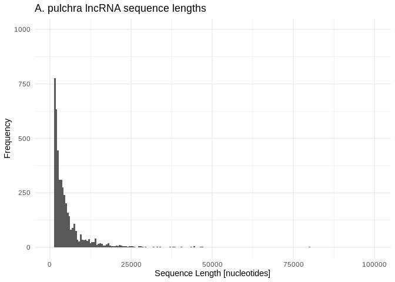

14-Peve-miRNA-lncRNA-BLASTs-miRanda
================
Kathleen Durkin
2025-06-17

- <a href="#1-prep-for-blasts" id="toc-1-prep-for-blasts">1 Prep for
  BLASTs</a>
  - <a href="#11-isolate-the-pre-mirna-and-mature-mirna-sequences"
    id="toc-11-isolate-the-pre-mirna-and-mature-mirna-sequences">1.1 Isolate
    the pre-mirna and mature mirna sequences</a>
  - <a href="#12-check-mirna-lengths" id="toc-12-check-mirna-lengths">1.2
    Check miRNA lengths</a>
  - <a href="#13-check-lncrnas" id="toc-13-check-lncrnas">1.3 check
    lncRNAs</a>
- <a href="#2-blasts" id="toc-2-blasts">2 BLASTs</a>
  - <a href="#21-make-databases" id="toc-21-make-databases">2.1 Make
    databases</a>
  - <a href="#22-run-blastn" id="toc-22-run-blastn">2.2 Run BLASTn</a>
- <a href="#3-examine-blast-tables" id="toc-3-examine-blast-tables">3
  Examine BLAST tables</a>
  - <a href="#31-lncrnas-as-mirna-precursors"
    id="toc-31-lncrnas-as-mirna-precursors">3.1 LncRNAs as miRNA
    precursors</a>
  - <a href="#32-lncrnas-as-mirna-sponges"
    id="toc-32-lncrnas-as-mirna-sponges">3.2 LncRNAs as miRNA sponges</a>
- <a href="#4-miranda" id="toc-4-miranda">4 miRanda</a>
  - <a href="#41-run-miranda" id="toc-41-run-miranda">4.1 Run miRanda</a>
- <a href="#5-summarize-results" id="toc-5-summarize-results">5 Summarize
  results</a>

``` r
library(dplyr)
```

    ## 
    ## Attaching package: 'dplyr'

    ## The following objects are masked from 'package:stats':
    ## 
    ##     filter, lag

    ## The following objects are masked from 'package:base':
    ## 
    ##     intersect, setdiff, setequal, union

``` r
library(ggplot2)
knitr::opts_chunk$set(
  echo = TRUE,         # Display code chunks
  eval = FALSE         # Evaluate code chunks
)
```

Two possible interactions between miRNA and lncRNA are:

1)  lncRNA acting as a precursor molecule for miRNA(s), so that the
    lncRNA contains one or many pre-miRNA sequences and will be broken
    down into pre-miRNAs molecules, which will then be processed into
    mature miRNAs.

2)  lncRNA acting as a “sponge” for miRNAs, so that an miRNA will bind
    to the lncRNA instead of being incorporated into an RISC complex to
    alter gene expression.

In situation 1 we would expect one or several **pre-miRNA sequences to
appear inside of a lncRNA**. This should be identifiable via BLASTn.

In situation 2 we would expect the **mature miRNA sequence to appear
inside a lncRNA**. Note that situation 2 is a bit more complicated,
because we can’t say for certain what sequence similarity is required
for binding. In cnidarians, miRNAs seem to act, like plants, through
complementarity of the full mature miRNA (this is in contrast to
e.g. mammals, where only binding of a short seed region is required)
(Moran et al. ([2014](#ref-moran_cnidarian_2014)), Admoni et al.
([2023](#ref-admoni_target_2023))). However, for lncRNA acting as
sponges, I don’t know whether to expect complementarity of the full
mature miRNA or only a section, and I don’t know what degree of
complementarity is required. **Work to identify lncRNA sponges could use
BLASTn, but will likely need to include additional methods like miRanda
to identify potential binding.**

# 1 Prep for BLASTs

## 1.1 Isolate the pre-mirna and mature mirna sequences

``` bash
full_mirna_fasta="../output/05-Peve-sRNA-ShortStack_4.1.0/ShortStack_out/mir.fasta"
premirna_fasta="../output/14-Peve-miRNA-lncRNA-BLASTs-miRanda/Peve_ShortStack_4.1.0_precursor.fasta"
mature_mirna_fasta="../output/14-Peve-miRNA-lncRNA-BLASTs-miRanda/Peve_ShortStack_4.1.0_mature.fasta"
star_mirna_fasta="../output/14-Peve-miRNA-lncRNA-BLASTs-miRanda/Peve_ShortStack_4.1.0_star.fasta"

# Pull out all sequences that DON'T contain "mature" or "star" in sequence name
# Note the pre-miRNAs have sequences for both strands
awk '
    # If the line starts with ">", check the header
    /^>/ {
        if ($0 ~ /mature/ || $0 ~ /star/) {
            print_seq = 0  # Skip sequences with "mature" or "star" in the header
        } else {
            print_seq = 1  # Mark sequences for printing
        }
    }
    # Print the header and the next two lines if marked for printing
    print_seq {
        print
        if (!/^>/) { getline; print }  # Capture second sequence line
    }
' "$full_mirna_fasta" > "$premirna_fasta"

# Pull out all sequences that contain "mature" in sequence name
grep -A 1 "mature" $full_mirna_fasta | grep -v "^--$" > $mature_mirna_fasta

# Pull out all sequences that contain "star" in sequence name
grep -A 1 "star" $full_mirna_fasta | grep -v "^--$" > $star_mirna_fasta
```

``` bash
premirna_fasta="../output/14-Peve-miRNA-lncRNA-BLASTs-miRanda/Peve_ShortStack_4.1.0_precursor.fasta"
mature_mirna_fasta="../output/14-Peve-miRNA-lncRNA-BLASTs-miRanda/Peve_ShortStack_4.1.0_mature.fasta"
star_mirna_fasta="../output/14-Peve-miRNA-lncRNA-BLASTs-miRanda/Peve_ShortStack_4.1.0_star.fasta"

# Check we have appropriate headers, same number of sequences in each
grep "^>" $premirna_fasta | head -2
echo ""
grep "^>" $mature_mirna_fasta | head -2
echo ""
grep "^>" $star_mirna_fasta | head -2
echo ""
grep "^>" $premirna_fasta | wc -l
echo ""
grep "^>" $mature_mirna_fasta | wc -l
echo ""
grep "^>" $star_mirna_fasta | wc -l
echo ""
```

    ## >Cluster_29::Porites_evermani_scaffold_1:1404250-1404342(-)
    ## >Cluster_589::Porites_evermani_scaffold_16:383386-383478(-)
    ## 
    ## >Cluster_29.mature::Porites_evermani_scaffold_1:1404272-1404293(-)
    ## >Cluster_589.mature::Porites_evermani_scaffold_16:383437-383458(-)
    ## 
    ## >Cluster_29.star::Porites_evermani_scaffold_1:1404301-1404322(-)
    ## >Cluster_589.star::Porites_evermani_scaffold_16:383406-383427(-)
    ## 
    ## 45
    ## 
    ## 45
    ## 
    ## 45

## 1.2 Check miRNA lengths

``` bash
# Extract sequence lengths for precursors
awk '/^>/ {if (seqlen){print seqlen}; printf $0" " ;seqlen=0;next; } { seqlen += length($0)}END{print seqlen}' ../output/14-Peve-miRNA-lncRNA-BLASTs-miRanda/Peve_ShortStack_4.1.0_precursor.fasta > ../output/14-Peve-miRNA-lncRNA-BLASTs-miRanda/Peve_ShortStack_4.1.0_precursor_lengths.txt

# Sequence lengths for matures
awk '/^>/ {if (seqlen){print seqlen}; printf $0" " ;seqlen=0;next; } { seqlen += length($0)}END{print seqlen}' ../output/14-Peve-miRNA-lncRNA-BLASTs-miRanda/Peve_ShortStack_4.1.0_mature.fasta > ../output/14-Peve-miRNA-lncRNA-BLASTs-miRanda/Peve_ShortStack_4.1.0_mature_lengths.txt
```

``` r
# Summary stats of precursor and mature lengths

precursor_lengths <- read.table("../output/14-Peve-miRNA-lncRNA-BLASTs-miRanda/Peve_ShortStack_4.1.0_precursor_lengths.txt", sep = " ", header = FALSE, col.names = c("seqID", "length"))
mature_lengths <- read.table("../output/14-Peve-miRNA-lncRNA-BLASTs-miRanda/Peve_ShortStack_4.1.0_mature_lengths.txt", sep = " ", header = FALSE, col.names = c("seqID", "length"))

cat("Average pre-miRNA length: ", mean(precursor_lengths$length))
```

    ## Average pre-miRNA length:  93.51111

``` r
cat("\n")
```

``` r
cat("Range of pre-miRNA lengths: ", range(precursor_lengths$length))
```

    ## Range of pre-miRNA lengths:  90 98

``` r
cat("\n")
```

``` r
cat("Average mature miRNA length: ", mean(mature_lengths$length))
```

    ## Average mature miRNA length:  21.91111

``` r
cat("\n")
```

``` r
cat("Range of mature miRNA lengths: ", range(mature_lengths$length))
```

    ## Range of mature miRNA lengths:  21 23

## 1.3 check lncRNAs

LncRNAs were identified from Peve RNA-seq data – see details in
`E-Peve/code/17-Peve-lncRNA.Rmd`

Fasta of Peve lncRNAs stored at
`https://raw.githubusercontent.com/urol-e5/deep-dive-expression/refs/heads/main/E-Peve/output/17-Peve-lncRNA/Peve-lncRNA.fasta`

``` bash
curl -L https://raw.githubusercontent.com/urol-e5/deep-dive-expression/refs/heads/main/E-Peve/output/17-Peve-lncRNA/Peve-lncRNA.fasta -o ../output/14-Peve-miRNA-lncRNA-BLASTs-miRanda/Peve_lncRNA.fasta

echo "Number of lncRNAs:"
grep "^>" ../output/14-Peve-miRNA-lncRNA-BLASTs-miRanda/Peve_lncRNA.fasta | wc -l
```

    ##   % Total    % Received % Xferd  Average Speed   Time    Time     Time  Current
    ##                                  Dload  Upload   Total   Spent    Left  Speed
    ##   0     0    0     0    0     0      0      0 --:--:-- --:--:-- --:--:--     0  0 25.4M    0 24786    0     0  32916      0  0:13:29 --:--:--  0:13:29 32872100 25.4M  100 25.4M    0     0  23.7M      0  0:00:01  0:00:01 --:--:-- 23.7M
    ## Number of lncRNAs:
    ## 10090

10090 total lncRNA

``` bash
# Extract sequence lengths for precursors
awk '/^>/ {if (seqlen){print seqlen}; printf $0" " ;seqlen=0;next; } { seqlen += length($0)}END{print seqlen}' ../output/14-Peve-miRNA-lncRNA-BLASTs-miRanda/Peve_lncRNA.fasta > ../output/14-Peve-miRNA-lncRNA-BLASTs-miRanda/Peve_lncRNA_lengths.txt
```

``` r
# Summary stats of lncRNA lengths

lncRNA_lengths <- read.table("../output/14-Peve-miRNA-lncRNA-BLASTs-miRanda/Peve_lncRNA_lengths.txt", sep = " ", header = FALSE, col.names = c("seqID", "length"))

cat("Average lncRNA length: ", mean(lncRNA_lengths$length))
```

    ## Average lncRNA length:  2590.641

``` r
cat("\n")
```

``` r
cat("Range of lncRNA lengths: ", range(lncRNA_lengths$length))
```

    ## Range of lncRNA lengths:  201 89799

``` r
ggplot(lncRNA_lengths, aes(x = length)) +
  geom_histogram(binwidth = 500) +
  labs(title = "A. pulchra lncRNA sequence lengths",
       x = "Sequence Length [nucleotides]",
       y = "Frequency") +
  xlim(200, 100000) +
  ylim(0, 1000) +
  theme_minimal()
```

    ## Warning: Removed 4 rows containing missing values or values outside the scale range
    ## (`geom_bar()`).

<!-- -->

# 2 BLASTs

## 2.1 Make databases

Database of pre-miRNAs:

``` bash
/home/shared/ncbi-blast-2.11.0+/bin/makeblastdb \
-in ../output/14-Peve-miRNA-lncRNA-BLASTs-miRanda/Peve_ShortStack_4.1.0_precursor.fasta \
-dbtype nucl \
-out ../output/14-Peve-miRNA-lncRNA-BLASTs-miRanda/blasts/Peve-db/Peve_ShortStack_4.1.0_precursor
```

Database of mature miRNAs:

``` bash
/home/shared/ncbi-blast-2.11.0+/bin/makeblastdb \
-in ../output/14-Peve-miRNA-lncRNA-BLASTs-miRanda/Peve_ShortStack_4.1.0_mature.fasta \
-dbtype nucl \
-out ../output/14-Peve-miRNA-lncRNA-BLASTs-miRanda/blasts/Peve-db/Peve_ShortStack_4.1.0_mature
```

## 2.2 Run BLASTn

Generate a list of blast results. It seems plausible that a single
lncRNA, which would be hundreds or thousands of nucleotides long, could
interact with multiple miRNAs, so I will allow up to 10 hits (\~25% of
Peve miRNAs) for each lncRNA. I want to see the top hits no matter how
poor the match is, so I will not filter by e-value at this stage. I’ll
also include the “-word_size 4” option, which reduces the required
length of the initial match.

Full pre-miRNAs:

``` bash
/home/shared/ncbi-blast-2.11.0+/bin/blastn \
-task blastn \
-query ../output/14-Peve-miRNA-lncRNA-BLASTs-miRanda/Peve_lncRNA.fasta \
-db ../output/14-Peve-miRNA-lncRNA-BLASTs-miRanda/blasts/Peve-db/Peve_ShortStack_4.1.0_precursor \
-out ../output/14-Peve-miRNA-lncRNA-BLASTs-miRanda/blasts/lncRNA_to_precursor_blastn.tab \
-num_threads 40 \
-word_size 4 \
-max_target_seqs 10 \
-max_hsps 1 \
-outfmt 6
```

``` bash
wc -l ../output/14-Peve-miRNA-lncRNA-BLASTs-miRanda/blasts/lncRNA_to_precursor_blastn.tab
```

    ## 95673 ../output/14-Peve-miRNA-lncRNA-BLASTs-miRanda/blasts/lncRNA_to_precursor_blastn.tab

Note we have less than (10 \* $$# of lncRNAs$$) output alignments
because, while I did not set an evalue threshold, the default evalue
threshold of evalue=10 is still in place. That means extremely poor
matches were still excluded by default.

Mature miRNAs:

Note that I’m using the blastn-short option here because all of our
mature miRNAs are less than 30 nucleotides long (recommended by [BLAST
user
manual](https://www.ncbi.nlm.nih.gov/books/NBK279684/table/appendices.T.blastn_application_options/))

``` bash
/home/shared/ncbi-blast-2.11.0+/bin/blastn \
-task blastn \
-query ../output/14-Peve-miRNA-lncRNA-BLASTs-miRanda/Peve_lncRNA.fasta \
-db ../output/14-Peve-miRNA-lncRNA-BLASTs-miRanda/blasts/Peve-db/Peve_ShortStack_4.1.0_mature \
-out ../output/14-Peve-miRNA-lncRNA-BLASTs-miRanda/blasts/lncRNA_to_mature_blastn.tab \
-num_threads 40 \
-word_size 4 \
-max_target_seqs 10 \
-max_hsps 1 \
-outfmt 6
```

``` bash
wc -l ../output/14-Peve-miRNA-lncRNA-BLASTs-miRanda/blasts/lncRNA_to_mature_blastn.tab
```

    ## 96343 ../output/14-Peve-miRNA-lncRNA-BLASTs-miRanda/blasts/lncRNA_to_mature_blastn.tab

# 3 Examine BLAST tables

Read into R and assign informative column labels

``` r
precursor_lncRNA_BLASTn <- read.table("../output/14-Peve-miRNA-lncRNA-BLASTs-miRanda/blasts/lncRNA_to_precursor_blastn.tab", sep="\t", header=FALSE)
mature_lncRNA_BLASTn <- read.table("../output/14-Peve-miRNA-lncRNA-BLASTs-miRanda/blasts/lncRNA_to_mature_blastn.tab", sep="\t", header=FALSE)

colnames(precursor_lncRNA_BLASTn) <- c("qseqid", "sseqid", "pident", "length", "mismatch", "gapopen", "qstart", "qend", "sstart", "send", "evalue", "bitscore")
colnames(mature_lncRNA_BLASTn) <- c("qseqid", "sseqid", "pident", "length", "mismatch", "gapopen", "qstart", "qend", "sstart", "send", "evalue", "bitscore")
```

## 3.1 LncRNAs as miRNA precursors

Are there any alignments of the full precursor miRNA to a lncRNA? Our
precursor sequences are 90-98 nucleotides long, so let’s look for any
alignments of at least 90 nucleotides with 0 mismatches.

``` r
precursor_lncRNA_BLASTn %>% 
  filter(length >= 90) %>%
  filter(mismatch == 0) %>%
  unique() %>%
  nrow()
```

    ## [1] 2

``` r
precursor_lncRNA_BLASTn %>% 
  filter(length >= 90) %>%
  filter(mismatch == 0) %>%
  select(qseqid) %>%
  unique() %>%
  nrow()
```

    ## [1] 2

``` r
precursor_lncRNA_BLASTn %>% 
  filter(length >= 90) %>%
  filter(mismatch == 0) %>%
  select(sseqid) %>%
  unique() %>%
  nrow()
```

    ## [1] 1

``` r
precursor_lncRNA_BLASTn %>% 
  filter(length >= 90) %>%
  filter(mismatch == 0) %>%
  unique()
```

    ##             qseqid                                                       sseqid
    ## 1 Peve_lncRNA_9794 Cluster_8888::Porites_evermani_scaffold_910:139331-139420(+)
    ## 2 Peve_lncRNA_9795 Cluster_8888::Porites_evermani_scaffold_910:139331-139420(+)
    ##   pident length mismatch gapopen qstart qend sstart send   evalue bitscore
    ## 1    100     90        0       0   9347 9436      1   90 2.12e-42      163
    ## 2    100     90        0       0   4470 4559      1   90 1.20e-42      163

We have 2 alignments of a full pre-miRNA to a lncRNA with no mismatches.
2 lncRNA and 1 miRNA are represented.

Note that, as in A.pulchra, this appears to be an instance of a single
pre-miRNA matching to several overlapping lncRNA. Cluster_8888’s
precursor is contained within Peve_lncRNA_9794
(Porites_evermani_scaffold_910:129985-141109) and Peve_lncRNA_9795
(Porites_evermani_scaffold_910:134862-141109). This may represent
multiple isoforms of a single lncRNA gene.

Save these results

``` r
precursor_lncRNAs <- precursor_lncRNA_BLASTn %>% 
  filter(length >= 90) %>%
  filter(mismatch == 0) %>%
  unique()

write.table(precursor_lncRNAs, "../output/14-Peve-miRNA-lncRNA-BLASTs-miRanda/lncRNAs_as_miRNA_precursors.txt")
```

## 3.2 LncRNAs as miRNA sponges

I’m not sure whether to expect lncRNAs to bind miRNAs in the same way
cnidarian miRNA-mRNA binding occurs (nearly perfect complementarity of
mature sequence), or whether the mechanism could differ (e.g., requires
only a complementary seed region, as in vertebrate miRNA-mRNA binding).
that means I don’t know what alignment parameters to require for our
BLAST results.

For now let’s say the aligned region must be at least 8 nucleotides (the
expected length of an miRNA seed region), and let’s require a low evalue
of 1e-3, to generally restrict results to those with high
complementarity.

``` r
mature_lncRNA_BLASTn %>%
  filter(length >= 8) %>%
  filter(evalue <= 0.001)
```

    ##              qseqid
    ## 1   Peve_lncRNA_003
    ## 2   Peve_lncRNA_007
    ## 3   Peve_lncRNA_121
    ## 4   Peve_lncRNA_294
    ## 5   Peve_lncRNA_403
    ## 6   Peve_lncRNA_596
    ## 7   Peve_lncRNA_620
    ## 8   Peve_lncRNA_746
    ## 9   Peve_lncRNA_770
    ## 10  Peve_lncRNA_770
    ## 11  Peve_lncRNA_971
    ## 12 Peve_lncRNA_1024
    ## 13 Peve_lncRNA_1024
    ## 14 Peve_lncRNA_1446
    ## 15 Peve_lncRNA_1446
    ## 16 Peve_lncRNA_1726
    ## 17 Peve_lncRNA_1726
    ## 18 Peve_lncRNA_1952
    ## 19 Peve_lncRNA_2250
    ## 20 Peve_lncRNA_2250
    ## 21 Peve_lncRNA_2275
    ## 22 Peve_lncRNA_2419
    ## 23 Peve_lncRNA_2601
    ## 24 Peve_lncRNA_3450
    ## 25 Peve_lncRNA_3521
    ## 26 Peve_lncRNA_3521
    ## 27 Peve_lncRNA_3717
    ## 28 Peve_lncRNA_3717
    ## 29 Peve_lncRNA_3800
    ## 30 Peve_lncRNA_3948
    ## 31 Peve_lncRNA_3948
    ## 32 Peve_lncRNA_3949
    ## 33 Peve_lncRNA_3949
    ## 34 Peve_lncRNA_4246
    ## 35 Peve_lncRNA_4246
    ## 36 Peve_lncRNA_4329
    ## 37 Peve_lncRNA_4542
    ## 38 Peve_lncRNA_4542
    ## 39 Peve_lncRNA_5033
    ## 40 Peve_lncRNA_5151
    ## 41 Peve_lncRNA_5528
    ## 42 Peve_lncRNA_5853
    ## 43 Peve_lncRNA_6019
    ## 44 Peve_lncRNA_6019
    ## 45 Peve_lncRNA_6217
    ## 46 Peve_lncRNA_6217
    ## 47 Peve_lncRNA_6481
    ## 48 Peve_lncRNA_6530
    ## 49 Peve_lncRNA_6579
    ## 50 Peve_lncRNA_6677
    ## 51 Peve_lncRNA_7389
    ## 52 Peve_lncRNA_7390
    ## 53 Peve_lncRNA_7393
    ## 54 Peve_lncRNA_7477
    ## 55 Peve_lncRNA_7878
    ## 56 Peve_lncRNA_8063
    ## 57 Peve_lncRNA_8064
    ## 58 Peve_lncRNA_8138
    ## 59 Peve_lncRNA_8138
    ## 60 Peve_lncRNA_8292
    ## 61 Peve_lncRNA_8335
    ## 62 Peve_lncRNA_8590
    ## 63 Peve_lncRNA_8834
    ## 64 Peve_lncRNA_9134
    ## 65 Peve_lncRNA_9134
    ## 66 Peve_lncRNA_9135
    ## 67 Peve_lncRNA_9135
    ## 68 Peve_lncRNA_9166
    ## 69 Peve_lncRNA_9296
    ## 70 Peve_lncRNA_9296
    ## 71 Peve_lncRNA_9297
    ## 72 Peve_lncRNA_9297
    ## 73 Peve_lncRNA_9794
    ## 74 Peve_lncRNA_9794
    ## 75 Peve_lncRNA_9794
    ## 76 Peve_lncRNA_9795
    ## 77 Peve_lncRNA_9795
    ## 78 Peve_lncRNA_9795
    ##                                                                 sseqid  pident
    ## 1  Cluster_7855.mature::Porites_evermani_scaffold_768:138025-138046(+)  90.909
    ## 2  Cluster_5882.mature::Porites_evermani_scaffold_461:215508-215529(+) 100.000
    ## 3    Cluster_15890.mature::Porites_evermani_scaffold_3893:3849-3870(-) 100.000
    ## 4  Cluster_7855.mature::Porites_evermani_scaffold_768:138025-138046(+) 100.000
    ## 5  Cluster_4115.mature::Porites_evermani_scaffold_257:110361-110382(-) 100.000
    ## 6  Cluster_15726.mature::Porites_evermani_scaffold_3707:36124-36145(-) 100.000
    ## 7  Cluster_7053.mature::Porites_evermani_scaffold_613:156505-156526(+) 100.000
    ## 8  Cluster_8988.mature::Porites_evermani_scaffold_942:133698-133719(+)  89.474
    ## 9  Cluster_13502.mature::Porites_evermani_scaffold_2259:40244-40265(+)  90.909
    ## 10     Cluster_2854.mature::Porites_evermani_scaffold_145:5406-5427(+)  90.909
    ## 11 Cluster_7855.mature::Porites_evermani_scaffold_768:138025-138046(+) 100.000
    ## 12 Cluster_13502.mature::Porites_evermani_scaffold_2259:40244-40265(+)  90.909
    ## 13     Cluster_2854.mature::Porites_evermani_scaffold_145:5406-5427(+)  90.909
    ## 14 Cluster_13502.mature::Porites_evermani_scaffold_2259:40244-40265(+) 100.000
    ## 15     Cluster_2854.mature::Porites_evermani_scaffold_145:5406-5427(+) 100.000
    ## 16   Cluster_7658.mature::Porites_evermani_scaffold_730:82423-82444(-)  94.444
    ## 17   Cluster_7657.mature::Porites_evermani_scaffold_730:81385-81406(-)  94.444
    ## 18     Cluster_2854.mature::Porites_evermani_scaffold_145:5406-5427(+)  94.737
    ## 19 Cluster_13502.mature::Porites_evermani_scaffold_2259:40244-40265(+)  90.909
    ## 20     Cluster_2854.mature::Porites_evermani_scaffold_145:5406-5427(+)  90.909
    ## 21   Cluster_29.mature::Porites_evermani_scaffold_1:1404272-1404293(-) 100.000
    ## 22     Cluster_2854.mature::Porites_evermani_scaffold_145:5406-5427(+)  94.118
    ## 23 Cluster_13502.mature::Porites_evermani_scaffold_2259:40244-40265(+)  90.000
    ## 24     Cluster_2854.mature::Porites_evermani_scaffold_145:5406-5427(+) 100.000
    ## 25   Cluster_7658.mature::Porites_evermani_scaffold_730:82423-82444(-) 100.000
    ## 26   Cluster_7657.mature::Porites_evermani_scaffold_730:81385-81406(-) 100.000
    ## 27 Cluster_13502.mature::Porites_evermani_scaffold_2259:40244-40265(+) 100.000
    ## 28     Cluster_2854.mature::Porites_evermani_scaffold_145:5406-5427(+) 100.000
    ## 29 Cluster_7855.mature::Porites_evermani_scaffold_768:138025-138046(+)  94.444
    ## 30   Cluster_7658.mature::Porites_evermani_scaffold_730:82423-82444(-) 100.000
    ## 31   Cluster_7657.mature::Porites_evermani_scaffold_730:81385-81406(-) 100.000
    ## 32   Cluster_7658.mature::Porites_evermani_scaffold_730:82423-82444(-) 100.000
    ## 33   Cluster_7657.mature::Porites_evermani_scaffold_730:81385-81406(-) 100.000
    ## 34     Cluster_2854.mature::Porites_evermani_scaffold_145:5406-5427(+)  95.455
    ## 35 Cluster_13502.mature::Porites_evermani_scaffold_2259:40244-40265(+)  95.238
    ## 36 Cluster_13502.mature::Porites_evermani_scaffold_2259:40244-40265(+)  90.909
    ## 37 Cluster_13502.mature::Porites_evermani_scaffold_2259:40244-40265(+)  95.455
    ## 38     Cluster_2854.mature::Porites_evermani_scaffold_145:5406-5427(+)  95.455
    ## 39 Cluster_7855.mature::Porites_evermani_scaffold_768:138025-138046(+) 100.000
    ## 40 Cluster_16498.mature::Porites_evermani_scaffold_5010:12392-12413(+)  90.000
    ## 41   Cluster_10061.mature::Porites_evermani_scaffold_1159:7428-7449(+) 100.000
    ## 42 Cluster_2787.mature::Porites_evermani_scaffold_138:127966-127987(+)  95.455
    ## 43     Cluster_2854.mature::Porites_evermani_scaffold_145:5406-5427(+)  95.238
    ## 44 Cluster_13502.mature::Porites_evermani_scaffold_2259:40244-40265(+)  90.909
    ## 45 Cluster_13502.mature::Porites_evermani_scaffold_2259:40244-40265(+)  90.909
    ## 46     Cluster_2854.mature::Porites_evermani_scaffold_145:5406-5427(+)  90.909
    ## 47 Cluster_15726.mature::Porites_evermani_scaffold_3707:36124-36145(-) 100.000
    ## 48 Cluster_7855.mature::Porites_evermani_scaffold_768:138025-138046(+)  90.909
    ## 49   Cluster_6255.mature::Porites_evermani_scaffold_502:58997-59018(-)  90.000
    ## 50 Cluster_7855.mature::Porites_evermani_scaffold_768:138025-138046(+)  95.455
    ## 51 Cluster_16498.mature::Porites_evermani_scaffold_5010:12392-12413(+)  90.476
    ## 52 Cluster_16498.mature::Porites_evermani_scaffold_5010:12392-12413(+)  90.476
    ## 53 Cluster_16498.mature::Porites_evermani_scaffold_5010:12392-12413(+)  90.476
    ## 54 Cluster_15726.mature::Porites_evermani_scaffold_3707:36124-36145(-) 100.000
    ## 55 Cluster_10965.mature::Porites_evermani_scaffold_1429:47285-47306(-) 100.000
    ## 56   Cluster_10061.mature::Porites_evermani_scaffold_1159:7428-7449(+) 100.000
    ## 57   Cluster_10061.mature::Porites_evermani_scaffold_1159:7428-7449(+) 100.000
    ## 58 Cluster_13502.mature::Porites_evermani_scaffold_2259:40244-40265(+) 100.000
    ## 59     Cluster_2854.mature::Porites_evermani_scaffold_145:5406-5427(+) 100.000
    ## 60 Cluster_7855.mature::Porites_evermani_scaffold_768:138025-138046(+)  86.364
    ## 61 Cluster_4115.mature::Porites_evermani_scaffold_257:110361-110382(-) 100.000
    ## 62 Cluster_15726.mature::Porites_evermani_scaffold_3707:36124-36145(-) 100.000
    ## 63 Cluster_7855.mature::Porites_evermani_scaffold_768:138025-138046(+)  95.455
    ## 64   Cluster_7658.mature::Porites_evermani_scaffold_730:82423-82444(-)  94.444
    ## 65   Cluster_7657.mature::Porites_evermani_scaffold_730:81385-81406(-)  94.444
    ## 66   Cluster_7658.mature::Porites_evermani_scaffold_730:82423-82444(-)  94.444
    ## 67   Cluster_7657.mature::Porites_evermani_scaffold_730:81385-81406(-)  94.444
    ## 68   Cluster_15890.mature::Porites_evermani_scaffold_3893:3849-3870(-) 100.000
    ## 69 Cluster_13502.mature::Porites_evermani_scaffold_2259:40244-40265(+) 100.000
    ## 70     Cluster_2854.mature::Porites_evermani_scaffold_145:5406-5427(+) 100.000
    ## 71 Cluster_13502.mature::Porites_evermani_scaffold_2259:40244-40265(+) 100.000
    ## 72     Cluster_2854.mature::Porites_evermani_scaffold_145:5406-5427(+) 100.000
    ## 73 Cluster_8888.mature::Porites_evermani_scaffold_910:139353-139373(+) 100.000
    ## 74 Cluster_8887.mature::Porites_evermani_scaffold_910:118742-118762(+) 100.000
    ## 75   Cluster_8884.mature::Porites_evermani_scaffold_910:99255-99275(+) 100.000
    ## 76 Cluster_8888.mature::Porites_evermani_scaffold_910:139353-139373(+) 100.000
    ## 77 Cluster_8887.mature::Porites_evermani_scaffold_910:118742-118762(+) 100.000
    ## 78   Cluster_8884.mature::Porites_evermani_scaffold_910:99255-99275(+) 100.000
    ##    length mismatch gapopen qstart qend sstart send   evalue bitscore
    ## 1      22        2       0   2953 2974      1   22 4.34e-04     31.9
    ## 2      14        0       0    130  143      9   22 1.00e-03     26.5
    ## 3      15        0       0    311  325      2   16 1.00e-03     28.3
    ## 4      14        0       0     81   94      1   14 1.00e-03     26.5
    ## 5      16        0       0     26   41     16    1 1.42e-04     30.1
    ## 6      19        0       0   4704 4722      4   22 7.06e-05     35.6
    ## 7      16        0       0     43   58     22    7 2.71e-04     30.1
    ## 8      19        2       0    102  120      4   22 1.00e-03     26.5
    ## 9      22        2       0    177  198      1   22 3.63e-05     31.9
    ## 10     22        2       0    175  196     22    1 3.63e-05     31.9
    ## 11     15        0       0    796  810      8   22 1.00e-03     28.3
    ## 12     22        2       0   1465 1486      1   22 3.27e-04     31.9
    ## 13     22        2       0   1463 1484     22    1 3.27e-04     31.9
    ## 14     22        0       0   1469 1490      1   22 7.38e-07     41.0
    ## 15     22        0       0   1440 1461      1   22 7.38e-07     41.0
    ## 16     18        1       0    329  346      3   20 8.49e-04     29.2
    ## 17     18        1       0    329  346      3   20 8.49e-04     29.2
    ## 18     19        1       0    672  690      4   22 5.71e-04     31.0
    ## 19     22        2       0   3182 3203      1   22 3.53e-04     31.9
    ## 20     22        2       0   3180 3201     22    1 3.53e-04     31.9
    ## 21     16        0       0    608  623     21    6 2.59e-04     30.1
    ## 22     17        1       0    186  202     21    5 1.00e-03     27.4
    ## 23     20        2       0    117  136     22    3 4.13e-04     28.3
    ## 24     17        0       0   3552 3568      6   22 8.17e-04     31.9
    ## 25     14        0       0     23   36      5   18 1.00e-03     26.5
    ## 26     14        0       0     23   36      5   18 1.00e-03     26.5
    ## 27     22        0       0   6320 6341     22    1 1.63e-06     41.0
    ## 28     22        0       0   6349 6370     22    1 1.63e-06     41.0
    ## 29     18        1       0     96  113      1   18 1.00e-03     29.2
    ## 30     18        0       0   2894 2911      3   20 1.02e-04     33.7
    ## 31     18        0       0   2894 2911      3   20 1.02e-04     33.7
    ## 32     18        0       0   4223 4240      3   20 1.36e-04     33.7
    ## 33     18        0       0   4223 4240      3   20 1.36e-04     33.7
    ## 34     22        1       0   2882 2903     22    1 2.47e-05     36.5
    ## 35     21        1       0   2884 2904      1   21 8.64e-05     34.6
    ## 36     22        2       0   1368 1389      1   22 5.58e-04     31.9
    ## 37     22        1       0    546  567      1   22 1.48e-04     36.5
    ## 38     22        1       0    517  538      1   22 1.48e-04     36.5
    ## 39     15        0       0    130  144     22    8 3.97e-04     28.3
    ## 40     20        2       0    405  424     22    3 7.31e-04     28.3
    ## 41     15        0       0    252  266     16    2 1.00e-03     28.3
    ## 42     22        1       0    361  382      1   22 4.24e-06     36.5
    ## 43     21        1       0    440  460     22    2 1.07e-04     34.6
    ## 44     22        2       0    442  463      1   22 3.73e-04     31.9
    ## 45     22        2       0   4681 4702      1   22 5.45e-04     31.9
    ## 46     22        2       0   4679 4700     22    1 5.45e-04     31.9
    ## 47     19        0       0   1628 1646      4   22 3.32e-05     35.6
    ## 48     22        2       0   1721 1742      1   22 3.79e-04     31.9
    ## 49     20        2       0    286  305      1   20 1.00e-03     28.3
    ## 50     22        1       0   3888 3909     22    1 2.91e-05     36.5
    ## 51     21        2       0   1812 1832     21    1 8.95e-04     30.1
    ## 52     21        2       0   1812 1832     21    1 8.95e-04     30.1
    ## 53     21        2       0   1311 1331     21    1 1.00e-03     30.1
    ## 54     19        0       0    817  835      4   22 5.72e-05     35.6
    ## 55     15        0       0    467  481      6   20 1.00e-03     28.3
    ## 56     16        0       0    942  957      4   19 6.27e-04     30.1
    ## 57     16        0       0    868  883      4   19 6.05e-04     30.1
    ## 58     22        0       0    742  763      1   22 4.41e-07     41.0
    ## 59     22        0       0    740  761     22    1 4.41e-07     41.0
    ## 60     22        3       0    150  171     22    1 1.00e-03     27.4
    ## 61     15        0       0     81   95      5   19 4.40e-04     28.3
    ## 62     16        0       0    678  693      3   18 1.00e-03     30.1
    ## 63     22        1       0   1270 1291      1   22 2.94e-05     36.5
    ## 64     18        1       0    161  178      3   20 4.30e-04     29.2
    ## 65     18        1       0    161  178      3   20 4.30e-04     29.2
    ## 66     18        1       0    322  339      3   20 1.00e-03     29.2
    ## 67     18        1       0    322  339      3   20 1.00e-03     29.2
    ## 68     15        0       0    718  732     16    2 1.00e-03     28.3
    ## 69     22        0       0   8241 8262      1   22 1.44e-06     41.0
    ## 70     22        0       0   8239 8260     22    1 1.44e-06     41.0
    ## 71     22        0       0   5971 5992      1   22 1.11e-06     41.0
    ## 72     22        0       0   5969 5990     22    1 1.11e-06     41.0
    ## 73     21        0       0   9369 9389      1   21 5.64e-06     39.2
    ## 74     20        0       0   9370 9389      2   21 1.97e-05     37.4
    ## 75     19        0       0   9370 9388      2   20 6.87e-05     35.6
    ## 76     21        0       0   4492 4512      1   21 3.16e-06     39.2
    ## 77     20        0       0   4493 4512      2   21 1.10e-05     37.4
    ## 78     19        0       0   4493 4511      2   20 3.85e-05     35.6

78 putative lncRNA sponges with these parameters.

Ultimately though these results are insufficient to determine lncRNA
sponging. We need to evaluate miRNA-lncRNA binding.

# 4 miRanda

miRanda is a target prediction software, used to identify likely
miRNA-mRNA interactions.

Inputs:

- FASTA of A.pulchra lncRNAs

- FASTA of A.pulchra mature miRNAs

## 4.1 Run miRanda

``` bash

# score cutoff >100
# energy cutoff <-20
# strict binding

/home/shared/miRanda-3.3a/src/miranda \
../output/14-Peve-miRNA-lncRNA-BLASTs-miRanda/Peve_ShortStack_4.1.0_mature.fasta \
../output/14-Peve-miRNA-lncRNA-BLASTs-miRanda/Peve_lncRNA.fasta \
-sc 100 \
-en -20 \
-strict \
-out ../output/14-Peve-miRNA-lncRNA-BLASTs-miRanda/Peve-miRanda-lncRNA-strict_all.tab
```

# 5 Summarize results

Let’s look at the output

``` bash

echo "miranda run finished!"
echo "Counting number of interacting miRNA-lncRNA pairs"

zgrep -c "Performing Scan" ../output/14-Peve-miRNA-lncRNA-BLASTs-miRanda/Peve-miRanda-lncRNA-strict_all.tab

echo "Parsing output"
grep -A 1 "Scores for this hit:" ../output/14-Peve-miRNA-lncRNA-BLASTs-miRanda/Peve-miRanda-lncRNA-strict_all.tab | sort | grep '>' > ../output/14-Peve-miRNA-lncRNA-BLASTs-miRanda/Peve-miRanda-lncRNA-strict-parsed.txt

echo "counting number of putative interactions predicted (can include multiple interactions between single miRNA-lncRNA pair)"
wc -l ../output/14-Peve-miRNA-lncRNA-BLASTs-miRanda/Peve-miRanda-lncRNA-strict_all.tab
```

    ## miranda run finished!
    ## Counting number of interacting miRNA-lncRNA pairs
    ## 454050
    ## Parsing output
    ## counting number of putative interactions predicted (can include multiple interactions between single miRNA-lncRNA pair)
    ## 3685396 ../output/14-Peve-miRNA-lncRNA-BLASTs-miRanda/Peve-miRanda-lncRNA-strict_all.tab

3685396 – This is a lot of putative interactions! We can probably narrow
it down though. In vertebrates, miRNA-mRNA binding only requires
complementarity of an miRNA seed region of \~8 nucleotides. This
requirement is built in to miRanda target prediction. In cnidarians,
however, miRNA-mRNA binding is believed to require near-complete
complementarity of the full mature miRNA, similarly to plants ( Admoni
et al. ([2023](#ref-admoni_target_2023)) , Admoni et al.
([2025](#ref-admoni_mirna-target_2025)) ). While I couldn’t find any
information on expected requirements for miRNA-lncRNA sponges, its
possible the binding will function similarly to miRNA-mRNA binding.
Let’s look at how many putative interactions are predicted for a binding
length of at least 21 nucleotides (the length of our smallest mature
miRNA).

``` bash
echo "number of putative interactions of at least 21 nucleotides"
awk -F'\t' '$7 >= 21' ../output/14-Peve-miRNA-lncRNA-BLASTs-miRanda/Peve-miRanda-lncRNA-strict-parsed.txt | wc -l
echo ""
echo "check some:"
awk -F'\t' '$7 >= 21' ../output/14-Peve-miRNA-lncRNA-BLASTs-miRanda/Peve-miRanda-lncRNA-strict-parsed.txt | head -5
```

    ## number of putative interactions of at least 21 nucleotides
    ## 779
    ## 
    ## check some:
    ## >Cluster_10061.mature::Porites_evermani_scaffold_1159:7428-7449(+)   Peve_lncRNA_325 166.00  -20.06  2 21    13423 13447 22  77.27%  81.82%
    ## >Cluster_10061.mature::Porites_evermani_scaffold_1159:7428-7449(+)   Peve_lncRNA_4109    158.00  -20.34  2 21    196 224 26  69.23%  73.08%
    ## >Cluster_10061.mature::Porites_evermani_scaffold_1159:7428-7449(+)   Peve_lncRNA_4549    171.00  -21.00  2 21    81 105  22  72.73%  86.36%
    ## >Cluster_10061.mature::Porites_evermani_scaffold_1159:7428-7449(+)   Peve_lncRNA_4854    165.00  -21.64  2 20    2299 2323   21  76.19%  85.71%
    ## >Cluster_10934.mature::Porites_evermani_scaffold_1415:72071-72092(+) Peve_lncRNA_2880    155.00  -21.89  2 21    5064 5087   21  66.67%  76.19%

779

The header for this output is formatted as:

mirna Target Score Energy-Kcal/Mol Query-Aln(start-end)
Subject-Al(Start-End) Al-Len Subject-Identity Query-Identity

We can see from the percent identities (last 2 entries) that this number
includes alignments with multiple mismatches. Let’s filter again to
reduce the number of permissible mismatches. Let’s say we want no more
than 3 mismatches (a gap is counted as a mismatch). For an alignment of
21 nucleotides, this would be an percent identity of (21-3)/21 = 85.7%.
The miRNA is our “subject”, so we will filter by column 8.

``` bash
echo "number of putative interactions of at least 21 nucleotides, with at most 3 mismatches"
awk -F'\t' '$7 >= 21' ../output/14-Peve-miRNA-lncRNA-BLASTs-miRanda/Peve-miRanda-lncRNA-strict-parsed.txt | awk -F'\t' '$8 >= 85' | wc -l
echo ""
echo "check some:"
awk -F'\t' '$7 >= 21' ../output/14-Peve-miRNA-lncRNA-BLASTs-miRanda/Peve-miRanda-lncRNA-strict-parsed.txt | awk -F'\t' '$8 >= 85' | head -5
```

    ## number of putative interactions of at least 21 nucleotides, with at most 3 mismatches
    ## 2
    ## 
    ## check some:
    ## >Cluster_5882.mature::Porites_evermani_scaffold_461:215508-215529(+) Peve_lncRNA_1763    174.00  -23.58  2 21    655 678 21  85.71%  85.71%
    ## >Cluster_6255.mature::Porites_evermani_scaffold_502:58997-59018(-)   Peve_lncRNA_4934    174.00  -22.53  2 21    1663 1686   21  85.71%  85.71%

This is a dramatically smaller number – only 2 interactions were at
least 21 nucleotides with \<=3 mismatches

<div id="refs" class="references csl-bib-body hanging-indent">

<div id="ref-admoni_target_2023" class="csl-entry">

Admoni, Yael, Arie Fridrich, Talya Razin, Miguel Salinas-Saavedra,
Michal Rabani, Uri Frank, and Yehu Moran. 2023. “Target Complementarity
in Cnidarians Supports a Common Origin for Animal and Plant <span
class="nocase">microRNAs</span>.” bioRxiv.
<https://doi.org/10.1101/2023.01.08.523153>.

</div>

<div id="ref-admoni_mirna-target_2025" class="csl-entry">

Admoni, Yael, Arie Fridrich, Paris K Weavers, Reuven Aharoni, Talya
Razin, Miguel Salinas-Saavedra, Michal Rabani, Uri Frank, and Yehu
Moran. 2025. “<span class="nocase">miRNA</span>-Target Complementarity
in Cnidarians Resembles Its Counterpart in Plants.” *EMBO Reports*,
January, 1–24. <https://doi.org/10.1038/s44319-024-00350-z>.

</div>

<div id="ref-moran_cnidarian_2014" class="csl-entry">

Moran, Yehu, David Fredman, Daniela Praher, Xin Li, Liang Wee, Fabian
Rentzsch, Phillip Zamore, Ulrich Technau, and Hervé Seitz. 2014.
“Cnidarian <span class="nocase">microRNAs</span> Frequently Regulate
Targets by Cleavage.” *Genome Research* 24 (March).
<https://doi.org/10.1101/gr.162503.113>.

</div>

</div>
