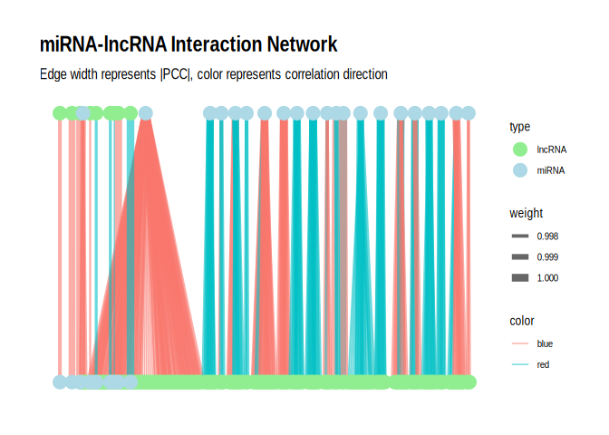
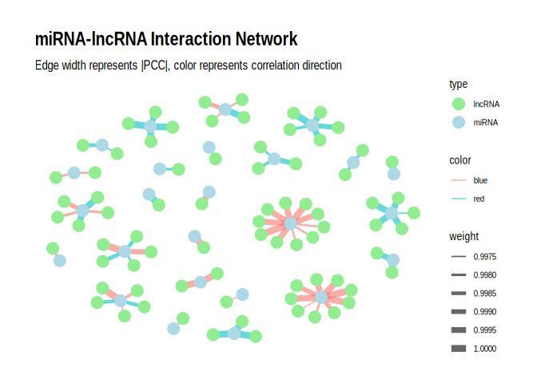

15-Peve-miRNA-lncRNA-PCC
================
Kathleen Durkin
2025-06-17

- <a href="#1-merge-with-miranda" id="toc-1-merge-with-miranda">1 Merge
  with miRanda</a>
  - <a href="#11-match-lncrna-ids-to-coordinates"
    id="toc-11-match-lncrna-ids-to-coordinates">1.1 Match lncRNA IDs to
    coordinates</a>
  - <a href="#12-merge" id="toc-12-merge">1.2 Merge</a>

This code will use Pearson’s correlation coefficient to examine possible
correlations between miRNA and lncRNA expression. This will then be
compared to the miRanda interaction results of the miRNAs and lncRNAs.

Read in miRNA data

``` r
miRNA_counts <- read.delim("../output/03.1-Peve-sRNA-summary/Peve_miRNA_ShortStack_counts_formatted.txt")
head(miRNA_counts)
```

    ##              sample73 sample79 sample82
    ## Cluster_29       2822     3434     3318
    ## Cluster_589      1885     1158     1017
    ## Cluster_796     20505    23687    49156
    ## Cluster_1140     1339      888      834
    ## Cluster_1167    86625    64520   116691
    ## Cluster_2787     1173      887     1284

``` r
# Remove any miRNAs with 0 for all samples 
miRNA_counts <- miRNA_counts %>%
     mutate(Total = rowSums(.[, 1:3]))%>%
    filter(!Total==0)%>%
    dplyr::select(!Total)

# Rename gene count cols to match miRNA count cols
colnames(miRNA_counts) <- c("sample73", "sample79", "sample82")
```

Counts generated in `E-Peve/code/18-Peve-lncRNA-matrix`, available at
<https://raw.githubusercontent.com/urol-e5/deep-dive-expression/refs/heads/main/E-Peve/output/18-Peve-lncRNA-matrix/Peve-lncRNA-counts.txt>

``` r
lncRNA_counts<-read_table(file="https://raw.githubusercontent.com/urol-e5/deep-dive-expression/refs/heads/main/E-Peve/output/18-Peve-lncRNA-matrix/Peve-lncRNA-counts.txt", skip=1) %>%
  rename("lncrna_id"=Geneid, 
         "sample71"=`../data/18-Peve-lncRNA-matrix/RNA-POR-71.sorted.bam`, 
         "sample73"=`../data/18-Peve-lncRNA-matrix/RNA-POR-73.sorted.bam`, 
         "sample76"=`../data/18-Peve-lncRNA-matrix/RNA-POR-76.sorted.bam`, 
         "sample79"=`../data/18-Peve-lncRNA-matrix/RNA-POR-79.sorted.bam`, 
         "sample82"=`../data/18-Peve-lncRNA-matrix/RNA-POR-82.sorted.bam`)
```

    ## 
    ## ── Column specification ────────────────────────────────────────────────────────
    ## cols(
    ##   Geneid = col_character(),
    ##   Chr = col_character(),
    ##   Start = col_double(),
    ##   End = col_double(),
    ##   Strand = col_character(),
    ##   Length = col_double(),
    ##   `../data/18-Peve-lncRNA-matrix/RNA-POR-71.sorted.bam` = col_double(),
    ##   `../data/18-Peve-lncRNA-matrix/RNA-POR-73.sorted.bam` = col_double(),
    ##   `../data/18-Peve-lncRNA-matrix/RNA-POR-76.sorted.bam` = col_double(),
    ##   `../data/18-Peve-lncRNA-matrix/RNA-POR-79.sorted.bam` = col_double(),
    ##   `../data/18-Peve-lncRNA-matrix/RNA-POR-82.sorted.bam` = col_double()
    ## )

``` r
# Change to df 
lncRNA_counts_df <- as.data.frame(lncRNA_counts) %>% select(!c("Chr", "Start", "End", "Strand", "Length"))
row.names(lncRNA_counts_df) <- lncRNA_counts_df[,1]
lncRNA_counts_df <- lncRNA_counts_df[,-1]  # remove the first column (gene names) if needed

# Remove samples 71 and 76 (sRNA-seq failed, so we have no miRNA counts for those samples)
lncRNA_counts_df <- lncRNA_counts_df %>% select(-sample71, -sample76)

# Remove any lncRNAs with 0 for all samples 
lncRNA_counts_df <- lncRNA_counts_df %>%
     mutate(Total = rowSums(.[, 1:3]))%>%
    filter(!Total==0)%>%
    dplyr::select(!Total)
```

Normalize counts

``` r
# Function to normalize counts (simple RPM normalization)
normalize_counts <- function(counts) {
  rpm <- t(t(counts) / colSums(counts)) * 1e6
  return(rpm)
}

# Normalize miRNA and mRNA counts
miRNA_norm <- normalize_counts(miRNA_counts)
#miRNA_norm <- as.matrix(miRNA_counts_filt)

lncRNA_norm <- normalize_counts(lncRNA_counts_df)
#mRNA_norm <- as.matrix(mRNA_counts_filt)
```

Calculate PCC

``` r
# Function to calculate PCC and p-value for a pair of vectors
calc_pcc <- function(x, y) {
  result <- cor.test(x, y, method = "pearson")
  return(c(PCC = result$estimate, p_value = result$p.value))
}

# Create a data frame of all miRNA-lncRNA pairs
pairs <- expand.grid(miRNA = rownames(miRNA_norm), lncRNA = rownames(lncRNA_norm))

# Calculate PCC and p-value for each pair
pcc_results <- pairs %>%
  rowwise() %>%
  mutate(
    pcc_stats = list(calc_pcc(miRNA_norm[miRNA,], lncRNA_norm[lncRNA,]))
  ) %>%
  unnest_wider(pcc_stats)

# Adjust p-values for FDR
pcc_results <- pcc_results %>%
  mutate(adjusted_p_value = p.adjust(p_value, method = "fdr"))

# filter to significant (p < 0.05) results
pcc_results_sig <- pcc_results %>% filter(p_value < 0.05)

#Save (to avoid needing to rerun the computationally-expensive PCC code)
write.csv(pcc_results, "../output/15-Peve-miRNA-lncRNA-PCC/PCC_miRNA_lncRNA.csv")
write.csv(pcc_results_sig, "../output/15-Peve-miRNA-lncRNA-PCC/PCC_sig_miRNA_lncRNA.csv")
```

Too large for Github, so available in large-file storage:
`https://gannet.fish.washington.edu/kdurkin1/ravenbackups/deep-dive-expression/E-Peve/output/15-Peve-miRNA-lncRNA-PCC/PCC_miRNA_lncRNA.csv`
`https://gannet.fish.washington.edu/kdurkin1/ravenbackups/deep-dive-expression/E-Peve/output/15-Peve-miRNA-lncRNA-PCC/PCC_sig_miRNA_lncRNA.csv`

Load back in if necessary

``` r
pcc_results <- read.csv("https://gannet.fish.washington.edu/kdurkin1/ravenbackups/deep-dive-expression/E-Peve/output/15-Peve-miRNA-lncRNA-PCC/PCC_miRNA_lncRNA.csv")
pcc_results_sig <- read.csv("https://gannet.fish.washington.edu/kdurkin1/ravenbackups/deep-dive-expression/E-Peve/output/15-Peve-miRNA-lncRNA-PCC/PCC_sig_miRNA_lncRNA.csv")
```

# 1 Merge with miRanda

Read in miranda data

``` r
miranda_peve <- read.delim("../output/14-Peve-miRNA-lncRNA-BLASTs-miRanda/Peve-miRanda-lncRNA-strict-parsed.txt", header = F)
colnames(miranda_peve) <- c("miRNA", "lncRNA", "score", "energy", "query_start_end", "subject_start_end", "total_bp_shared", "query_similar", "subject_similar")
```

Format miranda miRNA and lncRNA names

``` r
# miRNA
miranda_peve$miRNA <- sub("^>", "", miranda_peve$miRNA)  # Remove leading ">"
miranda_peve$miRNA <- sub("\\..*", "", miranda_peve$miRNA)  # Remove everything from the first period onwards
#miranda_peve$lncRNA <- sub(".*::", "", miranda_peve$lncRNA)  # Remove everything before and including "::"
miranda_peve$lncRNA <- sub("Peve_", "", miranda_peve$lncRNA)  # Remove the "Peve_" prefix
```

## 1.1 Match lncRNA IDs to coordinates

Now I need to be able to associate the lncRNA IDs used in the count
matrix (e.g., lncRNA_1) with the genomic coordinates used in the fasta
file and miRanda output.

``` r
# Build mapping table
lncRNA_mapping <- data.frame(
  lncRNA_id = lncRNA_counts$lncrna_id,
  lncRNA_coord = paste0(lncRNA_counts$Chr, ":", lncRNA_counts$Start, "-", lncRNA_counts$End)
)

# Save for future use
write.table(lncRNA_mapping, "../output/15-Peve-miRNA-lncRNA-PCC/Peve_lncRNA_mapping.tab")
```

## 1.2 Merge

Merge the miranda results with `lncRNA_mapping` to get the associated
lncRNA ids with the transcript info

``` r
# miranda_peve_names <- left_join(miranda_peve, lncRNA_mapping, by = c("lncRNA" = "lncRNA_coord")) %>%
#   select(c(miRNA, lncRNA, score, energy, query_start_end, subject_start_end, total_bp_shared, query_similar, subject_similar, lncRNA_id)) %>%
#   unique()
```

Now we can merge with the PCC results!

``` r
pcc_miranda_peve <- left_join(miranda_peve, pcc_results, by = c("miRNA", "lncRNA")) %>% unique()

# Write as csv 
write.csv(pcc_miranda_peve, "../output/15-Peve-miRNA-lncRNA-PCC/miranda_PCC_miRNA_lncRNA.csv")
```

**NOTE: “NA” values in the PCC columns indicates that one of the members
of that miRNA-lncRNA pair had 0 counts in all samples (was completely
unexpressed)**

Inspect the data

``` r
# Read in data again if needed
pcc_miranda_peve <- read.csv("../output/15-Peve-miRNA-lncRNA-PCC/miranda_PCC_miRNA_lncRNA.csv")
length(unique(pcc_miranda_peve$miRNA))
```

    ## [1] 45

``` r
length(unique(pcc_miranda_peve$lncRNA))
```

    ## [1] 2228

``` r
# Are there any pairs that have a PCC correlation > |0.5| and a p-value < 0.05?
sig_pairs <- pcc_miranda_peve %>%
  filter(abs(PCC.cor) > 0.5 & p_value < 0.05)
cat("PCC correlation > |0.5| and a p-value < 0.05:", nrow(sig_pairs), "\n")
```

    ## PCC correlation > |0.5| and a p-value < 0.05: 118

``` r
# Are there any pairs that have a PCC correlation > |0.5|, a p-value < 0.05, and a query similarity >75%?
sig_pairs_similar <- pcc_miranda_peve %>%
  filter(abs(PCC.cor) > 0.5 & p_value < 0.05 & query_similar > 75.00)
cat("PCC correlation > |0.5| and a p-value < 0.05 and query similarity >75%:", nrow(sig_pairs_similar), "\n")
```

    ## PCC correlation > |0.5| and a p-value < 0.05 and query similarity >75%: 48

``` r
length(unique(sig_pairs_similar$miRNA))
```

    ## [1] 20

``` r
length(unique(sig_pairs_similar$lncRNA))
```

    ## [1] 46

``` r
## Count positive and negative PCC.cor values
positive_count <- sum(sig_pairs_similar$PCC.cor > 0)
negative_count <- sum(sig_pairs_similar$PCC.cor < 0)
cat("Number of rows with positive PCC.cor:", positive_count, "\n")
```

    ## Number of rows with positive PCC.cor: 28

``` r
cat("Number of rows with negative PCC.cor:", negative_count, "\n")
```

    ## Number of rows with negative PCC.cor: 20

How many miRNAs per lncRNA and vice versa for the sig pairs? For sig
pairs similar?

``` r
## sig pairs 
lncRNAs_per_miRNA <- sig_pairs %>%
  group_by(miRNA) %>%
  summarize(n_lncRNAs = n_distinct(lncRNA)) %>%
  arrange(desc(n_lncRNAs))

print("lncRNAs per miRNA, significant. mean, range:")
```

    ## [1] "lncRNAs per miRNA, significant. mean, range:"

``` r
mean(lncRNAs_per_miRNA$n_lncRNAs)
```

    ## [1] 4.035714

``` r
range(lncRNAs_per_miRNA$n_lncRNAs)
```

    ## [1]  1 33

``` r
cat("\n")
```

``` r
miRNAs_per_lncRNA <- sig_pairs %>%
  group_by(lncRNA) %>%
  summarize(n_miRNAs = n_distinct(miRNA)) %>%
  arrange(desc(n_miRNAs))

print("miRNAs per lncRNA, significnat. mean, range:")
```

    ## [1] "miRNAs per lncRNA, significnat. mean, range:"

``` r
mean(miRNAs_per_lncRNA$n_miRNAs)
```

    ## [1] 1.056075

``` r
range(miRNAs_per_lncRNA$n_miRNAs)
```

    ## [1] 1 4

``` r
cat("\n")
```

``` r
## sig pairs similar 
lncRNAs_per_miRNA_sim <- sig_pairs_similar %>%
  group_by(miRNA) %>%
  summarize(n_lncRNAs = n_distinct(lncRNA)) %>%
  arrange(desc(n_lncRNAs))

print("lncRNAs per miRNA, significant and similar. mean, range:")
```

    ## [1] "lncRNAs per miRNA, significant and similar. mean, range:"

``` r
mean(lncRNAs_per_miRNA_sim$n_lncRNAs)
```

    ## [1] 2.3

``` r
range(lncRNAs_per_miRNA_sim$n_lncRNAs)
```

    ## [1]  1 11

``` r
cat("\n")
```

``` r
miRNAs_per_lncRNA_sim <- sig_pairs_similar %>%
  group_by(lncRNA) %>%
  summarize(n_miRNAs = n_distinct(miRNA)) %>%
  arrange(desc(n_miRNAs))

print("miRNAs per lncRNA, significnat and similar. mean, range:")
```

    ## [1] "miRNAs per lncRNA, significnat and similar. mean, range:"

``` r
mean(miRNAs_per_lncRNA_sim$n_miRNAs)
```

    ## [1] 1

``` r
range(miRNAs_per_lncRNA_sim$n_miRNAs)
```

    ## [1] 1 1

For the significant pairs, the miRNAs can interact with 1-33 unique
lncRNAs, while the lncRNAs can interact with with 1-4 unique miRNAs. For
the significant pairs that have high query similarity, the miRNAs can
interact with 1-11 unique lncRNAs, while the lncRNAs can interact with 1
unique miRNAs. Interesting!

Plot as a network plot with the miRNAs as the primary nodes for
`sig_pairs`

``` r
# Create the graph
g <- graph_from_data_frame(sig_pairs, directed = FALSE)

# Add edge attributes
E(g)$weight <- abs(E(g)$PCC.cor)  # Use absolute PCC for edge weight
E(g)$color <- ifelse(E(g)$PCC.cor > 0, "blue", "red")  # Blue for positive, red for negative correlations

# Add node attributes
V(g)$type <- ifelse(V(g)$name %in% sig_pairs$miRNA, "miRNA", "lncRNA")

# Convert to tbl_graph for ggraph
g_tbl <- as_tbl_graph(g)

# Create the plot
p <- ggraph(g_tbl, layout = "auto") +
  geom_edge_link(aes(edge_width = weight, color = color), alpha = 0.6) +
  geom_node_point(aes(color = type), size = 5) +
  #geom_node_text(aes(label = name), repel = TRUE, size = 3) +
  scale_edge_width(range = c(0.5, 3)) +
  scale_color_manual(values = c("miRNA" = "lightblue", "lncRNA" = "lightgreen", "Positive correlation" = "blue", "Negative correlation" = "red")) +
  theme_graph() +
  labs(title = "miRNA-lncRNA Interaction Network",
       subtitle = "Edge width represents |PCC|, color represents correlation direction");p
```

    ## Using "tree" as default layout

<!-- -->

``` r
ggsave("../output/15-Peve-miRNA-lncRNA-PCC/peve-significant_miRNA_lncRNA_network.png", p, width = 20, height = 15, dpi = 300)
```

Plot as a network plot with the miRNAs as the primary nodes for
`sig_pairs_similar`

``` r
# Create the graph
g <- graph_from_data_frame(sig_pairs_similar, directed = FALSE)

# Add edge attributes
E(g)$weight <- abs(E(g)$PCC.cor)  # Use absolute PCC for edge weight
E(g)$color <- ifelse(E(g)$PCC.cor > 0, "blue", "red")  # Blue for positive, red for negative correlations

# Add node attributes
V(g)$type <- ifelse(V(g)$name %in% sig_pairs_similar$miRNA, "miRNA", "lncRNA")

# Convert to tbl_graph for ggraph
g_tbl <- as_tbl_graph(g)

# Create the plot
p <- ggraph(g_tbl, layout = "fr") +
  geom_edge_link(aes(edge_width = weight, color = color), alpha = 0.6) +
  geom_node_point(aes(color = type), size = 5) +
  #geom_node_text(aes(label = name), repel = TRUE, size = 3) +
  scale_edge_width(range = c(0.5, 3)) +
  scale_color_manual(values = c("miRNA" = "lightblue", "lncRNA" = "lightgreen", "Positive correlation" = "blue", "Negative correlation" = "red")) +
  theme_graph() +
  labs(title = "miRNA-lncRNA Interaction Network",
       subtitle = "Edge width represents |PCC|, color represents correlation direction");p
```

<!-- -->

``` r
ggsave("../output/15-Peve-miRNA-lncRNA-PCC/peve-similar_significant_miRNA_lncRNA_network.png", p, width = 20, height = 15, dpi = 300)
```
