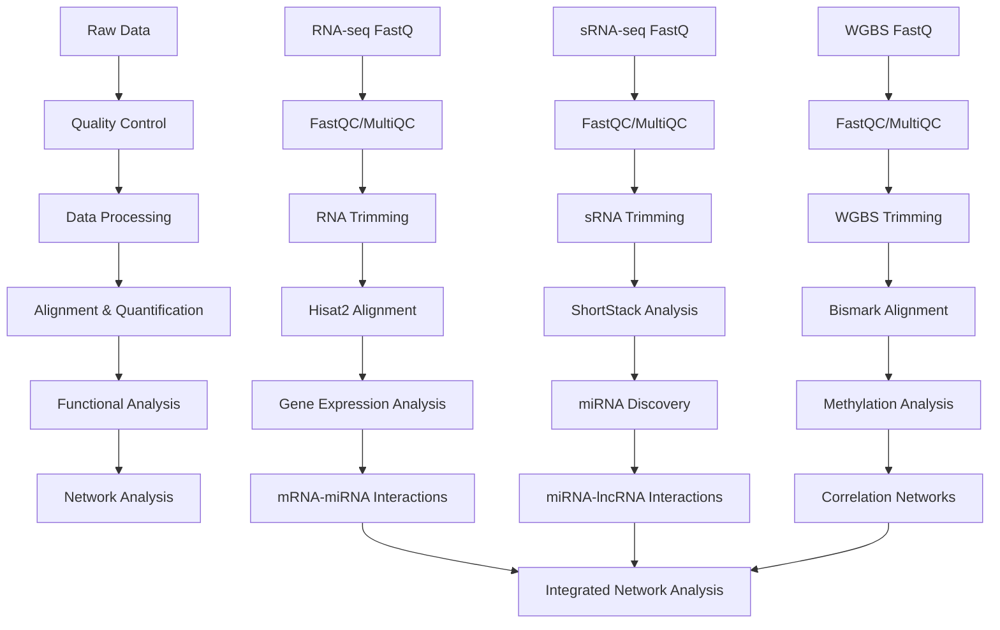

# E-Peve Code Directory

## Overview

This directory contains the complete bioinformatics pipeline for analyzing *Porites evermanni* multi-omics data, including RNA-seq, small RNA-seq, and whole genome bisulfite sequencing (WGBS) data. The analysis focuses on understanding gene expression regulation through miRNA-mRNA-lncRNA interactions, DNA methylation patterns, and functional annotation in this coral species.

## Workflow Schematic

## Key Results

- **Gene Expression**: Identified differentially expressed genes across *P. evermanni* samples
- **miRNA Discovery**: Discovered and annotated miRNAs using ShortStack 4.1.0
- **DNA Methylation**: Analyzed genome-wide methylation patterns using Bismark
- **Regulatory Networks**: Constructed miRNA-mRNA-lncRNA interaction networks
- **Functional Annotation**: Performed GO enrichment analysis and functional annotation
- **Species-Specific Analysis**: Comparative analysis with other coral species

## File Descriptions

### Data Quality Control and Processing

- **`00.00-E-Peve-WGBS-reads-FastQC-MultiQC.Rmd`**: Downloads and performs quality control on WGBS sequencing reads using FastQC and MultiQC
- **`01-Peve-RNA-trimming-FastQC.Rmd`**: Trims RNA-seq reads and performs quality control on both raw and trimmed reads
- **`01.00-E-Peve-WGBS-trimming-cutadapt-FastQC-MultiQC.Rmd`**: Trims WGBS reads using cutadapt and performs quality control
- **`01.00-E-Peve-WGBS-trimming-fastp-FastQC-MultiQC.Rmd`**: Alternative WGBS trimming using fastp

### Reference and Annotation

- **`00.00-genome-GFF-formatting.Rmd`**: Formats and prepares genome GFF files for analysis
- **`02-Peve-reference-annotation.Rmd`**: Annotates the *P. evermanni* reference genome with functional information and GO terms
- **`04-Peve-genome-explore.Rmd`**: Explores and analyzes the *P. evermanni* genome characteristics
- **`16-Peve-annotate-UTRs.Rmd`**: Annotates 5' and 3' UTR regions in the genome

### RNA-seq Analysis

- **`03-Peve-RNA-summary.Rmd`**: Summarizes RNA-seq gene expression data and performs differential expression analysis
- **`03.1-Peve-sRNA-summary.Rmd`**: Summarizes small RNA-seq data and identifies different RNA classes
- **`03.2-Peve-lncRNA-summary.Rmd`**: Identifies and summarizes long non-coding RNAs
- **`06-Peve-Hisat.qmd`**: RNA-seq alignment using Hisat2
- **`06.2-Peve-Hisat.qmd`**: Additional Hisat2 analysis

### Small RNA Analysis

- **`05-Peve-sRNA-ShortStack_4.1.0.Rmd`**: Discovers and annotates small RNAs using ShortStack 4.1.0
- **`05.1-Peve-sRNA-ShortStack-rename.Rmd`**: Renames ShortStack output files for consistency

### DNA Methylation Analysis

- **`12-Peve-WGBS.Rmd`**: Performs whole genome bisulfite sequencing analysis using Bismark
- **`11-Peve-methylation.qmd`**: Analyzes DNA methylation patterns and differential methylation

### Interaction Analysis

- **`10-Peve-mRNA-miRNA-interactions.Rmd`**: Identifies and analyzes miRNA-mRNA interactions
- **`10.01-Peve-mRNA-miRNA-interactions-CDS_5UTR.Rmd`**: Analyzes miRNA interactions with CDS and 5' UTR regions
- **`10.1-Peve-mRNA-miRNA-interactions-functional-enrichment.Rmd`**: Performs functional enrichment analysis on miRNA-mRNA interactions
- **`10.11-Peve-mRNA-miRNA-interactions-FE-CDS.Rmd`**: Functional enrichment analysis for CDS regions
- **`10.12-Peve-mRNA-miRNA-interactions-FE-5UTR.Rmd`**: Functional enrichment analysis for 5' UTR regions
- **`10.13-Peve-mRNA-miRNA-interactions-FE-3UTR.Rmd`**: Functional enrichment analysis for 3' UTR regions
- **`10.14-Peve-mRNA-miRNA-interactions-FE-pooled.Rmd`**: Pooled functional enrichment analysis
- **`14-Peve-miRNA-lncRNA-BLASTs-miRanda.Rmd`**: Analyzes miRNA-lncRNA interactions using BLAST and miRanda
- **`15-Peve-miRNA-lncRNA-PCC.Rmd`**: Calculates Pearson correlation coefficients between miRNAs and lncRNAs

### Network Analysis

- **`08-Peve-mixOmics.Rmd`**: Performs multi-omics integration analysis using mixOmics
- **`09-Peve-mRNA-lncRNA-correlation-networks.Rmd`**: Constructs correlation networks between mRNAs and lncRNAs
- **`09.1-Peve-mRNA-lncRNA-correlation-PCC.Rmd`**: Calculates Pearson correlation coefficients between mRNAs and lncRNAs
- **`31-Peve-miRNA-mRNA-lncRNA-network.Rmd`**: Integrates all interaction data into a comprehensive network

### Functional Analysis

- **`13-Peve-mRNA-GO-enrichment.Rmd`**: GO enrichment analysis for mRNAs
- **`30.00-Peve-transcriptome-GOslims.Rmd`**: GO-slim analysis of the transcriptome

### Data Management

- **`07-Peve-lncRNA-matrix.qmd`**: Creates lncRNA count matrix
- **`17-Peve-lncRNA.Rmd`**: Comprehensive lncRNA analysis
- **`18-Peve-lncRNA-matrix.qmd`**: Updated lncRNA matrix creation

### Utility Scripts

- **`references.bib`**: Bibliography file for citations

## Data Flow

1. **Raw Data Processing**: Quality control and trimming of sequencing reads
2. **Alignment**: Mapping reads to reference genome using appropriate tools
3. **Quantification**: Counting reads and estimating expression levels
4. **Discovery**: Identifying novel RNAs (miRNAs, lncRNAs) and methylation sites
5. **Interaction Analysis**: Predicting and validating molecular interactions
6. **Network Construction**: Building regulatory networks from interaction data
7. **Functional Analysis**: Enrichment analysis and functional annotation
8. **Integration**: Combining all analyses into comprehensive networks

## Key Software Tools

- **FastQC/MultiQC**: Quality control
- **Hisat2**: RNA-seq alignment
- **ShortStack**: Small RNA analysis
- **Bismark**: DNA methylation analysis
- **miRanda**: miRNA target prediction
- **mixOmics**: Multi-omics integration
- **DESeq2**: Differential expression analysis
- **R/Bioconductor**: Statistical analysis and visualization

## Output Structure

All outputs are organized in the `../output/` directory with subdirectories corresponding to each analysis step. Key outputs include:

- Quality control reports (FastQC, MultiQC)
- Alignment files (BAM, SAM)
- Count matrices (gene, miRNA, lncRNA)
- Interaction predictions (miRNA-mRNA, miRNA-lncRNA)
- Network files (CSV, GML)
- Functional enrichment results
- Visualization plots (PDF, PNG)

## Citation

Please cite the original papers for the software tools used in this analysis, as well as any relevant publications from the E5 coral research group.
