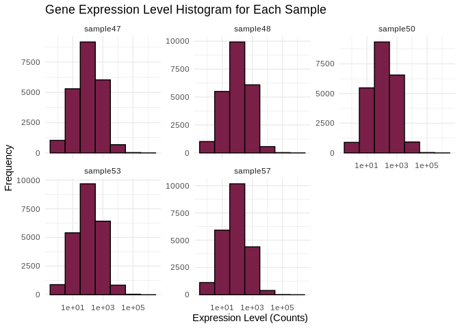
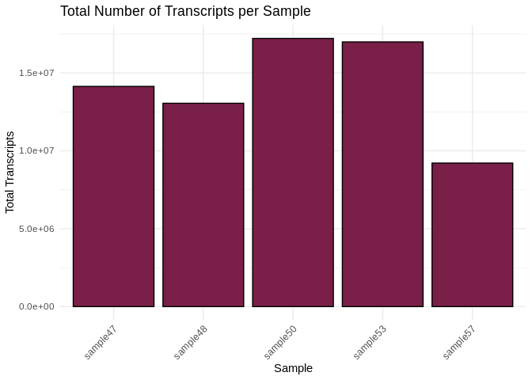
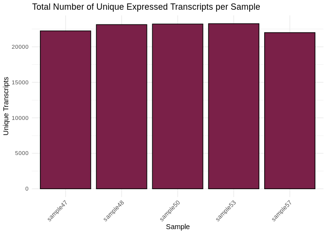
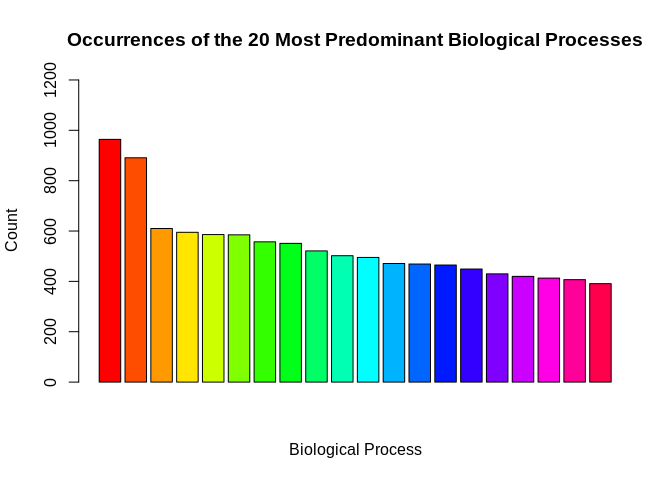

03-Ptuh-RNA-summary
================
Kathleen Durkin
2024-09-04

- <a href="#001-install-and-load-packages"
  id="toc-001-install-and-load-packages">0.0.1 Install and load
  packages</a>
- <a href="#1-load-data" id="toc-1-load-data">1 Load data</a>
  - <a href="#11-load-count-data" id="toc-11-load-count-data">1.1 Load count
    data</a>
  - <a href="#12-count-data-munging" id="toc-12-count-data-munging">1.2
    Count data munging</a>
- <a href="#2-summary-stats-and-visualizations"
  id="toc-2-summary-stats-and-visualizations">2 Summary stats and
  visualizations</a>
  - <a href="#21-expression-levels" id="toc-21-expression-levels">2.1
    Expression levels</a>
  - <a href="#22-transcript-counts" id="toc-22-transcript-counts">2.2
    Transcript counts</a>
  - <a href="#23-most-common-biological-processes"
    id="toc-23-most-common-biological-processes">2.3 Most common biological
    processes</a>

Gene expression summary for *Pocillopora tuahiniensis* RNA-seq data.

- trimmed reads generated in `deep-dive` project, trimming and QC
  details in `01-Ptuh-RNA-trimming-FastQC`

- Reads aligned to *Pocillopora meandrina* transcriptome, details
  [here](https://github.com/urol-e5/deep-dive/blob/main/F-Ptuh/code/12-Ptuh-RNAseq-kallisto.md)

### 0.0.1 Install and load packages

``` r
library(tidyverse)
library(ggplot2)
library(reshape2)
```

# 1 Load data

## 1.1 Load count data

Load in the count matrix we generated after kallisto pseudoalignment
using the Trinity abundance_estimates_to_matrix.pl script. We also need
to slightly reformat the count matrix

``` r
# Read in counts data. This is a gene-level counts matrix generated from kallisto transcript abundances using Trinity
Ptuh_counts_data_OG <- read_delim("../../../deep-dive/F-Pmea/output/14-Pmea-RNAseq-kallisto/kallisto/kallisto.isoform.counts.matrix") 
head(Ptuh_counts_data_OG)
```

    # A tibble: 6 × 6
      ...1      kallisto_quant_sampl…¹ kallisto_quant_sampl…² kallisto_quant_sampl…³
      <chr>                      <dbl>                  <dbl>                  <dbl>
    1 Pocillop…                  242                     271                   390  
    2 Pocillop…                    0                       9                     3  
    3 Pocillop…                 1067                    1666.                 2432  
    4 Pocillop…                   56                      43                     9  
    5 Pocillop…                    0                       0                     5  
    6 Pocillop…                   40.4                     0                    21.9
    # ℹ abbreviated names: ¹​kallisto_quant_sample47, ²​kallisto_quant_sample48,
    #   ³​kallisto_quant_sample50
    # ℹ 2 more variables: kallisto_quant_sample53 <dbl>,
    #   kallisto_quant_sample57 <dbl>

``` r
# Read in ID mapping of transcripts and associated GO terms etc.
Ptuh_IDmapping <- read_delim("../output/02-Ptuh-reference-annotation/Pocillopora_meandrina_HIv1-IDmapping-2024_09_04.tab") %>%
  select(-...1)
head(Ptuh_IDmapping)
```

    # A tibble: 6 × 7
      V1               V3          V13 Protein.names Organism Gene.Ontology..biolo…¹
      <chr>            <chr>     <dbl> <chr>         <chr>    <chr>                 
    1 Pocillopora_mea… Q7ZT… 3.67e- 66 DNA replicat… Xenopus… DNA replication [GO:0…
    2 Pocillopora_mea… P551… 1.16e- 38 Zinc metallo… Caenorh… proteolysis [GO:00065…
    3 Pocillopora_mea… Q9Y4… 7.59e-138 Diacylglycer… Homo sa… arachidonic acid meta…
    4 Pocillopora_mea… Q616… 1.32e- 21 H2.0-like ho… Mus mus… animal organ developm…
    5 Pocillopora_mea… Q107… 2.44e- 41 Angiotensin-… Gallus … angiotensin maturatio…
    6 Pocillopora_mea… Q107… 3.91e- 40 Angiotensin-… Gallus … angiotensin maturatio…
    # ℹ abbreviated name: ¹​Gene.Ontology..biological.process.
    # ℹ 1 more variable: Gene.Ontology.IDs <chr>

## 1.2 Count data munging

``` r
# We need to modify this data frame so that the row names are actually row names, instead of comprising the first column
Ptuh_counts_data <- Ptuh_counts_data_OG %>%
  column_to_rownames(var = "...1")

# Additional formatting
# Round all estimated counts to integers
Ptuh_counts_data <- round(Ptuh_counts_data, digits = 0)

# Remove all transcripts with 5 or fewer counts in all samples
Ptuh_counts_data <- Ptuh_counts_data[!apply(Ptuh_counts_data, 1, function(row) all(row < 6)), ]

# Remove the "kallisto_quant_" portion of the column names, to leave just the sample names
colnames(Ptuh_counts_data) <- sub("kallisto_quant_", "", colnames(Ptuh_counts_data))

# Reorder the columns into alphabetical order (to make it easier to create an associated metadata spreadsheet)
Ptuh_counts_data <- Ptuh_counts_data[, order(colnames(Ptuh_counts_data))]

Ptuh_sample_names <- names(Ptuh_counts_data)

head(Ptuh_counts_data)
```

                                                  sample47 sample48 sample50
    Pocillopora_meandrina_HIv1___RNAseq.g5509.t1       242      271      390
    Pocillopora_meandrina_HIv1___RNAseq.g3856.t1         0        9        3
    Pocillopora_meandrina_HIv1___RNAseq.g29982.t1     1067     1666     2432
    Pocillopora_meandrina_HIv1___TS.g21722.t1           56       43        9
    Pocillopora_meandrina_HIv1___RNAseq.g23510.t1       40        0       22
    Pocillopora_meandrina_HIv1___RNAseq.g2438.t1         8       72       16
                                                  sample53 sample57
    Pocillopora_meandrina_HIv1___RNAseq.g5509.t1       235      238
    Pocillopora_meandrina_HIv1___RNAseq.g3856.t1         5        1
    Pocillopora_meandrina_HIv1___RNAseq.g29982.t1     1275     1783
    Pocillopora_meandrina_HIv1___TS.g21722.t1           76       80
    Pocillopora_meandrina_HIv1___RNAseq.g23510.t1       60        0
    Pocillopora_meandrina_HIv1___RNAseq.g2438.t1        25        8

``` r
Ptuh_sample_names
```

    [1] "sample47" "sample48" "sample50" "sample53" "sample57"

``` r
Ptuh_counts_GO <- Ptuh_counts_data %>%
  rownames_to_column(var = "transcript") %>%
  left_join(Ptuh_IDmapping, by = c("transcript" = "V1"))

head(Ptuh_counts_GO)
```

                                         transcript sample47 sample48 sample50
    1  Pocillopora_meandrina_HIv1___RNAseq.g5509.t1      242      271      390
    2  Pocillopora_meandrina_HIv1___RNAseq.g3856.t1        0        9        3
    3 Pocillopora_meandrina_HIv1___RNAseq.g29982.t1     1067     1666     2432
    4     Pocillopora_meandrina_HIv1___TS.g21722.t1       56       43        9
    5 Pocillopora_meandrina_HIv1___RNAseq.g23510.t1       40        0       22
    6  Pocillopora_meandrina_HIv1___RNAseq.g2438.t1        8       72       16
      sample53 sample57     V3      V13
    1      235      238 Q56P03 5.85e-49
    2        5        1   <NA>       NA
    3     1275     1783   <NA>       NA
    4       76       80   <NA>       NA
    5       60        0 P51635 1.38e-70
    6       25        8 Q9EQD2 2.00e-48
                                                                                                                                                                                                                                                      Protein.names
    1                                                                                                                                                                                                                          E2F-associated phosphoprotein (EAPP)
    2                                                                                                                                                                                                                                                          <NA>
    3                                                                                                                                                                                                                                                          <NA>
    4                                                                                                                                                                                                                                                          <NA>
    5 Aldo-keto reductase family 1 member A1 (EC 1.1.1.2) (EC 1.1.1.33) (EC 1.1.1.372) (EC 1.1.1.54) (3-DG-reducing enzyme) (Alcohol dehydrogenase [NADP(+)]) (Aldehyde reductase) (Glucuronate reductase) (EC 1.1.1.19) (Glucuronolactone reductase) (EC 1.1.1.20)
    6                                                                                                                                                          Neuropeptide FF receptor 2 (G-protein coupled receptor 74) (Neuropeptide G-protein coupled receptor)
                     Organism
    1    Homo sapiens (Human)
    2                    <NA>
    3                    <NA>
    4                    <NA>
    5 Rattus norvegicus (Rat)
    6 Rattus norvegicus (Rat)
                                                                                                                                                                                                                                                                                                                                                                 Gene.Ontology..biological.process.
    1                                                                                                                                                       negative regulation of transcription elongation by RNA polymerase II [GO:0034244]; positive regulation of cell population proliferation [GO:0008284]; positive regulation of transcription elongation by RNA polymerase II [GO:0032968]
    2                                                                                                                                                                                                                                                                                                                                                                                          <NA>
    3                                                                                                                                                                                                                                                                                                                                                                                          <NA>
    4                                                                                                                                                                                                                                                                                                                                                                                          <NA>
    5 aldehyde catabolic process [GO:0046185]; cellular detoxification of aldehyde [GO:0110095]; D-glucuronate catabolic process [GO:0042840]; daunorubicin metabolic process [GO:0044597]; doxorubicin metabolic process [GO:0044598]; glucuronate catabolic process to xylulose 5-phosphate [GO:0019640]; L-ascorbic acid biosynthetic process [GO:0019853]; lipid metabolic process [GO:0006629]
    6                                                                                                                                                                  G protein-coupled receptor signaling pathway [GO:0007186]; regulation of adenylate cyclase activity [GO:0045761]; regulation of cAMP-dependent protein kinase activity [GO:2000479]; regulation of MAPK cascade [GO:0043408]
                                                                                                                                                                                                                       Gene.Ontology.IDs
    1                                                                                                                                                                         GO:0005634; GO:0005737; GO:0008284; GO:0032968; GO:0034244
    2                                                                                                                                                                                                                               <NA>
    3                                                                                                                                                                                                                               <NA>
    4                                                                                                                                                                                                                               <NA>
    5 GO:0004032; GO:0005829; GO:0006629; GO:0016324; GO:0016657; GO:0019640; GO:0019726; GO:0019853; GO:0042840; GO:0044597; GO:0044598; GO:0045202; GO:0046185; GO:0047655; GO:0047939; GO:0047941; GO:0047956; GO:0110095; GO:1990002
    6                                                                                                             GO:0004930; GO:0005886; GO:0007186; GO:0008188; GO:0015629; GO:0031628; GO:0042277; GO:0043408; GO:0045761; GO:2000479

# 2 Summary stats and visualizations

## 2.1 Expression levels

Plot histograms of the expression levels in each sample

``` r
# Melt the count matrix into long format
Ptuh_counts_melted <- melt(Ptuh_counts_data, variable.name = "sample", value.name = "counts")

# Plot the expression level histograms for each sample
ggplot(Ptuh_counts_melted, aes(x = counts)) +
  geom_histogram(binwidth = 1, fill = "#7A2048", color = "black") +
  scale_x_log10() +  # Optional: Log-transform the x-axis for better visualization
  facet_wrap(~sample, scales = "free_y") +
  labs(title = "Gene Expression Level Histogram for Each Sample",
       x = "Expression Level (Counts)",
       y = "Frequency") +
  theme_minimal()
```

<!-- -->

## 2.2 Transcript counts

First let’s check the total number of transcripts in each sample – keep
in mind this expression data has *not* been normalized yet, so there may
be different totals for each sample

``` r
# Calculate the total number of transcripts for each sample
total_transcripts <- colSums(Ptuh_counts_data)

# Create a data frame for plotting
total_transcripts_df <- data.frame(sample = names(total_transcripts),
                                   totals = total_transcripts)

# Plot the total number of transcripts for each sample
ggplot(total_transcripts_df, aes(x = sample, y = totals)) +
  geom_bar(stat = "identity", fill = "#7A2048", color = "black") +
  labs(title = "Total Number of Transcripts per Sample",
       x = "Sample",
       y = "Total Transcripts") +
  theme_minimal() +
  theme(axis.text.x = element_text(angle = 45, hjust = 1))  # Rotate x-axis labels for readability
```

<!-- -->

Now let’s check the number of unique transcripts in each sample – that
is, how many genes are expressed in each sample? This should be pretty
much the same across samples, even without normalization.

``` r
# Calculate the number of unique transcripts (non-zero counts) for each sample
unique_transcripts <- colSums(Ptuh_counts_data > 0)

# Create a data frame for plotting
unique_transcripts_df <- data.frame(sample = names(unique_transcripts),
                                    uniques = unique_transcripts)

# Plot the total number of unique transcripts for each sample
ggplot(unique_transcripts_df, aes(x = sample, y = uniques)) +
  geom_bar(stat = "identity", fill = "#7A2048", color = "black") +
  labs(title = "Total Number of Unique Expressed Transcripts per Sample",
       x = "Sample",
       y = "Unique Transcripts") +
  theme_minimal() +
  theme(axis.text.x = element_text(angle = 45, hjust = 1))  # Rotate x-axis labels for readability
```

<!-- -->

## 2.3 Most common biological processes

Similar to the plot generated in `02-Ptuh-reference-annotation`, let’s
plot the biological processes most represented in these samples’
expression

``` r
# Rename the `Gene.Ontology..biological.process.` column to `Biological_Process`
colnames(Ptuh_counts_GO)[colnames(Ptuh_counts_GO) == "Gene.Ontology..biological.process."] <- "Biological_Process"

# Separate the `Biological_Process` column into individual biological processes
data_separated <- unlist(strsplit(Ptuh_counts_GO$Biological_Process, split = ";"))

# Trim whitespace from the biological processes
data_separated <- gsub("^\\s+|\\s+$", "", data_separated)

# Count the occurrences of each biological process
process_counts <- table(data_separated)
process_counts <- data.frame(Biological_Process = names(process_counts), Count = as.integer(process_counts))
process_counts <- process_counts[order(-process_counts$Count), ]

# Select the 20 most predominant biological processes
top_20_processes <- process_counts[1:20, ]

# Create a color palette for the bars
bar_colors <- rainbow(nrow(top_20_processes))

# Create a staggered vertical bar plot with different colors for each bar
barplot(top_20_processes$Count, names.arg = rep("", nrow(top_20_processes)), col = bar_colors,
        ylim = c(0, max(top_20_processes$Count) * 1.25),
        main = "Occurrences of the 20 Most Predominant Biological Processes", xlab = "Biological Process", ylab = "Count")
```

<!-- -->

``` r
# Create a separate plot for the legend
png("../output/03-Ptuh-RNA-summary/GOlegend.png", width = 800, height = 600)
par(mar = c(0, 0, 0, 0))
plot.new()
legend("center", legend = top_20_processes$Biological_Process, fill = bar_colors, cex = 1, title = "Biological Processes")
dev.off()
```

    png 
      2 

``` r
knitr::include_graphics("../output/03-Ptuh-RNA-summary/GOlegend.png")
```


``` bash
rm ../output/03-Ptuh-RNA-summary/GOlegend.png
```
