03.1-Ptuh-sRNA-summary
================
Kathleen Durkin
2024-09-06

- <a href="#001-install-and-load-packages"
  id="toc-001-install-and-load-packages">0.0.1 Install and load
  packages</a>
- <a href="#1-srna" id="toc-1-srna">1 sRNA</a>
  - <a href="#11-load-count-data" id="toc-11-load-count-data">1.1 Load count
    data</a>
  - <a href="#12-count-data-munging" id="toc-12-count-data-munging">1.2
    Count data munging</a>
  - <a href="#13-expression-levels" id="toc-13-expression-levels">1.3
    Expression levels</a>
  - <a href="#14-transcript-counts" id="toc-14-transcript-counts">1.4
    Transcript counts</a>
- <a href="#2-mirna" id="toc-2-mirna">2 miRNA</a>
  - <a href="#21-load-mirna-metadata" id="toc-21-load-mirna-metadata">2.1
    Load miRNA metadata</a>
  - <a href="#22-expression-levels" id="toc-22-expression-levels">2.2
    Expression levels</a>
  - <a href="#23-mirna-counts" id="toc-23-mirna-counts">2.3 miRNA counts</a>
  - <a href="#24-heatmap" id="toc-24-heatmap">2.4 Heatmap</a>
- <a href="#3-sirna" id="toc-3-sirna">3 siRNA</a>
  - <a href="#31-expression-levels" id="toc-31-expression-levels">3.1
    Expression levels</a>
  - <a href="#32-sirna-counts" id="toc-32-sirna-counts">3.2 siRNA counts</a>
  - <a href="#33-heatmap" id="toc-33-heatmap">3.3 Heatmap</a>
- <a href="#4-" id="toc-4-">4 ………..</a>
- <a href="#5-normalized-srna-counts" id="toc-5-normalized-srna-counts">5
  Normalized sRNA counts</a>
  - <a href="#51-normalize-counts-with-deseq2"
    id="toc-51-normalize-counts-with-deseq2">5.1 Normalize counts with
    DESeq2</a>
    - <a href="#511-plot-unnormalized-srna-data"
      id="toc-511-plot-unnormalized-srna-data">5.1.1 Plot unnormalized sRNA
      data</a>
    - <a href="#512-metadata" id="toc-512-metadata">5.1.2 Metadata</a>
    - <a href="#513-deseq-object" id="toc-513-deseq-object">5.1.3 DESeq
      object</a>
  - <a href="#52-plot-normalized-data" id="toc-52-plot-normalized-data">5.2
    Plot normalized data</a>
  - <a href="#53-plot-variance-stabilized-data"
    id="toc-53-plot-variance-stabilized-data">5.3 Plot variance stabilized
    data</a>
  - <a href="#54-normalized-expression-levels"
    id="toc-54-normalized-expression-levels">5.4 Normalized expression
    levels</a>
  - <a href="#55-normalized-transcript-counts"
    id="toc-55-normalized-transcript-counts">5.5 Normalized transcript
    counts</a>
  - <a href="#56-pca-of-variance-stabilized-data"
    id="toc-56-pca-of-variance-stabilized-data">5.6 PCA of variance
    stabilized data</a>
  - <a href="#57-sample-clustering" id="toc-57-sample-clustering">5.7 Sample
    clustering</a>
  - <a href="#58-heatmaps" id="toc-58-heatmaps">5.8 Heatmaps</a>
- <a href="#6-normalized-mirna-counts"
  id="toc-6-normalized-mirna-counts">6 Normalized miRNA counts</a>
  - <a href="#61-isolate-normalizedvsd-mirna"
    id="toc-61-isolate-normalizedvsd-mirna">6.1 Isolate normalized/vsd
    miRNA</a>
  - <a href="#62-normalized-expression-levels"
    id="toc-62-normalized-expression-levels">6.2 Normalized expression
    levels</a>
  - <a href="#63-normalized-transcript-counts"
    id="toc-63-normalized-transcript-counts">6.3 Normalized transcript
    counts</a>
  - <a href="#64-heatmap" id="toc-64-heatmap">6.4 Heatmap</a>
- <a href="#7-normalized-sirna-counts"
  id="toc-7-normalized-sirna-counts">7 Normalized siRNA counts</a>
  - <a href="#71-isolate-normalizedvsd-sirna"
    id="toc-71-isolate-normalizedvsd-sirna">7.1 Isolate normalized/vsd
    siRNA</a>
  - <a href="#72-normalized-expression-levels"
    id="toc-72-normalized-expression-levels">7.2 Normalized expression
    levels</a>
  - <a href="#73-normalized-transcript-counts"
    id="toc-73-normalized-transcript-counts">7.3 Normalized transcript
    counts</a>
  - <a href="#74-heatmap" id="toc-74-heatmap">7.4 Heatmap</a>

Gene expression summary for *Pocillopora tuahiniensis* sRNA-seq data.

- trimmed reads generated in `deep-dive` project

- Reads aligned to *Pocillopora meandrina* transcriptome, details
  [here](https://github.com/urol-e5/deep-dive/blob/main/F-Ptuh/code/12-Ptuh-RNAseq-kallisto.md)

### 0.0.1 Install and load packages

``` r
library(tidyverse)
library(ggplot2)
library(reshape2)
library(pheatmap)
library(RColorBrewer)
library(DESeq2)
```

# 1 sRNA

## 1.1 Load count data

Load in the sRNA count matrix generated using ShortStack 4.1.0. Keep in
mind this data includes counts of all sRNAs, not just miRNAs.

``` r
# Read in sRNA counts data
Ptuh_counts_sRNA_data_OG <- read_delim("../output/05-Ptuh-sRNA-ShortStack_4.1.0/ShortStack_out/Counts.txt", delim="\t") 
head(Ptuh_counts_sRNA_data_OG)
```

    # A tibble: 6 × 8
      Coords               Name  MIRNA sRNA-POC-47-S1-TP2-f…¹ sRNA-POC-48-S1-TP2-f…²
      <chr>                <chr> <chr>                  <dbl>                  <dbl>
    1 Pocillopora_meandri… Clus… N                       1606                   1328
    2 Pocillopora_meandri… Clus… N                         24                     51
    3 Pocillopora_meandri… Clus… N                        244                    525
    4 Pocillopora_meandri… Clus… N                        166                    167
    5 Pocillopora_meandri… Clus… N                          6                     15
    6 Pocillopora_meandri… Clus… N                         35                     37
    # ℹ abbreviated names:
    #   ¹​`sRNA-POC-47-S1-TP2-fastp-adapters-polyG-31bp-merged_condensed`,
    #   ²​`sRNA-POC-48-S1-TP2-fastp-adapters-polyG-31bp-merged_condensed`
    # ℹ 3 more variables:
    #   `sRNA-POC-50-S1-TP2-fastp-adapters-polyG-31bp-merged_condensed` <dbl>,
    #   `sRNA-POC-53-S1-TP2-fastp-adapters-polyG-31bp-merged_condensed` <dbl>,
    #   `sRNA-POC-57-S1-TP2-fastp-adapters-polyG-31bp-merged_condensed` <dbl>

## 1.2 Count data munging

``` r
Ptuh_counts_sRNA <- Ptuh_counts_sRNA_data_OG

# Remove excess portions of sample column names to just "sample###"
colnames(Ptuh_counts_sRNA) <- sub("-S1-TP2-fastp-adapters-polyG-31bp-merged_condensed", "", colnames(Ptuh_counts_sRNA))
colnames(Ptuh_counts_sRNA) <- sub("sRNA-POC-", "sample", colnames(Ptuh_counts_sRNA))

# Keep just the counts and cluster names
Ptuh_counts_sRNA <- Ptuh_counts_sRNA %>% select("sample47", "sample48", "sample50", "sample53", "sample57", "Name")

# I'm not going to be doing any removal of low-count sRNAs for now

# Make the cluster names our new row names
Ptuh_counts_sRNA <- Ptuh_counts_sRNA %>% column_to_rownames(var = "Name")

write.table(Ptuh_counts_sRNA, file = "../output/03.1-Ptuh-sRNA-summary/Ptuh_sRNA_ShortStack_counts_formatted.txt", sep = "\t", row.names = TRUE, col.names = TRUE, quote = FALSE)

head(Ptuh_counts_sRNA)
```

              sample47 sample48 sample50 sample53 sample57
    Cluster_1     1606     1328     1544     3021     3331
    Cluster_2       24       51       67       52       91
    Cluster_3      244      525      433      397      949
    Cluster_4      166      167      273      318      333
    Cluster_5        6       15       26       65       73
    Cluster_6       35       37       33       58      123

## 1.3 Expression levels

Plot histograms of the expression levels in each sample

``` r
# Melt the count matrix into long format
Ptuh_counts_sRNA_melted <- melt(Ptuh_counts_sRNA, variable.name = "sample", value.name = "counts")

# Plot the expression level histograms for each sample
ggplot(Ptuh_counts_sRNA_melted, aes(x = counts)) +
  geom_histogram(binwidth = 1, fill = "#7A2048", color = "black") +
  scale_x_log10() +  # Optional: Log-transform the x-axis for better visualization
  facet_wrap(~sample, scales = "free_y") +
  labs(title = "Gene Expression Level Histogram for Each Sample",
       x = "Expression Level (Counts)",
       y = "Frequency") +
  theme_minimal()
```

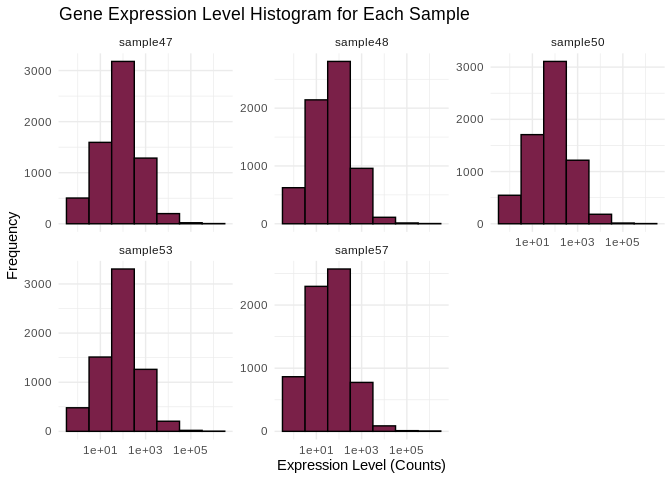<!-- -->

## 1.4 Transcript counts

First let’s check the total number of transcripts in each sample – keep
in mind this expression data has *not* been normalized yet, so there may
be different totals for each sample

``` r
# Calculate the total number of transcripts for each sample
total_transcripts <- colSums(Ptuh_counts_sRNA)

# Create a data frame for plotting
total_transcripts_df <- data.frame(sample = names(total_transcripts),
                                   totals = total_transcripts)

# Plot the total number of transcripts for each sample
ggplot(total_transcripts_df, aes(x = sample, y = totals)) +
  geom_bar(stat = "identity", fill = "#7A2048", color = "black") +
  geom_text(aes(label = totals), vjust = -0.3, size = 3.5) + 
  labs(title = "Total Number of Transcripts per Sample",
       x = "Sample",
       y = "Total Transcripts") +
  theme_minimal() +
  theme(axis.text.x = element_text(angle = 45, hjust = 1))  # Rotate x-axis labels for readability
```

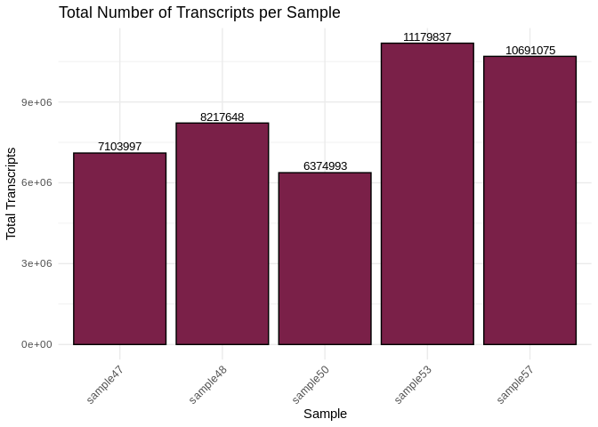<!-- -->

Now let’s check the number of unique transcripts in each sample – that
is, how many unique sRNAs are expressed in each sample? This should be
pretty much the same across samples, even without normalization.

``` r
# Calculate the number of unique transcripts (non-zero counts) for each sample
unique_transcripts <- colSums(Ptuh_counts_sRNA > 0)

# Create a data frame for plotting
unique_transcripts_df <- data.frame(sample = names(unique_transcripts),
                                    uniques = unique_transcripts)

# Plot the total number of unique transcripts for each sample
ggplot(unique_transcripts_df, aes(x = sample, y = uniques)) +
  geom_bar(stat = "identity", fill = "#7A2048", color = "black") +
  geom_text(aes(label = uniques), vjust = -0.3, size = 3.5) + 
  labs(title = "Total Number of Unique Expressed Transcripts per Sample",
       x = "Sample",
       y = "Unique Transcripts") +
  theme_minimal() +
  theme(axis.text.x = element_text(angle = 45, hjust = 1))  # Rotate x-axis labels for readability
```

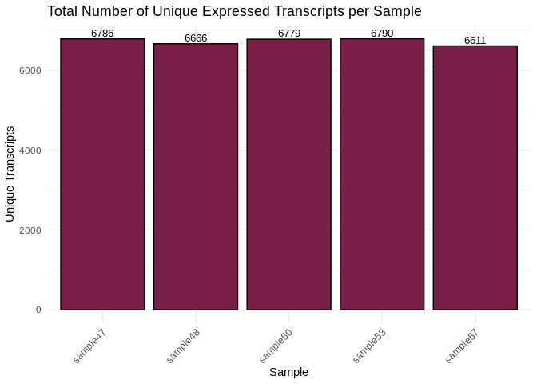<!-- -->

# 2 miRNA

## 2.1 Load miRNA metadata

The ShortStack output Results.txt includes all clusters of sRNA reads,
including those not annotated as valid miRNAs. Now that we’ve looked at
all the sRNAs a bit, let’s focus in on those classified as miRNAs.

``` r
## This code needs miRNA names first ##
# # Join with full metadata sheet, which only contains valid miRNAs
# Ptuh_metadata_miRNA <- read_csv("../../../deep-dive/DEF-cross-species/output/10-shortRNA-ShortStack-comparison/Ptuh_results_mature_named.csv") 
# 
# Ptuh_counts_sRNA <- rownames_to_column(Ptuh_counts_sRNA, var = "Name")
# 
# Ptuh_counts_miRNA <- left_join(Ptuh_metadata_miRNA, Ptuh_counts_sRNA, by = c("Name" = "Name"))
# 
# # Keep just the counts and given miRNA names (e.g., based on match to previously described miRNA)
# Ptuh_counts_miRNA <- Ptuh_counts_miRNA %>% select("sample47", "sample48", "sample50", "sample53", "sample57", "given_miRNA_name")
# 
# # Make the miRNA names our new row names
# Ptuh_counts_miRNA <- Ptuh_counts_miRNA %>% column_to_rownames(var = "given_miRNA_name")
# 
# head(Ptuh_counts_miRNA)

## This code can be used until we have miRNA names ##
Ptuh_counts_miRNA <- Ptuh_counts_sRNA_data_OG

# Remove excess portions of sample column names to just "sample###"
colnames(Ptuh_counts_miRNA) <- sub("-S1-TP2-fastp-adapters-polyG-31bp-merged_condensed", "", colnames(Ptuh_counts_miRNA))
colnames(Ptuh_counts_miRNA) <- sub("sRNA-POC-", "sample", colnames(Ptuh_counts_miRNA))

# Keep only the sRNAs ID'd as valid miRNAs
Ptuh_counts_miRNA <- Ptuh_counts_miRNA %>% filter(MIRNA == "Y")

# Keep just the counts and cluster names
Ptuh_counts_miRNA <- Ptuh_counts_miRNA %>% select("sample47", "sample48", "sample50", "sample53", "sample57", "Name")

# Make the cluster names our new row names
Ptuh_counts_miRNA <- Ptuh_counts_miRNA %>% column_to_rownames(var = "Name")

write.table(Ptuh_counts_miRNA, file = "../output/03.1-Ptuh-sRNA-summary/Ptuh_miRNA_ShortStack_counts_formatted.txt", sep = "\t", row.names = TRUE, col.names = TRUE, quote = FALSE)

head(Ptuh_counts_miRNA)
```

                sample47 sample48 sample50 sample53 sample57
    Cluster_21      4846     2433     1968     1452     1397
    Cluster_36        39       44       20       41       33
    Cluster_360   142599   101636   141199    84760    52034
    Cluster_390      741      614      748      876      353
    Cluster_757     2201      960     1596      944      621
    Cluster_925    27988    22742    20636    26150     8840

## 2.2 Expression levels

Plot histograms of the expression levels in each sample

``` r
# Melt the count matrix into long format
Ptuh_counts_miRNA_melted <- melt(Ptuh_counts_miRNA, variable.name = "sample", value.name = "counts")

# Plot the expression level histograms for each sample
ggplot(Ptuh_counts_miRNA_melted, aes(x = counts)) +
  geom_histogram(binwidth = 1, fill = "#7A2048", color = "black") +
  scale_x_log10() +  # Optional: Log-transform the x-axis for better visualization
  facet_wrap(~sample, scales = "free_y") +
  labs(title = "miRNA Expression Level Histogram for Each Sample",
       x = "Expression Level (Counts)",
       y = "Frequency") +
  theme_minimal()
```

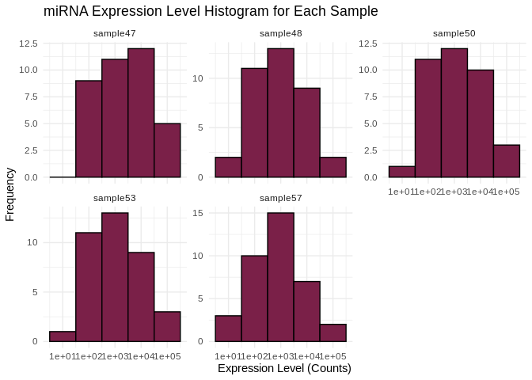<!-- -->

## 2.3 miRNA counts

First let’s check the total number of miRNAs in each sample – keep in
mind this expression data has *not* been normalized yet, so there may be
different totals for each sample

``` r
# Calculate the total number of transcripts for each sample
total_miRNA <- colSums(Ptuh_counts_miRNA)

# Create a data frame for plotting
total_miRNA_df <- data.frame(sample = names(total_miRNA),
                                   totals = total_miRNA)

# Plot the total number of transcripts for each sample
ggplot(total_miRNA_df, aes(x = sample, y = totals)) +
  geom_bar(stat = "identity", fill = "#7A2048", color = "black") +
  geom_text(aes(label = totals), vjust = -0.3, size = 3.5) + 
  labs(title = "Total Number of miRNAs per Sample",
       x = "Sample",
       y = "Total miRNAs") +
  theme_minimal() +
  theme(axis.text.x = element_text(angle = 45, hjust = 1))  # Rotate x-axis labels for readability
```

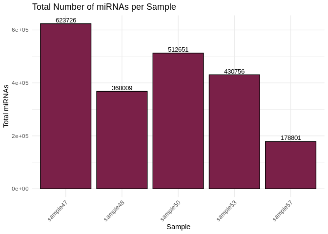<!-- -->

Now let’s check the number of unique miRNAs in each sample – This should
be pretty much the same across samples, even without normalization.

``` r
# Calculate the number of unique transcripts (non-zero counts) for each sample
unique_miRNA <- colSums(Ptuh_counts_miRNA > 0)

# Create a data frame for plotting
unique_miRNA_df <- data.frame(sample = names(unique_miRNA),
                                    uniques = unique_miRNA)

# Plot the total number of unique transcripts for each sample
ggplot(unique_miRNA_df, aes(x = sample, y = uniques)) +
  geom_bar(stat = "identity", fill = "#7A2048", color = "black") +
  geom_text(aes(label = uniques), vjust = -0.3, size = 3.5) + 
  labs(title = "Total Number of Unique Expressed miRNAs per Sample",
       x = "Sample",
       y = "Unique miRNA") +
  theme_minimal() +
  theme(axis.text.x = element_text(angle = 45, hjust = 1))  # Rotate x-axis labels for readability
```

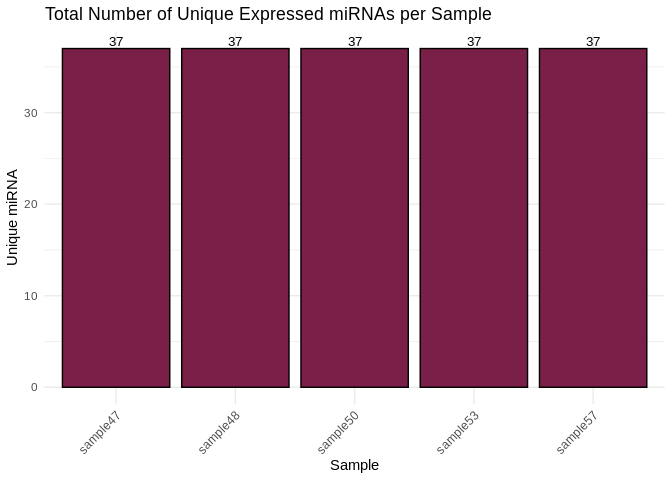<!-- -->

## 2.4 Heatmap

``` r
pheatmap(Ptuh_counts_miRNA,
         cluster_rows = TRUE,
         cluster_cols = TRUE,
         show_rownames = TRUE,
         show_colnames = TRUE,
         color = colorRampPalette(c("blue", "white", "red"))(50),
         fontsize_row = 8,
         fontsize_col = 8)
```

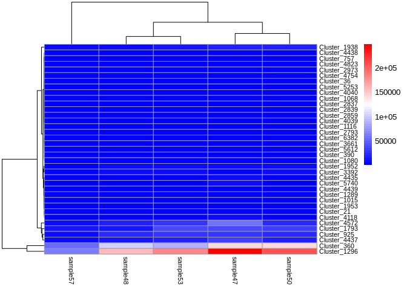<!-- -->
Well… there’s like 2 miRNAs with much higher expression than the others,
which is making visualizing relative differences difficult. Let’s redo
the heatmap, normalizing each row to view relative difference in
expression between samples (`scale='row'`)

``` r
pheatmap(Ptuh_counts_miRNA,
         cluster_rows = TRUE,
         cluster_cols = TRUE,
         show_rownames = TRUE,
         show_colnames = TRUE,
         scale = 'row',
         color = colorRampPalette(c("blue", "white", "red"))(50),
         fontsize_row = 8,
         fontsize_col = 8)
```

<!-- -->

# 3 siRNA

ShortStack’s primary purpose is to identify miRNAs from sRNA-seq data,
but it also automatically annotates siRNA loci! Since siRNA potentially
play an important role in transposon silencing in invertebrates, we
should generate count matrices for siRNAs as well.

We can see clusters annotated as siRNAs in the `Results.gff3` output
file of ShortStack (sRNA ID shown in the 3rd column)

``` r
Ptuh_Resultsgff <- read.table("../output/05-Ptuh-sRNA-ShortStack_4.1.0/ShortStack_out/Results.gff3")
# Separate last column info into multiple columns for filtering
Ptuh_Resultsgff <- Ptuh_Resultsgff %>%
  separate(V9, into = c("Name", "DicerCall", "MIRNA"), sep = ";") %>%
  mutate(Name = sub("ID=", "", Name),
         DicerCall = sub("DicerCall=", "", DicerCall),
         MIRNA = sub("MIRNA=", "", MIRNA))
head(Ptuh_Resultsgff)
```

                                          V1         V2                 V3     V4
    1 Pocillopora_meandrina_HIv1___Sc0000000 ShortStack Unknown_sRNA_locus   9092
    2 Pocillopora_meandrina_HIv1___Sc0000000 ShortStack Unknown_sRNA_locus  53578
    3 Pocillopora_meandrina_HIv1___Sc0000000 ShortStack Unknown_sRNA_locus 150243
    4 Pocillopora_meandrina_HIv1___Sc0000000 ShortStack      siRNA22_locus 173728
    5 Pocillopora_meandrina_HIv1___Sc0000000 ShortStack Unknown_sRNA_locus 187562
    6 Pocillopora_meandrina_HIv1___Sc0000000 ShortStack Unknown_sRNA_locus 485730
          V5    V6 V7 V8      Name DicerCall MIRNA
    1   9521 10830  +  . Cluster_1         N     N
    2  53997   285  +  . Cluster_2         N     N
    3 150718  2548  -  . Cluster_3         N     N
    4 174150  1257  +  . Cluster_4        22     N
    5 188076   185  .  . Cluster_5         N     N
    6 486254   286  +  . Cluster_6         N     N

``` r
# keep just the sRNA category column (V3), and the cluster names (Name)
# filter to only keep clusters ID'd as siRNAs
Ptuh_siRNA_clusters <- Ptuh_Resultsgff %>%
  select(V3, Name) %>%
  filter(str_detect(V3, regex("siRNA")))
head(Ptuh_siRNA_clusters)
```

                 V3        Name
    1 siRNA22_locus   Cluster_4
    2 siRNA24_locus  Cluster_72
    3 siRNA24_locus Cluster_100
    4 siRNA24_locus Cluster_167
    5 siRNA22_locus Cluster_280
    6 siRNA22_locus Cluster_311

``` r
# Now use this list of clusters ID'd as siRNAs to filter our sRNA count matrix
# keep only the sample counts and cluster names
Ptuh_counts_sRNA <- rownames_to_column(Ptuh_counts_sRNA, var = "Name")
Ptuh_counts_siRNA <- left_join(Ptuh_siRNA_clusters, Ptuh_counts_sRNA, by = c("Name" = "Name")) %>%
  select(-V3)

# convert the column of cluster names into the df row names
Ptuh_counts_sRNA <- Ptuh_counts_sRNA %>% column_to_rownames(var="Name")
Ptuh_counts_siRNA <- Ptuh_counts_siRNA %>% column_to_rownames(var="Name")

head(Ptuh_counts_siRNA)
```

                sample47 sample48 sample50 sample53 sample57
    Cluster_4        166      167      273      318      333
    Cluster_72        76       11       25        0        7
    Cluster_100      432      151      173      168       97
    Cluster_167        0      113        0        0        1
    Cluster_280        2        2       35       26       18
    Cluster_311     3523     4898     4821     2509     1428

``` r
write.table(Ptuh_counts_siRNA, file = "../output/03.1-Ptuh-sRNA-summary/Ptuh_siRNA_ShortStack_counts_formatted.txt", sep = "\t", row.names = TRUE, col.names = TRUE, quote = FALSE)
```

## 3.1 Expression levels

Plot histograms of the expression levels in each sample

``` r
# Melt the count matrix into long format
Ptuh_counts_siRNA_melted <- melt(Ptuh_counts_siRNA, variable.name = "sample", value.name = "counts")

# Plot the expression level histograms for each sample
ggplot(Ptuh_counts_siRNA_melted, aes(x = counts)) +
  geom_histogram(binwidth = 1, fill = "#7A2048", color = "black") +
  scale_x_log10() +  # Optional: Log-transform the x-axis for better visualization
  facet_wrap(~sample, scales = "free_y") +
  labs(title = "siRNA Expression Level Histogram for Each Sample",
       x = "Expression Level (Counts)",
       y = "Frequency") +
  theme_minimal()
```

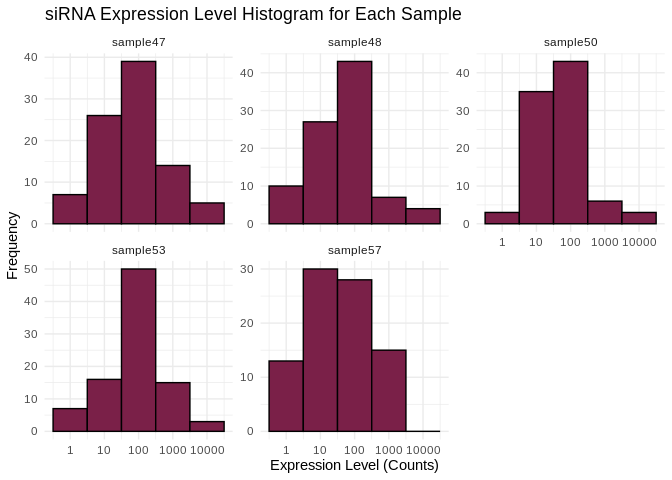<!-- -->

## 3.2 siRNA counts

First let’s check the total number of siRNAs in each sample – keep in
mind this expression data has *not* been normalized yet, so there may be
different totals for each sample

``` r
# Calculate the total number of transcripts for each sample
total_siRNA <- colSums(Ptuh_counts_siRNA)

# Create a data frame for plotting
total_siRNA_df <- data.frame(sample = names(total_siRNA),
                                   totals = total_siRNA)

# Plot the total number of transcripts for each sample
ggplot(total_siRNA_df, aes(x = sample, y = totals)) +
  geom_bar(stat = "identity", fill = "#7A2048", color = "black") +
  geom_text(aes(label = totals), vjust = -0.3, size = 3.5) + 
  labs(title = "Total Number of siRNAs per Sample",
       x = "Sample",
       y = "Total siRNAs") +
  theme_minimal() +
  theme(axis.text.x = element_text(angle = 45, hjust = 1))  # Rotate x-axis labels for readability
```

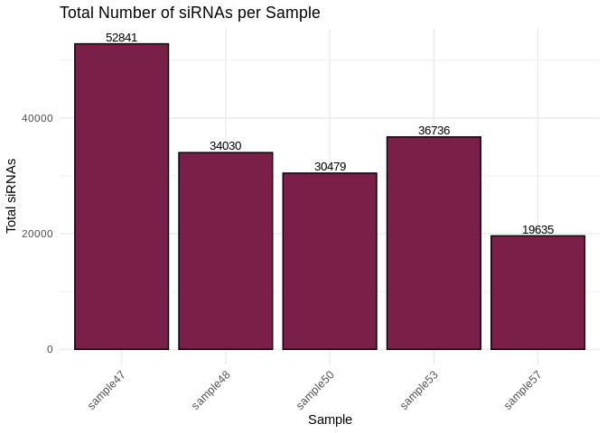<!-- -->

Now let’s check the number of unique siRNAs in each sample – This should
be pretty much the same across samples, even without normalization.

``` r
# Calculate the number of unique transcripts (non-zero counts) for each sample
unique_siRNA <- colSums(Ptuh_counts_siRNA > 0)

# Create a data frame for plotting
unique_siRNA_df <- data.frame(sample = names(unique_siRNA),
                                    uniques = unique_siRNA)

# Plot the total number of unique transcripts for each sample
ggplot(unique_siRNA_df, aes(x = sample, y = uniques)) +
  geom_bar(stat = "identity", fill = "#7A2048", color = "black") +
  geom_text(aes(label = uniques), vjust = -0.3, size = 3.5) + 
  labs(title = "Total Number of Unique Expressed siRNAs per Sample",
       x = "Sample",
       y = "Unique siRNA") +
  theme_minimal() +
  theme(axis.text.x = element_text(angle = 45, hjust = 1))  # Rotate x-axis labels for readability
```

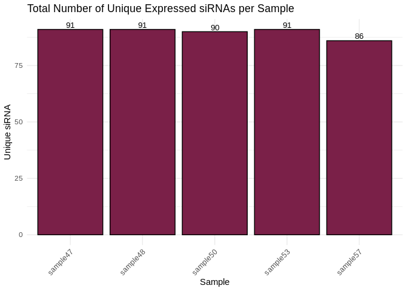<!-- -->

## 3.3 Heatmap

``` r
pheatmap(Ptuh_counts_siRNA,
         cluster_rows = TRUE,
         cluster_cols = TRUE,
         show_rownames = TRUE,
         show_colnames = TRUE,
         color = colorRampPalette(c("blue", "white", "red"))(50),
         fontsize_row = 8,
         fontsize_col = 8)
```

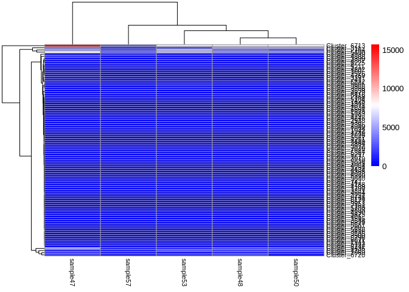<!-- -->

``` r
pheatmap(Ptuh_counts_siRNA,
         cluster_rows = TRUE,
         cluster_cols = TRUE,
         show_rownames = TRUE,
         show_colnames = TRUE,
         scale = 'row',
         color = colorRampPalette(c("blue", "white", "red"))(50),
         fontsize_row = 8,
         fontsize_col = 8)
```

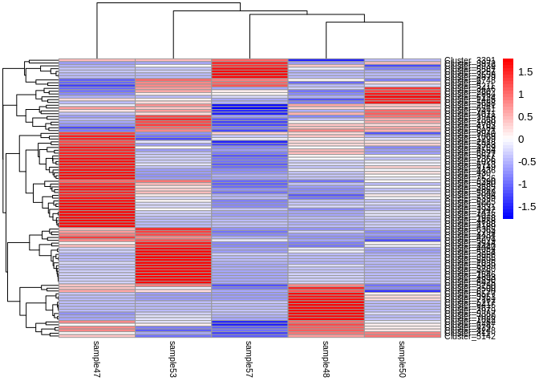<!-- -->

# 4 ………..

# 5 Normalized sRNA counts

## 5.1 Normalize counts with DESeq2

### 5.1.1 Plot unnormalized sRNA data

``` r
Ptuh_counts_sRNA %>% 
#  select(-Name) %>%
  pivot_longer( cols = everything(), names_to = "sample", values_to = "count") %>%
  ggplot(., aes(x = sample, y = count)) +
  geom_violin() + 
  geom_point(alpha = 0.2) +
  theme_minimal() +
  labs(title = "Unnormalized sRNA counts",
       x = "Sample",
       y = "count")
```

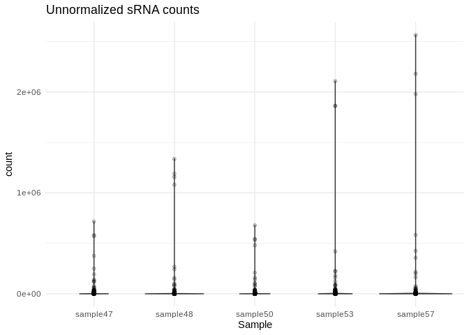<!-- -->

### 5.1.2 Metadata

DESeq2 requires a metadata data frame as input. I don’t have sample
metadata though so, since we’re just doing DESeq2 for normalization
purposes (not analysis purposes), I’m just going to create a dummy sheet

``` r
Ptuh_sample_names <- Ptuh_counts_sRNA %>%
#  select(-Name) %>%
  colnames()

Ptuh_metadata_sRNA <- data.frame(Sample = Ptuh_sample_names,
                            Species = rep("P.tuahiniensis", 5))
rownames(Ptuh_metadata_sRNA) <- Ptuh_sample_names

head(Ptuh_metadata_sRNA)
```

               Sample        Species
    sample47 sample47 P.tuahiniensis
    sample48 sample48 P.tuahiniensis
    sample50 sample50 P.tuahiniensis
    sample53 sample53 P.tuahiniensis
    sample57 sample57 P.tuahiniensis

### 5.1.3 DESeq object

``` r
# Calculate DESeq object
Ptuh_counts_sRNA_rowNames <- Ptuh_counts_sRNA 
#%>% column_to_rownames(var = "Name")

dds_Ptuh_sRNA <- DESeqDataSetFromMatrix(countData = Ptuh_counts_sRNA_rowNames,
                              colData = Ptuh_metadata_sRNA,
                              design = ~ 1) 

# Run differential expression analysis 
# (Note that this DESeq() function runs all necessary steps, including data normalization, 
# estimating size factors, estimating dispersions, gene-wise dispersion estimates, mean-dispersion 
# relationship, final dispersion estimates, fitting model, and testing)
# Using design = ~1 because we don't have treatment groups

dds_Ptuh_sRNA <- DESeq(dds_Ptuh_sRNA)
```

It’s worth noting here that I’m actually going to be doing two different
types of transformation on the counts data, which serve different
purposes.

- First is **normalizing** the transcript counts, which adjusts for
  differences in library size or sequencing depth, but retains
  count-like properties. Normalized counts are most useful for things
  like visualizing expression levels and differential expression
  analysis.

- Second is **variance stabilizing** the counts data, which aims to make
  the variance of the transformed data approximately independent of the
  mean, reducing heteroscedasticity (the relationship between variance
  and mean) and “smoothing” out the variance at low counts. Notably, the
  transformed data is *no longer on the original count scale*. The
  transformation makes the variance roughly constant across the range of
  counts, which makes it easier to interpret patterns in the data
  visually. Variance stabilized data is most useful for exploratory data
  analysis, like PCA, clustering, and heatmaps, and is also the
  transformation we’ll want to use before WGCNA.

``` r
# extract normalized counts
# (normalization is automatically performed by deseq2)
Ptuh_counts_sRNA_norm <- counts(dds_Ptuh_sRNA, normalized=TRUE) %>% data.frame()

write.table(Ptuh_counts_sRNA_norm, file = "../output/03.1-Ptuh-sRNA-summary/Ptuh_counts_sRNA_normalized.txt", sep = "\t", row.names = TRUE, col.names = TRUE, quote = FALSE)


# variance stabilized data
vsd_Ptuh_sRNA <- varianceStabilizingTransformation(dds_Ptuh_sRNA, blind=TRUE)
wpn_vsd_Ptuh_sRNA <- getVarianceStabilizedData(dds_Ptuh_sRNA)
rv_wpn_Ptuh_sRNA <- rowVars(wpn_vsd_Ptuh_sRNA, useNames=TRUE)

Ptuh_counts_sRNA_vsd <- data.frame(wpn_vsd_Ptuh_sRNA)
write.table(Ptuh_counts_sRNA_vsd, file = "../output/03.1-Ptuh-sRNA-summary/Ptuh_counts_sRNA_variancestabilized.txt", sep = "\t", row.names = TRUE, col.names = TRUE,quote = FALSE)

q75_wpn_Ptuh_sRNA <- quantile(rowVars(wpn_vsd_Ptuh_sRNA, useNames=TRUE), .75)  # 75th quantile variability
Ptuh_counts_sRNA_vsd_q75 <- wpn_vsd_Ptuh_sRNA[ rv_wpn_Ptuh_sRNA > q75_wpn_Ptuh_sRNA, ] %>% data.frame # filter to retain only the most variable genes
write.table(Ptuh_counts_sRNA_vsd_q75, file = "../output/03.1-Ptuh-sRNA-summary/Ptuh_counts_sRNA_variancestabilized_q75.txt", sep = "\t", row.names = TRUE, col.names = TRUE,quote = FALSE)

q95_wpn_Ptuh_sRNA <- quantile(rowVars(wpn_vsd_Ptuh_sRNA, useNames=TRUE), .95)  # 95th quantile variability
Ptuh_counts_sRNA_vsd_q95 <- wpn_vsd_Ptuh_sRNA[ rv_wpn_Ptuh_sRNA > q95_wpn_Ptuh_sRNA, ] %>% data.frame # filter to retain only the most variable genes
write.table(Ptuh_counts_sRNA_vsd_q95, file = "../output/03.1-Ptuh-sRNA-summary/Ptuh_counts_sRNA_variancestabilized_q95.txt", sep = "\t", row.names = TRUE, col.names = TRUE,quote = FALSE)
```

## 5.2 Plot normalized data

``` r
Ptuh_counts_sRNA_norm_long <- Ptuh_counts_sRNA_norm %>%
  mutate(
    Gene_id = row.names(Ptuh_counts_sRNA_norm)
  ) %>%
  pivot_longer(-Gene_id)

Ptuh_counts_sRNA_norm_long %>%
  ggplot(., aes(x = name, y = value)) +
  geom_violin() +
  geom_point() +
  theme_bw() +
  theme(
    axis.text.x = element_text( angle = 90)
  ) +
  ylim(0, NA) +
  labs(
    title = "Normalized Expression",
    x = "Sample",
    y = "Normalized counts"
  )
```

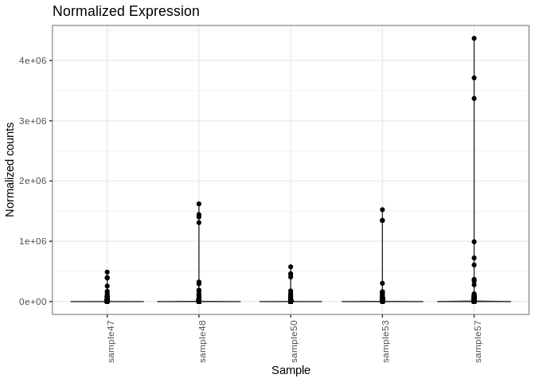<!-- -->

## 5.3 Plot variance stabilized data

``` r
Ptuh_counts_sRNA_vsd_long <- Ptuh_counts_sRNA_vsd %>%
  mutate(
    Gene_id = row.names(Ptuh_counts_sRNA_vsd)
  ) %>%
  pivot_longer(-Gene_id)

Ptuh_counts_sRNA_vsd_long %>%
  ggplot(., aes(x = name, y = value)) +
  geom_violin() +
  geom_point() +
  theme_bw() +
  theme(
    axis.text.x = element_text( angle = 90)
  ) +
  ylim(0, NA) +
  labs(
    title = "Variance Stabilized Expression",
    x = "Sample",
    y = "Variance stabilized data"
  )
```

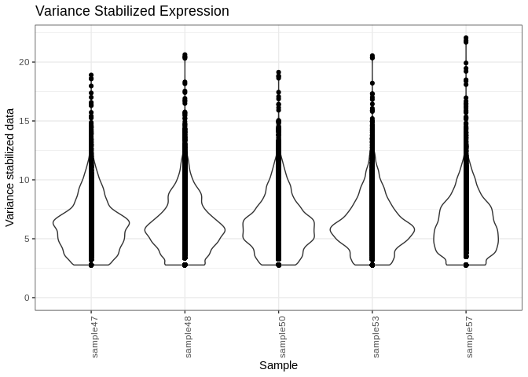<!-- -->

## 5.4 Normalized expression levels

Plot histograms of the normalized expression levels in each sample

``` r
# Melt the count matrix into long format
Ptuh_counts_norm_melted <- melt(Ptuh_counts_sRNA_norm, variable.name = "sample", value.name = "counts")

# Plot the expression level histograms for each sample
ggplot(Ptuh_counts_norm_melted, aes(x = counts)) +
  geom_histogram(binwidth = 1, fill = "#7A2048", color = "black") +
  scale_x_log10() +  # Optional: Log-transform the x-axis for better visualization
  facet_wrap(~sample, scales = "free_y") +
  labs(title = "Gene Expression Level Histogram for Each Sample",
       x = "Expression Level (Counts)",
       y = "Frequency") +
  theme_minimal()
```

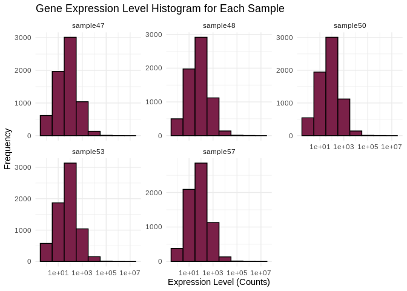<!-- -->

## 5.5 Normalized transcript counts

Check the total number of transcripts in each sample – now that we’ve
normalized the data these totals should be similar

``` r
# Calculate the total number of transcripts for each sample
total_transcripts_norm <- colSums(Ptuh_counts_sRNA_norm)

# Create a data frame for plotting
total_transcripts_norm_df <- data.frame(sample = names(total_transcripts_norm),
                                   totals = total_transcripts_norm)

# Plot the total number of transcripts for each sample
ggplot(total_transcripts_norm_df, aes(x = sample, y = totals)) +
  geom_bar(stat = "identity", fill = "#7A2048", color = "black") +
  geom_text(aes(label = totals), vjust = -0.3, size = 3.5) +
  labs(title = "Total Number of Transcripts per Sample",
       x = "Sample",
       y = "Total Transcripts") +
  theme_minimal() +
  theme(axis.text.x = element_text(angle = 45, hjust = 1))  # Rotate x-axis labels for readability
```

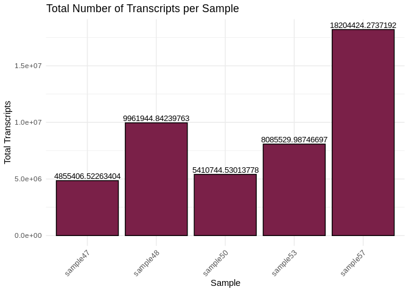<!-- -->

## 5.6 PCA of variance stabilized data

``` r
plotPCA(vsd_Ptuh_sRNA, intgroup="Sample")
```

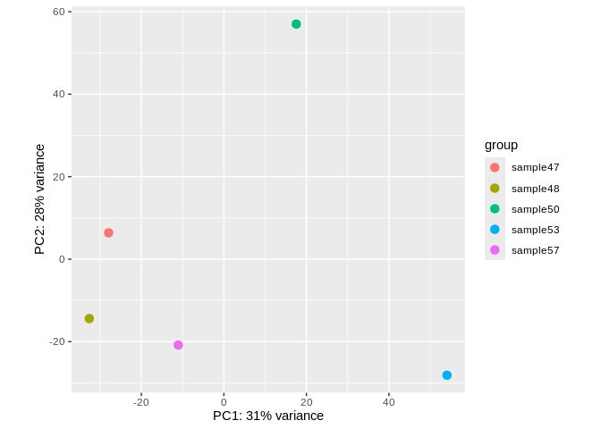<!-- -->

## 5.7 Sample clustering

``` r
sample_dists <- dist(t(assay(vsd_Ptuh_sRNA)))
pheatmap(as.matrix(sample_dists), clustering_distance_rows = "euclidean", 
         clustering_distance_cols = "euclidean", main="Sample Clustering")
```

<!-- -->

## 5.8 Heatmaps

Of most variable variance stabilized sRNA transcripts

``` r
# 75th quantile
heat_colors <- rev(brewer.pal(12, "RdYlBu"))
pheatmap(Ptuh_counts_sRNA_vsd_q75, 
         cluster_rows = TRUE,
         cluster_cols = TRUE,
         show_rownames = TRUE,
         show_colnames = TRUE,
         color = heat_colors,
         scale="row")
```

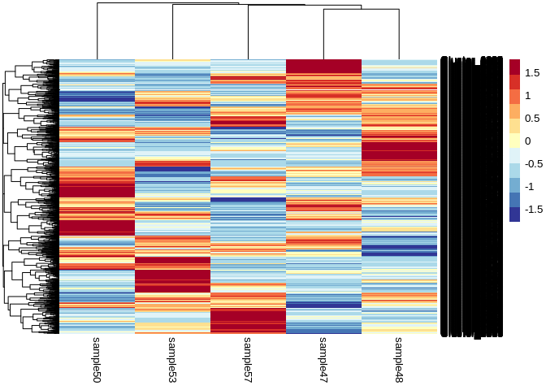<!-- -->

``` r
# 95th quantile
pheatmap(Ptuh_counts_sRNA_vsd_q95, 
         cluster_rows = TRUE,
         cluster_cols = TRUE,
         show_rownames = TRUE,
         show_colnames = TRUE,
         color = heat_colors,
         scale="row")
```

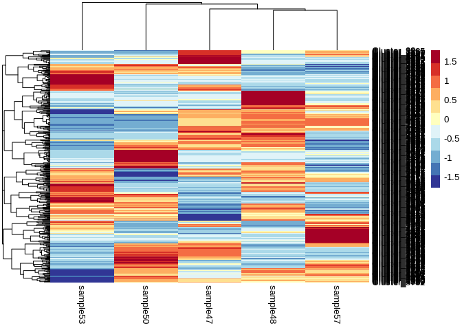<!-- -->

# 6 Normalized miRNA counts

## 6.1 Isolate normalized/vsd miRNA

``` r
## Also written to use given miRNA names ##
# Ptuh_counts_sRNA_norm$Name <- rownames(Ptuh_counts_sRNA_norm)
# Ptuh_counts_miRNA_norm <- left_join(Ptuh_metadata_miRNA, Ptuh_counts_sRNA_norm, by = c("Name" = "Name")) %>%
#   column_to_rownames(var="given_miRNA_name") %>%
#   select(starts_with("sample"))
# write.table(Ptuh_counts_miRNA_norm, file = "../output/03.1-Ptuh-sRNA-summary/Ptuh_counts_miRNA_normalized.txt", sep = "\t", row.names = TRUE, col.names = TRUE,quote = FALSE)
# 
# Ptuh_counts_sRNA_vsd$Name <- rownames(Ptuh_counts_sRNA_vsd)
# Ptuh_counts_miRNA_vsd <- left_join(Ptuh_metadata_miRNA, Ptuh_counts_sRNA_vsd, by = c("Name" = "Name")) %>%
#   column_to_rownames(var="given_miRNA_name") %>%
#   select(starts_with("sample"))
# write.table(Ptuh_counts_miRNA_vsd, file = "../output/03.1-Ptuh-sRNA-summary/Ptuh_counts_miRNA_variancestabilized.txt", sep = "\t", row.names = TRUE, col.names = TRUE,quote = FALSE)

## Use below until you have miRNA names ##
Ptuh_counts_sRNA_norm$Name <- rownames(Ptuh_counts_sRNA_norm)
Ptuh_counts_sRNA_vsd$Name <- rownames(Ptuh_counts_sRNA_vsd)

Ptuh_counts_miRNA_namesdf <- data.frame(Name = rownames(Ptuh_counts_miRNA)) 

Ptuh_counts_miRNA_norm <- left_join(Ptuh_counts_miRNA_namesdf, Ptuh_counts_sRNA_norm, by = c("Name" = "Name")) %>%
  column_to_rownames(var = "Name")
write.table(Ptuh_counts_miRNA_norm, file = "../output/03.1-Ptuh-sRNA-summary/Ptuh_counts_miRNA_normalized.txt", sep = "\t", row.names = TRUE, col.names = TRUE,quote = FALSE)

Ptuh_counts_miRNA_vsd <- left_join(Ptuh_counts_miRNA_namesdf, Ptuh_counts_sRNA_vsd, by = c("Name" = "Name")) %>%
  column_to_rownames(var = "Name")
write.table(Ptuh_counts_miRNA_vsd, file = "../output/03.1-Ptuh-sRNA-summary/Ptuh_counts_miRNA_variancestabilized.txt", sep = "\t", row.names = TRUE, col.names = TRUE,quote = FALSE)
```

## 6.2 Normalized expression levels

Plot histograms of the normalized expression levels in each sample

``` r
# Melt the count matrix into long format
Ptuh_counts_miRNA_norm_melted <- melt(Ptuh_counts_miRNA_norm, variable.name = "sample", value.name = "counts")

# Plot the expression level histograms for each sample
ggplot(Ptuh_counts_miRNA_norm_melted, aes(x = counts)) +
  geom_histogram(binwidth = 1, fill = "#7A2048", color = "black") +
  scale_x_log10() +  # Optional: Log-transform the x-axis for better visualization
  facet_wrap(~sample, scales = "free_y") +
  labs(title = "Gene Expression Level Histogram for Each Sample",
       x = "Expression Level (Counts)",
       y = "Frequency") +
  theme_minimal()
```

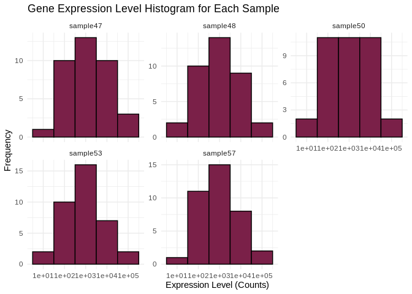<!-- -->

## 6.3 Normalized transcript counts

Check the total number of transcripts in each sample – now that we’ve
normalized the data these totals should be similar

``` r
# Calculate the total number of transcripts for each sample
total_transcripts_miRNA_norm <- colSums(Ptuh_counts_miRNA_norm)

# Create a data frame for plotting
total_transcripts_miRNA_norm_df <- data.frame(sample = names(total_transcripts_miRNA_norm),
                                   totals = total_transcripts_miRNA_norm)

# Plot the total number of transcripts for each sample
ggplot(total_transcripts_miRNA_norm_df, aes(x = sample, y = totals)) +
  geom_bar(stat = "identity", fill = "#7A2048", color = "black") +
  geom_text(aes(label = totals), vjust = -0.3, size = 3.5) +
  labs(title = "Total Number of miRNA Transcripts per Sample",
       x = "Sample",
       y = "Total Transcripts") +
  theme_minimal() +
  theme(axis.text.x = element_text(angle = 45, hjust = 1))  # Rotate x-axis labels for readability
```

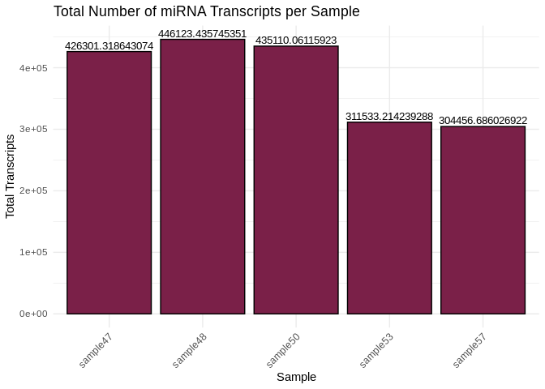<!-- -->

## 6.4 Heatmap

Of all miRNAs

``` r
heat_colors <- rev(brewer.pal(12, "RdYlBu"))
pheatmap(as.matrix(Ptuh_counts_miRNA_vsd[apply(Ptuh_counts_miRNA_vsd, 1, var) > 0, ]), 
         cluster_rows = TRUE,
         cluster_cols = TRUE,
         show_rownames = TRUE,
         show_colnames = TRUE,
         color = heat_colors,
         scale="row")
```

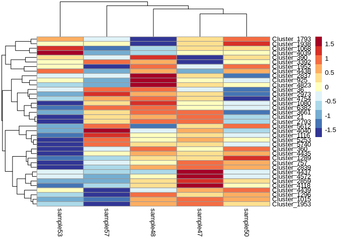<!-- -->

# 7 Normalized siRNA counts

## 7.1 Isolate normalized/vsd siRNA

``` r
Ptuh_counts_sRNA_norm$Name <- rownames(Ptuh_counts_sRNA_norm)
Ptuh_counts_sRNA_vsd$Name <- rownames(Ptuh_counts_sRNA_vsd)

Ptuh_counts_siRNA_namesdf <- data.frame(Name = rownames(Ptuh_counts_siRNA)) 

Ptuh_counts_siRNA_norm <- left_join(Ptuh_counts_siRNA_namesdf, Ptuh_counts_sRNA_norm, by = c("Name" = "Name")) %>%
  column_to_rownames(var = "Name")
write.table(Ptuh_counts_siRNA_norm, file = "../output/03.1-Ptuh-sRNA-summary/Ptuh_counts_siRNA_normalized.txt", sep = "\t", row.names = TRUE, col.names = TRUE,quote = FALSE)

Ptuh_counts_siRNA_vsd <- left_join(Ptuh_counts_siRNA_namesdf, Ptuh_counts_sRNA_vsd, by = c("Name" = "Name")) %>%
  column_to_rownames(var = "Name")
write.table(Ptuh_counts_siRNA_vsd, file = "../output/03.1-Ptuh-sRNA-summary/Ptuh_counts_siRNA_variancestabilized.txt", sep = "\t", row.names = TRUE, col.names = TRUE,quote = FALSE)
```

## 7.2 Normalized expression levels

Plot histograms of the normalized expression levels in each sample

``` r
# Melt the count matrix into long format
Ptuh_counts_siRNA_norm_melted <- melt(Ptuh_counts_siRNA_norm, variable.name = "sample", value.name = "counts")

# Plot the expression level histograms for each sample
ggplot(Ptuh_counts_siRNA_norm_melted, aes(x = counts)) +
  geom_histogram(binwidth = 1, fill = "#7A2048", color = "black") +
  scale_x_log10() +  # Optional: Log-transform the x-axis for better visualization
  facet_wrap(~sample, scales = "free_y") +
  labs(title = "Gene Expression Level Histogram for Each Sample",
       x = "Expression Level (Counts)",
       y = "Frequency") +
  theme_minimal()
```

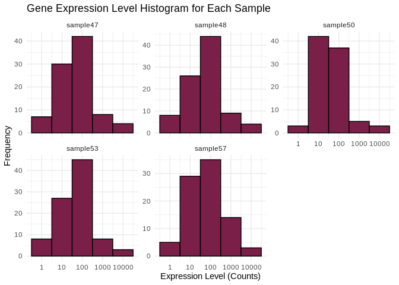<!-- -->

## 7.3 Normalized transcript counts

Check the total number of transcripts in each sample – now that we’ve
normalized the data these totals should be similar

``` r
# Calculate the total number of transcripts for each sample
total_transcripts_siRNA_norm <- colSums(Ptuh_counts_siRNA_norm)

# Create a data frame for plotting
total_transcripts_siRNA_norm_df <- data.frame(sample = names(total_transcripts_siRNA_norm),
                                   totals = total_transcripts_siRNA_norm)

# Plot the total number of transcripts for each sample
ggplot(total_transcripts_siRNA_norm_df, aes(x = sample, y = totals)) +
  geom_bar(stat = "identity", fill = "#7A2048", color = "black") +
  geom_text(aes(label = totals), vjust = -0.3, size = 3.5) +
  labs(title = "Total Number of siRNA Transcripts per Sample",
       x = "Sample",
       y = "Total Transcripts") +
  theme_minimal() +
  theme(axis.text.x = element_text(angle = 45, hjust = 1))  # Rotate x-axis labels for readability
```

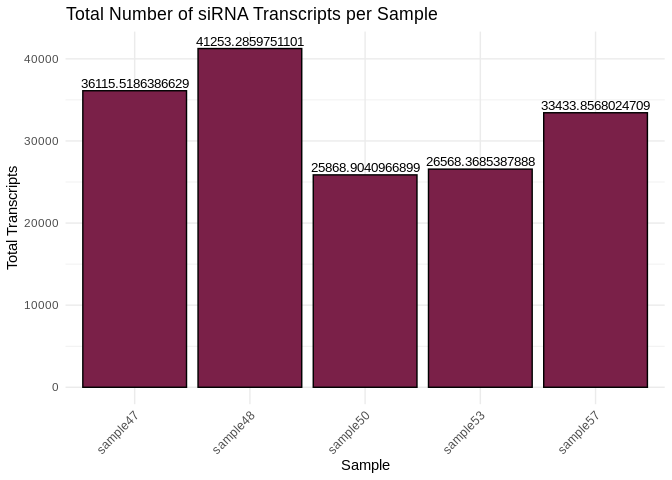<!-- -->

## 7.4 Heatmap

Of all siRNAs

``` r
heat_colors <- rev(brewer.pal(12, "RdYlBu"))
pheatmap(as.matrix(Ptuh_counts_siRNA_vsd[apply(Ptuh_counts_siRNA_vsd, 1, var) > 0, ]), 
         cluster_rows = TRUE,
         cluster_cols = TRUE,
         show_rownames = TRUE,
         show_colnames = TRUE,
         color = heat_colors,
         scale="row")
```

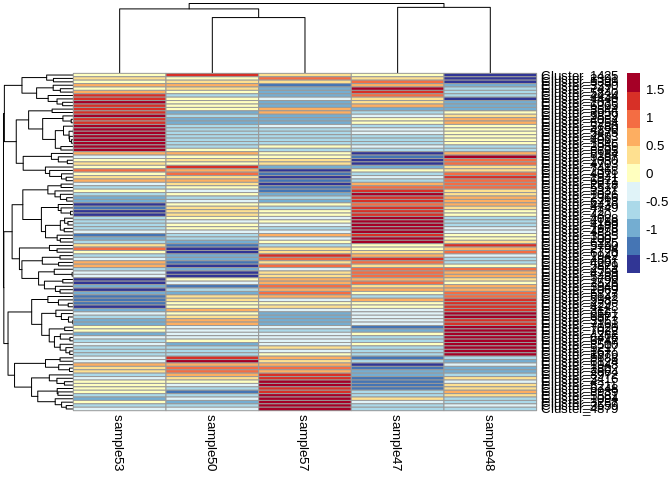<!-- -->
