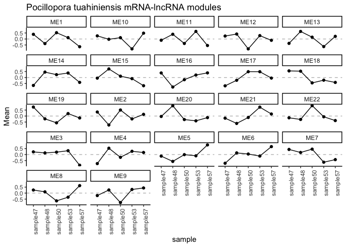
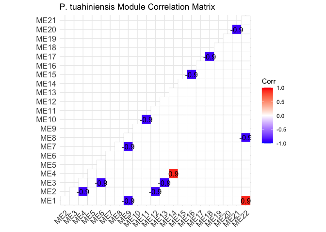

Ptuh Gene expression lncRNA correlations
================
2025-02-04

This script conducts correlation network analyses for gene expression
and lncRNA.

# Set up

Load libraries

``` r
library(tidyverse)
library(ggplot2)
library(DESeq2)
library(igraph)
library(psych)
library(tidygraph)
library(ggraph)
library(WGCNA)
library(edgeR)
library(reshape2)
library(ggcorrplot)
library(corrplot)
```

# Pocillopora tuahiniensis

## Load and format data

``` r
ptuh_mrna<-read_csv(file="F-Ptuh/output/06.2-Ptuh-Hisat/Ptuh-gene_count_matrix.csv")%>%
  rename("mrna_id"=gene_id, "sample47"=`RNA-POC-47`, "sample48"=`RNA-POC-48`, "sample50"=`RNA-POC-50`, "sample53"=`RNA-POC-53`, "sample57"=`RNA-POC-57`)
```

    ## Rows: 31840 Columns: 6
    ## ── Column specification ────────────────────────────────────────────────────────
    ## Delimiter: ","
    ## chr (1): gene_id
    ## dbl (5): RNA-POC-47, RNA-POC-48, RNA-POC-50, RNA-POC-53, RNA-POC-57
    ## 
    ## ℹ Use `spec()` to retrieve the full column specification for this data.
    ## ℹ Specify the column types or set `show_col_types = FALSE` to quiet this message.

``` r
ptuh_lncrna<-read_table(file="F-Ptuh/output/08-Ptuh-lncRNA-matrix/Peve-lncRNA-counts.txt", skip=1)%>%
  select(!c("Chr", "Start", "End", "Strand", "Length"))%>%
  rename("lncrna_id"=Geneid, 
         "sample47"=`../output/06-Ptuh-Hisat/RNA-POC-47.sorted.bam`, 
         "sample48"=`../output/06-Ptuh-Hisat/RNA-POC-48.sorted.bam`, 
         "sample50"=`../output/06-Ptuh-Hisat/RNA-POC-50.sorted.bam`, 
         "sample53"=`../output/06-Ptuh-Hisat/RNA-POC-53.sorted.bam`, 
         "sample57"=`../output/06-Ptuh-Hisat/RNA-POC-57.sorted.bam`)
```

    ## 
    ## ── Column specification ────────────────────────────────────────────────────────
    ## cols(
    ##   Geneid = col_character(),
    ##   Chr = col_character(),
    ##   Start = col_double(),
    ##   End = col_double(),
    ##   Strand = col_character(),
    ##   Length = col_double(),
    ##   `../output/06-Ptuh-Hisat/RNA-POC-47.sorted.bam` = col_double(),
    ##   `../output/06-Ptuh-Hisat/RNA-POC-48.sorted.bam` = col_double(),
    ##   `../output/06-Ptuh-Hisat/RNA-POC-50.sorted.bam` = col_double(),
    ##   `../output/06-Ptuh-Hisat/RNA-POC-53.sorted.bam` = col_double(),
    ##   `../output/06-Ptuh-Hisat/RNA-POC-57.sorted.bam` = col_double()
    ## )

``` r
ptuh_mrna<-as.data.frame(ptuh_mrna)
ptuh_lncrna<-as.data.frame(ptuh_lncrna)

str(ptuh_mrna)
```

    ## 'data.frame':    31840 obs. of  6 variables:
    ##  $ mrna_id : chr  "gene-Pocillopora_meandrina_HIv1___RNAseq.g10047.t1" "gene-Pocillopora_meandrina_HIv1___RNAseq.g3015.t1" "gene-Pocillopora_meandrina_HIv1___RNAseq.g23582.t1" "gene-Pocillopora_meandrina_HIv1___RNAseq.g4478.t1a" ...
    ##  $ sample47: num  697 68 464 115 0 ...
    ##  $ sample48: num  540 101 464 247 0 ...
    ##  $ sample50: num  1379 114 569 307 0 ...
    ##  $ sample53: num  824 50 283 94 0 ...
    ##  $ sample57: num  343 77 505 82 0 0 754 0 0 81 ...

``` r
str(ptuh_lncrna)
```

    ## 'data.frame':    12394 obs. of  6 variables:
    ##  $ lncrna_id: chr  "lncRNA_001" "lncRNA_002" "lncRNA_003" "lncRNA_004" ...
    ##  $ sample47 : num  79 0 0 0 0 ...
    ##  $ sample48 : num  4 0 0 0 0 ...
    ##  $ sample50 : num  113 0 386 0 0 ...
    ##  $ sample53 : num  22 0 0 0 0 ...
    ##  $ sample57 : num  24 0 12 0 0 0 0 0 942 34 ...

Remove mRNA and lncRNA with 0 in all samples.

``` r
# Remove any genes with 0 counts across samples 
ptuh_mrna<-ptuh_mrna %>%
     mutate(Total = rowSums(.[, 2:6]))%>%
    filter(!Total==0)%>%
    dplyr::select(!Total)

ptuh_lncrna<-ptuh_lncrna %>%
     mutate(Total = rowSums(.[, 2:6]))%>%
    filter(!Total==0)%>%
    dplyr::select(!Total)
```

We now have 10382 lncRNAs and 26508 mRNAs.

Set row names.

``` r
rownames(ptuh_mrna)<-ptuh_mrna$mrna_id
ptuh_mrna<-ptuh_mrna%>%select(!mrna_id)
```

``` r
rownames(ptuh_lncrna)<-ptuh_lncrna$lncrna_id
ptuh_lncrna<-ptuh_lncrna%>%select(!lncrna_id)
```

Make sample metadata.

``` r
ptuh_sample_info <- data.frame(
  species = c("Pocillopora tuahiniensis"),
  sample = colnames(ptuh_mrna)
)

rownames(ptuh_sample_info)<-ptuh_sample_info$sample
```

## Filter data

Filter data to only keep those expressed in all samples.

``` r
dge_mRNA <- DGEList(counts = ptuh_mrna)
dge_lncRNA <- DGEList(counts = ptuh_lncrna)

# Calculate CPM
cpm_mRNA <- cpm(dge_mRNA)
cpm_lncRNA <- cpm(dge_lncRNA)

# Filtering criteria: CPM > 1 in all samples (100%)
min_samples <- ncol(ptuh_mrna) * 1

# Apply the filter
keep_mRNA <- rowSums(cpm_mRNA > 1) >= min_samples
keep_lncRNA <- rowSums(cpm_lncRNA > 1) >= min_samples

# Filtered count matrices
filtered_mRNA_counts <- ptuh_mrna[keep_mRNA, ]
filtered_lncRNA_counts <- ptuh_lncrna[keep_lncRNA, ]

# Check the number of features retained
cat("mRNAs retained:", sum(keep_mRNA), "\n")
```

    ## mRNAs retained: 14797

``` r
cat("lncRNAs retained:", sum(keep_lncRNA), "\n")
```

    ## lncRNAs retained: 2712

This reduced mRNAs to 14797 and lncRNAs to 2712

## Normalize data

``` r
dds_mrna <- DESeqDataSetFromMatrix(countData = filtered_mRNA_counts, 
                              colData = ptuh_sample_info, 
                              design = ~ 1)
```

    ## converting counts to integer mode

``` r
# Variance Stabilizing Transformation
vsd_mrna <- assay(vst(dds_mrna, blind = TRUE))
```

``` r
dds_lncrna <- DESeqDataSetFromMatrix(countData = filtered_lncRNA_counts, 
                              colData = ptuh_sample_info, 
                              design = ~ 1)
```

    ## converting counts to integer mode

``` r
# Variance Stabilizing Transformation
vsd_lncrna <- assay(vst(dds_lncrna, blind = TRUE))
```

    ## -- note: fitType='parametric', but the dispersion trend was not well captured by the
    ##    function: y = a/x + b, and a local regression fit was automatically substituted.
    ##    specify fitType='local' or 'mean' to avoid this message next time.

## Conduct module correlations with WGCNA

Set soft threshold.

``` r
options(stringsAsFactors = FALSE)
enableWGCNAThreads()  # Enable multi-threading
```

    ## Allowing parallel execution with up to 7 working processes.

``` r
allowWGCNAThreads(nThreads = 2)
```

    ## Allowing multi-threading with up to 2 threads.

``` r
# Combine mRNA and lncRNA datasets
datExpr <- t(rbind(vsd_mrna, vsd_lncrna))

sum(is.na(datExpr))  # Should be 0
```

    ## [1] 0

``` r
sum(!is.finite(as.matrix(datExpr)))  # Should be 0
```

    ## [1] 0

``` r
# Remove genes/samples with missing or infinite values
datExpr <- datExpr[complete.cases(datExpr), ]
datExpr <- datExpr[, colSums(is.na(datExpr)) == 0]

# # Choose a set of soft-thresholding powers
powers <- c(seq(from = 1, to=19, by=2), c(21:50)) #Create a string of numbers from 1 through 10, and even numbers from 10 through 20
# 
# # Call the network topology analysis function
sft <-pickSoftThreshold(datExpr, powerVector = powers, verbose = 5)
```

    ## pickSoftThreshold: will use block size 2555.
    ##  pickSoftThreshold: calculating connectivity for given powers...
    ##    ..working on genes 1 through 2555 of 17509
    ##    ..working on genes 2556 through 5110 of 17509
    ##    ..working on genes 5111 through 7665 of 17509
    ##    ..working on genes 7666 through 10220 of 17509
    ##    ..working on genes 10221 through 12775 of 17509
    ##    ..working on genes 12776 through 15330 of 17509
    ##    ..working on genes 15331 through 17509 of 17509
    ##    Power SFT.R.sq  slope truncated.R.sq mean.k. median.k. max.k.
    ## 1      1   0.7900  4.110          0.875  7820.0    7990.0   9010
    ## 2      3   0.4360  0.853          0.713  3320.0    3420.0   4520
    ## 3      5   0.0227  0.120          0.583  1970.0    2010.0   2970
    ## 4      7   0.0783 -0.209          0.682  1340.0    1360.0   2180
    ## 5      9   0.2710 -0.424          0.782   994.0     991.0   1700
    ## 6     11   0.4160 -0.577          0.845   774.0     764.0   1390
    ## 7     13   0.4960 -0.676          0.892   626.0     611.0   1160
    ## 8     15   0.5500 -0.759          0.913   519.0     502.0    997
    ## 9     17   0.5900 -0.821          0.929   440.0     422.0    868
    ## 10    19   0.6120 -0.871          0.939   379.0     361.0    766
    ## 11    21   0.6320 -0.907          0.951   332.0     313.0    683
    ## 12    22   0.6350 -0.923          0.953   311.0     293.0    648
    ## 13    23   0.6410 -0.934          0.954   293.0     275.0    615
    ## 14    24   0.6450 -0.945          0.956   276.0     259.0    585
    ## 15    25   0.6490 -0.956          0.958   261.0     244.0    558
    ## 16    26   0.6510 -0.966          0.959   248.0     231.0    532
    ## 17    27   0.6530 -0.975          0.960   235.0     219.0    509
    ## 18    28   0.6540 -0.985          0.961   224.0     207.0    487
    ## 19    29   0.6550 -0.996          0.962   213.0     197.0    468
    ## 20    30   0.6550 -1.010          0.961   203.0     188.0    449
    ## 21    31   0.6540 -1.010          0.963   194.0     179.0    432
    ## 22    32   0.6560 -1.020          0.964   186.0     171.0    416
    ## 23    33   0.6560 -1.030          0.966   178.0     163.0    401
    ## 24    34   0.6560 -1.040          0.967   171.0     156.0    387
    ## 25    35   0.6550 -1.050          0.967   164.0     150.0    374
    ## 26    36   0.6550 -1.050          0.968   157.0     144.0    361
    ## 27    37   0.6550 -1.060          0.968   151.0     138.0    349
    ## 28    38   0.6530 -1.070          0.967   146.0     133.0    338
    ## 29    39   0.6520 -1.070          0.966   141.0     128.0    328
    ## 30    40   0.6500 -1.080          0.967   136.0     123.0    318
    ## 31    41   0.6490 -1.090          0.968   131.0     119.0    309
    ## 32    42   0.6480 -1.090          0.968   127.0     115.0    300
    ## 33    43   0.6460 -1.100          0.967   122.0     111.0    291
    ## 34    44   0.6450 -1.100          0.968   118.0     107.0    283
    ## 35    45   0.6430 -1.110          0.967   115.0     103.0    275
    ## 36    46   0.6420 -1.120          0.968   111.0     100.0    268
    ## 37    47   0.6390 -1.120          0.966   108.0      97.0    261
    ## 38    48   0.6390 -1.130          0.966   105.0      94.0    255
    ## 39    49   0.6370 -1.140          0.966   102.0      91.2    248
    ## 40    50   0.6350 -1.140          0.965    98.8      88.5    242

``` r
sft$powerEstimate
```

    ## [1] NA

Plot the results.

``` r
sizeGrWindow(9, 5)
par(mfrow = c(1,2));
cex1 = 0.9;
# # # Scale-free topology fit index as a function of the soft-thresholding power
plot(sft$fitIndices[,1], -sign(sft$fitIndices[,3])*sft$fitIndices[,2],
      xlab="Soft Threshold (power)",ylab="Scale Free Topology Model Fit,signed R^2",type="n",
     main = paste("Scale independence"));
 text(sft$fitIndices[,1], -sign(sft$fitIndices[,3])*sft$fitIndices[,2],
     labels=powers,cex=cex1,col="red");
# # # this line corresponds to using an R^2 cut-off
 abline(h=0.9,col="red")
# # # Mean connectivity as a function of the soft-thresholding power
 plot(sft$fitIndices[,1], sft$fitIndices[,5],
     xlab="Soft Threshold (power)",ylab="Mean Connectivity", type="n",
     main = paste("Mean connectivity"))
 text(sft$fitIndices[,1], sft$fitIndices[,5], labels=powers, cex=cex1,col="red")
```

Selected power will be 30 - no value crossed threshold, selecting limit
of tested values.

### Generate network

``` r
selected_power<-30

# Network construction (adjust power based on sft output)
net = blockwiseModules(datExpr, power = selected_power,
                       TOMType = "unsigned", minModuleSize = 30,
                       reassignThreshold = 0, mergeCutHeight = 0.25,
                       numericLabels = TRUE, pamRespectsDendro = FALSE,
                       saveTOMs = FALSE, verbose = 3)
```

    ##  Calculating module eigengenes block-wise from all genes
    ##    Flagging genes and samples with too many missing values...
    ##     ..step 1
    ##  ....pre-clustering genes to determine blocks..
    ##    Projective K-means:
    ##    ..k-means clustering..
    ##    ..merging smaller clusters...
    ## Block sizes:
    ## gBlocks
    ##    1    2    3    4 
    ## 4910 4866 4108 3625 
    ##  ..Working on block 1 .
    ##     TOM calculation: adjacency..
    ##     ..will use 2 parallel threads.
    ##      Fraction of slow calculations: 0.000000
    ##     ..connectivity..
    ##     ..matrix multiplication (system BLAS)..
    ##     ..normalization..
    ##     ..done.
    ##  ....clustering..
    ##  ....detecting modules..
    ##  ....calculating module eigengenes..
    ##  ....checking kME in modules..
    ##  ..Working on block 2 .
    ##     TOM calculation: adjacency..
    ##     ..will use 2 parallel threads.
    ##      Fraction of slow calculations: 0.000000
    ##     ..connectivity..
    ##     ..matrix multiplication (system BLAS)..
    ##     ..normalization..
    ##     ..done.
    ##  ....clustering..
    ##  ....detecting modules..
    ##  ....calculating module eigengenes..
    ##  ....checking kME in modules..
    ##  ..Working on block 3 .
    ##     TOM calculation: adjacency..
    ##     ..will use 2 parallel threads.
    ##      Fraction of slow calculations: 0.000000
    ##     ..connectivity..
    ##     ..matrix multiplication (system BLAS)..
    ##     ..normalization..
    ##     ..done.
    ##  ....clustering..
    ##  ....detecting modules..
    ##  ....calculating module eigengenes..
    ##  ....checking kME in modules..
    ##  ..Working on block 4 .
    ##     TOM calculation: adjacency..
    ##     ..will use 2 parallel threads.
    ##      Fraction of slow calculations: 0.000000
    ##     ..connectivity..
    ##     ..matrix multiplication (system BLAS)..
    ##     ..normalization..
    ##     ..done.
    ##  ....clustering..
    ##  ....detecting modules..
    ##  ....calculating module eigengenes..
    ##  ....checking kME in modules..
    ##  ..merging modules that are too close..
    ##      mergeCloseModules: Merging modules whose distance is less than 0.25
    ##        Calculating new MEs...

View modules.

``` r
moduleEigengenes = moduleEigengenes(datExpr, colors = net$colors)$eigengenes

length(table(net$unmergedColors))
```

    ## [1] 316

``` r
length(table(net$colors))
```

    ## [1] 22

``` r
MEs<-net$MEs
moduleLabels<-net$colors
```

There are 22 modules after merging similar modules from original 306
modules.

Determine whether mRNA and or lncRNA are present in each module.

``` r
# Get gene names and corresponding module colors
gene_module_info <- data.frame(
  Gene = colnames(datExpr),
  Module = moduleLabels
)

# Check structure
head(gene_module_info)
```

    ##                                                                                                  Gene
    ## gene-Pocillopora_meandrina_HIv1___RNAseq.g10047.t1 gene-Pocillopora_meandrina_HIv1___RNAseq.g10047.t1
    ## gene-Pocillopora_meandrina_HIv1___RNAseq.g3015.t1   gene-Pocillopora_meandrina_HIv1___RNAseq.g3015.t1
    ## gene-Pocillopora_meandrina_HIv1___RNAseq.g23582.t1 gene-Pocillopora_meandrina_HIv1___RNAseq.g23582.t1
    ## gene-Pocillopora_meandrina_HIv1___RNAseq.g4478.t1a gene-Pocillopora_meandrina_HIv1___RNAseq.g4478.t1a
    ## gene-Pocillopora_meandrina_HIv1___RNAseq.g4478.t1b gene-Pocillopora_meandrina_HIv1___RNAseq.g4478.t1b
    ## gene-Pocillopora_meandrina_HIv1___RNAseq.g3941.t1   gene-Pocillopora_meandrina_HIv1___RNAseq.g3941.t1
    ##                                                    Module
    ## gene-Pocillopora_meandrina_HIv1___RNAseq.g10047.t1      9
    ## gene-Pocillopora_meandrina_HIv1___RNAseq.g3015.t1       6
    ## gene-Pocillopora_meandrina_HIv1___RNAseq.g23582.t1     10
    ## gene-Pocillopora_meandrina_HIv1___RNAseq.g4478.t1a     13
    ## gene-Pocillopora_meandrina_HIv1___RNAseq.g4478.t1b      5
    ## gene-Pocillopora_meandrina_HIv1___RNAseq.g3941.t1       1

``` r
#Add ME to all the names
gene_module_info$Module <- paste0("ME", gene_module_info$Module)
```

Classify modules based on the proportion of the module comprised by
mRNAs.

``` r
# Function to calculate the proportion of mRNAs (genes with "FUN" in ID)
calculate_mRNA_proportion <- function(genes) {
  total_genes <- length(genes)
  mRNA_count <- sum(grepl("gene", genes))
  
  # Proportion of mRNAs
  proportion_mRNA <- mRNA_count / total_genes
  return(proportion_mRNA)
}

# Apply the function to each module
module_mRNA_proportion <- tapply(gene_module_info$Gene, 
                                 gene_module_info$Module, 
                                 calculate_mRNA_proportion)

# View the proportions
module_mRNA_proportion
```

    ##       ME1      ME10      ME11      ME12      ME13      ME14      ME15      ME16 
    ## 0.8895845 0.7993348 0.8236152 0.8205980 0.7689394 0.8451243 0.8605769 0.8431373 
    ##      ME17      ME18      ME19       ME2      ME20      ME21      ME22       ME3 
    ## 0.7673716 0.8127090 0.7187500 0.9021465 0.8170213 0.7368421 0.9148936 0.8739496 
    ##       ME4       ME5       ME6       ME7       ME8       ME9 
    ## 0.8822368 0.8650493 0.8246179 0.8087035 0.7893701 0.8709350

``` r
#Add ME to all the names
#names(module_mRNA_proportion) <- paste0("ME", names(module_mRNA_proportion))
```

### Run correlation between modules.

``` r
cor_matrix = cor(moduleEigengenes)
```

Compute correlations with Spearman correlation and BH p-value
adjustment.

``` r
# Compute Spearman correlation between mRNA and lncRNA
ptuh_cor_results <- corr.test(moduleEigengenes, method = "spearman", adjust = "BH")

# Extract correlation values and p-values
ptuh_cor_matrix <- ptuh_cor_results$r  # Correlation coefficients
ptuh_p_matrix <- ptuh_cor_results$p  # Adjusted p-values
```

Construct network.

``` r
# Set correlation and significance thresholds
cor_threshold <- 0.6  # Adjust based on desired stringency
p_threshold <- 0.05

# Convert correlation matrix into an edge list
ptuh_significant_edges <- which(abs(ptuh_cor_matrix) > cor_threshold & ptuh_p_matrix < p_threshold, arr.ind = TRUE)

ptuh_edge_list <- data.frame(
  mRNA = rownames(ptuh_cor_matrix)[ptuh_significant_edges[,1]],
  lncRNA = colnames(ptuh_cor_matrix)[ptuh_significant_edges[,2]],
  correlation = ptuh_cor_matrix[ptuh_significant_edges]
)

# Construct network graph
ptuh_network <- graph_from_data_frame(ptuh_edge_list, directed = FALSE)

module_mRNA_proportion<-as.data.frame(module_mRNA_proportion)

V(ptuh_network)$prop_mrna <- module_mRNA_proportion$module_mRNA_proportion[match(V(ptuh_network)$name, rownames(module_mRNA_proportion))]
```

Plot network.

``` r
# Visualize network
ggraph(ptuh_network, layout = "fr") +  # Force-directed layout
  geom_edge_link(aes(edge_alpha = correlation), show.legend = TRUE, width=3) +
  geom_node_point(aes(colour=prop_mrna), size = 5) +
  scale_colour_gradient(name="Prop. mRNA", low = "purple", high = "cyan3")+
  geom_node_text(aes(label = name), repel = TRUE, size = 4) +
  theme_void() +
  labs(title = "P. tuahiniensis mRNA-lncRNA Network")
```

<!-- -->

### Plot eigengene patterns and proportions of mRNA and lncRNAs

``` r
module_mRNA_proportion$module_lncRNA_proportion<-1-module_mRNA_proportion$module_mRNA_proportion
```

View total size of modules

``` r
module_sizes <- table(moduleLabels)
module_sizes<-as.data.frame(module_sizes)
module_sizes$module<-paste0("ME", module_sizes$moduleLabels)
```

Plot a stacked bar plot.

``` r
stack_data<-module_mRNA_proportion
stack_data$module<-rownames(stack_data)
stack_data$size<-module_sizes$Freq[match(stack_data$module, module_sizes$module)]

stack_data$module <- factor(stack_data$module, 
                             levels = rev(stack_data$module[order(stack_data$size)]))

stack_data<-stack_data%>%
  mutate(mRNAs=module_mRNA_proportion*size)%>%
  mutate(lncRNAs=module_lncRNA_proportion*size)%>%
  select(!c(module_mRNA_proportion, module_lncRNA_proportion, size))


# Reshape the data for ggplot (long format)

stack_long <- melt(stack_data[, c("module", "mRNAs", "lncRNAs")], 
                    id.vars = "module",
                    variable.name = "RNA_Type", 
                    value.name = "Count")

ggplot(stack_long, aes(x = module, y = Count, fill = RNA_Type)) +
  geom_bar(stat = "identity") +
  scale_fill_manual(values = c("mRNAs" = "skyblue", 
                               "lncRNAs" = "salmon"), 
                    labels = c("mRNA", "lncRNA"))+
  theme_classic() +
  labs(title = "P. tuahiniensis module mRNA and lncRNA components",
       x = "Module",
       y = "Counts",
       fill = "RNA Type") +
  theme(axis.text.x = element_text(angle = 45, hjust = 1))
```

<!-- -->

Next plot eigengene expression of each module across samples.

``` r
#convert wide format to long format for plotting  
head(moduleEigengenes)
```

    ##                 ME1        ME2        ME3        ME4          ME5         ME6
    ## sample47  0.3894852  0.3372584  0.2245729 -0.7491843 -0.129696328 -0.72308190
    ## sample48 -0.3821563 -0.7442154  0.1379458  0.5306075 -0.568589269  0.13907483
    ## sample50  0.5243547  0.5046683  0.2023136 -0.2285047 -0.004922857  0.04553787
    ## sample53  0.1122893 -0.2398222  0.3217731  0.2736565 -0.102603768 -0.12494969
    ## sample57 -0.6439729  0.1421109 -0.8866055  0.1734250  0.805812222  0.66341890
    ##                 ME7        ME8        ME9        ME10       ME11       ME12
    ## sample47  0.4271194  0.2560364 -0.2021751  0.25924761 -0.1065184  0.2452796
    ## sample48  0.1754823  0.1080323  0.2590173 -0.02444841  0.3935904  0.4110164
    ## sample50  0.4535839 -0.6463510 -0.7862231  0.10850136 -0.3742430 -0.8250742
    ## sample53 -0.6359646 -0.3411259  0.3018800 -0.82796300  0.6309028  0.2792134
    ## sample57 -0.4202210  0.6234083  0.4275009  0.48466244 -0.5437318 -0.1104351
    ##                ME13       ME14        ME15       ME16        ME17       ME18
    ## sample47 -0.3653353 -0.6596123 -0.05134227  0.3810947 -0.69114197  0.5528177
    ## sample48  0.6284036  0.4513400  0.71400400 -0.7938032 -0.22953820  0.5260883
    ## sample50  0.1492847  0.2377482  0.11277567 -0.1806841  0.48431284 -0.4489725
    ## sample53 -0.6329877  0.3752911 -0.09259812  0.2074235  0.48263389 -0.2210540
    ## sample57  0.2206347 -0.4047670 -0.68283929  0.3859691 -0.04626655 -0.4088796
    ##                ME19        ME20       ME21        ME22
    ## sample47  0.7485123 -0.03491138 -0.1776333 -0.14693975
    ## sample48 -0.2331385  0.85820669 -0.6139703 -0.28384469
    ## sample50 -0.5624481 -0.29263096 -0.1200421  0.86752062
    ## sample53  0.2078195 -0.39917400  0.7400127 -0.06044466
    ## sample57 -0.1607450 -0.13149034  0.1716331 -0.37629153

``` r
plot_MEs <- moduleEigengenes 

plot_MEs$sample<-rownames(plot_MEs)

plot_MEs<-plot_MEs%>%
  pivot_longer(
    cols = where(is.numeric),  # Select only numeric columns
    names_to = "Module",       # Name for the new column containing the column names
    values_to = "Mean"         # Name for the new column containing the values
  )

expression_plots<-plot_MEs%>%
  group_by(Module) %>%
  
  ggplot(aes(x=sample, y=Mean)) +
  facet_wrap(~ Module)+
    geom_hline(yintercept = 0, linetype="dashed", color = "grey")+
  geom_point()+
  ggtitle("Pocillopora tuahiniensis mRNA-lncRNA modules")+
  geom_line(aes(group=1))+
  theme_classic()+ 
  theme(axis.text.x=element_text(angle = 90, hjust=1)); expression_plots
```

<!-- -->

### Plot correlations of specific modules

Which modules were significantly correlated? Show correlation matrix.

``` r
# Compute Spearman correlation between mRNA and lncRNA
ptuh_cor_results 
```

    ## Call:corr.test(x = moduleEigengenes, method = "spearman", adjust = "BH")
    ## Correlation matrix 
    ##       ME1  ME2  ME3  ME4  ME5  ME6  ME7  ME8  ME9 ME10 ME11 ME12 ME13 ME14 ME15
    ## ME1   1.0  0.7  0.6 -0.6 -0.1 -0.7  0.7 -0.7 -0.9 -0.2  0.1 -0.4 -0.5 -0.2  0.4
    ## ME2   0.7  1.0  0.1 -0.9  0.5 -0.3  0.7 -0.2 -0.6  0.5 -0.6 -0.9 -0.3 -0.7 -0.1
    ## ME3   0.6  0.1  1.0 -0.2 -0.3 -0.9 -0.1 -0.5 -0.3 -0.6  0.7  0.2 -0.9  0.0  0.0
    ## ME4  -0.6 -0.9 -0.2  1.0 -0.3  0.5 -0.6 -0.1  0.5 -0.6  0.5  0.7  0.4  0.9  0.2
    ## ME5  -0.1  0.5 -0.3 -0.3  1.0  0.4 -0.1  0.1  0.3  0.5 -0.7 -0.8 -0.1 -0.4 -0.7
    ## ME6  -0.7 -0.3 -0.9  0.5  0.4  1.0 -0.2  0.3  0.5  0.3 -0.5 -0.1  0.8  0.3 -0.1
    ## ME7   0.7  0.7 -0.1 -0.6 -0.1 -0.2  1.0 -0.3 -0.9  0.3 -0.4 -0.5  0.2 -0.3  0.6
    ## ME8  -0.7 -0.2 -0.5 -0.1  0.1  0.3 -0.3  1.0  0.6  0.7 -0.4  0.1  0.3 -0.5 -0.5
    ## ME9  -0.9 -0.6 -0.3  0.5  0.3  0.5 -0.9  0.6  1.0  0.1  0.0  0.3  0.1  0.1 -0.7
    ## ME10 -0.2  0.5 -0.6 -0.6  0.5  0.3  0.3  0.7  0.1  1.0 -0.9 -0.6  0.3 -0.8 -0.4
    ## ME11  0.1 -0.6  0.7  0.5 -0.7 -0.5 -0.4 -0.4  0.0 -0.9  1.0  0.8 -0.4  0.6  0.3
    ## ME12 -0.4 -0.9  0.2  0.7 -0.8 -0.1 -0.5  0.1  0.3 -0.6  0.8  1.0  0.1  0.6  0.3
    ## ME13 -0.5 -0.3 -0.9  0.4 -0.1  0.8  0.2  0.3  0.1  0.3 -0.4  0.1  1.0  0.3  0.4
    ## ME14 -0.2 -0.7  0.0  0.9 -0.4  0.3 -0.3 -0.5  0.1 -0.8  0.6  0.6  0.3  1.0  0.5
    ## ME15  0.4 -0.1  0.0  0.2 -0.7 -0.1  0.6 -0.5 -0.7 -0.4  0.3  0.3  0.4  0.5  1.0
    ## ME16 -0.3  0.3 -0.1 -0.5  0.6  0.0 -0.3  0.7  0.5  0.7 -0.5 -0.4 -0.3 -0.8 -0.9
    ## ME17  0.3  0.3  0.1  0.1  0.6  0.2  0.0 -0.7 -0.1 -0.3 -0.1 -0.5 -0.2  0.3 -0.1
    ## ME18 -0.1 -0.4  0.3  0.0 -0.8 -0.5 -0.1  0.4  0.0 -0.1  0.5  0.7 -0.1 -0.1  0.2
    ## ME19 -0.1 -0.1  0.5 -0.3 -0.2 -0.6 -0.4  0.5  0.3  0.1  0.3  0.3 -0.6 -0.5 -0.5
    ## ME20 -0.3 -0.3 -0.5  0.1 -0.6  0.2  0.3  0.5 -0.1  0.3 -0.1  0.4  0.7  0.0  0.5
    ## ME21 -0.1  0.1  0.3  0.0  0.7  0.0 -0.6 -0.1  0.5 -0.1  0.0 -0.3 -0.6 -0.1 -0.8
    ## ME22  0.9  0.5  0.7 -0.3  0.0 -0.6  0.4 -0.9 -0.7 -0.5  0.3 -0.3 -0.6  0.1  0.3
    ##      ME16 ME17 ME18 ME19 ME20 ME21 ME22
    ## ME1  -0.3  0.3 -0.1 -0.1 -0.3 -0.1  0.9
    ## ME2   0.3  0.3 -0.4 -0.1 -0.3  0.1  0.5
    ## ME3  -0.1  0.1  0.3  0.5 -0.5  0.3  0.7
    ## ME4  -0.5  0.1  0.0 -0.3  0.1  0.0 -0.3
    ## ME5   0.6  0.6 -0.8 -0.2 -0.6  0.7  0.0
    ## ME6   0.0  0.2 -0.5 -0.6  0.2  0.0 -0.6
    ## ME7  -0.3  0.0 -0.1 -0.4  0.3 -0.6  0.4
    ## ME8   0.7 -0.7  0.4  0.5  0.5 -0.1 -0.9
    ## ME9   0.5 -0.1  0.0  0.3 -0.1  0.5 -0.7
    ## ME10  0.7 -0.3 -0.1  0.1  0.3 -0.1 -0.5
    ## ME11 -0.5 -0.1  0.5  0.3 -0.1  0.0  0.3
    ## ME12 -0.4 -0.5  0.7  0.3  0.4 -0.3 -0.3
    ## ME13 -0.3 -0.2 -0.1 -0.6  0.7 -0.6 -0.6
    ## ME14 -0.8  0.3 -0.1 -0.5  0.0 -0.1  0.1
    ## ME15 -0.9 -0.1  0.2 -0.5  0.5 -0.8  0.3
    ## ME16  1.0 -0.2  0.0  0.6 -0.2  0.5 -0.4
    ## ME17 -0.2  1.0 -0.9 -0.6 -0.8  0.6  0.6
    ## ME18  0.0 -0.9  1.0  0.7  0.6 -0.5 -0.3
    ## ME19  0.6 -0.6  0.7  1.0  0.0  0.2 -0.2
    ## ME20 -0.2 -0.8  0.6  0.0  1.0 -0.9 -0.6
    ## ME21  0.5  0.6 -0.5  0.2 -0.9  1.0  0.2
    ## ME22 -0.4  0.6 -0.3 -0.2 -0.6  0.2  1.0
    ## Sample Size 
    ## [1] 5
    ## Probability values (Entries above the diagonal are adjusted for multiple tests.) 
    ##       ME1  ME2  ME3  ME4  ME5  ME6  ME7  ME8  ME9 ME10 ME11 ME12 ME13 ME14 ME15
    ## ME1  0.00 0.89 0.89 0.89 0.93 0.89 0.89 0.89 0.66 0.93 0.93 0.90 0.89 0.93 0.90
    ## ME2  0.19 0.00 0.93 0.66 0.89 0.90 0.89 0.93 0.89 0.89 0.89 0.66 0.90 0.89 0.93
    ## ME3  0.28 0.87 0.00 0.93 0.90 0.66 0.93 0.89 0.90 0.89 0.89 0.93 0.66 1.00 1.00
    ## ME4  0.28 0.04 0.75 0.00 0.90 0.89 0.89 0.93 0.89 0.89 0.89 0.89 0.90 0.66 0.93
    ## ME5  0.87 0.39 0.62 0.62 0.00 0.90 0.93 0.93 0.90 0.89 0.89 0.89 0.93 0.90 0.89
    ## ME6  0.19 0.62 0.04 0.39 0.50 0.00 0.93 0.90 0.89 0.90 0.89 0.93 0.89 0.90 0.93
    ## ME7  0.19 0.19 0.87 0.28 0.87 0.75 0.00 0.90 0.66 0.90 0.90 0.89 0.93 0.90 0.89
    ## ME8  0.19 0.75 0.39 0.87 0.87 0.62 0.62 0.00 0.89 0.89 0.90 0.93 0.90 0.89 0.89
    ## ME9  0.04 0.28 0.62 0.39 0.62 0.39 0.04 0.28 0.00 0.93 1.00 0.90 0.93 0.93 0.89
    ## ME10 0.75 0.39 0.28 0.28 0.39 0.62 0.62 0.19 0.87 0.00 0.66 0.89 0.90 0.89 0.90
    ## ME11 0.87 0.28 0.19 0.39 0.19 0.39 0.50 0.50 1.00 0.04 0.00 0.89 0.90 0.89 0.90
    ## ME12 0.50 0.04 0.75 0.19 0.10 0.87 0.39 0.87 0.62 0.28 0.10 0.00 0.93 0.89 0.90
    ## ME13 0.39 0.62 0.04 0.50 0.87 0.10 0.75 0.62 0.87 0.62 0.50 0.87 0.00 0.90 0.90
    ## ME14 0.75 0.19 1.00 0.04 0.50 0.62 0.62 0.39 0.87 0.10 0.28 0.28 0.62 0.00 0.89
    ## ME15 0.50 0.87 1.00 0.75 0.19 0.87 0.28 0.39 0.19 0.50 0.62 0.62 0.50 0.39 0.00
    ## ME16 0.62 0.62 0.87 0.39 0.28 1.00 0.62 0.19 0.39 0.19 0.39 0.50 0.62 0.10 0.04
    ## ME17 0.62 0.62 0.87 0.87 0.28 0.75 1.00 0.19 0.87 0.62 0.87 0.39 0.75 0.62 0.87
    ## ME18 0.87 0.50 0.62 1.00 0.10 0.39 0.87 0.50 1.00 0.87 0.39 0.19 0.87 0.87 0.75
    ## ME19 0.87 0.87 0.39 0.62 0.75 0.28 0.50 0.39 0.62 0.87 0.62 0.62 0.28 0.39 0.39
    ## ME20 0.62 0.62 0.39 0.87 0.28 0.75 0.62 0.39 0.87 0.62 0.87 0.50 0.19 1.00 0.39
    ## ME21 0.87 0.87 0.62 1.00 0.19 1.00 0.28 0.87 0.39 0.87 1.00 0.62 0.28 0.87 0.10
    ## ME22 0.04 0.39 0.19 0.62 1.00 0.28 0.50 0.04 0.19 0.39 0.62 0.62 0.28 0.87 0.62
    ##      ME16 ME17 ME18 ME19 ME20 ME21 ME22
    ## ME1  0.90 0.90 0.93 0.93 0.90 0.93 0.66
    ## ME2  0.90 0.90 0.90 0.93 0.90 0.93 0.89
    ## ME3  0.93 0.93 0.90 0.89 0.89 0.90 0.89
    ## ME4  0.89 0.93 1.00 0.90 0.93 1.00 0.90
    ## ME5  0.89 0.89 0.89 0.93 0.89 0.89 1.00
    ## ME6  1.00 0.93 0.89 0.89 0.93 1.00 0.89
    ## ME7  0.90 1.00 0.93 0.90 0.90 0.89 0.90
    ## ME8  0.89 0.89 0.90 0.89 0.89 0.93 0.66
    ## ME9  0.89 0.93 1.00 0.90 0.93 0.89 0.89
    ## ME10 0.89 0.90 0.93 0.93 0.90 0.93 0.89
    ## ME11 0.89 0.93 0.89 0.90 0.93 1.00 0.90
    ## ME12 0.90 0.89 0.89 0.90 0.90 0.90 0.90
    ## ME13 0.90 0.93 0.93 0.89 0.89 0.89 0.89
    ## ME14 0.89 0.90 0.93 0.89 1.00 0.93 0.93
    ## ME15 0.66 0.93 0.93 0.89 0.89 0.89 0.90
    ## ME16 0.00 0.93 1.00 0.89 0.93 0.89 0.90
    ## ME17 0.75 0.00 0.66 0.89 0.89 0.89 0.89
    ## ME18 1.00 0.04 0.00 0.89 0.89 0.89 0.90
    ## ME19 0.28 0.28 0.19 0.00 1.00 0.93 0.93
    ## ME20 0.75 0.10 0.28 1.00 0.00 0.66 0.89
    ## ME21 0.39 0.28 0.39 0.75 0.04 0.00 0.93
    ## ME22 0.50 0.28 0.62 0.75 0.28 0.75 0.00
    ## 
    ##  To see confidence intervals of the correlations, print with the short=FALSE option

``` r
# Extract correlation values and p-values
ptuh_cor_matrix  # Correlation coefficients
```

    ##       ME1  ME2  ME3  ME4  ME5  ME6  ME7  ME8  ME9 ME10 ME11 ME12 ME13 ME14 ME15
    ## ME1   1.0  0.7  0.6 -0.6 -0.1 -0.7  0.7 -0.7 -0.9 -0.2  0.1 -0.4 -0.5 -0.2  0.4
    ## ME2   0.7  1.0  0.1 -0.9  0.5 -0.3  0.7 -0.2 -0.6  0.5 -0.6 -0.9 -0.3 -0.7 -0.1
    ## ME3   0.6  0.1  1.0 -0.2 -0.3 -0.9 -0.1 -0.5 -0.3 -0.6  0.7  0.2 -0.9  0.0  0.0
    ## ME4  -0.6 -0.9 -0.2  1.0 -0.3  0.5 -0.6 -0.1  0.5 -0.6  0.5  0.7  0.4  0.9  0.2
    ## ME5  -0.1  0.5 -0.3 -0.3  1.0  0.4 -0.1  0.1  0.3  0.5 -0.7 -0.8 -0.1 -0.4 -0.7
    ## ME6  -0.7 -0.3 -0.9  0.5  0.4  1.0 -0.2  0.3  0.5  0.3 -0.5 -0.1  0.8  0.3 -0.1
    ## ME7   0.7  0.7 -0.1 -0.6 -0.1 -0.2  1.0 -0.3 -0.9  0.3 -0.4 -0.5  0.2 -0.3  0.6
    ## ME8  -0.7 -0.2 -0.5 -0.1  0.1  0.3 -0.3  1.0  0.6  0.7 -0.4  0.1  0.3 -0.5 -0.5
    ## ME9  -0.9 -0.6 -0.3  0.5  0.3  0.5 -0.9  0.6  1.0  0.1  0.0  0.3  0.1  0.1 -0.7
    ## ME10 -0.2  0.5 -0.6 -0.6  0.5  0.3  0.3  0.7  0.1  1.0 -0.9 -0.6  0.3 -0.8 -0.4
    ## ME11  0.1 -0.6  0.7  0.5 -0.7 -0.5 -0.4 -0.4  0.0 -0.9  1.0  0.8 -0.4  0.6  0.3
    ## ME12 -0.4 -0.9  0.2  0.7 -0.8 -0.1 -0.5  0.1  0.3 -0.6  0.8  1.0  0.1  0.6  0.3
    ## ME13 -0.5 -0.3 -0.9  0.4 -0.1  0.8  0.2  0.3  0.1  0.3 -0.4  0.1  1.0  0.3  0.4
    ## ME14 -0.2 -0.7  0.0  0.9 -0.4  0.3 -0.3 -0.5  0.1 -0.8  0.6  0.6  0.3  1.0  0.5
    ## ME15  0.4 -0.1  0.0  0.2 -0.7 -0.1  0.6 -0.5 -0.7 -0.4  0.3  0.3  0.4  0.5  1.0
    ## ME16 -0.3  0.3 -0.1 -0.5  0.6  0.0 -0.3  0.7  0.5  0.7 -0.5 -0.4 -0.3 -0.8 -0.9
    ## ME17  0.3  0.3  0.1  0.1  0.6  0.2  0.0 -0.7 -0.1 -0.3 -0.1 -0.5 -0.2  0.3 -0.1
    ## ME18 -0.1 -0.4  0.3  0.0 -0.8 -0.5 -0.1  0.4  0.0 -0.1  0.5  0.7 -0.1 -0.1  0.2
    ## ME19 -0.1 -0.1  0.5 -0.3 -0.2 -0.6 -0.4  0.5  0.3  0.1  0.3  0.3 -0.6 -0.5 -0.5
    ## ME20 -0.3 -0.3 -0.5  0.1 -0.6  0.2  0.3  0.5 -0.1  0.3 -0.1  0.4  0.7  0.0  0.5
    ## ME21 -0.1  0.1  0.3  0.0  0.7  0.0 -0.6 -0.1  0.5 -0.1  0.0 -0.3 -0.6 -0.1 -0.8
    ## ME22  0.9  0.5  0.7 -0.3  0.0 -0.6  0.4 -0.9 -0.7 -0.5  0.3 -0.3 -0.6  0.1  0.3
    ##      ME16 ME17 ME18 ME19 ME20 ME21 ME22
    ## ME1  -0.3  0.3 -0.1 -0.1 -0.3 -0.1  0.9
    ## ME2   0.3  0.3 -0.4 -0.1 -0.3  0.1  0.5
    ## ME3  -0.1  0.1  0.3  0.5 -0.5  0.3  0.7
    ## ME4  -0.5  0.1  0.0 -0.3  0.1  0.0 -0.3
    ## ME5   0.6  0.6 -0.8 -0.2 -0.6  0.7  0.0
    ## ME6   0.0  0.2 -0.5 -0.6  0.2  0.0 -0.6
    ## ME7  -0.3  0.0 -0.1 -0.4  0.3 -0.6  0.4
    ## ME8   0.7 -0.7  0.4  0.5  0.5 -0.1 -0.9
    ## ME9   0.5 -0.1  0.0  0.3 -0.1  0.5 -0.7
    ## ME10  0.7 -0.3 -0.1  0.1  0.3 -0.1 -0.5
    ## ME11 -0.5 -0.1  0.5  0.3 -0.1  0.0  0.3
    ## ME12 -0.4 -0.5  0.7  0.3  0.4 -0.3 -0.3
    ## ME13 -0.3 -0.2 -0.1 -0.6  0.7 -0.6 -0.6
    ## ME14 -0.8  0.3 -0.1 -0.5  0.0 -0.1  0.1
    ## ME15 -0.9 -0.1  0.2 -0.5  0.5 -0.8  0.3
    ## ME16  1.0 -0.2  0.0  0.6 -0.2  0.5 -0.4
    ## ME17 -0.2  1.0 -0.9 -0.6 -0.8  0.6  0.6
    ## ME18  0.0 -0.9  1.0  0.7  0.6 -0.5 -0.3
    ## ME19  0.6 -0.6  0.7  1.0  0.0  0.2 -0.2
    ## ME20 -0.2 -0.8  0.6  0.0  1.0 -0.9 -0.6
    ## ME21  0.5  0.6 -0.5  0.2 -0.9  1.0  0.2
    ## ME22 -0.4  0.6 -0.3 -0.2 -0.6  0.2  1.0

``` r
ptuh_p_matrix  # Adjusted p-values
```

    ##               ME1          ME2          ME3          ME4          ME5
    ## ME1  3.971862e-24 8.942724e-01 8.942724e-01 8.942724e-01 9.292040e-01
    ## ME2  1.881204e-01 3.971862e-24 9.292040e-01 6.643218e-01 8.942724e-01
    ## ME3  2.847570e-01 8.728886e-01 3.971862e-24 9.292040e-01 9.006656e-01
    ## ME4  2.847570e-01 3.738607e-02 7.470601e-01 3.971862e-24 9.006656e-01
    ## ME5  8.728886e-01 3.910022e-01 6.238377e-01 6.238377e-01 3.971862e-24
    ## ME6  1.881204e-01 6.238377e-01 3.738607e-02 3.910022e-01 5.046316e-01
    ## ME7  1.881204e-01 1.881204e-01 8.728886e-01 2.847570e-01 8.728886e-01
    ## ME8  1.881204e-01 7.470601e-01 3.910022e-01 8.728886e-01 8.728886e-01
    ## ME9  3.738607e-02 2.847570e-01 6.238377e-01 3.910022e-01 6.238377e-01
    ## ME10 7.470601e-01 3.910022e-01 2.847570e-01 2.847570e-01 3.910022e-01
    ## ME11 8.728886e-01 2.847570e-01 1.881204e-01 3.910022e-01 1.881204e-01
    ## ME12 5.046316e-01 3.738607e-02 7.470601e-01 1.881204e-01 1.040880e-01
    ## ME13 3.910022e-01 6.238377e-01 3.738607e-02 5.046316e-01 8.728886e-01
    ## ME14 7.470601e-01 1.881204e-01 1.000000e+00 3.738607e-02 5.046316e-01
    ## ME15 5.046316e-01 8.728886e-01 1.000000e+00 7.470601e-01 1.881204e-01
    ## ME16 6.238377e-01 6.238377e-01 8.728886e-01 3.910022e-01 2.847570e-01
    ## ME17 6.238377e-01 6.238377e-01 8.728886e-01 8.728886e-01 2.847570e-01
    ## ME18 8.728886e-01 5.046316e-01 6.238377e-01 1.000000e+00 1.040880e-01
    ## ME19 8.728886e-01 8.728886e-01 3.910022e-01 6.238377e-01 7.470601e-01
    ## ME20 6.238377e-01 6.238377e-01 3.910022e-01 8.728886e-01 2.847570e-01
    ## ME21 8.728886e-01 8.728886e-01 6.238377e-01 1.000000e+00 1.881204e-01
    ## ME22 3.738607e-02 3.910022e-01 1.881204e-01 6.238377e-01 1.000000e+00
    ##               ME6          ME7          ME8          ME9         ME10
    ## ME1  8.942724e-01 8.942724e-01 8.942724e-01 6.643218e-01 9.292040e-01
    ## ME2  9.006656e-01 8.942724e-01 9.292040e-01 8.942724e-01 8.942724e-01
    ## ME3  6.643218e-01 9.292040e-01 8.942724e-01 9.006656e-01 8.942724e-01
    ## ME4  8.942724e-01 8.942724e-01 9.292040e-01 8.942724e-01 8.942724e-01
    ## ME5  9.006656e-01 9.292040e-01 9.292040e-01 9.006656e-01 8.942724e-01
    ## ME6  3.971862e-24 9.292040e-01 9.006656e-01 8.942724e-01 9.006656e-01
    ## ME7  7.470601e-01 3.971862e-24 9.006656e-01 6.643218e-01 9.006656e-01
    ## ME8  6.238377e-01 6.238377e-01 3.971862e-24 8.942724e-01 8.942724e-01
    ## ME9  3.910022e-01 3.738607e-02 2.847570e-01 3.971862e-24 9.292040e-01
    ## ME10 6.238377e-01 6.238377e-01 1.881204e-01 8.728886e-01 3.971862e-24
    ## ME11 3.910022e-01 5.046316e-01 5.046316e-01 1.000000e+00 3.738607e-02
    ## ME12 8.728886e-01 3.910022e-01 8.728886e-01 6.238377e-01 2.847570e-01
    ## ME13 1.040880e-01 7.470601e-01 6.238377e-01 8.728886e-01 6.238377e-01
    ## ME14 6.238377e-01 6.238377e-01 3.910022e-01 8.728886e-01 1.040880e-01
    ## ME15 8.728886e-01 2.847570e-01 3.910022e-01 1.881204e-01 5.046316e-01
    ## ME16 1.000000e+00 6.238377e-01 1.881204e-01 3.910022e-01 1.881204e-01
    ## ME17 7.470601e-01 1.000000e+00 1.881204e-01 8.728886e-01 6.238377e-01
    ## ME18 3.910022e-01 8.728886e-01 5.046316e-01 1.000000e+00 8.728886e-01
    ## ME19 2.847570e-01 5.046316e-01 3.910022e-01 6.238377e-01 8.728886e-01
    ## ME20 7.470601e-01 6.238377e-01 3.910022e-01 8.728886e-01 6.238377e-01
    ## ME21 1.000000e+00 2.847570e-01 8.728886e-01 3.910022e-01 8.728886e-01
    ## ME22 2.847570e-01 5.046316e-01 3.738607e-02 1.881204e-01 3.910022e-01
    ##              ME11         ME12         ME13         ME14         ME15
    ## ME1  9.292040e-01 9.006656e-01 8.942724e-01 9.292040e-01 9.006656e-01
    ## ME2  8.942724e-01 6.643218e-01 9.006656e-01 8.942724e-01 9.292040e-01
    ## ME3  8.942724e-01 9.292040e-01 6.643218e-01 1.000000e+00 1.000000e+00
    ## ME4  8.942724e-01 8.942724e-01 9.006656e-01 6.643218e-01 9.292040e-01
    ## ME5  8.942724e-01 8.942724e-01 9.292040e-01 9.006656e-01 8.942724e-01
    ## ME6  8.942724e-01 9.292040e-01 8.942724e-01 9.006656e-01 9.292040e-01
    ## ME7  9.006656e-01 8.942724e-01 9.292040e-01 9.006656e-01 8.942724e-01
    ## ME8  9.006656e-01 9.292040e-01 9.006656e-01 8.942724e-01 8.942724e-01
    ## ME9  1.000000e+00 9.006656e-01 9.292040e-01 9.292040e-01 8.942724e-01
    ## ME10 6.643218e-01 8.942724e-01 9.006656e-01 8.942724e-01 9.006656e-01
    ## ME11 3.971862e-24 8.942724e-01 9.006656e-01 8.942724e-01 9.006656e-01
    ## ME12 1.040880e-01 3.971862e-24 9.292040e-01 8.942724e-01 9.006656e-01
    ## ME13 5.046316e-01 8.728886e-01 3.971862e-24 9.006656e-01 9.006656e-01
    ## ME14 2.847570e-01 2.847570e-01 6.238377e-01 3.971862e-24 8.942724e-01
    ## ME15 6.238377e-01 6.238377e-01 5.046316e-01 3.910022e-01 3.971862e-24
    ## ME16 3.910022e-01 5.046316e-01 6.238377e-01 1.040880e-01 3.738607e-02
    ## ME17 8.728886e-01 3.910022e-01 7.470601e-01 6.238377e-01 8.728886e-01
    ## ME18 3.910022e-01 1.881204e-01 8.728886e-01 8.728886e-01 7.470601e-01
    ## ME19 6.238377e-01 6.238377e-01 2.847570e-01 3.910022e-01 3.910022e-01
    ## ME20 8.728886e-01 5.046316e-01 1.881204e-01 1.000000e+00 3.910022e-01
    ## ME21 1.000000e+00 6.238377e-01 2.847570e-01 8.728886e-01 1.040880e-01
    ## ME22 6.238377e-01 6.238377e-01 2.847570e-01 8.728886e-01 6.238377e-01
    ##              ME16         ME17         ME18         ME19         ME20
    ## ME1  9.006656e-01 9.006656e-01 9.292040e-01 9.292040e-01 9.006656e-01
    ## ME2  9.006656e-01 9.006656e-01 9.006656e-01 9.292040e-01 9.006656e-01
    ## ME3  9.292040e-01 9.292040e-01 9.006656e-01 8.942724e-01 8.942724e-01
    ## ME4  8.942724e-01 9.292040e-01 1.000000e+00 9.006656e-01 9.292040e-01
    ## ME5  8.942724e-01 8.942724e-01 8.942724e-01 9.292040e-01 8.942724e-01
    ## ME6  1.000000e+00 9.292040e-01 8.942724e-01 8.942724e-01 9.292040e-01
    ## ME7  9.006656e-01 1.000000e+00 9.292040e-01 9.006656e-01 9.006656e-01
    ## ME8  8.942724e-01 8.942724e-01 9.006656e-01 8.942724e-01 8.942724e-01
    ## ME9  8.942724e-01 9.292040e-01 1.000000e+00 9.006656e-01 9.292040e-01
    ## ME10 8.942724e-01 9.006656e-01 9.292040e-01 9.292040e-01 9.006656e-01
    ## ME11 8.942724e-01 9.292040e-01 8.942724e-01 9.006656e-01 9.292040e-01
    ## ME12 9.006656e-01 8.942724e-01 8.942724e-01 9.006656e-01 9.006656e-01
    ## ME13 9.006656e-01 9.292040e-01 9.292040e-01 8.942724e-01 8.942724e-01
    ## ME14 8.942724e-01 9.006656e-01 9.292040e-01 8.942724e-01 1.000000e+00
    ## ME15 6.643218e-01 9.292040e-01 9.292040e-01 8.942724e-01 8.942724e-01
    ## ME16 3.971862e-24 9.292040e-01 1.000000e+00 8.942724e-01 9.292040e-01
    ## ME17 7.470601e-01 3.971862e-24 6.643218e-01 8.942724e-01 8.942724e-01
    ## ME18 1.000000e+00 3.738607e-02 3.971862e-24 8.942724e-01 8.942724e-01
    ## ME19 2.847570e-01 2.847570e-01 1.881204e-01 3.971862e-24 1.000000e+00
    ## ME20 7.470601e-01 1.040880e-01 2.847570e-01 1.000000e+00 3.971862e-24
    ## ME21 3.910022e-01 2.847570e-01 3.910022e-01 7.470601e-01 3.738607e-02
    ## ME22 5.046316e-01 2.847570e-01 6.238377e-01 7.470601e-01 2.847570e-01
    ##              ME21         ME22
    ## ME1  9.292040e-01 6.643218e-01
    ## ME2  9.292040e-01 8.942724e-01
    ## ME3  9.006656e-01 8.942724e-01
    ## ME4  1.000000e+00 9.006656e-01
    ## ME5  8.942724e-01 1.000000e+00
    ## ME6  1.000000e+00 8.942724e-01
    ## ME7  8.942724e-01 9.006656e-01
    ## ME8  9.292040e-01 6.643218e-01
    ## ME9  8.942724e-01 8.942724e-01
    ## ME10 9.292040e-01 8.942724e-01
    ## ME11 1.000000e+00 9.006656e-01
    ## ME12 9.006656e-01 9.006656e-01
    ## ME13 8.942724e-01 8.942724e-01
    ## ME14 9.292040e-01 9.292040e-01
    ## ME15 8.942724e-01 9.006656e-01
    ## ME16 8.942724e-01 9.006656e-01
    ## ME17 8.942724e-01 8.942724e-01
    ## ME18 8.942724e-01 9.006656e-01
    ## ME19 9.292040e-01 9.292040e-01
    ## ME20 6.643218e-01 8.942724e-01
    ## ME21 3.971862e-24 9.292040e-01
    ## ME22 7.470601e-01 3.971862e-24

``` r
ggcorrplot(ptuh_cor_results$r, 
           type = "lower", # Only plot lower triangle
           p.mat = ptuh_p_matrix, 
           sig.level = 0.05,  # Show significant correlations
           insig = "blank",  # Remove insignificant correlations
           lab = TRUE,  # Show correlation coefficients
           lab_size = 4,  # Label size
           colors = c("blue", "white", "red"),  # Color gradient
           title = "P. tuahiniensis Module Correlation Matrix")
```

<!-- -->

## Next steps

Examine lncRNAs and mRNAs in co regulated networks MEs

We could also do functional enrichment on each individual module to look
at these different groups of coexpression.
