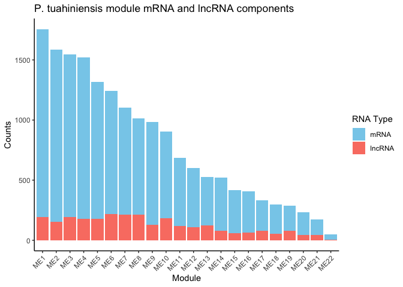
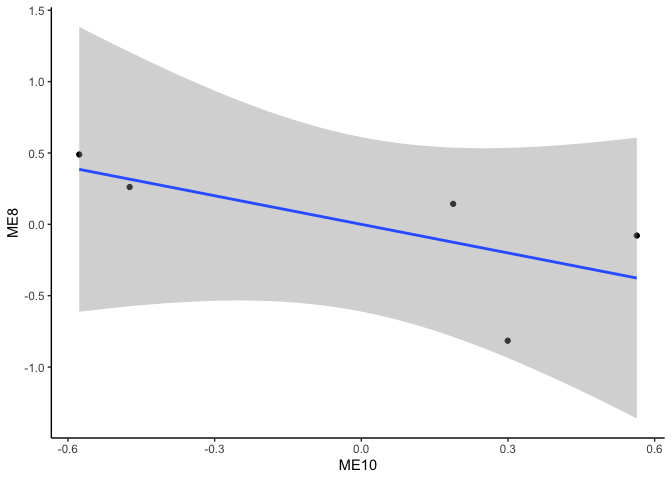

Ptuh Gene expression lncRNA correlations
================
2025-02-04

This script conducts correlation network analyses for gene expression
and lncRNA.

# Set up

Load libraries

``` r
library(tidyverse)
library(ggplot2)
library(DESeq2)
library(igraph)
library(psych)
library(tidygraph)
library(ggraph)
library(WGCNA)
library(edgeR)
library(reshape2)
library(ggcorrplot)
library(corrplot)
```

# Pocillopora tuahiniensis

## Load and format data

``` r
ptuh_mrna<-read_csv(file="F-Ptuh/output/06-Ptuh-Hisat/Ptuh-gene_count_matrix.csv")%>%
  rename("mrna_id"=gene_id, "sample47"=`RNA-POC-47`, "sample48"=`RNA-POC-48`, "sample50"=`RNA-POC-50`, "sample53"=`RNA-POC-53`, "sample57"=`RNA-POC-57`)
```

    ## Rows: 31840 Columns: 6
    ## ── Column specification ────────────────────────────────────────────────────────
    ## Delimiter: ","
    ## chr (1): gene_id
    ## dbl (5): RNA-POC-47, RNA-POC-48, RNA-POC-50, RNA-POC-53, RNA-POC-57
    ## 
    ## ℹ Use `spec()` to retrieve the full column specification for this data.
    ## ℹ Specify the column types or set `show_col_types = FALSE` to quiet this message.

``` r
ptuh_lncrna<-read_table(file="F-Ptuh/output/08-Ptuh-lncRNA-matrix/Peve-lncRNA-counts.txt", skip=1)%>%
  select(!c("Chr", "Start", "End", "Strand", "Length"))%>%
  rename("lncrna_id"=Geneid, 
         "sample47"=`../output/06-Ptuh-Hisat/RNA-POC-47.sorted.bam`, 
         "sample48"=`../output/06-Ptuh-Hisat/RNA-POC-48.sorted.bam`, 
         "sample50"=`../output/06-Ptuh-Hisat/RNA-POC-50.sorted.bam`, 
         "sample53"=`../output/06-Ptuh-Hisat/RNA-POC-53.sorted.bam`, 
         "sample57"=`../output/06-Ptuh-Hisat/RNA-POC-57.sorted.bam`)
```

    ## 
    ## ── Column specification ────────────────────────────────────────────────────────
    ## cols(
    ##   Geneid = col_character(),
    ##   Chr = col_character(),
    ##   Start = col_double(),
    ##   End = col_double(),
    ##   Strand = col_character(),
    ##   Length = col_double(),
    ##   `../output/06-Ptuh-Hisat/RNA-POC-47.sorted.bam` = col_double(),
    ##   `../output/06-Ptuh-Hisat/RNA-POC-48.sorted.bam` = col_double(),
    ##   `../output/06-Ptuh-Hisat/RNA-POC-50.sorted.bam` = col_double(),
    ##   `../output/06-Ptuh-Hisat/RNA-POC-53.sorted.bam` = col_double(),
    ##   `../output/06-Ptuh-Hisat/RNA-POC-57.sorted.bam` = col_double()
    ## )

``` r
ptuh_mrna<-as.data.frame(ptuh_mrna)
ptuh_lncrna<-as.data.frame(ptuh_lncrna)

str(ptuh_mrna)
```

    ## 'data.frame':    31840 obs. of  6 variables:
    ##  $ mrna_id : chr  "Pocillopora_meandrina_HIv1___TS.g26186.t1" "Pocillopora_meandrina_HIv1___RNAseq.g27475.t1" "Pocillopora_meandrina_HIv1___RNAseq.g7358.t1" "Pocillopora_meandrina_HIv1___RNAseq.g2989.t1" ...
    ##  $ sample47: num  0 0 0 0 0 ...
    ##  $ sample48: num  0 0 0 0 63 ...
    ##  $ sample50: num  0 0 0 0 0 ...
    ##  $ sample53: num  0 510 0 0 0 ...
    ##  $ sample57: num  0 51 7 9 0 ...

``` r
str(ptuh_lncrna)
```

    ## 'data.frame':    12394 obs. of  6 variables:
    ##  $ lncrna_id: chr  "lncRNA_001" "lncRNA_002" "lncRNA_003" "lncRNA_004" ...
    ##  $ sample47 : num  79 0 0 0 0 ...
    ##  $ sample48 : num  4 0 0 0 0 ...
    ##  $ sample50 : num  113 0 386 0 0 ...
    ##  $ sample53 : num  22 0 0 0 0 ...
    ##  $ sample57 : num  24 0 12 0 0 0 0 0 942 34 ...

Remove mRNA and lncRNA with 0 in all samples.

``` r
# Remove any genes with 0 counts across samples 
ptuh_mrna<-ptuh_mrna %>%
     mutate(Total = rowSums(.[, 2:6]))%>%
    filter(!Total==0)%>%
    dplyr::select(!Total)

ptuh_lncrna<-ptuh_lncrna %>%
     mutate(Total = rowSums(.[, 2:6]))%>%
    filter(!Total==0)%>%
    dplyr::select(!Total)
```

We now have 10382 lncRNAs and 26508 mRNAs.

Set row names.

``` r
rownames(ptuh_mrna)<-ptuh_mrna$mrna_id
ptuh_mrna<-ptuh_mrna%>%select(!mrna_id)
```

``` r
rownames(ptuh_lncrna)<-ptuh_lncrna$lncrna_id
ptuh_lncrna<-ptuh_lncrna%>%select(!lncrna_id)
```

Make sample metadata.

``` r
ptuh_sample_info <- data.frame(
  species = c("Pocillopora tuahiniensis"),
  sample = colnames(ptuh_mrna)
)

rownames(ptuh_sample_info)<-ptuh_sample_info$sample
```

## Filter data

Filter data to only keep those expressed in all samples.

``` r
dge_mRNA <- DGEList(counts = ptuh_mrna)
dge_lncRNA <- DGEList(counts = ptuh_lncrna)

# Calculate CPM
cpm_mRNA <- cpm(dge_mRNA)
cpm_lncRNA <- cpm(dge_lncRNA)

# Filtering criteria: CPM > 1 in all samples (100%)
min_samples <- ncol(ptuh_mrna) * 1

# Apply the filter
keep_mRNA <- rowSums(cpm_mRNA > 1) >= min_samples
keep_lncRNA <- rowSums(cpm_lncRNA > 1) >= min_samples

# Filtered count matrices
filtered_mRNA_counts <- ptuh_mrna[keep_mRNA, ]
filtered_lncRNA_counts <- ptuh_lncrna[keep_lncRNA, ]

# Check the number of features retained
cat("mRNAs retained:", sum(keep_mRNA), "\n")
```

    ## mRNAs retained: 14797

``` r
cat("lncRNAs retained:", sum(keep_lncRNA), "\n")
```

    ## lncRNAs retained: 2712

This reduced mRNAs to 14797 and lncRNAs to 2712

## Normalize data

``` r
dds_mrna <- DESeqDataSetFromMatrix(countData = filtered_mRNA_counts, 
                              colData = ptuh_sample_info, 
                              design = ~ 1)
```

    ## converting counts to integer mode

``` r
# Variance Stabilizing Transformation
vsd_mrna <- assay(vst(dds_mrna, blind = TRUE))
```

``` r
dds_lncrna <- DESeqDataSetFromMatrix(countData = filtered_lncRNA_counts, 
                              colData = ptuh_sample_info, 
                              design = ~ 1)
```

    ## converting counts to integer mode

``` r
# Variance Stabilizing Transformation
vsd_lncrna <- assay(vst(dds_lncrna, blind = TRUE))
```

    ## -- note: fitType='parametric', but the dispersion trend was not well captured by the
    ##    function: y = a/x + b, and a local regression fit was automatically substituted.
    ##    specify fitType='local' or 'mean' to avoid this message next time.

## Conduct module correlations with WGCNA

Set soft threshold.

``` r
options(stringsAsFactors = FALSE)
enableWGCNAThreads()  # Enable multi-threading
```

    ## Allowing parallel execution with up to 7 working processes.

``` r
allowWGCNAThreads(nThreads = 2)
```

    ## Allowing multi-threading with up to 2 threads.

``` r
# Combine mRNA and lncRNA datasets
datExpr <- t(rbind(vsd_mrna, vsd_lncrna))

sum(is.na(datExpr))  # Should be 0
```

    ## [1] 0

``` r
sum(!is.finite(as.matrix(datExpr)))  # Should be 0
```

    ## [1] 0

``` r
# Remove genes/samples with missing or infinite values
datExpr <- datExpr[complete.cases(datExpr), ]
datExpr <- datExpr[, colSums(is.na(datExpr)) == 0]

# # Choose a set of soft-thresholding powers
powers <- c(seq(from = 1, to=19, by=2), c(21:50)) #Create a string of numbers from 1 through 10, and even numbers from 10 through 20
# 
# # Call the network topology analysis function
sft <-pickSoftThreshold(datExpr, powerVector = powers, verbose = 5)
```

    ## pickSoftThreshold: will use block size 2555.
    ##  pickSoftThreshold: calculating connectivity for given powers...
    ##    ..working on genes 1 through 2555 of 17509
    ##    ..working on genes 2556 through 5110 of 17509
    ##    ..working on genes 5111 through 7665 of 17509
    ##    ..working on genes 7666 through 10220 of 17509
    ##    ..working on genes 10221 through 12775 of 17509
    ##    ..working on genes 12776 through 15330 of 17509
    ##    ..working on genes 15331 through 17509 of 17509
    ##    Power SFT.R.sq  slope truncated.R.sq mean.k. median.k. max.k.
    ## 1      1   0.7900  4.110          0.875  7820.0    7990.0   9010
    ## 2      3   0.4360  0.853          0.713  3320.0    3420.0   4520
    ## 3      5   0.0227  0.120          0.583  1970.0    2010.0   2970
    ## 4      7   0.0783 -0.209          0.682  1340.0    1360.0   2180
    ## 5      9   0.2710 -0.424          0.782   994.0     991.0   1700
    ## 6     11   0.4160 -0.577          0.845   774.0     764.0   1390
    ## 7     13   0.4960 -0.676          0.892   626.0     611.0   1160
    ## 8     15   0.5500 -0.759          0.913   519.0     502.0    997
    ## 9     17   0.5900 -0.821          0.929   440.0     422.0    868
    ## 10    19   0.6120 -0.871          0.939   379.0     361.0    766
    ## 11    21   0.6320 -0.907          0.951   332.0     313.0    683
    ## 12    22   0.6350 -0.923          0.953   311.0     293.0    648
    ## 13    23   0.6410 -0.934          0.954   293.0     275.0    615
    ## 14    24   0.6450 -0.945          0.956   276.0     259.0    585
    ## 15    25   0.6490 -0.956          0.958   261.0     244.0    558
    ## 16    26   0.6510 -0.966          0.959   248.0     231.0    532
    ## 17    27   0.6530 -0.975          0.960   235.0     219.0    509
    ## 18    28   0.6540 -0.985          0.961   224.0     207.0    487
    ## 19    29   0.6550 -0.996          0.962   213.0     197.0    468
    ## 20    30   0.6550 -1.010          0.961   203.0     188.0    449
    ## 21    31   0.6540 -1.010          0.963   194.0     179.0    432
    ## 22    32   0.6560 -1.020          0.964   186.0     171.0    416
    ## 23    33   0.6560 -1.030          0.966   178.0     163.0    401
    ## 24    34   0.6560 -1.040          0.967   171.0     156.0    387
    ## 25    35   0.6550 -1.050          0.967   164.0     150.0    374
    ## 26    36   0.6550 -1.050          0.968   157.0     144.0    361
    ## 27    37   0.6550 -1.060          0.968   151.0     138.0    349
    ## 28    38   0.6530 -1.070          0.967   146.0     133.0    338
    ## 29    39   0.6520 -1.070          0.966   141.0     128.0    328
    ## 30    40   0.6500 -1.080          0.967   136.0     123.0    318
    ## 31    41   0.6490 -1.090          0.968   131.0     119.0    309
    ## 32    42   0.6480 -1.090          0.968   127.0     115.0    300
    ## 33    43   0.6460 -1.100          0.967   122.0     111.0    291
    ## 34    44   0.6450 -1.100          0.968   118.0     107.0    283
    ## 35    45   0.6430 -1.110          0.967   115.0     103.0    275
    ## 36    46   0.6420 -1.120          0.968   111.0     100.0    268
    ## 37    47   0.6390 -1.120          0.966   108.0      97.0    261
    ## 38    48   0.6390 -1.130          0.966   105.0      94.0    255
    ## 39    49   0.6370 -1.140          0.966   102.0      91.2    248
    ## 40    50   0.6350 -1.140          0.965    98.8      88.5    242

``` r
sft$powerEstimate
```

    ## [1] NA

Plot the results.

``` r
sizeGrWindow(9, 5)
par(mfrow = c(1,2));
cex1 = 0.9;
# # # Scale-free topology fit index as a function of the soft-thresholding power
plot(sft$fitIndices[,1], -sign(sft$fitIndices[,3])*sft$fitIndices[,2],
      xlab="Soft Threshold (power)",ylab="Scale Free Topology Model Fit,signed R^2",type="n",
     main = paste("Scale independence"));
 text(sft$fitIndices[,1], -sign(sft$fitIndices[,3])*sft$fitIndices[,2],
     labels=powers,cex=cex1,col="red");
# # # this line corresponds to using an R^2 cut-off
 abline(h=0.9,col="red")
# # # Mean connectivity as a function of the soft-thresholding power
 plot(sft$fitIndices[,1], sft$fitIndices[,5],
     xlab="Soft Threshold (power)",ylab="Mean Connectivity", type="n",
     main = paste("Mean connectivity"))
 text(sft$fitIndices[,1], sft$fitIndices[,5], labels=powers, cex=cex1,col="red")
```

Selected power will be 30 - no value crossed threshold, selecting limit
of tested values.

### Generate network

``` r
selected_power<-30

# Network construction (adjust power based on sft output)
net = blockwiseModules(datExpr, power = selected_power,
                       TOMType = "unsigned", minModuleSize = 30,
                       reassignThreshold = 0, mergeCutHeight = 0.25,
                       numericLabels = TRUE, pamRespectsDendro = FALSE,
                       saveTOMs = FALSE, verbose = 3)
```

    ##  Calculating module eigengenes block-wise from all genes
    ##    Flagging genes and samples with too many missing values...
    ##     ..step 1
    ##  ....pre-clustering genes to determine blocks..
    ##    Projective K-means:
    ##    ..k-means clustering..
    ##    ..merging smaller clusters...
    ## Block sizes:
    ## gBlocks
    ##    1    2    3    4    5 
    ## 4464 4185 3839 3465 1556 
    ##  ..Working on block 1 .
    ##     TOM calculation: adjacency..
    ##     ..will use 2 parallel threads.
    ##      Fraction of slow calculations: 0.000000
    ##     ..connectivity..
    ##     ..matrix multiplication (system BLAS)..
    ##     ..normalization..
    ##     ..done.
    ##  ....clustering..
    ##  ....detecting modules..
    ##  ....calculating module eigengenes..
    ##  ....checking kME in modules..
    ##  ..Working on block 2 .
    ##     TOM calculation: adjacency..
    ##     ..will use 2 parallel threads.
    ##      Fraction of slow calculations: 0.000000
    ##     ..connectivity..
    ##     ..matrix multiplication (system BLAS)..
    ##     ..normalization..
    ##     ..done.
    ##  ....clustering..
    ##  ....detecting modules..
    ##  ....calculating module eigengenes..
    ##  ....checking kME in modules..
    ##  ..Working on block 3 .
    ##     TOM calculation: adjacency..
    ##     ..will use 2 parallel threads.
    ##      Fraction of slow calculations: 0.000000
    ##     ..connectivity..
    ##     ..matrix multiplication (system BLAS)..
    ##     ..normalization..
    ##     ..done.
    ##  ....clustering..
    ##  ....detecting modules..
    ##  ....calculating module eigengenes..
    ##  ....checking kME in modules..
    ##  ..Working on block 4 .
    ##     TOM calculation: adjacency..
    ##     ..will use 2 parallel threads.
    ##      Fraction of slow calculations: 0.000000
    ##     ..connectivity..
    ##     ..matrix multiplication (system BLAS)..
    ##     ..normalization..
    ##     ..done.
    ##  ....clustering..
    ##  ....detecting modules..
    ##  ....calculating module eigengenes..
    ##  ....checking kME in modules..
    ##  ..Working on block 5 .
    ##     TOM calculation: adjacency..
    ##     ..will use 2 parallel threads.
    ##      Fraction of slow calculations: 0.000000
    ##     ..connectivity..
    ##     ..matrix multiplication (system BLAS)..
    ##     ..normalization..
    ##     ..done.
    ##  ....clustering..
    ##  ....detecting modules..
    ##  ....calculating module eigengenes..
    ##  ....checking kME in modules..
    ##  ..merging modules that are too close..
    ##      mergeCloseModules: Merging modules whose distance is less than 0.25
    ##        Calculating new MEs...

View modules.

``` r
moduleEigengenes = moduleEigengenes(datExpr, colors = net$colors)$eigengenes

length(table(net$unmergedColors))
```

    ## [1] 306

``` r
length(table(net$colors))
```

    ## [1] 22

``` r
MEs<-net$MEs
moduleLabels<-net$colors
```

There are 22 modules after merging similar modules from original 306
modules.

Determine whether mRNA and or lncRNA are present in each module.

``` r
# Get gene names and corresponding module colors
gene_module_info <- data.frame(
  Gene = colnames(datExpr),
  Module = moduleLabels
)

# Check structure
head(gene_module_info)
```

    ##                  Gene Module
    ## STRG.15043 STRG.15043      2
    ## STRG.8661   STRG.8661      1
    ## STRG.15041 STRG.15041      1
    ## STRG.8666   STRG.8666      3
    ## STRG.15044 STRG.15044     16
    ## STRG.8664   STRG.8664      4

``` r
#Add ME to all the names
gene_module_info$Module <- paste0("ME", gene_module_info$Module)
```

Classify modules based on the proportion of the module comprised by
mRNAs.

For now I am using any Peve or STRG mRNA id (we will revisit the
stringtie calls later).

``` r
# Function to calculate the proportion of mRNAs (genes with "FUN" in ID)
calculate_mRNA_proportion <- function(genes) {
  total_genes <- length(genes)
  mRNA_count <- sum(grepl("Peve|STRG", genes))
  
  # Proportion of mRNAs
  proportion_mRNA <- mRNA_count / total_genes
  return(proportion_mRNA)
}

# Apply the function to each module
module_mRNA_proportion <- tapply(gene_module_info$Gene, 
                                 gene_module_info$Module, 
                                 calculate_mRNA_proportion)

# View the proportions
module_mRNA_proportion
```

    ##       ME1      ME10      ME11      ME12      ME13      ME14      ME15      ME16 
    ## 0.8549056 0.7931034 0.7605422 0.8320726 0.7835671 0.7746781 0.8555556 0.7805486 
    ##      ME17      ME18      ME19       ME2      ME20      ME21      ME22       ME3 
    ## 0.8410256 0.8902821 0.8184818 0.8917228 0.8273092 0.8853211 0.7548387 0.8946054 
    ##       ME4       ME5       ME6       ME7       ME8       ME9 
    ## 0.8542397 0.8264794 0.8716356 0.7964072 0.8094645 0.8748353

``` r
#Add ME to all the names
#names(module_mRNA_proportion) <- paste0("ME", names(module_mRNA_proportion))
```

### Run correlation between modules.

``` r
cor_matrix = cor(moduleEigengenes)
```

Compute correlations with Spearman correlation and BH p-value
adjustment.

``` r
# Compute Spearman correlation between mRNA and lncRNA
ptuh_cor_results <- corr.test(moduleEigengenes, method = "spearman", adjust = "BH")

# Extract correlation values and p-values
ptuh_cor_matrix <- ptuh_cor_results$r  # Correlation coefficients
ptuh_p_matrix <- ptuh_cor_results$p  # Adjusted p-values
```

Construct network.

``` r
# Set correlation and significance thresholds
cor_threshold <- 0.6  # Adjust based on desired stringency
p_threshold <- 0.05

# Convert correlation matrix into an edge list
ptuh_significant_edges <- which(abs(ptuh_cor_matrix) > cor_threshold & ptuh_p_matrix < p_threshold, arr.ind = TRUE)

ptuh_edge_list <- data.frame(
  mRNA = rownames(ptuh_cor_matrix)[ptuh_significant_edges[,1]],
  lncRNA = colnames(ptuh_cor_matrix)[ptuh_significant_edges[,2]],
  correlation = ptuh_cor_matrix[ptuh_significant_edges]
)

# Construct network graph
ptuh_network <- graph_from_data_frame(ptuh_edge_list, directed = FALSE)

module_mRNA_proportion<-as.data.frame(module_mRNA_proportion)

V(ptuh_network)$prop_mrna <- module_mRNA_proportion$module_mRNA_proportion[match(V(ptuh_network)$name, rownames(module_mRNA_proportion))]
```

Plot network.

``` r
# Visualize network
ggraph(ptuh_network, layout = "fr") +  # Force-directed layout
  geom_edge_link(aes(edge_alpha = correlation), show.legend = TRUE, width=3) +
  geom_node_point(aes(colour=prop_mrna), size = 5) +
  scale_colour_gradient(name="Prop. mRNA", low = "purple", high = "cyan3")+
  geom_node_text(aes(label = name), repel = TRUE, size = 4) +
  theme_void() +
  labs(title = "P. tuahiniensis mRNA-lncRNA Network")
```

<!-- -->

Lines = coexpression between modules  
Darker lines = stronger correlation, lighter line weaker correlation

### Plot eigengene patterns and proportions of mRNA and lncRNAs

``` r
module_mRNA_proportion$module_lncRNA_proportion<-1-module_mRNA_proportion$module_mRNA_proportion
```

View total size of modules

``` r
module_sizes <- table(moduleLabels)
module_sizes<-as.data.frame(module_sizes)
module_sizes$module<-paste0("ME", module_sizes$moduleLabels)
```

Plot a stacked bar plot.

``` r
stack_data<-module_mRNA_proportion
stack_data$module<-rownames(stack_data)
stack_data$size<-module_sizes$Freq[match(stack_data$module, module_sizes$module)]

stack_data$module <- factor(stack_data$module, 
                             levels = rev(stack_data$module[order(stack_data$size)]))

stack_data<-stack_data%>%
  mutate(mRNAs=module_mRNA_proportion*size)%>%
  mutate(lncRNAs=module_lncRNA_proportion*size)%>%
  select(!c(module_mRNA_proportion, module_lncRNA_proportion, size))


# Reshape the data for ggplot (long format)

stack_long <- melt(stack_data[, c("module", "mRNAs", "lncRNAs")], 
                    id.vars = "module",
                    variable.name = "RNA_Type", 
                    value.name = "Count")

ggplot(stack_long, aes(x = module, y = Count, fill = RNA_Type)) +
  geom_bar(stat = "identity") +
  scale_fill_manual(values = c("mRNAs" = "skyblue", 
                               "lncRNAs" = "salmon"), 
                    labels = c("mRNA", "lncRNA"))+
  theme_classic() +
  labs(title = "P. tuahiniensis module mRNA and lncRNA components",
       x = "Module",
       y = "Counts",
       fill = "RNA Type") +
  theme(axis.text.x = element_text(angle = 45, hjust = 1))
```

<!-- -->

Next plot eigengene expression of each module across samples.

``` r
#convert wide format to long format for plotting  
head(moduleEigengenes)
```

    ##                 ME1        ME2        ME3         ME4          ME5        ME6
    ## sample47 -0.1003513  0.4050719  0.3624377  0.05227394 -0.706869406 -0.7374311
    ## sample48  0.2584431 -0.7413055 -0.2186608  0.42497696 -0.053593703  0.5558059
    ## sample50 -0.8271521  0.4694180  0.4458051 -0.03953253  0.049984725 -0.2343956
    ## sample53  0.2475377 -0.2356494  0.1786437  0.38084929  0.006975558  0.1541717
    ## sample57  0.4215226  0.1024651 -0.7682257 -0.81856766  0.703502826  0.2618492
    ##                 ME7         ME8         ME9       ME10       ME11       ME12
    ## sample47 -0.4679893 -0.81566572  0.06760559  0.2994385  0.2915458  0.5376005
    ## sample48  0.6345997  0.14348421 -0.55661672  0.1878779  0.2937525  0.1774153
    ## sample50  0.1802292  0.26144755 -0.17672588 -0.4738461  0.1908302  0.3197317
    ## sample53 -0.5513337  0.48944065 -0.13230480 -0.5770060 -0.8835976 -0.3725810
    ## sample57  0.2044941 -0.07870669  0.79804180  0.5635356  0.1074691 -0.6621666
    ##                ME13       ME14        ME15       ME16       ME17        ME18
    ## sample47  0.6295450 -0.1132562 -0.26989976 -0.1194539  0.0775677 -0.40518015
    ## sample48  0.2008715 -0.4825455 -0.68794459  0.1290002  0.8371299  0.78014718
    ## sample50 -0.6216164 -0.4462513  0.41346787 -0.4350197 -0.2168226 -0.04902463
    ## sample53  0.1740941  0.5992742  0.01261378  0.7998201 -0.3854752  0.13001069
    ## sample57 -0.3828942  0.4427788  0.53176270 -0.3743467 -0.3123998 -0.45595309
    ##                 ME19       ME20       ME21        ME22
    ## sample47 -0.08102281 -0.5075467  0.6196637 -0.03966665
    ## sample48 -0.03347973  0.3522537 -0.6584083 -0.54715761
    ## sample50  0.09543253  0.5299414 -0.3243232  0.38495534
    ## sample53 -0.69154459  0.1782541  0.1059670  0.61594852
    ## sample57  0.71061461 -0.5529026  0.2571009 -0.41407960

``` r
plot_MEs <- moduleEigengenes 

plot_MEs$sample<-rownames(plot_MEs)

plot_MEs<-plot_MEs%>%
  pivot_longer(
    cols = where(is.numeric),  # Select only numeric columns
    names_to = "Module",       # Name for the new column containing the column names
    values_to = "Mean"         # Name for the new column containing the values
  )

expression_plots<-plot_MEs%>%
  group_by(Module) %>%
  
  ggplot(aes(x=sample, y=Mean)) +
  facet_wrap(~ Module)+
    geom_hline(yintercept = 0, linetype="dashed", color = "grey")+
  geom_point()+
  ggtitle("Pocillopora tuahiniensis mRNA-lncRNA modules")+
  geom_line(aes(group=1))+
  theme_classic()+ 
  theme(axis.text.x=element_text(angle = 90, hjust=1)); expression_plots
```

<!-- -->

### Plot correlations of specific modules

Which modules were significantly correlated? Show correlation matrix.

``` r
# Compute Spearman correlation between mRNA and lncRNA
ptuh_cor_results 
```

    ## Call:corr.test(x = moduleEigengenes, method = "spearman", adjust = "BH")
    ## Correlation matrix 
    ##       ME1  ME2  ME3  ME4  ME5  ME6  ME7  ME8  ME9 ME10 ME11 ME12 ME13 ME14 ME15
    ## ME1   1.0 -0.7 -1.0  0.0  0.3  0.8  0.5 -0.2  0.3  0.5 -0.1 -0.8  0.1  0.2  0.1
    ## ME2  -0.7  1.0  0.7 -0.7  0.2 -0.8 -0.3 -0.2  0.3  0.1 -0.1  0.5 -0.4  0.0  0.5
    ## ME3  -1.0  0.7  1.0  0.0 -0.3 -0.8 -0.5  0.2 -0.3 -0.5  0.1  0.8 -0.1 -0.2 -0.1
    ## ME4   0.0 -0.7  0.0  1.0 -0.7  0.3  0.0  0.3 -0.7 -0.5  0.4  0.2  0.6 -0.3 -0.9
    ## ME5   0.3  0.2 -0.3 -0.7  1.0  0.3  0.2  0.3  0.3  0.1 -0.6 -0.7 -0.9  0.3  0.9
    ## ME6   0.8 -0.8 -0.8  0.3  0.3  1.0  0.7  0.2 -0.3  0.1  0.1 -0.7 -0.1 -0.2 -0.1
    ## ME7   0.5 -0.3 -0.5  0.0  0.2  0.7  1.0 -0.3 -0.3  0.5  0.6 -0.2 -0.1 -0.7 -0.1
    ## ME8  -0.2 -0.2  0.2  0.3  0.3  0.2 -0.3  1.0 -0.5 -0.9 -0.5 -0.3 -0.5  0.2  0.1
    ## ME9   0.3  0.3 -0.3 -0.7  0.3 -0.3 -0.3 -0.5  1.0  0.6 -0.5 -0.3  0.0  0.7  0.6
    ## ME10  0.5  0.1 -0.5 -0.5  0.1  0.1  0.5 -0.9  0.6  1.0  0.3 -0.1  0.2 -0.1  0.2
    ## ME11 -0.1 -0.1  0.1  0.4 -0.6  0.1  0.6 -0.5 -0.5  0.3  1.0  0.6  0.5 -0.9 -0.7
    ## ME12 -0.8  0.5  0.8  0.2 -0.7 -0.7 -0.2 -0.3 -0.3 -0.1  0.6  1.0  0.4 -0.5 -0.5
    ## ME13  0.1 -0.4 -0.1  0.6 -0.9 -0.1 -0.1 -0.5  0.0  0.2  0.5  0.4  1.0 -0.1 -0.8
    ## ME14  0.2  0.0 -0.2 -0.3  0.3 -0.2 -0.7  0.2  0.7 -0.1 -0.9 -0.5 -0.1  1.0  0.5
    ## ME15  0.1  0.5 -0.1 -0.9  0.9 -0.1 -0.1  0.1  0.6  0.2 -0.7 -0.5 -0.8  0.5  1.0
    ## ME16  0.3 -0.8 -0.3  0.8 -0.5  0.3 -0.3  0.3 -0.2 -0.4 -0.1 -0.2  0.6  0.3 -0.6
    ## ME17 -0.1 -0.1  0.1  0.4 -0.6  0.1  0.6 -0.5 -0.5  0.3  1.0  0.6  0.5 -0.9 -0.7
    ## ME18 -0.1 -0.6  0.1  0.9 -0.4  0.4  0.1  0.6 -0.9 -0.7  0.3  0.1  0.2 -0.4 -0.7
    ## ME19  0.3  0.3 -0.3 -0.7  0.7  0.3  0.7 -0.3  0.2  0.6  0.1 -0.3 -0.6 -0.3  0.6
    ## ME20 -0.6  0.1  0.6  0.4 -0.1  0.0  0.1  0.6 -0.9 -0.7  0.3  0.4 -0.3 -0.6 -0.3
    ## ME21  0.0  0.4  0.0 -0.5 -0.1 -0.6 -0.5 -0.6  0.9  0.5 -0.3  0.1  0.3  0.6  0.3
    ## ME22 -0.6  0.4  0.6 -0.1  0.1 -0.6 -0.9  0.6  0.1 -0.7 -0.7  0.1 -0.3  0.6  0.3
    ##      ME16 ME17 ME18 ME19 ME20 ME21 ME22
    ## ME1   0.3 -0.1 -0.1  0.3 -0.6  0.0 -0.6
    ## ME2  -0.8 -0.1 -0.6  0.3  0.1  0.4  0.4
    ## ME3  -0.3  0.1  0.1 -0.3  0.6  0.0  0.6
    ## ME4   0.8  0.4  0.9 -0.7  0.4 -0.5 -0.1
    ## ME5  -0.5 -0.6 -0.4  0.7 -0.1 -0.1  0.1
    ## ME6   0.3  0.1  0.4  0.3  0.0 -0.6 -0.6
    ## ME7  -0.3  0.6  0.1  0.7  0.1 -0.5 -0.9
    ## ME8   0.3 -0.5  0.6 -0.3  0.6 -0.6  0.6
    ## ME9  -0.2 -0.5 -0.9  0.2 -0.9  0.9  0.1
    ## ME10 -0.4  0.3 -0.7  0.6 -0.7  0.5 -0.7
    ## ME11 -0.1  1.0  0.3  0.1  0.3 -0.3 -0.7
    ## ME12 -0.2  0.6  0.1 -0.3  0.4  0.1  0.1
    ## ME13  0.6  0.5  0.2 -0.6 -0.3  0.3 -0.3
    ## ME14  0.3 -0.9 -0.4 -0.3 -0.6  0.6  0.6
    ## ME15 -0.6 -0.7 -0.7  0.6 -0.3  0.3  0.3
    ## ME16  1.0 -0.1  0.6 -0.8 -0.1 -0.1  0.1
    ## ME17 -0.1  1.0  0.3  0.1  0.3 -0.3 -0.7
    ## ME18  0.6  0.3  1.0 -0.5  0.7 -0.8  0.0
    ## ME19 -0.8  0.1 -0.5  1.0 -0.1 -0.1 -0.5
    ## ME20 -0.1  0.3  0.7 -0.1  1.0 -0.8  0.2
    ## ME21 -0.1 -0.3 -0.8 -0.1 -0.8  1.0  0.2
    ## ME22  0.1 -0.7  0.0 -0.5  0.2  0.2  1.0
    ## Sample Size 
    ## [1] 5
    ## Probability values (Entries above the diagonal are adjusted for multiple tests.) 
    ##       ME1  ME2  ME3  ME4  ME5  ME6  ME7  ME8  ME9 ME10 ME11 ME12 ME13 ME14 ME15
    ## ME1  0.00 0.88 0.00 1.00 0.91 0.88 0.90 0.91 0.91 0.90 0.91 0.88 0.91 0.91 0.91
    ## ME2  0.19 0.00 0.88 0.88 0.91 0.88 0.91 0.91 0.91 0.91 0.91 0.90 0.91 1.00 0.90
    ## ME3  0.00 0.19 0.00 1.00 0.91 0.88 0.90 0.91 0.91 0.90 0.91 0.88 0.91 0.91 0.91
    ## ME4  1.00 0.19 1.00 0.00 0.88 0.91 1.00 0.91 0.88 0.90 0.91 0.91 0.88 0.91 0.66
    ## ME5  0.62 0.75 0.62 0.19 0.00 0.91 0.91 0.91 0.91 0.91 0.88 0.88 0.66 0.91 0.66
    ## ME6  0.10 0.10 0.10 0.62 0.62 0.00 0.88 0.91 0.91 0.91 0.91 0.88 0.91 0.91 0.91
    ## ME7  0.39 0.62 0.39 1.00 0.75 0.19 0.00 0.91 0.91 0.90 0.88 0.91 0.91 0.88 0.91
    ## ME8  0.75 0.75 0.75 0.62 0.62 0.75 0.62 0.00 0.90 0.66 0.90 0.91 0.90 0.91 0.91
    ## ME9  0.62 0.62 0.62 0.19 0.62 0.62 0.62 0.39 0.00 0.88 0.90 0.91 1.00 0.88 0.88
    ## ME10 0.39 0.87 0.39 0.39 0.87 0.87 0.39 0.04 0.28 0.00 0.91 0.91 0.91 0.91 0.91
    ## ME11 0.87 0.87 0.87 0.50 0.28 0.87 0.28 0.39 0.39 0.62 0.00 0.88 0.90 0.66 0.88
    ## ME12 0.10 0.39 0.10 0.75 0.19 0.19 0.75 0.62 0.62 0.87 0.28 0.00 0.91 0.90 0.90
    ## ME13 0.87 0.50 0.87 0.28 0.04 0.87 0.87 0.39 1.00 0.75 0.39 0.50 0.00 0.91 0.88
    ## ME14 0.75 1.00 0.75 0.62 0.62 0.75 0.19 0.75 0.19 0.87 0.04 0.39 0.87 0.00 0.90
    ## ME15 0.87 0.39 0.87 0.04 0.04 0.87 0.87 0.87 0.28 0.75 0.19 0.39 0.10 0.39 0.00
    ## ME16 0.62 0.10 0.62 0.10 0.39 0.62 0.62 0.62 0.75 0.50 0.87 0.75 0.28 0.62 0.28
    ## ME17 0.87 0.87 0.87 0.50 0.28 0.87 0.28 0.39 0.39 0.62 0.00 0.28 0.39 0.04 0.19
    ## ME18 0.87 0.28 0.87 0.04 0.50 0.50 0.87 0.28 0.04 0.19 0.62 0.87 0.75 0.50 0.19
    ## ME19 0.62 0.62 0.62 0.19 0.19 0.62 0.19 0.62 0.75 0.28 0.87 0.62 0.28 0.62 0.28
    ## ME20 0.28 0.87 0.28 0.50 0.87 1.00 0.87 0.28 0.04 0.19 0.62 0.50 0.62 0.28 0.62
    ## ME21 1.00 0.50 1.00 0.39 0.87 0.28 0.39 0.28 0.04 0.39 0.62 0.87 0.62 0.28 0.62
    ## ME22 0.28 0.50 0.28 0.87 0.87 0.28 0.04 0.28 0.87 0.19 0.19 0.87 0.62 0.28 0.62
    ##      ME16 ME17 ME18 ME19 ME20 ME21 ME22
    ## ME1  0.91 0.91 0.91 0.91 0.88 1.00 0.88
    ## ME2  0.88 0.91 0.88 0.91 0.91 0.91 0.91
    ## ME3  0.91 0.91 0.91 0.91 0.88 1.00 0.88
    ## ME4  0.88 0.91 0.66 0.88 0.91 0.90 0.91
    ## ME5  0.90 0.88 0.91 0.88 0.91 0.91 0.91
    ## ME6  0.91 0.91 0.91 0.91 1.00 0.88 0.88
    ## ME7  0.91 0.88 0.91 0.88 0.91 0.90 0.66
    ## ME8  0.91 0.90 0.88 0.91 0.88 0.88 0.88
    ## ME9  0.91 0.90 0.66 0.91 0.66 0.66 0.91
    ## ME10 0.91 0.91 0.88 0.88 0.88 0.90 0.88
    ## ME11 0.91 0.00 0.91 0.91 0.91 0.91 0.88
    ## ME12 0.91 0.88 0.91 0.91 0.91 0.91 0.91
    ## ME13 0.88 0.90 0.91 0.88 0.91 0.91 0.91
    ## ME14 0.91 0.66 0.91 0.91 0.88 0.88 0.88
    ## ME15 0.88 0.88 0.88 0.88 0.91 0.91 0.91
    ## ME16 0.00 0.91 0.88 0.88 0.91 0.91 0.91
    ## ME17 0.87 0.00 0.91 0.91 0.91 0.91 0.88
    ## ME18 0.28 0.62 0.00 0.90 0.88 0.88 1.00
    ## ME19 0.10 0.87 0.39 0.00 0.91 0.91 0.90
    ## ME20 0.87 0.62 0.19 0.87 0.00 0.88 0.91
    ## ME21 0.87 0.62 0.10 0.87 0.10 0.00 0.91
    ## ME22 0.87 0.19 1.00 0.39 0.75 0.75 0.00
    ## 
    ##  To see confidence intervals of the correlations, print with the short=FALSE option

``` r
# Extract correlation values and p-values
ptuh_cor_matrix  # Correlation coefficients
```

    ##       ME1  ME2  ME3  ME4  ME5  ME6  ME7  ME8  ME9 ME10 ME11 ME12 ME13 ME14 ME15
    ## ME1   1.0 -0.7 -1.0  0.0  0.3  0.8  0.5 -0.2  0.3  0.5 -0.1 -0.8  0.1  0.2  0.1
    ## ME2  -0.7  1.0  0.7 -0.7  0.2 -0.8 -0.3 -0.2  0.3  0.1 -0.1  0.5 -0.4  0.0  0.5
    ## ME3  -1.0  0.7  1.0  0.0 -0.3 -0.8 -0.5  0.2 -0.3 -0.5  0.1  0.8 -0.1 -0.2 -0.1
    ## ME4   0.0 -0.7  0.0  1.0 -0.7  0.3  0.0  0.3 -0.7 -0.5  0.4  0.2  0.6 -0.3 -0.9
    ## ME5   0.3  0.2 -0.3 -0.7  1.0  0.3  0.2  0.3  0.3  0.1 -0.6 -0.7 -0.9  0.3  0.9
    ## ME6   0.8 -0.8 -0.8  0.3  0.3  1.0  0.7  0.2 -0.3  0.1  0.1 -0.7 -0.1 -0.2 -0.1
    ## ME7   0.5 -0.3 -0.5  0.0  0.2  0.7  1.0 -0.3 -0.3  0.5  0.6 -0.2 -0.1 -0.7 -0.1
    ## ME8  -0.2 -0.2  0.2  0.3  0.3  0.2 -0.3  1.0 -0.5 -0.9 -0.5 -0.3 -0.5  0.2  0.1
    ## ME9   0.3  0.3 -0.3 -0.7  0.3 -0.3 -0.3 -0.5  1.0  0.6 -0.5 -0.3  0.0  0.7  0.6
    ## ME10  0.5  0.1 -0.5 -0.5  0.1  0.1  0.5 -0.9  0.6  1.0  0.3 -0.1  0.2 -0.1  0.2
    ## ME11 -0.1 -0.1  0.1  0.4 -0.6  0.1  0.6 -0.5 -0.5  0.3  1.0  0.6  0.5 -0.9 -0.7
    ## ME12 -0.8  0.5  0.8  0.2 -0.7 -0.7 -0.2 -0.3 -0.3 -0.1  0.6  1.0  0.4 -0.5 -0.5
    ## ME13  0.1 -0.4 -0.1  0.6 -0.9 -0.1 -0.1 -0.5  0.0  0.2  0.5  0.4  1.0 -0.1 -0.8
    ## ME14  0.2  0.0 -0.2 -0.3  0.3 -0.2 -0.7  0.2  0.7 -0.1 -0.9 -0.5 -0.1  1.0  0.5
    ## ME15  0.1  0.5 -0.1 -0.9  0.9 -0.1 -0.1  0.1  0.6  0.2 -0.7 -0.5 -0.8  0.5  1.0
    ## ME16  0.3 -0.8 -0.3  0.8 -0.5  0.3 -0.3  0.3 -0.2 -0.4 -0.1 -0.2  0.6  0.3 -0.6
    ## ME17 -0.1 -0.1  0.1  0.4 -0.6  0.1  0.6 -0.5 -0.5  0.3  1.0  0.6  0.5 -0.9 -0.7
    ## ME18 -0.1 -0.6  0.1  0.9 -0.4  0.4  0.1  0.6 -0.9 -0.7  0.3  0.1  0.2 -0.4 -0.7
    ## ME19  0.3  0.3 -0.3 -0.7  0.7  0.3  0.7 -0.3  0.2  0.6  0.1 -0.3 -0.6 -0.3  0.6
    ## ME20 -0.6  0.1  0.6  0.4 -0.1  0.0  0.1  0.6 -0.9 -0.7  0.3  0.4 -0.3 -0.6 -0.3
    ## ME21  0.0  0.4  0.0 -0.5 -0.1 -0.6 -0.5 -0.6  0.9  0.5 -0.3  0.1  0.3  0.6  0.3
    ## ME22 -0.6  0.4  0.6 -0.1  0.1 -0.6 -0.9  0.6  0.1 -0.7 -0.7  0.1 -0.3  0.6  0.3
    ##      ME16 ME17 ME18 ME19 ME20 ME21 ME22
    ## ME1   0.3 -0.1 -0.1  0.3 -0.6  0.0 -0.6
    ## ME2  -0.8 -0.1 -0.6  0.3  0.1  0.4  0.4
    ## ME3  -0.3  0.1  0.1 -0.3  0.6  0.0  0.6
    ## ME4   0.8  0.4  0.9 -0.7  0.4 -0.5 -0.1
    ## ME5  -0.5 -0.6 -0.4  0.7 -0.1 -0.1  0.1
    ## ME6   0.3  0.1  0.4  0.3  0.0 -0.6 -0.6
    ## ME7  -0.3  0.6  0.1  0.7  0.1 -0.5 -0.9
    ## ME8   0.3 -0.5  0.6 -0.3  0.6 -0.6  0.6
    ## ME9  -0.2 -0.5 -0.9  0.2 -0.9  0.9  0.1
    ## ME10 -0.4  0.3 -0.7  0.6 -0.7  0.5 -0.7
    ## ME11 -0.1  1.0  0.3  0.1  0.3 -0.3 -0.7
    ## ME12 -0.2  0.6  0.1 -0.3  0.4  0.1  0.1
    ## ME13  0.6  0.5  0.2 -0.6 -0.3  0.3 -0.3
    ## ME14  0.3 -0.9 -0.4 -0.3 -0.6  0.6  0.6
    ## ME15 -0.6 -0.7 -0.7  0.6 -0.3  0.3  0.3
    ## ME16  1.0 -0.1  0.6 -0.8 -0.1 -0.1  0.1
    ## ME17 -0.1  1.0  0.3  0.1  0.3 -0.3 -0.7
    ## ME18  0.6  0.3  1.0 -0.5  0.7 -0.8  0.0
    ## ME19 -0.8  0.1 -0.5  1.0 -0.1 -0.1 -0.5
    ## ME20 -0.1  0.3  0.7 -0.1  1.0 -0.8  0.2
    ## ME21 -0.1 -0.3 -0.8 -0.1 -0.8  1.0  0.2
    ## ME22  0.1 -0.7  0.0 -0.5  0.2  0.2  1.0

``` r
ptuh_p_matrix  # Adjusted p-values
```

    ##               ME1          ME2          ME3          ME4          ME5
    ## ME1  3.971862e-24 8.770515e-01 4.587501e-22 1.000000e+00 9.082759e-01
    ## ME2  1.881204e-01 3.971862e-24 8.770515e-01 8.770515e-01 9.082759e-01
    ## ME3  3.971862e-24 1.881204e-01 3.971862e-24 1.000000e+00 9.082759e-01
    ## ME4  1.000000e+00 1.881204e-01 1.000000e+00 3.971862e-24 8.770515e-01
    ## ME5  6.238377e-01 7.470601e-01 6.238377e-01 1.881204e-01 3.971862e-24
    ## ME6  1.040880e-01 1.040880e-01 1.040880e-01 6.238377e-01 6.238377e-01
    ## ME7  3.910022e-01 6.238377e-01 3.910022e-01 1.000000e+00 7.470601e-01
    ## ME8  7.470601e-01 7.470601e-01 7.470601e-01 6.238377e-01 6.238377e-01
    ## ME9  6.238377e-01 6.238377e-01 6.238377e-01 1.881204e-01 6.238377e-01
    ## ME10 3.910022e-01 8.728886e-01 3.910022e-01 3.910022e-01 8.728886e-01
    ## ME11 8.728886e-01 8.728886e-01 8.728886e-01 5.046316e-01 2.847570e-01
    ## ME12 1.040880e-01 3.910022e-01 1.040880e-01 7.470601e-01 1.881204e-01
    ## ME13 8.728886e-01 5.046316e-01 8.728886e-01 2.847570e-01 3.738607e-02
    ## ME14 7.470601e-01 1.000000e+00 7.470601e-01 6.238377e-01 6.238377e-01
    ## ME15 8.728886e-01 3.910022e-01 8.728886e-01 3.738607e-02 3.738607e-02
    ## ME16 6.238377e-01 1.040880e-01 6.238377e-01 1.040880e-01 3.910022e-01
    ## ME17 8.728886e-01 8.728886e-01 8.728886e-01 5.046316e-01 2.847570e-01
    ## ME18 8.728886e-01 2.847570e-01 8.728886e-01 3.738607e-02 5.046316e-01
    ## ME19 6.238377e-01 6.238377e-01 6.238377e-01 1.881204e-01 1.881204e-01
    ## ME20 2.847570e-01 8.728886e-01 2.847570e-01 5.046316e-01 8.728886e-01
    ## ME21 1.000000e+00 5.046316e-01 1.000000e+00 3.910022e-01 8.728886e-01
    ## ME22 2.847570e-01 5.046316e-01 2.847570e-01 8.728886e-01 8.728886e-01
    ##               ME6          ME7          ME8          ME9         ME10
    ## ME1  8.770515e-01 9.032151e-01 9.082759e-01 9.082759e-01 9.032151e-01
    ## ME2  8.770515e-01 9.082759e-01 9.082759e-01 9.082759e-01 9.082759e-01
    ## ME3  8.770515e-01 9.032151e-01 9.082759e-01 9.082759e-01 9.032151e-01
    ## ME4  9.082759e-01 1.000000e+00 9.082759e-01 8.770515e-01 9.032151e-01
    ## ME5  9.082759e-01 9.082759e-01 9.082759e-01 9.082759e-01 9.082759e-01
    ## ME6  3.971862e-24 8.770515e-01 9.082759e-01 9.082759e-01 9.082759e-01
    ## ME7  1.881204e-01 3.971862e-24 9.082759e-01 9.082759e-01 9.032151e-01
    ## ME8  7.470601e-01 6.238377e-01 3.971862e-24 9.032151e-01 6.643218e-01
    ## ME9  6.238377e-01 6.238377e-01 3.910022e-01 3.971862e-24 8.770515e-01
    ## ME10 8.728886e-01 3.910022e-01 3.738607e-02 2.847570e-01 3.971862e-24
    ## ME11 8.728886e-01 2.847570e-01 3.910022e-01 3.910022e-01 6.238377e-01
    ## ME12 1.881204e-01 7.470601e-01 6.238377e-01 6.238377e-01 8.728886e-01
    ## ME13 8.728886e-01 8.728886e-01 3.910022e-01 1.000000e+00 7.470601e-01
    ## ME14 7.470601e-01 1.881204e-01 7.470601e-01 1.881204e-01 8.728886e-01
    ## ME15 8.728886e-01 8.728886e-01 8.728886e-01 2.847570e-01 7.470601e-01
    ## ME16 6.238377e-01 6.238377e-01 6.238377e-01 7.470601e-01 5.046316e-01
    ## ME17 8.728886e-01 2.847570e-01 3.910022e-01 3.910022e-01 6.238377e-01
    ## ME18 5.046316e-01 8.728886e-01 2.847570e-01 3.738607e-02 1.881204e-01
    ## ME19 6.238377e-01 1.881204e-01 6.238377e-01 7.470601e-01 2.847570e-01
    ## ME20 1.000000e+00 8.728886e-01 2.847570e-01 3.738607e-02 1.881204e-01
    ## ME21 2.847570e-01 3.910022e-01 2.847570e-01 3.738607e-02 3.910022e-01
    ## ME22 2.847570e-01 3.738607e-02 2.847570e-01 8.728886e-01 1.881204e-01
    ##              ME11         ME12         ME13         ME14         ME15
    ## ME1  9.082759e-01 8.770515e-01 9.082759e-01 9.082759e-01 9.082759e-01
    ## ME2  9.082759e-01 9.032151e-01 9.082759e-01 1.000000e+00 9.032151e-01
    ## ME3  9.082759e-01 8.770515e-01 9.082759e-01 9.082759e-01 9.082759e-01
    ## ME4  9.082759e-01 9.082759e-01 8.770515e-01 9.082759e-01 6.643218e-01
    ## ME5  8.770515e-01 8.770515e-01 6.643218e-01 9.082759e-01 6.643218e-01
    ## ME6  9.082759e-01 8.770515e-01 9.082759e-01 9.082759e-01 9.082759e-01
    ## ME7  8.770515e-01 9.082759e-01 9.082759e-01 8.770515e-01 9.082759e-01
    ## ME8  9.032151e-01 9.082759e-01 9.032151e-01 9.082759e-01 9.082759e-01
    ## ME9  9.032151e-01 9.082759e-01 1.000000e+00 8.770515e-01 8.770515e-01
    ## ME10 9.082759e-01 9.082759e-01 9.082759e-01 9.082759e-01 9.082759e-01
    ## ME11 3.971862e-24 8.770515e-01 9.032151e-01 6.643218e-01 8.770515e-01
    ## ME12 2.847570e-01 3.971862e-24 9.082759e-01 9.032151e-01 9.032151e-01
    ## ME13 3.910022e-01 5.046316e-01 3.971862e-24 9.082759e-01 8.770515e-01
    ## ME14 3.738607e-02 3.910022e-01 8.728886e-01 3.971862e-24 9.032151e-01
    ## ME15 1.881204e-01 3.910022e-01 1.040880e-01 3.910022e-01 3.971862e-24
    ## ME16 8.728886e-01 7.470601e-01 2.847570e-01 6.238377e-01 2.847570e-01
    ## ME17 3.971862e-24 2.847570e-01 3.910022e-01 3.738607e-02 1.881204e-01
    ## ME18 6.238377e-01 8.728886e-01 7.470601e-01 5.046316e-01 1.881204e-01
    ## ME19 8.728886e-01 6.238377e-01 2.847570e-01 6.238377e-01 2.847570e-01
    ## ME20 6.238377e-01 5.046316e-01 6.238377e-01 2.847570e-01 6.238377e-01
    ## ME21 6.238377e-01 8.728886e-01 6.238377e-01 2.847570e-01 6.238377e-01
    ## ME22 1.881204e-01 8.728886e-01 6.238377e-01 2.847570e-01 6.238377e-01
    ##              ME16         ME17         ME18         ME19         ME20
    ## ME1  9.082759e-01 9.082759e-01 9.082759e-01 9.082759e-01 8.770515e-01
    ## ME2  8.770515e-01 9.082759e-01 8.770515e-01 9.082759e-01 9.082759e-01
    ## ME3  9.082759e-01 9.082759e-01 9.082759e-01 9.082759e-01 8.770515e-01
    ## ME4  8.770515e-01 9.082759e-01 6.643218e-01 8.770515e-01 9.082759e-01
    ## ME5  9.032151e-01 8.770515e-01 9.082759e-01 8.770515e-01 9.082759e-01
    ## ME6  9.082759e-01 9.082759e-01 9.082759e-01 9.082759e-01 1.000000e+00
    ## ME7  9.082759e-01 8.770515e-01 9.082759e-01 8.770515e-01 9.082759e-01
    ## ME8  9.082759e-01 9.032151e-01 8.770515e-01 9.082759e-01 8.770515e-01
    ## ME9  9.082759e-01 9.032151e-01 6.643218e-01 9.082759e-01 6.643218e-01
    ## ME10 9.082759e-01 9.082759e-01 8.770515e-01 8.770515e-01 8.770515e-01
    ## ME11 9.082759e-01 4.587501e-22 9.082759e-01 9.082759e-01 9.082759e-01
    ## ME12 9.082759e-01 8.770515e-01 9.082759e-01 9.082759e-01 9.082759e-01
    ## ME13 8.770515e-01 9.032151e-01 9.082759e-01 8.770515e-01 9.082759e-01
    ## ME14 9.082759e-01 6.643218e-01 9.082759e-01 9.082759e-01 8.770515e-01
    ## ME15 8.770515e-01 8.770515e-01 8.770515e-01 8.770515e-01 9.082759e-01
    ## ME16 3.971862e-24 9.082759e-01 8.770515e-01 8.770515e-01 9.082759e-01
    ## ME17 8.728886e-01 3.971862e-24 9.082759e-01 9.082759e-01 9.082759e-01
    ## ME18 2.847570e-01 6.238377e-01 3.971862e-24 9.032151e-01 8.770515e-01
    ## ME19 1.040880e-01 8.728886e-01 3.910022e-01 3.971862e-24 9.082759e-01
    ## ME20 8.728886e-01 6.238377e-01 1.881204e-01 8.728886e-01 3.971862e-24
    ## ME21 8.728886e-01 6.238377e-01 1.040880e-01 8.728886e-01 1.040880e-01
    ## ME22 8.728886e-01 1.881204e-01 1.000000e+00 3.910022e-01 7.470601e-01
    ##              ME21         ME22
    ## ME1  1.000000e+00 8.770515e-01
    ## ME2  9.082759e-01 9.082759e-01
    ## ME3  1.000000e+00 8.770515e-01
    ## ME4  9.032151e-01 9.082759e-01
    ## ME5  9.082759e-01 9.082759e-01
    ## ME6  8.770515e-01 8.770515e-01
    ## ME7  9.032151e-01 6.643218e-01
    ## ME8  8.770515e-01 8.770515e-01
    ## ME9  6.643218e-01 9.082759e-01
    ## ME10 9.032151e-01 8.770515e-01
    ## ME11 9.082759e-01 8.770515e-01
    ## ME12 9.082759e-01 9.082759e-01
    ## ME13 9.082759e-01 9.082759e-01
    ## ME14 8.770515e-01 8.770515e-01
    ## ME15 9.082759e-01 9.082759e-01
    ## ME16 9.082759e-01 9.082759e-01
    ## ME17 9.082759e-01 8.770515e-01
    ## ME18 8.770515e-01 1.000000e+00
    ## ME19 9.082759e-01 9.032151e-01
    ## ME20 8.770515e-01 9.082759e-01
    ## ME21 3.971862e-24 9.082759e-01
    ## ME22 7.470601e-01 3.971862e-24

``` r
ggcorrplot(ptuh_cor_results$r, 
           type = "lower", # Only plot lower triangle
           p.mat = ptuh_p_matrix, 
           sig.level = 0.05,  # Show significant correlations
           insig = "blank",  # Remove insignificant correlations
           lab = TRUE,  # Show correlation coefficients
           lab_size = 4,  # Label size
           colors = c("blue", "white", "red"),  # Color gradient
           title = "P. tuahiniensis Module Correlation Matrix")
```

<!-- -->

There is a significant positive correlation between modules - 15 and 5 -
18 and 4 - 17 and 11 - 21 and 9

There is a significant negative correlation between modules - 1 and 3 -
10 and 8 - 13 and 5 - 15 and 4 - 14 and 11 - 15 and 4 - 17 and 14 - 18
and 9 - 19 and 9 - 22 and 7

Plot specific modules of interest.

Modules 15 and 5

``` r
moduleEigengenes%>%
  
  ggplot(aes(x=ME15, y=ME5))+
  geom_point()+
  geom_smooth(method="lm", se=TRUE)+
  theme_classic()
```

    ## `geom_smooth()` using formula = 'y ~ x'

<!-- -->

Modules 18 and 4

``` r
moduleEigengenes%>%
  
  ggplot(aes(x=ME18, y=ME4))+
  geom_point()+
  geom_smooth(method="lm", se=TRUE)+
  theme_classic()
```

    ## `geom_smooth()` using formula = 'y ~ x'

<!-- -->

Modules 17 and 11

``` r
moduleEigengenes%>%
  
  ggplot(aes(x=ME17, y=ME11))+
  geom_point()+
  geom_smooth(method="lm", se=TRUE)+
  theme_classic()
```

    ## `geom_smooth()` using formula = 'y ~ x'

<!-- -->

Modules 21 and 9

``` r
moduleEigengenes%>%
  
  ggplot(aes(x=ME21, y=ME9))+
  geom_point()+
  geom_smooth(method="lm", se=TRUE)+
  theme_classic()
```

    ## `geom_smooth()` using formula = 'y ~ x'

<!-- -->

Modules 3 and 1

``` r
moduleEigengenes%>%

  ggplot(aes(x=ME3, y=ME1))+
  geom_point()+
  geom_smooth(method="lm", se=TRUE)+
  theme_classic()
```

    ## `geom_smooth()` using formula = 'y ~ x'

<!-- -->

Modules 10 and 8

``` r
moduleEigengenes%>%
  
  ggplot(aes(x=ME10, y=ME8))+
  geom_point()+
  geom_smooth(method="lm", se=TRUE)+
  theme_classic()
```

    ## `geom_smooth()` using formula = 'y ~ x'

<!-- -->

Modules 13 and 5

``` r
moduleEigengenes%>%
  
  ggplot(aes(x=ME13, y=ME5))+
  geom_point()+
  geom_smooth(method="lm", se=TRUE)+
  theme_classic()
```

    ## `geom_smooth()` using formula = 'y ~ x'

<!-- -->

Modules 15 and 4

``` r
moduleEigengenes%>%
  
  ggplot(aes(x=ME15, y=ME4))+
  geom_point()+
  geom_smooth(method="lm", se=TRUE)+
  theme_classic()
```

    ## `geom_smooth()` using formula = 'y ~ x'

<!-- -->

Modules 14 and 11

``` r
moduleEigengenes%>%
  
  ggplot(aes(x=ME14, y=ME11))+
  geom_point()+
  geom_smooth(method="lm", se=TRUE)+
  theme_classic()
```

    ## `geom_smooth()` using formula = 'y ~ x'

<!-- -->

Modules 15 and 4

``` r
moduleEigengenes%>%
  
  ggplot(aes(x=ME15, y=ME4))+
  geom_point()+
  geom_smooth(method="lm", se=TRUE)+
  theme_classic()
```

    ## `geom_smooth()` using formula = 'y ~ x'

<!-- -->

Modules 17 and 14

``` r
moduleEigengenes%>%
  
  ggplot(aes(x=ME17, y=ME14))+
  geom_point()+
  geom_smooth(method="lm", se=TRUE)+
  theme_classic()
```

    ## `geom_smooth()` using formula = 'y ~ x'

<!-- -->

Modules 18 and 9

``` r
moduleEigengenes%>%
  
  ggplot(aes(x=ME18, y=ME9))+
  geom_point()+
  geom_smooth(method="lm", se=TRUE)+
  theme_classic()
```

    ## `geom_smooth()` using formula = 'y ~ x'

<!-- -->

Modules 19 and 9

``` r
moduleEigengenes%>%
  
  ggplot(aes(x=ME19, y=ME9))+
  geom_point()+
  geom_smooth(method="lm", se=TRUE)+
  theme_classic()
```

    ## `geom_smooth()` using formula = 'y ~ x'

<!-- -->

Modules 22 and 7

``` r
moduleEigengenes%>%
  
  ggplot(aes(x=ME22, y=ME7))+
  geom_point()+
  geom_smooth(method="lm", se=TRUE)+
  theme_classic()
```

    ## `geom_smooth()` using formula = 'y ~ x'

<!-- -->

## Next steps

Examine lncRNAs and mRNAs in co regulated networks MEs 1, 3 MEs 22, 7
MEs 13, 5, 15, 4, 18, 9, 20, 21 MEs 8, 10 MEs 14, 11, 17

We could also do functional enrichment on each individual module to look
at these different groups of coexpression.
