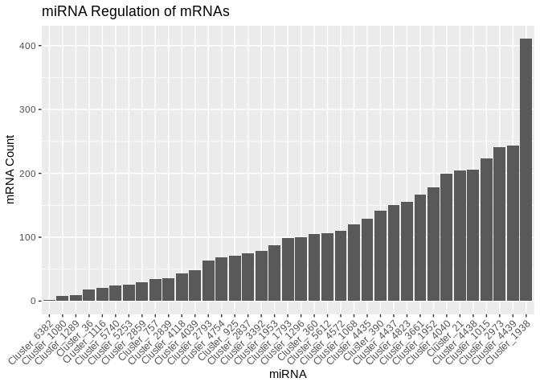
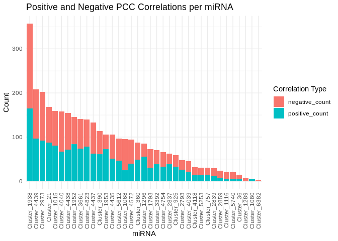
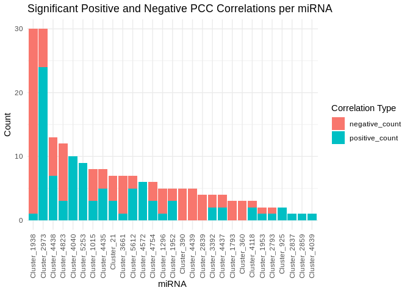
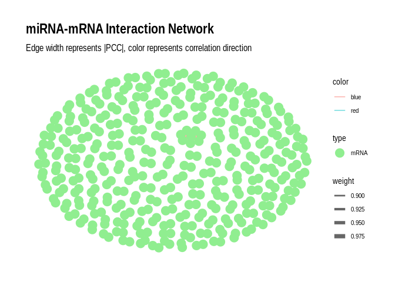

Ptuh mRNA-miRNA interactions
================
Jill Ashey
2025-02-06

This script will investigate mRNA-miRNA interactions using miranda
predictions for Ptuh.

Read in mRNA data

``` r
mRNA_counts <- read_csv("../output/06.2-Ptuh-Hisat/Ptuh-gene_count_matrix.csv")
```

    ## Rows: 31840 Columns: 6
    ## ── Column specification ────────────────────────────────────────────────────────
    ## Delimiter: ","
    ## chr (1): gene_id
    ## dbl (5): RNA-POC-47, RNA-POC-48, RNA-POC-50, RNA-POC-53, RNA-POC-57
    ## 
    ## ℹ Use `spec()` to retrieve the full column specification for this data.
    ## ℹ Specify the column types or set `show_col_types = FALSE` to quiet this message.

``` r
mRNA_counts <- as.data.frame(mRNA_counts)
rownames(mRNA_counts) <- mRNA_counts[,1] #set first column that contains gene names as rownames
mRNA_counts <- mRNA_counts[,-1] # remove column w/ gene names 

# Remove any genes with 0 counts across samples 
mRNA_counts<-mRNA_counts %>%
     mutate(Total = rowSums(.[, 1:5]))%>%
    filter(!Total==0)%>%
    dplyr::select(!Total)
```

Read in miRNA data

``` r
miRNA_counts <- read.delim("../output/03.1-Ptuh-sRNA-summary/Ptuh_miRNA_ShortStack_counts_formatted.txt")
head(miRNA_counts)
```

    ##             sample47 sample48 sample50 sample53 sample57
    ## Cluster_21      4846     2433     1968     1452     1397
    ## Cluster_36        39       44       20       41       33
    ## Cluster_360   142599   101636   141199    84760    52034
    ## Cluster_390      741      614      748      876      353
    ## Cluster_757     2201      960     1596      944      621
    ## Cluster_925    27988    22742    20636    26150     8840

``` r
# Remove any miRNAs with 0 for all samples 
miRNA_counts <- miRNA_counts %>%
     mutate(Total = rowSums(.[, 1:5]))%>%
    filter(!Total==0)%>%
    dplyr::select(!Total)
```

Rename columns to match miRNA df

``` r
mRNA_counts <- mRNA_counts %>%
  dplyr::rename("sample47" = "RNA-POC-47", "sample48" = "RNA-POC-48", "sample50" = "RNA-POC-50", "sample53" = "RNA-POC-53", "sample57" = "RNA-POC-57")
```

Read in miranda data

``` r
miranda_ptuh <- read.delim("../output/11-Ptuh-mRNA-miRNA-interactions/three_prime_interaction/miranda_strict_all_1kb_parsed_ptuh_updated.txt", header = F)
colnames(miranda_ptuh) <- c("miRNA", "mRNA", "score", "energy", "query_start_end", "subject_start_end", "total_bp_shared", "query_similar", "subject_similar")

# Format miranda df 
miranda_ptuh$miRNA <- sub("^>", "", miranda_ptuh$miRNA)  # Remove leading ">"
miranda_ptuh$miRNA <- sub("\\..*", "", miranda_ptuh$miRNA)  # Remove everything from the first period onwards
miranda_ptuh$mRNA <- sub("::.*", "", miranda_ptuh$mRNA)  # Remove everything from "::" onwards
miranda_ptuh$mRNA <- sub("ID=", "", miranda_ptuh$mRNA)  # Remove ID=

length(unique(miranda_ptuh$miRNA))
```

    ## [1] 37

``` r
length(unique(miranda_ptuh$mRNA))
```

    ## [1] 3628

``` r
dim(miranda_ptuh)
```

    ## [1] 4105    9

Summarize how many mRNAs each miRNA are predicted to interact with.
Summarize how many miRNAs each mRNA are predicted to interact with.

``` r
sum_mirna <- miranda_ptuh %>%
  group_by(miRNA) %>%
  summarise(mRNA_count = n_distinct(mRNA)) %>% 
  arrange(desc(mRNA_count))

ggplot(sum_mirna %>% arrange(desc(mRNA_count)), 
       aes(x = forcats::fct_reorder(miRNA, mRNA_count), y = mRNA_count)) +
  geom_col() +
  theme(axis.text.x = element_text(angle = 45, hjust = 1)) +
  labs(x = "miRNA", y = "mRNA Count", title = "miRNA Regulation of mRNAs") #+
```

<!-- -->

``` r
  #coord_flip()  # Optional: horizontal bar plot for better readability
ggsave("../output/11-Ptuh-mRNA-miRNA-interactions/three_prime_interaction/Ptuh-miRNA_number_of_targets.png", last_plot(), width = 12, height = 10, dpi = 300)
ggsave("../output/11-Ptuh-mRNA-miRNA-interactions/three_prime_interaction/Ptuh-miRNA_number_of_targets.pdf", last_plot(), width = 12, height = 10, dpi = 300)

# mRNA
sum_mrna <- miranda_ptuh %>%
  group_by(mRNA) %>%
  summarise(miRNA_count = n_distinct(miRNA))
```

Normalize counts

``` r
# Function to normalize counts (simple RPM normalization)
normalize_counts <- function(counts) {
  rpm <- t(t(counts) / colSums(counts)) * 1e6
  return(rpm)
}

# Normalize miRNA and mRNA counts
miRNA_norm <- normalize_counts(miRNA_counts)
#miRNA_norm <- as.matrix(miRNA_counts_filt)

mRNA_norm <- normalize_counts(mRNA_counts)
#mRNA_norm <- as.matrix(mRNA_counts_filt)
```

In my [Apul mRNA-miRNA interactions
code](https://github.com/urol-e5/deep-dive-expression/blob/main/D-Apul/code/09-Apul-mRNA-miRNA-interactions.Rmd),
I calculated the distance correlation coefficient using the energy
package. I am not going to do that now, but may come back to it later.

Calculate PCC

``` r
# Function to calculate PCC and p-value for a pair of vectors
calc_pcc <- function(x, y) {
  result <- cor.test(x, y, method = "pearson")
  return(c(PCC = result$estimate, p_value = result$p.value))
}

# Create a data frame of all miRNA-mRNA pairs
pairs <- expand.grid(miRNA = rownames(miRNA_norm), mRNA = rownames(mRNA_norm))

# Calculate PCC and p-value for each pair
pcc_results <- pairs %>%
  rowwise() %>%
  mutate(
    pcc_stats = list(calc_pcc(miRNA_norm[miRNA,], mRNA_norm[mRNA,]))
  ) %>%
  unnest_wider(pcc_stats)

# Adjust p-values for FDR
pcc_results <- pcc_results %>%
  mutate(adjusted_p_value = p.adjust(p_value, method = "fdr"))

# Remove 'gene-' from mRNA names 
pcc_results$mRNA <- gsub("gene-", "", pcc_results$mRNA)

# Save as csv
write.csv(pcc_results, "../output/11-Ptuh-mRNA-miRNA-interactions/three_prime_interaction/Ptuh-PCC_miRNA_mRNA.csv")
```

This df is too large to push to github, instead stored here:
`https://gannet.fish.washington.edu/kdurkin1/ravenbackups/deep-dive-expression/F-Ptuh/output/11-Ptuh-mRNA-miRNA-interactions/three_prime_interaction/Ptuh-PCC_miRNA_mRNA.csv`

Load back in for additional use

``` r
pcc_results <- read.csv("https://gannet.fish.washington.edu/kdurkin1/ravenbackups/deep-dive-expression/F-Ptuh/output/11-Ptuh-mRNA-miRNA-interactions/three_prime_interaction/Ptuh-PCC_miRNA_mRNA.csv")
```

Merge with miranda data

``` r
combined_data_pcc <- pcc_results %>%
  inner_join(miranda_ptuh, by = c("miRNA", "mRNA")) %>%
  na.omit()
dim(combined_data_pcc)
```

    ## [1] 3389   13

``` r
length(unique(combined_data_pcc$miRNA))
```

    ## [1] 37

``` r
length(unique(combined_data_pcc$mRNA))
```

    ## [1] 2989

``` r
# Save as csv
write.csv(combined_data_pcc, "../output/11-Ptuh-mRNA-miRNA-interactions/three_prime_interaction/Ptuh-miranda_PCC_miRNA_mRNA.csv")
```

Plot number of positive and negative interactions for each miRNA

``` r
# Summarize the data
summary_data <- combined_data_pcc %>%
  group_by(miRNA) %>%
  summarise(
    positive_count = sum(PCC.cor > 0),
    negative_count = sum(PCC.cor < 0)
  ) %>%
  mutate(total_count = positive_count + negative_count) %>%
  arrange(desc(total_count))
sum(summary_data$positive_count)
```

    ## [1] 1660

``` r
sum(summary_data$negative_count)
```

    ## [1] 1729

``` r
# Assess how many miRNAs have more positive correlations vs more negative ones 
positive_dominant <- sum(summary_data$positive_count > summary_data$negative_count)
negative_dominant <- sum(summary_data$negative_count > summary_data$positive_count)
equal <- sum(summary_data$positive_count == summary_data$negative_count)

cat("miRNAs with more positive correlations:", positive_dominant, "\n")
```

    ## miRNAs with more positive correlations: 14

``` r
cat("miRNAs with more negative correlations:", negative_dominant, "\n")
```

    ## miRNAs with more negative correlations: 21

``` r
cat("miRNAs with equal positive and negative correlations:", equal, "\n")
```

    ## miRNAs with equal positive and negative correlations: 2

``` r
# Reshape the data for plotting
plot_data <- summary_data %>%
  tidyr::pivot_longer(cols = c(positive_count, negative_count),
                      names_to = "correlation_type",
                      values_to = "count")

# Create the stacked bar plot
ggplot(plot_data, aes(x = reorder(miRNA, -total_count), y = count, fill = correlation_type)) +
  geom_bar(stat = "identity") +
  theme_minimal() +
  theme(axis.text.x = element_text(angle = 90, hjust = 1, vjust = 0.5)) +
  labs(x = "miRNA", y = "Count", fill = "Correlation Type",
       title = "Positive and Negative PCC Correlations per miRNA")
```

<!-- -->

``` r
ggsave("../output/11-Ptuh-mRNA-miRNA-interactions/three_prime_interaction/Ptuh-miRNA_positive_negative_correlations.png", last_plot(), width = 12, height = 10, dpi = 300)
ggsave("../output/11-Ptuh-mRNA-miRNA-interactions/three_prime_interaction/Ptuh-miRNA_positive_negative_correlations.pdf", last_plot(), width = 12, height = 10, dpi = 300)
```

Investigate data

``` r
# How many p-values are < 0.05 or < 0.1?
pvalue_summary_pcc <- combined_data_pcc %>%
  summarise(
    pvalue_0.05 = sum(p_value < 0.05),
    pvalue_0.1 = sum(p_value < 0.1),
  )
print(pvalue_summary_pcc)
```

    ##   pvalue_0.05 pvalue_0.1
    ## 1         203        353

``` r
# How many pairs have a PCC correlation > |0.5|?
corr_0.5 <- sum(abs(combined_data_pcc$PCC.cor) > 0.5)
cat("\nPairs with Pearson Correlation > 0.5:", corr_0.5, "\n")
```

    ## 
    ## Pairs with Pearson Correlation > 0.5: 1301

``` r
# Are there any pairs that have a PCC correlation > |0.5| and a p-value < 0.05?
pairs_of_interest_pcc <- combined_data_pcc %>%
  filter(abs(PCC.cor) > 0.5 & p_value < 0.05 )
cat("PCC correlation > |0.5| and a p-value < 0.05:", nrow(pairs_of_interest_pcc), "\n")
```

    ## PCC correlation > |0.5| and a p-value < 0.05: 203

``` r
# How many unique miRNAs and mRNAs have a PCC correlation > |0.5| and a p-value < 0.05?
length(unique(pairs_of_interest_pcc$miRNA))
```

    ## [1] 29

``` r
length(unique(pairs_of_interest_pcc$mRNA))
```

    ## [1] 191

``` r
# Save pairs of interest df as csv 
write.csv(pairs_of_interest_pcc, "../output/11-Ptuh-mRNA-miRNA-interactions/three_prime_interaction/Ptuh-miranda_PCC_sig_miRNA_mRNA.csv")
```

Read in data so that PCC does not have to be run again, as it is
computationally intensive

``` r
pairs_of_interest_pcc <- read.csv("../output/11-Ptuh-mRNA-miRNA-interactions/three_prime_interaction/Ptuh-miranda_PCC_sig_miRNA_mRNA.csv")
```

Plot number of SIGNIFICANT positive and negative interactions for each
miRNA

``` r
# Summarize the data
summary_data <- pairs_of_interest_pcc %>%
  group_by(miRNA) %>%
  summarise(
    positive_count = sum(PCC.cor > 0),
    negative_count = sum(PCC.cor < 0)
  ) %>%
  mutate(total_count = positive_count + negative_count) %>%
  arrange(desc(total_count))
sum(summary_data$positive_count)
```

    ## [1] 97

``` r
sum(summary_data$negative_count)
```

    ## [1] 106

``` r
# Assess how many miRNAs have more positive correlations vs more negative ones 
positive_dominant <- sum(summary_data$positive_count > summary_data$negative_count)
negative_dominant <- sum(summary_data$negative_count > summary_data$positive_count)
equal <- sum(summary_data$positive_count == summary_data$negative_count)

cat("miRNAs with more positive correlations:", positive_dominant, "\n")
```

    ## miRNAs with more positive correlations: 13

``` r
cat("miRNAs with more negative correlations:", negative_dominant, "\n")
```

    ## miRNAs with more negative correlations: 11

``` r
cat("miRNAs with equal positive and negative correlations:", equal, "\n")
```

    ## miRNAs with equal positive and negative correlations: 5

``` r
# Reshape the data for plotting
plot_data <- summary_data %>%
  tidyr::pivot_longer(cols = c(positive_count, negative_count),
                      names_to = "correlation_type",
                      values_to = "count")

# Create the stacked bar plot
ggplot(plot_data, aes(x = reorder(miRNA, -total_count), y = count, fill = correlation_type)) +
  geom_bar(stat = "identity") +
  theme_minimal() +
  theme(axis.text.x = element_text(angle = 90, hjust = 1, vjust = 0.5)) +
  labs(x = "miRNA", y = "Count", fill = "Correlation Type",
       title = "Significant Positive and Negative PCC Correlations per miRNA")
```

<!-- -->

``` r
ggsave("../output/11-Ptuh-mRNA-miRNA-interactions/three_prime_interaction/Ptuh-miRNA_significant_positive_negative_correlations.png", last_plot(), width = 12, height = 10, dpi = 300)
ggsave("../output/11-Ptuh-mRNA-miRNA-interactions/three_prime_interaction/Ptuh-miRNA_significant_positive_negative_correlations.pdf", last_plot(), width = 12, height = 10, dpi = 300)
```

Plot using igraph

``` r
# Create the graph
g <- graph_from_data_frame(pairs_of_interest_pcc, directed = FALSE)

# Add edge attributes
E(g)$weight <- abs(E(g)$PCC.cor)  # Use absolute PCC for edge weight
E(g)$color <- ifelse(E(g)$PCC.cor > 0, "blue", "red")  # Blue for positive, red for negative correlations

# Add node attributes
V(g)$type <- ifelse(V(g)$name %in% pairs_of_interest_pcc$miRNA, "miRNA", "mRNA")

# Convert to tbl_graph for ggraph
g_tbl <- as_tbl_graph(g)

# Create the plot
p <- ggraph(g_tbl, layout = "fr") +
  geom_edge_link(aes(edge_width = weight, color = color), alpha = 0.6) +
  geom_node_point(aes(color = type), size = 5) +
  #geom_node_text(aes(label = name), repel = TRUE, size = 3) +
  scale_edge_width(range = c(0.5, 3)) +
  scale_color_manual(values = c("miRNA" = "lightblue", "mRNA" = "lightgreen", "Positive correlation" = "blue", "Negative correlation" = "red")) +
  theme_graph() +
  labs(title = "miRNA-mRNA Interaction Network",
       subtitle = "Edge width represents |PCC|, color represents correlation direction");p
```

<!-- -->

``` r
ggsave("../output/11-Ptuh-mRNA-miRNA-interactions/three_prime_interaction/Ptuh-significant_miRNA_mRNA_network.png", p, width = 12, height = 10, dpi = 300)
```
