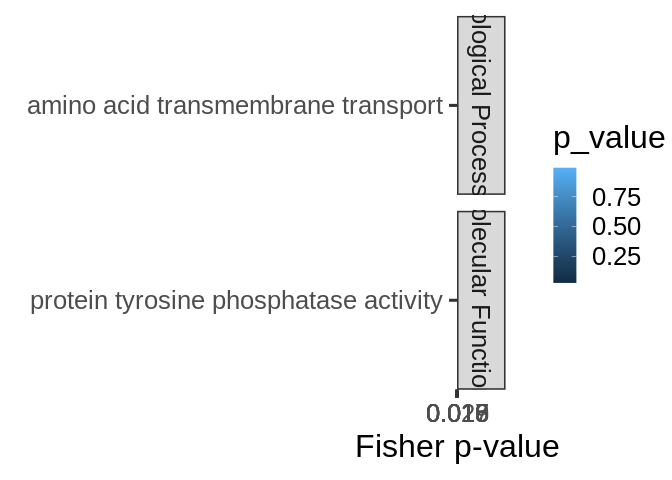
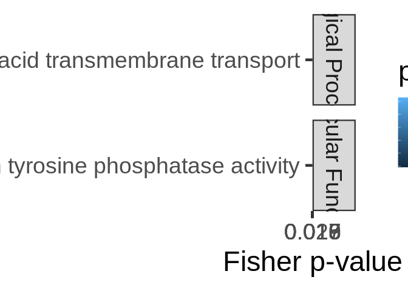
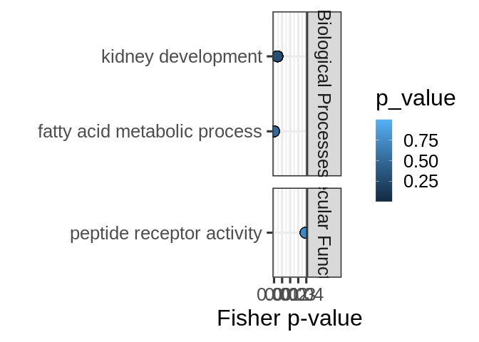
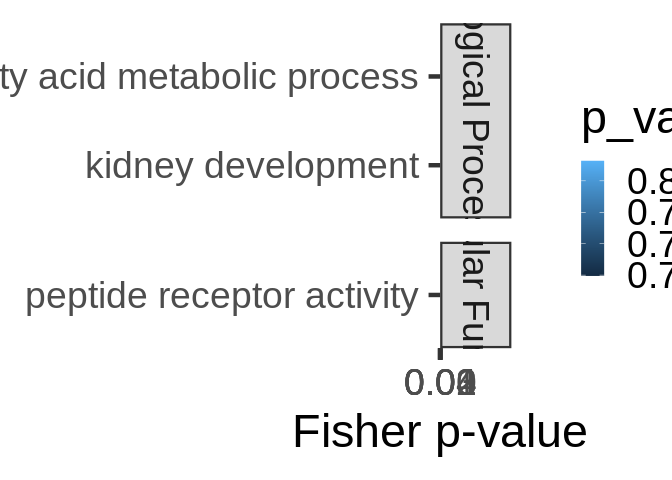
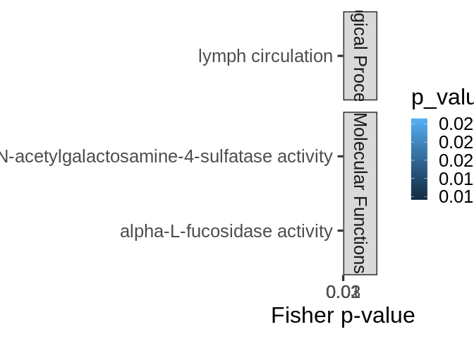
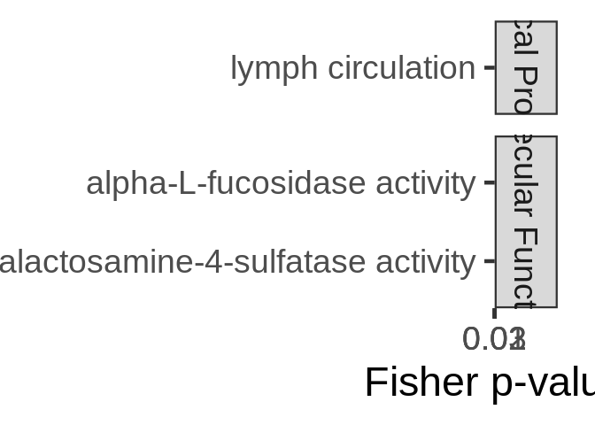
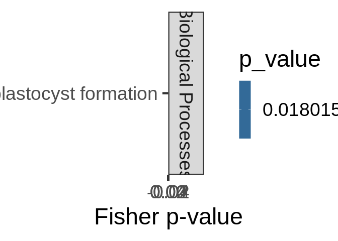

mRNA-miRNA interactions functional enrichment – CDS
================
Kathleen Durkin
2025-07-09

- <a href="#1-format-topgo-files" id="toc-1-format-topgo-files">1 Format
  topGO files</a>
  - <a href="#11-read-in-and-format-annotation-files"
    id="toc-11-read-in-and-format-annotation-files">1.1 Read in and format
    annotation files</a>
  - <a href="#12-set-up-gene2go-object"
    id="toc-12-set-up-gene2go-object">1.2 Set up gene2GO object</a>
  - <a href="#13-define-reference-set" id="toc-13-define-reference-set">1.3
    Define reference set</a>
- <a href="#2-cds" id="toc-2-cds">2 CDS</a>
  - <a href="#21-read-in-pccmiranda-data"
    id="toc-21-read-in-pccmiranda-data">2.1 Read in PCC/miranda data</a>
- <a href="#3-fa-of-all-mirna-targets"
  id="toc-3-fa-of-all-mirna-targets">3 FA of all miRNA targets</a>
- <a href="#4-fe-of-specific-mirnas-targets-all-targets"
  id="toc-4-fe-of-specific-mirnas-targets-all-targets">4 FE of specific
  miRNA’s targets (all targets)</a>
- <a href="#5-fe-of-specific-mirnas-targets-significant-cor-targets"
  id="toc-5-fe-of-specific-mirnas-targets-significant-cor-targets">5 FE of
  specific miRNA’s targets (significant cor targets)</a>
- <a
  href="#6-fe-of-all-targets-negatively-correlated-with-mirnas-regardless-of-correlation-significance"
  id="toc-6-fe-of-all-targets-negatively-correlated-with-mirnas-regardless-of-correlation-significance">6
  FE of all targets negatively correlated with miRNAs (regardless of
  correlation significance)</a>
  - <a href="#601-biological-processes"
    id="toc-601-biological-processes">6.0.1 Biological Processes</a>
  - <a href="#602-cellular-components"
    id="toc-602-cellular-components">6.0.2 Cellular Components</a>
  - <a href="#603-molecular-functions"
    id="toc-603-molecular-functions">6.0.3 Molecular Functions</a>
  - <a href="#604-join-ontologies" id="toc-604-join-ontologies">6.0.4 Join
    ontologies</a>
- <a
  href="#7-fe-of-all-targets-positively-correlated-with-mirnas-regardless-of-correlation-significance"
  id="toc-7-fe-of-all-targets-positively-correlated-with-mirnas-regardless-of-correlation-significance">7
  FE of all targets positively correlated with miRNAs (regardless of
  correlation significance)</a>
  - <a href="#701-biological-processes"
    id="toc-701-biological-processes">7.0.1 Biological Processes</a>
  - <a href="#702-cellular-components"
    id="toc-702-cellular-components">7.0.2 Cellular Components</a>
  - <a href="#703-molecular-functions"
    id="toc-703-molecular-functions">7.0.3 Molecular Functions</a>
  - <a href="#704-join-ontologies" id="toc-704-join-ontologies">7.0.4 Join
    ontologies</a>
- <a
  href="#8-fe-of-all-targets-significantly-negatively-correlated-with-mirnas"
  id="toc-8-fe-of-all-targets-significantly-negatively-correlated-with-mirnas">8
  FE of all targets significantly negatively correlated with miRNAs</a>
  - <a href="#801-biological-processes"
    id="toc-801-biological-processes">8.0.1 Biological Processes</a>
  - <a href="#802-cellular-components"
    id="toc-802-cellular-components">8.0.2 Cellular Components</a>
  - <a href="#803-molecular-functions"
    id="toc-803-molecular-functions">8.0.3 Molecular Functions</a>
  - <a href="#804-join-ontologies" id="toc-804-join-ontologies">8.0.4 Join
    ontologies</a>
- <a
  href="#9-fe-of-all-targets-significantly-positively-correlated-with-mirnas"
  id="toc-9-fe-of-all-targets-significantly-positively-correlated-with-mirnas">9
  FE of all targets significantly positively correlated with miRNAs</a>
  - <a href="#901-biological-processes"
    id="toc-901-biological-processes">9.0.1 Biological Processes</a>
  - <a href="#902-cellular-components"
    id="toc-902-cellular-components">9.0.2 Cellular Components</a>
  - <a href="#903-molecular-functions"
    id="toc-903-molecular-functions">9.0.3 Molecular Functions</a>
  - <a href="#904-join-ontologies" id="toc-904-join-ontologies">9.0.4 Join
    ontologies</a>

This script will use topGO to analyze functional enrichment of miRNA
targets for Ptuh in the CDS regions

Code used below was created by `Jill Ashey`, modified for use with
A.pulchra datasets by `Kathleen Durkin`

# 1 Format topGO files

## 1.1 Read in and format annotation files

``` r
# Read in Ptuh annotations
annot <- read.delim("../output/02-Ptuh-reference-annotation/Pocillopora_meandrina_HIv1-IDmapping-2024_09_04.tab")
# Remove unneeded columns 
annot <- annot %>% dplyr::select(-X, -V13)
# Ensure there are no duplicate rows
annot <- annot %>% distinct()
# Rename gene ID column
annot <- dplyr::rename(annot,
                       gene_ID = V1)

head(annot)
```

    ##                                         gene_ID     V3
    ## 1 Pocillopora_meandrina_HIv1___RNAseq.g27719.t1 Q7ZT01
    ## 2 Pocillopora_meandrina_HIv1___RNAseq.g14270.t1 P55112
    ## 3  Pocillopora_meandrina_HIv1___RNAseq.g2057.t1 Q9Y4D2
    ## 4  Pocillopora_meandrina_HIv1___RNAseq.g4696.t1 Q61670
    ## 5 Pocillopora_meandrina_HIv1___RNAseq.g14166.t1 Q10751
    ## 6  Pocillopora_meandrina_HIv1___RNAseq.g2438.t1 Q9EQD2
    ##                                                                                                                                                  Protein.names
    ## 1                                                                                           DNA replication complex GINS protein PSF3 (GINS complex subunit 3)
    ## 2                                                                                              Zinc metalloproteinase nas-4 (EC 3.4.24.-) (Nematode astacin 4)
    ## 3 Diacylglycerol lipase-alpha (DAGL-alpha) (DGL-alpha) (EC 3.1.1.116) (Neural stem cell-derived dendrite regulator) (Sn1-specific diacylglycerol lipase alpha)
    ## 4                                                                                                           H2.0-like homeobox protein (Homeobox protein HLX1)
    ## 5                                                              Angiotensin-converting enzyme (ACE) (EC 3.4.15.1) (Dipeptidyl carboxypeptidase I) (Kininase II)
    ## 6                                                         Neuropeptide FF receptor 2 (G-protein coupled receptor 74) (Neuropeptide G-protein coupled receptor)
    ##                               Organism
    ## 1 Xenopus laevis (African clawed frog)
    ## 2               Caenorhabditis elegans
    ## 3                 Homo sapiens (Human)
    ## 4                 Mus musculus (Mouse)
    ## 5              Gallus gallus (Chicken)
    ## 6              Rattus norvegicus (Rat)
    ##                                                                                                                                                                                                                                                                                                                                                                                                                                                                                                                                                                                                                                                                            Gene.Ontology..biological.process.
    ## 1                                                                                                                                                                                                                                                                                                                                                                                                                                                                                                                                                                                                                                                                                DNA replication [GO:0006260]
    ## 2                                                                                                                                                                                                                                                                                                                                                                                                                                                                                                                                                                                                                                                                                    proteolysis [GO:0006508]
    ## 3                                                                                                                                                                                                 arachidonic acid metabolic process [GO:0019369]; diacylglycerol catabolic process [GO:0046340]; endocannabinoid signaling pathway [GO:0071926]; G protein-coupled glutamate receptor signaling pathway [GO:0007216]; lipid catabolic process [GO:0016042]; neuroblast proliferation [GO:0007405]; neurogenesis [GO:0022008]; neurotransmitter biosynthetic process [GO:0042136]; regulation of neuroinflammatory response [GO:0150077]; retrograde trans-synaptic signaling by endocannabinoid [GO:0098921]
    ## 4 animal organ development [GO:0048513]; cell population proliferation [GO:0008283]; embryonic digestive tract morphogenesis [GO:0048557]; enteric nervous system development [GO:0048484]; epithelial cell proliferation [GO:0050673]; liver development [GO:0001889]; negative regulation of T-helper 2 cell differentiation [GO:0045629]; organ growth [GO:0035265]; positive regulation of epithelial cell proliferation [GO:0050679]; positive regulation of organ growth [GO:0046622]; positive regulation of T-helper 1 cell differentiation [GO:0045627]; skeletal muscle tissue development [GO:0007519]; T-helper 1 cell differentiation [GO:0045063]; T-helper 2 cell differentiation [GO:0045064]
    ## 5                                                                                                              angiotensin maturation [GO:0002003]; bradykinin catabolic process [GO:0010815]; cell population proliferation [GO:0008283]; hormone catabolic process [GO:0042447]; hormone metabolic process [GO:0042445]; kidney development [GO:0001822]; positive regulation of systemic arterial blood pressure [GO:0003084]; primitive erythrocyte differentiation [GO:0060319]; regulation of blood pressure [GO:0008217]; regulation of synaptic plasticity [GO:0048167]; regulation of systemic arterial blood pressure by renin-angiotensin [GO:0003081]; substance P catabolic process [GO:0010814]
    ## 6                                                                                                                                                                                                                                                                                                                                                                                                                                                                                G protein-coupled receptor signaling pathway [GO:0007186]; regulation of adenylate cyclase activity [GO:0045761]; regulation of cAMP-dependent protein kinase activity [GO:2000479]; regulation of MAPK cascade [GO:0043408]
    ##                                                                                                                                                                                                                                                                    Gene.Ontology.IDs
    ## 1                                                                                                                                                                                                                                     GO:0000811; GO:0003682; GO:0006260; GO:0071162
    ## 2                                                                                                                                                                                                                                     GO:0004222; GO:0005576; GO:0006508; GO:0008270
    ## 3 GO:0004465; GO:0004806; GO:0005737; GO:0005886; GO:0007216; GO:0007405; GO:0016042; GO:0016298; GO:0019369; GO:0022008; GO:0031901; GO:0032590; GO:0032591; GO:0042136; GO:0043196; GO:0045211; GO:0046340; GO:0046872; GO:0047372; GO:0071926; GO:0098839; GO:0098921; GO:0150077
    ## 4                                                                         GO:0000981; GO:0001889; GO:0005634; GO:0007519; GO:0008283; GO:0035265; GO:0043565; GO:0045063; GO:0045064; GO:0045627; GO:0045629; GO:0046622; GO:0048484; GO:0048513; GO:0048557; GO:0050673; GO:0050679
    ## 5             GO:0001822; GO:0002003; GO:0003081; GO:0003084; GO:0004180; GO:0004222; GO:0005737; GO:0005886; GO:0008217; GO:0008237; GO:0008241; GO:0008270; GO:0008283; GO:0010814; GO:0010815; GO:0016020; GO:0031404; GO:0042445; GO:0042447; GO:0048167; GO:0060319; GO:0070573
    ## 6                                                                                                                                                             GO:0004930; GO:0005886; GO:0007186; GO:0008188; GO:0015629; GO:0031628; GO:0042277; GO:0043408; GO:0045761; GO:2000479

``` r
# Looks good!
```

## 1.2 Set up gene2GO object

Want to isolate a list of GO terms per gene

``` r
gene2go <- annot %>% filter(!is.na(Gene.Ontology.IDs)) %>% dplyr::select(gene_ID, Gene.Ontology.IDs)
gene2go <- gene2go %>% dplyr::rename(GO.ID = Gene.Ontology.IDs)

gene2go_list <- setNames(
  strsplit(as.character(gene2go$GO.ID), ";"), 
  gene2go$gene_ID
)
```

Note: I think this means genes that had a Uniprot ID but no GO terms are
excluded from this analysis

## 1.3 Define reference set

Define reference set of genes. This should be all genes *found in our
samples*, NOT all genes in the A.pulchra genome. Some genes (e.g.,
reproduction pathways) may not be found/expected in our samples for
valid biological reasons.

``` r
# Read in counts matrix
Ptuh_counts <- read.csv("../output/06-Ptuh-Hisat/Ptuh-gene_count_matrix.csv")
# Exclude genes with all 0 counts
Ptuh_counts <- Ptuh_counts[rowSums(Ptuh_counts[, 2:6]) != 0, ]

# Select gene IDs of the genes present in our samples
all_genes <- Ptuh_counts$gene_id
length(all_genes)
```

    ## [1] 26508

So we have a reference set of 26508 genes present in our samples.

# 2 CDS

## 2.1 Read in PCC/miranda data

This is a table of all putative miRNA-mRNA binding predicted by miRanda,
plus Pearsons correlation coefficients for coexpression of each putative
binding pair.

``` r
data <- read.csv("../output/11.01-Ptuh-mRNA-miRNA-interactions-CDS_5UTR/miRanda_PCC_miRNA_CDS.csv")
data <- dplyr::rename(data,
               miRNA = V1,
               mRNA = V4.y)
head(data)
```

    ##   X        miRNA                                                       V2  V3
    ## 1 1 Cluster_1015 Pocillopora_meandrina_HIv1___Sc0000000:10461101-10462350 156
    ## 2 2 Cluster_1015 Pocillopora_meandrina_HIv1___Sc0000000:11022220-11024840 163
    ## 3 3 Cluster_1015 Pocillopora_meandrina_HIv1___Sc0000000:11058910-11061173 156
    ## 4 4 Cluster_1015 Pocillopora_meandrina_HIv1___Sc0000000:11210097-11219933 154
    ## 5 5 Cluster_1015 Pocillopora_meandrina_HIv1___Sc0000000:11331104-11348059 154
    ## 6 6 Cluster_1015 Pocillopora_meandrina_HIv1___Sc0000000:11331104-11348059 155
    ##     V4.x V5 V6    V7    V8 V9    V10    V11
    ## 1 -24.06  2 18   232   256 19 68.42% 84.21%
    ## 2 -21.06  2 21  1154  1176 20 70.00% 85.00%
    ## 3 -20.67  2 18   761   783 17 76.47% 82.35%
    ## 4 -20.17  2 20  8653  8676 20 65.00% 80.00%
    ## 5 -22.05  2 19 11738 11759 17 70.59% 76.47%
    ## 6 -20.71  2 21 13793 13815 20 70.00% 75.00%
    ##                                            mRNA    PCC.cor   p_value
    ## 1 Pocillopora_meandrina_HIv1___RNAseq.g21906.t1         NA        NA
    ## 2 Pocillopora_meandrina_HIv1___RNAseq.g21969.t2  0.3818556 0.5258949
    ## 3     Pocillopora_meandrina_HIv1___TS.g26741.t1         NA        NA
    ## 4 Pocillopora_meandrina_HIv1___RNAseq.g22007.t2 -0.3701560 0.5396981
    ## 5 Pocillopora_meandrina_HIv1___RNAseq.g22016.t2 -0.7438016 0.1495413
    ## 6 Pocillopora_meandrina_HIv1___RNAseq.g22016.t2 -0.7438016 0.1495413
    ##   adjusted_p_value
    ## 1               NA
    ## 2        0.9735530
    ## 3               NA
    ## 4        0.9735530
    ## 5        0.8840768
    ## 6        0.8840768

Set function to select genes of interest (ie those that have pvalue \<
0.05)

``` r
topDiffGenes <- function(allScore) {
return(allScore < 0.05)}
```

# 3 FA of all miRNA targets

Functional annotation of all putative miRNA targets

``` r
cor_bind_FA <- left_join(data, annot, by = c("mRNA" = "gene_ID")) %>% distinct()

nrow(cor_bind_FA)
```

    ## [1] 9537

``` r
nrow(cor_bind_FA[!is.na(cor_bind_FA$Gene.Ontology.IDs),])
```

    ## [1] 6325

Of the 9537 putative miRNA targets (CDS region) predicted by miRanda,
6325 have available annotations

``` r
sig_cor_bind_FA <- cor_bind_FA[cor_bind_FA$p_value < 0.05,]

# Remove rows where all values are NA
sig_cor_bind_FA <- sig_cor_bind_FA[!apply(is.na(sig_cor_bind_FA), 1, all), ]


nrow(sig_cor_bind_FA)
```

    ## [1] 499

``` r
nrow(sig_cor_bind_FA[!is.na(sig_cor_bind_FA$Gene.Ontology.IDs),])
```

    ## [1] 337

Of the 499 putative CDS miRNA targets predicted by miRanda that are also
have significantly correlated expression, only 337 have available
annotations.

Save

``` r
write.csv(cor_bind_FA, "../output/11.11-Ptuh-mRNA-miRNA-interactions-FE-CDS/miRNA_CDS_targets_FA.csv")
write.csv(sig_cor_bind_FA, "../output/11.11-Ptuh-mRNA-miRNA-interactions-FE-CDS/miRNA_CDS_sig_cor_targets_FA.csv")
```

# 4 FE of specific miRNA’s targets (all targets)

Create topGO function for use with miRNA names

``` r
miRNA_topGO_FE <- function(miRNA.name, input_interactions) {
  
  #Isolate genes in our input module of interest
  interacting_genes <- input_interactions %>%
    filter(miRNA == miRNA.name) %>%
    pull(mRNA)
  
  if (length(interacting_genes) > 0 && any(all_genes %in% interacting_genes)) {
    # Create factor for all reference genes, where 1 represents module membership and 0 means the gene is not in module of interest
    gene_list <- factor(as.integer(all_genes %in% interacting_genes))
    names(gene_list) <- all_genes
    str(gene_list)
    
    ## Biological Process ##
    # Create topGO object
    GO_BP <- new("topGOdata", 
                ontology = "BP", # Biological Process
                allGenes = gene_list,
                annot = annFUN.gene2GO, 
                gene2GO = gene2go_list,
                geneSel=topDiffGenes)
    
    # Run GO enrichment test
    GO_BP_FE <- runTest(GO_BP, algorithm = "weight01", statistic = "fisher")
    # View the results
    GO_BP_results <- GenTable(GO_BP, Fisher = GO_BP_FE, orderBy = "Fisher",  topNodes = 100, numChar = 51)
    # Filter by significant results
    GO_BP_results$Fisher<-as.numeric(GO_BP_results$Fisher)
    GO_BP_results_sig<-GO_BP_results[GO_BP_results$Fisher<0.05,]
    
    
    ## Molecular Function ##
    # Create topGO object
    GO_MF <- new("topGOdata", 
                ontology = "MF", # Molecular Function
                allGenes = gene_list,
                annot = annFUN.gene2GO, 
                gene2GO = gene2go_list,
                geneSel=topDiffGenes)
    
    # Run GO enrichment test
    GO_MF_FE <- runTest(GO_MF, algorithm = "weight01", statistic = "fisher")
    # View the results
    GO_MF_results <- GenTable(GO_MF, Fisher = GO_MF_FE, orderBy = "Fisher",  topNodes = 100, numChar = 51)
    # Filter by significant results
    GO_MF_results$Fisher<-as.numeric(GO_MF_results$Fisher)
    GO_MF_results_sig<-GO_MF_results[GO_MF_results$Fisher<0.05,]
  
    # Return
    # Add type column only if results exist
    if (nrow(GO_BP_results_sig) > 0) {
      GO_BP_results_sig$type <- "Biological.Process"
    }
    if (nrow(GO_MF_results_sig) > 0) {
      GO_MF_results_sig$type <- "Molecular.Function"
    }
    GO_results <- rbind(GO_BP_results_sig, GO_MF_results_sig)
    print(GO_results)
  }
}

miRNA_topGO_FE("Cluster_10051", cor_bind_FA)
```

Loop through all miRNA and run functional enrichment on the miRNA’s
targets (all predicted targets)

``` r
interacting_miRNAs <- unique(cor_bind_FA$miRNA) %>% na.omit
results_all_targets <- NULL  # initialize empty df

for(miRNA in interacting_miRNAs) {
  
  # Run topGO enrichment function
  miRNA_results <- miRNA_topGO_FE(miRNA, cor_bind_FA)
  
  # Only keep results if not empty
  if (nrow(miRNA_results) > 0) {
    
    # Add the miRNA source column
    miRNA_results$miRNA <- miRNA

    # Bind to the accumulating results data frame
    results_all_targets <- rbind(results_all_targets, miRNA_results)
  }
}
```

    ##  Factor w/ 2 levels "0","1": 1 1 1 1 1 1 1 1 1 1 ...
    ##  - attr(*, "names")= chr [1:26508] "Pocillopora_meandrina_HIv1___RNAseq.g27475.t1" "Pocillopora_meandrina_HIv1___RNAseq.g7358.t1" "Pocillopora_meandrina_HIv1___RNAseq.g2989.t1" "Pocillopora_meandrina_HIv1___RNAseq.g5036.t1" ...

    ## 
    ## Building most specific GOs .....

    ##  ( 87 GO terms found. )

    ## 
    ## Build GO DAG topology ..........

    ##  ( 592 GO terms and 1118 relations. )

    ## 
    ## Annotating nodes ...............

    ##  ( 218 genes annotated to the GO terms. )

    ## 
    ##           -- Weight01 Algorithm -- 
    ## 
    ##       the algorithm is scoring 106 nontrivial nodes
    ##       parameters: 
    ##           test statistic: fisher

    ## 
    ##   Level 10:  4 nodes to be scored    (0 eliminated genes)

    ## 
    ##   Level 9:   5 nodes to be scored    (0 eliminated genes)

    ## 
    ##   Level 8:   7 nodes to be scored    (25 eliminated genes)

    ## 
    ##   Level 7:   9 nodes to be scored    (28 eliminated genes)

    ## 
    ##   Level 6:   14 nodes to be scored   (43 eliminated genes)

    ## 
    ##   Level 5:   21 nodes to be scored   (52 eliminated genes)

    ## 
    ##   Level 4:   18 nodes to be scored   (65 eliminated genes)

    ## 
    ##   Level 3:   18 nodes to be scored   (122 eliminated genes)

    ## 
    ##   Level 2:   9 nodes to be scored    (181 eliminated genes)

    ## 
    ##   Level 1:   1 nodes to be scored    (211 eliminated genes)

    ## 
    ## Building most specific GOs .....

    ##  ( 153 GO terms found. )

    ## 
    ## Build GO DAG topology ..........

    ##  ( 380 GO terms and 492 relations. )

    ## 
    ## Annotating nodes ...............

    ##  ( 503 genes annotated to the GO terms. )

    ## 
    ##           -- Weight01 Algorithm -- 
    ## 
    ##       the algorithm is scoring 94 nontrivial nodes
    ##       parameters: 
    ##           test statistic: fisher

    ## 
    ##   Level 9:   3 nodes to be scored    (0 eliminated genes)

    ## 
    ##   Level 8:   5 nodes to be scored    (0 eliminated genes)

    ## 
    ##   Level 7:   11 nodes to be scored   (26 eliminated genes)

    ## 
    ##   Level 6:   16 nodes to be scored   (35 eliminated genes)

    ## 
    ##   Level 5:   21 nodes to be scored   (54 eliminated genes)

    ## 
    ##   Level 4:   20 nodes to be scored   (125 eliminated genes)

    ## 
    ##   Level 3:   13 nodes to be scored   (258 eliminated genes)

    ## 
    ##   Level 2:   4 nodes to be scored    (353 eliminated genes)

    ## 
    ##   Level 1:   1 nodes to be scored    (450 eliminated genes)

    ##        GO.ID                         Term Annotated Significant Expected
    ## 1 GO:0006631 fatty acid metabolic process         8           7     0.66
    ## 2 GO:0005262     calcium channel activity         3           2     0.17
    ##    Fisher               type
    ## 1 5.8e-08 Biological.Process
    ## 2 8.7e-03 Molecular.Function
    ##  Factor w/ 2 levels "0","1": 1 1 1 1 1 1 1 1 1 1 ...
    ##  - attr(*, "names")= chr [1:26508] "Pocillopora_meandrina_HIv1___RNAseq.g27475.t1" "Pocillopora_meandrina_HIv1___RNAseq.g7358.t1" "Pocillopora_meandrina_HIv1___RNAseq.g2989.t1" "Pocillopora_meandrina_HIv1___RNAseq.g5036.t1" ...

    ## 
    ## Building most specific GOs .....

    ##  ( 87 GO terms found. )

    ## 
    ## Build GO DAG topology ..........

    ##  ( 592 GO terms and 1118 relations. )

    ## 
    ## Annotating nodes ...............

    ##  ( 218 genes annotated to the GO terms. )

    ## 
    ##           -- Weight01 Algorithm -- 
    ## 
    ##       the algorithm is scoring 53 nontrivial nodes
    ##       parameters: 
    ##           test statistic: fisher

    ## 
    ##   Level 11:  1 nodes to be scored    (0 eliminated genes)

    ## 
    ##   Level 10:  3 nodes to be scored    (0 eliminated genes)

    ## 
    ##   Level 9:   3 nodes to be scored    (9 eliminated genes)

    ## 
    ##   Level 8:   3 nodes to be scored    (32 eliminated genes)

    ## 
    ##   Level 7:   6 nodes to be scored    (33 eliminated genes)

    ## 
    ##   Level 6:   7 nodes to be scored    (38 eliminated genes)

    ## 
    ##   Level 5:   10 nodes to be scored   (43 eliminated genes)

    ## 
    ##   Level 4:   7 nodes to be scored    (49 eliminated genes)

    ## 
    ##   Level 3:   6 nodes to be scored    (96 eliminated genes)

    ## 
    ##   Level 2:   6 nodes to be scored    (114 eliminated genes)

    ## 
    ##   Level 1:   1 nodes to be scored    (132 eliminated genes)

    ## 
    ## Building most specific GOs .....

    ##  ( 153 GO terms found. )

    ## 
    ## Build GO DAG topology ..........

    ##  ( 380 GO terms and 492 relations. )

    ## 
    ## Annotating nodes ...............

    ##  ( 503 genes annotated to the GO terms. )

    ## 
    ##           -- Weight01 Algorithm -- 
    ## 
    ##       the algorithm is scoring 83 nontrivial nodes
    ##       parameters: 
    ##           test statistic: fisher

    ## 
    ##   Level 12:  1 nodes to be scored    (0 eliminated genes)

    ## 
    ##   Level 11:  1 nodes to be scored    (0 eliminated genes)

    ## 
    ##   Level 10:  2 nodes to be scored    (1 eliminated genes)

    ## 
    ##   Level 9:   6 nodes to be scored    (3 eliminated genes)

    ## 
    ##   Level 8:   6 nodes to be scored    (11 eliminated genes)

    ## 
    ##   Level 7:   7 nodes to be scored    (24 eliminated genes)

    ## 
    ##   Level 6:   11 nodes to be scored   (26 eliminated genes)

    ## 
    ##   Level 5:   13 nodes to be scored   (47 eliminated genes)

    ## 
    ##   Level 4:   17 nodes to be scored   (113 eliminated genes)

    ## 
    ##   Level 3:   13 nodes to be scored   (172 eliminated genes)

    ## 
    ##   Level 2:   5 nodes to be scored    (343 eliminated genes)

    ## 
    ##   Level 1:   1 nodes to be scored    (453 eliminated genes)

    ##        GO.ID                             Term Annotated Significant Expected
    ## 1 GO:0001825             blastocyst formation         2           1     0.04
    ## 2 GO:0004972 NMDA glutamate receptor activity         1           1     0.03
    ##   Fisher               type
    ## 1  0.036 Biological.Process
    ## 2  0.034 Molecular.Function
    ##  Factor w/ 2 levels "0","1": 1 1 1 1 1 1 1 1 1 1 ...
    ##  - attr(*, "names")= chr [1:26508] "Pocillopora_meandrina_HIv1___RNAseq.g27475.t1" "Pocillopora_meandrina_HIv1___RNAseq.g7358.t1" "Pocillopora_meandrina_HIv1___RNAseq.g2989.t1" "Pocillopora_meandrina_HIv1___RNAseq.g5036.t1" ...

    ## 
    ## Building most specific GOs .....

    ##  ( 87 GO terms found. )

    ## 
    ## Build GO DAG topology ..........

    ##  ( 592 GO terms and 1118 relations. )

    ## 
    ## Annotating nodes ...............

    ##  ( 218 genes annotated to the GO terms. )

    ## 
    ##           -- Weight01 Algorithm -- 
    ## 
    ##       the algorithm is scoring 9 nontrivial nodes
    ##       parameters: 
    ##           test statistic: fisher

    ## 
    ##   Level 8:   1 nodes to be scored    (0 eliminated genes)

    ## 
    ##   Level 7:   1 nodes to be scored    (0 eliminated genes)

    ## 
    ##   Level 6:   1 nodes to be scored    (6 eliminated genes)

    ## 
    ##   Level 5:   1 nodes to be scored    (6 eliminated genes)

    ## 
    ##   Level 4:   1 nodes to be scored    (6 eliminated genes)

    ## 
    ##   Level 3:   1 nodes to be scored    (8 eliminated genes)

    ## 
    ##   Level 2:   2 nodes to be scored    (55 eliminated genes)

    ## 
    ##   Level 1:   1 nodes to be scored    (62 eliminated genes)

    ## 
    ## Building most specific GOs .....

    ##  ( 153 GO terms found. )

    ## 
    ## Build GO DAG topology ..........

    ##  ( 380 GO terms and 492 relations. )

    ## 
    ## Annotating nodes ...............

    ##  ( 503 genes annotated to the GO terms. )

    ## 
    ##           -- Weight01 Algorithm -- 
    ## 
    ##       the algorithm is scoring 23 nontrivial nodes
    ##       parameters: 
    ##           test statistic: fisher

    ## 
    ##   Level 9:   1 nodes to be scored    (0 eliminated genes)

    ## 
    ##   Level 8:   2 nodes to be scored    (0 eliminated genes)

    ## 
    ##   Level 7:   2 nodes to be scored    (1 eliminated genes)

    ## 
    ##   Level 6:   3 nodes to be scored    (1 eliminated genes)

    ## 
    ##   Level 5:   4 nodes to be scored    (4 eliminated genes)

    ## 
    ##   Level 4:   6 nodes to be scored    (21 eliminated genes)

    ## 
    ##   Level 3:   2 nodes to be scored    (26 eliminated genes)

    ## 
    ##   Level 2:   2 nodes to be scored    (51 eliminated genes)

    ## 
    ##   Level 1:   1 nodes to be scored    (74 eliminated genes)

    ##        GO.ID                                   Term Annotated Significant
    ## 1 GO:0001701         in utero embryonic development         6           1
    ## 2 GO:0005351 carbohydrate:proton symporter activity         1           1
    ## 3 GO:0004503                    tyrosinase activity         4           1
    ##   Expected Fisher               type
    ## 1     0.03  0.028 Biological.Process
    ## 2     0.00  0.004 Molecular.Function
    ## 3     0.02  0.016 Molecular.Function
    ##  Factor w/ 2 levels "0","1": 1 1 1 1 1 1 1 1 1 1 ...
    ##  - attr(*, "names")= chr [1:26508] "Pocillopora_meandrina_HIv1___RNAseq.g27475.t1" "Pocillopora_meandrina_HIv1___RNAseq.g7358.t1" "Pocillopora_meandrina_HIv1___RNAseq.g2989.t1" "Pocillopora_meandrina_HIv1___RNAseq.g5036.t1" ...

    ## 
    ## Building most specific GOs .....

    ##  ( 87 GO terms found. )

    ## 
    ## Build GO DAG topology ..........

    ##  ( 592 GO terms and 1118 relations. )

    ## 
    ## Annotating nodes ...............

    ##  ( 218 genes annotated to the GO terms. )

    ## 
    ##           -- Weight01 Algorithm -- 
    ## 
    ##       the algorithm is scoring 0 nontrivial nodes
    ##       parameters: 
    ##           test statistic: fisher

    ## Warning in getSigGroups(object, test.stat): No enrichment can pe performed -
    ## there are no feasible GO terms!

    ## 
    ## Building most specific GOs .....

    ##  ( 153 GO terms found. )

    ## 
    ## Build GO DAG topology ..........

    ##  ( 380 GO terms and 492 relations. )

    ## 
    ## Annotating nodes ...............

    ##  ( 503 genes annotated to the GO terms. )

    ## 
    ##           -- Weight01 Algorithm -- 
    ## 
    ##       the algorithm is scoring 0 nontrivial nodes
    ##       parameters: 
    ##           test statistic: fisher

    ## Warning in getSigGroups(object, test.stat): No enrichment can pe performed -
    ## there are no feasible GO terms!

    ## [1] GO.ID       Term        Annotated   Significant Expected    Fisher     
    ## <0 rows> (or 0-length row.names)
    ##  Factor w/ 2 levels "0","1": 1 1 1 1 1 1 1 1 1 1 ...
    ##  - attr(*, "names")= chr [1:26508] "Pocillopora_meandrina_HIv1___RNAseq.g27475.t1" "Pocillopora_meandrina_HIv1___RNAseq.g7358.t1" "Pocillopora_meandrina_HIv1___RNAseq.g2989.t1" "Pocillopora_meandrina_HIv1___RNAseq.g5036.t1" ...

    ## 
    ## Building most specific GOs .....

    ##  ( 87 GO terms found. )

    ## 
    ## Build GO DAG topology ..........

    ##  ( 592 GO terms and 1118 relations. )

    ## 
    ## Annotating nodes ...............

    ##  ( 218 genes annotated to the GO terms. )

    ## 
    ##           -- Weight01 Algorithm -- 
    ## 
    ##       the algorithm is scoring 0 nontrivial nodes
    ##       parameters: 
    ##           test statistic: fisher

    ## Warning in getSigGroups(object, test.stat): No enrichment can pe performed -
    ## there are no feasible GO terms!

    ## 
    ## Building most specific GOs .....

    ##  ( 153 GO terms found. )

    ## 
    ## Build GO DAG topology ..........

    ##  ( 380 GO terms and 492 relations. )

    ## 
    ## Annotating nodes ...............

    ##  ( 503 genes annotated to the GO terms. )

    ## 
    ##           -- Weight01 Algorithm -- 
    ## 
    ##       the algorithm is scoring 6 nontrivial nodes
    ##       parameters: 
    ##           test statistic: fisher

    ## 
    ##   Level 6:   1 nodes to be scored    (0 eliminated genes)

    ## 
    ##   Level 5:   1 nodes to be scored    (0 eliminated genes)

    ## 
    ##   Level 4:   1 nodes to be scored    (21 eliminated genes)

    ## 
    ##   Level 3:   1 nodes to be scored    (40 eliminated genes)

    ## 
    ##   Level 2:   1 nodes to be scored    (40 eliminated genes)

    ## 
    ##   Level 1:   1 nodes to be scored    (52 eliminated genes)

    ##        GO.ID                Term Annotated Significant Expected Fisher
    ## 1 GO:0005509 calcium ion binding        21           1     0.04  0.042
    ##                 type
    ## 1 Molecular.Function
    ##  Factor w/ 2 levels "0","1": 1 1 1 1 1 1 1 1 1 1 ...
    ##  - attr(*, "names")= chr [1:26508] "Pocillopora_meandrina_HIv1___RNAseq.g27475.t1" "Pocillopora_meandrina_HIv1___RNAseq.g7358.t1" "Pocillopora_meandrina_HIv1___RNAseq.g2989.t1" "Pocillopora_meandrina_HIv1___RNAseq.g5036.t1" ...

    ## 
    ## Building most specific GOs .....

    ##  ( 87 GO terms found. )

    ## 
    ## Build GO DAG topology ..........

    ##  ( 592 GO terms and 1118 relations. )

    ## 
    ## Annotating nodes ...............

    ##  ( 218 genes annotated to the GO terms. )

    ## 
    ##           -- Weight01 Algorithm -- 
    ## 
    ##       the algorithm is scoring 41 nontrivial nodes
    ##       parameters: 
    ##           test statistic: fisher

    ## 
    ##   Level 11:  1 nodes to be scored    (0 eliminated genes)

    ## 
    ##   Level 10:  1 nodes to be scored    (0 eliminated genes)

    ## 
    ##   Level 9:   1 nodes to be scored    (9 eliminated genes)

    ## 
    ##   Level 8:   2 nodes to be scored    (10 eliminated genes)

    ## 
    ##   Level 7:   4 nodes to be scored    (11 eliminated genes)

    ## 
    ##   Level 6:   4 nodes to be scored    (17 eliminated genes)

    ## 
    ##   Level 5:   7 nodes to be scored    (17 eliminated genes)

    ## 
    ##   Level 4:   7 nodes to be scored    (23 eliminated genes)

    ## 
    ##   Level 3:   7 nodes to be scored    (91 eliminated genes)

    ## 
    ##   Level 2:   6 nodes to be scored    (113 eliminated genes)

    ## 
    ##   Level 1:   1 nodes to be scored    (135 eliminated genes)

    ## 
    ## Building most specific GOs .....

    ##  ( 153 GO terms found. )

    ## 
    ## Build GO DAG topology ..........

    ##  ( 380 GO terms and 492 relations. )

    ## 
    ## Annotating nodes ...............

    ##  ( 503 genes annotated to the GO terms. )

    ## 
    ##           -- Weight01 Algorithm -- 
    ## 
    ##       the algorithm is scoring 37 nontrivial nodes
    ##       parameters: 
    ##           test statistic: fisher

    ## 
    ##   Level 10:  1 nodes to be scored    (0 eliminated genes)

    ## 
    ##   Level 9:   1 nodes to be scored    (0 eliminated genes)

    ## 
    ##   Level 8:   2 nodes to be scored    (2 eliminated genes)

    ## 
    ##   Level 7:   2 nodes to be scored    (5 eliminated genes)

    ## 
    ##   Level 6:   5 nodes to be scored    (7 eliminated genes)

    ## 
    ##   Level 5:   7 nodes to be scored    (8 eliminated genes)

    ## 
    ##   Level 4:   8 nodes to be scored    (67 eliminated genes)

    ## 
    ##   Level 3:   6 nodes to be scored    (182 eliminated genes)

    ## 
    ##   Level 2:   4 nodes to be scored    (222 eliminated genes)

    ## 
    ##   Level 1:   1 nodes to be scored    (306 eliminated genes)

    ##        GO.ID                                                   Term Annotated
    ## 1 GO:0001822                                     kidney development         6
    ## 2 GO:0004725                  protein tyrosine phosphatase activity         2
    ## 3 GO:0005231 excitatory extracellular ligand-gated ion channel a...         2
    ##   Significant Expected Fisher               type
    ## 1           2     0.11 0.0037 Biological.Process
    ## 2           1     0.02 0.0240 Molecular.Function
    ## 3           1     0.02 0.0240 Molecular.Function
    ##  Factor w/ 2 levels "0","1": 1 1 1 1 1 1 1 1 1 1 ...
    ##  - attr(*, "names")= chr [1:26508] "Pocillopora_meandrina_HIv1___RNAseq.g27475.t1" "Pocillopora_meandrina_HIv1___RNAseq.g7358.t1" "Pocillopora_meandrina_HIv1___RNAseq.g2989.t1" "Pocillopora_meandrina_HIv1___RNAseq.g5036.t1" ...

    ## 
    ## Building most specific GOs .....

    ##  ( 87 GO terms found. )

    ## 
    ## Build GO DAG topology ..........

    ##  ( 592 GO terms and 1118 relations. )

    ## 
    ## Annotating nodes ...............

    ##  ( 218 genes annotated to the GO terms. )

    ## 
    ##           -- Weight01 Algorithm -- 
    ## 
    ##       the algorithm is scoring 35 nontrivial nodes
    ##       parameters: 
    ##           test statistic: fisher

    ## 
    ##   Level 9:   1 nodes to be scored    (0 eliminated genes)

    ## 
    ##   Level 8:   3 nodes to be scored    (0 eliminated genes)

    ## 
    ##   Level 7:   4 nodes to be scored    (1 eliminated genes)

    ## 
    ##   Level 6:   5 nodes to be scored    (9 eliminated genes)

    ## 
    ##   Level 5:   5 nodes to be scored    (10 eliminated genes)

    ## 
    ##   Level 4:   6 nodes to be scored    (23 eliminated genes)

    ## 
    ##   Level 3:   5 nodes to be scored    (84 eliminated genes)

    ## 
    ##   Level 2:   5 nodes to be scored    (116 eliminated genes)

    ## 
    ##   Level 1:   1 nodes to be scored    (155 eliminated genes)

    ## 
    ## Building most specific GOs .....

    ##  ( 153 GO terms found. )

    ## 
    ## Build GO DAG topology ..........

    ##  ( 380 GO terms and 492 relations. )

    ## 
    ## Annotating nodes ...............

    ##  ( 503 genes annotated to the GO terms. )

    ## 
    ##           -- Weight01 Algorithm -- 
    ## 
    ##       the algorithm is scoring 10 nontrivial nodes
    ##       parameters: 
    ##           test statistic: fisher

    ## 
    ##   Level 5:   1 nodes to be scored    (0 eliminated genes)

    ## 
    ##   Level 4:   3 nodes to be scored    (0 eliminated genes)

    ## 
    ##   Level 3:   4 nodes to be scored    (8 eliminated genes)

    ## 
    ##   Level 2:   1 nodes to be scored    (92 eliminated genes)

    ## 
    ##   Level 1:   1 nodes to be scored    (119 eliminated genes)

    ##        GO.ID                              Term Annotated Significant Expected
    ## 1 GO:0001523        retinoid metabolic process         1           1     0.02
    ## 2 GO:0001817 regulation of cytokine production         1           1     0.02
    ## 3 GO:0001654                   eye development         2           1     0.04
    ## 4 GO:0005178                  integrin binding         8           1     0.05
    ##   Fisher               type
    ## 1  0.018 Biological.Process
    ## 2  0.018 Biological.Process
    ## 3  0.036 Biological.Process
    ## 4  0.047 Molecular.Function
    ##  Factor w/ 2 levels "0","1": 1 1 1 1 1 1 1 1 1 1 ...
    ##  - attr(*, "names")= chr [1:26508] "Pocillopora_meandrina_HIv1___RNAseq.g27475.t1" "Pocillopora_meandrina_HIv1___RNAseq.g7358.t1" "Pocillopora_meandrina_HIv1___RNAseq.g2989.t1" "Pocillopora_meandrina_HIv1___RNAseq.g5036.t1" ...

    ## 
    ## Building most specific GOs .....

    ##  ( 87 GO terms found. )

    ## 
    ## Build GO DAG topology ..........

    ##  ( 592 GO terms and 1118 relations. )

    ## 
    ## Annotating nodes ...............

    ##  ( 218 genes annotated to the GO terms. )

    ## 
    ##           -- Weight01 Algorithm -- 
    ## 
    ##       the algorithm is scoring 202 nontrivial nodes
    ##       parameters: 
    ##           test statistic: fisher

    ## 
    ##   Level 15:  1 nodes to be scored    (0 eliminated genes)

    ## 
    ##   Level 14:  1 nodes to be scored    (0 eliminated genes)

    ## 
    ##   Level 13:  1 nodes to be scored    (1 eliminated genes)

    ## 
    ##   Level 12:  2 nodes to be scored    (1 eliminated genes)

    ## 
    ##   Level 11:  6 nodes to be scored    (1 eliminated genes)

    ## 
    ##   Level 10:  10 nodes to be scored   (1 eliminated genes)

    ## 
    ##   Level 9:   15 nodes to be scored   (10 eliminated genes)

    ## 
    ##   Level 8:   15 nodes to be scored   (38 eliminated genes)

    ## 
    ##   Level 7:   21 nodes to be scored   (48 eliminated genes)

    ## 
    ##   Level 6:   25 nodes to be scored   (52 eliminated genes)

    ## 
    ##   Level 5:   37 nodes to be scored   (64 eliminated genes)

    ## 
    ##   Level 4:   32 nodes to be scored   (110 eliminated genes)

    ## 
    ##   Level 3:   24 nodes to be scored   (163 eliminated genes)

    ## 
    ##   Level 2:   11 nodes to be scored   (191 eliminated genes)

    ## 
    ##   Level 1:   1 nodes to be scored    (207 eliminated genes)

    ## 
    ## Building most specific GOs .....

    ##  ( 153 GO terms found. )

    ## 
    ## Build GO DAG topology ..........

    ##  ( 380 GO terms and 492 relations. )

    ## 
    ## Annotating nodes ...............

    ##  ( 503 genes annotated to the GO terms. )

    ## 
    ##           -- Weight01 Algorithm -- 
    ## 
    ##       the algorithm is scoring 120 nontrivial nodes
    ##       parameters: 
    ##           test statistic: fisher

    ## 
    ##   Level 10:  1 nodes to be scored    (0 eliminated genes)

    ## 
    ##   Level 9:   3 nodes to be scored    (0 eliminated genes)

    ## 
    ##   Level 8:   5 nodes to be scored    (3 eliminated genes)

    ## 
    ##   Level 7:   14 nodes to be scored   (16 eliminated genes)

    ## 
    ##   Level 6:   19 nodes to be scored   (23 eliminated genes)

    ## 
    ##   Level 5:   27 nodes to be scored   (64 eliminated genes)

    ## 
    ##   Level 4:   27 nodes to be scored   (148 eliminated genes)

    ## 
    ##   Level 3:   17 nodes to be scored   (280 eliminated genes)

    ## 
    ##   Level 2:   6 nodes to be scored    (392 eliminated genes)

    ## 
    ##   Level 1:   1 nodes to be scored    (473 eliminated genes)

    ##        GO.ID                               Term Annotated Significant Expected
    ## 1 GO:0003333 amino acid transmembrane transport         2           2     0.14
    ## 2 GO:0005524                        ATP binding        11           3     0.87
    ##   Fisher               type
    ## 1 0.0044 Biological.Process
    ## 2 0.0490 Molecular.Function
    ##  Factor w/ 2 levels "0","1": 1 1 1 1 1 1 1 1 1 1 ...
    ##  - attr(*, "names")= chr [1:26508] "Pocillopora_meandrina_HIv1___RNAseq.g27475.t1" "Pocillopora_meandrina_HIv1___RNAseq.g7358.t1" "Pocillopora_meandrina_HIv1___RNAseq.g2989.t1" "Pocillopora_meandrina_HIv1___RNAseq.g5036.t1" ...

    ## 
    ## Building most specific GOs .....

    ##  ( 87 GO terms found. )

    ## 
    ## Build GO DAG topology ..........

    ##  ( 592 GO terms and 1118 relations. )

    ## 
    ## Annotating nodes ...............

    ##  ( 218 genes annotated to the GO terms. )

    ## 
    ##           -- Weight01 Algorithm -- 
    ## 
    ##       the algorithm is scoring 19 nontrivial nodes
    ##       parameters: 
    ##           test statistic: fisher

    ## 
    ##   Level 10:  1 nodes to be scored    (0 eliminated genes)

    ## 
    ##   Level 9:   1 nodes to be scored    (0 eliminated genes)

    ## 
    ##   Level 8:   2 nodes to be scored    (20 eliminated genes)

    ## 
    ##   Level 7:   2 nodes to be scored    (20 eliminated genes)

    ## 
    ##   Level 6:   3 nodes to be scored    (27 eliminated genes)

    ## 
    ##   Level 5:   3 nodes to be scored    (27 eliminated genes)

    ## 
    ##   Level 4:   3 nodes to be scored    (27 eliminated genes)

    ## 
    ##   Level 3:   1 nodes to be scored    (48 eliminated genes)

    ## 
    ##   Level 2:   2 nodes to be scored    (59 eliminated genes)

    ## 
    ##   Level 1:   1 nodes to be scored    (62 eliminated genes)

    ## 
    ## Building most specific GOs .....

    ##  ( 153 GO terms found. )

    ## 
    ## Build GO DAG topology ..........

    ##  ( 380 GO terms and 492 relations. )

    ## 
    ## Annotating nodes ...............

    ##  ( 503 genes annotated to the GO terms. )

    ## 
    ##           -- Weight01 Algorithm -- 
    ## 
    ##       the algorithm is scoring 57 nontrivial nodes
    ##       parameters: 
    ##           test statistic: fisher

    ## 
    ##   Level 8:   1 nodes to be scored    (0 eliminated genes)

    ## 
    ##   Level 7:   4 nodes to be scored    (0 eliminated genes)

    ## 
    ##   Level 6:   8 nodes to be scored    (8 eliminated genes)

    ## 
    ##   Level 5:   13 nodes to be scored   (25 eliminated genes)

    ## 
    ##   Level 4:   15 nodes to be scored   (73 eliminated genes)

    ## 
    ##   Level 3:   11 nodes to be scored   (187 eliminated genes)

    ## 
    ##   Level 2:   4 nodes to be scored    (232 eliminated genes)

    ## 
    ##   Level 1:   1 nodes to be scored    (376 eliminated genes)

    ##        GO.ID                             Term Annotated Significant Expected
    ## 1 GO:0001525                     angiogenesis        20           2     0.28
    ## 2 GO:0001653        peptide receptor activity        21           4     0.67
    ## 3 GO:0005178                 integrin binding         8           2     0.25
    ## 4 GO:0004321 fatty-acyl-CoA synthase activity         1           1     0.03
    ## 5 GO:0005319       lipid transporter activity         1           1     0.03
    ## 6 GO:0003941  L-serine ammonia-lyase activity         1           1     0.03
    ##    Fisher               type
    ## 1 0.02300 Biological.Process
    ## 2 0.00045 Molecular.Function
    ## 3 0.02378 Molecular.Function
    ## 4 0.03181 Molecular.Function
    ## 5 0.03181 Molecular.Function
    ## 6 0.03181 Molecular.Function
    ##  Factor w/ 2 levels "0","1": 1 1 1 1 1 1 1 1 1 1 ...
    ##  - attr(*, "names")= chr [1:26508] "Pocillopora_meandrina_HIv1___RNAseq.g27475.t1" "Pocillopora_meandrina_HIv1___RNAseq.g7358.t1" "Pocillopora_meandrina_HIv1___RNAseq.g2989.t1" "Pocillopora_meandrina_HIv1___RNAseq.g5036.t1" ...

    ## 
    ## Building most specific GOs .....

    ##  ( 87 GO terms found. )

    ## 
    ## Build GO DAG topology ..........

    ##  ( 592 GO terms and 1118 relations. )

    ## 
    ## Annotating nodes ...............

    ##  ( 218 genes annotated to the GO terms. )

    ## 
    ##           -- Weight01 Algorithm -- 
    ## 
    ##       the algorithm is scoring 37 nontrivial nodes
    ##       parameters: 
    ##           test statistic: fisher

    ## 
    ##   Level 8:   1 nodes to be scored    (0 eliminated genes)

    ## 
    ##   Level 7:   3 nodes to be scored    (0 eliminated genes)

    ## 
    ##   Level 6:   5 nodes to be scored    (6 eliminated genes)

    ## 
    ##   Level 5:   6 nodes to be scored    (17 eliminated genes)

    ## 
    ##   Level 4:   6 nodes to be scored    (36 eliminated genes)

    ## 
    ##   Level 3:   8 nodes to be scored    (73 eliminated genes)

    ## 
    ##   Level 2:   7 nodes to be scored    (120 eliminated genes)

    ## 
    ##   Level 1:   1 nodes to be scored    (148 eliminated genes)

    ## 
    ## Building most specific GOs .....

    ##  ( 153 GO terms found. )

    ## 
    ## Build GO DAG topology ..........

    ##  ( 380 GO terms and 492 relations. )

    ## 
    ## Annotating nodes ...............

    ##  ( 503 genes annotated to the GO terms. )

    ## 
    ##           -- Weight01 Algorithm -- 
    ## 
    ##       the algorithm is scoring 65 nontrivial nodes
    ##       parameters: 
    ##           test statistic: fisher

    ## 
    ##   Level 10:  1 nodes to be scored    (0 eliminated genes)

    ## 
    ##   Level 9:   3 nodes to be scored    (0 eliminated genes)

    ## 
    ##   Level 8:   3 nodes to be scored    (8 eliminated genes)

    ## 
    ##   Level 7:   6 nodes to be scored    (26 eliminated genes)

    ## 
    ##   Level 6:   10 nodes to be scored   (27 eliminated genes)

    ## 
    ##   Level 5:   13 nodes to be scored   (35 eliminated genes)

    ## 
    ##   Level 4:   12 nodes to be scored   (81 eliminated genes)

    ## 
    ##   Level 3:   12 nodes to be scored   (137 eliminated genes)

    ## 
    ##   Level 2:   4 nodes to be scored    (206 eliminated genes)

    ## 
    ##   Level 1:   1 nodes to be scored    (429 eliminated genes)

    ##        GO.ID                                             Term Annotated
    ## 1 GO:0001822                               kidney development         6
    ## 2 GO:0004854                  xanthine dehydrogenase activity         1
    ## 3 GO:0003977 UDP-N-acetylglucosamine diphosphorylase activity         1
    ## 4 GO:0000210                      NAD+ diphosphatase activity         1
    ## 5 GO:0005524                                      ATP binding        11
    ##   Significant Expected Fisher               type
    ## 1           2     0.17 0.0091 Biological.Process
    ## 2           1     0.03 0.0260 Molecular.Function
    ## 3           1     0.03 0.0260 Molecular.Function
    ## 4           1     0.03 0.0260 Molecular.Function
    ## 5           2     0.28 0.0300 Molecular.Function
    ##  Factor w/ 2 levels "0","1": 1 1 1 1 1 1 1 1 1 1 ...
    ##  - attr(*, "names")= chr [1:26508] "Pocillopora_meandrina_HIv1___RNAseq.g27475.t1" "Pocillopora_meandrina_HIv1___RNAseq.g7358.t1" "Pocillopora_meandrina_HIv1___RNAseq.g2989.t1" "Pocillopora_meandrina_HIv1___RNAseq.g5036.t1" ...

    ## 
    ## Building most specific GOs .....

    ##  ( 87 GO terms found. )

    ## 
    ## Build GO DAG topology ..........

    ##  ( 592 GO terms and 1118 relations. )

    ## 
    ## Annotating nodes ...............

    ##  ( 218 genes annotated to the GO terms. )

    ## 
    ##           -- Weight01 Algorithm -- 
    ## 
    ##       the algorithm is scoring 13 nontrivial nodes
    ##       parameters: 
    ##           test statistic: fisher

    ## 
    ##   Level 7:   1 nodes to be scored    (0 eliminated genes)

    ## 
    ##   Level 6:   1 nodes to be scored    (0 eliminated genes)

    ## 
    ##   Level 5:   2 nodes to be scored    (1 eliminated genes)

    ## 
    ##   Level 4:   3 nodes to be scored    (1 eliminated genes)

    ## 
    ##   Level 3:   3 nodes to be scored    (3 eliminated genes)

    ## 
    ##   Level 2:   2 nodes to be scored    (3 eliminated genes)

    ## 
    ##   Level 1:   1 nodes to be scored    (12 eliminated genes)

    ## 
    ## Building most specific GOs .....

    ##  ( 153 GO terms found. )

    ## 
    ## Build GO DAG topology ..........

    ##  ( 380 GO terms and 492 relations. )

    ## 
    ## Annotating nodes ...............

    ##  ( 503 genes annotated to the GO terms. )

    ## 
    ##           -- Weight01 Algorithm -- 
    ## 
    ##       the algorithm is scoring 6 nontrivial nodes
    ##       parameters: 
    ##           test statistic: fisher

    ## 
    ##   Level 6:   1 nodes to be scored    (0 eliminated genes)

    ## 
    ##   Level 5:   1 nodes to be scored    (0 eliminated genes)

    ## 
    ##   Level 4:   1 nodes to be scored    (1 eliminated genes)

    ## 
    ##   Level 3:   1 nodes to be scored    (4 eliminated genes)

    ## 
    ##   Level 2:   1 nodes to be scored    (19 eliminated genes)

    ## 
    ##   Level 1:   1 nodes to be scored    (78 eliminated genes)

    ##        GO.ID                       Term Annotated Significant Expected Fisher
    ## 1 GO:0030317 flagellated sperm motility         1           1        0 0.0046
    ## 2 GO:0004065     arylsulfatase activity         1           1        0 0.0020
    ##                 type
    ## 1 Biological.Process
    ## 2 Molecular.Function
    ##  Factor w/ 2 levels "0","1": 1 1 1 1 1 1 1 1 1 1 ...
    ##  - attr(*, "names")= chr [1:26508] "Pocillopora_meandrina_HIv1___RNAseq.g27475.t1" "Pocillopora_meandrina_HIv1___RNAseq.g7358.t1" "Pocillopora_meandrina_HIv1___RNAseq.g2989.t1" "Pocillopora_meandrina_HIv1___RNAseq.g5036.t1" ...

    ## 
    ## Building most specific GOs .....

    ##  ( 87 GO terms found. )

    ## 
    ## Build GO DAG topology ..........

    ##  ( 592 GO terms and 1118 relations. )

    ## 
    ## Annotating nodes ...............

    ##  ( 218 genes annotated to the GO terms. )

    ## 
    ##           -- Weight01 Algorithm -- 
    ## 
    ##       the algorithm is scoring 59 nontrivial nodes
    ##       parameters: 
    ##           test statistic: fisher

    ## 
    ##   Level 9:   2 nodes to be scored    (0 eliminated genes)

    ## 
    ##   Level 8:   4 nodes to be scored    (0 eliminated genes)

    ## 
    ##   Level 7:   6 nodes to be scored    (9 eliminated genes)

    ## 
    ##   Level 6:   7 nodes to be scored    (15 eliminated genes)

    ## 
    ##   Level 5:   10 nodes to be scored   (19 eliminated genes)

    ## 
    ##   Level 4:   12 nodes to be scored   (33 eliminated genes)

    ## 
    ##   Level 3:   9 nodes to be scored    (95 eliminated genes)

    ## 
    ##   Level 2:   8 nodes to be scored    (133 eliminated genes)

    ## 
    ##   Level 1:   1 nodes to be scored    (187 eliminated genes)

    ## 
    ## Building most specific GOs .....

    ##  ( 153 GO terms found. )

    ## 
    ## Build GO DAG topology ..........

    ##  ( 380 GO terms and 492 relations. )

    ## 
    ## Annotating nodes ...............

    ##  ( 503 genes annotated to the GO terms. )

    ## 
    ##           -- Weight01 Algorithm -- 
    ## 
    ##       the algorithm is scoring 63 nontrivial nodes
    ##       parameters: 
    ##           test statistic: fisher

    ## 
    ##   Level 10:  1 nodes to be scored    (0 eliminated genes)

    ## 
    ##   Level 9:   2 nodes to be scored    (0 eliminated genes)

    ## 
    ##   Level 8:   4 nodes to be scored    (2 eliminated genes)

    ## 
    ##   Level 7:   8 nodes to be scored    (5 eliminated genes)

    ## 
    ##   Level 6:   10 nodes to be scored   (8 eliminated genes)

    ## 
    ##   Level 5:   10 nodes to be scored   (36 eliminated genes)

    ## 
    ##   Level 4:   14 nodes to be scored   (84 eliminated genes)

    ## 
    ##   Level 3:   9 nodes to be scored    (106 eliminated genes)

    ## 
    ##   Level 2:   4 nodes to be scored    (295 eliminated genes)

    ## 
    ##   Level 1:   1 nodes to be scored    (412 eliminated genes)

    ##        GO.ID                                                   Term Annotated
    ## 1 GO:0001817                      regulation of cytokine production         1
    ## 2 GO:0001867                  complement activation, lectin pathway         2
    ## 3 GO:0003943             N-acetylgalactosamine-4-sulfatase activity         3
    ## 4 GO:0004715 non-membrane spanning protein tyrosine kinase activ...         1
    ##   Significant Expected Fisher               type
    ## 1           1     0.02 0.0180 Biological.Process
    ## 2           1     0.04 0.0360 Biological.Process
    ## 3           2     0.09 0.0025 Molecular.Function
    ## 4           1     0.03 0.0298 Molecular.Function
    ##  Factor w/ 2 levels "0","1": 1 1 1 1 1 1 1 1 1 1 ...
    ##  - attr(*, "names")= chr [1:26508] "Pocillopora_meandrina_HIv1___RNAseq.g27475.t1" "Pocillopora_meandrina_HIv1___RNAseq.g7358.t1" "Pocillopora_meandrina_HIv1___RNAseq.g2989.t1" "Pocillopora_meandrina_HIv1___RNAseq.g5036.t1" ...

    ## 
    ## Building most specific GOs .....

    ##  ( 87 GO terms found. )

    ## 
    ## Build GO DAG topology ..........

    ##  ( 592 GO terms and 1118 relations. )

    ## 
    ## Annotating nodes ...............

    ##  ( 218 genes annotated to the GO terms. )

    ## 
    ##           -- Weight01 Algorithm -- 
    ## 
    ##       the algorithm is scoring 30 nontrivial nodes
    ##       parameters: 
    ##           test statistic: fisher

    ## 
    ##   Level 9:   1 nodes to be scored    (0 eliminated genes)

    ## 
    ##   Level 8:   1 nodes to be scored    (0 eliminated genes)

    ## 
    ##   Level 7:   2 nodes to be scored    (1 eliminated genes)

    ## 
    ##   Level 6:   2 nodes to be scored    (5 eliminated genes)

    ## 
    ##   Level 5:   4 nodes to be scored    (8 eliminated genes)

    ## 
    ##   Level 4:   7 nodes to be scored    (31 eliminated genes)

    ## 
    ##   Level 3:   8 nodes to be scored    (42 eliminated genes)

    ## 
    ##   Level 2:   4 nodes to be scored    (63 eliminated genes)

    ## 
    ##   Level 1:   1 nodes to be scored    (99 eliminated genes)

    ## 
    ## Building most specific GOs .....

    ##  ( 153 GO terms found. )

    ## 
    ## Build GO DAG topology ..........

    ##  ( 380 GO terms and 492 relations. )

    ## 
    ## Annotating nodes ...............

    ##  ( 503 genes annotated to the GO terms. )

    ## 
    ##           -- Weight01 Algorithm -- 
    ## 
    ##       the algorithm is scoring 30 nontrivial nodes
    ##       parameters: 
    ##           test statistic: fisher

    ## 
    ##   Level 9:   1 nodes to be scored    (0 eliminated genes)

    ## 
    ##   Level 8:   3 nodes to be scored    (0 eliminated genes)

    ## 
    ##   Level 7:   3 nodes to be scored    (12 eliminated genes)

    ## 
    ##   Level 6:   4 nodes to be scored    (21 eliminated genes)

    ## 
    ##   Level 5:   5 nodes to be scored    (21 eliminated genes)

    ## 
    ##   Level 4:   5 nodes to be scored    (22 eliminated genes)

    ## 
    ##   Level 3:   6 nodes to be scored    (45 eliminated genes)

    ## 
    ##   Level 2:   2 nodes to be scored    (100 eliminated genes)

    ## 
    ##   Level 1:   1 nodes to be scored    (225 eliminated genes)

    ##        GO.ID                                                Term Annotated
    ## 1 GO:0002175     protein localization to paranode region of axon         1
    ## 2 GO:0000012                          single strand break repair         1
    ## 3 GO:0000987 cis-regulatory region sequence-specific DNA binding        12
    ## 4 GO:0004844                   uracil DNA N-glycosylase activity         2
    ## 5 GO:0004842              ubiquitin-protein transferase activity         4
    ## 6 GO:0003924                                     GTPase activity         4
    ##   Significant Expected Fisher               type
    ## 1           1     0.01 0.0092 Biological.Process
    ## 2           1     0.01 0.0092 Biological.Process
    ## 3           2     0.12 0.0050 Molecular.Function
    ## 4           1     0.02 0.0200 Molecular.Function
    ## 5           1     0.04 0.0390 Molecular.Function
    ## 6           1     0.04 0.0390 Molecular.Function
    ##  Factor w/ 2 levels "0","1": 1 1 1 1 1 1 1 1 1 1 ...
    ##  - attr(*, "names")= chr [1:26508] "Pocillopora_meandrina_HIv1___RNAseq.g27475.t1" "Pocillopora_meandrina_HIv1___RNAseq.g7358.t1" "Pocillopora_meandrina_HIv1___RNAseq.g2989.t1" "Pocillopora_meandrina_HIv1___RNAseq.g5036.t1" ...

    ## 
    ## Building most specific GOs .....

    ##  ( 87 GO terms found. )

    ## 
    ## Build GO DAG topology ..........

    ##  ( 592 GO terms and 1118 relations. )

    ## 
    ## Annotating nodes ...............

    ##  ( 218 genes annotated to the GO terms. )

    ## 
    ##           -- Weight01 Algorithm -- 
    ## 
    ##       the algorithm is scoring 19 nontrivial nodes
    ##       parameters: 
    ##           test statistic: fisher

    ## 
    ##   Level 8:   1 nodes to be scored    (0 eliminated genes)

    ## 
    ##   Level 7:   1 nodes to be scored    (0 eliminated genes)

    ## 
    ##   Level 6:   2 nodes to be scored    (6 eliminated genes)

    ## 
    ##   Level 5:   2 nodes to be scored    (6 eliminated genes)

    ## 
    ##   Level 4:   4 nodes to be scored    (11 eliminated genes)

    ## 
    ##   Level 3:   4 nodes to be scored    (51 eliminated genes)

    ## 
    ##   Level 2:   4 nodes to be scored    (63 eliminated genes)

    ## 
    ##   Level 1:   1 nodes to be scored    (89 eliminated genes)

    ## 
    ## Building most specific GOs .....

    ##  ( 153 GO terms found. )

    ## 
    ## Build GO DAG topology ..........

    ##  ( 380 GO terms and 492 relations. )

    ## 
    ## Annotating nodes ...............

    ##  ( 503 genes annotated to the GO terms. )

    ## 
    ##           -- Weight01 Algorithm -- 
    ## 
    ##       the algorithm is scoring 12 nontrivial nodes
    ##       parameters: 
    ##           test statistic: fisher

    ## 
    ##   Level 6:   1 nodes to be scored    (0 eliminated genes)

    ## 
    ##   Level 5:   3 nodes to be scored    (0 eliminated genes)

    ## 
    ##   Level 4:   2 nodes to be scored    (22 eliminated genes)

    ## 
    ##   Level 3:   3 nodes to be scored    (111 eliminated genes)

    ## 
    ##   Level 2:   2 nodes to be scored    (131 eliminated genes)

    ## 
    ##   Level 1:   1 nodes to be scored    (193 eliminated genes)

    ##        GO.ID                     Term Annotated Significant Expected Fisher
    ## 1 GO:0002250 adaptive immune response         3           1     0.04  0.041
    ##                 type
    ## 1 Biological.Process

``` r
head(results_all_targets)
```

    ##        GO.ID                                   Term Annotated Significant
    ## 1 GO:0006631           fatty acid metabolic process         8           7
    ## 2 GO:0005262               calcium channel activity         3           2
    ## 3 GO:0001825                   blastocyst formation         2           1
    ## 4 GO:0004972       NMDA glutamate receptor activity         1           1
    ## 5 GO:0001701         in utero embryonic development         6           1
    ## 6 GO:0005351 carbohydrate:proton symporter activity         1           1
    ##   Expected  Fisher               type        miRNA
    ## 1     0.66 5.8e-08 Biological.Process Cluster_1015
    ## 2     0.17 8.7e-03 Molecular.Function Cluster_1015
    ## 3     0.04 3.6e-02 Biological.Process Cluster_1068
    ## 4     0.03 3.4e-02 Molecular.Function Cluster_1068
    ## 5     0.03 2.8e-02 Biological.Process Cluster_1080
    ## 6     0.00 4.0e-03 Molecular.Function Cluster_1080

Save results

``` r
write.csv(results_all_targets, "../output/11.11-Ptuh-mRNA-miRNA-interactions-FE-CDS/miRNA_CDS_all_targets_topGO_FE.csv")
```

# 5 FE of specific miRNA’s targets (significant cor targets)

Loop through all miRNA and run functional enrichment on the miRNA’s
significantly correlated targets

``` r
interacting_miRNAs_sig <- unique(sig_cor_bind_FA$miRNA) %>% na.omit
results_sig_cor_targets <- NULL  # initialize empty df

for(miRNA in interacting_miRNAs_sig) {
  
  # Run topGO enrichment function
  miRNA_results <- miRNA_topGO_FE(miRNA, sig_cor_bind_FA)
  
  # Only keep results if not empty
  if (!is.null(miRNA_results) && nrow(miRNA_results) > 0) {
    
    # Add the miRNA source column
    miRNA_results$miRNA <- miRNA

    # Bind to the accumulating results data frame
    results_sig_cor_targets <- rbind(results_sig_cor_targets, miRNA_results)
  }
}
```

    ##  Factor w/ 2 levels "0","1": 1 1 1 1 1 1 1 1 1 1 ...
    ##  - attr(*, "names")= chr [1:26508] "Pocillopora_meandrina_HIv1___RNAseq.g27475.t1" "Pocillopora_meandrina_HIv1___RNAseq.g7358.t1" "Pocillopora_meandrina_HIv1___RNAseq.g2989.t1" "Pocillopora_meandrina_HIv1___RNAseq.g5036.t1" ...

    ## 
    ## Building most specific GOs .....

    ##  ( 87 GO terms found. )

    ## 
    ## Build GO DAG topology ..........

    ##  ( 592 GO terms and 1118 relations. )

    ## 
    ## Annotating nodes ...............

    ##  ( 218 genes annotated to the GO terms. )

    ## 
    ##           -- Weight01 Algorithm -- 
    ## 
    ##       the algorithm is scoring 0 nontrivial nodes
    ##       parameters: 
    ##           test statistic: fisher

    ## Warning in getSigGroups(object, test.stat): No enrichment can pe performed -
    ## there are no feasible GO terms!

    ## 
    ## Building most specific GOs .....

    ##  ( 153 GO terms found. )

    ## 
    ## Build GO DAG topology ..........

    ##  ( 380 GO terms and 492 relations. )

    ## 
    ## Annotating nodes ...............

    ##  ( 503 genes annotated to the GO terms. )

    ## 
    ##           -- Weight01 Algorithm -- 
    ## 
    ##       the algorithm is scoring 10 nontrivial nodes
    ##       parameters: 
    ##           test statistic: fisher

    ## 
    ##   Level 7:   1 nodes to be scored    (0 eliminated genes)

    ## 
    ##   Level 6:   2 nodes to be scored    (0 eliminated genes)

    ## 
    ##   Level 5:   2 nodes to be scored    (1 eliminated genes)

    ## 
    ##   Level 4:   2 nodes to be scored    (4 eliminated genes)

    ## 
    ##   Level 3:   1 nodes to be scored    (7 eliminated genes)

    ## 
    ##   Level 2:   1 nodes to be scored    (24 eliminated genes)

    ## 
    ##   Level 1:   1 nodes to be scored    (78 eliminated genes)

    ##        GO.ID                                       Term Annotated Significant
    ## 1 GO:0004560                alpha-L-fucosidase activity         1           1
    ## 2 GO:0003943 N-acetylgalactosamine-4-sulfatase activity         3           1
    ##   Expected Fisher               type
    ## 1     0.00  0.004 Molecular.Function
    ## 2     0.01  0.012 Molecular.Function
    ##  Factor w/ 2 levels "0","1": 1 1 1 1 1 1 1 1 1 1 ...
    ##  - attr(*, "names")= chr [1:26508] "Pocillopora_meandrina_HIv1___RNAseq.g27475.t1" "Pocillopora_meandrina_HIv1___RNAseq.g7358.t1" "Pocillopora_meandrina_HIv1___RNAseq.g2989.t1" "Pocillopora_meandrina_HIv1___RNAseq.g5036.t1" ...

    ## 
    ## Building most specific GOs .....

    ##  ( 87 GO terms found. )

    ## 
    ## Build GO DAG topology ..........

    ##  ( 592 GO terms and 1118 relations. )

    ## 
    ## Annotating nodes ...............

    ##  ( 218 genes annotated to the GO terms. )

    ## 
    ##           -- Weight01 Algorithm -- 
    ## 
    ##       the algorithm is scoring 13 nontrivial nodes
    ##       parameters: 
    ##           test statistic: fisher

    ## 
    ##   Level 10:  1 nodes to be scored    (0 eliminated genes)

    ## 
    ##   Level 9:   1 nodes to be scored    (0 eliminated genes)

    ## 
    ##   Level 8:   1 nodes to be scored    (2 eliminated genes)

    ## 
    ##   Level 7:   1 nodes to be scored    (2 eliminated genes)

    ## 
    ##   Level 6:   1 nodes to be scored    (6 eliminated genes)

    ## 
    ##   Level 5:   2 nodes to be scored    (6 eliminated genes)

    ## 
    ##   Level 4:   2 nodes to be scored    (6 eliminated genes)

    ## 
    ##   Level 3:   1 nodes to be scored    (28 eliminated genes)

    ## 
    ##   Level 2:   2 nodes to be scored    (59 eliminated genes)

    ## 
    ##   Level 1:   1 nodes to be scored    (62 eliminated genes)

    ## 
    ## Building most specific GOs .....

    ##  ( 153 GO terms found. )

    ## 
    ## Build GO DAG topology ..........

    ##  ( 380 GO terms and 492 relations. )

    ## 
    ## Annotating nodes ...............

    ##  ( 503 genes annotated to the GO terms. )

    ## 
    ##           -- Weight01 Algorithm -- 
    ## 
    ##       the algorithm is scoring 0 nontrivial nodes
    ##       parameters: 
    ##           test statistic: fisher

    ## Warning in getSigGroups(object, test.stat): No enrichment can pe performed -
    ## there are no feasible GO terms!

    ##        GO.ID                 Term Annotated Significant Expected Fisher
    ## 1 GO:0001825 blastocyst formation         2           1     0.01 0.0092
    ##                 type
    ## 1 Biological.Process
    ##  Factor w/ 2 levels "0","1": 1 1 1 1 1 1 1 1 1 1 ...
    ##  - attr(*, "names")= chr [1:26508] "Pocillopora_meandrina_HIv1___RNAseq.g27475.t1" "Pocillopora_meandrina_HIv1___RNAseq.g7358.t1" "Pocillopora_meandrina_HIv1___RNAseq.g2989.t1" "Pocillopora_meandrina_HIv1___RNAseq.g5036.t1" ...

    ## 
    ## Building most specific GOs .....

    ##  ( 87 GO terms found. )

    ## 
    ## Build GO DAG topology ..........

    ##  ( 592 GO terms and 1118 relations. )

    ## 
    ## Annotating nodes ...............

    ##  ( 218 genes annotated to the GO terms. )

    ## 
    ##           -- Weight01 Algorithm -- 
    ## 
    ##       the algorithm is scoring 0 nontrivial nodes
    ##       parameters: 
    ##           test statistic: fisher

    ## Warning in getSigGroups(object, test.stat): No enrichment can pe performed -
    ## there are no feasible GO terms!

    ## 
    ## Building most specific GOs .....

    ##  ( 153 GO terms found. )

    ## 
    ## Build GO DAG topology ..........

    ##  ( 380 GO terms and 492 relations. )

    ## 
    ## Annotating nodes ...............

    ##  ( 503 genes annotated to the GO terms. )

    ## 
    ##           -- Weight01 Algorithm -- 
    ## 
    ##       the algorithm is scoring 0 nontrivial nodes
    ##       parameters: 
    ##           test statistic: fisher

    ## Warning in getSigGroups(object, test.stat): No enrichment can pe performed -
    ## there are no feasible GO terms!

    ## [1] GO.ID       Term        Annotated   Significant Expected    Fisher     
    ## <0 rows> (or 0-length row.names)
    ##  Factor w/ 2 levels "0","1": 1 1 1 1 1 1 1 1 1 1 ...
    ##  - attr(*, "names")= chr [1:26508] "Pocillopora_meandrina_HIv1___RNAseq.g27475.t1" "Pocillopora_meandrina_HIv1___RNAseq.g7358.t1" "Pocillopora_meandrina_HIv1___RNAseq.g2989.t1" "Pocillopora_meandrina_HIv1___RNAseq.g5036.t1" ...

    ## 
    ## Building most specific GOs .....

    ##  ( 87 GO terms found. )

    ## 
    ## Build GO DAG topology ..........

    ##  ( 592 GO terms and 1118 relations. )

    ## 
    ## Annotating nodes ...............

    ##  ( 218 genes annotated to the GO terms. )

    ## 
    ##           -- Weight01 Algorithm -- 
    ## 
    ##       the algorithm is scoring 0 nontrivial nodes
    ##       parameters: 
    ##           test statistic: fisher

    ## Warning in getSigGroups(object, test.stat): No enrichment can pe performed -
    ## there are no feasible GO terms!

    ## 
    ## Building most specific GOs .....

    ##  ( 153 GO terms found. )

    ## 
    ## Build GO DAG topology ..........

    ##  ( 380 GO terms and 492 relations. )

    ## 
    ## Annotating nodes ...............

    ##  ( 503 genes annotated to the GO terms. )

    ## 
    ##           -- Weight01 Algorithm -- 
    ## 
    ##       the algorithm is scoring 6 nontrivial nodes
    ##       parameters: 
    ##           test statistic: fisher

    ## 
    ##   Level 6:   1 nodes to be scored    (0 eliminated genes)

    ## 
    ##   Level 5:   1 nodes to be scored    (0 eliminated genes)

    ## 
    ##   Level 4:   1 nodes to be scored    (21 eliminated genes)

    ## 
    ##   Level 3:   1 nodes to be scored    (40 eliminated genes)

    ## 
    ##   Level 2:   1 nodes to be scored    (40 eliminated genes)

    ## 
    ##   Level 1:   1 nodes to be scored    (52 eliminated genes)

    ##        GO.ID                Term Annotated Significant Expected Fisher
    ## 1 GO:0005509 calcium ion binding        21           1     0.04  0.042
    ##                 type
    ## 1 Molecular.Function
    ##  Factor w/ 2 levels "0","1": 1 1 1 1 1 1 1 1 1 1 ...
    ##  - attr(*, "names")= chr [1:26508] "Pocillopora_meandrina_HIv1___RNAseq.g27475.t1" "Pocillopora_meandrina_HIv1___RNAseq.g7358.t1" "Pocillopora_meandrina_HIv1___RNAseq.g2989.t1" "Pocillopora_meandrina_HIv1___RNAseq.g5036.t1" ...

    ## 
    ## Building most specific GOs .....

    ##  ( 87 GO terms found. )

    ## 
    ## Build GO DAG topology ..........

    ##  ( 592 GO terms and 1118 relations. )

    ## 
    ## Annotating nodes ...............

    ##  ( 218 genes annotated to the GO terms. )

    ## 
    ##           -- Weight01 Algorithm -- 
    ## 
    ##       the algorithm is scoring 5 nontrivial nodes
    ##       parameters: 
    ##           test statistic: fisher

    ## 
    ##   Level 5:   1 nodes to be scored    (0 eliminated genes)

    ## 
    ##   Level 4:   1 nodes to be scored    (0 eliminated genes)

    ## 
    ##   Level 3:   1 nodes to be scored    (1 eliminated genes)

    ## 
    ##   Level 2:   1 nodes to be scored    (8 eliminated genes)

    ## 
    ##   Level 1:   1 nodes to be scored    (12 eliminated genes)

    ## 
    ## Building most specific GOs .....

    ##  ( 153 GO terms found. )

    ## 
    ## Build GO DAG topology ..........

    ##  ( 380 GO terms and 492 relations. )

    ## 
    ## Annotating nodes ...............

    ##  ( 503 genes annotated to the GO terms. )

    ## 
    ##           -- Weight01 Algorithm -- 
    ## 
    ##       the algorithm is scoring 6 nontrivial nodes
    ##       parameters: 
    ##           test statistic: fisher

    ## 
    ##   Level 5:   1 nodes to be scored    (0 eliminated genes)

    ## 
    ##   Level 4:   1 nodes to be scored    (0 eliminated genes)

    ## 
    ##   Level 3:   2 nodes to be scored    (6 eliminated genes)

    ## 
    ##   Level 2:   1 nodes to be scored    (81 eliminated genes)

    ## 
    ##   Level 1:   1 nodes to be scored    (94 eliminated genes)

    ##        GO.ID              Term Annotated Significant Expected Fisher
    ## 1 GO:0003017 lymph circulation         1           1     0.00 0.0046
    ## 2 GO:0003723       RNA binding         6           1     0.01 0.0120
    ##                 type
    ## 1 Biological.Process
    ## 2 Molecular.Function
    ##  Factor w/ 2 levels "0","1": 1 1 1 1 1 1 1 1 1 1 ...
    ##  - attr(*, "names")= chr [1:26508] "Pocillopora_meandrina_HIv1___RNAseq.g27475.t1" "Pocillopora_meandrina_HIv1___RNAseq.g7358.t1" "Pocillopora_meandrina_HIv1___RNAseq.g2989.t1" "Pocillopora_meandrina_HIv1___RNAseq.g5036.t1" ...

    ## 
    ## Building most specific GOs .....

    ##  ( 87 GO terms found. )

    ## 
    ## Build GO DAG topology ..........

    ##  ( 592 GO terms and 1118 relations. )

    ## 
    ## Annotating nodes ...............

    ##  ( 218 genes annotated to the GO terms. )

    ## 
    ##           -- Weight01 Algorithm -- 
    ## 
    ##       the algorithm is scoring 0 nontrivial nodes
    ##       parameters: 
    ##           test statistic: fisher

    ## Warning in getSigGroups(object, test.stat): No enrichment can pe performed -
    ## there are no feasible GO terms!

    ## 
    ## Building most specific GOs .....

    ##  ( 153 GO terms found. )

    ## 
    ## Build GO DAG topology ..........

    ##  ( 380 GO terms and 492 relations. )

    ## 
    ## Annotating nodes ...............

    ##  ( 503 genes annotated to the GO terms. )

    ## 
    ##           -- Weight01 Algorithm -- 
    ## 
    ##       the algorithm is scoring 8 nontrivial nodes
    ##       parameters: 
    ##           test statistic: fisher

    ## 
    ##   Level 6:   1 nodes to be scored    (0 eliminated genes)

    ## 
    ##   Level 5:   2 nodes to be scored    (0 eliminated genes)

    ## 
    ##   Level 4:   1 nodes to be scored    (22 eliminated genes)

    ## 
    ##   Level 3:   2 nodes to be scored    (39 eliminated genes)

    ## 
    ##   Level 2:   1 nodes to be scored    (44 eliminated genes)

    ## 
    ##   Level 1:   1 nodes to be scored    (105 eliminated genes)

    ##        GO.ID                          Term Annotated Significant Expected
    ## 1 GO:0004222 metalloendopeptidase activity        22           1     0.04
    ##   Fisher               type
    ## 1  0.044 Molecular.Function
    ##  Factor w/ 2 levels "0","1": 1 1 1 1 1 1 1 1 1 1 ...
    ##  - attr(*, "names")= chr [1:26508] "Pocillopora_meandrina_HIv1___RNAseq.g27475.t1" "Pocillopora_meandrina_HIv1___RNAseq.g7358.t1" "Pocillopora_meandrina_HIv1___RNAseq.g2989.t1" "Pocillopora_meandrina_HIv1___RNAseq.g5036.t1" ...

    ## 
    ## Building most specific GOs .....

    ##  ( 87 GO terms found. )

    ## 
    ## Build GO DAG topology ..........

    ##  ( 592 GO terms and 1118 relations. )

    ## 
    ## Annotating nodes ...............

    ##  ( 218 genes annotated to the GO terms. )

    ## 
    ##           -- Weight01 Algorithm -- 
    ## 
    ##       the algorithm is scoring 0 nontrivial nodes
    ##       parameters: 
    ##           test statistic: fisher

    ## Warning in getSigGroups(object, test.stat): No enrichment can pe performed -
    ## there are no feasible GO terms!

    ## 
    ## Building most specific GOs .....

    ##  ( 153 GO terms found. )

    ## 
    ## Build GO DAG topology ..........

    ##  ( 380 GO terms and 492 relations. )

    ## 
    ## Annotating nodes ...............

    ##  ( 503 genes annotated to the GO terms. )

    ## 
    ##           -- Weight01 Algorithm -- 
    ## 
    ##       the algorithm is scoring 0 nontrivial nodes
    ##       parameters: 
    ##           test statistic: fisher

    ## Warning in getSigGroups(object, test.stat): No enrichment can pe performed -
    ## there are no feasible GO terms!

    ## [1] GO.ID       Term        Annotated   Significant Expected    Fisher     
    ## <0 rows> (or 0-length row.names)
    ##  Factor w/ 2 levels "0","1": 1 1 1 1 1 1 1 1 1 1 ...
    ##  - attr(*, "names")= chr [1:26508] "Pocillopora_meandrina_HIv1___RNAseq.g27475.t1" "Pocillopora_meandrina_HIv1___RNAseq.g7358.t1" "Pocillopora_meandrina_HIv1___RNAseq.g2989.t1" "Pocillopora_meandrina_HIv1___RNAseq.g5036.t1" ...

    ## 
    ## Building most specific GOs .....

    ##  ( 87 GO terms found. )

    ## 
    ## Build GO DAG topology ..........

    ##  ( 592 GO terms and 1118 relations. )

    ## 
    ## Annotating nodes ...............

    ##  ( 218 genes annotated to the GO terms. )

    ## 
    ##           -- Weight01 Algorithm -- 
    ## 
    ##       the algorithm is scoring 0 nontrivial nodes
    ##       parameters: 
    ##           test statistic: fisher

    ## Warning in getSigGroups(object, test.stat): No enrichment can pe performed -
    ## there are no feasible GO terms!

    ## 
    ## Building most specific GOs .....

    ##  ( 153 GO terms found. )

    ## 
    ## Build GO DAG topology ..........

    ##  ( 380 GO terms and 492 relations. )

    ## 
    ## Annotating nodes ...............

    ##  ( 503 genes annotated to the GO terms. )

    ## 
    ##           -- Weight01 Algorithm -- 
    ## 
    ##       the algorithm is scoring 0 nontrivial nodes
    ##       parameters: 
    ##           test statistic: fisher

    ## Warning in getSigGroups(object, test.stat): No enrichment can pe performed -
    ## there are no feasible GO terms!

    ## [1] GO.ID       Term        Annotated   Significant Expected    Fisher     
    ## <0 rows> (or 0-length row.names)
    ##  Factor w/ 2 levels "0","1": 1 1 1 1 1 1 1 1 1 1 ...
    ##  - attr(*, "names")= chr [1:26508] "Pocillopora_meandrina_HIv1___RNAseq.g27475.t1" "Pocillopora_meandrina_HIv1___RNAseq.g7358.t1" "Pocillopora_meandrina_HIv1___RNAseq.g2989.t1" "Pocillopora_meandrina_HIv1___RNAseq.g5036.t1" ...

    ## 
    ## Building most specific GOs .....

    ##  ( 87 GO terms found. )

    ## 
    ## Build GO DAG topology ..........

    ##  ( 592 GO terms and 1118 relations. )

    ## 
    ## Annotating nodes ...............

    ##  ( 218 genes annotated to the GO terms. )

    ## 
    ##           -- Weight01 Algorithm -- 
    ## 
    ##       the algorithm is scoring 0 nontrivial nodes
    ##       parameters: 
    ##           test statistic: fisher

    ## Warning in getSigGroups(object, test.stat): No enrichment can pe performed -
    ## there are no feasible GO terms!

    ## 
    ## Building most specific GOs .....

    ##  ( 153 GO terms found. )

    ## 
    ## Build GO DAG topology ..........

    ##  ( 380 GO terms and 492 relations. )

    ## 
    ## Annotating nodes ...............

    ##  ( 503 genes annotated to the GO terms. )

    ## 
    ##           -- Weight01 Algorithm -- 
    ## 
    ##       the algorithm is scoring 0 nontrivial nodes
    ##       parameters: 
    ##           test statistic: fisher

    ## Warning in getSigGroups(object, test.stat): No enrichment can pe performed -
    ## there are no feasible GO terms!

    ## [1] GO.ID       Term        Annotated   Significant Expected    Fisher     
    ## <0 rows> (or 0-length row.names)

``` r
head(results_sig_cor_targets)
```

    ##        GO.ID                                       Term Annotated Significant
    ## 1 GO:0004560                alpha-L-fucosidase activity         1           1
    ## 2 GO:0003943 N-acetylgalactosamine-4-sulfatase activity         3           1
    ## 3 GO:0001825                       blastocyst formation         2           1
    ## 4 GO:0005509                        calcium ion binding        21           1
    ## 5 GO:0003017                          lymph circulation         1           1
    ## 6 GO:0003723                                RNA binding         6           1
    ##   Expected Fisher               type        miRNA
    ## 1     0.00 0.0040 Molecular.Function Cluster_1015
    ## 2     0.01 0.0120 Molecular.Function Cluster_1015
    ## 3     0.01 0.0092 Biological.Process Cluster_1068
    ## 4     0.04 0.0420 Molecular.Function Cluster_1296
    ## 5     0.00 0.0046 Biological.Process Cluster_1938
    ## 6     0.01 0.0120 Molecular.Function Cluster_1938

Save results

``` r
write.csv(results_sig_cor_targets, "../output/11.11-Ptuh-mRNA-miRNA-interactions-FE-CDS/miRNA_CDS_sig_cor_targets_topGO_FE.csv")
```

# 6 FE of all targets negatively correlated with miRNAs (regardless of correlation significance)

Filter PCC miranda data

``` r
# Filter so that only negative correlations remain 
neg_corr_data <- data %>%
  filter(PCC.cor < 0)
```

Make list of target genes for input to topGO

``` r
# Genes of interest - ie those targeted by miRNAs
target_genes <- as.character(unique(neg_corr_data$mRNA))
```

``` r
# Apply 1 or 0 if gene is gene of interest 
GeneList <- factor(as.integer(all_genes %in% target_genes))
names(GeneList) <- all_genes
```

The following code will perform GO enrichment using the weighted
Fisher’s exact test to assess whether specific GO terms are
overrepresented in the genes targeted by miRNAs, regardless of
correlation significance.

### 6.0.1 Biological Processes

Create `topGOdata` object, which is required for topGO analysis

``` r
GO_BP <-new("topGOdata", 
            ontology="BP", 
            gene2GO=gene2go_list, 
            allGenes=GeneList, 
            annot = annFUN.gene2GO, 
            geneSel=topDiffGenes)
```

    ## 
    ## Building most specific GOs .....

    ##  ( 87 GO terms found. )

    ## 
    ## Build GO DAG topology ..........

    ##  ( 592 GO terms and 1118 relations. )

    ## 
    ## Annotating nodes ...............

    ##  ( 218 genes annotated to the GO terms. )

Run GO enrichment test

``` r
GO_BP_FE <- runTest(GO_BP, algorithm="weight01", statistic="fisher")
```

    ## 
    ##           -- Weight01 Algorithm -- 
    ## 
    ##       the algorithm is scoring 226 nontrivial nodes
    ##       parameters: 
    ##           test statistic: fisher

    ## 
    ##   Level 15:  1 nodes to be scored    (0 eliminated genes)

    ## 
    ##   Level 14:  1 nodes to be scored    (0 eliminated genes)

    ## 
    ##   Level 13:  1 nodes to be scored    (1 eliminated genes)

    ## 
    ##   Level 12:  2 nodes to be scored    (1 eliminated genes)

    ## 
    ##   Level 11:  6 nodes to be scored    (1 eliminated genes)

    ## 
    ##   Level 10:  11 nodes to be scored   (1 eliminated genes)

    ## 
    ##   Level 9:   16 nodes to be scored   (10 eliminated genes)

    ## 
    ##   Level 8:   18 nodes to be scored   (36 eliminated genes)

    ## 
    ##   Level 7:   26 nodes to be scored   (44 eliminated genes)

    ## 
    ##   Level 6:   33 nodes to be scored   (61 eliminated genes)

    ## 
    ##   Level 5:   42 nodes to be scored   (86 eliminated genes)

    ## 
    ##   Level 4:   33 nodes to be scored   (135 eliminated genes)

    ## 
    ##   Level 3:   24 nodes to be scored   (181 eliminated genes)

    ## 
    ##   Level 2:   11 nodes to be scored   (201 eliminated genes)

    ## 
    ##   Level 1:   1 nodes to be scored    (207 eliminated genes)

Generate results table

``` r
GO_BP_En <- GenTable(GO_BP, Fisher = GO_BP_FE, orderBy = "Fisher",  topNodes = 100, numChar = 51)
```

Only taking the top 100 GO terms

Filter by significant results

``` r
GO_BP_En$Fisher<-as.numeric(GO_BP_En$Fisher)
GO_BP_En_sig<-GO_BP_En[GO_BP_En$Fisher<0.05,]
```

Merge `GO_BP_En_sig` with GO and gene info.

``` r
# Separate GO terms 
neg_cor_gene2go <- gene2go %>%
  separate_rows(GO.ID, sep = ";")

# Ensure GO terms in both datasets are formatted similarly (trim whitespaces)
neg_cor_gene2go$GO.ID <- trimws(neg_cor_gene2go$GO.ID)
GO_BP_En_sig$GO.ID <- trimws(GO_BP_En_sig$GO.ID)

# Join the datasets based on GO term
GO_BP_En_sig_gene <- neg_cor_gene2go %>%
  left_join(GO_BP_En_sig, by = "GO.ID") %>%
  na.omit()

# Add ontology column 
GO_BP_En_sig_gene$ontology <- "Biological Processes"

# Keep only unique rows 
GO_BP_En_sig_gene <- GO_BP_En_sig_gene %>% distinct()
```

### 6.0.2 Cellular Components

### 6.0.3 Molecular Functions

Create `topGOdata` object, which is required for topGO analysis

``` r
GO_MF <-new("topGOdata", 
            ontology="MF", 
            gene2GO=gene2go_list, 
            allGenes=GeneList, 
            annot = annFUN.gene2GO, 
            geneSel=topDiffGenes)
```

    ## 
    ## Building most specific GOs .....

    ##  ( 153 GO terms found. )

    ## 
    ## Build GO DAG topology ..........

    ##  ( 380 GO terms and 492 relations. )

    ## 
    ## Annotating nodes ...............

    ##  ( 503 genes annotated to the GO terms. )

Run GO enrichment test

``` r
GO_MF_FE <- runTest(GO_MF, algorithm="weight01", statistic="fisher")
```

    ## 
    ##           -- Weight01 Algorithm -- 
    ## 
    ##       the algorithm is scoring 172 nontrivial nodes
    ##       parameters: 
    ##           test statistic: fisher

    ## 
    ##   Level 12:  1 nodes to be scored    (0 eliminated genes)

    ## 
    ##   Level 11:  1 nodes to be scored    (0 eliminated genes)

    ## 
    ##   Level 10:  4 nodes to be scored    (1 eliminated genes)

    ## 
    ##   Level 9:   8 nodes to be scored    (3 eliminated genes)

    ## 
    ##   Level 8:   12 nodes to be scored   (15 eliminated genes)

    ## 
    ##   Level 7:   21 nodes to be scored   (38 eliminated genes)

    ## 
    ##   Level 6:   28 nodes to be scored   (50 eliminated genes)

    ## 
    ##   Level 5:   38 nodes to be scored   (95 eliminated genes)

    ## 
    ##   Level 4:   37 nodes to be scored   (193 eliminated genes)

    ## 
    ##   Level 3:   16 nodes to be scored   (336 eliminated genes)

    ## 
    ##   Level 2:   5 nodes to be scored    (433 eliminated genes)

    ## 
    ##   Level 1:   1 nodes to be scored    (472 eliminated genes)

Generate results table

``` r
GO_MF_En <- GenTable(GO_MF, Fisher = GO_MF_FE, orderBy = "Fisher",  topNodes = 100, numChar = 51)
```

Only taking the top 100 GO terms

Filter by significant results

``` r
GO_MF_En$Fisher<-as.numeric(GO_MF_En$Fisher)
GO_MF_En_sig<-GO_MF_En[GO_MF_En$Fisher<0.05,]
```

Merge `GO_MF_En_sig` with GO and gene info.

``` r
# Separate GO terms 
neg_cor_gene2go <- gene2go %>%
  separate_rows(GO.ID, sep = ";")

# Ensure GO terms in both datasets are formatted similarly (trim whitespaces)
neg_cor_gene2go$GO.ID <- trimws(neg_cor_gene2go$GO.ID)
GO_MF_En_sig$GO.ID <- trimws(GO_MF_En_sig$GO.ID)

# Join the datasets based on GO term
GO_MF_En_sig_gene <- neg_cor_gene2go %>%
  left_join(GO_MF_En_sig, by = "GO.ID") %>%
  na.omit()

# Add ontology column 
GO_MF_En_sig_gene$ontology <- "Molecular Functions"

# Keep only unique rows 
GO_MF_En_sig_gene <- unique(GO_MF_En_sig_gene)
```

### 6.0.4 Join ontologies

Bind so there is a df that has significantly enriched GO terms for all
ontologies

``` r
GO_neg_corr_df <- rbind(GO_BP_En_sig_gene, GO_MF_En_sig_gene)
```

Merge with `GO_neg_corr_df`

``` r
test <- GO_neg_corr_df %>%
  inner_join(neg_corr_data, by = c("gene_ID" = "mRNA")) #%>%
  #mutate(direction = ifelse(PCC.cor > 0, "Positive", "Negative")) #%>%
  #filter(ontology != "Cellular Components") #%>%
  #filter(p_value < 0.1)

# Save as csv 
write.csv(test, "../output/11.11-Ptuh-mRNA-miRNA-interactions-FE-CDS/miRNA_CDS_topGO_neg_corr_target_enrichment.csv")
```

Plot!

``` r
plot<-ggplot(test, aes(x = Term, y = Fisher, fill = p_value)) +
  #ylim(0, 1) +
  #geom_hline(yintercept = 0.05, linetype = "solid", color = "black", linewidth = 1)+
  #geom_hline(yintercept = 0.05, color = "black", linetype = "solid", linewidth = 0.5) +  # Add line at 0.05 
  geom_point(shape = 21, size = 5) + 
  #scale_size(range = c(2, 20)) + 
  xlab('') + 
  ylab("Fisher p-value") +
  theme_bw(base_size = 24) +
  facet_grid(vars(ontology), scales = "free", space = "free_y") +
  coord_flip(); plot
```

<!-- -->

``` r
# Save plot 
ggsave("../output/11.11-Ptuh-mRNA-miRNA-interactions-FE-CDS/miRNA_CDS_topGO_neg_corr_target_enrichment.pdf", plot, width = 20, height = 35, dpi = 300)
ggsave("../output/11.11-Ptuh-mRNA-miRNA-interactions-FE-CDS/miRNA_CDS_topGO_neg_corr_target_enrichment.png", plot, width = 20, height = 35, dpi = 300)
```

Examine the top 10 most significant GO terms for BP and MF

``` r
# Function to get top 5 unique terms
get_top_10_unique <- function(data, ontology_type) {
  data %>%
    filter(ontology == ontology_type) %>%
    arrange(Fisher) %>%
    distinct(Term, .keep_all = TRUE) %>%
    slice_head(n = 10)
}

# Get top 5 unique Biological Processes
top_10_BP <- get_top_10_unique(test, "Biological Processes")

# Get top 5 unique Molecular Functions
top_10_MF <- get_top_10_unique(test, "Molecular Functions")

# Combine results
top_10_combined <- bind_rows(top_10_BP, top_10_MF)
unique(top_10_combined$Term)
```

    ## [1] "amino acid transmembrane transport"   
    ## [2] "protein tyrosine phosphatase activity"

``` r
# Plot 
top_10_combined <- top_10_combined %>%
  arrange(desc(Fisher)) %>%
  mutate(Term = factor(Term, levels = unique(Term)))

plot<-ggplot(top_10_combined, aes(x = Term, y = Fisher, fill = p_value)) +
  #ylim(0, 1) +
  #geom_hline(yintercept = 0.05, linetype = "solid", color = "black", linewidth = 1)+
  #geom_hline(yintercept = 0.05, color = "black", linetype = "solid", linewidth = 0.5) +  # Add line at 0.05 
  geom_point(size = 10, color = "black") + 
  scale_size(range = c(2, 20)) + 
  xlab('') + 
  ylab("Fisher p-value") +
  theme_bw(base_size = 35) +
  facet_grid(vars(ontology), scales = "free", space = "free_y") +
  coord_flip(); plot
```

<!-- -->

``` r
# Save plot 
ggsave("../output/11.11-Ptuh-mRNA-miRNA-interactions-FE-CDS/miRNA_CDS_top10GO_neg_corr_target_enrichment.pdf", plot, width = 20, height = 25, dpi = 300)
ggsave("../output/11.11-Ptuh-mRNA-miRNA-interactions-FE-CDS/miRNA_CDS_top10GO_neg_corr_target_enrichment.png", plot, width = 20, height = 25, dpi = 300)
```

# 7 FE of all targets positively correlated with miRNAs (regardless of correlation significance)

Filter PCC miranda data

``` r
# Filter so that only positive correlations remain 
pos_corr_data <- data %>%
  filter(PCC.cor > 0)

# Make list of target genes for input to topGO
# Genes of interest - ie those targeted by miRNAs
target_genes <- as.character(unique(pos_corr_data$mRNA))

# Apply 1 or 0 if gene is gene of interest 
GeneList <- factor(as.integer(all_genes %in% target_genes))
names(GeneList) <- all_genes
```

The following code will perform GO enrichment using the weighted
Fisher’s exact test to assess whether specific GO terms are
overrepresented in the genes targeted by miRNAs with positively
correlated expression, regardless of correlation significance.

### 7.0.1 Biological Processes

Create `topGOdata` object, which is required for topGO analysis

``` r
GO_BP <-new("topGOdata", 
            ontology="BP", 
            gene2GO=gene2go_list, 
            allGenes=GeneList, 
            annot = annFUN.gene2GO, 
            geneSel=topDiffGenes)
```

    ## 
    ## Building most specific GOs .....

    ##  ( 87 GO terms found. )

    ## 
    ## Build GO DAG topology ..........

    ##  ( 592 GO terms and 1118 relations. )

    ## 
    ## Annotating nodes ...............

    ##  ( 218 genes annotated to the GO terms. )

Run GO enrichment test

``` r
GO_BP_FE <- runTest(GO_BP, algorithm="weight01", statistic="fisher")
```

    ## 
    ##           -- Weight01 Algorithm -- 
    ## 
    ##       the algorithm is scoring 180 nontrivial nodes
    ##       parameters: 
    ##           test statistic: fisher

    ## 
    ##   Level 11:  1 nodes to be scored    (0 eliminated genes)

    ## 
    ##   Level 10:  5 nodes to be scored    (0 eliminated genes)

    ## 
    ##   Level 9:   9 nodes to be scored    (9 eliminated genes)

    ## 
    ##   Level 8:   13 nodes to be scored   (39 eliminated genes)

    ## 
    ##   Level 7:   22 nodes to be scored   (54 eliminated genes)

    ## 
    ##   Level 6:   25 nodes to be scored   (78 eliminated genes)

    ## 
    ##   Level 5:   35 nodes to be scored   (98 eliminated genes)

    ## 
    ##   Level 4:   33 nodes to be scored   (131 eliminated genes)

    ## 
    ##   Level 3:   25 nodes to be scored   (167 eliminated genes)

    ## 
    ##   Level 2:   11 nodes to be scored   (197 eliminated genes)

    ## 
    ##   Level 1:   1 nodes to be scored    (214 eliminated genes)

Generate results table

``` r
GO_BP_En <- GenTable(GO_BP, Fisher = GO_BP_FE, orderBy = "Fisher",  topNodes = 100, numChar = 51)
```

Only taking the top 100 GO terms

Filter by significant results

``` r
GO_BP_En$Fisher<-as.numeric(GO_BP_En$Fisher)
GO_BP_En_sig<-GO_BP_En[GO_BP_En$Fisher<0.05,]
```

Merge `GO_BP_En_sig` with GO and gene info.

``` r
# Separate GO terms 
pos_cor_gene2go <- gene2go %>%
  separate_rows(GO.ID, sep = ";")

# Ensure GO terms in both datasets are formatted similarly (trim whitespaces)
pos_cor_gene2go$GO.ID <- trimws(pos_cor_gene2go$GO.ID)
GO_BP_En_sig$GO.ID <- trimws(GO_BP_En_sig$GO.ID)

# Join the datasets based on GO term
GO_BP_En_sig_gene <- pos_cor_gene2go %>%
  left_join(GO_BP_En_sig, by = "GO.ID") %>%
  na.omit()

# Add ontology column 
GO_BP_En_sig_gene$ontology <- "Biological Processes"

# Keep only unique rows 
GO_BP_En_sig_gene <- unique(GO_BP_En_sig_gene)
```

### 7.0.2 Cellular Components

### 7.0.3 Molecular Functions

Create `topGOdata` object, which is required for topGO analysis

``` r
GO_MF <-new("topGOdata", 
            ontology="MF", 
            gene2GO=gene2go_list, 
            allGenes=GeneList, 
            annot = annFUN.gene2GO, 
            geneSel=topDiffGenes)
```

    ## 
    ## Building most specific GOs .....

    ##  ( 153 GO terms found. )

    ## 
    ## Build GO DAG topology ..........

    ##  ( 380 GO terms and 492 relations. )

    ## 
    ## Annotating nodes ...............

    ##  ( 503 genes annotated to the GO terms. )

Run GO enrichment test

``` r
GO_MF_FE <- runTest(GO_MF, algorithm="weight01", statistic="fisher")
```

    ## 
    ##           -- Weight01 Algorithm -- 
    ## 
    ##       the algorithm is scoring 161 nontrivial nodes
    ##       parameters: 
    ##           test statistic: fisher

    ## 
    ##   Level 10:  2 nodes to be scored    (0 eliminated genes)

    ## 
    ##   Level 9:   7 nodes to be scored    (0 eliminated genes)

    ## 
    ##   Level 8:   12 nodes to be scored   (11 eliminated genes)

    ## 
    ##   Level 7:   21 nodes to be scored   (35 eliminated genes)

    ## 
    ##   Level 6:   27 nodes to be scored   (53 eliminated genes)

    ## 
    ##   Level 5:   33 nodes to be scored   (104 eliminated genes)

    ## 
    ##   Level 4:   33 nodes to be scored   (198 eliminated genes)

    ## 
    ##   Level 3:   19 nodes to be scored   (314 eliminated genes)

    ## 
    ##   Level 2:   6 nodes to be scored    (414 eliminated genes)

    ## 
    ##   Level 1:   1 nodes to be scored    (463 eliminated genes)

Generate results table

``` r
GO_MF_En <- GenTable(GO_MF, Fisher = GO_MF_FE, orderBy = "Fisher",  topNodes = 100, numChar = 51)
```

Only taking the top 100 GO terms

Filter by significant results

``` r
GO_MF_En$Fisher<-as.numeric(GO_MF_En$Fisher)
GO_MF_En_sig<-GO_MF_En[GO_MF_En$Fisher<0.05,]
```

Merge `GO_MF_En_sig` with GO and gene info.

``` r
# Separate GO terms 
pos_cor_gene2go <- gene2go %>%
  separate_rows(GO.ID, sep = ";")

# Ensure GO terms in both datasets are formatted similarly (trim whitespaces)
pos_cor_gene2go$GO.ID <- trimws(pos_cor_gene2go$GO.ID)
GO_MF_En_sig$GO.ID <- trimws(GO_MF_En_sig$GO.ID)

# Join the datasets based on GO term
GO_MF_En_sig_gene <- pos_cor_gene2go %>%
  left_join(GO_MF_En_sig, by = "GO.ID") %>%
  na.omit()

# Add ontology column 
GO_MF_En_sig_gene$ontology <- "Molecular Functions"

# Keep only unique rows 
GO_MF_En_sig_gene <- unique(GO_MF_En_sig_gene)
```

### 7.0.4 Join ontologies

Bind so there is a df that has significantly enriched GO terms for all
ontologies

``` r
GO_pos_corr_df <- rbind(GO_BP_En_sig_gene, GO_MF_En_sig_gene)
```

Merge with `GO_pos_corr_df`

``` r
test <- GO_pos_corr_df %>%
  inner_join(pos_corr_data, by = c("gene_ID" = "mRNA")) #%>%
```

    ## Warning in inner_join(., pos_corr_data, by = c(gene_ID = "mRNA")): Detected an unexpected many-to-many relationship between `x` and `y`.
    ## ℹ Row 4 of `x` matches multiple rows in `y`.
    ## ℹ Row 1041 of `y` matches multiple rows in `x`.
    ## ℹ If a many-to-many relationship is expected, set `relationship =
    ##   "many-to-many"` to silence this warning.

``` r
  #mutate(direction = ifelse(PCC.cor > 0, "Positive", "Negative")) #%>%
  #filter(ontology != "Cellular Components") #%>%
  #filter(p_value < 0.1)

# Save as csv 
write.csv(test, "../output/11.11-Ptuh-mRNA-miRNA-interactions-FE-CDS/miRNA_CDS_topGO_pos_corr_target_enrichment.csv")
```

Plot!

``` r
plot<-ggplot(test, aes(x = Term, y = Fisher, fill = p_value)) +
  #ylim(0, 1) +
  #geom_hline(yintercept = 0.05, linetype = "solid", color = "black", linewidth = 1)+
  #geom_hline(yintercept = 0.05, color = "black", linetype = "solid", linewidth = 0.5) +  # Add line at 0.05 
  geom_point(shape = 21, size = 5) + 
  #scale_size(range = c(2, 20)) + 
  xlab('') + 
  ylab("Fisher p-value") +
  theme_bw(base_size = 24) +
  facet_grid(vars(ontology), scales = "free", space = "free_y") +
  coord_flip(); plot
```

<!-- -->

``` r
# Save plot 
ggsave("../output/11.11-Ptuh-mRNA-miRNA-interactions-FE-CDS/miRNA_CDS_topGO_pos_corr_target_enrichment.pdf", plot, width = 20, height = 35, dpi = 300)
ggsave("../output/11.11-Ptuh-mRNA-miRNA-interactions-FE-CDS/miRNA_CDS_topGO_pos_corr_target_enrichment.png", plot, width = 20, height = 35, dpi = 300)
```

Examine the top 10 most significant GO terms for BP and MF

``` r
# Function to get top 5 unique terms
get_top_10_unique <- function(data, ontology_type) {
  data %>%
    filter(ontology == ontology_type) %>%
    arrange(Fisher) %>%
    distinct(Term, .keep_all = TRUE) %>%
    slice_head(n = 10)
}

# Get top 5 unique Biological Processes
top_10_BP <- get_top_10_unique(test, "Biological Processes")

# Get top 5 unique Molecular Functions
top_10_MF <- get_top_10_unique(test, "Molecular Functions")

# Combine results
top_10_combined <- bind_rows(top_10_BP, top_10_MF)
unique(top_10_combined$Term)
```

    ## [1] "fatty acid metabolic process" "kidney development"          
    ## [3] "peptide receptor activity"

``` r
# Plot 
top_10_combined <- top_10_combined %>%
  arrange(desc(Fisher)) %>%
  mutate(Term = factor(Term, levels = unique(Term)))

plot<-ggplot(top_10_combined, aes(x = Term, y = Fisher, fill = p_value)) +
  #ylim(0, 1) +
  #geom_hline(yintercept = 0.05, linetype = "solid", color = "black", linewidth = 1)+
  #geom_hline(yintercept = 0.05, color = "black", linetype = "solid", linewidth = 0.5) +  # Add line at 0.05 
  geom_point(size = 10, color = "black") + 
  scale_size(range = c(2, 20)) + 
  xlab('') + 
  ylab("Fisher p-value") +
  theme_bw(base_size = 35) +
  facet_grid(vars(ontology), scales = "free", space = "free_y") +
  coord_flip(); plot
```

<!-- -->

``` r
# Save plot 
ggsave("../output/11.11-Ptuh-mRNA-miRNA-interactions-FE-CDS/miRNA_CDS_top10GO_pos_corr_target_enrichment.pdf", plot, width = 20, height = 25, dpi = 300)
ggsave("../output/11.11-Ptuh-mRNA-miRNA-interactions-FE-CDS/miRNA_CDS_top10GO_pos_corr_target_enrichment.png", plot, width = 20, height = 25, dpi = 300)
```

# 8 FE of all targets significantly negatively correlated with miRNAs

Filter PCC miranda data

``` r
# Filter so that only significant negative correlations remain 
sig_neg_corr_data <- data %>%
  filter(PCC.cor < 0) %>%
  filter(p_value < 0.05)

# Make list of target genes for input to topGO
# Genes of interest - ie those targeted by miRNAs
target_genes <- as.character(unique(sig_neg_corr_data$mRNA))

# Apply 1 or 0 if gene is gene of interest 
GeneList <- factor(as.integer(all_genes %in% target_genes))
names(GeneList) <- all_genes
```

The following code will perform GO enrichment using the weighted
Fisher’s exact test to assess whether specific GO terms are
overrepresented in the genes targeted by miRNAs with significantly
negatively correlated expression.

### 8.0.1 Biological Processes

Create `topGOdata` object, which is required for topGO analysis

``` r
GO_BP <-new("topGOdata", 
            ontology="BP", 
            gene2GO=gene2go_list, 
            allGenes=GeneList, 
            annot = annFUN.gene2GO, 
            geneSel=topDiffGenes)
```

    ## 
    ## Building most specific GOs .....

    ##  ( 87 GO terms found. )

    ## 
    ## Build GO DAG topology ..........

    ##  ( 592 GO terms and 1118 relations. )

    ## 
    ## Annotating nodes ...............

    ##  ( 218 genes annotated to the GO terms. )

Run GO enrichment test

``` r
GO_BP_FE <- runTest(GO_BP, algorithm="weight01", statistic="fisher")
```

    ## 
    ##           -- Weight01 Algorithm -- 
    ## 
    ##       the algorithm is scoring 5 nontrivial nodes
    ##       parameters: 
    ##           test statistic: fisher

    ## 
    ##   Level 5:   1 nodes to be scored    (0 eliminated genes)

    ## 
    ##   Level 4:   1 nodes to be scored    (0 eliminated genes)

    ## 
    ##   Level 3:   1 nodes to be scored    (1 eliminated genes)

    ## 
    ##   Level 2:   1 nodes to be scored    (8 eliminated genes)

    ## 
    ##   Level 1:   1 nodes to be scored    (12 eliminated genes)

Generate results table

``` r
GO_BP_En <- GenTable(GO_BP, Fisher = GO_BP_FE, orderBy = "Fisher",  topNodes = 100, numChar = 51)
```

Only taking the top 100 GO terms

Filter by significant results

``` r
GO_BP_En$Fisher<-as.numeric(GO_BP_En$Fisher)
GO_BP_En_sig<-GO_BP_En[GO_BP_En$Fisher<0.05,]
```

Merge `GO_BP_En_sig` with GO and gene info.

``` r
# Separate GO terms 
sig_neg_cor_gene2go <- gene2go %>%
  separate_rows(GO.ID, sep = ";")

# Ensure GO terms in both datasets are formatted similarly (trim whitespaces)
sig_neg_cor_gene2go$GO.ID <- trimws(sig_neg_cor_gene2go$GO.ID)
GO_BP_En_sig$GO.ID <- trimws(GO_BP_En_sig$GO.ID)

# Join the datasets based on GO term
GO_BP_En_sig_gene <- sig_neg_cor_gene2go %>%
  left_join(GO_BP_En_sig, by = "GO.ID") %>%
  na.omit()

# Add ontology column 
GO_BP_En_sig_gene$ontology <- "Biological Processes"

# Keep only unique rows 
GO_BP_En_sig_gene <- unique(GO_BP_En_sig_gene)
```

### 8.0.2 Cellular Components

### 8.0.3 Molecular Functions

Create `topGOdata` object, which is required for topGO analysis

``` r
GO_MF <-new("topGOdata", 
            ontology="MF", 
            gene2GO=gene2go_list, 
            allGenes=GeneList, 
            annot = annFUN.gene2GO, 
            geneSel=topDiffGenes)
```

    ## 
    ## Building most specific GOs .....

    ##  ( 153 GO terms found. )

    ## 
    ## Build GO DAG topology ..........

    ##  ( 380 GO terms and 492 relations. )

    ## 
    ## Annotating nodes ...............

    ##  ( 503 genes annotated to the GO terms. )

Run GO enrichment test

``` r
GO_MF_FE <- runTest(GO_MF, algorithm="weight01", statistic="fisher")
```

    ## 
    ##           -- Weight01 Algorithm -- 
    ## 
    ##       the algorithm is scoring 24 nontrivial nodes
    ##       parameters: 
    ##           test statistic: fisher

    ## 
    ##   Level 7:   1 nodes to be scored    (0 eliminated genes)

    ## 
    ##   Level 6:   4 nodes to be scored    (0 eliminated genes)

    ## 
    ##   Level 5:   6 nodes to be scored    (1 eliminated genes)

    ## 
    ##   Level 4:   5 nodes to be scored    (47 eliminated genes)

    ## 
    ##   Level 3:   5 nodes to be scored    (92 eliminated genes)

    ## 
    ##   Level 2:   2 nodes to be scored    (189 eliminated genes)

    ## 
    ##   Level 1:   1 nodes to be scored    (239 eliminated genes)

Generate results table

``` r
GO_MF_En <- GenTable(GO_MF, Fisher = GO_MF_FE, orderBy = "Fisher",  topNodes = 100, numChar = 51)
```

Only taking the top 100 GO terms

Filter by significant results

``` r
GO_MF_En$Fisher<-as.numeric(GO_MF_En$Fisher)
GO_MF_En_sig<-GO_MF_En[GO_MF_En$Fisher<0.05,]
```

Merge `GO_MF_En_sig` with GO and gene info.

``` r
# Separate GO terms 
sig_neg_cor_gene2go <- gene2go %>%
  separate_rows(GO.ID, sep = ";")

# Ensure GO terms in both datasets are formatted similarly (trim whitespaces)
sig_neg_cor_gene2go$GO.ID <- trimws(sig_neg_cor_gene2go$GO.ID)
GO_MF_En_sig$GO.ID <- trimws(GO_MF_En_sig$GO.ID)

# Join the datasets based on GO term
GO_MF_En_sig_gene <- sig_neg_cor_gene2go %>%
  left_join(GO_MF_En_sig, by = "GO.ID") %>%
  na.omit()

# Add ontology column 
GO_MF_En_sig_gene$ontology <- "Molecular Functions"

# Keep only unique rows 
GO_MF_En_sig_gene <- unique(GO_MF_En_sig_gene)
```

### 8.0.4 Join ontologies

Bind so there is a df that has significantly enriched GO terms for all
ontologies

``` r
GO_sig_neg_corr_df <- rbind(GO_BP_En_sig_gene, GO_MF_En_sig_gene)
```

Merge with `GO_sig_neg_corr_df`

``` r
test <- GO_sig_neg_corr_df %>%
  inner_join(sig_neg_corr_data, by = c("gene_ID" = "mRNA")) #%>%
  #mutate(direction = ifelse(PCC.cor > 0, "Positive", "Negative")) #%>%
  #filter(ontology != "Cellular Components") #%>%
  #filter(p_value < 0.1)

# Save as csv 
write.csv(test, "../output/11.11-Ptuh-mRNA-miRNA-interactions-FE-CDS/miRNA_CDS_topGO_sig_neg_corr_target_enrichment.csv")
```

Plot!

``` r
plot<-ggplot(test, aes(x = Term, y = Fisher, fill = p_value)) +
  #ylim(0, 1) +
  #geom_hline(yintercept = 0.05, linetype = "solid", color = "black", linewidth = 1)+
  #geom_hline(yintercept = 0.05, color = "black", linetype = "solid", linewidth = 0.5) +  # Add line at 0.05 
  geom_point(shape = 21, size = 5) + 
  #scale_size(range = c(2, 20)) + 
  xlab('') + 
  ylab("Fisher p-value") +
  theme_bw(base_size = 24) +
  facet_grid(vars(ontology), scales = "free", space = "free_y") +
  coord_flip(); plot
```

<!-- -->

``` r
# Save plot 
ggsave("../output/11.11-Ptuh-mRNA-miRNA-interactions-FE-CDS/miRNA_CDS_topGO_sig_neg_corr_target_enrichment.png", plot, width = 20, height = 35, dpi = 300)
```

Examine the top 10 most significant GO terms for BP and MF

``` r
# Function to get top 5 unique terms
get_top_10_unique <- function(data, ontology_type) {
  data %>%
    filter(ontology == ontology_type) %>%
    arrange(Fisher) %>%
    distinct(Term, .keep_all = TRUE) %>%
    slice_head(n = 10)
}

# Get top 5 unique Biological Processes
top_10_BP <- get_top_10_unique(test, "Biological Processes")

# Get top 5 unique Molecular Functions
top_10_MF <- get_top_10_unique(test, "Molecular Functions")

# Combine results
top_10_combined <- bind_rows(top_10_BP, top_10_MF)
unique(top_10_combined$Term)
```

    ## [1] "lymph circulation"                         
    ## [2] "alpha-L-fucosidase activity"               
    ## [3] "N-acetylgalactosamine-4-sulfatase activity"

``` r
# Plot 
top_10_combined <- top_10_combined %>%
  arrange(desc(Fisher)) %>%
  mutate(Term = factor(Term, levels = unique(Term)))

plot<-ggplot(top_10_combined, aes(x = Term, y = Fisher, fill = p_value)) +
  #ylim(0, 1) +
  #geom_hline(yintercept = 0.05, linetype = "solid", color = "black", linewidth = 1)+
  #geom_hline(yintercept = 0.05, color = "black", linetype = "solid", linewidth = 0.5) +  # Add line at 0.05 
  geom_point(size = 10, color = "black") + 
  scale_size(range = c(2, 20)) + 
  xlab('') + 
  ylab("Fisher p-value") +
  theme_bw(base_size = 35) +
  facet_grid(vars(ontology), scales = "free", space = "free_y") +
  coord_flip(); plot
```

<!-- -->

``` r
# Save plot 
ggsave("../output/11.11-Ptuh-mRNA-miRNA-interactions-FE-CDS/miRNA_CDS_top10GO_sig_neg_corr_target_enrichment.pdf", plot, width = 20, height = 25, dpi = 300)
ggsave("../output/11.11-Ptuh-mRNA-miRNA-interactions-FE-CDS/miRNA_CDS_top10GO_sig_neg_corr_target_enrichment.png", plot, width = 20, height = 25, dpi = 300)
```

# 9 FE of all targets significantly positively correlated with miRNAs

Filter PCC miranda data

``` r
# Filter so that only significant negative correlations remain 
sig_pos_corr_data <- data %>%
  filter(PCC.cor > 0) %>%
  filter(p_value < 0.05)

# Make list of target genes for input to topGO
# Genes of interest - ie those targeted by miRNAs
target_genes <- as.character(unique(sig_pos_corr_data$mRNA))

# Apply 1 or 0 if gene is gene of interest 
GeneList <- factor(as.integer(all_genes %in% target_genes))
names(GeneList) <- all_genes
```

The following code will perform GO enrichment using the weighted
Fisher’s exact test to assess whether specific GO terms are
overrepresented in the genes targeted by miRNAs with significantly
positively correlated expression.

### 9.0.1 Biological Processes

Create `topGOdata` object, which is required for topGO analysis

``` r
GO_BP <-new("topGOdata", 
            ontology="BP", 
            gene2GO=gene2go_list, 
            allGenes=GeneList, 
            annot = annFUN.gene2GO, 
            geneSel=topDiffGenes)
```

    ## 
    ## Building most specific GOs .....

    ##  ( 87 GO terms found. )

    ## 
    ## Build GO DAG topology ..........

    ##  ( 592 GO terms and 1118 relations. )

    ## 
    ## Annotating nodes ...............

    ##  ( 218 genes annotated to the GO terms. )

Run GO enrichment test

``` r
GO_BP_FE <- runTest(GO_BP, algorithm="weight01", statistic="fisher")
```

    ## 
    ##           -- Weight01 Algorithm -- 
    ## 
    ##       the algorithm is scoring 13 nontrivial nodes
    ##       parameters: 
    ##           test statistic: fisher

    ## 
    ##   Level 10:  1 nodes to be scored    (0 eliminated genes)

    ## 
    ##   Level 9:   1 nodes to be scored    (0 eliminated genes)

    ## 
    ##   Level 8:   1 nodes to be scored    (2 eliminated genes)

    ## 
    ##   Level 7:   1 nodes to be scored    (2 eliminated genes)

    ## 
    ##   Level 6:   1 nodes to be scored    (6 eliminated genes)

    ## 
    ##   Level 5:   2 nodes to be scored    (6 eliminated genes)

    ## 
    ##   Level 4:   2 nodes to be scored    (6 eliminated genes)

    ## 
    ##   Level 3:   1 nodes to be scored    (28 eliminated genes)

    ## 
    ##   Level 2:   2 nodes to be scored    (59 eliminated genes)

    ## 
    ##   Level 1:   1 nodes to be scored    (62 eliminated genes)

Generate results table

``` r
GO_BP_En <- GenTable(GO_BP, Fisher = GO_BP_FE, orderBy = "Fisher",  topNodes = 100, numChar = 51)
```

Only taking the top 100 GO terms

Filter by significant results

``` r
GO_BP_En$Fisher<-as.numeric(GO_BP_En$Fisher)
GO_BP_En_sig<-GO_BP_En[GO_BP_En$Fisher<0.05,]
```

Merge `GO_BP_En_sig` with GO and gene info.

``` r
# Separate GO terms 
sig_pos_cor_gene2go <- gene2go %>%
  separate_rows(GO.ID, sep = ";")

# Ensure GO terms in both datasets are formatted similarly (trim whitespaces)
sig_pos_cor_gene2go$GO.ID <- trimws(sig_pos_cor_gene2go$GO.ID)
GO_BP_En_sig$GO.ID <- trimws(GO_BP_En_sig$GO.ID)

# Join the datasets based on GO term
GO_BP_En_sig_gene <- sig_pos_cor_gene2go %>%
  left_join(GO_BP_En_sig, by = "GO.ID") %>%
  na.omit()

# Add ontology column 
GO_BP_En_sig_gene$ontology <- "Biological Processes"

# Keep only unique rows 
GO_BP_En_sig_gene <- unique(GO_BP_En_sig_gene)
```

### 9.0.2 Cellular Components

### 9.0.3 Molecular Functions

Create `topGOdata` object, which is required for topGO analysis

``` r
GO_MF <-new("topGOdata", 
            ontology="MF", 
            gene2GO=gene2go_list, 
            allGenes=GeneList, 
            annot = annFUN.gene2GO, 
            geneSel=topDiffGenes)
```

    ## 
    ## Building most specific GOs .....

    ##  ( 153 GO terms found. )

    ## 
    ## Build GO DAG topology ..........

    ##  ( 380 GO terms and 492 relations. )

    ## 
    ## Annotating nodes ...............

    ##  ( 503 genes annotated to the GO terms. )

Run GO enrichment test

``` r
GO_MF_FE <- runTest(GO_MF, algorithm="weight01", statistic="fisher")
```

    ## 
    ##           -- Weight01 Algorithm -- 
    ## 
    ##       the algorithm is scoring 0 nontrivial nodes
    ##       parameters: 
    ##           test statistic: fisher

    ## Warning in getSigGroups(object, test.stat): No enrichment can pe performed -
    ## there are no feasible GO terms!

Generate results table

``` r
GO_MF_En <- GenTable(GO_MF, Fisher = GO_MF_FE, orderBy = "Fisher",  topNodes = 100, numChar = 51)
```

Only taking the top 100 GO terms

Filter by significant results

``` r
GO_MF_En$Fisher<-as.numeric(GO_MF_En$Fisher)
GO_MF_En_sig<-GO_MF_En[GO_MF_En$Fisher<0.05,]
```

Merge `GO_MF_En_sig` with GO and gene info.

``` r
# Separate GO terms 
sig_pos_cor_gene2go <- gene2go %>%
  separate_rows(GO.ID, sep = ";")

# Ensure GO terms in both datasets are formatted similarly (trim whitespaces)
sig_pos_cor_gene2go$GO.ID <- trimws(sig_pos_cor_gene2go$GO.ID)
GO_MF_En_sig$GO.ID <- trimws(GO_MF_En_sig$GO.ID)

# Join the datasets based on GO term
GO_MF_En_sig_gene <- sig_pos_cor_gene2go %>%
  left_join(GO_MF_En_sig, by = "GO.ID") %>%
  na.omit()

# Add ontology column 
GO_MF_En_sig_gene$ontology <- "Molecular Functions"

# Keep only unique rows 
GO_MF_En_sig_gene <- unique(GO_MF_En_sig_gene)
```

### 9.0.4 Join ontologies

Bind so there is a df that has significantly enriched GO terms for all
ontologies

``` r
GO_sig_pos_corr_df <- rbind(GO_BP_En_sig_gene, GO_MF_En_sig_gene)
```

Merge with `GO_pos_corr_df`

``` r
test <- GO_sig_pos_corr_df %>%
  inner_join(sig_pos_corr_data, by = c("gene_ID" = "mRNA")) #%>%
  #mutate(direction = ifelse(PCC.cor > 0, "Positive", "Negative")) #%>%
  #filter(ontology != "Cellular Components") #%>%
  #filter(p_value < 0.1)

# Save as csv 
write.csv(test, "../output/11.11-Ptuh-mRNA-miRNA-interactions-FE-CDS/miRNA_CDS_topGO_sig_pos_corr_target_enrichment.csv")
```

Plot!

``` r
plot<-ggplot(test, aes(x = Term, y = Fisher, fill = p_value)) +
  #ylim(0, 1) +
  #geom_hline(yintercept = 0.05, linetype = "solid", color = "black", linewidth = 1)+
  #geom_hline(yintercept = 0.05, color = "black", linetype = "solid", linewidth = 0.5) +  # Add line at 0.05 
  geom_point(shape = 21, size = 5) + 
  #scale_size(range = c(2, 20)) + 
  xlab('') + 
  ylab("Fisher p-value") +
  theme_bw(base_size = 24) +
  facet_grid(vars(ontology), scales = "free", space = "free_y") +
  coord_flip(); plot
```

<!-- -->

``` r
# Save plot 
ggsave("../output/11.11-Ptuh-mRNA-miRNA-interactions-FE-CDS/miRNA_CDS_topGO_sig_pos_corr_target_enrichment.pdf", plot, width = 20, height = 35, dpi = 300)
ggsave("../output/11.11-Ptuh-mRNA-miRNA-interactions-FE-CDS/miRNA_CDS_topGO_sig_pos_corr_target_enrichment.png", plot, width = 20, height = 35, dpi = 300)
```

Examine the top 10 most significant GO terms for BP and MF

``` r
# Function to get top 5 unique terms
get_top_10_unique <- function(data, ontology_type) {
  data %>%
    filter(ontology == ontology_type) %>%
    arrange(Fisher) %>%
    distinct(Term, .keep_all = TRUE) %>%
    slice_head(n = 10)
}

# Get top 5 unique Biological Processes
top_10_BP <- get_top_10_unique(test, "Biological Processes")

# Get top 5 unique Molecular Functions
top_10_MF <- get_top_10_unique(test, "Molecular Functions")

# Combine results
top_10_combined <- bind_rows(top_10_BP, top_10_MF)
unique(top_10_combined$Term)
```

    ## [1] "blastocyst formation"

``` r
# Plot 
top_10_combined <- top_10_combined %>%
  arrange(desc(Fisher)) %>%
  mutate(Term = factor(Term, levels = unique(Term)))

plot<-ggplot(top_10_combined, aes(x = Term, y = Fisher, fill = p_value)) +
  #ylim(0, 1) +
  #geom_hline(yintercept = 0.05, linetype = "solid", color = "black", linewidth = 1)+
  #geom_hline(yintercept = 0.05, color = "black", linetype = "solid", linewidth = 0.5) +  # Add line at 0.05 
  geom_point(size = 10, color = "black") + 
  scale_size(range = c(2, 20)) + 
  xlab('') + 
  ylab("Fisher p-value") +
  theme_bw(base_size = 35) +
  facet_grid(vars(ontology), scales = "free", space = "free_y") +
  coord_flip(); plot
```

<!-- -->

``` r
# Save plot 
ggsave("../output/11.11-Ptuh-mRNA-miRNA-interactions-FE-CDS/top10GO_sig_pos_corr_target_enrichment.pdf", last_plot(), width = 20, height = 25, dpi = 300)
ggsave("../output/11.11-Ptuh-mRNA-miRNA-interactions-FE-CDS/top10GO_sig_pos_corr_target_enrichment.png", last_plot(), width = 20, height = 25, dpi = 300)
```
