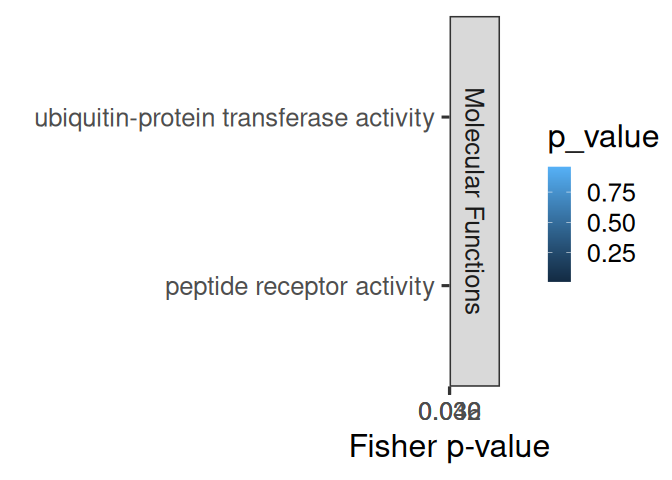
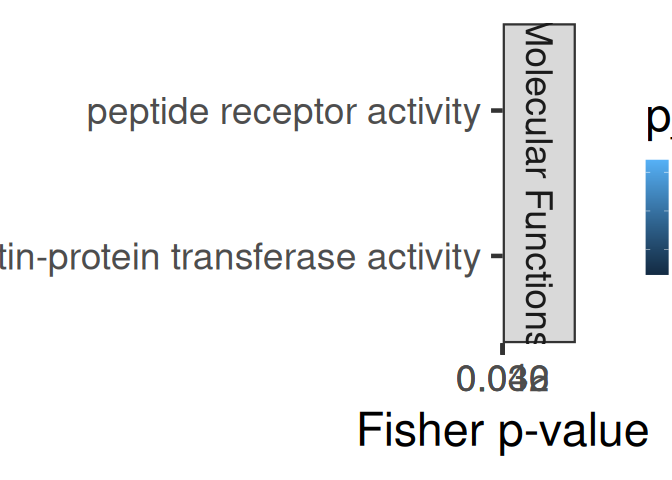
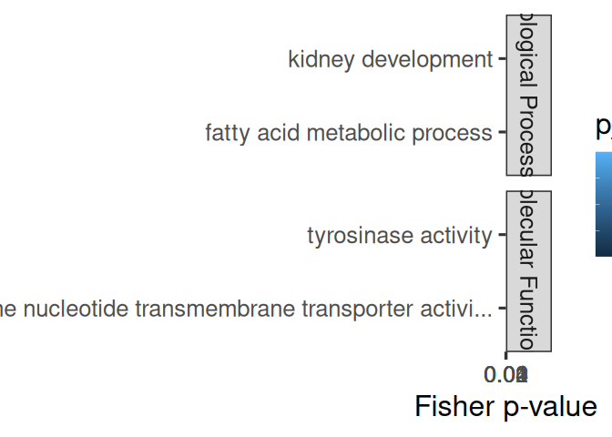
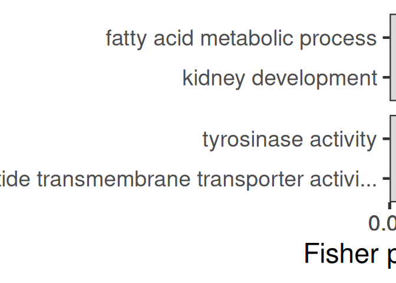
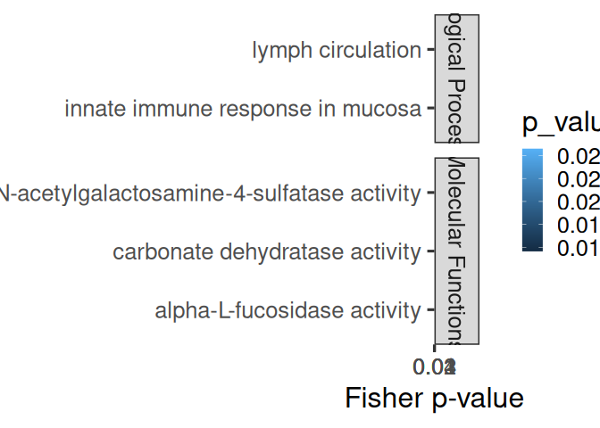
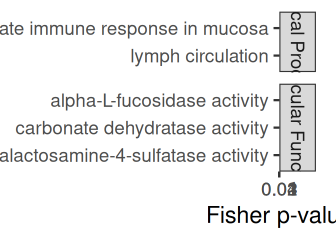
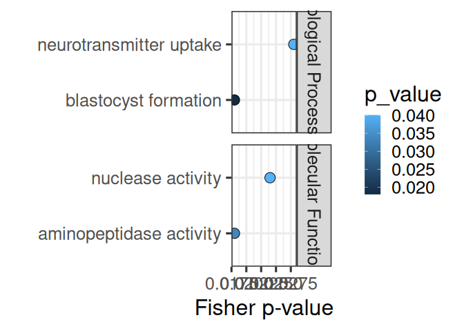
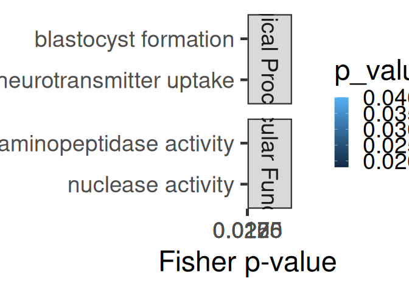

11.14-Ptuh-mRNA-miRNA-interactions-FE-pooled
================
Kathleen Durkin
2025-08-05

- [1 Format topGO files](#1-format-topgo-files)
  - [1.1 Read in and format annotation
    files](#11-read-in-and-format-annotation-files)
  - [1.2 Set up gene2GO object](#12-set-up-gene2go-object)
  - [1.3 Define reference set](#13-define-reference-set)
- [2 Pool 3UTR, CDS, and 5UTR](#2-pool-3utr-cds-and-5utr)
  - [2.1 Read in PCC/miranda data](#21-read-in-pccmiranda-data)
- [3 FA of all miRNA targets](#3-fa-of-all-mirna-targets)
- [4 FE of specific miRNA’s targets (all
  targets)](#4-fe-of-specific-mirnas-targets-all-targets)
- [5 FE of specific miRNA’s targets (significant cor
  targets)](#5-fe-of-specific-mirnas-targets-significant-cor-targets)
- [6 FE of all targets negatively correlated with miRNAs (regardless of
  correlation
  significance)](#6-fe-of-all-targets-negatively-correlated-with-mirnas-regardless-of-correlation-significance)
  - [6.0.1 Biological Processes](#601-biological-processes)
  - [6.0.2 Cellular Components](#602-cellular-components)
  - [6.0.3 Molecular Functions](#603-molecular-functions)
  - [6.0.4 Join ontologies](#604-join-ontologies)
- [7 FE of all targets positively correlated with miRNAs (regardless of
  correlation
  significance)](#7-fe-of-all-targets-positively-correlated-with-mirnas-regardless-of-correlation-significance)
  - [7.0.1 Biological Processes](#701-biological-processes)
  - [7.0.2 Cellular Components](#702-cellular-components)
  - [7.0.3 Molecular Functions](#703-molecular-functions)
  - [7.0.4 Join ontologies](#704-join-ontologies)
- [8 FE of all targets significantly negatively correlated with
  miRNAs](#8-fe-of-all-targets-significantly-negatively-correlated-with-mirnas)
  - [8.0.1 Biological Processes](#801-biological-processes)
  - [8.0.2 Cellular Components](#802-cellular-components)
  - [8.0.3 Molecular Functions](#803-molecular-functions)
  - [8.0.4 Join ontologies](#804-join-ontologies)
- [9 FE of all targets significantly positively correlated with
  miRNAs](#9-fe-of-all-targets-significantly-positively-correlated-with-mirnas)
  - [9.0.1 Biological Processes](#901-biological-processes)
  - [9.0.2 Cellular Components](#902-cellular-components)
  - [9.0.3 Molecular Functions](#903-molecular-functions)
  - [9.0.4 Join ontologies](#904-join-ontologies)

This script will use topGO to analyze functional enrichment of miRNA
targets for Ptuh, *pooling all target sites* (3UTR, 5UTR, and CDS)

Code used below was created by `Jill Ashey`, modified for use with
A.pulchra datasets by `Kathleen Durkin`

# 1 Format topGO files

## 1.1 Read in and format annotation files

``` r
# Read in Ptuh annotations
annot <- read.delim("../output/02-Ptuh-reference-annotation/Pocillopora_meandrina_HIv1-IDmapping-2024_09_04.tab")
# Remove unneeded columns 
annot <- annot %>% dplyr::select(-X, -V13)
# Ensure there are no duplicate rows
annot <- annot %>% distinct()
# Rename gene ID column
annot <- dplyr::rename(annot,
                       gene_ID = V1)

head(annot)
```

    ##                                         gene_ID     V3
    ## 1 Pocillopora_meandrina_HIv1___RNAseq.g27719.t1 Q7ZT01
    ## 2 Pocillopora_meandrina_HIv1___RNAseq.g14270.t1 P55112
    ## 3  Pocillopora_meandrina_HIv1___RNAseq.g2057.t1 Q9Y4D2
    ## 4  Pocillopora_meandrina_HIv1___RNAseq.g4696.t1 Q61670
    ## 5 Pocillopora_meandrina_HIv1___RNAseq.g14166.t1 Q10751
    ## 6  Pocillopora_meandrina_HIv1___RNAseq.g2438.t1 Q9EQD2
    ##                                                                                                                                                  Protein.names
    ## 1                                                                                           DNA replication complex GINS protein PSF3 (GINS complex subunit 3)
    ## 2                                                                                              Zinc metalloproteinase nas-4 (EC 3.4.24.-) (Nematode astacin 4)
    ## 3 Diacylglycerol lipase-alpha (DAGL-alpha) (DGL-alpha) (EC 3.1.1.116) (Neural stem cell-derived dendrite regulator) (Sn1-specific diacylglycerol lipase alpha)
    ## 4                                                                                                           H2.0-like homeobox protein (Homeobox protein HLX1)
    ## 5                                                              Angiotensin-converting enzyme (ACE) (EC 3.4.15.1) (Dipeptidyl carboxypeptidase I) (Kininase II)
    ## 6                                                         Neuropeptide FF receptor 2 (G-protein coupled receptor 74) (Neuropeptide G-protein coupled receptor)
    ##                               Organism
    ## 1 Xenopus laevis (African clawed frog)
    ## 2               Caenorhabditis elegans
    ## 3                 Homo sapiens (Human)
    ## 4                 Mus musculus (Mouse)
    ## 5              Gallus gallus (Chicken)
    ## 6              Rattus norvegicus (Rat)
    ##                                                                                                                                                                                                                                                                                                                                                                                                                                                                                                                                                                                                                                                                            Gene.Ontology..biological.process.
    ## 1                                                                                                                                                                                                                                                                                                                                                                                                                                                                                                                                                                                                                                                                                DNA replication [GO:0006260]
    ## 2                                                                                                                                                                                                                                                                                                                                                                                                                                                                                                                                                                                                                                                                                    proteolysis [GO:0006508]
    ## 3                                                                                                                                                                                                 arachidonic acid metabolic process [GO:0019369]; diacylglycerol catabolic process [GO:0046340]; endocannabinoid signaling pathway [GO:0071926]; G protein-coupled glutamate receptor signaling pathway [GO:0007216]; lipid catabolic process [GO:0016042]; neuroblast proliferation [GO:0007405]; neurogenesis [GO:0022008]; neurotransmitter biosynthetic process [GO:0042136]; regulation of neuroinflammatory response [GO:0150077]; retrograde trans-synaptic signaling by endocannabinoid [GO:0098921]
    ## 4 animal organ development [GO:0048513]; cell population proliferation [GO:0008283]; embryonic digestive tract morphogenesis [GO:0048557]; enteric nervous system development [GO:0048484]; epithelial cell proliferation [GO:0050673]; liver development [GO:0001889]; negative regulation of T-helper 2 cell differentiation [GO:0045629]; organ growth [GO:0035265]; positive regulation of epithelial cell proliferation [GO:0050679]; positive regulation of organ growth [GO:0046622]; positive regulation of T-helper 1 cell differentiation [GO:0045627]; skeletal muscle tissue development [GO:0007519]; T-helper 1 cell differentiation [GO:0045063]; T-helper 2 cell differentiation [GO:0045064]
    ## 5                                                                                                              angiotensin maturation [GO:0002003]; bradykinin catabolic process [GO:0010815]; cell population proliferation [GO:0008283]; hormone catabolic process [GO:0042447]; hormone metabolic process [GO:0042445]; kidney development [GO:0001822]; positive regulation of systemic arterial blood pressure [GO:0003084]; primitive erythrocyte differentiation [GO:0060319]; regulation of blood pressure [GO:0008217]; regulation of synaptic plasticity [GO:0048167]; regulation of systemic arterial blood pressure by renin-angiotensin [GO:0003081]; substance P catabolic process [GO:0010814]
    ## 6                                                                                                                                                                                                                                                                                                                                                                                                                                                                                G protein-coupled receptor signaling pathway [GO:0007186]; regulation of adenylate cyclase activity [GO:0045761]; regulation of cAMP-dependent protein kinase activity [GO:2000479]; regulation of MAPK cascade [GO:0043408]
    ##                                                                                                                                                                                                                                                                    Gene.Ontology.IDs
    ## 1                                                                                                                                                                                                                                     GO:0000811; GO:0003682; GO:0006260; GO:0071162
    ## 2                                                                                                                                                                                                                                     GO:0004222; GO:0005576; GO:0006508; GO:0008270
    ## 3 GO:0004465; GO:0004806; GO:0005737; GO:0005886; GO:0007216; GO:0007405; GO:0016042; GO:0016298; GO:0019369; GO:0022008; GO:0031901; GO:0032590; GO:0032591; GO:0042136; GO:0043196; GO:0045211; GO:0046340; GO:0046872; GO:0047372; GO:0071926; GO:0098839; GO:0098921; GO:0150077
    ## 4                                                                         GO:0000981; GO:0001889; GO:0005634; GO:0007519; GO:0008283; GO:0035265; GO:0043565; GO:0045063; GO:0045064; GO:0045627; GO:0045629; GO:0046622; GO:0048484; GO:0048513; GO:0048557; GO:0050673; GO:0050679
    ## 5             GO:0001822; GO:0002003; GO:0003081; GO:0003084; GO:0004180; GO:0004222; GO:0005737; GO:0005886; GO:0008217; GO:0008237; GO:0008241; GO:0008270; GO:0008283; GO:0010814; GO:0010815; GO:0016020; GO:0031404; GO:0042445; GO:0042447; GO:0048167; GO:0060319; GO:0070573
    ## 6                                                                                                                                                             GO:0004930; GO:0005886; GO:0007186; GO:0008188; GO:0015629; GO:0031628; GO:0042277; GO:0043408; GO:0045761; GO:2000479

``` r
# Looks good!
```

## 1.2 Set up gene2GO object

Want to isolate a list of GO terms per gene

``` r
gene2go <- annot %>% filter(!is.na(Gene.Ontology.IDs)) %>% dplyr::select(gene_ID, Gene.Ontology.IDs)
gene2go <- gene2go %>% dplyr::rename(GO.ID = Gene.Ontology.IDs)

gene2go_list <- setNames(
  strsplit(as.character(gene2go$GO.ID), ";"), 
  gene2go$gene_ID
)
```

Note: I think this means genes that had a Uniprot ID but no GO terms are
excluded from this analysis

## 1.3 Define reference set

Define reference set of genes. This should be all genes *found in our
samples*, NOT all genes in the A.pulchra genome. Some genes (e.g.,
reproduction pathways) may not be found/expected in our samples for
valid biological reasons.

``` r
# Read in counts matrix
Ptuh_counts <- read.csv("../output/06-Ptuh-Hisat/Ptuh-gene_count_matrix.csv")
# Exclude genes with all 0 counts
Ptuh_counts <- Ptuh_counts[rowSums(Ptuh_counts[, 2:6]) != 0, ]

# Select gene IDs of the genes present in our samples
all_genes <- Ptuh_counts$gene_id
length(all_genes)
```

    ## [1] 26508

So we have a reference set of 26508 genes present in our samples.

# 2 Pool 3UTR, CDS, and 5UTR

## 2.1 Read in PCC/miranda data

These are tables of all putative miRNA-mRNA binding predicted by
miRanda, plus Pearson’s correlation coefficients for coexpression of
each putative binding pair.

``` r
# Load for each region
data_3UTR <- read.csv("../output/11-Ptuh-mRNA-miRNA-interactions/three_prime_interaction/Ptuh-miranda_PCC_miRNA_mRNA.csv") %>% dplyr::select(-X, -X.1)
data_CDS <- read.csv("../output/11.01-Ptuh-mRNA-miRNA-interactions-CDS_5UTR/miRanda_PCC_miRNA_CDS.csv") %>% dplyr::select(-X)
data_5UTR <- read.csv("../output/11.01-Ptuh-mRNA-miRNA-interactions-CDS_5UTR/miRanda_PCC_miRNA_5UTR.csv") %>% dplyr::select(-X)

# Format and combine into pooled targets
data_3UTR$region <- "3UTR"

colnames(data_CDS) <- c("miRNA", "mRNA_coord", "score", "energy", "query_start", "query_end", "subject_start", "subject_end", "total_bp_shared", "query_similar", "subject_similar", "mRNA", "PCC.cor", "p_value", "adjusted_p_value")
data_CDS$query_start_end <- paste0(data_CDS$query_start, " ", data_CDS$query_end)
data_CDS$subject_start_end <- paste0(data_CDS$subject_start, " ", data_CDS$subject_end)
data_CDS$region <- "CDS"
data_CDS <- data_CDS %>% dplyr::select(colnames(data_3UTR))

colnames(data_5UTR) <- c("miRNA", "mRNA_coord", "score", "energy", "query_start", "query_end", "subject_start", "subject_end", "total_bp_shared", "query_similar", "subject_similar", "mRNA", "PCC.cor", "p_value", "adjusted_p_value")
data_5UTR$query_start_end <- paste0(data_5UTR$query_start, " ", data_5UTR$query_end)
data_5UTR$subject_start_end <- paste0(data_5UTR$subject_start, " ", data_5UTR$subject_end)
data_5UTR$region <- "5UTR"
data_5UTR <- data_5UTR %>% dplyr::select(colnames(data_3UTR))

data <- rbind(data_3UTR, data_CDS, data_5UTR)

head(data)
```

    ##          miRNA                                          mRNA     PCC.cor
    ## 1 Cluster_1296 Pocillopora_meandrina_HIv1___RNAseq.g10047.t1  0.27029932
    ## 2  Cluster_757     Pocillopora_meandrina_HIv1___TS.g16579.t1 -0.43877249
    ## 3 Cluster_4823  Pocillopora_meandrina_HIv1___RNAseq.g6291.t1 -0.35198577
    ## 4  Cluster_925 Pocillopora_meandrina_HIv1___RNAseq.g22310.t1 -0.39612092
    ## 5 Cluster_4438 Pocillopora_meandrina_HIv1___RNAseq.g22310.t1 -0.94747058
    ## 6 Cluster_1015      Pocillopora_meandrina_HIv1___TS.g1125.t1  0.07166159
    ##      p_value adjusted_p_value score energy query_start_end subject_start_end
    ## 1 0.66008216        0.9786314   143 -21.19            2 17           685 707
    ## 2 0.45982026        0.9702492   155 -23.52            2 21           417 434
    ## 3 0.56127199        0.9741209   152 -21.26            2 21              6 27
    ## 4 0.50916241        0.9735530   162 -21.53            2 20           521 544
    ## 5 0.01433791        0.6744107   156 -21.25            2 19              1 19
    ## 6 0.90883578        0.9975179   162 -24.89            2 21           790 815
    ##   total_bp_shared query_similar subject_similar region
    ## 1              16        68.75%          75.00%   3UTR
    ## 2              19        73.68%          78.95%   3UTR
    ## 3              19        63.16%          73.68%   3UTR
    ## 4              20        75.00%          80.00%   3UTR
    ## 5              17        76.47%          82.35%   3UTR
    ## 6              23        73.91%          78.26%   3UTR

# 3 FA of all miRNA targets

Functional annotation of all putative miRNA targets

``` r
cor_bind_FA <- left_join(data, annot, by = c("mRNA" = "gene_ID")) %>% distinct()

nrow(cor_bind_FA)
```

    ## [1] 16807

``` r
nrow(cor_bind_FA[!is.na(cor_bind_FA$Gene.Ontology.IDs),])
```

    ## [1] 9484

Of the 16,807 putative miRNA targets predicted by miRanda, 9,484 have
available annotations (56.4%)

``` r
sig_cor_bind_FA <- cor_bind_FA[cor_bind_FA$p_value < 0.05,]

# Remove rows where all values are NA
sig_cor_bind_FA <- sig_cor_bind_FA[!apply(is.na(sig_cor_bind_FA), 1, all), ]


nrow(sig_cor_bind_FA)
```

    ## [1] 902

``` r
nrow(sig_cor_bind_FA[!is.na(sig_cor_bind_FA$Gene.Ontology.IDs),])
```

    ## [1] 523

Of the 902 putative 3UTR miRNA targets predicted by miRanda that are
also have significantly correlated expression, 523 have available
annotations (58.0%)

Save

``` r
write.csv(cor_bind_FA, "../output/11.14-Ptuh-mRNA-miRNA-interactions-FE-pooled/miRNA_pooled_targets_FA.csv")
write.csv(sig_cor_bind_FA, "../output/11.14-Ptuh-mRNA-miRNA-interactions-FE-pooled/miRNA_pooled_sig_cor_targets_FA.csv")
```

# 4 FE of specific miRNA’s targets (all targets)

Create topGO function for use with miRNA names

``` r
miRNA_topGO_FE <- function(miRNA.name, input_interactions) {
  
  #Isolate genes in our input module of interest
  interacting_genes <- input_interactions %>%
    filter(miRNA == miRNA.name) %>%
    pull(mRNA)
  
  if (length(interacting_genes) > 0 && any(all_genes %in% interacting_genes)) {
    # Create factor for all reference genes, where 1 represents module membership and 0 means the gene is not in module of interest
    gene_list <- factor(as.integer(all_genes %in% interacting_genes))
    names(gene_list) <- all_genes
    str(gene_list)
    
    ## Biological Process ##
    # Create topGO object
    GO_BP <- new("topGOdata", 
                ontology = "BP", # Biological Process
                allGenes = gene_list,
                annot = annFUN.gene2GO, 
                gene2GO = gene2go_list,
                geneSel=topDiffGenes)
    
    # Run GO enrichment test
    GO_BP_FE <- runTest(GO_BP, algorithm = "weight01", statistic = "fisher")
    # View the results
    GO_BP_results <- GenTable(GO_BP, Fisher = GO_BP_FE, orderBy = "Fisher",  topNodes = 100, numChar = 51)
    # Filter by significant results
    GO_BP_results$Fisher<-as.numeric(GO_BP_results$Fisher)
    GO_BP_results_sig<-GO_BP_results[GO_BP_results$Fisher<0.05,]
    
    
    ## Molecular Function ##
    # Create topGO object
    GO_MF <- new("topGOdata", 
                ontology = "MF", # Molecular Function
                allGenes = gene_list,
                annot = annFUN.gene2GO, 
                gene2GO = gene2go_list,
                geneSel=topDiffGenes)
    
    # Run GO enrichment test
    GO_MF_FE <- runTest(GO_MF, algorithm = "weight01", statistic = "fisher")
    # View the results
    GO_MF_results <- GenTable(GO_MF, Fisher = GO_MF_FE, orderBy = "Fisher",  topNodes = 100, numChar = 51)
    # Filter by significant results
    GO_MF_results$Fisher<-as.numeric(GO_MF_results$Fisher)
    GO_MF_results_sig<-GO_MF_results[GO_MF_results$Fisher<0.05,]
  
    # Return
    # Add type column only if results exist
    if (nrow(GO_BP_results_sig) > 0) {
      GO_BP_results_sig$type <- "Biological.Process"
    }
    if (nrow(GO_MF_results_sig) > 0) {
      GO_MF_results_sig$type <- "Molecular.Function"
    }
    GO_results <- rbind(GO_BP_results_sig, GO_MF_results_sig)
    print(GO_results)
  }
}

miRNA_topGO_FE("Cluster_10051", cor_bind_FA)
```

Loop through all miRNA and run functional enrichment on the miRNA’s
targets (all predicted targets)

``` r
interacting_miRNAs <- unique(cor_bind_FA$miRNA) %>% na.omit
results_all_targets <- NULL  # initialize empty df

for(miRNA in interacting_miRNAs) {
  
  # Run topGO enrichment function
  miRNA_results <- miRNA_topGO_FE(miRNA, cor_bind_FA)
  
  # Only keep results if not empty
  if (!is.null(miRNA_results) && nrow(miRNA_results) > 0) {
    
    # Add the miRNA source column
    miRNA_results$miRNA <- miRNA

    # Bind to the accumulating results data frame
    results_all_targets <- rbind(results_all_targets, miRNA_results)
  }
}
```

    ##  Factor w/ 2 levels "0","1": 1 1 1 1 1 1 1 1 1 1 ...
    ##  - attr(*, "names")= chr [1:26508] "Pocillopora_meandrina_HIv1___RNAseq.g27475.t1" "Pocillopora_meandrina_HIv1___RNAseq.g7358.t1" "Pocillopora_meandrina_HIv1___RNAseq.g2989.t1" "Pocillopora_meandrina_HIv1___RNAseq.g5036.t1" ...

    ## 
    ## Building most specific GOs .....

    ##  ( 86 GO terms found. )

    ## 
    ## Build GO DAG topology ..........

    ##  ( 534 GO terms and 966 relations. )

    ## 
    ## Annotating nodes ...............

    ##  ( 217 genes annotated to the GO terms. )

    ## 
    ##           -- Weight01 Algorithm -- 
    ## 
    ##       the algorithm is scoring 49 nontrivial nodes
    ##       parameters: 
    ##           test statistic: fisher

    ## 
    ##   Level 11:  1 nodes to be scored    (0 eliminated genes)

    ## 
    ##   Level 10:  2 nodes to be scored    (0 eliminated genes)

    ## 
    ##   Level 9:   2 nodes to be scored    (9 eliminated genes)

    ## 
    ##   Level 8:   2 nodes to be scored    (30 eliminated genes)

    ## 
    ##   Level 7:   5 nodes to be scored    (31 eliminated genes)

    ## 
    ##   Level 6:   6 nodes to be scored    (32 eliminated genes)

    ## 
    ##   Level 5:   9 nodes to be scored    (38 eliminated genes)

    ## 
    ##   Level 4:   9 nodes to be scored    (44 eliminated genes)

    ## 
    ##   Level 3:   7 nodes to be scored    (91 eliminated genes)

    ## 
    ##   Level 2:   5 nodes to be scored    (116 eliminated genes)

    ## 
    ##   Level 1:   1 nodes to be scored    (134 eliminated genes)

    ## 
    ## Building most specific GOs .....

    ##  ( 153 GO terms found. )

    ## 
    ## Build GO DAG topology ..........

    ##  ( 386 GO terms and 497 relations. )

    ## 
    ## Annotating nodes ...............

    ##  ( 503 genes annotated to the GO terms. )

    ## 
    ##           -- Weight01 Algorithm -- 
    ## 
    ##       the algorithm is scoring 46 nontrivial nodes
    ##       parameters: 
    ##           test statistic: fisher

    ## 
    ##   Level 10:  1 nodes to be scored    (0 eliminated genes)

    ## 
    ##   Level 9:   1 nodes to be scored    (0 eliminated genes)

    ## 
    ##   Level 8:   4 nodes to be scored    (2 eliminated genes)

    ## 
    ##   Level 7:   6 nodes to be scored    (5 eliminated genes)

    ## 
    ##   Level 6:   6 nodes to be scored    (18 eliminated genes)

    ## 
    ##   Level 5:   9 nodes to be scored    (53 eliminated genes)

    ## 
    ##   Level 4:   8 nodes to be scored    (106 eliminated genes)

    ## 
    ##   Level 3:   6 nodes to be scored    (205 eliminated genes)

    ## 
    ##   Level 2:   4 nodes to be scored    (254 eliminated genes)

    ## 
    ##   Level 1:   1 nodes to be scored    (307 eliminated genes)

    ##        GO.ID                                                   Term Annotated
    ## 1 GO:0001822                                     kidney development         6
    ## 2 GO:0004725                  protein tyrosine phosphatase activity         2
    ## 3 GO:0005231 excitatory extracellular ligand-gated monoatomic io...         2
    ##   Significant Expected Fisher               type
    ## 1           2     0.14 0.0062 Biological.Process
    ## 2           1     0.03 0.0320 Molecular.Function
    ## 3           1     0.03 0.0320 Molecular.Function
    ##  Factor w/ 2 levels "0","1": 1 1 1 1 1 1 1 1 1 1 ...
    ##  - attr(*, "names")= chr [1:26508] "Pocillopora_meandrina_HIv1___RNAseq.g27475.t1" "Pocillopora_meandrina_HIv1___RNAseq.g7358.t1" "Pocillopora_meandrina_HIv1___RNAseq.g2989.t1" "Pocillopora_meandrina_HIv1___RNAseq.g5036.t1" ...

    ## 
    ## Building most specific GOs .....

    ##  ( 86 GO terms found. )

    ## 
    ## Build GO DAG topology ..........

    ##  ( 534 GO terms and 966 relations. )

    ## 
    ## Annotating nodes ...............

    ##  ( 217 genes annotated to the GO terms. )

    ## 
    ##           -- Weight01 Algorithm -- 
    ## 
    ##       the algorithm is scoring 22 nontrivial nodes
    ##       parameters: 
    ##           test statistic: fisher

    ## 
    ##   Level 8:   1 nodes to be scored    (0 eliminated genes)

    ## 
    ##   Level 7:   2 nodes to be scored    (0 eliminated genes)

    ## 
    ##   Level 6:   2 nodes to be scored    (1 eliminated genes)

    ## 
    ##   Level 5:   3 nodes to be scored    (6 eliminated genes)

    ## 
    ##   Level 4:   3 nodes to be scored    (8 eliminated genes)

    ## 
    ##   Level 3:   6 nodes to be scored    (40 eliminated genes)

    ## 
    ##   Level 2:   4 nodes to be scored    (41 eliminated genes)

    ## 
    ##   Level 1:   1 nodes to be scored    (91 eliminated genes)

    ## 
    ## Building most specific GOs .....

    ##  ( 153 GO terms found. )

    ## 
    ## Build GO DAG topology ..........

    ##  ( 386 GO terms and 497 relations. )

    ## 
    ## Annotating nodes ...............

    ##  ( 503 genes annotated to the GO terms. )

    ## 
    ##           -- Weight01 Algorithm -- 
    ## 
    ##       the algorithm is scoring 36 nontrivial nodes
    ##       parameters: 
    ##           test statistic: fisher

    ## 
    ##   Level 9:   1 nodes to be scored    (0 eliminated genes)

    ## 
    ##   Level 8:   3 nodes to be scored    (0 eliminated genes)

    ## 
    ##   Level 7:   5 nodes to be scored    (12 eliminated genes)

    ## 
    ##   Level 6:   6 nodes to be scored    (21 eliminated genes)

    ## 
    ##   Level 5:   6 nodes to be scored    (46 eliminated genes)

    ## 
    ##   Level 4:   6 nodes to be scored    (66 eliminated genes)

    ## 
    ##   Level 3:   6 nodes to be scored    (85 eliminated genes)

    ## 
    ##   Level 2:   2 nodes to be scored    (154 eliminated genes)

    ## 
    ##   Level 1:   1 nodes to be scored    (266 eliminated genes)

    ##        GO.ID                                                Term Annotated
    ## 1 GO:0002175     protein localization to paranode region of axon         1
    ## 2 GO:0000012                          single strand break repair         1
    ## 3 GO:0000987 cis-regulatory region sequence-specific DNA binding        12
    ## 4 GO:0004844                   uracil DNA N-glycosylase activity         2
    ## 5 GO:0004842              ubiquitin-protein transferase activity         4
    ## 6 GO:0003924                                     GTPase activity         4
    ##   Significant Expected Fisher               type
    ## 1           1     0.01 0.0092 Biological.Process
    ## 2           1     0.01 0.0092 Biological.Process
    ## 3           2     0.14 0.0074 Molecular.Function
    ## 4           1     0.02 0.0237 Molecular.Function
    ## 5           1     0.05 0.0470 Molecular.Function
    ## 6           1     0.05 0.0470 Molecular.Function
    ##  Factor w/ 2 levels "0","1": 1 1 1 1 1 1 1 1 1 1 ...
    ##  - attr(*, "names")= chr [1:26508] "Pocillopora_meandrina_HIv1___RNAseq.g27475.t1" "Pocillopora_meandrina_HIv1___RNAseq.g7358.t1" "Pocillopora_meandrina_HIv1___RNAseq.g2989.t1" "Pocillopora_meandrina_HIv1___RNAseq.g5036.t1" ...

    ## 
    ## Building most specific GOs .....

    ##  ( 86 GO terms found. )

    ## 
    ## Build GO DAG topology ..........

    ##  ( 534 GO terms and 966 relations. )

    ## 
    ## Annotating nodes ...............

    ##  ( 217 genes annotated to the GO terms. )

    ## 
    ##           -- Weight01 Algorithm -- 
    ## 
    ##       the algorithm is scoring 9 nontrivial nodes
    ##       parameters: 
    ##           test statistic: fisher

    ## 
    ##   Level 7:   1 nodes to be scored    (0 eliminated genes)

    ## 
    ##   Level 6:   1 nodes to be scored    (0 eliminated genes)

    ## 
    ##   Level 5:   1 nodes to be scored    (6 eliminated genes)

    ## 
    ##   Level 4:   2 nodes to be scored    (6 eliminated genes)

    ## 
    ##   Level 3:   1 nodes to be scored    (45 eliminated genes)

    ## 
    ##   Level 2:   2 nodes to be scored    (54 eliminated genes)

    ## 
    ##   Level 1:   1 nodes to be scored    (62 eliminated genes)

    ## 
    ## Building most specific GOs .....

    ##  ( 153 GO terms found. )

    ## 
    ## Build GO DAG topology ..........

    ##  ( 386 GO terms and 497 relations. )

    ## 
    ## Annotating nodes ...............

    ##  ( 503 genes annotated to the GO terms. )

    ## 
    ##           -- Weight01 Algorithm -- 
    ## 
    ##       the algorithm is scoring 12 nontrivial nodes
    ##       parameters: 
    ##           test statistic: fisher

    ## 
    ##   Level 7:   1 nodes to be scored    (0 eliminated genes)

    ## 
    ##   Level 6:   2 nodes to be scored    (0 eliminated genes)

    ## 
    ##   Level 5:   2 nodes to be scored    (4 eliminated genes)

    ## 
    ##   Level 4:   2 nodes to be scored    (7 eliminated genes)

    ## 
    ##   Level 3:   3 nodes to be scored    (9 eliminated genes)

    ## 
    ##   Level 2:   1 nodes to be scored    (50 eliminated genes)

    ## 
    ##   Level 1:   1 nodes to be scored    (129 eliminated genes)

    ##        GO.ID                                   Term Annotated Significant
    ## 1 GO:0001822                     kidney development         6           1
    ## 2 GO:0004177                aminopeptidase activity         3           1
    ## 3 GO:0004842 ubiquitin-protein transferase activity         4           1
    ##   Expected Fisher               type
    ## 1     0.03  0.028 Biological.Process
    ## 2     0.01  0.012 Molecular.Function
    ## 3     0.02  0.016 Molecular.Function
    ##  Factor w/ 2 levels "0","1": 1 1 1 1 1 1 1 1 1 1 ...
    ##  - attr(*, "names")= chr [1:26508] "Pocillopora_meandrina_HIv1___RNAseq.g27475.t1" "Pocillopora_meandrina_HIv1___RNAseq.g7358.t1" "Pocillopora_meandrina_HIv1___RNAseq.g2989.t1" "Pocillopora_meandrina_HIv1___RNAseq.g5036.t1" ...

    ## 
    ## Building most specific GOs .....

    ##  ( 86 GO terms found. )

    ## 
    ## Build GO DAG topology ..........

    ##  ( 534 GO terms and 966 relations. )

    ## 
    ## Annotating nodes ...............

    ##  ( 217 genes annotated to the GO terms. )

    ## 
    ##           -- Weight01 Algorithm -- 
    ## 
    ##       the algorithm is scoring 27 nontrivial nodes
    ##       parameters: 
    ##           test statistic: fisher

    ## 
    ##   Level 10:  1 nodes to be scored    (0 eliminated genes)

    ## 
    ##   Level 9:   1 nodes to be scored    (0 eliminated genes)

    ## 
    ##   Level 8:   1 nodes to be scored    (20 eliminated genes)

    ## 
    ##   Level 7:   2 nodes to be scored    (20 eliminated genes)

    ## 
    ##   Level 6:   4 nodes to be scored    (21 eliminated genes)

    ## 
    ##   Level 5:   4 nodes to be scored    (27 eliminated genes)

    ## 
    ##   Level 4:   5 nodes to be scored    (32 eliminated genes)

    ## 
    ##   Level 3:   4 nodes to be scored    (52 eliminated genes)

    ## 
    ##   Level 2:   4 nodes to be scored    (66 eliminated genes)

    ## 
    ##   Level 1:   1 nodes to be scored    (89 eliminated genes)

    ## 
    ## Building most specific GOs .....

    ##  ( 153 GO terms found. )

    ## 
    ## Build GO DAG topology ..........

    ##  ( 386 GO terms and 497 relations. )

    ## 
    ## Annotating nodes ...............

    ##  ( 503 genes annotated to the GO terms. )

    ## 
    ##           -- Weight01 Algorithm -- 
    ## 
    ##       the algorithm is scoring 19 nontrivial nodes
    ##       parameters: 
    ##           test statistic: fisher

    ## 
    ##   Level 7:   1 nodes to be scored    (0 eliminated genes)

    ## 
    ##   Level 6:   2 nodes to be scored    (0 eliminated genes)

    ## 
    ##   Level 5:   4 nodes to be scored    (4 eliminated genes)

    ## 
    ##   Level 4:   4 nodes to be scored    (26 eliminated genes)

    ## 
    ##   Level 3:   5 nodes to be scored    (119 eliminated genes)

    ## 
    ##   Level 2:   2 nodes to be scored    (160 eliminated genes)

    ## 
    ##   Level 1:   1 nodes to be scored    (218 eliminated genes)

    ##        GO.ID                                 Term Annotated Significant
    ## 1 GO:0003964 RNA-directed DNA polymerase activity         4           1
    ##   Expected Fisher               type
    ## 1     0.02  0.024 Molecular.Function
    ##  Factor w/ 2 levels "0","1": 1 1 1 1 1 1 1 1 1 1 ...
    ##  - attr(*, "names")= chr [1:26508] "Pocillopora_meandrina_HIv1___RNAseq.g27475.t1" "Pocillopora_meandrina_HIv1___RNAseq.g7358.t1" "Pocillopora_meandrina_HIv1___RNAseq.g2989.t1" "Pocillopora_meandrina_HIv1___RNAseq.g5036.t1" ...

    ## 
    ## Building most specific GOs .....

    ##  ( 86 GO terms found. )

    ## 
    ## Build GO DAG topology ..........

    ##  ( 534 GO terms and 966 relations. )

    ## 
    ## Annotating nodes ...............

    ##  ( 217 genes annotated to the GO terms. )

    ## 
    ##           -- Weight01 Algorithm -- 
    ## 
    ##       the algorithm is scoring 24 nontrivial nodes
    ##       parameters: 
    ##           test statistic: fisher

    ## 
    ##   Level 9:   1 nodes to be scored    (0 eliminated genes)

    ## 
    ##   Level 8:   1 nodes to be scored    (0 eliminated genes)

    ## 
    ##   Level 7:   1 nodes to be scored    (1 eliminated genes)

    ## 
    ##   Level 6:   3 nodes to be scored    (1 eliminated genes)

    ## 
    ##   Level 5:   5 nodes to be scored    (1 eliminated genes)

    ## 
    ##   Level 4:   4 nodes to be scored    (7 eliminated genes)

    ## 
    ##   Level 3:   4 nodes to be scored    (57 eliminated genes)

    ## 
    ##   Level 2:   4 nodes to be scored    (78 eliminated genes)

    ## 
    ##   Level 1:   1 nodes to be scored    (90 eliminated genes)

    ## 
    ## Building most specific GOs .....

    ##  ( 153 GO terms found. )

    ## 
    ## Build GO DAG topology ..........

    ##  ( 386 GO terms and 497 relations. )

    ## 
    ## Annotating nodes ...............

    ##  ( 503 genes annotated to the GO terms. )

    ## 
    ##           -- Weight01 Algorithm -- 
    ## 
    ##       the algorithm is scoring 12 nontrivial nodes
    ##       parameters: 
    ##           test statistic: fisher

    ## 
    ##   Level 7:   1 nodes to be scored    (0 eliminated genes)

    ## 
    ##   Level 6:   1 nodes to be scored    (0 eliminated genes)

    ## 
    ##   Level 5:   2 nodes to be scored    (7 eliminated genes)

    ## 
    ##   Level 4:   3 nodes to be scored    (7 eliminated genes)

    ## 
    ##   Level 3:   2 nodes to be scored    (11 eliminated genes)

    ## 
    ##   Level 2:   2 nodes to be scored    (26 eliminated genes)

    ## 
    ##   Level 1:   1 nodes to be scored    (117 eliminated genes)

    ##        GO.ID                                                   Term Annotated
    ## 1 GO:0001764                                       neuron migration         1
    ## 2 GO:0003333                     amino acid transmembrane transport         2
    ## 3 GO:0001504                                neurotransmitter uptake         3
    ## 4 GO:0004518                                      nuclease activity         4
    ## 5 GO:0001409 guanine nucleotide transmembrane transporter activi...         7
    ##   Significant Expected Fisher               type
    ## 1           1     0.01  0.014 Biological.Process
    ## 2           1     0.03  0.028 Biological.Process
    ## 3           1     0.04  0.041 Biological.Process
    ## 4           1     0.02  0.016 Molecular.Function
    ## 5           1     0.03  0.028 Molecular.Function
    ##  Factor w/ 2 levels "0","1": 1 1 1 1 1 1 1 1 1 1 ...
    ##  - attr(*, "names")= chr [1:26508] "Pocillopora_meandrina_HIv1___RNAseq.g27475.t1" "Pocillopora_meandrina_HIv1___RNAseq.g7358.t1" "Pocillopora_meandrina_HIv1___RNAseq.g2989.t1" "Pocillopora_meandrina_HIv1___RNAseq.g5036.t1" ...

    ## 
    ## Building most specific GOs .....

    ##  ( 86 GO terms found. )

    ## 
    ## Build GO DAG topology ..........

    ##  ( 534 GO terms and 966 relations. )

    ## 
    ## Annotating nodes ...............

    ##  ( 217 genes annotated to the GO terms. )

    ## 
    ##           -- Weight01 Algorithm -- 
    ## 
    ##       the algorithm is scoring 121 nontrivial nodes
    ##       parameters: 
    ##           test statistic: fisher

    ## 
    ##   Level 10:  4 nodes to be scored    (0 eliminated genes)

    ## 
    ##   Level 9:   7 nodes to be scored    (0 eliminated genes)

    ## 
    ##   Level 8:   8 nodes to be scored    (25 eliminated genes)

    ## 
    ##   Level 7:   11 nodes to be scored   (30 eliminated genes)

    ## 
    ##   Level 6:   15 nodes to be scored   (46 eliminated genes)

    ## 
    ##   Level 5:   24 nodes to be scored   (60 eliminated genes)

    ## 
    ##   Level 4:   21 nodes to be scored   (63 eliminated genes)

    ## 
    ##   Level 3:   20 nodes to be scored   (120 eliminated genes)

    ## 
    ##   Level 2:   10 nodes to be scored   (151 eliminated genes)

    ## 
    ##   Level 1:   1 nodes to be scored    (212 eliminated genes)

    ## 
    ## Building most specific GOs .....

    ##  ( 153 GO terms found. )

    ## 
    ## Build GO DAG topology ..........

    ##  ( 386 GO terms and 497 relations. )

    ## 
    ## Annotating nodes ...............

    ##  ( 503 genes annotated to the GO terms. )

    ## 
    ##           -- Weight01 Algorithm -- 
    ## 
    ##       the algorithm is scoring 107 nontrivial nodes
    ##       parameters: 
    ##           test statistic: fisher

    ## 
    ##   Level 9:   3 nodes to be scored    (0 eliminated genes)

    ## 
    ##   Level 8:   5 nodes to be scored    (0 eliminated genes)

    ## 
    ##   Level 7:   13 nodes to be scored   (24 eliminated genes)

    ## 
    ##   Level 6:   19 nodes to be scored   (36 eliminated genes)

    ## 
    ##   Level 5:   23 nodes to be scored   (75 eliminated genes)

    ## 
    ##   Level 4:   26 nodes to be scored   (149 eliminated genes)

    ## 
    ##   Level 3:   12 nodes to be scored   (266 eliminated genes)

    ## 
    ##   Level 2:   5 nodes to be scored    (362 eliminated genes)

    ## 
    ##   Level 1:   1 nodes to be scored    (463 eliminated genes)

    ##        GO.ID                         Term Annotated Significant Expected
    ## 1 GO:0006631 fatty acid metabolic process         8           7     0.74
    ## 2 GO:0003677                  DNA binding        34           7     2.50
    ## 3 GO:0005262     calcium channel activity         3           2     0.22
    ## 4 GO:0003779                actin binding         5           2     0.37
    ##     Fisher               type
    ## 1 1.40e-07 Biological.Process
    ## 2 7.90e-03 Molecular.Function
    ## 3 1.51e-02 Molecular.Function
    ## 4 4.58e-02 Molecular.Function
    ##  Factor w/ 2 levels "0","1": 1 1 1 1 1 1 1 1 1 1 ...
    ##  - attr(*, "names")= chr [1:26508] "Pocillopora_meandrina_HIv1___RNAseq.g27475.t1" "Pocillopora_meandrina_HIv1___RNAseq.g7358.t1" "Pocillopora_meandrina_HIv1___RNAseq.g2989.t1" "Pocillopora_meandrina_HIv1___RNAseq.g5036.t1" ...

    ## 
    ## Building most specific GOs .....

    ##  ( 86 GO terms found. )

    ## 
    ## Build GO DAG topology ..........

    ##  ( 534 GO terms and 966 relations. )

    ## 
    ## Annotating nodes ...............

    ##  ( 217 genes annotated to the GO terms. )

    ## 
    ##           -- Weight01 Algorithm -- 
    ## 
    ##       the algorithm is scoring 0 nontrivial nodes
    ##       parameters: 
    ##           test statistic: fisher

    ## Warning in getSigGroups(object, test.stat): No enrichment can pe performed -
    ## there are no feasible GO terms!

    ## 
    ## Building most specific GOs .....

    ##  ( 153 GO terms found. )

    ## 
    ## Build GO DAG topology ..........

    ##  ( 386 GO terms and 497 relations. )

    ## 
    ## Annotating nodes ...............

    ##  ( 503 genes annotated to the GO terms. )

    ## 
    ##           -- Weight01 Algorithm -- 
    ## 
    ##       the algorithm is scoring 20 nontrivial nodes
    ##       parameters: 
    ##           test statistic: fisher

    ## 
    ##   Level 8:   1 nodes to be scored    (0 eliminated genes)

    ## 
    ##   Level 7:   2 nodes to be scored    (0 eliminated genes)

    ## 
    ##   Level 6:   2 nodes to be scored    (4 eliminated genes)

    ## 
    ##   Level 5:   4 nodes to be scored    (11 eliminated genes)

    ## 
    ##   Level 4:   4 nodes to be scored    (23 eliminated genes)

    ## 
    ##   Level 3:   3 nodes to be scored    (29 eliminated genes)

    ## 
    ##   Level 2:   3 nodes to be scored    (29 eliminated genes)

    ## 
    ##   Level 1:   1 nodes to be scored    (69 eliminated genes)

    ##        GO.ID                                      Term Annotated Significant
    ## 1 GO:0005267                potassium channel activity         4           1
    ## 2 GO:0003779                             actin binding         5           1
    ## 3 GO:0003700 DNA-binding transcription factor activity         6           1
    ##   Expected Fisher               type
    ## 1     0.02  0.024 Molecular.Function
    ## 2     0.03  0.030 Molecular.Function
    ## 3     0.04  0.035 Molecular.Function
    ##  Factor w/ 2 levels "0","1": 1 1 1 1 1 1 1 1 1 1 ...
    ##  - attr(*, "names")= chr [1:26508] "Pocillopora_meandrina_HIv1___RNAseq.g27475.t1" "Pocillopora_meandrina_HIv1___RNAseq.g7358.t1" "Pocillopora_meandrina_HIv1___RNAseq.g2989.t1" "Pocillopora_meandrina_HIv1___RNAseq.g5036.t1" ...

    ## 
    ## Building most specific GOs .....

    ##  ( 86 GO terms found. )

    ## 
    ## Build GO DAG topology ..........

    ##  ( 534 GO terms and 966 relations. )

    ## 
    ## Annotating nodes ...............

    ##  ( 217 genes annotated to the GO terms. )

    ## 
    ##           -- Weight01 Algorithm -- 
    ## 
    ##       the algorithm is scoring 46 nontrivial nodes
    ##       parameters: 
    ##           test statistic: fisher

    ## 
    ##   Level 11:  1 nodes to be scored    (0 eliminated genes)

    ## 
    ##   Level 10:  1 nodes to be scored    (0 eliminated genes)

    ## 
    ##   Level 9:   2 nodes to be scored    (3 eliminated genes)

    ## 
    ##   Level 8:   3 nodes to be scored    (3 eliminated genes)

    ## 
    ##   Level 7:   6 nodes to be scored    (3 eliminated genes)

    ## 
    ##   Level 6:   5 nodes to be scored    (3 eliminated genes)

    ## 
    ##   Level 5:   8 nodes to be scored    (15 eliminated genes)

    ## 
    ##   Level 4:   8 nodes to be scored    (15 eliminated genes)

    ## 
    ##   Level 3:   7 nodes to be scored    (57 eliminated genes)

    ## 
    ##   Level 2:   4 nodes to be scored    (89 eliminated genes)

    ## 
    ##   Level 1:   1 nodes to be scored    (140 eliminated genes)

    ## 
    ## Building most specific GOs .....

    ##  ( 153 GO terms found. )

    ## 
    ## Build GO DAG topology ..........

    ##  ( 386 GO terms and 497 relations. )

    ## 
    ## Annotating nodes ...............

    ##  ( 503 genes annotated to the GO terms. )

    ## 
    ##           -- Weight01 Algorithm -- 
    ## 
    ##       the algorithm is scoring 24 nontrivial nodes
    ##       parameters: 
    ##           test statistic: fisher

    ## 
    ##   Level 7:   1 nodes to be scored    (0 eliminated genes)

    ## 
    ##   Level 6:   2 nodes to be scored    (0 eliminated genes)

    ## 
    ##   Level 5:   3 nodes to be scored    (4 eliminated genes)

    ## 
    ##   Level 4:   6 nodes to be scored    (10 eliminated genes)

    ## 
    ##   Level 3:   8 nodes to be scored    (83 eliminated genes)

    ## 
    ##   Level 2:   3 nodes to be scored    (188 eliminated genes)

    ## 
    ##   Level 1:   1 nodes to be scored    (329 eliminated genes)

    ##        GO.ID                        Term Annotated Significant Expected Fisher
    ## 1 GO:0006869             lipid transport         1           1     0.02  0.018
    ## 2 GO:0004566 beta-glucuronidase activity         1           1     0.01  0.014
    ##                 type
    ## 1 Biological.Process
    ## 2 Molecular.Function
    ##  Factor w/ 2 levels "0","1": 1 1 1 1 1 1 1 1 1 1 ...
    ##  - attr(*, "names")= chr [1:26508] "Pocillopora_meandrina_HIv1___RNAseq.g27475.t1" "Pocillopora_meandrina_HIv1___RNAseq.g7358.t1" "Pocillopora_meandrina_HIv1___RNAseq.g2989.t1" "Pocillopora_meandrina_HIv1___RNAseq.g5036.t1" ...

    ## 
    ## Building most specific GOs .....

    ##  ( 86 GO terms found. )

    ## 
    ## Build GO DAG topology ..........

    ##  ( 534 GO terms and 966 relations. )

    ## 
    ## Annotating nodes ...............

    ##  ( 217 genes annotated to the GO terms. )

    ## 
    ##           -- Weight01 Algorithm -- 
    ## 
    ##       the algorithm is scoring 79 nontrivial nodes
    ##       parameters: 
    ##           test statistic: fisher

    ## 
    ##   Level 13:  1 nodes to be scored    (0 eliminated genes)

    ## 
    ##   Level 12:  1 nodes to be scored    (0 eliminated genes)

    ## 
    ##   Level 11:  1 nodes to be scored    (4 eliminated genes)

    ## 
    ##   Level 10:  2 nodes to be scored    (5 eliminated genes)

    ## 
    ##   Level 9:   3 nodes to be scored    (5 eliminated genes)

    ## 
    ##   Level 8:   4 nodes to be scored    (25 eliminated genes)

    ## 
    ##   Level 7:   7 nodes to be scored    (25 eliminated genes)

    ## 
    ##   Level 6:   12 nodes to be scored   (40 eliminated genes)

    ## 
    ##   Level 5:   17 nodes to be scored   (53 eliminated genes)

    ## 
    ##   Level 4:   13 nodes to be scored   (64 eliminated genes)

    ## 
    ##   Level 3:   11 nodes to be scored   (109 eliminated genes)

    ## 
    ##   Level 2:   6 nodes to be scored    (140 eliminated genes)

    ## 
    ##   Level 1:   1 nodes to be scored    (167 eliminated genes)

    ## 
    ## Building most specific GOs .....

    ##  ( 153 GO terms found. )

    ## 
    ## Build GO DAG topology ..........

    ##  ( 386 GO terms and 497 relations. )

    ## 
    ## Annotating nodes ...............

    ##  ( 503 genes annotated to the GO terms. )

    ## 
    ##           -- Weight01 Algorithm -- 
    ## 
    ##       the algorithm is scoring 37 nontrivial nodes
    ##       parameters: 
    ##           test statistic: fisher

    ## 
    ##   Level 10:  1 nodes to be scored    (0 eliminated genes)

    ## 
    ##   Level 9:   2 nodes to be scored    (0 eliminated genes)

    ## 
    ##   Level 8:   2 nodes to be scored    (8 eliminated genes)

    ## 
    ##   Level 7:   4 nodes to be scored    (15 eliminated genes)

    ## 
    ##   Level 6:   6 nodes to be scored    (18 eliminated genes)

    ## 
    ##   Level 5:   7 nodes to be scored    (29 eliminated genes)

    ## 
    ##   Level 4:   9 nodes to be scored    (43 eliminated genes)

    ## 
    ##   Level 3:   3 nodes to be scored    (65 eliminated genes)

    ## 
    ##   Level 2:   2 nodes to be scored    (122 eliminated genes)

    ## 
    ##   Level 1:   1 nodes to be scored    (157 eliminated genes)

    ##        GO.ID                                                   Term Annotated
    ## 1 GO:0000245                          spliceosomal complex assembly         4
    ## 2 GO:0001937 negative regulation of endothelial cell proliferati...         1
    ## 3 GO:0005112                                          Notch binding         1
    ## 4 GO:0005302          L-tyrosine transmembrane transporter activity         3
    ## 5 GO:0005262                               calcium channel activity         3
    ##   Significant Expected Fisher               type
    ## 1           2     0.15 0.0069 Biological.Process
    ## 2           1     0.04 0.0369 Biological.Process
    ## 3           1     0.01 0.0099 Molecular.Function
    ## 4           1     0.03 0.0296 Molecular.Function
    ## 5           1     0.03 0.0296 Molecular.Function
    ##  Factor w/ 2 levels "0","1": 1 1 1 1 1 1 1 1 1 1 ...
    ##  - attr(*, "names")= chr [1:26508] "Pocillopora_meandrina_HIv1___RNAseq.g27475.t1" "Pocillopora_meandrina_HIv1___RNAseq.g7358.t1" "Pocillopora_meandrina_HIv1___RNAseq.g2989.t1" "Pocillopora_meandrina_HIv1___RNAseq.g5036.t1" ...

    ## 
    ## Building most specific GOs .....

    ##  ( 86 GO terms found. )

    ## 
    ## Build GO DAG topology ..........

    ##  ( 534 GO terms and 966 relations. )

    ## 
    ## Annotating nodes ...............

    ##  ( 217 genes annotated to the GO terms. )

    ## 
    ##           -- Weight01 Algorithm -- 
    ## 
    ##       the algorithm is scoring 85 nontrivial nodes
    ##       parameters: 
    ##           test statistic: fisher

    ## 
    ##   Level 11:  1 nodes to be scored    (0 eliminated genes)

    ## 
    ##   Level 10:  2 nodes to be scored    (0 eliminated genes)

    ## 
    ##   Level 9:   4 nodes to be scored    (13 eliminated genes)

    ## 
    ##   Level 8:   7 nodes to be scored    (13 eliminated genes)

    ## 
    ##   Level 7:   9 nodes to be scored    (14 eliminated genes)

    ## 
    ##   Level 6:   14 nodes to be scored   (21 eliminated genes)

    ## 
    ##   Level 5:   15 nodes to be scored   (42 eliminated genes)

    ## 
    ##   Level 4:   12 nodes to be scored   (63 eliminated genes)

    ## 
    ##   Level 3:   13 nodes to be scored   (108 eliminated genes)

    ## 
    ##   Level 2:   7 nodes to be scored    (140 eliminated genes)

    ## 
    ##   Level 1:   1 nodes to be scored    (185 eliminated genes)

    ## 
    ## Building most specific GOs .....

    ##  ( 153 GO terms found. )

    ## 
    ## Build GO DAG topology ..........

    ##  ( 386 GO terms and 497 relations. )

    ## 
    ## Annotating nodes ...............

    ##  ( 503 genes annotated to the GO terms. )

    ## 
    ##           -- Weight01 Algorithm -- 
    ## 
    ##       the algorithm is scoring 69 nontrivial nodes
    ##       parameters: 
    ##           test statistic: fisher

    ## 
    ##   Level 10:  1 nodes to be scored    (0 eliminated genes)

    ## 
    ##   Level 9:   3 nodes to be scored    (0 eliminated genes)

    ## 
    ##   Level 8:   3 nodes to be scored    (8 eliminated genes)

    ## 
    ##   Level 7:   8 nodes to be scored    (26 eliminated genes)

    ## 
    ##   Level 6:   12 nodes to be scored   (27 eliminated genes)

    ## 
    ##   Level 5:   13 nodes to be scored   (60 eliminated genes)

    ## 
    ##   Level 4:   13 nodes to be scored   (104 eliminated genes)

    ## 
    ##   Level 3:   11 nodes to be scored   (206 eliminated genes)

    ## 
    ##   Level 2:   4 nodes to be scored    (275 eliminated genes)

    ## 
    ##   Level 1:   1 nodes to be scored    (429 eliminated genes)

    ##        GO.ID                                             Term Annotated
    ## 1 GO:0001822                               kidney development         6
    ## 2 GO:0000165                                     MAPK cascade         6
    ## 3 GO:0001764                                 neuron migration         1
    ## 4 GO:0004854                  xanthine dehydrogenase activity         1
    ## 5 GO:0003977 UDP-N-acetylglucosamine diphosphorylase activity         1
    ## 6 GO:0000210                      NAD+ diphosphatase activity         1
    ## 7 GO:0005524                                      ATP binding        11
    ##   Significant Expected Fisher               type
    ## 1           2     0.25  0.021 Biological.Process
    ## 2           2     0.25  0.021 Biological.Process
    ## 3           1     0.04  0.041 Biological.Process
    ## 4           1     0.03  0.034 Molecular.Function
    ## 5           1     0.03  0.034 Molecular.Function
    ## 6           1     0.03  0.034 Molecular.Function
    ## 7           2     0.37  0.049 Molecular.Function
    ##  Factor w/ 2 levels "0","1": 1 1 1 1 1 1 1 1 1 1 ...
    ##  - attr(*, "names")= chr [1:26508] "Pocillopora_meandrina_HIv1___RNAseq.g27475.t1" "Pocillopora_meandrina_HIv1___RNAseq.g7358.t1" "Pocillopora_meandrina_HIv1___RNAseq.g2989.t1" "Pocillopora_meandrina_HIv1___RNAseq.g5036.t1" ...

    ## 
    ## Building most specific GOs .....

    ##  ( 86 GO terms found. )

    ## 
    ## Build GO DAG topology ..........

    ##  ( 534 GO terms and 966 relations. )

    ## 
    ## Annotating nodes ...............

    ##  ( 217 genes annotated to the GO terms. )

    ## 
    ##           -- Weight01 Algorithm -- 
    ## 
    ##       the algorithm is scoring 0 nontrivial nodes
    ##       parameters: 
    ##           test statistic: fisher

    ## Warning in getSigGroups(object, test.stat): No enrichment can pe performed -
    ## there are no feasible GO terms!

    ## 
    ## Building most specific GOs .....

    ##  ( 153 GO terms found. )

    ## 
    ## Build GO DAG topology ..........

    ##  ( 386 GO terms and 497 relations. )

    ## 
    ## Annotating nodes ...............

    ##  ( 503 genes annotated to the GO terms. )

    ## 
    ##           -- Weight01 Algorithm -- 
    ## 
    ##       the algorithm is scoring 21 nontrivial nodes
    ##       parameters: 
    ##           test statistic: fisher

    ## 
    ##   Level 8:   2 nodes to be scored    (0 eliminated genes)

    ## 
    ##   Level 7:   3 nodes to be scored    (0 eliminated genes)

    ## 
    ##   Level 6:   3 nodes to be scored    (4 eliminated genes)

    ## 
    ##   Level 5:   4 nodes to be scored    (12 eliminated genes)

    ## 
    ##   Level 4:   4 nodes to be scored    (26 eliminated genes)

    ## 
    ##   Level 3:   2 nodes to be scored    (28 eliminated genes)

    ## 
    ##   Level 2:   2 nodes to be scored    (28 eliminated genes)

    ## 
    ##   Level 1:   1 nodes to be scored    (74 eliminated genes)

    ##        GO.ID                                            Term Annotated
    ## 1 GO:0004745 all-trans-retinol dehydrogenase (NAD+) activity         1
    ## 2 GO:0005262                        calcium channel activity         3
    ##   Significant Expected Fisher               type
    ## 1           1     0.00  0.004 Molecular.Function
    ## 2           1     0.01  0.012 Molecular.Function
    ##  Factor w/ 2 levels "0","1": 1 1 1 1 1 1 1 1 1 1 ...
    ##  - attr(*, "names")= chr [1:26508] "Pocillopora_meandrina_HIv1___RNAseq.g27475.t1" "Pocillopora_meandrina_HIv1___RNAseq.g7358.t1" "Pocillopora_meandrina_HIv1___RNAseq.g2989.t1" "Pocillopora_meandrina_HIv1___RNAseq.g5036.t1" ...

    ## 
    ## Building most specific GOs .....

    ##  ( 86 GO terms found. )

    ## 
    ## Build GO DAG topology ..........

    ##  ( 534 GO terms and 966 relations. )

    ## 
    ## Annotating nodes ...............

    ##  ( 217 genes annotated to the GO terms. )

    ## 
    ##           -- Weight01 Algorithm -- 
    ## 
    ##       the algorithm is scoring 70 nontrivial nodes
    ##       parameters: 
    ##           test statistic: fisher

    ## 
    ##   Level 9:   2 nodes to be scored    (0 eliminated genes)

    ## 
    ##   Level 8:   4 nodes to be scored    (0 eliminated genes)

    ## 
    ##   Level 7:   7 nodes to be scored    (3 eliminated genes)

    ## 
    ##   Level 6:   9 nodes to be scored    (24 eliminated genes)

    ## 
    ##   Level 5:   14 nodes to be scored   (38 eliminated genes)

    ## 
    ##   Level 4:   13 nodes to be scored   (55 eliminated genes)

    ## 
    ##   Level 3:   11 nodes to be scored   (98 eliminated genes)

    ## 
    ##   Level 2:   9 nodes to be scored    (132 eliminated genes)

    ## 
    ##   Level 1:   1 nodes to be scored    (185 eliminated genes)

    ## 
    ## Building most specific GOs .....

    ##  ( 153 GO terms found. )

    ## 
    ## Build GO DAG topology ..........

    ##  ( 386 GO terms and 497 relations. )

    ## 
    ## Annotating nodes ...............

    ##  ( 503 genes annotated to the GO terms. )

    ## 
    ##           -- Weight01 Algorithm -- 
    ## 
    ##       the algorithm is scoring 69 nontrivial nodes
    ##       parameters: 
    ##           test statistic: fisher

    ## 
    ##   Level 10:  1 nodes to be scored    (0 eliminated genes)

    ## 
    ##   Level 9:   1 nodes to be scored    (0 eliminated genes)

    ## 
    ##   Level 8:   3 nodes to be scored    (2 eliminated genes)

    ## 
    ##   Level 7:   8 nodes to be scored    (2 eliminated genes)

    ## 
    ##   Level 6:   10 nodes to be scored   (6 eliminated genes)

    ## 
    ##   Level 5:   12 nodes to be scored   (53 eliminated genes)

    ## 
    ##   Level 4:   19 nodes to be scored   (100 eliminated genes)

    ## 
    ##   Level 3:   10 nodes to be scored   (109 eliminated genes)

    ## 
    ##   Level 2:   4 nodes to be scored    (316 eliminated genes)

    ## 
    ##   Level 1:   1 nodes to be scored    (417 eliminated genes)

    ##        GO.ID                                                   Term Annotated
    ## 1 GO:0001817                      regulation of cytokine production         1
    ## 2 GO:0003943             N-acetylgalactosamine-4-sulfatase activity         3
    ## 3 GO:0004715 non-membrane spanning protein tyrosine kinase activ...         1
    ##   Significant Expected Fisher               type
    ## 1           1     0.03 0.0280 Biological.Process
    ## 2           2     0.10 0.0032 Molecular.Function
    ## 3           1     0.03 0.0338 Molecular.Function
    ##  Factor w/ 2 levels "0","1": 1 1 1 1 1 1 1 1 1 1 ...
    ##  - attr(*, "names")= chr [1:26508] "Pocillopora_meandrina_HIv1___RNAseq.g27475.t1" "Pocillopora_meandrina_HIv1___RNAseq.g7358.t1" "Pocillopora_meandrina_HIv1___RNAseq.g2989.t1" "Pocillopora_meandrina_HIv1___RNAseq.g5036.t1" ...

    ## 
    ## Building most specific GOs .....

    ##  ( 86 GO terms found. )

    ## 
    ## Build GO DAG topology ..........

    ##  ( 534 GO terms and 966 relations. )

    ## 
    ## Annotating nodes ...............

    ##  ( 217 genes annotated to the GO terms. )

    ## 
    ##           -- Weight01 Algorithm -- 
    ## 
    ##       the algorithm is scoring 218 nontrivial nodes
    ##       parameters: 
    ##           test statistic: fisher

    ## 
    ##   Level 14:  1 nodes to be scored    (0 eliminated genes)

    ## 
    ##   Level 13:  1 nodes to be scored    (0 eliminated genes)

    ## 
    ##   Level 12:  1 nodes to be scored    (1 eliminated genes)

    ## 
    ##   Level 11:  7 nodes to be scored    (1 eliminated genes)

    ## 
    ##   Level 10:  12 nodes to be scored   (1 eliminated genes)

    ## 
    ##   Level 9:   17 nodes to be scored   (10 eliminated genes)

    ## 
    ##   Level 8:   18 nodes to be scored   (39 eliminated genes)

    ## 
    ##   Level 7:   22 nodes to be scored   (50 eliminated genes)

    ## 
    ##   Level 6:   29 nodes to be scored   (54 eliminated genes)

    ## 
    ##   Level 5:   41 nodes to be scored   (64 eliminated genes)

    ## 
    ##   Level 4:   33 nodes to be scored   (86 eliminated genes)

    ## 
    ##   Level 3:   25 nodes to be scored   (158 eliminated genes)

    ## 
    ##   Level 2:   10 nodes to be scored   (181 eliminated genes)

    ## 
    ##   Level 1:   1 nodes to be scored    (203 eliminated genes)

    ## 
    ## Building most specific GOs .....

    ##  ( 153 GO terms found. )

    ## 
    ## Build GO DAG topology ..........

    ##  ( 386 GO terms and 497 relations. )

    ## 
    ## Annotating nodes ...............

    ##  ( 503 genes annotated to the GO terms. )

    ## 
    ##           -- Weight01 Algorithm -- 
    ## 
    ##       the algorithm is scoring 134 nontrivial nodes
    ##       parameters: 
    ##           test statistic: fisher

    ## 
    ##   Level 9:   3 nodes to be scored    (0 eliminated genes)

    ## 
    ##   Level 8:   6 nodes to be scored    (0 eliminated genes)

    ## 
    ##   Level 7:   17 nodes to be scored   (15 eliminated genes)

    ## 
    ##   Level 6:   22 nodes to be scored   (31 eliminated genes)

    ## 
    ##   Level 5:   29 nodes to be scored   (88 eliminated genes)

    ## 
    ##   Level 4:   32 nodes to be scored   (161 eliminated genes)

    ## 
    ##   Level 3:   16 nodes to be scored   (288 eliminated genes)

    ## 
    ##   Level 2:   8 nodes to be scored    (402 eliminated genes)

    ## 
    ##   Level 1:   1 nodes to be scored    (483 eliminated genes)

    ##        GO.ID                               Term Annotated Significant Expected
    ## 1 GO:0003333 amino acid transmembrane transport         2           2     0.18
    ## 2 GO:0004503                tyrosinase activity         4           2     0.39
    ##   Fisher               type
    ## 1 0.0081 Biological.Process
    ## 2 0.0490 Molecular.Function
    ##  Factor w/ 2 levels "0","1": 1 1 1 1 1 1 1 1 1 1 ...
    ##  - attr(*, "names")= chr [1:26508] "Pocillopora_meandrina_HIv1___RNAseq.g27475.t1" "Pocillopora_meandrina_HIv1___RNAseq.g7358.t1" "Pocillopora_meandrina_HIv1___RNAseq.g2989.t1" "Pocillopora_meandrina_HIv1___RNAseq.g5036.t1" ...

    ## 
    ## Building most specific GOs .....

    ##  ( 86 GO terms found. )

    ## 
    ## Build GO DAG topology ..........

    ##  ( 534 GO terms and 966 relations. )

    ## 
    ## Annotating nodes ...............

    ##  ( 217 genes annotated to the GO terms. )

    ## 
    ##           -- Weight01 Algorithm -- 
    ## 
    ##       the algorithm is scoring 51 nontrivial nodes
    ##       parameters: 
    ##           test statistic: fisher

    ## 
    ##   Level 10:  2 nodes to be scored    (0 eliminated genes)

    ## 
    ##   Level 9:   4 nodes to be scored    (0 eliminated genes)

    ## 
    ##   Level 8:   3 nodes to be scored    (21 eliminated genes)

    ## 
    ##   Level 7:   3 nodes to be scored    (23 eliminated genes)

    ## 
    ##   Level 6:   6 nodes to be scored    (25 eliminated genes)

    ## 
    ##   Level 5:   11 nodes to be scored   (26 eliminated genes)

    ## 
    ##   Level 4:   8 nodes to be scored    (26 eliminated genes)

    ## 
    ##   Level 3:   7 nodes to be scored    (53 eliminated genes)

    ## 
    ##   Level 2:   6 nodes to be scored    (68 eliminated genes)

    ## 
    ##   Level 1:   1 nodes to be scored    (122 eliminated genes)

    ## 
    ## Building most specific GOs .....

    ##  ( 153 GO terms found. )

    ## 
    ## Build GO DAG topology ..........

    ##  ( 386 GO terms and 497 relations. )

    ## 
    ## Annotating nodes ...............

    ##  ( 503 genes annotated to the GO terms. )

    ## 
    ##           -- Weight01 Algorithm -- 
    ## 
    ##       the algorithm is scoring 41 nontrivial nodes
    ##       parameters: 
    ##           test statistic: fisher

    ## 
    ##   Level 8:   2 nodes to be scored    (0 eliminated genes)

    ## 
    ##   Level 7:   4 nodes to be scored    (0 eliminated genes)

    ## 
    ##   Level 6:   6 nodes to be scored    (10 eliminated genes)

    ## 
    ##   Level 5:   11 nodes to be scored   (29 eliminated genes)

    ## 
    ##   Level 4:   8 nodes to be scored    (107 eliminated genes)

    ## 
    ##   Level 3:   6 nodes to be scored    (131 eliminated genes)

    ## 
    ##   Level 2:   3 nodes to be scored    (166 eliminated genes)

    ## 
    ##   Level 1:   1 nodes to be scored    (246 eliminated genes)

    ##        GO.ID                                                Term Annotated
    ## 1 GO:0001868 regulation of complement activation, lectin pathway         1
    ## 2 GO:0005112                                       Notch binding         1
    ## 3 GO:0004100                            chitin synthase activity         2
    ## 4 GO:0005267                          potassium channel activity         4
    ##   Significant Expected Fisher               type
    ## 1           1     0.01 0.0092 Biological.Process
    ## 2           1     0.01 0.0120 Molecular.Function
    ## 3           1     0.02 0.0240 Molecular.Function
    ## 4           1     0.05 0.0470 Molecular.Function
    ##  Factor w/ 2 levels "0","1": 1 1 1 1 1 1 1 1 1 1 ...
    ##  - attr(*, "names")= chr [1:26508] "Pocillopora_meandrina_HIv1___RNAseq.g27475.t1" "Pocillopora_meandrina_HIv1___RNAseq.g7358.t1" "Pocillopora_meandrina_HIv1___RNAseq.g2989.t1" "Pocillopora_meandrina_HIv1___RNAseq.g5036.t1" ...

    ## 
    ## Building most specific GOs .....

    ##  ( 86 GO terms found. )

    ## 
    ## Build GO DAG topology ..........

    ##  ( 534 GO terms and 966 relations. )

    ## 
    ## Annotating nodes ...............

    ##  ( 217 genes annotated to the GO terms. )

    ## 
    ##           -- Weight01 Algorithm -- 
    ## 
    ##       the algorithm is scoring 53 nontrivial nodes
    ##       parameters: 
    ##           test statistic: fisher

    ## 
    ##   Level 10:  2 nodes to be scored    (0 eliminated genes)

    ## 
    ##   Level 9:   3 nodes to be scored    (0 eliminated genes)

    ## 
    ##   Level 8:   3 nodes to be scored    (22 eliminated genes)

    ## 
    ##   Level 7:   6 nodes to be scored    (23 eliminated genes)

    ## 
    ##   Level 6:   9 nodes to be scored    (28 eliminated genes)

    ## 
    ##   Level 5:   10 nodes to be scored   (45 eliminated genes)

    ## 
    ##   Level 4:   7 nodes to be scored    (45 eliminated genes)

    ## 
    ##   Level 3:   7 nodes to be scored    (75 eliminated genes)

    ## 
    ##   Level 2:   5 nodes to be scored    (94 eliminated genes)

    ## 
    ##   Level 1:   1 nodes to be scored    (148 eliminated genes)

    ## 
    ## Building most specific GOs .....

    ##  ( 153 GO terms found. )

    ## 
    ## Build GO DAG topology ..........

    ##  ( 386 GO terms and 497 relations. )

    ## 
    ## Annotating nodes ...............

    ##  ( 503 genes annotated to the GO terms. )

    ## 
    ##           -- Weight01 Algorithm -- 
    ## 
    ##       the algorithm is scoring 64 nontrivial nodes
    ##       parameters: 
    ##           test statistic: fisher

    ## 
    ##   Level 8:   1 nodes to be scored    (0 eliminated genes)

    ## 
    ##   Level 7:   6 nodes to be scored    (0 eliminated genes)

    ## 
    ##   Level 6:   9 nodes to be scored    (8 eliminated genes)

    ## 
    ##   Level 5:   14 nodes to be scored   (50 eliminated genes)

    ## 
    ##   Level 4:   15 nodes to be scored   (96 eliminated genes)

    ## 
    ##   Level 3:   12 nodes to be scored   (188 eliminated genes)

    ## 
    ##   Level 2:   6 nodes to be scored    (246 eliminated genes)

    ## 
    ##   Level 1:   1 nodes to be scored    (381 eliminated genes)

    ##        GO.ID                             Term Annotated Significant Expected
    ## 1 GO:0000338            protein deneddylation         1           1     0.03
    ## 2 GO:0001653        peptide receptor activity        21           4     0.79
    ## 3 GO:0005178                 integrin binding         8           2     0.30
    ## 4 GO:0004321 fatty-acyl-CoA synthase activity         1           1     0.04
    ## 5 GO:0005319       lipid transporter activity         1           1     0.04
    ## 6 GO:0003941  L-serine ammonia-lyase activity         1           1     0.04
    ## 7 GO:0004222    metalloendopeptidase activity        22           3     0.83
    ##    Fisher               type
    ## 1 0.03200 Biological.Process
    ## 2 0.00079 Molecular.Function
    ## 3 0.03308 Molecular.Function
    ## 4 0.03777 Molecular.Function
    ## 5 0.03777 Molecular.Function
    ## 6 0.03777 Molecular.Function
    ## 7 0.04464 Molecular.Function
    ##  Factor w/ 2 levels "0","1": 1 1 1 1 1 1 1 1 1 1 ...
    ##  - attr(*, "names")= chr [1:26508] "Pocillopora_meandrina_HIv1___RNAseq.g27475.t1" "Pocillopora_meandrina_HIv1___RNAseq.g7358.t1" "Pocillopora_meandrina_HIv1___RNAseq.g2989.t1" "Pocillopora_meandrina_HIv1___RNAseq.g5036.t1" ...

    ## 
    ## Building most specific GOs .....

    ##  ( 86 GO terms found. )

    ## 
    ## Build GO DAG topology ..........

    ##  ( 534 GO terms and 966 relations. )

    ## 
    ## Annotating nodes ...............

    ##  ( 217 genes annotated to the GO terms. )

    ## 
    ##           -- Weight01 Algorithm -- 
    ## 
    ##       the algorithm is scoring 65 nontrivial nodes
    ##       parameters: 
    ##           test statistic: fisher

    ## 
    ##   Level 11:  1 nodes to be scored    (0 eliminated genes)

    ## 
    ##   Level 10:  2 nodes to be scored    (0 eliminated genes)

    ## 
    ##   Level 9:   3 nodes to be scored    (13 eliminated genes)

    ## 
    ##   Level 8:   6 nodes to be scored    (13 eliminated genes)

    ## 
    ##   Level 7:   6 nodes to be scored    (13 eliminated genes)

    ## 
    ##   Level 6:   9 nodes to be scored    (20 eliminated genes)

    ## 
    ##   Level 5:   12 nodes to be scored   (30 eliminated genes)

    ## 
    ##   Level 4:   9 nodes to be scored    (42 eliminated genes)

    ## 
    ##   Level 3:   11 nodes to be scored   (59 eliminated genes)

    ## 
    ##   Level 2:   5 nodes to be scored    (62 eliminated genes)

    ## 
    ##   Level 1:   1 nodes to be scored    (95 eliminated genes)

    ## 
    ## Building most specific GOs .....

    ##  ( 153 GO terms found. )

    ## 
    ## Build GO DAG topology ..........

    ##  ( 386 GO terms and 497 relations. )

    ## 
    ## Annotating nodes ...............

    ##  ( 503 genes annotated to the GO terms. )

    ## 
    ##           -- Weight01 Algorithm -- 
    ## 
    ##       the algorithm is scoring 18 nontrivial nodes
    ##       parameters: 
    ##           test statistic: fisher

    ## 
    ##   Level 9:   1 nodes to be scored    (0 eliminated genes)

    ## 
    ##   Level 8:   2 nodes to be scored    (0 eliminated genes)

    ## 
    ##   Level 7:   2 nodes to be scored    (2 eliminated genes)

    ## 
    ##   Level 6:   2 nodes to be scored    (3 eliminated genes)

    ## 
    ##   Level 5:   4 nodes to be scored    (4 eliminated genes)

    ## 
    ##   Level 4:   4 nodes to be scored    (11 eliminated genes)

    ## 
    ##   Level 3:   1 nodes to be scored    (17 eliminated genes)

    ## 
    ##   Level 2:   1 nodes to be scored    (29 eliminated genes)

    ## 
    ##   Level 1:   1 nodes to be scored    (39 eliminated genes)

    ##        GO.ID                                 Term Annotated Significant
    ## 1 GO:0006033                  chitin localization         1           1
    ## 2 GO:0005283 amino acid:sodium symporter activity         2           1
    ##   Expected Fisher               type
    ## 1     0.02  0.018 Biological.Process
    ## 2     0.00  0.004 Molecular.Function
    ##  Factor w/ 2 levels "0","1": 1 1 1 1 1 1 1 1 1 1 ...
    ##  - attr(*, "names")= chr [1:26508] "Pocillopora_meandrina_HIv1___RNAseq.g27475.t1" "Pocillopora_meandrina_HIv1___RNAseq.g7358.t1" "Pocillopora_meandrina_HIv1___RNAseq.g2989.t1" "Pocillopora_meandrina_HIv1___RNAseq.g5036.t1" ...

    ## 
    ## Building most specific GOs .....

    ##  ( 86 GO terms found. )

    ## 
    ## Build GO DAG topology ..........

    ##  ( 534 GO terms and 966 relations. )

    ## 
    ## Annotating nodes ...............

    ##  ( 217 genes annotated to the GO terms. )

    ## 
    ##           -- Weight01 Algorithm -- 
    ## 
    ##       the algorithm is scoring 7 nontrivial nodes
    ##       parameters: 
    ##           test statistic: fisher

    ## 
    ##   Level 6:   1 nodes to be scored    (0 eliminated genes)

    ## 
    ##   Level 5:   2 nodes to be scored    (0 eliminated genes)

    ## 
    ##   Level 4:   1 nodes to be scored    (3 eliminated genes)

    ## 
    ##   Level 3:   1 nodes to be scored    (3 eliminated genes)

    ## 
    ##   Level 2:   1 nodes to be scored    (22 eliminated genes)

    ## 
    ##   Level 1:   1 nodes to be scored    (26 eliminated genes)

    ## 
    ## Building most specific GOs .....

    ##  ( 153 GO terms found. )

    ## 
    ## Build GO DAG topology ..........

    ##  ( 386 GO terms and 497 relations. )

    ## 
    ## Annotating nodes ...............

    ##  ( 503 genes annotated to the GO terms. )

    ## 
    ##           -- Weight01 Algorithm -- 
    ## 
    ##       the algorithm is scoring 22 nontrivial nodes
    ##       parameters: 
    ##           test statistic: fisher

    ## 
    ##   Level 8:   1 nodes to be scored    (0 eliminated genes)

    ## 
    ##   Level 7:   3 nodes to be scored    (0 eliminated genes)

    ## 
    ##   Level 6:   3 nodes to be scored    (3 eliminated genes)

    ## 
    ##   Level 5:   3 nodes to be scored    (25 eliminated genes)

    ## 
    ##   Level 4:   5 nodes to be scored    (62 eliminated genes)

    ## 
    ##   Level 3:   3 nodes to be scored    (119 eliminated genes)

    ## 
    ##   Level 2:   3 nodes to be scored    (152 eliminated genes)

    ## 
    ##   Level 1:   1 nodes to be scored    (183 eliminated genes)

    ##        GO.ID                                                   Term Annotated
    ## 1 GO:0001504                                neurotransmitter uptake         3
    ## 2 GO:0004983                       neuropeptide Y receptor activity         3
    ## 3 GO:0000287                                  magnesium ion binding         3
    ## 4 GO:0001409 guanine nucleotide transmembrane transporter activi...         7
    ##   Significant Expected Fisher               type
    ## 1           1     0.01  0.014 Biological.Process
    ## 2           1     0.02  0.018 Molecular.Function
    ## 3           1     0.02  0.018 Molecular.Function
    ## 4           1     0.04  0.041 Molecular.Function
    ##  Factor w/ 2 levels "0","1": 1 1 1 1 1 1 1 1 1 1 ...
    ##  - attr(*, "names")= chr [1:26508] "Pocillopora_meandrina_HIv1___RNAseq.g27475.t1" "Pocillopora_meandrina_HIv1___RNAseq.g7358.t1" "Pocillopora_meandrina_HIv1___RNAseq.g2989.t1" "Pocillopora_meandrina_HIv1___RNAseq.g5036.t1" ...

    ## 
    ## Building most specific GOs .....

    ##  ( 86 GO terms found. )

    ## 
    ## Build GO DAG topology ..........

    ##  ( 534 GO terms and 966 relations. )

    ## 
    ## Annotating nodes ...............

    ##  ( 217 genes annotated to the GO terms. )

    ## 
    ##           -- Weight01 Algorithm -- 
    ## 
    ##       the algorithm is scoring 56 nontrivial nodes
    ##       parameters: 
    ##           test statistic: fisher

    ## 
    ##   Level 11:  1 nodes to be scored    (0 eliminated genes)

    ## 
    ##   Level 10:  3 nodes to be scored    (0 eliminated genes)

    ## 
    ##   Level 9:   3 nodes to be scored    (9 eliminated genes)

    ## 
    ##   Level 8:   4 nodes to be scored    (32 eliminated genes)

    ## 
    ##   Level 7:   7 nodes to be scored    (33 eliminated genes)

    ## 
    ##   Level 6:   8 nodes to be scored    (40 eliminated genes)

    ## 
    ##   Level 5:   10 nodes to be scored   (45 eliminated genes)

    ## 
    ##   Level 4:   8 nodes to be scored    (51 eliminated genes)

    ## 
    ##   Level 3:   6 nodes to be scored    (94 eliminated genes)

    ## 
    ##   Level 2:   5 nodes to be scored    (113 eliminated genes)

    ## 
    ##   Level 1:   1 nodes to be scored    (131 eliminated genes)

    ## 
    ## Building most specific GOs .....

    ##  ( 153 GO terms found. )

    ## 
    ## Build GO DAG topology ..........

    ##  ( 386 GO terms and 497 relations. )

    ## 
    ## Annotating nodes ...............

    ##  ( 503 genes annotated to the GO terms. )

    ## 
    ##           -- Weight01 Algorithm -- 
    ## 
    ##       the algorithm is scoring 103 nontrivial nodes
    ##       parameters: 
    ##           test statistic: fisher

    ## 
    ##   Level 12:  1 nodes to be scored    (0 eliminated genes)

    ## 
    ##   Level 11:  1 nodes to be scored    (0 eliminated genes)

    ## 
    ##   Level 10:  2 nodes to be scored    (1 eliminated genes)

    ## 
    ##   Level 9:   4 nodes to be scored    (3 eliminated genes)

    ## 
    ##   Level 8:   8 nodes to be scored    (11 eliminated genes)

    ## 
    ##   Level 7:   10 nodes to be scored   (31 eliminated genes)

    ## 
    ##   Level 6:   13 nodes to be scored   (47 eliminated genes)

    ## 
    ##   Level 5:   21 nodes to be scored   (82 eliminated genes)

    ## 
    ##   Level 4:   23 nodes to be scored   (126 eliminated genes)

    ## 
    ##   Level 3:   13 nodes to be scored   (267 eliminated genes)

    ## 
    ##   Level 2:   6 nodes to be scored    (361 eliminated genes)

    ## 
    ##   Level 1:   1 nodes to be scored    (459 eliminated genes)

    ##        GO.ID                                   Term Annotated Significant
    ## 1 GO:0001702 gastrulation with mouth forming second         2           1
    ## 2 GO:0001825                   blastocyst formation         2           1
    ## 3 GO:0004972       NMDA glutamate receptor activity         1           1
    ##   Expected Fisher               type
    ## 1     0.05  0.046 Biological.Process
    ## 2     0.05  0.046 Biological.Process
    ## 3     0.04  0.042 Molecular.Function
    ##  Factor w/ 2 levels "0","1": 1 1 1 1 1 1 1 1 1 1 ...
    ##  - attr(*, "names")= chr [1:26508] "Pocillopora_meandrina_HIv1___RNAseq.g27475.t1" "Pocillopora_meandrina_HIv1___RNAseq.g7358.t1" "Pocillopora_meandrina_HIv1___RNAseq.g2989.t1" "Pocillopora_meandrina_HIv1___RNAseq.g5036.t1" ...

    ## 
    ## Building most specific GOs .....

    ##  ( 86 GO terms found. )

    ## 
    ## Build GO DAG topology ..........

    ##  ( 534 GO terms and 966 relations. )

    ## 
    ## Annotating nodes ...............

    ##  ( 217 genes annotated to the GO terms. )

    ## 
    ##           -- Weight01 Algorithm -- 
    ## 
    ##       the algorithm is scoring 48 nontrivial nodes
    ##       parameters: 
    ##           test statistic: fisher

    ## 
    ##   Level 9:   1 nodes to be scored    (0 eliminated genes)

    ## 
    ##   Level 8:   2 nodes to be scored    (0 eliminated genes)

    ## 
    ##   Level 7:   5 nodes to be scored    (1 eliminated genes)

    ## 
    ##   Level 6:   7 nodes to be scored    (20 eliminated genes)

    ## 
    ##   Level 5:   11 nodes to be scored   (28 eliminated genes)

    ## 
    ##   Level 4:   8 nodes to be scored    (43 eliminated genes)

    ## 
    ##   Level 3:   7 nodes to be scored    (67 eliminated genes)

    ## 
    ##   Level 2:   6 nodes to be scored    (139 eliminated genes)

    ## 
    ##   Level 1:   1 nodes to be scored    (182 eliminated genes)

    ## 
    ## Building most specific GOs .....

    ##  ( 153 GO terms found. )

    ## 
    ## Build GO DAG topology ..........

    ##  ( 386 GO terms and 497 relations. )

    ## 
    ## Annotating nodes ...............

    ##  ( 503 genes annotated to the GO terms. )

    ## 
    ##           -- Weight01 Algorithm -- 
    ## 
    ##       the algorithm is scoring 27 nontrivial nodes
    ##       parameters: 
    ##           test statistic: fisher

    ## 
    ##   Level 7:   1 nodes to be scored    (0 eliminated genes)

    ## 
    ##   Level 6:   3 nodes to be scored    (0 eliminated genes)

    ## 
    ##   Level 5:   6 nodes to be scored    (2 eliminated genes)

    ## 
    ##   Level 4:   7 nodes to be scored    (38 eliminated genes)

    ## 
    ##   Level 3:   7 nodes to be scored    (55 eliminated genes)

    ## 
    ##   Level 2:   2 nodes to be scored    (139 eliminated genes)

    ## 
    ##   Level 1:   1 nodes to be scored    (268 eliminated genes)

    ##        GO.ID                                  Term Annotated Significant
    ## 1 GO:0001817     regulation of cytokine production         1           1
    ## 2 GO:0000086 G2/M transition of mitotic cell cycle         1           1
    ## 3 GO:0005178                      integrin binding         8           2
    ## 4 GO:0005502                11-cis retinal binding         2           1
    ##   Expected Fisher               type
    ## 1     0.02 0.0180 Biological.Process
    ## 2     0.02 0.0180 Biological.Process
    ## 3     0.10 0.0032 Molecular.Function
    ## 4     0.02 0.0237 Molecular.Function
    ##  Factor w/ 2 levels "0","1": 1 1 1 1 1 1 1 1 1 1 ...
    ##  - attr(*, "names")= chr [1:26508] "Pocillopora_meandrina_HIv1___RNAseq.g27475.t1" "Pocillopora_meandrina_HIv1___RNAseq.g7358.t1" "Pocillopora_meandrina_HIv1___RNAseq.g2989.t1" "Pocillopora_meandrina_HIv1___RNAseq.g5036.t1" ...

    ## 
    ## Building most specific GOs .....

    ##  ( 86 GO terms found. )

    ## 
    ## Build GO DAG topology ..........

    ##  ( 534 GO terms and 966 relations. )

    ## 
    ## Annotating nodes ...............

    ##  ( 217 genes annotated to the GO terms. )

    ## 
    ##           -- Weight01 Algorithm -- 
    ## 
    ##       the algorithm is scoring 72 nontrivial nodes
    ##       parameters: 
    ##           test statistic: fisher

    ## 
    ##   Level 11:  1 nodes to be scored    (0 eliminated genes)

    ## 
    ##   Level 10:  2 nodes to be scored    (0 eliminated genes)

    ## 
    ##   Level 9:   4 nodes to be scored    (13 eliminated genes)

    ## 
    ##   Level 8:   6 nodes to be scored    (13 eliminated genes)

    ## 
    ##   Level 7:   7 nodes to be scored    (14 eliminated genes)

    ## 
    ##   Level 6:   11 nodes to be scored   (18 eliminated genes)

    ## 
    ##   Level 5:   14 nodes to be scored   (31 eliminated genes)

    ## 
    ##   Level 4:   9 nodes to be scored    (34 eliminated genes)

    ## 
    ##   Level 3:   10 nodes to be scored   (64 eliminated genes)

    ## 
    ##   Level 2:   7 nodes to be scored    (82 eliminated genes)

    ## 
    ##   Level 1:   1 nodes to be scored    (124 eliminated genes)

    ## 
    ## Building most specific GOs .....

    ##  ( 153 GO terms found. )

    ## 
    ## Build GO DAG topology ..........

    ##  ( 386 GO terms and 497 relations. )

    ## 
    ## Annotating nodes ...............

    ##  ( 503 genes annotated to the GO terms. )

    ## 
    ##           -- Weight01 Algorithm -- 
    ## 
    ##       the algorithm is scoring 49 nontrivial nodes
    ##       parameters: 
    ##           test statistic: fisher

    ## 
    ##   Level 10:  1 nodes to be scored    (0 eliminated genes)

    ## 
    ##   Level 9:   3 nodes to be scored    (0 eliminated genes)

    ## 
    ##   Level 8:   4 nodes to be scored    (2 eliminated genes)

    ## 
    ##   Level 7:   7 nodes to be scored    (16 eliminated genes)

    ## 
    ##   Level 6:   7 nodes to be scored    (25 eliminated genes)

    ## 
    ##   Level 5:   9 nodes to be scored    (56 eliminated genes)

    ## 
    ##   Level 4:   7 nodes to be scored    (98 eliminated genes)

    ## 
    ##   Level 3:   6 nodes to be scored    (193 eliminated genes)

    ## 
    ##   Level 2:   4 nodes to be scored    (267 eliminated genes)

    ## 
    ##   Level 1:   1 nodes to be scored    (358 eliminated genes)

    ##        GO.ID                                                Term Annotated
    ## 1 GO:0002227                    innate immune response in mucosa         1
    ## 2 GO:0000296                                  spermine transport         2
    ## 3 GO:0000987 cis-regulatory region sequence-specific DNA binding        12
    ## 4 GO:0005249            voltage-gated potassium channel activity         2
    ## 5 GO:0005007          fibroblast growth factor receptor activity         2
    ##   Significant Expected Fisher               type
    ## 1           1     0.02  0.018 Biological.Process
    ## 2           1     0.04  0.037 Biological.Process
    ## 3           2     0.17  0.010 Molecular.Function
    ## 4           1     0.03  0.028 Molecular.Function
    ## 5           1     0.03  0.028 Molecular.Function
    ##  Factor w/ 2 levels "0","1": 1 1 1 1 1 1 1 1 1 1 ...
    ##  - attr(*, "names")= chr [1:26508] "Pocillopora_meandrina_HIv1___RNAseq.g27475.t1" "Pocillopora_meandrina_HIv1___RNAseq.g7358.t1" "Pocillopora_meandrina_HIv1___RNAseq.g2989.t1" "Pocillopora_meandrina_HIv1___RNAseq.g5036.t1" ...

    ## 
    ## Building most specific GOs .....

    ##  ( 86 GO terms found. )

    ## 
    ## Build GO DAG topology ..........

    ##  ( 534 GO terms and 966 relations. )

    ## 
    ## Annotating nodes ...............

    ##  ( 217 genes annotated to the GO terms. )

    ## 
    ##           -- Weight01 Algorithm -- 
    ## 
    ##       the algorithm is scoring 35 nontrivial nodes
    ##       parameters: 
    ##           test statistic: fisher

    ## 
    ##   Level 10:  1 nodes to be scored    (0 eliminated genes)

    ## 
    ##   Level 9:   2 nodes to be scored    (0 eliminated genes)

    ## 
    ##   Level 8:   2 nodes to be scored    (3 eliminated genes)

    ## 
    ##   Level 7:   2 nodes to be scored    (5 eliminated genes)

    ## 
    ##   Level 6:   3 nodes to be scored    (5 eliminated genes)

    ## 
    ##   Level 5:   4 nodes to be scored    (8 eliminated genes)

    ## 
    ##   Level 4:   7 nodes to be scored    (12 eliminated genes)

    ## 
    ##   Level 3:   7 nodes to be scored    (55 eliminated genes)

    ## 
    ##   Level 2:   6 nodes to be scored    (89 eliminated genes)

    ## 
    ##   Level 1:   1 nodes to be scored    (105 eliminated genes)

    ## 
    ## Building most specific GOs .....

    ##  ( 153 GO terms found. )

    ## 
    ## Build GO DAG topology ..........

    ##  ( 386 GO terms and 497 relations. )

    ## 
    ## Annotating nodes ...............

    ##  ( 503 genes annotated to the GO terms. )

    ## 
    ##           -- Weight01 Algorithm -- 
    ## 
    ##       the algorithm is scoring 44 nontrivial nodes
    ##       parameters: 
    ##           test statistic: fisher

    ## 
    ##   Level 8:   2 nodes to be scored    (0 eliminated genes)

    ## 
    ##   Level 7:   5 nodes to be scored    (0 eliminated genes)

    ## 
    ##   Level 6:   6 nodes to be scored    (11 eliminated genes)

    ## 
    ##   Level 5:   9 nodes to be scored    (37 eliminated genes)

    ## 
    ##   Level 4:   11 nodes to be scored   (63 eliminated genes)

    ## 
    ##   Level 3:   6 nodes to be scored    (180 eliminated genes)

    ## 
    ##   Level 2:   4 nodes to be scored    (252 eliminated genes)

    ## 
    ##   Level 1:   1 nodes to be scored    (347 eliminated genes)

    ##        GO.ID                        Term Annotated Significant Expected Fisher
    ## 1 GO:0001764            neuron migration         1           1     0.02  0.018
    ## 2 GO:0000255 allantoin metabolic process         2           1     0.04  0.037
    ## 3 GO:0005262    calcium channel activity         3           1     0.04  0.041
    ##                 type
    ## 1 Biological.Process
    ## 2 Biological.Process
    ## 3 Molecular.Function
    ##  Factor w/ 2 levels "0","1": 1 1 1 1 1 1 1 1 1 1 ...
    ##  - attr(*, "names")= chr [1:26508] "Pocillopora_meandrina_HIv1___RNAseq.g27475.t1" "Pocillopora_meandrina_HIv1___RNAseq.g7358.t1" "Pocillopora_meandrina_HIv1___RNAseq.g2989.t1" "Pocillopora_meandrina_HIv1___RNAseq.g5036.t1" ...

    ## 
    ## Building most specific GOs .....

    ##  ( 86 GO terms found. )

    ## 
    ## Build GO DAG topology ..........

    ##  ( 534 GO terms and 966 relations. )

    ## 
    ## Annotating nodes ...............

    ##  ( 217 genes annotated to the GO terms. )

    ## 
    ##           -- Weight01 Algorithm -- 
    ## 
    ##       the algorithm is scoring 17 nontrivial nodes
    ##       parameters: 
    ##           test statistic: fisher

    ## 
    ##   Level 8:   1 nodes to be scored    (0 eliminated genes)

    ## 
    ##   Level 7:   1 nodes to be scored    (0 eliminated genes)

    ## 
    ##   Level 6:   1 nodes to be scored    (6 eliminated genes)

    ## 
    ##   Level 5:   2 nodes to be scored    (6 eliminated genes)

    ## 
    ##   Level 4:   3 nodes to be scored    (17 eliminated genes)

    ## 
    ##   Level 3:   4 nodes to be scored    (21 eliminated genes)

    ## 
    ##   Level 2:   4 nodes to be scored    (60 eliminated genes)

    ## 
    ##   Level 1:   1 nodes to be scored    (76 eliminated genes)

    ## 
    ## Building most specific GOs .....

    ##  ( 153 GO terms found. )

    ## 
    ## Build GO DAG topology ..........

    ##  ( 386 GO terms and 497 relations. )

    ## 
    ## Annotating nodes ...............

    ##  ( 503 genes annotated to the GO terms. )

    ## 
    ##           -- Weight01 Algorithm -- 
    ## 
    ##       the algorithm is scoring 11 nontrivial nodes
    ##       parameters: 
    ##           test statistic: fisher

    ## 
    ##   Level 7:   1 nodes to be scored    (0 eliminated genes)

    ## 
    ##   Level 6:   1 nodes to be scored    (0 eliminated genes)

    ## 
    ##   Level 5:   3 nodes to be scored    (6 eliminated genes)

    ## 
    ##   Level 4:   2 nodes to be scored    (20 eliminated genes)

    ## 
    ##   Level 3:   2 nodes to be scored    (28 eliminated genes)

    ## 
    ##   Level 2:   1 nodes to be scored    (36 eliminated genes)

    ## 
    ##   Level 1:   1 nodes to be scored    (98 eliminated genes)

    ##        GO.ID                                     Term Annotated Significant
    ## 1 GO:0006811                 monoatomic ion transport         3           1
    ## 2 GO:0008146                sulfotransferase activity         5           1
    ## 3 GO:0004674 protein serine/threonine kinase activity         6           1
    ##   Expected Fisher               type
    ## 1     0.03  0.028 Biological.Process
    ## 2     0.02  0.020 Molecular.Function
    ## 3     0.02  0.024 Molecular.Function
    ##  Factor w/ 2 levels "0","1": 1 1 1 1 1 1 1 1 1 1 ...
    ##  - attr(*, "names")= chr [1:26508] "Pocillopora_meandrina_HIv1___RNAseq.g27475.t1" "Pocillopora_meandrina_HIv1___RNAseq.g7358.t1" "Pocillopora_meandrina_HIv1___RNAseq.g2989.t1" "Pocillopora_meandrina_HIv1___RNAseq.g5036.t1" ...

    ## 
    ## Building most specific GOs .....

    ##  ( 86 GO terms found. )

    ## 
    ## Build GO DAG topology ..........

    ##  ( 534 GO terms and 966 relations. )

    ## 
    ## Annotating nodes ...............

    ##  ( 217 genes annotated to the GO terms. )

    ## 
    ##           -- Weight01 Algorithm -- 
    ## 
    ##       the algorithm is scoring 28 nontrivial nodes
    ##       parameters: 
    ##           test statistic: fisher

    ## 
    ##   Level 10:  1 nodes to be scored    (0 eliminated genes)

    ## 
    ##   Level 9:   2 nodes to be scored    (0 eliminated genes)

    ## 
    ##   Level 8:   2 nodes to be scored    (1 eliminated genes)

    ## 
    ##   Level 7:   2 nodes to be scored    (3 eliminated genes)

    ## 
    ##   Level 6:   2 nodes to be scored    (6 eliminated genes)

    ## 
    ##   Level 5:   3 nodes to be scored    (8 eliminated genes)

    ## 
    ##   Level 4:   5 nodes to be scored    (8 eliminated genes)

    ## 
    ##   Level 3:   6 nodes to be scored    (13 eliminated genes)

    ## 
    ##   Level 2:   4 nodes to be scored    (17 eliminated genes)

    ## 
    ##   Level 1:   1 nodes to be scored    (80 eliminated genes)

    ## 
    ## Building most specific GOs .....

    ##  ( 153 GO terms found. )

    ## 
    ## Build GO DAG topology ..........

    ##  ( 386 GO terms and 497 relations. )

    ## 
    ## Annotating nodes ...............

    ##  ( 503 genes annotated to the GO terms. )

    ## 
    ##           -- Weight01 Algorithm -- 
    ## 
    ##       the algorithm is scoring 32 nontrivial nodes
    ##       parameters: 
    ##           test statistic: fisher

    ## 
    ##   Level 9:   1 nodes to be scored    (0 eliminated genes)

    ## 
    ##   Level 8:   1 nodes to be scored    (0 eliminated genes)

    ## 
    ##   Level 7:   4 nodes to be scored    (11 eliminated genes)

    ## 
    ##   Level 6:   6 nodes to be scored    (11 eliminated genes)

    ## 
    ##   Level 5:   5 nodes to be scored    (39 eliminated genes)

    ## 
    ##   Level 4:   6 nodes to be scored    (63 eliminated genes)

    ## 
    ##   Level 3:   5 nodes to be scored    (131 eliminated genes)

    ## 
    ##   Level 2:   3 nodes to be scored    (146 eliminated genes)

    ## 
    ##   Level 1:   1 nodes to be scored    (269 eliminated genes)

    ##        GO.ID                                          Term Annotated
    ## 1 GO:0002227              innate immune response in mucosa         1
    ## 2 GO:0006513                    protein monoubiquitination         1
    ## 3 GO:0001609 G protein-coupled adenosine receptor activity         5
    ##   Significant Expected Fisher               type
    ## 1           1     0.01 0.0092 Biological.Process
    ## 2           1     0.01 0.0092 Biological.Process
    ## 3           1     0.04 0.0390 Molecular.Function
    ##  Factor w/ 2 levels "0","1": 1 1 1 1 1 1 1 1 1 1 ...
    ##  - attr(*, "names")= chr [1:26508] "Pocillopora_meandrina_HIv1___RNAseq.g27475.t1" "Pocillopora_meandrina_HIv1___RNAseq.g7358.t1" "Pocillopora_meandrina_HIv1___RNAseq.g2989.t1" "Pocillopora_meandrina_HIv1___RNAseq.g5036.t1" ...

    ## 
    ## Building most specific GOs .....

    ##  ( 86 GO terms found. )

    ## 
    ## Build GO DAG topology ..........

    ##  ( 534 GO terms and 966 relations. )

    ## 
    ## Annotating nodes ...............

    ##  ( 217 genes annotated to the GO terms. )

    ## 
    ##           -- Weight01 Algorithm -- 
    ## 
    ##       the algorithm is scoring 68 nontrivial nodes
    ##       parameters: 
    ##           test statistic: fisher

    ## 
    ##   Level 10:  1 nodes to be scored    (0 eliminated genes)

    ## 
    ##   Level 9:   4 nodes to be scored    (0 eliminated genes)

    ## 
    ##   Level 8:   5 nodes to be scored    (4 eliminated genes)

    ## 
    ##   Level 7:   7 nodes to be scored    (6 eliminated genes)

    ## 
    ##   Level 6:   7 nodes to be scored    (21 eliminated genes)

    ## 
    ##   Level 5:   11 nodes to be scored   (33 eliminated genes)

    ## 
    ##   Level 4:   13 nodes to be scored   (44 eliminated genes)

    ## 
    ##   Level 3:   13 nodes to be scored   (99 eliminated genes)

    ## 
    ##   Level 2:   6 nodes to be scored    (132 eliminated genes)

    ## 
    ##   Level 1:   1 nodes to be scored    (191 eliminated genes)

    ## 
    ## Building most specific GOs .....

    ##  ( 153 GO terms found. )

    ## 
    ## Build GO DAG topology ..........

    ##  ( 386 GO terms and 497 relations. )

    ## 
    ## Annotating nodes ...............

    ##  ( 503 genes annotated to the GO terms. )

    ## 
    ##           -- Weight01 Algorithm -- 
    ## 
    ##       the algorithm is scoring 13 nontrivial nodes
    ##       parameters: 
    ##           test statistic: fisher

    ## 
    ##   Level 5:   2 nodes to be scored    (0 eliminated genes)

    ## 
    ##   Level 4:   4 nodes to be scored    (0 eliminated genes)

    ## 
    ##   Level 3:   5 nodes to be scored    (42 eliminated genes)

    ## 
    ##   Level 2:   1 nodes to be scored    (96 eliminated genes)

    ## 
    ##   Level 1:   1 nodes to be scored    (123 eliminated genes)

    ##        GO.ID                              Term Annotated Significant Expected
    ## 1 GO:0001817 regulation of cytokine production         1           1     0.03
    ## 2 GO:0001523        retinoid metabolic process         1           1     0.03
    ## 3 GO:0001540              amyloid-beta binding         4           1     0.04
    ##   Fisher               type
    ## 1  0.028 Biological.Process
    ## 2  0.028 Biological.Process
    ## 3  0.039 Molecular.Function
    ##  Factor w/ 2 levels "0","1": 1 1 1 1 1 1 1 1 1 1 ...
    ##  - attr(*, "names")= chr [1:26508] "Pocillopora_meandrina_HIv1___RNAseq.g27475.t1" "Pocillopora_meandrina_HIv1___RNAseq.g7358.t1" "Pocillopora_meandrina_HIv1___RNAseq.g2989.t1" "Pocillopora_meandrina_HIv1___RNAseq.g5036.t1" ...

    ## 
    ## Building most specific GOs .....

    ##  ( 86 GO terms found. )

    ## 
    ## Build GO DAG topology ..........

    ##  ( 534 GO terms and 966 relations. )

    ## 
    ## Annotating nodes ...............

    ##  ( 217 genes annotated to the GO terms. )

    ## 
    ##           -- Weight01 Algorithm -- 
    ## 
    ##       the algorithm is scoring 0 nontrivial nodes
    ##       parameters: 
    ##           test statistic: fisher

    ## Warning in getSigGroups(object, test.stat): No enrichment can pe performed -
    ## there are no feasible GO terms!

    ## 
    ## Building most specific GOs .....

    ##  ( 153 GO terms found. )

    ## 
    ## Build GO DAG topology ..........

    ##  ( 386 GO terms and 497 relations. )

    ## 
    ## Annotating nodes ...............

    ##  ( 503 genes annotated to the GO terms. )

    ## 
    ##           -- Weight01 Algorithm -- 
    ## 
    ##       the algorithm is scoring 15 nontrivial nodes
    ##       parameters: 
    ##           test statistic: fisher

    ## 
    ##   Level 9:   1 nodes to be scored    (0 eliminated genes)

    ## 
    ##   Level 8:   1 nodes to be scored    (0 eliminated genes)

    ## 
    ##   Level 7:   2 nodes to be scored    (1 eliminated genes)

    ## 
    ##   Level 6:   2 nodes to be scored    (1 eliminated genes)

    ## 
    ##   Level 5:   2 nodes to be scored    (6 eliminated genes)

    ## 
    ##   Level 4:   2 nodes to be scored    (13 eliminated genes)

    ## 
    ##   Level 3:   2 nodes to be scored    (78 eliminated genes)

    ## 
    ##   Level 2:   2 nodes to be scored    (106 eliminated genes)

    ## 
    ##   Level 1:   1 nodes to be scored    (171 eliminated genes)

    ##        GO.ID                                Term Annotated Significant Expected
    ## 1 GO:0004937 alpha1-adrenergic receptor activity         1           1        0
    ## 2 GO:0003993           acid phosphatase activity         1           1        0
    ##   Fisher               type
    ## 1  0.004 Molecular.Function
    ## 2  0.004 Molecular.Function
    ##  Factor w/ 2 levels "0","1": 1 1 1 1 1 1 1 1 1 1 ...
    ##  - attr(*, "names")= chr [1:26508] "Pocillopora_meandrina_HIv1___RNAseq.g27475.t1" "Pocillopora_meandrina_HIv1___RNAseq.g7358.t1" "Pocillopora_meandrina_HIv1___RNAseq.g2989.t1" "Pocillopora_meandrina_HIv1___RNAseq.g5036.t1" ...

    ## 
    ## Building most specific GOs .....

    ##  ( 86 GO terms found. )

    ## 
    ## Build GO DAG topology ..........

    ##  ( 534 GO terms and 966 relations. )

    ## 
    ## Annotating nodes ...............

    ##  ( 217 genes annotated to the GO terms. )

    ## 
    ##           -- Weight01 Algorithm -- 
    ## 
    ##       the algorithm is scoring 0 nontrivial nodes
    ##       parameters: 
    ##           test statistic: fisher

    ## Warning in getSigGroups(object, test.stat): No enrichment can pe performed -
    ## there are no feasible GO terms!

    ## 
    ## Building most specific GOs .....

    ##  ( 153 GO terms found. )

    ## 
    ## Build GO DAG topology ..........

    ##  ( 386 GO terms and 497 relations. )

    ## 
    ## Annotating nodes ...............

    ##  ( 503 genes annotated to the GO terms. )

    ## 
    ##           -- Weight01 Algorithm -- 
    ## 
    ##       the algorithm is scoring 12 nontrivial nodes
    ##       parameters: 
    ##           test statistic: fisher

    ## 
    ##   Level 6:   1 nodes to be scored    (0 eliminated genes)

    ## 
    ##   Level 5:   3 nodes to be scored    (0 eliminated genes)

    ## 
    ##   Level 4:   2 nodes to be scored    (22 eliminated genes)

    ## 
    ##   Level 3:   3 nodes to be scored    (111 eliminated genes)

    ## 
    ##   Level 2:   2 nodes to be scored    (131 eliminated genes)

    ## 
    ##   Level 1:   1 nodes to be scored    (193 eliminated genes)

    ## [1] GO.ID       Term        Annotated   Significant Expected    Fisher     
    ## <0 rows> (or 0-length row.names)
    ##  Factor w/ 2 levels "0","1": 1 1 1 1 1 1 1 1 1 1 ...
    ##  - attr(*, "names")= chr [1:26508] "Pocillopora_meandrina_HIv1___RNAseq.g27475.t1" "Pocillopora_meandrina_HIv1___RNAseq.g7358.t1" "Pocillopora_meandrina_HIv1___RNAseq.g2989.t1" "Pocillopora_meandrina_HIv1___RNAseq.g5036.t1" ...

    ## 
    ## Building most specific GOs .....

    ##  ( 86 GO terms found. )

    ## 
    ## Build GO DAG topology ..........

    ##  ( 534 GO terms and 966 relations. )

    ## 
    ## Annotating nodes ...............

    ##  ( 217 genes annotated to the GO terms. )

    ## 
    ##           -- Weight01 Algorithm -- 
    ## 
    ##       the algorithm is scoring 0 nontrivial nodes
    ##       parameters: 
    ##           test statistic: fisher

    ## Warning in getSigGroups(object, test.stat): No enrichment can pe performed -
    ## there are no feasible GO terms!

    ## 
    ## Building most specific GOs .....

    ##  ( 153 GO terms found. )

    ## 
    ## Build GO DAG topology ..........

    ##  ( 386 GO terms and 497 relations. )

    ## 
    ## Annotating nodes ...............

    ##  ( 503 genes annotated to the GO terms. )

    ## 
    ##           -- Weight01 Algorithm -- 
    ## 
    ##       the algorithm is scoring 9 nontrivial nodes
    ##       parameters: 
    ##           test statistic: fisher

    ## 
    ##   Level 5:   2 nodes to be scored    (0 eliminated genes)

    ## 
    ##   Level 4:   2 nodes to be scored    (0 eliminated genes)

    ## 
    ##   Level 3:   2 nodes to be scored    (73 eliminated genes)

    ## 
    ##   Level 2:   2 nodes to be scored    (88 eliminated genes)

    ## 
    ##   Level 1:   1 nodes to be scored    (117 eliminated genes)

    ##        GO.ID                               Term Annotated Significant Expected
    ## 1 GO:0005520 insulin-like growth factor binding         1           1        0
    ##   Fisher               type
    ## 1  0.004 Molecular.Function
    ##  Factor w/ 2 levels "0","1": 1 1 1 1 1 1 1 1 1 1 ...
    ##  - attr(*, "names")= chr [1:26508] "Pocillopora_meandrina_HIv1___RNAseq.g27475.t1" "Pocillopora_meandrina_HIv1___RNAseq.g7358.t1" "Pocillopora_meandrina_HIv1___RNAseq.g2989.t1" "Pocillopora_meandrina_HIv1___RNAseq.g5036.t1" ...

    ## 
    ## Building most specific GOs .....

    ##  ( 86 GO terms found. )

    ## 
    ## Build GO DAG topology ..........

    ##  ( 534 GO terms and 966 relations. )

    ## 
    ## Annotating nodes ...............

    ##  ( 217 genes annotated to the GO terms. )

    ## 
    ##           -- Weight01 Algorithm -- 
    ## 
    ##       the algorithm is scoring 8 nontrivial nodes
    ##       parameters: 
    ##           test statistic: fisher

    ## 
    ##   Level 7:   1 nodes to be scored    (0 eliminated genes)

    ## 
    ##   Level 6:   1 nodes to be scored    (0 eliminated genes)

    ## 
    ##   Level 5:   1 nodes to be scored    (1 eliminated genes)

    ## 
    ##   Level 4:   1 nodes to be scored    (2 eliminated genes)

    ## 
    ##   Level 3:   1 nodes to be scored    (45 eliminated genes)

    ## 
    ##   Level 2:   2 nodes to be scored    (54 eliminated genes)

    ## 
    ##   Level 1:   1 nodes to be scored    (62 eliminated genes)

    ## 
    ## Building most specific GOs .....

    ##  ( 153 GO terms found. )

    ## 
    ## Build GO DAG topology ..........

    ##  ( 386 GO terms and 497 relations. )

    ## 
    ## Annotating nodes ...............

    ##  ( 503 genes annotated to the GO terms. )

    ## 
    ##           -- Weight01 Algorithm -- 
    ## 
    ##       the algorithm is scoring 9 nontrivial nodes
    ##       parameters: 
    ##           test statistic: fisher

    ## 
    ##   Level 6:   1 nodes to be scored    (0 eliminated genes)

    ## 
    ##   Level 5:   1 nodes to be scored    (0 eliminated genes)

    ## 
    ##   Level 4:   2 nodes to be scored    (8 eliminated genes)

    ## 
    ##   Level 3:   2 nodes to be scored    (8 eliminated genes)

    ## 
    ##   Level 2:   2 nodes to be scored    (20 eliminated genes)

    ## 
    ##   Level 1:   1 nodes to be scored    (39 eliminated genes)

    ##        GO.ID                                    Term Annotated Significant
    ## 1 GO:0007417      central nervous system development         1           1
    ## 2 GO:0005044             scavenger receptor activity         4           2
    ## 3 GO:0004508 steroid 17-alpha-monooxygenase activity         8           1
    ##   Expected  Fisher               type
    ## 1     0.00 0.00460 Biological.Process
    ## 2     0.02 0.00014 Molecular.Function
    ## 3     0.05 0.04705 Molecular.Function
    ##  Factor w/ 2 levels "0","1": 1 1 1 1 1 1 1 1 1 1 ...
    ##  - attr(*, "names")= chr [1:26508] "Pocillopora_meandrina_HIv1___RNAseq.g27475.t1" "Pocillopora_meandrina_HIv1___RNAseq.g7358.t1" "Pocillopora_meandrina_HIv1___RNAseq.g2989.t1" "Pocillopora_meandrina_HIv1___RNAseq.g5036.t1" ...

    ## 
    ## Building most specific GOs .....

    ##  ( 86 GO terms found. )

    ## 
    ## Build GO DAG topology ..........

    ##  ( 534 GO terms and 966 relations. )

    ## 
    ## Annotating nodes ...............

    ##  ( 217 genes annotated to the GO terms. )

    ## 
    ##           -- Weight01 Algorithm -- 
    ## 
    ##       the algorithm is scoring 23 nontrivial nodes
    ##       parameters: 
    ##           test statistic: fisher

    ## 
    ##   Level 8:   1 nodes to be scored    (0 eliminated genes)

    ## 
    ##   Level 7:   2 nodes to be scored    (0 eliminated genes)

    ## 
    ##   Level 6:   2 nodes to be scored    (6 eliminated genes)

    ## 
    ##   Level 5:   3 nodes to be scored    (7 eliminated genes)

    ## 
    ##   Level 4:   5 nodes to be scored    (18 eliminated genes)

    ## 
    ##   Level 3:   5 nodes to be scored    (21 eliminated genes)

    ## 
    ##   Level 2:   4 nodes to be scored    (41 eliminated genes)

    ## 
    ##   Level 1:   1 nodes to be scored    (59 eliminated genes)

    ## 
    ## Building most specific GOs .....

    ##  ( 153 GO terms found. )

    ## 
    ## Build GO DAG topology ..........

    ##  ( 386 GO terms and 497 relations. )

    ## 
    ## Annotating nodes ...............

    ##  ( 503 genes annotated to the GO terms. )

    ## 
    ##           -- Weight01 Algorithm -- 
    ## 
    ##       the algorithm is scoring 6 nontrivial nodes
    ##       parameters: 
    ##           test statistic: fisher

    ## 
    ##   Level 6:   1 nodes to be scored    (0 eliminated genes)

    ## 
    ##   Level 5:   1 nodes to be scored    (0 eliminated genes)

    ## 
    ##   Level 4:   1 nodes to be scored    (1 eliminated genes)

    ## 
    ##   Level 3:   1 nodes to be scored    (4 eliminated genes)

    ## 
    ##   Level 2:   1 nodes to be scored    (19 eliminated genes)

    ## 
    ##   Level 1:   1 nodes to be scored    (78 eliminated genes)

    ##        GO.ID                       Term Annotated Significant Expected Fisher
    ## 1 GO:0030317 flagellated sperm motility         1           1     0.01 0.0092
    ## 2 GO:0004065     arylsulfatase activity         1           1     0.00 0.0020
    ##                 type
    ## 1 Biological.Process
    ## 2 Molecular.Function
    ##  Factor w/ 2 levels "0","1": 1 1 1 1 1 1 1 1 1 1 ...
    ##  - attr(*, "names")= chr [1:26508] "Pocillopora_meandrina_HIv1___RNAseq.g27475.t1" "Pocillopora_meandrina_HIv1___RNAseq.g7358.t1" "Pocillopora_meandrina_HIv1___RNAseq.g2989.t1" "Pocillopora_meandrina_HIv1___RNAseq.g5036.t1" ...

    ## 
    ## Building most specific GOs .....

    ##  ( 86 GO terms found. )

    ## 
    ## Build GO DAG topology ..........

    ##  ( 534 GO terms and 966 relations. )

    ## 
    ## Annotating nodes ...............

    ##  ( 217 genes annotated to the GO terms. )

    ## 
    ##           -- Weight01 Algorithm -- 
    ## 
    ##       the algorithm is scoring 21 nontrivial nodes
    ##       parameters: 
    ##           test statistic: fisher

    ## 
    ##   Level 8:   1 nodes to be scored    (0 eliminated genes)

    ## 
    ##   Level 7:   2 nodes to be scored    (0 eliminated genes)

    ## 
    ##   Level 6:   3 nodes to be scored    (1 eliminated genes)

    ## 
    ##   Level 5:   3 nodes to be scored    (7 eliminated genes)

    ## 
    ##   Level 4:   4 nodes to be scored    (7 eliminated genes)

    ## 
    ##   Level 3:   3 nodes to be scored    (57 eliminated genes)

    ## 
    ##   Level 2:   4 nodes to be scored    (70 eliminated genes)

    ## 
    ##   Level 1:   1 nodes to be scored    (83 eliminated genes)

    ## 
    ## Building most specific GOs .....

    ##  ( 153 GO terms found. )

    ## 
    ## Build GO DAG topology ..........

    ##  ( 386 GO terms and 497 relations. )

    ## 
    ## Annotating nodes ...............

    ##  ( 503 genes annotated to the GO terms. )

    ## 
    ##           -- Weight01 Algorithm -- 
    ## 
    ##       the algorithm is scoring 0 nontrivial nodes
    ##       parameters: 
    ##           test statistic: fisher

    ## Warning in getSigGroups(object, test.stat): No enrichment can pe performed -
    ## there are no feasible GO terms!

    ##        GO.ID              Term Annotated Significant Expected Fisher
    ## 1 GO:0007344 pronuclear fusion         1           1     0.01 0.0092
    ##                 type
    ## 1 Biological.Process
    ##  Factor w/ 2 levels "0","1": 1 1 1 1 1 1 1 1 1 1 ...
    ##  - attr(*, "names")= chr [1:26508] "Pocillopora_meandrina_HIv1___RNAseq.g27475.t1" "Pocillopora_meandrina_HIv1___RNAseq.g7358.t1" "Pocillopora_meandrina_HIv1___RNAseq.g2989.t1" "Pocillopora_meandrina_HIv1___RNAseq.g5036.t1" ...

    ## 
    ## Building most specific GOs .....

    ##  ( 86 GO terms found. )

    ## 
    ## Build GO DAG topology ..........

    ##  ( 534 GO terms and 966 relations. )

    ## 
    ## Annotating nodes ...............

    ##  ( 217 genes annotated to the GO terms. )

    ## 
    ##           -- Weight01 Algorithm -- 
    ## 
    ##       the algorithm is scoring 0 nontrivial nodes
    ##       parameters: 
    ##           test statistic: fisher

    ## Warning in getSigGroups(object, test.stat): No enrichment can pe performed -
    ## there are no feasible GO terms!

    ## 
    ## Building most specific GOs .....

    ##  ( 153 GO terms found. )

    ## 
    ## Build GO DAG topology ..........

    ##  ( 386 GO terms and 497 relations. )

    ## 
    ## Annotating nodes ...............

    ##  ( 503 genes annotated to the GO terms. )

    ## 
    ##           -- Weight01 Algorithm -- 
    ## 
    ##       the algorithm is scoring 5 nontrivial nodes
    ##       parameters: 
    ##           test statistic: fisher

    ## 
    ##   Level 5:   1 nodes to be scored    (0 eliminated genes)

    ## 
    ##   Level 4:   1 nodes to be scored    (0 eliminated genes)

    ## 
    ##   Level 3:   1 nodes to be scored    (34 eliminated genes)

    ## 
    ##   Level 2:   1 nodes to be scored    (81 eliminated genes)

    ## 
    ##   Level 1:   1 nodes to be scored    (94 eliminated genes)

    ##        GO.ID        Term Annotated Significant Expected  Fisher
    ## 1 GO:0003677 DNA binding        34           3      0.2 0.00028
    ##                 type
    ## 1 Molecular.Function
    ##  Factor w/ 2 levels "0","1": 1 1 1 1 1 1 1 1 1 1 ...
    ##  - attr(*, "names")= chr [1:26508] "Pocillopora_meandrina_HIv1___RNAseq.g27475.t1" "Pocillopora_meandrina_HIv1___RNAseq.g7358.t1" "Pocillopora_meandrina_HIv1___RNAseq.g2989.t1" "Pocillopora_meandrina_HIv1___RNAseq.g5036.t1" ...

    ## 
    ## Building most specific GOs .....

    ##  ( 86 GO terms found. )

    ## 
    ## Build GO DAG topology ..........

    ##  ( 534 GO terms and 966 relations. )

    ## 
    ## Annotating nodes ...............

    ##  ( 217 genes annotated to the GO terms. )

    ## 
    ##           -- Weight01 Algorithm -- 
    ## 
    ##       the algorithm is scoring 9 nontrivial nodes
    ##       parameters: 
    ##           test statistic: fisher

    ## 
    ##   Level 8:   1 nodes to be scored    (0 eliminated genes)

    ## 
    ##   Level 7:   1 nodes to be scored    (0 eliminated genes)

    ## 
    ##   Level 6:   1 nodes to be scored    (6 eliminated genes)

    ## 
    ##   Level 5:   1 nodes to be scored    (6 eliminated genes)

    ## 
    ##   Level 4:   1 nodes to be scored    (6 eliminated genes)

    ## 
    ##   Level 3:   1 nodes to be scored    (8 eliminated genes)

    ## 
    ##   Level 2:   2 nodes to be scored    (54 eliminated genes)

    ## 
    ##   Level 1:   1 nodes to be scored    (62 eliminated genes)

    ## 
    ## Building most specific GOs .....

    ##  ( 153 GO terms found. )

    ## 
    ## Build GO DAG topology ..........

    ##  ( 386 GO terms and 497 relations. )

    ## 
    ## Annotating nodes ...............

    ##  ( 503 genes annotated to the GO terms. )

    ## 
    ##           -- Weight01 Algorithm -- 
    ## 
    ##       the algorithm is scoring 26 nontrivial nodes
    ##       parameters: 
    ##           test statistic: fisher

    ## 
    ##   Level 9:   1 nodes to be scored    (0 eliminated genes)

    ## 
    ##   Level 8:   2 nodes to be scored    (0 eliminated genes)

    ## 
    ##   Level 7:   1 nodes to be scored    (1 eliminated genes)

    ## 
    ##   Level 6:   3 nodes to be scored    (1 eliminated genes)

    ## 
    ##   Level 5:   6 nodes to be scored    (4 eliminated genes)

    ## 
    ##   Level 4:   7 nodes to be scored    (8 eliminated genes)

    ## 
    ##   Level 3:   3 nodes to be scored    (22 eliminated genes)

    ## 
    ##   Level 2:   2 nodes to be scored    (53 eliminated genes)

    ## 
    ##   Level 1:   1 nodes to be scored    (87 eliminated genes)

    ##        GO.ID                                   Term Annotated Significant
    ## 1 GO:0001701         in utero embryonic development         6           1
    ## 2 GO:0009034                 tryptophanase activity         1           1
    ## 3 GO:0005351 carbohydrate:proton symporter activity         1           1
    ## 4 GO:0004503                    tyrosinase activity         4           1
    ##   Expected Fisher               type
    ## 1     0.03  0.028 Biological.Process
    ## 2     0.01  0.006 Molecular.Function
    ## 3     0.01  0.006 Molecular.Function
    ## 4     0.02  0.024 Molecular.Function
    ##  Factor w/ 2 levels "0","1": 1 1 1 1 1 1 1 1 1 1 ...
    ##  - attr(*, "names")= chr [1:26508] "Pocillopora_meandrina_HIv1___RNAseq.g27475.t1" "Pocillopora_meandrina_HIv1___RNAseq.g7358.t1" "Pocillopora_meandrina_HIv1___RNAseq.g2989.t1" "Pocillopora_meandrina_HIv1___RNAseq.g5036.t1" ...

    ## 
    ## Building most specific GOs .....

    ##  ( 86 GO terms found. )

    ## 
    ## Build GO DAG topology ..........

    ##  ( 534 GO terms and 966 relations. )

    ## 
    ## Annotating nodes ...............

    ##  ( 217 genes annotated to the GO terms. )

    ## 
    ##           -- Weight01 Algorithm -- 
    ## 
    ##       the algorithm is scoring 15 nontrivial nodes
    ##       parameters: 
    ##           test statistic: fisher

    ## 
    ##   Level 10:  1 nodes to be scored    (0 eliminated genes)

    ## 
    ##   Level 9:   1 nodes to be scored    (0 eliminated genes)

    ## 
    ##   Level 8:   1 nodes to be scored    (20 eliminated genes)

    ## 
    ##   Level 7:   1 nodes to be scored    (20 eliminated genes)

    ## 
    ##   Level 6:   2 nodes to be scored    (21 eliminated genes)

    ## 
    ##   Level 5:   3 nodes to be scored    (21 eliminated genes)

    ## 
    ##   Level 4:   2 nodes to be scored    (21 eliminated genes)

    ## 
    ##   Level 3:   1 nodes to be scored    (47 eliminated genes)

    ## 
    ##   Level 2:   2 nodes to be scored    (58 eliminated genes)

    ## 
    ##   Level 1:   1 nodes to be scored    (62 eliminated genes)

    ## 
    ## Building most specific GOs .....

    ##  ( 153 GO terms found. )

    ## 
    ## Build GO DAG topology ..........

    ##  ( 386 GO terms and 497 relations. )

    ## 
    ## Annotating nodes ...............

    ##  ( 503 genes annotated to the GO terms. )

    ## 
    ##           -- Weight01 Algorithm -- 
    ## 
    ##       the algorithm is scoring 12 nontrivial nodes
    ##       parameters: 
    ##           test statistic: fisher

    ## 
    ##   Level 6:   2 nodes to be scored    (0 eliminated genes)

    ## 
    ##   Level 5:   3 nodes to be scored    (0 eliminated genes)

    ## 
    ##   Level 4:   2 nodes to be scored    (26 eliminated genes)

    ## 
    ##   Level 3:   3 nodes to be scored    (44 eliminated genes)

    ## 
    ##   Level 2:   1 nodes to be scored    (49 eliminated genes)

    ## 
    ##   Level 1:   1 nodes to be scored    (129 eliminated genes)

    ##        GO.ID                           Term Annotated Significant Expected
    ## 1 GO:0004062 aryl sulfotransferase activity         4           1     0.02
    ##   Fisher               type
    ## 1  0.016 Molecular.Function
    ##  Factor w/ 2 levels "0","1": 1 1 1 1 1 1 1 1 1 1 ...
    ##  - attr(*, "names")= chr [1:26508] "Pocillopora_meandrina_HIv1___RNAseq.g27475.t1" "Pocillopora_meandrina_HIv1___RNAseq.g7358.t1" "Pocillopora_meandrina_HIv1___RNAseq.g2989.t1" "Pocillopora_meandrina_HIv1___RNAseq.g5036.t1" ...

    ## 
    ## Building most specific GOs .....

    ##  ( 86 GO terms found. )

    ## 
    ## Build GO DAG topology ..........

    ##  ( 534 GO terms and 966 relations. )

    ## 
    ## Annotating nodes ...............

    ##  ( 217 genes annotated to the GO terms. )

    ## 
    ##           -- Weight01 Algorithm -- 
    ## 
    ##       the algorithm is scoring 0 nontrivial nodes
    ##       parameters: 
    ##           test statistic: fisher

    ## Warning in getSigGroups(object, test.stat): No enrichment can pe performed -
    ## there are no feasible GO terms!

    ## 
    ## Building most specific GOs .....

    ##  ( 153 GO terms found. )

    ## 
    ## Build GO DAG topology ..........

    ##  ( 386 GO terms and 497 relations. )

    ## 
    ## Annotating nodes ...............

    ##  ( 503 genes annotated to the GO terms. )

    ## 
    ##           -- Weight01 Algorithm -- 
    ## 
    ##       the algorithm is scoring 0 nontrivial nodes
    ##       parameters: 
    ##           test statistic: fisher

    ## Warning in getSigGroups(object, test.stat): No enrichment can pe performed -
    ## there are no feasible GO terms!

    ## [1] GO.ID       Term        Annotated   Significant Expected    Fisher     
    ## <0 rows> (or 0-length row.names)
    ##  Factor w/ 2 levels "0","1": 1 1 1 1 1 1 1 1 1 1 ...
    ##  - attr(*, "names")= chr [1:26508] "Pocillopora_meandrina_HIv1___RNAseq.g27475.t1" "Pocillopora_meandrina_HIv1___RNAseq.g7358.t1" "Pocillopora_meandrina_HIv1___RNAseq.g2989.t1" "Pocillopora_meandrina_HIv1___RNAseq.g5036.t1" ...

    ## 
    ## Building most specific GOs .....

    ##  ( 86 GO terms found. )

    ## 
    ## Build GO DAG topology ..........

    ##  ( 534 GO terms and 966 relations. )

    ## 
    ## Annotating nodes ...............

    ##  ( 217 genes annotated to the GO terms. )

    ## 
    ##           -- Weight01 Algorithm -- 
    ## 
    ##       the algorithm is scoring 8 nontrivial nodes
    ##       parameters: 
    ##           test statistic: fisher

    ## 
    ##   Level 7:   1 nodes to be scored    (0 eliminated genes)

    ## 
    ##   Level 6:   1 nodes to be scored    (0 eliminated genes)

    ## 
    ##   Level 5:   1 nodes to be scored    (3 eliminated genes)

    ## 
    ##   Level 4:   1 nodes to be scored    (3 eliminated genes)

    ## 
    ##   Level 3:   2 nodes to be scored    (12 eliminated genes)

    ## 
    ##   Level 2:   1 nodes to be scored    (16 eliminated genes)

    ## 
    ##   Level 1:   1 nodes to be scored    (36 eliminated genes)

    ## 
    ## Building most specific GOs .....

    ##  ( 153 GO terms found. )

    ## 
    ## Build GO DAG topology ..........

    ##  ( 386 GO terms and 497 relations. )

    ## 
    ## Annotating nodes ...............

    ##  ( 503 genes annotated to the GO terms. )

    ## 
    ##           -- Weight01 Algorithm -- 
    ## 
    ##       the algorithm is scoring 0 nontrivial nodes
    ##       parameters: 
    ##           test statistic: fisher

    ## Warning in getSigGroups(object, test.stat): No enrichment can pe performed -
    ## there are no feasible GO terms!

    ##        GO.ID                             Term Annotated Significant Expected
    ## 1 GO:0000002 mitochondrial genome maintenance         3           1     0.03
    ##   Fisher               type
    ## 1  0.028 Biological.Process
    ##  Factor w/ 2 levels "0","1": 1 1 1 1 1 1 1 1 1 1 ...
    ##  - attr(*, "names")= chr [1:26508] "Pocillopora_meandrina_HIv1___RNAseq.g27475.t1" "Pocillopora_meandrina_HIv1___RNAseq.g7358.t1" "Pocillopora_meandrina_HIv1___RNAseq.g2989.t1" "Pocillopora_meandrina_HIv1___RNAseq.g5036.t1" ...

    ## 
    ## Building most specific GOs .....

    ##  ( 86 GO terms found. )

    ## 
    ## Build GO DAG topology ..........

    ##  ( 534 GO terms and 966 relations. )

    ## 
    ## Annotating nodes ...............

    ##  ( 217 genes annotated to the GO terms. )

    ## 
    ##           -- Weight01 Algorithm -- 
    ## 
    ##       the algorithm is scoring 0 nontrivial nodes
    ##       parameters: 
    ##           test statistic: fisher

    ## Warning in getSigGroups(object, test.stat): No enrichment can pe performed -
    ## there are no feasible GO terms!

    ## 
    ## Building most specific GOs .....

    ##  ( 153 GO terms found. )

    ## 
    ## Build GO DAG topology ..........

    ##  ( 386 GO terms and 497 relations. )

    ## 
    ## Annotating nodes ...............

    ##  ( 503 genes annotated to the GO terms. )

    ## 
    ##           -- Weight01 Algorithm -- 
    ## 
    ##       the algorithm is scoring 7 nontrivial nodes
    ##       parameters: 
    ##           test statistic: fisher

    ## 
    ##   Level 7:   1 nodes to be scored    (0 eliminated genes)

    ## 
    ##   Level 6:   1 nodes to be scored    (0 eliminated genes)

    ## 
    ##   Level 5:   1 nodes to be scored    (21 eliminated genes)

    ## 
    ##   Level 4:   1 nodes to be scored    (40 eliminated genes)

    ## 
    ##   Level 3:   1 nodes to be scored    (40 eliminated genes)

    ## 
    ##   Level 2:   1 nodes to be scored    (52 eliminated genes)

    ## 
    ##   Level 1:   1 nodes to be scored    (54 eliminated genes)

    ##        GO.ID                Term Annotated Significant Expected Fisher
    ## 1 GO:0005509 calcium ion binding        21           1     0.04  0.042
    ##                 type
    ## 1 Molecular.Function
    ##  Factor w/ 2 levels "0","1": 1 1 1 1 1 1 1 1 1 1 ...
    ##  - attr(*, "names")= chr [1:26508] "Pocillopora_meandrina_HIv1___RNAseq.g27475.t1" "Pocillopora_meandrina_HIv1___RNAseq.g7358.t1" "Pocillopora_meandrina_HIv1___RNAseq.g2989.t1" "Pocillopora_meandrina_HIv1___RNAseq.g5036.t1" ...

    ## 
    ## Building most specific GOs .....

    ##  ( 86 GO terms found. )

    ## 
    ## Build GO DAG topology ..........

    ##  ( 534 GO terms and 966 relations. )

    ## 
    ## Annotating nodes ...............

    ##  ( 217 genes annotated to the GO terms. )

    ## 
    ##           -- Weight01 Algorithm -- 
    ## 
    ##       the algorithm is scoring 0 nontrivial nodes
    ##       parameters: 
    ##           test statistic: fisher

    ## Warning in getSigGroups(object, test.stat): No enrichment can pe performed -
    ## there are no feasible GO terms!

    ## 
    ## Building most specific GOs .....

    ##  ( 153 GO terms found. )

    ## 
    ## Build GO DAG topology ..........

    ##  ( 386 GO terms and 497 relations. )

    ## 
    ## Annotating nodes ...............

    ##  ( 503 genes annotated to the GO terms. )

    ## 
    ##           -- Weight01 Algorithm -- 
    ## 
    ##       the algorithm is scoring 0 nontrivial nodes
    ##       parameters: 
    ##           test statistic: fisher

    ## Warning in getSigGroups(object, test.stat): No enrichment can pe performed -
    ## there are no feasible GO terms!

    ## [1] GO.ID       Term        Annotated   Significant Expected    Fisher     
    ## <0 rows> (or 0-length row.names)

``` r
head(results_all_targets)
```

    ##        GO.ID                                                   Term Annotated
    ## 1 GO:0001822                                     kidney development         6
    ## 2 GO:0004725                  protein tyrosine phosphatase activity         2
    ## 3 GO:0005231 excitatory extracellular ligand-gated monoatomic io...         2
    ## 4 GO:0002175        protein localization to paranode region of axon         1
    ## 5 GO:0000012                             single strand break repair         1
    ## 6 GO:0000987    cis-regulatory region sequence-specific DNA binding        12
    ##   Significant Expected Fisher               type        miRNA
    ## 1           2     0.14 0.0062 Biological.Process Cluster_1296
    ## 2           1     0.03 0.0320 Molecular.Function Cluster_1296
    ## 3           1     0.03 0.0320 Molecular.Function Cluster_1296
    ## 4           1     0.01 0.0092 Biological.Process  Cluster_757
    ## 5           1     0.01 0.0092 Biological.Process  Cluster_757
    ## 6           2     0.14 0.0074 Molecular.Function  Cluster_757

Save results

``` r
write.csv(results_all_targets, "../output/11.14-Ptuh-mRNA-miRNA-interactions-FE-pooled/miRNA_pooled_all_targets_topGO_FE.csv")
```

# 5 FE of specific miRNA’s targets (significant cor targets)

Loop through all miRNA and run functional enrichment on the miRNA’s
significantly correlated targets

``` r
interacting_miRNAs_sig <- unique(sig_cor_bind_FA$miRNA) %>% na.omit
results_sig_cor_targets <- NULL  # initialize empty df

for(miRNA in interacting_miRNAs_sig) {
  
  # Run topGO enrichment function
  miRNA_results <- miRNA_topGO_FE(miRNA, sig_cor_bind_FA)
  
  # Only keep results if not empty
  if (!is.null(miRNA_results) && nrow(miRNA_results) > 0) {
    
    # Add the miRNA source column
    miRNA_results$miRNA <- miRNA

    # Bind to the accumulating results data frame
    results_sig_cor_targets <- rbind(results_sig_cor_targets, miRNA_results)
  }
}
```

    ##  Factor w/ 2 levels "0","1": 1 1 1 1 1 1 1 1 1 1 ...
    ##  - attr(*, "names")= chr [1:26508] "Pocillopora_meandrina_HIv1___RNAseq.g27475.t1" "Pocillopora_meandrina_HIv1___RNAseq.g7358.t1" "Pocillopora_meandrina_HIv1___RNAseq.g2989.t1" "Pocillopora_meandrina_HIv1___RNAseq.g5036.t1" ...

    ## 
    ## Building most specific GOs .....

    ##  ( 86 GO terms found. )

    ## 
    ## Build GO DAG topology ..........

    ##  ( 534 GO terms and 966 relations. )

    ## 
    ## Annotating nodes ...............

    ##  ( 217 genes annotated to the GO terms. )

    ## 
    ##           -- Weight01 Algorithm -- 
    ## 
    ##       the algorithm is scoring 7 nontrivial nodes
    ##       parameters: 
    ##           test statistic: fisher

    ## 
    ##   Level 6:   1 nodes to be scored    (0 eliminated genes)

    ## 
    ##   Level 5:   2 nodes to be scored    (0 eliminated genes)

    ## 
    ##   Level 4:   1 nodes to be scored    (3 eliminated genes)

    ## 
    ##   Level 3:   1 nodes to be scored    (3 eliminated genes)

    ## 
    ##   Level 2:   1 nodes to be scored    (22 eliminated genes)

    ## 
    ##   Level 1:   1 nodes to be scored    (26 eliminated genes)

    ## 
    ## Building most specific GOs .....

    ##  ( 153 GO terms found. )

    ## 
    ## Build GO DAG topology ..........

    ##  ( 386 GO terms and 497 relations. )

    ## 
    ## Annotating nodes ...............

    ##  ( 503 genes annotated to the GO terms. )

    ## 
    ##           -- Weight01 Algorithm -- 
    ## 
    ##       the algorithm is scoring 5 nontrivial nodes
    ##       parameters: 
    ##           test statistic: fisher

    ## 
    ##   Level 5:   1 nodes to be scored    (0 eliminated genes)

    ## 
    ##   Level 4:   1 nodes to be scored    (0 eliminated genes)

    ## 
    ##   Level 3:   1 nodes to be scored    (4 eliminated genes)

    ## 
    ##   Level 2:   1 nodes to be scored    (19 eliminated genes)

    ## 
    ##   Level 1:   1 nodes to be scored    (78 eliminated genes)

    ##        GO.ID                    Term Annotated Significant Expected Fisher
    ## 1 GO:0001504 neurotransmitter uptake         3           1     0.01  0.014
    ## 2 GO:0004518       nuclease activity         4           1     0.01  0.008
    ##                 type
    ## 1 Biological.Process
    ## 2 Molecular.Function
    ##  Factor w/ 2 levels "0","1": 1 1 1 1 1 1 1 1 1 1 ...
    ##  - attr(*, "names")= chr [1:26508] "Pocillopora_meandrina_HIv1___RNAseq.g27475.t1" "Pocillopora_meandrina_HIv1___RNAseq.g7358.t1" "Pocillopora_meandrina_HIv1___RNAseq.g2989.t1" "Pocillopora_meandrina_HIv1___RNAseq.g5036.t1" ...

    ## 
    ## Building most specific GOs .....

    ##  ( 86 GO terms found. )

    ## 
    ## Build GO DAG topology ..........

    ##  ( 534 GO terms and 966 relations. )

    ## 
    ## Annotating nodes ...............

    ##  ( 217 genes annotated to the GO terms. )

    ## 
    ##           -- Weight01 Algorithm -- 
    ## 
    ##       the algorithm is scoring 0 nontrivial nodes
    ##       parameters: 
    ##           test statistic: fisher

    ## Warning in getSigGroups(object, test.stat): No enrichment can pe performed -
    ## there are no feasible GO terms!

    ## 
    ## Building most specific GOs .....

    ##  ( 153 GO terms found. )

    ## 
    ## Build GO DAG topology ..........

    ##  ( 386 GO terms and 497 relations. )

    ## 
    ## Annotating nodes ...............

    ##  ( 503 genes annotated to the GO terms. )

    ## 
    ##           -- Weight01 Algorithm -- 
    ## 
    ##       the algorithm is scoring 8 nontrivial nodes
    ##       parameters: 
    ##           test statistic: fisher

    ## 
    ##   Level 6:   1 nodes to be scored    (0 eliminated genes)

    ## 
    ##   Level 5:   2 nodes to be scored    (0 eliminated genes)

    ## 
    ##   Level 4:   1 nodes to be scored    (22 eliminated genes)

    ## 
    ##   Level 3:   2 nodes to be scored    (39 eliminated genes)

    ## 
    ##   Level 2:   1 nodes to be scored    (44 eliminated genes)

    ## 
    ##   Level 1:   1 nodes to be scored    (105 eliminated genes)

    ##        GO.ID                          Term Annotated Significant Expected
    ## 1 GO:0004222 metalloendopeptidase activity        22           1     0.04
    ##   Fisher               type
    ## 1  0.044 Molecular.Function
    ##  Factor w/ 2 levels "0","1": 1 1 1 1 1 1 1 1 1 1 ...
    ##  - attr(*, "names")= chr [1:26508] "Pocillopora_meandrina_HIv1___RNAseq.g27475.t1" "Pocillopora_meandrina_HIv1___RNAseq.g7358.t1" "Pocillopora_meandrina_HIv1___RNAseq.g2989.t1" "Pocillopora_meandrina_HIv1___RNAseq.g5036.t1" ...

    ## 
    ## Building most specific GOs .....

    ##  ( 86 GO terms found. )

    ## 
    ## Build GO DAG topology ..........

    ##  ( 534 GO terms and 966 relations. )

    ## 
    ## Annotating nodes ...............

    ##  ( 217 genes annotated to the GO terms. )

    ## 
    ##           -- Weight01 Algorithm -- 
    ## 
    ##       the algorithm is scoring 5 nontrivial nodes
    ##       parameters: 
    ##           test statistic: fisher

    ## 
    ##   Level 5:   1 nodes to be scored    (0 eliminated genes)

    ## 
    ##   Level 4:   1 nodes to be scored    (0 eliminated genes)

    ## 
    ##   Level 3:   1 nodes to be scored    (1 eliminated genes)

    ## 
    ##   Level 2:   1 nodes to be scored    (8 eliminated genes)

    ## 
    ##   Level 1:   1 nodes to be scored    (12 eliminated genes)

    ## 
    ## Building most specific GOs .....

    ##  ( 153 GO terms found. )

    ## 
    ## Build GO DAG topology ..........

    ##  ( 386 GO terms and 497 relations. )

    ## 
    ## Annotating nodes ...............

    ##  ( 503 genes annotated to the GO terms. )

    ## 
    ##           -- Weight01 Algorithm -- 
    ## 
    ##       the algorithm is scoring 10 nontrivial nodes
    ##       parameters: 
    ##           test statistic: fisher

    ## 
    ##   Level 6:   1 nodes to be scored    (0 eliminated genes)

    ## 
    ##   Level 5:   2 nodes to be scored    (0 eliminated genes)

    ## 
    ##   Level 4:   2 nodes to be scored    (2 eliminated genes)

    ## 
    ##   Level 3:   2 nodes to be scored    (8 eliminated genes)

    ## 
    ##   Level 2:   2 nodes to be scored    (84 eliminated genes)

    ## 
    ##   Level 1:   1 nodes to be scored    (107 eliminated genes)

    ##        GO.ID                           Term Annotated Significant Expected
    ## 1 GO:0003017              lymph circulation         1           1     0.00
    ## 2 GO:0004089 carbonate dehydratase activity         2           1     0.01
    ## 3 GO:0003723                    RNA binding         6           1     0.02
    ##   Fisher               type
    ## 1 0.0046 Biological.Process
    ## 2 0.0079 Molecular.Function
    ## 3 0.0237 Molecular.Function
    ##  Factor w/ 2 levels "0","1": 1 1 1 1 1 1 1 1 1 1 ...
    ##  - attr(*, "names")= chr [1:26508] "Pocillopora_meandrina_HIv1___RNAseq.g27475.t1" "Pocillopora_meandrina_HIv1___RNAseq.g7358.t1" "Pocillopora_meandrina_HIv1___RNAseq.g2989.t1" "Pocillopora_meandrina_HIv1___RNAseq.g5036.t1" ...

    ## 
    ## Building most specific GOs .....

    ##  ( 86 GO terms found. )

    ## 
    ## Build GO DAG topology ..........

    ##  ( 534 GO terms and 966 relations. )

    ## 
    ## Annotating nodes ...............

    ##  ( 217 genes annotated to the GO terms. )

    ## 
    ##           -- Weight01 Algorithm -- 
    ## 
    ##       the algorithm is scoring 0 nontrivial nodes
    ##       parameters: 
    ##           test statistic: fisher

    ## Warning in getSigGroups(object, test.stat): No enrichment can pe performed -
    ## there are no feasible GO terms!

    ## 
    ## Building most specific GOs .....

    ##  ( 153 GO terms found. )

    ## 
    ## Build GO DAG topology ..........

    ##  ( 386 GO terms and 497 relations. )

    ## 
    ## Annotating nodes ...............

    ##  ( 503 genes annotated to the GO terms. )

    ## 
    ##           -- Weight01 Algorithm -- 
    ## 
    ##       the algorithm is scoring 0 nontrivial nodes
    ##       parameters: 
    ##           test statistic: fisher

    ## Warning in getSigGroups(object, test.stat): No enrichment can pe performed -
    ## there are no feasible GO terms!

    ## [1] GO.ID       Term        Annotated   Significant Expected    Fisher     
    ## <0 rows> (or 0-length row.names)
    ##  Factor w/ 2 levels "0","1": 1 1 1 1 1 1 1 1 1 1 ...
    ##  - attr(*, "names")= chr [1:26508] "Pocillopora_meandrina_HIv1___RNAseq.g27475.t1" "Pocillopora_meandrina_HIv1___RNAseq.g7358.t1" "Pocillopora_meandrina_HIv1___RNAseq.g2989.t1" "Pocillopora_meandrina_HIv1___RNAseq.g5036.t1" ...

    ## 
    ## Building most specific GOs .....

    ##  ( 86 GO terms found. )

    ## 
    ## Build GO DAG topology ..........

    ##  ( 534 GO terms and 966 relations. )

    ## 
    ## Annotating nodes ...............

    ##  ( 217 genes annotated to the GO terms. )

    ## 
    ##           -- Weight01 Algorithm -- 
    ## 
    ##       the algorithm is scoring 0 nontrivial nodes
    ##       parameters: 
    ##           test statistic: fisher

    ## Warning in getSigGroups(object, test.stat): No enrichment can pe performed -
    ## there are no feasible GO terms!

    ## 
    ## Building most specific GOs .....

    ##  ( 153 GO terms found. )

    ## 
    ## Build GO DAG topology ..........

    ##  ( 386 GO terms and 497 relations. )

    ## 
    ## Annotating nodes ...............

    ##  ( 503 genes annotated to the GO terms. )

    ## 
    ##           -- Weight01 Algorithm -- 
    ## 
    ##       the algorithm is scoring 0 nontrivial nodes
    ##       parameters: 
    ##           test statistic: fisher

    ## Warning in getSigGroups(object, test.stat): No enrichment can pe performed -
    ## there are no feasible GO terms!

    ## [1] GO.ID       Term        Annotated   Significant Expected    Fisher     
    ## <0 rows> (or 0-length row.names)
    ##  Factor w/ 2 levels "0","1": 1 1 1 1 1 1 1 1 1 1 ...
    ##  - attr(*, "names")= chr [1:26508] "Pocillopora_meandrina_HIv1___RNAseq.g27475.t1" "Pocillopora_meandrina_HIv1___RNAseq.g7358.t1" "Pocillopora_meandrina_HIv1___RNAseq.g2989.t1" "Pocillopora_meandrina_HIv1___RNAseq.g5036.t1" ...

    ## 
    ## Building most specific GOs .....

    ##  ( 86 GO terms found. )

    ## 
    ## Build GO DAG topology ..........

    ##  ( 534 GO terms and 966 relations. )

    ## 
    ## Annotating nodes ...............

    ##  ( 217 genes annotated to the GO terms. )

    ## 
    ##           -- Weight01 Algorithm -- 
    ## 
    ##       the algorithm is scoring 0 nontrivial nodes
    ##       parameters: 
    ##           test statistic: fisher

    ## Warning in getSigGroups(object, test.stat): No enrichment can pe performed -
    ## there are no feasible GO terms!

    ## 
    ## Building most specific GOs .....

    ##  ( 153 GO terms found. )

    ## 
    ## Build GO DAG topology ..........

    ##  ( 386 GO terms and 497 relations. )

    ## 
    ## Annotating nodes ...............

    ##  ( 503 genes annotated to the GO terms. )

    ## 
    ##           -- Weight01 Algorithm -- 
    ## 
    ##       the algorithm is scoring 7 nontrivial nodes
    ##       parameters: 
    ##           test statistic: fisher

    ## 
    ##   Level 6:   1 nodes to be scored    (0 eliminated genes)

    ## 
    ##   Level 5:   1 nodes to be scored    (0 eliminated genes)

    ## 
    ##   Level 4:   1 nodes to be scored    (3 eliminated genes)

    ## 
    ##   Level 3:   2 nodes to be scored    (5 eliminated genes)

    ## 
    ##   Level 2:   1 nodes to be scored    (44 eliminated genes)

    ## 
    ##   Level 1:   1 nodes to be scored    (105 eliminated genes)

    ##        GO.ID                    Term Annotated Significant Expected Fisher
    ## 1 GO:0004177 aminopeptidase activity         3           1     0.01  0.006
    ##                 type
    ## 1 Molecular.Function
    ##  Factor w/ 2 levels "0","1": 1 1 1 1 1 1 1 1 1 1 ...
    ##  - attr(*, "names")= chr [1:26508] "Pocillopora_meandrina_HIv1___RNAseq.g27475.t1" "Pocillopora_meandrina_HIv1___RNAseq.g7358.t1" "Pocillopora_meandrina_HIv1___RNAseq.g2989.t1" "Pocillopora_meandrina_HIv1___RNAseq.g5036.t1" ...

    ## 
    ## Building most specific GOs .....

    ##  ( 86 GO terms found. )

    ## 
    ## Build GO DAG topology ..........

    ##  ( 534 GO terms and 966 relations. )

    ## 
    ## Annotating nodes ...............

    ##  ( 217 genes annotated to the GO terms. )

    ## 
    ##           -- Weight01 Algorithm -- 
    ## 
    ##       the algorithm is scoring 17 nontrivial nodes
    ##       parameters: 
    ##           test statistic: fisher

    ## 
    ##   Level 9:   1 nodes to be scored    (0 eliminated genes)

    ## 
    ##   Level 8:   1 nodes to be scored    (0 eliminated genes)

    ## 
    ##   Level 7:   1 nodes to be scored    (1 eliminated genes)

    ## 
    ##   Level 6:   1 nodes to be scored    (4 eliminated genes)

    ## 
    ##   Level 5:   2 nodes to be scored    (5 eliminated genes)

    ## 
    ##   Level 4:   3 nodes to be scored    (5 eliminated genes)

    ## 
    ##   Level 3:   4 nodes to be scored    (5 eliminated genes)

    ## 
    ##   Level 2:   3 nodes to be scored    (5 eliminated genes)

    ## 
    ##   Level 1:   1 nodes to be scored    (28 eliminated genes)

    ## 
    ## Building most specific GOs .....

    ##  ( 153 GO terms found. )

    ## 
    ## Build GO DAG topology ..........

    ##  ( 386 GO terms and 497 relations. )

    ## 
    ## Annotating nodes ...............

    ##  ( 503 genes annotated to the GO terms. )

    ## 
    ##           -- Weight01 Algorithm -- 
    ## 
    ##       the algorithm is scoring 11 nontrivial nodes
    ##       parameters: 
    ##           test statistic: fisher

    ## 
    ##   Level 9:   1 nodes to be scored    (0 eliminated genes)

    ## 
    ##   Level 8:   1 nodes to be scored    (0 eliminated genes)

    ## 
    ##   Level 7:   1 nodes to be scored    (12 eliminated genes)

    ## 
    ##   Level 6:   2 nodes to be scored    (15 eliminated genes)

    ## 
    ##   Level 5:   2 nodes to be scored    (15 eliminated genes)

    ## 
    ##   Level 4:   1 nodes to be scored    (15 eliminated genes)

    ## 
    ##   Level 3:   1 nodes to be scored    (34 eliminated genes)

    ## 
    ##   Level 2:   1 nodes to be scored    (81 eliminated genes)

    ## 
    ##   Level 1:   1 nodes to be scored    (94 eliminated genes)

    ##        GO.ID                                                Term Annotated
    ## 1 GO:0002227                    innate immune response in mucosa         1
    ## 2 GO:0000987 cis-regulatory region sequence-specific DNA binding        12
    ##   Significant Expected Fisher               type
    ## 1           1     0.00 0.0046 Biological.Process
    ## 2           1     0.02 0.0240 Molecular.Function
    ##  Factor w/ 2 levels "0","1": 1 1 1 1 1 1 1 1 1 1 ...
    ##  - attr(*, "names")= chr [1:26508] "Pocillopora_meandrina_HIv1___RNAseq.g27475.t1" "Pocillopora_meandrina_HIv1___RNAseq.g7358.t1" "Pocillopora_meandrina_HIv1___RNAseq.g2989.t1" "Pocillopora_meandrina_HIv1___RNAseq.g5036.t1" ...

    ## 
    ## Building most specific GOs .....

    ##  ( 86 GO terms found. )

    ## 
    ## Build GO DAG topology ..........

    ##  ( 534 GO terms and 966 relations. )

    ## 
    ## Annotating nodes ...............

    ##  ( 217 genes annotated to the GO terms. )

    ## 
    ##           -- Weight01 Algorithm -- 
    ## 
    ##       the algorithm is scoring 0 nontrivial nodes
    ##       parameters: 
    ##           test statistic: fisher

    ## Warning in getSigGroups(object, test.stat): No enrichment can pe performed -
    ## there are no feasible GO terms!

    ## 
    ## Building most specific GOs .....

    ##  ( 153 GO terms found. )

    ## 
    ## Build GO DAG topology ..........

    ##  ( 386 GO terms and 497 relations. )

    ## 
    ## Annotating nodes ...............

    ##  ( 503 genes annotated to the GO terms. )

    ## 
    ##           -- Weight01 Algorithm -- 
    ## 
    ##       the algorithm is scoring 0 nontrivial nodes
    ##       parameters: 
    ##           test statistic: fisher

    ## Warning in getSigGroups(object, test.stat): No enrichment can pe performed -
    ## there are no feasible GO terms!

    ## [1] GO.ID       Term        Annotated   Significant Expected    Fisher     
    ## <0 rows> (or 0-length row.names)
    ##  Factor w/ 2 levels "0","1": 1 1 1 1 1 1 1 1 1 1 ...
    ##  - attr(*, "names")= chr [1:26508] "Pocillopora_meandrina_HIv1___RNAseq.g27475.t1" "Pocillopora_meandrina_HIv1___RNAseq.g7358.t1" "Pocillopora_meandrina_HIv1___RNAseq.g2989.t1" "Pocillopora_meandrina_HIv1___RNAseq.g5036.t1" ...

    ## 
    ## Building most specific GOs .....

    ##  ( 86 GO terms found. )

    ## 
    ## Build GO DAG topology ..........

    ##  ( 534 GO terms and 966 relations. )

    ## 
    ## Annotating nodes ...............

    ##  ( 217 genes annotated to the GO terms. )

    ## 
    ##           -- Weight01 Algorithm -- 
    ## 
    ##       the algorithm is scoring 0 nontrivial nodes
    ##       parameters: 
    ##           test statistic: fisher

    ## Warning in getSigGroups(object, test.stat): No enrichment can pe performed -
    ## there are no feasible GO terms!

    ## 
    ## Building most specific GOs .....

    ##  ( 153 GO terms found. )

    ## 
    ## Build GO DAG topology ..........

    ##  ( 386 GO terms and 497 relations. )

    ## 
    ## Annotating nodes ...............

    ##  ( 503 genes annotated to the GO terms. )

    ## 
    ##           -- Weight01 Algorithm -- 
    ## 
    ##       the algorithm is scoring 7 nontrivial nodes
    ##       parameters: 
    ##           test statistic: fisher

    ## 
    ##   Level 7:   1 nodes to be scored    (0 eliminated genes)

    ## 
    ##   Level 6:   1 nodes to be scored    (0 eliminated genes)

    ## 
    ##   Level 5:   1 nodes to be scored    (21 eliminated genes)

    ## 
    ##   Level 4:   1 nodes to be scored    (40 eliminated genes)

    ## 
    ##   Level 3:   1 nodes to be scored    (40 eliminated genes)

    ## 
    ##   Level 2:   1 nodes to be scored    (52 eliminated genes)

    ## 
    ##   Level 1:   1 nodes to be scored    (54 eliminated genes)

    ##        GO.ID                Term Annotated Significant Expected Fisher
    ## 1 GO:0005509 calcium ion binding        21           1     0.04  0.042
    ##                 type
    ## 1 Molecular.Function
    ##  Factor w/ 2 levels "0","1": 1 1 1 1 1 1 1 1 1 1 ...
    ##  - attr(*, "names")= chr [1:26508] "Pocillopora_meandrina_HIv1___RNAseq.g27475.t1" "Pocillopora_meandrina_HIv1___RNAseq.g7358.t1" "Pocillopora_meandrina_HIv1___RNAseq.g2989.t1" "Pocillopora_meandrina_HIv1___RNAseq.g5036.t1" ...

    ## 
    ## Building most specific GOs .....

    ##  ( 86 GO terms found. )

    ## 
    ## Build GO DAG topology ..........

    ##  ( 534 GO terms and 966 relations. )

    ## 
    ## Annotating nodes ...............

    ##  ( 217 genes annotated to the GO terms. )

    ## 
    ##           -- Weight01 Algorithm -- 
    ## 
    ##       the algorithm is scoring 0 nontrivial nodes
    ##       parameters: 
    ##           test statistic: fisher

    ## Warning in getSigGroups(object, test.stat): No enrichment can pe performed -
    ## there are no feasible GO terms!

    ## 
    ## Building most specific GOs .....

    ##  ( 153 GO terms found. )

    ## 
    ## Build GO DAG topology ..........

    ##  ( 386 GO terms and 497 relations. )

    ## 
    ## Annotating nodes ...............

    ##  ( 503 genes annotated to the GO terms. )

    ## 
    ##           -- Weight01 Algorithm -- 
    ## 
    ##       the algorithm is scoring 0 nontrivial nodes
    ##       parameters: 
    ##           test statistic: fisher

    ## Warning in getSigGroups(object, test.stat): No enrichment can pe performed -
    ## there are no feasible GO terms!

    ## [1] GO.ID       Term        Annotated   Significant Expected    Fisher     
    ## <0 rows> (or 0-length row.names)
    ##  Factor w/ 2 levels "0","1": 1 1 1 1 1 1 1 1 1 1 ...
    ##  - attr(*, "names")= chr [1:26508] "Pocillopora_meandrina_HIv1___RNAseq.g27475.t1" "Pocillopora_meandrina_HIv1___RNAseq.g7358.t1" "Pocillopora_meandrina_HIv1___RNAseq.g2989.t1" "Pocillopora_meandrina_HIv1___RNAseq.g5036.t1" ...

    ## 
    ## Building most specific GOs .....

    ##  ( 86 GO terms found. )

    ## 
    ## Build GO DAG topology ..........

    ##  ( 534 GO terms and 966 relations. )

    ## 
    ## Annotating nodes ...............

    ##  ( 217 genes annotated to the GO terms. )

    ## 
    ##           -- Weight01 Algorithm -- 
    ## 
    ##       the algorithm is scoring 0 nontrivial nodes
    ##       parameters: 
    ##           test statistic: fisher

    ## Warning in getSigGroups(object, test.stat): No enrichment can pe performed -
    ## there are no feasible GO terms!

    ## 
    ## Building most specific GOs .....

    ##  ( 153 GO terms found. )

    ## 
    ## Build GO DAG topology ..........

    ##  ( 386 GO terms and 497 relations. )

    ## 
    ## Annotating nodes ...............

    ##  ( 503 genes annotated to the GO terms. )

    ## 
    ##           -- Weight01 Algorithm -- 
    ## 
    ##       the algorithm is scoring 0 nontrivial nodes
    ##       parameters: 
    ##           test statistic: fisher

    ## Warning in getSigGroups(object, test.stat): No enrichment can pe performed -
    ## there are no feasible GO terms!

    ## [1] GO.ID       Term        Annotated   Significant Expected    Fisher     
    ## <0 rows> (or 0-length row.names)
    ##  Factor w/ 2 levels "0","1": 1 1 1 1 1 1 1 1 1 1 ...
    ##  - attr(*, "names")= chr [1:26508] "Pocillopora_meandrina_HIv1___RNAseq.g27475.t1" "Pocillopora_meandrina_HIv1___RNAseq.g7358.t1" "Pocillopora_meandrina_HIv1___RNAseq.g2989.t1" "Pocillopora_meandrina_HIv1___RNAseq.g5036.t1" ...

    ## 
    ## Building most specific GOs .....

    ##  ( 86 GO terms found. )

    ## 
    ## Build GO DAG topology ..........

    ##  ( 534 GO terms and 966 relations. )

    ## 
    ## Annotating nodes ...............

    ##  ( 217 genes annotated to the GO terms. )

    ## 
    ##           -- Weight01 Algorithm -- 
    ## 
    ##       the algorithm is scoring 0 nontrivial nodes
    ##       parameters: 
    ##           test statistic: fisher

    ## Warning in getSigGroups(object, test.stat): No enrichment can pe performed -
    ## there are no feasible GO terms!

    ## 
    ## Building most specific GOs .....

    ##  ( 153 GO terms found. )

    ## 
    ## Build GO DAG topology ..........

    ##  ( 386 GO terms and 497 relations. )

    ## 
    ## Annotating nodes ...............

    ##  ( 503 genes annotated to the GO terms. )

    ## 
    ##           -- Weight01 Algorithm -- 
    ## 
    ##       the algorithm is scoring 0 nontrivial nodes
    ##       parameters: 
    ##           test statistic: fisher

    ## Warning in getSigGroups(object, test.stat): No enrichment can pe performed -
    ## there are no feasible GO terms!

    ## [1] GO.ID       Term        Annotated   Significant Expected    Fisher     
    ## <0 rows> (or 0-length row.names)
    ##  Factor w/ 2 levels "0","1": 1 1 1 1 1 1 1 1 1 1 ...
    ##  - attr(*, "names")= chr [1:26508] "Pocillopora_meandrina_HIv1___RNAseq.g27475.t1" "Pocillopora_meandrina_HIv1___RNAseq.g7358.t1" "Pocillopora_meandrina_HIv1___RNAseq.g2989.t1" "Pocillopora_meandrina_HIv1___RNAseq.g5036.t1" ...

    ## 
    ## Building most specific GOs .....

    ##  ( 86 GO terms found. )

    ## 
    ## Build GO DAG topology ..........

    ##  ( 534 GO terms and 966 relations. )

    ## 
    ## Annotating nodes ...............

    ##  ( 217 genes annotated to the GO terms. )

    ## 
    ##           -- Weight01 Algorithm -- 
    ## 
    ##       the algorithm is scoring 0 nontrivial nodes
    ##       parameters: 
    ##           test statistic: fisher

    ## Warning in getSigGroups(object, test.stat): No enrichment can pe performed -
    ## there are no feasible GO terms!

    ## 
    ## Building most specific GOs .....

    ##  ( 153 GO terms found. )

    ## 
    ## Build GO DAG topology ..........

    ##  ( 386 GO terms and 497 relations. )

    ## 
    ## Annotating nodes ...............

    ##  ( 503 genes annotated to the GO terms. )

    ## 
    ##           -- Weight01 Algorithm -- 
    ## 
    ##       the algorithm is scoring 8 nontrivial nodes
    ##       parameters: 
    ##           test statistic: fisher

    ## 
    ##   Level 6:   1 nodes to be scored    (0 eliminated genes)

    ## 
    ##   Level 5:   2 nodes to be scored    (0 eliminated genes)

    ## 
    ##   Level 4:   1 nodes to be scored    (22 eliminated genes)

    ## 
    ##   Level 3:   2 nodes to be scored    (39 eliminated genes)

    ## 
    ##   Level 2:   1 nodes to be scored    (44 eliminated genes)

    ## 
    ##   Level 1:   1 nodes to be scored    (105 eliminated genes)

    ##        GO.ID                          Term Annotated Significant Expected
    ## 1 GO:0004222 metalloendopeptidase activity        22           1     0.04
    ##   Fisher               type
    ## 1  0.044 Molecular.Function
    ##  Factor w/ 2 levels "0","1": 1 1 1 1 1 1 1 1 1 1 ...
    ##  - attr(*, "names")= chr [1:26508] "Pocillopora_meandrina_HIv1___RNAseq.g27475.t1" "Pocillopora_meandrina_HIv1___RNAseq.g7358.t1" "Pocillopora_meandrina_HIv1___RNAseq.g2989.t1" "Pocillopora_meandrina_HIv1___RNAseq.g5036.t1" ...

    ## 
    ## Building most specific GOs .....

    ##  ( 86 GO terms found. )

    ## 
    ## Build GO DAG topology ..........

    ##  ( 534 GO terms and 966 relations. )

    ## 
    ## Annotating nodes ...............

    ##  ( 217 genes annotated to the GO terms. )

    ## 
    ##           -- Weight01 Algorithm -- 
    ## 
    ##       the algorithm is scoring 0 nontrivial nodes
    ##       parameters: 
    ##           test statistic: fisher

    ## Warning in getSigGroups(object, test.stat): No enrichment can pe performed -
    ## there are no feasible GO terms!

    ## 
    ## Building most specific GOs .....

    ##  ( 153 GO terms found. )

    ## 
    ## Build GO DAG topology ..........

    ##  ( 386 GO terms and 497 relations. )

    ## 
    ## Annotating nodes ...............

    ##  ( 503 genes annotated to the GO terms. )

    ## 
    ##           -- Weight01 Algorithm -- 
    ## 
    ##       the algorithm is scoring 0 nontrivial nodes
    ##       parameters: 
    ##           test statistic: fisher

    ## Warning in getSigGroups(object, test.stat): No enrichment can pe performed -
    ## there are no feasible GO terms!

    ## [1] GO.ID       Term        Annotated   Significant Expected    Fisher     
    ## <0 rows> (or 0-length row.names)
    ##  Factor w/ 2 levels "0","1": 1 1 1 1 1 1 1 1 1 1 ...
    ##  - attr(*, "names")= chr [1:26508] "Pocillopora_meandrina_HIv1___RNAseq.g27475.t1" "Pocillopora_meandrina_HIv1___RNAseq.g7358.t1" "Pocillopora_meandrina_HIv1___RNAseq.g2989.t1" "Pocillopora_meandrina_HIv1___RNAseq.g5036.t1" ...

    ## 
    ## Building most specific GOs .....

    ##  ( 86 GO terms found. )

    ## 
    ## Build GO DAG topology ..........

    ##  ( 534 GO terms and 966 relations. )

    ## 
    ## Annotating nodes ...............

    ##  ( 217 genes annotated to the GO terms. )

    ## 
    ##           -- Weight01 Algorithm -- 
    ## 
    ##       the algorithm is scoring 0 nontrivial nodes
    ##       parameters: 
    ##           test statistic: fisher

    ## Warning in getSigGroups(object, test.stat): No enrichment can pe performed -
    ## there are no feasible GO terms!

    ## 
    ## Building most specific GOs .....

    ##  ( 153 GO terms found. )

    ## 
    ## Build GO DAG topology ..........

    ##  ( 386 GO terms and 497 relations. )

    ## 
    ## Annotating nodes ...............

    ##  ( 503 genes annotated to the GO terms. )

    ## 
    ##           -- Weight01 Algorithm -- 
    ## 
    ##       the algorithm is scoring 10 nontrivial nodes
    ##       parameters: 
    ##           test statistic: fisher

    ## 
    ##   Level 7:   1 nodes to be scored    (0 eliminated genes)

    ## 
    ##   Level 6:   2 nodes to be scored    (0 eliminated genes)

    ## 
    ##   Level 5:   2 nodes to be scored    (1 eliminated genes)

    ## 
    ##   Level 4:   2 nodes to be scored    (4 eliminated genes)

    ## 
    ##   Level 3:   1 nodes to be scored    (7 eliminated genes)

    ## 
    ##   Level 2:   1 nodes to be scored    (24 eliminated genes)

    ## 
    ##   Level 1:   1 nodes to be scored    (78 eliminated genes)

    ##        GO.ID                                       Term Annotated Significant
    ## 1 GO:0004560                alpha-L-fucosidase activity         1           1
    ## 2 GO:0003943 N-acetylgalactosamine-4-sulfatase activity         3           1
    ##   Expected Fisher               type
    ## 1     0.00  0.004 Molecular.Function
    ## 2     0.01  0.012 Molecular.Function
    ##  Factor w/ 2 levels "0","1": 1 1 1 1 1 1 1 1 1 1 ...
    ##  - attr(*, "names")= chr [1:26508] "Pocillopora_meandrina_HIv1___RNAseq.g27475.t1" "Pocillopora_meandrina_HIv1___RNAseq.g7358.t1" "Pocillopora_meandrina_HIv1___RNAseq.g2989.t1" "Pocillopora_meandrina_HIv1___RNAseq.g5036.t1" ...

    ## 
    ## Building most specific GOs .....

    ##  ( 86 GO terms found. )

    ## 
    ## Build GO DAG topology ..........

    ##  ( 534 GO terms and 966 relations. )

    ## 
    ## Annotating nodes ...............

    ##  ( 217 genes annotated to the GO terms. )

    ## 
    ##           -- Weight01 Algorithm -- 
    ## 
    ##       the algorithm is scoring 0 nontrivial nodes
    ##       parameters: 
    ##           test statistic: fisher

    ## Warning in getSigGroups(object, test.stat): No enrichment can pe performed -
    ## there are no feasible GO terms!

    ## 
    ## Building most specific GOs .....

    ##  ( 153 GO terms found. )

    ## 
    ## Build GO DAG topology ..........

    ##  ( 386 GO terms and 497 relations. )

    ## 
    ## Annotating nodes ...............

    ##  ( 503 genes annotated to the GO terms. )

    ## 
    ##           -- Weight01 Algorithm -- 
    ## 
    ##       the algorithm is scoring 0 nontrivial nodes
    ##       parameters: 
    ##           test statistic: fisher

    ## Warning in getSigGroups(object, test.stat): No enrichment can pe performed -
    ## there are no feasible GO terms!

    ## [1] GO.ID       Term        Annotated   Significant Expected    Fisher     
    ## <0 rows> (or 0-length row.names)
    ##  Factor w/ 2 levels "0","1": 1 1 1 1 1 1 1 1 1 1 ...
    ##  - attr(*, "names")= chr [1:26508] "Pocillopora_meandrina_HIv1___RNAseq.g27475.t1" "Pocillopora_meandrina_HIv1___RNAseq.g7358.t1" "Pocillopora_meandrina_HIv1___RNAseq.g2989.t1" "Pocillopora_meandrina_HIv1___RNAseq.g5036.t1" ...

    ## 
    ## Building most specific GOs .....

    ##  ( 86 GO terms found. )

    ## 
    ## Build GO DAG topology ..........

    ##  ( 534 GO terms and 966 relations. )

    ## 
    ## Annotating nodes ...............

    ##  ( 217 genes annotated to the GO terms. )

    ## 
    ##           -- Weight01 Algorithm -- 
    ## 
    ##       the algorithm is scoring 13 nontrivial nodes
    ##       parameters: 
    ##           test statistic: fisher

    ## 
    ##   Level 10:  1 nodes to be scored    (0 eliminated genes)

    ## 
    ##   Level 9:   1 nodes to be scored    (0 eliminated genes)

    ## 
    ##   Level 8:   1 nodes to be scored    (2 eliminated genes)

    ## 
    ##   Level 7:   1 nodes to be scored    (2 eliminated genes)

    ## 
    ##   Level 6:   1 nodes to be scored    (6 eliminated genes)

    ## 
    ##   Level 5:   2 nodes to be scored    (6 eliminated genes)

    ## 
    ##   Level 4:   2 nodes to be scored    (6 eliminated genes)

    ## 
    ##   Level 3:   1 nodes to be scored    (28 eliminated genes)

    ## 
    ##   Level 2:   2 nodes to be scored    (58 eliminated genes)

    ## 
    ##   Level 1:   1 nodes to be scored    (62 eliminated genes)

    ## 
    ## Building most specific GOs .....

    ##  ( 153 GO terms found. )

    ## 
    ## Build GO DAG topology ..........

    ##  ( 386 GO terms and 497 relations. )

    ## 
    ## Annotating nodes ...............

    ##  ( 503 genes annotated to the GO terms. )

    ## 
    ##           -- Weight01 Algorithm -- 
    ## 
    ##       the algorithm is scoring 0 nontrivial nodes
    ##       parameters: 
    ##           test statistic: fisher

    ## Warning in getSigGroups(object, test.stat): No enrichment can pe performed -
    ## there are no feasible GO terms!

    ##        GO.ID                 Term Annotated Significant Expected Fisher
    ## 1 GO:0001825 blastocyst formation         2           1     0.01 0.0092
    ##                 type
    ## 1 Biological.Process
    ##  Factor w/ 2 levels "0","1": 1 1 1 1 1 1 1 1 1 1 ...
    ##  - attr(*, "names")= chr [1:26508] "Pocillopora_meandrina_HIv1___RNAseq.g27475.t1" "Pocillopora_meandrina_HIv1___RNAseq.g7358.t1" "Pocillopora_meandrina_HIv1___RNAseq.g2989.t1" "Pocillopora_meandrina_HIv1___RNAseq.g5036.t1" ...

    ## 
    ## Building most specific GOs .....

    ##  ( 86 GO terms found. )

    ## 
    ## Build GO DAG topology ..........

    ##  ( 534 GO terms and 966 relations. )

    ## 
    ## Annotating nodes ...............

    ##  ( 217 genes annotated to the GO terms. )

    ## 
    ##           -- Weight01 Algorithm -- 
    ## 
    ##       the algorithm is scoring 0 nontrivial nodes
    ##       parameters: 
    ##           test statistic: fisher

    ## Warning in getSigGroups(object, test.stat): No enrichment can pe performed -
    ## there are no feasible GO terms!

    ## 
    ## Building most specific GOs .....

    ##  ( 153 GO terms found. )

    ## 
    ## Build GO DAG topology ..........

    ##  ( 386 GO terms and 497 relations. )

    ## 
    ## Annotating nodes ...............

    ##  ( 503 genes annotated to the GO terms. )

    ## 
    ##           -- Weight01 Algorithm -- 
    ## 
    ##       the algorithm is scoring 0 nontrivial nodes
    ##       parameters: 
    ##           test statistic: fisher

    ## Warning in getSigGroups(object, test.stat): No enrichment can pe performed -
    ## there are no feasible GO terms!

    ## [1] GO.ID       Term        Annotated   Significant Expected    Fisher     
    ## <0 rows> (or 0-length row.names)
    ##  Factor w/ 2 levels "0","1": 1 1 1 1 1 1 1 1 1 1 ...
    ##  - attr(*, "names")= chr [1:26508] "Pocillopora_meandrina_HIv1___RNAseq.g27475.t1" "Pocillopora_meandrina_HIv1___RNAseq.g7358.t1" "Pocillopora_meandrina_HIv1___RNAseq.g2989.t1" "Pocillopora_meandrina_HIv1___RNAseq.g5036.t1" ...

    ## 
    ## Building most specific GOs .....

    ##  ( 86 GO terms found. )

    ## 
    ## Build GO DAG topology ..........

    ##  ( 534 GO terms and 966 relations. )

    ## 
    ## Annotating nodes ...............

    ##  ( 217 genes annotated to the GO terms. )

    ## 
    ##           -- Weight01 Algorithm -- 
    ## 
    ##       the algorithm is scoring 0 nontrivial nodes
    ##       parameters: 
    ##           test statistic: fisher

    ## Warning in getSigGroups(object, test.stat): No enrichment can pe performed -
    ## there are no feasible GO terms!

    ## 
    ## Building most specific GOs .....

    ##  ( 153 GO terms found. )

    ## 
    ## Build GO DAG topology ..........

    ##  ( 386 GO terms and 497 relations. )

    ## 
    ## Annotating nodes ...............

    ##  ( 503 genes annotated to the GO terms. )

    ## 
    ##           -- Weight01 Algorithm -- 
    ## 
    ##       the algorithm is scoring 0 nontrivial nodes
    ##       parameters: 
    ##           test statistic: fisher

    ## Warning in getSigGroups(object, test.stat): No enrichment can pe performed -
    ## there are no feasible GO terms!

    ## [1] GO.ID       Term        Annotated   Significant Expected    Fisher     
    ## <0 rows> (or 0-length row.names)
    ##  Factor w/ 2 levels "0","1": 1 1 1 1 1 1 1 1 1 1 ...
    ##  - attr(*, "names")= chr [1:26508] "Pocillopora_meandrina_HIv1___RNAseq.g27475.t1" "Pocillopora_meandrina_HIv1___RNAseq.g7358.t1" "Pocillopora_meandrina_HIv1___RNAseq.g2989.t1" "Pocillopora_meandrina_HIv1___RNAseq.g5036.t1" ...

    ## 
    ## Building most specific GOs .....

    ##  ( 86 GO terms found. )

    ## 
    ## Build GO DAG topology ..........

    ##  ( 534 GO terms and 966 relations. )

    ## 
    ## Annotating nodes ...............

    ##  ( 217 genes annotated to the GO terms. )

    ## 
    ##           -- Weight01 Algorithm -- 
    ## 
    ##       the algorithm is scoring 0 nontrivial nodes
    ##       parameters: 
    ##           test statistic: fisher

    ## Warning in getSigGroups(object, test.stat): No enrichment can pe performed -
    ## there are no feasible GO terms!

    ## 
    ## Building most specific GOs .....

    ##  ( 153 GO terms found. )

    ## 
    ## Build GO DAG topology ..........

    ##  ( 386 GO terms and 497 relations. )

    ## 
    ## Annotating nodes ...............

    ##  ( 503 genes annotated to the GO terms. )

    ## 
    ##           -- Weight01 Algorithm -- 
    ## 
    ##       the algorithm is scoring 0 nontrivial nodes
    ##       parameters: 
    ##           test statistic: fisher

    ## Warning in getSigGroups(object, test.stat): No enrichment can pe performed -
    ## there are no feasible GO terms!

    ## [1] GO.ID       Term        Annotated   Significant Expected    Fisher     
    ## <0 rows> (or 0-length row.names)
    ##  Factor w/ 2 levels "0","1": 1 1 1 1 1 1 1 1 1 1 ...
    ##  - attr(*, "names")= chr [1:26508] "Pocillopora_meandrina_HIv1___RNAseq.g27475.t1" "Pocillopora_meandrina_HIv1___RNAseq.g7358.t1" "Pocillopora_meandrina_HIv1___RNAseq.g2989.t1" "Pocillopora_meandrina_HIv1___RNAseq.g5036.t1" ...

    ## 
    ## Building most specific GOs .....

    ##  ( 86 GO terms found. )

    ## 
    ## Build GO DAG topology ..........

    ##  ( 534 GO terms and 966 relations. )

    ## 
    ## Annotating nodes ...............

    ##  ( 217 genes annotated to the GO terms. )

    ## 
    ##           -- Weight01 Algorithm -- 
    ## 
    ##       the algorithm is scoring 0 nontrivial nodes
    ##       parameters: 
    ##           test statistic: fisher

    ## Warning in getSigGroups(object, test.stat): No enrichment can pe performed -
    ## there are no feasible GO terms!

    ## 
    ## Building most specific GOs .....

    ##  ( 153 GO terms found. )

    ## 
    ## Build GO DAG topology ..........

    ##  ( 386 GO terms and 497 relations. )

    ## 
    ## Annotating nodes ...............

    ##  ( 503 genes annotated to the GO terms. )

    ## 
    ##           -- Weight01 Algorithm -- 
    ## 
    ##       the algorithm is scoring 0 nontrivial nodes
    ##       parameters: 
    ##           test statistic: fisher

    ## Warning in getSigGroups(object, test.stat): No enrichment can pe performed -
    ## there are no feasible GO terms!

    ## [1] GO.ID       Term        Annotated   Significant Expected    Fisher     
    ## <0 rows> (or 0-length row.names)

``` r
head(results_sig_cor_targets)
```

    ##        GO.ID                           Term Annotated Significant Expected
    ## 1 GO:0001504        neurotransmitter uptake         3           1     0.01
    ## 2 GO:0004518              nuclease activity         4           1     0.01
    ## 3 GO:0004222  metalloendopeptidase activity        22           1     0.04
    ## 4 GO:0003017              lymph circulation         1           1     0.00
    ## 5 GO:0004089 carbonate dehydratase activity         2           1     0.01
    ## 6 GO:0003723                    RNA binding         6           1     0.02
    ##   Fisher               type        miRNA
    ## 1 0.0140 Biological.Process Cluster_4438
    ## 2 0.0080 Molecular.Function Cluster_4438
    ## 3 0.0440 Molecular.Function Cluster_2973
    ## 4 0.0046 Biological.Process Cluster_1938
    ## 5 0.0079 Molecular.Function Cluster_1938
    ## 6 0.0237 Molecular.Function Cluster_1938

Save results

``` r
write.csv(results_sig_cor_targets, "../output/11.14-Ptuh-mRNA-miRNA-interactions-FE-pooled/miRNA_pooled_sig_cor_targets_topGO_FE.csv")
```

# 6 FE of all targets negatively correlated with miRNAs (regardless of correlation significance)

Filter PCC miranda data

``` r
# Filter so that only negative correlations remain 
neg_corr_data <- data %>%
  filter(PCC.cor < 0)
```

Make list of target genes for input to topGO

``` r
# Genes of interest - ie those targeted by miRNAs
target_genes <- as.character(unique(neg_corr_data$mRNA))
```

``` r
# Apply 1 or 0 if gene is gene of interest 
GeneList <- factor(as.integer(all_genes %in% target_genes))
names(GeneList) <- all_genes
```

The following code will perform GO enrichment using the weighted
Fisher’s exact test to assess whether specific GO terms are
overrepresented in the genes targeted by miRNAs, regardless of
correlation significance.

### 6.0.1 Biological Processes

Create `topGOdata` object, which is required for topGO analysis

``` r
GO_BP <-new("topGOdata", 
            ontology="BP", 
            gene2GO=gene2go_list, 
            allGenes=GeneList, 
            annot = annFUN.gene2GO, 
            geneSel=topDiffGenes)
```

    ## 
    ## Building most specific GOs .....

    ##  ( 86 GO terms found. )

    ## 
    ## Build GO DAG topology ..........

    ##  ( 534 GO terms and 966 relations. )

    ## 
    ## Annotating nodes ...............

    ##  ( 217 genes annotated to the GO terms. )

Run GO enrichment test

``` r
GO_BP_FE <- runTest(GO_BP, algorithm="weight01", statistic="fisher")
```

    ## 
    ##           -- Weight01 Algorithm -- 
    ## 
    ##       the algorithm is scoring 342 nontrivial nodes
    ##       parameters: 
    ##           test statistic: fisher

    ## 
    ##   Level 14:  1 nodes to be scored    (0 eliminated genes)

    ## 
    ##   Level 13:  2 nodes to be scored    (0 eliminated genes)

    ## 
    ##   Level 12:  2 nodes to be scored    (1 eliminated genes)

    ## 
    ##   Level 11:  10 nodes to be scored   (5 eliminated genes)

    ## 
    ##   Level 10:  17 nodes to be scored   (6 eliminated genes)

    ## 
    ##   Level 9:   26 nodes to be scored   (31 eliminated genes)

    ## 
    ##   Level 8:   31 nodes to be scored   (58 eliminated genes)

    ## 
    ##   Level 7:   46 nodes to be scored   (66 eliminated genes)

    ## 
    ##   Level 6:   57 nodes to be scored   (91 eliminated genes)

    ## 
    ##   Level 5:   65 nodes to be scored   (136 eliminated genes)

    ## 
    ##   Level 4:   45 nodes to be scored   (156 eliminated genes)

    ## 
    ##   Level 3:   29 nodes to be scored   (188 eliminated genes)

    ## 
    ##   Level 2:   10 nodes to be scored   (196 eliminated genes)

    ## 
    ##   Level 1:   1 nodes to be scored    (208 eliminated genes)

Generate results table

``` r
GO_BP_En <- GenTable(GO_BP, Fisher = GO_BP_FE, orderBy = "Fisher",  topNodes = 100, numChar = 51)
```

Only taking the top 100 GO terms

Filter by significant results

``` r
GO_BP_En$Fisher<-as.numeric(GO_BP_En$Fisher)
GO_BP_En_sig<-GO_BP_En[GO_BP_En$Fisher<0.05,]
```

Merge `GO_BP_En_sig` with GO and gene info.

``` r
# Separate GO terms 
neg_cor_gene2go <- gene2go %>%
  separate_rows(GO.ID, sep = ";")

# Ensure GO terms in both datasets are formatted similarly (trim whitespaces)
neg_cor_gene2go$GO.ID <- trimws(neg_cor_gene2go$GO.ID)
GO_BP_En_sig$GO.ID <- trimws(GO_BP_En_sig$GO.ID)

# Join the datasets based on GO term
GO_BP_En_sig_gene <- neg_cor_gene2go %>%
  left_join(GO_BP_En_sig, by = "GO.ID") %>%
  na.omit()

# Add ontology column 
GO_BP_En_sig_gene$ontology <- "Biological Processes"

# Keep only unique rows 
GO_BP_En_sig_gene <- GO_BP_En_sig_gene %>% distinct()
```

### 6.0.2 Cellular Components

### 6.0.3 Molecular Functions

Create `topGOdata` object, which is required for topGO analysis

``` r
GO_MF <-new("topGOdata", 
            ontology="MF", 
            gene2GO=gene2go_list, 
            allGenes=GeneList, 
            annot = annFUN.gene2GO, 
            geneSel=topDiffGenes)
```

    ## 
    ## Building most specific GOs .....

    ##  ( 153 GO terms found. )

    ## 
    ## Build GO DAG topology ..........

    ##  ( 386 GO terms and 497 relations. )

    ## 
    ## Annotating nodes ...............

    ##  ( 503 genes annotated to the GO terms. )

Run GO enrichment test

``` r
GO_MF_FE <- runTest(GO_MF, algorithm="weight01", statistic="fisher")
```

    ## 
    ##           -- Weight01 Algorithm -- 
    ## 
    ##       the algorithm is scoring 213 nontrivial nodes
    ##       parameters: 
    ##           test statistic: fisher

    ## 
    ##   Level 12:  1 nodes to be scored    (0 eliminated genes)

    ## 
    ##   Level 11:  1 nodes to be scored    (0 eliminated genes)

    ## 
    ##   Level 10:  4 nodes to be scored    (1 eliminated genes)

    ## 
    ##   Level 9:   6 nodes to be scored    (3 eliminated genes)

    ## 
    ##   Level 8:   17 nodes to be scored   (15 eliminated genes)

    ## 
    ##   Level 7:   31 nodes to be scored   (35 eliminated genes)

    ## 
    ##   Level 6:   36 nodes to be scored   (81 eliminated genes)

    ## 
    ##   Level 5:   45 nodes to be scored   (153 eliminated genes)

    ## 
    ##   Level 4:   45 nodes to be scored   (241 eliminated genes)

    ## 
    ##   Level 3:   19 nodes to be scored   (352 eliminated genes)

    ## 
    ##   Level 2:   7 nodes to be scored    (444 eliminated genes)

    ## 
    ##   Level 1:   1 nodes to be scored    (481 eliminated genes)

Generate results table

``` r
GO_MF_En <- GenTable(GO_MF, Fisher = GO_MF_FE, orderBy = "Fisher",  topNodes = 100, numChar = 51)
```

Only taking the top 100 GO terms

Filter by significant results

``` r
GO_MF_En$Fisher<-as.numeric(GO_MF_En$Fisher)
GO_MF_En_sig<-GO_MF_En[GO_MF_En$Fisher<0.05,]
```

Merge `GO_MF_En_sig` with GO and gene info.

``` r
# Separate GO terms 
neg_cor_gene2go <- gene2go %>%
  separate_rows(GO.ID, sep = ";")

# Ensure GO terms in both datasets are formatted similarly (trim whitespaces)
neg_cor_gene2go$GO.ID <- trimws(neg_cor_gene2go$GO.ID)
GO_MF_En_sig$GO.ID <- trimws(GO_MF_En_sig$GO.ID)

# Join the datasets based on GO term
GO_MF_En_sig_gene <- neg_cor_gene2go %>%
  left_join(GO_MF_En_sig, by = "GO.ID") %>%
  na.omit()

# Add ontology column 
GO_MF_En_sig_gene$ontology <- "Molecular Functions"

# Keep only unique rows 
GO_MF_En_sig_gene <- unique(GO_MF_En_sig_gene)
```

### 6.0.4 Join ontologies

Bind so there is a df that has significantly enriched GO terms for all
ontologies

``` r
GO_neg_corr_df <- rbind(GO_BP_En_sig_gene, GO_MF_En_sig_gene)
```

Merge with `GO_neg_corr_df`

``` r
test <- GO_neg_corr_df %>%
  inner_join(neg_corr_data, by = c("gene_ID" = "mRNA")) #%>%
  #mutate(direction = ifelse(PCC.cor > 0, "Positive", "Negative")) #%>%
  #filter(ontology != "Cellular Components") #%>%
  #filter(p_value < 0.1)

# Save as csv 
write.csv(test, "../output/11.14-Ptuh-mRNA-miRNA-interactions-FE-pooled/miRNA_pooled_topGO_neg_corr_target_enrichment.csv")
```

Plot!

``` r
plot<-ggplot(test, aes(x = Term, y = Fisher, fill = p_value)) +
  #ylim(0, 1) +
  #geom_hline(yintercept = 0.05, linetype = "solid", color = "black", linewidth = 1)+
  #geom_hline(yintercept = 0.05, color = "black", linetype = "solid", linewidth = 0.5) +  # Add line at 0.05 
  geom_point(shape = 21, size = 5) + 
  #scale_size(range = c(2, 20)) + 
  xlab('') + 
  ylab("Fisher p-value") +
  theme_bw(base_size = 24) +
  facet_grid(vars(ontology), scales = "free", space = "free_y") +
  coord_flip(); plot
```

<!-- -->

``` r
# Save plot 
ggsave("../output/11.14-Ptuh-mRNA-miRNA-interactions-FE-pooled/miRNA_pooled_topGO_neg_corr_target_enrichment.pdf", plot, width = 20, height = 35, dpi = 300)
ggsave("../output/11.14-Ptuh-mRNA-miRNA-interactions-FE-pooled/miRNA_pooled_topGO_neg_corr_target_enrichment.png", plot, width = 20, height = 35, dpi = 300)
```

Examine the top 10 most significant GO terms for BP and MF

``` r
# Function to get top 5 unique terms
get_top_10_unique <- function(data, ontology_type) {
  data %>%
    filter(ontology == ontology_type) %>%
    arrange(Fisher) %>%
    distinct(Term, .keep_all = TRUE) %>%
    slice_head(n = 10)
}

# Get top 5 unique Biological Processes
top_10_BP <- get_top_10_unique(test, "Biological Processes")

# Get top 5 unique Molecular Functions
top_10_MF <- get_top_10_unique(test, "Molecular Functions")

# Combine results
top_10_combined <- bind_rows(top_10_BP, top_10_MF)
unique(top_10_combined$Term)
```

    ## [1] "peptide receptor activity"             
    ## [2] "ubiquitin-protein transferase activity"

``` r
# Plot 
top_10_combined <- top_10_combined %>%
  arrange(desc(Fisher)) %>%
  mutate(Term = factor(Term, levels = unique(Term)))

plot<-ggplot(top_10_combined, aes(x = Term, y = Fisher, fill = p_value)) +
  #ylim(0, 1) +
  #geom_hline(yintercept = 0.05, linetype = "solid", color = "black", linewidth = 1)+
  #geom_hline(yintercept = 0.05, color = "black", linetype = "solid", linewidth = 0.5) +  # Add line at 0.05 
  geom_point(size = 10, color = "black") + 
  scale_size(range = c(2, 20)) + 
  xlab('') + 
  ylab("Fisher p-value") +
  theme_bw(base_size = 35) +
  facet_grid(vars(ontology), scales = "free", space = "free_y") +
  coord_flip(); plot
```

<!-- -->

``` r
# Save plot 
ggsave("../output/11.14-Ptuh-mRNA-miRNA-interactions-FE-pooled/miRNA_pooled_top10GO_neg_corr_target_enrichment.pdf", plot, width = 20, height = 25, dpi = 300)
ggsave("../output/11.14-Ptuh-mRNA-miRNA-interactions-FE-pooled/miRNA_pooled_top10GO_neg_corr_target_enrichment.png", plot, width = 20, height = 25, dpi = 300)
```

# 7 FE of all targets positively correlated with miRNAs (regardless of correlation significance)

Filter PCC miranda data

``` r
# Filter so that only positive correlations remain 
pos_corr_data <- data %>%
  filter(PCC.cor > 0)

# Make list of target genes for input to topGO
# Genes of interest - ie those targeted by miRNAs
target_genes <- as.character(unique(pos_corr_data$mRNA))

# Apply 1 or 0 if gene is gene of interest 
GeneList <- factor(as.integer(all_genes %in% target_genes))
names(GeneList) <- all_genes
```

The following code will perform GO enrichment using the weighted
Fisher’s exact test to assess whether specific GO terms are
overrepresented in the genes targeted by miRNAs with positively
correlated expression, regardless of correlation significance.

### 7.0.1 Biological Processes

Create `topGOdata` object, which is required for topGO analysis

``` r
GO_BP <-new("topGOdata", 
            ontology="BP", 
            gene2GO=gene2go_list, 
            allGenes=GeneList, 
            annot = annFUN.gene2GO, 
            geneSel=topDiffGenes)
```

    ## 
    ## Building most specific GOs .....

    ##  ( 86 GO terms found. )

    ## 
    ## Build GO DAG topology ..........

    ##  ( 534 GO terms and 966 relations. )

    ## 
    ## Annotating nodes ...............

    ##  ( 217 genes annotated to the GO terms. )

Run GO enrichment test

``` r
GO_BP_FE <- runTest(GO_BP, algorithm="weight01", statistic="fisher")
```

    ## 
    ##           -- Weight01 Algorithm -- 
    ## 
    ##       the algorithm is scoring 260 nontrivial nodes
    ##       parameters: 
    ##           test statistic: fisher

    ## 
    ##   Level 11:  2 nodes to be scored    (0 eliminated genes)

    ## 
    ##   Level 10:  8 nodes to be scored    (0 eliminated genes)

    ## 
    ##   Level 9:   17 nodes to be scored   (22 eliminated genes)

    ## 
    ##   Level 8:   22 nodes to be scored   (53 eliminated genes)

    ## 
    ##   Level 7:   33 nodes to be scored   (68 eliminated genes)

    ## 
    ##   Level 6:   42 nodes to be scored   (92 eliminated genes)

    ## 
    ##   Level 5:   53 nodes to be scored   (135 eliminated genes)

    ## 
    ##   Level 4:   42 nodes to be scored   (155 eliminated genes)

    ## 
    ##   Level 3:   30 nodes to be scored   (180 eliminated genes)

    ## 
    ##   Level 2:   10 nodes to be scored   (196 eliminated genes)

    ## 
    ##   Level 1:   1 nodes to be scored    (215 eliminated genes)

Generate results table

``` r
GO_BP_En <- GenTable(GO_BP, Fisher = GO_BP_FE, orderBy = "Fisher",  topNodes = 100, numChar = 51)
```

Only taking the top 100 GO terms

Filter by significant results

``` r
GO_BP_En$Fisher<-as.numeric(GO_BP_En$Fisher)
GO_BP_En_sig<-GO_BP_En[GO_BP_En$Fisher<0.05,]
```

Merge `GO_BP_En_sig` with GO and gene info.

``` r
# Separate GO terms 
pos_cor_gene2go <- gene2go %>%
  separate_rows(GO.ID, sep = ";")

# Ensure GO terms in both datasets are formatted similarly (trim whitespaces)
pos_cor_gene2go$GO.ID <- trimws(pos_cor_gene2go$GO.ID)
GO_BP_En_sig$GO.ID <- trimws(GO_BP_En_sig$GO.ID)

# Join the datasets based on GO term
GO_BP_En_sig_gene <- pos_cor_gene2go %>%
  left_join(GO_BP_En_sig, by = "GO.ID") %>%
  na.omit()

# Add ontology column 
GO_BP_En_sig_gene$ontology <- "Biological Processes"

# Keep only unique rows 
GO_BP_En_sig_gene <- unique(GO_BP_En_sig_gene)
```

### 7.0.2 Cellular Components

### 7.0.3 Molecular Functions

Create `topGOdata` object, which is required for topGO analysis

``` r
GO_MF <-new("topGOdata", 
            ontology="MF", 
            gene2GO=gene2go_list, 
            allGenes=GeneList, 
            annot = annFUN.gene2GO, 
            geneSel=topDiffGenes)
```

    ## 
    ## Building most specific GOs .....

    ##  ( 153 GO terms found. )

    ## 
    ## Build GO DAG topology ..........

    ##  ( 386 GO terms and 497 relations. )

    ## 
    ## Annotating nodes ...............

    ##  ( 503 genes annotated to the GO terms. )

Run GO enrichment test

``` r
GO_MF_FE <- runTest(GO_MF, algorithm="weight01", statistic="fisher")
```

    ## 
    ##           -- Weight01 Algorithm -- 
    ## 
    ##       the algorithm is scoring 200 nontrivial nodes
    ##       parameters: 
    ##           test statistic: fisher

    ## 
    ##   Level 10:  1 nodes to be scored    (0 eliminated genes)

    ## 
    ##   Level 9:   9 nodes to be scored    (0 eliminated genes)

    ## 
    ##   Level 8:   17 nodes to be scored   (8 eliminated genes)

    ## 
    ##   Level 7:   27 nodes to be scored   (34 eliminated genes)

    ## 
    ##   Level 6:   34 nodes to be scored   (75 eliminated genes)

    ## 
    ##   Level 5:   41 nodes to be scored   (144 eliminated genes)

    ## 
    ##   Level 4:   40 nodes to be scored   (222 eliminated genes)

    ## 
    ##   Level 3:   21 nodes to be scored   (342 eliminated genes)

    ## 
    ##   Level 2:   9 nodes to be scored    (432 eliminated genes)

    ## 
    ##   Level 1:   1 nodes to be scored    (492 eliminated genes)

Generate results table

``` r
GO_MF_En <- GenTable(GO_MF, Fisher = GO_MF_FE, orderBy = "Fisher",  topNodes = 100, numChar = 51)
```

Only taking the top 100 GO terms

Filter by significant results

``` r
GO_MF_En$Fisher<-as.numeric(GO_MF_En$Fisher)
GO_MF_En_sig<-GO_MF_En[GO_MF_En$Fisher<0.05,]
```

Merge `GO_MF_En_sig` with GO and gene info.

``` r
# Separate GO terms 
pos_cor_gene2go <- gene2go %>%
  separate_rows(GO.ID, sep = ";")

# Ensure GO terms in both datasets are formatted similarly (trim whitespaces)
pos_cor_gene2go$GO.ID <- trimws(pos_cor_gene2go$GO.ID)
GO_MF_En_sig$GO.ID <- trimws(GO_MF_En_sig$GO.ID)

# Join the datasets based on GO term
GO_MF_En_sig_gene <- pos_cor_gene2go %>%
  left_join(GO_MF_En_sig, by = "GO.ID") %>%
  na.omit()

# Add ontology column 
GO_MF_En_sig_gene$ontology <- "Molecular Functions"

# Keep only unique rows 
GO_MF_En_sig_gene <- unique(GO_MF_En_sig_gene)
```

### 7.0.4 Join ontologies

Bind so there is a df that has significantly enriched GO terms for all
ontologies

``` r
GO_pos_corr_df <- rbind(GO_BP_En_sig_gene, GO_MF_En_sig_gene)
```

Merge with `GO_pos_corr_df`

``` r
test <- GO_pos_corr_df %>%
  inner_join(pos_corr_data, by = c("gene_ID" = "mRNA")) #%>%
```

    ## Warning in inner_join(., pos_corr_data, by = c(gene_ID = "mRNA")): Detected an unexpected many-to-many relationship between `x` and `y`.
    ## ℹ Row 4 of `x` matches multiple rows in `y`.
    ## ℹ Row 2701 of `y` matches multiple rows in `x`.
    ## ℹ If a many-to-many relationship is expected, set `relationship =
    ##   "many-to-many"` to silence this warning.

``` r
  #mutate(direction = ifelse(PCC.cor > 0, "Positive", "Negative")) #%>%
  #filter(ontology != "Cellular Components") #%>%
  #filter(p_value < 0.1)

# Save as csv 
write.csv(test, "../output/11.14-Ptuh-mRNA-miRNA-interactions-FE-pooled/miRNA_pooled_topGO_pos_corr_target_enrichment.csv")
```

Plot!

``` r
plot<-ggplot(test, aes(x = Term, y = Fisher, fill = p_value)) +
  #ylim(0, 1) +
  #geom_hline(yintercept = 0.05, linetype = "solid", color = "black", linewidth = 1)+
  #geom_hline(yintercept = 0.05, color = "black", linetype = "solid", linewidth = 0.5) +  # Add line at 0.05 
  geom_point(shape = 21, size = 5) + 
  #scale_size(range = c(2, 20)) + 
  xlab('') + 
  ylab("Fisher p-value") +
  theme_bw(base_size = 24) +
  facet_grid(vars(ontology), scales = "free", space = "free_y") +
  coord_flip(); plot
```

<!-- -->

``` r
# Save plot 
ggsave("../output/11.14-Ptuh-mRNA-miRNA-interactions-FE-pooled/miRNA_pooled_topGO_pos_corr_target_enrichment.pdf", plot, width = 20, height = 35, dpi = 300)
ggsave("../output/11.14-Ptuh-mRNA-miRNA-interactions-FE-pooled/miRNA_pooled_topGO_pos_corr_target_enrichment.png", plot, width = 20, height = 35, dpi = 300)
```

Examine the top 10 most significant GO terms for BP and MF

``` r
# Function to get top 5 unique terms
get_top_10_unique <- function(data, ontology_type) {
  data %>%
    filter(ontology == ontology_type) %>%
    arrange(Fisher) %>%
    distinct(Term, .keep_all = TRUE) %>%
    slice_head(n = 10)
}

# Get top 5 unique Biological Processes
top_10_BP <- get_top_10_unique(test, "Biological Processes")

# Get top 5 unique Molecular Functions
top_10_MF <- get_top_10_unique(test, "Molecular Functions")

# Combine results
top_10_combined <- bind_rows(top_10_BP, top_10_MF)
unique(top_10_combined$Term)
```

    ## [1] "fatty acid metabolic process"                          
    ## [2] "kidney development"                                    
    ## [3] "tyrosinase activity"                                   
    ## [4] "guanine nucleotide transmembrane transporter activi..."

``` r
# Plot 
top_10_combined <- top_10_combined %>%
  arrange(desc(Fisher)) %>%
  mutate(Term = factor(Term, levels = unique(Term)))

plot<-ggplot(top_10_combined, aes(x = Term, y = Fisher, fill = p_value)) +
  #ylim(0, 1) +
  #geom_hline(yintercept = 0.05, linetype = "solid", color = "black", linewidth = 1)+
  #geom_hline(yintercept = 0.05, color = "black", linetype = "solid", linewidth = 0.5) +  # Add line at 0.05 
  geom_point(size = 10, color = "black") + 
  scale_size(range = c(2, 20)) + 
  xlab('') + 
  ylab("Fisher p-value") +
  theme_bw(base_size = 35) +
  facet_grid(vars(ontology), scales = "free", space = "free_y") +
  coord_flip(); plot
```

<!-- -->

``` r
# Save plot 
ggsave("../output/11.14-Ptuh-mRNA-miRNA-interactions-FE-pooled/miRNA_pooled_top10GO_pos_corr_target_enrichment.pdf", plot, width = 20, height = 25, dpi = 300)
ggsave("../output/11.14-Ptuh-mRNA-miRNA-interactions-FE-pooled/miRNA_pooled_top10GO_pos_corr_target_enrichment.png", plot, width = 20, height = 25, dpi = 300)
```

# 8 FE of all targets significantly negatively correlated with miRNAs

Filter PCC miranda data

``` r
# Filter so that only significant negative correlations remain 
sig_neg_corr_data <- data %>%
  filter(PCC.cor < 0) %>%
  filter(p_value < 0.05)

# Make list of target genes for input to topGO
# Genes of interest - ie those targeted by miRNAs
target_genes <- as.character(unique(sig_neg_corr_data$mRNA))

# Apply 1 or 0 if gene is gene of interest 
GeneList <- factor(as.integer(all_genes %in% target_genes))
names(GeneList) <- all_genes
```

The following code will perform GO enrichment using the weighted
Fisher’s exact test to assess whether specific GO terms are
overrepresented in the genes targeted by miRNAs with significantly
negatively correlated expression.

### 8.0.1 Biological Processes

Create `topGOdata` object, which is required for topGO analysis

``` r
GO_BP <-new("topGOdata", 
            ontology="BP", 
            gene2GO=gene2go_list, 
            allGenes=GeneList, 
            annot = annFUN.gene2GO, 
            geneSel=topDiffGenes)
```

    ## 
    ## Building most specific GOs .....

    ##  ( 86 GO terms found. )

    ## 
    ## Build GO DAG topology ..........

    ##  ( 534 GO terms and 966 relations. )

    ## 
    ## Annotating nodes ...............

    ##  ( 217 genes annotated to the GO terms. )

Run GO enrichment test

``` r
GO_BP_FE <- runTest(GO_BP, algorithm="weight01", statistic="fisher")
```

    ## 
    ##           -- Weight01 Algorithm -- 
    ## 
    ##       the algorithm is scoring 21 nontrivial nodes
    ##       parameters: 
    ##           test statistic: fisher

    ## 
    ##   Level 9:   1 nodes to be scored    (0 eliminated genes)

    ## 
    ##   Level 8:   1 nodes to be scored    (0 eliminated genes)

    ## 
    ##   Level 7:   1 nodes to be scored    (1 eliminated genes)

    ## 
    ##   Level 6:   1 nodes to be scored    (4 eliminated genes)

    ## 
    ##   Level 5:   3 nodes to be scored    (5 eliminated genes)

    ## 
    ##   Level 4:   4 nodes to be scored    (5 eliminated genes)

    ## 
    ##   Level 3:   5 nodes to be scored    (6 eliminated genes)

    ## 
    ##   Level 2:   4 nodes to be scored    (13 eliminated genes)

    ## 
    ##   Level 1:   1 nodes to be scored    (39 eliminated genes)

Generate results table

``` r
GO_BP_En <- GenTable(GO_BP, Fisher = GO_BP_FE, orderBy = "Fisher",  topNodes = 100, numChar = 51)
```

Only taking the top 100 GO terms

Filter by significant results

``` r
GO_BP_En$Fisher<-as.numeric(GO_BP_En$Fisher)
GO_BP_En_sig<-GO_BP_En[GO_BP_En$Fisher<0.05,]
```

Merge `GO_BP_En_sig` with GO and gene info.

``` r
# Separate GO terms 
sig_neg_cor_gene2go <- gene2go %>%
  separate_rows(GO.ID, sep = ";")

# Ensure GO terms in both datasets are formatted similarly (trim whitespaces)
sig_neg_cor_gene2go$GO.ID <- trimws(sig_neg_cor_gene2go$GO.ID)
GO_BP_En_sig$GO.ID <- trimws(GO_BP_En_sig$GO.ID)

# Join the datasets based on GO term
GO_BP_En_sig_gene <- sig_neg_cor_gene2go %>%
  left_join(GO_BP_En_sig, by = "GO.ID") %>%
  na.omit()

# Add ontology column 
GO_BP_En_sig_gene$ontology <- "Biological Processes"

# Keep only unique rows 
GO_BP_En_sig_gene <- unique(GO_BP_En_sig_gene)
```

### 8.0.2 Cellular Components

### 8.0.3 Molecular Functions

Create `topGOdata` object, which is required for topGO analysis

``` r
GO_MF <-new("topGOdata", 
            ontology="MF", 
            gene2GO=gene2go_list, 
            allGenes=GeneList, 
            annot = annFUN.gene2GO, 
            geneSel=topDiffGenes)
```

    ## 
    ## Building most specific GOs .....

    ##  ( 153 GO terms found. )

    ## 
    ## Build GO DAG topology ..........

    ##  ( 386 GO terms and 497 relations. )

    ## 
    ## Annotating nodes ...............

    ##  ( 503 genes annotated to the GO terms. )

Run GO enrichment test

``` r
GO_MF_FE <- runTest(GO_MF, algorithm="weight01", statistic="fisher")
```

    ## 
    ##           -- Weight01 Algorithm -- 
    ## 
    ##       the algorithm is scoring 35 nontrivial nodes
    ##       parameters: 
    ##           test statistic: fisher

    ## 
    ##   Level 9:   1 nodes to be scored    (0 eliminated genes)

    ## 
    ##   Level 8:   1 nodes to be scored    (0 eliminated genes)

    ## 
    ##   Level 7:   3 nodes to be scored    (12 eliminated genes)

    ## 
    ##   Level 6:   7 nodes to be scored    (15 eliminated genes)

    ## 
    ##   Level 5:   9 nodes to be scored    (37 eliminated genes)

    ## 
    ##   Level 4:   6 nodes to be scored    (83 eliminated genes)

    ## 
    ##   Level 3:   5 nodes to be scored    (128 eliminated genes)

    ## 
    ##   Level 2:   2 nodes to be scored    (204 eliminated genes)

    ## 
    ##   Level 1:   1 nodes to be scored    (254 eliminated genes)

Generate results table

``` r
GO_MF_En <- GenTable(GO_MF, Fisher = GO_MF_FE, orderBy = "Fisher",  topNodes = 100, numChar = 51)
```

Only taking the top 100 GO terms

Filter by significant results

``` r
GO_MF_En$Fisher<-as.numeric(GO_MF_En$Fisher)
GO_MF_En_sig<-GO_MF_En[GO_MF_En$Fisher<0.05,]
```

Merge `GO_MF_En_sig` with GO and gene info.

``` r
# Separate GO terms 
sig_neg_cor_gene2go <- gene2go %>%
  separate_rows(GO.ID, sep = ";")

# Ensure GO terms in both datasets are formatted similarly (trim whitespaces)
sig_neg_cor_gene2go$GO.ID <- trimws(sig_neg_cor_gene2go$GO.ID)
GO_MF_En_sig$GO.ID <- trimws(GO_MF_En_sig$GO.ID)

# Join the datasets based on GO term
GO_MF_En_sig_gene <- sig_neg_cor_gene2go %>%
  left_join(GO_MF_En_sig, by = "GO.ID") %>%
  na.omit()

# Add ontology column 
GO_MF_En_sig_gene$ontology <- "Molecular Functions"

# Keep only unique rows 
GO_MF_En_sig_gene <- unique(GO_MF_En_sig_gene)
```

### 8.0.4 Join ontologies

Bind so there is a df that has significantly enriched GO terms for all
ontologies

``` r
GO_sig_neg_corr_df <- rbind(GO_BP_En_sig_gene, GO_MF_En_sig_gene)
```

Merge with `GO_sig_neg_corr_df`

``` r
test <- GO_sig_neg_corr_df %>%
  inner_join(sig_neg_corr_data, by = c("gene_ID" = "mRNA")) #%>%
  #mutate(direction = ifelse(PCC.cor > 0, "Positive", "Negative")) #%>%
  #filter(ontology != "Cellular Components") #%>%
  #filter(p_value < 0.1)

# Save as csv 
write.csv(test, "../output/11.14-Ptuh-mRNA-miRNA-interactions-FE-pooled/miRNA_pooled_topGO_sig_neg_corr_target_enrichment.csv")
```

Plot!

``` r
plot<-ggplot(test, aes(x = Term, y = Fisher, fill = p_value)) +
  #ylim(0, 1) +
  #geom_hline(yintercept = 0.05, linetype = "solid", color = "black", linewidth = 1)+
  #geom_hline(yintercept = 0.05, color = "black", linetype = "solid", linewidth = 0.5) +  # Add line at 0.05 
  geom_point(shape = 21, size = 5) + 
  #scale_size(range = c(2, 20)) + 
  xlab('') + 
  ylab("Fisher p-value") +
  theme_bw(base_size = 24) +
  facet_grid(vars(ontology), scales = "free", space = "free_y") +
  coord_flip(); plot
```

<!-- -->

``` r
# Save plot 
ggsave("../output/11.14-Ptuh-mRNA-miRNA-interactions-FE-pooled/miRNA_pooled_topGO_sig_neg_corr_target_enrichment.png", plot, width = 20, height = 35, dpi = 300)
```

Examine the top 10 most significant GO terms for BP and MF

``` r
# Function to get top 5 unique terms
get_top_10_unique <- function(data, ontology_type) {
  data %>%
    filter(ontology == ontology_type) %>%
    arrange(Fisher) %>%
    distinct(Term, .keep_all = TRUE) %>%
    slice_head(n = 10)
}

# Get top 5 unique Biological Processes
top_10_BP <- get_top_10_unique(test, "Biological Processes")

# Get top 5 unique Molecular Functions
top_10_MF <- get_top_10_unique(test, "Molecular Functions")

# Combine results
top_10_combined <- bind_rows(top_10_BP, top_10_MF)
unique(top_10_combined$Term)
```

    ## [1] "lymph circulation"                         
    ## [2] "innate immune response in mucosa"          
    ## [3] "alpha-L-fucosidase activity"               
    ## [4] "carbonate dehydratase activity"            
    ## [5] "N-acetylgalactosamine-4-sulfatase activity"

``` r
# Plot 
top_10_combined <- top_10_combined %>%
  arrange(desc(Fisher)) %>%
  mutate(Term = factor(Term, levels = unique(Term)))

plot<-ggplot(top_10_combined, aes(x = Term, y = Fisher, fill = p_value)) +
  #ylim(0, 1) +
  #geom_hline(yintercept = 0.05, linetype = "solid", color = "black", linewidth = 1)+
  #geom_hline(yintercept = 0.05, color = "black", linetype = "solid", linewidth = 0.5) +  # Add line at 0.05 
  geom_point(size = 10, color = "black") + 
  scale_size(range = c(2, 20)) + 
  xlab('') + 
  ylab("Fisher p-value") +
  theme_bw(base_size = 35) +
  facet_grid(vars(ontology), scales = "free", space = "free_y") +
  coord_flip(); plot
```

<!-- -->

``` r
# Save plot 
ggsave("../output/11.14-Ptuh-mRNA-miRNA-interactions-FE-pooled/miRNA_pooled_top10GO_sig_neg_corr_target_enrichment.pdf", plot, width = 20, height = 25, dpi = 300)
ggsave("../output/11.14-Ptuh-mRNA-miRNA-interactions-FE-pooled/miRNA_pooled_top10GO_sig_neg_corr_target_enrichment.png", plot, width = 20, height = 25, dpi = 300)
```

# 9 FE of all targets significantly positively correlated with miRNAs

Filter PCC miranda data

``` r
# Filter so that only significant negative correlations remain 
sig_pos_corr_data <- data %>%
  filter(PCC.cor > 0) %>%
  filter(p_value < 0.05)

# Make list of target genes for input to topGO
# Genes of interest - ie those targeted by miRNAs
target_genes <- as.character(unique(sig_pos_corr_data$mRNA))

# Apply 1 or 0 if gene is gene of interest 
GeneList <- factor(as.integer(all_genes %in% target_genes))
names(GeneList) <- all_genes
```

The following code will perform GO enrichment using the weighted
Fisher’s exact test to assess whether specific GO terms are
overrepresented in the genes targeted by miRNAs with significantly
positively correlated expression.

### 9.0.1 Biological Processes

Create `topGOdata` object, which is required for topGO analysis

``` r
GO_BP <-new("topGOdata", 
            ontology="BP", 
            gene2GO=gene2go_list, 
            allGenes=GeneList, 
            annot = annFUN.gene2GO, 
            geneSel=topDiffGenes)
```

    ## 
    ## Building most specific GOs .....

    ##  ( 86 GO terms found. )

    ## 
    ## Build GO DAG topology ..........

    ##  ( 534 GO terms and 966 relations. )

    ## 
    ## Annotating nodes ...............

    ##  ( 217 genes annotated to the GO terms. )

Run GO enrichment test

``` r
GO_BP_FE <- runTest(GO_BP, algorithm="weight01", statistic="fisher")
```

    ## 
    ##           -- Weight01 Algorithm -- 
    ## 
    ##       the algorithm is scoring 19 nontrivial nodes
    ##       parameters: 
    ##           test statistic: fisher

    ## 
    ##   Level 10:  1 nodes to be scored    (0 eliminated genes)

    ## 
    ##   Level 9:   1 nodes to be scored    (0 eliminated genes)

    ## 
    ##   Level 8:   1 nodes to be scored    (2 eliminated genes)

    ## 
    ##   Level 7:   1 nodes to be scored    (2 eliminated genes)

    ## 
    ##   Level 6:   2 nodes to be scored    (6 eliminated genes)

    ## 
    ##   Level 5:   4 nodes to be scored    (6 eliminated genes)

    ## 
    ##   Level 4:   3 nodes to be scored    (9 eliminated genes)

    ## 
    ##   Level 3:   2 nodes to be scored    (31 eliminated genes)

    ## 
    ##   Level 2:   3 nodes to be scored    (80 eliminated genes)

    ## 
    ##   Level 1:   1 nodes to be scored    (88 eliminated genes)

Generate results table

``` r
GO_BP_En <- GenTable(GO_BP, Fisher = GO_BP_FE, orderBy = "Fisher",  topNodes = 100, numChar = 51)
```

Only taking the top 100 GO terms

Filter by significant results

``` r
GO_BP_En$Fisher<-as.numeric(GO_BP_En$Fisher)
GO_BP_En_sig<-GO_BP_En[GO_BP_En$Fisher<0.05,]
```

Merge `GO_BP_En_sig` with GO and gene info.

``` r
# Separate GO terms 
sig_pos_cor_gene2go <- gene2go %>%
  separate_rows(GO.ID, sep = ";")

# Ensure GO terms in both datasets are formatted similarly (trim whitespaces)
sig_pos_cor_gene2go$GO.ID <- trimws(sig_pos_cor_gene2go$GO.ID)
GO_BP_En_sig$GO.ID <- trimws(GO_BP_En_sig$GO.ID)

# Join the datasets based on GO term
GO_BP_En_sig_gene <- sig_pos_cor_gene2go %>%
  left_join(GO_BP_En_sig, by = "GO.ID") %>%
  na.omit()

# Add ontology column 
GO_BP_En_sig_gene$ontology <- "Biological Processes"

# Keep only unique rows 
GO_BP_En_sig_gene <- unique(GO_BP_En_sig_gene)
```

### 9.0.2 Cellular Components

### 9.0.3 Molecular Functions

Create `topGOdata` object, which is required for topGO analysis

``` r
GO_MF <-new("topGOdata", 
            ontology="MF", 
            gene2GO=gene2go_list, 
            allGenes=GeneList, 
            annot = annFUN.gene2GO, 
            geneSel=topDiffGenes)
```

    ## 
    ## Building most specific GOs .....

    ##  ( 153 GO terms found. )

    ## 
    ## Build GO DAG topology ..........

    ##  ( 386 GO terms and 497 relations. )

    ## 
    ## Annotating nodes ...............

    ##  ( 503 genes annotated to the GO terms. )

Run GO enrichment test

``` r
GO_MF_FE <- runTest(GO_MF, algorithm="weight01", statistic="fisher")
```

    ## 
    ##           -- Weight01 Algorithm -- 
    ## 
    ##       the algorithm is scoring 12 nontrivial nodes
    ##       parameters: 
    ##           test statistic: fisher

    ## 
    ##   Level 6:   2 nodes to be scored    (0 eliminated genes)

    ## 
    ##   Level 5:   4 nodes to be scored    (0 eliminated genes)

    ## 
    ##   Level 4:   2 nodes to be scored    (25 eliminated genes)

    ## 
    ##   Level 3:   2 nodes to be scored    (48 eliminated genes)

    ## 
    ##   Level 2:   1 nodes to be scored    (63 eliminated genes)

    ## 
    ##   Level 1:   1 nodes to be scored    (105 eliminated genes)

Generate results table

``` r
GO_MF_En <- GenTable(GO_MF, Fisher = GO_MF_FE, orderBy = "Fisher",  topNodes = 100, numChar = 51)
```

Only taking the top 100 GO terms

Filter by significant results

``` r
GO_MF_En$Fisher<-as.numeric(GO_MF_En$Fisher)
GO_MF_En_sig<-GO_MF_En[GO_MF_En$Fisher<0.05,]
```

Merge `GO_MF_En_sig` with GO and gene info.

``` r
# Separate GO terms 
sig_pos_cor_gene2go <- gene2go %>%
  separate_rows(GO.ID, sep = ";")

# Ensure GO terms in both datasets are formatted similarly (trim whitespaces)
sig_pos_cor_gene2go$GO.ID <- trimws(sig_pos_cor_gene2go$GO.ID)
GO_MF_En_sig$GO.ID <- trimws(GO_MF_En_sig$GO.ID)

# Join the datasets based on GO term
GO_MF_En_sig_gene <- sig_pos_cor_gene2go %>%
  left_join(GO_MF_En_sig, by = "GO.ID") %>%
  na.omit()

# Add ontology column 
GO_MF_En_sig_gene$ontology <- "Molecular Functions"

# Keep only unique rows 
GO_MF_En_sig_gene <- unique(GO_MF_En_sig_gene)
```

### 9.0.4 Join ontologies

Bind so there is a df that has significantly enriched GO terms for all
ontologies

``` r
GO_sig_pos_corr_df <- rbind(GO_BP_En_sig_gene, GO_MF_En_sig_gene)
```

Merge with `GO_pos_corr_df`

``` r
test <- GO_sig_pos_corr_df %>%
  inner_join(sig_pos_corr_data, by = c("gene_ID" = "mRNA")) #%>%
  #mutate(direction = ifelse(PCC.cor > 0, "Positive", "Negative")) #%>%
  #filter(ontology != "Cellular Components") #%>%
  #filter(p_value < 0.1)

# Save as csv 
write.csv(test, "../output/11.14-Ptuh-mRNA-miRNA-interactions-FE-pooled/miRNA_pooled_topGO_sig_pos_corr_target_enrichment.csv")
```

Plot!

``` r
plot<-ggplot(test, aes(x = Term, y = Fisher, fill = p_value)) +
  #ylim(0, 1) +
  #geom_hline(yintercept = 0.05, linetype = "solid", color = "black", linewidth = 1)+
  #geom_hline(yintercept = 0.05, color = "black", linetype = "solid", linewidth = 0.5) +  # Add line at 0.05 
  geom_point(shape = 21, size = 5) + 
  #scale_size(range = c(2, 20)) + 
  xlab('') + 
  ylab("Fisher p-value") +
  theme_bw(base_size = 24) +
  facet_grid(vars(ontology), scales = "free", space = "free_y") +
  coord_flip(); plot
```

<!-- -->

``` r
# Save plot 
ggsave("../output/11.14-Ptuh-mRNA-miRNA-interactions-FE-pooled/miRNA_pooled_topGO_sig_pos_corr_target_enrichment.pdf", plot, width = 20, height = 35, dpi = 300)
ggsave("../output/11.14-Ptuh-mRNA-miRNA-interactions-FE-pooled/miRNA_pooled_topGO_sig_pos_corr_target_enrichment.png", plot, width = 20, height = 35, dpi = 300)
```

Examine the top 10 most significant GO terms for BP and MF

``` r
# Function to get top 5 unique terms
get_top_10_unique <- function(data, ontology_type) {
  data %>%
    filter(ontology == ontology_type) %>%
    arrange(Fisher) %>%
    distinct(Term, .keep_all = TRUE) %>%
    slice_head(n = 10)
}

# Get top 5 unique Biological Processes
top_10_BP <- get_top_10_unique(test, "Biological Processes")

# Get top 5 unique Molecular Functions
top_10_MF <- get_top_10_unique(test, "Molecular Functions")

# Combine results
top_10_combined <- bind_rows(top_10_BP, top_10_MF)
unique(top_10_combined$Term)
```

    ## [1] "blastocyst formation"    "neurotransmitter uptake"
    ## [3] "aminopeptidase activity" "nuclease activity"

``` r
# Plot 
top_10_combined <- top_10_combined %>%
  arrange(desc(Fisher)) %>%
  mutate(Term = factor(Term, levels = unique(Term)))

plot<-ggplot(top_10_combined, aes(x = Term, y = Fisher, fill = p_value)) +
  #ylim(0, 1) +
  #geom_hline(yintercept = 0.05, linetype = "solid", color = "black", linewidth = 1)+
  #geom_hline(yintercept = 0.05, color = "black", linetype = "solid", linewidth = 0.5) +  # Add line at 0.05 
  geom_point(size = 10, color = "black") + 
  scale_size(range = c(2, 20)) + 
  xlab('') + 
  ylab("Fisher p-value") +
  theme_bw(base_size = 35) +
  facet_grid(vars(ontology), scales = "free", space = "free_y") +
  coord_flip(); plot
```

<!-- -->

``` r
# Save plot 
ggsave("../output/11.14-Ptuh-mRNA-miRNA-interactions-FE-pooled/top10GO_sig_pos_corr_target_enrichment.pdf", last_plot(), width = 20, height = 25, dpi = 300)
ggsave("../output/11.14-Ptuh-mRNA-miRNA-interactions-FE-pooled/top10GO_sig_pos_corr_target_enrichment.png", last_plot(), width = 20, height = 25, dpi = 300)
```
