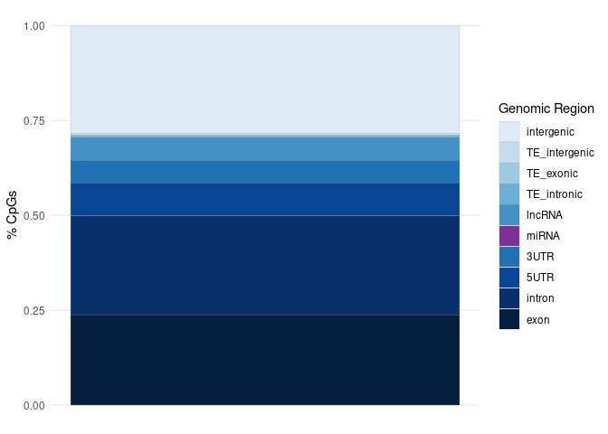
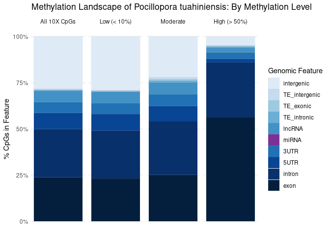

12-Ptuh-WGBS-bismark.Rmd
================
Zoe Dellaert
2025-04-10

- [0.1 This is the downstream methylation analysis of the WGBS data for
  *Pocillopora
  tuahiniensis*](#01-this-is-the-downstream-methylation-analysis-of-the-wgbs-data-for-pocillopora-tuahiniensis)
- [0.2 Important file locations:](#02-important-file-locations)
  - [0.2.1 Note: Most of this code is based on the E5 Time Series
    Molecular code by Steven Roberts
    here](#021-note-most-of-this-code-is-based-on-the-e5-time-series-molecular-code-by-steven-roberts-here)
- [0.3 Generate Bismark Bisulfite
  Genome](#03-generate-bismark-bisulfite-genome)
  - [0.3.1 output:](#031-output)
  - [0.3.2 Compress and generate md5](#032-compress-and-generate-md5)
  - [0.3.3 Output file location: Bismark
    Genome](#033-output-file-location-bismark-genome)
- [0.4 Test parameters](#04-test-parameters)
  - [0.4.1 Results from parameter
    tests:](#041-results-from-parameter-tests)
- [0.5 Align to genome](#05-align-to-genome)
  - [0.5.1 Output file location: All Bismark output
    files](#051-output-file-location-all-bismark-output-files)
- [0.6 Post-alignment code is based once again on Steven’s
  code](#06-post-alignment-code-is-based-once-again-on-stevens-code)
  - [0.6.1 Deduplication, Sorting, and methylation extraction &
    calling](#061-deduplication-sorting-and-methylation-extraction--calling)
  - [0.6.2 View output](#062-view-output)
  - [0.6.3 Make summary reports](#063-make-summary-reports)
  - [0.6.4 Sorting cov files and filtering for coverage and gene
    intersection](#064-sorting-cov-files-and-filtering-for-coverage-and-gene-intersection)
  - [0.6.5 Output file location: All Bismark output files (BAMs, .cov
    files, .bedgraph
    files)](#065-output-file-location-all-bismark-output-files-bams-cov-files-bedgraph-files)
- [0.7 Methylkit](#07-methylkit)
- [0.8 Annotation- I want an intersection of methylated CpGs with the
  various regions in the
  genome:](#08-annotation--i-want-an-intersection-of-methylated-cpgs-with-the-various-regions-in-the-genome)
  - [0.8.1 Extract additional
    features](#081-extract-additional-features)
- [0.9 Plotting annotation
  information](#09-plotting-annotation-information)
  - [0.9.1 Region stacked bars: all
    CpGs](#091-region-stacked-bars-all-cpgs)
  - [0.9.2 Region stacked bars: CpGs by methylation
    status](#092-region-stacked-bars-cpgs-by-methylation-status)
  - [0.9.3 Sample Methylation
    boxplots](#093-sample-methylation-boxplots)
  - [0.9.4 Extract methylation count matrix for
    transcripts](#094-extract-methylation-count-matrix-for-transcripts)
- [0.10 Correlations: Count matrices from
  https://github.com/urol-e5/deep-dive-expression/wiki/03%E2%80%90Expression-Count-Matrices](#010-correlations-count-matrices-from-httpsgithubcomurol-e5deep-dive-expressionwiki03e28090expression-count-matrices)
  - [0.10.1 RNA-seq](#0101-rna-seq)
  - [0.10.2 sRNA-seq](#0102-srna-seq)
  - [0.10.3 lncRNA](#0103-lncrna)

## 0.1 This is the downstream methylation analysis of the WGBS data for *Pocillopora tuahiniensis*

Reads were trimmed and QC’d in [this
code](https://github.com/urol-e5/deep-dive-expression/blob/main/F-Ptuh/code/01.00-F-Ptuh-WGBS-trimming-cutadapt-FastQC-MultiQC.md)

## 0.2 Important file locations:

1.  [Trimmed WGBS
    Reads](https://gannet.fish.washington.edu/gitrepos/urol-e5/deep-dive-expression/F-Ptuh/output/01.00-F-Ptuh-WGBS-trimming-cutadapt-FastQC-MultiQC/)
2.  [Bismark
    Genome](https://gannet.fish.washington.edu/gitrepos/urol-e5/deep-dive-expression/F-Ptuh/data/Bisulfite_Genome/)
3.  [All Bismark output files (BAMs, .cov files, .bedgraph
    files)](https://gannet.fish.washington.edu/gitrepos/urol-e5/deep-dive-expression/F-Ptuh/output/12-Ptuh-WGBS/bismark_cutadapt/)
4.  [Bismark and Qualimap
    MultiQC](https://gannet.fish.washington.edu/gitrepos/urol-e5/deep-dive-expression/F-Ptuh/output/12-Ptuh-WGBS/bismark_cutadapt/multiqc_report.html)
    and [base bismark
    report](https://gannet.fish.washington.edu/gitrepos/urol-e5/deep-dive-expression/F-Ptuh/output/12-Ptuh-WGBS/bismark_cutadapt/bismark_summary_report.html)

### 0.2.1 Note: Most of this code is based on the [E5 Time Series Molecular](https://github.com/urol-e5/timeseries_molecular) code by Steven Roberts [here](https://github.com/urol-e5/timeseries_molecular/blob/main/D-Apul/code/15.5-Apul-bismark.qmd)

## 0.3 Generate Bismark Bisulfite Genome

``` bash
#!/usr/bin/env bash
#SBATCH --export=NONE
#SBATCH --nodes=1 --ntasks-per-node=20
#SBATCH --mem=200GB
#SBATCH -t 24:00:00
#SBATCH --mail-type=BEGIN,END,FAIL #email you when job starts, stops and/or fails
#SBATCH --error=scripts/outs_errs/"%x_error.%j" #if your job fails, the error report will be put in this file
#SBATCH --output=scripts/outs_errs/"%x_output.%j" #once your job is completed, any final job report comments will be put in this file

# load modules needed
module load uri/main
module load Bismark/0.23.1-foss-2021b
module load bowtie2/2.5.2

cd ../data

bismark_genome_preparation --verbose --parallel 10 ./
```

### 0.3.1 output:

``` bash
Using 10 threads for the top and bottom strand indexing processes each, so using 20 cores in total
Writing bisulfite genomes out into a single MFA (multi FastA) file

Bisulfite Genome Indexer version v0.23.1 (last modified: 27 Jan 2021)

Step I - Prepare genome folders - completed


Step II - Genome bisulfite conversions - completed


Bismark Genome Preparation - Step III: Launching the Bowtie 2 indexer
Preparing indexing of CT converted genome in /scratch3/workspace/zdellaert_uri_edu-deep_dive/deep-dive-expression/F-Ptuh/data/Bisulfite_Genome/CT_conversion/
Building a SMALL index
Preparing indexing of GA converted genome in /scratch3/workspace/zdellaert_uri_edu-deep_dive/deep-dive-expression/F-Ptuh/data/Bisulfite_Genome/GA_conversion/
Building a SMALL index
Renaming BS_CT.3.bt2.tmp to BS_CT.3.bt2
Renaming BS_CT.4.bt2.tmp to BS_CT.4.bt2
Renaming BS_CT.1.bt2.tmp to BS_CT.1.bt2
Renaming BS_CT.2.bt2.tmp to BS_CT.2.bt2
Renaming BS_CT.rev.1.bt2.tmp to BS_CT.rev.1.bt2
Renaming BS_CT.rev.2.bt2.tmp to BS_CT.rev.2.bt2
Renaming BS_GA.3.bt2.tmp to BS_GA.3.bt2
Renaming BS_GA.4.bt2.tmp to BS_GA.4.bt2
Renaming BS_GA.1.bt2.tmp to BS_GA.1.bt2
Renaming BS_GA.2.bt2.tmp to BS_GA.2.bt2
Renaming BS_GA.rev.1.bt2.tmp to BS_GA.rev.1.bt2
Renaming BS_GA.rev.2.bt2.tmp to BS_GA.rev.2.bt2
```

### 0.3.2 Compress and generate md5

``` bash
cd ../data
tar -czvf Bisulfite_Genome.tar.gz Bisulfite_Genome
md5sum Bisulfite_Genome.tar.gz | tee Bisulfite_Genome.tar.gz.md5
```

``` bash
1d8399fe951b4f0113ddee438f1bfad1  Bisulfite_Genome.tar.gz
```

### 0.3.3 Output file location: [Bismark Genome](https://gannet.fish.washington.edu/gitrepos/urol-e5/deep-dive-expression/F-Ptuh/data/Bisulfite_Genome/)

## 0.4 Test parameters

``` bash
#!/usr/bin/env bash
#SBATCH --ntasks=1 --cpus-per-task=30 #split one task over multiple CPU
#SBATCH --array=0-4 #for 5 samples
#SBATCH --mem=100GB
#SBATCH -t 00:30:00
#SBATCH --mail-type=END,FAIL,TIME_LIMIT_80 #email you when job stops and/or fails or is nearing its time limit
#SBATCH --error=scripts/outs_errs/"%x_error.%j" #if your job fails, the error report will be put in this file
#SBATCH --output=scripts/outs_errs/"%x_output.%j" #once your job is completed, any final job report comments will be put in this file

# load modules needed
module load uri/main
module load Bismark/0.23.1-foss-2021b
module load bowtie2/2.5.2

# Set directories and files
reads_dir="../output/01.00-F-Ptuh-WGBS-trimming-cutadapt-FastQC-MultiQC/"
genome_folder="../data/"

output_dir="../output/12-Ptuh-WGBS/bismark_paramtest_cutadapt"
checkpoint_file="${output_dir}/completed_samples.log"

# make output directory
mkdir -p ${output_dir}

# Create the checkpoint file if it doesn't exist
touch ${checkpoint_file}

# Get the list of sample files and corresponding sample names
files=(${reads_dir}*_R1_001.fastq.gz)
file="${files[$SLURM_ARRAY_TASK_ID]}"
sample_name=$(basename "$file" "_R1_001.fastq.gz")

# Check if the sample has already been processed
if grep -q "^${sample_name}$" ${checkpoint_file}; then
    echo "Sample ${sample_name} already processed. Skipping..."
    exit 0
fi

# Define log files for stdout and stderr
stdout_log="${output_dir}/${sample_name}_stdout.log"
stderr_log="${output_dir}/${sample_name}_stderr.log"

# Define the array of score_min parameters to test
score_min_params=(
    "L,0,-0.4"
    "L,0,-0.6"
    "L,0,-0.8"
    "L,0,-1.0"
    "L,-1,-0.6"
)

# Loop through each score_min parameter
for score_min in "${score_min_params[@]}"; do
    echo "Running Bismark for sample ${sample_name} with score_min ${score_min}"
    
    # Create a subdirectory for this parameter
    param_output_dir="${output_dir}/${sample_name}_score_${score_min//,/}"
    mkdir -p ${param_output_dir}

    # Run Bismark alignment
    bismark \
        -genome ${genome_folder} \
        -p 8 \
        -u 10000 \
        -score_min ${score_min} \
        --non_directional \
        -1 ${reads_dir}${sample_name}_R1_001.fastq.gz \
        -2 ${reads_dir}${sample_name}_R2_001.fastq.gz \
        -o ${param_output_dir} \
        --basename ${sample_name}_${score_min//,/} \
        2> "${param_output_dir}/${sample_name}-bismark_summary.txt"

    # Check if the command was successful
    if [ $? -eq 0 ]; then
        echo "Sample ${sample_name} with score_min ${score_min} processed successfully."
    else
        echo "Sample ${sample_name} with score_min ${score_min} failed. Check ${stderr_log} for details."
    fi
done

# Mark the sample as completed in the checkpoint file
if [ $? -eq 0 ]; then
    echo ${sample_name} >> ${checkpoint_file}
    echo "All tests for sample ${sample_name} completed."
else
    echo "Sample ${sample_name} encountered errors. Check logs for details."
fi

# Define directories
summary_file="${output_dir}/parameter_comparison_summary.csv"

# Initialize summary file
echo "Sample,Score_Min,Alignment_Rate" > ${summary_file}

# Loop through parameter output directories
for dir in ${output_dir}/*_score_*; do
    if [ -d "$dir" ]; then
        # Extract sample name and score_min parameter from directory name
        sample_name=$(basename "$dir" | cut -d '_' -f1-3)
        score_min=$(basename "$dir" | grep -o "score_.*" | sed 's/score_//; s/_/,/g')

        # Locate the summary file
        summary_file_path="${dir}/${sample_name}_${score_min}_PE_report.txt"

        # Extract metrics
        mapping=$(grep "Mapping efficiency:" ${summary_file_path} | awk '{print "mapping efficiency ", $3}')
        
        # Append to the summary file
        echo "${sample_name},${score_min},${mapping}" >> ${summary_file}
    fi
done
```

### 0.4.1 Results from parameter tests:

| Sample                 | Score_Min | Alignment_Rate |
|:-----------------------|:----------|:---------------|
| trimmed_POC-47-TP2_S13 | L0-0.4    | 34.30%         |
| trimmed_POC-47-TP2_S13 | L0-0.6    | 42.00%         |
| trimmed_POC-47-TP2_S13 | L0-0.8    | 48.20%         |
| trimmed_POC-47-TP2_S13 | L0-1.0    | 54.90%         |
| trimmed_POC-47-TP2_S13 | L-1-0.6   | 42.40%         |
| trimmed_POC-48-TP2_S11 | L0-0.4    | 35.20%         |
| trimmed_POC-48-TP2_S11 | L0-0.6    | 44.10%         |
| trimmed_POC-48-TP2_S11 | L0-0.8    | 51.40%         |
| trimmed_POC-48-TP2_S11 | L0-1.0    | 58.80%         |
| trimmed_POC-48-TP2_S11 | L-1-0.6   | 44.60%         |
| trimmed_POC-50-TP2_S14 | L0-0.4    | 32.80%         |
| trimmed_POC-50-TP2_S14 | L0-0.6    | 40.40%         |
| trimmed_POC-50-TP2_S14 | L0-0.8    | 45.70%         |
| trimmed_POC-50-TP2_S14 | L0-1.0    | 51.40%         |
| trimmed_POC-50-TP2_S14 | L-1-0.6   | 40.90%         |
| trimmed_POC-53-TP2_S15 | L0-0.4    | 31.00%         |
| trimmed_POC-53-TP2_S15 | L0-0.6    | 38.60%         |
| trimmed_POC-53-TP2_S15 | L0-0.8    | 45.20%         |
| trimmed_POC-53-TP2_S15 | L0-1.0    | 52.00%         |
| trimmed_POC-53-TP2_S15 | L-1-0.6   | 38.90%         |
| trimmed_POC-57-TP2_S12 | L0-0.4    | 34.70%         |
| trimmed_POC-57-TP2_S12 | L0-0.6    | 43.80%         |
| trimmed_POC-57-TP2_S12 | L0-0.8    | 50.70%         |
| trimmed_POC-57-TP2_S12 | L0-1.0    | 58.10%         |
| trimmed_POC-57-TP2_S12 | L-1-0.6   | 44.20%         |

## 0.5 Align to genome

``` bash
#!/usr/bin/env bash
#SBATCH --ntasks=1 --cpus-per-task=24 #split one task over multiple CPU
#SBATCH --array=0-4 #for 5 samples
#SBATCH --mem=400GB
#SBATCH -t 48:00:00
#SBATCH --mail-type=END,FAIL,TIME_LIMIT_80 #email you when job stops and/or fails or is nearing its time limit
#SBATCH --error=scripts/outs_errs/"%x_error.%j" #if your job fails, the error report will be put in this file
#SBATCH --output=scripts/outs_errs/"%x_output.%j" #once your job is completed, any final job report comments will be put in this file

# load modules needed
module load uri/main
module load Bismark/0.23.1-foss-2021b
module load bowtie2/2.5.2

# Set directories and files
reads_dir="../output/01.00-F-Ptuh-WGBS-trimming-cutadapt-FastQC-MultiQC/"
genome_folder="../data/"

output_dir="../output/12-Ptuh-WGBS/bismark_cutadapt"
checkpoint_file="${output_dir}/completed_samples.log"

# make output directory
mkdir -p ${output_dir}

# Create the checkpoint file if it doesn't exist
touch ${checkpoint_file}

# Get the list of sample files and corresponding sample names
files=(${reads_dir}*_R1_001.fastq.gz)
file="${files[$SLURM_ARRAY_TASK_ID]}"
sample_name=$(basename "$file" "_R1_001.fastq.gz")

# Check if the sample has already been processed
if grep -q "^${sample_name}$" ${checkpoint_file}; then
    echo "Sample ${sample_name} already processed. Skipping..."
    exit 0
fi

# Define log files for stdout and stderr
stdout_log="${output_dir}/${sample_name}_stdout.log"
stderr_log="${output_dir}/${sample_name}_stderr.log"

    # Run Bismark alignment
    bismark \
        -genome ${genome_folder} \
        -p 8 \
        -score_min L,0,-1.0 \
        --non_directional \
        -1 ${reads_dir}${sample_name}_R1_001.fastq.gz \
        -2 ${reads_dir}${sample_name}_R2_001.fastq.gz \
        -o ${output_dir} \
        --basename ${sample_name} \
        2> "${output_dir}/${sample_name}-bismark_summary.txt"

# Check if the command was successful
if [ $? -eq 0 ]; then
    # Append the sample name to the checkpoint file
    echo ${sample_name} >> ${checkpoint_file}
    echo "Sample ${sample_name} processed successfully."
else
    echo "Sample ${sample_name} failed. Check ${stderr_log} for details."
fi

# Define directories
summary_file="${output_dir}/alignment_summary.csv"

# Initialize summary file
echo "Sample,Score_Min,Alignment_Rate" > ${summary_file}

# Loop through parameter output directories
for file in ${output_dir}/*_report.txt; do
    # Extract sample name and score_min parameter from directory name
    sample_name=$(basename "$file" | cut -d'_' -f1-3)
    score_min="L0-1.0"

    # Locate the summary file
    summary_file_path="${output_dir}/${sample_name}_PE_report.txt"

    # Extract metrics
    mapping=$(grep "Mapping efficiency:" ${summary_file_path} | awk '{gsub("%", "", $3); print $3}')

    # Append to the summary file
    echo "${sample_name},${score_min},${mapping}" >> ${summary_file}
done
```

``` r
alignment_rate <- read.csv("../output/12-Ptuh-WGBS/bismark_cutadapt/alignment_summary.csv")
alignment_rate
```

                      Sample Score_Min Alignment_Rate
    1 trimmed_POC-47-TP2_S13    L0-1.0           59.2
    2 trimmed_POC-48-TP2_S11    L0-1.0           58.9
    3 trimmed_POC-50-TP2_S14    L0-1.0           57.0
    4 trimmed_POC-53-TP2_S15    L0-1.0           55.7
    5 trimmed_POC-57-TP2_S12    L0-1.0           58.4

``` r
mean(alignment_rate$Alignment_Rate)
```

    [1] 57.84

### 0.5.1 Output file location: [All Bismark output files](https://gannet.fish.washington.edu/gitrepos/urol-e5/deep-dive-expression/F-Ptuh/output/12-Ptuh-WGBS/bismark_cutadapt/)

## 0.6 Post-alignment code is based once again on [Steven’s code](https://github.com/urol-e5/timeseries_molecular/blob/main/D-Apul/code/15.5-Apul-bismark.qmd)

### 0.6.1 Deduplication, Sorting, and methylation extraction & calling

``` bash
#!/usr/bin/env bash
#SBATCH --export=NONE
#SBATCH --nodes=1 --ntasks-per-node=24
#SBATCH --mem=250GB
#SBATCH -t 24:00:00
#SBATCH --mail-type=BEGIN,END,FAIL #email you when job starts, stops and/or fails
#SBATCH --error=scripts/outs_errs/"%x_error.%j" #if your job fails, the error report will be put in this file
#SBATCH --output=scripts/outs_errs/"%x_output.%j" #once your job is completed, any final job report comments will be put in this file

# load modules needed
module load uri/main
module load Bismark/0.23.1-foss-2021b
module load parallel/20240822

# set directories
bismark_dir="../output/12-Ptuh-WGBS/bismark_cutadapt/"
genome_folder="../data/"

### deduplicate bams
find ${bismark_dir}*.bam | \
xargs -n 1 basename | \
sed 's/^trimmed_//' | sed 's/_pe.bam$//' | \
parallel -j 8 deduplicate_bismark \
--bam \
--paired \
--output_dir ${bismark_dir} \
${bismark_dir}trimmed_{}_pe.bam

### methylation extraction

find ${bismark_dir}*deduplicated.bam | xargs -n 1 -I{} \
bismark_methylation_extractor --bedGraph --counts --comprehensive --merge_non_CpG \
--multicore 24 --buffer_size 75% --output ${bismark_dir} "{}"

### methylation call

find ${bismark_dir}*deduplicated.bismark.cov.gz | \
xargs -n 1 basename | \
sed 's/^trimmed_//' | sed 's/_pe.deduplicated.bismark.cov.gz$//' | \
parallel -j 24 coverage2cytosine \
--genome_folder ${genome_folder} \
-o ${bismark_dir}{} \
--merge_CpG \
--zero_based \
${bismark_dir}trimmed_{}_pe.deduplicated.bismark.cov.gz

### sort bams

# change modules

module purge
module load samtools/1.19.2

find ${bismark_dir}*deduplicated.bam | \
xargs -n 1 basename | \
sed 's/^trimmed_//' | sed 's/_pe.deduplicated.bam$//' | \
xargs -I{} samtools \
sort --threads 24 \
${bismark_dir}trimmed_{}_pe.deduplicated.bam \
-o ${bismark_dir}{}.sorted.bam
```

This took just over 5 hours with max memory used per node as 249.99GiB.

### 0.6.2 View output

``` bash
head ${bismark_dir}*evidence.cov
```

### 0.6.3 Make summary reports

``` bash
#!/usr/bin/env bash
#SBATCH --export=NONE
#SBATCH --nodes=1 --ntasks-per-node=8
#SBATCH --mem=250GB
#SBATCH -t 08:00:00
#SBATCH --mail-type=BEGIN,END,FAIL #email you when job starts, stops and/or fails
#SBATCH --error=scripts/outs_errs/"%x_error.%j" #if your job fails, the error report will be put in this file
#SBATCH --output=scripts/outs_errs/"%x_output.%j" #once your job is completed, any final job report comments will be put in this file

module load uri/main
module load Bismark/0.23.1-foss-2021b
module load all/MultiQC/1.12-foss-2021b
module load qualimap/2.2.1

cd ../output/12-Ptuh-WGBS/bismark_cutadapt/

bam2nuc --genome_folder ../../../data/ *_pe.deduplicated.bam

mkdir -p qualimap/bamqc

for bamFile in *sorted.bam; do
    prefix=$(basename $bamFile .bam)

    qualimap \
    --java-mem-size=29491M \
    bamqc \
     \
    -bam ${bamFile}  \
     \
    -p non-strand-specific \
    --collect-overlap-pairs \
    -outdir qualimap/bamqc/${prefix} \
    -nt 6
done

bismark2report
bismark2summary *pe.bam

multiqc .
```

#### 0.6.3.1 Output file location: [Bismark and Qualimap MultiQC](https://gannet.fish.washington.edu/gitrepos/urol-e5/deep-dive-expression/F-Ptuh/output/12-Ptuh-WGBS/bismark_cutadapt/multiqc_report.html) and [base bismark report](https://gannet.fish.washington.edu/gitrepos/urol-e5/deep-dive-expression/F-Ptuh/output/12-Ptuh-WGBS/bismark_cutadapt/bismark_summary_report.html)

### 0.6.4 Sorting cov files and filtering for coverage and gene intersection

``` bash
# salloc -p cpu -c 8 --mem 16G

# load modules needed
module load bedtools2/2.31.1

# set directories and files
root_dir="/scratch3/workspace/zdellaert_uri_edu-deep_dive/deep-dive-expression/F-Ptuh/"
bismark_dir="${root_dir}/output/12-Ptuh-WGBS/bismark_cutadapt/"
genome_folder="${root_dir}/data/"
gtf_name="Pocillopora_meandrina_HIv1.genes-validated"

# Sort .cov files
cd ${bismark_dir}
for file in *merged_CpG_evidence.cov
do
  sample=$(basename "${file}" .CpG_report.merged_CpG_evidence.cov)
  bedtools sort -i "${file}" \
  > "${sample}"_sorted.cov
done

# Create bedgraphs for 5X coverage 
for file in *_sorted.cov
do
  sample=$(basename "${file}" _sorted.cov)
  cat "${file}" | awk -F $'\t' 'BEGIN {OFS = FS} {if ($5+$6 >= 5) {print $1, $2, $3, $4}}' \
  > "${sample}"_5x_sorted.bedgraph
done

# Create .tab files for 5x coverage
for file in *_sorted.cov
do
  sample=$(basename "${file}" _sorted.cov)
  cat "${file}" | awk -F $'\t' 'BEGIN {OFS = FS} {if ($5+$6 >= 5) {print $1, $2, $3, $4, $5, $6}}' \
  > "${sample}"_5x_sorted.tab
done

# Intersection of all samples
multiIntersectBed -i *_5x_sorted.tab > CpG.all.samps.5x_sorted.bed

## change number after == to your number of samples
cat CpG.all.samps.5x_sorted.bed | awk '$4 ==5' > CpG.filt.all.samps.5x_sorted.bed 

# Intersection of all samples with gene bodies:
awk '{if ($3 == "transcript") {print}}' "${genome_folder}/${gtf_name}.gtf"  > "${genome_folder}/${gtf_name}_transcripts.gtf"

for i in *5x_sorted.tab
do
  intersectBed \
  -wb \
  -a ${i} \
  -b "${genome_folder}/${gtf_name}_transcripts.gtf" \
  > ${i}_gene
done

# Keep only loci intersecting with genes found in all samples
for i in *_5x_sorted.tab_gene
do
  intersectBed \
  -a ${i} \
  -b CpG.filt.all.samps.5x_sorted.bed \
  > ${i}_CpG_5x_enrichment.bed
done

# Global methylation levels 
for file in *_sorted.cov; do
  sample=$(basename "$file" _sorted.cov)
  awk '{methylated+=$5; unmethylated+=$6} END {print "'$sample'", methylated/(methylated+unmethylated)}' "$file"
done > global_methylation_levels.txt
```

### 0.6.5 Output file location: [All Bismark output files (BAMs, .cov files, .bedgraph files)](https://gannet.fish.washington.edu/gitrepos/urol-e5/deep-dive-expression/F-Ptuh/output/12-Ptuh-WGBS/bismark_cutadapt/)

## 0.7 Methylkit

``` r
# Load methylKit and other packages
library("methylKit")
library("tidyverse")
library("parallel")
library("ggpmisc")

file_list <- list.files("/scratch3/workspace/zdellaert_uri_edu-deep_dive_exp/deep-dive-expression/F-Ptuh/output/12-Ptuh-WGBS/bismark_cutadapt/",pattern = ".merged_CpG_evidence.cov$",  full.names = TRUE, include.dirs = FALSE)
sample <- gsub("_S\\d{1,2}.CpG_report.merged_CpG_evidence.cov", "", basename(file_list))

file_list <- list.files("/scratch3/workspace/zdellaert_uri_edu-deep_dive_exp/deep-dive-expression/F-Ptuh/output/12-Ptuh-WGBS/bismark_cutadapt/",pattern = "_pe.deduplicated.bismark.cov.gz",  full.names = TRUE, include.dirs = FALSE)
sample <- gsub("trimmed_", "", basename(file_list))
sample <- gsub("_S\\d{1,2}_pe.deduplicated.bismark.cov.gz", "", sample)

file_list <- as.list(file_list)
treatment <- c(0,0,0,0,0)

sample
```

    [1] "POC-47-TP2" "POC-48-TP2" "POC-50-TP2" "POC-53-TP2" "POC-57-TP2"

``` r
file_list
```

    [[1]]
    [1] "/scratch3/workspace/zdellaert_uri_edu-deep_dive_exp/deep-dive-expression/F-Ptuh/output/12-Ptuh-WGBS/bismark_cutadapt//trimmed_POC-47-TP2_S13_pe.deduplicated.bismark.cov.gz"

    [[2]]
    [1] "/scratch3/workspace/zdellaert_uri_edu-deep_dive_exp/deep-dive-expression/F-Ptuh/output/12-Ptuh-WGBS/bismark_cutadapt//trimmed_POC-48-TP2_S11_pe.deduplicated.bismark.cov.gz"

    [[3]]
    [1] "/scratch3/workspace/zdellaert_uri_edu-deep_dive_exp/deep-dive-expression/F-Ptuh/output/12-Ptuh-WGBS/bismark_cutadapt//trimmed_POC-50-TP2_S14_pe.deduplicated.bismark.cov.gz"

    [[4]]
    [1] "/scratch3/workspace/zdellaert_uri_edu-deep_dive_exp/deep-dive-expression/F-Ptuh/output/12-Ptuh-WGBS/bismark_cutadapt//trimmed_POC-53-TP2_S15_pe.deduplicated.bismark.cov.gz"

    [[5]]
    [1] "/scratch3/workspace/zdellaert_uri_edu-deep_dive_exp/deep-dive-expression/F-Ptuh/output/12-Ptuh-WGBS/bismark_cutadapt//trimmed_POC-57-TP2_S12_pe.deduplicated.bismark.cov.gz"

``` r
# methyl_list <- mclapply(seq_along(file_list), function(i) {
#   methRead(
#     file_list[[i]],
#     assembly = "Ptuh",
#     treatment = treatment[i],
#     sample.id = sample[[i]],
#     context = "CpG",
#     mincov = 10,
#     pipeline = "bismarkCoverage"
#   )
# }, mc.cores = 4)
# 
# methylObj <- new("methylRawList", methyl_list)
# methylObj@treatment <- c(0, 0, 0, 0,0)
# 
# save(methylObj, file = "../output/12-Ptuh-WGBS/methylkit/MethylObj.RData")
```

``` r
load("../output/12-Ptuh-WGBS/methylkit/MethylObj.RData")

getMethylationStats(methylObj[[1]],plot=FALSE,both.strands=FALSE)
getMethylationStats(methylObj[[1]], plot = TRUE,both.strands=FALSE)
getCoverageStats(methylObj[[1]],plot=TRUE,both.strands=FALSE)
```

``` r
filtered_methylObj=filterByCoverage(methylObj,lo.count=5,lo.perc=NULL,
                                      hi.count=NULL,hi.perc=99.9)

filtered_methylObj_norm <-  methylKit::normalizeCoverage(filtered_methylObj)
meth_filter <- methylKit::unite(filtered_methylObj_norm,destrand=FALSE, min.per.group = 4L)

save(meth_filter, file = "../output/12-Ptuh-WGBS/methylkit/MethylObj_filtered.RData")
```

``` r
load("../output/12-Ptuh-WGBS/methylkit/MethylObj_filtered.RData")

PCASamples(meth_filter)
```

<!-- -->

``` r
clusterSamples(meth_filter, dist = "correlation", method = "ward", plot = TRUE)
```

<!-- -->

    Call:
    hclust(d = d, method = HCLUST.METHODS[hclust.method])

    Cluster method   : ward.D 
    Distance         : pearson 
    Number of objects: 5 

``` r
getCorrelation(meth_filter)
```

               POC-47-TP2 POC-48-TP2 POC-50-TP2 POC-53-TP2 POC-57-TP2
    POC-47-TP2  1.0000000  0.8642741  0.8665897  0.8656579  0.8479776
    POC-48-TP2  0.8642741  1.0000000  0.8631870  0.8597653  0.8641470
    POC-50-TP2  0.8665897  0.8631870  1.0000000  0.8639496  0.8565860
    POC-53-TP2  0.8656579  0.8597653  0.8639496  1.0000000  0.8490203
    POC-57-TP2  0.8479776  0.8641470  0.8565860  0.8490203  1.0000000

## 0.8 Annotation- I want an intersection of methylated CpGs with the various regions in the genome:

``` r
library("genomationData")
library("genomation")
library("GenomicRanges")

# get a list of all chromosomes and lengths in the genome
chr_sizes <- read.table("../data/Pocillopora_meandrina_HIv1.assembly.fa.fai", header = FALSE)[,1:2]
colnames(chr_sizes) <- c("seqnames", "seqlengths")

genome_GR <- GRanges(seqnames = chr_sizes$seqnames,
                     ranges   = IRanges(start = 1, end = chr_sizes$seqlengths))

# convert methylation data to GRange object
meth_GR <- as(meth_filter, "GRanges")

#extract percent methylation and add this to GRanges object
meth_matrix <- as.data.frame(percMethylation(meth_filter))
meth_GR$meth <- meth_matrix

# import gtf
gtf.file = "../data/Pocillopora_meandrina_HIv1.genes-validated.gtf"
gtf = genomation::gffToGRanges(gtf.file)
head(gtf)
```

    GRanges object with 6 ranges and 6 metadata columns:
                        seqnames    ranges strand |   source       type     score
                           <Rle> <IRanges>  <Rle> | <factor>   <factor> <numeric>
      [1] Pocillopora_meandrin..  887-6811      - | AUGUSTUS transcript        NA
      [2] Pocillopora_meandrin..   887-973      - | AUGUSTUS exon              NA
      [3] Pocillopora_meandrin.. 1828-1882      - | AUGUSTUS exon              NA
      [4] Pocillopora_meandrin.. 2308-2371      - | AUGUSTUS exon              NA
      [5] Pocillopora_meandrin.. 2891-2920      - | AUGUSTUS exon              NA
      [6] Pocillopora_meandrin.. 3013-3067      - | AUGUSTUS exon              NA
              phase          transcript_id                gene_id
          <integer>            <character>            <character>
      [1]      <NA> mrna-Pocillopora_mea.. gene-Pocillopora_mea..
      [2]      <NA> mrna-Pocillopora_mea.. gene-Pocillopora_mea..
      [3]      <NA> mrna-Pocillopora_mea.. gene-Pocillopora_mea..
      [4]      <NA> mrna-Pocillopora_mea.. gene-Pocillopora_mea..
      [5]      <NA> mrna-Pocillopora_mea.. gene-Pocillopora_mea..
      [6]      <NA> mrna-Pocillopora_mea.. gene-Pocillopora_mea..
      -------
      seqinfo: 194 sequences from an unspecified genome; no seqlengths

``` r
#extract transcripts
transcripts = gffToGRanges(gtf.file, filter = "transcript")

unique(gtf$type)
```

    [1] transcript exon       CDS       
    Levels: transcript exon CDS

### 0.8.1 Extract additional features

``` r
#extract exons and introns
exons = gffToGRanges(gtf.file, filter = "exon")
introns = GenomicRanges::setdiff(transcripts, exons)

# import 3' UTR and 5' UTR annotation files
gff.file_3UTR = "../output/16-Ptuh-annotate-UTRs/Ptuh.GFFannotation.3UTR_1kb_corrected.gff"
gff.file_5UTR = "../output/16-Ptuh-annotate-UTRs/Ptuh.GFFannotation.5UTR_1kb_corrected.gff"

gff3UTR = genomation::gffToGRanges(gff.file_3UTR)
gff5UTR = genomation::gffToGRanges(gff.file_5UTR)
head(gff3UTR)
```

    GRanges object with 6 ranges and 6 metadata columns:
                        seqnames      ranges strand |   source       type     score
                           <Rle>   <IRanges>  <Rle> | <factor>   <factor> <numeric>
      [1] Pocillopora_meandrin.. 23653-24652      + | AUGUSTUS 3prime_UTR        NA
      [2] Pocillopora_meandrin.. 24129-25128      - | AUGUSTUS 3prime_UTR        NA
      [3] Pocillopora_meandrin.. 39297-40296      + | AUGUSTUS 3prime_UTR        NA
      [4] Pocillopora_meandrin.. 50799-51798      + | AUGUSTUS 3prime_UTR        NA
      [5] Pocillopora_meandrin.. 51050-52049      - | AUGUSTUS 3prime_UTR        NA
      [6] Pocillopora_meandrin.. 71870-72869      + | AUGUSTUS 3prime_UTR        NA
              phase                     ID                 Parent
          <integer>            <character>        <CharacterList>
      [1]      <NA> mrna-Pocillopora_mea.. gene-Pocillopora_mea..
      [2]      <NA> mrna-Pocillopora_mea.. gene-Pocillopora_mea..
      [3]      <NA> mrna-Pocillopora_mea.. gene-Pocillopora_mea..
      [4]      <NA> mrna-Pocillopora_mea.. gene-Pocillopora_mea..
      [5]      <NA> mrna-Pocillopora_mea.. gene-Pocillopora_mea..
      [6]      <NA> mrna-Pocillopora_mea.. gene-Pocillopora_mea..
      -------
      seqinfo: 194 sequences from an unspecified genome; no seqlengths

#### 0.8.1.1 Transposable elements:

Import Transposable element file from repeat masker format, downloaded
from [deep-dive
repo](https://github.com/urol-e5/deep-dive/blob/main/F-Pmea/data/Pocillopora_meandrina_HIv1.assembly.fasta.out)
and uploaded to
<https://github.com/urol-e5/deep-dive-expression/tree/main/F-Ptuh/data/Pocillopora_meandrina_HIv1.assembly.fasta.out>

``` r
rmsk <- read.table("../data/Pocillopora_meandrina_HIv1.assembly.fasta.out",
                   skip = 3, fill = TRUE, stringsAsFactors = FALSE, quote = "") %>% drop_na()

# Assign column names based on RepeatMasker .out format
colnames(rmsk)[c(5, 6, 7, 10)] <- c("seqname", "start", "end", "repeat_name")

# Create a GRanges object
TE <- GRanges(
  seqnames = rmsk$seqname,
  ranges = IRanges(start = as.numeric(rmsk$start), end = as.numeric(rmsk$end)),
  strand = "*",
  repeat_name = rmsk$repeat_name
)

TE$type <- "transposable_element"

head(TE)
```

    GRanges object with 6 ranges and 2 metadata columns:
                        seqnames      ranges strand |  repeat_name
                           <Rle>   <IRanges>  <Rle> |  <character>
      [1] Pocillopora_meandrin..   1059-1625      * |   (TGCTGGA)n
      [2] Pocillopora_meandrin..   2710-2741      * |      (GTAT)n
      [3] Pocillopora_meandrin..   9292-9364      * | tRNA-Cys-TGY
      [4] Pocillopora_meandrin.. 10683-10701      * |         (A)n
      [5] Pocillopora_meandrin.. 13702-13737      * |    (ATTTAC)n
      [6] Pocillopora_meandrin.. 17312-17317      * |      (TGTT)n
                          type
                   <character>
      [1] transposable_element
      [2] transposable_element
      [3] transposable_element
      [4] transposable_element
      [5] transposable_element
      [6] transposable_element
      -------
      seqinfo: 209 sequences from an unspecified genome; no seqlengths

#### 0.8.1.2 miRNA:

``` r
miRNAs = genomation::gffToGRanges("../output/05-Ptuh-sRNA-ShortStack_4.1.0/Ptuh_ShortStack_4.1.0_mature.gff3")

head(miRNAs)
```

    GRanges object with 6 ranges and 6 metadata columns:
                        seqnames            ranges strand |     source         type
                           <Rle>         <IRanges>  <Rle> |   <factor>     <factor>
      [1] Pocillopora_meandrin..     818049-818070      + | ShortStack mature_miRNA
      [2] Pocillopora_meandrin..   2872041-2872061      + | ShortStack mature_miRNA
      [3] Pocillopora_meandrin.. 20372469-20372490      - | ShortStack mature_miRNA
      [4] Pocillopora_meandrin..   1459455-1459476      + | ShortStack mature_miRNA
      [5] Pocillopora_meandrin.. 19145788-19145809      + | ShortStack mature_miRNA
      [6] Pocillopora_meandrin..   3841966-3841987      - | ShortStack mature_miRNA
              score     phase                 ID          Parent
          <numeric> <integer>        <character> <CharacterList>
      [1]      3240      <NA>  Cluster_21.mature      Cluster_21
      [2]       110      <NA>  Cluster_36.mature      Cluster_36
      [3]       769      <NA> Cluster_360.mature     Cluster_360
      [4]      2252      <NA> Cluster_390.mature     Cluster_390
      [5]      1102      <NA> Cluster_757.mature     Cluster_757
      [6]     98704      <NA> Cluster_925.mature     Cluster_925
      -------
      seqinfo: 17 sequences from an unspecified genome; no seqlengths

#### 0.8.1.3 lncRNA:

``` r
lncRNAs = genomation::gffToGRanges("../output/17-Ptuh-lncRNA/Ptuh-lncRNA.gtf")
head(lncRNAs)
```

    GRanges object with 6 ranges and 5 metadata columns:
                        seqnames        ranges strand |   source     type     score
                           <Rle>     <IRanges>  <Rle> | <factor> <factor> <numeric>
      [1] Pocillopora_meandrin.. 130008-130942      + |       NA   lncRNA        NA
      [2] Pocillopora_meandrin.. 164396-165221      + |       NA   lncRNA        NA
      [3] Pocillopora_meandrin.. 164598-165221      + |       NA   lncRNA        NA
      [4] Pocillopora_meandrin.. 168918-182502      + |       NA   lncRNA        NA
      [5] Pocillopora_meandrin.. 245810-248612      + |       NA   lncRNA        NA
      [6] Pocillopora_meandrin.. 282744-283165      + |       NA   lncRNA        NA
              phase     gene_id
          <integer> <character>
      [1]      <NA>  lncRNA_001
      [2]      <NA>  lncRNA_002
      [3]      <NA>  lncRNA_003
      [4]      <NA>  lncRNA_004
      [5]      <NA>  lncRNA_005
      [6]      <NA>  lncRNA_006
      -------
      seqinfo: 175 sequences from an unspecified genome; no seqlengths

## 0.9 Plotting annotation information

``` r
# Define intergenic = genome - all annotations
# First combine all annotated regions
all_annotated <- GenomicRanges::reduce(c(gff5UTR, gff3UTR, exons, introns, lncRNAs, miRNAs))

# Intergenic CpGs = All CpGs not in above annotated regions
intergenic <- GenomicRanges::setdiff(genome_GR, all_annotated, ignore.strand=TRUE)

# TEs - intergenic

TE_intergenic <- IRanges::subsetByOverlaps(TE, intergenic, ignore.strand = TRUE)

# TEs - exonic

TE_exonic <- IRanges::subsetByOverlaps(TE, exons, ignore.strand = TRUE)

# TEs - intronic

TE_intronic <- IRanges::subsetByOverlaps(TE, introns, ignore.strand = TRUE)
```

``` r
# Priority list
region_priority <- list(
  miRNA = miRNAs,
  lncRNA = lncRNAs,
  `5UTR` = gff5UTR,
  `3UTR` = gff3UTR,
  TE_exonic = TE_exonic,
  TE_intronic = TE_intronic,
  exon = exons,
  intron = introns,
  TE_intergenic = TE_intergenic,
  intergenic = intergenic
)

# Start with all CpGs unassigned
cpg_annot <- rep(NA, length(meth_GR))

# Keep track of which CpGs are still unassigned
unassigned <- rep(TRUE, length(meth_GR))

# Assign in priority order
for (region_name in names(region_priority)) {
  region <- region_priority[[region_name]]
  transcript_CpG <- findOverlaps(meth_GR[unassigned], region)
  
  # Map the indices back to full set
  full_indices <- which(unassigned)[queryHits(transcript_CpG)]
  
  cpg_annot[full_indices] <- region_name
  unassigned[full_indices] <- FALSE  # Mark these as assigned
}
```

### 0.9.1 Region stacked bars: all CpGs

``` r
df_annotated <- meth_matrix
df_annotated$region <- cpg_annot

table(df_annotated$region)
```

             3UTR          5UTR          exon    intergenic        intron 
           406304        601623       1640957       1957672       1795327 
           lncRNA         miRNA     TE_exonic TE_intergenic   TE_intronic 
           421988            16         13868         29083         26168 

``` r
#set as factor
df_annotated$region <- factor(df_annotated$region,levels = c("intergenic", "TE_intergenic",
                                                             "TE_exonic",
                                                             "TE_intronic",
                                                             "lncRNA","miRNA","3UTR", "5UTR", "intron", "exon"))

table(df_annotated$region)
```

       intergenic TE_intergenic     TE_exonic   TE_intronic        lncRNA 
          1957672         29083         13868         26168        421988 
            miRNA          3UTR          5UTR        intron          exon 
               16        406304        601623       1795327       1640957 

``` r
blue_palette <- c(
  "intergenic"     = "#deebf7",  
  "TE_intergenic"  = "#c6dbef",
  "TE_exonic"      = "#9ecae1",
  "TE_intronic"    = "#6baed6",
  "lncRNA"         = "#4292c6",
  "miRNA"          = "#7b3294", 
  "3UTR"           = "#2171b5",  
  "5UTR"           = "#084594",  
  "intron"         = "#08306b", 
  "exon"           = "#041f3d"  
)

ggplot(df_annotated, aes(x=1,fill = region)) +
  geom_bar(position = "fill",color="darkgrey",size=0.1) +
  theme_minimal() +
  labs(y = "% CpGs",
    fill = "Genomic Region") +
  theme(axis.title.x = element_blank(),axis.text.x = element_blank(), panel.grid.minor = element_blank(),panel.grid.major.x = element_blank()) +
  scale_fill_manual(values = blue_palette)
```

<!-- -->

### 0.9.2 Region stacked bars: CpGs by methylation status

``` r
# Calculate average across all samples
avg_meth <- rowMeans(meth_matrix, na.rm = TRUE)

# Add to annotated data
df_annotated$avg_meth <- avg_meth

# Classify methylation status
low_thresh <- 10
high_thresh <- 50
df_annotated$meth_status <- cut(df_annotated$avg_meth,
                                breaks = c(-Inf, low_thresh, high_thresh, Inf),
                                labels = c("Low (< 10%)", "Moderate", "High (> 50%)"))
```

``` r
df_annotated <- df_annotated %>%
  mutate(facet_group = meth_status) %>%
  bind_rows(
    df_annotated %>% mutate(facet_group = "All 10X CpGs")
  )

df_annotated$facet_group <- factor(df_annotated$facet_group, levels = c("All 10X CpGs", "Low (< 10%)", "Moderate", "High (> 50%)"))

ggplot(df_annotated, aes(x = 1, fill = region)) +
  geom_bar(position = "fill",color="darkgrey",size=0.05) +
  theme_minimal() +
  labs(y = "% CpGs in Feature",
    fill = "Genomic Feature", title="Methylation Landscape of Pocillopora tuahiniensis: By Methylation Level") +
  theme(axis.title.x = element_blank(),axis.text.x = element_blank(), panel.grid.minor = element_blank(),panel.grid.major.x = element_blank()) +
  scale_fill_manual(values = blue_palette)  + facet_wrap(~facet_group,nrow=1) +
  scale_y_continuous(labels = scales::percent_format())
```

<!-- -->

``` r
ggsave("../code/12-Ptuh-WGBS_files/figures/CpG_landscape_methylation_facet.jpeg", width = 8, height = 5, dpi = 600)

ggplot(df_annotated, aes(x = region, fill = meth_status)) +
  geom_bar(position = "fill") + 
  theme_minimal() +
  labs(
    title = "Methylation Landscape of Pocillopora tuahiniensis: By Genomic Feature",
    x = "Genomic Feature",
    y = "% of CpGs with Methylation Stauts",
    fill = "Methylation Status"
  ) +
  scale_fill_manual(values = c("Low (< 10%)" = "#3498db", "Moderate" = "#bdc3c7", "High (> 50%)" = "#e74c3c")) +
  theme(axis.text.x = element_text(angle = 45, hjust = 1)) +
  scale_y_continuous(labels = scales::percent_format())
```

<!-- -->

``` r
ggsave("../code/12-Ptuh-WGBS_files/figures/CpG_landscape_methylation_facet_by_feature.jpeg", width = 8, height = 5, dpi = 600)

write.csv(df_annotated %>% select(region,avg_meth,meth_status), "../output/12-Ptuh-WGBS/CpG_meth_genome_feature_annotated.csv")
```

``` r
df_summary <- df_annotated %>%
  group_by(region) %>%
  summarise(mean_meth = mean(avg_meth, na.rm = TRUE))
df_summary
```

    # A tibble: 10 × 2
       region        mean_meth
       <fct>             <dbl>
     1 intergenic         2.08
     2 TE_intergenic      3.89
     3 TE_exonic          8.52
     4 TE_intronic        4.71
     5 lncRNA             2.66
     6 miRNA              7.55
     7 3UTR               2.86
     8 5UTR               2.30
     9 intron             3.73
    10 exon               5.60

### 0.9.3 Sample Methylation boxplots

``` r
# Add region info
meth_long <- as.data.frame(meth_matrix)
meth_long$region <- cpg_annot

# Reshape: One row per CpG × sample
meth_long_long <- meth_long %>%
  pivot_longer(
    cols = -region, 
    names_to = "sample", 
    values_to = "perc_meth"
  )

# Now summarize: mean methylation per sample × region
meth_summary <- meth_long_long %>%
  group_by(sample, region) %>%
  summarise(mean_meth = mean(perc_meth, na.rm = TRUE), .groups = "drop")

ggplot(meth_summary, aes(x = region, y = mean_meth)) +
  geom_boxplot(outlier.shape = NA) +
  geom_jitter(aes(color = sample), width = 0.1) +
  theme_minimal() +
  labs(
    title = "Sample-Wise Average Methylation by Genomic Region",
    x = "Genomic Region",
    y = "Mean % Methylation per Sample"
  ) +
  theme(axis.text.x = element_text(angle = 45, hjust = 1))
```

<!-- -->

### 0.9.4 Extract methylation count matrix for transcripts

``` r
transcript_CpG <- findOverlaps(meth_GR, transcripts)

# Create a data frame with CpG-to-transcript mapping
df <- data.frame(
  cpg_ix = queryHits(transcript_CpG),
  transcript_id = transcripts$transcript_id[subjectHits(transcript_CpG)])

df$transcript_id <- gsub("-T1","",df$transcript_id)

# Merge with CpG methylation 
meth_df <- as.data.frame(meth_GR)[df$cpg_ix, ]
meth_df$transcript_id <- df$transcript_id

meth_long <- meth_df %>%
  select(starts_with("meth."), transcript_id) %>%
  rename_with(~gsub("meth\\.", "", .x)) %>%
  pivot_longer(
    cols = -transcript_id,
    names_to = "sample",
    values_to = "perc_meth"
  ) %>%
  filter(!is.na(perc_meth))

# Summarize: Mean % methylation per transcript × sample
CpG_count_transcripts <- meth_long %>%
  group_by(transcript_id, sample) %>%
  summarise(mean_meth = mean(perc_meth, na.rm = TRUE), .groups = "drop") %>%
  pivot_wider(names_from = sample, values_from = mean_meth)

write.csv(CpG_count_transcripts, "../output/12-Ptuh-WGBS/CpG_Transcript_CountMat.csv")
```

#### 0.9.4.1 For miRNA

``` r
# Overlap CpGs with miRNAs
miRNA_CpG <- findOverlaps(meth_GR, miRNAs)

# Map CpGs to miRNA IDs
df_miRNA <- data.frame(
  cpg_ix = queryHits(miRNA_CpG),
  miRNA_id = miRNAs$ID[subjectHits(miRNA_CpG)]
)

# Subset methylation data
meth_df_miRNA <- as.data.frame(meth_GR)[df_miRNA$cpg_ix, ]
meth_df_miRNA$miRNA_id <- df_miRNA$miRNA_id

# Tidy and summarize
miRNA_meth_long <- meth_df_miRNA %>%
  select(starts_with("meth."), miRNA_id) %>%
  rename_with(~gsub("meth\\.", "", .x)) %>%
  pivot_longer(
    cols = -miRNA_id,
    names_to = "sample",
    values_to = "perc_meth"
  ) %>%
  filter(!is.na(perc_meth))

CpG_count_miRNAs <- miRNA_meth_long %>%
  group_by(miRNA_id, sample) %>%
  summarise(mean_meth = mean(perc_meth, na.rm = TRUE), .groups = "drop") %>%
  pivot_wider(names_from = sample, values_from = mean_meth)

write.csv(CpG_count_miRNAs, "../output/12-Ptuh-WGBS/CpG_miRNA_CountMat.csv")
```

#### 0.9.4.2 For lncRNA

``` r
# Overlap CpGs with lncRNAs
lncRNA_CpG <- findOverlaps(meth_GR, lncRNAs)

# Map CpGs to lncRNA IDs
df_lncRNA <- data.frame(
  cpg_ix = queryHits(lncRNA_CpG),
  lncRNA_id = lncRNAs$gene_id[subjectHits(lncRNA_CpG)]
)

# Subset methylation data
meth_df_lncRNA <- as.data.frame(meth_GR)[df_lncRNA$cpg_ix, ]
meth_df_lncRNA$lncRNA_id <- df_lncRNA$lncRNA_id

# Tidy and summarize
lncRNA_meth_long <- meth_df_lncRNA %>%
  select(starts_with("meth."), lncRNA_id) %>%
  rename_with(~gsub("meth\\.", "", .x)) %>%
  pivot_longer(
    cols = -lncRNA_id,
    names_to = "sample",
    values_to = "perc_meth"
  ) %>%
  filter(!is.na(perc_meth))

CpG_count_lncRNAs <- lncRNA_meth_long %>%
  group_by(lncRNA_id, sample) %>%
  summarise(mean_meth = mean(perc_meth, na.rm = TRUE), .groups = "drop") %>%
  pivot_wider(names_from = sample, values_from = mean_meth)

write.csv(CpG_count_lncRNAs, "../output/12-Ptuh-WGBS/CpG_lncRNA_CountMat.csv")
```

## 0.10 Correlations: Count matrices from <https://github.com/urol-e5/deep-dive-expression/wiki/03%E2%80%90Expression-Count-Matrices>

### 0.10.1 RNA-seq

``` r
mRNA_counts <- read.csv("../output/06.2-Ptuh-Hisat/gene_count_matrix.csv")

# Remove any genes with 0 counts across samples 
mRNA_counts<-mRNA_counts %>%
     mutate(Total = rowSums(.[, 2:6]))%>%
    filter(!Total==0)%>%
    dplyr::select(!Total) 

mRNA_long <- mRNA_counts %>% pivot_longer(cols = 2:6,
                                      names_to = "Sample",
                                      values_to = "mRNA_count") %>% rename("transcript_id"=gene_id)

#fix sample and gene IDs
mRNA_long$Sample <- gsub("RNA.","",mRNA_long$Sample)
mRNA_long$transcript_id <- gsub("gene-","",mRNA_long$transcript_id)
mRNA_long$transcript_id <- gsub("\\.t[0-9]+$","",mRNA_long$transcript_id)

percent_meth_long <- CpG_count_transcripts %>% pivot_longer(cols = 2:6,
                                      names_to = "Sample",
                                      values_to = "percent_meth") 

#fix sample and gene IDs
percent_meth_long$Sample <- gsub(".TP2","",percent_meth_long$Sample)
percent_meth_long$transcript_id <- gsub("mrna-","",percent_meth_long$transcript_id)
percent_meth_long$transcript_id <- gsub("_t","",percent_meth_long$transcript_id)

plot_data_tissue <- merge(percent_meth_long, mRNA_long, by = c("transcript_id","Sample"))

ggplot(plot_data_tissue, aes(y = mRNA_count, x = percent_meth)) +
  geom_point(alpha = 0.5) + geom_smooth(method = "lm") + stat_poly_eq(use_label(c("eq","R2")))+
  labs(x = "Average CpG % methylation of gene", y = "RNA Counts", 
       title = "Gene Methylation vs Expression") +
  theme_minimal()
```

<!-- -->

``` r
## Normalized counts:

# Function to normalize counts (simple RPM normalization)
normalize_counts <- function(counts) {
  rpm <- t(t(counts) / colSums(counts)) * 1e6
  return(rpm)
}

mRNA_norm <- as.data.frame(normalize_counts(mRNA_counts[,-1]))
mRNA_norm$gene_id <- mRNA_counts[,1]

mRNA_long <- mRNA_norm %>% pivot_longer(cols = 1:5,
                                      names_to = "Sample",
                                      values_to = "mRNA_count") %>% rename("transcript_id"=gene_id)

#fix sample and gene IDs
mRNA_long$Sample <- gsub("RNA.","",mRNA_long$Sample)
mRNA_long$transcript_id <- gsub("gene-","",mRNA_long$transcript_id)
mRNA_long$transcript_id <- gsub("\\.t[0-9]+$","",mRNA_long$transcript_id)


percent_meth_long <- CpG_count_transcripts %>% pivot_longer(cols = 2:6,
                                      names_to = "Sample",
                                      values_to = "percent_meth") 

#fix sample and gene IDs
percent_meth_long$Sample <- gsub(".TP2","",percent_meth_long$Sample)
percent_meth_long$transcript_id <- gsub("mrna-","",percent_meth_long$transcript_id)
percent_meth_long$transcript_id <- gsub("_t","",percent_meth_long$transcript_id)

plot_data_tissue <- merge(percent_meth_long, mRNA_long, by = c("transcript_id","Sample"))

ggplot(plot_data_tissue, aes(y = mRNA_count, x = percent_meth)) +
  geom_point(alpha = 0.5) + geom_smooth(method = "lm") + stat_poly_eq(use_label(c("eq","R2")))+
  labs(x = "Average CpG % methylation of gene", y = "Normalized RNA Counts (RPM)", 
       title = "Gene Methylation vs Expression: RPM Normalized Counts") +
  theme_minimal()
```

<!-- -->

### 0.10.2 sRNA-seq

``` r
miRNA <- read.delim("../output/03.1-Ptuh-sRNA-summary/Ptuh_counts_miRNA_normalized.txt") %>% rownames_to_column("miRNA_id") 

miRNA_long <- miRNA %>%  pivot_longer(cols =2:6,
                                      names_to = "Sample",
                                      values_to = "miRNA_norm_count")

#fix sample IDs
miRNA_long$Sample <- gsub("sample","POC.",miRNA_long$Sample)

percent_meth_long <- CpG_count_miRNAs %>% pivot_longer(cols = 2:6,
                                      names_to = "Sample",
                                      values_to = "percent_meth") 

#fix sample and miRNA IDs
percent_meth_long$Sample <- gsub(".TP2","",percent_meth_long$Sample)
percent_meth_long$miRNA_id <- gsub(".mature","",percent_meth_long$miRNA_id)

plot_data_tissue <- merge(percent_meth_long, miRNA_long, by = c("miRNA_id","Sample"))

ggplot(plot_data_tissue, aes(y = miRNA_norm_count, x = percent_meth)) +
  geom_point(alpha = 0.5) + geom_smooth(method = "lm") + stat_poly_eq(use_label(c("eq","R2")))+
  labs(x = "Average CpG % methylation of miRNA region", y = "miRNA Normalized Counts",
       title = "miRNA Methylation vs Expression") +
  theme_minimal()
```

<!-- -->

### 0.10.3 lncRNA

``` r
lncRNA <- read.delim("../output/18-Ptuh-lncRNA-matrix/Ptuh-lncRNA-counts.txt",skip=1)

lncRNA_long <- lncRNA %>%  pivot_longer(cols =...data.18.Ptuh.lncRNA.matrix.RNA.POC.47.sorted.bam:...data.18.Ptuh.lncRNA.matrix.RNA.POC.57.sorted.bam,
                                      names_to = "Sample",
                                      values_to = "lncRNA_count") %>% rename("lncRNA_id" = Geneid)

#fix sample IDs
lncRNA_long$Sample <- gsub("...data.18.Ptuh.lncRNA.matrix.RNA.","",lncRNA_long$Sample)
lncRNA_long$Sample <- gsub(".sorted.bam","",lncRNA_long$Sample)

percent_meth_long <- CpG_count_lncRNAs %>% pivot_longer(cols = 2:6,
                                      names_to = "Sample",
                                      values_to = "percent_meth") 

#fix sample IDs
percent_meth_long$Sample <- gsub(".TP2","",percent_meth_long$Sample)

plot_data_tissue <- merge(percent_meth_long, lncRNA_long, by = c("lncRNA_id","Sample"))

ggplot(plot_data_tissue, aes(y = lncRNA_count, x = percent_meth)) +
  geom_point(alpha = 0.5) + geom_smooth(method = "lm") + stat_poly_eq(use_label(c("eq","R2")))+
  labs(x = "Average CpG % methylation of lncRNA region", y = "lncRNA Counts",
       title = "lncRNA Methylation vs Expression") +
  theme_minimal()
```

<!-- -->
