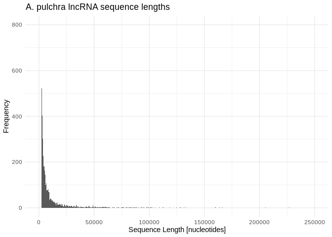

14-Ptuh-miRNA-lncRNA-BLASTs-miRanda
================
Kathleen Durkin
2025-06-17

- <a href="#1-prep-for-blasts" id="toc-1-prep-for-blasts">1 Prep for
  BLASTs</a>
  - <a href="#11-isolate-the-pre-mirna-and-mature-mirna-sequences"
    id="toc-11-isolate-the-pre-mirna-and-mature-mirna-sequences">1.1 Isolate
    the pre-mirna and mature mirna sequences</a>
  - <a href="#12-check-mirna-lengths" id="toc-12-check-mirna-lengths">1.2
    Check miRNA lengths</a>
  - <a href="#13-check-lncrnas" id="toc-13-check-lncrnas">1.3 check
    lncRNAs</a>
- <a href="#2-blasts" id="toc-2-blasts">2 BLASTs</a>
  - <a href="#21-make-databases" id="toc-21-make-databases">2.1 Make
    databases</a>
  - <a href="#22-run-blastn" id="toc-22-run-blastn">2.2 Run BLASTn</a>
- <a href="#3-examine-blast-tables" id="toc-3-examine-blast-tables">3
  Examine BLAST tables</a>
  - <a href="#31-lncrnas-as-mirna-precursors"
    id="toc-31-lncrnas-as-mirna-precursors">3.1 LncRNAs as miRNA
    precursors</a>
  - <a href="#32-lncrnas-as-mirna-sponges"
    id="toc-32-lncrnas-as-mirna-sponges">3.2 LncRNAs as miRNA sponges</a>
- <a href="#4-miranda" id="toc-4-miranda">4 miRanda</a>
  - <a href="#41-run-miranda" id="toc-41-run-miranda">4.1 Run miRanda</a>
- <a href="#5-summarize-results" id="toc-5-summarize-results">5 Summarize
  results</a>

``` r
library(dplyr)
```

    ## 
    ## Attaching package: 'dplyr'

    ## The following objects are masked from 'package:stats':
    ## 
    ##     filter, lag

    ## The following objects are masked from 'package:base':
    ## 
    ##     intersect, setdiff, setequal, union

``` r
library(ggplot2)
knitr::opts_chunk$set(
  echo = TRUE,         # Display code chunks
  eval = FALSE         # Evaluate code chunks
)
```

Two possible interactions between miRNA and lncRNA are:

1)  lncRNA acting as a precursor molecule for miRNA(s), so that the
    lncRNA contains one or many pre-miRNA sequences and will be broken
    down into pre-miRNAs molecules, which will then be processed into
    mature miRNAs.

2)  lncRNA acting as a “sponge” for miRNAs, so that an miRNA will bind
    to the lncRNA instead of being incorporated into an RISC complex to
    alter gene expression.

In situation 1 we would expect one or several **pre-miRNA sequences to
appear inside of a lncRNA**. This should be identifiable via BLASTn.

In situation 2 we would expect the **mature miRNA sequence to appear
inside a lncRNA**. Note that situation 2 is a bit more complicated,
because we can’t say for certain what sequence similarity is required
for binding. In cnidarians, miRNAs seem to act, like plants, through
complementarity of the full mature miRNA (this is in contrast to
e.g. mammals, where only binding of a short seed region is required)
(Moran et al. ([2014](#ref-moran_cnidarian_2014)), Admoni et al.
([2023](#ref-admoni_target_2023))). However, for lncRNA acting as
sponges, I don’t know whether to expect complementarity of the full
mature miRNA or only a section, and I don’t know what degree of
complementarity is required. **Work to identify lncRNA sponges could use
BLASTn, but will likely need to include additional methods like miRanda
to identify potential binding.**

# 1 Prep for BLASTs

## 1.1 Isolate the pre-mirna and mature mirna sequences

``` bash
full_mirna_fasta="../output/05-Ptuh-sRNA-ShortStack_4.1.0/ShortStack_out/mir.fasta"
premirna_fasta="../output/14-Ptuh-miRNA-lncRNA-BLASTs-miRanda/Ptuh_ShortStack_4.1.0_precursor.fasta"
mature_mirna_fasta="../output/14-Ptuh-miRNA-lncRNA-BLASTs-miRanda/Ptuh_ShortStack_4.1.0_mature.fasta"
star_mirna_fasta="../output/14-Ptuh-miRNA-lncRNA-BLASTs-miRanda/Ptuh_ShortStack_4.1.0_star.fasta"

# Pull out all sequences that DON'T contain "mature" or "star" in sequence name
# Note the pre-miRNAs have sequences for both strands
awk '
    # If the line starts with ">", check the header
    /^>/ {
        if ($0 ~ /mature/ || $0 ~ /star/) {
            print_seq = 0  # Skip sequences with "mature" or "star" in the header
        } else {
            print_seq = 1  # Mark sequences for printing
        }
    }
    # Print the header and the next two lines if marked for printing
    print_seq {
        print
        if (!/^>/) { getline; print }  # Capture second sequence line
    }
' "$full_mirna_fasta" > "$premirna_fasta"

# Pull out all sequences that contain "mature" in sequence name
grep -A 1 "mature" $full_mirna_fasta | grep -v "^--$" > $mature_mirna_fasta

# Pull out all sequences that contain "star" in sequence name
grep -A 1 "star" $full_mirna_fasta | grep -v "^--$" > $star_mirna_fasta
```

``` bash
premirna_fasta="../output/14-Ptuh-miRNA-lncRNA-BLASTs-miRanda/Ptuh_ShortStack_4.1.0_precursor.fasta"
mature_mirna_fasta="../output/14-Ptuh-miRNA-lncRNA-BLASTs-miRanda/Ptuh_ShortStack_4.1.0_mature.fasta"
star_mirna_fasta="../output/14-Ptuh-miRNA-lncRNA-BLASTs-miRanda/Ptuh_ShortStack_4.1.0_star.fasta"

# Check we have appropriate headers, same number of sequences in each
grep "^>" $premirna_fasta | head -2
echo ""
grep "^>" $mature_mirna_fasta | head -2
echo ""
grep "^>" $star_mirna_fasta | head -2
echo ""
grep "^>" $premirna_fasta | wc -l
echo ""
grep "^>" $mature_mirna_fasta | wc -l
echo ""
grep "^>" $star_mirna_fasta | wc -l
echo ""
```

    ## >Cluster_21::Pocillopora_meandrina_HIv1___Sc0000000:818027-818120(+)
    ## >Cluster_21.mature::Pocillopora_meandrina_HIv1___Sc0000000:818049-818070(+)
    ## 
    ## >Cluster_21.mature::Pocillopora_meandrina_HIv1___Sc0000000:818049-818070(+)
    ## >Cluster_36.mature::Pocillopora_meandrina_HIv1___Sc0000000:2872041-2872061(+)
    ## 
    ## >Cluster_21.star::Pocillopora_meandrina_HIv1___Sc0000000:818079-818100(+)
    ## >Cluster_36.star::Pocillopora_meandrina_HIv1___Sc0000000:2872070-2872090(+)
    ## 
    ## 111
    ## 
    ## 37
    ## 
    ## 37

## 1.2 Check miRNA lengths

``` bash
# Extract sequence lengths for precursors
awk '/^>/ {if (seqlen){print seqlen}; printf $0" " ;seqlen=0;next; } { seqlen += length($0)}END{print seqlen}' ../output/14-Ptuh-miRNA-lncRNA-BLASTs-miRanda/Ptuh_ShortStack_4.1.0_precursor.fasta > ../output/14-Ptuh-miRNA-lncRNA-BLASTs-miRanda/Ptuh_ShortStack_4.1.0_precursor_lengths.txt

# Sequence lengths for matures
awk '/^>/ {if (seqlen){print seqlen}; printf $0" " ;seqlen=0;next; } { seqlen += length($0)}END{print seqlen}' ../output/14-Ptuh-miRNA-lncRNA-BLASTs-miRanda/Ptuh_ShortStack_4.1.0_mature.fasta > ../output/14-Ptuh-miRNA-lncRNA-BLASTs-miRanda/Ptuh_ShortStack_4.1.0_mature_lengths.txt
```

``` r
# Summary stats of precursor and mature lengths

precursor_lengths <- read.table("../output/14-Ptuh-miRNA-lncRNA-BLASTs-miRanda/Ptuh_ShortStack_4.1.0_precursor_lengths.txt", sep = " ", header = FALSE, col.names = c("seqID", "length"))
mature_lengths <- read.table("../output/14-Ptuh-miRNA-lncRNA-BLASTs-miRanda/Ptuh_ShortStack_4.1.0_mature_lengths.txt", sep = " ", header = FALSE, col.names = c("seqID", "length"))

cat("Average pre-miRNA length: ", mean(precursor_lengths$length))
```

    ## Average pre-miRNA length:  46.25225

``` r
cat("\n")
```

``` r
cat("Range of pre-miRNA lengths: ", range(precursor_lengths$length))
```

    ## Range of pre-miRNA lengths:  21 101

``` r
cat("\n")
```

``` r
cat("Average mature miRNA length: ", mean(mature_lengths$length))
```

    ## Average mature miRNA length:  21.91892

``` r
cat("\n")
```

``` r
cat("Range of mature miRNA lengths: ", range(mature_lengths$length))
```

    ## Range of mature miRNA lengths:  21 23

## 1.3 check lncRNAs

LncRNAs were identified from Ptuh RNA-seq data

Fasta of Ptuh lncRNAs stored at
`https://gannet.fish.washington.edu/acropora/E5-deep-dive-expression/output/01.6-lncRNA-pipline/Ptuh_lncRNA.fasta`

``` bash
curl -L https://gannet.fish.washington.edu/acropora/E5-deep-dive-expression/output/01.6-lncRNA-pipline/Ptuh_lncRNA.fasta -o ../output/14-Ptuh-miRNA-lncRNA-BLASTs-miRanda/Ptuh_lncRNA.fasta

echo "Number of lncRNAs:"
grep "^>" ../output/14-Ptuh-miRNA-lncRNA-BLASTs-miRanda/Ptuh_lncRNA.fasta | wc -l
```

    ##   % Total    % Received % Xferd  Average Speed   Time    Time     Time  Current
    ##                                  Dload  Upload   Total   Spent    Left  Speed
    ##   0     0    0     0    0     0      0      0 --:--:-- --:--:-- --:--:--     0 14  329M   14 47.8M    0     0  89.7M      0  0:00:03 --:--:--  0:00:03 89.5M 47  329M   47  156M    0     0   101M      0  0:00:03  0:00:01  0:00:02  101M 80  329M   80  265M    0     0   104M      0  0:00:03  0:00:02  0:00:01  104M100  329M  100  329M    0     0   105M      0  0:00:03  0:00:03 --:--:--  105M
    ## Number of lncRNAs:
    ## 56445

``` bash
# Extract sequence lengths for precursors
awk '/^>/ {if (seqlen){print seqlen}; printf $0" " ;seqlen=0;next; } { seqlen += length($0)}END{print seqlen}' ../output/14-Ptuh-miRNA-lncRNA-BLASTs-miRanda/Ptuh_lncRNA.fasta > ../output/14-Ptuh-miRNA-lncRNA-BLASTs-miRanda/Ptuh_lncRNA_lengths.txt
```

``` r
# Summary stats of lncRNA lengths

lncRNA_lengths <- read.table("../output/14-Ptuh-miRNA-lncRNA-BLASTs-miRanda/Ptuh_lncRNA_lengths.txt", sep = " ", header = FALSE, col.names = c("seqID", "length"))

cat("Average lncRNA length: ", mean(lncRNA_lengths$length))
```

    ## Average lncRNA length:  5950.737

``` r
cat("\n")
```

``` r
cat("Range of lncRNA lengths: ", range(lncRNA_lengths$length))
```

    ## Range of lncRNA lengths:  201 235368

``` r
ggplot(lncRNA_lengths, aes(x = length)) +
  geom_histogram(binwidth = 500) +
  labs(title = "A. pulchra lncRNA sequence lengths",
       x = "Sequence Length [nucleotides]",
       y = "Frequency") +
  xlim(200, 50000) +
  ylim(0, 800) +
  theme_minimal()
```

    ## Warning: Removed 452 rows containing non-finite outside the scale range
    ## (`stat_bin()`).

    ## Warning: Removed 19 rows containing missing values or values outside the scale range
    ## (`geom_bar()`).

<!-- -->

# 2 BLASTs

## 2.1 Make databases

Database of pre-miRNAs:

``` bash
/home/shared/ncbi-blast-2.11.0+/bin/makeblastdb \
-in ../output/14-Ptuh-miRNA-lncRNA-BLASTs-miRanda/Ptuh_ShortStack_4.1.0_precursor.fasta \
-dbtype nucl \
-out ../output/14-Ptuh-miRNA-lncRNA-BLASTs-miRanda/blasts/Ptuh-db/Ptuh_ShortStack_4.1.0_precursor
```

Database of mature miRNAs:

``` bash
/home/shared/ncbi-blast-2.11.0+/bin/makeblastdb \
-in ../output/14-Ptuh-miRNA-lncRNA-BLASTs-miRanda/Ptuh_ShortStack_4.1.0_mature.fasta \
-dbtype nucl \
-out ../output/14-Ptuh-miRNA-lncRNA-BLASTs-miRanda/blasts/Ptuh-db/Ptuh_ShortStack_4.1.0_mature
```

## 2.2 Run BLASTn

Generate a list of blast results. It seems plausible that a single
lncRNA, which would be hundreds or thousands of nucleotides long, could
interact with multiple miRNAs, so I will allow up to 10 hits (\~25% of
Ptuh miRNAs) for each lncRNA. I want to see the top hits no matter how
poor the match is, so I will not filter by e-value at this stage. I’ll
also include the “-word_size 4” option, which reduces the required
length of the initial match.

Full pre-miRNAs:

``` bash
/home/shared/ncbi-blast-2.11.0+/bin/blastn \
-task blastn \
-query ../output/14-Ptuh-miRNA-lncRNA-BLASTs-miRanda/Ptuh_lncRNA.fasta \
-db ../output/14-Ptuh-miRNA-lncRNA-BLASTs-miRanda/blasts/Ptuh-db/Ptuh_ShortStack_4.1.0_precursor \
-out ../output/14-Ptuh-miRNA-lncRNA-BLASTs-miRanda/blasts/lncRNA_to_precursor_blastn.tab \
-num_threads 40 \
-word_size 4 \
-max_target_seqs 10 \
-max_hsps 1 \
-outfmt 6
```

``` bash
wc -l ../output/14-Ptuh-miRNA-lncRNA-BLASTs-miRanda/blasts/lncRNA_to_precursor_blastn.tab
```

    ## 551650 ../output/14-Ptuh-miRNA-lncRNA-BLASTs-miRanda/blasts/lncRNA_to_precursor_blastn.tab

Note we have less than (10 \* $$# of lncRNAs$$) output alignments
because, while I did not set an evalue threshold, the default evalue
threshold of evalue=10 is still in place. That means extremely poor
matches were still excluded by default.

Mature miRNAs:

Note that I’m using the blastn-short option here because all of our
mature miRNAs are less than 30 nucleotides long (recommended by [BLAST
user
manual](https://www.ncbi.nlm.nih.gov/books/NBK279684/table/appendices.T.blastn_application_options/))

``` bash
/home/shared/ncbi-blast-2.11.0+/bin/blastn \
-task blastn \
-query ../output/14-Ptuh-miRNA-lncRNA-BLASTs-miRanda/Ptuh_lncRNA.fasta \
-db ../output/14-Ptuh-miRNA-lncRNA-BLASTs-miRanda/blasts/Ptuh-db/Ptuh_ShortStack_4.1.0_mature \
-out ../output/14-Ptuh-miRNA-lncRNA-BLASTs-miRanda/blasts/lncRNA_to_mature_blastn.tab \
-num_threads 40 \
-word_size 4 \
-max_target_seqs 10 \
-max_hsps 1 \
-outfmt 6
```

``` bash
wc -l ../output/14-Ptuh-miRNA-lncRNA-BLASTs-miRanda/blasts/lncRNA_to_mature_blastn.tab
```

    ## 550258 ../output/14-Ptuh-miRNA-lncRNA-BLASTs-miRanda/blasts/lncRNA_to_mature_blastn.tab

# 3 Examine BLAST tables

Read into R and assign informative column labels

``` r
precursor_lncRNA_BLASTn <- read.table("../output/14-Ptuh-miRNA-lncRNA-BLASTs-miRanda/blasts/lncRNA_to_precursor_blastn.tab", sep="\t", header=FALSE)
mature_lncRNA_BLASTn <- read.table("../output/14-Ptuh-miRNA-lncRNA-BLASTs-miRanda/blasts/lncRNA_to_mature_blastn.tab", sep="\t", header=FALSE)

colnames(precursor_lncRNA_BLASTn) <- c("qseqid", "sseqid", "pident", "length", "mismatch", "gapopen", "qstart", "qend", "sstart", "send", "evalue", "bitscore")
colnames(mature_lncRNA_BLASTn) <- c("qseqid", "sseqid", "pident", "length", "mismatch", "gapopen", "qstart", "qend", "sstart", "send", "evalue", "bitscore")
```

## 3.1 LncRNAs as miRNA precursors

Are there any alignments of the full precursor miRNA to a lncRNA? Our
precursor sequences are 90-98 nucleotides long, so let’s look for any
alignments of at least 90 nucleotides with 0 mismatches.

``` r
precursor_lncRNA_BLASTn %>% 
  filter(length >= 90) %>%
  filter(mismatch == 0) %>%
  unique() %>%
  nrow()
```

    ## [1] 50

``` r
precursor_lncRNA_BLASTn %>% 
  filter(length >= 90) %>%
  filter(mismatch == 0) %>%
  select(qseqid) %>%
  unique() %>%
  nrow()
```

    ## [1] 46

``` r
precursor_lncRNA_BLASTn %>% 
  filter(length >= 90) %>%
  filter(mismatch == 0) %>%
  select(sseqid) %>%
  unique() %>%
  nrow()
```

    ## [1] 20

``` r
precursor_lncRNA_BLASTn %>% 
  filter(length >= 90) %>%
  filter(mismatch == 0) %>%
  unique()
```

    ##                                                                  qseqid
    ## 1  transcript::Pocillopora_meandrina_HIv1___Sc0000000:20369328-20376434
    ## 2  transcript::Pocillopora_meandrina_HIv1___Sc0000000:20369596-20376434
    ## 3  transcript::Pocillopora_meandrina_HIv1___Sc0000002:16098946-16109961
    ## 4  transcript::Pocillopora_meandrina_HIv1___Sc0000002:16098969-16109961
    ## 5  transcript::Pocillopora_meandrina_HIv1___Sc0000002:10843224-10849334
    ## 6  transcript::Pocillopora_meandrina_HIv1___Sc0000002:10843224-10850210
    ## 8  transcript::Pocillopora_meandrina_HIv1___Sc0000002:10843230-10850210
    ## 9  transcript::Pocillopora_meandrina_HIv1___Sc0000002:10843249-10850210
    ## 10 transcript::Pocillopora_meandrina_HIv1___Sc0000002:10843912-10850210
    ## 11 transcript::Pocillopora_meandrina_HIv1___Sc0000002:15745570-15749355
    ## 12 transcript::Pocillopora_meandrina_HIv1___Sc0000002:16103323-16107320
    ## 13 transcript::Pocillopora_meandrina_HIv1___Sc0000005:10381740-10386428
    ## 14 transcript::Pocillopora_meandrina_HIv1___Sc0000005:11254225-11264779
    ## 15 transcript::Pocillopora_meandrina_HIv1___Sc0000005:11254225-11264779
    ## 18 transcript::Pocillopora_meandrina_HIv1___Sc0000005:11254234-11264779
    ## 19 transcript::Pocillopora_meandrina_HIv1___Sc0000005:11254234-11264779
    ## 20 transcript::Pocillopora_meandrina_HIv1___Sc0000005:11255611-11264779
    ## 21 transcript::Pocillopora_meandrina_HIv1___Sc0000005:11255611-11264779
    ## 22 transcript::Pocillopora_meandrina_HIv1___Sc0000005:11258006-11264779
    ## 23 transcript::Pocillopora_meandrina_HIv1___Sc0000005:11258006-11264779
    ## 24   transcript::Pocillopora_meandrina_HIv1___Sc0000008:1780853-1785411
    ## 25   transcript::Pocillopora_meandrina_HIv1___Sc0000008:1783244-1785411
    ## 26   transcript::Pocillopora_meandrina_HIv1___Sc0000008:3565328-3586776
    ## 27   transcript::Pocillopora_meandrina_HIv1___Sc0000008:3565450-3586776
    ## 28   transcript::Pocillopora_meandrina_HIv1___Sc0000008:3614527-3621648
    ## 29   transcript::Pocillopora_meandrina_HIv1___Sc0000008:5381562-5389641
    ## 30   transcript::Pocillopora_meandrina_HIv1___Sc0000008:5382168-5389641
    ## 31   transcript::Pocillopora_meandrina_HIv1___Sc0000008:5382569-5389641
    ## 32   transcript::Pocillopora_meandrina_HIv1___Sc0000010:8008539-8014109
    ## 33   transcript::Pocillopora_meandrina_HIv1___Sc0000010:8010601-8014109
    ## 34   transcript::Pocillopora_meandrina_HIv1___Sc0000010:8008765-8013853
    ## 35   transcript::Pocillopora_meandrina_HIv1___Sc0000010:8009039-8013853
    ## 36   transcript::Pocillopora_meandrina_HIv1___Sc0000010:8009189-8013853
    ## 37   transcript::Pocillopora_meandrina_HIv1___Sc0000012:6412836-6456125
    ## 38   transcript::Pocillopora_meandrina_HIv1___Sc0000012:6453048-6455906
    ## 39   transcript::Pocillopora_meandrina_HIv1___Sc0000014:2590221-2602242
    ## 40   transcript::Pocillopora_meandrina_HIv1___Sc0000014:2593067-2602242
    ## 41   transcript::Pocillopora_meandrina_HIv1___Sc0000014:9359559-9367897
    ## 42   transcript::Pocillopora_meandrina_HIv1___Sc0000017:5040660-5060662
    ## 43   transcript::Pocillopora_meandrina_HIv1___Sc0000018:6845867-6863996
    ## 44   transcript::Pocillopora_meandrina_HIv1___Sc0000018:6845930-6863996
    ## 45   transcript::Pocillopora_meandrina_HIv1___Sc0000018:6851678-6863996
    ## 46   transcript::Pocillopora_meandrina_HIv1___Sc0000018:6852954-6863996
    ## 47   transcript::Pocillopora_meandrina_HIv1___Sc0000021:4343937-4359207
    ## 48   transcript::Pocillopora_meandrina_HIv1___Sc0000021:4343945-4359207
    ## 49   transcript::Pocillopora_meandrina_HIv1___Sc0000021:4346471-4359207
    ## 50   transcript::Pocillopora_meandrina_HIv1___Sc0000021:4346968-4359207
    ## 51   transcript::Pocillopora_meandrina_HIv1___Sc0000024:4797252-4815862
    ## 52   transcript::Pocillopora_meandrina_HIv1___Sc0000024:4797853-4815862
    ## 53   transcript::Pocillopora_meandrina_HIv1___Sc0000026:1150884-1161746
    ##                                                                       sseqid
    ## 1   Cluster_360::Pocillopora_meandrina_HIv1___Sc0000000:20372416-20372510(-)
    ## 2   Cluster_360::Pocillopora_meandrina_HIv1___Sc0000000:20372416-20372510(-)
    ## 3  Cluster_1080::Pocillopora_meandrina_HIv1___Sc0000002:16106559-16106650(+)
    ## 4  Cluster_1080::Pocillopora_meandrina_HIv1___Sc0000002:16106559-16106650(+)
    ## 5  Cluster_1015::Pocillopora_meandrina_HIv1___Sc0000002:10845722-10845816(-)
    ## 6  Cluster_1015::Pocillopora_meandrina_HIv1___Sc0000002:10845722-10845816(-)
    ## 8  Cluster_1015::Pocillopora_meandrina_HIv1___Sc0000002:10845722-10845816(-)
    ## 9  Cluster_1015::Pocillopora_meandrina_HIv1___Sc0000002:10845722-10845816(-)
    ## 10 Cluster_1015::Pocillopora_meandrina_HIv1___Sc0000002:10845722-10845816(-)
    ## 11 Cluster_1068::Pocillopora_meandrina_HIv1___Sc0000002:15749261-15749351(+)
    ## 12 Cluster_1080::Pocillopora_meandrina_HIv1___Sc0000002:16106559-16106650(+)
    ## 13 Cluster_1938::Pocillopora_meandrina_HIv1___Sc0000005:10385497-10385597(+)
    ## 14 Cluster_1953::Pocillopora_meandrina_HIv1___Sc0000005:11261356-11261449(+)
    ## 15 Cluster_1952::Pocillopora_meandrina_HIv1___Sc0000005:11260734-11260823(+)
    ## 18 Cluster_1953::Pocillopora_meandrina_HIv1___Sc0000005:11261356-11261449(+)
    ## 19 Cluster_1952::Pocillopora_meandrina_HIv1___Sc0000005:11260734-11260823(+)
    ## 20 Cluster_1953::Pocillopora_meandrina_HIv1___Sc0000005:11261356-11261449(+)
    ## 21 Cluster_1952::Pocillopora_meandrina_HIv1___Sc0000005:11260734-11260823(+)
    ## 22 Cluster_1953::Pocillopora_meandrina_HIv1___Sc0000005:11261356-11261449(+)
    ## 23 Cluster_1952::Pocillopora_meandrina_HIv1___Sc0000005:11260734-11260823(+)
    ## 24   Cluster_2793::Pocillopora_meandrina_HIv1___Sc0000008:1783802-1783891(+)
    ## 25   Cluster_2793::Pocillopora_meandrina_HIv1___Sc0000008:1783802-1783891(+)
    ## 26   Cluster_2837::Pocillopora_meandrina_HIv1___Sc0000008:3576420-3576514(+)
    ## 27   Cluster_2837::Pocillopora_meandrina_HIv1___Sc0000008:3576420-3576514(+)
    ## 28   Cluster_2839::Pocillopora_meandrina_HIv1___Sc0000008:3619341-3619435(-)
    ## 29   Cluster_2859::Pocillopora_meandrina_HIv1___Sc0000008:5387738-5387830(-)
    ## 30   Cluster_2859::Pocillopora_meandrina_HIv1___Sc0000008:5387738-5387830(-)
    ## 31   Cluster_2859::Pocillopora_meandrina_HIv1___Sc0000008:5387738-5387830(-)
    ## 32   Cluster_3392::Pocillopora_meandrina_HIv1___Sc0000010:8012916-8013008(+)
    ## 33   Cluster_3392::Pocillopora_meandrina_HIv1___Sc0000010:8012916-8013008(+)
    ## 34   Cluster_3392::Pocillopora_meandrina_HIv1___Sc0000010:8012916-8013008(+)
    ## 35   Cluster_3392::Pocillopora_meandrina_HIv1___Sc0000010:8012916-8013008(+)
    ## 36   Cluster_3392::Pocillopora_meandrina_HIv1___Sc0000010:8012916-8013008(+)
    ## 37   Cluster_3661::Pocillopora_meandrina_HIv1___Sc0000012:6455183-6455276(+)
    ## 38   Cluster_3661::Pocillopora_meandrina_HIv1___Sc0000012:6455183-6455276(+)
    ## 39   Cluster_4040::Pocillopora_meandrina_HIv1___Sc0000014:2594743-2594833(+)
    ## 40   Cluster_4040::Pocillopora_meandrina_HIv1___Sc0000014:2594743-2594833(+)
    ## 41   Cluster_4118::Pocillopora_meandrina_HIv1___Sc0000014:9365459-9365552(-)
    ## 42   Cluster_4572::Pocillopora_meandrina_HIv1___Sc0000017:5050908-5051000(-)
    ## 43   Cluster_4823::Pocillopora_meandrina_HIv1___Sc0000018:6855499-6855592(+)
    ## 44   Cluster_4823::Pocillopora_meandrina_HIv1___Sc0000018:6855499-6855592(+)
    ## 45   Cluster_4823::Pocillopora_meandrina_HIv1___Sc0000018:6855499-6855592(+)
    ## 46   Cluster_4823::Pocillopora_meandrina_HIv1___Sc0000018:6855499-6855592(+)
    ## 47   Cluster_5253::Pocillopora_meandrina_HIv1___Sc0000021:4351817-4351909(+)
    ## 48   Cluster_5253::Pocillopora_meandrina_HIv1___Sc0000021:4351817-4351909(+)
    ## 49   Cluster_5253::Pocillopora_meandrina_HIv1___Sc0000021:4351817-4351909(+)
    ## 50   Cluster_5253::Pocillopora_meandrina_HIv1___Sc0000021:4351817-4351909(+)
    ## 51   Cluster_5612::Pocillopora_meandrina_HIv1___Sc0000024:4808666-4808760(+)
    ## 52   Cluster_5612::Pocillopora_meandrina_HIv1___Sc0000024:4808666-4808760(+)
    ## 53   Cluster_5740::Pocillopora_meandrina_HIv1___Sc0000026:1154719-1154813(-)
    ##    pident length mismatch gapopen qstart  qend sstart send   evalue bitscore
    ## 1     100     95        0       0   3088  3182     95    1 2.44e-45      172
    ## 2     100     95        0       0   2820  2914     95    1 2.35e-45      172
    ## 3     100     92        0       0   7613  7704      1   92 1.55e-43      167
    ## 4     100     92        0       0   7590  7681      1   92 1.55e-43      167
    ## 5     100     95        0       0   2498  2592     95    1 2.10e-45      172
    ## 6     100     95        0       0   2498  2592     95    1 2.40e-45      172
    ## 8     100     95        0       0   2492  2586     95    1 2.40e-45      172
    ## 9     100     95        0       0   2473  2567     95    1 2.39e-45      172
    ## 10    100     95        0       0   1810  1904     95    1 2.16e-45      172
    ## 11    100     91        0       0   3691  3781      1   91 1.99e-43      165
    ## 12    100     92        0       0   3236  3327      1   92 6.03e-44      167
    ## 13    100    101        0       0   3757  3857      1  101 9.20e-49      183
    ## 14    100     94        0       0   7131  7224      1   94 1.27e-44      170
    ## 15    100     90        0       0   6509  6598      1   90 1.88e-42      163
    ## 18    100     94        0       0   7122  7215      1   94 1.26e-44      170
    ## 19    100     90        0       0   6500  6589      1   90 1.88e-42      163
    ## 20    100     94        0       0   5745  5838      1   94 1.10e-44      170
    ## 21    100     90        0       0   5123  5212      1   90 1.63e-42      163
    ## 22    100     94        0       0   3350  3443      1   94 8.11e-45      170
    ## 23    100     90        0       0   2728  2817      1   90 1.20e-42      163
    ## 24    100     90        0       0   2949  3038      1   90 8.38e-43      163
    ## 25    100     90        0       0    558   647      1   90 3.97e-43      163
    ## 26    100     95        0       0  11092 11186      1   95 7.11e-45      172
    ## 27    100     95        0       0  10970 11064      1   95 7.07e-45      172
    ## 28    100     95        0       0   4814  4908     95    1 2.44e-45      172
    ## 29    100     93        0       0   6176  6268     93    1 3.38e-44      168
    ## 30    100     93        0       0   5570  5662     93    1 3.13e-44      168
    ## 31    100     93        0       0   5169  5261     93    1 2.96e-44      168
    ## 32    100     93        0       0   4377  4469      1   93 2.33e-44      168
    ## 33    100     93        0       0   2315  2407      1   93 1.52e-44      168
    ## 34    100     93        0       0   4151  4243      1   93 2.13e-44      168
    ## 35    100     93        0       0   3877  3969      1   93 2.01e-44      168
    ## 36    100     93        0       0   3727  3819      1   93 2.02e-44      168
    ## 37    100     94        0       0  42347 42440      1   94 4.83e-44      170
    ## 38    100     94        0       0   2135  2228      1   94 3.53e-45      170
    ## 39    100     91        0       0   4522  4612      1   91 5.91e-43      165
    ## 40    100     91        0       0   1676  1766      1   91 4.68e-43      165
    ## 41    100     94        0       0   5900  5993     94    1 9.99e-45      170
    ## 42    100     93        0       0  10248 10340     93    1 8.08e-44      168
    ## 43    100     94        0       0   9632  9725      1   94 2.10e-44      170
    ## 44    100     94        0       0   9569  9662      1   94 2.09e-44      170
    ## 45    100     94        0       0   3821  3914      1   94 1.42e-44      170
    ## 46    100     94        0       0   2545  2638      1   94 1.28e-44      170
    ## 47    100     93        0       0   7880  7972      1   93 6.17e-44      168
    ## 48    100     93        0       0   7872  7964      1   93 6.16e-44      168
    ## 49    100     93        0       0   5346  5438      1   93 5.14e-44      168
    ## 50    100     93        0       0   4849  4941      1   93 4.94e-44      168
    ## 51    100     95        0       0  11414 11508      1   95 6.17e-45      172
    ## 52    100     95        0       0  10813 10907      1   95 5.97e-45      172
    ## 53    100     95        0       0   3835  3929     95    1 3.60e-45      172

We have 50 alignments of a full pre-miRNA to a lncRNA with no
mismatches. 46 lncRNA and 20 miRNA are represented.

Note that, as in A.pulchra and P.evermanni, there are instances of a
single pre-miRNA matching to several overlapping lncRNA, potentially
representing multiple isoforms of a single lncRNA gene.

Save these results

``` r
precursor_lncRNAs <- precursor_lncRNA_BLASTn %>% 
  filter(length >= 90) %>%
  filter(mismatch == 0)

write.table(precursor_lncRNAs, "../output/14-Ptuh-miRNA-lncRNA-BLASTs-miRanda/lncRNAs_as_miRNA_precursors.txt")
```

## 3.2 LncRNAs as miRNA sponges

I’m not sure whether to expect lncRNAs to bind miRNAs in the same way
cnidarian miRNA-mRNA binding occurs (nearly perfect complementarity of
mature sequence), or whether the mechanism could differ (e.g., requires
only a complementary seed region, as in vertebrate miRNA-mRNA binding).
that means I don’t know what alignment parameters to require for our
BLAST results.

For now let’s say the aligned region must be at least 8 nucleotides (the
expected length of an miRNA seed region), and let’s require a low evalue
of 1e-3, to generally restrict results to those with high
complementarity.

``` r
mature_lncRNA_BLASTn %>%
  filter(length >= 8) %>%
  filter(evalue <= 0.001) %>%
  unique()
```

    ##                                                                   qseqid
    ## 1     transcript::Pocillopora_meandrina_HIv1___Sc0000000:9460120-9468105
    ## 2   transcript::Pocillopora_meandrina_HIv1___Sc0000000:21384040-21389137
    ## 3     transcript::Pocillopora_meandrina_HIv1___Sc0000000:5576917-5586430
    ## 4     transcript::Pocillopora_meandrina_HIv1___Sc0000000:9832996-9834378
    ## 5   transcript::Pocillopora_meandrina_HIv1___Sc0000000:15414465-15415251
    ## 6   transcript::Pocillopora_meandrina_HIv1___Sc0000000:20369328-20376434
    ## 7   transcript::Pocillopora_meandrina_HIv1___Sc0000000:20369596-20376434
    ## 8     transcript::Pocillopora_meandrina_HIv1___Sc0000000:9631539-9631850
    ## 9   transcript::Pocillopora_meandrina_HIv1___Sc0000000:10412213-10412438
    ## 10    transcript::Pocillopora_meandrina_HIv1___Sc0000001:2796979-2901870
    ## 11    transcript::Pocillopora_meandrina_HIv1___Sc0000001:2796983-2878479
    ## 12    transcript::Pocillopora_meandrina_HIv1___Sc0000001:2798685-2819647
    ## 13    transcript::Pocillopora_meandrina_HIv1___Sc0000001:2816869-2819647
    ## 14    transcript::Pocillopora_meandrina_HIv1___Sc0000001:2858237-2901870
    ## 15    transcript::Pocillopora_meandrina_HIv1___Sc0000001:2839579-2879069
    ## 17    transcript::Pocillopora_meandrina_HIv1___Sc0000001:2863981-2890925
    ## 18    transcript::Pocillopora_meandrina_HIv1___Sc0000001:2864560-2890444
    ## 19    transcript::Pocillopora_meandrina_HIv1___Sc0000001:2879403-2905618
    ## 20    transcript::Pocillopora_meandrina_HIv1___Sc0000001:2879403-2905618
    ## 21    transcript::Pocillopora_meandrina_HIv1___Sc0000001:2892893-2905618
    ## 22    transcript::Pocillopora_meandrina_HIv1___Sc0000001:2901956-2903096
    ## 23    transcript::Pocillopora_meandrina_HIv1___Sc0000001:2901969-2903096
    ## 24    transcript::Pocillopora_meandrina_HIv1___Sc0000001:9515025-9516170
    ## 25  transcript::Pocillopora_meandrina_HIv1___Sc0000001:10636463-10636733
    ## 26  transcript::Pocillopora_meandrina_HIv1___Sc0000001:15129619-15133203
    ## 27  transcript::Pocillopora_meandrina_HIv1___Sc0000001:15130626-15133203
    ## 28  transcript::Pocillopora_meandrina_HIv1___Sc0000001:15130744-15133203
    ## 29  transcript::Pocillopora_meandrina_HIv1___Sc0000001:19836178-19836634
    ## 30    transcript::Pocillopora_meandrina_HIv1___Sc0000001:2237534-2237938
    ## 31    transcript::Pocillopora_meandrina_HIv1___Sc0000001:2237534-2237938
    ## 32    transcript::Pocillopora_meandrina_HIv1___Sc0000001:2814548-2836948
    ## 33    transcript::Pocillopora_meandrina_HIv1___Sc0000001:2837727-2878297
    ## 34    transcript::Pocillopora_meandrina_HIv1___Sc0000001:2858211-2901870
    ## 35    transcript::Pocillopora_meandrina_HIv1___Sc0000001:2866158-2890444
    ## 36    transcript::Pocillopora_meandrina_HIv1___Sc0000001:2877566-2901222
    ## 37    transcript::Pocillopora_meandrina_HIv1___Sc0000001:2877566-2901222
    ## 38    transcript::Pocillopora_meandrina_HIv1___Sc0000001:2891317-2894653
    ## 39    transcript::Pocillopora_meandrina_HIv1___Sc0000001:2891317-2894653
    ## 40    transcript::Pocillopora_meandrina_HIv1___Sc0000001:4516090-4522563
    ## 41    transcript::Pocillopora_meandrina_HIv1___Sc0000001:4517219-4521793
    ## 42    transcript::Pocillopora_meandrina_HIv1___Sc0000001:8363105-8365676
    ## 43    transcript::Pocillopora_meandrina_HIv1___Sc0000001:9595757-9596796
    ## 44    transcript::Pocillopora_meandrina_HIv1___Sc0000001:9613910-9614369
    ## 45  transcript::Pocillopora_meandrina_HIv1___Sc0000001:13523995-13524328
    ## 46  transcript::Pocillopora_meandrina_HIv1___Sc0000002:16098946-16109961
    ## 47  transcript::Pocillopora_meandrina_HIv1___Sc0000002:16098969-16109961
    ## 48    transcript::Pocillopora_meandrina_HIv1___Sc0000002:2422287-2451232
    ## 49    transcript::Pocillopora_meandrina_HIv1___Sc0000002:2426774-2451232
    ## 50  transcript::Pocillopora_meandrina_HIv1___Sc0000002:10843224-10849334
    ## 51  transcript::Pocillopora_meandrina_HIv1___Sc0000002:10843224-10850210
    ## 53  transcript::Pocillopora_meandrina_HIv1___Sc0000002:10843230-10850210
    ## 54  transcript::Pocillopora_meandrina_HIv1___Sc0000002:10843249-10850210
    ## 55  transcript::Pocillopora_meandrina_HIv1___Sc0000002:10843912-10850210
    ## 56  transcript::Pocillopora_meandrina_HIv1___Sc0000002:15745570-15749355
    ## 57  transcript::Pocillopora_meandrina_HIv1___Sc0000002:16103323-16107320
    ## 58  transcript::Pocillopora_meandrina_HIv1___Sc0000003:17486962-17492303
    ## 60  transcript::Pocillopora_meandrina_HIv1___Sc0000003:17856338-17862013
    ## 61  transcript::Pocillopora_meandrina_HIv1___Sc0000003:17856393-17862013
    ## 62  transcript::Pocillopora_meandrina_HIv1___Sc0000003:17856394-17862013
    ## 63    transcript::Pocillopora_meandrina_HIv1___Sc0000004:1926613-2032729
    ## 64    transcript::Pocillopora_meandrina_HIv1___Sc0000004:2026148-2098694
    ## 65    transcript::Pocillopora_meandrina_HIv1___Sc0000004:2028927-2098694
    ## 66    transcript::Pocillopora_meandrina_HIv1___Sc0000004:2028961-2098694
    ## 68    transcript::Pocillopora_meandrina_HIv1___Sc0000004:6086741-6087707
    ## 69    transcript::Pocillopora_meandrina_HIv1___Sc0000004:1971355-1995126
    ## 70    transcript::Pocillopora_meandrina_HIv1___Sc0000004:2032024-2098677
    ## 71    transcript::Pocillopora_meandrina_HIv1___Sc0000004:2284236-2284529
    ## 72    transcript::Pocillopora_meandrina_HIv1___Sc0000005:1364073-1370803
    ## 73    transcript::Pocillopora_meandrina_HIv1___Sc0000005:7183655-7185109
    ## 74  transcript::Pocillopora_meandrina_HIv1___Sc0000005:10381740-10386428
    ## 75  transcript::Pocillopora_meandrina_HIv1___Sc0000005:11254225-11264779
    ## 76  transcript::Pocillopora_meandrina_HIv1___Sc0000005:11254225-11264779
    ## 79  transcript::Pocillopora_meandrina_HIv1___Sc0000005:11254234-11264779
    ## 80  transcript::Pocillopora_meandrina_HIv1___Sc0000005:11254234-11264779
    ## 81  transcript::Pocillopora_meandrina_HIv1___Sc0000005:11255611-11264779
    ## 82  transcript::Pocillopora_meandrina_HIv1___Sc0000005:11255611-11264779
    ## 83  transcript::Pocillopora_meandrina_HIv1___Sc0000005:11258006-11264779
    ## 84  transcript::Pocillopora_meandrina_HIv1___Sc0000005:11258006-11264779
    ## 85    transcript::Pocillopora_meandrina_HIv1___Sc0000005:7085401-7086955
    ## 86    transcript::Pocillopora_meandrina_HIv1___Sc0000006:1194570-1200633
    ## 87    transcript::Pocillopora_meandrina_HIv1___Sc0000006:1284114-1290097
    ## 88    transcript::Pocillopora_meandrina_HIv1___Sc0000006:2618832-2627995
    ## 90    transcript::Pocillopora_meandrina_HIv1___Sc0000006:2618914-2627995
    ## 92    transcript::Pocillopora_meandrina_HIv1___Sc0000006:2618915-2627995
    ## 94    transcript::Pocillopora_meandrina_HIv1___Sc0000006:2619005-2627995
    ## 95    transcript::Pocillopora_meandrina_HIv1___Sc0000006:2619706-2627995
    ## 96    transcript::Pocillopora_meandrina_HIv1___Sc0000006:7049052-7055016
    ## 97    transcript::Pocillopora_meandrina_HIv1___Sc0000006:5847740-5848989
    ## 98      transcript::Pocillopora_meandrina_HIv1___Sc0000007:358827-364739
    ## 99      transcript::Pocillopora_meandrina_HIv1___Sc0000007:358833-364739
    ## 100   transcript::Pocillopora_meandrina_HIv1___Sc0000007:4276948-4277256
    ## 101   transcript::Pocillopora_meandrina_HIv1___Sc0000008:1780853-1785411
    ## 102   transcript::Pocillopora_meandrina_HIv1___Sc0000008:1783244-1785411
    ## 103   transcript::Pocillopora_meandrina_HIv1___Sc0000008:1800470-1801832
    ## 104   transcript::Pocillopora_meandrina_HIv1___Sc0000008:3565328-3586776
    ## 105   transcript::Pocillopora_meandrina_HIv1___Sc0000008:3565450-3586776
    ## 106   transcript::Pocillopora_meandrina_HIv1___Sc0000008:3614527-3621648
    ## 107   transcript::Pocillopora_meandrina_HIv1___Sc0000008:5381562-5389641
    ## 108   transcript::Pocillopora_meandrina_HIv1___Sc0000008:5382168-5389641
    ## 109   transcript::Pocillopora_meandrina_HIv1___Sc0000008:5382569-5389641
    ## 110   transcript::Pocillopora_meandrina_HIv1___Sc0000008:8107759-8110602
    ## 111   transcript::Pocillopora_meandrina_HIv1___Sc0000008:6398051-6398288
    ## 112     transcript::Pocillopora_meandrina_HIv1___Sc0000009:349274-366723
    ## 113     transcript::Pocillopora_meandrina_HIv1___Sc0000009:117318-141456
    ## 114     transcript::Pocillopora_meandrina_HIv1___Sc0000009:201308-215495
    ## 115     transcript::Pocillopora_meandrina_HIv1___Sc0000009:363783-364923
    ## 116       transcript::Pocillopora_meandrina_HIv1___Sc0000009:38821-39831
    ## 117   transcript::Pocillopora_meandrina_HIv1___Sc0000009:4942328-4943412
    ## 118   transcript::Pocillopora_meandrina_HIv1___Sc0000009:4981780-4986592
    ## 119   transcript::Pocillopora_meandrina_HIv1___Sc0000009:5189715-5195146
    ## 120   transcript::Pocillopora_meandrina_HIv1___Sc0000009:4943735-4948260
    ## 121   transcript::Pocillopora_meandrina_HIv1___Sc0000009:5073793-5076792
    ## 122   transcript::Pocillopora_meandrina_HIv1___Sc0000009:5251729-5252395
    ## 123   transcript::Pocillopora_meandrina_HIv1___Sc0000009:1079984-1081215
    ## 124   transcript::Pocillopora_meandrina_HIv1___Sc0000010:8008539-8014109
    ## 125   transcript::Pocillopora_meandrina_HIv1___Sc0000010:8010601-8014109
    ## 126   transcript::Pocillopora_meandrina_HIv1___Sc0000010:8009381-8011801
    ## 127   transcript::Pocillopora_meandrina_HIv1___Sc0000010:1646160-1646595
    ## 128   transcript::Pocillopora_meandrina_HIv1___Sc0000010:2940968-2941837
    ## 129   transcript::Pocillopora_meandrina_HIv1___Sc0000010:8008539-8012086
    ## 130   transcript::Pocillopora_meandrina_HIv1___Sc0000010:8008765-8013853
    ## 131   transcript::Pocillopora_meandrina_HIv1___Sc0000010:8009039-8013853
    ## 132   transcript::Pocillopora_meandrina_HIv1___Sc0000010:8009189-8013853
    ## 133   transcript::Pocillopora_meandrina_HIv1___Sc0000012:2166865-2182411
    ## 135   transcript::Pocillopora_meandrina_HIv1___Sc0000012:2166880-2182411
    ## 136   transcript::Pocillopora_meandrina_HIv1___Sc0000012:2167010-2182411
    ## 137   transcript::Pocillopora_meandrina_HIv1___Sc0000012:2176350-2182411
    ## 138   transcript::Pocillopora_meandrina_HIv1___Sc0000012:2176394-2182411
    ## 139   transcript::Pocillopora_meandrina_HIv1___Sc0000012:3434543-3435563
    ## 140   transcript::Pocillopora_meandrina_HIv1___Sc0000012:6412836-6456125
    ## 141   transcript::Pocillopora_meandrina_HIv1___Sc0000012:6453048-6455906
    ## 142   transcript::Pocillopora_meandrina_HIv1___Sc0000012:6715832-6717774
    ## 143   transcript::Pocillopora_meandrina_HIv1___Sc0000012:4184475-4184801
    ## 144   transcript::Pocillopora_meandrina_HIv1___Sc0000012:9073278-9073560
    ## 145     transcript::Pocillopora_meandrina_HIv1___Sc0000013:196768-201047
    ## 146   transcript::Pocillopora_meandrina_HIv1___Sc0000013:1265263-1268528
    ## 147     transcript::Pocillopora_meandrina_HIv1___Sc0000013:690078-692442
    ## 148   transcript::Pocillopora_meandrina_HIv1___Sc0000013:7498054-7499352
    ## 149   transcript::Pocillopora_meandrina_HIv1___Sc0000013:4585798-4587258
    ## 150   transcript::Pocillopora_meandrina_HIv1___Sc0000014:2590221-2602242
    ## 151   transcript::Pocillopora_meandrina_HIv1___Sc0000014:2593067-2602242
    ## 152   transcript::Pocillopora_meandrina_HIv1___Sc0000014:9359559-9367897
    ## 153   transcript::Pocillopora_meandrina_HIv1___Sc0000015:6262498-6283369
    ## 154   transcript::Pocillopora_meandrina_HIv1___Sc0000015:6262499-6283369
    ## 155   transcript::Pocillopora_meandrina_HIv1___Sc0000015:6262571-6283369
    ## 156   transcript::Pocillopora_meandrina_HIv1___Sc0000016:7555702-7558865
    ## 157   transcript::Pocillopora_meandrina_HIv1___Sc0000016:7747686-7748696
    ## 158   transcript::Pocillopora_meandrina_HIv1___Sc0000017:2350877-2384115
    ## 159   transcript::Pocillopora_meandrina_HIv1___Sc0000017:2350877-2386038
    ## 160   transcript::Pocillopora_meandrina_HIv1___Sc0000017:2351020-2384115
    ## 161   transcript::Pocillopora_meandrina_HIv1___Sc0000017:2351885-2383746
    ## 162   transcript::Pocillopora_meandrina_HIv1___Sc0000017:5040660-5060662
    ## 163   transcript::Pocillopora_meandrina_HIv1___Sc0000017:4996397-4996672
    ## 164   transcript::Pocillopora_meandrina_HIv1___Sc0000018:4534718-4536055
    ## 165   transcript::Pocillopora_meandrina_HIv1___Sc0000018:4534771-4536218
    ## 166   transcript::Pocillopora_meandrina_HIv1___Sc0000018:6845867-6863996
    ## 167   transcript::Pocillopora_meandrina_HIv1___Sc0000018:6845930-6863996
    ## 168   transcript::Pocillopora_meandrina_HIv1___Sc0000018:6851678-6863996
    ## 169   transcript::Pocillopora_meandrina_HIv1___Sc0000018:6852954-6863996
    ## 170   transcript::Pocillopora_meandrina_HIv1___Sc0000018:4932736-4938146
    ## 171   transcript::Pocillopora_meandrina_HIv1___Sc0000019:2022846-2023129
    ## 172   transcript::Pocillopora_meandrina_HIv1___Sc0000019:2026660-2027078
    ## 173   transcript::Pocillopora_meandrina_HIv1___Sc0000019:2026660-2027078
    ## 174   transcript::Pocillopora_meandrina_HIv1___Sc0000019:2051105-2053095
    ## 175   transcript::Pocillopora_meandrina_HIv1___Sc0000019:2051105-2053095
    ## 176   transcript::Pocillopora_meandrina_HIv1___Sc0000021:4193159-4195190
    ## 177   transcript::Pocillopora_meandrina_HIv1___Sc0000021:4343937-4359207
    ## 178   transcript::Pocillopora_meandrina_HIv1___Sc0000021:4343945-4359207
    ## 179   transcript::Pocillopora_meandrina_HIv1___Sc0000021:4346471-4359207
    ## 180   transcript::Pocillopora_meandrina_HIv1___Sc0000021:4346968-4359207
    ## 181   transcript::Pocillopora_meandrina_HIv1___Sc0000021:1640083-1646308
    ## 182   transcript::Pocillopora_meandrina_HIv1___Sc0000021:4633401-4650590
    ## 183   transcript::Pocillopora_meandrina_HIv1___Sc0000021:5467722-5471705
    ## 184   transcript::Pocillopora_meandrina_HIv1___Sc0000022:1332829-1350806
    ## 185   transcript::Pocillopora_meandrina_HIv1___Sc0000022:1334250-1354008
    ## 186   transcript::Pocillopora_meandrina_HIv1___Sc0000024:4797252-4815862
    ## 187   transcript::Pocillopora_meandrina_HIv1___Sc0000024:4797853-4815862
    ## 188     transcript::Pocillopora_meandrina_HIv1___Sc0000025:905693-906134
    ## 189   transcript::Pocillopora_meandrina_HIv1___Sc0000026:1150884-1161746
    ## 190   transcript::Pocillopora_meandrina_HIv1___Sc0000026:4883141-4885213
    ## 192   transcript::Pocillopora_meandrina_HIv1___Sc0000028:4625257-4626015
    ## 193   transcript::Pocillopora_meandrina_HIv1___Sc0000028:3342173-3358295
    ## 194   transcript::Pocillopora_meandrina_HIv1___Sc0000029:2587601-2589783
    ## 195   transcript::Pocillopora_meandrina_HIv1___Sc0000030:3539446-3539692
    ## 196     transcript::Pocillopora_meandrina_HIv1___Sc0000031:684983-695081
    ## 197     transcript::Pocillopora_meandrina_HIv1___Sc0000031:686581-695081
    ## 198     transcript::Pocillopora_meandrina_HIv1___Sc0000031:709507-714670
    ## 199   transcript::Pocillopora_meandrina_HIv1___Sc0000031:1903357-1903624
    ## 200   transcript::Pocillopora_meandrina_HIv1___Sc0000032:3191145-3199335
    ## 201   transcript::Pocillopora_meandrina_HIv1___Sc0000034:2872289-2873827
    ## 202   transcript::Pocillopora_meandrina_HIv1___Sc0000034:1172949-1173195
    ## 203   transcript::Pocillopora_meandrina_HIv1___Sc0000039:2419201-2438332
    ## 204   transcript::Pocillopora_meandrina_HIv1___Sc0000039:2383777-2435226
    ## 205   transcript::Pocillopora_meandrina_HIv1___Sc0000039:2397808-2435226
    ## 206   transcript::Pocillopora_meandrina_HIv1___Sc0000041:1683190-1683468
    ## 207       transcript::Pocillopora_meandrina_HIv1___Sc0000042:76196-77071
    ## 208     transcript::Pocillopora_meandrina_HIv1___Sc0000043:799050-802563
    ## 209     transcript::Pocillopora_meandrina_HIv1___Sc0000046:348855-349201
    ## 210     transcript::Pocillopora_meandrina_HIv1___xfSc0000376:21603-21970
    ## 211     transcript::Pocillopora_meandrina_HIv1___xfSc0000376:21603-21970
    ## 212     transcript::Pocillopora_meandrina_HIv1___xfSc0000699:22919-26051
    ## 213     transcript::Pocillopora_meandrina_HIv1___xfSc0000699:22949-24870
    ## 214     transcript::Pocillopora_meandrina_HIv1___xfSc0000699:22981-24870
    ## 215      transcript::Pocillopora_meandrina_HIv1___xfSc0000824:3618-30980
    ## 216      transcript::Pocillopora_meandrina_HIv1___xfSc0000824:5126-31123
    ## 217       transcript::Pocillopora_meandrina_HIv1___xfSc0000824:2616-3139
    ## 218     transcript::Pocillopora_meandrina_HIv1___xfSc0000868:12186-13209
    ##                                                                               sseqid
    ## 1     Cluster_3392.mature::Pocillopora_meandrina_HIv1___Sc0000010:8012938-8012959(+)
    ## 2     Cluster_4754.mature::Pocillopora_meandrina_HIv1___Sc0000018:4564906-4564927(+)
    ## 3      Cluster_390.mature::Pocillopora_meandrina_HIv1___Sc0000001:1459455-1459476(+)
    ## 4     Cluster_2793.mature::Pocillopora_meandrina_HIv1___Sc0000008:1783824-1783844(+)
    ## 5     Cluster_4435.mature::Pocillopora_meandrina_HIv1___Sc0000016:7549579-7549600(+)
    ## 6    Cluster_360.mature::Pocillopora_meandrina_HIv1___Sc0000000:20372469-20372490(-)
    ## 7    Cluster_360.mature::Pocillopora_meandrina_HIv1___Sc0000000:20372469-20372490(-)
    ## 8     Cluster_6382.mature::Pocillopora_meandrina_HIv1___Sc0000035:1989842-1989863(+)
    ## 9     Cluster_2839.mature::Pocillopora_meandrina_HIv1___Sc0000008:3619363-3619384(-)
    ## 10    Cluster_6382.mature::Pocillopora_meandrina_HIv1___Sc0000035:1989842-1989863(+)
    ## 11    Cluster_6382.mature::Pocillopora_meandrina_HIv1___Sc0000035:1989842-1989863(+)
    ## 12    Cluster_3392.mature::Pocillopora_meandrina_HIv1___Sc0000010:8012938-8012959(+)
    ## 13    Cluster_3392.mature::Pocillopora_meandrina_HIv1___Sc0000010:8012938-8012959(+)
    ## 14    Cluster_6382.mature::Pocillopora_meandrina_HIv1___Sc0000035:1989842-1989863(+)
    ## 15    Cluster_6382.mature::Pocillopora_meandrina_HIv1___Sc0000035:1989842-1989863(+)
    ## 17    Cluster_6382.mature::Pocillopora_meandrina_HIv1___Sc0000035:1989842-1989863(+)
    ## 18    Cluster_6382.mature::Pocillopora_meandrina_HIv1___Sc0000035:1989842-1989863(+)
    ## 19    Cluster_6382.mature::Pocillopora_meandrina_HIv1___Sc0000035:1989842-1989863(+)
    ## 20    Cluster_3392.mature::Pocillopora_meandrina_HIv1___Sc0000010:8012938-8012959(+)
    ## 21    Cluster_6382.mature::Pocillopora_meandrina_HIv1___Sc0000035:1989842-1989863(+)
    ## 22    Cluster_6382.mature::Pocillopora_meandrina_HIv1___Sc0000035:1989842-1989863(+)
    ## 23    Cluster_6382.mature::Pocillopora_meandrina_HIv1___Sc0000035:1989842-1989863(+)
    ## 24    Cluster_2973.mature::Pocillopora_meandrina_HIv1___Sc0000009:3894922-3894943(-)
    ## 25    Cluster_2859.mature::Pocillopora_meandrina_HIv1___Sc0000008:5387760-5387781(-)
    ## 26    Cluster_2859.mature::Pocillopora_meandrina_HIv1___Sc0000008:5387760-5387781(-)
    ## 27    Cluster_2859.mature::Pocillopora_meandrina_HIv1___Sc0000008:5387760-5387781(-)
    ## 28    Cluster_2859.mature::Pocillopora_meandrina_HIv1___Sc0000008:5387760-5387781(-)
    ## 29        Cluster_21.mature::Pocillopora_meandrina_HIv1___Sc0000000:818049-818070(+)
    ## 30    Cluster_3392.mature::Pocillopora_meandrina_HIv1___Sc0000010:8012938-8012959(+)
    ## 31        Cluster_21.mature::Pocillopora_meandrina_HIv1___Sc0000000:818049-818070(+)
    ## 32    Cluster_3392.mature::Pocillopora_meandrina_HIv1___Sc0000010:8012938-8012959(+)
    ## 33    Cluster_6382.mature::Pocillopora_meandrina_HIv1___Sc0000035:1989842-1989863(+)
    ## 34    Cluster_6382.mature::Pocillopora_meandrina_HIv1___Sc0000035:1989842-1989863(+)
    ## 35    Cluster_6382.mature::Pocillopora_meandrina_HIv1___Sc0000035:1989842-1989863(+)
    ## 36    Cluster_6382.mature::Pocillopora_meandrina_HIv1___Sc0000035:1989842-1989863(+)
    ## 37    Cluster_3392.mature::Pocillopora_meandrina_HIv1___Sc0000010:8012938-8012959(+)
    ## 38    Cluster_6382.mature::Pocillopora_meandrina_HIv1___Sc0000035:1989842-1989863(+)
    ## 39    Cluster_3392.mature::Pocillopora_meandrina_HIv1___Sc0000010:8012938-8012959(+)
    ## 40    Cluster_5740.mature::Pocillopora_meandrina_HIv1___Sc0000026:1154772-1154793(-)
    ## 41    Cluster_5740.mature::Pocillopora_meandrina_HIv1___Sc0000026:1154772-1154793(-)
    ## 42    Cluster_2793.mature::Pocillopora_meandrina_HIv1___Sc0000008:1783824-1783844(+)
    ## 43    Cluster_2973.mature::Pocillopora_meandrina_HIv1___Sc0000009:3894922-3894943(-)
    ## 44    Cluster_2973.mature::Pocillopora_meandrina_HIv1___Sc0000009:3894922-3894943(-)
    ## 45    Cluster_4118.mature::Pocillopora_meandrina_HIv1___Sc0000014:9365481-9365502(-)
    ## 46  Cluster_1080.mature::Pocillopora_meandrina_HIv1___Sc0000002:16106609-16106630(+)
    ## 47  Cluster_1080.mature::Pocillopora_meandrina_HIv1___Sc0000002:16106609-16106630(+)
    ## 48    Cluster_4754.mature::Pocillopora_meandrina_HIv1___Sc0000018:4564906-4564927(+)
    ## 49    Cluster_4754.mature::Pocillopora_meandrina_HIv1___Sc0000018:4564906-4564927(+)
    ## 50  Cluster_1015.mature::Pocillopora_meandrina_HIv1___Sc0000002:10845744-10845765(-)
    ## 51  Cluster_1015.mature::Pocillopora_meandrina_HIv1___Sc0000002:10845744-10845765(-)
    ## 53  Cluster_1015.mature::Pocillopora_meandrina_HIv1___Sc0000002:10845744-10845765(-)
    ## 54  Cluster_1015.mature::Pocillopora_meandrina_HIv1___Sc0000002:10845744-10845765(-)
    ## 55  Cluster_1015.mature::Pocillopora_meandrina_HIv1___Sc0000002:10845744-10845765(-)
    ## 56  Cluster_1068.mature::Pocillopora_meandrina_HIv1___Sc0000002:15749310-15749331(+)
    ## 57  Cluster_1080.mature::Pocillopora_meandrina_HIv1___Sc0000002:16106609-16106630(+)
    ## 58    Cluster_4118.mature::Pocillopora_meandrina_HIv1___Sc0000014:9365481-9365502(-)
    ## 60    Cluster_4118.mature::Pocillopora_meandrina_HIv1___Sc0000014:9365481-9365502(-)
    ## 61    Cluster_4118.mature::Pocillopora_meandrina_HIv1___Sc0000014:9365481-9365502(-)
    ## 62    Cluster_4118.mature::Pocillopora_meandrina_HIv1___Sc0000014:9365481-9365502(-)
    ## 63    Cluster_4118.mature::Pocillopora_meandrina_HIv1___Sc0000014:9365481-9365502(-)
    ## 64    Cluster_4118.mature::Pocillopora_meandrina_HIv1___Sc0000014:9365481-9365502(-)
    ## 65    Cluster_4118.mature::Pocillopora_meandrina_HIv1___Sc0000014:9365481-9365502(-)
    ## 66    Cluster_4118.mature::Pocillopora_meandrina_HIv1___Sc0000014:9365481-9365502(-)
    ## 68    Cluster_4118.mature::Pocillopora_meandrina_HIv1___Sc0000014:9365481-9365502(-)
    ## 69    Cluster_4118.mature::Pocillopora_meandrina_HIv1___Sc0000014:9365481-9365502(-)
    ## 70    Cluster_4118.mature::Pocillopora_meandrina_HIv1___Sc0000014:9365481-9365502(-)
    ## 71    Cluster_4754.mature::Pocillopora_meandrina_HIv1___Sc0000018:4564906-4564927(+)
    ## 72   Cluster_757.mature::Pocillopora_meandrina_HIv1___Sc0000001:19145788-19145809(+)
    ## 73      Cluster_1793.mature::Pocillopora_meandrina_HIv1___Sc0000005:601626-601646(+)
    ## 74  Cluster_1938.mature::Pocillopora_meandrina_HIv1___Sc0000005:10385519-10385541(+)
    ## 75  Cluster_1953.mature::Pocillopora_meandrina_HIv1___Sc0000005:11261378-11261399(+)
    ## 76  Cluster_1952.mature::Pocillopora_meandrina_HIv1___Sc0000005:11260782-11260803(+)
    ## 79  Cluster_1953.mature::Pocillopora_meandrina_HIv1___Sc0000005:11261378-11261399(+)
    ## 80  Cluster_1952.mature::Pocillopora_meandrina_HIv1___Sc0000005:11260782-11260803(+)
    ## 81  Cluster_1953.mature::Pocillopora_meandrina_HIv1___Sc0000005:11261378-11261399(+)
    ## 82  Cluster_1952.mature::Pocillopora_meandrina_HIv1___Sc0000005:11260782-11260803(+)
    ## 83  Cluster_1953.mature::Pocillopora_meandrina_HIv1___Sc0000005:11261378-11261399(+)
    ## 84  Cluster_1952.mature::Pocillopora_meandrina_HIv1___Sc0000005:11260782-11260803(+)
    ## 85      Cluster_1793.mature::Pocillopora_meandrina_HIv1___Sc0000005:601626-601646(+)
    ## 86    Cluster_4754.mature::Pocillopora_meandrina_HIv1___Sc0000018:4564906-4564927(+)
    ## 87    Cluster_4754.mature::Pocillopora_meandrina_HIv1___Sc0000018:4564906-4564927(+)
    ## 88    Cluster_4754.mature::Pocillopora_meandrina_HIv1___Sc0000018:4564906-4564927(+)
    ## 90    Cluster_4754.mature::Pocillopora_meandrina_HIv1___Sc0000018:4564906-4564927(+)
    ## 92    Cluster_4754.mature::Pocillopora_meandrina_HIv1___Sc0000018:4564906-4564927(+)
    ## 94    Cluster_4754.mature::Pocillopora_meandrina_HIv1___Sc0000018:4564906-4564927(+)
    ## 95    Cluster_4754.mature::Pocillopora_meandrina_HIv1___Sc0000018:4564906-4564927(+)
    ## 96    Cluster_2793.mature::Pocillopora_meandrina_HIv1___Sc0000008:1783824-1783844(+)
    ## 97      Cluster_1793.mature::Pocillopora_meandrina_HIv1___Sc0000005:601626-601646(+)
    ## 98    Cluster_4118.mature::Pocillopora_meandrina_HIv1___Sc0000014:9365481-9365502(-)
    ## 99    Cluster_4118.mature::Pocillopora_meandrina_HIv1___Sc0000014:9365481-9365502(-)
    ## 100 Cluster_1080.mature::Pocillopora_meandrina_HIv1___Sc0000002:16106609-16106630(+)
    ## 101   Cluster_2793.mature::Pocillopora_meandrina_HIv1___Sc0000008:1783824-1783844(+)
    ## 102   Cluster_2793.mature::Pocillopora_meandrina_HIv1___Sc0000008:1783824-1783844(+)
    ## 103   Cluster_4437.mature::Pocillopora_meandrina_HIv1___Sc0000016:7550615-7550635(+)
    ## 104   Cluster_2837.mature::Pocillopora_meandrina_HIv1___Sc0000008:3576442-3576463(+)
    ## 105   Cluster_2837.mature::Pocillopora_meandrina_HIv1___Sc0000008:3576442-3576463(+)
    ## 106   Cluster_2839.mature::Pocillopora_meandrina_HIv1___Sc0000008:3619363-3619384(-)
    ## 107   Cluster_2859.mature::Pocillopora_meandrina_HIv1___Sc0000008:5387760-5387781(-)
    ## 108   Cluster_2859.mature::Pocillopora_meandrina_HIv1___Sc0000008:5387760-5387781(-)
    ## 109   Cluster_2859.mature::Pocillopora_meandrina_HIv1___Sc0000008:5387760-5387781(-)
    ## 110   Cluster_4118.mature::Pocillopora_meandrina_HIv1___Sc0000014:9365481-9365502(-)
    ## 111   Cluster_2859.mature::Pocillopora_meandrina_HIv1___Sc0000008:5387760-5387781(-)
    ## 112   Cluster_3392.mature::Pocillopora_meandrina_HIv1___Sc0000010:8012938-8012959(+)
    ## 113   Cluster_3392.mature::Pocillopora_meandrina_HIv1___Sc0000010:8012938-8012959(+)
    ## 114   Cluster_3392.mature::Pocillopora_meandrina_HIv1___Sc0000010:8012938-8012959(+)
    ## 115   Cluster_6382.mature::Pocillopora_meandrina_HIv1___Sc0000035:1989842-1989863(+)
    ## 116   Cluster_3392.mature::Pocillopora_meandrina_HIv1___Sc0000010:8012938-8012959(+)
    ## 117   Cluster_4439.mature::Pocillopora_meandrina_HIv1___Sc0000016:7555692-7555713(+)
    ## 118   Cluster_4439.mature::Pocillopora_meandrina_HIv1___Sc0000016:7555692-7555713(+)
    ## 119   Cluster_4439.mature::Pocillopora_meandrina_HIv1___Sc0000016:7555692-7555713(+)
    ## 120   Cluster_4439.mature::Pocillopora_meandrina_HIv1___Sc0000016:7555692-7555713(+)
    ## 121   Cluster_4439.mature::Pocillopora_meandrina_HIv1___Sc0000016:7555692-7555713(+)
    ## 122   Cluster_4439.mature::Pocillopora_meandrina_HIv1___Sc0000016:7555692-7555713(+)
    ## 123   Cluster_4754.mature::Pocillopora_meandrina_HIv1___Sc0000018:4564906-4564927(+)
    ## 124   Cluster_3392.mature::Pocillopora_meandrina_HIv1___Sc0000010:8012938-8012959(+)
    ## 125   Cluster_3392.mature::Pocillopora_meandrina_HIv1___Sc0000010:8012938-8012959(+)
    ## 126   Cluster_3392.mature::Pocillopora_meandrina_HIv1___Sc0000010:8012938-8012959(+)
    ## 127   Cluster_2973.mature::Pocillopora_meandrina_HIv1___Sc0000009:3894922-3894943(-)
    ## 128   Cluster_5612.mature::Pocillopora_meandrina_HIv1___Sc0000024:4808688-4808708(+)
    ## 129   Cluster_3392.mature::Pocillopora_meandrina_HIv1___Sc0000010:8012938-8012959(+)
    ## 130   Cluster_3392.mature::Pocillopora_meandrina_HIv1___Sc0000010:8012938-8012959(+)
    ## 131   Cluster_3392.mature::Pocillopora_meandrina_HIv1___Sc0000010:8012938-8012959(+)
    ## 132   Cluster_3392.mature::Pocillopora_meandrina_HIv1___Sc0000010:8012938-8012959(+)
    ## 133 Cluster_1938.mature::Pocillopora_meandrina_HIv1___Sc0000005:10385519-10385541(+)
    ## 135 Cluster_1938.mature::Pocillopora_meandrina_HIv1___Sc0000005:10385519-10385541(+)
    ## 136 Cluster_1938.mature::Pocillopora_meandrina_HIv1___Sc0000005:10385519-10385541(+)
    ## 137 Cluster_1938.mature::Pocillopora_meandrina_HIv1___Sc0000005:10385519-10385541(+)
    ## 138 Cluster_1938.mature::Pocillopora_meandrina_HIv1___Sc0000005:10385519-10385541(+)
    ## 139   Cluster_4118.mature::Pocillopora_meandrina_HIv1___Sc0000014:9365481-9365502(-)
    ## 140   Cluster_3661.mature::Pocillopora_meandrina_HIv1___Sc0000012:6455205-6455226(+)
    ## 141   Cluster_3661.mature::Pocillopora_meandrina_HIv1___Sc0000012:6455205-6455226(+)
    ## 142     Cluster_1793.mature::Pocillopora_meandrina_HIv1___Sc0000005:601626-601646(+)
    ## 143   Cluster_4823.mature::Pocillopora_meandrina_HIv1___Sc0000018:6855521-6855542(+)
    ## 144   Cluster_5612.mature::Pocillopora_meandrina_HIv1___Sc0000024:4808688-4808708(+)
    ## 145     Cluster_1793.mature::Pocillopora_meandrina_HIv1___Sc0000005:601626-601646(+)
    ## 146   Cluster_2839.mature::Pocillopora_meandrina_HIv1___Sc0000008:3619363-3619384(-)
    ## 147   Cluster_2839.mature::Pocillopora_meandrina_HIv1___Sc0000008:3619363-3619384(-)
    ## 148   Cluster_2839.mature::Pocillopora_meandrina_HIv1___Sc0000008:3619363-3619384(-)
    ## 149   Cluster_2859.mature::Pocillopora_meandrina_HIv1___Sc0000008:5387760-5387781(-)
    ## 150   Cluster_4040.mature::Pocillopora_meandrina_HIv1___Sc0000014:2594792-2594813(+)
    ## 151   Cluster_4040.mature::Pocillopora_meandrina_HIv1___Sc0000014:2594792-2594813(+)
    ## 152   Cluster_4118.mature::Pocillopora_meandrina_HIv1___Sc0000014:9365481-9365502(-)
    ## 153   Cluster_4754.mature::Pocillopora_meandrina_HIv1___Sc0000018:4564906-4564927(+)
    ## 154   Cluster_4754.mature::Pocillopora_meandrina_HIv1___Sc0000018:4564906-4564927(+)
    ## 155   Cluster_4754.mature::Pocillopora_meandrina_HIv1___Sc0000018:4564906-4564927(+)
    ## 156   Cluster_4439.mature::Pocillopora_meandrina_HIv1___Sc0000016:7555692-7555713(+)
    ## 157  Cluster_757.mature::Pocillopora_meandrina_HIv1___Sc0000001:19145788-19145809(+)
    ## 158   Cluster_4823.mature::Pocillopora_meandrina_HIv1___Sc0000018:6855521-6855542(+)
    ## 159   Cluster_4823.mature::Pocillopora_meandrina_HIv1___Sc0000018:6855521-6855542(+)
    ## 160   Cluster_4823.mature::Pocillopora_meandrina_HIv1___Sc0000018:6855521-6855542(+)
    ## 161   Cluster_4823.mature::Pocillopora_meandrina_HIv1___Sc0000018:6855521-6855542(+)
    ## 162   Cluster_4572.mature::Pocillopora_meandrina_HIv1___Sc0000017:5050959-5050980(-)
    ## 163   Cluster_5740.mature::Pocillopora_meandrina_HIv1___Sc0000026:1154772-1154793(-)
    ## 164   Cluster_2839.mature::Pocillopora_meandrina_HIv1___Sc0000008:3619363-3619384(-)
    ## 165   Cluster_2839.mature::Pocillopora_meandrina_HIv1___Sc0000008:3619363-3619384(-)
    ## 166   Cluster_4823.mature::Pocillopora_meandrina_HIv1___Sc0000018:6855521-6855542(+)
    ## 167   Cluster_4823.mature::Pocillopora_meandrina_HIv1___Sc0000018:6855521-6855542(+)
    ## 168   Cluster_4823.mature::Pocillopora_meandrina_HIv1___Sc0000018:6855521-6855542(+)
    ## 169   Cluster_4823.mature::Pocillopora_meandrina_HIv1___Sc0000018:6855521-6855542(+)
    ## 170   Cluster_3392.mature::Pocillopora_meandrina_HIv1___Sc0000010:8012938-8012959(+)
    ## 171   Cluster_6382.mature::Pocillopora_meandrina_HIv1___Sc0000035:1989842-1989863(+)
    ## 172       Cluster_21.mature::Pocillopora_meandrina_HIv1___Sc0000000:818049-818070(+)
    ## 173   Cluster_3392.mature::Pocillopora_meandrina_HIv1___Sc0000010:8012938-8012959(+)
    ## 174   Cluster_3392.mature::Pocillopora_meandrina_HIv1___Sc0000010:8012938-8012959(+)
    ## 175       Cluster_21.mature::Pocillopora_meandrina_HIv1___Sc0000000:818049-818070(+)
    ## 176   Cluster_4823.mature::Pocillopora_meandrina_HIv1___Sc0000018:6855521-6855542(+)
    ## 177   Cluster_5253.mature::Pocillopora_meandrina_HIv1___Sc0000021:4351839-4351860(+)
    ## 178   Cluster_5253.mature::Pocillopora_meandrina_HIv1___Sc0000021:4351839-4351860(+)
    ## 179   Cluster_5253.mature::Pocillopora_meandrina_HIv1___Sc0000021:4351839-4351860(+)
    ## 180   Cluster_5253.mature::Pocillopora_meandrina_HIv1___Sc0000021:4351839-4351860(+)
    ## 181   Cluster_2859.mature::Pocillopora_meandrina_HIv1___Sc0000008:5387760-5387781(-)
    ## 182   Cluster_6382.mature::Pocillopora_meandrina_HIv1___Sc0000035:1989842-1989863(+)
    ## 183   Cluster_6382.mature::Pocillopora_meandrina_HIv1___Sc0000035:1989842-1989863(+)
    ## 184   Cluster_4754.mature::Pocillopora_meandrina_HIv1___Sc0000018:4564906-4564927(+)
    ## 185   Cluster_4754.mature::Pocillopora_meandrina_HIv1___Sc0000018:4564906-4564927(+)
    ## 186   Cluster_5612.mature::Pocillopora_meandrina_HIv1___Sc0000024:4808688-4808708(+)
    ## 187   Cluster_5612.mature::Pocillopora_meandrina_HIv1___Sc0000024:4808688-4808708(+)
    ## 188   Cluster_5253.mature::Pocillopora_meandrina_HIv1___Sc0000021:4351839-4351860(+)
    ## 189   Cluster_5740.mature::Pocillopora_meandrina_HIv1___Sc0000026:1154772-1154793(-)
    ## 190   Cluster_6382.mature::Pocillopora_meandrina_HIv1___Sc0000035:1989842-1989863(+)
    ## 192   Cluster_2859.mature::Pocillopora_meandrina_HIv1___Sc0000008:5387760-5387781(-)
    ## 193  Cluster_757.mature::Pocillopora_meandrina_HIv1___Sc0000001:19145788-19145809(+)
    ## 194   Cluster_4754.mature::Pocillopora_meandrina_HIv1___Sc0000018:4564906-4564927(+)
    ## 195   Cluster_2839.mature::Pocillopora_meandrina_HIv1___Sc0000008:3619363-3619384(-)
    ## 196     Cluster_1793.mature::Pocillopora_meandrina_HIv1___Sc0000005:601626-601646(+)
    ## 197     Cluster_1793.mature::Pocillopora_meandrina_HIv1___Sc0000005:601626-601646(+)
    ## 198   Cluster_3661.mature::Pocillopora_meandrina_HIv1___Sc0000012:6455205-6455226(+)
    ## 199   Cluster_2839.mature::Pocillopora_meandrina_HIv1___Sc0000008:3619363-3619384(-)
    ## 200   Cluster_6382.mature::Pocillopora_meandrina_HIv1___Sc0000035:1989842-1989863(+)
    ## 201   Cluster_2793.mature::Pocillopora_meandrina_HIv1___Sc0000008:1783824-1783844(+)
    ## 202   Cluster_4118.mature::Pocillopora_meandrina_HIv1___Sc0000014:9365481-9365502(-)
    ## 203   Cluster_3392.mature::Pocillopora_meandrina_HIv1___Sc0000010:8012938-8012959(+)
    ## 204   Cluster_3392.mature::Pocillopora_meandrina_HIv1___Sc0000010:8012938-8012959(+)
    ## 205   Cluster_3392.mature::Pocillopora_meandrina_HIv1___Sc0000010:8012938-8012959(+)
    ## 206   Cluster_5253.mature::Pocillopora_meandrina_HIv1___Sc0000021:4351839-4351860(+)
    ## 207   Cluster_4118.mature::Pocillopora_meandrina_HIv1___Sc0000014:9365481-9365502(-)
    ## 208   Cluster_2793.mature::Pocillopora_meandrina_HIv1___Sc0000008:1783824-1783844(+)
    ## 209    Cluster_390.mature::Pocillopora_meandrina_HIv1___Sc0000001:1459455-1459476(+)
    ## 210     Cluster_1793.mature::Pocillopora_meandrina_HIv1___Sc0000005:601626-601646(+)
    ## 211    Cluster_390.mature::Pocillopora_meandrina_HIv1___Sc0000001:1459455-1459476(+)
    ## 212   Cluster_2839.mature::Pocillopora_meandrina_HIv1___Sc0000008:3619363-3619384(-)
    ## 213   Cluster_2839.mature::Pocillopora_meandrina_HIv1___Sc0000008:3619363-3619384(-)
    ## 214   Cluster_2839.mature::Pocillopora_meandrina_HIv1___Sc0000008:3619363-3619384(-)
    ## 215   Cluster_3392.mature::Pocillopora_meandrina_HIv1___Sc0000010:8012938-8012959(+)
    ## 216   Cluster_3392.mature::Pocillopora_meandrina_HIv1___Sc0000010:8012938-8012959(+)
    ## 217   Cluster_3392.mature::Pocillopora_meandrina_HIv1___Sc0000010:8012938-8012959(+)
    ## 218   Cluster_4118.mature::Pocillopora_meandrina_HIv1___Sc0000014:9365481-9365502(-)
    ##      pident length mismatch gapopen qstart  qend sstart send   evalue bitscore
    ## 1    95.000     20        1       0   1606  1625     20    1 4.94e-04     32.8
    ## 2    90.476     21        2       0   2794  2814     21    1 1.00e-03     30.1
    ## 3   100.000     17        0       0   6096  6112     20    4 5.89e-04     31.9
    ## 4    94.737     19        1       0    195   213      2   20 3.82e-04     31.0
    ## 5   100.000     15        0       0    103   117      6   20 8.38e-04     28.3
    ## 6   100.000     22        0       0   3141  3162     22    1 8.48e-07     41.0
    ## 7   100.000     22        0       0   2873  2894     22    1 8.16e-07     41.0
    ## 8    86.364     22        3       0    158   179      1   22 1.00e-03     27.4
    ## 9    90.476     21        1       1    101   121      3   22 8.90e-04     26.5
    ## 10   95.238     21        1       0  72355 72375      2   22 1.00e-03     34.6
    ## 11   95.238     21        1       0  72351 72371      2   22 1.00e-03     34.6
    ## 12   90.909     22        2       0  18795 18816      1   22 1.00e-03     31.9
    ## 13   90.909     22        2       0    611   632      1   22 1.96e-04     31.9
    ## 14   95.238     21        1       0  11097 11117      2   22 5.51e-04     34.6
    ## 15   95.238     21        1       0  29755 29775      2   22 4.98e-04     34.6
    ## 17   95.238     21        1       0   5353  5373      2   22 4.09e-04     34.6
    ## 18   95.238     21        1       0   4774  4794      2   22 3.93e-04     34.6
    ## 19   95.238     21        1       0  13596 13616      2   22 3.98e-04     34.6
    ## 20   90.909     22        2       0  12464 12485      1   22 1.00e-03     31.9
    ## 21   95.238     21        1       0    106   126      2   22 2.26e-04     34.6
    ## 22   90.000     20        2       0   1109  1128      3   22 1.00e-03     28.3
    ## 23   90.000     20        2       0   1096  1115      3   22 1.00e-03     28.3
    ## 24   90.000     20        2       0    128   147     21    2 1.00e-03     28.3
    ## 25   89.474     19        2       0     43    61     21    3 1.00e-03     26.5
    ## 26   94.737     19        1       0   2711  2729     22    4 8.84e-04     31.0
    ## 27   94.737     19        1       0   1704  1722     22    4 6.35e-04     31.0
    ## 28   94.737     19        1       0   1586  1604     22    4 6.05e-04     31.0
    ## 29  100.000     16        0       0     71    86      5   20 1.38e-04     30.1
    ## 30   86.364     22        3       0    268   289     22    1 1.00e-03     27.4
    ## 31   89.474     19        2       0    300   318     19    1 1.00e-03     26.5
    ## 32   90.909     22        2       0   2932  2953      1   22 1.00e-03     31.9
    ## 33   95.238     21        1       0  31607 31627      2   22 5.12e-04     34.6
    ## 34   95.238     21        1       0  11123 11143      2   22 5.51e-04     34.6
    ## 35   95.238     21        1       0   3176  3196      2   22 3.69e-04     34.6
    ## 36   95.238     21        1       0  15433 15453      2   22 3.59e-04     34.6
    ## 37   90.909     22        2       0  14301 14322      1   22 1.00e-03     31.9
    ## 38   95.238     21        1       0   1682  1702      2   22 6.75e-05     34.6
    ## 39   90.909     22        2       0    550   571      1   22 2.36e-04     31.9
    ## 40   90.476     21        2       0   4943  4963     21    1 1.00e-03     30.1
    ## 41   90.476     21        2       0   3814  3834     21    1 1.00e-03     30.1
    ## 42   94.737     19        1       0   2487  2505      2   20 6.33e-04     31.0
    ## 43  100.000     15        0       0     82    96     15    1 1.00e-03     28.3
    ## 44  100.000     15        0       0     82    96     15    1 4.84e-04     28.3
    ## 45   90.000     20        2       0    285   304      1   20 3.84e-04     28.3
    ## 46  100.000     22        0       0   7663  7684      1   22 1.32e-06     41.0
    ## 47  100.000     22        0       0   7640  7661      1   22 1.31e-06     41.0
    ## 48   95.238     21        1       0  26385 26405      1   21 4.39e-04     34.6
    ## 49   95.238     21        1       0  21898 21918      1   21 3.71e-04     34.6
    ## 50  100.000     22        0       0   2520  2541     22    1 7.29e-07     41.0
    ## 51  100.000     22        0       0   2520  2541     22    1 8.34e-07     41.0
    ## 53  100.000     22        0       0   2514  2535     22    1 8.33e-07     41.0
    ## 54  100.000     22        0       0   2495  2516     22    1 8.31e-07     41.0
    ## 55  100.000     22        0       0   1832  1853     22    1 7.52e-07     41.0
    ## 56  100.000     22        0       0   3740  3761      1   22 5.16e-07     41.0
    ## 57  100.000     22        0       0   3286  3307      1   22 5.45e-07     41.0
    ## 58   90.476     21        2       0    646   666     22    2 1.00e-03     30.1
    ## 60   90.476     21        2       0    165   185     22    2 1.00e-03     30.1
    ## 61   90.476     21        2       0    110   130     22    2 1.00e-03     30.1
    ## 62   90.476     21        2       0    109   129     22    2 1.00e-03     30.1
    ## 63  100.000     18        0       0  59344 59361     20    3 1.00e-03     33.7
    ## 64  100.000     18        0       0  43756 43773     20    3 1.00e-03     33.7
    ## 65  100.000     18        0       0  40977 40994     20    3 8.81e-04     33.7
    ## 66  100.000     18        0       0  40943 40960     20    3 8.80e-04     33.7
    ## 68   90.000     20        2       0     46    65     20    1 1.00e-03     28.3
    ## 69  100.000     18        0       0  14602 14619     20    3 3.61e-04     33.7
    ## 70  100.000     18        0       0  37880 37897     20    3 8.41e-04     33.7
    ## 71   94.118     17        1       0    134   150      5   21 1.00e-03     27.4
    ## 72  100.000     16        0       0   5886  5901     21    6 1.00e-03     30.1
    ## 73  100.000     15        0       0    709   723      1   15 1.00e-03     28.3
    ## 74  100.000     23        0       0   3779  3801      1   23 1.83e-07     42.8
    ## 75  100.000     22        0       0   7153  7174      1   22 1.26e-06     41.0
    ## 76  100.000     22        0       0   6557  6578      1   22 1.26e-06     41.0
    ## 79  100.000     22        0       0   7144  7165      1   22 1.26e-06     41.0
    ## 80  100.000     22        0       0   6548  6569      1   22 1.26e-06     41.0
    ## 81  100.000     22        0       0   5767  5788      1   22 1.10e-06     41.0
    ## 82  100.000     22        0       0   5171  5192      1   22 1.10e-06     41.0
    ## 83  100.000     22        0       0   3372  3393      1   22 8.09e-07     41.0
    ## 84  100.000     22        0       0   2776  2797      1   22 8.09e-07     41.0
    ## 85  100.000     15        0       0    442   456      1   15 1.00e-03     28.3
    ## 86   90.476     21        2       0   3469  3489      1   21 1.00e-03     30.1
    ## 87  100.000     16        0       0   5591  5606     18    3 1.00e-03     30.1
    ## 88  100.000     17        0       0   7492  7508      5   21 5.67e-04     31.9
    ## 90  100.000     17        0       0   7410  7426      5   21 5.62e-04     31.9
    ## 92  100.000     17        0       0   7409  7425      5   21 5.62e-04     31.9
    ## 94  100.000     17        0       0   7319  7335      5   21 5.56e-04     31.9
    ## 95  100.000     17        0       0   6618  6634      5   21 5.13e-04     31.9
    ## 96  100.000     16        0       0   2054  2069     16    1 1.00e-03     30.1
    ## 97   90.000     20        2       0    985  1004      2   21 1.00e-03     28.3
    ## 98  100.000     17        0       0   5630  5646      6   22 3.66e-04     31.9
    ## 99  100.000     17        0       0   5624  5640      6   22 3.65e-04     31.9
    ## 100  89.474     19        2       0     97   115     22    4 1.00e-03     26.5
    ## 101 100.000     21        0       0   2971  2991      1   21 2.17e-06     39.2
    ## 102 100.000     21        0       0    580   600      1   21 1.16e-06     39.2
    ## 103 100.000     15        0       0   1071  1085      1   15 1.00e-03     28.3
    ## 104 100.000     22        0       0  11114 11135      1   22 2.19e-06     41.0
    ## 105 100.000     22        0       0  10992 11013      1   22 2.18e-06     41.0
    ## 106 100.000     22        0       0   4836  4857     22    1 8.50e-07     41.0
    ## 107 100.000     22        0       0   6198  6219     22    1 9.65e-07     41.0
    ## 108 100.000     22        0       0   5592  5613     22    1 8.92e-07     41.0
    ## 109 100.000     22        0       0   5191  5212     22    1 8.44e-07     41.0
    ## 110 100.000     16        0       0    982   997     22    7 7.00e-04     30.1
    ## 111 100.000     14        0       0    170   183      4   17 1.00e-03     26.5
    ## 112  90.909     22        2       0  14178 14199      1   22 1.00e-03     31.9
    ## 113  95.455     22        1       0  23095 23116      1   22 1.05e-04     36.5
    ## 114  90.909     22        2       0  13691 13712      1   22 8.78e-04     31.9
    ## 115  90.476     21        2       0    328   348      2   22 3.14e-04     30.1
    ## 116  95.455     22        1       0    661   682      1   22 6.54e-06     36.5
    ## 117  90.476     21        2       0   1027  1047      2   22 2.99e-04     30.1
    ## 118  90.476     21        2       0   4459  4479      2   22 1.00e-03     30.1
    ## 119  90.476     21        2       0   5282  5302      2   22 1.00e-03     30.1
    ## 120  90.476     21        2       0     34    54      2   22 1.00e-03     30.1
    ## 121  90.476     21        2       0   2598  2618      2   22 7.39e-04     30.1
    ## 122  90.476     21        2       0    106   126      2   22 2.03e-04     30.1
    ## 123 100.000     15        0       0    366   380     19    5 1.00e-03     28.3
    ## 124 100.000     22        0       0   4399  4420      1   22 7.61e-07     41.0
    ## 125 100.000     22        0       0   2337  2358      1   22 4.78e-07     41.0
    ## 126  95.238     21        1       0   1583  1603     22    2 4.89e-05     34.6
    ## 127 100.000     15        0       0     82    96     15    1 4.58e-04     28.3
    ## 128  94.444     18        1       0    481   498     20    3 1.00e-03     29.2
    ## 129  95.238     21        1       0   2425  2445     22    2 7.18e-05     34.6
    ## 130 100.000     22        0       0   4173  4194      1   22 6.95e-07     41.0
    ## 131 100.000     22        0       0   3899  3920      1   22 6.57e-07     41.0
    ## 132 100.000     22        0       0   3749  3770      1   22 6.37e-07     41.0
    ## 133  95.238     21        1       0  10411 10431      3   23 2.36e-04     34.6
    ## 135  95.238     21        1       0  10396 10416      3   23 2.36e-04     34.6
    ## 136  95.238     21        1       0  10266 10286      3   23 2.34e-04     34.6
    ## 137  95.238     21        1       0    926   946      3   23 1.07e-04     34.6
    ## 138  95.238     21        1       0    882   902      3   23 1.07e-04     34.6
    ## 139  90.000     20        2       0     29    48      3   22 1.00e-03     28.3
    ## 140 100.000     22        0       0  42369 42390      1   22 3.68e-06     41.0
    ## 141 100.000     22        0       0   2157  2178      1   22 3.89e-07     41.0
    ## 142 100.000     16        0       0    246   261      2   17 5.38e-04     30.1
    ## 143  89.474     19        2       0     62    80     22    4 1.00e-03     26.5
    ## 144 100.000     14        0       0     72    85     14    1 1.00e-03     26.5
    ## 145  94.737     19        1       0   3069  3087      1   19 1.00e-03     31.0
    ## 146  94.737     19        1       0    281   299      1   19 8.05e-04     31.0
    ## 147  94.737     19        1       0   1469  1487     19    1 5.82e-04     31.0
    ## 148  90.909     22        1       1    779   800     21    1 1.00e-03     28.3
    ## 149 100.000     15        0       0    435   449      3   17 1.00e-03     28.3
    ## 150 100.000     22        0       0   4571  4592      1   22 1.44e-06     41.0
    ## 151 100.000     22        0       0   1725  1746      1   22 1.10e-06     41.0
    ## 152 100.000     22        0       0   5922  5943     22    1 9.96e-07     41.0
    ## 153  95.000     20        1       0   5435  5454      1   20 1.00e-03     32.8
    ## 154  95.000     20        1       0   5434  5453      1   20 1.00e-03     32.8
    ## 155  95.000     20        1       0   5362  5381      1   20 1.00e-03     32.8
    ## 156  95.455     22        1       0    678   699      1   22 1.83e-05     36.5
    ## 157 100.000     15        0       0    846   860      2   16 1.00e-03     28.3
    ## 158  95.238     21        1       0  26191 26211     21    1 5.05e-04     34.6
    ## 159  95.238     21        1       0  26191 26211     21    1 5.34e-04     34.6
    ## 160  95.238     21        1       0  26048 26068     21    1 5.03e-04     34.6
    ## 161  95.238     21        1       0  25183 25203     21    1 4.84e-04     34.6
    ## 162 100.000     22        0       0  10299 10320     22    1 2.05e-06     41.0
    ## 163  89.474     19        2       0    143   161      1   19 1.00e-03     26.5
    ## 164  94.444     18        1       0   1092  1109      5   22 1.00e-03     29.2
    ## 165  94.444     18        1       0   1039  1056      5   22 1.00e-03     29.2
    ## 166 100.000     22        0       0   9654  9675      1   22 1.85e-06     41.0
    ## 167 100.000     22        0       0   9591  9612      1   22 1.85e-06     41.0
    ## 168 100.000     22        0       0   3843  3864      1   22 1.47e-06     41.0
    ## 169 100.000     22        0       0   2567  2588      1   22 1.32e-06     41.0
    ## 170 100.000     16        0       0   4802  4817      6   21 1.00e-03     30.1
    ## 171  89.474     19        2       0    153   171     22    4 1.00e-03     26.5
    ## 172 100.000     19        0       0    127   145     19    1 2.96e-06     35.6
    ## 173  90.909     22        2       0     95   116     22    1 3.61e-05     31.9
    ## 174  90.909     22        2       0   1352  1373     22    1 1.58e-04     31.9
    ## 175 100.000     16        0       0   1384  1399     19    4 5.51e-04     30.1
    ## 176 100.000     16        0       0    214   229     17    2 5.63e-04     30.1
    ## 177 100.000     22        0       0   7902  7923      1   22 1.56e-06     41.0
    ## 178 100.000     22        0       0   7894  7915      1   22 1.56e-06     41.0
    ## 179 100.000     22        0       0   5368  5389      1   22 1.52e-06     41.0
    ## 180 100.000     22        0       0   4871  4892      1   22 1.46e-06     41.0
    ## 181  95.238     21        0       1   5103  5122      2   22 1.00e-03     31.0
    ## 182 100.000     17        0       0   4642  4658      5   21 1.00e-03     31.9
    ## 183 100.000     16        0       0   3365  3380      4   19 1.00e-03     30.1
    ## 184 100.000     17        0       0  13123 13139     21    5 1.00e-03     31.9
    ## 185 100.000     17        0       0  11702 11718     21    5 1.00e-03     31.9
    ## 186 100.000     21        0       0  11436 11456      1   21 6.64e-06     39.2
    ## 187 100.000     21        0       0  10835 10855      1   21 6.43e-06     39.2
    ## 188  94.444     18        1       0     40    57      2   19 4.64e-04     29.2
    ## 189 100.000     22        0       0   3888  3909     22    1 1.30e-06     41.0
    ## 190  95.238     21        1       0     66    86     22    2 4.71e-05     34.6
    ## 192 100.000     16        0       0    122   137      5   20 2.31e-04     30.1
    ## 193 100.000     17        0       0   6063  6079      6   22 8.54e-04     31.9
    ## 194 100.000     16        0       0     19    34     18    3 6.05e-04     30.1
    ## 195  89.474     19        2       0     27    45     19    1 1.00e-03     26.5
    ## 196 100.000     17        0       0   2513  2529      1   17 6.25e-04     31.9
    ## 197 100.000     17        0       0    915   931      1   17 5.26e-04     31.9
    ## 198  94.737     19        1       0   3588  3606      4   22 1.00e-03     31.0
    ## 199  94.118     17        1       0    243   259     20    4 1.00e-03     27.4
    ## 200  95.000     20        1       0   2474  2493     21    2 5.07e-04     32.8
    ## 201  94.737     19        1       0    249   267      2   20 4.25e-04     31.0
    ## 202 100.000     15        0       0     83    97      6   20 2.80e-04     28.3
    ## 203  95.455     22        1       0  15552 15573      1   22 8.32e-05     36.5
    ## 204  95.455     22        1       0  50976 50997      1   22 1.86e-04     36.5
    ## 205  95.455     22        1       0  36945 36966      1   22 1.63e-04     36.5
    ## 206  94.737     19        1       0     41    59     21    3 9.12e-05     31.0
    ## 207 100.000     15        0       0    194   208      6   20 1.00e-03     28.3
    ## 208 100.000     17        0       0   2278  2294      1   17 2.48e-04     31.9
    ## 209 100.000     14        0       0    308   321     15    2 1.00e-03     26.5
    ## 210  94.737     19        1       0      4    22      1   19 1.22e-04     31.0
    ## 211  89.474     19        2       0      4    22      1   19 1.00e-03     26.5
    ## 212  94.737     19        1       0    383   401      1   19 7.72e-04     31.0
    ## 213  94.737     19        1       0    353   371      1   19 5.32e-04     31.0
    ## 214  94.737     19        1       0    321   339      1   19 5.23e-04     31.0
    ## 215  90.909     22        2       0  25202 25223      1   22 1.00e-03     31.9
    ## 216  90.909     22        2       0  23694 23715      1   22 1.00e-03     31.9
    ## 217  95.455     22        1       0    361   382      1   22 3.73e-06     36.5
    ## 218  90.000     20        2       0     29    48      3   22 1.00e-03     28.3

207 putative lncRNA sponges with these parameters.

Ultimately though these results are insufficient to determine lncRNA
sponging. We need to evaluate miRNA-lncRNA binding.

# 4 miRanda

miRanda is a target prediction software, used to identify likely
miRNA-mRNA interactions.

Inputs:

- FASTA of A.pulchra lncRNAs

- FASTA of A.pulchra mature miRNAs

## 4.1 Run miRanda

``` bash

# score cutoff >100
# energy cutoff <-20
# strict binding

/home/shared/miRanda-3.3a/src/miranda \
../output/14-Ptuh-miRNA-lncRNA-BLASTs-miRanda/Ptuh_ShortStack_4.1.0_mature.fasta \
../output/14-Ptuh-miRNA-lncRNA-BLASTs-miRanda/Ptuh_lncRNA.fasta \
-sc 100 \
-en -20 \
-strict \
-out ../output/14-Ptuh-miRNA-lncRNA-BLASTs-miRanda/Ptuh-miRanda-lncRNA-strict_all.tab
```

# 5 Summarize results

Let’s look at the output

``` bash

echo "miranda run finished!"
echo "Counting number of interacting miRNA-lncRNA pairs"

zgrep -c "Performing Scan" ../output/14-Ptuh-miRNA-lncRNA-BLASTs-miRanda/Ptuh-miRanda-lncRNA-strict_all.tab

echo "Parsing output"
grep -A 1 "Scores for this hit:" ../output/14-Ptuh-miRNA-lncRNA-BLASTs-miRanda/Ptuh-miRanda-lncRNA-strict_all.tab | sort | grep '>' > ../output/14-Ptuh-miRNA-lncRNA-BLASTs-miRanda/Ptuh-miRanda-lncRNA-strict-parsed.txt

echo "counting number of putative interactions predicted (can include multiple interactions between single miRNA-lncRNA pair)"
wc -l ../output/14-Ptuh-miRNA-lncRNA-BLASTs-miRanda/Ptuh-miRanda-lncRNA-strict_all.tab
```

    ## miranda run finished!
    ## Counting number of interacting miRNA-lncRNA pairs
    ## 2088465
    ## Parsing output
    ## counting number of putative interactions predicted (can include multiple interactions between single miRNA-lncRNA pair)
    ## 17400791 ../output/14-Ptuh-miRNA-lncRNA-BLASTs-miRanda/Ptuh-miRanda-lncRNA-strict_all.tab

This is a lot of putative interactions! We can probably narrow it down
though. In vertebrates, miRNA-mRNA binding only requires complementarity
of an miRNA seed region of \~8 nucleotides. This requirement is built in
to miRanda target prediction. In cnidarians, however, miRNA-mRNA binding
is believed to require near-complete complementarity of the full mature
miRNA, similarly to plants ( Admoni et al.
([2023](#ref-admoni_target_2023)) , Admoni et al.
([2025](#ref-admoni_mirna-target_2025)) ). While I couldn’t find any
information on expected requirements for miRNA-lncRNA sponges, its
possible the binding will function similarly to miRNA-mRNA binding.
Let’s look at how many putative interactions are predicted for a binding
length of at least 21 nucleotides (the length of our smallest mature
miRNA).

``` bash
echo "number of putative interactions of at least 21 nucleotides"
awk -F'\t' '$7 >= 21' ../output/14-Ptuh-miRNA-lncRNA-BLASTs-miRanda/Ptuh-miRanda-lncRNA-strict-parsed.txt | wc -l
echo ""
echo "check some:"
awk -F'\t' '$7 >= 21' ../output/14-Ptuh-miRNA-lncRNA-BLASTs-miRanda/Ptuh-miRanda-lncRNA-strict-parsed.txt | head -5
```

    ## number of putative interactions of at least 21 nucleotides
    ## 11992
    ## 
    ## check some:
    ## >Cluster_1015.mature::Pocillopora_meandrina_HIv1___Sc0000002:10845744-10845765(-)    transcript::Pocillopora_meandrina_HIv1___Sc0000000:12879605-12913594    149.00  -20.34  2 21    14424 14450 24  70.83%  70.83%
    ## >Cluster_1015.mature::Pocillopora_meandrina_HIv1___Sc0000002:10845744-10845765(-)    transcript::Pocillopora_meandrina_HIv1___Sc0000000:12883388-12903706    149.00  -20.34  2 21    10641 10667 24  70.83%  70.83%
    ## >Cluster_1015.mature::Pocillopora_meandrina_HIv1___Sc0000002:10845744-10845765(-)    transcript::Pocillopora_meandrina_HIv1___Sc0000000:12889831-12913594    149.00  -20.34  2 21    4198 4224   24  70.83%  70.83%
    ## >Cluster_1015.mature::Pocillopora_meandrina_HIv1___Sc0000002:10845744-10845765(-)    transcript::Pocillopora_meandrina_HIv1___Sc0000000:13480158-13493628    145.00  -21.67  2 20    13018 13042 21  61.90%  76.19%
    ## >Cluster_1015.mature::Pocillopora_meandrina_HIv1___Sc0000002:10845744-10845765(-)    transcript::Pocillopora_meandrina_HIv1___Sc0000000:13585121-13601084    145.00  -21.67  2 20    15372 15396 21  61.90%  76.19%

The header for this output is formatted as:

mirna Target Score Energy-Kcal/Mol Query-Aln(start-end)
Subject-Al(Start-End) Al-Len Subject-Identity Query-Identity

We can see from the percent identities (last 2 entries) that this number
includes alignments with multiple mismatches. Let’s filter again to
reduce the number of permissible mismatches. Let’s say we want no more
than 3 mismatches (a gap is counted as a mismatch). For an alignment of
21 nucleotides, this would be an percent identity of (21-3)/21 = 85.7%.
The miRNA is our “subject”, so we will filter by column 8.

``` bash
echo "number of putative interactions of at least 21 nucleotides, with at most 3 mismatches"
awk -F'\t' '$7 >= 21' ../output/14-Ptuh-miRNA-lncRNA-BLASTs-miRanda/Ptuh-miRanda-lncRNA-strict-parsed.txt | awk -F'\t' '$8 >= 85' | wc -l
echo ""
echo "check some:"
awk -F'\t' '$7 >= 21' ../output/14-Ptuh-miRNA-lncRNA-BLASTs-miRanda/Ptuh-miRanda-lncRNA-strict-parsed.txt | awk -F'\t' '$8 >= 85' | head -5
```

    ## number of putative interactions of at least 21 nucleotides, with at most 3 mismatches
    ## 115
    ## 
    ## check some:
    ## >Cluster_1116.mature::Pocillopora_meandrina_HIv1___Sc0000003:495117-495138(+)    transcript::Pocillopora_meandrina_HIv1___Sc0000002:19443263-19445715    183.00  -32.26  2 21    424 447 21  85.71%  90.48%
    ## >Cluster_1116.mature::Pocillopora_meandrina_HIv1___Sc0000003:495117-495138(+)    transcript::Pocillopora_meandrina_HIv1___Sc0000002:19443289-19445715    183.00  -32.26  2 21    398 421 21  85.71%  90.48%
    ## >Cluster_1116.mature::Pocillopora_meandrina_HIv1___Sc0000003:495117-495138(+)    transcript::Pocillopora_meandrina_HIv1___Sc0000016:8887476-8889667  168.00  -20.58  2 20    757 781 21  85.71%  85.71%
    ## >Cluster_1116.mature::Pocillopora_meandrina_HIv1___Sc0000003:495117-495138(+)    transcript::Pocillopora_meandrina_HIv1___Sc0000029:1950203-1961939  174.00  -21.65  2 21    9437 9460   21  85.71%  85.71%
    ## >Cluster_1116.mature::Pocillopora_meandrina_HIv1___Sc0000003:495117-495138(+)    transcript::Pocillopora_meandrina_HIv1___Sc0000029:1950754-1962391  174.00  -21.65  2 21    8886 8909   21  85.71%  85.71%

This is a dramatically smaller number – only interactions are at least
115 nucleotides with \<=3 mismatches

<div id="refs" class="references csl-bib-body hanging-indent">

<div id="ref-admoni_target_2023" class="csl-entry">

Admoni, Yael, Arie Fridrich, Talya Razin, Miguel Salinas-Saavedra,
Michal Rabani, Uri Frank, and Yehu Moran. 2023. “Target Complementarity
in Cnidarians Supports a Common Origin for Animal and Plant <span
class="nocase">microRNAs</span>.” bioRxiv.
<https://doi.org/10.1101/2023.01.08.523153>.

</div>

<div id="ref-admoni_mirna-target_2025" class="csl-entry">

Admoni, Yael, Arie Fridrich, Paris K Weavers, Reuven Aharoni, Talya
Razin, Miguel Salinas-Saavedra, Michal Rabani, Uri Frank, and Yehu
Moran. 2025. “<span class="nocase">miRNA</span>-Target Complementarity
in Cnidarians Resembles Its Counterpart in Plants.” *EMBO Reports*,
January, 1–24. <https://doi.org/10.1038/s44319-024-00350-z>.

</div>

<div id="ref-moran_cnidarian_2014" class="csl-entry">

Moran, Yehu, David Fredman, Daniela Praher, Xin Li, Liang Wee, Fabian
Rentzsch, Phillip Zamore, Ulrich Technau, and Hervé Seitz. 2014.
“Cnidarian <span class="nocase">microRNAs</span> Frequently Regulate
Targets by Cleavage.” *Genome Research* 24 (March).
<https://doi.org/10.1101/gr.162503.113>.

</div>

</div>
