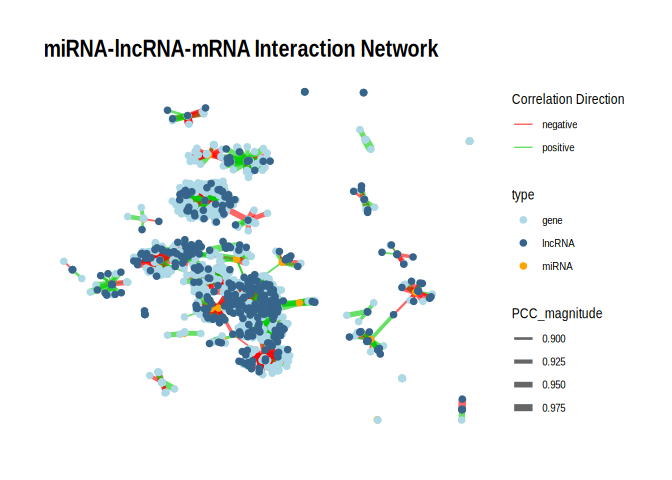

31-Ptuh-miRNA-mRNA-lncRNA-network
================
Kathleen Durkin
2025-07-16

- <a href="#1-all-interactions" id="toc-1-all-interactions">1 All
  interactions</a>
- <a href="#2-pval--005" id="toc-2-pval--005">2 pval &lt; 0.05</a>
- <a href="#3-pval--001" id="toc-3-pval--001">3 pval &lt; 0.01</a>
- <a href="#4-save" id="toc-4-save">4 Save</a>
- <a href="#5-using-cytoscape" id="toc-5-using-cytoscape">5 Using
  Cytoscape</a>
- <a href="#6-plotting-with-igraph" id="toc-6-plotting-with-igraph">6
  Plotting with igraph</a>
  - <a href="#61-p--005" id="toc-61-p--005">6.1 p &lt; 0.05</a>
  - <a href="#62-p--001" id="toc-62-p--001">6.2 p &lt; 0.01</a>

Reran 10/14/2025 to incorporate changes due to updated lncRNA counts
matrix

``` r
library(dplyr)
```

    ## 
    ## Attaching package: 'dplyr'

    ## The following objects are masked from 'package:stats':
    ## 
    ##     filter, lag

    ## The following objects are masked from 'package:base':
    ## 
    ##     intersect, setdiff, setequal, union

``` r
library(ggplot2)
library(tidyr)
library(igraph)
```

    ## 
    ## Attaching package: 'igraph'

    ## The following object is masked from 'package:tidyr':
    ## 
    ##     crossing

    ## The following objects are masked from 'package:dplyr':
    ## 
    ##     as_data_frame, groups, union

    ## The following objects are masked from 'package:stats':
    ## 
    ##     decompose, spectrum

    ## The following object is masked from 'package:base':
    ## 
    ##     union

``` r
library(tidygraph)
```

    ## 
    ## Attaching package: 'tidygraph'

    ## The following object is masked from 'package:igraph':
    ## 
    ##     groups

    ## The following object is masked from 'package:stats':
    ## 
    ##     filter

``` r
library(ggraph)
knitr::opts_chunk$set(
  echo = TRUE,         # Display code chunks
  eval = TRUE         # Evaluate code chunks
)
```

I want to generate an interaction network plot showing the sum of
miRNA-mRNA-lncRNA interactions.

This will include all putative miRNA-mRNA interactions (miRanda +
significant PCC) and all putative miRNA-lncRNA interactions (miRanda +
significant PCC). However, it will *NOT* include mRNA-lncRNA links. This
is for two reasons:

1.  First, that dataset is simply too large – there were tens of
    millions of mRNA-lncRNA pairs with significantly correlated
    expression.

2.  Second, the only method we have to investigate potential mRNA-lncRNA
    links is expression correlation, which doesn’t provide any
    indication of the direction of action and is generally inappropriate
    to use as a sole predictor of causative relationships. In contrast,
    the miRNA-mRNA and miRNA-lncRNA putative interactions are primarily
    supported by binding predictions (through miRanda), and only use
    expression correlation as a method of validating interactions and
    evaluating their “polarity” (positive or negative relationship).
    When making a summary plot, I think it’s only appropriate to include
    putative interactions which we can predict with similar degrees of
    confidence. Including mRNA-lncRNA interactions in the final plot may
    imply we are as confident in those interactions truly existing as we
    are in the miRNA-mRNA and miRNA-lncRNA interactions.

Because I’m excluding the mRNA-lncRNA links, I think this will
functionally end up being a putative ceRNA (competative endogenous)
network.

For both `igraph` and `Cytoscape` I need two inputs, an “Edges”
dataframe and a “Nodes” dataframe (both should be saved as `.csv` files
for export to `Cytoscape`.

The “Edges” file should associate each node with all other nodes it
connects to. It should also contain edge-specific metadata. For example:

| source   | target  | correlation | correlation magnitude | correlation direction | correlation pval | binding pval |
|:---------|:--------|:------------|:----------------------|:----------------------|:-----------------|:-------------|
| miR-100  | Ptuh001 | -0.9        | 0.9                   | -1                    | 0.001            | 0.02         |
| miR-100  | Ptuh002 | 0.85        | 0.85                  | 1                     | 0.02             | 0.03         |
| lncRNA01 | Ptuh001 | -0.95       | 0.95                  | -1                    | 0.01             | 0.01         |

Note that there may be duplicates in both the “source” and “target”
columns, and there may be duplicate source-target combinations if they
have different attributes (e.g. representing different predicted binding
sites of the same pair).However, the rows should be unique.

The “Nodes” file contains metadata for every node included in the plot.
Importantly, the set of nodes listed in the “Nodes” file should match
exactly the set of nodes included in the “Edges” document. For example:

| id       | type   |
|:---------|:-------|
| Ptuh001  | gene   |
| Ptuh002  | gene   |
| miR-100  | miRNA  |
| lncRNA01 | lncRNA |

I’ll need the following files to compile the Cytoscape inputs:

- miRNA-mRNA interaction files (contains binding and coexpression
  information for miRNA-gene pairs):

- miRNA-3UTR:
  `deep-dive-expression/F-Ptuh/output/11-Ptuh-mRNA-miRNA-interactions/three_prime_interaction/Ptuh-miranda_PCC_miRNA_mRNA.csv`

- miRNA-CDS:
  `~/deep-dive-expression/F-Ptuh/output/11.01-Ptuh-mRNA-miRNA-interactions-CDS_5UTR/miRanda_PCC_miRNA_CDS.csv`

- miRNA-5UTR:
  `~/deep-dive-expression/F-Ptuh/output/11.01-Ptuh-mRNA-miRNA-interactions-CDS_5UTR/miRanda_PCC_miRNA_5UTR.csv`

- miRNA-lncRNA interaction file (contains binding and coexpression
  information for miRNA-lncRNA pairs):

- `~/deep-dive-expression/F-Ptuh/output/15-Ptuh-miRNA-lncRNA-PCC/miranda_PCC_miRNA-lncRNA.csv`

Load packages:

``` r
library(dplyr)
library(tidyr)
library(igraph)
```

Load and format files:

``` r
# Load the three miRNA-mRNA files, and format so they have the same column contents and names

miRNA_3UTR <- read.csv("../output/11-Ptuh-mRNA-miRNA-interactions/three_prime_interaction/Ptuh-miranda_PCC_miRNA_mRNA.csv") %>% dplyr::select(-X.1, -X)
# Add label for binding region
miRNA_3UTR$region <- "3UTR"


miRNA_CDS <- read.csv("../output/11.01-Ptuh-mRNA-miRNA-interactions-CDS_5UTR/miRanda_PCC_miRNA_CDS.csv") %>% dplyr::select(-X)
colnames(miRNA_CDS) <- c("miRNA", "mRNA_coord", "score", "energy", "query_start", "query_end", "subject_start", "subject_end", "total_bp_shared", "query_similar", "subject_similar", "mRNA", "PCC.cor", "p_value", "adjusted_p_value")
miRNA_CDS$query_start_end <- paste0(miRNA_CDS$query_start, " ", miRNA_CDS$query_end)
miRNA_CDS$subject_start_end <- paste0(miRNA_CDS$subject_start, " ", miRNA_CDS$subject_end)
# Add label for binding region
miRNA_CDS$region <- "CDS"
# Match column order of miRNA_3UTR
miRNA_CDS <- miRNA_CDS %>% dplyr::select(colnames(miRNA_3UTR))


miRNA_5UTR <- read.csv("../output/11.01-Ptuh-mRNA-miRNA-interactions-CDS_5UTR/miRanda_PCC_miRNA_5UTR.csv") %>% dplyr::select(-X)
colnames(miRNA_5UTR) <- c("miRNA", "mRNA_coord", "score", "energy", "query_start", "query_end", "subject_start", "subject_end", "total_bp_shared", "query_similar", "subject_similar", "mRNA", "PCC.cor", "p_value", "adjusted_p_value")
miRNA_5UTR$query_start_end <- paste0(miRNA_5UTR$query_start, " ", miRNA_5UTR$query_end)
miRNA_5UTR$subject_start_end <- paste0(miRNA_5UTR$subject_start, " ", miRNA_5UTR$subject_end)
# Add label for binding region
miRNA_5UTR$region <- "5UTR"
# Match column order of miRNA_3UTR
miRNA_5UTR <- miRNA_5UTR %>% dplyr::select(colnames(miRNA_3UTR))


miRNA_gene <- rbind(miRNA_3UTR, miRNA_CDS, miRNA_5UTR)
# Remove NA rows
miRNA_gene <- miRNA_gene %>% filter(!is.na(miRNA))

# Load and format the miRNA-lncRNA file
miRNA_lncRNA <- read.csv("../output/15-Ptuh-miRNA-lncRNA-PCC/miranda_PCC_miRNA_lncRNA.csv") %>% dplyr::select(-X.1, -X)
# Add label for binding region
miRNA_lncRNA$region <- "lncRNA"
```

For miRNA, annotate with assigned names (e.g., Ptuh-miR-100,
Ptuh-novel-7)

``` r
Ptuh_names <- read.csv("../../F-Ptuh/output/05-Ptuh-sRNA-ShortStack_4.1.0/ShortStack_out/Ptuh_Results_mature_named_miRNAs.csv") %>% dplyr::select(Name, given_miRNA_name)

miRNA_gene <- left_join(miRNA_gene, Ptuh_names, by = c("miRNA" = "Name"))
miRNA_lncRNA <- left_join(miRNA_lncRNA, Ptuh_names, by = c("miRNA" = "Name"))
```

# 1 All interactions

Format “Edges” file:

``` r
# Add correlation magnitude and direction columns
miRNA_gene$PCC_magnitude <- abs(miRNA_gene$PCC.cor)
miRNA_gene$PCC_direction <- sign(miRNA_gene$PCC.cor)
miRNA_gene$Alignment <- paste0(miRNA_gene$mRNA, ";", miRNA_gene$query_start_end, ";", miRNA_gene$subject_start_end)
# Select columns I want to keep in Edges file
miRNA_gene_edges <- miRNA_gene %>% dplyr::select(given_miRNA_name, mRNA, region, Alignment, energy, total_bp_shared, query_similar, subject_similar, PCC.cor, PCC_magnitude, PCC_direction, p_value)
# rename columns
miRNA_gene_edges <- miRNA_gene_edges %>% rename(source = given_miRNA_name, target = mRNA)

# Add correlation magnitude and direction columns
miRNA_lncRNA$PCC_magnitude <- abs(miRNA_lncRNA$PCC.cor)
miRNA_lncRNA$PCC_direction <- sign(miRNA_lncRNA$PCC.cor)
miRNA_lncRNA$Alignment <- paste0(miRNA_lncRNA$lncRNA, ";", miRNA_lncRNA$query_start_end, ";", miRNA_lncRNA$subject_start_end)
# Select columns I want to keep in Edges file (ensure in same order as in the miRNA_gene_edges file)
miRNA_lncRNA_edges <- miRNA_lncRNA %>% dplyr::select(given_miRNA_name, lncRNA, region, Alignment, energy, total_bp_shared, query_similar, subject_similar, PCC.cor, PCC_magnitude, PCC_direction, p_value)
# rename columns
miRNA_lncRNA_edges <- miRNA_lncRNA_edges %>% rename(source = given_miRNA_name, target = lncRNA)

# Combine miRNA-gene edges and miRNA-lncRNA edges
edges <- rbind(miRNA_gene_edges, miRNA_lncRNA_edges)

# Ensure we have no duplicate rows
nrow(edges)
```

    ## [1] 25148

``` r
nrow(edges %>% distinct())
```

    ## [1] 25148

``` r
# Check formatting/contents
head(edges)
```

    ##              source                                        target region
    ## 1      ptuh-mir-100 Pocillopora_meandrina_HIv1___RNAseq.g10047.t1   3UTR
    ## 2  ptuh-mir-novel-1     Pocillopora_meandrina_HIv1___TS.g16579.t1   3UTR
    ## 3 ptuh-mir-novel-16  Pocillopora_meandrina_HIv1___RNAseq.g6291.t1   3UTR
    ## 4 ptuh-mir-novel-24 Pocillopora_meandrina_HIv1___RNAseq.g22310.t1   3UTR
    ## 5 ptuh-mir-novel-13 Pocillopora_meandrina_HIv1___RNAseq.g22310.t1   3UTR
    ## 6  ptuh-mir-novel-5      Pocillopora_meandrina_HIv1___TS.g1125.t1   3UTR
    ##                                                    Alignment energy
    ## 1 Pocillopora_meandrina_HIv1___RNAseq.g10047.t1;2 17;685 707 -21.19
    ## 2     Pocillopora_meandrina_HIv1___TS.g16579.t1;2 21;417 434 -23.52
    ## 3     Pocillopora_meandrina_HIv1___RNAseq.g6291.t1;2 21;6 27 -21.26
    ## 4 Pocillopora_meandrina_HIv1___RNAseq.g22310.t1;2 20;521 544 -21.53
    ## 5    Pocillopora_meandrina_HIv1___RNAseq.g22310.t1;2 19;1 19 -21.25
    ## 6      Pocillopora_meandrina_HIv1___TS.g1125.t1;2 21;790 815 -24.89
    ##   total_bp_shared query_similar subject_similar     PCC.cor PCC_magnitude
    ## 1              16        68.75%          75.00%  0.27029932    0.27029932
    ## 2              19        73.68%          78.95% -0.43877249    0.43877249
    ## 3              19        63.16%          73.68% -0.35198577    0.35198577
    ## 4              20        75.00%          80.00% -0.39612092    0.39612092
    ## 5              17        76.47%          82.35% -0.94747058    0.94747058
    ## 6              23        73.91%          78.26%  0.07166159    0.07166159
    ##   PCC_direction    p_value
    ## 1             1 0.66008216
    ## 2            -1 0.45982026
    ## 3            -1 0.56127199
    ## 4            -1 0.50916241
    ## 5            -1 0.01433791
    ## 6             1 0.90883578

Format Nodes file:

``` r
# Make a df that contains all miRNA, genes, and lncRNA listed in the `source` and `target` columns of `edges`
nodes <- data.frame(
  # The `unique` argument ensures we remove duplicates
  id = unique(unname(unlist(edges[, c("source", "target")])))
)

# Add column identifying the type of each node (miRNA, lncRNA, or gene)
nodes <- nodes %>%
  mutate(type = case_when(
    grepl("mir", id) ~ "miRNA",
    grepl("Pocillopora", id) ~ "gene",
    grepl("lncRNA", id) ~ "lncRNA",
    TRUE ~ "other"
  ))

# Check formatting/contents
head(nodes)
```

    ##                  id  type
    ## 1      ptuh-mir-100 miRNA
    ## 2  ptuh-mir-novel-1 miRNA
    ## 3 ptuh-mir-novel-16 miRNA
    ## 4 ptuh-mir-novel-24 miRNA
    ## 5 ptuh-mir-novel-13 miRNA
    ## 6  ptuh-mir-novel-5 miRNA

# 2 pval \< 0.05

Edges:

``` r
edges_pval_0.05 <- edges %>% filter(p_value < 0.05)
nrow(edges_pval_0.05)
```

    ## [1] 1466

Nodes:

``` r
# Make a df that contains all miRNA, genes, and lncRNA listed in the `source` and `target` columns of `edges`
nodes_pval_0.05 <- data.frame(
  # The `unique` argument ensures we remove duplicates
  id = unique(unname(unlist(edges_pval_0.05[, c("source", "target")])))
)

# Add column identifying the type of each node (miRNA, lncRNA, or gene)
nodes_pval_0.05 <- nodes_pval_0.05 %>%
  mutate(type = case_when(
    grepl("mir", id) ~ "miRNA",
    grepl("Pocillopora", id) ~ "gene",
    grepl("lncRNA", id) ~ "lncRNA",
    TRUE ~ "other"
  ))

nrow(nodes_pval_0.05)
```

    ## [1] 1266

``` r
nrow(filter(nodes_pval_0.05, type == "miRNA"))
```

    ## [1] 37

``` r
nrow(filter(nodes_pval_0.05, type == "gene"))
```

    ## [1] 836

``` r
nrow(filter(nodes_pval_0.05, type == "lncRNA"))
```

    ## [1] 393

When using a PCC significance level of 0.05, there are 1466 edges and
1266 nodes. In other words, 1266 features (37 miRNA, 836 mRNA, and 393
lncRNA) form 1466 pairwise interactions based on both putative binding
and expression correlation.

Some more summary stats: Keep in mind that there may be multiple
predicted interactions between a single feature pair (e.g. a single
miRNA-mRNA pair), since there may be multiple viable binding sites. One
must consider both interaction-level and unique feature level (e.g. An
miRNA may target 15 unique mRNAs via 20 putative interactions)

``` r
# Helper function to summarize counts
summarize_counts <- function(df, group_col) {
  df %>%
    count({{ group_col }}) %>%
    summarise(
      mean = signif(mean(n), 3),
      median = signif(median(n), 3),
      min = min(n),
      max = max(n)
    )
}

network_summary_stats <- function(edges_df) {

  # Separate mRNA and lncRNA edges
  mRNA_edges <- edges_df %>% filter(region %in% c("3UTR", "5UTR", "CDS"))
  lncRNA_edges <- edges_df %>% filter(region == "lncRNA")

  # ---- For miRNAs ----
  # mRNA interactions (all and unique)
  mRNA_int_all <- summarize_counts(mRNA_edges, source)
  mRNA_int_unique <- summarize_counts(distinct(mRNA_edges, source, target), source)

  # lncRNA interactions (all and unique)
  lncRNA_int_all <- summarize_counts(lncRNA_edges, source)
  lncRNA_int_unique <- summarize_counts(distinct(lncRNA_edges, source, target), source)

  # ---- For targets ----
  # miRNA interactions on mRNA (all and unique)
  miRNA_int_mRNA_all <- summarize_counts(mRNA_edges, target)
  miRNA_int_mRNA_unique <- summarize_counts(distinct(mRNA_edges, source, target), target)

  # miRNA interactions on lncRNA (all and unique)
  miRNA_int_lncRNA_all <- summarize_counts(lncRNA_edges, target)
  miRNA_int_lncRNA_unique <- summarize_counts(distinct(lncRNA_edges, source, target), target)

  # ---- Proportion of mRNA targets per miRNA ----
 
  # Unique target level
 miRNA_target_mRNA_prop_unique <- edges_df %>%
  mutate(type = ifelse(region %in% c("CDS", "3UTR", "5UTR"), "mRNA", "lncRNA")) %>%
  distinct(source, target, type) %>%                     # Keep unique miRNA–mRNA or miRNA-lncRNA pairs
  group_by(source, type) %>%
  summarise(count = n(), .groups = "drop") %>%
  group_by(source) %>%
  mutate(prop = count / sum(count)) %>%
  filter(type == "mRNA") %>%                               # Keep only mRNA proportions
  ungroup() %>%
  summarise(
    mean = signif(mean(prop), 3),
    median = signif(median(prop), 3),
    min = signif(min(prop), 3),
    max = signif(max(prop), 3)
  )

  # ---- Combine into summary table ----
summary_stats <- bind_rows(
  mRNA_int_all %>% mutate(Metric = "mRNA interactions per miRNA (all)"),
  mRNA_int_unique %>% mutate(Metric = "mRNA targets per miRNA (unique)"),
  lncRNA_int_all %>% mutate(Metric = "lncRNA interactions per miRNA (all)"),
  lncRNA_int_unique %>% mutate(Metric = "lncRNA targets per miRNA (unique)"),
  miRNA_int_mRNA_all %>% mutate(Metric = "miRNA interactions per mRNA (all)"),
  miRNA_int_mRNA_unique %>% mutate(Metric = "miRNAs per mRNA (unique)"),
  miRNA_int_lncRNA_all %>% mutate(Metric = "miRNA interactions per lncRNA (all)"),
  miRNA_int_lncRNA_unique %>% mutate(Metric = "miRNAs per lncRNA (unique)"),
  miRNA_target_mRNA_prop_unique %>% mutate(Metric = "Prop. mRNA targets per miRNA (unique)")
) %>%
  select(Metric, everything())

  return(summary_stats)
}

network_summary_stats(edges_pval_0.05)
```

    ##                                  Metric   mean median   min max
    ## 1     mRNA interactions per miRNA (all) 24.400  10.00 1.000 225
    ## 2       mRNA targets per miRNA (unique) 22.900  10.00 1.000 195
    ## 3   lncRNA interactions per miRNA (all) 18.200   8.00 2.000 126
    ## 4     lncRNA targets per miRNA (unique) 13.800   8.00 2.000  61
    ## 5     miRNA interactions per mRNA (all)  1.080   1.00 1.000   7
    ## 6              miRNAs per mRNA (unique)  1.010   1.00 1.000   2
    ## 7   miRNA interactions per lncRNA (all)  1.440   1.00 1.000  16
    ## 8            miRNAs per lncRNA (unique)  1.090   1.00 1.000   4
    ## 9 Prop. mRNA targets per miRNA (unique)  0.658   0.67 0.111   1

**At the interaction-level (which allows for multiple interactions
between a single feature pair):** Each miRNA has 24.4 interactions with
mRNA and 18.2 interactions with lncRNA, on average, though there is
quite a bit of variability. Each mRNA has an average of 1.1 interactions
with miRNA, and each lncRNA has an average of 1.4 interactions with
miRNA.

**At the unique-feature level:** On average, each miRNA has 22.9 unique
mRNA targets and 13.8 unique lncRNA targets, though again there is a lot
of variation. mRNA are targeted by 1.0 unique miRNA on average, and
lncRNA are targeted by 1.4 unique miRNA, on average.

Additionally, the relative proportion of miRNA targets that are mRNA is
highly variable, ranging from 11.1% (lncRNA-dominant) to 100%
(mRNA-dominant), with a mean of 65.8% (slightly mRNA-dominant)

# 3 pval \< 0.01

Edges:

``` r
edges_pval_0.01 <- edges %>% filter(p_value < 0.01)
nrow(edges_pval_0.01)
```

    ## [1] 270

Nodes:

``` r
# Make a df that contains all miRNA, genes, and lncRNA listed in the `source` and `target` columns of `edges`
nodes_pval_0.01 <- data.frame(
  # The `unique` argument ensures we remove duplicates
  id = unique(unname(unlist(edges_pval_0.01[, c("source", "target")])))
)

# Add column identifying the type of each node (miRNA, lncRNA, or gene)
nodes_pval_0.01 <- nodes_pval_0.01 %>%
  mutate(type = case_when(
    grepl("mir", id) ~ "miRNA",
    grepl("Pocillopora", id) ~ "gene",
    grepl("lncRNA", id) ~ "lncRNA",
    TRUE ~ "other"
  ))

nrow(nodes_pval_0.01)
```

    ## [1] 278

``` r
nrow(filter(nodes_pval_0.01, type == "miRNA"))
```

    ## [1] 34

``` r
nrow(filter(nodes_pval_0.01, type == "gene"))
```

    ## [1] 177

``` r
nrow(filter(nodes_pval_0.01, type == "lncRNA"))
```

    ## [1] 67

When using a PCC significance level of 0.01, there are 270 edges and 278
nodes. In other words, 278 features (34 miRNA, 177 mRNA, and 67 lncRNA)
form 270 pairwise interactions based on both putative binding and
expression correlation.

Some more summary stats: Keep in mind that there may be multiple
predicted interactions between a single feature pair (e.g. a single
miRNA-mRNA pair), since there may be multiple viable binding sites. One
must consider both interaction-level and unique feature level (e.g. An
miRNA may target 15 unique mRNAs via 20 putative interactions)

``` r
network_summary_stats(edges_pval_0.01)
```

    ##                                  Metric  mean median   min max
    ## 1     mRNA interactions per miRNA (all) 6.060  2.000 1.000  37
    ## 2       mRNA targets per miRNA (unique) 5.740  2.000 1.000  35
    ## 3   lncRNA interactions per miRNA (all) 3.900  2.000 1.000  21
    ## 4     lncRNA targets per miRNA (unique) 3.190  2.000 1.000  10
    ## 5     miRNA interactions per mRNA (all) 1.060  1.000 1.000   3
    ## 6              miRNAs per mRNA (unique) 1.010  1.000 1.000   2
    ## 7   miRNA interactions per lncRNA (all) 1.220  1.000 1.000   4
    ## 8            miRNAs per lncRNA (unique) 1.000  1.000 1.000   1
    ## 9 Prop. mRNA targets per miRNA (unique) 0.782  0.897 0.167   1

**At the interaction-level (which allows for multiple interactions
between a single feature pair):** Each miRNA has 6.1 interactions with
mRNA and 3.9 interactions with lncRNA, on average, though there is quite
a bit of variability. Each mRNA has an average of 1.1 interactions with
miRNA, and each lncRNA has an average of 1.2 interactions with miRNA.

**At the unique-feature level:** On average, each miRNA has 5.7 unique
mRNA targets and 3.2 unique lncRNA targets, though again there is a lot
of variation. Both mRNA and lncRNA are targeted by 1.0 unique miRNA on
average.

Additionally, the relative proportion of miRNA targets that are mRNA is
highly variable, ranging from 16.7% (lncRNA-dominant) to 100%
(mRNA-dominant), with a mean of 78.2% (mRNA-dominant)

# 4 Save

Save files

``` r
write.csv(edges_pval_0.05, "../output/31-Ptuh-miRNA-mRNA-lncRNA-network/edges_miRNA_mRNA_lncRNA_network_p0.05.csv", quote = FALSE)
write.csv(nodes_pval_0.05, "../output/31-Ptuh-miRNA-mRNA-lncRNA-network/nodes_miRNA_mRNA_lncRNA_network_p0.05.csv", quote = FALSE)
write.csv(edges_pval_0.01, "../output/31-Ptuh-miRNA-mRNA-lncRNA-network/edges_miRNA_mRNA_lncRNA_network_p0.01.csv", quote = FALSE)
write.csv(nodes_pval_0.01, "../output/31-Ptuh-miRNA-mRNA-lncRNA-network/nodes_miRNA_mRNA_lncRNA_network_p0.01.csv", quote = FALSE)
```

# 5 Using Cytoscape

To load a network into Cytoscape:

1.  Open Cytoscape and select File \> Import \> Network from File…

2.  Select “Edges” file. Ensure The source and target columns are
    appropriately identified before loading the file.

3.  To load “Nodes” file, select File \> Import \> Table from File…

# 6 Plotting with igraph

## 6.1 p \< 0.05

``` r
# Rename columns for igraph
colnames(edges_pval_0.05)[1:2] <- c("from", "to")         # For igraph edge input
colnames(nodes_pval_0.05)[1] <- "name"                    # For igraph vertex input; must match nodes in edges

# Build graph
g <- graph_from_data_frame(d = edges_pval_0.05, vertices = nodes_pval_0.05, directed = FALSE)

# Edge attributes
E(g)$edge_color <- ifelse(E(g)$PCC_direction > 0, "positive", "negative")

# Convert to tbl_graph
g_tbl <- as_tbl_graph(g)


p <- ggraph(g_tbl, layout = "fr") +
  geom_edge_link(aes(edge_width = PCC_magnitude, color = edge_color), alpha = 0.6) +
  geom_node_point(aes(color = type), size = 2) +
  scale_edge_width(range = c(0.5, 3)) +
  
  # Split color scales
  scale_edge_color_manual(
    values = c("positive" = "green3", "negative" = "red"),
    name = "Correlation Direction"
  ) +
  scale_color_manual(
    values = c("miRNA" = "orange", "gene" = "lightblue", "lncRNA" = "steelblue4"),
    name = "type"
  ) +

  theme_graph() +
  labs(title = "miRNA-lncRNA-mRNA Interaction Network")

print(p)
```

<!-- -->

## 6.2 p \< 0.01

``` r
# Rename columns for igraph
colnames(edges_pval_0.01)[1:2] <- c("from", "to")         # For igraph edge input
colnames(nodes_pval_0.01)[1] <- "name"                    # For igraph vertex input; must match nodes in edges

# Build graph
g <- graph_from_data_frame(d = edges_pval_0.01, vertices = nodes_pval_0.01, directed = FALSE)

# Edge attributes
E(g)$edge_color <- ifelse(E(g)$PCC_direction > 0, "positive", "negative")

# Convert to tbl_graph
g_tbl <- as_tbl_graph(g)


p <- ggraph(g_tbl, layout = "fr") +
  geom_edge_link(aes(edge_width = PCC_magnitude, color = edge_color), alpha = 0.6) +
  geom_node_point(aes(color = type), size = 2) +
  scale_edge_width(range = c(0.5, 3)) +
  
  # Split color scales
  scale_edge_color_manual(
    values = c("positive" = "green3", "negative" = "red"),
    name = "Correlation Direction"
  ) +
  scale_color_manual(
    values = c("miRNA" = "orange", "gene" = "lightblue", "lncRNA" = "steelblue4"),
    name = "type"
  ) +

  theme_graph() +
  labs(title = "miRNA-lncRNA-mRNA Interaction Network")

print(p)
```

<!-- -->
