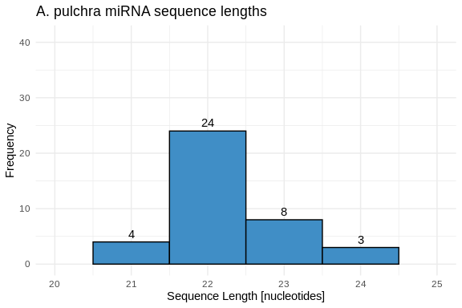
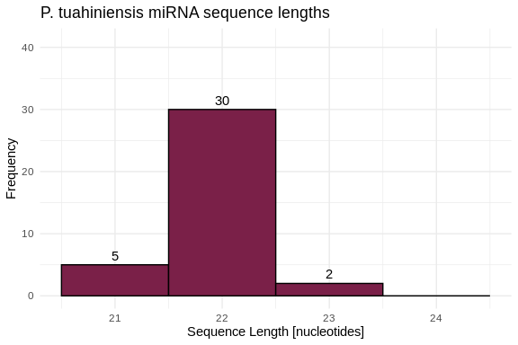
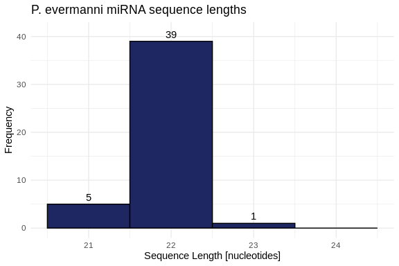
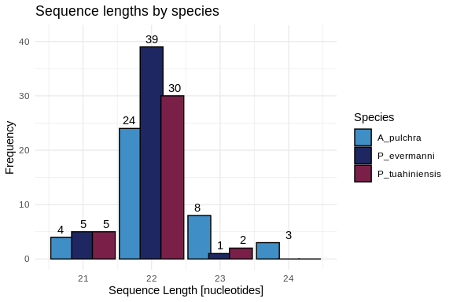
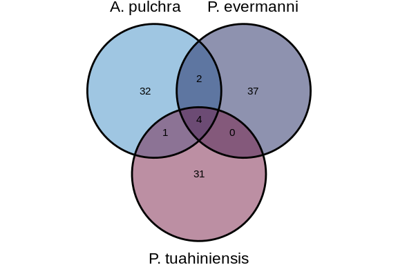
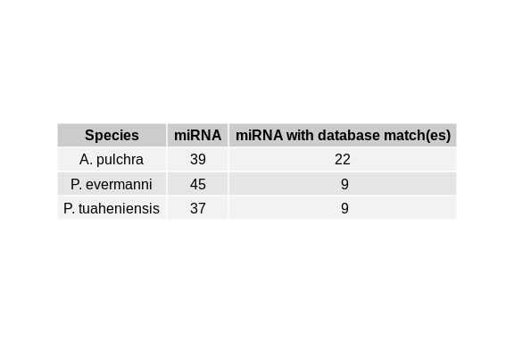

04-miRNA-comparison
================
Kathleen Durkin
2025-05-05

- <a href="#1-prep-data" id="toc-1-prep-data">1 Prep data</a>
  - <a href="#11-isolate-mature-mirna-sequences"
    id="toc-11-isolate-mature-mirna-sequences">1.1 Isolate mature miRNA
    sequences</a>
- <a href="#2-annotate-with-asigned-mirna-names"
  id="toc-2-annotate-with-asigned-mirna-names">2 Annotate with asigned
  miRNA names</a>
  - <a href="#21-check-mirna-length-distributions"
    id="toc-21-check-mirna-length-distributions">2.1 Check miRNA length
    distributions</a>
- <a href="#3-blasts" id="toc-3-blasts">3 BLASTs</a>
  - <a href="#31-merge-the-three-mature-mirna-fastas"
    id="toc-31-merge-the-three-mature-mirna-fastas">3.1 Merge the three
    mature miRNA FASTAs</a>
  - <a href="#32-make-database-for-each-species"
    id="toc-32-make-database-for-each-species">3.2 Make database for each
    species:</a>
  - <a href="#33-run-blastn" id="toc-33-run-blastn">3.3 Run Blastn</a>
  - <a href="#34-join-blast-tables" id="toc-34-join-blast-tables">3.4 Join
    BLAST tables</a>
- <a href="#4-identify-conserved-mirnas"
  id="toc-4-identify-conserved-mirnas">4 Identify conserved miRNAs</a>
  - <a href="#41-conserved-across-all-three-species-apul-peve-and-ptuh"
    id="toc-41-conserved-across-all-three-species-apul-peve-and-ptuh">4.1
    Conserved across all three species (Apul, Peve, and Ptuh)</a>
  - <a href="#42-conserved-among-subsets-of-the-three-species"
    id="toc-42-conserved-among-subsets-of-the-three-species">4.2 Conserved
    among subsets of the three species</a>
    - <a href="#421-apul-and-peve" id="toc-421-apul-and-peve">4.2.1 Apul and
      Peve</a>
    - <a href="#422-apul-and-ptuh" id="toc-422-apul-and-ptuh">4.2.2 Apul and
      Ptuh</a>
    - <a href="#423-peve-and-ptuh" id="toc-423-peve-and-ptuh">4.2.3 Peve and
      Ptuh</a>
  - <a href="#43-visualize" id="toc-43-visualize">4.3 Visualize</a>
    - <a href="#431-data-munging-of-the-results"
      id="toc-431-data-munging-of-the-results">4.3.1 Data munging of the
      results</a>
    - <a href="#432-venn-diagram" id="toc-432-venn-diagram">4.3.2 Venn
      diagram</a>
- <a href="#5-identify-mirnas-with-identical-mature-mirnas"
  id="toc-5-identify-mirnas-with-identical-mature-mirnas">5 Identify
  miRNAs with identical mature miRNAs</a>
  - <a href="#51-apul" id="toc-51-apul">5.1 Apul</a>
  - <a href="#52-peve" id="toc-52-peve">5.2 Peve</a>
  - <a href="#53-ptuh" id="toc-53-ptuh">5.3 Ptuh</a>
- <a href="#6-look-at-the-database-matches"
  id="toc-6-look-at-the-database-matches">6 Look at the database
  matches</a>
  - <a href="#61-table" id="toc-61-table">6.1 Table</a>

I want to find miRNAs that are conserved among either a subset of or all
three species of interest (*A.pulchra*, *P.evermanni*, and
*P.tuahiniensis*) using Blastn. I want to generally investigate sequence
similarity across and within species.

# 1 Prep data

## 1.1 Isolate mature miRNA sequences

Our ShortStack output contains sequences for the mature, star, and
precursor sequences for each identified miRNA. We just want to look at
the mature miRNA sequences right now, so let’s isolate those.

``` bash
cd ../output/04-miRNA-comparison

# Copy all sequences whose headers contain "mature"
awk '/^>/ {p = /mature/} p' ../../../D-Apul/output/11-Apul-sRNA-ShortStack_4.1.0-pulchra_genome/ShortStack_out/mir.fasta > Apul_ShortStack_mature.fasta

awk '/^>/ {p = /mature/} p' ../../../E-Peve/output/05-Peve-sRNA-ShortStack_4.1.0/ShortStack_out/mir.fasta > Peve_ShortStack_mature.fasta

awk '/^>/ {p = /mature/} p' ../../../F-Ptuh/output/05-Ptuh-sRNA-ShortStack_4.1.0/ShortStack_out/mir.fasta > Ptuh_ShortStack_mature.fasta

grep "^>" Apul_ShortStack_mature.fasta | wc -l 
grep "^>" Peve_ShortStack_mature.fasta | wc -l
grep "^>" Ptuh_ShortStack_mature.fasta | wc -l
```

    39
    45
    37

# 2 Annotate with asigned miRNA names

Read fastas into R as data frames

``` r
# Apul
Apul_mature_fasta <- readDNAStringSet("../output/04-miRNA-comparison/Apul_ShortStack_mature.fasta")
Apul_mature_df <- data.frame(
  miRNA = names(Apul_mature_fasta),
  sequence = as.character(Apul_mature_fasta),
  length = width(Apul_mature_fasta),
  stringsAsFactors = FALSE
)
# format miRNA name and coordinates columns
Apul_mature_df$coordinates <- sub(".*::", "", Apul_mature_df$miRNA)
Apul_mature_df$miRNA <- gsub("\\.mature.*", "", Apul_mature_df$miRNA)
Apul_mature_df$species <- "A_pulchra"

# Peve
Peve_mature_fasta <- readDNAStringSet("../output/04-miRNA-comparison/Peve_ShortStack_mature.fasta")
Peve_mature_df <- data.frame(
  miRNA = names(Peve_mature_fasta),
  sequence = as.character(Peve_mature_fasta),
  length = width(Peve_mature_fasta),
  stringsAsFactors = FALSE
)
# format miRNA name and coordinates columns
Peve_mature_df$coordinates <- sub(".*::", "", Peve_mature_df$miRNA)
Peve_mature_df$miRNA <- gsub("\\.mature.*", "", Peve_mature_df$miRNA)
Peve_mature_df$species <- "P_evermanni"

# Ptuh
Ptuh_mature_fasta <- readDNAStringSet("../output/04-miRNA-comparison/Ptuh_ShortStack_mature.fasta")
Ptuh_mature_df <- data.frame(
  miRNA = names(Ptuh_mature_fasta),
  sequence = as.character(Ptuh_mature_fasta),
  length = width(Ptuh_mature_fasta),
  stringsAsFactors = FALSE
)
# format miRNA name and coordinates columns
Ptuh_mature_df$coordinates <- sub(".*::", "", Ptuh_mature_df$miRNA)
Ptuh_mature_df$miRNA <- gsub("\\.mature.*", "", Ptuh_mature_df$miRNA)
Ptuh_mature_df$species <- "P_tuahiniensis"
```

Load in assigned miRNA names

``` r
Apul_names <- read.csv("../../D-Apul/output/11-Apul-sRNA-ShortStack_4.1.0-pulchra_genome/ShortStack_out/Apul_Results_mature_named_miRNAs.csv") %>% select(Name, given_miRNA_name)

Peve_names <- read.csv("../../E-Peve/output/05-Peve-sRNA-ShortStack_4.1.0/ShortStack_out/Peve_Results_mature_named_miRNAs.csv") %>% select(Name, given_miRNA_name)

Ptuh_names <- read.csv("../../F-Ptuh/output/05-Ptuh-sRNA-ShortStack_4.1.0/ShortStack_out/Ptuh_Results_mature_named_miRNAs.csv") %>% select(Name, given_miRNA_name)
```

Annotate miRNA dfs with given names

``` r
Apul_mature_df <- left_join(Apul_mature_df, Apul_names, by = c("miRNA" = "Name"))
Peve_mature_df <- left_join(Peve_mature_df, Peve_names, by = c("miRNA" = "Name"))
Ptuh_mature_df <- left_join(Ptuh_mature_df, Ptuh_names, by = c("miRNA" = "Name"))
```

``` r
# merge into single df of all miRNA
merged_mature_df <- rbind(Apul_mature_df, Peve_mature_df, Ptuh_mature_df)
```

## 2.1 Check miRNA length distributions

``` r
# Set our color scheme for plotting -- options for both the abbreviated labels or the full, correct species names
species_colors <- c('A_pulchra' = '#408EC6',
                    'P_evermanni' = '#1E2761',
                    'P_tuahiniensis' = '#7A2048')

species_colors_nolabel <- c('#408EC6', '#1E2761', '#7A2048')
```

Apul:

``` r
# Make histogram of lengths
hist_Apul_lengths <- ggplot(Apul_mature_df, aes(x = length)) +
  geom_histogram(binwidth = 1, fill = species_colors['A_pulchra'], color = "black") +
  geom_text(stat = 'count', aes(label = ..count..), vjust = -0.5) +
  labs(title = "A. pulchra miRNA sequence lengths",
       x = "Sequence Length [nucleotides]",
       y = "Frequency") +
  xlim(20, 25) +
  ylim(0, 41) +
  theme_minimal()

hist_Apul_lengths
```



``` r
ggexport(filename = "../output/04-miRNA-comparison/figures/histogram_Apul_miRNA_lengths.png",
         plot   = hist_Apul_lengths,
         res    = 600,
         width  = 5000,
         height = 5000)

# ggexport(filename = "../../supplemental/miRNA/histogram_Apul_miRNA_lengths.png",
#          plot   = hist_Apul_lengths,
#          res    = 600,
#          width  = 5000,
#          height = 5000)
```

Ptuh:

``` r
# Make histogram of lengths
hist_Ptuh_lengths <- ggplot(Ptuh_mature_df, aes(x = length)) +
  geom_histogram(binwidth = 1, fill = species_colors['P_tuahiniensis'], color = "black") +
  geom_text(stat = 'count', aes(label = ..count..), vjust = -0.5) +
  labs(title = "P. tuahiniensis miRNA sequence lengths",
       x = "Sequence Length [nucleotides]",
       y = "Frequency") +
  xlim(20.5, 24.5) +
  ylim(0, 41) +
  theme_minimal()

hist_Ptuh_lengths
```



``` r
ggexport(filename = "../output/04-miRNA-comparison/figures/histogram_Ptuh_miRNA_lengths.png",
         plot   = hist_Ptuh_lengths,
         res    = 600,
         width  = 5000,
         height = 5000)

# ggexport(filename = "../../supplemental/miRNA/histogram_Ptuh_miRNA_lengths.png",
#          plot   = hist_Ptuh_lengths,
#          res    = 600,
#          width  = 5000,
#          height = 5000)
```

Peve:

``` r
# Make histogram of lengths
hist_Peve_lengths <- ggplot(Peve_mature_df, aes(x = length)) +
  geom_histogram(binwidth = 1, 
                 fill = species_colors['P_evermanni'], 
                 color = "black") +
  geom_text(stat = 'count', aes(label = ..count..), vjust = -0.5) +
  labs(title = "P. evermanni miRNA sequence lengths",
       x = "Sequence Length [nucleotides]",
       y = "Frequency") +
  xlim(20.5, 24.5) +
  ylim(0, 41) +
  theme_minimal()

hist_Peve_lengths
```



``` r
ggexport(filename = "../output/04-miRNA-comparison/figures/histogram_Peve_miRNA_lengths.png",
         plot   = hist_Peve_lengths,
         res    = 600,
         width  = 5000,
         height = 5000)

# ggexport(filename = "../../supplemental/miRNA/histogram_Peve_miRNA_lengths.png",
#          plot   = hist_Peve_lengths,
#          res    = 600,
#          width  = 5000,
#          height = 5000)
```

Let’s also make a plot showing the length distributions of all three
species

``` r
hist_all_lengths <- ggplot(merged_mature_df, aes(x = length, fill = species)) +
  geom_histogram(binwidth = 1, 
                 position = position_dodge(width = 0.91), 
                 color = "black", 
                 width = 0.9) +
  geom_text(stat = 'count', 
            aes(label = ..count..), 
            vjust = -0.5, 
            position = position_dodge(width = 1)) +
  scale_fill_manual(values = species_colors) +
  labs(title = "Sequence lengths by species",
       x = "Sequence Length [nucleotides]",
       y = "Frequency",
       fill = "Species") +
  xlim(20.5, 24.5) +
  ylim(0, 41) +
  theme_minimal()

hist_all_lengths
```



``` r
ggexport(filename = "../output/04-miRNA-comparison/figures/histogram_all_miRNA_lengths.png",
         plot   = hist_all_lengths,
         res    = 600,
         width  = 5000,
         height = 5000)

# ggexport(filename = "../../supplemental/miRNA/histogram_all_miRNA_lengths.png",
#          plot   = hist_all_lengths,
#          res    = 600,
#          width  = 5000,
#          height = 5000)
```

``` r
# Summarize min, max, and average lengths for each species
length_summary <- merged_mature_df %>%
  group_by(species) %>%
  summarise(
    Min_Length = min(length, na.rm = TRUE),
    Max_Length = max(length, na.rm = TRUE),
    Avg_Length = mean(length, na.rm = TRUE)
  )

print(length_summary)
```

    # A tibble: 3 × 4
      species        Min_Length Max_Length Avg_Length
      <chr>               <int>      <int>      <dbl>
    1 A_pulchra              21         24       22.3
    2 P_evermanni            21         23       21.9
    3 P_tuahiniensis         21         23       21.9

# 3 BLASTs

## 3.1 Merge the three mature miRNA FASTAs

``` bash
cd ../output/04-miRNA-comparison

cat Apul_ShortStack_mature.fasta Peve_ShortStack_mature.fasta Ptuh_ShortStack_mature.fasta > merged_all_ShortStack_mature.fasta

head merged_all_ShortStack_mature.fasta
tail merged_all_ShortStack_mature.fasta
```

    >Cluster_1826.mature::ntLink_6:4847465-4847486(-)
    ATGATCATAGCACTTTCTTTGT
    >Cluster_1832.mature::ntLink_6:5157559-5157579(+)
    AAATGTTTCGGCTTGTTCCCG
    >Cluster_1862.mature::ntLink_6:7263537-7263560(-)
    TTTCAAATTAGGAAGGGAGGTGTT
    >Cluster_1951.mature::ntLink_6:13351801-13351822(-)
    TAAAATGTCGGTTGCTTAAGCT
    >Cluster_2463.mature::ptg000001l:5548893-5548914(-)
    TCTCAGATTACAGTAGTTAAGT
    >Cluster_4823.mature::Pocillopora_meandrina_HIv1___Sc0000018:6855521-6855542(+)
    TCACCCAACAGTTTTAATCTGA
    >Cluster_5253.mature::Pocillopora_meandrina_HIv1___Sc0000021:4351839-4351860(+)
    ACTGATATTCACCAAGTGATTA
    >Cluster_5612.mature::Pocillopora_meandrina_HIv1___Sc0000024:4808688-4808708(+)
    AGAACCCAAGAATCTCGAAGG
    >Cluster_5740.mature::Pocillopora_meandrina_HIv1___Sc0000026:1154772-1154793(-)
    TGTACTATGTTCATGATCTTGC
    >Cluster_6382.mature::Pocillopora_meandrina_HIv1___Sc0000035:1989842-1989863(+)
    TATTTACAACTCTCAAAACAAC

## 3.2 Make database for each species:

Apul

``` bash
/home/shared/ncbi-blast-2.11.0+/bin/makeblastdb \
-in ../output/04-miRNA-comparison/Apul_ShortStack_mature.fasta \
-dbtype nucl \
-out ../output/04-miRNA-comparison/blasts/Apul-db/Apul_ShortStack_mature
```

    Building a new DB, current time: 05/06/2025 19:28:15
    New DB name:   /home/shared/8TB_HDD_02/shedurkin/deep-dive-expression/M-multi-species/output/04-miRNA-comparison/blasts/Apul-db/Apul_ShortStack_mature
    New DB title:  ../output/04-miRNA-comparison/Apul_ShortStack_mature.fasta
    Sequence type: Nucleotide
    Deleted existing Nucleotide BLAST database named /home/shared/8TB_HDD_02/shedurkin/deep-dive-expression/M-multi-species/output/04-miRNA-comparison/blasts/Apul-db/Apul_ShortStack_mature
    Keep MBits: T
    Maximum file size: 1000000000B
    Adding sequences from FASTA; added 39 sequences in 0.00327086 seconds.

Peve

``` bash
/home/shared/ncbi-blast-2.11.0+/bin/makeblastdb \
-in ../output/04-miRNA-comparison/Peve_ShortStack_mature.fasta \
-dbtype nucl \
-out ../output/04-miRNA-comparison/blasts/Peve-db/Peve_ShortStack_mature
```

    Building a new DB, current time: 05/06/2025 19:28:17
    New DB name:   /home/shared/8TB_HDD_02/shedurkin/deep-dive-expression/M-multi-species/output/04-miRNA-comparison/blasts/Peve-db/Peve_ShortStack_mature
    New DB title:  ../output/04-miRNA-comparison/Peve_ShortStack_mature.fasta
    Sequence type: Nucleotide
    Deleted existing Nucleotide BLAST database named /home/shared/8TB_HDD_02/shedurkin/deep-dive-expression/M-multi-species/output/04-miRNA-comparison/blasts/Peve-db/Peve_ShortStack_mature
    Keep MBits: T
    Maximum file size: 1000000000B
    Adding sequences from FASTA; added 45 sequences in 0.00182319 seconds.

Ptuh

``` bash
/home/shared/ncbi-blast-2.11.0+/bin/makeblastdb \
-in ../output/04-miRNA-comparison/Ptuh_ShortStack_mature.fasta \
-dbtype nucl \
-out ../output/04-miRNA-comparison/blasts/Ptuh-db/Ptuh_ShortStack_mature
```

    Building a new DB, current time: 05/06/2025 19:28:18
    New DB name:   /home/shared/8TB_HDD_02/shedurkin/deep-dive-expression/M-multi-species/output/04-miRNA-comparison/blasts/Ptuh-db/Ptuh_ShortStack_mature
    New DB title:  ../output/04-miRNA-comparison/Ptuh_ShortStack_mature.fasta
    Sequence type: Nucleotide
    Deleted existing Nucleotide BLAST database named /home/shared/8TB_HDD_02/shedurkin/deep-dive-expression/M-multi-species/output/04-miRNA-comparison/blasts/Ptuh-db/Ptuh_ShortStack_mature
    Keep MBits: T
    Maximum file size: 1000000000B
    Adding sequences from FASTA; added 37 sequences in 0.00179005 seconds.

## 3.3 Run Blastn

Generate a list of blast results that, for each miRNA, shows the top hit
in each of two other species. We want to see the top hits no matter how
poor the match is, so we will not filter by e-value at this stage. We’ll
also include the “-word_size 4” option, which reduces the required
length of the initial match.

All to Apul:

``` bash
/home/shared/ncbi-blast-2.11.0+/bin/blastn \
-task blastn-short \
-query ../output/04-miRNA-comparison/merged_all_ShortStack_mature.fasta \
-db ../output/04-miRNA-comparison/blasts/Apul-db/Apul_ShortStack_mature \
-out ../output/04-miRNA-comparison/blasts/Apul_to_all_blastn.tab \
-num_threads 40 \
-word_size 4 \
-max_target_seqs 1 \
-max_hsps 1 \
-outfmt 6

wc -l ../output/04-miRNA-comparison/blasts/Apul_to_all_blastn.tab
```

    Warning: [blastn] Examining 5 or more matches is recommended
    121 ../output/04-miRNA-comparison/blasts/Apul_to_all_blastn.tab

All to Peve:

``` bash
/home/shared/ncbi-blast-2.11.0+/bin/blastn \
-task blastn-short \
-query ../output/04-miRNA-comparison/merged_all_ShortStack_mature.fasta \
-db ../output/04-miRNA-comparison/blasts/Peve-db/Peve_ShortStack_mature \
-out ../output/04-miRNA-comparison/blasts/Peve_to_all_blastn.tab \
-num_threads 40 \
-word_size 4 \
-max_target_seqs 1 \
-max_hsps 1 \
-outfmt 6

wc -l ../output/04-miRNA-comparison/blasts/Peve_to_all_blastn.tab
```

    Warning: [blastn] Examining 5 or more matches is recommended
    121 ../output/04-miRNA-comparison/blasts/Peve_to_all_blastn.tab

All to Ptuh:

``` bash
/home/shared/ncbi-blast-2.11.0+/bin/blastn \
-task blastn-short \
-query ../output/04-miRNA-comparison/merged_all_ShortStack_mature.fasta \
-db ../output/04-miRNA-comparison/blasts/Ptuh-db/Ptuh_ShortStack_mature \
-out ../output/04-miRNA-comparison/blasts/Ptuh_to_all_blastn.tab \
-num_threads 40 \
-word_size 4 \
-max_target_seqs 1 \
-max_hsps 1 \
-outfmt 6

wc -l ../output/04-miRNA-comparison/blasts/Ptuh_to_all_blastn.tab
```

    Warning: [blastn] Examining 5 or more matches is recommended
    121 ../output/04-miRNA-comparison/blasts/Ptuh_to_all_blastn.tab

## 3.4 Join BLAST tables

``` r
apul_to_all_blastn <- read.table("../output/04-miRNA-comparison/blasts/Apul_to_all_blastn.tab", sep="\t", header=FALSE)
peve_to_all_blastn <- read.table("../output/04-miRNA-comparison/blasts/Peve_to_all_blastn.tab", sep="\t", header=FALSE)
Ptuh_to_all_blastn <- read.table("../output/04-miRNA-comparison/blasts/Ptuh_to_all_blastn.tab", sep="\t", header=FALSE)
```

Column labels: qseqid: Query sequence ID sseqid: Subject (database)
sequence ID pident: Percentage of identical matches length: Alignment
length (number of base pairs or amino acids) mismatch: Number of
mismatches gapopen: Number of gap openings qstart: Start of alignment in
the query qend: End of alignment in the query sstart: Start of alignment
in the subject send: End of alignment in the subject evalue: Expect
value (number of hits expected by chance) bitscore: Bit score

``` r
# Combine the three blast tables
combined_blastn <- rbind(apul_to_all_blastn, peve_to_all_blastn, Ptuh_to_all_blastn)

# Assign informative column labels
colnames(combined_blastn) <- c("qseqid", "sseqid", "pident", "length", "mismatch", "gapopen", "qstart", "qend", "sstart", "send", "evalue", "bitscore")

# Save this original, unfiltered blast table.
write.table(combined_blastn, "../output/04-miRNA-comparison/combined_blast.tab", sep="\t", row.names=FALSE, quote=FALSE)
```

# 4 Identify conserved miRNAs

Filter our list of blast hits to remove instances where sequences match
themselves (e.g. from querying an Apul sequence against our combined
database which contained all Apul sequences), and to retain only the
significant hits (We’ll set this at eval \> 1E-5)

``` r
# Filter
filtered_combined_blastn <- combined_blastn %>%
  filter(qseqid != sseqid) %>%
  filter(evalue < 0.00001)

# View
nrow(filtered_combined_blastn)
```

    [1] 37

``` r
head(filtered_combined_blastn)
```

                                                                   qseqid
    1  Cluster_1167.mature::Porites_evermani_scaffold_49:151640-151661(-)
    2 Cluster_5563.mature::Porites_evermani_scaffold_430:205887-205909(-)
    3   Cluster_6255.mature::Porites_evermani_scaffold_502:58997-59018(-)
    4 Cluster_6914.mature::Porites_evermani_scaffold_594:158230-158250(+)
    5   Cluster_8884.mature::Porites_evermani_scaffold_910:99255-99275(+)
    6 Cluster_8887.mature::Porites_evermani_scaffold_910:118742-118762(+)
                                                    sseqid pident length mismatch
    1  Cluster_18728.mature::ptg000035l:5346054-5346075(+)    100     22        0
    2  Cluster_18772.mature::ptg000035l:8367748-8367770(-)    100     23        0
    3   Cluster_3437.mature::ptg000004l:1859911-1859933(-)    100     22        0
    4 Cluster_5012.mature::ptg000008l:10754789-10754809(-)    100     21        0
    5     Cluster_1832.mature::ntLink_6:5157559-5157579(+)    100     19        0
    6     Cluster_1832.mature::ntLink_6:5157559-5157579(+)    100     20        0
      gapopen qstart qend sstart send   evalue bitscore
    1       0      1   22      1   22 5.36e-10     44.1
    2       0      1   23      1   23 1.44e-10     46.1
    3       0      1   22      1   22 5.36e-10     44.1
    4       0      1   21      1   21 1.99e-09     42.1
    5       0      2   20      2   20 3.10e-08     38.2
    6       0      2   21      2   21 7.85e-09     40.1

Annotate with miRNA names

``` r
# Annotate qseqs
filtered_combined_blastn$qmiRNA <- sub("\\.mature.*", "", filtered_combined_blastn$qseqid)
filtered_combined_blastn <- left_join(filtered_combined_blastn, (merged_mature_df %>% select(miRNA, given_miRNA_name)), by = c("qmiRNA" = "miRNA"))
filtered_combined_blastn <- filtered_combined_blastn %>% dplyr::rename(q_given_miRNA_name = given_miRNA_name)

# Annotate sseqs
filtered_combined_blastn$smiRNA <- sub("\\.mature.*", "", filtered_combined_blastn$sseqid)
filtered_combined_blastn <- left_join(filtered_combined_blastn, (merged_mature_df %>% select(miRNA, given_miRNA_name)), by = c("smiRNA" = "miRNA"))
filtered_combined_blastn <- filtered_combined_blastn %>% dplyr::rename(s_given_miRNA_name = given_miRNA_name)

write.table(filtered_combined_blastn, "../output/04-miRNA-comparison/filtered_combined_blast.tab", sep="\t", row.names=FALSE, quote=FALSE)
```

Ok now we can start identifying conserved miRNAs. Keep in mind that this
list of filtered, combined blastn hits contains duplicates because, for
example, querying Apul sequences against a database containing Peve
sequences is functionally the same as querying those Peve sequences
against a databse which contains Apul. So, for example, this list would
contain a hit matching Apul.seq1 to Peve.seq2, *and* a hit matching
Peve.seq2 to Apul.seq1.

## 4.1 Conserved across all three species (Apul, Peve, and Ptuh)

First, lets find miRNAs conserved among all three species. These would
show up as an miRNA from one species that has hits from both other
species (e.g., Apul.seq1 has a hit from Peve *and* a hit from Ptuh).

``` r
# Find Apul miRNAs that have matches from both Peve and Ptuh
present_in_all <- filtered_combined_blastn %>%
  # isolate Apul miRNAs with hits
  filter(!grepl("Porites_evermani|Pocillopora_meandrina", sseqid)) %>%
  group_by(sseqid) %>%
  filter(any(grepl("Porites_evermani", qseqid)) & any(grepl("Pocillopora_meandrina", qseqid)))

# View the miRNAs that match across all three species
# (recall this will include two entries for each conserved miRNA, it's Apul match in Peve, and its Apul match to Ptuh)
head(present_in_all, nrow(present_in_all))
```

    # A tibble: 9 × 16
    # Groups:   sseqid [4]
      qseqid         sseqid pident length mismatch gapopen qstart  qend sstart  send
      <chr>          <chr>   <dbl>  <int>    <int>   <int>  <int> <int>  <int> <int>
    1 Cluster_1167.… Clust…  100       22        0       0      1    22      1    22
    2 Cluster_5563.… Clust…  100       23        0       0      1    23      1    23
    3 Cluster_6914.… Clust…  100       21        0       0      1    21      1    21
    4 Cluster_14999… Clust…  100       22        0       0      1    22      1    22
    5 Cluster_390.m… Clust…   94.7     19        1       0      1    19      1    19
    6 Cluster_1116.… Clust…  100       22        0       0      1    22      1    22
    7 Cluster_1296.… Clust…  100       21        0       0      2    22      2    22
    8 Cluster_1793.… Clust…  100       21        0       0      1    21      1    21
    9 Cluster_4039.… Clust…  100       22        0       0      1    22      1    22
    # ℹ 6 more variables: evalue <dbl>, bitscore <dbl>, qmiRNA <chr>,
    #   q_given_miRNA_name <chr>, smiRNA <chr>, s_given_miRNA_name <chr>

``` r
# Count the number of miRNAs conserved across all three species
paste("Number of miRNAs conserved across all three species:", nrow(distinct(present_in_all, sseqid)))
```

    [1] "Number of miRNAs conserved across all three species: 4"

``` r
unique(present_in_all$s_given_miRNA_name)
```

    [1] "apul-mir-100"  "apul-mir-2036" "apul-mir-2023" "apul-mir-2025"

``` r
unique(present_in_all$q_given_miRNA_name)
```

    [1] "peve-mir-100"      "peve-mir-2036"     "peve-mir-2023"    
    [4] "peve-mir-2025"     "ptuh-mir-novel-33" "ptuh-mir-2036"    
    [7] "ptuh-mir-100"      "ptuh-mir-2023"     "ptuh-mir-2025"    

The 4 miRNAs conserved across all species are all previously described:
miR-100, miR-2023, miR-2025, and miR-2036.

## 4.2 Conserved among subsets of the three species

Now we want to find miRNAs that are conserved withing subsets of the
three species

### 4.2.1 Apul and Peve

Find Apul miRNAs that have hits to Peve miRNAs but *not* hits to Ptuh
miRNAs (that would make them conserved among all three species, which
we’ve already identified)

``` r
# Find Apul miRNAs that have matches from only Peve
present_in_apul_peve <- filtered_combined_blastn %>%
  # isolate Apul miRNAs with hits
  filter(!grepl("Porites_evermani|Pocillopora_meandrina", sseqid)) %>%
  group_by(sseqid) %>%
  # filter for hits to Peve only
  filter(any(grepl("Porites_evermani", qseqid)) & !any(grepl("Pocillopora_meandrina", qseqid)))

# View the miRNAs that match between Apul and Peve
head(present_in_apul_peve, nrow(present_in_apul_peve))
```

    # A tibble: 4 × 16
    # Groups:   sseqid [2]
      qseqid         sseqid pident length mismatch gapopen qstart  qend sstart  send
      <chr>          <chr>   <dbl>  <int>    <int>   <int>  <int> <int>  <int> <int>
    1 Cluster_6255.… Clust…    100     22        0       0      1    22      1    22
    2 Cluster_8884.… Clust…    100     19        0       0      2    20      2    20
    3 Cluster_8887.… Clust…    100     20        0       0      2    21      2    21
    4 Cluster_8888.… Clust…    100     21        0       0      1    21      1    21
    # ℹ 6 more variables: evalue <dbl>, bitscore <dbl>, qmiRNA <chr>,
    #   q_given_miRNA_name <chr>, smiRNA <chr>, s_given_miRNA_name <chr>

``` r
# Count the number of miRNAs conserved across the two species
paste("Number of miRNAs conserved in Apul and Peve:", nrow(distinct(present_in_apul_peve, sseqid)))
```

    [1] "Number of miRNAs conserved in Apul and Peve: 2"

``` r
head(present_in_apul_peve %>% select(q_given_miRNA_name, s_given_miRNA_name))
```

    # A tibble: 4 × 3
    # Groups:   sseqid [2]
      sseqid                                   q_given_miRNA_name s_given_miRNA_name
      <chr>                                    <chr>              <chr>             
    1 Cluster_3437.mature::ptg000004l:1859911… peve-mir-2030      apul-mir-2030     
    2 Cluster_1832.mature::ntLink_6:5157559-5… peve-mir-novel-20  apul-mir-novel-27 
    3 Cluster_1832.mature::ntLink_6:5157559-5… peve-mir-novel-21  apul-mir-novel-27 
    4 Cluster_1832.mature::ntLink_6:5157559-5… peve-mir-novel-22  apul-mir-novel-27 

There are 2 miRNAs conserved between A.pulchra and P.evermanni: miR-2030
is one. The other is kind of weird – one A.pulchra miRNA
(apul-mir-novel-27) matches 3 different (but similar) P.evermanni
miRNAs.

### 4.2.2 Apul and Ptuh

Find Apul miRNAs that have hits to Ptuh miRNAs but *not* hits to Peve
miRNAs

``` r
# Find Apul miRNAs that have matches from only Ptuh
present_in_apul_Ptuh <- filtered_combined_blastn %>%
  # isolate Apul miRNAs with hits
  filter(!grepl("Porites_evermani|Pocillopora_meandrina", sseqid)) %>%
  group_by(sseqid) %>%
  # filter for hits to Ptuh only
  filter(!any(grepl("Porites_evermani", qseqid)) & any(grepl("Pocillopora_meandrina", qseqid)))

# View the miRNAs that match between Apul and Ptuh
head(present_in_apul_Ptuh, nrow(present_in_apul_Ptuh))
```

    # A tibble: 1 × 16
    # Groups:   sseqid [1]
      qseqid         sseqid pident length mismatch gapopen qstart  qend sstart  send
      <chr>          <chr>   <dbl>  <int>    <int>   <int>  <int> <int>  <int> <int>
    1 Cluster_1068.… Clust…    100     22        0       0      1    22      1    22
    # ℹ 6 more variables: evalue <dbl>, bitscore <dbl>, qmiRNA <chr>,
    #   q_given_miRNA_name <chr>, smiRNA <chr>, s_given_miRNA_name <chr>

``` r
# Count the number of miRNAs conserved across the two species
paste("Number of miRNAs conserved in Apul and Ptuh:", nrow(distinct(present_in_apul_Ptuh, sseqid)))
```

    [1] "Number of miRNAs conserved in Apul and Ptuh: 1"

``` r
head(present_in_apul_Ptuh %>% select(q_given_miRNA_name, s_given_miRNA_name))
```

    # A tibble: 1 × 3
    # Groups:   sseqid [1]
      sseqid                                   q_given_miRNA_name s_given_miRNA_name
      <chr>                                    <chr>              <chr>             
    1 Cluster_17776.mature::ptg000031l:546132… ptuh-mir-novel-7   apul-mir-novel-7  

The 1 miRNA coserved between A.pulchra and P.tuahiniensis is not
previously described

### 4.2.3 Peve and Ptuh

Find Peve miRNAs that have hits to Ptuh miRNAs but *not* hits to Apul
miRNAs

``` r
# Find Peve miRNAs that have matches from only Ptuh
present_in_peve_Ptuh <- filtered_combined_blastn %>%
  # isolate Peve miRNAs with hits
  filter(grepl("Porites_evermani", sseqid)) %>%
  group_by(sseqid) %>%
  # filter for hits to Ptuh only (note the Apul sequence IDs don't contain the species name, so we have to use a non-descriptive unique identifier for filtering)
  filter(!any(grepl("mature::ntLink|mature::ptg", qseqid)) & any(grepl("Pocillopora_meandrina", qseqid)))

# Count the number of miRNAs conserved across the two species
paste("Number of miRNAs conserved in Peve and Ptuh:", nrow(distinct(present_in_peve_Ptuh, sseqid)))
```

    [1] "Number of miRNAs conserved in Peve and Ptuh: 1"

``` r
head(present_in_peve_Ptuh %>% select(q_given_miRNA_name, s_given_miRNA_name))
```

    # A tibble: 1 × 3
    # Groups:   sseqid [1]
      sseqid                                   q_given_miRNA_name s_given_miRNA_name
      <chr>                                    <chr>              <chr>             
    1 Cluster_8884.mature::Porites_evermani_s… ptuh-mir-novel-20  peve-mir-novel-20 

The one miRNA shared between P.evermanni and P.tuahiniensis is not
previously described.

## 4.3 Visualize

### 4.3.1 Data munging of the results

``` bash
cd ../output/04-miRNA-comparison
grep "^>"  merged_all_ShortStack_mature.fasta | sed 's/^>//' > merged_all_ShortStack_mature_IDs.txt

head -5 merged_all_ShortStack_mature_IDs.txt
```

    Cluster_1826.mature::ntLink_6:4847465-4847486(-)
    Cluster_1832.mature::ntLink_6:5157559-5157579(+)
    Cluster_1862.mature::ntLink_6:7263537-7263560(-)
    Cluster_1951.mature::ntLink_6:13351801-13351822(-)
    Cluster_2463.mature::ptg000001l:5548893-5548914(-)

``` r
# Read in and separate the ids of all miRNAs from the three species
merged_IDs <- readLines("../output/04-miRNA-comparison/merged_all_ShortStack_mature_IDs.txt")

apul_IDs <- merged_IDs[grep("mature::ntLink|mature::ptg", merged_IDs)]
peve_IDs <- merged_IDs[grep("Porites_evermani", merged_IDs)]
Ptuh_IDs <- merged_IDs[grep("Pocillopora_meandrina", merged_IDs)]
length(apul_IDs)
```

    [1] 39

``` r
length(peve_IDs)
```

    [1] 45

``` r
length(Ptuh_IDs)
```

    [1] 37

``` r
# Assign shared miRNA IDs to conserved miRNAs

# Function to append IDs of matching miRNAs to the original query miRNA
append_IDs <- function(IDs_list, df) {
  appended_IDs_list <- vector("list", length(IDs_list))
  for (i in seq_along(IDs_list)) {
    matching_entries <- df$qseqid[df$sseqid == IDs_list[i]]
    if (length(matching_entries) > 0) {
      appended_IDs_list[[i]] <- paste(IDs_list[i], paste(matching_entries, collapse = "|"), sep = "|")
    } else {
      appended_IDs_list[[i]] <- IDs_list[i]
    }
  }
  return(appended_IDs_list)
}

# Apply the function to each set of conserved miRNAs
appendedIDs_apul_peve_Ptuh <- append_IDs(unique(present_in_all$sseqid), present_in_all)

appendedIDs_apul_peve <- append_IDs(unique(present_in_apul_peve$sseqid), present_in_apul_peve)
appendedIDs_apul_Ptuh <- append_IDs(unique(present_in_apul_Ptuh$sseqid), present_in_apul_Ptuh)
appendedIDs_peve_Ptuh <- append_IDs(unique(present_in_peve_Ptuh$sseqid), present_in_peve_Ptuh)

print(appendedIDs_apul_peve_Ptuh[1])
```

    [[1]]
    [1] "Cluster_18728.mature::ptg000035l:5346054-5346075(+)|Cluster_1167.mature::Porites_evermani_scaffold_49:151640-151661(-)|Cluster_1296.mature::Pocillopora_meandrina_HIv1___Sc0000003:10366055-10366076(+)"

``` r
print(appendedIDs_apul_peve)
```

    [[1]]
    [1] "Cluster_3437.mature::ptg000004l:1859911-1859933(-)|Cluster_6255.mature::Porites_evermani_scaffold_502:58997-59018(-)"

    [[2]]
    [1] "Cluster_1832.mature::ntLink_6:5157559-5157579(+)|Cluster_8884.mature::Porites_evermani_scaffold_910:99255-99275(+)|Cluster_8887.mature::Porites_evermani_scaffold_910:118742-118762(+)|Cluster_8888.mature::Porites_evermani_scaffold_910:139353-139373(+)"

``` r
print(appendedIDs_apul_Ptuh)
```

    [[1]]
    [1] "Cluster_17776.mature::ptg000031l:5461327-5461348(-)|Cluster_1068.mature::Pocillopora_meandrina_HIv1___Sc0000002:15749310-15749331(+)"

``` r
print(appendedIDs_peve_Ptuh)
```

    [[1]]
    [1] "Cluster_8884.mature::Porites_evermani_scaffold_910:99255-99275(+)|Cluster_2793.mature::Pocillopora_meandrina_HIv1___Sc0000008:1783824-1783844(+)"

``` r
# combine the new appended IDs into a single list of conserved miRNAs
conserved_miRNAs_all_IDs <- c(appendedIDs_apul_peve_Ptuh, appendedIDs_apul_peve, appendedIDs_apul_Ptuh, appendedIDs_peve_Ptuh)
```

``` r
# For each species list of miRNA IDs, replace species-specific IDs of conserved miRNAs with our newly generated appended IDs. This will created lists of miRNA IDs that have shared IDs for the conserved mRNAs
replace_entries <- function(spec_list, new_conserved_IDs) {
  # Iterate over each entry in spec_list
  for (i in seq_along(spec_list)) {
    # Check if the current entry in spec_list exists in any entry in new_conserved_IDs
    matching_entry <- new_conserved_IDs[grep(spec_list[i], new_conserved_IDs, fixed = TRUE)]
    # If a match is found, replace the entry in spec_list with the matching entry from new_conserved_IDs
    if (length(matching_entry) > 0) {
      spec_list[i] <- matching_entry[[1]]  # Replace with the first element of matching_entry
    }
  }
  return(spec_list)  # Return the modified spec_list
}

apul_mature_newconservedID <- replace_entries(apul_IDs, conserved_miRNAs_all_IDs)
peve_mature_newconservedID <- replace_entries(peve_IDs, conserved_miRNAs_all_IDs)
Ptuh_mature_newconservedID <- replace_entries(Ptuh_IDs, conserved_miRNAs_all_IDs)
```

### 4.3.2 Venn diagram

``` r
# Note that mtORF data indicates our P.tuahiniensis samples are actually P.tuahiniensis, so that's the species name we'll be using in figures
a <- list("A. pulchra" = apul_mature_newconservedID, 
          "P. evermanni" = peve_mature_newconservedID,
          "P. tuahiniensis" = Ptuh_mature_newconservedID)

venn_conserved <- ggvenn(a, show_percentage = FALSE, fill_color = species_colors_nolabel)
venn_conserved
```



``` r
ggexport(filename = "../output/04-miRNA-comparison/figures/venn_conserved_miRNA.png",
         plot   = venn_conserved,
         res    = 600,
         width  = 5000,
         height = 5000)

# ggexport(filename = "../../supplemental/miRNA/venn_conserved_miRNA.png",
#          plot   = venn_conserved,
#          res    = 600,
#          width  = 5000,
#          height = 5000)
```

# 5 Identify miRNAs with identical mature miRNAs

It’s possible for identical mature miRNAs to arise from non-identical
precursor miRNAs. These would be classified by ShortStack as different
miRNAs, but could still have similar/identical functions. Let’s see if
we have any of those in our data.

We’ve already eliminated instances of miRNAs matching to themselves, so
to identify distinct miRNAs from with identical mature sequences we can
just look for hits within the same species (e.g. Apul.seq1 matching
Apul.seq4)

## 5.1 Apul

``` r
# Identify sets of identical miRNAs
apul_identical_miRNAs <- filtered_combined_blastn %>%
  filter(grepl("mature::ntLink|mature::ptg", sseqid)) %>%
  filter(grepl("mature::ntLink|mature::ptg", qseqid))
         
head(apul_identical_miRNAs)
```

     [1] qseqid             sseqid             pident             length            
     [5] mismatch           gapopen            qstart             qend              
     [9] sstart             send               evalue             bitscore          
    [13] qmiRNA             q_given_miRNA_name smiRNA             s_given_miRNA_name
    <0 rows> (or 0-length row.names)

There are 0 sets of identical miRNAs identified by ShortStack in
A.pulchra.

## 5.2 Peve

``` r
# Identify sets of identical miRNAs
peve_identical_miRNAs <- filtered_combined_blastn %>%
  filter(grepl("Porites_evermani", sseqid)) %>%
  filter(grepl("Porites_evermani", qseqid))
         
head(peve_identical_miRNAs)
```

                                                                 qseqid
    1 Cluster_7657.mature::Porites_evermani_scaffold_730:81385-81406(-)
                                                                 sseqid pident
    1 Cluster_7658.mature::Porites_evermani_scaffold_730:82423-82444(-)    100
      length mismatch gapopen qstart qend sstart send   evalue bitscore
    1     22        0       0      1   22      1   22 6.06e-10     44.1
            qmiRNA                     q_given_miRNA_name       smiRNA
    1 Cluster_7657 peve-mir-novel-17a; peve-mir-novel-17b Cluster_7658
                          s_given_miRNA_name
    1 peve-mir-novel-17a; peve-mir-novel-17b

``` r
# Save
write.table(peve_identical_miRNAs, "../output/04-miRNA-comparison/Peve_identical_miRNAs.tab", sep="\t", row.names = FALSE, col.names = TRUE)
```

``` bash
# First pair
head -2 ../output/04-miRNA-comparison/Peve_identical_miRNAs.tab | tail -1

seq1=$(awk 'NR==2 {print $1}' FS='\t' ../output/04-miRNA-comparison/Peve_identical_miRNAs.tab | sed 's/.mature::.*//' | sed 's/"//g')
seq2=$(awk 'NR==2 {print $2}' FS='\t' ../output/04-miRNA-comparison/Peve_identical_miRNAs.tab | sed 's/.mature::.*//' | sed 's/"//g')

echo ""
echo $seq1
echo $seq2
echo ""

# grab the precursor, star, and mature fasta sequences for the two miRNAs
awk -v seq="$seq1" 'BEGIN {RS=">"; FS="\n"} $1 ~ seq {print ">"$0}' ../../E-Peve/output/05-Peve-sRNA-ShortStack_4.1.0/ShortStack_out/mir.fasta

awk -v seq="$seq2" 'BEGIN {RS=">"; FS="\n"} $1 ~ seq {print ">"$0}' ../../E-Peve/output/05-Peve-sRNA-ShortStack_4.1.0/ShortStack_out/mir.fasta
```

    "Cluster_7657.mature::Porites_evermani_scaffold_730:81385-81406(-)" "Cluster_7658.mature::Porites_evermani_scaffold_730:82423-82444(-)" 100 22  0   0   1   22  1   22  6.06e-10    44.1    "Cluster_7657"  "peve-mir-novel-17a; peve-mir-novel-17b"    "Cluster_7658"  "peve-mir-novel-17a; peve-mir-novel-17b"

    Cluster_7657
    Cluster_7658

    >Cluster_7657::Porites_evermani_scaffold_730:81363-81456(-)
    TCAACAGTAAAACTAACAAAACGCTAACTGTAAAACTAACAAGTTCAACTTGTTAGTTTA
    CAGTTAGTGTTTTGTTAGCGTGGCTCAAACCCTG

    >Cluster_7657.mature::Porites_evermani_scaffold_730:81385-81406(-)
    TGTTAGTTTACAGTTAGTGTTT

    >Cluster_7657.star::Porites_evermani_scaffold_730:81414-81436(-)
    ACGCTAACTGTAAAACTAACAAG

    >Cluster_7658::Porites_evermani_scaffold_730:82401-82494(-)
    TCAACAGTAAAACTAACAAAACGCTAACTGTAAAACTAACAAGTTCAACTTGTTAGTTTA
    CAGTTAGTGTTTTGTTAGCCTGGCTCAAACCCTG

    >Cluster_7658.mature::Porites_evermani_scaffold_730:82423-82444(-)
    TGTTAGTTTACAGTTAGTGTTT

    >Cluster_7658.star::Porites_evermani_scaffold_730:82452-82474(-)
    ACGCTAACTGTAAAACTAACAAG

For this set of identical miRNAs, the mature and star sequences are
identical and the precursors only have a single mismatch, despite being
located in different places on the chromosome.

## 5.3 Ptuh

``` r
# Identify sets of identical miRNAs
Ptuh_identical_miRNAs <- filtered_combined_blastn %>%
  filter(grepl("Pocillopora_meandrina", sseqid)) %>%
  filter(grepl("Pocillopora_meandrina", qseqid))
         
head(Ptuh_identical_miRNAs)
```

     [1] qseqid             sseqid             pident             length            
     [5] mismatch           gapopen            qstart             qend              
     [9] sstart             send               evalue             bitscore          
    [13] qmiRNA             q_given_miRNA_name smiRNA             s_given_miRNA_name
    <0 rows> (or 0-length row.names)

There are 0 sets of identical miRNAs identified by ShortStack in
P.tuahiniensis

# 6 Look at the database matches

``` bash
# isolate the full "Results" annotation for each mature miRNA, which includes sequence detail and database matches

# Apul
awk -F'\t' 'NR==1 || $20 == "Y"' ../../D-Apul/output/11-Apul-sRNA-ShortStack_4.1.0-pulchra_genome/ShortStack_out/Results.txt > ../output/04-miRNA-comparison/Apul_results_mature.txt

# Peve
awk -F'\t' 'NR==1 || $20 == "Y"' ../../E-Peve/output/05-Peve-sRNA-ShortStack_4.1.0/ShortStack_out/Results.txt > ../output/04-miRNA-comparison/Peve_results_mature.txt

# Ptuh
awk -F'\t' 'NR==1 || $20 == "Y"' ../../F-Ptuh/output/05-Ptuh-sRNA-ShortStack_4.1.0/ShortStack_out/Results.txt > ../output/04-miRNA-comparison/Ptuh_results_mature.txt
```

## 6.1 Table

``` r
Apul_shortstack_results <- read.csv("../../D-Apul/output/11-Apul-sRNA-ShortStack_4.1.0-pulchra_genome/ShortStack_out/Results.txt", sep="\t")

Peve_shortstack_results <- read.csv("../../E-Peve/output/05-Peve-sRNA-ShortStack_4.1.0/ShortStack_out/Results.txt", sep="\t")

Ptuh_shortstack_results <- read.csv("../../F-Ptuh/output/05-Ptuh-sRNA-ShortStack_4.1.0/ShortStack_out/Results.txt", sep="\t")

Apul_num_miRNA <- Apul_shortstack_results %>% filter(MIRNA == "Y") %>% nrow()
Apul_num_miRNAmatch <- Apul_shortstack_results %>% filter(MIRNA == "Y" ) %>% filter(!is.na(known_miRNAs)) %>% nrow()

Peve_num_miRNA <- Peve_shortstack_results %>% filter(MIRNA == "Y") %>% nrow()
Peve_num_miRNAmatch <- Peve_shortstack_results %>% filter(MIRNA == "Y" ) %>% filter(!is.na(known_miRNAs)) %>% nrow()

Ptuh_num_miRNA <- Ptuh_shortstack_results %>% filter(MIRNA == "Y") %>% nrow()
Ptuh_num_miRNAmatch <- Ptuh_shortstack_results %>% filter(MIRNA == "Y" ) %>% filter(!is.na(known_miRNAs)) %>% nrow()

table_data <- data.frame(
  Species = c("A. pulchra", "P. evermanni", "P. tuaheniensis"),
  miRNA = c(Apul_num_miRNA, Peve_num_miRNA, Ptuh_num_miRNA),
  miRNAmatch = c(Apul_num_miRNAmatch, Peve_num_miRNAmatch, Ptuh_num_miRNAmatch)
)
colnames(table_data) <- c("Species", "miRNA", "miRNA with database match(es)")
```

``` r
table <- tableGrob(table_data, rows=NULL)
miRNA_matches_table <- grid.arrange(table)
```



``` r
png("../output/04-miRNA-comparison/figures/table_miRNA_matches.png", width = 400, height = 100)
grid.arrange(table)

# png("../../supplemental/miRNA/table_miRNA_matches.png", width = 400, height = 100)
# grid.arrange(table)
```
