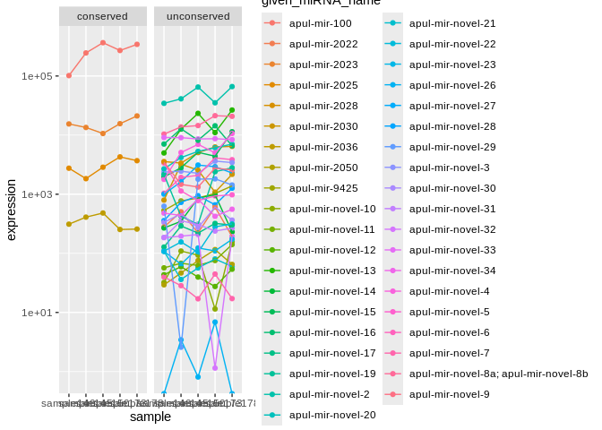
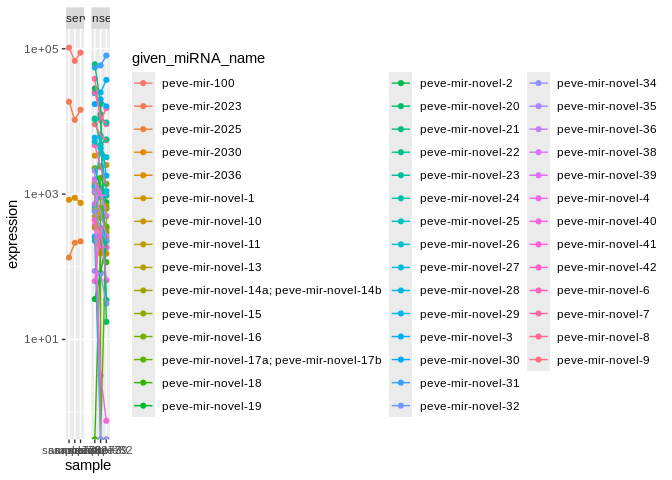
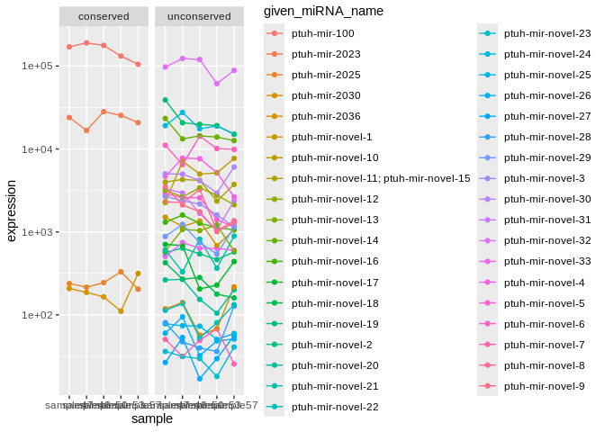

04.1-miRNA-comparison-expression
================
Kathleen Durkin
2025-06-24

We hypothesize that miRNA which are conserved among species are more
highly expressed than species-specific miRNA. This document will compare
miRNA expression accross species and levels of conservation

Load packages

``` r
library(dplyr)
```

    ## 
    ## Attaching package: 'dplyr'

    ## The following objects are masked from 'package:stats':
    ## 
    ##     filter, lag

    ## The following objects are masked from 'package:base':
    ## 
    ##     intersect, setdiff, setequal, union

``` r
library(tidyr)
library(ggplot2)
library(stringr)
```

Load and format counts files

``` r
# # mature miRNA count matrices
# Apul_mature <- read.table("../../D-Apul/output/03.1-Apul-sRNA-summary/Apul_miRNA_ShortStack_counts_formatted.txt")
# Apul_mature$mean <- rowMeans(Apul_mature) # Average expression across samples
# Apul_mature$miRNA <- rownames(Apul_mature)
# Apul_mature$Species <- "Apul"
# 
# Peve_mature <- read.table("../../E-Peve/output/03.1-Peve-sRNA-summary/Peve_miRNA_ShortStack_counts_formatted.txt")
# Peve_mature$mean <- rowMeans(Peve_mature) # Average expression across samples
# Peve_mature$miRNA <- rownames(Peve_mature)
# Peve_mature$Species <- "Peve"
# 
# Ptuh_mature <- read.table("../../F-Ptuh/output/03.1-Ptuh-sRNA-summary/Ptuh_miRNA_ShortStack_counts_formatted.txt")
# Ptuh_mature$mean <- rowMeans(Ptuh_mature) # Average expression across samples
# Ptuh_mature$miRNA <- rownames(Ptuh_mature)
# Ptuh_mature$Species <- "Ptuh"

# mature miRNA count matrices
Apul_mature <- read.table("../../D-Apul/output/03.1-Apul-sRNA-summary/Apul_counts_miRNA_normalized.txt")
Apul_mature$mean <- rowMeans(Apul_mature) # Average expression across samples
Apul_mature$miRNA <- rownames(Apul_mature)
Apul_mature$species <- "Apul"

Peve_mature <- read.table("../../E-Peve/output/03.1-Peve-sRNA-summary/Peve_counts_miRNA_normalized.txt")
Peve_mature$mean <- rowMeans(Peve_mature) # Average expression across samples
Peve_mature$miRNA <- rownames(Peve_mature)
Peve_mature$species <- "Peve"

Ptuh_mature <- read.table("../../F-Ptuh/output/03.1-Ptuh-sRNA-summary/Ptuh_counts_miRNA_normalized.txt")
Ptuh_mature$mean <- rowMeans(Ptuh_mature) # Average expression across samples
Ptuh_mature$miRNA <- rownames(Ptuh_mature)
Ptuh_mature$species <- "Ptuh"
```

Load in assigned miRNA names

``` r
Apul_names <- read.csv("../../D-Apul/output/11-Apul-sRNA-ShortStack_4.1.0-pulchra_genome/ShortStack_out/Apul_Results_mature_named_miRNAs.csv") %>% select(Name, given_miRNA_name)

Peve_names <- read.csv("../../E-Peve/output/05-Peve-sRNA-ShortStack_4.1.0/ShortStack_out/Peve_Results_mature_named_miRNAs.csv") %>% select(Name, given_miRNA_name)

Ptuh_names <- read.csv("../../F-Ptuh/output/05-Ptuh-sRNA-ShortStack_4.1.0/ShortStack_out/Ptuh_Results_mature_named_miRNAs.csv") %>% select(Name, given_miRNA_name)
```

Annotate miRNA dfs with given names

``` r
Apul_mature_df <- left_join(Apul_mature, Apul_names, by = c("miRNA" = "Name"))
Peve_mature_df <- left_join(Peve_mature, Peve_names, by = c("miRNA" = "Name"))
Ptuh_mature_df <- left_join(Ptuh_mature, Ptuh_names, by = c("miRNA" = "Name"))
```

Separate conserved miRNA (present in all 3 species) from the rest. In
`04-miRNA-comparison`, identified the miRNA conserved among all 3
species to be: miR-100, miR-2023, miR-2025, and miR-2036

``` r
Apul_mature_conserved <- Apul_mature_df %>% filter(str_detect(given_miRNA_name, "mir-100|mir-2023|mir-2025|mir-2036"))
Apul_mature_unconserved <- Apul_mature_df %>% filter(!str_detect(given_miRNA_name, "mir-100|mir-2023|mir-2025|mir-2036"))

Peve_mature_conserved <- Peve_mature_df %>% filter(str_detect(given_miRNA_name, "mir-100|mir-2023|mir-2025|mir-2036"))
Peve_mature_unconserved <- Peve_mature_df %>% filter(!str_detect(given_miRNA_name, "mir-100|mir-2023|mir-2025|mir-2036"))

Ptuh_mature_conserved <- Ptuh_mature_df %>% filter(str_detect(given_miRNA_name, "mir-100|mir-2023|mir-2025|mir-2036"))
Ptuh_mature_unconserved <- Ptuh_mature_df %>% filter(!str_detect(given_miRNA_name, "mir-100|mir-2023|mir-2025|mir-2036"))

# Also annotate the full dfs
Apul_mature_df$conservation <- ifelse(Apul_mature_df$given_miRNA_name %in% Apul_mature_conserved$given_miRNA_name, "conserved", "unconserved")
Peve_mature_df$conservation <- ifelse(Peve_mature_df$given_miRNA_name %in% Peve_mature_conserved$given_miRNA_name, "conserved", "unconserved")
Ptuh_mature_df$conservation <- ifelse(Ptuh_mature_df$given_miRNA_name %in% Ptuh_mature_conserved$given_miRNA_name, "conserved", "unconserved")
```

Expression summary stats:

``` r
cat("Mean expression of conserved miRNA in A.pulchra, P.evermanni, and P.tuahiniensis:  ")
```

    ## Mean expression of conserved miRNA in A.pulchra, P.evermanni, and P.tuahiniensis:

``` r
cat(mean(Apul_mature_conserved$mean), ", ", mean(Peve_mature_conserved$mean), ", ", mean(Ptuh_mature_conserved$mean))
```

    ## 70945.3 ,  25576.85 ,  44592.78

``` r
cat("\n")
```

``` r
cat("\n")
```

``` r
cat("Mean expression of unconserved miRNA in A.pulchra, P.evermanni, and P.tuahiniensis:  ")
```

    ## Mean expression of unconserved miRNA in A.pulchra, P.evermanni, and P.tuahiniensis:

``` r
cat(mean(Apul_mature_unconserved$mean), ", ", mean(Peve_mature_unconserved$mean), ", ", mean(Ptuh_mature_unconserved$mean))
```

    ## 4024.01 ,  5994.475 ,  6252.541

Plot

``` r
### Apul ###
# long format
Apul_mature_long <- Apul_mature_df %>%
  pivot_longer(cols = starts_with("sample"), 
               names_to = "sample", 
               values_to = "expression")

# plot
ggplot(Apul_mature_long, aes(x=sample, y=expression, group=given_miRNA_name, color=given_miRNA_name)) +
  geom_point() + 
  geom_line() +
  #geom_smooth(method = "loess") +
  #geom_boxplot() +
  scale_y_log10() +
  facet_wrap(~conservation)
```

    ## Warning in scale_y_log10(): log-10 transformation introduced infinite values.
    ## log-10 transformation introduced infinite values.

<!-- -->

``` r
### Peve ###
# long format
Peve_mature_long <- Peve_mature_df %>%
  pivot_longer(cols = starts_with("sample"), 
               names_to = "sample", 
               values_to = "expression")

# plot
ggplot(Peve_mature_long, aes(x=sample, y=expression, group=given_miRNA_name, color=given_miRNA_name)) +
  geom_point() + 
  geom_line() +
  #geom_smooth(method = "loess") +
  #geom_boxplot() +
  scale_y_log10() +
  facet_wrap(~conservation)
```

    ## Warning in scale_y_log10(): log-10 transformation introduced infinite values.
    ## log-10 transformation introduced infinite values.

<!-- -->

``` r
### Ptuh ###
# long format
Ptuh_mature_long <- Ptuh_mature_df %>%
  pivot_longer(cols = starts_with("sample"), 
               names_to = "sample", 
               values_to = "expression")

# plot
ggplot(Ptuh_mature_long, aes(x=sample, y=expression, group=given_miRNA_name, color=given_miRNA_name)) +
  geom_point() + 
  geom_line() +
  #geom_smooth(method = "loess") +
  #geom_boxplot() +
  scale_y_log10() +
  facet_wrap(~conservation)
```

<!-- -->

``` r
all_long <- rbind(Apul_mature_long, 
                  Peve_mature_long, 
                  Ptuh_mature_long)

ggplot(all_long, aes(x=sample, y=expression, group=given_miRNA_name, color=conservation)) +
  geom_point() + 
  geom_line(size=0.3) +
  scale_y_log10() +
  facet_wrap(~species, scales="free_x") +
  theme(axis.text.x = element_text(angle=45, hjust=1))
```

    ## Warning: Using `size` aesthetic for lines was deprecated in ggplot2 3.4.0.
    ## ℹ Please use `linewidth` instead.
    ## This warning is displayed once every 8 hours.
    ## Call `lifecycle::last_lifecycle_warnings()` to see where this warning was
    ## generated.

    ## Warning in scale_y_log10(): log-10 transformation introduced infinite values.
    ## log-10 transformation introduced infinite values.

<!-- -->

``` r
all_conserved_long <- rbind(Apul_mature_long[Apul_mature_long$conservation == "conserved",], 
                            Peve_mature_long[Peve_mature_long$conservation == "conserved",], 
                            Ptuh_mature_long[Ptuh_mature_long$conservation == "conserved",])

# Remove the species-specific prefixes from miRNA names for plotting
all_conserved_long$given_miRNA_name <- substr(all_conserved_long$given_miRNA_name, 
                                              6, nchar(all_conserved_long$given_miRNA_name))

ggplot(all_conserved_long, aes(x=sample, y=expression, group=given_miRNA_name, color=given_miRNA_name)) +
  geom_point() + 
  geom_line() +
  scale_y_log10() +
  facet_wrap(~species, scales="free_x") +
  theme(axis.text.x = element_text(angle=45, hjust=1))
```

<!-- -->

``` r
### Apul ###
Apul_conserved_sampleMeans <- colMeans(Apul_mature_conserved[,1:5])
Apul_unconserved_sampleMeans <- colMeans(Apul_mature_unconserved[,1:5])

# Test whether expression of conserved miRNA significantly differs from unconserved
# For both groups, averaged miRNA expression in each sample
# Small sample size (n=5), so use non-parametric test
wilcox.test(x=Apul_conserved_sampleMeans, y=Apul_unconserved_sampleMeans, paired=TRUE)
```

    ## 
    ##  Wilcoxon signed rank exact test
    ## 
    ## data:  Apul_conserved_sampleMeans and Apul_unconserved_sampleMeans
    ## V = 15, p-value = 0.0625
    ## alternative hypothesis: true location shift is not equal to 0

``` r
### Peve ###
Peve_conserved_sampleMeans <- colMeans(Peve_mature_conserved[,1:3])
Peve_unconserved_sampleMeans <- colMeans(Peve_mature_unconserved[,1:3])

# Test whether expression of conserved miRNA significantly differs from unconserved
# For both groups, averaged miRNA expression in each sample
# Small sample size (n=5), so use non-parametric test
wilcox.test(x=Peve_conserved_sampleMeans, y=Peve_unconserved_sampleMeans, paired=TRUE)
```

    ## 
    ##  Wilcoxon signed rank exact test
    ## 
    ## data:  Peve_conserved_sampleMeans and Peve_unconserved_sampleMeans
    ## V = 6, p-value = 0.25
    ## alternative hypothesis: true location shift is not equal to 0

``` r
### Ptuh ###
Ptuh_conserved_sampleMeans <- colMeans(Ptuh_mature_conserved[,1:5])
Ptuh_unconserved_sampleMeans <- colMeans(Ptuh_mature_unconserved[,1:5])

# Test whether expression of conserved miRNA significantly differs from unconserved
# For both groups, averaged miRNA expression in each sample
# Small sample size (n=5), so use non-parametric test
wilcox.test(x=Ptuh_conserved_sampleMeans, y=Ptuh_unconserved_sampleMeans, paired=TRUE)
```

    ## 
    ##  Wilcoxon signed rank exact test
    ## 
    ## data:  Ptuh_conserved_sampleMeans and Ptuh_unconserved_sampleMeans
    ## V = 15, p-value = 0.0625
    ## alternative hypothesis: true location shift is not equal to 0

Notes: should I be doing this with normalized counts instead of raw?
