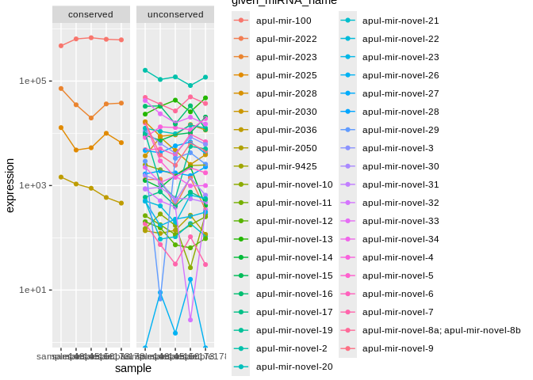

04.1-miRNA-comparison-expression
================
Kathleen Durkin
2025-06-24

- <a href="#1-check-expression-numtargets-relationship"
  id="toc-1-check-expression-numtargets-relationship">1 Check
  expression-num.targets relationship</a>
  - <a href="#11-load-and-format-target-dfs"
    id="toc-11-load-and-format-target-dfs">1.1 Load and format target
    dfs</a>
  - <a href="#12-plot" id="toc-12-plot">1.2 Plot</a>

We hypothesize that miRNA which are conserved among species are more
highly expressed than species-specific miRNA. This document will compare
miRNA expression accross species and levels of conservation

Load packages

``` r
library(dplyr)
```

    ## 
    ## Attaching package: 'dplyr'

    ## The following objects are masked from 'package:stats':
    ## 
    ##     filter, lag

    ## The following objects are masked from 'package:base':
    ## 
    ##     intersect, setdiff, setequal, union

``` r
library(tidyr)
library(ggplot2)
library(stringr)
library(edgeR)
```

    ## Loading required package: limma

Load and format counts files

Note: will be normalizing using CPM (counts per million, normalized for
library size) to describe expression level in miRNA. We don’t use TPM
(transcripts per milion), which is normalized for both transcript length
and library size, for miRNA because they are, by definition, all the
same size (\~22nt)

``` r
# mature miRNA count matrices
Apul_mature <- read.table("../../D-Apul/output/03.1-Apul-sRNA-summary/Apul_miRNA_ShortStack_counts_formatted.txt")
Apul_mature <- data.frame(cpm(Apul_mature)) # CPM normalization
Apul_mature$mean <- rowMeans(Apul_mature) # Average expression across samples
Apul_mature$miRNA <- rownames(Apul_mature)
Apul_mature$species <- "Apul"

Peve_mature <- read.table("../../E-Peve/output/03.1-Peve-sRNA-summary/Peve_miRNA_ShortStack_counts_formatted.txt")
Peve_mature <- data.frame(cpm(Peve_mature)) # CPM normalization
Peve_mature$mean <- rowMeans(Peve_mature) # Average expression across samples
Peve_mature$miRNA <- rownames(Peve_mature)
Peve_mature$species <- "Peve"

Ptuh_mature <- read.table("../../F-Ptuh/output/03.1-Ptuh-sRNA-summary/Ptuh_miRNA_ShortStack_counts_formatted.txt")
Ptuh_mature <- data.frame(cpm(Ptuh_mature)) # CPM normalization
Ptuh_mature$mean <- rowMeans(Ptuh_mature) # Average expression across samples
Ptuh_mature$miRNA <- rownames(Ptuh_mature)
Ptuh_mature$species <- "Ptuh"
```

Load in assigned miRNA names

``` r
Apul_names <- read.csv("../../D-Apul/output/11-Apul-sRNA-ShortStack_4.1.0-pulchra_genome/ShortStack_out/Apul_Results_mature_named_miRNAs.csv") %>% select(Name, given_miRNA_name)

Peve_names <- read.csv("../../E-Peve/output/05-Peve-sRNA-ShortStack_4.1.0/ShortStack_out/Peve_Results_mature_named_miRNAs.csv") %>% select(Name, given_miRNA_name)

Ptuh_names <- read.csv("../../F-Ptuh/output/05-Ptuh-sRNA-ShortStack_4.1.0/ShortStack_out/Ptuh_Results_mature_named_miRNAs.csv") %>% select(Name, given_miRNA_name)
```

Annotate miRNA dfs with given names

``` r
Apul_mature_df <- left_join(Apul_mature, Apul_names, by = c("miRNA" = "Name"))
Peve_mature_df <- left_join(Peve_mature, Peve_names, by = c("miRNA" = "Name"))
Ptuh_mature_df <- left_join(Ptuh_mature, Ptuh_names, by = c("miRNA" = "Name"))
```

Separate conserved miRNA (present in all 3 species) from the rest. In
`04-miRNA-comparison`, identified the miRNA conserved among all 3
species to be: miR-100, miR-2023, miR-2025, and miR-2036

``` r
Apul_mature_conserved <- Apul_mature_df %>% filter(str_detect(given_miRNA_name, "mir-100|mir-2023|mir-2025|mir-2036"))
Apul_mature_unconserved <- Apul_mature_df %>% filter(!str_detect(given_miRNA_name, "mir-100|mir-2023|mir-2025|mir-2036"))

Peve_mature_conserved <- Peve_mature_df %>% filter(str_detect(given_miRNA_name, "mir-100|mir-2023|mir-2025|mir-2036"))
Peve_mature_unconserved <- Peve_mature_df %>% filter(!str_detect(given_miRNA_name, "mir-100|mir-2023|mir-2025|mir-2036"))

Ptuh_mature_conserved <- Ptuh_mature_df %>% filter(str_detect(given_miRNA_name, "mir-100|mir-2023|mir-2025|mir-2036"))
Ptuh_mature_unconserved <- Ptuh_mature_df %>% filter(!str_detect(given_miRNA_name, "mir-100|mir-2023|mir-2025|mir-2036"))

# Also annotate the full dfs
Apul_mature_df$conservation <- ifelse(Apul_mature_df$given_miRNA_name %in% Apul_mature_conserved$given_miRNA_name, "conserved", "unconserved")
Peve_mature_df$conservation <- ifelse(Peve_mature_df$given_miRNA_name %in% Peve_mature_conserved$given_miRNA_name, "conserved", "unconserved")
Ptuh_mature_df$conservation <- ifelse(Ptuh_mature_df$given_miRNA_name %in% Ptuh_mature_conserved$given_miRNA_name, "conserved", "unconserved")
```

Expression summary stats (already normalized using CPM):

``` r
Apul_mature_counts <- as.matrix(Apul_mature[,1:5])
Peve_mature_counts <- as.matrix(Peve_mature[,1:3])
Ptuh_mature_counts <- as.matrix(Ptuh_mature[,1:5])

Apul_mature_conserved_counts <- as.matrix(Apul_mature_conserved[,1:5])
Peve_mature_conserved_counts <- as.matrix(Peve_mature_conserved[,1:3])
Ptuh_mature_conserved_counts <- as.matrix(Ptuh_mature_conserved[,1:5])

Apul_mature_unconserved_counts <- as.matrix(Apul_mature_unconserved[,1:5])
Peve_mature_unconserved_counts <- as.matrix(Peve_mature_unconserved[,1:3])
Ptuh_mature_unconserved_counts <- as.matrix(Ptuh_mature_unconserved[,1:5])
```

``` r
cat("Mean expression of all miRNA in A.pulchra, P.evermanni, and P.tuahiniensis:  ")
```

    ## Mean expression of all miRNA in A.pulchra, P.evermanni, and P.tuahiniensis:

``` r
cat(mean(Apul_mature_counts), ", ", mean(Peve_mature_counts), ", ", mean(Ptuh_mature_counts))
```

    ## 25641.03 ,  22222.22 ,  27027.03

``` r
cat("\n")
```

``` r
cat("Median expression of all miRNA in A.pulchra, P.evermanni, and P.tuahiniensis:  ")
```

    ## Median expression of all miRNA in A.pulchra, P.evermanni, and P.tuahiniensis:

``` r
cat(median(Apul_mature_counts), ", ", median(Peve_mature_counts), ", ", median(Ptuh_mature_counts))
```

    ## 2283.515 ,  2826.546 ,  3113.229

``` r
cat("\n")
```

``` r
cat("\n")
```

``` r
cat("Mean expression of *conserved* miRNA in A.pulchra, P.evermanni, and P.tuahiniensis:  ")
```

    ## Mean expression of *conserved* miRNA in A.pulchra, P.evermanni, and P.tuahiniensis:

``` r
cat(mean(Apul_mature_conserved_counts), ", ", mean(Peve_mature_conserved_counts), ", ", mean(Ptuh_mature_conserved_counts))
```

    ## 164135.2 ,  74128.47 ,  115772.9

``` r
cat("\n")
```

``` r
cat("Median expression of *conserved* miRNA in A.pulchra, P.evermanni, and P.tuahiniensis:  ")
```

    ## Median expression of *conserved* miRNA in A.pulchra, P.evermanni, and P.tuahiniensis:

``` r
cat(median(Apul_mature_conserved_counts), ", ", median(Peve_mature_conserved_counts), ", ", median(Ptuh_mature_conserved_counts))
```

    ## 16255.45 ,  19277.82 ,  19267.58

``` r
cat("\n")
```

``` r
cat("\n")
```

``` r
cat("Mean expression of *unconserved* miRNA in A.pulchra, P.evermanni, and P.tuahiniensis:  ")
```

    ## Mean expression of *unconserved* miRNA in A.pulchra, P.evermanni, and P.tuahiniensis:

``` r
cat(mean(Apul_mature_unconserved_counts), ", ", mean(Peve_mature_unconserved_counts), ", ", mean(Ptuh_mature_unconserved_counts))
```

    ## 9813.123 ,  17158.2 ,  16269.95

``` r
cat("\n")
```

``` r
cat("Median expression of *unconserved* miRNA in A.pulchra, P.evermanni, and P.tuahiniensis:  ")
```

    ## Median expression of *unconserved* miRNA in A.pulchra, P.evermanni, and P.tuahiniensis:

``` r
cat(median(Apul_mature_unconserved_counts), ", ", median(Peve_mature_unconserved_counts), ", ", median(Ptuh_mature_unconserved_counts))
```

    ## 1901.624 ,  2545.083 ,  3113.229

Plot

``` r
### Apul ###
# long format
Apul_mature_long <- Apul_mature_df %>%
  pivot_longer(cols = starts_with("sample"), 
               names_to = "sample", 
               values_to = "expression")

# plot
ggplot(Apul_mature_long, aes(x=sample, y=expression, group=given_miRNA_name, color=given_miRNA_name)) +
  geom_point() + 
  geom_line() +
  #geom_smooth(method = "loess") +
  #geom_boxplot() +
  scale_y_log10() +
  facet_wrap(~conservation)
```

    ## Warning in scale_y_log10(): log-10 transformation introduced infinite values.
    ## log-10 transformation introduced infinite values.

<!-- -->

``` r
### Peve ###
# long format
Peve_mature_long <- Peve_mature_df %>%
  pivot_longer(cols = starts_with("sample"), 
               names_to = "sample", 
               values_to = "expression")

# plot
ggplot(Peve_mature_long, aes(x=sample, y=expression, group=given_miRNA_name, color=given_miRNA_name)) +
  geom_point() + 
  geom_line() +
  #geom_smooth(method = "loess") +
  #geom_boxplot() +
  scale_y_log10() +
  facet_wrap(~conservation)
```

    ## Warning in scale_y_log10(): log-10 transformation introduced infinite values.
    ## log-10 transformation introduced infinite values.

<!-- -->

``` r
### Ptuh ###
# long format
Ptuh_mature_long <- Ptuh_mature_df %>%
  pivot_longer(cols = starts_with("sample"), 
               names_to = "sample", 
               values_to = "expression")

# plot
ggplot(Ptuh_mature_long, aes(x=sample, y=expression, group=given_miRNA_name, color=given_miRNA_name)) +
  geom_point() + 
  geom_line() +
  #geom_smooth(method = "loess") +
  #geom_boxplot() +
  scale_y_log10() +
  facet_wrap(~conservation)
```

<!-- -->

``` r
all_long <- rbind(Apul_mature_long, 
                  Peve_mature_long, 
                  Ptuh_mature_long)

ggplot(all_long, aes(x=sample, y=expression, group=given_miRNA_name, color=conservation)) +
  geom_point() + 
  geom_line(size=0.3) +
  scale_y_log10() +
  facet_wrap(~species, scales="free_x") +
  theme(axis.text.x = element_text(angle=45, hjust=1))
```

    ## Warning: Using `size` aesthetic for lines was deprecated in ggplot2 3.4.0.
    ## ℹ Please use `linewidth` instead.
    ## This warning is displayed once every 8 hours.
    ## Call `lifecycle::last_lifecycle_warnings()` to see where this warning was
    ## generated.

    ## Warning in scale_y_log10(): log-10 transformation introduced infinite values.
    ## log-10 transformation introduced infinite values.

<!-- -->

``` r
all_conserved_long <- rbind(Apul_mature_long[Apul_mature_long$conservation == "conserved",], 
                            Peve_mature_long[Peve_mature_long$conservation == "conserved",], 
                            Ptuh_mature_long[Ptuh_mature_long$conservation == "conserved",])

# Remove the species-specific prefixes from miRNA names for plotting
all_conserved_long$given_miRNA_name <- substr(all_conserved_long$given_miRNA_name, 
                                              6, nchar(all_conserved_long$given_miRNA_name))

ggplot(all_conserved_long, aes(x=sample, y=expression, group=given_miRNA_name, color=given_miRNA_name)) +
  geom_point() + 
  geom_line() +
  scale_y_log10() +
  facet_wrap(~species, scales="free_x") +
  theme(axis.text.x = element_text(angle=45, hjust=1))
```

<!-- -->

``` r
### Apul ###
Apul_conserved_sampleMeans <- colMeans(Apul_mature_conserved[,1:5])
Apul_unconserved_sampleMeans <- colMeans(Apul_mature_unconserved[,1:5])

# Test whether expression of conserved miRNA significantly differs from unconserved
# For both groups, averaged miRNA expression in each sample
# Small sample size (n=5), so use non-parametric test
wilcox.test(x=Apul_conserved_sampleMeans, y=Apul_unconserved_sampleMeans, paired=TRUE)
```

    ## 
    ##  Wilcoxon signed rank exact test
    ## 
    ## data:  Apul_conserved_sampleMeans and Apul_unconserved_sampleMeans
    ## V = 15, p-value = 0.0625
    ## alternative hypothesis: true location shift is not equal to 0

``` r
### Peve ###
Peve_conserved_sampleMeans <- colMeans(Peve_mature_conserved[,1:3])
Peve_unconserved_sampleMeans <- colMeans(Peve_mature_unconserved[,1:3])

# Test whether expression of conserved miRNA significantly differs from unconserved
# For both groups, averaged miRNA expression in each sample
# Small sample size (n=5), so use non-parametric test
wilcox.test(x=Peve_conserved_sampleMeans, y=Peve_unconserved_sampleMeans, paired=TRUE)
```

    ## 
    ##  Wilcoxon signed rank exact test
    ## 
    ## data:  Peve_conserved_sampleMeans and Peve_unconserved_sampleMeans
    ## V = 6, p-value = 0.25
    ## alternative hypothesis: true location shift is not equal to 0

``` r
### Ptuh ###
Ptuh_conserved_sampleMeans <- colMeans(Ptuh_mature_conserved[,1:5])
Ptuh_unconserved_sampleMeans <- colMeans(Ptuh_mature_unconserved[,1:5])

# Test whether expression of conserved miRNA significantly differs from unconserved
# For both groups, averaged miRNA expression in each sample
# Small sample size (n=5), so use non-parametric test
wilcox.test(x=Ptuh_conserved_sampleMeans, y=Ptuh_unconserved_sampleMeans, paired=TRUE)
```

    ## 
    ##  Wilcoxon signed rank exact test
    ## 
    ## data:  Ptuh_conserved_sampleMeans and Ptuh_unconserved_sampleMeans
    ## V = 15, p-value = 0.0625
    ## alternative hypothesis: true location shift is not equal to 0

# 1 Check expression-num.targets relationship

We may expect that miRNA with more targets are also more highly
expressed.

## 1.1 Load and format target dfs

``` r
# Apul
Apul_3UTR_FA <- read.csv("../../D-Apul/output/09.1-Apul-mRNA-miRNA-interactions-functional-enrichment/miRNA_sig_cor_targets_FA.csv") %>% dplyr::select(-X, -X.1, -X.2)

Apul_CDS_FA <- read.csv("../../D-Apul/output/09.11-Apul-mRNA-miRNA-interactions-FE-CDS/miRNA_CDS_sig_cor_targets_FA.csv")

Apul_CDS_FA$query_start_end <- paste0(Apul_CDS_FA$V5, " ", Apul_CDS_FA$V6)
Apul_CDS_FA$subject_start_end <- paste0(Apul_CDS_FA$V7, " ", Apul_CDS_FA$V8)
Apul_CDS_FA <- Apul_CDS_FA %>%
  dplyr::select(miRNA, mRNA, PCC.cor, p_value, adjusted_p_value, V3.x, V4.x, query_start_end, subject_start_end, V9, V10, V11, V1, V3.y, Protein.names, Organism, Gene.Ontology..biological.process., Gene.Ontology.IDs)
colnames(Apul_CDS_FA) <- colnames(Apul_3UTR_FA)


Apul_5UTR_FA <- read.csv("../../D-Apul/output/09.12-Apul-mRNA-miRNA-interactions-FE-5UTR/miRNA_5UTR_sig_cor_targets_FA.csv")

Apul_5UTR_FA$query_start_end <- paste0(Apul_5UTR_FA$V5, " ", Apul_5UTR_FA$V6)
Apul_5UTR_FA$subject_start_end <- paste0(Apul_5UTR_FA$V7, " ", Apul_5UTR_FA$V8)
Apul_5UTR_FA <- Apul_5UTR_FA %>%
  dplyr::select(miRNA, mRNA, PCC.cor, p_value, adjusted_p_value, V3.x, V4.x, query_start_end, subject_start_end, V9, V10, V11, V1, V3.y, Protein.names, Organism, Gene.Ontology..biological.process., Gene.Ontology.IDs)
colnames(Apul_5UTR_FA) <- colnames(Apul_3UTR_FA)


# Peve
Peve_3UTR_FA <- read.csv("../../E-Peve/output/10.13-Peve-mRNA-miRNA-interactions-FE-3UTR/miRNA_3UTR_sig_cor_targets_FA.csv") %>% dplyr::select(-X, -X.1, -X.2)

Peve_CDS_FA <- read.csv("../../E-Peve/output/10.11-Peve-mRNA-miRNA-interactions-FE-CDS/miRNA_CDS_sig_cor_targets_FA.csv")

Peve_CDS_FA$query_start_end <- paste0(Peve_CDS_FA$V5, " ", Peve_CDS_FA$V6)
Peve_CDS_FA$subject_start_end <- paste0(Peve_CDS_FA$V7, " ", Peve_CDS_FA$V8)
Peve_CDS_FA <- Peve_CDS_FA %>%
  dplyr::select(miRNA, mRNA, PCC.cor, p_value, adjusted_p_value, V3.x, V4.x, query_start_end, subject_start_end, V9, V10, V11, V3.y, Protein.names, Organism, Gene.Ontology..biological.process., Gene.Ontology.IDs)
colnames(Peve_CDS_FA) <- colnames(Peve_3UTR_FA)

Peve_5UTR_FA <- read.csv("../../E-Peve/output/10.12-Peve-mRNA-miRNA-interactions-FE-5UTR/miRNA_5UTR_sig_cor_targets_FA.csv")

Peve_5UTR_FA$query_start_end <- paste0(Peve_5UTR_FA$V5, " ", Peve_5UTR_FA$V6)
Peve_5UTR_FA$subject_start_end <- paste0(Peve_5UTR_FA$V7, " ", Peve_5UTR_FA$V8)
Peve_5UTR_FA <- Peve_5UTR_FA %>%
  dplyr::select(miRNA, mRNA, PCC.cor, p_value, adjusted_p_value, V3.x, V4.x, query_start_end, subject_start_end, V9, V10, V11, V3.y, Protein.names, Organism, Gene.Ontology..biological.process., Gene.Ontology.IDs)
colnames(Peve_5UTR_FA) <- colnames(Peve_3UTR_FA)


# Ptuh
Ptuh_3UTR_FA <- read.csv("../../F-Ptuh/output/11.13-Ptuh-mRNA-miRNA-interactions-FE-3UTR/miRNA_3UTR_sig_cor_targets_FA.csv") %>% dplyr::select(-X, -X.1, -X.2)

Ptuh_CDS_FA <- read.csv("../../F-Ptuh/output/11.11-Ptuh-mRNA-miRNA-interactions-FE-CDS/miRNA_CDS_sig_cor_targets_FA.csv")

Ptuh_CDS_FA$query_start_end <- paste0(Ptuh_CDS_FA$V5, " ", Ptuh_CDS_FA$V6)
Ptuh_CDS_FA$subject_start_end <- paste0(Ptuh_CDS_FA$V7, " ", Ptuh_CDS_FA$V8)
Ptuh_CDS_FA <- Ptuh_CDS_FA %>%
  dplyr::select(miRNA, mRNA, PCC.cor, p_value, adjusted_p_value, V3.x, V4.x, query_start_end, subject_start_end, V9, V10, V11, V3.y, Protein.names, Organism, Gene.Ontology..biological.process., Gene.Ontology.IDs)
colnames(Ptuh_CDS_FA) <- colnames(Peve_3UTR_FA)

Ptuh_5UTR_FA <- read.csv("../../F-Ptuh/output/11.12-Ptuh-mRNA-miRNA-interactions-FE-5UTR/miRNA_5UTR_sig_cor_targets_FA.csv")

Ptuh_5UTR_FA$query_start_end <- paste0(Ptuh_5UTR_FA$V5, " ", Ptuh_5UTR_FA$V6)
Ptuh_5UTR_FA$subject_start_end <- paste0(Ptuh_5UTR_FA$V7, " ", Ptuh_5UTR_FA$V8)
Ptuh_5UTR_FA <- Ptuh_5UTR_FA %>%
  dplyr::select(miRNA, mRNA, PCC.cor, p_value, adjusted_p_value, V3.x, V4.x, query_start_end, subject_start_end, V9, V10, V11, V3.y, Protein.names, Organism, Gene.Ontology..biological.process., Gene.Ontology.IDs)
colnames(Ptuh_5UTR_FA) <- colnames(Peve_3UTR_FA)
```

Combine and annotate dfs

``` r
# annotate each df with its mRNA region
Apul_3UTR_FA$region <- "3UTR"
Apul_CDS_FA$region <- "CDS"
Apul_5UTR_FA$region <- "5UTR"

Peve_3UTR_FA$region <- "3UTR"
Peve_CDS_FA$region <- "CDS"
Peve_5UTR_FA$region <- "5UTR"

Ptuh_3UTR_FA$region <- "3UTR"
Ptuh_CDS_FA$region <- "CDS"
Ptuh_5UTR_FA$region <- "5UTR"

# Combine dfs
Apul_FA <- rbind(Apul_3UTR_FA, Apul_CDS_FA, Apul_5UTR_FA)
Peve_FA <- rbind(Peve_3UTR_FA, Peve_CDS_FA, Peve_5UTR_FA)
Ptuh_FA <- rbind(Ptuh_3UTR_FA, Ptuh_CDS_FA, Ptuh_5UTR_FA)

# Annotate with given miRNA names
Apul_FA_df <- left_join(Apul_FA, Apul_names, by = c("miRNA" = "Name"))
Peve_FA_df <- left_join(Peve_FA, Peve_names, by = c("miRNA" = "Name"))
Ptuh_FA_df <- left_join(Ptuh_FA, Ptuh_names, by = c("miRNA" = "Name"))
```

## 1.2 Plot

Should plot both the number of interactions (distinct binding regions,
of which there can be many in a single mRNA) and number of mRNA targets

Count number of interactions and number of targets

``` r
# Number of interactions (may be many predicted interactions between a single miRNA-mRNa pair, with multiple bidning sites)
Apul_interactions_n <- Apul_FA_df %>% 
  group_by(given_miRNA_name) %>%
  summarise(num_interactions = n())

Peve_interactions_n <- Peve_FA_df %>% 
  group_by(given_miRNA_name) %>%
  summarise(num_interactions = n())

Ptuh_interactions_n <- Ptuh_FA_df %>% 
  group_by(given_miRNA_name) %>%
  summarise(num_interactions = n())

# Number of targets (may be many predicted interactions between a single miRNA-mRNa pair, with multiple bidning sites)
Apul_targets_n <- Apul_FA_df %>% 
  distinct(given_miRNA_name, mRNA) %>%  
  group_by(given_miRNA_name) %>%
  summarise(num_targets = n())

Peve_targets_n <- Peve_FA_df %>% 
  distinct(given_miRNA_name, mRNA) %>%  
  group_by(given_miRNA_name) %>%
  summarise(num_targets = n())

Ptuh_targets_n <- Ptuh_FA_df %>% 
  distinct(given_miRNA_name, mRNA) %>%  
  group_by(given_miRNA_name) %>%
  summarise(num_targets = n())
```

Add these counts to the expression dfs

``` r
Apul_mature_df <- left_join(Apul_mature_df, Apul_interactions_n, by = "given_miRNA_name")
Apul_mature_df <- left_join(Apul_mature_df, Apul_targets_n, by = "given_miRNA_name")

Peve_mature_df <- left_join(Peve_mature_df, Peve_interactions_n, by = "given_miRNA_name")
Peve_mature_df <- left_join(Peve_mature_df, Peve_targets_n, by = "given_miRNA_name")

Ptuh_mature_df <- left_join(Ptuh_mature_df, Ptuh_interactions_n, by = "given_miRNA_name")
Ptuh_mature_df <- left_join(Ptuh_mature_df, Ptuh_targets_n, by = "given_miRNA_name")
```

Plot

``` r
ggplot(Apul_mature_df, aes(x = num_interactions, y = mean)) +
  geom_point() +
  #scale_y_log10() +
  geom_smooth(method = "lm")
```

    ## `geom_smooth()` using formula = 'y ~ x'

<!-- -->

``` r
ggplot(Peve_mature_df, aes(x = num_interactions, y = mean)) +
  geom_point() +
  #scale_y_log10() +
  geom_smooth(method = "lm")
```

    ## `geom_smooth()` using formula = 'y ~ x'

    ## Warning: Removed 2 rows containing non-finite outside the scale range
    ## (`stat_smooth()`).

    ## Warning: Removed 2 rows containing missing values or values outside the scale range
    ## (`geom_point()`).

<!-- -->

``` r
ggplot(Ptuh_mature_df, aes(x = num_interactions, y = mean)) +
  geom_point() +
  #scale_y_log10() +
  geom_smooth(method = "lm")
```

    ## `geom_smooth()` using formula = 'y ~ x'

<!-- -->

Now exclude miR-100, which is exceptionally highly expressed in all
species

``` r
ggplot(Apul_mature_df[Apul_mature_df$given_miRNA_name != "apul-mir-100",], aes(x = num_interactions, y = mean)) +
  geom_point() +
  #scale_y_log10() +
  geom_smooth(method = "lm")
```

    ## `geom_smooth()` using formula = 'y ~ x'

<!-- -->

``` r
ggplot(Peve_mature_df[Peve_mature_df$given_miRNA_name != "peve-mir-100",], aes(x = num_interactions, y = mean)) +
  geom_point() +
  #scale_y_log10() +
  geom_smooth(method = "lm")
```

    ## `geom_smooth()` using formula = 'y ~ x'

    ## Warning: Removed 2 rows containing non-finite outside the scale range
    ## (`stat_smooth()`).

    ## Warning: Removed 2 rows containing missing values or values outside the scale range
    ## (`geom_point()`).

<!-- -->

``` r
ggplot(Ptuh_mature_df[Ptuh_mature_df$given_miRNA_name != "ptuh-mir-100",], aes(x = num_interactions, y = mean)) +
  geom_point() +
  #scale_y_log10() +
  geom_smooth(method = "lm")
```

    ## `geom_smooth()` using formula = 'y ~ x'

<!-- -->

There originally appears to be a relationship between the number of
interactions and expression, but that is driven by miR-100, which has
both very high number of interactions and very high expression. Removing
miR-100 from consideration also eliminates the trend.

Check number of distinct targets as well:

``` r
ggplot(Apul_mature_df, aes(x = num_targets, y = mean)) +
  geom_point() +
  #scale_y_log10() +
  geom_smooth(method = "lm")
```

    ## `geom_smooth()` using formula = 'y ~ x'

<!-- -->

``` r
ggplot(Peve_mature_df, aes(x = num_targets, y = mean)) +
  geom_point() +
  #scale_y_log10() +
  geom_smooth(method = "lm")
```

    ## `geom_smooth()` using formula = 'y ~ x'

    ## Warning: Removed 2 rows containing non-finite outside the scale range
    ## (`stat_smooth()`).

    ## Warning: Removed 2 rows containing missing values or values outside the scale range
    ## (`geom_point()`).

<!-- -->

``` r
ggplot(Ptuh_mature_df, aes(x = num_targets, y = mean)) +
  geom_point() +
  #scale_y_log10() +
  geom_smooth(method = "lm")
```

    ## `geom_smooth()` using formula = 'y ~ x'

<!-- -->

``` r
ggplot(Apul_mature_df[Apul_mature_df$given_miRNA_name != "apul-mir-100",], aes(x = num_targets, y = mean)) +
  geom_point() +
  #scale_y_log10() +
  geom_smooth(method = "lm")
```

    ## `geom_smooth()` using formula = 'y ~ x'

<!-- -->

``` r
ggplot(Peve_mature_df[Peve_mature_df$given_miRNA_name != "peve-mir-100",], aes(x = num_targets, y = mean)) +
  geom_point() +
  #scale_y_log10() +
  geom_smooth(method = "lm")
```

    ## `geom_smooth()` using formula = 'y ~ x'

    ## Warning: Removed 2 rows containing non-finite outside the scale range (`stat_smooth()`).
    ## Removed 2 rows containing missing values or values outside the scale range
    ## (`geom_point()`).

<!-- -->

``` r
ggplot(Ptuh_mature_df[Ptuh_mature_df$given_miRNA_name != "ptuh-mir-100",], aes(x = num_targets, y = mean)) +
  geom_point() +
  #scale_y_log10() +
  geom_smooth(method = "lm")
```

    ## `geom_smooth()` using formula = 'y ~ x'

<!-- -->
Yes, as with number of interactions, number of unique targets is not
related to expression when you exclude miR-100.
