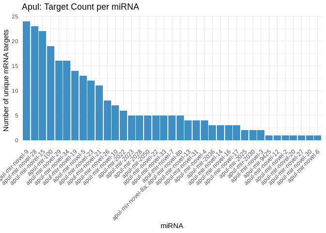
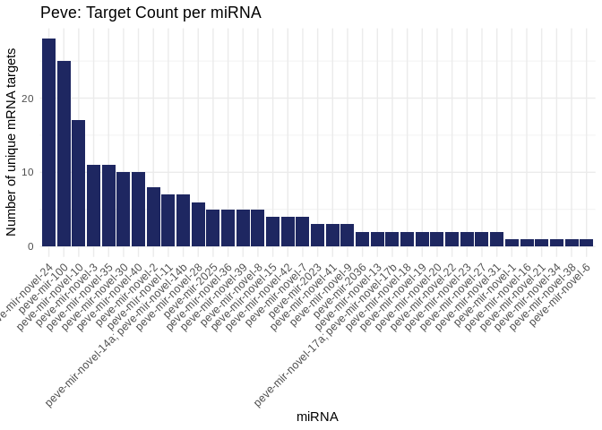
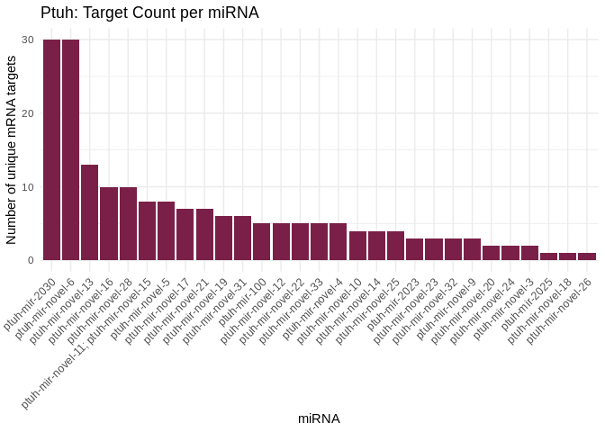

04.1-miRNA-comparison-expression
================
Kathleen Durkin
2025-07-10

- <a href="#01-functionally-enriched-processes"
  id="toc-01-functionally-enriched-processes">0.1 Functionally enriched
  processes</a>
- <a href="#02-functionally-annotated"
  id="toc-02-functionally-annotated">0.2 Functionally annotated</a>

Load packages

``` r
library(dplyr)
```

    ## 
    ## Attaching package: 'dplyr'

    ## The following objects are masked from 'package:stats':
    ## 
    ##     filter, lag

    ## The following objects are masked from 'package:base':
    ## 
    ##     intersect, setdiff, setequal, union

``` r
library(tidyr)
library(ggplot2)
library(stringr)
```

Hypothesize that conserved miRNA present in all three species will also
have targets enriched for the same processes across species.

## 0.1 Functionally enriched processes

Load 3UTR FE tables:

``` r
Apul_3UTR_FE <- read.csv("../../D-Apul/output/09.1-Apul-mRNA-miRNA-interactions-functional-enrichment/miRNA_sig_cor_targets_topGO_FE.csv")

Peve_3UTR_FE <- read.csv("../../E-Peve/output/10.13-Peve-mRNA-miRNA-interactions-FE-3UTR/miRNA_3UTR_sig_cor_targets_topGO_FE.csv")
  
Ptuh_3UTR_FE <- read.csv("../../F-Ptuh/output/11.13-Ptuh-mRNA-miRNA-interactions-FE-3UTR/miRNA_3UTR_sig_cor_targets_topGO_FE.csv")
```

Load in assigned miRNA names

``` r
Apul_names <- read.csv("../../D-Apul/output/11-Apul-sRNA-ShortStack_4.1.0-pulchra_genome/ShortStack_out/Apul_Results_mature_named_miRNAs.csv") %>% dplyr::select(Name, given_miRNA_name)

Peve_names <- read.csv("../../E-Peve/output/05-Peve-sRNA-ShortStack_4.1.0/ShortStack_out/Peve_Results_mature_named_miRNAs.csv") %>% dplyr::select(Name, given_miRNA_name)

Ptuh_names <- read.csv("../../F-Ptuh/output/05-Ptuh-sRNA-ShortStack_4.1.0/ShortStack_out/Ptuh_Results_mature_named_miRNAs.csv") %>% dplyr::select(Name, given_miRNA_name)
```

Annotate miRNA dfs with given names

``` r
Apul_3UTR_FE_df <- left_join(Apul_3UTR_FE, Apul_names, by = c("miRNA" = "Name"))
Peve_3UTR_FE_df <- left_join(Peve_3UTR_FE, Peve_names, by = c("miRNA" = "Name"))
Ptuh_3UTR_FE_df <- left_join(Ptuh_3UTR_FE, Ptuh_names, by = c("miRNA" = "Name"))
```

Separate conserved miRNA (present in all 3 species) from the rest. In
`04-miRNA-comparison`, identified the miRNA conserved among all 3
species to be: miR-100, miR-2023, miR-2025, and miR-2036

``` r
Apul_3UTR_FE_conserved <- Apul_3UTR_FE_df %>% filter(str_detect(given_miRNA_name, "mir-100|mir-2023|mir-2025|mir-2036"))
Apul_3UTR_FE_unconserved <- Apul_3UTR_FE_df %>% filter(!str_detect(given_miRNA_name, "mir-100|mir-2023|mir-2025|mir-2036"))

Peve_3UTR_FE_conserved <- Peve_3UTR_FE_df %>% filter(str_detect(given_miRNA_name, "mir-100|mir-2023|mir-2025|mir-2036"))
Peve_3UTR_FE_unconserved <- Peve_3UTR_FE_df %>% filter(!str_detect(given_miRNA_name, "mir-100|mir-2023|mir-2025|mir-2036"))

Ptuh_3UTR_FE_conserved <- Ptuh_3UTR_FE_df %>% filter(str_detect(given_miRNA_name, "mir-100|mir-2023|mir-2025|mir-2036"))
Ptuh_3UTR_FE_unconserved <- Ptuh_3UTR_FE_df %>% filter(!str_detect(given_miRNA_name, "mir-100|mir-2023|mir-2025|mir-2036"))

# Also annotate the full dfs
Apul_3UTR_FE_df$conservation <- ifelse(Apul_3UTR_FE_df$given_miRNA_name %in% Apul_3UTR_FE_conserved$given_miRNA_name, "conserved", "unconserved")
Peve_3UTR_FE_df$conservation <- ifelse(Peve_3UTR_FE_df$given_miRNA_name %in% Peve_3UTR_FE_conserved$given_miRNA_name, "conserved", "unconserved")
Ptuh_3UTR_FE_df$conservation <- ifelse(Ptuh_3UTR_FE_df$given_miRNA_name %in% Ptuh_3UTR_FE_conserved$given_miRNA_name, "conserved", "unconserved")
```

Take a look

``` r
print(Apul_3UTR_FE_conserved)
```

    ##    X      GO.ID                                  Term Annotated Significant
    ## 1  9 GO:0006699        bile acid biosynthetic process         4           1
    ## 2 10 GO:0000082 G1/S transition of mitotic cell cycle       105           2
    ## 3 11 GO:0003964  RNA-directed DNA polymerase activity       135           1
    ##   Expected Fisher               type         miRNA given_miRNA_name
    ## 1     0.01 0.0084 Biological.Process Cluster_18728     apul-mir-100
    ## 2     0.22 0.0153 Biological.Process Cluster_18728     apul-mir-100
    ## 3     0.05 0.0470 Molecular.Function Cluster_18728     apul-mir-100

``` r
print(Peve_3UTR_FE_conserved)
```

    ##   X      GO.ID                             Term Annotated Significant Expected
    ## 1 1 GO:0004983 neuropeptide Y receptor activity         4           1     0.01
    ## 2 3 GO:0050233        pyranose oxidase activity         1           1     0.00
    ##   Fisher               type         miRNA given_miRNA_name
    ## 1 0.0130 Molecular.Function  Cluster_1167     peve-mir-100
    ## 2 0.0016 Molecular.Function Cluster_14999    peve-mir-2025

``` r
print(Ptuh_3UTR_FE_conserved)
```

    ##  [1] X                GO.ID            Term             Annotated       
    ##  [5] Significant      Expected         Fisher           type            
    ##  [9] miRNA            given_miRNA_name
    ## <0 rows> (or 0-length row.names)

Very few functionally enriched processes in conserved miRNA, and in
general, likely due to a small smaple size and only a subset of all
genes being annotated.

Let’s instead look at the annotations themseleves, regardless of whether
the processes were statistically overrepresented

## 0.2 Functionally annotated

Load 3UTR FA tables:

``` r
Apul_3UTR_FA <- read.csv("../../D-Apul/output/09.1-Apul-mRNA-miRNA-interactions-functional-enrichment/miRNA_sig_cor_targets_FA.csv")

Peve_3UTR_FA <- read.csv("../../E-Peve/output/10.13-Peve-mRNA-miRNA-interactions-FE-3UTR/miRNA_3UTR_sig_cor_targets_FA.csv")
  
Ptuh_3UTR_FA <- read.csv("../../F-Ptuh/output/11.13-Ptuh-mRNA-miRNA-interactions-FE-3UTR/miRNA_3UTR_sig_cor_targets_FA.csv")
```

Annotate miRNA dfs with given names

``` r
Apul_3UTR_FA_df <- left_join(Apul_3UTR_FA, Apul_names, by = c("miRNA" = "Name"))
Peve_3UTR_FA_df <- left_join(Peve_3UTR_FA, Peve_names, by = c("miRNA" = "Name"))
Ptuh_3UTR_FA_df <- left_join(Ptuh_3UTR_FA, Ptuh_names, by = c("miRNA" = "Name"))
```

Separate conserved miRNA (present in all 3 species) from the rest. In
`04-miRNA-comparison`, identified the miRNA conserved among all 3
species to be: miR-100, miR-2023, miR-2025, and miR-2036

``` r
Apul_3UTR_FA_conserved <- Apul_3UTR_FA_df %>% filter(str_detect(given_miRNA_name, "mir-100|mir-2023|mir-2025|mir-2036"))
Apul_3UTR_FA_unconserved <- Apul_3UTR_FA_df %>% filter(!str_detect(given_miRNA_name, "mir-100|mir-2023|mir-2025|mir-2036"))

Peve_3UTR_FA_conserved <- Peve_3UTR_FA_df %>% filter(str_detect(given_miRNA_name, "mir-100|mir-2023|mir-2025|mir-2036"))
Peve_3UTR_FA_unconserved <- Peve_3UTR_FA_df %>% filter(!str_detect(given_miRNA_name, "mir-100|mir-2023|mir-2025|mir-2036"))

Ptuh_3UTR_FA_conserved <- Ptuh_3UTR_FA_df %>% filter(str_detect(given_miRNA_name, "mir-100|mir-2023|mir-2025|mir-2036"))
Ptuh_3UTR_FA_unconserved <- Ptuh_3UTR_FA_df %>% filter(!str_detect(given_miRNA_name, "mir-100|mir-2023|mir-2025|mir-2036"))

# Also annotate the full dfs
Apul_3UTR_FA_df$conservation <- ifelse(Apul_3UTR_FA_df$given_miRNA_name %in% Apul_3UTR_FA_conserved$given_miRNA_name, "conserved", "unconserved")
Peve_3UTR_FA_df$conservation <- ifelse(Peve_3UTR_FA_df$given_miRNA_name %in% Peve_3UTR_FA_conserved$given_miRNA_name, "conserved", "unconserved")
Ptuh_3UTR_FA_df$conservation <- ifelse(Ptuh_3UTR_FA_df$given_miRNA_name %in% Ptuh_3UTR_FA_conserved$given_miRNA_name, "conserved", "unconserved")
```

Take a look

``` r
print(Apul_3UTR_FA_conserved %>% dplyr::select(given_miRNA_name, Protein.names,  Gene.Ontology..biological.process.) %>% filter(!is.na(Protein.names)))
```

    ##   given_miRNA_name
    ## 1     apul-mir-100
    ## 2     apul-mir-100
    ## 3     apul-mir-100
    ## 4     apul-mir-100
    ## 5     apul-mir-100
    ##                                                                                                                                                    Protein.names
    ## 1 E3 ubiquitin-protein ligase TRIM71 (EC 2.3.2.27) (Protein lin-41 homolog) (RING-type E3 ubiquitin transferase TRIM71) (Tripartite motif-containing protein 71)
    ## 2 E3 ubiquitin-protein ligase TRIM71 (EC 2.3.2.27) (Protein lin-41 homolog) (RING-type E3 ubiquitin transferase TRIM71) (Tripartite motif-containing protein 71)
    ## 3                               Conjugated bile acid hydrolase (CBAH) (EC 3.5.1.-) (Bile salt hydrolase) (BSH) (CBAH-1) (Choloylglycine hydrolase) (EC 3.5.1.24)
    ## 4                                                           Probable RNA-directed DNA polymerase from transposon X-element (EC 2.7.7.49) (Reverse transcriptase)
    ## 5                                                    Tetratricopeptide repeat protein 28 (TPR repeat protein 28) (TPR repeat-containing big gene cloned at Keio)
    ##                                                                                                                                                                                                                                                                                                                                                                                                                                                                                                                                                                                                                                                                        Gene.Ontology..biological.process.
    ## 1 embryonic body morphogenesis [GO:0010172]; fibroblast growth factor receptor signaling pathway [GO:0008543]; G1/S transition of mitotic cell cycle [GO:0000082]; miRNA metabolic process [GO:0010586]; miRNA-mediated gene silencing by inhibition of translation [GO:0035278]; negative regulation of translation [GO:0017148]; neural tube development [GO:0021915]; proteasome-mediated ubiquitin-dependent protein catabolic process [GO:0043161]; protein autoubiquitination [GO:0051865]; protein polyubiquitination [GO:0000209]; regulation of miRNA-mediated gene silencing [GO:0060964]; regulation of neural precursor cell proliferation [GO:2000177]; stem cell proliferation [GO:0072089]
    ## 2 embryonic body morphogenesis [GO:0010172]; fibroblast growth factor receptor signaling pathway [GO:0008543]; G1/S transition of mitotic cell cycle [GO:0000082]; miRNA metabolic process [GO:0010586]; miRNA-mediated gene silencing by inhibition of translation [GO:0035278]; negative regulation of translation [GO:0017148]; neural tube development [GO:0021915]; proteasome-mediated ubiquitin-dependent protein catabolic process [GO:0043161]; protein autoubiquitination [GO:0051865]; protein polyubiquitination [GO:0000209]; regulation of miRNA-mediated gene silencing [GO:0060964]; regulation of neural precursor cell proliferation [GO:2000177]; stem cell proliferation [GO:0072089]
    ## 3                                                                                                                                                                                                                                                                                                                                                                                                                                                                                                                                                                                                                                                             bile acid biosynthetic process [GO:0006699]
    ## 4                                                                                                                                                                                                                                                                                                                                                                                                                                                                                                                                                                                                                                                                transposition, DNA-mediated [GO:0006313]
    ## 5                                                                                                                                                                                                                                                                                                                                                                                                                                                                                                                                                                                                      cell cycle [GO:0007049]; cell division [GO:0051301]; regulation of mitotic cell cycle [GO:0007346]

``` r
print(Peve_3UTR_FA_conserved %>% dplyr::select(given_miRNA_name, Protein.names, Gene.Ontology..biological.process.) %>% filter(!is.na(Protein.names)))
```

    ##    given_miRNA_name
    ## 1      peve-mir-100
    ## 2      peve-mir-100
    ## 3      peve-mir-100
    ## 4     peve-mir-2025
    ## 5      peve-mir-100
    ## 6      peve-mir-100
    ## 7     peve-mir-2023
    ## 8      peve-mir-100
    ## 9     peve-mir-2023
    ## 10     peve-mir-100
    ## 11     peve-mir-100
    ## 12     peve-mir-100
    ## 13    peve-mir-2036
    ##                                                                                                                                                                                                                                     Protein.names
    ## 1                                                                                                                                                                               Alpha-L-fucosidase (EC 3.2.1.51) (Alpha-L-fucoside fucohydrolase)
    ## 2                                                                                                                                     Tetratricopeptide repeat protein 28 (TPR repeat protein 28) (TPR repeat-containing big gene cloned at Keio)
    ## 3                                                                                                                                                                                                 Diencephalon/mesencephalon homeobox protein 1-B
    ## 4                                                                                       Pyranose 2-oxidase (P2Ox) (POD) (POx) (PROD) (Pyranose oxidase) (EC 1.1.3.10) (FAD-oxidoreductase) (Glucose 2-oxidase) (Pyranose:oxygen 2-oxidoreductase)
    ## 5                                                                                                                                                 Tyrosine kinase receptor Cad96Ca (EC 2.7.10.1) (Cadherin-96Ca) (Tyrosine kinase receptor HD-14)
    ## 6                                                                                                                                                                                                         Neuropeptide Y receptor type 1 (NPY1-R)
    ## 7                                                                                                                                                                                               Collagen triple helix repeat-containing protein 1
    ## 8               STE20-like serine/threonine-protein kinase (STE20-like kinase) (mSLK) (EC 2.7.11.1) (Etk4) (STE20-related kinase SMAK) (STE20-related serine/threonine-protein kinase) (STE20-related kinase) (Serine/threonine-protein kinase 2)
    ## 9                                                                                                                                                                         Limb region 1 protein homolog (Differentiation-related gene 14 protein)
    ## 10                                                                                                                                                                                              Collagen triple helix repeat-containing protein 1
    ## 11 Rho-associated protein kinase 2 (EC 2.7.11.1) (Rho-associated, coiled-coil-containing protein kinase 2) (Rho-associated, coiled-coil-containing protein kinase II) (ROCK-II) (RhoA-binding kinase 2) (p150 ROK-alpha) (ROKalpha) (p164 ROCK-2)
    ## 12                                                                                                                                                                                                               Uncharacterized protein KIAA0513
    ## 13                                                                                                                            Elongation factor G, mitochondrial (EF-Gmt) (Elongation factor G 1, mitochondrial) (mEF-G 1) (Elongation factor G1)
    ##                                                                                                                                                                                                                                                                                                                                                                                                                                                                                                                                                                                                                                                                                                                                                                                                                                                                                                                                                                                                                                                                                                                                                                                                                                                                                                                                                                                                                                                                                                                                                                                                                                                                                                                                                                                                                                                                                                                                                                                                                                                                                                                                                                                                                                                                                                                                                                                                                                                                                                                                                                                                                                                                                                                                                                                                                                                                                                                                                                                                                                                                                                                                                                                                                                                                                       Gene.Ontology..biological.process.
    ## 1                                                                                                                                                                                                                                                                                                                                                                                                                                                                                                                                                                                                                                                                                                                                                                                                                                                                                                                                                                                                                                                                                                                                                                                                                                                                                                                                                                                                                                                                                                                                                                                                                                                                                                                                                                                                                                                                                                                                                                                                                                                                                                                                                                                                                                                                                                                                                                                                                                                                                                                                                                                                                                                                                                                                                                                                                                                                                                                                                                                                                                                                                                                                                                                                                                        fucose metabolic process [GO:0006004]; glycoside catabolic process [GO:0016139]
    ## 2                                                                                                                                                                                                                                                                                                                                                                                                                                                                                                                                                                                                                                                                                                                                                                                                                                                                                                                                                                                                                                                                                                                                                                                                                                                                                                                                                                                                                                                                                                                                                                                                                                                                                                                                                                                                                                                                                                                                                                                                                                                                                                                                                                                                                                                                                                                                                                                                                                                                                                                                                                                                                                                                                                                                                                                                                                                                                                                                                                                                                                                                                                                                                                                                                     cell cycle [GO:0007049]; cell division [GO:0051301]; regulation of mitotic cell cycle [GO:0007346]
    ## 3                                                                                                                                                                                                                                                                                                                                                                                                                                                                                                                                                                                                                                                                                                                                                                                                                                                                                                                                                                                                                                                                                                                                                                                                                                                                                                                                                                                                                                                                                                                                                                                                                                                                                                                                                                                                                                                                                                                                                                                                                                                                                                                                                                                                                                                                                                                                                                                                                                                                                                                                                                                                                                                                                                                                                                                                                                                                                                                                                                              midbrain development [GO:0030901]; regulation of cell cycle [GO:0051726]; regulation of mitotic cell cycle [GO:0007346]; regulation of neural retina development [GO:0061074]; regulation of neurogenesis [GO:0050767]; regulation of transcription by RNA polymerase II [GO:0006357]; retina development in camera-type eye [GO:0060041]
    ## 4                                                                                                                                                                                                                                                                                                                                                                                                                                                                                                                                                                                                                                                                                                                                                                                                                                                                                                                                                                                                                                                                                                                                                                                                                                                                                                                                                                                                                                                                                                                                                                                                                                                                                                                                                                                                                                                                                                                                                                                                                                                                                                                                                                                                                                                                                                                                                                                                                                                                                                                                                                                                                                                                                                                                                                                                                                                                                                                                                                                                                                                                                                                                                                                                                                                                                                                       
    ## 5                                                                                                                                                                                                                                                                                                                                                                                                                                                                                                                                                                                                                                                                                                                                                                                                                                                                                                                                                                                                                                                                                                                                                                                                                                                                                                                                                                                                                                                                                                                                                                                                                                                                                                                                                                                                                                                                                                                                                                                                                                                                                                                                                                                                                                                                                                                                                                                                                                                                                                                                                                                                                                                                                                                      calcium-dependent cell-cell adhesion via plasma membrane cell adhesion molecules [GO:0016339]; Golgi organization [GO:0007030]; homophilic cell adhesion via plasma membrane adhesion molecules [GO:0007156]; negative regulation of cell size [GO:0045792]; positive regulation of kinase activity [GO:0033674]; positive regulation of phosphatidylinositol 3-kinase signaling [GO:0014068]; positive regulation of wound healing [GO:0090303]; protein phosphorylation [GO:0006468]; transmembrane receptor protein tyrosine kinase signaling pathway [GO:0007169]; wound healing [GO:0042060]
    ## 6                                                                                                                                                                                                                                                                                                                                                                                                                                                                                                                                                                                                                                                                                                                                                                                                                                                                                                                                                                                                                                                                                                                                                                                                                                                                                                                                                                                                                                                                                                                                                                                                                                                                                                                                                                                                                                                                                                                                                                                                                                                                                                                                                                                                                                                                                                                                                                                                                                                                                                                                                                                                                                                                                                                                                                                                                                                                                                                                                                                                                                                                                                                                                                                                                                                                                                                       
    ## 7                                                                                                                                                                                                                                                                                                                                                                                                                                                                                                                                                                                                                                                                                                                                                                                                                                                                                                                                                                                                                                                                                                                                                                                                                                                                                                                                                                                                                                                                                                                                                                                                                                                                                                                                                                                                                                                                                                                                                                                                                                                                                                                                                                                                                                                                                                                                                                                                                                                                                                                                                                                                                                        cell migration [GO:0016477]; cochlea morphogenesis [GO:0090103]; establishment of planar polarity involved in neural tube closure [GO:0090177]; inner ear receptor cell stereocilium organization [GO:0060122]; negative regulation of canonical Wnt signaling pathway [GO:0090090]; ossification involved in bone remodeling [GO:0043932]; osteoblast differentiation [GO:0001649]; osteoblast proliferation [GO:0033687]; positive regulation of osteoblast differentiation [GO:0045669]; positive regulation of osteoblast proliferation [GO:0033690]; positive regulation of protein binding [GO:0032092]; Wnt signaling pathway, planar cell polarity pathway [GO:0060071]
    ## 8                                                                                                                                                                                                                                                                                                                                                                                                                                                                                                                                                                                                                                                                                                                                                                                                                                                                                                                                                                                                                                                                                                                                                                                                                                                                                                                                                                                                                                                                                                                                                                                                                                                                                                                                                                                                                                                                                                                                                                                                                                                                                                                                                                                                                                                                                                                                                                                                                                                                                                                                                                                                                                                                                                                                                                                                                                                                                            apoptotic process [GO:0006915]; cellular response to type II interferon [GO:0071346]; cytoplasmic microtubule organization [GO:0031122]; positive regulation of apoptotic process [GO:0043065]; protein autophosphorylation [GO:0046777]; protein phosphorylation [GO:0006468]; regulation of apoptotic process [GO:0042981]; regulation of cell migration [GO:0030334]; regulation of focal adhesion assembly [GO:0051893]
    ## 9                                                                                                                                                                                                                                                                                                                                                                                                                                                                                                                                                                                                                                                                                                                                                                                                                                                                                                                                                                                                                                                                                                                                                                                                                                                                                                                                                                                                                                                                                                                                                                                                                                                                                                                                                                                                                                                                                                                                                                                                                                                                                                                                                                                                                                                                                                                                                                                                                                                                                                                                                                                                                                                                                                                                                                                                                                                                                                                                                                                                                                                                                                                                                                                                                                           embryonic digit morphogenesis [GO:0042733]; signal transduction [GO:0007165]
    ## 10                                                                                                                                                                                                                                                                                                                                                                                                                                                                                                                                                                                                                                                                                                                                                                                                                                                                                                                                                                                                                                                                                                                                                                                                                                                                                                                                                                                                                                                                                                                                                                                                                                                                                                                                                                                                                                                                                                                                                                                                                                                                                                                                                                                                                                                                                                                                                                                                                                                                                                                                                                                                                                       cell migration [GO:0016477]; cochlea morphogenesis [GO:0090103]; establishment of planar polarity involved in neural tube closure [GO:0090177]; inner ear receptor cell stereocilium organization [GO:0060122]; negative regulation of canonical Wnt signaling pathway [GO:0090090]; ossification involved in bone remodeling [GO:0043932]; osteoblast differentiation [GO:0001649]; osteoblast proliferation [GO:0033687]; positive regulation of osteoblast differentiation [GO:0045669]; positive regulation of osteoblast proliferation [GO:0033690]; positive regulation of protein binding [GO:0032092]; Wnt signaling pathway, planar cell polarity pathway [GO:0060071]
    ## 11 actin cytoskeleton organization [GO:0030036]; actomyosin structure organization [GO:0031032]; blood vessel diameter maintenance [GO:0097746]; cellular response to acetylcholine [GO:1905145]; cellular response to testosterone stimulus [GO:0071394]; centrosome duplication [GO:0051298]; chromosome condensation [GO:0030261]; cortical actin cytoskeleton organization [GO:0030866]; dendrite morphogenesis [GO:0048813]; embryonic morphogenesis [GO:0048598]; epithelial to mesenchymal transition [GO:0001837]; extrinsic apoptotic signaling pathway via death domain receptors [GO:0008625]; I-kappaB kinase/NF-kappaB signaling [GO:0007249]; mitotic cytokinesis [GO:0000281]; mRNA destabilization [GO:0061157]; negative regulation of angiogenesis [GO:0016525]; negative regulation of bicellular tight junction assembly [GO:1903347]; negative regulation of gene expression [GO:0010629]; negative regulation of myosin-light-chain-phosphatase activity [GO:0035509]; negative regulation of nitric oxide biosynthetic process [GO:0045019]; negative regulation of protein localization to lysosome [GO:0150033]; neural tube closure [GO:0001843]; peptidyl-serine phosphorylation [GO:0018105]; peptidyl-threonine phosphorylation [GO:0018107]; positive regulation of amyloid precursor protein catabolic process [GO:1902993]; positive regulation of amyloid-beta formation [GO:1902004]; positive regulation of aspartic-type endopeptidase activity involved in amyloid precursor protein catabolic process [GO:1902961]; positive regulation of cardiac muscle hypertrophy [GO:0010613]; positive regulation of cell migration [GO:0030335]; positive regulation of centrosome duplication [GO:0010825]; positive regulation of connective tissue growth factor production [GO:0032723]; positive regulation of connective tissue replacement [GO:1905205]; positive regulation of endothelial cell migration [GO:0010595]; positive regulation of fibroblast growth factor production [GO:0090271]; positive regulation of gene expression [GO:0010628]; positive regulation of MAPK cascade [GO:0043410]; positive regulation of protein localization to early endosome [GO:1902966]; positive regulation of protein phosphorylation [GO:0001934]; positive regulation of stress fiber assembly [GO:0051496]; postsynaptic actin cytoskeleton organization [GO:0098974]; protein localization to plasma membrane [GO:0072659]; protein phosphorylation [GO:0006468]; regulation of angiotensin-activated signaling pathway [GO:0110061]; regulation of cell junction assembly [GO:1901888]; regulation of cellular response to hypoxia [GO:1900037]; regulation of circadian rhythm [GO:0042752]; regulation of establishment of endothelial barrier [GO:1903140]; regulation of keratinocyte differentiation [GO:0045616]; regulation of nervous system process [GO:0031644]; regulation of protein metabolic process [GO:0051246]; regulation of synapse maturation [GO:0090128]; response to angiotensin [GO:1990776]; response to ischemia [GO:0002931]; response to transforming growth factor beta [GO:0071559]; Rho protein signal transduction [GO:0007266]; rhythmic process [GO:0048511]; smooth muscle contraction [GO:0006939]; viral RNA genome replication [GO:0039694]
    ## 12                                                                                                                                                                                                                                                                                                                                                                                                                                                                                                                                                                                                                                                                                                                                                                                                                                                                                                                                                                                                                                                                                                                                                                                                                                                                                                                                                                                                                                                                                                                                                                                                                                                                                                                                                                                                                                                                                                                                                                                                                                                                                                                                                                                                                                                                                                                                                                                                                                                                                                                                                                                                                                                                                                                                                                                                                                                                                                                                                                                                                                                                                                                                                                                                                                                                                                                      
    ## 13                                                                                                                                                                                                                                                                                                                                                                                                                                                                                                                                                                                                                                                                                                                                                                                                                                                                                                                                                                                                                                                                                                                                                                                                                                                                                                                                                                                                                                                                                                                                                                                                                                                                                                                                                                                                                                                                                                                                                                                                                                                                                                                                                                                                                                                                                                                                                                                                                                                                                                                                                                                                                                                                                                                                                                                                                                                                                                                                                                                                                                                                                                                                                                                                                                                                   mitochondrial translational elongation [GO:0070125]

``` r
print(Ptuh_3UTR_FA_conserved %>% dplyr::select(given_miRNA_name, Protein.names, Gene.Ontology..biological.process.) %>% filter(!is.na(Protein.names)))
```

    ##   given_miRNA_name
    ## 1     ptuh-mir-100
    ## 2    ptuh-mir-2023
    ##                                                                                                                         Protein.names
    ## 1 SPRY domain-containing protein 7 (Chronic lymphocytic leukemia deletion region gene 6 protein) (CLL deletion region gene 6 protein)
    ## 2         24-hydroxycholesterol 7-alpha-hydroxylase (EC 1.14.14.26) (Cytochrome P450 39A1) (hCYP39A1) (Oxysterol 7-alpha-hydroxylase)
    ##                                                                                                                                                             Gene.Ontology..biological.process.
    ## 1                                                                                                                                                                                             
    ## 2 bile acid biosynthetic process [GO:0006699]; cholesterol catabolic process [GO:0006707]; cholesterol homeostasis [GO:0042632]; digestion [GO:0007586]; sterol metabolic process [GO:0016125]

The only miRNA that is conserved accross the 3 species and has at least
one functionally annotated target (miRanda + significant PCC) is
miR-100. This isn’t surprising in A.pulchra and P.evermanni, it is also
the conserved miRNA with the highest number of putative targets (see
below). miR-100 is functionally conserved across the three species in
cell cycle regulation and early development. The other conserved miRNA
don’t have enough annotated targets in all species to determine whether
functional conservation exists. Also keep in mind that some important
functions (e.g. reproduction, development, immune response) make not
appear in this dataset, since deep-dive samples were collected only at a
single site and timepoint, and are limited in number.

``` r
# Apul
# Count number of unique mRNA targets per miRNA
Apul_target_counts <- Apul_3UTR_FA_df %>%
  group_by(given_miRNA_name) %>%
  summarise(num_targets = n_distinct(mRNA)) %>%
  arrange(desc(num_targets))

# Plot
ggplot(Apul_target_counts, aes(x = reorder(given_miRNA_name, -num_targets), y = num_targets)) +
  geom_col(fill = "#408EC6") +
  labs(x = "miRNA", y = "Number of unique mRNA targets", title = "Apul: Target Count per miRNA") +
  theme_minimal() +
  theme(axis.text.x = element_text(angle = 45, hjust = 1))
```

<!-- -->

``` r
# Peve
# Count number of unique mRNA targets per miRNA
Peve_target_counts <- Peve_3UTR_FA_df %>%
  group_by(given_miRNA_name) %>%
  summarise(num_targets = n_distinct(mRNA)) %>%
  arrange(desc(num_targets))

# Plot
ggplot(Peve_target_counts, aes(x = reorder(given_miRNA_name, -num_targets), y = num_targets)) +
  geom_col(fill = "#1E2761") +
  labs(x = "miRNA", y = "Number of unique mRNA targets", title = "Peve: Target Count per miRNA") +
  theme_minimal() +
  theme(axis.text.x = element_text(angle = 45, hjust = 1))
```

<!-- -->

``` r
# Ptuh
# Count number of unique mRNA targets per miRNA
Ptuh_target_counts <- Ptuh_3UTR_FA_df %>%
  group_by(given_miRNA_name) %>%
  summarise(num_targets = n_distinct(mRNA)) %>%
  arrange(desc(num_targets))

# Plot
ggplot(Ptuh_target_counts, aes(x = reorder(given_miRNA_name, -num_targets), y = num_targets)) +
  geom_col(fill = "#7A2048") +
  labs(x = "miRNA", y = "Number of unique mRNA targets", title = "Ptuh: Target Count per miRNA") +
  theme_minimal() +
  theme(axis.text.x = element_text(angle = 45, hjust = 1))
```

<!-- -->
