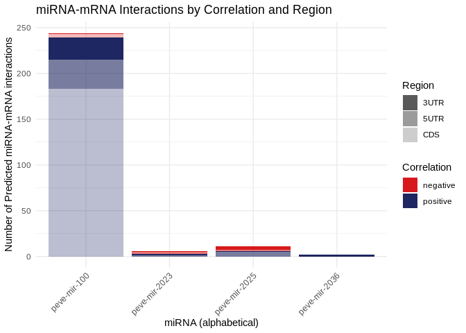
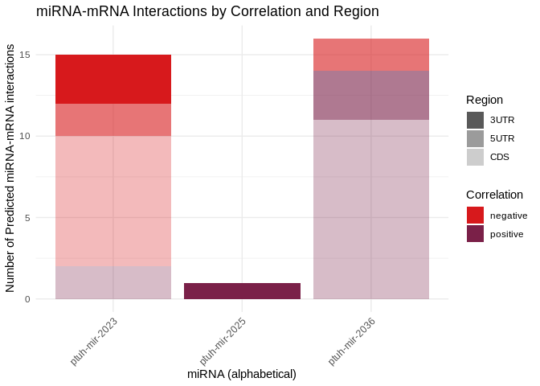

04.1-miRNA-comparison-expression
================
Kathleen Durkin
2025-07-10

- <a href="#01-functionally-enriched-processes"
  id="toc-01-functionally-enriched-processes">0.1 Functionally enriched
  processes</a>
- <a href="#1-functionally-annotated" id="toc-1-functionally-annotated">1
  Functionally annotated</a>
  - <a href="#11-fa-terms-and-join-with-goslim"
    id="toc-11-fa-terms-and-join-with-goslim">1.1 FA terms (and join with
    GOSlim)</a>
  - <a href="#12-get-goslim-summary-terms"
    id="toc-12-get-goslim-summary-terms">1.2 Get GoSlim summary terms</a>
- <a href="#2-overlapping-goslim-terms"
  id="toc-2-overlapping-goslim-terms">2 Overlapping GOSlim terms</a>
- <a href="#3-semantic-similarity" id="toc-3-semantic-similarity">3
  Semantic similarity</a>
- <a href="#4-plotting" id="toc-4-plotting">4 Plotting</a>
- <a href="#5" id="toc-5">5</a>
- <a href="#6-which-mirna-targets-have-multiple-binding-sites"
  id="toc-6-which-mirna-targets-have-multiple-binding-sites">6 Which miRNA
  targets have multiple binding sites?</a>

Load packages

``` r
library(dplyr)
```

    ## 
    ## Attaching package: 'dplyr'

    ## The following objects are masked from 'package:stats':
    ## 
    ##     filter, lag

    ## The following objects are masked from 'package:base':
    ## 
    ##     intersect, setdiff, setequal, union

``` r
library(tidyr)
library(ggplot2)
library(stringr)
library(purrr)
library(GSEABase)
```

    ## Loading required package: BiocGenerics

    ## 
    ## Attaching package: 'BiocGenerics'

    ## The following objects are masked from 'package:dplyr':
    ## 
    ##     combine, intersect, setdiff, union

    ## The following objects are masked from 'package:stats':
    ## 
    ##     IQR, mad, sd, var, xtabs

    ## The following objects are masked from 'package:base':
    ## 
    ##     anyDuplicated, aperm, append, as.data.frame, basename, cbind,
    ##     colnames, dirname, do.call, duplicated, eval, evalq, Filter, Find,
    ##     get, grep, grepl, intersect, is.unsorted, lapply, Map, mapply,
    ##     match, mget, order, paste, pmax, pmax.int, pmin, pmin.int,
    ##     Position, rank, rbind, Reduce, rownames, sapply, setdiff, sort,
    ##     table, tapply, union, unique, unsplit, which.max, which.min

    ## Loading required package: Biobase

    ## Welcome to Bioconductor
    ## 
    ##     Vignettes contain introductory material; view with
    ##     'browseVignettes()'. To cite Bioconductor, see
    ##     'citation("Biobase")', and for packages 'citation("pkgname")'.

    ## Loading required package: annotate

    ## Loading required package: AnnotationDbi

    ## Loading required package: stats4

    ## Loading required package: IRanges

    ## Loading required package: S4Vectors

    ## 
    ## Attaching package: 'S4Vectors'

    ## The following object is masked from 'package:tidyr':
    ## 
    ##     expand

    ## The following objects are masked from 'package:dplyr':
    ## 
    ##     first, rename

    ## The following objects are masked from 'package:base':
    ## 
    ##     expand.grid, I, unname

    ## 
    ## Attaching package: 'IRanges'

    ## The following object is masked from 'package:purrr':
    ## 
    ##     reduce

    ## The following objects are masked from 'package:dplyr':
    ## 
    ##     collapse, desc, slice

    ## 
    ## Attaching package: 'AnnotationDbi'

    ## The following object is masked from 'package:dplyr':
    ## 
    ##     select

    ## Loading required package: XML

    ## Loading required package: graph

    ## 
    ## Attaching package: 'graph'

    ## The following object is masked from 'package:XML':
    ## 
    ##     addNode

    ## The following object is masked from 'package:stringr':
    ## 
    ##     boundary

``` r
library(GO.db)
```

    ## 

``` r
library(knitr)
library(tidyverse)
```

    ## ── Attaching core tidyverse packages ──────────────────────── tidyverse 2.0.0 ──
    ## ✔ forcats   1.0.0     ✔ readr     2.1.5
    ## ✔ lubridate 1.9.4     ✔ tibble    3.3.0

    ## ── Conflicts ────────────────────────────────────────── tidyverse_conflicts() ──
    ## ✖ lubridate::%within%()    masks IRanges::%within%()
    ## ✖ graph::boundary()        masks stringr::boundary()
    ## ✖ IRanges::collapse()      masks dplyr::collapse()
    ## ✖ Biobase::combine()       masks BiocGenerics::combine(), dplyr::combine()
    ## ✖ IRanges::desc()          masks dplyr::desc()
    ## ✖ S4Vectors::expand()      masks tidyr::expand()
    ## ✖ dplyr::filter()          masks stats::filter()
    ## ✖ S4Vectors::first()       masks dplyr::first()
    ## ✖ dplyr::lag()             masks stats::lag()
    ## ✖ BiocGenerics::Position() masks ggplot2::Position(), base::Position()
    ## ✖ IRanges::reduce()        masks purrr::reduce()
    ## ✖ S4Vectors::rename()      masks dplyr::rename()
    ## ✖ lubridate::second()      masks S4Vectors::second()
    ## ✖ lubridate::second<-()    masks S4Vectors::second<-()
    ## ✖ AnnotationDbi::select()  masks dplyr::select()
    ## ✖ IRanges::slice()         masks dplyr::slice()
    ## ℹ Use the conflicted package (<http://conflicted.r-lib.org/>) to force all conflicts to become errors

Hypothesize that conserved miRNA present in all three species will also
have targets enriched for the same processes across species.

## 0.1 Functionally enriched processes

Load FE tables:

``` r
# Apul
Apul_3UTR_FE <- read.csv("../../D-Apul/output/09.1-Apul-mRNA-miRNA-interactions-functional-enrichment/miRNA_sig_cor_targets_topGO_FE.csv") %>% dplyr::select(-X)

Apul_CDS_FE <- read.csv("../../D-Apul/output/09.11-Apul-mRNA-miRNA-interactions-FE-CDS/miRNA_CDS_sig_cor_targets_topGO_FE.csv") %>% dplyr::select(-X)

Apul_5UTR_FE <- read.csv("../../D-Apul/output/09.12-Apul-mRNA-miRNA-interactions-FE-5UTR/miRNA_5UTR_sig_cor_targets_topGO_FE.csv") %>% dplyr::select(-X)


# Peve
Peve_3UTR_FE <- read.csv("../../E-Peve/output/10.13-Peve-mRNA-miRNA-interactions-FE-3UTR/miRNA_3UTR_sig_cor_targets_topGO_FE.csv") %>% dplyr::select(-X)

Peve_CDS_FE <- read.csv("../../E-Peve/output/10.11-Peve-mRNA-miRNA-interactions-FE-CDS/miRNA_CDS_sig_cor_targets_topGO_FE.csv") %>% dplyr::select(-X)

Peve_5UTR_FE <- read.csv("../../E-Peve/output/10.12-Peve-mRNA-miRNA-interactions-FE-5UTR/miRNA_5UTR_sig_cor_targets_topGO_FE.csv") %>% dplyr::select(-X)

  

# Ptuh
Ptuh_3UTR_FE <- read.csv("../../F-Ptuh/output/11.13-Ptuh-mRNA-miRNA-interactions-FE-3UTR/miRNA_3UTR_sig_cor_targets_topGO_FE.csv") %>% dplyr::select(-X)

Ptuh_CDS_FE <- read.csv("../../F-Ptuh/output/11.11-Ptuh-mRNA-miRNA-interactions-FE-CDS/miRNA_CDS_sig_cor_targets_topGO_FE.csv") %>% dplyr::select(-X)

Ptuh_5UTR_FE <- read.csv("../../F-Ptuh/output/11.12-Ptuh-mRNA-miRNA-interactions-FE-5UTR/miRNA_5UTR_sig_cor_targets_topGO_FE.csv") %>% dplyr::select(-X)
```

Format and combine dfs

``` r
# annotate each df with its mRNA region
Apul_3UTR_FE$region <- "3UTR"
Apul_CDS_FE$region <- "CDS"
Apul_5UTR_FE$region <- "5UTR"

Peve_3UTR_FE$region <- "3UTR"
Peve_CDS_FE$region <- "CDS"
Peve_5UTR_FE$region <- "5UTR"

Ptuh_3UTR_FE$region <- "3UTR"
Ptuh_CDS_FE$region <- "CDS"
Ptuh_5UTR_FE$region <- "5UTR"

# Check each df has same col names in same order
colnames(Apul_3UTR_FE) == colnames(Apul_CDS_FE)
```

    ## [1] TRUE TRUE TRUE TRUE TRUE TRUE TRUE TRUE TRUE

``` r
colnames(Apul_3UTR_FE) == colnames(Apul_5UTR_FE)
```

    ## [1] TRUE TRUE TRUE TRUE TRUE TRUE TRUE TRUE TRUE

``` r
colnames(Peve_3UTR_FE) == colnames(Peve_CDS_FE)
```

    ## [1] TRUE TRUE TRUE TRUE TRUE TRUE TRUE TRUE TRUE

``` r
colnames(Peve_3UTR_FE) == colnames(Peve_5UTR_FE)
```

    ## [1] TRUE TRUE TRUE TRUE TRUE TRUE TRUE TRUE TRUE

``` r
colnames(Ptuh_3UTR_FE) == colnames(Ptuh_CDS_FE)
```

    ## [1] TRUE TRUE TRUE TRUE TRUE TRUE TRUE TRUE TRUE

``` r
colnames(Ptuh_3UTR_FE) == colnames(Ptuh_5UTR_FE)
```

    ## [1] TRUE TRUE TRUE TRUE TRUE TRUE TRUE TRUE TRUE

``` r
# Combine dfs
Apul_FE <- rbind(Apul_3UTR_FE, Apul_CDS_FE, Apul_5UTR_FE)
Peve_FE <- rbind(Peve_3UTR_FE, Peve_CDS_FE, Peve_5UTR_FE)
Ptuh_FE <- rbind(Ptuh_3UTR_FE, Ptuh_CDS_FE, Ptuh_5UTR_FE)
```

Load in assigned miRNA names

``` r
Apul_names <- read.csv("../../D-Apul/output/11-Apul-sRNA-ShortStack_4.1.0-pulchra_genome/ShortStack_out/Apul_Results_mature_named_miRNAs.csv") %>% dplyr::select(Name, given_miRNA_name)

Peve_names <- read.csv("../../E-Peve/output/05-Peve-sRNA-ShortStack_4.1.0/ShortStack_out/Peve_Results_mature_named_miRNAs.csv") %>% dplyr::select(Name, given_miRNA_name)

Ptuh_names <- read.csv("../../F-Ptuh/output/05-Ptuh-sRNA-ShortStack_4.1.0/ShortStack_out/Ptuh_Results_mature_named_miRNAs.csv") %>% dplyr::select(Name, given_miRNA_name)
```

Annotate miRNA dfs with given names

``` r
Apul_FE_df <- left_join(Apul_FE, Apul_names, by = c("miRNA" = "Name"))
Peve_FE_df <- left_join(Peve_FE, Peve_names, by = c("miRNA" = "Name"))
Ptuh_FE_df <- left_join(Ptuh_FE, Ptuh_names, by = c("miRNA" = "Name"))
```

Separate conserved miRNA (present in all 3 species) from the rest. In
`04-miRNA-comparison`, identified the miRNA conserved among all 3
species to be: miR-100, miR-2023, miR-2025, and miR-2036

``` r
Apul_FE_conserved <- Apul_FE_df %>% filter(str_detect(given_miRNA_name, "mir-100|mir-2023|mir-2025|mir-2036"))
Apul_FE_unconserved <- Apul_FE_df %>% filter(!str_detect(given_miRNA_name, "mir-100|mir-2023|mir-2025|mir-2036"))

Peve_FE_conserved <- Peve_FE_df %>% filter(str_detect(given_miRNA_name, "mir-100|mir-2023|mir-2025|mir-2036"))
Peve_FE_unconserved <- Peve_FE_df %>% filter(!str_detect(given_miRNA_name, "mir-100|mir-2023|mir-2025|mir-2036"))

Ptuh_FE_conserved <- Ptuh_FE_df %>% filter(str_detect(given_miRNA_name, "mir-100|mir-2023|mir-2025|mir-2036"))
Ptuh_FE_unconserved <- Ptuh_FE_df %>% filter(!str_detect(given_miRNA_name, "mir-100|mir-2023|mir-2025|mir-2036"))

# Also annotate the full dfs
Apul_FE_df$conservation <- ifelse(Apul_FE_df$given_miRNA_name %in% Apul_FE_conserved$given_miRNA_name, "conserved", "unconserved")
Peve_FE_df$conservation <- ifelse(Peve_FE_df$given_miRNA_name %in% Peve_FE_conserved$given_miRNA_name, "conserved", "unconserved")
Ptuh_FE_df$conservation <- ifelse(Ptuh_FE_df$given_miRNA_name %in% Ptuh_FE_conserved$given_miRNA_name, "conserved", "unconserved")
```

Take a look

``` r
print(Apul_FE_conserved)
```

    ##         GO.ID                                                   Term Annotated
    ## 1  GO:0006699                         bile acid biosynthetic process         4
    ## 2  GO:0000082                  G1/S transition of mitotic cell cycle       105
    ## 3  GO:0003964                   RNA-directed DNA polymerase activity       135
    ## 4  GO:0060271                                        cilium assembly         3
    ## 5  GO:0001736                       establishment of planar polarity         5
    ## 6  GO:0004447                             iodide peroxidase activity         1
    ## 7  GO:0003333                     amino acid transmembrane transport         2
    ## 8  GO:0001764                                       neuron migration         8
    ## 9  GO:0015969             guanosine tetraphosphate metabolic process         9
    ## 10 GO:0000272                       polysaccharide catabolic process        11
    ## 11 GO:0005324             long-chain fatty acid transporter activity         1
    ## 12 GO:0005319                             lipid transporter activity         3
    ## 13 GO:0005314 high-affinity L-glutamate transmembrane transporter...         2
    ## 14 GO:0000900 mRNA regulatory element binding translation repress...         3
    ## 15 GO:0003964                   RNA-directed DNA polymerase activity       135
    ## 16 GO:0004843                  cysteine-type deubiquitinase activity         6
    ## 17 GO:0006886                        intracellular protein transport         5
    ## 18 GO:0004325                                ferrochelatase activity         1
    ##    Significant Expected Fisher               type         miRNA region
    ## 1            1     0.01 0.0084 Biological.Process Cluster_18728   3UTR
    ## 2            2     0.22 0.0153 Biological.Process Cluster_18728   3UTR
    ## 3            1     0.05 0.0470 Molecular.Function Cluster_18728   3UTR
    ## 4            1     0.01 0.0063 Biological.Process Cluster_15316    CDS
    ## 5            1     0.01 0.0105 Biological.Process Cluster_15316    CDS
    ## 6            1     0.00 0.0007 Molecular.Function Cluster_15316    CDS
    ## 7            1     0.01 0.0084 Biological.Process Cluster_18728    CDS
    ## 8            1     0.03 0.0332 Biological.Process Cluster_18728    CDS
    ## 9            1     0.04 0.0373 Biological.Process Cluster_18728    CDS
    ## 10           1     0.05 0.0454 Biological.Process Cluster_18728    CDS
    ## 11           1     0.00 0.0046 Molecular.Function Cluster_18728    CDS
    ## 12           2     0.01 0.0084 Molecular.Function Cluster_18728    CDS
    ## 13           1     0.01 0.0091 Molecular.Function Cluster_18728    CDS
    ## 14           1     0.01 0.0137 Molecular.Function Cluster_18728    CDS
    ## 15           3     0.62 0.0211 Molecular.Function Cluster_18728    CDS
    ## 16           1     0.03 0.0271 Molecular.Function Cluster_18728    CDS
    ## 17           1     0.01 0.0100 Biological.Process  Cluster_5012    CDS
    ## 18           1     0.00 0.0011 Molecular.Function  Cluster_5012    CDS
    ##    given_miRNA_name
    ## 1      apul-mir-100
    ## 2      apul-mir-100
    ## 3      apul-mir-100
    ## 4     apul-mir-2025
    ## 5     apul-mir-2025
    ## 6     apul-mir-2025
    ## 7      apul-mir-100
    ## 8      apul-mir-100
    ## 9      apul-mir-100
    ## 10     apul-mir-100
    ## 11     apul-mir-100
    ## 12     apul-mir-100
    ## 13     apul-mir-100
    ## 14     apul-mir-100
    ## 15     apul-mir-100
    ## 16     apul-mir-100
    ## 17    apul-mir-2023
    ## 18    apul-mir-2023

``` r
print(Peve_FE_conserved)
```

    ##         GO.ID                                                   Term Annotated
    ## 1  GO:0004983                       neuropeptide Y receptor activity         4
    ## 2  GO:0050233                              pyranose oxidase activity         1
    ## 3  GO:0002224                   toll-like receptor signaling pathway         1
    ## 4  GO:0006886                        intracellular protein transport         1
    ## 5  GO:0002027                               regulation of heart rate         2
    ## 6  GO:0002088                    lens development in camera-type eye         2
    ## 7  GO:0005509                                    calcium ion binding        33
    ## 8  GO:0004364                       glutathione transferase activity         1
    ## 9  GO:0004725                  protein tyrosine phosphatase activity         2
    ## 10 GO:0004714 transmembrane receptor protein tyrosine kinase acti...         8
    ##    Significant Expected Fisher               type         miRNA region
    ## 1            1     0.01 0.0130 Molecular.Function  Cluster_1167   3UTR
    ## 2            1     0.00 0.0016 Molecular.Function Cluster_14999   3UTR
    ## 3            1     0.02 0.0170 Biological.Process  Cluster_1167    CDS
    ## 4            1     0.02 0.0170 Biological.Process  Cluster_1167    CDS
    ## 5            1     0.03 0.0340 Biological.Process  Cluster_1167    CDS
    ## 6            1     0.03 0.0340 Biological.Process  Cluster_1167    CDS
    ## 7            3     0.54 0.0130 Molecular.Function  Cluster_1167    CDS
    ## 8            1     0.02 0.0160 Molecular.Function  Cluster_1167    CDS
    ## 9            1     0.03 0.0320 Molecular.Function  Cluster_1167    CDS
    ## 10           1     0.03 0.0260 Molecular.Function  Cluster_1167   5UTR
    ##    given_miRNA_name
    ## 1      peve-mir-100
    ## 2     peve-mir-2025
    ## 3      peve-mir-100
    ## 4      peve-mir-100
    ## 5      peve-mir-100
    ## 6      peve-mir-100
    ## 7      peve-mir-100
    ## 8      peve-mir-100
    ## 9      peve-mir-100
    ## 10     peve-mir-100

``` r
print(Ptuh_FE_conserved)
```

    ##        GO.ID                Term Annotated Significant Expected Fisher
    ## 1 GO:0005509 calcium ion binding        21           1     0.04  0.042
    ##                 type        miRNA region given_miRNA_name
    ## 1 Molecular.Function Cluster_1296    CDS     ptuh-mir-100

The only miRNA with targets that are enriched for a given function
across all three species is miR-100:

- In Apul, miR-100 targets are functionally enriched for terms related
  to for fundamental cellular processes like metabolism, transport,
  expression and cell cycle, and cellular activity and development

- In Peve, miR-100 targets are also enriched for fundamental terms
  related to signaling, development, homeostasis, and immune function.

- In Ptuh, miR-100 targets are only enriched for a single Molecular
  Function, calcium ion binding. This is a fundamental molecular
  function and would be important to the processes enriched in both Apul
  and Peve. It is also an enriched term in Peve.

Note: Our ability to describe the functional role of miRNA in Ptuh will
likely be particularly limited, since our functional annotation of the
Ptuh genome is the least complete of our three species (A.millepora
genome: 99% of genes functionally annotated; P.evermanni genome: 72%;
P.meandrina genome: 60%)

Let’s also look at the annotations themselves, regardless of whether the
processes were statistically overrepresented. This will give more terms
to look at for the less-well-annotated P.tuahiniensis.

# 1 Functionally annotated

## 1.1 FA terms (and join with GOSlim)

Load and format FA tables:

``` r
# Apul
Apul_3UTR_FA <- read.csv("../../D-Apul/output/09.1-Apul-mRNA-miRNA-interactions-functional-enrichment/miRNA_sig_cor_targets_FA.csv") %>% dplyr::select(-X, -X.1, -X.2)

Apul_CDS_FA <- read.csv("../../D-Apul/output/09.11-Apul-mRNA-miRNA-interactions-FE-CDS/miRNA_CDS_sig_cor_targets_FA.csv")

Apul_CDS_FA$query_start_end <- paste0(Apul_CDS_FA$V5, " ", Apul_CDS_FA$V6)
Apul_CDS_FA$subject_start_end <- paste0(Apul_CDS_FA$V7, " ", Apul_CDS_FA$V8)
Apul_CDS_FA <- Apul_CDS_FA %>%
  dplyr::select(miRNA, mRNA, PCC.cor, p_value, adjusted_p_value, V3.x, V4.x, query_start_end, subject_start_end, V9, V10, V11, V1, V3.y, Protein.names, Organism, Gene.Ontology..biological.process., Gene.Ontology.IDs)
colnames(Apul_CDS_FA) <- colnames(Apul_3UTR_FA)


Apul_5UTR_FA <- read.csv("../../D-Apul/output/09.12-Apul-mRNA-miRNA-interactions-FE-5UTR/miRNA_5UTR_sig_cor_targets_FA.csv")

Apul_5UTR_FA$query_start_end <- paste0(Apul_5UTR_FA$V5, " ", Apul_5UTR_FA$V6)
Apul_5UTR_FA$subject_start_end <- paste0(Apul_5UTR_FA$V7, " ", Apul_5UTR_FA$V8)
Apul_5UTR_FA <- Apul_5UTR_FA %>%
  dplyr::select(miRNA, mRNA, PCC.cor, p_value, adjusted_p_value, V3.x, V4.x, query_start_end, subject_start_end, V9, V10, V11, V1, V3.y, Protein.names, Organism, Gene.Ontology..biological.process., Gene.Ontology.IDs)
colnames(Apul_5UTR_FA) <- colnames(Apul_3UTR_FA)


# Peve
Peve_3UTR_FA <- read.csv("../../E-Peve/output/10.13-Peve-mRNA-miRNA-interactions-FE-3UTR/miRNA_3UTR_sig_cor_targets_FA.csv") %>% dplyr::select(-X, -X.1, -X.2)

Peve_CDS_FA <- read.csv("../../E-Peve/output/10.11-Peve-mRNA-miRNA-interactions-FE-CDS/miRNA_CDS_sig_cor_targets_FA.csv")

Peve_CDS_FA$query_start_end <- paste0(Peve_CDS_FA$V5, " ", Peve_CDS_FA$V6)
Peve_CDS_FA$subject_start_end <- paste0(Peve_CDS_FA$V7, " ", Peve_CDS_FA$V8)
Peve_CDS_FA <- Peve_CDS_FA %>%
  dplyr::select(miRNA, mRNA, PCC.cor, p_value, adjusted_p_value, V3.x, V4.x, query_start_end, subject_start_end, V9, V10, V11, V3.y, Protein.names, Organism, Gene.Ontology..biological.process., Gene.Ontology.IDs)
colnames(Peve_CDS_FA) <- colnames(Peve_3UTR_FA)

Peve_5UTR_FA <- read.csv("../../E-Peve/output/10.12-Peve-mRNA-miRNA-interactions-FE-5UTR/miRNA_5UTR_sig_cor_targets_FA.csv")

Peve_5UTR_FA$query_start_end <- paste0(Peve_5UTR_FA$V5, " ", Peve_5UTR_FA$V6)
Peve_5UTR_FA$subject_start_end <- paste0(Peve_5UTR_FA$V7, " ", Peve_5UTR_FA$V8)
Peve_5UTR_FA <- Peve_5UTR_FA %>%
  dplyr::select(miRNA, mRNA, PCC.cor, p_value, adjusted_p_value, V3.x, V4.x, query_start_end, subject_start_end, V9, V10, V11, V3.y, Protein.names, Organism, Gene.Ontology..biological.process., Gene.Ontology.IDs)
colnames(Peve_5UTR_FA) <- colnames(Peve_3UTR_FA)


# Ptuh
Ptuh_3UTR_FA <- read.csv("../../F-Ptuh/output/11.13-Ptuh-mRNA-miRNA-interactions-FE-3UTR/miRNA_3UTR_sig_cor_targets_FA.csv") %>% dplyr::select(-X, -X.1, -X.2)

Ptuh_CDS_FA <- read.csv("../../F-Ptuh/output/11.11-Ptuh-mRNA-miRNA-interactions-FE-CDS/miRNA_CDS_sig_cor_targets_FA.csv")

Ptuh_CDS_FA$query_start_end <- paste0(Ptuh_CDS_FA$V5, " ", Ptuh_CDS_FA$V6)
Ptuh_CDS_FA$subject_start_end <- paste0(Ptuh_CDS_FA$V7, " ", Ptuh_CDS_FA$V8)
Ptuh_CDS_FA <- Ptuh_CDS_FA %>%
  dplyr::select(miRNA, mRNA, PCC.cor, p_value, adjusted_p_value, V3.x, V4.x, query_start_end, subject_start_end, V9, V10, V11, V3.y, Protein.names, Organism, Gene.Ontology..biological.process., Gene.Ontology.IDs)
colnames(Ptuh_CDS_FA) <- colnames(Peve_3UTR_FA)

Ptuh_5UTR_FA <- read.csv("../../F-Ptuh/output/11.12-Ptuh-mRNA-miRNA-interactions-FE-5UTR/miRNA_5UTR_sig_cor_targets_FA.csv")

Ptuh_5UTR_FA$query_start_end <- paste0(Ptuh_5UTR_FA$V5, " ", Ptuh_5UTR_FA$V6)
Ptuh_5UTR_FA$subject_start_end <- paste0(Ptuh_5UTR_FA$V7, " ", Ptuh_5UTR_FA$V8)
Ptuh_5UTR_FA <- Ptuh_5UTR_FA %>%
  dplyr::select(miRNA, mRNA, PCC.cor, p_value, adjusted_p_value, V3.x, V4.x, query_start_end, subject_start_end, V9, V10, V11, V3.y, Protein.names, Organism, Gene.Ontology..biological.process., Gene.Ontology.IDs)
colnames(Ptuh_5UTR_FA) <- colnames(Peve_3UTR_FA)
```

Combine dfs

``` r
# annotate each df with its mRNA region
Apul_3UTR_FA$region <- "3UTR"
Apul_CDS_FA$region <- "CDS"
Apul_5UTR_FA$region <- "5UTR"

Peve_3UTR_FA$region <- "3UTR"
Peve_CDS_FA$region <- "CDS"
Peve_5UTR_FA$region <- "5UTR"

Ptuh_3UTR_FA$region <- "3UTR"
Ptuh_CDS_FA$region <- "CDS"
Ptuh_5UTR_FA$region <- "5UTR"

# Combine dfs
Apul_FA <- rbind(Apul_3UTR_FA, Apul_CDS_FA, Apul_5UTR_FA)
Peve_FA <- rbind(Peve_3UTR_FA, Peve_CDS_FA, Peve_5UTR_FA)
Ptuh_FA <- rbind(Ptuh_3UTR_FA, Ptuh_CDS_FA, Ptuh_5UTR_FA)
```

## 1.2 Get GoSlim summary terms

Code from [Roberts Lab
Handbook](https://robertslab.github.io/resources/bio-Annotation/#map-go-ids-to-goslims)

The expected input file has at least two columns. One each with:

- gene ID

- Gene Ontology (GO) ID

NOTE: The GO IDs in the GO ID column should be separated with a
semi-colon.

The basic output from this process will be:

- GOslim IDs (as rownames)

- GOslim terms

Variables

``` r
# Column names corresponding to gene name/ID and GO IDs
GO.ID.column <- "Gene.Ontology.IDs"
gene.ID.column <- "mRNA"

# Relative path or URL to input file
#input.file <- "https://raw.githubusercontent.com/grace-ac/paper-pycno-sswd-2021-2022/d1cdf13c36085868df4ef4b75d2b7de03ef08d1c/analyses/25-compare-2021-2022/DEGlist_same_2021-2022_forGOslim.tab"


##### Official GO info - no need to change #####
goslims_obo <- "goslim_generic.obo"
goslims_url <- "http://current.geneontology.org/ontology/subsets/goslim_generic.obo"
```

Set GSEAbase location and download goslim_generic.obo

``` r
# Find GSEAbase installation location
gseabase_location <- find.package("GSEABase")

# Load path to GOslim OBO file
goslim_obo_destintation <- file.path(gseabase_location, "extdata", goslims_obo, fsep = "/")

# Download the GOslim OBO file
download.file(url = goslims_url, destfile = goslim_obo_destintation)

# Loads package files
gseabase_files <- system.file("extdata", goslims_obo, package="GSEABase")
```

Read in gene/GO file

``` r
#full.gene.df <- read.csv(file = input.file, header = TRUE, sep = "\t")
full.gene.df <- Apul_FA
```

Remove rows with NA, remove whitespace in GO IDs column and keep just
gene/GO IDs columns

``` r
# Clean whitespace, filter NA/empty rows, select columns, and split GO terms using column name variables
gene.GO.df <- full.gene.df %>%
  mutate(!!GO.ID.column := str_replace_all(.data[[GO.ID.column]], "\\s*;\\s*", ";")) %>% # Clean up spaces around ";"
  filter(!is.na(.data[[gene.ID.column]]) & !is.na(.data[[GO.ID.column]]) & .data[[GO.ID.column]] != "") %>% 
  dplyr::select(all_of(c(gene.ID.column, GO.ID.column)))
```

This flattens the file so all of the GO IDs per gene are separated into
one GO ID per gene per row.

``` r
flat.gene.GO.df <- gene.GO.df %>% separate_rows(!!sym(GO.ID.column), sep = ";")
```

Groups the genes by GO ID (i.e. lists all genes associated with each
unique GO ID)

``` r
grouped.gene.GO.df <- flat.gene.GO.df %>%
  group_by(!!sym(GO.ID.column)) %>%
  summarise(!!gene.ID.column := paste(.data[[gene.ID.column]], collapse = ","))
```

Map GO IDs to GOslims

``` r
# Vector of GO IDs
go_ids <- grouped.gene.GO.df[[GO.ID.column]]
```

Creates new OBO Collection object of just GOslims, based on provided GO
IDs.

``` r
# Create GSEAbase GOCollection using `go_ids`
myCollection <- GOCollection(go_ids)

# Retrieve GOslims from GO OBO file set
slim <- getOBOCollection(gseabase_files)
```

Get Biological Process (BP) GOslims associated with provided GO IDs.

``` r
# Retrieve Biological Process (BP) GOslims
slimdf <- goSlim(myCollection, slim, "BP", verbose)
```

Performs mapping of of GOIDs to GOslims

Returns:

GOslim IDs (as rownames) GOslim terms Counts of GO IDs matching to
corresponding GOslim Percentage of GO IDs matching to corresponding
GOslim GOIDs mapped to corresponding GOslim, in a semi-colon delimited
format

``` r
# List of GOslims and all GO IDs from `go_ids`
gomap <- as.list(GOBPOFFSPRING[rownames(slimdf)])

# Maps `go_ids` to matching GOslims
mapped <- lapply(gomap, intersect, ids(myCollection))

# Append all mapped GO IDs to `slimdf`
# `sapply` needed to apply paste() to create semi-colon delimited values
slimdf$GO.IDs <- sapply(lapply(gomap, intersect, ids(myCollection)), paste, collapse=";")

# Remove "character(0) string from "GO.IDs" column
slimdf$GO.IDs[slimdf$GO.IDs == "character(0)"] <- ""

# Add self-matching GOIDs to "GO.IDs" column, if not present
for (go_id in go_ids) {
  # Check if the go_id is present in the row names
  if (go_id %in% rownames(slimdf)) {
    # Check if the go_id is not present in the GO.IDs column
    # Also removes white space "trimws()" and converts all to upper case to handle
    # any weird, "invisible" formatting issues.
    if (!go_id %in% trimws(toupper(strsplit(slimdf[go_id, "GO.IDs"], ";")[[1]]))) {
      # Append the go_id to the GO.IDs column with a semi-colon separator
      if (length(slimdf$GO.IDs) > 0 && nchar(slimdf$GO.IDs[nrow(slimdf)]) > 0) {
        slimdf[go_id, "GO.IDs"] <- paste0(slimdf[go_id, "GO.IDs"], "; ", go_id)
      } else {
        slimdf[go_id, "GO.IDs"] <- go_id
      }
    }
  }
}
```

“Flatten” file so each row is single GO ID with corresponding GOslim
rownames_to_column needed to retain row name info

``` r
# "Flatten" file so each row is single GO ID with corresponding GOslim
# rownames_to_column needed to retain row name info
slimdf_separated <- as.data.frame(slimdf %>%
  rownames_to_column('GOslim') %>%
  separate_rows(GO.IDs, sep = ";"))

# Group by unique GO ID
grouped_slimdf <- slimdf_separated %>%
  filter(!is.na(GO.IDs) & GO.IDs != "") %>%
  group_by(GO.IDs) %>%
  summarize(GOslim = paste(GOslim, collapse = ";"),
            Term = paste(Term, collapse = ";"))
```

Sorts GOslims by Count, in descending order and then selects just the
Term and Count columns.

``` r
slimdf.sorted <- slimdf %>% arrange(desc(Count))

slim.count.df <- slimdf.sorted %>% 
  dplyr::select(Term, Count)
```

Annotate miRNA dfs with given names and GOSlim terms

``` r
Apul_FA_df <- left_join(Apul_FA, Apul_names, by = c("miRNA" = "Name"))
Peve_FA_df <- left_join(Peve_FA, Peve_names, by = c("miRNA" = "Name"))
Ptuh_FA_df <- left_join(Ptuh_FA, Ptuh_names, by = c("miRNA" = "Name"))

# function to map column of semicolon-delimited GO IDs to my GOSlim terms
IDs_to_slims <- function(df, mapping_df){
  # Step 1: Separate Gene.Ontology.IDs into rows
  df_long <- df %>%
    separate_rows(Gene.Ontology.IDs, sep = ";") %>%
    mutate(Gene.Ontology.IDs = str_trim(Gene.Ontology.IDs))  # remove any extra spaces
  
  # Step 2: Join with mapping_df to get GO Slim terms
  df_mapped <- df_long %>%
    left_join(mapping_df, by = c("Gene.Ontology.IDs" = "GO.IDs"))
  
  # Step 3: Collapse GO Slim terms back into semicolon-delimited format per GI_ID
  df_result <- df_mapped %>%
    group_by(mRNA) %>%
    summarise(
      Gene.Ontology.IDs = paste(Gene.Ontology.IDs, collapse = ";"),
      GO_Slim_Terms = paste(unique(Term[!is.na(Term)]), collapse = ";")
    )
}

# Obtain GOSlim summaries
Apul_FA_slims <- IDs_to_slims(Apul_FA_df, slimdf_separated) %>% dplyr::select(mRNA, GO_Slim_Terms)
```

    ## Warning in left_join(., mapping_df, by = c(Gene.Ontology.IDs = "GO.IDs")): Detected an unexpected many-to-many relationship between `x` and `y`.
    ## ℹ Row 16 of `x` matches multiple rows in `y`.
    ## ℹ Row 851 of `y` matches multiple rows in `x`.
    ## ℹ If a many-to-many relationship is expected, set `relationship =
    ##   "many-to-many"` to silence this warning.

``` r
Peve_FA_slims <- IDs_to_slims(Peve_FA_df, slimdf_separated) %>% dplyr::select(mRNA, GO_Slim_Terms)
```

    ## Warning in left_join(., mapping_df, by = c(Gene.Ontology.IDs = "GO.IDs")): Detected an unexpected many-to-many relationship between `x` and `y`.
    ## ℹ Row 6 of `x` matches multiple rows in `y`.
    ## ℹ Row 311 of `y` matches multiple rows in `x`.
    ## ℹ If a many-to-many relationship is expected, set `relationship =
    ##   "many-to-many"` to silence this warning.

``` r
Ptuh_FA_slims <- IDs_to_slims(Ptuh_FA_df, slimdf_separated) %>% dplyr::select(mRNA, GO_Slim_Terms)
```

    ## Warning in left_join(., mapping_df, by = c(Gene.Ontology.IDs = "GO.IDs")): Detected an unexpected many-to-many relationship between `x` and `y`.
    ## ℹ Row 122 of `x` matches multiple rows in `y`.
    ## ℹ Row 6 of `y` matches multiple rows in `x`.
    ## ℹ If a many-to-many relationship is expected, set `relationship =
    ##   "many-to-many"` to silence this warning.

``` r
# Annotate FA dfs with GOSlim terms
Apul_FA_df <- left_join(Apul_FA_df, Apul_FA_slims, by = "mRNA")
Peve_FA_df <- left_join(Peve_FA_df, Peve_FA_slims, by = "mRNA")
Ptuh_FA_df <- left_join(Ptuh_FA_df, Ptuh_FA_slims, by = "mRNA")
```

Separate conserved miRNA (present in all 3 species) from the rest. In
`04-miRNA-comparison`, identified the miRNA conserved among all 3
species to be: miR-100, miR-2023, miR-2025, and miR-2036

``` r
Apul_FA_conserved <- Apul_FA_df %>% filter(str_detect(given_miRNA_name, "mir-100|mir-2023|mir-2025|mir-2036"))
Apul_FA_unconserved <- Apul_FA_df %>% filter(!str_detect(given_miRNA_name, "mir-100|mir-2023|mir-2025|mir-2036"))

Peve_FA_conserved <- Peve_FA_df %>% filter(str_detect(given_miRNA_name, "mir-100|mir-2023|mir-2025|mir-2036"))
Peve_FA_unconserved <- Peve_FA_df %>% filter(!str_detect(given_miRNA_name, "mir-100|mir-2023|mir-2025|mir-2036"))

Ptuh_FA_conserved <- Ptuh_FA_df %>% filter(str_detect(given_miRNA_name, "mir-100|mir-2023|mir-2025|mir-2036"))
Ptuh_FA_unconserved <- Ptuh_FA_df %>% filter(!str_detect(given_miRNA_name, "mir-100|mir-2023|mir-2025|mir-2036"))

# Also annotate the full dfs
Apul_FA_df$conservation <- ifelse(Apul_FA_df$given_miRNA_name %in% Apul_FA_conserved$given_miRNA_name, "conserved", "unconserved")
Peve_FA_df$conservation <- ifelse(Peve_FA_df$given_miRNA_name %in% Peve_FA_conserved$given_miRNA_name, "conserved", "unconserved")
Ptuh_FA_df$conservation <- ifelse(Ptuh_FA_df$given_miRNA_name %in% Ptuh_FA_conserved$given_miRNA_name, "conserved", "unconserved")
```

# 2 Overlapping GOSlim terms

Take a look

``` r
unique(Apul_FA_conserved %>% filter(!is.na(GO_Slim_Terms), GO_Slim_Terms != "") %>% dplyr::select(given_miRNA_name))
```

    ##    given_miRNA_name
    ## 1      apul-mir-100
    ## 6     apul-mir-2025
    ## 35    apul-mir-2023

``` r
unique(Peve_FA_conserved %>% filter(!is.na(GO_Slim_Terms), GO_Slim_Terms != "") %>% dplyr::select(given_miRNA_name))
```

    ##     given_miRNA_name
    ## 1       peve-mir-100
    ## 5      peve-mir-2023
    ## 106    peve-mir-2025

``` r
unique(Ptuh_FA_conserved %>% filter(!is.na(GO_Slim_Terms), GO_Slim_Terms != "") %>% dplyr::select(given_miRNA_name))
```

    ##   given_miRNA_name
    ## 1     ptuh-mir-100
    ## 2    ptuh-mir-2023
    ## 3    ptuh-mir-2036

Only miR-100 and miR-2023 have targets that are annotated and can be
summarized to GOSlims in all three species. miR-2025 has target GOSlims
in Apul and Peve, but miR-2036 targets can only be summarized to GOSlims
in Ptuh.

For a conserved miRNA, which processes are targeted in all species?

``` r
# Apul
# Filter out NA biological processes
Apul_FA_conserved_filt <- Apul_FA_conserved %>%
  filter(!is.na(GO_Slim_Terms))

# Loop through each unique miRNA and calculate term counts
Apul_BP_counts <- Apul_FA_conserved_filt %>%
  group_split(given_miRNA_name) %>%
  set_names(map_chr(., ~ unique(.$given_miRNA_name))) %>%
  map(~ .x %>%
        separate_rows(GO_Slim_Terms, sep = ";\\s*") %>%
        mutate(GO_Slim_Terms = str_trim(GO_Slim_Terms)) %>%
        count(GO_Slim_Terms, sort = TRUE)
      )


# Peve
# Filter out NA biological processes
Peve_FA_conserved_filt <- Peve_FA_conserved %>%
  filter(!is.na(GO_Slim_Terms))

# Loop through each unique miRNA and calculate term counts
Peve_BP_counts <- Peve_FA_conserved_filt %>%
  group_split(given_miRNA_name) %>%
  set_names(map_chr(., ~ unique(.$given_miRNA_name))) %>%
  map(~ .x %>%
        separate_rows(GO_Slim_Terms, sep = ";\\s*") %>%
        mutate(GO_Slim_Terms = str_trim(GO_Slim_Terms)) %>%
        count(GO_Slim_Terms, sort = TRUE)
      )


# Ptuh
# Filter out NA biological processes
Ptuh_FA_conserved_filt <- Ptuh_FA_conserved %>%
  filter(!is.na(GO_Slim_Terms))

# Loop through each unique miRNA and calculate term counts
Ptuh_BP_counts <- Ptuh_FA_conserved_filt %>%
  group_split(given_miRNA_name) %>%
  set_names(map_chr(., ~ unique(.$given_miRNA_name))) %>%
  map(~ .x %>%
        separate_rows(GO_Slim_Terms, sep = ";\\s*") %>%
        mutate(GO_Slim_Terms = str_trim(GO_Slim_Terms)) %>%
        count(GO_Slim_Terms, sort = TRUE)
      )
```

``` r
# miR-100 (annotations in all 3)
cat("miR-100 annotations present in all 3 species:", "\n")
```

    ## miR-100 annotations present in all 3 species:

``` r
Reduce(intersect, list(Apul_BP_counts$`apul-mir-100`$GO_Slim_Terms,
                       Peve_BP_counts$`peve-mir-100`$GO_Slim_Terms,
                       Ptuh_BP_counts$`ptuh-mir-100`$GO_Slim_Terms))
```

    ##  [1] ""                                         
    ##  [2] "signaling"                                
    ##  [3] "anatomical structure development"         
    ##  [4] "cell motility"                            
    ##  [5] "cell differentiation"                     
    ##  [6] "transmembrane transport"                  
    ##  [7] "protein catabolic process"                
    ##  [8] "DNA-templated transcription"              
    ##  [9] "defense response to other organism"       
    ## [10] "immune system process"                    
    ## [11] "protein-containing complex assembly"      
    ## [12] "regulation of DNA-templated transcription"
    ## [13] "cilium organization"                      
    ## [14] "cytoskeleton organization"                
    ## [15] "nervous system process"                   
    ## [16] "programmed cell death"                    
    ## [17] "reproductive process"

``` r
# miR-2023 (annotations in all 3)
cat("\n", "miR-2023 annotations present in all 3 species:", "\n")
```

    ## 
    ##  miR-2023 annotations present in all 3 species:

``` r
Reduce(intersect, list(Apul_BP_counts$`apul-mir-2023`$GO_Slim_Terms,
                       Peve_BP_counts$`peve-mir-2023`$GO_Slim_Terms,
                       Ptuh_BP_counts$`ptuh-mir-2023`$GO_Slim_Terms))
```

    ## [1] ""                                 "mitotic cell cycle"              
    ## [3] "anatomical structure development" "signaling"

``` r
# miR-2025 (annotations in Apul and Peve)
cat("\n", "miR-2025 annotations present in all A.pulchra and P.evermanni:", "\n")
```

    ## 
    ##  miR-2025 annotations present in all A.pulchra and P.evermanni:

``` r
Reduce(intersect, list(Apul_BP_counts$`apul-mir-2025`$GO_Slim_Terms,
                       Peve_BP_counts$`peve-mir-2025`$GO_Slim_Terms))
```

    ## [1] ""                                    "anatomical structure development"   
    ## [3] "signaling"                           "protein-containing complex assembly"

``` r
# miR-2036 (P.tuahiniensis)
cat("\n", "miR-2036 annotations present in P.tuahiniensis:", "\n")
```

    ## 
    ##  miR-2036 annotations present in P.tuahiniensis:

``` r
Reduce(intersect, list(Ptuh_BP_counts$`ptuh-mir-2036`$GO_Slim_Terms))
```

    ##  [1] ""                                              
    ##  [2] "cellular modified amino acid metabolic process"
    ##  [3] "hepaticobiliary system process"                
    ##  [4] "lysosome organization"                         
    ##  [5] "mitochondrial gene expression"                 
    ##  [6] "peroxisome organization"                       
    ##  [7] "photosynthesis"                                
    ##  [8] "protein folding"                               
    ##  [9] "respiratory system process"                    
    ## [10] "ribosome biogenesis"                           
    ## [11] "signaling"                                     
    ## [12] "snRNA metabolic process"                       
    ## [13] "anatomical structure development"              
    ## [14] "carbohydrate derivative metabolic process"     
    ## [15] "cell motility"                                 
    ## [16] "circulatory system process"                    
    ## [17] "glycoprotein biosynthetic process"             
    ## [18] "intracellular protein transport"               
    ## [19] "mRNA metabolic process"                        
    ## [20] "nucleocytoplasmic transport"                   
    ## [21] "protein glycosylation"

miR-100 is functionally conserved across the three species in cell cycle
regulation and early development. The other conserved miRNA don’t have
enough annotated targets in all species to determine whether functional
conservation exists. Also keep in mind that some important functions
(e.g. reproduction, development, immune response) make not appear in
this dataset, since deep-dive samples were collected only at a single
site and timepoint, and are limited in number.

# 3 Semantic similarity

First, get lists of GO terms targeted by each miRNA in each species

``` r
# Apul
# Filter out NA terms
Apul_FA_conserved_filt <- Apul_FA_conserved %>%
  filter(!is.na(Gene.Ontology.IDs))

# Loop through each unique miRNA and calculate term counts
Apul_GO_counts <- Apul_FA_conserved_filt %>%
  group_split(given_miRNA_name) %>%
  set_names(map_chr(., ~ unique(.$given_miRNA_name))) %>%
  map(~ .x %>%
        separate_rows(Gene.Ontology.IDs, sep = ";\\s*") %>%
        mutate(Gene.Ontology.IDs = str_trim(Gene.Ontology.IDs)) %>%
        count(Gene.Ontology.IDs, sort = TRUE)
      )


# Peve
# Filter out NA biological processes
Peve_FA_conserved_filt <- Peve_FA_conserved %>%
  filter(!is.na(Gene.Ontology.IDs))

# Loop through each unique miRNA and calculate term counts
Peve_GO_counts <- Peve_FA_conserved_filt %>%
  group_split(given_miRNA_name) %>%
  set_names(map_chr(., ~ unique(.$given_miRNA_name))) %>%
  map(~ .x %>%
        separate_rows(Gene.Ontology.IDs, sep = ";\\s*") %>%
        mutate(Gene.Ontology.IDs = str_trim(Gene.Ontology.IDs)) %>%
        count(Gene.Ontology.IDs, sort = TRUE)
      )


# Ptuh
# Filter out NA biological processes
Ptuh_FA_conserved_filt <- Ptuh_FA_conserved %>%
  filter(!is.na(Gene.Ontology.IDs))

# Loop through each unique miRNA and calculate term counts
Ptuh_GO_counts <- Ptuh_FA_conserved_filt %>%
  group_split(given_miRNA_name) %>%
  set_names(map_chr(., ~ unique(.$given_miRNA_name))) %>%
  map(~ .x %>%
        separate_rows(Gene.Ontology.IDs, sep = ";\\s*") %>%
        mutate(Gene.Ontology.IDs = str_trim(Gene.Ontology.IDs)) %>%
        count(Gene.Ontology.IDs, sort = TRUE)
      )
```

``` r
library(GOSemSim)
```

    ## GOSemSim v2.24.0  For help: https://yulab-smu.top/biomedical-knowledge-mining-book/
    ## 
    ## If you use GOSemSim in published research, please cite:
    ## - Guangchuang Yu. Gene Ontology Semantic Similarity Analysis Using GOSemSim. In: Kidder B. (eds) Stem Cell Transcriptional Networks. Methods in Molecular Biology, 2020, 2117:207-215. Humana, New York, NY. doi:10.1007/978-1-0716-0301-7_11
    ## - Guangchuang Yu, Fei Li, Yide Qin, Xiaochen Bo, Yibo Wu, Shengqi Wang. GOSemSim: an R package for measuring semantic similarity among GO terms and gene products Bioinformatics 2010, 26(7):976-978. doi:10.1093/bioinformatics/btq064

``` r
library(org.Hs.eg.db)  # Use human as a placeholder for GO DAG structure
```

    ## 

``` r
library(ComplexHeatmap)  # for heatmap visualization
```

    ## Loading required package: grid

    ## ========================================
    ## ComplexHeatmap version 2.14.0
    ## Bioconductor page: http://bioconductor.org/packages/ComplexHeatmap/
    ## Github page: https://github.com/jokergoo/ComplexHeatmap
    ## Documentation: http://jokergoo.github.io/ComplexHeatmap-reference
    ## 
    ## If you use it in published research, please cite either one:
    ## - Gu, Z. Complex Heatmap Visualization. iMeta 2022.
    ## - Gu, Z. Complex heatmaps reveal patterns and correlations in multidimensional 
    ##     genomic data. Bioinformatics 2016.
    ## 
    ## 
    ## The new InteractiveComplexHeatmap package can directly export static 
    ## complex heatmaps into an interactive Shiny app with zero effort. Have a try!
    ## 
    ## This message can be suppressed by:
    ##   suppressPackageStartupMessages(library(ComplexHeatmap))
    ## ========================================

``` r
library(circlize)  # color scaling for heatmap
```

    ## ========================================
    ## circlize version 0.4.16
    ## CRAN page: https://cran.r-project.org/package=circlize
    ## Github page: https://github.com/jokergoo/circlize
    ## Documentation: https://jokergoo.github.io/circlize_book/book/
    ## 
    ## If you use it in published research, please cite:
    ## Gu, Z. circlize implements and enhances circular visualization
    ##   in R. Bioinformatics 2014.
    ## 
    ## This message can be suppressed by:
    ##   suppressPackageStartupMessages(library(circlize))
    ## ========================================

    ## 
    ## Attaching package: 'circlize'

    ## The following object is masked from 'package:graph':
    ## 
    ##     degree

``` r
# Load semantic data
semData <- godata("org.Hs.eg.db", ont = "BP", computeIC = TRUE)
```

    ## preparing gene to GO mapping data...

    ## preparing IC data...

``` r
# Get all available GO terms in this database
available_GO <- names(semData@IC)

# GO term sets
Apul_GO_miR100 <- Apul_GO_counts$`apul-mir-100`$Gene.Ontology.IDs
Apul_GO_miR2023 <- Apul_GO_counts$`apul-mir-2023`$Gene.Ontology.IDs
Apul_GO_miR2025 <- Apul_GO_counts$`apul-mir-2025`$Gene.Ontology.IDs

Peve_GO_miR100 <- Peve_GO_counts$`peve-mir-100`$Gene.Ontology.IDs
Peve_GO_miR2023 <- Peve_GO_counts$`peve-mir-2023`$Gene.Ontology.IDs
Peve_GO_miR2025 <- Peve_GO_counts$`peve-mir-2025`$Gene.Ontology.IDs
Peve_GO_miR2036 <- Peve_GO_counts$`peve-mir-2036`$Gene.Ontology.IDs

Ptuh_GO_miR100 <- Ptuh_GO_counts$`ptuh-mir-100`$Gene.Ontology.IDs
Ptuh_GO_miR2023 <- Ptuh_GO_counts$`ptuh-mir-2023`$Gene.Ontology.IDs
Ptuh_GO_miR2036 <- Ptuh_GO_counts$`ptuh-mir-2036`$Gene.Ontology.IDs


# Combine all unique GO terms from the three sets
GO_miR100 <- unique(c(Apul_GO_miR2023, Peve_GO_miR2023, Ptuh_GO_miR2023)) %>% trimws()
GO_miR100 <- GO_miR100[GO_miR100 != ""]

# Filter your list
GO_miR100_valid <- GO_miR100[GO_miR100 %in% available_GO]

# Compute semantic similarity matrix
sim_matrix <- mgoSim(GO_miR100_valid, GO_miR100_valid, semData, measure = "Wang", combine = NULL)

# Cluster GO terms (e.g., k-means or hclust) to group semantically similar terms
d <- as.dist(1 - sim_matrix)
hc <- hclust(d, method = "average")
k <- 4  # Number of semantic clusters
clusters <- cutree(hc, k = k)

# Add cluster assignments
go_cluster_df <- data.frame(GO = GO_miR100_valid, Cluster = clusters)

# Create a function to count GO terms per cluster
count_cluster <- function(go_terms, cluster_df) {
  cluster_df %>%
    filter(GO %in% go_terms) %>%
    count(Cluster) %>%
    complete(Cluster = 1:k, fill = list(n = 0)) %>%
    arrange(Cluster)
}

species_counts <- list(
  Species1 = count_cluster(Apul_GO_miR100, go_cluster_df),
  Species2 = count_cluster(Peve_GO_miR100, go_cluster_df),
  Species3 = count_cluster(Ptuh_GO_miR100, go_cluster_df)
)

# Combine into a matrix
count_matrix <- do.call(cbind, lapply(species_counts, `[[`, "n"))
rownames(count_matrix) <- paste0("Cluster ", 1:k)
colnames(count_matrix) <- names(species_counts)

Heatmap(count_matrix,
        name = "GO Count",
        col = colorRamp2(c(0, max(count_matrix)), c("white", "darkgreen")),
        cluster_rows = FALSE,
        cluster_columns = FALSE,
        column_title = "miR100: Semantic Clusters of GO Terms across Species",
        row_names_gp = gpar(fontsize = 10),
        column_names_gp = gpar(fontsize = 10))
```

<!-- -->

``` r
go_names <- Term(GOTERM[go_cluster_df$GO])
go_cluster_df$GO_Name <- go_names

# For each cluster, pick a representative term
go_cluster_df %>%
  group_by(Cluster) %>%
  summarise(Representative = GO_Name[1])
```

    ## # A tibble: 4 × 2
    ##   Cluster Representative                                           
    ##     <int> <chr>                                                    
    ## 1       1 regulation of mitotic cell cycle                         
    ## 2       2 negative regulation of transcription by RNA polymerase II
    ## 3       3 angiogenesis                                             
    ## 4       4 positive regulation of protein binding

# 4 Plotting

``` r
# Apul
# Count number of unique mRNA targets per miRNA
Apul_target_counts <- Apul_FA_df %>%
  group_by(given_miRNA_name) %>%
  summarise(num_targets = n_distinct(mRNA)) %>%
  arrange(desc(num_targets))

# Plot
ggplot(Apul_target_counts, aes(x = reorder(given_miRNA_name, -num_targets), y = num_targets)) +
  geom_col(fill = "#408EC6") +
  labs(x = "miRNA", y = "Number of unique mRNA targets", title = "Apul: Target Count per miRNA") +
  theme_minimal() +
  theme(axis.text.x = element_text(angle = 45, hjust = 1))
```

<!-- -->

``` r
# Peve
# Count number of unique mRNA targets per miRNA
Peve_target_counts <- Peve_FA_df %>%
  group_by(given_miRNA_name) %>%
  summarise(num_targets = n_distinct(mRNA)) %>%
  arrange(desc(num_targets))

# Plot
ggplot(Peve_target_counts, aes(x = reorder(given_miRNA_name, -num_targets), y = num_targets)) +
  geom_col(fill = "#1E2761") +
  labs(x = "miRNA", y = "Number of unique mRNA targets", title = "Peve: Target Count per miRNA") +
  theme_minimal() +
  theme(axis.text.x = element_text(angle = 45, hjust = 1))
```

<!-- -->

``` r
# Ptuh
# Count number of unique mRNA targets per miRNA
Ptuh_target_counts <- Ptuh_FA_df %>%
  group_by(given_miRNA_name) %>%
  summarise(num_targets = n_distinct(mRNA)) %>%
  arrange(desc(num_targets))

# Plot
ggplot(Ptuh_target_counts, aes(x = reorder(given_miRNA_name, -num_targets), y = num_targets)) +
  geom_col(fill = "#7A2048") +
  labs(x = "miRNA", y = "Number of unique mRNA targets", title = "Ptuh: Target Count per miRNA") +
  theme_minimal() +
  theme(axis.text.x = element_text(angle = 45, hjust = 1))
```

<!-- -->

# 5

``` r
stacked_opacity_bar <- function(df, species_color) {

  # Step 1: Label correlation direction
  df_labeled <- df %>%
    mutate(
      correlation_direction = case_when(
        PCC.cor > 0 ~ "positive",
        PCC.cor < 0 ~ "negative",
        TRUE ~ "zero"
      )
    )

  # Step 2: Count number of unique mRNA targets per miRNA, correlation, and region
  plot_data <- df_labeled %>%
    group_by(given_miRNA_name, correlation_direction, region) %>%
    summarise(n_mRNA = n_distinct(mRNA), .groups = "drop")

  # ✅ Step 3: Alphabetical ordering
  plot_data <- plot_data %>%
    mutate(given_miRNA_name = factor(given_miRNA_name, levels = sort(unique(given_miRNA_name))))

  # Step 4: Plot
  ggplot(plot_data, aes(x = given_miRNA_name, y = n_mRNA)) +
    geom_col(aes(fill = correlation_direction, alpha = region), position = "stack") +
    scale_fill_manual(values = c(positive = species_color, negative = "#d7191c")) +
    scale_alpha_manual(values = c("3UTR" = 1, "5UTR" = 0.6, "CDS" = 0.3)) +
    theme_minimal() +
    labs(
      title = "miRNA-mRNA Interactions by Correlation and Region",
      x = "miRNA (alphabetical)",
      y = "Number of Predicted mRNA Targets",
      fill = "Correlation",
      alpha = "Region"
    ) +
    theme(axis.text.x = element_text(angle = 45, hjust = 1))
}


stacked_opacity_bar(Apul_FA_df, "#408EC6")
```

<!-- -->

``` r
stacked_opacity_bar(Peve_FA_df, "#1E2761")
```

<!-- -->

``` r
stacked_opacity_bar(Ptuh_FA_df, "#7A2048")
```

<!-- -->

``` r
stacked_opacity_bar(Apul_FA_conserved, "#408EC6")
```

<!-- -->

``` r
stacked_opacity_bar(Peve_FA_conserved, "#1E2761")
```

<!-- -->

``` r
stacked_opacity_bar(Ptuh_FA_conserved, "#7A2048")
```

<!-- -->

``` r
# Without the miR-100s, since their high expression levels dominate the plots
stacked_opacity_bar(Apul_FA_conserved[!grepl("mir-100",Apul_FA_conserved$given_miRNA_name),], "#408EC6")
```

<!-- -->

``` r
stacked_opacity_bar(Peve_FA_conserved[!grepl("mir-100",Peve_FA_conserved$given_miRNA_name),], "#1E2761")
```

<!-- -->

``` r
stacked_opacity_bar(Ptuh_FA_conserved[!grepl("mir-100",Ptuh_FA_conserved$given_miRNA_name),], "#7A2048")
```

<!-- -->

miR-100 primarily targets via the CDS region. Interestingly, while
miR-100 is primarily negatively coexpressed with its targets in
A.pulchra and P.tuahiniensis, it is primarily *positively* coexpressed
with its targets in P.evermanni. This suggest that, miR-100 primarily
silences its targets in A. pulchra and P.tuahiniensis, through
translational repression or mRNA degradation, but *upregulates* its
targets in P.evermanni.

``` r
region_pie <- function(df, species_color){

# Manually tabulate counts per region with base R
region_table <- table(df$region)

# Create 3 colors with varying opacity (alpha)
fill_colors <- scales::alpha(species_color, c(1, 0.6, 0.3))  
names(fill_colors) <- c("3UTR", "5UTR", "CDS")

# Convert to data frame
region_df <- as.data.frame(region_table)
names(region_df) <- c("region", "count")

# Calculate percent and label
region_df$percent <- region_df$count / sum(region_df$count) * 100
region_df$label <- paste0(region_df$region, " (", round(region_df$percent, 1), "%)")

# Plot pie chart
ggplot(region_df, aes(x = "", y = count, fill = region)) +
  geom_col(color = "white", width = 1) +
  coord_polar(theta = "y") +
  theme_void() +
  geom_text(aes(label = label), position = position_stack(vjust = 0.5)) +
  labs(title = "Proportion of Total Interactions by Region") +
  scale_fill_manual(values = fill_colors)
}

region_pie(Apul_FA_df, "#408EC6")
```

<!-- -->

``` r
region_pie(Peve_FA_df, "#1E2761")
```

<!-- -->

``` r
region_pie(Ptuh_FA_df, "#7A2048")
```

<!-- -->

``` r
region_pie(Apul_FA_conserved, "#408EC6")
```

<!-- -->

``` r
region_pie(Peve_FA_conserved, "#1E2761")
```

<!-- -->

``` r
region_pie(Ptuh_FA_conserved, "#7A2048")
```

<!-- -->

``` r
region_pie(Apul_FA_df[sign(Apul_FA_df$PCC.cor) > 0,], "#408EC6")
```

<!-- -->

``` r
region_pie(Peve_FA_df[sign(Peve_FA_df$PCC.cor) > 0,], "#1E2761")
```

<!-- -->

``` r
region_pie(Ptuh_FA_df[sign(Ptuh_FA_df$PCC.cor) > 0,], "#7A2048")
```

<!-- -->

# 6 Which miRNA targets have multiple binding sites?

``` r
Apul_binding_sum <- Apul_FA_df %>%
  group_by(given_miRNA_name, mRNA) %>%
  summarise(
    total_binding_sites = n(),
    sites_3UTR = sum(region == "3UTR"),
    sites_5UTR = sum(region == "5UTR"),
    sites_CDS = sum(region == "CDS"),
    PCC.cor = dplyr::first(PCC.cor),
    Protein.names = dplyr::first(Protein.names),
    .groups = "drop"
  )

Peve_binding_sum <- Peve_FA_df %>%
  group_by(given_miRNA_name, mRNA) %>%
  summarise(
    total_binding_sites = n(),
    sites_3UTR = sum(region == "3UTR"),
    sites_5UTR = sum(region == "5UTR"),
    sites_CDS = sum(region == "CDS"),
    PCC.cor = dplyr::first(PCC.cor),
    Protein.names = dplyr::first(Protein.names),
    .groups = "drop"
  )

Ptuh_binding_sum <- Ptuh_FA_df %>%
  group_by(given_miRNA_name, mRNA) %>%
  summarise(
    total_binding_sites = n(),
    sites_3UTR = sum(region == "3UTR"),
    sites_5UTR = sum(region == "5UTR"),
    sites_CDS = sum(region == "CDS"),
    PCC.cor = dplyr::first(PCC.cor),
    Protein.names = dplyr::first(Protein.names),
    .groups = "drop"
  )
```

``` r
range(Apul_binding_sum$total_binding_sites)
```

    ## [1]  1 74

``` r
mean(Apul_binding_sum$total_binding_sites)
```

    ## [1] 1.116583

``` r
median(Apul_binding_sum$total_binding_sites)
```

    ## [1] 1

``` r
Apul_binding_sum %>% arrange(total_binding_sites) %>% tail(10)
```

    ## # A tibble: 10 × 8
    ##    given_miRNA_name    mRNA  total_binding_sites sites_3UTR sites_5UTR sites_CDS
    ##    <chr>               <chr>               <int>      <int>      <int>     <int>
    ##  1 apul-mir-novel-9    FUN_…                   3          0          0         3
    ##  2 apul-mir-novel-9    FUN_…                   3          0          0         3
    ##  3 apul-mir-100        FUN_…                   4          0          0         4
    ##  4 apul-mir-novel-7    FUN_…                   4          0          0         4
    ##  5 apul-mir-2023       FUN_…                   5          0          0         5
    ##  6 apul-mir-novel-15   FUN_…                   6          0          0         6
    ##  7 apul-mir-novel-17   FUN_…                   7          0          0         7
    ##  8 apul-mir-novel-8a;… FUN_…                   7          0          0         7
    ##  9 apul-mir-novel-8a;… FUN_…                   8          0          0         8
    ## 10 apul-mir-100        FUN_…                  74          0          0        74
    ## # ℹ 2 more variables: PCC.cor <dbl>, Protein.names <chr>

``` r
cat("\n")
```

``` r
range(Peve_binding_sum$total_binding_sites)
```

    ## [1]  1 11

``` r
mean(Peve_binding_sum$total_binding_sites)
```

    ## [1] 1.115317

``` r
median(Peve_binding_sum$total_binding_sites)
```

    ## [1] 1

``` r
Peve_binding_sum %>% arrange(total_binding_sites) %>% tail(10)
```

    ## # A tibble: 10 × 8
    ##    given_miRNA_name  mRNA    total_binding_sites sites_3UTR sites_5UTR sites_CDS
    ##    <chr>             <chr>                 <int>      <int>      <int>     <int>
    ##  1 peve-mir-novel-2  Peve_0…                   3          0          0         3
    ##  2 peve-mir-novel-2  Peve_0…                   3          0          0         3
    ##  3 peve-mir-novel-2  Peve_0…                   3          0          0         3
    ##  4 peve-mir-novel-3  Peve_0…                   3          1          0         2
    ##  5 peve-mir-novel-40 Peve_0…                   3          0          0         3
    ##  6 peve-mir-novel-6  Peve_0…                   3          0          0         3
    ##  7 peve-mir-novel-2  Peve_0…                   4          0          0         4
    ##  8 peve-mir-novel-9  Peve_0…                   4          0          0         4
    ##  9 peve-mir-novel-40 Peve_0…                   9          0          0         9
    ## 10 peve-mir-novel-3  Peve_0…                  11          0          0        11
    ## # ℹ 2 more variables: PCC.cor <dbl>, Protein.names <chr>

``` r
cat("\n")
```

``` r
range(Ptuh_binding_sum$total_binding_sites)
```

    ## [1] 1 7

``` r
mean(Ptuh_binding_sum$total_binding_sites)
```

    ## [1] 1.066194

``` r
median(Ptuh_binding_sum$total_binding_sites)
```

    ## [1] 1

``` r
Ptuh_binding_sum %>% arrange(total_binding_sites) %>% tail(10)
```

    ## # A tibble: 10 × 8
    ##    given_miRNA_name  mRNA    total_binding_sites sites_3UTR sites_5UTR sites_CDS
    ##    <chr>             <chr>                 <int>      <int>      <int>     <int>
    ##  1 ptuh-mir-novel-6  Pocill…                   2          0          0         2
    ##  2 ptuh-mir-novel-6  Pocill…                   2          0          1         1
    ##  3 ptuh-mir-novel-7  Pocill…                   2          0          0         2
    ##  4 ptuh-mir-novel-7  Pocill…                   2          0          0         2
    ##  5 ptuh-mir-novel-7  Pocill…                   2          0          0         2
    ##  6 ptuh-mir-100      Pocill…                   3          0          0         3
    ##  7 ptuh-mir-novel-16 Pocill…                   3          3          0         0
    ##  8 ptuh-mir-novel-7  Pocill…                   3          0          0         3
    ##  9 ptuh-mir-novel-6  Pocill…                   4          0          0         4
    ## 10 ptuh-mir-novel-23 Pocill…                   7          7          0         0
    ## # ℹ 2 more variables: PCC.cor <dbl>, Protein.names <chr>

The vast majority of putatively interacting miRNA-mRNA pairs across all
three species are predicted to bind in only one location on the mRNA. A
small subset are predicted to have multiple valid binding sites. These
instances of multiple binding are usually limited to 2-3 binding sites,
and are almost exclusively found in the CDS region of the mRNA. There
are two notable exceptions in P.tuahiniensis where there are multiple
binding sites predicted in the 3UTR. miR-100 exhibits multiple binding
with targets in all three species, again largely via binding in the CDS
region. Most notably, in A.pulchra, miR-100 is predicted to bind to one
target (FUN_014449, an unannotated gene) in a remarkable *74*
configurations!

``` r
ggplot(Apul_binding_sum, aes(x = total_binding_sites, y = abs(PCC.cor), color = as.factor(sign(PCC.cor)))) +
  geom_point() + 
  geom_jitter()
```

<!-- -->

``` r
ggplot(Peve_binding_sum, aes(x = total_binding_sites, y = abs(PCC.cor), color = as.factor(sign(PCC.cor)))) +
  geom_point() + 
  geom_jitter()
```

<!-- -->

``` r
ggplot(Ptuh_binding_sum, aes(x = total_binding_sites, y = abs(PCC.cor), color = as.factor(sign(PCC.cor)))) +
  geom_point() + 
  geom_jitter()
```

<!-- -->
No apparent relationship between number of binding sites and magnitude
of PCC expression correlation.
