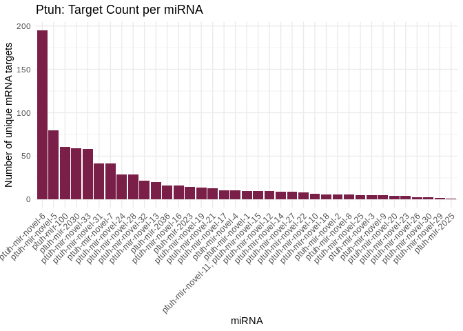
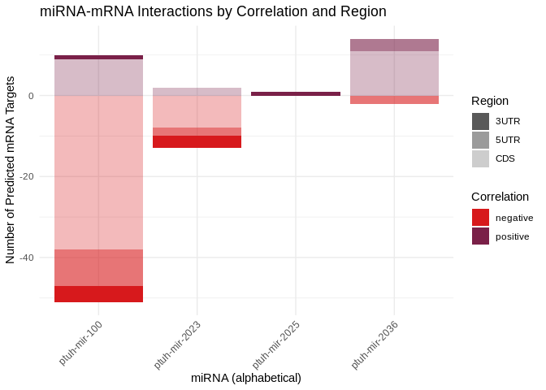
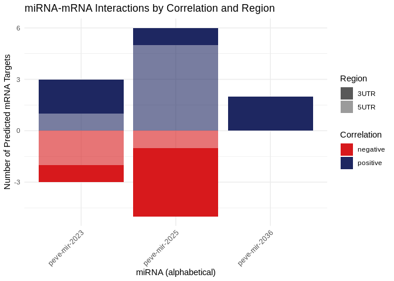
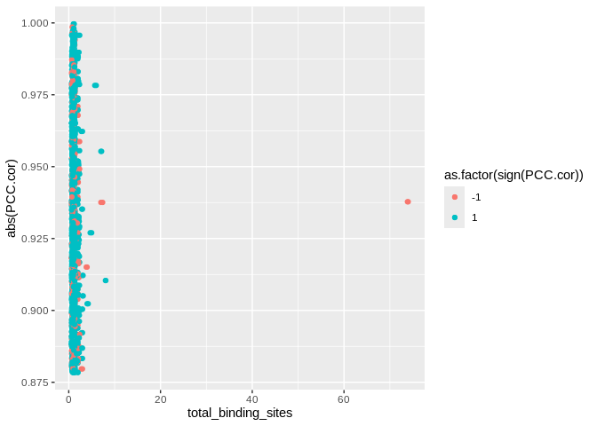
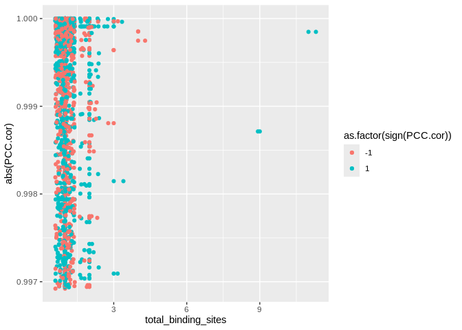

04.2-miRNA-comparison-targets-FE
================
Kathleen Durkin
2025-07-10

- [1 Functionally enriched
  processes](#1-functionally-enriched-processes)
  - [1.1 Conserved miRNA](#11-conserved-mirna)
    - [1.1.1 miR-100](#111-mir-100)
    - [1.1.2 miR-2025](#112-mir-2025)
- [2 Functionally annotated](#2-functionally-annotated)
  - [2.1 GoSlim summary terms](#21-goslim-summary-terms)
  - [2.2 Overlapping GOSlim terms](#22-overlapping-goslim-terms)
    - [2.2.1 miR-100](#221-mir-100)
  - [2.3 Check for ncRNA machinery](#23-check-for-ncrna-machinery)
    - [2.3.1 All putatively binding
      targets](#231-all-putatively-binding-targets)
    - [2.3.2 Significantly correlated
      targets](#232-significantly-correlated-targets)
- [3 Plotting](#3-plotting)
- [4 Which miRNA targets have multiple binding
  sites?](#4-which-mirna-targets-have-multiple-binding-sites)
- [5 Is correlation direction related to binding
  region?](#5-is-correlation-direction-related-to-binding-region)
- [6 Save files](#6-save-files)

Load packages

``` r
library(dplyr)
```

    ## 
    ## Attaching package: 'dplyr'

    ## The following objects are masked from 'package:stats':
    ## 
    ##     filter, lag

    ## The following objects are masked from 'package:base':
    ## 
    ##     intersect, setdiff, setequal, union

``` r
library(tidyr)
library(ggplot2)
library(stringr)
library(purrr)
library(GSEABase)
```

    ## Loading required package: BiocGenerics

    ## 
    ## Attaching package: 'BiocGenerics'

    ## The following objects are masked from 'package:dplyr':
    ## 
    ##     combine, intersect, setdiff, union

    ## The following objects are masked from 'package:stats':
    ## 
    ##     IQR, mad, sd, var, xtabs

    ## The following objects are masked from 'package:base':
    ## 
    ##     anyDuplicated, aperm, append, as.data.frame, basename, cbind,
    ##     colnames, dirname, do.call, duplicated, eval, evalq, Filter, Find,
    ##     get, grep, grepl, intersect, is.unsorted, lapply, Map, mapply,
    ##     match, mget, order, paste, pmax, pmax.int, pmin, pmin.int,
    ##     Position, rank, rbind, Reduce, rownames, sapply, setdiff, sort,
    ##     table, tapply, union, unique, unsplit, which.max, which.min

    ## Loading required package: Biobase

    ## Welcome to Bioconductor
    ## 
    ##     Vignettes contain introductory material; view with
    ##     'browseVignettes()'. To cite Bioconductor, see
    ##     'citation("Biobase")', and for packages 'citation("pkgname")'.

    ## Loading required package: annotate

    ## Loading required package: AnnotationDbi

    ## Loading required package: stats4

    ## Loading required package: IRanges

    ## Loading required package: S4Vectors

    ## 
    ## Attaching package: 'S4Vectors'

    ## The following object is masked from 'package:tidyr':
    ## 
    ##     expand

    ## The following objects are masked from 'package:dplyr':
    ## 
    ##     first, rename

    ## The following objects are masked from 'package:base':
    ## 
    ##     expand.grid, I, unname

    ## 
    ## Attaching package: 'IRanges'

    ## The following object is masked from 'package:purrr':
    ## 
    ##     reduce

    ## The following objects are masked from 'package:dplyr':
    ## 
    ##     collapse, desc, slice

    ## 
    ## Attaching package: 'AnnotationDbi'

    ## The following object is masked from 'package:dplyr':
    ## 
    ##     select

    ## Loading required package: XML

    ## Loading required package: graph

    ## 
    ## Attaching package: 'graph'

    ## The following object is masked from 'package:XML':
    ## 
    ##     addNode

    ## The following object is masked from 'package:stringr':
    ## 
    ##     boundary

``` r
library(GO.db)
```

    ## 

``` r
library(knitr)
library(tidyverse)
```

    ## ── Attaching core tidyverse packages ──────────────────────── tidyverse 2.0.0 ──
    ## ✔ forcats   1.0.0     ✔ readr     2.1.5
    ## ✔ lubridate 1.9.4     ✔ tibble    3.3.0

    ## ── Conflicts ────────────────────────────────────────── tidyverse_conflicts() ──
    ## ✖ lubridate::%within%()    masks IRanges::%within%()
    ## ✖ graph::boundary()        masks stringr::boundary()
    ## ✖ IRanges::collapse()      masks dplyr::collapse()
    ## ✖ Biobase::combine()       masks BiocGenerics::combine(), dplyr::combine()
    ## ✖ IRanges::desc()          masks dplyr::desc()
    ## ✖ S4Vectors::expand()      masks tidyr::expand()
    ## ✖ dplyr::filter()          masks stats::filter()
    ## ✖ S4Vectors::first()       masks dplyr::first()
    ## ✖ dplyr::lag()             masks stats::lag()
    ## ✖ BiocGenerics::Position() masks ggplot2::Position(), base::Position()
    ## ✖ IRanges::reduce()        masks purrr::reduce()
    ## ✖ S4Vectors::rename()      masks dplyr::rename()
    ## ✖ lubridate::second()      masks S4Vectors::second()
    ## ✖ lubridate::second<-()    masks S4Vectors::second<-()
    ## ✖ AnnotationDbi::select()  masks dplyr::select()
    ## ✖ IRanges::slice()         masks dplyr::slice()
    ## ℹ Use the conflicted package (<http://conflicted.r-lib.org/>) to force all conflicts to become errors

Hypothesize that conserved miRNA present in all three species will also
have targets enriched for the same processes across species.

# 1 Functionally enriched processes

Load FE tables:

``` r
# Apul
Apul_FE <- read.csv("../../D-Apul/output/09.13-Apul-mRNA-miRNA-interactions-FE-pooled/miRNA_pooled_sig_cor_targets_topGO_FE.csv") %>% dplyr::select(-X)

# Peve
Peve_FE <- read.csv("../../E-Peve/output/10.14-Peve-mRNA-miRNA-interactions-FE-pooled/miRNA_pooled_sig_cor_targets_topGO_FE.csv") %>% dplyr::select(-X)

# Ptuh
Ptuh_FE <- read.csv("../../F-Ptuh/output/11.14-Ptuh-mRNA-miRNA-interactions-FE-pooled/miRNA_pooled_sig_cor_targets_topGO_FE.csv") %>% dplyr::select(-X)
```

Load in assigned miRNA names

``` r
Apul_names <- read.csv("../../D-Apul/output/11-Apul-sRNA-ShortStack_4.1.0-pulchra_genome/ShortStack_out/Apul_Results_mature_named_miRNAs.csv") %>% dplyr::select(Name, given_miRNA_name)

Peve_names <- read.csv("../../E-Peve/output/05-Peve-sRNA-ShortStack_4.1.0/ShortStack_out/Peve_Results_mature_named_miRNAs.csv") %>% dplyr::select(Name, given_miRNA_name)

Ptuh_names <- read.csv("../../F-Ptuh/output/05-Ptuh-sRNA-ShortStack_4.1.0/ShortStack_out/Ptuh_Results_mature_named_miRNAs.csv") %>% dplyr::select(Name, given_miRNA_name)
```

Annotate miRNA dfs with given names

``` r
Apul_FE_df <- left_join(Apul_FE, Apul_names, by = c("miRNA" = "Name"))
Peve_FE_df <- left_join(Peve_FE, Peve_names, by = c("miRNA" = "Name"))
Ptuh_FE_df <- left_join(Ptuh_FE, Ptuh_names, by = c("miRNA" = "Name"))
```

Separate conserved miRNA (present in all 3 species) from the rest. In
`04-miRNA-comparison`, identified the miRNA conserved among all 3
species to be: miR-100, miR-2023, miR-2025, and miR-2036

``` r
Apul_FE_conserved <- Apul_FE_df %>% filter(str_detect(given_miRNA_name, "mir-100|mir-2023|mir-2025|mir-2036"))
Apul_FE_unconserved <- Apul_FE_df %>% filter(!str_detect(given_miRNA_name, "mir-100|mir-2023|mir-2025|mir-2036"))

Peve_FE_conserved <- Peve_FE_df %>% filter(str_detect(given_miRNA_name, "mir-100|mir-2023|mir-2025|mir-2036"))
Peve_FE_unconserved <- Peve_FE_df %>% filter(!str_detect(given_miRNA_name, "mir-100|mir-2023|mir-2025|mir-2036"))

Ptuh_FE_conserved <- Ptuh_FE_df %>% filter(str_detect(given_miRNA_name, "mir-100|mir-2023|mir-2025|mir-2036"))
Ptuh_FE_unconserved <- Ptuh_FE_df %>% filter(!str_detect(given_miRNA_name, "mir-100|mir-2023|mir-2025|mir-2036"))

# Also annotate the full dfs
Apul_FE_df$conservation <- ifelse(Apul_FE_df$given_miRNA_name %in% Apul_FE_conserved$given_miRNA_name, "conserved", "unconserved")
Peve_FE_df$conservation <- ifelse(Peve_FE_df$given_miRNA_name %in% Peve_FE_conserved$given_miRNA_name, "conserved", "unconserved")
Ptuh_FE_df$conservation <- ifelse(Ptuh_FE_df$given_miRNA_name %in% Ptuh_FE_conserved$given_miRNA_name, "conserved", "unconserved")
```

## 1.1 Conserved miRNA

Take a look

``` r
print(Apul_FE_conserved)
```

    ##         GO.ID                                                   Term Annotated
    ## 1  GO:0003333                     amino acid transmembrane transport         2
    ## 2  GO:0006699                         bile acid biosynthetic process         4
    ## 3  GO:0003964                   RNA-directed DNA polymerase activity       135
    ## 4  GO:0005324 long-chain fatty acid transmembrane transporter act...         1
    ## 5  GO:0005319                             lipid transporter activity         3
    ## 6  GO:0005314 high-affinity L-glutamate transmembrane transporter...         2
    ## 7  GO:0000900 mRNA regulatory element binding translation repress...         3
    ## 8  GO:0004843                  cysteine-type deubiquitinase activity         6
    ## 9  GO:0060271                                        cilium assembly         3
    ## 10 GO:0001736                       establishment of planar polarity         5
    ## 11 GO:0004447                             iodide peroxidase activity         1
    ## 12 GO:0006886                        intracellular protein transport         4
    ## 13 GO:0004325                                ferrochelatase activity         1
    ##    Significant Expected Fisher               type         miRNA
    ## 1            1     0.01 0.0130 Biological.Process Cluster_18728
    ## 2            1     0.03 0.0250 Biological.Process Cluster_18728
    ## 3            4     0.71 0.0044 Molecular.Function Cluster_18728
    ## 4            1     0.01 0.0053 Molecular.Function Cluster_18728
    ## 5            2     0.02 0.0098 Molecular.Function Cluster_18728
    ## 6            1     0.01 0.0105 Molecular.Function Cluster_18728
    ## 7            1     0.02 0.0158 Molecular.Function Cluster_18728
    ## 8            1     0.03 0.0313 Molecular.Function Cluster_18728
    ## 9            1     0.01 0.0063 Biological.Process Cluster_15316
    ## 10           1     0.01 0.0105 Biological.Process Cluster_15316
    ## 11           1     0.00 0.0007 Molecular.Function Cluster_15316
    ## 12           1     0.01 0.0084 Biological.Process  Cluster_5012
    ## 13           1     0.00 0.0011 Molecular.Function  Cluster_5012
    ##    given_miRNA_name
    ## 1      apul-mir-100
    ## 2      apul-mir-100
    ## 3      apul-mir-100
    ## 4      apul-mir-100
    ## 5      apul-mir-100
    ## 6      apul-mir-100
    ## 7      apul-mir-100
    ## 8      apul-mir-100
    ## 9     apul-mir-2025
    ## 10    apul-mir-2025
    ## 11    apul-mir-2025
    ## 12    apul-mir-2023
    ## 13    apul-mir-2023

``` r
print(Peve_FE_conserved)
```

    ##         GO.ID                                                   Term Annotated
    ## 1  GO:0006886                        intracellular protein transport         1
    ## 2  GO:0002224                   toll-like receptor signaling pathway         1
    ## 3  GO:0002027                               regulation of heart rate         2
    ## 4  GO:0002088                    lens development in camera-type eye         2
    ## 5  GO:0004714 transmembrane receptor protein tyrosine kinase acti...         8
    ## 6  GO:0004364                       glutathione transferase activity         1
    ## 7  GO:0005509                                    calcium ion binding        33
    ## 8  GO:0003690                            double-stranded DNA binding        23
    ## 9  GO:0004725                  protein tyrosine phosphatase activity         2
    ## 10 GO:0050233                              pyranose oxidase activity         1
    ##    Significant Expected Fisher               type         miRNA
    ## 1            1     0.02 0.0170 Biological.Process  Cluster_1167
    ## 2            1     0.02 0.0170 Biological.Process  Cluster_1167
    ## 3            1     0.03 0.0340 Biological.Process  Cluster_1167
    ## 4            1     0.03 0.0340 Biological.Process  Cluster_1167
    ## 5            3     0.18 0.0025 Molecular.Function  Cluster_1167
    ## 6            1     0.02 0.0230 Molecular.Function  Cluster_1167
    ## 7            3     0.76 0.0349 Molecular.Function  Cluster_1167
    ## 8            2     0.53 0.0437 Molecular.Function  Cluster_1167
    ## 9            1     0.05 0.0454 Molecular.Function  Cluster_1167
    ## 10           1     0.00 0.0016 Molecular.Function Cluster_14999
    ##    given_miRNA_name
    ## 1      peve-mir-100
    ## 2      peve-mir-100
    ## 3      peve-mir-100
    ## 4      peve-mir-100
    ## 5      peve-mir-100
    ## 6      peve-mir-100
    ## 7      peve-mir-100
    ## 8      peve-mir-100
    ## 9      peve-mir-100
    ## 10    peve-mir-2025

``` r
print(Ptuh_FE_conserved)
```

    ##        GO.ID                Term Annotated Significant Expected Fisher
    ## 1 GO:0005509 calcium ion binding        21           1     0.04  0.042
    ##                 type        miRNA given_miRNA_name
    ## 1 Molecular.Function Cluster_1296     ptuh-mir-100

### 1.1.1 miR-100

The only miRNA with targets that are enriched for a given function
across all three species is miR-100:

- In Apul, miR-100 targets are functionally enriched for terms related
  to fundamental cellular processes like **lipid transport/metabolism
  and gene expression regulation**

- In Peve, miR-100 targets are also enriched for fundamental terms, but
  of a different theme, including **immune signaling, developmental
  processes, and DNA/protein modifications**

- In Ptuh, miR-100 targets are only enriched for a single Molecular
  Function, **calcium ion binding**. This is a fundamental molecular
  function involved in signaling, and would be important to the
  processes enriched in both Apul and Peve. It is also an enriched term
  in Peve.

Note: Our ability to describe the functional role of miRNA in Ptuh will
likely be particularly limited, since our functional annotation of the
Ptuh genome is the least complete of our three species (A.millepora
genome: 99% of genes functionally annotated; P.evermanni genome: 72%;
P.meandrina genome: 60%)

### 1.1.2 miR-2025

miR-2025 only has targets with enriched functions in two species,
A.pulchra and P.evermanni.

In both, miR-2025 targets are enriched for child terms of
**oxidoreductase activity**, suggesting potential role in **redox
balance or metabolism**.

Let’s also look at the annotations themselves, regardless of whether the
processes were statistically overrepresented. This will give more terms
to look at for the less-well-annotated P.tuahiniensis.

# 2 Functionally annotated

Load and format FA tables:

``` r
# Apul
Apul_FA <- read.csv("../../D-Apul/output/09.13-Apul-mRNA-miRNA-interactions-FE-pooled/miRNA_pooled_targets_FA.csv") %>% dplyr::select(-X)

# Peve
Peve_FA <- read.csv("../../E-Peve/output/10.14-Peve-mRNA-miRNA-interactions-FE-pooled/miRNA_pooled_targets_FA.csv") %>% dplyr::select(-X)

# Ptuh
Ptuh_FA <- read.csv("../../F-Ptuh/output/11.14-Ptuh-mRNA-miRNA-interactions-FE-pooled/miRNA_pooled_targets_FA.csv") %>% dplyr::select(-X)
```

## 2.1 GoSlim summary terms

Code from [Roberts Lab
Handbook](https://robertslab.github.io/resources/bio-Annotation/#map-go-ids-to-goslims)

The expected input file has at least two columns. One each with:

- gene ID

- Gene Ontology (GO) ID

NOTE: The GO IDs in the GO ID column should be separated with a
semi-colon.

The basic output from this process will be:

- GOslim IDs (as rownames)

- GOslim terms

Variables

``` r
# Column names corresponding to gene name/ID and GO IDs
GO.ID.column <- "Gene.Ontology.IDs"
gene.ID.column <- "mRNA"

# Relative path or URL to input file
#input.file <- "https://raw.githubusercontent.com/grace-ac/paper-pycno-sswd-2021-2022/d1cdf13c36085868df4ef4b75d2b7de03ef08d1c/analyses/25-compare-2021-2022/DEGlist_same_2021-2022_forGOslim.tab"


##### Official GO info - no need to change #####
goslims_obo <- "goslim_generic.obo"
goslims_url <- "http://current.geneontology.org/ontology/subsets/goslim_generic.obo"
```

Set GSEAbase location and download goslim_generic.obo

``` r
# Find GSEAbase installation location
gseabase_location <- find.package("GSEABase")

# Load path to GOslim OBO file
goslim_obo_destintation <- file.path(gseabase_location, "extdata", goslims_obo, fsep = "/")

# Download the GOslim OBO file
download.file(url = goslims_url, destfile = goslim_obo_destintation)

# Loads package files
gseabase_files <- system.file("extdata", goslims_obo, package="GSEABase")
```

Read in gene/GO file

``` r
#full.gene.df <- read.csv(file = input.file, header = TRUE, sep = "\t")
full.gene.df <- Apul_FA
```

Remove rows with NA, remove whitespace in GO IDs column and keep just
gene/GO IDs columns

``` r
# Clean whitespace, filter NA/empty rows, select columns, and split GO terms using column name variables
gene.GO.df <- full.gene.df %>%
  mutate(!!GO.ID.column := str_replace_all(.data[[GO.ID.column]], "\\s*;\\s*", ";")) %>% # Clean up spaces around ";"
  filter(!is.na(.data[[gene.ID.column]]) & !is.na(.data[[GO.ID.column]]) & .data[[GO.ID.column]] != "") %>% 
  dplyr::select(all_of(c(gene.ID.column, GO.ID.column)))
```

This flattens the file so all of the GO IDs per gene are separated into
one GO ID per gene per row.

``` r
flat.gene.GO.df <- gene.GO.df %>% separate_rows(!!sym(GO.ID.column), sep = ";")
```

Groups the genes by GO ID (i.e. lists all genes associated with each
unique GO ID)

``` r
grouped.gene.GO.df <- flat.gene.GO.df %>%
  group_by(!!sym(GO.ID.column)) %>%
  summarise(!!gene.ID.column := paste(.data[[gene.ID.column]], collapse = ","))
```

Map GO IDs to GOslims

``` r
# Vector of GO IDs
go_ids <- grouped.gene.GO.df[[GO.ID.column]]
```

Creates new OBO Collection object of just GOslims, based on provided GO
IDs.

``` r
# Create GSEAbase GOCollection using `go_ids`
myCollection <- GOCollection(go_ids)

# Retrieve GOslims from GO OBO file set
slim <- getOBOCollection(gseabase_files)
```

Get Biological Process (BP) GOslims associated with provided GO IDs.

``` r
# Retrieve Biological Process (BP) GOslims
slimdf <- goSlim(myCollection, slim, "BP", verbose)
```

Performs mapping of of GOIDs to GOslims

Returns:

GOslim IDs (as rownames) GOslim terms Counts of GO IDs matching to
corresponding GOslim Percentage of GO IDs matching to corresponding
GOslim GOIDs mapped to corresponding GOslim, in a semi-colon delimited
format

``` r
# List of GOslims and all GO IDs from `go_ids`
gomap <- as.list(GOBPOFFSPRING[rownames(slimdf)])

# Maps `go_ids` to matching GOslims
mapped <- lapply(gomap, intersect, ids(myCollection))

# Append all mapped GO IDs to `slimdf`
# `sapply` needed to apply paste() to create semi-colon delimited values
slimdf$GO.IDs <- sapply(lapply(gomap, intersect, ids(myCollection)), paste, collapse=";")

# Remove "character(0) string from "GO.IDs" column
slimdf$GO.IDs[slimdf$GO.IDs == "character(0)"] <- ""

# Add self-matching GOIDs to "GO.IDs" column, if not present
for (go_id in go_ids) {
  # Check if the go_id is present in the row names
  if (go_id %in% rownames(slimdf)) {
    # Check if the go_id is not present in the GO.IDs column
    # Also removes white space "trimws()" and converts all to upper case to handle
    # any weird, "invisible" formatting issues.
    if (!go_id %in% trimws(toupper(strsplit(slimdf[go_id, "GO.IDs"], ";")[[1]]))) {
      # Append the go_id to the GO.IDs column with a semi-colon separator
      if (length(slimdf$GO.IDs) > 0 && nchar(slimdf$GO.IDs[nrow(slimdf)]) > 0) {
        slimdf[go_id, "GO.IDs"] <- paste0(slimdf[go_id, "GO.IDs"], "; ", go_id)
      } else {
        slimdf[go_id, "GO.IDs"] <- go_id
      }
    }
  }
}
```

“Flatten” file so each row is single GO ID with corresponding GOslim
rownames_to_column needed to retain row name info

``` r
# "Flatten" file so each row is single GO ID with corresponding GOslim
# rownames_to_column needed to retain row name info
slimdf_separated <- as.data.frame(slimdf %>%
  rownames_to_column('GOslim') %>%
  separate_rows(GO.IDs, sep = ";"))

# Group by unique GO ID
grouped_slimdf <- slimdf_separated %>%
  filter(!is.na(GO.IDs) & GO.IDs != "") %>%
  group_by(GO.IDs) %>%
  summarize(GOslim = paste(GOslim, collapse = ";"),
            Term = paste(Term, collapse = ";"))
```

Sorts GOslims by Count, in descending order and then selects just the
Term and Count columns.

``` r
slimdf.sorted <- slimdf %>% arrange(desc(Count))

slim.count.df <- slimdf.sorted %>% 
  dplyr::select(Term, Count)
```

Annotate miRNA dfs with given names and GOSlim terms

``` r
Apul_FA_df <- left_join(Apul_FA, Apul_names, by = c("miRNA" = "Name"))
Peve_FA_df <- left_join(Peve_FA, Peve_names, by = c("miRNA" = "Name"))
Ptuh_FA_df <- left_join(Ptuh_FA, Ptuh_names, by = c("miRNA" = "Name"))

# function to map column of semicolon-delimited GO IDs to my GOSlim terms
IDs_to_slims <- function(df, mapping_df){
  # Step 1: Separate Gene.Ontology.IDs into rows
  df_long <- df %>%
    separate_rows(Gene.Ontology.IDs, sep = ";") %>%
    mutate(Gene.Ontology.IDs = str_trim(Gene.Ontology.IDs))  # remove any extra spaces
  
  # Step 2: Join with mapping_df to get GO Slim terms
  df_mapped <- df_long %>%
    left_join(mapping_df, by = c("Gene.Ontology.IDs" = "GO.IDs"))
  
  # Step 3: Collapse GO Slim terms back into semicolon-delimited format per GI_ID
  df_result <- df_mapped %>%
    group_by(mRNA) %>%
    summarise(
      Gene.Ontology.IDs = paste(Gene.Ontology.IDs, collapse = ";"),
      GO_Slim_Terms = paste(unique(Term[!is.na(Term)]), collapse = ";")
    )
}

# Obtain GOSlim summaries
Apul_FA_slims <- IDs_to_slims(Apul_FA_df, slimdf_separated) %>% dplyr::select(mRNA, GO_Slim_Terms)
```

    ## Warning in left_join(., mapping_df, by = c(Gene.Ontology.IDs = "GO.IDs")): Detected an unexpected many-to-many relationship between `x` and `y`.
    ## ℹ Row 55 of `x` matches multiple rows in `y`.
    ## ℹ Row 1890 of `y` matches multiple rows in `x`.
    ## ℹ If a many-to-many relationship is expected, set `relationship =
    ##   "many-to-many"` to silence this warning.

``` r
Peve_FA_slims <- IDs_to_slims(Peve_FA_df, slimdf_separated) %>% dplyr::select(mRNA, GO_Slim_Terms)
```

    ## Warning in left_join(., mapping_df, by = c(Gene.Ontology.IDs = "GO.IDs")): Detected an unexpected many-to-many relationship between `x` and `y`.
    ## ℹ Row 36 of `x` matches multiple rows in `y`.
    ## ℹ Row 738 of `y` matches multiple rows in `x`.
    ## ℹ If a many-to-many relationship is expected, set `relationship =
    ##   "many-to-many"` to silence this warning.

``` r
Ptuh_FA_slims <- IDs_to_slims(Ptuh_FA_df, slimdf_separated) %>% dplyr::select(mRNA, GO_Slim_Terms)
```

    ## Warning in left_join(., mapping_df, by = c(Gene.Ontology.IDs = "GO.IDs")): Detected an unexpected many-to-many relationship between `x` and `y`.
    ## ℹ Row 4 of `x` matches multiple rows in `y`.
    ## ℹ Row 1401 of `y` matches multiple rows in `x`.
    ## ℹ If a many-to-many relationship is expected, set `relationship =
    ##   "many-to-many"` to silence this warning.

``` r
# Annotate FA dfs with GOSlim terms
Apul_FA_df <- left_join(Apul_FA_df, Apul_FA_slims, by = "mRNA")
Peve_FA_df <- left_join(Peve_FA_df, Peve_FA_slims, by = "mRNA")
Ptuh_FA_df <- left_join(Ptuh_FA_df, Ptuh_FA_slims, by = "mRNA")
```

Separate based on correlation significance

``` r
Apul_FA_unsig <- Apul_FA_df %>% filter(p_value >= 0.05)
Peve_FA_unsig <- Peve_FA_df  %>% filter(p_value >= 0.05)
Ptuh_FA_unsig <- Ptuh_FA_df  %>% filter(p_value >= 0.05)

Apul_FA_df <- Apul_FA_df %>% filter(p_value < 0.05)
Peve_FA_df<- Peve_FA_df  %>% filter(p_value < 0.05)
Ptuh_FA_df <- Ptuh_FA_df  %>% filter(p_value < 0.05)
```

Separate conserved miRNA (present in all 3 species) from the rest. In
`04-miRNA-comparison`, identified the miRNA conserved among all 3
species to be: miR-100, miR-2023, miR-2025, and miR-2036

``` r
Apul_FA_conserved <- Apul_FA_df %>% filter(str_detect(given_miRNA_name, "mir-100|mir-2023|mir-2025|mir-2036"))
Apul_FA_unconserved <- Apul_FA_df %>% filter(!str_detect(given_miRNA_name, "mir-100|mir-2023|mir-2025|mir-2036"))

Peve_FA_conserved <- Peve_FA_df %>% filter(str_detect(given_miRNA_name, "mir-100|mir-2023|mir-2025|mir-2036"))
Peve_FA_unconserved <- Peve_FA_df %>% filter(!str_detect(given_miRNA_name, "mir-100|mir-2023|mir-2025|mir-2036"))

Ptuh_FA_conserved <- Ptuh_FA_df %>% filter(str_detect(given_miRNA_name, "mir-100|mir-2023|mir-2025|mir-2036"))
Ptuh_FA_unconserved <- Ptuh_FA_df %>% filter(!str_detect(given_miRNA_name, "mir-100|mir-2023|mir-2025|mir-2036"))

# Also annotate the full dfs
Apul_FA_df$conservation <- ifelse(Apul_FA_df$given_miRNA_name %in% Apul_FA_conserved$given_miRNA_name, "conserved", "unconserved")
Peve_FA_df$conservation <- ifelse(Peve_FA_df$given_miRNA_name %in% Peve_FA_conserved$given_miRNA_name, "conserved", "unconserved")
Ptuh_FA_df$conservation <- ifelse(Ptuh_FA_df$given_miRNA_name %in% Ptuh_FA_conserved$given_miRNA_name, "conserved", "unconserved")
```

## 2.2 Overlapping GOSlim terms

Take a look

``` r
unique(Apul_FA_conserved %>% filter(!is.na(GO_Slim_Terms), GO_Slim_Terms != "") %>% dplyr::select(given_miRNA_name))
```

    ##    given_miRNA_name
    ## 1      apul-mir-100
    ## 6     apul-mir-2025
    ## 35    apul-mir-2023

``` r
unique(Peve_FA_conserved %>% filter(!is.na(GO_Slim_Terms), GO_Slim_Terms != "") %>% dplyr::select(given_miRNA_name))
```

    ##     given_miRNA_name
    ## 1       peve-mir-100
    ## 5      peve-mir-2023
    ## 10     peve-mir-2036
    ## 119    peve-mir-2025

``` r
unique(Ptuh_FA_conserved %>% filter(!is.na(GO_Slim_Terms), GO_Slim_Terms != "") %>% dplyr::select(given_miRNA_name))
```

    ##   given_miRNA_name
    ## 1     ptuh-mir-100
    ## 2    ptuh-mir-2023
    ## 3    ptuh-mir-2036

Only miR-100 and miR-2023 have targets that are annotated and can be
summarized to GOSlims in all three species. miR-2025 has target GOSlims
in Apul and Peve, but miR-2036 targets can only be summarized to GOSlims
in Ptuh.

For a conserved miRNA, which processes are targeted in all species?

``` r
# Apul
# Filter out NA biological processes
Apul_FA_conserved_filt <- Apul_FA_conserved %>%
  filter(!is.na(GO_Slim_Terms))

# Loop through each unique miRNA and calculate term counts
Apul_BP_counts <- Apul_FA_conserved_filt %>%
  group_split(given_miRNA_name) %>%
  set_names(map_chr(., ~ unique(.$given_miRNA_name))) %>%
  map(~ .x %>%
        separate_rows(GO_Slim_Terms, sep = ";\\s*") %>%
        mutate(GO_Slim_Terms = str_trim(GO_Slim_Terms)) %>%
        count(GO_Slim_Terms, sort = TRUE)
      )


# Peve
# Filter out NA biological processes
Peve_FA_conserved_filt <- Peve_FA_conserved %>%
  filter(!is.na(GO_Slim_Terms))

# Loop through each unique miRNA and calculate term counts
Peve_BP_counts <- Peve_FA_conserved_filt %>%
  group_split(given_miRNA_name) %>%
  set_names(map_chr(., ~ unique(.$given_miRNA_name))) %>%
  map(~ .x %>%
        separate_rows(GO_Slim_Terms, sep = ";\\s*") %>%
        mutate(GO_Slim_Terms = str_trim(GO_Slim_Terms)) %>%
        count(GO_Slim_Terms, sort = TRUE)
      )


# Ptuh
# Filter out NA biological processes
Ptuh_FA_conserved_filt <- Ptuh_FA_conserved %>%
  filter(!is.na(GO_Slim_Terms))

# Loop through each unique miRNA and calculate term counts
Ptuh_BP_counts <- Ptuh_FA_conserved_filt %>%
  group_split(given_miRNA_name) %>%
  set_names(map_chr(., ~ unique(.$given_miRNA_name))) %>%
  map(~ .x %>%
        separate_rows(GO_Slim_Terms, sep = ";\\s*") %>%
        mutate(GO_Slim_Terms = str_trim(GO_Slim_Terms)) %>%
        count(GO_Slim_Terms, sort = TRUE)
      )
```

### 2.2.1 miR-100

``` r
# miR-100 (annotations in all 3)
cat("miR-100 annotations present in all 3 species:", "\n")
```

    ## miR-100 annotations present in all 3 species:

``` r
Reduce(intersect, list(Apul_BP_counts$`apul-mir-100`$GO_Slim_Terms,
                       Peve_BP_counts$`peve-mir-100`$GO_Slim_Terms,
                       Ptuh_BP_counts$`ptuh-mir-100`$GO_Slim_Terms))
```

    ##  [1] ""                                                      
    ##  [2] "signaling"                                             
    ##  [3] "anatomical structure development"                      
    ##  [4] "mitotic cell cycle"                                    
    ##  [5] "carbohydrate derivative metabolic process"             
    ##  [6] "cell motility"                                         
    ##  [7] "cell differentiation"                                  
    ##  [8] "transmembrane transport"                               
    ##  [9] "protein catabolic process"                             
    ## [10] "DNA-templated transcription"                           
    ## [11] "defense response to other organism"                    
    ## [12] "immune system process"                                 
    ## [13] "lipid metabolic process"                               
    ## [14] "protein-containing complex assembly"                   
    ## [15] "regulation of DNA-templated transcription"             
    ## [16] "cilium organization"                                   
    ## [17] "circulatory system process"                            
    ## [18] "cytoskeleton organization"                             
    ## [19] "membrane organization"                                 
    ## [20] "microtubule-based movement"                            
    ## [21] "nervous system process"                                
    ## [22] "nucleobase-containing small molecule metabolic process"
    ## [23] "programmed cell death"                                 
    ## [24] "reproductive process"

``` r
# miR-2023 (annotations in all 3)
cat("\n", "miR-2023 annotations present in all 3 species:", "\n")
```

    ## 
    ##  miR-2023 annotations present in all 3 species:

``` r
Reduce(intersect, list(Apul_BP_counts$`apul-mir-2023`$GO_Slim_Terms,
                       Peve_BP_counts$`peve-mir-2023`$GO_Slim_Terms,
                       Ptuh_BP_counts$`ptuh-mir-2023`$GO_Slim_Terms))
```

    ## [1] ""                                 "mitotic cell cycle"              
    ## [3] "anatomical structure development" "cell differentiation"            
    ## [5] "signaling"

``` r
# miR-2025 (annotations in Apul and Peve)
cat("\n", "miR-2025 annotations present in all A.pulchra and P.evermanni:", "\n")
```

    ## 
    ##  miR-2025 annotations present in all A.pulchra and P.evermanni:

``` r
Reduce(intersect, list(Apul_BP_counts$`apul-mir-2025`$GO_Slim_Terms,
                       Peve_BP_counts$`peve-mir-2025`$GO_Slim_Terms))
```

    ## [1] ""                                    "anatomical structure development"   
    ## [3] "signaling"                           "protein-containing complex assembly"

``` r
# miR-2036 (P.tuahiniensis)
cat("\n", "miR-2036 annotations present in P.tuahiniensis:", "\n")
```

    ## 
    ##  miR-2036 annotations present in P.tuahiniensis:

``` r
Reduce(intersect, list(Ptuh_BP_counts$`ptuh-mir-2036`$GO_Slim_Terms))
```

    ##  [1] ""                                                      
    ##  [2] "signaling"                                             
    ##  [3] "hepaticobiliary system process"                        
    ##  [4] "photosynthesis"                                        
    ##  [5] "programmed cell death"                                 
    ##  [6] "anatomical structure development"                      
    ##  [7] "carbohydrate derivative metabolic process"             
    ##  [8] "cell motility"                                         
    ##  [9] "cellular amino acid metabolic process"                 
    ## [10] "circulatory system process"                            
    ## [11] "glycoprotein biosynthetic process"                     
    ## [12] "intracellular protein transport"                       
    ## [13] "mRNA metabolic process"                                
    ## [14] "muscle system process"                                 
    ## [15] "nucleobase-containing small molecule metabolic process"
    ## [16] "nucleocytoplasmic transport"                           
    ## [17] "protein-containing complex assembly"

miR-100 is functionally conserved across the three species for functions
related to **cellular organization, transport and signaling, immune
response, gene regulation, cell cycle, and development**. These GOSlim
terms agree with functions that are functionally enriched in miR-100
targets across the three species.

The other conserved miRNA don’t have enough annotated targets in all
species to determine whether functional conservation exists.

Also keep in mind that some important functions (e.g. reproduction,
development, immune response) make not appear in this dataset, since
deep-dive samples were collected only at a single site and timepoint,
and are limited in number.

## 2.3 Check for ncRNA machinery

load table of genes annotated for ncRNA/methylation machinery

``` r
prot_df <- read.csv("../data/e5_deep-dive_ncRNA_proteins.csv")

# Remove -T* from Apul protein names 
prot_df <- prot_df %>%
  mutate(Protein_ID = if_else(
    Species == "Apul",
    sub("-T\\d+$", "", Protein_ID),
    Protein_ID
  ))
```

### 2.3.1 All putatively binding targets

``` r
# Check Jill's table of epigenetic machinery genes
left_join(prot_df[prot_df$species == "Apul",], Apul_FA_unsig, by = c("Protein_ID" = "mRNA")) %>% nrow()
```

    ## [1] 0

``` r
left_join(prot_df[prot_df$species == "Peve",], Peve_FA_unsig, by = c("Protein_ID" = "mRNA")) %>% nrow()
```

    ## [1] 0

``` r
left_join(prot_df[prot_df$species == "Ptuh",], Ptuh_FA_unsig, by = c("Protein_ID" = "mRNA")) %>% nrow()
```

    ## [1] 0

``` r
# Manually search for matching words

## function to loop across a list of search terms
count_word_hits <- function(df, column, words) {
  # Ensure relevant columns are character
  text_column <- as.character(df[[column]])
  miRNA_column <- as.character(df$given_miRNA_name)

  # Loop through words and collect counts + miRNAs
  results <- lapply(words, function(word) {
    matches <- grepl(word, text_column, ignore.case = TRUE)
    n_hits <- sum(matches)
    
    if (n_hits > 0) {
      miRNAs <- unique(miRNA_column[matches])
      miRNAs_combined <- paste(miRNAs, collapse = "; ")
    } else {
      miRNAs_combined <- NA
    }
    
    data.frame(
      word = word,
      hits = n_hits,
      associated_miRNAs = miRNAs_combined,
      stringsAsFactors = FALSE
    )
  })
  
  # Combine into one data frame
  result_df <- do.call(rbind, results)
  return(result_df)
}


# Make a list of proteins of interest (DNMT1, Dicer, etc.) from Jill's table 
word_list <- unique(prot_df$Protein_of_interest)

# Search for these proteins of interested in our annotated miRNA targets (correlation significance not considered here)
count_word_hits(Apul_FA_unsig, "Protein.names", word_list)
```

    ##       word hits
    ## 1     AGO2    2
    ## 2    DGCR8    0
    ## 3    Dicer   23
    ## 4    DNMT1    7
    ## 5   DNMT3A    0
    ## 6   Drosha    0
    ## 7  Pip5k1a    0
    ## 8     Piwi    4
    ## 9  RNase P    0
    ## 10    XPO5    0
    ##                                                                                                                                                                                                                                             associated_miRNAs
    ## 1                                                                                                                                                                                                                        apul-mir-novel-22; apul-mir-novel-31
    ## 2                                                                                                                                                                                                                                                        <NA>
    ## 3  apul-mir-novel-34; apul-mir-2028; apul-mir-novel-20; apul-mir-novel-26; apul-mir-novel-19; apul-mir-novel-33; apul-mir-novel-31; apul-mir-novel-7; apul-mir-100; apul-mir-novel-21; apul-mir-novel-28; apul-mir-novel-29; apul-mir-novel-10; apul-mir-2023
    ## 4                                                                                                                                                 apul-mir-novel-20; apul-mir-novel-33; apul-mir-novel-7; apul-mir-novel-17; apul-mir-novel-23; apul-mir-9425
    ## 5                                                                                                                                                                                                                                                        <NA>
    ## 6                                                                                                                                                                                                                                                        <NA>
    ## 7                                                                                                                                                                                                                                                        <NA>
    ## 8                                                                                                                                                                                  apul-mir-novel-22; apul-mir-novel-33; apul-mir-novel-31; apul-mir-novel-34
    ## 9                                                                                                                                                                                                                                                        <NA>
    ## 10                                                                                                                                                                                                                                                       <NA>

``` r
count_word_hits(Peve_FA_unsig, "Protein.names", word_list)
```

    ##       word hits
    ## 1     AGO2    4
    ## 2    DGCR8    1
    ## 3    Dicer    5
    ## 4    DNMT1   10
    ## 5   DNMT3A    1
    ## 6   Drosha    1
    ## 7  Pip5k1a    1
    ## 8     Piwi    5
    ## 9  RNase P    2
    ## 10    XPO5    0
    ##                                                                                               associated_miRNAs
    ## 1                                                              peve-mir-100; peve-mir-novel-1; peve-mir-novel-9
    ## 2                                                                                              peve-mir-novel-2
    ## 3                     peve-mir-novel-24; peve-mir-novel-6; peve-mir-novel-7; peve-mir-novel-2; peve-mir-novel-3
    ## 4  peve-mir-novel-39; peve-mir-novel-6; peve-mir-novel-8; peve-mir-novel-2; peve-mir-novel-3; peve-mir-novel-11
    ## 5                                                                                              peve-mir-novel-8
    ## 6                                                                                             peve-mir-novel-13
    ## 7                                                                                              peve-mir-novel-7
    ## 8                                           peve-mir-100; peve-mir-novel-1; peve-mir-novel-9; peve-mir-novel-39
    ## 9                                                                          peve-mir-novel-40; peve-mir-novel-24
    ## 10                                                                                                         <NA>

``` r
count_word_hits(Ptuh_FA_unsig, "Protein.names", word_list)
```

    ##       word hits                                     associated_miRNAs
    ## 1     AGO2    3                                      ptuh-mir-novel-6
    ## 2    DGCR8    0                                                  <NA>
    ## 3    Dicer    4                        ptuh-mir-novel-5; ptuh-mir-100
    ## 4    DNMT1    1                                      ptuh-mir-novel-7
    ## 5   DNMT3A    3 ptuh-mir-novel-6; ptuh-mir-novel-31; ptuh-mir-novel-1
    ## 6   Drosha    0                                                  <NA>
    ## 7  Pip5k1a    0                                                  <NA>
    ## 8     Piwi    3                                      ptuh-mir-novel-6
    ## 9  RNase P    7     ptuh-mir-novel-6; ptuh-mir-100; ptuh-mir-novel-32
    ## 10    XPO5    0                                                  <NA>

Wow! So there are actually quite a few miRNA that putatively bind to the
genes that produce epigenetic protein machinery, in all species. All
species have miRNA that bind to genes encoding proteins related to AGO2,
Dicer, DNMT1, and Piwi.

Note, however, that this is just a simple, grep-based alphanumeric
search for protein names. The above counts may inlude genes that are
associated with the search term, but do not actuallye encode that
protein (e.g., “DNA methyltransferase 1-associated protein 1 (DNMAP1)
(DNMT1-associated protein 1)”, instead of “DNA
(cytosine-5)-methyltransferase 1 (Dnmt1) (EC 2.1.1.37) (DNA
methyltransferase GgaI) (DNA MTase GgaI) (M.GgaI) (MCMT)”)

### 2.3.2 Significantly correlated targets

``` r
left_join(prot_df[prot_df$species == "Apul",], Apul_FA_df, by = c("Protein_ID" = "mRNA")) %>% nrow()
```

    ## [1] 0

``` r
left_join(prot_df[prot_df$species == "Peve",], Peve_FA_df, by = c("Protein_ID" = "mRNA")) %>% nrow()
```

    ## [1] 0

``` r
left_join(prot_df[prot_df$species == "Ptuh",], Ptuh_FA_df, by = c("Protein_ID" = "mRNA")) %>% nrow()
```

    ## [1] 0

``` r
# Search for these proteins of interested in our annotated miRNA targets (only those with significantly correlated expression)
count_word_hits(Apul_FA_df, "Protein.names", word_list)
```

    ##       word hits associated_miRNAs
    ## 1     AGO2    0                NA
    ## 2    DGCR8    0                NA
    ## 3    Dicer    0                NA
    ## 4    DNMT1    0                NA
    ## 5   DNMT3A    0                NA
    ## 6   Drosha    0                NA
    ## 7  Pip5k1a    0                NA
    ## 8     Piwi    0                NA
    ## 9  RNase P    0                NA
    ## 10    XPO5    0                NA

``` r
count_word_hits(Peve_FA_df, "Protein.names", word_list)
```

    ##       word hits associated_miRNAs
    ## 1     AGO2    0              <NA>
    ## 2    DGCR8    0              <NA>
    ## 3    Dicer    0              <NA>
    ## 4    DNMT1    1  peve-mir-novel-7
    ## 5   DNMT3A    0              <NA>
    ## 6   Drosha    0              <NA>
    ## 7  Pip5k1a    0              <NA>
    ## 8     Piwi    0              <NA>
    ## 9  RNase P    0              <NA>
    ## 10    XPO5    0              <NA>

``` r
count_word_hits(Ptuh_FA_df, "Protein.names", word_list)
```

    ##       word hits associated_miRNAs
    ## 1     AGO2    1  ptuh-mir-novel-6
    ## 2    DGCR8    0              <NA>
    ## 3    Dicer    0              <NA>
    ## 4    DNMT1    0              <NA>
    ## 5   DNMT3A    0              <NA>
    ## 6   Drosha    0              <NA>
    ## 7  Pip5k1a    0              <NA>
    ## 8     Piwi    1  ptuh-mir-novel-6
    ## 9  RNase P    0              <NA>
    ## 10    XPO5    0              <NA>

There are only 2 miRNA that target *and* are significantly coexpressed
with a protein(s) that’s involved in epigenetic regulation:
peve-mir-novel-7 and ptuh-mir-novel-6.

#### 2.3.2.1 peve-mir-novel-7

This miRNA targets and is significantly negatively coexpressed with
DNMT1, the DNMT responsible for maintaining DNA methylation marks.

This miRNA is one of the few that is almost exclusively *negatively*
correlated with its many targets, which provides strong support for its
role as a valid miRNA acting through translational repression or mRNA
degradation. It is also negatively correlated wiht the DNMT1 gene it
putatively targets, which supports its role as a mediator of DNMT1
expression, and thus potentially a mediator of DNA methylation.

peve-mir-novel-7 is also partially conserved, matching the
P.tuahiniensis miRNA ptuh-mir-novel-7 (see
<https://github.com/urol-e5/deep-dive-expression/blob/main/M-multi-species/code/04-miRNA-comparison.md#421-apul-and-peve>).

We can also check to see which terms are functionally expressed in the
miRNA’s targets:

``` r
Peve_FE_df %>% filter(given_miRNA_name == "peve-mir-novel-7")
```

    ##        GO.ID               Term Annotated Significant Expected Fisher
    ## 1 GO:0001822 kidney development         9           1     0.03  0.026
    ##                 type        miRNA given_miRNA_name conservation
    ## 1 Biological.Process Cluster_4079 peve-mir-novel-7  unconserved

``` r
Peve_FA_df %>% filter(given_miRNA_name == "peve-mir-novel-7", !is.na(Gene.Ontology.IDs))
```

    ##           miRNA          mRNA    PCC.cor     p_value adjusted_p_value score
    ## 1  Cluster_4079 Peve_00015748 -0.9990444 0.027833821        0.8994697   149
    ## 2  Cluster_4079 Peve_00037614 -0.9972925 0.046856916        0.9395424   169
    ## 3  Cluster_4079 Peve_00000079 -0.9989605 0.029029966        0.9039294   144
    ## 4  Cluster_4079 Peve_00003488 -0.9998008 0.012707903        0.6935405   155
    ## 5  Cluster_4079 Peve_00004794 -0.9972222 0.047461919        0.9428885   145
    ## 6  Cluster_4079 Peve_00007704  0.9994701 0.020725968        0.8149762   166
    ## 7  Cluster_4079 Peve_00007872 -0.9983038 0.037084572        0.9093599   178
    ## 8  Cluster_4079 Peve_00008249  0.9996377 0.017138395        0.7826694   143
    ## 9  Cluster_4079 Peve_00013338 -0.9999036 0.008840693        0.5843629   150
    ## 10 Cluster_4079 Peve_00014208 -0.9999763 0.004385724        0.5432895   170
    ## 11 Cluster_4079 Peve_00014607 -0.9991409 0.026390440        0.8847953   146
    ## 12 Cluster_4079 Peve_00018051 -0.9987217 0.032192883        0.9079879   148
    ## 13 Cluster_4079 Peve_00020593 -0.9994017 0.022022820        0.8317030   163
    ## 14 Cluster_4079 Peve_00021480 -0.9999495 0.006397783        0.5737104   150
    ## 15 Cluster_4079 Peve_00022405 -0.9996484 0.016882808        0.7787622   150
    ## 16 Cluster_4079 Peve_00022405 -0.9996484 0.016882808        0.7787622   179
    ## 17 Cluster_4079 Peve_00029427 -0.9998909 0.009402889        0.6029643   148
    ## 18 Cluster_4079 Peve_00034064  0.9996794 0.016121501        0.7663322   158
    ## 19 Cluster_4079 Peve_00036216 -0.9971225 0.048306561        0.9463226   160
    ## 20 Cluster_4079 Peve_00037268 -0.9985270 0.034558142        0.9093599   176
    ## 21 Cluster_4079 Peve_00037364 -0.9985972 0.033724907        0.9093599   171
    ## 22 Cluster_4079 Peve_00041522 -0.9999173 0.008187042        0.5737104   147
    ## 23 Cluster_4079 Peve_00041469 -0.9989176 0.029623182        0.9039294   150
    ## 24 Cluster_4079 Peve_00043735 -0.9972549 0.047181682        0.9416938   160
    ## 25 Cluster_4079 Peve_00013396 -0.9998210 0.012046358        0.6765352   156
    ## 26 Cluster_4079 Peve_00015748 -0.9990444 0.027833821        0.8994697   171
    ## 27 Cluster_4079 Peve_00035192 -0.9987753 0.031510570        0.9039294   158
    ## 28 Cluster_4079 Peve_00038009 -0.9999363 0.007185833        0.5737104   146
    ##    energy query_start_end subject_start_end total_bp_shared query_similar
    ## 1  -22.68            2 20           227 252              22        68.18%
    ## 2  -28.14            2 21           495 517              21        80.95%
    ## 3  -21.10            2 14       12511 12533              13        76.92%
    ## 4  -20.15            2 18       13273 13297              19        73.68%
    ## 5  -21.25            2 20         9909 9929              18        61.11%
    ## 6  -20.87            2 21         1416 1436              19        78.95%
    ## 7  -26.11            2 19         5098 5119              17        82.35%
    ## 8  -21.97            2 21       28195 28222              25        60.00%
    ## 9  -20.36            2 11       16791 16812               9       100.00%
    ## 10 -23.95            2 20         3804 3826              19        78.95%
    ## 11 -21.21            2 21       11519 11539              19        63.16%
    ## 12 -20.43            2 20         8025 8044              18        66.67%
    ## 13 -23.36            2 20           956 977              18        72.22%
    ## 14 -20.36            2 11         3021 3042               9       100.00%
    ## 15 -20.84            2 16       84119 84142              16        68.75%
    ## 16 -23.85            2 20       35301 35322              18        88.89%
    ## 17 -20.23            2 18       14132 14154              17        64.71%
    ## 18 -21.05            2 17         2275 2298              17        82.35%
    ## 19 -20.26            2 20         3028 3052              21        76.19%
    ## 20 -27.94            2 21         3716 3737              19        73.68%
    ## 21 -22.40            2 21         2639 2661              20        75.00%
    ## 22 -20.94            2 21       18731 18753              20        60.00%
    ## 23 -21.58            2 19         6753 6774              17        64.71%
    ## 24 -21.51            2 17         7640 7661              15        80.00%
    ## 25 -20.02            2 21            84 105              19        63.16%
    ## 26 -21.11            2 20           653 674              18        83.33%
    ## 27 -20.23            2 20           417 439              19        68.42%
    ## 28 -20.12            2 20             13 35              19        63.16%
    ##    subject_similar region     V3
    ## 1           72.73%   3UTR P0CI65
    ## 2           85.71%   3UTR P41250
    ## 3           84.62%    CDS Q9UBX3
    ## 4           84.21%    CDS Q9ULI1
    ## 5           77.78%    CDS P29476
    ## 6           84.21%    CDS Q8CIV7
    ## 7          100.00%    CDS Q68F70
    ## 8           64.00%    CDS Q8AV57
    ## 9          100.00%    CDS Q96JG6
    ## 10          89.47%    CDS Q3UQ28
    ## 11          73.68%    CDS Q8K370
    ## 12          77.78%    CDS Q92072
    ## 13          83.33%    CDS Q53QZ3
    ## 14         100.00%    CDS Q5PRC1
    ## 15          87.50%    CDS Q80TQ5
    ## 16          88.89%    CDS Q80TQ5
    ## 17          82.35%    CDS P16157
    ## 18          88.24%    CDS Q9JLG8
    ## 19          85.71%    CDS Q5VU97
    ## 20          94.74%    CDS Q10751
    ## 21          90.00%    CDS Q01460
    ## 22          75.00%    CDS O75581
    ## 23          76.47%    CDS Q4U2V3
    ## 24          86.67%    CDS Q96RW7
    ## 25          78.95%   5UTR Q925Q3
    ## 26          83.33%   5UTR P0CI65
    ## 27          84.21%   5UTR Q80XJ3
    ## 28          73.68%   5UTR P15178
    ##                                                                                                                                                                                                                                             Protein.names
    ## 1                                                                                                                                                                                                                                          Nephrocystin-3
    ## 2                                                                                   Glycine--tRNA ligase (EC 6.1.1.14) (Diadenosine tetraphosphate synthetase) (Ap4A synthetase) (EC 2.7.7.-) (Glycyl-tRNA synthetase) (GlyRS) (Glycyl-tRNA synthetase 1)
    ## 3                                                                                                                                                                          Mitochondrial dicarboxylate carrier (DIC) (Solute carrier family 25 member 10)
    ## 4                                                                                                                                         NACHT and WD repeat domain-containing protein 2 (Leucine-rich repeat and WD repeat-containing protein KIAA1239)
    ## 5                                                                                       Nitric oxide synthase, brain (EC 1.14.13.39) (BNOS) (Constitutive NOS) (NC-NOS) (NOS type I) (Neuronal NOS) (N-NOS) (nNOS) (Peptidyl-cysteine S-nitrosylase NOS1)
    ## 6                                                                                                                                         Transcription factor Ovo-like 2 (mOvo2) (Zinc finger OVO2) (Zinc finger protein 339) (Zinc finger protein mOVO)
    ## 7                                                                                                                                                                                                                     Integrator complex subunit 4 (Int4)
    ## 8                                                                                                                                                                                                                                      Protein sidekick-2
    ## 9                                                                                                                                                                Syndetin (Coiled-coil domain-containing protein 132) (EARP/GARPII complex subunit VPS50)
    ## 10                                                                                                                                                                                 Peroxidasin homolog (EC 1.11.2.-) [Cleaved into: PXDN active fragment]
    ## 11                                                                                                                                                                                        Acyl-CoA dehydrogenase family member 10 (ACAD-10) (EC 1.3.99.-)
    ## 12                                                                                                                               DNA (cytosine-5)-methyltransferase 1 (Dnmt1) (EC 2.1.1.37) (DNA methyltransferase GgaI) (DNA MTase GgaI) (M.GgaI) (MCMT)
    ## 13                                                                                                                                                                    Rho GTPase-activating protein 15 (ArhGAP15) (Rho-type GTPase-activating protein 15)
    ## 14                                                                                                                                                                                                             LHFPL tetraspan subfamily member 6 protein
    ## 15                                                                                                                                                       Pleckstrin homology domain-containing family M member 2 (PH domain-containing family M member 2)
    ## 16                                                                                                                                                       Pleckstrin homology domain-containing family M member 2 (PH domain-containing family M member 2)
    ## 17                                                                                                                                                                                                    Ankyrin-1 (ANK-1) (Ankyrin-R) (Erythrocyte ankyrin)
    ## 18                                                                                                                                                                                                   Calpain-15 (EC 3.4.22.-) (Small optic lobes homolog)
    ## 19                                                                                                                                                                         VWFA and cache domain-containing protein 1 (Cache domain-containing protein 1)
    ## 20                                                                                                                                                        Angiotensin-converting enzyme (ACE) (EC 3.4.15.1) (Dipeptidyl carboxypeptidase I) (Kininase II)
    ## 21                                                                                                                                                                                                                     Di-N-acetylchitobiase (EC 3.2.1.-)
    ## 22                                                                                                                                                                                             Low-density lipoprotein receptor-related protein 6 (LRP-6)
    ## 23                                                                                                                                     Cytosolic carboxypeptidase 1 (EC 3.4.17.-) (EC 3.4.17.24) (ATP/GTP-binding protein 1) (Protein deglutamylase CCP1)
    ## 24                                                                                                                                                                                                                      Hemicentin-1 (Fibulin-6) (FIBL-6)
    ## 25 Mitochondrial sodium/calcium exchanger protein (Na(+)/K(+)/Ca(2+)-exchange protein 6) (Sodium/calcium exchanger protein, mitochondrial) (Sodium/potassium/calcium exchanger 6) (Solute carrier family 24 member 6) (Solute carrier family 8 member B1)
    ## 26                                                                                                                                                                                                                                         Nephrocystin-3
    ## 27                                                                                                                                                                                            Tetratricopeptide repeat protein 28 (TPR repeat protein 28)
    ## 28                                                                                                                                                                   Aspartate--tRNA ligase, cytoplasmic (EC 6.1.1.12) (Aspartyl-tRNA synthetase) (AspRS)
    ##                                       Organism
    ## 1  Danio rerio (Zebrafish) (Brachydanio rerio)
    ## 2                         Homo sapiens (Human)
    ## 3                         Homo sapiens (Human)
    ## 4                         Homo sapiens (Human)
    ## 5                      Rattus norvegicus (Rat)
    ## 6                         Mus musculus (Mouse)
    ## 7         Xenopus laevis (African clawed frog)
    ## 8                      Gallus gallus (Chicken)
    ## 9                         Homo sapiens (Human)
    ## 10                        Mus musculus (Mouse)
    ## 11                        Mus musculus (Mouse)
    ## 12                     Gallus gallus (Chicken)
    ## 13                        Homo sapiens (Human)
    ## 14 Danio rerio (Zebrafish) (Brachydanio rerio)
    ## 15                        Mus musculus (Mouse)
    ## 16                        Mus musculus (Mouse)
    ## 17                        Homo sapiens (Human)
    ## 18                        Mus musculus (Mouse)
    ## 19                        Homo sapiens (Human)
    ## 20                     Gallus gallus (Chicken)
    ## 21                     Rattus norvegicus (Rat)
    ## 22                        Homo sapiens (Human)
    ## 23 Danio rerio (Zebrafish) (Brachydanio rerio)
    ## 24                        Homo sapiens (Human)
    ## 25                        Mus musculus (Mouse)
    ## 26 Danio rerio (Zebrafish) (Brachydanio rerio)
    ## 27                        Mus musculus (Mouse)
    ## 28                     Rattus norvegicus (Rat)
    ##                                                                                                                                                                                                                                                                                                                                                                                                                                                                                                                                                                                                                                                                                                                                                                                                                                                                                                                                                                                                                                                                                                                                                                                                                                                                                                                                                                                                                                                                                                                                                                                                                                                                                                                                                                                                                                                                                                                                                                                                                                                                                                                                                                                                                                                                                                                                                                                                                                                                                                                                                                                                                                                                                                                                                                                                                                                                                                                                                                                                                                                                                                                                                                                                                                                                                                                                                                                                                                                                                                                                                   Gene.Ontology..biological.process.
    ## 1                                                                                                                                                                                                                                                                                                                                                                                                                                                                                                                                                                                                                                                                                                                                                                                                                                                                                                                                                                                                                                                                                                                                                                                                                                                                                                                                                                                                                                                                                                                                                                                                                                                                                                                                                                                                                                                                                                                                                                                                                                                                                                                                                                                                                                                                                                                                                                                                                                                                                                                                                                                                                                                                                                                                                                                                                                                                                                                                                                                                                                                                                                                                                                                                    cilium assembly [GO:0060271]; convergent extension [GO:0060026]; determination of left/right symmetry [GO:0007368]; heart jogging [GO:0003146]; kidney development [GO:0001822]; Kupffer's vesicle development [GO:0070121]; left/right pattern formation [GO:0060972]; pronephros development [GO:0048793]; visual perception [GO:0007601]; Wnt signaling pathway [GO:0016055]
    ## 2                                                                                                                                                                                                                                                                                                                                                                                                                                                                                                                                                                                                                                                                                                                                                                                                                                                                                                                                                                                                                                                                                                                                                                                                                                                                                                                                                                                                                                                                                                                                                                                                                                                                                                                                                                                                                                                                                                                                                                                                                                                                                                                                                                                                                                                                                                                                                                                                                                                                                                                                                                                                                                                                                                                                                                                                                                                                                                                                                                                                                                                                                                                                                                                                                                                                                                                                                             diadenosine tetraphosphate biosynthetic process [GO:0015966]; glycyl-tRNA aminoacylation [GO:0006426]; mitochondrial glycyl-tRNA aminoacylation [GO:0070150]; tRNA aminoacylation for protein translation [GO:0006418]
    ## 3                                                                                                                                                                                                                                                                                                                                                                                                                                                                                                                                                                                                                                                                                                                                                                                                                                                                                                                                                                                                                                                                                                                                                                                                                                                                                                                                                                                                                                                                                                                                                                                                                                                                                                                                                                                                                                                                                                                                                                                                                                                                                                                                                                                                                                                                                                                                                                                                                                                                                                                                                                                                                                                                                                                                                                                                                                                                                                                                                                                                                                                                             dicarboxylic acid transport [GO:0006835]; gluconeogenesis [GO:0006094]; ion transport [GO:0006811]; lipid transport [GO:0006869]; malate transmembrane transport [GO:0071423]; mitochondrial transport [GO:0006839]; oxaloacetate transport [GO:0015729]; phosphate ion transmembrane transport [GO:0035435]; succinate transmembrane transport [GO:0071422]; sulfate transport [GO:0008272]; sulfide oxidation, using sulfide:quinone oxidoreductase [GO:0070221]; thiosulfate transport [GO:0015709]
    ## 4                                                                                                                                                                                                                                                                                                                                                                                                                                                                                                                                                                                                                                                                                                                                                                                                                                                                                                                                                                                                                                                                                                                                                                                                                                                                                                                                                                                                                                                                                                                                                                                                                                                                                                                                                                                                                                                                                                                                                                                                                                                                                                                                                                                                                                                                                                                                                                                                                                                                                                                                                                                                                                                                                                                                                                                                                                                                                                                                                                                                                                                                                                                                                                                                                                                                                                                                                                                                                                                                                                                                                                                   
    ## 5  aging [GO:0007568]; arginine catabolic process [GO:0006527]; behavioral response to cocaine [GO:0048148]; brain development [GO:0007420]; calcium ion transport [GO:0006816]; cellular response to epinephrine stimulus [GO:0071872]; cellular response to growth factor stimulus [GO:0071363]; cellular response to mechanical stimulus [GO:0071260]; establishment of localization in cell [GO:0051649]; establishment of protein localization [GO:0045184]; female pregnancy [GO:0007565]; multicellular organismal response to stress [GO:0033555]; muscle contraction [GO:0006936]; negative regulation of apoptotic process [GO:0043066]; negative regulation of blood pressure [GO:0045776]; negative regulation of calcium ion transport [GO:0051926]; negative regulation of cell population proliferation [GO:0008285]; negative regulation of cytosolic calcium ion concentration [GO:0051481]; negative regulation of heart contraction [GO:0045822]; negative regulation of hepatic stellate cell contraction [GO:0061875]; negative regulation of hydrolase activity [GO:0051346]; negative regulation of insulin secretion [GO:0046676]; negative regulation of iron ion transmembrane transport [GO:0034760]; negative regulation of neuron apoptotic process [GO:0043524]; negative regulation of peptidyl-serine phosphorylation [GO:0033137]; negative regulation of potassium ion transport [GO:0043267]; negative regulation of serotonin uptake [GO:0051612]; negative regulation of vasoconstriction [GO:0045906]; nitric oxide biosynthetic process [GO:0006809]; nitric oxide mediated signal transduction [GO:0007263]; peptidyl-cysteine S-nitrosylation [GO:0018119]; positive regulation of adenylate cyclase-activating adrenergic receptor signaling pathway involved in heart process [GO:0140196]; positive regulation of DNA-templated transcription [GO:0045893]; positive regulation of guanylate cyclase activity [GO:0031284]; positive regulation of histone acetylation [GO:0035066]; positive regulation of long-term synaptic potentiation [GO:1900273]; positive regulation of neuron death [GO:1901216]; positive regulation of peptidyl-serine phosphorylation [GO:0033138]; positive regulation of sodium ion transmembrane transport [GO:1902307]; positive regulation of the force of heart contraction [GO:0098735]; positive regulation of transcription by RNA polymerase II [GO:0045944]; potassium ion transport [GO:0006813]; regulation of heart contraction [GO:0008016]; regulation of neurogenesis [GO:0050767]; regulation of postsynaptic membrane potential [GO:0060078]; regulation of sensory perception of pain [GO:0051930]; regulation of sodium ion transport [GO:0002028]; response to activity [GO:0014823]; response to estrogen [GO:0043627]; response to ethanol [GO:0045471]; response to heat [GO:0009408]; response to hormone [GO:0009725]; response to hypoxia [GO:0001666]; response to lead ion [GO:0010288]; response to lipopolysaccharide [GO:0032496]; response to nicotine [GO:0035094]; response to nitric oxide [GO:0071731]; response to nutrient levels [GO:0031667]; response to organic cyclic compound [GO:0014070]; response to organonitrogen compound [GO:0010243]; response to peptide hormone [GO:0043434]; response to vitamin E [GO:0033197]; retrograde trans-synaptic signaling by nitric oxide [GO:0098924]; striated muscle contraction [GO:0006941]; synaptic signaling by nitric oxide [GO:0099163]; vasodilation [GO:0042311]; xenobiotic catabolic process [GO:0042178]
    ## 6                                                                                                                                                                                                                                                                                                                                                                                                                                                                                                                                                                                                                                                                                                                                                                                                                                                                                                                                                                                                                                                                                                                                                                                                                                                                                                                                                                                                                                                                                                                                                                                                                                                                                                                                                                                                                                                                                                                                                                                                                                                                                                                          angiogenesis [GO:0001525]; cell population proliferation [GO:0008283]; cellular response to transforming growth factor beta stimulus [GO:0071560]; dorsal/ventral pattern formation [GO:0009953]; embryonic digestive tract morphogenesis [GO:0048557]; endocardium formation [GO:0060214]; epidermal cell differentiation [GO:0009913]; epidermis development [GO:0008544]; heart development [GO:0007507]; heart looping [GO:0001947]; heart trabecula formation [GO:0060347]; labyrinthine layer blood vessel development [GO:0060716]; negative regulation of cell population proliferation [GO:0008285]; negative regulation of epithelial to mesenchymal transition [GO:0010719]; negative regulation of gene expression [GO:0010629]; negative regulation of keratinocyte differentiation [GO:0045617]; negative regulation of Notch signaling pathway [GO:0045746]; negative regulation of stem cell proliferation [GO:2000647]; negative regulation of transcription by competitive promoter binding [GO:0010944]; neural crest cell migration [GO:0001755]; neural fold formation [GO:0001842]; positive regulation of gene expression [GO:0010628]; positive regulation of keratinocyte differentiation [GO:0045618]; regulation of cell cycle [GO:0051726]; regulation of keratinocyte proliferation [GO:0010837]; regulation of SMAD protein signal transduction [GO:0060390]; regulation of transcription by RNA polymerase II [GO:0006357]
    ## 7                                                                                                                                                                                                                                                                                                                                                                                                                                                                                                                                                                                                                                                                                                                                                                                                                                                                                                                                                                                                                                                                                                                                                                                                                                                                                                                                                                                                                                                                                                                                                                                                                                                                                                                                                                                                                                                                                                                                                                                                                                                                                                                                                                                                                                                                                                                                                                                                                                                                                                                                                                                                                                                                                                                                                                                                                                                                                                                                                                                                                                                                                                                                                                                                                                                                                                                                                                                                                                                                                                                                                                                   
    ## 8                                                                                                                                                                                                                                                                                                                                                                                                                                                                                                                                                                                                                                                                                                                                                                                                                                                                                                                                                                                                                                                                                                                                                                                                                                                                                                                                                                                                                                                                                                                                                                                                                                                                                                                                                                                                                                                                                                                                                                                                                                                                                                                                                                                                                                                                                                                                                                                                                                                                                                                                                                                                                                                                                                                                                                                                                                                                                                                                                                                                                                                                                                                                                                                                                                                                                                                                                                  camera-type eye photoreceptor cell differentiation [GO:0060219]; homophilic cell adhesion via plasma membrane adhesion molecules [GO:0007156]; retina layer formation [GO:0010842]; synapse assembly [GO:0007416]
    ## 9                                                                                                                                                                                                                                                                                                                                                                                                                                                                                                                                                                                                                                                                                                                                                                                                                                                                                                                                                                                                                                                                                                                                                                                                                                                                                                                                                                                                                                                                                                                                                                                                                                                                                                                                                                                                                                                                                                                                                                                                                                                                                                                                                                                                                                                                                                                                                                                                                                                                                                                                                                                                                                                                                                                                                                                                                                                                                                                                                                                                                                                                                                                                                                                                                                                                                                                                                                                                                                                                                                                   endocytic recycling [GO:0032456]; protein transport [GO:0015031]
    ## 10                                                                                                                                                                                                                                                                                                                                                                                                                                                                                                                                                                                                                                                                                                                                                                                                                                                                                                                                                                                                                                                                                                                                                                                                                                                                                                                                                                                                                                                                                                                                                                                                                                                                                                                                                                                                                                                                                                                                                                                                                                                                                                                                                                                                                                                                                                                                                                                                                                                                                                                                                                                                                                                                                                                                                                                                                                                                                                                                                                                                                                                                                                                               angiogenesis [GO:0001525]; basement membrane assembly [GO:0070831]; basement membrane organization [GO:0071711]; cell adhesion [GO:0007155]; collagen fibril organization [GO:0030199]; extracellular matrix organization [GO:0030198]; eye development [GO:0001654]; hydrogen peroxide catabolic process [GO:0042744]; protein homooligomerization [GO:0051260]; protein homotrimerization [GO:0070207]; response to oxidative stress [GO:0006979]
    ## 11                                                                                                                                                                                                                                                                                                                                                                                                                                                                                                                                                                                                                                                                                                                                                                                                                                                                                                                                                                                                                                                                                                                                                                                                                                                                                                                                                                                                                                                                                                                                                                                                                                                                                                                                                                                                                                                                                                                                                                                                                                                                                                                                                                                                                                                                                                                                                                                                                                                                                                                                                                                                                                                                                                                                                                                                                                                                                                                                                                                                                                                                                                                                                                                                                                                                                                                                                                                                                                                                                                               fatty acid beta-oxidation using acyl-CoA dehydrogenase [GO:0033539]
    ## 12                                                                                                                                                                                                                                                                                                                                                                                                                                                                                                                                                                                                                                                                                                                                                                                                                                                                                                                                                                                                                                                                                                                                                                                                                                                                                                                                                                                                                                                                                                                                                                                                                                                                                                                                                                                                                                                                                                                                                                                                                                                                                                                                                                                                                                                                                                                                                                                                                                                                                                                                                                                                                                                                                                                                                                                                                                                                                                                                                                                                                                                                                                                                                                                                                                                                                                                                                                                                                                                                                           positive regulation of DNA methylation-dependent heterochromatin formation [GO:0090309]
    ## 13                                                                                                                                                                                                                                                                                                                                                                                                                                                                                                                                                                                                                                                                                                                                                                                                                                                                                                                                                                                                                                                                                                                                                                                                                                                                                                                                                                                                                                                                                                                                                                                                                                                                                                                                                                                                                                                                                                                                                                                                                                                                                                                                                                                                                                                                                                                                                                                                                                                                                                                                                                                                                                                                                                                                                                                                                                                                                                                                                                                                                                                                                                                                                                                                                                                                                                                                                                                         regulation of cell shape [GO:0008360]; regulation of GTPase activity [GO:0043087]; regulation of small GTPase mediated signal transduction [GO:0051056]; signal transduction [GO:0007165]
    ## 14                                                                                                                                                                                                                                                                                                                                                                                                                                                                                                                                                                                                                                                                                                                                                                                                                                                                                                                                                                                                                                                                                                                                                                                                                                                                                                                                                                                                                                                                                                                                                                                                                                                                                                                                                                                                                                                                                                                                                                                                                                                                                                                                                                                                                                                                                                                                                                                                                                                                                                                                                                                                                                                                                                                                                                                                                                                                                                                                                                                                                                                                                                                                                                                                                                                                                                                                                                                                                                                                                                                                                                                  
    ## 15                                                                                                                                                                                                                                                                                                                                                                                                                                                                                                                                                                                                                                                                                                                                                                                                                                                                                                                                                                                                                                                                                                                                                                                                                                                                                                                                                                                                                                                                                                                                                                                                                                                                                                                                                                                                                                                                                                                                                                                                                                                                                                                                                                                                                                                                                                                                                                                                                                                                                                                                                                                                                                                                                                                                                                                                                                                                                                                                                                                                                                                                                                                                                                                                                                               autophagosome-lysosome fusion [GO:0061909]; Golgi organization [GO:0007030]; late endosome to lysosome transport [GO:1902774]; lysosome localization [GO:0032418]; natural killer cell mediated cytotoxicity [GO:0042267]; positive regulation of membrane tubulation [GO:1903527]; regulation of protein localization [GO:0032880]
    ## 16                                                                                                                                                                                                                                                                                                                                                                                                                                                                                                                                                                                                                                                                                                                                                                                                                                                                                                                                                                                                                                                                                                                                                                                                                                                                                                                                                                                                                                                                                                                                                                                                                                                                                                                                                                                                                                                                                                                                                                                                                                                                                                                                                                                                                                                                                                                                                                                                                                                                                                                                                                                                                                                                                                                                                                                                                                                                                                                                                                                                                                                                                                                                                                                                                                               autophagosome-lysosome fusion [GO:0061909]; Golgi organization [GO:0007030]; late endosome to lysosome transport [GO:1902774]; lysosome localization [GO:0032418]; natural killer cell mediated cytotoxicity [GO:0042267]; positive regulation of membrane tubulation [GO:1903527]; regulation of protein localization [GO:0032880]
    ## 17                                                                                                                                                                                                                                                                                                                                                                                                                                                                                                                                                                                                                                                                                                                                                                                                                                                                                                                                                                                                                                                                                                                                                                                                                                                                                                                                                                                                                                                                                                                                                                                                                                                                                                                                                                                                                                                                                                                                                                                                                                                                                                                                                                                                                                                                                                                                                                                                                                                                                                                                                                                                                                                                                                                                                                                                                                                                                                                                                                                                                                                                                                                                                                                                                                                                                cytoskeleton organization [GO:0007010]; endoplasmic reticulum to Golgi vesicle-mediated transport [GO:0006888]; exocytosis [GO:0006887]; maintenance of epithelial cell apical/basal polarity [GO:0045199]; protein localization to plasma membrane [GO:0072659]; signal transduction [GO:0007165]
    ## 18                                                                                                                                                                                                                                                                                                                                                                                                                                                                                                                                                                                                                                                                                                                                                                                                                                                                                                                                                                                                                                                                                                                                                                                                                                                                                                                                                                                                                                                                                                                                                                                                                                                                                                                                                                                                                                                                                                                                                                                                                                                                                                                                                                                                                                                                                                                                                                                                                                                                                                                                                                                                                                                                                                                                                                                                                                                                                                                                                                                                                                                                                                                                                                                                                                                                                                                                                                                                                                                                                                                                                          proteolysis [GO:0006508]
    ## 19                                                                                                                                                                                                                                                                                                                                                                                                                                                                                                                                                                                                                                                                                                                                                                                                                                                                                                                                                                                                                                                                                                                                                                                                                                                                                                                                                                                                                                                                                                                                                                                                                                                                                                                                                                                                                                                                                                                                                                                                                                                                                                                                                                                                                                                                                                                                                                                                                                                                                                                                                                                                                                                                                                                                                                                                                                                                                                                                                                                                                                                                                                                                                                                                                                                                                                                                                                                                                                                                                                                                                                                  
    ## 20                                                                                                                                                                                                                                                                                                                                                                                                                                                                                                                                                                                                                                                                                                                                                                                                                                                                                                                                                                                                                                                                                                                                                                                                                                                                                                                                                                                                                                                                                                                                                                                                                                                                                                                                                                                                                                                                                                                                                                                                                                                                                                                                                                                                                                                                                                                                                                                                                                                                                                                                                                                                                                                                                                                                                                                                                                                                                                                                                                                    angiotensin maturation [GO:0002003]; bradykinin catabolic process [GO:0010815]; cell population proliferation [GO:0008283]; hormone catabolic process [GO:0042447]; hormone metabolic process [GO:0042445]; kidney development [GO:0001822]; positive regulation of systemic arterial blood pressure [GO:0003084]; primitive erythrocyte differentiation [GO:0060319]; regulation of blood pressure [GO:0008217]; regulation of synaptic plasticity [GO:0048167]; regulation of systemic arterial blood pressure by renin-angiotensin [GO:0003081]; substance P catabolic process [GO:0010814]
    ## 21                                                                                                                                                                                                                                                                                                                                                                                                                                                                                                                                                                                                                                                                                                                                                                                                                                                                                                                                                                                                                                                                                                                                                                                                                                                                                                                                                                                                                                                                                                                                                                                                                                                                                                                                                                                                                                                                                                                                                                                                                                                                                                                                                                                                                                                                                                                                                                                                                                                                                                                                                                                                                                                                                                                                                                                                                                                                                                                                                                                                                                                                                                                                                                                                                                                                                                                                                                                                                                                                                             chitin catabolic process [GO:0006032]; oligosaccharide catabolic process [GO:0009313]
    ## 22                                                                                                                                                                                                                                                                                                                                                                                                                                                                                                                                                                                                                                                                                                                                                                                                                                                                                                                                                                                                                                                                                                                                                                                                                                                                                                                                                                                                                                                                                                                                                                                                                                                                                                                                                                                                                                                                                                                                                                                                canonical Wnt signaling pathway [GO:0060070]; canonical Wnt signaling pathway involved in neural crest cell differentiation [GO:0044335]; canonical Wnt signaling pathway involved in regulation of cell proliferation [GO:0044340]; cell-cell adhesion [GO:0098609]; cellular response to cholesterol [GO:0071397]; chemical synaptic transmission [GO:0007268]; dopaminergic neuron differentiation [GO:0071542]; midbrain dopaminergic neuron differentiation [GO:1904948]; negative regulation of protein kinase activity [GO:0006469]; negative regulation of protein phosphorylation [GO:0001933]; negative regulation of protein serine/threonine kinase activity [GO:0071901]; negative regulation of smooth muscle cell apoptotic process [GO:0034392]; neural crest cell differentiation [GO:0014033]; neural crest formation [GO:0014029]; positive regulation of cell cycle [GO:0045787]; positive regulation of cytosolic calcium ion concentration [GO:0007204]; positive regulation of DNA-binding transcription factor activity [GO:0051091]; positive regulation of DNA-templated transcription [GO:0045893]; positive regulation of transcription by RNA polymerase II [GO:0045944]; protein localization to plasma membrane [GO:0072659]; receptor-mediated endocytosis involved in cholesterol transport [GO:0090118]; response to peptide hormone [GO:0043434]; Wnt signaling pathway [GO:0016055]; Wnt signaling pathway involved in midbrain dopaminergic neuron differentiation [GO:1904953]; Wnt signaling pathway involved in somitogenesis [GO:0090244]
    ## 23                                                                                                                                                                                                                                                                                                                                                                                                                                                                                                                                                                                                                                                                                                                                                                                                                                                                                                                                                                                                                                                                                                                                                                                                                                                                                                                                                                                                                                                                                                                                                                                                                                                                                                                                                                                                                                                                                                                                                                                                                                                                                                                                                                                                                                                                                                                                                                                                                                                                                                                                                                                                                                                                                                                                                                                                                                                                                                                                                                                                                                                                                                                          C-terminal protein deglutamylation [GO:0035609]; cerebellar Purkinje cell differentiation [GO:0021702]; chordate embryonic development [GO:0043009]; eye photoreceptor cell differentiation [GO:0001754]; mitochondrion organization [GO:0007005]; neuromuscular process [GO:0050905]; olfactory bulb development [GO:0021772]; protein side chain deglutamylation [GO:0035610]; proteolysis [GO:0006508]; T cell differentiation in thymus [GO:0033077]
    ## 24                                                                                                                                                                                                                                                                                                                                                                                                                                                                                                                                                                                                                                                                                                                                                                                                                                                                                                                                                                                                                                                                                                                                                                                                                                                                                                                                                                                                                                                                                                                                                                                                                                                                                                                                                                                                                                                                                                                                                                                                                                                                                                                                                                                                                                                                                                                                                                                                                                                                                                                                                                                                                                                                                                                                                                                                                                                                                                                                                                                                                                                                                                                                                                                          actin filament reorganization [GO:0090527]; basement membrane organization [GO:0071711]; cell cycle [GO:0007049]; cell division [GO:0051301]; heterophilic cell-cell adhesion via plasma membrane cell adhesion molecules [GO:0007157]; homophilic cell adhesion via plasma membrane adhesion molecules [GO:0007156]; response to bacterium [GO:0009617]; visual perception [GO:0007601]
    ## 25                                                                                                                                                                                                                                                                                                                                                                                                                                                                                                                                                                                                                                                                                                                                                                                                                                                                                                                                                                                                                                                                                                                                                                                                                                                                                                                                                                                                                                                                                                                                                                                                                                                                                                                                                                                                                                                                                                                                                                                                                                                                                                                                                                                                                                                                                                                                                                                                                                                                                                                                                                                                                                                                                                                                                                                                                                                          calcium export from the mitochondrion [GO:0099093]; calcium ion transmembrane transport [GO:0070588]; cation transport [GO:0006812]; cellular calcium ion homeostasis [GO:0006874]; glucose homeostasis [GO:0042593]; mitochondrial calcium ion homeostasis [GO:0051560]; mitochondrial calcium ion transmembrane transport [GO:0006851]; regulation of cardiac muscle cell membrane potential [GO:0086036]; regulation of cytosolic calcium ion concentration [GO:0051480]; regulation of insulin secretion [GO:0050796]; regulation of lymphocyte chemotaxis [GO:1901623]; regulation of store-operated calcium entry [GO:2001256]; response to stimulus [GO:0050896]; sodium ion transmembrane transport [GO:0035725]
    ## 26                                                                                                                                                                                                                                                                                                                                                                                                                                                                                                                                                                                                                                                                                                                                                                                                                                                                                                                                                                                                                                                                                                                                                                                                                                                                                                                                                                                                                                                                                                                                                                                                                                                                                                                                                                                                                                                                                                                                                                                                                                                                                                                                                                                                                                                                                                                                                                                                                                                                                                                                                                                                                                                                                                                                                                                                                                                                                                                                                                                                                                                                                                                                                                                                   cilium assembly [GO:0060271]; convergent extension [GO:0060026]; determination of left/right symmetry [GO:0007368]; heart jogging [GO:0003146]; kidney development [GO:0001822]; Kupffer's vesicle development [GO:0070121]; left/right pattern formation [GO:0060972]; pronephros development [GO:0048793]; visual perception [GO:0007601]; Wnt signaling pathway [GO:0016055]
    ## 27                                                                                                                                                                                                                                                                                                                                                                                                                                                                                                                                                                                                                                                                                                                                                                                                                                                                                                                                                                                                                                                                                                                                                                                                                                                                                                                                                                                                                                                                                                                                                                                                                                                                                                                                                                                                                                                                                                                                                                                                                                                                                                                                                                                                                                                                                                                                                                                                                                                                                                                                                                                                                                                                                                                                                                                                                                                                                                                                                                                                                                                                                                                                                                                                                                                                                                                                                                                                                                                                                cell cycle [GO:0007049]; cell division [GO:0051301]; regulation of mitotic cell cycle [GO:0007346]
    ## 28                                                                                                                                                                                                                                                                                                                                                                                                                                                                                                                                                                                                                                                                                                                                                                                                                                                                                                                                                                                                                                                                                                                                                                                                                                                                                                                                                                                                                                                                                                                                                                                                                                                                                                                                                                                                                                                                                                                                                                                                                                                                                                                                                                                                                                                                                                                                                                                                                                                                                                                                                                                                                                                                                                                                                                                                                                                                                                                                                                                                                                                                                                                                                                                                                                                                                                                                                                                                                                                                                                                                         aspartyl-tRNA aminoacylation [GO:0006422]
    ##                                                                                                                                                                                                                                                                                                                                                                                                                                                                                                                                                                                                                                                                                                                                                                                                                                                                                                                                                                                                                                                                                                                                                                                                                                                                                                                                                                                                                     Gene.Ontology.IDs
    ## 1                                                                                                                                                                                                                                                                                                                                                                                                                                                                                                                                                                                                                                                                                                                                                                                                                                                                                                                                                                                                                                                                                                                                                                                                                                                                          GO:0001822; GO:0003146; GO:0005929; GO:0007368; GO:0007601; GO:0016055; GO:0048793; GO:0060026; GO:0060271; GO:0060972; GO:0070121; GO:0097543; GO:0097546
    ## 2                                                                                                                                                                                                                                                                                                                                                                                                                                                                                                                                                                                                                                                                                                                                                                                                                                                                                                                                                                                                                                                                                                                                                                                                                          GO:0004081; GO:0004820; GO:0005524; GO:0005737; GO:0005739; GO:0005759; GO:0005829; GO:0006418; GO:0006426; GO:0015966; GO:0016740; GO:0030141; GO:0030424; GO:0042802; GO:0046983; GO:0070062; GO:0070150
    ## 3                                                                                                                                                                                                                                                                                                                                                                                                                                                                                                                                                                                                                                                                                                                                                                                                                                                                                                                                                                                                                                                                                                                          GO:0005310; GO:0005634; GO:0005654; GO:0005739; GO:0005743; GO:0006094; GO:0006811; GO:0006835; GO:0006839; GO:0006869; GO:0008272; GO:0015114; GO:0015116; GO:0015117; GO:0015131; GO:0015140; GO:0015141; GO:0015297; GO:0015709; GO:0015729; GO:0022857; GO:0035435; GO:0070221; GO:0071422; GO:0071423
    ## 4                                                                                                                                                                                                                                                                                                                                                                                                                                                                                                                                                                                                                                                                                                                                                                                                                                                                                                                                                                                                                                                                                                                                                                                                                                                                                                                                                                                                                                    
    ## 5  GO:0001666; GO:0001917; GO:0002028; GO:0004517; GO:0005516; GO:0005634; GO:0005737; GO:0005739; GO:0005741; GO:0005829; GO:0005856; GO:0005886; GO:0006527; GO:0006809; GO:0006813; GO:0006816; GO:0006936; GO:0006941; GO:0007263; GO:0007420; GO:0007565; GO:0007568; GO:0008016; GO:0008270; GO:0008285; GO:0009408; GO:0009725; GO:0010181; GO:0010243; GO:0010288; GO:0012506; GO:0014069; GO:0014070; GO:0014823; GO:0016020; GO:0016491; GO:0016529; GO:0017080; GO:0018119; GO:0019899; GO:0020037; GO:0030018; GO:0030141; GO:0030315; GO:0030425; GO:0031284; GO:0031667; GO:0031965; GO:0032496; GO:0032991; GO:0033017; GO:0033137; GO:0033138; GO:0033197; GO:0033555; GO:0034760; GO:0035066; GO:0035094; GO:0042178; GO:0042311; GO:0042383; GO:0042582; GO:0042802; GO:0043066; GO:0043197; GO:0043267; GO:0043434; GO:0043524; GO:0043627; GO:0044305; GO:0044325; GO:0045121; GO:0045184; GO:0045202; GO:0045471; GO:0045776; GO:0045822; GO:0045893; GO:0045906; GO:0045944; GO:0046676; GO:0046870; GO:0048148; GO:0048306; GO:0048471; GO:0050660; GO:0050661; GO:0050767; GO:0051117; GO:0051219; GO:0051346; GO:0051481; GO:0051612; GO:0051649; GO:0051926; GO:0051930; GO:0060078; GO:0061875; GO:0070402; GO:0071260; GO:0071363; GO:0071731; GO:0071872; GO:0071944; GO:0097110; GO:0098735; GO:0098924; GO:0098978; GO:0099091; GO:0099092; GO:0099163; GO:0140196; GO:1900273; GO:1901216; GO:1902307
    ## 6                                                                                                                                                                                                                                                                                                                                                                                                                                                                                                                                                                                                                                                                                                                                                                                                                                                                                                                                                              GO:0000976; GO:0000978; GO:0000981; GO:0001227; GO:0001228; GO:0001525; GO:0001755; GO:0001842; GO:0001947; GO:0003677; GO:0003682; GO:0003700; GO:0005634; GO:0006357; GO:0007507; GO:0008283; GO:0008285; GO:0008544; GO:0009913; GO:0009953; GO:0010628; GO:0010629; GO:0010719; GO:0010837; GO:0010944; GO:0045617; GO:0045618; GO:0045746; GO:0046872; GO:0048557; GO:0051726; GO:0060214; GO:0060347; GO:0060390; GO:0060716; GO:0071560; GO:1990837; GO:2000647
    ## 7                                                                                                                                                                                                                                                                                                                                                                                                                                                                                                                                                                                                                                                                                                                                                                                                                                                                                                                                                                                                                                                                                                                                                                                                                                                                                                                                                                                                                          GO:0005634
    ## 8                                                                                                                                                                                                                                                                                                                                                                                                                                                                                                                                                                                                                                                                                                                                                                                                                                                                                                                                                                                                                                                                                                                                                                                                                                                                                                                                                  GO:0005886; GO:0007156; GO:0007416; GO:0010842; GO:0042802; GO:0045202; GO:0060219
    ## 9                                                                                                                                                                                                                                                                                                                                                                                                                                                                                                                                                                                                                                                                                                                                                                                                                                                                                                                                                                                                                                                                                                                                                                                                                                                                                                                                      GO:0000149; GO:0015031; GO:0016020; GO:0032456; GO:0048471; GO:0055037; GO:0070062; GO:1990745
    ## 10                                                                                                                                                                                                                                                                                                                                                                                                                                                                                                                                                                                                                                                                                                                                                                                                                                                                                                                                                                                                                                                                                                                                     GO:0001525; GO:0001654; GO:0004601; GO:0005201; GO:0005604; GO:0005615; GO:0005783; GO:0006979; GO:0007155; GO:0009986; GO:0016684; GO:0020037; GO:0030198; GO:0030199; GO:0031012; GO:0042744; GO:0043237; GO:0046872; GO:0051260; GO:0062023; GO:0070207; GO:0070831; GO:0071711; GO:0140825
    ## 11                                                                                                                                                                                                                                                                                                                                                                                                                                                                                                                                                                                                                                                                                                                                                                                                                                                                                                                                                                                                                                                                                                                                                                                                                                                                                                                                                                         GO:0003995; GO:0005737; GO:0005739; GO:0033539; GO:0050660
    ## 12                                                                                                                                                                                                                                                                                                                                                                                                                                                                                                                                                                                                                                                                                                                                                                                                                                                                                                                                                                                                                                                                                                                                                                                                                                                                                                                                                             GO:0003677; GO:0003886; GO:0005634; GO:0008270; GO:0090309; GO:1990841
    ## 13                                                                                                                                                                                                                                                                                                                                                                                                                                                                                                                                                                                                                                                                                                                                                                                                                                                                                                                                                                                                                                                                                                                                                                                                                                                                                                                                     GO:0005096; GO:0005737; GO:0005829; GO:0007165; GO:0008360; GO:0016020; GO:0043087; GO:0051056
    ## 14                                                                                                                                                                                                                                                                                                                                                                                                                                                                                                                                                                                                                                                                                                                                                                                                                                                                                                                                                                                                                                                                                                                                                                                                                                                                                                                                                                                                                         GO:0016020
    ## 15                                                                                                                                                                                                                                                                                                                                                                                                                                                                                                                                                                                                                                                                                                                                                                                                                                                                                                                                                                                                                                                                                                                                                                                                                                                                                     GO:0005764; GO:0005765; GO:0007030; GO:0010008; GO:0019894; GO:0032418; GO:0032880; GO:0042267; GO:0044754; GO:0061909; GO:1902774; GO:1903527
    ## 16                                                                                                                                                                                                                                                                                                                                                                                                                                                                                                                                                                                                                                                                                                                                                                                                                                                                                                                                                                                                                                                                                                                                                                                                                                                                                     GO:0005764; GO:0005765; GO:0007030; GO:0010008; GO:0019894; GO:0032418; GO:0032880; GO:0042267; GO:0044754; GO:0061909; GO:1902774; GO:1903527
    ## 17                                                                                                                                                                                                                                                                                                                                                                                                                                                                                                                                                                                                                                                                                                                                                                                                                                                                                                                                                                                                                                                                                                                                                 GO:0005198; GO:0005200; GO:0005829; GO:0005856; GO:0005886; GO:0006887; GO:0006888; GO:0007010; GO:0007165; GO:0008093; GO:0009898; GO:0014731; GO:0016323; GO:0016529; GO:0019899; GO:0019903; GO:0030507; GO:0031430; GO:0043005; GO:0044325; GO:0045199; GO:0051117; GO:0072659
    ## 18                                                                                                                                                                                                                                                                                                                                                                                                                                                                                                                                                                                                                                                                                                                                                                                                                                                                                                                                                                                                                                                                                                                                                                                                                                                                                                                                                                                     GO:0004198; GO:0005737; GO:0006508; GO:0046872
    ## 19                                                                                                                                                                                                                                                                                                                                                                                                                                                                                                                                                                                                                                                                                                                                                                                                                                                                                                                                                                                                                                                                                                                                                                                                                                                                                                                                                                                                             GO:0005245; GO:0005891
    ## 20                                                                                                                                                                                                                                                                                                                                                                                                                                                                                                                                                                                                                                                                                                                                                                                                                                                                                                                                                                                                                                                                                                                                                             GO:0001822; GO:0002003; GO:0003081; GO:0003084; GO:0004180; GO:0004222; GO:0005737; GO:0005886; GO:0008217; GO:0008237; GO:0008241; GO:0008270; GO:0008283; GO:0010814; GO:0010815; GO:0016020; GO:0031404; GO:0042445; GO:0042447; GO:0048167; GO:0060319; GO:0070573
    ## 21                                                                                                                                                                                                                                                                                                                                                                                                                                                                                                                                                                                                                                                                                                                                                                                                                                                                                                                                                                                                                                                                                                                                                                                                                                                                                                                                                             GO:0004568; GO:0005764; GO:0006032; GO:0008061; GO:0009313; GO:0016798
    ## 22                                                                                                                                                                                                                                                                                                                                                                                                                                                                                                                                                                                                                                                                                                                                                                                                                                                 GO:0001933; GO:0005041; GO:0005102; GO:0005109; GO:0005576; GO:0005783; GO:0005886; GO:0006469; GO:0007204; GO:0007268; GO:0009986; GO:0014029; GO:0014033; GO:0016055; GO:0017147; GO:0019210; GO:0019534; GO:0031410; GO:0031901; GO:0034392; GO:0042802; GO:0042803; GO:0042813; GO:0043025; GO:0043434; GO:0044335; GO:0044340; GO:0045121; GO:0045202; GO:0045787; GO:0045893; GO:0045944; GO:0051091; GO:0060070; GO:0071397; GO:0071542; GO:0071901; GO:0071936; GO:0072659; GO:0090118; GO:0090244; GO:0098609; GO:1904928; GO:1904948; GO:1904953; GO:1990851; GO:1990909
    ## 23                                                                                                                                                                                                                                                                                                                                                                                                                                                                                                                                                                                                                                                                                                                                                                                                                                                                                                                                                                                                                                                                                                                                                                                                                         GO:0001754; GO:0004181; GO:0005634; GO:0005737; GO:0005739; GO:0005829; GO:0006508; GO:0007005; GO:0008270; GO:0015631; GO:0021702; GO:0021772; GO:0033077; GO:0035609; GO:0035610; GO:0043009; GO:0050905
    ## 24                                                                                                                                                                                                                                                                                                                                                                                                                                                                                                                                                                                                                                                                                                                                                                                                                                                                                                                                                                                                                                                                                                                                                                                                             GO:0005201; GO:0005509; GO:0005604; GO:0005737; GO:0005912; GO:0005927; GO:0005938; GO:0007049; GO:0007156; GO:0007157; GO:0007601; GO:0009617; GO:0032154; GO:0051301; GO:0062023; GO:0070062; GO:0071711; GO:0090527
    ## 25                                                                                                                                                                                                                                                                                                                                                                                                                                                                                                                                                                                                                                                                                                                                                                                                                                                                                                                                                                                                                                                                                                             GO:0005432; GO:0005739; GO:0005743; GO:0005886; GO:0006812; GO:0006851; GO:0006874; GO:0008324; GO:0016020; GO:0030061; GO:0031966; GO:0035725; GO:0042383; GO:0042593; GO:0042802; GO:0042803; GO:0050796; GO:0050896; GO:0051480; GO:0051560; GO:0070588; GO:0086036; GO:0086038; GO:0099093; GO:1901623; GO:2001256
    ## 26                                                                                                                                                                                                                                                                                                                                                                                                                                                                                                                                                                                                                                                                                                                                                                                                                                                                                                                                                                                                                                                                                                                                                                                                                                                                         GO:0001822; GO:0003146; GO:0005929; GO:0007368; GO:0007601; GO:0016055; GO:0048793; GO:0060026; GO:0060271; GO:0060972; GO:0070121; GO:0097543; GO:0097546
    ## 27                                                                                                                                                                                                                                                                                                                                                                                                                                                                                                                                                                                                                                                                                                                                                                                                                                                                                                                                                                                                                                                                                                                                                                                                                                                                                                             GO:0005737; GO:0005813; GO:0007049; GO:0007346; GO:0019900; GO:0030496; GO:0051301; GO:0072686; GO:0097431; GO:1990023
    ## 28                                                                                                                                                                                                                                                                                                                                                                                                                                                                                                                                                                                                                                                                                                                                                                                                                                                                                                                                                                                                                                                                                                                                                                                                                                                                                                                                     GO:0003723; GO:0004815; GO:0005524; GO:0005737; GO:0005829; GO:0006422; GO:0017101; GO:0045202
    ##    given_miRNA_name
    ## 1  peve-mir-novel-7
    ## 2  peve-mir-novel-7
    ## 3  peve-mir-novel-7
    ## 4  peve-mir-novel-7
    ## 5  peve-mir-novel-7
    ## 6  peve-mir-novel-7
    ## 7  peve-mir-novel-7
    ## 8  peve-mir-novel-7
    ## 9  peve-mir-novel-7
    ## 10 peve-mir-novel-7
    ## 11 peve-mir-novel-7
    ## 12 peve-mir-novel-7
    ## 13 peve-mir-novel-7
    ## 14 peve-mir-novel-7
    ## 15 peve-mir-novel-7
    ## 16 peve-mir-novel-7
    ## 17 peve-mir-novel-7
    ## 18 peve-mir-novel-7
    ## 19 peve-mir-novel-7
    ## 20 peve-mir-novel-7
    ## 21 peve-mir-novel-7
    ## 22 peve-mir-novel-7
    ## 23 peve-mir-novel-7
    ## 24 peve-mir-novel-7
    ## 25 peve-mir-novel-7
    ## 26 peve-mir-novel-7
    ## 27 peve-mir-novel-7
    ## 28 peve-mir-novel-7
    ##                                                                                                                                                                                                                                                                                                                                                                    GO_Slim_Terms
    ## 1                                                                                                                                                                                                                                                                                          anatomical structure development;nervous system process;signaling;cilium organization
    ## 2                                                                                                                                                                                                                                                            tRNA metabolic process;cellular amino acid metabolic process;nucleobase-containing small molecule metabolic process
    ## 3                                                                                                                                                                                                                                                                                       carbohydrate metabolic process;transmembrane transport;sulfur compound metabolic process
    ## 4                                                                                                                                                                                                                                                                                                                                  photosynthesis;hepaticobiliary system process
    ## 5  cellular amino acid metabolic process;muscle system process;signaling;anatomical structure development;reproductive process;circulatory system process;nucleobase-containing small molecule metabolic process;programmed cell death;DNA-templated transcription;regulation of DNA-templated transcription;cell differentiation;nervous system process;transmembrane transport
    ## 6                                                                                                                                                                                                                            anatomical structure development;cell differentiation;cell motility;DNA-templated transcription;regulation of DNA-templated transcription;signaling
    ## 7                                                                                                                                                                                                                                                                                                                                                                               
    ## 8                                                                                                                                                                                                                                                                                                      cell adhesion;cell junction organization;anatomical structure development
    ## 9                                                                                                                                                                                                                                                                                                                                                     vesicle-mediated transport
    ## 10                                                                                                                                                                                                                                                                        anatomical structure development;extracellular matrix organization;protein-containing complex assembly
    ## 11                                                                                                                                                                                                                                                                                                                                                                              
    ## 12                                                                                                                                                                                                                                                                                                                                                        chromatin organization
    ## 13                                                                                                                                                                                                                                                                                                                                    signaling;anatomical structure development
    ## 14                                                                                                                                                                                                                                                                                                                                                                              
    ## 15                                                                                                                                                                                                                                                           immune system process;defense response to other organism;autophagy;vesicle-mediated transport;membrane organization
    ## 16                                                                                                                                                                                                                                                           immune system process;defense response to other organism;autophagy;vesicle-mediated transport;membrane organization
    ## 17                                                                                                                                                                                                                                                                                            vesicle-mediated transport;signaling;establishment or maintenance of cell polarity
    ## 18                                                                                                                                                                                                                                                                                                                                                                              
    ## 19                                                                                                                                                                                                                                                                                                                                                                              
    ## 20                                                                                                                                                                                                                                                                    anatomical structure development;circulatory system process;endocrine process;protein maturation;signaling
    ## 21                                                                                                                                                                                                                                                                                                      carbohydrate derivative metabolic process;carbohydrate metabolic process
    ## 22                                                                                                                                                                          signaling;cell differentiation;anatomical structure development;programmed cell death;DNA-templated transcription;regulation of DNA-templated transcription;vesicle-mediated transport;cell adhesion
    ## 23                                                                                                                                                                                                                                                                            cell differentiation;anatomical structure development;immune system process;nervous system process
    ## 24                                                                                                                                                                                                                                                                              cell adhesion;nervous system process;extracellular matrix organization;cytoskeleton organization
    ## 25                                                                                                                                                                                                                                                                                                                                             transmembrane transport;signaling
    ## 26                                                                                                                                                                                                                                                                                         anatomical structure development;nervous system process;signaling;cilium organization
    ## 27                                                                                                                                                                                                                                                                                                                                                            mitotic cell cycle
    ## 28                                                                                                                                                                                                                                                                                                                                                                              
    ##    conservation
    ## 1   unconserved
    ## 2   unconserved
    ## 3   unconserved
    ## 4   unconserved
    ## 5   unconserved
    ## 6   unconserved
    ## 7   unconserved
    ## 8   unconserved
    ## 9   unconserved
    ## 10  unconserved
    ## 11  unconserved
    ## 12  unconserved
    ## 13  unconserved
    ## 14  unconserved
    ## 15  unconserved
    ## 16  unconserved
    ## 17  unconserved
    ## 18  unconserved
    ## 19  unconserved
    ## 20  unconserved
    ## 21  unconserved
    ## 22  unconserved
    ## 23  unconserved
    ## 24  unconserved
    ## 25  unconserved
    ## 26  unconserved
    ## 27  unconserved
    ## 28  unconserved

#### 2.3.2.2 ptuh-mir-novel-6

This miRNA targets and is significantly negatively coexpressed with AGO2
(“Protein argonaute-2 (Argonaute2)”) (manual check of the hit for the
word “Piwi” shows that “piwi” is actually just included in the
description for the AGO2 protein that ptuh-mir-novel-6 targets). AGO2 is
involved in in RISC, binding to sRNA and guiding them to complementary
targets.

ptuh-mir-novel-6 is one of the few miRNA that is almost exclusively
*negatively* correlated with its many targets, which provides strong
support for its role as a valid miRNA acting through translational
repression or mRNA degradation. However, it is *positively* correlated
with the AGO2 gene it putatively binds to, which may indicate this is a
case of indirect co-regulation.

ptuh-mir-novel-6 is not conserved with any other study species.

We can also check to see which terms are functionally expressed in the
miRNA’s targets:

``` r
Peve_FE_df %>% filter(given_miRNA_name == "peve-mir-novel-7")
```

    ##        GO.ID               Term Annotated Significant Expected Fisher
    ## 1 GO:0001822 kidney development         9           1     0.03  0.026
    ##                 type        miRNA given_miRNA_name conservation
    ## 1 Biological.Process Cluster_4079 peve-mir-novel-7  unconserved

``` r
Peve_FA_df %>% filter(given_miRNA_name == "peve-mir-novel-7", !is.na(Gene.Ontology.IDs))
```

    ##           miRNA          mRNA    PCC.cor     p_value adjusted_p_value score
    ## 1  Cluster_4079 Peve_00015748 -0.9990444 0.027833821        0.8994697   149
    ## 2  Cluster_4079 Peve_00037614 -0.9972925 0.046856916        0.9395424   169
    ## 3  Cluster_4079 Peve_00000079 -0.9989605 0.029029966        0.9039294   144
    ## 4  Cluster_4079 Peve_00003488 -0.9998008 0.012707903        0.6935405   155
    ## 5  Cluster_4079 Peve_00004794 -0.9972222 0.047461919        0.9428885   145
    ## 6  Cluster_4079 Peve_00007704  0.9994701 0.020725968        0.8149762   166
    ## 7  Cluster_4079 Peve_00007872 -0.9983038 0.037084572        0.9093599   178
    ## 8  Cluster_4079 Peve_00008249  0.9996377 0.017138395        0.7826694   143
    ## 9  Cluster_4079 Peve_00013338 -0.9999036 0.008840693        0.5843629   150
    ## 10 Cluster_4079 Peve_00014208 -0.9999763 0.004385724        0.5432895   170
    ## 11 Cluster_4079 Peve_00014607 -0.9991409 0.026390440        0.8847953   146
    ## 12 Cluster_4079 Peve_00018051 -0.9987217 0.032192883        0.9079879   148
    ## 13 Cluster_4079 Peve_00020593 -0.9994017 0.022022820        0.8317030   163
    ## 14 Cluster_4079 Peve_00021480 -0.9999495 0.006397783        0.5737104   150
    ## 15 Cluster_4079 Peve_00022405 -0.9996484 0.016882808        0.7787622   150
    ## 16 Cluster_4079 Peve_00022405 -0.9996484 0.016882808        0.7787622   179
    ## 17 Cluster_4079 Peve_00029427 -0.9998909 0.009402889        0.6029643   148
    ## 18 Cluster_4079 Peve_00034064  0.9996794 0.016121501        0.7663322   158
    ## 19 Cluster_4079 Peve_00036216 -0.9971225 0.048306561        0.9463226   160
    ## 20 Cluster_4079 Peve_00037268 -0.9985270 0.034558142        0.9093599   176
    ## 21 Cluster_4079 Peve_00037364 -0.9985972 0.033724907        0.9093599   171
    ## 22 Cluster_4079 Peve_00041522 -0.9999173 0.008187042        0.5737104   147
    ## 23 Cluster_4079 Peve_00041469 -0.9989176 0.029623182        0.9039294   150
    ## 24 Cluster_4079 Peve_00043735 -0.9972549 0.047181682        0.9416938   160
    ## 25 Cluster_4079 Peve_00013396 -0.9998210 0.012046358        0.6765352   156
    ## 26 Cluster_4079 Peve_00015748 -0.9990444 0.027833821        0.8994697   171
    ## 27 Cluster_4079 Peve_00035192 -0.9987753 0.031510570        0.9039294   158
    ## 28 Cluster_4079 Peve_00038009 -0.9999363 0.007185833        0.5737104   146
    ##    energy query_start_end subject_start_end total_bp_shared query_similar
    ## 1  -22.68            2 20           227 252              22        68.18%
    ## 2  -28.14            2 21           495 517              21        80.95%
    ## 3  -21.10            2 14       12511 12533              13        76.92%
    ## 4  -20.15            2 18       13273 13297              19        73.68%
    ## 5  -21.25            2 20         9909 9929              18        61.11%
    ## 6  -20.87            2 21         1416 1436              19        78.95%
    ## 7  -26.11            2 19         5098 5119              17        82.35%
    ## 8  -21.97            2 21       28195 28222              25        60.00%
    ## 9  -20.36            2 11       16791 16812               9       100.00%
    ## 10 -23.95            2 20         3804 3826              19        78.95%
    ## 11 -21.21            2 21       11519 11539              19        63.16%
    ## 12 -20.43            2 20         8025 8044              18        66.67%
    ## 13 -23.36            2 20           956 977              18        72.22%
    ## 14 -20.36            2 11         3021 3042               9       100.00%
    ## 15 -20.84            2 16       84119 84142              16        68.75%
    ## 16 -23.85            2 20       35301 35322              18        88.89%
    ## 17 -20.23            2 18       14132 14154              17        64.71%
    ## 18 -21.05            2 17         2275 2298              17        82.35%
    ## 19 -20.26            2 20         3028 3052              21        76.19%
    ## 20 -27.94            2 21         3716 3737              19        73.68%
    ## 21 -22.40            2 21         2639 2661              20        75.00%
    ## 22 -20.94            2 21       18731 18753              20        60.00%
    ## 23 -21.58            2 19         6753 6774              17        64.71%
    ## 24 -21.51            2 17         7640 7661              15        80.00%
    ## 25 -20.02            2 21            84 105              19        63.16%
    ## 26 -21.11            2 20           653 674              18        83.33%
    ## 27 -20.23            2 20           417 439              19        68.42%
    ## 28 -20.12            2 20             13 35              19        63.16%
    ##    subject_similar region     V3
    ## 1           72.73%   3UTR P0CI65
    ## 2           85.71%   3UTR P41250
    ## 3           84.62%    CDS Q9UBX3
    ## 4           84.21%    CDS Q9ULI1
    ## 5           77.78%    CDS P29476
    ## 6           84.21%    CDS Q8CIV7
    ## 7          100.00%    CDS Q68F70
    ## 8           64.00%    CDS Q8AV57
    ## 9          100.00%    CDS Q96JG6
    ## 10          89.47%    CDS Q3UQ28
    ## 11          73.68%    CDS Q8K370
    ## 12          77.78%    CDS Q92072
    ## 13          83.33%    CDS Q53QZ3
    ## 14         100.00%    CDS Q5PRC1
    ## 15          87.50%    CDS Q80TQ5
    ## 16          88.89%    CDS Q80TQ5
    ## 17          82.35%    CDS P16157
    ## 18          88.24%    CDS Q9JLG8
    ## 19          85.71%    CDS Q5VU97
    ## 20          94.74%    CDS Q10751
    ## 21          90.00%    CDS Q01460
    ## 22          75.00%    CDS O75581
    ## 23          76.47%    CDS Q4U2V3
    ## 24          86.67%    CDS Q96RW7
    ## 25          78.95%   5UTR Q925Q3
    ## 26          83.33%   5UTR P0CI65
    ## 27          84.21%   5UTR Q80XJ3
    ## 28          73.68%   5UTR P15178
    ##                                                                                                                                                                                                                                             Protein.names
    ## 1                                                                                                                                                                                                                                          Nephrocystin-3
    ## 2                                                                                   Glycine--tRNA ligase (EC 6.1.1.14) (Diadenosine tetraphosphate synthetase) (Ap4A synthetase) (EC 2.7.7.-) (Glycyl-tRNA synthetase) (GlyRS) (Glycyl-tRNA synthetase 1)
    ## 3                                                                                                                                                                          Mitochondrial dicarboxylate carrier (DIC) (Solute carrier family 25 member 10)
    ## 4                                                                                                                                         NACHT and WD repeat domain-containing protein 2 (Leucine-rich repeat and WD repeat-containing protein KIAA1239)
    ## 5                                                                                       Nitric oxide synthase, brain (EC 1.14.13.39) (BNOS) (Constitutive NOS) (NC-NOS) (NOS type I) (Neuronal NOS) (N-NOS) (nNOS) (Peptidyl-cysteine S-nitrosylase NOS1)
    ## 6                                                                                                                                         Transcription factor Ovo-like 2 (mOvo2) (Zinc finger OVO2) (Zinc finger protein 339) (Zinc finger protein mOVO)
    ## 7                                                                                                                                                                                                                     Integrator complex subunit 4 (Int4)
    ## 8                                                                                                                                                                                                                                      Protein sidekick-2
    ## 9                                                                                                                                                                Syndetin (Coiled-coil domain-containing protein 132) (EARP/GARPII complex subunit VPS50)
    ## 10                                                                                                                                                                                 Peroxidasin homolog (EC 1.11.2.-) [Cleaved into: PXDN active fragment]
    ## 11                                                                                                                                                                                        Acyl-CoA dehydrogenase family member 10 (ACAD-10) (EC 1.3.99.-)
    ## 12                                                                                                                               DNA (cytosine-5)-methyltransferase 1 (Dnmt1) (EC 2.1.1.37) (DNA methyltransferase GgaI) (DNA MTase GgaI) (M.GgaI) (MCMT)
    ## 13                                                                                                                                                                    Rho GTPase-activating protein 15 (ArhGAP15) (Rho-type GTPase-activating protein 15)
    ## 14                                                                                                                                                                                                             LHFPL tetraspan subfamily member 6 protein
    ## 15                                                                                                                                                       Pleckstrin homology domain-containing family M member 2 (PH domain-containing family M member 2)
    ## 16                                                                                                                                                       Pleckstrin homology domain-containing family M member 2 (PH domain-containing family M member 2)
    ## 17                                                                                                                                                                                                    Ankyrin-1 (ANK-1) (Ankyrin-R) (Erythrocyte ankyrin)
    ## 18                                                                                                                                                                                                   Calpain-15 (EC 3.4.22.-) (Small optic lobes homolog)
    ## 19                                                                                                                                                                         VWFA and cache domain-containing protein 1 (Cache domain-containing protein 1)
    ## 20                                                                                                                                                        Angiotensin-converting enzyme (ACE) (EC 3.4.15.1) (Dipeptidyl carboxypeptidase I) (Kininase II)
    ## 21                                                                                                                                                                                                                     Di-N-acetylchitobiase (EC 3.2.1.-)
    ## 22                                                                                                                                                                                             Low-density lipoprotein receptor-related protein 6 (LRP-6)
    ## 23                                                                                                                                     Cytosolic carboxypeptidase 1 (EC 3.4.17.-) (EC 3.4.17.24) (ATP/GTP-binding protein 1) (Protein deglutamylase CCP1)
    ## 24                                                                                                                                                                                                                      Hemicentin-1 (Fibulin-6) (FIBL-6)
    ## 25 Mitochondrial sodium/calcium exchanger protein (Na(+)/K(+)/Ca(2+)-exchange protein 6) (Sodium/calcium exchanger protein, mitochondrial) (Sodium/potassium/calcium exchanger 6) (Solute carrier family 24 member 6) (Solute carrier family 8 member B1)
    ## 26                                                                                                                                                                                                                                         Nephrocystin-3
    ## 27                                                                                                                                                                                            Tetratricopeptide repeat protein 28 (TPR repeat protein 28)
    ## 28                                                                                                                                                                   Aspartate--tRNA ligase, cytoplasmic (EC 6.1.1.12) (Aspartyl-tRNA synthetase) (AspRS)
    ##                                       Organism
    ## 1  Danio rerio (Zebrafish) (Brachydanio rerio)
    ## 2                         Homo sapiens (Human)
    ## 3                         Homo sapiens (Human)
    ## 4                         Homo sapiens (Human)
    ## 5                      Rattus norvegicus (Rat)
    ## 6                         Mus musculus (Mouse)
    ## 7         Xenopus laevis (African clawed frog)
    ## 8                      Gallus gallus (Chicken)
    ## 9                         Homo sapiens (Human)
    ## 10                        Mus musculus (Mouse)
    ## 11                        Mus musculus (Mouse)
    ## 12                     Gallus gallus (Chicken)
    ## 13                        Homo sapiens (Human)
    ## 14 Danio rerio (Zebrafish) (Brachydanio rerio)
    ## 15                        Mus musculus (Mouse)
    ## 16                        Mus musculus (Mouse)
    ## 17                        Homo sapiens (Human)
    ## 18                        Mus musculus (Mouse)
    ## 19                        Homo sapiens (Human)
    ## 20                     Gallus gallus (Chicken)
    ## 21                     Rattus norvegicus (Rat)
    ## 22                        Homo sapiens (Human)
    ## 23 Danio rerio (Zebrafish) (Brachydanio rerio)
    ## 24                        Homo sapiens (Human)
    ## 25                        Mus musculus (Mouse)
    ## 26 Danio rerio (Zebrafish) (Brachydanio rerio)
    ## 27                        Mus musculus (Mouse)
    ## 28                     Rattus norvegicus (Rat)
    ##                                                                                                                                                                                                                                                                                                                                                                                                                                                                                                                                                                                                                                                                                                                                                                                                                                                                                                                                                                                                                                                                                                                                                                                                                                                                                                                                                                                                                                                                                                                                                                                                                                                                                                                                                                                                                                                                                                                                                                                                                                                                                                                                                                                                                                                                                                                                                                                                                                                                                                                                                                                                                                                                                                                                                                                                                                                                                                                                                                                                                                                                                                                                                                                                                                                                                                                                                                                                                                                                                                                                                   Gene.Ontology..biological.process.
    ## 1                                                                                                                                                                                                                                                                                                                                                                                                                                                                                                                                                                                                                                                                                                                                                                                                                                                                                                                                                                                                                                                                                                                                                                                                                                                                                                                                                                                                                                                                                                                                                                                                                                                                                                                                                                                                                                                                                                                                                                                                                                                                                                                                                                                                                                                                                                                                                                                                                                                                                                                                                                                                                                                                                                                                                                                                                                                                                                                                                                                                                                                                                                                                                                                                    cilium assembly [GO:0060271]; convergent extension [GO:0060026]; determination of left/right symmetry [GO:0007368]; heart jogging [GO:0003146]; kidney development [GO:0001822]; Kupffer's vesicle development [GO:0070121]; left/right pattern formation [GO:0060972]; pronephros development [GO:0048793]; visual perception [GO:0007601]; Wnt signaling pathway [GO:0016055]
    ## 2                                                                                                                                                                                                                                                                                                                                                                                                                                                                                                                                                                                                                                                                                                                                                                                                                                                                                                                                                                                                                                                                                                                                                                                                                                                                                                                                                                                                                                                                                                                                                                                                                                                                                                                                                                                                                                                                                                                                                                                                                                                                                                                                                                                                                                                                                                                                                                                                                                                                                                                                                                                                                                                                                                                                                                                                                                                                                                                                                                                                                                                                                                                                                                                                                                                                                                                                                             diadenosine tetraphosphate biosynthetic process [GO:0015966]; glycyl-tRNA aminoacylation [GO:0006426]; mitochondrial glycyl-tRNA aminoacylation [GO:0070150]; tRNA aminoacylation for protein translation [GO:0006418]
    ## 3                                                                                                                                                                                                                                                                                                                                                                                                                                                                                                                                                                                                                                                                                                                                                                                                                                                                                                                                                                                                                                                                                                                                                                                                                                                                                                                                                                                                                                                                                                                                                                                                                                                                                                                                                                                                                                                                                                                                                                                                                                                                                                                                                                                                                                                                                                                                                                                                                                                                                                                                                                                                                                                                                                                                                                                                                                                                                                                                                                                                                                                                             dicarboxylic acid transport [GO:0006835]; gluconeogenesis [GO:0006094]; ion transport [GO:0006811]; lipid transport [GO:0006869]; malate transmembrane transport [GO:0071423]; mitochondrial transport [GO:0006839]; oxaloacetate transport [GO:0015729]; phosphate ion transmembrane transport [GO:0035435]; succinate transmembrane transport [GO:0071422]; sulfate transport [GO:0008272]; sulfide oxidation, using sulfide:quinone oxidoreductase [GO:0070221]; thiosulfate transport [GO:0015709]
    ## 4                                                                                                                                                                                                                                                                                                                                                                                                                                                                                                                                                                                                                                                                                                                                                                                                                                                                                                                                                                                                                                                                                                                                                                                                                                                                                                                                                                                                                                                                                                                                                                                                                                                                                                                                                                                                                                                                                                                                                                                                                                                                                                                                                                                                                                                                                                                                                                                                                                                                                                                                                                                                                                                                                                                                                                                                                                                                                                                                                                                                                                                                                                                                                                                                                                                                                                                                                                                                                                                                                                                                                                                   
    ## 5  aging [GO:0007568]; arginine catabolic process [GO:0006527]; behavioral response to cocaine [GO:0048148]; brain development [GO:0007420]; calcium ion transport [GO:0006816]; cellular response to epinephrine stimulus [GO:0071872]; cellular response to growth factor stimulus [GO:0071363]; cellular response to mechanical stimulus [GO:0071260]; establishment of localization in cell [GO:0051649]; establishment of protein localization [GO:0045184]; female pregnancy [GO:0007565]; multicellular organismal response to stress [GO:0033555]; muscle contraction [GO:0006936]; negative regulation of apoptotic process [GO:0043066]; negative regulation of blood pressure [GO:0045776]; negative regulation of calcium ion transport [GO:0051926]; negative regulation of cell population proliferation [GO:0008285]; negative regulation of cytosolic calcium ion concentration [GO:0051481]; negative regulation of heart contraction [GO:0045822]; negative regulation of hepatic stellate cell contraction [GO:0061875]; negative regulation of hydrolase activity [GO:0051346]; negative regulation of insulin secretion [GO:0046676]; negative regulation of iron ion transmembrane transport [GO:0034760]; negative regulation of neuron apoptotic process [GO:0043524]; negative regulation of peptidyl-serine phosphorylation [GO:0033137]; negative regulation of potassium ion transport [GO:0043267]; negative regulation of serotonin uptake [GO:0051612]; negative regulation of vasoconstriction [GO:0045906]; nitric oxide biosynthetic process [GO:0006809]; nitric oxide mediated signal transduction [GO:0007263]; peptidyl-cysteine S-nitrosylation [GO:0018119]; positive regulation of adenylate cyclase-activating adrenergic receptor signaling pathway involved in heart process [GO:0140196]; positive regulation of DNA-templated transcription [GO:0045893]; positive regulation of guanylate cyclase activity [GO:0031284]; positive regulation of histone acetylation [GO:0035066]; positive regulation of long-term synaptic potentiation [GO:1900273]; positive regulation of neuron death [GO:1901216]; positive regulation of peptidyl-serine phosphorylation [GO:0033138]; positive regulation of sodium ion transmembrane transport [GO:1902307]; positive regulation of the force of heart contraction [GO:0098735]; positive regulation of transcription by RNA polymerase II [GO:0045944]; potassium ion transport [GO:0006813]; regulation of heart contraction [GO:0008016]; regulation of neurogenesis [GO:0050767]; regulation of postsynaptic membrane potential [GO:0060078]; regulation of sensory perception of pain [GO:0051930]; regulation of sodium ion transport [GO:0002028]; response to activity [GO:0014823]; response to estrogen [GO:0043627]; response to ethanol [GO:0045471]; response to heat [GO:0009408]; response to hormone [GO:0009725]; response to hypoxia [GO:0001666]; response to lead ion [GO:0010288]; response to lipopolysaccharide [GO:0032496]; response to nicotine [GO:0035094]; response to nitric oxide [GO:0071731]; response to nutrient levels [GO:0031667]; response to organic cyclic compound [GO:0014070]; response to organonitrogen compound [GO:0010243]; response to peptide hormone [GO:0043434]; response to vitamin E [GO:0033197]; retrograde trans-synaptic signaling by nitric oxide [GO:0098924]; striated muscle contraction [GO:0006941]; synaptic signaling by nitric oxide [GO:0099163]; vasodilation [GO:0042311]; xenobiotic catabolic process [GO:0042178]
    ## 6                                                                                                                                                                                                                                                                                                                                                                                                                                                                                                                                                                                                                                                                                                                                                                                                                                                                                                                                                                                                                                                                                                                                                                                                                                                                                                                                                                                                                                                                                                                                                                                                                                                                                                                                                                                                                                                                                                                                                                                                                                                                                                                          angiogenesis [GO:0001525]; cell population proliferation [GO:0008283]; cellular response to transforming growth factor beta stimulus [GO:0071560]; dorsal/ventral pattern formation [GO:0009953]; embryonic digestive tract morphogenesis [GO:0048557]; endocardium formation [GO:0060214]; epidermal cell differentiation [GO:0009913]; epidermis development [GO:0008544]; heart development [GO:0007507]; heart looping [GO:0001947]; heart trabecula formation [GO:0060347]; labyrinthine layer blood vessel development [GO:0060716]; negative regulation of cell population proliferation [GO:0008285]; negative regulation of epithelial to mesenchymal transition [GO:0010719]; negative regulation of gene expression [GO:0010629]; negative regulation of keratinocyte differentiation [GO:0045617]; negative regulation of Notch signaling pathway [GO:0045746]; negative regulation of stem cell proliferation [GO:2000647]; negative regulation of transcription by competitive promoter binding [GO:0010944]; neural crest cell migration [GO:0001755]; neural fold formation [GO:0001842]; positive regulation of gene expression [GO:0010628]; positive regulation of keratinocyte differentiation [GO:0045618]; regulation of cell cycle [GO:0051726]; regulation of keratinocyte proliferation [GO:0010837]; regulation of SMAD protein signal transduction [GO:0060390]; regulation of transcription by RNA polymerase II [GO:0006357]
    ## 7                                                                                                                                                                                                                                                                                                                                                                                                                                                                                                                                                                                                                                                                                                                                                                                                                                                                                                                                                                                                                                                                                                                                                                                                                                                                                                                                                                                                                                                                                                                                                                                                                                                                                                                                                                                                                                                                                                                                                                                                                                                                                                                                                                                                                                                                                                                                                                                                                                                                                                                                                                                                                                                                                                                                                                                                                                                                                                                                                                                                                                                                                                                                                                                                                                                                                                                                                                                                                                                                                                                                                                                   
    ## 8                                                                                                                                                                                                                                                                                                                                                                                                                                                                                                                                                                                                                                                                                                                                                                                                                                                                                                                                                                                                                                                                                                                                                                                                                                                                                                                                                                                                                                                                                                                                                                                                                                                                                                                                                                                                                                                                                                                                                                                                                                                                                                                                                                                                                                                                                                                                                                                                                                                                                                                                                                                                                                                                                                                                                                                                                                                                                                                                                                                                                                                                                                                                                                                                                                                                                                                                                                  camera-type eye photoreceptor cell differentiation [GO:0060219]; homophilic cell adhesion via plasma membrane adhesion molecules [GO:0007156]; retina layer formation [GO:0010842]; synapse assembly [GO:0007416]
    ## 9                                                                                                                                                                                                                                                                                                                                                                                                                                                                                                                                                                                                                                                                                                                                                                                                                                                                                                                                                                                                                                                                                                                                                                                                                                                                                                                                                                                                                                                                                                                                                                                                                                                                                                                                                                                                                                                                                                                                                                                                                                                                                                                                                                                                                                                                                                                                                                                                                                                                                                                                                                                                                                                                                                                                                                                                                                                                                                                                                                                                                                                                                                                                                                                                                                                                                                                                                                                                                                                                                                                   endocytic recycling [GO:0032456]; protein transport [GO:0015031]
    ## 10                                                                                                                                                                                                                                                                                                                                                                                                                                                                                                                                                                                                                                                                                                                                                                                                                                                                                                                                                                                                                                                                                                                                                                                                                                                                                                                                                                                                                                                                                                                                                                                                                                                                                                                                                                                                                                                                                                                                                                                                                                                                                                                                                                                                                                                                                                                                                                                                                                                                                                                                                                                                                                                                                                                                                                                                                                                                                                                                                                                                                                                                                                                               angiogenesis [GO:0001525]; basement membrane assembly [GO:0070831]; basement membrane organization [GO:0071711]; cell adhesion [GO:0007155]; collagen fibril organization [GO:0030199]; extracellular matrix organization [GO:0030198]; eye development [GO:0001654]; hydrogen peroxide catabolic process [GO:0042744]; protein homooligomerization [GO:0051260]; protein homotrimerization [GO:0070207]; response to oxidative stress [GO:0006979]
    ## 11                                                                                                                                                                                                                                                                                                                                                                                                                                                                                                                                                                                                                                                                                                                                                                                                                                                                                                                                                                                                                                                                                                                                                                                                                                                                                                                                                                                                                                                                                                                                                                                                                                                                                                                                                                                                                                                                                                                                                                                                                                                                                                                                                                                                                                                                                                                                                                                                                                                                                                                                                                                                                                                                                                                                                                                                                                                                                                                                                                                                                                                                                                                                                                                                                                                                                                                                                                                                                                                                                                               fatty acid beta-oxidation using acyl-CoA dehydrogenase [GO:0033539]
    ## 12                                                                                                                                                                                                                                                                                                                                                                                                                                                                                                                                                                                                                                                                                                                                                                                                                                                                                                                                                                                                                                                                                                                                                                                                                                                                                                                                                                                                                                                                                                                                                                                                                                                                                                                                                                                                                                                                                                                                                                                                                                                                                                                                                                                                                                                                                                                                                                                                                                                                                                                                                                                                                                                                                                                                                                                                                                                                                                                                                                                                                                                                                                                                                                                                                                                                                                                                                                                                                                                                                           positive regulation of DNA methylation-dependent heterochromatin formation [GO:0090309]
    ## 13                                                                                                                                                                                                                                                                                                                                                                                                                                                                                                                                                                                                                                                                                                                                                                                                                                                                                                                                                                                                                                                                                                                                                                                                                                                                                                                                                                                                                                                                                                                                                                                                                                                                                                                                                                                                                                                                                                                                                                                                                                                                                                                                                                                                                                                                                                                                                                                                                                                                                                                                                                                                                                                                                                                                                                                                                                                                                                                                                                                                                                                                                                                                                                                                                                                                                                                                                                                         regulation of cell shape [GO:0008360]; regulation of GTPase activity [GO:0043087]; regulation of small GTPase mediated signal transduction [GO:0051056]; signal transduction [GO:0007165]
    ## 14                                                                                                                                                                                                                                                                                                                                                                                                                                                                                                                                                                                                                                                                                                                                                                                                                                                                                                                                                                                                                                                                                                                                                                                                                                                                                                                                                                                                                                                                                                                                                                                                                                                                                                                                                                                                                                                                                                                                                                                                                                                                                                                                                                                                                                                                                                                                                                                                                                                                                                                                                                                                                                                                                                                                                                                                                                                                                                                                                                                                                                                                                                                                                                                                                                                                                                                                                                                                                                                                                                                                                                                  
    ## 15                                                                                                                                                                                                                                                                                                                                                                                                                                                                                                                                                                                                                                                                                                                                                                                                                                                                                                                                                                                                                                                                                                                                                                                                                                                                                                                                                                                                                                                                                                                                                                                                                                                                                                                                                                                                                                                                                                                                                                                                                                                                                                                                                                                                                                                                                                                                                                                                                                                                                                                                                                                                                                                                                                                                                                                                                                                                                                                                                                                                                                                                                                                                                                                                                                               autophagosome-lysosome fusion [GO:0061909]; Golgi organization [GO:0007030]; late endosome to lysosome transport [GO:1902774]; lysosome localization [GO:0032418]; natural killer cell mediated cytotoxicity [GO:0042267]; positive regulation of membrane tubulation [GO:1903527]; regulation of protein localization [GO:0032880]
    ## 16                                                                                                                                                                                                                                                                                                                                                                                                                                                                                                                                                                                                                                                                                                                                                                                                                                                                                                                                                                                                                                                                                                                                                                                                                                                                                                                                                                                                                                                                                                                                                                                                                                                                                                                                                                                                                                                                                                                                                                                                                                                                                                                                                                                                                                                                                                                                                                                                                                                                                                                                                                                                                                                                                                                                                                                                                                                                                                                                                                                                                                                                                                                                                                                                                                               autophagosome-lysosome fusion [GO:0061909]; Golgi organization [GO:0007030]; late endosome to lysosome transport [GO:1902774]; lysosome localization [GO:0032418]; natural killer cell mediated cytotoxicity [GO:0042267]; positive regulation of membrane tubulation [GO:1903527]; regulation of protein localization [GO:0032880]
    ## 17                                                                                                                                                                                                                                                                                                                                                                                                                                                                                                                                                                                                                                                                                                                                                                                                                                                                                                                                                                                                                                                                                                                                                                                                                                                                                                                                                                                                                                                                                                                                                                                                                                                                                                                                                                                                                                                                                                                                                                                                                                                                                                                                                                                                                                                                                                                                                                                                                                                                                                                                                                                                                                                                                                                                                                                                                                                                                                                                                                                                                                                                                                                                                                                                                                                                                cytoskeleton organization [GO:0007010]; endoplasmic reticulum to Golgi vesicle-mediated transport [GO:0006888]; exocytosis [GO:0006887]; maintenance of epithelial cell apical/basal polarity [GO:0045199]; protein localization to plasma membrane [GO:0072659]; signal transduction [GO:0007165]
    ## 18                                                                                                                                                                                                                                                                                                                                                                                                                                                                                                                                                                                                                                                                                                                                                                                                                                                                                                                                                                                                                                                                                                                                                                                                                                                                                                                                                                                                                                                                                                                                                                                                                                                                                                                                                                                                                                                                                                                                                                                                                                                                                                                                                                                                                                                                                                                                                                                                                                                                                                                                                                                                                                                                                                                                                                                                                                                                                                                                                                                                                                                                                                                                                                                                                                                                                                                                                                                                                                                                                                                                                          proteolysis [GO:0006508]
    ## 19                                                                                                                                                                                                                                                                                                                                                                                                                                                                                                                                                                                                                                                                                                                                                                                                                                                                                                                                                                                                                                                                                                                                                                                                                                                                                                                                                                                                                                                                                                                                                                                                                                                                                                                                                                                                                                                                                                                                                                                                                                                                                                                                                                                                                                                                                                                                                                                                                                                                                                                                                                                                                                                                                                                                                                                                                                                                                                                                                                                                                                                                                                                                                                                                                                                                                                                                                                                                                                                                                                                                                                                  
    ## 20                                                                                                                                                                                                                                                                                                                                                                                                                                                                                                                                                                                                                                                                                                                                                                                                                                                                                                                                                                                                                                                                                                                                                                                                                                                                                                                                                                                                                                                                                                                                                                                                                                                                                                                                                                                                                                                                                                                                                                                                                                                                                                                                                                                                                                                                                                                                                                                                                                                                                                                                                                                                                                                                                                                                                                                                                                                                                                                                                                                    angiotensin maturation [GO:0002003]; bradykinin catabolic process [GO:0010815]; cell population proliferation [GO:0008283]; hormone catabolic process [GO:0042447]; hormone metabolic process [GO:0042445]; kidney development [GO:0001822]; positive regulation of systemic arterial blood pressure [GO:0003084]; primitive erythrocyte differentiation [GO:0060319]; regulation of blood pressure [GO:0008217]; regulation of synaptic plasticity [GO:0048167]; regulation of systemic arterial blood pressure by renin-angiotensin [GO:0003081]; substance P catabolic process [GO:0010814]
    ## 21                                                                                                                                                                                                                                                                                                                                                                                                                                                                                                                                                                                                                                                                                                                                                                                                                                                                                                                                                                                                                                                                                                                                                                                                                                                                                                                                                                                                                                                                                                                                                                                                                                                                                                                                                                                                                                                                                                                                                                                                                                                                                                                                                                                                                                                                                                                                                                                                                                                                                                                                                                                                                                                                                                                                                                                                                                                                                                                                                                                                                                                                                                                                                                                                                                                                                                                                                                                                                                                                                             chitin catabolic process [GO:0006032]; oligosaccharide catabolic process [GO:0009313]
    ## 22                                                                                                                                                                                                                                                                                                                                                                                                                                                                                                                                                                                                                                                                                                                                                                                                                                                                                                                                                                                                                                                                                                                                                                                                                                                                                                                                                                                                                                                                                                                                                                                                                                                                                                                                                                                                                                                                                                                                                                                                canonical Wnt signaling pathway [GO:0060070]; canonical Wnt signaling pathway involved in neural crest cell differentiation [GO:0044335]; canonical Wnt signaling pathway involved in regulation of cell proliferation [GO:0044340]; cell-cell adhesion [GO:0098609]; cellular response to cholesterol [GO:0071397]; chemical synaptic transmission [GO:0007268]; dopaminergic neuron differentiation [GO:0071542]; midbrain dopaminergic neuron differentiation [GO:1904948]; negative regulation of protein kinase activity [GO:0006469]; negative regulation of protein phosphorylation [GO:0001933]; negative regulation of protein serine/threonine kinase activity [GO:0071901]; negative regulation of smooth muscle cell apoptotic process [GO:0034392]; neural crest cell differentiation [GO:0014033]; neural crest formation [GO:0014029]; positive regulation of cell cycle [GO:0045787]; positive regulation of cytosolic calcium ion concentration [GO:0007204]; positive regulation of DNA-binding transcription factor activity [GO:0051091]; positive regulation of DNA-templated transcription [GO:0045893]; positive regulation of transcription by RNA polymerase II [GO:0045944]; protein localization to plasma membrane [GO:0072659]; receptor-mediated endocytosis involved in cholesterol transport [GO:0090118]; response to peptide hormone [GO:0043434]; Wnt signaling pathway [GO:0016055]; Wnt signaling pathway involved in midbrain dopaminergic neuron differentiation [GO:1904953]; Wnt signaling pathway involved in somitogenesis [GO:0090244]
    ## 23                                                                                                                                                                                                                                                                                                                                                                                                                                                                                                                                                                                                                                                                                                                                                                                                                                                                                                                                                                                                                                                                                                                                                                                                                                                                                                                                                                                                                                                                                                                                                                                                                                                                                                                                                                                                                                                                                                                                                                                                                                                                                                                                                                                                                                                                                                                                                                                                                                                                                                                                                                                                                                                                                                                                                                                                                                                                                                                                                                                                                                                                                                                          C-terminal protein deglutamylation [GO:0035609]; cerebellar Purkinje cell differentiation [GO:0021702]; chordate embryonic development [GO:0043009]; eye photoreceptor cell differentiation [GO:0001754]; mitochondrion organization [GO:0007005]; neuromuscular process [GO:0050905]; olfactory bulb development [GO:0021772]; protein side chain deglutamylation [GO:0035610]; proteolysis [GO:0006508]; T cell differentiation in thymus [GO:0033077]
    ## 24                                                                                                                                                                                                                                                                                                                                                                                                                                                                                                                                                                                                                                                                                                                                                                                                                                                                                                                                                                                                                                                                                                                                                                                                                                                                                                                                                                                                                                                                                                                                                                                                                                                                                                                                                                                                                                                                                                                                                                                                                                                                                                                                                                                                                                                                                                                                                                                                                                                                                                                                                                                                                                                                                                                                                                                                                                                                                                                                                                                                                                                                                                                                                                                          actin filament reorganization [GO:0090527]; basement membrane organization [GO:0071711]; cell cycle [GO:0007049]; cell division [GO:0051301]; heterophilic cell-cell adhesion via plasma membrane cell adhesion molecules [GO:0007157]; homophilic cell adhesion via plasma membrane adhesion molecules [GO:0007156]; response to bacterium [GO:0009617]; visual perception [GO:0007601]
    ## 25                                                                                                                                                                                                                                                                                                                                                                                                                                                                                                                                                                                                                                                                                                                                                                                                                                                                                                                                                                                                                                                                                                                                                                                                                                                                                                                                                                                                                                                                                                                                                                                                                                                                                                                                                                                                                                                                                                                                                                                                                                                                                                                                                                                                                                                                                                                                                                                                                                                                                                                                                                                                                                                                                                                                                                                                                                                          calcium export from the mitochondrion [GO:0099093]; calcium ion transmembrane transport [GO:0070588]; cation transport [GO:0006812]; cellular calcium ion homeostasis [GO:0006874]; glucose homeostasis [GO:0042593]; mitochondrial calcium ion homeostasis [GO:0051560]; mitochondrial calcium ion transmembrane transport [GO:0006851]; regulation of cardiac muscle cell membrane potential [GO:0086036]; regulation of cytosolic calcium ion concentration [GO:0051480]; regulation of insulin secretion [GO:0050796]; regulation of lymphocyte chemotaxis [GO:1901623]; regulation of store-operated calcium entry [GO:2001256]; response to stimulus [GO:0050896]; sodium ion transmembrane transport [GO:0035725]
    ## 26                                                                                                                                                                                                                                                                                                                                                                                                                                                                                                                                                                                                                                                                                                                                                                                                                                                                                                                                                                                                                                                                                                                                                                                                                                                                                                                                                                                                                                                                                                                                                                                                                                                                                                                                                                                                                                                                                                                                                                                                                                                                                                                                                                                                                                                                                                                                                                                                                                                                                                                                                                                                                                                                                                                                                                                                                                                                                                                                                                                                                                                                                                                                                                                                   cilium assembly [GO:0060271]; convergent extension [GO:0060026]; determination of left/right symmetry [GO:0007368]; heart jogging [GO:0003146]; kidney development [GO:0001822]; Kupffer's vesicle development [GO:0070121]; left/right pattern formation [GO:0060972]; pronephros development [GO:0048793]; visual perception [GO:0007601]; Wnt signaling pathway [GO:0016055]
    ## 27                                                                                                                                                                                                                                                                                                                                                                                                                                                                                                                                                                                                                                                                                                                                                                                                                                                                                                                                                                                                                                                                                                                                                                                                                                                                                                                                                                                                                                                                                                                                                                                                                                                                                                                                                                                                                                                                                                                                                                                                                                                                                                                                                                                                                                                                                                                                                                                                                                                                                                                                                                                                                                                                                                                                                                                                                                                                                                                                                                                                                                                                                                                                                                                                                                                                                                                                                                                                                                                                                cell cycle [GO:0007049]; cell division [GO:0051301]; regulation of mitotic cell cycle [GO:0007346]
    ## 28                                                                                                                                                                                                                                                                                                                                                                                                                                                                                                                                                                                                                                                                                                                                                                                                                                                                                                                                                                                                                                                                                                                                                                                                                                                                                                                                                                                                                                                                                                                                                                                                                                                                                                                                                                                                                                                                                                                                                                                                                                                                                                                                                                                                                                                                                                                                                                                                                                                                                                                                                                                                                                                                                                                                                                                                                                                                                                                                                                                                                                                                                                                                                                                                                                                                                                                                                                                                                                                                                                                                         aspartyl-tRNA aminoacylation [GO:0006422]
    ##                                                                                                                                                                                                                                                                                                                                                                                                                                                                                                                                                                                                                                                                                                                                                                                                                                                                                                                                                                                                                                                                                                                                                                                                                                                                                                                                                                                                                     Gene.Ontology.IDs
    ## 1                                                                                                                                                                                                                                                                                                                                                                                                                                                                                                                                                                                                                                                                                                                                                                                                                                                                                                                                                                                                                                                                                                                                                                                                                                                                          GO:0001822; GO:0003146; GO:0005929; GO:0007368; GO:0007601; GO:0016055; GO:0048793; GO:0060026; GO:0060271; GO:0060972; GO:0070121; GO:0097543; GO:0097546
    ## 2                                                                                                                                                                                                                                                                                                                                                                                                                                                                                                                                                                                                                                                                                                                                                                                                                                                                                                                                                                                                                                                                                                                                                                                                                          GO:0004081; GO:0004820; GO:0005524; GO:0005737; GO:0005739; GO:0005759; GO:0005829; GO:0006418; GO:0006426; GO:0015966; GO:0016740; GO:0030141; GO:0030424; GO:0042802; GO:0046983; GO:0070062; GO:0070150
    ## 3                                                                                                                                                                                                                                                                                                                                                                                                                                                                                                                                                                                                                                                                                                                                                                                                                                                                                                                                                                                                                                                                                                                          GO:0005310; GO:0005634; GO:0005654; GO:0005739; GO:0005743; GO:0006094; GO:0006811; GO:0006835; GO:0006839; GO:0006869; GO:0008272; GO:0015114; GO:0015116; GO:0015117; GO:0015131; GO:0015140; GO:0015141; GO:0015297; GO:0015709; GO:0015729; GO:0022857; GO:0035435; GO:0070221; GO:0071422; GO:0071423
    ## 4                                                                                                                                                                                                                                                                                                                                                                                                                                                                                                                                                                                                                                                                                                                                                                                                                                                                                                                                                                                                                                                                                                                                                                                                                                                                                                                                                                                                                                    
    ## 5  GO:0001666; GO:0001917; GO:0002028; GO:0004517; GO:0005516; GO:0005634; GO:0005737; GO:0005739; GO:0005741; GO:0005829; GO:0005856; GO:0005886; GO:0006527; GO:0006809; GO:0006813; GO:0006816; GO:0006936; GO:0006941; GO:0007263; GO:0007420; GO:0007565; GO:0007568; GO:0008016; GO:0008270; GO:0008285; GO:0009408; GO:0009725; GO:0010181; GO:0010243; GO:0010288; GO:0012506; GO:0014069; GO:0014070; GO:0014823; GO:0016020; GO:0016491; GO:0016529; GO:0017080; GO:0018119; GO:0019899; GO:0020037; GO:0030018; GO:0030141; GO:0030315; GO:0030425; GO:0031284; GO:0031667; GO:0031965; GO:0032496; GO:0032991; GO:0033017; GO:0033137; GO:0033138; GO:0033197; GO:0033555; GO:0034760; GO:0035066; GO:0035094; GO:0042178; GO:0042311; GO:0042383; GO:0042582; GO:0042802; GO:0043066; GO:0043197; GO:0043267; GO:0043434; GO:0043524; GO:0043627; GO:0044305; GO:0044325; GO:0045121; GO:0045184; GO:0045202; GO:0045471; GO:0045776; GO:0045822; GO:0045893; GO:0045906; GO:0045944; GO:0046676; GO:0046870; GO:0048148; GO:0048306; GO:0048471; GO:0050660; GO:0050661; GO:0050767; GO:0051117; GO:0051219; GO:0051346; GO:0051481; GO:0051612; GO:0051649; GO:0051926; GO:0051930; GO:0060078; GO:0061875; GO:0070402; GO:0071260; GO:0071363; GO:0071731; GO:0071872; GO:0071944; GO:0097110; GO:0098735; GO:0098924; GO:0098978; GO:0099091; GO:0099092; GO:0099163; GO:0140196; GO:1900273; GO:1901216; GO:1902307
    ## 6                                                                                                                                                                                                                                                                                                                                                                                                                                                                                                                                                                                                                                                                                                                                                                                                                                                                                                                                                              GO:0000976; GO:0000978; GO:0000981; GO:0001227; GO:0001228; GO:0001525; GO:0001755; GO:0001842; GO:0001947; GO:0003677; GO:0003682; GO:0003700; GO:0005634; GO:0006357; GO:0007507; GO:0008283; GO:0008285; GO:0008544; GO:0009913; GO:0009953; GO:0010628; GO:0010629; GO:0010719; GO:0010837; GO:0010944; GO:0045617; GO:0045618; GO:0045746; GO:0046872; GO:0048557; GO:0051726; GO:0060214; GO:0060347; GO:0060390; GO:0060716; GO:0071560; GO:1990837; GO:2000647
    ## 7                                                                                                                                                                                                                                                                                                                                                                                                                                                                                                                                                                                                                                                                                                                                                                                                                                                                                                                                                                                                                                                                                                                                                                                                                                                                                                                                                                                                                          GO:0005634
    ## 8                                                                                                                                                                                                                                                                                                                                                                                                                                                                                                                                                                                                                                                                                                                                                                                                                                                                                                                                                                                                                                                                                                                                                                                                                                                                                                                                                  GO:0005886; GO:0007156; GO:0007416; GO:0010842; GO:0042802; GO:0045202; GO:0060219
    ## 9                                                                                                                                                                                                                                                                                                                                                                                                                                                                                                                                                                                                                                                                                                                                                                                                                                                                                                                                                                                                                                                                                                                                                                                                                                                                                                                                      GO:0000149; GO:0015031; GO:0016020; GO:0032456; GO:0048471; GO:0055037; GO:0070062; GO:1990745
    ## 10                                                                                                                                                                                                                                                                                                                                                                                                                                                                                                                                                                                                                                                                                                                                                                                                                                                                                                                                                                                                                                                                                                                                     GO:0001525; GO:0001654; GO:0004601; GO:0005201; GO:0005604; GO:0005615; GO:0005783; GO:0006979; GO:0007155; GO:0009986; GO:0016684; GO:0020037; GO:0030198; GO:0030199; GO:0031012; GO:0042744; GO:0043237; GO:0046872; GO:0051260; GO:0062023; GO:0070207; GO:0070831; GO:0071711; GO:0140825
    ## 11                                                                                                                                                                                                                                                                                                                                                                                                                                                                                                                                                                                                                                                                                                                                                                                                                                                                                                                                                                                                                                                                                                                                                                                                                                                                                                                                                                         GO:0003995; GO:0005737; GO:0005739; GO:0033539; GO:0050660
    ## 12                                                                                                                                                                                                                                                                                                                                                                                                                                                                                                                                                                                                                                                                                                                                                                                                                                                                                                                                                                                                                                                                                                                                                                                                                                                                                                                                                             GO:0003677; GO:0003886; GO:0005634; GO:0008270; GO:0090309; GO:1990841
    ## 13                                                                                                                                                                                                                                                                                                                                                                                                                                                                                                                                                                                                                                                                                                                                                                                                                                                                                                                                                                                                                                                                                                                                                                                                                                                                                                                                     GO:0005096; GO:0005737; GO:0005829; GO:0007165; GO:0008360; GO:0016020; GO:0043087; GO:0051056
    ## 14                                                                                                                                                                                                                                                                                                                                                                                                                                                                                                                                                                                                                                                                                                                                                                                                                                                                                                                                                                                                                                                                                                                                                                                                                                                                                                                                                                                                                         GO:0016020
    ## 15                                                                                                                                                                                                                                                                                                                                                                                                                                                                                                                                                                                                                                                                                                                                                                                                                                                                                                                                                                                                                                                                                                                                                                                                                                                                                     GO:0005764; GO:0005765; GO:0007030; GO:0010008; GO:0019894; GO:0032418; GO:0032880; GO:0042267; GO:0044754; GO:0061909; GO:1902774; GO:1903527
    ## 16                                                                                                                                                                                                                                                                                                                                                                                                                                                                                                                                                                                                                                                                                                                                                                                                                                                                                                                                                                                                                                                                                                                                                                                                                                                                                     GO:0005764; GO:0005765; GO:0007030; GO:0010008; GO:0019894; GO:0032418; GO:0032880; GO:0042267; GO:0044754; GO:0061909; GO:1902774; GO:1903527
    ## 17                                                                                                                                                                                                                                                                                                                                                                                                                                                                                                                                                                                                                                                                                                                                                                                                                                                                                                                                                                                                                                                                                                                                                 GO:0005198; GO:0005200; GO:0005829; GO:0005856; GO:0005886; GO:0006887; GO:0006888; GO:0007010; GO:0007165; GO:0008093; GO:0009898; GO:0014731; GO:0016323; GO:0016529; GO:0019899; GO:0019903; GO:0030507; GO:0031430; GO:0043005; GO:0044325; GO:0045199; GO:0051117; GO:0072659
    ## 18                                                                                                                                                                                                                                                                                                                                                                                                                                                                                                                                                                                                                                                                                                                                                                                                                                                                                                                                                                                                                                                                                                                                                                                                                                                                                                                                                                                     GO:0004198; GO:0005737; GO:0006508; GO:0046872
    ## 19                                                                                                                                                                                                                                                                                                                                                                                                                                                                                                                                                                                                                                                                                                                                                                                                                                                                                                                                                                                                                                                                                                                                                                                                                                                                                                                                                                                                             GO:0005245; GO:0005891
    ## 20                                                                                                                                                                                                                                                                                                                                                                                                                                                                                                                                                                                                                                                                                                                                                                                                                                                                                                                                                                                                                                                                                                                                                             GO:0001822; GO:0002003; GO:0003081; GO:0003084; GO:0004180; GO:0004222; GO:0005737; GO:0005886; GO:0008217; GO:0008237; GO:0008241; GO:0008270; GO:0008283; GO:0010814; GO:0010815; GO:0016020; GO:0031404; GO:0042445; GO:0042447; GO:0048167; GO:0060319; GO:0070573
    ## 21                                                                                                                                                                                                                                                                                                                                                                                                                                                                                                                                                                                                                                                                                                                                                                                                                                                                                                                                                                                                                                                                                                                                                                                                                                                                                                                                                             GO:0004568; GO:0005764; GO:0006032; GO:0008061; GO:0009313; GO:0016798
    ## 22                                                                                                                                                                                                                                                                                                                                                                                                                                                                                                                                                                                                                                                                                                                                                                                                                                                 GO:0001933; GO:0005041; GO:0005102; GO:0005109; GO:0005576; GO:0005783; GO:0005886; GO:0006469; GO:0007204; GO:0007268; GO:0009986; GO:0014029; GO:0014033; GO:0016055; GO:0017147; GO:0019210; GO:0019534; GO:0031410; GO:0031901; GO:0034392; GO:0042802; GO:0042803; GO:0042813; GO:0043025; GO:0043434; GO:0044335; GO:0044340; GO:0045121; GO:0045202; GO:0045787; GO:0045893; GO:0045944; GO:0051091; GO:0060070; GO:0071397; GO:0071542; GO:0071901; GO:0071936; GO:0072659; GO:0090118; GO:0090244; GO:0098609; GO:1904928; GO:1904948; GO:1904953; GO:1990851; GO:1990909
    ## 23                                                                                                                                                                                                                                                                                                                                                                                                                                                                                                                                                                                                                                                                                                                                                                                                                                                                                                                                                                                                                                                                                                                                                                                                                         GO:0001754; GO:0004181; GO:0005634; GO:0005737; GO:0005739; GO:0005829; GO:0006508; GO:0007005; GO:0008270; GO:0015631; GO:0021702; GO:0021772; GO:0033077; GO:0035609; GO:0035610; GO:0043009; GO:0050905
    ## 24                                                                                                                                                                                                                                                                                                                                                                                                                                                                                                                                                                                                                                                                                                                                                                                                                                                                                                                                                                                                                                                                                                                                                                                                             GO:0005201; GO:0005509; GO:0005604; GO:0005737; GO:0005912; GO:0005927; GO:0005938; GO:0007049; GO:0007156; GO:0007157; GO:0007601; GO:0009617; GO:0032154; GO:0051301; GO:0062023; GO:0070062; GO:0071711; GO:0090527
    ## 25                                                                                                                                                                                                                                                                                                                                                                                                                                                                                                                                                                                                                                                                                                                                                                                                                                                                                                                                                                                                                                                                                                             GO:0005432; GO:0005739; GO:0005743; GO:0005886; GO:0006812; GO:0006851; GO:0006874; GO:0008324; GO:0016020; GO:0030061; GO:0031966; GO:0035725; GO:0042383; GO:0042593; GO:0042802; GO:0042803; GO:0050796; GO:0050896; GO:0051480; GO:0051560; GO:0070588; GO:0086036; GO:0086038; GO:0099093; GO:1901623; GO:2001256
    ## 26                                                                                                                                                                                                                                                                                                                                                                                                                                                                                                                                                                                                                                                                                                                                                                                                                                                                                                                                                                                                                                                                                                                                                                                                                                                                         GO:0001822; GO:0003146; GO:0005929; GO:0007368; GO:0007601; GO:0016055; GO:0048793; GO:0060026; GO:0060271; GO:0060972; GO:0070121; GO:0097543; GO:0097546
    ## 27                                                                                                                                                                                                                                                                                                                                                                                                                                                                                                                                                                                                                                                                                                                                                                                                                                                                                                                                                                                                                                                                                                                                                                                                                                                                                                             GO:0005737; GO:0005813; GO:0007049; GO:0007346; GO:0019900; GO:0030496; GO:0051301; GO:0072686; GO:0097431; GO:1990023
    ## 28                                                                                                                                                                                                                                                                                                                                                                                                                                                                                                                                                                                                                                                                                                                                                                                                                                                                                                                                                                                                                                                                                                                                                                                                                                                                                                                                     GO:0003723; GO:0004815; GO:0005524; GO:0005737; GO:0005829; GO:0006422; GO:0017101; GO:0045202
    ##    given_miRNA_name
    ## 1  peve-mir-novel-7
    ## 2  peve-mir-novel-7
    ## 3  peve-mir-novel-7
    ## 4  peve-mir-novel-7
    ## 5  peve-mir-novel-7
    ## 6  peve-mir-novel-7
    ## 7  peve-mir-novel-7
    ## 8  peve-mir-novel-7
    ## 9  peve-mir-novel-7
    ## 10 peve-mir-novel-7
    ## 11 peve-mir-novel-7
    ## 12 peve-mir-novel-7
    ## 13 peve-mir-novel-7
    ## 14 peve-mir-novel-7
    ## 15 peve-mir-novel-7
    ## 16 peve-mir-novel-7
    ## 17 peve-mir-novel-7
    ## 18 peve-mir-novel-7
    ## 19 peve-mir-novel-7
    ## 20 peve-mir-novel-7
    ## 21 peve-mir-novel-7
    ## 22 peve-mir-novel-7
    ## 23 peve-mir-novel-7
    ## 24 peve-mir-novel-7
    ## 25 peve-mir-novel-7
    ## 26 peve-mir-novel-7
    ## 27 peve-mir-novel-7
    ## 28 peve-mir-novel-7
    ##                                                                                                                                                                                                                                                                                                                                                                    GO_Slim_Terms
    ## 1                                                                                                                                                                                                                                                                                          anatomical structure development;nervous system process;signaling;cilium organization
    ## 2                                                                                                                                                                                                                                                            tRNA metabolic process;cellular amino acid metabolic process;nucleobase-containing small molecule metabolic process
    ## 3                                                                                                                                                                                                                                                                                       carbohydrate metabolic process;transmembrane transport;sulfur compound metabolic process
    ## 4                                                                                                                                                                                                                                                                                                                                  photosynthesis;hepaticobiliary system process
    ## 5  cellular amino acid metabolic process;muscle system process;signaling;anatomical structure development;reproductive process;circulatory system process;nucleobase-containing small molecule metabolic process;programmed cell death;DNA-templated transcription;regulation of DNA-templated transcription;cell differentiation;nervous system process;transmembrane transport
    ## 6                                                                                                                                                                                                                            anatomical structure development;cell differentiation;cell motility;DNA-templated transcription;regulation of DNA-templated transcription;signaling
    ## 7                                                                                                                                                                                                                                                                                                                                                                               
    ## 8                                                                                                                                                                                                                                                                                                      cell adhesion;cell junction organization;anatomical structure development
    ## 9                                                                                                                                                                                                                                                                                                                                                     vesicle-mediated transport
    ## 10                                                                                                                                                                                                                                                                        anatomical structure development;extracellular matrix organization;protein-containing complex assembly
    ## 11                                                                                                                                                                                                                                                                                                                                                                              
    ## 12                                                                                                                                                                                                                                                                                                                                                        chromatin organization
    ## 13                                                                                                                                                                                                                                                                                                                                    signaling;anatomical structure development
    ## 14                                                                                                                                                                                                                                                                                                                                                                              
    ## 15                                                                                                                                                                                                                                                           immune system process;defense response to other organism;autophagy;vesicle-mediated transport;membrane organization
    ## 16                                                                                                                                                                                                                                                           immune system process;defense response to other organism;autophagy;vesicle-mediated transport;membrane organization
    ## 17                                                                                                                                                                                                                                                                                            vesicle-mediated transport;signaling;establishment or maintenance of cell polarity
    ## 18                                                                                                                                                                                                                                                                                                                                                                              
    ## 19                                                                                                                                                                                                                                                                                                                                                                              
    ## 20                                                                                                                                                                                                                                                                    anatomical structure development;circulatory system process;endocrine process;protein maturation;signaling
    ## 21                                                                                                                                                                                                                                                                                                      carbohydrate derivative metabolic process;carbohydrate metabolic process
    ## 22                                                                                                                                                                          signaling;cell differentiation;anatomical structure development;programmed cell death;DNA-templated transcription;regulation of DNA-templated transcription;vesicle-mediated transport;cell adhesion
    ## 23                                                                                                                                                                                                                                                                            cell differentiation;anatomical structure development;immune system process;nervous system process
    ## 24                                                                                                                                                                                                                                                                              cell adhesion;nervous system process;extracellular matrix organization;cytoskeleton organization
    ## 25                                                                                                                                                                                                                                                                                                                                             transmembrane transport;signaling
    ## 26                                                                                                                                                                                                                                                                                         anatomical structure development;nervous system process;signaling;cilium organization
    ## 27                                                                                                                                                                                                                                                                                                                                                            mitotic cell cycle
    ## 28                                                                                                                                                                                                                                                                                                                                                                              
    ##    conservation
    ## 1   unconserved
    ## 2   unconserved
    ## 3   unconserved
    ## 4   unconserved
    ## 5   unconserved
    ## 6   unconserved
    ## 7   unconserved
    ## 8   unconserved
    ## 9   unconserved
    ## 10  unconserved
    ## 11  unconserved
    ## 12  unconserved
    ## 13  unconserved
    ## 14  unconserved
    ## 15  unconserved
    ## 16  unconserved
    ## 17  unconserved
    ## 18  unconserved
    ## 19  unconserved
    ## 20  unconserved
    ## 21  unconserved
    ## 22  unconserved
    ## 23  unconserved
    ## 24  unconserved
    ## 25  unconserved
    ## 26  unconserved
    ## 27  unconserved
    ## 28  unconserved

# 3 Plotting

``` r
# Apul
# Count number of unique mRNA targets per miRNA
Apul_target_counts <- Apul_FA_df %>%
  group_by(given_miRNA_name) %>%
  summarise(num_targets = n_distinct(mRNA)) %>%
  arrange(desc(num_targets))

# Plot
ggplot(Apul_target_counts, aes(x = reorder(given_miRNA_name, -num_targets), y = num_targets)) +
  geom_col(fill = "#408EC6") +
  labs(x = "miRNA", y = "Number of unique mRNA targets", title = "Apul: Target Count per miRNA") +
  theme_minimal() +
  theme(axis.text.x = element_text(angle = 45, hjust = 1))
```

<!-- -->

``` r
# Peve
# Count number of unique mRNA targets per miRNA
Peve_target_counts <- Peve_FA_df %>%
  group_by(given_miRNA_name) %>%
  summarise(num_targets = n_distinct(mRNA)) %>%
  arrange(desc(num_targets))

# Plot
ggplot(Peve_target_counts, aes(x = reorder(given_miRNA_name, -num_targets), y = num_targets)) +
  geom_col(fill = "#1E2761") +
  labs(x = "miRNA", y = "Number of unique mRNA targets", title = "Peve: Target Count per miRNA") +
  theme_minimal() +
  theme(axis.text.x = element_text(angle = 45, hjust = 1))
```

<!-- -->

``` r
# Ptuh
# Count number of unique mRNA targets per miRNA
Ptuh_target_counts <- Ptuh_FA_df %>%
  group_by(given_miRNA_name) %>%
  summarise(num_targets = n_distinct(mRNA)) %>%
  arrange(desc(num_targets))

# Plot
ggplot(Ptuh_target_counts, aes(x = reorder(given_miRNA_name, -num_targets), y = num_targets)) +
  geom_col(fill = "#7A2048") +
  labs(x = "miRNA", y = "Number of unique mRNA targets", title = "Ptuh: Target Count per miRNA") +
  theme_minimal() +
  theme(axis.text.x = element_text(angle = 45, hjust = 1))
```

<!-- -->

``` r
stacked_opacity_bar <- function(df, species_color, ymin = NULL, ymax = NULL, cons_asterisk = FALSE) {

  # Label correlation direction
  df_labeled <- df %>%
    mutate(
      correlation_direction = case_when(
        PCC.cor > 0 ~ "positive",
        PCC.cor < 0 ~ "negative",
        TRUE ~ "zero"
      )
    )

  # miRNA ordering: Conserved first, then alphabetically
  conserved <- df_labeled %>% filter(conservation == "conserved") %>% pull(given_miRNA_name)
  unconserved <- df_labeled %>% filter(conservation != "conserved") %>% pull(given_miRNA_name)
  ## Unique & sorted
  conserved <- sort(unique(conserved))
  unconserved <- sort(unique(unconserved))
  ## Final ordering
  final_order <- c(conserved, unconserved)
  
  # Count number of unique mRNA targets per miRNA, correlation, and region
  plot_data <- df_labeled %>%
    group_by(given_miRNA_name, correlation_direction, region) %>%
    summarise(n_mRNA = n_distinct(mRNA), .groups = "drop") %>%
    # Step 2.5: Flip sign for negative correlations
    mutate(n_mRNA = ifelse(correlation_direction == "negative", -n_mRNA, n_mRNA))
  
  # Order miRNA names as desired  
  plot_data <- plot_data %>%
    mutate(given_miRNA_name = factor(given_miRNA_name, levels = final_order))
  
  # Calculate where to place asterisks denoting conservation status
  bar_heights_pos <- plot_data %>%
    group_by(given_miRNA_name) %>%
    summarise(pos_height = sum(n_mRNA[n_mRNA > 0]), .groups = "drop")

  offset <- 2
  
  asterisk_df <- bar_heights_pos %>%
    filter(given_miRNA_name %in% conserved) %>%
    mutate(
      label = "*",
      y_pos = pos_height + offset
    )
  
  # Plot
  p <- ggplot(plot_data, aes(x = given_miRNA_name, y = n_mRNA)) +
    geom_col(aes(fill = correlation_direction, alpha = region), position = "stack") +
    scale_fill_manual(values = c(positive = species_color, negative = "#d7191c"), 
                      breaks = c("positive", "negative")) +
    scale_alpha_manual(values = c("3UTR" = 1, "5UTR" = 0.6, "CDS" = 0.3)) +
    theme_minimal() +
    labs(
      title = "miRNA-mRNA Interactions by Correlation and Region",
      x = "miRNA (alphabetical)",
      y = "Number of Predicted mRNA Targets",
      fill = "Correlation",
      alpha = "Region"
    ) +
    theme(axis.text.x = element_text(angle = 45, hjust = 1))
  
  # Add custom y-limits if both supplied
  if (!is.null(ymin) & !is.null(ymax)) {
    p <- p + coord_cartesian(ylim = c(ymin, ymax))
  }
  
  # Add asterisks denoting conservation if requested
  if (cons_asterisk == TRUE) {
    p <- p + geom_text(data = asterisk_df, aes(x = given_miRNA_name, y = y_pos, label = label), color = "black", size = 5, vjust = 0
    )
  }
 return(p) 
}

stacked_bar_simple <- function(df, species_color, species_name, ymin = NULL, ymax = NULL, cons_asterisk = FALSE) {

  # Label correlation direction
  df_labeled <- df %>%
    mutate(
      correlation_direction = case_when(
        PCC.cor > 0 ~ "positive",
        PCC.cor < 0 ~ "negative",
        TRUE ~ "zero"
      )
    )

  # Count number of unique mRNA targets per miRNA & correlation direction
  plot_data <- df_labeled %>%
    group_by(given_miRNA_name, correlation_direction) %>%
    summarise(n_mRNA = n_distinct(mRNA), .groups = "drop")

  # ---- NEW: order miRNAs by number of targets (descending) ----
  miRNA_order <- plot_data %>%
    group_by(given_miRNA_name) %>%
    summarise(total = sum(n_mRNA), .groups = "drop") %>%
    arrange(desc(total)) %>%
    pull(given_miRNA_name)

  plot_data <- plot_data %>%
    mutate(given_miRNA_name = factor(given_miRNA_name, levels = miRNA_order))

  # Asterisks for conserved miRNAs (placed above the stacked bar)
  bar_heights_pos <- plot_data %>%
    group_by(given_miRNA_name) %>%
    summarise(pos_height = sum(n_mRNA), .groups = "drop")

  conserved <- df_labeled %>%
    filter(conservation == "conserved") %>%
    pull(given_miRNA_name) %>% unique()

  offset <- 2
  asterisk_df <- bar_heights_pos %>%
    filter(given_miRNA_name %in% conserved) %>%
    mutate(
      label = "*",
      y_pos = pos_height + offset
    )

  # ---- PLOT: no shading, no negative direction flip ----
  p <- ggplot(plot_data, aes(x = given_miRNA_name, y = n_mRNA)) +
    geom_col(aes(fill = correlation_direction), position = "stack") +
    scale_fill_manual(
      values = c(
        positive = species_color,
        negative = "#d7191c",
        zero = "grey70"
      ),
      breaks = c("positive", "negative", "zero")
    ) +
    theme_minimal() +
    labs(
      title = paste0(species_name, " miRNA–mRNA Interactions"),
      x = "miRNA",
      y = "Number of Predicted mRNA Targets",
      fill = "Correlation"
    ) +
    theme(axis.text.x = element_text(angle = 45, hjust = 1))

  # Optional y-limits
  if (!is.null(ymin) & !is.null(ymax)) {
    p <- p + coord_cartesian(ylim = c(ymin, ymax))
  }

  # Add conservation asterisks
  if (cons_asterisk == TRUE) {
    p <- p + geom_text(
      data = asterisk_df,
      aes(x = given_miRNA_name, y = y_pos, label = label),
      color = "black", size = 5, vjust = 0
    )
  }

  return(p)
}

stacked_opacity_bar(Apul_FA_df, "#408EC6", ymin=-200 , ymax=250, cons_asterisk=TRUE)
```

<!-- -->

``` r
stacked_opacity_bar(Peve_FA_df, "#1E2761", ymin=-200 , ymax=250, cons_asterisk=TRUE)
```

<!-- -->

``` r
stacked_opacity_bar(Ptuh_FA_df, "#7A2048", ymin=-200 , ymax=250, cons_asterisk=TRUE)
```

<!-- -->

``` r
stacked_bar_simple(Apul_FA_df, "#408EC6", "A. pulchra", ymin=0 , ymax=250, cons_asterisk=TRUE)
```

<!-- -->

``` r
stacked_bar_simple(Peve_FA_df, "#1E2761", "P. evermanni", ymin=0 , ymax=250, cons_asterisk=TRUE)
```

<!-- -->

``` r
stacked_bar_simple(Ptuh_FA_df, "#7A2048", "P. tuahiniensis", ymin=0 , ymax=250, cons_asterisk=TRUE)
```

<!-- -->

``` r
stacked_opacity_bar(Apul_FA_df[Apul_FA_df$conservation=="conserved",], "#408EC6", ymin=-50, ymax=250)
```

<!-- -->

``` r
stacked_opacity_bar(Peve_FA_df[Peve_FA_df$conservation=="conserved",], "#1E2761", ymin=-50, ymax=250)
```

<!-- -->

``` r
stacked_opacity_bar(Ptuh_FA_df[Ptuh_FA_df$conservation=="conserved",], "#7A2048", ymin=-50, ymax=250)
```

<!-- -->

Couldn’t figure out how to add a “transpose” option without messing up
other features (e.g. axis min/max), so just write a completely alternate
function for now. Also tried different placement for the asterisks.

``` r
stacked_opacity_bar_t <- function(df, species_color, xmin = NULL, xmax = NULL, cons_asterisk = FALSE) {
  
  # Label correlation direction
  df_labeled <- df %>%
    mutate(
      correlation_direction = case_when(
        PCC.cor > 0 ~ "positive",
        PCC.cor < 0 ~ "negative",
        TRUE        ~ "zero"
      )
    )
  
  # miRNA ordering: conserved first, then alphabetical
  conserved <- df_labeled %>% filter(conservation == "conserved") %>% pull(given_miRNA_name)
  unconserved <- df_labeled %>% filter(conservation != "conserved") %>% pull(given_miRNA_name)
  final_order <- c(sort(unique(unconserved), decreasing=TRUE), sort(unique(conserved), decreasing=TRUE)) 
  
  # Count mRNA targets per miRNA + region + correlation
  plot_data <- df_labeled %>%
    group_by(given_miRNA_name, correlation_direction, region) %>%
    summarise(n_mRNA = n_distinct(mRNA), .groups = "drop") %>%
    mutate(n_mRNA = ifelse(correlation_direction == "negative", -n_mRNA, n_mRNA)) %>%
    mutate(given_miRNA_name = factor(given_miRNA_name, levels = final_order))
  
  # Asterisk placement (next to miRNA name)
  asterisk_df <- tibble(
    given_miRNA_name = factor(conserved, levels = final_order),
    x_pos = xmin,
    label = "*"
  )
  
  # Horizontal bar plot (miRNA on y-axis)
  p <- ggplot(plot_data, aes(y = given_miRNA_name, x = n_mRNA)) +
    geom_col(aes(fill = correlation_direction, alpha = region), position = "stack") +
    scale_fill_manual(
      values = c(positive = species_color, negative = "#d7191c"),
      breaks = c("positive", "negative")
    ) +
    scale_alpha_manual(values = c("3UTR" = 1, "5UTR" = 0.6, "CDS" = 0.3)) +
    theme_minimal() +
    labs(
      title = "miRNA-mRNA Interactions by Correlation and Region",
      y = "miRNA (alphabetical)",
      x = "Number of Predicted mRNA Targets",
      fill = "Correlation",
      alpha = "Region"
    )
  
  # Apply x-axis limits if given
  if (!is.null(xmin) & !is.null(xmax)) {
    p <- p + coord_cartesian(xlim = c(xmin, xmax))
  }
  
  # Add asterisks
  if (cons_asterisk) {
    p <- p + geom_text(data = asterisk_df, aes(x = xmin, y = given_miRNA_name, label = label),
        size = 7, color = "black", vjust = .8)
  }
  
  return(p)
}

stacked_opacity_bar_t(Apul_FA_df, "#408EC6", xmin=-200 , xmax=250, cons_asterisk=TRUE)
```

<!-- -->

``` r
stacked_opacity_bar_t(Peve_FA_df, "#1E2761", xmin=-200 , xmax=250, cons_asterisk=TRUE)
```

<!-- -->

``` r
stacked_opacity_bar_t(Ptuh_FA_df, "#7A2048", xmin=-200 , xmax=250, cons_asterisk=TRUE)
```

<!-- -->

``` r
stacked_opacity_bar_t(Apul_FA_df[Apul_FA_df$conservation=="conserved",], "#408EC6", xmin=-50, xmax=250)
```

<!-- -->

``` r
stacked_opacity_bar_t(Peve_FA_df[Peve_FA_df$conservation=="conserved",], "#1E2761", xmin=-50, xmax=250)
```

<!-- -->

``` r
stacked_opacity_bar_t(Ptuh_FA_df[Ptuh_FA_df$conservation=="conserved",], "#7A2048", xmin=-50, xmax=250)
```

<!-- -->

miR-100 primarily targets via the CDS region. Interestingly, while
miR-100 is primarily negatively coexpressed with its targets in
A.pulchra and P.tuahiniensis, it is primarily *positively* coexpressed
with its targets in P.evermanni. This suggest that, miR-100 primarily
silences its targets in A. pulchra and P.tuahiniensis, through
translational repression or mRNA degradation, but *upregulates* its
targets in P.evermanni.

``` r
region_pie <- function(df, species_color){

# Manually tabulate counts per region with base R
region_table <- table(df$region)

# Create 3 colors with varying opacity (alpha)
fill_colors <- scales::alpha(species_color, c(1, 0.6, 0.3))  
names(fill_colors) <- c("3UTR", "5UTR", "CDS")

# Convert to data frame
region_df <- as.data.frame(region_table)
names(region_df) <- c("region", "count")

# Calculate percent and label
region_df$percent <- region_df$count / sum(region_df$count) * 100
region_df$label <- paste0(region_df$region, " (", round(region_df$percent, 1), "%)")

# Plot pie chart
ggplot(region_df, aes(x = "", y = count, fill = region)) +
  geom_col(color = "white", width = 1) +
  coord_polar(theta = "y") +
  theme_void() +
  geom_text(aes(label = label), position = position_stack(vjust = 0.5)) +
  labs(title = "Proportion of Total Interactions by Region") +
  scale_fill_manual(values = fill_colors)
}

region_pie(Apul_FA_df, "#408EC6")
```

<!-- -->

``` r
region_pie(Peve_FA_df, "#1E2761")
```

<!-- -->

``` r
region_pie(Ptuh_FA_df, "#7A2048")
```

<!-- -->

``` r
region_pie(Apul_FA_conserved, "#408EC6")
```

<!-- -->

``` r
region_pie(Peve_FA_conserved, "#1E2761")
```

<!-- -->

``` r
region_pie(Ptuh_FA_conserved, "#7A2048")
```

<!-- -->

``` r
region_pie(Apul_FA_df[sign(Apul_FA_df$PCC.cor) > 0,], "#408EC6")
```

<!-- -->

``` r
region_pie(Peve_FA_df[sign(Peve_FA_df$PCC.cor) > 0,], "#1E2761")
```

<!-- -->

``` r
region_pie(Ptuh_FA_df[sign(Ptuh_FA_df$PCC.cor) > 0,], "#7A2048")
```

<!-- -->

# 4 Which miRNA targets have multiple binding sites?

``` r
Apul_binding_sum <- Apul_FA_df %>%
  group_by(given_miRNA_name, mRNA) %>%
  summarise(
    total_binding_sites = n(),
    sites_3UTR = sum(region == "3UTR"),
    sites_5UTR = sum(region == "5UTR"),
    sites_CDS = sum(region == "CDS"),
    PCC.cor = dplyr::first(PCC.cor),
    Protein.names = dplyr::first(Protein.names),
    .groups = "drop"
  )

Peve_binding_sum <- Peve_FA_df %>%
  group_by(given_miRNA_name, mRNA) %>%
  summarise(
    total_binding_sites = n(),
    sites_3UTR = sum(region == "3UTR"),
    sites_5UTR = sum(region == "5UTR"),
    sites_CDS = sum(region == "CDS"),
    PCC.cor = dplyr::first(PCC.cor),
    Protein.names = dplyr::first(Protein.names),
    .groups = "drop"
  )

Ptuh_binding_sum <- Ptuh_FA_df %>%
  group_by(given_miRNA_name, mRNA) %>%
  summarise(
    total_binding_sites = n(),
    sites_3UTR = sum(region == "3UTR"),
    sites_5UTR = sum(region == "5UTR"),
    sites_CDS = sum(region == "CDS"),
    PCC.cor = dplyr::first(PCC.cor),
    Protein.names = dplyr::first(Protein.names),
    .groups = "drop"
  )
```

``` r
range(Apul_binding_sum$total_binding_sites)
```

    ## [1]  1 74

``` r
mean(Apul_binding_sum$total_binding_sites)
```

    ## [1] 1.115578

``` r
median(Apul_binding_sum$total_binding_sites)
```

    ## [1] 1

``` r
Apul_binding_sum %>% arrange(total_binding_sites) %>% tail(10)
```

    ## # A tibble: 10 × 8
    ##    given_miRNA_name    mRNA  total_binding_sites sites_3UTR sites_5UTR sites_CDS
    ##    <chr>               <chr>               <int>      <int>      <int>     <int>
    ##  1 apul-mir-novel-9    FUN_…                   3          0          0         3
    ##  2 apul-mir-novel-9    FUN_…                   3          0          0         3
    ##  3 apul-mir-100        FUN_…                   4          0          0         4
    ##  4 apul-mir-novel-7    FUN_…                   4          0          0         4
    ##  5 apul-mir-2023       FUN_…                   5          0          0         5
    ##  6 apul-mir-novel-15   FUN_…                   6          0          0         6
    ##  7 apul-mir-novel-17   FUN_…                   7          0          0         7
    ##  8 apul-mir-novel-8a;… FUN_…                   7          0          0         7
    ##  9 apul-mir-novel-8a;… FUN_…                   8          0          0         8
    ## 10 apul-mir-100        FUN_…                  74          0          0        74
    ## # ℹ 2 more variables: PCC.cor <dbl>, Protein.names <chr>

``` r
cat("\n")
```

``` r
range(Peve_binding_sum$total_binding_sites)
```

    ## [1]  1 11

``` r
mean(Peve_binding_sum$total_binding_sites)
```

    ## [1] 1.115317

``` r
median(Peve_binding_sum$total_binding_sites)
```

    ## [1] 1

``` r
Peve_binding_sum %>% arrange(total_binding_sites) %>% tail(10)
```

    ## # A tibble: 10 × 8
    ##    given_miRNA_name  mRNA    total_binding_sites sites_3UTR sites_5UTR sites_CDS
    ##    <chr>             <chr>                 <int>      <int>      <int>     <int>
    ##  1 peve-mir-novel-2  Peve_0…                   3          0          0         3
    ##  2 peve-mir-novel-2  Peve_0…                   3          0          0         3
    ##  3 peve-mir-novel-2  Peve_0…                   3          0          0         3
    ##  4 peve-mir-novel-3  Peve_0…                   3          1          0         2
    ##  5 peve-mir-novel-40 Peve_0…                   3          0          0         3
    ##  6 peve-mir-novel-6  Peve_0…                   3          0          0         3
    ##  7 peve-mir-novel-2  Peve_0…                   4          0          0         4
    ##  8 peve-mir-novel-9  Peve_0…                   4          0          0         4
    ##  9 peve-mir-novel-40 Peve_0…                   9          0          0         9
    ## 10 peve-mir-novel-3  Peve_0…                  11          0          0        11
    ## # ℹ 2 more variables: PCC.cor <dbl>, Protein.names <chr>

``` r
cat("\n")
```

``` r
range(Ptuh_binding_sum$total_binding_sites)
```

    ## [1] 1 7

``` r
mean(Ptuh_binding_sum$total_binding_sites)
```

    ## [1] 1.066194

``` r
median(Ptuh_binding_sum$total_binding_sites)
```

    ## [1] 1

``` r
Ptuh_binding_sum %>% arrange(total_binding_sites) %>% tail(10)
```

    ## # A tibble: 10 × 8
    ##    given_miRNA_name  mRNA    total_binding_sites sites_3UTR sites_5UTR sites_CDS
    ##    <chr>             <chr>                 <int>      <int>      <int>     <int>
    ##  1 ptuh-mir-novel-6  Pocill…                   2          0          0         2
    ##  2 ptuh-mir-novel-6  Pocill…                   2          0          1         1
    ##  3 ptuh-mir-novel-7  Pocill…                   2          0          0         2
    ##  4 ptuh-mir-novel-7  Pocill…                   2          0          0         2
    ##  5 ptuh-mir-novel-7  Pocill…                   2          0          0         2
    ##  6 ptuh-mir-100      Pocill…                   3          0          0         3
    ##  7 ptuh-mir-novel-16 Pocill…                   3          3          0         0
    ##  8 ptuh-mir-novel-7  Pocill…                   3          0          0         3
    ##  9 ptuh-mir-novel-6  Pocill…                   4          0          0         4
    ## 10 ptuh-mir-novel-23 Pocill…                   7          7          0         0
    ## # ℹ 2 more variables: PCC.cor <dbl>, Protein.names <chr>

The vast majority of putatively interacting miRNA-mRNA pairs across all
three species are predicted to bind in only one location on the mRNA. A
small subset are predicted to have multiple valid binding sites. These
instances of multiple binding are usually limited to 2-3 binding sites,
and are almost exclusively found in the CDS region of the mRNA. There
are two notable exceptions in P.tuahiniensis where there are multiple
binding sites predicted in the 3UTR. miR-100 exhibits multiple binding
with targets in all three species, again largely via binding in the CDS
region. Most notably, in A.pulchra, miR-100 is predicted to bind to one
target (FUN_014449, an unannotated gene) in a remarkable *74*
configurations!

``` r
ggplot(Apul_binding_sum, aes(x = total_binding_sites, y = abs(PCC.cor), color = as.factor(sign(PCC.cor)))) +
  geom_point() + 
  geom_jitter()
```

<!-- -->

``` r
ggplot(Peve_binding_sum, aes(x = total_binding_sites, y = abs(PCC.cor), color = as.factor(sign(PCC.cor)))) +
  geom_point() + 
  geom_jitter()
```

<!-- -->

``` r
ggplot(Ptuh_binding_sum, aes(x = total_binding_sites, y = abs(PCC.cor), color = as.factor(sign(PCC.cor)))) +
  geom_point() + 
  geom_jitter()
```

<!-- -->

There’s no apparent relationship between number of binding sites and
magnitude of PCC expression correlation.

# 5 Is correlation direction related to binding region?

``` r
cat("A.pulchra:", "\n")
```

    ## A.pulchra:

``` r
# Create table of binding region vs. correlation direction
Apul_cont_table <- table(Apul_FA_df$region, 
                         ifelse(Apul_FA_df$PCC.cor < 0, "negative", "positive"))
print(Apul_cont_table)
```

    ##       
    ##        negative positive
    ##   3UTR       79      185
    ##   5UTR       60      157
    ##   CDS       504     1235

``` r
# Chisq test of independence
chisq.test(Apul_cont_table)
```

    ## 
    ##  Pearson's Chi-squared test
    ## 
    ## data:  Apul_cont_table
    ## X-squared = 0.30076, df = 2, p-value = 0.8604

``` r
chisq.test(Apul_cont_table)$stdres
```

    ##       
    ##           negative    positive
    ##   3UTR  0.36645686 -0.36645686
    ##   5UTR -0.44932142  0.44932142
    ##   CDS   0.03596567 -0.03596567

``` r
cat("\n", "\n", "P.evermanni:", "\n")
```

    ## 
    ##  
    ##  P.evermanni:

``` r
# Create table of binding region vs. correlation direction
Peve_cont_table <- table(Peve_FA_df$region, 
                         ifelse(Peve_FA_df$PCC.cor < 0, "negative", "positive"))
print(Peve_cont_table)
```

    ##       
    ##        negative positive
    ##   3UTR       79      129
    ##   5UTR       87      137
    ##   CDS       311      524

``` r
# Chisq test of independence
chisq.test(Peve_cont_table)
```

    ## 
    ##  Pearson's Chi-squared test
    ## 
    ## data:  Peve_cont_table
    ## X-squared = 0.20286, df = 2, p-value = 0.9035

``` r
chisq.test(Peve_cont_table)$stdres
```

    ##       
    ##          negative   positive
    ##   3UTR  0.1083516 -0.1083516
    ##   5UTR  0.4055969 -0.4055969
    ##   CDS  -0.4110892  0.4110892

``` r
cat("\n", "\n", "P.tuahiniensis:", "\n")
```

    ## 
    ##  
    ##  P.tuahiniensis:

``` r
# Create table of binding region vs. correlation direction
Ptuh_cont_table <- table(Ptuh_FA_df$region, 
                         ifelse(Ptuh_FA_df$PCC.cor < 0, "negative", "positive"))
print(Ptuh_cont_table)
```

    ##       
    ##        negative positive
    ##   3UTR      106       97
    ##   5UTR      107       93
    ##   CDS       327      172

``` r
# Chisq test of independence
chisq.test(Ptuh_cont_table)
```

    ## 
    ##  Pearson's Chi-squared test
    ## 
    ## data:  Ptuh_cont_table
    ## X-squared = 14.982, df = 2, p-value = 0.000558

``` r
chisq.test(Ptuh_cont_table)$stdres
```

    ##       
    ##         negative  positive
    ##   3UTR -2.526048  2.526048
    ##   5UTR -2.082272  2.082272
    ##   CDS   3.861778 -3.861778

# 6 Save files

``` r
# FE tables annotated with given miRNa names
write.csv(Apul_FE_df, "../output/04.2-miRNA-comparison-targets-FE/Apul_miRNA_pooled_sig_cor_targets_topGO_FE_named.csv", row.names=FALSE)
write.csv(Peve_FE_df, "../output/04.2-miRNA-comparison-targets-FE/Peve_miRNA_pooled_sig_cor_targets_topGO_FE_named.csv", row.names=FALSE)
write.csv(Ptuh_FE_df, "../output/04.2-miRNA-comparison-targets-FE/Ptuh_miRNA_pooled_sig_cor_targets_topGO_FE_named.csv", row.names=FALSE)
```
