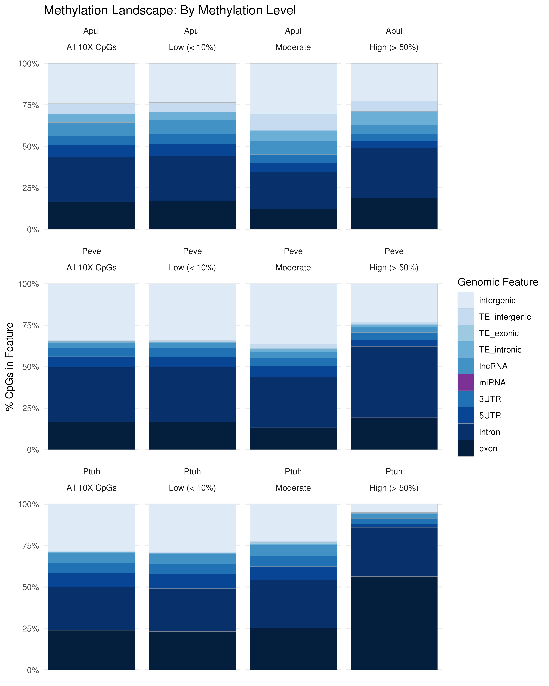
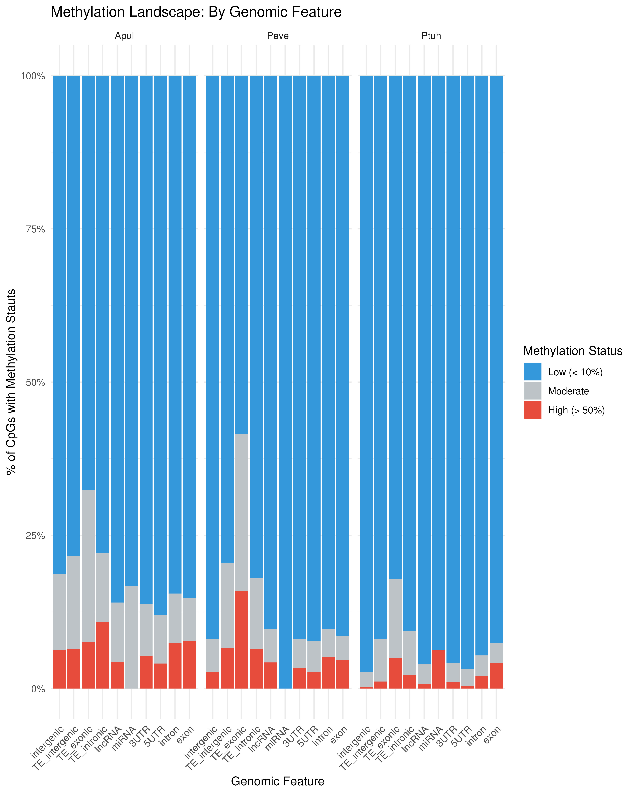
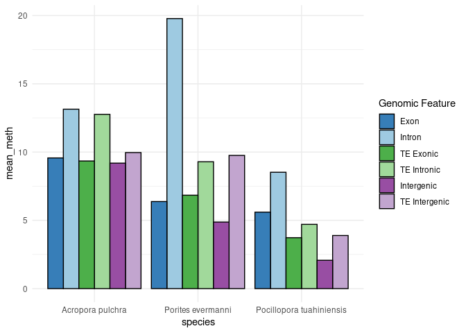

06-Cross-Species-WGBS.Rmd
================
Zoe Dellaert
2025-08-15

- [0.1 This is the plotting and analysis for CpG methylation data
  filtered using methylkit for *Acropora pulchra*, *Porites evermanni*,
  and *Pocillopora
  tuahiniensis*.](#01-this-is-the-plotting-and-analysis-for-cpg-methylation-data-filtered-using-methylkit-for-acropora-pulchra-porites-evermanni-and-pocillopora-tuahiniensis)

## 0.1 This is the plotting and analysis for CpG methylation data filtered using methylkit for [*Acropora pulchra*](https://github.com/urol-e5/deep-dive-expression/blob/main/D-Apul/code/08-Apul-WGBS.md), [*Porites evermanni*](https://github.com/urol-e5/deep-dive-expression/blob/main/E-Peve/code/12-Peve-WGBS.md), and [*Pocillopora tuahiniensis*](https://github.com/urol-e5/deep-dive-expression/blob/main/F-Ptuh/code/12-Ptuh-WGBS.md).

``` r
library(dplyr)
library(ggplot2)

ACR <- read.csv("../../D-Apul/output/08-Apul-WGBS/CpG_meth_genome_feature_annotated.csv")
POR <- read.csv("../../E-Peve/output/12-Peve-WGBS/CpG_meth_genome_feature_annotated.csv")
POC <- read.csv("../../F-Ptuh/output/12-Ptuh-WGBS/CpG_meth_genome_feature_annotated.csv")

ACR <- ACR %>% select(region,avg_meth,meth_status) %>%
  mutate(species = "Apul")
POR <- POR %>% select(region,avg_meth,meth_status) %>%
  mutate(species = "Peve")
POC <- POC %>% select(region,avg_meth,meth_status) %>%
  mutate(species = "Ptuh")
```

``` r
ACR <- ACR %>% mutate(region_broad = case_when(
    region == "TE_intergenic" ~ "intergenic",
    region == "TE_exonic" ~ "exon",
    region == "TE_intronic" ~ "intron",
    TRUE ~ region   
  ))

POR <- POR %>% mutate(region_broad = case_when(
    region == "TE_intergenic" ~ "intergenic",
    region == "TE_exonic" ~ "exon",
    region == "TE_intronic" ~ "intron",
    TRUE ~ region   
  ))

POC <- POC %>% mutate(region_broad = case_when(
    region == "TE_intergenic" ~ "intergenic",
    region == "TE_exonic" ~ "exon",
    region == "TE_intronic" ~ "intron",
    TRUE ~ region   
  ))
```

``` r
combined_all <- rbind(ACR, POR, POC)

combined_all <- combined_all %>%
  mutate(facet_group = meth_status) %>%
  bind_rows(
    combined_all %>% mutate(facet_group = "All 10X CpGs")
  )

combined_all$facet_group <- factor(combined_all$facet_group, levels = c("All 10X CpGs", "Low (< 10%)", "Moderate", "High (> 50%)"))
combined_all$meth_status <- factor(combined_all$meth_status, levels = c("Low (< 10%)", "Moderate", "High (> 50%)"))

#set as factor
combined_all$region <- factor(combined_all$region,levels = c("intergenic", "TE_intergenic",
                                                             "TE_exonic",
                                                             "TE_intronic",
                                                             "lncRNA","miRNA","3UTR", "5UTR", "intron", "exon"))

blue_palette <- c(
  "intergenic"     = "#deebf7",  
  "TE_intergenic"  = "#c6dbef",
  "TE_exonic"      = "#9ecae1",
  "TE_intronic"    = "#6baed6",
  "lncRNA"         = "#4292c6",
  "miRNA"          = "#7b3294", 
  "3UTR"           = "#2171b5",  
  "5UTR"           = "#084594",  
  "intron"         = "#08306b", 
  "exon"           = "#041f3d"  
)

ggplot(combined_all, aes(x = 1, fill = region)) +
  geom_bar(position = "fill",color="darkgrey",size=0.05) +
  theme_minimal() + 
  labs(y = "% CpGs in Feature",
    fill = "Genomic Feature", title="Methylation Landscape: By Methylation Level") +
  theme(axis.title.x = element_blank(),axis.text.x = element_blank(), panel.grid.minor = element_blank(),panel.grid.major.x = element_blank()) +
  scale_fill_manual(values = blue_palette)  + facet_wrap(species~facet_group) +
  scale_y_continuous(labels = scales::percent_format())
ggsave("../output/06-Cross-Species-Methylation/feature_meth_level_species.jpeg", width = 8, height = 10, dpi = 600)

ggplot(combined_all, aes(x = region, fill = meth_status)) +
  geom_bar(position = "fill") + 
  theme_minimal() + facet_grid(~species) +
  labs(
    title = "Methylation Landscape: By Genomic Feature",
    x = "Genomic Feature",
    y = "% of CpGs with Methylation Stauts",
    fill = "Methylation Status"
  ) +
  scale_fill_manual(values = c("Low (< 10%)" = "#3498db", "Moderate" = "#bdc3c7", "High (> 50%)" = "#e74c3c")) +
  theme(axis.text.x = element_text(angle = 45, hjust = 1)) +
  scale_y_continuous(labels = scales::percent_format())

ggsave("../output/06-Cross-Species-Methylation/feature_meth_level_percent_species.jpeg", width = 8, height = 6, dpi = 600)

rm(combined_all)
```





``` r
ACR_summary <- ACR %>%
  group_by(region) %>%
  summarise(mean_meth = mean(avg_meth, na.rm = TRUE)) %>%
  mutate(species = "Apul")

POR_summary <- POR %>%
  group_by(region) %>%
  summarise(mean_meth = mean(avg_meth, na.rm = TRUE)) %>%
  mutate(species = "Peve")

POC_summary <- POC %>%
  group_by(region) %>%
  summarise(mean_meth = mean(avg_meth, na.rm = TRUE)) %>%
  mutate(species = "Ptuh")

multi_summary <- rbind(ACR_summary, POR_summary, POC_summary)

#set as factor
multi_summary$region <- factor(multi_summary$region,levels = c("exon",
                                                             "TE_exonic","intron",
                                                             "TE_intronic",
                                                             "lncRNA","miRNA","3UTR", "5UTR", "intergenic", "TE_intergenic"))
```

``` r
ACR_summary <- ACR %>%
  group_by(region_broad) %>%
  summarise(mean_meth = mean(avg_meth, na.rm = TRUE)) %>%
  mutate(species = "Apul")

POR_summary <- POR %>%
  group_by(region_broad) %>%
  summarise(mean_meth = mean(avg_meth, na.rm = TRUE)) %>%
  mutate(species = "Peve")

POC_summary <- POC %>%
  group_by(region_broad) %>%
  summarise(mean_meth = mean(avg_meth, na.rm = TRUE)) %>%
  mutate(species = "Ptuh")

multi_summary_broad <- rbind(ACR_summary, POR_summary, POC_summary)

#set as factor
multi_summary_broad$region_broad <- factor(multi_summary_broad$region_broad,levels = c("lncRNA","miRNA","3UTR", "5UTR", "intron", "exon","intergenic"))
```

``` r
colors <- c(
  "5UTR" = "#e41a1c",        # red 
  "exon" = "#377eb8",        # blue
  "intron" = "#4daf4a",      # green 
  "intergenic" = "#984ea3",  # purple 
  "TE_exonic" = "#9ecae1",   # lighter blue (TE)
  "TE_intronic" = "#a1d99b", # lighter green (TE)
  "TE_intergenic" = "#c2a5cf" # lighter purple (TE)
)

multi_summary_broad %>% filter(region_broad %in% c("5UTR", "intron", "exon","intergenic")) %>%
  ggplot(aes(x = species, y = mean_meth, fill = region_broad)) +
  geom_bar(stat = "identity", position = position_dodge(),color="black") +
  scale_x_discrete(labels = c(
  "Apul" = "Acropora pulchra",
  "Peve" = "Porites evermanni",
  "Ptuh" = "Pocillopora tuahiniensis")) +
  scale_fill_manual(values = colors, 
                    name = "Genomic Feature",
                    labels = c("Protmoter/5'UTR","Intron","Exon", "Intergenic")) +
  theme_minimal()
```

<!-- -->

``` r
ggsave("../output/06-Cross-Species-Methylation/broad_region_bar.jpeg", width = 8, height = 5, dpi = 600)

multi_summary %>% filter(region %in% c("intron", "exon","TE_intronic","TE_exonic","intergenic","TE_intergenic")) %>%
  ggplot(aes(x = species, y = mean_meth, fill = region)) +
  geom_bar(stat = "identity", position = position_dodge(),color="black") +
  scale_x_discrete(labels = c(
  "Apul" = "Acropora pulchra",
  "Peve" = "Porites evermanni",
  "Ptuh" = "Pocillopora tuahiniensis")) +
  scale_fill_manual(values = colors, 
                    name = "Genomic Feature",
                    labels = c("Exon", "Intron", "TE Exonic", "TE Intronic", "Intergenic", "TE Intergenic")) + theme_minimal()
```

<!-- -->

``` r
ggsave("../output/06-Cross-Species-Methylation/TE_nonTE_region_bar.jpeg", width = 8, height = 5, dpi = 600)
```
