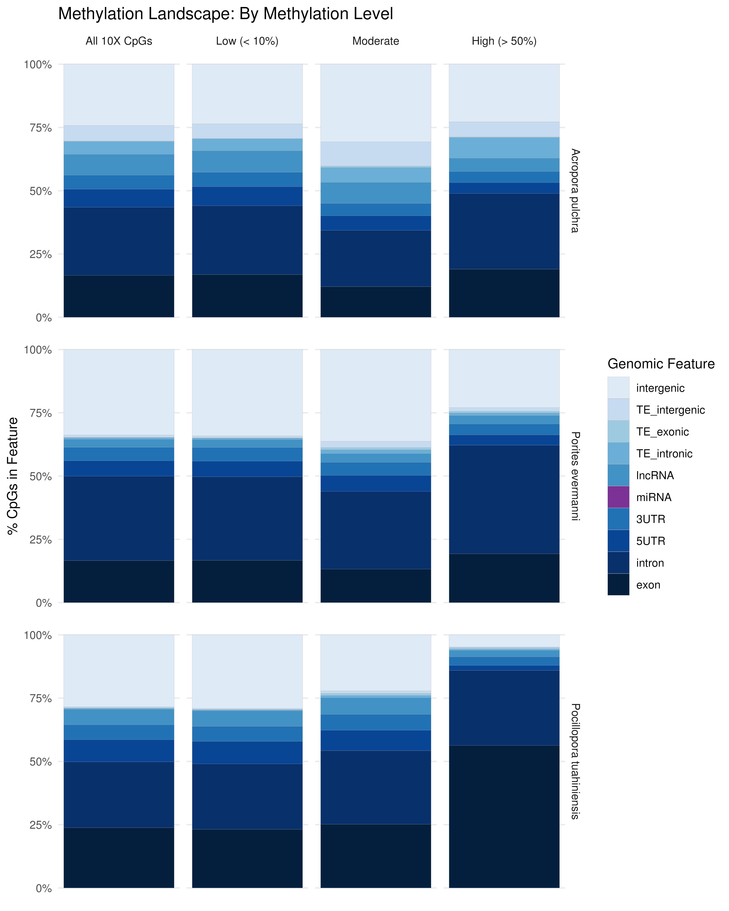
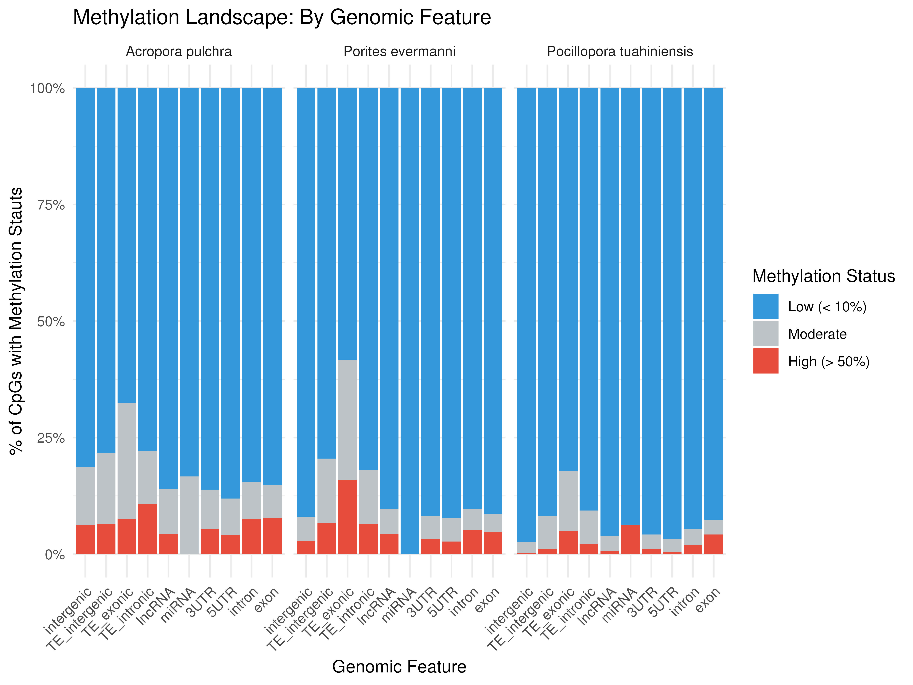
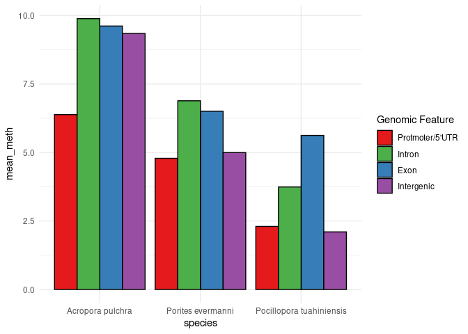
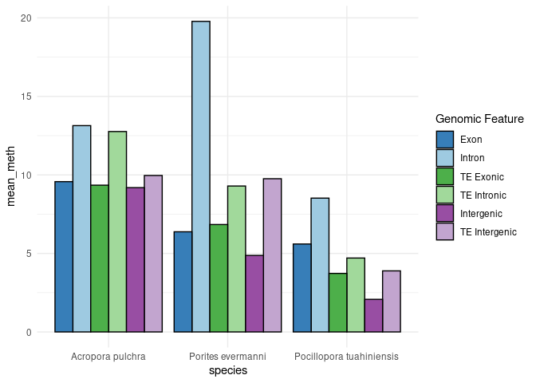
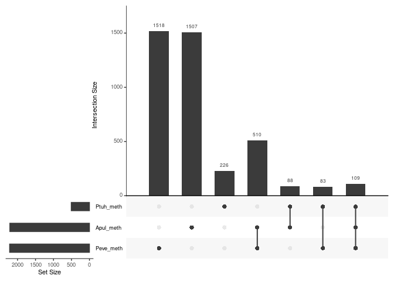

10-Cross-Species-WGBS.Rmd
================
Zoe Dellaert
2025-08-15

- [0.1 This is the plotting and analysis for CpG methylation data
  filtered using methylkit for *Acropora pulchra*, *Porites evermanni*,
  and *Pocillopora
  tuahiniensis*.](#01-this-is-the-plotting-and-analysis-for-cpg-methylation-data-filtered-using-methylkit-for-acropora-pulchra-porites-evermanni-and-pocillopora-tuahiniensis)
- [0.2 Orthogroup Methylation](#02-orthogroup-methylation)
  - [0.2.1 *Step 1*: Load Orthogroup
    data](#021-step-1-load-orthogroup-data)
  - [0.2.2 *Step 2*: Expand table to show each gene as a row and the
    gene ID and orthogroup ID as the 2
    columns](#022-step-2-expand-table-to-show-each-gene-as-a-row-and-the-gene-id-and-orthogroup-id-as-the-2-columns)
  - [0.2.3 Clean transcript names in the three orthogroup
    matrices](#023-clean-transcript-names-in-the-three-orthogroup-matrices)
  - [0.2.4 Methylation count data by
    CpG](#024-methylation-count-data-by-cpg)
  - [0.2.5 Combine methylation data with gene/orthogroup data for mean
    methylation per
    gene](#025-combine-methylation-data-with-geneorthogroup-data-for-mean-methylation-per-gene)
  - [0.2.6 Set methylated gene threshold as \> 50% CpG
    methylation](#026-set-methylated-gene-threshold-as--50-cpg-methylation)
  - [0.2.7 Summarize by orthogroup within each
    species](#027-summarize-by-orthogroup-within-each-species)
  - [0.2.8 Plot](#028-plot)

## 0.1 This is the plotting and analysis for CpG methylation data filtered using methylkit for [*Acropora pulchra*](https://github.com/urol-e5/deep-dive-expression/blob/main/D-Apul/code/08-Apul-WGBS.md), [*Porites evermanni*](https://github.com/urol-e5/deep-dive-expression/blob/main/E-Peve/code/12-Peve-WGBS.md), and [*Pocillopora tuahiniensis*](https://github.com/urol-e5/deep-dive-expression/blob/main/F-Ptuh/code/12-Ptuh-WGBS.md).

``` r
library(tidyverse)
library(ggplot2)

ACR <- read.csv("../../D-Apul/output/08-Apul-WGBS/CpG_meth_genome_feature_annotated.csv")
POR <- read.csv("../../E-Peve/output/12-Peve-WGBS/CpG_meth_genome_feature_annotated.csv")
POC <- read.csv("../../F-Ptuh/output/12-Ptuh-WGBS/CpG_meth_genome_feature_annotated.csv")

ACR <- ACR %>% select(region,avg_meth,meth_status) %>%
  mutate(species = "Apul")
POR <- POR %>% select(region,avg_meth,meth_status) %>%
  mutate(species = "Peve")
POC <- POC %>% select(region,avg_meth,meth_status) %>%
  mutate(species = "Ptuh")
```

``` r
combined_all <- rbind(ACR, POR, POC)

combined_all <- combined_all %>%
  mutate(facet_group = meth_status) %>%
  bind_rows(
    combined_all %>% mutate(facet_group = "All 10X CpGs")
  )

combined_all$facet_group <- factor(combined_all$facet_group, levels = c("All 10X CpGs", "Low (< 10%)", "Moderate", "High (> 50%)"))
combined_all$meth_status <- factor(combined_all$meth_status, levels = c("Low (< 10%)", "Moderate", "High (> 50%)"))

#set as factor
combined_all$region <- factor(combined_all$region,levels = c("intergenic", "TE_intergenic",
                                                             "TE_exonic",
                                                             "TE_intronic",
                                                             "lncRNA","miRNA","3UTR", "5UTR", "intron", "exon"))

blue_palette <- c(
  "intergenic"     = "#deebf7",  
  "TE_intergenic"  = "#c6dbef",
  "TE_exonic"      = "#9ecae1",
  "TE_intronic"    = "#6baed6",
  "lncRNA"         = "#4292c6",
  "miRNA"          = "#7b3294", 
  "3UTR"           = "#2171b5",  
  "5UTR"           = "#084594",  
  "intron"         = "#08306b",  
  "exon"           = "#041f3d"  
)

ggplot(combined_all, aes(x = 1, fill = region)) +
  geom_bar(position = "fill",color="darkgrey",size=0.05) +
  theme_minimal() + 
  labs(y = "% CpGs in Feature",
    fill = "Genomic Feature", title="Methylation Landscape: By Methylation Level") +
  theme(axis.title.x = element_blank(),axis.text.x = element_blank(), panel.grid.minor = element_blank(),panel.grid.major.x = element_blank()) +
  scale_fill_manual(values = blue_palette)  +
  facet_grid(species~facet_group,
             labeller = labeller(species = c(
        "Apul" = "Acropora pulchra",
        "Peve" = "Porites evermanni",
        "Ptuh" = "Pocillopora tuahiniensis"
      ))) +
  scale_y_continuous(labels = scales::percent_format())
ggsave("../output/10-Cross-Species-Methylation/feature_meth_level_species.jpeg", width = 8, height = 10, dpi = 600)

ggplot(combined_all, aes(x = region, fill = meth_status)) +
  geom_bar(position = "fill") + 
  theme_minimal() + facet_grid(~species,labeller = labeller(species = c(
        "Apul" = "Acropora pulchra",
        "Peve" = "Porites evermanni",
        "Ptuh" = "Pocillopora tuahiniensis"))) +
  labs(
    title = "Methylation Landscape: By Genomic Feature",
    x = "Genomic Feature",
    y = "% of CpGs with Methylation Stauts",
    fill = "Methylation Status"
  ) +
  scale_fill_manual(values = c("Low (< 10%)" = "#3498db", "Moderate" = "#bdc3c7", "High (> 50%)" = "#e74c3c")) +
  theme(axis.text.x = element_text(angle = 45, hjust = 1)) +
  scale_y_continuous(labels = scales::percent_format())

ggsave("../output/10-Cross-Species-Methylation/feature_meth_level_percent_species.jpeg", width = 8, height = 6, dpi = 600)

rm(combined_all)
```





``` r
ACR_summary <- ACR %>%
  group_by(region) %>%
  summarise(mean_meth = mean(avg_meth, na.rm = TRUE)) %>%
  mutate(species = "Apul")

POR_summary <- POR %>%
  group_by(region) %>%
  summarise(mean_meth = mean(avg_meth, na.rm = TRUE)) %>%
  mutate(species = "Peve")

POC_summary <- POC %>%
  group_by(region) %>%
  summarise(mean_meth = mean(avg_meth, na.rm = TRUE)) %>%
  mutate(species = "Ptuh")

multi_summary <- rbind(ACR_summary, POR_summary, POC_summary)

#set as factor
multi_summary$region <- factor(multi_summary$region,levels = c("exon",
                                                             "TE_exonic","intron",
                                                             "TE_intronic",
                                                             "lncRNA","miRNA","3UTR", "5UTR", "intergenic", "TE_intergenic"))
```

``` r
ACR_summary <- ACR %>%
  mutate(region_broad = case_when(
    region == "TE_intergenic" ~ "intergenic",
    region == "TE_exonic" ~ "exon",
    region == "TE_intronic" ~ "intron",
    TRUE ~ region)) %>%
  group_by(region_broad) %>%
  summarise(mean_meth = mean(avg_meth, na.rm = TRUE)) %>%
  mutate(species = "Apul")

POR_summary <- POR %>%
  mutate(region_broad = case_when(
    region == "TE_intergenic" ~ "intergenic",
    region == "TE_exonic" ~ "exon",
    region == "TE_intronic" ~ "intron",
    TRUE ~ region)) %>%
  group_by(region_broad) %>%
  summarise(mean_meth = mean(avg_meth, na.rm = TRUE)) %>%
  mutate(species = "Peve")

POC_summary <- POC %>%
  mutate(region_broad = case_when(
    region == "TE_intergenic" ~ "intergenic",
    region == "TE_exonic" ~ "exon",
    region == "TE_intronic" ~ "intron",
    TRUE ~ region)) %>%
  group_by(region_broad) %>%
  summarise(mean_meth = mean(avg_meth, na.rm = TRUE)) %>%
  mutate(species = "Ptuh")

multi_summary_broad <- rbind(ACR_summary, POR_summary, POC_summary)

#set as factor
multi_summary_broad$region_broad <- factor(multi_summary_broad$region_broad,levels = c("lncRNA","miRNA","3UTR", "5UTR", "intron", "exon","intergenic"))
```

``` r
colors <- c(
  "5UTR" = "#e41a1c",        # red 
  "exon" = "#377eb8",        # blue
  "intron" = "#4daf4a",      # green 
  "intergenic" = "#984ea3",  # purple 
  "TE_exonic" = "#9ecae1",   # lighter blue (TE)
  "TE_intronic" = "#a1d99b", # lighter green (TE)
  "TE_intergenic" = "#c2a5cf" # lighter purple (TE)
)

multi_summary_broad %>% filter(region_broad %in% c("5UTR", "intron", "exon","intergenic")) %>%
  ggplot(aes(x = species, y = mean_meth, fill = region_broad)) +
  geom_bar(stat = "identity", position = position_dodge(),color="black") +
  scale_x_discrete(labels = c(
  "Apul" = "Acropora pulchra",
  "Peve" = "Porites evermanni",
  "Ptuh" = "Pocillopora tuahiniensis")) +
  scale_fill_manual(values = colors, 
                    name = "Genomic Feature",
                    labels = c("Protmoter/5'UTR","Intron","Exon", "Intergenic")) +
  theme_minimal()
```

<!-- -->

``` r
ggsave("../output/10-Cross-Species-Methylation/broad_region_bar.jpeg", width = 8, height = 5, dpi = 600)

multi_summary %>% filter(region %in% c("intron", "exon","TE_intronic","TE_exonic","intergenic","TE_intergenic")) %>%
  ggplot(aes(x = species, y = mean_meth, fill = region)) +
  geom_bar(stat = "identity", position = position_dodge(),color="black") +
  scale_x_discrete(labels = c(
  "Apul" = "Acropora pulchra",
  "Peve" = "Porites evermanni",
  "Ptuh" = "Pocillopora tuahiniensis")) +
  scale_fill_manual(values = colors, 
                    name = "Genomic Feature",
                    labels = c("Exon", "Intron", "TE Exonic", "TE Intronic", "Intergenic", "TE Intergenic")) + theme_minimal()
```

<!-- -->

``` r
ggsave("../output/10-Cross-Species-Methylation/TE_nonTE_region_bar.jpeg", width = 8, height = 5, dpi = 600)
```

## 0.2 Orthogroup Methylation

### 0.2.1 *Step 1*: Load Orthogroup data

``` r
# Read in orthofinder data 
ortho <- read.table(file = "../../D-Apul/output/20-Apul-Orthofinder/Results_Dec20/Phylogenetic_Hierarchical_Orthogroups/N0.tsv", sep = '\t', header = TRUE, na.strings=c(""," ","NA")) %>% select(-c(HOG, Gene.Tree.Parent.Clade)) %>% rename(Orthogroup = OG)

genus_list <- c("Acropora", "Pocillopora", "Porites")

species_list_abbrv <- c("apul", "pmea", "peve")

colnames(ortho) <- c("Orthogroup", genus_list)
length(unique(ortho$Orthogroup)) # 23124 total orthogroups
```

    [1] 23124

### 0.2.2 *Step 2*: Expand table to show each gene as a row and the gene ID and orthogroup ID as the 2 columns

``` r
# Split by species
for (i in 1:length(genus_list)) {
  assign(paste0(species_list_abbrv[i], "_ortho"), select(ortho, c("Orthogroup", genus_list[i])))
}
```

``` r
# Now split strings of gene names into cols w/ corresponding orthogroup

for (i in 1:length(genus_list)) {
  df_name <- paste0(species_list_abbrv[i], "_ortho")
  
  # Extract the species column and perform operations
  assign(df_name, get(df_name) %>%
           mutate(!!genus_list[i] := strsplit(as.character(!!as.symbol(genus_list[i])), ",")) %>%
           unnest(!!as.symbol(genus_list[i])) %>%
           na.omit() %>%
           mutate(!!as.symbol(genus_list[i]) := gsub(" ", "", !!as.symbol(genus_list[i])))
  )
}
```

### 0.2.3 Clean transcript names in the three orthogroup matrices

``` r
apul_ortho$Acropora <- gsub("-T1","",apul_ortho$Acropora)
```

### 0.2.4 Methylation count data by CpG

``` r
CpG_count_transcripts_ACR <- read.csv("../../D-Apul/output/08-Apul-WGBS/CpG_Transcript_CountMat.csv")
CpG_count_transcripts_POR <- read.csv("../../E-Peve/output/12-Peve-WGBS/CpG_Transcript_CountMat.csv")
CpG_count_transcripts_POC <- read.csv("../../F-Ptuh/output/12-Ptuh-WGBS/CpG_Transcript_CountMat.csv")

# Average methylation across all samples per transcript
CpG_count_transcripts_ACR$mean_meth <- rowMeans(CpG_count_transcripts_ACR[ , grep("ACR", colnames(CpG_count_transcripts_ACR))], na.rm=TRUE)
CpG_count_transcripts_POR$mean_meth <- rowMeans(CpG_count_transcripts_POR[ , grep("POR", colnames(CpG_count_transcripts_POR))], na.rm=TRUE)
CpG_count_transcripts_POC$mean_meth <- rowMeans(CpG_count_transcripts_POC[ , grep("POC", colnames(CpG_count_transcripts_POC))], na.rm=TRUE)
```

### 0.2.5 Combine methylation data with gene/orthogroup data for mean methylation per gene

``` r
# Apul
apul_ortho_meth <- apul_ortho %>%
  left_join(CpG_count_transcripts_ACR %>% select(transcript_id, mean_meth), by = c("Acropora" = "transcript_id"))

# Peve
peve_ortho_meth <- peve_ortho %>%
  left_join(CpG_count_transcripts_POR %>% select(transcript_id, mean_meth), by = c("Porites" = "transcript_id"))

# Ptuh (using Pmea genome)
CpG_count_transcripts_POC$transcript_id <- gsub("mrna-","",CpG_count_transcripts_POC$transcript_id)
ptuh_ortho_meth <- pmea_ortho %>%
  left_join(CpG_count_transcripts_POC %>% select(transcript_id, mean_meth), by = c("Pocillopora" = "transcript_id"))
```

### 0.2.6 Set methylated gene threshold as \> 50% CpG methylation

``` r
meth_thresh <- 50

apul_ortho_meth <- apul_ortho_meth %>% mutate(methylated = mean_meth > meth_thresh)
peve_ortho_meth <- peve_ortho_meth %>% mutate(methylated = mean_meth > meth_thresh)
ptuh_ortho_meth <- ptuh_ortho_meth %>% mutate(methylated = mean_meth > meth_thresh)
```

### 0.2.7 Summarize by orthogroup within each species

``` r
# Apul
apul_summary <- apul_ortho_meth %>%
  group_by(Orthogroup) %>%
  summarise(Apul_meth = any(methylated), .groups="drop")

# Peve
peve_summary <- peve_ortho_meth %>%
  group_by(Orthogroup) %>%
  summarise(Peve_meth = any(methylated), .groups="drop")

# ptuh
ptuh_summary <- ptuh_ortho_meth %>%
  group_by(Orthogroup) %>%
  summarise(Ptuh_meth = any(methylated), .groups="drop")

meth_orthogroups <- full_join(apul_summary, peve_summary, by="Orthogroup") %>%
  full_join(ptuh_summary, by="Orthogroup") %>%
  replace(is.na(.), FALSE)  # missing = not methylated
```

### 0.2.8 Plot

``` r
meth_orthogroups <- meth_orthogroups %>%
  mutate(
    conserved = Apul_meth & Peve_meth & Ptuh_meth,
    Apul_specific = Apul_meth & !Peve_meth & !Ptuh_meth,
    Peve_specific = !Apul_meth & Peve_meth & !Ptuh_meth,
    Ptuh_specific = !Apul_meth & !Peve_meth & Ptuh_meth
  )

meth_orthogroups <- as.data.frame(meth_orthogroups)

# Summary counts
summary_counts <- meth_orthogroups %>%
  summarise(
    conserved = sum(conserved),
    Apul_specific = sum(Apul_specific),
    Peve_specific = sum(Peve_specific),
    Ptuh_specific = sum(Ptuh_specific)
  )

summary_counts
```

      conserved Apul_specific Peve_specific Ptuh_specific
    1       109          1507          1518           226

``` r
# install.packages("UpSetR")

library(UpSetR)

upset_data <- meth_orthogroups %>% 
  select(Apul_meth, Peve_meth, Ptuh_meth) %>% mutate_all(as.numeric) %>%
  mutate(Orthogroup = meth_orthogroups$Orthogroup) %>%
  select(Orthogroup,everything())

upset(upset_data)
```

<!-- -->
