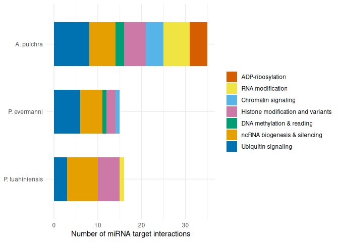
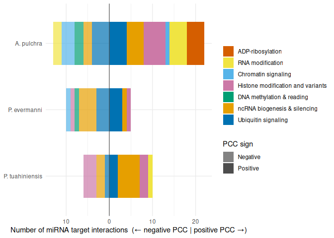

12-miRNA-epimachinery
================
Kathleen Durkin
2026-04-08

- [Epimachinery](#epimachinery)
  - [Apul](#apul)
  - [Peve](#peve)
  - [Ptuh](#ptuh)
- [Updated ncRNA machinery analysis](#updated-ncrna-machinery-analysis)
  - [Apul](#apul-1)
  - [Peve](#peve-1)
  - [Ptuh](#ptuh-1)
- [Combine epimachinery and ncRNA machinery outputs to single results
  table for each
  species](#combine-epimachinery-and-ncrna-machinery-outputs-to-single-results-table-for-each-species)
  - [Apul](#apul-2)
  - [Peve](#peve-2)
  - [Ptuh](#ptuh-2)
- [Summary](#summary)
  - [Plot](#plot)

We’ve previously looked for instances of miRNA putatively binding to
ncRNA and methylation machinery (a.g. AGO transcripts), but this search
seemed to miss hits. Perhaps more importantly, the reference used was
not comprehensive, because it didn’t include hits for other epigenetic
machinery, such as those involved in histone modifications. Let’s redo
and expand the epimachinery analysis.

Load packages

``` r
library(dplyr)
```

    ## 
    ## Attaching package: 'dplyr'

    ## The following objects are masked from 'package:stats':
    ## 
    ##     filter, lag

    ## The following objects are masked from 'package:base':
    ## 
    ##     intersect, setdiff, setequal, union

``` r
library(tidyr)
library(ggplot2)
library(stringr)
library(purrr)
library(GSEABase)
```

    ## Loading required package: BiocGenerics

    ## 
    ## Attaching package: 'BiocGenerics'

    ## The following objects are masked from 'package:dplyr':
    ## 
    ##     combine, intersect, setdiff, union

    ## The following objects are masked from 'package:stats':
    ## 
    ##     IQR, mad, sd, var, xtabs

    ## The following objects are masked from 'package:base':
    ## 
    ##     anyDuplicated, aperm, append, as.data.frame, basename, cbind,
    ##     colnames, dirname, do.call, duplicated, eval, evalq, Filter, Find,
    ##     get, grep, grepl, intersect, is.unsorted, lapply, Map, mapply,
    ##     match, mget, order, paste, pmax, pmax.int, pmin, pmin.int,
    ##     Position, rank, rbind, Reduce, rownames, sapply, setdiff, sort,
    ##     table, tapply, union, unique, unsplit, which.max, which.min

    ## Loading required package: Biobase

    ## Welcome to Bioconductor
    ## 
    ##     Vignettes contain introductory material; view with
    ##     'browseVignettes()'. To cite Bioconductor, see
    ##     'citation("Biobase")', and for packages 'citation("pkgname")'.

    ## Loading required package: annotate

    ## Loading required package: AnnotationDbi

    ## Loading required package: stats4

    ## Loading required package: IRanges

    ## Loading required package: S4Vectors

    ## 
    ## Attaching package: 'S4Vectors'

    ## The following object is masked from 'package:tidyr':
    ## 
    ##     expand

    ## The following objects are masked from 'package:dplyr':
    ## 
    ##     first, rename

    ## The following objects are masked from 'package:base':
    ## 
    ##     expand.grid, I, unname

    ## 
    ## Attaching package: 'IRanges'

    ## The following object is masked from 'package:purrr':
    ## 
    ##     reduce

    ## The following objects are masked from 'package:dplyr':
    ## 
    ##     collapse, desc, slice

    ## 
    ## Attaching package: 'AnnotationDbi'

    ## The following object is masked from 'package:dplyr':
    ## 
    ##     select

    ## Loading required package: XML

    ## Loading required package: graph

    ## 
    ## Attaching package: 'graph'

    ## The following object is masked from 'package:XML':
    ## 
    ##     addNode

    ## The following object is masked from 'package:stringr':
    ## 
    ##     boundary

``` r
library(GO.db)
```

    ## 

``` r
library(knitr)
library(tidyverse)
```

    ## ── Attaching core tidyverse packages ──────────────────────── tidyverse 2.0.0 ──
    ## ✔ forcats   1.0.0     ✔ readr     2.1.5
    ## ✔ lubridate 1.9.4     ✔ tibble    3.3.0

    ## ── Conflicts ────────────────────────────────────────── tidyverse_conflicts() ──
    ## ✖ lubridate::%within%()    masks IRanges::%within%()
    ## ✖ graph::boundary()        masks stringr::boundary()
    ## ✖ IRanges::collapse()      masks dplyr::collapse()
    ## ✖ Biobase::combine()       masks BiocGenerics::combine(), dplyr::combine()
    ## ✖ IRanges::desc()          masks dplyr::desc()
    ## ✖ S4Vectors::expand()      masks tidyr::expand()
    ## ✖ dplyr::filter()          masks stats::filter()
    ## ✖ S4Vectors::first()       masks dplyr::first()
    ## ✖ dplyr::lag()             masks stats::lag()
    ## ✖ BiocGenerics::Position() masks ggplot2::Position(), base::Position()
    ## ✖ IRanges::reduce()        masks purrr::reduce()
    ## ✖ S4Vectors::rename()      masks dplyr::rename()
    ## ✖ lubridate::second()      masks S4Vectors::second()
    ## ✖ lubridate::second<-()    masks S4Vectors::second<-()
    ## ✖ AnnotationDbi::select()  masks dplyr::select()
    ## ✖ IRanges::slice()         masks dplyr::slice()
    ## ℹ Use the conflicted package (<http://conflicted.r-lib.org/>) to force all conflicts to become errors

Load and format miRNA target FA tables

``` r
# Apul
apul_FA <- read.csv("../../D-Apul/output/09.13-Apul-mRNA-miRNA-interactions-FE-pooled/miRNA_pooled_targets_FA.csv") %>% dplyr::select(miRNA, mRNA, PCC.cor, p_value) %>% distinct()

# Peve
peve_FA <- read.csv("../../E-Peve/output/10.14-Peve-mRNA-miRNA-interactions-FE-pooled/miRNA_pooled_targets_FA.csv") %>% dplyr::select(miRNA, mRNA, PCC.cor, p_value) %>% distinct()

# Ptuh
ptuh_FA <- read.csv("../../F-Ptuh/output/11.14-Ptuh-mRNA-miRNA-interactions-FE-pooled/miRNA_pooled_targets_FA.csv") %>% dplyr::select(miRNA, mRNA, PCC.cor, p_value) %>% distinct()
```

Load miRNA assigned names (e.g., “miR-100”) to annotate, instead of
using ShortStack’s Cluster labels

``` r
# Load
## Apul
apul_names <- read.csv("../../D-Apul/output/11-Apul-sRNA-ShortStack_4.1.0-pulchra_genome/ShortStack_out/Apul_Results_mature_named_miRNAs.csv") %>% dplyr::select(Name, given_miRNA_name)

## Peve
peve_names <- read.csv("../../E-Peve/output/05-Peve-sRNA-ShortStack_4.1.0/ShortStack_out/Peve_Results_mature_named_miRNAs.csv") %>% dplyr::select(Name, given_miRNA_name)

## Ptuh
ptuh_names <- read.csv("../../F-Ptuh/output/05-Ptuh-sRNA-ShortStack_4.1.0/ShortStack_out/Ptuh_Results_mature_named_miRNAs.csv") %>% dplyr::select(Name, given_miRNA_name)
```

Combine with miRNA annotated target+coexpression tables

``` r
apul_FA_annot <- left_join(apul_FA, apul_names, by = c("miRNA" = "Name"))
peve_FA_annot <- left_join(peve_FA, peve_names, by = c("miRNA" = "Name"))
ptuh_FA_annot <- left_join(ptuh_FA, ptuh_names, by = c("miRNA" = "Name"))
```

## Epimachinery

Load epimachinery BLAST hits to the three coral genomes

``` r
#Load
apul_epi <- read.table("../../D-Apul/output/35-Apul-epi-machinery-BLAST/Mach-blastp-Apul_out.tab") %>% dplyr::select(V1,V2)
# Remove transcript # suffixes ("-T1")
apul_epi$V2 <- gsub("-T[0-9]+$", "", apul_epi$V2)

# Rename columns
apul_epi$gene_name <- apul_epi$V1
apul_epi$target <- apul_epi$V2
apul_epi <- apul_epi %>% dplyr::select(-V1, -V2)


#Load
peve_epi <- read.table("../../E-Peve/output/33-Peve-epi-machinery-BLAST/Mach-blastp-Peve_out.tab") %>% dplyr::select(V1,V2)

# Rename columns
peve_epi$gene_name <- peve_epi$V1
peve_epi$target <- peve_epi$V2
peve_epi <- peve_epi %>% dplyr::select(-V1, -V2)


#Load
ptuh_epi <- read.table("../../F-Ptuh/output/33-Ptuh-epi-machinery-BLAST/Mach-blastp-Ptuh_out.tab") %>% dplyr::select(V1,V2)

# Rename columns
ptuh_epi$gene_name <- ptuh_epi$V1
ptuh_epi$target <- ptuh_epi$V2
ptuh_epi <- ptuh_epi %>% dplyr::select(-V1, -V2)
```

### Apul

``` r
# Bind to annotate putative miRNA targets with epimachinery matches
apul_epi_miRNA <- left_join(apul_epi, apul_FA_annot, by = c("target" = "mRNA"))
```

    ## Warning in left_join(apul_epi, apul_FA_annot, by = c(target = "mRNA")): Detected an unexpected many-to-many relationship between `x` and `y`.
    ## ℹ Row 1 of `x` matches multiple rows in `y`.
    ## ℹ Row 6728 of `y` matches multiple rows in `x`.
    ## ℹ If a many-to-many relationship is expected, set `relationship =
    ##   "many-to-many"` to silence this warning.

``` r
# Filter to retain only putative miRNA targets that are significantly coexpressed 
apul_epi_miRNA <- apul_epi_miRNA %>% filter(p_value < 0.05)

# Summary
cat("\n# unique miRNAs:", apul_epi_miRNA$miRNA %>% unique() %>% length(), "\n")
```

    ## 
    ## # unique miRNAs: 22

``` r
cat("# unique mRNAs:", apul_epi_miRNA$target %>% unique() %>% length(), "\n")
```

    ## # unique mRNAs: 29

``` r
cat("# unique epimachinery proteins:", apul_epi_miRNA$gene_name %>% unique() %>% length(), "\n")
```

    ## # unique epimachinery proteins: 38

In *A. pulchra*, 22 of the 39 miRNAs putatively bind to a total of 29
unique epigenetic protein machinery transcripts, based on both predicted
binding and significant coexpression. These transcripts match 38
epimachinery annotations. Note that the \# of unique transcripts is
higher than the \# of unique annotations because some of the coral genes
match multiple variants of a single protein (e.g., FUN_001354, which
matches both Parp5a-Tnks-201 and Parp5b-Tnks2-201)

Collapse to unique miRNA-mRNA pairs

``` r
apul_epi_miRNA_collapsed <- apul_epi_miRNA %>%
  group_by(target, given_miRNA_name) %>%
  mutate(gene = paste(unique(gene_name), collapse = "; ")) %>%
  distinct(target, given_miRNA_name, .keep_all = TRUE) %>%
  ungroup() %>%
  dplyr::select(-gene_name, -miRNA)
```

### Peve

``` r
# Bind to annotate putative miRNA targets with epimachinery matches
peve_epi_miRNA <- left_join(peve_epi, peve_FA_annot, by = c("target" = "mRNA"))
```

    ## Warning in left_join(peve_epi, peve_FA_annot, by = c(target = "mRNA")): Detected an unexpected many-to-many relationship between `x` and `y`.
    ## ℹ Row 1 of `x` matches multiple rows in `y`.
    ## ℹ Row 11414 of `y` matches multiple rows in `x`.
    ## ℹ If a many-to-many relationship is expected, set `relationship =
    ##   "many-to-many"` to silence this warning.

``` r
# Filter to retain only putative miRNA targets that are significantly coexpressed 
peve_epi_miRNA <- peve_epi_miRNA %>% filter(p_value < 0.05)


# Summary
cat("\n# unique miRNAs:", peve_epi_miRNA$miRNA %>% unique() %>% length(), "\n")
```

    ## 
    ## # unique miRNAs: 7

``` r
cat("# unique mRNAs:", peve_epi_miRNA$target %>% unique() %>% length(), "\n")
```

    ## # unique mRNAs: 11

``` r
cat("# unique epimachinery proteins:", peve_epi_miRNA$gene_name %>% unique() %>% length(), "\n")
```

    ## # unique epimachinery proteins: 14

In *P. evermanni*, 7 of the 45 miRNAs putatively bind to a total of 11
unique epigenetic protein machinery transcripts, based on both predicted
binding and significant. These transcripts match 14 epimachinery
annotations. Again, note that the \# of unique transcripts is higher
than the \# of unique annotations because some of the coral genes match
multiple variants of a single protein.

Collapse to unique miRNA-mRNA pairs

``` r
peve_epi_miRNA_collapsed <- peve_epi_miRNA %>%
  group_by(target, given_miRNA_name) %>%
  mutate(gene = paste(unique(gene_name), collapse = "; ")) %>%
  distinct(target, given_miRNA_name, .keep_all = TRUE) %>%
  ungroup() %>%
  dplyr::select(-gene_name, -miRNA)
```

### Ptuh

``` r
# Bind to annotate putative miRNA targets with epimachinery matches
ptuh_epi_miRNA <- left_join(ptuh_epi, ptuh_FA_annot, by = c("target" = "mRNA"))
```

    ## Warning in left_join(ptuh_epi, ptuh_FA_annot, by = c(target = "mRNA")): Detected an unexpected many-to-many relationship between `x` and `y`.
    ## ℹ Row 2 of `x` matches multiple rows in `y`.
    ## ℹ Row 8328 of `y` matches multiple rows in `x`.
    ## ℹ If a many-to-many relationship is expected, set `relationship =
    ##   "many-to-many"` to silence this warning.

``` r
# Filter to retain only putative miRNA targets that are significantly coexpressed 
ptuh_epi_miRNA <- ptuh_epi_miRNA %>% filter(p_value < 0.05)


# Summary
cat("\n# unique miRNAs:", ptuh_epi_miRNA$miRNA %>% unique() %>% length(), "\n")
```

    ## 
    ## # unique miRNAs: 9

``` r
cat("# unique mRNAs:", ptuh_epi_miRNA$target %>% unique() %>% length(), "\n")
```

    ## # unique mRNAs: 10

``` r
cat("# unique epimachinery proteins:", ptuh_epi_miRNA$gene_name %>% unique() %>% length(), "\n")
```

    ## # unique epimachinery proteins: 14

In *P. tuahiniensis*, 9 of the 37 miRNAs putatively bind to a total of
10 unique epigenetic protein machinery transcripts, based on both
predicted binding and significant. These transcripts match 14
epimachinery annotations. Again, note that the \# of unique transcripts
is higher than the \# of unique annotations because some of the coral
genes match multiple variants of a single protein.

Collapse to unique miRNA-mRNA pairs

``` r
ptuh_epi_miRNA_collapsed <- ptuh_epi_miRNA %>%
  group_by(target, given_miRNA_name) %>%
  mutate(gene = paste(unique(gene_name), collapse = "; ")) %>%
  distinct(target, given_miRNA_name, .keep_all = TRUE) %>%
  ungroup() %>%
  dplyr::select(-gene_name, -miRNA)
```

## Updated ncRNA machinery analysis

I manually curated a db of fasta sequences for protein machinery
important to miRNA and lncRNA biogenesis and function (details in
notebook,
[here](https://shedurkin.github.io/Roberts-LabNotebook/posts/projects/E5_coral/2026_04_10_DDE_ncRNA_machinery.html)
and
[here](https://shedurkin.github.io/Roberts-LabNotebook/posts/projects/E5_coral/2026_04_13_DDE_ncRNA_machinery_fastas.html))

load BLAST hits for this ncRNA machinery set

``` r
#Load
apul_ncRNA <- read.csv("../../D-Apul/output/34-Apul-ncRNA-machinery-BLAST/ncRNAmach-blastp-Apul_annotated_reduced.csv") 

# Remove transcript # suffixes ("-T1")
apul_ncRNA$target <- gsub("-T[0-9]+$", "", apul_ncRNA$target)

#Load
peve_ncRNA <- read.csv("../../E-Peve/output/32-Peve-ncRNA-machinery-BLAST/ncRNAmach-blastp-Peve_annotated_reduced.csv") 

#Load
ptuh_ncRNA <- read.csv("../../F-Ptuh/output/32-Ptuh-ncRNA-machinery-BLAST/ncRNAmach-blastp-Ptuh_annotated_reduced.csv") 
```

### Apul

``` r
# Bind to annotate putative miRNA targets with ncRNA machinery matches
apul_ncRNA_miRNA <- left_join(apul_ncRNA, apul_FA_annot, by = c("target" = "mRNA")) %>% distinct()
```

    ## Warning in left_join(apul_ncRNA, apul_FA_annot, by = c(target = "mRNA")): Detected an unexpected many-to-many relationship between `x` and `y`.
    ## ℹ Row 1 of `x` matches multiple rows in `y`.
    ## ℹ Row 5772 of `y` matches multiple rows in `x`.
    ## ℹ If a many-to-many relationship is expected, set `relationship =
    ##   "many-to-many"` to silence this warning.

``` r
# Filter to retain only putative miRNA targets that are significantly coexpressed 
apul_ncRNA_miRNA <- apul_ncRNA_miRNA %>% filter(p_value < 0.05)

# Summary
cat("\n# unique miRNAs:", apul_ncRNA_miRNA$miRNA %>% unique() %>% length(), "\n")
```

    ## 
    ## # unique miRNAs: 5

``` r
cat("# unique mRNAs:", apul_ncRNA_miRNA$target %>% unique() %>% length(), "\n")
```

    ## # unique mRNAs: 5

``` r
cat("# unique ncRNA machinery genes:", apul_ncRNA_miRNA$std_gene_name %>% unique() %>% length(), "\n")
```

    ## # unique ncRNA machinery genes: 8

In *A. pulchra*, 5 of the 39 miRNAs putatively bind to a total of 5
unique ncRNA protein machinery transcripts, based on both predicted
binding and significant coexpression. These transcripts match 8 ncRNA
machinery annotations. Note that the \# of unique annotations is higher
than the \# of unique transcripts because some of the coral genes match
multiple similar proteins.

Collapse to unique miRNA-mRNA pairs

``` r
apul_ncRNA_miRNA_collapsed <- apul_ncRNA_miRNA %>%
  group_by(target, given_miRNA_name) %>%
  mutate(gene = paste(unique(std_gene_name), collapse = "; ")) %>%
  distinct(target, given_miRNA_name, .keep_all = TRUE) %>%
  ungroup() %>%
  dplyr::select(-std_gene_name, -miRNA)
```

### Peve

``` r
# Bind to annotate putative miRNA targets with ncRNA machinery matches
peve_ncRNA_miRNA <- left_join(peve_ncRNA, peve_FA_annot, by = c("target" = "mRNA")) %>% distinct()
```

    ## Warning in left_join(peve_ncRNA, peve_FA_annot, by = c(target = "mRNA")): Detected an unexpected many-to-many relationship between `x` and `y`.
    ## ℹ Row 1 of `x` matches multiple rows in `y`.
    ## ℹ Row 832 of `y` matches multiple rows in `x`.
    ## ℹ If a many-to-many relationship is expected, set `relationship =
    ##   "many-to-many"` to silence this warning.

``` r
# Filter to retain only putative miRNA targets that are significantly coexpressed 
peve_ncRNA_miRNA <- peve_ncRNA_miRNA %>% filter(p_value < 0.05)

# Summary
cat("\n# unique miRNAs:", peve_ncRNA_miRNA$miRNA %>% unique() %>% length(), "\n")
```

    ## 
    ## # unique miRNAs: 2

``` r
cat("# unique mRNAs:", peve_ncRNA_miRNA$target %>% unique() %>% length(), "\n")
```

    ## # unique mRNAs: 3

``` r
cat("# unique ncRNA machinery genes:", peve_ncRNA_miRNA$std_gene_name %>% unique() %>% length(), "\n")
```

    ## # unique ncRNA machinery genes: 3

In *P.evermanni*, 2 of the 45 miRNAs putatively bind to a total of 3
unique ncRNA protein machinery transcripts, based on both predicted
binding and significant coexpression. These transcripts match 3 ncRNA
machinery annotations.

Collapse to unique miRNA-mRNA pairs

``` r
peve_ncRNA_miRNA_collapsed <- peve_ncRNA_miRNA %>%
  group_by(target, given_miRNA_name) %>%
  mutate(gene = paste(unique(std_gene_name), collapse = "; ")) %>%
  distinct(target, given_miRNA_name, .keep_all = TRUE) %>%
  ungroup() %>%
  dplyr::select(-std_gene_name, -miRNA)
```

### Ptuh

``` r
# Bind to annotate putative miRNA targets with ncRNA machinery matches
ptuh_ncRNA_miRNA <- left_join(ptuh_ncRNA, ptuh_FA_annot, by = c("target" = "mRNA")) %>% distinct()
```

    ## Warning in left_join(ptuh_ncRNA, ptuh_FA_annot, by = c(target = "mRNA")): Detected an unexpected many-to-many relationship between `x` and `y`.
    ## ℹ Row 1 of `x` matches multiple rows in `y`.
    ## ℹ Row 11358 of `y` matches multiple rows in `x`.
    ## ℹ If a many-to-many relationship is expected, set `relationship =
    ##   "many-to-many"` to silence this warning.

``` r
# Filter to retain only putative miRNA targets that are significantly coexpressed 
ptuh_ncRNA_miRNA <- ptuh_ncRNA_miRNA %>% filter(p_value < 0.05)

# Summary
cat("\n# unique miRNAs:", ptuh_ncRNA_miRNA$miRNA %>% unique() %>% length(), "\n")
```

    ## 
    ## # unique miRNAs: 5

``` r
cat("# unique mRNAs:", ptuh_ncRNA_miRNA$target %>% unique() %>% length(), "\n")
```

    ## # unique mRNAs: 6

``` r
cat("# unique ncRNA machinery genes:", ptuh_ncRNA_miRNA$std_gene_name %>% unique() %>% length(), "\n")
```

    ## # unique ncRNA machinery genes: 9

In *P.tuahiniensis*, 5 of the 37 miRNAs putatively bind to a total of 6
unique ncRNA protein machinery transcripts, based on both predicted
binding and significant coexpression. These transcripts match 9 ncRNA
machinery annotations. Note that the \# of unique annotations is higher
than the \# of unique transcripts because some of the coral genes
matched multiple similar proteins

Collapse to unique miRNA-mRNA pairs

``` r
ptuh_ncRNA_miRNA_collapsed <- ptuh_ncRNA_miRNA %>%
  group_by(target, given_miRNA_name) %>%
  mutate(gene = paste(unique(std_gene_name), collapse = "; ")) %>%
  distinct(target, given_miRNA_name, .keep_all = TRUE) %>%
  ungroup() %>%
  dplyr::select(-std_gene_name, -miRNA)
```

## Combine epimachinery and ncRNA machinery outputs to single results table for each species

### Apul

``` r
# Label with source
apul_epi_miRNA_collapsed$type <- "epimachinery"
apul_ncRNA_miRNA_collapsed$type <- "ncRNA machinery"

# Ensure identical column names and order
colnames(apul_epi_miRNA_collapsed) == colnames(apul_ncRNA_miRNA_collapsed)
```

    ## [1] TRUE TRUE TRUE TRUE TRUE TRUE

``` r
# Combine
apul_results <- rbind(apul_epi_miRNA_collapsed, apul_ncRNA_miRNA_collapsed)

# Save
# write.csv(apul_results, "../output/12-miRNA-epimachinery/Apul_miRNAtargets_mach.csv", row.names = FALSE)
```

### Peve

``` r
# Label with source
peve_epi_miRNA_collapsed$type <- "epimachinery"
peve_ncRNA_miRNA_collapsed$type <- "ncRNA machinery"

# Ensure identical column names and order
colnames(peve_epi_miRNA_collapsed) == colnames(peve_ncRNA_miRNA_collapsed)
```

    ## [1] TRUE TRUE TRUE TRUE TRUE TRUE

``` r
# Combine
peve_results <- rbind(peve_epi_miRNA_collapsed, peve_ncRNA_miRNA_collapsed)

# Save
# write.csv(peve_results, "../output/12-miRNA-epimachinery/Peve_miRNAtargets_mach.csv", row.names = FALSE)
```

### Ptuh

``` r
# Label with source
ptuh_epi_miRNA_collapsed$type <- "epimachinery"
ptuh_ncRNA_miRNA_collapsed$type <- "ncRNA machinery"

# Ensure identical column names and order
colnames(ptuh_epi_miRNA_collapsed) == colnames(ptuh_ncRNA_miRNA_collapsed)
```

    ## [1] TRUE TRUE TRUE TRUE TRUE TRUE

``` r
# Combine
ptuh_results <- rbind(ptuh_epi_miRNA_collapsed, ptuh_ncRNA_miRNA_collapsed)

# Save
# write.csv(ptuh_results, "../output/12-miRNA-epimachinery/Ptuh_miRNAtargets_mach.csv", row.names = FALSE)
```

## Summary

Generally, the protein machinery that are putatively targeted by our
coral miRNAs is extremely diverse, covering all major “branches” of
epigenetic regulation:

### Plot

``` r
# Combine species
apul_results_spec <- apul_results
apul_results_spec$species <- "A. pulchra"
peve_results_spec <- peve_results
peve_results_spec$species <- "P. evermanni"
ptuh_results_spec <- ptuh_results
ptuh_results_spec$species <- "P. tuahiniensis"

all_data <- bind_rows(apul_results_spec, peve_results_spec, ptuh_results_spec)

# read supp table with assigne dcategories
category_ref <- read.csv("../output/20-supplementary-files/Machinery_categorized.csv", header = TRUE)


# reference lookup: gene symbol -> category (key upper-cased for matching)
lookup <- category_ref %>%
  transmute(gene_key = str_to_upper(gene_name), epimachinery_category) %>%
  distinct()

# annotate
all_data_annotated <- all_data %>%
  mutate(.row = row_number()) %>%                       # remember original rows
  separate_rows(gene, sep = "\\s*;\\s*") %>%            # one gene per row
  mutate(
    gene_key = gene %>%
      str_trim() %>%
      str_remove("-\\d+$") %>%                          # drop trailing -201/-202 suffix 
      str_to_upper()
  ) %>%
  left_join(lookup, by = "gene_key") %>%
  mutate(                                               # if sourced from the ncRNA db, assign ncRNA category
    epimachinery_category = if_else(
      str_detect(type, fixed("ncRNA machinery")),
      "ncRNA biogenesis & silencing", epimachinery_category)
  ) %>%
  group_by(.row) %>%                                    # collapse back to one row per transcript (some transcripts hit multiple genes)
  summarise(
    target           = dplyr::first(target),
    PCC.cor          = dplyr::first(PCC.cor),
    p_value          = dplyr::first(p_value),
    given_miRNA_name = dplyr::first(given_miRNA_name),
    gene             = paste(gene, collapse = "; "),    # If multiple genes, concatonate (; separated)
    type             = dplyr::first(type),
    species          = dplyr::first(species),
    category = {
      cats <- unique(na.omit(c(epimachinery_category))) # Unique category set, so if all same they get collapsed
      if (length(cats) == 0) NA_character_ else paste(sort(cats), collapse = "; ")
    },
    .groups = "drop"
  ) %>%
  dplyr::select(-.row)


cat_order <- c("ADP-ribosylation",
               "RNA modification",
               "Chromatin signaling",
               "Histone modification and variants",
               "DNA methylation & reading",
               "ncRNA biogenesis & silencing",
               "Ubiquitin signaling")
species_order <- c("A. pulchra", "P. evermanni", "P. tuahiniensis")
```

Plot all targets

``` r
targets_plot <- function(df, split_by_sign = FALSE){
  
  if (split_by_sign) {
    category_counts <- df %>%
      mutate(direction = ifelse(PCC.cor >= 0, "Positive", "Negative")) %>%
      count(species, category, direction, name = "n_targets") %>%
      complete(species   = species_order,
               category  = cat_order,
               direction = c("Negative", "Positive"),
               fill = list(n_targets = 0)) %>%
      filter(category %in% cat_order) %>%
      mutate(category  = factor(category, levels = cat_order),
             species   = factor(species,  levels = rev(species_order)),
             direction = factor(direction, levels = c("Negative", "Positive")),
             n_signed  = ifelse(direction == "Negative", -n_targets, n_targets))
  } else {
    category_counts <- df %>%
      count(species, category, name = "n_targets") %>%
      complete(species  = species_order,
               category = cat_order,
               fill = list(n_targets = 0)) %>%
      filter(category %in% cat_order) %>%
      mutate(category = factor(category, levels = cat_order),
             species  = factor(species,  levels = rev(species_order)))
  }
  
  cat_colors <- c("ADP-ribosylation"             = "#D55E00",
                  "RNA modification"             = "#F0E442",
                  "Chromatin signaling"          = "#56B4E9",
                  "Histone modification and variants"         = "#CC79A7",
                  "DNA methylation & reading"    = "#009E73",
                  "ncRNA biogenesis & silencing" = "#E69F00",
                  "Ubiquitin signaling"          = "#0072B2")
  
  p <- ggplot(category_counts, aes(y = species, fill = category)) +
    scale_fill_manual(values = cat_colors, breaks = cat_order, name = NULL) +
    labs(y = NULL) +
    theme_minimal()
  
  if (split_by_sign) {
    p +
      geom_bar(aes(x = n_signed, alpha = direction),
               stat = "identity", position = "stack", width = 0.65) +
      geom_vline(xintercept = 0, linewidth = 0.4, colour = "grey30") +
      scale_alpha_manual(values = c(Negative = 0.7, Positive = 1),
                         name = "PCC sign",
                         guide = guide_legend(override.aes = list(fill = "grey30"))) +
      scale_x_continuous(labels = function(x) abs(x)) +
      labs(x = "Number of miRNA target interactions  (← negative PCC | positive PCC →)")
  } else {
    p +
      geom_bar(aes(x = n_targets),
               stat = "identity", position = "stack", width = 0.65) +
      labs(x = "Number of miRNA target interactions")
  }
}

targets_plot(all_data_annotated)
```

<!-- -->

``` r
targets_plot(all_data_annotated, split_by_sign = TRUE)
```

<!-- -->

save plots

``` r
ggsave("../output/12-miRNA-epimachinery/miRNA_target_categories_by_species.png", targets_plot(all_data_annotated), width = 9, height = 4.5, dpi = 300)
ggsave("../output/12-miRNA-epimachinery/miRNA_target_categories_by_species_corsplit.png", targets_plot(all_data_annotated, split_by_sign = TRUE), width = 9, height = 4.5, dpi = 300)
```

Save

``` r
write.csv(all_data, "../output/12-miRNA-epimachinery/miRNAtargets_mach.csv", row.names = FALSE)
```
