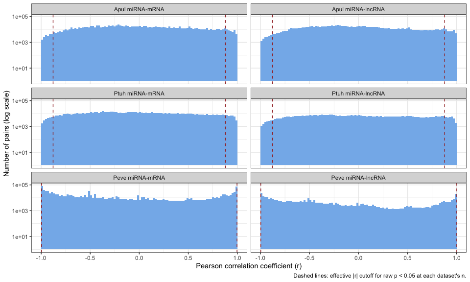
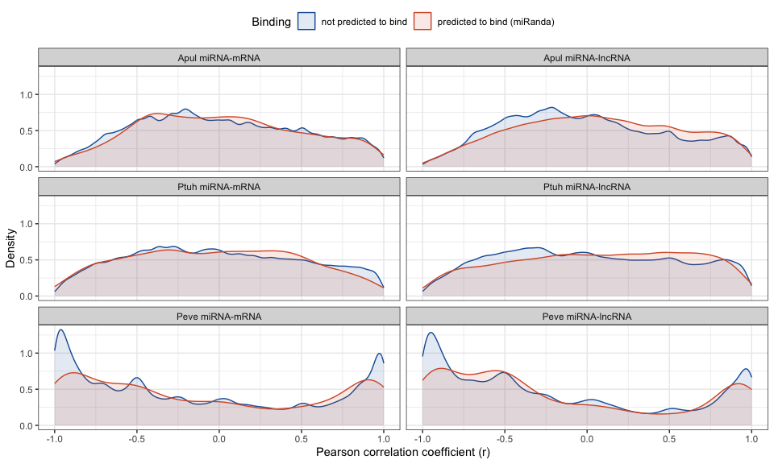
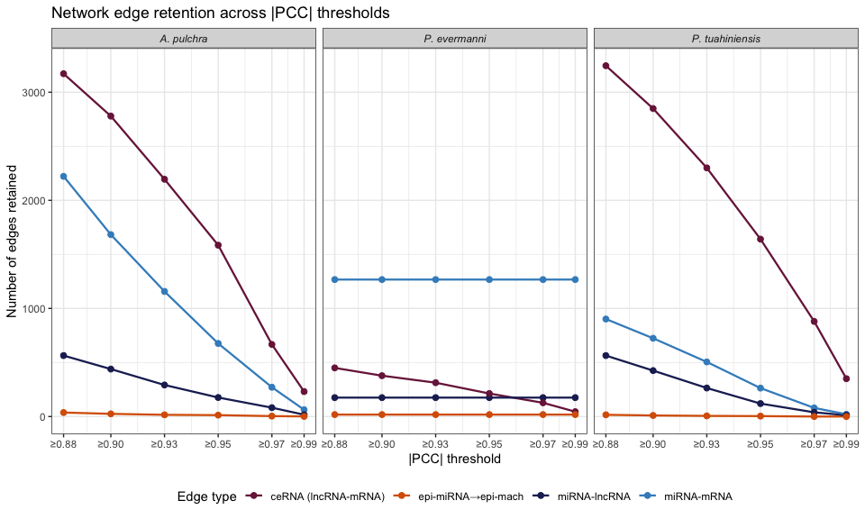
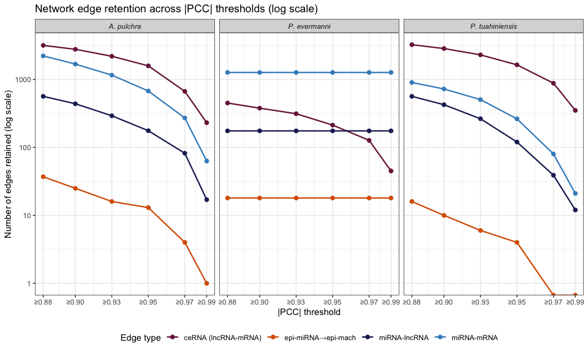
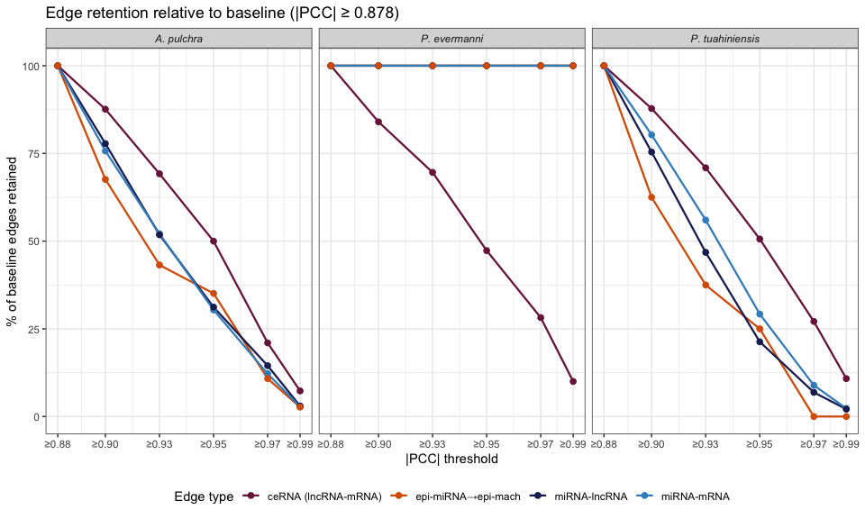
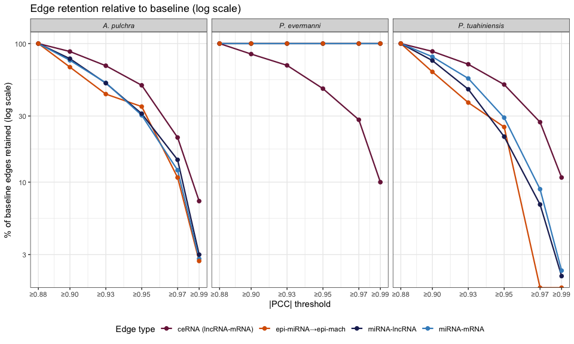
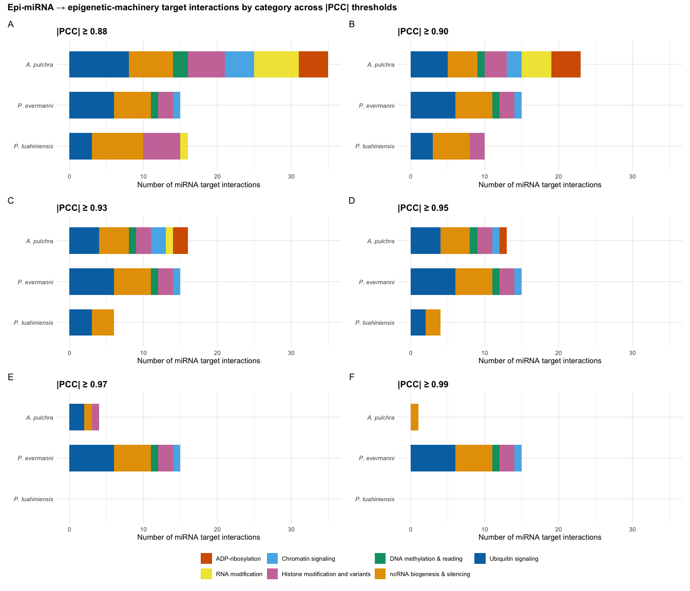
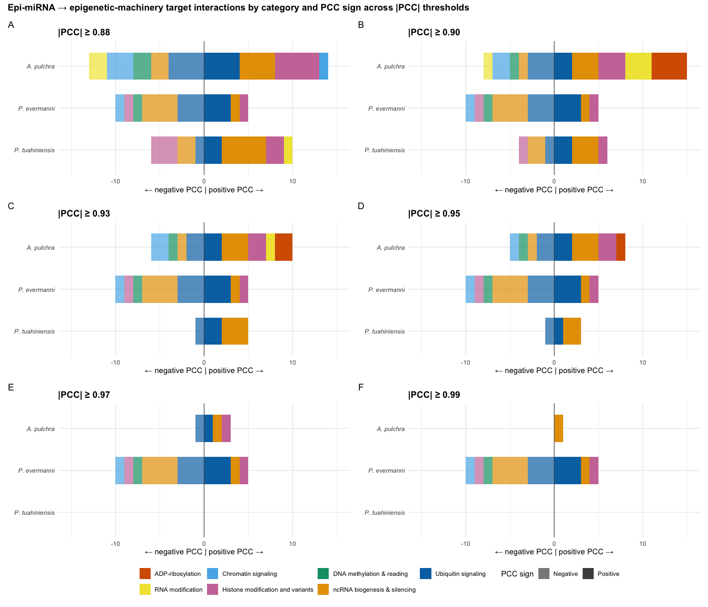

21-PCC-sensitivity-analysis
================
Kathleen Durkin
2026-07-14

- [1 Inputs](#1-inputs)
- [2 Load, label predicted binding, and
  summarize](#2-load-label-predicted-binding-and-summarize)
- [3 Why FDR retains no pairs at n = 5 but a residue at n =
  3](#3-why-fdr-retains-no-pairs-at-n--5-but-a-residue-at-n--3)
- [4 Fig. S-PCC-1 — distribution of all observed PCC
  values](#4-fig-s-pcc-1--distribution-of-all-observed-pcc-values)
- [5 Fig. S-PCC-2 — PCC distributions faceted by predicted binding
  (miRanda)](#5-fig-s-pcc-2--pcc-distributions-faceted-by-predicted-binding-miranda)
- [6 Formal test: are predicted-binding pairs enriched for negative
  correlation?](#6-formal-test-are-predicted-binding-pairs-enriched-for-negative-correlation)
- [7 Network sensitivity to \|PCC\|
  thresholds](#7-network-sensitivity-to-pcc-thresholds)
  - [7.1 Proportion retained relative to \|PCC\| \>=
    0.878](#71-proportion-retained-relative-to-pcc--0878)
  - [7.2 Visualize retention curves](#72-visualize-retention-curves)
- [8 Epi-miRNA target interactions by category across \|PCC\|
  thresholds](#8-epi-mirna-target-interactions-by-category-across-pcc-thresholds)
- [9 Specific epi-miRNA → epi-machinery interactions across
  thresholds](#9-specific-epi-mirna--epi-machinery-interactions-across-thresholds)
- [10 Session info](#10-session-info)

Supplementary sensitivity analysis for the miRNA–mRNA and miRNA–lncRNA
correlation-based interaction networks, prepared in response to reviewer
comments on (i) the use of correlation-based network inference at small
sample sizes, (ii) the reported predominance of positive miRNA–target
correlations, and (iii) the candidate (non-validated) status of the
inferred ceRNA networks.

It regenerates, from the full pairwise PCC result files:

1.  the distribution of all observed PCC values per dataset (Fig.
    S-PCC-1);
2.  the same distributions faceted by whether the pair was predicted to
    bind by miRanda (Fig. S-PCC-2);
3.  a sensitivity table comparing pair counts under raw p \< 0.05 vs
    Benjamini–Hochberg FDR (Table S-PCC-1); and
4.  formal two-sample tests of whether predicted-binding pairs are
    enriched for negative correlation relative to non-binding pairs.

# 1 Inputs

The full pairwise-PCC files are too large for GitHub and are read from
large-file storage (gannet). The pre-merged miRanda+PCC files (which
already reconcile miRanda target IDs with the count-matrix IDs) are read
from the repo and used only to define the set of *predicted-binding*
pairs.

`n` is the number of biological replicates entering each correlation (5
for *A. pulchra* and *P. tuahiniensis*; 3 for *P. evermanni*, whose
small-RNA libraries failed in 2 of 5 colonies).

``` r
gannet <- "https://gannet.fish.washington.edu/kdurkin1/ravenbackups/deep-dive-expression"

datasets <- list(
  list(name="Apul miRNA-mRNA",   n=5, target="mRNA",
       full=file.path(gannet,"D-Apul/output/09-Apul-mRNA-miRNA-interactions/Apul-PCC_miRNA_mRNA.csv"),
       merged="../../D-Apul/output/09-Apul-mRNA-miRNA-interactions/miranda_PCC_miRNA_mRNA.csv",
       mi="miRNA", ti="mRNA"),
  list(name="Apul miRNA-lncRNA", n=5, target="lncRNA",
       full=file.path(gannet,"D-Apul/output/28-Apul-miRNA-lncRNA-interactions/Apul-PCC_miRNA_lncRNA.csv"),
       merged="../../D-Apul/output/28-Apul-miRNA-lncRNA-interactions/miranda_PCC_miRNA_lncRNA.csv",
       mi="miRNA", ti="lncRNA"),
  list(name="Ptuh miRNA-mRNA",   n=5, target="mRNA",
       full=file.path(gannet,"F-Ptuh/output/11-Ptuh-mRNA-miRNA-interactions/three_prime_interaction/Ptuh-PCC_miRNA_mRNA.csv"),
       merged="../../F-Ptuh/output/11-Ptuh-mRNA-miRNA-interactions/three_prime_interaction/Ptuh-miranda_PCC_miRNA_mRNA.csv",
       mi="miRNA", ti="mRNA"),
  list(name="Ptuh miRNA-lncRNA", n=5, target="lncRNA",
       full=file.path(gannet,"F-Ptuh/output/15-Ptuh-miRNA-lncRNA-PCC/PCC_miRNA_lncRNA.csv"),
       merged="../../F-Ptuh/output/15-Ptuh-miRNA-lncRNA-PCC/miranda_PCC_miRNA_lncRNA.csv",
       mi="miRNA", ti="lncRNA"),
  list(name="Peve miRNA-mRNA",   n=3, target="mRNA",
       full=file.path(gannet,"E-Peve/output/10-Peve-mRNA-miRNA-interactions/Peve-PCC_miRNA_mRNA.csv"),
       merged="../../E-Peve/output/10-Peve-mRNA-miRNA-interactions/Peve-miranda_PCC_miRNA_mRNA.csv",
       mi="miRNA", ti="mRNA"),
  list(name="Peve miRNA-lncRNA", n=3, target="lncRNA",
       full=file.path(gannet,"E-Peve/output/15-Peve-miRNA-lncRNA-PCC/PCC_miRNA_lncRNA.csv"),
       merged="../../E-Peve/output/15-Peve-miRNA-lncRNA-PCC/miranda_PCC_miRNA_lncRNA.csv",
       mi="miRNA", ti="lncRNA")
)

# Two-sided critical |r| for p < 0.05 at a given n (df = n - 2)
rcrit <- function(n, alpha = 0.05) {
  tc <- qt(1 - alpha/2, df = n - 2)
  tc / sqrt(tc^2 + (n - 2))
}
```

# 2 Load, label predicted binding, and summarize

``` r
load_one <- function(d) {
  f <- fread(d$full, showProgress = FALSE)
  # Standardize the first four columns: rowindex, miRNA, target, PCC.cor, p_value, adjusted_p_value
  setnames(f, 2:6, c("miRNA","target","PCC","p_value","adj_p"))
  f <- f[!is.na(PCC)]
  m <- fread(d$merged, showProgress = FALSE)
  predset <- unique(paste(m[[d$mi]], m[[d$ti]]))
  f[, bind := paste(miRNA, target) %in% predset]
  f[, dataset := d$name][, n := d$n][, target_type := d$target]
  f
}

dat <- lapply(datasets, load_one)
names(dat) <- sapply(datasets, `[[`, "name")

summ <- rbindlist(lapply(datasets, function(d){
  f <- dat[[d$name]]
  rc <- rcrit(d$n)
  data.table(
    dataset          = d$name,
    n                = d$n,
    effective_cutoff = round(rc, 3),
    tested_pairs     = nrow(f),
    mean_r           = round(mean(f$PCC), 3),
    sd_r             = round(sd(f$PCC), 3),
    pct_abs_gt_0.5   = round(100*mean(abs(f$PCC) > 0.5), 1),
    raw_p_lt_0.05    = sum(f$p_value < 0.05),
    raw_pct          = round(100*mean(f$p_value < 0.05), 2),
    fdr_q_lt_0.05    = sum(f$adj_p < 0.05),
    raw_sig_pos_pct  = round(100*mean(f[p_value < 0.05]$PCC > 0), 1)
  )
}))
fwrite(summ, file.path(outdir, "Table_S-PCC-1_sensitivity.csv"))
knitr::kable(summ)
```

| dataset | n | effective_cutoff | tested_pairs | mean_r | sd_r | pct_abs_gt_0.5 | raw_p_lt_0.05 | raw_pct | fdr_q_lt_0.05 | raw_sig_pos_pct |
|:---|---:|---:|---:|---:|---:|---:|---:|---:|---:|---:|
| Apul miRNA-mRNA | 5 | 0.878 | 1311336 | 0.007 | 0.491 | 36.9 | 66154 | 5.04 | 0 | 70.4 |
| Apul miRNA-lncRNA | 5 | 0.878 | 1228110 | -0.004 | 0.485 | 35.7 | 62486 | 5.09 | 0 | 75.5 |
| Ptuh miRNA-mRNA | 5 | 0.878 | 980796 | -0.009 | 0.513 | 40.3 | 61866 | 6.31 | 0 | 61.4 |
| Ptuh miRNA-lncRNA | 5 | 0.878 | 597624 | 0.012 | 0.528 | 43.2 | 41931 | 7.02 | 0 | 67.6 |
| Peve miRNA-mRNA | 3 | 0.997 | 1327140 | -0.125 | 0.694 | 66.7 | 69580 | 5.24 | 2094 | 52.8 |
| Peve miRNA-lncRNA | 3 | 0.997 | 421290 | -0.200 | 0.671 | 66.4 | 18565 | 4.41 | 436 | 53.0 |

Note two points the table makes explicit:

- The nominal `|PCC| > 0.5` filter is **non-binding**: at n = 5 any pair
  with raw p \< 0.05 already has \|r\| \>= 0.878, and at n = 3, \|r\|
  \>= 0.997. The operative threshold is the effective cutoff, not 0.5.
- `raw_pct` (fraction of pairs passing raw p \< 0.05) sits at ~5% — the
  value expected under the global null — and `fdr_q_lt_0.05` collapses
  to 0 for the n = 5 datasets. This is the sense in which the networks
  are **not robust** to multiple-testing correction and must be framed
  as a hypothesis-generating screen \[@benjamini1995; @storey2003;
  @ballouz2015\].

# 3 Why FDR retains no pairs at n = 5 but a residue at n = 3

FDR-significance here is not mathematically impossible; it is
data-dependent. Benjamini–Hochberg \[@benjamini1995\] rejects the block
`1..k` where `k = max{i : p(i) <= (i/m)*alpha}`; its most lenient point
is the smallest rank, `alpha/m`. With m ~ 10^6 tests, `alpha/m ~ 4e-8`.
Inverting the Pearson p-value (`t = r*sqrt(df)/sqrt(1-r^2)`, df = n-2)
gives the \|r\| a pair must reach to clear that threshold.

``` r
r_needed <- function(p, df){ tc <- qt(1 - p/2, df); tc/sqrt(tc^2 + df) }
mech <- rbindlist(lapply(datasets, function(d){
  f <- dat[[d$name]]; m <- nrow(f); df <- d$n - 2
  data.table(dataset = d$name, n = d$n, m = m,
             bonf_p        = signif(0.05/m, 3),
             r_needed      = round(r_needed(0.05/m, df), 6),
             max_abs_r_obs = round(max(abs(f$PCC)), 6),
             fdr_survivors = sum(f$adj_p < 0.05))
}))
knitr::kable(mech)
```

| dataset           |   n |       m | bonf_p | r_needed | max_abs_r_obs | fdr_survivors |
|:------------------|----:|--------:|-------:|---------:|--------------:|--------------:|
| Apul miRNA-mRNA   |   5 | 1311336 |  0e+00 | 0.999990 |      0.999974 |             0 |
| Apul miRNA-lncRNA |   5 | 1228110 |  0e+00 | 0.999990 |      0.999960 |             0 |
| Ptuh miRNA-mRNA   |   5 |  980796 |  1e-07 | 0.999988 |      0.999969 |             0 |
| Ptuh miRNA-lncRNA |   5 |  597624 |  1e-07 | 0.999983 |      0.999931 |             0 |
| Peve miRNA-mRNA   |   3 | 1327140 |  0e+00 | 1.000000 |      1.000000 |          2094 |
| Peve miRNA-lncRNA |   3 |  421290 |  1e-07 | 1.000000 |      1.000000 |           436 |

At n = 5 (df = 3), clearing `alpha/m` requires \|r\| \>= ~0.99999 —
near-perfect collinearity of five observations. The single strongest
correlation among ~1.3M pairs reaches only ~0.99997, so no pair
survives. At n = 3 (df = 1), r = +/-1 (and thus p = 0) occurs whenever
three expression values are collinear, which is common for sparse count
triples; thousands of such pairs pull the BH line down and a block is
rejected. The *P. evermanni* FDR survivors are therefore a
low-degrees-of-freedom artifact, not evidence of stronger regulatory
signal, and should not be interpreted as more reliable than the n = 5
results \[@goeman2014; @fisher1915\].

# 4 Fig. S-PCC-1 — distribution of all observed PCC values

``` r
allr <- rbindlist(lapply(dat, function(f) f[, .(PCC, dataset, n)]))
allr[, dataset := factor(dataset, levels = sapply(datasets, `[[`, "name"))]
cuts <- data.table(dataset = summ$dataset, rc = sapply(datasets, function(d) rcrit(d$n)))
cuts[, dataset := factor(dataset, levels = levels(allr$dataset))]

p1 <- ggplot(allr, aes(PCC)) +
  geom_histogram(binwidth = 0.02, boundary = 0, fill = "#85B7EB", color = NA) +
  geom_vline(data = cuts, aes(xintercept =  rc), linetype = "dashed", color = "#A32D2D") +
  geom_vline(data = cuts, aes(xintercept = -rc), linetype = "dashed", color = "#A32D2D") +
  facet_wrap(~ dataset, scales = "fixed", ncol = 2) +
  scale_y_log10() +
  labs(x = "Pearson correlation coefficient (r)",
       y = "Number of pairs (log scale)",
       caption = "Dashed lines: effective |r| cutoff for raw p < 0.05 at each dataset's n.") +
  theme_bw(base_size = 11)
ggsave(file.path(outdir, "Fig_S-PCC-1_distributions.png"), p1, width = 10, height = 6, dpi = 300)
p1
```

<!-- -->

# 5 Fig. S-PCC-2 — PCC distributions faceted by predicted binding (miRanda)

Densities (area-normalized within group) so the much smaller
predicted-binding set is comparable to the non-binding set.

``` r
allr2 <- rbindlist(lapply(dat, function(f) f[, .(PCC, bind, dataset)]))
allr2[, dataset := factor(dataset, levels = sapply(datasets, `[[`, "name"))]
allr2[, Binding := ifelse(bind, "predicted to bind (miRanda)", "not predicted to bind")]

p2 <- ggplot(allr2, aes(PCC, color = Binding, fill = Binding)) +
  geom_density(alpha = 0.12, adjust = 1) +
  facet_wrap(~ dataset, scales = "fixed", ncol = 2) +
  scale_color_manual(values = c("not predicted to bind" = "#185FA5",
                                "predicted to bind (miRanda)" = "#D85A30")) +
  scale_fill_manual(values  = c("not predicted to bind" = "#185FA5",
                                "predicted to bind (miRanda)" = "#D85A30")) +
  labs(x = "Pearson correlation coefficient (r)", y = "Density") +
  theme_bw(base_size = 11) +
  theme(legend.position = "top")
ggsave(file.path(outdir, "Fig_S-PCC-2_by_binding.png"), p2, width = 10, height = 6, dpi = 300)
p2
```

<!-- -->

# 6 Formal test: are predicted-binding pairs enriched for negative correlation?

Under canonical miRNA-mediated repression (or lncRNA sponging), pairs
predicted to bind should be shifted toward **negative** correlation
relative to non-binding pairs. We test this three ways. Because the
non-binding group is very large, p-values are driven mainly by sample
size, so we report effect sizes (KS D; Cliff’s delta from the
Mann–Whitney U, with positive delta meaning predicted binders are *more
positively* correlated; difference in the negative- correlation rate).

``` r
tests <- rbindlist(lapply(dat, function(f){
  b  <- f[bind == TRUE,  PCC]
  nb <- f[bind == FALSE, PCC]
  ks <- suppressWarnings(ks.test(b, nb))
  w  <- suppressWarnings(wilcox.test(b, nb))
  U  <- as.numeric(w$statistic)
  cliff <- 2*U/(as.numeric(length(b))*as.numeric(length(nb))) - 1
  pt <- prop.test(c(sum(b < 0), sum(nb < 0)), c(length(b), length(nb)))
  data.table(
    dataset       = f$dataset[1],
    n_bind        = length(b),
    n_notbind     = length(nb),
    mean_r_bind   = round(mean(b), 3),
    mean_r_notb   = round(mean(nb), 3),
    Pneg_bind     = round(mean(b < 0), 3),
    Pneg_notb     = round(mean(nb < 0), 3),
    dPneg         = round(mean(b < 0) - mean(nb < 0), 3),
    prop_p        = signif(pt$p.value, 3),
    KS_D          = round(as.numeric(ks$statistic), 3),
    KS_p          = signif(ks$p.value, 3),
    cliffs_delta  = round(cliff, 3)
  )
}))
fwrite(tests, file.path(outdir, "Table_S-PCC-2_binding_tests.csv"))
knitr::kable(tests)
```

| dataset | n_bind | n_notbind | mean_r_bind | mean_r_notb | Pneg_bind | Pneg_notb | dPneg | prop_p | KS_D | KS_p | cliffs_delta |
|:---|---:|---:|---:|---:|---:|---:|---:|---:|---:|---:|---:|
| Apul miRNA-mRNA | 4563 | 1306773 | 0.023 | 0.007 | 0.503 | 0.519 | -0.016 | 0.032 | 0.029 | 0.001230 | 0.020 |
| Apul miRNA-lncRNA | 9105 | 1219005 | 0.064 | -0.004 | 0.462 | 0.534 | -0.072 | 0.000 | 0.076 | 0.000000 | 0.085 |
| Ptuh miRNA-mRNA | 3330 | 977466 | -0.027 | -0.009 | 0.514 | 0.524 | -0.010 | 0.261 | 0.034 | 0.000862 | -0.016 |
| Ptuh miRNA-lncRNA | 6243 | 591381 | 0.068 | 0.011 | 0.448 | 0.513 | -0.065 | 0.000 | 0.068 | 0.000000 | 0.065 |
| Peve miRNA-mRNA | 3545 | 1323595 | -0.088 | -0.125 | 0.586 | 0.596 | -0.010 | 0.214 | 0.030 | 0.003460 | 0.032 |
| Peve miRNA-lncRNA | 3481 | 417809 | -0.184 | -0.200 | 0.659 | 0.656 | 0.003 | 0.743 | 0.032 | 0.002070 | 0.015 |

**Interpretation.** In every dataset the effect is negligible (\|Cliff’s
delta\| \< 0.09; KS D \< 0.08) and, where directional, runs *opposite*
to the repression prediction — predicted binders are marginally *more*
positive, not more negative. Predicting binding via miRanda therefore
does not meaningfully shift the correlation distribution, indicating
that the sequence- based and correlation-based lines of evidence are
largely independent rather than mutually corroborating at these sample
sizes.

# 7 Network sensitivity to \|PCC\| thresholds

The networks used in the manuscript
(`15-miRNA-mRNA-lncRNA-network-ceRNA`) retain miRNA-target edges whose
PCC p-value is \< 0.05. At n = 5 this corresponds to \|r\| \>= 0.878; at
n = 3, \|r\| \>= 0.997. Here we ask how network size, epi-miRNA
activity, and ceRNA structure change when a stricter \|PCC\| floor is
applied to the combined network edge files.

``` r
library(patchwork)

ceRNA_dir <- "../output/15-miRNA-mRNA-lncRNA-network-ceRNA"
thresholds <- c(0.878, 0.90, 0.925, 0.95, 0.975, 0.99)
species_map <- c(Apul = "A. pulchra", Peve = "P. evermanni", Ptuh = "P. tuahiniensis")

# Load epimachinery annotations
epi <- read.csv("../output/12-miRNA-epimachinery/miRNAtargets_mach.csv", stringsAsFactors = FALSE)

summarize_network <- function(prefix) {
  edges <- read.csv(file.path(ceRNA_dir, paste0(prefix, "_edges_miRNA_mRNA_lncRNA_ceRNA_network_p0.05.csv")),
                    stringsAsFactors = FALSE)
  sp_name <- species_map[prefix]
  epi_sp  <- epi %>% filter(species == sp_name)
  epi_mirnas <- unique(epi_sp$given_miRNA_name)
  epi_mrnas  <- unique(epi_sp$target)

  # Split edge types
  mirna_mrna  <- edges %>% filter(region %in% c("3UTR", "5UTR", "CDS"))
  mirna_lncrna <- edges %>% filter(region == "lncRNA")
  lncrna_mrna <- edges %>% filter(region == "lncRNA_mRNA")

  rows <- list()
  for (t in thresholds) {
    mm <- mirna_mrna  %>% filter(abs(PCC.cor) >= t)
    ml <- mirna_lncrna %>% filter(abs(PCC.cor) >= t)
    lm <- lncrna_mrna %>% filter(abs(PCC.cor) >= t)
    all_e <- rbind(mm, ml, lm)
    nodes <- unique(c(all_e$source, all_e$target))
    n_mirna  <- sum(grepl("mir", nodes))
    n_lncrna <- sum(grepl("lncRNA", nodes))
    n_mrna   <- length(nodes) - n_mirna - n_lncrna

    # Epi-miRNA -> epi-machinery mRNA edges
    epi_fb <- mm %>% filter(source %in% epi_mirnas & target %in% epi_mrnas)

    # Epi-miRNAs with at least one edge of any type
    epi_active <- all_e %>% filter(source %in% epi_mirnas)

    rows[[as.character(t)]] <- data.frame(
      species            = sp_name,
      pcc_threshold      = t,
      mirna_mrna_edges   = nrow(mm),
      mirna_lncrna_edges = nrow(ml),
      cerna_edges        = nrow(lm),
      total_edges        = nrow(all_e),
      net_nodes          = length(nodes),
      net_miRNA          = n_mirna,
      net_lncRNA         = n_lncrna,
      net_mRNA           = n_mrna,
      epi_mirna_active   = length(unique(epi_active$source)),
      epi_mach_in_net    = sum(nodes %in% epi_mrnas),
      epi_fb_edges       = nrow(epi_fb),
      epi_fb_pairs       = nrow(distinct(epi_fb, source, target)),
      epi_fb_mirnas      = length(unique(epi_fb$source)),
      epi_fb_mrnas       = length(unique(epi_fb$target)),
      stringsAsFactors   = FALSE
    )
  }
  do.call(rbind, rows)
}

network_sensitivity <- rbind(
  summarize_network("Apul"),
  summarize_network("Peve"),
  summarize_network("Ptuh")
)

fwrite(network_sensitivity, file.path(outdir, "Table_S-PCC-3_network_sensitivity.csv"))
knitr::kable(network_sensitivity)
```

|  | species | pcc_threshold | mirna_mrna_edges | mirna_lncrna_edges | cerna_edges | total_edges | net_nodes | net_miRNA | net_lncRNA | net_mRNA | epi_mirna_active | epi_mach_in_net | epi_fb_edges | epi_fb_pairs | epi_fb_mirnas | epi_fb_mrnas |
|----|:---|---:|---:|---:|---:|---:|---:|---:|---:|---:|---:|---:|---:|---:|---:|---:|
| 0.878 | A. pulchra | 0.878 | 2222 | 564 | 3171 | 5957 | 2302 | 39 | 442 | 1821 | 24 | 34 | 37 | 35 | 24 | 34 |
| 0.9 | A. pulchra | 0.900 | 1683 | 439 | 2779 | 4901 | 1842 | 39 | 367 | 1436 | 24 | 24 | 25 | 23 | 17 | 23 |
| 0.925 | A. pulchra | 0.925 | 1157 | 292 | 2195 | 3644 | 1400 | 39 | 288 | 1073 | 24 | 19 | 16 | 16 | 12 | 16 |
| 0.95 | A. pulchra | 0.950 | 676 | 176 | 1585 | 2437 | 1022 | 39 | 209 | 774 | 24 | 16 | 13 | 13 | 11 | 13 |
| 0.975 | A. pulchra | 0.975 | 271 | 82 | 667 | 1020 | 577 | 35 | 139 | 403 | 23 | 6 | 4 | 4 | 4 | 4 |
| 0.99 | A. pulchra | 0.990 | 63 | 17 | 231 | 311 | 249 | 27 | 65 | 157 | 19 | 2 | 1 | 1 | 1 | 1 |
| 0.8781 | P. evermanni | 0.878 | 1267 | 175 | 450 | 1892 | 1293 | 42 | 160 | 1091 | 8 | 14 | 18 | 15 | 8 | 14 |
| 0.91 | P. evermanni | 0.900 | 1267 | 175 | 378 | 1820 | 1293 | 42 | 160 | 1091 | 8 | 14 | 18 | 15 | 8 | 14 |
| 0.9251 | P. evermanni | 0.925 | 1267 | 175 | 313 | 1755 | 1293 | 42 | 160 | 1091 | 8 | 14 | 18 | 15 | 8 | 14 |
| 0.951 | P. evermanni | 0.950 | 1267 | 175 | 213 | 1655 | 1293 | 42 | 160 | 1091 | 8 | 14 | 18 | 15 | 8 | 14 |
| 0.9751 | P. evermanni | 0.975 | 1267 | 175 | 127 | 1569 | 1293 | 42 | 160 | 1091 | 8 | 14 | 18 | 15 | 8 | 14 |
| 0.991 | P. evermanni | 0.990 | 1267 | 175 | 45 | 1487 | 1293 | 42 | 160 | 1091 | 8 | 14 | 18 | 15 | 8 | 14 |
| 0.8782 | P. tuahiniensis | 0.878 | 902 | 564 | 3245 | 4711 | 1266 | 37 | 393 | 836 | 11 | 16 | 16 | 16 | 11 | 16 |
| 0.92 | P. tuahiniensis | 0.900 | 724 | 425 | 2849 | 3998 | 1086 | 37 | 330 | 719 | 11 | 10 | 10 | 10 | 8 | 10 |
| 0.9252 | P. tuahiniensis | 0.925 | 505 | 264 | 2300 | 3069 | 892 | 37 | 274 | 581 | 11 | 7 | 6 | 6 | 5 | 6 |
| 0.952 | P. tuahiniensis | 0.950 | 263 | 120 | 1641 | 2024 | 687 | 35 | 212 | 440 | 11 | 5 | 4 | 4 | 3 | 4 |
| 0.9752 | P. tuahiniensis | 0.975 | 80 | 39 | 880 | 999 | 432 | 25 | 144 | 263 | 10 | 0 | 0 | 0 | 0 | 0 |
| 0.992 | P. tuahiniensis | 0.990 | 21 | 12 | 350 | 383 | 256 | 12 | 88 | 156 | 6 | 0 | 0 | 0 | 0 | 0 |

## 7.1 Proportion retained relative to \|PCC\| \>= 0.878

``` r
# Compute percentage retained
pct_table <- network_sensitivity %>%
  group_by(species) %>%
  mutate(
    across(c(mirna_mrna_edges, mirna_lncrna_edges, cerna_edges, total_edges,
             net_nodes, net_miRNA, epi_mirna_active, epi_mach_in_net,
             epi_fb_edges, epi_fb_pairs),
           ~ round(100 * . / .[pcc_threshold == 0.878], 1))
  )

fwrite(pct_table, file.path(outdir, "Table_S-PCC-3b_network_sensitivity_pct.csv"))
knitr::kable(pct_table)
```

| species | pcc_threshold | mirna_mrna_edges | mirna_lncrna_edges | cerna_edges | total_edges | net_nodes | net_miRNA | net_lncRNA | net_mRNA | epi_mirna_active | epi_mach_in_net | epi_fb_edges | epi_fb_pairs | epi_fb_mirnas | epi_fb_mrnas |
|:---|---:|---:|---:|---:|---:|---:|---:|---:|---:|---:|---:|---:|---:|---:|---:|
| A. pulchra | 0.878 | 100.0 | 100.0 | 100.0 | 100.0 | 100.0 | 100.0 | 442 | 1821 | 100.0 | 100.0 | 100.0 | 100.0 | 24 | 34 |
| A. pulchra | 0.900 | 75.7 | 77.8 | 87.6 | 82.3 | 80.0 | 100.0 | 367 | 1436 | 100.0 | 70.6 | 67.6 | 65.7 | 17 | 23 |
| A. pulchra | 0.925 | 52.1 | 51.8 | 69.2 | 61.2 | 60.8 | 100.0 | 288 | 1073 | 100.0 | 55.9 | 43.2 | 45.7 | 12 | 16 |
| A. pulchra | 0.950 | 30.4 | 31.2 | 50.0 | 40.9 | 44.4 | 100.0 | 209 | 774 | 100.0 | 47.1 | 35.1 | 37.1 | 11 | 13 |
| A. pulchra | 0.975 | 12.2 | 14.5 | 21.0 | 17.1 | 25.1 | 89.7 | 139 | 403 | 95.8 | 17.6 | 10.8 | 11.4 | 4 | 4 |
| A. pulchra | 0.990 | 2.8 | 3.0 | 7.3 | 5.2 | 10.8 | 69.2 | 65 | 157 | 79.2 | 5.9 | 2.7 | 2.9 | 1 | 1 |
| P. evermanni | 0.878 | 100.0 | 100.0 | 100.0 | 100.0 | 100.0 | 100.0 | 160 | 1091 | 100.0 | 100.0 | 100.0 | 100.0 | 8 | 14 |
| P. evermanni | 0.900 | 100.0 | 100.0 | 84.0 | 96.2 | 100.0 | 100.0 | 160 | 1091 | 100.0 | 100.0 | 100.0 | 100.0 | 8 | 14 |
| P. evermanni | 0.925 | 100.0 | 100.0 | 69.6 | 92.8 | 100.0 | 100.0 | 160 | 1091 | 100.0 | 100.0 | 100.0 | 100.0 | 8 | 14 |
| P. evermanni | 0.950 | 100.0 | 100.0 | 47.3 | 87.5 | 100.0 | 100.0 | 160 | 1091 | 100.0 | 100.0 | 100.0 | 100.0 | 8 | 14 |
| P. evermanni | 0.975 | 100.0 | 100.0 | 28.2 | 82.9 | 100.0 | 100.0 | 160 | 1091 | 100.0 | 100.0 | 100.0 | 100.0 | 8 | 14 |
| P. evermanni | 0.990 | 100.0 | 100.0 | 10.0 | 78.6 | 100.0 | 100.0 | 160 | 1091 | 100.0 | 100.0 | 100.0 | 100.0 | 8 | 14 |
| P. tuahiniensis | 0.878 | 100.0 | 100.0 | 100.0 | 100.0 | 100.0 | 100.0 | 393 | 836 | 100.0 | 100.0 | 100.0 | 100.0 | 11 | 16 |
| P. tuahiniensis | 0.900 | 80.3 | 75.4 | 87.8 | 84.9 | 85.8 | 100.0 | 330 | 719 | 100.0 | 62.5 | 62.5 | 62.5 | 8 | 10 |
| P. tuahiniensis | 0.925 | 56.0 | 46.8 | 70.9 | 65.1 | 70.5 | 100.0 | 274 | 581 | 100.0 | 43.8 | 37.5 | 37.5 | 5 | 6 |
| P. tuahiniensis | 0.950 | 29.2 | 21.3 | 50.6 | 43.0 | 54.3 | 94.6 | 212 | 440 | 100.0 | 31.2 | 25.0 | 25.0 | 3 | 4 |
| P. tuahiniensis | 0.975 | 8.9 | 6.9 | 27.1 | 21.2 | 34.1 | 67.6 | 144 | 263 | 90.9 | 0.0 | 0.0 | 0.0 | 0 | 0 |
| P. tuahiniensis | 0.990 | 2.3 | 2.1 | 10.8 | 8.1 | 20.2 | 32.4 | 88 | 156 | 54.5 | 0.0 | 0.0 | 0.0 | 0 | 0 |

## 7.2 Visualize retention curves

``` r
# Reshape for plotting
plot_df <- network_sensitivity %>%
  dplyr::select(species, pcc_threshold,
         `miRNA-mRNA` = mirna_mrna_edges,
         `miRNA-lncRNA` = mirna_lncrna_edges,
         `ceRNA (lncRNA-mRNA)` = cerna_edges,
         `epi-miRNA→epi-mach` = epi_fb_edges) %>%
  pivot_longer(cols = c(`miRNA-mRNA`, `miRNA-lncRNA`, `ceRNA (lncRNA-mRNA)`, `epi-miRNA→epi-mach`),
               names_to = "edge_type", values_to = "n_edges") %>%
  mutate(species = factor(species, levels = c("A. pulchra", "P. evermanni", "P. tuahiniensis")))

p3 <- ggplot(plot_df, aes(x = pcc_threshold, y = n_edges, color = edge_type, group = edge_type)) +
  geom_line(linewidth = 0.8) +
  geom_point(size = 2) +
  facet_wrap(~ species, scales = "fixed") +
  scale_x_continuous(breaks = thresholds, labels = sprintf("≥%.2f", thresholds)) +
  scale_color_manual(values = c("miRNA-mRNA" = "#408EC6",
                                "miRNA-lncRNA" = "#1E2761",
                                "ceRNA (lncRNA-mRNA)" = "#7A2048",
                                "epi-miRNA→epi-mach" = "#D95F02")) +
  labs(x = "|PCC| threshold", y = "Number of edges retained", color = "Edge type",
       title = "Network edge retention across |PCC| thresholds") +
  theme_bw(base_size = 11) +
  theme(strip.text = element_text(face = "italic"),
        legend.position = "bottom")

ggsave(file.path(outdir, "Fig_S-PCC-3_retention.png"), p3, width = 10, height = 6, dpi = 300)
p3
```

<!-- -->

A logged y-axis makes the steep decline at higher thresholds easier to
assess, particularly for edge types with very different magnitudes.

``` r
p3_log <- p3 +
  scale_y_log10() +
  labs(title = "Network edge retention across |PCC| thresholds (log scale)",
       y = "Number of edges retained (log scale)")

ggsave(file.path(outdir, "Fig_S-PCC-3_retention_log.png"), p3_log, width = 10, height = 6, dpi = 300)
p3_log
```

<!-- -->

A percentage-retention version (relative to the \|PCC\|≥0.878 baseline)
normalizes all edge types to the same starting point (100%), making
cross-type comparisons of the rate of decline straightforward.

``` r
plot_pct <- pct_table %>%
  dplyr::select(species, pcc_threshold,
         `miRNA-mRNA` = mirna_mrna_edges,
         `miRNA-lncRNA` = mirna_lncrna_edges,
         `ceRNA (lncRNA-mRNA)` = cerna_edges,
         `epi-miRNA→epi-mach` = epi_fb_edges) %>%
  pivot_longer(cols = c(`miRNA-mRNA`, `miRNA-lncRNA`, `ceRNA (lncRNA-mRNA)`, `epi-miRNA→epi-mach`),
               names_to = "edge_type", values_to = "pct_retained") %>%
  mutate(species = factor(species, levels = c("A. pulchra", "P. evermanni", "P. tuahiniensis")))

p3_pct <- ggplot(plot_pct, aes(x = pcc_threshold, y = pct_retained, color = edge_type, group = edge_type)) +
  geom_line(linewidth = 0.8) +
  geom_point(size = 2) +
  facet_wrap(~ species) +
  scale_x_continuous(breaks = thresholds, labels = sprintf("≥%.2f", thresholds)) +
  scale_color_manual(values = c("miRNA-mRNA" = "#408EC6",
                                "miRNA-lncRNA" = "#1E2761",
                                "ceRNA (lncRNA-mRNA)" = "#7A2048",
                                "epi-miRNA→epi-mach" = "#D95F02")) +
  labs(x = "|PCC| threshold", y = "% of baseline edges retained", color = "Edge type",
       title = "Edge retention relative to baseline (|PCC| ≥ 0.878)") +
  theme_bw(base_size = 11) +
  theme(strip.text = element_text(face = "italic"),
        legend.position = "bottom")

ggsave(file.path(outdir, "Fig_S-PCC-3_retention_pct.png"), p3_pct, width = 10, height = 6, dpi = 300)
p3_pct
```

<!-- -->

``` r
p3_pct_log <- p3_pct +
  scale_y_log10() +
  labs(title = "Edge retention relative to baseline (log scale)",
       y = "% of baseline edges retained (log scale)")

ggsave(file.path(outdir, "Fig_S-PCC-3_retention_pct_log.png"), p3_pct_log, width = 10, height = 6, dpi = 300)
p3_pct_log
```

<!-- -->

# 8 Epi-miRNA target interactions by category across \|PCC\| thresholds

The `12-miRNA-epimachinery` analysis identified miRNA →
epigenetic-machinery target interactions (predicted binding +
significant coexpression) and categorized each target by functional
category. Here we re-plot those same interactions, but progressively
filtered by \|PCC\| threshold, to show which functional categories of
epimachinery are retained or lost as stringency increases.

``` r
# Category / species ordering and colors — identical to 12-miRNA-epimachinery.Rmd
cat_order <- c("ADP-ribosylation",
               "RNA modification",
               "Chromatin signaling",
               "Histone modification and variants",
               "DNA methylation & reading",
               "ncRNA biogenesis & silencing",
               "Ubiquitin signaling")
species_order <- c("A. pulchra", "P. evermanni", "P. tuahiniensis")

cat_colors <- c("ADP-ribosylation"                     = "#D55E00",
                "RNA modification"                     = "#F0E442",
                "Chromatin signaling"                  = "#56B4E9",
                "Histone modification and variants"    = "#CC79A7",
                "DNA methylation & reading"            = "#009E73",
                "ncRNA biogenesis & silencing"         = "#E69F00",
                "Ubiquitin signaling"                  = "#0072B2")

# Build per-threshold count table
epi_threshold_counts <- epi %>%
  filter(!is.na(category)) %>%
  mutate(species  = factor(species,  levels = species_order),
         category = factor(category, levels = cat_order))

count_at_threshold <- function(df, t) {
  df %>%
    filter(abs(PCC.cor) >= t) %>%
    count(species, category, name = "n_targets") %>%
    complete(species = species_order, category = cat_order, fill = list(n_targets = 0)) %>%
    mutate(pcc_threshold = t)
}

plot_df_epi <- do.call(rbind, lapply(thresholds, function(t) count_at_threshold(epi_threshold_counts, t))) %>%
  mutate(category = factor(category, levels = cat_order),
         species  = factor(species,  levels = rev(species_order)),
         pcc_threshold = factor(pcc_threshold, levels = thresholds,
                                labels = sprintf("|PCC| ≥ %.2f", thresholds)))

# Individual stacked-bar plots per threshold
epi_cat_plots <- lapply(thresholds, function(t) {
  pd <- plot_df_epi %>% filter(pcc_threshold == sprintf("|PCC| ≥ %.2f", t))
  ggplot(pd, aes(x = n_targets, y = species, fill = category)) +
    geom_col(position = "stack", width = 0.65) +
    scale_fill_manual(values = cat_colors, breaks = cat_order, name = NULL) +
    xlim(c(0, 35))+
    labs(x = "Number of miRNA target interactions", y = NULL,
         title = sprintf("|PCC| ≥ %.2f", t)) +
    theme_minimal() +
    theme(axis.text.y = element_text(face = "italic"))
})

# Combined patchwork figure
p_epi_cat <- wrap_plots(epi_cat_plots, ncol = 2, guides = "collect") +
  plot_annotation(title = "Epi-miRNA → epigenetic-machinery target interactions by category across |PCC| thresholds",
                  tag_levels = "A") &
  theme(legend.position = "bottom",
        plot.title = element_text(size = 13, face = "bold"))

ggsave(file.path(outdir, "Fig_S-PCC-4_epi_category_by_threshold.png"),
       p_epi_cat, width = 14, height = 12, dpi = 300)
p_epi_cat
```

<!-- -->

A signed (positive vs. negative PCC) version of the same plot, again
matching the style of `12-miRNA-epimachinery.Rmd`:

``` r
count_signed_at_threshold <- function(df, t) {
  df %>%
    filter(abs(PCC.cor) >= t) %>%
    mutate(direction = ifelse(PCC.cor >= 0, "Positive", "Negative")) %>%
    count(species, category, direction, name = "n_targets") %>%
    complete(species = species_order, category = cat_order,
             direction = c("Negative", "Positive"), fill = list(n_targets = 0)) %>%
    mutate(pcc_threshold = t)
}

plot_df_epi_signed <- do.call(rbind, lapply(thresholds, function(t) count_signed_at_threshold(epi_threshold_counts, t))) %>%
  mutate(category  = factor(category,  levels = cat_order),
         species   = factor(species,   levels = rev(species_order)),
         direction = factor(direction, levels = c("Negative", "Positive")),
         n_signed  = ifelse(direction == "Negative", -n_targets, n_targets),
         pcc_threshold = factor(pcc_threshold, levels = thresholds,
                                labels = sprintf("|PCC| ≥ %.2f", thresholds)))

epi_cat_signed_plots <- lapply(thresholds, function(t) {
  pd <- plot_df_epi_signed %>% filter(pcc_threshold == sprintf("|PCC| ≥ %.2f", t))
  ggplot(pd, aes(x = n_signed, y = species, fill = category, alpha = direction)) +
    geom_col(position = "stack", width = 0.65) +
    geom_vline(xintercept = 0, linewidth = 0.4, colour = "grey30") +
    scale_fill_manual(values = cat_colors, breaks = cat_order, name = NULL) +
    scale_alpha_manual(values = c(Negative = 0.7, Positive = 1), name = "PCC sign",
                       guide = guide_legend(override.aes = list(fill = "grey30"))) +
    scale_x_continuous(labels = function(x) abs(x)) +
    xlim(c(-15,15)) +
    labs(x = "← negative PCC | positive PCC →", y = NULL,
         title = sprintf("|PCC| ≥ %.2f", t)) +
    theme_minimal() +
    theme(axis.text.y = element_text(face = "italic"))
})

p_epi_cat_signed <- wrap_plots(epi_cat_signed_plots, ncol = 2, guides = "collect") +
  plot_annotation(title = "Epi-miRNA → epigenetic-machinery target interactions by category and PCC sign across |PCC| thresholds",
                  tag_levels = "A") &
  theme(legend.position = "bottom",
        plot.title = element_text(size = 13, face = "bold"))

ggsave(file.path(outdir, "Fig_S-PCC-4_epi_category_by_threshold_signed.png"),
       p_epi_cat_signed, width = 14, height = 12, dpi = 300)
p_epi_cat_signed
```

<!-- -->

# 9 Specific epi-miRNA → epi-machinery interactions across thresholds

For each species, list the specific epi-miRNA → epi-machinery mRNA edges
retained at each \|PCC\| threshold. This identifies which candidate
feedback-loop interactions are most robust.

``` r
for (prefix in c("Apul", "Peve", "Ptuh")) {
  edges <- read.csv(file.path(ceRNA_dir, paste0(prefix, "_edges_miRNA_mRNA_lncRNA_ceRNA_network_p0.05.csv")),
                    stringsAsFactors = FALSE)
  sp_name <- species_map[prefix]
  epi_sp  <- epi %>% filter(species == sp_name)
  epi_mirnas <- unique(epi_sp$given_miRNA_name)
  epi_mrnas  <- unique(epi_sp$target)

  mirna_mrna <- edges %>% filter(region %in% c("3UTR", "5UTR", "CDS"))

  cat(sprintf("\n## %s\n\n", sp_name))

  for (t in thresholds) {
    fb <- mirna_mrna %>%
      filter(abs(PCC.cor) >= t,
             source %in% epi_mirnas,
             target %in% epi_mrnas) %>%
      distinct(source, target, .keep_all = TRUE) %>%
      left_join(epi_sp %>% dplyr::select(target, gene) %>% distinct(), by = "target") %>%
      arrange(source, gene)

    cat(sprintf("\n**|PCC| >= %.2f** (%d edges, %d unique pairs):\n\n", t, nrow(fb), nrow(distinct(fb, source, target))))
    if (nrow(fb) > 0) {
      cat("| miRNA | mRNA | gene | |PCC| |\n|-------|------|------|------|\n")
      for (i in 1:nrow(fb)) {
        cat(sprintf("| %s | %s | %s | %.3f |\n",
          fb$source[i], fb$target[i], fb$gene[i], abs(fb$PCC.cor[i])))
      }
    } else {
      cat("*None retained.*\n")
    }
    cat("\n")
  }
}
```

    ## 
    ## ## A. pulchra
    ## 
    ## 
    ## **|PCC| >= 0.88** (35 edges, 35 unique pairs):
    ## 
    ## | miRNA | mRNA | gene | |PCC| |
    ## |-------|------|------|------|
    ## | apul-mir-100 | FUN_023552 | TRMT1-202 | 0.906 |
    ## | apul-mir-100 | FUN_038060 | USP31-201; USP43-201 | 0.895 |
    ## | apul-mir-2022 | FUN_032607 | PSMD14-201 | 0.976 |
    ## | apul-mir-2023 | FUN_036826 | Chuk-201 | 0.899 |
    ## | apul-mir-2023 | FUN_041827 | INTS6 | 1.000 |
    ## | apul-mir-2030 | FUN_017901 | MAP3K12-205 | 0.890 |
    ## | apul-mir-2050 | FUN_032193 | EXOSC6 | 0.883 |
    ## | apul-mir-novel-10 | FUN_016340 | UBE4A-201 | 0.922 |
    ## | apul-mir-novel-13 | FUN_035359 | Parp9-203; Parp14-201; PARP15-202 | 0.950 |
    ## | apul-mir-novel-14 | FUN_022341 | Tet3-203 | 0.879 |
    ## | apul-mir-novel-15 | FUN_033843 | DDB1-201 | 0.985 |
    ## | apul-mir-novel-15 | FUN_022863 | PAN2-201 | 0.964 |
    ## | apul-mir-novel-15 | FUN_034727 | USP7-201 | 0.957 |
    ## | apul-mir-novel-17 | FUN_040029 | Parp7-Tiparp-201 | 0.913 |
    ## | apul-mir-novel-19 | FUN_006885 | USP19-205 | 0.890 |
    ## | apul-mir-novel-23 | FUN_001425 | Kdm3a-201; Kdm3b-201; Kdm3c-Jmjd1c-211 | 0.980 |
    ## | apul-mir-novel-23 | FUN_028309 | Kdm6a-202; Uty-201 | 0.925 |
    ## | apul-mir-novel-23 | FUN_001354 | Parp5a-Tnks-201; Parp5b-Tnks2-201 | 0.901 |
    ## | apul-mir-novel-27 | FUN_040713 | Mbd2-201; Mbd3-201 | 0.951 |
    ## | apul-mir-novel-28 | FUN_035067 | Prmt7-201 | 0.881 |
    ## | apul-mir-novel-28 | FUN_000213 | RDRP | 0.961 |
    ## | apul-mir-novel-29 | FUN_013560 | PPP1R7-201 | 0.947 |
    ## | apul-mir-novel-30 | FUN_038347 | DUS1L-201 | 0.908 |
    ## | apul-mir-novel-31 | FUN_041920 | COPS6-201 | 0.889 |
    ## | apul-mir-novel-31 | FUN_004512 | Kat14-201 | 0.895 |
    ## | apul-mir-novel-31 | FUN_008664 | PQBP1 | 0.881 |
    ## | apul-mir-novel-32 | FUN_032699 | AGO3; AGO4; AGO1; AGO2 | 0.966 |
    ## | apul-mir-novel-34 | FUN_022390 | TRMT61A-202 | 0.894 |
    ## | apul-mir-novel-4 | FUN_032162 | PPP1CB-203 | 0.970 |
    ## | apul-mir-novel-5 | FUN_037383 | ADAR-202 | 0.919 |
    ## | apul-mir-novel-7 | FUN_028279 | PUS7L-201 | 0.879 |
    ## | apul-mir-novel-8a; apul-mir-novel-8b | FUN_038633 | JOSD1-210; JOSD2-204 | 0.965 |
    ## | apul-mir-novel-9 | FUN_038088 | Arh1-Adprh-201 | 0.949 |
    ## | apul-mir-novel-9 | FUN_011179 | Kmt5a—Setd8-202 | 0.965 |
    ## | apul-mir-novel-9 | FUN_028279 | PUS7L-201 | 0.930 |
    ## 
    ## 
    ## **|PCC| >= 0.90** (23 edges, 23 unique pairs):
    ## 
    ## | miRNA | mRNA | gene | |PCC| |
    ## |-------|------|------|------|
    ## | apul-mir-100 | FUN_023552 | TRMT1-202 | 0.906 |
    ## | apul-mir-2022 | FUN_032607 | PSMD14-201 | 0.976 |
    ## | apul-mir-2023 | FUN_041827 | INTS6 | 1.000 |
    ## | apul-mir-novel-10 | FUN_016340 | UBE4A-201 | 0.922 |
    ## | apul-mir-novel-13 | FUN_035359 | Parp9-203; Parp14-201; PARP15-202 | 0.950 |
    ## | apul-mir-novel-15 | FUN_033843 | DDB1-201 | 0.985 |
    ## | apul-mir-novel-15 | FUN_022863 | PAN2-201 | 0.964 |
    ## | apul-mir-novel-15 | FUN_034727 | USP7-201 | 0.957 |
    ## | apul-mir-novel-17 | FUN_040029 | Parp7-Tiparp-201 | 0.913 |
    ## | apul-mir-novel-23 | FUN_001425 | Kdm3a-201; Kdm3b-201; Kdm3c-Jmjd1c-211 | 0.980 |
    ## | apul-mir-novel-23 | FUN_028309 | Kdm6a-202; Uty-201 | 0.925 |
    ## | apul-mir-novel-23 | FUN_001354 | Parp5a-Tnks-201; Parp5b-Tnks2-201 | 0.901 |
    ## | apul-mir-novel-27 | FUN_040713 | Mbd2-201; Mbd3-201 | 0.951 |
    ## | apul-mir-novel-28 | FUN_000213 | RDRP | 0.961 |
    ## | apul-mir-novel-29 | FUN_013560 | PPP1R7-201 | 0.947 |
    ## | apul-mir-novel-30 | FUN_038347 | DUS1L-201 | 0.908 |
    ## | apul-mir-novel-32 | FUN_032699 | AGO3; AGO4; AGO1; AGO2 | 0.966 |
    ## | apul-mir-novel-4 | FUN_032162 | PPP1CB-203 | 0.970 |
    ## | apul-mir-novel-5 | FUN_037383 | ADAR-202 | 0.919 |
    ## | apul-mir-novel-8a; apul-mir-novel-8b | FUN_038633 | JOSD1-210; JOSD2-204 | 0.965 |
    ## | apul-mir-novel-9 | FUN_038088 | Arh1-Adprh-201 | 0.949 |
    ## | apul-mir-novel-9 | FUN_011179 | Kmt5a—Setd8-202 | 0.965 |
    ## | apul-mir-novel-9 | FUN_028279 | PUS7L-201 | 0.930 |
    ## 
    ## 
    ## **|PCC| >= 0.93** (16 edges, 16 unique pairs):
    ## 
    ## | miRNA | mRNA | gene | |PCC| |
    ## |-------|------|------|------|
    ## | apul-mir-2022 | FUN_032607 | PSMD14-201 | 0.976 |
    ## | apul-mir-2023 | FUN_041827 | INTS6 | 1.000 |
    ## | apul-mir-novel-13 | FUN_035359 | Parp9-203; Parp14-201; PARP15-202 | 0.950 |
    ## | apul-mir-novel-15 | FUN_033843 | DDB1-201 | 0.985 |
    ## | apul-mir-novel-15 | FUN_022863 | PAN2-201 | 0.964 |
    ## | apul-mir-novel-15 | FUN_034727 | USP7-201 | 0.957 |
    ## | apul-mir-novel-23 | FUN_001425 | Kdm3a-201; Kdm3b-201; Kdm3c-Jmjd1c-211 | 0.980 |
    ## | apul-mir-novel-27 | FUN_040713 | Mbd2-201; Mbd3-201 | 0.951 |
    ## | apul-mir-novel-28 | FUN_000213 | RDRP | 0.961 |
    ## | apul-mir-novel-29 | FUN_013560 | PPP1R7-201 | 0.947 |
    ## | apul-mir-novel-32 | FUN_032699 | AGO3; AGO4; AGO1; AGO2 | 0.966 |
    ## | apul-mir-novel-4 | FUN_032162 | PPP1CB-203 | 0.970 |
    ## | apul-mir-novel-8a; apul-mir-novel-8b | FUN_038633 | JOSD1-210; JOSD2-204 | 0.965 |
    ## | apul-mir-novel-9 | FUN_038088 | Arh1-Adprh-201 | 0.949 |
    ## | apul-mir-novel-9 | FUN_011179 | Kmt5a—Setd8-202 | 0.965 |
    ## | apul-mir-novel-9 | FUN_028279 | PUS7L-201 | 0.930 |
    ## 
    ## 
    ## **|PCC| >= 0.95** (13 edges, 13 unique pairs):
    ## 
    ## | miRNA | mRNA | gene | |PCC| |
    ## |-------|------|------|------|
    ## | apul-mir-2022 | FUN_032607 | PSMD14-201 | 0.976 |
    ## | apul-mir-2023 | FUN_041827 | INTS6 | 1.000 |
    ## | apul-mir-novel-13 | FUN_035359 | Parp9-203; Parp14-201; PARP15-202 | 0.950 |
    ## | apul-mir-novel-15 | FUN_033843 | DDB1-201 | 0.985 |
    ## | apul-mir-novel-15 | FUN_022863 | PAN2-201 | 0.964 |
    ## | apul-mir-novel-15 | FUN_034727 | USP7-201 | 0.957 |
    ## | apul-mir-novel-23 | FUN_001425 | Kdm3a-201; Kdm3b-201; Kdm3c-Jmjd1c-211 | 0.980 |
    ## | apul-mir-novel-27 | FUN_040713 | Mbd2-201; Mbd3-201 | 0.951 |
    ## | apul-mir-novel-28 | FUN_000213 | RDRP | 0.961 |
    ## | apul-mir-novel-32 | FUN_032699 | AGO3; AGO4; AGO1; AGO2 | 0.966 |
    ## | apul-mir-novel-4 | FUN_032162 | PPP1CB-203 | 0.970 |
    ## | apul-mir-novel-8a; apul-mir-novel-8b | FUN_038633 | JOSD1-210; JOSD2-204 | 0.965 |
    ## | apul-mir-novel-9 | FUN_011179 | Kmt5a—Setd8-202 | 0.965 |
    ## 
    ## 
    ## **|PCC| >= 0.97** (4 edges, 4 unique pairs):
    ## 
    ## | miRNA | mRNA | gene | |PCC| |
    ## |-------|------|------|------|
    ## | apul-mir-2022 | FUN_032607 | PSMD14-201 | 0.976 |
    ## | apul-mir-2023 | FUN_041827 | INTS6 | 1.000 |
    ## | apul-mir-novel-15 | FUN_033843 | DDB1-201 | 0.985 |
    ## | apul-mir-novel-23 | FUN_001425 | Kdm3a-201; Kdm3b-201; Kdm3c-Jmjd1c-211 | 0.980 |
    ## 
    ## 
    ## **|PCC| >= 0.99** (1 edges, 1 unique pairs):
    ## 
    ## | miRNA | mRNA | gene | |PCC| |
    ## |-------|------|------|------|
    ## | apul-mir-2023 | FUN_041827 | INTS6 | 1.000 |
    ## 
    ## 
    ## ## P. evermanni
    ## 
    ## 
    ## **|PCC| >= 0.88** (15 edges, 15 unique pairs):
    ## 
    ## | miRNA | mRNA | gene | |PCC| |
    ## |-------|------|------|------|
    ## | peve-mir-100 | Peve_00045265 | UBE3A-226 | 0.998 |
    ## | peve-mir-novel-2 | Peve_00007386 | CUL4A-202 | 0.998 |
    ## | peve-mir-novel-2 | Peve_00026823 | MCM3AP-201 | 0.999 |
    ## | peve-mir-novel-2 | Peve_00014560 | SRRT | 0.998 |
    ## | peve-mir-novel-2 | Peve_00036939 | UBE2D1-201; UBE2D2-202; UBE2D3-210 | 0.999 |
    ## | peve-mir-novel-2 | Peve_00024196 | ZFC3H1 | 1.000 |
    ## | peve-mir-novel-25 | Peve_00016482 | Prdm14-201 | 1.000 |
    ## | peve-mir-novel-3 | Peve_00026823 | MCM3AP-201 | 0.999 |
    ## | peve-mir-novel-39 | Peve_00029338 | Kat6a-201; Kat6b-214 | 0.997 |
    ## | peve-mir-novel-39 | Peve_00030641 | PSMD14-201 | 0.999 |
    ## | peve-mir-novel-39 | Peve_00006231 | VCPIP1-201 | 1.000 |
    ## | peve-mir-novel-40 | Peve_00026671 | MAP2K1-201 | 0.998 |
    ## | peve-mir-novel-6 | Peve_00018941 | Riox1-201 | 1.000 |
    ## | peve-mir-novel-6 | Peve_00011277 | UBR2-202 | 0.999 |
    ## | peve-mir-novel-7 | Peve_00007872 | INTS4 | 0.998 |
    ## 
    ## 
    ## **|PCC| >= 0.90** (15 edges, 15 unique pairs):
    ## 
    ## | miRNA | mRNA | gene | |PCC| |
    ## |-------|------|------|------|
    ## | peve-mir-100 | Peve_00045265 | UBE3A-226 | 0.998 |
    ## | peve-mir-novel-2 | Peve_00007386 | CUL4A-202 | 0.998 |
    ## | peve-mir-novel-2 | Peve_00026823 | MCM3AP-201 | 0.999 |
    ## | peve-mir-novel-2 | Peve_00014560 | SRRT | 0.998 |
    ## | peve-mir-novel-2 | Peve_00036939 | UBE2D1-201; UBE2D2-202; UBE2D3-210 | 0.999 |
    ## | peve-mir-novel-2 | Peve_00024196 | ZFC3H1 | 1.000 |
    ## | peve-mir-novel-25 | Peve_00016482 | Prdm14-201 | 1.000 |
    ## | peve-mir-novel-3 | Peve_00026823 | MCM3AP-201 | 0.999 |
    ## | peve-mir-novel-39 | Peve_00029338 | Kat6a-201; Kat6b-214 | 0.997 |
    ## | peve-mir-novel-39 | Peve_00030641 | PSMD14-201 | 0.999 |
    ## | peve-mir-novel-39 | Peve_00006231 | VCPIP1-201 | 1.000 |
    ## | peve-mir-novel-40 | Peve_00026671 | MAP2K1-201 | 0.998 |
    ## | peve-mir-novel-6 | Peve_00018941 | Riox1-201 | 1.000 |
    ## | peve-mir-novel-6 | Peve_00011277 | UBR2-202 | 0.999 |
    ## | peve-mir-novel-7 | Peve_00007872 | INTS4 | 0.998 |
    ## 
    ## 
    ## **|PCC| >= 0.93** (15 edges, 15 unique pairs):
    ## 
    ## | miRNA | mRNA | gene | |PCC| |
    ## |-------|------|------|------|
    ## | peve-mir-100 | Peve_00045265 | UBE3A-226 | 0.998 |
    ## | peve-mir-novel-2 | Peve_00007386 | CUL4A-202 | 0.998 |
    ## | peve-mir-novel-2 | Peve_00026823 | MCM3AP-201 | 0.999 |
    ## | peve-mir-novel-2 | Peve_00014560 | SRRT | 0.998 |
    ## | peve-mir-novel-2 | Peve_00036939 | UBE2D1-201; UBE2D2-202; UBE2D3-210 | 0.999 |
    ## | peve-mir-novel-2 | Peve_00024196 | ZFC3H1 | 1.000 |
    ## | peve-mir-novel-25 | Peve_00016482 | Prdm14-201 | 1.000 |
    ## | peve-mir-novel-3 | Peve_00026823 | MCM3AP-201 | 0.999 |
    ## | peve-mir-novel-39 | Peve_00029338 | Kat6a-201; Kat6b-214 | 0.997 |
    ## | peve-mir-novel-39 | Peve_00030641 | PSMD14-201 | 0.999 |
    ## | peve-mir-novel-39 | Peve_00006231 | VCPIP1-201 | 1.000 |
    ## | peve-mir-novel-40 | Peve_00026671 | MAP2K1-201 | 0.998 |
    ## | peve-mir-novel-6 | Peve_00018941 | Riox1-201 | 1.000 |
    ## | peve-mir-novel-6 | Peve_00011277 | UBR2-202 | 0.999 |
    ## | peve-mir-novel-7 | Peve_00007872 | INTS4 | 0.998 |
    ## 
    ## 
    ## **|PCC| >= 0.95** (15 edges, 15 unique pairs):
    ## 
    ## | miRNA | mRNA | gene | |PCC| |
    ## |-------|------|------|------|
    ## | peve-mir-100 | Peve_00045265 | UBE3A-226 | 0.998 |
    ## | peve-mir-novel-2 | Peve_00007386 | CUL4A-202 | 0.998 |
    ## | peve-mir-novel-2 | Peve_00026823 | MCM3AP-201 | 0.999 |
    ## | peve-mir-novel-2 | Peve_00014560 | SRRT | 0.998 |
    ## | peve-mir-novel-2 | Peve_00036939 | UBE2D1-201; UBE2D2-202; UBE2D3-210 | 0.999 |
    ## | peve-mir-novel-2 | Peve_00024196 | ZFC3H1 | 1.000 |
    ## | peve-mir-novel-25 | Peve_00016482 | Prdm14-201 | 1.000 |
    ## | peve-mir-novel-3 | Peve_00026823 | MCM3AP-201 | 0.999 |
    ## | peve-mir-novel-39 | Peve_00029338 | Kat6a-201; Kat6b-214 | 0.997 |
    ## | peve-mir-novel-39 | Peve_00030641 | PSMD14-201 | 0.999 |
    ## | peve-mir-novel-39 | Peve_00006231 | VCPIP1-201 | 1.000 |
    ## | peve-mir-novel-40 | Peve_00026671 | MAP2K1-201 | 0.998 |
    ## | peve-mir-novel-6 | Peve_00018941 | Riox1-201 | 1.000 |
    ## | peve-mir-novel-6 | Peve_00011277 | UBR2-202 | 0.999 |
    ## | peve-mir-novel-7 | Peve_00007872 | INTS4 | 0.998 |
    ## 
    ## 
    ## **|PCC| >= 0.97** (15 edges, 15 unique pairs):
    ## 
    ## | miRNA | mRNA | gene | |PCC| |
    ## |-------|------|------|------|
    ## | peve-mir-100 | Peve_00045265 | UBE3A-226 | 0.998 |
    ## | peve-mir-novel-2 | Peve_00007386 | CUL4A-202 | 0.998 |
    ## | peve-mir-novel-2 | Peve_00026823 | MCM3AP-201 | 0.999 |
    ## | peve-mir-novel-2 | Peve_00014560 | SRRT | 0.998 |
    ## | peve-mir-novel-2 | Peve_00036939 | UBE2D1-201; UBE2D2-202; UBE2D3-210 | 0.999 |
    ## | peve-mir-novel-2 | Peve_00024196 | ZFC3H1 | 1.000 |
    ## | peve-mir-novel-25 | Peve_00016482 | Prdm14-201 | 1.000 |
    ## | peve-mir-novel-3 | Peve_00026823 | MCM3AP-201 | 0.999 |
    ## | peve-mir-novel-39 | Peve_00029338 | Kat6a-201; Kat6b-214 | 0.997 |
    ## | peve-mir-novel-39 | Peve_00030641 | PSMD14-201 | 0.999 |
    ## | peve-mir-novel-39 | Peve_00006231 | VCPIP1-201 | 1.000 |
    ## | peve-mir-novel-40 | Peve_00026671 | MAP2K1-201 | 0.998 |
    ## | peve-mir-novel-6 | Peve_00018941 | Riox1-201 | 1.000 |
    ## | peve-mir-novel-6 | Peve_00011277 | UBR2-202 | 0.999 |
    ## | peve-mir-novel-7 | Peve_00007872 | INTS4 | 0.998 |
    ## 
    ## 
    ## **|PCC| >= 0.99** (15 edges, 15 unique pairs):
    ## 
    ## | miRNA | mRNA | gene | |PCC| |
    ## |-------|------|------|------|
    ## | peve-mir-100 | Peve_00045265 | UBE3A-226 | 0.998 |
    ## | peve-mir-novel-2 | Peve_00007386 | CUL4A-202 | 0.998 |
    ## | peve-mir-novel-2 | Peve_00026823 | MCM3AP-201 | 0.999 |
    ## | peve-mir-novel-2 | Peve_00014560 | SRRT | 0.998 |
    ## | peve-mir-novel-2 | Peve_00036939 | UBE2D1-201; UBE2D2-202; UBE2D3-210 | 0.999 |
    ## | peve-mir-novel-2 | Peve_00024196 | ZFC3H1 | 1.000 |
    ## | peve-mir-novel-25 | Peve_00016482 | Prdm14-201 | 1.000 |
    ## | peve-mir-novel-3 | Peve_00026823 | MCM3AP-201 | 0.999 |
    ## | peve-mir-novel-39 | Peve_00029338 | Kat6a-201; Kat6b-214 | 0.997 |
    ## | peve-mir-novel-39 | Peve_00030641 | PSMD14-201 | 0.999 |
    ## | peve-mir-novel-39 | Peve_00006231 | VCPIP1-201 | 1.000 |
    ## | peve-mir-novel-40 | Peve_00026671 | MAP2K1-201 | 0.998 |
    ## | peve-mir-novel-6 | Peve_00018941 | Riox1-201 | 1.000 |
    ## | peve-mir-novel-6 | Peve_00011277 | UBR2-202 | 0.999 |
    ## | peve-mir-novel-7 | Peve_00007872 | INTS4 | 0.998 |
    ## 
    ## 
    ## ## P. tuahiniensis
    ## 
    ## 
    ## **|PCC| >= 0.88** (16 edges, 16 unique pairs):
    ## 
    ## | miRNA | mRNA | gene | |PCC| |
    ## |-------|------|------|------|
    ## | ptuh-mir-novel-10 | Pocillopora_meandrina_HIv1___RNAseq.g6000.t1 | UBR2-202 | 0.967 |
    ## | ptuh-mir-novel-16 | Pocillopora_meandrina_HIv1___RNAseq.g14538.t3 | MCM3AP-201 | 0.884 |
    ## | ptuh-mir-novel-24 | Pocillopora_meandrina_HIv1___RNAseq.g8807.t1 | DIS3L | 0.926 |
    ## | ptuh-mir-novel-24 | Pocillopora_meandrina_HIv1___RNAseq.g21765.t1 | HNRNPA2B1-201 | 0.896 |
    ## | ptuh-mir-novel-26 | Pocillopora_meandrina_HIv1___RNAseq.g4104.t1 | Kat2a-202; Kat2b-201 | 0.879 |
    ## | ptuh-mir-novel-3 | Pocillopora_meandrina_HIv1___RNAseq.g14958.t1 | BAP1-202 | 0.928 |
    ## | ptuh-mir-novel-32 | Pocillopora_meandrina_HIv1___RNAseq.g3032.t1 | Hdac4-201; Hdac5-201; Hdac7-204; Hdac9-204 | 0.882 |
    ## | ptuh-mir-novel-33 | Pocillopora_meandrina_HIv1___RNAseq.g6837.t1 | PKN1-201 | 0.893 |
    ## | ptuh-mir-novel-33 | Pocillopora_meandrina_HIv1___RNAseq.g1868.t2 | Sirt7-201 | 0.920 |
    ## | ptuh-mir-novel-4 | Pocillopora_meandrina_HIv1___RNAseq.g1120.t1 | TNRC6 | 0.905 |
    ## | ptuh-mir-novel-5 | Pocillopora_meandrina_HIv1___RNAseq.g17125.t1 | MTREX | 0.965 |
    ## | ptuh-mir-novel-6 | Pocillopora_meandrina_HIv1___RNAseq.g29941.t1 | AGO3; AGO4; AGO1; AGO2 | 0.897 |
    ## | ptuh-mir-novel-6 | Pocillopora_meandrina_HIv1___RNAseq.g9373.t1 | Hspbap1-202 | 0.907 |
    ## | ptuh-mir-novel-6 | Pocillopora_meandrina_HIv1___RNAseq.g7872.t2 | KHSRP | 0.923 |
    ## | ptuh-mir-novel-7 | Pocillopora_meandrina_HIv1___RNAseq.g23590.t1 | LIN28A | 0.959 |
    ## | ptuh-mir-novel-7 | Pocillopora_meandrina_HIv1___RNAseq.g13326.t1 | USP48-201 | 0.959 |
    ## 
    ## 
    ## **|PCC| >= 0.90** (10 edges, 10 unique pairs):
    ## 
    ## | miRNA | mRNA | gene | |PCC| |
    ## |-------|------|------|------|
    ## | ptuh-mir-novel-10 | Pocillopora_meandrina_HIv1___RNAseq.g6000.t1 | UBR2-202 | 0.967 |
    ## | ptuh-mir-novel-24 | Pocillopora_meandrina_HIv1___RNAseq.g8807.t1 | DIS3L | 0.926 |
    ## | ptuh-mir-novel-3 | Pocillopora_meandrina_HIv1___RNAseq.g14958.t1 | BAP1-202 | 0.928 |
    ## | ptuh-mir-novel-33 | Pocillopora_meandrina_HIv1___RNAseq.g1868.t2 | Sirt7-201 | 0.920 |
    ## | ptuh-mir-novel-4 | Pocillopora_meandrina_HIv1___RNAseq.g1120.t1 | TNRC6 | 0.905 |
    ## | ptuh-mir-novel-5 | Pocillopora_meandrina_HIv1___RNAseq.g17125.t1 | MTREX | 0.965 |
    ## | ptuh-mir-novel-6 | Pocillopora_meandrina_HIv1___RNAseq.g9373.t1 | Hspbap1-202 | 0.907 |
    ## | ptuh-mir-novel-6 | Pocillopora_meandrina_HIv1___RNAseq.g7872.t2 | KHSRP | 0.923 |
    ## | ptuh-mir-novel-7 | Pocillopora_meandrina_HIv1___RNAseq.g23590.t1 | LIN28A | 0.959 |
    ## | ptuh-mir-novel-7 | Pocillopora_meandrina_HIv1___RNAseq.g13326.t1 | USP48-201 | 0.959 |
    ## 
    ## 
    ## **|PCC| >= 0.93** (6 edges, 6 unique pairs):
    ## 
    ## | miRNA | mRNA | gene | |PCC| |
    ## |-------|------|------|------|
    ## | ptuh-mir-novel-10 | Pocillopora_meandrina_HIv1___RNAseq.g6000.t1 | UBR2-202 | 0.967 |
    ## | ptuh-mir-novel-24 | Pocillopora_meandrina_HIv1___RNAseq.g8807.t1 | DIS3L | 0.926 |
    ## | ptuh-mir-novel-3 | Pocillopora_meandrina_HIv1___RNAseq.g14958.t1 | BAP1-202 | 0.928 |
    ## | ptuh-mir-novel-5 | Pocillopora_meandrina_HIv1___RNAseq.g17125.t1 | MTREX | 0.965 |
    ## | ptuh-mir-novel-7 | Pocillopora_meandrina_HIv1___RNAseq.g23590.t1 | LIN28A | 0.959 |
    ## | ptuh-mir-novel-7 | Pocillopora_meandrina_HIv1___RNAseq.g13326.t1 | USP48-201 | 0.959 |
    ## 
    ## 
    ## **|PCC| >= 0.95** (4 edges, 4 unique pairs):
    ## 
    ## | miRNA | mRNA | gene | |PCC| |
    ## |-------|------|------|------|
    ## | ptuh-mir-novel-10 | Pocillopora_meandrina_HIv1___RNAseq.g6000.t1 | UBR2-202 | 0.967 |
    ## | ptuh-mir-novel-5 | Pocillopora_meandrina_HIv1___RNAseq.g17125.t1 | MTREX | 0.965 |
    ## | ptuh-mir-novel-7 | Pocillopora_meandrina_HIv1___RNAseq.g23590.t1 | LIN28A | 0.959 |
    ## | ptuh-mir-novel-7 | Pocillopora_meandrina_HIv1___RNAseq.g13326.t1 | USP48-201 | 0.959 |
    ## 
    ## 
    ## **|PCC| >= 0.97** (0 edges, 0 unique pairs):
    ## 
    ## *None retained.*
    ## 
    ## 
    ## **|PCC| >= 0.99** (0 edges, 0 unique pairs):
    ## 
    ## *None retained.*

# 10 Session info

``` r
sessionInfo()
```

    ## R version 4.5.2 (2025-10-31)
    ## Platform: aarch64-apple-darwin20
    ## Running under: macOS Tahoe 26.2
    ## 
    ## Matrix products: default
    ## BLAS:   /System/Library/Frameworks/Accelerate.framework/Versions/A/Frameworks/vecLib.framework/Versions/A/libBLAS.dylib 
    ## LAPACK: /Library/Frameworks/R.framework/Versions/4.5-arm64/Resources/lib/libRlapack.dylib;  LAPACK version 3.12.1
    ## 
    ## locale:
    ## [1] en_US.UTF-8/en_US.UTF-8/en_US.UTF-8/C/en_US.UTF-8/en_US.UTF-8
    ## 
    ## time zone: America/Los_Angeles
    ## tzcode source: internal
    ## 
    ## attached base packages:
    ## [1] stats     graphics  grDevices utils     datasets  methods   base     
    ## 
    ## other attached packages:
    ## [1] patchwork_1.3.2   tidyr_1.3.2       dplyr_1.1.4       ggplot2_4.0.1    
    ## [5] data.table_1.18.0
    ## 
    ## loaded via a namespace (and not attached):
    ##  [1] gtable_0.3.6       compiler_4.5.2     tidyselect_1.2.1   systemfonts_1.3.1 
    ##  [5] scales_1.4.0       textshaping_1.0.4  yaml_2.3.12        fastmap_1.2.0     
    ##  [9] R6_2.6.1           labeling_0.4.3     generics_0.1.4     knitr_1.51        
    ## [13] tibble_3.3.1       pillar_1.11.1      RColorBrewer_1.1-3 rlang_1.1.7       
    ## [17] xfun_0.55          S7_0.2.1           otel_0.2.0         cli_3.6.5         
    ## [21] withr_3.0.2        magrittr_2.0.4     digest_0.6.39      grid_4.5.2        
    ## [25] rstudioapi_0.18.0  lifecycle_1.0.5    vctrs_0.7.0        evaluate_1.0.5    
    ## [29] glue_1.8.0         farver_2.1.2       ragg_1.5.0         rmarkdown_2.30    
    ## [33] purrr_1.2.1        tools_4.5.2        pkgconfig_2.0.3    htmltools_0.5.9
