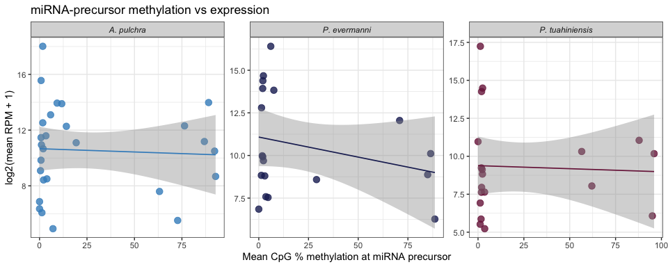
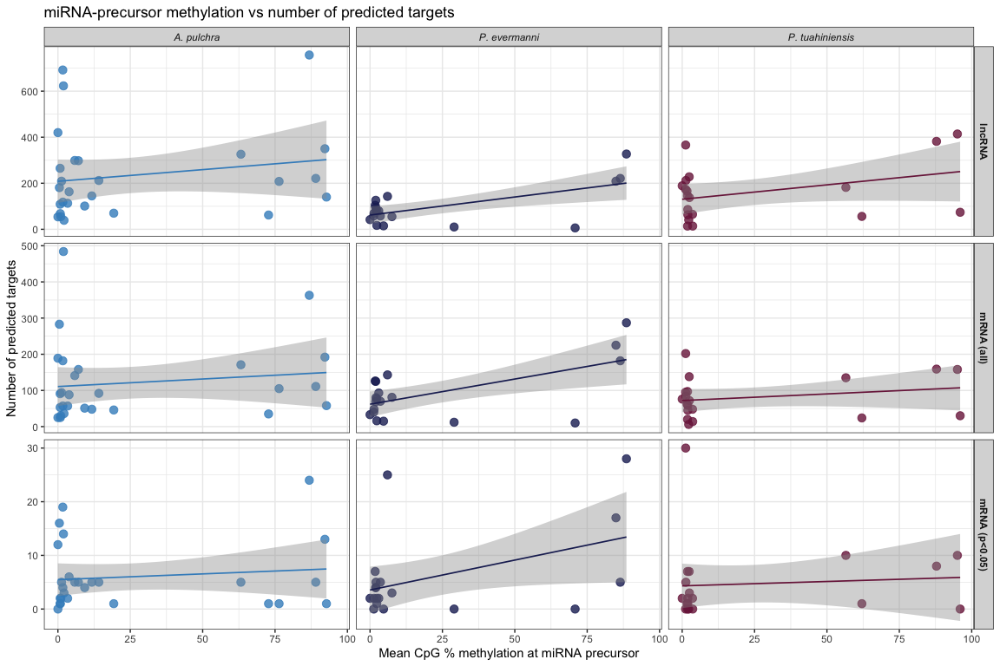
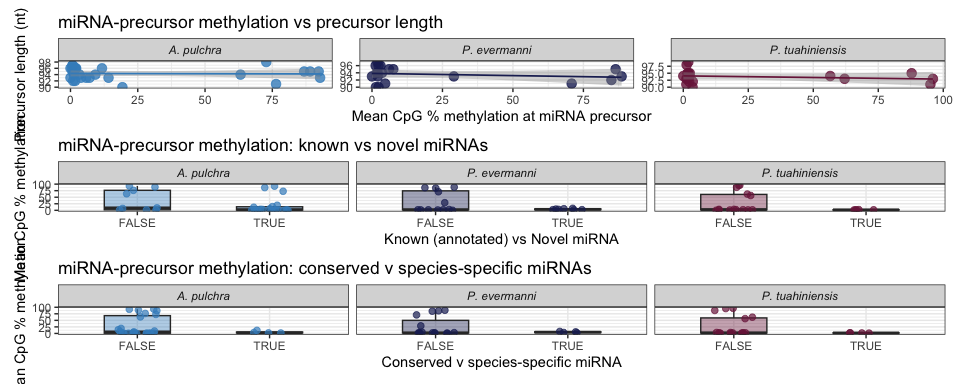
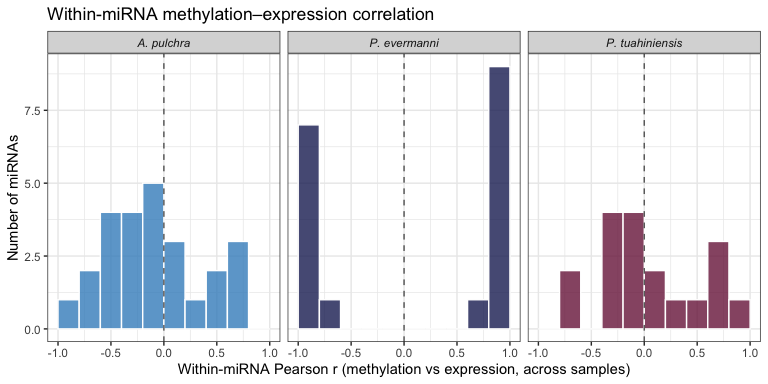
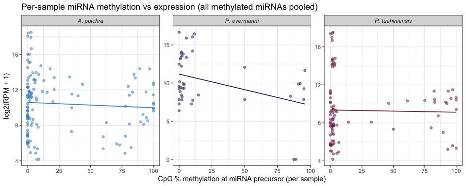
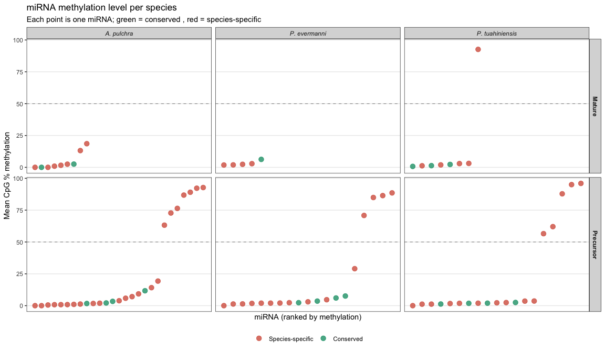
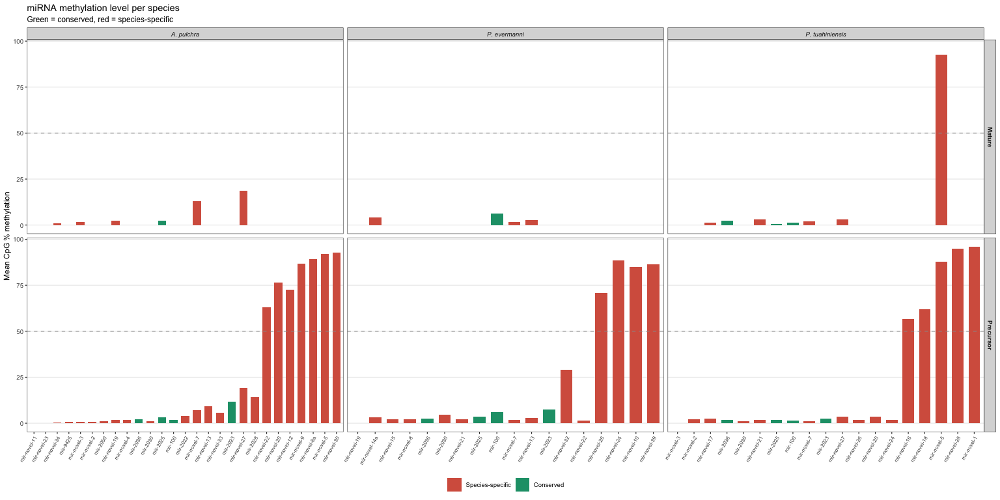
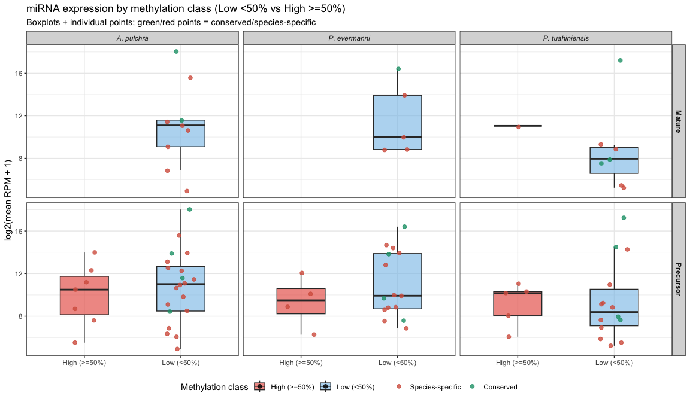
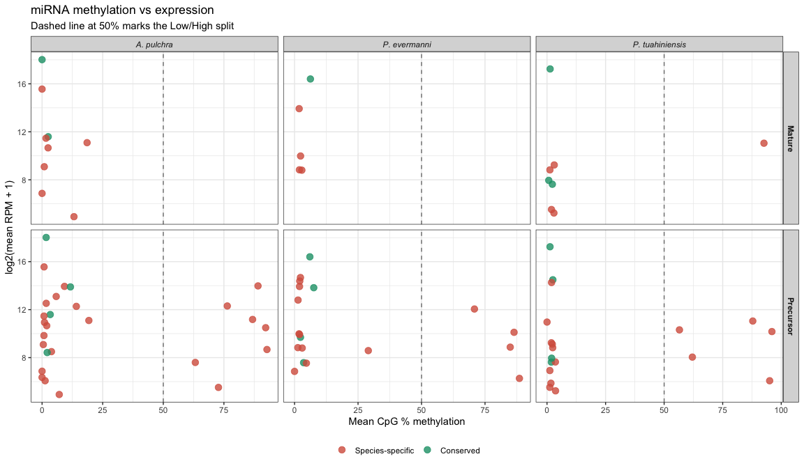

22-miRNA-methylation-features
================
Kathleen Durkin
2026-08-15

- [1 Load data](#1-load-data)
  - [1.1 miRNA precursor methylation (per-miRNA × per-sample % CpG
    methylation)](#11-mirna-precursor-methylation-per-mirna--per-sample--cpg-methylation)
  - [1.2 miRNA expression (normalized
    RPM)](#12-mirna-expression-normalized-rpm)
  - [1.3 miRNA target counts (miRanda +
    PCC)](#13-mirna-target-counts-miranda--pcc)
  - [1.4 ShortStack features (length, known/novel, total
    reads)](#14-shortstack-features-length-knownnovel-total-reads)
- [2 Merge into a single per-miRNA
  table](#2-merge-into-a-single-per-mirna-table)
- [3 Within-miRNA methylation–expression correlation (across
  samples)](#3-within-mirna-methylationexpression-correlation-across-samples)
- [4 Cross-miRNA correlations (methylation vs
  features)](#4-cross-mirna-correlations-methylation-vs-features)
- [5 Figures](#5-figures)
  - [5.1 Fig 1: Methylation vs expression (cross-miRNA, per
    species)](#51-fig-1-methylation-vs-expression-cross-mirna-per-species)
  - [5.2 Fig 2: Methylation vs number of targets (cross-miRNA, per
    species)](#52-fig-2-methylation-vs-number-of-targets-cross-mirna-per-species)
  - [5.3 Fig 3: Methylation vs miRNA length and known/novel
    status](#53-fig-3-methylation-vs-mirna-length-and-knownnovel-status)
  - [5.4 Fig 4: Within-miRNA methylation–expression correlation (across
    samples)](#54-fig-4-within-mirna-methylationexpression-correlation-across-samples)
  - [5.5 Fig 5: Per-sample scatter (methylation vs expression, all
    miRNAs
    pooled)](#55-fig-5-per-sample-scatter-methylation-vs-expression-all-mirnas-pooled)
- [6 Methylation level of all miRNAs per species (mature vs
  precursor)](#6-methylation-level-of-all-mirnas-per-species-mature-vs-precursor)
- [7 Methylation class (Low \<50% vs High \>=50%) vs
  expression](#7-methylation-class-low-50-vs-high-50-vs-expression)
- [8 Summary](#8-summary)
- [9 Session info](#9-session-info)

To make the ncRNA-methylation integration more complete, I want to
evaluate the methylation of ncRNA-encoding genomic regions. Let’s start
with miRNA, since there’s the most literature (in model systems)
supporting methylation-driven regulation of their production (in
comparison to lncRNA).

For each species, we already have some basic methylation stats computed,
including mean % methylation of mature miRNA coordinates (~22nt)
(per-miRNA x per-sample; `CpG_miRNA_CountMat.csv`). Because mature
miRNAs are so short, very few overlap a CpG. Here I want to recompute
the overlap using **miRNA precursor (hairpin) coordinates** (~60–100
nt), which capture CpGs in the stem-loop region and proximal regulatory
context. This yields methylation data for a much larger fraction of
miRNAs, and also makes more biological sense, as this is the molocule
originally transcribed from DNA before being processed down into the
mature form.

I then want to test whether miRNA-precursor methylation state is
associated with relevant miRNA features, including:

- **Expression level** (mean normalized RPM)
- **Number of predicted mRNA targets** (miRanda + PCC)
- **Number of predicted lncRNA targets** (miRanda + PCC)
- **miRNA length** (precursor length from ShortStack)
- **Known vs novel status** (whether the miRNA has a match in miRBase /
  published cnidarian miRNA annotations)

The precursor methylation matrices will be computed by downloading the
Bismark `.cov.gz` files from Gannet (large file storage), applying the
same coverage filters as the WGBS Rmds (≥ 5x coverage, ≤ 99.9th
percentile, present in ≥ 4 of 5 samples), and overlapping with the
`*_precursor.gff3` coordinates from ShortStack.

# 1 Load data

## 1.1 miRNA precursor methylation (per-miRNA × per-sample % CpG methylation)

``` r
load_meth <- function(path, species) {
  df <- read.csv(path, stringsAsFactors = FALSE, row.names = 1)
  # Precursor CSV: row names are "Cluster_XXXX" (no .mature/.precursor suffix)
  df$miRNA_id <- rownames(df)
  df$species  <- species
  df
}

meth_apul <- load_meth("../../D-Apul/output/08-Apul-WGBS/CpG_miRNA_precursor_CountMat.csv", "A. pulchra")
meth_peve <- load_meth("../../E-Peve/output/12-Peve-WGBS/CpG_miRNA_precursor_CountMat.csv", "P. evermanni")
meth_ptuh <- load_meth("../../F-Ptuh/output/12-Ptuh-WGBS/CpG_miRNA_precursor_CountMat.csv", "P. tuahiniensis")

# Sample columns per species (Peve has 5 WGBS samples, but only 3 sRNA)
meth_samples <- list(
  "A. pulchra"        = c("ACR.140.TP2", "ACR.145.TP2", "ACR.150.TP2", "ACR.173.TP2", "ACR.178.TP2"),
  "P. evermanni"      = c("POR.71.TP2", "POR.73.TP2", "POR.76.TP2", "POR.79.TP2", "POR.82.TP2"),
  "P. tuahiniensis"   = c("POC.47.TP2", "POC.48.TP2", "POC.50.TP2", "POC.53.TP2", "POC.57.TP2")
)

# Long format
meth_long <- bind_rows(
  meth_apul, meth_peve, meth_ptuh
) %>%
  pivot_longer(cols = all_of(unique(unlist(meth_samples))),
               names_to = "sample", values_to = "perc_meth") %>%
  filter(!is.na(perc_meth))

# Per-miRNA mean methylation
meth_summary <- meth_long %>%
  group_by(species, miRNA_id) %>%
  summarise(mean_meth = mean(perc_meth, na.rm = TRUE),
            sd_meth   = sd(perc_meth, na.rm = TRUE),
            n_samples = n(),
            .groups = "drop")

cat("miRNAs with methylation data:\n")
```

    ## miRNAs with methylation data:

``` r
meth_summary %>% count(species, name = "n_miRNAs") %>% knitr::kable()
```

| species         | n_miRNAs |
|:----------------|---------:|
| A. pulchra      |       27 |
| P. evermanni    |       19 |
| P. tuahiniensis |       19 |

So in Apul, Peve, and Ptuh, there are **27, 19, and 19 miRNAs**,
respectively, for whom we have methylation data coverage at the miRNA
precursors coordinates (this filtering still permits miRNAs with 0% mean
methylation).

## 1.2 miRNA expression (normalized RPM)

``` r
load_expr <- function(path, species, sample_cols) {
  df <- read.delim(path)
  df$miRNA_id <- rownames(df)
  df$species  <- species
  df %>%
    pivot_longer(cols = all_of(sample_cols), names_to = "sample_sRNA", values_to = "rpm") %>%
    mutate(sample_sRNA = gsub("sample", "", sample_sRNA))
}

expr_apul <- load_expr("../../D-Apul/output/03.1-Apul-sRNA-summary/Apul_counts_miRNA_normalized.txt",
                        "A. pulchra", c("sample140","sample145","sample150","sample173","sample178"))
expr_peve <- load_expr("../../E-Peve/output/03.1-Peve-sRNA-summary/Peve_counts_miRNA_normalized.txt",
                        "P. evermanni", c("sample73","sample79","sample82"))
expr_ptuh <- load_expr("../../F-Ptuh/output/03.1-Ptuh-sRNA-summary/Ptuh_counts_miRNA_normalized.txt",
                        "P. tuahiniensis", c("sample47","sample48","sample50","sample53","sample57"))

expr_long <- bind_rows(expr_apul, expr_peve, expr_ptuh)

# Per-miRNA mean expression
expr_summary <- expr_long %>%
  group_by(species, miRNA_id) %>%
  summarise(mean_rpm = mean(rpm, na.rm = TRUE),
            sd_rpm   = sd(rpm, na.rm = TRUE),
            .groups = "drop")
```

## 1.3 miRNA target counts (miRanda + PCC)

``` r
# mRNA targets — all predicted binding pairs and p < 0.05 subset
load_targets <- function(all_path, sig_path, species) {
  all_df <- fread(all_path)
  sig_df <- if (file.exists(sig_path)) fread(sig_path) else data.table()

  all_counts <- all_df[, .(n_targets_all = uniqueN(mRNA)), by = .(miRNA)]

  if (nrow(sig_df) > 0) {
    sig_counts <- sig_df[, .(n_targets_sig = uniqueN(mRNA)), by = .(miRNA)]
    all_counts <- merge(all_counts, sig_counts, by = "miRNA", all = TRUE)
  } else {
    all_counts$n_targets_sig <- 0L
  }

  all_counts$species <- species
  all_counts[is.na(n_targets_sig), n_targets_sig := 0L]
  all_counts
}

targets_apul <- load_targets(
  "../../D-Apul/output/09-Apul-mRNA-miRNA-interactions/miranda_PCC_miRNA_mRNA.csv",
  "../../D-Apul/output/09-Apul-mRNA-miRNA-interactions/Apul-miranda_PCC_sig_miRNA_mRNA.csv",
  "A. pulchra"
)
targets_peve <- load_targets(
  "../../E-Peve/output/10-Peve-mRNA-miRNA-interactions/Peve-miranda_PCC_miRNA_mRNA.csv",
  "../../E-Peve/output/10-Peve-mRNA-miRNA-interactions/Peve-miranda_PCC_sig_miRNA_mRNA.csv",
  "P. evermanni"
)
targets_ptuh <- load_targets(
  "../../F-Ptuh/output/11-Ptuh-mRNA-miRNA-interactions/three_prime_interaction/Ptuh-miranda_PCC_miRNA_mRNA.csv",
  "../../F-Ptuh/output/11-Ptuh-mRNA-miRNA-interactions/three_prime_interaction/Ptuh-miranda_PCC_sig_miRNA_mRNA.csv",
  "P. tuahiniensis"
)

# lncRNA targets
load_lncrna_targets <- function(path, species) {
  df <- fread(path)
  df[, .(n_lncrna_targets = uniqueN(lncRNA)), by = .(miRNA = miRNA)][, species := species][]
}

lnc_targets_apul <- load_lncrna_targets("../../D-Apul/output/28-Apul-miRNA-lncRNA-interactions/miranda_PCC_miRNA_lncRNA.csv", "A. pulchra")
lnc_targets_peve <- load_lncrna_targets("../../E-Peve/output/15-Peve-miRNA-lncRNA-PCC/miranda_PCC_miRNA_lncRNA.csv", "P. evermanni")
lnc_targets_ptuh <- load_lncrna_targets("../../F-Ptuh/output/15-Ptuh-miRNA-lncRNA-PCC/miranda_PCC_miRNA_lncRNA.csv", "P. tuahiniensis")

targets_summary <- bind_rows(targets_apul, targets_peve, targets_ptuh) %>%
  left_join(bind_rows(lnc_targets_apul, lnc_targets_peve, lnc_targets_ptuh),
            by = c("miRNA", "species")) %>%
  mutate(n_lncrna_targets = replace_na(n_lncrna_targets, 0L))
```

## 1.4 ShortStack features (length, known/novel, total reads)

``` r
conserved_miRNAs <- c("apul-mir-100", "peve-mir-100", "ptuh-mir-100", 
              "apul-mir-2036", "peve-mir-2036", "ptuh-mir-2036",
              "apul-mir-2023", "peve-mir-2023", "ptuh-mir-2023",
              "apul-mir-2025", "peve-mir-2025", "ptuh-mir-2025")

load_shortstack <- function(path, species) {
  df <- read.csv(path, stringsAsFactors = FALSE)
  df %>%
    select(Name, Length, Reads, DicerCall, MIRNA, known_miRNAs, given_miRNA_name) %>%
    rename(miRNA_id = Name) %>%
    mutate(
      species = species,
      known   = !is.na(known_miRNAs) & known_miRNAs != "" & known_miRNAs != "NA",
      conserved = given_miRNA_name %in% conserved_miRNAs
    )
}

ss_apul <- load_shortstack("../../D-Apul/output/11-Apul-sRNA-ShortStack_4.1.0-pulchra_genome/ShortStack_out/Apul_Results_mature_named_miRNAs.csv", "A. pulchra")
ss_peve <- load_shortstack("../../E-Peve/output/05-Peve-sRNA-ShortStack_4.1.0/ShortStack_out/Peve_Results_mature_named_miRNAs.csv", "P. evermanni")
ss_ptuh <- load_shortstack("../../F-Ptuh/output/05-Ptuh-sRNA-ShortStack_4.1.0/ShortStack_out/Ptuh_Results_mature_named_miRNAs.csv", "P. tuahiniensis")

ss_summary <- bind_rows(ss_apul, ss_peve, ss_ptuh)
```

# 2 Merge into a single per-miRNA table

``` r
# Only miRNAs with methylation data are retained (inner join on meth)
master <- meth_summary %>%
  left_join(expr_summary, by = c("species", "miRNA_id")) %>%
  left_join(
    targets_summary %>% rename(miRNA_id = miRNA),
    by = c("species", "miRNA_id")
  ) %>%
  left_join(ss_summary, by = c("species", "miRNA_id")) %>%
  mutate(
    n_targets_all    = replace_na(n_targets_all, 0L),
    n_targets_sig    = replace_na(n_targets_sig, 0L),
    n_lncrna_targets = replace_na(n_lncrna_targets, 0L),
    log2_rpm         = log2(mean_rpm + 1)
  )

fwrite(master, file.path("../output/22-miRNA-methylation-features", "miRNA_methylation_features_master.csv"))
knitr::kable(master %>% select(species, miRNA_id, mean_meth, mean_rpm, n_targets_all, n_targets_sig, n_lncrna_targets, Length, known, given_miRNA_name))
```

| species | miRNA_id | mean_meth | mean_rpm | n_targets_all | n_targets_sig | n_lncrna_targets | Length | known | given_miRNA_name |
|:---|:---|---:|---:|---:|---:|---:|---:|:---|:---|
| A. pulchra | Cluster_10057 | 14.1357400 | 4947.54370 | 92 | 5 | 212 | 93 | TRUE | apul-mir-2028 |
| A. pulchra | Cluster_10093 | 76.3923400 | 5060.57112 | 105 | 1 | 208 | 91 | FALSE | apul-mir-novel-20 |
| A. pulchra | Cluster_10207 | 1.7105927 | 5898.42767 | 57 | 4 | 118 | 92 | FALSE | apul-mir-novel-4 |
| A. pulchra | Cluster_10228 | 3.8690500 | 361.05860 | 88 | 6 | 163 | 93 | TRUE | apul-mir-2022 |
| A. pulchra | Cluster_14402 | 63.2022562 | 192.65467 | 171 | 5 | 326 | 94 | FALSE | apul-mir-novel-22 |
| A. pulchra | Cluster_15316 | 3.3648380 | 3083.68118 | 57 | 2 | 113 | 94 | TRUE | apul-mir-2025 |
| A. pulchra | Cluster_15340 | 1.9192000 | 1619.51168 | 484 | 14 | 623 | 96 | FALSE | apul-mir-novel-19 |
| A. pulchra | Cluster_15775 | 5.8279850 | 8766.86634 | 141 | 5 | 299 | 93 | TRUE | apul-mir-novel-33 |
| A. pulchra | Cluster_15851 | 0.0000000 | 80.68206 | 25 | 0 | 54 | 96 | TRUE | apul-mir-novel-11 |
| A. pulchra | Cluster_15854 | 72.7539767 | 44.77759 | 35 | 1 | 62 | 98 | TRUE | apul-mir-novel-12 |
| A. pulchra | Cluster_16409 | 0.5119033 | 543.55299 | 283 | 16 | 181 | 96 | TRUE | apul-mir-novel-34 |
| A. pulchra | Cluster_17776 | 7.0770567 | 29.38372 | 158 | 5 | 298 | 93 | FALSE | apul-mir-novel-7 |
| A. pulchra | Cluster_17791 | 0.8298389 | 48374.12596 | 25 | 1 | 68 | 95 | TRUE | apul-mir-novel-2 |
| A. pulchra | Cluster_1832 | 19.2970674 | 2187.65676 | 46 | 1 | 70 | 90 | TRUE | apul-mir-novel-27 |
| A. pulchra | Cluster_1862 | 92.2222200 | 1441.47483 | 192 | 13 | 350 | 95 | TRUE | apul-mir-novel-5 |
| A. pulchra | Cluster_18728 | 1.6901453 | 265106.80968 | 182 | 19 | 692 | 96 | TRUE | apul-mir-100 |
| A. pulchra | Cluster_18772 | 2.1031750 | 342.35084 | 36 | 3 | 39 | 96 | TRUE | apul-mir-2036 |
| A. pulchra | Cluster_19193 | 0.0000000 | 115.76293 | 189 | 12 | 420 | 93 | TRUE | apul-mir-novel-23 |
| A. pulchra | Cluster_1951 | 0.7899867 | 2826.10382 | 53 | 2 | 109 | 97 | FALSE | apul-mir-novel-3 |
| A. pulchra | Cluster_2463 | 9.2443000 | 15703.09416 | 51 | 4 | 101 | 94 | FALSE | apul-mir-novel-13 |
| A. pulchra | Cluster_2859 | 0.7692300 | 915.62175 | 91 | 1 | 265 | 97 | TRUE | apul-mir-9425 |
| A. pulchra | Cluster_3437 | 1.0049100 | 1963.05382 | 30 | 2 | 55 | 92 | TRUE | apul-mir-2030 |
| A. pulchra | Cluster_4254 | 1.2571700 | 66.32128 | 94 | 5 | 209 | 94 | TRUE | apul-mir-2050 |
| A. pulchra | Cluster_5012 | 11.7018950 | 15248.35230 | 48 | 5 | 145 | 96 | TRUE | apul-mir-2023 |
| A. pulchra | Cluster_5899 | 92.7554400 | 408.11247 | 58 | 1 | 140 | 93 | FALSE | apul-mir-novel-30 |
| A. pulchra | Cluster_5900 | 89.0592750 | 16144.62876 | 111 | 5 | 221 | 95 | FALSE | apul-mir-novel-8a; apul-mir-novel-8b |
| A. pulchra | Cluster_5981 | 86.8235300 | 2322.30687 | 363 | 24 | 757 | 95 | TRUE | apul-mir-novel-9 |
| P. evermanni | Cluster_10060 | 70.8333375 | 4249.42000 | 10 | 0 | 6 | 91 | FALSE | peve-mir-novel-26 |
| P. evermanni | Cluster_1167 | 6.0254625 | 86745.65561 | 143 | 25 | 143 | 95 | TRUE | peve-mir-100 |
| P. evermanni | Cluster_11997 | 29.0370375 | 382.95952 | 12 | 0 | 10 | 93 | FALSE | peve-mir-novel-32 |
| P. evermanni | Cluster_14999 | 3.5713937 | 190.34491 | 70 | 5 | 58 | 94 | TRUE | peve-mir-2025 |
| P. evermanni | Cluster_2787 | 86.4292000 | 1104.48354 | 182 | 5 | 221 | 95 | FALSE | peve-mir-novel-39 |
| P. evermanni | Cluster_4079 | 1.9621658 | 15611.60868 | 69 | 4 | 95 | 97 | FALSE | peve-mir-novel-7 |
| P. evermanni | Cluster_4080 | 2.0504297 | 21376.11396 | 80 | 5 | 82 | 93 | FALSE | peve-mir-novel-8 |
| P. evermanni | Cluster_4629 | 84.9332625 | 468.00693 | 225 | 17 | 209 | 92 | FALSE | peve-mir-novel-10 |
| P. evermanni | Cluster_5563 | 2.3323900 | 827.40746 | 16 | 2 | 17 | 96 | TRUE | peve-mir-2036 |
| P. evermanni | Cluster_5882 | 3.0183125 | 445.07532 | 93 | 2 | 80 | 96 | FALSE | peve-mir-novel-13 |
| P. evermanni | Cluster_6255 | 4.6628750 | 184.82622 | 15 | 0 | 15 | 91 | TRUE | peve-mir-2030 |
| P. evermanni | Cluster_6904 | 1.7708095 | 1010.87036 | 126 | 7 | 104 | 94 | FALSE | peve-mir-novel-14a; peve-mir-novel-14b |
| P. evermanni | Cluster_6905 | 1.2958030 | 454.86929 | 40 | 0 | 58 | 96 | FALSE | peve-mir-novel-14a; peve-mir-novel-14b |
| P. evermanni | Cluster_6906 | 1.9832890 | 971.36643 | 125 | 4 | 126 | 94 | FALSE | peve-mir-novel-15 |
| P. evermanni | Cluster_6914 | 7.5624173 | 14543.99342 | 81 | 3 | 55 | 95 | TRUE | peve-mir-2023 |
| P. evermanni | Cluster_8634 | 0.0000000 | 114.49306 | 33 | 2 | 42 | 93 | FALSE | peve-mir-novel-19 |
| P. evermanni | Cluster_8887 | 2.3236247 | 26163.61680 | 77 | 1 | 84 | 90 | TRUE | peve-mir-novel-21 |
| P. evermanni | Cluster_8888 | 1.3834789 | 7124.35305 | 48 | 2 | 70 | 90 | TRUE | peve-mir-novel-22 |
| P. evermanni | Cluster_9149 | 88.5543500 | 76.13555 | 287 | 28 | 327 | 93 | FALSE | peve-mir-novel-24 |
| P. tuahiniensis | Cluster_1015 | 87.8434417 | 2120.32419 | 159 | 8 | 382 | 95 | FALSE | ptuh-mir-novel-5 |
| P. tuahiniensis | Cluster_1068 | 1.1772080 | 44.96956 | 95 | 0 | 174 | 91 | FALSE | ptuh-mir-novel-7 |
| P. tuahiniensis | Cluster_1080 | 2.2539700 | 556.53250 | 6 | 0 | 41 | 92 | FALSE | ptuh-mir-novel-2 |
| P. tuahiniensis | Cluster_1116 | 1.8454251 | 196.95738 | 20 | 0 | 14 | 93 | TRUE | ptuh-mir-2036 |
| P. tuahiniensis | Cluster_1296 | 1.2800460 | 154911.37682 | 84 | 5 | 212 | 98 | TRUE | ptuh-mir-100 |
| P. tuahiniensis | Cluster_1793 | 2.4946431 | 23015.90708 | 72 | 3 | 138 | 95 | TRUE | ptuh-mir-2023 |
| P. tuahiniensis | Cluster_1953 | 0.0000000 | 1996.47305 | 76 | 2 | 189 | 94 | FALSE | ptuh-mir-novel-3 |
| P. tuahiniensis | Cluster_2793 | 3.5714250 | 198.22970 | 48 | 2 | 65 | 90 | FALSE | ptuh-mir-novel-20 |
| P. tuahiniensis | Cluster_2837 | 1.6666667 | 57.29874 | 62 | 1 | 166 | 95 | FALSE | ptuh-mir-novel-26 |
| P. tuahiniensis | Cluster_2859 | 62.0535750 | 262.93683 | 24 | 1 | 56 | 93 | FALSE | ptuh-mir-novel-18 |
| P. tuahiniensis | Cluster_2973 | 1.2100400 | 120.33340 | 202 | 30 | 366 | 93 | TRUE | ptuh-mir-2030 |
| P. tuahiniensis | Cluster_36 | 3.6344330 | 36.56271 | 14 | 0 | 14 | 92 | FALSE | ptuh-mir-novel-27 |
| P. tuahiniensis | Cluster_3661 | 2.4206940 | 453.35737 | 138 | 7 | 228 | 94 | FALSE | ptuh-mir-novel-17 |
| P. tuahiniensis | Cluster_4039 | 1.9548325 | 246.86462 | 45 | 1 | 63 | 95 | TRUE | ptuh-mir-2025 |
| P. tuahiniensis | Cluster_4040 | 95.0520833 | 66.33764 | 158 | 10 | 414 | 91 | FALSE | ptuh-mir-novel-28 |
| P. tuahiniensis | Cluster_4823 | 56.5357100 | 1273.14286 | 135 | 10 | 182 | 94 | FALSE | ptuh-mir-novel-16 |
| P. tuahiniensis | Cluster_5612 | 1.8420127 | 602.39897 | 97 | 7 | 146 | 95 | FALSE | ptuh-mir-novel-21 |
| P. tuahiniensis | Cluster_757 | 96.0164800 | 1152.56823 | 30 | 0 | 74 | 93 | FALSE | ptuh-mir-novel-1 |
| P. tuahiniensis | Cluster_925 | 1.9338160 | 19635.57393 | 59 | 2 | 86 | 99 | FALSE | ptuh-mir-novel-24 |

# 3 Within-miRNA methylation–expression correlation (across samples)

For each miRNA that has methylation data in ≥ 3 samples, compute the
within-miRNA Pearson correlation between % methylation and RPM across
samples. This asks: does methylation fluctuate with expression *within*
a given miRNA?

``` r
# Build per-sample matched table
# Apul: sRNA samples 140,145,150,173,178 ↔ WGBS ACR.140,145,150,173,178
# Peve: sRNA samples 73,79,82 ↔ WGBS POR.73,79,82 (3 overlap → usable)
# Ptuh: sRNA samples 47,48,50,53,57 ↔ WGBS POC.47,48,50,53,57

build_matched <- function(meth_df, expr_df, meth_cols, expr_cols, species) {
  meth_sub <- meth_df %>%
    select(miRNA_id, all_of(meth_cols)) %>%
    pivot_longer(cols = all_of(meth_cols), names_to = "sample_meth", values_to = "perc_meth") %>%
    # Extract sample number from names like "ACR.140.TP2" → "140"
    mutate(sample_num = sub(".*\\.(\\d+)\\.TP\\d+$", "\\1", sample_meth))

  expr_sub <- expr_df %>%
    select(miRNA_id, all_of(expr_cols)) %>%
    pivot_longer(cols = all_of(expr_cols), names_to = "sample_expr", values_to = "rpm") %>%
    mutate(sample_num = sample_expr)

  inner_join(meth_sub, expr_sub, by = c("miRNA_id", "sample_num")) %>%
    mutate(species = species) %>%
    select(species, miRNA_id, sample_num, perc_meth, rpm)
}

matched_apul <- build_matched(
  meth_apul, expr_apul %>% select(-species) %>% pivot_wider(names_from = sample_sRNA, values_from = rpm) %>% mutate(miRNA_id = miRNA_id),
  meth_samples[["A. pulchra"]],
  c("140","145","150","173","178"),
  "A. pulchra"
)

matched_ptuh <- build_matched(
  meth_ptuh, expr_ptuh %>% select(-species) %>% pivot_wider(names_from = sample_sRNA, values_from = rpm) %>% mutate(miRNA_id = miRNA_id),
  meth_samples[["P. tuahiniensis"]],
  c("47","48","50","53","57"),
  "P. tuahiniensis"
)

# Peve: 3 overlapping samples (73, 79, 82) — just enough for correlation
matched_peve <- build_matched(
  meth_peve, expr_peve %>% select(-species) %>% pivot_wider(names_from = sample_sRNA, values_from = rpm) %>% mutate(miRNA_id = miRNA_id),
  c("POR.73.TP2", "POR.79.TP2", "POR.82.TP2"),
  c("73","79","82"),
  "P. evermanni"
)

matched_all <- bind_rows(matched_apul, matched_peve, matched_ptuh)

# Within-miRNA correlation (only for miRNAs with ≥ 3 matched samples)
within_corr <- matched_all %>%
  group_by(species, miRNA_id) %>%
  filter(n() >= 3) %>%
  summarise(
    r = tryCatch(cor(perc_meth, rpm, method = "pearson", use = "pairwise.complete.obs"),
                 error = function(e) NA_real_),
    p = tryCatch(cor.test(perc_meth, rpm, method = "pearson")$p.value,
                 error = function(e) NA_real_),
    n_samples = n(),
    .groups = "drop"
  ) %>%
  filter(!is.na(r)) %>%
  mutate(direction = ifelse(r > 0, "Positive", "Negative"))

fwrite(within_corr, file.path("../output/22-miRNA-methylation-features", "within_miRNA_meth_expr_corr.csv"))
knitr::kable(within_corr)
```

| species         | miRNA_id      |          r |         p | n_samples | direction |
|:----------------|:--------------|-----------:|----------:|----------:|:----------|
| A. pulchra      | Cluster_10057 |  0.1743541 | 0.7791354 |         5 | Positive  |
| A. pulchra      | Cluster_10093 |  0.5034760 | 0.3871738 |         5 | Positive  |
| A. pulchra      | Cluster_10207 |  0.1142801 | 0.8548114 |         5 | Positive  |
| A. pulchra      | Cluster_10228 | -0.9730224 | 0.0269776 |         5 | Negative  |
| A. pulchra      | Cluster_14402 |  0.2225881 | 0.7189501 |         5 | Positive  |
| A. pulchra      | Cluster_15316 | -0.3917864 | 0.5142350 |         5 | Negative  |
| A. pulchra      | Cluster_15340 |  0.4184340 | 0.4832163 |         5 | Positive  |
| A. pulchra      | Cluster_15775 | -0.4785391 | 0.4148323 |         5 | Negative  |
| A. pulchra      | Cluster_15854 | -0.1192907 | 0.8484754 |         5 | Negative  |
| A. pulchra      | Cluster_16409 | -0.4756698 | 0.4180430 |         5 | Negative  |
| A. pulchra      | Cluster_17776 | -0.6300979 | 0.2545436 |         5 | Negative  |
| A. pulchra      | Cluster_17791 | -0.2963976 | 0.6282157 |         5 | Negative  |
| A. pulchra      | Cluster_1832  | -0.4242295 | 0.4765242 |         5 | Negative  |
| A. pulchra      | Cluster_1862  | -0.5387177 | 0.3488802 |         5 | Negative  |
| A. pulchra      | Cluster_18728 | -0.3724209 | 0.5370205 |         5 | Negative  |
| A. pulchra      | Cluster_18772 | -0.1003011 | 0.8725071 |         5 | Negative  |
| A. pulchra      | Cluster_1951  |  0.7460229 | 0.1476544 |         5 | Positive  |
| A. pulchra      | Cluster_2463  | -0.0966557 | 0.8771260 |         5 | Negative  |
| A. pulchra      | Cluster_2859  | -0.0928752 | 0.8819179 |         5 | Negative  |
| A. pulchra      | Cluster_3437  |  0.7235959 | 0.1670205 |         5 | Positive  |
| A. pulchra      | Cluster_4254  | -0.6611399 | 0.2243643 |         5 | Negative  |
| A. pulchra      | Cluster_5012  | -0.0515897 | 0.9343430 |         5 | Negative  |
| A. pulchra      | Cluster_5899  |  0.0320716 | 0.9591721 |         5 | Positive  |
| A. pulchra      | Cluster_5900  |  0.7522160 | 0.2477840 |         5 | Positive  |
| A. pulchra      | Cluster_5981  | -0.2247575 | 0.7162579 |         5 | Negative  |
| P. evermanni    | Cluster_10060 | -1.0000000 |        NA |         3 | Negative  |
| P. evermanni    | Cluster_1167  | -0.7466158 | 0.4633547 |         3 | Negative  |
| P. evermanni    | Cluster_11997 | -1.0000000 |        NA |         3 | Negative  |
| P. evermanni    | Cluster_14999 | -1.0000000 |        NA |         3 | Negative  |
| P. evermanni    | Cluster_2787  |  1.0000000 |        NA |         3 | Positive  |
| P. evermanni    | Cluster_4079  |  1.0000000 |        NA |         3 | Positive  |
| P. evermanni    | Cluster_4080  |  1.0000000 |        NA |         3 | Positive  |
| P. evermanni    | Cluster_4629  |  1.0000000 |        NA |         3 | Positive  |
| P. evermanni    | Cluster_5563  |  1.0000000 |        NA |         3 | Positive  |
| P. evermanni    | Cluster_5882  |  1.0000000 |        NA |         3 | Positive  |
| P. evermanni    | Cluster_6255  | -1.0000000 |        NA |         3 | Negative  |
| P. evermanni    | Cluster_6904  |  1.0000000 |        NA |         3 | Positive  |
| P. evermanni    | Cluster_6905  | -0.9932988 | 0.0737418 |         3 | Negative  |
| P. evermanni    | Cluster_6906  | -1.0000000 |        NA |         3 | Negative  |
| P. evermanni    | Cluster_6914  |  0.6681083 | 0.5342085 |         3 | Positive  |
| P. evermanni    | Cluster_8887  |  1.0000000 |        NA |         3 | Positive  |
| P. evermanni    | Cluster_8888  | -1.0000000 |        NA |         3 | Negative  |
| P. evermanni    | Cluster_9149  |  0.9806782 | 0.1253490 |         3 | Positive  |
| P. tuahiniensis | Cluster_1015  |  0.7079511 | 0.1809304 |         5 | Positive  |
| P. tuahiniensis | Cluster_1068  | -0.3453180 | 0.5692289 |         5 | Negative  |
| P. tuahiniensis | Cluster_1080  |  0.6755897 | 0.2106796 |         5 | Positive  |
| P. tuahiniensis | Cluster_1116  | -0.3533983 | 0.5595891 |         5 | Negative  |
| P. tuahiniensis | Cluster_1296  |  0.0664785 | 0.9154193 |         5 | Positive  |
| P. tuahiniensis | Cluster_1793  | -0.0875323 | 0.8886928 |         5 | Negative  |
| P. tuahiniensis | Cluster_2793  |  0.5125816 | 0.4874184 |         5 | Positive  |
| P. tuahiniensis | Cluster_2837  |  0.6976062 | 0.3023938 |         5 | Positive  |
| P. tuahiniensis | Cluster_2859  |  0.3689447 | 0.6310553 |         5 | Positive  |
| P. tuahiniensis | Cluster_2973  | -0.2323929 | 0.7067935 |         5 | Negative  |
| P. tuahiniensis | Cluster_36    | -0.3194456 | 0.6002967 |         5 | Negative  |
| P. tuahiniensis | Cluster_3661  | -0.0023540 | 0.9970028 |         5 | Negative  |
| P. tuahiniensis | Cluster_4039  | -0.6471095 | 0.2378762 |         5 | Negative  |
| P. tuahiniensis | Cluster_4040  | -0.7616997 | 0.2383003 |         5 | Negative  |
| P. tuahiniensis | Cluster_4823  |  0.8108795 | 0.0958784 |         5 | Positive  |
| P. tuahiniensis | Cluster_5612  | -0.0816445 | 0.8961626 |         5 | Negative  |
| P. tuahiniensis | Cluster_757   | -0.1718605 | 0.7822624 |         5 | Negative  |
| P. tuahiniensis | Cluster_925   |  0.0064010 | 0.9918501 |         5 | Positive  |

Within-miRNA correlations are available for 61 miRNAs across all three
species (Peve has 3 overlapping sRNA/WGBS samples).

# 4 Cross-miRNA correlations (methylation vs features)

For each species, test whether mean miRNA-precursor methylation
correlates with: mean expression, number of mRNA targets (all and
significant), number of lncRNA targets, and miRNA length. Also test
whether methylation differs between known and novel miRNAs.

``` r
# Helper: correlation test with tidy output
corr_test <- function(df, var_x, var_y) {
  if (nrow(df) < 4) return(data.frame(r = NA_real_, p = NA_real_, n = nrow(df)))
  t <- cor.test(df[[var_x]], df[[var_y]], method = "pearson")
  data.frame(r = unname(t$estimate), p = t$p.value, n = nrow(df))
}

features <- c("log2_rpm", "n_targets_all", "n_targets_sig", "n_lncrna_targets", "Length")
feature_labels <- c(log2_rpm = "log2(mean RPM + 1)",
                    n_targets_all = "# mRNA targets (all)",
                    n_targets_sig = "# mRNA targets (p < 0.05)",
                    n_lncrna_targets = "# lncRNA targets",
                    Length = "Precursor length (nt)")

corr_results <- list()
for (sp in unique(master$species)) {
  sp_df <- master %>% filter(species == sp)
  for (feat in features) {
    ct <- corr_test(sp_df, "mean_meth", feat)
    corr_results[[paste(sp, feat, sep = "__")]] <- data.frame(
      species = sp, feature = feat, feature_label = feature_labels[feat],
      r = ct$r, p = ct$p, n = ct$n
    )
  }
}
corr_results_df <- bind_rows(corr_results) %>%
  mutate(signif = ifelse(p < 0.05, "*", ""),
         r_round = round(r, 3),
         p_round = signif(p, 3))

fwrite(corr_results_df, file.path("../output/22-miRNA-methylation-features", "cross_miRNA_meth_feature_corr.csv"))
knitr::kable(corr_results_df)
```

|  | species | feature | feature_label | r | p | n | signif | r_round | p_round |
|----|:---|:---|:---|---:|---:|---:|:---|---:|---:|
| log2_rpm…1 | A. pulchra | log2_rpm | log2(mean RPM + 1) | -0.0517475 | 0.7976914 | 27 |  | -0.052 | 0.79800 |
| n_targets_all…2 | A. pulchra | n_targets_all | \# mRNA targets (all) | 0.1345262 | 0.5035000 | 27 |  | 0.135 | 0.50300 |
| n_targets_sig…3 | A. pulchra | n_targets_sig | \# mRNA targets (p \< 0.05) | 0.1220800 | 0.5441125 | 27 |  | 0.122 | 0.54400 |
| n_lncrna_targets…4 | A. pulchra | n_lncrna_targets | \# lncRNA targets | 0.1848871 | 0.3558838 | 27 |  | 0.185 | 0.35600 |
| Length…5 | A. pulchra | Length | Precursor length (nt) | -0.0308768 | 0.8784889 | 27 |  | -0.031 | 0.87800 |
| log2_rpm…6 | P. evermanni | log2_rpm | log2(mean RPM + 1) | -0.2638656 | 0.2750216 | 19 |  | -0.264 | 0.27500 |
| n_targets_all…7 | P. evermanni | n_targets_all | \# mRNA targets (all) | 0.6155879 | 0.0050188 | 19 | \* | 0.616 | 0.00502 |
| n_targets_sig…8 | P. evermanni | n_targets_sig | \# mRNA targets (p \< 0.05) | 0.4528358 | 0.0515445 | 19 |  | 0.453 | 0.05150 |
| n_lncrna_targets…9 | P. evermanni | n_lncrna_targets | \# lncRNA targets | 0.6376552 | 0.0033131 | 19 | \* | 0.638 | 0.00331 |
| Length…10 | P. evermanni | Length | Precursor length (nt) | -0.1933391 | 0.4277439 | 19 |  | -0.193 | 0.42800 |
| log2_rpm…11 | P. tuahiniensis | log2_rpm | log2(mean RPM + 1) | -0.0449049 | 0.8551597 | 19 |  | -0.045 | 0.85500 |
| n_targets_all…12 | P. tuahiniensis | n_targets_all | \# mRNA targets (all) | 0.2373842 | 0.3277923 | 19 |  | 0.237 | 0.32800 |
| n_targets_sig…13 | P. tuahiniensis | n_targets_sig | \# mRNA targets (p \< 0.05) | 0.0839580 | 0.7325589 | 19 |  | 0.084 | 0.73300 |
| n_lncrna_targets…14 | P. tuahiniensis | n_lncrna_targets | \# lncRNA targets | 0.3738097 | 0.1148963 | 19 |  | 0.374 | 0.11500 |
| Length…15 | P. tuahiniensis | Length | Precursor length (nt) | -0.1881335 | 0.4405242 | 19 |  | -0.188 | 0.44100 |

# 5 Figures

## 5.1 Fig 1: Methylation vs expression (cross-miRNA, per species)

``` r
p_expr <- ggplot(master, aes(x = mean_meth, y = log2_rpm, color = species)) +
  geom_point(size = 3, alpha = 0.8) +
  geom_smooth(method = "lm", se = TRUE, linewidth = 0.6) +
  facet_wrap(~ species, scales = "free") +
  scale_color_manual(values = species_palette) +
  labs(x = "Mean CpG % methylation at miRNA precursor",
       y = "log2(mean RPM + 1)",
       title = "miRNA-precursor methylation vs expression") +
  theme_bw(base_size = 11) +
  theme(strip.text = element_text(face = "italic"),
        legend.position = "none")

ggsave(file.path("../output/22-miRNA-methylation-features", "Fig_meth_vs_expr.png"), p_expr, width = 10, height = 4, dpi = 300)
p_expr
```

<!-- -->

## 5.2 Fig 2: Methylation vs number of targets (cross-miRNA, per species)

``` r
plot_target_data <- master %>%
  select(species, miRNA_id, mean_meth,
         `mRNA (all)` = n_targets_all,
         `mRNA (p<0.05)` = n_targets_sig,
         `lncRNA` = n_lncrna_targets) %>%
  pivot_longer(cols = c(`mRNA (all)`, `mRNA (p<0.05)`, `lncRNA`),
               names_to = "target_type", values_to = "n_targets")

p_targets <- ggplot(plot_target_data, aes(x = mean_meth, y = n_targets, color = species)) +
  geom_point(size = 3, alpha = 0.8) +
  geom_smooth(method = "lm", se = TRUE, linewidth = 0.6) +
  facet_grid(target_type ~ species, scales = "free_y") +
  scale_color_manual(values = species_palette) +
  labs(x = "Mean CpG % methylation at miRNA precursor",
       y = "Number of predicted targets",
       title = "miRNA-precursor methylation vs number of predicted targets") +
  theme_bw(base_size = 11) +
  theme(strip.text.y = element_text(face = "bold"),
        strip.text.x = element_text(face = "italic"),
        legend.position = "none")

ggsave(file.path("../output/22-miRNA-methylation-features", "Fig_meth_vs_targets.png"), p_targets, width = 12, height = 8, dpi = 300)
p_targets
```

<!-- -->

## 5.3 Fig 3: Methylation vs miRNA length and known/novel status

``` r
p_length <- ggplot(master, aes(x = mean_meth, y = Length, color = species)) +
  geom_point(size = 3, alpha = 0.8) +
  geom_smooth(method = "lm", se = TRUE, linewidth = 0.6) +
  facet_wrap(~ species, scales = "free") +
  scale_color_manual(values = species_palette) +
  labs(x = "Mean CpG % methylation at miRNA precursor",
       y = "Precursor length (nt)",
       title = "miRNA-precursor methylation vs precursor length") +
  theme_bw(base_size = 11) +
  theme(strip.text = element_text(face = "italic"),
        legend.position = "none")

p_known <- ggplot(master, aes(x = known, y = mean_meth, fill = species)) +
  geom_boxplot(width = 0.5, outlier.shape = NA, alpha = 0.4) +
  geom_jitter(width = 0.15, alpha = 0.7, size = 2, aes(color = species)) +
  facet_wrap(~ species, scales = "free_x") +
  scale_fill_manual(values = species_palette) +
  scale_color_manual(values = species_palette) +
  labs(x = "Known (annotated) vs Novel miRNA",
       y = "Mean CpG % methylation",
       title = "miRNA-precursor methylation: known vs novel miRNAs") +
  theme_bw(base_size = 11) +
  theme(strip.text = element_text(face = "italic"),
        legend.position = "none")

p_conserved <- ggplot(master, aes(x = conserved, y = mean_meth, fill = species)) +
  geom_boxplot(width = 0.5, outlier.shape = NA, alpha = 0.4) +
  geom_jitter(width = 0.15, alpha = 0.7, size = 2, aes(color = species)) +
  facet_wrap(~ species, scales = "free_x") +
  scale_fill_manual(values = species_palette) +
  scale_color_manual(values = species_palette) +
  labs(x = "Conserved v species-specific miRNA",
       y = "Mean CpG % methylation",
       title = "miRNA-precursor methylation: conserved v species-specific miRNAs") +
  theme_bw(base_size = 11) +
  theme(strip.text = element_text(face = "italic"),
        legend.position = "none")

p_length_known_conserved <- p_length / p_known / p_conserved

ggsave(file.path("../output/22-miRNA-methylation-features", "Fig_meth_vs_length_known_conserved.png"), p_length_known_conserved, width = 10, height = 10, dpi = 300)
p_length_known_conserved
```

<!-- -->

## 5.4 Fig 4: Within-miRNA methylation–expression correlation (across samples)

``` r
if (exists("within_corr") && nrow(within_corr) > 0) {
  p_within <- ggplot(within_corr, aes(x = r, fill = species)) +
    geom_histogram(binwidth = 0.2, boundary = 0, color = "white", alpha = 0.8) +
    geom_vline(xintercept = 0, linetype = "dashed", color = "grey40") +
    facet_wrap(~ species) +
    scale_fill_manual(values = species_palette) +
    labs(x = "Within-miRNA Pearson r (methylation vs expression, across samples)",
         y = "Number of miRNAs",
         title = "Within-miRNA methylation–expression correlation") +
    theme_bw(base_size = 11) +
    theme(strip.text = element_text(face = "italic"),
          legend.position = "none")

  ggsave(file.path("../output/22-miRNA-methylation-features", "Fig_within_miRNA_corr.png"), p_within, width = 8, height = 4, dpi = 300)
  p_within
} else {
  cat("No miRNAs with >= 3 matched samples for within-miRNA correlation.\n")
}
```

<!-- -->

## 5.5 Fig 5: Per-sample scatter (methylation vs expression, all miRNAs pooled)

This reproduces the plot from the WGBS Rmds but combines all three
species.

``` r
# Build a combined per-sample table
matched_combined <- bind_rows(
  matched_apul %>% mutate(sample_label = paste0("ACR.", sample_num)),
  matched_peve %>% mutate(sample_label = paste0("POR.", sample_num)),
  matched_ptuh %>% mutate(sample_label = paste0("POC.", sample_num))
) %>%
  mutate(species = factor(species, levels = c("A. pulchra", "P. evermanni", "P. tuahiniensis")))

p_per_sample <- ggplot(matched_combined, aes(x = perc_meth, y = log2(rpm + 1), color = species)) +
  geom_point(alpha = 0.5, size = 1.5) +
  geom_smooth(method = "lm", se = FALSE, linewidth = 0.6) +
  facet_wrap(~ species, scales = "free") +
  scale_color_manual(values = species_palette) +
  labs(x = "CpG % methylation at miRNA precursor (per sample)",
       y = "log2(RPM + 1)",
       title = "Per-sample miRNA methylation vs expression (all methylated miRNAs pooled)") +
  theme_bw(base_size = 11) +
  theme(strip.text = element_text(face = "italic"),
        legend.position = "none")

ggsave(file.path("../output/22-miRNA-methylation-features", "Fig_per_sample_meth_expr.png"), p_per_sample, width = 10, height = 4, dpi = 300)
p_per_sample
```

<!-- -->

# 6 Methylation level of all miRNAs per species (mature vs precursor)

Dot plot and bar plot showing mean CpG % methylation for every miRNA
with methylation data, faceted by species and feature type (mature vs
precursor). Points are colored by conserved v species-specific status.

``` r
# Load name annotations (already loaded as ss_summary, but rebuild for clarity)
load_names <- function(path, species) {
  df <- read.csv(path, stringsAsFactors = FALSE)
  df %>% select(Name, known_miRNAs, given_miRNA_name) %>%
    rename(miRNA_id = Name) %>%
    mutate(species = species,
           known = !is.na(known_miRNAs) & known_miRNAs != "" & known_miRNAs != "NA",
           conserved = given_miRNA_name %in% conserved_miRNAs)
}

all_names <- bind_rows(
  load_names("../../D-Apul/output/11-Apul-sRNA-ShortStack_4.1.0-pulchra_genome/ShortStack_out/Apul_Results_mature_named_miRNAs.csv", "A. pulchra"),
  load_names("../../E-Peve/output/05-Peve-sRNA-ShortStack_4.1.0/ShortStack_out/Peve_Results_mature_named_miRNAs.csv", "P. evermanni"),
  load_names("../../F-Ptuh/output/05-Ptuh-sRNA-ShortStack_4.1.0/ShortStack_out/Ptuh_Results_mature_named_miRNAs.csv", "P. tuahiniensis")
)

# Load both mature and precursor methylation
load_meth_both <- function(mature_path, precursor_path, species) {
  # Mature
  mat <- read.csv(mature_path, stringsAsFactors = FALSE, header = TRUE) %>% dplyr::select(-X)
  mat$miRNA_id <- gsub("[.]mature$", "", mat$miRNA_id)
  mat$species <- species
  mat$feature_type <- "Mature"
  # Precursor
  prec <- read.csv(precursor_path, stringsAsFactors = FALSE, header = TRUE) 
  prec$miRNA_id <- prec$precursor_id
  prec <- prec %>% dplyr::select(-precursor_id)
  prec$species <- species
  prec$feature_type <- "Precursor"
  bind_rows(mat, prec)
}

meth_both <- bind_rows(
  load_meth_both("../../D-Apul/output/08-Apul-WGBS/CpG_miRNA_CountMat.csv",
                 "../../D-Apul/output/08-Apul-WGBS/CpG_miRNA_precursor_CountMat.csv", "A. pulchra"),
  load_meth_both("../../E-Peve/output/12-Peve-WGBS/CpG_miRNA_CountMat.csv",
                 "../../E-Peve/output/12-Peve-WGBS/CpG_miRNA_precursor_CountMat.csv", "P. evermanni"),
  load_meth_both("../../F-Ptuh/output/12-Ptuh-WGBS/CpG_miRNA_CountMat.csv",
                 "../../F-Ptuh/output/12-Ptuh-WGBS/CpG_miRNA_precursor_CountMat.csv", "P. tuahiniensis")
)

# Long format and mean per miRNA
meth_both_long <- meth_both %>%
  pivot_longer(cols = matches("\\.TP2$"), names_to = "sample", values_to = "perc_meth") %>%
  filter(!is.na(perc_meth)) %>%
  group_by(species, feature_type, miRNA_id) %>%
  summarise(mean_meth = mean(perc_meth, na.rm = TRUE), .groups = "drop") %>%
  left_join(all_names, by = c("species", "miRNA_id")) %>%
  mutate(
    known = ifelse(is.na(known), FALSE, known),
    display_name = ifelse(is.na(given_miRNA_name) | given_miRNA_name == "NA", miRNA_id,
                          sub("^[a-z]+-", "", given_miRNA_name)),
    display_name = sub(";.*", "", display_name),
    species = factor(species, levels = c("A. pulchra", "P. evermanni", "P. tuahiniensis")),
    feature_type = factor(feature_type, levels = c("Mature", "Precursor"))
  ) %>%
  arrange(species, feature_type, mean_meth) %>%
  group_by(species, feature_type) %>%
  mutate(rank = row_number()) %>%
  ungroup()

# Dot plot
p_meth <- ggplot(meth_both_long, aes(x = rank, y = mean_meth, color = conserved)) +
  geom_point(size = 3, alpha = 0.8) +
  geom_hline(yintercept = 50, linetype = "dashed", color = "grey60", linewidth = 0.4) +
  facet_grid(feature_type ~ species, scales = "free_x") +
  scale_color_manual(values = c("TRUE" = "#1B9E77", "FALSE" = "#D6604D"),
                     labels = c("TRUE" = "Conserved", "FALSE" = "Species-specific"), name = NULL) +
  labs(x = "miRNA (ranked by methylation)", y = "Mean CpG % methylation",
       title = "miRNA methylation level per species",
       subtitle = "Each point is one miRNA; green = conserved , red = species-specific") +
  theme_bw(base_size = 11) +
  theme(strip.text.x = element_text(face = "italic"),
        strip.text.y = element_text(face = "bold"),
        axis.text.x = element_blank(),
        axis.ticks.x = element_blank(),
        panel.grid.major.x = element_blank(),
        panel.grid.minor = element_blank(),
        legend.position = "bottom")

ggsave(file.path("../output/22-miRNA-methylation-features", "Fig_miRNA_methylation_by_species.png"), p_meth, width = 12, height = 7, dpi = 300)
p_meth
```

<!-- -->

Interesting sort of bimodal pattern – precursors are either ver lowly or
very highly methylated. Also, all conserved miRNA are lowly methylated
(both mature and precursor sequences).

``` r
# Bar plot with miRNA names on x-axis
p_meth_bar <- ggplot(meth_both_long, aes(x = reorder(display_name, mean_meth), y = mean_meth, fill = conserved)) +
  geom_col(width = 0.7) +
  geom_hline(yintercept = 50, linetype = "dashed", color = "grey60", linewidth = 0.4) +
  facet_grid(feature_type ~ species, scales = "free_x") +
  scale_fill_manual(values = c("TRUE" = "#1B9E77", "FALSE" = "#D6604D"),
                    labels = c("TRUE" = "Conserved", "FALSE" = "Species-specific"), name = NULL) +
  labs(x = NULL, y = "Mean CpG % methylation",
       title = "miRNA methylation level per species",
       subtitle = "Green = conserved, red = species-specific") +
  theme_bw(base_size = 9) +
  theme(strip.text.x = element_text(face = "italic"),
        strip.text.y = element_text(face = "bold"),
        axis.text.x = element_text(angle = 60, hjust = 1, size = 6),
        panel.grid.major.x = element_blank(),
        panel.grid.minor = element_blank(),
        legend.position = "bottom")

ggsave(file.path("../output/22-miRNA-methylation-features", "Fig_miRNA_methylation_by_species_barplot.png"), p_meth_bar, width = 16, height = 8, dpi = 300)
p_meth_bar
```

<!-- -->

# 7 Methylation class (Low \<50% vs High \>=50%) vs expression

The methylation plots reveal a bimodal distribution, particularly in the
precursor data: miRNAs cluster either near 0% or above 50% methylation.
Here I want to test whether these two classes differ in expression
level.

``` r
# Build a combined table with both mature and precursor methylation + expression
load_meth_both <- function(mature_path, precursor_path, species) {
  # Mature: first col is row index, second col is miRNA_id
  mat <- read.csv(mature_path, stringsAsFactors = FALSE)
  mat$miRNA_id <- gsub("[.]mature$", "", mat$miRNA_id)
  mat <- mat %>% select(-1)  # drop row index
  mat$species <- species; mat$feature_type <- "Mature"
  # Precursor: first col is precursor_id (row names)
  prec <- read.csv(precursor_path, stringsAsFactors = FALSE, row.names = 1)
  prec$miRNA_id <- rownames(prec)
  prec$species <- species; prec$feature_type <- "Precursor"
  bind_rows(mat, prec)
}

meth_both <- bind_rows(
  load_meth_both("../../D-Apul/output/08-Apul-WGBS/CpG_miRNA_CountMat.csv",
                 "../../D-Apul/output/08-Apul-WGBS/CpG_miRNA_precursor_CountMat.csv", "A. pulchra"),
  load_meth_both("../../E-Peve/output/12-Peve-WGBS/CpG_miRNA_CountMat.csv",
                 "../../E-Peve/output/12-Peve-WGBS/CpG_miRNA_precursor_CountMat.csv", "P. evermanni"),
  load_meth_both("../../F-Ptuh/output/12-Ptuh-WGBS/CpG_miRNA_CountMat.csv",
                 "../../F-Ptuh/output/12-Ptuh-WGBS/CpG_miRNA_precursor_CountMat.csv", "P. tuahiniensis")
)

meth_both_summary <- meth_both %>%
  pivot_longer(cols = matches("[.]TP2$"), names_to = "sample", values_to = "perc_meth") %>%
  filter(!is.na(perc_meth)) %>%
  group_by(species, feature_type, miRNA_id) %>%
  summarise(mean_meth = mean(perc_meth, na.rm = TRUE), .groups = "drop") %>%
  left_join(all_names, by = c("species", "miRNA_id")) %>%
  mutate(known = ifelse(is.na(known), FALSE, known)) %>%
  # Join expression (already loaded as expr_summary earlier)
  left_join(expr_summary, by = c("species", "miRNA_id")) %>%
  mutate(log2_rpm = log2(mean_rpm + 1)) %>%
  mutate(
    meth_class = ifelse(mean_meth >= 50, "High (>=50%)", "Low (<50%)"),
    display_name = ifelse(is.na(given_miRNA_name) | given_miRNA_name == "NA", miRNA_id,
                          sub("^[a-z]+-", "", given_miRNA_name)),
    display_name = sub(";.*", "", display_name),
    species = factor(species, levels = c("A. pulchra", "P. evermanni", "P. tuahiniensis")),
    feature_type = factor(feature_type, levels = c("Mature", "Precursor"))
  )

# Summary table
cat("High vs Low methylation: expression comparison\n\n")
```

    ## High vs Low methylation: expression comparison

``` r
print(meth_both_summary %>% filter(!is.na(log2_rpm)) %>%
  group_by(species, feature_type, meth_class) %>%
  summarise(n = n(), mean_log2_rpm = round(mean(log2_rpm), 2),
            median_log2_rpm = round(median(log2_rpm), 2), .groups = "drop") %>%
  as.data.frame(), row.names = FALSE)
```

    ##          species feature_type   meth_class  n mean_log2_rpm median_log2_rpm
    ##       A. pulchra       Mature   Low (<50%)  9         11.03           11.10
    ##       A. pulchra    Precursor High (>=50%)  7          9.96           10.49
    ##       A. pulchra    Precursor   Low (<50%) 20         10.76           11.02
    ##     P. evermanni       Mature   Low (<50%)  5         11.59            9.98
    ##     P. evermanni    Precursor High (>=50%)  4          9.33            9.49
    ##     P. evermanni    Precursor   Low (<50%) 15         10.92            9.93
    ##  P. tuahiniensis       Mature High (>=50%)  1         11.05           11.05
    ##  P. tuahiniensis       Mature   Low (<50%)  7          8.81            7.95
    ##  P. tuahiniensis    Precursor High (>=50%)  5          9.13           10.17
    ##  P. tuahiniensis    Precursor   Low (<50%) 14          9.35            8.39

``` r
# Wilcoxon tests
cat("\nWilcoxon tests (High vs Low):\n\n")
```

    ## 
    ## Wilcoxon tests (High vs Low):

``` r
for (sp in levels(meth_both_summary$species)) {
  for (ft in c("Mature", "Precursor")) {
    sub <- meth_both_summary %>% filter(species == sp, feature_type == ft, !is.na(log2_rpm))
    if (nrow(sub) >= 4 && length(unique(sub$meth_class)) == 2) {
      wt <- wilcox.test(log2_rpm ~ meth_class, data = sub)
      cat(sprintf("  %s %s: W=%.1f, p=%.4f (n_high=%d, n_low=%d)\n",
                  sp, ft, wt$statistic, wt$p.value,
                  sum(sub$meth_class == "High (>=50%)"), sum(sub$meth_class == "Low (<50%)")))
    } else {
      cat(sprintf("  %s %s: skipped (n=%d, groups=%d)\n", sp, ft, nrow(sub), length(unique(sub$meth_class))))
    }
  }
}
```

    ##   A. pulchra Mature: skipped (n=9, groups=1)
    ##   A. pulchra Precursor: W=62.0, p=0.6850 (n_high=7, n_low=20)
    ##   P. evermanni Mature: skipped (n=5, groups=1)
    ##   P. evermanni Precursor: W=24.0, p=0.5965 (n_high=4, n_low=15)
    ##   P. tuahiniensis Mature: W=6.0, p=0.5000 (n_high=1, n_low=7)
    ##   P. tuahiniensis Precursor: W=41.0, p=0.6216 (n_high=5, n_low=14)

``` r
# Boxplot
p_class <- ggplot(meth_both_summary %>% filter(!is.na(log2_rpm)),
                  aes(x = meth_class, y = log2_rpm, fill = meth_class)) +
  geom_boxplot(width = 0.5, outlier.shape = NA, alpha = 0.6) +
  geom_jitter(width = 0.15, alpha = 0.8, size = 2, aes(color = conserved)) +
  facet_grid(feature_type ~ species, scales = "free_y") +
  scale_fill_manual(values = c("Low (<50%)" = "#85C1E9", "High (>=50%)" = "#E74C3C"),
                    name = "Methylation class") +
  scale_color_manual(values = c("TRUE" = "#1B9E77", "FALSE" = "#D6604D"),
                     labels = c("TRUE" = "Conserved", "FALSE" = "Species-specific"), name = NULL) +
  labs(x = NULL, y = "log2(mean RPM + 1)",
       title = "miRNA expression by methylation class (Low <50% vs High >=50%)",
       subtitle = "Boxplots + individual points; green/red points = conserved/species-specific") +
  theme_bw(base_size = 11) +
  theme(strip.text.x = element_text(face = "italic"),
        strip.text.y = element_text(face = "bold"),
        legend.position = "bottom")

ggsave(file.path("../output/22-miRNA-methylation-features", "Fig_methylation_class_vs_expression.png"), p_class, width = 12, height = 7, dpi = 300)
p_class
```

<!-- -->

``` r
# Scatter with 50% threshold line
p_scatter <- ggplot(meth_both_summary %>% filter(!is.na(log2_rpm)),
                    aes(x = mean_meth, y = log2_rpm, color = conserved)) +
  geom_point(size = 3, alpha = 0.8) +
  geom_vline(xintercept = 50, linetype = "dashed", color = "grey50") +
  facet_grid(feature_type ~ species, scales = "free") +
  scale_color_manual(values = c("TRUE" = "#1B9E77", "FALSE" = "#D6604D"),
                     labels = c("TRUE" = "Conserved", "FALSE" = "Species-specific"), name = NULL) +
  labs(x = "Mean CpG % methylation", y = "log2(mean RPM + 1)",
       title = "miRNA methylation vs expression",
       subtitle = "Dashed line at 50% marks the Low/High split") +
  theme_bw(base_size = 11) +
  theme(strip.text.x = element_text(face = "italic"),
        strip.text.y = element_text(face = "bold"),
        legend.position = "bottom")

ggsave(file.path("../output/22-miRNA-methylation-features", "Fig_methylation_vs_expression_scatter.png"), p_scatter, width = 12, height = 7, dpi = 300)
p_scatter
```

<!-- -->

# 8 Summary

``` r
# Count how many miRNAs have methylation data per species
n_table <- master %>%
  group_by(species) %>%
  summarise(
    n_with_meth = n(),
    n_conserved     = sum(conserved),
    n_spec     = sum(!conserved),
    mean_meth   = round(mean(mean_meth, na.rm = TRUE), 2),
    range_meth  = paste0(round(min(mean_meth, na.rm = TRUE), 1), "–", round(max(mean_meth, na.rm = TRUE), 1)),
    .groups = "drop"
  )

fwrite(n_table, file.path("../output/22-miRNA-methylation-features", "summary_methylated_miRNAs.csv"))
knitr::kable(n_table)
```

| species         | n_with_meth | n_conserved | n_spec | mean_meth | range_meth |
|:----------------|------------:|------------:|-------:|----------:|:-----------|
| A. pulchra      |          27 |           4 |     23 |     24.46 | 24.5–24.5  |
| P. evermanni    |          19 |           4 |     15 |     21.04 | 21–21      |
| P. tuahiniensis |          19 |           4 |     15 |     22.36 | 22.4–22.4  |

``` r
# Highlight any significant correlations
sig_corrs <- corr_results_df %>% filter(p < 0.05)
if (nrow(sig_corrs) > 0) {
  cat("Significant cross-miRNA correlations (p < 0.05):\n\n")
  knitr::kable(sig_corrs)
} else {
  cat("No significant cross-miRNA correlations (p < 0.05) detected.\n")
}
```

    ## Significant cross-miRNA correlations (p < 0.05):

|  | species | feature | feature_label | r | p | n | signif | r_round | p_round |
|----|:---|:---|:---|---:|---:|---:|:---|---:|---:|
| n_targets_all | P. evermanni | n_targets_all | \# mRNA targets (all) | 0.6155879 | 0.0050188 | 19 | \* | 0.616 | 0.00502 |
| n_lncrna_targets | P. evermanni | n_lncrna_targets | \# lncRNA targets | 0.6376552 | 0.0033131 | 19 | \* | 0.638 | 0.00331 |

# 9 Session info

``` r
sessionInfo()
```

    ## R version 4.5.2 (2025-10-31)
    ## Platform: aarch64-apple-darwin20
    ## Running under: macOS Tahoe 26.2
    ## 
    ## Matrix products: default
    ## BLAS:   /System/Library/Frameworks/Accelerate.framework/Versions/A/Frameworks/vecLib.framework/Versions/A/libBLAS.dylib 
    ## LAPACK: /Library/Frameworks/R.framework/Versions/4.5-arm64/Resources/lib/libRlapack.dylib;  LAPACK version 3.12.1
    ## 
    ## locale:
    ## [1] en_US.UTF-8/en_US.UTF-8/en_US.UTF-8/C/en_US.UTF-8/en_US.UTF-8
    ## 
    ## time zone: America/New_York
    ## tzcode source: internal
    ## 
    ## attached base packages:
    ## [1] stats     graphics  grDevices utils     datasets  methods   base     
    ## 
    ## other attached packages:
    ## [1] data.table_1.18.0 patchwork_1.3.2   ggplot2_4.0.1     tidyr_1.3.2      
    ## [5] dplyr_1.1.4      
    ## 
    ## loaded via a namespace (and not attached):
    ##  [1] Matrix_1.7-4       gtable_0.3.6       compiler_4.5.2     tidyselect_1.2.1  
    ##  [5] splines_4.5.2      systemfonts_1.3.1  scales_1.4.0       textshaping_1.0.4 
    ##  [9] yaml_2.3.12        fastmap_1.2.0      lattice_0.22-7     R6_2.6.1          
    ## [13] labeling_0.4.3     generics_0.1.4     knitr_1.51         tibble_3.3.1      
    ## [17] pillar_1.11.1      RColorBrewer_1.1-3 rlang_1.1.7        xfun_0.55         
    ## [21] S7_0.2.1           otel_0.2.0         cli_3.6.5          mgcv_1.9-4        
    ## [25] withr_3.0.2        magrittr_2.0.4     digest_0.6.39      grid_4.5.2        
    ## [29] rstudioapi_0.18.0  nlme_3.1-168       lifecycle_1.0.5    vctrs_0.7.0       
    ## [33] evaluate_1.0.5     glue_1.8.0         farver_2.1.2       ragg_1.5.0        
    ## [37] rmarkdown_2.30     purrr_1.2.1        tools_4.5.2        pkgconfig_2.0.3   
    ## [41] htmltools_0.5.9
