22.2-ncRNA-methylation-genomic-context
================
Kathleen Durkin
2026-08-25

- [1 Species metadata](#1-species-metadata)
- [2 Load genomic context
  annotations](#2-load-genomic-context-annotations)
- [3 Helper functions](#3-helper-functions)
- [4 Load methylation and expression
  data](#4-load-methylation-and-expression-data)
- [5 Genomic context distribution](#5-genomic-context-distribution)
  - [5.1 Plot](#51-plot)
- [6 Methylation vs expression
  correlation](#6-methylation-vs-expression-correlation)
  - [6.1 miRNA: precursor and mature methylation vs
    expression](#61-mirna-precursor-and-mature-methylation-vs-expression)
  - [6.2 Plot](#62-plot)
  - [6.3 lncRNA: body methylation vs
    expression](#63-lncrna-body-methylation-vs-expression)
  - [6.4 Plot](#64-plot)
  - [6.5 Promoter methylation vs
    expression](#65-promoter-methylation-vs-expression)
  - [6.6 Plot](#66-plot)
- [7 Methylation vs genomic context](#7-methylation-vs-genomic-context)
  - [7.1 miRNA methylation by context](#71-mirna-methylation-by-context)
  - [7.2 Plot](#72-plot)
  - [7.3 lncRNA body methylation by
    context](#73-lncrna-body-methylation-by-context)
  - [7.4 Plot](#74-plot)
- [8 Methylation class (Low vs High)
  analyses](#8-methylation-class-low-vs-high-analyses)
  - [8.1 Assign methylation classes](#81-assign-methylation-classes)
  - [8.2 Expression by methylation
    class](#82-expression-by-methylation-class)
  - [8.3 Plot](#83-plot)
  - [8.4 Genomic context by methylation
    class](#84-genomic-context-by-methylation-class)
  - [8.5 Plot](#85-plot)
- [9 Multiple testing correction](#9-multiple-testing-correction)
- [10 Summary](#10-summary)
- [11 Session info](#11-session-info)

Now that we have genomic context annotations for our ncRNA (see
`22.1-genomic-context-annotations.Rmd`), I now want to investigate how
methylation of ncRNA-encoding regions relates to their genomic context
and expression, across all three species (*A. pulchra*, *P. evermanni*,
*P. tuahiniensis*).

For both miRNA (promoter, precursor, and mature coordinates) and lncRNA
(promoter and body coordinates), I want to know:

1.  Genomic context distribution - what proportion of each feature type
    falls in introns, exons, intergenic regions, or TEs
    (exonic/intronic)?
2.  Methylation vs expression - does mean CpG methylation correlate with
    expression level?
3.  Methylation vs genomic context - does methylation level differ
    between features in different genomic contexts?

The genomic context annotations (exons, introns, TEs, intergenic) and
promoter coordinates are generated in
`22.1-genomic-context-annotations.Rmd`. Breifly, genomic context is
classified into five categories: exon, intron, TE_exonic, TE_intronic,
and intergenic. Context is assigned using a proportional
(majority-overlap) approach: for each feature, the fraction of its width
that overlaps each non-overlapping context partition is calculated, then
it is assigned the context with the largest overlap fraction. For
example, if 65% of a lncRNA overlaps an exon and 35% overlaps an intron,
it would be labelled as sitting in an exonic context.

Methylation matrices for miRNA (mature + precursor), lncRNA bodies, and
gene transcripts are the pre-computed `CpG_*_CountMat.csv` files from
each species’ WGBS pipeline. Promoter methylation is computed from the
filtered methylKit objects (`MethylObj_filtered.RData`).

# 1 Species metadata

Per-species paths to methylation matrices, expression matrices, and the
methylKit filtered object (for promoter methylation computation)

``` r
species_meta <- tibble::tribble(
  ~species, ~display, ~meth_mature, ~meth_precursor, ~meth_lncrna, ~meth_transcript, ~meth_rdata, ~expr_mirna, ~expr_lncrna, ~expr_gene, ~gene_count_samples, ~lncrna_count_samples,
  "Apul", "A. pulchra",
  "../../D-Apul/output/08-Apul-WGBS/CpG_miRNA_CountMat.csv",
  "../../D-Apul/output/08-Apul-WGBS/CpG_miRNA_precursor_CountMat.csv",
  "../../D-Apul/output/08-Apul-WGBS/CpG_lncRNA_CountMat.csv",
  "../../D-Apul/output/08-Apul-WGBS/CpG_Transcript_CountMat.csv",
  "../../D-Apul/output/08-Apul-WGBS/methylkit/MethylObj_filtered.RData",
  "../../D-Apul/output/03.1-Apul-sRNA-summary/Apul_counts_miRNA_normalized.txt",
  "../../D-Apul/output/03.2-Apul-lncRNA-summary/Apul_counts_lncRNA_normalized.txt",
  "../../D-Apul/output/07-Apul-Hisat/Apul-gene_count_matrix.csv",
  c("RNA-ACR-140","RNA-ACR-145","RNA-ACR-150","RNA-ACR-173","RNA-ACR-178"),
  c("ACR.140","ACR.145","ACR.150","ACR.173","ACR.178"),

  "Peve", "P. evermanni",
  "../../E-Peve/output/12-Peve-WGBS/CpG_miRNA_CountMat.csv",
  "../../E-Peve/output/12-Peve-WGBS/CpG_miRNA_precursor_CountMat.csv",
  "../../E-Peve/output/12-Peve-WGBS/CpG_lncRNA_CountMat.csv",
  "../../E-Peve/output/12-Peve-WGBS/CpG_Transcript_CountMat.csv",
  "../../E-Peve/output/12-Peve-WGBS/methylkit/MethylObj_filtered.RData",
  "../../E-Peve/output/03.1-Peve-sRNA-summary/Peve_counts_miRNA_normalized.txt",
  "../../E-Peve/output/03.2-Peve-lncRNA-summary/Peve_counts_lncRNA_normalized.txt",
  "../../E-Peve/output/06.2-Peve-Hisat/Peve-gene_count_matrix.csv",
  c("RNA-POR-71","RNA-POR-73","RNA-POR-76","RNA-POR-79","RNA-POR-82"),
  c("POR.71","POR.73","POR.76","POR.79","POR.82"),

  "Ptuh", "P. tuahiniensis",
  "../../F-Ptuh/output/12-Ptuh-WGBS/CpG_miRNA_CountMat.csv",
  "../../F-Ptuh/output/12-Ptuh-WGBS/CpG_miRNA_precursor_CountMat.csv",
  "../../F-Ptuh/output/12-Ptuh-WGBS/CpG_lncRNA_CountMat.csv",
  "../../F-Ptuh/output/12-Ptuh-WGBS/CpG_Transcript_CountMat.csv",
  "../../F-Ptuh/output/12-Ptuh-WGBS/methylkit/MethylObj_filtered.RData",
  "../../F-Ptuh/output/03.1-Ptuh-sRNA-summary/Ptuh_counts_miRNA_normalized.txt",
  "../../F-Ptuh/output/03.2-Ptuh-lncRNA-summary/Ptuh_counts_lncRNA_normalized.txt",
  "../../F-Ptuh/output/06.2-Ptuh-Hisat/Ptuh-gene_count_matrix.csv",
  c("RNA-POC-47","RNA-POC-48","RNA-POC-50","RNA-POC-53","RNA-POC-57"),
  c("POC.47","POC.48","POC.50","POC.53","POC.57")
)

# WGBS sample columns per species (from 22-miRNA-methylation-features.Rmd)
meth_samples <- list(
  "Apul" = c("ACR.140.TP2", "ACR.145.TP2", "ACR.150.TP2", "ACR.173.TP2", "ACR.178.TP2"),
  "Peve" = c("POR.71.TP2",  "POR.73.TP2",  "POR.76.TP2",  "POR.79.TP2",  "POR.82.TP2"),
  "Ptuh" = c("POC.47.TP2",  "POC.48.TP2",  "POC.50.TP2",  "POC.53.TP2",  "POC.57.TP2")
)

species_meta
```

    ## # A tibble: 3 × 12
    ##   species display         meth_mature meth_precursor meth_lncrna meth_transcript
    ##   <chr>   <chr>           <chr>       <chr>          <chr>       <chr>          
    ## 1 Apul    A. pulchra      ../../D-Ap… ../../D-Apul/… ../../D-Ap… ../../D-Apul/o…
    ## 2 Peve    P. evermanni    ../../E-Pe… ../../E-Peve/… ../../E-Pe… ../../E-Peve/o…
    ## 3 Ptuh    P. tuahiniensis ../../F-Pt… ../../F-Ptuh/… ../../F-Pt… ../../F-Ptuh/o…
    ## # ℹ 6 more variables: meth_rdata <chr>, expr_mirna <chr>, expr_lncrna <chr>,
    ## #   expr_gene <chr>, gene_count_samples <list>, lncrna_count_samples <list>

# 2 Load genomic context annotations

From 22.1

``` r
annotations <- list()
for (sp in species_meta$species) {
  rds_path <- file.path("../output/22.1-genomic-context-annotations", sp, paste0(sp, "_genome_annotation.rds"))
  if (file.exists(rds_path)) {
    annotations[[sp]] <- readRDS(rds_path)
    message("Loaded annotation for ", sp, ": ", length(annotations[[sp]]), " feature sets")
  } else {
    warning("Annotation RDS not found for ", sp, ": ", rds_path)
  }
}

# Load miRNA genomic class and promoter table
mirna_class <- fread(file.path("../output/22.1-genomic-context-annotations", "miRNA_genomic_class.csv"))
promoter_table <- fread(file.path("../output/22.1-genomic-context-annotations", "promoter_regions.csv"))
```

# 3 Helper functions

``` r
# Assign each feature to a genomic context using proportional (majority-overlap)
# assignment. For each feature, we compute the fraction of its width that overlaps
# each non-overlapping context partition, then assign the context with the largest
# overlap fraction. The full proportional breakdown is also returned.
#
# Context categories (priority order for partition construction):
#   TE_exonic > TE_intronic > exon > intron > TE_intergenic > intergenic
# UTRs are not a separate category - they are part of exons.
#
# For ncRNA features we care about the host context (where they sit in the genome),
# so we exclude the ncRNA features themselves from the partitions.

# Build non-overlapping genome partitions so every bp belongs to exactly one context.
# Higher-priority categories subtract from lower-priority ones.
build_context_partitions <- function(annot) {
  TE_exonic     <- annot[["TE_exonic"]]
  TE_intronic   <- annot[["TE_intronic"]]
  exon          <- annot[["exons"]]
  intron        <- annot[["introns"]]
  TE_intergenic <- annot[["TE_intergenic"]]
  intergenic    <- annot[["intergenic"]]

  # Subtract higher-priority categories from lower-priority ones
  TE_intronic   <- suppressWarnings(setdiff(TE_intronic,   TE_exonic))
  exon          <- suppressWarnings(setdiff(exon,          suppressWarnings(BiocGenerics::union(TE_exonic, TE_intronic))))
  intron        <- suppressWarnings(setdiff(intron,        suppressWarnings(BiocGenerics::union(suppressWarnings(BiocGenerics::union(TE_exonic, TE_intronic)), exon))))
  TE_intergenic <- suppressWarnings(setdiff(TE_intergenic, suppressWarnings(BiocGenerics::union(suppressWarnings(BiocGenerics::union(suppressWarnings(BiocGenerics::union(TE_exonic, TE_intronic)), exon)), intron))))
  intergenic    <- suppressWarnings(setdiff(intergenic,    suppressWarnings(BiocGenerics::union(TE_exonic, suppressWarnings(BiocGenerics::union(TE_intronic, suppressWarnings(BiocGenerics::union(exon, suppressWarnings(BiocGenerics::union(intron, TE_intergenic))))))))))

  list(
    TE_exonic     = reduce(TE_exonic),
    TE_intronic   = reduce(TE_intronic),
    exon          = reduce(exon),
    intron        = reduce(intron),
    TE_intergenic = reduce(TE_intergenic),
    intergenic    = reduce(intergenic)
  )
}

# Assign genomic context by majority overlap.
# Returns a data frame with the assigned context, the max proportion,
# and the full proportional breakdown for each feature.
assign_genomic_context <- function(features, annot) {
  partitions <- build_context_partitions(annot)

  # Ensure features and partitions share the same seqlevels
  all_seqlevels <- unique(c(seqlevels(features),
                            do.call(c, lapply(partitions, seqlevels))))
  seqlevels(features) <- all_seqlevels
  for (ctx_name in names(partitions)) {
    seqlevels(partitions[[ctx_name]]) <- all_seqlevels
  }

  result <- data.frame(
    feature_idx = seq_along(features),
    feature_width = width(features),
    stringsAsFactors = FALSE
  )

  for (ctx_name in names(partitions)) {
    ctx_gr <- partitions[[ctx_name]]
    if (length(ctx_gr) == 0) {
      result[[paste0(ctx_name, "_bp")]] <- 0L
      next
    }
    ol <- findOverlaps(features, ctx_gr, ignore.strand = TRUE)
    feat_ranges <- ranges(features[queryHits(ol)])
    ctx_ranges  <- ranges(ctx_gr[subjectHits(ol)])
    overlap_widths <- width(pintersect(feat_ranges, ctx_ranges))
    ol_df <- data.frame(feature_idx = queryHits(ol), overlap_bp = overlap_widths) %>%
      dplyr::group_by(feature_idx) %>%
      dplyr::summarise(total_overlap = sum(overlap_bp), .groups = "drop")
    result[[paste0(ctx_name, "_bp")]] <- 0L
    result[[paste0(ctx_name, "_bp")]][ol_df$feature_idx] <- as.integer(ol_df$total_overlap)
  }

  # Compute proportions
  bp_cols <- paste0(names(partitions), "_bp")
  result$total_overlap_bp <- rowSums(result[bp_cols])
  for (ctx_name in names(partitions)) {
    prop_col <- paste0(ctx_name, "_prop")
    bp_col <- paste0(ctx_name, "_bp")
    result[[prop_col]] <- ifelse(result$total_overlap_bp > 0,
                                  result[[bp_col]] / result$total_overlap_bp, 0)
  }

  # Assign the context with the largest overlap (majority assignment)
  # Features with no overlap to any partition get "intergenic"
  prop_cols <- paste0(names(partitions), "_prop")
  result$genomic_context <- ifelse(
    result$total_overlap_bp == 0,
    "intergenic",
    names(partitions)[max.col(result[prop_cols], ties.method = "first")]
  )
  result$max_prop <- ifelse(
    result$total_overlap_bp == 0,
    0,
    do.call(pmax, result[prop_cols])
  )

  result
}

# Load a methylation count matrix and convert to long format
load_meth_long <- function(path, id_col, species) {
  df <- fread(path)
  # Handle different first-column conventions
  if (id_col %in% colnames(df)) {
    df[[1]] <- df[[id_col]]
  }
  df %>%
    pivot_longer(cols = matches("\\.TP2$"), names_to = "sample", values_to = "perc_meth") %>%
    filter(!is.na(perc_meth)) %>%
    mutate(species = species)
}

# Pearson correlation test with tidy output
corr_test <- function(df, var_x, var_y) {
  if (nrow(df) < 4) return(data.frame(r = NA_real_, p = NA_real_, n = nrow(df)))
  t <- tryCatch(cor.test(df[[var_x]], df[[var_y]], method = "pearson"),
                error = function(e) NULL)
  if (is.null(t)) return(data.frame(r = NA_real_, p = NA_real_, n = nrow(df)))
  data.frame(r = unname(t$estimate), p = t$p.value, n = nrow(df))
}
```

# 4 Load methylation and expression data

miRNA methylation (mature + precursor)

``` r
mirna_meth_mature <- list()
mirna_meth_precursor <- list()

for (i in seq_len(nrow(species_meta))) {
  sp <- species_meta$species[i]

  # Mature miRNA methylation
  mat <- fread(species_meta$meth_mature[i])
  if ("miRNA_id" %in% colnames(mat)) {
    mat$miRNA_id <- gsub("\\.mature$", "", mat$miRNA_id)
  } else {
    mat$miRNA_id <- mat[[1]]
  }
  mirna_meth_mature[[sp]] <- mat

  # Precursor miRNA methylation
  prec <- fread(species_meta$meth_precursor[i])
  if ("precursor_id" %in% colnames(prec)) {
    prec$miRNA_id <- prec$precursor_id
    prec$precursor_id <- NULL
  } else {
    prec$miRNA_id <- prec[[1]]
  }
  mirna_meth_precursor[[sp]] <- prec
}

# Per-miRNA mean methylation (mature)
mirna_meth_mature_summary <- bind_rows(lapply(names(mirna_meth_mature), function(sp) {
  df <- as_tibble(mirna_meth_mature[[sp]])
  df %>%
    pivot_longer(cols = matches("\\.TP2$"), names_to = "sample", values_to = "perc_meth") %>%
    filter(!is.na(perc_meth)) %>%
    group_by(miRNA_id) %>%
    summarise(mean_meth_mature = mean(perc_meth, na.rm = TRUE),
              n_samples = n(), .groups = "drop") %>%
    mutate(species = sp)
}))

# Per-miRNA mean methylation (precursor)
mirna_meth_precursor_summary <- bind_rows(lapply(names(mirna_meth_precursor), function(sp) {
  df <- as_tibble(mirna_meth_precursor[[sp]])
  df %>%
    pivot_longer(cols = matches("\\.TP2$"), names_to = "sample", values_to = "perc_meth") %>%
    filter(!is.na(perc_meth)) %>%
    group_by(miRNA_id) %>%
    summarise(mean_meth_precursor = mean(perc_meth, na.rm = TRUE),
              n_samples = n(), .groups = "drop") %>%
    mutate(species = sp)
}))

cat("miRNAs with mature methylation data:\n")
```

    ## miRNAs with mature methylation data:

``` r
mirna_meth_mature_summary %>% count(species, name = "n")
```

    ## # A tibble: 3 × 2
    ##   species     n
    ##   <chr>   <int>
    ## 1 Apul        9
    ## 2 Peve        5
    ## 3 Ptuh        8

``` r
cat("\nmiRNAs with precursor methylation data:\n")
```

    ## 
    ## miRNAs with precursor methylation data:

``` r
mirna_meth_precursor_summary %>% count(species, name = "n")
```

    ## # A tibble: 3 × 2
    ##   species     n
    ##   <chr>   <int>
    ## 1 Apul       27
    ## 2 Peve       19
    ## 3 Ptuh       19

lncRNA methylation (body)

``` r
lncrna_meth <- list()

for (i in seq_len(nrow(species_meta))) {
  sp <- species_meta$species[i]
  df <- fread(species_meta$meth_lncrna[i])
  if ("lncRNA_id" %in% colnames(df)) {
    df$lncRNA_id <- df$lncRNA_id
  } else {
    df$lncRNA_id <- df[[1]]
  }
  lncrna_meth[[sp]] <- df
}

lncrna_meth_summary <- bind_rows(lapply(names(lncrna_meth), function(sp) {
  df <- as_tibble(lncrna_meth[[sp]])
  df %>%
    pivot_longer(cols = matches("\\.TP2$"), names_to = "sample", values_to = "perc_meth") %>%
    filter(!is.na(perc_meth)) %>%
    group_by(lncRNA_id) %>%
    summarise(mean_meth_body = mean(perc_meth, na.rm = TRUE),
              n_samples = n(), .groups = "drop") %>%
    mutate(species = sp)
}))

cat("lncRNAs with body methylation data:\n")
```

    ## lncRNAs with body methylation data:

``` r
lncrna_meth_summary %>% count(species, name = "n")
```

    ## # A tibble: 3 × 2
    ##   species     n
    ##   <chr>   <int>
    ## 1 Apul    23468
    ## 2 Peve     7278
    ## 3 Ptuh    12341

Promoter methylation

Promoter methylation is computed by overlapping filtered CpG methylation
data with the promoter coordinates defined in `22.1`. Need to download
the Bismark `.cov.gz` files from Gannet and reconstruct the filtered
methylKit object using the same parameters as the original WGBS scripts:

- `mincov = 10` (minimum CpG coverage)
- `lo.count = 5`, `hi.perc = 99.9` (coverage filtering)
- `normalizeCoverage()` (normalize coverage across samples)
- `unite(min.per.group = 4L)` (require CpG in \>= 4 of 5 samples)

``` r
library(methylKit)

# Function to compute mean % methylation per feature x sample from a methylKit object
compute_feature_meth <- function(meth_filter, feature_gr, feature_id_col = "feature_id") {
  meth_GR <- as(meth_filter, "GRanges")
  meth_matrix <- as.data.frame(methylKit::percMethylation(meth_filter))
  meth_GR$meth <- meth_matrix

  ol <- findOverlaps(meth_GR, feature_gr)
  df <- data.frame(
    cpg_ix = queryHits(ol),
    feature_id = mcols(feature_gr)[[feature_id_col]][subjectHits(ol)]
  )

  meth_df <- as.data.frame(meth_GR)[df$cpg_ix, ]
  meth_df$feature_id <- df$feature_id

  meth_long <- meth_df %>%
    dplyr::select(starts_with("meth."), feature_id) %>%
    rename_with(~gsub("meth\\.", "", .x)) %>%
    pivot_longer(cols = -feature_id, names_to = "sample", values_to = "perc_meth") %>%
    filter(!is.na(perc_meth))

  meth_long %>%
    group_by(feature_id, sample) %>%
    summarise(mean_meth = mean(perc_meth, na.rm = TRUE), .groups = "drop") %>%
    pivot_wider(names_from = sample, values_from = mean_meth)
}

# Per-species Bismark cov.gz file URLs on Gannet and sample IDs
gannet_cov <- list(
  Apul = list(
    base = "https://gannet.fish.washington.edu/gitrepos/urol-e5/deep-dive-expression/D-Apul/output/08-Apul-WGBS/bismark_cutadapt/",
    files = c("trimmed_ACR-140-TP2_S5_pe.deduplicated.bismark.cov.gz",
              "trimmed_ACR-145-TP2_S3_pe.deduplicated.bismark.cov.gz",
              "trimmed_ACR-150-TP2_S2_pe.deduplicated.bismark.cov.gz",
              "trimmed_ACR-173-TP2_S4_pe.deduplicated.bismark.cov.gz",
              "trimmed_ACR-178-TP2_S1_pe.deduplicated.bismark.cov.gz"),
    sample_ids = c("ACR.140.TP2", "ACR.145.TP2", "ACR.150.TP2", "ACR.173.TP2", "ACR.178.TP2")
  ),
  Peve = list(
    base = "https://gannet.fish.washington.edu/gitrepos/urol-e5/deep-dive-expression/E-Peve/output/12-Peve-WGBS/bismark_cutadapt/",
    files = c("trimmed_POR-71-TP2_S9_pe.deduplicated.bismark.cov.gz",
              "trimmed_POR-73-TP2_S7_pe.deduplicated.bismark.cov.gz",
              "trimmed_POR-76-TP2_S6_pe.deduplicated.bismark.cov.gz",
              "trimmed_POR-79-TP2_S10_pe.deduplicated.bismark.cov.gz",
              "trimmed_POR-82-TP2_S8_pe.deduplicated.bismark.cov.gz"),
    sample_ids = c("POR.71.TP2", "POR.73.TP2", "POR.76.TP2", "POR.79.TP2", "POR.82.TP2")
  ),
  Ptuh = list(
    base = "https://gannet.fish.washington.edu/gitrepos/urol-e5/deep-dive-expression/F-Ptuh/output/12-Ptuh-WGBS/bismark_cutadapt/",
    files = c("trimmed_POC-47-TP2_S13_pe.deduplicated.bismark.cov.gz",
              "trimmed_POC-48-TP2_S11_pe.deduplicated.bismark.cov.gz",
              "trimmed_POC-50-TP2_S14_pe.deduplicated.bismark.cov.gz",
              "trimmed_POC-53-TP2_S15_pe.deduplicated.bismark.cov.gz",
              "trimmed_POC-57-TP2_S12_pe.deduplicated.bismark.cov.gz"),
    sample_ids = c("POC.47.TP2", "POC.48.TP2", "POC.50.TP2", "POC.53.TP2", "POC.57.TP2")
  )
)

# Download cov.gz files and build filtered methylKit object per species
# (same filtering parameters as the original WGBS Rmds)
cov_cache_dir <- "../output/22.2-ncRNA-methylation-genomic-context/cov_cache"
dir.create(cov_cache_dir, showWarnings = FALSE, recursive = TRUE)
options(timeout = 600)  # cov.gz files are ~150-180 MB each

build_meth_filter <- function(sp, gannet_info) {
  message(">>> Building methylKit object for ", sp)
  local_files <- character(length(gannet_info$files))
  for (j in seq_along(gannet_info$files)) {
    dest <- file.path(cov_cache_dir, gannet_info$files[j])
    if (!file.exists(dest)) {
      url <- paste0(gannet_info$base, gannet_info$files[j])
      message("  Downloading ", basename(dest))
      download.file(url, dest, quiet = TRUE)
    }
    local_files[j] <- dest
  }

  # Read each sample with methylKit (same params as WGBS Rmds: mincov=10)
  methyl_list <- lapply(seq_along(local_files), function(i) {
    methRead(local_files[[i]],
             assembly = sp,
             treatment = 0,
             sample.id = gannet_info$sample_ids[i],
             context = "CpG",
             mincov = 10,
             pipeline = "bismarkCoverage")
  })
  methylObj <- new("methylRawList", methyl_list)
  methylObj@treatment <- rep(0, length(methyl_list))

  # Filter and normalize (same params as WGBS Rmds)
  filtered <- filterByCoverage(methylObj, lo.count = 5, lo.perc = NULL,
                                hi.count = NULL, hi.perc = 99.9)
  filtered_norm <- methylKit::normalizeCoverage(filtered)
  meth_filter <- methylKit::unite(filtered_norm, destrand = FALSE, min.per.group = 4L)
  message("  ", sp, ": ", length(meth_filter), " filtered CpGs")
  meth_filter
}

# Compute promoter methylation for miRNA and lncRNA promoters
mirna_promoter_meth <- list()
lncrna_promoter_meth <- list()
promoter_meth_available <- TRUE

for (i in seq_len(nrow(species_meta))) {
  sp <- species_meta$species[i]

  # Try RData first, then build from cov.gz
  rdata_path <- species_meta$meth_rdata[i]
  if (file.exists(rdata_path)) {
    message("Loading pre-computed methylKit object for ", sp)
    load(rdata_path)  # loads meth_filter
  } else {
    meth_filter <- tryCatch(
      build_meth_filter(sp, gannet_cov[[sp]]),
      error = function(e) {
        message("  Failed to build methylKit object for ", sp, ": ", e$message)
        NULL
      }
    )
    if (is.null(meth_filter)) next
  }

  message("Computing promoter methylation for ", sp, "...")

  # miRNA promoters
  sp_prom <- promoter_table %>% filter(species == sp, feature_type == "miRNA")
  if (nrow(sp_prom) > 0) {
    prom_gr <- makeGRangesFromDataFrame(sp_prom, keep.extra.columns = TRUE,
                                         seqnames.field = "chr",
                                         start.field = "promoter_start",
                                         end.field = "promoter_end",
                                         strand.field = "strand")
    if (length(prom_gr) > 0) {
      mirna_promoter_meth[[sp]] <- compute_feature_meth(meth_filter, prom_gr, "feature_id") %>%
        mutate(species = sp)
    }
  }

  # lncRNA promoters
  lnc_prom <- promoter_table %>%
    filter(species == sp, feature_type == "lncRNA") %>%
    makeGRangesFromDataFrame(keep.extra.columns = TRUE,
                             seqnames.field = "chr",
                             start.field = "promoter_start",
                             end.field = "promoter_end",
                             strand.field = "strand")
  if (length(lnc_prom) > 0) {
    lncrna_promoter_meth[[sp]] <- compute_feature_meth(meth_filter, lnc_prom, "feature_id") %>%
      mutate(species = sp)
  }

  rm(meth_filter)
  gc()
}

# Summarize promoter methylation
if (length(mirna_promoter_meth) > 0) {
  mirna_promoter_meth_summary <- bind_rows(lapply(names(mirna_promoter_meth), function(sp) {
    df <- mirna_promoter_meth[[sp]]
    df %>%
      pivot_longer(cols = matches("\\.TP2$"), names_to = "sample", values_to = "perc_meth") %>%
      filter(!is.na(perc_meth)) %>%
      group_by(feature_id) %>%
      summarise(mean_meth_promoter = mean(perc_meth, na.rm = TRUE),
                n_samples = n(), .groups = "drop") %>%
      dplyr::rename(miRNA_id = feature_id) %>%
      mutate(species = sp)
  }))
  cat("miRNAs with promoter methylation data:\n")
  mirna_promoter_meth_summary %>% count(species, name = "n")
}
```

    ## miRNAs with promoter methylation data:

    ## # A tibble: 3 × 2
    ##   species     n
    ##   <chr>   <int>
    ## 1 Apul       38
    ## 2 Peve       37
    ## 3 Ptuh       37

``` r
if (length(lncrna_promoter_meth) > 0) {
  lncrna_promoter_meth_summary <- bind_rows(lapply(names(lncrna_promoter_meth), function(sp) {
    df <- lncrna_promoter_meth[[sp]]
    df %>%
      pivot_longer(cols = matches("\\.TP2$"), names_to = "sample", values_to = "perc_meth") %>%
      filter(!is.na(perc_meth)) %>%
      group_by(feature_id) %>%
      summarise(mean_meth_promoter = mean(perc_meth, na.rm = TRUE),
                n_samples = n(), .groups = "drop") %>%
      dplyr::rename(lncRNA_id = feature_id) %>%
      mutate(species = sp)
  }))
  cat("\nlncRNAs with promoter methylation data:\n")
  lncrna_promoter_meth_summary %>% count(species, name = "n")
}
```

    ## 
    ## lncRNAs with promoter methylation data:

    ## # A tibble: 3 × 2
    ##   species     n
    ##   <chr>   <int>
    ## 1 Apul    26511
    ## 2 Peve     7935
    ## 3 Ptuh    13904

miRNA expression

``` r
mirna_expr <- list()
for (i in seq_len(nrow(species_meta))) {
  sp <- species_meta$species[i]
  df <- read.delim(species_meta$expr_mirna[i])
  df$miRNA_id <- rownames(df)
  mirna_expr[[sp]] <- df
}

mirna_expr_summary <- bind_rows(lapply(names(mirna_expr), function(sp) {
  df <- mirna_expr[[sp]]
  sample_cols <- grep("^sample", colnames(df), value = TRUE)
  df %>%
    pivot_longer(cols = all_of(sample_cols), names_to = "sample", values_to = "rpm") %>%
    mutate(sample = gsub("sample", "", sample)) %>%
    group_by(miRNA_id) %>%
    summarise(
      mean_rpm = mean(rpm, na.rm = TRUE),
      sd_rpm   = sd(rpm, na.rm = TRUE),
      cv_rpm   = sd(rpm, na.rm = TRUE) / mean(rpm, na.rm = TRUE),
      .groups = "drop"
    ) %>%
    mutate(species = sp,
           log2_rpm = log2(mean_rpm + 1),
           cv_rpm = ifelse(is.nan(cv_rpm) | is.infinite(cv_rpm), NA_real_, cv_rpm))
}))
```

lncRNA expression

``` r
lncrna_expr <- list()
for (i in seq_len(nrow(species_meta))) {
  sp <- species_meta$species[i]
  df <- read.delim(species_meta$expr_lncrna[i])
  df$lncRNA_id <- rownames(df)
  lncrna_expr[[sp]] <- df
}

lncrna_expr_summary <- bind_rows(lapply(names(lncrna_expr), function(sp) {
  df <- lncrna_expr[[sp]]
  sample_cols <- setdiff(colnames(df), "lncRNA_id")
  df %>%
    pivot_longer(cols = all_of(sample_cols), names_to = "sample", values_to = "rpm") %>%
    filter(!is.na(rpm)) %>%
    group_by(lncRNA_id) %>%
    summarise(
      mean_rpm = mean(rpm, na.rm = TRUE),
      sd_rpm   = sd(rpm, na.rm = TRUE),
      cv_rpm   = sd(rpm, na.rm = TRUE) / mean(rpm, na.rm = TRUE),
      .groups = "drop"
    ) %>%
    mutate(species = sp,
           log2_rpm = log2(mean_rpm + 1),
           cv_rpm = ifelse(is.nan(cv_rpm) | is.infinite(cv_rpm), NA_real_, cv_rpm))
}))
```

# 5 Genomic context distribution

For each feature type (miRNA mature, miRNA precursor, miRNA promoter,
lncRNA body, lncRNA promoter), assign its genomic context using
proportional (majority-overlap) assignment. Each feature will be
assigned to the context category that covers the largest fraction of its
width.

``` r
# Build GRanges for each feature type per species and assign context
# The proportional breakdown (all 6 context proportions) is saved alongside
# the assigned context so TE overlap information is preserved.
context_results <- list()

for (sp in names(annotations)) {
  annot <- annotations[[sp]]
  if (is.null(annot)) next

  # miRNA mature
  if (length(annot$miRNA_mature) > 0) {
    gr <- annot$miRNA_mature
    ctx <- assign_genomic_context(gr, annot)
    ids <- if ("ID" %in% colnames(mcols(gr))) as.character(gr$ID) else paste0("miRNA_", seq_along(gr))
    context_results[[paste(sp, "miRNA_mature", sep = "__")]] <- data.frame(
      species = sp, feature_type = "miRNA_mature", feature_id = ids,
      genomic_context = ctx$genomic_context, max_prop = ctx$max_prop,
      TE_exonic_prop = ctx$TE_exonic_prop, TE_intronic_prop = ctx$TE_intronic_prop,
      exon_prop = ctx$exon_prop, intron_prop = ctx$intron_prop,
      TE_intergenic_prop = ctx$TE_intergenic_prop, intergenic_prop = ctx$intergenic_prop,
      stringsAsFactors = FALSE)
  }

  # miRNA precursor
  if (length(annot$miRNA_precursor) > 0) {
    gr <- annot$miRNA_precursor
    ctx <- assign_genomic_context(gr, annot)
    ids <- if ("ID" %in% colnames(mcols(gr))) as.character(gr$ID) else paste0("miRNA_", seq_along(gr))
    context_results[[paste(sp, "miRNA_precursor", sep = "__")]] <- data.frame(
      species = sp, feature_type = "miRNA_precursor", feature_id = ids,
      genomic_context = ctx$genomic_context, max_prop = ctx$max_prop,
      TE_exonic_prop = ctx$TE_exonic_prop, TE_intronic_prop = ctx$TE_intronic_prop,
      exon_prop = ctx$exon_prop, intron_prop = ctx$intron_prop,
      TE_intergenic_prop = ctx$TE_intergenic_prop, intergenic_prop = ctx$intergenic_prop,
      stringsAsFactors = FALSE)
  }

  # miRNA promoter
  sp_prom <- promoter_table %>% filter(species == sp, feature_type == "miRNA")
  if (nrow(sp_prom) > 0) {
    gr <- makeGRangesFromDataFrame(sp_prom, keep.extra.columns = TRUE,
                                   seqnames.field = "chr",
                                   start.field = "promoter_start",
                                   end.field = "promoter_end",
                                   strand.field = "strand")
    ctx <- assign_genomic_context(gr, annot)
    context_results[[paste(sp, "miRNA_promoter", sep = "__")]] <- data.frame(
      species = sp, feature_type = "miRNA_promoter", feature_id = sp_prom$feature_id,
      genomic_context = ctx$genomic_context, max_prop = ctx$max_prop,
      TE_exonic_prop = ctx$TE_exonic_prop, TE_intronic_prop = ctx$TE_intronic_prop,
      exon_prop = ctx$exon_prop, intron_prop = ctx$intron_prop,
      TE_intergenic_prop = ctx$TE_intergenic_prop, intergenic_prop = ctx$intergenic_prop,
      stringsAsFactors = FALSE)
  }

  # lncRNA body
  if (length(annot$lncRNA) > 0) {
    gr <- annot$lncRNA
    ctx <- assign_genomic_context(gr, annot)
    ids <- if ("gene_id" %in% colnames(mcols(gr))) as.character(gr$gene_id) else paste0("lncRNA_", seq_along(gr))
    context_results[[paste(sp, "lncRNA_body", sep = "__")]] <- data.frame(
      species = sp, feature_type = "lncRNA_body", feature_id = ids,
      genomic_context = ctx$genomic_context, max_prop = ctx$max_prop,
      TE_exonic_prop = ctx$TE_exonic_prop, TE_intronic_prop = ctx$TE_intronic_prop,
      exon_prop = ctx$exon_prop, intron_prop = ctx$intron_prop,
      TE_intergenic_prop = ctx$TE_intergenic_prop, intergenic_prop = ctx$intergenic_prop,
      stringsAsFactors = FALSE)
  }

  # lncRNA promoter
  sp_prom <- promoter_table %>% filter(species == sp, feature_type == "lncRNA")
  if (nrow(sp_prom) > 0) {
    gr <- makeGRangesFromDataFrame(sp_prom, keep.extra.columns = TRUE,
                                   seqnames.field = "chr",
                                   start.field = "promoter_start",
                                   end.field = "promoter_end",
                                   strand.field = "strand")
    ctx <- assign_genomic_context(gr, annot)
    context_results[[paste(sp, "lncRNA_promoter", sep = "__")]] <- data.frame(
      species = sp, feature_type = "lncRNA_promoter", feature_id = sp_prom$feature_id,
      genomic_context = ctx$genomic_context, max_prop = ctx$max_prop,
      TE_exonic_prop = ctx$TE_exonic_prop, TE_intronic_prop = ctx$TE_intronic_prop,
      exon_prop = ctx$exon_prop, intron_prop = ctx$intron_prop,
      TE_intergenic_prop = ctx$TE_intergenic_prop, intergenic_prop = ctx$intergenic_prop,
      stringsAsFactors = FALSE)
  }
}

context_df <- bind_rows(context_results)
fwrite(context_df, file.path("../output/22.2-ncRNA-methylation-genomic-context", "feature_genomic_context.csv"))

# Summary table
context_summary <- context_df %>%
  group_by(species, feature_type, genomic_context) %>%
  summarise(n = n(), .groups = "drop") %>%
  group_by(species, feature_type) %>%
  mutate(perc = round(n / sum(n) * 100, 1)) %>%
  ungroup()

fwrite(context_summary, file.path("../output/22.2-ncRNA-methylation-genomic-context", "feature_genomic_context_summary.csv"))
```

## 5.1 Plot

``` r
# Order contexts consistently
context_order <- c("exon", "intron",
                   "TE_exonic", "TE_intronic", "TE_intergenic", "intergenic")

context_summary$genomic_context <- factor(context_summary$genomic_context,
                                          levels = context_order)
context_summary$feature_type <- factor(context_summary$feature_type,
  levels = c("miRNA_mature", "miRNA_precursor", "miRNA_promoter",
             "lncRNA_body", "lncRNA_promoter"))

p_context <- ggplot(context_summary, aes(x = feature_type, y = perc, fill = genomic_context)) +
  geom_col(position = "stack", color = "white", linewidth = 0.2) +
  facet_wrap(~ species, labeller = labeller(species = c(
    "Apul" = "A. pulchra", "Peve" = "P. evermanni", "Ptuh" = "P. tuahiniensis"))) +
  scale_fill_brewer(palette = "Set3") +
  labs(x = NULL, y = "% of features", fill = "Genomic context",
       title = "Distribution of ncRNA features across genomic contexts") +
  theme_bw(base_size = 11) +
  theme(axis.text.x = element_text(angle = 45, hjust = 1),
        strip.text = element_text(face = "italic"))

# Plot with just mature miRNAs and lncRNA bodies (for manuscript supplement)
p_context_red <- ggplot(filter(context_summary, feature_type %in% c("miRNA_mature", "lncRNA_body")),
                        aes(x = feature_type, y = perc, fill = genomic_context)) +
  geom_col(position = "stack", color = "white", linewidth = 0.2) +
  facet_wrap(~ species, labeller = labeller(species = c(
    "Apul" = "A. pulchra", "Peve" = "P. evermanni", "Ptuh" = "P. tuahiniensis"))) +
  scale_fill_brewer(palette = "Set3") +
  labs(x = NULL, y = "% of features", fill = "Genomic context",
       title = "Distribution of ncRNA features across genomic contexts") +
  theme_bw(base_size = 11) +
  theme(axis.text.x = element_text(angle = 45, hjust = 1),
        strip.text = element_text(face = "italic"))
# Save
ggsave(file.path("../output/22.2-ncRNA-methylation-genomic-context", "Fig_genomic_context_distribution.png"),
       p_context, width = 12, height = 8, dpi = 300)
ggsave(file.path("../output/22.2-ncRNA-methylation-genomic-context", "Fig_genomic_context_distribution_reduced.png"),
       p_context_red, width = 12, height = 8, dpi = 300)

p_context
```

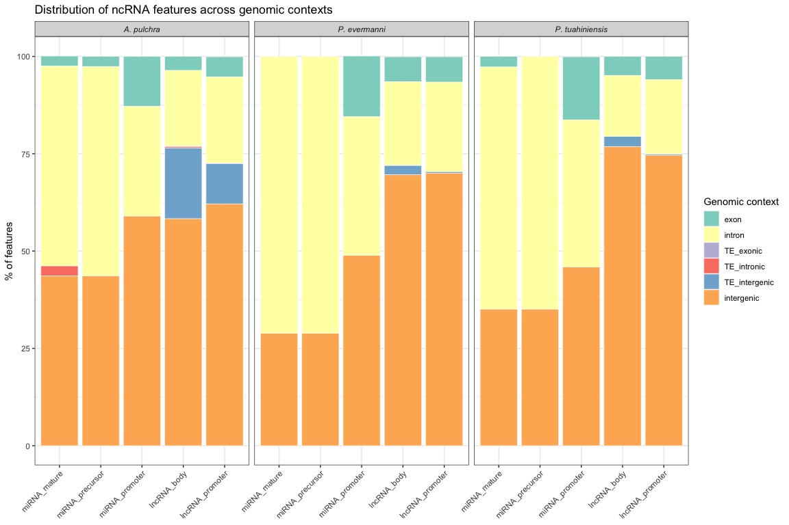<!-- -->

``` r
p_context_red
```

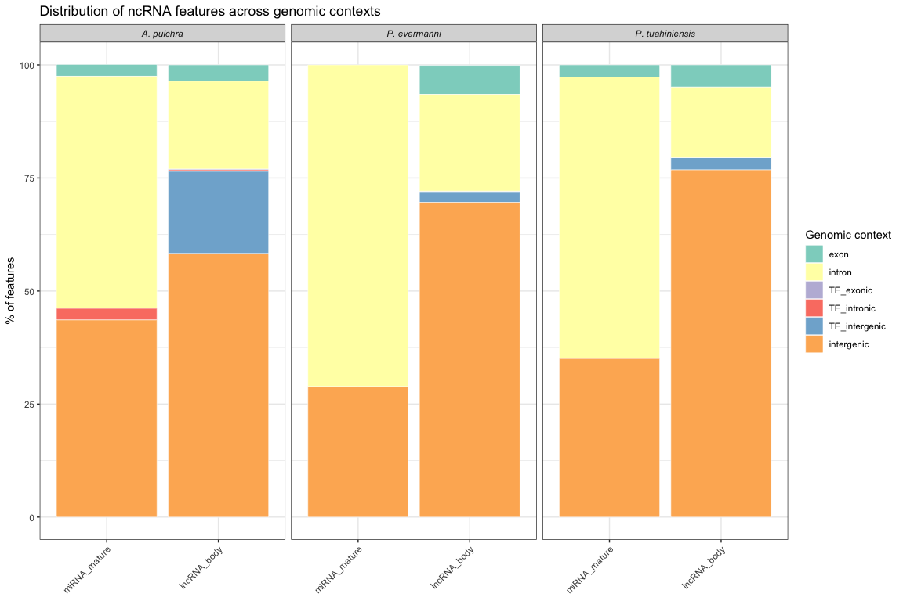<!-- -->

# 6 Methylation vs expression correlation

For each feature type with both methylation and expression data, test
whether mean methylation correlates with expression magnitude (mean RPM)
and expression variability (coefficient of variation, CV = sd/mean)
across features.

## 6.1 miRNA: precursor and mature methylation vs expression

``` r
# Merge precursor methylation with expression
mirna_master <- mirna_meth_precursor_summary %>%
  left_join(mirna_expr_summary, by = c("species", "miRNA_id")) %>%
  left_join(mirna_meth_mature_summary %>% dplyr::select(species, miRNA_id, mean_meth_mature),
            by = c("species", "miRNA_id"))

# Add genomic context
mirna_ctx <- context_df %>%
  dplyr::filter(feature_type == "miRNA_precursor") %>%
  dplyr::select(species, miRNA_id = feature_id, genomic_context)

mirna_master <- mirna_master %>%
  left_join(mirna_ctx, by = c("species", "miRNA_id"))

fwrite(mirna_master, file.path("../output/22.2-ncRNA-methylation-genomic-context", "miRNA_meth_expr_master.csv"))

# Correlation tests per species: methylation vs expression magnitude (log2_rpm) and variability (cv_rpm)
mirna_corr <- list()
for (sp in unique(mirna_master$species)) {
  sp_df <- mirna_master %>% dplyr::filter(species == sp)
  for (meth_var in c("mean_meth_precursor", "mean_meth_mature")) {
    for (expr_var in c("log2_rpm", "cv_rpm")) {
      ct <- corr_test(sp_df %>% dplyr::filter(!is.na(!!sym(meth_var)), !is.na(!!sym(expr_var))),
                      meth_var, expr_var)
      mirna_corr[[paste(sp, meth_var, expr_var, sep = "__")]] <- data.frame(
        species = sp,
        feature_type = ifelse(grepl("precursor", meth_var), "miRNA_precursor", "miRNA_mature"),
        expr_metric = ifelse(expr_var == "log2_rpm", "magnitude", "variability"),
        r = ct$r, p = ct$p, n = ct$n)
    }
  }
}
mirna_corr_df <- bind_rows(mirna_corr)
fwrite(mirna_corr_df, file.path("../output/22.2-ncRNA-methylation-genomic-context", "miRNA_meth_expr_corr.csv"))
knitr::kable(mirna_corr_df)
```

| species | feature_type    | expr_metric |          r |         p |   n |
|:--------|:----------------|:------------|-----------:|----------:|----:|
| Apul    | miRNA_precursor | magnitude   | -0.0517475 | 0.7976914 |  27 |
| Apul    | miRNA_precursor | variability |  0.0718506 | 0.7217347 |  27 |
| Apul    | miRNA_mature    | magnitude   | -0.3692723 | 0.3280502 |   9 |
| Apul    | miRNA_mature    | variability |  0.1774790 | 0.6477993 |   9 |
| Peve    | miRNA_precursor | magnitude   | -0.2638656 | 0.2750216 |  19 |
| Peve    | miRNA_precursor | variability |  0.2102080 | 0.3877081 |  19 |
| Peve    | miRNA_mature    | magnitude   |  0.6856547 | 0.2012909 |   5 |
| Peve    | miRNA_mature    | variability | -0.7531741 | 0.1416278 |   5 |
| Ptuh    | miRNA_precursor | magnitude   | -0.0449049 | 0.8551597 |  19 |
| Ptuh    | miRNA_precursor | variability |  0.1249591 | 0.6102536 |  19 |
| Ptuh    | miRNA_mature    | magnitude   |  0.1996571 | 0.6354727 |   8 |
| Ptuh    | miRNA_mature    | variability | -0.0005245 | 0.9990166 |   8 |

## 6.2 Plot

``` r
# Precursor
p_prec <- ggplot(mirna_master %>% filter(!is.na(mean_meth_precursor)),
                 aes(x = mean_meth_precursor, y = log2_rpm, color = genomic_context)) +
  geom_point(size = 3, alpha = 0.8) +
  geom_smooth(method = "lm", se = TRUE, linewidth = 0.5, color = "grey30") +
  facet_wrap(~ species, scales = "free", labeller = labeller(species = c(
    "Apul" = "A. pulchra", "Peve" = "P. evermanni", "Ptuh" = "P. tuahiniensis"))) +
  scale_color_brewer(palette = "Set3") +
  labs(x = "Mean CpG % methylation (precursor)", y = "log2(mean RPM + 1)",
       title = "miRNA precursor methylation vs expression") +
  theme_bw(base_size = 11) +
  theme(strip.text = element_text(face = "italic"),
        legend.position = "bottom")

# Mature
p_mat <- ggplot(mirna_master %>% filter(!is.na(mean_meth_mature)),
                aes(x = mean_meth_mature, y = log2_rpm, color = genomic_context)) +
  geom_point(size = 3, alpha = 0.8) +
  geom_smooth(method = "lm", se = TRUE, linewidth = 0.5, color = "grey30") +
  facet_wrap(~ species, scales = "free", labeller = labeller(species = c(
    "Apul" = "A. pulchra", "Peve" = "P. evermanni", "Ptuh" = "P. tuahiniensis"))) +
  scale_color_brewer(palette = "Set3") +
  labs(x = "Mean CpG % methylation (mature)", y = "log2(mean RPM + 1)",
       title = "miRNA mature methylation vs expression") +
  theme_bw(base_size = 11) +
  theme(strip.text = element_text(face = "italic"),
        legend.position = "bottom")

p_mirna_meth_expr <- p_prec / p_mat
ggsave(file.path("../output/22.2-ncRNA-methylation-genomic-context", "Fig_miRNA_meth_vs_expr.png"),
       p_mirna_meth_expr, width = 12, height = 8, dpi = 300)
p_mirna_meth_expr
```

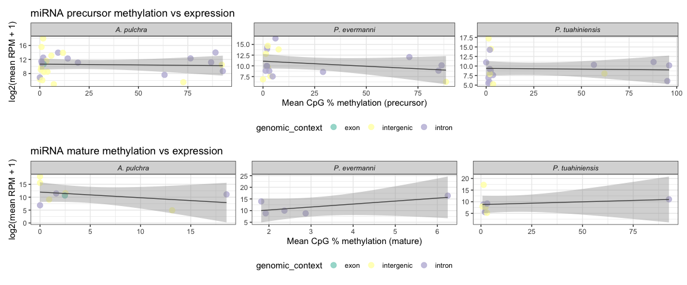<!-- -->

## 6.3 lncRNA: body methylation vs expression

``` r
lncrna_master <- lncrna_meth_summary %>%
  left_join(lncrna_expr_summary, by = c("species", "lncRNA_id"))

# Add genomic context
lncrna_ctx <- context_df %>%
  dplyr::filter(feature_type == "lncRNA_body") %>%
  dplyr::select(species, lncRNA_id = feature_id, genomic_context)

lncrna_master <- lncrna_master %>%
  left_join(lncrna_ctx, by = c("species", "lncRNA_id"))

fwrite(lncrna_master, file.path("../output/22.2-ncRNA-methylation-genomic-context", "lncRNA_meth_expr_master.csv"))

# Correlation tests per species: methylation vs expression magnitude and variability
lncrna_corr <- list()
for (sp in unique(lncrna_master$species)) {
  sp_df <- lncrna_master %>% dplyr::filter(species == sp)
  for (expr_var in c("log2_rpm", "cv_rpm")) {
    ct <- corr_test(sp_df %>% dplyr::filter(!is.na(mean_meth_body), !is.na(!!sym(expr_var))),
                    "mean_meth_body", expr_var)
    lncrna_corr[[paste(sp, expr_var, sep = "__")]] <- data.frame(
      species = sp, feature_type = "lncRNA_body",
      expr_metric = ifelse(expr_var == "log2_rpm", "magnitude", "variability"),
      r = ct$r, p = ct$p, n = ct$n)
  }
}
lncrna_corr_df <- bind_rows(lncrna_corr)
fwrite(lncrna_corr_df, file.path("../output/22.2-ncRNA-methylation-genomic-context", "lncRNA_meth_expr_corr.csv"))
knitr::kable(lncrna_corr_df)
```

| species | feature_type | expr_metric |          r |     p |     n |
|:--------|:-------------|:------------|-----------:|------:|------:|
| Apul    | lncRNA_body  | magnitude   |  0.0707613 | 0e+00 | 23467 |
| Apul    | lncRNA_body  | variability | -0.0788426 | 0e+00 | 23467 |
| Peve    | lncRNA_body  | magnitude   |  0.0577102 | 8e-07 |  7276 |
| Peve    | lncRNA_body  | variability | -0.1223229 | 0e+00 |  7276 |
| Ptuh    | lncRNA_body  | magnitude   |  0.1448406 | 0e+00 |  9911 |
| Ptuh    | lncRNA_body  | variability | -0.1192418 | 0e+00 |  9911 |

## 6.4 Plot

``` r
# Plot lncRNA body methylation with mean expression
p_lnc_meth_expr_mean <- ggplot(lncrna_master %>% filter(!is.na(mean_meth_body), !is.na(log2_rpm)),
                          aes(x = mean_meth_body, y = log2_rpm, color = genomic_context)) +
  geom_point(size = 1, alpha = 0.4) +
  geom_smooth(method = "lm", se = TRUE, linewidth = 0.5, color = "grey30") +
  facet_wrap(~ species, scales = "free", labeller = labeller(species = c("Apul" = "A. pulchra", "Peve" = "P. evermanni", "Ptuh" = "P. tuahiniensis"))) +
  #facet_grid(rows = vars(species), cols = vars(genomic_context)) +
  scale_color_brewer(palette = "Set3") +
  labs(x = "Mean CpG % methylation (lncRNA body)", y = "log2(mean RPM + 1)",
       title = "lncRNA body methylation vs expression") +
  coord_cartesian(xlim = c(0,100), ylim = c(0, 25)) +
  theme_bw(base_size = 11) +
  theme(strip.text = element_text(face = "italic"),
        legend.position = "bottom")

# Plot lncRNA body methylation with CV
p_lnc_meth_expr_cv <- ggplot(lncrna_master %>% filter(!is.na(mean_meth_body), !is.na(cv_rpm)),
                          aes(x = mean_meth_body, y = cv_rpm, color = genomic_context)) +
  geom_point(size = 1, alpha = 0.4) +
  geom_smooth(method = "lm", se = TRUE, linewidth = 0.5, color = "grey30") +
  facet_wrap(~ species, scales = "free", labeller = labeller(species = c("Apul" = "A. pulchra", "Peve" = "P. evermanni", "Ptuh" = "P. tuahiniensis"))) +
  #facet_grid(rows = vars(species), cols = vars(genomic_context)) +
  scale_color_brewer(palette = "Set3") +
  labs(x = "Mean CpG % methylation (lncRNA body)", y = "RPM CV",
       title = "lncRNA body methylation vs expression") +
  coord_cartesian(xlim = c(0,100), ylim = c(0, 2.5)) +
  theme_bw(base_size = 11) +
  theme(strip.text = element_text(face = "italic"),
        legend.position = "bottom")

ggsave(file.path("../output/22.2-ncRNA-methylation-genomic-context", "Fig_lncRNA_meth_vs_expr_mean.png"),
       p_lnc_meth_expr_mean, width = 10, height = 5, dpi = 300)
ggsave(file.path("../output/22.2-ncRNA-methylation-genomic-context", "Fig_lncRNA_meth_vs_expr_cv.png"),
       p_lnc_meth_expr_cv, width = 10, height = 5, dpi = 300)

p_lnc_meth_expr_mean
```

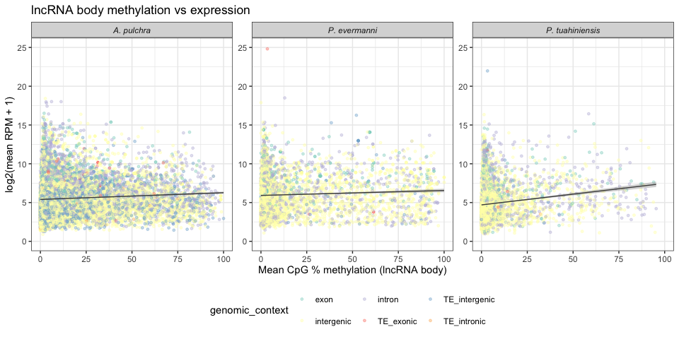<!-- -->

``` r
p_lnc_meth_expr_cv
```

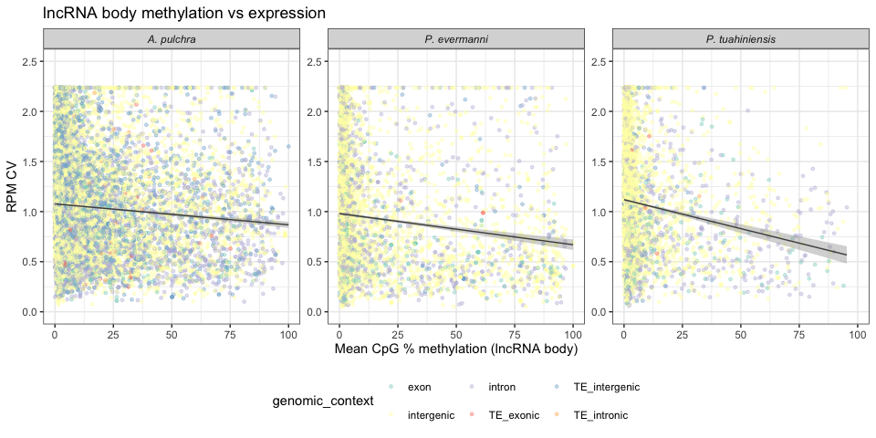<!-- -->

## 6.5 Promoter methylation vs expression

``` r
if (promoter_meth_available) {
  # miRNA promoter methylation vs expression
  if (exists("mirna_promoter_meth_summary") && nrow(mirna_promoter_meth_summary) > 0) {
    mirna_prom_corr <- mirna_promoter_meth_summary %>%
      left_join(mirna_expr_summary, by = c("species", "miRNA_id"))

    mirna_prom_corr_result <- list()
    for (sp in unique(mirna_prom_corr$species)) {
      sp_df <- mirna_prom_corr %>% filter(species == sp)
      ct <- corr_test(sp_df %>% filter(!is.na(mean_meth_promoter), !is.na(log2_rpm)),
                      "mean_meth_promoter", "log2_rpm")
      mirna_prom_corr_result[[sp]] <- data.frame(
        species = sp, feature_type = "miRNA_promoter",
        r = ct$r, p = ct$p, n = ct$n)
    }
    mirna_prom_corr_df <- bind_rows(mirna_prom_corr_result)
    fwrite(mirna_prom_corr_df, file.path("../output/22.2-ncRNA-methylation-genomic-context", "miRNA_promoter_meth_expr_corr.csv"))
    cat("miRNA promoter methylation vs expression:\n")
    knitr::kable(mirna_prom_corr_df)
  }

  # lncRNA promoter methylation vs expression
  if (exists("lncrna_promoter_meth_summary") && nrow(lncrna_promoter_meth_summary) > 0) {
    lncrna_prom_corr <- lncrna_promoter_meth_summary %>%
      left_join(lncrna_expr_summary, by = c("species", "lncRNA_id"))

    lncrna_prom_corr_result <- list()
    for (sp in unique(lncrna_prom_corr$species)) {
      sp_df <- lncrna_prom_corr %>% filter(species == sp)
      ct <- corr_test(sp_df %>% filter(!is.na(mean_meth_promoter), !is.na(log2_rpm)),
                      "mean_meth_promoter", "log2_rpm")
      lncrna_prom_corr_result[[sp]] <- data.frame(
        species = sp, feature_type = "lncRNA_promoter",
        r = ct$r, p = ct$p, n = ct$n)
    }
    lncrna_prom_corr_df <- bind_rows(lncrna_prom_corr_result)
    fwrite(lncrna_prom_corr_df, file.path("../output/22.2-ncRNA-methylation-genomic-context", "lncRNA_promoter_meth_expr_corr.csv"))
    cat("\nlncRNA promoter methylation vs expression:\n")
    knitr::kable(lncrna_prom_corr_df)
  }
} else {
  cat("Promoter methylation data not available (methylKit RData files not found).\n")
  cat("Skipping promoter methylation vs expression analysis.\n")
}
```

    ## miRNA promoter methylation vs expression:
    ## 
    ## lncRNA promoter methylation vs expression:

| species | feature_type    |          r |         p |     n |
|:--------|:----------------|-----------:|----------:|------:|
| Apul    | lncRNA_promoter |  0.0332569 | 0.0000001 | 26509 |
| Peve    | lncRNA_promoter | -0.0077671 | 0.4891537 |  7932 |
| Ptuh    | lncRNA_promoter |  0.1456449 | 0.0000000 | 11389 |

## 6.6 Plot

``` r
if (promoter_meth_available) {
  # miRNA promoter methylation vs expression
  if (exists("mirna_promoter_meth_summary") && nrow(mirna_promoter_meth_summary) > 0) {
    p_mirna_prom <- ggplot(
      mirna_promoter_meth_summary %>%
        left_join(mirna_expr_summary, by = c("species", "miRNA_id")) %>%
        filter(!is.na(mean_meth_promoter), !is.na(log2_rpm)),
      aes(x = mean_meth_promoter, y = log2_rpm)) +
      geom_point(size = 3, alpha = 0.8) +
      geom_smooth(method = "lm", se = TRUE, linewidth = 0.5, color = "grey30") +
      facet_wrap(~ species, scales = "free", labeller = labeller(species = c(
        "Apul" = "A. pulchra", "Peve" = "P. evermanni", "Ptuh" = "P. tuahiniensis"))) +
      labs(x = "Mean CpG % methylation (miRNA promoter)",
           y = "log2(mean RPM + 1)",
           title = "miRNA promoter methylation vs expression") +
      theme_bw(base_size = 11) +
      theme(strip.text = element_text(face = "italic"))
  }

  # lncRNA promoter methylation vs expression
  if (exists("lncrna_promoter_meth_summary") && nrow(lncrna_promoter_meth_summary) > 0) {
    p_lnc_prom <- ggplot(
      lncrna_promoter_meth_summary %>%
        left_join(lncrna_expr_summary, by = c("species", "lncRNA_id")) %>%
        filter(!is.na(mean_meth_promoter), !is.na(log2_rpm)),
      aes(x = mean_meth_promoter, y = log2_rpm)) +
      geom_point(size = 1, alpha = 0.3) +
      geom_smooth(method = "lm", se = TRUE, linewidth = 0.5, color = "grey30") +
      facet_wrap(~ species, scales = "free", labeller = labeller(species = c(
        "Apul" = "A. pulchra", "Peve" = "P. evermanni", "Ptuh" = "P. tuahiniensis"))) +
      labs(x = "Mean CpG % methylation (lncRNA promoter)",
           y = "log2(mean RPM + 1)",
           title = "lncRNA promoter methylation vs expression") +
      theme_bw(base_size = 11) +
      theme(strip.text = element_text(face = "italic"))
  }

  if (exists("p_mirna_prom") && exists("p_lnc_prom")) {
    p_prom_meth_expr <- p_mirna_prom / p_lnc_prom
    ggsave(file.path("../output/22.2-ncRNA-methylation-genomic-context", "Fig_promoter_meth_vs_expr.png"),
           p_prom_meth_expr, width = 12, height = 8, dpi = 300)
    p_prom_meth_expr
  } else if (exists("p_mirna_prom")) {
    ggsave(file.path("../output/22.2-ncRNA-methylation-genomic-context", "Fig_promoter_meth_vs_expr.png"),
           p_mirna_prom, width = 12, height = 4, dpi = 300)
    p_mirna_prom
  } else if (exists("p_lnc_prom")) {
    ggsave(file.path("../output/22.2-ncRNA-methylation-genomic-context", "Fig_promoter_meth_vs_expr.png"),
           p_lnc_prom, width = 12, height = 4, dpi = 300)
    p_lnc_prom
  }
} else {
  cat("Promoter methylation data not available - skipping promoter figures.\n")
}
```

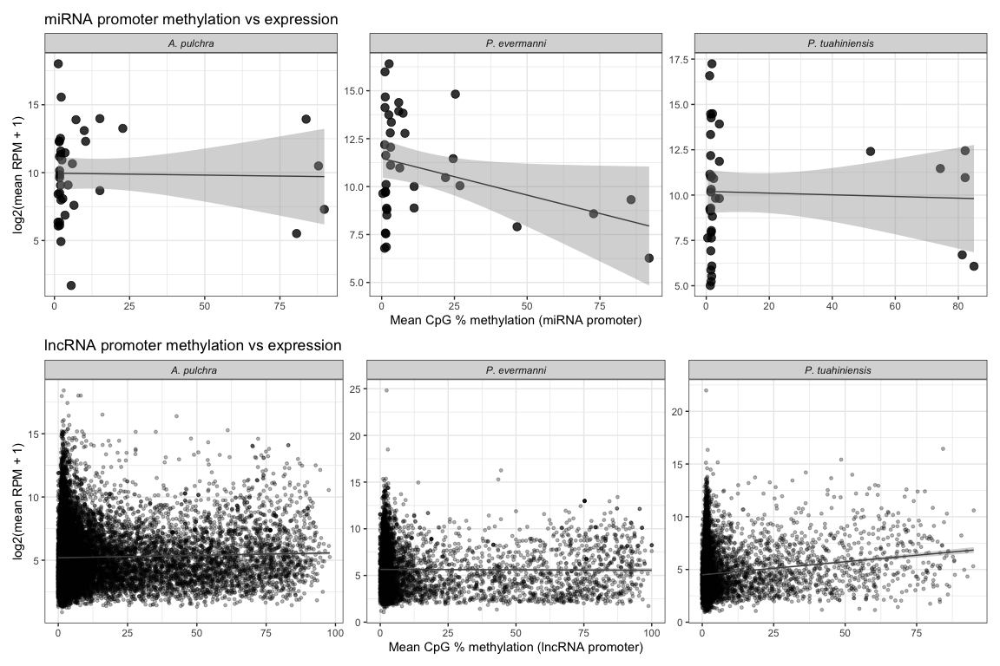<!-- -->

# 7 Methylation vs genomic context

Compare mean methylation levels of features across genomic context
classes.

## 7.1 miRNA methylation by context

``` r
## Mature ##
# Merge context with methylation
mirna_meth_ctx_mat <- mirna_meth_mature_summary %>%
  left_join(mirna_ctx, by = c("species", "miRNA_id")) %>%
  filter(!is.na(genomic_context))

mirna_meth_ctx_mat$genomic_context <- factor(mirna_meth_ctx_mat$genomic_context,
                                         levels = context_order)

fwrite(mirna_meth_ctx_mat, file.path("../output/22.2-ncRNA-methylation-genomic-context", "miRNA_meth_by_context_mature.csv"))

# Kruskal-Wallis tests per species
cat("Kruskal-Wallis tests: miRNA mature methylation ~ genomic context\n\n")
```

    ## Kruskal-Wallis tests: miRNA mature methylation ~ genomic context

``` r
for (sp in unique(mirna_meth_ctx_mat$species)) {
  sp_df <- mirna_meth_ctx_mat %>% filter(species == sp)
  if (nrow(sp_df) >= 4 && length(unique(sp_df$genomic_context)) >= 2) {
    kw <- kruskal.test(mean_meth_mature ~ genomic_context, data = sp_df)
    cat(sprintf("  %s: chi-sq=%.2f, df=%d, p=%.4f (n=%d)\n",
                sp, kw$statistic, kw$parameter, kw$p.value, nrow(sp_df)))
  }
}
```

    ##   Apul: chi-sq=0.29, df=2, p=0.8632 (n=9)
    ##   Ptuh: chi-sq=0.75, df=1, p=0.3865 (n=8)

``` r
## Precursors ##
# Merge context with methylation
mirna_meth_ctx <- mirna_meth_precursor_summary %>%
  left_join(mirna_ctx, by = c("species", "miRNA_id")) %>%
  filter(!is.na(genomic_context))

mirna_meth_ctx$genomic_context <- factor(mirna_meth_ctx$genomic_context,
                                         levels = context_order)

fwrite(mirna_meth_ctx, file.path("../output/22.2-ncRNA-methylation-genomic-context", "miRNA_meth_by_context.csv"))

# Kruskal-Wallis tests per species
cat("Kruskal-Wallis tests: miRNA precursor methylation ~ genomic context\n\n")
```

    ## Kruskal-Wallis tests: miRNA precursor methylation ~ genomic context

``` r
for (sp in unique(mirna_meth_ctx$species)) {
  sp_df <- mirna_meth_ctx %>% filter(species == sp)
  if (nrow(sp_df) >= 4 && length(unique(sp_df$genomic_context)) >= 2) {
    kw <- kruskal.test(mean_meth_precursor ~ genomic_context, data = sp_df)
    cat(sprintf("  %s: chi-sq=%.2f, df=%d, p=%.4f (n=%d)\n",
                sp, kw$statistic, kw$parameter, kw$p.value, nrow(sp_df)))
  }
}
```

    ##   Apul: chi-sq=2.38, df=2, p=0.3047 (n=27)
    ##   Peve: chi-sq=0.18, df=1, p=0.6726 (n=19)
    ##   Ptuh: chi-sq=0.03, df=1, p=0.8658 (n=19)

## 7.2 Plot

``` r
p_mirna_ctx_mat <- ggplot(mirna_meth_ctx_mat, aes(x = genomic_context, y = mean_meth_mature,
                                          fill = genomic_context)) +
  geom_boxplot(outlier.shape = NA, alpha = 0.6) +
  geom_jitter(width = 0.15, alpha = 0.7, size = 2) +
  facet_wrap(~ species, scales = "free", labeller = labeller(species = c(
    "Apul" = "A. pulchra", "Peve" = "P. evermanni", "Ptuh" = "P. tuahiniensis"))) +
  scale_fill_brewer(palette = "Set3") +
  labs(x = NULL, y = "Mean CpG % methylation (mature)",
       title = "miRNA mature methylation by genomic context") +
  theme_bw(base_size = 11) +
  theme(axis.text.x = element_text(angle = 45, hjust = 1),
        strip.text = element_text(face = "italic"),
        legend.position = "none")


p_mirna_ctx <- ggplot(mirna_meth_ctx, aes(x = genomic_context, y = mean_meth_precursor,
                                          fill = genomic_context)) +
  geom_boxplot(outlier.shape = NA, alpha = 0.6) +
  geom_jitter(width = 0.15, alpha = 0.7, size = 2) +
  facet_wrap(~ species, scales = "free", labeller = labeller(species = c(
    "Apul" = "A. pulchra", "Peve" = "P. evermanni", "Ptuh" = "P. tuahiniensis"))) +
  scale_fill_brewer(palette = "Set3") +
  labs(x = NULL, y = "Mean CpG % methylation (precursor)",
       title = "miRNA precursor methylation by genomic context") +
  theme_bw(base_size = 11) +
  theme(axis.text.x = element_text(angle = 45, hjust = 1),
        strip.text = element_text(face = "italic"),
        legend.position = "none")

ggsave(file.path("../output/22.2-ncRNA-methylation-genomic-context", "Fig_miRNA_meth_by_context_mature.png"),
       p_mirna_ctx_mat, width = 12, height = 5, dpi = 300)
ggsave(file.path("../output/22.2-ncRNA-methylation-genomic-context", "Fig_miRNA_meth_by_context.png"),
       p_mirna_ctx, width = 12, height = 5, dpi = 300)

p_mirna_ctx_mat
```

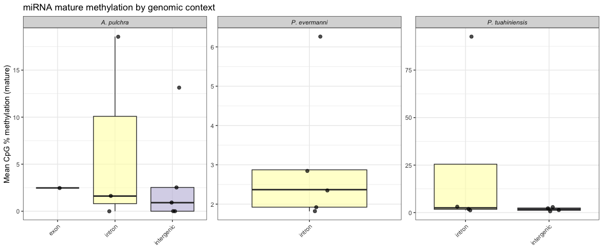<!-- -->

``` r
p_mirna_ctx
```

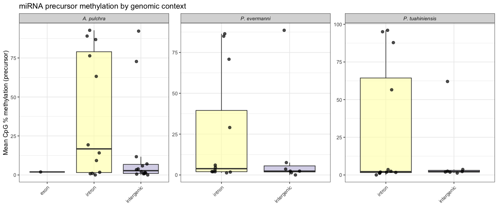<!-- -->

## 7.3 lncRNA body methylation by context

``` r
lncrna_meth_ctx <- lncrna_meth_summary %>%
  left_join(lncrna_ctx, by = c("species", "lncRNA_id")) %>%
  filter(!is.na(genomic_context))

lncrna_meth_ctx$genomic_context <- factor(lncrna_meth_ctx$genomic_context,
                                          levels = context_order)

fwrite(lncrna_meth_ctx, file.path("../output/22.2-ncRNA-methylation-genomic-context", "lncRNA_meth_by_context.csv"))

# Kruskal-Wallis tests per species
cat("Kruskal-Wallis tests: lncRNA body methylation ~ genomic context\n\n")
```

    ## Kruskal-Wallis tests: lncRNA body methylation ~ genomic context

``` r
for (sp in unique(lncrna_meth_ctx$species)) {
  sp_df <- lncrna_meth_ctx %>% filter(species == sp)
  if (nrow(sp_df) >= 4 && length(unique(sp_df$genomic_context)) >= 2) {
    kw <- kruskal.test(mean_meth_body ~ genomic_context, data = sp_df)
    cat(sprintf("  %s: chi-sq=%.2f, df=%d, p=%.4f (n=%d)\n",
                sp, kw$statistic, kw$parameter, kw$p.value, nrow(sp_df)))
  }
}
```

    ##   Apul: chi-sq=254.82, df=5, p=0.0000 (n=23468)
    ##   Peve: chi-sq=16.12, df=4, p=0.0029 (n=7278)
    ##   Ptuh: chi-sq=183.35, df=5, p=0.0000 (n=12341)

## 7.4 Plot

``` r
p_lnc_ctx <- ggplot(lncrna_meth_ctx, aes(x = genomic_context, y = mean_meth_body,
                                         fill = genomic_context)) +
  geom_boxplot(outlier.shape = NA, alpha = 0.6) +
  facet_wrap(~ species, scales = "free", labeller = labeller(species = c(
    "Apul" = "A. pulchra", "Peve" = "P. evermanni", "Ptuh" = "P. tuahiniensis"))) +
  scale_fill_brewer(palette = "Set3") +
  labs(x = NULL, y = "Mean CpG % methylation (lncRNA body)",
       title = "lncRNA body methylation by genomic context") +
  theme_bw(base_size = 11) +
  theme(axis.text.x = element_text(angle = 45, hjust = 1),
        strip.text = element_text(face = "italic"),
        legend.position = "none")

ggsave(file.path("../output/22.2-ncRNA-methylation-genomic-context", "Fig_lncRNA_meth_by_context.png"),
       p_lnc_ctx, width = 12, height = 5, dpi = 300)
p_lnc_ctx
```

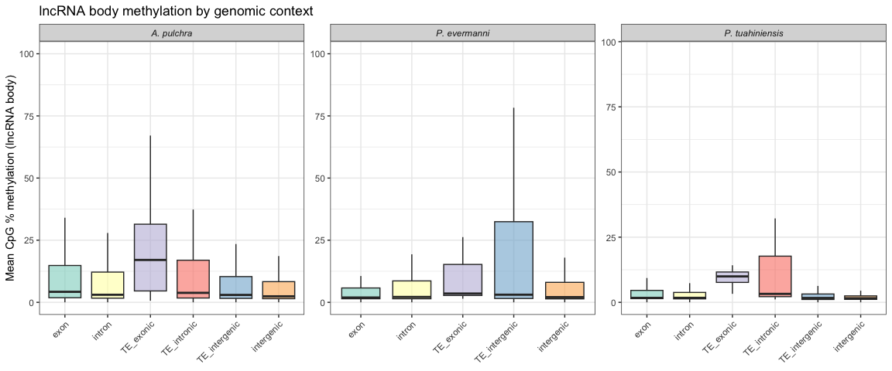<!-- -->

# 8 Methylation class (Low vs High) analyses

Following the WGBS Rmds, features are binned into methylation classes
based on mean CpG % methylation:

- Low: \< 10%
- Moderate: 10-50%
- High: \>= 50%

The analyses below focus on comparing Low vs High groups (excluding
Moderate) to maximize contrast, using the same thresholds as the
per-species WGBS scripts (`08-Apul-WGBS.Rmd` etc.).

## 8.1 Assign methylation classes

``` r
# Thresholds matching the WGBS Rmds
LOW_THRESH  <- 10
HIGH_THRESH <- 50

assign_meth_class <- function(df, meth_col) {
  df %>%
    mutate(meth_class = cut(.data[[meth_col]],
                            breaks = c(-Inf, LOW_THRESH, HIGH_THRESH, Inf),
                            labels = c("Low (<10%)", "Moderate", "High (>=50%)")))
}

# miRNA
# Precursor
mirna_master_class <- mirna_master %>%
  assign_meth_class("mean_meth_precursor")

# Mature
mirna_mature_class <- mirna_master %>%
  dplyr::filter(!is.na(mean_meth_mature)) %>%
  assign_meth_class("mean_meth_mature")

# Promoter (if available)
if (exists("mirna_promoter_meth_summary") && nrow(mirna_promoter_meth_summary) > 0) {
  mirna_prom_class <- mirna_promoter_meth_summary %>%
    left_join(mirna_expr_summary, by = c("species", "miRNA_id")) %>%
    left_join(mirna_ctx, by = c("species", "miRNA_id")) %>%
    assign_meth_class("mean_meth_promoter")
}

# lncRNA
# Body
lncrna_body_class <- lncrna_master %>%
  assign_meth_class("mean_meth_body")

# Promoter (if available)
if (exists("lncrna_promoter_meth_summary") && nrow(lncrna_promoter_meth_summary) > 0) {
  lncrna_prom_class <- lncrna_promoter_meth_summary %>%
    left_join(lncrna_expr_summary, by = c("species", "lncRNA_id")) %>%
    left_join(lncrna_ctx, by = c("species", "lncRNA_id")) %>%
    assign_meth_class("mean_meth_promoter")
}

# Summary: class counts per feature type
cat("Methylation class counts:\n\n")
```

    ## Methylation class counts:

``` r
cat("miRNA precursor:\n")
```

    ## miRNA precursor:

``` r
print(mirna_master_class %>% dplyr::filter(!is.na(meth_class)) %>%
  count(species, meth_class) %>%
  pivot_wider(names_from = meth_class, values_from = n, values_fill = 0))
```

    ## # A tibble: 3 × 4
    ##   species `Low (<10%)` Moderate `High (>=50%)`
    ##   <chr>          <int>    <int>          <int>
    ## 1 Apul              17        3              7
    ## 2 Peve              14        1              4
    ## 3 Ptuh              14        0              5

``` r
cat("\nmiRNA mature:\n")
```

    ## 
    ## miRNA mature:

``` r
print(mirna_mature_class %>% dplyr::filter(!is.na(meth_class)) %>%
  count(species, meth_class) %>%
  pivot_wider(names_from = meth_class, values_from = n, values_fill = 0))
```

    ## # A tibble: 3 × 4
    ##   species `Low (<10%)` Moderate `High (>=50%)`
    ##   <chr>          <int>    <int>          <int>
    ## 1 Apul               7        2              0
    ## 2 Peve               5        0              0
    ## 3 Ptuh               7        0              1

``` r
if (exists("mirna_prom_class")) {
  cat("\nmiRNA promoter:\n")
  print(mirna_prom_class %>% dplyr::filter(!is.na(meth_class)) %>%
    count(species, meth_class) %>%
    pivot_wider(names_from = meth_class, values_from = n, values_fill = 0))
}
```

    ## 
    ## miRNA promoter:
    ## # A tibble: 3 × 4
    ##   species `Low (<10%)` Moderate `High (>=50%)`
    ##   <chr>          <int>    <int>          <int>
    ## 1 Apul              30        4              4
    ## 2 Peve              27        7              3
    ## 3 Ptuh              31        0              6

``` r
cat("\nlncRNA body:\n")
```

    ## 
    ## lncRNA body:

``` r
print(lncrna_body_class %>% dplyr::filter(!is.na(meth_class)) %>%
  count(species, meth_class) %>%
  pivot_wider(names_from = meth_class, values_from = n, values_fill = 0))
```

    ## # A tibble: 3 × 4
    ##   species `Low (<10%)` Moderate `High (>=50%)`
    ##   <chr>          <int>    <int>          <int>
    ## 1 Apul           17680     4336           1452
    ## 2 Peve            5578     1000            700
    ## 3 Ptuh           11043     1036            262

``` r
if (exists("lncrna_prom_class")) {
  cat("\nlncRNA promoter:\n")
  print(lncrna_prom_class %>% dplyr::filter(!is.na(meth_class)) %>%
    count(species, meth_class) %>%
    pivot_wider(names_from = meth_class, values_from = n, values_fill = 0))
}
```

    ## 
    ## lncRNA promoter:
    ## # A tibble: 3 × 4
    ##   species `Low (<10%)` Moderate `High (>=50%)`
    ##   <chr>          <int>    <int>          <int>
    ## 1 Apul           20757     3921           1833
    ## 2 Peve            6356      808            771
    ## 3 Ptuh           12423     1104            377

## 8.2 Expression by methylation class

Do highly methylated features differ in expression from lowly methylated
ones? Wilcoxon rank-sum tests (Low vs High, excluding Moderate).

``` r
# Helper: Wilcoxon test Low vs High for a given dataset
meth_class_expr_test <- function(df, expr_col, sp) {
  sub <- df[df$species == sp & df$meth_class %in% c("Low (<10%)", "High (>=50%)") &
             !is.na(df[[expr_col]]), ]
  if (length(unique(sub$meth_class)) < 2 || nrow(sub) < 4) {
    return(data.frame(species = sp, n_low = sum(sub$meth_class == "Low (<10%)"),
                      n_high = sum(sub$meth_class == "High (>=50%)"),
                      W = NA_real_, p = NA_real_))
  }
  wt <- wilcox.test(sub[[expr_col]] ~ sub$meth_class)
  data.frame(species = sp,
             n_low = sum(sub$meth_class == "Low (<10%)"),
             n_high = sum(sub$meth_class == "High (>=50%)"),
             W = unname(wt$statistic), p = wt$p.value)
}

# Run tests for each feature type
meth_class_expr_results <- list()

# miRNA precursor
for (sp in unique(mirna_master_class$species)) {
  meth_class_expr_results[[paste("miRNA_precursor", sp, sep = "__")]] <-
    cbind(feature_type = "miRNA_precursor",
          meth_class_expr_test(mirna_master_class, "log2_rpm", sp))
}

# miRNA mature
for (sp in unique(mirna_mature_class$species)) {
  meth_class_expr_results[[paste("miRNA_mature", sp, sep = "__")]] <-
    cbind(feature_type = "miRNA_mature",
          meth_class_expr_test(mirna_mature_class, "log2_rpm", sp))
}

# miRNA promoter
if (exists("mirna_prom_class")) {
  for (sp in unique(mirna_prom_class$species)) {
    meth_class_expr_results[[paste("miRNA_promoter", sp, sep = "__")]] <-
      cbind(feature_type = "miRNA_promoter",
            meth_class_expr_test(mirna_prom_class, "log2_rpm", sp))
  }
}

# lncRNA body
for (sp in unique(lncrna_body_class$species)) {
  meth_class_expr_results[[paste("lncRNA_body", sp, sep = "__")]] <-
    cbind(feature_type = "lncRNA_body",
          meth_class_expr_test(lncrna_body_class, "log2_rpm", sp))
}

# lncRNA promoter
if (exists("lncrna_prom_class")) {
  for (sp in unique(lncrna_prom_class$species)) {
    meth_class_expr_results[[paste("lncRNA_promoter", sp, sep = "__")]] <-
      cbind(feature_type = "lncRNA_promoter",
            meth_class_expr_test(lncrna_prom_class, "log2_rpm", sp))
  }
}

meth_class_expr_df <- bind_rows(meth_class_expr_results) %>%
  mutate(p_round = signif(p, 3),
         sig = ifelse(!is.na(p) & p < 0.05, "*", ""))

fwrite(meth_class_expr_df, file.path("../output/22.2-ncRNA-methylation-genomic-context", "meth_class_expression_tests.csv"))
knitr::kable(meth_class_expr_df)
```

| feature_type    | species | n_low | n_high |        W |         p |  p_round | sig |
|:----------------|:--------|------:|-------:|---------:|----------:|---------:|:----|
| miRNA_precursor | Apul    |    17 |      7 |       63 | 0.8524952 | 0.852000 |     |
| miRNA_precursor | Peve    |    14 |      4 |       35 | 0.5052288 | 0.505000 |     |
| miRNA_precursor | Ptuh    |    14 |      5 |       29 | 0.6216030 | 0.622000 |     |
| miRNA_mature    | Apul    |     7 |      0 |       NA |        NA |       NA |     |
| miRNA_mature    | Peve    |     5 |      0 |       NA |        NA |       NA |     |
| miRNA_mature    | Ptuh    |     7 |      1 |        1 | 0.5000000 | 0.500000 |     |
| miRNA_promoter  | Apul    |    30 |      4 |       66 | 0.7769105 | 0.777000 |     |
| miRNA_promoter  | Peve    |    27 |      3 |       69 | 0.0502463 | 0.050200 |     |
| miRNA_promoter  | Ptuh    |    31 |      6 |       88 | 0.8566499 | 0.857000 |     |
| lncRNA_body     | Apul    | 17679 |   1452 | 11611466 | 0.0000000 | 0.000000 | \*  |
| lncRNA_body     | Peve    |  5576 |    700 |  1779320 | 0.0001374 | 0.000137 | \*  |
| lncRNA_body     | Ptuh    |  8996 |    190 |   514274 | 0.0000000 | 0.000000 | \*  |
| lncRNA_promoter | Apul    | 20755 |   1833 | 17561087 | 0.0000000 | 0.000000 | \*  |
| lncRNA_promoter | Peve    |  6353 |    771 |  2468049 | 0.7250584 | 0.725000 |     |
| lncRNA_promoter | Ptuh    | 10223 |    292 |   924097 | 0.0000000 | 0.000000 | \*  |

## 8.3 Plot

``` r
# Combine all feature types into one plot
plot_data_list <- list()

plot_data_list[["miRNA_precursor"]] <- mirna_master_class %>%
  dplyr::filter(!is.na(meth_class), !is.na(log2_rpm)) %>%
  mutate(feature_type = "miRNA_precursor")

plot_data_list[["miRNA_mature"]] <- mirna_mature_class %>%
  dplyr::filter(!is.na(meth_class), !is.na(log2_rpm)) %>%
  mutate(feature_type = "miRNA_mature")

if (exists("mirna_prom_class")) {
  plot_data_list[["miRNA_promoter"]] <- mirna_prom_class %>%
    dplyr::filter(!is.na(meth_class), !is.na(log2_rpm)) %>%
    mutate(feature_type = "miRNA_promoter")
}

plot_data_list[["lncRNA_body"]] <- lncrna_body_class %>%
  dplyr::filter(!is.na(meth_class), !is.na(log2_rpm)) %>%
  mutate(feature_type = "lncRNA_body")

if (exists("lncrna_prom_class")) {
  plot_data_list[["lncRNA_promoter"]] <- lncrna_prom_class %>%
    dplyr::filter(!is.na(meth_class), !is.na(log2_rpm)) %>%
    mutate(feature_type = "lncRNA_promoter")
}

plot_data <- bind_rows(plot_data_list) %>%
  dplyr::filter(meth_class != "Moderate") %>%
  mutate(
    feature_type = factor(feature_type,
                          levels = c("miRNA_mature", "miRNA_precursor", "miRNA_promoter",
                                     "lncRNA_body", "lncRNA_promoter")),
    meth_class = factor(meth_class, levels = c("Low (<10%)", "High (>=50%)"))
  )

p_meth_class_expr <- ggplot(plot_data, aes(x = meth_class, y = log2_rpm, fill = meth_class)) +
  geom_boxplot(outlier.shape = NA, alpha = 0.6, width = 0.5) +
  facet_grid(feature_type ~ species, scales = "free_y",
             labeller = labeller(species = c(
               "Apul" = "A. pulchra", "Peve" = "P. evermanni", "Ptuh" = "P. tuahiniensis"))) +
  scale_fill_manual(values = c("Low (<10%)" = "#85C1E9", "High (>=50%)" = "#E74C3C")) +
  labs(x = NULL, y = "log2(mean RPM + 1)",
       title = "Expression by methylation class (Low <10% vs High >=50%)",
       subtitle = "Wilcoxon tests in table above; Moderate class excluded") +
  theme_bw(base_size = 11) +
  theme(strip.text.y = element_text(face = "bold"),
        strip.text.x = element_text(face = "italic"),
        legend.position = "bottom")

ggsave(file.path("../output/22.2-ncRNA-methylation-genomic-context", "Fig_meth_class_vs_expression.png"),
       p_meth_class_expr, width = 14, height = 10, dpi = 300)
p_meth_class_expr
```

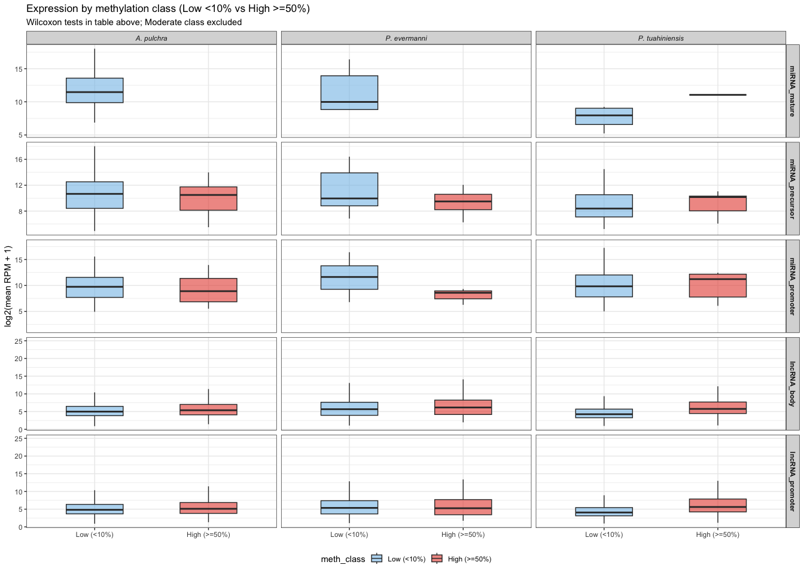<!-- -->

## 8.4 Genomic context by methylation class

Does the genomic context distribution differ between Low and High
methylation classes?

``` r
# For lncRNA body (the feature type with enough data)
lncrna_body_context_class <- lncrna_body_class %>%
  dplyr::filter(!is.na(genomic_context), !is.na(meth_class), meth_class != "Moderate")

fwrite(lncrna_body_context_class, file.path("../output/22.2-ncRNA-methylation-genomic-context", "lncRNA_body_meth_class_context.csv"))

# Chi-squared tests: context ~ meth_class, per species
cat("Chi-squared tests: genomic context ~ methylation class (lncRNA body, Low vs High)\n\n")
```

    ## Chi-squared tests: genomic context ~ methylation class (lncRNA body, Low vs High)

``` r
meth_class_context_tests <- list()
for (sp in unique(lncrna_body_context_class$species)) {
  sp_df <- lncrna_body_context_class %>% dplyr::filter(species == sp)
  if (length(unique(sp_df$meth_class)) < 2 || nrow(sp_df) < 10) next
  tab <- table(sp_df$genomic_context, sp_df$meth_class)
  # Remove contexts with 0 in either class
  tab <- tab[rowSums(tab) > 0, , drop = FALSE]
  if (nrow(tab) < 2) next
  chi <- tryCatch(chisq.test(tab), error = function(e) NULL)
  if (is.null(chi)) next
  meth_class_context_tests[[sp]] <- data.frame(
    species = sp, chi_sq = round(unname(chi$statistic), 2),
    df = chi$parameter, p = signif(chi$p.value, 3),
    n = sum(tab))
  cat(sprintf("  %s: chi-sq=%.2f, df=%d, p=%.4g (n=%d)\n",
              sp, chi$statistic, chi$parameter, chi$p.value, sum(tab)))
}
```

    ##   Apul: chi-sq=NaN, df=10, p=NaN (n=19132)

    ##   Peve: chi-sq=NaN, df=8, p=NaN (n=6278)

    ##   Ptuh: chi-sq=NaN, df=10, p=NaN (n=11305)

``` r
meth_class_context_df <- bind_rows(meth_class_context_tests)
fwrite(meth_class_context_df, file.path("../output/22.2-ncRNA-methylation-genomic-context", "meth_class_context_tests.csv"))
```

## 8.5 Plot

``` r
lncrna_body_context_class$genomic_context <- factor(lncrna_body_context_class$genomic_context,
                                                     levels = context_order)

p_meth_class_context <- ggplot(lncrna_body_context_class,
                                aes(x = genomic_context, fill = meth_class)) +
  geom_bar(position = "fill", color = "white", linewidth = 0.2) +
  facet_wrap(~ species, labeller = labeller(species = c(
    "Apul" = "A. pulchra", "Peve" = "P. evermanni", "Ptuh" = "P. tuahiniensis"))) +
  scale_fill_manual(values = c("Low (<10%)" = "#85C1E9", "High (>=50%)" = "#E74C3C")) +
  labs(x = "Genomic context", y = "Proportion of features",
       title = "Genomic context distribution by methylation class (lncRNA body)",
       subtitle = "Low (<10%) vs High (>=50%) methylation") +
  theme_bw(base_size = 11) +
  theme(axis.text.x = element_text(angle = 45, hjust = 1),
        strip.text = element_text(face = "italic"),
        legend.position = "bottom")

ggsave(file.path("../output/22.2-ncRNA-methylation-genomic-context", "Fig_meth_class_by_context.png"),
       p_meth_class_context, width = 14, height = 6, dpi = 300)
p_meth_class_context
```

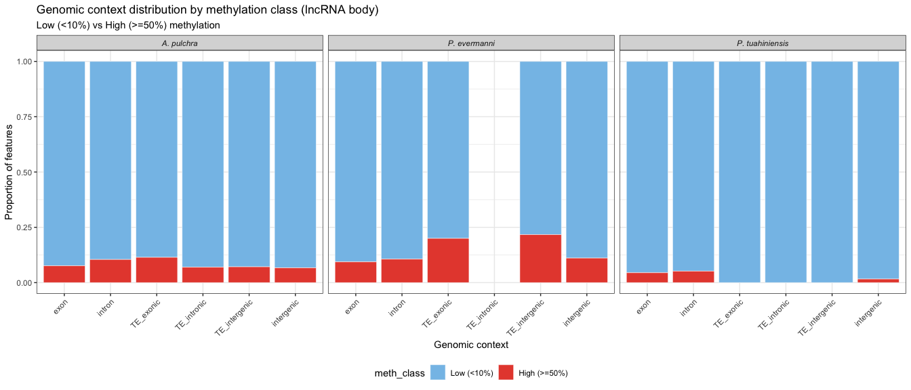<!-- -->

# 9 Multiple testing correction

Benjamini-Hochberg (BH) false discovery rate (FDR) correction is applied
within each family of related tests. Three test families are corrected:

1.  Methylation-expression correlations (Family 1): all Pearson
    correlations between methylation and expression (magnitude and
    variability) across all feature types and species
2.  Methylation class expression tests (Family 3): all Wilcoxon rank-sum
    tests comparing expression between Low and High methylation classes
3.  Methylation class neighbor tests (Family 6): all Wilcoxon tests
    comparing nearest-gene methylation/expression between lncRNA
    methylation classes

``` r
# Family 1: Methylation-expression correlations
# Combine all correlation results into one family
all_corr_df <- bind_rows(
  mirna_corr_df,
  lncrna_corr_df,
  if (exists("mirna_prom_corr_df")) mirna_prom_corr_df else NULL,
  if (exists("lncrna_prom_corr_df")) {
    lncrna_prom_corr_df %>% mutate(expr_metric = "magnitude")
  } else NULL
) %>%
  filter(!is.na(p))

all_corr_df$q <- p.adjust(all_corr_df$p, method = "BH")
all_corr_df$sig_fdr <- ifelse(all_corr_df$q < 0.05, "*", "")

fwrite(all_corr_df, file.path("../output/22.2-ncRNA-methylation-genomic-context", "all_meth_expr_corr_FDR.csv"))

cat("Family 1: Methylation-expression correlations (", nrow(all_corr_df), " tests)\n", sep = "")
```

    ## Family 1: Methylation-expression correlations (24 tests)

``` r
cat("Significant at p < 0.05:", sum(all_corr_df$p < 0.05), "\n")
```

    ## Significant at p < 0.05: 9

``` r
cat("Significant after BH FDR < 0.05:", sum(all_corr_df$q < 0.05), "\n\n")
```

    ## Significant after BH FDR < 0.05: 8

``` r
knitr::kable(all_corr_df %>%
  mutate(r = round(r, 3), p = signif(p, 4), q = signif(q, 4)) %>%
  dplyr::select(species, feature_type, expr_metric, r, p, q, sig_fdr))
```

| species | feature_type    | expr_metric |      r |         p |         q | sig_fdr |
|:--------|:----------------|:------------|-------:|----------:|----------:|:--------|
| Apul    | miRNA_precursor | magnitude   | -0.052 | 0.7977000 | 0.9253000 |         |
| Apul    | miRNA_precursor | variability |  0.072 | 0.7217000 | 0.9117000 |         |
| Apul    | miRNA_mature    | magnitude   | -0.369 | 0.3281000 | 0.6056000 |         |
| Apul    | miRNA_mature    | variability |  0.177 | 0.6478000 | 0.8637000 |         |
| Peve    | miRNA_precursor | magnitude   | -0.264 | 0.2750000 | 0.5500000 |         |
| Peve    | miRNA_precursor | variability |  0.210 | 0.3877000 | 0.6646000 |         |
| Peve    | miRNA_mature    | magnitude   |  0.686 | 0.2013000 | 0.4392000 |         |
| Peve    | miRNA_mature    | variability | -0.753 | 0.1416000 | 0.3399000 |         |
| Ptuh    | miRNA_precursor | magnitude   | -0.045 | 0.8552000 | 0.9329000 |         |
| Ptuh    | miRNA_precursor | variability |  0.125 | 0.6103000 | 0.8637000 |         |
| Ptuh    | miRNA_mature    | magnitude   |  0.200 | 0.6355000 | 0.8637000 |         |
| Ptuh    | miRNA_mature    | variability | -0.001 | 0.9990000 | 0.9990000 |         |
| Apul    | lncRNA_body     | magnitude   |  0.071 | 0.0000000 | 0.0000000 | \*      |
| Apul    | lncRNA_body     | variability | -0.079 | 0.0000000 | 0.0000000 | \*      |
| Peve    | lncRNA_body     | magnitude   |  0.058 | 0.0000008 | 0.0000025 | \*      |
| Peve    | lncRNA_body     | variability | -0.122 | 0.0000000 | 0.0000000 | \*      |
| Ptuh    | lncRNA_body     | magnitude   |  0.145 | 0.0000000 | 0.0000000 | \*      |
| Ptuh    | lncRNA_body     | variability | -0.119 | 0.0000000 | 0.0000000 | \*      |
| Apul    | miRNA_promoter  | NA          | -0.022 | 0.8972000 | 0.9362000 |         |
| Peve    | miRNA_promoter  | NA          | -0.329 | 0.0468800 | 0.1250000 |         |
| Ptuh    | miRNA_promoter  | NA          | -0.041 | 0.8096000 | 0.9253000 |         |
| Apul    | lncRNA_promoter | magnitude   |  0.033 | 0.0000001 | 0.0000002 | \*      |
| Peve    | lncRNA_promoter | magnitude   | -0.008 | 0.4892000 | 0.7826000 |         |
| Ptuh    | lncRNA_promoter | magnitude   |  0.146 | 0.0000000 | 0.0000000 | \*      |

``` r
# Family 3: Methylation class expression tests
meth_class_expr_df <- meth_class_expr_df %>%
  filter(!is.na(p)) %>%
  mutate(q = p.adjust(p, method = "BH"),
         sig_fdr = ifelse(q < 0.05, "*", ""))

fwrite(meth_class_expr_df, file.path("../output/22.2-ncRNA-methylation-genomic-context", "meth_class_expression_tests.csv"))

cat("\nFamily 3: Methylation class expression tests (", nrow(meth_class_expr_df), " tests)\n", sep = "")
```

    ## 
    ## Family 3: Methylation class expression tests (13 tests)

``` r
cat("Significant at p < 0.05:", sum(meth_class_expr_df$p < 0.05), "\n")
```

    ## Significant at p < 0.05: 5

``` r
cat("Significant after BH FDR < 0.05:", sum(meth_class_expr_df$q < 0.05), "\n\n")
```

    ## Significant after BH FDR < 0.05: 5

``` r
knitr::kable(meth_class_expr_df %>%
  mutate(p = signif(p, 4), q = signif(q, 4)) %>%
  dplyr::select(feature_type, species, n_low, n_high, p, q, sig_fdr))
```

| feature_type    | species | n_low | n_high |         p |         q | sig_fdr |
|:----------------|:--------|------:|-------:|----------:|----------:|:--------|
| miRNA_precursor | Apul    |    17 |      7 | 0.8525000 | 0.8566000 |         |
| miRNA_precursor | Peve    |    14 |      4 | 0.5052000 | 0.8210000 |         |
| miRNA_precursor | Ptuh    |    14 |      5 | 0.6216000 | 0.8566000 |         |
| miRNA_mature    | Ptuh    |     7 |      1 | 0.5000000 | 0.8210000 |         |
| miRNA_promoter  | Apul    |    30 |      4 | 0.7769000 | 0.8566000 |         |
| miRNA_promoter  | Peve    |    27 |      3 | 0.0502500 | 0.1089000 |         |
| miRNA_promoter  | Ptuh    |    31 |      6 | 0.8566000 | 0.8566000 |         |
| lncRNA_body     | Apul    | 17679 |   1452 | 0.0000000 | 0.0000000 | \*      |
| lncRNA_body     | Peve    |  5576 |    700 | 0.0001374 | 0.0003573 | \*      |
| lncRNA_body     | Ptuh    |  8996 |    190 | 0.0000000 | 0.0000000 | \*      |
| lncRNA_promoter | Apul    | 20755 |   1833 | 0.0000000 | 0.0000002 | \*      |
| lncRNA_promoter | Peve    |  6353 |    771 | 0.7251000 | 0.8566000 |         |
| lncRNA_promoter | Ptuh    | 10223 |    292 | 0.0000000 | 0.0000000 | \*      |

# 10 Summary

``` r
cat("Output files written to:\n  ", normalizePath("../output/22.2-ncRNA-methylation-genomic-context"), "\n\n")
```

    ## Output files written to:
    ##    /Users/Owner/Downloads/The Big One/Documents/UW/Roberts Lab/Github/deep-dive-expression/M-multi-species/output/22.2-ncRNA-methylation-genomic-context

``` r
cat("== Genomic context distribution ==\n")
```

    ## == Genomic context distribution ==

``` r
context_df %>%
  count(species, feature_type, genomic_context, name = "n") %>%
  knitr::kable()
```

| species | feature_type    | genomic_context |     n |
|:--------|:----------------|:----------------|------:|
| Apul    | lncRNA_body     | TE_exonic       |    78 |
| Apul    | lncRNA_body     | TE_intergenic   |  5722 |
| Apul    | lncRNA_body     | TE_intronic     |    99 |
| Apul    | lncRNA_body     | exon            |  1138 |
| Apul    | lncRNA_body     | intergenic      | 18355 |
| Apul    | lncRNA_body     | intron          |  6099 |
| Apul    | lncRNA_promoter | TE_exonic       |    27 |
| Apul    | lncRNA_promoter | TE_intergenic   |  3290 |
| Apul    | lncRNA_promoter | TE_intronic     |     4 |
| Apul    | lncRNA_promoter | exon            |  1653 |
| Apul    | lncRNA_promoter | intergenic      | 19554 |
| Apul    | lncRNA_promoter | intron          |  6963 |
| Apul    | miRNA_mature    | TE_intronic     |     1 |
| Apul    | miRNA_mature    | exon            |     1 |
| Apul    | miRNA_mature    | intergenic      |    17 |
| Apul    | miRNA_mature    | intron          |    20 |
| Apul    | miRNA_precursor | exon            |     1 |
| Apul    | miRNA_precursor | intergenic      |    17 |
| Apul    | miRNA_precursor | intron          |    21 |
| Apul    | miRNA_promoter  | exon            |     5 |
| Apul    | miRNA_promoter  | intergenic      |    23 |
| Apul    | miRNA_promoter  | intron          |    11 |
| Peve    | lncRNA_body     | TE_exonic       |    11 |
| Peve    | lncRNA_body     | TE_intergenic   |   245 |
| Peve    | lncRNA_body     | TE_intronic     |     4 |
| Peve    | lncRNA_body     | exon            |   648 |
| Peve    | lncRNA_body     | intergenic      |  7019 |
| Peve    | lncRNA_body     | intron          |  2163 |
| Peve    | lncRNA_promoter | TE_exonic       |     5 |
| Peve    | lncRNA_promoter | TE_intergenic   |    39 |
| Peve    | lncRNA_promoter | exon            |   659 |
| Peve    | lncRNA_promoter | intergenic      |  7067 |
| Peve    | lncRNA_promoter | intron          |  2320 |
| Peve    | miRNA_mature    | intergenic      |    13 |
| Peve    | miRNA_mature    | intron          |    32 |
| Peve    | miRNA_precursor | intergenic      |    13 |
| Peve    | miRNA_precursor | intron          |    32 |
| Peve    | miRNA_promoter  | exon            |     7 |
| Peve    | miRNA_promoter  | intergenic      |    22 |
| Peve    | miRNA_promoter  | intron          |    16 |
| Ptuh    | lncRNA_body     | TE_exonic       |     6 |
| Ptuh    | lncRNA_body     | TE_intergenic   |   434 |
| Ptuh    | lncRNA_body     | TE_intronic     |     4 |
| Ptuh    | lncRNA_body     | exon            |   784 |
| Ptuh    | lncRNA_body     | intergenic      | 12409 |
| Ptuh    | lncRNA_body     | intron          |  2516 |
| Ptuh    | lncRNA_promoter | TE_exonic       |    13 |
| Ptuh    | lncRNA_promoter | TE_intergenic   |    43 |
| Ptuh    | lncRNA_promoter | exon            |   973 |
| Ptuh    | lncRNA_promoter | intergenic      | 12053 |
| Ptuh    | lncRNA_promoter | intron          |  3071 |
| Ptuh    | miRNA_mature    | exon            |     1 |
| Ptuh    | miRNA_mature    | intergenic      |    13 |
| Ptuh    | miRNA_mature    | intron          |    23 |
| Ptuh    | miRNA_precursor | intergenic      |    13 |
| Ptuh    | miRNA_precursor | intron          |    24 |
| Ptuh    | miRNA_promoter  | exon            |     6 |
| Ptuh    | miRNA_promoter  | intergenic      |    17 |
| Ptuh    | miRNA_promoter  | intron          |    14 |

``` r
cat("\n== Methylation-expression correlations (FDR-corrected) ==\n")
```

    ## 
    ## == Methylation-expression correlations (FDR-corrected) ==

``` r
knitr::kable(all_corr_df %>%
  mutate(r = round(r, 3), p = signif(p, 4), q = signif(q, 4)) %>%
  dplyr::select(species, feature_type, expr_metric, r, p, q, sig_fdr))
```

| species | feature_type    | expr_metric |      r |         p |         q | sig_fdr |
|:--------|:----------------|:------------|-------:|----------:|----------:|:--------|
| Apul    | miRNA_precursor | magnitude   | -0.052 | 0.7977000 | 0.9253000 |         |
| Apul    | miRNA_precursor | variability |  0.072 | 0.7217000 | 0.9117000 |         |
| Apul    | miRNA_mature    | magnitude   | -0.369 | 0.3281000 | 0.6056000 |         |
| Apul    | miRNA_mature    | variability |  0.177 | 0.6478000 | 0.8637000 |         |
| Peve    | miRNA_precursor | magnitude   | -0.264 | 0.2750000 | 0.5500000 |         |
| Peve    | miRNA_precursor | variability |  0.210 | 0.3877000 | 0.6646000 |         |
| Peve    | miRNA_mature    | magnitude   |  0.686 | 0.2013000 | 0.4392000 |         |
| Peve    | miRNA_mature    | variability | -0.753 | 0.1416000 | 0.3399000 |         |
| Ptuh    | miRNA_precursor | magnitude   | -0.045 | 0.8552000 | 0.9329000 |         |
| Ptuh    | miRNA_precursor | variability |  0.125 | 0.6103000 | 0.8637000 |         |
| Ptuh    | miRNA_mature    | magnitude   |  0.200 | 0.6355000 | 0.8637000 |         |
| Ptuh    | miRNA_mature    | variability | -0.001 | 0.9990000 | 0.9990000 |         |
| Apul    | lncRNA_body     | magnitude   |  0.071 | 0.0000000 | 0.0000000 | \*      |
| Apul    | lncRNA_body     | variability | -0.079 | 0.0000000 | 0.0000000 | \*      |
| Peve    | lncRNA_body     | magnitude   |  0.058 | 0.0000008 | 0.0000025 | \*      |
| Peve    | lncRNA_body     | variability | -0.122 | 0.0000000 | 0.0000000 | \*      |
| Ptuh    | lncRNA_body     | magnitude   |  0.145 | 0.0000000 | 0.0000000 | \*      |
| Ptuh    | lncRNA_body     | variability | -0.119 | 0.0000000 | 0.0000000 | \*      |
| Apul    | miRNA_promoter  | NA          | -0.022 | 0.8972000 | 0.9362000 |         |
| Peve    | miRNA_promoter  | NA          | -0.329 | 0.0468800 | 0.1250000 |         |
| Ptuh    | miRNA_promoter  | NA          | -0.041 | 0.8096000 | 0.9253000 |         |
| Apul    | lncRNA_promoter | magnitude   |  0.033 | 0.0000001 | 0.0000002 | \*      |
| Peve    | lncRNA_promoter | magnitude   | -0.008 | 0.4892000 | 0.7826000 |         |
| Ptuh    | lncRNA_promoter | magnitude   |  0.146 | 0.0000000 | 0.0000000 | \*      |

``` r
cat("\n== Methylation class: expression tests (FDR-corrected) ==\n")
```

    ## 
    ## == Methylation class: expression tests (FDR-corrected) ==

``` r
knitr::kable(meth_class_expr_df %>%
  mutate(p = signif(p, 4), q = signif(q, 4)) %>%
  dplyr::select(feature_type, species, n_low, n_high, p, q, sig_fdr))
```

| feature_type    | species | n_low | n_high |         p |         q | sig_fdr |
|:----------------|:--------|------:|-------:|----------:|----------:|:--------|
| miRNA_precursor | Apul    |    17 |      7 | 0.8525000 | 0.8566000 |         |
| miRNA_precursor | Peve    |    14 |      4 | 0.5052000 | 0.8210000 |         |
| miRNA_precursor | Ptuh    |    14 |      5 | 0.6216000 | 0.8566000 |         |
| miRNA_mature    | Ptuh    |     7 |      1 | 0.5000000 | 0.8210000 |         |
| miRNA_promoter  | Apul    |    30 |      4 | 0.7769000 | 0.8566000 |         |
| miRNA_promoter  | Peve    |    27 |      3 | 0.0502500 | 0.1089000 |         |
| miRNA_promoter  | Ptuh    |    31 |      6 | 0.8566000 | 0.8566000 |         |
| lncRNA_body     | Apul    | 17679 |   1452 | 0.0000000 | 0.0000000 | \*      |
| lncRNA_body     | Peve    |  5576 |    700 | 0.0001374 | 0.0003573 | \*      |
| lncRNA_body     | Ptuh    |  8996 |    190 | 0.0000000 | 0.0000000 | \*      |
| lncRNA_promoter | Apul    | 20755 |   1833 | 0.0000000 | 0.0000002 | \*      |
| lncRNA_promoter | Peve    |  6353 |    771 | 0.7251000 | 0.8566000 |         |
| lncRNA_promoter | Ptuh    | 10223 |    292 | 0.0000000 | 0.0000000 | \*      |

# 11 Session info

``` r
sessionInfo()
```

    ## R version 4.5.2 (2025-10-31)
    ## Platform: aarch64-apple-darwin20
    ## Running under: macOS Tahoe 26.2
    ## 
    ## Matrix products: default
    ## BLAS:   /System/Library/Frameworks/Accelerate.framework/Versions/A/Frameworks/vecLib.framework/Versions/A/libBLAS.dylib 
    ## LAPACK: /Library/Frameworks/R.framework/Versions/4.5-arm64/Resources/lib/libRlapack.dylib;  LAPACK version 3.12.1
    ## 
    ## locale:
    ## [1] en_US.UTF-8/en_US.UTF-8/en_US.UTF-8/C/en_US.UTF-8/en_US.UTF-8
    ## 
    ## time zone: America/Los_Angeles
    ## tzcode source: internal
    ## 
    ## attached base packages:
    ## [1] stats4    stats     graphics  grDevices utils     datasets  methods  
    ## [8] base     
    ## 
    ## other attached packages:
    ##  [1] GenomicRanges_1.62.1 Seqinfo_1.0.0        IRanges_2.44.0      
    ##  [4] S4Vectors_0.48.0     BiocGenerics_0.56.0  generics_0.1.4      
    ##  [7] data.table_1.18.0    patchwork_1.3.2      ggplot2_4.0.1       
    ## [10] tidyr_1.3.2          dplyr_1.1.4         
    ## 
    ## loaded via a namespace (and not attached):
    ##  [1] Matrix_1.7-4       gtable_0.3.6       compiler_4.5.2     tidyselect_1.2.1  
    ##  [5] splines_4.5.2      textshaping_1.0.4  systemfonts_1.3.1  scales_1.4.0      
    ##  [9] yaml_2.3.12        fastmap_1.2.0      lattice_0.22-7     R6_2.6.1          
    ## [13] labeling_0.4.3     knitr_1.51         tibble_3.3.1       pillar_1.11.1     
    ## [17] RColorBrewer_1.1-3 rlang_1.1.7        utf8_1.2.6         xfun_0.55         
    ## [21] S7_0.2.1           otel_0.2.0         cli_3.6.5          mgcv_1.9-4        
    ## [25] withr_3.0.2        magrittr_2.0.4     digest_0.6.39      grid_4.5.2        
    ## [29] rstudioapi_0.18.0  nlme_3.1-168       lifecycle_1.0.5    vctrs_0.7.0       
    ## [33] evaluate_1.0.5     glue_1.8.0         farver_2.1.2       ragg_1.5.0        
    ## [37] rmarkdown_2.30     purrr_1.2.1        tools_4.5.2        pkgconfig_2.0.3   
    ## [41] htmltools_0.5.9
